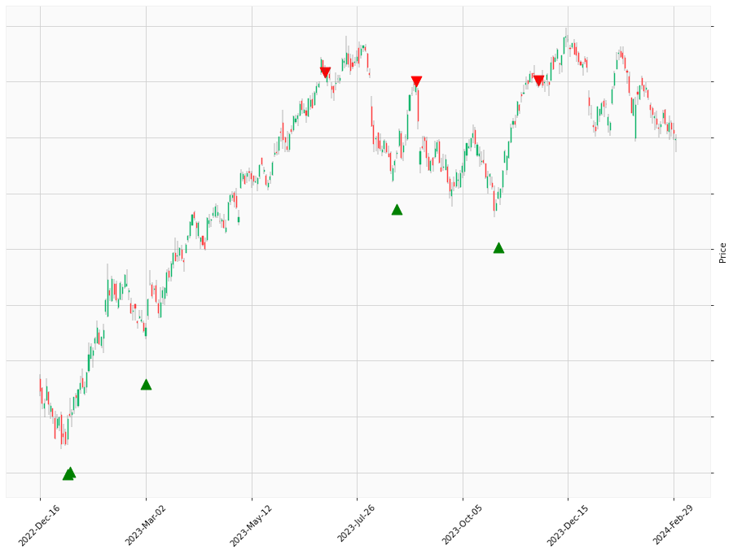

    

# Happy Labz Technologies

<nav class="px-3 markdown-body">
  <ul>
    <li><a href="">Home</a></li>
    <li><a href="">How to Use</a></li>
    <li><a href="">Use Case</a></li>
    <li><a href="">Contact</a></li>
  </ul>
</nav>

<table class="hits">
    <tr>
        <th>Direction</th>
        <th>Date</th>
      </tr>
    <tr>
        <td>Short</td>
        <td>Dec 14 2021 15:00 PST</td>
    </tr>
    <tr>
        <td>Short</td>
        <td>Dec 17 2021 15:00 PST</td>
    </tr>
    <tr>
        <td>Short</td>
        <td>Feb 11 2022 15:00 PST</td>
    </tr>
    <tr>
        <td>Short</td>
        <td>Apr 01 2022 15:00 PST</td>
    </tr>
    <tr>
        <td>Short</td>
        <td>Apr 06 2022 15:00 PST</td>
    </tr>
    <tr>
        <td>Short</td>
        <td>Aug 16 2022 15:00 PST</td>
    </tr>
    <tr>
        <td>Short</td>
        <td>Aug 19 2022 15:00 PST</td>
    </tr>
    <tr>
        <td>Long</td>
        <td>Oct 18 2022 15:00 PST</td>
    </tr>
    <tr>
        <td>Long</td>
        <td>Nov 11 2022 15:00 PST</td>
    </tr>
    <tr>
        <td>Long</td>
        <td>Jan 05 2023 15:00 PST</td>
    </tr>
    <tr>
        <td>Long</td>
        <td>Jan 06 2023 15:00 PST</td>
    </tr>
    <tr>
        <td>Long</td>
        <td>Mar 02 2023 15:00 PST</td>
    </tr>
    <tr>
        <td>Short</td>
        <td>Apr 04 2023 15:00 PST</td>
    </tr>
    <tr>
        <td>Short</td>
        <td>Apr 05 2023 15:00 PST</td>
    </tr>
    
</table>

<footer>
    <ul>
        <li>Copyright &copy; 2023 HappyLabz Technologies. All rights reserved.</li>
        <li style="float: right"><a href="mailto:mark@happylabz.tech?subject=Let's Talk">Contact Us</a></li>
    </ul>
</footer>
