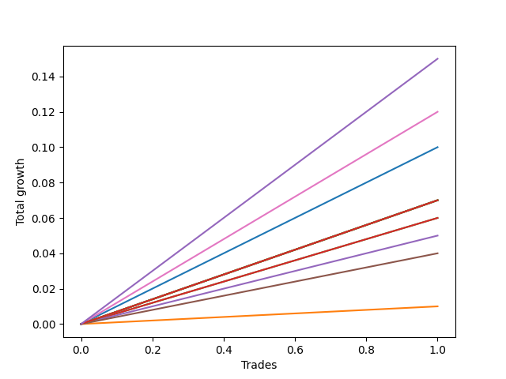

# Long Bernese 002 1v 
- Symbol: AAPL
- Date Range: 05/27/2022 - 09/30/2022
- Trading Period: 7:20-12:30
- Number of Trades: 1



| Name | Win Percent | Profit | Avg Profit / Trade | Avg Time / Trade |      | Name | Win Percent | Profit | Avg Profit / Trade | Avg Time / Trade |
| ---- | ----------- | ------ | ------------------ | ---------------- | ---- | ---- | ----------- | ------ | ------------------ | ---------------- |
| Sorted By <br> Profit | | | | | | Sorted By <br> Win Percentage ||||
| NEWFI 0000 | 100.00 | 75.00 | 75.00 | 50:05 |     | NEWFI 0000 | 100.00 | 75.00 | 75.00 | 50:05 |
| Five | 100.00 | 60.00 | 60.00 | 43:15 |     | Five | 100.00 | 60.00 | 60.00 | 43:15 |
| Zero | 100.00 | 50.00 | 50.00 | 03:20 |     | Zero | 100.00 | 50.00 | 50.00 | 03:20 |
| Eighty-Five | 100.00 | 35.00 | 35.00 | 59:55 |     | Eighty-Five | 100.00 | 35.00 | 35.00 | 59:55 |
| Eighty-Four | 100.00 | 35.00 | 35.00 | 59:55 |     | Eighty-Four | 100.00 | 35.00 | 35.00 | 59:55 |
| Eighty-Three | 100.00 | 35.00 | 35.00 | 59:55 |     | Eighty-Three | 100.00 | 35.00 | 35.00 | 59:55 |
| Eighty-Two | 100.00 | 35.00 | 35.00 | 59:55 |     | Eighty-Two | 100.00 | 35.00 | 35.00 | 59:55 |
| Eighty-One | 100.00 | 35.00 | 35.00 | 59:55 |     | Eighty-One | 100.00 | 35.00 | 35.00 | 59:55 |
| Seven | 100.00 | 35.00 | 35.00 | 59:55 |     | Seven | 100.00 | 35.00 | 35.00 | 59:55 |
| Six | 100.00 | 35.00 | 35.00 | 59:55 |     | Six | 100.00 | 35.00 | 35.00 | 59:55 |
| Two_C | 100.00 | 30.00 | 30.00 | 26:10 |     | Two_C | 100.00 | 30.00 | 30.00 | 26:10 |
| Two | 100.00 | 30.00 | 30.00 | 22:35 |     | Two | 100.00 | 30.00 | 30.00 | 22:35 |
| Three | 100.00 | 25.00 | 25.00 | 26:05 |     | Three | 100.00 | 25.00 | 25.00 | 26:05 |
| Four | 100.00 | 20.00 | 20.00 | 42:00 |     | Four | 100.00 | 20.00 | 20.00 | 42:00 |
| One | 100.00 | 5.00 | 5.00 | 12:25 |     | One | 100.00 | 5.00 | 5.00 | 12:25 |

## NO STOPLOSS

### Test Zero
* Sell when price hits the middle line of the 20p bollinger
* No Stoploss
* Results:
```
Total Trades: 1
Percent Up: 100.00
Percent Down: 0.00
Total Points Moved Up: 0.10
Potential Profit: 50.00
Total Points Ups: 0.10 Count Ups: 1
Total Points Downs: 0.00 Count Downs: 0
```

<details><summary>Trades</summary>

<code>In: 2022-06-27 10:51:00		Out: 2022-06-27 10:54:20		Total Position Time: 03:20		Total Move Up: 0.10		Total to Date: 0.10</code> <br />


</details>

### Test One
* Sell when the price hits the upper line of the 20p 1std bollinger
* No Stoploss
* Results:
```
Total Trades: 1
Percent Up: 100.00
Percent Down: 0.00
Total Points Moved Up: 0.01
Potential Profit: 5.00
Total Points Ups: 0.01 Count Ups: 1
Total Points Downs: 0.00 Count Downs: 0
```

<details><summary>Trades</summary>

<code>In: 2022-06-27 10:51:00		Out: 2022-06-27 11:03:25		Total Position Time: 12:25		Total Move Up: 0.01		Total to Date: 0.01</code> <br />


</details>

### Test Two
* Sell when the price hits the upper line of the 20p 2std bollinger
* No Stoploss
* Results:
```
Total Trades: 1
Percent Up: 100.00
Percent Down: 0.00
Total Points Moved Up: 0.06
Potential Profit: 30.00
Total Points Ups: 0.06 Count Ups: 1
Total Points Downs: 0.00 Count Downs: 0
```

<details><summary>Trades</summary>

<code>In: 2022-06-27 10:51:00		Out: 2022-06-27 11:13:35		Total Position Time: 22:35		Total Move Up: 0.06		Total to Date: 0.06</code> <br />


</details>

### Test Two_C
* Sell when the price hits the upper line of the 20p 2std bollinger
* No Stoploss
* Results:
```
Total Trades: 1
Percent Up: 100.00
Percent Down: 0.00
Total Points Moved Up: 0.06
Potential Profit: 30.00
Total Points Ups: 0.06 Count Ups: 1
Total Points Downs: 0.00 Count Downs: 0
```

<details><summary>Trades</summary>

<code>In: 2022-06-27 10:51:00		Out: 2022-06-27 11:17:10		Total Position Time: 26:10		Total Move Up: 0.06		Total to Date: 0.06</code> <br />


</details>

### Test Three
* Sell when price hits the middle line of the 50p bollinger
* No Stoploss
* Results:
```
Total Trades: 1
Percent Up: 100.00
Percent Down: 0.00
Total Points Moved Up: 0.05
Potential Profit: 25.00
Total Points Ups: 0.05 Count Ups: 1
Total Points Downs: 0.00 Count Downs: 0
```

<details><summary>Trades</summary>

<code>In: 2022-06-27 10:51:00		Out: 2022-06-27 11:17:05		Total Position Time: 26:05		Total Move Up: 0.05		Total to Date: 0.05</code> <br />


</details>

### Test Four
* Sell when the price hits the upper line of the 50p 1std bollinger
* No Stoploss
* Results:
```
Total Trades: 1
Percent Up: 100.00
Percent Down: 0.00
Total Points Moved Up: 0.04
Potential Profit: 20.00
Total Points Ups: 0.04 Count Ups: 1
Total Points Downs: 0.00 Count Downs: 0
```

<details><summary>Trades</summary>

<code>In: 2022-06-27 10:51:00		Out: 2022-06-27 11:33:00		Total Position Time: 42:00		Total Move Up: 0.04		Total to Date: 0.04</code> <br />


</details>

### Test Five
* Sell when the price hits the upper line of the 50p 2std bollinger
* No Stoploss
* Results:
```
Total Trades: 1
Percent Up: 100.00
Percent Down: 0.00
Total Points Moved Up: 0.12
Potential Profit: 60.00
Total Points Ups: 0.12 Count Ups: 1
Total Points Downs: 0.00 Count Downs: 0
```

<details><summary>Trades</summary>

<code>In: 2022-06-27 10:51:00		Out: 2022-06-27 11:34:15		Total Position Time: 43:15		Total Move Up: 0.12		Total to Date: 0.12</code> <br />


</details>

### Test Six
* Sell when the price hits the middle line of the 1std VWAP
* No Stoploss
* Results:
```
Total Trades: 1
Percent Up: 100.00
Percent Down: 0.00
Total Points Moved Up: 0.07
Potential Profit: 35.00
Total Points Ups: 0.07 Count Ups: 1
Total Points Downs: 0.00 Count Downs: 0
```

<details><summary>Trades</summary>

<code>In: 2022-06-27 10:51:00		Out: 2022-06-27 11:50:55		Total Position Time: 59:55		Total Move Up: 0.07		Total to Date: 0.07</code> <br />


</details>

### Test Seven
* Sell when the price hits the upper line of the 1std VWAP
* No Stoploss
* Results:
```
Total Trades: 1
Percent Up: 100.00
Percent Down: 0.00
Total Points Moved Up: 0.07
Potential Profit: 35.00
Total Points Ups: 0.07 Count Ups: 1
Total Points Downs: 0.00 Count Downs: 0
```

<details><summary>Trades</summary>

<code>In: 2022-06-27 10:51:00		Out: 2022-06-27 11:50:55		Total Position Time: 59:55		Total Move Up: 0.07		Total to Date: 0.07</code> <br />


</details>

## TAKE PROFIT

### Test Eighty-One
* Take Profit of 1 Point
* No Stoploss
* Results:
```
Total Trades: 1
Percent Up: 100.00
Percent Down: 0.00
Total Points Moved Up: 0.07
Potential Profit: 35.00
Total Points Ups: 0.07 Count Ups: 1
Total Points Downs: 0.00 Count Downs: 0
```

<details><summary>Trades</summary>

<code>In: 2022-06-27 10:51:00		Out: 2022-06-27 11:50:55		Total Position Time: 59:55		Total Move Up: 0.07		Total to Date: 0.07</code> <br />


</details>

### Test Eighty-Two
* Take Profit of 2 Point
* No Stoploss
* Results:
```
Total Trades: 1
Percent Up: 100.00
Percent Down: 0.00
Total Points Moved Up: 0.07
Potential Profit: 35.00
Total Points Ups: 0.07 Count Ups: 1
Total Points Downs: 0.00 Count Downs: 0
```

<details><summary>Trades</summary>

<code>In: 2022-06-27 10:51:00		Out: 2022-06-27 11:50:55		Total Position Time: 59:55		Total Move Up: 0.07		Total to Date: 0.07</code> <br />


</details>

### Test Eighty-Three
* Take Profit of 3 Point
* No Stoploss
* Results:
```
Total Trades: 1
Percent Up: 100.00
Percent Down: 0.00
Total Points Moved Up: 0.07
Potential Profit: 35.00
Total Points Ups: 0.07 Count Ups: 1
Total Points Downs: 0.00 Count Downs: 0
```

<details><summary>Trades</summary>

<code>In: 2022-06-27 10:51:00		Out: 2022-06-27 11:50:55		Total Position Time: 59:55		Total Move Up: 0.07		Total to Date: 0.07</code> <br />


</details>

### Test Eighty-Four
* Take Profit of 4 Point
* No Stoploss
* Results:
```
Total Trades: 1
Percent Up: 100.00
Percent Down: 0.00
Total Points Moved Up: 0.07
Potential Profit: 35.00
Total Points Ups: 0.07 Count Ups: 1
Total Points Downs: 0.00 Count Downs: 0
```

<details><summary>Trades</summary>

<code>In: 2022-06-27 10:51:00		Out: 2022-06-27 11:50:55		Total Position Time: 59:55		Total Move Up: 0.07		Total to Date: 0.07</code> <br />


</details>

### Test Eighty-Five
* Take Profit of 5 Point
* No Stoploss
* Results:
```
Total Trades: 1
Percent Up: 100.00
Percent Down: 0.00
Total Points Moved Up: 0.07
Potential Profit: 35.00
Total Points Ups: 0.07 Count Ups: 1
Total Points Downs: 0.00 Count Downs: 0
```

<details><summary>Trades</summary>

<code>In: 2022-06-27 10:51:00		Out: 2022-06-27 11:50:55		Total Position Time: 59:55		Total Move Up: 0.07		Total to Date: 0.07</code> <br />


</details>

## Indicator Exits

### Test NEWFI 0000
* Newfi 0000
* No Stoploss
* Results:
```
Total Trades: 1
Percent Up: 100.00
Percent Down: 0.00
Total Points Moved Up: 0.15
Potential Profit: 75.00
Total Points Ups: 0.15 Count Ups: 1
Total Points Downs: 0.00 Count Downs: 0
```

<details><summary>Trades</summary>

<code>In: 2022-06-27 10:51:00		Out: 2022-06-27 11:41:05		Total Position Time: 50:05		Total Move Up: 0.15		Total to Date: 0.15</code> <br />


</details>