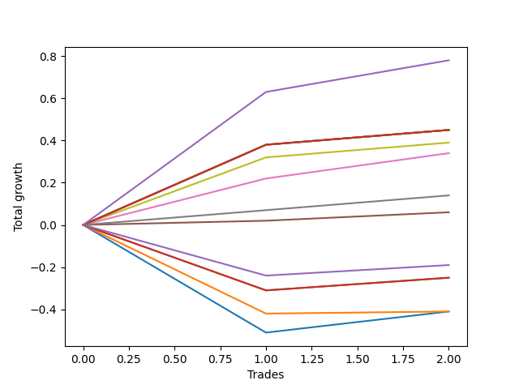

# Long Bernese 002 50 
- Symbol: AAPL
- Date Range: 05/27/2022 - 09/30/2022
- Trading Period: 7:20-12:30
- Number of Trades: 2



| Name | Win Percent | Profit | Avg Profit / Trade | Avg Time / Trade |      | Name | Win Percent | Profit | Avg Profit / Trade | Avg Time / Trade |
| ---- | ----------- | ------ | ------------------ | ---------------- | ---- | ---- | ----------- | ------ | ------------------ | ---------------- |
| Sorted By <br> Profit | | | | | | Sorted By <br> Win Percentage ||||
| NEWFI 0000 | 100.00 | 390.00 | 195.00 | 48:35 |     | NEWFI 0000 | 100.00 | 390.00 | 195.00 | 48:35 |
| Eighty-Five | 100.00 | 225.00 | 112.50 | 56:27 |     | Eighty-Five | 100.00 | 225.00 | 112.50 | 56:27 |
| Eighty-Four | 100.00 | 225.00 | 112.50 | 56:27 |     | Eighty-Four | 100.00 | 225.00 | 112.50 | 56:27 |
| Eighty-Three | 100.00 | 225.00 | 112.50 | 56:27 |     | Eighty-Three | 100.00 | 225.00 | 112.50 | 56:27 |
| Eighty-Two | 100.00 | 225.00 | 112.50 | 56:27 |     | Eighty-Two | 100.00 | 225.00 | 112.50 | 56:27 |
| Eighty-One | 100.00 | 225.00 | 112.50 | 56:27 |     | Eighty-One | 100.00 | 225.00 | 112.50 | 56:27 |
| Seven | 100.00 | 195.00 | 97.50 | 52:15 |     | Seven | 100.00 | 195.00 | 97.50 | 52:15 |
| Five | 100.00 | 170.00 | 85.00 | 43:12 |     | Five | 100.00 | 170.00 | 85.00 | 43:12 |
| Six | 100.00 | 70.00 | 35.00 | 30:02 |     | Six | 100.00 | 70.00 | 35.00 | 30:02 |
| Four | 100.00 | 30.00 | 15.00 | 39:47 |     | Four | 100.00 | 30.00 | 15.00 | 39:47 |
| Three | 50.00 | -95.00 | -47.50 | 30:12 |     | Three | 50.00 | -95.00 | -47.50 | 30:12 |
| Two_C | 50.00 | -125.00 | -62.50 | 30:10 |     | Two_C | 50.00 | -125.00 | -62.50 | 30:10 |
| Two | 50.00 | -125.00 | -62.50 | 28:22 |     | Two | 50.00 | -125.00 | -62.50 | 28:22 |
| One | 50.00 | -205.00 | -102.50 | 22:32 |     | One | 50.00 | -205.00 | -102.50 | 22:32 |
| Zero | 50.00 | -205.00 | -102.50 | 16:12 |     | Zero | 50.00 | -205.00 | -102.50 | 16:12 |

## NO STOPLOSS

### Test Zero
* Sell when price hits the middle line of the 20p bollinger
* No Stoploss
* Results:
```
Total Trades: 2
Percent Up: 50.00
Percent Down: 50.00
Total Points Moved Up: -0.41
Potential Profit: -205.00
Total Points Ups: 0.10 Count Ups: 1
Total Points Downs: -0.51 Count Downs: 1
```

<details><summary>Trades</summary>

<code>In: 2022-06-14 11:53:00		Out: 2022-06-14 12:22:05		Total Position Time: 29:05		Total Move Up: -0.51		Total to Date: -0.51</code> <br />
<code>In: 2022-06-27 10:51:00		Out: 2022-06-27 10:54:20		Total Position Time: 03:20		Total Move Up: 0.10		Total to Date: -0.41</code> <br />


</details>

### Test One
* Sell when the price hits the upper line of the 20p 1std bollinger
* No Stoploss
* Results:
```
Total Trades: 2
Percent Up: 50.00
Percent Down: 50.00
Total Points Moved Up: -0.41
Potential Profit: -205.00
Total Points Ups: 0.01 Count Ups: 1
Total Points Downs: -0.42 Count Downs: 1
```

<details><summary>Trades</summary>

<code>In: 2022-06-14 11:53:00		Out: 2022-06-14 12:25:40		Total Position Time: 32:40		Total Move Up: -0.42		Total to Date: -0.42</code> <br />
<code>In: 2022-06-27 10:51:00		Out: 2022-06-27 11:03:25		Total Position Time: 12:25		Total Move Up: 0.01		Total to Date: -0.41</code> <br />


</details>

### Test Two
* Sell when the price hits the upper line of the 20p 2std bollinger
* No Stoploss
* Results:
```
Total Trades: 2
Percent Up: 50.00
Percent Down: 50.00
Total Points Moved Up: -0.25
Potential Profit: -125.00
Total Points Ups: 0.06 Count Ups: 1
Total Points Downs: -0.31 Count Downs: 1
```

<details><summary>Trades</summary>

<code>In: 2022-06-14 11:53:00		Out: 2022-06-14 12:27:10		Total Position Time: 34:10		Total Move Up: -0.31		Total to Date: -0.31</code> <br />
<code>In: 2022-06-27 10:51:00		Out: 2022-06-27 11:13:35		Total Position Time: 22:35		Total Move Up: 0.06		Total to Date: -0.25</code> <br />


</details>

### Test Two_C
* Sell when the price hits the upper line of the 20p 2std bollinger
* No Stoploss
* Results:
```
Total Trades: 2
Percent Up: 50.00
Percent Down: 50.00
Total Points Moved Up: -0.25
Potential Profit: -125.00
Total Points Ups: 0.06 Count Ups: 1
Total Points Downs: -0.31 Count Downs: 1
```

<details><summary>Trades</summary>

<code>In: 2022-06-14 11:53:00		Out: 2022-06-14 12:27:10		Total Position Time: 34:10		Total Move Up: -0.31		Total to Date: -0.31</code> <br />
<code>In: 2022-06-27 10:51:00		Out: 2022-06-27 11:17:10		Total Position Time: 26:10		Total Move Up: 0.06		Total to Date: -0.25</code> <br />


</details>

### Test Three
* Sell when price hits the middle line of the 50p bollinger
* No Stoploss
* Results:
```
Total Trades: 2
Percent Up: 50.00
Percent Down: 50.00
Total Points Moved Up: -0.19
Potential Profit: -95.00
Total Points Ups: 0.05 Count Ups: 1
Total Points Downs: -0.24 Count Downs: 1
```

<details><summary>Trades</summary>

<code>In: 2022-06-14 11:53:00		Out: 2022-06-14 12:27:20		Total Position Time: 34:20		Total Move Up: -0.24		Total to Date: -0.24</code> <br />
<code>In: 2022-06-27 10:51:00		Out: 2022-06-27 11:17:05		Total Position Time: 26:05		Total Move Up: 0.05		Total to Date: -0.19</code> <br />


</details>

### Test Four
* Sell when the price hits the upper line of the 50p 1std bollinger
* No Stoploss
* Results:
```
Total Trades: 2
Percent Up: 100.00
Percent Down: 0.00
Total Points Moved Up: 0.06
Potential Profit: 30.00
Total Points Ups: 0.06 Count Ups: 2
Total Points Downs: 0.00 Count Downs: 0
```

<details><summary>Trades</summary>

<code>In: 2022-06-14 11:53:00		Out: 2022-06-14 12:30:35		Total Position Time: 37:35		Total Move Up: 0.02		Total to Date: 0.02</code> <br />
<code>In: 2022-06-27 10:51:00		Out: 2022-06-27 11:33:00		Total Position Time: 42:00		Total Move Up: 0.04		Total to Date: 0.06</code> <br />


</details>

### Test Five
* Sell when the price hits the upper line of the 50p 2std bollinger
* No Stoploss
* Results:
```
Total Trades: 2
Percent Up: 100.00
Percent Down: 0.00
Total Points Moved Up: 0.34
Potential Profit: 170.00
Total Points Ups: 0.34 Count Ups: 2
Total Points Downs: 0.00 Count Downs: 0
```

<details><summary>Trades</summary>

<code>In: 2022-06-14 11:53:00		Out: 2022-06-14 12:36:10		Total Position Time: 43:10		Total Move Up: 0.22		Total to Date: 0.22</code> <br />
<code>In: 2022-06-27 10:51:00		Out: 2022-06-27 11:34:15		Total Position Time: 43:15		Total Move Up: 0.12		Total to Date: 0.34</code> <br />


</details>

### Test Six
* Sell when the price hits the middle line of the 1std VWAP
* No Stoploss
* Results:
```
Total Trades: 2
Percent Up: 100.00
Percent Down: 0.00
Total Points Moved Up: 0.14
Potential Profit: 70.00
Total Points Ups: 0.14 Count Ups: 2
Total Points Downs: 0.00 Count Downs: 0
```

<details><summary>Trades</summary>

<code>In: 2022-06-14 11:53:00		Out: 2022-06-14 11:53:10		Total Position Time: 00:10		Total Move Up: 0.07		Total to Date: 0.07</code> <br />
<code>In: 2022-06-27 10:51:00		Out: 2022-06-27 11:50:55		Total Position Time: 59:55		Total Move Up: 0.07		Total to Date: 0.14</code> <br />


</details>

### Test Seven
* Sell when the price hits the upper line of the 1std VWAP
* No Stoploss
* Results:
```
Total Trades: 2
Percent Up: 100.00
Percent Down: 0.00
Total Points Moved Up: 0.39
Potential Profit: 195.00
Total Points Ups: 0.39 Count Ups: 2
Total Points Downs: 0.00 Count Downs: 0
```

<details><summary>Trades</summary>

<code>In: 2022-06-14 11:53:00		Out: 2022-06-14 12:37:35		Total Position Time: 44:35		Total Move Up: 0.32		Total to Date: 0.32</code> <br />
<code>In: 2022-06-27 10:51:00		Out: 2022-06-27 11:50:55		Total Position Time: 59:55		Total Move Up: 0.07		Total to Date: 0.39</code> <br />


</details>

## TAKE PROFIT

### Test Eighty-One
* Take Profit of 1 Point
* No Stoploss
* Results:
```
Total Trades: 2
Percent Up: 100.00
Percent Down: 0.00
Total Points Moved Up: 0.45
Potential Profit: 225.00
Total Points Ups: 0.45 Count Ups: 2
Total Points Downs: 0.00 Count Downs: 0
```

<details><summary>Trades</summary>

<code>In: 2022-06-14 11:53:00		Out: 2022-06-14 12:46:00		Total Position Time: 53:00		Total Move Up: 0.38		Total to Date: 0.38</code> <br />
<code>In: 2022-06-27 10:51:00		Out: 2022-06-27 11:50:55		Total Position Time: 59:55		Total Move Up: 0.07		Total to Date: 0.45</code> <br />


</details>

### Test Eighty-Two
* Take Profit of 2 Point
* No Stoploss
* Results:
```
Total Trades: 2
Percent Up: 100.00
Percent Down: 0.00
Total Points Moved Up: 0.45
Potential Profit: 225.00
Total Points Ups: 0.45 Count Ups: 2
Total Points Downs: 0.00 Count Downs: 0
```

<details><summary>Trades</summary>

<code>In: 2022-06-14 11:53:00		Out: 2022-06-14 12:46:00		Total Position Time: 53:00		Total Move Up: 0.38		Total to Date: 0.38</code> <br />
<code>In: 2022-06-27 10:51:00		Out: 2022-06-27 11:50:55		Total Position Time: 59:55		Total Move Up: 0.07		Total to Date: 0.45</code> <br />


</details>

### Test Eighty-Three
* Take Profit of 3 Point
* No Stoploss
* Results:
```
Total Trades: 2
Percent Up: 100.00
Percent Down: 0.00
Total Points Moved Up: 0.45
Potential Profit: 225.00
Total Points Ups: 0.45 Count Ups: 2
Total Points Downs: 0.00 Count Downs: 0
```

<details><summary>Trades</summary>

<code>In: 2022-06-14 11:53:00		Out: 2022-06-14 12:46:00		Total Position Time: 53:00		Total Move Up: 0.38		Total to Date: 0.38</code> <br />
<code>In: 2022-06-27 10:51:00		Out: 2022-06-27 11:50:55		Total Position Time: 59:55		Total Move Up: 0.07		Total to Date: 0.45</code> <br />


</details>

### Test Eighty-Four
* Take Profit of 4 Point
* No Stoploss
* Results:
```
Total Trades: 2
Percent Up: 100.00
Percent Down: 0.00
Total Points Moved Up: 0.45
Potential Profit: 225.00
Total Points Ups: 0.45 Count Ups: 2
Total Points Downs: 0.00 Count Downs: 0
```

<details><summary>Trades</summary>

<code>In: 2022-06-14 11:53:00		Out: 2022-06-14 12:46:00		Total Position Time: 53:00		Total Move Up: 0.38		Total to Date: 0.38</code> <br />
<code>In: 2022-06-27 10:51:00		Out: 2022-06-27 11:50:55		Total Position Time: 59:55		Total Move Up: 0.07		Total to Date: 0.45</code> <br />


</details>

### Test Eighty-Five
* Take Profit of 5 Point
* No Stoploss
* Results:
```
Total Trades: 2
Percent Up: 100.00
Percent Down: 0.00
Total Points Moved Up: 0.45
Potential Profit: 225.00
Total Points Ups: 0.45 Count Ups: 2
Total Points Downs: 0.00 Count Downs: 0
```

<details><summary>Trades</summary>

<code>In: 2022-06-14 11:53:00		Out: 2022-06-14 12:46:00		Total Position Time: 53:00		Total Move Up: 0.38		Total to Date: 0.38</code> <br />
<code>In: 2022-06-27 10:51:00		Out: 2022-06-27 11:50:55		Total Position Time: 59:55		Total Move Up: 0.07		Total to Date: 0.45</code> <br />


</details>

## Indicator Exits

### Test NEWFI 0000
* Newfi 0000
* No Stoploss
* Results:
```
Total Trades: 2
Percent Up: 100.00
Percent Down: 0.00
Total Points Moved Up: 0.78
Potential Profit: 390.00
Total Points Ups: 0.78 Count Ups: 2
Total Points Downs: 0.00 Count Downs: 0
```

<details><summary>Trades</summary>

<code>In: 2022-06-14 11:53:00		Out: 2022-06-14 12:40:05		Total Position Time: 47:05		Total Move Up: 0.63		Total to Date: 0.63</code> <br />
<code>In: 2022-06-27 10:51:00		Out: 2022-06-27 11:41:05		Total Position Time: 50:05		Total Move Up: 0.15		Total to Date: 0.78</code> <br />


</details>