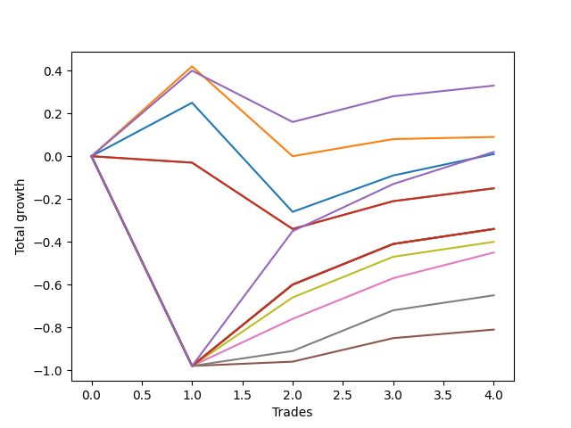

# Long Bernese 003 50 
- Symbol: AAPL
- Date Range: 05/27/2022 - 09/30/2022
- Trading Period: 7:20-12:30
- Number of Trades: 4



| Name | Win Percent | Profit | Avg Profit / Trade | Avg Time / Trade |      | Name | Win Percent | Profit | Avg Profit / Trade | Avg Time / Trade |
| ---- | ----------- | ------ | ------------------ | ---------------- | ---- | ---- | ----------- | ------ | ------------------ | ---------------- |
| Sorted By <br> Profit | | | | | | Sorted By <br> Win Percentage ||||
| Three | 75.00 | 165.00 | 41.25 | 23:37 |     | Three | 75.00 | 165.00 | 41.25 | 23:37 |
| One | 75.00 | 45.00 | 11.25 | 16:20 |     | One | 75.00 | 45.00 | 11.25 | 16:20 |
| NEWFI 0000 | 75.00 | 10.00 | 2.50 | 52:02 |     | NEWFI 0000 | 75.00 | 10.00 | 2.50 | 52:02 |
| Zero | 75.00 | 5.00 | 1.25 | 09:37 |     | Zero | 75.00 | 5.00 | 1.25 | 09:37 |
| Two_C | 50.00 | -75.00 | -18.75 | 32:26 |     | Eighty-Five | 75.00 | -170.00 | -42.50 | 58:11 |
| Two | 50.00 | -75.00 | -18.75 | 30:38 |     | Eighty-Four | 75.00 | -170.00 | -42.50 | 58:11 |
| Eighty-Five | 75.00 | -170.00 | -42.50 | 58:11 |     | Eighty-Three | 75.00 | -170.00 | -42.50 | 58:11 |
| Eighty-Four | 75.00 | -170.00 | -42.50 | 58:11 |     | Eighty-Two | 75.00 | -170.00 | -42.50 | 58:11 |
| Eighty-Three | 75.00 | -170.00 | -42.50 | 58:11 |     | Eighty-One | 75.00 | -170.00 | -42.50 | 58:11 |
| Eighty-Two | 75.00 | -170.00 | -42.50 | 58:11 |     | Seven | 75.00 | -200.00 | -50.00 | 56:05 |
| Eighty-One | 75.00 | -170.00 | -42.50 | 58:11 |     | Five | 75.00 | -225.00 | -56.25 | 47:38 |
| Seven | 75.00 | -200.00 | -50.00 | 56:05 |     | Six | 75.00 | -325.00 | -81.25 | 44:58 |
| Five | 75.00 | -225.00 | -56.25 | 47:38 |     | Four | 75.00 | -405.00 | -101.25 | 45:37 |
| Six | 75.00 | -325.00 | -81.25 | 44:58 |     | Two_C | 50.00 | -75.00 | -18.75 | 32:26 |
| Four | 75.00 | -405.00 | -101.25 | 45:37 |     | Two | 50.00 | -75.00 | -18.75 | 30:38 |

## NO STOPLOSS

### Test Zero
* Sell when price hits the middle line of the 20p bollinger
* No Stoploss
* Results:
```
Total Trades: 4
Percent Up: 75.00
Percent Down: 25.00
Total Points Moved Up: 0.01
Potential Profit: 5.00
Total Points Ups: 0.52 Count Ups: 3
Total Points Downs: -0.51 Count Downs: 1
```

<details><summary>Trades</summary>

<code>In: 2022-06-13 11:35:00		Out: 2022-06-13 11:36:45		Total Position Time: 01:45		Total Move Up: 0.25		Total to Date: 0.25</code> <br />
<code>In: 2022-06-14 11:53:00		Out: 2022-06-14 12:22:05		Total Position Time: 29:05		Total Move Up: -0.51		Total to Date: -0.26</code> <br />
<code>In: 2022-06-27 10:50:00		Out: 2022-06-27 10:54:20		Total Position Time: 04:20		Total Move Up: 0.17		Total to Date: -0.09</code> <br />
<code>In: 2022-06-27 10:51:00		Out: 2022-06-27 10:54:20		Total Position Time: 03:20		Total Move Up: 0.10		Total to Date: 0.01</code> <br />


</details>

### Test One
* Sell when the price hits the upper line of the 20p 1std bollinger
* No Stoploss
* Results:
```
Total Trades: 4
Percent Up: 75.00
Percent Down: 25.00
Total Points Moved Up: 0.09
Potential Profit: 45.00
Total Points Ups: 0.51 Count Ups: 3
Total Points Downs: -0.42 Count Downs: 1
```

<details><summary>Trades</summary>

<code>In: 2022-06-13 11:35:00		Out: 2022-06-13 11:41:50		Total Position Time: 06:50		Total Move Up: 0.42		Total to Date: 0.42</code> <br />
<code>In: 2022-06-14 11:53:00		Out: 2022-06-14 12:25:40		Total Position Time: 32:40		Total Move Up: -0.42		Total to Date: 0.00</code> <br />
<code>In: 2022-06-27 10:50:00		Out: 2022-06-27 11:03:25		Total Position Time: 13:25		Total Move Up: 0.08		Total to Date: 0.08</code> <br />
<code>In: 2022-06-27 10:51:00		Out: 2022-06-27 11:03:25		Total Position Time: 12:25		Total Move Up: 0.01		Total to Date: 0.09</code> <br />


</details>

### Test Two
* Sell when the price hits the upper line of the 20p 2std bollinger
* No Stoploss
* Results:
```
Total Trades: 4
Percent Up: 50.00
Percent Down: 50.00
Total Points Moved Up: -0.15
Potential Profit: -75.00
Total Points Ups: 0.19 Count Ups: 2
Total Points Downs: -0.34 Count Downs: 2
```

<details><summary>Trades</summary>

<code>In: 2022-06-13 11:35:00		Out: 2022-06-13 12:17:15		Total Position Time: 42:15		Total Move Up: -0.03		Total to Date: -0.03</code> <br />
<code>In: 2022-06-14 11:53:00		Out: 2022-06-14 12:27:10		Total Position Time: 34:10		Total Move Up: -0.31		Total to Date: -0.34</code> <br />
<code>In: 2022-06-27 10:50:00		Out: 2022-06-27 11:13:35		Total Position Time: 23:35		Total Move Up: 0.13		Total to Date: -0.21</code> <br />
<code>In: 2022-06-27 10:51:00		Out: 2022-06-27 11:13:35		Total Position Time: 22:35		Total Move Up: 0.06		Total to Date: -0.15</code> <br />


</details>

### Test Two_C
* Sell when the price hits the upper line of the 20p 2std bollinger
* No Stoploss
* Results:
```
Total Trades: 4
Percent Up: 50.00
Percent Down: 50.00
Total Points Moved Up: -0.15
Potential Profit: -75.00
Total Points Ups: 0.19 Count Ups: 2
Total Points Downs: -0.34 Count Downs: 2
```

<details><summary>Trades</summary>

<code>In: 2022-06-13 11:35:00		Out: 2022-06-13 12:17:15		Total Position Time: 42:15		Total Move Up: -0.03		Total to Date: -0.03</code> <br />
<code>In: 2022-06-14 11:53:00		Out: 2022-06-14 12:27:10		Total Position Time: 34:10		Total Move Up: -0.31		Total to Date: -0.34</code> <br />
<code>In: 2022-06-27 10:50:00		Out: 2022-06-27 11:17:10		Total Position Time: 27:10		Total Move Up: 0.13		Total to Date: -0.21</code> <br />
<code>In: 2022-06-27 10:51:00		Out: 2022-06-27 11:17:10		Total Position Time: 26:10		Total Move Up: 0.06		Total to Date: -0.15</code> <br />


</details>

### Test Three
* Sell when price hits the middle line of the 50p bollinger
* No Stoploss
* Results:
```
Total Trades: 4
Percent Up: 75.00
Percent Down: 25.00
Total Points Moved Up: 0.33
Potential Profit: 165.00
Total Points Ups: 0.57 Count Ups: 3
Total Points Downs: -0.24 Count Downs: 1
```

<details><summary>Trades</summary>

<code>In: 2022-06-13 11:35:00		Out: 2022-06-13 11:42:00		Total Position Time: 07:00		Total Move Up: 0.40		Total to Date: 0.40</code> <br />
<code>In: 2022-06-14 11:53:00		Out: 2022-06-14 12:27:20		Total Position Time: 34:20		Total Move Up: -0.24		Total to Date: 0.16</code> <br />
<code>In: 2022-06-27 10:50:00		Out: 2022-06-27 11:17:05		Total Position Time: 27:05		Total Move Up: 0.12		Total to Date: 0.28</code> <br />
<code>In: 2022-06-27 10:51:00		Out: 2022-06-27 11:17:05		Total Position Time: 26:05		Total Move Up: 0.05		Total to Date: 0.33</code> <br />


</details>

### Test Four
* Sell when the price hits the upper line of the 50p 1std bollinger
* No Stoploss
* Results:
```
Total Trades: 4
Percent Up: 75.00
Percent Down: 25.00
Total Points Moved Up: -0.81
Potential Profit: -405.00
Total Points Ups: 0.17 Count Ups: 3
Total Points Downs: -0.98 Count Downs: 1
```

<details><summary>Trades</summary>

<code>In: 2022-06-13 11:35:00		Out: 2022-06-13 12:34:55		Total Position Time: 59:55		Total Move Up: -0.98		Total to Date: -0.98</code> <br />
<code>In: 2022-06-14 11:53:00		Out: 2022-06-14 12:30:35		Total Position Time: 37:35		Total Move Up: 0.02		Total to Date: -0.96</code> <br />
<code>In: 2022-06-27 10:50:00		Out: 2022-06-27 11:33:00		Total Position Time: 43:00		Total Move Up: 0.11		Total to Date: -0.85</code> <br />
<code>In: 2022-06-27 10:51:00		Out: 2022-06-27 11:33:00		Total Position Time: 42:00		Total Move Up: 0.04		Total to Date: -0.81</code> <br />


</details>

### Test Five
* Sell when the price hits the upper line of the 50p 2std bollinger
* No Stoploss
* Results:
```
Total Trades: 4
Percent Up: 75.00
Percent Down: 25.00
Total Points Moved Up: -0.45
Potential Profit: -225.00
Total Points Ups: 0.53 Count Ups: 3
Total Points Downs: -0.98 Count Downs: 1
```

<details><summary>Trades</summary>

<code>In: 2022-06-13 11:35:00		Out: 2022-06-13 12:34:55		Total Position Time: 59:55		Total Move Up: -0.98		Total to Date: -0.98</code> <br />
<code>In: 2022-06-14 11:53:00		Out: 2022-06-14 12:36:10		Total Position Time: 43:10		Total Move Up: 0.22		Total to Date: -0.76</code> <br />
<code>In: 2022-06-27 10:50:00		Out: 2022-06-27 11:34:15		Total Position Time: 44:15		Total Move Up: 0.19		Total to Date: -0.57</code> <br />
<code>In: 2022-06-27 10:51:00		Out: 2022-06-27 11:34:15		Total Position Time: 43:15		Total Move Up: 0.12		Total to Date: -0.45</code> <br />


</details>

### Test Six
* Sell when the price hits the middle line of the 1std VWAP
* No Stoploss
* Results:
```
Total Trades: 4
Percent Up: 75.00
Percent Down: 25.00
Total Points Moved Up: -0.65
Potential Profit: -325.00
Total Points Ups: 0.33 Count Ups: 3
Total Points Downs: -0.98 Count Downs: 1
```

<details><summary>Trades</summary>

<code>In: 2022-06-13 11:35:00		Out: 2022-06-13 12:34:55		Total Position Time: 59:55		Total Move Up: -0.98		Total to Date: -0.98</code> <br />
<code>In: 2022-06-14 11:53:00		Out: 2022-06-14 11:53:10		Total Position Time: 00:10		Total Move Up: 0.07		Total to Date: -0.91</code> <br />
<code>In: 2022-06-27 10:50:00		Out: 2022-06-27 11:49:55		Total Position Time: 59:55		Total Move Up: 0.19		Total to Date: -0.72</code> <br />
<code>In: 2022-06-27 10:51:00		Out: 2022-06-27 11:50:55		Total Position Time: 59:55		Total Move Up: 0.07		Total to Date: -0.65</code> <br />


</details>

### Test Seven
* Sell when the price hits the upper line of the 1std VWAP
* No Stoploss
* Results:
```
Total Trades: 4
Percent Up: 75.00
Percent Down: 25.00
Total Points Moved Up: -0.40
Potential Profit: -200.00
Total Points Ups: 0.58 Count Ups: 3
Total Points Downs: -0.98 Count Downs: 1
```

<details><summary>Trades</summary>

<code>In: 2022-06-13 11:35:00		Out: 2022-06-13 12:34:55		Total Position Time: 59:55		Total Move Up: -0.98		Total to Date: -0.98</code> <br />
<code>In: 2022-06-14 11:53:00		Out: 2022-06-14 12:37:35		Total Position Time: 44:35		Total Move Up: 0.32		Total to Date: -0.66</code> <br />
<code>In: 2022-06-27 10:50:00		Out: 2022-06-27 11:49:55		Total Position Time: 59:55		Total Move Up: 0.19		Total to Date: -0.47</code> <br />
<code>In: 2022-06-27 10:51:00		Out: 2022-06-27 11:50:55		Total Position Time: 59:55		Total Move Up: 0.07		Total to Date: -0.40</code> <br />


</details>

## TAKE PROFIT

### Test Eighty-One
* Take Profit of 1 Point
* No Stoploss
* Results:
```
Total Trades: 4
Percent Up: 75.00
Percent Down: 25.00
Total Points Moved Up: -0.34
Potential Profit: -170.00
Total Points Ups: 0.64 Count Ups: 3
Total Points Downs: -0.98 Count Downs: 1
```

<details><summary>Trades</summary>

<code>In: 2022-06-13 11:35:00		Out: 2022-06-13 12:34:55		Total Position Time: 59:55		Total Move Up: -0.98		Total to Date: -0.98</code> <br />
<code>In: 2022-06-14 11:53:00		Out: 2022-06-14 12:46:00		Total Position Time: 53:00		Total Move Up: 0.38		Total to Date: -0.60</code> <br />
<code>In: 2022-06-27 10:50:00		Out: 2022-06-27 11:49:55		Total Position Time: 59:55		Total Move Up: 0.19		Total to Date: -0.41</code> <br />
<code>In: 2022-06-27 10:51:00		Out: 2022-06-27 11:50:55		Total Position Time: 59:55		Total Move Up: 0.07		Total to Date: -0.34</code> <br />


</details>

### Test Eighty-Two
* Take Profit of 2 Point
* No Stoploss
* Results:
```
Total Trades: 4
Percent Up: 75.00
Percent Down: 25.00
Total Points Moved Up: -0.34
Potential Profit: -170.00
Total Points Ups: 0.64 Count Ups: 3
Total Points Downs: -0.98 Count Downs: 1
```

<details><summary>Trades</summary>

<code>In: 2022-06-13 11:35:00		Out: 2022-06-13 12:34:55		Total Position Time: 59:55		Total Move Up: -0.98		Total to Date: -0.98</code> <br />
<code>In: 2022-06-14 11:53:00		Out: 2022-06-14 12:46:00		Total Position Time: 53:00		Total Move Up: 0.38		Total to Date: -0.60</code> <br />
<code>In: 2022-06-27 10:50:00		Out: 2022-06-27 11:49:55		Total Position Time: 59:55		Total Move Up: 0.19		Total to Date: -0.41</code> <br />
<code>In: 2022-06-27 10:51:00		Out: 2022-06-27 11:50:55		Total Position Time: 59:55		Total Move Up: 0.07		Total to Date: -0.34</code> <br />


</details>

### Test Eighty-Three
* Take Profit of 3 Point
* No Stoploss
* Results:
```
Total Trades: 4
Percent Up: 75.00
Percent Down: 25.00
Total Points Moved Up: -0.34
Potential Profit: -170.00
Total Points Ups: 0.64 Count Ups: 3
Total Points Downs: -0.98 Count Downs: 1
```

<details><summary>Trades</summary>

<code>In: 2022-06-13 11:35:00		Out: 2022-06-13 12:34:55		Total Position Time: 59:55		Total Move Up: -0.98		Total to Date: -0.98</code> <br />
<code>In: 2022-06-14 11:53:00		Out: 2022-06-14 12:46:00		Total Position Time: 53:00		Total Move Up: 0.38		Total to Date: -0.60</code> <br />
<code>In: 2022-06-27 10:50:00		Out: 2022-06-27 11:49:55		Total Position Time: 59:55		Total Move Up: 0.19		Total to Date: -0.41</code> <br />
<code>In: 2022-06-27 10:51:00		Out: 2022-06-27 11:50:55		Total Position Time: 59:55		Total Move Up: 0.07		Total to Date: -0.34</code> <br />


</details>

### Test Eighty-Four
* Take Profit of 4 Point
* No Stoploss
* Results:
```
Total Trades: 4
Percent Up: 75.00
Percent Down: 25.00
Total Points Moved Up: -0.34
Potential Profit: -170.00
Total Points Ups: 0.64 Count Ups: 3
Total Points Downs: -0.98 Count Downs: 1
```

<details><summary>Trades</summary>

<code>In: 2022-06-13 11:35:00		Out: 2022-06-13 12:34:55		Total Position Time: 59:55		Total Move Up: -0.98		Total to Date: -0.98</code> <br />
<code>In: 2022-06-14 11:53:00		Out: 2022-06-14 12:46:00		Total Position Time: 53:00		Total Move Up: 0.38		Total to Date: -0.60</code> <br />
<code>In: 2022-06-27 10:50:00		Out: 2022-06-27 11:49:55		Total Position Time: 59:55		Total Move Up: 0.19		Total to Date: -0.41</code> <br />
<code>In: 2022-06-27 10:51:00		Out: 2022-06-27 11:50:55		Total Position Time: 59:55		Total Move Up: 0.07		Total to Date: -0.34</code> <br />


</details>

### Test Eighty-Five
* Take Profit of 5 Point
* No Stoploss
* Results:
```
Total Trades: 4
Percent Up: 75.00
Percent Down: 25.00
Total Points Moved Up: -0.34
Potential Profit: -170.00
Total Points Ups: 0.64 Count Ups: 3
Total Points Downs: -0.98 Count Downs: 1
```

<details><summary>Trades</summary>

<code>In: 2022-06-13 11:35:00		Out: 2022-06-13 12:34:55		Total Position Time: 59:55		Total Move Up: -0.98		Total to Date: -0.98</code> <br />
<code>In: 2022-06-14 11:53:00		Out: 2022-06-14 12:46:00		Total Position Time: 53:00		Total Move Up: 0.38		Total to Date: -0.60</code> <br />
<code>In: 2022-06-27 10:50:00		Out: 2022-06-27 11:49:55		Total Position Time: 59:55		Total Move Up: 0.19		Total to Date: -0.41</code> <br />
<code>In: 2022-06-27 10:51:00		Out: 2022-06-27 11:50:55		Total Position Time: 59:55		Total Move Up: 0.07		Total to Date: -0.34</code> <br />


</details>

## Indicator Exits

### Test NEWFI 0000
* Newfi 0000
* No Stoploss
* Results:
```
Total Trades: 4
Percent Up: 75.00
Percent Down: 25.00
Total Points Moved Up: 0.02
Potential Profit: 10.00
Total Points Ups: 1.00 Count Ups: 3
Total Points Downs: -0.98 Count Downs: 1
```

<details><summary>Trades</summary>

<code>In: 2022-06-13 11:35:00		Out: 2022-06-13 12:34:55		Total Position Time: 59:55		Total Move Up: -0.98		Total to Date: -0.98</code> <br />
<code>In: 2022-06-14 11:53:00		Out: 2022-06-14 12:40:05		Total Position Time: 47:05		Total Move Up: 0.63		Total to Date: -0.35</code> <br />
<code>In: 2022-06-27 10:50:00		Out: 2022-06-27 11:41:05		Total Position Time: 51:05		Total Move Up: 0.22		Total to Date: -0.13</code> <br />
<code>In: 2022-06-27 10:51:00		Out: 2022-06-27 11:41:05		Total Position Time: 50:05		Total Move Up: 0.15		Total to Date: 0.02</code> <br />


</details>