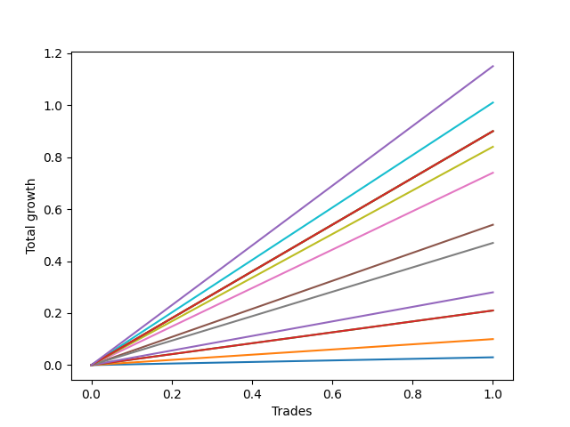

# Long Bernese 005 1v 
- Symbol: AAPL
- Date Range: 05/27/2022 - 09/30/2022
- Trading Period: 7:20-12:30
- Number of Trades: 1



| Name | Win Percent | Profit | Avg Profit / Trade | Avg Time / Trade |      | Name | Win Percent | Profit | Avg Profit / Trade | Avg Time / Trade |
| ---- | ----------- | ------ | ------------------ | ---------------- | ---- | ---- | ----------- | ------ | ------------------ | ---------------- |
| Sorted By <br> Profit | | | | | | Sorted By <br> Win Percentage ||||
| NEWFI 0000 | 100.00 | 575.00 | 575.00 | 18:05 |     | NEWFI 0000 | 100.00 | 575.00 | 575.00 | 18:05 |
| Eighty-One | 100.00 | 505.00 | 505.00 | 16:00 |     | Eighty-One | 100.00 | 505.00 | 505.00 | 16:00 |
| Eighty-Five | 100.00 | 450.00 | 450.00 | 24:00 |     | Eighty-Five | 100.00 | 450.00 | 450.00 | 24:00 |
| Eighty-Four | 100.00 | 450.00 | 450.00 | 24:00 |     | Eighty-Four | 100.00 | 450.00 | 450.00 | 24:00 |
| Eighty-Three | 100.00 | 450.00 | 450.00 | 24:00 |     | Eighty-Three | 100.00 | 450.00 | 450.00 | 24:00 |
| Eighty-Two | 100.00 | 450.00 | 450.00 | 24:00 |     | Eighty-Two | 100.00 | 450.00 | 450.00 | 24:00 |
| Seven | 100.00 | 420.00 | 420.00 | 15:35 |     | Seven | 100.00 | 420.00 | 420.00 | 15:35 |
| Five | 100.00 | 370.00 | 370.00 | 14:10 |     | Five | 100.00 | 370.00 | 370.00 | 14:10 |
| Four | 100.00 | 270.00 | 270.00 | 08:35 |     | Four | 100.00 | 270.00 | 270.00 | 08:35 |
| Six | 100.00 | 235.00 | 235.00 | 08:25 |     | Six | 100.00 | 235.00 | 235.00 | 08:25 |
| Three | 100.00 | 140.00 | 140.00 | 05:20 |     | Three | 100.00 | 140.00 | 140.00 | 05:20 |
| Two_C | 100.00 | 105.00 | 105.00 | 05:10 |     | Two_C | 100.00 | 105.00 | 105.00 | 05:10 |
| Two | 100.00 | 105.00 | 105.00 | 05:10 |     | Two | 100.00 | 105.00 | 105.00 | 05:10 |
| One | 100.00 | 50.00 | 50.00 | 03:40 |     | One | 100.00 | 50.00 | 50.00 | 03:40 |
| Zero | 100.00 | 15.00 | 15.00 | 00:10 |     | Zero | 100.00 | 15.00 | 15.00 | 00:10 |

## NO STOPLOSS

### Test Zero
* Sell when price hits the middle line of the 20p bollinger
* No Stoploss
* Results:
```
Total Trades: 1
Percent Up: 100.00
Percent Down: 0.00
Total Points Moved Up: 0.03
Potential Profit: 15.00
Total Points Ups: 0.03 Count Ups: 1
Total Points Downs: 0.00 Count Downs: 0
```

<details><summary>Trades</summary>

<code>In: 2022-06-14 12:22:00		Out: 2022-06-14 12:22:10		Total Position Time: 00:10		Total Move Up: 0.03		Total to Date: 0.03</code> <br />


</details>

### Test One
* Sell when the price hits the upper line of the 20p 1std bollinger
* No Stoploss
* Results:
```
Total Trades: 1
Percent Up: 100.00
Percent Down: 0.00
Total Points Moved Up: 0.10
Potential Profit: 50.00
Total Points Ups: 0.10 Count Ups: 1
Total Points Downs: 0.00 Count Downs: 0
```

<details><summary>Trades</summary>

<code>In: 2022-06-14 12:22:00		Out: 2022-06-14 12:25:40		Total Position Time: 03:40		Total Move Up: 0.10		Total to Date: 0.10</code> <br />


</details>

### Test Two
* Sell when the price hits the upper line of the 20p 2std bollinger
* No Stoploss
* Results:
```
Total Trades: 1
Percent Up: 100.00
Percent Down: 0.00
Total Points Moved Up: 0.21
Potential Profit: 105.00
Total Points Ups: 0.21 Count Ups: 1
Total Points Downs: 0.00 Count Downs: 0
```

<details><summary>Trades</summary>

<code>In: 2022-06-14 12:22:00		Out: 2022-06-14 12:27:10		Total Position Time: 05:10		Total Move Up: 0.21		Total to Date: 0.21</code> <br />


</details>

### Test Two_C
* Sell when the price hits the upper line of the 20p 2std bollinger
* No Stoploss
* Results:
```
Total Trades: 1
Percent Up: 100.00
Percent Down: 0.00
Total Points Moved Up: 0.21
Potential Profit: 105.00
Total Points Ups: 0.21 Count Ups: 1
Total Points Downs: 0.00 Count Downs: 0
```

<details><summary>Trades</summary>

<code>In: 2022-06-14 12:22:00		Out: 2022-06-14 12:27:10		Total Position Time: 05:10		Total Move Up: 0.21		Total to Date: 0.21</code> <br />


</details>

### Test Three
* Sell when price hits the middle line of the 50p bollinger
* No Stoploss
* Results:
```
Total Trades: 1
Percent Up: 100.00
Percent Down: 0.00
Total Points Moved Up: 0.28
Potential Profit: 140.00
Total Points Ups: 0.28 Count Ups: 1
Total Points Downs: 0.00 Count Downs: 0
```

<details><summary>Trades</summary>

<code>In: 2022-06-14 12:22:00		Out: 2022-06-14 12:27:20		Total Position Time: 05:20		Total Move Up: 0.28		Total to Date: 0.28</code> <br />


</details>

### Test Four
* Sell when the price hits the upper line of the 50p 1std bollinger
* No Stoploss
* Results:
```
Total Trades: 1
Percent Up: 100.00
Percent Down: 0.00
Total Points Moved Up: 0.54
Potential Profit: 270.00
Total Points Ups: 0.54 Count Ups: 1
Total Points Downs: 0.00 Count Downs: 0
```

<details><summary>Trades</summary>

<code>In: 2022-06-14 12:22:00		Out: 2022-06-14 12:30:35		Total Position Time: 08:35		Total Move Up: 0.54		Total to Date: 0.54</code> <br />


</details>

### Test Five
* Sell when the price hits the upper line of the 50p 2std bollinger
* No Stoploss
* Results:
```
Total Trades: 1
Percent Up: 100.00
Percent Down: 0.00
Total Points Moved Up: 0.74
Potential Profit: 370.00
Total Points Ups: 0.74 Count Ups: 1
Total Points Downs: 0.00 Count Downs: 0
```

<details><summary>Trades</summary>

<code>In: 2022-06-14 12:22:00		Out: 2022-06-14 12:36:10		Total Position Time: 14:10		Total Move Up: 0.74		Total to Date: 0.74</code> <br />


</details>

### Test Six
* Sell when the price hits the middle line of the 1std VWAP
* No Stoploss
* Results:
```
Total Trades: 1
Percent Up: 100.00
Percent Down: 0.00
Total Points Moved Up: 0.47
Potential Profit: 235.00
Total Points Ups: 0.47 Count Ups: 1
Total Points Downs: 0.00 Count Downs: 0
```

<details><summary>Trades</summary>

<code>In: 2022-06-14 12:22:00		Out: 2022-06-14 12:30:25		Total Position Time: 08:25		Total Move Up: 0.47		Total to Date: 0.47</code> <br />


</details>

### Test Seven
* Sell when the price hits the upper line of the 1std VWAP
* No Stoploss
* Results:
```
Total Trades: 1
Percent Up: 100.00
Percent Down: 0.00
Total Points Moved Up: 0.84
Potential Profit: 420.00
Total Points Ups: 0.84 Count Ups: 1
Total Points Downs: 0.00 Count Downs: 0
```

<details><summary>Trades</summary>

<code>In: 2022-06-14 12:22:00		Out: 2022-06-14 12:37:35		Total Position Time: 15:35		Total Move Up: 0.84		Total to Date: 0.84</code> <br />


</details>

## TAKE PROFIT

### Test Eighty-One
* Take Profit of 1 Point
* No Stoploss
* Results:
```
Total Trades: 1
Percent Up: 100.00
Percent Down: 0.00
Total Points Moved Up: 1.01
Potential Profit: 505.00
Total Points Ups: 1.01 Count Ups: 1
Total Points Downs: 0.00 Count Downs: 0
```

<details><summary>Trades</summary>

<code>In: 2022-06-14 12:22:00		Out: 2022-06-14 12:38:00		Total Position Time: 16:00		Total Move Up: 1.01		Total to Date: 1.01</code> <br />


</details>

### Test Eighty-Two
* Take Profit of 2 Point
* No Stoploss
* Results:
```
Total Trades: 1
Percent Up: 100.00
Percent Down: 0.00
Total Points Moved Up: 0.90
Potential Profit: 450.00
Total Points Ups: 0.90 Count Ups: 1
Total Points Downs: 0.00 Count Downs: 0
```

<details><summary>Trades</summary>

<code>In: 2022-06-14 12:22:00		Out: 2022-06-14 12:46:00		Total Position Time: 24:00		Total Move Up: 0.90		Total to Date: 0.90</code> <br />


</details>

### Test Eighty-Three
* Take Profit of 3 Point
* No Stoploss
* Results:
```
Total Trades: 1
Percent Up: 100.00
Percent Down: 0.00
Total Points Moved Up: 0.90
Potential Profit: 450.00
Total Points Ups: 0.90 Count Ups: 1
Total Points Downs: 0.00 Count Downs: 0
```

<details><summary>Trades</summary>

<code>In: 2022-06-14 12:22:00		Out: 2022-06-14 12:46:00		Total Position Time: 24:00		Total Move Up: 0.90		Total to Date: 0.90</code> <br />


</details>

### Test Eighty-Four
* Take Profit of 4 Point
* No Stoploss
* Results:
```
Total Trades: 1
Percent Up: 100.00
Percent Down: 0.00
Total Points Moved Up: 0.90
Potential Profit: 450.00
Total Points Ups: 0.90 Count Ups: 1
Total Points Downs: 0.00 Count Downs: 0
```

<details><summary>Trades</summary>

<code>In: 2022-06-14 12:22:00		Out: 2022-06-14 12:46:00		Total Position Time: 24:00		Total Move Up: 0.90		Total to Date: 0.90</code> <br />


</details>

### Test Eighty-Five
* Take Profit of 5 Point
* No Stoploss
* Results:
```
Total Trades: 1
Percent Up: 100.00
Percent Down: 0.00
Total Points Moved Up: 0.90
Potential Profit: 450.00
Total Points Ups: 0.90 Count Ups: 1
Total Points Downs: 0.00 Count Downs: 0
```

<details><summary>Trades</summary>

<code>In: 2022-06-14 12:22:00		Out: 2022-06-14 12:46:00		Total Position Time: 24:00		Total Move Up: 0.90		Total to Date: 0.90</code> <br />


</details>

## Indicator Exits

### Test NEWFI 0000
* Newfi 0000
* No Stoploss
* Results:
```
Total Trades: 1
Percent Up: 100.00
Percent Down: 0.00
Total Points Moved Up: 1.15
Potential Profit: 575.00
Total Points Ups: 1.15 Count Ups: 1
Total Points Downs: 0.00 Count Downs: 0
```

<details><summary>Trades</summary>

<code>In: 2022-06-14 12:22:00		Out: 2022-06-14 12:40:05		Total Position Time: 18:05		Total Move Up: 1.15		Total to Date: 1.15</code> <br />


</details>