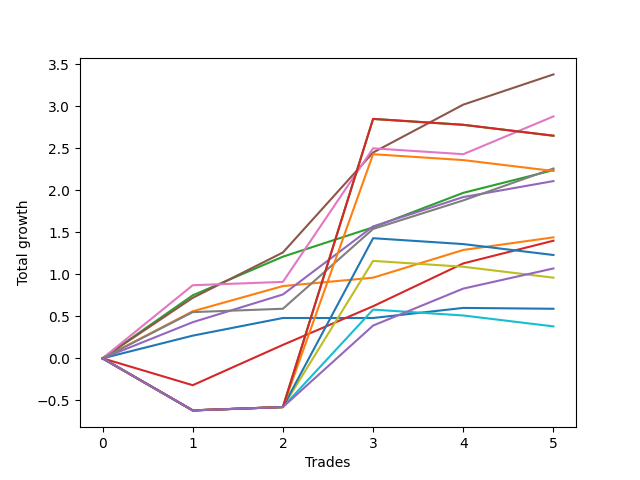

# Short Bernese 001 1v 
- Symbol: AAPL
- Date Range: 05/27/2022 - 09/30/2022
- Trading Period: 7:20-12:30
- Number of Trades: 5



| Name | Win Percent | Profit | Avg Profit / Trade | Avg Time / Trade |      | Name | Win Percent | Profit | Avg Profit / Trade | Avg Time / Trade |
| ---- | ----------- | ------ | ------------------ | ---------------- | ---- | ---- | ----------- | ------ | ------------------ | ---------------- |
| Sorted By <br> Profit | | | | | | Sorted By <br> Win Percentage ||||
| Four | 100.00 | 1690.00 | 338.00 | 15:34 |     | Four | 100.00 | 1690.00 | 338.00 | 15:34 |
| Five | 80.00 | 1440.00 | 288.00 | 34:31 |     | Six | 100.00 | 1130.00 | 226.00 | 17:05 |
| Eighty-Five | 40.00 | 1325.00 | 265.00 | 53:45 |     | Two | 100.00 | 1120.00 | 224.00 | 11:14 |
| Eighty-Four | 40.00 | 1325.00 | 265.00 | 53:45 |     | Three | 100.00 | 1055.00 | 211.00 | 08:05 |
| Six | 100.00 | 1130.00 | 226.00 | 17:05 |     | One | 100.00 | 720.00 | 144.00 | 07:39 |
| Two | 100.00 | 1120.00 | 224.00 | 11:14 |     | Five | 80.00 | 1440.00 | 288.00 | 34:31 |
| Eighty-Three | 40.00 | 1115.00 | 223.00 | 53:31 |     | Two_C | 80.00 | 700.00 | 140.00 | 21:11 |
| Three | 100.00 | 1055.00 | 211.00 | 08:05 |     | NEWFI 0000 | 80.00 | 535.00 | 107.00 | 33:14 |
| One | 100.00 | 720.00 | 144.00 | 07:39 |     | Zero | 60.00 | 295.00 | 59.00 | 03:55 |
| Two_C | 80.00 | 700.00 | 140.00 | 21:11 |     | Eighty-Five | 40.00 | 1325.00 | 265.00 | 53:45 |
| Eighty-Two | 40.00 | 615.00 | 123.00 | 50:02 |     | Eighty-Four | 40.00 | 1325.00 | 265.00 | 53:45 |
| NEWFI 0000 | 80.00 | 535.00 | 107.00 | 33:14 |     | Eighty-Three | 40.00 | 1115.00 | 223.00 | 53:31 |
| Seven | 40.00 | 480.00 | 96.00 | 49:55 |     | Eighty-Two | 40.00 | 615.00 | 123.00 | 50:02 |
| Zero | 60.00 | 295.00 | 59.00 | 03:55 |     | Seven | 40.00 | 480.00 | 96.00 | 49:55 |
| Eighty-One | 40.00 | 190.00 | 38.00 | 46:44 |     | Eighty-One | 40.00 | 190.00 | 38.00 | 46:44 |

## NO STOPLOSS

### Test Zero
* Sell when price hits the middle line of the 20p bollinger
* No Stoploss
* Results:
```
Total Trades: 5
Percent Up: 40.00
Percent Down: 60.00
Total Points Moved Down: 0.59
Potential Profit: 295.00
Total Points Ups: 0.01 Count Ups: 2
Total Points Downs: 0.60 Count Downs: 3
```

<details><summary>Trades</summary>

<code>In: 2022-07-06 11:10:00		Out: 2022-07-06 11:11:05		Total Position Time: 01:05		Total Move Down: 0.27		Total to Date: 0.27</code> <br />
<code>In: 2022-09-01 12:15:00		Out: 2022-09-01 12:17:05		Total Position Time: 02:05		Total Move Down: 0.21		Total to Date: 0.48</code> <br />
<code>In: 2022-09-21 11:48:00		Out: 2022-09-21 12:01:35		Total Position Time: 13:35		Total Move Down: -0.00		Total to Date: 0.48</code> <br />
<code>In: 2022-09-22 09:59:00		Out: 2022-09-22 10:01:40		Total Position Time: 02:40		Total Move Down: 0.12		Total to Date: 0.60</code> <br />
<code>In: 2022-09-22 10:57:00		Out: 2022-09-22 10:57:10		Total Position Time: 00:10		Total Move Down: -0.01		Total to Date: 0.59</code> <br />


</details>

### Test One
* Sell when the price hits the upper line of the 20p 1std bollinger
* No Stoploss
* Results:
```
Total Trades: 5
Percent Up: 0.00
Percent Down: 100.00
Total Points Moved Down: 1.44
Potential Profit: 720.00
Total Points Ups: 0.00 Count Ups: 0
Total Points Downs: 1.44 Count Downs: 5
```

<details><summary>Trades</summary>

<code>In: 2022-07-06 11:10:00		Out: 2022-07-06 11:11:45		Total Position Time: 01:45		Total Move Down: 0.56		Total to Date: 0.56</code> <br />
<code>In: 2022-09-01 12:15:00		Out: 2022-09-01 12:19:10		Total Position Time: 04:10		Total Move Down: 0.30		Total to Date: 0.86</code> <br />
<code>In: 2022-09-21 11:48:00		Out: 2022-09-21 12:09:10		Total Position Time: 21:10		Total Move Down: 0.10		Total to Date: 0.96</code> <br />
<code>In: 2022-09-22 09:59:00		Out: 2022-09-22 10:03:20		Total Position Time: 04:20		Total Move Down: 0.33		Total to Date: 1.29</code> <br />
<code>In: 2022-09-22 10:57:00		Out: 2022-09-22 11:03:50		Total Position Time: 06:50		Total Move Down: 0.15		Total to Date: 1.44</code> <br />


</details>

### Test Two
* Sell when the price hits the upper line of the 20p 2std bollinger
* No Stoploss
* Results:
```
Total Trades: 5
Percent Up: 0.00
Percent Down: 100.00
Total Points Moved Down: 2.24
Potential Profit: 1120.00
Total Points Ups: 0.00 Count Ups: 0
Total Points Downs: 2.24 Count Downs: 5
```

<details><summary>Trades</summary>

<code>In: 2022-07-06 11:10:00		Out: 2022-07-06 11:12:30		Total Position Time: 02:30		Total Move Down: 0.75		Total to Date: 0.75</code> <br />
<code>In: 2022-09-01 12:15:00		Out: 2022-09-01 12:27:45		Total Position Time: 12:45		Total Move Down: 0.46		Total to Date: 1.21</code> <br />
<code>In: 2022-09-21 11:48:00		Out: 2022-09-21 12:10:05		Total Position Time: 22:05		Total Move Down: 0.35		Total to Date: 1.56</code> <br />
<code>In: 2022-09-22 09:59:00		Out: 2022-09-22 10:08:00		Total Position Time: 09:00		Total Move Down: 0.41		Total to Date: 1.97</code> <br />
<code>In: 2022-09-22 10:57:00		Out: 2022-09-22 11:06:50		Total Position Time: 09:50		Total Move Down: 0.27		Total to Date: 2.24</code> <br />


</details>

### Test Two_C
* Sell when the price hits the upper line of the 20p 2std bollinger
* No Stoploss
* Results:
```
Total Trades: 5
Percent Up: 20.00
Percent Down: 80.00
Total Points Moved Down: 1.40
Potential Profit: 700.00
Total Points Ups: 0.32 Count Ups: 1
Total Points Downs: 1.72 Count Downs: 4
```

<details><summary>Trades</summary>

<code>In: 2022-07-06 11:10:00		Out: 2022-07-06 12:01:40		Total Position Time: 51:40		Total Move Down: -0.32		Total to Date: -0.32</code> <br />
<code>In: 2022-09-01 12:15:00		Out: 2022-09-01 12:27:55		Total Position Time: 12:55		Total Move Down: 0.48		Total to Date: 0.16</code> <br />
<code>In: 2022-09-21 11:48:00		Out: 2022-09-21 12:10:10		Total Position Time: 22:10		Total Move Down: 0.46		Total to Date: 0.62</code> <br />
<code>In: 2022-09-22 09:59:00		Out: 2022-09-22 10:08:20		Total Position Time: 09:20		Total Move Down: 0.51		Total to Date: 1.13</code> <br />
<code>In: 2022-09-22 10:57:00		Out: 2022-09-22 11:06:50		Total Position Time: 09:50		Total Move Down: 0.27		Total to Date: 1.40</code> <br />


</details>

### Test Three
* Sell when price hits the middle line of the 50p bollinger
* No Stoploss
* Results:
```
Total Trades: 5
Percent Up: 0.00
Percent Down: 100.00
Total Points Moved Down: 2.11
Potential Profit: 1055.00
Total Points Ups: 0.00 Count Ups: 0
Total Points Downs: 2.11 Count Downs: 5
```

<details><summary>Trades</summary>

<code>In: 2022-07-06 11:10:00		Out: 2022-07-06 11:11:35		Total Position Time: 01:35		Total Move Down: 0.43		Total to Date: 0.43</code> <br />
<code>In: 2022-09-01 12:15:00		Out: 2022-09-01 12:19:05		Total Position Time: 04:05		Total Move Down: 0.33		Total to Date: 0.76</code> <br />
<code>In: 2022-09-21 11:48:00		Out: 2022-09-21 12:10:45		Total Position Time: 22:45		Total Move Down: 0.81		Total to Date: 1.57</code> <br />
<code>In: 2022-09-22 09:59:00		Out: 2022-09-22 10:03:40		Total Position Time: 04:40		Total Move Down: 0.35		Total to Date: 1.92</code> <br />
<code>In: 2022-09-22 10:57:00		Out: 2022-09-22 11:04:20		Total Position Time: 07:20		Total Move Down: 0.19		Total to Date: 2.11</code> <br />


</details>

### Test Four
* Sell when the price hits the upper line of the 50p 1std bollinger
* No Stoploss
* Results:
```
Total Trades: 5
Percent Up: 0.00
Percent Down: 100.00
Total Points Moved Down: 3.38
Potential Profit: 1690.00
Total Points Ups: 0.00 Count Ups: 0
Total Points Downs: 3.38 Count Downs: 5
```

<details><summary>Trades</summary>

<code>In: 2022-07-06 11:10:00		Out: 2022-07-06 11:12:15		Total Position Time: 02:15		Total Move Down: 0.72		Total to Date: 0.72</code> <br />
<code>In: 2022-09-01 12:15:00		Out: 2022-09-01 12:30:05		Total Position Time: 15:05		Total Move Down: 0.54		Total to Date: 1.26</code> <br />
<code>In: 2022-09-21 11:48:00		Out: 2022-09-21 12:21:35		Total Position Time: 33:35		Total Move Down: 1.19		Total to Date: 2.45</code> <br />
<code>In: 2022-09-22 09:59:00		Out: 2022-09-22 10:10:15		Total Position Time: 11:15		Total Move Down: 0.57		Total to Date: 3.02</code> <br />
<code>In: 2022-09-22 10:57:00		Out: 2022-09-22 11:12:40		Total Position Time: 15:40		Total Move Down: 0.36		Total to Date: 3.38</code> <br />


</details>

### Test Five
* Sell when the price hits the upper line of the 50p 2std bollinger
* No Stoploss
* Results:
```
Total Trades: 5
Percent Up: 20.00
Percent Down: 80.00
Total Points Moved Down: 2.88
Potential Profit: 1440.00
Total Points Ups: 0.07 Count Ups: 1
Total Points Downs: 2.95 Count Downs: 4
```

<details><summary>Trades</summary>

<code>In: 2022-07-06 11:10:00		Out: 2022-07-06 11:26:55		Total Position Time: 16:55		Total Move Down: 0.87		Total to Date: 0.87</code> <br />
<code>In: 2022-09-01 12:15:00		Out: 2022-09-01 12:46:00		Total Position Time: 31:00		Total Move Down: 0.04		Total to Date: 0.91</code> <br />
<code>In: 2022-09-21 11:48:00		Out: 2022-09-21 12:26:40		Total Position Time: 38:40		Total Move Down: 1.59		Total to Date: 2.50</code> <br />
<code>In: 2022-09-22 09:59:00		Out: 2022-09-22 10:58:55		Total Position Time: 59:55		Total Move Down: -0.07		Total to Date: 2.43</code> <br />
<code>In: 2022-09-22 10:57:00		Out: 2022-09-22 11:23:05		Total Position Time: 26:05		Total Move Down: 0.45		Total to Date: 2.88</code> <br />


</details>

### Test Six
* Sell when the price hits the middle line of the 1std VWAP
* No Stoploss
* Results:
```
Total Trades: 5
Percent Up: 0.00
Percent Down: 100.00
Total Points Moved Down: 2.26
Potential Profit: 1130.00
Total Points Ups: 0.00 Count Ups: 0
Total Points Downs: 2.26 Count Downs: 5
```

<details><summary>Trades</summary>

<code>In: 2022-07-06 11:10:00		Out: 2022-07-06 11:11:50		Total Position Time: 01:50		Total Move Down: 0.55		Total to Date: 0.55</code> <br />
<code>In: 2022-09-01 12:15:00		Out: 2022-09-01 12:46:00		Total Position Time: 31:00		Total Move Down: 0.04		Total to Date: 0.59</code> <br />
<code>In: 2022-09-21 11:48:00		Out: 2022-09-21 12:10:50		Total Position Time: 22:50		Total Move Down: 0.95		Total to Date: 1.54</code> <br />
<code>In: 2022-09-22 09:59:00		Out: 2022-09-22 10:03:25		Total Position Time: 04:25		Total Move Down: 0.34		Total to Date: 1.88</code> <br />
<code>In: 2022-09-22 10:57:00		Out: 2022-09-22 11:22:20		Total Position Time: 25:20		Total Move Down: 0.38		Total to Date: 2.26</code> <br />


</details>

### Test Seven
* Sell when the price hits the upper line of the 1std VWAP
* No Stoploss
* Results:
```
Total Trades: 5
Percent Up: 60.00
Percent Down: 40.00
Total Points Moved Down: 0.96
Potential Profit: 480.00
Total Points Ups: 0.82 Count Ups: 3
Total Points Downs: 1.78 Count Downs: 2
```

<details><summary>Trades</summary>

<code>In: 2022-07-06 11:10:00		Out: 2022-07-06 12:09:55		Total Position Time: 59:55		Total Move Down: -0.62		Total to Date: -0.62</code> <br />
<code>In: 2022-09-01 12:15:00		Out: 2022-09-01 12:46:00		Total Position Time: 31:00		Total Move Down: 0.04		Total to Date: -0.58</code> <br />
<code>In: 2022-09-21 11:48:00		Out: 2022-09-21 12:26:50		Total Position Time: 38:50		Total Move Down: 1.74		Total to Date: 1.16</code> <br />
<code>In: 2022-09-22 09:59:00		Out: 2022-09-22 10:58:55		Total Position Time: 59:55		Total Move Down: -0.07		Total to Date: 1.09</code> <br />
<code>In: 2022-09-22 10:57:00		Out: 2022-09-22 11:56:55		Total Position Time: 59:55		Total Move Down: -0.13		Total to Date: 0.96</code> <br />


</details>

## TAKE PROFIT

### Test Eighty-One
* Take Profit of 1 Point
* No Stoploss
* Results:
```
Total Trades: 5
Percent Up: 60.00
Percent Down: 40.00
Total Points Moved Down: 0.38
Potential Profit: 190.00
Total Points Ups: 0.82 Count Ups: 3
Total Points Downs: 1.20 Count Downs: 2
```

<details><summary>Trades</summary>

<code>In: 2022-07-06 11:10:00		Out: 2022-07-06 12:09:55		Total Position Time: 59:55		Total Move Down: -0.62		Total to Date: -0.62</code> <br />
<code>In: 2022-09-01 12:15:00		Out: 2022-09-01 12:46:00		Total Position Time: 31:00		Total Move Down: 0.04		Total to Date: -0.58</code> <br />
<code>In: 2022-09-21 11:48:00		Out: 2022-09-21 12:10:55		Total Position Time: 22:55		Total Move Down: 1.16		Total to Date: 0.58</code> <br />
<code>In: 2022-09-22 09:59:00		Out: 2022-09-22 10:58:55		Total Position Time: 59:55		Total Move Down: -0.07		Total to Date: 0.51</code> <br />
<code>In: 2022-09-22 10:57:00		Out: 2022-09-22 11:56:55		Total Position Time: 59:55		Total Move Down: -0.13		Total to Date: 0.38</code> <br />


</details>

### Test Eighty-Two
* Take Profit of 2 Point
* No Stoploss
* Results:
```
Total Trades: 5
Percent Up: 60.00
Percent Down: 40.00
Total Points Moved Down: 1.23
Potential Profit: 615.00
Total Points Ups: 0.82 Count Ups: 3
Total Points Downs: 2.05 Count Downs: 2
```

<details><summary>Trades</summary>

<code>In: 2022-07-06 11:10:00		Out: 2022-07-06 12:09:55		Total Position Time: 59:55		Total Move Down: -0.62		Total to Date: -0.62</code> <br />
<code>In: 2022-09-01 12:15:00		Out: 2022-09-01 12:46:00		Total Position Time: 31:00		Total Move Down: 0.04		Total to Date: -0.58</code> <br />
<code>In: 2022-09-21 11:48:00		Out: 2022-09-21 12:27:25		Total Position Time: 39:25		Total Move Down: 2.01		Total to Date: 1.43</code> <br />
<code>In: 2022-09-22 09:59:00		Out: 2022-09-22 10:58:55		Total Position Time: 59:55		Total Move Down: -0.07		Total to Date: 1.36</code> <br />
<code>In: 2022-09-22 10:57:00		Out: 2022-09-22 11:56:55		Total Position Time: 59:55		Total Move Down: -0.13		Total to Date: 1.23</code> <br />


</details>

### Test Eighty-Three
* Take Profit of 3 Point
* No Stoploss
* Results:
```
Total Trades: 5
Percent Up: 60.00
Percent Down: 40.00
Total Points Moved Down: 2.23
Potential Profit: 1115.00
Total Points Ups: 0.82 Count Ups: 3
Total Points Downs: 3.05 Count Downs: 2
```

<details><summary>Trades</summary>

<code>In: 2022-07-06 11:10:00		Out: 2022-07-06 12:09:55		Total Position Time: 59:55		Total Move Down: -0.62		Total to Date: -0.62</code> <br />
<code>In: 2022-09-01 12:15:00		Out: 2022-09-01 12:46:00		Total Position Time: 31:00		Total Move Down: 0.04		Total to Date: -0.58</code> <br />
<code>In: 2022-09-21 11:48:00		Out: 2022-09-21 12:44:50		Total Position Time: 56:50		Total Move Down: 3.01		Total to Date: 2.43</code> <br />
<code>In: 2022-09-22 09:59:00		Out: 2022-09-22 10:58:55		Total Position Time: 59:55		Total Move Down: -0.07		Total to Date: 2.36</code> <br />
<code>In: 2022-09-22 10:57:00		Out: 2022-09-22 11:56:55		Total Position Time: 59:55		Total Move Down: -0.13		Total to Date: 2.23</code> <br />


</details>

### Test Eighty-Four
* Take Profit of 4 Point
* No Stoploss
* Results:
```
Total Trades: 5
Percent Up: 60.00
Percent Down: 40.00
Total Points Moved Down: 2.65
Potential Profit: 1325.00
Total Points Ups: 0.82 Count Ups: 3
Total Points Downs: 3.47 Count Downs: 2
```

<details><summary>Trades</summary>

<code>In: 2022-07-06 11:10:00		Out: 2022-07-06 12:09:55		Total Position Time: 59:55		Total Move Down: -0.62		Total to Date: -0.62</code> <br />
<code>In: 2022-09-01 12:15:00		Out: 2022-09-01 12:46:00		Total Position Time: 31:00		Total Move Down: 0.04		Total to Date: -0.58</code> <br />
<code>In: 2022-09-21 11:48:00		Out: 2022-09-21 12:46:00		Total Position Time: 58:00		Total Move Down: 3.43		Total to Date: 2.85</code> <br />
<code>In: 2022-09-22 09:59:00		Out: 2022-09-22 10:58:55		Total Position Time: 59:55		Total Move Down: -0.07		Total to Date: 2.78</code> <br />
<code>In: 2022-09-22 10:57:00		Out: 2022-09-22 11:56:55		Total Position Time: 59:55		Total Move Down: -0.13		Total to Date: 2.65</code> <br />


</details>

### Test Eighty-Five
* Take Profit of 5 Point
* No Stoploss
* Results:
```
Total Trades: 5
Percent Up: 60.00
Percent Down: 40.00
Total Points Moved Down: 2.65
Potential Profit: 1325.00
Total Points Ups: 0.82 Count Ups: 3
Total Points Downs: 3.47 Count Downs: 2
```

<details><summary>Trades</summary>

<code>In: 2022-07-06 11:10:00		Out: 2022-07-06 12:09:55		Total Position Time: 59:55		Total Move Down: -0.62		Total to Date: -0.62</code> <br />
<code>In: 2022-09-01 12:15:00		Out: 2022-09-01 12:46:00		Total Position Time: 31:00		Total Move Down: 0.04		Total to Date: -0.58</code> <br />
<code>In: 2022-09-21 11:48:00		Out: 2022-09-21 12:46:00		Total Position Time: 58:00		Total Move Down: 3.43		Total to Date: 2.85</code> <br />
<code>In: 2022-09-22 09:59:00		Out: 2022-09-22 10:58:55		Total Position Time: 59:55		Total Move Down: -0.07		Total to Date: 2.78</code> <br />
<code>In: 2022-09-22 10:57:00		Out: 2022-09-22 11:56:55		Total Position Time: 59:55		Total Move Down: -0.13		Total to Date: 2.65</code> <br />


</details>

## Indicator Exits

### Test NEWFI 0000
* Newfi 0000
* No Stoploss
* Results:
```
Total Trades: 5
Percent Up: 20.00
Percent Down: 80.00
Total Points Moved Down: 1.07
Potential Profit: 535.00
Total Points Ups: 0.62 Count Ups: 1
Total Points Downs: 1.69 Count Downs: 4
```

<details><summary>Trades</summary>

<code>In: 2022-07-06 11:10:00		Out: 2022-07-06 12:09:55		Total Position Time: 59:55		Total Move Down: -0.62		Total to Date: -0.62</code> <br />
<code>In: 2022-09-01 12:15:00		Out: 2022-09-01 12:46:00		Total Position Time: 31:00		Total Move Down: 0.04		Total to Date: -0.58</code> <br />
<code>In: 2022-09-21 11:48:00		Out: 2022-09-21 12:23:05		Total Position Time: 35:05		Total Move Down: 0.97		Total to Date: 0.39</code> <br />
<code>In: 2022-09-22 09:59:00		Out: 2022-09-22 10:19:05		Total Position Time: 20:05		Total Move Down: 0.44		Total to Date: 0.83</code> <br />
<code>In: 2022-09-22 10:57:00		Out: 2022-09-22 11:17:05		Total Position Time: 20:05		Total Move Down: 0.24		Total to Date: 1.07</code> <br />


</details>