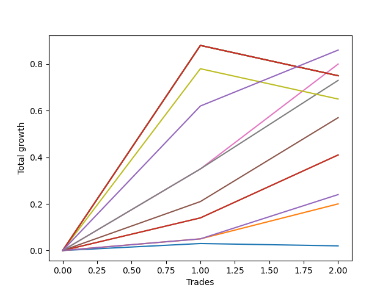

# Short Bernese 002 1v 
- Symbol: AAPL
- Date Range: 05/27/2022 - 09/30/2022
- Trading Period: 7:20-12:30
- Number of Trades: 2



| Name | Win Percent | Profit | Avg Profit / Trade | Avg Time / Trade |      | Name | Win Percent | Profit | Avg Profit / Trade | Avg Time / Trade |
| ---- | ----------- | ------ | ------------------ | ---------------- | ---- | ---- | ----------- | ------ | ------------------ | ---------------- |
| Sorted By <br> Profit | | | | | | Sorted By <br> Win Percentage ||||
| NEWFI 0000 | 100.00 | 430.00 | 215.00 | 23:05 |     | NEWFI 0000 | 100.00 | 430.00 | 215.00 | 23:05 |
| Five | 100.00 | 400.00 | 200.00 | 22:47 |     | Five | 100.00 | 400.00 | 200.00 | 22:47 |
| Eighty-Five | 50.00 | 375.00 | 187.50 | 59:55 |     | Six | 100.00 | 365.00 | 182.50 | 22:25 |
| Eighty-Four | 50.00 | 375.00 | 187.50 | 59:55 |     | Four | 100.00 | 285.00 | 142.50 | 15:57 |
| Eighty-Three | 50.00 | 375.00 | 187.50 | 59:55 |     | Two_C | 100.00 | 205.00 | 102.50 | 11:17 |
| Eighty-Two | 50.00 | 375.00 | 187.50 | 59:55 |     | Two | 100.00 | 205.00 | 102.50 | 11:17 |
| Eighty-One | 50.00 | 375.00 | 187.50 | 59:55 |     | Three | 100.00 | 120.00 | 60.00 | 08:05 |
| Six | 100.00 | 365.00 | 182.50 | 22:25 |     | One | 100.00 | 100.00 | 50.00 | 08:37 |
| Seven | 50.00 | 325.00 | 162.50 | 57:02 |     | Eighty-Five | 50.00 | 375.00 | 187.50 | 59:55 |
| Four | 100.00 | 285.00 | 142.50 | 15:57 |     | Eighty-Four | 50.00 | 375.00 | 187.50 | 59:55 |
| Two_C | 100.00 | 205.00 | 102.50 | 11:17 |     | Eighty-Three | 50.00 | 375.00 | 187.50 | 59:55 |
| Two | 100.00 | 205.00 | 102.50 | 11:17 |     | Eighty-Two | 50.00 | 375.00 | 187.50 | 59:55 |
| Three | 100.00 | 120.00 | 60.00 | 08:05 |     | Eighty-One | 50.00 | 375.00 | 187.50 | 59:55 |
| One | 100.00 | 100.00 | 50.00 | 08:37 |     | Seven | 50.00 | 325.00 | 162.50 | 57:02 |
| Zero | 50.00 | 10.00 | 5.00 | 00:15 |     | Zero | 50.00 | 10.00 | 5.00 | 00:15 |

## NO STOPLOSS

### Test Zero
* Sell when price hits the middle line of the 20p bollinger
* No Stoploss
* Results:
```
Total Trades: 2
Percent Up: 50.00
Percent Down: 50.00
Total Points Moved Down: 0.02
Potential Profit: 10.00
Total Points Ups: 0.01 Count Ups: 1
Total Points Downs: 0.03 Count Downs: 1
```

<details><summary>Trades</summary>

<code>In: 2022-07-26 11:10:00		Out: 2022-07-26 11:10:20		Total Position Time: 00:20		Total Move Down: 0.03		Total to Date: 0.03</code> <br />
<code>In: 2022-09-22 10:57:00		Out: 2022-09-22 10:57:10		Total Position Time: 00:10		Total Move Down: -0.01		Total to Date: 0.02</code> <br />


</details>

### Test One
* Sell when the price hits the upper line of the 20p 1std bollinger
* No Stoploss
* Results:
```
Total Trades: 2
Percent Up: 0.00
Percent Down: 100.00
Total Points Moved Down: 0.20
Potential Profit: 100.00
Total Points Ups: 0.00 Count Ups: 0
Total Points Downs: 0.20 Count Downs: 2
```

<details><summary>Trades</summary>

<code>In: 2022-07-26 11:10:00		Out: 2022-07-26 11:20:25		Total Position Time: 10:25		Total Move Down: 0.05		Total to Date: 0.05</code> <br />
<code>In: 2022-09-22 10:57:00		Out: 2022-09-22 11:03:50		Total Position Time: 06:50		Total Move Down: 0.15		Total to Date: 0.20</code> <br />


</details>

### Test Two
* Sell when the price hits the upper line of the 20p 2std bollinger
* No Stoploss
* Results:
```
Total Trades: 2
Percent Up: 0.00
Percent Down: 100.00
Total Points Moved Down: 0.41
Potential Profit: 205.00
Total Points Ups: 0.00 Count Ups: 0
Total Points Downs: 0.41 Count Downs: 2
```

<details><summary>Trades</summary>

<code>In: 2022-07-26 11:10:00		Out: 2022-07-26 11:22:45		Total Position Time: 12:45		Total Move Down: 0.14		Total to Date: 0.14</code> <br />
<code>In: 2022-09-22 10:57:00		Out: 2022-09-22 11:06:50		Total Position Time: 09:50		Total Move Down: 0.27		Total to Date: 0.41</code> <br />


</details>

### Test Two_C
* Sell when the price hits the upper line of the 20p 2std bollinger
* No Stoploss
* Results:
```
Total Trades: 2
Percent Up: 0.00
Percent Down: 100.00
Total Points Moved Down: 0.41
Potential Profit: 205.00
Total Points Ups: 0.00 Count Ups: 0
Total Points Downs: 0.41 Count Downs: 2
```

<details><summary>Trades</summary>

<code>In: 2022-07-26 11:10:00		Out: 2022-07-26 11:22:45		Total Position Time: 12:45		Total Move Down: 0.14		Total to Date: 0.14</code> <br />
<code>In: 2022-09-22 10:57:00		Out: 2022-09-22 11:06:50		Total Position Time: 09:50		Total Move Down: 0.27		Total to Date: 0.41</code> <br />


</details>

### Test Three
* Sell when price hits the middle line of the 50p bollinger
* No Stoploss
* Results:
```
Total Trades: 2
Percent Up: 0.00
Percent Down: 100.00
Total Points Moved Down: 0.24
Potential Profit: 120.00
Total Points Ups: 0.00 Count Ups: 0
Total Points Downs: 0.24 Count Downs: 2
```

<details><summary>Trades</summary>

<code>In: 2022-07-26 11:10:00		Out: 2022-07-26 11:18:50		Total Position Time: 08:50		Total Move Down: 0.05		Total to Date: 0.05</code> <br />
<code>In: 2022-09-22 10:57:00		Out: 2022-09-22 11:04:20		Total Position Time: 07:20		Total Move Down: 0.19		Total to Date: 0.24</code> <br />


</details>

### Test Four
* Sell when the price hits the upper line of the 50p 1std bollinger
* No Stoploss
* Results:
```
Total Trades: 2
Percent Up: 0.00
Percent Down: 100.00
Total Points Moved Down: 0.57
Potential Profit: 285.00
Total Points Ups: 0.00 Count Ups: 0
Total Points Downs: 0.57 Count Downs: 2
```

<details><summary>Trades</summary>

<code>In: 2022-07-26 11:10:00		Out: 2022-07-26 11:26:15		Total Position Time: 16:15		Total Move Down: 0.21		Total to Date: 0.21</code> <br />
<code>In: 2022-09-22 10:57:00		Out: 2022-09-22 11:12:40		Total Position Time: 15:40		Total Move Down: 0.36		Total to Date: 0.57</code> <br />


</details>

### Test Five
* Sell when the price hits the upper line of the 50p 2std bollinger
* No Stoploss
* Results:
```
Total Trades: 2
Percent Up: 0.00
Percent Down: 100.00
Total Points Moved Down: 0.80
Potential Profit: 400.00
Total Points Ups: 0.00 Count Ups: 0
Total Points Downs: 0.80 Count Downs: 2
```

<details><summary>Trades</summary>

<code>In: 2022-07-26 11:10:00		Out: 2022-07-26 11:29:30		Total Position Time: 19:30		Total Move Down: 0.35		Total to Date: 0.35</code> <br />
<code>In: 2022-09-22 10:57:00		Out: 2022-09-22 11:23:05		Total Position Time: 26:05		Total Move Down: 0.45		Total to Date: 0.80</code> <br />


</details>

### Test Six
* Sell when the price hits the middle line of the 1std VWAP
* No Stoploss
* Results:
```
Total Trades: 2
Percent Up: 0.00
Percent Down: 100.00
Total Points Moved Down: 0.73
Potential Profit: 365.00
Total Points Ups: 0.00 Count Ups: 0
Total Points Downs: 0.73 Count Downs: 2
```

<details><summary>Trades</summary>

<code>In: 2022-07-26 11:10:00		Out: 2022-07-26 11:29:30		Total Position Time: 19:30		Total Move Down: 0.35		Total to Date: 0.35</code> <br />
<code>In: 2022-09-22 10:57:00		Out: 2022-09-22 11:22:20		Total Position Time: 25:20		Total Move Down: 0.38		Total to Date: 0.73</code> <br />


</details>

### Test Seven
* Sell when the price hits the upper line of the 1std VWAP
* No Stoploss
* Results:
```
Total Trades: 2
Percent Up: 50.00
Percent Down: 50.00
Total Points Moved Down: 0.65
Potential Profit: 325.00
Total Points Ups: 0.13 Count Ups: 1
Total Points Downs: 0.78 Count Downs: 1
```

<details><summary>Trades</summary>

<code>In: 2022-07-26 11:10:00		Out: 2022-07-26 12:04:10		Total Position Time: 54:10		Total Move Down: 0.78		Total to Date: 0.78</code> <br />
<code>In: 2022-09-22 10:57:00		Out: 2022-09-22 11:56:55		Total Position Time: 59:55		Total Move Down: -0.13		Total to Date: 0.65</code> <br />


</details>

## TAKE PROFIT

### Test Eighty-One
* Take Profit of 1 Point
* No Stoploss
* Results:
```
Total Trades: 2
Percent Up: 50.00
Percent Down: 50.00
Total Points Moved Down: 0.75
Potential Profit: 375.00
Total Points Ups: 0.13 Count Ups: 1
Total Points Downs: 0.88 Count Downs: 1
```

<details><summary>Trades</summary>

<code>In: 2022-07-26 11:10:00		Out: 2022-07-26 12:09:55		Total Position Time: 59:55		Total Move Down: 0.88		Total to Date: 0.88</code> <br />
<code>In: 2022-09-22 10:57:00		Out: 2022-09-22 11:56:55		Total Position Time: 59:55		Total Move Down: -0.13		Total to Date: 0.75</code> <br />


</details>

### Test Eighty-Two
* Take Profit of 2 Point
* No Stoploss
* Results:
```
Total Trades: 2
Percent Up: 50.00
Percent Down: 50.00
Total Points Moved Down: 0.75
Potential Profit: 375.00
Total Points Ups: 0.13 Count Ups: 1
Total Points Downs: 0.88 Count Downs: 1
```

<details><summary>Trades</summary>

<code>In: 2022-07-26 11:10:00		Out: 2022-07-26 12:09:55		Total Position Time: 59:55		Total Move Down: 0.88		Total to Date: 0.88</code> <br />
<code>In: 2022-09-22 10:57:00		Out: 2022-09-22 11:56:55		Total Position Time: 59:55		Total Move Down: -0.13		Total to Date: 0.75</code> <br />


</details>

### Test Eighty-Three
* Take Profit of 3 Point
* No Stoploss
* Results:
```
Total Trades: 2
Percent Up: 50.00
Percent Down: 50.00
Total Points Moved Down: 0.75
Potential Profit: 375.00
Total Points Ups: 0.13 Count Ups: 1
Total Points Downs: 0.88 Count Downs: 1
```

<details><summary>Trades</summary>

<code>In: 2022-07-26 11:10:00		Out: 2022-07-26 12:09:55		Total Position Time: 59:55		Total Move Down: 0.88		Total to Date: 0.88</code> <br />
<code>In: 2022-09-22 10:57:00		Out: 2022-09-22 11:56:55		Total Position Time: 59:55		Total Move Down: -0.13		Total to Date: 0.75</code> <br />


</details>

### Test Eighty-Four
* Take Profit of 4 Point
* No Stoploss
* Results:
```
Total Trades: 2
Percent Up: 50.00
Percent Down: 50.00
Total Points Moved Down: 0.75
Potential Profit: 375.00
Total Points Ups: 0.13 Count Ups: 1
Total Points Downs: 0.88 Count Downs: 1
```

<details><summary>Trades</summary>

<code>In: 2022-07-26 11:10:00		Out: 2022-07-26 12:09:55		Total Position Time: 59:55		Total Move Down: 0.88		Total to Date: 0.88</code> <br />
<code>In: 2022-09-22 10:57:00		Out: 2022-09-22 11:56:55		Total Position Time: 59:55		Total Move Down: -0.13		Total to Date: 0.75</code> <br />


</details>

### Test Eighty-Five
* Take Profit of 5 Point
* No Stoploss
* Results:
```
Total Trades: 2
Percent Up: 50.00
Percent Down: 50.00
Total Points Moved Down: 0.75
Potential Profit: 375.00
Total Points Ups: 0.13 Count Ups: 1
Total Points Downs: 0.88 Count Downs: 1
```

<details><summary>Trades</summary>

<code>In: 2022-07-26 11:10:00		Out: 2022-07-26 12:09:55		Total Position Time: 59:55		Total Move Down: 0.88		Total to Date: 0.88</code> <br />
<code>In: 2022-09-22 10:57:00		Out: 2022-09-22 11:56:55		Total Position Time: 59:55		Total Move Down: -0.13		Total to Date: 0.75</code> <br />


</details>

## Indicator Exits

### Test NEWFI 0000
* Newfi 0000
* No Stoploss
* Results:
```
Total Trades: 2
Percent Up: 0.00
Percent Down: 100.00
Total Points Moved Down: 0.86
Potential Profit: 430.00
Total Points Ups: 0.00 Count Ups: 0
Total Points Downs: 0.86 Count Downs: 2
```

<details><summary>Trades</summary>

<code>In: 2022-07-26 11:10:00		Out: 2022-07-26 11:36:05		Total Position Time: 26:05		Total Move Down: 0.62		Total to Date: 0.62</code> <br />
<code>In: 2022-09-22 10:57:00		Out: 2022-09-22 11:17:05		Total Position Time: 20:05		Total Move Down: 0.24		Total to Date: 0.86</code> <br />


</details>