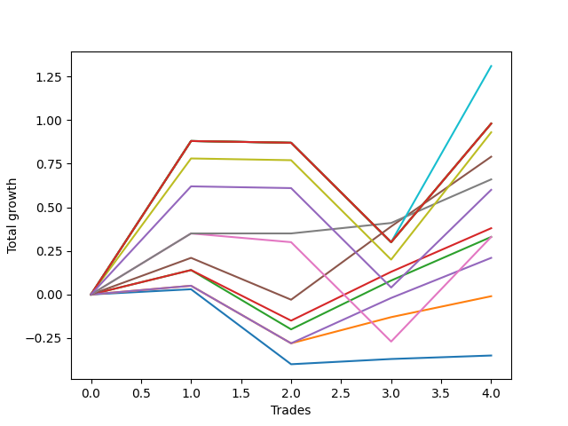

# Short Bernese 002 50 
- Symbol: AAPL
- Date Range: 05/27/2022 - 09/30/2022
- Trading Period: 7:20-12:30
- Number of Trades: 4



| Name | Win Percent | Profit | Avg Profit / Trade | Avg Time / Trade |      | Name | Win Percent | Profit | Avg Profit / Trade | Avg Time / Trade |
| ---- | ----------- | ------ | ------------------ | ---------------- | ---- | ---- | ----------- | ------ | ------------------ | ---------------- |
| Sorted By <br> Profit | | | | | | Sorted By <br> Win Percentage ||||
| Eighty-One | 50.00 | 655.00 | 163.75 | 48:52 |     | Four | 75.00 | 395.00 | 98.75 | 21:03 |
| Eighty-Five | 50.00 | 490.00 | 122.50 | 57:26 |     | Six | 75.00 | 330.00 | 82.50 | 06:16 |
| Eighty-Four | 50.00 | 490.00 | 122.50 | 57:26 |     | Two_C | 75.00 | 190.00 | 47.50 | 16:28 |
| Eighty-Three | 50.00 | 490.00 | 122.50 | 57:26 |     | Two | 75.00 | 165.00 | 41.25 | 16:27 |
| Eighty-Two | 50.00 | 490.00 | 122.50 | 57:26 |     | Three | 75.00 | 105.00 | 26.25 | 16:35 |
| Seven | 50.00 | 465.00 | 116.25 | 46:17 |     | One | 75.00 | -5.00 | -1.25 | 12:25 |
| Four | 75.00 | 395.00 | 98.75 | 21:03 |     | Zero | 75.00 | -175.00 | -43.75 | 08:18 |
| Six | 75.00 | 330.00 | 82.50 | 06:16 |     | Eighty-One | 50.00 | 655.00 | 163.75 | 48:52 |
| NEWFI 0000 | 50.00 | 300.00 | 75.00 | 38:01 |     | Eighty-Five | 50.00 | 490.00 | 122.50 | 57:26 |
| Two_C | 75.00 | 190.00 | 47.50 | 16:28 |     | Eighty-Four | 50.00 | 490.00 | 122.50 | 57:26 |
| Two | 75.00 | 165.00 | 41.25 | 16:27 |     | Eighty-Three | 50.00 | 490.00 | 122.50 | 57:26 |
| Five | 50.00 | 165.00 | 41.25 | 35:07 |     | Eighty-Two | 50.00 | 490.00 | 122.50 | 57:26 |
| Three | 75.00 | 105.00 | 26.25 | 16:35 |     | Seven | 50.00 | 465.00 | 116.25 | 46:17 |
| One | 75.00 | -5.00 | -1.25 | 12:25 |     | NEWFI 0000 | 50.00 | 300.00 | 75.00 | 38:01 |
| Zero | 75.00 | -175.00 | -43.75 | 08:18 |     | Five | 50.00 | 165.00 | 41.25 | 35:07 |

## NO STOPLOSS

### Test Zero
* Sell when price hits the middle line of the 20p bollinger
* No Stoploss
* Results:
```
Total Trades: 4
Percent Up: 25.00
Percent Down: 75.00
Total Points Moved Down: -0.35
Potential Profit: -175.00
Total Points Ups: 0.43 Count Ups: 1
Total Points Downs: 0.08 Count Downs: 3
```

<details><summary>Trades</summary>

<code>In: 2022-07-26 11:10:00		Out: 2022-07-26 11:10:20		Total Position Time: 00:20		Total Move Down: 0.03		Total to Date: 0.03</code> <br />
<code>In: 2022-08-04 11:56:00		Out: 2022-08-04 12:20:45		Total Position Time: 24:45		Total Move Down: -0.43		Total to Date: -0.40</code> <br />
<code>In: 2022-08-05 09:23:00		Out: 2022-08-05 09:30:55		Total Position Time: 07:55		Total Move Down: 0.03		Total to Date: -0.37</code> <br />
<code>In: 2022-08-19 10:06:00		Out: 2022-08-19 10:06:15		Total Position Time: 00:15		Total Move Down: 0.02		Total to Date: -0.35</code> <br />


</details>

### Test One
* Sell when the price hits the upper line of the 20p 1std bollinger
* No Stoploss
* Results:
```
Total Trades: 4
Percent Up: 25.00
Percent Down: 75.00
Total Points Moved Down: -0.01
Potential Profit: -5.00
Total Points Ups: 0.33 Count Ups: 1
Total Points Downs: 0.32 Count Downs: 3
```

<details><summary>Trades</summary>

<code>In: 2022-07-26 11:10:00		Out: 2022-07-26 11:20:25		Total Position Time: 10:25		Total Move Down: 0.05		Total to Date: 0.05</code> <br />
<code>In: 2022-08-04 11:56:00		Out: 2022-08-04 12:23:10		Total Position Time: 27:10		Total Move Down: -0.33		Total to Date: -0.28</code> <br />
<code>In: 2022-08-05 09:23:00		Out: 2022-08-05 09:31:50		Total Position Time: 08:50		Total Move Down: 0.15		Total to Date: -0.13</code> <br />
<code>In: 2022-08-19 10:06:00		Out: 2022-08-19 10:09:15		Total Position Time: 03:15		Total Move Down: 0.12		Total to Date: -0.01</code> <br />


</details>

### Test Two
* Sell when the price hits the upper line of the 20p 2std bollinger
* No Stoploss
* Results:
```
Total Trades: 4
Percent Up: 25.00
Percent Down: 75.00
Total Points Moved Down: 0.33
Potential Profit: 165.00
Total Points Ups: 0.34 Count Ups: 1
Total Points Downs: 0.67 Count Downs: 3
```

<details><summary>Trades</summary>

<code>In: 2022-07-26 11:10:00		Out: 2022-07-26 11:22:45		Total Position Time: 12:45		Total Move Down: 0.14		Total to Date: 0.14</code> <br />
<code>In: 2022-08-04 11:56:00		Out: 2022-08-04 12:34:05		Total Position Time: 38:05		Total Move Down: -0.34		Total to Date: -0.20</code> <br />
<code>In: 2022-08-05 09:23:00		Out: 2022-08-05 09:33:10		Total Position Time: 10:10		Total Move Down: 0.28		Total to Date: 0.08</code> <br />
<code>In: 2022-08-19 10:06:00		Out: 2022-08-19 10:10:50		Total Position Time: 04:50		Total Move Down: 0.25		Total to Date: 0.33</code> <br />


</details>

### Test Two_C
* Sell when the price hits the upper line of the 20p 2std bollinger
* No Stoploss
* Results:
```
Total Trades: 4
Percent Up: 25.00
Percent Down: 75.00
Total Points Moved Down: 0.38
Potential Profit: 190.00
Total Points Ups: 0.29 Count Ups: 1
Total Points Downs: 0.67 Count Downs: 3
```

<details><summary>Trades</summary>

<code>In: 2022-07-26 11:10:00		Out: 2022-07-26 11:22:45		Total Position Time: 12:45		Total Move Down: 0.14		Total to Date: 0.14</code> <br />
<code>In: 2022-08-04 11:56:00		Out: 2022-08-04 12:34:10		Total Position Time: 38:10		Total Move Down: -0.29		Total to Date: -0.15</code> <br />
<code>In: 2022-08-05 09:23:00		Out: 2022-08-05 09:33:10		Total Position Time: 10:10		Total Move Down: 0.28		Total to Date: 0.13</code> <br />
<code>In: 2022-08-19 10:06:00		Out: 2022-08-19 10:10:50		Total Position Time: 04:50		Total Move Down: 0.25		Total to Date: 0.38</code> <br />


</details>

### Test Three
* Sell when price hits the middle line of the 50p bollinger
* No Stoploss
* Results:
```
Total Trades: 4
Percent Up: 25.00
Percent Down: 75.00
Total Points Moved Down: 0.21
Potential Profit: 105.00
Total Points Ups: 0.33 Count Ups: 1
Total Points Downs: 0.54 Count Downs: 3
```

<details><summary>Trades</summary>

<code>In: 2022-07-26 11:10:00		Out: 2022-07-26 11:18:50		Total Position Time: 08:50		Total Move Down: 0.05		Total to Date: 0.05</code> <br />
<code>In: 2022-08-04 11:56:00		Out: 2022-08-04 12:39:30		Total Position Time: 43:30		Total Move Down: -0.33		Total to Date: -0.28</code> <br />
<code>In: 2022-08-05 09:23:00		Out: 2022-08-05 09:32:05		Total Position Time: 09:05		Total Move Down: 0.26		Total to Date: -0.02</code> <br />
<code>In: 2022-08-19 10:06:00		Out: 2022-08-19 10:10:55		Total Position Time: 04:55		Total Move Down: 0.23		Total to Date: 0.21</code> <br />


</details>

### Test Four
* Sell when the price hits the upper line of the 50p 1std bollinger
* No Stoploss
* Results:
```
Total Trades: 4
Percent Up: 25.00
Percent Down: 75.00
Total Points Moved Down: 0.79
Potential Profit: 395.00
Total Points Ups: 0.24 Count Ups: 1
Total Points Downs: 1.03 Count Downs: 3
```

<details><summary>Trades</summary>

<code>In: 2022-07-26 11:10:00		Out: 2022-07-26 11:26:15		Total Position Time: 16:15		Total Move Down: 0.21		Total to Date: 0.21</code> <br />
<code>In: 2022-08-04 11:56:00		Out: 2022-08-04 12:42:05		Total Position Time: 46:05		Total Move Down: -0.24		Total to Date: -0.03</code> <br />
<code>In: 2022-08-05 09:23:00		Out: 2022-08-05 09:36:25		Total Position Time: 13:25		Total Move Down: 0.42		Total to Date: 0.39</code> <br />
<code>In: 2022-08-19 10:06:00		Out: 2022-08-19 10:14:30		Total Position Time: 08:30		Total Move Down: 0.40		Total to Date: 0.79</code> <br />


</details>

### Test Five
* Sell when the price hits the upper line of the 50p 2std bollinger
* No Stoploss
* Results:
```
Total Trades: 4
Percent Up: 50.00
Percent Down: 50.00
Total Points Moved Down: 0.33
Potential Profit: 165.00
Total Points Ups: 0.62 Count Ups: 2
Total Points Downs: 0.95 Count Downs: 2
```

<details><summary>Trades</summary>

<code>In: 2022-07-26 11:10:00		Out: 2022-07-26 11:29:30		Total Position Time: 19:30		Total Move Down: 0.35		Total to Date: 0.35</code> <br />
<code>In: 2022-08-04 11:56:00		Out: 2022-08-04 12:43:30		Total Position Time: 47:30		Total Move Down: -0.05		Total to Date: 0.30</code> <br />
<code>In: 2022-08-05 09:23:00		Out: 2022-08-05 10:22:55		Total Position Time: 59:55		Total Move Down: -0.57		Total to Date: -0.27</code> <br />
<code>In: 2022-08-19 10:06:00		Out: 2022-08-19 10:19:35		Total Position Time: 13:35		Total Move Down: 0.60		Total to Date: 0.33</code> <br />


</details>

### Test Six
* Sell when the price hits the middle line of the 1std VWAP
* No Stoploss
* Results:
```
Total Trades: 4
Percent Up: 25.00
Percent Down: 75.00
Total Points Moved Down: 0.66
Potential Profit: 330.00
Total Points Ups: 0.00 Count Ups: 1
Total Points Downs: 0.66 Count Downs: 3
```

<details><summary>Trades</summary>

<code>In: 2022-07-26 11:10:00		Out: 2022-07-26 11:29:30		Total Position Time: 19:30		Total Move Down: 0.35		Total to Date: 0.35</code> <br />
<code>In: 2022-08-04 11:56:00		Out: 2022-08-04 11:56:10		Total Position Time: 00:10		Total Move Down: -0.00		Total to Date: 0.35</code> <br />
<code>In: 2022-08-05 09:23:00		Out: 2022-08-05 09:23:35		Total Position Time: 00:35		Total Move Down: 0.06		Total to Date: 0.41</code> <br />
<code>In: 2022-08-19 10:06:00		Out: 2022-08-19 10:10:50		Total Position Time: 04:50		Total Move Down: 0.25		Total to Date: 0.66</code> <br />


</details>

### Test Seven
* Sell when the price hits the upper line of the 1std VWAP
* No Stoploss
* Results:
```
Total Trades: 4
Percent Up: 50.00
Percent Down: 50.00
Total Points Moved Down: 0.93
Potential Profit: 465.00
Total Points Ups: 0.58 Count Ups: 2
Total Points Downs: 1.51 Count Downs: 2
```

<details><summary>Trades</summary>

<code>In: 2022-07-26 11:10:00		Out: 2022-07-26 12:04:10		Total Position Time: 54:10		Total Move Down: 0.78		Total to Date: 0.78</code> <br />
<code>In: 2022-08-04 11:56:00		Out: 2022-08-04 12:46:00		Total Position Time: 50:00		Total Move Down: -0.01		Total to Date: 0.77</code> <br />
<code>In: 2022-08-05 09:23:00		Out: 2022-08-05 10:22:55		Total Position Time: 59:55		Total Move Down: -0.57		Total to Date: 0.20</code> <br />
<code>In: 2022-08-19 10:06:00		Out: 2022-08-19 10:27:05		Total Position Time: 21:05		Total Move Down: 0.73		Total to Date: 0.93</code> <br />


</details>

## TAKE PROFIT

### Test Eighty-One
* Take Profit of 1 Point
* No Stoploss
* Results:
```
Total Trades: 4
Percent Up: 50.00
Percent Down: 50.00
Total Points Moved Down: 1.31
Potential Profit: 655.00
Total Points Ups: 0.58 Count Ups: 2
Total Points Downs: 1.89 Count Downs: 2
```

<details><summary>Trades</summary>

<code>In: 2022-07-26 11:10:00		Out: 2022-07-26 12:09:55		Total Position Time: 59:55		Total Move Down: 0.88		Total to Date: 0.88</code> <br />
<code>In: 2022-08-04 11:56:00		Out: 2022-08-04 12:46:00		Total Position Time: 50:00		Total Move Down: -0.01		Total to Date: 0.87</code> <br />
<code>In: 2022-08-05 09:23:00		Out: 2022-08-05 10:22:55		Total Position Time: 59:55		Total Move Down: -0.57		Total to Date: 0.30</code> <br />
<code>In: 2022-08-19 10:06:00		Out: 2022-08-19 10:31:40		Total Position Time: 25:40		Total Move Down: 1.01		Total to Date: 1.31</code> <br />


</details>

### Test Eighty-Two
* Take Profit of 2 Point
* No Stoploss
* Results:
```
Total Trades: 4
Percent Up: 50.00
Percent Down: 50.00
Total Points Moved Down: 0.98
Potential Profit: 490.00
Total Points Ups: 0.58 Count Ups: 2
Total Points Downs: 1.56 Count Downs: 2
```

<details><summary>Trades</summary>

<code>In: 2022-07-26 11:10:00		Out: 2022-07-26 12:09:55		Total Position Time: 59:55		Total Move Down: 0.88		Total to Date: 0.88</code> <br />
<code>In: 2022-08-04 11:56:00		Out: 2022-08-04 12:46:00		Total Position Time: 50:00		Total Move Down: -0.01		Total to Date: 0.87</code> <br />
<code>In: 2022-08-05 09:23:00		Out: 2022-08-05 10:22:55		Total Position Time: 59:55		Total Move Down: -0.57		Total to Date: 0.30</code> <br />
<code>In: 2022-08-19 10:06:00		Out: 2022-08-19 11:05:55		Total Position Time: 59:55		Total Move Down: 0.68		Total to Date: 0.98</code> <br />


</details>

### Test Eighty-Three
* Take Profit of 3 Point
* No Stoploss
* Results:
```
Total Trades: 4
Percent Up: 50.00
Percent Down: 50.00
Total Points Moved Down: 0.98
Potential Profit: 490.00
Total Points Ups: 0.58 Count Ups: 2
Total Points Downs: 1.56 Count Downs: 2
```

<details><summary>Trades</summary>

<code>In: 2022-07-26 11:10:00		Out: 2022-07-26 12:09:55		Total Position Time: 59:55		Total Move Down: 0.88		Total to Date: 0.88</code> <br />
<code>In: 2022-08-04 11:56:00		Out: 2022-08-04 12:46:00		Total Position Time: 50:00		Total Move Down: -0.01		Total to Date: 0.87</code> <br />
<code>In: 2022-08-05 09:23:00		Out: 2022-08-05 10:22:55		Total Position Time: 59:55		Total Move Down: -0.57		Total to Date: 0.30</code> <br />
<code>In: 2022-08-19 10:06:00		Out: 2022-08-19 11:05:55		Total Position Time: 59:55		Total Move Down: 0.68		Total to Date: 0.98</code> <br />


</details>

### Test Eighty-Four
* Take Profit of 4 Point
* No Stoploss
* Results:
```
Total Trades: 4
Percent Up: 50.00
Percent Down: 50.00
Total Points Moved Down: 0.98
Potential Profit: 490.00
Total Points Ups: 0.58 Count Ups: 2
Total Points Downs: 1.56 Count Downs: 2
```

<details><summary>Trades</summary>

<code>In: 2022-07-26 11:10:00		Out: 2022-07-26 12:09:55		Total Position Time: 59:55		Total Move Down: 0.88		Total to Date: 0.88</code> <br />
<code>In: 2022-08-04 11:56:00		Out: 2022-08-04 12:46:00		Total Position Time: 50:00		Total Move Down: -0.01		Total to Date: 0.87</code> <br />
<code>In: 2022-08-05 09:23:00		Out: 2022-08-05 10:22:55		Total Position Time: 59:55		Total Move Down: -0.57		Total to Date: 0.30</code> <br />
<code>In: 2022-08-19 10:06:00		Out: 2022-08-19 11:05:55		Total Position Time: 59:55		Total Move Down: 0.68		Total to Date: 0.98</code> <br />


</details>

### Test Eighty-Five
* Take Profit of 5 Point
* No Stoploss
* Results:
```
Total Trades: 4
Percent Up: 50.00
Percent Down: 50.00
Total Points Moved Down: 0.98
Potential Profit: 490.00
Total Points Ups: 0.58 Count Ups: 2
Total Points Downs: 1.56 Count Downs: 2
```

<details><summary>Trades</summary>

<code>In: 2022-07-26 11:10:00		Out: 2022-07-26 12:09:55		Total Position Time: 59:55		Total Move Down: 0.88		Total to Date: 0.88</code> <br />
<code>In: 2022-08-04 11:56:00		Out: 2022-08-04 12:46:00		Total Position Time: 50:00		Total Move Down: -0.01		Total to Date: 0.87</code> <br />
<code>In: 2022-08-05 09:23:00		Out: 2022-08-05 10:22:55		Total Position Time: 59:55		Total Move Down: -0.57		Total to Date: 0.30</code> <br />
<code>In: 2022-08-19 10:06:00		Out: 2022-08-19 11:05:55		Total Position Time: 59:55		Total Move Down: 0.68		Total to Date: 0.98</code> <br />


</details>

## Indicator Exits

### Test NEWFI 0000
* Newfi 0000
* No Stoploss
* Results:
```
Total Trades: 4
Percent Up: 50.00
Percent Down: 50.00
Total Points Moved Down: 0.60
Potential Profit: 300.00
Total Points Ups: 0.58 Count Ups: 2
Total Points Downs: 1.18 Count Downs: 2
```

<details><summary>Trades</summary>

<code>In: 2022-07-26 11:10:00		Out: 2022-07-26 11:36:05		Total Position Time: 26:05		Total Move Down: 0.62		Total to Date: 0.62</code> <br />
<code>In: 2022-08-04 11:56:00		Out: 2022-08-04 12:46:00		Total Position Time: 50:00		Total Move Down: -0.01		Total to Date: 0.61</code> <br />
<code>In: 2022-08-05 09:23:00		Out: 2022-08-05 10:22:55		Total Position Time: 59:55		Total Move Down: -0.57		Total to Date: 0.04</code> <br />
<code>In: 2022-08-19 10:06:00		Out: 2022-08-19 10:22:05		Total Position Time: 16:05		Total Move Down: 0.56		Total to Date: 0.60</code> <br />


</details>