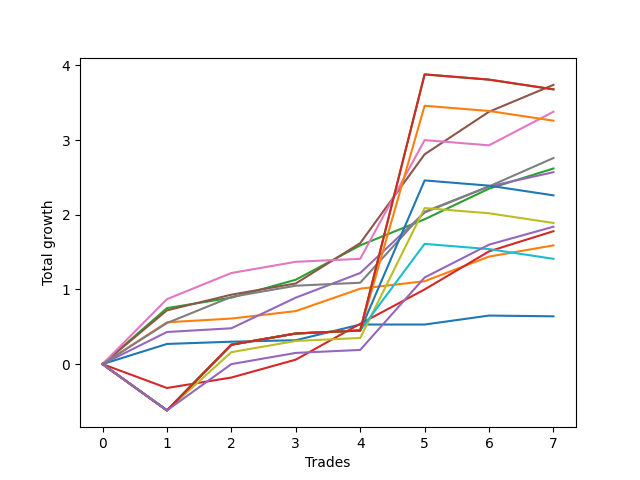

# Short Bernese 003 1v 
- Symbol: AAPL
- Date Range: 05/27/2022 - 09/30/2022
- Trading Period: 7:20-12:30
- Number of Trades: 7



| Name | Win Percent | Profit | Avg Profit / Trade | Avg Time / Trade |      | Name | Win Percent | Profit | Avg Profit / Trade | Avg Time / Trade |
| ---- | ----------- | ------ | ------------------ | ---------------- | ---- | ---- | ----------- | ------ | ------------------ | ---------------- |
| Sorted By <br> Profit | | | | | | Sorted By <br> Win Percentage ||||
| Four | 100.00 | 1870.00 | 267.14 | 22:00 |     | Four | 100.00 | 1870.00 | 267.14 | 22:00 |
| Eighty-Five | 57.14 | 1840.00 | 262.86 | 55:30 |     | Six | 100.00 | 1380.00 | 197.14 | 23:32 |
| Eighty-Four | 57.14 | 1840.00 | 262.86 | 55:30 |     | Two | 100.00 | 1310.00 | 187.14 | 11:57 |
| Five | 85.71 | 1690.00 | 241.43 | 36:00 |     | Three | 100.00 | 1285.00 | 183.57 | 09:47 |
| Eighty-Three | 57.14 | 1630.00 | 232.86 | 55:20 |     | One | 100.00 | 795.00 | 113.57 | 08:42 |
| Six | 100.00 | 1380.00 | 197.14 | 23:32 |     | Five | 85.71 | 1690.00 | 241.43 | 36:00 |
| Two | 100.00 | 1310.00 | 187.14 | 11:57 |     | NEWFI 0000 | 85.71 | 920.00 | 131.43 | 36:01 |
| Three | 100.00 | 1285.00 | 183.57 | 09:47 |     | Two_C | 85.71 | 890.00 | 127.14 | 19:03 |
| Eighty-Two | 57.14 | 1130.00 | 161.43 | 52:51 |     | Zero | 71.43 | 320.00 | 45.71 | 04:11 |
| Seven | 57.14 | 945.00 | 135.00 | 51:57 |     | Eighty-Five | 57.14 | 1840.00 | 262.86 | 55:30 |
| NEWFI 0000 | 85.71 | 920.00 | 131.43 | 36:01 |     | Eighty-Four | 57.14 | 1840.00 | 262.86 | 55:30 |
| Two_C | 85.71 | 890.00 | 127.14 | 19:03 |     | Eighty-Three | 57.14 | 1630.00 | 232.86 | 55:20 |
| One | 100.00 | 795.00 | 113.57 | 08:42 |     | Eighty-Two | 57.14 | 1130.00 | 161.43 | 52:51 |
| Eighty-One | 57.14 | 705.00 | 100.71 | 50:30 |     | Seven | 57.14 | 945.00 | 135.00 | 51:57 |
| Zero | 71.43 | 320.00 | 45.71 | 04:11 |     | Eighty-One | 57.14 | 705.00 | 100.71 | 50:30 |

## NO STOPLOSS

### Test Zero
* Sell when price hits the middle line of the 20p bollinger
* No Stoploss
* Results:
```
Total Trades: 7
Percent Up: 28.57
Percent Down: 71.43
Total Points Moved Down: 0.64
Potential Profit: 320.00
Total Points Ups: 0.01 Count Ups: 2
Total Points Downs: 0.65 Count Downs: 5
```

<details><summary>Trades</summary>

<code>In: 2022-07-06 11:10:00		Out: 2022-07-06 11:11:05		Total Position Time: 01:05		Total Move Down: 0.27		Total to Date: 0.27</code> <br />
<code>In: 2022-07-26 11:10:00		Out: 2022-07-26 11:10:20		Total Position Time: 00:20		Total Move Down: 0.03		Total to Date: 0.30</code> <br />
<code>In: 2022-09-01 11:29:00		Out: 2022-09-01 11:38:25		Total Position Time: 09:25		Total Move Down: 0.02		Total to Date: 0.32</code> <br />
<code>In: 2022-09-01 12:15:00		Out: 2022-09-01 12:17:05		Total Position Time: 02:05		Total Move Down: 0.21		Total to Date: 0.53</code> <br />
<code>In: 2022-09-21 11:48:00		Out: 2022-09-21 12:01:35		Total Position Time: 13:35		Total Move Down: -0.00		Total to Date: 0.53</code> <br />
<code>In: 2022-09-22 09:59:00		Out: 2022-09-22 10:01:40		Total Position Time: 02:40		Total Move Down: 0.12		Total to Date: 0.65</code> <br />
<code>In: 2022-09-22 10:57:00		Out: 2022-09-22 10:57:10		Total Position Time: 00:10		Total Move Down: -0.01		Total to Date: 0.64</code> <br />


</details>

### Test One
* Sell when the price hits the upper line of the 20p 1std bollinger
* No Stoploss
* Results:
```
Total Trades: 7
Percent Up: 0.00
Percent Down: 100.00
Total Points Moved Down: 1.59
Potential Profit: 795.00
Total Points Ups: 0.00 Count Ups: 0
Total Points Downs: 1.59 Count Downs: 7
```

<details><summary>Trades</summary>

<code>In: 2022-07-06 11:10:00		Out: 2022-07-06 11:11:45		Total Position Time: 01:45		Total Move Down: 0.56		Total to Date: 0.56</code> <br />
<code>In: 2022-07-26 11:10:00		Out: 2022-07-26 11:20:25		Total Position Time: 10:25		Total Move Down: 0.05		Total to Date: 0.61</code> <br />
<code>In: 2022-09-01 11:29:00		Out: 2022-09-01 11:41:20		Total Position Time: 12:20		Total Move Down: 0.10		Total to Date: 0.71</code> <br />
<code>In: 2022-09-01 12:15:00		Out: 2022-09-01 12:19:10		Total Position Time: 04:10		Total Move Down: 0.30		Total to Date: 1.01</code> <br />
<code>In: 2022-09-21 11:48:00		Out: 2022-09-21 12:09:10		Total Position Time: 21:10		Total Move Down: 0.10		Total to Date: 1.11</code> <br />
<code>In: 2022-09-22 09:59:00		Out: 2022-09-22 10:03:20		Total Position Time: 04:20		Total Move Down: 0.33		Total to Date: 1.44</code> <br />
<code>In: 2022-09-22 10:57:00		Out: 2022-09-22 11:03:50		Total Position Time: 06:50		Total Move Down: 0.15		Total to Date: 1.59</code> <br />


</details>

### Test Two
* Sell when the price hits the upper line of the 20p 2std bollinger
* No Stoploss
* Results:
```
Total Trades: 7
Percent Up: 0.00
Percent Down: 100.00
Total Points Moved Down: 2.62
Potential Profit: 1310.00
Total Points Ups: 0.00 Count Ups: 0
Total Points Downs: 2.62 Count Downs: 7
```

<details><summary>Trades</summary>

<code>In: 2022-07-06 11:10:00		Out: 2022-07-06 11:12:30		Total Position Time: 02:30		Total Move Down: 0.75		Total to Date: 0.75</code> <br />
<code>In: 2022-07-26 11:10:00		Out: 2022-07-26 11:22:45		Total Position Time: 12:45		Total Move Down: 0.14		Total to Date: 0.89</code> <br />
<code>In: 2022-09-01 11:29:00		Out: 2022-09-01 11:43:45		Total Position Time: 14:45		Total Move Down: 0.24		Total to Date: 1.13</code> <br />
<code>In: 2022-09-01 12:15:00		Out: 2022-09-01 12:27:45		Total Position Time: 12:45		Total Move Down: 0.46		Total to Date: 1.59</code> <br />
<code>In: 2022-09-21 11:48:00		Out: 2022-09-21 12:10:05		Total Position Time: 22:05		Total Move Down: 0.35		Total to Date: 1.94</code> <br />
<code>In: 2022-09-22 09:59:00		Out: 2022-09-22 10:08:00		Total Position Time: 09:00		Total Move Down: 0.41		Total to Date: 2.35</code> <br />
<code>In: 2022-09-22 10:57:00		Out: 2022-09-22 11:06:50		Total Position Time: 09:50		Total Move Down: 0.27		Total to Date: 2.62</code> <br />


</details>

### Test Two_C
* Sell when the price hits the upper line of the 20p 2std bollinger
* No Stoploss
* Results:
```
Total Trades: 7
Percent Up: 14.29
Percent Down: 85.71
Total Points Moved Down: 1.78
Potential Profit: 890.00
Total Points Ups: 0.32 Count Ups: 1
Total Points Downs: 2.10 Count Downs: 6
```

<details><summary>Trades</summary>

<code>In: 2022-07-06 11:10:00		Out: 2022-07-06 12:01:40		Total Position Time: 51:40		Total Move Down: -0.32		Total to Date: -0.32</code> <br />
<code>In: 2022-07-26 11:10:00		Out: 2022-07-26 11:22:45		Total Position Time: 12:45		Total Move Down: 0.14		Total to Date: -0.18</code> <br />
<code>In: 2022-09-01 11:29:00		Out: 2022-09-01 11:43:45		Total Position Time: 14:45		Total Move Down: 0.24		Total to Date: 0.06</code> <br />
<code>In: 2022-09-01 12:15:00		Out: 2022-09-01 12:27:55		Total Position Time: 12:55		Total Move Down: 0.48		Total to Date: 0.54</code> <br />
<code>In: 2022-09-21 11:48:00		Out: 2022-09-21 12:10:10		Total Position Time: 22:10		Total Move Down: 0.46		Total to Date: 1.00</code> <br />
<code>In: 2022-09-22 09:59:00		Out: 2022-09-22 10:08:20		Total Position Time: 09:20		Total Move Down: 0.51		Total to Date: 1.51</code> <br />
<code>In: 2022-09-22 10:57:00		Out: 2022-09-22 11:06:50		Total Position Time: 09:50		Total Move Down: 0.27		Total to Date: 1.78</code> <br />


</details>

### Test Three
* Sell when price hits the middle line of the 50p bollinger
* No Stoploss
* Results:
```
Total Trades: 7
Percent Up: 0.00
Percent Down: 100.00
Total Points Moved Down: 2.57
Potential Profit: 1285.00
Total Points Ups: 0.00 Count Ups: 0
Total Points Downs: 2.57 Count Downs: 7
```

<details><summary>Trades</summary>

<code>In: 2022-07-06 11:10:00		Out: 2022-07-06 11:11:35		Total Position Time: 01:35		Total Move Down: 0.43		Total to Date: 0.43</code> <br />
<code>In: 2022-07-26 11:10:00		Out: 2022-07-26 11:18:50		Total Position Time: 08:50		Total Move Down: 0.05		Total to Date: 0.48</code> <br />
<code>In: 2022-09-01 11:29:00		Out: 2022-09-01 11:48:15		Total Position Time: 19:15		Total Move Down: 0.41		Total to Date: 0.89</code> <br />
<code>In: 2022-09-01 12:15:00		Out: 2022-09-01 12:19:05		Total Position Time: 04:05		Total Move Down: 0.33		Total to Date: 1.22</code> <br />
<code>In: 2022-09-21 11:48:00		Out: 2022-09-21 12:10:45		Total Position Time: 22:45		Total Move Down: 0.81		Total to Date: 2.03</code> <br />
<code>In: 2022-09-22 09:59:00		Out: 2022-09-22 10:03:40		Total Position Time: 04:40		Total Move Down: 0.35		Total to Date: 2.38</code> <br />
<code>In: 2022-09-22 10:57:00		Out: 2022-09-22 11:04:20		Total Position Time: 07:20		Total Move Down: 0.19		Total to Date: 2.57</code> <br />


</details>

### Test Four
* Sell when the price hits the upper line of the 50p 1std bollinger
* No Stoploss
* Results:
```
Total Trades: 7
Percent Up: 0.00
Percent Down: 100.00
Total Points Moved Down: 3.74
Potential Profit: 1870.00
Total Points Ups: 0.00 Count Ups: 0
Total Points Downs: 3.74 Count Downs: 7
```

<details><summary>Trades</summary>

<code>In: 2022-07-06 11:10:00		Out: 2022-07-06 11:12:15		Total Position Time: 02:15		Total Move Down: 0.72		Total to Date: 0.72</code> <br />
<code>In: 2022-07-26 11:10:00		Out: 2022-07-26 11:26:15		Total Position Time: 16:15		Total Move Down: 0.21		Total to Date: 0.93</code> <br />
<code>In: 2022-09-01 11:29:00		Out: 2022-09-01 12:28:55		Total Position Time: 59:55		Total Move Down: 0.15		Total to Date: 1.08</code> <br />
<code>In: 2022-09-01 12:15:00		Out: 2022-09-01 12:30:05		Total Position Time: 15:05		Total Move Down: 0.54		Total to Date: 1.62</code> <br />
<code>In: 2022-09-21 11:48:00		Out: 2022-09-21 12:21:35		Total Position Time: 33:35		Total Move Down: 1.19		Total to Date: 2.81</code> <br />
<code>In: 2022-09-22 09:59:00		Out: 2022-09-22 10:10:15		Total Position Time: 11:15		Total Move Down: 0.57		Total to Date: 3.38</code> <br />
<code>In: 2022-09-22 10:57:00		Out: 2022-09-22 11:12:40		Total Position Time: 15:40		Total Move Down: 0.36		Total to Date: 3.74</code> <br />


</details>

### Test Five
* Sell when the price hits the upper line of the 50p 2std bollinger
* No Stoploss
* Results:
```
Total Trades: 7
Percent Up: 14.29
Percent Down: 85.71
Total Points Moved Down: 3.38
Potential Profit: 1690.00
Total Points Ups: 0.07 Count Ups: 1
Total Points Downs: 3.45 Count Downs: 6
```

<details><summary>Trades</summary>

<code>In: 2022-07-06 11:10:00		Out: 2022-07-06 11:26:55		Total Position Time: 16:55		Total Move Down: 0.87		Total to Date: 0.87</code> <br />
<code>In: 2022-07-26 11:10:00		Out: 2022-07-26 11:29:30		Total Position Time: 19:30		Total Move Down: 0.35		Total to Date: 1.22</code> <br />
<code>In: 2022-09-01 11:29:00		Out: 2022-09-01 12:28:55		Total Position Time: 59:55		Total Move Down: 0.15		Total to Date: 1.37</code> <br />
<code>In: 2022-09-01 12:15:00		Out: 2022-09-01 12:46:00		Total Position Time: 31:00		Total Move Down: 0.04		Total to Date: 1.41</code> <br />
<code>In: 2022-09-21 11:48:00		Out: 2022-09-21 12:26:40		Total Position Time: 38:40		Total Move Down: 1.59		Total to Date: 3.00</code> <br />
<code>In: 2022-09-22 09:59:00		Out: 2022-09-22 10:58:55		Total Position Time: 59:55		Total Move Down: -0.07		Total to Date: 2.93</code> <br />
<code>In: 2022-09-22 10:57:00		Out: 2022-09-22 11:23:05		Total Position Time: 26:05		Total Move Down: 0.45		Total to Date: 3.38</code> <br />


</details>

### Test Six
* Sell when the price hits the middle line of the 1std VWAP
* No Stoploss
* Results:
```
Total Trades: 7
Percent Up: 0.00
Percent Down: 100.00
Total Points Moved Down: 2.76
Potential Profit: 1380.00
Total Points Ups: 0.00 Count Ups: 0
Total Points Downs: 2.76 Count Downs: 7
```

<details><summary>Trades</summary>

<code>In: 2022-07-06 11:10:00		Out: 2022-07-06 11:11:50		Total Position Time: 01:50		Total Move Down: 0.55		Total to Date: 0.55</code> <br />
<code>In: 2022-07-26 11:10:00		Out: 2022-07-26 11:29:30		Total Position Time: 19:30		Total Move Down: 0.35		Total to Date: 0.90</code> <br />
<code>In: 2022-09-01 11:29:00		Out: 2022-09-01 12:28:55		Total Position Time: 59:55		Total Move Down: 0.15		Total to Date: 1.05</code> <br />
<code>In: 2022-09-01 12:15:00		Out: 2022-09-01 12:46:00		Total Position Time: 31:00		Total Move Down: 0.04		Total to Date: 1.09</code> <br />
<code>In: 2022-09-21 11:48:00		Out: 2022-09-21 12:10:50		Total Position Time: 22:50		Total Move Down: 0.95		Total to Date: 2.04</code> <br />
<code>In: 2022-09-22 09:59:00		Out: 2022-09-22 10:03:25		Total Position Time: 04:25		Total Move Down: 0.34		Total to Date: 2.38</code> <br />
<code>In: 2022-09-22 10:57:00		Out: 2022-09-22 11:22:20		Total Position Time: 25:20		Total Move Down: 0.38		Total to Date: 2.76</code> <br />


</details>

### Test Seven
* Sell when the price hits the upper line of the 1std VWAP
* No Stoploss
* Results:
```
Total Trades: 7
Percent Up: 42.86
Percent Down: 57.14
Total Points Moved Down: 1.89
Potential Profit: 945.00
Total Points Ups: 0.82 Count Ups: 3
Total Points Downs: 2.71 Count Downs: 4
```

<details><summary>Trades</summary>

<code>In: 2022-07-06 11:10:00		Out: 2022-07-06 12:09:55		Total Position Time: 59:55		Total Move Down: -0.62		Total to Date: -0.62</code> <br />
<code>In: 2022-07-26 11:10:00		Out: 2022-07-26 12:04:10		Total Position Time: 54:10		Total Move Down: 0.78		Total to Date: 0.16</code> <br />
<code>In: 2022-09-01 11:29:00		Out: 2022-09-01 12:28:55		Total Position Time: 59:55		Total Move Down: 0.15		Total to Date: 0.31</code> <br />
<code>In: 2022-09-01 12:15:00		Out: 2022-09-01 12:46:00		Total Position Time: 31:00		Total Move Down: 0.04		Total to Date: 0.35</code> <br />
<code>In: 2022-09-21 11:48:00		Out: 2022-09-21 12:26:50		Total Position Time: 38:50		Total Move Down: 1.74		Total to Date: 2.09</code> <br />
<code>In: 2022-09-22 09:59:00		Out: 2022-09-22 10:58:55		Total Position Time: 59:55		Total Move Down: -0.07		Total to Date: 2.02</code> <br />
<code>In: 2022-09-22 10:57:00		Out: 2022-09-22 11:56:55		Total Position Time: 59:55		Total Move Down: -0.13		Total to Date: 1.89</code> <br />


</details>

## TAKE PROFIT

### Test Eighty-One
* Take Profit of 1 Point
* No Stoploss
* Results:
```
Total Trades: 7
Percent Up: 42.86
Percent Down: 57.14
Total Points Moved Down: 1.41
Potential Profit: 705.00
Total Points Ups: 0.82 Count Ups: 3
Total Points Downs: 2.23 Count Downs: 4
```

<details><summary>Trades</summary>

<code>In: 2022-07-06 11:10:00		Out: 2022-07-06 12:09:55		Total Position Time: 59:55		Total Move Down: -0.62		Total to Date: -0.62</code> <br />
<code>In: 2022-07-26 11:10:00		Out: 2022-07-26 12:09:55		Total Position Time: 59:55		Total Move Down: 0.88		Total to Date: 0.26</code> <br />
<code>In: 2022-09-01 11:29:00		Out: 2022-09-01 12:28:55		Total Position Time: 59:55		Total Move Down: 0.15		Total to Date: 0.41</code> <br />
<code>In: 2022-09-01 12:15:00		Out: 2022-09-01 12:46:00		Total Position Time: 31:00		Total Move Down: 0.04		Total to Date: 0.45</code> <br />
<code>In: 2022-09-21 11:48:00		Out: 2022-09-21 12:10:55		Total Position Time: 22:55		Total Move Down: 1.16		Total to Date: 1.61</code> <br />
<code>In: 2022-09-22 09:59:00		Out: 2022-09-22 10:58:55		Total Position Time: 59:55		Total Move Down: -0.07		Total to Date: 1.54</code> <br />
<code>In: 2022-09-22 10:57:00		Out: 2022-09-22 11:56:55		Total Position Time: 59:55		Total Move Down: -0.13		Total to Date: 1.41</code> <br />


</details>

### Test Eighty-Two
* Take Profit of 2 Point
* No Stoploss
* Results:
```
Total Trades: 7
Percent Up: 42.86
Percent Down: 57.14
Total Points Moved Down: 2.26
Potential Profit: 1130.00
Total Points Ups: 0.82 Count Ups: 3
Total Points Downs: 3.08 Count Downs: 4
```

<details><summary>Trades</summary>

<code>In: 2022-07-06 11:10:00		Out: 2022-07-06 12:09:55		Total Position Time: 59:55		Total Move Down: -0.62		Total to Date: -0.62</code> <br />
<code>In: 2022-07-26 11:10:00		Out: 2022-07-26 12:09:55		Total Position Time: 59:55		Total Move Down: 0.88		Total to Date: 0.26</code> <br />
<code>In: 2022-09-01 11:29:00		Out: 2022-09-01 12:28:55		Total Position Time: 59:55		Total Move Down: 0.15		Total to Date: 0.41</code> <br />
<code>In: 2022-09-01 12:15:00		Out: 2022-09-01 12:46:00		Total Position Time: 31:00		Total Move Down: 0.04		Total to Date: 0.45</code> <br />
<code>In: 2022-09-21 11:48:00		Out: 2022-09-21 12:27:25		Total Position Time: 39:25		Total Move Down: 2.01		Total to Date: 2.46</code> <br />
<code>In: 2022-09-22 09:59:00		Out: 2022-09-22 10:58:55		Total Position Time: 59:55		Total Move Down: -0.07		Total to Date: 2.39</code> <br />
<code>In: 2022-09-22 10:57:00		Out: 2022-09-22 11:56:55		Total Position Time: 59:55		Total Move Down: -0.13		Total to Date: 2.26</code> <br />


</details>

### Test Eighty-Three
* Take Profit of 3 Point
* No Stoploss
* Results:
```
Total Trades: 7
Percent Up: 42.86
Percent Down: 57.14
Total Points Moved Down: 3.26
Potential Profit: 1630.00
Total Points Ups: 0.82 Count Ups: 3
Total Points Downs: 4.08 Count Downs: 4
```

<details><summary>Trades</summary>

<code>In: 2022-07-06 11:10:00		Out: 2022-07-06 12:09:55		Total Position Time: 59:55		Total Move Down: -0.62		Total to Date: -0.62</code> <br />
<code>In: 2022-07-26 11:10:00		Out: 2022-07-26 12:09:55		Total Position Time: 59:55		Total Move Down: 0.88		Total to Date: 0.26</code> <br />
<code>In: 2022-09-01 11:29:00		Out: 2022-09-01 12:28:55		Total Position Time: 59:55		Total Move Down: 0.15		Total to Date: 0.41</code> <br />
<code>In: 2022-09-01 12:15:00		Out: 2022-09-01 12:46:00		Total Position Time: 31:00		Total Move Down: 0.04		Total to Date: 0.45</code> <br />
<code>In: 2022-09-21 11:48:00		Out: 2022-09-21 12:44:50		Total Position Time: 56:50		Total Move Down: 3.01		Total to Date: 3.46</code> <br />
<code>In: 2022-09-22 09:59:00		Out: 2022-09-22 10:58:55		Total Position Time: 59:55		Total Move Down: -0.07		Total to Date: 3.39</code> <br />
<code>In: 2022-09-22 10:57:00		Out: 2022-09-22 11:56:55		Total Position Time: 59:55		Total Move Down: -0.13		Total to Date: 3.26</code> <br />


</details>

### Test Eighty-Four
* Take Profit of 4 Point
* No Stoploss
* Results:
```
Total Trades: 7
Percent Up: 42.86
Percent Down: 57.14
Total Points Moved Down: 3.68
Potential Profit: 1840.00
Total Points Ups: 0.82 Count Ups: 3
Total Points Downs: 4.50 Count Downs: 4
```

<details><summary>Trades</summary>

<code>In: 2022-07-06 11:10:00		Out: 2022-07-06 12:09:55		Total Position Time: 59:55		Total Move Down: -0.62		Total to Date: -0.62</code> <br />
<code>In: 2022-07-26 11:10:00		Out: 2022-07-26 12:09:55		Total Position Time: 59:55		Total Move Down: 0.88		Total to Date: 0.26</code> <br />
<code>In: 2022-09-01 11:29:00		Out: 2022-09-01 12:28:55		Total Position Time: 59:55		Total Move Down: 0.15		Total to Date: 0.41</code> <br />
<code>In: 2022-09-01 12:15:00		Out: 2022-09-01 12:46:00		Total Position Time: 31:00		Total Move Down: 0.04		Total to Date: 0.45</code> <br />
<code>In: 2022-09-21 11:48:00		Out: 2022-09-21 12:46:00		Total Position Time: 58:00		Total Move Down: 3.43		Total to Date: 3.88</code> <br />
<code>In: 2022-09-22 09:59:00		Out: 2022-09-22 10:58:55		Total Position Time: 59:55		Total Move Down: -0.07		Total to Date: 3.81</code> <br />
<code>In: 2022-09-22 10:57:00		Out: 2022-09-22 11:56:55		Total Position Time: 59:55		Total Move Down: -0.13		Total to Date: 3.68</code> <br />


</details>

### Test Eighty-Five
* Take Profit of 5 Point
* No Stoploss
* Results:
```
Total Trades: 7
Percent Up: 42.86
Percent Down: 57.14
Total Points Moved Down: 3.68
Potential Profit: 1840.00
Total Points Ups: 0.82 Count Ups: 3
Total Points Downs: 4.50 Count Downs: 4
```

<details><summary>Trades</summary>

<code>In: 2022-07-06 11:10:00		Out: 2022-07-06 12:09:55		Total Position Time: 59:55		Total Move Down: -0.62		Total to Date: -0.62</code> <br />
<code>In: 2022-07-26 11:10:00		Out: 2022-07-26 12:09:55		Total Position Time: 59:55		Total Move Down: 0.88		Total to Date: 0.26</code> <br />
<code>In: 2022-09-01 11:29:00		Out: 2022-09-01 12:28:55		Total Position Time: 59:55		Total Move Down: 0.15		Total to Date: 0.41</code> <br />
<code>In: 2022-09-01 12:15:00		Out: 2022-09-01 12:46:00		Total Position Time: 31:00		Total Move Down: 0.04		Total to Date: 0.45</code> <br />
<code>In: 2022-09-21 11:48:00		Out: 2022-09-21 12:46:00		Total Position Time: 58:00		Total Move Down: 3.43		Total to Date: 3.88</code> <br />
<code>In: 2022-09-22 09:59:00		Out: 2022-09-22 10:58:55		Total Position Time: 59:55		Total Move Down: -0.07		Total to Date: 3.81</code> <br />
<code>In: 2022-09-22 10:57:00		Out: 2022-09-22 11:56:55		Total Position Time: 59:55		Total Move Down: -0.13		Total to Date: 3.68</code> <br />


</details>

## Indicator Exits

### Test NEWFI 0000
* Newfi 0000
* No Stoploss
* Results:
```
Total Trades: 7
Percent Up: 14.29
Percent Down: 85.71
Total Points Moved Down: 1.84
Potential Profit: 920.00
Total Points Ups: 0.62 Count Ups: 1
Total Points Downs: 2.46 Count Downs: 6
```

<details><summary>Trades</summary>

<code>In: 2022-07-06 11:10:00		Out: 2022-07-06 12:09:55		Total Position Time: 59:55		Total Move Down: -0.62		Total to Date: -0.62</code> <br />
<code>In: 2022-07-26 11:10:00		Out: 2022-07-26 11:36:05		Total Position Time: 26:05		Total Move Down: 0.62		Total to Date: 0.00</code> <br />
<code>In: 2022-09-01 11:29:00		Out: 2022-09-01 12:28:55		Total Position Time: 59:55		Total Move Down: 0.15		Total to Date: 0.15</code> <br />
<code>In: 2022-09-01 12:15:00		Out: 2022-09-01 12:46:00		Total Position Time: 31:00		Total Move Down: 0.04		Total to Date: 0.19</code> <br />
<code>In: 2022-09-21 11:48:00		Out: 2022-09-21 12:23:05		Total Position Time: 35:05		Total Move Down: 0.97		Total to Date: 1.16</code> <br />
<code>In: 2022-09-22 09:59:00		Out: 2022-09-22 10:19:05		Total Position Time: 20:05		Total Move Down: 0.44		Total to Date: 1.60</code> <br />
<code>In: 2022-09-22 10:57:00		Out: 2022-09-22 11:17:05		Total Position Time: 20:05		Total Move Down: 0.24		Total to Date: 1.84</code> <br />


</details>