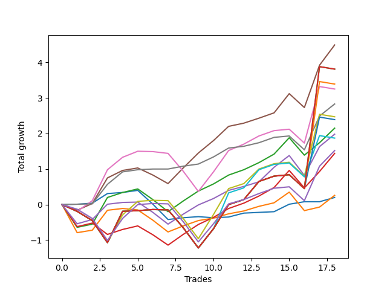

# Short Bernese 003 50 
- Symbol: AAPL
- Date Range: 05/27/2022 - 09/30/2022
- Trading Period: 7:20-12:30
- Number of Trades: 18



| Name | Win Percent | Profit | Avg Profit / Trade | Avg Time / Trade |      | Name | Win Percent | Profit | Avg Profit / Trade | Avg Time / Trade |
| ---- | ----------- | ------ | ------------------ | ---------------- | ---- | ---- | ----------- | ------ | ------------------ | ---------------- |
| Sorted By <br> Profit | | | | | | Sorted By <br> Win Percentage ||||
| Four | 77.78 | 2245.00 | 124.72 | 27:20 |     | Six | 88.89 | 1415.00 | 78.61 | 12:36 |
| Eighty-Five | 55.56 | 1905.00 | 105.83 | 56:49 |     | Four | 77.78 | 2245.00 | 124.72 | 27:20 |
| Eighty-Four | 55.56 | 1905.00 | 105.83 | 56:49 |     | Two | 77.78 | 1075.00 | 59.72 | 19:11 |
| Eighty-Three | 55.56 | 1695.00 | 94.17 | 56:45 |     | Three | 77.78 | 990.00 | 55.00 | 17:46 |
| Five | 61.11 | 1625.00 | 90.28 | 39:18 |     | Zero | 77.78 | 100.00 | 5.56 | 07:21 |
| Six | 88.89 | 1415.00 | 78.61 | 12:36 |     | Two_C | 72.22 | 720.00 | 40.00 | 22:00 |
| Seven | 55.56 | 1235.00 | 68.61 | 49:22 |     | One | 72.22 | 130.00 | 7.22 | 14:49 |
| Eighty-Two | 55.56 | 1195.00 | 66.39 | 55:47 |     | Five | 61.11 | 1625.00 | 90.28 | 39:18 |
| Two | 77.78 | 1075.00 | 59.72 | 19:11 |     | NEWFI 0000 | 61.11 | 760.00 | 42.22 | 42:44 |
| Three | 77.78 | 990.00 | 55.00 | 17:46 |     | Eighty-Five | 55.56 | 1905.00 | 105.83 | 56:49 |
| Eighty-One | 55.56 | 935.00 | 51.94 | 52:58 |     | Eighty-Four | 55.56 | 1905.00 | 105.83 | 56:49 |
| NEWFI 0000 | 61.11 | 760.00 | 42.22 | 42:44 |     | Eighty-Three | 55.56 | 1695.00 | 94.17 | 56:45 |
| Two_C | 72.22 | 720.00 | 40.00 | 22:00 |     | Seven | 55.56 | 1235.00 | 68.61 | 49:22 |
| One | 72.22 | 130.00 | 7.22 | 14:49 |     | Eighty-Two | 55.56 | 1195.00 | 66.39 | 55:47 |
| Zero | 77.78 | 100.00 | 5.56 | 07:21 |     | Eighty-One | 55.56 | 935.00 | 51.94 | 52:58 |

## NO STOPLOSS

### Test Zero
* Sell when price hits the middle line of the 20p bollinger
* No Stoploss
* Results:
```
Total Trades: 18
Percent Up: 22.22
Percent Down: 77.78
Total Points Moved Down: 0.20
Potential Profit: 100.00
Total Points Ups: 0.85 Count Ups: 4
Total Points Downs: 1.05 Count Downs: 14
```

<details><summary>Trades</summary>

<code>In: 2022-06-14 09:58:00		Out: 2022-06-14 10:03:05		Total Position Time: 05:05		Total Move Down: 0.01		Total to Date: 0.01</code> <br />
<code>In: 2022-06-24 11:52:00		Out: 2022-06-24 12:01:30		Total Position Time: 09:30		Total Move Down: 0.03		Total to Date: 0.04</code> <br />
<code>In: 2022-07-06 11:10:00		Out: 2022-07-06 11:11:05		Total Position Time: 01:05		Total Move Down: 0.27		Total to Date: 0.31</code> <br />
<code>In: 2022-07-26 11:10:00		Out: 2022-07-26 11:10:20		Total Position Time: 00:20		Total Move Down: 0.03		Total to Date: 0.34</code> <br />
<code>In: 2022-08-04 09:16:00		Out: 2022-08-04 09:16:10		Total Position Time: 00:10		Total Move Down: 0.06		Total to Date: 0.40</code> <br />
<code>In: 2022-08-04 11:55:00		Out: 2022-08-04 12:20:45		Total Position Time: 25:45		Total Move Down: -0.39		Total to Date: 0.01</code> <br />
<code>In: 2022-08-04 11:56:00		Out: 2022-08-04 12:20:45		Total Position Time: 24:45		Total Move Down: -0.43		Total to Date: -0.42</code> <br />
<code>In: 2022-08-05 09:22:00		Out: 2022-08-05 09:30:55		Total Position Time: 08:55		Total Move Down: 0.05		Total to Date: -0.37</code> <br />
<code>In: 2022-08-05 09:23:00		Out: 2022-08-05 09:30:55		Total Position Time: 07:55		Total Move Down: 0.03		Total to Date: -0.34</code> <br />
<code>In: 2022-08-19 10:00:00		Out: 2022-08-19 10:06:15		Total Position Time: 06:15		Total Move Down: -0.03		Total to Date: -0.37</code> <br />
<code>In: 2022-08-19 10:06:00		Out: 2022-08-19 10:06:15		Total Position Time: 00:15		Total Move Down: 0.02		Total to Date: -0.35</code> <br />
<code>In: 2022-08-22 09:28:00		Out: 2022-08-22 09:30:20		Total Position Time: 02:20		Total Move Down: 0.11		Total to Date: -0.24</code> <br />
<code>In: 2022-08-22 09:41:00		Out: 2022-08-22 09:42:40		Total Position Time: 01:40		Total Move Down: 0.02		Total to Date: -0.22</code> <br />
<code>In: 2022-09-01 11:29:00		Out: 2022-09-01 11:38:25		Total Position Time: 09:25		Total Move Down: 0.02		Total to Date: -0.20</code> <br />
<code>In: 2022-09-01 12:15:00		Out: 2022-09-01 12:17:05		Total Position Time: 02:05		Total Move Down: 0.21		Total to Date: 0.01</code> <br />
<code>In: 2022-09-16 11:31:00		Out: 2022-09-16 11:41:35		Total Position Time: 10:35		Total Move Down: 0.07		Total to Date: 0.08</code> <br />
<code>In: 2022-09-21 11:48:00		Out: 2022-09-21 12:01:35		Total Position Time: 13:35		Total Move Down: -0.00		Total to Date: 0.08</code> <br />
<code>In: 2022-09-22 09:59:00		Out: 2022-09-22 10:01:40		Total Position Time: 02:40		Total Move Down: 0.12		Total to Date: 0.20</code> <br />


</details>

### Test One
* Sell when the price hits the upper line of the 20p 1std bollinger
* No Stoploss
* Results:
```
Total Trades: 18
Percent Up: 27.78
Percent Down: 72.22
Total Points Moved Down: 0.26
Potential Profit: 130.00
Total Points Ups: 1.97 Count Ups: 5
Total Points Downs: 2.23 Count Downs: 13
```

<details><summary>Trades</summary>

<code>In: 2022-06-14 09:58:00		Out: 2022-06-14 10:34:00		Total Position Time: 36:00		Total Move Down: -0.79		Total to Date: -0.79</code> <br />
<code>In: 2022-06-24 11:52:00		Out: 2022-06-24 12:02:40		Total Position Time: 10:40		Total Move Down: 0.07		Total to Date: -0.72</code> <br />
<code>In: 2022-07-06 11:10:00		Out: 2022-07-06 11:11:45		Total Position Time: 01:45		Total Move Down: 0.56		Total to Date: -0.16</code> <br />
<code>In: 2022-07-26 11:10:00		Out: 2022-07-26 11:20:25		Total Position Time: 10:25		Total Move Down: 0.05		Total to Date: -0.11</code> <br />
<code>In: 2022-08-04 09:16:00		Out: 2022-08-04 09:30:55		Total Position Time: 14:55		Total Move Down: -0.04		Total to Date: -0.15</code> <br />
<code>In: 2022-08-04 11:55:00		Out: 2022-08-04 12:23:10		Total Position Time: 28:10		Total Move Down: -0.29		Total to Date: -0.44</code> <br />
<code>In: 2022-08-04 11:56:00		Out: 2022-08-04 12:23:10		Total Position Time: 27:10		Total Move Down: -0.33		Total to Date: -0.77</code> <br />
<code>In: 2022-08-05 09:22:00		Out: 2022-08-05 09:31:50		Total Position Time: 09:50		Total Move Down: 0.17		Total to Date: -0.60</code> <br />
<code>In: 2022-08-05 09:23:00		Out: 2022-08-05 09:31:50		Total Position Time: 08:50		Total Move Down: 0.15		Total to Date: -0.45</code> <br />
<code>In: 2022-08-19 10:00:00		Out: 2022-08-19 10:09:15		Total Position Time: 09:15		Total Move Down: 0.07		Total to Date: -0.38</code> <br />
<code>In: 2022-08-19 10:06:00		Out: 2022-08-19 10:09:15		Total Position Time: 03:15		Total Move Down: 0.12		Total to Date: -0.26</code> <br />
<code>In: 2022-08-22 09:28:00		Out: 2022-08-22 09:45:00		Total Position Time: 17:00		Total Move Down: 0.08		Total to Date: -0.18</code> <br />
<code>In: 2022-08-22 09:41:00		Out: 2022-08-22 09:45:00		Total Position Time: 04:00		Total Move Down: 0.13		Total to Date: -0.05</code> <br />
<code>In: 2022-09-01 11:29:00		Out: 2022-09-01 11:41:20		Total Position Time: 12:20		Total Move Down: 0.10		Total to Date: 0.05</code> <br />
<code>In: 2022-09-01 12:15:00		Out: 2022-09-01 12:19:10		Total Position Time: 04:10		Total Move Down: 0.30		Total to Date: 0.35</code> <br />
<code>In: 2022-09-16 11:31:00		Out: 2022-09-16 12:14:30		Total Position Time: 43:30		Total Move Down: -0.52		Total to Date: -0.17</code> <br />
<code>In: 2022-09-21 11:48:00		Out: 2022-09-21 12:09:10		Total Position Time: 21:10		Total Move Down: 0.10		Total to Date: -0.07</code> <br />
<code>In: 2022-09-22 09:59:00		Out: 2022-09-22 10:03:20		Total Position Time: 04:20		Total Move Down: 0.33		Total to Date: 0.26</code> <br />


</details>

### Test Two
* Sell when the price hits the upper line of the 20p 2std bollinger
* No Stoploss
* Results:
```
Total Trades: 18
Percent Up: 22.22
Percent Down: 77.78
Total Points Moved Down: 2.15
Potential Profit: 1075.00
Total Points Ups: 1.77 Count Ups: 4
Total Points Downs: 3.92 Count Downs: 14
```

<details><summary>Trades</summary>

<code>In: 2022-06-14 09:58:00		Out: 2022-06-14 10:35:05		Total Position Time: 37:05		Total Move Down: -0.64		Total to Date: -0.64</code> <br />
<code>In: 2022-06-24 11:52:00		Out: 2022-06-24 12:05:20		Total Position Time: 13:20		Total Move Down: 0.09		Total to Date: -0.55</code> <br />
<code>In: 2022-07-06 11:10:00		Out: 2022-07-06 11:12:30		Total Position Time: 02:30		Total Move Down: 0.75		Total to Date: 0.20</code> <br />
<code>In: 2022-07-26 11:10:00		Out: 2022-07-26 11:22:45		Total Position Time: 12:45		Total Move Down: 0.14		Total to Date: 0.34</code> <br />
<code>In: 2022-08-04 09:16:00		Out: 2022-08-04 09:41:55		Total Position Time: 25:55		Total Move Down: 0.10		Total to Date: 0.44</code> <br />
<code>In: 2022-08-04 11:55:00		Out: 2022-08-04 12:34:05		Total Position Time: 39:05		Total Move Down: -0.30		Total to Date: 0.14</code> <br />
<code>In: 2022-08-04 11:56:00		Out: 2022-08-04 12:34:05		Total Position Time: 38:05		Total Move Down: -0.34		Total to Date: -0.20</code> <br />
<code>In: 2022-08-05 09:22:00		Out: 2022-08-05 09:33:10		Total Position Time: 11:10		Total Move Down: 0.30		Total to Date: 0.10</code> <br />
<code>In: 2022-08-05 09:23:00		Out: 2022-08-05 09:33:10		Total Position Time: 10:10		Total Move Down: 0.28		Total to Date: 0.38</code> <br />
<code>In: 2022-08-19 10:00:00		Out: 2022-08-19 10:10:50		Total Position Time: 10:50		Total Move Down: 0.20		Total to Date: 0.58</code> <br />
<code>In: 2022-08-19 10:06:00		Out: 2022-08-19 10:10:50		Total Position Time: 04:50		Total Move Down: 0.25		Total to Date: 0.83</code> <br />
<code>In: 2022-08-22 09:28:00		Out: 2022-08-22 09:45:25		Total Position Time: 17:25		Total Move Down: 0.15		Total to Date: 0.98</code> <br />
<code>In: 2022-08-22 09:41:00		Out: 2022-08-22 09:45:25		Total Position Time: 04:25		Total Move Down: 0.20		Total to Date: 1.18</code> <br />
<code>In: 2022-09-01 11:29:00		Out: 2022-09-01 11:43:45		Total Position Time: 14:45		Total Move Down: 0.24		Total to Date: 1.42</code> <br />
<code>In: 2022-09-01 12:15:00		Out: 2022-09-01 12:27:45		Total Position Time: 12:45		Total Move Down: 0.46		Total to Date: 1.88</code> <br />
<code>In: 2022-09-16 11:31:00		Out: 2022-09-16 12:30:20		Total Position Time: 59:20		Total Move Down: -0.49		Total to Date: 1.39</code> <br />
<code>In: 2022-09-21 11:48:00		Out: 2022-09-21 12:10:05		Total Position Time: 22:05		Total Move Down: 0.35		Total to Date: 1.74</code> <br />
<code>In: 2022-09-22 09:59:00		Out: 2022-09-22 10:08:00		Total Position Time: 09:00		Total Move Down: 0.41		Total to Date: 2.15</code> <br />


</details>

### Test Two_C
* Sell when the price hits the upper line of the 20p 2std bollinger
* No Stoploss
* Results:
```
Total Trades: 18
Percent Up: 27.78
Percent Down: 72.22
Total Points Moved Down: 1.44
Potential Profit: 720.00
Total Points Ups: 1.97 Count Ups: 5
Total Points Downs: 3.41 Count Downs: 13
```

<details><summary>Trades</summary>

<code>In: 2022-06-14 09:58:00		Out: 2022-06-14 10:35:35		Total Position Time: 37:35		Total Move Down: -0.62		Total to Date: -0.62</code> <br />
<code>In: 2022-06-24 11:52:00		Out: 2022-06-24 12:05:25		Total Position Time: 13:25		Total Move Down: 0.10		Total to Date: -0.52</code> <br />
<code>In: 2022-07-06 11:10:00		Out: 2022-07-06 12:01:40		Total Position Time: 51:40		Total Move Down: -0.32		Total to Date: -0.84</code> <br />
<code>In: 2022-07-26 11:10:00		Out: 2022-07-26 11:22:45		Total Position Time: 12:45		Total Move Down: 0.14		Total to Date: -0.70</code> <br />
<code>In: 2022-08-04 09:16:00		Out: 2022-08-04 09:41:55		Total Position Time: 25:55		Total Move Down: 0.10		Total to Date: -0.60</code> <br />
<code>In: 2022-08-04 11:55:00		Out: 2022-08-04 12:34:10		Total Position Time: 39:10		Total Move Down: -0.25		Total to Date: -0.85</code> <br />
<code>In: 2022-08-04 11:56:00		Out: 2022-08-04 12:34:10		Total Position Time: 38:10		Total Move Down: -0.29		Total to Date: -1.14</code> <br />
<code>In: 2022-08-05 09:22:00		Out: 2022-08-05 09:33:10		Total Position Time: 11:10		Total Move Down: 0.30		Total to Date: -0.84</code> <br />
<code>In: 2022-08-05 09:23:00		Out: 2022-08-05 09:33:10		Total Position Time: 10:10		Total Move Down: 0.28		Total to Date: -0.56</code> <br />
<code>In: 2022-08-19 10:00:00		Out: 2022-08-19 10:10:50		Total Position Time: 10:50		Total Move Down: 0.20		Total to Date: -0.36</code> <br />
<code>In: 2022-08-19 10:06:00		Out: 2022-08-19 10:10:50		Total Position Time: 04:50		Total Move Down: 0.25		Total to Date: -0.11</code> <br />
<code>In: 2022-08-22 09:28:00		Out: 2022-08-22 09:45:25		Total Position Time: 17:25		Total Move Down: 0.15		Total to Date: 0.04</code> <br />
<code>In: 2022-08-22 09:41:00		Out: 2022-08-22 09:45:25		Total Position Time: 04:25		Total Move Down: 0.20		Total to Date: 0.24</code> <br />
<code>In: 2022-09-01 11:29:00		Out: 2022-09-01 11:43:45		Total Position Time: 14:45		Total Move Down: 0.24		Total to Date: 0.48</code> <br />
<code>In: 2022-09-01 12:15:00		Out: 2022-09-01 12:27:55		Total Position Time: 12:55		Total Move Down: 0.48		Total to Date: 0.96</code> <br />
<code>In: 2022-09-16 11:31:00		Out: 2022-09-16 12:30:20		Total Position Time: 59:20		Total Move Down: -0.49		Total to Date: 0.47</code> <br />
<code>In: 2022-09-21 11:48:00		Out: 2022-09-21 12:10:10		Total Position Time: 22:10		Total Move Down: 0.46		Total to Date: 0.93</code> <br />
<code>In: 2022-09-22 09:59:00		Out: 2022-09-22 10:08:20		Total Position Time: 09:20		Total Move Down: 0.51		Total to Date: 1.44</code> <br />


</details>

### Test Three
* Sell when price hits the middle line of the 50p bollinger
* No Stoploss
* Results:
```
Total Trades: 18
Percent Up: 22.22
Percent Down: 77.78
Total Points Moved Down: 1.98
Potential Profit: 990.00
Total Points Ups: 1.72 Count Ups: 4
Total Points Downs: 3.70 Count Downs: 14
```

<details><summary>Trades</summary>

<code>In: 2022-06-14 09:58:00		Out: 2022-06-14 10:36:10		Total Position Time: 38:10		Total Move Down: -0.54		Total to Date: -0.54</code> <br />
<code>In: 2022-06-24 11:52:00		Out: 2022-06-24 12:05:40		Total Position Time: 13:40		Total Move Down: 0.12		Total to Date: -0.42</code> <br />
<code>In: 2022-07-06 11:10:00		Out: 2022-07-06 11:11:35		Total Position Time: 01:35		Total Move Down: 0.43		Total to Date: 0.01</code> <br />
<code>In: 2022-07-26 11:10:00		Out: 2022-07-26 11:18:50		Total Position Time: 08:50		Total Move Down: 0.05		Total to Date: 0.06</code> <br />
<code>In: 2022-08-04 09:16:00		Out: 2022-08-04 09:33:10		Total Position Time: 17:10		Total Move Down: 0.01		Total to Date: 0.07</code> <br />
<code>In: 2022-08-04 11:55:00		Out: 2022-08-04 12:39:30		Total Position Time: 44:30		Total Move Down: -0.29		Total to Date: -0.22</code> <br />
<code>In: 2022-08-04 11:56:00		Out: 2022-08-04 12:39:30		Total Position Time: 43:30		Total Move Down: -0.33		Total to Date: -0.55</code> <br />
<code>In: 2022-08-05 09:22:00		Out: 2022-08-05 09:32:05		Total Position Time: 10:05		Total Move Down: 0.28		Total to Date: -0.27</code> <br />
<code>In: 2022-08-05 09:23:00		Out: 2022-08-05 09:32:05		Total Position Time: 09:05		Total Move Down: 0.26		Total to Date: -0.01</code> <br />
<code>In: 2022-08-19 10:00:00		Out: 2022-08-19 10:10:55		Total Position Time: 10:55		Total Move Down: 0.18		Total to Date: 0.17</code> <br />
<code>In: 2022-08-19 10:06:00		Out: 2022-08-19 10:10:55		Total Position Time: 04:55		Total Move Down: 0.23		Total to Date: 0.40</code> <br />
<code>In: 2022-08-22 09:28:00		Out: 2022-08-22 09:31:40		Total Position Time: 03:40		Total Move Down: 0.11		Total to Date: 0.51</code> <br />
<code>In: 2022-08-22 09:41:00		Out: 2022-08-22 09:45:00		Total Position Time: 04:00		Total Move Down: 0.13		Total to Date: 0.64</code> <br />
<code>In: 2022-09-01 11:29:00		Out: 2022-09-01 11:48:15		Total Position Time: 19:15		Total Move Down: 0.41		Total to Date: 1.05</code> <br />
<code>In: 2022-09-01 12:15:00		Out: 2022-09-01 12:19:05		Total Position Time: 04:05		Total Move Down: 0.33		Total to Date: 1.38</code> <br />
<code>In: 2022-09-16 11:31:00		Out: 2022-09-16 12:30:10		Total Position Time: 59:10		Total Move Down: -0.56		Total to Date: 0.82</code> <br />
<code>In: 2022-09-21 11:48:00		Out: 2022-09-21 12:10:45		Total Position Time: 22:45		Total Move Down: 0.81		Total to Date: 1.63</code> <br />
<code>In: 2022-09-22 09:59:00		Out: 2022-09-22 10:03:40		Total Position Time: 04:40		Total Move Down: 0.35		Total to Date: 1.98</code> <br />


</details>

### Test Four
* Sell when the price hits the upper line of the 50p 1std bollinger
* No Stoploss
* Results:
```
Total Trades: 18
Percent Up: 22.22
Percent Down: 77.78
Total Points Moved Down: 4.49
Potential Profit: 2245.00
Total Points Ups: 0.99 Count Ups: 4
Total Points Downs: 5.48 Count Downs: 14
```

<details><summary>Trades</summary>

<code>In: 2022-06-14 09:58:00		Out: 2022-06-14 10:43:40		Total Position Time: 45:40		Total Move Down: -0.16		Total to Date: -0.16</code> <br />
<code>In: 2022-06-24 11:52:00		Out: 2022-06-24 12:11:15		Total Position Time: 19:15		Total Move Down: 0.19		Total to Date: 0.03</code> <br />
<code>In: 2022-07-06 11:10:00		Out: 2022-07-06 11:12:15		Total Position Time: 02:15		Total Move Down: 0.72		Total to Date: 0.75</code> <br />
<code>In: 2022-07-26 11:10:00		Out: 2022-07-26 11:26:15		Total Position Time: 16:15		Total Move Down: 0.21		Total to Date: 0.96</code> <br />
<code>In: 2022-08-04 09:16:00		Out: 2022-08-04 09:41:30		Total Position Time: 25:30		Total Move Down: 0.07		Total to Date: 1.03</code> <br />
<code>In: 2022-08-04 11:55:00		Out: 2022-08-04 12:42:05		Total Position Time: 47:05		Total Move Down: -0.20		Total to Date: 0.83</code> <br />
<code>In: 2022-08-04 11:56:00		Out: 2022-08-04 12:42:05		Total Position Time: 46:05		Total Move Down: -0.24		Total to Date: 0.59</code> <br />
<code>In: 2022-08-05 09:22:00		Out: 2022-08-05 09:36:25		Total Position Time: 14:25		Total Move Down: 0.44		Total to Date: 1.03</code> <br />
<code>In: 2022-08-05 09:23:00		Out: 2022-08-05 09:36:25		Total Position Time: 13:25		Total Move Down: 0.42		Total to Date: 1.45</code> <br />
<code>In: 2022-08-19 10:00:00		Out: 2022-08-19 10:14:30		Total Position Time: 14:30		Total Move Down: 0.35		Total to Date: 1.80</code> <br />
<code>In: 2022-08-19 10:06:00		Out: 2022-08-19 10:14:30		Total Position Time: 08:30		Total Move Down: 0.40		Total to Date: 2.20</code> <br />
<code>In: 2022-08-22 09:28:00		Out: 2022-08-22 10:04:10		Total Position Time: 36:10		Total Move Down: 0.09		Total to Date: 2.29</code> <br />
<code>In: 2022-08-22 09:41:00		Out: 2022-08-22 10:04:10		Total Position Time: 23:10		Total Move Down: 0.14		Total to Date: 2.43</code> <br />
<code>In: 2022-09-01 11:29:00		Out: 2022-09-01 12:28:55		Total Position Time: 59:55		Total Move Down: 0.15		Total to Date: 2.58</code> <br />
<code>In: 2022-09-01 12:15:00		Out: 2022-09-01 12:30:05		Total Position Time: 15:05		Total Move Down: 0.54		Total to Date: 3.12</code> <br />
<code>In: 2022-09-16 11:31:00		Out: 2022-09-16 12:30:55		Total Position Time: 59:55		Total Move Down: -0.39		Total to Date: 2.73</code> <br />
<code>In: 2022-09-21 11:48:00		Out: 2022-09-21 12:21:35		Total Position Time: 33:35		Total Move Down: 1.19		Total to Date: 3.92</code> <br />
<code>In: 2022-09-22 09:59:00		Out: 2022-09-22 10:10:15		Total Position Time: 11:15		Total Move Down: 0.57		Total to Date: 4.49</code> <br />


</details>

### Test Five
* Sell when the price hits the upper line of the 50p 2std bollinger
* No Stoploss
* Results:
```
Total Trades: 18
Percent Up: 38.89
Percent Down: 61.11
Total Points Moved Down: 3.25
Potential Profit: 1625.00
Total Points Ups: 1.78 Count Ups: 7
Total Points Downs: 5.03 Count Downs: 11
```

<details><summary>Trades</summary>

<code>In: 2022-06-14 09:58:00		Out: 2022-06-14 10:57:55		Total Position Time: 59:55		Total Move Down: -0.19		Total to Date: -0.19</code> <br />
<code>In: 2022-06-24 11:52:00		Out: 2022-06-24 12:13:30		Total Position Time: 21:30		Total Move Down: 0.30		Total to Date: 0.11</code> <br />
<code>In: 2022-07-06 11:10:00		Out: 2022-07-06 11:26:55		Total Position Time: 16:55		Total Move Down: 0.87		Total to Date: 0.98</code> <br />
<code>In: 2022-07-26 11:10:00		Out: 2022-07-26 11:29:30		Total Position Time: 19:30		Total Move Down: 0.35		Total to Date: 1.33</code> <br />
<code>In: 2022-08-04 09:16:00		Out: 2022-08-04 09:42:00		Total Position Time: 26:00		Total Move Down: 0.17		Total to Date: 1.50</code> <br />
<code>In: 2022-08-04 11:55:00		Out: 2022-08-04 12:43:30		Total Position Time: 48:30		Total Move Down: -0.01		Total to Date: 1.49</code> <br />
<code>In: 2022-08-04 11:56:00		Out: 2022-08-04 12:43:30		Total Position Time: 47:30		Total Move Down: -0.05		Total to Date: 1.44</code> <br />
<code>In: 2022-08-05 09:22:00		Out: 2022-08-05 10:21:55		Total Position Time: 59:55		Total Move Down: -0.50		Total to Date: 0.94</code> <br />
<code>In: 2022-08-05 09:23:00		Out: 2022-08-05 10:22:55		Total Position Time: 59:55		Total Move Down: -0.57		Total to Date: 0.37</code> <br />
<code>In: 2022-08-19 10:00:00		Out: 2022-08-19 10:19:35		Total Position Time: 19:35		Total Move Down: 0.55		Total to Date: 0.92</code> <br />
<code>In: 2022-08-19 10:06:00		Out: 2022-08-19 10:19:35		Total Position Time: 13:35		Total Move Down: 0.60		Total to Date: 1.52</code> <br />
<code>In: 2022-08-22 09:28:00		Out: 2022-08-22 10:07:10		Total Position Time: 39:10		Total Move Down: 0.18		Total to Date: 1.70</code> <br />
<code>In: 2022-08-22 09:41:00		Out: 2022-08-22 10:07:10		Total Position Time: 26:10		Total Move Down: 0.23		Total to Date: 1.93</code> <br />
<code>In: 2022-09-01 11:29:00		Out: 2022-09-01 12:28:55		Total Position Time: 59:55		Total Move Down: 0.15		Total to Date: 2.08</code> <br />
<code>In: 2022-09-01 12:15:00		Out: 2022-09-01 12:46:00		Total Position Time: 31:00		Total Move Down: 0.04		Total to Date: 2.12</code> <br />
<code>In: 2022-09-16 11:31:00		Out: 2022-09-16 12:30:55		Total Position Time: 59:55		Total Move Down: -0.39		Total to Date: 1.73</code> <br />
<code>In: 2022-09-21 11:48:00		Out: 2022-09-21 12:26:40		Total Position Time: 38:40		Total Move Down: 1.59		Total to Date: 3.32</code> <br />
<code>In: 2022-09-22 09:59:00		Out: 2022-09-22 10:58:55		Total Position Time: 59:55		Total Move Down: -0.07		Total to Date: 3.25</code> <br />


</details>

### Test Six
* Sell when the price hits the middle line of the 1std VWAP
* No Stoploss
* Results:
```
Total Trades: 18
Percent Up: 11.11
Percent Down: 88.89
Total Points Moved Down: 2.83
Potential Profit: 1415.00
Total Points Ups: 0.39 Count Ups: 2
Total Points Downs: 3.22 Count Downs: 16
```

<details><summary>Trades</summary>

<code>In: 2022-06-14 09:58:00		Out: 2022-06-14 10:03:05		Total Position Time: 05:05		Total Move Down: 0.01		Total to Date: 0.01</code> <br />
<code>In: 2022-06-24 11:52:00		Out: 2022-06-24 11:52:10		Total Position Time: 00:10		Total Move Down: 0.01		Total to Date: 0.02</code> <br />
<code>In: 2022-07-06 11:10:00		Out: 2022-07-06 11:11:50		Total Position Time: 01:50		Total Move Down: 0.55		Total to Date: 0.57</code> <br />
<code>In: 2022-07-26 11:10:00		Out: 2022-07-26 11:29:30		Total Position Time: 19:30		Total Move Down: 0.35		Total to Date: 0.92</code> <br />
<code>In: 2022-08-04 09:16:00		Out: 2022-08-04 09:16:10		Total Position Time: 00:10		Total Move Down: 0.06		Total to Date: 0.98</code> <br />
<code>In: 2022-08-04 11:55:00		Out: 2022-08-04 11:55:10		Total Position Time: 00:10		Total Move Down: 0.02		Total to Date: 1.00</code> <br />
<code>In: 2022-08-04 11:56:00		Out: 2022-08-04 11:56:10		Total Position Time: 00:10		Total Move Down: -0.00		Total to Date: 1.00</code> <br />
<code>In: 2022-08-05 09:22:00		Out: 2022-08-05 09:23:35		Total Position Time: 01:35		Total Move Down: 0.08		Total to Date: 1.08</code> <br />
<code>In: 2022-08-05 09:23:00		Out: 2022-08-05 09:23:35		Total Position Time: 00:35		Total Move Down: 0.06		Total to Date: 1.14</code> <br />
<code>In: 2022-08-19 10:00:00		Out: 2022-08-19 10:10:50		Total Position Time: 10:50		Total Move Down: 0.20		Total to Date: 1.34</code> <br />
<code>In: 2022-08-19 10:06:00		Out: 2022-08-19 10:10:50		Total Position Time: 04:50		Total Move Down: 0.25		Total to Date: 1.59</code> <br />
<code>In: 2022-08-22 09:28:00		Out: 2022-08-22 09:28:20		Total Position Time: 00:20		Total Move Down: 0.05		Total to Date: 1.64</code> <br />
<code>In: 2022-08-22 09:41:00		Out: 2022-08-22 09:44:30		Total Position Time: 03:30		Total Move Down: 0.10		Total to Date: 1.74</code> <br />
<code>In: 2022-09-01 11:29:00		Out: 2022-09-01 12:28:55		Total Position Time: 59:55		Total Move Down: 0.15		Total to Date: 1.89</code> <br />
<code>In: 2022-09-01 12:15:00		Out: 2022-09-01 12:46:00		Total Position Time: 31:00		Total Move Down: 0.04		Total to Date: 1.93</code> <br />
<code>In: 2022-09-16 11:31:00		Out: 2022-09-16 12:30:55		Total Position Time: 59:55		Total Move Down: -0.39		Total to Date: 1.54</code> <br />
<code>In: 2022-09-21 11:48:00		Out: 2022-09-21 12:10:50		Total Position Time: 22:50		Total Move Down: 0.95		Total to Date: 2.49</code> <br />
<code>In: 2022-09-22 09:59:00		Out: 2022-09-22 10:03:25		Total Position Time: 04:25		Total Move Down: 0.34		Total to Date: 2.83</code> <br />


</details>

### Test Seven
* Sell when the price hits the upper line of the 1std VWAP
* No Stoploss
* Results:
```
Total Trades: 18
Percent Up: 44.44
Percent Down: 55.56
Total Points Moved Down: 2.47
Potential Profit: 1235.00
Total Points Ups: 2.61 Count Ups: 8
Total Points Downs: 5.08 Count Downs: 10
```

<details><summary>Trades</summary>

<code>In: 2022-06-14 09:58:00		Out: 2022-06-14 10:57:55		Total Position Time: 59:55		Total Move Down: -0.19		Total to Date: -0.19</code> <br />
<code>In: 2022-06-24 11:52:00		Out: 2022-06-24 12:46:00		Total Position Time: 54:00		Total Move Down: -0.26		Total to Date: -0.45</code> <br />
<code>In: 2022-07-06 11:10:00		Out: 2022-07-06 12:09:55		Total Position Time: 59:55		Total Move Down: -0.62		Total to Date: -1.07</code> <br />
<code>In: 2022-07-26 11:10:00		Out: 2022-07-26 12:04:10		Total Position Time: 54:10		Total Move Down: 0.78		Total to Date: -0.29</code> <br />
<code>In: 2022-08-04 09:16:00		Out: 2022-08-04 09:47:30		Total Position Time: 31:30		Total Move Down: 0.38		Total to Date: 0.09</code> <br />
<code>In: 2022-08-04 11:55:00		Out: 2022-08-04 12:46:00		Total Position Time: 51:00		Total Move Down: 0.03		Total to Date: 0.12</code> <br />
<code>In: 2022-08-04 11:56:00		Out: 2022-08-04 12:46:00		Total Position Time: 50:00		Total Move Down: -0.01		Total to Date: 0.11</code> <br />
<code>In: 2022-08-05 09:22:00		Out: 2022-08-05 10:21:55		Total Position Time: 59:55		Total Move Down: -0.50		Total to Date: -0.39</code> <br />
<code>In: 2022-08-05 09:23:00		Out: 2022-08-05 10:22:55		Total Position Time: 59:55		Total Move Down: -0.57		Total to Date: -0.96</code> <br />
<code>In: 2022-08-19 10:00:00		Out: 2022-08-19 10:27:05		Total Position Time: 27:05		Total Move Down: 0.68		Total to Date: -0.28</code> <br />
<code>In: 2022-08-19 10:06:00		Out: 2022-08-19 10:27:05		Total Position Time: 21:05		Total Move Down: 0.73		Total to Date: 0.45</code> <br />
<code>In: 2022-08-22 09:28:00		Out: 2022-08-22 10:27:55		Total Position Time: 59:55		Total Move Down: 0.14		Total to Date: 0.59</code> <br />
<code>In: 2022-08-22 09:41:00		Out: 2022-08-22 10:31:40		Total Position Time: 50:40		Total Move Down: 0.41		Total to Date: 1.00</code> <br />
<code>In: 2022-09-01 11:29:00		Out: 2022-09-01 12:28:55		Total Position Time: 59:55		Total Move Down: 0.15		Total to Date: 1.15</code> <br />
<code>In: 2022-09-01 12:15:00		Out: 2022-09-01 12:46:00		Total Position Time: 31:00		Total Move Down: 0.04		Total to Date: 1.19</code> <br />
<code>In: 2022-09-16 11:31:00		Out: 2022-09-16 12:30:55		Total Position Time: 59:55		Total Move Down: -0.39		Total to Date: 0.80</code> <br />
<code>In: 2022-09-21 11:48:00		Out: 2022-09-21 12:26:50		Total Position Time: 38:50		Total Move Down: 1.74		Total to Date: 2.54</code> <br />
<code>In: 2022-09-22 09:59:00		Out: 2022-09-22 10:58:55		Total Position Time: 59:55		Total Move Down: -0.07		Total to Date: 2.47</code> <br />


</details>

## TAKE PROFIT

### Test Eighty-One
* Take Profit of 1 Point
* No Stoploss
* Results:
```
Total Trades: 18
Percent Up: 44.44
Percent Down: 55.56
Total Points Moved Down: 1.87
Potential Profit: 935.00
Total Points Ups: 2.61 Count Ups: 8
Total Points Downs: 4.48 Count Downs: 10
```

<details><summary>Trades</summary>

<code>In: 2022-06-14 09:58:00		Out: 2022-06-14 10:57:55		Total Position Time: 59:55		Total Move Down: -0.19		Total to Date: -0.19</code> <br />
<code>In: 2022-06-24 11:52:00		Out: 2022-06-24 12:46:00		Total Position Time: 54:00		Total Move Down: -0.26		Total to Date: -0.45</code> <br />
<code>In: 2022-07-06 11:10:00		Out: 2022-07-06 12:09:55		Total Position Time: 59:55		Total Move Down: -0.62		Total to Date: -1.07</code> <br />
<code>In: 2022-07-26 11:10:00		Out: 2022-07-26 12:09:55		Total Position Time: 59:55		Total Move Down: 0.88		Total to Date: -0.19</code> <br />
<code>In: 2022-08-04 09:16:00		Out: 2022-08-04 10:15:55		Total Position Time: 59:55		Total Move Down: 0.02		Total to Date: -0.17</code> <br />
<code>In: 2022-08-04 11:55:00		Out: 2022-08-04 12:46:00		Total Position Time: 51:00		Total Move Down: 0.03		Total to Date: -0.14</code> <br />
<code>In: 2022-08-04 11:56:00		Out: 2022-08-04 12:46:00		Total Position Time: 50:00		Total Move Down: -0.01		Total to Date: -0.15</code> <br />
<code>In: 2022-08-05 09:22:00		Out: 2022-08-05 10:21:55		Total Position Time: 59:55		Total Move Down: -0.50		Total to Date: -0.65</code> <br />
<code>In: 2022-08-05 09:23:00		Out: 2022-08-05 10:22:55		Total Position Time: 59:55		Total Move Down: -0.57		Total to Date: -1.22</code> <br />
<code>In: 2022-08-19 10:00:00		Out: 2022-08-19 10:59:55		Total Position Time: 59:55		Total Move Down: 0.54		Total to Date: -0.68</code> <br />
<code>In: 2022-08-19 10:06:00		Out: 2022-08-19 10:31:40		Total Position Time: 25:40		Total Move Down: 1.01		Total to Date: 0.33</code> <br />
<code>In: 2022-08-22 09:28:00		Out: 2022-08-22 10:27:55		Total Position Time: 59:55		Total Move Down: 0.14		Total to Date: 0.47</code> <br />
<code>In: 2022-08-22 09:41:00		Out: 2022-08-22 10:40:55		Total Position Time: 59:55		Total Move Down: 0.51		Total to Date: 0.98</code> <br />
<code>In: 2022-09-01 11:29:00		Out: 2022-09-01 12:28:55		Total Position Time: 59:55		Total Move Down: 0.15		Total to Date: 1.13</code> <br />
<code>In: 2022-09-01 12:15:00		Out: 2022-09-01 12:46:00		Total Position Time: 31:00		Total Move Down: 0.04		Total to Date: 1.17</code> <br />
<code>In: 2022-09-16 11:31:00		Out: 2022-09-16 12:30:55		Total Position Time: 59:55		Total Move Down: -0.39		Total to Date: 0.78</code> <br />
<code>In: 2022-09-21 11:48:00		Out: 2022-09-21 12:10:55		Total Position Time: 22:55		Total Move Down: 1.16		Total to Date: 1.94</code> <br />
<code>In: 2022-09-22 09:59:00		Out: 2022-09-22 10:58:55		Total Position Time: 59:55		Total Move Down: -0.07		Total to Date: 1.87</code> <br />


</details>

### Test Eighty-Two
* Take Profit of 2 Point
* No Stoploss
* Results:
```
Total Trades: 18
Percent Up: 44.44
Percent Down: 55.56
Total Points Moved Down: 2.39
Potential Profit: 1195.00
Total Points Ups: 2.61 Count Ups: 8
Total Points Downs: 5.00 Count Downs: 10
```

<details><summary>Trades</summary>

<code>In: 2022-06-14 09:58:00		Out: 2022-06-14 10:57:55		Total Position Time: 59:55		Total Move Down: -0.19		Total to Date: -0.19</code> <br />
<code>In: 2022-06-24 11:52:00		Out: 2022-06-24 12:46:00		Total Position Time: 54:00		Total Move Down: -0.26		Total to Date: -0.45</code> <br />
<code>In: 2022-07-06 11:10:00		Out: 2022-07-06 12:09:55		Total Position Time: 59:55		Total Move Down: -0.62		Total to Date: -1.07</code> <br />
<code>In: 2022-07-26 11:10:00		Out: 2022-07-26 12:09:55		Total Position Time: 59:55		Total Move Down: 0.88		Total to Date: -0.19</code> <br />
<code>In: 2022-08-04 09:16:00		Out: 2022-08-04 10:15:55		Total Position Time: 59:55		Total Move Down: 0.02		Total to Date: -0.17</code> <br />
<code>In: 2022-08-04 11:55:00		Out: 2022-08-04 12:46:00		Total Position Time: 51:00		Total Move Down: 0.03		Total to Date: -0.14</code> <br />
<code>In: 2022-08-04 11:56:00		Out: 2022-08-04 12:46:00		Total Position Time: 50:00		Total Move Down: -0.01		Total to Date: -0.15</code> <br />
<code>In: 2022-08-05 09:22:00		Out: 2022-08-05 10:21:55		Total Position Time: 59:55		Total Move Down: -0.50		Total to Date: -0.65</code> <br />
<code>In: 2022-08-05 09:23:00		Out: 2022-08-05 10:22:55		Total Position Time: 59:55		Total Move Down: -0.57		Total to Date: -1.22</code> <br />
<code>In: 2022-08-19 10:00:00		Out: 2022-08-19 10:59:55		Total Position Time: 59:55		Total Move Down: 0.54		Total to Date: -0.68</code> <br />
<code>In: 2022-08-19 10:06:00		Out: 2022-08-19 11:05:55		Total Position Time: 59:55		Total Move Down: 0.68		Total to Date: 0.00</code> <br />
<code>In: 2022-08-22 09:28:00		Out: 2022-08-22 10:27:55		Total Position Time: 59:55		Total Move Down: 0.14		Total to Date: 0.14</code> <br />
<code>In: 2022-08-22 09:41:00		Out: 2022-08-22 10:40:55		Total Position Time: 59:55		Total Move Down: 0.51		Total to Date: 0.65</code> <br />
<code>In: 2022-09-01 11:29:00		Out: 2022-09-01 12:28:55		Total Position Time: 59:55		Total Move Down: 0.15		Total to Date: 0.80</code> <br />
<code>In: 2022-09-01 12:15:00		Out: 2022-09-01 12:46:00		Total Position Time: 31:00		Total Move Down: 0.04		Total to Date: 0.84</code> <br />
<code>In: 2022-09-16 11:31:00		Out: 2022-09-16 12:30:55		Total Position Time: 59:55		Total Move Down: -0.39		Total to Date: 0.45</code> <br />
<code>In: 2022-09-21 11:48:00		Out: 2022-09-21 12:27:25		Total Position Time: 39:25		Total Move Down: 2.01		Total to Date: 2.46</code> <br />
<code>In: 2022-09-22 09:59:00		Out: 2022-09-22 10:58:55		Total Position Time: 59:55		Total Move Down: -0.07		Total to Date: 2.39</code> <br />


</details>

### Test Eighty-Three
* Take Profit of 3 Point
* No Stoploss
* Results:
```
Total Trades: 18
Percent Up: 44.44
Percent Down: 55.56
Total Points Moved Down: 3.39
Potential Profit: 1695.00
Total Points Ups: 2.61 Count Ups: 8
Total Points Downs: 6.00 Count Downs: 10
```

<details><summary>Trades</summary>

<code>In: 2022-06-14 09:58:00		Out: 2022-06-14 10:57:55		Total Position Time: 59:55		Total Move Down: -0.19		Total to Date: -0.19</code> <br />
<code>In: 2022-06-24 11:52:00		Out: 2022-06-24 12:46:00		Total Position Time: 54:00		Total Move Down: -0.26		Total to Date: -0.45</code> <br />
<code>In: 2022-07-06 11:10:00		Out: 2022-07-06 12:09:55		Total Position Time: 59:55		Total Move Down: -0.62		Total to Date: -1.07</code> <br />
<code>In: 2022-07-26 11:10:00		Out: 2022-07-26 12:09:55		Total Position Time: 59:55		Total Move Down: 0.88		Total to Date: -0.19</code> <br />
<code>In: 2022-08-04 09:16:00		Out: 2022-08-04 10:15:55		Total Position Time: 59:55		Total Move Down: 0.02		Total to Date: -0.17</code> <br />
<code>In: 2022-08-04 11:55:00		Out: 2022-08-04 12:46:00		Total Position Time: 51:00		Total Move Down: 0.03		Total to Date: -0.14</code> <br />
<code>In: 2022-08-04 11:56:00		Out: 2022-08-04 12:46:00		Total Position Time: 50:00		Total Move Down: -0.01		Total to Date: -0.15</code> <br />
<code>In: 2022-08-05 09:22:00		Out: 2022-08-05 10:21:55		Total Position Time: 59:55		Total Move Down: -0.50		Total to Date: -0.65</code> <br />
<code>In: 2022-08-05 09:23:00		Out: 2022-08-05 10:22:55		Total Position Time: 59:55		Total Move Down: -0.57		Total to Date: -1.22</code> <br />
<code>In: 2022-08-19 10:00:00		Out: 2022-08-19 10:59:55		Total Position Time: 59:55		Total Move Down: 0.54		Total to Date: -0.68</code> <br />
<code>In: 2022-08-19 10:06:00		Out: 2022-08-19 11:05:55		Total Position Time: 59:55		Total Move Down: 0.68		Total to Date: 0.00</code> <br />
<code>In: 2022-08-22 09:28:00		Out: 2022-08-22 10:27:55		Total Position Time: 59:55		Total Move Down: 0.14		Total to Date: 0.14</code> <br />
<code>In: 2022-08-22 09:41:00		Out: 2022-08-22 10:40:55		Total Position Time: 59:55		Total Move Down: 0.51		Total to Date: 0.65</code> <br />
<code>In: 2022-09-01 11:29:00		Out: 2022-09-01 12:28:55		Total Position Time: 59:55		Total Move Down: 0.15		Total to Date: 0.80</code> <br />
<code>In: 2022-09-01 12:15:00		Out: 2022-09-01 12:46:00		Total Position Time: 31:00		Total Move Down: 0.04		Total to Date: 0.84</code> <br />
<code>In: 2022-09-16 11:31:00		Out: 2022-09-16 12:30:55		Total Position Time: 59:55		Total Move Down: -0.39		Total to Date: 0.45</code> <br />
<code>In: 2022-09-21 11:48:00		Out: 2022-09-21 12:44:50		Total Position Time: 56:50		Total Move Down: 3.01		Total to Date: 3.46</code> <br />
<code>In: 2022-09-22 09:59:00		Out: 2022-09-22 10:58:55		Total Position Time: 59:55		Total Move Down: -0.07		Total to Date: 3.39</code> <br />


</details>

### Test Eighty-Four
* Take Profit of 4 Point
* No Stoploss
* Results:
```
Total Trades: 18
Percent Up: 44.44
Percent Down: 55.56
Total Points Moved Down: 3.81
Potential Profit: 1905.00
Total Points Ups: 2.61 Count Ups: 8
Total Points Downs: 6.42 Count Downs: 10
```

<details><summary>Trades</summary>

<code>In: 2022-06-14 09:58:00		Out: 2022-06-14 10:57:55		Total Position Time: 59:55		Total Move Down: -0.19		Total to Date: -0.19</code> <br />
<code>In: 2022-06-24 11:52:00		Out: 2022-06-24 12:46:00		Total Position Time: 54:00		Total Move Down: -0.26		Total to Date: -0.45</code> <br />
<code>In: 2022-07-06 11:10:00		Out: 2022-07-06 12:09:55		Total Position Time: 59:55		Total Move Down: -0.62		Total to Date: -1.07</code> <br />
<code>In: 2022-07-26 11:10:00		Out: 2022-07-26 12:09:55		Total Position Time: 59:55		Total Move Down: 0.88		Total to Date: -0.19</code> <br />
<code>In: 2022-08-04 09:16:00		Out: 2022-08-04 10:15:55		Total Position Time: 59:55		Total Move Down: 0.02		Total to Date: -0.17</code> <br />
<code>In: 2022-08-04 11:55:00		Out: 2022-08-04 12:46:00		Total Position Time: 51:00		Total Move Down: 0.03		Total to Date: -0.14</code> <br />
<code>In: 2022-08-04 11:56:00		Out: 2022-08-04 12:46:00		Total Position Time: 50:00		Total Move Down: -0.01		Total to Date: -0.15</code> <br />
<code>In: 2022-08-05 09:22:00		Out: 2022-08-05 10:21:55		Total Position Time: 59:55		Total Move Down: -0.50		Total to Date: -0.65</code> <br />
<code>In: 2022-08-05 09:23:00		Out: 2022-08-05 10:22:55		Total Position Time: 59:55		Total Move Down: -0.57		Total to Date: -1.22</code> <br />
<code>In: 2022-08-19 10:00:00		Out: 2022-08-19 10:59:55		Total Position Time: 59:55		Total Move Down: 0.54		Total to Date: -0.68</code> <br />
<code>In: 2022-08-19 10:06:00		Out: 2022-08-19 11:05:55		Total Position Time: 59:55		Total Move Down: 0.68		Total to Date: 0.00</code> <br />
<code>In: 2022-08-22 09:28:00		Out: 2022-08-22 10:27:55		Total Position Time: 59:55		Total Move Down: 0.14		Total to Date: 0.14</code> <br />
<code>In: 2022-08-22 09:41:00		Out: 2022-08-22 10:40:55		Total Position Time: 59:55		Total Move Down: 0.51		Total to Date: 0.65</code> <br />
<code>In: 2022-09-01 11:29:00		Out: 2022-09-01 12:28:55		Total Position Time: 59:55		Total Move Down: 0.15		Total to Date: 0.80</code> <br />
<code>In: 2022-09-01 12:15:00		Out: 2022-09-01 12:46:00		Total Position Time: 31:00		Total Move Down: 0.04		Total to Date: 0.84</code> <br />
<code>In: 2022-09-16 11:31:00		Out: 2022-09-16 12:30:55		Total Position Time: 59:55		Total Move Down: -0.39		Total to Date: 0.45</code> <br />
<code>In: 2022-09-21 11:48:00		Out: 2022-09-21 12:46:00		Total Position Time: 58:00		Total Move Down: 3.43		Total to Date: 3.88</code> <br />
<code>In: 2022-09-22 09:59:00		Out: 2022-09-22 10:58:55		Total Position Time: 59:55		Total Move Down: -0.07		Total to Date: 3.81</code> <br />


</details>

### Test Eighty-Five
* Take Profit of 5 Point
* No Stoploss
* Results:
```
Total Trades: 18
Percent Up: 44.44
Percent Down: 55.56
Total Points Moved Down: 3.81
Potential Profit: 1905.00
Total Points Ups: 2.61 Count Ups: 8
Total Points Downs: 6.42 Count Downs: 10
```

<details><summary>Trades</summary>

<code>In: 2022-06-14 09:58:00		Out: 2022-06-14 10:57:55		Total Position Time: 59:55		Total Move Down: -0.19		Total to Date: -0.19</code> <br />
<code>In: 2022-06-24 11:52:00		Out: 2022-06-24 12:46:00		Total Position Time: 54:00		Total Move Down: -0.26		Total to Date: -0.45</code> <br />
<code>In: 2022-07-06 11:10:00		Out: 2022-07-06 12:09:55		Total Position Time: 59:55		Total Move Down: -0.62		Total to Date: -1.07</code> <br />
<code>In: 2022-07-26 11:10:00		Out: 2022-07-26 12:09:55		Total Position Time: 59:55		Total Move Down: 0.88		Total to Date: -0.19</code> <br />
<code>In: 2022-08-04 09:16:00		Out: 2022-08-04 10:15:55		Total Position Time: 59:55		Total Move Down: 0.02		Total to Date: -0.17</code> <br />
<code>In: 2022-08-04 11:55:00		Out: 2022-08-04 12:46:00		Total Position Time: 51:00		Total Move Down: 0.03		Total to Date: -0.14</code> <br />
<code>In: 2022-08-04 11:56:00		Out: 2022-08-04 12:46:00		Total Position Time: 50:00		Total Move Down: -0.01		Total to Date: -0.15</code> <br />
<code>In: 2022-08-05 09:22:00		Out: 2022-08-05 10:21:55		Total Position Time: 59:55		Total Move Down: -0.50		Total to Date: -0.65</code> <br />
<code>In: 2022-08-05 09:23:00		Out: 2022-08-05 10:22:55		Total Position Time: 59:55		Total Move Down: -0.57		Total to Date: -1.22</code> <br />
<code>In: 2022-08-19 10:00:00		Out: 2022-08-19 10:59:55		Total Position Time: 59:55		Total Move Down: 0.54		Total to Date: -0.68</code> <br />
<code>In: 2022-08-19 10:06:00		Out: 2022-08-19 11:05:55		Total Position Time: 59:55		Total Move Down: 0.68		Total to Date: 0.00</code> <br />
<code>In: 2022-08-22 09:28:00		Out: 2022-08-22 10:27:55		Total Position Time: 59:55		Total Move Down: 0.14		Total to Date: 0.14</code> <br />
<code>In: 2022-08-22 09:41:00		Out: 2022-08-22 10:40:55		Total Position Time: 59:55		Total Move Down: 0.51		Total to Date: 0.65</code> <br />
<code>In: 2022-09-01 11:29:00		Out: 2022-09-01 12:28:55		Total Position Time: 59:55		Total Move Down: 0.15		Total to Date: 0.80</code> <br />
<code>In: 2022-09-01 12:15:00		Out: 2022-09-01 12:46:00		Total Position Time: 31:00		Total Move Down: 0.04		Total to Date: 0.84</code> <br />
<code>In: 2022-09-16 11:31:00		Out: 2022-09-16 12:30:55		Total Position Time: 59:55		Total Move Down: -0.39		Total to Date: 0.45</code> <br />
<code>In: 2022-09-21 11:48:00		Out: 2022-09-21 12:46:00		Total Position Time: 58:00		Total Move Down: 3.43		Total to Date: 3.88</code> <br />
<code>In: 2022-09-22 09:59:00		Out: 2022-09-22 10:58:55		Total Position Time: 59:55		Total Move Down: -0.07		Total to Date: 3.81</code> <br />


</details>

## Indicator Exits

### Test NEWFI 0000
* Newfi 0000
* No Stoploss
* Results:
```
Total Trades: 18
Percent Up: 38.89
Percent Down: 61.11
Total Points Moved Down: 1.52
Potential Profit: 760.00
Total Points Ups: 2.48 Count Ups: 7
Total Points Downs: 4.00 Count Downs: 11
```

<details><summary>Trades</summary>

<code>In: 2022-06-14 09:58:00		Out: 2022-06-14 10:46:05		Total Position Time: 48:05		Total Move Down: -0.13		Total to Date: -0.13</code> <br />
<code>In: 2022-06-24 11:52:00		Out: 2022-06-24 12:46:00		Total Position Time: 54:00		Total Move Down: -0.26		Total to Date: -0.39</code> <br />
<code>In: 2022-07-06 11:10:00		Out: 2022-07-06 12:09:55		Total Position Time: 59:55		Total Move Down: -0.62		Total to Date: -1.01</code> <br />
<code>In: 2022-07-26 11:10:00		Out: 2022-07-26 11:36:05		Total Position Time: 26:05		Total Move Down: 0.62		Total to Date: -0.39</code> <br />
<code>In: 2022-08-04 09:16:00		Out: 2022-08-04 09:51:05		Total Position Time: 35:05		Total Move Down: 0.39		Total to Date: 0.00</code> <br />
<code>In: 2022-08-04 11:55:00		Out: 2022-08-04 12:46:00		Total Position Time: 51:00		Total Move Down: 0.03		Total to Date: 0.03</code> <br />
<code>In: 2022-08-04 11:56:00		Out: 2022-08-04 12:46:00		Total Position Time: 50:00		Total Move Down: -0.01		Total to Date: 0.02</code> <br />
<code>In: 2022-08-05 09:22:00		Out: 2022-08-05 10:21:55		Total Position Time: 59:55		Total Move Down: -0.50		Total to Date: -0.48</code> <br />
<code>In: 2022-08-05 09:23:00		Out: 2022-08-05 10:22:55		Total Position Time: 59:55		Total Move Down: -0.57		Total to Date: -1.05</code> <br />
<code>In: 2022-08-19 10:00:00		Out: 2022-08-19 10:22:05		Total Position Time: 22:05		Total Move Down: 0.51		Total to Date: -0.54</code> <br />
<code>In: 2022-08-19 10:06:00		Out: 2022-08-19 10:22:05		Total Position Time: 16:05		Total Move Down: 0.56		Total to Date: 0.02</code> <br />
<code>In: 2022-08-22 09:28:00		Out: 2022-08-22 10:15:05		Total Position Time: 47:05		Total Move Down: 0.12		Total to Date: 0.14</code> <br />
<code>In: 2022-08-22 09:41:00		Out: 2022-08-22 10:15:05		Total Position Time: 34:05		Total Move Down: 0.17		Total to Date: 0.31</code> <br />
<code>In: 2022-09-01 11:29:00		Out: 2022-09-01 12:28:55		Total Position Time: 59:55		Total Move Down: 0.15		Total to Date: 0.46</code> <br />
<code>In: 2022-09-01 12:15:00		Out: 2022-09-01 12:46:00		Total Position Time: 31:00		Total Move Down: 0.04		Total to Date: 0.50</code> <br />
<code>In: 2022-09-16 11:31:00		Out: 2022-09-16 12:30:55		Total Position Time: 59:55		Total Move Down: -0.39		Total to Date: 0.11</code> <br />
<code>In: 2022-09-21 11:48:00		Out: 2022-09-21 12:23:05		Total Position Time: 35:05		Total Move Down: 0.97		Total to Date: 1.08</code> <br />
<code>In: 2022-09-22 09:59:00		Out: 2022-09-22 10:19:05		Total Position Time: 20:05		Total Move Down: 0.44		Total to Date: 1.52</code> <br />


</details>