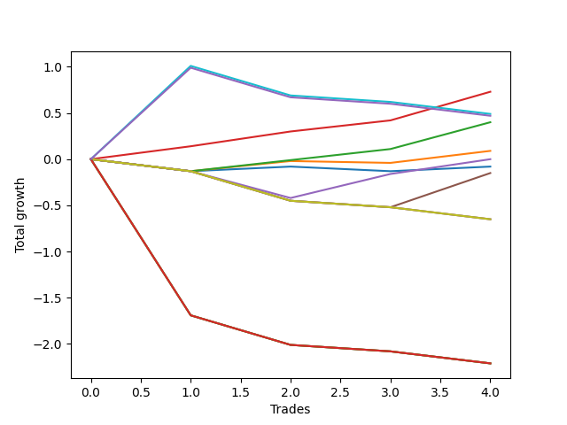

# Short Bernese 005 1v 
- Symbol: AAPL
- Date Range: 05/27/2022 - 09/30/2022
- Trading Period: 7:20-12:30
- Number of Trades: 4



| Name | Win Percent | Profit | Avg Profit / Trade | Avg Time / Trade |      | Name | Win Percent | Profit | Avg Profit / Trade | Avg Time / Trade |
| ---- | ----------- | ------ | ------------------ | ---------------- | ---- | ---- | ----------- | ------ | ------------------ | ---------------- |
| Sorted By <br> Profit | | | | | | Sorted By <br> Win Percentage ||||
| Two_C | 100.00 | 365.00 | 91.25 | 07:05 |     | Two_C | 100.00 | 365.00 | 91.25 | 07:05 |
| Eighty-One | 25.00 | 245.00 | 61.25 | 38:20 |     | Two | 75.00 | 200.00 | 50.00 | 06:43 |
| NEWFI 0000 | 25.00 | 235.00 | 58.75 | 38:43 |     | One | 50.00 | 45.00 | 11.25 | 02:37 |
| Two | 75.00 | 200.00 | 50.00 | 06:43 |     | Three | 50.00 | -0.00 | -0.00 | 15:42 |
| One | 50.00 | 45.00 | 11.25 | 02:37 |     | Zero | 50.00 | -40.00 | -10.00 | 00:30 |
| Three | 50.00 | -0.00 | -0.00 | 15:42 |     | Eighty-One | 25.00 | 245.00 | 61.25 | 38:20 |
| Zero | 50.00 | -40.00 | -10.00 | 00:30 |     | NEWFI 0000 | 25.00 | 235.00 | 58.75 | 38:43 |
| Four | 25.00 | -75.00 | -18.75 | 33:16 |     | Four | 25.00 | -75.00 | -18.75 | 33:16 |
| Seven | 0.00 | -325.00 | -81.25 | 37:15 |     | Seven | 0.00 | -325.00 | -81.25 | 37:15 |
| Six | 0.00 | -325.00 | -81.25 | 37:15 |     | Six | 0.00 | -325.00 | -81.25 | 37:15 |
| Five | 0.00 | -325.00 | -81.25 | 37:15 |     | Five | 0.00 | -325.00 | -81.25 | 37:15 |
| Eighty-Five | 0.00 | -1105.00 | -276.25 | 52:11 |     | Eighty-Five | 0.00 | -1105.00 | -276.25 | 52:11 |
| Eighty-Four | 0.00 | -1105.00 | -276.25 | 52:11 |     | Eighty-Four | 0.00 | -1105.00 | -276.25 | 52:11 |
| Eighty-Three | 0.00 | -1105.00 | -276.25 | 52:11 |     | Eighty-Three | 0.00 | -1105.00 | -276.25 | 52:11 |
| Eighty-Two | 0.00 | -1105.00 | -276.25 | 52:11 |     | Eighty-Two | 0.00 | -1105.00 | -276.25 | 52:11 |

## NO STOPLOSS

### Test Zero
* Sell when price hits the middle line of the 20p bollinger
* No Stoploss
* Results:
```
Total Trades: 4
Percent Up: 50.00
Percent Down: 50.00
Total Points Moved Down: -0.08
Potential Profit: -40.00
Total Points Ups: 0.18 Count Ups: 2
Total Points Downs: 0.10 Count Downs: 2
```

<details><summary>Trades</summary>

<code>In: 2022-06-15 11:02:00		Out: 2022-06-15 11:02:10		Total Position Time: 00:10		Total Move Down: -0.13		Total to Date: -0.13</code> <br />
<code>In: 2022-08-17 09:51:00		Out: 2022-08-17 09:52:30		Total Position Time: 01:30		Total Move Down: 0.05		Total to Date: -0.08</code> <br />
<code>In: 2022-08-29 10:12:00		Out: 2022-08-29 10:12:10		Total Position Time: 00:10		Total Move Down: -0.05		Total to Date: -0.13</code> <br />
<code>In: 2022-09-01 12:17:00		Out: 2022-09-01 12:17:10		Total Position Time: 00:10		Total Move Down: 0.05		Total to Date: -0.08</code> <br />


</details>

### Test One
* Sell when the price hits the upper line of the 20p 1std bollinger
* No Stoploss
* Results:
```
Total Trades: 4
Percent Up: 50.00
Percent Down: 50.00
Total Points Moved Down: 0.09
Potential Profit: 45.00
Total Points Ups: 0.15 Count Ups: 2
Total Points Downs: 0.24 Count Downs: 2
```

<details><summary>Trades</summary>

<code>In: 2022-06-15 11:02:00		Out: 2022-06-15 11:02:10		Total Position Time: 00:10		Total Move Down: -0.13		Total to Date: -0.13</code> <br />
<code>In: 2022-08-17 09:51:00		Out: 2022-08-17 09:55:20		Total Position Time: 04:20		Total Move Down: 0.11		Total to Date: -0.02</code> <br />
<code>In: 2022-08-29 10:12:00		Out: 2022-08-29 10:15:50		Total Position Time: 03:50		Total Move Down: -0.02		Total to Date: -0.04</code> <br />
<code>In: 2022-09-01 12:17:00		Out: 2022-09-01 12:19:10		Total Position Time: 02:10		Total Move Down: 0.13		Total to Date: 0.09</code> <br />


</details>

### Test Two
* Sell when the price hits the upper line of the 20p 2std bollinger
* No Stoploss
* Results:
```
Total Trades: 4
Percent Up: 25.00
Percent Down: 75.00
Total Points Moved Down: 0.40
Potential Profit: 200.00
Total Points Ups: 0.13 Count Ups: 1
Total Points Downs: 0.53 Count Downs: 3
```

<details><summary>Trades</summary>

<code>In: 2022-06-15 11:02:00		Out: 2022-06-15 11:02:10		Total Position Time: 00:10		Total Move Down: -0.13		Total to Date: -0.13</code> <br />
<code>In: 2022-08-17 09:51:00		Out: 2022-08-17 10:02:15		Total Position Time: 11:15		Total Move Down: 0.12		Total to Date: -0.01</code> <br />
<code>In: 2022-08-29 10:12:00		Out: 2022-08-29 10:16:45		Total Position Time: 04:45		Total Move Down: 0.12		Total to Date: 0.11</code> <br />
<code>In: 2022-09-01 12:17:00		Out: 2022-09-01 12:27:45		Total Position Time: 10:45		Total Move Down: 0.29		Total to Date: 0.40</code> <br />


</details>

### Test Two_C
* Sell when the price hits the upper line of the 20p 2std bollinger
* No Stoploss
* Results:
```
Total Trades: 4
Percent Up: 0.00
Percent Down: 100.00
Total Points Moved Down: 0.73
Potential Profit: 365.00
Total Points Ups: 0.00 Count Ups: 0
Total Points Downs: 0.73 Count Downs: 4
```

<details><summary>Trades</summary>

<code>In: 2022-06-15 11:02:00		Out: 2022-06-15 11:03:00		Total Position Time: 01:00		Total Move Down: 0.14		Total to Date: 0.14</code> <br />
<code>In: 2022-08-17 09:51:00		Out: 2022-08-17 10:02:40		Total Position Time: 11:40		Total Move Down: 0.16		Total to Date: 0.30</code> <br />
<code>In: 2022-08-29 10:12:00		Out: 2022-08-29 10:16:45		Total Position Time: 04:45		Total Move Down: 0.12		Total to Date: 0.42</code> <br />
<code>In: 2022-09-01 12:17:00		Out: 2022-09-01 12:27:55		Total Position Time: 10:55		Total Move Down: 0.31		Total to Date: 0.73</code> <br />


</details>

### Test Three
* Sell when price hits the middle line of the 50p bollinger
* No Stoploss
* Results:
```
Total Trades: 4
Percent Up: 50.00
Percent Down: 50.00
Total Points Moved Down: -0.00
Potential Profit: -0.00
Total Points Ups: 0.42 Count Ups: 2
Total Points Downs: 0.42 Count Downs: 2
```

<details><summary>Trades</summary>

<code>In: 2022-06-15 11:02:00		Out: 2022-06-15 11:02:10		Total Position Time: 00:10		Total Move Down: -0.13		Total to Date: -0.13</code> <br />
<code>In: 2022-08-17 09:51:00		Out: 2022-08-17 10:45:05		Total Position Time: 54:05		Total Move Down: -0.29		Total to Date: -0.42</code> <br />
<code>In: 2022-08-29 10:12:00		Out: 2022-08-29 10:18:30		Total Position Time: 06:30		Total Move Down: 0.26		Total to Date: -0.16</code> <br />
<code>In: 2022-09-01 12:17:00		Out: 2022-09-01 12:19:05		Total Position Time: 02:05		Total Move Down: 0.16		Total to Date: 0.00</code> <br />


</details>

### Test Four
* Sell when the price hits the upper line of the 50p 1std bollinger
* No Stoploss
* Results:
```
Total Trades: 4
Percent Up: 75.00
Percent Down: 25.00
Total Points Moved Down: -0.15
Potential Profit: -75.00
Total Points Ups: 0.52 Count Ups: 3
Total Points Downs: 0.37 Count Downs: 1
```

<details><summary>Trades</summary>

<code>In: 2022-06-15 11:02:00		Out: 2022-06-15 11:02:10		Total Position Time: 00:10		Total Move Down: -0.13		Total to Date: -0.13</code> <br />
<code>In: 2022-08-17 09:51:00		Out: 2022-08-17 10:50:55		Total Position Time: 59:55		Total Move Down: -0.32		Total to Date: -0.45</code> <br />
<code>In: 2022-08-29 10:12:00		Out: 2022-08-29 11:11:55		Total Position Time: 59:55		Total Move Down: -0.07		Total to Date: -0.52</code> <br />
<code>In: 2022-09-01 12:17:00		Out: 2022-09-01 12:30:05		Total Position Time: 13:05		Total Move Down: 0.37		Total to Date: -0.15</code> <br />


</details>

### Test Five
* Sell when the price hits the upper line of the 50p 2std bollinger
* No Stoploss
* Results:
```
Total Trades: 4
Percent Up: 100.00
Percent Down: 0.00
Total Points Moved Down: -0.65
Potential Profit: -325.00
Total Points Ups: 0.65 Count Ups: 4
Total Points Downs: 0.00 Count Downs: 0
```

<details><summary>Trades</summary>

<code>In: 2022-06-15 11:02:00		Out: 2022-06-15 11:02:10		Total Position Time: 00:10		Total Move Down: -0.13		Total to Date: -0.13</code> <br />
<code>In: 2022-08-17 09:51:00		Out: 2022-08-17 10:50:55		Total Position Time: 59:55		Total Move Down: -0.32		Total to Date: -0.45</code> <br />
<code>In: 2022-08-29 10:12:00		Out: 2022-08-29 11:11:55		Total Position Time: 59:55		Total Move Down: -0.07		Total to Date: -0.52</code> <br />
<code>In: 2022-09-01 12:17:00		Out: 2022-09-01 12:46:00		Total Position Time: 29:00		Total Move Down: -0.13		Total to Date: -0.65</code> <br />


</details>

### Test Six
* Sell when the price hits the middle line of the 1std VWAP
* No Stoploss
* Results:
```
Total Trades: 4
Percent Up: 100.00
Percent Down: 0.00
Total Points Moved Down: -0.65
Potential Profit: -325.00
Total Points Ups: 0.65 Count Ups: 4
Total Points Downs: 0.00 Count Downs: 0
```

<details><summary>Trades</summary>

<code>In: 2022-06-15 11:02:00		Out: 2022-06-15 11:02:10		Total Position Time: 00:10		Total Move Down: -0.13		Total to Date: -0.13</code> <br />
<code>In: 2022-08-17 09:51:00		Out: 2022-08-17 10:50:55		Total Position Time: 59:55		Total Move Down: -0.32		Total to Date: -0.45</code> <br />
<code>In: 2022-08-29 10:12:00		Out: 2022-08-29 11:11:55		Total Position Time: 59:55		Total Move Down: -0.07		Total to Date: -0.52</code> <br />
<code>In: 2022-09-01 12:17:00		Out: 2022-09-01 12:46:00		Total Position Time: 29:00		Total Move Down: -0.13		Total to Date: -0.65</code> <br />


</details>

### Test Seven
* Sell when the price hits the upper line of the 1std VWAP
* No Stoploss
* Results:
```
Total Trades: 4
Percent Up: 100.00
Percent Down: 0.00
Total Points Moved Down: -0.65
Potential Profit: -325.00
Total Points Ups: 0.65 Count Ups: 4
Total Points Downs: 0.00 Count Downs: 0
```

<details><summary>Trades</summary>

<code>In: 2022-06-15 11:02:00		Out: 2022-06-15 11:02:10		Total Position Time: 00:10		Total Move Down: -0.13		Total to Date: -0.13</code> <br />
<code>In: 2022-08-17 09:51:00		Out: 2022-08-17 10:50:55		Total Position Time: 59:55		Total Move Down: -0.32		Total to Date: -0.45</code> <br />
<code>In: 2022-08-29 10:12:00		Out: 2022-08-29 11:11:55		Total Position Time: 59:55		Total Move Down: -0.07		Total to Date: -0.52</code> <br />
<code>In: 2022-09-01 12:17:00		Out: 2022-09-01 12:46:00		Total Position Time: 29:00		Total Move Down: -0.13		Total to Date: -0.65</code> <br />


</details>

## TAKE PROFIT

### Test Eighty-One
* Take Profit of 1 Point
* No Stoploss
* Results:
```
Total Trades: 4
Percent Up: 75.00
Percent Down: 25.00
Total Points Moved Down: 0.49
Potential Profit: 245.00
Total Points Ups: 0.52 Count Ups: 3
Total Points Downs: 1.01 Count Downs: 1
```

<details><summary>Trades</summary>

<code>In: 2022-06-15 11:02:00		Out: 2022-06-15 11:06:30		Total Position Time: 04:30		Total Move Down: 1.01		Total to Date: 1.01</code> <br />
<code>In: 2022-08-17 09:51:00		Out: 2022-08-17 10:50:55		Total Position Time: 59:55		Total Move Down: -0.32		Total to Date: 0.69</code> <br />
<code>In: 2022-08-29 10:12:00		Out: 2022-08-29 11:11:55		Total Position Time: 59:55		Total Move Down: -0.07		Total to Date: 0.62</code> <br />
<code>In: 2022-09-01 12:17:00		Out: 2022-09-01 12:46:00		Total Position Time: 29:00		Total Move Down: -0.13		Total to Date: 0.49</code> <br />


</details>

### Test Eighty-Two
* Take Profit of 2 Point
* No Stoploss
* Results:
```
Total Trades: 4
Percent Up: 100.00
Percent Down: 0.00
Total Points Moved Down: -2.21
Potential Profit: -1105.00
Total Points Ups: 2.21 Count Ups: 4
Total Points Downs: 0.00 Count Downs: 0
```

<details><summary>Trades</summary>

<code>In: 2022-06-15 11:02:00		Out: 2022-06-15 12:01:55		Total Position Time: 59:55		Total Move Down: -1.69		Total to Date: -1.69</code> <br />
<code>In: 2022-08-17 09:51:00		Out: 2022-08-17 10:50:55		Total Position Time: 59:55		Total Move Down: -0.32		Total to Date: -2.01</code> <br />
<code>In: 2022-08-29 10:12:00		Out: 2022-08-29 11:11:55		Total Position Time: 59:55		Total Move Down: -0.07		Total to Date: -2.08</code> <br />
<code>In: 2022-09-01 12:17:00		Out: 2022-09-01 12:46:00		Total Position Time: 29:00		Total Move Down: -0.13		Total to Date: -2.21</code> <br />


</details>

### Test Eighty-Three
* Take Profit of 3 Point
* No Stoploss
* Results:
```
Total Trades: 4
Percent Up: 100.00
Percent Down: 0.00
Total Points Moved Down: -2.21
Potential Profit: -1105.00
Total Points Ups: 2.21 Count Ups: 4
Total Points Downs: 0.00 Count Downs: 0
```

<details><summary>Trades</summary>

<code>In: 2022-06-15 11:02:00		Out: 2022-06-15 12:01:55		Total Position Time: 59:55		Total Move Down: -1.69		Total to Date: -1.69</code> <br />
<code>In: 2022-08-17 09:51:00		Out: 2022-08-17 10:50:55		Total Position Time: 59:55		Total Move Down: -0.32		Total to Date: -2.01</code> <br />
<code>In: 2022-08-29 10:12:00		Out: 2022-08-29 11:11:55		Total Position Time: 59:55		Total Move Down: -0.07		Total to Date: -2.08</code> <br />
<code>In: 2022-09-01 12:17:00		Out: 2022-09-01 12:46:00		Total Position Time: 29:00		Total Move Down: -0.13		Total to Date: -2.21</code> <br />


</details>

### Test Eighty-Four
* Take Profit of 4 Point
* No Stoploss
* Results:
```
Total Trades: 4
Percent Up: 100.00
Percent Down: 0.00
Total Points Moved Down: -2.21
Potential Profit: -1105.00
Total Points Ups: 2.21 Count Ups: 4
Total Points Downs: 0.00 Count Downs: 0
```

<details><summary>Trades</summary>

<code>In: 2022-06-15 11:02:00		Out: 2022-06-15 12:01:55		Total Position Time: 59:55		Total Move Down: -1.69		Total to Date: -1.69</code> <br />
<code>In: 2022-08-17 09:51:00		Out: 2022-08-17 10:50:55		Total Position Time: 59:55		Total Move Down: -0.32		Total to Date: -2.01</code> <br />
<code>In: 2022-08-29 10:12:00		Out: 2022-08-29 11:11:55		Total Position Time: 59:55		Total Move Down: -0.07		Total to Date: -2.08</code> <br />
<code>In: 2022-09-01 12:17:00		Out: 2022-09-01 12:46:00		Total Position Time: 29:00		Total Move Down: -0.13		Total to Date: -2.21</code> <br />


</details>

### Test Eighty-Five
* Take Profit of 5 Point
* No Stoploss
* Results:
```
Total Trades: 4
Percent Up: 100.00
Percent Down: 0.00
Total Points Moved Down: -2.21
Potential Profit: -1105.00
Total Points Ups: 2.21 Count Ups: 4
Total Points Downs: 0.00 Count Downs: 0
```

<details><summary>Trades</summary>

<code>In: 2022-06-15 11:02:00		Out: 2022-06-15 12:01:55		Total Position Time: 59:55		Total Move Down: -1.69		Total to Date: -1.69</code> <br />
<code>In: 2022-08-17 09:51:00		Out: 2022-08-17 10:50:55		Total Position Time: 59:55		Total Move Down: -0.32		Total to Date: -2.01</code> <br />
<code>In: 2022-08-29 10:12:00		Out: 2022-08-29 11:11:55		Total Position Time: 59:55		Total Move Down: -0.07		Total to Date: -2.08</code> <br />
<code>In: 2022-09-01 12:17:00		Out: 2022-09-01 12:46:00		Total Position Time: 29:00		Total Move Down: -0.13		Total to Date: -2.21</code> <br />


</details>

## Indicator Exits

### Test NEWFI 0000
* Newfi 0000
* No Stoploss
* Results:
```
Total Trades: 4
Percent Up: 75.00
Percent Down: 25.00
Total Points Moved Down: 0.47
Potential Profit: 235.00
Total Points Ups: 0.52 Count Ups: 3
Total Points Downs: 0.99 Count Downs: 1
```

<details><summary>Trades</summary>

<code>In: 2022-06-15 11:02:00		Out: 2022-06-15 11:08:05		Total Position Time: 06:05		Total Move Down: 0.99		Total to Date: 0.99</code> <br />
<code>In: 2022-08-17 09:51:00		Out: 2022-08-17 10:50:55		Total Position Time: 59:55		Total Move Down: -0.32		Total to Date: 0.67</code> <br />
<code>In: 2022-08-29 10:12:00		Out: 2022-08-29 11:11:55		Total Position Time: 59:55		Total Move Down: -0.07		Total to Date: 0.60</code> <br />
<code>In: 2022-09-01 12:17:00		Out: 2022-09-01 12:46:00		Total Position Time: 29:00		Total Move Down: -0.13		Total to Date: 0.47</code> <br />


</details>