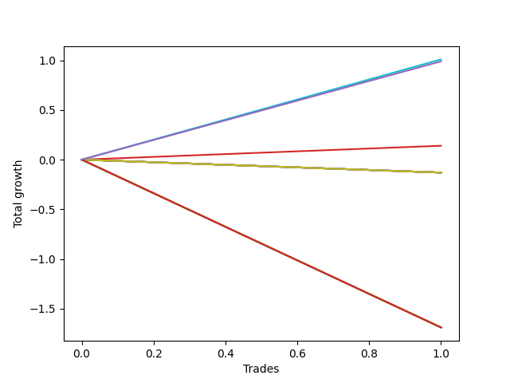

# Short Bernese 005 50 
- Symbol: AAPL
- Date Range: 05/27/2022 - 09/30/2022
- Trading Period: 7:20-12:30
- Number of Trades: 1



| Name | Win Percent | Profit | Avg Profit / Trade | Avg Time / Trade |      | Name | Win Percent | Profit | Avg Profit / Trade | Avg Time / Trade |
| ---- | ----------- | ------ | ------------------ | ---------------- | ---- | ---- | ----------- | ------ | ------------------ | ---------------- |
| Sorted By <br> Profit | | | | | | Sorted By <br> Win Percentage ||||
| Eighty-One | 100.00 | 505.00 | 505.00 | 04:30 |     | Eighty-One | 100.00 | 505.00 | 505.00 | 04:30 |
| NEWFI 0000 | 100.00 | 495.00 | 495.00 | 06:05 |     | NEWFI 0000 | 100.00 | 495.00 | 495.00 | 06:05 |
| Two_C | 100.00 | 70.00 | 70.00 | 01:00 |     | Two_C | 100.00 | 70.00 | 70.00 | 01:00 |
| Seven | 0.00 | -65.00 | -65.00 | 00:10 |     | Seven | 0.00 | -65.00 | -65.00 | 00:10 |
| Six | 0.00 | -65.00 | -65.00 | 00:10 |     | Six | 0.00 | -65.00 | -65.00 | 00:10 |
| Five | 0.00 | -65.00 | -65.00 | 00:10 |     | Five | 0.00 | -65.00 | -65.00 | 00:10 |
| Four | 0.00 | -65.00 | -65.00 | 00:10 |     | Four | 0.00 | -65.00 | -65.00 | 00:10 |
| Three | 0.00 | -65.00 | -65.00 | 00:10 |     | Three | 0.00 | -65.00 | -65.00 | 00:10 |
| Two | 0.00 | -65.00 | -65.00 | 00:10 |     | Two | 0.00 | -65.00 | -65.00 | 00:10 |
| One | 0.00 | -65.00 | -65.00 | 00:10 |     | One | 0.00 | -65.00 | -65.00 | 00:10 |
| Zero | 0.00 | -65.00 | -65.00 | 00:10 |     | Zero | 0.00 | -65.00 | -65.00 | 00:10 |
| Eighty-Five | 0.00 | -845.00 | -845.00 | 59:55 |     | Eighty-Five | 0.00 | -845.00 | -845.00 | 59:55 |
| Eighty-Four | 0.00 | -845.00 | -845.00 | 59:55 |     | Eighty-Four | 0.00 | -845.00 | -845.00 | 59:55 |
| Eighty-Three | 0.00 | -845.00 | -845.00 | 59:55 |     | Eighty-Three | 0.00 | -845.00 | -845.00 | 59:55 |
| Eighty-Two | 0.00 | -845.00 | -845.00 | 59:55 |     | Eighty-Two | 0.00 | -845.00 | -845.00 | 59:55 |

## NO STOPLOSS

### Test Zero
* Sell when price hits the middle line of the 20p bollinger
* No Stoploss
* Results:
```
Total Trades: 1
Percent Up: 100.00
Percent Down: 0.00
Total Points Moved Down: -0.13
Potential Profit: -65.00
Total Points Ups: 0.13 Count Ups: 1
Total Points Downs: 0.00 Count Downs: 0
```

<details><summary>Trades</summary>

<code>In: 2022-06-15 11:02:00		Out: 2022-06-15 11:02:10		Total Position Time: 00:10		Total Move Down: -0.13		Total to Date: -0.13</code> <br />


</details>

### Test One
* Sell when the price hits the upper line of the 20p 1std bollinger
* No Stoploss
* Results:
```
Total Trades: 1
Percent Up: 100.00
Percent Down: 0.00
Total Points Moved Down: -0.13
Potential Profit: -65.00
Total Points Ups: 0.13 Count Ups: 1
Total Points Downs: 0.00 Count Downs: 0
```

<details><summary>Trades</summary>

<code>In: 2022-06-15 11:02:00		Out: 2022-06-15 11:02:10		Total Position Time: 00:10		Total Move Down: -0.13		Total to Date: -0.13</code> <br />


</details>

### Test Two
* Sell when the price hits the upper line of the 20p 2std bollinger
* No Stoploss
* Results:
```
Total Trades: 1
Percent Up: 100.00
Percent Down: 0.00
Total Points Moved Down: -0.13
Potential Profit: -65.00
Total Points Ups: 0.13 Count Ups: 1
Total Points Downs: 0.00 Count Downs: 0
```

<details><summary>Trades</summary>

<code>In: 2022-06-15 11:02:00		Out: 2022-06-15 11:02:10		Total Position Time: 00:10		Total Move Down: -0.13		Total to Date: -0.13</code> <br />


</details>

### Test Two_C
* Sell when the price hits the upper line of the 20p 2std bollinger
* No Stoploss
* Results:
```
Total Trades: 1
Percent Up: 0.00
Percent Down: 100.00
Total Points Moved Down: 0.14
Potential Profit: 70.00
Total Points Ups: 0.00 Count Ups: 0
Total Points Downs: 0.14 Count Downs: 1
```

<details><summary>Trades</summary>

<code>In: 2022-06-15 11:02:00		Out: 2022-06-15 11:03:00		Total Position Time: 01:00		Total Move Down: 0.14		Total to Date: 0.14</code> <br />


</details>

### Test Three
* Sell when price hits the middle line of the 50p bollinger
* No Stoploss
* Results:
```
Total Trades: 1
Percent Up: 100.00
Percent Down: 0.00
Total Points Moved Down: -0.13
Potential Profit: -65.00
Total Points Ups: 0.13 Count Ups: 1
Total Points Downs: 0.00 Count Downs: 0
```

<details><summary>Trades</summary>

<code>In: 2022-06-15 11:02:00		Out: 2022-06-15 11:02:10		Total Position Time: 00:10		Total Move Down: -0.13		Total to Date: -0.13</code> <br />


</details>

### Test Four
* Sell when the price hits the upper line of the 50p 1std bollinger
* No Stoploss
* Results:
```
Total Trades: 1
Percent Up: 100.00
Percent Down: 0.00
Total Points Moved Down: -0.13
Potential Profit: -65.00
Total Points Ups: 0.13 Count Ups: 1
Total Points Downs: 0.00 Count Downs: 0
```

<details><summary>Trades</summary>

<code>In: 2022-06-15 11:02:00		Out: 2022-06-15 11:02:10		Total Position Time: 00:10		Total Move Down: -0.13		Total to Date: -0.13</code> <br />


</details>

### Test Five
* Sell when the price hits the upper line of the 50p 2std bollinger
* No Stoploss
* Results:
```
Total Trades: 1
Percent Up: 100.00
Percent Down: 0.00
Total Points Moved Down: -0.13
Potential Profit: -65.00
Total Points Ups: 0.13 Count Ups: 1
Total Points Downs: 0.00 Count Downs: 0
```

<details><summary>Trades</summary>

<code>In: 2022-06-15 11:02:00		Out: 2022-06-15 11:02:10		Total Position Time: 00:10		Total Move Down: -0.13		Total to Date: -0.13</code> <br />


</details>

### Test Six
* Sell when the price hits the middle line of the 1std VWAP
* No Stoploss
* Results:
```
Total Trades: 1
Percent Up: 100.00
Percent Down: 0.00
Total Points Moved Down: -0.13
Potential Profit: -65.00
Total Points Ups: 0.13 Count Ups: 1
Total Points Downs: 0.00 Count Downs: 0
```

<details><summary>Trades</summary>

<code>In: 2022-06-15 11:02:00		Out: 2022-06-15 11:02:10		Total Position Time: 00:10		Total Move Down: -0.13		Total to Date: -0.13</code> <br />


</details>

### Test Seven
* Sell when the price hits the upper line of the 1std VWAP
* No Stoploss
* Results:
```
Total Trades: 1
Percent Up: 100.00
Percent Down: 0.00
Total Points Moved Down: -0.13
Potential Profit: -65.00
Total Points Ups: 0.13 Count Ups: 1
Total Points Downs: 0.00 Count Downs: 0
```

<details><summary>Trades</summary>

<code>In: 2022-06-15 11:02:00		Out: 2022-06-15 11:02:10		Total Position Time: 00:10		Total Move Down: -0.13		Total to Date: -0.13</code> <br />


</details>

## TAKE PROFIT

### Test Eighty-One
* Take Profit of 1 Point
* No Stoploss
* Results:
```
Total Trades: 1
Percent Up: 0.00
Percent Down: 100.00
Total Points Moved Down: 1.01
Potential Profit: 505.00
Total Points Ups: 0.00 Count Ups: 0
Total Points Downs: 1.01 Count Downs: 1
```

<details><summary>Trades</summary>

<code>In: 2022-06-15 11:02:00		Out: 2022-06-15 11:06:30		Total Position Time: 04:30		Total Move Down: 1.01		Total to Date: 1.01</code> <br />


</details>

### Test Eighty-Two
* Take Profit of 2 Point
* No Stoploss
* Results:
```
Total Trades: 1
Percent Up: 100.00
Percent Down: 0.00
Total Points Moved Down: -1.69
Potential Profit: -845.00
Total Points Ups: 1.69 Count Ups: 1
Total Points Downs: 0.00 Count Downs: 0
```

<details><summary>Trades</summary>

<code>In: 2022-06-15 11:02:00		Out: 2022-06-15 12:01:55		Total Position Time: 59:55		Total Move Down: -1.69		Total to Date: -1.69</code> <br />


</details>

### Test Eighty-Three
* Take Profit of 3 Point
* No Stoploss
* Results:
```
Total Trades: 1
Percent Up: 100.00
Percent Down: 0.00
Total Points Moved Down: -1.69
Potential Profit: -845.00
Total Points Ups: 1.69 Count Ups: 1
Total Points Downs: 0.00 Count Downs: 0
```

<details><summary>Trades</summary>

<code>In: 2022-06-15 11:02:00		Out: 2022-06-15 12:01:55		Total Position Time: 59:55		Total Move Down: -1.69		Total to Date: -1.69</code> <br />


</details>

### Test Eighty-Four
* Take Profit of 4 Point
* No Stoploss
* Results:
```
Total Trades: 1
Percent Up: 100.00
Percent Down: 0.00
Total Points Moved Down: -1.69
Potential Profit: -845.00
Total Points Ups: 1.69 Count Ups: 1
Total Points Downs: 0.00 Count Downs: 0
```

<details><summary>Trades</summary>

<code>In: 2022-06-15 11:02:00		Out: 2022-06-15 12:01:55		Total Position Time: 59:55		Total Move Down: -1.69		Total to Date: -1.69</code> <br />


</details>

### Test Eighty-Five
* Take Profit of 5 Point
* No Stoploss
* Results:
```
Total Trades: 1
Percent Up: 100.00
Percent Down: 0.00
Total Points Moved Down: -1.69
Potential Profit: -845.00
Total Points Ups: 1.69 Count Ups: 1
Total Points Downs: 0.00 Count Downs: 0
```

<details><summary>Trades</summary>

<code>In: 2022-06-15 11:02:00		Out: 2022-06-15 12:01:55		Total Position Time: 59:55		Total Move Down: -1.69		Total to Date: -1.69</code> <br />


</details>

## Indicator Exits

### Test NEWFI 0000
* Newfi 0000
* No Stoploss
* Results:
```
Total Trades: 1
Percent Up: 0.00
Percent Down: 100.00
Total Points Moved Down: 0.99
Potential Profit: 495.00
Total Points Ups: 0.00 Count Ups: 0
Total Points Downs: 0.99 Count Downs: 1
```

<details><summary>Trades</summary>

<code>In: 2022-06-15 11:02:00		Out: 2022-06-15 11:08:05		Total Position Time: 06:05		Total Move Down: 0.99		Total to Date: 0.99</code> <br />


</details>