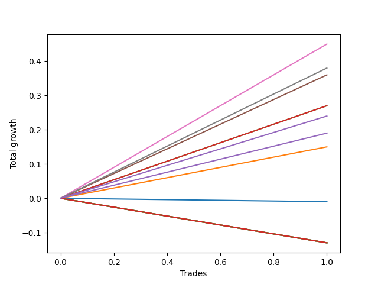

# Short Bernese 009 1v 
- Symbol: AAPL
- Date Range: 05/27/2022 - 09/30/2022
- Trading Period: 7:20-12:30
- Number of Trades: 1



| Name | Win Percent | Profit | Avg Profit / Trade | Avg Time / Trade |      | Name | Win Percent | Profit | Avg Profit / Trade | Avg Time / Trade |
| ---- | ----------- | ------ | ------------------ | ---------------- | ---- | ---- | ----------- | ------ | ------------------ | ---------------- |
| Sorted By <br> Profit | | | | | | Sorted By <br> Win Percentage ||||
| Five | 100.00 | 225.00 | 225.00 | 26:05 |     | Five | 100.00 | 225.00 | 225.00 | 26:05 |
| Six | 100.00 | 190.00 | 190.00 | 25:20 |     | Six | 100.00 | 190.00 | 190.00 | 25:20 |
| Four | 100.00 | 180.00 | 180.00 | 15:40 |     | Four | 100.00 | 180.00 | 180.00 | 15:40 |
| Two_C | 100.00 | 135.00 | 135.00 | 09:50 |     | Two_C | 100.00 | 135.00 | 135.00 | 09:50 |
| Two | 100.00 | 135.00 | 135.00 | 09:50 |     | Two | 100.00 | 135.00 | 135.00 | 09:50 |
| NEWFI 0000 | 100.00 | 120.00 | 120.00 | 20:05 |     | NEWFI 0000 | 100.00 | 120.00 | 120.00 | 20:05 |
| Three | 100.00 | 95.00 | 95.00 | 07:20 |     | Three | 100.00 | 95.00 | 95.00 | 07:20 |
| One | 100.00 | 75.00 | 75.00 | 06:50 |     | One | 100.00 | 75.00 | 75.00 | 06:50 |
| Zero | 0.00 | -5.00 | -5.00 | 00:10 |     | Zero | 0.00 | -5.00 | -5.00 | 00:10 |
| Eighty-Five | 0.00 | -65.00 | -65.00 | 59:55 |     | Eighty-Five | 0.00 | -65.00 | -65.00 | 59:55 |
| Eighty-Four | 0.00 | -65.00 | -65.00 | 59:55 |     | Eighty-Four | 0.00 | -65.00 | -65.00 | 59:55 |
| Eighty-Three | 0.00 | -65.00 | -65.00 | 59:55 |     | Eighty-Three | 0.00 | -65.00 | -65.00 | 59:55 |
| Eighty-Two | 0.00 | -65.00 | -65.00 | 59:55 |     | Eighty-Two | 0.00 | -65.00 | -65.00 | 59:55 |
| Eighty-One | 0.00 | -65.00 | -65.00 | 59:55 |     | Eighty-One | 0.00 | -65.00 | -65.00 | 59:55 |
| Seven | 0.00 | -65.00 | -65.00 | 59:55 |     | Seven | 0.00 | -65.00 | -65.00 | 59:55 |

## NO STOPLOSS

### Test Zero
* Sell when price hits the middle line of the 20p bollinger
* No Stoploss
* Results:
```
Total Trades: 1
Percent Up: 100.00
Percent Down: 0.00
Total Points Moved Down: -0.01
Potential Profit: -5.00
Total Points Ups: 0.01 Count Ups: 1
Total Points Downs: 0.00 Count Downs: 0
```

<details><summary>Trades</summary>

<code>In: 2022-09-22 10:57:00		Out: 2022-09-22 10:57:10		Total Position Time: 00:10		Total Move Down: -0.01		Total to Date: -0.01</code> <br />


</details>

### Test One
* Sell when the price hits the upper line of the 20p 1std bollinger
* No Stoploss
* Results:
```
Total Trades: 1
Percent Up: 0.00
Percent Down: 100.00
Total Points Moved Down: 0.15
Potential Profit: 75.00
Total Points Ups: 0.00 Count Ups: 0
Total Points Downs: 0.15 Count Downs: 1
```

<details><summary>Trades</summary>

<code>In: 2022-09-22 10:57:00		Out: 2022-09-22 11:03:50		Total Position Time: 06:50		Total Move Down: 0.15		Total to Date: 0.15</code> <br />


</details>

### Test Two
* Sell when the price hits the upper line of the 20p 2std bollinger
* No Stoploss
* Results:
```
Total Trades: 1
Percent Up: 0.00
Percent Down: 100.00
Total Points Moved Down: 0.27
Potential Profit: 135.00
Total Points Ups: 0.00 Count Ups: 0
Total Points Downs: 0.27 Count Downs: 1
```

<details><summary>Trades</summary>

<code>In: 2022-09-22 10:57:00		Out: 2022-09-22 11:06:50		Total Position Time: 09:50		Total Move Down: 0.27		Total to Date: 0.27</code> <br />


</details>

### Test Two_C
* Sell when the price hits the upper line of the 20p 2std bollinger
* No Stoploss
* Results:
```
Total Trades: 1
Percent Up: 0.00
Percent Down: 100.00
Total Points Moved Down: 0.27
Potential Profit: 135.00
Total Points Ups: 0.00 Count Ups: 0
Total Points Downs: 0.27 Count Downs: 1
```

<details><summary>Trades</summary>

<code>In: 2022-09-22 10:57:00		Out: 2022-09-22 11:06:50		Total Position Time: 09:50		Total Move Down: 0.27		Total to Date: 0.27</code> <br />


</details>

### Test Three
* Sell when price hits the middle line of the 50p bollinger
* No Stoploss
* Results:
```
Total Trades: 1
Percent Up: 0.00
Percent Down: 100.00
Total Points Moved Down: 0.19
Potential Profit: 95.00
Total Points Ups: 0.00 Count Ups: 0
Total Points Downs: 0.19 Count Downs: 1
```

<details><summary>Trades</summary>

<code>In: 2022-09-22 10:57:00		Out: 2022-09-22 11:04:20		Total Position Time: 07:20		Total Move Down: 0.19		Total to Date: 0.19</code> <br />


</details>

### Test Four
* Sell when the price hits the upper line of the 50p 1std bollinger
* No Stoploss
* Results:
```
Total Trades: 1
Percent Up: 0.00
Percent Down: 100.00
Total Points Moved Down: 0.36
Potential Profit: 180.00
Total Points Ups: 0.00 Count Ups: 0
Total Points Downs: 0.36 Count Downs: 1
```

<details><summary>Trades</summary>

<code>In: 2022-09-22 10:57:00		Out: 2022-09-22 11:12:40		Total Position Time: 15:40		Total Move Down: 0.36		Total to Date: 0.36</code> <br />


</details>

### Test Five
* Sell when the price hits the upper line of the 50p 2std bollinger
* No Stoploss
* Results:
```
Total Trades: 1
Percent Up: 0.00
Percent Down: 100.00
Total Points Moved Down: 0.45
Potential Profit: 225.00
Total Points Ups: 0.00 Count Ups: 0
Total Points Downs: 0.45 Count Downs: 1
```

<details><summary>Trades</summary>

<code>In: 2022-09-22 10:57:00		Out: 2022-09-22 11:23:05		Total Position Time: 26:05		Total Move Down: 0.45		Total to Date: 0.45</code> <br />


</details>

### Test Six
* Sell when the price hits the middle line of the 1std VWAP
* No Stoploss
* Results:
```
Total Trades: 1
Percent Up: 0.00
Percent Down: 100.00
Total Points Moved Down: 0.38
Potential Profit: 190.00
Total Points Ups: 0.00 Count Ups: 0
Total Points Downs: 0.38 Count Downs: 1
```

<details><summary>Trades</summary>

<code>In: 2022-09-22 10:57:00		Out: 2022-09-22 11:22:20		Total Position Time: 25:20		Total Move Down: 0.38		Total to Date: 0.38</code> <br />


</details>

### Test Seven
* Sell when the price hits the upper line of the 1std VWAP
* No Stoploss
* Results:
```
Total Trades: 1
Percent Up: 100.00
Percent Down: 0.00
Total Points Moved Down: -0.13
Potential Profit: -65.00
Total Points Ups: 0.13 Count Ups: 1
Total Points Downs: 0.00 Count Downs: 0
```

<details><summary>Trades</summary>

<code>In: 2022-09-22 10:57:00		Out: 2022-09-22 11:56:55		Total Position Time: 59:55		Total Move Down: -0.13		Total to Date: -0.13</code> <br />


</details>

## TAKE PROFIT

### Test Eighty-One
* Take Profit of 1 Point
* No Stoploss
* Results:
```
Total Trades: 1
Percent Up: 100.00
Percent Down: 0.00
Total Points Moved Down: -0.13
Potential Profit: -65.00
Total Points Ups: 0.13 Count Ups: 1
Total Points Downs: 0.00 Count Downs: 0
```

<details><summary>Trades</summary>

<code>In: 2022-09-22 10:57:00		Out: 2022-09-22 11:56:55		Total Position Time: 59:55		Total Move Down: -0.13		Total to Date: -0.13</code> <br />


</details>

### Test Eighty-Two
* Take Profit of 2 Point
* No Stoploss
* Results:
```
Total Trades: 1
Percent Up: 100.00
Percent Down: 0.00
Total Points Moved Down: -0.13
Potential Profit: -65.00
Total Points Ups: 0.13 Count Ups: 1
Total Points Downs: 0.00 Count Downs: 0
```

<details><summary>Trades</summary>

<code>In: 2022-09-22 10:57:00		Out: 2022-09-22 11:56:55		Total Position Time: 59:55		Total Move Down: -0.13		Total to Date: -0.13</code> <br />


</details>

### Test Eighty-Three
* Take Profit of 3 Point
* No Stoploss
* Results:
```
Total Trades: 1
Percent Up: 100.00
Percent Down: 0.00
Total Points Moved Down: -0.13
Potential Profit: -65.00
Total Points Ups: 0.13 Count Ups: 1
Total Points Downs: 0.00 Count Downs: 0
```

<details><summary>Trades</summary>

<code>In: 2022-09-22 10:57:00		Out: 2022-09-22 11:56:55		Total Position Time: 59:55		Total Move Down: -0.13		Total to Date: -0.13</code> <br />


</details>

### Test Eighty-Four
* Take Profit of 4 Point
* No Stoploss
* Results:
```
Total Trades: 1
Percent Up: 100.00
Percent Down: 0.00
Total Points Moved Down: -0.13
Potential Profit: -65.00
Total Points Ups: 0.13 Count Ups: 1
Total Points Downs: 0.00 Count Downs: 0
```

<details><summary>Trades</summary>

<code>In: 2022-09-22 10:57:00		Out: 2022-09-22 11:56:55		Total Position Time: 59:55		Total Move Down: -0.13		Total to Date: -0.13</code> <br />


</details>

### Test Eighty-Five
* Take Profit of 5 Point
* No Stoploss
* Results:
```
Total Trades: 1
Percent Up: 100.00
Percent Down: 0.00
Total Points Moved Down: -0.13
Potential Profit: -65.00
Total Points Ups: 0.13 Count Ups: 1
Total Points Downs: 0.00 Count Downs: 0
```

<details><summary>Trades</summary>

<code>In: 2022-09-22 10:57:00		Out: 2022-09-22 11:56:55		Total Position Time: 59:55		Total Move Down: -0.13		Total to Date: -0.13</code> <br />


</details>

## Indicator Exits

### Test NEWFI 0000
* Newfi 0000
* No Stoploss
* Results:
```
Total Trades: 1
Percent Up: 0.00
Percent Down: 100.00
Total Points Moved Down: 0.24
Potential Profit: 120.00
Total Points Ups: 0.00 Count Ups: 0
Total Points Downs: 0.24 Count Downs: 1
```

<details><summary>Trades</summary>

<code>In: 2022-09-22 10:57:00		Out: 2022-09-22 11:17:05		Total Position Time: 20:05		Total Move Down: 0.24		Total to Date: 0.24</code> <br />


</details>