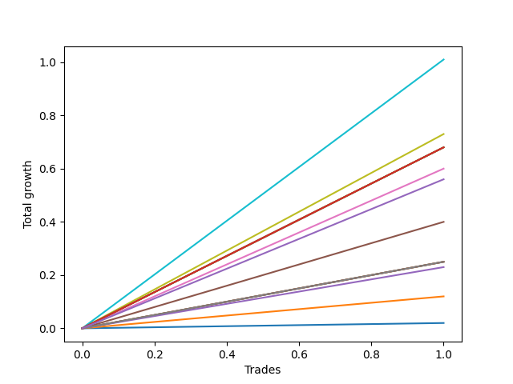

# Short Bernese 009 50 
- Symbol: AAPL
- Date Range: 05/27/2022 - 09/30/2022
- Trading Period: 7:20-12:30
- Number of Trades: 1



| Name | Win Percent | Profit | Avg Profit / Trade | Avg Time / Trade |      | Name | Win Percent | Profit | Avg Profit / Trade | Avg Time / Trade |
| ---- | ----------- | ------ | ------------------ | ---------------- | ---- | ---- | ----------- | ------ | ------------------ | ---------------- |
| Sorted By <br> Profit | | | | | | Sorted By <br> Win Percentage ||||
| Eighty-One | 100.00 | 505.00 | 505.00 | 25:40 |     | Eighty-One | 100.00 | 505.00 | 505.00 | 25:40 |
| Seven | 100.00 | 365.00 | 365.00 | 21:05 |     | Seven | 100.00 | 365.00 | 365.00 | 21:05 |
| Eighty-Five | 100.00 | 340.00 | 340.00 | 59:55 |     | Eighty-Five | 100.00 | 340.00 | 340.00 | 59:55 |
| Eighty-Four | 100.00 | 340.00 | 340.00 | 59:55 |     | Eighty-Four | 100.00 | 340.00 | 340.00 | 59:55 |
| Eighty-Three | 100.00 | 340.00 | 340.00 | 59:55 |     | Eighty-Three | 100.00 | 340.00 | 340.00 | 59:55 |
| Eighty-Two | 100.00 | 340.00 | 340.00 | 59:55 |     | Eighty-Two | 100.00 | 340.00 | 340.00 | 59:55 |
| Five | 100.00 | 300.00 | 300.00 | 13:35 |     | Five | 100.00 | 300.00 | 300.00 | 13:35 |
| NEWFI 0000 | 100.00 | 280.00 | 280.00 | 16:05 |     | NEWFI 0000 | 100.00 | 280.00 | 280.00 | 16:05 |
| Four | 100.00 | 200.00 | 200.00 | 08:30 |     | Four | 100.00 | 200.00 | 200.00 | 08:30 |
| Six | 100.00 | 125.00 | 125.00 | 04:50 |     | Six | 100.00 | 125.00 | 125.00 | 04:50 |
| Two_C | 100.00 | 125.00 | 125.00 | 04:50 |     | Two_C | 100.00 | 125.00 | 125.00 | 04:50 |
| Two | 100.00 | 125.00 | 125.00 | 04:50 |     | Two | 100.00 | 125.00 | 125.00 | 04:50 |
| Three | 100.00 | 115.00 | 115.00 | 04:55 |     | Three | 100.00 | 115.00 | 115.00 | 04:55 |
| One | 100.00 | 60.00 | 60.00 | 03:15 |     | One | 100.00 | 60.00 | 60.00 | 03:15 |
| Zero | 100.00 | 10.00 | 10.00 | 00:15 |     | Zero | 100.00 | 10.00 | 10.00 | 00:15 |

## NO STOPLOSS

### Test Zero
* Sell when price hits the middle line of the 20p bollinger
* No Stoploss
* Results:
```
Total Trades: 1
Percent Up: 0.00
Percent Down: 100.00
Total Points Moved Down: 0.02
Potential Profit: 10.00
Total Points Ups: 0.00 Count Ups: 0
Total Points Downs: 0.02 Count Downs: 1
```

<details><summary>Trades</summary>

<code>In: 2022-08-19 10:06:00		Out: 2022-08-19 10:06:15		Total Position Time: 00:15		Total Move Down: 0.02		Total to Date: 0.02</code> <br />


</details>

### Test One
* Sell when the price hits the upper line of the 20p 1std bollinger
* No Stoploss
* Results:
```
Total Trades: 1
Percent Up: 0.00
Percent Down: 100.00
Total Points Moved Down: 0.12
Potential Profit: 60.00
Total Points Ups: 0.00 Count Ups: 0
Total Points Downs: 0.12 Count Downs: 1
```

<details><summary>Trades</summary>

<code>In: 2022-08-19 10:06:00		Out: 2022-08-19 10:09:15		Total Position Time: 03:15		Total Move Down: 0.12		Total to Date: 0.12</code> <br />


</details>

### Test Two
* Sell when the price hits the upper line of the 20p 2std bollinger
* No Stoploss
* Results:
```
Total Trades: 1
Percent Up: 0.00
Percent Down: 100.00
Total Points Moved Down: 0.25
Potential Profit: 125.00
Total Points Ups: 0.00 Count Ups: 0
Total Points Downs: 0.25 Count Downs: 1
```

<details><summary>Trades</summary>

<code>In: 2022-08-19 10:06:00		Out: 2022-08-19 10:10:50		Total Position Time: 04:50		Total Move Down: 0.25		Total to Date: 0.25</code> <br />


</details>

### Test Two_C
* Sell when the price hits the upper line of the 20p 2std bollinger
* No Stoploss
* Results:
```
Total Trades: 1
Percent Up: 0.00
Percent Down: 100.00
Total Points Moved Down: 0.25
Potential Profit: 125.00
Total Points Ups: 0.00 Count Ups: 0
Total Points Downs: 0.25 Count Downs: 1
```

<details><summary>Trades</summary>

<code>In: 2022-08-19 10:06:00		Out: 2022-08-19 10:10:50		Total Position Time: 04:50		Total Move Down: 0.25		Total to Date: 0.25</code> <br />


</details>

### Test Three
* Sell when price hits the middle line of the 50p bollinger
* No Stoploss
* Results:
```
Total Trades: 1
Percent Up: 0.00
Percent Down: 100.00
Total Points Moved Down: 0.23
Potential Profit: 115.00
Total Points Ups: 0.00 Count Ups: 0
Total Points Downs: 0.23 Count Downs: 1
```

<details><summary>Trades</summary>

<code>In: 2022-08-19 10:06:00		Out: 2022-08-19 10:10:55		Total Position Time: 04:55		Total Move Down: 0.23		Total to Date: 0.23</code> <br />


</details>

### Test Four
* Sell when the price hits the upper line of the 50p 1std bollinger
* No Stoploss
* Results:
```
Total Trades: 1
Percent Up: 0.00
Percent Down: 100.00
Total Points Moved Down: 0.40
Potential Profit: 200.00
Total Points Ups: 0.00 Count Ups: 0
Total Points Downs: 0.40 Count Downs: 1
```

<details><summary>Trades</summary>

<code>In: 2022-08-19 10:06:00		Out: 2022-08-19 10:14:30		Total Position Time: 08:30		Total Move Down: 0.40		Total to Date: 0.40</code> <br />


</details>

### Test Five
* Sell when the price hits the upper line of the 50p 2std bollinger
* No Stoploss
* Results:
```
Total Trades: 1
Percent Up: 0.00
Percent Down: 100.00
Total Points Moved Down: 0.60
Potential Profit: 300.00
Total Points Ups: 0.00 Count Ups: 0
Total Points Downs: 0.60 Count Downs: 1
```

<details><summary>Trades</summary>

<code>In: 2022-08-19 10:06:00		Out: 2022-08-19 10:19:35		Total Position Time: 13:35		Total Move Down: 0.60		Total to Date: 0.60</code> <br />


</details>

### Test Six
* Sell when the price hits the middle line of the 1std VWAP
* No Stoploss
* Results:
```
Total Trades: 1
Percent Up: 0.00
Percent Down: 100.00
Total Points Moved Down: 0.25
Potential Profit: 125.00
Total Points Ups: 0.00 Count Ups: 0
Total Points Downs: 0.25 Count Downs: 1
```

<details><summary>Trades</summary>

<code>In: 2022-08-19 10:06:00		Out: 2022-08-19 10:10:50		Total Position Time: 04:50		Total Move Down: 0.25		Total to Date: 0.25</code> <br />


</details>

### Test Seven
* Sell when the price hits the upper line of the 1std VWAP
* No Stoploss
* Results:
```
Total Trades: 1
Percent Up: 0.00
Percent Down: 100.00
Total Points Moved Down: 0.73
Potential Profit: 365.00
Total Points Ups: 0.00 Count Ups: 0
Total Points Downs: 0.73 Count Downs: 1
```

<details><summary>Trades</summary>

<code>In: 2022-08-19 10:06:00		Out: 2022-08-19 10:27:05		Total Position Time: 21:05		Total Move Down: 0.73		Total to Date: 0.73</code> <br />


</details>

## TAKE PROFIT

### Test Eighty-One
* Take Profit of 1 Point
* No Stoploss
* Results:
```
Total Trades: 1
Percent Up: 0.00
Percent Down: 100.00
Total Points Moved Down: 1.01
Potential Profit: 505.00
Total Points Ups: 0.00 Count Ups: 0
Total Points Downs: 1.01 Count Downs: 1
```

<details><summary>Trades</summary>

<code>In: 2022-08-19 10:06:00		Out: 2022-08-19 10:31:40		Total Position Time: 25:40		Total Move Down: 1.01		Total to Date: 1.01</code> <br />


</details>

### Test Eighty-Two
* Take Profit of 2 Point
* No Stoploss
* Results:
```
Total Trades: 1
Percent Up: 0.00
Percent Down: 100.00
Total Points Moved Down: 0.68
Potential Profit: 340.00
Total Points Ups: 0.00 Count Ups: 0
Total Points Downs: 0.68 Count Downs: 1
```

<details><summary>Trades</summary>

<code>In: 2022-08-19 10:06:00		Out: 2022-08-19 11:05:55		Total Position Time: 59:55		Total Move Down: 0.68		Total to Date: 0.68</code> <br />


</details>

### Test Eighty-Three
* Take Profit of 3 Point
* No Stoploss
* Results:
```
Total Trades: 1
Percent Up: 0.00
Percent Down: 100.00
Total Points Moved Down: 0.68
Potential Profit: 340.00
Total Points Ups: 0.00 Count Ups: 0
Total Points Downs: 0.68 Count Downs: 1
```

<details><summary>Trades</summary>

<code>In: 2022-08-19 10:06:00		Out: 2022-08-19 11:05:55		Total Position Time: 59:55		Total Move Down: 0.68		Total to Date: 0.68</code> <br />


</details>

### Test Eighty-Four
* Take Profit of 4 Point
* No Stoploss
* Results:
```
Total Trades: 1
Percent Up: 0.00
Percent Down: 100.00
Total Points Moved Down: 0.68
Potential Profit: 340.00
Total Points Ups: 0.00 Count Ups: 0
Total Points Downs: 0.68 Count Downs: 1
```

<details><summary>Trades</summary>

<code>In: 2022-08-19 10:06:00		Out: 2022-08-19 11:05:55		Total Position Time: 59:55		Total Move Down: 0.68		Total to Date: 0.68</code> <br />


</details>

### Test Eighty-Five
* Take Profit of 5 Point
* No Stoploss
* Results:
```
Total Trades: 1
Percent Up: 0.00
Percent Down: 100.00
Total Points Moved Down: 0.68
Potential Profit: 340.00
Total Points Ups: 0.00 Count Ups: 0
Total Points Downs: 0.68 Count Downs: 1
```

<details><summary>Trades</summary>

<code>In: 2022-08-19 10:06:00		Out: 2022-08-19 11:05:55		Total Position Time: 59:55		Total Move Down: 0.68		Total to Date: 0.68</code> <br />


</details>

## Indicator Exits

### Test NEWFI 0000
* Newfi 0000
* No Stoploss
* Results:
```
Total Trades: 1
Percent Up: 0.00
Percent Down: 100.00
Total Points Moved Down: 0.56
Potential Profit: 280.00
Total Points Ups: 0.00 Count Ups: 0
Total Points Downs: 0.56 Count Downs: 1
```

<details><summary>Trades</summary>

<code>In: 2022-08-19 10:06:00		Out: 2022-08-19 10:22:05		Total Position Time: 16:05		Total Move Down: 0.56		Total to Date: 0.56</code> <br />


</details>