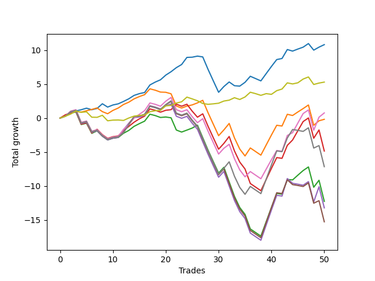

# Long Bulldog 003 
- Symbol: AAPL1y5m
- Date Range: 07/02/2021 - 07/08/2022
- Trading Period: 7:20-12:30
- Number of Trades: 50



| Name | Win Percent | Profit | Avg Profit / Trade |     | Name | Win Percent | Profit | Avg Profit / Trade |
| ---- | ----------- | ------ | ------------------ | --- | ---- | ----------- | ------ | ------------------ |
| Sorted By <br> Profit | | | | | Sorted By <br> Win Percentage ||||
| Zero | 76.00 | 5410.00 | 108.20 |     | Zero | 76.00 | 5410.00 | 108.20 |
| Seventy-Three | 70.00 | 2650.00 | 53.00 |     | Seventy-Three | 70.00 | 2650.00 | 53.00 |
| Six | 60.00 | 380.00 | 7.60 |     | Six | 60.00 | 380.00 | 7.60 |
| One | 60.00 | -90.00 | -1.80 |     | One | 60.00 | -90.00 | -1.80 |
| Three | 58.00 | -2430.00 | -48.60 |     | Three | 58.00 | -2430.00 | -48.60 |
| Seven | 52.00 | -3580.00 | -71.60 |     | Seven | 52.00 | -3580.00 | -71.60 |
| Two | 52.00 | -6135.00 | -122.70 |     | Two | 52.00 | -6135.00 | -122.70 |
| Four | 46.00 | -6615.00 | -132.30 |     | Four | 46.00 | -6615.00 | -132.30 |
| Five | 46.00 | -7640.00 | -152.80 |     | Five | 46.00 | -7640.00 | -152.80 |

## NO STOPLOSS

### Test Zero
* Sell when price hits the middle line of the 20p bollinger
* No Stoploss
* Results:
```
Total Trades: 50
Percent Up: 76.00
Percent Down: 24.00
Total Points Moved Up: 10.82
Potential Profit: 5410.00
Total Points Ups: 19.36 Count Ups: 38
Total Points Downs: -8.54 Count Downs: 12
```

<details><summary>Trades</summary>

<code>In: 2021-07-12 10:50:00		Out: 2021-07-12 11:19:05		Total Position Time: 29:05		Total Move Up: 0.33		Total to Date: 0.33</code> <br />
<code>In: 2021-07-15 09:15:00		Out: 2021-07-15 09:40:20		Total Position Time: 25:20		Total Move Up: 0.52		Total to Date: 0.85</code> <br />
<code>In: 2021-07-16 12:05:00		Out: 2021-07-16 12:50:00		Total Position Time: 45:00		Total Move Up: 0.20		Total to Date: 1.05</code> <br />
<code>In: 2021-08-18 08:15:00		Out: 2021-08-18 09:19:20		Total Position Time: 64:20		Total Move Up: 0.18		Total to Date: 1.23</code> <br />
<code>In: 2021-08-26 12:15:00		Out: 2021-08-26 12:35:40		Total Position Time: 20:40		Total Move Up: 0.23		Total to Date: 1.46</code> <br />
<code>In: 2021-09-10 08:30:00		Out: 2021-09-10 10:00:10		Total Position Time: 90:10		Total Move Up: -0.23		Total to Date: 1.23</code> <br />
<code>In: 2021-09-13 10:45:00		Out: 2021-09-13 11:46:30		Total Position Time: 61:30		Total Move Up: 0.19		Total to Date: 1.42</code> <br />
<code>In: 2021-09-14 10:10:00		Out: 2021-09-14 10:52:50		Total Position Time: 42:50		Total Move Up: 0.69		Total to Date: 2.11</code> <br />
<code>In: 2021-09-14 11:10:00		Out: 2021-09-14 12:41:40		Total Position Time: 91:40		Total Move Up: -0.49		Total to Date: 1.62</code> <br />
<code>In: 2021-09-14 11:20:00		Out: 2021-09-14 12:41:40		Total Position Time: 81:40		Total Move Up: 0.31		Total to Date: 1.93</code> <br />
<code>In: 2021-09-14 11:25:00		Out: 2021-09-14 12:41:40		Total Position Time: 76:40		Total Move Up: 0.17		Total to Date: 2.10</code> <br />
<code>In: 2021-09-30 09:10:00		Out: 2021-09-30 10:05:05		Total Position Time: 55:05		Total Move Up: 0.35		Total to Date: 2.45</code> <br />
<code>In: 2021-10-21 09:10:00		Out: 2021-10-21 10:32:15		Total Position Time: 82:15		Total Move Up: 0.39		Total to Date: 2.84</code> <br />
<code>In: 2021-11-05 10:30:00		Out: 2021-11-05 11:05:50		Total Position Time: 35:50		Total Move Up: 0.50		Total to Date: 3.34</code> <br />
<code>In: 2021-11-08 09:05:00		Out: 2021-11-08 09:35:25		Total Position Time: 30:25		Total Move Up: 0.26		Total to Date: 3.60</code> <br />
<code>In: 2021-11-11 10:10:00		Out: 2021-11-11 11:08:50		Total Position Time: 58:50		Total Move Up: 0.17		Total to Date: 3.77</code> <br />
<code>In: 2021-12-29 07:20:00		Out: 2021-12-29 07:48:05		Total Position Time: 28:05		Total Move Up: 1.11		Total to Date: 4.88</code> <br />
<code>In: 2021-12-30 11:05:00		Out: 2021-12-30 11:44:40		Total Position Time: 39:40		Total Move Up: 0.42		Total to Date: 5.30</code> <br />
<code>In: 2021-12-30 11:10:00		Out: 2021-12-30 11:44:40		Total Position Time: 34:40		Total Move Up: 0.34		Total to Date: 5.64</code> <br />
<code>In: 2022-01-04 08:05:00		Out: 2022-01-04 09:22:50		Total Position Time: 77:50		Total Move Up: 0.69		Total to Date: 6.33</code> <br />
<code>In: 2022-01-04 08:25:00		Out: 2022-01-04 09:22:50		Total Position Time: 57:50		Total Move Up: 0.50		Total to Date: 6.83</code> <br />
<code>In: 2022-01-05 10:10:00		Out: 2022-01-05 11:02:20		Total Position Time: 52:20		Total Move Up: 0.60		Total to Date: 7.43</code> <br />
<code>In: 2022-01-05 11:45:00		Out: 2022-01-05 12:38:35		Total Position Time: 53:35		Total Move Up: 0.46		Total to Date: 7.89</code> <br />
<code>In: 2022-01-05 12:10:00		Out: 2022-01-05 12:38:35		Total Position Time: 28:35		Total Move Up: 1.05		Total to Date: 8.94</code> <br />
<code>In: 2022-01-13 09:20:00		Out: 2022-01-13 10:40:05		Total Position Time: 80:05		Total Move Up: 0.03		Total to Date: 8.97</code> <br />
<code>In: 2022-01-13 09:30:00		Out: 2022-01-13 10:40:05		Total Position Time: 70:05		Total Move Up: 0.16		Total to Date: 9.13</code> <br />
<code>In: 2022-01-19 07:50:00		Out: 2022-01-19 09:02:05		Total Position Time: 72:05		Total Move Up: -0.12		Total to Date: 9.01</code> <br />
<code>In: 2022-01-20 11:15:00		Out: 2022-01-20 12:50:00		Total Position Time: 95:00		Total Move Up: -1.83		Total to Date: 7.18</code> <br />
<code>In: 2022-01-20 11:30:00		Out: 2022-01-20 12:50:00		Total Position Time: 80:00		Total Move Up: -1.70		Total to Date: 5.48</code> <br />
<code>In: 2022-01-20 11:45:00		Out: 2022-01-20 12:50:00		Total Position Time: 65:00		Total Move Up: -1.68		Total to Date: 3.80</code> <br />
<code>In: 2022-01-26 12:10:00		Out: 2022-01-26 12:50:00		Total Position Time: 40:00		Total Move Up: 0.85		Total to Date: 4.65</code> <br />
<code>In: 2022-02-10 08:15:00		Out: 2022-02-10 08:46:30		Total Position Time: 31:30		Total Move Up: 0.67		Total to Date: 5.32</code> <br />
<code>In: 2022-02-10 09:50:00		Out: 2022-02-10 11:36:35		Total Position Time: 106:35		Total Move Up: -0.55		Total to Date: 4.77</code> <br />
<code>In: 2022-02-10 10:20:00		Out: 2022-02-10 11:36:35		Total Position Time: 76:35		Total Move Up: -0.06		Total to Date: 4.71</code> <br />
<code>In: 2022-02-10 10:35:00		Out: 2022-02-10 11:36:35		Total Position Time: 61:35		Total Move Up: 0.56		Total to Date: 5.27</code> <br />
<code>In: 2022-02-11 07:20:00		Out: 2022-02-11 07:36:35		Total Position Time: 16:35		Total Move Up: 0.89		Total to Date: 6.16</code> <br />
<code>In: 2022-02-11 10:40:00		Out: 2022-02-11 12:15:20		Total Position Time: 95:20		Total Move Up: -0.34		Total to Date: 5.82</code> <br />
<code>In: 2022-02-11 10:50:00		Out: 2022-02-11 12:15:20		Total Position Time: 85:20		Total Move Up: -0.34		Total to Date: 5.48</code> <br />
<code>In: 2022-02-14 11:00:00		Out: 2022-02-14 11:50:25		Total Position Time: 50:25		Total Move Up: 1.07		Total to Date: 6.55</code> <br />
<code>In: 2022-02-14 11:05:00		Out: 2022-02-14 11:50:25		Total Position Time: 45:25		Total Move Up: 1.06		Total to Date: 7.61</code> <br />
<code>In: 2022-02-14 11:10:00		Out: 2022-02-14 11:50:25		Total Position Time: 40:25		Total Move Up: 1.01		Total to Date: 8.62</code> <br />
<code>In: 2022-02-17 11:45:00		Out: 2022-02-17 12:45:50		Total Position Time: 60:50		Total Move Up: 0.16		Total to Date: 8.78</code> <br />
<code>In: 2022-02-22 11:10:00		Out: 2022-02-22 11:31:25		Total Position Time: 21:25		Total Move Up: 1.32		Total to Date: 10.10</code> <br />
<code>In: 2022-03-04 07:20:00		Out: 2022-03-04 08:45:35		Total Position Time: 85:35		Total Move Up: -0.23		Total to Date: 9.87</code> <br />
<code>In: 2022-03-11 08:35:00		Out: 2022-03-11 09:51:55		Total Position Time: 76:55		Total Move Up: 0.30		Total to Date: 10.17</code> <br />
<code>In: 2022-03-11 08:40:00		Out: 2022-03-11 09:51:55		Total Position Time: 71:55		Total Move Up: 0.28		Total to Date: 10.45</code> <br />
<code>In: 2022-03-30 12:25:00		Out: 2022-03-30 12:50:00		Total Position Time: 25:00		Total Move Up: 0.53		Total to Date: 10.98</code> <br />
<code>In: 2022-05-11 10:20:00		Out: 2022-05-11 11:44:35		Total Position Time: 84:35		Total Move Up: -0.97		Total to Date: 10.01</code> <br />
<code>In: 2022-05-19 10:15:00		Out: 2022-05-19 11:15:05		Total Position Time: 60:05		Total Move Up: 0.44		Total to Date: 10.45</code> <br />
<code>In: 2022-06-09 08:05:00		Out: 2022-06-09 08:42:30		Total Position Time: 37:30		Total Move Up: 0.37		Total to Date: 10.82</code> <br />


</details>

### Test One
* Sell when the price hits the upper line of the 20p 1std bollinger
* No Stoploss
* Results:
```
Total Trades: 50
Percent Up: 60.00
Percent Down: 40.00
Total Points Moved Up: -0.18
Potential Profit: -90.00
Total Points Ups: 17.93 Count Ups: 30
Total Points Downs: -18.11 Count Downs: 20
```

<details><summary>Trades</summary>

<code>In: 2021-07-12 10:50:00		Out: 2021-07-12 11:30:35		Total Position Time: 40:35		Total Move Up: 0.47		Total to Date: 0.47</code> <br />
<code>In: 2021-07-15 09:15:00		Out: 2021-07-15 11:20:25		Total Position Time: 125:25		Total Move Up: 0.29		Total to Date: 0.76</code> <br />
<code>In: 2021-07-16 12:05:00		Out: 2021-07-16 12:50:00		Total Position Time: 45:00		Total Move Up: 0.20		Total to Date: 0.96</code> <br />
<code>In: 2021-08-18 08:15:00		Out: 2021-08-18 11:30:55		Total Position Time: 195:55		Total Move Up: -0.08		Total to Date: 0.88</code> <br />
<code>In: 2021-08-26 12:15:00		Out: 2021-08-26 12:50:00		Total Position Time: 35:00		Total Move Up: 0.20		Total to Date: 1.08</code> <br />
<code>In: 2021-09-10 08:30:00		Out: 2021-09-10 10:20:15		Total Position Time: 110:15		Total Move Up: 0.19		Total to Date: 1.27</code> <br />
<code>In: 2021-09-13 10:45:00		Out: 2021-09-13 12:08:00		Total Position Time: 83:00		Total Move Up: 0.23		Total to Date: 1.50</code> <br />
<code>In: 2021-09-14 10:10:00		Out: 2021-09-14 12:45:30		Total Position Time: 155:30		Total Move Up: -0.55		Total to Date: 0.95</code> <br />
<code>In: 2021-09-14 11:10:00		Out: 2021-09-14 12:45:30		Total Position Time: 95:30		Total Move Up: -0.31		Total to Date: 0.64</code> <br />
<code>In: 2021-09-14 11:20:00		Out: 2021-09-14 12:45:30		Total Position Time: 85:30		Total Move Up: 0.49		Total to Date: 1.13</code> <br />
<code>In: 2021-09-14 11:25:00		Out: 2021-09-14 12:45:30		Total Position Time: 80:30		Total Move Up: 0.35		Total to Date: 1.48</code> <br />
<code>In: 2021-09-30 09:10:00		Out: 2021-09-30 10:15:50		Total Position Time: 65:50		Total Move Up: 0.52		Total to Date: 2.00</code> <br />
<code>In: 2021-10-21 09:10:00		Out: 2021-10-21 11:16:45		Total Position Time: 126:45		Total Move Up: 0.34		Total to Date: 2.34</code> <br />
<code>In: 2021-11-05 10:30:00		Out: 2021-11-05 11:47:25		Total Position Time: 77:25		Total Move Up: 0.49		Total to Date: 2.83</code> <br />
<code>In: 2021-11-08 09:05:00		Out: 2021-11-08 10:01:15		Total Position Time: 56:15		Total Move Up: 0.34		Total to Date: 3.17</code> <br />
<code>In: 2021-11-11 10:10:00		Out: 2021-11-11 11:10:50		Total Position Time: 60:50		Total Move Up: 0.28		Total to Date: 3.45</code> <br />
<code>In: 2021-12-29 07:20:00		Out: 2021-12-29 10:00:40		Total Position Time: 160:40		Total Move Up: 0.86		Total to Date: 4.31</code> <br />
<code>In: 2021-12-30 11:05:00		Out: 2021-12-30 12:50:00		Total Position Time: 105:00		Total Move Up: -0.20		Total to Date: 4.11</code> <br />
<code>In: 2021-12-30 11:10:00		Out: 2021-12-30 12:50:00		Total Position Time: 100:00		Total Move Up: -0.28		Total to Date: 3.83</code> <br />
<code>In: 2022-01-04 08:05:00		Out: 2022-01-04 11:21:00		Total Position Time: 196:00		Total Move Up: -0.03		Total to Date: 3.80</code> <br />
<code>In: 2022-01-04 08:25:00		Out: 2022-01-04 11:21:00		Total Position Time: 176:00		Total Move Up: -0.22		Total to Date: 3.58</code> <br />
<code>In: 2022-01-05 10:10:00		Out: 2022-01-05 12:50:00		Total Position Time: 160:00		Total Move Up: -1.80		Total to Date: 1.78</code> <br />
<code>In: 2022-01-05 11:45:00		Out: 2022-01-05 12:50:00		Total Position Time: 65:00		Total Move Up: -0.30		Total to Date: 1.48</code> <br />
<code>In: 2022-01-05 12:10:00		Out: 2022-01-05 12:50:00		Total Position Time: 40:00		Total Move Up: 0.29		Total to Date: 1.77</code> <br />
<code>In: 2022-01-13 09:20:00		Out: 2022-01-13 10:55:05		Total Position Time: 95:05		Total Move Up: 0.17		Total to Date: 1.94</code> <br />
<code>In: 2022-01-13 09:30:00		Out: 2022-01-13 10:55:05		Total Position Time: 85:05		Total Move Up: 0.30		Total to Date: 2.24</code> <br />
<code>In: 2022-01-19 07:50:00		Out: 2022-01-19 09:12:10		Total Position Time: 82:10		Total Move Up: 0.38		Total to Date: 2.62</code> <br />
<code>In: 2022-01-20 11:15:00		Out: 2022-01-20 12:50:00		Total Position Time: 95:00		Total Move Up: -1.83		Total to Date: 0.79</code> <br />
<code>In: 2022-01-20 11:30:00		Out: 2022-01-20 12:50:00		Total Position Time: 80:00		Total Move Up: -1.70		Total to Date: -0.91</code> <br />
<code>In: 2022-01-20 11:45:00		Out: 2022-01-20 12:50:00		Total Position Time: 65:00		Total Move Up: -1.68		Total to Date: -2.59</code> <br />
<code>In: 2022-01-26 12:10:00		Out: 2022-01-26 12:50:00		Total Position Time: 40:00		Total Move Up: 0.85		Total to Date: -1.74</code> <br />
<code>In: 2022-02-10 08:15:00		Out: 2022-02-10 08:56:40		Total Position Time: 41:40		Total Move Up: 0.95		Total to Date: -0.79</code> <br />
<code>In: 2022-02-10 09:50:00		Out: 2022-02-10 12:50:00		Total Position Time: 180:00		Total Move Up: -2.13		Total to Date: -2.92</code> <br />
<code>In: 2022-02-10 10:20:00		Out: 2022-02-10 12:50:00		Total Position Time: 150:00		Total Move Up: -1.64		Total to Date: -4.56</code> <br />
<code>In: 2022-02-10 10:35:00		Out: 2022-02-10 12:50:00		Total Position Time: 135:00		Total Move Up: -1.02		Total to Date: -5.58</code> <br />
<code>In: 2022-02-11 07:20:00		Out: 2022-02-11 07:40:10		Total Position Time: 20:10		Total Move Up: 1.18		Total to Date: -4.40</code> <br />
<code>In: 2022-02-11 10:40:00		Out: 2022-02-11 12:50:00		Total Position Time: 130:00		Total Move Up: -0.53		Total to Date: -4.93</code> <br />
<code>In: 2022-02-11 10:50:00		Out: 2022-02-11 12:50:00		Total Position Time: 120:00		Total Move Up: -0.53		Total to Date: -5.46</code> <br />
<code>In: 2022-02-14 11:00:00		Out: 2022-02-14 12:13:25		Total Position Time: 73:25		Total Move Up: 1.49		Total to Date: -3.97</code> <br />
<code>In: 2022-02-14 11:05:00		Out: 2022-02-14 12:13:25		Total Position Time: 68:25		Total Move Up: 1.48		Total to Date: -2.49</code> <br />
<code>In: 2022-02-14 11:10:00		Out: 2022-02-14 12:13:25		Total Position Time: 63:25		Total Move Up: 1.43		Total to Date: -1.06</code> <br />
<code>In: 2022-02-17 11:45:00		Out: 2022-02-17 12:50:00		Total Position Time: 65:00		Total Move Up: -0.11		Total to Date: -1.17</code> <br />
<code>In: 2022-02-22 11:10:00		Out: 2022-02-22 11:50:05		Total Position Time: 40:05		Total Move Up: 1.73		Total to Date: 0.56</code> <br />
<code>In: 2022-03-04 07:20:00		Out: 2022-03-04 09:09:35		Total Position Time: 109:35		Total Move Up: -0.18		Total to Date: 0.38</code> <br />
<code>In: 2022-03-11 08:35:00		Out: 2022-03-11 10:02:25		Total Position Time: 87:25		Total Move Up: 0.52		Total to Date: 0.90</code> <br />
<code>In: 2022-03-11 08:40:00		Out: 2022-03-11 10:02:25		Total Position Time: 82:25		Total Move Up: 0.50		Total to Date: 1.40</code> <br />
<code>In: 2022-03-30 12:25:00		Out: 2022-03-30 12:50:00		Total Position Time: 25:00		Total Move Up: 0.53		Total to Date: 1.93</code> <br />
<code>In: 2022-05-11 10:20:00		Out: 2022-05-11 12:50:00		Total Position Time: 150:00		Total Move Up: -2.99		Total to Date: -1.06</code> <br />
<code>In: 2022-05-19 10:15:00		Out: 2022-05-19 11:31:40		Total Position Time: 76:40		Total Move Up: 0.66		Total to Date: -0.40</code> <br />
<code>In: 2022-06-09 08:05:00		Out: 2022-06-09 09:51:40		Total Position Time: 106:40		Total Move Up: 0.22		Total to Date: -0.18</code> <br />


</details>

### Test Two
* Sell when the price hits the upper line of the 20p 2std bollinger
* No Stoploss
* Results:
```
Total Trades: 50
Percent Up: 52.00
Percent Down: 48.00
Total Points Moved Up: -12.27
Potential Profit: -6135.00
Total Points Ups: 18.60 Count Ups: 26
Total Points Downs: -30.87 Count Downs: 24
```

<details><summary>Trades</summary>

<code>In: 2021-07-12 10:50:00		Out: 2021-07-12 12:50:00		Total Position Time: 120:00		Total Move Up: 0.28		Total to Date: 0.28</code> <br />
<code>In: 2021-07-15 09:15:00		Out: 2021-07-15 12:00:45		Total Position Time: 165:45		Total Move Up: 0.43		Total to Date: 0.71</code> <br />
<code>In: 2021-07-16 12:05:00		Out: 2021-07-16 12:50:00		Total Position Time: 45:00		Total Move Up: 0.20		Total to Date: 0.91</code> <br />
<code>In: 2021-08-18 08:15:00		Out: 2021-08-18 12:50:00		Total Position Time: 275:00		Total Move Up: -1.86		Total to Date: -0.95</code> <br />
<code>In: 2021-08-26 12:15:00		Out: 2021-08-26 12:50:00		Total Position Time: 35:00		Total Move Up: 0.20		Total to Date: -0.75</code> <br />
<code>In: 2021-09-10 08:30:00		Out: 2021-09-10 12:50:00		Total Position Time: 260:00		Total Move Up: -1.50		Total to Date: -2.25</code> <br />
<code>In: 2021-09-13 10:45:00		Out: 2021-09-13 12:08:45		Total Position Time: 83:45		Total Move Up: 0.37		Total to Date: -1.88</code> <br />
<code>In: 2021-09-14 10:10:00		Out: 2021-09-14 12:50:00		Total Position Time: 160:00		Total Move Up: -0.79		Total to Date: -2.67</code> <br />
<code>In: 2021-09-14 11:10:00		Out: 2021-09-14 12:50:00		Total Position Time: 100:00		Total Move Up: -0.55		Total to Date: -3.22</code> <br />
<code>In: 2021-09-14 11:20:00		Out: 2021-09-14 12:50:00		Total Position Time: 90:00		Total Move Up: 0.25		Total to Date: -2.97</code> <br />
<code>In: 2021-09-14 11:25:00		Out: 2021-09-14 12:50:00		Total Position Time: 85:00		Total Move Up: 0.11		Total to Date: -2.86</code> <br />
<code>In: 2021-09-30 09:10:00		Out: 2021-09-30 10:54:30		Total Position Time: 104:30		Total Move Up: 0.62		Total to Date: -2.24</code> <br />
<code>In: 2021-10-21 09:10:00		Out: 2021-10-21 11:26:10		Total Position Time: 136:10		Total Move Up: 0.42		Total to Date: -1.82</code> <br />
<code>In: 2021-11-05 10:30:00		Out: 2021-11-05 12:09:00		Total Position Time: 99:00		Total Move Up: 0.60		Total to Date: -1.22</code> <br />
<code>In: 2021-11-08 09:05:00		Out: 2021-11-08 10:07:55		Total Position Time: 62:55		Total Move Up: 0.40		Total to Date: -0.82</code> <br />
<code>In: 2021-11-11 10:10:00		Out: 2021-11-11 11:35:10		Total Position Time: 85:10		Total Move Up: 0.37		Total to Date: -0.45</code> <br />
<code>In: 2021-12-29 07:20:00		Out: 2021-12-29 11:26:40		Total Position Time: 246:40		Total Move Up: 1.02		Total to Date: 0.57</code> <br />
<code>In: 2021-12-30 11:05:00		Out: 2021-12-30 12:50:00		Total Position Time: 105:00		Total Move Up: -0.20		Total to Date: 0.37</code> <br />
<code>In: 2021-12-30 11:10:00		Out: 2021-12-30 12:50:00		Total Position Time: 100:00		Total Move Up: -0.28		Total to Date: 0.09</code> <br />
<code>In: 2022-01-04 08:05:00		Out: 2022-01-04 11:32:10		Total Position Time: 207:10		Total Move Up: 0.07		Total to Date: 0.16</code> <br />
<code>In: 2022-01-04 08:25:00		Out: 2022-01-04 11:32:10		Total Position Time: 187:10		Total Move Up: -0.12		Total to Date: 0.04</code> <br />
<code>In: 2022-01-05 10:10:00		Out: 2022-01-05 12:50:00		Total Position Time: 160:00		Total Move Up: -1.80		Total to Date: -1.76</code> <br />
<code>In: 2022-01-05 11:45:00		Out: 2022-01-05 12:50:00		Total Position Time: 65:00		Total Move Up: -0.30		Total to Date: -2.06</code> <br />
<code>In: 2022-01-05 12:10:00		Out: 2022-01-05 12:50:00		Total Position Time: 40:00		Total Move Up: 0.29		Total to Date: -1.77</code> <br />
<code>In: 2022-01-13 09:20:00		Out: 2022-01-13 11:01:30		Total Position Time: 101:30		Total Move Up: 0.30		Total to Date: -1.47</code> <br />
<code>In: 2022-01-13 09:30:00		Out: 2022-01-13 11:01:30		Total Position Time: 91:30		Total Move Up: 0.43		Total to Date: -1.04</code> <br />
<code>In: 2022-01-19 07:50:00		Out: 2022-01-19 12:50:00		Total Position Time: 300:00		Total Move Up: -1.85		Total to Date: -2.89</code> <br />
<code>In: 2022-01-20 11:15:00		Out: 2022-01-20 12:50:00		Total Position Time: 95:00		Total Move Up: -1.83		Total to Date: -4.72</code> <br />
<code>In: 2022-01-20 11:30:00		Out: 2022-01-20 12:50:00		Total Position Time: 80:00		Total Move Up: -1.70		Total to Date: -6.42</code> <br />
<code>In: 2022-01-20 11:45:00		Out: 2022-01-20 12:50:00		Total Position Time: 65:00		Total Move Up: -1.68		Total to Date: -8.10</code> <br />
<code>In: 2022-01-26 12:10:00		Out: 2022-01-26 12:50:00		Total Position Time: 40:00		Total Move Up: 0.85		Total to Date: -7.25</code> <br />
<code>In: 2022-02-10 08:15:00		Out: 2022-02-10 12:50:00		Total Position Time: 275:00		Total Move Up: -2.15		Total to Date: -9.40</code> <br />
<code>In: 2022-02-10 09:50:00		Out: 2022-02-10 12:50:00		Total Position Time: 180:00		Total Move Up: -2.13		Total to Date: -11.53</code> <br />
<code>In: 2022-02-10 10:20:00		Out: 2022-02-10 12:50:00		Total Position Time: 150:00		Total Move Up: -1.64		Total to Date: -13.17</code> <br />
<code>In: 2022-02-10 10:35:00		Out: 2022-02-10 12:50:00		Total Position Time: 135:00		Total Move Up: -1.02		Total to Date: -14.19</code> <br />
<code>In: 2022-02-11 07:20:00		Out: 2022-02-11 12:50:00		Total Position Time: 330:00		Total Move Up: -2.14		Total to Date: -16.33</code> <br />
<code>In: 2022-02-11 10:40:00		Out: 2022-02-11 12:50:00		Total Position Time: 130:00		Total Move Up: -0.53		Total to Date: -16.86</code> <br />
<code>In: 2022-02-11 10:50:00		Out: 2022-02-11 12:50:00		Total Position Time: 120:00		Total Move Up: -0.53		Total to Date: -17.39</code> <br />
<code>In: 2022-02-14 11:00:00		Out: 2022-02-14 12:24:00		Total Position Time: 84:00		Total Move Up: 2.12		Total to Date: -15.27</code> <br />
<code>In: 2022-02-14 11:05:00		Out: 2022-02-14 12:24:00		Total Position Time: 79:00		Total Move Up: 2.11		Total to Date: -13.16</code> <br />
<code>In: 2022-02-14 11:10:00		Out: 2022-02-14 12:24:00		Total Position Time: 74:00		Total Move Up: 2.06		Total to Date: -11.10</code> <br />
<code>In: 2022-02-17 11:45:00		Out: 2022-02-17 12:50:00		Total Position Time: 65:00		Total Move Up: -0.11		Total to Date: -11.21</code> <br />
<code>In: 2022-02-22 11:10:00		Out: 2022-02-22 11:57:40		Total Position Time: 47:40		Total Move Up: 2.16		Total to Date: -9.05</code> <br />
<code>In: 2022-03-04 07:20:00		Out: 2022-03-04 09:11:05		Total Position Time: 111:05		Total Move Up: -0.06		Total to Date: -9.11</code> <br />
<code>In: 2022-03-11 08:35:00		Out: 2022-03-11 10:05:40		Total Position Time: 90:40		Total Move Up: 0.70		Total to Date: -8.41</code> <br />
<code>In: 2022-03-11 08:40:00		Out: 2022-03-11 10:05:40		Total Position Time: 85:40		Total Move Up: 0.68		Total to Date: -7.73</code> <br />
<code>In: 2022-03-30 12:25:00		Out: 2022-03-30 12:50:00		Total Position Time: 25:00		Total Move Up: 0.53		Total to Date: -7.20</code> <br />
<code>In: 2022-05-11 10:20:00		Out: 2022-05-11 12:50:00		Total Position Time: 150:00		Total Move Up: -2.99		Total to Date: -10.19</code> <br />
<code>In: 2022-05-19 10:15:00		Out: 2022-05-19 11:37:40		Total Position Time: 82:40		Total Move Up: 1.03		Total to Date: -9.16</code> <br />
<code>In: 2022-06-09 08:05:00		Out: 2022-06-09 12:50:00		Total Position Time: 285:00		Total Move Up: -3.11		Total to Date: -12.27</code> <br />


</details>

### Test Three
* Sell when price hits the middle line of the 50p bollinger
* No Stoploss
* Results:
```
Total Trades: 50
Percent Up: 58.00
Percent Down: 42.00
Total Points Moved Up: -4.86
Potential Profit: -2430.00
Total Points Ups: 21.94 Count Ups: 29
Total Points Downs: -26.80 Count Downs: 21
```

<details><summary>Trades</summary>

<code>In: 2021-07-12 10:50:00		Out: 2021-07-12 11:30:35		Total Position Time: 40:35		Total Move Up: 0.47		Total to Date: 0.47</code> <br />
<code>In: 2021-07-15 09:15:00		Out: 2021-07-15 11:57:05		Total Position Time: 162:05		Total Move Up: 0.30		Total to Date: 0.77</code> <br />
<code>In: 2021-07-16 12:05:00		Out: 2021-07-16 12:50:00		Total Position Time: 45:00		Total Move Up: 0.20		Total to Date: 0.97</code> <br />
<code>In: 2021-08-18 08:15:00		Out: 2021-08-18 12:50:00		Total Position Time: 275:00		Total Move Up: -1.86		Total to Date: -0.89</code> <br />
<code>In: 2021-08-26 12:15:00		Out: 2021-08-26 12:50:00		Total Position Time: 35:00		Total Move Up: 0.20		Total to Date: -0.69</code> <br />
<code>In: 2021-09-10 08:30:00		Out: 2021-09-10 12:50:00		Total Position Time: 260:00		Total Move Up: -1.50		Total to Date: -2.19</code> <br />
<code>In: 2021-09-13 10:45:00		Out: 2021-09-13 12:10:20		Total Position Time: 85:20		Total Move Up: 0.54		Total to Date: -1.65</code> <br />
<code>In: 2021-09-14 10:10:00		Out: 2021-09-14 12:50:00		Total Position Time: 160:00		Total Move Up: -0.79		Total to Date: -2.44</code> <br />
<code>In: 2021-09-14 11:10:00		Out: 2021-09-14 12:50:00		Total Position Time: 100:00		Total Move Up: -0.55		Total to Date: -2.99</code> <br />
<code>In: 2021-09-14 11:20:00		Out: 2021-09-14 12:50:00		Total Position Time: 90:00		Total Move Up: 0.25		Total to Date: -2.74</code> <br />
<code>In: 2021-09-14 11:25:00		Out: 2021-09-14 12:50:00		Total Position Time: 85:00		Total Move Up: 0.11		Total to Date: -2.63</code> <br />
<code>In: 2021-09-30 09:10:00		Out: 2021-09-30 11:00:45		Total Position Time: 110:45		Total Move Up: 0.78		Total to Date: -1.85</code> <br />
<code>In: 2021-10-21 09:10:00		Out: 2021-10-21 11:32:50		Total Position Time: 142:50		Total Move Up: 0.62		Total to Date: -1.23</code> <br />
<code>In: 2021-11-05 10:30:00		Out: 2021-11-05 12:13:40		Total Position Time: 103:40		Total Move Up: 0.62		Total to Date: -0.61</code> <br />
<code>In: 2021-11-08 09:05:00		Out: 2021-11-08 10:12:05		Total Position Time: 67:05		Total Move Up: 0.50		Total to Date: -0.11</code> <br />
<code>In: 2021-11-11 10:10:00		Out: 2021-11-11 11:35:20		Total Position Time: 85:20		Total Move Up: 0.40		Total to Date: 0.29</code> <br />
<code>In: 2021-12-29 07:20:00		Out: 2021-12-29 07:43:25		Total Position Time: 23:25		Total Move Up: 1.06		Total to Date: 1.35</code> <br />
<code>In: 2021-12-30 11:05:00		Out: 2021-12-30 12:50:00		Total Position Time: 105:00		Total Move Up: -0.20		Total to Date: 1.15</code> <br />
<code>In: 2021-12-30 11:10:00		Out: 2021-12-30 12:50:00		Total Position Time: 100:00		Total Move Up: -0.28		Total to Date: 0.87</code> <br />
<code>In: 2022-01-04 08:05:00		Out: 2022-01-04 11:46:50		Total Position Time: 221:50		Total Move Up: 0.28		Total to Date: 1.15</code> <br />
<code>In: 2022-01-04 08:25:00		Out: 2022-01-04 11:46:50		Total Position Time: 201:50		Total Move Up: 0.09		Total to Date: 1.24</code> <br />
<code>In: 2022-01-05 10:10:00		Out: 2022-01-05 11:02:30		Total Position Time: 52:30		Total Move Up: 0.81		Total to Date: 2.05</code> <br />
<code>In: 2022-01-05 11:45:00		Out: 2022-01-05 12:50:00		Total Position Time: 65:00		Total Move Up: -0.30		Total to Date: 1.75</code> <br />
<code>In: 2022-01-05 12:10:00		Out: 2022-01-05 12:50:00		Total Position Time: 40:00		Total Move Up: 0.29		Total to Date: 2.04</code> <br />
<code>In: 2022-01-13 09:20:00		Out: 2022-01-13 12:50:00		Total Position Time: 210:00		Total Move Up: -1.02		Total to Date: 1.02</code> <br />
<code>In: 2022-01-13 09:30:00		Out: 2022-01-13 12:50:00		Total Position Time: 200:00		Total Move Up: -0.89		Total to Date: 0.13</code> <br />
<code>In: 2022-01-19 07:50:00		Out: 2022-01-19 10:11:35		Total Position Time: 141:35		Total Move Up: 0.50		Total to Date: 0.63</code> <br />
<code>In: 2022-01-20 11:15:00		Out: 2022-01-20 12:50:00		Total Position Time: 95:00		Total Move Up: -1.83		Total to Date: -1.20</code> <br />
<code>In: 2022-01-20 11:30:00		Out: 2022-01-20 12:50:00		Total Position Time: 80:00		Total Move Up: -1.70		Total to Date: -2.90</code> <br />
<code>In: 2022-01-20 11:45:00		Out: 2022-01-20 12:50:00		Total Position Time: 65:00		Total Move Up: -1.68		Total to Date: -4.58</code> <br />
<code>In: 2022-01-26 12:10:00		Out: 2022-01-26 12:50:00		Total Position Time: 40:00		Total Move Up: 0.85		Total to Date: -3.73</code> <br />
<code>In: 2022-02-10 08:15:00		Out: 2022-02-10 09:23:25		Total Position Time: 68:25		Total Move Up: 1.02		Total to Date: -2.71</code> <br />
<code>In: 2022-02-10 09:50:00		Out: 2022-02-10 12:50:00		Total Position Time: 180:00		Total Move Up: -2.13		Total to Date: -4.84</code> <br />
<code>In: 2022-02-10 10:20:00		Out: 2022-02-10 12:50:00		Total Position Time: 150:00		Total Move Up: -1.64		Total to Date: -6.48</code> <br />
<code>In: 2022-02-10 10:35:00		Out: 2022-02-10 12:50:00		Total Position Time: 135:00		Total Move Up: -1.02		Total to Date: -7.50</code> <br />
<code>In: 2022-02-11 07:20:00		Out: 2022-02-11 12:50:00		Total Position Time: 330:00		Total Move Up: -2.14		Total to Date: -9.64</code> <br />
<code>In: 2022-02-11 10:40:00		Out: 2022-02-11 12:50:00		Total Position Time: 130:00		Total Move Up: -0.53		Total to Date: -10.17</code> <br />
<code>In: 2022-02-11 10:50:00		Out: 2022-02-11 12:50:00		Total Position Time: 120:00		Total Move Up: -0.53		Total to Date: -10.70</code> <br />
<code>In: 2022-02-14 11:00:00		Out: 2022-02-14 11:51:40		Total Position Time: 51:40		Total Move Up: 1.65		Total to Date: -9.05</code> <br />
<code>In: 2022-02-14 11:05:00		Out: 2022-02-14 11:51:40		Total Position Time: 46:40		Total Move Up: 1.64		Total to Date: -7.41</code> <br />
<code>In: 2022-02-14 11:10:00		Out: 2022-02-14 11:51:40		Total Position Time: 41:40		Total Move Up: 1.59		Total to Date: -5.82</code> <br />
<code>In: 2022-02-17 11:45:00		Out: 2022-02-17 12:50:00		Total Position Time: 65:00		Total Move Up: -0.11		Total to Date: -5.93</code> <br />
<code>In: 2022-02-22 11:10:00		Out: 2022-02-22 11:50:15		Total Position Time: 40:15		Total Move Up: 1.91		Total to Date: -4.02</code> <br />
<code>In: 2022-03-04 07:20:00		Out: 2022-03-04 09:57:55		Total Position Time: 157:55		Total Move Up: 0.79		Total to Date: -3.23</code> <br />
<code>In: 2022-03-11 08:35:00		Out: 2022-03-11 10:26:00		Total Position Time: 111:00		Total Move Up: 1.37		Total to Date: -1.86</code> <br />
<code>In: 2022-03-11 08:40:00		Out: 2022-03-11 10:26:00		Total Position Time: 106:00		Total Move Up: 1.35		Total to Date: -0.51</code> <br />
<code>In: 2022-03-30 12:25:00		Out: 2022-03-30 12:50:00		Total Position Time: 25:00		Total Move Up: 0.53		Total to Date: 0.02</code> <br />
<code>In: 2022-05-11 10:20:00		Out: 2022-05-11 12:50:00		Total Position Time: 150:00		Total Move Up: -2.99		Total to Date: -2.97</code> <br />
<code>In: 2022-05-19 10:15:00		Out: 2022-05-19 11:37:50		Total Position Time: 82:50		Total Move Up: 1.22		Total to Date: -1.75</code> <br />
<code>In: 2022-06-09 08:05:00		Out: 2022-06-09 12:50:00		Total Position Time: 285:00		Total Move Up: -3.11		Total to Date: -4.86</code> <br />


</details>

### Test Four
* Sell when the price hits the upper line of the 50p 1std bollinger
* No Stoploss
* Results:
```
Total Trades: 50
Percent Up: 46.00
Percent Down: 54.00
Total Points Moved Up: -13.23
Potential Profit: -6615.00
Total Points Ups: 20.35 Count Ups: 23
Total Points Downs: -33.58 Count Downs: 27
```

<details><summary>Trades</summary>

<code>In: 2021-07-12 10:50:00		Out: 2021-07-12 12:50:00		Total Position Time: 120:00		Total Move Up: 0.28		Total to Date: 0.28</code> <br />
<code>In: 2021-07-15 09:15:00		Out: 2021-07-15 12:30:35		Total Position Time: 195:35		Total Move Up: 0.59		Total to Date: 0.87</code> <br />
<code>In: 2021-07-16 12:05:00		Out: 2021-07-16 12:50:00		Total Position Time: 45:00		Total Move Up: 0.20		Total to Date: 1.07</code> <br />
<code>In: 2021-08-18 08:15:00		Out: 2021-08-18 12:50:00		Total Position Time: 275:00		Total Move Up: -1.86		Total to Date: -0.79</code> <br />
<code>In: 2021-08-26 12:15:00		Out: 2021-08-26 12:50:00		Total Position Time: 35:00		Total Move Up: 0.20		Total to Date: -0.59</code> <br />
<code>In: 2021-09-10 08:30:00		Out: 2021-09-10 12:50:00		Total Position Time: 260:00		Total Move Up: -1.50		Total to Date: -2.09</code> <br />
<code>In: 2021-09-13 10:45:00		Out: 2021-09-13 12:50:00		Total Position Time: 125:00		Total Move Up: 0.22		Total to Date: -1.87</code> <br />
<code>In: 2021-09-14 10:10:00		Out: 2021-09-14 12:50:00		Total Position Time: 160:00		Total Move Up: -0.79		Total to Date: -2.66</code> <br />
<code>In: 2021-09-14 11:10:00		Out: 2021-09-14 12:50:00		Total Position Time: 100:00		Total Move Up: -0.55		Total to Date: -3.21</code> <br />
<code>In: 2021-09-14 11:20:00		Out: 2021-09-14 12:50:00		Total Position Time: 90:00		Total Move Up: 0.25		Total to Date: -2.96</code> <br />
<code>In: 2021-09-14 11:25:00		Out: 2021-09-14 12:50:00		Total Position Time: 85:00		Total Move Up: 0.11		Total to Date: -2.85</code> <br />
<code>In: 2021-09-30 09:10:00		Out: 2021-09-30 11:33:10		Total Position Time: 143:10		Total Move Up: 1.14		Total to Date: -1.71</code> <br />
<code>In: 2021-10-21 09:10:00		Out: 2021-10-21 12:01:20		Total Position Time: 171:20		Total Move Up: 0.94		Total to Date: -0.77</code> <br />
<code>In: 2021-11-05 10:30:00		Out: 2021-11-05 12:31:45		Total Position Time: 121:45		Total Move Up: 0.84		Total to Date: 0.07</code> <br />
<code>In: 2021-11-08 09:05:00		Out: 2021-11-08 12:50:00		Total Position Time: 225:00		Total Move Up: 0.10		Total to Date: 0.17</code> <br />
<code>In: 2021-11-11 10:10:00		Out: 2021-11-11 12:50:00		Total Position Time: 160:00		Total Move Up: 0.24		Total to Date: 0.41</code> <br />
<code>In: 2021-12-29 07:20:00		Out: 2021-12-29 07:54:55		Total Position Time: 34:55		Total Move Up: 1.41		Total to Date: 1.82</code> <br />
<code>In: 2021-12-30 11:05:00		Out: 2021-12-30 12:50:00		Total Position Time: 105:00		Total Move Up: -0.20		Total to Date: 1.62</code> <br />
<code>In: 2021-12-30 11:10:00		Out: 2021-12-30 12:50:00		Total Position Time: 100:00		Total Move Up: -0.28		Total to Date: 1.34</code> <br />
<code>In: 2022-01-04 08:05:00		Out: 2022-01-04 12:05:05		Total Position Time: 240:05		Total Move Up: 0.46		Total to Date: 1.80</code> <br />
<code>In: 2022-01-04 08:25:00		Out: 2022-01-04 12:05:05		Total Position Time: 220:05		Total Move Up: 0.27		Total to Date: 2.07</code> <br />
<code>In: 2022-01-05 10:10:00		Out: 2022-01-05 12:50:00		Total Position Time: 160:00		Total Move Up: -1.80		Total to Date: 0.27</code> <br />
<code>In: 2022-01-05 11:45:00		Out: 2022-01-05 12:50:00		Total Position Time: 65:00		Total Move Up: -0.30		Total to Date: -0.03</code> <br />
<code>In: 2022-01-05 12:10:00		Out: 2022-01-05 12:50:00		Total Position Time: 40:00		Total Move Up: 0.29		Total to Date: 0.26</code> <br />
<code>In: 2022-01-13 09:20:00		Out: 2022-01-13 12:50:00		Total Position Time: 210:00		Total Move Up: -1.02		Total to Date: -0.76</code> <br />
<code>In: 2022-01-13 09:30:00		Out: 2022-01-13 12:50:00		Total Position Time: 200:00		Total Move Up: -0.89		Total to Date: -1.65</code> <br />
<code>In: 2022-01-19 07:50:00		Out: 2022-01-19 12:50:00		Total Position Time: 300:00		Total Move Up: -1.85		Total to Date: -3.50</code> <br />
<code>In: 2022-01-20 11:15:00		Out: 2022-01-20 12:50:00		Total Position Time: 95:00		Total Move Up: -1.83		Total to Date: -5.33</code> <br />
<code>In: 2022-01-20 11:30:00		Out: 2022-01-20 12:50:00		Total Position Time: 80:00		Total Move Up: -1.70		Total to Date: -7.03</code> <br />
<code>In: 2022-01-20 11:45:00		Out: 2022-01-20 12:50:00		Total Position Time: 65:00		Total Move Up: -1.68		Total to Date: -8.71</code> <br />
<code>In: 2022-01-26 12:10:00		Out: 2022-01-26 12:50:00		Total Position Time: 40:00		Total Move Up: 0.85		Total to Date: -7.86</code> <br />
<code>In: 2022-02-10 08:15:00		Out: 2022-02-10 12:50:00		Total Position Time: 275:00		Total Move Up: -2.15		Total to Date: -10.01</code> <br />
<code>In: 2022-02-10 09:50:00		Out: 2022-02-10 12:50:00		Total Position Time: 180:00		Total Move Up: -2.13		Total to Date: -12.14</code> <br />
<code>In: 2022-02-10 10:20:00		Out: 2022-02-10 12:50:00		Total Position Time: 150:00		Total Move Up: -1.64		Total to Date: -13.78</code> <br />
<code>In: 2022-02-10 10:35:00		Out: 2022-02-10 12:50:00		Total Position Time: 135:00		Total Move Up: -1.02		Total to Date: -14.80</code> <br />
<code>In: 2022-02-11 07:20:00		Out: 2022-02-11 12:50:00		Total Position Time: 330:00		Total Move Up: -2.14		Total to Date: -16.94</code> <br />
<code>In: 2022-02-11 10:40:00		Out: 2022-02-11 12:50:00		Total Position Time: 130:00		Total Move Up: -0.53		Total to Date: -17.47</code> <br />
<code>In: 2022-02-11 10:50:00		Out: 2022-02-11 12:50:00		Total Position Time: 120:00		Total Move Up: -0.53		Total to Date: -18.00</code> <br />
<code>In: 2022-02-14 11:00:00		Out: 2022-02-14 12:50:00		Total Position Time: 110:00		Total Move Up: 2.23		Total to Date: -15.77</code> <br />
<code>In: 2022-02-14 11:05:00		Out: 2022-02-14 12:50:00		Total Position Time: 105:00		Total Move Up: 2.22		Total to Date: -13.55</code> <br />
<code>In: 2022-02-14 11:10:00		Out: 2022-02-14 12:50:00		Total Position Time: 100:00		Total Move Up: 2.17		Total to Date: -11.38</code> <br />
<code>In: 2022-02-17 11:45:00		Out: 2022-02-17 12:50:00		Total Position Time: 65:00		Total Move Up: -0.11		Total to Date: -11.49</code> <br />
<code>In: 2022-02-22 11:10:00		Out: 2022-02-22 12:02:30		Total Position Time: 52:30		Total Move Up: 2.58		Total to Date: -8.91</code> <br />
<code>In: 2022-03-04 07:20:00		Out: 2022-03-04 12:50:00		Total Position Time: 330:00		Total Move Up: -0.70		Total to Date: -9.61</code> <br />
<code>In: 2022-03-11 08:35:00		Out: 2022-03-11 12:50:00		Total Position Time: 255:00		Total Move Up: -0.13		Total to Date: -9.74</code> <br />
<code>In: 2022-03-11 08:40:00		Out: 2022-03-11 12:50:00		Total Position Time: 250:00		Total Move Up: -0.15		Total to Date: -9.89</code> <br />
<code>In: 2022-03-30 12:25:00		Out: 2022-03-30 12:50:00		Total Position Time: 25:00		Total Move Up: 0.53		Total to Date: -9.36</code> <br />
<code>In: 2022-05-11 10:20:00		Out: 2022-05-11 12:50:00		Total Position Time: 150:00		Total Move Up: -2.99		Total to Date: -12.35</code> <br />
<code>In: 2022-05-19 10:15:00		Out: 2022-05-19 12:04:15		Total Position Time: 109:15		Total Move Up: 2.23		Total to Date: -10.12</code> <br />
<code>In: 2022-06-09 08:05:00		Out: 2022-06-09 12:50:00		Total Position Time: 285:00		Total Move Up: -3.11		Total to Date: -13.23</code> <br />


</details>

### Test Five
* Sell when the price hits the upper line of the 50p 2std bollinger
* No Stoploss
* Results:
```
Total Trades: 50
Percent Up: 46.00
Percent Down: 54.00
Total Points Moved Up: -15.28
Potential Profit: -7640.00
Total Points Ups: 18.30 Count Ups: 23
Total Points Downs: -33.58 Count Downs: 27
```

<details><summary>Trades</summary>

<code>In: 2021-07-12 10:50:00		Out: 2021-07-12 12:50:00		Total Position Time: 120:00		Total Move Up: 0.28		Total to Date: 0.28</code> <br />
<code>In: 2021-07-15 09:15:00		Out: 2021-07-15 12:50:00		Total Position Time: 215:00		Total Move Up: 0.67		Total to Date: 0.95</code> <br />
<code>In: 2021-07-16 12:05:00		Out: 2021-07-16 12:50:00		Total Position Time: 45:00		Total Move Up: 0.20		Total to Date: 1.15</code> <br />
<code>In: 2021-08-18 08:15:00		Out: 2021-08-18 12:50:00		Total Position Time: 275:00		Total Move Up: -1.86		Total to Date: -0.71</code> <br />
<code>In: 2021-08-26 12:15:00		Out: 2021-08-26 12:50:00		Total Position Time: 35:00		Total Move Up: 0.20		Total to Date: -0.51</code> <br />
<code>In: 2021-09-10 08:30:00		Out: 2021-09-10 12:50:00		Total Position Time: 260:00		Total Move Up: -1.50		Total to Date: -2.01</code> <br />
<code>In: 2021-09-13 10:45:00		Out: 2021-09-13 12:50:00		Total Position Time: 125:00		Total Move Up: 0.22		Total to Date: -1.79</code> <br />
<code>In: 2021-09-14 10:10:00		Out: 2021-09-14 12:50:00		Total Position Time: 160:00		Total Move Up: -0.79		Total to Date: -2.58</code> <br />
<code>In: 2021-09-14 11:10:00		Out: 2021-09-14 12:50:00		Total Position Time: 100:00		Total Move Up: -0.55		Total to Date: -3.13</code> <br />
<code>In: 2021-09-14 11:20:00		Out: 2021-09-14 12:50:00		Total Position Time: 90:00		Total Move Up: 0.25		Total to Date: -2.88</code> <br />
<code>In: 2021-09-14 11:25:00		Out: 2021-09-14 12:50:00		Total Position Time: 85:00		Total Move Up: 0.11		Total to Date: -2.77</code> <br />
<code>In: 2021-09-30 09:10:00		Out: 2021-09-30 12:50:00		Total Position Time: 220:00		Total Move Up: 0.63		Total to Date: -2.14</code> <br />
<code>In: 2021-10-21 09:10:00		Out: 2021-10-21 12:50:00		Total Position Time: 220:00		Total Move Up: 1.27		Total to Date: -0.87</code> <br />
<code>In: 2021-11-05 10:30:00		Out: 2021-11-05 12:37:10		Total Position Time: 127:10		Total Move Up: 1.08		Total to Date: 0.21</code> <br />
<code>In: 2021-11-08 09:05:00		Out: 2021-11-08 12:50:00		Total Position Time: 225:00		Total Move Up: 0.10		Total to Date: 0.31</code> <br />
<code>In: 2021-11-11 10:10:00		Out: 2021-11-11 12:50:00		Total Position Time: 160:00		Total Move Up: 0.24		Total to Date: 0.55</code> <br />
<code>In: 2021-12-29 07:20:00		Out: 2021-12-29 12:33:35		Total Position Time: 313:35		Total Move Up: 1.21		Total to Date: 1.76</code> <br />
<code>In: 2021-12-30 11:05:00		Out: 2021-12-30 12:50:00		Total Position Time: 105:00		Total Move Up: -0.20		Total to Date: 1.56</code> <br />
<code>In: 2021-12-30 11:10:00		Out: 2021-12-30 12:50:00		Total Position Time: 100:00		Total Move Up: -0.28		Total to Date: 1.28</code> <br />
<code>In: 2022-01-04 08:05:00		Out: 2022-01-04 12:11:10		Total Position Time: 246:10		Total Move Up: 0.68		Total to Date: 1.96</code> <br />
<code>In: 2022-01-04 08:25:00		Out: 2022-01-04 12:11:10		Total Position Time: 226:10		Total Move Up: 0.49		Total to Date: 2.45</code> <br />
<code>In: 2022-01-05 10:10:00		Out: 2022-01-05 12:50:00		Total Position Time: 160:00		Total Move Up: -1.80		Total to Date: 0.65</code> <br />
<code>In: 2022-01-05 11:45:00		Out: 2022-01-05 12:50:00		Total Position Time: 65:00		Total Move Up: -0.30		Total to Date: 0.35</code> <br />
<code>In: 2022-01-05 12:10:00		Out: 2022-01-05 12:50:00		Total Position Time: 40:00		Total Move Up: 0.29		Total to Date: 0.64</code> <br />
<code>In: 2022-01-13 09:20:00		Out: 2022-01-13 12:50:00		Total Position Time: 210:00		Total Move Up: -1.02		Total to Date: -0.38</code> <br />
<code>In: 2022-01-13 09:30:00		Out: 2022-01-13 12:50:00		Total Position Time: 200:00		Total Move Up: -0.89		Total to Date: -1.27</code> <br />
<code>In: 2022-01-19 07:50:00		Out: 2022-01-19 12:50:00		Total Position Time: 300:00		Total Move Up: -1.85		Total to Date: -3.12</code> <br />
<code>In: 2022-01-20 11:15:00		Out: 2022-01-20 12:50:00		Total Position Time: 95:00		Total Move Up: -1.83		Total to Date: -4.95</code> <br />
<code>In: 2022-01-20 11:30:00		Out: 2022-01-20 12:50:00		Total Position Time: 80:00		Total Move Up: -1.70		Total to Date: -6.65</code> <br />
<code>In: 2022-01-20 11:45:00		Out: 2022-01-20 12:50:00		Total Position Time: 65:00		Total Move Up: -1.68		Total to Date: -8.33</code> <br />
<code>In: 2022-01-26 12:10:00		Out: 2022-01-26 12:50:00		Total Position Time: 40:00		Total Move Up: 0.85		Total to Date: -7.48</code> <br />
<code>In: 2022-02-10 08:15:00		Out: 2022-02-10 12:50:00		Total Position Time: 275:00		Total Move Up: -2.15		Total to Date: -9.63</code> <br />
<code>In: 2022-02-10 09:50:00		Out: 2022-02-10 12:50:00		Total Position Time: 180:00		Total Move Up: -2.13		Total to Date: -11.76</code> <br />
<code>In: 2022-02-10 10:20:00		Out: 2022-02-10 12:50:00		Total Position Time: 150:00		Total Move Up: -1.64		Total to Date: -13.40</code> <br />
<code>In: 2022-02-10 10:35:00		Out: 2022-02-10 12:50:00		Total Position Time: 135:00		Total Move Up: -1.02		Total to Date: -14.42</code> <br />
<code>In: 2022-02-11 07:20:00		Out: 2022-02-11 12:50:00		Total Position Time: 330:00		Total Move Up: -2.14		Total to Date: -16.56</code> <br />
<code>In: 2022-02-11 10:40:00		Out: 2022-02-11 12:50:00		Total Position Time: 130:00		Total Move Up: -0.53		Total to Date: -17.09</code> <br />
<code>In: 2022-02-11 10:50:00		Out: 2022-02-11 12:50:00		Total Position Time: 120:00		Total Move Up: -0.53		Total to Date: -17.62</code> <br />
<code>In: 2022-02-14 11:00:00		Out: 2022-02-14 12:50:00		Total Position Time: 110:00		Total Move Up: 2.23		Total to Date: -15.39</code> <br />
<code>In: 2022-02-14 11:05:00		Out: 2022-02-14 12:50:00		Total Position Time: 105:00		Total Move Up: 2.22		Total to Date: -13.17</code> <br />
<code>In: 2022-02-14 11:10:00		Out: 2022-02-14 12:50:00		Total Position Time: 100:00		Total Move Up: 2.17		Total to Date: -11.00</code> <br />
<code>In: 2022-02-17 11:45:00		Out: 2022-02-17 12:50:00		Total Position Time: 65:00		Total Move Up: -0.11		Total to Date: -11.11</code> <br />
<code>In: 2022-02-22 11:10:00		Out: 2022-02-22 12:50:00		Total Position Time: 100:00		Total Move Up: 2.01		Total to Date: -9.10</code> <br />
<code>In: 2022-03-04 07:20:00		Out: 2022-03-04 12:50:00		Total Position Time: 330:00		Total Move Up: -0.70		Total to Date: -9.80</code> <br />
<code>In: 2022-03-11 08:35:00		Out: 2022-03-11 12:50:00		Total Position Time: 255:00		Total Move Up: -0.13		Total to Date: -9.93</code> <br />
<code>In: 2022-03-11 08:40:00		Out: 2022-03-11 12:50:00		Total Position Time: 250:00		Total Move Up: -0.15		Total to Date: -10.08</code> <br />
<code>In: 2022-03-30 12:25:00		Out: 2022-03-30 12:50:00		Total Position Time: 25:00		Total Move Up: 0.53		Total to Date: -9.55</code> <br />
<code>In: 2022-05-11 10:20:00		Out: 2022-05-11 12:50:00		Total Position Time: 150:00		Total Move Up: -2.99		Total to Date: -12.54</code> <br />
<code>In: 2022-05-19 10:15:00		Out: 2022-05-19 12:50:00		Total Position Time: 155:00		Total Move Up: 0.37		Total to Date: -12.17</code> <br />
<code>In: 2022-06-09 08:05:00		Out: 2022-06-09 12:50:00		Total Position Time: 285:00		Total Move Up: -3.11		Total to Date: -15.28</code> <br />


</details>

### Test Six
* Sell when the price hits the middle line of the 1std VWAP
* No Stoploss
* Results:
```
Total Trades: 50
Percent Up: 60.00
Percent Down: 40.00
Total Points Moved Up: 0.76
Potential Profit: 380.00
Total Points Ups: 24.11 Count Ups: 30
Total Points Downs: -23.35 Count Downs: 20
```

<details><summary>Trades</summary>

<code>In: 2021-07-12 10:50:00		Out: 2021-07-12 12:50:00		Total Position Time: 120:00		Total Move Up: 0.28		Total to Date: 0.28</code> <br />
<code>In: 2021-07-15 09:15:00		Out: 2021-07-15 12:31:05		Total Position Time: 196:05		Total Move Up: 0.75		Total to Date: 1.03</code> <br />
<code>In: 2021-07-16 12:05:00		Out: 2021-07-16 12:50:00		Total Position Time: 45:00		Total Move Up: 0.20		Total to Date: 1.23</code> <br />
<code>In: 2021-08-18 08:15:00		Out: 2021-08-18 12:50:00		Total Position Time: 275:00		Total Move Up: -1.86		Total to Date: -0.63</code> <br />
<code>In: 2021-08-26 12:15:00		Out: 2021-08-26 12:50:00		Total Position Time: 35:00		Total Move Up: 0.20		Total to Date: -0.43</code> <br />
<code>In: 2021-09-10 08:30:00		Out: 2021-09-10 12:50:00		Total Position Time: 260:00		Total Move Up: -1.50		Total to Date: -1.93</code> <br />
<code>In: 2021-09-13 10:45:00		Out: 2021-09-13 12:50:00		Total Position Time: 125:00		Total Move Up: 0.22		Total to Date: -1.71</code> <br />
<code>In: 2021-09-14 10:10:00		Out: 2021-09-14 12:50:00		Total Position Time: 160:00		Total Move Up: -0.79		Total to Date: -2.50</code> <br />
<code>In: 2021-09-14 11:10:00		Out: 2021-09-14 12:50:00		Total Position Time: 100:00		Total Move Up: -0.55		Total to Date: -3.05</code> <br />
<code>In: 2021-09-14 11:20:00		Out: 2021-09-14 12:50:00		Total Position Time: 90:00		Total Move Up: 0.25		Total to Date: -2.80</code> <br />
<code>In: 2021-09-14 11:25:00		Out: 2021-09-14 12:50:00		Total Position Time: 85:00		Total Move Up: 0.11		Total to Date: -2.69</code> <br />
<code>In: 2021-09-30 09:10:00		Out: 2021-09-30 11:09:10		Total Position Time: 119:10		Total Move Up: 1.01		Total to Date: -1.68</code> <br />
<code>In: 2021-10-21 09:10:00		Out: 2021-10-21 11:41:05		Total Position Time: 151:05		Total Move Up: 0.73		Total to Date: -0.95</code> <br />
<code>In: 2021-11-05 10:30:00		Out: 2021-11-05 12:35:05		Total Position Time: 125:05		Total Move Up: 0.94		Total to Date: -0.01</code> <br />
<code>In: 2021-11-08 09:05:00		Out: 2021-11-08 10:12:30		Total Position Time: 67:30		Total Move Up: 0.56		Total to Date: 0.55</code> <br />
<code>In: 2021-11-11 10:10:00		Out: 2021-11-11 11:40:25		Total Position Time: 90:25		Total Move Up: 0.55		Total to Date: 1.10</code> <br />
<code>In: 2021-12-29 07:20:00		Out: 2021-12-29 07:48:10		Total Position Time: 28:10		Total Move Up: 1.13		Total to Date: 2.23</code> <br />
<code>In: 2021-12-30 11:05:00		Out: 2021-12-30 12:50:00		Total Position Time: 105:00		Total Move Up: -0.20		Total to Date: 2.03</code> <br />
<code>In: 2021-12-30 11:10:00		Out: 2021-12-30 12:50:00		Total Position Time: 100:00		Total Move Up: -0.28		Total to Date: 1.75</code> <br />
<code>In: 2022-01-04 08:05:00		Out: 2022-01-04 12:50:00		Total Position Time: 285:00		Total Move Up: 0.74		Total to Date: 2.49</code> <br />
<code>In: 2022-01-04 08:25:00		Out: 2022-01-04 12:50:00		Total Position Time: 265:00		Total Move Up: 0.55		Total to Date: 3.04</code> <br />
<code>In: 2022-01-05 10:10:00		Out: 2022-01-05 12:50:00		Total Position Time: 160:00		Total Move Up: -1.80		Total to Date: 1.24</code> <br />
<code>In: 2022-01-05 11:45:00		Out: 2022-01-05 12:50:00		Total Position Time: 65:00		Total Move Up: -0.30		Total to Date: 0.94</code> <br />
<code>In: 2022-01-05 12:10:00		Out: 2022-01-05 12:50:00		Total Position Time: 40:00		Total Move Up: 0.29		Total to Date: 1.23</code> <br />
<code>In: 2022-01-13 09:20:00		Out: 2022-01-13 12:50:00		Total Position Time: 210:00		Total Move Up: -1.02		Total to Date: 0.21</code> <br />
<code>In: 2022-01-13 09:30:00		Out: 2022-01-13 12:50:00		Total Position Time: 200:00		Total Move Up: -0.89		Total to Date: -0.68</code> <br />
<code>In: 2022-01-19 07:50:00		Out: 2022-01-19 09:12:40		Total Position Time: 82:40		Total Move Up: 0.59		Total to Date: -0.09</code> <br />
<code>In: 2022-01-20 11:15:00		Out: 2022-01-20 12:50:00		Total Position Time: 95:00		Total Move Up: -1.83		Total to Date: -1.92</code> <br />
<code>In: 2022-01-20 11:30:00		Out: 2022-01-20 12:50:00		Total Position Time: 80:00		Total Move Up: -1.70		Total to Date: -3.62</code> <br />
<code>In: 2022-01-20 11:45:00		Out: 2022-01-20 12:50:00		Total Position Time: 65:00		Total Move Up: -1.68		Total to Date: -5.30</code> <br />
<code>In: 2022-01-26 12:10:00		Out: 2022-01-26 12:50:00		Total Position Time: 40:00		Total Move Up: 0.85		Total to Date: -4.45</code> <br />
<code>In: 2022-02-10 08:15:00		Out: 2022-02-10 08:46:25		Total Position Time: 31:25		Total Move Up: 0.59		Total to Date: -3.86</code> <br />
<code>In: 2022-02-10 09:50:00		Out: 2022-02-10 12:50:00		Total Position Time: 180:00		Total Move Up: -2.13		Total to Date: -5.99</code> <br />
<code>In: 2022-02-10 10:20:00		Out: 2022-02-10 12:50:00		Total Position Time: 150:00		Total Move Up: -1.64		Total to Date: -7.63</code> <br />
<code>In: 2022-02-10 10:35:00		Out: 2022-02-10 12:50:00		Total Position Time: 135:00		Total Move Up: -1.02		Total to Date: -8.65</code> <br />
<code>In: 2022-02-11 07:20:00		Out: 2022-02-11 07:31:30		Total Position Time: 11:30		Total Move Up: 0.77		Total to Date: -7.88</code> <br />
<code>In: 2022-02-11 10:40:00		Out: 2022-02-11 12:50:00		Total Position Time: 130:00		Total Move Up: -0.53		Total to Date: -8.41</code> <br />
<code>In: 2022-02-11 10:50:00		Out: 2022-02-11 12:50:00		Total Position Time: 120:00		Total Move Up: -0.53		Total to Date: -8.94</code> <br />
<code>In: 2022-02-14 11:00:00		Out: 2022-02-14 11:51:15		Total Position Time: 51:15		Total Move Up: 1.41		Total to Date: -7.53</code> <br />
<code>In: 2022-02-14 11:05:00		Out: 2022-02-14 11:51:15		Total Position Time: 46:15		Total Move Up: 1.40		Total to Date: -6.13</code> <br />
<code>In: 2022-02-14 11:10:00		Out: 2022-02-14 11:51:15		Total Position Time: 41:15		Total Move Up: 1.35		Total to Date: -4.78</code> <br />
<code>In: 2022-02-17 11:45:00		Out: 2022-02-17 12:50:00		Total Position Time: 65:00		Total Move Up: -0.11		Total to Date: -4.89</code> <br />
<code>In: 2022-02-22 11:10:00		Out: 2022-02-22 12:01:10		Total Position Time: 51:10		Total Move Up: 2.33		Total to Date: -2.56</code> <br />
<code>In: 2022-03-04 07:20:00		Out: 2022-03-04 09:12:15		Total Position Time: 112:15		Total Move Up: 0.41		Total to Date: -2.15</code> <br />
<code>In: 2022-03-11 08:35:00		Out: 2022-03-11 10:28:50		Total Position Time: 113:50		Total Move Up: 1.42		Total to Date: -0.73</code> <br />
<code>In: 2022-03-11 08:40:00		Out: 2022-03-11 10:28:50		Total Position Time: 108:50		Total Move Up: 1.40		Total to Date: 0.67</code> <br />
<code>In: 2022-03-30 12:25:00		Out: 2022-03-30 12:50:00		Total Position Time: 25:00		Total Move Up: 0.53		Total to Date: 1.20</code> <br />
<code>In: 2022-05-11 10:20:00		Out: 2022-05-11 12:50:00		Total Position Time: 150:00		Total Move Up: -2.99		Total to Date: -1.79</code> <br />
<code>In: 2022-05-19 10:15:00		Out: 2022-05-19 11:50:25		Total Position Time: 95:25		Total Move Up: 1.92		Total to Date: 0.13</code> <br />
<code>In: 2022-06-09 08:05:00		Out: 2022-06-09 08:43:50		Total Position Time: 38:50		Total Move Up: 0.63		Total to Date: 0.76</code> <br />


</details>

### Test Seven
* Sell when the price hits the upper line of the 1std VWAP
* No Stoploss
* Results:
```
Total Trades: 50
Percent Up: 52.00
Percent Down: 48.00
Total Points Moved Up: -7.16
Potential Profit: -3580.00
Total Points Ups: 21.43 Count Ups: 26
Total Points Downs: -28.59 Count Downs: 24
```

<details><summary>Trades</summary>

<code>In: 2021-07-12 10:50:00		Out: 2021-07-12 12:50:00		Total Position Time: 120:00		Total Move Up: 0.28		Total to Date: 0.28</code> <br />
<code>In: 2021-07-15 09:15:00		Out: 2021-07-15 12:50:00		Total Position Time: 215:00		Total Move Up: 0.67		Total to Date: 0.95</code> <br />
<code>In: 2021-07-16 12:05:00		Out: 2021-07-16 12:50:00		Total Position Time: 45:00		Total Move Up: 0.20		Total to Date: 1.15</code> <br />
<code>In: 2021-08-18 08:15:00		Out: 2021-08-18 12:50:00		Total Position Time: 275:00		Total Move Up: -1.86		Total to Date: -0.71</code> <br />
<code>In: 2021-08-26 12:15:00		Out: 2021-08-26 12:50:00		Total Position Time: 35:00		Total Move Up: 0.20		Total to Date: -0.51</code> <br />
<code>In: 2021-09-10 08:30:00		Out: 2021-09-10 12:50:00		Total Position Time: 260:00		Total Move Up: -1.50		Total to Date: -2.01</code> <br />
<code>In: 2021-09-13 10:45:00		Out: 2021-09-13 12:50:00		Total Position Time: 125:00		Total Move Up: 0.22		Total to Date: -1.79</code> <br />
<code>In: 2021-09-14 10:10:00		Out: 2021-09-14 12:50:00		Total Position Time: 160:00		Total Move Up: -0.79		Total to Date: -2.58</code> <br />
<code>In: 2021-09-14 11:10:00		Out: 2021-09-14 12:50:00		Total Position Time: 100:00		Total Move Up: -0.55		Total to Date: -3.13</code> <br />
<code>In: 2021-09-14 11:20:00		Out: 2021-09-14 12:50:00		Total Position Time: 90:00		Total Move Up: 0.25		Total to Date: -2.88</code> <br />
<code>In: 2021-09-14 11:25:00		Out: 2021-09-14 12:50:00		Total Position Time: 85:00		Total Move Up: 0.11		Total to Date: -2.77</code> <br />
<code>In: 2021-09-30 09:10:00		Out: 2021-09-30 12:50:00		Total Position Time: 220:00		Total Move Up: 0.63		Total to Date: -2.14</code> <br />
<code>In: 2021-10-21 09:10:00		Out: 2021-10-21 12:17:40		Total Position Time: 187:40		Total Move Up: 1.14		Total to Date: -1.00</code> <br />
<code>In: 2021-11-05 10:30:00		Out: 2021-11-05 12:50:00		Total Position Time: 140:00		Total Move Up: 1.21		Total to Date: 0.21</code> <br />
<code>In: 2021-11-08 09:05:00		Out: 2021-11-08 12:50:00		Total Position Time: 225:00		Total Move Up: 0.10		Total to Date: 0.31</code> <br />
<code>In: 2021-11-11 10:10:00		Out: 2021-11-11 12:50:00		Total Position Time: 160:00		Total Move Up: 0.24		Total to Date: 0.55</code> <br />
<code>In: 2021-12-29 07:20:00		Out: 2021-12-29 12:50:00		Total Position Time: 330:00		Total Move Up: 1.18		Total to Date: 1.73</code> <br />
<code>In: 2021-12-30 11:05:00		Out: 2021-12-30 12:50:00		Total Position Time: 105:00		Total Move Up: -0.20		Total to Date: 1.53</code> <br />
<code>In: 2021-12-30 11:10:00		Out: 2021-12-30 12:50:00		Total Position Time: 100:00		Total Move Up: -0.28		Total to Date: 1.25</code> <br />
<code>In: 2022-01-04 08:05:00		Out: 2022-01-04 12:50:00		Total Position Time: 285:00		Total Move Up: 0.74		Total to Date: 1.99</code> <br />
<code>In: 2022-01-04 08:25:00		Out: 2022-01-04 12:50:00		Total Position Time: 265:00		Total Move Up: 0.55		Total to Date: 2.54</code> <br />
<code>In: 2022-01-05 10:10:00		Out: 2022-01-05 12:50:00		Total Position Time: 160:00		Total Move Up: -1.80		Total to Date: 0.74</code> <br />
<code>In: 2022-01-05 11:45:00		Out: 2022-01-05 12:50:00		Total Position Time: 65:00		Total Move Up: -0.30		Total to Date: 0.44</code> <br />
<code>In: 2022-01-05 12:10:00		Out: 2022-01-05 12:50:00		Total Position Time: 40:00		Total Move Up: 0.29		Total to Date: 0.73</code> <br />
<code>In: 2022-01-13 09:20:00		Out: 2022-01-13 12:50:00		Total Position Time: 210:00		Total Move Up: -1.02		Total to Date: -0.29</code> <br />
<code>In: 2022-01-13 09:30:00		Out: 2022-01-13 12:50:00		Total Position Time: 200:00		Total Move Up: -0.89		Total to Date: -1.18</code> <br />
<code>In: 2022-01-19 07:50:00		Out: 2022-01-19 12:50:00		Total Position Time: 300:00		Total Move Up: -1.85		Total to Date: -3.03</code> <br />
<code>In: 2022-01-20 11:15:00		Out: 2022-01-20 12:50:00		Total Position Time: 95:00		Total Move Up: -1.83		Total to Date: -4.86</code> <br />
<code>In: 2022-01-20 11:30:00		Out: 2022-01-20 12:50:00		Total Position Time: 80:00		Total Move Up: -1.70		Total to Date: -6.56</code> <br />
<code>In: 2022-01-20 11:45:00		Out: 2022-01-20 12:50:00		Total Position Time: 65:00		Total Move Up: -1.68		Total to Date: -8.24</code> <br />
<code>In: 2022-01-26 12:10:00		Out: 2022-01-26 12:50:00		Total Position Time: 40:00		Total Move Up: 0.85		Total to Date: -7.39</code> <br />
<code>In: 2022-02-10 08:15:00		Out: 2022-02-10 08:56:40		Total Position Time: 41:40		Total Move Up: 0.95		Total to Date: -6.44</code> <br />
<code>In: 2022-02-10 09:50:00		Out: 2022-02-10 12:50:00		Total Position Time: 180:00		Total Move Up: -2.13		Total to Date: -8.57</code> <br />
<code>In: 2022-02-10 10:20:00		Out: 2022-02-10 12:50:00		Total Position Time: 150:00		Total Move Up: -1.64		Total to Date: -10.21</code> <br />
<code>In: 2022-02-10 10:35:00		Out: 2022-02-10 12:50:00		Total Position Time: 135:00		Total Move Up: -1.02		Total to Date: -11.23</code> <br />
<code>In: 2022-02-11 07:20:00		Out: 2022-02-11 07:39:50		Total Position Time: 19:50		Total Move Up: 1.16		Total to Date: -10.07</code> <br />
<code>In: 2022-02-11 10:40:00		Out: 2022-02-11 12:50:00		Total Position Time: 130:00		Total Move Up: -0.53		Total to Date: -10.60</code> <br />
<code>In: 2022-02-11 10:50:00		Out: 2022-02-11 12:50:00		Total Position Time: 120:00		Total Move Up: -0.53		Total to Date: -11.13</code> <br />
<code>In: 2022-02-14 11:00:00		Out: 2022-02-14 12:24:00		Total Position Time: 84:00		Total Move Up: 2.12		Total to Date: -9.01</code> <br />
<code>In: 2022-02-14 11:05:00		Out: 2022-02-14 12:24:00		Total Position Time: 79:00		Total Move Up: 2.11		Total to Date: -6.90</code> <br />
<code>In: 2022-02-14 11:10:00		Out: 2022-02-14 12:24:00		Total Position Time: 74:00		Total Move Up: 2.06		Total to Date: -4.84</code> <br />
<code>In: 2022-02-17 11:45:00		Out: 2022-02-17 12:50:00		Total Position Time: 65:00		Total Move Up: -0.11		Total to Date: -4.95</code> <br />
<code>In: 2022-02-22 11:10:00		Out: 2022-02-22 12:50:00		Total Position Time: 100:00		Total Move Up: 2.01		Total to Date: -2.94</code> <br />
<code>In: 2022-03-04 07:20:00		Out: 2022-03-04 10:07:35		Total Position Time: 167:35		Total Move Up: 1.26		Total to Date: -1.68</code> <br />
<code>In: 2022-03-11 08:35:00		Out: 2022-03-11 12:50:00		Total Position Time: 255:00		Total Move Up: -0.13		Total to Date: -1.81</code> <br />
<code>In: 2022-03-11 08:40:00		Out: 2022-03-11 12:50:00		Total Position Time: 250:00		Total Move Up: -0.15		Total to Date: -1.96</code> <br />
<code>In: 2022-03-30 12:25:00		Out: 2022-03-30 12:50:00		Total Position Time: 25:00		Total Move Up: 0.53		Total to Date: -1.43</code> <br />
<code>In: 2022-05-11 10:20:00		Out: 2022-05-11 12:50:00		Total Position Time: 150:00		Total Move Up: -2.99		Total to Date: -4.42</code> <br />
<code>In: 2022-05-19 10:15:00		Out: 2022-05-19 12:50:00		Total Position Time: 155:00		Total Move Up: 0.37		Total to Date: -4.05</code> <br />
<code>In: 2022-06-09 08:05:00		Out: 2022-06-09 12:50:00		Total Position Time: 285:00		Total Move Up: -3.11		Total to Date: -7.16</code> <br />


</details>

## SPECIAL EXIT CONDITIONS 

### Test Seventy-Three
* Sell when the linear regression slope changes to negative
* No Stoploss
* Results:
```
Total Trades: 50
Percent Up: 70.00
Percent Down: 30.00
Total Points Moved Up: 5.30
Potential Profit: 2650.00
Total Points Ups: 10.33 Count Ups: 35
Total Points Downs: -5.03 Count Downs: 15
```

<details><summary>Trades</summary>

<code>In: 2021-07-12 10:50:00		Out: 2021-07-12 11:06:05		Total Position Time: 16:05		Total Move Up: 0.27		Total to Date: 0.27</code> <br />
<code>In: 2021-07-15 09:15:00		Out: 2021-07-15 09:28:05		Total Position Time: 13:05		Total Move Up: 0.32		Total to Date: 0.59</code> <br />
<code>In: 2021-07-16 12:05:00		Out: 2021-07-16 12:14:00		Total Position Time: 09:00		Total Move Up: 0.45		Total to Date: 1.04</code> <br />
<code>In: 2021-08-18 08:15:00		Out: 2021-08-18 08:34:05		Total Position Time: 19:05		Total Move Up: -0.19		Total to Date: 0.85</code> <br />
<code>In: 2021-08-26 12:15:00		Out: 2021-08-26 12:18:05		Total Position Time: 03:05		Total Move Up: 0.07		Total to Date: 0.92</code> <br />
<code>In: 2021-09-10 08:30:00		Out: 2021-09-10 08:50:05		Total Position Time: 20:05		Total Move Up: -0.79		Total to Date: 0.13</code> <br />
<code>In: 2021-09-13 10:45:00		Out: 2021-09-13 10:55:05		Total Position Time: 10:05		Total Move Up: -0.02		Total to Date: 0.11</code> <br />
<code>In: 2021-09-14 10:10:00		Out: 2021-09-14 10:14:05		Total Position Time: 04:05		Total Move Up: 0.30		Total to Date: 0.41</code> <br />
<code>In: 2021-09-14 11:10:00		Out: 2021-09-14 11:27:05		Total Position Time: 17:05		Total Move Up: -0.81		Total to Date: -0.40</code> <br />
<code>In: 2021-09-14 11:20:00		Out: 2021-09-14 11:35:05		Total Position Time: 15:05		Total Move Up: 0.10		Total to Date: -0.30</code> <br />
<code>In: 2021-09-14 11:25:00		Out: 2021-09-14 11:39:05		Total Position Time: 14:05		Total Move Up: 0.02		Total to Date: -0.28</code> <br />
<code>In: 2021-09-30 09:10:00		Out: 2021-09-30 09:27:05		Total Position Time: 17:05		Total Move Up: -0.07		Total to Date: -0.35</code> <br />
<code>In: 2021-10-21 09:10:00		Out: 2021-10-21 09:15:05		Total Position Time: 05:05		Total Move Up: 0.36		Total to Date: 0.01</code> <br />
<code>In: 2021-11-05 10:30:00		Out: 2021-11-05 10:42:05		Total Position Time: 12:05		Total Move Up: 0.28		Total to Date: 0.29</code> <br />
<code>In: 2021-11-08 09:05:00		Out: 2021-11-08 09:27:05		Total Position Time: 22:05		Total Move Up: 0.10		Total to Date: 0.39</code> <br />
<code>In: 2021-11-11 10:10:00		Out: 2021-11-11 10:33:05		Total Position Time: 23:05		Total Move Up: 0.05		Total to Date: 0.44</code> <br />
<code>In: 2021-12-29 07:20:00		Out: 2021-12-29 07:34:05		Total Position Time: 14:05		Total Move Up: 0.50		Total to Date: 0.94</code> <br />
<code>In: 2021-12-30 11:05:00		Out: 2021-12-30 11:20:05		Total Position Time: 15:05		Total Move Up: 0.14		Total to Date: 1.08</code> <br />
<code>In: 2021-12-30 11:10:00		Out: 2021-12-30 11:24:05		Total Position Time: 14:05		Total Move Up: 0.05		Total to Date: 1.13</code> <br />
<code>In: 2022-01-04 08:05:00		Out: 2022-01-04 08:20:05		Total Position Time: 15:05		Total Move Up: 0.67		Total to Date: 1.80</code> <br />
<code>In: 2022-01-04 08:25:00		Out: 2022-01-04 08:36:05		Total Position Time: 11:05		Total Move Up: 0.07		Total to Date: 1.87</code> <br />
<code>In: 2022-01-05 10:10:00		Out: 2022-01-05 10:19:05		Total Position Time: 09:05		Total Move Up: 0.34		Total to Date: 2.21</code> <br />
<code>In: 2022-01-05 11:45:00		Out: 2022-01-05 11:58:00		Total Position Time: 13:00		Total Move Up: 0.19		Total to Date: 2.40</code> <br />
<code>In: 2022-01-05 12:10:00		Out: 2022-01-05 12:18:00		Total Position Time: 08:00		Total Move Up: 0.69		Total to Date: 3.09</code> <br />
<code>In: 2022-01-13 09:20:00		Out: 2022-01-13 09:44:05		Total Position Time: 24:05		Total Move Up: -0.26		Total to Date: 2.83</code> <br />
<code>In: 2022-01-13 09:30:00		Out: 2022-01-13 09:52:05		Total Position Time: 22:05		Total Move Up: -0.28		Total to Date: 2.55</code> <br />
<code>In: 2022-01-19 07:50:00		Out: 2022-01-19 08:15:05		Total Position Time: 25:05		Total Move Up: -0.40		Total to Date: 2.15</code> <br />
<code>In: 2022-01-20 11:15:00		Out: 2022-01-20 11:30:05		Total Position Time: 15:05		Total Move Up: -0.12		Total to Date: 2.03</code> <br />
<code>In: 2022-01-20 11:30:00		Out: 2022-01-20 11:42:05		Total Position Time: 12:05		Total Move Up: 0.07		Total to Date: 2.10</code> <br />
<code>In: 2022-01-20 11:45:00		Out: 2022-01-20 11:54:05		Total Position Time: 09:05		Total Move Up: 0.09		Total to Date: 2.19</code> <br />
<code>In: 2022-01-26 12:10:00		Out: 2022-01-26 12:16:05		Total Position Time: 06:05		Total Move Up: 0.32		Total to Date: 2.51</code> <br />
<code>In: 2022-02-10 08:15:00		Out: 2022-02-10 08:20:05		Total Position Time: 05:05		Total Move Up: 0.13		Total to Date: 2.64</code> <br />
<code>In: 2022-02-10 09:50:00		Out: 2022-02-10 10:05:05		Total Position Time: 15:05		Total Move Up: 0.36		Total to Date: 3.00</code> <br />
<code>In: 2022-02-10 10:20:00		Out: 2022-02-10 10:29:05		Total Position Time: 09:05		Total Move Up: -0.26		Total to Date: 2.74</code> <br />
<code>In: 2022-02-10 10:35:00		Out: 2022-02-10 10:41:05		Total Position Time: 06:05		Total Move Up: 0.37		Total to Date: 3.11</code> <br />
<code>In: 2022-02-11 07:20:00		Out: 2022-02-11 07:31:05		Total Position Time: 11:05		Total Move Up: 0.70		Total to Date: 3.81</code> <br />
<code>In: 2022-02-11 10:40:00		Out: 2022-02-11 10:51:05		Total Position Time: 11:05		Total Move Up: -0.21		Total to Date: 3.60</code> <br />
<code>In: 2022-02-11 10:50:00		Out: 2022-02-11 10:59:05		Total Position Time: 09:05		Total Move Up: -0.25		Total to Date: 3.35</code> <br />
<code>In: 2022-02-14 11:00:00		Out: 2022-02-14 11:22:00		Total Position Time: 22:00		Total Move Up: 0.25		Total to Date: 3.60</code> <br />
<code>In: 2022-02-14 11:05:00		Out: 2022-02-14 11:26:00		Total Position Time: 21:00		Total Move Up: -0.10		Total to Date: 3.50</code> <br />
<code>In: 2022-02-14 11:10:00		Out: 2022-02-14 11:30:00		Total Position Time: 20:00		Total Move Up: 0.54		Total to Date: 4.04</code> <br />
<code>In: 2022-02-17 11:45:00		Out: 2022-02-17 11:56:05		Total Position Time: 11:05		Total Move Up: 0.24		Total to Date: 4.28</code> <br />
<code>In: 2022-02-22 11:10:00		Out: 2022-02-22 11:30:05		Total Position Time: 20:05		Total Move Up: 0.91		Total to Date: 5.19</code> <br />
<code>In: 2022-03-04 07:20:00		Out: 2022-03-04 07:35:05		Total Position Time: 15:05		Total Move Up: -0.16		Total to Date: 5.03</code> <br />
<code>In: 2022-03-11 08:35:00		Out: 2022-03-11 08:44:05		Total Position Time: 09:05		Total Move Up: 0.17		Total to Date: 5.20</code> <br />
<code>In: 2022-03-11 08:40:00		Out: 2022-03-11 08:48:05		Total Position Time: 08:05		Total Move Up: 0.55		Total to Date: 5.75</code> <br />
<code>In: 2022-03-30 12:25:00		Out: 2022-03-30 12:30:00		Total Position Time: 05:00		Total Move Up: 0.31		Total to Date: 6.06</code> <br />
<code>In: 2022-05-11 10:20:00		Out: 2022-05-11 10:40:05		Total Position Time: 20:05		Total Move Up: -1.11		Total to Date: 4.95</code> <br />
<code>In: 2022-05-19 10:15:00		Out: 2022-05-19 10:23:05		Total Position Time: 08:05		Total Move Up: 0.21		Total to Date: 5.16</code> <br />
<code>In: 2022-06-09 08:05:00		Out: 2022-06-09 08:16:05		Total Position Time: 11:05		Total Move Up: 0.14		Total to Date: 5.30</code> <br />


</details>