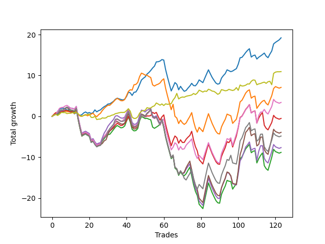

# Long Bulldog 005 
- Symbol: AAPL1y5m
- Date Range: 07/02/2021 - 07/08/2022
- Trading Period: 7:20-12:30
- Number of Trades: 123



| Name | Win Percent | Profit | Avg Profit / Trade |     | Name | Win Percent | Profit | Avg Profit / Trade |
| ---- | ----------- | ------ | ------------------ | --- | ---- | ----------- | ------ | ------------------ |
| Sorted By <br> Profit | | | | | Sorted By <br> Win Percentage ||||
| Zero | 68.29 | 9605.00 | 78.09 |     | Zero | 68.29 | 9605.00 | 78.09 |
| Seventy-Three | 64.23 | 5470.00 | 44.47 |     | Seventy-Three | 64.23 | 5470.00 | 44.47 |
| One | 59.35 | 3540.00 | 28.78 |     | One | 59.35 | 3540.00 | 28.78 |
| Six | 59.35 | 1700.00 | 13.82 |     | Six | 59.35 | 1700.00 | 13.82 |
| Three | 58.54 | -255.00 | -2.07 |     | Three | 58.54 | -255.00 | -2.07 |
| Five | 52.03 | -1960.00 | -15.93 |     | Two | 53.66 | -4410.00 | -35.85 |
| Seven | 52.85 | -2410.00 | -19.59 |     | Seven | 52.85 | -2410.00 | -19.59 |
| Four | 52.03 | -3825.00 | -31.10 |     | Five | 52.03 | -1960.00 | -15.93 |
| Two | 53.66 | -4410.00 | -35.85 |     | Four | 52.03 | -3825.00 | -31.10 |

## NO STOPLOSS

### Test Zero
* Sell when price hits the middle line of the 20p bollinger
* No Stoploss
* Results:
```
Total Trades: 123
Percent Up: 68.29
Percent Down: 31.71
Total Points Moved Up: 19.21
Potential Profit: 9605.00
Total Points Ups: 43.63 Count Ups: 84
Total Points Downs: -24.42 Count Downs: 39
```

<details><summary>Trades</summary>

<code>In: 2021-07-12 10:50:00		Out: 2021-07-12 11:19:05		Total Position Time: 29:05		Total Move Up: 0.33		Total to Date: 0.33</code> <br />
<code>In: 2021-07-12 10:55:00		Out: 2021-07-12 11:19:05		Total Position Time: 24:05		Total Move Up: 0.28		Total to Date: 0.61</code> <br />
<code>In: 2021-07-15 07:50:00		Out: 2021-07-15 08:31:00		Total Position Time: 41:00		Total Move Up: 0.62		Total to Date: 1.23</code> <br />
<code>In: 2021-07-15 09:15:00		Out: 2021-07-15 09:40:20		Total Position Time: 25:20		Total Move Up: 0.52		Total to Date: 1.75</code> <br />
<code>In: 2021-07-16 12:05:00		Out: 2021-07-16 12:50:00		Total Position Time: 45:00		Total Move Up: 0.20		Total to Date: 1.95</code> <br />
<code>In: 2021-08-02 12:30:00		Out: 2021-08-02 12:50:00		Total Position Time: 20:00		Total Move Up: 0.04		Total to Date: 1.99</code> <br />
<code>In: 2021-08-04 07:20:00		Out: 2021-08-04 08:49:00		Total Position Time: 89:00		Total Move Up: -0.16		Total to Date: 1.83</code> <br />
<code>In: 2021-08-04 07:30:00		Out: 2021-08-04 08:49:00		Total Position Time: 79:00		Total Move Up: -0.31		Total to Date: 1.52</code> <br />
<code>In: 2021-08-06 08:10:00		Out: 2021-08-06 09:30:25		Total Position Time: 80:25		Total Move Up: 0.06		Total to Date: 1.58</code> <br />
<code>In: 2021-08-06 08:15:00		Out: 2021-08-06 09:30:25		Total Position Time: 75:25		Total Move Up: -0.01		Total to Date: 1.57</code> <br />
<code>In: 2021-08-17 09:05:00		Out: 2021-08-17 11:00:25		Total Position Time: 115:25		Total Move Up: -0.42		Total to Date: 1.15</code> <br />
<code>In: 2021-08-17 09:10:00		Out: 2021-08-17 11:00:25		Total Position Time: 110:25		Total Move Up: -0.55		Total to Date: 0.60</code> <br />
<code>In: 2021-08-17 09:50:00		Out: 2021-08-17 11:00:25		Total Position Time: 70:25		Total Move Up: 0.30		Total to Date: 0.90</code> <br />
<code>In: 2021-08-18 07:45:00		Out: 2021-08-18 09:19:20		Total Position Time: 94:20		Total Move Up: -0.51		Total to Date: 0.39</code> <br />
<code>In: 2021-08-18 08:05:00		Out: 2021-08-18 09:19:20		Total Position Time: 74:20		Total Move Up: -0.16		Total to Date: 0.23</code> <br />
<code>In: 2021-08-18 08:15:00		Out: 2021-08-18 09:19:20		Total Position Time: 64:20		Total Move Up: 0.18		Total to Date: 0.41</code> <br />
<code>In: 2021-08-24 08:30:00		Out: 2021-08-24 09:11:45		Total Position Time: 41:45		Total Move Up: 0.43		Total to Date: 0.84</code> <br />
<code>In: 2021-08-26 12:15:00		Out: 2021-08-26 12:35:40		Total Position Time: 20:40		Total Move Up: 0.23		Total to Date: 1.07</code> <br />
<code>In: 2021-09-01 11:40:00		Out: 2021-09-01 12:50:00		Total Position Time: 70:00		Total Move Up: -0.30		Total to Date: 0.77</code> <br />
<code>In: 2021-09-09 10:40:00		Out: 2021-09-09 11:54:40		Total Position Time: 74:40		Total Move Up: 0.16		Total to Date: 0.93</code> <br />
<code>In: 2021-09-10 08:30:00		Out: 2021-09-10 10:00:10		Total Position Time: 90:10		Total Move Up: -0.23		Total to Date: 0.70</code> <br />
<code>In: 2021-09-13 10:45:00		Out: 2021-09-13 11:46:30		Total Position Time: 61:30		Total Move Up: 0.19		Total to Date: 0.89</code> <br />
<code>In: 2021-09-14 10:10:00		Out: 2021-09-14 10:52:50		Total Position Time: 42:50		Total Move Up: 0.69		Total to Date: 1.58</code> <br />
<code>In: 2021-09-14 11:10:00		Out: 2021-09-14 12:41:40		Total Position Time: 91:40		Total Move Up: -0.49		Total to Date: 1.09</code> <br />
<code>In: 2021-09-14 11:20:00		Out: 2021-09-14 12:41:40		Total Position Time: 81:40		Total Move Up: 0.31		Total to Date: 1.40</code> <br />
<code>In: 2021-09-14 11:25:00		Out: 2021-09-14 12:41:40		Total Position Time: 76:40		Total Move Up: 0.17		Total to Date: 1.57</code> <br />
<code>In: 2021-09-29 10:40:00		Out: 2021-09-29 11:00:15		Total Position Time: 20:15		Total Move Up: 0.45		Total to Date: 2.02</code> <br />
<code>In: 2021-09-30 09:10:00		Out: 2021-09-30 10:05:05		Total Position Time: 55:05		Total Move Up: 0.35		Total to Date: 2.37</code> <br />
<code>In: 2021-10-08 10:25:00		Out: 2021-10-08 10:56:10		Total Position Time: 31:10		Total Move Up: 0.25		Total to Date: 2.62</code> <br />
<code>In: 2021-10-21 09:10:00		Out: 2021-10-21 10:32:15		Total Position Time: 82:15		Total Move Up: 0.39		Total to Date: 3.01</code> <br />
<code>In: 2021-10-21 09:15:00		Out: 2021-10-21 10:32:15		Total Position Time: 77:15		Total Move Up: 0.05		Total to Date: 3.06</code> <br />
<code>In: 2021-10-26 11:30:00		Out: 2021-10-26 12:17:55		Total Position Time: 47:55		Total Move Up: 0.30		Total to Date: 3.36</code> <br />
<code>In: 2021-10-26 11:45:00		Out: 2021-10-26 12:17:55		Total Position Time: 32:55		Total Move Up: 0.32		Total to Date: 3.68</code> <br />
<code>In: 2021-11-05 10:30:00		Out: 2021-11-05 11:05:50		Total Position Time: 35:50		Total Move Up: 0.50		Total to Date: 4.18</code> <br />
<code>In: 2021-11-08 09:05:00		Out: 2021-11-08 09:35:25		Total Position Time: 30:25		Total Move Up: 0.26		Total to Date: 4.44</code> <br />
<code>In: 2021-11-10 10:55:00		Out: 2021-11-10 12:32:35		Total Position Time: 97:35		Total Move Up: -0.16		Total to Date: 4.28</code> <br />
<code>In: 2021-11-10 11:05:00		Out: 2021-11-10 12:32:35		Total Position Time: 87:35		Total Move Up: -0.16		Total to Date: 4.12</code> <br />
<code>In: 2021-11-11 09:15:00		Out: 2021-11-11 11:08:50		Total Position Time: 113:50		Total Move Up: -0.11		Total to Date: 4.01</code> <br />
<code>In: 2021-11-11 10:10:00		Out: 2021-11-11 11:08:50		Total Position Time: 58:50		Total Move Up: 0.17		Total to Date: 4.18</code> <br />
<code>In: 2021-11-23 10:35:00		Out: 2021-11-23 10:54:00		Total Position Time: 19:00		Total Move Up: 0.68		Total to Date: 4.86</code> <br />
<code>In: 2021-12-01 12:25:00		Out: 2021-12-01 12:50:00		Total Position Time: 25:00		Total Move Up: 1.04		Total to Date: 5.90</code> <br />
<code>In: 2021-12-03 08:20:00		Out: 2021-12-03 09:37:50		Total Position Time: 77:50		Total Move Up: -0.14		Total to Date: 5.76</code> <br />
<code>In: 2021-12-03 08:30:00		Out: 2021-12-03 09:37:50		Total Position Time: 67:50		Total Move Up: -0.65		Total to Date: 5.11</code> <br />
<code>In: 2021-12-03 08:50:00		Out: 2021-12-03 09:37:50		Total Position Time: 47:50		Total Move Up: 0.77		Total to Date: 5.88</code> <br />
<code>In: 2021-12-06 12:25:00		Out: 2021-12-06 12:50:00		Total Position Time: 25:00		Total Move Up: 0.07		Total to Date: 5.95</code> <br />
<code>In: 2021-12-09 12:25:00		Out: 2021-12-09 12:43:20		Total Position Time: 18:20		Total Move Up: 0.74		Total to Date: 6.69</code> <br />
<code>In: 2021-12-28 07:20:00		Out: 2021-12-28 07:38:05		Total Position Time: 18:05		Total Move Up: 1.08		Total to Date: 7.77</code> <br />
<code>In: 2021-12-29 07:20:00		Out: 2021-12-29 07:48:05		Total Position Time: 28:05		Total Move Up: 1.11		Total to Date: 8.88</code> <br />
<code>In: 2021-12-30 11:05:00		Out: 2021-12-30 11:44:40		Total Position Time: 39:40		Total Move Up: 0.42		Total to Date: 9.30</code> <br />
<code>In: 2021-12-30 11:10:00		Out: 2021-12-30 11:44:40		Total Position Time: 34:40		Total Move Up: 0.34		Total to Date: 9.64</code> <br />
<code>In: 2022-01-04 08:05:00		Out: 2022-01-04 09:22:50		Total Position Time: 77:50		Total Move Up: 0.69		Total to Date: 10.33</code> <br />
<code>In: 2022-01-04 08:10:00		Out: 2022-01-04 09:22:50		Total Position Time: 72:50		Total Move Up: 0.39		Total to Date: 10.72</code> <br />
<code>In: 2022-01-04 08:25:00		Out: 2022-01-04 09:22:50		Total Position Time: 57:50		Total Move Up: 0.50		Total to Date: 11.22</code> <br />
<code>In: 2022-01-05 10:10:00		Out: 2022-01-05 11:02:20		Total Position Time: 52:20		Total Move Up: 0.60		Total to Date: 11.82</code> <br />
<code>In: 2022-01-05 11:45:00		Out: 2022-01-05 12:38:35		Total Position Time: 53:35		Total Move Up: 0.46		Total to Date: 12.28</code> <br />
<code>In: 2022-01-05 12:10:00		Out: 2022-01-05 12:38:35		Total Position Time: 28:35		Total Move Up: 1.05		Total to Date: 13.33</code> <br />
<code>In: 2022-01-13 09:20:00		Out: 2022-01-13 10:40:05		Total Position Time: 80:05		Total Move Up: 0.03		Total to Date: 13.36</code> <br />
<code>In: 2022-01-13 09:30:00		Out: 2022-01-13 10:40:05		Total Position Time: 70:05		Total Move Up: 0.16		Total to Date: 13.52</code> <br />
<code>In: 2022-01-14 10:00:00		Out: 2022-01-14 10:50:45		Total Position Time: 50:45		Total Move Up: 0.37		Total to Date: 13.89</code> <br />
<code>In: 2022-01-19 07:50:00		Out: 2022-01-19 09:02:05		Total Position Time: 72:05		Total Move Up: -0.12		Total to Date: 13.77</code> <br />
<code>In: 2022-01-20 10:35:00		Out: 2022-01-20 12:50:00		Total Position Time: 135:00		Total Move Up: -2.35		Total to Date: 11.42</code> <br />
<code>In: 2022-01-20 11:15:00		Out: 2022-01-20 12:50:00		Total Position Time: 95:00		Total Move Up: -1.83		Total to Date: 9.59</code> <br />
<code>In: 2022-01-20 11:30:00		Out: 2022-01-20 12:50:00		Total Position Time: 80:00		Total Move Up: -1.70		Total to Date: 7.89</code> <br />
<code>In: 2022-01-20 11:45:00		Out: 2022-01-20 12:50:00		Total Position Time: 65:00		Total Move Up: -1.68		Total to Date: 6.21</code> <br />
<code>In: 2022-01-21 12:10:00		Out: 2022-01-21 12:40:25		Total Position Time: 30:25		Total Move Up: 0.99		Total to Date: 7.20</code> <br />
<code>In: 2022-01-26 11:35:00		Out: 2022-01-26 11:40:10		Total Position Time: 05:10		Total Move Up: 1.06		Total to Date: 8.26</code> <br />
<code>In: 2022-01-26 11:50:00		Out: 2022-01-26 12:50:00		Total Position Time: 60:00		Total Move Up: -0.41		Total to Date: 7.85</code> <br />
<code>In: 2022-01-26 11:55:00		Out: 2022-01-26 12:50:00		Total Position Time: 55:00		Total Move Up: -1.36		Total to Date: 6.49</code> <br />
<code>In: 2022-01-26 12:10:00		Out: 2022-01-26 12:50:00		Total Position Time: 40:00		Total Move Up: 0.85		Total to Date: 7.34</code> <br />
<code>In: 2022-02-03 11:45:00		Out: 2022-02-03 12:50:00		Total Position Time: 65:00		Total Move Up: -0.67		Total to Date: 6.67</code> <br />
<code>In: 2022-02-07 08:10:00		Out: 2022-02-07 10:03:30		Total Position Time: 113:30		Total Move Up: -0.55		Total to Date: 6.12</code> <br />
<code>In: 2022-02-07 08:45:00		Out: 2022-02-07 10:03:30		Total Position Time: 78:30		Total Move Up: 0.20		Total to Date: 6.32</code> <br />
<code>In: 2022-02-09 12:15:00		Out: 2022-02-09 12:31:00		Total Position Time: 16:00		Total Move Up: 0.58		Total to Date: 6.90</code> <br />
<code>In: 2022-02-09 12:20:00		Out: 2022-02-09 12:31:00		Total Position Time: 11:00		Total Move Up: 0.51		Total to Date: 7.41</code> <br />
<code>In: 2022-02-10 08:15:00		Out: 2022-02-10 08:46:30		Total Position Time: 31:30		Total Move Up: 0.67		Total to Date: 8.08</code> <br />
<code>In: 2022-02-10 09:50:00		Out: 2022-02-10 11:36:35		Total Position Time: 106:35		Total Move Up: -0.55		Total to Date: 7.53</code> <br />
<code>In: 2022-02-10 10:20:00		Out: 2022-02-10 11:36:35		Total Position Time: 76:35		Total Move Up: -0.06		Total to Date: 7.47</code> <br />
<code>In: 2022-02-10 10:35:00		Out: 2022-02-10 11:36:35		Total Position Time: 61:35		Total Move Up: 0.56		Total to Date: 8.03</code> <br />
<code>In: 2022-02-11 07:20:00		Out: 2022-02-11 07:36:35		Total Position Time: 16:35		Total Move Up: 0.89		Total to Date: 8.92</code> <br />
<code>In: 2022-02-11 10:40:00		Out: 2022-02-11 12:15:20		Total Position Time: 95:20		Total Move Up: -0.34		Total to Date: 8.58</code> <br />
<code>In: 2022-02-11 10:50:00		Out: 2022-02-11 12:15:20		Total Position Time: 85:20		Total Move Up: -0.34		Total to Date: 8.24</code> <br />
<code>In: 2022-02-14 11:00:00		Out: 2022-02-14 11:50:25		Total Position Time: 50:25		Total Move Up: 1.07		Total to Date: 9.31</code> <br />
<code>In: 2022-02-14 11:05:00		Out: 2022-02-14 11:50:25		Total Position Time: 45:25		Total Move Up: 1.06		Total to Date: 10.37</code> <br />
<code>In: 2022-02-14 11:10:00		Out: 2022-02-14 11:50:25		Total Position Time: 40:25		Total Move Up: 1.01		Total to Date: 11.38</code> <br />
<code>In: 2022-02-17 10:25:00		Out: 2022-02-17 12:45:50		Total Position Time: 140:50		Total Move Up: -0.96		Total to Date: 10.42</code> <br />
<code>In: 2022-02-17 10:40:00		Out: 2022-02-17 12:45:50		Total Position Time: 125:50		Total Move Up: -0.91		Total to Date: 9.51</code> <br />
<code>In: 2022-02-17 10:50:00		Out: 2022-02-17 12:45:50		Total Position Time: 115:50		Total Move Up: -0.70		Total to Date: 8.81</code> <br />
<code>In: 2022-02-17 11:05:00		Out: 2022-02-17 12:45:50		Total Position Time: 100:50		Total Move Up: -0.66		Total to Date: 8.15</code> <br />
<code>In: 2022-02-17 11:25:00		Out: 2022-02-17 12:45:50		Total Position Time: 80:50		Total Move Up: -0.28		Total to Date: 7.87</code> <br />
<code>In: 2022-02-17 11:45:00		Out: 2022-02-17 12:45:50		Total Position Time: 60:50		Total Move Up: 0.16		Total to Date: 8.03</code> <br />
<code>In: 2022-02-22 11:10:00		Out: 2022-02-22 11:31:25		Total Position Time: 21:25		Total Move Up: 1.32		Total to Date: 9.35</code> <br />
<code>In: 2022-02-28 11:10:00		Out: 2022-02-28 11:56:45		Total Position Time: 46:45		Total Move Up: 0.61		Total to Date: 9.96</code> <br />
<code>In: 2022-02-28 11:15:00		Out: 2022-02-28 11:56:45		Total Position Time: 41:45		Total Move Up: 0.49		Total to Date: 10.45</code> <br />
<code>In: 2022-02-28 11:25:00		Out: 2022-02-28 11:56:45		Total Position Time: 31:45		Total Move Up: 0.93		Total to Date: 11.38</code> <br />
<code>In: 2022-03-03 12:15:00		Out: 2022-03-03 12:50:00		Total Position Time: 35:00		Total Move Up: -0.22		Total to Date: 11.16</code> <br />
<code>In: 2022-03-04 07:20:00		Out: 2022-03-04 08:45:35		Total Position Time: 85:35		Total Move Up: -0.23		Total to Date: 10.93</code> <br />
<code>In: 2022-03-07 09:25:00		Out: 2022-03-07 10:40:45		Total Position Time: 75:45		Total Move Up: 0.16		Total to Date: 11.09</code> <br />
<code>In: 2022-03-11 08:35:00		Out: 2022-03-11 09:51:55		Total Position Time: 76:55		Total Move Up: 0.30		Total to Date: 11.39</code> <br />
<code>In: 2022-03-11 08:40:00		Out: 2022-03-11 09:51:55		Total Position Time: 71:55		Total Move Up: 0.28		Total to Date: 11.67</code> <br />
<code>In: 2022-03-16 11:15:00		Out: 2022-03-16 11:44:15		Total Position Time: 29:15		Total Move Up: 1.09		Total to Date: 12.76</code> <br />
<code>In: 2022-03-16 11:35:00		Out: 2022-03-16 11:44:15		Total Position Time: 09:15		Total Move Up: 1.57		Total to Date: 14.33</code> <br />
<code>In: 2022-03-28 08:40:00		Out: 2022-03-28 09:44:35		Total Position Time: 64:35		Total Move Up: 0.10		Total to Date: 14.43</code> <br />
<code>In: 2022-03-28 08:50:00		Out: 2022-03-28 09:44:35		Total Position Time: 54:35		Total Move Up: 0.57		Total to Date: 15.00</code> <br />
<code>In: 2022-03-28 09:00:00		Out: 2022-03-28 09:44:35		Total Position Time: 44:35		Total Move Up: 0.61		Total to Date: 15.61</code> <br />
<code>In: 2022-03-30 12:25:00		Out: 2022-03-30 12:50:00		Total Position Time: 25:00		Total Move Up: 0.53		Total to Date: 16.14</code> <br />
<code>In: 2022-04-12 11:00:00		Out: 2022-04-12 11:45:20		Total Position Time: 45:20		Total Move Up: 0.40		Total to Date: 16.54</code> <br />
<code>In: 2022-04-21 10:20:00		Out: 2022-04-21 12:50:00		Total Position Time: 150:00		Total Move Up: -2.04		Total to Date: 14.50</code> <br />
<code>In: 2022-04-26 12:20:00		Out: 2022-04-26 12:50:00		Total Position Time: 30:00		Total Move Up: 0.35		Total to Date: 14.85</code> <br />
<code>In: 2022-04-27 12:10:00		Out: 2022-04-27 12:50:00		Total Position Time: 40:00		Total Move Up: 0.14		Total to Date: 14.99</code> <br />
<code>In: 2022-05-11 10:20:00		Out: 2022-05-11 11:44:35		Total Position Time: 84:35		Total Move Up: -0.97		Total to Date: 14.02</code> <br />
<code>In: 2022-05-19 10:15:00		Out: 2022-05-19 11:15:05		Total Position Time: 60:05		Total Move Up: 0.44		Total to Date: 14.46</code> <br />
<code>In: 2022-05-25 09:35:00		Out: 2022-05-25 10:34:45		Total Position Time: 59:45		Total Move Up: 0.31		Total to Date: 14.77</code> <br />
<code>In: 2022-06-08 09:45:00		Out: 2022-06-08 10:55:05		Total Position Time: 70:05		Total Move Up: 0.34		Total to Date: 15.11</code> <br />
<code>In: 2022-06-09 08:05:00		Out: 2022-06-09 08:42:30		Total Position Time: 37:30		Total Move Up: 0.37		Total to Date: 15.48</code> <br />
<code>In: 2022-06-13 12:00:00		Out: 2022-06-13 12:50:00		Total Position Time: 50:00		Total Move Up: -0.75		Total to Date: 14.73</code> <br />
<code>In: 2022-06-13 12:15:00		Out: 2022-06-13 12:50:00		Total Position Time: 35:00		Total Move Up: -0.38		Total to Date: 14.35</code> <br />
<code>In: 2022-06-15 11:05:00		Out: 2022-06-15 11:17:05		Total Position Time: 12:05		Total Move Up: 0.87		Total to Date: 15.22</code> <br />
<code>In: 2022-06-15 11:15:00		Out: 2022-06-15 11:20:20		Total Position Time: 05:20		Total Move Up: 0.76		Total to Date: 15.98</code> <br />
<code>In: 2022-06-15 11:35:00		Out: 2022-06-15 11:40:10		Total Position Time: 05:10		Total Move Up: 1.74		Total to Date: 17.72</code> <br />
<code>In: 2022-06-16 11:10:00		Out: 2022-06-16 12:10:05		Total Position Time: 60:05		Total Move Up: 0.38		Total to Date: 18.10</code> <br />
<code>In: 2022-06-27 10:50:00		Out: 2022-06-27 11:38:20		Total Position Time: 48:20		Total Move Up: 0.30		Total to Date: 18.40</code> <br />
<code>In: 2022-06-27 11:00:00		Out: 2022-06-27 11:38:20		Total Position Time: 38:20		Total Move Up: 0.31		Total to Date: 18.71</code> <br />
<code>In: 2022-06-27 12:05:00		Out: 2022-06-27 12:14:40		Total Position Time: 09:40		Total Move Up: 0.50		Total to Date: 19.21</code> <br />


</details>

### Test One
* Sell when the price hits the upper line of the 20p 1std bollinger
* No Stoploss
* Results:
```
Total Trades: 123
Percent Up: 59.35
Percent Down: 40.65
Total Points Moved Up: 7.08
Potential Profit: 3540.00
Total Points Ups: 47.13 Count Ups: 73
Total Points Downs: -40.05 Count Downs: 50
```

<details><summary>Trades</summary>

<code>In: 2021-07-12 10:50:00		Out: 2021-07-12 11:30:35		Total Position Time: 40:35		Total Move Up: 0.47		Total to Date: 0.47</code> <br />
<code>In: 2021-07-12 10:55:00		Out: 2021-07-12 11:30:35		Total Position Time: 35:35		Total Move Up: 0.42		Total to Date: 0.89</code> <br />
<code>In: 2021-07-15 07:50:00		Out: 2021-07-15 11:20:25		Total Position Time: 210:25		Total Move Up: -0.20		Total to Date: 0.69</code> <br />
<code>In: 2021-07-15 09:15:00		Out: 2021-07-15 11:20:25		Total Position Time: 125:25		Total Move Up: 0.29		Total to Date: 0.98</code> <br />
<code>In: 2021-07-16 12:05:00		Out: 2021-07-16 12:50:00		Total Position Time: 45:00		Total Move Up: 0.20		Total to Date: 1.18</code> <br />
<code>In: 2021-08-02 12:30:00		Out: 2021-08-02 12:50:00		Total Position Time: 20:00		Total Move Up: 0.04		Total to Date: 1.22</code> <br />
<code>In: 2021-08-04 07:20:00		Out: 2021-08-04 08:58:20		Total Position Time: 98:20		Total Move Up: 0.03		Total to Date: 1.25</code> <br />
<code>In: 2021-08-04 07:30:00		Out: 2021-08-04 08:58:20		Total Position Time: 88:20		Total Move Up: -0.12		Total to Date: 1.13</code> <br />
<code>In: 2021-08-06 08:10:00		Out: 2021-08-06 10:07:10		Total Position Time: 117:10		Total Move Up: 0.03		Total to Date: 1.16</code> <br />
<code>In: 2021-08-06 08:15:00		Out: 2021-08-06 10:07:10		Total Position Time: 112:10		Total Move Up: -0.04		Total to Date: 1.12</code> <br />
<code>In: 2021-08-17 09:05:00		Out: 2021-08-17 11:07:00		Total Position Time: 122:00		Total Move Up: -0.15		Total to Date: 0.97</code> <br />
<code>In: 2021-08-17 09:10:00		Out: 2021-08-17 11:07:00		Total Position Time: 117:00		Total Move Up: -0.28		Total to Date: 0.69</code> <br />
<code>In: 2021-08-17 09:50:00		Out: 2021-08-17 11:07:00		Total Position Time: 77:00		Total Move Up: 0.57		Total to Date: 1.26</code> <br />
<code>In: 2021-08-18 07:45:00		Out: 2021-08-18 11:30:55		Total Position Time: 225:55		Total Move Up: -0.77		Total to Date: 0.49</code> <br />
<code>In: 2021-08-18 08:05:00		Out: 2021-08-18 11:30:55		Total Position Time: 205:55		Total Move Up: -0.42		Total to Date: 0.07</code> <br />
<code>In: 2021-08-18 08:15:00		Out: 2021-08-18 11:30:55		Total Position Time: 195:55		Total Move Up: -0.08		Total to Date: -0.01</code> <br />
<code>In: 2021-08-24 08:30:00		Out: 2021-08-24 10:54:20		Total Position Time: 144:20		Total Move Up: 0.24		Total to Date: 0.23</code> <br />
<code>In: 2021-08-26 12:15:00		Out: 2021-08-26 12:50:00		Total Position Time: 35:00		Total Move Up: 0.20		Total to Date: 0.43</code> <br />
<code>In: 2021-09-01 11:40:00		Out: 2021-09-01 12:50:00		Total Position Time: 70:00		Total Move Up: -0.30		Total to Date: 0.13</code> <br />
<code>In: 2021-09-09 10:40:00		Out: 2021-09-09 12:00:05		Total Position Time: 80:05		Total Move Up: 0.22		Total to Date: 0.35</code> <br />
<code>In: 2021-09-10 08:30:00		Out: 2021-09-10 10:20:15		Total Position Time: 110:15		Total Move Up: 0.19		Total to Date: 0.54</code> <br />
<code>In: 2021-09-13 10:45:00		Out: 2021-09-13 12:08:00		Total Position Time: 83:00		Total Move Up: 0.23		Total to Date: 0.77</code> <br />
<code>In: 2021-09-14 10:10:00		Out: 2021-09-14 12:45:30		Total Position Time: 155:30		Total Move Up: -0.55		Total to Date: 0.22</code> <br />
<code>In: 2021-09-14 11:10:00		Out: 2021-09-14 12:45:30		Total Position Time: 95:30		Total Move Up: -0.31		Total to Date: -0.09</code> <br />
<code>In: 2021-09-14 11:20:00		Out: 2021-09-14 12:45:30		Total Position Time: 85:30		Total Move Up: 0.49		Total to Date: 0.40</code> <br />
<code>In: 2021-09-14 11:25:00		Out: 2021-09-14 12:45:30		Total Position Time: 80:30		Total Move Up: 0.35		Total to Date: 0.75</code> <br />
<code>In: 2021-09-29 10:40:00		Out: 2021-09-29 11:08:45		Total Position Time: 28:45		Total Move Up: 0.68		Total to Date: 1.43</code> <br />
<code>In: 2021-09-30 09:10:00		Out: 2021-09-30 10:15:50		Total Position Time: 65:50		Total Move Up: 0.52		Total to Date: 1.95</code> <br />
<code>In: 2021-10-08 10:25:00		Out: 2021-10-08 11:18:15		Total Position Time: 53:15		Total Move Up: 0.42		Total to Date: 2.37</code> <br />
<code>In: 2021-10-21 09:10:00		Out: 2021-10-21 11:16:45		Total Position Time: 126:45		Total Move Up: 0.34		Total to Date: 2.71</code> <br />
<code>In: 2021-10-21 09:15:00		Out: 2021-10-21 11:16:45		Total Position Time: 121:45		Total Move Up: 0.00		Total to Date: 2.71</code> <br />
<code>In: 2021-10-26 11:30:00		Out: 2021-10-26 12:26:00		Total Position Time: 56:00		Total Move Up: 0.42		Total to Date: 3.13</code> <br />
<code>In: 2021-10-26 11:45:00		Out: 2021-10-26 12:26:00		Total Position Time: 41:00		Total Move Up: 0.44		Total to Date: 3.57</code> <br />
<code>In: 2021-11-05 10:30:00		Out: 2021-11-05 11:47:25		Total Position Time: 77:25		Total Move Up: 0.49		Total to Date: 4.06</code> <br />
<code>In: 2021-11-08 09:05:00		Out: 2021-11-08 10:01:15		Total Position Time: 56:15		Total Move Up: 0.34		Total to Date: 4.40</code> <br />
<code>In: 2021-11-10 10:55:00		Out: 2021-11-10 12:50:00		Total Position Time: 115:00		Total Move Up: -0.29		Total to Date: 4.11</code> <br />
<code>In: 2021-11-10 11:05:00		Out: 2021-11-10 12:50:00		Total Position Time: 105:00		Total Move Up: -0.29		Total to Date: 3.82</code> <br />
<code>In: 2021-11-11 09:15:00		Out: 2021-11-11 11:10:50		Total Position Time: 115:50		Total Move Up: 0.00		Total to Date: 3.82</code> <br />
<code>In: 2021-11-11 10:10:00		Out: 2021-11-11 11:10:50		Total Position Time: 60:50		Total Move Up: 0.28		Total to Date: 4.10</code> <br />
<code>In: 2021-11-23 10:35:00		Out: 2021-11-23 11:01:05		Total Position Time: 26:05		Total Move Up: 0.96		Total to Date: 5.06</code> <br />
<code>In: 2021-12-01 12:25:00		Out: 2021-12-01 12:50:00		Total Position Time: 25:00		Total Move Up: 1.04		Total to Date: 6.10</code> <br />
<code>In: 2021-12-03 08:20:00		Out: 2021-12-03 09:45:15		Total Position Time: 85:15		Total Move Up: 0.41		Total to Date: 6.51</code> <br />
<code>In: 2021-12-03 08:30:00		Out: 2021-12-03 09:45:15		Total Position Time: 75:15		Total Move Up: -0.10		Total to Date: 6.41</code> <br />
<code>In: 2021-12-03 08:50:00		Out: 2021-12-03 09:45:15		Total Position Time: 55:15		Total Move Up: 1.32		Total to Date: 7.73</code> <br />
<code>In: 2021-12-06 12:25:00		Out: 2021-12-06 12:50:00		Total Position Time: 25:00		Total Move Up: 0.07		Total to Date: 7.80</code> <br />
<code>In: 2021-12-09 12:25:00		Out: 2021-12-09 12:50:00		Total Position Time: 25:00		Total Move Up: 0.48		Total to Date: 8.28</code> <br />
<code>In: 2021-12-28 07:20:00		Out: 2021-12-28 08:00:40		Total Position Time: 40:40		Total Move Up: 1.43		Total to Date: 9.71</code> <br />
<code>In: 2021-12-29 07:20:00		Out: 2021-12-29 10:00:40		Total Position Time: 160:40		Total Move Up: 0.86		Total to Date: 10.57</code> <br />
<code>In: 2021-12-30 11:05:00		Out: 2021-12-30 12:50:00		Total Position Time: 105:00		Total Move Up: -0.20		Total to Date: 10.37</code> <br />
<code>In: 2021-12-30 11:10:00		Out: 2021-12-30 12:50:00		Total Position Time: 100:00		Total Move Up: -0.28		Total to Date: 10.09</code> <br />
<code>In: 2022-01-04 08:05:00		Out: 2022-01-04 11:21:00		Total Position Time: 196:00		Total Move Up: -0.03		Total to Date: 10.06</code> <br />
<code>In: 2022-01-04 08:10:00		Out: 2022-01-04 11:21:00		Total Position Time: 191:00		Total Move Up: -0.33		Total to Date: 9.73</code> <br />
<code>In: 2022-01-04 08:25:00		Out: 2022-01-04 11:21:00		Total Position Time: 176:00		Total Move Up: -0.22		Total to Date: 9.51</code> <br />
<code>In: 2022-01-05 10:10:00		Out: 2022-01-05 12:50:00		Total Position Time: 160:00		Total Move Up: -1.80		Total to Date: 7.71</code> <br />
<code>In: 2022-01-05 11:45:00		Out: 2022-01-05 12:50:00		Total Position Time: 65:00		Total Move Up: -0.30		Total to Date: 7.41</code> <br />
<code>In: 2022-01-05 12:10:00		Out: 2022-01-05 12:50:00		Total Position Time: 40:00		Total Move Up: 0.29		Total to Date: 7.70</code> <br />
<code>In: 2022-01-13 09:20:00		Out: 2022-01-13 10:55:05		Total Position Time: 95:05		Total Move Up: 0.17		Total to Date: 7.87</code> <br />
<code>In: 2022-01-13 09:30:00		Out: 2022-01-13 10:55:05		Total Position Time: 85:05		Total Move Up: 0.30		Total to Date: 8.17</code> <br />
<code>In: 2022-01-14 10:00:00		Out: 2022-01-14 10:56:45		Total Position Time: 56:45		Total Move Up: 0.63		Total to Date: 8.80</code> <br />
<code>In: 2022-01-19 07:50:00		Out: 2022-01-19 09:12:10		Total Position Time: 82:10		Total Move Up: 0.38		Total to Date: 9.18</code> <br />
<code>In: 2022-01-20 10:35:00		Out: 2022-01-20 12:50:00		Total Position Time: 135:00		Total Move Up: -2.35		Total to Date: 6.83</code> <br />
<code>In: 2022-01-20 11:15:00		Out: 2022-01-20 12:50:00		Total Position Time: 95:00		Total Move Up: -1.83		Total to Date: 5.00</code> <br />
<code>In: 2022-01-20 11:30:00		Out: 2022-01-20 12:50:00		Total Position Time: 80:00		Total Move Up: -1.70		Total to Date: 3.30</code> <br />
<code>In: 2022-01-20 11:45:00		Out: 2022-01-20 12:50:00		Total Position Time: 65:00		Total Move Up: -1.68		Total to Date: 1.62</code> <br />
<code>In: 2022-01-21 12:10:00		Out: 2022-01-21 12:43:40		Total Position Time: 33:40		Total Move Up: 1.34		Total to Date: 2.96</code> <br />
<code>In: 2022-01-26 11:35:00		Out: 2022-01-26 12:50:00		Total Position Time: 75:00		Total Move Up: -2.96		Total to Date: -0.00</code> <br />
<code>In: 2022-01-26 11:50:00		Out: 2022-01-26 12:50:00		Total Position Time: 60:00		Total Move Up: -0.41		Total to Date: -0.41</code> <br />
<code>In: 2022-01-26 11:55:00		Out: 2022-01-26 12:50:00		Total Position Time: 55:00		Total Move Up: -1.36		Total to Date: -1.77</code> <br />
<code>In: 2022-01-26 12:10:00		Out: 2022-01-26 12:50:00		Total Position Time: 40:00		Total Move Up: 0.85		Total to Date: -0.92</code> <br />
<code>In: 2022-02-03 11:45:00		Out: 2022-02-03 12:50:00		Total Position Time: 65:00		Total Move Up: -0.67		Total to Date: -1.59</code> <br />
<code>In: 2022-02-07 08:10:00		Out: 2022-02-07 10:11:20		Total Position Time: 121:20		Total Move Up: -0.39		Total to Date: -1.98</code> <br />
<code>In: 2022-02-07 08:45:00		Out: 2022-02-07 10:11:20		Total Position Time: 86:20		Total Move Up: 0.36		Total to Date: -1.62</code> <br />
<code>In: 2022-02-09 12:15:00		Out: 2022-02-09 12:37:00		Total Position Time: 22:00		Total Move Up: 0.83		Total to Date: -0.79</code> <br />
<code>In: 2022-02-09 12:20:00		Out: 2022-02-09 12:37:00		Total Position Time: 17:00		Total Move Up: 0.76		Total to Date: -0.03</code> <br />
<code>In: 2022-02-10 08:15:00		Out: 2022-02-10 08:56:40		Total Position Time: 41:40		Total Move Up: 0.95		Total to Date: 0.92</code> <br />
<code>In: 2022-02-10 09:50:00		Out: 2022-02-10 12:50:00		Total Position Time: 180:00		Total Move Up: -2.13		Total to Date: -1.21</code> <br />
<code>In: 2022-02-10 10:20:00		Out: 2022-02-10 12:50:00		Total Position Time: 150:00		Total Move Up: -1.64		Total to Date: -2.85</code> <br />
<code>In: 2022-02-10 10:35:00		Out: 2022-02-10 12:50:00		Total Position Time: 135:00		Total Move Up: -1.02		Total to Date: -3.87</code> <br />
<code>In: 2022-02-11 07:20:00		Out: 2022-02-11 07:40:10		Total Position Time: 20:10		Total Move Up: 1.18		Total to Date: -2.69</code> <br />
<code>In: 2022-02-11 10:40:00		Out: 2022-02-11 12:50:00		Total Position Time: 130:00		Total Move Up: -0.53		Total to Date: -3.22</code> <br />
<code>In: 2022-02-11 10:50:00		Out: 2022-02-11 12:50:00		Total Position Time: 120:00		Total Move Up: -0.53		Total to Date: -3.75</code> <br />
<code>In: 2022-02-14 11:00:00		Out: 2022-02-14 12:13:25		Total Position Time: 73:25		Total Move Up: 1.49		Total to Date: -2.26</code> <br />
<code>In: 2022-02-14 11:05:00		Out: 2022-02-14 12:13:25		Total Position Time: 68:25		Total Move Up: 1.48		Total to Date: -0.78</code> <br />
<code>In: 2022-02-14 11:10:00		Out: 2022-02-14 12:13:25		Total Position Time: 63:25		Total Move Up: 1.43		Total to Date: 0.65</code> <br />
<code>In: 2022-02-17 10:25:00		Out: 2022-02-17 12:50:00		Total Position Time: 145:00		Total Move Up: -1.23		Total to Date: -0.58</code> <br />
<code>In: 2022-02-17 10:40:00		Out: 2022-02-17 12:50:00		Total Position Time: 130:00		Total Move Up: -1.18		Total to Date: -1.76</code> <br />
<code>In: 2022-02-17 10:50:00		Out: 2022-02-17 12:50:00		Total Position Time: 120:00		Total Move Up: -0.97		Total to Date: -2.73</code> <br />
<code>In: 2022-02-17 11:05:00		Out: 2022-02-17 12:50:00		Total Position Time: 105:00		Total Move Up: -0.93		Total to Date: -3.66</code> <br />
<code>In: 2022-02-17 11:25:00		Out: 2022-02-17 12:50:00		Total Position Time: 85:00		Total Move Up: -0.55		Total to Date: -4.21</code> <br />
<code>In: 2022-02-17 11:45:00		Out: 2022-02-17 12:50:00		Total Position Time: 65:00		Total Move Up: -0.11		Total to Date: -4.32</code> <br />
<code>In: 2022-02-22 11:10:00		Out: 2022-02-22 11:50:05		Total Position Time: 40:05		Total Move Up: 1.73		Total to Date: -2.59</code> <br />
<code>In: 2022-02-28 11:10:00		Out: 2022-02-28 12:21:20		Total Position Time: 71:20		Total Move Up: 0.98		Total to Date: -1.61</code> <br />
<code>In: 2022-02-28 11:15:00		Out: 2022-02-28 12:21:20		Total Position Time: 66:20		Total Move Up: 0.86		Total to Date: -0.75</code> <br />
<code>In: 2022-02-28 11:25:00		Out: 2022-02-28 12:21:20		Total Position Time: 56:20		Total Move Up: 1.30		Total to Date: 0.55</code> <br />
<code>In: 2022-03-03 12:15:00		Out: 2022-03-03 12:50:00		Total Position Time: 35:00		Total Move Up: -0.22		Total to Date: 0.33</code> <br />
<code>In: 2022-03-04 07:20:00		Out: 2022-03-04 09:09:35		Total Position Time: 109:35		Total Move Up: -0.18		Total to Date: 0.15</code> <br />
<code>In: 2022-03-07 09:25:00		Out: 2022-03-07 12:50:00		Total Position Time: 205:00		Total Move Up: -1.87		Total to Date: -1.72</code> <br />
<code>In: 2022-03-11 08:35:00		Out: 2022-03-11 10:02:25		Total Position Time: 87:25		Total Move Up: 0.52		Total to Date: -1.20</code> <br />
<code>In: 2022-03-11 08:40:00		Out: 2022-03-11 10:02:25		Total Position Time: 82:25		Total Move Up: 0.50		Total to Date: -0.70</code> <br />
<code>In: 2022-03-16 11:15:00		Out: 2022-03-16 11:55:40		Total Position Time: 40:40		Total Move Up: 1.88		Total to Date: 1.18</code> <br />
<code>In: 2022-03-16 11:35:00		Out: 2022-03-16 11:55:40		Total Position Time: 20:40		Total Move Up: 2.36		Total to Date: 3.54</code> <br />
<code>In: 2022-03-28 08:40:00		Out: 2022-03-28 09:55:40		Total Position Time: 75:40		Total Move Up: 0.39		Total to Date: 3.93</code> <br />
<code>In: 2022-03-28 08:50:00		Out: 2022-03-28 09:55:40		Total Position Time: 65:40		Total Move Up: 0.86		Total to Date: 4.79</code> <br />
<code>In: 2022-03-28 09:00:00		Out: 2022-03-28 09:55:40		Total Position Time: 55:40		Total Move Up: 0.90		Total to Date: 5.69</code> <br />
<code>In: 2022-03-30 12:25:00		Out: 2022-03-30 12:50:00		Total Position Time: 25:00		Total Move Up: 0.53		Total to Date: 6.22</code> <br />
<code>In: 2022-04-12 11:00:00		Out: 2022-04-12 12:36:55		Total Position Time: 96:55		Total Move Up: 0.27		Total to Date: 6.49</code> <br />
<code>In: 2022-04-21 10:20:00		Out: 2022-04-21 12:50:00		Total Position Time: 150:00		Total Move Up: -2.04		Total to Date: 4.45</code> <br />
<code>In: 2022-04-26 12:20:00		Out: 2022-04-26 12:50:00		Total Position Time: 30:00		Total Move Up: 0.35		Total to Date: 4.80</code> <br />
<code>In: 2022-04-27 12:10:00		Out: 2022-04-27 12:50:00		Total Position Time: 40:00		Total Move Up: 0.14		Total to Date: 4.94</code> <br />
<code>In: 2022-05-11 10:20:00		Out: 2022-05-11 12:50:00		Total Position Time: 150:00		Total Move Up: -2.99		Total to Date: 1.95</code> <br />
<code>In: 2022-05-19 10:15:00		Out: 2022-05-19 11:31:40		Total Position Time: 76:40		Total Move Up: 0.66		Total to Date: 2.61</code> <br />
<code>In: 2022-05-25 09:35:00		Out: 2022-05-25 10:37:20		Total Position Time: 62:20		Total Move Up: 0.62		Total to Date: 3.23</code> <br />
<code>In: 2022-06-08 09:45:00		Out: 2022-06-08 11:11:10		Total Position Time: 86:10		Total Move Up: 0.47		Total to Date: 3.70</code> <br />
<code>In: 2022-06-09 08:05:00		Out: 2022-06-09 09:51:40		Total Position Time: 106:40		Total Move Up: 0.22		Total to Date: 3.92</code> <br />
<code>In: 2022-06-13 12:00:00		Out: 2022-06-13 12:50:00		Total Position Time: 50:00		Total Move Up: -0.75		Total to Date: 3.17</code> <br />
<code>In: 2022-06-13 12:15:00		Out: 2022-06-13 12:50:00		Total Position Time: 35:00		Total Move Up: -0.38		Total to Date: 2.79</code> <br />
<code>In: 2022-06-15 11:05:00		Out: 2022-06-15 11:38:10		Total Position Time: 33:10		Total Move Up: 1.14		Total to Date: 3.93</code> <br />
<code>In: 2022-06-15 11:15:00		Out: 2022-06-15 11:38:10		Total Position Time: 23:10		Total Move Up: 1.13		Total to Date: 5.06</code> <br />
<code>In: 2022-06-15 11:35:00		Out: 2022-06-15 11:40:10		Total Position Time: 05:10		Total Move Up: 1.74		Total to Date: 6.80</code> <br />
<code>In: 2022-06-16 11:10:00		Out: 2022-06-16 12:27:05		Total Position Time: 77:05		Total Move Up: 0.48		Total to Date: 7.28</code> <br />
<code>In: 2022-06-27 10:50:00		Out: 2022-06-27 12:50:00		Total Position Time: 120:00		Total Move Up: -0.20		Total to Date: 7.08</code> <br />
<code>In: 2022-06-27 11:00:00		Out: 2022-06-27 12:50:00		Total Position Time: 110:00		Total Move Up: -0.19		Total to Date: 6.89</code> <br />
<code>In: 2022-06-27 12:05:00		Out: 2022-06-27 12:50:00		Total Position Time: 45:00		Total Move Up: 0.19		Total to Date: 7.08</code> <br />


</details>

### Test Two
* Sell when the price hits the upper line of the 20p 2std bollinger
* No Stoploss
* Results:
```
Total Trades: 123
Percent Up: 53.66
Percent Down: 46.34
Total Points Moved Up: -8.82
Potential Profit: -4410.00
Total Points Ups: 51.24 Count Ups: 66
Total Points Downs: -60.06 Count Downs: 57
```

<details><summary>Trades</summary>

<code>In: 2021-07-12 10:50:00		Out: 2021-07-12 12:50:00		Total Position Time: 120:00		Total Move Up: 0.28		Total to Date: 0.28</code> <br />
<code>In: 2021-07-12 10:55:00		Out: 2021-07-12 12:50:00		Total Position Time: 115:00		Total Move Up: 0.23		Total to Date: 0.51</code> <br />
<code>In: 2021-07-15 07:50:00		Out: 2021-07-15 12:00:45		Total Position Time: 250:45		Total Move Up: -0.06		Total to Date: 0.45</code> <br />
<code>In: 2021-07-15 09:15:00		Out: 2021-07-15 12:00:45		Total Position Time: 165:45		Total Move Up: 0.43		Total to Date: 0.88</code> <br />
<code>In: 2021-07-16 12:05:00		Out: 2021-07-16 12:50:00		Total Position Time: 45:00		Total Move Up: 0.20		Total to Date: 1.08</code> <br />
<code>In: 2021-08-02 12:30:00		Out: 2021-08-02 12:50:00		Total Position Time: 20:00		Total Move Up: 0.04		Total to Date: 1.12</code> <br />
<code>In: 2021-08-04 07:20:00		Out: 2021-08-04 09:12:10		Total Position Time: 112:10		Total Move Up: 0.27		Total to Date: 1.39</code> <br />
<code>In: 2021-08-04 07:30:00		Out: 2021-08-04 09:12:10		Total Position Time: 102:10		Total Move Up: 0.12		Total to Date: 1.51</code> <br />
<code>In: 2021-08-06 08:10:00		Out: 2021-08-06 12:31:00		Total Position Time: 261:00		Total Move Up: -0.16		Total to Date: 1.35</code> <br />
<code>In: 2021-08-06 08:15:00		Out: 2021-08-06 12:31:00		Total Position Time: 256:00		Total Move Up: -0.23		Total to Date: 1.12</code> <br />
<code>In: 2021-08-17 09:05:00		Out: 2021-08-17 11:14:35		Total Position Time: 129:35		Total Move Up: 0.02		Total to Date: 1.14</code> <br />
<code>In: 2021-08-17 09:10:00		Out: 2021-08-17 11:14:35		Total Position Time: 124:35		Total Move Up: -0.11		Total to Date: 1.03</code> <br />
<code>In: 2021-08-17 09:50:00		Out: 2021-08-17 11:14:35		Total Position Time: 84:35		Total Move Up: 0.74		Total to Date: 1.77</code> <br />
<code>In: 2021-08-18 07:45:00		Out: 2021-08-18 12:50:00		Total Position Time: 305:00		Total Move Up: -2.55		Total to Date: -0.78</code> <br />
<code>In: 2021-08-18 08:05:00		Out: 2021-08-18 12:50:00		Total Position Time: 285:00		Total Move Up: -2.20		Total to Date: -2.98</code> <br />
<code>In: 2021-08-18 08:15:00		Out: 2021-08-18 12:50:00		Total Position Time: 275:00		Total Move Up: -1.86		Total to Date: -4.84</code> <br />
<code>In: 2021-08-24 08:30:00		Out: 2021-08-24 10:55:05		Total Position Time: 145:05		Total Move Up: 0.29		Total to Date: -4.55</code> <br />
<code>In: 2021-08-26 12:15:00		Out: 2021-08-26 12:50:00		Total Position Time: 35:00		Total Move Up: 0.20		Total to Date: -4.35</code> <br />
<code>In: 2021-09-01 11:40:00		Out: 2021-09-01 12:50:00		Total Position Time: 70:00		Total Move Up: -0.30		Total to Date: -4.65</code> <br />
<code>In: 2021-09-09 10:40:00		Out: 2021-09-09 12:50:00		Total Position Time: 130:00		Total Move Up: -0.25		Total to Date: -4.90</code> <br />
<code>In: 2021-09-10 08:30:00		Out: 2021-09-10 12:50:00		Total Position Time: 260:00		Total Move Up: -1.50		Total to Date: -6.40</code> <br />
<code>In: 2021-09-13 10:45:00		Out: 2021-09-13 12:08:45		Total Position Time: 83:45		Total Move Up: 0.37		Total to Date: -6.03</code> <br />
<code>In: 2021-09-14 10:10:00		Out: 2021-09-14 12:50:00		Total Position Time: 160:00		Total Move Up: -0.79		Total to Date: -6.82</code> <br />
<code>In: 2021-09-14 11:10:00		Out: 2021-09-14 12:50:00		Total Position Time: 100:00		Total Move Up: -0.55		Total to Date: -7.37</code> <br />
<code>In: 2021-09-14 11:20:00		Out: 2021-09-14 12:50:00		Total Position Time: 90:00		Total Move Up: 0.25		Total to Date: -7.12</code> <br />
<code>In: 2021-09-14 11:25:00		Out: 2021-09-14 12:50:00		Total Position Time: 85:00		Total Move Up: 0.11		Total to Date: -7.01</code> <br />
<code>In: 2021-09-29 10:40:00		Out: 2021-09-29 11:10:15		Total Position Time: 30:15		Total Move Up: 0.94		Total to Date: -6.07</code> <br />
<code>In: 2021-09-30 09:10:00		Out: 2021-09-30 10:54:30		Total Position Time: 104:30		Total Move Up: 0.62		Total to Date: -5.45</code> <br />
<code>In: 2021-10-08 10:25:00		Out: 2021-10-08 11:25:25		Total Position Time: 60:25		Total Move Up: 0.55		Total to Date: -4.90</code> <br />
<code>In: 2021-10-21 09:10:00		Out: 2021-10-21 11:26:10		Total Position Time: 136:10		Total Move Up: 0.42		Total to Date: -4.48</code> <br />
<code>In: 2021-10-21 09:15:00		Out: 2021-10-21 11:26:10		Total Position Time: 131:10		Total Move Up: 0.08		Total to Date: -4.40</code> <br />
<code>In: 2021-10-26 11:30:00		Out: 2021-10-26 12:43:55		Total Position Time: 73:55		Total Move Up: 0.57		Total to Date: -3.83</code> <br />
<code>In: 2021-10-26 11:45:00		Out: 2021-10-26 12:43:55		Total Position Time: 58:55		Total Move Up: 0.59		Total to Date: -3.24</code> <br />
<code>In: 2021-11-05 10:30:00		Out: 2021-11-05 12:09:00		Total Position Time: 99:00		Total Move Up: 0.60		Total to Date: -2.64</code> <br />
<code>In: 2021-11-08 09:05:00		Out: 2021-11-08 10:07:55		Total Position Time: 62:55		Total Move Up: 0.40		Total to Date: -2.24</code> <br />
<code>In: 2021-11-10 10:55:00		Out: 2021-11-10 12:50:00		Total Position Time: 115:00		Total Move Up: -0.29		Total to Date: -2.53</code> <br />
<code>In: 2021-11-10 11:05:00		Out: 2021-11-10 12:50:00		Total Position Time: 105:00		Total Move Up: -0.29		Total to Date: -2.82</code> <br />
<code>In: 2021-11-11 09:15:00		Out: 2021-11-11 11:35:10		Total Position Time: 140:10		Total Move Up: 0.09		Total to Date: -2.73</code> <br />
<code>In: 2021-11-11 10:10:00		Out: 2021-11-11 11:35:10		Total Position Time: 85:10		Total Move Up: 0.37		Total to Date: -2.36</code> <br />
<code>In: 2021-11-23 10:35:00		Out: 2021-11-23 11:47:35		Total Position Time: 72:35		Total Move Up: 1.20		Total to Date: -1.16</code> <br />
<code>In: 2021-12-01 12:25:00		Out: 2021-12-01 12:50:00		Total Position Time: 25:00		Total Move Up: 1.04		Total to Date: -0.12</code> <br />
<code>In: 2021-12-03 08:20:00		Out: 2021-12-03 12:27:20		Total Position Time: 247:20		Total Move Up: -1.28		Total to Date: -1.40</code> <br />
<code>In: 2021-12-03 08:30:00		Out: 2021-12-03 12:27:20		Total Position Time: 237:20		Total Move Up: -1.79		Total to Date: -3.19</code> <br />
<code>In: 2021-12-03 08:50:00		Out: 2021-12-03 12:27:20		Total Position Time: 217:20		Total Move Up: -0.37		Total to Date: -3.56</code> <br />
<code>In: 2021-12-06 12:25:00		Out: 2021-12-06 12:50:00		Total Position Time: 25:00		Total Move Up: 0.07		Total to Date: -3.49</code> <br />
<code>In: 2021-12-09 12:25:00		Out: 2021-12-09 12:50:00		Total Position Time: 25:00		Total Move Up: 0.48		Total to Date: -3.01</code> <br />
<code>In: 2021-12-28 07:20:00		Out: 2021-12-28 08:02:45		Total Position Time: 42:45		Total Move Up: 1.92		Total to Date: -1.09</code> <br />
<code>In: 2021-12-29 07:20:00		Out: 2021-12-29 11:26:40		Total Position Time: 246:40		Total Move Up: 1.02		Total to Date: -0.07</code> <br />
<code>In: 2021-12-30 11:05:00		Out: 2021-12-30 12:50:00		Total Position Time: 105:00		Total Move Up: -0.20		Total to Date: -0.27</code> <br />
<code>In: 2021-12-30 11:10:00		Out: 2021-12-30 12:50:00		Total Position Time: 100:00		Total Move Up: -0.28		Total to Date: -0.55</code> <br />
<code>In: 2022-01-04 08:05:00		Out: 2022-01-04 11:32:10		Total Position Time: 207:10		Total Move Up: 0.07		Total to Date: -0.48</code> <br />
<code>In: 2022-01-04 08:10:00		Out: 2022-01-04 11:32:10		Total Position Time: 202:10		Total Move Up: -0.23		Total to Date: -0.71</code> <br />
<code>In: 2022-01-04 08:25:00		Out: 2022-01-04 11:32:10		Total Position Time: 187:10		Total Move Up: -0.12		Total to Date: -0.83</code> <br />
<code>In: 2022-01-05 10:10:00		Out: 2022-01-05 12:50:00		Total Position Time: 160:00		Total Move Up: -1.80		Total to Date: -2.63</code> <br />
<code>In: 2022-01-05 11:45:00		Out: 2022-01-05 12:50:00		Total Position Time: 65:00		Total Move Up: -0.30		Total to Date: -2.93</code> <br />
<code>In: 2022-01-05 12:10:00		Out: 2022-01-05 12:50:00		Total Position Time: 40:00		Total Move Up: 0.29		Total to Date: -2.64</code> <br />
<code>In: 2022-01-13 09:20:00		Out: 2022-01-13 11:01:30		Total Position Time: 101:30		Total Move Up: 0.30		Total to Date: -2.34</code> <br />
<code>In: 2022-01-13 09:30:00		Out: 2022-01-13 11:01:30		Total Position Time: 91:30		Total Move Up: 0.43		Total to Date: -1.91</code> <br />
<code>In: 2022-01-14 10:00:00		Out: 2022-01-14 11:02:05		Total Position Time: 62:05		Total Move Up: 0.96		Total to Date: -0.95</code> <br />
<code>In: 2022-01-19 07:50:00		Out: 2022-01-19 12:50:00		Total Position Time: 300:00		Total Move Up: -1.85		Total to Date: -2.80</code> <br />
<code>In: 2022-01-20 10:35:00		Out: 2022-01-20 12:50:00		Total Position Time: 135:00		Total Move Up: -2.35		Total to Date: -5.15</code> <br />
<code>In: 2022-01-20 11:15:00		Out: 2022-01-20 12:50:00		Total Position Time: 95:00		Total Move Up: -1.83		Total to Date: -6.98</code> <br />
<code>In: 2022-01-20 11:30:00		Out: 2022-01-20 12:50:00		Total Position Time: 80:00		Total Move Up: -1.70		Total to Date: -8.68</code> <br />
<code>In: 2022-01-20 11:45:00		Out: 2022-01-20 12:50:00		Total Position Time: 65:00		Total Move Up: -1.68		Total to Date: -10.36</code> <br />
<code>In: 2022-01-21 12:10:00		Out: 2022-01-21 12:50:00		Total Position Time: 40:00		Total Move Up: 0.65		Total to Date: -9.71</code> <br />
<code>In: 2022-01-26 11:35:00		Out: 2022-01-26 12:50:00		Total Position Time: 75:00		Total Move Up: -2.96		Total to Date: -12.67</code> <br />
<code>In: 2022-01-26 11:50:00		Out: 2022-01-26 12:50:00		Total Position Time: 60:00		Total Move Up: -0.41		Total to Date: -13.08</code> <br />
<code>In: 2022-01-26 11:55:00		Out: 2022-01-26 12:50:00		Total Position Time: 55:00		Total Move Up: -1.36		Total to Date: -14.44</code> <br />
<code>In: 2022-01-26 12:10:00		Out: 2022-01-26 12:50:00		Total Position Time: 40:00		Total Move Up: 0.85		Total to Date: -13.59</code> <br />
<code>In: 2022-02-03 11:45:00		Out: 2022-02-03 12:50:00		Total Position Time: 65:00		Total Move Up: -0.67		Total to Date: -14.26</code> <br />
<code>In: 2022-02-07 08:10:00		Out: 2022-02-07 10:26:20		Total Position Time: 136:20		Total Move Up: -0.27		Total to Date: -14.53</code> <br />
<code>In: 2022-02-07 08:45:00		Out: 2022-02-07 10:26:20		Total Position Time: 101:20		Total Move Up: 0.48		Total to Date: -14.05</code> <br />
<code>In: 2022-02-09 12:15:00		Out: 2022-02-09 12:50:00		Total Position Time: 35:00		Total Move Up: 0.84		Total to Date: -13.21</code> <br />
<code>In: 2022-02-09 12:20:00		Out: 2022-02-09 12:50:00		Total Position Time: 30:00		Total Move Up: 0.77		Total to Date: -12.44</code> <br />
<code>In: 2022-02-10 08:15:00		Out: 2022-02-10 12:50:00		Total Position Time: 275:00		Total Move Up: -2.15		Total to Date: -14.59</code> <br />
<code>In: 2022-02-10 09:50:00		Out: 2022-02-10 12:50:00		Total Position Time: 180:00		Total Move Up: -2.13		Total to Date: -16.72</code> <br />
<code>In: 2022-02-10 10:20:00		Out: 2022-02-10 12:50:00		Total Position Time: 150:00		Total Move Up: -1.64		Total to Date: -18.36</code> <br />
<code>In: 2022-02-10 10:35:00		Out: 2022-02-10 12:50:00		Total Position Time: 135:00		Total Move Up: -1.02		Total to Date: -19.38</code> <br />
<code>In: 2022-02-11 07:20:00		Out: 2022-02-11 12:50:00		Total Position Time: 330:00		Total Move Up: -2.14		Total to Date: -21.52</code> <br />
<code>In: 2022-02-11 10:40:00		Out: 2022-02-11 12:50:00		Total Position Time: 130:00		Total Move Up: -0.53		Total to Date: -22.05</code> <br />
<code>In: 2022-02-11 10:50:00		Out: 2022-02-11 12:50:00		Total Position Time: 120:00		Total Move Up: -0.53		Total to Date: -22.58</code> <br />
<code>In: 2022-02-14 11:00:00		Out: 2022-02-14 12:24:00		Total Position Time: 84:00		Total Move Up: 2.12		Total to Date: -20.46</code> <br />
<code>In: 2022-02-14 11:05:00		Out: 2022-02-14 12:24:00		Total Position Time: 79:00		Total Move Up: 2.11		Total to Date: -18.35</code> <br />
<code>In: 2022-02-14 11:10:00		Out: 2022-02-14 12:24:00		Total Position Time: 74:00		Total Move Up: 2.06		Total to Date: -16.29</code> <br />
<code>In: 2022-02-17 10:25:00		Out: 2022-02-17 12:50:00		Total Position Time: 145:00		Total Move Up: -1.23		Total to Date: -17.52</code> <br />
<code>In: 2022-02-17 10:40:00		Out: 2022-02-17 12:50:00		Total Position Time: 130:00		Total Move Up: -1.18		Total to Date: -18.70</code> <br />
<code>In: 2022-02-17 10:50:00		Out: 2022-02-17 12:50:00		Total Position Time: 120:00		Total Move Up: -0.97		Total to Date: -19.67</code> <br />
<code>In: 2022-02-17 11:05:00		Out: 2022-02-17 12:50:00		Total Position Time: 105:00		Total Move Up: -0.93		Total to Date: -20.60</code> <br />
<code>In: 2022-02-17 11:25:00		Out: 2022-02-17 12:50:00		Total Position Time: 85:00		Total Move Up: -0.55		Total to Date: -21.15</code> <br />
<code>In: 2022-02-17 11:45:00		Out: 2022-02-17 12:50:00		Total Position Time: 65:00		Total Move Up: -0.11		Total to Date: -21.26</code> <br />
<code>In: 2022-02-22 11:10:00		Out: 2022-02-22 11:57:40		Total Position Time: 47:40		Total Move Up: 2.16		Total to Date: -19.10</code> <br />
<code>In: 2022-02-28 11:10:00		Out: 2022-02-28 12:45:35		Total Position Time: 95:35		Total Move Up: 1.08		Total to Date: -18.02</code> <br />
<code>In: 2022-02-28 11:15:00		Out: 2022-02-28 12:45:35		Total Position Time: 90:35		Total Move Up: 0.96		Total to Date: -17.06</code> <br />
<code>In: 2022-02-28 11:25:00		Out: 2022-02-28 12:45:35		Total Position Time: 80:35		Total Move Up: 1.40		Total to Date: -15.66</code> <br />
<code>In: 2022-03-03 12:15:00		Out: 2022-03-03 12:50:00		Total Position Time: 35:00		Total Move Up: -0.22		Total to Date: -15.88</code> <br />
<code>In: 2022-03-04 07:20:00		Out: 2022-03-04 09:11:05		Total Position Time: 111:05		Total Move Up: -0.06		Total to Date: -15.94</code> <br />
<code>In: 2022-03-07 09:25:00		Out: 2022-03-07 12:50:00		Total Position Time: 205:00		Total Move Up: -1.87		Total to Date: -17.81</code> <br />
<code>In: 2022-03-11 08:35:00		Out: 2022-03-11 10:05:40		Total Position Time: 90:40		Total Move Up: 0.70		Total to Date: -17.11</code> <br />
<code>In: 2022-03-11 08:40:00		Out: 2022-03-11 10:05:40		Total Position Time: 85:40		Total Move Up: 0.68		Total to Date: -16.43</code> <br />
<code>In: 2022-03-16 11:15:00		Out: 2022-03-16 12:20:00		Total Position Time: 65:00		Total Move Up: 2.78		Total to Date: -13.65</code> <br />
<code>In: 2022-03-16 11:35:00		Out: 2022-03-16 12:20:00		Total Position Time: 45:00		Total Move Up: 3.26		Total to Date: -10.39</code> <br />
<code>In: 2022-03-28 08:40:00		Out: 2022-03-28 10:11:50		Total Position Time: 91:50		Total Move Up: 0.49		Total to Date: -9.90</code> <br />
<code>In: 2022-03-28 08:50:00		Out: 2022-03-28 10:11:50		Total Position Time: 81:50		Total Move Up: 0.96		Total to Date: -8.94</code> <br />
<code>In: 2022-03-28 09:00:00		Out: 2022-03-28 10:11:50		Total Position Time: 71:50		Total Move Up: 1.00		Total to Date: -7.94</code> <br />
<code>In: 2022-03-30 12:25:00		Out: 2022-03-30 12:50:00		Total Position Time: 25:00		Total Move Up: 0.53		Total to Date: -7.41</code> <br />
<code>In: 2022-04-12 11:00:00		Out: 2022-04-12 12:39:40		Total Position Time: 99:40		Total Move Up: 0.55		Total to Date: -6.86</code> <br />
<code>In: 2022-04-21 10:20:00		Out: 2022-04-21 12:50:00		Total Position Time: 150:00		Total Move Up: -2.04		Total to Date: -8.90</code> <br />
<code>In: 2022-04-26 12:20:00		Out: 2022-04-26 12:50:00		Total Position Time: 30:00		Total Move Up: 0.35		Total to Date: -8.55</code> <br />
<code>In: 2022-04-27 12:10:00		Out: 2022-04-27 12:50:00		Total Position Time: 40:00		Total Move Up: 0.14		Total to Date: -8.41</code> <br />
<code>In: 2022-05-11 10:20:00		Out: 2022-05-11 12:50:00		Total Position Time: 150:00		Total Move Up: -2.99		Total to Date: -11.40</code> <br />
<code>In: 2022-05-19 10:15:00		Out: 2022-05-19 11:37:40		Total Position Time: 82:40		Total Move Up: 1.03		Total to Date: -10.37</code> <br />
<code>In: 2022-05-25 09:35:00		Out: 2022-05-25 11:00:30		Total Position Time: 85:30		Total Move Up: 0.81		Total to Date: -9.56</code> <br />
<code>In: 2022-06-08 09:45:00		Out: 2022-06-08 12:33:05		Total Position Time: 168:05		Total Move Up: 0.60		Total to Date: -8.96</code> <br />
<code>In: 2022-06-09 08:05:00		Out: 2022-06-09 12:50:00		Total Position Time: 285:00		Total Move Up: -3.11		Total to Date: -12.07</code> <br />
<code>In: 2022-06-13 12:00:00		Out: 2022-06-13 12:50:00		Total Position Time: 50:00		Total Move Up: -0.75		Total to Date: -12.82</code> <br />
<code>In: 2022-06-13 12:15:00		Out: 2022-06-13 12:50:00		Total Position Time: 35:00		Total Move Up: -0.38		Total to Date: -13.20</code> <br />
<code>In: 2022-06-15 11:05:00		Out: 2022-06-15 11:38:55		Total Position Time: 33:55		Total Move Up: 1.59		Total to Date: -11.61</code> <br />
<code>In: 2022-06-15 11:15:00		Out: 2022-06-15 11:38:55		Total Position Time: 23:55		Total Move Up: 1.58		Total to Date: -10.03</code> <br />
<code>In: 2022-06-15 11:35:00		Out: 2022-06-15 11:40:35		Total Position Time: 05:35		Total Move Up: 1.96		Total to Date: -8.07</code> <br />
<code>In: 2022-06-16 11:10:00		Out: 2022-06-16 12:50:00		Total Position Time: 100:00		Total Move Up: -0.55		Total to Date: -8.62</code> <br />
<code>In: 2022-06-27 10:50:00		Out: 2022-06-27 12:50:00		Total Position Time: 120:00		Total Move Up: -0.20		Total to Date: -8.82</code> <br />
<code>In: 2022-06-27 11:00:00		Out: 2022-06-27 12:50:00		Total Position Time: 110:00		Total Move Up: -0.19		Total to Date: -9.01</code> <br />
<code>In: 2022-06-27 12:05:00		Out: 2022-06-27 12:50:00		Total Position Time: 45:00		Total Move Up: 0.19		Total to Date: -8.82</code> <br />


</details>

### Test Three
* Sell when price hits the middle line of the 50p bollinger
* No Stoploss
* Results:
```
Total Trades: 123
Percent Up: 58.54
Percent Down: 41.46
Total Points Moved Up: -0.51
Potential Profit: -255.00
Total Points Ups: 51.43 Count Ups: 72
Total Points Downs: -51.94 Count Downs: 51
```

<details><summary>Trades</summary>

<code>In: 2021-07-12 10:50:00		Out: 2021-07-12 11:30:35		Total Position Time: 40:35		Total Move Up: 0.47		Total to Date: 0.47</code> <br />
<code>In: 2021-07-12 10:55:00		Out: 2021-07-12 11:30:35		Total Position Time: 35:35		Total Move Up: 0.42		Total to Date: 0.89</code> <br />
<code>In: 2021-07-15 07:50:00		Out: 2021-07-15 11:57:05		Total Position Time: 247:05		Total Move Up: -0.19		Total to Date: 0.70</code> <br />
<code>In: 2021-07-15 09:15:00		Out: 2021-07-15 11:57:05		Total Position Time: 162:05		Total Move Up: 0.30		Total to Date: 1.00</code> <br />
<code>In: 2021-07-16 12:05:00		Out: 2021-07-16 12:50:00		Total Position Time: 45:00		Total Move Up: 0.20		Total to Date: 1.20</code> <br />
<code>In: 2021-08-02 12:30:00		Out: 2021-08-02 12:50:00		Total Position Time: 20:00		Total Move Up: 0.04		Total to Date: 1.24</code> <br />
<code>In: 2021-08-04 07:20:00		Out: 2021-08-04 09:11:30		Total Position Time: 111:30		Total Move Up: 0.18		Total to Date: 1.42</code> <br />
<code>In: 2021-08-04 07:30:00		Out: 2021-08-04 09:11:30		Total Position Time: 101:30		Total Move Up: 0.03		Total to Date: 1.45</code> <br />
<code>In: 2021-08-06 08:10:00		Out: 2021-08-06 12:30:15		Total Position Time: 260:15		Total Move Up: -0.19		Total to Date: 1.26</code> <br />
<code>In: 2021-08-06 08:15:00		Out: 2021-08-06 12:30:15		Total Position Time: 255:15		Total Move Up: -0.26		Total to Date: 1.00</code> <br />
<code>In: 2021-08-17 09:05:00		Out: 2021-08-17 11:18:25		Total Position Time: 133:25		Total Move Up: 0.19		Total to Date: 1.19</code> <br />
<code>In: 2021-08-17 09:10:00		Out: 2021-08-17 11:18:25		Total Position Time: 128:25		Total Move Up: 0.06		Total to Date: 1.25</code> <br />
<code>In: 2021-08-17 09:50:00		Out: 2021-08-17 11:18:25		Total Position Time: 88:25		Total Move Up: 0.91		Total to Date: 2.16</code> <br />
<code>In: 2021-08-18 07:45:00		Out: 2021-08-18 12:50:00		Total Position Time: 305:00		Total Move Up: -2.55		Total to Date: -0.39</code> <br />
<code>In: 2021-08-18 08:05:00		Out: 2021-08-18 12:50:00		Total Position Time: 285:00		Total Move Up: -2.20		Total to Date: -2.59</code> <br />
<code>In: 2021-08-18 08:15:00		Out: 2021-08-18 12:50:00		Total Position Time: 275:00		Total Move Up: -1.86		Total to Date: -4.45</code> <br />
<code>In: 2021-08-24 08:30:00		Out: 2021-08-24 11:55:10		Total Position Time: 205:10		Total Move Up: 0.21		Total to Date: -4.24</code> <br />
<code>In: 2021-08-26 12:15:00		Out: 2021-08-26 12:50:00		Total Position Time: 35:00		Total Move Up: 0.20		Total to Date: -4.04</code> <br />
<code>In: 2021-09-01 11:40:00		Out: 2021-09-01 12:50:00		Total Position Time: 70:00		Total Move Up: -0.30		Total to Date: -4.34</code> <br />
<code>In: 2021-09-09 10:40:00		Out: 2021-09-09 12:50:00		Total Position Time: 130:00		Total Move Up: -0.25		Total to Date: -4.59</code> <br />
<code>In: 2021-09-10 08:30:00		Out: 2021-09-10 12:50:00		Total Position Time: 260:00		Total Move Up: -1.50		Total to Date: -6.09</code> <br />
<code>In: 2021-09-13 10:45:00		Out: 2021-09-13 12:10:20		Total Position Time: 85:20		Total Move Up: 0.54		Total to Date: -5.55</code> <br />
<code>In: 2021-09-14 10:10:00		Out: 2021-09-14 12:50:00		Total Position Time: 160:00		Total Move Up: -0.79		Total to Date: -6.34</code> <br />
<code>In: 2021-09-14 11:10:00		Out: 2021-09-14 12:50:00		Total Position Time: 100:00		Total Move Up: -0.55		Total to Date: -6.89</code> <br />
<code>In: 2021-09-14 11:20:00		Out: 2021-09-14 12:50:00		Total Position Time: 90:00		Total Move Up: 0.25		Total to Date: -6.64</code> <br />
<code>In: 2021-09-14 11:25:00		Out: 2021-09-14 12:50:00		Total Position Time: 85:00		Total Move Up: 0.11		Total to Date: -6.53</code> <br />
<code>In: 2021-09-29 10:40:00		Out: 2021-09-29 11:08:55		Total Position Time: 28:55		Total Move Up: 0.78		Total to Date: -5.75</code> <br />
<code>In: 2021-09-30 09:10:00		Out: 2021-09-30 11:00:45		Total Position Time: 110:45		Total Move Up: 0.78		Total to Date: -4.97</code> <br />
<code>In: 2021-10-08 10:25:00		Out: 2021-10-08 11:18:50		Total Position Time: 53:50		Total Move Up: 0.49		Total to Date: -4.48</code> <br />
<code>In: 2021-10-21 09:10:00		Out: 2021-10-21 11:32:50		Total Position Time: 142:50		Total Move Up: 0.62		Total to Date: -3.86</code> <br />
<code>In: 2021-10-21 09:15:00		Out: 2021-10-21 11:32:50		Total Position Time: 137:50		Total Move Up: 0.28		Total to Date: -3.58</code> <br />
<code>In: 2021-10-26 11:30:00		Out: 2021-10-26 12:25:25		Total Position Time: 55:25		Total Move Up: 0.38		Total to Date: -3.20</code> <br />
<code>In: 2021-10-26 11:45:00		Out: 2021-10-26 12:25:25		Total Position Time: 40:25		Total Move Up: 0.40		Total to Date: -2.80</code> <br />
<code>In: 2021-11-05 10:30:00		Out: 2021-11-05 12:13:40		Total Position Time: 103:40		Total Move Up: 0.62		Total to Date: -2.18</code> <br />
<code>In: 2021-11-08 09:05:00		Out: 2021-11-08 10:12:05		Total Position Time: 67:05		Total Move Up: 0.50		Total to Date: -1.68</code> <br />
<code>In: 2021-11-10 10:55:00		Out: 2021-11-10 12:50:00		Total Position Time: 115:00		Total Move Up: -0.29		Total to Date: -1.97</code> <br />
<code>In: 2021-11-10 11:05:00		Out: 2021-11-10 12:50:00		Total Position Time: 105:00		Total Move Up: -0.29		Total to Date: -2.26</code> <br />
<code>In: 2021-11-11 09:15:00		Out: 2021-11-11 11:35:20		Total Position Time: 140:20		Total Move Up: 0.12		Total to Date: -2.14</code> <br />
<code>In: 2021-11-11 10:10:00		Out: 2021-11-11 11:35:20		Total Position Time: 85:20		Total Move Up: 0.40		Total to Date: -1.74</code> <br />
<code>In: 2021-11-23 10:35:00		Out: 2021-11-23 10:54:35		Total Position Time: 19:35		Total Move Up: 0.73		Total to Date: -1.01</code> <br />
<code>In: 2021-12-01 12:25:00		Out: 2021-12-01 12:50:00		Total Position Time: 25:00		Total Move Up: 1.04		Total to Date: 0.03</code> <br />
<code>In: 2021-12-03 08:20:00		Out: 2021-12-03 12:34:35		Total Position Time: 254:35		Total Move Up: -1.05		Total to Date: -1.02</code> <br />
<code>In: 2021-12-03 08:30:00		Out: 2021-12-03 12:34:35		Total Position Time: 244:35		Total Move Up: -1.56		Total to Date: -2.58</code> <br />
<code>In: 2021-12-03 08:50:00		Out: 2021-12-03 12:34:35		Total Position Time: 224:35		Total Move Up: -0.14		Total to Date: -2.72</code> <br />
<code>In: 2021-12-06 12:25:00		Out: 2021-12-06 12:50:00		Total Position Time: 25:00		Total Move Up: 0.07		Total to Date: -2.65</code> <br />
<code>In: 2021-12-09 12:25:00		Out: 2021-12-09 12:43:30		Total Position Time: 18:30		Total Move Up: 0.75		Total to Date: -1.90</code> <br />
<code>In: 2021-12-28 07:20:00		Out: 2021-12-28 07:41:30		Total Position Time: 21:30		Total Move Up: 1.14		Total to Date: -0.76</code> <br />
<code>In: 2021-12-29 07:20:00		Out: 2021-12-29 07:43:25		Total Position Time: 23:25		Total Move Up: 1.06		Total to Date: 0.30</code> <br />
<code>In: 2021-12-30 11:05:00		Out: 2021-12-30 12:50:00		Total Position Time: 105:00		Total Move Up: -0.20		Total to Date: 0.10</code> <br />
<code>In: 2021-12-30 11:10:00		Out: 2021-12-30 12:50:00		Total Position Time: 100:00		Total Move Up: -0.28		Total to Date: -0.18</code> <br />
<code>In: 2022-01-04 08:05:00		Out: 2022-01-04 11:46:50		Total Position Time: 221:50		Total Move Up: 0.28		Total to Date: 0.10</code> <br />
<code>In: 2022-01-04 08:10:00		Out: 2022-01-04 11:46:50		Total Position Time: 216:50		Total Move Up: -0.02		Total to Date: 0.08</code> <br />
<code>In: 2022-01-04 08:25:00		Out: 2022-01-04 11:46:50		Total Position Time: 201:50		Total Move Up: 0.09		Total to Date: 0.17</code> <br />
<code>In: 2022-01-05 10:10:00		Out: 2022-01-05 11:02:30		Total Position Time: 52:30		Total Move Up: 0.81		Total to Date: 0.98</code> <br />
<code>In: 2022-01-05 11:45:00		Out: 2022-01-05 12:50:00		Total Position Time: 65:00		Total Move Up: -0.30		Total to Date: 0.68</code> <br />
<code>In: 2022-01-05 12:10:00		Out: 2022-01-05 12:50:00		Total Position Time: 40:00		Total Move Up: 0.29		Total to Date: 0.97</code> <br />
<code>In: 2022-01-13 09:20:00		Out: 2022-01-13 12:50:00		Total Position Time: 210:00		Total Move Up: -1.02		Total to Date: -0.05</code> <br />
<code>In: 2022-01-13 09:30:00		Out: 2022-01-13 12:50:00		Total Position Time: 200:00		Total Move Up: -0.89		Total to Date: -0.94</code> <br />
<code>In: 2022-01-14 10:00:00		Out: 2022-01-14 10:57:15		Total Position Time: 57:15		Total Move Up: 0.79		Total to Date: -0.15</code> <br />
<code>In: 2022-01-19 07:50:00		Out: 2022-01-19 10:11:35		Total Position Time: 141:35		Total Move Up: 0.50		Total to Date: 0.35</code> <br />
<code>In: 2022-01-20 10:35:00		Out: 2022-01-20 12:50:00		Total Position Time: 135:00		Total Move Up: -2.35		Total to Date: -2.00</code> <br />
<code>In: 2022-01-20 11:15:00		Out: 2022-01-20 12:50:00		Total Position Time: 95:00		Total Move Up: -1.83		Total to Date: -3.83</code> <br />
<code>In: 2022-01-20 11:30:00		Out: 2022-01-20 12:50:00		Total Position Time: 80:00		Total Move Up: -1.70		Total to Date: -5.53</code> <br />
<code>In: 2022-01-20 11:45:00		Out: 2022-01-20 12:50:00		Total Position Time: 65:00		Total Move Up: -1.68		Total to Date: -7.21</code> <br />
<code>In: 2022-01-21 12:10:00		Out: 2022-01-21 12:43:40		Total Position Time: 33:40		Total Move Up: 1.34		Total to Date: -5.87</code> <br />
<code>In: 2022-01-26 11:35:00		Out: 2022-01-26 11:40:10		Total Position Time: 05:10		Total Move Up: 1.06		Total to Date: -4.81</code> <br />
<code>In: 2022-01-26 11:50:00		Out: 2022-01-26 12:50:00		Total Position Time: 60:00		Total Move Up: -0.41		Total to Date: -5.22</code> <br />
<code>In: 2022-01-26 11:55:00		Out: 2022-01-26 12:50:00		Total Position Time: 55:00		Total Move Up: -1.36		Total to Date: -6.58</code> <br />
<code>In: 2022-01-26 12:10:00		Out: 2022-01-26 12:50:00		Total Position Time: 40:00		Total Move Up: 0.85		Total to Date: -5.73</code> <br />
<code>In: 2022-02-03 11:45:00		Out: 2022-02-03 12:50:00		Total Position Time: 65:00		Total Move Up: -0.67		Total to Date: -6.40</code> <br />
<code>In: 2022-02-07 08:10:00		Out: 2022-02-07 10:30:10		Total Position Time: 140:10		Total Move Up: 0.02		Total to Date: -6.38</code> <br />
<code>In: 2022-02-07 08:45:00		Out: 2022-02-07 10:30:10		Total Position Time: 105:10		Total Move Up: 0.77		Total to Date: -5.61</code> <br />
<code>In: 2022-02-09 12:15:00		Out: 2022-02-09 12:30:20		Total Position Time: 15:20		Total Move Up: 0.50		Total to Date: -5.11</code> <br />
<code>In: 2022-02-09 12:20:00		Out: 2022-02-09 12:30:20		Total Position Time: 10:20		Total Move Up: 0.43		Total to Date: -4.68</code> <br />
<code>In: 2022-02-10 08:15:00		Out: 2022-02-10 09:23:25		Total Position Time: 68:25		Total Move Up: 1.02		Total to Date: -3.66</code> <br />
<code>In: 2022-02-10 09:50:00		Out: 2022-02-10 12:50:00		Total Position Time: 180:00		Total Move Up: -2.13		Total to Date: -5.79</code> <br />
<code>In: 2022-02-10 10:20:00		Out: 2022-02-10 12:50:00		Total Position Time: 150:00		Total Move Up: -1.64		Total to Date: -7.43</code> <br />
<code>In: 2022-02-10 10:35:00		Out: 2022-02-10 12:50:00		Total Position Time: 135:00		Total Move Up: -1.02		Total to Date: -8.45</code> <br />
<code>In: 2022-02-11 07:20:00		Out: 2022-02-11 12:50:00		Total Position Time: 330:00		Total Move Up: -2.14		Total to Date: -10.59</code> <br />
<code>In: 2022-02-11 10:40:00		Out: 2022-02-11 12:50:00		Total Position Time: 130:00		Total Move Up: -0.53		Total to Date: -11.12</code> <br />
<code>In: 2022-02-11 10:50:00		Out: 2022-02-11 12:50:00		Total Position Time: 120:00		Total Move Up: -0.53		Total to Date: -11.65</code> <br />
<code>In: 2022-02-14 11:00:00		Out: 2022-02-14 11:51:40		Total Position Time: 51:40		Total Move Up: 1.65		Total to Date: -10.00</code> <br />
<code>In: 2022-02-14 11:05:00		Out: 2022-02-14 11:51:40		Total Position Time: 46:40		Total Move Up: 1.64		Total to Date: -8.36</code> <br />
<code>In: 2022-02-14 11:10:00		Out: 2022-02-14 11:51:40		Total Position Time: 41:40		Total Move Up: 1.59		Total to Date: -6.77</code> <br />
<code>In: 2022-02-17 10:25:00		Out: 2022-02-17 12:50:00		Total Position Time: 145:00		Total Move Up: -1.23		Total to Date: -8.00</code> <br />
<code>In: 2022-02-17 10:40:00		Out: 2022-02-17 12:50:00		Total Position Time: 130:00		Total Move Up: -1.18		Total to Date: -9.18</code> <br />
<code>In: 2022-02-17 10:50:00		Out: 2022-02-17 12:50:00		Total Position Time: 120:00		Total Move Up: -0.97		Total to Date: -10.15</code> <br />
<code>In: 2022-02-17 11:05:00		Out: 2022-02-17 12:50:00		Total Position Time: 105:00		Total Move Up: -0.93		Total to Date: -11.08</code> <br />
<code>In: 2022-02-17 11:25:00		Out: 2022-02-17 12:50:00		Total Position Time: 85:00		Total Move Up: -0.55		Total to Date: -11.63</code> <br />
<code>In: 2022-02-17 11:45:00		Out: 2022-02-17 12:50:00		Total Position Time: 65:00		Total Move Up: -0.11		Total to Date: -11.74</code> <br />
<code>In: 2022-02-22 11:10:00		Out: 2022-02-22 11:50:15		Total Position Time: 40:15		Total Move Up: 1.91		Total to Date: -9.83</code> <br />
<code>In: 2022-02-28 11:10:00		Out: 2022-02-28 12:22:45		Total Position Time: 72:45		Total Move Up: 1.14		Total to Date: -8.69</code> <br />
<code>In: 2022-02-28 11:15:00		Out: 2022-02-28 12:22:45		Total Position Time: 67:45		Total Move Up: 1.02		Total to Date: -7.67</code> <br />
<code>In: 2022-02-28 11:25:00		Out: 2022-02-28 12:22:45		Total Position Time: 57:45		Total Move Up: 1.46		Total to Date: -6.21</code> <br />
<code>In: 2022-03-03 12:15:00		Out: 2022-03-03 12:50:00		Total Position Time: 35:00		Total Move Up: -0.22		Total to Date: -6.43</code> <br />
<code>In: 2022-03-04 07:20:00		Out: 2022-03-04 09:57:55		Total Position Time: 157:55		Total Move Up: 0.79		Total to Date: -5.64</code> <br />
<code>In: 2022-03-07 09:25:00		Out: 2022-03-07 12:50:00		Total Position Time: 205:00		Total Move Up: -1.87		Total to Date: -7.51</code> <br />
<code>In: 2022-03-11 08:35:00		Out: 2022-03-11 10:26:00		Total Position Time: 111:00		Total Move Up: 1.37		Total to Date: -6.14</code> <br />
<code>In: 2022-03-11 08:40:00		Out: 2022-03-11 10:26:00		Total Position Time: 106:00		Total Move Up: 1.35		Total to Date: -4.79</code> <br />
<code>In: 2022-03-16 11:15:00		Out: 2022-03-16 11:55:45		Total Position Time: 40:45		Total Move Up: 2.02		Total to Date: -2.77</code> <br />
<code>In: 2022-03-16 11:35:00		Out: 2022-03-16 11:55:45		Total Position Time: 20:45		Total Move Up: 2.50		Total to Date: -0.27</code> <br />
<code>In: 2022-03-28 08:40:00		Out: 2022-03-28 09:55:05		Total Position Time: 75:05		Total Move Up: 0.33		Total to Date: 0.06</code> <br />
<code>In: 2022-03-28 08:50:00		Out: 2022-03-28 09:55:05		Total Position Time: 65:05		Total Move Up: 0.80		Total to Date: 0.86</code> <br />
<code>In: 2022-03-28 09:00:00		Out: 2022-03-28 09:55:05		Total Position Time: 55:05		Total Move Up: 0.84		Total to Date: 1.70</code> <br />
<code>In: 2022-03-30 12:25:00		Out: 2022-03-30 12:50:00		Total Position Time: 25:00		Total Move Up: 0.53		Total to Date: 2.23</code> <br />
<code>In: 2022-04-12 11:00:00		Out: 2022-04-12 12:40:25		Total Position Time: 100:25		Total Move Up: 0.65		Total to Date: 2.88</code> <br />
<code>In: 2022-04-21 10:20:00		Out: 2022-04-21 12:50:00		Total Position Time: 150:00		Total Move Up: -2.04		Total to Date: 0.84</code> <br />
<code>In: 2022-04-26 12:20:00		Out: 2022-04-26 12:50:00		Total Position Time: 30:00		Total Move Up: 0.35		Total to Date: 1.19</code> <br />
<code>In: 2022-04-27 12:10:00		Out: 2022-04-27 12:50:00		Total Position Time: 40:00		Total Move Up: 0.14		Total to Date: 1.33</code> <br />
<code>In: 2022-05-11 10:20:00		Out: 2022-05-11 12:50:00		Total Position Time: 150:00		Total Move Up: -2.99		Total to Date: -1.66</code> <br />
<code>In: 2022-05-19 10:15:00		Out: 2022-05-19 11:37:50		Total Position Time: 82:50		Total Move Up: 1.22		Total to Date: -0.44</code> <br />
<code>In: 2022-05-25 09:35:00		Out: 2022-05-25 11:00:30		Total Position Time: 85:30		Total Move Up: 0.81		Total to Date: 0.37</code> <br />
<code>In: 2022-06-08 09:45:00		Out: 2022-06-08 12:26:40		Total Position Time: 161:40		Total Move Up: 0.56		Total to Date: 0.93</code> <br />
<code>In: 2022-06-09 08:05:00		Out: 2022-06-09 12:50:00		Total Position Time: 285:00		Total Move Up: -3.11		Total to Date: -2.18</code> <br />
<code>In: 2022-06-13 12:00:00		Out: 2022-06-13 12:50:00		Total Position Time: 50:00		Total Move Up: -0.75		Total to Date: -2.93</code> <br />
<code>In: 2022-06-13 12:15:00		Out: 2022-06-13 12:50:00		Total Position Time: 35:00		Total Move Up: -0.38		Total to Date: -3.31</code> <br />
<code>In: 2022-06-15 11:05:00		Out: 2022-06-15 11:20:40		Total Position Time: 15:40		Total Move Up: 0.91		Total to Date: -2.40</code> <br />
<code>In: 2022-06-15 11:15:00		Out: 2022-06-15 11:20:40		Total Position Time: 05:40		Total Move Up: 0.90		Total to Date: -1.50</code> <br />
<code>In: 2022-06-15 11:35:00		Out: 2022-06-15 11:40:10		Total Position Time: 05:10		Total Move Up: 1.74		Total to Date: 0.24</code> <br />
<code>In: 2022-06-16 11:10:00		Out: 2022-06-16 12:50:00		Total Position Time: 100:00		Total Move Up: -0.55		Total to Date: -0.31</code> <br />
<code>In: 2022-06-27 10:50:00		Out: 2022-06-27 12:50:00		Total Position Time: 120:00		Total Move Up: -0.20		Total to Date: -0.51</code> <br />
<code>In: 2022-06-27 11:00:00		Out: 2022-06-27 12:50:00		Total Position Time: 110:00		Total Move Up: -0.19		Total to Date: -0.70</code> <br />
<code>In: 2022-06-27 12:05:00		Out: 2022-06-27 12:50:00		Total Position Time: 45:00		Total Move Up: 0.19		Total to Date: -0.51</code> <br />


</details>

### Test Four
* Sell when the price hits the upper line of the 50p 1std bollinger
* No Stoploss
* Results:
```
Total Trades: 123
Percent Up: 52.03
Percent Down: 47.97
Total Points Moved Up: -7.65
Potential Profit: -3825.00
Total Points Ups: 54.83 Count Ups: 64
Total Points Downs: -62.48 Count Downs: 59
```

<details><summary>Trades</summary>

<code>In: 2021-07-12 10:50:00		Out: 2021-07-12 12:50:00		Total Position Time: 120:00		Total Move Up: 0.28		Total to Date: 0.28</code> <br />
<code>In: 2021-07-12 10:55:00		Out: 2021-07-12 12:50:00		Total Position Time: 115:00		Total Move Up: 0.23		Total to Date: 0.51</code> <br />
<code>In: 2021-07-15 07:50:00		Out: 2021-07-15 12:30:35		Total Position Time: 280:35		Total Move Up: 0.10		Total to Date: 0.61</code> <br />
<code>In: 2021-07-15 09:15:00		Out: 2021-07-15 12:30:35		Total Position Time: 195:35		Total Move Up: 0.59		Total to Date: 1.20</code> <br />
<code>In: 2021-07-16 12:05:00		Out: 2021-07-16 12:50:00		Total Position Time: 45:00		Total Move Up: 0.20		Total to Date: 1.40</code> <br />
<code>In: 2021-08-02 12:30:00		Out: 2021-08-02 12:50:00		Total Position Time: 20:00		Total Move Up: 0.04		Total to Date: 1.44</code> <br />
<code>In: 2021-08-04 07:20:00		Out: 2021-08-04 10:06:20		Total Position Time: 166:20		Total Move Up: 0.44		Total to Date: 1.88</code> <br />
<code>In: 2021-08-04 07:30:00		Out: 2021-08-04 10:06:20		Total Position Time: 156:20		Total Move Up: 0.29		Total to Date: 2.17</code> <br />
<code>In: 2021-08-06 08:10:00		Out: 2021-08-06 12:38:45		Total Position Time: 268:45		Total Move Up: -0.04		Total to Date: 2.13</code> <br />
<code>In: 2021-08-06 08:15:00		Out: 2021-08-06 12:38:45		Total Position Time: 263:45		Total Move Up: -0.11		Total to Date: 2.02</code> <br />
<code>In: 2021-08-17 09:05:00		Out: 2021-08-17 12:50:00		Total Position Time: 225:00		Total Move Up: -0.06		Total to Date: 1.96</code> <br />
<code>In: 2021-08-17 09:10:00		Out: 2021-08-17 12:50:00		Total Position Time: 220:00		Total Move Up: -0.19		Total to Date: 1.77</code> <br />
<code>In: 2021-08-17 09:50:00		Out: 2021-08-17 12:50:00		Total Position Time: 180:00		Total Move Up: 0.66		Total to Date: 2.43</code> <br />
<code>In: 2021-08-18 07:45:00		Out: 2021-08-18 12:50:00		Total Position Time: 305:00		Total Move Up: -2.55		Total to Date: -0.12</code> <br />
<code>In: 2021-08-18 08:05:00		Out: 2021-08-18 12:50:00		Total Position Time: 285:00		Total Move Up: -2.20		Total to Date: -2.32</code> <br />
<code>In: 2021-08-18 08:15:00		Out: 2021-08-18 12:50:00		Total Position Time: 275:00		Total Move Up: -1.86		Total to Date: -4.18</code> <br />
<code>In: 2021-08-24 08:30:00		Out: 2021-08-24 12:01:55		Total Position Time: 211:55		Total Move Up: 0.34		Total to Date: -3.84</code> <br />
<code>In: 2021-08-26 12:15:00		Out: 2021-08-26 12:50:00		Total Position Time: 35:00		Total Move Up: 0.20		Total to Date: -3.64</code> <br />
<code>In: 2021-09-01 11:40:00		Out: 2021-09-01 12:50:00		Total Position Time: 70:00		Total Move Up: -0.30		Total to Date: -3.94</code> <br />
<code>In: 2021-09-09 10:40:00		Out: 2021-09-09 12:50:00		Total Position Time: 130:00		Total Move Up: -0.25		Total to Date: -4.19</code> <br />
<code>In: 2021-09-10 08:30:00		Out: 2021-09-10 12:50:00		Total Position Time: 260:00		Total Move Up: -1.50		Total to Date: -5.69</code> <br />
<code>In: 2021-09-13 10:45:00		Out: 2021-09-13 12:50:00		Total Position Time: 125:00		Total Move Up: 0.22		Total to Date: -5.47</code> <br />
<code>In: 2021-09-14 10:10:00		Out: 2021-09-14 12:50:00		Total Position Time: 160:00		Total Move Up: -0.79		Total to Date: -6.26</code> <br />
<code>In: 2021-09-14 11:10:00		Out: 2021-09-14 12:50:00		Total Position Time: 100:00		Total Move Up: -0.55		Total to Date: -6.81</code> <br />
<code>In: 2021-09-14 11:20:00		Out: 2021-09-14 12:50:00		Total Position Time: 90:00		Total Move Up: 0.25		Total to Date: -6.56</code> <br />
<code>In: 2021-09-14 11:25:00		Out: 2021-09-14 12:50:00		Total Position Time: 85:00		Total Move Up: 0.11		Total to Date: -6.45</code> <br />
<code>In: 2021-09-29 10:40:00		Out: 2021-09-29 11:18:45		Total Position Time: 38:45		Total Move Up: 1.21		Total to Date: -5.24</code> <br />
<code>In: 2021-09-30 09:10:00		Out: 2021-09-30 11:33:10		Total Position Time: 143:10		Total Move Up: 1.14		Total to Date: -4.10</code> <br />
<code>In: 2021-10-08 10:25:00		Out: 2021-10-08 11:31:30		Total Position Time: 66:30		Total Move Up: 0.73		Total to Date: -3.37</code> <br />
<code>In: 2021-10-21 09:10:00		Out: 2021-10-21 12:01:20		Total Position Time: 171:20		Total Move Up: 0.94		Total to Date: -2.43</code> <br />
<code>In: 2021-10-21 09:15:00		Out: 2021-10-21 12:01:20		Total Position Time: 166:20		Total Move Up: 0.60		Total to Date: -1.83</code> <br />
<code>In: 2021-10-26 11:30:00		Out: 2021-10-26 12:42:30		Total Position Time: 72:30		Total Move Up: 0.52		Total to Date: -1.31</code> <br />
<code>In: 2021-10-26 11:45:00		Out: 2021-10-26 12:42:30		Total Position Time: 57:30		Total Move Up: 0.54		Total to Date: -0.77</code> <br />
<code>In: 2021-11-05 10:30:00		Out: 2021-11-05 12:31:45		Total Position Time: 121:45		Total Move Up: 0.84		Total to Date: 0.07</code> <br />
<code>In: 2021-11-08 09:05:00		Out: 2021-11-08 12:50:00		Total Position Time: 225:00		Total Move Up: 0.10		Total to Date: 0.17</code> <br />
<code>In: 2021-11-10 10:55:00		Out: 2021-11-10 12:50:00		Total Position Time: 115:00		Total Move Up: -0.29		Total to Date: -0.12</code> <br />
<code>In: 2021-11-10 11:05:00		Out: 2021-11-10 12:50:00		Total Position Time: 105:00		Total Move Up: -0.29		Total to Date: -0.41</code> <br />
<code>In: 2021-11-11 09:15:00		Out: 2021-11-11 12:50:00		Total Position Time: 215:00		Total Move Up: -0.04		Total to Date: -0.45</code> <br />
<code>In: 2021-11-11 10:10:00		Out: 2021-11-11 12:50:00		Total Position Time: 160:00		Total Move Up: 0.24		Total to Date: -0.21</code> <br />
<code>In: 2021-11-23 10:35:00		Out: 2021-11-23 11:13:40		Total Position Time: 38:40		Total Move Up: 0.97		Total to Date: 0.76</code> <br />
<code>In: 2021-12-01 12:25:00		Out: 2021-12-01 12:50:00		Total Position Time: 25:00		Total Move Up: 1.04		Total to Date: 1.80</code> <br />
<code>In: 2021-12-03 08:20:00		Out: 2021-12-03 12:50:00		Total Position Time: 270:00		Total Move Up: -1.39		Total to Date: 0.41</code> <br />
<code>In: 2021-12-03 08:30:00		Out: 2021-12-03 12:50:00		Total Position Time: 260:00		Total Move Up: -1.90		Total to Date: -1.49</code> <br />
<code>In: 2021-12-03 08:50:00		Out: 2021-12-03 12:50:00		Total Position Time: 240:00		Total Move Up: -0.48		Total to Date: -1.97</code> <br />
<code>In: 2021-12-06 12:25:00		Out: 2021-12-06 12:50:00		Total Position Time: 25:00		Total Move Up: 0.07		Total to Date: -1.90</code> <br />
<code>In: 2021-12-09 12:25:00		Out: 2021-12-09 12:50:00		Total Position Time: 25:00		Total Move Up: 0.48		Total to Date: -1.42</code> <br />
<code>In: 2021-12-28 07:20:00		Out: 2021-12-28 08:01:05		Total Position Time: 41:05		Total Move Up: 1.55		Total to Date: 0.13</code> <br />
<code>In: 2021-12-29 07:20:00		Out: 2021-12-29 07:54:55		Total Position Time: 34:55		Total Move Up: 1.41		Total to Date: 1.54</code> <br />
<code>In: 2021-12-30 11:05:00		Out: 2021-12-30 12:50:00		Total Position Time: 105:00		Total Move Up: -0.20		Total to Date: 1.34</code> <br />
<code>In: 2021-12-30 11:10:00		Out: 2021-12-30 12:50:00		Total Position Time: 100:00		Total Move Up: -0.28		Total to Date: 1.06</code> <br />
<code>In: 2022-01-04 08:05:00		Out: 2022-01-04 12:05:05		Total Position Time: 240:05		Total Move Up: 0.46		Total to Date: 1.52</code> <br />
<code>In: 2022-01-04 08:10:00		Out: 2022-01-04 12:05:05		Total Position Time: 235:05		Total Move Up: 0.16		Total to Date: 1.68</code> <br />
<code>In: 2022-01-04 08:25:00		Out: 2022-01-04 12:05:05		Total Position Time: 220:05		Total Move Up: 0.27		Total to Date: 1.95</code> <br />
<code>In: 2022-01-05 10:10:00		Out: 2022-01-05 12:50:00		Total Position Time: 160:00		Total Move Up: -1.80		Total to Date: 0.15</code> <br />
<code>In: 2022-01-05 11:45:00		Out: 2022-01-05 12:50:00		Total Position Time: 65:00		Total Move Up: -0.30		Total to Date: -0.15</code> <br />
<code>In: 2022-01-05 12:10:00		Out: 2022-01-05 12:50:00		Total Position Time: 40:00		Total Move Up: 0.29		Total to Date: 0.14</code> <br />
<code>In: 2022-01-13 09:20:00		Out: 2022-01-13 12:50:00		Total Position Time: 210:00		Total Move Up: -1.02		Total to Date: -0.88</code> <br />
<code>In: 2022-01-13 09:30:00		Out: 2022-01-13 12:50:00		Total Position Time: 200:00		Total Move Up: -0.89		Total to Date: -1.77</code> <br />
<code>In: 2022-01-14 10:00:00		Out: 2022-01-14 11:35:25		Total Position Time: 95:25		Total Move Up: 1.04		Total to Date: -0.73</code> <br />
<code>In: 2022-01-19 07:50:00		Out: 2022-01-19 12:50:00		Total Position Time: 300:00		Total Move Up: -1.85		Total to Date: -2.58</code> <br />
<code>In: 2022-01-20 10:35:00		Out: 2022-01-20 12:50:00		Total Position Time: 135:00		Total Move Up: -2.35		Total to Date: -4.93</code> <br />
<code>In: 2022-01-20 11:15:00		Out: 2022-01-20 12:50:00		Total Position Time: 95:00		Total Move Up: -1.83		Total to Date: -6.76</code> <br />
<code>In: 2022-01-20 11:30:00		Out: 2022-01-20 12:50:00		Total Position Time: 80:00		Total Move Up: -1.70		Total to Date: -8.46</code> <br />
<code>In: 2022-01-20 11:45:00		Out: 2022-01-20 12:50:00		Total Position Time: 65:00		Total Move Up: -1.68		Total to Date: -10.14</code> <br />
<code>In: 2022-01-21 12:10:00		Out: 2022-01-21 12:50:00		Total Position Time: 40:00		Total Move Up: 0.65		Total to Date: -9.49</code> <br />
<code>In: 2022-01-26 11:35:00		Out: 2022-01-26 12:50:00		Total Position Time: 75:00		Total Move Up: -2.96		Total to Date: -12.45</code> <br />
<code>In: 2022-01-26 11:50:00		Out: 2022-01-26 12:50:00		Total Position Time: 60:00		Total Move Up: -0.41		Total to Date: -12.86</code> <br />
<code>In: 2022-01-26 11:55:00		Out: 2022-01-26 12:50:00		Total Position Time: 55:00		Total Move Up: -1.36		Total to Date: -14.22</code> <br />
<code>In: 2022-01-26 12:10:00		Out: 2022-01-26 12:50:00		Total Position Time: 40:00		Total Move Up: 0.85		Total to Date: -13.37</code> <br />
<code>In: 2022-02-03 11:45:00		Out: 2022-02-03 12:50:00		Total Position Time: 65:00		Total Move Up: -0.67		Total to Date: -14.04</code> <br />
<code>In: 2022-02-07 08:10:00		Out: 2022-02-07 11:45:05		Total Position Time: 215:05		Total Move Up: 0.18		Total to Date: -13.86</code> <br />
<code>In: 2022-02-07 08:45:00		Out: 2022-02-07 11:45:05		Total Position Time: 180:05		Total Move Up: 0.93		Total to Date: -12.93</code> <br />
<code>In: 2022-02-09 12:15:00		Out: 2022-02-09 12:32:15		Total Position Time: 17:15		Total Move Up: 0.68		Total to Date: -12.25</code> <br />
<code>In: 2022-02-09 12:20:00		Out: 2022-02-09 12:32:15		Total Position Time: 12:15		Total Move Up: 0.61		Total to Date: -11.64</code> <br />
<code>In: 2022-02-10 08:15:00		Out: 2022-02-10 12:50:00		Total Position Time: 275:00		Total Move Up: -2.15		Total to Date: -13.79</code> <br />
<code>In: 2022-02-10 09:50:00		Out: 2022-02-10 12:50:00		Total Position Time: 180:00		Total Move Up: -2.13		Total to Date: -15.92</code> <br />
<code>In: 2022-02-10 10:20:00		Out: 2022-02-10 12:50:00		Total Position Time: 150:00		Total Move Up: -1.64		Total to Date: -17.56</code> <br />
<code>In: 2022-02-10 10:35:00		Out: 2022-02-10 12:50:00		Total Position Time: 135:00		Total Move Up: -1.02		Total to Date: -18.58</code> <br />
<code>In: 2022-02-11 07:20:00		Out: 2022-02-11 12:50:00		Total Position Time: 330:00		Total Move Up: -2.14		Total to Date: -20.72</code> <br />
<code>In: 2022-02-11 10:40:00		Out: 2022-02-11 12:50:00		Total Position Time: 130:00		Total Move Up: -0.53		Total to Date: -21.25</code> <br />
<code>In: 2022-02-11 10:50:00		Out: 2022-02-11 12:50:00		Total Position Time: 120:00		Total Move Up: -0.53		Total to Date: -21.78</code> <br />
<code>In: 2022-02-14 11:00:00		Out: 2022-02-14 12:50:00		Total Position Time: 110:00		Total Move Up: 2.23		Total to Date: -19.55</code> <br />
<code>In: 2022-02-14 11:05:00		Out: 2022-02-14 12:50:00		Total Position Time: 105:00		Total Move Up: 2.22		Total to Date: -17.33</code> <br />
<code>In: 2022-02-14 11:10:00		Out: 2022-02-14 12:50:00		Total Position Time: 100:00		Total Move Up: 2.17		Total to Date: -15.16</code> <br />
<code>In: 2022-02-17 10:25:00		Out: 2022-02-17 12:50:00		Total Position Time: 145:00		Total Move Up: -1.23		Total to Date: -16.39</code> <br />
<code>In: 2022-02-17 10:40:00		Out: 2022-02-17 12:50:00		Total Position Time: 130:00		Total Move Up: -1.18		Total to Date: -17.57</code> <br />
<code>In: 2022-02-17 10:50:00		Out: 2022-02-17 12:50:00		Total Position Time: 120:00		Total Move Up: -0.97		Total to Date: -18.54</code> <br />
<code>In: 2022-02-17 11:05:00		Out: 2022-02-17 12:50:00		Total Position Time: 105:00		Total Move Up: -0.93		Total to Date: -19.47</code> <br />
<code>In: 2022-02-17 11:25:00		Out: 2022-02-17 12:50:00		Total Position Time: 85:00		Total Move Up: -0.55		Total to Date: -20.02</code> <br />
<code>In: 2022-02-17 11:45:00		Out: 2022-02-17 12:50:00		Total Position Time: 65:00		Total Move Up: -0.11		Total to Date: -20.13</code> <br />
<code>In: 2022-02-22 11:10:00		Out: 2022-02-22 12:02:30		Total Position Time: 52:30		Total Move Up: 2.58		Total to Date: -17.55</code> <br />
<code>In: 2022-02-28 11:10:00		Out: 2022-02-28 12:50:00		Total Position Time: 100:00		Total Move Up: 1.21		Total to Date: -16.34</code> <br />
<code>In: 2022-02-28 11:15:00		Out: 2022-02-28 12:50:00		Total Position Time: 95:00		Total Move Up: 1.09		Total to Date: -15.25</code> <br />
<code>In: 2022-02-28 11:25:00		Out: 2022-02-28 12:50:00		Total Position Time: 85:00		Total Move Up: 1.53		Total to Date: -13.72</code> <br />
<code>In: 2022-03-03 12:15:00		Out: 2022-03-03 12:50:00		Total Position Time: 35:00		Total Move Up: -0.22		Total to Date: -13.94</code> <br />
<code>In: 2022-03-04 07:20:00		Out: 2022-03-04 12:50:00		Total Position Time: 330:00		Total Move Up: -0.70		Total to Date: -14.64</code> <br />
<code>In: 2022-03-07 09:25:00		Out: 2022-03-07 12:50:00		Total Position Time: 205:00		Total Move Up: -1.87		Total to Date: -16.51</code> <br />
<code>In: 2022-03-11 08:35:00		Out: 2022-03-11 12:50:00		Total Position Time: 255:00		Total Move Up: -0.13		Total to Date: -16.64</code> <br />
<code>In: 2022-03-11 08:40:00		Out: 2022-03-11 12:50:00		Total Position Time: 250:00		Total Move Up: -0.15		Total to Date: -16.79</code> <br />
<code>In: 2022-03-16 11:15:00		Out: 2022-03-16 12:19:20		Total Position Time: 64:20		Total Move Up: 2.70		Total to Date: -14.09</code> <br />
<code>In: 2022-03-16 11:35:00		Out: 2022-03-16 12:19:20		Total Position Time: 44:20		Total Move Up: 3.18		Total to Date: -10.91</code> <br />
<code>In: 2022-03-28 08:40:00		Out: 2022-03-28 10:25:25		Total Position Time: 105:25		Total Move Up: 0.81		Total to Date: -10.10</code> <br />
<code>In: 2022-03-28 08:50:00		Out: 2022-03-28 10:25:25		Total Position Time: 95:25		Total Move Up: 1.28		Total to Date: -8.82</code> <br />
<code>In: 2022-03-28 09:00:00		Out: 2022-03-28 10:25:25		Total Position Time: 85:25		Total Move Up: 1.32		Total to Date: -7.50</code> <br />
<code>In: 2022-03-30 12:25:00		Out: 2022-03-30 12:50:00		Total Position Time: 25:00		Total Move Up: 0.53		Total to Date: -6.97</code> <br />
<code>In: 2022-04-12 11:00:00		Out: 2022-04-12 12:50:00		Total Position Time: 110:00		Total Move Up: 0.70		Total to Date: -6.27</code> <br />
<code>In: 2022-04-21 10:20:00		Out: 2022-04-21 12:50:00		Total Position Time: 150:00		Total Move Up: -2.04		Total to Date: -8.31</code> <br />
<code>In: 2022-04-26 12:20:00		Out: 2022-04-26 12:50:00		Total Position Time: 30:00		Total Move Up: 0.35		Total to Date: -7.96</code> <br />
<code>In: 2022-04-27 12:10:00		Out: 2022-04-27 12:50:00		Total Position Time: 40:00		Total Move Up: 0.14		Total to Date: -7.82</code> <br />
<code>In: 2022-05-11 10:20:00		Out: 2022-05-11 12:50:00		Total Position Time: 150:00		Total Move Up: -2.99		Total to Date: -10.81</code> <br />
<code>In: 2022-05-19 10:15:00		Out: 2022-05-19 12:04:15		Total Position Time: 109:15		Total Move Up: 2.23		Total to Date: -8.58</code> <br />
<code>In: 2022-05-25 09:35:00		Out: 2022-05-25 11:26:55		Total Position Time: 111:55		Total Move Up: 1.38		Total to Date: -7.20</code> <br />
<code>In: 2022-06-08 09:45:00		Out: 2022-06-08 12:50:00		Total Position Time: 185:00		Total Move Up: 0.03		Total to Date: -7.17</code> <br />
<code>In: 2022-06-09 08:05:00		Out: 2022-06-09 12:50:00		Total Position Time: 285:00		Total Move Up: -3.11		Total to Date: -10.28</code> <br />
<code>In: 2022-06-13 12:00:00		Out: 2022-06-13 12:50:00		Total Position Time: 50:00		Total Move Up: -0.75		Total to Date: -11.03</code> <br />
<code>In: 2022-06-13 12:15:00		Out: 2022-06-13 12:50:00		Total Position Time: 35:00		Total Move Up: -0.38		Total to Date: -11.41</code> <br />
<code>In: 2022-06-15 11:05:00		Out: 2022-06-15 11:38:50		Total Position Time: 33:50		Total Move Up: 1.39		Total to Date: -10.02</code> <br />
<code>In: 2022-06-15 11:15:00		Out: 2022-06-15 11:38:50		Total Position Time: 23:50		Total Move Up: 1.38		Total to Date: -8.64</code> <br />
<code>In: 2022-06-15 11:35:00		Out: 2022-06-15 11:40:10		Total Position Time: 05:10		Total Move Up: 1.74		Total to Date: -6.90</code> <br />
<code>In: 2022-06-16 11:10:00		Out: 2022-06-16 12:50:00		Total Position Time: 100:00		Total Move Up: -0.55		Total to Date: -7.45</code> <br />
<code>In: 2022-06-27 10:50:00		Out: 2022-06-27 12:50:00		Total Position Time: 120:00		Total Move Up: -0.20		Total to Date: -7.65</code> <br />
<code>In: 2022-06-27 11:00:00		Out: 2022-06-27 12:50:00		Total Position Time: 110:00		Total Move Up: -0.19		Total to Date: -7.84</code> <br />
<code>In: 2022-06-27 12:05:00		Out: 2022-06-27 12:50:00		Total Position Time: 45:00		Total Move Up: 0.19		Total to Date: -7.65</code> <br />


</details>

### Test Five
* Sell when the price hits the upper line of the 50p 2std bollinger
* No Stoploss
* Results:
```
Total Trades: 123
Percent Up: 52.03
Percent Down: 47.97
Total Points Moved Up: -3.92
Potential Profit: -1960.00
Total Points Ups: 59.12 Count Ups: 64
Total Points Downs: -63.04 Count Downs: 59
```

<details><summary>Trades</summary>

<code>In: 2021-07-12 10:50:00		Out: 2021-07-12 12:50:00		Total Position Time: 120:00		Total Move Up: 0.28		Total to Date: 0.28</code> <br />
<code>In: 2021-07-12 10:55:00		Out: 2021-07-12 12:50:00		Total Position Time: 115:00		Total Move Up: 0.23		Total to Date: 0.51</code> <br />
<code>In: 2021-07-15 07:50:00		Out: 2021-07-15 12:50:00		Total Position Time: 300:00		Total Move Up: 0.18		Total to Date: 0.69</code> <br />
<code>In: 2021-07-15 09:15:00		Out: 2021-07-15 12:50:00		Total Position Time: 215:00		Total Move Up: 0.67		Total to Date: 1.36</code> <br />
<code>In: 2021-07-16 12:05:00		Out: 2021-07-16 12:50:00		Total Position Time: 45:00		Total Move Up: 0.20		Total to Date: 1.56</code> <br />
<code>In: 2021-08-02 12:30:00		Out: 2021-08-02 12:50:00		Total Position Time: 20:00		Total Move Up: 0.04		Total to Date: 1.60</code> <br />
<code>In: 2021-08-04 07:20:00		Out: 2021-08-04 12:50:00		Total Position Time: 330:00		Total Move Up: 0.33		Total to Date: 1.93</code> <br />
<code>In: 2021-08-04 07:30:00		Out: 2021-08-04 12:50:00		Total Position Time: 320:00		Total Move Up: 0.18		Total to Date: 2.11</code> <br />
<code>In: 2021-08-06 08:10:00		Out: 2021-08-06 12:50:00		Total Position Time: 280:00		Total Move Up: -0.32		Total to Date: 1.79</code> <br />
<code>In: 2021-08-06 08:15:00		Out: 2021-08-06 12:50:00		Total Position Time: 275:00		Total Move Up: -0.39		Total to Date: 1.40</code> <br />
<code>In: 2021-08-17 09:05:00		Out: 2021-08-17 12:50:00		Total Position Time: 225:00		Total Move Up: -0.06		Total to Date: 1.34</code> <br />
<code>In: 2021-08-17 09:10:00		Out: 2021-08-17 12:50:00		Total Position Time: 220:00		Total Move Up: -0.19		Total to Date: 1.15</code> <br />
<code>In: 2021-08-17 09:50:00		Out: 2021-08-17 12:50:00		Total Position Time: 180:00		Total Move Up: 0.66		Total to Date: 1.81</code> <br />
<code>In: 2021-08-18 07:45:00		Out: 2021-08-18 12:50:00		Total Position Time: 305:00		Total Move Up: -2.55		Total to Date: -0.74</code> <br />
<code>In: 2021-08-18 08:05:00		Out: 2021-08-18 12:50:00		Total Position Time: 285:00		Total Move Up: -2.20		Total to Date: -2.94</code> <br />
<code>In: 2021-08-18 08:15:00		Out: 2021-08-18 12:50:00		Total Position Time: 275:00		Total Move Up: -1.86		Total to Date: -4.80</code> <br />
<code>In: 2021-08-24 08:30:00		Out: 2021-08-24 12:24:20		Total Position Time: 234:20		Total Move Up: 0.42		Total to Date: -4.38</code> <br />
<code>In: 2021-08-26 12:15:00		Out: 2021-08-26 12:50:00		Total Position Time: 35:00		Total Move Up: 0.20		Total to Date: -4.18</code> <br />
<code>In: 2021-09-01 11:40:00		Out: 2021-09-01 12:50:00		Total Position Time: 70:00		Total Move Up: -0.30		Total to Date: -4.48</code> <br />
<code>In: 2021-09-09 10:40:00		Out: 2021-09-09 12:50:00		Total Position Time: 130:00		Total Move Up: -0.25		Total to Date: -4.73</code> <br />
<code>In: 2021-09-10 08:30:00		Out: 2021-09-10 12:50:00		Total Position Time: 260:00		Total Move Up: -1.50		Total to Date: -6.23</code> <br />
<code>In: 2021-09-13 10:45:00		Out: 2021-09-13 12:50:00		Total Position Time: 125:00		Total Move Up: 0.22		Total to Date: -6.01</code> <br />
<code>In: 2021-09-14 10:10:00		Out: 2021-09-14 12:50:00		Total Position Time: 160:00		Total Move Up: -0.79		Total to Date: -6.80</code> <br />
<code>In: 2021-09-14 11:10:00		Out: 2021-09-14 12:50:00		Total Position Time: 100:00		Total Move Up: -0.55		Total to Date: -7.35</code> <br />
<code>In: 2021-09-14 11:20:00		Out: 2021-09-14 12:50:00		Total Position Time: 90:00		Total Move Up: 0.25		Total to Date: -7.10</code> <br />
<code>In: 2021-09-14 11:25:00		Out: 2021-09-14 12:50:00		Total Position Time: 85:00		Total Move Up: 0.11		Total to Date: -6.99</code> <br />
<code>In: 2021-09-29 10:40:00		Out: 2021-09-29 12:50:00		Total Position Time: 130:00		Total Move Up: 0.35		Total to Date: -6.64</code> <br />
<code>In: 2021-09-30 09:10:00		Out: 2021-09-30 12:50:00		Total Position Time: 220:00		Total Move Up: 0.63		Total to Date: -6.01</code> <br />
<code>In: 2021-10-08 10:25:00		Out: 2021-10-08 12:50:00		Total Position Time: 145:00		Total Move Up: 0.29		Total to Date: -5.72</code> <br />
<code>In: 2021-10-21 09:10:00		Out: 2021-10-21 12:50:00		Total Position Time: 220:00		Total Move Up: 1.27		Total to Date: -4.45</code> <br />
<code>In: 2021-10-21 09:15:00		Out: 2021-10-21 12:50:00		Total Position Time: 215:00		Total Move Up: 0.93		Total to Date: -3.52</code> <br />
<code>In: 2021-10-26 11:30:00		Out: 2021-10-26 12:50:00		Total Position Time: 80:00		Total Move Up: 0.52		Total to Date: -3.00</code> <br />
<code>In: 2021-10-26 11:45:00		Out: 2021-10-26 12:50:00		Total Position Time: 65:00		Total Move Up: 0.54		Total to Date: -2.46</code> <br />
<code>In: 2021-11-05 10:30:00		Out: 2021-11-05 12:37:10		Total Position Time: 127:10		Total Move Up: 1.08		Total to Date: -1.38</code> <br />
<code>In: 2021-11-08 09:05:00		Out: 2021-11-08 12:50:00		Total Position Time: 225:00		Total Move Up: 0.10		Total to Date: -1.28</code> <br />
<code>In: 2021-11-10 10:55:00		Out: 2021-11-10 12:50:00		Total Position Time: 115:00		Total Move Up: -0.29		Total to Date: -1.57</code> <br />
<code>In: 2021-11-10 11:05:00		Out: 2021-11-10 12:50:00		Total Position Time: 105:00		Total Move Up: -0.29		Total to Date: -1.86</code> <br />
<code>In: 2021-11-11 09:15:00		Out: 2021-11-11 12:50:00		Total Position Time: 215:00		Total Move Up: -0.04		Total to Date: -1.90</code> <br />
<code>In: 2021-11-11 10:10:00		Out: 2021-11-11 12:50:00		Total Position Time: 160:00		Total Move Up: 0.24		Total to Date: -1.66</code> <br />
<code>In: 2021-11-23 10:35:00		Out: 2021-11-23 11:47:55		Total Position Time: 72:55		Total Move Up: 1.28		Total to Date: -0.38</code> <br />
<code>In: 2021-12-01 12:25:00		Out: 2021-12-01 12:50:00		Total Position Time: 25:00		Total Move Up: 1.04		Total to Date: 0.66</code> <br />
<code>In: 2021-12-03 08:20:00		Out: 2021-12-03 12:50:00		Total Position Time: 270:00		Total Move Up: -1.39		Total to Date: -0.73</code> <br />
<code>In: 2021-12-03 08:30:00		Out: 2021-12-03 12:50:00		Total Position Time: 260:00		Total Move Up: -1.90		Total to Date: -2.63</code> <br />
<code>In: 2021-12-03 08:50:00		Out: 2021-12-03 12:50:00		Total Position Time: 240:00		Total Move Up: -0.48		Total to Date: -3.11</code> <br />
<code>In: 2021-12-06 12:25:00		Out: 2021-12-06 12:50:00		Total Position Time: 25:00		Total Move Up: 0.07		Total to Date: -3.04</code> <br />
<code>In: 2021-12-09 12:25:00		Out: 2021-12-09 12:50:00		Total Position Time: 25:00		Total Move Up: 0.48		Total to Date: -2.56</code> <br />
<code>In: 2021-12-28 07:20:00		Out: 2021-12-28 08:02:45		Total Position Time: 42:45		Total Move Up: 1.92		Total to Date: -0.64</code> <br />
<code>In: 2021-12-29 07:20:00		Out: 2021-12-29 12:33:35		Total Position Time: 313:35		Total Move Up: 1.21		Total to Date: 0.57</code> <br />
<code>In: 2021-12-30 11:05:00		Out: 2021-12-30 12:50:00		Total Position Time: 105:00		Total Move Up: -0.20		Total to Date: 0.37</code> <br />
<code>In: 2021-12-30 11:10:00		Out: 2021-12-30 12:50:00		Total Position Time: 100:00		Total Move Up: -0.28		Total to Date: 0.09</code> <br />
<code>In: 2022-01-04 08:05:00		Out: 2022-01-04 12:11:10		Total Position Time: 246:10		Total Move Up: 0.68		Total to Date: 0.77</code> <br />
<code>In: 2022-01-04 08:10:00		Out: 2022-01-04 12:11:10		Total Position Time: 241:10		Total Move Up: 0.38		Total to Date: 1.15</code> <br />
<code>In: 2022-01-04 08:25:00		Out: 2022-01-04 12:11:10		Total Position Time: 226:10		Total Move Up: 0.49		Total to Date: 1.64</code> <br />
<code>In: 2022-01-05 10:10:00		Out: 2022-01-05 12:50:00		Total Position Time: 160:00		Total Move Up: -1.80		Total to Date: -0.16</code> <br />
<code>In: 2022-01-05 11:45:00		Out: 2022-01-05 12:50:00		Total Position Time: 65:00		Total Move Up: -0.30		Total to Date: -0.46</code> <br />
<code>In: 2022-01-05 12:10:00		Out: 2022-01-05 12:50:00		Total Position Time: 40:00		Total Move Up: 0.29		Total to Date: -0.17</code> <br />
<code>In: 2022-01-13 09:20:00		Out: 2022-01-13 12:50:00		Total Position Time: 210:00		Total Move Up: -1.02		Total to Date: -1.19</code> <br />
<code>In: 2022-01-13 09:30:00		Out: 2022-01-13 12:50:00		Total Position Time: 200:00		Total Move Up: -0.89		Total to Date: -2.08</code> <br />
<code>In: 2022-01-14 10:00:00		Out: 2022-01-14 12:22:45		Total Position Time: 142:45		Total Move Up: 1.37		Total to Date: -0.71</code> <br />
<code>In: 2022-01-19 07:50:00		Out: 2022-01-19 12:50:00		Total Position Time: 300:00		Total Move Up: -1.85		Total to Date: -2.56</code> <br />
<code>In: 2022-01-20 10:35:00		Out: 2022-01-20 12:50:00		Total Position Time: 135:00		Total Move Up: -2.35		Total to Date: -4.91</code> <br />
<code>In: 2022-01-20 11:15:00		Out: 2022-01-20 12:50:00		Total Position Time: 95:00		Total Move Up: -1.83		Total to Date: -6.74</code> <br />
<code>In: 2022-01-20 11:30:00		Out: 2022-01-20 12:50:00		Total Position Time: 80:00		Total Move Up: -1.70		Total to Date: -8.44</code> <br />
<code>In: 2022-01-20 11:45:00		Out: 2022-01-20 12:50:00		Total Position Time: 65:00		Total Move Up: -1.68		Total to Date: -10.12</code> <br />
<code>In: 2022-01-21 12:10:00		Out: 2022-01-21 12:50:00		Total Position Time: 40:00		Total Move Up: 0.65		Total to Date: -9.47</code> <br />
<code>In: 2022-01-26 11:35:00		Out: 2022-01-26 12:50:00		Total Position Time: 75:00		Total Move Up: -2.96		Total to Date: -12.43</code> <br />
<code>In: 2022-01-26 11:50:00		Out: 2022-01-26 12:50:00		Total Position Time: 60:00		Total Move Up: -0.41		Total to Date: -12.84</code> <br />
<code>In: 2022-01-26 11:55:00		Out: 2022-01-26 12:50:00		Total Position Time: 55:00		Total Move Up: -1.36		Total to Date: -14.20</code> <br />
<code>In: 2022-01-26 12:10:00		Out: 2022-01-26 12:50:00		Total Position Time: 40:00		Total Move Up: 0.85		Total to Date: -13.35</code> <br />
<code>In: 2022-02-03 11:45:00		Out: 2022-02-03 12:50:00		Total Position Time: 65:00		Total Move Up: -0.67		Total to Date: -14.02</code> <br />
<code>In: 2022-02-07 08:10:00		Out: 2022-02-07 12:11:35		Total Position Time: 241:35		Total Move Up: 0.35		Total to Date: -13.67</code> <br />
<code>In: 2022-02-07 08:45:00		Out: 2022-02-07 12:11:35		Total Position Time: 206:35		Total Move Up: 1.10		Total to Date: -12.57</code> <br />
<code>In: 2022-02-09 12:15:00		Out: 2022-02-09 12:50:00		Total Position Time: 35:00		Total Move Up: 0.84		Total to Date: -11.73</code> <br />
<code>In: 2022-02-09 12:20:00		Out: 2022-02-09 12:50:00		Total Position Time: 30:00		Total Move Up: 0.77		Total to Date: -10.96</code> <br />
<code>In: 2022-02-10 08:15:00		Out: 2022-02-10 12:50:00		Total Position Time: 275:00		Total Move Up: -2.15		Total to Date: -13.11</code> <br />
<code>In: 2022-02-10 09:50:00		Out: 2022-02-10 12:50:00		Total Position Time: 180:00		Total Move Up: -2.13		Total to Date: -15.24</code> <br />
<code>In: 2022-02-10 10:20:00		Out: 2022-02-10 12:50:00		Total Position Time: 150:00		Total Move Up: -1.64		Total to Date: -16.88</code> <br />
<code>In: 2022-02-10 10:35:00		Out: 2022-02-10 12:50:00		Total Position Time: 135:00		Total Move Up: -1.02		Total to Date: -17.90</code> <br />
<code>In: 2022-02-11 07:20:00		Out: 2022-02-11 12:50:00		Total Position Time: 330:00		Total Move Up: -2.14		Total to Date: -20.04</code> <br />
<code>In: 2022-02-11 10:40:00		Out: 2022-02-11 12:50:00		Total Position Time: 130:00		Total Move Up: -0.53		Total to Date: -20.57</code> <br />
<code>In: 2022-02-11 10:50:00		Out: 2022-02-11 12:50:00		Total Position Time: 120:00		Total Move Up: -0.53		Total to Date: -21.10</code> <br />
<code>In: 2022-02-14 11:00:00		Out: 2022-02-14 12:50:00		Total Position Time: 110:00		Total Move Up: 2.23		Total to Date: -18.87</code> <br />
<code>In: 2022-02-14 11:05:00		Out: 2022-02-14 12:50:00		Total Position Time: 105:00		Total Move Up: 2.22		Total to Date: -16.65</code> <br />
<code>In: 2022-02-14 11:10:00		Out: 2022-02-14 12:50:00		Total Position Time: 100:00		Total Move Up: 2.17		Total to Date: -14.48</code> <br />
<code>In: 2022-02-17 10:25:00		Out: 2022-02-17 12:50:00		Total Position Time: 145:00		Total Move Up: -1.23		Total to Date: -15.71</code> <br />
<code>In: 2022-02-17 10:40:00		Out: 2022-02-17 12:50:00		Total Position Time: 130:00		Total Move Up: -1.18		Total to Date: -16.89</code> <br />
<code>In: 2022-02-17 10:50:00		Out: 2022-02-17 12:50:00		Total Position Time: 120:00		Total Move Up: -0.97		Total to Date: -17.86</code> <br />
<code>In: 2022-02-17 11:05:00		Out: 2022-02-17 12:50:00		Total Position Time: 105:00		Total Move Up: -0.93		Total to Date: -18.79</code> <br />
<code>In: 2022-02-17 11:25:00		Out: 2022-02-17 12:50:00		Total Position Time: 85:00		Total Move Up: -0.55		Total to Date: -19.34</code> <br />
<code>In: 2022-02-17 11:45:00		Out: 2022-02-17 12:50:00		Total Position Time: 65:00		Total Move Up: -0.11		Total to Date: -19.45</code> <br />
<code>In: 2022-02-22 11:10:00		Out: 2022-02-22 12:50:00		Total Position Time: 100:00		Total Move Up: 2.01		Total to Date: -17.44</code> <br />
<code>In: 2022-02-28 11:10:00		Out: 2022-02-28 12:50:00		Total Position Time: 100:00		Total Move Up: 1.21		Total to Date: -16.23</code> <br />
<code>In: 2022-02-28 11:15:00		Out: 2022-02-28 12:50:00		Total Position Time: 95:00		Total Move Up: 1.09		Total to Date: -15.14</code> <br />
<code>In: 2022-02-28 11:25:00		Out: 2022-02-28 12:50:00		Total Position Time: 85:00		Total Move Up: 1.53		Total to Date: -13.61</code> <br />
<code>In: 2022-03-03 12:15:00		Out: 2022-03-03 12:50:00		Total Position Time: 35:00		Total Move Up: -0.22		Total to Date: -13.83</code> <br />
<code>In: 2022-03-04 07:20:00		Out: 2022-03-04 12:50:00		Total Position Time: 330:00		Total Move Up: -0.70		Total to Date: -14.53</code> <br />
<code>In: 2022-03-07 09:25:00		Out: 2022-03-07 12:50:00		Total Position Time: 205:00		Total Move Up: -1.87		Total to Date: -16.40</code> <br />
<code>In: 2022-03-11 08:35:00		Out: 2022-03-11 12:50:00		Total Position Time: 255:00		Total Move Up: -0.13		Total to Date: -16.53</code> <br />
<code>In: 2022-03-11 08:40:00		Out: 2022-03-11 12:50:00		Total Position Time: 250:00		Total Move Up: -0.15		Total to Date: -16.68</code> <br />
<code>In: 2022-03-16 11:15:00		Out: 2022-03-16 12:50:00		Total Position Time: 95:00		Total Move Up: 3.41		Total to Date: -13.27</code> <br />
<code>In: 2022-03-16 11:35:00		Out: 2022-03-16 12:50:00		Total Position Time: 75:00		Total Move Up: 3.89		Total to Date: -9.38</code> <br />
<code>In: 2022-03-28 08:40:00		Out: 2022-03-28 12:50:00		Total Position Time: 250:00		Total Move Up: 1.49		Total to Date: -7.89</code> <br />
<code>In: 2022-03-28 08:50:00		Out: 2022-03-28 12:50:00		Total Position Time: 240:00		Total Move Up: 1.96		Total to Date: -5.93</code> <br />
<code>In: 2022-03-28 09:00:00		Out: 2022-03-28 12:50:00		Total Position Time: 230:00		Total Move Up: 2.00		Total to Date: -3.93</code> <br />
<code>In: 2022-03-30 12:25:00		Out: 2022-03-30 12:50:00		Total Position Time: 25:00		Total Move Up: 0.53		Total to Date: -3.40</code> <br />
<code>In: 2022-04-12 11:00:00		Out: 2022-04-12 12:50:00		Total Position Time: 110:00		Total Move Up: 0.70		Total to Date: -2.70</code> <br />
<code>In: 2022-04-21 10:20:00		Out: 2022-04-21 12:50:00		Total Position Time: 150:00		Total Move Up: -2.04		Total to Date: -4.74</code> <br />
<code>In: 2022-04-26 12:20:00		Out: 2022-04-26 12:50:00		Total Position Time: 30:00		Total Move Up: 0.35		Total to Date: -4.39</code> <br />
<code>In: 2022-04-27 12:10:00		Out: 2022-04-27 12:50:00		Total Position Time: 40:00		Total Move Up: 0.14		Total to Date: -4.25</code> <br />
<code>In: 2022-05-11 10:20:00		Out: 2022-05-11 12:50:00		Total Position Time: 150:00		Total Move Up: -2.99		Total to Date: -7.24</code> <br />
<code>In: 2022-05-19 10:15:00		Out: 2022-05-19 12:50:00		Total Position Time: 155:00		Total Move Up: 0.37		Total to Date: -6.87</code> <br />
<code>In: 2022-05-25 09:35:00		Out: 2022-05-25 11:51:15		Total Position Time: 136:15		Total Move Up: 1.78		Total to Date: -5.09</code> <br />
<code>In: 2022-06-08 09:45:00		Out: 2022-06-08 12:50:00		Total Position Time: 185:00		Total Move Up: 0.03		Total to Date: -5.06</code> <br />
<code>In: 2022-06-09 08:05:00		Out: 2022-06-09 12:50:00		Total Position Time: 285:00		Total Move Up: -3.11		Total to Date: -8.17</code> <br />
<code>In: 2022-06-13 12:00:00		Out: 2022-06-13 12:50:00		Total Position Time: 50:00		Total Move Up: -0.75		Total to Date: -8.92</code> <br />
<code>In: 2022-06-13 12:15:00		Out: 2022-06-13 12:50:00		Total Position Time: 35:00		Total Move Up: -0.38		Total to Date: -9.30</code> <br />
<code>In: 2022-06-15 11:05:00		Out: 2022-06-15 11:39:00		Total Position Time: 34:00		Total Move Up: 1.96		Total to Date: -7.34</code> <br />
<code>In: 2022-06-15 11:15:00		Out: 2022-06-15 11:39:00		Total Position Time: 24:00		Total Move Up: 1.95		Total to Date: -5.39</code> <br />
<code>In: 2022-06-15 11:35:00		Out: 2022-06-15 11:40:55		Total Position Time: 05:55		Total Move Up: 2.22		Total to Date: -3.17</code> <br />
<code>In: 2022-06-16 11:10:00		Out: 2022-06-16 12:50:00		Total Position Time: 100:00		Total Move Up: -0.55		Total to Date: -3.72</code> <br />
<code>In: 2022-06-27 10:50:00		Out: 2022-06-27 12:50:00		Total Position Time: 120:00		Total Move Up: -0.20		Total to Date: -3.92</code> <br />
<code>In: 2022-06-27 11:00:00		Out: 2022-06-27 12:50:00		Total Position Time: 110:00		Total Move Up: -0.19		Total to Date: -4.11</code> <br />
<code>In: 2022-06-27 12:05:00		Out: 2022-06-27 12:50:00		Total Position Time: 45:00		Total Move Up: 0.19		Total to Date: -3.92</code> <br />


</details>

### Test Six
* Sell when the price hits the middle line of the 1std VWAP
* No Stoploss
* Results:
```
Total Trades: 123
Percent Up: 59.35
Percent Down: 40.65
Total Points Moved Up: 3.40
Potential Profit: 1700.00
Total Points Ups: 53.21 Count Ups: 73
Total Points Downs: -49.81 Count Downs: 50
```

<details><summary>Trades</summary>

<code>In: 2021-07-12 10:50:00		Out: 2021-07-12 12:50:00		Total Position Time: 120:00		Total Move Up: 0.28		Total to Date: 0.28</code> <br />
<code>In: 2021-07-12 10:55:00		Out: 2021-07-12 12:50:00		Total Position Time: 115:00		Total Move Up: 0.23		Total to Date: 0.51</code> <br />
<code>In: 2021-07-15 07:50:00		Out: 2021-07-15 08:38:20		Total Position Time: 48:20		Total Move Up: 0.70		Total to Date: 1.21</code> <br />
<code>In: 2021-07-15 09:15:00		Out: 2021-07-15 12:31:05		Total Position Time: 196:05		Total Move Up: 0.75		Total to Date: 1.96</code> <br />
<code>In: 2021-07-16 12:05:00		Out: 2021-07-16 12:50:00		Total Position Time: 45:00		Total Move Up: 0.20		Total to Date: 2.16</code> <br />
<code>In: 2021-08-02 12:30:00		Out: 2021-08-02 12:50:00		Total Position Time: 20:00		Total Move Up: 0.04		Total to Date: 2.20</code> <br />
<code>In: 2021-08-04 07:20:00		Out: 2021-08-04 07:34:10		Total Position Time: 14:10		Total Move Up: 0.32		Total to Date: 2.52</code> <br />
<code>In: 2021-08-04 07:30:00		Out: 2021-08-04 07:35:30		Total Position Time: 05:30		Total Move Up: 0.16		Total to Date: 2.68</code> <br />
<code>In: 2021-08-06 08:10:00		Out: 2021-08-06 12:50:00		Total Position Time: 280:00		Total Move Up: -0.32		Total to Date: 2.36</code> <br />
<code>In: 2021-08-06 08:15:00		Out: 2021-08-06 12:50:00		Total Position Time: 275:00		Total Move Up: -0.39		Total to Date: 1.97</code> <br />
<code>In: 2021-08-17 09:05:00		Out: 2021-08-17 12:50:00		Total Position Time: 225:00		Total Move Up: -0.06		Total to Date: 1.91</code> <br />
<code>In: 2021-08-17 09:10:00		Out: 2021-08-17 12:50:00		Total Position Time: 220:00		Total Move Up: -0.19		Total to Date: 1.72</code> <br />
<code>In: 2021-08-17 09:50:00		Out: 2021-08-17 12:50:00		Total Position Time: 180:00		Total Move Up: 0.66		Total to Date: 2.38</code> <br />
<code>In: 2021-08-18 07:45:00		Out: 2021-08-18 12:50:00		Total Position Time: 305:00		Total Move Up: -2.55		Total to Date: -0.17</code> <br />
<code>In: 2021-08-18 08:05:00		Out: 2021-08-18 12:50:00		Total Position Time: 285:00		Total Move Up: -2.20		Total to Date: -2.37</code> <br />
<code>In: 2021-08-18 08:15:00		Out: 2021-08-18 12:50:00		Total Position Time: 275:00		Total Move Up: -1.86		Total to Date: -4.23</code> <br />
<code>In: 2021-08-24 08:30:00		Out: 2021-08-24 12:50:00		Total Position Time: 260:00		Total Move Up: 0.13		Total to Date: -4.10</code> <br />
<code>In: 2021-08-26 12:15:00		Out: 2021-08-26 12:50:00		Total Position Time: 35:00		Total Move Up: 0.20		Total to Date: -3.90</code> <br />
<code>In: 2021-09-01 11:40:00		Out: 2021-09-01 12:50:00		Total Position Time: 70:00		Total Move Up: -0.30		Total to Date: -4.20</code> <br />
<code>In: 2021-09-09 10:40:00		Out: 2021-09-09 12:50:00		Total Position Time: 130:00		Total Move Up: -0.25		Total to Date: -4.45</code> <br />
<code>In: 2021-09-10 08:30:00		Out: 2021-09-10 12:50:00		Total Position Time: 260:00		Total Move Up: -1.50		Total to Date: -5.95</code> <br />
<code>In: 2021-09-13 10:45:00		Out: 2021-09-13 12:50:00		Total Position Time: 125:00		Total Move Up: 0.22		Total to Date: -5.73</code> <br />
<code>In: 2021-09-14 10:10:00		Out: 2021-09-14 12:50:00		Total Position Time: 160:00		Total Move Up: -0.79		Total to Date: -6.52</code> <br />
<code>In: 2021-09-14 11:10:00		Out: 2021-09-14 12:50:00		Total Position Time: 100:00		Total Move Up: -0.55		Total to Date: -7.07</code> <br />
<code>In: 2021-09-14 11:20:00		Out: 2021-09-14 12:50:00		Total Position Time: 90:00		Total Move Up: 0.25		Total to Date: -6.82</code> <br />
<code>In: 2021-09-14 11:25:00		Out: 2021-09-14 12:50:00		Total Position Time: 85:00		Total Move Up: 0.11		Total to Date: -6.71</code> <br />
<code>In: 2021-09-29 10:40:00		Out: 2021-09-29 11:08:55		Total Position Time: 28:55		Total Move Up: 0.78		Total to Date: -5.93</code> <br />
<code>In: 2021-09-30 09:10:00		Out: 2021-09-30 11:09:10		Total Position Time: 119:10		Total Move Up: 1.01		Total to Date: -4.92</code> <br />
<code>In: 2021-10-08 10:25:00		Out: 2021-10-08 11:27:10		Total Position Time: 62:10		Total Move Up: 0.61		Total to Date: -4.31</code> <br />
<code>In: 2021-10-21 09:10:00		Out: 2021-10-21 11:41:05		Total Position Time: 151:05		Total Move Up: 0.73		Total to Date: -3.58</code> <br />
<code>In: 2021-10-21 09:15:00		Out: 2021-10-21 11:41:05		Total Position Time: 146:05		Total Move Up: 0.39		Total to Date: -3.19</code> <br />
<code>In: 2021-10-26 11:30:00		Out: 2021-10-26 12:40:15		Total Position Time: 70:15		Total Move Up: 0.48		Total to Date: -2.71</code> <br />
<code>In: 2021-10-26 11:45:00		Out: 2021-10-26 12:40:15		Total Position Time: 55:15		Total Move Up: 0.50		Total to Date: -2.21</code> <br />
<code>In: 2021-11-05 10:30:00		Out: 2021-11-05 12:35:05		Total Position Time: 125:05		Total Move Up: 0.94		Total to Date: -1.27</code> <br />
<code>In: 2021-11-08 09:05:00		Out: 2021-11-08 10:12:30		Total Position Time: 67:30		Total Move Up: 0.56		Total to Date: -0.71</code> <br />
<code>In: 2021-11-10 10:55:00		Out: 2021-11-10 12:50:00		Total Position Time: 115:00		Total Move Up: -0.29		Total to Date: -1.00</code> <br />
<code>In: 2021-11-10 11:05:00		Out: 2021-11-10 12:50:00		Total Position Time: 105:00		Total Move Up: -0.29		Total to Date: -1.29</code> <br />
<code>In: 2021-11-11 09:15:00		Out: 2021-11-11 11:40:25		Total Position Time: 145:25		Total Move Up: 0.27		Total to Date: -1.02</code> <br />
<code>In: 2021-11-11 10:10:00		Out: 2021-11-11 11:40:25		Total Position Time: 90:25		Total Move Up: 0.55		Total to Date: -0.47</code> <br />
<code>In: 2021-11-23 10:35:00		Out: 2021-11-23 10:55:00		Total Position Time: 20:00		Total Move Up: 0.85		Total to Date: 0.38</code> <br />
<code>In: 2021-12-01 12:25:00		Out: 2021-12-01 12:50:00		Total Position Time: 25:00		Total Move Up: 1.04		Total to Date: 1.42</code> <br />
<code>In: 2021-12-03 08:20:00		Out: 2021-12-03 12:50:00		Total Position Time: 270:00		Total Move Up: -1.39		Total to Date: 0.03</code> <br />
<code>In: 2021-12-03 08:30:00		Out: 2021-12-03 12:50:00		Total Position Time: 260:00		Total Move Up: -1.90		Total to Date: -1.87</code> <br />
<code>In: 2021-12-03 08:50:00		Out: 2021-12-03 12:50:00		Total Position Time: 240:00		Total Move Up: -0.48		Total to Date: -2.35</code> <br />
<code>In: 2021-12-06 12:25:00		Out: 2021-12-06 12:50:00		Total Position Time: 25:00		Total Move Up: 0.07		Total to Date: -2.28</code> <br />
<code>In: 2021-12-09 12:25:00		Out: 2021-12-09 12:50:00		Total Position Time: 25:00		Total Move Up: 0.48		Total to Date: -1.80</code> <br />
<code>In: 2021-12-28 07:20:00		Out: 2021-12-28 07:35:15		Total Position Time: 15:15		Total Move Up: 0.96		Total to Date: -0.84</code> <br />
<code>In: 2021-12-29 07:20:00		Out: 2021-12-29 07:48:10		Total Position Time: 28:10		Total Move Up: 1.13		Total to Date: 0.29</code> <br />
<code>In: 2021-12-30 11:05:00		Out: 2021-12-30 12:50:00		Total Position Time: 105:00		Total Move Up: -0.20		Total to Date: 0.09</code> <br />
<code>In: 2021-12-30 11:10:00		Out: 2021-12-30 12:50:00		Total Position Time: 100:00		Total Move Up: -0.28		Total to Date: -0.19</code> <br />
<code>In: 2022-01-04 08:05:00		Out: 2022-01-04 12:50:00		Total Position Time: 285:00		Total Move Up: 0.74		Total to Date: 0.55</code> <br />
<code>In: 2022-01-04 08:10:00		Out: 2022-01-04 12:50:00		Total Position Time: 280:00		Total Move Up: 0.44		Total to Date: 0.99</code> <br />
<code>In: 2022-01-04 08:25:00		Out: 2022-01-04 12:50:00		Total Position Time: 265:00		Total Move Up: 0.55		Total to Date: 1.54</code> <br />
<code>In: 2022-01-05 10:10:00		Out: 2022-01-05 12:50:00		Total Position Time: 160:00		Total Move Up: -1.80		Total to Date: -0.26</code> <br />
<code>In: 2022-01-05 11:45:00		Out: 2022-01-05 12:50:00		Total Position Time: 65:00		Total Move Up: -0.30		Total to Date: -0.56</code> <br />
<code>In: 2022-01-05 12:10:00		Out: 2022-01-05 12:50:00		Total Position Time: 40:00		Total Move Up: 0.29		Total to Date: -0.27</code> <br />
<code>In: 2022-01-13 09:20:00		Out: 2022-01-13 12:50:00		Total Position Time: 210:00		Total Move Up: -1.02		Total to Date: -1.29</code> <br />
<code>In: 2022-01-13 09:30:00		Out: 2022-01-13 12:50:00		Total Position Time: 200:00		Total Move Up: -0.89		Total to Date: -2.18</code> <br />
<code>In: 2022-01-14 10:00:00		Out: 2022-01-14 11:02:05		Total Position Time: 62:05		Total Move Up: 0.96		Total to Date: -1.22</code> <br />
<code>In: 2022-01-19 07:50:00		Out: 2022-01-19 09:12:40		Total Position Time: 82:40		Total Move Up: 0.59		Total to Date: -0.63</code> <br />
<code>In: 2022-01-20 10:35:00		Out: 2022-01-20 12:50:00		Total Position Time: 135:00		Total Move Up: -2.35		Total to Date: -2.98</code> <br />
<code>In: 2022-01-20 11:15:00		Out: 2022-01-20 12:50:00		Total Position Time: 95:00		Total Move Up: -1.83		Total to Date: -4.81</code> <br />
<code>In: 2022-01-20 11:30:00		Out: 2022-01-20 12:50:00		Total Position Time: 80:00		Total Move Up: -1.70		Total to Date: -6.51</code> <br />
<code>In: 2022-01-20 11:45:00		Out: 2022-01-20 12:50:00		Total Position Time: 65:00		Total Move Up: -1.68		Total to Date: -8.19</code> <br />
<code>In: 2022-01-21 12:10:00		Out: 2022-01-21 12:50:00		Total Position Time: 40:00		Total Move Up: 0.65		Total to Date: -7.54</code> <br />
<code>In: 2022-01-26 11:35:00		Out: 2022-01-26 11:40:10		Total Position Time: 05:10		Total Move Up: 1.06		Total to Date: -6.48</code> <br />
<code>In: 2022-01-26 11:50:00		Out: 2022-01-26 12:50:00		Total Position Time: 60:00		Total Move Up: -0.41		Total to Date: -6.89</code> <br />
<code>In: 2022-01-26 11:55:00		Out: 2022-01-26 12:50:00		Total Position Time: 55:00		Total Move Up: -1.36		Total to Date: -8.25</code> <br />
<code>In: 2022-01-26 12:10:00		Out: 2022-01-26 12:50:00		Total Position Time: 40:00		Total Move Up: 0.85		Total to Date: -7.40</code> <br />
<code>In: 2022-02-03 11:45:00		Out: 2022-02-03 12:50:00		Total Position Time: 65:00		Total Move Up: -0.67		Total to Date: -8.07</code> <br />
<code>In: 2022-02-07 08:10:00		Out: 2022-02-07 11:35:25		Total Position Time: 205:25		Total Move Up: 0.12		Total to Date: -7.95</code> <br />
<code>In: 2022-02-07 08:45:00		Out: 2022-02-07 11:35:25		Total Position Time: 170:25		Total Move Up: 0.87		Total to Date: -7.08</code> <br />
<code>In: 2022-02-09 12:15:00		Out: 2022-02-09 12:30:25		Total Position Time: 15:25		Total Move Up: 0.52		Total to Date: -6.56</code> <br />
<code>In: 2022-02-09 12:20:00		Out: 2022-02-09 12:30:25		Total Position Time: 10:25		Total Move Up: 0.45		Total to Date: -6.11</code> <br />
<code>In: 2022-02-10 08:15:00		Out: 2022-02-10 08:46:25		Total Position Time: 31:25		Total Move Up: 0.59		Total to Date: -5.52</code> <br />
<code>In: 2022-02-10 09:50:00		Out: 2022-02-10 12:50:00		Total Position Time: 180:00		Total Move Up: -2.13		Total to Date: -7.65</code> <br />
<code>In: 2022-02-10 10:20:00		Out: 2022-02-10 12:50:00		Total Position Time: 150:00		Total Move Up: -1.64		Total to Date: -9.29</code> <br />
<code>In: 2022-02-10 10:35:00		Out: 2022-02-10 12:50:00		Total Position Time: 135:00		Total Move Up: -1.02		Total to Date: -10.31</code> <br />
<code>In: 2022-02-11 07:20:00		Out: 2022-02-11 07:31:30		Total Position Time: 11:30		Total Move Up: 0.77		Total to Date: -9.54</code> <br />
<code>In: 2022-02-11 10:40:00		Out: 2022-02-11 12:50:00		Total Position Time: 130:00		Total Move Up: -0.53		Total to Date: -10.07</code> <br />
<code>In: 2022-02-11 10:50:00		Out: 2022-02-11 12:50:00		Total Position Time: 120:00		Total Move Up: -0.53		Total to Date: -10.60</code> <br />
<code>In: 2022-02-14 11:00:00		Out: 2022-02-14 11:51:15		Total Position Time: 51:15		Total Move Up: 1.41		Total to Date: -9.19</code> <br />
<code>In: 2022-02-14 11:05:00		Out: 2022-02-14 11:51:15		Total Position Time: 46:15		Total Move Up: 1.40		Total to Date: -7.79</code> <br />
<code>In: 2022-02-14 11:10:00		Out: 2022-02-14 11:51:15		Total Position Time: 41:15		Total Move Up: 1.35		Total to Date: -6.44</code> <br />
<code>In: 2022-02-17 10:25:00		Out: 2022-02-17 12:50:00		Total Position Time: 145:00		Total Move Up: -1.23		Total to Date: -7.67</code> <br />
<code>In: 2022-02-17 10:40:00		Out: 2022-02-17 12:50:00		Total Position Time: 130:00		Total Move Up: -1.18		Total to Date: -8.85</code> <br />
<code>In: 2022-02-17 10:50:00		Out: 2022-02-17 12:50:00		Total Position Time: 120:00		Total Move Up: -0.97		Total to Date: -9.82</code> <br />
<code>In: 2022-02-17 11:05:00		Out: 2022-02-17 12:50:00		Total Position Time: 105:00		Total Move Up: -0.93		Total to Date: -10.75</code> <br />
<code>In: 2022-02-17 11:25:00		Out: 2022-02-17 12:50:00		Total Position Time: 85:00		Total Move Up: -0.55		Total to Date: -11.30</code> <br />
<code>In: 2022-02-17 11:45:00		Out: 2022-02-17 12:50:00		Total Position Time: 65:00		Total Move Up: -0.11		Total to Date: -11.41</code> <br />
<code>In: 2022-02-22 11:10:00		Out: 2022-02-22 12:01:10		Total Position Time: 51:10		Total Move Up: 2.33		Total to Date: -9.08</code> <br />
<code>In: 2022-02-28 11:10:00		Out: 2022-02-28 12:22:45		Total Position Time: 72:45		Total Move Up: 1.14		Total to Date: -7.94</code> <br />
<code>In: 2022-02-28 11:15:00		Out: 2022-02-28 12:22:45		Total Position Time: 67:45		Total Move Up: 1.02		Total to Date: -6.92</code> <br />
<code>In: 2022-02-28 11:25:00		Out: 2022-02-28 12:22:45		Total Position Time: 57:45		Total Move Up: 1.46		Total to Date: -5.46</code> <br />
<code>In: 2022-03-03 12:15:00		Out: 2022-03-03 12:50:00		Total Position Time: 35:00		Total Move Up: -0.22		Total to Date: -5.68</code> <br />
<code>In: 2022-03-04 07:20:00		Out: 2022-03-04 09:12:15		Total Position Time: 112:15		Total Move Up: 0.41		Total to Date: -5.27</code> <br />
<code>In: 2022-03-07 09:25:00		Out: 2022-03-07 12:50:00		Total Position Time: 205:00		Total Move Up: -1.87		Total to Date: -7.14</code> <br />
<code>In: 2022-03-11 08:35:00		Out: 2022-03-11 10:28:50		Total Position Time: 113:50		Total Move Up: 1.42		Total to Date: -5.72</code> <br />
<code>In: 2022-03-11 08:40:00		Out: 2022-03-11 10:28:50		Total Position Time: 108:50		Total Move Up: 1.40		Total to Date: -4.32</code> <br />
<code>In: 2022-03-16 11:15:00		Out: 2022-03-16 11:55:35		Total Position Time: 40:35		Total Move Up: 1.74		Total to Date: -2.58</code> <br />
<code>In: 2022-03-16 11:35:00		Out: 2022-03-16 11:55:35		Total Position Time: 20:35		Total Move Up: 2.22		Total to Date: -0.36</code> <br />
<code>In: 2022-03-28 08:40:00		Out: 2022-03-28 09:55:05		Total Position Time: 75:05		Total Move Up: 0.33		Total to Date: -0.03</code> <br />
<code>In: 2022-03-28 08:50:00		Out: 2022-03-28 09:55:05		Total Position Time: 65:05		Total Move Up: 0.80		Total to Date: 0.77</code> <br />
<code>In: 2022-03-28 09:00:00		Out: 2022-03-28 09:55:05		Total Position Time: 55:05		Total Move Up: 0.84		Total to Date: 1.61</code> <br />
<code>In: 2022-03-30 12:25:00		Out: 2022-03-30 12:50:00		Total Position Time: 25:00		Total Move Up: 0.53		Total to Date: 2.14</code> <br />
<code>In: 2022-04-12 11:00:00		Out: 2022-04-12 12:50:00		Total Position Time: 110:00		Total Move Up: 0.70		Total to Date: 2.84</code> <br />
<code>In: 2022-04-21 10:20:00		Out: 2022-04-21 12:50:00		Total Position Time: 150:00		Total Move Up: -2.04		Total to Date: 0.80</code> <br />
<code>In: 2022-04-26 12:20:00		Out: 2022-04-26 12:50:00		Total Position Time: 30:00		Total Move Up: 0.35		Total to Date: 1.15</code> <br />
<code>In: 2022-04-27 12:10:00		Out: 2022-04-27 12:50:00		Total Position Time: 40:00		Total Move Up: 0.14		Total to Date: 1.29</code> <br />
<code>In: 2022-05-11 10:20:00		Out: 2022-05-11 12:50:00		Total Position Time: 150:00		Total Move Up: -2.99		Total to Date: -1.70</code> <br />
<code>In: 2022-05-19 10:15:00		Out: 2022-05-19 11:50:25		Total Position Time: 95:25		Total Move Up: 1.92		Total to Date: 0.22</code> <br />
<code>In: 2022-05-25 09:35:00		Out: 2022-05-25 11:00:30		Total Position Time: 85:30		Total Move Up: 0.81		Total to Date: 1.03</code> <br />
<code>In: 2022-06-08 09:45:00		Out: 2022-06-08 12:50:00		Total Position Time: 185:00		Total Move Up: 0.03		Total to Date: 1.06</code> <br />
<code>In: 2022-06-09 08:05:00		Out: 2022-06-09 08:43:50		Total Position Time: 38:50		Total Move Up: 0.63		Total to Date: 1.69</code> <br />
<code>In: 2022-06-13 12:00:00		Out: 2022-06-13 12:50:00		Total Position Time: 50:00		Total Move Up: -0.75		Total to Date: 0.94</code> <br />
<code>In: 2022-06-13 12:15:00		Out: 2022-06-13 12:50:00		Total Position Time: 35:00		Total Move Up: -0.38		Total to Date: 0.56</code> <br />
<code>In: 2022-06-15 11:05:00		Out: 2022-06-15 11:20:35		Total Position Time: 15:35		Total Move Up: 0.93		Total to Date: 1.49</code> <br />
<code>In: 2022-06-15 11:15:00		Out: 2022-06-15 11:20:35		Total Position Time: 05:35		Total Move Up: 0.92		Total to Date: 2.41</code> <br />
<code>In: 2022-06-15 11:35:00		Out: 2022-06-15 11:40:10		Total Position Time: 05:10		Total Move Up: 1.74		Total to Date: 4.15</code> <br />
<code>In: 2022-06-16 11:10:00		Out: 2022-06-16 12:50:00		Total Position Time: 100:00		Total Move Up: -0.55		Total to Date: 3.60</code> <br />
<code>In: 2022-06-27 10:50:00		Out: 2022-06-27 12:50:00		Total Position Time: 120:00		Total Move Up: -0.20		Total to Date: 3.40</code> <br />
<code>In: 2022-06-27 11:00:00		Out: 2022-06-27 12:50:00		Total Position Time: 110:00		Total Move Up: -0.19		Total to Date: 3.21</code> <br />
<code>In: 2022-06-27 12:05:00		Out: 2022-06-27 12:50:00		Total Position Time: 45:00		Total Move Up: 0.19		Total to Date: 3.40</code> <br />


</details>

### Test Seven
* Sell when the price hits the upper line of the 1std VWAP
* No Stoploss
* Results:
```
Total Trades: 123
Percent Up: 52.85
Percent Down: 47.15
Total Points Moved Up: -4.82
Potential Profit: -2410.00
Total Points Ups: 54.78 Count Ups: 65
Total Points Downs: -59.60 Count Downs: 58
```

<details><summary>Trades</summary>

<code>In: 2021-07-12 10:50:00		Out: 2021-07-12 12:50:00		Total Position Time: 120:00		Total Move Up: 0.28		Total to Date: 0.28</code> <br />
<code>In: 2021-07-12 10:55:00		Out: 2021-07-12 12:50:00		Total Position Time: 115:00		Total Move Up: 0.23		Total to Date: 0.51</code> <br />
<code>In: 2021-07-15 07:50:00		Out: 2021-07-15 12:50:00		Total Position Time: 300:00		Total Move Up: 0.18		Total to Date: 0.69</code> <br />
<code>In: 2021-07-15 09:15:00		Out: 2021-07-15 12:50:00		Total Position Time: 215:00		Total Move Up: 0.67		Total to Date: 1.36</code> <br />
<code>In: 2021-07-16 12:05:00		Out: 2021-07-16 12:50:00		Total Position Time: 45:00		Total Move Up: 0.20		Total to Date: 1.56</code> <br />
<code>In: 2021-08-02 12:30:00		Out: 2021-08-02 12:50:00		Total Position Time: 20:00		Total Move Up: 0.04		Total to Date: 1.60</code> <br />
<code>In: 2021-08-04 07:20:00		Out: 2021-08-04 10:06:10		Total Position Time: 166:10		Total Move Up: 0.41		Total to Date: 2.01</code> <br />
<code>In: 2021-08-04 07:30:00		Out: 2021-08-04 10:06:10		Total Position Time: 156:10		Total Move Up: 0.26		Total to Date: 2.27</code> <br />
<code>In: 2021-08-06 08:10:00		Out: 2021-08-06 12:50:00		Total Position Time: 280:00		Total Move Up: -0.32		Total to Date: 1.95</code> <br />
<code>In: 2021-08-06 08:15:00		Out: 2021-08-06 12:50:00		Total Position Time: 275:00		Total Move Up: -0.39		Total to Date: 1.56</code> <br />
<code>In: 2021-08-17 09:05:00		Out: 2021-08-17 12:50:00		Total Position Time: 225:00		Total Move Up: -0.06		Total to Date: 1.50</code> <br />
<code>In: 2021-08-17 09:10:00		Out: 2021-08-17 12:50:00		Total Position Time: 220:00		Total Move Up: -0.19		Total to Date: 1.31</code> <br />
<code>In: 2021-08-17 09:50:00		Out: 2021-08-17 12:50:00		Total Position Time: 180:00		Total Move Up: 0.66		Total to Date: 1.97</code> <br />
<code>In: 2021-08-18 07:45:00		Out: 2021-08-18 12:50:00		Total Position Time: 305:00		Total Move Up: -2.55		Total to Date: -0.58</code> <br />
<code>In: 2021-08-18 08:05:00		Out: 2021-08-18 12:50:00		Total Position Time: 285:00		Total Move Up: -2.20		Total to Date: -2.78</code> <br />
<code>In: 2021-08-18 08:15:00		Out: 2021-08-18 12:50:00		Total Position Time: 275:00		Total Move Up: -1.86		Total to Date: -4.64</code> <br />
<code>In: 2021-08-24 08:30:00		Out: 2021-08-24 12:50:00		Total Position Time: 260:00		Total Move Up: 0.13		Total to Date: -4.51</code> <br />
<code>In: 2021-08-26 12:15:00		Out: 2021-08-26 12:50:00		Total Position Time: 35:00		Total Move Up: 0.20		Total to Date: -4.31</code> <br />
<code>In: 2021-09-01 11:40:00		Out: 2021-09-01 12:50:00		Total Position Time: 70:00		Total Move Up: -0.30		Total to Date: -4.61</code> <br />
<code>In: 2021-09-09 10:40:00		Out: 2021-09-09 12:50:00		Total Position Time: 130:00		Total Move Up: -0.25		Total to Date: -4.86</code> <br />
<code>In: 2021-09-10 08:30:00		Out: 2021-09-10 12:50:00		Total Position Time: 260:00		Total Move Up: -1.50		Total to Date: -6.36</code> <br />
<code>In: 2021-09-13 10:45:00		Out: 2021-09-13 12:50:00		Total Position Time: 125:00		Total Move Up: 0.22		Total to Date: -6.14</code> <br />
<code>In: 2021-09-14 10:10:00		Out: 2021-09-14 12:50:00		Total Position Time: 160:00		Total Move Up: -0.79		Total to Date: -6.93</code> <br />
<code>In: 2021-09-14 11:10:00		Out: 2021-09-14 12:50:00		Total Position Time: 100:00		Total Move Up: -0.55		Total to Date: -7.48</code> <br />
<code>In: 2021-09-14 11:20:00		Out: 2021-09-14 12:50:00		Total Position Time: 90:00		Total Move Up: 0.25		Total to Date: -7.23</code> <br />
<code>In: 2021-09-14 11:25:00		Out: 2021-09-14 12:50:00		Total Position Time: 85:00		Total Move Up: 0.11		Total to Date: -7.12</code> <br />
<code>In: 2021-09-29 10:40:00		Out: 2021-09-29 11:43:50		Total Position Time: 63:50		Total Move Up: 1.27		Total to Date: -5.85</code> <br />
<code>In: 2021-09-30 09:10:00		Out: 2021-09-30 12:50:00		Total Position Time: 220:00		Total Move Up: 0.63		Total to Date: -5.22</code> <br />
<code>In: 2021-10-08 10:25:00		Out: 2021-10-08 12:50:00		Total Position Time: 145:00		Total Move Up: 0.29		Total to Date: -4.93</code> <br />
<code>In: 2021-10-21 09:10:00		Out: 2021-10-21 12:17:40		Total Position Time: 187:40		Total Move Up: 1.14		Total to Date: -3.79</code> <br />
<code>In: 2021-10-21 09:15:00		Out: 2021-10-21 12:17:40		Total Position Time: 182:40		Total Move Up: 0.80		Total to Date: -2.99</code> <br />
<code>In: 2021-10-26 11:30:00		Out: 2021-10-26 12:50:00		Total Position Time: 80:00		Total Move Up: 0.52		Total to Date: -2.47</code> <br />
<code>In: 2021-10-26 11:45:00		Out: 2021-10-26 12:50:00		Total Position Time: 65:00		Total Move Up: 0.54		Total to Date: -1.93</code> <br />
<code>In: 2021-11-05 10:30:00		Out: 2021-11-05 12:50:00		Total Position Time: 140:00		Total Move Up: 1.21		Total to Date: -0.72</code> <br />
<code>In: 2021-11-08 09:05:00		Out: 2021-11-08 12:50:00		Total Position Time: 225:00		Total Move Up: 0.10		Total to Date: -0.62</code> <br />
<code>In: 2021-11-10 10:55:00		Out: 2021-11-10 12:50:00		Total Position Time: 115:00		Total Move Up: -0.29		Total to Date: -0.91</code> <br />
<code>In: 2021-11-10 11:05:00		Out: 2021-11-10 12:50:00		Total Position Time: 105:00		Total Move Up: -0.29		Total to Date: -1.20</code> <br />
<code>In: 2021-11-11 09:15:00		Out: 2021-11-11 12:50:00		Total Position Time: 215:00		Total Move Up: -0.04		Total to Date: -1.24</code> <br />
<code>In: 2021-11-11 10:10:00		Out: 2021-11-11 12:50:00		Total Position Time: 160:00		Total Move Up: 0.24		Total to Date: -1.00</code> <br />
<code>In: 2021-11-23 10:35:00		Out: 2021-11-23 11:47:10		Total Position Time: 72:10		Total Move Up: 1.16		Total to Date: 0.16</code> <br />
<code>In: 2021-12-01 12:25:00		Out: 2021-12-01 12:50:00		Total Position Time: 25:00		Total Move Up: 1.04		Total to Date: 1.20</code> <br />
<code>In: 2021-12-03 08:20:00		Out: 2021-12-03 12:50:00		Total Position Time: 270:00		Total Move Up: -1.39		Total to Date: -0.19</code> <br />
<code>In: 2021-12-03 08:30:00		Out: 2021-12-03 12:50:00		Total Position Time: 260:00		Total Move Up: -1.90		Total to Date: -2.09</code> <br />
<code>In: 2021-12-03 08:50:00		Out: 2021-12-03 12:50:00		Total Position Time: 240:00		Total Move Up: -0.48		Total to Date: -2.57</code> <br />
<code>In: 2021-12-06 12:25:00		Out: 2021-12-06 12:50:00		Total Position Time: 25:00		Total Move Up: 0.07		Total to Date: -2.50</code> <br />
<code>In: 2021-12-09 12:25:00		Out: 2021-12-09 12:50:00		Total Position Time: 25:00		Total Move Up: 0.48		Total to Date: -2.02</code> <br />
<code>In: 2021-12-28 07:20:00		Out: 2021-12-28 07:48:15		Total Position Time: 28:15		Total Move Up: 1.25		Total to Date: -0.77</code> <br />
<code>In: 2021-12-29 07:20:00		Out: 2021-12-29 12:50:00		Total Position Time: 330:00		Total Move Up: 1.18		Total to Date: 0.41</code> <br />
<code>In: 2021-12-30 11:05:00		Out: 2021-12-30 12:50:00		Total Position Time: 105:00		Total Move Up: -0.20		Total to Date: 0.21</code> <br />
<code>In: 2021-12-30 11:10:00		Out: 2021-12-30 12:50:00		Total Position Time: 100:00		Total Move Up: -0.28		Total to Date: -0.07</code> <br />
<code>In: 2022-01-04 08:05:00		Out: 2022-01-04 12:50:00		Total Position Time: 285:00		Total Move Up: 0.74		Total to Date: 0.67</code> <br />
<code>In: 2022-01-04 08:10:00		Out: 2022-01-04 12:50:00		Total Position Time: 280:00		Total Move Up: 0.44		Total to Date: 1.11</code> <br />
<code>In: 2022-01-04 08:25:00		Out: 2022-01-04 12:50:00		Total Position Time: 265:00		Total Move Up: 0.55		Total to Date: 1.66</code> <br />
<code>In: 2022-01-05 10:10:00		Out: 2022-01-05 12:50:00		Total Position Time: 160:00		Total Move Up: -1.80		Total to Date: -0.14</code> <br />
<code>In: 2022-01-05 11:45:00		Out: 2022-01-05 12:50:00		Total Position Time: 65:00		Total Move Up: -0.30		Total to Date: -0.44</code> <br />
<code>In: 2022-01-05 12:10:00		Out: 2022-01-05 12:50:00		Total Position Time: 40:00		Total Move Up: 0.29		Total to Date: -0.15</code> <br />
<code>In: 2022-01-13 09:20:00		Out: 2022-01-13 12:50:00		Total Position Time: 210:00		Total Move Up: -1.02		Total to Date: -1.17</code> <br />
<code>In: 2022-01-13 09:30:00		Out: 2022-01-13 12:50:00		Total Position Time: 200:00		Total Move Up: -0.89		Total to Date: -2.06</code> <br />
<code>In: 2022-01-14 10:00:00		Out: 2022-01-14 12:21:45		Total Position Time: 141:45		Total Move Up: 1.35		Total to Date: -0.71</code> <br />
<code>In: 2022-01-19 07:50:00		Out: 2022-01-19 12:50:00		Total Position Time: 300:00		Total Move Up: -1.85		Total to Date: -2.56</code> <br />
<code>In: 2022-01-20 10:35:00		Out: 2022-01-20 12:50:00		Total Position Time: 135:00		Total Move Up: -2.35		Total to Date: -4.91</code> <br />
<code>In: 2022-01-20 11:15:00		Out: 2022-01-20 12:50:00		Total Position Time: 95:00		Total Move Up: -1.83		Total to Date: -6.74</code> <br />
<code>In: 2022-01-20 11:30:00		Out: 2022-01-20 12:50:00		Total Position Time: 80:00		Total Move Up: -1.70		Total to Date: -8.44</code> <br />
<code>In: 2022-01-20 11:45:00		Out: 2022-01-20 12:50:00		Total Position Time: 65:00		Total Move Up: -1.68		Total to Date: -10.12</code> <br />
<code>In: 2022-01-21 12:10:00		Out: 2022-01-21 12:50:00		Total Position Time: 40:00		Total Move Up: 0.65		Total to Date: -9.47</code> <br />
<code>In: 2022-01-26 11:35:00		Out: 2022-01-26 12:50:00		Total Position Time: 75:00		Total Move Up: -2.96		Total to Date: -12.43</code> <br />
<code>In: 2022-01-26 11:50:00		Out: 2022-01-26 12:50:00		Total Position Time: 60:00		Total Move Up: -0.41		Total to Date: -12.84</code> <br />
<code>In: 2022-01-26 11:55:00		Out: 2022-01-26 12:50:00		Total Position Time: 55:00		Total Move Up: -1.36		Total to Date: -14.20</code> <br />
<code>In: 2022-01-26 12:10:00		Out: 2022-01-26 12:50:00		Total Position Time: 40:00		Total Move Up: 0.85		Total to Date: -13.35</code> <br />
<code>In: 2022-02-03 11:45:00		Out: 2022-02-03 12:50:00		Total Position Time: 65:00		Total Move Up: -0.67		Total to Date: -14.02</code> <br />
<code>In: 2022-02-07 08:10:00		Out: 2022-02-07 12:50:00		Total Position Time: 280:00		Total Move Up: -1.15		Total to Date: -15.17</code> <br />
<code>In: 2022-02-07 08:45:00		Out: 2022-02-07 12:50:00		Total Position Time: 245:00		Total Move Up: -0.40		Total to Date: -15.57</code> <br />
<code>In: 2022-02-09 12:15:00		Out: 2022-02-09 12:37:00		Total Position Time: 22:00		Total Move Up: 0.83		Total to Date: -14.74</code> <br />
<code>In: 2022-02-09 12:20:00		Out: 2022-02-09 12:37:00		Total Position Time: 17:00		Total Move Up: 0.76		Total to Date: -13.98</code> <br />
<code>In: 2022-02-10 08:15:00		Out: 2022-02-10 08:56:40		Total Position Time: 41:40		Total Move Up: 0.95		Total to Date: -13.03</code> <br />
<code>In: 2022-02-10 09:50:00		Out: 2022-02-10 12:50:00		Total Position Time: 180:00		Total Move Up: -2.13		Total to Date: -15.16</code> <br />
<code>In: 2022-02-10 10:20:00		Out: 2022-02-10 12:50:00		Total Position Time: 150:00		Total Move Up: -1.64		Total to Date: -16.80</code> <br />
<code>In: 2022-02-10 10:35:00		Out: 2022-02-10 12:50:00		Total Position Time: 135:00		Total Move Up: -1.02		Total to Date: -17.82</code> <br />
<code>In: 2022-02-11 07:20:00		Out: 2022-02-11 07:39:50		Total Position Time: 19:50		Total Move Up: 1.16		Total to Date: -16.66</code> <br />
<code>In: 2022-02-11 10:40:00		Out: 2022-02-11 12:50:00		Total Position Time: 130:00		Total Move Up: -0.53		Total to Date: -17.19</code> <br />
<code>In: 2022-02-11 10:50:00		Out: 2022-02-11 12:50:00		Total Position Time: 120:00		Total Move Up: -0.53		Total to Date: -17.72</code> <br />
<code>In: 2022-02-14 11:00:00		Out: 2022-02-14 12:24:00		Total Position Time: 84:00		Total Move Up: 2.12		Total to Date: -15.60</code> <br />
<code>In: 2022-02-14 11:05:00		Out: 2022-02-14 12:24:00		Total Position Time: 79:00		Total Move Up: 2.11		Total to Date: -13.49</code> <br />
<code>In: 2022-02-14 11:10:00		Out: 2022-02-14 12:24:00		Total Position Time: 74:00		Total Move Up: 2.06		Total to Date: -11.43</code> <br />
<code>In: 2022-02-17 10:25:00		Out: 2022-02-17 12:50:00		Total Position Time: 145:00		Total Move Up: -1.23		Total to Date: -12.66</code> <br />
<code>In: 2022-02-17 10:40:00		Out: 2022-02-17 12:50:00		Total Position Time: 130:00		Total Move Up: -1.18		Total to Date: -13.84</code> <br />
<code>In: 2022-02-17 10:50:00		Out: 2022-02-17 12:50:00		Total Position Time: 120:00		Total Move Up: -0.97		Total to Date: -14.81</code> <br />
<code>In: 2022-02-17 11:05:00		Out: 2022-02-17 12:50:00		Total Position Time: 105:00		Total Move Up: -0.93		Total to Date: -15.74</code> <br />
<code>In: 2022-02-17 11:25:00		Out: 2022-02-17 12:50:00		Total Position Time: 85:00		Total Move Up: -0.55		Total to Date: -16.29</code> <br />
<code>In: 2022-02-17 11:45:00		Out: 2022-02-17 12:50:00		Total Position Time: 65:00		Total Move Up: -0.11		Total to Date: -16.40</code> <br />
<code>In: 2022-02-22 11:10:00		Out: 2022-02-22 12:50:00		Total Position Time: 100:00		Total Move Up: 2.01		Total to Date: -14.39</code> <br />
<code>In: 2022-02-28 11:10:00		Out: 2022-02-28 12:50:00		Total Position Time: 100:00		Total Move Up: 1.21		Total to Date: -13.18</code> <br />
<code>In: 2022-02-28 11:15:00		Out: 2022-02-28 12:50:00		Total Position Time: 95:00		Total Move Up: 1.09		Total to Date: -12.09</code> <br />
<code>In: 2022-02-28 11:25:00		Out: 2022-02-28 12:50:00		Total Position Time: 85:00		Total Move Up: 1.53		Total to Date: -10.56</code> <br />
<code>In: 2022-03-03 12:15:00		Out: 2022-03-03 12:50:00		Total Position Time: 35:00		Total Move Up: -0.22		Total to Date: -10.78</code> <br />
<code>In: 2022-03-04 07:20:00		Out: 2022-03-04 10:07:35		Total Position Time: 167:35		Total Move Up: 1.26		Total to Date: -9.52</code> <br />
<code>In: 2022-03-07 09:25:00		Out: 2022-03-07 12:50:00		Total Position Time: 205:00		Total Move Up: -1.87		Total to Date: -11.39</code> <br />
<code>In: 2022-03-11 08:35:00		Out: 2022-03-11 12:50:00		Total Position Time: 255:00		Total Move Up: -0.13		Total to Date: -11.52</code> <br />
<code>In: 2022-03-11 08:40:00		Out: 2022-03-11 12:50:00		Total Position Time: 250:00		Total Move Up: -0.15		Total to Date: -11.67</code> <br />
<code>In: 2022-03-16 11:15:00		Out: 2022-03-16 12:18:50		Total Position Time: 63:50		Total Move Up: 2.59		Total to Date: -9.08</code> <br />
<code>In: 2022-03-16 11:35:00		Out: 2022-03-16 12:18:50		Total Position Time: 43:50		Total Move Up: 3.07		Total to Date: -6.01</code> <br />
<code>In: 2022-03-28 08:40:00		Out: 2022-03-28 10:24:30		Total Position Time: 104:30		Total Move Up: 0.76		Total to Date: -5.25</code> <br />
<code>In: 2022-03-28 08:50:00		Out: 2022-03-28 10:24:30		Total Position Time: 94:30		Total Move Up: 1.23		Total to Date: -4.02</code> <br />
<code>In: 2022-03-28 09:00:00		Out: 2022-03-28 10:24:30		Total Position Time: 84:30		Total Move Up: 1.27		Total to Date: -2.75</code> <br />
<code>In: 2022-03-30 12:25:00		Out: 2022-03-30 12:50:00		Total Position Time: 25:00		Total Move Up: 0.53		Total to Date: -2.22</code> <br />
<code>In: 2022-04-12 11:00:00		Out: 2022-04-12 12:50:00		Total Position Time: 110:00		Total Move Up: 0.70		Total to Date: -1.52</code> <br />
<code>In: 2022-04-21 10:20:00		Out: 2022-04-21 12:50:00		Total Position Time: 150:00		Total Move Up: -2.04		Total to Date: -3.56</code> <br />
<code>In: 2022-04-26 12:20:00		Out: 2022-04-26 12:50:00		Total Position Time: 30:00		Total Move Up: 0.35		Total to Date: -3.21</code> <br />
<code>In: 2022-04-27 12:10:00		Out: 2022-04-27 12:50:00		Total Position Time: 40:00		Total Move Up: 0.14		Total to Date: -3.07</code> <br />
<code>In: 2022-05-11 10:20:00		Out: 2022-05-11 12:50:00		Total Position Time: 150:00		Total Move Up: -2.99		Total to Date: -6.06</code> <br />
<code>In: 2022-05-19 10:15:00		Out: 2022-05-19 12:50:00		Total Position Time: 155:00		Total Move Up: 0.37		Total to Date: -5.69</code> <br />
<code>In: 2022-05-25 09:35:00		Out: 2022-05-25 11:02:30		Total Position Time: 87:30		Total Move Up: 1.32		Total to Date: -4.37</code> <br />
<code>In: 2022-06-08 09:45:00		Out: 2022-06-08 12:50:00		Total Position Time: 185:00		Total Move Up: 0.03		Total to Date: -4.34</code> <br />
<code>In: 2022-06-09 08:05:00		Out: 2022-06-09 12:50:00		Total Position Time: 285:00		Total Move Up: -3.11		Total to Date: -7.45</code> <br />
<code>In: 2022-06-13 12:00:00		Out: 2022-06-13 12:50:00		Total Position Time: 50:00		Total Move Up: -0.75		Total to Date: -8.20</code> <br />
<code>In: 2022-06-13 12:15:00		Out: 2022-06-13 12:50:00		Total Position Time: 35:00		Total Move Up: -0.38		Total to Date: -8.58</code> <br />
<code>In: 2022-06-15 11:05:00		Out: 2022-06-15 11:38:50		Total Position Time: 33:50		Total Move Up: 1.39		Total to Date: -7.19</code> <br />
<code>In: 2022-06-15 11:15:00		Out: 2022-06-15 11:38:50		Total Position Time: 23:50		Total Move Up: 1.38		Total to Date: -5.81</code> <br />
<code>In: 2022-06-15 11:35:00		Out: 2022-06-15 11:40:10		Total Position Time: 05:10		Total Move Up: 1.74		Total to Date: -4.07</code> <br />
<code>In: 2022-06-16 11:10:00		Out: 2022-06-16 12:50:00		Total Position Time: 100:00		Total Move Up: -0.55		Total to Date: -4.62</code> <br />
<code>In: 2022-06-27 10:50:00		Out: 2022-06-27 12:50:00		Total Position Time: 120:00		Total Move Up: -0.20		Total to Date: -4.82</code> <br />
<code>In: 2022-06-27 11:00:00		Out: 2022-06-27 12:50:00		Total Position Time: 110:00		Total Move Up: -0.19		Total to Date: -5.01</code> <br />
<code>In: 2022-06-27 12:05:00		Out: 2022-06-27 12:50:00		Total Position Time: 45:00		Total Move Up: 0.19		Total to Date: -4.82</code> <br />


</details>

## SPECIAL EXIT CONDITIONS 

### Test Seventy-Three
* Sell when the linear regression slope changes to negative
* No Stoploss
* Results:
```
Total Trades: 123
Percent Up: 64.23
Percent Down: 35.77
Total Points Moved Up: 10.94
Potential Profit: 5470.00
Total Points Ups: 25.11 Count Ups: 79
Total Points Downs: -14.17 Count Downs: 44
```

<details><summary>Trades</summary>

<code>In: 2021-07-12 10:50:00		Out: 2021-07-12 11:06:05		Total Position Time: 16:05		Total Move Up: 0.27		Total to Date: 0.27</code> <br />
<code>In: 2021-07-12 10:55:00		Out: 2021-07-12 11:10:05		Total Position Time: 15:05		Total Move Up: 0.21		Total to Date: 0.48</code> <br />
<code>In: 2021-07-15 07:50:00		Out: 2021-07-15 08:04:05		Total Position Time: 14:05		Total Move Up: -0.28		Total to Date: 0.20</code> <br />
<code>In: 2021-07-15 09:15:00		Out: 2021-07-15 09:28:05		Total Position Time: 13:05		Total Move Up: 0.32		Total to Date: 0.52</code> <br />
<code>In: 2021-07-16 12:05:00		Out: 2021-07-16 12:14:00		Total Position Time: 09:00		Total Move Up: 0.45		Total to Date: 0.97</code> <br />
<code>In: 2021-08-02 12:30:00		Out: 2021-08-02 12:34:00		Total Position Time: 04:00		Total Move Up: -0.05		Total to Date: 0.92</code> <br />
<code>In: 2021-08-04 07:20:00		Out: 2021-08-04 07:32:05		Total Position Time: 12:05		Total Move Up: 0.00		Total to Date: 0.92</code> <br />
<code>In: 2021-08-04 07:30:00		Out: 2021-08-04 07:40:05		Total Position Time: 10:05		Total Move Up: -0.25		Total to Date: 0.67</code> <br />
<code>In: 2021-08-06 08:10:00		Out: 2021-08-06 08:25:05		Total Position Time: 15:05		Total Move Up: 0.09		Total to Date: 0.76</code> <br />
<code>In: 2021-08-06 08:15:00		Out: 2021-08-06 08:29:05		Total Position Time: 14:05		Total Move Up: -0.01		Total to Date: 0.75</code> <br />
<code>In: 2021-08-17 09:05:00		Out: 2021-08-17 09:13:05		Total Position Time: 08:05		Total Move Up: 0.16		Total to Date: 0.91</code> <br />
<code>In: 2021-08-17 09:10:00		Out: 2021-08-17 09:17:05		Total Position Time: 07:05		Total Move Up: -0.06		Total to Date: 0.85</code> <br />
<code>In: 2021-08-17 09:50:00		Out: 2021-08-17 10:03:05		Total Position Time: 13:05		Total Move Up: 0.08		Total to Date: 0.93</code> <br />
<code>In: 2021-08-18 07:45:00		Out: 2021-08-18 08:10:05		Total Position Time: 25:05		Total Move Up: -0.30		Total to Date: 0.63</code> <br />
<code>In: 2021-08-18 08:05:00		Out: 2021-08-18 08:26:05		Total Position Time: 21:05		Total Move Up: -0.43		Total to Date: 0.20</code> <br />
<code>In: 2021-08-18 08:15:00		Out: 2021-08-18 08:34:05		Total Position Time: 19:05		Total Move Up: -0.19		Total to Date: 0.01</code> <br />
<code>In: 2021-08-24 08:30:00		Out: 2021-08-24 08:44:05		Total Position Time: 14:05		Total Move Up: 0.21		Total to Date: 0.22</code> <br />
<code>In: 2021-08-26 12:15:00		Out: 2021-08-26 12:18:05		Total Position Time: 03:05		Total Move Up: 0.07		Total to Date: 0.29</code> <br />
<code>In: 2021-09-01 11:40:00		Out: 2021-09-01 11:52:05		Total Position Time: 12:05		Total Move Up: 0.18		Total to Date: 0.47</code> <br />
<code>In: 2021-09-09 10:40:00		Out: 2021-09-09 10:52:05		Total Position Time: 12:05		Total Move Up: 0.06		Total to Date: 0.53</code> <br />
<code>In: 2021-09-10 08:30:00		Out: 2021-09-10 08:50:05		Total Position Time: 20:05		Total Move Up: -0.79		Total to Date: -0.26</code> <br />
<code>In: 2021-09-13 10:45:00		Out: 2021-09-13 10:55:05		Total Position Time: 10:05		Total Move Up: -0.02		Total to Date: -0.28</code> <br />
<code>In: 2021-09-14 10:10:00		Out: 2021-09-14 10:14:05		Total Position Time: 04:05		Total Move Up: 0.30		Total to Date: 0.02</code> <br />
<code>In: 2021-09-14 11:10:00		Out: 2021-09-14 11:27:05		Total Position Time: 17:05		Total Move Up: -0.81		Total to Date: -0.79</code> <br />
<code>In: 2021-09-14 11:20:00		Out: 2021-09-14 11:35:05		Total Position Time: 15:05		Total Move Up: 0.10		Total to Date: -0.69</code> <br />
<code>In: 2021-09-14 11:25:00		Out: 2021-09-14 11:39:05		Total Position Time: 14:05		Total Move Up: 0.02		Total to Date: -0.67</code> <br />
<code>In: 2021-09-29 10:40:00		Out: 2021-09-29 10:55:05		Total Position Time: 15:05		Total Move Up: 0.29		Total to Date: -0.38</code> <br />
<code>In: 2021-09-30 09:10:00		Out: 2021-09-30 09:27:05		Total Position Time: 17:05		Total Move Up: -0.07		Total to Date: -0.45</code> <br />
<code>In: 2021-10-08 10:25:00		Out: 2021-10-08 10:44:05		Total Position Time: 19:05		Total Move Up: 0.08		Total to Date: -0.37</code> <br />
<code>In: 2021-10-21 09:10:00		Out: 2021-10-21 09:15:05		Total Position Time: 05:05		Total Move Up: 0.36		Total to Date: -0.01</code> <br />
<code>In: 2021-10-21 09:15:00		Out: 2021-10-21 09:19:05		Total Position Time: 04:05		Total Move Up: 0.04		Total to Date: 0.03</code> <br />
<code>In: 2021-10-26 11:30:00		Out: 2021-10-26 11:39:05		Total Position Time: 09:05		Total Move Up: 0.24		Total to Date: 0.27</code> <br />
<code>In: 2021-10-26 11:45:00		Out: 2021-10-26 11:51:05		Total Position Time: 06:05		Total Move Up: 0.10		Total to Date: 0.37</code> <br />
<code>In: 2021-11-05 10:30:00		Out: 2021-11-05 10:42:05		Total Position Time: 12:05		Total Move Up: 0.28		Total to Date: 0.65</code> <br />
<code>In: 2021-11-08 09:05:00		Out: 2021-11-08 09:27:05		Total Position Time: 22:05		Total Move Up: 0.10		Total to Date: 0.75</code> <br />
<code>In: 2021-11-10 10:55:00		Out: 2021-11-10 11:00:05		Total Position Time: 05:05		Total Move Up: 0.12		Total to Date: 0.87</code> <br />
<code>In: 2021-11-10 11:05:00		Out: 2021-11-10 11:08:05		Total Position Time: 03:05		Total Move Up: 0.10		Total to Date: 0.97</code> <br />
<code>In: 2021-11-11 09:15:00		Out: 2021-11-11 09:26:05		Total Position Time: 11:05		Total Move Up: -0.02		Total to Date: 0.95</code> <br />
<code>In: 2021-11-11 10:10:00		Out: 2021-11-11 10:33:05		Total Position Time: 23:05		Total Move Up: 0.05		Total to Date: 1.00</code> <br />
<code>In: 2021-11-23 10:35:00		Out: 2021-11-23 10:49:05		Total Position Time: 14:05		Total Move Up: 0.39		Total to Date: 1.39</code> <br />
<code>In: 2021-12-01 12:25:00		Out: 2021-12-01 12:30:00		Total Position Time: 05:00		Total Move Up: 0.47		Total to Date: 1.86</code> <br />
<code>In: 2021-12-03 08:20:00		Out: 2021-12-03 08:42:05		Total Position Time: 22:05		Total Move Up: -0.61		Total to Date: 1.25</code> <br />
<code>In: 2021-12-03 08:30:00		Out: 2021-12-03 08:50:05		Total Position Time: 20:05		Total Move Up: -1.44		Total to Date: -0.19</code> <br />
<code>In: 2021-12-03 08:50:00		Out: 2021-12-03 09:06:05		Total Position Time: 16:05		Total Move Up: -0.32		Total to Date: -0.51</code> <br />
<code>In: 2021-12-06 12:25:00		Out: 2021-12-06 12:30:00		Total Position Time: 05:00		Total Move Up: 0.02		Total to Date: -0.49</code> <br />
<code>In: 2021-12-09 12:25:00		Out: 2021-12-09 12:29:05		Total Position Time: 04:05		Total Move Up: 0.35		Total to Date: -0.14</code> <br />
<code>In: 2021-12-28 07:20:00		Out: 2021-12-28 07:34:05		Total Position Time: 14:05		Total Move Up: 0.90		Total to Date: 0.76</code> <br />
<code>In: 2021-12-29 07:20:00		Out: 2021-12-29 07:34:05		Total Position Time: 14:05		Total Move Up: 0.50		Total to Date: 1.26</code> <br />
<code>In: 2021-12-30 11:05:00		Out: 2021-12-30 11:20:05		Total Position Time: 15:05		Total Move Up: 0.14		Total to Date: 1.40</code> <br />
<code>In: 2021-12-30 11:10:00		Out: 2021-12-30 11:24:05		Total Position Time: 14:05		Total Move Up: 0.05		Total to Date: 1.45</code> <br />
<code>In: 2022-01-04 08:05:00		Out: 2022-01-04 08:20:05		Total Position Time: 15:05		Total Move Up: 0.67		Total to Date: 2.12</code> <br />
<code>In: 2022-01-04 08:10:00		Out: 2022-01-04 08:24:05		Total Position Time: 14:05		Total Move Up: -0.14		Total to Date: 1.98</code> <br />
<code>In: 2022-01-04 08:25:00		Out: 2022-01-04 08:36:05		Total Position Time: 11:05		Total Move Up: 0.07		Total to Date: 2.05</code> <br />
<code>In: 2022-01-05 10:10:00		Out: 2022-01-05 10:19:05		Total Position Time: 09:05		Total Move Up: 0.34		Total to Date: 2.39</code> <br />
<code>In: 2022-01-05 11:45:00		Out: 2022-01-05 11:58:00		Total Position Time: 13:00		Total Move Up: 0.19		Total to Date: 2.58</code> <br />
<code>In: 2022-01-05 12:10:00		Out: 2022-01-05 12:18:00		Total Position Time: 08:00		Total Move Up: 0.69		Total to Date: 3.27</code> <br />
<code>In: 2022-01-13 09:20:00		Out: 2022-01-13 09:44:05		Total Position Time: 24:05		Total Move Up: -0.26		Total to Date: 3.01</code> <br />
<code>In: 2022-01-13 09:30:00		Out: 2022-01-13 09:52:05		Total Position Time: 22:05		Total Move Up: -0.28		Total to Date: 2.73</code> <br />
<code>In: 2022-01-14 10:00:00		Out: 2022-01-14 10:06:05		Total Position Time: 06:05		Total Move Up: 0.31		Total to Date: 3.04</code> <br />
<code>In: 2022-01-19 07:50:00		Out: 2022-01-19 08:15:05		Total Position Time: 25:05		Total Move Up: -0.40		Total to Date: 2.64</code> <br />
<code>In: 2022-01-20 10:35:00		Out: 2022-01-20 10:44:05		Total Position Time: 09:05		Total Move Up: 0.42		Total to Date: 3.06</code> <br />
<code>In: 2022-01-20 11:15:00		Out: 2022-01-20 11:30:05		Total Position Time: 15:05		Total Move Up: -0.12		Total to Date: 2.94</code> <br />
<code>In: 2022-01-20 11:30:00		Out: 2022-01-20 11:42:05		Total Position Time: 12:05		Total Move Up: 0.07		Total to Date: 3.01</code> <br />
<code>In: 2022-01-20 11:45:00		Out: 2022-01-20 11:54:05		Total Position Time: 09:05		Total Move Up: 0.09		Total to Date: 3.10</code> <br />
<code>In: 2022-01-21 12:10:00		Out: 2022-01-21 12:18:00		Total Position Time: 08:00		Total Move Up: 0.88		Total to Date: 3.98</code> <br />
<code>In: 2022-01-26 11:35:00		Out: 2022-01-26 11:38:05		Total Position Time: 03:05		Total Move Up: 0.59		Total to Date: 4.57</code> <br />
<code>In: 2022-01-26 11:50:00		Out: 2022-01-26 12:00:05		Total Position Time: 10:05		Total Move Up: 1.04		Total to Date: 5.61</code> <br />
<code>In: 2022-01-26 11:55:00		Out: 2022-01-26 12:04:05		Total Position Time: 09:05		Total Move Up: -1.35		Total to Date: 4.26</code> <br />
<code>In: 2022-01-26 12:10:00		Out: 2022-01-26 12:16:05		Total Position Time: 06:05		Total Move Up: 0.32		Total to Date: 4.58</code> <br />
<code>In: 2022-02-03 11:45:00		Out: 2022-02-03 11:56:05		Total Position Time: 11:05		Total Move Up: 0.15		Total to Date: 4.73</code> <br />
<code>In: 2022-02-07 08:10:00		Out: 2022-02-07 08:23:05		Total Position Time: 13:05		Total Move Up: -0.05		Total to Date: 4.68</code> <br />
<code>In: 2022-02-07 08:45:00		Out: 2022-02-07 08:51:05		Total Position Time: 06:05		Total Move Up: 0.22		Total to Date: 4.90</code> <br />
<code>In: 2022-02-09 12:15:00		Out: 2022-02-09 12:22:00		Total Position Time: 07:00		Total Move Up: 0.12		Total to Date: 5.02</code> <br />
<code>In: 2022-02-09 12:20:00		Out: 2022-02-09 12:26:00		Total Position Time: 06:00		Total Move Up: 0.08		Total to Date: 5.10</code> <br />
<code>In: 2022-02-10 08:15:00		Out: 2022-02-10 08:20:05		Total Position Time: 05:05		Total Move Up: 0.13		Total to Date: 5.23</code> <br />
<code>In: 2022-02-10 09:50:00		Out: 2022-02-10 10:05:05		Total Position Time: 15:05		Total Move Up: 0.36		Total to Date: 5.59</code> <br />
<code>In: 2022-02-10 10:20:00		Out: 2022-02-10 10:29:05		Total Position Time: 09:05		Total Move Up: -0.26		Total to Date: 5.33</code> <br />
<code>In: 2022-02-10 10:35:00		Out: 2022-02-10 10:41:05		Total Position Time: 06:05		Total Move Up: 0.37		Total to Date: 5.70</code> <br />
<code>In: 2022-02-11 07:20:00		Out: 2022-02-11 07:31:05		Total Position Time: 11:05		Total Move Up: 0.70		Total to Date: 6.40</code> <br />
<code>In: 2022-02-11 10:40:00		Out: 2022-02-11 10:51:05		Total Position Time: 11:05		Total Move Up: -0.21		Total to Date: 6.19</code> <br />
<code>In: 2022-02-11 10:50:00		Out: 2022-02-11 10:59:05		Total Position Time: 09:05		Total Move Up: -0.25		Total to Date: 5.94</code> <br />
<code>In: 2022-02-14 11:00:00		Out: 2022-02-14 11:22:00		Total Position Time: 22:00		Total Move Up: 0.25		Total to Date: 6.19</code> <br />
<code>In: 2022-02-14 11:05:00		Out: 2022-02-14 11:26:00		Total Position Time: 21:00		Total Move Up: -0.10		Total to Date: 6.09</code> <br />
<code>In: 2022-02-14 11:10:00		Out: 2022-02-14 11:30:00		Total Position Time: 20:00		Total Move Up: 0.54		Total to Date: 6.63</code> <br />
<code>In: 2022-02-17 10:25:00		Out: 2022-02-17 10:52:05		Total Position Time: 27:05		Total Move Up: -0.17		Total to Date: 6.46</code> <br />
<code>In: 2022-02-17 10:40:00		Out: 2022-02-17 11:04:05		Total Position Time: 24:05		Total Move Up: -0.29		Total to Date: 6.17</code> <br />
<code>In: 2022-02-17 10:50:00		Out: 2022-02-17 11:12:05		Total Position Time: 22:05		Total Move Up: -0.07		Total to Date: 6.10</code> <br />
<code>In: 2022-02-17 11:05:00		Out: 2022-02-17 11:24:05		Total Position Time: 19:05		Total Move Up: -0.32		Total to Date: 5.78</code> <br />
<code>In: 2022-02-17 11:25:00		Out: 2022-02-17 11:40:05		Total Position Time: 15:05		Total Move Up: -0.39		Total to Date: 5.39</code> <br />
<code>In: 2022-02-17 11:45:00		Out: 2022-02-17 11:56:05		Total Position Time: 11:05		Total Move Up: 0.24		Total to Date: 5.63</code> <br />
<code>In: 2022-02-22 11:10:00		Out: 2022-02-22 11:30:05		Total Position Time: 20:05		Total Move Up: 0.91		Total to Date: 6.54</code> <br />
<code>In: 2022-02-28 11:10:00		Out: 2022-02-28 11:28:05		Total Position Time: 18:05		Total Move Up: -0.13		Total to Date: 6.41</code> <br />
<code>In: 2022-02-28 11:15:00		Out: 2022-02-28 11:32:05		Total Position Time: 17:05		Total Move Up: -0.16		Total to Date: 6.25</code> <br />
<code>In: 2022-02-28 11:25:00		Out: 2022-02-28 11:40:05		Total Position Time: 15:05		Total Move Up: 0.07		Total to Date: 6.32</code> <br />
<code>In: 2022-03-03 12:15:00		Out: 2022-03-03 12:20:05		Total Position Time: 05:05		Total Move Up: 0.29		Total to Date: 6.61</code> <br />
<code>In: 2022-03-04 07:20:00		Out: 2022-03-04 07:35:05		Total Position Time: 15:05		Total Move Up: -0.16		Total to Date: 6.45</code> <br />
<code>In: 2022-03-07 09:25:00		Out: 2022-03-07 09:37:05		Total Position Time: 12:05		Total Move Up: -0.13		Total to Date: 6.32</code> <br />
<code>In: 2022-03-11 08:35:00		Out: 2022-03-11 08:44:05		Total Position Time: 09:05		Total Move Up: 0.17		Total to Date: 6.49</code> <br />
<code>In: 2022-03-11 08:40:00		Out: 2022-03-11 08:48:05		Total Position Time: 08:05		Total Move Up: 0.55		Total to Date: 7.04</code> <br />
<code>In: 2022-03-16 11:15:00		Out: 2022-03-16 11:34:05		Total Position Time: 19:05		Total Move Up: -0.68		Total to Date: 6.36</code> <br />
<code>In: 2022-03-16 11:35:00		Out: 2022-03-16 11:50:05		Total Position Time: 15:05		Total Move Up: 1.31		Total to Date: 7.67</code> <br />
<code>In: 2022-03-28 08:40:00		Out: 2022-03-28 09:09:05		Total Position Time: 29:05		Total Move Up: -0.26		Total to Date: 7.41</code> <br />
<code>In: 2022-03-28 08:50:00		Out: 2022-03-28 09:17:05		Total Position Time: 27:05		Total Move Up: 0.05		Total to Date: 7.46</code> <br />
<code>In: 2022-03-28 09:00:00		Out: 2022-03-28 09:25:05		Total Position Time: 25:05		Total Move Up: 0.16		Total to Date: 7.62</code> <br />
<code>In: 2022-03-30 12:25:00		Out: 2022-03-30 12:30:00		Total Position Time: 05:00		Total Move Up: 0.31		Total to Date: 7.93</code> <br />
<code>In: 2022-04-12 11:00:00		Out: 2022-04-12 11:14:05		Total Position Time: 14:05		Total Move Up: -0.03		Total to Date: 7.90</code> <br />
<code>In: 2022-04-21 10:20:00		Out: 2022-04-21 10:24:05		Total Position Time: 04:05		Total Move Up: 0.67		Total to Date: 8.57</code> <br />
<code>In: 2022-04-26 12:20:00		Out: 2022-04-26 12:26:00		Total Position Time: 06:00		Total Move Up: 0.33		Total to Date: 8.90</code> <br />
<code>In: 2022-04-27 12:10:00		Out: 2022-04-27 12:18:00		Total Position Time: 08:00		Total Move Up: -0.06		Total to Date: 8.84</code> <br />
<code>In: 2022-05-11 10:20:00		Out: 2022-05-11 10:40:05		Total Position Time: 20:05		Total Move Up: -1.11		Total to Date: 7.73</code> <br />
<code>In: 2022-05-19 10:15:00		Out: 2022-05-19 10:23:05		Total Position Time: 08:05		Total Move Up: 0.21		Total to Date: 7.94</code> <br />
<code>In: 2022-05-25 09:35:00		Out: 2022-05-25 09:42:05		Total Position Time: 07:05		Total Move Up: 0.10		Total to Date: 8.04</code> <br />
<code>In: 2022-06-08 09:45:00		Out: 2022-06-08 09:56:05		Total Position Time: 11:05		Total Move Up: 0.19		Total to Date: 8.23</code> <br />
<code>In: 2022-06-09 08:05:00		Out: 2022-06-09 08:16:05		Total Position Time: 11:05		Total Move Up: 0.14		Total to Date: 8.37</code> <br />
<code>In: 2022-06-13 12:00:00		Out: 2022-06-13 12:10:00		Total Position Time: 10:00		Total Move Up: -0.30		Total to Date: 8.07</code> <br />
<code>In: 2022-06-13 12:15:00		Out: 2022-06-13 12:22:00		Total Position Time: 07:00		Total Move Up: 0.40		Total to Date: 8.47</code> <br />
<code>In: 2022-06-15 11:05:00		Out: 2022-06-15 11:25:05		Total Position Time: 20:05		Total Move Up: 0.10		Total to Date: 8.57</code> <br />
<code>In: 2022-06-15 11:15:00		Out: 2022-06-15 11:33:05		Total Position Time: 18:05		Total Move Up: -0.83		Total to Date: 7.74</code> <br />
<code>In: 2022-06-15 11:35:00		Out: 2022-06-15 11:49:05		Total Position Time: 14:05		Total Move Up: 2.77		Total to Date: 10.51</code> <br />
<code>In: 2022-06-16 11:10:00		Out: 2022-06-16 11:20:05		Total Position Time: 10:05		Total Move Up: 0.31		Total to Date: 10.82</code> <br />
<code>In: 2022-06-27 10:50:00		Out: 2022-06-27 11:04:05		Total Position Time: 14:05		Total Move Up: 0.09		Total to Date: 10.91</code> <br />
<code>In: 2022-06-27 11:00:00		Out: 2022-06-27 11:12:05		Total Position Time: 12:05		Total Move Up: -0.01		Total to Date: 10.90</code> <br />
<code>In: 2022-06-27 12:05:00		Out: 2022-06-27 12:09:05		Total Position Time: 04:05		Total Move Up: 0.04		Total to Date: 10.94</code> <br />


</details>