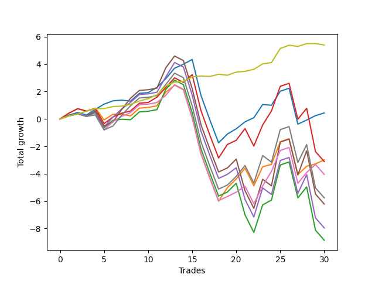

# Long Bulldog 006 
- Symbol: AAPL1y5m
- Date Range: 07/02/2021 - 07/08/2022
- Trading Period: 7:20-12:30
- Number of Trades: 30



| Name | Win Percent | Profit | Avg Profit / Trade |     | Name | Win Percent | Profit | Avg Profit / Trade |
| ---- | ----------- | ------ | ------------------ | --- | ---- | ----------- | ------ | ------------------ |
| Sorted By <br> Profit | | | | | Sorted By <br> Win Percentage ||||
| Seventy-Three | 86.67 | 2695.00 | 89.83 |     | Seventy-Three | 86.67 | 2695.00 | 89.83 |
| Zero | 76.67 | 220.00 | 7.33 |     | Zero | 76.67 | 220.00 | 7.33 |
| One | 66.67 | -1490.00 | -49.67 |     | One | 66.67 | -1490.00 | -49.67 |
| Three | 66.67 | -1555.00 | -51.83 |     | Three | 66.67 | -1555.00 | -51.83 |
| Six | 66.67 | -2025.00 | -67.50 |     | Six | 66.67 | -2025.00 | -67.50 |
| Seven | 60.00 | -2880.00 | -96.00 |     | Seven | 60.00 | -2880.00 | -96.00 |
| Five | 56.67 | -3105.00 | -103.50 |     | Five | 56.67 | -3105.00 | -103.50 |
| Four | 56.67 | -3975.00 | -132.50 |     | Four | 56.67 | -3975.00 | -132.50 |
| Two | 56.67 | -4425.00 | -147.50 |     | Two | 56.67 | -4425.00 | -147.50 |

## NO STOPLOSS

### Test Zero
* Sell when price hits the middle line of the 20p bollinger
* No Stoploss
* Results:
```
Total Trades: 30
Percent Up: 76.67
Percent Down: 23.33
Total Points Moved Up: 0.44
Potential Profit: 220.00
Total Points Ups: 9.44 Count Ups: 23
Total Points Downs: -9.00 Count Downs: 7
```

<details><summary>Trades</summary>

<code>In: 2021-07-12 10:55:00		Out: 2021-07-12 11:19:05		Total Position Time: 24:05		Total Move Up: 0.28		Total to Date: 0.28</code> <br />
<code>In: 2021-07-12 11:00:00		Out: 2021-07-12 11:19:05		Total Position Time: 19:05		Total Move Up: 0.19		Total to Date: 0.47</code> <br />
<code>In: 2021-07-16 12:10:00		Out: 2021-07-16 12:50:00		Total Position Time: 40:00		Total Move Up: -0.18		Total to Date: 0.29</code> <br />
<code>In: 2021-08-24 08:35:00		Out: 2021-08-24 09:11:45		Total Position Time: 36:45		Total Move Up: 0.41		Total to Date: 0.70</code> <br />
<code>In: 2021-09-14 10:15:00		Out: 2021-09-14 10:52:50		Total Position Time: 37:50		Total Move Up: 0.38		Total to Date: 1.08</code> <br />
<code>In: 2021-10-08 10:30:00		Out: 2021-10-08 10:56:10		Total Position Time: 26:10		Total Move Up: 0.24		Total to Date: 1.32</code> <br />
<code>In: 2021-10-21 09:15:00		Out: 2021-10-21 10:32:15		Total Position Time: 77:15		Total Move Up: 0.05		Total to Date: 1.37</code> <br />
<code>In: 2021-10-21 09:20:00		Out: 2021-10-21 10:32:15		Total Position Time: 72:15		Total Move Up: -0.07		Total to Date: 1.30</code> <br />
<code>In: 2021-12-01 12:30:00		Out: 2021-12-01 12:50:00		Total Position Time: 20:00		Total Move Up: 0.57		Total to Date: 1.87</code> <br />
<code>In: 2021-12-06 12:30:00		Out: 2021-12-06 12:50:00		Total Position Time: 20:00		Total Move Up: 0.05		Total to Date: 1.92</code> <br />
<code>In: 2021-12-09 12:30:00		Out: 2021-12-09 12:43:20		Total Position Time: 13:20		Total Move Up: 0.38		Total to Date: 2.30</code> <br />
<code>In: 2021-12-28 07:25:00		Out: 2021-12-28 07:38:05		Total Position Time: 13:05		Total Move Up: 0.64		Total to Date: 2.94</code> <br />
<code>In: 2021-12-29 07:25:00		Out: 2021-12-29 07:48:05		Total Position Time: 23:05		Total Move Up: 0.76		Total to Date: 3.70</code> <br />
<code>In: 2021-12-30 11:15:00		Out: 2021-12-30 11:44:40		Total Position Time: 29:40		Total Move Up: 0.29		Total to Date: 3.99</code> <br />
<code>In: 2022-01-05 10:15:00		Out: 2022-01-05 11:02:20		Total Position Time: 47:20		Total Move Up: 0.35		Total to Date: 4.34</code> <br />
<code>In: 2022-01-20 10:40:00		Out: 2022-01-20 12:50:00		Total Position Time: 130:00		Total Move Up: -2.63		Total to Date: 1.71</code> <br />
<code>In: 2022-01-20 11:35:00		Out: 2022-01-20 12:50:00		Total Position Time: 75:00		Total Move Up: -1.77		Total to Date: -0.06</code> <br />
<code>In: 2022-01-20 11:50:00		Out: 2022-01-20 12:50:00		Total Position Time: 60:00		Total Move Up: -1.68		Total to Date: -1.74</code> <br />
<code>In: 2022-01-21 12:15:00		Out: 2022-01-21 12:40:25		Total Position Time: 25:25		Total Move Up: 0.64		Total to Date: -1.10</code> <br />
<code>In: 2022-02-09 12:25:00		Out: 2022-02-09 12:31:00		Total Position Time: 06:00		Total Move Up: 0.38		Total to Date: -0.72</code> <br />
<code>In: 2022-02-10 08:20:00		Out: 2022-02-10 08:46:30		Total Position Time: 26:30		Total Move Up: 0.51		Total to Date: -0.21</code> <br />
<code>In: 2022-02-10 10:40:00		Out: 2022-02-10 11:36:35		Total Position Time: 56:35		Total Move Up: 0.30		Total to Date: 0.09</code> <br />
<code>In: 2022-02-14 11:15:00		Out: 2022-02-14 11:50:25		Total Position Time: 35:25		Total Move Up: 0.96		Total to Date: 1.05</code> <br />
<code>In: 2022-03-11 08:45:00		Out: 2022-03-11 09:51:55		Total Position Time: 66:55		Total Move Up: -0.05		Total to Date: 1.00</code> <br />
<code>In: 2022-03-16 11:40:00		Out: 2022-03-16 11:46:10		Total Position Time: 06:10		Total Move Up: 1.02		Total to Date: 2.02</code> <br />
<code>In: 2022-03-30 12:30:00		Out: 2022-03-30 12:50:00		Total Position Time: 20:00		Total Move Up: 0.22		Total to Date: 2.24</code> <br />
<code>In: 2022-04-21 10:25:00		Out: 2022-04-21 12:50:00		Total Position Time: 145:00		Total Move Up: -2.62		Total to Date: -0.38</code> <br />
<code>In: 2022-05-25 09:40:00		Out: 2022-05-25 10:34:45		Total Position Time: 54:45		Total Move Up: 0.30		Total to Date: -0.08</code> <br />
<code>In: 2022-06-09 08:10:00		Out: 2022-06-09 08:42:30		Total Position Time: 32:30		Total Move Up: 0.32		Total to Date: 0.24</code> <br />
<code>In: 2022-06-16 11:15:00		Out: 2022-06-16 12:10:05		Total Position Time: 55:05		Total Move Up: 0.20		Total to Date: 0.44</code> <br />


</details>

### Test One
* Sell when the price hits the upper line of the 20p 1std bollinger
* No Stoploss
* Results:
```
Total Trades: 30
Percent Up: 66.67
Percent Down: 33.33
Total Points Moved Up: -2.98
Potential Profit: -1490.00
Total Points Ups: 10.54 Count Ups: 20
Total Points Downs: -13.52 Count Downs: 10
```

<details><summary>Trades</summary>

<code>In: 2021-07-12 10:55:00		Out: 2021-07-12 11:30:35		Total Position Time: 35:35		Total Move Up: 0.42		Total to Date: 0.42</code> <br />
<code>In: 2021-07-12 11:00:00		Out: 2021-07-12 11:30:35		Total Position Time: 30:35		Total Move Up: 0.33		Total to Date: 0.75</code> <br />
<code>In: 2021-07-16 12:10:00		Out: 2021-07-16 12:50:00		Total Position Time: 40:00		Total Move Up: -0.18		Total to Date: 0.57</code> <br />
<code>In: 2021-08-24 08:35:00		Out: 2021-08-24 10:54:20		Total Position Time: 139:20		Total Move Up: 0.22		Total to Date: 0.79</code> <br />
<code>In: 2021-09-14 10:15:00		Out: 2021-09-14 12:45:30		Total Position Time: 150:30		Total Move Up: -0.86		Total to Date: -0.07</code> <br />
<code>In: 2021-10-08 10:30:00		Out: 2021-10-08 11:18:15		Total Position Time: 48:15		Total Move Up: 0.41		Total to Date: 0.34</code> <br />
<code>In: 2021-10-21 09:15:00		Out: 2021-10-21 11:16:45		Total Position Time: 121:45		Total Move Up: 0.00		Total to Date: 0.34</code> <br />
<code>In: 2021-10-21 09:20:00		Out: 2021-10-21 11:16:45		Total Position Time: 116:45		Total Move Up: -0.12		Total to Date: 0.22</code> <br />
<code>In: 2021-12-01 12:30:00		Out: 2021-12-01 12:50:00		Total Position Time: 20:00		Total Move Up: 0.57		Total to Date: 0.79</code> <br />
<code>In: 2021-12-06 12:30:00		Out: 2021-12-06 12:50:00		Total Position Time: 20:00		Total Move Up: 0.05		Total to Date: 0.84</code> <br />
<code>In: 2021-12-09 12:30:00		Out: 2021-12-09 12:50:00		Total Position Time: 20:00		Total Move Up: 0.12		Total to Date: 0.96</code> <br />
<code>In: 2021-12-28 07:25:00		Out: 2021-12-28 08:00:40		Total Position Time: 35:40		Total Move Up: 0.99		Total to Date: 1.95</code> <br />
<code>In: 2021-12-29 07:25:00		Out: 2021-12-29 10:00:40		Total Position Time: 155:40		Total Move Up: 0.51		Total to Date: 2.46</code> <br />
<code>In: 2021-12-30 11:15:00		Out: 2021-12-30 12:50:00		Total Position Time: 95:00		Total Move Up: -0.33		Total to Date: 2.13</code> <br />
<code>In: 2022-01-05 10:15:00		Out: 2022-01-05 12:50:00		Total Position Time: 155:00		Total Move Up: -2.05		Total to Date: 0.08</code> <br />
<code>In: 2022-01-20 10:40:00		Out: 2022-01-20 12:50:00		Total Position Time: 130:00		Total Move Up: -2.63		Total to Date: -2.55</code> <br />
<code>In: 2022-01-20 11:35:00		Out: 2022-01-20 12:50:00		Total Position Time: 75:00		Total Move Up: -1.77		Total to Date: -4.32</code> <br />
<code>In: 2022-01-20 11:50:00		Out: 2022-01-20 12:50:00		Total Position Time: 60:00		Total Move Up: -1.68		Total to Date: -6.00</code> <br />
<code>In: 2022-01-21 12:15:00		Out: 2022-01-21 12:43:40		Total Position Time: 28:40		Total Move Up: 0.99		Total to Date: -5.01</code> <br />
<code>In: 2022-02-09 12:25:00		Out: 2022-02-09 12:37:00		Total Position Time: 12:00		Total Move Up: 0.63		Total to Date: -4.38</code> <br />
<code>In: 2022-02-10 08:20:00		Out: 2022-02-10 08:56:40		Total Position Time: 36:40		Total Move Up: 0.79		Total to Date: -3.59</code> <br />
<code>In: 2022-02-10 10:40:00		Out: 2022-02-10 12:50:00		Total Position Time: 130:00		Total Move Up: -1.28		Total to Date: -4.87</code> <br />
<code>In: 2022-02-14 11:15:00		Out: 2022-02-14 12:13:25		Total Position Time: 58:25		Total Move Up: 1.38		Total to Date: -3.49</code> <br />
<code>In: 2022-03-11 08:45:00		Out: 2022-03-11 10:02:25		Total Position Time: 77:25		Total Move Up: 0.17		Total to Date: -3.32</code> <br />
<code>In: 2022-03-16 11:40:00		Out: 2022-03-16 11:55:40		Total Position Time: 15:40		Total Move Up: 1.66		Total to Date: -1.66</code> <br />
<code>In: 2022-03-30 12:30:00		Out: 2022-03-30 12:50:00		Total Position Time: 20:00		Total Move Up: 0.22		Total to Date: -1.44</code> <br />
<code>In: 2022-04-21 10:25:00		Out: 2022-04-21 12:50:00		Total Position Time: 145:00		Total Move Up: -2.62		Total to Date: -4.06</code> <br />
<code>In: 2022-05-25 09:40:00		Out: 2022-05-25 10:37:20		Total Position Time: 57:20		Total Move Up: 0.61		Total to Date: -3.45</code> <br />
<code>In: 2022-06-09 08:10:00		Out: 2022-06-09 09:51:40		Total Position Time: 101:40		Total Move Up: 0.17		Total to Date: -3.28</code> <br />
<code>In: 2022-06-16 11:15:00		Out: 2022-06-16 12:27:05		Total Position Time: 72:05		Total Move Up: 0.30		Total to Date: -2.98</code> <br />


</details>

### Test Two
* Sell when the price hits the upper line of the 20p 2std bollinger
* No Stoploss
* Results:
```
Total Trades: 30
Percent Up: 56.67
Percent Down: 43.33
Total Points Moved Up: -8.85
Potential Profit: -4425.00
Total Points Ups: 11.03 Count Ups: 17
Total Points Downs: -19.88 Count Downs: 13
```

<details><summary>Trades</summary>

<code>In: 2021-07-12 10:55:00		Out: 2021-07-12 12:50:00		Total Position Time: 115:00		Total Move Up: 0.23		Total to Date: 0.23</code> <br />
<code>In: 2021-07-12 11:00:00		Out: 2021-07-12 12:50:00		Total Position Time: 110:00		Total Move Up: 0.14		Total to Date: 0.37</code> <br />
<code>In: 2021-07-16 12:10:00		Out: 2021-07-16 12:50:00		Total Position Time: 40:00		Total Move Up: -0.18		Total to Date: 0.19</code> <br />
<code>In: 2021-08-24 08:35:00		Out: 2021-08-24 10:55:05		Total Position Time: 140:05		Total Move Up: 0.27		Total to Date: 0.46</code> <br />
<code>In: 2021-09-14 10:15:00		Out: 2021-09-14 12:50:00		Total Position Time: 155:00		Total Move Up: -1.10		Total to Date: -0.64</code> <br />
<code>In: 2021-10-08 10:30:00		Out: 2021-10-08 11:25:25		Total Position Time: 55:25		Total Move Up: 0.54		Total to Date: -0.10</code> <br />
<code>In: 2021-10-21 09:15:00		Out: 2021-10-21 11:26:10		Total Position Time: 131:10		Total Move Up: 0.08		Total to Date: -0.02</code> <br />
<code>In: 2021-10-21 09:20:00		Out: 2021-10-21 11:26:10		Total Position Time: 126:10		Total Move Up: -0.04		Total to Date: -0.06</code> <br />
<code>In: 2021-12-01 12:30:00		Out: 2021-12-01 12:50:00		Total Position Time: 20:00		Total Move Up: 0.57		Total to Date: 0.51</code> <br />
<code>In: 2021-12-06 12:30:00		Out: 2021-12-06 12:50:00		Total Position Time: 20:00		Total Move Up: 0.05		Total to Date: 0.56</code> <br />
<code>In: 2021-12-09 12:30:00		Out: 2021-12-09 12:50:00		Total Position Time: 20:00		Total Move Up: 0.12		Total to Date: 0.68</code> <br />
<code>In: 2021-12-28 07:25:00		Out: 2021-12-28 08:02:45		Total Position Time: 37:45		Total Move Up: 1.48		Total to Date: 2.16</code> <br />
<code>In: 2021-12-29 07:25:00		Out: 2021-12-29 11:26:40		Total Position Time: 241:40		Total Move Up: 0.67		Total to Date: 2.83</code> <br />
<code>In: 2021-12-30 11:15:00		Out: 2021-12-30 12:50:00		Total Position Time: 95:00		Total Move Up: -0.33		Total to Date: 2.50</code> <br />
<code>In: 2022-01-05 10:15:00		Out: 2022-01-05 12:50:00		Total Position Time: 155:00		Total Move Up: -2.05		Total to Date: 0.45</code> <br />
<code>In: 2022-01-20 10:40:00		Out: 2022-01-20 12:50:00		Total Position Time: 130:00		Total Move Up: -2.63		Total to Date: -2.18</code> <br />
<code>In: 2022-01-20 11:35:00		Out: 2022-01-20 12:50:00		Total Position Time: 75:00		Total Move Up: -1.77		Total to Date: -3.95</code> <br />
<code>In: 2022-01-20 11:50:00		Out: 2022-01-20 12:50:00		Total Position Time: 60:00		Total Move Up: -1.68		Total to Date: -5.63</code> <br />
<code>In: 2022-01-21 12:15:00		Out: 2022-01-21 12:50:00		Total Position Time: 35:00		Total Move Up: 0.30		Total to Date: -5.33</code> <br />
<code>In: 2022-02-09 12:25:00		Out: 2022-02-09 12:50:00		Total Position Time: 25:00		Total Move Up: 0.64		Total to Date: -4.69</code> <br />
<code>In: 2022-02-10 08:20:00		Out: 2022-02-10 12:50:00		Total Position Time: 270:00		Total Move Up: -2.31		Total to Date: -7.00</code> <br />
<code>In: 2022-02-10 10:40:00		Out: 2022-02-10 12:50:00		Total Position Time: 130:00		Total Move Up: -1.28		Total to Date: -8.28</code> <br />
<code>In: 2022-02-14 11:15:00		Out: 2022-02-14 12:24:00		Total Position Time: 69:00		Total Move Up: 2.01		Total to Date: -6.27</code> <br />
<code>In: 2022-03-11 08:45:00		Out: 2022-03-11 10:05:40		Total Position Time: 80:40		Total Move Up: 0.35		Total to Date: -5.92</code> <br />
<code>In: 2022-03-16 11:40:00		Out: 2022-03-16 12:20:00		Total Position Time: 40:00		Total Move Up: 2.56		Total to Date: -3.36</code> <br />
<code>In: 2022-03-30 12:30:00		Out: 2022-03-30 12:50:00		Total Position Time: 20:00		Total Move Up: 0.22		Total to Date: -3.14</code> <br />
<code>In: 2022-04-21 10:25:00		Out: 2022-04-21 12:50:00		Total Position Time: 145:00		Total Move Up: -2.62		Total to Date: -5.76</code> <br />
<code>In: 2022-05-25 09:40:00		Out: 2022-05-25 11:00:30		Total Position Time: 80:30		Total Move Up: 0.80		Total to Date: -4.96</code> <br />
<code>In: 2022-06-09 08:10:00		Out: 2022-06-09 12:50:00		Total Position Time: 280:00		Total Move Up: -3.16		Total to Date: -8.12</code> <br />
<code>In: 2022-06-16 11:15:00		Out: 2022-06-16 12:50:00		Total Position Time: 95:00		Total Move Up: -0.73		Total to Date: -8.85</code> <br />


</details>

### Test Three
* Sell when price hits the middle line of the 50p bollinger
* No Stoploss
* Results:
```
Total Trades: 30
Percent Up: 66.67
Percent Down: 33.33
Total Points Moved Up: -3.11
Potential Profit: -1555.00
Total Points Ups: 12.37 Count Ups: 20
Total Points Downs: -15.48 Count Downs: 10
```

<details><summary>Trades</summary>

<code>In: 2021-07-12 10:55:00		Out: 2021-07-12 11:30:35		Total Position Time: 35:35		Total Move Up: 0.42		Total to Date: 0.42</code> <br />
<code>In: 2021-07-12 11:00:00		Out: 2021-07-12 11:30:35		Total Position Time: 30:35		Total Move Up: 0.33		Total to Date: 0.75</code> <br />
<code>In: 2021-07-16 12:10:00		Out: 2021-07-16 12:50:00		Total Position Time: 40:00		Total Move Up: -0.18		Total to Date: 0.57</code> <br />
<code>In: 2021-08-24 08:35:00		Out: 2021-08-24 11:55:10		Total Position Time: 200:10		Total Move Up: 0.19		Total to Date: 0.76</code> <br />
<code>In: 2021-09-14 10:15:00		Out: 2021-09-14 12:50:00		Total Position Time: 155:00		Total Move Up: -1.10		Total to Date: -0.34</code> <br />
<code>In: 2021-10-08 10:30:00		Out: 2021-10-08 11:18:50		Total Position Time: 48:50		Total Move Up: 0.48		Total to Date: 0.14</code> <br />
<code>In: 2021-10-21 09:15:00		Out: 2021-10-21 11:32:50		Total Position Time: 137:50		Total Move Up: 0.28		Total to Date: 0.42</code> <br />
<code>In: 2021-10-21 09:20:00		Out: 2021-10-21 11:32:50		Total Position Time: 132:50		Total Move Up: 0.16		Total to Date: 0.58</code> <br />
<code>In: 2021-12-01 12:30:00		Out: 2021-12-01 12:50:00		Total Position Time: 20:00		Total Move Up: 0.57		Total to Date: 1.15</code> <br />
<code>In: 2021-12-06 12:30:00		Out: 2021-12-06 12:50:00		Total Position Time: 20:00		Total Move Up: 0.05		Total to Date: 1.20</code> <br />
<code>In: 2021-12-09 12:30:00		Out: 2021-12-09 12:43:30		Total Position Time: 13:30		Total Move Up: 0.39		Total to Date: 1.59</code> <br />
<code>In: 2021-12-28 07:25:00		Out: 2021-12-28 07:41:30		Total Position Time: 16:30		Total Move Up: 0.70		Total to Date: 2.29</code> <br />
<code>In: 2021-12-29 07:25:00		Out: 2021-12-29 07:43:25		Total Position Time: 18:25		Total Move Up: 0.71		Total to Date: 3.00</code> <br />
<code>In: 2021-12-30 11:15:00		Out: 2021-12-30 12:50:00		Total Position Time: 95:00		Total Move Up: -0.33		Total to Date: 2.67</code> <br />
<code>In: 2022-01-05 10:15:00		Out: 2022-01-05 11:02:30		Total Position Time: 47:30		Total Move Up: 0.56		Total to Date: 3.23</code> <br />
<code>In: 2022-01-20 10:40:00		Out: 2022-01-20 12:50:00		Total Position Time: 130:00		Total Move Up: -2.63		Total to Date: 0.60</code> <br />
<code>In: 2022-01-20 11:35:00		Out: 2022-01-20 12:50:00		Total Position Time: 75:00		Total Move Up: -1.77		Total to Date: -1.17</code> <br />
<code>In: 2022-01-20 11:50:00		Out: 2022-01-20 12:50:00		Total Position Time: 60:00		Total Move Up: -1.68		Total to Date: -2.85</code> <br />
<code>In: 2022-01-21 12:15:00		Out: 2022-01-21 12:43:40		Total Position Time: 28:40		Total Move Up: 0.99		Total to Date: -1.86</code> <br />
<code>In: 2022-02-09 12:25:00		Out: 2022-02-09 12:30:20		Total Position Time: 05:20		Total Move Up: 0.30		Total to Date: -1.56</code> <br />
<code>In: 2022-02-10 08:20:00		Out: 2022-02-10 09:23:25		Total Position Time: 63:25		Total Move Up: 0.86		Total to Date: -0.70</code> <br />
<code>In: 2022-02-10 10:40:00		Out: 2022-02-10 12:50:00		Total Position Time: 130:00		Total Move Up: -1.28		Total to Date: -1.98</code> <br />
<code>In: 2022-02-14 11:15:00		Out: 2022-02-14 11:51:40		Total Position Time: 36:40		Total Move Up: 1.54		Total to Date: -0.44</code> <br />
<code>In: 2022-03-11 08:45:00		Out: 2022-03-11 10:26:00		Total Position Time: 101:00		Total Move Up: 1.02		Total to Date: 0.58</code> <br />
<code>In: 2022-03-16 11:40:00		Out: 2022-03-16 11:55:45		Total Position Time: 15:45		Total Move Up: 1.80		Total to Date: 2.38</code> <br />
<code>In: 2022-03-30 12:30:00		Out: 2022-03-30 12:50:00		Total Position Time: 20:00		Total Move Up: 0.22		Total to Date: 2.60</code> <br />
<code>In: 2022-04-21 10:25:00		Out: 2022-04-21 12:50:00		Total Position Time: 145:00		Total Move Up: -2.62		Total to Date: -0.02</code> <br />
<code>In: 2022-05-25 09:40:00		Out: 2022-05-25 11:00:30		Total Position Time: 80:30		Total Move Up: 0.80		Total to Date: 0.78</code> <br />
<code>In: 2022-06-09 08:10:00		Out: 2022-06-09 12:50:00		Total Position Time: 280:00		Total Move Up: -3.16		Total to Date: -2.38</code> <br />
<code>In: 2022-06-16 11:15:00		Out: 2022-06-16 12:50:00		Total Position Time: 95:00		Total Move Up: -0.73		Total to Date: -3.11</code> <br />


</details>

### Test Four
* Sell when the price hits the upper line of the 50p 1std bollinger
* No Stoploss
* Results:
```
Total Trades: 30
Percent Up: 56.67
Percent Down: 43.33
Total Points Moved Up: -7.95
Potential Profit: -3975.00
Total Points Ups: 12.37 Count Ups: 17
Total Points Downs: -20.32 Count Downs: 13
```

<details><summary>Trades</summary>

<code>In: 2021-07-12 10:55:00		Out: 2021-07-12 12:50:00		Total Position Time: 115:00		Total Move Up: 0.23		Total to Date: 0.23</code> <br />
<code>In: 2021-07-12 11:00:00		Out: 2021-07-12 12:50:00		Total Position Time: 110:00		Total Move Up: 0.14		Total to Date: 0.37</code> <br />
<code>In: 2021-07-16 12:10:00		Out: 2021-07-16 12:50:00		Total Position Time: 40:00		Total Move Up: -0.18		Total to Date: 0.19</code> <br />
<code>In: 2021-08-24 08:35:00		Out: 2021-08-24 12:01:55		Total Position Time: 206:55		Total Move Up: 0.32		Total to Date: 0.51</code> <br />
<code>In: 2021-09-14 10:15:00		Out: 2021-09-14 12:50:00		Total Position Time: 155:00		Total Move Up: -1.10		Total to Date: -0.59</code> <br />
<code>In: 2021-10-08 10:30:00		Out: 2021-10-08 11:31:30		Total Position Time: 61:30		Total Move Up: 0.72		Total to Date: 0.13</code> <br />
<code>In: 2021-10-21 09:15:00		Out: 2021-10-21 12:01:20		Total Position Time: 166:20		Total Move Up: 0.60		Total to Date: 0.73</code> <br />
<code>In: 2021-10-21 09:20:00		Out: 2021-10-21 12:01:20		Total Position Time: 161:20		Total Move Up: 0.48		Total to Date: 1.21</code> <br />
<code>In: 2021-12-01 12:30:00		Out: 2021-12-01 12:50:00		Total Position Time: 20:00		Total Move Up: 0.57		Total to Date: 1.78</code> <br />
<code>In: 2021-12-06 12:30:00		Out: 2021-12-06 12:50:00		Total Position Time: 20:00		Total Move Up: 0.05		Total to Date: 1.83</code> <br />
<code>In: 2021-12-09 12:30:00		Out: 2021-12-09 12:50:00		Total Position Time: 20:00		Total Move Up: 0.12		Total to Date: 1.95</code> <br />
<code>In: 2021-12-28 07:25:00		Out: 2021-12-28 08:01:05		Total Position Time: 36:05		Total Move Up: 1.11		Total to Date: 3.06</code> <br />
<code>In: 2021-12-29 07:25:00		Out: 2021-12-29 07:54:55		Total Position Time: 29:55		Total Move Up: 1.06		Total to Date: 4.12</code> <br />
<code>In: 2021-12-30 11:15:00		Out: 2021-12-30 12:50:00		Total Position Time: 95:00		Total Move Up: -0.33		Total to Date: 3.79</code> <br />
<code>In: 2022-01-05 10:15:00		Out: 2022-01-05 12:50:00		Total Position Time: 155:00		Total Move Up: -2.05		Total to Date: 1.74</code> <br />
<code>In: 2022-01-20 10:40:00		Out: 2022-01-20 12:50:00		Total Position Time: 130:00		Total Move Up: -2.63		Total to Date: -0.89</code> <br />
<code>In: 2022-01-20 11:35:00		Out: 2022-01-20 12:50:00		Total Position Time: 75:00		Total Move Up: -1.77		Total to Date: -2.66</code> <br />
<code>In: 2022-01-20 11:50:00		Out: 2022-01-20 12:50:00		Total Position Time: 60:00		Total Move Up: -1.68		Total to Date: -4.34</code> <br />
<code>In: 2022-01-21 12:15:00		Out: 2022-01-21 12:50:00		Total Position Time: 35:00		Total Move Up: 0.30		Total to Date: -4.04</code> <br />
<code>In: 2022-02-09 12:25:00		Out: 2022-02-09 12:32:15		Total Position Time: 07:15		Total Move Up: 0.48		Total to Date: -3.56</code> <br />
<code>In: 2022-02-10 08:20:00		Out: 2022-02-10 12:50:00		Total Position Time: 270:00		Total Move Up: -2.31		Total to Date: -5.87</code> <br />
<code>In: 2022-02-10 10:40:00		Out: 2022-02-10 12:50:00		Total Position Time: 130:00		Total Move Up: -1.28		Total to Date: -7.15</code> <br />
<code>In: 2022-02-14 11:15:00		Out: 2022-02-14 12:50:00		Total Position Time: 95:00		Total Move Up: 2.12		Total to Date: -5.03</code> <br />
<code>In: 2022-03-11 08:45:00		Out: 2022-03-11 12:50:00		Total Position Time: 245:00		Total Move Up: -0.48		Total to Date: -5.51</code> <br />
<code>In: 2022-03-16 11:40:00		Out: 2022-03-16 12:19:20		Total Position Time: 39:20		Total Move Up: 2.48		Total to Date: -3.03</code> <br />
<code>In: 2022-03-30 12:30:00		Out: 2022-03-30 12:50:00		Total Position Time: 20:00		Total Move Up: 0.22		Total to Date: -2.81</code> <br />
<code>In: 2022-04-21 10:25:00		Out: 2022-04-21 12:50:00		Total Position Time: 145:00		Total Move Up: -2.62		Total to Date: -5.43</code> <br />
<code>In: 2022-05-25 09:40:00		Out: 2022-05-25 11:26:55		Total Position Time: 106:55		Total Move Up: 1.37		Total to Date: -4.06</code> <br />
<code>In: 2022-06-09 08:10:00		Out: 2022-06-09 12:50:00		Total Position Time: 280:00		Total Move Up: -3.16		Total to Date: -7.22</code> <br />
<code>In: 2022-06-16 11:15:00		Out: 2022-06-16 12:50:00		Total Position Time: 95:00		Total Move Up: -0.73		Total to Date: -7.95</code> <br />


</details>

### Test Five
* Sell when the price hits the upper line of the 50p 2std bollinger
* No Stoploss
* Results:
```
Total Trades: 30
Percent Up: 56.67
Percent Down: 43.33
Total Points Moved Up: -6.21
Potential Profit: -3105.00
Total Points Ups: 14.11 Count Ups: 17
Total Points Downs: -20.32 Count Downs: 13
```

<details><summary>Trades</summary>

<code>In: 2021-07-12 10:55:00		Out: 2021-07-12 12:50:00		Total Position Time: 115:00		Total Move Up: 0.23		Total to Date: 0.23</code> <br />
<code>In: 2021-07-12 11:00:00		Out: 2021-07-12 12:50:00		Total Position Time: 110:00		Total Move Up: 0.14		Total to Date: 0.37</code> <br />
<code>In: 2021-07-16 12:10:00		Out: 2021-07-16 12:50:00		Total Position Time: 40:00		Total Move Up: -0.18		Total to Date: 0.19</code> <br />
<code>In: 2021-08-24 08:35:00		Out: 2021-08-24 12:24:20		Total Position Time: 229:20		Total Move Up: 0.40		Total to Date: 0.59</code> <br />
<code>In: 2021-09-14 10:15:00		Out: 2021-09-14 12:50:00		Total Position Time: 155:00		Total Move Up: -1.10		Total to Date: -0.51</code> <br />
<code>In: 2021-10-08 10:30:00		Out: 2021-10-08 12:50:00		Total Position Time: 140:00		Total Move Up: 0.28		Total to Date: -0.23</code> <br />
<code>In: 2021-10-21 09:15:00		Out: 2021-10-21 12:50:00		Total Position Time: 215:00		Total Move Up: 0.93		Total to Date: 0.70</code> <br />
<code>In: 2021-10-21 09:20:00		Out: 2021-10-21 12:50:00		Total Position Time: 210:00		Total Move Up: 0.81		Total to Date: 1.51</code> <br />
<code>In: 2021-12-01 12:30:00		Out: 2021-12-01 12:50:00		Total Position Time: 20:00		Total Move Up: 0.57		Total to Date: 2.08</code> <br />
<code>In: 2021-12-06 12:30:00		Out: 2021-12-06 12:50:00		Total Position Time: 20:00		Total Move Up: 0.05		Total to Date: 2.13</code> <br />
<code>In: 2021-12-09 12:30:00		Out: 2021-12-09 12:50:00		Total Position Time: 20:00		Total Move Up: 0.12		Total to Date: 2.25</code> <br />
<code>In: 2021-12-28 07:25:00		Out: 2021-12-28 08:02:45		Total Position Time: 37:45		Total Move Up: 1.48		Total to Date: 3.73</code> <br />
<code>In: 2021-12-29 07:25:00		Out: 2021-12-29 12:33:35		Total Position Time: 308:35		Total Move Up: 0.86		Total to Date: 4.59</code> <br />
<code>In: 2021-12-30 11:15:00		Out: 2021-12-30 12:50:00		Total Position Time: 95:00		Total Move Up: -0.33		Total to Date: 4.26</code> <br />
<code>In: 2022-01-05 10:15:00		Out: 2022-01-05 12:50:00		Total Position Time: 155:00		Total Move Up: -2.05		Total to Date: 2.21</code> <br />
<code>In: 2022-01-20 10:40:00		Out: 2022-01-20 12:50:00		Total Position Time: 130:00		Total Move Up: -2.63		Total to Date: -0.42</code> <br />
<code>In: 2022-01-20 11:35:00		Out: 2022-01-20 12:50:00		Total Position Time: 75:00		Total Move Up: -1.77		Total to Date: -2.19</code> <br />
<code>In: 2022-01-20 11:50:00		Out: 2022-01-20 12:50:00		Total Position Time: 60:00		Total Move Up: -1.68		Total to Date: -3.87</code> <br />
<code>In: 2022-01-21 12:15:00		Out: 2022-01-21 12:50:00		Total Position Time: 35:00		Total Move Up: 0.30		Total to Date: -3.57</code> <br />
<code>In: 2022-02-09 12:25:00		Out: 2022-02-09 12:50:00		Total Position Time: 25:00		Total Move Up: 0.64		Total to Date: -2.93</code> <br />
<code>In: 2022-02-10 08:20:00		Out: 2022-02-10 12:50:00		Total Position Time: 270:00		Total Move Up: -2.31		Total to Date: -5.24</code> <br />
<code>In: 2022-02-10 10:40:00		Out: 2022-02-10 12:50:00		Total Position Time: 130:00		Total Move Up: -1.28		Total to Date: -6.52</code> <br />
<code>In: 2022-02-14 11:15:00		Out: 2022-02-14 12:50:00		Total Position Time: 95:00		Total Move Up: 2.12		Total to Date: -4.40</code> <br />
<code>In: 2022-03-11 08:45:00		Out: 2022-03-11 12:50:00		Total Position Time: 245:00		Total Move Up: -0.48		Total to Date: -4.88</code> <br />
<code>In: 2022-03-16 11:40:00		Out: 2022-03-16 12:50:00		Total Position Time: 70:00		Total Move Up: 3.19		Total to Date: -1.69</code> <br />
<code>In: 2022-03-30 12:30:00		Out: 2022-03-30 12:50:00		Total Position Time: 20:00		Total Move Up: 0.22		Total to Date: -1.47</code> <br />
<code>In: 2022-04-21 10:25:00		Out: 2022-04-21 12:50:00		Total Position Time: 145:00		Total Move Up: -2.62		Total to Date: -4.09</code> <br />
<code>In: 2022-05-25 09:40:00		Out: 2022-05-25 11:51:15		Total Position Time: 131:15		Total Move Up: 1.77		Total to Date: -2.32</code> <br />
<code>In: 2022-06-09 08:10:00		Out: 2022-06-09 12:50:00		Total Position Time: 280:00		Total Move Up: -3.16		Total to Date: -5.48</code> <br />
<code>In: 2022-06-16 11:15:00		Out: 2022-06-16 12:50:00		Total Position Time: 95:00		Total Move Up: -0.73		Total to Date: -6.21</code> <br />


</details>

### Test Six
* Sell when the price hits the middle line of the 1std VWAP
* No Stoploss
* Results:
```
Total Trades: 30
Percent Up: 66.67
Percent Down: 33.33
Total Points Moved Up: -4.05
Potential Profit: -2025.00
Total Points Ups: 10.32 Count Ups: 20
Total Points Downs: -14.37 Count Downs: 10
```

<details><summary>Trades</summary>

<code>In: 2021-07-12 10:55:00		Out: 2021-07-12 12:50:00		Total Position Time: 115:00		Total Move Up: 0.23		Total to Date: 0.23</code> <br />
<code>In: 2021-07-12 11:00:00		Out: 2021-07-12 12:50:00		Total Position Time: 110:00		Total Move Up: 0.14		Total to Date: 0.37</code> <br />
<code>In: 2021-07-16 12:10:00		Out: 2021-07-16 12:50:00		Total Position Time: 40:00		Total Move Up: -0.18		Total to Date: 0.19</code> <br />
<code>In: 2021-08-24 08:35:00		Out: 2021-08-24 12:50:00		Total Position Time: 255:00		Total Move Up: 0.11		Total to Date: 0.30</code> <br />
<code>In: 2021-09-14 10:15:00		Out: 2021-09-14 12:50:00		Total Position Time: 155:00		Total Move Up: -1.10		Total to Date: -0.80</code> <br />
<code>In: 2021-10-08 10:30:00		Out: 2021-10-08 11:27:10		Total Position Time: 57:10		Total Move Up: 0.60		Total to Date: -0.20</code> <br />
<code>In: 2021-10-21 09:15:00		Out: 2021-10-21 11:41:05		Total Position Time: 146:05		Total Move Up: 0.39		Total to Date: 0.19</code> <br />
<code>In: 2021-10-21 09:20:00		Out: 2021-10-21 11:41:05		Total Position Time: 141:05		Total Move Up: 0.27		Total to Date: 0.46</code> <br />
<code>In: 2021-12-01 12:30:00		Out: 2021-12-01 12:50:00		Total Position Time: 20:00		Total Move Up: 0.57		Total to Date: 1.03</code> <br />
<code>In: 2021-12-06 12:30:00		Out: 2021-12-06 12:50:00		Total Position Time: 20:00		Total Move Up: 0.05		Total to Date: 1.08</code> <br />
<code>In: 2021-12-09 12:30:00		Out: 2021-12-09 12:50:00		Total Position Time: 20:00		Total Move Up: 0.12		Total to Date: 1.20</code> <br />
<code>In: 2021-12-28 07:25:00		Out: 2021-12-28 07:35:15		Total Position Time: 10:15		Total Move Up: 0.52		Total to Date: 1.72</code> <br />
<code>In: 2021-12-29 07:25:00		Out: 2021-12-29 07:48:10		Total Position Time: 23:10		Total Move Up: 0.78		Total to Date: 2.50</code> <br />
<code>In: 2021-12-30 11:15:00		Out: 2021-12-30 12:50:00		Total Position Time: 95:00		Total Move Up: -0.33		Total to Date: 2.17</code> <br />
<code>In: 2022-01-05 10:15:00		Out: 2022-01-05 12:50:00		Total Position Time: 155:00		Total Move Up: -2.05		Total to Date: 0.12</code> <br />
<code>In: 2022-01-20 10:40:00		Out: 2022-01-20 12:50:00		Total Position Time: 130:00		Total Move Up: -2.63		Total to Date: -2.51</code> <br />
<code>In: 2022-01-20 11:35:00		Out: 2022-01-20 12:50:00		Total Position Time: 75:00		Total Move Up: -1.77		Total to Date: -4.28</code> <br />
<code>In: 2022-01-20 11:50:00		Out: 2022-01-20 12:50:00		Total Position Time: 60:00		Total Move Up: -1.68		Total to Date: -5.96</code> <br />
<code>In: 2022-01-21 12:15:00		Out: 2022-01-21 12:50:00		Total Position Time: 35:00		Total Move Up: 0.30		Total to Date: -5.66</code> <br />
<code>In: 2022-02-09 12:25:00		Out: 2022-02-09 12:30:25		Total Position Time: 05:25		Total Move Up: 0.32		Total to Date: -5.34</code> <br />
<code>In: 2022-02-10 08:20:00		Out: 2022-02-10 08:46:25		Total Position Time: 26:25		Total Move Up: 0.43		Total to Date: -4.91</code> <br />
<code>In: 2022-02-10 10:40:00		Out: 2022-02-10 12:50:00		Total Position Time: 130:00		Total Move Up: -1.28		Total to Date: -6.19</code> <br />
<code>In: 2022-02-14 11:15:00		Out: 2022-02-14 11:51:15		Total Position Time: 36:15		Total Move Up: 1.30		Total to Date: -4.89</code> <br />
<code>In: 2022-03-11 08:45:00		Out: 2022-03-11 10:28:50		Total Position Time: 103:50		Total Move Up: 1.07		Total to Date: -3.82</code> <br />
<code>In: 2022-03-16 11:40:00		Out: 2022-03-16 11:55:35		Total Position Time: 15:35		Total Move Up: 1.52		Total to Date: -2.30</code> <br />
<code>In: 2022-03-30 12:30:00		Out: 2022-03-30 12:50:00		Total Position Time: 20:00		Total Move Up: 0.22		Total to Date: -2.08</code> <br />
<code>In: 2022-04-21 10:25:00		Out: 2022-04-21 12:50:00		Total Position Time: 145:00		Total Move Up: -2.62		Total to Date: -4.70</code> <br />
<code>In: 2022-05-25 09:40:00		Out: 2022-05-25 11:00:30		Total Position Time: 80:30		Total Move Up: 0.80		Total to Date: -3.90</code> <br />
<code>In: 2022-06-09 08:10:00		Out: 2022-06-09 08:43:50		Total Position Time: 33:50		Total Move Up: 0.58		Total to Date: -3.32</code> <br />
<code>In: 2022-06-16 11:15:00		Out: 2022-06-16 12:50:00		Total Position Time: 95:00		Total Move Up: -0.73		Total to Date: -4.05</code> <br />


</details>

### Test Seven
* Sell when the price hits the upper line of the 1std VWAP
* No Stoploss
* Results:
```
Total Trades: 30
Percent Up: 60.00
Percent Down: 40.00
Total Points Moved Up: -5.76
Potential Profit: -2880.00
Total Points Ups: 12.25 Count Ups: 18
Total Points Downs: -18.01 Count Downs: 12
```

<details><summary>Trades</summary>

<code>In: 2021-07-12 10:55:00		Out: 2021-07-12 12:50:00		Total Position Time: 115:00		Total Move Up: 0.23		Total to Date: 0.23</code> <br />
<code>In: 2021-07-12 11:00:00		Out: 2021-07-12 12:50:00		Total Position Time: 110:00		Total Move Up: 0.14		Total to Date: 0.37</code> <br />
<code>In: 2021-07-16 12:10:00		Out: 2021-07-16 12:50:00		Total Position Time: 40:00		Total Move Up: -0.18		Total to Date: 0.19</code> <br />
<code>In: 2021-08-24 08:35:00		Out: 2021-08-24 12:50:00		Total Position Time: 255:00		Total Move Up: 0.11		Total to Date: 0.30</code> <br />
<code>In: 2021-09-14 10:15:00		Out: 2021-09-14 12:50:00		Total Position Time: 155:00		Total Move Up: -1.10		Total to Date: -0.80</code> <br />
<code>In: 2021-10-08 10:30:00		Out: 2021-10-08 12:50:00		Total Position Time: 140:00		Total Move Up: 0.28		Total to Date: -0.52</code> <br />
<code>In: 2021-10-21 09:15:00		Out: 2021-10-21 12:17:40		Total Position Time: 182:40		Total Move Up: 0.80		Total to Date: 0.28</code> <br />
<code>In: 2021-10-21 09:20:00		Out: 2021-10-21 12:17:40		Total Position Time: 177:40		Total Move Up: 0.68		Total to Date: 0.96</code> <br />
<code>In: 2021-12-01 12:30:00		Out: 2021-12-01 12:50:00		Total Position Time: 20:00		Total Move Up: 0.57		Total to Date: 1.53</code> <br />
<code>In: 2021-12-06 12:30:00		Out: 2021-12-06 12:50:00		Total Position Time: 20:00		Total Move Up: 0.05		Total to Date: 1.58</code> <br />
<code>In: 2021-12-09 12:30:00		Out: 2021-12-09 12:50:00		Total Position Time: 20:00		Total Move Up: 0.12		Total to Date: 1.70</code> <br />
<code>In: 2021-12-28 07:25:00		Out: 2021-12-28 07:48:15		Total Position Time: 23:15		Total Move Up: 0.81		Total to Date: 2.51</code> <br />
<code>In: 2021-12-29 07:25:00		Out: 2021-12-29 12:50:00		Total Position Time: 325:00		Total Move Up: 0.83		Total to Date: 3.34</code> <br />
<code>In: 2021-12-30 11:15:00		Out: 2021-12-30 12:50:00		Total Position Time: 95:00		Total Move Up: -0.33		Total to Date: 3.01</code> <br />
<code>In: 2022-01-05 10:15:00		Out: 2022-01-05 12:50:00		Total Position Time: 155:00		Total Move Up: -2.05		Total to Date: 0.96</code> <br />
<code>In: 2022-01-20 10:40:00		Out: 2022-01-20 12:50:00		Total Position Time: 130:00		Total Move Up: -2.63		Total to Date: -1.67</code> <br />
<code>In: 2022-01-20 11:35:00		Out: 2022-01-20 12:50:00		Total Position Time: 75:00		Total Move Up: -1.77		Total to Date: -3.44</code> <br />
<code>In: 2022-01-20 11:50:00		Out: 2022-01-20 12:50:00		Total Position Time: 60:00		Total Move Up: -1.68		Total to Date: -5.12</code> <br />
<code>In: 2022-01-21 12:15:00		Out: 2022-01-21 12:50:00		Total Position Time: 35:00		Total Move Up: 0.30		Total to Date: -4.82</code> <br />
<code>In: 2022-02-09 12:25:00		Out: 2022-02-09 12:37:00		Total Position Time: 12:00		Total Move Up: 0.63		Total to Date: -4.19</code> <br />
<code>In: 2022-02-10 08:20:00		Out: 2022-02-10 08:56:40		Total Position Time: 36:40		Total Move Up: 0.79		Total to Date: -3.40</code> <br />
<code>In: 2022-02-10 10:40:00		Out: 2022-02-10 12:50:00		Total Position Time: 130:00		Total Move Up: -1.28		Total to Date: -4.68</code> <br />
<code>In: 2022-02-14 11:15:00		Out: 2022-02-14 12:24:00		Total Position Time: 69:00		Total Move Up: 2.01		Total to Date: -2.67</code> <br />
<code>In: 2022-03-11 08:45:00		Out: 2022-03-11 12:50:00		Total Position Time: 245:00		Total Move Up: -0.48		Total to Date: -3.15</code> <br />
<code>In: 2022-03-16 11:40:00		Out: 2022-03-16 12:18:50		Total Position Time: 38:50		Total Move Up: 2.37		Total to Date: -0.78</code> <br />
<code>In: 2022-03-30 12:30:00		Out: 2022-03-30 12:50:00		Total Position Time: 20:00		Total Move Up: 0.22		Total to Date: -0.56</code> <br />
<code>In: 2022-04-21 10:25:00		Out: 2022-04-21 12:50:00		Total Position Time: 145:00		Total Move Up: -2.62		Total to Date: -3.18</code> <br />
<code>In: 2022-05-25 09:40:00		Out: 2022-05-25 11:02:30		Total Position Time: 82:30		Total Move Up: 1.31		Total to Date: -1.87</code> <br />
<code>In: 2022-06-09 08:10:00		Out: 2022-06-09 12:50:00		Total Position Time: 280:00		Total Move Up: -3.16		Total to Date: -5.03</code> <br />
<code>In: 2022-06-16 11:15:00		Out: 2022-06-16 12:50:00		Total Position Time: 95:00		Total Move Up: -0.73		Total to Date: -5.76</code> <br />


</details>

## SPECIAL EXIT CONDITIONS 

### Test Seventy-Three
* Sell when the linear regression slope changes to negative
* No Stoploss
* Results:
```
Total Trades: 30
Percent Up: 86.67
Percent Down: 13.33
Total Points Moved Up: 5.39
Potential Profit: 2695.00
Total Points Ups: 5.69 Count Ups: 26
Total Points Downs: -0.30 Count Downs: 4
```

<details><summary>Trades</summary>

<code>In: 2021-07-12 10:55:00		Out: 2021-07-12 11:10:05		Total Position Time: 15:05		Total Move Up: 0.21		Total to Date: 0.21</code> <br />
<code>In: 2021-07-12 11:00:00		Out: 2021-07-12 11:14:05		Total Position Time: 14:05		Total Move Up: 0.14		Total to Date: 0.35</code> <br />
<code>In: 2021-07-16 12:10:00		Out: 2021-07-16 12:18:00		Total Position Time: 08:00		Total Move Up: 0.22		Total to Date: 0.57</code> <br />
<code>In: 2021-08-24 08:35:00		Out: 2021-08-24 08:48:05		Total Position Time: 13:05		Total Move Up: 0.18		Total to Date: 0.75</code> <br />
<code>In: 2021-09-14 10:15:00		Out: 2021-09-14 10:18:05		Total Position Time: 03:05		Total Move Up: 0.01		Total to Date: 0.76</code> <br />
<code>In: 2021-10-08 10:30:00		Out: 2021-10-08 10:48:05		Total Position Time: 18:05		Total Move Up: 0.14		Total to Date: 0.90</code> <br />
<code>In: 2021-10-21 09:15:00		Out: 2021-10-21 09:19:05		Total Position Time: 04:05		Total Move Up: 0.04		Total to Date: 0.94</code> <br />
<code>In: 2021-10-21 09:20:00		Out: 2021-10-21 09:23:05		Total Position Time: 03:05		Total Move Up: 0.12		Total to Date: 1.06</code> <br />
<code>In: 2021-12-01 12:30:00		Out: 2021-12-01 12:34:00		Total Position Time: 04:00		Total Move Up: 0.25		Total to Date: 1.31</code> <br />
<code>In: 2021-12-06 12:30:00		Out: 2021-12-06 12:34:00		Total Position Time: 04:00		Total Move Up: 0.17		Total to Date: 1.48</code> <br />
<code>In: 2021-12-09 12:30:00		Out: 2021-12-09 12:33:05		Total Position Time: 03:05		Total Move Up: 0.28		Total to Date: 1.76</code> <br />
<code>In: 2021-12-28 07:25:00		Out: 2021-12-28 07:38:05		Total Position Time: 13:05		Total Move Up: 0.64		Total to Date: 2.40</code> <br />
<code>In: 2021-12-29 07:25:00		Out: 2021-12-29 07:38:05		Total Position Time: 13:05		Total Move Up: 0.29		Total to Date: 2.69</code> <br />
<code>In: 2021-12-30 11:15:00		Out: 2021-12-30 11:28:05		Total Position Time: 13:05		Total Move Up: 0.05		Total to Date: 2.74</code> <br />
<code>In: 2022-01-05 10:15:00		Out: 2022-01-05 10:23:05		Total Position Time: 08:05		Total Move Up: 0.33		Total to Date: 3.07</code> <br />
<code>In: 2022-01-20 10:40:00		Out: 2022-01-20 10:48:05		Total Position Time: 08:05		Total Move Up: 0.06		Total to Date: 3.13</code> <br />
<code>In: 2022-01-20 11:35:00		Out: 2022-01-20 11:46:05		Total Position Time: 11:05		Total Move Up: -0.03		Total to Date: 3.10</code> <br />
<code>In: 2022-01-20 11:50:00		Out: 2022-01-20 11:58:05		Total Position Time: 08:05		Total Move Up: 0.16		Total to Date: 3.26</code> <br />
<code>In: 2022-01-21 12:15:00		Out: 2022-01-21 12:22:00		Total Position Time: 07:00		Total Move Up: -0.07		Total to Date: 3.19</code> <br />
<code>In: 2022-02-09 12:25:00		Out: 2022-02-09 12:30:00		Total Position Time: 05:00		Total Move Up: 0.23		Total to Date: 3.42</code> <br />
<code>In: 2022-02-10 08:20:00		Out: 2022-02-10 08:24:05		Total Position Time: 04:05		Total Move Up: 0.05		Total to Date: 3.47</code> <br />
<code>In: 2022-02-10 10:40:00		Out: 2022-02-10 10:45:05		Total Position Time: 05:05		Total Move Up: 0.15		Total to Date: 3.62</code> <br />
<code>In: 2022-02-14 11:15:00		Out: 2022-02-14 11:34:00		Total Position Time: 19:00		Total Move Up: 0.40		Total to Date: 4.02</code> <br />
<code>In: 2022-03-11 08:45:00		Out: 2022-03-11 08:52:05		Total Position Time: 07:05		Total Move Up: 0.09		Total to Date: 4.11</code> <br />
<code>In: 2022-03-16 11:40:00		Out: 2022-03-16 11:54:05		Total Position Time: 14:05		Total Move Up: 1.03		Total to Date: 5.14</code> <br />
<code>In: 2022-03-30 12:30:00		Out: 2022-03-30 12:34:00		Total Position Time: 04:00		Total Move Up: 0.24		Total to Date: 5.38</code> <br />
<code>In: 2022-04-21 10:25:00		Out: 2022-04-21 10:28:05		Total Position Time: 03:05		Total Move Up: -0.09		Total to Date: 5.29</code> <br />
<code>In: 2022-05-25 09:40:00		Out: 2022-05-25 09:46:05		Total Position Time: 06:05		Total Move Up: 0.21		Total to Date: 5.50</code> <br />
<code>In: 2022-06-09 08:10:00		Out: 2022-06-09 08:20:05		Total Position Time: 10:05		Total Move Up: 0.00		Total to Date: 5.50</code> <br />
<code>In: 2022-06-16 11:15:00		Out: 2022-06-16 11:24:05		Total Position Time: 09:05		Total Move Up: -0.11		Total to Date: 5.39</code> <br />


</details>