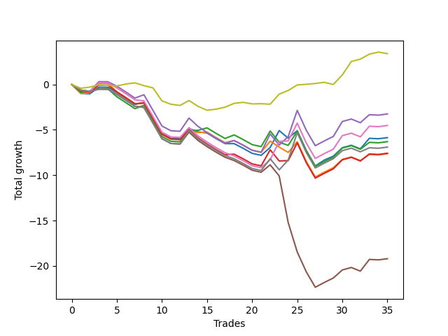

# Short Bulldog 003 
- Symbol: AAPL1y5m
- Date Range: 07/02/2021 - 07/08/2022
- Trading Period: 7:20-12:30
- Number of Trades: 35



| Name | Win Percent | Profit | Avg Profit / Trade |     | Name | Win Percent | Profit | Avg Profit / Trade |
| ---- | ----------- | ------ | ------------------ | --- | ---- | ----------- | ------ | ------------------ |
| Sorted By <br> Profit | | | | | Sorted By <br> Win Percentage ||||
| Seventy-Three | 60.00 | 1700.00 | 48.57 |     | Seventy-Three | 60.00 | 1700.00 | 48.57 |
| Four | 37.14 | -1625.00 | -46.43 |     | Two | 42.86 | -3150.00 | -90.00 |
| Six | 34.29 | -2260.00 | -64.57 |     | One | 40.00 | -3815.00 | -109.00 |
| Zero | 37.14 | -2930.00 | -83.71 |     | Four | 37.14 | -1625.00 | -46.43 |
| Two | 42.86 | -3150.00 | -90.00 |     | Zero | 37.14 | -2930.00 | -83.71 |
| Seven | 31.43 | -3450.00 | -98.57 |     | Three | 37.14 | -3790.00 | -108.29 |
| Three | 37.14 | -3790.00 | -108.29 |     | Six | 34.29 | -2260.00 | -64.57 |
| One | 40.00 | -3815.00 | -109.00 |     | Seven | 31.43 | -3450.00 | -98.57 |
| Five | 25.71 | -9600.00 | -274.29 |     | Five | 25.71 | -9600.00 | -274.29 |

## NO STOPLOSS

### Test Zero
* Sell when price hits the middle line of the 20p bollinger
* No Stoploss
* Results:
```
Total Trades: 35
Percent Up: 62.86
Percent Down: 37.14
Total Points Moved Down: -5.86
Potential Profit: -2930.00
Total Points Ups: 15.04 Count Ups: 22
Total Points Downs: 9.18 Count Downs: 13
```

<details><summary>Trades</summary>

<code>In: 2021-08-03 08:50:00		Out: 2021-08-03 11:01:35		Total Position Time: 131:35		Total Move Down: -0.97		Total to Date: -0.97</code> <br />
<code>In: 2021-09-07 09:20:00		Out: 2021-09-07 10:50:05		Total Position Time: 90:05		Total Move Down: -0.06		Total to Date: -1.03</code> <br />
<code>In: 2021-09-22 11:20:00		Out: 2021-09-22 11:48:50		Total Position Time: 28:50		Total Move Down: 0.73		Total to Date: -0.30</code> <br />
<code>In: 2021-09-24 12:30:00		Out: 2021-09-24 12:50:00		Total Position Time: 20:00		Total Move Down: -0.01		Total to Date: -0.31</code> <br />
<code>In: 2021-10-05 08:10:00		Out: 2021-10-05 10:14:30		Total Position Time: 124:30		Total Move Down: -0.58		Total to Date: -0.89</code> <br />
<code>In: 2021-11-03 11:50:00		Out: 2021-11-03 12:50:00		Total Position Time: 60:00		Total Move Down: -0.64		Total to Date: -1.53</code> <br />
<code>In: 2021-11-03 11:55:00		Out: 2021-11-03 12:50:00		Total Position Time: 55:00		Total Move Down: -0.67		Total to Date: -2.20</code> <br />
<code>In: 2021-11-17 08:20:00		Out: 2021-11-17 09:24:05		Total Position Time: 64:05		Total Move Down: 0.22		Total to Date: -1.98</code> <br />
<code>In: 2021-12-15 11:20:00		Out: 2021-12-15 12:50:00		Total Position Time: 90:00		Total Move Down: -1.72		Total to Date: -3.70</code> <br />
<code>In: 2021-12-15 11:25:00		Out: 2021-12-15 12:50:00		Total Position Time: 85:00		Total Move Down: -1.73		Total to Date: -5.43</code> <br />
<code>In: 2021-12-15 11:40:00		Out: 2021-12-15 12:50:00		Total Position Time: 70:00		Total Move Down: -0.52		Total to Date: -5.95</code> <br />
<code>In: 2021-12-21 11:35:00		Out: 2021-12-21 12:45:45		Total Position Time: 70:45		Total Move Down: 0.01		Total to Date: -5.94</code> <br />
<code>In: 2021-12-28 08:10:00		Out: 2021-12-28 08:45:15		Total Position Time: 35:15		Total Move Down: 1.09		Total to Date: -4.85</code> <br />
<code>In: 2022-01-11 08:20:00		Out: 2022-01-11 09:49:45		Total Position Time: 89:45		Total Move Down: -0.37		Total to Date: -5.22</code> <br />
<code>In: 2022-01-11 08:30:00		Out: 2022-01-11 09:49:45		Total Position Time: 79:45		Total Move Down: -0.13		Total to Date: -5.35</code> <br />
<code>In: 2022-02-16 11:25:00		Out: 2022-02-16 12:50:00		Total Position Time: 85:00		Total Move Down: -0.61		Total to Date: -5.96</code> <br />
<code>In: 2022-02-16 11:35:00		Out: 2022-02-16 12:50:00		Total Position Time: 75:00		Total Move Down: -0.56		Total to Date: -6.52</code> <br />
<code>In: 2022-02-25 08:20:00		Out: 2022-02-25 09:50:15		Total Position Time: 90:15		Total Move Down: -0.00		Total to Date: -6.52</code> <br />
<code>In: 2022-03-24 12:10:00		Out: 2022-03-24 12:50:00		Total Position Time: 40:00		Total Move Down: -0.51		Total to Date: -7.03</code> <br />
<code>In: 2022-03-24 12:15:00		Out: 2022-03-24 12:50:00		Total Position Time: 35:00		Total Move Down: -0.56		Total to Date: -7.59</code> <br />
<code>In: 2022-03-24 12:25:00		Out: 2022-03-24 12:50:00		Total Position Time: 25:00		Total Move Down: -0.22		Total to Date: -7.81</code> <br />
<code>In: 2022-03-25 07:45:00		Out: 2022-03-25 08:01:45		Total Position Time: 16:45		Total Move Down: 0.87		Total to Date: -6.94</code> <br />
<code>In: 2022-04-28 08:20:00		Out: 2022-04-28 08:39:35		Total Position Time: 19:35		Total Move Down: 1.86		Total to Date: -5.08</code> <br />
<code>In: 2022-05-04 08:55:00		Out: 2022-05-04 11:00:25		Total Position Time: 125:25		Total Move Down: -0.84		Total to Date: -5.92</code> <br />
<code>In: 2022-05-04 11:05:00		Out: 2022-05-04 11:10:10		Total Position Time: 05:10		Total Move Down: 0.83		Total to Date: -5.09</code> <br />
<code>In: 2022-05-04 11:55:00		Out: 2022-05-04 12:50:00		Total Position Time: 55:00		Total Move Down: -2.18		Total to Date: -7.27</code> <br />
<code>In: 2022-05-04 12:15:00		Out: 2022-05-04 12:50:00		Total Position Time: 35:00		Total Move Down: -1.71		Total to Date: -8.98</code> <br />
<code>In: 2022-05-17 12:05:00		Out: 2022-05-17 12:48:00		Total Position Time: 43:00		Total Move Down: 0.65		Total to Date: -8.33</code> <br />
<code>In: 2022-05-25 11:55:00		Out: 2022-05-25 12:40:10		Total Position Time: 45:10		Total Move Down: 0.43		Total to Date: -7.90</code> <br />
<code>In: 2022-05-31 09:05:00		Out: 2022-05-31 10:03:10		Total Position Time: 58:10		Total Move Down: 0.93		Total to Date: -6.97</code> <br />
<code>In: 2022-06-15 11:45:00		Out: 2022-06-15 12:50:00		Total Position Time: 65:00		Total Move Down: 0.27		Total to Date: -6.70</code> <br />
<code>In: 2022-06-15 11:50:00		Out: 2022-06-15 12:50:00		Total Position Time: 60:00		Total Move Down: -0.40		Total to Date: -7.10</code> <br />
<code>In: 2022-06-17 08:30:00		Out: 2022-06-17 08:52:10		Total Position Time: 22:10		Total Move Down: 1.17		Total to Date: -5.93</code> <br />
<code>In: 2022-07-05 11:40:00		Out: 2022-07-05 12:50:00		Total Position Time: 70:00		Total Move Down: -0.05		Total to Date: -5.98</code> <br />
<code>In: 2022-07-06 11:45:00		Out: 2022-07-06 12:48:15		Total Position Time: 63:15		Total Move Down: 0.12		Total to Date: -5.86</code> <br />


</details>

### Test One
* Sell when the price hits the upper line of the 20p 1std bollinger
* No Stoploss
* Results:
```
Total Trades: 35
Percent Up: 60.00
Percent Down: 40.00
Total Points Moved Down: -7.63
Potential Profit: -3815.00
Total Points Ups: 15.53 Count Ups: 21
Total Points Downs: 7.90 Count Downs: 14
```

<details><summary>Trades</summary>

<code>In: 2021-08-03 08:50:00		Out: 2021-08-03 11:25:05		Total Position Time: 155:05		Total Move Down: -0.99		Total to Date: -0.99</code> <br />
<code>In: 2021-09-07 09:20:00		Out: 2021-09-07 10:56:55		Total Position Time: 96:55		Total Move Down: 0.06		Total to Date: -0.93</code> <br />
<code>In: 2021-09-22 11:20:00		Out: 2021-09-22 11:50:35		Total Position Time: 30:35		Total Move Down: 1.07		Total to Date: 0.14</code> <br />
<code>In: 2021-09-24 12:30:00		Out: 2021-09-24 12:50:00		Total Position Time: 20:00		Total Move Down: -0.01		Total to Date: 0.13</code> <br />
<code>In: 2021-10-05 08:10:00		Out: 2021-10-05 12:17:25		Total Position Time: 247:25		Total Move Down: -0.94		Total to Date: -0.81</code> <br />
<code>In: 2021-11-03 11:50:00		Out: 2021-11-03 12:50:00		Total Position Time: 60:00		Total Move Down: -0.64		Total to Date: -1.45</code> <br />
<code>In: 2021-11-03 11:55:00		Out: 2021-11-03 12:50:00		Total Position Time: 55:00		Total Move Down: -0.67		Total to Date: -2.12</code> <br />
<code>In: 2021-11-17 08:20:00		Out: 2021-11-17 09:50:50		Total Position Time: 90:50		Total Move Down: 0.06		Total to Date: -2.06</code> <br />
<code>In: 2021-12-15 11:20:00		Out: 2021-12-15 12:50:00		Total Position Time: 90:00		Total Move Down: -1.72		Total to Date: -3.78</code> <br />
<code>In: 2021-12-15 11:25:00		Out: 2021-12-15 12:50:00		Total Position Time: 85:00		Total Move Down: -1.73		Total to Date: -5.51</code> <br />
<code>In: 2021-12-15 11:40:00		Out: 2021-12-15 12:50:00		Total Position Time: 70:00		Total Move Down: -0.52		Total to Date: -6.03</code> <br />
<code>In: 2021-12-21 11:35:00		Out: 2021-12-21 12:50:00		Total Position Time: 75:00		Total Move Down: -0.06		Total to Date: -6.09</code> <br />
<code>In: 2021-12-28 08:10:00		Out: 2021-12-28 09:29:20		Total Position Time: 79:20		Total Move Down: 1.00		Total to Date: -5.09</code> <br />
<code>In: 2022-01-11 08:20:00		Out: 2022-01-11 10:01:40		Total Position Time: 101:40		Total Move Down: -0.20		Total to Date: -5.29</code> <br />
<code>In: 2022-01-11 08:30:00		Out: 2022-01-11 10:01:40		Total Position Time: 91:40		Total Move Down: 0.04		Total to Date: -5.25</code> <br />
<code>In: 2022-02-16 11:25:00		Out: 2022-02-16 12:50:00		Total Position Time: 85:00		Total Move Down: -0.61		Total to Date: -5.86</code> <br />
<code>In: 2022-02-16 11:35:00		Out: 2022-02-16 12:50:00		Total Position Time: 75:00		Total Move Down: -0.56		Total to Date: -6.42</code> <br />
<code>In: 2022-02-25 08:20:00		Out: 2022-02-25 09:54:50		Total Position Time: 94:50		Total Move Down: 0.24		Total to Date: -6.18</code> <br />
<code>In: 2022-03-24 12:10:00		Out: 2022-03-24 12:50:00		Total Position Time: 40:00		Total Move Down: -0.51		Total to Date: -6.69</code> <br />
<code>In: 2022-03-24 12:15:00		Out: 2022-03-24 12:50:00		Total Position Time: 35:00		Total Move Down: -0.56		Total to Date: -7.25</code> <br />
<code>In: 2022-03-24 12:25:00		Out: 2022-03-24 12:50:00		Total Position Time: 25:00		Total Move Down: -0.22		Total to Date: -7.47</code> <br />
<code>In: 2022-03-25 07:45:00		Out: 2022-03-25 08:09:30		Total Position Time: 24:30		Total Move Down: 1.23		Total to Date: -6.24</code> <br />
<code>In: 2022-04-28 08:20:00		Out: 2022-04-28 11:31:25		Total Position Time: 191:25		Total Move Down: -0.66		Total to Date: -6.90</code> <br />
<code>In: 2022-05-04 08:55:00		Out: 2022-05-04 11:08:05		Total Position Time: 133:05		Total Move Down: -0.59		Total to Date: -7.49</code> <br />
<code>In: 2022-05-04 11:05:00		Out: 2022-05-04 11:18:40		Total Position Time: 13:40		Total Move Down: 1.19		Total to Date: -6.30</code> <br />
<code>In: 2022-05-04 11:55:00		Out: 2022-05-04 12:50:00		Total Position Time: 55:00		Total Move Down: -2.18		Total to Date: -8.48</code> <br />
<code>In: 2022-05-04 12:15:00		Out: 2022-05-04 12:50:00		Total Position Time: 35:00		Total Move Down: -1.71		Total to Date: -10.19</code> <br />
<code>In: 2022-05-17 12:05:00		Out: 2022-05-17 12:50:00		Total Position Time: 45:00		Total Move Down: 0.53		Total to Date: -9.66</code> <br />
<code>In: 2022-05-25 11:55:00		Out: 2022-05-25 12:50:00		Total Position Time: 55:00		Total Move Down: 0.49		Total to Date: -9.17</code> <br />
<code>In: 2022-05-31 09:05:00		Out: 2022-05-31 10:28:40		Total Position Time: 83:40		Total Move Down: 0.91		Total to Date: -8.26</code> <br />
<code>In: 2022-06-15 11:45:00		Out: 2022-06-15 12:50:00		Total Position Time: 65:00		Total Move Down: 0.27		Total to Date: -7.99</code> <br />
<code>In: 2022-06-15 11:50:00		Out: 2022-06-15 12:50:00		Total Position Time: 60:00		Total Move Down: -0.40		Total to Date: -8.39</code> <br />
<code>In: 2022-06-17 08:30:00		Out: 2022-06-17 10:46:35		Total Position Time: 136:35		Total Move Down: 0.68		Total to Date: -7.71</code> <br />
<code>In: 2022-07-05 11:40:00		Out: 2022-07-05 12:50:00		Total Position Time: 70:00		Total Move Down: -0.05		Total to Date: -7.76</code> <br />
<code>In: 2022-07-06 11:45:00		Out: 2022-07-06 12:50:00		Total Position Time: 65:00		Total Move Down: 0.13		Total to Date: -7.63</code> <br />


</details>

### Test Two
* Sell when the price hits the upper line of the 20p 2std bollinger
* No Stoploss
* Results:
```
Total Trades: 35
Percent Up: 57.14
Percent Down: 42.86
Total Points Moved Down: -6.30
Potential Profit: -3150.00
Total Points Ups: 15.50 Count Ups: 20
Total Points Downs: 9.20 Count Downs: 15
```

<details><summary>Trades</summary>

<code>In: 2021-08-03 08:50:00		Out: 2021-08-03 11:30:15		Total Position Time: 160:15		Total Move Down: -0.88		Total to Date: -0.88</code> <br />
<code>In: 2021-09-07 09:20:00		Out: 2021-09-07 11:04:45		Total Position Time: 104:45		Total Move Down: 0.18		Total to Date: -0.70</code> <br />
<code>In: 2021-09-22 11:20:00		Out: 2021-09-22 12:50:00		Total Position Time: 90:00		Total Move Down: 0.24		Total to Date: -0.46</code> <br />
<code>In: 2021-09-24 12:30:00		Out: 2021-09-24 12:50:00		Total Position Time: 20:00		Total Move Down: -0.01		Total to Date: -0.47</code> <br />
<code>In: 2021-10-05 08:10:00		Out: 2021-10-05 12:19:25		Total Position Time: 249:25		Total Move Down: -0.89		Total to Date: -1.36</code> <br />
<code>In: 2021-11-03 11:50:00		Out: 2021-11-03 12:50:00		Total Position Time: 60:00		Total Move Down: -0.64		Total to Date: -2.00</code> <br />
<code>In: 2021-11-03 11:55:00		Out: 2021-11-03 12:50:00		Total Position Time: 55:00		Total Move Down: -0.67		Total to Date: -2.67</code> <br />
<code>In: 2021-11-17 08:20:00		Out: 2021-11-17 10:11:30		Total Position Time: 111:30		Total Move Down: 0.38		Total to Date: -2.29</code> <br />
<code>In: 2021-12-15 11:20:00		Out: 2021-12-15 12:50:00		Total Position Time: 90:00		Total Move Down: -1.72		Total to Date: -4.01</code> <br />
<code>In: 2021-12-15 11:25:00		Out: 2021-12-15 12:50:00		Total Position Time: 85:00		Total Move Down: -1.73		Total to Date: -5.74</code> <br />
<code>In: 2021-12-15 11:40:00		Out: 2021-12-15 12:50:00		Total Position Time: 70:00		Total Move Down: -0.52		Total to Date: -6.26</code> <br />
<code>In: 2021-12-21 11:35:00		Out: 2021-12-21 12:50:00		Total Position Time: 75:00		Total Move Down: -0.06		Total to Date: -6.32</code> <br />
<code>In: 2021-12-28 08:10:00		Out: 2021-12-28 09:31:40		Total Position Time: 81:40		Total Move Down: 1.24		Total to Date: -5.08</code> <br />
<code>In: 2022-01-11 08:20:00		Out: 2022-01-11 10:05:55		Total Position Time: 105:55		Total Move Down: 0.03		Total to Date: -5.05</code> <br />
<code>In: 2022-01-11 08:30:00		Out: 2022-01-11 10:05:55		Total Position Time: 95:55		Total Move Down: 0.27		Total to Date: -4.78</code> <br />
<code>In: 2022-02-16 11:25:00		Out: 2022-02-16 12:50:00		Total Position Time: 85:00		Total Move Down: -0.61		Total to Date: -5.39</code> <br />
<code>In: 2022-02-16 11:35:00		Out: 2022-02-16 12:50:00		Total Position Time: 75:00		Total Move Down: -0.56		Total to Date: -5.95</code> <br />
<code>In: 2022-02-25 08:20:00		Out: 2022-02-25 09:55:20		Total Position Time: 95:20		Total Move Down: 0.39		Total to Date: -5.56</code> <br />
<code>In: 2022-03-24 12:10:00		Out: 2022-03-24 12:50:00		Total Position Time: 40:00		Total Move Down: -0.51		Total to Date: -6.07</code> <br />
<code>In: 2022-03-24 12:15:00		Out: 2022-03-24 12:50:00		Total Position Time: 35:00		Total Move Down: -0.56		Total to Date: -6.63</code> <br />
<code>In: 2022-03-24 12:25:00		Out: 2022-03-24 12:50:00		Total Position Time: 25:00		Total Move Down: -0.22		Total to Date: -6.85</code> <br />
<code>In: 2022-03-25 07:45:00		Out: 2022-03-25 08:20:45		Total Position Time: 35:45		Total Move Down: 1.72		Total to Date: -5.13</code> <br />
<code>In: 2022-04-28 08:20:00		Out: 2022-04-28 12:50:00		Total Position Time: 270:00		Total Move Down: -1.23		Total to Date: -6.36</code> <br />
<code>In: 2022-05-04 08:55:00		Out: 2022-05-04 11:20:50		Total Position Time: 145:50		Total Move Down: -0.35		Total to Date: -6.71</code> <br />
<code>In: 2022-05-04 11:05:00		Out: 2022-05-04 11:20:50		Total Position Time: 15:50		Total Move Down: 1.57		Total to Date: -5.14</code> <br />
<code>In: 2022-05-04 11:55:00		Out: 2022-05-04 12:50:00		Total Position Time: 55:00		Total Move Down: -2.18		Total to Date: -7.32</code> <br />
<code>In: 2022-05-04 12:15:00		Out: 2022-05-04 12:50:00		Total Position Time: 35:00		Total Move Down: -1.71		Total to Date: -9.03</code> <br />
<code>In: 2022-05-17 12:05:00		Out: 2022-05-17 12:50:00		Total Position Time: 45:00		Total Move Down: 0.53		Total to Date: -8.50</code> <br />
<code>In: 2022-05-25 11:55:00		Out: 2022-05-25 12:50:00		Total Position Time: 55:00		Total Move Down: 0.49		Total to Date: -8.01</code> <br />
<code>In: 2022-05-31 09:05:00		Out: 2022-05-31 11:45:20		Total Position Time: 160:20		Total Move Down: 1.00		Total to Date: -7.01</code> <br />
<code>In: 2022-06-15 11:45:00		Out: 2022-06-15 12:50:00		Total Position Time: 65:00		Total Move Down: 0.27		Total to Date: -6.74</code> <br />
<code>In: 2022-06-15 11:50:00		Out: 2022-06-15 12:50:00		Total Position Time: 60:00		Total Move Down: -0.40		Total to Date: -7.14</code> <br />
<code>In: 2022-06-17 08:30:00		Out: 2022-06-17 12:05:45		Total Position Time: 215:45		Total Move Down: 0.76		Total to Date: -6.38</code> <br />
<code>In: 2022-07-05 11:40:00		Out: 2022-07-05 12:50:00		Total Position Time: 70:00		Total Move Down: -0.05		Total to Date: -6.43</code> <br />
<code>In: 2022-07-06 11:45:00		Out: 2022-07-06 12:50:00		Total Position Time: 65:00		Total Move Down: 0.13		Total to Date: -6.30</code> <br />


</details>

### Test Three
* Sell when price hits the middle line of the 50p bollinger
* No Stoploss
* Results:
```
Total Trades: 35
Percent Up: 62.86
Percent Down: 37.14
Total Points Moved Down: -7.58
Potential Profit: -3790.00
Total Points Ups: 16.57 Count Ups: 22
Total Points Downs: 8.99 Count Downs: 13
```

<details><summary>Trades</summary>

<code>In: 2021-08-03 08:50:00		Out: 2021-08-03 12:38:55		Total Position Time: 228:55		Total Move Down: -0.72		Total to Date: -0.72</code> <br />
<code>In: 2021-09-07 09:20:00		Out: 2021-09-07 12:50:00		Total Position Time: 210:00		Total Move Down: -0.13		Total to Date: -0.85</code> <br />
<code>In: 2021-09-22 11:20:00		Out: 2021-09-22 11:48:55		Total Position Time: 28:55		Total Move Down: 0.78		Total to Date: -0.07</code> <br />
<code>In: 2021-09-24 12:30:00		Out: 2021-09-24 12:50:00		Total Position Time: 20:00		Total Move Down: -0.01		Total to Date: -0.08</code> <br />
<code>In: 2021-10-05 08:10:00		Out: 2021-10-05 12:22:30		Total Position Time: 252:30		Total Move Down: -0.74		Total to Date: -0.82</code> <br />
<code>In: 2021-11-03 11:50:00		Out: 2021-11-03 12:50:00		Total Position Time: 60:00		Total Move Down: -0.64		Total to Date: -1.46</code> <br />
<code>In: 2021-11-03 11:55:00		Out: 2021-11-03 12:50:00		Total Position Time: 55:00		Total Move Down: -0.67		Total to Date: -2.13</code> <br />
<code>In: 2021-11-17 08:20:00		Out: 2021-11-17 11:38:25		Total Position Time: 198:25		Total Move Down: 0.10		Total to Date: -2.03</code> <br />
<code>In: 2021-12-15 11:20:00		Out: 2021-12-15 12:50:00		Total Position Time: 90:00		Total Move Down: -1.72		Total to Date: -3.75</code> <br />
<code>In: 2021-12-15 11:25:00		Out: 2021-12-15 12:50:00		Total Position Time: 85:00		Total Move Down: -1.73		Total to Date: -5.48</code> <br />
<code>In: 2021-12-15 11:40:00		Out: 2021-12-15 12:50:00		Total Position Time: 70:00		Total Move Down: -0.52		Total to Date: -6.00</code> <br />
<code>In: 2021-12-21 11:35:00		Out: 2021-12-21 12:50:00		Total Position Time: 75:00		Total Move Down: -0.06		Total to Date: -6.06</code> <br />
<code>In: 2021-12-28 08:10:00		Out: 2021-12-28 08:45:15		Total Position Time: 35:15		Total Move Down: 1.09		Total to Date: -4.97</code> <br />
<code>In: 2022-01-11 08:20:00		Out: 2022-01-11 12:50:00		Total Position Time: 270:00		Total Move Down: -0.92		Total to Date: -5.89</code> <br />
<code>In: 2022-01-11 08:30:00		Out: 2022-01-11 12:50:00		Total Position Time: 260:00		Total Move Down: -0.68		Total to Date: -6.57</code> <br />
<code>In: 2022-02-16 11:25:00		Out: 2022-02-16 12:50:00		Total Position Time: 85:00		Total Move Down: -0.61		Total to Date: -7.18</code> <br />
<code>In: 2022-02-16 11:35:00		Out: 2022-02-16 12:50:00		Total Position Time: 75:00		Total Move Down: -0.56		Total to Date: -7.74</code> <br />
<code>In: 2022-02-25 08:20:00		Out: 2022-02-25 11:51:50		Total Position Time: 211:50		Total Move Down: 0.06		Total to Date: -7.68</code> <br />
<code>In: 2022-03-24 12:10:00		Out: 2022-03-24 12:50:00		Total Position Time: 40:00		Total Move Down: -0.51		Total to Date: -8.19</code> <br />
<code>In: 2022-03-24 12:15:00		Out: 2022-03-24 12:50:00		Total Position Time: 35:00		Total Move Down: -0.56		Total to Date: -8.75</code> <br />
<code>In: 2022-03-24 12:25:00		Out: 2022-03-24 12:50:00		Total Position Time: 25:00		Total Move Down: -0.22		Total to Date: -8.97</code> <br />
<code>In: 2022-03-25 07:45:00		Out: 2022-03-25 08:21:50		Total Position Time: 36:50		Total Move Down: 1.77		Total to Date: -7.20</code> <br />
<code>In: 2022-04-28 08:20:00		Out: 2022-04-28 12:50:00		Total Position Time: 270:00		Total Move Down: -1.23		Total to Date: -8.43</code> <br />
<code>In: 2022-05-04 08:55:00		Out: 2022-05-04 11:30:50		Total Position Time: 155:50		Total Move Down: 0.04		Total to Date: -8.39</code> <br />
<code>In: 2022-05-04 11:05:00		Out: 2022-05-04 11:30:50		Total Position Time: 25:50		Total Move Down: 1.96		Total to Date: -6.43</code> <br />
<code>In: 2022-05-04 11:55:00		Out: 2022-05-04 12:50:00		Total Position Time: 55:00		Total Move Down: -2.18		Total to Date: -8.61</code> <br />
<code>In: 2022-05-04 12:15:00		Out: 2022-05-04 12:50:00		Total Position Time: 35:00		Total Move Down: -1.71		Total to Date: -10.32</code> <br />
<code>In: 2022-05-17 12:05:00		Out: 2022-05-17 12:50:00		Total Position Time: 45:00		Total Move Down: 0.53		Total to Date: -9.79</code> <br />
<code>In: 2022-05-25 11:55:00		Out: 2022-05-25 12:50:00		Total Position Time: 55:00		Total Move Down: 0.49		Total to Date: -9.30</code> <br />
<code>In: 2022-05-31 09:05:00		Out: 2022-05-31 11:45:20		Total Position Time: 160:20		Total Move Down: 1.00		Total to Date: -8.30</code> <br />
<code>In: 2022-06-15 11:45:00		Out: 2022-06-15 12:50:00		Total Position Time: 65:00		Total Move Down: 0.27		Total to Date: -8.03</code> <br />
<code>In: 2022-06-15 11:50:00		Out: 2022-06-15 12:50:00		Total Position Time: 60:00		Total Move Down: -0.40		Total to Date: -8.43</code> <br />
<code>In: 2022-06-17 08:30:00		Out: 2022-06-17 10:47:00		Total Position Time: 137:00		Total Move Down: 0.77		Total to Date: -7.66</code> <br />
<code>In: 2022-07-05 11:40:00		Out: 2022-07-05 12:50:00		Total Position Time: 70:00		Total Move Down: -0.05		Total to Date: -7.71</code> <br />
<code>In: 2022-07-06 11:45:00		Out: 2022-07-06 12:50:00		Total Position Time: 65:00		Total Move Down: 0.13		Total to Date: -7.58</code> <br />


</details>

### Test Four
* Sell when the price hits the upper line of the 50p 1std bollinger
* No Stoploss
* Results:
```
Total Trades: 35
Percent Up: 62.86
Percent Down: 37.14
Total Points Moved Down: -3.25
Potential Profit: -1625.00
Total Points Ups: 16.23 Count Ups: 22
Total Points Downs: 12.98 Count Downs: 13
```

<details><summary>Trades</summary>

<code>In: 2021-08-03 08:50:00		Out: 2021-08-03 12:50:00		Total Position Time: 240:00		Total Move Down: -0.63		Total to Date: -0.63</code> <br />
<code>In: 2021-09-07 09:20:00		Out: 2021-09-07 12:50:00		Total Position Time: 210:00		Total Move Down: -0.13		Total to Date: -0.76</code> <br />
<code>In: 2021-09-22 11:20:00		Out: 2021-09-22 11:50:35		Total Position Time: 30:35		Total Move Down: 1.07		Total to Date: 0.31</code> <br />
<code>In: 2021-09-24 12:30:00		Out: 2021-09-24 12:50:00		Total Position Time: 20:00		Total Move Down: -0.01		Total to Date: 0.30</code> <br />
<code>In: 2021-10-05 08:10:00		Out: 2021-10-05 12:39:50		Total Position Time: 269:50		Total Move Down: -0.49		Total to Date: -0.19</code> <br />
<code>In: 2021-11-03 11:50:00		Out: 2021-11-03 12:50:00		Total Position Time: 60:00		Total Move Down: -0.64		Total to Date: -0.83</code> <br />
<code>In: 2021-11-03 11:55:00		Out: 2021-11-03 12:50:00		Total Position Time: 55:00		Total Move Down: -0.67		Total to Date: -1.50</code> <br />
<code>In: 2021-11-17 08:20:00		Out: 2021-11-17 12:05:50		Total Position Time: 225:50		Total Move Down: 0.37		Total to Date: -1.13</code> <br />
<code>In: 2021-12-15 11:20:00		Out: 2021-12-15 12:50:00		Total Position Time: 90:00		Total Move Down: -1.72		Total to Date: -2.85</code> <br />
<code>In: 2021-12-15 11:25:00		Out: 2021-12-15 12:50:00		Total Position Time: 85:00		Total Move Down: -1.73		Total to Date: -4.58</code> <br />
<code>In: 2021-12-15 11:40:00		Out: 2021-12-15 12:50:00		Total Position Time: 70:00		Total Move Down: -0.52		Total to Date: -5.10</code> <br />
<code>In: 2021-12-21 11:35:00		Out: 2021-12-21 12:50:00		Total Position Time: 75:00		Total Move Down: -0.06		Total to Date: -5.16</code> <br />
<code>In: 2021-12-28 08:10:00		Out: 2021-12-28 09:32:15		Total Position Time: 82:15		Total Move Down: 1.46		Total to Date: -3.70</code> <br />
<code>In: 2022-01-11 08:20:00		Out: 2022-01-11 12:50:00		Total Position Time: 270:00		Total Move Down: -0.92		Total to Date: -4.62</code> <br />
<code>In: 2022-01-11 08:30:00		Out: 2022-01-11 12:50:00		Total Position Time: 260:00		Total Move Down: -0.68		Total to Date: -5.30</code> <br />
<code>In: 2022-02-16 11:25:00		Out: 2022-02-16 12:50:00		Total Position Time: 85:00		Total Move Down: -0.61		Total to Date: -5.91</code> <br />
<code>In: 2022-02-16 11:35:00		Out: 2022-02-16 12:50:00		Total Position Time: 75:00		Total Move Down: -0.56		Total to Date: -6.47</code> <br />
<code>In: 2022-02-25 08:20:00		Out: 2022-02-25 12:11:25		Total Position Time: 231:25		Total Move Down: 0.29		Total to Date: -6.18</code> <br />
<code>In: 2022-03-24 12:10:00		Out: 2022-03-24 12:50:00		Total Position Time: 40:00		Total Move Down: -0.51		Total to Date: -6.69</code> <br />
<code>In: 2022-03-24 12:15:00		Out: 2022-03-24 12:50:00		Total Position Time: 35:00		Total Move Down: -0.56		Total to Date: -7.25</code> <br />
<code>In: 2022-03-24 12:25:00		Out: 2022-03-24 12:50:00		Total Position Time: 25:00		Total Move Down: -0.22		Total to Date: -7.47</code> <br />
<code>In: 2022-03-25 07:45:00		Out: 2022-03-25 09:37:35		Total Position Time: 112:35		Total Move Down: 2.02		Total to Date: -5.45</code> <br />
<code>In: 2022-04-28 08:20:00		Out: 2022-04-28 12:50:00		Total Position Time: 270:00		Total Move Down: -1.23		Total to Date: -6.68</code> <br />
<code>In: 2022-05-04 08:55:00		Out: 2022-05-04 11:34:25		Total Position Time: 159:25		Total Move Down: 0.95		Total to Date: -5.73</code> <br />
<code>In: 2022-05-04 11:05:00		Out: 2022-05-04 11:34:25		Total Position Time: 29:25		Total Move Down: 2.87		Total to Date: -2.86</code> <br />
<code>In: 2022-05-04 11:55:00		Out: 2022-05-04 12:50:00		Total Position Time: 55:00		Total Move Down: -2.18		Total to Date: -5.04</code> <br />
<code>In: 2022-05-04 12:15:00		Out: 2022-05-04 12:50:00		Total Position Time: 35:00		Total Move Down: -1.71		Total to Date: -6.75</code> <br />
<code>In: 2022-05-17 12:05:00		Out: 2022-05-17 12:50:00		Total Position Time: 45:00		Total Move Down: 0.53		Total to Date: -6.22</code> <br />
<code>In: 2022-05-25 11:55:00		Out: 2022-05-25 12:50:00		Total Position Time: 55:00		Total Move Down: 0.49		Total to Date: -5.73</code> <br />
<code>In: 2022-05-31 09:05:00		Out: 2022-05-31 11:55:40		Total Position Time: 170:40		Total Move Down: 1.65		Total to Date: -4.08</code> <br />
<code>In: 2022-06-15 11:45:00		Out: 2022-06-15 12:50:00		Total Position Time: 65:00		Total Move Down: 0.27		Total to Date: -3.81</code> <br />
<code>In: 2022-06-15 11:50:00		Out: 2022-06-15 12:50:00		Total Position Time: 60:00		Total Move Down: -0.40		Total to Date: -4.21</code> <br />
<code>In: 2022-06-17 08:30:00		Out: 2022-06-17 12:10:30		Total Position Time: 220:30		Total Move Down: 0.88		Total to Date: -3.33</code> <br />
<code>In: 2022-07-05 11:40:00		Out: 2022-07-05 12:50:00		Total Position Time: 70:00		Total Move Down: -0.05		Total to Date: -3.38</code> <br />
<code>In: 2022-07-06 11:45:00		Out: 2022-07-06 12:50:00		Total Position Time: 65:00		Total Move Down: 0.13		Total to Date: -3.25</code> <br />


</details>

### Test Five
* Sell when the price hits the upper line of the 50p 2std bollinger
* No Stoploss
* Results:
```
Total Trades: 35
Percent Up: 74.29
Percent Down: 25.71
Total Points Moved Down: -19.20
Potential Profit: -9600.00
Total Points Ups: 25.17 Count Ups: 26
Total Points Downs: 5.97 Count Downs: 9
```

<details><summary>Trades</summary>

<code>In: 2021-08-03 08:50:00		Out: 2021-08-03 12:50:00		Total Position Time: 240:00		Total Move Down: -0.63		Total to Date: -0.63</code> <br />
<code>In: 2021-09-07 09:20:00		Out: 2021-09-07 12:50:00		Total Position Time: 210:00		Total Move Down: -0.13		Total to Date: -0.76</code> <br />
<code>In: 2021-09-22 11:20:00		Out: 2021-09-22 12:50:00		Total Position Time: 90:00		Total Move Down: 0.24		Total to Date: -0.52</code> <br />
<code>In: 2021-09-24 12:30:00		Out: 2021-09-24 12:50:00		Total Position Time: 20:00		Total Move Down: -0.01		Total to Date: -0.53</code> <br />
<code>In: 2021-10-05 08:10:00		Out: 2021-10-05 12:50:00		Total Position Time: 280:00		Total Move Down: -0.57		Total to Date: -1.10</code> <br />
<code>In: 2021-11-03 11:50:00		Out: 2021-11-03 12:50:00		Total Position Time: 60:00		Total Move Down: -0.64		Total to Date: -1.74</code> <br />
<code>In: 2021-11-03 11:55:00		Out: 2021-11-03 12:50:00		Total Position Time: 55:00		Total Move Down: -0.67		Total to Date: -2.41</code> <br />
<code>In: 2021-11-17 08:20:00		Out: 2021-11-17 12:50:00		Total Position Time: 270:00		Total Move Down: -0.12		Total to Date: -2.53</code> <br />
<code>In: 2021-12-15 11:20:00		Out: 2021-12-15 12:50:00		Total Position Time: 90:00		Total Move Down: -1.72		Total to Date: -4.25</code> <br />
<code>In: 2021-12-15 11:25:00		Out: 2021-12-15 12:50:00		Total Position Time: 85:00		Total Move Down: -1.73		Total to Date: -5.98</code> <br />
<code>In: 2021-12-15 11:40:00		Out: 2021-12-15 12:50:00		Total Position Time: 70:00		Total Move Down: -0.52		Total to Date: -6.50</code> <br />
<code>In: 2021-12-21 11:35:00		Out: 2021-12-21 12:50:00		Total Position Time: 75:00		Total Move Down: -0.06		Total to Date: -6.56</code> <br />
<code>In: 2021-12-28 08:10:00		Out: 2021-12-28 12:50:00		Total Position Time: 280:00		Total Move Down: 1.31		Total to Date: -5.25</code> <br />
<code>In: 2022-01-11 08:20:00		Out: 2022-01-11 12:50:00		Total Position Time: 270:00		Total Move Down: -0.92		Total to Date: -6.17</code> <br />
<code>In: 2022-01-11 08:30:00		Out: 2022-01-11 12:50:00		Total Position Time: 260:00		Total Move Down: -0.68		Total to Date: -6.85</code> <br />
<code>In: 2022-02-16 11:25:00		Out: 2022-02-16 12:50:00		Total Position Time: 85:00		Total Move Down: -0.61		Total to Date: -7.46</code> <br />
<code>In: 2022-02-16 11:35:00		Out: 2022-02-16 12:50:00		Total Position Time: 75:00		Total Move Down: -0.56		Total to Date: -8.02</code> <br />
<code>In: 2022-02-25 08:20:00		Out: 2022-02-25 12:50:00		Total Position Time: 270:00		Total Move Down: -0.36		Total to Date: -8.38</code> <br />
<code>In: 2022-03-24 12:10:00		Out: 2022-03-24 12:50:00		Total Position Time: 40:00		Total Move Down: -0.51		Total to Date: -8.89</code> <br />
<code>In: 2022-03-24 12:15:00		Out: 2022-03-24 12:50:00		Total Position Time: 35:00		Total Move Down: -0.56		Total to Date: -9.45</code> <br />
<code>In: 2022-03-24 12:25:00		Out: 2022-03-24 12:50:00		Total Position Time: 25:00		Total Move Down: -0.22		Total to Date: -9.67</code> <br />
<code>In: 2022-03-25 07:45:00		Out: 2022-03-25 12:50:00		Total Position Time: 305:00		Total Move Down: 0.82		Total to Date: -8.85</code> <br />
<code>In: 2022-04-28 08:20:00		Out: 2022-04-28 12:50:00		Total Position Time: 270:00		Total Move Down: -1.23		Total to Date: -10.08</code> <br />
<code>In: 2022-05-04 08:55:00		Out: 2022-05-04 12:50:00		Total Position Time: 235:00		Total Move Down: -5.15		Total to Date: -15.23</code> <br />
<code>In: 2022-05-04 11:05:00		Out: 2022-05-04 12:50:00		Total Position Time: 105:00		Total Move Down: -3.23		Total to Date: -18.46</code> <br />
<code>In: 2022-05-04 11:55:00		Out: 2022-05-04 12:50:00		Total Position Time: 55:00		Total Move Down: -2.18		Total to Date: -20.64</code> <br />
<code>In: 2022-05-04 12:15:00		Out: 2022-05-04 12:50:00		Total Position Time: 35:00		Total Move Down: -1.71		Total to Date: -22.35</code> <br />
<code>In: 2022-05-17 12:05:00		Out: 2022-05-17 12:50:00		Total Position Time: 45:00		Total Move Down: 0.53		Total to Date: -21.82</code> <br />
<code>In: 2022-05-25 11:55:00		Out: 2022-05-25 12:50:00		Total Position Time: 55:00		Total Move Down: 0.49		Total to Date: -21.33</code> <br />
<code>In: 2022-05-31 09:05:00		Out: 2022-05-31 12:50:00		Total Position Time: 225:00		Total Move Down: 0.89		Total to Date: -20.44</code> <br />
<code>In: 2022-06-15 11:45:00		Out: 2022-06-15 12:50:00		Total Position Time: 65:00		Total Move Down: 0.27		Total to Date: -20.17</code> <br />
<code>In: 2022-06-15 11:50:00		Out: 2022-06-15 12:50:00		Total Position Time: 60:00		Total Move Down: -0.40		Total to Date: -20.57</code> <br />
<code>In: 2022-06-17 08:30:00		Out: 2022-06-17 12:12:35		Total Position Time: 222:35		Total Move Down: 1.29		Total to Date: -19.28</code> <br />
<code>In: 2022-07-05 11:40:00		Out: 2022-07-05 12:50:00		Total Position Time: 70:00		Total Move Down: -0.05		Total to Date: -19.33</code> <br />
<code>In: 2022-07-06 11:45:00		Out: 2022-07-06 12:50:00		Total Position Time: 65:00		Total Move Down: 0.13		Total to Date: -19.20</code> <br />


</details>

### Test Six
* Sell when the price hits the middle line of the 1std VWAP
* No Stoploss
* Results:
```
Total Trades: 35
Percent Up: 65.71
Percent Down: 34.29
Total Points Moved Down: -4.52
Potential Profit: -2260.00
Total Points Ups: 15.56 Count Ups: 23
Total Points Downs: 11.04 Count Downs: 12
```

<details><summary>Trades</summary>

<code>In: 2021-08-03 08:50:00		Out: 2021-08-03 12:50:00		Total Position Time: 240:00		Total Move Down: -0.63		Total to Date: -0.63</code> <br />
<code>In: 2021-09-07 09:20:00		Out: 2021-09-07 12:50:00		Total Position Time: 210:00		Total Move Down: -0.13		Total to Date: -0.76</code> <br />
<code>In: 2021-09-22 11:20:00		Out: 2021-09-22 11:50:25		Total Position Time: 30:25		Total Move Down: 0.96		Total to Date: 0.20</code> <br />
<code>In: 2021-09-24 12:30:00		Out: 2021-09-24 12:50:00		Total Position Time: 20:00		Total Move Down: -0.01		Total to Date: 0.19</code> <br />
<code>In: 2021-10-05 08:10:00		Out: 2021-10-05 12:50:00		Total Position Time: 280:00		Total Move Down: -0.57		Total to Date: -0.38</code> <br />
<code>In: 2021-11-03 11:50:00		Out: 2021-11-03 12:50:00		Total Position Time: 60:00		Total Move Down: -0.64		Total to Date: -1.02</code> <br />
<code>In: 2021-11-03 11:55:00		Out: 2021-11-03 12:50:00		Total Position Time: 55:00		Total Move Down: -0.67		Total to Date: -1.69</code> <br />
<code>In: 2021-11-17 08:20:00		Out: 2021-11-17 12:50:00		Total Position Time: 270:00		Total Move Down: -0.12		Total to Date: -1.81</code> <br />
<code>In: 2021-12-15 11:20:00		Out: 2021-12-15 12:50:00		Total Position Time: 90:00		Total Move Down: -1.72		Total to Date: -3.53</code> <br />
<code>In: 2021-12-15 11:25:00		Out: 2021-12-15 12:50:00		Total Position Time: 85:00		Total Move Down: -1.73		Total to Date: -5.26</code> <br />
<code>In: 2021-12-15 11:40:00		Out: 2021-12-15 12:50:00		Total Position Time: 70:00		Total Move Down: -0.52		Total to Date: -5.78</code> <br />
<code>In: 2021-12-21 11:35:00		Out: 2021-12-21 12:50:00		Total Position Time: 75:00		Total Move Down: -0.06		Total to Date: -5.84</code> <br />
<code>In: 2021-12-28 08:10:00		Out: 2021-12-28 08:45:15		Total Position Time: 35:15		Total Move Down: 1.09		Total to Date: -4.75</code> <br />
<code>In: 2022-01-11 08:20:00		Out: 2022-01-11 12:50:00		Total Position Time: 270:00		Total Move Down: -0.92		Total to Date: -5.67</code> <br />
<code>In: 2022-01-11 08:30:00		Out: 2022-01-11 12:50:00		Total Position Time: 260:00		Total Move Down: -0.68		Total to Date: -6.35</code> <br />
<code>In: 2022-02-16 11:25:00		Out: 2022-02-16 12:50:00		Total Position Time: 85:00		Total Move Down: -0.61		Total to Date: -6.96</code> <br />
<code>In: 2022-02-16 11:35:00		Out: 2022-02-16 12:50:00		Total Position Time: 75:00		Total Move Down: -0.56		Total to Date: -7.52</code> <br />
<code>In: 2022-02-25 08:20:00		Out: 2022-02-25 12:50:00		Total Position Time: 270:00		Total Move Down: -0.36		Total to Date: -7.88</code> <br />
<code>In: 2022-03-24 12:10:00		Out: 2022-03-24 12:50:00		Total Position Time: 40:00		Total Move Down: -0.51		Total to Date: -8.39</code> <br />
<code>In: 2022-03-24 12:15:00		Out: 2022-03-24 12:50:00		Total Position Time: 35:00		Total Move Down: -0.56		Total to Date: -8.95</code> <br />
<code>In: 2022-03-24 12:25:00		Out: 2022-03-24 12:50:00		Total Position Time: 25:00		Total Move Down: -0.22		Total to Date: -9.17</code> <br />
<code>In: 2022-03-25 07:45:00		Out: 2022-03-25 08:01:45		Total Position Time: 16:45		Total Move Down: 0.87		Total to Date: -8.30</code> <br />
<code>In: 2022-04-28 08:20:00		Out: 2022-04-28 08:50:40		Total Position Time: 30:40		Total Move Down: 2.04		Total to Date: -6.26</code> <br />
<code>In: 2022-05-04 08:55:00		Out: 2022-05-04 11:30:50		Total Position Time: 155:50		Total Move Down: 0.04		Total to Date: -6.22</code> <br />
<code>In: 2022-05-04 11:05:00		Out: 2022-05-04 11:30:50		Total Position Time: 25:50		Total Move Down: 1.96		Total to Date: -4.26</code> <br />
<code>In: 2022-05-04 11:55:00		Out: 2022-05-04 12:50:00		Total Position Time: 55:00		Total Move Down: -2.18		Total to Date: -6.44</code> <br />
<code>In: 2022-05-04 12:15:00		Out: 2022-05-04 12:50:00		Total Position Time: 35:00		Total Move Down: -1.71		Total to Date: -8.15</code> <br />
<code>In: 2022-05-17 12:05:00		Out: 2022-05-17 12:50:00		Total Position Time: 45:00		Total Move Down: 0.53		Total to Date: -7.62</code> <br />
<code>In: 2022-05-25 11:55:00		Out: 2022-05-25 12:50:00		Total Position Time: 55:00		Total Move Down: 0.49		Total to Date: -7.13</code> <br />
<code>In: 2022-05-31 09:05:00		Out: 2022-05-31 11:54:45		Total Position Time: 169:45		Total Move Down: 1.49		Total to Date: -5.64</code> <br />
<code>In: 2022-06-15 11:45:00		Out: 2022-06-15 12:50:00		Total Position Time: 65:00		Total Move Down: 0.27		Total to Date: -5.37</code> <br />
<code>In: 2022-06-15 11:50:00		Out: 2022-06-15 12:50:00		Total Position Time: 60:00		Total Move Down: -0.40		Total to Date: -5.77</code> <br />
<code>In: 2022-06-17 08:30:00		Out: 2022-06-17 08:52:10		Total Position Time: 22:10		Total Move Down: 1.17		Total to Date: -4.60</code> <br />
<code>In: 2022-07-05 11:40:00		Out: 2022-07-05 12:50:00		Total Position Time: 70:00		Total Move Down: -0.05		Total to Date: -4.65</code> <br />
<code>In: 2022-07-06 11:45:00		Out: 2022-07-06 12:50:00		Total Position Time: 65:00		Total Move Down: 0.13		Total to Date: -4.52</code> <br />


</details>

### Test Seven
* Sell when the price hits the upper line of the 1std VWAP
* No Stoploss
* Results:
```
Total Trades: 35
Percent Up: 68.57
Percent Down: 31.43
Total Points Moved Down: -6.90
Potential Profit: -3450.00
Total Points Ups: 16.79 Count Ups: 24
Total Points Downs: 9.89 Count Downs: 11
```

<details><summary>Trades</summary>

<code>In: 2021-08-03 08:50:00		Out: 2021-08-03 12:50:00		Total Position Time: 240:00		Total Move Down: -0.63		Total to Date: -0.63</code> <br />
<code>In: 2021-09-07 09:20:00		Out: 2021-09-07 12:50:00		Total Position Time: 210:00		Total Move Down: -0.13		Total to Date: -0.76</code> <br />
<code>In: 2021-09-22 11:20:00		Out: 2021-09-22 12:50:00		Total Position Time: 90:00		Total Move Down: 0.24		Total to Date: -0.52</code> <br />
<code>In: 2021-09-24 12:30:00		Out: 2021-09-24 12:50:00		Total Position Time: 20:00		Total Move Down: -0.01		Total to Date: -0.53</code> <br />
<code>In: 2021-10-05 08:10:00		Out: 2021-10-05 12:50:00		Total Position Time: 280:00		Total Move Down: -0.57		Total to Date: -1.10</code> <br />
<code>In: 2021-11-03 11:50:00		Out: 2021-11-03 12:50:00		Total Position Time: 60:00		Total Move Down: -0.64		Total to Date: -1.74</code> <br />
<code>In: 2021-11-03 11:55:00		Out: 2021-11-03 12:50:00		Total Position Time: 55:00		Total Move Down: -0.67		Total to Date: -2.41</code> <br />
<code>In: 2021-11-17 08:20:00		Out: 2021-11-17 12:50:00		Total Position Time: 270:00		Total Move Down: -0.12		Total to Date: -2.53</code> <br />
<code>In: 2021-12-15 11:20:00		Out: 2021-12-15 12:50:00		Total Position Time: 90:00		Total Move Down: -1.72		Total to Date: -4.25</code> <br />
<code>In: 2021-12-15 11:25:00		Out: 2021-12-15 12:50:00		Total Position Time: 85:00		Total Move Down: -1.73		Total to Date: -5.98</code> <br />
<code>In: 2021-12-15 11:40:00		Out: 2021-12-15 12:50:00		Total Position Time: 70:00		Total Move Down: -0.52		Total to Date: -6.50</code> <br />
<code>In: 2021-12-21 11:35:00		Out: 2021-12-21 12:50:00		Total Position Time: 75:00		Total Move Down: -0.06		Total to Date: -6.56</code> <br />
<code>In: 2021-12-28 08:10:00		Out: 2021-12-28 09:32:20		Total Position Time: 82:20		Total Move Down: 1.50		Total to Date: -5.06</code> <br />
<code>In: 2022-01-11 08:20:00		Out: 2022-01-11 12:50:00		Total Position Time: 270:00		Total Move Down: -0.92		Total to Date: -5.98</code> <br />
<code>In: 2022-01-11 08:30:00		Out: 2022-01-11 12:50:00		Total Position Time: 260:00		Total Move Down: -0.68		Total to Date: -6.66</code> <br />
<code>In: 2022-02-16 11:25:00		Out: 2022-02-16 12:50:00		Total Position Time: 85:00		Total Move Down: -0.61		Total to Date: -7.27</code> <br />
<code>In: 2022-02-16 11:35:00		Out: 2022-02-16 12:50:00		Total Position Time: 75:00		Total Move Down: -0.56		Total to Date: -7.83</code> <br />
<code>In: 2022-02-25 08:20:00		Out: 2022-02-25 12:50:00		Total Position Time: 270:00		Total Move Down: -0.36		Total to Date: -8.19</code> <br />
<code>In: 2022-03-24 12:10:00		Out: 2022-03-24 12:50:00		Total Position Time: 40:00		Total Move Down: -0.51		Total to Date: -8.70</code> <br />
<code>In: 2022-03-24 12:15:00		Out: 2022-03-24 12:50:00		Total Position Time: 35:00		Total Move Down: -0.56		Total to Date: -9.26</code> <br />
<code>In: 2022-03-24 12:25:00		Out: 2022-03-24 12:50:00		Total Position Time: 25:00		Total Move Down: -0.22		Total to Date: -9.48</code> <br />
<code>In: 2022-03-25 07:45:00		Out: 2022-03-25 08:09:50		Total Position Time: 24:50		Total Move Down: 1.30		Total to Date: -8.18</code> <br />
<code>In: 2022-04-28 08:20:00		Out: 2022-04-28 12:50:00		Total Position Time: 270:00		Total Move Down: -1.23		Total to Date: -9.41</code> <br />
<code>In: 2022-05-04 08:55:00		Out: 2022-05-04 11:35:05		Total Position Time: 160:05		Total Move Down: 1.09		Total to Date: -8.32</code> <br />
<code>In: 2022-05-04 11:05:00		Out: 2022-05-04 11:35:05		Total Position Time: 30:05		Total Move Down: 3.01		Total to Date: -5.31</code> <br />
<code>In: 2022-05-04 11:55:00		Out: 2022-05-04 12:50:00		Total Position Time: 55:00		Total Move Down: -2.18		Total to Date: -7.49</code> <br />
<code>In: 2022-05-04 12:15:00		Out: 2022-05-04 12:50:00		Total Position Time: 35:00		Total Move Down: -1.71		Total to Date: -9.20</code> <br />
<code>In: 2022-05-17 12:05:00		Out: 2022-05-17 12:50:00		Total Position Time: 45:00		Total Move Down: 0.53		Total to Date: -8.67</code> <br />
<code>In: 2022-05-25 11:55:00		Out: 2022-05-25 12:50:00		Total Position Time: 55:00		Total Move Down: 0.49		Total to Date: -8.18</code> <br />
<code>In: 2022-05-31 09:05:00		Out: 2022-05-31 12:50:00		Total Position Time: 225:00		Total Move Down: 0.89		Total to Date: -7.29</code> <br />
<code>In: 2022-06-15 11:45:00		Out: 2022-06-15 12:50:00		Total Position Time: 65:00		Total Move Down: 0.27		Total to Date: -7.02</code> <br />
<code>In: 2022-06-15 11:50:00		Out: 2022-06-15 12:50:00		Total Position Time: 60:00		Total Move Down: -0.40		Total to Date: -7.42</code> <br />
<code>In: 2022-06-17 08:30:00		Out: 2022-06-17 12:50:00		Total Position Time: 260:00		Total Move Down: 0.44		Total to Date: -6.98</code> <br />
<code>In: 2022-07-05 11:40:00		Out: 2022-07-05 12:50:00		Total Position Time: 70:00		Total Move Down: -0.05		Total to Date: -7.03</code> <br />
<code>In: 2022-07-06 11:45:00		Out: 2022-07-06 12:50:00		Total Position Time: 65:00		Total Move Down: 0.13		Total to Date: -6.90</code> <br />


</details>

## SPECIAL EXIT CONDITIONS 

### Test Seventy-Three
* Sell when the linear regression slope changes to negative
* No Stoploss
* Results:
```
Total Trades: 35
Percent Up: 40.00
Percent Down: 60.00
Total Points Moved Down: 3.40
Potential Profit: 1700.00
Total Points Ups: 4.73 Count Ups: 14
Total Points Downs: 8.13 Count Downs: 21
```

<details><summary>Trades</summary>

<code>In: 2021-08-03 08:50:00		Out: 2021-08-03 09:00:05		Total Position Time: 10:05		Total Move Down: -0.42		Total to Date: -0.42</code> <br />
<code>In: 2021-09-07 09:20:00		Out: 2021-09-07 09:37:05		Total Position Time: 17:05		Total Move Down: 0.13		Total to Date: -0.29</code> <br />
<code>In: 2021-09-22 11:20:00		Out: 2021-09-22 11:32:05		Total Position Time: 12:05		Total Move Down: 0.25		Total to Date: -0.04</code> <br />
<code>In: 2021-09-24 12:30:00		Out: 2021-09-24 12:34:00		Total Position Time: 04:00		Total Move Down: -0.07		Total to Date: -0.11</code> <br />
<code>In: 2021-10-05 08:10:00		Out: 2021-10-05 08:21:05		Total Position Time: 11:05		Total Move Down: -0.05		Total to Date: -0.16</code> <br />
<code>In: 2021-11-03 11:50:00		Out: 2021-11-03 12:02:00		Total Position Time: 12:00		Total Move Down: 0.21		Total to Date: 0.05</code> <br />
<code>In: 2021-11-03 11:55:00		Out: 2021-11-03 12:06:00		Total Position Time: 11:00		Total Move Down: 0.13		Total to Date: 0.18</code> <br />
<code>In: 2021-11-17 08:20:00		Out: 2021-11-17 08:37:05		Total Position Time: 17:05		Total Move Down: -0.31		Total to Date: -0.13</code> <br />
<code>In: 2021-12-15 11:20:00		Out: 2021-12-15 11:38:00		Total Position Time: 18:00		Total Move Down: -0.24		Total to Date: -0.37</code> <br />
<code>In: 2021-12-15 11:25:00		Out: 2021-12-15 11:42:00		Total Position Time: 17:00		Total Move Down: -1.44		Total to Date: -1.81</code> <br />
<code>In: 2021-12-15 11:40:00		Out: 2021-12-15 11:54:00		Total Position Time: 14:00		Total Move Down: -0.37		Total to Date: -2.18</code> <br />
<code>In: 2021-12-21 11:35:00		Out: 2021-12-21 11:50:00		Total Position Time: 15:00		Total Move Down: -0.13		Total to Date: -2.31</code> <br />
<code>In: 2021-12-28 08:10:00		Out: 2021-12-28 08:20:05		Total Position Time: 10:05		Total Move Down: 0.54		Total to Date: -1.77</code> <br />
<code>In: 2022-01-11 08:20:00		Out: 2022-01-11 08:40:05		Total Position Time: 20:05		Total Move Down: -0.64		Total to Date: -2.41</code> <br />
<code>In: 2022-01-11 08:30:00		Out: 2022-01-11 08:48:05		Total Position Time: 18:05		Total Move Down: -0.43		Total to Date: -2.84</code> <br />
<code>In: 2022-02-16 11:25:00		Out: 2022-02-16 11:39:05		Total Position Time: 14:05		Total Move Down: 0.12		Total to Date: -2.72</code> <br />
<code>In: 2022-02-16 11:35:00		Out: 2022-02-16 11:47:05		Total Position Time: 12:05		Total Move Down: 0.22		Total to Date: -2.50</code> <br />
<code>In: 2022-02-25 08:20:00		Out: 2022-02-25 08:28:05		Total Position Time: 08:05		Total Move Down: 0.42		Total to Date: -2.08</code> <br />
<code>In: 2022-03-24 12:10:00		Out: 2022-03-24 12:18:00		Total Position Time: 08:00		Total Move Down: 0.11		Total to Date: -1.97</code> <br />
<code>In: 2022-03-24 12:15:00		Out: 2022-03-24 12:22:00		Total Position Time: 07:00		Total Move Down: -0.17		Total to Date: -2.14</code> <br />
<code>In: 2022-03-24 12:25:00		Out: 2022-03-24 12:30:00		Total Position Time: 05:00		Total Move Down: 0.02		Total to Date: -2.12</code> <br />
<code>In: 2022-03-25 07:45:00		Out: 2022-03-25 07:49:05		Total Position Time: 04:05		Total Move Down: -0.05		Total to Date: -2.17</code> <br />
<code>In: 2022-04-28 08:20:00		Out: 2022-04-28 08:32:05		Total Position Time: 12:05		Total Move Down: 1.11		Total to Date: -1.06</code> <br />
<code>In: 2022-05-04 08:55:00		Out: 2022-05-04 09:16:05		Total Position Time: 21:05		Total Move Down: 0.40		Total to Date: -0.66</code> <br />
<code>In: 2022-05-04 11:05:00		Out: 2022-05-04 11:14:05		Total Position Time: 09:05		Total Move Down: 0.61		Total to Date: -0.05</code> <br />
<code>In: 2022-05-04 11:55:00		Out: 2022-05-04 12:06:00		Total Position Time: 11:00		Total Move Down: 0.07		Total to Date: 0.02</code> <br />
<code>In: 2022-05-04 12:15:00		Out: 2022-05-04 12:22:00		Total Position Time: 07:00		Total Move Down: 0.09		Total to Date: 0.11</code> <br />
<code>In: 2022-05-17 12:05:00		Out: 2022-05-17 12:14:00		Total Position Time: 09:00		Total Move Down: 0.13		Total to Date: 0.24</code> <br />
<code>In: 2022-05-25 11:55:00		Out: 2022-05-25 12:06:00		Total Position Time: 11:00		Total Move Down: -0.24		Total to Date: 0.00</code> <br />
<code>In: 2022-05-31 09:05:00		Out: 2022-05-31 09:19:05		Total Position Time: 14:05		Total Move Down: 1.06		Total to Date: 1.06</code> <br />
<code>In: 2022-06-15 11:45:00		Out: 2022-06-15 11:58:00		Total Position Time: 13:00		Total Move Down: 1.47		Total to Date: 2.53</code> <br />
<code>In: 2022-06-15 11:50:00		Out: 2022-06-15 12:02:00		Total Position Time: 12:00		Total Move Down: 0.27		Total to Date: 2.80</code> <br />
<code>In: 2022-06-17 08:30:00		Out: 2022-06-17 08:43:05		Total Position Time: 13:05		Total Move Down: 0.54		Total to Date: 3.34</code> <br />
<code>In: 2022-07-05 11:40:00		Out: 2022-07-05 11:47:05		Total Position Time: 07:05		Total Move Down: 0.23		Total to Date: 3.57</code> <br />
<code>In: 2022-07-06 11:45:00		Out: 2022-07-06 11:57:05		Total Position Time: 12:05		Total Move Down: -0.17		Total to Date: 3.40</code> <br />


</details>