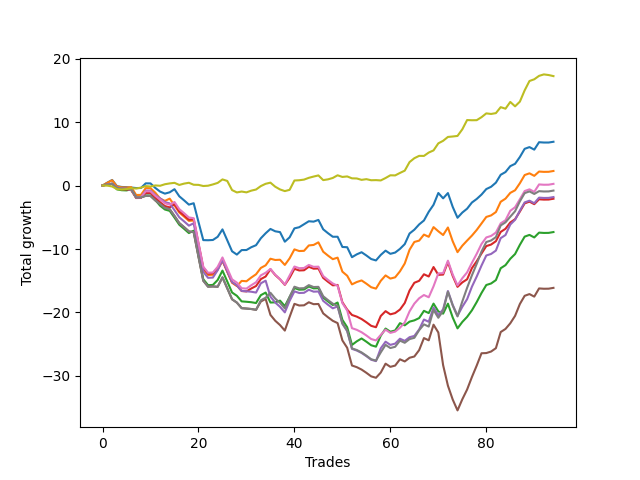

# Short Bulldog 005 
- Symbol: AAPL1y5m
- Date Range: 07/02/2021 - 07/08/2022
- Trading Period: 7:20-12:30
- Number of Trades: 94



| Name | Win Percent | Profit | Avg Profit / Trade |     | Name | Win Percent | Profit | Avg Profit / Trade |
| ---- | ----------- | ------ | ------------------ | --- | ---- | ----------- | ------ | ------------------ |
| Sorted By <br> Profit | | | | | Sorted By <br> Win Percentage ||||
| Seventy-Three | 64.89 | 8615.00 | 91.65 |     | Seventy-Three | 64.89 | 8615.00 | 91.65 |
| Zero | 58.51 | 3445.00 | 36.65 |     | Zero | 58.51 | 3445.00 | 36.65 |
| One | 58.51 | 1145.00 | 12.18 |     | One | 58.51 | 1145.00 | 12.18 |
| Six | 52.13 | 130.00 | 1.38 |     | Three | 53.19 | -1040.00 | -11.06 |
| Seven | 45.74 | -400.00 | -4.26 |     | Six | 52.13 | 130.00 | 1.38 |
| Four | 47.87 | -910.00 | -9.68 |     | Two | 52.13 | -3665.00 | -38.99 |
| Three | 53.19 | -1040.00 | -11.06 |     | Four | 47.87 | -910.00 | -9.68 |
| Two | 52.13 | -3665.00 | -38.99 |     | Seven | 45.74 | -400.00 | -4.26 |
| Five | 42.55 | -8060.00 | -85.74 |     | Five | 42.55 | -8060.00 | -85.74 |

## NO STOPLOSS

### Test Zero
* Sell when price hits the middle line of the 20p bollinger
* No Stoploss
* Results:
```
Total Trades: 94
Percent Up: 41.49
Percent Down: 58.51
Total Points Moved Down: 6.89
Potential Profit: 3445.00
Total Points Ups: 30.03 Count Ups: 39
Total Points Downs: 36.92 Count Downs: 55
```

<details><summary>Trades</summary>

<code>In: 2021-07-07 11:05:00		Out: 2021-07-07 11:38:45		Total Position Time: 33:45		Total Move Down: 0.45		Total to Date: 0.45</code> <br />
<code>In: 2021-07-07 11:10:00		Out: 2021-07-07 11:38:45		Total Position Time: 28:45		Total Move Down: 0.42		Total to Date: 0.87</code> <br />
<code>In: 2021-08-03 08:50:00		Out: 2021-08-03 11:01:35		Total Position Time: 131:35		Total Move Down: -0.97		Total to Date: -0.10</code> <br />
<code>In: 2021-09-03 12:15:00		Out: 2021-09-03 12:50:00		Total Position Time: 35:00		Total Move Down: -0.13		Total to Date: -0.23</code> <br />
<code>In: 2021-09-03 12:25:00		Out: 2021-09-03 12:50:00		Total Position Time: 25:00		Total Move Down: -0.03		Total to Date: -0.26</code> <br />
<code>In: 2021-09-07 09:20:00		Out: 2021-09-07 10:50:05		Total Position Time: 90:05		Total Move Down: -0.06		Total to Date: -0.32</code> <br />
<code>In: 2021-09-15 09:40:00		Out: 2021-09-15 11:20:10		Total Position Time: 100:10		Total Move Down: -0.08		Total to Date: -0.40</code> <br />
<code>In: 2021-09-16 12:15:00		Out: 2021-09-16 12:50:00		Total Position Time: 35:00		Total Move Down: 0.01		Total to Date: -0.39</code> <br />
<code>In: 2021-09-22 11:20:00		Out: 2021-09-22 11:48:50		Total Position Time: 28:50		Total Move Down: 0.73		Total to Date: 0.34</code> <br />
<code>In: 2021-09-24 12:30:00		Out: 2021-09-24 12:50:00		Total Position Time: 20:00		Total Move Down: -0.01		Total to Date: 0.33</code> <br />
<code>In: 2021-10-01 10:50:00		Out: 2021-10-01 12:50:00		Total Position Time: 120:00		Total Move Down: -0.71		Total to Date: -0.38</code> <br />
<code>In: 2021-10-05 08:10:00		Out: 2021-10-05 10:14:30		Total Position Time: 124:30		Total Move Down: -0.58		Total to Date: -0.96</code> <br />
<code>In: 2021-10-06 10:40:00		Out: 2021-10-06 12:20:25		Total Position Time: 100:25		Total Move Down: -0.32		Total to Date: -1.28</code> <br />
<code>In: 2021-10-13 10:40:00		Out: 2021-10-13 11:39:20		Total Position Time: 59:20		Total Move Down: 0.21		Total to Date: -1.07</code> <br />
<code>In: 2021-11-03 11:05:00		Out: 2021-11-03 11:11:50		Total Position Time: 06:50		Total Move Down: 0.49		Total to Date: -0.58</code> <br />
<code>In: 2021-11-03 11:30:00		Out: 2021-11-03 12:50:00		Total Position Time: 80:00		Total Move Down: -1.12		Total to Date: -1.70</code> <br />
<code>In: 2021-11-03 11:50:00		Out: 2021-11-03 12:50:00		Total Position Time: 60:00		Total Move Down: -0.64		Total to Date: -2.34</code> <br />
<code>In: 2021-11-03 11:55:00		Out: 2021-11-03 12:50:00		Total Position Time: 55:00		Total Move Down: -0.67		Total to Date: -3.01</code> <br />
<code>In: 2021-11-17 08:20:00		Out: 2021-11-17 09:24:05		Total Position Time: 64:05		Total Move Down: 0.22		Total to Date: -2.79</code> <br />
<code>In: 2021-11-18 08:35:00		Out: 2021-11-18 11:31:15		Total Position Time: 176:15		Total Move Down: -2.95		Total to Date: -5.74</code> <br />
<code>In: 2021-11-18 08:50:00		Out: 2021-11-18 11:31:15		Total Position Time: 161:15		Total Move Down: -2.86		Total to Date: -8.60</code> <br />
<code>In: 2021-11-18 09:40:00		Out: 2021-11-18 11:31:15		Total Position Time: 111:15		Total Move Down: -0.02		Total to Date: -8.62</code> <br />
<code>In: 2021-11-23 12:15:00		Out: 2021-11-23 12:50:00		Total Position Time: 35:00		Total Move Down: 0.04		Total to Date: -8.58</code> <br />
<code>In: 2021-11-24 08:30:00		Out: 2021-11-24 09:21:05		Total Position Time: 51:05		Total Move Down: 0.50		Total to Date: -8.08</code> <br />
<code>In: 2021-12-08 11:30:00		Out: 2021-12-08 11:50:30		Total Position Time: 20:30		Total Move Down: 1.17		Total to Date: -6.91</code> <br />
<code>In: 2021-12-15 11:20:00		Out: 2021-12-15 12:50:00		Total Position Time: 90:00		Total Move Down: -1.72		Total to Date: -8.63</code> <br />
<code>In: 2021-12-15 11:25:00		Out: 2021-12-15 12:50:00		Total Position Time: 85:00		Total Move Down: -1.73		Total to Date: -10.36</code> <br />
<code>In: 2021-12-15 11:40:00		Out: 2021-12-15 12:50:00		Total Position Time: 70:00		Total Move Down: -0.52		Total to Date: -10.88</code> <br />
<code>In: 2021-12-21 09:30:00		Out: 2021-12-21 09:50:05		Total Position Time: 20:05		Total Move Down: 0.71		Total to Date: -10.17</code> <br />
<code>In: 2021-12-21 11:35:00		Out: 2021-12-21 12:45:45		Total Position Time: 70:45		Total Move Down: 0.01		Total to Date: -10.16</code> <br />
<code>In: 2021-12-23 11:55:00		Out: 2021-12-23 12:04:20		Total Position Time: 09:20		Total Move Down: 0.44		Total to Date: -9.72</code> <br />
<code>In: 2021-12-23 12:00:00		Out: 2021-12-23 12:30:20		Total Position Time: 30:20		Total Move Down: 0.32		Total to Date: -9.40</code> <br />
<code>In: 2021-12-28 08:10:00		Out: 2021-12-28 08:45:15		Total Position Time: 35:15		Total Move Down: 1.09		Total to Date: -8.31</code> <br />
<code>In: 2022-01-07 12:20:00		Out: 2022-01-07 12:44:10		Total Position Time: 24:10		Total Move Down: 0.79		Total to Date: -7.52</code> <br />
<code>In: 2022-01-11 07:30:00		Out: 2022-01-11 07:35:35		Total Position Time: 05:35		Total Move Down: 0.68		Total to Date: -6.84</code> <br />
<code>In: 2022-01-11 08:20:00		Out: 2022-01-11 09:49:45		Total Position Time: 89:45		Total Move Down: -0.37		Total to Date: -7.21</code> <br />
<code>In: 2022-01-11 08:30:00		Out: 2022-01-11 09:49:45		Total Position Time: 79:45		Total Move Down: -0.13		Total to Date: -7.34</code> <br />
<code>In: 2022-01-25 10:40:00		Out: 2022-01-25 12:24:55		Total Position Time: 104:55		Total Move Down: -1.51		Total to Date: -8.85</code> <br />
<code>In: 2022-01-26 11:05:00		Out: 2022-01-26 11:11:55		Total Position Time: 06:55		Total Move Down: 0.69		Total to Date: -8.16</code> <br />
<code>In: 2022-01-26 11:10:00		Out: 2022-01-26 11:15:10		Total Position Time: 05:10		Total Move Down: 1.41		Total to Date: -6.75</code> <br />
<code>In: 2022-02-02 11:50:00		Out: 2022-02-02 12:36:05		Total Position Time: 46:05		Total Move Down: 0.18		Total to Date: -6.57</code> <br />
<code>In: 2022-02-02 12:20:00		Out: 2022-02-02 12:36:05		Total Position Time: 16:05		Total Move Down: 0.47		Total to Date: -6.10</code> <br />
<code>In: 2022-02-04 10:25:00		Out: 2022-02-04 11:12:30		Total Position Time: 47:30		Total Move Down: 0.47		Total to Date: -5.63</code> <br />
<code>In: 2022-02-15 10:30:00		Out: 2022-02-15 12:33:30		Total Position Time: 123:30		Total Move Down: -0.06		Total to Date: -5.69</code> <br />
<code>In: 2022-02-15 11:45:00		Out: 2022-02-15 12:33:30		Total Position Time: 48:30		Total Move Down: 0.27		Total to Date: -5.42</code> <br />
<code>In: 2022-02-16 11:10:00		Out: 2022-02-16 12:50:00		Total Position Time: 100:00		Total Move Down: -1.48		Total to Date: -6.90</code> <br />
<code>In: 2022-02-16 11:25:00		Out: 2022-02-16 12:50:00		Total Position Time: 85:00		Total Move Down: -0.61		Total to Date: -7.51</code> <br />
<code>In: 2022-02-16 11:35:00		Out: 2022-02-16 12:50:00		Total Position Time: 75:00		Total Move Down: -0.56		Total to Date: -8.07</code> <br />
<code>In: 2022-02-25 08:20:00		Out: 2022-02-25 09:50:15		Total Position Time: 90:15		Total Move Down: -0.00		Total to Date: -8.07</code> <br />
<code>In: 2022-03-02 07:30:00		Out: 2022-03-02 09:55:20		Total Position Time: 145:20		Total Move Down: -1.61		Total to Date: -9.68</code> <br />
<code>In: 2022-03-02 08:15:00		Out: 2022-03-02 09:55:20		Total Position Time: 100:20		Total Move Down: -0.04		Total to Date: -9.72</code> <br />
<code>In: 2022-03-15 07:35:00		Out: 2022-03-15 09:51:15		Total Position Time: 136:15		Total Move Down: -1.57		Total to Date: -11.29</code> <br />
<code>In: 2022-03-17 10:30:00		Out: 2022-03-17 11:24:25		Total Position Time: 54:25		Total Move Down: 0.45		Total to Date: -10.84</code> <br />
<code>In: 2022-03-17 10:35:00		Out: 2022-03-17 11:24:25		Total Position Time: 49:25		Total Move Down: 0.33		Total to Date: -10.51</code> <br />
<code>In: 2022-03-24 12:10:00		Out: 2022-03-24 12:50:00		Total Position Time: 40:00		Total Move Down: -0.51		Total to Date: -11.02</code> <br />
<code>In: 2022-03-24 12:15:00		Out: 2022-03-24 12:50:00		Total Position Time: 35:00		Total Move Down: -0.56		Total to Date: -11.58</code> <br />
<code>In: 2022-03-24 12:25:00		Out: 2022-03-24 12:50:00		Total Position Time: 25:00		Total Move Down: -0.22		Total to Date: -11.80</code> <br />
<code>In: 2022-03-25 07:45:00		Out: 2022-03-25 08:01:45		Total Position Time: 16:45		Total Move Down: 0.87		Total to Date: -10.93</code> <br />
<code>In: 2022-03-28 08:00:00		Out: 2022-03-28 08:05:45		Total Position Time: 05:45		Total Move Down: 0.67		Total to Date: -10.26</code> <br />
<code>In: 2022-03-29 11:00:00		Out: 2022-03-29 12:50:00		Total Position Time: 110:00		Total Move Down: -0.50		Total to Date: -10.76</code> <br />
<code>In: 2022-03-29 12:10:00		Out: 2022-03-29 12:50:00		Total Position Time: 40:00		Total Move Down: 0.20		Total to Date: -10.56</code> <br />
<code>In: 2022-03-31 12:10:00		Out: 2022-03-31 12:20:20		Total Position Time: 10:20		Total Move Down: 0.58		Total to Date: -9.98</code> <br />
<code>In: 2022-04-06 10:50:00		Out: 2022-04-06 11:14:35		Total Position Time: 24:35		Total Move Down: 0.75		Total to Date: -9.23</code> <br />
<code>In: 2022-04-06 11:05:00		Out: 2022-04-06 11:14:35		Total Position Time: 09:35		Total Move Down: 1.67		Total to Date: -7.56</code> <br />
<code>In: 2022-04-06 11:35:00		Out: 2022-04-06 12:20:35		Total Position Time: 45:35		Total Move Down: 0.60		Total to Date: -6.96</code> <br />
<code>In: 2022-04-08 08:05:00		Out: 2022-04-08 08:36:55		Total Position Time: 31:55		Total Move Down: 0.83		Total to Date: -6.13</code> <br />
<code>In: 2022-04-20 07:30:00		Out: 2022-04-20 08:00:40		Total Position Time: 30:40		Total Move Down: 0.62		Total to Date: -5.51</code> <br />
<code>In: 2022-04-25 11:55:00		Out: 2022-04-25 12:07:15		Total Position Time: 12:15		Total Move Down: 1.37		Total to Date: -4.14</code> <br />
<code>In: 2022-04-27 09:35:00		Out: 2022-04-27 10:01:20		Total Position Time: 26:20		Total Move Down: 1.10		Total to Date: -3.04</code> <br />
<code>In: 2022-04-28 08:20:00		Out: 2022-04-28 08:39:35		Total Position Time: 19:35		Total Move Down: 1.86		Total to Date: -1.18</code> <br />
<code>In: 2022-05-04 08:55:00		Out: 2022-05-04 11:00:25		Total Position Time: 125:25		Total Move Down: -0.84		Total to Date: -2.02</code> <br />
<code>In: 2022-05-04 11:05:00		Out: 2022-05-04 11:10:10		Total Position Time: 05:10		Total Move Down: 0.83		Total to Date: -1.19</code> <br />
<code>In: 2022-05-04 11:55:00		Out: 2022-05-04 12:50:00		Total Position Time: 55:00		Total Move Down: -2.18		Total to Date: -3.37</code> <br />
<code>In: 2022-05-04 12:15:00		Out: 2022-05-04 12:50:00		Total Position Time: 35:00		Total Move Down: -1.71		Total to Date: -5.08</code> <br />
<code>In: 2022-05-06 07:20:00		Out: 2022-05-06 08:36:15		Total Position Time: 76:15		Total Move Down: 0.82		Total to Date: -4.26</code> <br />
<code>In: 2022-05-06 07:25:00		Out: 2022-05-06 08:36:15		Total Position Time: 71:15		Total Move Down: 0.61		Total to Date: -3.65</code> <br />
<code>In: 2022-05-10 10:50:00		Out: 2022-05-10 11:47:20		Total Position Time: 57:20		Total Move Down: 0.97		Total to Date: -2.68</code> <br />
<code>In: 2022-05-16 11:30:00		Out: 2022-05-16 12:03:25		Total Position Time: 33:25		Total Move Down: 0.56		Total to Date: -2.12</code> <br />
<code>In: 2022-05-16 11:40:00		Out: 2022-05-16 12:03:25		Total Position Time: 23:25		Total Move Down: 0.69		Total to Date: -1.43</code> <br />
<code>In: 2022-05-17 11:10:00		Out: 2022-05-17 11:15:10		Total Position Time: 05:10		Total Move Down: 0.87		Total to Date: -0.56</code> <br />
<code>In: 2022-05-17 11:50:00		Out: 2022-05-17 12:48:00		Total Position Time: 58:00		Total Move Down: 0.36		Total to Date: -0.20</code> <br />
<code>In: 2022-05-17 12:05:00		Out: 2022-05-17 12:48:00		Total Position Time: 43:00		Total Move Down: 0.65		Total to Date: 0.45</code> <br />
<code>In: 2022-05-25 07:35:00		Out: 2022-05-25 07:57:20		Total Position Time: 22:20		Total Move Down: 1.24		Total to Date: 1.69</code> <br />
<code>In: 2022-05-25 11:55:00		Out: 2022-05-25 12:40:10		Total Position Time: 45:10		Total Move Down: 0.43		Total to Date: 2.12</code> <br />
<code>In: 2022-05-31 09:05:00		Out: 2022-05-31 10:03:10		Total Position Time: 58:10		Total Move Down: 0.93		Total to Date: 3.05</code> <br />
<code>In: 2022-06-14 10:10:00		Out: 2022-06-14 10:42:40		Total Position Time: 32:40		Total Move Down: 0.37		Total to Date: 3.42</code> <br />
<code>In: 2022-06-14 10:25:00		Out: 2022-06-14 10:42:40		Total Position Time: 17:40		Total Move Down: 1.07		Total to Date: 4.49</code> <br />
<code>In: 2022-06-15 11:00:00		Out: 2022-06-15 11:05:10		Total Position Time: 05:10		Total Move Down: 1.29		Total to Date: 5.78</code> <br />
<code>In: 2022-06-15 11:45:00		Out: 2022-06-15 12:50:00		Total Position Time: 65:00		Total Move Down: 0.27		Total to Date: 6.05</code> <br />
<code>In: 2022-06-15 11:50:00		Out: 2022-06-15 12:50:00		Total Position Time: 60:00		Total Move Down: -0.40		Total to Date: 5.65</code> <br />
<code>In: 2022-06-17 08:30:00		Out: 2022-06-17 08:52:10		Total Position Time: 22:10		Total Move Down: 1.17		Total to Date: 6.82</code> <br />
<code>In: 2022-07-05 11:40:00		Out: 2022-07-05 12:50:00		Total Position Time: 70:00		Total Move Down: -0.05		Total to Date: 6.77</code> <br />
<code>In: 2022-07-06 11:35:00		Out: 2022-07-06 12:48:15		Total Position Time: 73:15		Total Move Down: -0.00		Total to Date: 6.77</code> <br />
<code>In: 2022-07-06 11:45:00		Out: 2022-07-06 12:48:15		Total Position Time: 63:15		Total Move Down: 0.12		Total to Date: 6.89</code> <br />


</details>

### Test One
* Sell when the price hits the upper line of the 20p 1std bollinger
* No Stoploss
* Results:
```
Total Trades: 94
Percent Up: 41.49
Percent Down: 58.51
Total Points Moved Down: 2.29
Potential Profit: 1145.00
Total Points Ups: 36.38 Count Ups: 39
Total Points Downs: 38.67 Count Downs: 55
```

<details><summary>Trades</summary>

<code>In: 2021-07-07 11:05:00		Out: 2021-07-07 12:25:55		Total Position Time: 80:55		Total Move Down: 0.43		Total to Date: 0.43</code> <br />
<code>In: 2021-07-07 11:10:00		Out: 2021-07-07 12:25:55		Total Position Time: 75:55		Total Move Down: 0.40		Total to Date: 0.83</code> <br />
<code>In: 2021-08-03 08:50:00		Out: 2021-08-03 11:25:05		Total Position Time: 155:05		Total Move Down: -0.99		Total to Date: -0.16</code> <br />
<code>In: 2021-09-03 12:15:00		Out: 2021-09-03 12:50:00		Total Position Time: 35:00		Total Move Down: -0.13		Total to Date: -0.29</code> <br />
<code>In: 2021-09-03 12:25:00		Out: 2021-09-03 12:50:00		Total Position Time: 25:00		Total Move Down: -0.03		Total to Date: -0.32</code> <br />
<code>In: 2021-09-07 09:20:00		Out: 2021-09-07 10:56:55		Total Position Time: 96:55		Total Move Down: 0.06		Total to Date: -0.26</code> <br />
<code>In: 2021-09-15 09:40:00		Out: 2021-09-15 12:50:00		Total Position Time: 190:00		Total Move Down: -1.23		Total to Date: -1.49</code> <br />
<code>In: 2021-09-16 12:15:00		Out: 2021-09-16 12:50:00		Total Position Time: 35:00		Total Move Down: 0.01		Total to Date: -1.48</code> <br />
<code>In: 2021-09-22 11:20:00		Out: 2021-09-22 11:50:35		Total Position Time: 30:35		Total Move Down: 1.07		Total to Date: -0.41</code> <br />
<code>In: 2021-09-24 12:30:00		Out: 2021-09-24 12:50:00		Total Position Time: 20:00		Total Move Down: -0.01		Total to Date: -0.42</code> <br />
<code>In: 2021-10-01 10:50:00		Out: 2021-10-01 12:50:00		Total Position Time: 120:00		Total Move Down: -0.71		Total to Date: -1.13</code> <br />
<code>In: 2021-10-05 08:10:00		Out: 2021-10-05 12:17:25		Total Position Time: 247:25		Total Move Down: -0.94		Total to Date: -2.07</code> <br />
<code>In: 2021-10-06 10:40:00		Out: 2021-10-06 12:45:35		Total Position Time: 125:35		Total Move Down: -0.35		Total to Date: -2.42</code> <br />
<code>In: 2021-10-13 10:40:00		Out: 2021-10-13 11:43:20		Total Position Time: 63:20		Total Move Down: 0.35		Total to Date: -2.07</code> <br />
<code>In: 2021-11-03 11:05:00		Out: 2021-11-03 12:50:00		Total Position Time: 105:00		Total Move Down: -1.07		Total to Date: -3.14</code> <br />
<code>In: 2021-11-03 11:30:00		Out: 2021-11-03 12:50:00		Total Position Time: 80:00		Total Move Down: -1.12		Total to Date: -4.26</code> <br />
<code>In: 2021-11-03 11:50:00		Out: 2021-11-03 12:50:00		Total Position Time: 60:00		Total Move Down: -0.64		Total to Date: -4.90</code> <br />
<code>In: 2021-11-03 11:55:00		Out: 2021-11-03 12:50:00		Total Position Time: 55:00		Total Move Down: -0.67		Total to Date: -5.57</code> <br />
<code>In: 2021-11-17 08:20:00		Out: 2021-11-17 09:50:50		Total Position Time: 90:50		Total Move Down: 0.06		Total to Date: -5.51</code> <br />
<code>In: 2021-11-18 08:35:00		Out: 2021-11-18 12:50:00		Total Position Time: 255:00		Total Move Down: -3.87		Total to Date: -9.38</code> <br />
<code>In: 2021-11-18 08:50:00		Out: 2021-11-18 12:50:00		Total Position Time: 240:00		Total Move Down: -3.78		Total to Date: -13.16</code> <br />
<code>In: 2021-11-18 09:40:00		Out: 2021-11-18 12:50:00		Total Position Time: 190:00		Total Move Down: -0.94		Total to Date: -14.10</code> <br />
<code>In: 2021-11-23 12:15:00		Out: 2021-11-23 12:50:00		Total Position Time: 35:00		Total Move Down: 0.04		Total to Date: -14.06</code> <br />
<code>In: 2021-11-24 08:30:00		Out: 2021-11-24 09:25:45		Total Position Time: 55:45		Total Move Down: 0.80		Total to Date: -13.26</code> <br />
<code>In: 2021-12-08 11:30:00		Out: 2021-12-08 12:08:50		Total Position Time: 38:50		Total Move Down: 1.39		Total to Date: -11.87</code> <br />
<code>In: 2021-12-15 11:20:00		Out: 2021-12-15 12:50:00		Total Position Time: 90:00		Total Move Down: -1.72		Total to Date: -13.59</code> <br />
<code>In: 2021-12-15 11:25:00		Out: 2021-12-15 12:50:00		Total Position Time: 85:00		Total Move Down: -1.73		Total to Date: -15.32</code> <br />
<code>In: 2021-12-15 11:40:00		Out: 2021-12-15 12:50:00		Total Position Time: 70:00		Total Move Down: -0.52		Total to Date: -15.84</code> <br />
<code>In: 2021-12-21 09:30:00		Out: 2021-12-21 10:13:50		Total Position Time: 43:50		Total Move Down: 0.82		Total to Date: -15.02</code> <br />
<code>In: 2021-12-21 11:35:00		Out: 2021-12-21 12:50:00		Total Position Time: 75:00		Total Move Down: -0.06		Total to Date: -15.08</code> <br />
<code>In: 2021-12-23 11:55:00		Out: 2021-12-23 12:31:50		Total Position Time: 36:50		Total Move Down: 0.58		Total to Date: -14.50</code> <br />
<code>In: 2021-12-23 12:00:00		Out: 2021-12-23 12:31:50		Total Position Time: 31:50		Total Move Down: 0.52		Total to Date: -13.98</code> <br />
<code>In: 2021-12-28 08:10:00		Out: 2021-12-28 09:29:20		Total Position Time: 79:20		Total Move Down: 1.00		Total to Date: -12.98</code> <br />
<code>In: 2022-01-07 12:20:00		Out: 2022-01-07 12:50:00		Total Position Time: 30:00		Total Move Down: 0.41		Total to Date: -12.57</code> <br />
<code>In: 2022-01-11 07:30:00		Out: 2022-01-11 07:42:10		Total Position Time: 12:10		Total Move Down: 1.04		Total to Date: -11.53</code> <br />
<code>In: 2022-01-11 08:20:00		Out: 2022-01-11 10:01:40		Total Position Time: 101:40		Total Move Down: -0.20		Total to Date: -11.73</code> <br />
<code>In: 2022-01-11 08:30:00		Out: 2022-01-11 10:01:40		Total Position Time: 91:40		Total Move Down: 0.04		Total to Date: -11.69</code> <br />
<code>In: 2022-01-25 10:40:00		Out: 2022-01-25 12:28:30		Total Position Time: 108:30		Total Move Down: -0.82		Total to Date: -12.51</code> <br />
<code>In: 2022-01-26 11:05:00		Out: 2022-01-26 11:14:20		Total Position Time: 09:20		Total Move Down: 1.04		Total to Date: -11.47</code> <br />
<code>In: 2022-01-26 11:10:00		Out: 2022-01-26 11:15:10		Total Position Time: 05:10		Total Move Down: 1.41		Total to Date: -10.06</code> <br />
<code>In: 2022-02-02 11:50:00		Out: 2022-02-02 12:50:00		Total Position Time: 60:00		Total Move Down: -0.26		Total to Date: -10.32</code> <br />
<code>In: 2022-02-02 12:20:00		Out: 2022-02-02 12:50:00		Total Position Time: 30:00		Total Move Down: 0.03		Total to Date: -10.29</code> <br />
<code>In: 2022-02-04 10:25:00		Out: 2022-02-04 11:20:00		Total Position Time: 55:00		Total Move Down: 0.85		Total to Date: -9.44</code> <br />
<code>In: 2022-02-15 10:30:00		Out: 2022-02-15 12:42:20		Total Position Time: 132:20		Total Move Down: 0.08		Total to Date: -9.36</code> <br />
<code>In: 2022-02-15 11:45:00		Out: 2022-02-15 12:42:20		Total Position Time: 57:20		Total Move Down: 0.41		Total to Date: -8.95</code> <br />
<code>In: 2022-02-16 11:10:00		Out: 2022-02-16 12:50:00		Total Position Time: 100:00		Total Move Down: -1.48		Total to Date: -10.43</code> <br />
<code>In: 2022-02-16 11:25:00		Out: 2022-02-16 12:50:00		Total Position Time: 85:00		Total Move Down: -0.61		Total to Date: -11.04</code> <br />
<code>In: 2022-02-16 11:35:00		Out: 2022-02-16 12:50:00		Total Position Time: 75:00		Total Move Down: -0.56		Total to Date: -11.60</code> <br />
<code>In: 2022-02-25 08:20:00		Out: 2022-02-25 09:54:50		Total Position Time: 94:50		Total Move Down: 0.24		Total to Date: -11.36</code> <br />
<code>In: 2022-03-02 07:30:00		Out: 2022-03-02 11:59:15		Total Position Time: 269:15		Total Move Down: -2.21		Total to Date: -13.57</code> <br />
<code>In: 2022-03-02 08:15:00		Out: 2022-03-02 11:59:15		Total Position Time: 224:15		Total Move Down: -0.64		Total to Date: -14.21</code> <br />
<code>In: 2022-03-15 07:35:00		Out: 2022-03-15 10:07:00		Total Position Time: 152:00		Total Move Down: -1.36		Total to Date: -15.57</code> <br />
<code>In: 2022-03-17 10:30:00		Out: 2022-03-17 12:10:45		Total Position Time: 100:45		Total Move Down: 0.37		Total to Date: -15.20</code> <br />
<code>In: 2022-03-17 10:35:00		Out: 2022-03-17 12:10:45		Total Position Time: 95:45		Total Move Down: 0.25		Total to Date: -14.95</code> <br />
<code>In: 2022-03-24 12:10:00		Out: 2022-03-24 12:50:00		Total Position Time: 40:00		Total Move Down: -0.51		Total to Date: -15.46</code> <br />
<code>In: 2022-03-24 12:15:00		Out: 2022-03-24 12:50:00		Total Position Time: 35:00		Total Move Down: -0.56		Total to Date: -16.02</code> <br />
<code>In: 2022-03-24 12:25:00		Out: 2022-03-24 12:50:00		Total Position Time: 25:00		Total Move Down: -0.22		Total to Date: -16.24</code> <br />
<code>In: 2022-03-25 07:45:00		Out: 2022-03-25 08:09:30		Total Position Time: 24:30		Total Move Down: 1.23		Total to Date: -15.01</code> <br />
<code>In: 2022-03-28 08:00:00		Out: 2022-03-28 08:32:05		Total Position Time: 32:05		Total Move Down: 0.85		Total to Date: -14.16</code> <br />
<code>In: 2022-03-29 11:00:00		Out: 2022-03-29 12:50:00		Total Position Time: 110:00		Total Move Down: -0.50		Total to Date: -14.66</code> <br />
<code>In: 2022-03-29 12:10:00		Out: 2022-03-29 12:50:00		Total Position Time: 40:00		Total Move Down: 0.20		Total to Date: -14.46</code> <br />
<code>In: 2022-03-31 12:10:00		Out: 2022-03-31 12:33:05		Total Position Time: 23:05		Total Move Down: 0.94		Total to Date: -13.52</code> <br />
<code>In: 2022-04-06 10:50:00		Out: 2022-04-06 11:16:20		Total Position Time: 26:20		Total Move Down: 1.24		Total to Date: -12.28</code> <br />
<code>In: 2022-04-06 11:05:00		Out: 2022-04-06 11:16:20		Total Position Time: 11:20		Total Move Down: 2.16		Total to Date: -10.12</code> <br />
<code>In: 2022-04-06 11:35:00		Out: 2022-04-06 12:29:10		Total Position Time: 54:10		Total Move Down: 1.23		Total to Date: -8.89</code> <br />
<code>In: 2022-04-08 08:05:00		Out: 2022-04-08 10:15:10		Total Position Time: 130:10		Total Move Down: 0.21		Total to Date: -8.68</code> <br />
<code>In: 2022-04-20 07:30:00		Out: 2022-04-20 08:08:00		Total Position Time: 38:00		Total Move Down: 0.95		Total to Date: -7.73</code> <br />
<code>In: 2022-04-25 11:55:00		Out: 2022-04-25 12:50:00		Total Position Time: 55:00		Total Move Down: -0.35		Total to Date: -8.08</code> <br />
<code>In: 2022-04-27 09:35:00		Out: 2022-04-27 10:27:25		Total Position Time: 52:25		Total Move Down: 1.53		Total to Date: -6.55</code> <br />
<code>In: 2022-04-28 08:20:00		Out: 2022-04-28 11:31:25		Total Position Time: 191:25		Total Move Down: -0.66		Total to Date: -7.21</code> <br />
<code>In: 2022-05-04 08:55:00		Out: 2022-05-04 11:08:05		Total Position Time: 133:05		Total Move Down: -0.59		Total to Date: -7.80</code> <br />
<code>In: 2022-05-04 11:05:00		Out: 2022-05-04 11:18:40		Total Position Time: 13:40		Total Move Down: 1.19		Total to Date: -6.61</code> <br />
<code>In: 2022-05-04 11:55:00		Out: 2022-05-04 12:50:00		Total Position Time: 55:00		Total Move Down: -2.18		Total to Date: -8.79</code> <br />
<code>In: 2022-05-04 12:15:00		Out: 2022-05-04 12:50:00		Total Position Time: 35:00		Total Move Down: -1.71		Total to Date: -10.50</code> <br />
<code>In: 2022-05-06 07:20:00		Out: 2022-05-06 08:58:45		Total Position Time: 98:45		Total Move Down: 1.02		Total to Date: -9.48</code> <br />
<code>In: 2022-05-06 07:25:00		Out: 2022-05-06 08:58:45		Total Position Time: 93:45		Total Move Down: 0.81		Total to Date: -8.67</code> <br />
<code>In: 2022-05-10 10:50:00		Out: 2022-05-10 12:17:20		Total Position Time: 87:20		Total Move Down: 0.78		Total to Date: -7.89</code> <br />
<code>In: 2022-05-16 11:30:00		Out: 2022-05-16 12:12:45		Total Position Time: 42:45		Total Move Down: 0.89		Total to Date: -7.00</code> <br />
<code>In: 2022-05-16 11:40:00		Out: 2022-05-16 12:12:45		Total Position Time: 32:45		Total Move Down: 1.02		Total to Date: -5.98</code> <br />
<code>In: 2022-05-17 11:10:00		Out: 2022-05-17 11:20:20		Total Position Time: 10:20		Total Move Down: 1.03		Total to Date: -4.95</code> <br />
<code>In: 2022-05-17 11:50:00		Out: 2022-05-17 12:50:00		Total Position Time: 60:00		Total Move Down: 0.24		Total to Date: -4.71</code> <br />
<code>In: 2022-05-17 12:05:00		Out: 2022-05-17 12:50:00		Total Position Time: 45:00		Total Move Down: 0.53		Total to Date: -4.18</code> <br />
<code>In: 2022-05-25 07:35:00		Out: 2022-05-25 08:35:40		Total Position Time: 60:40		Total Move Down: 1.62		Total to Date: -2.56</code> <br />
<code>In: 2022-05-25 11:55:00		Out: 2022-05-25 12:50:00		Total Position Time: 55:00		Total Move Down: 0.49		Total to Date: -2.07</code> <br />
<code>In: 2022-05-31 09:05:00		Out: 2022-05-31 10:28:40		Total Position Time: 83:40		Total Move Down: 0.91		Total to Date: -1.16</code> <br />
<code>In: 2022-06-14 10:10:00		Out: 2022-06-14 11:48:10		Total Position Time: 98:10		Total Move Down: 0.41		Total to Date: -0.75</code> <br />
<code>In: 2022-06-14 10:25:00		Out: 2022-06-14 11:48:10		Total Position Time: 83:10		Total Move Down: 1.11		Total to Date: 0.36</code> <br />
<code>In: 2022-06-15 11:00:00		Out: 2022-06-15 11:05:10		Total Position Time: 05:10		Total Move Down: 1.29		Total to Date: 1.65</code> <br />
<code>In: 2022-06-15 11:45:00		Out: 2022-06-15 12:50:00		Total Position Time: 65:00		Total Move Down: 0.27		Total to Date: 1.92</code> <br />
<code>In: 2022-06-15 11:50:00		Out: 2022-06-15 12:50:00		Total Position Time: 60:00		Total Move Down: -0.40		Total to Date: 1.52</code> <br />
<code>In: 2022-06-17 08:30:00		Out: 2022-06-17 10:46:35		Total Position Time: 136:35		Total Move Down: 0.68		Total to Date: 2.20</code> <br />
<code>In: 2022-07-05 11:40:00		Out: 2022-07-05 12:50:00		Total Position Time: 70:00		Total Move Down: -0.05		Total to Date: 2.15</code> <br />
<code>In: 2022-07-06 11:35:00		Out: 2022-07-06 12:50:00		Total Position Time: 75:00		Total Move Down: 0.01		Total to Date: 2.16</code> <br />
<code>In: 2022-07-06 11:45:00		Out: 2022-07-06 12:50:00		Total Position Time: 65:00		Total Move Down: 0.13		Total to Date: 2.29</code> <br />


</details>

### Test Two
* Sell when the price hits the upper line of the 20p 2std bollinger
* No Stoploss
* Results:
```
Total Trades: 94
Percent Up: 47.87
Percent Down: 52.13
Total Points Moved Down: -7.33
Potential Profit: -3665.00
Total Points Ups: 42.62 Count Ups: 45
Total Points Downs: 35.29 Count Downs: 49
```

<details><summary>Trades</summary>

<code>In: 2021-07-07 11:05:00		Out: 2021-07-07 12:50:00		Total Position Time: 105:00		Total Move Down: 0.15		Total to Date: 0.15</code> <br />
<code>In: 2021-07-07 11:10:00		Out: 2021-07-07 12:50:00		Total Position Time: 100:00		Total Move Down: 0.12		Total to Date: 0.27</code> <br />
<code>In: 2021-08-03 08:50:00		Out: 2021-08-03 11:30:15		Total Position Time: 160:15		Total Move Down: -0.88		Total to Date: -0.61</code> <br />
<code>In: 2021-09-03 12:15:00		Out: 2021-09-03 12:50:00		Total Position Time: 35:00		Total Move Down: -0.13		Total to Date: -0.74</code> <br />
<code>In: 2021-09-03 12:25:00		Out: 2021-09-03 12:50:00		Total Position Time: 25:00		Total Move Down: -0.03		Total to Date: -0.77</code> <br />
<code>In: 2021-09-07 09:20:00		Out: 2021-09-07 11:04:45		Total Position Time: 104:45		Total Move Down: 0.18		Total to Date: -0.59</code> <br />
<code>In: 2021-09-15 09:40:00		Out: 2021-09-15 12:50:00		Total Position Time: 190:00		Total Move Down: -1.23		Total to Date: -1.82</code> <br />
<code>In: 2021-09-16 12:15:00		Out: 2021-09-16 12:50:00		Total Position Time: 35:00		Total Move Down: 0.01		Total to Date: -1.81</code> <br />
<code>In: 2021-09-22 11:20:00		Out: 2021-09-22 12:50:00		Total Position Time: 90:00		Total Move Down: 0.24		Total to Date: -1.57</code> <br />
<code>In: 2021-09-24 12:30:00		Out: 2021-09-24 12:50:00		Total Position Time: 20:00		Total Move Down: -0.01		Total to Date: -1.58</code> <br />
<code>In: 2021-10-01 10:50:00		Out: 2021-10-01 12:50:00		Total Position Time: 120:00		Total Move Down: -0.71		Total to Date: -2.29</code> <br />
<code>In: 2021-10-05 08:10:00		Out: 2021-10-05 12:19:25		Total Position Time: 249:25		Total Move Down: -0.89		Total to Date: -3.18</code> <br />
<code>In: 2021-10-06 10:40:00		Out: 2021-10-06 12:50:00		Total Position Time: 130:00		Total Move Down: -0.60		Total to Date: -3.78</code> <br />
<code>In: 2021-10-13 10:40:00		Out: 2021-10-13 12:50:00		Total Position Time: 130:00		Total Move Down: -0.21		Total to Date: -3.99</code> <br />
<code>In: 2021-11-03 11:05:00		Out: 2021-11-03 12:50:00		Total Position Time: 105:00		Total Move Down: -1.07		Total to Date: -5.06</code> <br />
<code>In: 2021-11-03 11:30:00		Out: 2021-11-03 12:50:00		Total Position Time: 80:00		Total Move Down: -1.12		Total to Date: -6.18</code> <br />
<code>In: 2021-11-03 11:50:00		Out: 2021-11-03 12:50:00		Total Position Time: 60:00		Total Move Down: -0.64		Total to Date: -6.82</code> <br />
<code>In: 2021-11-03 11:55:00		Out: 2021-11-03 12:50:00		Total Position Time: 55:00		Total Move Down: -0.67		Total to Date: -7.49</code> <br />
<code>In: 2021-11-17 08:20:00		Out: 2021-11-17 10:11:30		Total Position Time: 111:30		Total Move Down: 0.38		Total to Date: -7.11</code> <br />
<code>In: 2021-11-18 08:35:00		Out: 2021-11-18 12:50:00		Total Position Time: 255:00		Total Move Down: -3.87		Total to Date: -10.98</code> <br />
<code>In: 2021-11-18 08:50:00		Out: 2021-11-18 12:50:00		Total Position Time: 240:00		Total Move Down: -3.78		Total to Date: -14.76</code> <br />
<code>In: 2021-11-18 09:40:00		Out: 2021-11-18 12:50:00		Total Position Time: 190:00		Total Move Down: -0.94		Total to Date: -15.70</code> <br />
<code>In: 2021-11-23 12:15:00		Out: 2021-11-23 12:50:00		Total Position Time: 35:00		Total Move Down: 0.04		Total to Date: -15.66</code> <br />
<code>In: 2021-11-24 08:30:00		Out: 2021-11-24 10:48:35		Total Position Time: 138:35		Total Move Down: 0.78		Total to Date: -14.88</code> <br />
<code>In: 2021-12-08 11:30:00		Out: 2021-12-08 12:50:00		Total Position Time: 80:00		Total Move Down: 1.48		Total to Date: -13.40</code> <br />
<code>In: 2021-12-15 11:20:00		Out: 2021-12-15 12:50:00		Total Position Time: 90:00		Total Move Down: -1.72		Total to Date: -15.12</code> <br />
<code>In: 2021-12-15 11:25:00		Out: 2021-12-15 12:50:00		Total Position Time: 85:00		Total Move Down: -1.73		Total to Date: -16.85</code> <br />
<code>In: 2021-12-15 11:40:00		Out: 2021-12-15 12:50:00		Total Position Time: 70:00		Total Move Down: -0.52		Total to Date: -17.37</code> <br />
<code>In: 2021-12-21 09:30:00		Out: 2021-12-21 12:50:00		Total Position Time: 200:00		Total Move Down: -0.88		Total to Date: -18.25</code> <br />
<code>In: 2021-12-21 11:35:00		Out: 2021-12-21 12:50:00		Total Position Time: 75:00		Total Move Down: -0.06		Total to Date: -18.31</code> <br />
<code>In: 2021-12-23 11:55:00		Out: 2021-12-23 12:50:00		Total Position Time: 55:00		Total Move Down: -0.07		Total to Date: -18.38</code> <br />
<code>In: 2021-12-23 12:00:00		Out: 2021-12-23 12:50:00		Total Position Time: 50:00		Total Move Down: -0.13		Total to Date: -18.51</code> <br />
<code>In: 2021-12-28 08:10:00		Out: 2021-12-28 09:31:40		Total Position Time: 81:40		Total Move Down: 1.24		Total to Date: -17.27</code> <br />
<code>In: 2022-01-07 12:20:00		Out: 2022-01-07 12:50:00		Total Position Time: 30:00		Total Move Down: 0.41		Total to Date: -16.86</code> <br />
<code>In: 2022-01-11 07:30:00		Out: 2022-01-11 10:05:55		Total Position Time: 155:55		Total Move Down: -1.57		Total to Date: -18.43</code> <br />
<code>In: 2022-01-11 08:20:00		Out: 2022-01-11 10:05:55		Total Position Time: 105:55		Total Move Down: 0.03		Total to Date: -18.40</code> <br />
<code>In: 2022-01-11 08:30:00		Out: 2022-01-11 10:05:55		Total Position Time: 95:55		Total Move Down: 0.27		Total to Date: -18.13</code> <br />
<code>In: 2022-01-25 10:40:00		Out: 2022-01-25 12:50:00		Total Position Time: 130:00		Total Move Down: -0.87		Total to Date: -19.00</code> <br />
<code>In: 2022-01-26 11:05:00		Out: 2022-01-26 11:14:30		Total Position Time: 09:30		Total Move Down: 1.44		Total to Date: -17.56</code> <br />
<code>In: 2022-01-26 11:10:00		Out: 2022-01-26 11:15:10		Total Position Time: 05:10		Total Move Down: 1.41		Total to Date: -16.15</code> <br />
<code>In: 2022-02-02 11:50:00		Out: 2022-02-02 12:50:00		Total Position Time: 60:00		Total Move Down: -0.26		Total to Date: -16.41</code> <br />
<code>In: 2022-02-02 12:20:00		Out: 2022-02-02 12:50:00		Total Position Time: 30:00		Total Move Down: 0.03		Total to Date: -16.38</code> <br />
<code>In: 2022-02-04 10:25:00		Out: 2022-02-04 12:50:00		Total Position Time: 145:00		Total Move Down: 0.48		Total to Date: -15.90</code> <br />
<code>In: 2022-02-15 10:30:00		Out: 2022-02-15 12:50:00		Total Position Time: 140:00		Total Move Down: -0.30		Total to Date: -16.20</code> <br />
<code>In: 2022-02-15 11:45:00		Out: 2022-02-15 12:50:00		Total Position Time: 65:00		Total Move Down: 0.03		Total to Date: -16.17</code> <br />
<code>In: 2022-02-16 11:10:00		Out: 2022-02-16 12:50:00		Total Position Time: 100:00		Total Move Down: -1.48		Total to Date: -17.65</code> <br />
<code>In: 2022-02-16 11:25:00		Out: 2022-02-16 12:50:00		Total Position Time: 85:00		Total Move Down: -0.61		Total to Date: -18.26</code> <br />
<code>In: 2022-02-16 11:35:00		Out: 2022-02-16 12:50:00		Total Position Time: 75:00		Total Move Down: -0.56		Total to Date: -18.82</code> <br />
<code>In: 2022-02-25 08:20:00		Out: 2022-02-25 09:55:20		Total Position Time: 95:20		Total Move Down: 0.39		Total to Date: -18.43</code> <br />
<code>In: 2022-03-02 07:30:00		Out: 2022-03-02 12:50:00		Total Position Time: 320:00		Total Move Down: -2.73		Total to Date: -21.16</code> <br />
<code>In: 2022-03-02 08:15:00		Out: 2022-03-02 12:50:00		Total Position Time: 275:00		Total Move Down: -1.16		Total to Date: -22.32</code> <br />
<code>In: 2022-03-15 07:35:00		Out: 2022-03-15 12:50:00		Total Position Time: 315:00		Total Move Down: -2.79		Total to Date: -25.11</code> <br />
<code>In: 2022-03-17 10:30:00		Out: 2022-03-17 12:12:55		Total Position Time: 102:55		Total Move Down: 0.57		Total to Date: -24.54</code> <br />
<code>In: 2022-03-17 10:35:00		Out: 2022-03-17 12:12:55		Total Position Time: 97:55		Total Move Down: 0.45		Total to Date: -24.09</code> <br />
<code>In: 2022-03-24 12:10:00		Out: 2022-03-24 12:50:00		Total Position Time: 40:00		Total Move Down: -0.51		Total to Date: -24.60</code> <br />
<code>In: 2022-03-24 12:15:00		Out: 2022-03-24 12:50:00		Total Position Time: 35:00		Total Move Down: -0.56		Total to Date: -25.16</code> <br />
<code>In: 2022-03-24 12:25:00		Out: 2022-03-24 12:50:00		Total Position Time: 25:00		Total Move Down: -0.22		Total to Date: -25.38</code> <br />
<code>In: 2022-03-25 07:45:00		Out: 2022-03-25 08:20:45		Total Position Time: 35:45		Total Move Down: 1.72		Total to Date: -23.66</code> <br />
<code>In: 2022-03-28 08:00:00		Out: 2022-03-28 08:34:40		Total Position Time: 34:40		Total Move Down: 1.13		Total to Date: -22.53</code> <br />
<code>In: 2022-03-29 11:00:00		Out: 2022-03-29 12:50:00		Total Position Time: 110:00		Total Move Down: -0.50		Total to Date: -23.03</code> <br />
<code>In: 2022-03-29 12:10:00		Out: 2022-03-29 12:50:00		Total Position Time: 40:00		Total Move Down: 0.20		Total to Date: -22.83</code> <br />
<code>In: 2022-03-31 12:10:00		Out: 2022-03-31 12:43:55		Total Position Time: 33:55		Total Move Down: 1.15		Total to Date: -21.68</code> <br />
<code>In: 2022-04-06 10:50:00		Out: 2022-04-06 12:50:00		Total Position Time: 120:00		Total Move Down: -0.34		Total to Date: -22.02</code> <br />
<code>In: 2022-04-06 11:05:00		Out: 2022-04-06 12:50:00		Total Position Time: 105:00		Total Move Down: 0.58		Total to Date: -21.44</code> <br />
<code>In: 2022-04-06 11:35:00		Out: 2022-04-06 12:50:00		Total Position Time: 75:00		Total Move Down: 0.20		Total to Date: -21.24</code> <br />
<code>In: 2022-04-08 08:05:00		Out: 2022-04-08 10:25:40		Total Position Time: 140:40		Total Move Down: 0.36		Total to Date: -20.88</code> <br />
<code>In: 2022-04-20 07:30:00		Out: 2022-04-20 11:36:05		Total Position Time: 246:05		Total Move Down: 1.14		Total to Date: -19.74</code> <br />
<code>In: 2022-04-25 11:55:00		Out: 2022-04-25 12:50:00		Total Position Time: 55:00		Total Move Down: -0.35		Total to Date: -20.09</code> <br />
<code>In: 2022-04-27 09:35:00		Out: 2022-04-27 11:18:10		Total Position Time: 103:10		Total Move Down: 1.49		Total to Date: -18.60</code> <br />
<code>In: 2022-04-28 08:20:00		Out: 2022-04-28 12:50:00		Total Position Time: 270:00		Total Move Down: -1.23		Total to Date: -19.83</code> <br />
<code>In: 2022-05-04 08:55:00		Out: 2022-05-04 11:20:50		Total Position Time: 145:50		Total Move Down: -0.35		Total to Date: -20.18</code> <br />
<code>In: 2022-05-04 11:05:00		Out: 2022-05-04 11:20:50		Total Position Time: 15:50		Total Move Down: 1.57		Total to Date: -18.61</code> <br />
<code>In: 2022-05-04 11:55:00		Out: 2022-05-04 12:50:00		Total Position Time: 55:00		Total Move Down: -2.18		Total to Date: -20.79</code> <br />
<code>In: 2022-05-04 12:15:00		Out: 2022-05-04 12:50:00		Total Position Time: 35:00		Total Move Down: -1.71		Total to Date: -22.50</code> <br />
<code>In: 2022-05-06 07:20:00		Out: 2022-05-06 10:53:05		Total Position Time: 213:05		Total Move Down: 1.01		Total to Date: -21.49</code> <br />
<code>In: 2022-05-06 07:25:00		Out: 2022-05-06 10:53:05		Total Position Time: 208:05		Total Move Down: 0.80		Total to Date: -20.69</code> <br />
<code>In: 2022-05-10 10:50:00		Out: 2022-05-10 12:24:30		Total Position Time: 94:30		Total Move Down: 1.03		Total to Date: -19.66</code> <br />
<code>In: 2022-05-16 11:30:00		Out: 2022-05-16 12:21:00		Total Position Time: 51:00		Total Move Down: 1.30		Total to Date: -18.36</code> <br />
<code>In: 2022-05-16 11:40:00		Out: 2022-05-16 12:21:00		Total Position Time: 41:00		Total Move Down: 1.43		Total to Date: -16.93</code> <br />
<code>In: 2022-05-17 11:10:00		Out: 2022-05-17 11:20:40		Total Position Time: 10:40		Total Move Down: 1.26		Total to Date: -15.67</code> <br />
<code>In: 2022-05-17 11:50:00		Out: 2022-05-17 12:50:00		Total Position Time: 60:00		Total Move Down: 0.24		Total to Date: -15.43</code> <br />
<code>In: 2022-05-17 12:05:00		Out: 2022-05-17 12:50:00		Total Position Time: 45:00		Total Move Down: 0.53		Total to Date: -14.90</code> <br />
<code>In: 2022-05-25 07:35:00		Out: 2022-05-25 09:20:10		Total Position Time: 105:10		Total Move Down: 1.87		Total to Date: -13.03</code> <br />
<code>In: 2022-05-25 11:55:00		Out: 2022-05-25 12:50:00		Total Position Time: 55:00		Total Move Down: 0.49		Total to Date: -12.54</code> <br />
<code>In: 2022-05-31 09:05:00		Out: 2022-05-31 11:45:20		Total Position Time: 160:20		Total Move Down: 1.00		Total to Date: -11.54</code> <br />
<code>In: 2022-06-14 10:10:00		Out: 2022-06-14 12:07:45		Total Position Time: 117:45		Total Move Down: 0.75		Total to Date: -10.79</code> <br />
<code>In: 2022-06-14 10:25:00		Out: 2022-06-14 12:07:45		Total Position Time: 102:45		Total Move Down: 1.45		Total to Date: -9.34</code> <br />
<code>In: 2022-06-15 11:00:00		Out: 2022-06-15 11:05:10		Total Position Time: 05:10		Total Move Down: 1.29		Total to Date: -8.05</code> <br />
<code>In: 2022-06-15 11:45:00		Out: 2022-06-15 12:50:00		Total Position Time: 65:00		Total Move Down: 0.27		Total to Date: -7.78</code> <br />
<code>In: 2022-06-15 11:50:00		Out: 2022-06-15 12:50:00		Total Position Time: 60:00		Total Move Down: -0.40		Total to Date: -8.18</code> <br />
<code>In: 2022-06-17 08:30:00		Out: 2022-06-17 12:05:45		Total Position Time: 215:45		Total Move Down: 0.76		Total to Date: -7.42</code> <br />
<code>In: 2022-07-05 11:40:00		Out: 2022-07-05 12:50:00		Total Position Time: 70:00		Total Move Down: -0.05		Total to Date: -7.47</code> <br />
<code>In: 2022-07-06 11:35:00		Out: 2022-07-06 12:50:00		Total Position Time: 75:00		Total Move Down: 0.01		Total to Date: -7.46</code> <br />
<code>In: 2022-07-06 11:45:00		Out: 2022-07-06 12:50:00		Total Position Time: 65:00		Total Move Down: 0.13		Total to Date: -7.33</code> <br />


</details>

### Test Three
* Sell when price hits the middle line of the 50p bollinger
* No Stoploss
* Results:
```
Total Trades: 94
Percent Up: 46.81
Percent Down: 53.19
Total Points Moved Down: -2.08
Potential Profit: -1040.00
Total Points Ups: 39.20 Count Ups: 44
Total Points Downs: 37.12 Count Downs: 50
```

<details><summary>Trades</summary>

<code>In: 2021-07-07 11:05:00		Out: 2021-07-07 12:50:00		Total Position Time: 105:00		Total Move Down: 0.15		Total to Date: 0.15</code> <br />
<code>In: 2021-07-07 11:10:00		Out: 2021-07-07 12:50:00		Total Position Time: 100:00		Total Move Down: 0.12		Total to Date: 0.27</code> <br />
<code>In: 2021-08-03 08:50:00		Out: 2021-08-03 12:38:55		Total Position Time: 228:55		Total Move Down: -0.72		Total to Date: -0.45</code> <br />
<code>In: 2021-09-03 12:15:00		Out: 2021-09-03 12:50:00		Total Position Time: 35:00		Total Move Down: -0.13		Total to Date: -0.58</code> <br />
<code>In: 2021-09-03 12:25:00		Out: 2021-09-03 12:50:00		Total Position Time: 25:00		Total Move Down: -0.03		Total to Date: -0.61</code> <br />
<code>In: 2021-09-07 09:20:00		Out: 2021-09-07 12:50:00		Total Position Time: 210:00		Total Move Down: -0.13		Total to Date: -0.74</code> <br />
<code>In: 2021-09-15 09:40:00		Out: 2021-09-15 12:50:00		Total Position Time: 190:00		Total Move Down: -1.23		Total to Date: -1.97</code> <br />
<code>In: 2021-09-16 12:15:00		Out: 2021-09-16 12:50:00		Total Position Time: 35:00		Total Move Down: 0.01		Total to Date: -1.96</code> <br />
<code>In: 2021-09-22 11:20:00		Out: 2021-09-22 11:48:55		Total Position Time: 28:55		Total Move Down: 0.78		Total to Date: -1.18</code> <br />
<code>In: 2021-09-24 12:30:00		Out: 2021-09-24 12:50:00		Total Position Time: 20:00		Total Move Down: -0.01		Total to Date: -1.19</code> <br />
<code>In: 2021-10-01 10:50:00		Out: 2021-10-01 12:50:00		Total Position Time: 120:00		Total Move Down: -0.71		Total to Date: -1.90</code> <br />
<code>In: 2021-10-05 08:10:00		Out: 2021-10-05 12:22:30		Total Position Time: 252:30		Total Move Down: -0.74		Total to Date: -2.64</code> <br />
<code>In: 2021-10-06 10:40:00		Out: 2021-10-06 12:50:00		Total Position Time: 130:00		Total Move Down: -0.60		Total to Date: -3.24</code> <br />
<code>In: 2021-10-13 10:40:00		Out: 2021-10-13 12:50:00		Total Position Time: 130:00		Total Move Down: -0.21		Total to Date: -3.45</code> <br />
<code>In: 2021-11-03 11:05:00		Out: 2021-11-03 11:11:50		Total Position Time: 06:50		Total Move Down: 0.49		Total to Date: -2.96</code> <br />
<code>In: 2021-11-03 11:30:00		Out: 2021-11-03 12:50:00		Total Position Time: 80:00		Total Move Down: -1.12		Total to Date: -4.08</code> <br />
<code>In: 2021-11-03 11:50:00		Out: 2021-11-03 12:50:00		Total Position Time: 60:00		Total Move Down: -0.64		Total to Date: -4.72</code> <br />
<code>In: 2021-11-03 11:55:00		Out: 2021-11-03 12:50:00		Total Position Time: 55:00		Total Move Down: -0.67		Total to Date: -5.39</code> <br />
<code>In: 2021-11-17 08:20:00		Out: 2021-11-17 11:38:25		Total Position Time: 198:25		Total Move Down: 0.10		Total to Date: -5.29</code> <br />
<code>In: 2021-11-18 08:35:00		Out: 2021-11-18 12:50:00		Total Position Time: 255:00		Total Move Down: -3.87		Total to Date: -9.16</code> <br />
<code>In: 2021-11-18 08:50:00		Out: 2021-11-18 12:50:00		Total Position Time: 240:00		Total Move Down: -3.78		Total to Date: -12.94</code> <br />
<code>In: 2021-11-18 09:40:00		Out: 2021-11-18 12:50:00		Total Position Time: 190:00		Total Move Down: -0.94		Total to Date: -13.88</code> <br />
<code>In: 2021-11-23 12:15:00		Out: 2021-11-23 12:50:00		Total Position Time: 35:00		Total Move Down: 0.04		Total to Date: -13.84</code> <br />
<code>In: 2021-11-24 08:30:00		Out: 2021-11-24 10:48:30		Total Position Time: 138:30		Total Move Down: 0.76		Total to Date: -13.08</code> <br />
<code>In: 2021-12-08 11:30:00		Out: 2021-12-08 12:03:55		Total Position Time: 33:55		Total Move Down: 1.31		Total to Date: -11.77</code> <br />
<code>In: 2021-12-15 11:20:00		Out: 2021-12-15 12:50:00		Total Position Time: 90:00		Total Move Down: -1.72		Total to Date: -13.49</code> <br />
<code>In: 2021-12-15 11:25:00		Out: 2021-12-15 12:50:00		Total Position Time: 85:00		Total Move Down: -1.73		Total to Date: -15.22</code> <br />
<code>In: 2021-12-15 11:40:00		Out: 2021-12-15 12:50:00		Total Position Time: 70:00		Total Move Down: -0.52		Total to Date: -15.74</code> <br />
<code>In: 2021-12-21 09:30:00		Out: 2021-12-21 12:50:00		Total Position Time: 200:00		Total Move Down: -0.88		Total to Date: -16.62</code> <br />
<code>In: 2021-12-21 11:35:00		Out: 2021-12-21 12:50:00		Total Position Time: 75:00		Total Move Down: -0.06		Total to Date: -16.68</code> <br />
<code>In: 2021-12-23 11:55:00		Out: 2021-12-23 12:04:25		Total Position Time: 09:25		Total Move Down: 0.46		Total to Date: -16.22</code> <br />
<code>In: 2021-12-23 12:00:00		Out: 2021-12-23 12:30:55		Total Position Time: 30:55		Total Move Down: 0.39		Total to Date: -15.83</code> <br />
<code>In: 2021-12-28 08:10:00		Out: 2021-12-28 08:45:15		Total Position Time: 35:15		Total Move Down: 1.09		Total to Date: -14.74</code> <br />
<code>In: 2022-01-07 12:20:00		Out: 2022-01-07 12:50:00		Total Position Time: 30:00		Total Move Down: 0.41		Total to Date: -14.33</code> <br />
<code>In: 2022-01-11 07:30:00		Out: 2022-01-11 07:43:05		Total Position Time: 13:05		Total Move Down: 1.15		Total to Date: -13.18</code> <br />
<code>In: 2022-01-11 08:20:00		Out: 2022-01-11 12:50:00		Total Position Time: 270:00		Total Move Down: -0.92		Total to Date: -14.10</code> <br />
<code>In: 2022-01-11 08:30:00		Out: 2022-01-11 12:50:00		Total Position Time: 260:00		Total Move Down: -0.68		Total to Date: -14.78</code> <br />
<code>In: 2022-01-25 10:40:00		Out: 2022-01-25 12:50:00		Total Position Time: 130:00		Total Move Down: -0.87		Total to Date: -15.65</code> <br />
<code>In: 2022-01-26 11:05:00		Out: 2022-01-26 11:14:25		Total Position Time: 09:25		Total Move Down: 1.12		Total to Date: -14.53</code> <br />
<code>In: 2022-01-26 11:10:00		Out: 2022-01-26 11:15:10		Total Position Time: 05:10		Total Move Down: 1.41		Total to Date: -13.12</code> <br />
<code>In: 2022-02-02 11:50:00		Out: 2022-02-02 12:50:00		Total Position Time: 60:00		Total Move Down: -0.26		Total to Date: -13.38</code> <br />
<code>In: 2022-02-02 12:20:00		Out: 2022-02-02 12:50:00		Total Position Time: 30:00		Total Move Down: 0.03		Total to Date: -13.35</code> <br />
<code>In: 2022-02-04 10:25:00		Out: 2022-02-04 12:49:15		Total Position Time: 144:15		Total Move Down: 0.55		Total to Date: -12.80</code> <br />
<code>In: 2022-02-15 10:30:00		Out: 2022-02-15 12:50:00		Total Position Time: 140:00		Total Move Down: -0.30		Total to Date: -13.10</code> <br />
<code>In: 2022-02-15 11:45:00		Out: 2022-02-15 12:50:00		Total Position Time: 65:00		Total Move Down: 0.03		Total to Date: -13.07</code> <br />
<code>In: 2022-02-16 11:10:00		Out: 2022-02-16 12:50:00		Total Position Time: 100:00		Total Move Down: -1.48		Total to Date: -14.55</code> <br />
<code>In: 2022-02-16 11:25:00		Out: 2022-02-16 12:50:00		Total Position Time: 85:00		Total Move Down: -0.61		Total to Date: -15.16</code> <br />
<code>In: 2022-02-16 11:35:00		Out: 2022-02-16 12:50:00		Total Position Time: 75:00		Total Move Down: -0.56		Total to Date: -15.72</code> <br />
<code>In: 2022-02-25 08:20:00		Out: 2022-02-25 11:51:50		Total Position Time: 211:50		Total Move Down: 0.06		Total to Date: -15.66</code> <br />
<code>In: 2022-03-02 07:30:00		Out: 2022-03-02 12:50:00		Total Position Time: 320:00		Total Move Down: -2.73		Total to Date: -18.39</code> <br />
<code>In: 2022-03-02 08:15:00		Out: 2022-03-02 12:50:00		Total Position Time: 275:00		Total Move Down: -1.16		Total to Date: -19.55</code> <br />
<code>In: 2022-03-15 07:35:00		Out: 2022-03-15 11:05:00		Total Position Time: 210:00		Total Move Down: -0.84		Total to Date: -20.39</code> <br />
<code>In: 2022-03-17 10:30:00		Out: 2022-03-17 12:50:00		Total Position Time: 140:00		Total Move Down: -0.26		Total to Date: -20.65</code> <br />
<code>In: 2022-03-17 10:35:00		Out: 2022-03-17 12:50:00		Total Position Time: 135:00		Total Move Down: -0.38		Total to Date: -21.03</code> <br />
<code>In: 2022-03-24 12:10:00		Out: 2022-03-24 12:50:00		Total Position Time: 40:00		Total Move Down: -0.51		Total to Date: -21.54</code> <br />
<code>In: 2022-03-24 12:15:00		Out: 2022-03-24 12:50:00		Total Position Time: 35:00		Total Move Down: -0.56		Total to Date: -22.10</code> <br />
<code>In: 2022-03-24 12:25:00		Out: 2022-03-24 12:50:00		Total Position Time: 25:00		Total Move Down: -0.22		Total to Date: -22.32</code> <br />
<code>In: 2022-03-25 07:45:00		Out: 2022-03-25 08:21:50		Total Position Time: 36:50		Total Move Down: 1.77		Total to Date: -20.55</code> <br />
<code>In: 2022-03-28 08:00:00		Out: 2022-03-28 08:25:55		Total Position Time: 25:55		Total Move Down: 0.76		Total to Date: -19.79</code> <br />
<code>In: 2022-03-29 11:00:00		Out: 2022-03-29 12:50:00		Total Position Time: 110:00		Total Move Down: -0.50		Total to Date: -20.29</code> <br />
<code>In: 2022-03-29 12:10:00		Out: 2022-03-29 12:50:00		Total Position Time: 40:00		Total Move Down: 0.20		Total to Date: -20.09</code> <br />
<code>In: 2022-03-31 12:10:00		Out: 2022-03-31 12:20:15		Total Position Time: 10:15		Total Move Down: 0.55		Total to Date: -19.54</code> <br />
<code>In: 2022-04-06 10:50:00		Out: 2022-04-06 11:15:25		Total Position Time: 25:25		Total Move Down: 1.04		Total to Date: -18.50</code> <br />
<code>In: 2022-04-06 11:05:00		Out: 2022-04-06 11:15:25		Total Position Time: 10:25		Total Move Down: 1.96		Total to Date: -16.54</code> <br />
<code>In: 2022-04-06 11:35:00		Out: 2022-04-06 12:28:00		Total Position Time: 53:00		Total Move Down: 1.22		Total to Date: -15.32</code> <br />
<code>In: 2022-04-08 08:05:00		Out: 2022-04-08 08:10:10		Total Position Time: 05:10		Total Move Down: 0.31		Total to Date: -15.01</code> <br />
<code>In: 2022-04-20 07:30:00		Out: 2022-04-20 08:08:55		Total Position Time: 38:55		Total Move Down: 1.03		Total to Date: -13.98</code> <br />
<code>In: 2022-04-25 11:55:00		Out: 2022-04-25 12:50:00		Total Position Time: 55:00		Total Move Down: -0.35		Total to Date: -14.33</code> <br />
<code>In: 2022-04-27 09:35:00		Out: 2022-04-27 11:18:10		Total Position Time: 103:10		Total Move Down: 1.49		Total to Date: -12.84</code> <br />
<code>In: 2022-04-28 08:20:00		Out: 2022-04-28 12:50:00		Total Position Time: 270:00		Total Move Down: -1.23		Total to Date: -14.07</code> <br />
<code>In: 2022-05-04 08:55:00		Out: 2022-05-04 11:30:50		Total Position Time: 155:50		Total Move Down: 0.04		Total to Date: -14.03</code> <br />
<code>In: 2022-05-04 11:05:00		Out: 2022-05-04 11:30:50		Total Position Time: 25:50		Total Move Down: 1.96		Total to Date: -12.07</code> <br />
<code>In: 2022-05-04 11:55:00		Out: 2022-05-04 12:50:00		Total Position Time: 55:00		Total Move Down: -2.18		Total to Date: -14.25</code> <br />
<code>In: 2022-05-04 12:15:00		Out: 2022-05-04 12:50:00		Total Position Time: 35:00		Total Move Down: -1.71		Total to Date: -15.96</code> <br />
<code>In: 2022-05-06 07:20:00		Out: 2022-05-06 10:50:35		Total Position Time: 210:35		Total Move Down: 0.70		Total to Date: -15.26</code> <br />
<code>In: 2022-05-06 07:25:00		Out: 2022-05-06 10:50:35		Total Position Time: 205:35		Total Move Down: 0.49		Total to Date: -14.77</code> <br />
<code>In: 2022-05-10 10:50:00		Out: 2022-05-10 12:30:50		Total Position Time: 100:50		Total Move Down: 1.75		Total to Date: -13.02</code> <br />
<code>In: 2022-05-16 11:30:00		Out: 2022-05-16 12:17:45		Total Position Time: 47:45		Total Move Down: 1.09		Total to Date: -11.93</code> <br />
<code>In: 2022-05-16 11:40:00		Out: 2022-05-16 12:17:45		Total Position Time: 37:45		Total Move Down: 1.22		Total to Date: -10.71</code> <br />
<code>In: 2022-05-17 11:10:00		Out: 2022-05-17 11:20:25		Total Position Time: 10:25		Total Move Down: 1.17		Total to Date: -9.54</code> <br />
<code>In: 2022-05-17 11:50:00		Out: 2022-05-17 12:50:00		Total Position Time: 60:00		Total Move Down: 0.24		Total to Date: -9.30</code> <br />
<code>In: 2022-05-17 12:05:00		Out: 2022-05-17 12:50:00		Total Position Time: 45:00		Total Move Down: 0.53		Total to Date: -8.77</code> <br />
<code>In: 2022-05-25 07:35:00		Out: 2022-05-25 08:34:10		Total Position Time: 59:10		Total Move Down: 1.46		Total to Date: -7.31</code> <br />
<code>In: 2022-05-25 11:55:00		Out: 2022-05-25 12:50:00		Total Position Time: 55:00		Total Move Down: 0.49		Total to Date: -6.82</code> <br />
<code>In: 2022-05-31 09:05:00		Out: 2022-05-31 11:45:20		Total Position Time: 160:20		Total Move Down: 1.00		Total to Date: -5.82</code> <br />
<code>In: 2022-06-14 10:10:00		Out: 2022-06-14 10:43:55		Total Position Time: 33:55		Total Move Down: 0.51		Total to Date: -5.31</code> <br />
<code>In: 2022-06-14 10:25:00		Out: 2022-06-14 10:43:55		Total Position Time: 18:55		Total Move Down: 1.21		Total to Date: -4.10</code> <br />
<code>In: 2022-06-15 11:00:00		Out: 2022-06-15 11:05:10		Total Position Time: 05:10		Total Move Down: 1.29		Total to Date: -2.81</code> <br />
<code>In: 2022-06-15 11:45:00		Out: 2022-06-15 12:50:00		Total Position Time: 65:00		Total Move Down: 0.27		Total to Date: -2.54</code> <br />
<code>In: 2022-06-15 11:50:00		Out: 2022-06-15 12:50:00		Total Position Time: 60:00		Total Move Down: -0.40		Total to Date: -2.94</code> <br />
<code>In: 2022-06-17 08:30:00		Out: 2022-06-17 10:47:00		Total Position Time: 137:00		Total Move Down: 0.77		Total to Date: -2.17</code> <br />
<code>In: 2022-07-05 11:40:00		Out: 2022-07-05 12:50:00		Total Position Time: 70:00		Total Move Down: -0.05		Total to Date: -2.22</code> <br />
<code>In: 2022-07-06 11:35:00		Out: 2022-07-06 12:50:00		Total Position Time: 75:00		Total Move Down: 0.01		Total to Date: -2.21</code> <br />
<code>In: 2022-07-06 11:45:00		Out: 2022-07-06 12:50:00		Total Position Time: 65:00		Total Move Down: 0.13		Total to Date: -2.08</code> <br />


</details>

### Test Four
* Sell when the price hits the upper line of the 50p 1std bollinger
* No Stoploss
* Results:
```
Total Trades: 94
Percent Up: 52.13
Percent Down: 47.87
Total Points Moved Down: -1.82
Potential Profit: -910.00
Total Points Ups: 44.94 Count Ups: 49
Total Points Downs: 43.12 Count Downs: 45
```

<details><summary>Trades</summary>

<code>In: 2021-07-07 11:05:00		Out: 2021-07-07 12:50:00		Total Position Time: 105:00		Total Move Down: 0.15		Total to Date: 0.15</code> <br />
<code>In: 2021-07-07 11:10:00		Out: 2021-07-07 12:50:00		Total Position Time: 100:00		Total Move Down: 0.12		Total to Date: 0.27</code> <br />
<code>In: 2021-08-03 08:50:00		Out: 2021-08-03 12:50:00		Total Position Time: 240:00		Total Move Down: -0.63		Total to Date: -0.36</code> <br />
<code>In: 2021-09-03 12:15:00		Out: 2021-09-03 12:50:00		Total Position Time: 35:00		Total Move Down: -0.13		Total to Date: -0.49</code> <br />
<code>In: 2021-09-03 12:25:00		Out: 2021-09-03 12:50:00		Total Position Time: 25:00		Total Move Down: -0.03		Total to Date: -0.52</code> <br />
<code>In: 2021-09-07 09:20:00		Out: 2021-09-07 12:50:00		Total Position Time: 210:00		Total Move Down: -0.13		Total to Date: -0.65</code> <br />
<code>In: 2021-09-15 09:40:00		Out: 2021-09-15 12:50:00		Total Position Time: 190:00		Total Move Down: -1.23		Total to Date: -1.88</code> <br />
<code>In: 2021-09-16 12:15:00		Out: 2021-09-16 12:50:00		Total Position Time: 35:00		Total Move Down: 0.01		Total to Date: -1.87</code> <br />
<code>In: 2021-09-22 11:20:00		Out: 2021-09-22 11:50:35		Total Position Time: 30:35		Total Move Down: 1.07		Total to Date: -0.80</code> <br />
<code>In: 2021-09-24 12:30:00		Out: 2021-09-24 12:50:00		Total Position Time: 20:00		Total Move Down: -0.01		Total to Date: -0.81</code> <br />
<code>In: 2021-10-01 10:50:00		Out: 2021-10-01 12:50:00		Total Position Time: 120:00		Total Move Down: -0.71		Total to Date: -1.52</code> <br />
<code>In: 2021-10-05 08:10:00		Out: 2021-10-05 12:39:50		Total Position Time: 269:50		Total Move Down: -0.49		Total to Date: -2.01</code> <br />
<code>In: 2021-10-06 10:40:00		Out: 2021-10-06 12:50:00		Total Position Time: 130:00		Total Move Down: -0.60		Total to Date: -2.61</code> <br />
<code>In: 2021-10-13 10:40:00		Out: 2021-10-13 12:50:00		Total Position Time: 130:00		Total Move Down: -0.21		Total to Date: -2.82</code> <br />
<code>In: 2021-11-03 11:05:00		Out: 2021-11-03 12:50:00		Total Position Time: 105:00		Total Move Down: -1.07		Total to Date: -3.89</code> <br />
<code>In: 2021-11-03 11:30:00		Out: 2021-11-03 12:50:00		Total Position Time: 80:00		Total Move Down: -1.12		Total to Date: -5.01</code> <br />
<code>In: 2021-11-03 11:50:00		Out: 2021-11-03 12:50:00		Total Position Time: 60:00		Total Move Down: -0.64		Total to Date: -5.65</code> <br />
<code>In: 2021-11-03 11:55:00		Out: 2021-11-03 12:50:00		Total Position Time: 55:00		Total Move Down: -0.67		Total to Date: -6.32</code> <br />
<code>In: 2021-11-17 08:20:00		Out: 2021-11-17 12:05:50		Total Position Time: 225:50		Total Move Down: 0.37		Total to Date: -5.95</code> <br />
<code>In: 2021-11-18 08:35:00		Out: 2021-11-18 12:50:00		Total Position Time: 255:00		Total Move Down: -3.87		Total to Date: -9.82</code> <br />
<code>In: 2021-11-18 08:50:00		Out: 2021-11-18 12:50:00		Total Position Time: 240:00		Total Move Down: -3.78		Total to Date: -13.60</code> <br />
<code>In: 2021-11-18 09:40:00		Out: 2021-11-18 12:50:00		Total Position Time: 190:00		Total Move Down: -0.94		Total to Date: -14.54</code> <br />
<code>In: 2021-11-23 12:15:00		Out: 2021-11-23 12:50:00		Total Position Time: 35:00		Total Move Down: 0.04		Total to Date: -14.50</code> <br />
<code>In: 2021-11-24 08:30:00		Out: 2021-11-24 11:10:30		Total Position Time: 160:30		Total Move Down: 1.16		Total to Date: -13.34</code> <br />
<code>In: 2021-12-08 11:30:00		Out: 2021-12-08 12:20:25		Total Position Time: 50:25		Total Move Down: 1.59		Total to Date: -11.75</code> <br />
<code>In: 2021-12-15 11:20:00		Out: 2021-12-15 12:50:00		Total Position Time: 90:00		Total Move Down: -1.72		Total to Date: -13.47</code> <br />
<code>In: 2021-12-15 11:25:00		Out: 2021-12-15 12:50:00		Total Position Time: 85:00		Total Move Down: -1.73		Total to Date: -15.20</code> <br />
<code>In: 2021-12-15 11:40:00		Out: 2021-12-15 12:50:00		Total Position Time: 70:00		Total Move Down: -0.52		Total to Date: -15.72</code> <br />
<code>In: 2021-12-21 09:30:00		Out: 2021-12-21 12:50:00		Total Position Time: 200:00		Total Move Down: -0.88		Total to Date: -16.60</code> <br />
<code>In: 2021-12-21 11:35:00		Out: 2021-12-21 12:50:00		Total Position Time: 75:00		Total Move Down: -0.06		Total to Date: -16.66</code> <br />
<code>In: 2021-12-23 11:55:00		Out: 2021-12-23 12:50:00		Total Position Time: 55:00		Total Move Down: -0.07		Total to Date: -16.73</code> <br />
<code>In: 2021-12-23 12:00:00		Out: 2021-12-23 12:50:00		Total Position Time: 50:00		Total Move Down: -0.13		Total to Date: -16.86</code> <br />
<code>In: 2021-12-28 08:10:00		Out: 2021-12-28 09:32:15		Total Position Time: 82:15		Total Move Down: 1.46		Total to Date: -15.40</code> <br />
<code>In: 2022-01-07 12:20:00		Out: 2022-01-07 12:50:00		Total Position Time: 30:00		Total Move Down: 0.41		Total to Date: -14.99</code> <br />
<code>In: 2022-01-11 07:30:00		Out: 2022-01-11 12:50:00		Total Position Time: 320:00		Total Move Down: -2.52		Total to Date: -17.51</code> <br />
<code>In: 2022-01-11 08:20:00		Out: 2022-01-11 12:50:00		Total Position Time: 270:00		Total Move Down: -0.92		Total to Date: -18.43</code> <br />
<code>In: 2022-01-11 08:30:00		Out: 2022-01-11 12:50:00		Total Position Time: 260:00		Total Move Down: -0.68		Total to Date: -19.11</code> <br />
<code>In: 2022-01-25 10:40:00		Out: 2022-01-25 12:50:00		Total Position Time: 130:00		Total Move Down: -0.87		Total to Date: -19.98</code> <br />
<code>In: 2022-01-26 11:05:00		Out: 2022-01-26 11:14:45		Total Position Time: 09:45		Total Move Down: 1.82		Total to Date: -18.16</code> <br />
<code>In: 2022-01-26 11:10:00		Out: 2022-01-26 11:16:40		Total Position Time: 06:40		Total Move Down: 1.49		Total to Date: -16.67</code> <br />
<code>In: 2022-02-02 11:50:00		Out: 2022-02-02 12:50:00		Total Position Time: 60:00		Total Move Down: -0.26		Total to Date: -16.93</code> <br />
<code>In: 2022-02-02 12:20:00		Out: 2022-02-02 12:50:00		Total Position Time: 30:00		Total Move Down: 0.03		Total to Date: -16.90</code> <br />
<code>In: 2022-02-04 10:25:00		Out: 2022-02-04 12:50:00		Total Position Time: 145:00		Total Move Down: 0.48		Total to Date: -16.42</code> <br />
<code>In: 2022-02-15 10:30:00		Out: 2022-02-15 12:50:00		Total Position Time: 140:00		Total Move Down: -0.30		Total to Date: -16.72</code> <br />
<code>In: 2022-02-15 11:45:00		Out: 2022-02-15 12:50:00		Total Position Time: 65:00		Total Move Down: 0.03		Total to Date: -16.69</code> <br />
<code>In: 2022-02-16 11:10:00		Out: 2022-02-16 12:50:00		Total Position Time: 100:00		Total Move Down: -1.48		Total to Date: -18.17</code> <br />
<code>In: 2022-02-16 11:25:00		Out: 2022-02-16 12:50:00		Total Position Time: 85:00		Total Move Down: -0.61		Total to Date: -18.78</code> <br />
<code>In: 2022-02-16 11:35:00		Out: 2022-02-16 12:50:00		Total Position Time: 75:00		Total Move Down: -0.56		Total to Date: -19.34</code> <br />
<code>In: 2022-02-25 08:20:00		Out: 2022-02-25 12:11:25		Total Position Time: 231:25		Total Move Down: 0.29		Total to Date: -19.05</code> <br />
<code>In: 2022-03-02 07:30:00		Out: 2022-03-02 12:50:00		Total Position Time: 320:00		Total Move Down: -2.73		Total to Date: -21.78</code> <br />
<code>In: 2022-03-02 08:15:00		Out: 2022-03-02 12:50:00		Total Position Time: 275:00		Total Move Down: -1.16		Total to Date: -22.94</code> <br />
<code>In: 2022-03-15 07:35:00		Out: 2022-03-15 12:50:00		Total Position Time: 315:00		Total Move Down: -2.79		Total to Date: -25.73</code> <br />
<code>In: 2022-03-17 10:30:00		Out: 2022-03-17 12:50:00		Total Position Time: 140:00		Total Move Down: -0.26		Total to Date: -25.99</code> <br />
<code>In: 2022-03-17 10:35:00		Out: 2022-03-17 12:50:00		Total Position Time: 135:00		Total Move Down: -0.38		Total to Date: -26.37</code> <br />
<code>In: 2022-03-24 12:10:00		Out: 2022-03-24 12:50:00		Total Position Time: 40:00		Total Move Down: -0.51		Total to Date: -26.88</code> <br />
<code>In: 2022-03-24 12:15:00		Out: 2022-03-24 12:50:00		Total Position Time: 35:00		Total Move Down: -0.56		Total to Date: -27.44</code> <br />
<code>In: 2022-03-24 12:25:00		Out: 2022-03-24 12:50:00		Total Position Time: 25:00		Total Move Down: -0.22		Total to Date: -27.66</code> <br />
<code>In: 2022-03-25 07:45:00		Out: 2022-03-25 09:37:35		Total Position Time: 112:35		Total Move Down: 2.02		Total to Date: -25.64</code> <br />
<code>In: 2022-03-28 08:00:00		Out: 2022-03-28 08:33:35		Total Position Time: 33:35		Total Move Down: 1.04		Total to Date: -24.60</code> <br />
<code>In: 2022-03-29 11:00:00		Out: 2022-03-29 12:50:00		Total Position Time: 110:00		Total Move Down: -0.50		Total to Date: -25.10</code> <br />
<code>In: 2022-03-29 12:10:00		Out: 2022-03-29 12:50:00		Total Position Time: 40:00		Total Move Down: 0.20		Total to Date: -24.90</code> <br />
<code>In: 2022-03-31 12:10:00		Out: 2022-03-31 12:21:40		Total Position Time: 11:40		Total Move Down: 0.77		Total to Date: -24.13</code> <br />
<code>In: 2022-04-06 10:50:00		Out: 2022-04-06 12:50:00		Total Position Time: 120:00		Total Move Down: -0.34		Total to Date: -24.47</code> <br />
<code>In: 2022-04-06 11:05:00		Out: 2022-04-06 12:50:00		Total Position Time: 105:00		Total Move Down: 0.58		Total to Date: -23.89</code> <br />
<code>In: 2022-04-06 11:35:00		Out: 2022-04-06 12:50:00		Total Position Time: 75:00		Total Move Down: 0.20		Total to Date: -23.69</code> <br />
<code>In: 2022-04-08 08:05:00		Out: 2022-04-08 10:56:20		Total Position Time: 171:20		Total Move Down: 1.02		Total to Date: -22.67</code> <br />
<code>In: 2022-04-20 07:30:00		Out: 2022-04-20 08:53:05		Total Position Time: 83:05		Total Move Down: 1.56		Total to Date: -21.11</code> <br />
<code>In: 2022-04-25 11:55:00		Out: 2022-04-25 12:50:00		Total Position Time: 55:00		Total Move Down: -0.35		Total to Date: -21.46</code> <br />
<code>In: 2022-04-27 09:35:00		Out: 2022-04-27 11:38:40		Total Position Time: 123:40		Total Move Down: 2.25		Total to Date: -19.21</code> <br />
<code>In: 2022-04-28 08:20:00		Out: 2022-04-28 12:50:00		Total Position Time: 270:00		Total Move Down: -1.23		Total to Date: -20.44</code> <br />
<code>In: 2022-05-04 08:55:00		Out: 2022-05-04 11:34:25		Total Position Time: 159:25		Total Move Down: 0.95		Total to Date: -19.49</code> <br />
<code>In: 2022-05-04 11:05:00		Out: 2022-05-04 11:34:25		Total Position Time: 29:25		Total Move Down: 2.87		Total to Date: -16.62</code> <br />
<code>In: 2022-05-04 11:55:00		Out: 2022-05-04 12:50:00		Total Position Time: 55:00		Total Move Down: -2.18		Total to Date: -18.80</code> <br />
<code>In: 2022-05-04 12:15:00		Out: 2022-05-04 12:50:00		Total Position Time: 35:00		Total Move Down: -1.71		Total to Date: -20.51</code> <br />
<code>In: 2022-05-06 07:20:00		Out: 2022-05-06 11:05:35		Total Position Time: 225:35		Total Move Down: 1.41		Total to Date: -19.10</code> <br />
<code>In: 2022-05-06 07:25:00		Out: 2022-05-06 11:05:35		Total Position Time: 220:35		Total Move Down: 1.20		Total to Date: -17.90</code> <br />
<code>In: 2022-05-10 10:50:00		Out: 2022-05-10 12:50:00		Total Position Time: 120:00		Total Move Down: 1.96		Total to Date: -15.94</code> <br />
<code>In: 2022-05-16 11:30:00		Out: 2022-05-16 12:35:20		Total Position Time: 65:20		Total Move Down: 1.60		Total to Date: -14.34</code> <br />
<code>In: 2022-05-16 11:40:00		Out: 2022-05-16 12:35:20		Total Position Time: 55:20		Total Move Down: 1.73		Total to Date: -12.61</code> <br />
<code>In: 2022-05-17 11:10:00		Out: 2022-05-17 11:22:45		Total Position Time: 12:45		Total Move Down: 1.59		Total to Date: -11.02</code> <br />
<code>In: 2022-05-17 11:50:00		Out: 2022-05-17 12:50:00		Total Position Time: 60:00		Total Move Down: 0.24		Total to Date: -10.78</code> <br />
<code>In: 2022-05-17 12:05:00		Out: 2022-05-17 12:50:00		Total Position Time: 45:00		Total Move Down: 0.53		Total to Date: -10.25</code> <br />
<code>In: 2022-05-25 07:35:00		Out: 2022-05-25 09:21:15		Total Position Time: 106:15		Total Move Down: 1.96		Total to Date: -8.29</code> <br />
<code>In: 2022-05-25 11:55:00		Out: 2022-05-25 12:50:00		Total Position Time: 55:00		Total Move Down: 0.49		Total to Date: -7.80</code> <br />
<code>In: 2022-05-31 09:05:00		Out: 2022-05-31 11:55:40		Total Position Time: 170:40		Total Move Down: 1.65		Total to Date: -6.15</code> <br />
<code>In: 2022-06-14 10:10:00		Out: 2022-06-14 12:07:45		Total Position Time: 117:45		Total Move Down: 0.75		Total to Date: -5.40</code> <br />
<code>In: 2022-06-14 10:25:00		Out: 2022-06-14 12:07:45		Total Position Time: 102:45		Total Move Down: 1.45		Total to Date: -3.95</code> <br />
<code>In: 2022-06-15 11:00:00		Out: 2022-06-15 11:05:10		Total Position Time: 05:10		Total Move Down: 1.29		Total to Date: -2.66</code> <br />
<code>In: 2022-06-15 11:45:00		Out: 2022-06-15 12:50:00		Total Position Time: 65:00		Total Move Down: 0.27		Total to Date: -2.39</code> <br />
<code>In: 2022-06-15 11:50:00		Out: 2022-06-15 12:50:00		Total Position Time: 60:00		Total Move Down: -0.40		Total to Date: -2.79</code> <br />
<code>In: 2022-06-17 08:30:00		Out: 2022-06-17 12:10:30		Total Position Time: 220:30		Total Move Down: 0.88		Total to Date: -1.91</code> <br />
<code>In: 2022-07-05 11:40:00		Out: 2022-07-05 12:50:00		Total Position Time: 70:00		Total Move Down: -0.05		Total to Date: -1.96</code> <br />
<code>In: 2022-07-06 11:35:00		Out: 2022-07-06 12:50:00		Total Position Time: 75:00		Total Move Down: 0.01		Total to Date: -1.95</code> <br />
<code>In: 2022-07-06 11:45:00		Out: 2022-07-06 12:50:00		Total Position Time: 65:00		Total Move Down: 0.13		Total to Date: -1.82</code> <br />


</details>

### Test Five
* Sell when the price hits the upper line of the 50p 2std bollinger
* No Stoploss
* Results:
```
Total Trades: 94
Percent Up: 57.45
Percent Down: 42.55
Total Points Moved Down: -16.12
Potential Profit: -8060.00
Total Points Ups: 53.93 Count Ups: 54
Total Points Downs: 37.81 Count Downs: 40
```

<details><summary>Trades</summary>

<code>In: 2021-07-07 11:05:00		Out: 2021-07-07 12:50:00		Total Position Time: 105:00		Total Move Down: 0.15		Total to Date: 0.15</code> <br />
<code>In: 2021-07-07 11:10:00		Out: 2021-07-07 12:50:00		Total Position Time: 100:00		Total Move Down: 0.12		Total to Date: 0.27</code> <br />
<code>In: 2021-08-03 08:50:00		Out: 2021-08-03 12:50:00		Total Position Time: 240:00		Total Move Down: -0.63		Total to Date: -0.36</code> <br />
<code>In: 2021-09-03 12:15:00		Out: 2021-09-03 12:50:00		Total Position Time: 35:00		Total Move Down: -0.13		Total to Date: -0.49</code> <br />
<code>In: 2021-09-03 12:25:00		Out: 2021-09-03 12:50:00		Total Position Time: 25:00		Total Move Down: -0.03		Total to Date: -0.52</code> <br />
<code>In: 2021-09-07 09:20:00		Out: 2021-09-07 12:50:00		Total Position Time: 210:00		Total Move Down: -0.13		Total to Date: -0.65</code> <br />
<code>In: 2021-09-15 09:40:00		Out: 2021-09-15 12:50:00		Total Position Time: 190:00		Total Move Down: -1.23		Total to Date: -1.88</code> <br />
<code>In: 2021-09-16 12:15:00		Out: 2021-09-16 12:50:00		Total Position Time: 35:00		Total Move Down: 0.01		Total to Date: -1.87</code> <br />
<code>In: 2021-09-22 11:20:00		Out: 2021-09-22 12:50:00		Total Position Time: 90:00		Total Move Down: 0.24		Total to Date: -1.63</code> <br />
<code>In: 2021-09-24 12:30:00		Out: 2021-09-24 12:50:00		Total Position Time: 20:00		Total Move Down: -0.01		Total to Date: -1.64</code> <br />
<code>In: 2021-10-01 10:50:00		Out: 2021-10-01 12:50:00		Total Position Time: 120:00		Total Move Down: -0.71		Total to Date: -2.35</code> <br />
<code>In: 2021-10-05 08:10:00		Out: 2021-10-05 12:50:00		Total Position Time: 280:00		Total Move Down: -0.57		Total to Date: -2.92</code> <br />
<code>In: 2021-10-06 10:40:00		Out: 2021-10-06 12:50:00		Total Position Time: 130:00		Total Move Down: -0.60		Total to Date: -3.52</code> <br />
<code>In: 2021-10-13 10:40:00		Out: 2021-10-13 12:50:00		Total Position Time: 130:00		Total Move Down: -0.21		Total to Date: -3.73</code> <br />
<code>In: 2021-11-03 11:05:00		Out: 2021-11-03 12:50:00		Total Position Time: 105:00		Total Move Down: -1.07		Total to Date: -4.80</code> <br />
<code>In: 2021-11-03 11:30:00		Out: 2021-11-03 12:50:00		Total Position Time: 80:00		Total Move Down: -1.12		Total to Date: -5.92</code> <br />
<code>In: 2021-11-03 11:50:00		Out: 2021-11-03 12:50:00		Total Position Time: 60:00		Total Move Down: -0.64		Total to Date: -6.56</code> <br />
<code>In: 2021-11-03 11:55:00		Out: 2021-11-03 12:50:00		Total Position Time: 55:00		Total Move Down: -0.67		Total to Date: -7.23</code> <br />
<code>In: 2021-11-17 08:20:00		Out: 2021-11-17 12:50:00		Total Position Time: 270:00		Total Move Down: -0.12		Total to Date: -7.35</code> <br />
<code>In: 2021-11-18 08:35:00		Out: 2021-11-18 12:50:00		Total Position Time: 255:00		Total Move Down: -3.87		Total to Date: -11.22</code> <br />
<code>In: 2021-11-18 08:50:00		Out: 2021-11-18 12:50:00		Total Position Time: 240:00		Total Move Down: -3.78		Total to Date: -15.00</code> <br />
<code>In: 2021-11-18 09:40:00		Out: 2021-11-18 12:50:00		Total Position Time: 190:00		Total Move Down: -0.94		Total to Date: -15.94</code> <br />
<code>In: 2021-11-23 12:15:00		Out: 2021-11-23 12:50:00		Total Position Time: 35:00		Total Move Down: 0.04		Total to Date: -15.90</code> <br />
<code>In: 2021-11-24 08:30:00		Out: 2021-11-24 12:50:00		Total Position Time: 260:00		Total Move Down: -0.05		Total to Date: -15.95</code> <br />
<code>In: 2021-12-08 11:30:00		Out: 2021-12-08 12:50:00		Total Position Time: 80:00		Total Move Down: 1.48		Total to Date: -14.47</code> <br />
<code>In: 2021-12-15 11:20:00		Out: 2021-12-15 12:50:00		Total Position Time: 90:00		Total Move Down: -1.72		Total to Date: -16.19</code> <br />
<code>In: 2021-12-15 11:25:00		Out: 2021-12-15 12:50:00		Total Position Time: 85:00		Total Move Down: -1.73		Total to Date: -17.92</code> <br />
<code>In: 2021-12-15 11:40:00		Out: 2021-12-15 12:50:00		Total Position Time: 70:00		Total Move Down: -0.52		Total to Date: -18.44</code> <br />
<code>In: 2021-12-21 09:30:00		Out: 2021-12-21 12:50:00		Total Position Time: 200:00		Total Move Down: -0.88		Total to Date: -19.32</code> <br />
<code>In: 2021-12-21 11:35:00		Out: 2021-12-21 12:50:00		Total Position Time: 75:00		Total Move Down: -0.06		Total to Date: -19.38</code> <br />
<code>In: 2021-12-23 11:55:00		Out: 2021-12-23 12:50:00		Total Position Time: 55:00		Total Move Down: -0.07		Total to Date: -19.45</code> <br />
<code>In: 2021-12-23 12:00:00		Out: 2021-12-23 12:50:00		Total Position Time: 50:00		Total Move Down: -0.13		Total to Date: -19.58</code> <br />
<code>In: 2021-12-28 08:10:00		Out: 2021-12-28 12:50:00		Total Position Time: 280:00		Total Move Down: 1.31		Total to Date: -18.27</code> <br />
<code>In: 2022-01-07 12:20:00		Out: 2022-01-07 12:50:00		Total Position Time: 30:00		Total Move Down: 0.41		Total to Date: -17.86</code> <br />
<code>In: 2022-01-11 07:30:00		Out: 2022-01-11 12:50:00		Total Position Time: 320:00		Total Move Down: -2.52		Total to Date: -20.38</code> <br />
<code>In: 2022-01-11 08:20:00		Out: 2022-01-11 12:50:00		Total Position Time: 270:00		Total Move Down: -0.92		Total to Date: -21.30</code> <br />
<code>In: 2022-01-11 08:30:00		Out: 2022-01-11 12:50:00		Total Position Time: 260:00		Total Move Down: -0.68		Total to Date: -21.98</code> <br />
<code>In: 2022-01-25 10:40:00		Out: 2022-01-25 12:50:00		Total Position Time: 130:00		Total Move Down: -0.87		Total to Date: -22.85</code> <br />
<code>In: 2022-01-26 11:05:00		Out: 2022-01-26 11:34:45		Total Position Time: 29:45		Total Move Down: 2.16		Total to Date: -20.69</code> <br />
<code>In: 2022-01-26 11:10:00		Out: 2022-01-26 11:34:45		Total Position Time: 24:45		Total Move Down: 2.05		Total to Date: -18.64</code> <br />
<code>In: 2022-02-02 11:50:00		Out: 2022-02-02 12:50:00		Total Position Time: 60:00		Total Move Down: -0.26		Total to Date: -18.90</code> <br />
<code>In: 2022-02-02 12:20:00		Out: 2022-02-02 12:50:00		Total Position Time: 30:00		Total Move Down: 0.03		Total to Date: -18.87</code> <br />
<code>In: 2022-02-04 10:25:00		Out: 2022-02-04 12:50:00		Total Position Time: 145:00		Total Move Down: 0.48		Total to Date: -18.39</code> <br />
<code>In: 2022-02-15 10:30:00		Out: 2022-02-15 12:50:00		Total Position Time: 140:00		Total Move Down: -0.30		Total to Date: -18.69</code> <br />
<code>In: 2022-02-15 11:45:00		Out: 2022-02-15 12:50:00		Total Position Time: 65:00		Total Move Down: 0.03		Total to Date: -18.66</code> <br />
<code>In: 2022-02-16 11:10:00		Out: 2022-02-16 12:50:00		Total Position Time: 100:00		Total Move Down: -1.48		Total to Date: -20.14</code> <br />
<code>In: 2022-02-16 11:25:00		Out: 2022-02-16 12:50:00		Total Position Time: 85:00		Total Move Down: -0.61		Total to Date: -20.75</code> <br />
<code>In: 2022-02-16 11:35:00		Out: 2022-02-16 12:50:00		Total Position Time: 75:00		Total Move Down: -0.56		Total to Date: -21.31</code> <br />
<code>In: 2022-02-25 08:20:00		Out: 2022-02-25 12:50:00		Total Position Time: 270:00		Total Move Down: -0.36		Total to Date: -21.67</code> <br />
<code>In: 2022-03-02 07:30:00		Out: 2022-03-02 12:50:00		Total Position Time: 320:00		Total Move Down: -2.73		Total to Date: -24.40</code> <br />
<code>In: 2022-03-02 08:15:00		Out: 2022-03-02 12:50:00		Total Position Time: 275:00		Total Move Down: -1.16		Total to Date: -25.56</code> <br />
<code>In: 2022-03-15 07:35:00		Out: 2022-03-15 12:50:00		Total Position Time: 315:00		Total Move Down: -2.79		Total to Date: -28.35</code> <br />
<code>In: 2022-03-17 10:30:00		Out: 2022-03-17 12:50:00		Total Position Time: 140:00		Total Move Down: -0.26		Total to Date: -28.61</code> <br />
<code>In: 2022-03-17 10:35:00		Out: 2022-03-17 12:50:00		Total Position Time: 135:00		Total Move Down: -0.38		Total to Date: -28.99</code> <br />
<code>In: 2022-03-24 12:10:00		Out: 2022-03-24 12:50:00		Total Position Time: 40:00		Total Move Down: -0.51		Total to Date: -29.50</code> <br />
<code>In: 2022-03-24 12:15:00		Out: 2022-03-24 12:50:00		Total Position Time: 35:00		Total Move Down: -0.56		Total to Date: -30.06</code> <br />
<code>In: 2022-03-24 12:25:00		Out: 2022-03-24 12:50:00		Total Position Time: 25:00		Total Move Down: -0.22		Total to Date: -30.28</code> <br />
<code>In: 2022-03-25 07:45:00		Out: 2022-03-25 12:50:00		Total Position Time: 305:00		Total Move Down: 0.82		Total to Date: -29.46</code> <br />
<code>In: 2022-03-28 08:00:00		Out: 2022-03-28 08:36:10		Total Position Time: 36:10		Total Move Down: 1.40		Total to Date: -28.06</code> <br />
<code>In: 2022-03-29 11:00:00		Out: 2022-03-29 12:50:00		Total Position Time: 110:00		Total Move Down: -0.50		Total to Date: -28.56</code> <br />
<code>In: 2022-03-29 12:10:00		Out: 2022-03-29 12:50:00		Total Position Time: 40:00		Total Move Down: 0.20		Total to Date: -28.36</code> <br />
<code>In: 2022-03-31 12:10:00		Out: 2022-03-31 12:33:45		Total Position Time: 23:45		Total Move Down: 0.99		Total to Date: -27.37</code> <br />
<code>In: 2022-04-06 10:50:00		Out: 2022-04-06 12:50:00		Total Position Time: 120:00		Total Move Down: -0.34		Total to Date: -27.71</code> <br />
<code>In: 2022-04-06 11:05:00		Out: 2022-04-06 12:50:00		Total Position Time: 105:00		Total Move Down: 0.58		Total to Date: -27.13</code> <br />
<code>In: 2022-04-06 11:35:00		Out: 2022-04-06 12:50:00		Total Position Time: 75:00		Total Move Down: 0.20		Total to Date: -26.93</code> <br />
<code>In: 2022-04-08 08:05:00		Out: 2022-04-08 12:50:00		Total Position Time: 285:00		Total Move Down: 1.00		Total to Date: -25.93</code> <br />
<code>In: 2022-04-20 07:30:00		Out: 2022-04-20 09:23:35		Total Position Time: 113:35		Total Move Down: 1.90		Total to Date: -24.03</code> <br />
<code>In: 2022-04-25 11:55:00		Out: 2022-04-25 12:50:00		Total Position Time: 55:00		Total Move Down: -0.35		Total to Date: -24.38</code> <br />
<code>In: 2022-04-27 09:35:00		Out: 2022-04-27 11:55:20		Total Position Time: 140:20		Total Move Down: 2.46		Total to Date: -21.92</code> <br />
<code>In: 2022-04-28 08:20:00		Out: 2022-04-28 12:50:00		Total Position Time: 270:00		Total Move Down: -1.23		Total to Date: -23.15</code> <br />
<code>In: 2022-05-04 08:55:00		Out: 2022-05-04 12:50:00		Total Position Time: 235:00		Total Move Down: -5.15		Total to Date: -28.30</code> <br />
<code>In: 2022-05-04 11:05:00		Out: 2022-05-04 12:50:00		Total Position Time: 105:00		Total Move Down: -3.23		Total to Date: -31.53</code> <br />
<code>In: 2022-05-04 11:55:00		Out: 2022-05-04 12:50:00		Total Position Time: 55:00		Total Move Down: -2.18		Total to Date: -33.71</code> <br />
<code>In: 2022-05-04 12:15:00		Out: 2022-05-04 12:50:00		Total Position Time: 35:00		Total Move Down: -1.71		Total to Date: -35.42</code> <br />
<code>In: 2022-05-06 07:20:00		Out: 2022-05-06 11:25:35		Total Position Time: 245:35		Total Move Down: 1.75		Total to Date: -33.67</code> <br />
<code>In: 2022-05-06 07:25:00		Out: 2022-05-06 11:25:35		Total Position Time: 240:35		Total Move Down: 1.54		Total to Date: -32.13</code> <br />
<code>In: 2022-05-10 10:50:00		Out: 2022-05-10 12:50:00		Total Position Time: 120:00		Total Move Down: 1.96		Total to Date: -30.17</code> <br />
<code>In: 2022-05-16 11:30:00		Out: 2022-05-16 12:50:00		Total Position Time: 80:00		Total Move Down: 1.81		Total to Date: -28.36</code> <br />
<code>In: 2022-05-16 11:40:00		Out: 2022-05-16 12:50:00		Total Position Time: 70:00		Total Move Down: 1.94		Total to Date: -26.42</code> <br />
<code>In: 2022-05-17 11:10:00		Out: 2022-05-17 12:50:00		Total Position Time: 100:00		Total Move Down: 0.03		Total to Date: -26.39</code> <br />
<code>In: 2022-05-17 11:50:00		Out: 2022-05-17 12:50:00		Total Position Time: 60:00		Total Move Down: 0.24		Total to Date: -26.15</code> <br />
<code>In: 2022-05-17 12:05:00		Out: 2022-05-17 12:50:00		Total Position Time: 45:00		Total Move Down: 0.53		Total to Date: -25.62</code> <br />
<code>In: 2022-05-25 07:35:00		Out: 2022-05-25 10:11:55		Total Position Time: 156:55		Total Move Down: 2.54		Total to Date: -23.08</code> <br />
<code>In: 2022-05-25 11:55:00		Out: 2022-05-25 12:50:00		Total Position Time: 55:00		Total Move Down: 0.49		Total to Date: -22.59</code> <br />
<code>In: 2022-05-31 09:05:00		Out: 2022-05-31 12:50:00		Total Position Time: 225:00		Total Move Down: 0.89		Total to Date: -21.70</code> <br />
<code>In: 2022-06-14 10:10:00		Out: 2022-06-14 12:18:15		Total Position Time: 128:15		Total Move Down: 1.17		Total to Date: -20.53</code> <br />
<code>In: 2022-06-14 10:25:00		Out: 2022-06-14 12:18:15		Total Position Time: 113:15		Total Move Down: 1.87		Total to Date: -18.66</code> <br />
<code>In: 2022-06-15 11:00:00		Out: 2022-06-15 11:05:10		Total Position Time: 05:10		Total Move Down: 1.29		Total to Date: -17.37</code> <br />
<code>In: 2022-06-15 11:45:00		Out: 2022-06-15 12:50:00		Total Position Time: 65:00		Total Move Down: 0.27		Total to Date: -17.10</code> <br />
<code>In: 2022-06-15 11:50:00		Out: 2022-06-15 12:50:00		Total Position Time: 60:00		Total Move Down: -0.40		Total to Date: -17.50</code> <br />
<code>In: 2022-06-17 08:30:00		Out: 2022-06-17 12:12:35		Total Position Time: 222:35		Total Move Down: 1.29		Total to Date: -16.21</code> <br />
<code>In: 2022-07-05 11:40:00		Out: 2022-07-05 12:50:00		Total Position Time: 70:00		Total Move Down: -0.05		Total to Date: -16.26</code> <br />
<code>In: 2022-07-06 11:35:00		Out: 2022-07-06 12:50:00		Total Position Time: 75:00		Total Move Down: 0.01		Total to Date: -16.25</code> <br />
<code>In: 2022-07-06 11:45:00		Out: 2022-07-06 12:50:00		Total Position Time: 65:00		Total Move Down: 0.13		Total to Date: -16.12</code> <br />


</details>

### Test Six
* Sell when the price hits the middle line of the 1std VWAP
* No Stoploss
* Results:
```
Total Trades: 94
Percent Up: 47.87
Percent Down: 52.13
Total Points Moved Down: 0.26
Potential Profit: 130.00
Total Points Ups: 40.14 Count Ups: 45
Total Points Downs: 40.40 Count Downs: 49
```

<details><summary>Trades</summary>

<code>In: 2021-07-07 11:05:00		Out: 2021-07-07 12:50:00		Total Position Time: 105:00		Total Move Down: 0.15		Total to Date: 0.15</code> <br />
<code>In: 2021-07-07 11:10:00		Out: 2021-07-07 12:50:00		Total Position Time: 100:00		Total Move Down: 0.12		Total to Date: 0.27</code> <br />
<code>In: 2021-08-03 08:50:00		Out: 2021-08-03 12:50:00		Total Position Time: 240:00		Total Move Down: -0.63		Total to Date: -0.36</code> <br />
<code>In: 2021-09-03 12:15:00		Out: 2021-09-03 12:50:00		Total Position Time: 35:00		Total Move Down: -0.13		Total to Date: -0.49</code> <br />
<code>In: 2021-09-03 12:25:00		Out: 2021-09-03 12:50:00		Total Position Time: 25:00		Total Move Down: -0.03		Total to Date: -0.52</code> <br />
<code>In: 2021-09-07 09:20:00		Out: 2021-09-07 12:50:00		Total Position Time: 210:00		Total Move Down: -0.13		Total to Date: -0.65</code> <br />
<code>In: 2021-09-15 09:40:00		Out: 2021-09-15 12:50:00		Total Position Time: 190:00		Total Move Down: -1.23		Total to Date: -1.88</code> <br />
<code>In: 2021-09-16 12:15:00		Out: 2021-09-16 12:50:00		Total Position Time: 35:00		Total Move Down: 0.01		Total to Date: -1.87</code> <br />
<code>In: 2021-09-22 11:20:00		Out: 2021-09-22 11:50:25		Total Position Time: 30:25		Total Move Down: 0.96		Total to Date: -0.91</code> <br />
<code>In: 2021-09-24 12:30:00		Out: 2021-09-24 12:50:00		Total Position Time: 20:00		Total Move Down: -0.01		Total to Date: -0.92</code> <br />
<code>In: 2021-10-01 10:50:00		Out: 2021-10-01 12:50:00		Total Position Time: 120:00		Total Move Down: -0.71		Total to Date: -1.63</code> <br />
<code>In: 2021-10-05 08:10:00		Out: 2021-10-05 12:50:00		Total Position Time: 280:00		Total Move Down: -0.57		Total to Date: -2.20</code> <br />
<code>In: 2021-10-06 10:40:00		Out: 2021-10-06 12:50:00		Total Position Time: 130:00		Total Move Down: -0.60		Total to Date: -2.80</code> <br />
<code>In: 2021-10-13 10:40:00		Out: 2021-10-13 12:50:00		Total Position Time: 130:00		Total Move Down: -0.21		Total to Date: -3.01</code> <br />
<code>In: 2021-11-03 11:05:00		Out: 2021-11-03 11:11:35		Total Position Time: 06:35		Total Move Down: 0.41		Total to Date: -2.60</code> <br />
<code>In: 2021-11-03 11:30:00		Out: 2021-11-03 12:50:00		Total Position Time: 80:00		Total Move Down: -1.12		Total to Date: -3.72</code> <br />
<code>In: 2021-11-03 11:50:00		Out: 2021-11-03 12:50:00		Total Position Time: 60:00		Total Move Down: -0.64		Total to Date: -4.36</code> <br />
<code>In: 2021-11-03 11:55:00		Out: 2021-11-03 12:50:00		Total Position Time: 55:00		Total Move Down: -0.67		Total to Date: -5.03</code> <br />
<code>In: 2021-11-17 08:20:00		Out: 2021-11-17 12:50:00		Total Position Time: 270:00		Total Move Down: -0.12		Total to Date: -5.15</code> <br />
<code>In: 2021-11-18 08:35:00		Out: 2021-11-18 12:50:00		Total Position Time: 255:00		Total Move Down: -3.87		Total to Date: -9.02</code> <br />
<code>In: 2021-11-18 08:50:00		Out: 2021-11-18 12:50:00		Total Position Time: 240:00		Total Move Down: -3.78		Total to Date: -12.80</code> <br />
<code>In: 2021-11-18 09:40:00		Out: 2021-11-18 12:50:00		Total Position Time: 190:00		Total Move Down: -0.94		Total to Date: -13.74</code> <br />
<code>In: 2021-11-23 12:15:00		Out: 2021-11-23 12:50:00		Total Position Time: 35:00		Total Move Down: 0.04		Total to Date: -13.70</code> <br />
<code>In: 2021-11-24 08:30:00		Out: 2021-11-24 11:04:15		Total Position Time: 154:15		Total Move Down: 0.89		Total to Date: -12.81</code> <br />
<code>In: 2021-12-08 11:30:00		Out: 2021-12-08 12:50:00		Total Position Time: 80:00		Total Move Down: 1.48		Total to Date: -11.33</code> <br />
<code>In: 2021-12-15 11:20:00		Out: 2021-12-15 12:50:00		Total Position Time: 90:00		Total Move Down: -1.72		Total to Date: -13.05</code> <br />
<code>In: 2021-12-15 11:25:00		Out: 2021-12-15 12:50:00		Total Position Time: 85:00		Total Move Down: -1.73		Total to Date: -14.78</code> <br />
<code>In: 2021-12-15 11:40:00		Out: 2021-12-15 12:50:00		Total Position Time: 70:00		Total Move Down: -0.52		Total to Date: -15.30</code> <br />
<code>In: 2021-12-21 09:30:00		Out: 2021-12-21 12:50:00		Total Position Time: 200:00		Total Move Down: -0.88		Total to Date: -16.18</code> <br />
<code>In: 2021-12-21 11:35:00		Out: 2021-12-21 12:50:00		Total Position Time: 75:00		Total Move Down: -0.06		Total to Date: -16.24</code> <br />
<code>In: 2021-12-23 11:55:00		Out: 2021-12-23 12:31:35		Total Position Time: 36:35		Total Move Down: 0.53		Total to Date: -15.71</code> <br />
<code>In: 2021-12-23 12:00:00		Out: 2021-12-23 12:31:35		Total Position Time: 31:35		Total Move Down: 0.47		Total to Date: -15.24</code> <br />
<code>In: 2021-12-28 08:10:00		Out: 2021-12-28 08:45:15		Total Position Time: 35:15		Total Move Down: 1.09		Total to Date: -14.15</code> <br />
<code>In: 2022-01-07 12:20:00		Out: 2022-01-07 12:50:00		Total Position Time: 30:00		Total Move Down: 0.41		Total to Date: -13.74</code> <br />
<code>In: 2022-01-11 07:30:00		Out: 2022-01-11 07:35:10		Total Position Time: 05:10		Total Move Down: 0.60		Total to Date: -13.14</code> <br />
<code>In: 2022-01-11 08:20:00		Out: 2022-01-11 12:50:00		Total Position Time: 270:00		Total Move Down: -0.92		Total to Date: -14.06</code> <br />
<code>In: 2022-01-11 08:30:00		Out: 2022-01-11 12:50:00		Total Position Time: 260:00		Total Move Down: -0.68		Total to Date: -14.74</code> <br />
<code>In: 2022-01-25 10:40:00		Out: 2022-01-25 12:50:00		Total Position Time: 130:00		Total Move Down: -0.87		Total to Date: -15.61</code> <br />
<code>In: 2022-01-26 11:05:00		Out: 2022-01-26 11:14:30		Total Position Time: 09:30		Total Move Down: 1.44		Total to Date: -14.17</code> <br />
<code>In: 2022-01-26 11:10:00		Out: 2022-01-26 11:15:10		Total Position Time: 05:10		Total Move Down: 1.41		Total to Date: -12.76</code> <br />
<code>In: 2022-02-02 11:50:00		Out: 2022-02-02 12:50:00		Total Position Time: 60:00		Total Move Down: -0.26		Total to Date: -13.02</code> <br />
<code>In: 2022-02-02 12:20:00		Out: 2022-02-02 12:50:00		Total Position Time: 30:00		Total Move Down: 0.03		Total to Date: -12.99</code> <br />
<code>In: 2022-02-04 10:25:00		Out: 2022-02-04 12:50:00		Total Position Time: 145:00		Total Move Down: 0.48		Total to Date: -12.51</code> <br />
<code>In: 2022-02-15 10:30:00		Out: 2022-02-15 12:50:00		Total Position Time: 140:00		Total Move Down: -0.30		Total to Date: -12.81</code> <br />
<code>In: 2022-02-15 11:45:00		Out: 2022-02-15 12:50:00		Total Position Time: 65:00		Total Move Down: 0.03		Total to Date: -12.78</code> <br />
<code>In: 2022-02-16 11:10:00		Out: 2022-02-16 12:50:00		Total Position Time: 100:00		Total Move Down: -1.48		Total to Date: -14.26</code> <br />
<code>In: 2022-02-16 11:25:00		Out: 2022-02-16 12:50:00		Total Position Time: 85:00		Total Move Down: -0.61		Total to Date: -14.87</code> <br />
<code>In: 2022-02-16 11:35:00		Out: 2022-02-16 12:50:00		Total Position Time: 75:00		Total Move Down: -0.56		Total to Date: -15.43</code> <br />
<code>In: 2022-02-25 08:20:00		Out: 2022-02-25 12:50:00		Total Position Time: 270:00		Total Move Down: -0.36		Total to Date: -15.79</code> <br />
<code>In: 2022-03-02 07:30:00		Out: 2022-03-02 12:50:00		Total Position Time: 320:00		Total Move Down: -2.73		Total to Date: -18.52</code> <br />
<code>In: 2022-03-02 08:15:00		Out: 2022-03-02 12:50:00		Total Position Time: 275:00		Total Move Down: -1.16		Total to Date: -19.68</code> <br />
<code>In: 2022-03-15 07:35:00		Out: 2022-03-15 12:50:00		Total Position Time: 315:00		Total Move Down: -2.79		Total to Date: -22.47</code> <br />
<code>In: 2022-03-17 10:30:00		Out: 2022-03-17 12:50:00		Total Position Time: 140:00		Total Move Down: -0.26		Total to Date: -22.73</code> <br />
<code>In: 2022-03-17 10:35:00		Out: 2022-03-17 12:50:00		Total Position Time: 135:00		Total Move Down: -0.38		Total to Date: -23.11</code> <br />
<code>In: 2022-03-24 12:10:00		Out: 2022-03-24 12:50:00		Total Position Time: 40:00		Total Move Down: -0.51		Total to Date: -23.62</code> <br />
<code>In: 2022-03-24 12:15:00		Out: 2022-03-24 12:50:00		Total Position Time: 35:00		Total Move Down: -0.56		Total to Date: -24.18</code> <br />
<code>In: 2022-03-24 12:25:00		Out: 2022-03-24 12:50:00		Total Position Time: 25:00		Total Move Down: -0.22		Total to Date: -24.40</code> <br />
<code>In: 2022-03-25 07:45:00		Out: 2022-03-25 08:01:45		Total Position Time: 16:45		Total Move Down: 0.87		Total to Date: -23.53</code> <br />
<code>In: 2022-03-28 08:00:00		Out: 2022-03-28 08:26:10		Total Position Time: 26:10		Total Move Down: 0.82		Total to Date: -22.71</code> <br />
<code>In: 2022-03-29 11:00:00		Out: 2022-03-29 12:50:00		Total Position Time: 110:00		Total Move Down: -0.50		Total to Date: -23.21</code> <br />
<code>In: 2022-03-29 12:10:00		Out: 2022-03-29 12:50:00		Total Position Time: 40:00		Total Move Down: 0.20		Total to Date: -23.01</code> <br />
<code>In: 2022-03-31 12:10:00		Out: 2022-03-31 12:20:30		Total Position Time: 10:30		Total Move Down: 0.61		Total to Date: -22.40</code> <br />
<code>In: 2022-04-06 10:50:00		Out: 2022-04-06 11:14:50		Total Position Time: 24:50		Total Move Down: 0.83		Total to Date: -21.57</code> <br />
<code>In: 2022-04-06 11:05:00		Out: 2022-04-06 11:14:50		Total Position Time: 09:50		Total Move Down: 1.75		Total to Date: -19.82</code> <br />
<code>In: 2022-04-06 11:35:00		Out: 2022-04-06 12:28:00		Total Position Time: 53:00		Total Move Down: 1.22		Total to Date: -18.60</code> <br />
<code>In: 2022-04-08 08:05:00		Out: 2022-04-08 08:37:00		Total Position Time: 32:00		Total Move Down: 0.84		Total to Date: -17.76</code> <br />
<code>In: 2022-04-20 07:30:00		Out: 2022-04-20 08:00:30		Total Position Time: 30:30		Total Move Down: 0.51		Total to Date: -17.25</code> <br />
<code>In: 2022-04-25 11:55:00		Out: 2022-04-25 12:50:00		Total Position Time: 55:00		Total Move Down: -0.35		Total to Date: -17.60</code> <br />
<code>In: 2022-04-27 09:35:00		Out: 2022-04-27 11:18:50		Total Position Time: 103:50		Total Move Down: 1.72		Total to Date: -15.88</code> <br />
<code>In: 2022-04-28 08:20:00		Out: 2022-04-28 08:50:40		Total Position Time: 30:40		Total Move Down: 2.04		Total to Date: -13.84</code> <br />
<code>In: 2022-05-04 08:55:00		Out: 2022-05-04 11:30:50		Total Position Time: 155:50		Total Move Down: 0.04		Total to Date: -13.80</code> <br />
<code>In: 2022-05-04 11:05:00		Out: 2022-05-04 11:30:50		Total Position Time: 25:50		Total Move Down: 1.96		Total to Date: -11.84</code> <br />
<code>In: 2022-05-04 11:55:00		Out: 2022-05-04 12:50:00		Total Position Time: 55:00		Total Move Down: -2.18		Total to Date: -14.02</code> <br />
<code>In: 2022-05-04 12:15:00		Out: 2022-05-04 12:50:00		Total Position Time: 35:00		Total Move Down: -1.71		Total to Date: -15.73</code> <br />
<code>In: 2022-05-06 07:20:00		Out: 2022-05-06 10:53:25		Total Position Time: 213:25		Total Move Down: 1.13		Total to Date: -14.60</code> <br />
<code>In: 2022-05-06 07:25:00		Out: 2022-05-06 10:53:25		Total Position Time: 208:25		Total Move Down: 0.92		Total to Date: -13.68</code> <br />
<code>In: 2022-05-10 10:50:00		Out: 2022-05-10 12:30:15		Total Position Time: 100:15		Total Move Down: 1.50		Total to Date: -12.18</code> <br />
<code>In: 2022-05-16 11:30:00		Out: 2022-05-16 12:34:05		Total Position Time: 64:05		Total Move Down: 1.42		Total to Date: -10.76</code> <br />
<code>In: 2022-05-16 11:40:00		Out: 2022-05-16 12:34:05		Total Position Time: 54:05		Total Move Down: 1.55		Total to Date: -9.21</code> <br />
<code>In: 2022-05-17 11:10:00		Out: 2022-05-17 11:20:20		Total Position Time: 10:20		Total Move Down: 1.03		Total to Date: -8.18</code> <br />
<code>In: 2022-05-17 11:50:00		Out: 2022-05-17 12:50:00		Total Position Time: 60:00		Total Move Down: 0.24		Total to Date: -7.94</code> <br />
<code>In: 2022-05-17 12:05:00		Out: 2022-05-17 12:50:00		Total Position Time: 45:00		Total Move Down: 0.53		Total to Date: -7.41</code> <br />
<code>In: 2022-05-25 07:35:00		Out: 2022-05-25 08:04:40		Total Position Time: 29:40		Total Move Down: 1.45		Total to Date: -5.96</code> <br />
<code>In: 2022-05-25 11:55:00		Out: 2022-05-25 12:50:00		Total Position Time: 55:00		Total Move Down: 0.49		Total to Date: -5.47</code> <br />
<code>In: 2022-05-31 09:05:00		Out: 2022-05-31 11:54:45		Total Position Time: 169:45		Total Move Down: 1.49		Total to Date: -3.98</code> <br />
<code>In: 2022-06-14 10:10:00		Out: 2022-06-14 10:44:05		Total Position Time: 34:05		Total Move Down: 0.56		Total to Date: -3.42</code> <br />
<code>In: 2022-06-14 10:25:00		Out: 2022-06-14 10:44:05		Total Position Time: 19:05		Total Move Down: 1.26		Total to Date: -2.16</code> <br />
<code>In: 2022-06-15 11:00:00		Out: 2022-06-15 11:05:10		Total Position Time: 05:10		Total Move Down: 1.29		Total to Date: -0.87</code> <br />
<code>In: 2022-06-15 11:45:00		Out: 2022-06-15 12:50:00		Total Position Time: 65:00		Total Move Down: 0.27		Total to Date: -0.60</code> <br />
<code>In: 2022-06-15 11:50:00		Out: 2022-06-15 12:50:00		Total Position Time: 60:00		Total Move Down: -0.40		Total to Date: -1.00</code> <br />
<code>In: 2022-06-17 08:30:00		Out: 2022-06-17 08:52:10		Total Position Time: 22:10		Total Move Down: 1.17		Total to Date: 0.17</code> <br />
<code>In: 2022-07-05 11:40:00		Out: 2022-07-05 12:50:00		Total Position Time: 70:00		Total Move Down: -0.05		Total to Date: 0.12</code> <br />
<code>In: 2022-07-06 11:35:00		Out: 2022-07-06 12:50:00		Total Position Time: 75:00		Total Move Down: 0.01		Total to Date: 0.13</code> <br />
<code>In: 2022-07-06 11:45:00		Out: 2022-07-06 12:50:00		Total Position Time: 65:00		Total Move Down: 0.13		Total to Date: 0.26</code> <br />


</details>

### Test Seven
* Sell when the price hits the upper line of the 1std VWAP
* No Stoploss
* Results:
```
Total Trades: 94
Percent Up: 54.26
Percent Down: 45.74
Total Points Moved Down: -0.80
Potential Profit: -400.00
Total Points Ups: 43.03 Count Ups: 51
Total Points Downs: 42.23 Count Downs: 43
```

<details><summary>Trades</summary>

<code>In: 2021-07-07 11:05:00		Out: 2021-07-07 12:50:00		Total Position Time: 105:00		Total Move Down: 0.15		Total to Date: 0.15</code> <br />
<code>In: 2021-07-07 11:10:00		Out: 2021-07-07 12:50:00		Total Position Time: 100:00		Total Move Down: 0.12		Total to Date: 0.27</code> <br />
<code>In: 2021-08-03 08:50:00		Out: 2021-08-03 12:50:00		Total Position Time: 240:00		Total Move Down: -0.63		Total to Date: -0.36</code> <br />
<code>In: 2021-09-03 12:15:00		Out: 2021-09-03 12:50:00		Total Position Time: 35:00		Total Move Down: -0.13		Total to Date: -0.49</code> <br />
<code>In: 2021-09-03 12:25:00		Out: 2021-09-03 12:50:00		Total Position Time: 25:00		Total Move Down: -0.03		Total to Date: -0.52</code> <br />
<code>In: 2021-09-07 09:20:00		Out: 2021-09-07 12:50:00		Total Position Time: 210:00		Total Move Down: -0.13		Total to Date: -0.65</code> <br />
<code>In: 2021-09-15 09:40:00		Out: 2021-09-15 12:50:00		Total Position Time: 190:00		Total Move Down: -1.23		Total to Date: -1.88</code> <br />
<code>In: 2021-09-16 12:15:00		Out: 2021-09-16 12:50:00		Total Position Time: 35:00		Total Move Down: 0.01		Total to Date: -1.87</code> <br />
<code>In: 2021-09-22 11:20:00		Out: 2021-09-22 12:50:00		Total Position Time: 90:00		Total Move Down: 0.24		Total to Date: -1.63</code> <br />
<code>In: 2021-09-24 12:30:00		Out: 2021-09-24 12:50:00		Total Position Time: 20:00		Total Move Down: -0.01		Total to Date: -1.64</code> <br />
<code>In: 2021-10-01 10:50:00		Out: 2021-10-01 12:50:00		Total Position Time: 120:00		Total Move Down: -0.71		Total to Date: -2.35</code> <br />
<code>In: 2021-10-05 08:10:00		Out: 2021-10-05 12:50:00		Total Position Time: 280:00		Total Move Down: -0.57		Total to Date: -2.92</code> <br />
<code>In: 2021-10-06 10:40:00		Out: 2021-10-06 12:50:00		Total Position Time: 130:00		Total Move Down: -0.60		Total to Date: -3.52</code> <br />
<code>In: 2021-10-13 10:40:00		Out: 2021-10-13 12:50:00		Total Position Time: 130:00		Total Move Down: -0.21		Total to Date: -3.73</code> <br />
<code>In: 2021-11-03 11:05:00		Out: 2021-11-03 12:50:00		Total Position Time: 105:00		Total Move Down: -1.07		Total to Date: -4.80</code> <br />
<code>In: 2021-11-03 11:30:00		Out: 2021-11-03 12:50:00		Total Position Time: 80:00		Total Move Down: -1.12		Total to Date: -5.92</code> <br />
<code>In: 2021-11-03 11:50:00		Out: 2021-11-03 12:50:00		Total Position Time: 60:00		Total Move Down: -0.64		Total to Date: -6.56</code> <br />
<code>In: 2021-11-03 11:55:00		Out: 2021-11-03 12:50:00		Total Position Time: 55:00		Total Move Down: -0.67		Total to Date: -7.23</code> <br />
<code>In: 2021-11-17 08:20:00		Out: 2021-11-17 12:50:00		Total Position Time: 270:00		Total Move Down: -0.12		Total to Date: -7.35</code> <br />
<code>In: 2021-11-18 08:35:00		Out: 2021-11-18 12:50:00		Total Position Time: 255:00		Total Move Down: -3.87		Total to Date: -11.22</code> <br />
<code>In: 2021-11-18 08:50:00		Out: 2021-11-18 12:50:00		Total Position Time: 240:00		Total Move Down: -3.78		Total to Date: -15.00</code> <br />
<code>In: 2021-11-18 09:40:00		Out: 2021-11-18 12:50:00		Total Position Time: 190:00		Total Move Down: -0.94		Total to Date: -15.94</code> <br />
<code>In: 2021-11-23 12:15:00		Out: 2021-11-23 12:50:00		Total Position Time: 35:00		Total Move Down: 0.04		Total to Date: -15.90</code> <br />
<code>In: 2021-11-24 08:30:00		Out: 2021-11-24 12:50:00		Total Position Time: 260:00		Total Move Down: -0.05		Total to Date: -15.95</code> <br />
<code>In: 2021-12-08 11:30:00		Out: 2021-12-08 12:50:00		Total Position Time: 80:00		Total Move Down: 1.48		Total to Date: -14.47</code> <br />
<code>In: 2021-12-15 11:20:00		Out: 2021-12-15 12:50:00		Total Position Time: 90:00		Total Move Down: -1.72		Total to Date: -16.19</code> <br />
<code>In: 2021-12-15 11:25:00		Out: 2021-12-15 12:50:00		Total Position Time: 85:00		Total Move Down: -1.73		Total to Date: -17.92</code> <br />
<code>In: 2021-12-15 11:40:00		Out: 2021-12-15 12:50:00		Total Position Time: 70:00		Total Move Down: -0.52		Total to Date: -18.44</code> <br />
<code>In: 2021-12-21 09:30:00		Out: 2021-12-21 12:50:00		Total Position Time: 200:00		Total Move Down: -0.88		Total to Date: -19.32</code> <br />
<code>In: 2021-12-21 11:35:00		Out: 2021-12-21 12:50:00		Total Position Time: 75:00		Total Move Down: -0.06		Total to Date: -19.38</code> <br />
<code>In: 2021-12-23 11:55:00		Out: 2021-12-23 12:50:00		Total Position Time: 55:00		Total Move Down: -0.07		Total to Date: -19.45</code> <br />
<code>In: 2021-12-23 12:00:00		Out: 2021-12-23 12:50:00		Total Position Time: 50:00		Total Move Down: -0.13		Total to Date: -19.58</code> <br />
<code>In: 2021-12-28 08:10:00		Out: 2021-12-28 09:32:20		Total Position Time: 82:20		Total Move Down: 1.50		Total to Date: -18.08</code> <br />
<code>In: 2022-01-07 12:20:00		Out: 2022-01-07 12:50:00		Total Position Time: 30:00		Total Move Down: 0.41		Total to Date: -17.67</code> <br />
<code>In: 2022-01-11 07:30:00		Out: 2022-01-11 07:37:35		Total Position Time: 07:35		Total Move Down: 0.78		Total to Date: -16.89</code> <br />
<code>In: 2022-01-11 08:20:00		Out: 2022-01-11 12:50:00		Total Position Time: 270:00		Total Move Down: -0.92		Total to Date: -17.81</code> <br />
<code>In: 2022-01-11 08:30:00		Out: 2022-01-11 12:50:00		Total Position Time: 260:00		Total Move Down: -0.68		Total to Date: -18.49</code> <br />
<code>In: 2022-01-25 10:40:00		Out: 2022-01-25 12:50:00		Total Position Time: 130:00		Total Move Down: -0.87		Total to Date: -19.36</code> <br />
<code>In: 2022-01-26 11:05:00		Out: 2022-01-26 11:14:45		Total Position Time: 09:45		Total Move Down: 1.82		Total to Date: -17.54</code> <br />
<code>In: 2022-01-26 11:10:00		Out: 2022-01-26 11:34:35		Total Position Time: 24:35		Total Move Down: 1.60		Total to Date: -15.94</code> <br />
<code>In: 2022-02-02 11:50:00		Out: 2022-02-02 12:50:00		Total Position Time: 60:00		Total Move Down: -0.26		Total to Date: -16.20</code> <br />
<code>In: 2022-02-02 12:20:00		Out: 2022-02-02 12:50:00		Total Position Time: 30:00		Total Move Down: 0.03		Total to Date: -16.17</code> <br />
<code>In: 2022-02-04 10:25:00		Out: 2022-02-04 12:50:00		Total Position Time: 145:00		Total Move Down: 0.48		Total to Date: -15.69</code> <br />
<code>In: 2022-02-15 10:30:00		Out: 2022-02-15 12:50:00		Total Position Time: 140:00		Total Move Down: -0.30		Total to Date: -15.99</code> <br />
<code>In: 2022-02-15 11:45:00		Out: 2022-02-15 12:50:00		Total Position Time: 65:00		Total Move Down: 0.03		Total to Date: -15.96</code> <br />
<code>In: 2022-02-16 11:10:00		Out: 2022-02-16 12:50:00		Total Position Time: 100:00		Total Move Down: -1.48		Total to Date: -17.44</code> <br />
<code>In: 2022-02-16 11:25:00		Out: 2022-02-16 12:50:00		Total Position Time: 85:00		Total Move Down: -0.61		Total to Date: -18.05</code> <br />
<code>In: 2022-02-16 11:35:00		Out: 2022-02-16 12:50:00		Total Position Time: 75:00		Total Move Down: -0.56		Total to Date: -18.61</code> <br />
<code>In: 2022-02-25 08:20:00		Out: 2022-02-25 12:50:00		Total Position Time: 270:00		Total Move Down: -0.36		Total to Date: -18.97</code> <br />
<code>In: 2022-03-02 07:30:00		Out: 2022-03-02 12:50:00		Total Position Time: 320:00		Total Move Down: -2.73		Total to Date: -21.70</code> <br />
<code>In: 2022-03-02 08:15:00		Out: 2022-03-02 12:50:00		Total Position Time: 275:00		Total Move Down: -1.16		Total to Date: -22.86</code> <br />
<code>In: 2022-03-15 07:35:00		Out: 2022-03-15 12:50:00		Total Position Time: 315:00		Total Move Down: -2.79		Total to Date: -25.65</code> <br />
<code>In: 2022-03-17 10:30:00		Out: 2022-03-17 12:50:00		Total Position Time: 140:00		Total Move Down: -0.26		Total to Date: -25.91</code> <br />
<code>In: 2022-03-17 10:35:00		Out: 2022-03-17 12:50:00		Total Position Time: 135:00		Total Move Down: -0.38		Total to Date: -26.29</code> <br />
<code>In: 2022-03-24 12:10:00		Out: 2022-03-24 12:50:00		Total Position Time: 40:00		Total Move Down: -0.51		Total to Date: -26.80</code> <br />
<code>In: 2022-03-24 12:15:00		Out: 2022-03-24 12:50:00		Total Position Time: 35:00		Total Move Down: -0.56		Total to Date: -27.36</code> <br />
<code>In: 2022-03-24 12:25:00		Out: 2022-03-24 12:50:00		Total Position Time: 25:00		Total Move Down: -0.22		Total to Date: -27.58</code> <br />
<code>In: 2022-03-25 07:45:00		Out: 2022-03-25 08:09:50		Total Position Time: 24:50		Total Move Down: 1.30		Total to Date: -26.28</code> <br />
<code>In: 2022-03-28 08:00:00		Out: 2022-03-28 08:35:10		Total Position Time: 35:10		Total Move Down: 1.18		Total to Date: -25.10</code> <br />
<code>In: 2022-03-29 11:00:00		Out: 2022-03-29 12:50:00		Total Position Time: 110:00		Total Move Down: -0.50		Total to Date: -25.60</code> <br />
<code>In: 2022-03-29 12:10:00		Out: 2022-03-29 12:50:00		Total Position Time: 40:00		Total Move Down: 0.20		Total to Date: -25.40</code> <br />
<code>In: 2022-03-31 12:10:00		Out: 2022-03-31 12:33:10		Total Position Time: 23:10		Total Move Down: 0.97		Total to Date: -24.43</code> <br />
<code>In: 2022-04-06 10:50:00		Out: 2022-04-06 12:50:00		Total Position Time: 120:00		Total Move Down: -0.34		Total to Date: -24.77</code> <br />
<code>In: 2022-04-06 11:05:00		Out: 2022-04-06 12:50:00		Total Position Time: 105:00		Total Move Down: 0.58		Total to Date: -24.19</code> <br />
<code>In: 2022-04-06 11:35:00		Out: 2022-04-06 12:50:00		Total Position Time: 75:00		Total Move Down: 0.20		Total to Date: -23.99</code> <br />
<code>In: 2022-04-08 08:05:00		Out: 2022-04-08 11:02:40		Total Position Time: 177:40		Total Move Down: 1.20		Total to Date: -22.79</code> <br />
<code>In: 2022-04-20 07:30:00		Out: 2022-04-20 08:07:35		Total Position Time: 37:35		Total Move Down: 0.92		Total to Date: -21.87</code> <br />
<code>In: 2022-04-25 11:55:00		Out: 2022-04-25 12:50:00		Total Position Time: 55:00		Total Move Down: -0.35		Total to Date: -22.22</code> <br />
<code>In: 2022-04-27 09:35:00		Out: 2022-04-27 11:56:05		Total Position Time: 141:05		Total Move Down: 2.62		Total to Date: -19.60</code> <br />
<code>In: 2022-04-28 08:20:00		Out: 2022-04-28 12:50:00		Total Position Time: 270:00		Total Move Down: -1.23		Total to Date: -20.83</code> <br />
<code>In: 2022-05-04 08:55:00		Out: 2022-05-04 11:35:05		Total Position Time: 160:05		Total Move Down: 1.09		Total to Date: -19.74</code> <br />
<code>In: 2022-05-04 11:05:00		Out: 2022-05-04 11:35:05		Total Position Time: 30:05		Total Move Down: 3.01		Total to Date: -16.73</code> <br />
<code>In: 2022-05-04 11:55:00		Out: 2022-05-04 12:50:00		Total Position Time: 55:00		Total Move Down: -2.18		Total to Date: -18.91</code> <br />
<code>In: 2022-05-04 12:15:00		Out: 2022-05-04 12:50:00		Total Position Time: 35:00		Total Move Down: -1.71		Total to Date: -20.62</code> <br />
<code>In: 2022-05-06 07:20:00		Out: 2022-05-06 12:08:30		Total Position Time: 288:30		Total Move Down: 2.36		Total to Date: -18.26</code> <br />
<code>In: 2022-05-06 07:25:00		Out: 2022-05-06 12:08:30		Total Position Time: 283:30		Total Move Down: 2.15		Total to Date: -16.11</code> <br />
<code>In: 2022-05-10 10:50:00		Out: 2022-05-10 12:50:00		Total Position Time: 120:00		Total Move Down: 1.96		Total to Date: -14.15</code> <br />
<code>In: 2022-05-16 11:30:00		Out: 2022-05-16 12:50:00		Total Position Time: 80:00		Total Move Down: 1.81		Total to Date: -12.34</code> <br />
<code>In: 2022-05-16 11:40:00		Out: 2022-05-16 12:50:00		Total Position Time: 70:00		Total Move Down: 1.94		Total to Date: -10.40</code> <br />
<code>In: 2022-05-17 11:10:00		Out: 2022-05-17 11:22:05		Total Position Time: 12:05		Total Move Down: 1.50		Total to Date: -8.90</code> <br />
<code>In: 2022-05-17 11:50:00		Out: 2022-05-17 12:50:00		Total Position Time: 60:00		Total Move Down: 0.24		Total to Date: -8.66</code> <br />
<code>In: 2022-05-17 12:05:00		Out: 2022-05-17 12:50:00		Total Position Time: 45:00		Total Move Down: 0.53		Total to Date: -8.13</code> <br />
<code>In: 2022-05-25 07:35:00		Out: 2022-05-25 08:38:10		Total Position Time: 63:10		Total Move Down: 1.84		Total to Date: -6.29</code> <br />
<code>In: 2022-05-25 11:55:00		Out: 2022-05-25 12:50:00		Total Position Time: 55:00		Total Move Down: 0.49		Total to Date: -5.80</code> <br />
<code>In: 2022-05-31 09:05:00		Out: 2022-05-31 12:50:00		Total Position Time: 225:00		Total Move Down: 0.89		Total to Date: -4.91</code> <br />
<code>In: 2022-06-14 10:10:00		Out: 2022-06-14 12:08:30		Total Position Time: 118:30		Total Move Down: 0.86		Total to Date: -4.05</code> <br />
<code>In: 2022-06-14 10:25:00		Out: 2022-06-14 12:08:30		Total Position Time: 103:30		Total Move Down: 1.56		Total to Date: -2.49</code> <br />
<code>In: 2022-06-15 11:00:00		Out: 2022-06-15 11:05:10		Total Position Time: 05:10		Total Move Down: 1.29		Total to Date: -1.20</code> <br />
<code>In: 2022-06-15 11:45:00		Out: 2022-06-15 12:50:00		Total Position Time: 65:00		Total Move Down: 0.27		Total to Date: -0.93</code> <br />
<code>In: 2022-06-15 11:50:00		Out: 2022-06-15 12:50:00		Total Position Time: 60:00		Total Move Down: -0.40		Total to Date: -1.33</code> <br />
<code>In: 2022-06-17 08:30:00		Out: 2022-06-17 12:50:00		Total Position Time: 260:00		Total Move Down: 0.44		Total to Date: -0.89</code> <br />
<code>In: 2022-07-05 11:40:00		Out: 2022-07-05 12:50:00		Total Position Time: 70:00		Total Move Down: -0.05		Total to Date: -0.94</code> <br />
<code>In: 2022-07-06 11:35:00		Out: 2022-07-06 12:50:00		Total Position Time: 75:00		Total Move Down: 0.01		Total to Date: -0.93</code> <br />
<code>In: 2022-07-06 11:45:00		Out: 2022-07-06 12:50:00		Total Position Time: 65:00		Total Move Down: 0.13		Total to Date: -0.80</code> <br />


</details>

## SPECIAL EXIT CONDITIONS 

### Test Seventy-Three
* Sell when the linear regression slope changes to negative
* No Stoploss
* Results:
```
Total Trades: 94
Percent Up: 35.11
Percent Down: 64.89
Total Points Moved Down: 17.23
Potential Profit: 8615.00
Total Points Ups: 8.25 Count Ups: 33
Total Points Downs: 25.48 Count Downs: 61
```

<details><summary>Trades</summary>

<code>In: 2021-07-07 11:05:00		Out: 2021-07-07 11:19:05		Total Position Time: 14:05		Total Move Down: -0.02		Total to Date: -0.02</code> <br />
<code>In: 2021-07-07 11:10:00		Out: 2021-07-07 11:23:05		Total Position Time: 13:05		Total Move Down: -0.13		Total to Date: -0.15</code> <br />
<code>In: 2021-08-03 08:50:00		Out: 2021-08-03 09:00:05		Total Position Time: 10:05		Total Move Down: -0.42		Total to Date: -0.57</code> <br />
<code>In: 2021-09-03 12:15:00		Out: 2021-09-03 12:22:00		Total Position Time: 07:00		Total Move Down: -0.06		Total to Date: -0.63</code> <br />
<code>In: 2021-09-03 12:25:00		Out: 2021-09-03 12:30:00		Total Position Time: 05:00		Total Move Down: 0.07		Total to Date: -0.56</code> <br />
<code>In: 2021-09-07 09:20:00		Out: 2021-09-07 09:37:05		Total Position Time: 17:05		Total Move Down: 0.13		Total to Date: -0.43</code> <br />
<code>In: 2021-09-15 09:40:00		Out: 2021-09-15 09:49:05		Total Position Time: 09:05		Total Move Down: -0.04		Total to Date: -0.47</code> <br />
<code>In: 2021-09-16 12:15:00		Out: 2021-09-16 12:22:00		Total Position Time: 07:00		Total Move Down: 0.13		Total to Date: -0.34</code> <br />
<code>In: 2021-09-22 11:20:00		Out: 2021-09-22 11:32:05		Total Position Time: 12:05		Total Move Down: 0.25		Total to Date: -0.09</code> <br />
<code>In: 2021-09-24 12:30:00		Out: 2021-09-24 12:34:00		Total Position Time: 04:00		Total Move Down: -0.07		Total to Date: -0.16</code> <br />
<code>In: 2021-10-01 10:50:00		Out: 2021-10-01 10:57:05		Total Position Time: 07:05		Total Move Down: 0.17		Total to Date: 0.01</code> <br />
<code>In: 2021-10-05 08:10:00		Out: 2021-10-05 08:21:05		Total Position Time: 11:05		Total Move Down: -0.05		Total to Date: -0.04</code> <br />
<code>In: 2021-10-06 10:40:00		Out: 2021-10-06 10:53:05		Total Position Time: 13:05		Total Move Down: 0.24		Total to Date: 0.20</code> <br />
<code>In: 2021-10-13 10:40:00		Out: 2021-10-13 10:47:05		Total Position Time: 07:05		Total Move Down: 0.13		Total to Date: 0.33</code> <br />
<code>In: 2021-11-03 11:05:00		Out: 2021-11-03 11:26:00		Total Position Time: 21:00		Total Move Down: 0.09		Total to Date: 0.42</code> <br />
<code>In: 2021-11-03 11:30:00		Out: 2021-11-03 11:46:00		Total Position Time: 16:00		Total Move Down: -0.33		Total to Date: 0.09</code> <br />
<code>In: 2021-11-03 11:50:00		Out: 2021-11-03 12:02:00		Total Position Time: 12:00		Total Move Down: 0.21		Total to Date: 0.30</code> <br />
<code>In: 2021-11-03 11:55:00		Out: 2021-11-03 12:06:00		Total Position Time: 11:00		Total Move Down: 0.13		Total to Date: 0.43</code> <br />
<code>In: 2021-11-17 08:20:00		Out: 2021-11-17 08:37:05		Total Position Time: 17:05		Total Move Down: -0.31		Total to Date: 0.12</code> <br />
<code>In: 2021-11-18 08:35:00		Out: 2021-11-18 09:03:05		Total Position Time: 28:05		Total Move Down: -0.02		Total to Date: 0.10</code> <br />
<code>In: 2021-11-18 08:50:00		Out: 2021-11-18 09:15:05		Total Position Time: 25:05		Total Move Down: -0.18		Total to Date: -0.08</code> <br />
<code>In: 2021-11-18 09:40:00		Out: 2021-11-18 09:55:05		Total Position Time: 15:05		Total Move Down: 0.05		Total to Date: -0.03</code> <br />
<code>In: 2021-11-23 12:15:00		Out: 2021-11-23 12:20:05		Total Position Time: 05:05		Total Move Down: 0.20		Total to Date: 0.17</code> <br />
<code>In: 2021-11-24 08:30:00		Out: 2021-11-24 08:46:05		Total Position Time: 16:05		Total Move Down: 0.24		Total to Date: 0.41</code> <br />
<code>In: 2021-12-08 11:30:00		Out: 2021-12-08 11:34:05		Total Position Time: 04:05		Total Move Down: 0.55		Total to Date: 0.96</code> <br />
<code>In: 2021-12-15 11:20:00		Out: 2021-12-15 11:38:00		Total Position Time: 18:00		Total Move Down: -0.24		Total to Date: 0.72</code> <br />
<code>In: 2021-12-15 11:25:00		Out: 2021-12-15 11:42:00		Total Position Time: 17:00		Total Move Down: -1.44		Total to Date: -0.72</code> <br />
<code>In: 2021-12-15 11:40:00		Out: 2021-12-15 11:54:00		Total Position Time: 14:00		Total Move Down: -0.37		Total to Date: -1.09</code> <br />
<code>In: 2021-12-21 09:30:00		Out: 2021-12-21 09:37:05		Total Position Time: 07:05		Total Move Down: 0.14		Total to Date: -0.95</code> <br />
<code>In: 2021-12-21 11:35:00		Out: 2021-12-21 11:50:00		Total Position Time: 15:00		Total Move Down: -0.13		Total to Date: -1.08</code> <br />
<code>In: 2021-12-23 11:55:00		Out: 2021-12-23 12:06:05		Total Position Time: 11:05		Total Move Down: 0.27		Total to Date: -0.81</code> <br />
<code>In: 2021-12-23 12:00:00		Out: 2021-12-23 12:10:05		Total Position Time: 10:05		Total Move Down: 0.18		Total to Date: -0.63</code> <br />
<code>In: 2021-12-28 08:10:00		Out: 2021-12-28 08:20:05		Total Position Time: 10:05		Total Move Down: 0.54		Total to Date: -0.09</code> <br />
<code>In: 2022-01-07 12:20:00		Out: 2022-01-07 12:26:00		Total Position Time: 06:00		Total Move Down: 0.36		Total to Date: 0.27</code> <br />
<code>In: 2022-01-11 07:30:00		Out: 2022-01-11 07:33:05		Total Position Time: 03:05		Total Move Down: 0.18		Total to Date: 0.45</code> <br />
<code>In: 2022-01-11 08:20:00		Out: 2022-01-11 08:40:05		Total Position Time: 20:05		Total Move Down: -0.64		Total to Date: -0.19</code> <br />
<code>In: 2022-01-11 08:30:00		Out: 2022-01-11 08:48:05		Total Position Time: 18:05		Total Move Down: -0.43		Total to Date: -0.62</code> <br />
<code>In: 2022-01-25 10:40:00		Out: 2022-01-25 11:06:00		Total Position Time: 26:00		Total Move Down: -0.26		Total to Date: -0.88</code> <br />
<code>In: 2022-01-26 11:05:00		Out: 2022-01-26 11:11:05		Total Position Time: 06:05		Total Move Down: 0.20		Total to Date: -0.68</code> <br />
<code>In: 2022-01-26 11:10:00		Out: 2022-01-26 11:15:05		Total Position Time: 05:05		Total Move Down: 1.47		Total to Date: 0.79</code> <br />
<code>In: 2022-02-02 11:50:00		Out: 2022-02-02 11:54:05		Total Position Time: 04:05		Total Move Down: 0.04		Total to Date: 0.83</code> <br />
<code>In: 2022-02-02 12:20:00		Out: 2022-02-02 12:26:05		Total Position Time: 06:05		Total Move Down: 0.10		Total to Date: 0.93</code> <br />
<code>In: 2022-02-04 10:25:00		Out: 2022-02-04 10:40:05		Total Position Time: 15:05		Total Move Down: 0.28		Total to Date: 1.21</code> <br />
<code>In: 2022-02-15 10:30:00		Out: 2022-02-15 10:45:05		Total Position Time: 15:05		Total Move Down: 0.20		Total to Date: 1.41</code> <br />
<code>In: 2022-02-15 11:45:00		Out: 2022-02-15 11:49:05		Total Position Time: 04:05		Total Move Down: 0.18		Total to Date: 1.59</code> <br />
<code>In: 2022-02-16 11:10:00		Out: 2022-02-16 11:27:05		Total Position Time: 17:05		Total Move Down: -0.74		Total to Date: 0.85</code> <br />
<code>In: 2022-02-16 11:25:00		Out: 2022-02-16 11:39:05		Total Position Time: 14:05		Total Move Down: 0.12		Total to Date: 0.97</code> <br />
<code>In: 2022-02-16 11:35:00		Out: 2022-02-16 11:47:05		Total Position Time: 12:05		Total Move Down: 0.22		Total to Date: 1.19</code> <br />
<code>In: 2022-02-25 08:20:00		Out: 2022-02-25 08:28:05		Total Position Time: 08:05		Total Move Down: 0.42		Total to Date: 1.61</code> <br />
<code>In: 2022-03-02 07:30:00		Out: 2022-03-02 07:52:05		Total Position Time: 22:05		Total Move Down: -0.26		Total to Date: 1.35</code> <br />
<code>In: 2022-03-02 08:15:00		Out: 2022-03-02 08:28:05		Total Position Time: 13:05		Total Move Down: 0.08		Total to Date: 1.43</code> <br />
<code>In: 2022-03-15 07:35:00		Out: 2022-03-15 07:55:05		Total Position Time: 20:05		Total Move Down: -0.30		Total to Date: 1.13</code> <br />
<code>In: 2022-03-17 10:30:00		Out: 2022-03-17 10:46:05		Total Position Time: 16:05		Total Move Down: -0.02		Total to Date: 1.11</code> <br />
<code>In: 2022-03-17 10:35:00		Out: 2022-03-17 10:50:05		Total Position Time: 15:05		Total Move Down: -0.22		Total to Date: 0.89</code> <br />
<code>In: 2022-03-24 12:10:00		Out: 2022-03-24 12:18:00		Total Position Time: 08:00		Total Move Down: 0.11		Total to Date: 1.00</code> <br />
<code>In: 2022-03-24 12:15:00		Out: 2022-03-24 12:22:00		Total Position Time: 07:00		Total Move Down: -0.17		Total to Date: 0.83</code> <br />
<code>In: 2022-03-24 12:25:00		Out: 2022-03-24 12:30:00		Total Position Time: 05:00		Total Move Down: 0.02		Total to Date: 0.85</code> <br />
<code>In: 2022-03-25 07:45:00		Out: 2022-03-25 07:49:05		Total Position Time: 04:05		Total Move Down: -0.05		Total to Date: 0.80</code> <br />
<code>In: 2022-03-28 08:00:00		Out: 2022-03-28 08:18:05		Total Position Time: 18:05		Total Move Down: 0.38		Total to Date: 1.18</code> <br />
<code>In: 2022-03-29 11:00:00		Out: 2022-03-29 11:07:05		Total Position Time: 07:05		Total Move Down: 0.43		Total to Date: 1.61</code> <br />
<code>In: 2022-03-29 12:10:00		Out: 2022-03-29 12:18:00		Total Position Time: 08:00		Total Move Down: -0.02		Total to Date: 1.59</code> <br />
<code>In: 2022-03-31 12:10:00		Out: 2022-03-31 12:18:00		Total Position Time: 08:00		Total Move Down: 0.39		Total to Date: 1.98</code> <br />
<code>In: 2022-04-06 10:50:00		Out: 2022-04-06 11:00:05		Total Position Time: 10:05		Total Move Down: 0.36		Total to Date: 2.34</code> <br />
<code>In: 2022-04-06 11:05:00		Out: 2022-04-06 11:12:05		Total Position Time: 07:05		Total Move Down: 1.35		Total to Date: 3.69</code> <br />
<code>In: 2022-04-06 11:35:00		Out: 2022-04-06 11:50:00		Total Position Time: 15:00		Total Move Down: 0.61		Total to Date: 4.30</code> <br />
<code>In: 2022-04-08 08:05:00		Out: 2022-04-08 08:15:05		Total Position Time: 10:05		Total Move Down: 0.37		Total to Date: 4.67</code> <br />
<code>In: 2022-04-20 07:30:00		Out: 2022-04-20 07:46:05		Total Position Time: 16:05		Total Move Down: -0.01		Total to Date: 4.66</code> <br />
<code>In: 2022-04-25 11:55:00		Out: 2022-04-25 12:01:05		Total Position Time: 06:05		Total Move Down: 0.53		Total to Date: 5.19</code> <br />
<code>In: 2022-04-27 09:35:00		Out: 2022-04-27 09:51:05		Total Position Time: 16:05		Total Move Down: 0.34		Total to Date: 5.53</code> <br />
<code>In: 2022-04-28 08:20:00		Out: 2022-04-28 08:32:05		Total Position Time: 12:05		Total Move Down: 1.11		Total to Date: 6.64</code> <br />
<code>In: 2022-05-04 08:55:00		Out: 2022-05-04 09:16:05		Total Position Time: 21:05		Total Move Down: 0.40		Total to Date: 7.04</code> <br />
<code>In: 2022-05-04 11:05:00		Out: 2022-05-04 11:14:05		Total Position Time: 09:05		Total Move Down: 0.61		Total to Date: 7.65</code> <br />
<code>In: 2022-05-04 11:55:00		Out: 2022-05-04 12:06:00		Total Position Time: 11:00		Total Move Down: 0.07		Total to Date: 7.72</code> <br />
<code>In: 2022-05-04 12:15:00		Out: 2022-05-04 12:22:00		Total Position Time: 07:00		Total Move Down: 0.09		Total to Date: 7.81</code> <br />
<code>In: 2022-05-06 07:20:00		Out: 2022-05-06 07:34:05		Total Position Time: 14:05		Total Move Down: 1.04		Total to Date: 8.85</code> <br />
<code>In: 2022-05-06 07:25:00		Out: 2022-05-06 07:38:05		Total Position Time: 13:05		Total Move Down: 1.46		Total to Date: 10.31</code> <br />
<code>In: 2022-05-10 10:50:00		Out: 2022-05-10 11:05:05		Total Position Time: 15:05		Total Move Down: -0.03		Total to Date: 10.28</code> <br />
<code>In: 2022-05-16 11:30:00		Out: 2022-05-16 11:46:00		Total Position Time: 16:00		Total Move Down: 0.01		Total to Date: 10.29</code> <br />
<code>In: 2022-05-16 11:40:00		Out: 2022-05-16 11:54:00		Total Position Time: 14:00		Total Move Down: 0.47		Total to Date: 10.76</code> <br />
<code>In: 2022-05-17 11:10:00		Out: 2022-05-17 11:18:05		Total Position Time: 08:05		Total Move Down: 0.60		Total to Date: 11.36</code> <br />
<code>In: 2022-05-17 11:50:00		Out: 2022-05-17 12:02:00		Total Position Time: 12:00		Total Move Down: -0.09		Total to Date: 11.27</code> <br />
<code>In: 2022-05-17 12:05:00		Out: 2022-05-17 12:14:00		Total Position Time: 09:00		Total Move Down: 0.13		Total to Date: 11.40</code> <br />
<code>In: 2022-05-25 07:35:00		Out: 2022-05-25 07:50:05		Total Position Time: 15:05		Total Move Down: 0.94		Total to Date: 12.34</code> <br />
<code>In: 2022-05-25 11:55:00		Out: 2022-05-25 12:06:00		Total Position Time: 11:00		Total Move Down: -0.24		Total to Date: 12.10</code> <br />
<code>In: 2022-05-31 09:05:00		Out: 2022-05-31 09:19:05		Total Position Time: 14:05		Total Move Down: 1.06		Total to Date: 13.16</code> <br />
<code>In: 2022-06-14 10:10:00		Out: 2022-06-14 10:25:05		Total Position Time: 15:05		Total Move Down: -0.69		Total to Date: 12.47</code> <br />
<code>In: 2022-06-14 10:25:00		Out: 2022-06-14 10:37:05		Total Position Time: 12:05		Total Move Down: 0.74		Total to Date: 13.21</code> <br />
<code>In: 2022-06-15 11:00:00		Out: 2022-06-15 11:09:05		Total Position Time: 09:05		Total Move Down: 1.78		Total to Date: 14.99</code> <br />
<code>In: 2022-06-15 11:45:00		Out: 2022-06-15 11:58:00		Total Position Time: 13:00		Total Move Down: 1.47		Total to Date: 16.46</code> <br />
<code>In: 2022-06-15 11:50:00		Out: 2022-06-15 12:02:00		Total Position Time: 12:00		Total Move Down: 0.27		Total to Date: 16.73</code> <br />
<code>In: 2022-06-17 08:30:00		Out: 2022-06-17 08:43:05		Total Position Time: 13:05		Total Move Down: 0.54		Total to Date: 17.27</code> <br />
<code>In: 2022-07-05 11:40:00		Out: 2022-07-05 11:47:05		Total Position Time: 07:05		Total Move Down: 0.23		Total to Date: 17.50</code> <br />
<code>In: 2022-07-06 11:35:00		Out: 2022-07-06 11:49:05		Total Position Time: 14:05		Total Move Down: -0.10		Total to Date: 17.40</code> <br />
<code>In: 2022-07-06 11:45:00		Out: 2022-07-06 11:57:05		Total Position Time: 12:05		Total Move Down: -0.17		Total to Date: 17.23</code> <br />


</details>