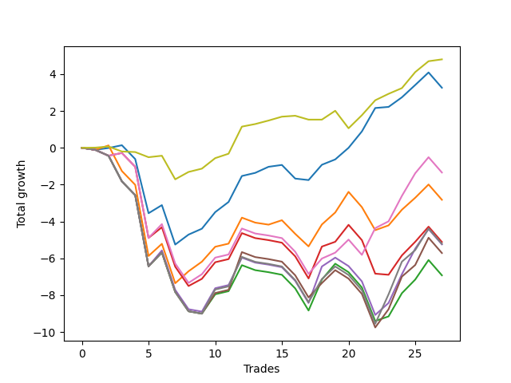

# Short Bulldog 006 
- Symbol: AAPL1y5m
- Date Range: 07/02/2021 - 07/08/2022
- Trading Period: 7:20-12:30
- Number of Trades: 27



| Name | Win Percent | Profit | Avg Profit / Trade |     | Name | Win Percent | Profit | Avg Profit / Trade |
| ---- | ----------- | ------ | ------------------ | --- | ---- | ----------- | ------ | ------------------ |
| Sorted By <br> Profit | | | | | Sorted By <br> Win Percentage ||||
| Seventy-Three | 74.07 | 2400.00 | 88.89 |     | Seventy-Three | 74.07 | 2400.00 | 88.89 |
| Zero | 74.07 | 1630.00 | 60.37 |     | Zero | 74.07 | 1630.00 | 60.37 |
| Six | 51.85 | -670.00 | -24.81 |     | One | 55.56 | -1410.00 | -52.22 |
| One | 55.56 | -1410.00 | -52.22 |     | Six | 51.85 | -670.00 | -24.81 |
| Three | 44.44 | -2555.00 | -94.63 |     | Three | 44.44 | -2555.00 | -94.63 |
| Seven | 37.04 | -2605.00 | -96.48 |     | Seven | 37.04 | -2605.00 | -96.48 |
| Four | 37.04 | -2620.00 | -97.04 |     | Four | 37.04 | -2620.00 | -97.04 |
| Five | 37.04 | -2855.00 | -105.74 |     | Five | 37.04 | -2855.00 | -105.74 |
| Two | 37.04 | -3460.00 | -128.15 |     | Two | 37.04 | -3460.00 | -128.15 |

## NO STOPLOSS

### Test Zero
* Sell when price hits the middle line of the 20p bollinger
* No Stoploss
* Results:
```
Total Trades: 27
Percent Up: 25.93
Percent Down: 74.07
Total Points Moved Down: 3.26
Potential Profit: 1630.00
Total Points Ups: 7.59 Count Ups: 7
Total Points Downs: 10.85 Count Downs: 20
```

<details><summary>Trades</summary>

<code>In: 2021-09-16 12:20:00		Out: 2021-09-16 12:50:00		Total Position Time: 30:00		Total Move Down: -0.11		Total to Date: -0.11</code> <br />
<code>In: 2021-10-13 10:45:00		Out: 2021-10-13 11:39:20		Total Position Time: 54:20		Total Move Down: 0.10		Total to Date: -0.01</code> <br />
<code>In: 2021-11-03 11:10:00		Out: 2021-11-03 11:15:10		Total Position Time: 05:10		Total Move Down: 0.15		Total to Date: 0.14</code> <br />
<code>In: 2021-11-03 12:00:00		Out: 2021-11-03 12:50:00		Total Position Time: 50:00		Total Move Down: -0.75		Total to Date: -0.61</code> <br />
<code>In: 2021-11-18 08:55:00		Out: 2021-11-18 11:31:15		Total Position Time: 156:15		Total Move Down: -2.94		Total to Date: -3.55</code> <br />
<code>In: 2021-12-08 11:35:00		Out: 2021-12-08 11:50:30		Total Position Time: 15:30		Total Move Down: 0.44		Total to Date: -3.11</code> <br />
<code>In: 2021-12-15 11:30:00		Out: 2021-12-15 12:50:00		Total Position Time: 80:00		Total Move Down: -2.14		Total to Date: -5.25</code> <br />
<code>In: 2021-12-21 09:35:00		Out: 2021-12-21 09:50:05		Total Position Time: 15:05		Total Move Down: 0.54		Total to Date: -4.71</code> <br />
<code>In: 2021-12-23 12:00:00		Out: 2021-12-23 12:30:20		Total Position Time: 30:20		Total Move Down: 0.32		Total to Date: -4.39</code> <br />
<code>In: 2021-12-28 08:15:00		Out: 2021-12-28 08:45:15		Total Position Time: 30:15		Total Move Down: 0.90		Total to Date: -3.49</code> <br />
<code>In: 2022-01-07 12:25:00		Out: 2022-01-07 12:44:10		Total Position Time: 19:10		Total Move Down: 0.55		Total to Date: -2.94</code> <br />
<code>In: 2022-01-26 11:10:00		Out: 2022-01-26 11:15:10		Total Position Time: 05:10		Total Move Down: 1.41		Total to Date: -1.53</code> <br />
<code>In: 2022-02-02 11:55:00		Out: 2022-02-02 12:36:05		Total Position Time: 41:05		Total Move Down: 0.17		Total to Date: -1.36</code> <br />
<code>In: 2022-02-02 12:25:00		Out: 2022-02-02 12:36:05		Total Position Time: 11:05		Total Move Down: 0.33		Total to Date: -1.03</code> <br />
<code>In: 2022-02-15 11:50:00		Out: 2022-02-15 12:33:30		Total Position Time: 43:30		Total Move Down: 0.10		Total to Date: -0.93</code> <br />
<code>In: 2022-02-16 11:40:00		Out: 2022-02-16 12:50:00		Total Position Time: 70:00		Total Move Down: -0.74		Total to Date: -1.67</code> <br />
<code>In: 2022-03-02 08:20:00		Out: 2022-03-02 09:55:20		Total Position Time: 95:20		Total Move Down: -0.08		Total to Date: -1.75</code> <br />
<code>In: 2022-03-25 07:50:00		Out: 2022-03-25 08:01:45		Total Position Time: 11:45		Total Move Down: 0.83		Total to Date: -0.92</code> <br />
<code>In: 2022-03-31 12:15:00		Out: 2022-03-31 12:20:20		Total Position Time: 05:20		Total Move Down: 0.29		Total to Date: -0.63</code> <br />
<code>In: 2022-04-06 10:55:00		Out: 2022-04-06 11:14:35		Total Position Time: 19:35		Total Move Down: 0.63		Total to Date: 0.00</code> <br />
<code>In: 2022-04-25 12:00:00		Out: 2022-04-25 12:07:15		Total Position Time: 07:15		Total Move Down: 0.89		Total to Date: 0.89</code> <br />
<code>In: 2022-04-28 08:25:00		Out: 2022-04-28 08:39:35		Total Position Time: 14:35		Total Move Down: 1.27		Total to Date: 2.16</code> <br />
<code>In: 2022-05-06 07:30:00		Out: 2022-05-06 08:36:15		Total Position Time: 66:15		Total Move Down: 0.06		Total to Date: 2.22</code> <br />
<code>In: 2022-05-16 11:45:00		Out: 2022-05-16 12:03:25		Total Position Time: 18:25		Total Move Down: 0.52		Total to Date: 2.74</code> <br />
<code>In: 2022-05-31 09:10:00		Out: 2022-05-31 10:03:10		Total Position Time: 53:10		Total Move Down: 0.67		Total to Date: 3.41</code> <br />
<code>In: 2022-06-14 10:30:00		Out: 2022-06-14 10:42:40		Total Position Time: 12:40		Total Move Down: 0.68		Total to Date: 4.09</code> <br />
<code>In: 2022-06-15 11:55:00		Out: 2022-06-15 12:50:00		Total Position Time: 55:00		Total Move Down: -0.83		Total to Date: 3.26</code> <br />


</details>

### Test One
* Sell when the price hits the upper line of the 20p 1std bollinger
* No Stoploss
* Results:
```
Total Trades: 27
Percent Up: 44.44
Percent Down: 55.56
Total Points Moved Down: -2.82
Potential Profit: -1410.00
Total Points Ups: 12.96 Count Ups: 12
Total Points Downs: 10.14 Count Downs: 15
```

<details><summary>Trades</summary>

<code>In: 2021-09-16 12:20:00		Out: 2021-09-16 12:50:00		Total Position Time: 30:00		Total Move Down: -0.11		Total to Date: -0.11</code> <br />
<code>In: 2021-10-13 10:45:00		Out: 2021-10-13 11:43:20		Total Position Time: 58:20		Total Move Down: 0.24		Total to Date: 0.13</code> <br />
<code>In: 2021-11-03 11:10:00		Out: 2021-11-03 12:50:00		Total Position Time: 100:00		Total Move Down: -1.39		Total to Date: -1.26</code> <br />
<code>In: 2021-11-03 12:00:00		Out: 2021-11-03 12:50:00		Total Position Time: 50:00		Total Move Down: -0.75		Total to Date: -2.01</code> <br />
<code>In: 2021-11-18 08:55:00		Out: 2021-11-18 12:50:00		Total Position Time: 235:00		Total Move Down: -3.86		Total to Date: -5.87</code> <br />
<code>In: 2021-12-08 11:35:00		Out: 2021-12-08 12:08:50		Total Position Time: 33:50		Total Move Down: 0.66		Total to Date: -5.21</code> <br />
<code>In: 2021-12-15 11:30:00		Out: 2021-12-15 12:50:00		Total Position Time: 80:00		Total Move Down: -2.14		Total to Date: -7.35</code> <br />
<code>In: 2021-12-21 09:35:00		Out: 2021-12-21 10:13:50		Total Position Time: 38:50		Total Move Down: 0.65		Total to Date: -6.70</code> <br />
<code>In: 2021-12-23 12:00:00		Out: 2021-12-23 12:31:50		Total Position Time: 31:50		Total Move Down: 0.52		Total to Date: -6.18</code> <br />
<code>In: 2021-12-28 08:15:00		Out: 2021-12-28 09:29:20		Total Position Time: 74:20		Total Move Down: 0.81		Total to Date: -5.37</code> <br />
<code>In: 2022-01-07 12:25:00		Out: 2022-01-07 12:50:00		Total Position Time: 25:00		Total Move Down: 0.17		Total to Date: -5.20</code> <br />
<code>In: 2022-01-26 11:10:00		Out: 2022-01-26 11:15:10		Total Position Time: 05:10		Total Move Down: 1.41		Total to Date: -3.79</code> <br />
<code>In: 2022-02-02 11:55:00		Out: 2022-02-02 12:50:00		Total Position Time: 55:00		Total Move Down: -0.27		Total to Date: -4.06</code> <br />
<code>In: 2022-02-02 12:25:00		Out: 2022-02-02 12:50:00		Total Position Time: 25:00		Total Move Down: -0.11		Total to Date: -4.17</code> <br />
<code>In: 2022-02-15 11:50:00		Out: 2022-02-15 12:42:20		Total Position Time: 52:20		Total Move Down: 0.24		Total to Date: -3.93</code> <br />
<code>In: 2022-02-16 11:40:00		Out: 2022-02-16 12:50:00		Total Position Time: 70:00		Total Move Down: -0.74		Total to Date: -4.67</code> <br />
<code>In: 2022-03-02 08:20:00		Out: 2022-03-02 11:59:15		Total Position Time: 219:15		Total Move Down: -0.68		Total to Date: -5.35</code> <br />
<code>In: 2022-03-25 07:50:00		Out: 2022-03-25 08:09:30		Total Position Time: 19:30		Total Move Down: 1.19		Total to Date: -4.16</code> <br />
<code>In: 2022-03-31 12:15:00		Out: 2022-03-31 12:33:05		Total Position Time: 18:05		Total Move Down: 0.65		Total to Date: -3.51</code> <br />
<code>In: 2022-04-06 10:55:00		Out: 2022-04-06 11:16:20		Total Position Time: 21:20		Total Move Down: 1.12		Total to Date: -2.39</code> <br />
<code>In: 2022-04-25 12:00:00		Out: 2022-04-25 12:50:00		Total Position Time: 50:00		Total Move Down: -0.83		Total to Date: -3.22</code> <br />
<code>In: 2022-04-28 08:25:00		Out: 2022-04-28 11:31:25		Total Position Time: 186:25		Total Move Down: -1.25		Total to Date: -4.47</code> <br />
<code>In: 2022-05-06 07:30:00		Out: 2022-05-06 08:58:45		Total Position Time: 88:45		Total Move Down: 0.26		Total to Date: -4.21</code> <br />
<code>In: 2022-05-16 11:45:00		Out: 2022-05-16 12:12:45		Total Position Time: 27:45		Total Move Down: 0.85		Total to Date: -3.36</code> <br />
<code>In: 2022-05-31 09:10:00		Out: 2022-05-31 10:28:40		Total Position Time: 78:40		Total Move Down: 0.65		Total to Date: -2.71</code> <br />
<code>In: 2022-06-14 10:30:00		Out: 2022-06-14 11:48:10		Total Position Time: 78:10		Total Move Down: 0.72		Total to Date: -1.99</code> <br />
<code>In: 2022-06-15 11:55:00		Out: 2022-06-15 12:50:00		Total Position Time: 55:00		Total Move Down: -0.83		Total to Date: -2.82</code> <br />


</details>

### Test Two
* Sell when the price hits the upper line of the 20p 2std bollinger
* No Stoploss
* Results:
```
Total Trades: 27
Percent Up: 62.96
Percent Down: 37.04
Total Points Moved Down: -6.92
Potential Profit: -3460.00
Total Points Ups: 16.15 Count Ups: 17
Total Points Downs: 9.23 Count Downs: 10
```

<details><summary>Trades</summary>

<code>In: 2021-09-16 12:20:00		Out: 2021-09-16 12:50:00		Total Position Time: 30:00		Total Move Down: -0.11		Total to Date: -0.11</code> <br />
<code>In: 2021-10-13 10:45:00		Out: 2021-10-13 12:50:00		Total Position Time: 125:00		Total Move Down: -0.32		Total to Date: -0.43</code> <br />
<code>In: 2021-11-03 11:10:00		Out: 2021-11-03 12:50:00		Total Position Time: 100:00		Total Move Down: -1.39		Total to Date: -1.82</code> <br />
<code>In: 2021-11-03 12:00:00		Out: 2021-11-03 12:50:00		Total Position Time: 50:00		Total Move Down: -0.75		Total to Date: -2.57</code> <br />
<code>In: 2021-11-18 08:55:00		Out: 2021-11-18 12:50:00		Total Position Time: 235:00		Total Move Down: -3.86		Total to Date: -6.43</code> <br />
<code>In: 2021-12-08 11:35:00		Out: 2021-12-08 12:50:00		Total Position Time: 75:00		Total Move Down: 0.75		Total to Date: -5.68</code> <br />
<code>In: 2021-12-15 11:30:00		Out: 2021-12-15 12:50:00		Total Position Time: 80:00		Total Move Down: -2.14		Total to Date: -7.82</code> <br />
<code>In: 2021-12-21 09:35:00		Out: 2021-12-21 12:50:00		Total Position Time: 195:00		Total Move Down: -1.05		Total to Date: -8.87</code> <br />
<code>In: 2021-12-23 12:00:00		Out: 2021-12-23 12:50:00		Total Position Time: 50:00		Total Move Down: -0.13		Total to Date: -9.00</code> <br />
<code>In: 2021-12-28 08:15:00		Out: 2021-12-28 09:31:40		Total Position Time: 76:40		Total Move Down: 1.05		Total to Date: -7.95</code> <br />
<code>In: 2022-01-07 12:25:00		Out: 2022-01-07 12:50:00		Total Position Time: 25:00		Total Move Down: 0.17		Total to Date: -7.78</code> <br />
<code>In: 2022-01-26 11:10:00		Out: 2022-01-26 11:15:10		Total Position Time: 05:10		Total Move Down: 1.41		Total to Date: -6.37</code> <br />
<code>In: 2022-02-02 11:55:00		Out: 2022-02-02 12:50:00		Total Position Time: 55:00		Total Move Down: -0.27		Total to Date: -6.64</code> <br />
<code>In: 2022-02-02 12:25:00		Out: 2022-02-02 12:50:00		Total Position Time: 25:00		Total Move Down: -0.11		Total to Date: -6.75</code> <br />
<code>In: 2022-02-15 11:50:00		Out: 2022-02-15 12:50:00		Total Position Time: 60:00		Total Move Down: -0.14		Total to Date: -6.89</code> <br />
<code>In: 2022-02-16 11:40:00		Out: 2022-02-16 12:50:00		Total Position Time: 70:00		Total Move Down: -0.74		Total to Date: -7.63</code> <br />
<code>In: 2022-03-02 08:20:00		Out: 2022-03-02 12:50:00		Total Position Time: 270:00		Total Move Down: -1.20		Total to Date: -8.83</code> <br />
<code>In: 2022-03-25 07:50:00		Out: 2022-03-25 08:20:45		Total Position Time: 30:45		Total Move Down: 1.68		Total to Date: -7.15</code> <br />
<code>In: 2022-03-31 12:15:00		Out: 2022-03-31 12:43:55		Total Position Time: 28:55		Total Move Down: 0.86		Total to Date: -6.29</code> <br />
<code>In: 2022-04-06 10:55:00		Out: 2022-04-06 12:50:00		Total Position Time: 115:00		Total Move Down: -0.46		Total to Date: -6.75</code> <br />
<code>In: 2022-04-25 12:00:00		Out: 2022-04-25 12:50:00		Total Position Time: 50:00		Total Move Down: -0.83		Total to Date: -7.58</code> <br />
<code>In: 2022-04-28 08:25:00		Out: 2022-04-28 12:50:00		Total Position Time: 265:00		Total Move Down: -1.82		Total to Date: -9.40</code> <br />
<code>In: 2022-05-06 07:30:00		Out: 2022-05-06 10:53:05		Total Position Time: 203:05		Total Move Down: 0.25		Total to Date: -9.15</code> <br />
<code>In: 2022-05-16 11:45:00		Out: 2022-05-16 12:21:00		Total Position Time: 36:00		Total Move Down: 1.26		Total to Date: -7.89</code> <br />
<code>In: 2022-05-31 09:10:00		Out: 2022-05-31 11:45:20		Total Position Time: 155:20		Total Move Down: 0.74		Total to Date: -7.15</code> <br />
<code>In: 2022-06-14 10:30:00		Out: 2022-06-14 12:07:45		Total Position Time: 97:45		Total Move Down: 1.06		Total to Date: -6.09</code> <br />
<code>In: 2022-06-15 11:55:00		Out: 2022-06-15 12:50:00		Total Position Time: 55:00		Total Move Down: -0.83		Total to Date: -6.92</code> <br />


</details>

### Test Three
* Sell when price hits the middle line of the 50p bollinger
* No Stoploss
* Results:
```
Total Trades: 27
Percent Up: 55.56
Percent Down: 44.44
Total Points Moved Down: -5.11
Potential Profit: -2555.00
Total Points Ups: 14.23 Count Ups: 15
Total Points Downs: 9.12 Count Downs: 12
```

<details><summary>Trades</summary>

<code>In: 2021-09-16 12:20:00		Out: 2021-09-16 12:50:00		Total Position Time: 30:00		Total Move Down: -0.11		Total to Date: -0.11</code> <br />
<code>In: 2021-10-13 10:45:00		Out: 2021-10-13 12:50:00		Total Position Time: 125:00		Total Move Down: -0.32		Total to Date: -0.43</code> <br />
<code>In: 2021-11-03 11:10:00		Out: 2021-11-03 11:15:10		Total Position Time: 05:10		Total Move Down: 0.15		Total to Date: -0.28</code> <br />
<code>In: 2021-11-03 12:00:00		Out: 2021-11-03 12:50:00		Total Position Time: 50:00		Total Move Down: -0.75		Total to Date: -1.03</code> <br />
<code>In: 2021-11-18 08:55:00		Out: 2021-11-18 12:50:00		Total Position Time: 235:00		Total Move Down: -3.86		Total to Date: -4.89</code> <br />
<code>In: 2021-12-08 11:35:00		Out: 2021-12-08 12:03:55		Total Position Time: 28:55		Total Move Down: 0.58		Total to Date: -4.31</code> <br />
<code>In: 2021-12-15 11:30:00		Out: 2021-12-15 12:50:00		Total Position Time: 80:00		Total Move Down: -2.14		Total to Date: -6.45</code> <br />
<code>In: 2021-12-21 09:35:00		Out: 2021-12-21 12:50:00		Total Position Time: 195:00		Total Move Down: -1.05		Total to Date: -7.50</code> <br />
<code>In: 2021-12-23 12:00:00		Out: 2021-12-23 12:30:55		Total Position Time: 30:55		Total Move Down: 0.39		Total to Date: -7.11</code> <br />
<code>In: 2021-12-28 08:15:00		Out: 2021-12-28 08:45:15		Total Position Time: 30:15		Total Move Down: 0.90		Total to Date: -6.21</code> <br />
<code>In: 2022-01-07 12:25:00		Out: 2022-01-07 12:50:00		Total Position Time: 25:00		Total Move Down: 0.17		Total to Date: -6.04</code> <br />
<code>In: 2022-01-26 11:10:00		Out: 2022-01-26 11:15:10		Total Position Time: 05:10		Total Move Down: 1.41		Total to Date: -4.63</code> <br />
<code>In: 2022-02-02 11:55:00		Out: 2022-02-02 12:50:00		Total Position Time: 55:00		Total Move Down: -0.27		Total to Date: -4.90</code> <br />
<code>In: 2022-02-02 12:25:00		Out: 2022-02-02 12:50:00		Total Position Time: 25:00		Total Move Down: -0.11		Total to Date: -5.01</code> <br />
<code>In: 2022-02-15 11:50:00		Out: 2022-02-15 12:50:00		Total Position Time: 60:00		Total Move Down: -0.14		Total to Date: -5.15</code> <br />
<code>In: 2022-02-16 11:40:00		Out: 2022-02-16 12:50:00		Total Position Time: 70:00		Total Move Down: -0.74		Total to Date: -5.89</code> <br />
<code>In: 2022-03-02 08:20:00		Out: 2022-03-02 12:50:00		Total Position Time: 270:00		Total Move Down: -1.20		Total to Date: -7.09</code> <br />
<code>In: 2022-03-25 07:50:00		Out: 2022-03-25 08:21:50		Total Position Time: 31:50		Total Move Down: 1.73		Total to Date: -5.36</code> <br />
<code>In: 2022-03-31 12:15:00		Out: 2022-03-31 12:20:15		Total Position Time: 05:15		Total Move Down: 0.26		Total to Date: -5.10</code> <br />
<code>In: 2022-04-06 10:55:00		Out: 2022-04-06 11:15:25		Total Position Time: 20:25		Total Move Down: 0.92		Total to Date: -4.18</code> <br />
<code>In: 2022-04-25 12:00:00		Out: 2022-04-25 12:50:00		Total Position Time: 50:00		Total Move Down: -0.83		Total to Date: -5.01</code> <br />
<code>In: 2022-04-28 08:25:00		Out: 2022-04-28 12:50:00		Total Position Time: 265:00		Total Move Down: -1.82		Total to Date: -6.83</code> <br />
<code>In: 2022-05-06 07:30:00		Out: 2022-05-06 10:50:35		Total Position Time: 200:35		Total Move Down: -0.06		Total to Date: -6.89</code> <br />
<code>In: 2022-05-16 11:45:00		Out: 2022-05-16 12:17:45		Total Position Time: 32:45		Total Move Down: 1.05		Total to Date: -5.84</code> <br />
<code>In: 2022-05-31 09:10:00		Out: 2022-05-31 11:45:20		Total Position Time: 155:20		Total Move Down: 0.74		Total to Date: -5.10</code> <br />
<code>In: 2022-06-14 10:30:00		Out: 2022-06-14 10:43:55		Total Position Time: 13:55		Total Move Down: 0.82		Total to Date: -4.28</code> <br />
<code>In: 2022-06-15 11:55:00		Out: 2022-06-15 12:50:00		Total Position Time: 55:00		Total Move Down: -0.83		Total to Date: -5.11</code> <br />


</details>

### Test Four
* Sell when the price hits the upper line of the 50p 1std bollinger
* No Stoploss
* Results:
```
Total Trades: 27
Percent Up: 62.96
Percent Down: 37.04
Total Points Moved Down: -5.24
Potential Profit: -2620.00
Total Points Ups: 16.15 Count Ups: 17
Total Points Downs: 10.91 Count Downs: 10
```

<details><summary>Trades</summary>

<code>In: 2021-09-16 12:20:00		Out: 2021-09-16 12:50:00		Total Position Time: 30:00		Total Move Down: -0.11		Total to Date: -0.11</code> <br />
<code>In: 2021-10-13 10:45:00		Out: 2021-10-13 12:50:00		Total Position Time: 125:00		Total Move Down: -0.32		Total to Date: -0.43</code> <br />
<code>In: 2021-11-03 11:10:00		Out: 2021-11-03 12:50:00		Total Position Time: 100:00		Total Move Down: -1.39		Total to Date: -1.82</code> <br />
<code>In: 2021-11-03 12:00:00		Out: 2021-11-03 12:50:00		Total Position Time: 50:00		Total Move Down: -0.75		Total to Date: -2.57</code> <br />
<code>In: 2021-11-18 08:55:00		Out: 2021-11-18 12:50:00		Total Position Time: 235:00		Total Move Down: -3.86		Total to Date: -6.43</code> <br />
<code>In: 2021-12-08 11:35:00		Out: 2021-12-08 12:20:25		Total Position Time: 45:25		Total Move Down: 0.86		Total to Date: -5.57</code> <br />
<code>In: 2021-12-15 11:30:00		Out: 2021-12-15 12:50:00		Total Position Time: 80:00		Total Move Down: -2.14		Total to Date: -7.71</code> <br />
<code>In: 2021-12-21 09:35:00		Out: 2021-12-21 12:50:00		Total Position Time: 195:00		Total Move Down: -1.05		Total to Date: -8.76</code> <br />
<code>In: 2021-12-23 12:00:00		Out: 2021-12-23 12:50:00		Total Position Time: 50:00		Total Move Down: -0.13		Total to Date: -8.89</code> <br />
<code>In: 2021-12-28 08:15:00		Out: 2021-12-28 09:32:15		Total Position Time: 77:15		Total Move Down: 1.27		Total to Date: -7.62</code> <br />
<code>In: 2022-01-07 12:25:00		Out: 2022-01-07 12:50:00		Total Position Time: 25:00		Total Move Down: 0.17		Total to Date: -7.45</code> <br />
<code>In: 2022-01-26 11:10:00		Out: 2022-01-26 11:16:40		Total Position Time: 06:40		Total Move Down: 1.49		Total to Date: -5.96</code> <br />
<code>In: 2022-02-02 11:55:00		Out: 2022-02-02 12:50:00		Total Position Time: 55:00		Total Move Down: -0.27		Total to Date: -6.23</code> <br />
<code>In: 2022-02-02 12:25:00		Out: 2022-02-02 12:50:00		Total Position Time: 25:00		Total Move Down: -0.11		Total to Date: -6.34</code> <br />
<code>In: 2022-02-15 11:50:00		Out: 2022-02-15 12:50:00		Total Position Time: 60:00		Total Move Down: -0.14		Total to Date: -6.48</code> <br />
<code>In: 2022-02-16 11:40:00		Out: 2022-02-16 12:50:00		Total Position Time: 70:00		Total Move Down: -0.74		Total to Date: -7.22</code> <br />
<code>In: 2022-03-02 08:20:00		Out: 2022-03-02 12:50:00		Total Position Time: 270:00		Total Move Down: -1.20		Total to Date: -8.42</code> <br />
<code>In: 2022-03-25 07:50:00		Out: 2022-03-25 09:37:35		Total Position Time: 107:35		Total Move Down: 1.98		Total to Date: -6.44</code> <br />
<code>In: 2022-03-31 12:15:00		Out: 2022-03-31 12:21:40		Total Position Time: 06:40		Total Move Down: 0.48		Total to Date: -5.96</code> <br />
<code>In: 2022-04-06 10:55:00		Out: 2022-04-06 12:50:00		Total Position Time: 115:00		Total Move Down: -0.46		Total to Date: -6.42</code> <br />
<code>In: 2022-04-25 12:00:00		Out: 2022-04-25 12:50:00		Total Position Time: 50:00		Total Move Down: -0.83		Total to Date: -7.25</code> <br />
<code>In: 2022-04-28 08:25:00		Out: 2022-04-28 12:50:00		Total Position Time: 265:00		Total Move Down: -1.82		Total to Date: -9.07</code> <br />
<code>In: 2022-05-06 07:30:00		Out: 2022-05-06 11:05:35		Total Position Time: 215:35		Total Move Down: 0.65		Total to Date: -8.42</code> <br />
<code>In: 2022-05-16 11:45:00		Out: 2022-05-16 12:35:20		Total Position Time: 50:20		Total Move Down: 1.56		Total to Date: -6.86</code> <br />
<code>In: 2022-05-31 09:10:00		Out: 2022-05-31 11:55:40		Total Position Time: 165:40		Total Move Down: 1.39		Total to Date: -5.47</code> <br />
<code>In: 2022-06-14 10:30:00		Out: 2022-06-14 12:07:45		Total Position Time: 97:45		Total Move Down: 1.06		Total to Date: -4.41</code> <br />
<code>In: 2022-06-15 11:55:00		Out: 2022-06-15 12:50:00		Total Position Time: 55:00		Total Move Down: -0.83		Total to Date: -5.24</code> <br />


</details>

### Test Five
* Sell when the price hits the upper line of the 50p 2std bollinger
* No Stoploss
* Results:
```
Total Trades: 27
Percent Up: 62.96
Percent Down: 37.04
Total Points Moved Down: -5.71
Potential Profit: -2855.00
Total Points Ups: 16.15 Count Ups: 17
Total Points Downs: 10.44 Count Downs: 10
```

<details><summary>Trades</summary>

<code>In: 2021-09-16 12:20:00		Out: 2021-09-16 12:50:00		Total Position Time: 30:00		Total Move Down: -0.11		Total to Date: -0.11</code> <br />
<code>In: 2021-10-13 10:45:00		Out: 2021-10-13 12:50:00		Total Position Time: 125:00		Total Move Down: -0.32		Total to Date: -0.43</code> <br />
<code>In: 2021-11-03 11:10:00		Out: 2021-11-03 12:50:00		Total Position Time: 100:00		Total Move Down: -1.39		Total to Date: -1.82</code> <br />
<code>In: 2021-11-03 12:00:00		Out: 2021-11-03 12:50:00		Total Position Time: 50:00		Total Move Down: -0.75		Total to Date: -2.57</code> <br />
<code>In: 2021-11-18 08:55:00		Out: 2021-11-18 12:50:00		Total Position Time: 235:00		Total Move Down: -3.86		Total to Date: -6.43</code> <br />
<code>In: 2021-12-08 11:35:00		Out: 2021-12-08 12:50:00		Total Position Time: 75:00		Total Move Down: 0.75		Total to Date: -5.68</code> <br />
<code>In: 2021-12-15 11:30:00		Out: 2021-12-15 12:50:00		Total Position Time: 80:00		Total Move Down: -2.14		Total to Date: -7.82</code> <br />
<code>In: 2021-12-21 09:35:00		Out: 2021-12-21 12:50:00		Total Position Time: 195:00		Total Move Down: -1.05		Total to Date: -8.87</code> <br />
<code>In: 2021-12-23 12:00:00		Out: 2021-12-23 12:50:00		Total Position Time: 50:00		Total Move Down: -0.13		Total to Date: -9.00</code> <br />
<code>In: 2021-12-28 08:15:00		Out: 2021-12-28 12:50:00		Total Position Time: 275:00		Total Move Down: 1.12		Total to Date: -7.88</code> <br />
<code>In: 2022-01-07 12:25:00		Out: 2022-01-07 12:50:00		Total Position Time: 25:00		Total Move Down: 0.17		Total to Date: -7.71</code> <br />
<code>In: 2022-01-26 11:10:00		Out: 2022-01-26 11:34:45		Total Position Time: 24:45		Total Move Down: 2.05		Total to Date: -5.66</code> <br />
<code>In: 2022-02-02 11:55:00		Out: 2022-02-02 12:50:00		Total Position Time: 55:00		Total Move Down: -0.27		Total to Date: -5.93</code> <br />
<code>In: 2022-02-02 12:25:00		Out: 2022-02-02 12:50:00		Total Position Time: 25:00		Total Move Down: -0.11		Total to Date: -6.04</code> <br />
<code>In: 2022-02-15 11:50:00		Out: 2022-02-15 12:50:00		Total Position Time: 60:00		Total Move Down: -0.14		Total to Date: -6.18</code> <br />
<code>In: 2022-02-16 11:40:00		Out: 2022-02-16 12:50:00		Total Position Time: 70:00		Total Move Down: -0.74		Total to Date: -6.92</code> <br />
<code>In: 2022-03-02 08:20:00		Out: 2022-03-02 12:50:00		Total Position Time: 270:00		Total Move Down: -1.20		Total to Date: -8.12</code> <br />
<code>In: 2022-03-25 07:50:00		Out: 2022-03-25 12:50:00		Total Position Time: 300:00		Total Move Down: 0.78		Total to Date: -7.34</code> <br />
<code>In: 2022-03-31 12:15:00		Out: 2022-03-31 12:33:45		Total Position Time: 18:45		Total Move Down: 0.70		Total to Date: -6.64</code> <br />
<code>In: 2022-04-06 10:55:00		Out: 2022-04-06 12:50:00		Total Position Time: 115:00		Total Move Down: -0.46		Total to Date: -7.10</code> <br />
<code>In: 2022-04-25 12:00:00		Out: 2022-04-25 12:50:00		Total Position Time: 50:00		Total Move Down: -0.83		Total to Date: -7.93</code> <br />
<code>In: 2022-04-28 08:25:00		Out: 2022-04-28 12:50:00		Total Position Time: 265:00		Total Move Down: -1.82		Total to Date: -9.75</code> <br />
<code>In: 2022-05-06 07:30:00		Out: 2022-05-06 11:25:35		Total Position Time: 235:35		Total Move Down: 0.99		Total to Date: -8.76</code> <br />
<code>In: 2022-05-16 11:45:00		Out: 2022-05-16 12:50:00		Total Position Time: 65:00		Total Move Down: 1.77		Total to Date: -6.99</code> <br />
<code>In: 2022-05-31 09:10:00		Out: 2022-05-31 12:50:00		Total Position Time: 220:00		Total Move Down: 0.63		Total to Date: -6.36</code> <br />
<code>In: 2022-06-14 10:30:00		Out: 2022-06-14 12:18:15		Total Position Time: 108:15		Total Move Down: 1.48		Total to Date: -4.88</code> <br />
<code>In: 2022-06-15 11:55:00		Out: 2022-06-15 12:50:00		Total Position Time: 55:00		Total Move Down: -0.83		Total to Date: -5.71</code> <br />


</details>

### Test Six
* Sell when the price hits the middle line of the 1std VWAP
* No Stoploss
* Results:
```
Total Trades: 27
Percent Up: 48.15
Percent Down: 51.85
Total Points Moved Down: -1.34
Potential Profit: -670.00
Total Points Ups: 12.35 Count Ups: 13
Total Points Downs: 11.01 Count Downs: 14
```

<details><summary>Trades</summary>

<code>In: 2021-09-16 12:20:00		Out: 2021-09-16 12:50:00		Total Position Time: 30:00		Total Move Down: -0.11		Total to Date: -0.11</code> <br />
<code>In: 2021-10-13 10:45:00		Out: 2021-10-13 12:50:00		Total Position Time: 125:00		Total Move Down: -0.32		Total to Date: -0.43</code> <br />
<code>In: 2021-11-03 11:10:00		Out: 2021-11-03 11:15:10		Total Position Time: 05:10		Total Move Down: 0.15		Total to Date: -0.28</code> <br />
<code>In: 2021-11-03 12:00:00		Out: 2021-11-03 12:50:00		Total Position Time: 50:00		Total Move Down: -0.75		Total to Date: -1.03</code> <br />
<code>In: 2021-11-18 08:55:00		Out: 2021-11-18 12:50:00		Total Position Time: 235:00		Total Move Down: -3.86		Total to Date: -4.89</code> <br />
<code>In: 2021-12-08 11:35:00		Out: 2021-12-08 12:50:00		Total Position Time: 75:00		Total Move Down: 0.75		Total to Date: -4.14</code> <br />
<code>In: 2021-12-15 11:30:00		Out: 2021-12-15 12:50:00		Total Position Time: 80:00		Total Move Down: -2.14		Total to Date: -6.28</code> <br />
<code>In: 2021-12-21 09:35:00		Out: 2021-12-21 12:50:00		Total Position Time: 195:00		Total Move Down: -1.05		Total to Date: -7.33</code> <br />
<code>In: 2021-12-23 12:00:00		Out: 2021-12-23 12:31:35		Total Position Time: 31:35		Total Move Down: 0.47		Total to Date: -6.86</code> <br />
<code>In: 2021-12-28 08:15:00		Out: 2021-12-28 08:45:15		Total Position Time: 30:15		Total Move Down: 0.90		Total to Date: -5.96</code> <br />
<code>In: 2022-01-07 12:25:00		Out: 2022-01-07 12:50:00		Total Position Time: 25:00		Total Move Down: 0.17		Total to Date: -5.79</code> <br />
<code>In: 2022-01-26 11:10:00		Out: 2022-01-26 11:15:10		Total Position Time: 05:10		Total Move Down: 1.41		Total to Date: -4.38</code> <br />
<code>In: 2022-02-02 11:55:00		Out: 2022-02-02 12:50:00		Total Position Time: 55:00		Total Move Down: -0.27		Total to Date: -4.65</code> <br />
<code>In: 2022-02-02 12:25:00		Out: 2022-02-02 12:50:00		Total Position Time: 25:00		Total Move Down: -0.11		Total to Date: -4.76</code> <br />
<code>In: 2022-02-15 11:50:00		Out: 2022-02-15 12:50:00		Total Position Time: 60:00		Total Move Down: -0.14		Total to Date: -4.90</code> <br />
<code>In: 2022-02-16 11:40:00		Out: 2022-02-16 12:50:00		Total Position Time: 70:00		Total Move Down: -0.74		Total to Date: -5.64</code> <br />
<code>In: 2022-03-02 08:20:00		Out: 2022-03-02 12:50:00		Total Position Time: 270:00		Total Move Down: -1.20		Total to Date: -6.84</code> <br />
<code>In: 2022-03-25 07:50:00		Out: 2022-03-25 08:01:45		Total Position Time: 11:45		Total Move Down: 0.83		Total to Date: -6.01</code> <br />
<code>In: 2022-03-31 12:15:00		Out: 2022-03-31 12:20:30		Total Position Time: 05:30		Total Move Down: 0.32		Total to Date: -5.69</code> <br />
<code>In: 2022-04-06 10:55:00		Out: 2022-04-06 11:14:50		Total Position Time: 19:50		Total Move Down: 0.71		Total to Date: -4.98</code> <br />
<code>In: 2022-04-25 12:00:00		Out: 2022-04-25 12:50:00		Total Position Time: 50:00		Total Move Down: -0.83		Total to Date: -5.81</code> <br />
<code>In: 2022-04-28 08:25:00		Out: 2022-04-28 08:50:40		Total Position Time: 25:40		Total Move Down: 1.45		Total to Date: -4.36</code> <br />
<code>In: 2022-05-06 07:30:00		Out: 2022-05-06 10:53:25		Total Position Time: 203:25		Total Move Down: 0.37		Total to Date: -3.99</code> <br />
<code>In: 2022-05-16 11:45:00		Out: 2022-05-16 12:34:05		Total Position Time: 49:05		Total Move Down: 1.38		Total to Date: -2.61</code> <br />
<code>In: 2022-05-31 09:10:00		Out: 2022-05-31 11:54:45		Total Position Time: 164:45		Total Move Down: 1.23		Total to Date: -1.38</code> <br />
<code>In: 2022-06-14 10:30:00		Out: 2022-06-14 10:44:05		Total Position Time: 14:05		Total Move Down: 0.87		Total to Date: -0.51</code> <br />
<code>In: 2022-06-15 11:55:00		Out: 2022-06-15 12:50:00		Total Position Time: 55:00		Total Move Down: -0.83		Total to Date: -1.34</code> <br />


</details>

### Test Seven
* Sell when the price hits the upper line of the 1std VWAP
* No Stoploss
* Results:
```
Total Trades: 27
Percent Up: 62.96
Percent Down: 37.04
Total Points Moved Down: -5.21
Potential Profit: -2605.00
Total Points Ups: 16.15 Count Ups: 17
Total Points Downs: 10.94 Count Downs: 10
```

<details><summary>Trades</summary>

<code>In: 2021-09-16 12:20:00		Out: 2021-09-16 12:50:00		Total Position Time: 30:00		Total Move Down: -0.11		Total to Date: -0.11</code> <br />
<code>In: 2021-10-13 10:45:00		Out: 2021-10-13 12:50:00		Total Position Time: 125:00		Total Move Down: -0.32		Total to Date: -0.43</code> <br />
<code>In: 2021-11-03 11:10:00		Out: 2021-11-03 12:50:00		Total Position Time: 100:00		Total Move Down: -1.39		Total to Date: -1.82</code> <br />
<code>In: 2021-11-03 12:00:00		Out: 2021-11-03 12:50:00		Total Position Time: 50:00		Total Move Down: -0.75		Total to Date: -2.57</code> <br />
<code>In: 2021-11-18 08:55:00		Out: 2021-11-18 12:50:00		Total Position Time: 235:00		Total Move Down: -3.86		Total to Date: -6.43</code> <br />
<code>In: 2021-12-08 11:35:00		Out: 2021-12-08 12:50:00		Total Position Time: 75:00		Total Move Down: 0.75		Total to Date: -5.68</code> <br />
<code>In: 2021-12-15 11:30:00		Out: 2021-12-15 12:50:00		Total Position Time: 80:00		Total Move Down: -2.14		Total to Date: -7.82</code> <br />
<code>In: 2021-12-21 09:35:00		Out: 2021-12-21 12:50:00		Total Position Time: 195:00		Total Move Down: -1.05		Total to Date: -8.87</code> <br />
<code>In: 2021-12-23 12:00:00		Out: 2021-12-23 12:50:00		Total Position Time: 50:00		Total Move Down: -0.13		Total to Date: -9.00</code> <br />
<code>In: 2021-12-28 08:15:00		Out: 2021-12-28 09:32:20		Total Position Time: 77:20		Total Move Down: 1.31		Total to Date: -7.69</code> <br />
<code>In: 2022-01-07 12:25:00		Out: 2022-01-07 12:50:00		Total Position Time: 25:00		Total Move Down: 0.17		Total to Date: -7.52</code> <br />
<code>In: 2022-01-26 11:10:00		Out: 2022-01-26 11:34:35		Total Position Time: 24:35		Total Move Down: 1.60		Total to Date: -5.92</code> <br />
<code>In: 2022-02-02 11:55:00		Out: 2022-02-02 12:50:00		Total Position Time: 55:00		Total Move Down: -0.27		Total to Date: -6.19</code> <br />
<code>In: 2022-02-02 12:25:00		Out: 2022-02-02 12:50:00		Total Position Time: 25:00		Total Move Down: -0.11		Total to Date: -6.30</code> <br />
<code>In: 2022-02-15 11:50:00		Out: 2022-02-15 12:50:00		Total Position Time: 60:00		Total Move Down: -0.14		Total to Date: -6.44</code> <br />
<code>In: 2022-02-16 11:40:00		Out: 2022-02-16 12:50:00		Total Position Time: 70:00		Total Move Down: -0.74		Total to Date: -7.18</code> <br />
<code>In: 2022-03-02 08:20:00		Out: 2022-03-02 12:50:00		Total Position Time: 270:00		Total Move Down: -1.20		Total to Date: -8.38</code> <br />
<code>In: 2022-03-25 07:50:00		Out: 2022-03-25 08:09:50		Total Position Time: 19:50		Total Move Down: 1.26		Total to Date: -7.12</code> <br />
<code>In: 2022-03-31 12:15:00		Out: 2022-03-31 12:33:10		Total Position Time: 18:10		Total Move Down: 0.68		Total to Date: -6.44</code> <br />
<code>In: 2022-04-06 10:55:00		Out: 2022-04-06 12:50:00		Total Position Time: 115:00		Total Move Down: -0.46		Total to Date: -6.90</code> <br />
<code>In: 2022-04-25 12:00:00		Out: 2022-04-25 12:50:00		Total Position Time: 50:00		Total Move Down: -0.83		Total to Date: -7.73</code> <br />
<code>In: 2022-04-28 08:25:00		Out: 2022-04-28 12:50:00		Total Position Time: 265:00		Total Move Down: -1.82		Total to Date: -9.55</code> <br />
<code>In: 2022-05-06 07:30:00		Out: 2022-05-06 12:08:30		Total Position Time: 278:30		Total Move Down: 1.60		Total to Date: -7.95</code> <br />
<code>In: 2022-05-16 11:45:00		Out: 2022-05-16 12:50:00		Total Position Time: 65:00		Total Move Down: 1.77		Total to Date: -6.18</code> <br />
<code>In: 2022-05-31 09:10:00		Out: 2022-05-31 12:50:00		Total Position Time: 220:00		Total Move Down: 0.63		Total to Date: -5.55</code> <br />
<code>In: 2022-06-14 10:30:00		Out: 2022-06-14 12:08:30		Total Position Time: 98:30		Total Move Down: 1.17		Total to Date: -4.38</code> <br />
<code>In: 2022-06-15 11:55:00		Out: 2022-06-15 12:50:00		Total Position Time: 55:00		Total Move Down: -0.83		Total to Date: -5.21</code> <br />


</details>

## SPECIAL EXIT CONDITIONS 

### Test Seventy-Three
* Sell when the linear regression slope changes to negative
* No Stoploss
* Results:
```
Total Trades: 27
Percent Up: 25.93
Percent Down: 74.07
Total Points Moved Down: 4.80
Potential Profit: 2400.00
Total Points Ups: 3.02 Count Ups: 7
Total Points Downs: 7.82 Count Downs: 20
```

<details><summary>Trades</summary>

<code>In: 2021-09-16 12:20:00		Out: 2021-09-16 12:26:00		Total Position Time: 06:00		Total Move Down: 0.01		Total to Date: 0.01</code> <br />
<code>In: 2021-10-13 10:45:00		Out: 2021-10-13 10:51:05		Total Position Time: 06:05		Total Move Down: 0.06		Total to Date: 0.07</code> <br />
<code>In: 2021-11-03 11:10:00		Out: 2021-11-03 11:30:00		Total Position Time: 20:00		Total Move Down: -0.27		Total to Date: -0.20</code> <br />
<code>In: 2021-11-03 12:00:00		Out: 2021-11-03 12:10:00		Total Position Time: 10:00		Total Move Down: -0.03		Total to Date: -0.23</code> <br />
<code>In: 2021-11-18 08:55:00		Out: 2021-11-18 09:19:05		Total Position Time: 24:05		Total Move Down: -0.28		Total to Date: -0.51</code> <br />
<code>In: 2021-12-08 11:35:00		Out: 2021-12-08 11:38:05		Total Position Time: 03:05		Total Move Down: 0.08		Total to Date: -0.43</code> <br />
<code>In: 2021-12-15 11:30:00		Out: 2021-12-15 11:46:00		Total Position Time: 16:00		Total Move Down: -1.28		Total to Date: -1.71</code> <br />
<code>In: 2021-12-21 09:35:00		Out: 2021-12-21 09:41:05		Total Position Time: 06:05		Total Move Down: 0.40		Total to Date: -1.31</code> <br />
<code>In: 2021-12-23 12:00:00		Out: 2021-12-23 12:10:05		Total Position Time: 10:05		Total Move Down: 0.18		Total to Date: -1.13</code> <br />
<code>In: 2021-12-28 08:15:00		Out: 2021-12-28 08:24:05		Total Position Time: 09:05		Total Move Down: 0.57		Total to Date: -0.56</code> <br />
<code>In: 2022-01-07 12:25:00		Out: 2022-01-07 12:30:00		Total Position Time: 05:00		Total Move Down: 0.24		Total to Date: -0.32</code> <br />
<code>In: 2022-01-26 11:10:00		Out: 2022-01-26 11:15:05		Total Position Time: 05:05		Total Move Down: 1.47		Total to Date: 1.15</code> <br />
<code>In: 2022-02-02 11:55:00		Out: 2022-02-02 11:58:05		Total Position Time: 03:05		Total Move Down: 0.14		Total to Date: 1.29</code> <br />
<code>In: 2022-02-02 12:25:00		Out: 2022-02-02 12:30:05		Total Position Time: 05:05		Total Move Down: 0.19		Total to Date: 1.48</code> <br />
<code>In: 2022-02-15 11:50:00		Out: 2022-02-15 11:53:05		Total Position Time: 03:05		Total Move Down: 0.21		Total to Date: 1.69</code> <br />
<code>In: 2022-02-16 11:40:00		Out: 2022-02-16 11:51:05		Total Position Time: 11:05		Total Move Down: 0.05		Total to Date: 1.74</code> <br />
<code>In: 2022-03-02 08:20:00		Out: 2022-03-02 08:32:05		Total Position Time: 12:05		Total Move Down: -0.21		Total to Date: 1.53</code> <br />
<code>In: 2022-03-25 07:50:00		Out: 2022-03-25 07:53:05		Total Position Time: 03:05		Total Move Down: -0.00		Total to Date: 1.53</code> <br />
<code>In: 2022-03-31 12:15:00		Out: 2022-03-31 12:22:00		Total Position Time: 07:00		Total Move Down: 0.48		Total to Date: 2.01</code> <br />
<code>In: 2022-04-06 10:55:00		Out: 2022-04-06 11:04:05		Total Position Time: 09:05		Total Move Down: -0.95		Total to Date: 1.06</code> <br />
<code>In: 2022-04-25 12:00:00		Out: 2022-04-25 12:05:05		Total Position Time: 05:05		Total Move Down: 0.71		Total to Date: 1.77</code> <br />
<code>In: 2022-04-28 08:25:00		Out: 2022-04-28 08:36:05		Total Position Time: 11:05		Total Move Down: 0.81		Total to Date: 2.58</code> <br />
<code>In: 2022-05-06 07:30:00		Out: 2022-05-06 07:42:05		Total Position Time: 12:05		Total Move Down: 0.35		Total to Date: 2.93</code> <br />
<code>In: 2022-05-16 11:45:00		Out: 2022-05-16 11:58:00		Total Position Time: 13:00		Total Move Down: 0.31		Total to Date: 3.24</code> <br />
<code>In: 2022-05-31 09:10:00		Out: 2022-05-31 09:23:05		Total Position Time: 13:05		Total Move Down: 0.87		Total to Date: 4.11</code> <br />
<code>In: 2022-06-14 10:30:00		Out: 2022-06-14 10:41:05		Total Position Time: 11:05		Total Move Down: 0.59		Total to Date: 4.70</code> <br />
<code>In: 2022-06-15 11:55:00		Out: 2022-06-15 12:06:00		Total Position Time: 11:00		Total Move Down: 0.10		Total to Date: 4.80</code> <br />


</details>