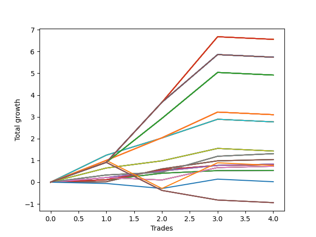

# Long Bulldog 001 
- Symbol: AAPL_Unlimited
- Date Range: 03/23/2022 - 07/08/2022
- Trading Period: 7:20-12:30
- Number of Trades: 4



| Name | Win Percent | Profit | Avg Profit / Trade | Avg Time / Trade |      | Name | Win Percent | Profit | Avg Profit / Trade | Avg Time / Trade |
| ---- | ----------- | ------ | ------------------ | ---------------- | ---- | ---- | ----------- | ------ | ------------------ | ---------------- |
| Sorted By <br> Profit | | | | | | Sorted By <br> Win Percentage ||||
| One Hundred Twenty-Eight | 75.00 | 3280.00 | 820.00 | 200:11 |     | Sixty-Nine | 100.00 | 655.00 | 163.75 | 54:03 |
| One Hundred Twenty-Three | 75.00 | 3280.00 | 820.00 | 200:11 |     | Sixty-One | 100.00 | 655.00 | 163.75 | 54:03 |
| One Hundred Eighteen | 75.00 | 3280.00 | 820.00 | 200:11 |     | Fifty-Three | 100.00 | 655.00 | 163.75 | 54:03 |
| One Hundred Thirteen | 75.00 | 3280.00 | 820.00 | 200:11 |     | Forty-Five | 100.00 | 655.00 | 163.75 | 54:03 |
| One Hundred Eight | 75.00 | 3280.00 | 820.00 | 200:11 |     | Five | 100.00 | 655.00 | 163.75 | 54:03 |
| One Hundred Three | 75.00 | 3280.00 | 820.00 | 200:11 |     | Sixty-Seven | 100.00 | 520.00 | 130.00 | 24:18 |
| Ninety-Three | 75.00 | 3280.00 | 820.00 | 200:11 |     | Fifty-Nine | 100.00 | 520.00 | 130.00 | 24:18 |
| Eighty-Three | 75.00 | 3280.00 | 820.00 | 200:11 |     | Fifty-One | 100.00 | 520.00 | 130.00 | 24:18 |
| One Hundred Thirty | 75.00 | 2870.00 | 717.50 | 204:00 |     | Forty-Three | 100.00 | 520.00 | 130.00 | 24:18 |
| One Hundred Twenty-Nine | 75.00 | 2870.00 | 717.50 | 204:00 |     | Three | 100.00 | 520.00 | 130.00 | 24:18 |
| One Hundred Twenty-Five | 75.00 | 2870.00 | 717.50 | 204:00 |     | Sixty-Six | 100.00 | 415.00 | 103.75 | 15:16 |
| One Hundred Twenty-Four | 75.00 | 2870.00 | 717.50 | 204:00 |     | Fifty-Eight | 100.00 | 415.00 | 103.75 | 15:16 |
| One Hundred Twenty | 75.00 | 2870.00 | 717.50 | 204:00 |     | Fifty | 100.00 | 415.00 | 103.75 | 15:16 |
| One Hundred Ninteen | 75.00 | 2870.00 | 717.50 | 204:00 |     | Forty-Two | 100.00 | 415.00 | 103.75 | 15:16 |
| One Hundred Fifteen | 75.00 | 2870.00 | 717.50 | 204:00 |     | Two | 100.00 | 415.00 | 103.75 | 15:16 |
| One Hundred Fourteen | 75.00 | 2870.00 | 717.50 | 204:00 |     | Sixty-Five | 100.00 | 400.00 | 100.00 | 10:06 |
| One Hundred Ten | 75.00 | 2870.00 | 717.50 | 204:00 |     | Fifty-Seven | 100.00 | 400.00 | 100.00 | 10:06 |
| One Hundred Nine | 75.00 | 2870.00 | 717.50 | 204:00 |     | Forty-Nine | 100.00 | 400.00 | 100.00 | 10:06 |
| One Hundred Five | 75.00 | 2870.00 | 717.50 | 204:00 |     | Forty-One | 100.00 | 400.00 | 100.00 | 10:06 |
| One Hundred Four | 75.00 | 2870.00 | 717.50 | 204:00 |     | One | 100.00 | 400.00 | 100.00 | 10:06 |
| Ninety-Five | 75.00 | 2870.00 | 717.50 | 204:00 |     | Sixty-Four | 100.00 | 270.00 | 67.50 | 07:36 |
| Ninety-Four | 75.00 | 2870.00 | 717.50 | 204:00 |     | Fifty-Six | 100.00 | 270.00 | 67.50 | 07:36 |
| Eighty-Five | 75.00 | 2870.00 | 717.50 | 204:00 |     | Forty-Eight | 100.00 | 270.00 | 67.50 | 07:36 |
| Eighty-Four | 75.00 | 2870.00 | 717.50 | 204:00 |     | Forty | 100.00 | 270.00 | 67.50 | 07:36 |
| One Hundred Twenty-Seven | 75.00 | 2460.00 | 615.00 | 173:11 |     | Zero | 100.00 | 270.00 | 67.50 | 07:36 |
| One Hundred Twenty-Two | 75.00 | 2460.00 | 615.00 | 173:11 |     | One Hundred Twenty-Eight | 75.00 | 3280.00 | 820.00 | 200:11 |
| One Hundred Seventeen | 75.00 | 2460.00 | 615.00 | 173:11 |     | One Hundred Twenty-Three | 75.00 | 3280.00 | 820.00 | 200:11 |
| One Hundred Twelve | 75.00 | 2460.00 | 615.00 | 173:11 |     | One Hundred Eighteen | 75.00 | 3280.00 | 820.00 | 200:11 |
| One Hundred Seven | 75.00 | 2460.00 | 615.00 | 173:11 |     | One Hundred Thirteen | 75.00 | 3280.00 | 820.00 | 200:11 |
| One Hundred Two | 75.00 | 2460.00 | 615.00 | 173:11 |     | One Hundred Eight | 75.00 | 3280.00 | 820.00 | 200:11 |
| Ninety-Two | 75.00 | 2460.00 | 615.00 | 173:11 |     | One Hundred Three | 75.00 | 3280.00 | 820.00 | 200:11 |
| Eighty-Two | 75.00 | 2460.00 | 615.00 | 173:11 |     | Ninety-Three | 75.00 | 3280.00 | 820.00 | 200:11 |
| One Hundred Twenty-Six | 75.00 | 1550.00 | 387.50 | 129:05 |     | Eighty-Three | 75.00 | 3280.00 | 820.00 | 200:11 |
| One Hundred Twenty-One | 75.00 | 1550.00 | 387.50 | 129:05 |     | One Hundred Thirty | 75.00 | 2870.00 | 717.50 | 204:00 |
| One Hundred Sixteen | 75.00 | 1550.00 | 387.50 | 129:05 |     | One Hundred Twenty-Nine | 75.00 | 2870.00 | 717.50 | 204:00 |
| One Hundred Eleven | 75.00 | 1550.00 | 387.50 | 129:05 |     | One Hundred Twenty-Five | 75.00 | 2870.00 | 717.50 | 204:00 |
| One Hundred Six | 75.00 | 1550.00 | 387.50 | 129:05 |     | One Hundred Twenty-Four | 75.00 | 2870.00 | 717.50 | 204:00 |
| One Hundred One | 75.00 | 1550.00 | 387.50 | 129:05 |     | One Hundred Twenty | 75.00 | 2870.00 | 717.50 | 204:00 |
| Ninety-One | 75.00 | 1550.00 | 387.50 | 129:05 |     | One Hundred Ninteen | 75.00 | 2870.00 | 717.50 | 204:00 |
| Eighty-One | 75.00 | 1550.00 | 387.50 | 129:05 |     | One Hundred Fifteen | 75.00 | 2870.00 | 717.50 | 204:00 |
| Seventy-One | 75.00 | 1385.00 | 346.25 | 117:11 |     | One Hundred Fourteen | 75.00 | 2870.00 | 717.50 | 204:00 |
| Sixty-Three | 75.00 | 1385.00 | 346.25 | 117:11 |     | One Hundred Ten | 75.00 | 2870.00 | 717.50 | 204:00 |
| Fifty-Five | 75.00 | 1385.00 | 346.25 | 117:11 |     | One Hundred Nine | 75.00 | 2870.00 | 717.50 | 204:00 |
| Forty-Seven | 75.00 | 1385.00 | 346.25 | 117:11 |     | One Hundred Five | 75.00 | 2870.00 | 717.50 | 204:00 |
| Seven | 75.00 | 1385.00 | 346.25 | 117:11 |     | One Hundred Four | 75.00 | 2870.00 | 717.50 | 204:00 |
| Seventy | 75.00 | 715.00 | 178.75 | 71:07 |     | Ninety-Five | 75.00 | 2870.00 | 717.50 | 204:00 |
| Sixty-Two | 75.00 | 715.00 | 178.75 | 71:07 |     | Ninety-Four | 75.00 | 2870.00 | 717.50 | 204:00 |
| Fifty-Four | 75.00 | 715.00 | 178.75 | 71:07 |     | Eighty-Five | 75.00 | 2870.00 | 717.50 | 204:00 |
| Forty-Six | 75.00 | 715.00 | 178.75 | 71:07 |     | Eighty-Four | 75.00 | 2870.00 | 717.50 | 204:00 |
| Six | 75.00 | 715.00 | 178.75 | 71:07 |     | One Hundred Twenty-Seven | 75.00 | 2460.00 | 615.00 | 173:11 |
| Sixty-Nine | 100.00 | 655.00 | 163.75 | 54:03 |     | One Hundred Twenty-Two | 75.00 | 2460.00 | 615.00 | 173:11 |
| Sixty-One | 100.00 | 655.00 | 163.75 | 54:03 |     | One Hundred Seventeen | 75.00 | 2460.00 | 615.00 | 173:11 |
| Fifty-Three | 100.00 | 655.00 | 163.75 | 54:03 |     | One Hundred Twelve | 75.00 | 2460.00 | 615.00 | 173:11 |
| Forty-Five | 100.00 | 655.00 | 163.75 | 54:03 |     | One Hundred Seven | 75.00 | 2460.00 | 615.00 | 173:11 |
| Five | 100.00 | 655.00 | 163.75 | 54:03 |     | One Hundred Two | 75.00 | 2460.00 | 615.00 | 173:11 |
| Sixty-Seven | 100.00 | 520.00 | 130.00 | 24:18 |     | Ninety-Two | 75.00 | 2460.00 | 615.00 | 173:11 |
| Fifty-Nine | 100.00 | 520.00 | 130.00 | 24:18 |     | Eighty-Two | 75.00 | 2460.00 | 615.00 | 173:11 |
| Fifty-One | 100.00 | 520.00 | 130.00 | 24:18 |     | One Hundred Twenty-Six | 75.00 | 1550.00 | 387.50 | 129:05 |
| Forty-Three | 100.00 | 520.00 | 130.00 | 24:18 |     | One Hundred Twenty-One | 75.00 | 1550.00 | 387.50 | 129:05 |
| Three | 100.00 | 520.00 | 130.00 | 24:18 |     | One Hundred Sixteen | 75.00 | 1550.00 | 387.50 | 129:05 |
| Sixty-Six | 100.00 | 415.00 | 103.75 | 15:16 |     | One Hundred Eleven | 75.00 | 1550.00 | 387.50 | 129:05 |
| Fifty-Eight | 100.00 | 415.00 | 103.75 | 15:16 |     | One Hundred Six | 75.00 | 1550.00 | 387.50 | 129:05 |
| Fifty | 100.00 | 415.00 | 103.75 | 15:16 |     | One Hundred One | 75.00 | 1550.00 | 387.50 | 129:05 |
| Forty-Two | 100.00 | 415.00 | 103.75 | 15:16 |     | Ninety-One | 75.00 | 1550.00 | 387.50 | 129:05 |
| Two | 100.00 | 415.00 | 103.75 | 15:16 |     | Eighty-One | 75.00 | 1550.00 | 387.50 | 129:05 |
| Sixty-Five | 100.00 | 400.00 | 100.00 | 10:06 |     | Seventy-One | 75.00 | 1385.00 | 346.25 | 117:11 |
| Fifty-Seven | 100.00 | 400.00 | 100.00 | 10:06 |     | Sixty-Three | 75.00 | 1385.00 | 346.25 | 117:11 |
| Forty-Nine | 100.00 | 400.00 | 100.00 | 10:06 |     | Fifty-Five | 75.00 | 1385.00 | 346.25 | 117:11 |
| Forty-One | 100.00 | 400.00 | 100.00 | 10:06 |     | Forty-Seven | 75.00 | 1385.00 | 346.25 | 117:11 |
| One | 100.00 | 400.00 | 100.00 | 10:06 |     | Seven | 75.00 | 1385.00 | 346.25 | 117:11 |
| Ninety-Six | 50.00 | 385.00 | 96.25 | 90:46 |     | Seventy | 75.00 | 715.00 | 178.75 | 71:07 |
| Sixty-Eight | 75.00 | 365.00 | 91.25 | 43:26 |     | Sixty-Two | 75.00 | 715.00 | 178.75 | 71:07 |
| Sixty | 75.00 | 365.00 | 91.25 | 43:26 |     | Fifty-Four | 75.00 | 715.00 | 178.75 | 71:07 |
| Fifty-Two | 75.00 | 365.00 | 91.25 | 43:26 |     | Forty-Six | 75.00 | 715.00 | 178.75 | 71:07 |
| Forty-Four | 75.00 | 365.00 | 91.25 | 43:26 |     | Six | 75.00 | 715.00 | 178.75 | 71:07 |
| Four | 75.00 | 365.00 | 91.25 | 43:26 |     | Sixty-Eight | 75.00 | 365.00 | 91.25 | 43:26 |
| Sixty-Four | 100.00 | 270.00 | 67.50 | 07:36 |     | Sixty | 75.00 | 365.00 | 91.25 | 43:26 |
| Fifty-Six | 100.00 | 270.00 | 67.50 | 07:36 |     | Fifty-Two | 75.00 | 365.00 | 91.25 | 43:26 |
| Forty-Eight | 100.00 | 270.00 | 67.50 | 07:36 |     | Forty-Four | 75.00 | 365.00 | 91.25 | 43:26 |
| Forty | 100.00 | 270.00 | 67.50 | 07:36 |     | Four | 75.00 | 365.00 | 91.25 | 43:26 |
| Zero | 100.00 | 270.00 | 67.50 | 07:36 |     | Ninety-Six | 50.00 | 385.00 | 96.25 | 90:46 |
| Seventy-Three | 25.00 | 10.00 | 2.50 | 13:05 |     | Seventy-Three | 25.00 | 10.00 | 2.50 | 13:05 |
| One Hundred | 25.00 | -470.00 | -117.50 | 118:25 |     | One Hundred | 25.00 | -470.00 | -117.50 | 118:25 |
| Ninety-Nine | 25.00 | -470.00 | -117.50 | 118:25 |     | Ninety-Nine | 25.00 | -470.00 | -117.50 | 118:25 |
| Ninety-Eight | 25.00 | -470.00 | -117.50 | 118:25 |     | Ninety-Eight | 25.00 | -470.00 | -117.50 | 118:25 |
| Ninety-Seven | 25.00 | -470.00 | -117.50 | 118:25 |     | Ninety-Seven | 25.00 | -470.00 | -117.50 | 118:25 |

## NO STOPLOSS

### Test Zero
* Sell when price hits the middle line of the 20p bollinger
* No Stoploss
* Results:
```
Total Trades: 4
Percent Up: 100.00
Percent Down: 0.00
Total Points Moved Up: 0.54
Potential Profit: 270.00
Total Points Ups: 0.54 Count Ups: 4
Total Points Downs: 0.00 Count Downs: 0
```

<details><summary>Trades</summary>

<code>In: 2022-03-25 08:30:00		Out: 2022-03-25 08:35:05		Total Position Time: 05:05		Total Move Up: 0.11		Total to Date: 0.11</code> <br />
<code>In: 2022-04-25 08:09:00		Out: 2022-04-25 08:13:00		Total Position Time: 04:00		Total Move Up: 0.30		Total to Date: 0.41</code> <br />
<code>In: 2022-06-15 10:02:00		Out: 2022-06-15 10:11:05		Total Position Time: 09:05		Total Move Up: 0.12		Total to Date: 0.53</code> <br />
<code>In: 2022-06-27 10:51:00		Out: 2022-06-27 11:03:15		Total Position Time: 12:15		Total Move Up: 0.01		Total to Date: 0.54</code> <br />


</details>

### Test One
* Sell when the price hits the upper line of the 20p 1std bollinger
* No Stoploss
* Results:
```
Total Trades: 4
Percent Up: 100.00
Percent Down: 0.00
Total Points Moved Up: 0.80
Potential Profit: 400.00
Total Points Ups: 0.80 Count Ups: 4
Total Points Downs: 0.00 Count Downs: 0
```

<details><summary>Trades</summary>

<code>In: 2022-03-25 08:30:00		Out: 2022-03-25 08:41:25		Total Position Time: 11:25		Total Move Up: 0.11		Total to Date: 0.11</code> <br />
<code>In: 2022-04-25 08:09:00		Out: 2022-04-25 08:13:15		Total Position Time: 04:15		Total Move Up: 0.46		Total to Date: 0.57</code> <br />
<code>In: 2022-06-15 10:02:00		Out: 2022-06-15 10:12:45		Total Position Time: 10:45		Total Move Up: 0.20		Total to Date: 0.77</code> <br />
<code>In: 2022-06-27 10:51:00		Out: 2022-06-27 11:05:00		Total Position Time: 14:00		Total Move Up: 0.03		Total to Date: 0.80</code> <br />


</details>

### Test Two
* Sell when the price hits the upper line of the 20p 2std bollinger
* No Stoploss
* Results:
```
Total Trades: 4
Percent Up: 100.00
Percent Down: 0.00
Total Points Moved Up: 0.83
Potential Profit: 415.00
Total Points Ups: 0.83 Count Ups: 4
Total Points Downs: 0.00 Count Downs: 0
```

<details><summary>Trades</summary>

<code>In: 2022-03-25 08:30:00		Out: 2022-03-25 08:42:05		Total Position Time: 12:05		Total Move Up: 0.21		Total to Date: 0.21</code> <br />
<code>In: 2022-04-25 08:09:00		Out: 2022-04-25 08:20:15		Total Position Time: 11:15		Total Move Up: 0.30		Total to Date: 0.51</code> <br />
<code>In: 2022-06-15 10:02:00		Out: 2022-06-15 10:13:35		Total Position Time: 11:35		Total Move Up: 0.26		Total to Date: 0.77</code> <br />
<code>In: 2022-06-27 10:51:00		Out: 2022-06-27 11:17:10		Total Position Time: 26:10		Total Move Up: 0.06		Total to Date: 0.83</code> <br />


</details>

### Test Three
* Sell when price hits the middle line of the 50p bollinger
* No Stoploss
* Results:
```
Total Trades: 4
Percent Up: 100.00
Percent Down: 0.00
Total Points Moved Up: 1.04
Potential Profit: 520.00
Total Points Ups: 1.04 Count Ups: 4
Total Points Downs: 0.00 Count Downs: 0
```

<details><summary>Trades</summary>

<code>In: 2022-03-25 08:30:00		Out: 2022-03-25 09:05:15		Total Position Time: 35:15		Total Move Up: 0.02		Total to Date: 0.02</code> <br />
<code>In: 2022-04-25 08:09:00		Out: 2022-04-25 08:25:55		Total Position Time: 16:55		Total Move Up: 0.59		Total to Date: 0.61</code> <br />
<code>In: 2022-06-15 10:02:00		Out: 2022-06-15 10:20:55		Total Position Time: 18:55		Total Move Up: 0.37		Total to Date: 0.98</code> <br />
<code>In: 2022-06-27 10:51:00		Out: 2022-06-27 11:17:10		Total Position Time: 26:10		Total Move Up: 0.06		Total to Date: 1.04</code> <br />


</details>

### Test Four
* Sell when the price hits the upper line of the 50p 1std bollinger
* No Stoploss
* Results:
```
Total Trades: 4
Percent Up: 75.00
Percent Down: 25.00
Total Points Moved Up: 0.73
Potential Profit: 365.00
Total Points Ups: 0.84 Count Ups: 3
Total Points Downs: -0.11 Count Downs: 1
```

<details><summary>Trades</summary>

<code>In: 2022-03-25 08:30:00		Out: 2022-03-25 09:09:05		Total Position Time: 39:05		Total Move Up: 0.21		Total to Date: 0.21</code> <br />
<code>In: 2022-04-25 08:09:00		Out: 2022-04-25 09:15:50		Total Position Time: 66:50		Total Move Up: -0.11		Total to Date: 0.10</code> <br />
<code>In: 2022-06-15 10:02:00		Out: 2022-06-15 10:27:25		Total Position Time: 25:25		Total Move Up: 0.57		Total to Date: 0.67</code> <br />
<code>In: 2022-06-27 10:51:00		Out: 2022-06-27 11:33:25		Total Position Time: 42:25		Total Move Up: 0.06		Total to Date: 0.73</code> <br />


</details>

### Test Five
* Sell when the price hits the upper line of the 50p 2std bollinger
* No Stoploss
* Results:
```
Total Trades: 4
Percent Up: 100.00
Percent Down: 0.00
Total Points Moved Up: 1.31
Potential Profit: 655.00
Total Points Ups: 1.31 Count Ups: 4
Total Points Downs: 0.00 Count Downs: 0
```

<details><summary>Trades</summary>

<code>In: 2022-03-25 08:30:00		Out: 2022-03-25 09:11:30		Total Position Time: 41:30		Total Move Up: 0.33		Total to Date: 0.33</code> <br />
<code>In: 2022-04-25 08:09:00		Out: 2022-04-25 09:24:15		Total Position Time: 75:15		Total Move Up: 0.13		Total to Date: 0.46</code> <br />
<code>In: 2022-06-15 10:02:00		Out: 2022-06-15 10:58:15		Total Position Time: 56:15		Total Move Up: 0.73		Total to Date: 1.19</code> <br />
<code>In: 2022-06-27 10:51:00		Out: 2022-06-27 11:34:15		Total Position Time: 43:15		Total Move Up: 0.12		Total to Date: 1.31</code> <br />


</details>

### Test Six
* Sell when the price hits the middle line of the 1std VWAP
* No Stoploss
* Results:
```
Total Trades: 4
Percent Up: 75.00
Percent Down: 25.00
Total Points Moved Up: 1.43
Potential Profit: 715.00
Total Points Ups: 1.55 Count Ups: 3
Total Points Downs: -0.12 Count Downs: 1
```

<details><summary>Trades</summary>

<code>In: 2022-03-25 08:30:00		Out: 2022-03-25 10:49:00		Total Position Time: 139:00		Total Move Up: 0.65		Total to Date: 0.65</code> <br />
<code>In: 2022-04-25 08:09:00		Out: 2022-04-25 08:13:05		Total Position Time: 04:05		Total Move Up: 0.33		Total to Date: 0.98</code> <br />
<code>In: 2022-06-15 10:02:00		Out: 2022-06-15 10:27:25		Total Position Time: 25:25		Total Move Up: 0.57		Total to Date: 1.55</code> <br />
<code>In: 2022-06-27 10:51:00		Out: 2022-06-27 12:47:00		Total Position Time: 116:00		Total Move Up: -0.12		Total to Date: 1.43</code> <br />


</details>

### Test Seven
* Sell when the price hits the upper line of the 1std VWAP
* No Stoploss
* Results:
```
Total Trades: 4
Percent Up: 75.00
Percent Down: 25.00
Total Points Moved Up: 2.77
Potential Profit: 1385.00
Total Points Ups: 2.89 Count Ups: 3
Total Points Downs: -0.12 Count Downs: 1
```

<details><summary>Trades</summary>

<code>In: 2022-03-25 08:30:00		Out: 2022-03-25 11:03:35		Total Position Time: 153:35		Total Move Up: 1.24		Total to Date: 1.24</code> <br />
<code>In: 2022-04-25 08:09:00		Out: 2022-04-25 10:30:35		Total Position Time: 141:35		Total Move Up: 0.79		Total to Date: 2.03</code> <br />
<code>In: 2022-06-15 10:02:00		Out: 2022-06-15 10:59:35		Total Position Time: 57:35		Total Move Up: 0.86		Total to Date: 2.89</code> <br />
<code>In: 2022-06-27 10:51:00		Out: 2022-06-27 12:47:00		Total Position Time: 116:00		Total Move Up: -0.12		Total to Date: 2.77</code> <br />


</details>

## STOPLOSS OF 5

### Test Forty
* Sell when price hits the middle line of the 20p bollinger
* Stoploss is 5 points
* Results:
```
Total Trades: 4
Percent Up: 100.00
Percent Down: 0.00
Total Points Moved Up: 0.54
Potential Profit: 270.00
Total Points Ups: 0.54 Count Ups: 4
Total Points Downs: 0.00 Count Downs: 0
```

<details><summary>Trades</summary>

<code>In: 2022-03-25 08:30:00		Out: 2022-03-25 08:35:05		Total Position Time: 05:05		Total Move Up: 0.11		Total to Date: 0.11</code> <br />
<code>In: 2022-04-25 08:09:00		Out: 2022-04-25 08:13:00		Total Position Time: 04:00		Total Move Up: 0.30		Total to Date: 0.41</code> <br />
<code>In: 2022-06-15 10:02:00		Out: 2022-06-15 10:11:05		Total Position Time: 09:05		Total Move Up: 0.12		Total to Date: 0.53</code> <br />
<code>In: 2022-06-27 10:51:00		Out: 2022-06-27 11:03:15		Total Position Time: 12:15		Total Move Up: 0.01		Total to Date: 0.54</code> <br />


</details>

### Test Forty-One
* Sell when the price hits the upper line of the 20p 1std bollinger
* Stoploss is 5 points
* Results:
```
Total Trades: 4
Percent Up: 100.00
Percent Down: 0.00
Total Points Moved Up: 0.80
Potential Profit: 400.00
Total Points Ups: 0.80 Count Ups: 4
Total Points Downs: 0.00 Count Downs: 0
```

<details><summary>Trades</summary>

<code>In: 2022-03-25 08:30:00		Out: 2022-03-25 08:41:25		Total Position Time: 11:25		Total Move Up: 0.11		Total to Date: 0.11</code> <br />
<code>In: 2022-04-25 08:09:00		Out: 2022-04-25 08:13:15		Total Position Time: 04:15		Total Move Up: 0.46		Total to Date: 0.57</code> <br />
<code>In: 2022-06-15 10:02:00		Out: 2022-06-15 10:12:45		Total Position Time: 10:45		Total Move Up: 0.20		Total to Date: 0.77</code> <br />
<code>In: 2022-06-27 10:51:00		Out: 2022-06-27 11:05:00		Total Position Time: 14:00		Total Move Up: 0.03		Total to Date: 0.80</code> <br />


</details>

### Test Forty-Two
* Sell when the price hits the upper line of the 20p 2std bollinger
* Stoploss is 5 points
* Results:
```
Total Trades: 4
Percent Up: 100.00
Percent Down: 0.00
Total Points Moved Up: 0.83
Potential Profit: 415.00
Total Points Ups: 0.83 Count Ups: 4
Total Points Downs: 0.00 Count Downs: 0
```

<details><summary>Trades</summary>

<code>In: 2022-03-25 08:30:00		Out: 2022-03-25 08:42:05		Total Position Time: 12:05		Total Move Up: 0.21		Total to Date: 0.21</code> <br />
<code>In: 2022-04-25 08:09:00		Out: 2022-04-25 08:20:15		Total Position Time: 11:15		Total Move Up: 0.30		Total to Date: 0.51</code> <br />
<code>In: 2022-06-15 10:02:00		Out: 2022-06-15 10:13:35		Total Position Time: 11:35		Total Move Up: 0.26		Total to Date: 0.77</code> <br />
<code>In: 2022-06-27 10:51:00		Out: 2022-06-27 11:17:10		Total Position Time: 26:10		Total Move Up: 0.06		Total to Date: 0.83</code> <br />


</details>

### Test Forty-Three
* Sell when price hits the middle line of the 50p bollinger
* Stoploss is 5 points
* Results:
```
Total Trades: 4
Percent Up: 100.00
Percent Down: 0.00
Total Points Moved Up: 1.04
Potential Profit: 520.00
Total Points Ups: 1.04 Count Ups: 4
Total Points Downs: 0.00 Count Downs: 0
```

<details><summary>Trades</summary>

<code>In: 2022-03-25 08:30:00		Out: 2022-03-25 09:05:15		Total Position Time: 35:15		Total Move Up: 0.02		Total to Date: 0.02</code> <br />
<code>In: 2022-04-25 08:09:00		Out: 2022-04-25 08:25:55		Total Position Time: 16:55		Total Move Up: 0.59		Total to Date: 0.61</code> <br />
<code>In: 2022-06-15 10:02:00		Out: 2022-06-15 10:20:55		Total Position Time: 18:55		Total Move Up: 0.37		Total to Date: 0.98</code> <br />
<code>In: 2022-06-27 10:51:00		Out: 2022-06-27 11:17:10		Total Position Time: 26:10		Total Move Up: 0.06		Total to Date: 1.04</code> <br />


</details>

### Test Forty-Four
* Sell when the price hits the upper line of the 50p 1std bollinger
* Stoploss is 5 points
* Results:
```
Total Trades: 4
Percent Up: 75.00
Percent Down: 25.00
Total Points Moved Up: 0.73
Potential Profit: 365.00
Total Points Ups: 0.84 Count Ups: 3
Total Points Downs: -0.11 Count Downs: 1
```

<details><summary>Trades</summary>

<code>In: 2022-03-25 08:30:00		Out: 2022-03-25 09:09:05		Total Position Time: 39:05		Total Move Up: 0.21		Total to Date: 0.21</code> <br />
<code>In: 2022-04-25 08:09:00		Out: 2022-04-25 09:15:50		Total Position Time: 66:50		Total Move Up: -0.11		Total to Date: 0.10</code> <br />
<code>In: 2022-06-15 10:02:00		Out: 2022-06-15 10:27:25		Total Position Time: 25:25		Total Move Up: 0.57		Total to Date: 0.67</code> <br />
<code>In: 2022-06-27 10:51:00		Out: 2022-06-27 11:33:25		Total Position Time: 42:25		Total Move Up: 0.06		Total to Date: 0.73</code> <br />


</details>

### Test Forty-Five
* Sell when the price hits the upper line of the 50p 2std bollinger
* Stoploss is 5 points
* Results:
```
Total Trades: 4
Percent Up: 100.00
Percent Down: 0.00
Total Points Moved Up: 1.31
Potential Profit: 655.00
Total Points Ups: 1.31 Count Ups: 4
Total Points Downs: 0.00 Count Downs: 0
```

<details><summary>Trades</summary>

<code>In: 2022-03-25 08:30:00		Out: 2022-03-25 09:11:30		Total Position Time: 41:30		Total Move Up: 0.33		Total to Date: 0.33</code> <br />
<code>In: 2022-04-25 08:09:00		Out: 2022-04-25 09:24:15		Total Position Time: 75:15		Total Move Up: 0.13		Total to Date: 0.46</code> <br />
<code>In: 2022-06-15 10:02:00		Out: 2022-06-15 10:58:15		Total Position Time: 56:15		Total Move Up: 0.73		Total to Date: 1.19</code> <br />
<code>In: 2022-06-27 10:51:00		Out: 2022-06-27 11:34:15		Total Position Time: 43:15		Total Move Up: 0.12		Total to Date: 1.31</code> <br />


</details>

### Test Forty-Six
* Sell when the price hits the middle line of the 1std VWAP
* Stoploss is 5 points
* Results:
```
Total Trades: 4
Percent Up: 75.00
Percent Down: 25.00
Total Points Moved Up: 1.43
Potential Profit: 715.00
Total Points Ups: 1.55 Count Ups: 3
Total Points Downs: -0.12 Count Downs: 1
```

<details><summary>Trades</summary>

<code>In: 2022-03-25 08:30:00		Out: 2022-03-25 10:49:00		Total Position Time: 139:00		Total Move Up: 0.65		Total to Date: 0.65</code> <br />
<code>In: 2022-04-25 08:09:00		Out: 2022-04-25 08:13:05		Total Position Time: 04:05		Total Move Up: 0.33		Total to Date: 0.98</code> <br />
<code>In: 2022-06-15 10:02:00		Out: 2022-06-15 10:27:25		Total Position Time: 25:25		Total Move Up: 0.57		Total to Date: 1.55</code> <br />
<code>In: 2022-06-27 10:51:00		Out: 2022-06-27 12:47:00		Total Position Time: 116:00		Total Move Up: -0.12		Total to Date: 1.43</code> <br />


</details>

### Test Forty-Seven
* Sell when the price hits the upper line of the 1std VWAP
* Stoploss is 5 points
* Results:
```
Total Trades: 4
Percent Up: 75.00
Percent Down: 25.00
Total Points Moved Up: 2.77
Potential Profit: 1385.00
Total Points Ups: 2.89 Count Ups: 3
Total Points Downs: -0.12 Count Downs: 1
```

<details><summary>Trades</summary>

<code>In: 2022-03-25 08:30:00		Out: 2022-03-25 11:03:35		Total Position Time: 153:35		Total Move Up: 1.24		Total to Date: 1.24</code> <br />
<code>In: 2022-04-25 08:09:00		Out: 2022-04-25 10:30:35		Total Position Time: 141:35		Total Move Up: 0.79		Total to Date: 2.03</code> <br />
<code>In: 2022-06-15 10:02:00		Out: 2022-06-15 10:59:35		Total Position Time: 57:35		Total Move Up: 0.86		Total to Date: 2.89</code> <br />
<code>In: 2022-06-27 10:51:00		Out: 2022-06-27 12:47:00		Total Position Time: 116:00		Total Move Up: -0.12		Total to Date: 2.77</code> <br />


</details>

## TRAIL STOP OF 5

### Test Forty-Eight
* Sell when price hits the middle line of the 20p bollinger
* Trailing Stop is 5 points
* Results:
```
Total Trades: 4
Percent Up: 100.00
Percent Down: 0.00
Total Points Moved Up: 0.54
Potential Profit: 270.00
Total Points Ups: 0.54 Count Ups: 4
Total Points Downs: 0.00 Count Downs: 0
```

<details><summary>Trades</summary>

<code>In: 2022-03-25 08:30:00		Out: 2022-03-25 08:35:05		Total Position Time: 05:05		Total Move Up: 0.11		Total to Date: 0.11</code> <br />
<code>In: 2022-04-25 08:09:00		Out: 2022-04-25 08:13:00		Total Position Time: 04:00		Total Move Up: 0.30		Total to Date: 0.41</code> <br />
<code>In: 2022-06-15 10:02:00		Out: 2022-06-15 10:11:05		Total Position Time: 09:05		Total Move Up: 0.12		Total to Date: 0.53</code> <br />
<code>In: 2022-06-27 10:51:00		Out: 2022-06-27 11:03:15		Total Position Time: 12:15		Total Move Up: 0.01		Total to Date: 0.54</code> <br />


</details>

### Test Forty-Nine
* Sell when the price hits the upper line of the 20p 1std bollinger
* Trailing Stop is 5 points
* Results:
```
Total Trades: 4
Percent Up: 100.00
Percent Down: 0.00
Total Points Moved Up: 0.80
Potential Profit: 400.00
Total Points Ups: 0.80 Count Ups: 4
Total Points Downs: 0.00 Count Downs: 0
```

<details><summary>Trades</summary>

<code>In: 2022-03-25 08:30:00		Out: 2022-03-25 08:41:25		Total Position Time: 11:25		Total Move Up: 0.11		Total to Date: 0.11</code> <br />
<code>In: 2022-04-25 08:09:00		Out: 2022-04-25 08:13:15		Total Position Time: 04:15		Total Move Up: 0.46		Total to Date: 0.57</code> <br />
<code>In: 2022-06-15 10:02:00		Out: 2022-06-15 10:12:45		Total Position Time: 10:45		Total Move Up: 0.20		Total to Date: 0.77</code> <br />
<code>In: 2022-06-27 10:51:00		Out: 2022-06-27 11:05:00		Total Position Time: 14:00		Total Move Up: 0.03		Total to Date: 0.80</code> <br />


</details>

### Test Fifty
* Sell when the price hits the upper line of the 20p 2std bollinger
* Trailing Stop is 5 points
* Results:
```
Total Trades: 4
Percent Up: 100.00
Percent Down: 0.00
Total Points Moved Up: 0.83
Potential Profit: 415.00
Total Points Ups: 0.83 Count Ups: 4
Total Points Downs: 0.00 Count Downs: 0
```

<details><summary>Trades</summary>

<code>In: 2022-03-25 08:30:00		Out: 2022-03-25 08:42:05		Total Position Time: 12:05		Total Move Up: 0.21		Total to Date: 0.21</code> <br />
<code>In: 2022-04-25 08:09:00		Out: 2022-04-25 08:20:15		Total Position Time: 11:15		Total Move Up: 0.30		Total to Date: 0.51</code> <br />
<code>In: 2022-06-15 10:02:00		Out: 2022-06-15 10:13:35		Total Position Time: 11:35		Total Move Up: 0.26		Total to Date: 0.77</code> <br />
<code>In: 2022-06-27 10:51:00		Out: 2022-06-27 11:17:10		Total Position Time: 26:10		Total Move Up: 0.06		Total to Date: 0.83</code> <br />


</details>

### Test Fifty-One
* Sell when price hits the middle line of the 50p bollinger
* Trailing Stop is 5 points
* Results:
```
Total Trades: 4
Percent Up: 100.00
Percent Down: 0.00
Total Points Moved Up: 1.04
Potential Profit: 520.00
Total Points Ups: 1.04 Count Ups: 4
Total Points Downs: 0.00 Count Downs: 0
```

<details><summary>Trades</summary>

<code>In: 2022-03-25 08:30:00		Out: 2022-03-25 09:05:15		Total Position Time: 35:15		Total Move Up: 0.02		Total to Date: 0.02</code> <br />
<code>In: 2022-04-25 08:09:00		Out: 2022-04-25 08:25:55		Total Position Time: 16:55		Total Move Up: 0.59		Total to Date: 0.61</code> <br />
<code>In: 2022-06-15 10:02:00		Out: 2022-06-15 10:20:55		Total Position Time: 18:55		Total Move Up: 0.37		Total to Date: 0.98</code> <br />
<code>In: 2022-06-27 10:51:00		Out: 2022-06-27 11:17:10		Total Position Time: 26:10		Total Move Up: 0.06		Total to Date: 1.04</code> <br />


</details>

### Test Fifty-Two
* Sell when the price hits the upper line of the 50p 1std bollinger
* Trailing Stop is 5 points
* Results:
```
Total Trades: 4
Percent Up: 75.00
Percent Down: 25.00
Total Points Moved Up: 0.73
Potential Profit: 365.00
Total Points Ups: 0.84 Count Ups: 3
Total Points Downs: -0.11 Count Downs: 1
```

<details><summary>Trades</summary>

<code>In: 2022-03-25 08:30:00		Out: 2022-03-25 09:09:05		Total Position Time: 39:05		Total Move Up: 0.21		Total to Date: 0.21</code> <br />
<code>In: 2022-04-25 08:09:00		Out: 2022-04-25 09:15:50		Total Position Time: 66:50		Total Move Up: -0.11		Total to Date: 0.10</code> <br />
<code>In: 2022-06-15 10:02:00		Out: 2022-06-15 10:27:25		Total Position Time: 25:25		Total Move Up: 0.57		Total to Date: 0.67</code> <br />
<code>In: 2022-06-27 10:51:00		Out: 2022-06-27 11:33:25		Total Position Time: 42:25		Total Move Up: 0.06		Total to Date: 0.73</code> <br />


</details>

### Test Fifty-Three
* Sell when the price hits the upper line of the 50p 2std bollinger
* Trailing Stop is 5 points
* Results:
```
Total Trades: 4
Percent Up: 100.00
Percent Down: 0.00
Total Points Moved Up: 1.31
Potential Profit: 655.00
Total Points Ups: 1.31 Count Ups: 4
Total Points Downs: 0.00 Count Downs: 0
```

<details><summary>Trades</summary>

<code>In: 2022-03-25 08:30:00		Out: 2022-03-25 09:11:30		Total Position Time: 41:30		Total Move Up: 0.33		Total to Date: 0.33</code> <br />
<code>In: 2022-04-25 08:09:00		Out: 2022-04-25 09:24:15		Total Position Time: 75:15		Total Move Up: 0.13		Total to Date: 0.46</code> <br />
<code>In: 2022-06-15 10:02:00		Out: 2022-06-15 10:58:15		Total Position Time: 56:15		Total Move Up: 0.73		Total to Date: 1.19</code> <br />
<code>In: 2022-06-27 10:51:00		Out: 2022-06-27 11:34:15		Total Position Time: 43:15		Total Move Up: 0.12		Total to Date: 1.31</code> <br />


</details>

### Test Fifty-Four
* Sell when the price hits the middle line of the 1std VWAP
* Trailing Stop is 5 points
* Results:
```
Total Trades: 4
Percent Up: 75.00
Percent Down: 25.00
Total Points Moved Up: 1.43
Potential Profit: 715.00
Total Points Ups: 1.55 Count Ups: 3
Total Points Downs: -0.12 Count Downs: 1
```

<details><summary>Trades</summary>

<code>In: 2022-03-25 08:30:00		Out: 2022-03-25 10:49:00		Total Position Time: 139:00		Total Move Up: 0.65		Total to Date: 0.65</code> <br />
<code>In: 2022-04-25 08:09:00		Out: 2022-04-25 08:13:05		Total Position Time: 04:05		Total Move Up: 0.33		Total to Date: 0.98</code> <br />
<code>In: 2022-06-15 10:02:00		Out: 2022-06-15 10:27:25		Total Position Time: 25:25		Total Move Up: 0.57		Total to Date: 1.55</code> <br />
<code>In: 2022-06-27 10:51:00		Out: 2022-06-27 12:47:00		Total Position Time: 116:00		Total Move Up: -0.12		Total to Date: 1.43</code> <br />


</details>

### Test Fifty-Five
* Sell when the price hits the upper line of the 1std VWAP
* Trailing Stop is 5 points
* Results:
```
Total Trades: 4
Percent Up: 75.00
Percent Down: 25.00
Total Points Moved Up: 2.77
Potential Profit: 1385.00
Total Points Ups: 2.89 Count Ups: 3
Total Points Downs: -0.12 Count Downs: 1
```

<details><summary>Trades</summary>

<code>In: 2022-03-25 08:30:00		Out: 2022-03-25 11:03:35		Total Position Time: 153:35		Total Move Up: 1.24		Total to Date: 1.24</code> <br />
<code>In: 2022-04-25 08:09:00		Out: 2022-04-25 10:30:35		Total Position Time: 141:35		Total Move Up: 0.79		Total to Date: 2.03</code> <br />
<code>In: 2022-06-15 10:02:00		Out: 2022-06-15 10:59:35		Total Position Time: 57:35		Total Move Up: 0.86		Total to Date: 2.89</code> <br />
<code>In: 2022-06-27 10:51:00		Out: 2022-06-27 12:47:00		Total Position Time: 116:00		Total Move Up: -0.12		Total to Date: 2.77</code> <br />


</details>

## STOPLOSS OF 10

### Test Fifty-Six
* Sell when price hits the middle line of the 20p bollinger
* Stoploss is 10 points
* Results:
```
Total Trades: 4
Percent Up: 100.00
Percent Down: 0.00
Total Points Moved Up: 0.54
Potential Profit: 270.00
Total Points Ups: 0.54 Count Ups: 4
Total Points Downs: 0.00 Count Downs: 0
```

<details><summary>Trades</summary>

<code>In: 2022-03-25 08:30:00		Out: 2022-03-25 08:35:05		Total Position Time: 05:05		Total Move Up: 0.11		Total to Date: 0.11</code> <br />
<code>In: 2022-04-25 08:09:00		Out: 2022-04-25 08:13:00		Total Position Time: 04:00		Total Move Up: 0.30		Total to Date: 0.41</code> <br />
<code>In: 2022-06-15 10:02:00		Out: 2022-06-15 10:11:05		Total Position Time: 09:05		Total Move Up: 0.12		Total to Date: 0.53</code> <br />
<code>In: 2022-06-27 10:51:00		Out: 2022-06-27 11:03:15		Total Position Time: 12:15		Total Move Up: 0.01		Total to Date: 0.54</code> <br />


</details>

### Test Fifty-Seven
* Sell when the price hits the upper line of the 20p 1std bollinger
* Stoploss is 10 points
* Results:
```
Total Trades: 4
Percent Up: 100.00
Percent Down: 0.00
Total Points Moved Up: 0.80
Potential Profit: 400.00
Total Points Ups: 0.80 Count Ups: 4
Total Points Downs: 0.00 Count Downs: 0
```

<details><summary>Trades</summary>

<code>In: 2022-03-25 08:30:00		Out: 2022-03-25 08:41:25		Total Position Time: 11:25		Total Move Up: 0.11		Total to Date: 0.11</code> <br />
<code>In: 2022-04-25 08:09:00		Out: 2022-04-25 08:13:15		Total Position Time: 04:15		Total Move Up: 0.46		Total to Date: 0.57</code> <br />
<code>In: 2022-06-15 10:02:00		Out: 2022-06-15 10:12:45		Total Position Time: 10:45		Total Move Up: 0.20		Total to Date: 0.77</code> <br />
<code>In: 2022-06-27 10:51:00		Out: 2022-06-27 11:05:00		Total Position Time: 14:00		Total Move Up: 0.03		Total to Date: 0.80</code> <br />


</details>

### Test Fifty-Eight
* Sell when the price hits the upper line of the 20p 2std bollinger
* Stoploss is 10 points
* Results:
```
Total Trades: 4
Percent Up: 100.00
Percent Down: 0.00
Total Points Moved Up: 0.83
Potential Profit: 415.00
Total Points Ups: 0.83 Count Ups: 4
Total Points Downs: 0.00 Count Downs: 0
```

<details><summary>Trades</summary>

<code>In: 2022-03-25 08:30:00		Out: 2022-03-25 08:42:05		Total Position Time: 12:05		Total Move Up: 0.21		Total to Date: 0.21</code> <br />
<code>In: 2022-04-25 08:09:00		Out: 2022-04-25 08:20:15		Total Position Time: 11:15		Total Move Up: 0.30		Total to Date: 0.51</code> <br />
<code>In: 2022-06-15 10:02:00		Out: 2022-06-15 10:13:35		Total Position Time: 11:35		Total Move Up: 0.26		Total to Date: 0.77</code> <br />
<code>In: 2022-06-27 10:51:00		Out: 2022-06-27 11:17:10		Total Position Time: 26:10		Total Move Up: 0.06		Total to Date: 0.83</code> <br />


</details>

### Test Fifty-Nine
* Sell when price hits the middle line of the 50p bollinger
* Stoploss is 10 points
* Results:
```
Total Trades: 4
Percent Up: 100.00
Percent Down: 0.00
Total Points Moved Up: 1.04
Potential Profit: 520.00
Total Points Ups: 1.04 Count Ups: 4
Total Points Downs: 0.00 Count Downs: 0
```

<details><summary>Trades</summary>

<code>In: 2022-03-25 08:30:00		Out: 2022-03-25 09:05:15		Total Position Time: 35:15		Total Move Up: 0.02		Total to Date: 0.02</code> <br />
<code>In: 2022-04-25 08:09:00		Out: 2022-04-25 08:25:55		Total Position Time: 16:55		Total Move Up: 0.59		Total to Date: 0.61</code> <br />
<code>In: 2022-06-15 10:02:00		Out: 2022-06-15 10:20:55		Total Position Time: 18:55		Total Move Up: 0.37		Total to Date: 0.98</code> <br />
<code>In: 2022-06-27 10:51:00		Out: 2022-06-27 11:17:10		Total Position Time: 26:10		Total Move Up: 0.06		Total to Date: 1.04</code> <br />


</details>

### Test Sixty
* Sell when the price hits the upper line of the 50p 1std bollinger
* Stoploss is 10 points
* Results:
```
Total Trades: 4
Percent Up: 75.00
Percent Down: 25.00
Total Points Moved Up: 0.73
Potential Profit: 365.00
Total Points Ups: 0.84 Count Ups: 3
Total Points Downs: -0.11 Count Downs: 1
```

<details><summary>Trades</summary>

<code>In: 2022-03-25 08:30:00		Out: 2022-03-25 09:09:05		Total Position Time: 39:05		Total Move Up: 0.21		Total to Date: 0.21</code> <br />
<code>In: 2022-04-25 08:09:00		Out: 2022-04-25 09:15:50		Total Position Time: 66:50		Total Move Up: -0.11		Total to Date: 0.10</code> <br />
<code>In: 2022-06-15 10:02:00		Out: 2022-06-15 10:27:25		Total Position Time: 25:25		Total Move Up: 0.57		Total to Date: 0.67</code> <br />
<code>In: 2022-06-27 10:51:00		Out: 2022-06-27 11:33:25		Total Position Time: 42:25		Total Move Up: 0.06		Total to Date: 0.73</code> <br />


</details>

### Test Sixty-One
* Sell when the price hits the upper line of the 50p 2std bollinger
* Stoploss is 10 points
* Results:
```
Total Trades: 4
Percent Up: 100.00
Percent Down: 0.00
Total Points Moved Up: 1.31
Potential Profit: 655.00
Total Points Ups: 1.31 Count Ups: 4
Total Points Downs: 0.00 Count Downs: 0
```

<details><summary>Trades</summary>

<code>In: 2022-03-25 08:30:00		Out: 2022-03-25 09:11:30		Total Position Time: 41:30		Total Move Up: 0.33		Total to Date: 0.33</code> <br />
<code>In: 2022-04-25 08:09:00		Out: 2022-04-25 09:24:15		Total Position Time: 75:15		Total Move Up: 0.13		Total to Date: 0.46</code> <br />
<code>In: 2022-06-15 10:02:00		Out: 2022-06-15 10:58:15		Total Position Time: 56:15		Total Move Up: 0.73		Total to Date: 1.19</code> <br />
<code>In: 2022-06-27 10:51:00		Out: 2022-06-27 11:34:15		Total Position Time: 43:15		Total Move Up: 0.12		Total to Date: 1.31</code> <br />


</details>

### Test Sixty-Two
* Sell when the price hits the middle line of the 1std VWAP
* Stoploss is 10 points
* Results:
```
Total Trades: 4
Percent Up: 75.00
Percent Down: 25.00
Total Points Moved Up: 1.43
Potential Profit: 715.00
Total Points Ups: 1.55 Count Ups: 3
Total Points Downs: -0.12 Count Downs: 1
```

<details><summary>Trades</summary>

<code>In: 2022-03-25 08:30:00		Out: 2022-03-25 10:49:00		Total Position Time: 139:00		Total Move Up: 0.65		Total to Date: 0.65</code> <br />
<code>In: 2022-04-25 08:09:00		Out: 2022-04-25 08:13:05		Total Position Time: 04:05		Total Move Up: 0.33		Total to Date: 0.98</code> <br />
<code>In: 2022-06-15 10:02:00		Out: 2022-06-15 10:27:25		Total Position Time: 25:25		Total Move Up: 0.57		Total to Date: 1.55</code> <br />
<code>In: 2022-06-27 10:51:00		Out: 2022-06-27 12:47:00		Total Position Time: 116:00		Total Move Up: -0.12		Total to Date: 1.43</code> <br />


</details>

### Test Sixty-Three
* Sell when the price hits the upper line of the 1std VWAP
* Stoploss is 10 points
* Results:
```
Total Trades: 4
Percent Up: 75.00
Percent Down: 25.00
Total Points Moved Up: 2.77
Potential Profit: 1385.00
Total Points Ups: 2.89 Count Ups: 3
Total Points Downs: -0.12 Count Downs: 1
```

<details><summary>Trades</summary>

<code>In: 2022-03-25 08:30:00		Out: 2022-03-25 11:03:35		Total Position Time: 153:35		Total Move Up: 1.24		Total to Date: 1.24</code> <br />
<code>In: 2022-04-25 08:09:00		Out: 2022-04-25 10:30:35		Total Position Time: 141:35		Total Move Up: 0.79		Total to Date: 2.03</code> <br />
<code>In: 2022-06-15 10:02:00		Out: 2022-06-15 10:59:35		Total Position Time: 57:35		Total Move Up: 0.86		Total to Date: 2.89</code> <br />
<code>In: 2022-06-27 10:51:00		Out: 2022-06-27 12:47:00		Total Position Time: 116:00		Total Move Up: -0.12		Total to Date: 2.77</code> <br />


</details>

## TRAIL STOP OF 10

### Test Sixty-Four
* Sell when price hits the middle line of the 20p bollinger
* Trailing Stop is 10 points
* Results:
```
Total Trades: 4
Percent Up: 100.00
Percent Down: 0.00
Total Points Moved Up: 0.54
Potential Profit: 270.00
Total Points Ups: 0.54 Count Ups: 4
Total Points Downs: 0.00 Count Downs: 0
```

<details><summary>Trades</summary>

<code>In: 2022-03-25 08:30:00		Out: 2022-03-25 08:35:05		Total Position Time: 05:05		Total Move Up: 0.11		Total to Date: 0.11</code> <br />
<code>In: 2022-04-25 08:09:00		Out: 2022-04-25 08:13:00		Total Position Time: 04:00		Total Move Up: 0.30		Total to Date: 0.41</code> <br />
<code>In: 2022-06-15 10:02:00		Out: 2022-06-15 10:11:05		Total Position Time: 09:05		Total Move Up: 0.12		Total to Date: 0.53</code> <br />
<code>In: 2022-06-27 10:51:00		Out: 2022-06-27 11:03:15		Total Position Time: 12:15		Total Move Up: 0.01		Total to Date: 0.54</code> <br />


</details>

### Test Sixty-Five
* Sell when the price hits the upper line of the 20p 1std bollinger
* Trailing Stop is 10 points
* Results:
```
Total Trades: 4
Percent Up: 100.00
Percent Down: 0.00
Total Points Moved Up: 0.80
Potential Profit: 400.00
Total Points Ups: 0.80 Count Ups: 4
Total Points Downs: 0.00 Count Downs: 0
```

<details><summary>Trades</summary>

<code>In: 2022-03-25 08:30:00		Out: 2022-03-25 08:41:25		Total Position Time: 11:25		Total Move Up: 0.11		Total to Date: 0.11</code> <br />
<code>In: 2022-04-25 08:09:00		Out: 2022-04-25 08:13:15		Total Position Time: 04:15		Total Move Up: 0.46		Total to Date: 0.57</code> <br />
<code>In: 2022-06-15 10:02:00		Out: 2022-06-15 10:12:45		Total Position Time: 10:45		Total Move Up: 0.20		Total to Date: 0.77</code> <br />
<code>In: 2022-06-27 10:51:00		Out: 2022-06-27 11:05:00		Total Position Time: 14:00		Total Move Up: 0.03		Total to Date: 0.80</code> <br />


</details>

### Test Sixty-Six
* Sell when the price hits the upper line of the 20p 2std bollinger
* Trailing Stop is 10 points
* Results:
```
Total Trades: 4
Percent Up: 100.00
Percent Down: 0.00
Total Points Moved Up: 0.83
Potential Profit: 415.00
Total Points Ups: 0.83 Count Ups: 4
Total Points Downs: 0.00 Count Downs: 0
```

<details><summary>Trades</summary>

<code>In: 2022-03-25 08:30:00		Out: 2022-03-25 08:42:05		Total Position Time: 12:05		Total Move Up: 0.21		Total to Date: 0.21</code> <br />
<code>In: 2022-04-25 08:09:00		Out: 2022-04-25 08:20:15		Total Position Time: 11:15		Total Move Up: 0.30		Total to Date: 0.51</code> <br />
<code>In: 2022-06-15 10:02:00		Out: 2022-06-15 10:13:35		Total Position Time: 11:35		Total Move Up: 0.26		Total to Date: 0.77</code> <br />
<code>In: 2022-06-27 10:51:00		Out: 2022-06-27 11:17:10		Total Position Time: 26:10		Total Move Up: 0.06		Total to Date: 0.83</code> <br />


</details>

### Test Sixty-Seven
* Sell when price hits the middle line of the 50p bollinger
* Trailing Stop is 10 points
* Results:
```
Total Trades: 4
Percent Up: 100.00
Percent Down: 0.00
Total Points Moved Up: 1.04
Potential Profit: 520.00
Total Points Ups: 1.04 Count Ups: 4
Total Points Downs: 0.00 Count Downs: 0
```

<details><summary>Trades</summary>

<code>In: 2022-03-25 08:30:00		Out: 2022-03-25 09:05:15		Total Position Time: 35:15		Total Move Up: 0.02		Total to Date: 0.02</code> <br />
<code>In: 2022-04-25 08:09:00		Out: 2022-04-25 08:25:55		Total Position Time: 16:55		Total Move Up: 0.59		Total to Date: 0.61</code> <br />
<code>In: 2022-06-15 10:02:00		Out: 2022-06-15 10:20:55		Total Position Time: 18:55		Total Move Up: 0.37		Total to Date: 0.98</code> <br />
<code>In: 2022-06-27 10:51:00		Out: 2022-06-27 11:17:10		Total Position Time: 26:10		Total Move Up: 0.06		Total to Date: 1.04</code> <br />


</details>

### Test Sixty-Eight
* Sell when the price hits the upper line of the 50p 1std bollinger
* Trailing Stop is 10 points
* Results:
```
Total Trades: 4
Percent Up: 75.00
Percent Down: 25.00
Total Points Moved Up: 0.73
Potential Profit: 365.00
Total Points Ups: 0.84 Count Ups: 3
Total Points Downs: -0.11 Count Downs: 1
```

<details><summary>Trades</summary>

<code>In: 2022-03-25 08:30:00		Out: 2022-03-25 09:09:05		Total Position Time: 39:05		Total Move Up: 0.21		Total to Date: 0.21</code> <br />
<code>In: 2022-04-25 08:09:00		Out: 2022-04-25 09:15:50		Total Position Time: 66:50		Total Move Up: -0.11		Total to Date: 0.10</code> <br />
<code>In: 2022-06-15 10:02:00		Out: 2022-06-15 10:27:25		Total Position Time: 25:25		Total Move Up: 0.57		Total to Date: 0.67</code> <br />
<code>In: 2022-06-27 10:51:00		Out: 2022-06-27 11:33:25		Total Position Time: 42:25		Total Move Up: 0.06		Total to Date: 0.73</code> <br />


</details>

### Test Sixty-Nine
* Sell when the price hits the upper line of the 50p 2std bollinger
* Trailing Stop is 10 points
* Results:
```
Total Trades: 4
Percent Up: 100.00
Percent Down: 0.00
Total Points Moved Up: 1.31
Potential Profit: 655.00
Total Points Ups: 1.31 Count Ups: 4
Total Points Downs: 0.00 Count Downs: 0
```

<details><summary>Trades</summary>

<code>In: 2022-03-25 08:30:00		Out: 2022-03-25 09:11:30		Total Position Time: 41:30		Total Move Up: 0.33		Total to Date: 0.33</code> <br />
<code>In: 2022-04-25 08:09:00		Out: 2022-04-25 09:24:15		Total Position Time: 75:15		Total Move Up: 0.13		Total to Date: 0.46</code> <br />
<code>In: 2022-06-15 10:02:00		Out: 2022-06-15 10:58:15		Total Position Time: 56:15		Total Move Up: 0.73		Total to Date: 1.19</code> <br />
<code>In: 2022-06-27 10:51:00		Out: 2022-06-27 11:34:15		Total Position Time: 43:15		Total Move Up: 0.12		Total to Date: 1.31</code> <br />


</details>

### Test Seventy
* Sell when the price hits the middle line of the 1std VWAP
* Trailing Stop is 10 points
* Results:
```
Total Trades: 4
Percent Up: 75.00
Percent Down: 25.00
Total Points Moved Up: 1.43
Potential Profit: 715.00
Total Points Ups: 1.55 Count Ups: 3
Total Points Downs: -0.12 Count Downs: 1
```

<details><summary>Trades</summary>

<code>In: 2022-03-25 08:30:00		Out: 2022-03-25 10:49:00		Total Position Time: 139:00		Total Move Up: 0.65		Total to Date: 0.65</code> <br />
<code>In: 2022-04-25 08:09:00		Out: 2022-04-25 08:13:05		Total Position Time: 04:05		Total Move Up: 0.33		Total to Date: 0.98</code> <br />
<code>In: 2022-06-15 10:02:00		Out: 2022-06-15 10:27:25		Total Position Time: 25:25		Total Move Up: 0.57		Total to Date: 1.55</code> <br />
<code>In: 2022-06-27 10:51:00		Out: 2022-06-27 12:47:00		Total Position Time: 116:00		Total Move Up: -0.12		Total to Date: 1.43</code> <br />


</details>

### Test Seventy-One
* Sell when the price hits the upper line of the 1std VWAP
* Trailing Stop is 10 points
* Results:
```
Total Trades: 4
Percent Up: 75.00
Percent Down: 25.00
Total Points Moved Up: 2.77
Potential Profit: 1385.00
Total Points Ups: 2.89 Count Ups: 3
Total Points Downs: -0.12 Count Downs: 1
```

<details><summary>Trades</summary>

<code>In: 2022-03-25 08:30:00		Out: 2022-03-25 11:03:35		Total Position Time: 153:35		Total Move Up: 1.24		Total to Date: 1.24</code> <br />
<code>In: 2022-04-25 08:09:00		Out: 2022-04-25 10:30:35		Total Position Time: 141:35		Total Move Up: 0.79		Total to Date: 2.03</code> <br />
<code>In: 2022-06-15 10:02:00		Out: 2022-06-15 10:59:35		Total Position Time: 57:35		Total Move Up: 0.86		Total to Date: 2.89</code> <br />
<code>In: 2022-06-27 10:51:00		Out: 2022-06-27 12:47:00		Total Position Time: 116:00		Total Move Up: -0.12		Total to Date: 2.77</code> <br />


</details>

## SPECIAL EXIT CONDITIONS 

### Test Seventy-Three
* Sell when the linear regression slope changes to negative
* No Stoploss
* Results:
```
Total Trades: 4
Percent Up: 25.00
Percent Down: 75.00
Total Points Moved Up: 0.02
Potential Profit: 10.00
Total Points Ups: 0.43 Count Ups: 1
Total Points Downs: -0.41 Count Downs: 3
```

<details><summary>Trades</summary>

<code>In: 2022-03-25 08:30:00		Out: 2022-03-25 08:38:05		Total Position Time: 08:05		Total Move Up: -0.06		Total to Date: -0.06</code> <br />
<code>In: 2022-04-25 08:09:00		Out: 2022-04-25 08:18:05		Total Position Time: 09:05		Total Move Up: -0.23		Total to Date: -0.29</code> <br />
<code>In: 2022-06-15 10:02:00		Out: 2022-06-15 10:26:05		Total Position Time: 24:05		Total Move Up: 0.43		Total to Date: 0.14</code> <br />
<code>In: 2022-06-27 10:51:00		Out: 2022-06-27 11:02:05		Total Position Time: 11:05		Total Move Up: -0.12		Total to Date: 0.02</code> <br />


</details>

## TAKE PROFIT

### Test Eighty-One
* Take Profit of 1 Point
* No Stoploss
* Results:
```
Total Trades: 4
Percent Up: 75.00
Percent Down: 25.00
Total Points Moved Up: 3.10
Potential Profit: 1550.00
Total Points Ups: 3.22 Count Ups: 3
Total Points Downs: -0.12 Count Downs: 1
```

<details><summary>Trades</summary>

<code>In: 2022-03-25 08:30:00		Out: 2022-03-25 10:57:50		Total Position Time: 147:50		Total Move Up: 1.00		Total to Date: 1.00</code> <br />
<code>In: 2022-04-25 08:09:00		Out: 2022-04-25 11:23:10		Total Position Time: 194:10		Total Move Up: 1.04		Total to Date: 2.04</code> <br />
<code>In: 2022-06-15 10:02:00		Out: 2022-06-15 11:00:20		Total Position Time: 58:20		Total Move Up: 1.18		Total to Date: 3.22</code> <br />
<code>In: 2022-06-27 10:51:00		Out: 2022-06-27 12:47:00		Total Position Time: 116:00		Total Move Up: -0.12		Total to Date: 3.10</code> <br />


</details>

### Test Eighty-Two
* Take Profit of 2 Point
* No Stoploss
* Results:
```
Total Trades: 4
Percent Up: 75.00
Percent Down: 25.00
Total Points Moved Up: 4.92
Potential Profit: 2460.00
Total Points Ups: 5.04 Count Ups: 3
Total Points Downs: -0.12 Count Downs: 1
```

<details><summary>Trades</summary>

<code>In: 2022-03-25 08:30:00		Out: 2022-03-25 12:47:00		Total Position Time: 257:00		Total Move Up: 0.91		Total to Date: 0.91</code> <br />
<code>In: 2022-04-25 08:09:00		Out: 2022-04-25 11:49:30		Total Position Time: 220:30		Total Move Up: 2.02		Total to Date: 2.93</code> <br />
<code>In: 2022-06-15 10:02:00		Out: 2022-06-15 11:41:15		Total Position Time: 99:15		Total Move Up: 2.11		Total to Date: 5.04</code> <br />
<code>In: 2022-06-27 10:51:00		Out: 2022-06-27 12:47:00		Total Position Time: 116:00		Total Move Up: -0.12		Total to Date: 4.92</code> <br />


</details>

### Test Eighty-Three
* Take Profit of 3 Point
* No Stoploss
* Results:
```
Total Trades: 4
Percent Up: 75.00
Percent Down: 25.00
Total Points Moved Up: 6.56
Potential Profit: 3280.00
Total Points Ups: 6.68 Count Ups: 3
Total Points Downs: -0.12 Count Downs: 1
```

<details><summary>Trades</summary>

<code>In: 2022-03-25 08:30:00		Out: 2022-03-25 12:47:00		Total Position Time: 257:00		Total Move Up: 0.91		Total to Date: 0.91</code> <br />
<code>In: 2022-04-25 08:09:00		Out: 2022-04-25 12:47:00		Total Position Time: 278:00		Total Move Up: 2.76		Total to Date: 3.67</code> <br />
<code>In: 2022-06-15 10:02:00		Out: 2022-06-15 12:31:45		Total Position Time: 149:45		Total Move Up: 3.01		Total to Date: 6.68</code> <br />
<code>In: 2022-06-27 10:51:00		Out: 2022-06-27 12:47:00		Total Position Time: 116:00		Total Move Up: -0.12		Total to Date: 6.56</code> <br />


</details>

### Test Eighty-Four
* Take Profit of 4 Point
* No Stoploss
* Results:
```
Total Trades: 4
Percent Up: 75.00
Percent Down: 25.00
Total Points Moved Up: 5.74
Potential Profit: 2870.00
Total Points Ups: 5.86 Count Ups: 3
Total Points Downs: -0.12 Count Downs: 1
```

<details><summary>Trades</summary>

<code>In: 2022-03-25 08:30:00		Out: 2022-03-25 12:47:00		Total Position Time: 257:00		Total Move Up: 0.91		Total to Date: 0.91</code> <br />
<code>In: 2022-04-25 08:09:00		Out: 2022-04-25 12:47:00		Total Position Time: 278:00		Total Move Up: 2.76		Total to Date: 3.67</code> <br />
<code>In: 2022-06-15 10:02:00		Out: 2022-06-15 12:47:00		Total Position Time: 165:00		Total Move Up: 2.19		Total to Date: 5.86</code> <br />
<code>In: 2022-06-27 10:51:00		Out: 2022-06-27 12:47:00		Total Position Time: 116:00		Total Move Up: -0.12		Total to Date: 5.74</code> <br />


</details>

### Test Eighty-Five
* Take Profit of 5 Point
* No Stoploss
* Results:
```
Total Trades: 4
Percent Up: 75.00
Percent Down: 25.00
Total Points Moved Up: 5.74
Potential Profit: 2870.00
Total Points Ups: 5.86 Count Ups: 3
Total Points Downs: -0.12 Count Downs: 1
```

<details><summary>Trades</summary>

<code>In: 2022-03-25 08:30:00		Out: 2022-03-25 12:47:00		Total Position Time: 257:00		Total Move Up: 0.91		Total to Date: 0.91</code> <br />
<code>In: 2022-04-25 08:09:00		Out: 2022-04-25 12:47:00		Total Position Time: 278:00		Total Move Up: 2.76		Total to Date: 3.67</code> <br />
<code>In: 2022-06-15 10:02:00		Out: 2022-06-15 12:47:00		Total Position Time: 165:00		Total Move Up: 2.19		Total to Date: 5.86</code> <br />
<code>In: 2022-06-27 10:51:00		Out: 2022-06-27 12:47:00		Total Position Time: 116:00		Total Move Up: -0.12		Total to Date: 5.74</code> <br />


</details>

## TAKE PROFIT Stoploss of Two

### Test Ninety-One
* Take Profit of 1 Point
* Stoploss is 2 points
* Results:
```
Total Trades: 4
Percent Up: 75.00
Percent Down: 25.00
Total Points Moved Up: 3.10
Potential Profit: 1550.00
Total Points Ups: 3.22 Count Ups: 3
Total Points Downs: -0.12 Count Downs: 1
```

<details><summary>Trades</summary>

<code>In: 2022-03-25 08:30:00		Out: 2022-03-25 10:57:50		Total Position Time: 147:50		Total Move Up: 1.00		Total to Date: 1.00</code> <br />
<code>In: 2022-04-25 08:09:00		Out: 2022-04-25 11:23:10		Total Position Time: 194:10		Total Move Up: 1.04		Total to Date: 2.04</code> <br />
<code>In: 2022-06-15 10:02:00		Out: 2022-06-15 11:00:20		Total Position Time: 58:20		Total Move Up: 1.18		Total to Date: 3.22</code> <br />
<code>In: 2022-06-27 10:51:00		Out: 2022-06-27 12:47:00		Total Position Time: 116:00		Total Move Up: -0.12		Total to Date: 3.10</code> <br />


</details>

### Test Ninety-Two
* Take Profit of 2 Point
* Stoploss is 2 points
* Results:
```
Total Trades: 4
Percent Up: 75.00
Percent Down: 25.00
Total Points Moved Up: 4.92
Potential Profit: 2460.00
Total Points Ups: 5.04 Count Ups: 3
Total Points Downs: -0.12 Count Downs: 1
```

<details><summary>Trades</summary>

<code>In: 2022-03-25 08:30:00		Out: 2022-03-25 12:47:00		Total Position Time: 257:00		Total Move Up: 0.91		Total to Date: 0.91</code> <br />
<code>In: 2022-04-25 08:09:00		Out: 2022-04-25 11:49:30		Total Position Time: 220:30		Total Move Up: 2.02		Total to Date: 2.93</code> <br />
<code>In: 2022-06-15 10:02:00		Out: 2022-06-15 11:41:15		Total Position Time: 99:15		Total Move Up: 2.11		Total to Date: 5.04</code> <br />
<code>In: 2022-06-27 10:51:00		Out: 2022-06-27 12:47:00		Total Position Time: 116:00		Total Move Up: -0.12		Total to Date: 4.92</code> <br />


</details>

### Test Ninety-Three
* Take Profit of 3 Point
* Stoploss is 2 points
* Results:
```
Total Trades: 4
Percent Up: 75.00
Percent Down: 25.00
Total Points Moved Up: 6.56
Potential Profit: 3280.00
Total Points Ups: 6.68 Count Ups: 3
Total Points Downs: -0.12 Count Downs: 1
```

<details><summary>Trades</summary>

<code>In: 2022-03-25 08:30:00		Out: 2022-03-25 12:47:00		Total Position Time: 257:00		Total Move Up: 0.91		Total to Date: 0.91</code> <br />
<code>In: 2022-04-25 08:09:00		Out: 2022-04-25 12:47:00		Total Position Time: 278:00		Total Move Up: 2.76		Total to Date: 3.67</code> <br />
<code>In: 2022-06-15 10:02:00		Out: 2022-06-15 12:31:45		Total Position Time: 149:45		Total Move Up: 3.01		Total to Date: 6.68</code> <br />
<code>In: 2022-06-27 10:51:00		Out: 2022-06-27 12:47:00		Total Position Time: 116:00		Total Move Up: -0.12		Total to Date: 6.56</code> <br />


</details>

### Test Ninety-Four
* Take Profit of 4 Point
* Stoploss is 2 points
* Results:
```
Total Trades: 4
Percent Up: 75.00
Percent Down: 25.00
Total Points Moved Up: 5.74
Potential Profit: 2870.00
Total Points Ups: 5.86 Count Ups: 3
Total Points Downs: -0.12 Count Downs: 1
```

<details><summary>Trades</summary>

<code>In: 2022-03-25 08:30:00		Out: 2022-03-25 12:47:00		Total Position Time: 257:00		Total Move Up: 0.91		Total to Date: 0.91</code> <br />
<code>In: 2022-04-25 08:09:00		Out: 2022-04-25 12:47:00		Total Position Time: 278:00		Total Move Up: 2.76		Total to Date: 3.67</code> <br />
<code>In: 2022-06-15 10:02:00		Out: 2022-06-15 12:47:00		Total Position Time: 165:00		Total Move Up: 2.19		Total to Date: 5.86</code> <br />
<code>In: 2022-06-27 10:51:00		Out: 2022-06-27 12:47:00		Total Position Time: 116:00		Total Move Up: -0.12		Total to Date: 5.74</code> <br />


</details>

### Test Ninety-Five
* Take Profit of 5 Point
* Stoploss is 2 points
* Results:
```
Total Trades: 4
Percent Up: 75.00
Percent Down: 25.00
Total Points Moved Up: 5.74
Potential Profit: 2870.00
Total Points Ups: 5.86 Count Ups: 3
Total Points Downs: -0.12 Count Downs: 1
```

<details><summary>Trades</summary>

<code>In: 2022-03-25 08:30:00		Out: 2022-03-25 12:47:00		Total Position Time: 257:00		Total Move Up: 0.91		Total to Date: 0.91</code> <br />
<code>In: 2022-04-25 08:09:00		Out: 2022-04-25 12:47:00		Total Position Time: 278:00		Total Move Up: 2.76		Total to Date: 3.67</code> <br />
<code>In: 2022-06-15 10:02:00		Out: 2022-06-15 12:47:00		Total Position Time: 165:00		Total Move Up: 2.19		Total to Date: 5.86</code> <br />
<code>In: 2022-06-27 10:51:00		Out: 2022-06-27 12:47:00		Total Position Time: 116:00		Total Move Up: -0.12		Total to Date: 5.74</code> <br />


</details>

## TAKE PROFIT Trailstop of Two

### Test Ninety-Six
* Take Profit of 1 Point
* Trailing stop is 2 points
* Results:
```
Total Trades: 4
Percent Up: 50.00
Percent Down: 50.00
Total Points Moved Up: 0.77
Potential Profit: 385.00
Total Points Ups: 2.18 Count Ups: 2
Total Points Downs: -1.41 Count Downs: 2
```

<details><summary>Trades</summary>

<code>In: 2022-03-25 08:30:00		Out: 2022-03-25 10:57:50		Total Position Time: 147:50		Total Move Up: 1.00		Total to Date: 1.00</code> <br />
<code>In: 2022-04-25 08:09:00		Out: 2022-04-25 08:49:55		Total Position Time: 40:55		Total Move Up: -1.29		Total to Date: -0.29</code> <br />
<code>In: 2022-06-15 10:02:00		Out: 2022-06-15 11:00:20		Total Position Time: 58:20		Total Move Up: 1.18		Total to Date: 0.89</code> <br />
<code>In: 2022-06-27 10:51:00		Out: 2022-06-27 12:47:00		Total Position Time: 116:00		Total Move Up: -0.12		Total to Date: 0.77</code> <br />


</details>

### Test Ninety-Seven
* Take Profit of 2 Point
* Trailing stop is 2 points
* Results:
```
Total Trades: 4
Percent Up: 25.00
Percent Down: 75.00
Total Points Moved Up: -0.94
Potential Profit: -470.00
Total Points Ups: 0.91 Count Ups: 1
Total Points Downs: -1.85 Count Downs: 3
```

<details><summary>Trades</summary>

<code>In: 2022-03-25 08:30:00		Out: 2022-03-25 12:47:00		Total Position Time: 257:00		Total Move Up: 0.91		Total to Date: 0.91</code> <br />
<code>In: 2022-04-25 08:09:00		Out: 2022-04-25 08:49:55		Total Position Time: 40:55		Total Move Up: -1.29		Total to Date: -0.38</code> <br />
<code>In: 2022-06-15 10:02:00		Out: 2022-06-15 11:01:45		Total Position Time: 59:45		Total Move Up: -0.44		Total to Date: -0.82</code> <br />
<code>In: 2022-06-27 10:51:00		Out: 2022-06-27 12:47:00		Total Position Time: 116:00		Total Move Up: -0.12		Total to Date: -0.94</code> <br />


</details>

### Test Ninety-Eight
* Take Profit of 3 Point
* Trailing stop is 2 points
* Results:
```
Total Trades: 4
Percent Up: 25.00
Percent Down: 75.00
Total Points Moved Up: -0.94
Potential Profit: -470.00
Total Points Ups: 0.91 Count Ups: 1
Total Points Downs: -1.85 Count Downs: 3
```

<details><summary>Trades</summary>

<code>In: 2022-03-25 08:30:00		Out: 2022-03-25 12:47:00		Total Position Time: 257:00		Total Move Up: 0.91		Total to Date: 0.91</code> <br />
<code>In: 2022-04-25 08:09:00		Out: 2022-04-25 08:49:55		Total Position Time: 40:55		Total Move Up: -1.29		Total to Date: -0.38</code> <br />
<code>In: 2022-06-15 10:02:00		Out: 2022-06-15 11:01:45		Total Position Time: 59:45		Total Move Up: -0.44		Total to Date: -0.82</code> <br />
<code>In: 2022-06-27 10:51:00		Out: 2022-06-27 12:47:00		Total Position Time: 116:00		Total Move Up: -0.12		Total to Date: -0.94</code> <br />


</details>

### Test Ninety-Nine
* Take Profit of 4 Point
* Trailing stop is 2 points
* Results:
```
Total Trades: 4
Percent Up: 25.00
Percent Down: 75.00
Total Points Moved Up: -0.94
Potential Profit: -470.00
Total Points Ups: 0.91 Count Ups: 1
Total Points Downs: -1.85 Count Downs: 3
```

<details><summary>Trades</summary>

<code>In: 2022-03-25 08:30:00		Out: 2022-03-25 12:47:00		Total Position Time: 257:00		Total Move Up: 0.91		Total to Date: 0.91</code> <br />
<code>In: 2022-04-25 08:09:00		Out: 2022-04-25 08:49:55		Total Position Time: 40:55		Total Move Up: -1.29		Total to Date: -0.38</code> <br />
<code>In: 2022-06-15 10:02:00		Out: 2022-06-15 11:01:45		Total Position Time: 59:45		Total Move Up: -0.44		Total to Date: -0.82</code> <br />
<code>In: 2022-06-27 10:51:00		Out: 2022-06-27 12:47:00		Total Position Time: 116:00		Total Move Up: -0.12		Total to Date: -0.94</code> <br />


</details>

### Test One Hundred
* Take Profit of 5 Point
* Trailing stop is 2 points
* Results:
```
Total Trades: 4
Percent Up: 25.00
Percent Down: 75.00
Total Points Moved Up: -0.94
Potential Profit: -470.00
Total Points Ups: 0.91 Count Ups: 1
Total Points Downs: -1.85 Count Downs: 3
```

<details><summary>Trades</summary>

<code>In: 2022-03-25 08:30:00		Out: 2022-03-25 12:47:00		Total Position Time: 257:00		Total Move Up: 0.91		Total to Date: 0.91</code> <br />
<code>In: 2022-04-25 08:09:00		Out: 2022-04-25 08:49:55		Total Position Time: 40:55		Total Move Up: -1.29		Total to Date: -0.38</code> <br />
<code>In: 2022-06-15 10:02:00		Out: 2022-06-15 11:01:45		Total Position Time: 59:45		Total Move Up: -0.44		Total to Date: -0.82</code> <br />
<code>In: 2022-06-27 10:51:00		Out: 2022-06-27 12:47:00		Total Position Time: 116:00		Total Move Up: -0.12		Total to Date: -0.94</code> <br />


</details>

## TAKE PROFIT Stoploss of Three

### Test One Hundred One
* Take Profit of 1 Point
* Stoploss is 3 points
* Results:
```
Total Trades: 4
Percent Up: 75.00
Percent Down: 25.00
Total Points Moved Up: 3.10
Potential Profit: 1550.00
Total Points Ups: 3.22 Count Ups: 3
Total Points Downs: -0.12 Count Downs: 1
```

<details><summary>Trades</summary>

<code>In: 2022-03-25 08:30:00		Out: 2022-03-25 10:57:50		Total Position Time: 147:50		Total Move Up: 1.00		Total to Date: 1.00</code> <br />
<code>In: 2022-04-25 08:09:00		Out: 2022-04-25 11:23:10		Total Position Time: 194:10		Total Move Up: 1.04		Total to Date: 2.04</code> <br />
<code>In: 2022-06-15 10:02:00		Out: 2022-06-15 11:00:20		Total Position Time: 58:20		Total Move Up: 1.18		Total to Date: 3.22</code> <br />
<code>In: 2022-06-27 10:51:00		Out: 2022-06-27 12:47:00		Total Position Time: 116:00		Total Move Up: -0.12		Total to Date: 3.10</code> <br />


</details>

### Test One Hundred Two
* Take Profit of 2 Point
* Stoploss is 3 points
* Results:
```
Total Trades: 4
Percent Up: 75.00
Percent Down: 25.00
Total Points Moved Up: 4.92
Potential Profit: 2460.00
Total Points Ups: 5.04 Count Ups: 3
Total Points Downs: -0.12 Count Downs: 1
```

<details><summary>Trades</summary>

<code>In: 2022-03-25 08:30:00		Out: 2022-03-25 12:47:00		Total Position Time: 257:00		Total Move Up: 0.91		Total to Date: 0.91</code> <br />
<code>In: 2022-04-25 08:09:00		Out: 2022-04-25 11:49:30		Total Position Time: 220:30		Total Move Up: 2.02		Total to Date: 2.93</code> <br />
<code>In: 2022-06-15 10:02:00		Out: 2022-06-15 11:41:15		Total Position Time: 99:15		Total Move Up: 2.11		Total to Date: 5.04</code> <br />
<code>In: 2022-06-27 10:51:00		Out: 2022-06-27 12:47:00		Total Position Time: 116:00		Total Move Up: -0.12		Total to Date: 4.92</code> <br />


</details>

### Test One Hundred Three
* Take Profit of 3 Point
* Stoploss is 3 points
* Results:
```
Total Trades: 4
Percent Up: 75.00
Percent Down: 25.00
Total Points Moved Up: 6.56
Potential Profit: 3280.00
Total Points Ups: 6.68 Count Ups: 3
Total Points Downs: -0.12 Count Downs: 1
```

<details><summary>Trades</summary>

<code>In: 2022-03-25 08:30:00		Out: 2022-03-25 12:47:00		Total Position Time: 257:00		Total Move Up: 0.91		Total to Date: 0.91</code> <br />
<code>In: 2022-04-25 08:09:00		Out: 2022-04-25 12:47:00		Total Position Time: 278:00		Total Move Up: 2.76		Total to Date: 3.67</code> <br />
<code>In: 2022-06-15 10:02:00		Out: 2022-06-15 12:31:45		Total Position Time: 149:45		Total Move Up: 3.01		Total to Date: 6.68</code> <br />
<code>In: 2022-06-27 10:51:00		Out: 2022-06-27 12:47:00		Total Position Time: 116:00		Total Move Up: -0.12		Total to Date: 6.56</code> <br />


</details>

### Test One Hundred Four
* Take Profit of 4 Point
* Stoploss is 3 points
* Results:
```
Total Trades: 4
Percent Up: 75.00
Percent Down: 25.00
Total Points Moved Up: 5.74
Potential Profit: 2870.00
Total Points Ups: 5.86 Count Ups: 3
Total Points Downs: -0.12 Count Downs: 1
```

<details><summary>Trades</summary>

<code>In: 2022-03-25 08:30:00		Out: 2022-03-25 12:47:00		Total Position Time: 257:00		Total Move Up: 0.91		Total to Date: 0.91</code> <br />
<code>In: 2022-04-25 08:09:00		Out: 2022-04-25 12:47:00		Total Position Time: 278:00		Total Move Up: 2.76		Total to Date: 3.67</code> <br />
<code>In: 2022-06-15 10:02:00		Out: 2022-06-15 12:47:00		Total Position Time: 165:00		Total Move Up: 2.19		Total to Date: 5.86</code> <br />
<code>In: 2022-06-27 10:51:00		Out: 2022-06-27 12:47:00		Total Position Time: 116:00		Total Move Up: -0.12		Total to Date: 5.74</code> <br />


</details>

### Test One Hundred Five
* Take Profit of 5 Point
* Stoploss is 3 points
* Results:
```
Total Trades: 4
Percent Up: 75.00
Percent Down: 25.00
Total Points Moved Up: 5.74
Potential Profit: 2870.00
Total Points Ups: 5.86 Count Ups: 3
Total Points Downs: -0.12 Count Downs: 1
```

<details><summary>Trades</summary>

<code>In: 2022-03-25 08:30:00		Out: 2022-03-25 12:47:00		Total Position Time: 257:00		Total Move Up: 0.91		Total to Date: 0.91</code> <br />
<code>In: 2022-04-25 08:09:00		Out: 2022-04-25 12:47:00		Total Position Time: 278:00		Total Move Up: 2.76		Total to Date: 3.67</code> <br />
<code>In: 2022-06-15 10:02:00		Out: 2022-06-15 12:47:00		Total Position Time: 165:00		Total Move Up: 2.19		Total to Date: 5.86</code> <br />
<code>In: 2022-06-27 10:51:00		Out: 2022-06-27 12:47:00		Total Position Time: 116:00		Total Move Up: -0.12		Total to Date: 5.74</code> <br />


</details>

## TAKE PROFIT Trailstop of Three

### Test One Hundred Six
* Take Profit of 1 Point
* Trailing stop is 3 points
* Results:
```
Total Trades: 4
Percent Up: 75.00
Percent Down: 25.00
Total Points Moved Up: 3.10
Potential Profit: 1550.00
Total Points Ups: 3.22 Count Ups: 3
Total Points Downs: -0.12 Count Downs: 1
```

<details><summary>Trades</summary>

<code>In: 2022-03-25 08:30:00		Out: 2022-03-25 10:57:50		Total Position Time: 147:50		Total Move Up: 1.00		Total to Date: 1.00</code> <br />
<code>In: 2022-04-25 08:09:00		Out: 2022-04-25 11:23:10		Total Position Time: 194:10		Total Move Up: 1.04		Total to Date: 2.04</code> <br />
<code>In: 2022-06-15 10:02:00		Out: 2022-06-15 11:00:20		Total Position Time: 58:20		Total Move Up: 1.18		Total to Date: 3.22</code> <br />
<code>In: 2022-06-27 10:51:00		Out: 2022-06-27 12:47:00		Total Position Time: 116:00		Total Move Up: -0.12		Total to Date: 3.10</code> <br />


</details>

### Test One Hundred Seven
* Take Profit of 2 Point
* Trailing stop is 3 points
* Results:
```
Total Trades: 4
Percent Up: 75.00
Percent Down: 25.00
Total Points Moved Up: 4.92
Potential Profit: 2460.00
Total Points Ups: 5.04 Count Ups: 3
Total Points Downs: -0.12 Count Downs: 1
```

<details><summary>Trades</summary>

<code>In: 2022-03-25 08:30:00		Out: 2022-03-25 12:47:00		Total Position Time: 257:00		Total Move Up: 0.91		Total to Date: 0.91</code> <br />
<code>In: 2022-04-25 08:09:00		Out: 2022-04-25 11:49:30		Total Position Time: 220:30		Total Move Up: 2.02		Total to Date: 2.93</code> <br />
<code>In: 2022-06-15 10:02:00		Out: 2022-06-15 11:41:15		Total Position Time: 99:15		Total Move Up: 2.11		Total to Date: 5.04</code> <br />
<code>In: 2022-06-27 10:51:00		Out: 2022-06-27 12:47:00		Total Position Time: 116:00		Total Move Up: -0.12		Total to Date: 4.92</code> <br />


</details>

### Test One Hundred Eight
* Take Profit of 3 Point
* Trailing stop is 3 points
* Results:
```
Total Trades: 4
Percent Up: 75.00
Percent Down: 25.00
Total Points Moved Up: 6.56
Potential Profit: 3280.00
Total Points Ups: 6.68 Count Ups: 3
Total Points Downs: -0.12 Count Downs: 1
```

<details><summary>Trades</summary>

<code>In: 2022-03-25 08:30:00		Out: 2022-03-25 12:47:00		Total Position Time: 257:00		Total Move Up: 0.91		Total to Date: 0.91</code> <br />
<code>In: 2022-04-25 08:09:00		Out: 2022-04-25 12:47:00		Total Position Time: 278:00		Total Move Up: 2.76		Total to Date: 3.67</code> <br />
<code>In: 2022-06-15 10:02:00		Out: 2022-06-15 12:31:45		Total Position Time: 149:45		Total Move Up: 3.01		Total to Date: 6.68</code> <br />
<code>In: 2022-06-27 10:51:00		Out: 2022-06-27 12:47:00		Total Position Time: 116:00		Total Move Up: -0.12		Total to Date: 6.56</code> <br />


</details>

### Test One Hundred Nine
* Take Profit of 4 Point
* Trailing stop is 3 points
* Results:
```
Total Trades: 4
Percent Up: 75.00
Percent Down: 25.00
Total Points Moved Up: 5.74
Potential Profit: 2870.00
Total Points Ups: 5.86 Count Ups: 3
Total Points Downs: -0.12 Count Downs: 1
```

<details><summary>Trades</summary>

<code>In: 2022-03-25 08:30:00		Out: 2022-03-25 12:47:00		Total Position Time: 257:00		Total Move Up: 0.91		Total to Date: 0.91</code> <br />
<code>In: 2022-04-25 08:09:00		Out: 2022-04-25 12:47:00		Total Position Time: 278:00		Total Move Up: 2.76		Total to Date: 3.67</code> <br />
<code>In: 2022-06-15 10:02:00		Out: 2022-06-15 12:47:00		Total Position Time: 165:00		Total Move Up: 2.19		Total to Date: 5.86</code> <br />
<code>In: 2022-06-27 10:51:00		Out: 2022-06-27 12:47:00		Total Position Time: 116:00		Total Move Up: -0.12		Total to Date: 5.74</code> <br />


</details>

### Test One Hundred Ten
* Take Profit of 5 Point
* Trailing stop is 3 points
* Results:
```
Total Trades: 4
Percent Up: 75.00
Percent Down: 25.00
Total Points Moved Up: 5.74
Potential Profit: 2870.00
Total Points Ups: 5.86 Count Ups: 3
Total Points Downs: -0.12 Count Downs: 1
```

<details><summary>Trades</summary>

<code>In: 2022-03-25 08:30:00		Out: 2022-03-25 12:47:00		Total Position Time: 257:00		Total Move Up: 0.91		Total to Date: 0.91</code> <br />
<code>In: 2022-04-25 08:09:00		Out: 2022-04-25 12:47:00		Total Position Time: 278:00		Total Move Up: 2.76		Total to Date: 3.67</code> <br />
<code>In: 2022-06-15 10:02:00		Out: 2022-06-15 12:47:00		Total Position Time: 165:00		Total Move Up: 2.19		Total to Date: 5.86</code> <br />
<code>In: 2022-06-27 10:51:00		Out: 2022-06-27 12:47:00		Total Position Time: 116:00		Total Move Up: -0.12		Total to Date: 5.74</code> <br />


</details>

## TAKE PROFIT Stoploss of Five

### Test One Hundred Eleven
* Take Profit of 1 Point
* Stoploss is 5 points
* Results:
```
Total Trades: 4
Percent Up: 75.00
Percent Down: 25.00
Total Points Moved Up: 3.10
Potential Profit: 1550.00
Total Points Ups: 3.22 Count Ups: 3
Total Points Downs: -0.12 Count Downs: 1
```

<details><summary>Trades</summary>

<code>In: 2022-03-25 08:30:00		Out: 2022-03-25 10:57:50		Total Position Time: 147:50		Total Move Up: 1.00		Total to Date: 1.00</code> <br />
<code>In: 2022-04-25 08:09:00		Out: 2022-04-25 11:23:10		Total Position Time: 194:10		Total Move Up: 1.04		Total to Date: 2.04</code> <br />
<code>In: 2022-06-15 10:02:00		Out: 2022-06-15 11:00:20		Total Position Time: 58:20		Total Move Up: 1.18		Total to Date: 3.22</code> <br />
<code>In: 2022-06-27 10:51:00		Out: 2022-06-27 12:47:00		Total Position Time: 116:00		Total Move Up: -0.12		Total to Date: 3.10</code> <br />


</details>

### Test One Hundred Twelve
* Take Profit of 2 Point
* Stoploss is 5 points
* Results:
```
Total Trades: 4
Percent Up: 75.00
Percent Down: 25.00
Total Points Moved Up: 4.92
Potential Profit: 2460.00
Total Points Ups: 5.04 Count Ups: 3
Total Points Downs: -0.12 Count Downs: 1
```

<details><summary>Trades</summary>

<code>In: 2022-03-25 08:30:00		Out: 2022-03-25 12:47:00		Total Position Time: 257:00		Total Move Up: 0.91		Total to Date: 0.91</code> <br />
<code>In: 2022-04-25 08:09:00		Out: 2022-04-25 11:49:30		Total Position Time: 220:30		Total Move Up: 2.02		Total to Date: 2.93</code> <br />
<code>In: 2022-06-15 10:02:00		Out: 2022-06-15 11:41:15		Total Position Time: 99:15		Total Move Up: 2.11		Total to Date: 5.04</code> <br />
<code>In: 2022-06-27 10:51:00		Out: 2022-06-27 12:47:00		Total Position Time: 116:00		Total Move Up: -0.12		Total to Date: 4.92</code> <br />


</details>

### Test One Hundred Thirteen
* Take Profit of 3 Point
* Stoploss is 5 points
* Results:
```
Total Trades: 4
Percent Up: 75.00
Percent Down: 25.00
Total Points Moved Up: 6.56
Potential Profit: 3280.00
Total Points Ups: 6.68 Count Ups: 3
Total Points Downs: -0.12 Count Downs: 1
```

<details><summary>Trades</summary>

<code>In: 2022-03-25 08:30:00		Out: 2022-03-25 12:47:00		Total Position Time: 257:00		Total Move Up: 0.91		Total to Date: 0.91</code> <br />
<code>In: 2022-04-25 08:09:00		Out: 2022-04-25 12:47:00		Total Position Time: 278:00		Total Move Up: 2.76		Total to Date: 3.67</code> <br />
<code>In: 2022-06-15 10:02:00		Out: 2022-06-15 12:31:45		Total Position Time: 149:45		Total Move Up: 3.01		Total to Date: 6.68</code> <br />
<code>In: 2022-06-27 10:51:00		Out: 2022-06-27 12:47:00		Total Position Time: 116:00		Total Move Up: -0.12		Total to Date: 6.56</code> <br />


</details>

### Test One Hundred Fourteen
* Take Profit of 4 Point
* Stoploss is 5 points
* Results:
```
Total Trades: 4
Percent Up: 75.00
Percent Down: 25.00
Total Points Moved Up: 5.74
Potential Profit: 2870.00
Total Points Ups: 5.86 Count Ups: 3
Total Points Downs: -0.12 Count Downs: 1
```

<details><summary>Trades</summary>

<code>In: 2022-03-25 08:30:00		Out: 2022-03-25 12:47:00		Total Position Time: 257:00		Total Move Up: 0.91		Total to Date: 0.91</code> <br />
<code>In: 2022-04-25 08:09:00		Out: 2022-04-25 12:47:00		Total Position Time: 278:00		Total Move Up: 2.76		Total to Date: 3.67</code> <br />
<code>In: 2022-06-15 10:02:00		Out: 2022-06-15 12:47:00		Total Position Time: 165:00		Total Move Up: 2.19		Total to Date: 5.86</code> <br />
<code>In: 2022-06-27 10:51:00		Out: 2022-06-27 12:47:00		Total Position Time: 116:00		Total Move Up: -0.12		Total to Date: 5.74</code> <br />


</details>

### Test One Hundred Fifteen
* Take Profit of 5 Point
* Stoploss is 5 points
* Results:
```
Total Trades: 4
Percent Up: 75.00
Percent Down: 25.00
Total Points Moved Up: 5.74
Potential Profit: 2870.00
Total Points Ups: 5.86 Count Ups: 3
Total Points Downs: -0.12 Count Downs: 1
```

<details><summary>Trades</summary>

<code>In: 2022-03-25 08:30:00		Out: 2022-03-25 12:47:00		Total Position Time: 257:00		Total Move Up: 0.91		Total to Date: 0.91</code> <br />
<code>In: 2022-04-25 08:09:00		Out: 2022-04-25 12:47:00		Total Position Time: 278:00		Total Move Up: 2.76		Total to Date: 3.67</code> <br />
<code>In: 2022-06-15 10:02:00		Out: 2022-06-15 12:47:00		Total Position Time: 165:00		Total Move Up: 2.19		Total to Date: 5.86</code> <br />
<code>In: 2022-06-27 10:51:00		Out: 2022-06-27 12:47:00		Total Position Time: 116:00		Total Move Up: -0.12		Total to Date: 5.74</code> <br />


</details>

## TAKE PROFIT Trailstop of Five

### Test One Hundred Sixteen
* Take Profit of 1 Point
* Trailing stop is 5 points
* Results:
```
Total Trades: 4
Percent Up: 75.00
Percent Down: 25.00
Total Points Moved Up: 3.10
Potential Profit: 1550.00
Total Points Ups: 3.22 Count Ups: 3
Total Points Downs: -0.12 Count Downs: 1
```

<details><summary>Trades</summary>

<code>In: 2022-03-25 08:30:00		Out: 2022-03-25 10:57:50		Total Position Time: 147:50		Total Move Up: 1.00		Total to Date: 1.00</code> <br />
<code>In: 2022-04-25 08:09:00		Out: 2022-04-25 11:23:10		Total Position Time: 194:10		Total Move Up: 1.04		Total to Date: 2.04</code> <br />
<code>In: 2022-06-15 10:02:00		Out: 2022-06-15 11:00:20		Total Position Time: 58:20		Total Move Up: 1.18		Total to Date: 3.22</code> <br />
<code>In: 2022-06-27 10:51:00		Out: 2022-06-27 12:47:00		Total Position Time: 116:00		Total Move Up: -0.12		Total to Date: 3.10</code> <br />


</details>

### Test One Hundred Seventeen
* Take Profit of 2 Point
* Trailing stop is 5 points
* Results:
```
Total Trades: 4
Percent Up: 75.00
Percent Down: 25.00
Total Points Moved Up: 4.92
Potential Profit: 2460.00
Total Points Ups: 5.04 Count Ups: 3
Total Points Downs: -0.12 Count Downs: 1
```

<details><summary>Trades</summary>

<code>In: 2022-03-25 08:30:00		Out: 2022-03-25 12:47:00		Total Position Time: 257:00		Total Move Up: 0.91		Total to Date: 0.91</code> <br />
<code>In: 2022-04-25 08:09:00		Out: 2022-04-25 11:49:30		Total Position Time: 220:30		Total Move Up: 2.02		Total to Date: 2.93</code> <br />
<code>In: 2022-06-15 10:02:00		Out: 2022-06-15 11:41:15		Total Position Time: 99:15		Total Move Up: 2.11		Total to Date: 5.04</code> <br />
<code>In: 2022-06-27 10:51:00		Out: 2022-06-27 12:47:00		Total Position Time: 116:00		Total Move Up: -0.12		Total to Date: 4.92</code> <br />


</details>

### Test One Hundred Eighteen
* Take Profit of 3 Point
* Trailing stop is 5 points
* Results:
```
Total Trades: 4
Percent Up: 75.00
Percent Down: 25.00
Total Points Moved Up: 6.56
Potential Profit: 3280.00
Total Points Ups: 6.68 Count Ups: 3
Total Points Downs: -0.12 Count Downs: 1
```

<details><summary>Trades</summary>

<code>In: 2022-03-25 08:30:00		Out: 2022-03-25 12:47:00		Total Position Time: 257:00		Total Move Up: 0.91		Total to Date: 0.91</code> <br />
<code>In: 2022-04-25 08:09:00		Out: 2022-04-25 12:47:00		Total Position Time: 278:00		Total Move Up: 2.76		Total to Date: 3.67</code> <br />
<code>In: 2022-06-15 10:02:00		Out: 2022-06-15 12:31:45		Total Position Time: 149:45		Total Move Up: 3.01		Total to Date: 6.68</code> <br />
<code>In: 2022-06-27 10:51:00		Out: 2022-06-27 12:47:00		Total Position Time: 116:00		Total Move Up: -0.12		Total to Date: 6.56</code> <br />


</details>

### Test One Hundred Ninteen
* Take Profit of 4 Point
* Trailing stop is 5 points
* Results:
```
Total Trades: 4
Percent Up: 75.00
Percent Down: 25.00
Total Points Moved Up: 5.74
Potential Profit: 2870.00
Total Points Ups: 5.86 Count Ups: 3
Total Points Downs: -0.12 Count Downs: 1
```

<details><summary>Trades</summary>

<code>In: 2022-03-25 08:30:00		Out: 2022-03-25 12:47:00		Total Position Time: 257:00		Total Move Up: 0.91		Total to Date: 0.91</code> <br />
<code>In: 2022-04-25 08:09:00		Out: 2022-04-25 12:47:00		Total Position Time: 278:00		Total Move Up: 2.76		Total to Date: 3.67</code> <br />
<code>In: 2022-06-15 10:02:00		Out: 2022-06-15 12:47:00		Total Position Time: 165:00		Total Move Up: 2.19		Total to Date: 5.86</code> <br />
<code>In: 2022-06-27 10:51:00		Out: 2022-06-27 12:47:00		Total Position Time: 116:00		Total Move Up: -0.12		Total to Date: 5.74</code> <br />


</details>

### Test One Hundred Twenty
* Take Profit of 5 Point
* Trailing stop is 5 points
* Results:
```
Total Trades: 4
Percent Up: 75.00
Percent Down: 25.00
Total Points Moved Up: 5.74
Potential Profit: 2870.00
Total Points Ups: 5.86 Count Ups: 3
Total Points Downs: -0.12 Count Downs: 1
```

<details><summary>Trades</summary>

<code>In: 2022-03-25 08:30:00		Out: 2022-03-25 12:47:00		Total Position Time: 257:00		Total Move Up: 0.91		Total to Date: 0.91</code> <br />
<code>In: 2022-04-25 08:09:00		Out: 2022-04-25 12:47:00		Total Position Time: 278:00		Total Move Up: 2.76		Total to Date: 3.67</code> <br />
<code>In: 2022-06-15 10:02:00		Out: 2022-06-15 12:47:00		Total Position Time: 165:00		Total Move Up: 2.19		Total to Date: 5.86</code> <br />
<code>In: 2022-06-27 10:51:00		Out: 2022-06-27 12:47:00		Total Position Time: 116:00		Total Move Up: -0.12		Total to Date: 5.74</code> <br />


</details>

## TAKE PROFIT Stoploss of Ten

### Test One Hundred Twenty-One
* Take Profit of 1 Point
* Stoploss is 10 points
* Results:
```
Total Trades: 4
Percent Up: 75.00
Percent Down: 25.00
Total Points Moved Up: 3.10
Potential Profit: 1550.00
Total Points Ups: 3.22 Count Ups: 3
Total Points Downs: -0.12 Count Downs: 1
```

<details><summary>Trades</summary>

<code>In: 2022-03-25 08:30:00		Out: 2022-03-25 10:57:50		Total Position Time: 147:50		Total Move Up: 1.00		Total to Date: 1.00</code> <br />
<code>In: 2022-04-25 08:09:00		Out: 2022-04-25 11:23:10		Total Position Time: 194:10		Total Move Up: 1.04		Total to Date: 2.04</code> <br />
<code>In: 2022-06-15 10:02:00		Out: 2022-06-15 11:00:20		Total Position Time: 58:20		Total Move Up: 1.18		Total to Date: 3.22</code> <br />
<code>In: 2022-06-27 10:51:00		Out: 2022-06-27 12:47:00		Total Position Time: 116:00		Total Move Up: -0.12		Total to Date: 3.10</code> <br />


</details>

### Test One Hundred Twenty-Two
* Take Profit of 2 Point
* Stoploss is 10 points
* Results:
```
Total Trades: 4
Percent Up: 75.00
Percent Down: 25.00
Total Points Moved Up: 4.92
Potential Profit: 2460.00
Total Points Ups: 5.04 Count Ups: 3
Total Points Downs: -0.12 Count Downs: 1
```

<details><summary>Trades</summary>

<code>In: 2022-03-25 08:30:00		Out: 2022-03-25 12:47:00		Total Position Time: 257:00		Total Move Up: 0.91		Total to Date: 0.91</code> <br />
<code>In: 2022-04-25 08:09:00		Out: 2022-04-25 11:49:30		Total Position Time: 220:30		Total Move Up: 2.02		Total to Date: 2.93</code> <br />
<code>In: 2022-06-15 10:02:00		Out: 2022-06-15 11:41:15		Total Position Time: 99:15		Total Move Up: 2.11		Total to Date: 5.04</code> <br />
<code>In: 2022-06-27 10:51:00		Out: 2022-06-27 12:47:00		Total Position Time: 116:00		Total Move Up: -0.12		Total to Date: 4.92</code> <br />


</details>

### Test One Hundred Twenty-Three
* Take Profit of 3 Point
* Stoploss is 10 points
* Results:
```
Total Trades: 4
Percent Up: 75.00
Percent Down: 25.00
Total Points Moved Up: 6.56
Potential Profit: 3280.00
Total Points Ups: 6.68 Count Ups: 3
Total Points Downs: -0.12 Count Downs: 1
```

<details><summary>Trades</summary>

<code>In: 2022-03-25 08:30:00		Out: 2022-03-25 12:47:00		Total Position Time: 257:00		Total Move Up: 0.91		Total to Date: 0.91</code> <br />
<code>In: 2022-04-25 08:09:00		Out: 2022-04-25 12:47:00		Total Position Time: 278:00		Total Move Up: 2.76		Total to Date: 3.67</code> <br />
<code>In: 2022-06-15 10:02:00		Out: 2022-06-15 12:31:45		Total Position Time: 149:45		Total Move Up: 3.01		Total to Date: 6.68</code> <br />
<code>In: 2022-06-27 10:51:00		Out: 2022-06-27 12:47:00		Total Position Time: 116:00		Total Move Up: -0.12		Total to Date: 6.56</code> <br />


</details>

### Test One Hundred Twenty-Four
* Take Profit of 4 Point
* Stoploss is 10 points
* Results:
```
Total Trades: 4
Percent Up: 75.00
Percent Down: 25.00
Total Points Moved Up: 5.74
Potential Profit: 2870.00
Total Points Ups: 5.86 Count Ups: 3
Total Points Downs: -0.12 Count Downs: 1
```

<details><summary>Trades</summary>

<code>In: 2022-03-25 08:30:00		Out: 2022-03-25 12:47:00		Total Position Time: 257:00		Total Move Up: 0.91		Total to Date: 0.91</code> <br />
<code>In: 2022-04-25 08:09:00		Out: 2022-04-25 12:47:00		Total Position Time: 278:00		Total Move Up: 2.76		Total to Date: 3.67</code> <br />
<code>In: 2022-06-15 10:02:00		Out: 2022-06-15 12:47:00		Total Position Time: 165:00		Total Move Up: 2.19		Total to Date: 5.86</code> <br />
<code>In: 2022-06-27 10:51:00		Out: 2022-06-27 12:47:00		Total Position Time: 116:00		Total Move Up: -0.12		Total to Date: 5.74</code> <br />


</details>

### Test One Hundred Twenty-Five
* Take Profit of 5 Point
* Stoploss is 10 points
* Results:
```
Total Trades: 4
Percent Up: 75.00
Percent Down: 25.00
Total Points Moved Up: 5.74
Potential Profit: 2870.00
Total Points Ups: 5.86 Count Ups: 3
Total Points Downs: -0.12 Count Downs: 1
```

<details><summary>Trades</summary>

<code>In: 2022-03-25 08:30:00		Out: 2022-03-25 12:47:00		Total Position Time: 257:00		Total Move Up: 0.91		Total to Date: 0.91</code> <br />
<code>In: 2022-04-25 08:09:00		Out: 2022-04-25 12:47:00		Total Position Time: 278:00		Total Move Up: 2.76		Total to Date: 3.67</code> <br />
<code>In: 2022-06-15 10:02:00		Out: 2022-06-15 12:47:00		Total Position Time: 165:00		Total Move Up: 2.19		Total to Date: 5.86</code> <br />
<code>In: 2022-06-27 10:51:00		Out: 2022-06-27 12:47:00		Total Position Time: 116:00		Total Move Up: -0.12		Total to Date: 5.74</code> <br />


</details>

## TAKE PROFIT Trailstop of Ten

### Test One Hundred Twenty-Six
* Take Profit of 1 Point
* Trailing stop is 10 points
* Results:
```
Total Trades: 4
Percent Up: 75.00
Percent Down: 25.00
Total Points Moved Up: 3.10
Potential Profit: 1550.00
Total Points Ups: 3.22 Count Ups: 3
Total Points Downs: -0.12 Count Downs: 1
```

<details><summary>Trades</summary>

<code>In: 2022-03-25 08:30:00		Out: 2022-03-25 10:57:50		Total Position Time: 147:50		Total Move Up: 1.00		Total to Date: 1.00</code> <br />
<code>In: 2022-04-25 08:09:00		Out: 2022-04-25 11:23:10		Total Position Time: 194:10		Total Move Up: 1.04		Total to Date: 2.04</code> <br />
<code>In: 2022-06-15 10:02:00		Out: 2022-06-15 11:00:20		Total Position Time: 58:20		Total Move Up: 1.18		Total to Date: 3.22</code> <br />
<code>In: 2022-06-27 10:51:00		Out: 2022-06-27 12:47:00		Total Position Time: 116:00		Total Move Up: -0.12		Total to Date: 3.10</code> <br />


</details>

### Test One Hundred Twenty-Seven
* Take Profit of 2 Point
* Trailing stop is 10 points
* Results:
```
Total Trades: 4
Percent Up: 75.00
Percent Down: 25.00
Total Points Moved Up: 4.92
Potential Profit: 2460.00
Total Points Ups: 5.04 Count Ups: 3
Total Points Downs: -0.12 Count Downs: 1
```

<details><summary>Trades</summary>

<code>In: 2022-03-25 08:30:00		Out: 2022-03-25 12:47:00		Total Position Time: 257:00		Total Move Up: 0.91		Total to Date: 0.91</code> <br />
<code>In: 2022-04-25 08:09:00		Out: 2022-04-25 11:49:30		Total Position Time: 220:30		Total Move Up: 2.02		Total to Date: 2.93</code> <br />
<code>In: 2022-06-15 10:02:00		Out: 2022-06-15 11:41:15		Total Position Time: 99:15		Total Move Up: 2.11		Total to Date: 5.04</code> <br />
<code>In: 2022-06-27 10:51:00		Out: 2022-06-27 12:47:00		Total Position Time: 116:00		Total Move Up: -0.12		Total to Date: 4.92</code> <br />


</details>

### Test One Hundred Twenty-Eight
* Take Profit of 3 Point
* Trailing stop is 10 points
* Results:
```
Total Trades: 4
Percent Up: 75.00
Percent Down: 25.00
Total Points Moved Up: 6.56
Potential Profit: 3280.00
Total Points Ups: 6.68 Count Ups: 3
Total Points Downs: -0.12 Count Downs: 1
```

<details><summary>Trades</summary>

<code>In: 2022-03-25 08:30:00		Out: 2022-03-25 12:47:00		Total Position Time: 257:00		Total Move Up: 0.91		Total to Date: 0.91</code> <br />
<code>In: 2022-04-25 08:09:00		Out: 2022-04-25 12:47:00		Total Position Time: 278:00		Total Move Up: 2.76		Total to Date: 3.67</code> <br />
<code>In: 2022-06-15 10:02:00		Out: 2022-06-15 12:31:45		Total Position Time: 149:45		Total Move Up: 3.01		Total to Date: 6.68</code> <br />
<code>In: 2022-06-27 10:51:00		Out: 2022-06-27 12:47:00		Total Position Time: 116:00		Total Move Up: -0.12		Total to Date: 6.56</code> <br />


</details>

### Test One Hundred Twenty-Nine
* Take Profit of 4 Point
* Trailing stop is 10 points
* Results:
```
Total Trades: 4
Percent Up: 75.00
Percent Down: 25.00
Total Points Moved Up: 5.74
Potential Profit: 2870.00
Total Points Ups: 5.86 Count Ups: 3
Total Points Downs: -0.12 Count Downs: 1
```

<details><summary>Trades</summary>

<code>In: 2022-03-25 08:30:00		Out: 2022-03-25 12:47:00		Total Position Time: 257:00		Total Move Up: 0.91		Total to Date: 0.91</code> <br />
<code>In: 2022-04-25 08:09:00		Out: 2022-04-25 12:47:00		Total Position Time: 278:00		Total Move Up: 2.76		Total to Date: 3.67</code> <br />
<code>In: 2022-06-15 10:02:00		Out: 2022-06-15 12:47:00		Total Position Time: 165:00		Total Move Up: 2.19		Total to Date: 5.86</code> <br />
<code>In: 2022-06-27 10:51:00		Out: 2022-06-27 12:47:00		Total Position Time: 116:00		Total Move Up: -0.12		Total to Date: 5.74</code> <br />


</details>

### Test One Hundred Thirty
* Take Profit of 5 Point
* Trailing stop is 10 points
* Results:
```
Total Trades: 4
Percent Up: 75.00
Percent Down: 25.00
Total Points Moved Up: 5.74
Potential Profit: 2870.00
Total Points Ups: 5.86 Count Ups: 3
Total Points Downs: -0.12 Count Downs: 1
```

<details><summary>Trades</summary>

<code>In: 2022-03-25 08:30:00		Out: 2022-03-25 12:47:00		Total Position Time: 257:00		Total Move Up: 0.91		Total to Date: 0.91</code> <br />
<code>In: 2022-04-25 08:09:00		Out: 2022-04-25 12:47:00		Total Position Time: 278:00		Total Move Up: 2.76		Total to Date: 3.67</code> <br />
<code>In: 2022-06-15 10:02:00		Out: 2022-06-15 12:47:00		Total Position Time: 165:00		Total Move Up: 2.19		Total to Date: 5.86</code> <br />
<code>In: 2022-06-27 10:51:00		Out: 2022-06-27 12:47:00		Total Position Time: 116:00		Total Move Up: -0.12		Total to Date: 5.74</code> <br />


</details>