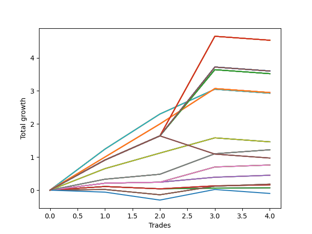

# Long Bulldog 002 
- Symbol: AAPL_Unlimited
- Date Range: 03/23/2022 - 07/08/2022
- Trading Period: 7:20-12:30
- Number of Trades: 4



| Name | Win Percent | Profit | Avg Profit / Trade | Avg Time / Trade |      | Name | Win Percent | Profit | Avg Profit / Trade | Avg Time / Trade |
| ---- | ----------- | ------ | ------------------ | ---------------- | ---- | ---- | ----------- | ------ | ------------------ | ---------------- |
| Sorted By <br> Profit | | | | | | Sorted By <br> Win Percentage ||||
| One Hundred Twenty-Eight | 75.00 | 2265.00 | 566.25 | 192:32 |     | Sixty-Nine | 100.00 | 610.00 | 152.50 | 43:07 |
| One Hundred Twenty-Three | 75.00 | 2265.00 | 566.25 | 192:32 |     | Sixty-One | 100.00 | 610.00 | 152.50 | 43:07 |
| One Hundred Eighteen | 75.00 | 2265.00 | 566.25 | 192:32 |     | Fifty-Three | 100.00 | 610.00 | 152.50 | 43:07 |
| One Hundred Thirteen | 75.00 | 2265.00 | 566.25 | 192:32 |     | Forty-Five | 100.00 | 610.00 | 152.50 | 43:07 |
| One Hundred Eight | 75.00 | 2265.00 | 566.25 | 192:32 |     | Five | 100.00 | 610.00 | 152.50 | 43:07 |
| One Hundred Three | 75.00 | 2265.00 | 566.25 | 192:32 |     | Sixty-Eight | 100.00 | 380.00 | 95.00 | 34:00 |
| Ninety-Three | 75.00 | 2265.00 | 566.25 | 192:32 |     | Sixty | 100.00 | 380.00 | 95.00 | 34:00 |
| Eighty-Three | 75.00 | 2265.00 | 566.25 | 192:32 |     | Fifty-Two | 100.00 | 380.00 | 95.00 | 34:00 |
| One Hundred Thirty | 75.00 | 1800.00 | 450.00 | 196:15 |     | Forty-Four | 100.00 | 380.00 | 95.00 | 34:00 |
| One Hundred Twenty-Nine | 75.00 | 1800.00 | 450.00 | 196:15 |     | Four | 100.00 | 380.00 | 95.00 | 34:00 |
| One Hundred Twenty-Five | 75.00 | 1800.00 | 450.00 | 196:15 |     | Sixty-Six | 100.00 | 225.00 | 56.25 | 12:58 |
| One Hundred Twenty-Four | 75.00 | 1800.00 | 450.00 | 196:15 |     | Fifty-Eight | 100.00 | 225.00 | 56.25 | 12:58 |
| One Hundred Twenty | 75.00 | 1800.00 | 450.00 | 196:15 |     | Fifty | 100.00 | 225.00 | 56.25 | 12:58 |
| One Hundred Ninteen | 75.00 | 1800.00 | 450.00 | 196:15 |     | Forty-Two | 100.00 | 225.00 | 56.25 | 12:58 |
| One Hundred Fifteen | 75.00 | 1800.00 | 450.00 | 196:15 |     | Two | 100.00 | 225.00 | 56.25 | 12:58 |
| One Hundred Fourteen | 75.00 | 1800.00 | 450.00 | 196:15 |     | One Hundred Twenty-Eight | 75.00 | 2265.00 | 566.25 | 192:32 |
| One Hundred Ten | 75.00 | 1800.00 | 450.00 | 196:15 |     | One Hundred Twenty-Three | 75.00 | 2265.00 | 566.25 | 192:32 |
| One Hundred Nine | 75.00 | 1800.00 | 450.00 | 196:15 |     | One Hundred Eighteen | 75.00 | 2265.00 | 566.25 | 192:32 |
| One Hundred Five | 75.00 | 1800.00 | 450.00 | 196:15 |     | One Hundred Thirteen | 75.00 | 2265.00 | 566.25 | 192:32 |
| One Hundred Four | 75.00 | 1800.00 | 450.00 | 196:15 |     | One Hundred Eight | 75.00 | 2265.00 | 566.25 | 192:32 |
| Ninety-Five | 75.00 | 1800.00 | 450.00 | 196:15 |     | One Hundred Three | 75.00 | 2265.00 | 566.25 | 192:32 |
| Ninety-Four | 75.00 | 1800.00 | 450.00 | 196:15 |     | Ninety-Three | 75.00 | 2265.00 | 566.25 | 192:32 |
| Eighty-Five | 75.00 | 1800.00 | 450.00 | 196:15 |     | Eighty-Three | 75.00 | 2265.00 | 566.25 | 192:32 |
| Eighty-Four | 75.00 | 1800.00 | 450.00 | 196:15 |     | One Hundred Thirty | 75.00 | 1800.00 | 450.00 | 196:15 |
| One Hundred Twenty-Seven | 75.00 | 1760.00 | 440.00 | 179:48 |     | One Hundred Twenty-Nine | 75.00 | 1800.00 | 450.00 | 196:15 |
| One Hundred Twenty-Two | 75.00 | 1760.00 | 440.00 | 179:48 |     | One Hundred Twenty-Five | 75.00 | 1800.00 | 450.00 | 196:15 |
| One Hundred Seventeen | 75.00 | 1760.00 | 440.00 | 179:48 |     | One Hundred Twenty-Four | 75.00 | 1800.00 | 450.00 | 196:15 |
| One Hundred Twelve | 75.00 | 1760.00 | 440.00 | 179:48 |     | One Hundred Twenty | 75.00 | 1800.00 | 450.00 | 196:15 |
| One Hundred Seven | 75.00 | 1760.00 | 440.00 | 179:48 |     | One Hundred Ninteen | 75.00 | 1800.00 | 450.00 | 196:15 |
| One Hundred Two | 75.00 | 1760.00 | 440.00 | 179:48 |     | One Hundred Fifteen | 75.00 | 1800.00 | 450.00 | 196:15 |
| Ninety-Two | 75.00 | 1760.00 | 440.00 | 179:48 |     | One Hundred Fourteen | 75.00 | 1800.00 | 450.00 | 196:15 |
| Eighty-Two | 75.00 | 1760.00 | 440.00 | 179:48 |     | One Hundred Ten | 75.00 | 1800.00 | 450.00 | 196:15 |
| One Hundred Twenty-Six | 75.00 | 1475.00 | 368.75 | 116:20 |     | One Hundred Nine | 75.00 | 1800.00 | 450.00 | 196:15 |
| One Hundred Twenty-One | 75.00 | 1475.00 | 368.75 | 116:20 |     | One Hundred Five | 75.00 | 1800.00 | 450.00 | 196:15 |
| One Hundred Sixteen | 75.00 | 1475.00 | 368.75 | 116:20 |     | One Hundred Four | 75.00 | 1800.00 | 450.00 | 196:15 |
| One Hundred Eleven | 75.00 | 1475.00 | 368.75 | 116:20 |     | Ninety-Five | 75.00 | 1800.00 | 450.00 | 196:15 |
| One Hundred Six | 75.00 | 1475.00 | 368.75 | 116:20 |     | Ninety-Four | 75.00 | 1800.00 | 450.00 | 196:15 |
| One Hundred One | 75.00 | 1475.00 | 368.75 | 116:20 |     | Eighty-Five | 75.00 | 1800.00 | 450.00 | 196:15 |
| Ninety-Six | 75.00 | 1475.00 | 368.75 | 116:20 |     | Eighty-Four | 75.00 | 1800.00 | 450.00 | 196:15 |
| Ninety-One | 75.00 | 1475.00 | 368.75 | 116:20 |     | One Hundred Twenty-Seven | 75.00 | 1760.00 | 440.00 | 179:48 |
| Eighty-One | 75.00 | 1475.00 | 368.75 | 116:20 |     | One Hundred Twenty-Two | 75.00 | 1760.00 | 440.00 | 179:48 |
| Seventy-One | 75.00 | 1465.00 | 366.25 | 117:41 |     | One Hundred Seventeen | 75.00 | 1760.00 | 440.00 | 179:48 |
| Sixty-Three | 75.00 | 1465.00 | 366.25 | 117:41 |     | One Hundred Twelve | 75.00 | 1760.00 | 440.00 | 179:48 |
| Fifty-Five | 75.00 | 1465.00 | 366.25 | 117:41 |     | One Hundred Seven | 75.00 | 1760.00 | 440.00 | 179:48 |
| Forty-Seven | 75.00 | 1465.00 | 366.25 | 117:41 |     | One Hundred Two | 75.00 | 1760.00 | 440.00 | 179:48 |
| Seven | 75.00 | 1465.00 | 366.25 | 117:41 |     | Ninety-Two | 75.00 | 1760.00 | 440.00 | 179:48 |
| Seventy | 75.00 | 730.00 | 182.50 | 102:21 |     | Eighty-Two | 75.00 | 1760.00 | 440.00 | 179:48 |
| Sixty-Two | 75.00 | 730.00 | 182.50 | 102:21 |     | One Hundred Twenty-Six | 75.00 | 1475.00 | 368.75 | 116:20 |
| Fifty-Four | 75.00 | 730.00 | 182.50 | 102:21 |     | One Hundred Twenty-One | 75.00 | 1475.00 | 368.75 | 116:20 |
| Forty-Six | 75.00 | 730.00 | 182.50 | 102:21 |     | One Hundred Sixteen | 75.00 | 1475.00 | 368.75 | 116:20 |
| Six | 75.00 | 730.00 | 182.50 | 102:21 |     | One Hundred Eleven | 75.00 | 1475.00 | 368.75 | 116:20 |
| Sixty-Nine | 100.00 | 610.00 | 152.50 | 43:07 |     | One Hundred Six | 75.00 | 1475.00 | 368.75 | 116:20 |
| Sixty-One | 100.00 | 610.00 | 152.50 | 43:07 |     | One Hundred One | 75.00 | 1475.00 | 368.75 | 116:20 |
| Fifty-Three | 100.00 | 610.00 | 152.50 | 43:07 |     | Ninety-Six | 75.00 | 1475.00 | 368.75 | 116:20 |
| Forty-Five | 100.00 | 610.00 | 152.50 | 43:07 |     | Ninety-One | 75.00 | 1475.00 | 368.75 | 116:20 |
| Five | 100.00 | 610.00 | 152.50 | 43:07 |     | Eighty-One | 75.00 | 1475.00 | 368.75 | 116:20 |
| One Hundred | 50.00 | 485.00 | 121.25 | 169:56 |     | Seventy-One | 75.00 | 1465.00 | 366.25 | 117:41 |
| Ninety-Nine | 50.00 | 485.00 | 121.25 | 169:56 |     | Sixty-Three | 75.00 | 1465.00 | 366.25 | 117:41 |
| Ninety-Eight | 50.00 | 485.00 | 121.25 | 169:56 |     | Fifty-Five | 75.00 | 1465.00 | 366.25 | 117:41 |
| Ninety-Seven | 50.00 | 485.00 | 121.25 | 169:56 |     | Forty-Seven | 75.00 | 1465.00 | 366.25 | 117:41 |
| Sixty-Eight | 100.00 | 380.00 | 95.00 | 34:00 |     | Seven | 75.00 | 1465.00 | 366.25 | 117:41 |
| Sixty | 100.00 | 380.00 | 95.00 | 34:00 |     | Seventy | 75.00 | 730.00 | 182.50 | 102:21 |
| Fifty-Two | 100.00 | 380.00 | 95.00 | 34:00 |     | Sixty-Two | 75.00 | 730.00 | 182.50 | 102:21 |
| Forty-Four | 100.00 | 380.00 | 95.00 | 34:00 |     | Fifty-Four | 75.00 | 730.00 | 182.50 | 102:21 |
| Four | 100.00 | 380.00 | 95.00 | 34:00 |     | Forty-Six | 75.00 | 730.00 | 182.50 | 102:21 |
| Sixty-Six | 100.00 | 225.00 | 56.25 | 12:58 |     | Six | 75.00 | 730.00 | 182.50 | 102:21 |
| Fifty-Eight | 100.00 | 225.00 | 56.25 | 12:58 |     | Sixty-Seven | 75.00 | 90.00 | 22.50 | 26:23 |
| Fifty | 100.00 | 225.00 | 56.25 | 12:58 |     | Fifty-Nine | 75.00 | 90.00 | 22.50 | 26:23 |
| Forty-Two | 100.00 | 225.00 | 56.25 | 12:58 |     | Fifty-One | 75.00 | 90.00 | 22.50 | 26:23 |
| Two | 100.00 | 225.00 | 56.25 | 12:58 |     | Forty-Three | 75.00 | 90.00 | 22.50 | 26:23 |
| Sixty-Seven | 75.00 | 90.00 | 22.50 | 26:23 |     | Three | 75.00 | 90.00 | 22.50 | 26:23 |
| Fifty-Nine | 75.00 | 90.00 | 22.50 | 26:23 |     | Sixty-Five | 75.00 | 80.00 | 20.00 | 09:23 |
| Fifty-One | 75.00 | 90.00 | 22.50 | 26:23 |     | Fifty-Seven | 75.00 | 80.00 | 20.00 | 09:23 |
| Forty-Three | 75.00 | 90.00 | 22.50 | 26:23 |     | Forty-Nine | 75.00 | 80.00 | 20.00 | 09:23 |
| Three | 75.00 | 90.00 | 22.50 | 26:23 |     | Forty-One | 75.00 | 80.00 | 20.00 | 09:23 |
| Sixty-Five | 75.00 | 80.00 | 20.00 | 09:23 |     | One | 75.00 | 80.00 | 20.00 | 09:23 |
| Fifty-Seven | 75.00 | 80.00 | 20.00 | 09:23 |     | Sixty-Four | 75.00 | 35.00 | 8.75 | 05:38 |
| Forty-Nine | 75.00 | 80.00 | 20.00 | 09:23 |     | Fifty-Six | 75.00 | 35.00 | 8.75 | 05:38 |
| Forty-One | 75.00 | 80.00 | 20.00 | 09:23 |     | Forty-Eight | 75.00 | 35.00 | 8.75 | 05:38 |
| One | 75.00 | 80.00 | 20.00 | 09:23 |     | Forty | 75.00 | 35.00 | 8.75 | 05:38 |
| Sixty-Four | 75.00 | 35.00 | 8.75 | 05:38 |     | Zero | 75.00 | 35.00 | 8.75 | 05:38 |
| Fifty-Six | 75.00 | 35.00 | 8.75 | 05:38 |     | One Hundred | 50.00 | 485.00 | 121.25 | 169:56 |
| Forty-Eight | 75.00 | 35.00 | 8.75 | 05:38 |     | Ninety-Nine | 50.00 | 485.00 | 121.25 | 169:56 |
| Forty | 75.00 | 35.00 | 8.75 | 05:38 |     | Ninety-Eight | 50.00 | 485.00 | 121.25 | 169:56 |
| Zero | 75.00 | 35.00 | 8.75 | 05:38 |     | Ninety-Seven | 50.00 | 485.00 | 121.25 | 169:56 |
| Seventy-Three | 25.00 | -50.00 | -12.50 | 10:20 |     | Seventy-Three | 25.00 | -50.00 | -12.50 | 10:20 |

## NO STOPLOSS

### Test Zero
* Sell when price hits the middle line of the 20p bollinger
* No Stoploss
* Results:
```
Total Trades: 4
Percent Up: 75.00
Percent Down: 25.00
Total Points Moved Up: 0.07
Potential Profit: 35.00
Total Points Ups: 0.14 Count Ups: 3
Total Points Downs: -0.07 Count Downs: 1
```

<details><summary>Trades</summary>

<code>In: 2022-03-25 08:30:00		Out: 2022-03-25 08:35:05		Total Position Time: 05:05		Total Move Up: 0.11		Total to Date: 0.11</code> <br />
<code>In: 2022-03-25 08:31:00		Out: 2022-03-25 08:35:05		Total Position Time: 04:05		Total Move Up: -0.07		Total to Date: 0.04</code> <br />
<code>In: 2022-06-15 10:11:00		Out: 2022-06-15 10:12:10		Total Position Time: 01:10		Total Move Up: 0.02		Total to Date: 0.06</code> <br />
<code>In: 2022-06-27 10:51:00		Out: 2022-06-27 11:03:15		Total Position Time: 12:15		Total Move Up: 0.01		Total to Date: 0.07</code> <br />


</details>

### Test One
* Sell when the price hits the upper line of the 20p 1std bollinger
* No Stoploss
* Results:
```
Total Trades: 4
Percent Up: 75.00
Percent Down: 25.00
Total Points Moved Up: 0.16
Potential Profit: 80.00
Total Points Ups: 0.23 Count Ups: 3
Total Points Downs: -0.07 Count Downs: 1
```

<details><summary>Trades</summary>

<code>In: 2022-03-25 08:30:00		Out: 2022-03-25 08:41:25		Total Position Time: 11:25		Total Move Up: 0.11		Total to Date: 0.11</code> <br />
<code>In: 2022-03-25 08:31:00		Out: 2022-03-25 08:41:25		Total Position Time: 10:25		Total Move Up: -0.07		Total to Date: 0.04</code> <br />
<code>In: 2022-06-15 10:11:00		Out: 2022-06-15 10:12:45		Total Position Time: 01:45		Total Move Up: 0.09		Total to Date: 0.13</code> <br />
<code>In: 2022-06-27 10:51:00		Out: 2022-06-27 11:05:00		Total Position Time: 14:00		Total Move Up: 0.03		Total to Date: 0.16</code> <br />


</details>

### Test Two
* Sell when the price hits the upper line of the 20p 2std bollinger
* No Stoploss
* Results:
```
Total Trades: 4
Percent Up: 100.00
Percent Down: 0.00
Total Points Moved Up: 0.45
Potential Profit: 225.00
Total Points Ups: 0.45 Count Ups: 4
Total Points Downs: 0.00 Count Downs: 0
```

<details><summary>Trades</summary>

<code>In: 2022-03-25 08:30:00		Out: 2022-03-25 08:42:05		Total Position Time: 12:05		Total Move Up: 0.21		Total to Date: 0.21</code> <br />
<code>In: 2022-03-25 08:31:00		Out: 2022-03-25 08:42:05		Total Position Time: 11:05		Total Move Up: 0.03		Total to Date: 0.24</code> <br />
<code>In: 2022-06-15 10:11:00		Out: 2022-06-15 10:13:35		Total Position Time: 02:35		Total Move Up: 0.15		Total to Date: 0.39</code> <br />
<code>In: 2022-06-27 10:51:00		Out: 2022-06-27 11:17:10		Total Position Time: 26:10		Total Move Up: 0.06		Total to Date: 0.45</code> <br />


</details>

### Test Three
* Sell when price hits the middle line of the 50p bollinger
* No Stoploss
* Results:
```
Total Trades: 4
Percent Up: 75.00
Percent Down: 25.00
Total Points Moved Up: 0.18
Potential Profit: 90.00
Total Points Ups: 0.34 Count Ups: 3
Total Points Downs: -0.16 Count Downs: 1
```

<details><summary>Trades</summary>

<code>In: 2022-03-25 08:30:00		Out: 2022-03-25 09:05:15		Total Position Time: 35:15		Total Move Up: 0.02		Total to Date: 0.02</code> <br />
<code>In: 2022-03-25 08:31:00		Out: 2022-03-25 09:05:15		Total Position Time: 34:15		Total Move Up: -0.16		Total to Date: -0.14</code> <br />
<code>In: 2022-06-15 10:11:00		Out: 2022-06-15 10:20:55		Total Position Time: 09:55		Total Move Up: 0.26		Total to Date: 0.12</code> <br />
<code>In: 2022-06-27 10:51:00		Out: 2022-06-27 11:17:10		Total Position Time: 26:10		Total Move Up: 0.06		Total to Date: 0.18</code> <br />


</details>

### Test Four
* Sell when the price hits the upper line of the 50p 1std bollinger
* No Stoploss
* Results:
```
Total Trades: 4
Percent Up: 100.00
Percent Down: 0.00
Total Points Moved Up: 0.76
Potential Profit: 380.00
Total Points Ups: 0.76 Count Ups: 4
Total Points Downs: 0.00 Count Downs: 0
```

<details><summary>Trades</summary>

<code>In: 2022-03-25 08:30:00		Out: 2022-03-25 09:09:05		Total Position Time: 39:05		Total Move Up: 0.21		Total to Date: 0.21</code> <br />
<code>In: 2022-03-25 08:31:00		Out: 2022-03-25 09:09:05		Total Position Time: 38:05		Total Move Up: 0.03		Total to Date: 0.24</code> <br />
<code>In: 2022-06-15 10:11:00		Out: 2022-06-15 10:27:25		Total Position Time: 16:25		Total Move Up: 0.46		Total to Date: 0.70</code> <br />
<code>In: 2022-06-27 10:51:00		Out: 2022-06-27 11:33:25		Total Position Time: 42:25		Total Move Up: 0.06		Total to Date: 0.76</code> <br />


</details>

### Test Five
* Sell when the price hits the upper line of the 50p 2std bollinger
* No Stoploss
* Results:
```
Total Trades: 4
Percent Up: 100.00
Percent Down: 0.00
Total Points Moved Up: 1.22
Potential Profit: 610.00
Total Points Ups: 1.22 Count Ups: 4
Total Points Downs: 0.00 Count Downs: 0
```

<details><summary>Trades</summary>

<code>In: 2022-03-25 08:30:00		Out: 2022-03-25 09:11:30		Total Position Time: 41:30		Total Move Up: 0.33		Total to Date: 0.33</code> <br />
<code>In: 2022-03-25 08:31:00		Out: 2022-03-25 09:11:30		Total Position Time: 40:30		Total Move Up: 0.15		Total to Date: 0.48</code> <br />
<code>In: 2022-06-15 10:11:00		Out: 2022-06-15 10:58:15		Total Position Time: 47:15		Total Move Up: 0.62		Total to Date: 1.10</code> <br />
<code>In: 2022-06-27 10:51:00		Out: 2022-06-27 11:34:15		Total Position Time: 43:15		Total Move Up: 0.12		Total to Date: 1.22</code> <br />


</details>

### Test Six
* Sell when the price hits the middle line of the 1std VWAP
* No Stoploss
* Results:
```
Total Trades: 4
Percent Up: 75.00
Percent Down: 25.00
Total Points Moved Up: 1.46
Potential Profit: 730.00
Total Points Ups: 1.58 Count Ups: 3
Total Points Downs: -0.12 Count Downs: 1
```

<details><summary>Trades</summary>

<code>In: 2022-03-25 08:30:00		Out: 2022-03-25 10:49:00		Total Position Time: 139:00		Total Move Up: 0.65		Total to Date: 0.65</code> <br />
<code>In: 2022-03-25 08:31:00		Out: 2022-03-25 10:49:00		Total Position Time: 138:00		Total Move Up: 0.47		Total to Date: 1.12</code> <br />
<code>In: 2022-06-15 10:11:00		Out: 2022-06-15 10:27:25		Total Position Time: 16:25		Total Move Up: 0.46		Total to Date: 1.58</code> <br />
<code>In: 2022-06-27 10:51:00		Out: 2022-06-27 12:47:00		Total Position Time: 116:00		Total Move Up: -0.12		Total to Date: 1.46</code> <br />


</details>

### Test Seven
* Sell when the price hits the upper line of the 1std VWAP
* No Stoploss
* Results:
```
Total Trades: 4
Percent Up: 75.00
Percent Down: 25.00
Total Points Moved Up: 2.93
Potential Profit: 1465.00
Total Points Ups: 3.05 Count Ups: 3
Total Points Downs: -0.12 Count Downs: 1
```

<details><summary>Trades</summary>

<code>In: 2022-03-25 08:30:00		Out: 2022-03-25 11:03:35		Total Position Time: 153:35		Total Move Up: 1.24		Total to Date: 1.24</code> <br />
<code>In: 2022-03-25 08:31:00		Out: 2022-03-25 11:03:35		Total Position Time: 152:35		Total Move Up: 1.06		Total to Date: 2.30</code> <br />
<code>In: 2022-06-15 10:11:00		Out: 2022-06-15 10:59:35		Total Position Time: 48:35		Total Move Up: 0.75		Total to Date: 3.05</code> <br />
<code>In: 2022-06-27 10:51:00		Out: 2022-06-27 12:47:00		Total Position Time: 116:00		Total Move Up: -0.12		Total to Date: 2.93</code> <br />


</details>

## STOPLOSS OF 5

### Test Forty
* Sell when price hits the middle line of the 20p bollinger
* Stoploss is 5 points
* Results:
```
Total Trades: 4
Percent Up: 75.00
Percent Down: 25.00
Total Points Moved Up: 0.07
Potential Profit: 35.00
Total Points Ups: 0.14 Count Ups: 3
Total Points Downs: -0.07 Count Downs: 1
```

<details><summary>Trades</summary>

<code>In: 2022-03-25 08:30:00		Out: 2022-03-25 08:35:05		Total Position Time: 05:05		Total Move Up: 0.11		Total to Date: 0.11</code> <br />
<code>In: 2022-03-25 08:31:00		Out: 2022-03-25 08:35:05		Total Position Time: 04:05		Total Move Up: -0.07		Total to Date: 0.04</code> <br />
<code>In: 2022-06-15 10:11:00		Out: 2022-06-15 10:12:10		Total Position Time: 01:10		Total Move Up: 0.02		Total to Date: 0.06</code> <br />
<code>In: 2022-06-27 10:51:00		Out: 2022-06-27 11:03:15		Total Position Time: 12:15		Total Move Up: 0.01		Total to Date: 0.07</code> <br />


</details>

### Test Forty-One
* Sell when the price hits the upper line of the 20p 1std bollinger
* Stoploss is 5 points
* Results:
```
Total Trades: 4
Percent Up: 75.00
Percent Down: 25.00
Total Points Moved Up: 0.16
Potential Profit: 80.00
Total Points Ups: 0.23 Count Ups: 3
Total Points Downs: -0.07 Count Downs: 1
```

<details><summary>Trades</summary>

<code>In: 2022-03-25 08:30:00		Out: 2022-03-25 08:41:25		Total Position Time: 11:25		Total Move Up: 0.11		Total to Date: 0.11</code> <br />
<code>In: 2022-03-25 08:31:00		Out: 2022-03-25 08:41:25		Total Position Time: 10:25		Total Move Up: -0.07		Total to Date: 0.04</code> <br />
<code>In: 2022-06-15 10:11:00		Out: 2022-06-15 10:12:45		Total Position Time: 01:45		Total Move Up: 0.09		Total to Date: 0.13</code> <br />
<code>In: 2022-06-27 10:51:00		Out: 2022-06-27 11:05:00		Total Position Time: 14:00		Total Move Up: 0.03		Total to Date: 0.16</code> <br />


</details>

### Test Forty-Two
* Sell when the price hits the upper line of the 20p 2std bollinger
* Stoploss is 5 points
* Results:
```
Total Trades: 4
Percent Up: 100.00
Percent Down: 0.00
Total Points Moved Up: 0.45
Potential Profit: 225.00
Total Points Ups: 0.45 Count Ups: 4
Total Points Downs: 0.00 Count Downs: 0
```

<details><summary>Trades</summary>

<code>In: 2022-03-25 08:30:00		Out: 2022-03-25 08:42:05		Total Position Time: 12:05		Total Move Up: 0.21		Total to Date: 0.21</code> <br />
<code>In: 2022-03-25 08:31:00		Out: 2022-03-25 08:42:05		Total Position Time: 11:05		Total Move Up: 0.03		Total to Date: 0.24</code> <br />
<code>In: 2022-06-15 10:11:00		Out: 2022-06-15 10:13:35		Total Position Time: 02:35		Total Move Up: 0.15		Total to Date: 0.39</code> <br />
<code>In: 2022-06-27 10:51:00		Out: 2022-06-27 11:17:10		Total Position Time: 26:10		Total Move Up: 0.06		Total to Date: 0.45</code> <br />


</details>

### Test Forty-Three
* Sell when price hits the middle line of the 50p bollinger
* Stoploss is 5 points
* Results:
```
Total Trades: 4
Percent Up: 75.00
Percent Down: 25.00
Total Points Moved Up: 0.18
Potential Profit: 90.00
Total Points Ups: 0.34 Count Ups: 3
Total Points Downs: -0.16 Count Downs: 1
```

<details><summary>Trades</summary>

<code>In: 2022-03-25 08:30:00		Out: 2022-03-25 09:05:15		Total Position Time: 35:15		Total Move Up: 0.02		Total to Date: 0.02</code> <br />
<code>In: 2022-03-25 08:31:00		Out: 2022-03-25 09:05:15		Total Position Time: 34:15		Total Move Up: -0.16		Total to Date: -0.14</code> <br />
<code>In: 2022-06-15 10:11:00		Out: 2022-06-15 10:20:55		Total Position Time: 09:55		Total Move Up: 0.26		Total to Date: 0.12</code> <br />
<code>In: 2022-06-27 10:51:00		Out: 2022-06-27 11:17:10		Total Position Time: 26:10		Total Move Up: 0.06		Total to Date: 0.18</code> <br />


</details>

### Test Forty-Four
* Sell when the price hits the upper line of the 50p 1std bollinger
* Stoploss is 5 points
* Results:
```
Total Trades: 4
Percent Up: 100.00
Percent Down: 0.00
Total Points Moved Up: 0.76
Potential Profit: 380.00
Total Points Ups: 0.76 Count Ups: 4
Total Points Downs: 0.00 Count Downs: 0
```

<details><summary>Trades</summary>

<code>In: 2022-03-25 08:30:00		Out: 2022-03-25 09:09:05		Total Position Time: 39:05		Total Move Up: 0.21		Total to Date: 0.21</code> <br />
<code>In: 2022-03-25 08:31:00		Out: 2022-03-25 09:09:05		Total Position Time: 38:05		Total Move Up: 0.03		Total to Date: 0.24</code> <br />
<code>In: 2022-06-15 10:11:00		Out: 2022-06-15 10:27:25		Total Position Time: 16:25		Total Move Up: 0.46		Total to Date: 0.70</code> <br />
<code>In: 2022-06-27 10:51:00		Out: 2022-06-27 11:33:25		Total Position Time: 42:25		Total Move Up: 0.06		Total to Date: 0.76</code> <br />


</details>

### Test Forty-Five
* Sell when the price hits the upper line of the 50p 2std bollinger
* Stoploss is 5 points
* Results:
```
Total Trades: 4
Percent Up: 100.00
Percent Down: 0.00
Total Points Moved Up: 1.22
Potential Profit: 610.00
Total Points Ups: 1.22 Count Ups: 4
Total Points Downs: 0.00 Count Downs: 0
```

<details><summary>Trades</summary>

<code>In: 2022-03-25 08:30:00		Out: 2022-03-25 09:11:30		Total Position Time: 41:30		Total Move Up: 0.33		Total to Date: 0.33</code> <br />
<code>In: 2022-03-25 08:31:00		Out: 2022-03-25 09:11:30		Total Position Time: 40:30		Total Move Up: 0.15		Total to Date: 0.48</code> <br />
<code>In: 2022-06-15 10:11:00		Out: 2022-06-15 10:58:15		Total Position Time: 47:15		Total Move Up: 0.62		Total to Date: 1.10</code> <br />
<code>In: 2022-06-27 10:51:00		Out: 2022-06-27 11:34:15		Total Position Time: 43:15		Total Move Up: 0.12		Total to Date: 1.22</code> <br />


</details>

### Test Forty-Six
* Sell when the price hits the middle line of the 1std VWAP
* Stoploss is 5 points
* Results:
```
Total Trades: 4
Percent Up: 75.00
Percent Down: 25.00
Total Points Moved Up: 1.46
Potential Profit: 730.00
Total Points Ups: 1.58 Count Ups: 3
Total Points Downs: -0.12 Count Downs: 1
```

<details><summary>Trades</summary>

<code>In: 2022-03-25 08:30:00		Out: 2022-03-25 10:49:00		Total Position Time: 139:00		Total Move Up: 0.65		Total to Date: 0.65</code> <br />
<code>In: 2022-03-25 08:31:00		Out: 2022-03-25 10:49:00		Total Position Time: 138:00		Total Move Up: 0.47		Total to Date: 1.12</code> <br />
<code>In: 2022-06-15 10:11:00		Out: 2022-06-15 10:27:25		Total Position Time: 16:25		Total Move Up: 0.46		Total to Date: 1.58</code> <br />
<code>In: 2022-06-27 10:51:00		Out: 2022-06-27 12:47:00		Total Position Time: 116:00		Total Move Up: -0.12		Total to Date: 1.46</code> <br />


</details>

### Test Forty-Seven
* Sell when the price hits the upper line of the 1std VWAP
* Stoploss is 5 points
* Results:
```
Total Trades: 4
Percent Up: 75.00
Percent Down: 25.00
Total Points Moved Up: 2.93
Potential Profit: 1465.00
Total Points Ups: 3.05 Count Ups: 3
Total Points Downs: -0.12 Count Downs: 1
```

<details><summary>Trades</summary>

<code>In: 2022-03-25 08:30:00		Out: 2022-03-25 11:03:35		Total Position Time: 153:35		Total Move Up: 1.24		Total to Date: 1.24</code> <br />
<code>In: 2022-03-25 08:31:00		Out: 2022-03-25 11:03:35		Total Position Time: 152:35		Total Move Up: 1.06		Total to Date: 2.30</code> <br />
<code>In: 2022-06-15 10:11:00		Out: 2022-06-15 10:59:35		Total Position Time: 48:35		Total Move Up: 0.75		Total to Date: 3.05</code> <br />
<code>In: 2022-06-27 10:51:00		Out: 2022-06-27 12:47:00		Total Position Time: 116:00		Total Move Up: -0.12		Total to Date: 2.93</code> <br />


</details>

## TRAIL STOP OF 5

### Test Forty-Eight
* Sell when price hits the middle line of the 20p bollinger
* Trailing Stop is 5 points
* Results:
```
Total Trades: 4
Percent Up: 75.00
Percent Down: 25.00
Total Points Moved Up: 0.07
Potential Profit: 35.00
Total Points Ups: 0.14 Count Ups: 3
Total Points Downs: -0.07 Count Downs: 1
```

<details><summary>Trades</summary>

<code>In: 2022-03-25 08:30:00		Out: 2022-03-25 08:35:05		Total Position Time: 05:05		Total Move Up: 0.11		Total to Date: 0.11</code> <br />
<code>In: 2022-03-25 08:31:00		Out: 2022-03-25 08:35:05		Total Position Time: 04:05		Total Move Up: -0.07		Total to Date: 0.04</code> <br />
<code>In: 2022-06-15 10:11:00		Out: 2022-06-15 10:12:10		Total Position Time: 01:10		Total Move Up: 0.02		Total to Date: 0.06</code> <br />
<code>In: 2022-06-27 10:51:00		Out: 2022-06-27 11:03:15		Total Position Time: 12:15		Total Move Up: 0.01		Total to Date: 0.07</code> <br />


</details>

### Test Forty-Nine
* Sell when the price hits the upper line of the 20p 1std bollinger
* Trailing Stop is 5 points
* Results:
```
Total Trades: 4
Percent Up: 75.00
Percent Down: 25.00
Total Points Moved Up: 0.16
Potential Profit: 80.00
Total Points Ups: 0.23 Count Ups: 3
Total Points Downs: -0.07 Count Downs: 1
```

<details><summary>Trades</summary>

<code>In: 2022-03-25 08:30:00		Out: 2022-03-25 08:41:25		Total Position Time: 11:25		Total Move Up: 0.11		Total to Date: 0.11</code> <br />
<code>In: 2022-03-25 08:31:00		Out: 2022-03-25 08:41:25		Total Position Time: 10:25		Total Move Up: -0.07		Total to Date: 0.04</code> <br />
<code>In: 2022-06-15 10:11:00		Out: 2022-06-15 10:12:45		Total Position Time: 01:45		Total Move Up: 0.09		Total to Date: 0.13</code> <br />
<code>In: 2022-06-27 10:51:00		Out: 2022-06-27 11:05:00		Total Position Time: 14:00		Total Move Up: 0.03		Total to Date: 0.16</code> <br />


</details>

### Test Fifty
* Sell when the price hits the upper line of the 20p 2std bollinger
* Trailing Stop is 5 points
* Results:
```
Total Trades: 4
Percent Up: 100.00
Percent Down: 0.00
Total Points Moved Up: 0.45
Potential Profit: 225.00
Total Points Ups: 0.45 Count Ups: 4
Total Points Downs: 0.00 Count Downs: 0
```

<details><summary>Trades</summary>

<code>In: 2022-03-25 08:30:00		Out: 2022-03-25 08:42:05		Total Position Time: 12:05		Total Move Up: 0.21		Total to Date: 0.21</code> <br />
<code>In: 2022-03-25 08:31:00		Out: 2022-03-25 08:42:05		Total Position Time: 11:05		Total Move Up: 0.03		Total to Date: 0.24</code> <br />
<code>In: 2022-06-15 10:11:00		Out: 2022-06-15 10:13:35		Total Position Time: 02:35		Total Move Up: 0.15		Total to Date: 0.39</code> <br />
<code>In: 2022-06-27 10:51:00		Out: 2022-06-27 11:17:10		Total Position Time: 26:10		Total Move Up: 0.06		Total to Date: 0.45</code> <br />


</details>

### Test Fifty-One
* Sell when price hits the middle line of the 50p bollinger
* Trailing Stop is 5 points
* Results:
```
Total Trades: 4
Percent Up: 75.00
Percent Down: 25.00
Total Points Moved Up: 0.18
Potential Profit: 90.00
Total Points Ups: 0.34 Count Ups: 3
Total Points Downs: -0.16 Count Downs: 1
```

<details><summary>Trades</summary>

<code>In: 2022-03-25 08:30:00		Out: 2022-03-25 09:05:15		Total Position Time: 35:15		Total Move Up: 0.02		Total to Date: 0.02</code> <br />
<code>In: 2022-03-25 08:31:00		Out: 2022-03-25 09:05:15		Total Position Time: 34:15		Total Move Up: -0.16		Total to Date: -0.14</code> <br />
<code>In: 2022-06-15 10:11:00		Out: 2022-06-15 10:20:55		Total Position Time: 09:55		Total Move Up: 0.26		Total to Date: 0.12</code> <br />
<code>In: 2022-06-27 10:51:00		Out: 2022-06-27 11:17:10		Total Position Time: 26:10		Total Move Up: 0.06		Total to Date: 0.18</code> <br />


</details>

### Test Fifty-Two
* Sell when the price hits the upper line of the 50p 1std bollinger
* Trailing Stop is 5 points
* Results:
```
Total Trades: 4
Percent Up: 100.00
Percent Down: 0.00
Total Points Moved Up: 0.76
Potential Profit: 380.00
Total Points Ups: 0.76 Count Ups: 4
Total Points Downs: 0.00 Count Downs: 0
```

<details><summary>Trades</summary>

<code>In: 2022-03-25 08:30:00		Out: 2022-03-25 09:09:05		Total Position Time: 39:05		Total Move Up: 0.21		Total to Date: 0.21</code> <br />
<code>In: 2022-03-25 08:31:00		Out: 2022-03-25 09:09:05		Total Position Time: 38:05		Total Move Up: 0.03		Total to Date: 0.24</code> <br />
<code>In: 2022-06-15 10:11:00		Out: 2022-06-15 10:27:25		Total Position Time: 16:25		Total Move Up: 0.46		Total to Date: 0.70</code> <br />
<code>In: 2022-06-27 10:51:00		Out: 2022-06-27 11:33:25		Total Position Time: 42:25		Total Move Up: 0.06		Total to Date: 0.76</code> <br />


</details>

### Test Fifty-Three
* Sell when the price hits the upper line of the 50p 2std bollinger
* Trailing Stop is 5 points
* Results:
```
Total Trades: 4
Percent Up: 100.00
Percent Down: 0.00
Total Points Moved Up: 1.22
Potential Profit: 610.00
Total Points Ups: 1.22 Count Ups: 4
Total Points Downs: 0.00 Count Downs: 0
```

<details><summary>Trades</summary>

<code>In: 2022-03-25 08:30:00		Out: 2022-03-25 09:11:30		Total Position Time: 41:30		Total Move Up: 0.33		Total to Date: 0.33</code> <br />
<code>In: 2022-03-25 08:31:00		Out: 2022-03-25 09:11:30		Total Position Time: 40:30		Total Move Up: 0.15		Total to Date: 0.48</code> <br />
<code>In: 2022-06-15 10:11:00		Out: 2022-06-15 10:58:15		Total Position Time: 47:15		Total Move Up: 0.62		Total to Date: 1.10</code> <br />
<code>In: 2022-06-27 10:51:00		Out: 2022-06-27 11:34:15		Total Position Time: 43:15		Total Move Up: 0.12		Total to Date: 1.22</code> <br />


</details>

### Test Fifty-Four
* Sell when the price hits the middle line of the 1std VWAP
* Trailing Stop is 5 points
* Results:
```
Total Trades: 4
Percent Up: 75.00
Percent Down: 25.00
Total Points Moved Up: 1.46
Potential Profit: 730.00
Total Points Ups: 1.58 Count Ups: 3
Total Points Downs: -0.12 Count Downs: 1
```

<details><summary>Trades</summary>

<code>In: 2022-03-25 08:30:00		Out: 2022-03-25 10:49:00		Total Position Time: 139:00		Total Move Up: 0.65		Total to Date: 0.65</code> <br />
<code>In: 2022-03-25 08:31:00		Out: 2022-03-25 10:49:00		Total Position Time: 138:00		Total Move Up: 0.47		Total to Date: 1.12</code> <br />
<code>In: 2022-06-15 10:11:00		Out: 2022-06-15 10:27:25		Total Position Time: 16:25		Total Move Up: 0.46		Total to Date: 1.58</code> <br />
<code>In: 2022-06-27 10:51:00		Out: 2022-06-27 12:47:00		Total Position Time: 116:00		Total Move Up: -0.12		Total to Date: 1.46</code> <br />


</details>

### Test Fifty-Five
* Sell when the price hits the upper line of the 1std VWAP
* Trailing Stop is 5 points
* Results:
```
Total Trades: 4
Percent Up: 75.00
Percent Down: 25.00
Total Points Moved Up: 2.93
Potential Profit: 1465.00
Total Points Ups: 3.05 Count Ups: 3
Total Points Downs: -0.12 Count Downs: 1
```

<details><summary>Trades</summary>

<code>In: 2022-03-25 08:30:00		Out: 2022-03-25 11:03:35		Total Position Time: 153:35		Total Move Up: 1.24		Total to Date: 1.24</code> <br />
<code>In: 2022-03-25 08:31:00		Out: 2022-03-25 11:03:35		Total Position Time: 152:35		Total Move Up: 1.06		Total to Date: 2.30</code> <br />
<code>In: 2022-06-15 10:11:00		Out: 2022-06-15 10:59:35		Total Position Time: 48:35		Total Move Up: 0.75		Total to Date: 3.05</code> <br />
<code>In: 2022-06-27 10:51:00		Out: 2022-06-27 12:47:00		Total Position Time: 116:00		Total Move Up: -0.12		Total to Date: 2.93</code> <br />


</details>

## STOPLOSS OF 10

### Test Fifty-Six
* Sell when price hits the middle line of the 20p bollinger
* Stoploss is 10 points
* Results:
```
Total Trades: 4
Percent Up: 75.00
Percent Down: 25.00
Total Points Moved Up: 0.07
Potential Profit: 35.00
Total Points Ups: 0.14 Count Ups: 3
Total Points Downs: -0.07 Count Downs: 1
```

<details><summary>Trades</summary>

<code>In: 2022-03-25 08:30:00		Out: 2022-03-25 08:35:05		Total Position Time: 05:05		Total Move Up: 0.11		Total to Date: 0.11</code> <br />
<code>In: 2022-03-25 08:31:00		Out: 2022-03-25 08:35:05		Total Position Time: 04:05		Total Move Up: -0.07		Total to Date: 0.04</code> <br />
<code>In: 2022-06-15 10:11:00		Out: 2022-06-15 10:12:10		Total Position Time: 01:10		Total Move Up: 0.02		Total to Date: 0.06</code> <br />
<code>In: 2022-06-27 10:51:00		Out: 2022-06-27 11:03:15		Total Position Time: 12:15		Total Move Up: 0.01		Total to Date: 0.07</code> <br />


</details>

### Test Fifty-Seven
* Sell when the price hits the upper line of the 20p 1std bollinger
* Stoploss is 10 points
* Results:
```
Total Trades: 4
Percent Up: 75.00
Percent Down: 25.00
Total Points Moved Up: 0.16
Potential Profit: 80.00
Total Points Ups: 0.23 Count Ups: 3
Total Points Downs: -0.07 Count Downs: 1
```

<details><summary>Trades</summary>

<code>In: 2022-03-25 08:30:00		Out: 2022-03-25 08:41:25		Total Position Time: 11:25		Total Move Up: 0.11		Total to Date: 0.11</code> <br />
<code>In: 2022-03-25 08:31:00		Out: 2022-03-25 08:41:25		Total Position Time: 10:25		Total Move Up: -0.07		Total to Date: 0.04</code> <br />
<code>In: 2022-06-15 10:11:00		Out: 2022-06-15 10:12:45		Total Position Time: 01:45		Total Move Up: 0.09		Total to Date: 0.13</code> <br />
<code>In: 2022-06-27 10:51:00		Out: 2022-06-27 11:05:00		Total Position Time: 14:00		Total Move Up: 0.03		Total to Date: 0.16</code> <br />


</details>

### Test Fifty-Eight
* Sell when the price hits the upper line of the 20p 2std bollinger
* Stoploss is 10 points
* Results:
```
Total Trades: 4
Percent Up: 100.00
Percent Down: 0.00
Total Points Moved Up: 0.45
Potential Profit: 225.00
Total Points Ups: 0.45 Count Ups: 4
Total Points Downs: 0.00 Count Downs: 0
```

<details><summary>Trades</summary>

<code>In: 2022-03-25 08:30:00		Out: 2022-03-25 08:42:05		Total Position Time: 12:05		Total Move Up: 0.21		Total to Date: 0.21</code> <br />
<code>In: 2022-03-25 08:31:00		Out: 2022-03-25 08:42:05		Total Position Time: 11:05		Total Move Up: 0.03		Total to Date: 0.24</code> <br />
<code>In: 2022-06-15 10:11:00		Out: 2022-06-15 10:13:35		Total Position Time: 02:35		Total Move Up: 0.15		Total to Date: 0.39</code> <br />
<code>In: 2022-06-27 10:51:00		Out: 2022-06-27 11:17:10		Total Position Time: 26:10		Total Move Up: 0.06		Total to Date: 0.45</code> <br />


</details>

### Test Fifty-Nine
* Sell when price hits the middle line of the 50p bollinger
* Stoploss is 10 points
* Results:
```
Total Trades: 4
Percent Up: 75.00
Percent Down: 25.00
Total Points Moved Up: 0.18
Potential Profit: 90.00
Total Points Ups: 0.34 Count Ups: 3
Total Points Downs: -0.16 Count Downs: 1
```

<details><summary>Trades</summary>

<code>In: 2022-03-25 08:30:00		Out: 2022-03-25 09:05:15		Total Position Time: 35:15		Total Move Up: 0.02		Total to Date: 0.02</code> <br />
<code>In: 2022-03-25 08:31:00		Out: 2022-03-25 09:05:15		Total Position Time: 34:15		Total Move Up: -0.16		Total to Date: -0.14</code> <br />
<code>In: 2022-06-15 10:11:00		Out: 2022-06-15 10:20:55		Total Position Time: 09:55		Total Move Up: 0.26		Total to Date: 0.12</code> <br />
<code>In: 2022-06-27 10:51:00		Out: 2022-06-27 11:17:10		Total Position Time: 26:10		Total Move Up: 0.06		Total to Date: 0.18</code> <br />


</details>

### Test Sixty
* Sell when the price hits the upper line of the 50p 1std bollinger
* Stoploss is 10 points
* Results:
```
Total Trades: 4
Percent Up: 100.00
Percent Down: 0.00
Total Points Moved Up: 0.76
Potential Profit: 380.00
Total Points Ups: 0.76 Count Ups: 4
Total Points Downs: 0.00 Count Downs: 0
```

<details><summary>Trades</summary>

<code>In: 2022-03-25 08:30:00		Out: 2022-03-25 09:09:05		Total Position Time: 39:05		Total Move Up: 0.21		Total to Date: 0.21</code> <br />
<code>In: 2022-03-25 08:31:00		Out: 2022-03-25 09:09:05		Total Position Time: 38:05		Total Move Up: 0.03		Total to Date: 0.24</code> <br />
<code>In: 2022-06-15 10:11:00		Out: 2022-06-15 10:27:25		Total Position Time: 16:25		Total Move Up: 0.46		Total to Date: 0.70</code> <br />
<code>In: 2022-06-27 10:51:00		Out: 2022-06-27 11:33:25		Total Position Time: 42:25		Total Move Up: 0.06		Total to Date: 0.76</code> <br />


</details>

### Test Sixty-One
* Sell when the price hits the upper line of the 50p 2std bollinger
* Stoploss is 10 points
* Results:
```
Total Trades: 4
Percent Up: 100.00
Percent Down: 0.00
Total Points Moved Up: 1.22
Potential Profit: 610.00
Total Points Ups: 1.22 Count Ups: 4
Total Points Downs: 0.00 Count Downs: 0
```

<details><summary>Trades</summary>

<code>In: 2022-03-25 08:30:00		Out: 2022-03-25 09:11:30		Total Position Time: 41:30		Total Move Up: 0.33		Total to Date: 0.33</code> <br />
<code>In: 2022-03-25 08:31:00		Out: 2022-03-25 09:11:30		Total Position Time: 40:30		Total Move Up: 0.15		Total to Date: 0.48</code> <br />
<code>In: 2022-06-15 10:11:00		Out: 2022-06-15 10:58:15		Total Position Time: 47:15		Total Move Up: 0.62		Total to Date: 1.10</code> <br />
<code>In: 2022-06-27 10:51:00		Out: 2022-06-27 11:34:15		Total Position Time: 43:15		Total Move Up: 0.12		Total to Date: 1.22</code> <br />


</details>

### Test Sixty-Two
* Sell when the price hits the middle line of the 1std VWAP
* Stoploss is 10 points
* Results:
```
Total Trades: 4
Percent Up: 75.00
Percent Down: 25.00
Total Points Moved Up: 1.46
Potential Profit: 730.00
Total Points Ups: 1.58 Count Ups: 3
Total Points Downs: -0.12 Count Downs: 1
```

<details><summary>Trades</summary>

<code>In: 2022-03-25 08:30:00		Out: 2022-03-25 10:49:00		Total Position Time: 139:00		Total Move Up: 0.65		Total to Date: 0.65</code> <br />
<code>In: 2022-03-25 08:31:00		Out: 2022-03-25 10:49:00		Total Position Time: 138:00		Total Move Up: 0.47		Total to Date: 1.12</code> <br />
<code>In: 2022-06-15 10:11:00		Out: 2022-06-15 10:27:25		Total Position Time: 16:25		Total Move Up: 0.46		Total to Date: 1.58</code> <br />
<code>In: 2022-06-27 10:51:00		Out: 2022-06-27 12:47:00		Total Position Time: 116:00		Total Move Up: -0.12		Total to Date: 1.46</code> <br />


</details>

### Test Sixty-Three
* Sell when the price hits the upper line of the 1std VWAP
* Stoploss is 10 points
* Results:
```
Total Trades: 4
Percent Up: 75.00
Percent Down: 25.00
Total Points Moved Up: 2.93
Potential Profit: 1465.00
Total Points Ups: 3.05 Count Ups: 3
Total Points Downs: -0.12 Count Downs: 1
```

<details><summary>Trades</summary>

<code>In: 2022-03-25 08:30:00		Out: 2022-03-25 11:03:35		Total Position Time: 153:35		Total Move Up: 1.24		Total to Date: 1.24</code> <br />
<code>In: 2022-03-25 08:31:00		Out: 2022-03-25 11:03:35		Total Position Time: 152:35		Total Move Up: 1.06		Total to Date: 2.30</code> <br />
<code>In: 2022-06-15 10:11:00		Out: 2022-06-15 10:59:35		Total Position Time: 48:35		Total Move Up: 0.75		Total to Date: 3.05</code> <br />
<code>In: 2022-06-27 10:51:00		Out: 2022-06-27 12:47:00		Total Position Time: 116:00		Total Move Up: -0.12		Total to Date: 2.93</code> <br />


</details>

## TRAIL STOP OF 10

### Test Sixty-Four
* Sell when price hits the middle line of the 20p bollinger
* Trailing Stop is 10 points
* Results:
```
Total Trades: 4
Percent Up: 75.00
Percent Down: 25.00
Total Points Moved Up: 0.07
Potential Profit: 35.00
Total Points Ups: 0.14 Count Ups: 3
Total Points Downs: -0.07 Count Downs: 1
```

<details><summary>Trades</summary>

<code>In: 2022-03-25 08:30:00		Out: 2022-03-25 08:35:05		Total Position Time: 05:05		Total Move Up: 0.11		Total to Date: 0.11</code> <br />
<code>In: 2022-03-25 08:31:00		Out: 2022-03-25 08:35:05		Total Position Time: 04:05		Total Move Up: -0.07		Total to Date: 0.04</code> <br />
<code>In: 2022-06-15 10:11:00		Out: 2022-06-15 10:12:10		Total Position Time: 01:10		Total Move Up: 0.02		Total to Date: 0.06</code> <br />
<code>In: 2022-06-27 10:51:00		Out: 2022-06-27 11:03:15		Total Position Time: 12:15		Total Move Up: 0.01		Total to Date: 0.07</code> <br />


</details>

### Test Sixty-Five
* Sell when the price hits the upper line of the 20p 1std bollinger
* Trailing Stop is 10 points
* Results:
```
Total Trades: 4
Percent Up: 75.00
Percent Down: 25.00
Total Points Moved Up: 0.16
Potential Profit: 80.00
Total Points Ups: 0.23 Count Ups: 3
Total Points Downs: -0.07 Count Downs: 1
```

<details><summary>Trades</summary>

<code>In: 2022-03-25 08:30:00		Out: 2022-03-25 08:41:25		Total Position Time: 11:25		Total Move Up: 0.11		Total to Date: 0.11</code> <br />
<code>In: 2022-03-25 08:31:00		Out: 2022-03-25 08:41:25		Total Position Time: 10:25		Total Move Up: -0.07		Total to Date: 0.04</code> <br />
<code>In: 2022-06-15 10:11:00		Out: 2022-06-15 10:12:45		Total Position Time: 01:45		Total Move Up: 0.09		Total to Date: 0.13</code> <br />
<code>In: 2022-06-27 10:51:00		Out: 2022-06-27 11:05:00		Total Position Time: 14:00		Total Move Up: 0.03		Total to Date: 0.16</code> <br />


</details>

### Test Sixty-Six
* Sell when the price hits the upper line of the 20p 2std bollinger
* Trailing Stop is 10 points
* Results:
```
Total Trades: 4
Percent Up: 100.00
Percent Down: 0.00
Total Points Moved Up: 0.45
Potential Profit: 225.00
Total Points Ups: 0.45 Count Ups: 4
Total Points Downs: 0.00 Count Downs: 0
```

<details><summary>Trades</summary>

<code>In: 2022-03-25 08:30:00		Out: 2022-03-25 08:42:05		Total Position Time: 12:05		Total Move Up: 0.21		Total to Date: 0.21</code> <br />
<code>In: 2022-03-25 08:31:00		Out: 2022-03-25 08:42:05		Total Position Time: 11:05		Total Move Up: 0.03		Total to Date: 0.24</code> <br />
<code>In: 2022-06-15 10:11:00		Out: 2022-06-15 10:13:35		Total Position Time: 02:35		Total Move Up: 0.15		Total to Date: 0.39</code> <br />
<code>In: 2022-06-27 10:51:00		Out: 2022-06-27 11:17:10		Total Position Time: 26:10		Total Move Up: 0.06		Total to Date: 0.45</code> <br />


</details>

### Test Sixty-Seven
* Sell when price hits the middle line of the 50p bollinger
* Trailing Stop is 10 points
* Results:
```
Total Trades: 4
Percent Up: 75.00
Percent Down: 25.00
Total Points Moved Up: 0.18
Potential Profit: 90.00
Total Points Ups: 0.34 Count Ups: 3
Total Points Downs: -0.16 Count Downs: 1
```

<details><summary>Trades</summary>

<code>In: 2022-03-25 08:30:00		Out: 2022-03-25 09:05:15		Total Position Time: 35:15		Total Move Up: 0.02		Total to Date: 0.02</code> <br />
<code>In: 2022-03-25 08:31:00		Out: 2022-03-25 09:05:15		Total Position Time: 34:15		Total Move Up: -0.16		Total to Date: -0.14</code> <br />
<code>In: 2022-06-15 10:11:00		Out: 2022-06-15 10:20:55		Total Position Time: 09:55		Total Move Up: 0.26		Total to Date: 0.12</code> <br />
<code>In: 2022-06-27 10:51:00		Out: 2022-06-27 11:17:10		Total Position Time: 26:10		Total Move Up: 0.06		Total to Date: 0.18</code> <br />


</details>

### Test Sixty-Eight
* Sell when the price hits the upper line of the 50p 1std bollinger
* Trailing Stop is 10 points
* Results:
```
Total Trades: 4
Percent Up: 100.00
Percent Down: 0.00
Total Points Moved Up: 0.76
Potential Profit: 380.00
Total Points Ups: 0.76 Count Ups: 4
Total Points Downs: 0.00 Count Downs: 0
```

<details><summary>Trades</summary>

<code>In: 2022-03-25 08:30:00		Out: 2022-03-25 09:09:05		Total Position Time: 39:05		Total Move Up: 0.21		Total to Date: 0.21</code> <br />
<code>In: 2022-03-25 08:31:00		Out: 2022-03-25 09:09:05		Total Position Time: 38:05		Total Move Up: 0.03		Total to Date: 0.24</code> <br />
<code>In: 2022-06-15 10:11:00		Out: 2022-06-15 10:27:25		Total Position Time: 16:25		Total Move Up: 0.46		Total to Date: 0.70</code> <br />
<code>In: 2022-06-27 10:51:00		Out: 2022-06-27 11:33:25		Total Position Time: 42:25		Total Move Up: 0.06		Total to Date: 0.76</code> <br />


</details>

### Test Sixty-Nine
* Sell when the price hits the upper line of the 50p 2std bollinger
* Trailing Stop is 10 points
* Results:
```
Total Trades: 4
Percent Up: 100.00
Percent Down: 0.00
Total Points Moved Up: 1.22
Potential Profit: 610.00
Total Points Ups: 1.22 Count Ups: 4
Total Points Downs: 0.00 Count Downs: 0
```

<details><summary>Trades</summary>

<code>In: 2022-03-25 08:30:00		Out: 2022-03-25 09:11:30		Total Position Time: 41:30		Total Move Up: 0.33		Total to Date: 0.33</code> <br />
<code>In: 2022-03-25 08:31:00		Out: 2022-03-25 09:11:30		Total Position Time: 40:30		Total Move Up: 0.15		Total to Date: 0.48</code> <br />
<code>In: 2022-06-15 10:11:00		Out: 2022-06-15 10:58:15		Total Position Time: 47:15		Total Move Up: 0.62		Total to Date: 1.10</code> <br />
<code>In: 2022-06-27 10:51:00		Out: 2022-06-27 11:34:15		Total Position Time: 43:15		Total Move Up: 0.12		Total to Date: 1.22</code> <br />


</details>

### Test Seventy
* Sell when the price hits the middle line of the 1std VWAP
* Trailing Stop is 10 points
* Results:
```
Total Trades: 4
Percent Up: 75.00
Percent Down: 25.00
Total Points Moved Up: 1.46
Potential Profit: 730.00
Total Points Ups: 1.58 Count Ups: 3
Total Points Downs: -0.12 Count Downs: 1
```

<details><summary>Trades</summary>

<code>In: 2022-03-25 08:30:00		Out: 2022-03-25 10:49:00		Total Position Time: 139:00		Total Move Up: 0.65		Total to Date: 0.65</code> <br />
<code>In: 2022-03-25 08:31:00		Out: 2022-03-25 10:49:00		Total Position Time: 138:00		Total Move Up: 0.47		Total to Date: 1.12</code> <br />
<code>In: 2022-06-15 10:11:00		Out: 2022-06-15 10:27:25		Total Position Time: 16:25		Total Move Up: 0.46		Total to Date: 1.58</code> <br />
<code>In: 2022-06-27 10:51:00		Out: 2022-06-27 12:47:00		Total Position Time: 116:00		Total Move Up: -0.12		Total to Date: 1.46</code> <br />


</details>

### Test Seventy-One
* Sell when the price hits the upper line of the 1std VWAP
* Trailing Stop is 10 points
* Results:
```
Total Trades: 4
Percent Up: 75.00
Percent Down: 25.00
Total Points Moved Up: 2.93
Potential Profit: 1465.00
Total Points Ups: 3.05 Count Ups: 3
Total Points Downs: -0.12 Count Downs: 1
```

<details><summary>Trades</summary>

<code>In: 2022-03-25 08:30:00		Out: 2022-03-25 11:03:35		Total Position Time: 153:35		Total Move Up: 1.24		Total to Date: 1.24</code> <br />
<code>In: 2022-03-25 08:31:00		Out: 2022-03-25 11:03:35		Total Position Time: 152:35		Total Move Up: 1.06		Total to Date: 2.30</code> <br />
<code>In: 2022-06-15 10:11:00		Out: 2022-06-15 10:59:35		Total Position Time: 48:35		Total Move Up: 0.75		Total to Date: 3.05</code> <br />
<code>In: 2022-06-27 10:51:00		Out: 2022-06-27 12:47:00		Total Position Time: 116:00		Total Move Up: -0.12		Total to Date: 2.93</code> <br />


</details>

## SPECIAL EXIT CONDITIONS 

### Test Seventy-Three
* Sell when the linear regression slope changes to negative
* No Stoploss
* Results:
```
Total Trades: 4
Percent Up: 25.00
Percent Down: 75.00
Total Points Moved Up: -0.10
Potential Profit: -50.00
Total Points Ups: 0.32 Count Ups: 1
Total Points Downs: -0.42 Count Downs: 3
```

<details><summary>Trades</summary>

<code>In: 2022-03-25 08:30:00		Out: 2022-03-25 08:38:05		Total Position Time: 08:05		Total Move Up: -0.06		Total to Date: -0.06</code> <br />
<code>In: 2022-03-25 08:31:00		Out: 2022-03-25 08:38:05		Total Position Time: 07:05		Total Move Up: -0.24		Total to Date: -0.30</code> <br />
<code>In: 2022-06-15 10:11:00		Out: 2022-06-15 10:26:05		Total Position Time: 15:05		Total Move Up: 0.32		Total to Date: 0.02</code> <br />
<code>In: 2022-06-27 10:51:00		Out: 2022-06-27 11:02:05		Total Position Time: 11:05		Total Move Up: -0.12		Total to Date: -0.10</code> <br />


</details>

## TAKE PROFIT

### Test Eighty-One
* Take Profit of 1 Point
* No Stoploss
* Results:
```
Total Trades: 4
Percent Up: 75.00
Percent Down: 25.00
Total Points Moved Up: 2.95
Potential Profit: 1475.00
Total Points Ups: 3.07 Count Ups: 3
Total Points Downs: -0.12 Count Downs: 1
```

<details><summary>Trades</summary>

<code>In: 2022-03-25 08:30:00		Out: 2022-03-25 10:57:50		Total Position Time: 147:50		Total Move Up: 1.00		Total to Date: 1.00</code> <br />
<code>In: 2022-03-25 08:31:00		Out: 2022-03-25 11:03:10		Total Position Time: 152:10		Total Move Up: 1.00		Total to Date: 2.00</code> <br />
<code>In: 2022-06-15 10:11:00		Out: 2022-06-15 11:00:20		Total Position Time: 49:20		Total Move Up: 1.07		Total to Date: 3.07</code> <br />
<code>In: 2022-06-27 10:51:00		Out: 2022-06-27 12:47:00		Total Position Time: 116:00		Total Move Up: -0.12		Total to Date: 2.95</code> <br />


</details>

### Test Eighty-Two
* Take Profit of 2 Point
* No Stoploss
* Results:
```
Total Trades: 4
Percent Up: 75.00
Percent Down: 25.00
Total Points Moved Up: 3.52
Potential Profit: 1760.00
Total Points Ups: 3.64 Count Ups: 3
Total Points Downs: -0.12 Count Downs: 1
```

<details><summary>Trades</summary>

<code>In: 2022-03-25 08:30:00		Out: 2022-03-25 12:47:00		Total Position Time: 257:00		Total Move Up: 0.91		Total to Date: 0.91</code> <br />
<code>In: 2022-03-25 08:31:00		Out: 2022-03-25 12:47:00		Total Position Time: 256:00		Total Move Up: 0.73		Total to Date: 1.64</code> <br />
<code>In: 2022-06-15 10:11:00		Out: 2022-06-15 11:41:15		Total Position Time: 90:15		Total Move Up: 2.00		Total to Date: 3.64</code> <br />
<code>In: 2022-06-27 10:51:00		Out: 2022-06-27 12:47:00		Total Position Time: 116:00		Total Move Up: -0.12		Total to Date: 3.52</code> <br />


</details>

### Test Eighty-Three
* Take Profit of 3 Point
* No Stoploss
* Results:
```
Total Trades: 4
Percent Up: 75.00
Percent Down: 25.00
Total Points Moved Up: 4.53
Potential Profit: 2265.00
Total Points Ups: 4.65 Count Ups: 3
Total Points Downs: -0.12 Count Downs: 1
```

<details><summary>Trades</summary>

<code>In: 2022-03-25 08:30:00		Out: 2022-03-25 12:47:00		Total Position Time: 257:00		Total Move Up: 0.91		Total to Date: 0.91</code> <br />
<code>In: 2022-03-25 08:31:00		Out: 2022-03-25 12:47:00		Total Position Time: 256:00		Total Move Up: 0.73		Total to Date: 1.64</code> <br />
<code>In: 2022-06-15 10:11:00		Out: 2022-06-15 12:32:10		Total Position Time: 141:10		Total Move Up: 3.01		Total to Date: 4.65</code> <br />
<code>In: 2022-06-27 10:51:00		Out: 2022-06-27 12:47:00		Total Position Time: 116:00		Total Move Up: -0.12		Total to Date: 4.53</code> <br />


</details>

### Test Eighty-Four
* Take Profit of 4 Point
* No Stoploss
* Results:
```
Total Trades: 4
Percent Up: 75.00
Percent Down: 25.00
Total Points Moved Up: 3.60
Potential Profit: 1800.00
Total Points Ups: 3.72 Count Ups: 3
Total Points Downs: -0.12 Count Downs: 1
```

<details><summary>Trades</summary>

<code>In: 2022-03-25 08:30:00		Out: 2022-03-25 12:47:00		Total Position Time: 257:00		Total Move Up: 0.91		Total to Date: 0.91</code> <br />
<code>In: 2022-03-25 08:31:00		Out: 2022-03-25 12:47:00		Total Position Time: 256:00		Total Move Up: 0.73		Total to Date: 1.64</code> <br />
<code>In: 2022-06-15 10:11:00		Out: 2022-06-15 12:47:00		Total Position Time: 156:00		Total Move Up: 2.08		Total to Date: 3.72</code> <br />
<code>In: 2022-06-27 10:51:00		Out: 2022-06-27 12:47:00		Total Position Time: 116:00		Total Move Up: -0.12		Total to Date: 3.60</code> <br />


</details>

### Test Eighty-Five
* Take Profit of 5 Point
* No Stoploss
* Results:
```
Total Trades: 4
Percent Up: 75.00
Percent Down: 25.00
Total Points Moved Up: 3.60
Potential Profit: 1800.00
Total Points Ups: 3.72 Count Ups: 3
Total Points Downs: -0.12 Count Downs: 1
```

<details><summary>Trades</summary>

<code>In: 2022-03-25 08:30:00		Out: 2022-03-25 12:47:00		Total Position Time: 257:00		Total Move Up: 0.91		Total to Date: 0.91</code> <br />
<code>In: 2022-03-25 08:31:00		Out: 2022-03-25 12:47:00		Total Position Time: 256:00		Total Move Up: 0.73		Total to Date: 1.64</code> <br />
<code>In: 2022-06-15 10:11:00		Out: 2022-06-15 12:47:00		Total Position Time: 156:00		Total Move Up: 2.08		Total to Date: 3.72</code> <br />
<code>In: 2022-06-27 10:51:00		Out: 2022-06-27 12:47:00		Total Position Time: 116:00		Total Move Up: -0.12		Total to Date: 3.60</code> <br />


</details>

## TAKE PROFIT Stoploss of Two

### Test Ninety-One
* Take Profit of 1 Point
* Stoploss is 2 points
* Results:
```
Total Trades: 4
Percent Up: 75.00
Percent Down: 25.00
Total Points Moved Up: 2.95
Potential Profit: 1475.00
Total Points Ups: 3.07 Count Ups: 3
Total Points Downs: -0.12 Count Downs: 1
```

<details><summary>Trades</summary>

<code>In: 2022-03-25 08:30:00		Out: 2022-03-25 10:57:50		Total Position Time: 147:50		Total Move Up: 1.00		Total to Date: 1.00</code> <br />
<code>In: 2022-03-25 08:31:00		Out: 2022-03-25 11:03:10		Total Position Time: 152:10		Total Move Up: 1.00		Total to Date: 2.00</code> <br />
<code>In: 2022-06-15 10:11:00		Out: 2022-06-15 11:00:20		Total Position Time: 49:20		Total Move Up: 1.07		Total to Date: 3.07</code> <br />
<code>In: 2022-06-27 10:51:00		Out: 2022-06-27 12:47:00		Total Position Time: 116:00		Total Move Up: -0.12		Total to Date: 2.95</code> <br />


</details>

### Test Ninety-Two
* Take Profit of 2 Point
* Stoploss is 2 points
* Results:
```
Total Trades: 4
Percent Up: 75.00
Percent Down: 25.00
Total Points Moved Up: 3.52
Potential Profit: 1760.00
Total Points Ups: 3.64 Count Ups: 3
Total Points Downs: -0.12 Count Downs: 1
```

<details><summary>Trades</summary>

<code>In: 2022-03-25 08:30:00		Out: 2022-03-25 12:47:00		Total Position Time: 257:00		Total Move Up: 0.91		Total to Date: 0.91</code> <br />
<code>In: 2022-03-25 08:31:00		Out: 2022-03-25 12:47:00		Total Position Time: 256:00		Total Move Up: 0.73		Total to Date: 1.64</code> <br />
<code>In: 2022-06-15 10:11:00		Out: 2022-06-15 11:41:15		Total Position Time: 90:15		Total Move Up: 2.00		Total to Date: 3.64</code> <br />
<code>In: 2022-06-27 10:51:00		Out: 2022-06-27 12:47:00		Total Position Time: 116:00		Total Move Up: -0.12		Total to Date: 3.52</code> <br />


</details>

### Test Ninety-Three
* Take Profit of 3 Point
* Stoploss is 2 points
* Results:
```
Total Trades: 4
Percent Up: 75.00
Percent Down: 25.00
Total Points Moved Up: 4.53
Potential Profit: 2265.00
Total Points Ups: 4.65 Count Ups: 3
Total Points Downs: -0.12 Count Downs: 1
```

<details><summary>Trades</summary>

<code>In: 2022-03-25 08:30:00		Out: 2022-03-25 12:47:00		Total Position Time: 257:00		Total Move Up: 0.91		Total to Date: 0.91</code> <br />
<code>In: 2022-03-25 08:31:00		Out: 2022-03-25 12:47:00		Total Position Time: 256:00		Total Move Up: 0.73		Total to Date: 1.64</code> <br />
<code>In: 2022-06-15 10:11:00		Out: 2022-06-15 12:32:10		Total Position Time: 141:10		Total Move Up: 3.01		Total to Date: 4.65</code> <br />
<code>In: 2022-06-27 10:51:00		Out: 2022-06-27 12:47:00		Total Position Time: 116:00		Total Move Up: -0.12		Total to Date: 4.53</code> <br />


</details>

### Test Ninety-Four
* Take Profit of 4 Point
* Stoploss is 2 points
* Results:
```
Total Trades: 4
Percent Up: 75.00
Percent Down: 25.00
Total Points Moved Up: 3.60
Potential Profit: 1800.00
Total Points Ups: 3.72 Count Ups: 3
Total Points Downs: -0.12 Count Downs: 1
```

<details><summary>Trades</summary>

<code>In: 2022-03-25 08:30:00		Out: 2022-03-25 12:47:00		Total Position Time: 257:00		Total Move Up: 0.91		Total to Date: 0.91</code> <br />
<code>In: 2022-03-25 08:31:00		Out: 2022-03-25 12:47:00		Total Position Time: 256:00		Total Move Up: 0.73		Total to Date: 1.64</code> <br />
<code>In: 2022-06-15 10:11:00		Out: 2022-06-15 12:47:00		Total Position Time: 156:00		Total Move Up: 2.08		Total to Date: 3.72</code> <br />
<code>In: 2022-06-27 10:51:00		Out: 2022-06-27 12:47:00		Total Position Time: 116:00		Total Move Up: -0.12		Total to Date: 3.60</code> <br />


</details>

### Test Ninety-Five
* Take Profit of 5 Point
* Stoploss is 2 points
* Results:
```
Total Trades: 4
Percent Up: 75.00
Percent Down: 25.00
Total Points Moved Up: 3.60
Potential Profit: 1800.00
Total Points Ups: 3.72 Count Ups: 3
Total Points Downs: -0.12 Count Downs: 1
```

<details><summary>Trades</summary>

<code>In: 2022-03-25 08:30:00		Out: 2022-03-25 12:47:00		Total Position Time: 257:00		Total Move Up: 0.91		Total to Date: 0.91</code> <br />
<code>In: 2022-03-25 08:31:00		Out: 2022-03-25 12:47:00		Total Position Time: 256:00		Total Move Up: 0.73		Total to Date: 1.64</code> <br />
<code>In: 2022-06-15 10:11:00		Out: 2022-06-15 12:47:00		Total Position Time: 156:00		Total Move Up: 2.08		Total to Date: 3.72</code> <br />
<code>In: 2022-06-27 10:51:00		Out: 2022-06-27 12:47:00		Total Position Time: 116:00		Total Move Up: -0.12		Total to Date: 3.60</code> <br />


</details>

## TAKE PROFIT Trailstop of Two

### Test Ninety-Six
* Take Profit of 1 Point
* Trailing stop is 2 points
* Results:
```
Total Trades: 4
Percent Up: 75.00
Percent Down: 25.00
Total Points Moved Up: 2.95
Potential Profit: 1475.00
Total Points Ups: 3.07 Count Ups: 3
Total Points Downs: -0.12 Count Downs: 1
```

<details><summary>Trades</summary>

<code>In: 2022-03-25 08:30:00		Out: 2022-03-25 10:57:50		Total Position Time: 147:50		Total Move Up: 1.00		Total to Date: 1.00</code> <br />
<code>In: 2022-03-25 08:31:00		Out: 2022-03-25 11:03:10		Total Position Time: 152:10		Total Move Up: 1.00		Total to Date: 2.00</code> <br />
<code>In: 2022-06-15 10:11:00		Out: 2022-06-15 11:00:20		Total Position Time: 49:20		Total Move Up: 1.07		Total to Date: 3.07</code> <br />
<code>In: 2022-06-27 10:51:00		Out: 2022-06-27 12:47:00		Total Position Time: 116:00		Total Move Up: -0.12		Total to Date: 2.95</code> <br />


</details>

### Test Ninety-Seven
* Take Profit of 2 Point
* Trailing stop is 2 points
* Results:
```
Total Trades: 4
Percent Up: 50.00
Percent Down: 50.00
Total Points Moved Up: 0.97
Potential Profit: 485.00
Total Points Ups: 1.64 Count Ups: 2
Total Points Downs: -0.67 Count Downs: 2
```

<details><summary>Trades</summary>

<code>In: 2022-03-25 08:30:00		Out: 2022-03-25 12:47:00		Total Position Time: 257:00		Total Move Up: 0.91		Total to Date: 0.91</code> <br />
<code>In: 2022-03-25 08:31:00		Out: 2022-03-25 12:47:00		Total Position Time: 256:00		Total Move Up: 0.73		Total to Date: 1.64</code> <br />
<code>In: 2022-06-15 10:11:00		Out: 2022-06-15 11:01:45		Total Position Time: 50:45		Total Move Up: -0.55		Total to Date: 1.09</code> <br />
<code>In: 2022-06-27 10:51:00		Out: 2022-06-27 12:47:00		Total Position Time: 116:00		Total Move Up: -0.12		Total to Date: 0.97</code> <br />


</details>

### Test Ninety-Eight
* Take Profit of 3 Point
* Trailing stop is 2 points
* Results:
```
Total Trades: 4
Percent Up: 50.00
Percent Down: 50.00
Total Points Moved Up: 0.97
Potential Profit: 485.00
Total Points Ups: 1.64 Count Ups: 2
Total Points Downs: -0.67 Count Downs: 2
```

<details><summary>Trades</summary>

<code>In: 2022-03-25 08:30:00		Out: 2022-03-25 12:47:00		Total Position Time: 257:00		Total Move Up: 0.91		Total to Date: 0.91</code> <br />
<code>In: 2022-03-25 08:31:00		Out: 2022-03-25 12:47:00		Total Position Time: 256:00		Total Move Up: 0.73		Total to Date: 1.64</code> <br />
<code>In: 2022-06-15 10:11:00		Out: 2022-06-15 11:01:45		Total Position Time: 50:45		Total Move Up: -0.55		Total to Date: 1.09</code> <br />
<code>In: 2022-06-27 10:51:00		Out: 2022-06-27 12:47:00		Total Position Time: 116:00		Total Move Up: -0.12		Total to Date: 0.97</code> <br />


</details>

### Test Ninety-Nine
* Take Profit of 4 Point
* Trailing stop is 2 points
* Results:
```
Total Trades: 4
Percent Up: 50.00
Percent Down: 50.00
Total Points Moved Up: 0.97
Potential Profit: 485.00
Total Points Ups: 1.64 Count Ups: 2
Total Points Downs: -0.67 Count Downs: 2
```

<details><summary>Trades</summary>

<code>In: 2022-03-25 08:30:00		Out: 2022-03-25 12:47:00		Total Position Time: 257:00		Total Move Up: 0.91		Total to Date: 0.91</code> <br />
<code>In: 2022-03-25 08:31:00		Out: 2022-03-25 12:47:00		Total Position Time: 256:00		Total Move Up: 0.73		Total to Date: 1.64</code> <br />
<code>In: 2022-06-15 10:11:00		Out: 2022-06-15 11:01:45		Total Position Time: 50:45		Total Move Up: -0.55		Total to Date: 1.09</code> <br />
<code>In: 2022-06-27 10:51:00		Out: 2022-06-27 12:47:00		Total Position Time: 116:00		Total Move Up: -0.12		Total to Date: 0.97</code> <br />


</details>

### Test One Hundred
* Take Profit of 5 Point
* Trailing stop is 2 points
* Results:
```
Total Trades: 4
Percent Up: 50.00
Percent Down: 50.00
Total Points Moved Up: 0.97
Potential Profit: 485.00
Total Points Ups: 1.64 Count Ups: 2
Total Points Downs: -0.67 Count Downs: 2
```

<details><summary>Trades</summary>

<code>In: 2022-03-25 08:30:00		Out: 2022-03-25 12:47:00		Total Position Time: 257:00		Total Move Up: 0.91		Total to Date: 0.91</code> <br />
<code>In: 2022-03-25 08:31:00		Out: 2022-03-25 12:47:00		Total Position Time: 256:00		Total Move Up: 0.73		Total to Date: 1.64</code> <br />
<code>In: 2022-06-15 10:11:00		Out: 2022-06-15 11:01:45		Total Position Time: 50:45		Total Move Up: -0.55		Total to Date: 1.09</code> <br />
<code>In: 2022-06-27 10:51:00		Out: 2022-06-27 12:47:00		Total Position Time: 116:00		Total Move Up: -0.12		Total to Date: 0.97</code> <br />


</details>

## TAKE PROFIT Stoploss of Three

### Test One Hundred One
* Take Profit of 1 Point
* Stoploss is 3 points
* Results:
```
Total Trades: 4
Percent Up: 75.00
Percent Down: 25.00
Total Points Moved Up: 2.95
Potential Profit: 1475.00
Total Points Ups: 3.07 Count Ups: 3
Total Points Downs: -0.12 Count Downs: 1
```

<details><summary>Trades</summary>

<code>In: 2022-03-25 08:30:00		Out: 2022-03-25 10:57:50		Total Position Time: 147:50		Total Move Up: 1.00		Total to Date: 1.00</code> <br />
<code>In: 2022-03-25 08:31:00		Out: 2022-03-25 11:03:10		Total Position Time: 152:10		Total Move Up: 1.00		Total to Date: 2.00</code> <br />
<code>In: 2022-06-15 10:11:00		Out: 2022-06-15 11:00:20		Total Position Time: 49:20		Total Move Up: 1.07		Total to Date: 3.07</code> <br />
<code>In: 2022-06-27 10:51:00		Out: 2022-06-27 12:47:00		Total Position Time: 116:00		Total Move Up: -0.12		Total to Date: 2.95</code> <br />


</details>

### Test One Hundred Two
* Take Profit of 2 Point
* Stoploss is 3 points
* Results:
```
Total Trades: 4
Percent Up: 75.00
Percent Down: 25.00
Total Points Moved Up: 3.52
Potential Profit: 1760.00
Total Points Ups: 3.64 Count Ups: 3
Total Points Downs: -0.12 Count Downs: 1
```

<details><summary>Trades</summary>

<code>In: 2022-03-25 08:30:00		Out: 2022-03-25 12:47:00		Total Position Time: 257:00		Total Move Up: 0.91		Total to Date: 0.91</code> <br />
<code>In: 2022-03-25 08:31:00		Out: 2022-03-25 12:47:00		Total Position Time: 256:00		Total Move Up: 0.73		Total to Date: 1.64</code> <br />
<code>In: 2022-06-15 10:11:00		Out: 2022-06-15 11:41:15		Total Position Time: 90:15		Total Move Up: 2.00		Total to Date: 3.64</code> <br />
<code>In: 2022-06-27 10:51:00		Out: 2022-06-27 12:47:00		Total Position Time: 116:00		Total Move Up: -0.12		Total to Date: 3.52</code> <br />


</details>

### Test One Hundred Three
* Take Profit of 3 Point
* Stoploss is 3 points
* Results:
```
Total Trades: 4
Percent Up: 75.00
Percent Down: 25.00
Total Points Moved Up: 4.53
Potential Profit: 2265.00
Total Points Ups: 4.65 Count Ups: 3
Total Points Downs: -0.12 Count Downs: 1
```

<details><summary>Trades</summary>

<code>In: 2022-03-25 08:30:00		Out: 2022-03-25 12:47:00		Total Position Time: 257:00		Total Move Up: 0.91		Total to Date: 0.91</code> <br />
<code>In: 2022-03-25 08:31:00		Out: 2022-03-25 12:47:00		Total Position Time: 256:00		Total Move Up: 0.73		Total to Date: 1.64</code> <br />
<code>In: 2022-06-15 10:11:00		Out: 2022-06-15 12:32:10		Total Position Time: 141:10		Total Move Up: 3.01		Total to Date: 4.65</code> <br />
<code>In: 2022-06-27 10:51:00		Out: 2022-06-27 12:47:00		Total Position Time: 116:00		Total Move Up: -0.12		Total to Date: 4.53</code> <br />


</details>

### Test One Hundred Four
* Take Profit of 4 Point
* Stoploss is 3 points
* Results:
```
Total Trades: 4
Percent Up: 75.00
Percent Down: 25.00
Total Points Moved Up: 3.60
Potential Profit: 1800.00
Total Points Ups: 3.72 Count Ups: 3
Total Points Downs: -0.12 Count Downs: 1
```

<details><summary>Trades</summary>

<code>In: 2022-03-25 08:30:00		Out: 2022-03-25 12:47:00		Total Position Time: 257:00		Total Move Up: 0.91		Total to Date: 0.91</code> <br />
<code>In: 2022-03-25 08:31:00		Out: 2022-03-25 12:47:00		Total Position Time: 256:00		Total Move Up: 0.73		Total to Date: 1.64</code> <br />
<code>In: 2022-06-15 10:11:00		Out: 2022-06-15 12:47:00		Total Position Time: 156:00		Total Move Up: 2.08		Total to Date: 3.72</code> <br />
<code>In: 2022-06-27 10:51:00		Out: 2022-06-27 12:47:00		Total Position Time: 116:00		Total Move Up: -0.12		Total to Date: 3.60</code> <br />


</details>

### Test One Hundred Five
* Take Profit of 5 Point
* Stoploss is 3 points
* Results:
```
Total Trades: 4
Percent Up: 75.00
Percent Down: 25.00
Total Points Moved Up: 3.60
Potential Profit: 1800.00
Total Points Ups: 3.72 Count Ups: 3
Total Points Downs: -0.12 Count Downs: 1
```

<details><summary>Trades</summary>

<code>In: 2022-03-25 08:30:00		Out: 2022-03-25 12:47:00		Total Position Time: 257:00		Total Move Up: 0.91		Total to Date: 0.91</code> <br />
<code>In: 2022-03-25 08:31:00		Out: 2022-03-25 12:47:00		Total Position Time: 256:00		Total Move Up: 0.73		Total to Date: 1.64</code> <br />
<code>In: 2022-06-15 10:11:00		Out: 2022-06-15 12:47:00		Total Position Time: 156:00		Total Move Up: 2.08		Total to Date: 3.72</code> <br />
<code>In: 2022-06-27 10:51:00		Out: 2022-06-27 12:47:00		Total Position Time: 116:00		Total Move Up: -0.12		Total to Date: 3.60</code> <br />


</details>

## TAKE PROFIT Trailstop of Three

### Test One Hundred Six
* Take Profit of 1 Point
* Trailing stop is 3 points
* Results:
```
Total Trades: 4
Percent Up: 75.00
Percent Down: 25.00
Total Points Moved Up: 2.95
Potential Profit: 1475.00
Total Points Ups: 3.07 Count Ups: 3
Total Points Downs: -0.12 Count Downs: 1
```

<details><summary>Trades</summary>

<code>In: 2022-03-25 08:30:00		Out: 2022-03-25 10:57:50		Total Position Time: 147:50		Total Move Up: 1.00		Total to Date: 1.00</code> <br />
<code>In: 2022-03-25 08:31:00		Out: 2022-03-25 11:03:10		Total Position Time: 152:10		Total Move Up: 1.00		Total to Date: 2.00</code> <br />
<code>In: 2022-06-15 10:11:00		Out: 2022-06-15 11:00:20		Total Position Time: 49:20		Total Move Up: 1.07		Total to Date: 3.07</code> <br />
<code>In: 2022-06-27 10:51:00		Out: 2022-06-27 12:47:00		Total Position Time: 116:00		Total Move Up: -0.12		Total to Date: 2.95</code> <br />


</details>

### Test One Hundred Seven
* Take Profit of 2 Point
* Trailing stop is 3 points
* Results:
```
Total Trades: 4
Percent Up: 75.00
Percent Down: 25.00
Total Points Moved Up: 3.52
Potential Profit: 1760.00
Total Points Ups: 3.64 Count Ups: 3
Total Points Downs: -0.12 Count Downs: 1
```

<details><summary>Trades</summary>

<code>In: 2022-03-25 08:30:00		Out: 2022-03-25 12:47:00		Total Position Time: 257:00		Total Move Up: 0.91		Total to Date: 0.91</code> <br />
<code>In: 2022-03-25 08:31:00		Out: 2022-03-25 12:47:00		Total Position Time: 256:00		Total Move Up: 0.73		Total to Date: 1.64</code> <br />
<code>In: 2022-06-15 10:11:00		Out: 2022-06-15 11:41:15		Total Position Time: 90:15		Total Move Up: 2.00		Total to Date: 3.64</code> <br />
<code>In: 2022-06-27 10:51:00		Out: 2022-06-27 12:47:00		Total Position Time: 116:00		Total Move Up: -0.12		Total to Date: 3.52</code> <br />


</details>

### Test One Hundred Eight
* Take Profit of 3 Point
* Trailing stop is 3 points
* Results:
```
Total Trades: 4
Percent Up: 75.00
Percent Down: 25.00
Total Points Moved Up: 4.53
Potential Profit: 2265.00
Total Points Ups: 4.65 Count Ups: 3
Total Points Downs: -0.12 Count Downs: 1
```

<details><summary>Trades</summary>

<code>In: 2022-03-25 08:30:00		Out: 2022-03-25 12:47:00		Total Position Time: 257:00		Total Move Up: 0.91		Total to Date: 0.91</code> <br />
<code>In: 2022-03-25 08:31:00		Out: 2022-03-25 12:47:00		Total Position Time: 256:00		Total Move Up: 0.73		Total to Date: 1.64</code> <br />
<code>In: 2022-06-15 10:11:00		Out: 2022-06-15 12:32:10		Total Position Time: 141:10		Total Move Up: 3.01		Total to Date: 4.65</code> <br />
<code>In: 2022-06-27 10:51:00		Out: 2022-06-27 12:47:00		Total Position Time: 116:00		Total Move Up: -0.12		Total to Date: 4.53</code> <br />


</details>

### Test One Hundred Nine
* Take Profit of 4 Point
* Trailing stop is 3 points
* Results:
```
Total Trades: 4
Percent Up: 75.00
Percent Down: 25.00
Total Points Moved Up: 3.60
Potential Profit: 1800.00
Total Points Ups: 3.72 Count Ups: 3
Total Points Downs: -0.12 Count Downs: 1
```

<details><summary>Trades</summary>

<code>In: 2022-03-25 08:30:00		Out: 2022-03-25 12:47:00		Total Position Time: 257:00		Total Move Up: 0.91		Total to Date: 0.91</code> <br />
<code>In: 2022-03-25 08:31:00		Out: 2022-03-25 12:47:00		Total Position Time: 256:00		Total Move Up: 0.73		Total to Date: 1.64</code> <br />
<code>In: 2022-06-15 10:11:00		Out: 2022-06-15 12:47:00		Total Position Time: 156:00		Total Move Up: 2.08		Total to Date: 3.72</code> <br />
<code>In: 2022-06-27 10:51:00		Out: 2022-06-27 12:47:00		Total Position Time: 116:00		Total Move Up: -0.12		Total to Date: 3.60</code> <br />


</details>

### Test One Hundred Ten
* Take Profit of 5 Point
* Trailing stop is 3 points
* Results:
```
Total Trades: 4
Percent Up: 75.00
Percent Down: 25.00
Total Points Moved Up: 3.60
Potential Profit: 1800.00
Total Points Ups: 3.72 Count Ups: 3
Total Points Downs: -0.12 Count Downs: 1
```

<details><summary>Trades</summary>

<code>In: 2022-03-25 08:30:00		Out: 2022-03-25 12:47:00		Total Position Time: 257:00		Total Move Up: 0.91		Total to Date: 0.91</code> <br />
<code>In: 2022-03-25 08:31:00		Out: 2022-03-25 12:47:00		Total Position Time: 256:00		Total Move Up: 0.73		Total to Date: 1.64</code> <br />
<code>In: 2022-06-15 10:11:00		Out: 2022-06-15 12:47:00		Total Position Time: 156:00		Total Move Up: 2.08		Total to Date: 3.72</code> <br />
<code>In: 2022-06-27 10:51:00		Out: 2022-06-27 12:47:00		Total Position Time: 116:00		Total Move Up: -0.12		Total to Date: 3.60</code> <br />


</details>

## TAKE PROFIT Stoploss of Five

### Test One Hundred Eleven
* Take Profit of 1 Point
* Stoploss is 5 points
* Results:
```
Total Trades: 4
Percent Up: 75.00
Percent Down: 25.00
Total Points Moved Up: 2.95
Potential Profit: 1475.00
Total Points Ups: 3.07 Count Ups: 3
Total Points Downs: -0.12 Count Downs: 1
```

<details><summary>Trades</summary>

<code>In: 2022-03-25 08:30:00		Out: 2022-03-25 10:57:50		Total Position Time: 147:50		Total Move Up: 1.00		Total to Date: 1.00</code> <br />
<code>In: 2022-03-25 08:31:00		Out: 2022-03-25 11:03:10		Total Position Time: 152:10		Total Move Up: 1.00		Total to Date: 2.00</code> <br />
<code>In: 2022-06-15 10:11:00		Out: 2022-06-15 11:00:20		Total Position Time: 49:20		Total Move Up: 1.07		Total to Date: 3.07</code> <br />
<code>In: 2022-06-27 10:51:00		Out: 2022-06-27 12:47:00		Total Position Time: 116:00		Total Move Up: -0.12		Total to Date: 2.95</code> <br />


</details>

### Test One Hundred Twelve
* Take Profit of 2 Point
* Stoploss is 5 points
* Results:
```
Total Trades: 4
Percent Up: 75.00
Percent Down: 25.00
Total Points Moved Up: 3.52
Potential Profit: 1760.00
Total Points Ups: 3.64 Count Ups: 3
Total Points Downs: -0.12 Count Downs: 1
```

<details><summary>Trades</summary>

<code>In: 2022-03-25 08:30:00		Out: 2022-03-25 12:47:00		Total Position Time: 257:00		Total Move Up: 0.91		Total to Date: 0.91</code> <br />
<code>In: 2022-03-25 08:31:00		Out: 2022-03-25 12:47:00		Total Position Time: 256:00		Total Move Up: 0.73		Total to Date: 1.64</code> <br />
<code>In: 2022-06-15 10:11:00		Out: 2022-06-15 11:41:15		Total Position Time: 90:15		Total Move Up: 2.00		Total to Date: 3.64</code> <br />
<code>In: 2022-06-27 10:51:00		Out: 2022-06-27 12:47:00		Total Position Time: 116:00		Total Move Up: -0.12		Total to Date: 3.52</code> <br />


</details>

### Test One Hundred Thirteen
* Take Profit of 3 Point
* Stoploss is 5 points
* Results:
```
Total Trades: 4
Percent Up: 75.00
Percent Down: 25.00
Total Points Moved Up: 4.53
Potential Profit: 2265.00
Total Points Ups: 4.65 Count Ups: 3
Total Points Downs: -0.12 Count Downs: 1
```

<details><summary>Trades</summary>

<code>In: 2022-03-25 08:30:00		Out: 2022-03-25 12:47:00		Total Position Time: 257:00		Total Move Up: 0.91		Total to Date: 0.91</code> <br />
<code>In: 2022-03-25 08:31:00		Out: 2022-03-25 12:47:00		Total Position Time: 256:00		Total Move Up: 0.73		Total to Date: 1.64</code> <br />
<code>In: 2022-06-15 10:11:00		Out: 2022-06-15 12:32:10		Total Position Time: 141:10		Total Move Up: 3.01		Total to Date: 4.65</code> <br />
<code>In: 2022-06-27 10:51:00		Out: 2022-06-27 12:47:00		Total Position Time: 116:00		Total Move Up: -0.12		Total to Date: 4.53</code> <br />


</details>

### Test One Hundred Fourteen
* Take Profit of 4 Point
* Stoploss is 5 points
* Results:
```
Total Trades: 4
Percent Up: 75.00
Percent Down: 25.00
Total Points Moved Up: 3.60
Potential Profit: 1800.00
Total Points Ups: 3.72 Count Ups: 3
Total Points Downs: -0.12 Count Downs: 1
```

<details><summary>Trades</summary>

<code>In: 2022-03-25 08:30:00		Out: 2022-03-25 12:47:00		Total Position Time: 257:00		Total Move Up: 0.91		Total to Date: 0.91</code> <br />
<code>In: 2022-03-25 08:31:00		Out: 2022-03-25 12:47:00		Total Position Time: 256:00		Total Move Up: 0.73		Total to Date: 1.64</code> <br />
<code>In: 2022-06-15 10:11:00		Out: 2022-06-15 12:47:00		Total Position Time: 156:00		Total Move Up: 2.08		Total to Date: 3.72</code> <br />
<code>In: 2022-06-27 10:51:00		Out: 2022-06-27 12:47:00		Total Position Time: 116:00		Total Move Up: -0.12		Total to Date: 3.60</code> <br />


</details>

### Test One Hundred Fifteen
* Take Profit of 5 Point
* Stoploss is 5 points
* Results:
```
Total Trades: 4
Percent Up: 75.00
Percent Down: 25.00
Total Points Moved Up: 3.60
Potential Profit: 1800.00
Total Points Ups: 3.72 Count Ups: 3
Total Points Downs: -0.12 Count Downs: 1
```

<details><summary>Trades</summary>

<code>In: 2022-03-25 08:30:00		Out: 2022-03-25 12:47:00		Total Position Time: 257:00		Total Move Up: 0.91		Total to Date: 0.91</code> <br />
<code>In: 2022-03-25 08:31:00		Out: 2022-03-25 12:47:00		Total Position Time: 256:00		Total Move Up: 0.73		Total to Date: 1.64</code> <br />
<code>In: 2022-06-15 10:11:00		Out: 2022-06-15 12:47:00		Total Position Time: 156:00		Total Move Up: 2.08		Total to Date: 3.72</code> <br />
<code>In: 2022-06-27 10:51:00		Out: 2022-06-27 12:47:00		Total Position Time: 116:00		Total Move Up: -0.12		Total to Date: 3.60</code> <br />


</details>

## TAKE PROFIT Trailstop of Five

### Test One Hundred Sixteen
* Take Profit of 1 Point
* Trailing stop is 5 points
* Results:
```
Total Trades: 4
Percent Up: 75.00
Percent Down: 25.00
Total Points Moved Up: 2.95
Potential Profit: 1475.00
Total Points Ups: 3.07 Count Ups: 3
Total Points Downs: -0.12 Count Downs: 1
```

<details><summary>Trades</summary>

<code>In: 2022-03-25 08:30:00		Out: 2022-03-25 10:57:50		Total Position Time: 147:50		Total Move Up: 1.00		Total to Date: 1.00</code> <br />
<code>In: 2022-03-25 08:31:00		Out: 2022-03-25 11:03:10		Total Position Time: 152:10		Total Move Up: 1.00		Total to Date: 2.00</code> <br />
<code>In: 2022-06-15 10:11:00		Out: 2022-06-15 11:00:20		Total Position Time: 49:20		Total Move Up: 1.07		Total to Date: 3.07</code> <br />
<code>In: 2022-06-27 10:51:00		Out: 2022-06-27 12:47:00		Total Position Time: 116:00		Total Move Up: -0.12		Total to Date: 2.95</code> <br />


</details>

### Test One Hundred Seventeen
* Take Profit of 2 Point
* Trailing stop is 5 points
* Results:
```
Total Trades: 4
Percent Up: 75.00
Percent Down: 25.00
Total Points Moved Up: 3.52
Potential Profit: 1760.00
Total Points Ups: 3.64 Count Ups: 3
Total Points Downs: -0.12 Count Downs: 1
```

<details><summary>Trades</summary>

<code>In: 2022-03-25 08:30:00		Out: 2022-03-25 12:47:00		Total Position Time: 257:00		Total Move Up: 0.91		Total to Date: 0.91</code> <br />
<code>In: 2022-03-25 08:31:00		Out: 2022-03-25 12:47:00		Total Position Time: 256:00		Total Move Up: 0.73		Total to Date: 1.64</code> <br />
<code>In: 2022-06-15 10:11:00		Out: 2022-06-15 11:41:15		Total Position Time: 90:15		Total Move Up: 2.00		Total to Date: 3.64</code> <br />
<code>In: 2022-06-27 10:51:00		Out: 2022-06-27 12:47:00		Total Position Time: 116:00		Total Move Up: -0.12		Total to Date: 3.52</code> <br />


</details>

### Test One Hundred Eighteen
* Take Profit of 3 Point
* Trailing stop is 5 points
* Results:
```
Total Trades: 4
Percent Up: 75.00
Percent Down: 25.00
Total Points Moved Up: 4.53
Potential Profit: 2265.00
Total Points Ups: 4.65 Count Ups: 3
Total Points Downs: -0.12 Count Downs: 1
```

<details><summary>Trades</summary>

<code>In: 2022-03-25 08:30:00		Out: 2022-03-25 12:47:00		Total Position Time: 257:00		Total Move Up: 0.91		Total to Date: 0.91</code> <br />
<code>In: 2022-03-25 08:31:00		Out: 2022-03-25 12:47:00		Total Position Time: 256:00		Total Move Up: 0.73		Total to Date: 1.64</code> <br />
<code>In: 2022-06-15 10:11:00		Out: 2022-06-15 12:32:10		Total Position Time: 141:10		Total Move Up: 3.01		Total to Date: 4.65</code> <br />
<code>In: 2022-06-27 10:51:00		Out: 2022-06-27 12:47:00		Total Position Time: 116:00		Total Move Up: -0.12		Total to Date: 4.53</code> <br />


</details>

### Test One Hundred Ninteen
* Take Profit of 4 Point
* Trailing stop is 5 points
* Results:
```
Total Trades: 4
Percent Up: 75.00
Percent Down: 25.00
Total Points Moved Up: 3.60
Potential Profit: 1800.00
Total Points Ups: 3.72 Count Ups: 3
Total Points Downs: -0.12 Count Downs: 1
```

<details><summary>Trades</summary>

<code>In: 2022-03-25 08:30:00		Out: 2022-03-25 12:47:00		Total Position Time: 257:00		Total Move Up: 0.91		Total to Date: 0.91</code> <br />
<code>In: 2022-03-25 08:31:00		Out: 2022-03-25 12:47:00		Total Position Time: 256:00		Total Move Up: 0.73		Total to Date: 1.64</code> <br />
<code>In: 2022-06-15 10:11:00		Out: 2022-06-15 12:47:00		Total Position Time: 156:00		Total Move Up: 2.08		Total to Date: 3.72</code> <br />
<code>In: 2022-06-27 10:51:00		Out: 2022-06-27 12:47:00		Total Position Time: 116:00		Total Move Up: -0.12		Total to Date: 3.60</code> <br />


</details>

### Test One Hundred Twenty
* Take Profit of 5 Point
* Trailing stop is 5 points
* Results:
```
Total Trades: 4
Percent Up: 75.00
Percent Down: 25.00
Total Points Moved Up: 3.60
Potential Profit: 1800.00
Total Points Ups: 3.72 Count Ups: 3
Total Points Downs: -0.12 Count Downs: 1
```

<details><summary>Trades</summary>

<code>In: 2022-03-25 08:30:00		Out: 2022-03-25 12:47:00		Total Position Time: 257:00		Total Move Up: 0.91		Total to Date: 0.91</code> <br />
<code>In: 2022-03-25 08:31:00		Out: 2022-03-25 12:47:00		Total Position Time: 256:00		Total Move Up: 0.73		Total to Date: 1.64</code> <br />
<code>In: 2022-06-15 10:11:00		Out: 2022-06-15 12:47:00		Total Position Time: 156:00		Total Move Up: 2.08		Total to Date: 3.72</code> <br />
<code>In: 2022-06-27 10:51:00		Out: 2022-06-27 12:47:00		Total Position Time: 116:00		Total Move Up: -0.12		Total to Date: 3.60</code> <br />


</details>

## TAKE PROFIT Stoploss of Ten

### Test One Hundred Twenty-One
* Take Profit of 1 Point
* Stoploss is 10 points
* Results:
```
Total Trades: 4
Percent Up: 75.00
Percent Down: 25.00
Total Points Moved Up: 2.95
Potential Profit: 1475.00
Total Points Ups: 3.07 Count Ups: 3
Total Points Downs: -0.12 Count Downs: 1
```

<details><summary>Trades</summary>

<code>In: 2022-03-25 08:30:00		Out: 2022-03-25 10:57:50		Total Position Time: 147:50		Total Move Up: 1.00		Total to Date: 1.00</code> <br />
<code>In: 2022-03-25 08:31:00		Out: 2022-03-25 11:03:10		Total Position Time: 152:10		Total Move Up: 1.00		Total to Date: 2.00</code> <br />
<code>In: 2022-06-15 10:11:00		Out: 2022-06-15 11:00:20		Total Position Time: 49:20		Total Move Up: 1.07		Total to Date: 3.07</code> <br />
<code>In: 2022-06-27 10:51:00		Out: 2022-06-27 12:47:00		Total Position Time: 116:00		Total Move Up: -0.12		Total to Date: 2.95</code> <br />


</details>

### Test One Hundred Twenty-Two
* Take Profit of 2 Point
* Stoploss is 10 points
* Results:
```
Total Trades: 4
Percent Up: 75.00
Percent Down: 25.00
Total Points Moved Up: 3.52
Potential Profit: 1760.00
Total Points Ups: 3.64 Count Ups: 3
Total Points Downs: -0.12 Count Downs: 1
```

<details><summary>Trades</summary>

<code>In: 2022-03-25 08:30:00		Out: 2022-03-25 12:47:00		Total Position Time: 257:00		Total Move Up: 0.91		Total to Date: 0.91</code> <br />
<code>In: 2022-03-25 08:31:00		Out: 2022-03-25 12:47:00		Total Position Time: 256:00		Total Move Up: 0.73		Total to Date: 1.64</code> <br />
<code>In: 2022-06-15 10:11:00		Out: 2022-06-15 11:41:15		Total Position Time: 90:15		Total Move Up: 2.00		Total to Date: 3.64</code> <br />
<code>In: 2022-06-27 10:51:00		Out: 2022-06-27 12:47:00		Total Position Time: 116:00		Total Move Up: -0.12		Total to Date: 3.52</code> <br />


</details>

### Test One Hundred Twenty-Three
* Take Profit of 3 Point
* Stoploss is 10 points
* Results:
```
Total Trades: 4
Percent Up: 75.00
Percent Down: 25.00
Total Points Moved Up: 4.53
Potential Profit: 2265.00
Total Points Ups: 4.65 Count Ups: 3
Total Points Downs: -0.12 Count Downs: 1
```

<details><summary>Trades</summary>

<code>In: 2022-03-25 08:30:00		Out: 2022-03-25 12:47:00		Total Position Time: 257:00		Total Move Up: 0.91		Total to Date: 0.91</code> <br />
<code>In: 2022-03-25 08:31:00		Out: 2022-03-25 12:47:00		Total Position Time: 256:00		Total Move Up: 0.73		Total to Date: 1.64</code> <br />
<code>In: 2022-06-15 10:11:00		Out: 2022-06-15 12:32:10		Total Position Time: 141:10		Total Move Up: 3.01		Total to Date: 4.65</code> <br />
<code>In: 2022-06-27 10:51:00		Out: 2022-06-27 12:47:00		Total Position Time: 116:00		Total Move Up: -0.12		Total to Date: 4.53</code> <br />


</details>

### Test One Hundred Twenty-Four
* Take Profit of 4 Point
* Stoploss is 10 points
* Results:
```
Total Trades: 4
Percent Up: 75.00
Percent Down: 25.00
Total Points Moved Up: 3.60
Potential Profit: 1800.00
Total Points Ups: 3.72 Count Ups: 3
Total Points Downs: -0.12 Count Downs: 1
```

<details><summary>Trades</summary>

<code>In: 2022-03-25 08:30:00		Out: 2022-03-25 12:47:00		Total Position Time: 257:00		Total Move Up: 0.91		Total to Date: 0.91</code> <br />
<code>In: 2022-03-25 08:31:00		Out: 2022-03-25 12:47:00		Total Position Time: 256:00		Total Move Up: 0.73		Total to Date: 1.64</code> <br />
<code>In: 2022-06-15 10:11:00		Out: 2022-06-15 12:47:00		Total Position Time: 156:00		Total Move Up: 2.08		Total to Date: 3.72</code> <br />
<code>In: 2022-06-27 10:51:00		Out: 2022-06-27 12:47:00		Total Position Time: 116:00		Total Move Up: -0.12		Total to Date: 3.60</code> <br />


</details>

### Test One Hundred Twenty-Five
* Take Profit of 5 Point
* Stoploss is 10 points
* Results:
```
Total Trades: 4
Percent Up: 75.00
Percent Down: 25.00
Total Points Moved Up: 3.60
Potential Profit: 1800.00
Total Points Ups: 3.72 Count Ups: 3
Total Points Downs: -0.12 Count Downs: 1
```

<details><summary>Trades</summary>

<code>In: 2022-03-25 08:30:00		Out: 2022-03-25 12:47:00		Total Position Time: 257:00		Total Move Up: 0.91		Total to Date: 0.91</code> <br />
<code>In: 2022-03-25 08:31:00		Out: 2022-03-25 12:47:00		Total Position Time: 256:00		Total Move Up: 0.73		Total to Date: 1.64</code> <br />
<code>In: 2022-06-15 10:11:00		Out: 2022-06-15 12:47:00		Total Position Time: 156:00		Total Move Up: 2.08		Total to Date: 3.72</code> <br />
<code>In: 2022-06-27 10:51:00		Out: 2022-06-27 12:47:00		Total Position Time: 116:00		Total Move Up: -0.12		Total to Date: 3.60</code> <br />


</details>

## TAKE PROFIT Trailstop of Ten

### Test One Hundred Twenty-Six
* Take Profit of 1 Point
* Trailing stop is 10 points
* Results:
```
Total Trades: 4
Percent Up: 75.00
Percent Down: 25.00
Total Points Moved Up: 2.95
Potential Profit: 1475.00
Total Points Ups: 3.07 Count Ups: 3
Total Points Downs: -0.12 Count Downs: 1
```

<details><summary>Trades</summary>

<code>In: 2022-03-25 08:30:00		Out: 2022-03-25 10:57:50		Total Position Time: 147:50		Total Move Up: 1.00		Total to Date: 1.00</code> <br />
<code>In: 2022-03-25 08:31:00		Out: 2022-03-25 11:03:10		Total Position Time: 152:10		Total Move Up: 1.00		Total to Date: 2.00</code> <br />
<code>In: 2022-06-15 10:11:00		Out: 2022-06-15 11:00:20		Total Position Time: 49:20		Total Move Up: 1.07		Total to Date: 3.07</code> <br />
<code>In: 2022-06-27 10:51:00		Out: 2022-06-27 12:47:00		Total Position Time: 116:00		Total Move Up: -0.12		Total to Date: 2.95</code> <br />


</details>

### Test One Hundred Twenty-Seven
* Take Profit of 2 Point
* Trailing stop is 10 points
* Results:
```
Total Trades: 4
Percent Up: 75.00
Percent Down: 25.00
Total Points Moved Up: 3.52
Potential Profit: 1760.00
Total Points Ups: 3.64 Count Ups: 3
Total Points Downs: -0.12 Count Downs: 1
```

<details><summary>Trades</summary>

<code>In: 2022-03-25 08:30:00		Out: 2022-03-25 12:47:00		Total Position Time: 257:00		Total Move Up: 0.91		Total to Date: 0.91</code> <br />
<code>In: 2022-03-25 08:31:00		Out: 2022-03-25 12:47:00		Total Position Time: 256:00		Total Move Up: 0.73		Total to Date: 1.64</code> <br />
<code>In: 2022-06-15 10:11:00		Out: 2022-06-15 11:41:15		Total Position Time: 90:15		Total Move Up: 2.00		Total to Date: 3.64</code> <br />
<code>In: 2022-06-27 10:51:00		Out: 2022-06-27 12:47:00		Total Position Time: 116:00		Total Move Up: -0.12		Total to Date: 3.52</code> <br />


</details>

### Test One Hundred Twenty-Eight
* Take Profit of 3 Point
* Trailing stop is 10 points
* Results:
```
Total Trades: 4
Percent Up: 75.00
Percent Down: 25.00
Total Points Moved Up: 4.53
Potential Profit: 2265.00
Total Points Ups: 4.65 Count Ups: 3
Total Points Downs: -0.12 Count Downs: 1
```

<details><summary>Trades</summary>

<code>In: 2022-03-25 08:30:00		Out: 2022-03-25 12:47:00		Total Position Time: 257:00		Total Move Up: 0.91		Total to Date: 0.91</code> <br />
<code>In: 2022-03-25 08:31:00		Out: 2022-03-25 12:47:00		Total Position Time: 256:00		Total Move Up: 0.73		Total to Date: 1.64</code> <br />
<code>In: 2022-06-15 10:11:00		Out: 2022-06-15 12:32:10		Total Position Time: 141:10		Total Move Up: 3.01		Total to Date: 4.65</code> <br />
<code>In: 2022-06-27 10:51:00		Out: 2022-06-27 12:47:00		Total Position Time: 116:00		Total Move Up: -0.12		Total to Date: 4.53</code> <br />


</details>

### Test One Hundred Twenty-Nine
* Take Profit of 4 Point
* Trailing stop is 10 points
* Results:
```
Total Trades: 4
Percent Up: 75.00
Percent Down: 25.00
Total Points Moved Up: 3.60
Potential Profit: 1800.00
Total Points Ups: 3.72 Count Ups: 3
Total Points Downs: -0.12 Count Downs: 1
```

<details><summary>Trades</summary>

<code>In: 2022-03-25 08:30:00		Out: 2022-03-25 12:47:00		Total Position Time: 257:00		Total Move Up: 0.91		Total to Date: 0.91</code> <br />
<code>In: 2022-03-25 08:31:00		Out: 2022-03-25 12:47:00		Total Position Time: 256:00		Total Move Up: 0.73		Total to Date: 1.64</code> <br />
<code>In: 2022-06-15 10:11:00		Out: 2022-06-15 12:47:00		Total Position Time: 156:00		Total Move Up: 2.08		Total to Date: 3.72</code> <br />
<code>In: 2022-06-27 10:51:00		Out: 2022-06-27 12:47:00		Total Position Time: 116:00		Total Move Up: -0.12		Total to Date: 3.60</code> <br />


</details>

### Test One Hundred Thirty
* Take Profit of 5 Point
* Trailing stop is 10 points
* Results:
```
Total Trades: 4
Percent Up: 75.00
Percent Down: 25.00
Total Points Moved Up: 3.60
Potential Profit: 1800.00
Total Points Ups: 3.72 Count Ups: 3
Total Points Downs: -0.12 Count Downs: 1
```

<details><summary>Trades</summary>

<code>In: 2022-03-25 08:30:00		Out: 2022-03-25 12:47:00		Total Position Time: 257:00		Total Move Up: 0.91		Total to Date: 0.91</code> <br />
<code>In: 2022-03-25 08:31:00		Out: 2022-03-25 12:47:00		Total Position Time: 256:00		Total Move Up: 0.73		Total to Date: 1.64</code> <br />
<code>In: 2022-06-15 10:11:00		Out: 2022-06-15 12:47:00		Total Position Time: 156:00		Total Move Up: 2.08		Total to Date: 3.72</code> <br />
<code>In: 2022-06-27 10:51:00		Out: 2022-06-27 12:47:00		Total Position Time: 116:00		Total Move Up: -0.12		Total to Date: 3.60</code> <br />


</details>