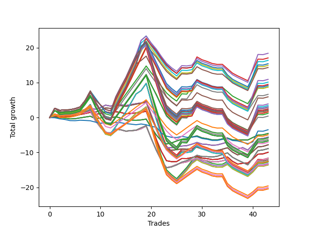

# Long Bulldog 003 
- Symbol: AAPL_Unlimited
- Date Range: 03/23/2022 - 07/08/2022
- Trading Period: 7:20-12:30
- Number of Trades: 43



| Name | Win Percent | Profit | Avg Profit / Trade | Avg Time / Trade |      | Name | Win Percent | Profit | Avg Profit / Trade | Avg Time / Trade |
| ---- | ----------- | ------ | ------------------ | ---------------- | ---- | ---- | ----------- | ------ | ------------------ | ---------------- |
| Sorted By <br> Profit | | | | | | Sorted By <br> Win Percentage ||||
| Ninety-Nine | 48.84 | 9205.00 | 214.07 | 119:04 |     | Sixty-Six | 65.12 | -2810.00 | -65.35 | 31:21 |
| Ninety-Eight | 48.84 | 8535.00 | 198.49 | 110:45 |     | Fifty-Eight | 65.12 | -2810.00 | -65.35 | 31:21 |
| Ninety-Four | 48.84 | 8190.00 | 190.47 | 124:39 |     | Fifty | 65.12 | -2810.00 | -65.35 | 31:21 |
| Ninety-Five | 48.84 | 7705.00 | 179.19 | 127:12 |     | Forty-Two | 65.12 | -2810.00 | -65.35 | 31:21 |
| Ninety-Three | 48.84 | 7475.00 | 173.84 | 116:06 |     | Two | 65.12 | -2810.00 | -65.35 | 31:21 |
| One Hundred | 48.84 | 7170.00 | 166.74 | 120:02 |     | Sixty-Seven | 60.47 | -3910.00 | -90.93 | 34:06 |
| One Hundred Nine | 48.84 | 5465.00 | 127.09 | 127:40 |     | Fifty-Nine | 60.47 | -3910.00 | -90.93 | 34:06 |
| One Hundred Four | 48.84 | 5070.00 | 117.91 | 131:07 |     | Fifty-One | 60.47 | -3910.00 | -90.93 | 34:06 |
| One Hundred Eight | 48.84 | 4750.00 | 110.47 | 119:07 |     | Forty-Three | 60.47 | -3910.00 | -90.93 | 34:06 |
| One Hundred Five | 48.84 | 4585.00 | 106.63 | 133:40 |     | Three | 60.47 | -3910.00 | -90.93 | 34:06 |
| Ninety-Seven | 48.84 | 4385.00 | 101.98 | 99:58 |     | Sixty-Five | 60.47 | -4980.00 | -115.81 | 25:25 |
| One Hundred Three | 48.84 | 4355.00 | 101.28 | 122:34 |     | Fifty-Seven | 60.47 | -4980.00 | -115.81 | 25:25 |
| Ninety-Two | 48.84 | 3320.00 | 77.21 | 104:49 |     | Forty-Nine | 60.47 | -4980.00 | -115.81 | 25:25 |
| One Hundred Ten | 48.84 | 2965.00 | 68.95 | 129:12 |     | Forty-One | 60.47 | -4980.00 | -115.81 | 25:25 |
| One Hundred Ninteen | 48.84 | 1950.00 | 45.35 | 142:33 |     | One | 60.47 | -4980.00 | -115.81 | 25:25 |
| One Hundred Fourteen | 48.84 | 1730.00 | 40.23 | 142:50 |     | Sixty-Eight | 58.14 | -5820.00 | -135.35 | 57:37 |
| One Hundred Twenty-Nine | 48.84 | 1530.00 | 35.58 | 144:32 |     | Sixty | 58.14 | -5820.00 | -135.35 | 57:37 |
| One Hundred Twenty-Four | 48.84 | 1530.00 | 35.58 | 144:32 |     | Fifty-Two | 58.14 | -5820.00 | -135.35 | 57:37 |
| Eighty-Four | 48.84 | 1530.00 | 35.58 | 144:32 |     | Forty-Four | 58.14 | -5820.00 | -135.35 | 57:37 |
| One Hundred Twenty | 48.84 | 1465.00 | 34.07 | 145:07 |     | Four | 58.14 | -5820.00 | -135.35 | 57:37 |
| One Hundred Fifteen | 48.84 | 1245.00 | 28.95 | 145:23 |     | Sixty-Nine | 55.81 | -4450.00 | -103.49 | 66:22 |
| One Hundred Eighteen | 48.84 | 1235.00 | 28.72 | 134:01 |     | Sixty-One | 55.81 | -4450.00 | -103.49 | 66:22 |
| One Hundred Thirty | 48.84 | 1045.00 | 24.30 | 147:05 |     | Fifty-Three | 55.81 | -4450.00 | -103.49 | 66:22 |
| One Hundred Twenty-Five | 48.84 | 1045.00 | 24.30 | 147:05 |     | Forty-Five | 55.81 | -4450.00 | -103.49 | 66:22 |
| Eighty-Five | 48.84 | 1045.00 | 24.30 | 147:05 |     | Five | 55.81 | -4450.00 | -103.49 | 66:22 |
| One Hundred Thirteen | 48.84 | 1015.00 | 23.60 | 134:17 |     | Fifty-Four | 55.81 | -6370.00 | -148.14 | 99:41 |
| One Hundred Twenty-Eight | 48.84 | 815.00 | 18.95 | 135:59 |     | Forty-Six | 55.81 | -6590.00 | -153.26 | 99:57 |
| One Hundred Twenty-Three | 48.84 | 815.00 | 18.95 | 135:59 |     | Seventy | 55.81 | -6790.00 | -157.91 | 101:39 |
| Eighty-Three | 48.84 | 815.00 | 18.95 | 135:59 |     | Sixty-Two | 55.81 | -6790.00 | -157.91 | 101:39 |
| One Hundred Seven | 48.84 | 595.00 | 13.84 | 107:50 |     | Six | 55.81 | -6790.00 | -157.91 | 101:39 |
| One Hundred Two | 48.84 | 200.00 | 4.65 | 111:17 |     | Sixty-Four | 53.49 | -2285.00 | -53.14 | 15:08 |
| Seventy-Three | 30.23 | -1750.00 | -40.70 | 14:31 |     | Fifty-Six | 53.49 | -2285.00 | -53.14 | 15:08 |
| Sixty-Four | 53.49 | -2285.00 | -53.14 | 15:08 |     | Forty-Eight | 53.49 | -2285.00 | -53.14 | 15:08 |
| Fifty-Six | 53.49 | -2285.00 | -53.14 | 15:08 |     | Forty | 53.49 | -2285.00 | -53.14 | 15:08 |
| Forty-Eight | 53.49 | -2285.00 | -53.14 | 15:08 |     | Zero | 53.49 | -2285.00 | -53.14 | 15:08 |
| Forty | 53.49 | -2285.00 | -53.14 | 15:08 |     | Ninety-Six | 51.16 | -2485.00 | -57.79 | 86:28 |
| Zero | 53.49 | -2285.00 | -53.14 | 15:08 |     | Ninety-One | 51.16 | -3555.00 | -82.67 | 90:48 |
| Ninety-Six | 51.16 | -2485.00 | -57.79 | 86:28 |     | One Hundred Six | 51.16 | -6280.00 | -146.05 | 93:49 |
| Sixty-Six | 65.12 | -2810.00 | -65.35 | 31:21 |     | One Hundred One | 51.16 | -6675.00 | -155.23 | 97:16 |
| Fifty-Eight | 65.12 | -2810.00 | -65.35 | 31:21 |     | One Hundred Sixteen | 51.16 | -9795.00 | -227.79 | 108:43 |
| Fifty | 65.12 | -2810.00 | -65.35 | 31:21 |     | One Hundred Eleven | 51.16 | -10015.00 | -232.91 | 108:59 |
| Forty-Two | 65.12 | -2810.00 | -65.35 | 31:21 |     | One Hundred Twenty-Six | 51.16 | -10215.00 | -237.56 | 110:41 |
| Two | 65.12 | -2810.00 | -65.35 | 31:21 |     | One Hundred Twenty-One | 51.16 | -10215.00 | -237.56 | 110:41 |
| One Hundred Seventeen | 48.84 | -2920.00 | -67.91 | 122:44 |     | Eighty-One | 51.16 | -10215.00 | -237.56 | 110:41 |
| One Hundred Twelve | 48.84 | -3140.00 | -73.02 | 123:00 |     | Ninety-Nine | 48.84 | 9205.00 | 214.07 | 119:04 |
| One Hundred Twenty-Seven | 48.84 | -3340.00 | -77.67 | 124:43 |     | Ninety-Eight | 48.84 | 8535.00 | 198.49 | 110:45 |
| One Hundred Twenty-Two | 48.84 | -3340.00 | -77.67 | 124:43 |     | Ninety-Four | 48.84 | 8190.00 | 190.47 | 124:39 |
| Eighty-Two | 48.84 | -3340.00 | -77.67 | 124:43 |     | Ninety-Five | 48.84 | 7705.00 | 179.19 | 127:12 |
| Ninety-One | 51.16 | -3555.00 | -82.67 | 90:48 |     | Ninety-Three | 48.84 | 7475.00 | 173.84 | 116:06 |
| Sixty-Seven | 60.47 | -3910.00 | -90.93 | 34:06 |     | One Hundred | 48.84 | 7170.00 | 166.74 | 120:02 |
| Fifty-Nine | 60.47 | -3910.00 | -90.93 | 34:06 |     | One Hundred Nine | 48.84 | 5465.00 | 127.09 | 127:40 |
| Fifty-One | 60.47 | -3910.00 | -90.93 | 34:06 |     | One Hundred Four | 48.84 | 5070.00 | 117.91 | 131:07 |
| Forty-Three | 60.47 | -3910.00 | -90.93 | 34:06 |     | One Hundred Eight | 48.84 | 4750.00 | 110.47 | 119:07 |
| Three | 60.47 | -3910.00 | -90.93 | 34:06 |     | One Hundred Five | 48.84 | 4585.00 | 106.63 | 133:40 |
| Sixty-Nine | 55.81 | -4450.00 | -103.49 | 66:22 |     | Ninety-Seven | 48.84 | 4385.00 | 101.98 | 99:58 |
| Sixty-One | 55.81 | -4450.00 | -103.49 | 66:22 |     | One Hundred Three | 48.84 | 4355.00 | 101.28 | 122:34 |
| Fifty-Three | 55.81 | -4450.00 | -103.49 | 66:22 |     | Ninety-Two | 48.84 | 3320.00 | 77.21 | 104:49 |
| Forty-Five | 55.81 | -4450.00 | -103.49 | 66:22 |     | One Hundred Ten | 48.84 | 2965.00 | 68.95 | 129:12 |
| Five | 55.81 | -4450.00 | -103.49 | 66:22 |     | One Hundred Ninteen | 48.84 | 1950.00 | 45.35 | 142:33 |
| Sixty-Five | 60.47 | -4980.00 | -115.81 | 25:25 |     | One Hundred Fourteen | 48.84 | 1730.00 | 40.23 | 142:50 |
| Fifty-Seven | 60.47 | -4980.00 | -115.81 | 25:25 |     | One Hundred Twenty-Nine | 48.84 | 1530.00 | 35.58 | 144:32 |
| Forty-Nine | 60.47 | -4980.00 | -115.81 | 25:25 |     | One Hundred Twenty-Four | 48.84 | 1530.00 | 35.58 | 144:32 |
| Forty-One | 60.47 | -4980.00 | -115.81 | 25:25 |     | Eighty-Four | 48.84 | 1530.00 | 35.58 | 144:32 |
| One | 60.47 | -4980.00 | -115.81 | 25:25 |     | One Hundred Twenty | 48.84 | 1465.00 | 34.07 | 145:07 |
| Sixty-Eight | 58.14 | -5820.00 | -135.35 | 57:37 |     | One Hundred Fifteen | 48.84 | 1245.00 | 28.95 | 145:23 |
| Sixty | 58.14 | -5820.00 | -135.35 | 57:37 |     | One Hundred Eighteen | 48.84 | 1235.00 | 28.72 | 134:01 |
| Fifty-Two | 58.14 | -5820.00 | -135.35 | 57:37 |     | One Hundred Thirty | 48.84 | 1045.00 | 24.30 | 147:05 |
| Forty-Four | 58.14 | -5820.00 | -135.35 | 57:37 |     | One Hundred Twenty-Five | 48.84 | 1045.00 | 24.30 | 147:05 |
| Four | 58.14 | -5820.00 | -135.35 | 57:37 |     | Eighty-Five | 48.84 | 1045.00 | 24.30 | 147:05 |
| Fifty-Five | 48.84 | -5825.00 | -135.47 | 116:35 |     | One Hundred Thirteen | 48.84 | 1015.00 | 23.60 | 134:17 |
| Forty-Seven | 48.84 | -6045.00 | -140.58 | 116:51 |     | One Hundred Twenty-Eight | 48.84 | 815.00 | 18.95 | 135:59 |
| Seventy-One | 48.84 | -6245.00 | -145.23 | 118:33 |     | One Hundred Twenty-Three | 48.84 | 815.00 | 18.95 | 135:59 |
| Sixty-Three | 48.84 | -6245.00 | -145.23 | 118:33 |     | Eighty-Three | 48.84 | 815.00 | 18.95 | 135:59 |
| Seven | 48.84 | -6245.00 | -145.23 | 118:33 |     | One Hundred Seven | 48.84 | 595.00 | 13.84 | 107:50 |
| One Hundred Six | 51.16 | -6280.00 | -146.05 | 93:49 |     | One Hundred Two | 48.84 | 200.00 | 4.65 | 111:17 |
| Fifty-Four | 55.81 | -6370.00 | -148.14 | 99:41 |     | One Hundred Seventeen | 48.84 | -2920.00 | -67.91 | 122:44 |
| Forty-Six | 55.81 | -6590.00 | -153.26 | 99:57 |     | One Hundred Twelve | 48.84 | -3140.00 | -73.02 | 123:00 |
| One Hundred One | 51.16 | -6675.00 | -155.23 | 97:16 |     | One Hundred Twenty-Seven | 48.84 | -3340.00 | -77.67 | 124:43 |
| Seventy | 55.81 | -6790.00 | -157.91 | 101:39 |     | One Hundred Twenty-Two | 48.84 | -3340.00 | -77.67 | 124:43 |
| Sixty-Two | 55.81 | -6790.00 | -157.91 | 101:39 |     | Eighty-Two | 48.84 | -3340.00 | -77.67 | 124:43 |
| Six | 55.81 | -6790.00 | -157.91 | 101:39 |     | Fifty-Five | 48.84 | -5825.00 | -135.47 | 116:35 |
| One Hundred Sixteen | 51.16 | -9795.00 | -227.79 | 108:43 |     | Forty-Seven | 48.84 | -6045.00 | -140.58 | 116:51 |
| One Hundred Eleven | 51.16 | -10015.00 | -232.91 | 108:59 |     | Seventy-One | 48.84 | -6245.00 | -145.23 | 118:33 |
| One Hundred Twenty-Six | 51.16 | -10215.00 | -237.56 | 110:41 |     | Sixty-Three | 48.84 | -6245.00 | -145.23 | 118:33 |
| One Hundred Twenty-One | 51.16 | -10215.00 | -237.56 | 110:41 |     | Seven | 48.84 | -6245.00 | -145.23 | 118:33 |
| Eighty-One | 51.16 | -10215.00 | -237.56 | 110:41 |     | Seventy-Three | 30.23 | -1750.00 | -40.70 | 14:31 |

## NO STOPLOSS

### Test Zero
* Sell when price hits the middle line of the 20p bollinger
* No Stoploss
* Results:
```
Total Trades: 43
Percent Up: 53.49
Percent Down: 46.51
Total Points Moved Up: -4.57
Potential Profit: -2285.00
Total Points Ups: 6.90 Count Ups: 23
Total Points Downs: -11.47 Count Downs: 20
```

<details><summary>Trades</summary>

<code>In: 2022-03-24 07:22:00		Out: 2022-03-24 07:32:45		Total Position Time: 10:45		Total Move Up: 0.11		Total to Date: 0.11</code> <br />
<code>In: 2022-03-30 07:58:00		Out: 2022-03-30 08:15:55		Total Position Time: 17:55		Total Move Up: -0.18		Total to Date: -0.07</code> <br />
<code>In: 2022-03-30 12:13:00		Out: 2022-03-30 12:28:10		Total Position Time: 15:10		Total Move Up: -0.09		Total to Date: -0.16</code> <br />
<code>In: 2022-03-30 12:14:00		Out: 2022-03-30 12:28:10		Total Position Time: 14:10		Total Move Up: -0.23		Total to Date: -0.39</code> <br />
<code>In: 2022-03-30 12:20:00		Out: 2022-03-30 12:28:10		Total Position Time: 08:10		Total Move Up: 0.06		Total to Date: -0.33</code> <br />
<code>In: 2022-03-30 12:22:00		Out: 2022-03-30 12:28:10		Total Position Time: 06:10		Total Move Up: 0.23		Total to Date: -0.10</code> <br />
<code>In: 2022-04-07 07:42:00		Out: 2022-04-07 07:54:30		Total Position Time: 12:30		Total Move Up: 0.23		Total to Date: 0.13</code> <br />
<code>In: 2022-04-07 08:35:00		Out: 2022-04-07 08:45:45		Total Position Time: 10:45		Total Move Up: 0.23		Total to Date: 0.36</code> <br />
<code>In: 2022-04-21 09:56:00		Out: 2022-04-21 10:21:40		Total Position Time: 25:40		Total Move Up: -0.67		Total to Date: -0.31</code> <br />
<code>In: 2022-04-21 10:11:00		Out: 2022-04-21 10:21:40		Total Position Time: 10:40		Total Move Up: 0.17		Total to Date: -0.14</code> <br />
<code>In: 2022-04-21 10:21:00		Out: 2022-04-21 10:22:10		Total Position Time: 01:10		Total Move Up: 0.46		Total to Date: 0.32</code> <br />
<code>In: 2022-04-21 11:47:00		Out: 2022-04-21 12:13:55		Total Position Time: 26:55		Total Move Up: -0.43		Total to Date: -0.11</code> <br />
<code>In: 2022-04-25 08:51:00		Out: 2022-04-25 08:57:40		Total Position Time: 06:40		Total Move Up: 0.33		Total to Date: 0.22</code> <br />
<code>In: 2022-05-02 10:30:00		Out: 2022-05-02 10:59:55		Total Position Time: 29:55		Total Move Up: -0.38		Total to Date: -0.16</code> <br />
<code>In: 2022-05-02 10:31:00		Out: 2022-05-02 10:59:55		Total Position Time: 28:55		Total Move Up: -0.56		Total to Date: -0.72</code> <br />
<code>In: 2022-05-02 10:48:00		Out: 2022-05-02 10:59:55		Total Position Time: 11:55		Total Move Up: -0.03		Total to Date: -0.75</code> <br />
<code>In: 2022-05-02 10:49:00		Out: 2022-05-02 10:59:55		Total Position Time: 10:55		Total Move Up: -0.06		Total to Date: -0.81</code> <br />
<code>In: 2022-05-04 08:14:00		Out: 2022-05-04 08:23:05		Total Position Time: 09:05		Total Move Up: 0.13		Total to Date: -0.68</code> <br />
<code>In: 2022-05-10 08:11:00		Out: 2022-05-10 08:19:40		Total Position Time: 08:40		Total Move Up: 0.23		Total to Date: -0.45</code> <br />
<code>In: 2022-05-11 09:32:00		Out: 2022-05-11 10:25:15		Total Position Time: 53:15		Total Move Up: -2.41		Total to Date: -2.86</code> <br />
<code>In: 2022-05-11 09:35:00		Out: 2022-05-11 10:25:15		Total Position Time: 50:15		Total Move Up: -2.15		Total to Date: -5.01</code> <br />
<code>In: 2022-05-11 09:54:00		Out: 2022-05-11 10:25:15		Total Position Time: 31:15		Total Move Up: -1.70		Total to Date: -6.71</code> <br />
<code>In: 2022-05-11 09:59:00		Out: 2022-05-11 10:25:15		Total Position Time: 26:15		Total Move Up: -0.85		Total to Date: -7.56</code> <br />
<code>In: 2022-05-11 10:43:00		Out: 2022-05-11 10:53:15		Total Position Time: 10:15		Total Move Up: 0.28		Total to Date: -7.28</code> <br />
<code>In: 2022-05-11 10:45:00		Out: 2022-05-11 10:53:15		Total Position Time: 08:15		Total Move Up: 0.56		Total to Date: -6.72</code> <br />
<code>In: 2022-05-12 11:11:00		Out: 2022-05-12 11:18:45		Total Position Time: 07:45		Total Move Up: 0.50		Total to Date: -6.22</code> <br />
<code>In: 2022-05-19 10:12:00		Out: 2022-05-19 10:23:30		Total Position Time: 11:30		Total Move Up: 0.16		Total to Date: -6.06</code> <br />
<code>In: 2022-05-19 10:15:00		Out: 2022-05-19 10:23:30		Total Position Time: 08:30		Total Move Up: 0.47		Total to Date: -5.59</code> <br />
<code>In: 2022-05-25 10:14:00		Out: 2022-05-25 10:15:55		Total Position Time: 01:55		Total Move Up: 0.33		Total to Date: -5.26</code> <br />
<code>In: 2022-06-08 09:29:00		Out: 2022-06-08 09:56:55		Total Position Time: 27:55		Total Move Up: -0.57		Total to Date: -5.83</code> <br />
<code>In: 2022-06-08 09:34:00		Out: 2022-06-08 09:56:55		Total Position Time: 22:55		Total Move Up: -0.23		Total to Date: -6.06</code> <br />
<code>In: 2022-06-08 09:35:00		Out: 2022-06-08 09:56:55		Total Position Time: 21:55		Total Move Up: -0.34		Total to Date: -6.40</code> <br />
<code>In: 2022-06-08 09:41:00		Out: 2022-06-08 09:56:55		Total Position Time: 15:55		Total Move Up: -0.01		Total to Date: -6.41</code> <br />
<code>In: 2022-06-08 09:46:00		Out: 2022-06-08 09:56:55		Total Position Time: 10:55		Total Move Up: 0.28		Total to Date: -6.13</code> <br />
<code>In: 2022-06-09 08:09:00		Out: 2022-06-09 08:10:35		Total Position Time: 01:35		Total Move Up: 0.26		Total to Date: -5.87</code> <br />
<code>In: 2022-06-09 12:03:00		Out: 2022-06-09 12:24:30		Total Position Time: 21:30		Total Move Up: -0.52		Total to Date: -6.39</code> <br />
<code>In: 2022-06-09 12:09:00		Out: 2022-06-09 12:24:30		Total Position Time: 15:30		Total Move Up: -0.04		Total to Date: -6.43</code> <br />
<code>In: 2022-06-13 12:08:00		Out: 2022-06-13 12:16:50		Total Position Time: 08:50		Total Move Up: 0.01		Total to Date: -6.42</code> <br />
<code>In: 2022-06-13 12:17:00		Out: 2022-06-13 12:18:10		Total Position Time: 01:10		Total Move Up: -0.02		Total to Date: -6.44</code> <br />
<code>In: 2022-06-15 11:08:00		Out: 2022-06-15 11:16:00		Total Position Time: 08:00		Total Move Up: 0.72		Total to Date: -5.72</code> <br />
<code>In: 2022-06-15 11:34:00		Out: 2022-06-15 11:37:10		Total Position Time: 03:10		Total Move Up: 0.69		Total to Date: -5.03</code> <br />
<code>In: 2022-06-27 10:50:00		Out: 2022-06-27 11:03:15		Total Position Time: 13:15		Total Move Up: 0.08		Total to Date: -4.95</code> <br />
<code>In: 2022-06-27 12:07:00		Out: 2022-06-27 12:10:30		Total Position Time: 03:30		Total Move Up: 0.38		Total to Date: -4.57</code> <br />


</details>

### Test One
* Sell when the price hits the upper line of the 20p 1std bollinger
* No Stoploss
* Results:
```
Total Trades: 43
Percent Up: 60.47
Percent Down: 39.53
Total Points Moved Up: -9.96
Potential Profit: -4980.00
Total Points Ups: 9.19 Count Ups: 26
Total Points Downs: -19.15 Count Downs: 17
```

<details><summary>Trades</summary>

<code>In: 2022-03-24 07:22:00		Out: 2022-03-24 07:34:15		Total Position Time: 12:15		Total Move Up: 0.33		Total to Date: 0.33</code> <br />
<code>In: 2022-03-30 07:58:00		Out: 2022-03-30 08:19:15		Total Position Time: 21:15		Total Move Up: -0.11		Total to Date: 0.22</code> <br />
<code>In: 2022-03-30 12:13:00		Out: 2022-03-30 12:31:35		Total Position Time: 18:35		Total Move Up: 0.08		Total to Date: 0.30</code> <br />
<code>In: 2022-03-30 12:14:00		Out: 2022-03-30 12:31:35		Total Position Time: 17:35		Total Move Up: -0.06		Total to Date: 0.24</code> <br />
<code>In: 2022-03-30 12:20:00		Out: 2022-03-30 12:31:35		Total Position Time: 11:35		Total Move Up: 0.23		Total to Date: 0.47</code> <br />
<code>In: 2022-03-30 12:22:00		Out: 2022-03-30 12:31:35		Total Position Time: 09:35		Total Move Up: 0.40		Total to Date: 0.87</code> <br />
<code>In: 2022-04-07 07:42:00		Out: 2022-04-07 08:00:05		Total Position Time: 18:05		Total Move Up: 0.27		Total to Date: 1.14</code> <br />
<code>In: 2022-04-07 08:35:00		Out: 2022-04-07 08:47:05		Total Position Time: 12:05		Total Move Up: 0.34		Total to Date: 1.48</code> <br />
<code>In: 2022-04-21 09:56:00		Out: 2022-04-21 10:28:50		Total Position Time: 32:50		Total Move Up: -0.58		Total to Date: 0.90</code> <br />
<code>In: 2022-04-21 10:11:00		Out: 2022-04-21 10:28:50		Total Position Time: 17:50		Total Move Up: 0.26		Total to Date: 1.16</code> <br />
<code>In: 2022-04-21 10:21:00		Out: 2022-04-21 10:28:50		Total Position Time: 07:50		Total Move Up: 0.49		Total to Date: 1.65</code> <br />
<code>In: 2022-04-21 11:47:00		Out: 2022-04-21 12:15:05		Total Position Time: 28:05		Total Move Up: -0.32		Total to Date: 1.33</code> <br />
<code>In: 2022-04-25 08:51:00		Out: 2022-04-25 09:04:55		Total Position Time: 13:55		Total Move Up: 0.33		Total to Date: 1.66</code> <br />
<code>In: 2022-05-02 10:30:00		Out: 2022-05-02 11:02:15		Total Position Time: 32:15		Total Move Up: -0.21		Total to Date: 1.45</code> <br />
<code>In: 2022-05-02 10:31:00		Out: 2022-05-02 11:02:15		Total Position Time: 31:15		Total Move Up: -0.39		Total to Date: 1.06</code> <br />
<code>In: 2022-05-02 10:48:00		Out: 2022-05-02 11:02:15		Total Position Time: 14:15		Total Move Up: 0.14		Total to Date: 1.20</code> <br />
<code>In: 2022-05-02 10:49:00		Out: 2022-05-02 11:02:15		Total Position Time: 13:15		Total Move Up: 0.11		Total to Date: 1.31</code> <br />
<code>In: 2022-05-04 08:14:00		Out: 2022-05-04 08:34:55		Total Position Time: 20:55		Total Move Up: 0.10		Total to Date: 1.41</code> <br />
<code>In: 2022-05-10 08:11:00		Out: 2022-05-10 08:23:05		Total Position Time: 12:05		Total Move Up: 0.44		Total to Date: 1.85</code> <br />
<code>In: 2022-05-11 09:32:00		Out: 2022-05-11 11:18:35		Total Position Time: 106:35		Total Move Up: -4.19		Total to Date: -2.34</code> <br />
<code>In: 2022-05-11 09:35:00		Out: 2022-05-11 11:18:35		Total Position Time: 103:35		Total Move Up: -3.93		Total to Date: -6.27</code> <br />
<code>In: 2022-05-11 09:54:00		Out: 2022-05-11 11:18:35		Total Position Time: 84:35		Total Move Up: -3.48		Total to Date: -9.75</code> <br />
<code>In: 2022-05-11 09:59:00		Out: 2022-05-11 11:18:35		Total Position Time: 79:35		Total Move Up: -2.63		Total to Date: -12.38</code> <br />
<code>In: 2022-05-11 10:43:00		Out: 2022-05-11 11:18:35		Total Position Time: 35:35		Total Move Up: -0.26		Total to Date: -12.64</code> <br />
<code>In: 2022-05-11 10:45:00		Out: 2022-05-11 11:18:35		Total Position Time: 33:35		Total Move Up: 0.02		Total to Date: -12.62</code> <br />
<code>In: 2022-05-12 11:11:00		Out: 2022-05-12 11:20:35		Total Position Time: 09:35		Total Move Up: 0.88		Total to Date: -11.74</code> <br />
<code>In: 2022-05-19 10:12:00		Out: 2022-05-19 10:31:50		Total Position Time: 19:50		Total Move Up: -0.02		Total to Date: -11.76</code> <br />
<code>In: 2022-05-19 10:15:00		Out: 2022-05-19 10:31:50		Total Position Time: 16:50		Total Move Up: 0.29		Total to Date: -11.47</code> <br />
<code>In: 2022-05-25 10:14:00		Out: 2022-05-25 10:27:00		Total Position Time: 13:00		Total Move Up: 0.36		Total to Date: -11.11</code> <br />
<code>In: 2022-06-08 09:29:00		Out: 2022-06-08 09:59:05		Total Position Time: 30:05		Total Move Up: -0.50		Total to Date: -11.61</code> <br />
<code>In: 2022-06-08 09:34:00		Out: 2022-06-08 09:59:05		Total Position Time: 25:05		Total Move Up: -0.16		Total to Date: -11.77</code> <br />
<code>In: 2022-06-08 09:35:00		Out: 2022-06-08 09:59:05		Total Position Time: 24:05		Total Move Up: -0.27		Total to Date: -12.04</code> <br />
<code>In: 2022-06-08 09:41:00		Out: 2022-06-08 09:59:05		Total Position Time: 18:05		Total Move Up: 0.06		Total to Date: -11.98</code> <br />
<code>In: 2022-06-08 09:46:00		Out: 2022-06-08 09:59:05		Total Position Time: 13:05		Total Move Up: 0.35		Total to Date: -11.63</code> <br />
<code>In: 2022-06-09 08:09:00		Out: 2022-06-09 08:11:10		Total Position Time: 02:10		Total Move Up: 0.33		Total to Date: -11.30</code> <br />
<code>In: 2022-06-09 12:03:00		Out: 2022-06-09 12:47:00		Total Position Time: 44:00		Total Move Up: -1.26		Total to Date: -12.56</code> <br />
<code>In: 2022-06-09 12:09:00		Out: 2022-06-09 12:47:00		Total Position Time: 38:00		Total Move Up: -0.78		Total to Date: -13.34</code> <br />
<code>In: 2022-06-13 12:08:00		Out: 2022-06-13 12:17:10		Total Position Time: 09:10		Total Move Up: 0.23		Total to Date: -13.11</code> <br />
<code>In: 2022-06-13 12:17:00		Out: 2022-06-13 12:20:15		Total Position Time: 03:15		Total Move Up: 0.07		Total to Date: -13.04</code> <br />
<code>In: 2022-06-15 11:08:00		Out: 2022-06-15 11:20:30		Total Position Time: 12:30		Total Move Up: 1.19		Total to Date: -11.85</code> <br />
<code>In: 2022-06-15 11:34:00		Out: 2022-06-15 11:38:05		Total Position Time: 04:05		Total Move Up: 1.34		Total to Date: -10.51</code> <br />
<code>In: 2022-06-27 10:50:00		Out: 2022-06-27 11:05:00		Total Position Time: 15:00		Total Move Up: 0.10		Total to Date: -10.41</code> <br />
<code>In: 2022-06-27 12:07:00		Out: 2022-06-27 12:13:05		Total Position Time: 06:05		Total Move Up: 0.45		Total to Date: -9.96</code> <br />


</details>

### Test Two
* Sell when the price hits the upper line of the 20p 2std bollinger
* No Stoploss
* Results:
```
Total Trades: 43
Percent Up: 65.12
Percent Down: 34.88
Total Points Moved Up: -5.62
Potential Profit: -2810.00
Total Points Ups: 12.29 Count Ups: 28
Total Points Downs: -17.91 Count Downs: 15
```

<details><summary>Trades</summary>

<code>In: 2022-03-24 07:22:00		Out: 2022-03-24 07:45:45		Total Position Time: 23:45		Total Move Up: 0.66		Total to Date: 0.66</code> <br />
<code>In: 2022-03-30 07:58:00		Out: 2022-03-30 08:34:40		Total Position Time: 36:40		Total Move Up: 0.00		Total to Date: 0.66</code> <br />
<code>In: 2022-03-30 12:13:00		Out: 2022-03-30 12:36:15		Total Position Time: 23:15		Total Move Up: 0.24		Total to Date: 0.90</code> <br />
<code>In: 2022-03-30 12:14:00		Out: 2022-03-30 12:36:15		Total Position Time: 22:15		Total Move Up: 0.10		Total to Date: 1.00</code> <br />
<code>In: 2022-03-30 12:20:00		Out: 2022-03-30 12:36:15		Total Position Time: 16:15		Total Move Up: 0.39		Total to Date: 1.39</code> <br />
<code>In: 2022-03-30 12:22:00		Out: 2022-03-30 12:36:15		Total Position Time: 14:15		Total Move Up: 0.56		Total to Date: 1.95</code> <br />
<code>In: 2022-04-07 07:42:00		Out: 2022-04-07 08:01:05		Total Position Time: 19:05		Total Move Up: 0.31		Total to Date: 2.26</code> <br />
<code>In: 2022-04-07 08:35:00		Out: 2022-04-07 08:48:05		Total Position Time: 13:05		Total Move Up: 0.46		Total to Date: 2.72</code> <br />
<code>In: 2022-04-21 09:56:00		Out: 2022-04-21 10:31:20		Total Position Time: 35:20		Total Move Up: -0.36		Total to Date: 2.36</code> <br />
<code>In: 2022-04-21 10:11:00		Out: 2022-04-21 10:31:20		Total Position Time: 20:20		Total Move Up: 0.48		Total to Date: 2.84</code> <br />
<code>In: 2022-04-21 10:21:00		Out: 2022-04-21 10:31:20		Total Position Time: 10:20		Total Move Up: 0.71		Total to Date: 3.55</code> <br />
<code>In: 2022-04-21 11:47:00		Out: 2022-04-21 12:18:15		Total Position Time: 31:15		Total Move Up: -0.28		Total to Date: 3.27</code> <br />
<code>In: 2022-04-25 08:51:00		Out: 2022-04-25 09:05:20		Total Position Time: 14:20		Total Move Up: 0.48		Total to Date: 3.75</code> <br />
<code>In: 2022-05-02 10:30:00		Out: 2022-05-02 11:03:05		Total Position Time: 33:05		Total Move Up: -0.07		Total to Date: 3.68</code> <br />
<code>In: 2022-05-02 10:31:00		Out: 2022-05-02 11:03:05		Total Position Time: 32:05		Total Move Up: -0.25		Total to Date: 3.43</code> <br />
<code>In: 2022-05-02 10:48:00		Out: 2022-05-02 11:03:05		Total Position Time: 15:05		Total Move Up: 0.28		Total to Date: 3.71</code> <br />
<code>In: 2022-05-02 10:49:00		Out: 2022-05-02 11:03:05		Total Position Time: 14:05		Total Move Up: 0.25		Total to Date: 3.96</code> <br />
<code>In: 2022-05-04 08:14:00		Out: 2022-05-04 08:36:20		Total Position Time: 22:20		Total Move Up: 0.22		Total to Date: 4.18</code> <br />
<code>In: 2022-05-10 08:11:00		Out: 2022-05-10 08:37:50		Total Position Time: 26:50		Total Move Up: 0.54		Total to Date: 4.72</code> <br />
<code>In: 2022-05-11 09:32:00		Out: 2022-05-11 11:24:05		Total Position Time: 112:05		Total Move Up: -3.97		Total to Date: 0.75</code> <br />
<code>In: 2022-05-11 09:35:00		Out: 2022-05-11 11:24:05		Total Position Time: 109:05		Total Move Up: -3.71		Total to Date: -2.96</code> <br />
<code>In: 2022-05-11 09:54:00		Out: 2022-05-11 11:24:05		Total Position Time: 90:05		Total Move Up: -3.26		Total to Date: -6.22</code> <br />
<code>In: 2022-05-11 09:59:00		Out: 2022-05-11 11:24:05		Total Position Time: 85:05		Total Move Up: -2.41		Total to Date: -8.63</code> <br />
<code>In: 2022-05-11 10:43:00		Out: 2022-05-11 11:24:05		Total Position Time: 41:05		Total Move Up: -0.04		Total to Date: -8.67</code> <br />
<code>In: 2022-05-11 10:45:00		Out: 2022-05-11 11:24:05		Total Position Time: 39:05		Total Move Up: 0.24		Total to Date: -8.43</code> <br />
<code>In: 2022-05-12 11:11:00		Out: 2022-05-12 11:51:45		Total Position Time: 40:45		Total Move Up: 0.26		Total to Date: -8.17</code> <br />
<code>In: 2022-05-19 10:12:00		Out: 2022-05-19 10:33:20		Total Position Time: 21:20		Total Move Up: 0.11		Total to Date: -8.06</code> <br />
<code>In: 2022-05-19 10:15:00		Out: 2022-05-19 10:33:20		Total Position Time: 18:20		Total Move Up: 0.42		Total to Date: -7.64</code> <br />
<code>In: 2022-05-25 10:14:00		Out: 2022-05-25 10:29:20		Total Position Time: 15:20		Total Move Up: 0.50		Total to Date: -7.14</code> <br />
<code>In: 2022-06-08 09:29:00		Out: 2022-06-08 10:00:10		Total Position Time: 31:10		Total Move Up: -0.46		Total to Date: -7.60</code> <br />
<code>In: 2022-06-08 09:34:00		Out: 2022-06-08 10:00:10		Total Position Time: 26:10		Total Move Up: -0.12		Total to Date: -7.72</code> <br />
<code>In: 2022-06-08 09:35:00		Out: 2022-06-08 10:00:10		Total Position Time: 25:10		Total Move Up: -0.23		Total to Date: -7.95</code> <br />
<code>In: 2022-06-08 09:41:00		Out: 2022-06-08 10:00:10		Total Position Time: 19:10		Total Move Up: 0.10		Total to Date: -7.85</code> <br />
<code>In: 2022-06-08 09:46:00		Out: 2022-06-08 10:00:10		Total Position Time: 14:10		Total Move Up: 0.39		Total to Date: -7.46</code> <br />
<code>In: 2022-06-09 08:09:00		Out: 2022-06-09 08:22:40		Total Position Time: 13:40		Total Move Up: 0.42		Total to Date: -7.04</code> <br />
<code>In: 2022-06-09 12:03:00		Out: 2022-06-09 12:47:00		Total Position Time: 44:00		Total Move Up: -1.26		Total to Date: -8.30</code> <br />
<code>In: 2022-06-09 12:09:00		Out: 2022-06-09 12:47:00		Total Position Time: 38:00		Total Move Up: -0.78		Total to Date: -9.08</code> <br />
<code>In: 2022-06-13 12:08:00		Out: 2022-06-13 12:17:15		Total Position Time: 09:15		Total Move Up: 0.46		Total to Date: -8.62</code> <br />
<code>In: 2022-06-13 12:17:00		Out: 2022-06-13 12:47:00		Total Position Time: 30:00		Total Move Up: -0.71		Total to Date: -9.33</code> <br />
<code>In: 2022-06-15 11:08:00		Out: 2022-06-15 11:38:10		Total Position Time: 30:10		Total Move Up: 1.48		Total to Date: -7.85</code> <br />
<code>In: 2022-06-15 11:34:00		Out: 2022-06-15 11:38:10		Total Position Time: 04:10		Total Move Up: 1.71		Total to Date: -6.14</code> <br />
<code>In: 2022-06-27 10:50:00		Out: 2022-06-27 11:17:10		Total Position Time: 27:10		Total Move Up: 0.13		Total to Date: -6.01</code> <br />
<code>In: 2022-06-27 12:07:00		Out: 2022-06-27 12:47:00		Total Position Time: 40:00		Total Move Up: 0.39		Total to Date: -5.62</code> <br />


</details>

### Test Three
* Sell when price hits the middle line of the 50p bollinger
* No Stoploss
* Results:
```
Total Trades: 43
Percent Up: 60.47
Percent Down: 39.53
Total Points Moved Up: -7.82
Potential Profit: -3910.00
Total Points Ups: 10.84 Count Ups: 26
Total Points Downs: -18.66 Count Downs: 17
```

<details><summary>Trades</summary>

<code>In: 2022-03-24 07:22:00		Out: 2022-03-24 07:35:35		Total Position Time: 13:35		Total Move Up: 0.47		Total to Date: 0.47</code> <br />
<code>In: 2022-03-30 07:58:00		Out: 2022-03-30 08:34:40		Total Position Time: 36:40		Total Move Up: 0.00		Total to Date: 0.47</code> <br />
<code>In: 2022-03-30 12:13:00		Out: 2022-03-30 12:36:15		Total Position Time: 23:15		Total Move Up: 0.24		Total to Date: 0.71</code> <br />
<code>In: 2022-03-30 12:14:00		Out: 2022-03-30 12:36:15		Total Position Time: 22:15		Total Move Up: 0.10		Total to Date: 0.81</code> <br />
<code>In: 2022-03-30 12:20:00		Out: 2022-03-30 12:36:15		Total Position Time: 16:15		Total Move Up: 0.39		Total to Date: 1.20</code> <br />
<code>In: 2022-03-30 12:22:00		Out: 2022-03-30 12:36:15		Total Position Time: 14:15		Total Move Up: 0.56		Total to Date: 1.76</code> <br />
<code>In: 2022-04-07 07:42:00		Out: 2022-04-07 08:48:10		Total Position Time: 66:10		Total Move Up: -0.33		Total to Date: 1.43</code> <br />
<code>In: 2022-04-07 08:35:00		Out: 2022-04-07 08:48:10		Total Position Time: 13:10		Total Move Up: 0.48		Total to Date: 1.91</code> <br />
<code>In: 2022-04-21 09:56:00		Out: 2022-04-21 10:31:40		Total Position Time: 35:40		Total Move Up: -0.36		Total to Date: 1.55</code> <br />
<code>In: 2022-04-21 10:11:00		Out: 2022-04-21 10:31:40		Total Position Time: 20:40		Total Move Up: 0.48		Total to Date: 2.03</code> <br />
<code>In: 2022-04-21 10:21:00		Out: 2022-04-21 10:31:40		Total Position Time: 10:40		Total Move Up: 0.71		Total to Date: 2.74</code> <br />
<code>In: 2022-04-21 11:47:00		Out: 2022-04-21 12:25:05		Total Position Time: 38:05		Total Move Up: -0.12		Total to Date: 2.62</code> <br />
<code>In: 2022-04-25 08:51:00		Out: 2022-04-25 09:06:05		Total Position Time: 15:05		Total Move Up: 0.78		Total to Date: 3.40</code> <br />
<code>In: 2022-05-02 10:30:00		Out: 2022-05-02 11:03:55		Total Position Time: 33:55		Total Move Up: -0.01		Total to Date: 3.39</code> <br />
<code>In: 2022-05-02 10:31:00		Out: 2022-05-02 11:03:55		Total Position Time: 32:55		Total Move Up: -0.19		Total to Date: 3.20</code> <br />
<code>In: 2022-05-02 10:48:00		Out: 2022-05-02 11:03:55		Total Position Time: 15:55		Total Move Up: 0.34		Total to Date: 3.54</code> <br />
<code>In: 2022-05-02 10:49:00		Out: 2022-05-02 11:03:55		Total Position Time: 14:55		Total Move Up: 0.31		Total to Date: 3.85</code> <br />
<code>In: 2022-05-04 08:14:00		Out: 2022-05-04 08:36:20		Total Position Time: 22:20		Total Move Up: 0.22		Total to Date: 4.07</code> <br />
<code>In: 2022-05-10 08:11:00		Out: 2022-05-10 08:37:10		Total Position Time: 26:10		Total Move Up: 0.40		Total to Date: 4.47</code> <br />
<code>In: 2022-05-11 09:32:00		Out: 2022-05-11 11:23:35		Total Position Time: 111:35		Total Move Up: -4.06		Total to Date: 0.41</code> <br />
<code>In: 2022-05-11 09:35:00		Out: 2022-05-11 11:23:35		Total Position Time: 108:35		Total Move Up: -3.80		Total to Date: -3.39</code> <br />
<code>In: 2022-05-11 09:54:00		Out: 2022-05-11 11:23:35		Total Position Time: 89:35		Total Move Up: -3.35		Total to Date: -6.74</code> <br />
<code>In: 2022-05-11 09:59:00		Out: 2022-05-11 11:23:35		Total Position Time: 84:35		Total Move Up: -2.50		Total to Date: -9.24</code> <br />
<code>In: 2022-05-11 10:43:00		Out: 2022-05-11 11:23:35		Total Position Time: 40:35		Total Move Up: -0.13		Total to Date: -9.37</code> <br />
<code>In: 2022-05-11 10:45:00		Out: 2022-05-11 11:23:35		Total Position Time: 38:35		Total Move Up: 0.15		Total to Date: -9.22</code> <br />
<code>In: 2022-05-12 11:11:00		Out: 2022-05-12 11:51:35		Total Position Time: 40:35		Total Move Up: 0.22		Total to Date: -9.00</code> <br />
<code>In: 2022-05-19 10:12:00		Out: 2022-05-19 10:55:25		Total Position Time: 43:25		Total Move Up: -0.10		Total to Date: -9.10</code> <br />
<code>In: 2022-05-19 10:15:00		Out: 2022-05-19 10:55:25		Total Position Time: 40:25		Total Move Up: 0.21		Total to Date: -8.89</code> <br />
<code>In: 2022-05-25 10:14:00		Out: 2022-05-25 10:16:30		Total Position Time: 02:30		Total Move Up: 0.38		Total to Date: -8.51</code> <br />
<code>In: 2022-06-08 09:29:00		Out: 2022-06-08 10:19:15		Total Position Time: 50:15		Total Move Up: -0.51		Total to Date: -9.02</code> <br />
<code>In: 2022-06-08 09:34:00		Out: 2022-06-08 10:19:15		Total Position Time: 45:15		Total Move Up: -0.17		Total to Date: -9.19</code> <br />
<code>In: 2022-06-08 09:35:00		Out: 2022-06-08 10:19:15		Total Position Time: 44:15		Total Move Up: -0.28		Total to Date: -9.47</code> <br />
<code>In: 2022-06-08 09:41:00		Out: 2022-06-08 10:19:15		Total Position Time: 38:15		Total Move Up: 0.05		Total to Date: -9.42</code> <br />
<code>In: 2022-06-08 09:46:00		Out: 2022-06-08 10:19:15		Total Position Time: 33:15		Total Move Up: 0.34		Total to Date: -9.08</code> <br />
<code>In: 2022-06-09 08:09:00		Out: 2022-06-09 08:24:35		Total Position Time: 15:35		Total Move Up: 0.42		Total to Date: -8.66</code> <br />
<code>In: 2022-06-09 12:03:00		Out: 2022-06-09 12:47:00		Total Position Time: 44:00		Total Move Up: -1.26		Total to Date: -9.92</code> <br />
<code>In: 2022-06-09 12:09:00		Out: 2022-06-09 12:47:00		Total Position Time: 38:00		Total Move Up: -0.78		Total to Date: -10.70</code> <br />
<code>In: 2022-06-13 12:08:00		Out: 2022-06-13 12:17:15		Total Position Time: 09:15		Total Move Up: 0.46		Total to Date: -10.24</code> <br />
<code>In: 2022-06-13 12:17:00		Out: 2022-06-13 12:47:00		Total Position Time: 30:00		Total Move Up: -0.71		Total to Date: -10.95</code> <br />
<code>In: 2022-06-15 11:08:00		Out: 2022-06-15 11:17:05		Total Position Time: 09:05		Total Move Up: 1.21		Total to Date: -9.74</code> <br />
<code>In: 2022-06-15 11:34:00		Out: 2022-06-15 11:38:05		Total Position Time: 04:05		Total Move Up: 1.34		Total to Date: -8.40</code> <br />
<code>In: 2022-06-27 10:50:00		Out: 2022-06-27 11:17:10		Total Position Time: 27:10		Total Move Up: 0.13		Total to Date: -8.27</code> <br />
<code>In: 2022-06-27 12:07:00		Out: 2022-06-27 12:13:05		Total Position Time: 06:05		Total Move Up: 0.45		Total to Date: -7.82</code> <br />


</details>

### Test Four
* Sell when the price hits the upper line of the 50p 1std bollinger
* No Stoploss
* Results:
```
Total Trades: 43
Percent Up: 58.14
Percent Down: 41.86
Total Points Moved Up: -11.64
Potential Profit: -5820.00
Total Points Ups: 12.06 Count Ups: 25
Total Points Downs: -23.70 Count Downs: 18
```

<details><summary>Trades</summary>

<code>In: 2022-03-24 07:22:00		Out: 2022-03-24 07:45:45		Total Position Time: 23:45		Total Move Up: 0.66		Total to Date: 0.66</code> <br />
<code>In: 2022-03-30 07:58:00		Out: 2022-03-30 09:01:50		Total Position Time: 63:50		Total Move Up: -0.08		Total to Date: 0.58</code> <br />
<code>In: 2022-03-30 12:13:00		Out: 2022-03-30 12:47:00		Total Position Time: 34:00		Total Move Up: 0.16		Total to Date: 0.74</code> <br />
<code>In: 2022-03-30 12:14:00		Out: 2022-03-30 12:47:00		Total Position Time: 33:00		Total Move Up: 0.02		Total to Date: 0.76</code> <br />
<code>In: 2022-03-30 12:20:00		Out: 2022-03-30 12:47:00		Total Position Time: 27:00		Total Move Up: 0.31		Total to Date: 1.07</code> <br />
<code>In: 2022-03-30 12:22:00		Out: 2022-03-30 12:47:00		Total Position Time: 25:00		Total Move Up: 0.48		Total to Date: 1.55</code> <br />
<code>In: 2022-04-07 07:42:00		Out: 2022-04-07 09:05:20		Total Position Time: 83:20		Total Move Up: -0.28		Total to Date: 1.27</code> <br />
<code>In: 2022-04-07 08:35:00		Out: 2022-04-07 09:05:20		Total Position Time: 30:20		Total Move Up: 0.53		Total to Date: 1.80</code> <br />
<code>In: 2022-04-21 09:56:00		Out: 2022-04-21 12:29:55		Total Position Time: 153:55		Total Move Up: -2.73		Total to Date: -0.93</code> <br />
<code>In: 2022-04-21 10:11:00		Out: 2022-04-21 12:29:55		Total Position Time: 138:55		Total Move Up: -1.89		Total to Date: -2.82</code> <br />
<code>In: 2022-04-21 10:21:00		Out: 2022-04-21 12:29:55		Total Position Time: 128:55		Total Move Up: -1.66		Total to Date: -4.48</code> <br />
<code>In: 2022-04-21 11:47:00		Out: 2022-04-21 12:29:55		Total Position Time: 42:55		Total Move Up: 0.13		Total to Date: -4.35</code> <br />
<code>In: 2022-04-25 08:51:00		Out: 2022-04-25 09:15:50		Total Position Time: 24:50		Total Move Up: 1.02		Total to Date: -3.33</code> <br />
<code>In: 2022-05-02 10:30:00		Out: 2022-05-02 11:53:35		Total Position Time: 83:35		Total Move Up: -0.21		Total to Date: -3.54</code> <br />
<code>In: 2022-05-02 10:31:00		Out: 2022-05-02 11:53:35		Total Position Time: 82:35		Total Move Up: -0.39		Total to Date: -3.93</code> <br />
<code>In: 2022-05-02 10:48:00		Out: 2022-05-02 11:53:35		Total Position Time: 65:35		Total Move Up: 0.14		Total to Date: -3.79</code> <br />
<code>In: 2022-05-02 10:49:00		Out: 2022-05-02 11:53:35		Total Position Time: 64:35		Total Move Up: 0.11		Total to Date: -3.68</code> <br />
<code>In: 2022-05-04 08:14:00		Out: 2022-05-04 08:39:25		Total Position Time: 25:25		Total Move Up: 0.45		Total to Date: -3.23</code> <br />
<code>In: 2022-05-10 08:11:00		Out: 2022-05-10 08:39:10		Total Position Time: 28:10		Total Move Up: 0.79		Total to Date: -2.44</code> <br />
<code>In: 2022-05-11 09:32:00		Out: 2022-05-11 11:26:00		Total Position Time: 114:00		Total Move Up: -3.61		Total to Date: -6.05</code> <br />
<code>In: 2022-05-11 09:35:00		Out: 2022-05-11 11:26:00		Total Position Time: 111:00		Total Move Up: -3.35		Total to Date: -9.40</code> <br />
<code>In: 2022-05-11 09:54:00		Out: 2022-05-11 11:26:00		Total Position Time: 92:00		Total Move Up: -2.90		Total to Date: -12.30</code> <br />
<code>In: 2022-05-11 09:59:00		Out: 2022-05-11 11:26:00		Total Position Time: 87:00		Total Move Up: -2.05		Total to Date: -14.35</code> <br />
<code>In: 2022-05-11 10:43:00		Out: 2022-05-11 11:26:00		Total Position Time: 43:00		Total Move Up: 0.32		Total to Date: -14.03</code> <br />
<code>In: 2022-05-11 10:45:00		Out: 2022-05-11 11:26:00		Total Position Time: 41:00		Total Move Up: 0.60		Total to Date: -13.43</code> <br />
<code>In: 2022-05-12 11:11:00		Out: 2022-05-12 12:00:30		Total Position Time: 49:30		Total Move Up: 0.45		Total to Date: -12.98</code> <br />
<code>In: 2022-05-19 10:12:00		Out: 2022-05-19 10:56:20		Total Position Time: 44:20		Total Move Up: 0.27		Total to Date: -12.71</code> <br />
<code>In: 2022-05-19 10:15:00		Out: 2022-05-19 10:56:20		Total Position Time: 41:20		Total Move Up: 0.58		Total to Date: -12.13</code> <br />
<code>In: 2022-05-25 10:14:00		Out: 2022-05-25 10:29:35		Total Position Time: 15:35		Total Move Up: 0.54		Total to Date: -11.59</code> <br />
<code>In: 2022-06-08 09:29:00		Out: 2022-06-08 10:54:00		Total Position Time: 85:00		Total Move Up: -0.56		Total to Date: -12.15</code> <br />
<code>In: 2022-06-08 09:34:00		Out: 2022-06-08 10:54:00		Total Position Time: 80:00		Total Move Up: -0.22		Total to Date: -12.37</code> <br />
<code>In: 2022-06-08 09:35:00		Out: 2022-06-08 10:54:00		Total Position Time: 79:00		Total Move Up: -0.33		Total to Date: -12.70</code> <br />
<code>In: 2022-06-08 09:41:00		Out: 2022-06-08 10:54:00		Total Position Time: 73:00		Total Move Up: 0.00		Total to Date: -12.70</code> <br />
<code>In: 2022-06-08 09:46:00		Out: 2022-06-08 10:54:00		Total Position Time: 68:00		Total Move Up: 0.29		Total to Date: -12.41</code> <br />
<code>In: 2022-06-09 08:09:00		Out: 2022-06-09 08:35:55		Total Position Time: 26:55		Total Move Up: 0.40		Total to Date: -12.01</code> <br />
<code>In: 2022-06-09 12:03:00		Out: 2022-06-09 12:47:00		Total Position Time: 44:00		Total Move Up: -1.26		Total to Date: -13.27</code> <br />
<code>In: 2022-06-09 12:09:00		Out: 2022-06-09 12:47:00		Total Position Time: 38:00		Total Move Up: -0.78		Total to Date: -14.05</code> <br />
<code>In: 2022-06-13 12:08:00		Out: 2022-06-13 12:47:00		Total Position Time: 39:00		Total Move Up: -0.69		Total to Date: -14.74</code> <br />
<code>In: 2022-06-13 12:17:00		Out: 2022-06-13 12:47:00		Total Position Time: 30:00		Total Move Up: -0.71		Total to Date: -15.45</code> <br />
<code>In: 2022-06-15 11:08:00		Out: 2022-06-15 11:38:10		Total Position Time: 30:10		Total Move Up: 1.48		Total to Date: -13.97</code> <br />
<code>In: 2022-06-15 11:34:00		Out: 2022-06-15 11:38:10		Total Position Time: 04:10		Total Move Up: 1.71		Total to Date: -12.26</code> <br />
<code>In: 2022-06-27 10:50:00		Out: 2022-06-27 11:33:25		Total Position Time: 43:25		Total Move Up: 0.13		Total to Date: -12.13</code> <br />
<code>In: 2022-06-27 12:07:00		Out: 2022-06-27 12:45:40		Total Position Time: 38:40		Total Move Up: 0.49		Total to Date: -11.64</code> <br />


</details>

### Test Five
* Sell when the price hits the upper line of the 50p 2std bollinger
* No Stoploss
* Results:
```
Total Trades: 43
Percent Up: 55.81
Percent Down: 44.19
Total Points Moved Up: -8.90
Potential Profit: -4450.00
Total Points Ups: 14.72 Count Ups: 24
Total Points Downs: -23.62 Count Downs: 19
```

<details><summary>Trades</summary>

<code>In: 2022-03-24 07:22:00		Out: 2022-03-24 08:19:40		Total Position Time: 57:40		Total Move Up: 0.83		Total to Date: 0.83</code> <br />
<code>In: 2022-03-30 07:58:00		Out: 2022-03-30 09:37:20		Total Position Time: 99:20		Total Move Up: -0.03		Total to Date: 0.80</code> <br />
<code>In: 2022-03-30 12:13:00		Out: 2022-03-30 12:47:00		Total Position Time: 34:00		Total Move Up: 0.16		Total to Date: 0.96</code> <br />
<code>In: 2022-03-30 12:14:00		Out: 2022-03-30 12:47:00		Total Position Time: 33:00		Total Move Up: 0.02		Total to Date: 0.98</code> <br />
<code>In: 2022-03-30 12:20:00		Out: 2022-03-30 12:47:00		Total Position Time: 27:00		Total Move Up: 0.31		Total to Date: 1.29</code> <br />
<code>In: 2022-03-30 12:22:00		Out: 2022-03-30 12:47:00		Total Position Time: 25:00		Total Move Up: 0.48		Total to Date: 1.77</code> <br />
<code>In: 2022-04-07 07:42:00		Out: 2022-04-07 09:06:30		Total Position Time: 84:30		Total Move Up: -0.13		Total to Date: 1.64</code> <br />
<code>In: 2022-04-07 08:35:00		Out: 2022-04-07 09:06:30		Total Position Time: 31:30		Total Move Up: 0.68		Total to Date: 2.32</code> <br />
<code>In: 2022-04-21 09:56:00		Out: 2022-04-21 12:44:20		Total Position Time: 168:20		Total Move Up: -2.91		Total to Date: -0.59</code> <br />
<code>In: 2022-04-21 10:11:00		Out: 2022-04-21 12:44:20		Total Position Time: 153:20		Total Move Up: -2.07		Total to Date: -2.66</code> <br />
<code>In: 2022-04-21 10:21:00		Out: 2022-04-21 12:44:20		Total Position Time: 143:20		Total Move Up: -1.84		Total to Date: -4.50</code> <br />
<code>In: 2022-04-21 11:47:00		Out: 2022-04-21 12:44:20		Total Position Time: 57:20		Total Move Up: -0.05		Total to Date: -4.55</code> <br />
<code>In: 2022-04-25 08:51:00		Out: 2022-04-25 09:24:15		Total Position Time: 33:15		Total Move Up: 1.26		Total to Date: -3.29</code> <br />
<code>In: 2022-05-02 10:30:00		Out: 2022-05-02 12:03:30		Total Position Time: 93:30		Total Move Up: -0.21		Total to Date: -3.50</code> <br />
<code>In: 2022-05-02 10:31:00		Out: 2022-05-02 12:03:30		Total Position Time: 92:30		Total Move Up: -0.39		Total to Date: -3.89</code> <br />
<code>In: 2022-05-02 10:48:00		Out: 2022-05-02 12:03:30		Total Position Time: 75:30		Total Move Up: 0.14		Total to Date: -3.75</code> <br />
<code>In: 2022-05-02 10:49:00		Out: 2022-05-02 12:03:30		Total Position Time: 74:30		Total Move Up: 0.11		Total to Date: -3.64</code> <br />
<code>In: 2022-05-04 08:14:00		Out: 2022-05-04 08:47:05		Total Position Time: 33:05		Total Move Up: 0.68		Total to Date: -2.96</code> <br />
<code>In: 2022-05-10 08:11:00		Out: 2022-05-10 10:07:25		Total Position Time: 116:25		Total Move Up: 0.61		Total to Date: -2.35</code> <br />
<code>In: 2022-05-11 09:32:00		Out: 2022-05-11 11:35:00		Total Position Time: 123:00		Total Move Up: -3.65		Total to Date: -6.00</code> <br />
<code>In: 2022-05-11 09:35:00		Out: 2022-05-11 11:35:00		Total Position Time: 120:00		Total Move Up: -3.39		Total to Date: -9.39</code> <br />
<code>In: 2022-05-11 09:54:00		Out: 2022-05-11 11:35:00		Total Position Time: 101:00		Total Move Up: -2.94		Total to Date: -12.33</code> <br />
<code>In: 2022-05-11 09:59:00		Out: 2022-05-11 11:35:00		Total Position Time: 96:00		Total Move Up: -2.09		Total to Date: -14.42</code> <br />
<code>In: 2022-05-11 10:43:00		Out: 2022-05-11 11:35:00		Total Position Time: 52:00		Total Move Up: 0.28		Total to Date: -14.14</code> <br />
<code>In: 2022-05-11 10:45:00		Out: 2022-05-11 11:35:00		Total Position Time: 50:00		Total Move Up: 0.56		Total to Date: -13.58</code> <br />
<code>In: 2022-05-12 11:11:00		Out: 2022-05-12 12:18:15		Total Position Time: 67:15		Total Move Up: 0.79		Total to Date: -12.79</code> <br />
<code>In: 2022-05-19 10:12:00		Out: 2022-05-19 10:58:05		Total Position Time: 46:05		Total Move Up: 0.43		Total to Date: -12.36</code> <br />
<code>In: 2022-05-19 10:15:00		Out: 2022-05-19 10:58:05		Total Position Time: 43:05		Total Move Up: 0.74		Total to Date: -11.62</code> <br />
<code>In: 2022-05-25 10:14:00		Out: 2022-05-25 10:35:30		Total Position Time: 21:30		Total Move Up: 0.79		Total to Date: -10.83</code> <br />
<code>In: 2022-06-08 09:29:00		Out: 2022-06-08 10:56:30		Total Position Time: 87:30		Total Move Up: -0.35		Total to Date: -11.18</code> <br />
<code>In: 2022-06-08 09:34:00		Out: 2022-06-08 10:56:30		Total Position Time: 82:30		Total Move Up: -0.01		Total to Date: -11.19</code> <br />
<code>In: 2022-06-08 09:35:00		Out: 2022-06-08 10:56:30		Total Position Time: 81:30		Total Move Up: -0.12		Total to Date: -11.31</code> <br />
<code>In: 2022-06-08 09:41:00		Out: 2022-06-08 10:56:30		Total Position Time: 75:30		Total Move Up: 0.21		Total to Date: -11.10</code> <br />
<code>In: 2022-06-08 09:46:00		Out: 2022-06-08 10:56:30		Total Position Time: 70:30		Total Move Up: 0.50		Total to Date: -10.60</code> <br />
<code>In: 2022-06-09 08:09:00		Out: 2022-06-09 08:41:45		Total Position Time: 32:45		Total Move Up: 0.47		Total to Date: -10.13</code> <br />
<code>In: 2022-06-09 12:03:00		Out: 2022-06-09 12:47:00		Total Position Time: 44:00		Total Move Up: -1.26		Total to Date: -11.39</code> <br />
<code>In: 2022-06-09 12:09:00		Out: 2022-06-09 12:47:00		Total Position Time: 38:00		Total Move Up: -0.78		Total to Date: -12.17</code> <br />
<code>In: 2022-06-13 12:08:00		Out: 2022-06-13 12:47:00		Total Position Time: 39:00		Total Move Up: -0.69		Total to Date: -12.86</code> <br />
<code>In: 2022-06-13 12:17:00		Out: 2022-06-13 12:47:00		Total Position Time: 30:00		Total Move Up: -0.71		Total to Date: -13.57</code> <br />
<code>In: 2022-06-15 11:08:00		Out: 2022-06-15 11:38:55		Total Position Time: 30:55		Total Move Up: 1.93		Total to Date: -11.64</code> <br />
<code>In: 2022-06-15 11:34:00		Out: 2022-06-15 11:38:55		Total Position Time: 04:55		Total Move Up: 2.16		Total to Date: -9.48</code> <br />
<code>In: 2022-06-27 10:50:00		Out: 2022-06-27 11:34:15		Total Position Time: 44:15		Total Move Up: 0.19		Total to Date: -9.29</code> <br />
<code>In: 2022-06-27 12:07:00		Out: 2022-06-27 12:47:00		Total Position Time: 40:00		Total Move Up: 0.39		Total to Date: -8.90</code> <br />


</details>

### Test Six
* Sell when the price hits the middle line of the 1std VWAP
* No Stoploss
* Results:
```
Total Trades: 43
Percent Up: 55.81
Percent Down: 44.19
Total Points Moved Up: -13.58
Potential Profit: -6790.00
Total Points Ups: 21.74 Count Ups: 24
Total Points Downs: -35.32 Count Downs: 19
```

<details><summary>Trades</summary>

<code>In: 2022-03-24 07:22:00		Out: 2022-03-24 07:45:25		Total Position Time: 23:25		Total Move Up: 0.60		Total to Date: 0.60</code> <br />
<code>In: 2022-03-30 07:58:00		Out: 2022-03-30 10:38:20		Total Position Time: 160:20		Total Move Up: 0.45		Total to Date: 1.05</code> <br />
<code>In: 2022-03-30 12:13:00		Out: 2022-03-30 12:47:00		Total Position Time: 34:00		Total Move Up: 0.16		Total to Date: 1.21</code> <br />
<code>In: 2022-03-30 12:14:00		Out: 2022-03-30 12:47:00		Total Position Time: 33:00		Total Move Up: 0.02		Total to Date: 1.23</code> <br />
<code>In: 2022-03-30 12:20:00		Out: 2022-03-30 12:47:00		Total Position Time: 27:00		Total Move Up: 0.31		Total to Date: 1.54</code> <br />
<code>In: 2022-03-30 12:22:00		Out: 2022-03-30 12:47:00		Total Position Time: 25:00		Total Move Up: 0.48		Total to Date: 2.02</code> <br />
<code>In: 2022-04-07 07:42:00		Out: 2022-04-07 10:56:05		Total Position Time: 194:05		Total Move Up: 0.16		Total to Date: 2.18</code> <br />
<code>In: 2022-04-07 08:35:00		Out: 2022-04-07 10:56:05		Total Position Time: 141:05		Total Move Up: 0.97		Total to Date: 3.15</code> <br />
<code>In: 2022-04-21 09:56:00		Out: 2022-04-21 12:47:00		Total Position Time: 171:00		Total Move Up: -3.27		Total to Date: -0.12</code> <br />
<code>In: 2022-04-21 10:11:00		Out: 2022-04-21 12:47:00		Total Position Time: 156:00		Total Move Up: -2.43		Total to Date: -2.55</code> <br />
<code>In: 2022-04-21 10:21:00		Out: 2022-04-21 12:47:00		Total Position Time: 146:00		Total Move Up: -2.20		Total to Date: -4.75</code> <br />
<code>In: 2022-04-21 11:47:00		Out: 2022-04-21 12:47:00		Total Position Time: 60:00		Total Move Up: -0.41		Total to Date: -5.16</code> <br />
<code>In: 2022-04-25 08:51:00		Out: 2022-04-25 09:24:15		Total Position Time: 33:15		Total Move Up: 1.26		Total to Date: -3.90</code> <br />
<code>In: 2022-05-02 10:30:00		Out: 2022-05-02 12:13:20		Total Position Time: 103:20		Total Move Up: 1.16		Total to Date: -2.74</code> <br />
<code>In: 2022-05-02 10:31:00		Out: 2022-05-02 12:13:20		Total Position Time: 102:20		Total Move Up: 0.98		Total to Date: -1.76</code> <br />
<code>In: 2022-05-02 10:48:00		Out: 2022-05-02 12:13:20		Total Position Time: 85:20		Total Move Up: 1.51		Total to Date: -0.25</code> <br />
<code>In: 2022-05-02 10:49:00		Out: 2022-05-02 12:13:20		Total Position Time: 84:20		Total Move Up: 1.48		Total to Date: 1.23</code> <br />
<code>In: 2022-05-04 08:14:00		Out: 2022-05-04 08:47:05		Total Position Time: 33:05		Total Move Up: 0.68		Total to Date: 1.91</code> <br />
<code>In: 2022-05-10 08:11:00		Out: 2022-05-10 10:30:00		Total Position Time: 139:00		Total Move Up: 1.12		Total to Date: 3.03</code> <br />
<code>In: 2022-05-11 09:32:00		Out: 2022-05-11 12:47:00		Total Position Time: 195:00		Total Move Up: -5.34		Total to Date: -2.31</code> <br />
<code>In: 2022-05-11 09:35:00		Out: 2022-05-11 12:47:00		Total Position Time: 192:00		Total Move Up: -5.08		Total to Date: -7.39</code> <br />
<code>In: 2022-05-11 09:54:00		Out: 2022-05-11 12:47:00		Total Position Time: 173:00		Total Move Up: -4.63		Total to Date: -12.02</code> <br />
<code>In: 2022-05-11 09:59:00		Out: 2022-05-11 12:47:00		Total Position Time: 168:00		Total Move Up: -3.78		Total to Date: -15.80</code> <br />
<code>In: 2022-05-11 10:43:00		Out: 2022-05-11 12:47:00		Total Position Time: 124:00		Total Move Up: -1.41		Total to Date: -17.21</code> <br />
<code>In: 2022-05-11 10:45:00		Out: 2022-05-11 12:47:00		Total Position Time: 122:00		Total Move Up: -1.13		Total to Date: -18.34</code> <br />
<code>In: 2022-05-12 11:11:00		Out: 2022-05-12 12:47:00		Total Position Time: 96:00		Total Move Up: 1.62		Total to Date: -16.72</code> <br />
<code>In: 2022-05-19 10:12:00		Out: 2022-05-19 11:50:25		Total Position Time: 98:25		Total Move Up: 1.61		Total to Date: -15.11</code> <br />
<code>In: 2022-05-19 10:15:00		Out: 2022-05-19 11:50:25		Total Position Time: 95:25		Total Move Up: 1.92		Total to Date: -13.19</code> <br />
<code>In: 2022-05-25 10:14:00		Out: 2022-05-25 11:00:30		Total Position Time: 46:30		Total Move Up: 1.10		Total to Date: -12.09</code> <br />
<code>In: 2022-06-08 09:29:00		Out: 2022-06-08 12:47:00		Total Position Time: 198:00		Total Move Up: -0.82		Total to Date: -12.91</code> <br />
<code>In: 2022-06-08 09:34:00		Out: 2022-06-08 12:47:00		Total Position Time: 193:00		Total Move Up: -0.48		Total to Date: -13.39</code> <br />
<code>In: 2022-06-08 09:35:00		Out: 2022-06-08 12:47:00		Total Position Time: 192:00		Total Move Up: -0.59		Total to Date: -13.98</code> <br />
<code>In: 2022-06-08 09:41:00		Out: 2022-06-08 12:47:00		Total Position Time: 186:00		Total Move Up: -0.26		Total to Date: -14.24</code> <br />
<code>In: 2022-06-08 09:46:00		Out: 2022-06-08 12:47:00		Total Position Time: 181:00		Total Move Up: 0.03		Total to Date: -14.21</code> <br />
<code>In: 2022-06-09 08:09:00		Out: 2022-06-09 08:43:50		Total Position Time: 34:50		Total Move Up: 0.77		Total to Date: -13.44</code> <br />
<code>In: 2022-06-09 12:03:00		Out: 2022-06-09 12:47:00		Total Position Time: 44:00		Total Move Up: -1.26		Total to Date: -14.70</code> <br />
<code>In: 2022-06-09 12:09:00		Out: 2022-06-09 12:47:00		Total Position Time: 38:00		Total Move Up: -0.78		Total to Date: -15.48</code> <br />
<code>In: 2022-06-13 12:08:00		Out: 2022-06-13 12:47:00		Total Position Time: 39:00		Total Move Up: -0.69		Total to Date: -16.17</code> <br />
<code>In: 2022-06-13 12:17:00		Out: 2022-06-13 12:47:00		Total Position Time: 30:00		Total Move Up: -0.71		Total to Date: -16.88</code> <br />
<code>In: 2022-06-15 11:08:00		Out: 2022-06-15 11:20:40		Total Position Time: 12:40		Total Move Up: 1.25		Total to Date: -15.63</code> <br />
<code>In: 2022-06-15 11:34:00		Out: 2022-06-15 11:38:10		Total Position Time: 04:10		Total Move Up: 1.71		Total to Date: -13.92</code> <br />
<code>In: 2022-06-27 10:50:00		Out: 2022-06-27 12:47:00		Total Position Time: 117:00		Total Move Up: -0.05		Total to Date: -13.97</code> <br />
<code>In: 2022-06-27 12:07:00		Out: 2022-06-27 12:47:00		Total Position Time: 40:00		Total Move Up: 0.39		Total to Date: -13.58</code> <br />


</details>

### Test Seven
* Sell when the price hits the upper line of the 1std VWAP
* No Stoploss
* Results:
```
Total Trades: 43
Percent Up: 48.84
Percent Down: 51.16
Total Points Moved Up: -12.49
Potential Profit: -6245.00
Total Points Ups: 26.26 Count Ups: 21
Total Points Downs: -38.75 Count Downs: 22
```

<details><summary>Trades</summary>

<code>In: 2022-03-24 07:22:00		Out: 2022-03-24 08:25:45		Total Position Time: 63:45		Total Move Up: 0.98		Total to Date: 0.98</code> <br />
<code>In: 2022-03-30 07:58:00		Out: 2022-03-30 12:47:00		Total Position Time: 289:00		Total Move Up: -0.59		Total to Date: 0.39</code> <br />
<code>In: 2022-03-30 12:13:00		Out: 2022-03-30 12:47:00		Total Position Time: 34:00		Total Move Up: 0.16		Total to Date: 0.55</code> <br />
<code>In: 2022-03-30 12:14:00		Out: 2022-03-30 12:47:00		Total Position Time: 33:00		Total Move Up: 0.02		Total to Date: 0.57</code> <br />
<code>In: 2022-03-30 12:20:00		Out: 2022-03-30 12:47:00		Total Position Time: 27:00		Total Move Up: 0.31		Total to Date: 0.88</code> <br />
<code>In: 2022-03-30 12:22:00		Out: 2022-03-30 12:47:00		Total Position Time: 25:00		Total Move Up: 0.48		Total to Date: 1.36</code> <br />
<code>In: 2022-04-07 07:42:00		Out: 2022-04-07 11:26:15		Total Position Time: 224:15		Total Move Up: 0.79		Total to Date: 2.15</code> <br />
<code>In: 2022-04-07 08:35:00		Out: 2022-04-07 11:26:15		Total Position Time: 171:15		Total Move Up: 1.60		Total to Date: 3.75</code> <br />
<code>In: 2022-04-21 09:56:00		Out: 2022-04-21 12:47:00		Total Position Time: 171:00		Total Move Up: -3.27		Total to Date: 0.48</code> <br />
<code>In: 2022-04-21 10:11:00		Out: 2022-04-21 12:47:00		Total Position Time: 156:00		Total Move Up: -2.43		Total to Date: -1.95</code> <br />
<code>In: 2022-04-21 10:21:00		Out: 2022-04-21 12:47:00		Total Position Time: 146:00		Total Move Up: -2.20		Total to Date: -4.15</code> <br />
<code>In: 2022-04-21 11:47:00		Out: 2022-04-21 12:47:00		Total Position Time: 60:00		Total Move Up: -0.41		Total to Date: -4.56</code> <br />
<code>In: 2022-04-25 08:51:00		Out: 2022-04-25 10:30:35		Total Position Time: 99:35		Total Move Up: 1.92		Total to Date: -2.64</code> <br />
<code>In: 2022-05-02 10:30:00		Out: 2022-05-02 12:24:55		Total Position Time: 114:55		Total Move Up: 2.22		Total to Date: -0.42</code> <br />
<code>In: 2022-05-02 10:31:00		Out: 2022-05-02 12:24:55		Total Position Time: 113:55		Total Move Up: 2.04		Total to Date: 1.62</code> <br />
<code>In: 2022-05-02 10:48:00		Out: 2022-05-02 12:24:55		Total Position Time: 96:55		Total Move Up: 2.57		Total to Date: 4.19</code> <br />
<code>In: 2022-05-02 10:49:00		Out: 2022-05-02 12:24:55		Total Position Time: 95:55		Total Move Up: 2.54		Total to Date: 6.73</code> <br />
<code>In: 2022-05-04 08:14:00		Out: 2022-05-04 08:48:30		Total Position Time: 34:30		Total Move Up: 0.98		Total to Date: 7.71</code> <br />
<code>In: 2022-05-10 08:11:00		Out: 2022-05-10 10:36:10		Total Position Time: 145:10		Total Move Up: 2.07		Total to Date: 9.78</code> <br />
<code>In: 2022-05-11 09:32:00		Out: 2022-05-11 12:47:00		Total Position Time: 195:00		Total Move Up: -5.34		Total to Date: 4.44</code> <br />
<code>In: 2022-05-11 09:35:00		Out: 2022-05-11 12:47:00		Total Position Time: 192:00		Total Move Up: -5.08		Total to Date: -0.64</code> <br />
<code>In: 2022-05-11 09:54:00		Out: 2022-05-11 12:47:00		Total Position Time: 173:00		Total Move Up: -4.63		Total to Date: -5.27</code> <br />
<code>In: 2022-05-11 09:59:00		Out: 2022-05-11 12:47:00		Total Position Time: 168:00		Total Move Up: -3.78		Total to Date: -9.05</code> <br />
<code>In: 2022-05-11 10:43:00		Out: 2022-05-11 12:47:00		Total Position Time: 124:00		Total Move Up: -1.41		Total to Date: -10.46</code> <br />
<code>In: 2022-05-11 10:45:00		Out: 2022-05-11 12:47:00		Total Position Time: 122:00		Total Move Up: -1.13		Total to Date: -11.59</code> <br />
<code>In: 2022-05-12 11:11:00		Out: 2022-05-12 12:47:00		Total Position Time: 96:00		Total Move Up: 1.62		Total to Date: -9.97</code> <br />
<code>In: 2022-05-19 10:12:00		Out: 2022-05-19 12:47:00		Total Position Time: 155:00		Total Move Up: -0.07		Total to Date: -10.04</code> <br />
<code>In: 2022-05-19 10:15:00		Out: 2022-05-19 12:47:00		Total Position Time: 152:00		Total Move Up: 0.24		Total to Date: -9.80</code> <br />
<code>In: 2022-05-25 10:14:00		Out: 2022-05-25 11:02:30		Total Position Time: 48:30		Total Move Up: 1.61		Total to Date: -8.19</code> <br />
<code>In: 2022-06-08 09:29:00		Out: 2022-06-08 12:47:00		Total Position Time: 198:00		Total Move Up: -0.82		Total to Date: -9.01</code> <br />
<code>In: 2022-06-08 09:34:00		Out: 2022-06-08 12:47:00		Total Position Time: 193:00		Total Move Up: -0.48		Total to Date: -9.49</code> <br />
<code>In: 2022-06-08 09:35:00		Out: 2022-06-08 12:47:00		Total Position Time: 192:00		Total Move Up: -0.59		Total to Date: -10.08</code> <br />
<code>In: 2022-06-08 09:41:00		Out: 2022-06-08 12:47:00		Total Position Time: 186:00		Total Move Up: -0.26		Total to Date: -10.34</code> <br />
<code>In: 2022-06-08 09:46:00		Out: 2022-06-08 12:47:00		Total Position Time: 181:00		Total Move Up: 0.03		Total to Date: -10.31</code> <br />
<code>In: 2022-06-09 08:09:00		Out: 2022-06-09 12:47:00		Total Position Time: 278:00		Total Move Up: -2.77		Total to Date: -13.08</code> <br />
<code>In: 2022-06-09 12:03:00		Out: 2022-06-09 12:47:00		Total Position Time: 44:00		Total Move Up: -1.26		Total to Date: -14.34</code> <br />
<code>In: 2022-06-09 12:09:00		Out: 2022-06-09 12:47:00		Total Position Time: 38:00		Total Move Up: -0.78		Total to Date: -15.12</code> <br />
<code>In: 2022-06-13 12:08:00		Out: 2022-06-13 12:47:00		Total Position Time: 39:00		Total Move Up: -0.69		Total to Date: -15.81</code> <br />
<code>In: 2022-06-13 12:17:00		Out: 2022-06-13 12:47:00		Total Position Time: 30:00		Total Move Up: -0.71		Total to Date: -16.52</code> <br />
<code>In: 2022-06-15 11:08:00		Out: 2022-06-15 11:38:50		Total Position Time: 30:50		Total Move Up: 1.73		Total to Date: -14.79</code> <br />
<code>In: 2022-06-15 11:34:00		Out: 2022-06-15 11:38:50		Total Position Time: 04:50		Total Move Up: 1.96		Total to Date: -12.83</code> <br />
<code>In: 2022-06-27 10:50:00		Out: 2022-06-27 12:47:00		Total Position Time: 117:00		Total Move Up: -0.05		Total to Date: -12.88</code> <br />
<code>In: 2022-06-27 12:07:00		Out: 2022-06-27 12:47:00		Total Position Time: 40:00		Total Move Up: 0.39		Total to Date: -12.49</code> <br />


</details>

## STOPLOSS OF 5

### Test Forty
* Sell when price hits the middle line of the 20p bollinger
* Stoploss is 5 points
* Results:
```
Total Trades: 43
Percent Up: 53.49
Percent Down: 46.51
Total Points Moved Up: -4.57
Potential Profit: -2285.00
Total Points Ups: 6.90 Count Ups: 23
Total Points Downs: -11.47 Count Downs: 20
```

<details><summary>Trades</summary>

<code>In: 2022-03-24 07:22:00		Out: 2022-03-24 07:32:45		Total Position Time: 10:45		Total Move Up: 0.11		Total to Date: 0.11</code> <br />
<code>In: 2022-03-30 07:58:00		Out: 2022-03-30 08:15:55		Total Position Time: 17:55		Total Move Up: -0.18		Total to Date: -0.07</code> <br />
<code>In: 2022-03-30 12:13:00		Out: 2022-03-30 12:28:10		Total Position Time: 15:10		Total Move Up: -0.09		Total to Date: -0.16</code> <br />
<code>In: 2022-03-30 12:14:00		Out: 2022-03-30 12:28:10		Total Position Time: 14:10		Total Move Up: -0.23		Total to Date: -0.39</code> <br />
<code>In: 2022-03-30 12:20:00		Out: 2022-03-30 12:28:10		Total Position Time: 08:10		Total Move Up: 0.06		Total to Date: -0.33</code> <br />
<code>In: 2022-03-30 12:22:00		Out: 2022-03-30 12:28:10		Total Position Time: 06:10		Total Move Up: 0.23		Total to Date: -0.10</code> <br />
<code>In: 2022-04-07 07:42:00		Out: 2022-04-07 07:54:30		Total Position Time: 12:30		Total Move Up: 0.23		Total to Date: 0.13</code> <br />
<code>In: 2022-04-07 08:35:00		Out: 2022-04-07 08:45:45		Total Position Time: 10:45		Total Move Up: 0.23		Total to Date: 0.36</code> <br />
<code>In: 2022-04-21 09:56:00		Out: 2022-04-21 10:21:40		Total Position Time: 25:40		Total Move Up: -0.67		Total to Date: -0.31</code> <br />
<code>In: 2022-04-21 10:11:00		Out: 2022-04-21 10:21:40		Total Position Time: 10:40		Total Move Up: 0.17		Total to Date: -0.14</code> <br />
<code>In: 2022-04-21 10:21:00		Out: 2022-04-21 10:22:10		Total Position Time: 01:10		Total Move Up: 0.46		Total to Date: 0.32</code> <br />
<code>In: 2022-04-21 11:47:00		Out: 2022-04-21 12:13:55		Total Position Time: 26:55		Total Move Up: -0.43		Total to Date: -0.11</code> <br />
<code>In: 2022-04-25 08:51:00		Out: 2022-04-25 08:57:40		Total Position Time: 06:40		Total Move Up: 0.33		Total to Date: 0.22</code> <br />
<code>In: 2022-05-02 10:30:00		Out: 2022-05-02 10:59:55		Total Position Time: 29:55		Total Move Up: -0.38		Total to Date: -0.16</code> <br />
<code>In: 2022-05-02 10:31:00		Out: 2022-05-02 10:59:55		Total Position Time: 28:55		Total Move Up: -0.56		Total to Date: -0.72</code> <br />
<code>In: 2022-05-02 10:48:00		Out: 2022-05-02 10:59:55		Total Position Time: 11:55		Total Move Up: -0.03		Total to Date: -0.75</code> <br />
<code>In: 2022-05-02 10:49:00		Out: 2022-05-02 10:59:55		Total Position Time: 10:55		Total Move Up: -0.06		Total to Date: -0.81</code> <br />
<code>In: 2022-05-04 08:14:00		Out: 2022-05-04 08:23:05		Total Position Time: 09:05		Total Move Up: 0.13		Total to Date: -0.68</code> <br />
<code>In: 2022-05-10 08:11:00		Out: 2022-05-10 08:19:40		Total Position Time: 08:40		Total Move Up: 0.23		Total to Date: -0.45</code> <br />
<code>In: 2022-05-11 09:32:00		Out: 2022-05-11 10:25:15		Total Position Time: 53:15		Total Move Up: -2.41		Total to Date: -2.86</code> <br />
<code>In: 2022-05-11 09:35:00		Out: 2022-05-11 10:25:15		Total Position Time: 50:15		Total Move Up: -2.15		Total to Date: -5.01</code> <br />
<code>In: 2022-05-11 09:54:00		Out: 2022-05-11 10:25:15		Total Position Time: 31:15		Total Move Up: -1.70		Total to Date: -6.71</code> <br />
<code>In: 2022-05-11 09:59:00		Out: 2022-05-11 10:25:15		Total Position Time: 26:15		Total Move Up: -0.85		Total to Date: -7.56</code> <br />
<code>In: 2022-05-11 10:43:00		Out: 2022-05-11 10:53:15		Total Position Time: 10:15		Total Move Up: 0.28		Total to Date: -7.28</code> <br />
<code>In: 2022-05-11 10:45:00		Out: 2022-05-11 10:53:15		Total Position Time: 08:15		Total Move Up: 0.56		Total to Date: -6.72</code> <br />
<code>In: 2022-05-12 11:11:00		Out: 2022-05-12 11:18:45		Total Position Time: 07:45		Total Move Up: 0.50		Total to Date: -6.22</code> <br />
<code>In: 2022-05-19 10:12:00		Out: 2022-05-19 10:23:30		Total Position Time: 11:30		Total Move Up: 0.16		Total to Date: -6.06</code> <br />
<code>In: 2022-05-19 10:15:00		Out: 2022-05-19 10:23:30		Total Position Time: 08:30		Total Move Up: 0.47		Total to Date: -5.59</code> <br />
<code>In: 2022-05-25 10:14:00		Out: 2022-05-25 10:15:55		Total Position Time: 01:55		Total Move Up: 0.33		Total to Date: -5.26</code> <br />
<code>In: 2022-06-08 09:29:00		Out: 2022-06-08 09:56:55		Total Position Time: 27:55		Total Move Up: -0.57		Total to Date: -5.83</code> <br />
<code>In: 2022-06-08 09:34:00		Out: 2022-06-08 09:56:55		Total Position Time: 22:55		Total Move Up: -0.23		Total to Date: -6.06</code> <br />
<code>In: 2022-06-08 09:35:00		Out: 2022-06-08 09:56:55		Total Position Time: 21:55		Total Move Up: -0.34		Total to Date: -6.40</code> <br />
<code>In: 2022-06-08 09:41:00		Out: 2022-06-08 09:56:55		Total Position Time: 15:55		Total Move Up: -0.01		Total to Date: -6.41</code> <br />
<code>In: 2022-06-08 09:46:00		Out: 2022-06-08 09:56:55		Total Position Time: 10:55		Total Move Up: 0.28		Total to Date: -6.13</code> <br />
<code>In: 2022-06-09 08:09:00		Out: 2022-06-09 08:10:35		Total Position Time: 01:35		Total Move Up: 0.26		Total to Date: -5.87</code> <br />
<code>In: 2022-06-09 12:03:00		Out: 2022-06-09 12:24:30		Total Position Time: 21:30		Total Move Up: -0.52		Total to Date: -6.39</code> <br />
<code>In: 2022-06-09 12:09:00		Out: 2022-06-09 12:24:30		Total Position Time: 15:30		Total Move Up: -0.04		Total to Date: -6.43</code> <br />
<code>In: 2022-06-13 12:08:00		Out: 2022-06-13 12:16:50		Total Position Time: 08:50		Total Move Up: 0.01		Total to Date: -6.42</code> <br />
<code>In: 2022-06-13 12:17:00		Out: 2022-06-13 12:18:10		Total Position Time: 01:10		Total Move Up: -0.02		Total to Date: -6.44</code> <br />
<code>In: 2022-06-15 11:08:00		Out: 2022-06-15 11:16:00		Total Position Time: 08:00		Total Move Up: 0.72		Total to Date: -5.72</code> <br />
<code>In: 2022-06-15 11:34:00		Out: 2022-06-15 11:37:10		Total Position Time: 03:10		Total Move Up: 0.69		Total to Date: -5.03</code> <br />
<code>In: 2022-06-27 10:50:00		Out: 2022-06-27 11:03:15		Total Position Time: 13:15		Total Move Up: 0.08		Total to Date: -4.95</code> <br />
<code>In: 2022-06-27 12:07:00		Out: 2022-06-27 12:10:30		Total Position Time: 03:30		Total Move Up: 0.38		Total to Date: -4.57</code> <br />


</details>

### Test Forty-One
* Sell when the price hits the upper line of the 20p 1std bollinger
* Stoploss is 5 points
* Results:
```
Total Trades: 43
Percent Up: 60.47
Percent Down: 39.53
Total Points Moved Up: -9.96
Potential Profit: -4980.00
Total Points Ups: 9.19 Count Ups: 26
Total Points Downs: -19.15 Count Downs: 17
```

<details><summary>Trades</summary>

<code>In: 2022-03-24 07:22:00		Out: 2022-03-24 07:34:15		Total Position Time: 12:15		Total Move Up: 0.33		Total to Date: 0.33</code> <br />
<code>In: 2022-03-30 07:58:00		Out: 2022-03-30 08:19:15		Total Position Time: 21:15		Total Move Up: -0.11		Total to Date: 0.22</code> <br />
<code>In: 2022-03-30 12:13:00		Out: 2022-03-30 12:31:35		Total Position Time: 18:35		Total Move Up: 0.08		Total to Date: 0.30</code> <br />
<code>In: 2022-03-30 12:14:00		Out: 2022-03-30 12:31:35		Total Position Time: 17:35		Total Move Up: -0.06		Total to Date: 0.24</code> <br />
<code>In: 2022-03-30 12:20:00		Out: 2022-03-30 12:31:35		Total Position Time: 11:35		Total Move Up: 0.23		Total to Date: 0.47</code> <br />
<code>In: 2022-03-30 12:22:00		Out: 2022-03-30 12:31:35		Total Position Time: 09:35		Total Move Up: 0.40		Total to Date: 0.87</code> <br />
<code>In: 2022-04-07 07:42:00		Out: 2022-04-07 08:00:05		Total Position Time: 18:05		Total Move Up: 0.27		Total to Date: 1.14</code> <br />
<code>In: 2022-04-07 08:35:00		Out: 2022-04-07 08:47:05		Total Position Time: 12:05		Total Move Up: 0.34		Total to Date: 1.48</code> <br />
<code>In: 2022-04-21 09:56:00		Out: 2022-04-21 10:28:50		Total Position Time: 32:50		Total Move Up: -0.58		Total to Date: 0.90</code> <br />
<code>In: 2022-04-21 10:11:00		Out: 2022-04-21 10:28:50		Total Position Time: 17:50		Total Move Up: 0.26		Total to Date: 1.16</code> <br />
<code>In: 2022-04-21 10:21:00		Out: 2022-04-21 10:28:50		Total Position Time: 07:50		Total Move Up: 0.49		Total to Date: 1.65</code> <br />
<code>In: 2022-04-21 11:47:00		Out: 2022-04-21 12:15:05		Total Position Time: 28:05		Total Move Up: -0.32		Total to Date: 1.33</code> <br />
<code>In: 2022-04-25 08:51:00		Out: 2022-04-25 09:04:55		Total Position Time: 13:55		Total Move Up: 0.33		Total to Date: 1.66</code> <br />
<code>In: 2022-05-02 10:30:00		Out: 2022-05-02 11:02:15		Total Position Time: 32:15		Total Move Up: -0.21		Total to Date: 1.45</code> <br />
<code>In: 2022-05-02 10:31:00		Out: 2022-05-02 11:02:15		Total Position Time: 31:15		Total Move Up: -0.39		Total to Date: 1.06</code> <br />
<code>In: 2022-05-02 10:48:00		Out: 2022-05-02 11:02:15		Total Position Time: 14:15		Total Move Up: 0.14		Total to Date: 1.20</code> <br />
<code>In: 2022-05-02 10:49:00		Out: 2022-05-02 11:02:15		Total Position Time: 13:15		Total Move Up: 0.11		Total to Date: 1.31</code> <br />
<code>In: 2022-05-04 08:14:00		Out: 2022-05-04 08:34:55		Total Position Time: 20:55		Total Move Up: 0.10		Total to Date: 1.41</code> <br />
<code>In: 2022-05-10 08:11:00		Out: 2022-05-10 08:23:05		Total Position Time: 12:05		Total Move Up: 0.44		Total to Date: 1.85</code> <br />
<code>In: 2022-05-11 09:32:00		Out: 2022-05-11 11:18:35		Total Position Time: 106:35		Total Move Up: -4.19		Total to Date: -2.34</code> <br />
<code>In: 2022-05-11 09:35:00		Out: 2022-05-11 11:18:35		Total Position Time: 103:35		Total Move Up: -3.93		Total to Date: -6.27</code> <br />
<code>In: 2022-05-11 09:54:00		Out: 2022-05-11 11:18:35		Total Position Time: 84:35		Total Move Up: -3.48		Total to Date: -9.75</code> <br />
<code>In: 2022-05-11 09:59:00		Out: 2022-05-11 11:18:35		Total Position Time: 79:35		Total Move Up: -2.63		Total to Date: -12.38</code> <br />
<code>In: 2022-05-11 10:43:00		Out: 2022-05-11 11:18:35		Total Position Time: 35:35		Total Move Up: -0.26		Total to Date: -12.64</code> <br />
<code>In: 2022-05-11 10:45:00		Out: 2022-05-11 11:18:35		Total Position Time: 33:35		Total Move Up: 0.02		Total to Date: -12.62</code> <br />
<code>In: 2022-05-12 11:11:00		Out: 2022-05-12 11:20:35		Total Position Time: 09:35		Total Move Up: 0.88		Total to Date: -11.74</code> <br />
<code>In: 2022-05-19 10:12:00		Out: 2022-05-19 10:31:50		Total Position Time: 19:50		Total Move Up: -0.02		Total to Date: -11.76</code> <br />
<code>In: 2022-05-19 10:15:00		Out: 2022-05-19 10:31:50		Total Position Time: 16:50		Total Move Up: 0.29		Total to Date: -11.47</code> <br />
<code>In: 2022-05-25 10:14:00		Out: 2022-05-25 10:27:00		Total Position Time: 13:00		Total Move Up: 0.36		Total to Date: -11.11</code> <br />
<code>In: 2022-06-08 09:29:00		Out: 2022-06-08 09:59:05		Total Position Time: 30:05		Total Move Up: -0.50		Total to Date: -11.61</code> <br />
<code>In: 2022-06-08 09:34:00		Out: 2022-06-08 09:59:05		Total Position Time: 25:05		Total Move Up: -0.16		Total to Date: -11.77</code> <br />
<code>In: 2022-06-08 09:35:00		Out: 2022-06-08 09:59:05		Total Position Time: 24:05		Total Move Up: -0.27		Total to Date: -12.04</code> <br />
<code>In: 2022-06-08 09:41:00		Out: 2022-06-08 09:59:05		Total Position Time: 18:05		Total Move Up: 0.06		Total to Date: -11.98</code> <br />
<code>In: 2022-06-08 09:46:00		Out: 2022-06-08 09:59:05		Total Position Time: 13:05		Total Move Up: 0.35		Total to Date: -11.63</code> <br />
<code>In: 2022-06-09 08:09:00		Out: 2022-06-09 08:11:10		Total Position Time: 02:10		Total Move Up: 0.33		Total to Date: -11.30</code> <br />
<code>In: 2022-06-09 12:03:00		Out: 2022-06-09 12:47:00		Total Position Time: 44:00		Total Move Up: -1.26		Total to Date: -12.56</code> <br />
<code>In: 2022-06-09 12:09:00		Out: 2022-06-09 12:47:00		Total Position Time: 38:00		Total Move Up: -0.78		Total to Date: -13.34</code> <br />
<code>In: 2022-06-13 12:08:00		Out: 2022-06-13 12:17:10		Total Position Time: 09:10		Total Move Up: 0.23		Total to Date: -13.11</code> <br />
<code>In: 2022-06-13 12:17:00		Out: 2022-06-13 12:20:15		Total Position Time: 03:15		Total Move Up: 0.07		Total to Date: -13.04</code> <br />
<code>In: 2022-06-15 11:08:00		Out: 2022-06-15 11:20:30		Total Position Time: 12:30		Total Move Up: 1.19		Total to Date: -11.85</code> <br />
<code>In: 2022-06-15 11:34:00		Out: 2022-06-15 11:38:05		Total Position Time: 04:05		Total Move Up: 1.34		Total to Date: -10.51</code> <br />
<code>In: 2022-06-27 10:50:00		Out: 2022-06-27 11:05:00		Total Position Time: 15:00		Total Move Up: 0.10		Total to Date: -10.41</code> <br />
<code>In: 2022-06-27 12:07:00		Out: 2022-06-27 12:13:05		Total Position Time: 06:05		Total Move Up: 0.45		Total to Date: -9.96</code> <br />


</details>

### Test Forty-Two
* Sell when the price hits the upper line of the 20p 2std bollinger
* Stoploss is 5 points
* Results:
```
Total Trades: 43
Percent Up: 65.12
Percent Down: 34.88
Total Points Moved Up: -5.62
Potential Profit: -2810.00
Total Points Ups: 12.29 Count Ups: 28
Total Points Downs: -17.91 Count Downs: 15
```

<details><summary>Trades</summary>

<code>In: 2022-03-24 07:22:00		Out: 2022-03-24 07:45:45		Total Position Time: 23:45		Total Move Up: 0.66		Total to Date: 0.66</code> <br />
<code>In: 2022-03-30 07:58:00		Out: 2022-03-30 08:34:40		Total Position Time: 36:40		Total Move Up: 0.00		Total to Date: 0.66</code> <br />
<code>In: 2022-03-30 12:13:00		Out: 2022-03-30 12:36:15		Total Position Time: 23:15		Total Move Up: 0.24		Total to Date: 0.90</code> <br />
<code>In: 2022-03-30 12:14:00		Out: 2022-03-30 12:36:15		Total Position Time: 22:15		Total Move Up: 0.10		Total to Date: 1.00</code> <br />
<code>In: 2022-03-30 12:20:00		Out: 2022-03-30 12:36:15		Total Position Time: 16:15		Total Move Up: 0.39		Total to Date: 1.39</code> <br />
<code>In: 2022-03-30 12:22:00		Out: 2022-03-30 12:36:15		Total Position Time: 14:15		Total Move Up: 0.56		Total to Date: 1.95</code> <br />
<code>In: 2022-04-07 07:42:00		Out: 2022-04-07 08:01:05		Total Position Time: 19:05		Total Move Up: 0.31		Total to Date: 2.26</code> <br />
<code>In: 2022-04-07 08:35:00		Out: 2022-04-07 08:48:05		Total Position Time: 13:05		Total Move Up: 0.46		Total to Date: 2.72</code> <br />
<code>In: 2022-04-21 09:56:00		Out: 2022-04-21 10:31:20		Total Position Time: 35:20		Total Move Up: -0.36		Total to Date: 2.36</code> <br />
<code>In: 2022-04-21 10:11:00		Out: 2022-04-21 10:31:20		Total Position Time: 20:20		Total Move Up: 0.48		Total to Date: 2.84</code> <br />
<code>In: 2022-04-21 10:21:00		Out: 2022-04-21 10:31:20		Total Position Time: 10:20		Total Move Up: 0.71		Total to Date: 3.55</code> <br />
<code>In: 2022-04-21 11:47:00		Out: 2022-04-21 12:18:15		Total Position Time: 31:15		Total Move Up: -0.28		Total to Date: 3.27</code> <br />
<code>In: 2022-04-25 08:51:00		Out: 2022-04-25 09:05:20		Total Position Time: 14:20		Total Move Up: 0.48		Total to Date: 3.75</code> <br />
<code>In: 2022-05-02 10:30:00		Out: 2022-05-02 11:03:05		Total Position Time: 33:05		Total Move Up: -0.07		Total to Date: 3.68</code> <br />
<code>In: 2022-05-02 10:31:00		Out: 2022-05-02 11:03:05		Total Position Time: 32:05		Total Move Up: -0.25		Total to Date: 3.43</code> <br />
<code>In: 2022-05-02 10:48:00		Out: 2022-05-02 11:03:05		Total Position Time: 15:05		Total Move Up: 0.28		Total to Date: 3.71</code> <br />
<code>In: 2022-05-02 10:49:00		Out: 2022-05-02 11:03:05		Total Position Time: 14:05		Total Move Up: 0.25		Total to Date: 3.96</code> <br />
<code>In: 2022-05-04 08:14:00		Out: 2022-05-04 08:36:20		Total Position Time: 22:20		Total Move Up: 0.22		Total to Date: 4.18</code> <br />
<code>In: 2022-05-10 08:11:00		Out: 2022-05-10 08:37:50		Total Position Time: 26:50		Total Move Up: 0.54		Total to Date: 4.72</code> <br />
<code>In: 2022-05-11 09:32:00		Out: 2022-05-11 11:24:05		Total Position Time: 112:05		Total Move Up: -3.97		Total to Date: 0.75</code> <br />
<code>In: 2022-05-11 09:35:00		Out: 2022-05-11 11:24:05		Total Position Time: 109:05		Total Move Up: -3.71		Total to Date: -2.96</code> <br />
<code>In: 2022-05-11 09:54:00		Out: 2022-05-11 11:24:05		Total Position Time: 90:05		Total Move Up: -3.26		Total to Date: -6.22</code> <br />
<code>In: 2022-05-11 09:59:00		Out: 2022-05-11 11:24:05		Total Position Time: 85:05		Total Move Up: -2.41		Total to Date: -8.63</code> <br />
<code>In: 2022-05-11 10:43:00		Out: 2022-05-11 11:24:05		Total Position Time: 41:05		Total Move Up: -0.04		Total to Date: -8.67</code> <br />
<code>In: 2022-05-11 10:45:00		Out: 2022-05-11 11:24:05		Total Position Time: 39:05		Total Move Up: 0.24		Total to Date: -8.43</code> <br />
<code>In: 2022-05-12 11:11:00		Out: 2022-05-12 11:51:45		Total Position Time: 40:45		Total Move Up: 0.26		Total to Date: -8.17</code> <br />
<code>In: 2022-05-19 10:12:00		Out: 2022-05-19 10:33:20		Total Position Time: 21:20		Total Move Up: 0.11		Total to Date: -8.06</code> <br />
<code>In: 2022-05-19 10:15:00		Out: 2022-05-19 10:33:20		Total Position Time: 18:20		Total Move Up: 0.42		Total to Date: -7.64</code> <br />
<code>In: 2022-05-25 10:14:00		Out: 2022-05-25 10:29:20		Total Position Time: 15:20		Total Move Up: 0.50		Total to Date: -7.14</code> <br />
<code>In: 2022-06-08 09:29:00		Out: 2022-06-08 10:00:10		Total Position Time: 31:10		Total Move Up: -0.46		Total to Date: -7.60</code> <br />
<code>In: 2022-06-08 09:34:00		Out: 2022-06-08 10:00:10		Total Position Time: 26:10		Total Move Up: -0.12		Total to Date: -7.72</code> <br />
<code>In: 2022-06-08 09:35:00		Out: 2022-06-08 10:00:10		Total Position Time: 25:10		Total Move Up: -0.23		Total to Date: -7.95</code> <br />
<code>In: 2022-06-08 09:41:00		Out: 2022-06-08 10:00:10		Total Position Time: 19:10		Total Move Up: 0.10		Total to Date: -7.85</code> <br />
<code>In: 2022-06-08 09:46:00		Out: 2022-06-08 10:00:10		Total Position Time: 14:10		Total Move Up: 0.39		Total to Date: -7.46</code> <br />
<code>In: 2022-06-09 08:09:00		Out: 2022-06-09 08:22:40		Total Position Time: 13:40		Total Move Up: 0.42		Total to Date: -7.04</code> <br />
<code>In: 2022-06-09 12:03:00		Out: 2022-06-09 12:47:00		Total Position Time: 44:00		Total Move Up: -1.26		Total to Date: -8.30</code> <br />
<code>In: 2022-06-09 12:09:00		Out: 2022-06-09 12:47:00		Total Position Time: 38:00		Total Move Up: -0.78		Total to Date: -9.08</code> <br />
<code>In: 2022-06-13 12:08:00		Out: 2022-06-13 12:17:15		Total Position Time: 09:15		Total Move Up: 0.46		Total to Date: -8.62</code> <br />
<code>In: 2022-06-13 12:17:00		Out: 2022-06-13 12:47:00		Total Position Time: 30:00		Total Move Up: -0.71		Total to Date: -9.33</code> <br />
<code>In: 2022-06-15 11:08:00		Out: 2022-06-15 11:38:10		Total Position Time: 30:10		Total Move Up: 1.48		Total to Date: -7.85</code> <br />
<code>In: 2022-06-15 11:34:00		Out: 2022-06-15 11:38:10		Total Position Time: 04:10		Total Move Up: 1.71		Total to Date: -6.14</code> <br />
<code>In: 2022-06-27 10:50:00		Out: 2022-06-27 11:17:10		Total Position Time: 27:10		Total Move Up: 0.13		Total to Date: -6.01</code> <br />
<code>In: 2022-06-27 12:07:00		Out: 2022-06-27 12:47:00		Total Position Time: 40:00		Total Move Up: 0.39		Total to Date: -5.62</code> <br />


</details>

### Test Forty-Three
* Sell when price hits the middle line of the 50p bollinger
* Stoploss is 5 points
* Results:
```
Total Trades: 43
Percent Up: 60.47
Percent Down: 39.53
Total Points Moved Up: -7.82
Potential Profit: -3910.00
Total Points Ups: 10.84 Count Ups: 26
Total Points Downs: -18.66 Count Downs: 17
```

<details><summary>Trades</summary>

<code>In: 2022-03-24 07:22:00		Out: 2022-03-24 07:35:35		Total Position Time: 13:35		Total Move Up: 0.47		Total to Date: 0.47</code> <br />
<code>In: 2022-03-30 07:58:00		Out: 2022-03-30 08:34:40		Total Position Time: 36:40		Total Move Up: 0.00		Total to Date: 0.47</code> <br />
<code>In: 2022-03-30 12:13:00		Out: 2022-03-30 12:36:15		Total Position Time: 23:15		Total Move Up: 0.24		Total to Date: 0.71</code> <br />
<code>In: 2022-03-30 12:14:00		Out: 2022-03-30 12:36:15		Total Position Time: 22:15		Total Move Up: 0.10		Total to Date: 0.81</code> <br />
<code>In: 2022-03-30 12:20:00		Out: 2022-03-30 12:36:15		Total Position Time: 16:15		Total Move Up: 0.39		Total to Date: 1.20</code> <br />
<code>In: 2022-03-30 12:22:00		Out: 2022-03-30 12:36:15		Total Position Time: 14:15		Total Move Up: 0.56		Total to Date: 1.76</code> <br />
<code>In: 2022-04-07 07:42:00		Out: 2022-04-07 08:48:10		Total Position Time: 66:10		Total Move Up: -0.33		Total to Date: 1.43</code> <br />
<code>In: 2022-04-07 08:35:00		Out: 2022-04-07 08:48:10		Total Position Time: 13:10		Total Move Up: 0.48		Total to Date: 1.91</code> <br />
<code>In: 2022-04-21 09:56:00		Out: 2022-04-21 10:31:40		Total Position Time: 35:40		Total Move Up: -0.36		Total to Date: 1.55</code> <br />
<code>In: 2022-04-21 10:11:00		Out: 2022-04-21 10:31:40		Total Position Time: 20:40		Total Move Up: 0.48		Total to Date: 2.03</code> <br />
<code>In: 2022-04-21 10:21:00		Out: 2022-04-21 10:31:40		Total Position Time: 10:40		Total Move Up: 0.71		Total to Date: 2.74</code> <br />
<code>In: 2022-04-21 11:47:00		Out: 2022-04-21 12:25:05		Total Position Time: 38:05		Total Move Up: -0.12		Total to Date: 2.62</code> <br />
<code>In: 2022-04-25 08:51:00		Out: 2022-04-25 09:06:05		Total Position Time: 15:05		Total Move Up: 0.78		Total to Date: 3.40</code> <br />
<code>In: 2022-05-02 10:30:00		Out: 2022-05-02 11:03:55		Total Position Time: 33:55		Total Move Up: -0.01		Total to Date: 3.39</code> <br />
<code>In: 2022-05-02 10:31:00		Out: 2022-05-02 11:03:55		Total Position Time: 32:55		Total Move Up: -0.19		Total to Date: 3.20</code> <br />
<code>In: 2022-05-02 10:48:00		Out: 2022-05-02 11:03:55		Total Position Time: 15:55		Total Move Up: 0.34		Total to Date: 3.54</code> <br />
<code>In: 2022-05-02 10:49:00		Out: 2022-05-02 11:03:55		Total Position Time: 14:55		Total Move Up: 0.31		Total to Date: 3.85</code> <br />
<code>In: 2022-05-04 08:14:00		Out: 2022-05-04 08:36:20		Total Position Time: 22:20		Total Move Up: 0.22		Total to Date: 4.07</code> <br />
<code>In: 2022-05-10 08:11:00		Out: 2022-05-10 08:37:10		Total Position Time: 26:10		Total Move Up: 0.40		Total to Date: 4.47</code> <br />
<code>In: 2022-05-11 09:32:00		Out: 2022-05-11 11:23:35		Total Position Time: 111:35		Total Move Up: -4.06		Total to Date: 0.41</code> <br />
<code>In: 2022-05-11 09:35:00		Out: 2022-05-11 11:23:35		Total Position Time: 108:35		Total Move Up: -3.80		Total to Date: -3.39</code> <br />
<code>In: 2022-05-11 09:54:00		Out: 2022-05-11 11:23:35		Total Position Time: 89:35		Total Move Up: -3.35		Total to Date: -6.74</code> <br />
<code>In: 2022-05-11 09:59:00		Out: 2022-05-11 11:23:35		Total Position Time: 84:35		Total Move Up: -2.50		Total to Date: -9.24</code> <br />
<code>In: 2022-05-11 10:43:00		Out: 2022-05-11 11:23:35		Total Position Time: 40:35		Total Move Up: -0.13		Total to Date: -9.37</code> <br />
<code>In: 2022-05-11 10:45:00		Out: 2022-05-11 11:23:35		Total Position Time: 38:35		Total Move Up: 0.15		Total to Date: -9.22</code> <br />
<code>In: 2022-05-12 11:11:00		Out: 2022-05-12 11:51:35		Total Position Time: 40:35		Total Move Up: 0.22		Total to Date: -9.00</code> <br />
<code>In: 2022-05-19 10:12:00		Out: 2022-05-19 10:55:25		Total Position Time: 43:25		Total Move Up: -0.10		Total to Date: -9.10</code> <br />
<code>In: 2022-05-19 10:15:00		Out: 2022-05-19 10:55:25		Total Position Time: 40:25		Total Move Up: 0.21		Total to Date: -8.89</code> <br />
<code>In: 2022-05-25 10:14:00		Out: 2022-05-25 10:16:30		Total Position Time: 02:30		Total Move Up: 0.38		Total to Date: -8.51</code> <br />
<code>In: 2022-06-08 09:29:00		Out: 2022-06-08 10:19:15		Total Position Time: 50:15		Total Move Up: -0.51		Total to Date: -9.02</code> <br />
<code>In: 2022-06-08 09:34:00		Out: 2022-06-08 10:19:15		Total Position Time: 45:15		Total Move Up: -0.17		Total to Date: -9.19</code> <br />
<code>In: 2022-06-08 09:35:00		Out: 2022-06-08 10:19:15		Total Position Time: 44:15		Total Move Up: -0.28		Total to Date: -9.47</code> <br />
<code>In: 2022-06-08 09:41:00		Out: 2022-06-08 10:19:15		Total Position Time: 38:15		Total Move Up: 0.05		Total to Date: -9.42</code> <br />
<code>In: 2022-06-08 09:46:00		Out: 2022-06-08 10:19:15		Total Position Time: 33:15		Total Move Up: 0.34		Total to Date: -9.08</code> <br />
<code>In: 2022-06-09 08:09:00		Out: 2022-06-09 08:24:35		Total Position Time: 15:35		Total Move Up: 0.42		Total to Date: -8.66</code> <br />
<code>In: 2022-06-09 12:03:00		Out: 2022-06-09 12:47:00		Total Position Time: 44:00		Total Move Up: -1.26		Total to Date: -9.92</code> <br />
<code>In: 2022-06-09 12:09:00		Out: 2022-06-09 12:47:00		Total Position Time: 38:00		Total Move Up: -0.78		Total to Date: -10.70</code> <br />
<code>In: 2022-06-13 12:08:00		Out: 2022-06-13 12:17:15		Total Position Time: 09:15		Total Move Up: 0.46		Total to Date: -10.24</code> <br />
<code>In: 2022-06-13 12:17:00		Out: 2022-06-13 12:47:00		Total Position Time: 30:00		Total Move Up: -0.71		Total to Date: -10.95</code> <br />
<code>In: 2022-06-15 11:08:00		Out: 2022-06-15 11:17:05		Total Position Time: 09:05		Total Move Up: 1.21		Total to Date: -9.74</code> <br />
<code>In: 2022-06-15 11:34:00		Out: 2022-06-15 11:38:05		Total Position Time: 04:05		Total Move Up: 1.34		Total to Date: -8.40</code> <br />
<code>In: 2022-06-27 10:50:00		Out: 2022-06-27 11:17:10		Total Position Time: 27:10		Total Move Up: 0.13		Total to Date: -8.27</code> <br />
<code>In: 2022-06-27 12:07:00		Out: 2022-06-27 12:13:05		Total Position Time: 06:05		Total Move Up: 0.45		Total to Date: -7.82</code> <br />


</details>

### Test Forty-Four
* Sell when the price hits the upper line of the 50p 1std bollinger
* Stoploss is 5 points
* Results:
```
Total Trades: 43
Percent Up: 58.14
Percent Down: 41.86
Total Points Moved Up: -11.64
Potential Profit: -5820.00
Total Points Ups: 12.06 Count Ups: 25
Total Points Downs: -23.70 Count Downs: 18
```

<details><summary>Trades</summary>

<code>In: 2022-03-24 07:22:00		Out: 2022-03-24 07:45:45		Total Position Time: 23:45		Total Move Up: 0.66		Total to Date: 0.66</code> <br />
<code>In: 2022-03-30 07:58:00		Out: 2022-03-30 09:01:50		Total Position Time: 63:50		Total Move Up: -0.08		Total to Date: 0.58</code> <br />
<code>In: 2022-03-30 12:13:00		Out: 2022-03-30 12:47:00		Total Position Time: 34:00		Total Move Up: 0.16		Total to Date: 0.74</code> <br />
<code>In: 2022-03-30 12:14:00		Out: 2022-03-30 12:47:00		Total Position Time: 33:00		Total Move Up: 0.02		Total to Date: 0.76</code> <br />
<code>In: 2022-03-30 12:20:00		Out: 2022-03-30 12:47:00		Total Position Time: 27:00		Total Move Up: 0.31		Total to Date: 1.07</code> <br />
<code>In: 2022-03-30 12:22:00		Out: 2022-03-30 12:47:00		Total Position Time: 25:00		Total Move Up: 0.48		Total to Date: 1.55</code> <br />
<code>In: 2022-04-07 07:42:00		Out: 2022-04-07 09:05:20		Total Position Time: 83:20		Total Move Up: -0.28		Total to Date: 1.27</code> <br />
<code>In: 2022-04-07 08:35:00		Out: 2022-04-07 09:05:20		Total Position Time: 30:20		Total Move Up: 0.53		Total to Date: 1.80</code> <br />
<code>In: 2022-04-21 09:56:00		Out: 2022-04-21 12:29:55		Total Position Time: 153:55		Total Move Up: -2.73		Total to Date: -0.93</code> <br />
<code>In: 2022-04-21 10:11:00		Out: 2022-04-21 12:29:55		Total Position Time: 138:55		Total Move Up: -1.89		Total to Date: -2.82</code> <br />
<code>In: 2022-04-21 10:21:00		Out: 2022-04-21 12:29:55		Total Position Time: 128:55		Total Move Up: -1.66		Total to Date: -4.48</code> <br />
<code>In: 2022-04-21 11:47:00		Out: 2022-04-21 12:29:55		Total Position Time: 42:55		Total Move Up: 0.13		Total to Date: -4.35</code> <br />
<code>In: 2022-04-25 08:51:00		Out: 2022-04-25 09:15:50		Total Position Time: 24:50		Total Move Up: 1.02		Total to Date: -3.33</code> <br />
<code>In: 2022-05-02 10:30:00		Out: 2022-05-02 11:53:35		Total Position Time: 83:35		Total Move Up: -0.21		Total to Date: -3.54</code> <br />
<code>In: 2022-05-02 10:31:00		Out: 2022-05-02 11:53:35		Total Position Time: 82:35		Total Move Up: -0.39		Total to Date: -3.93</code> <br />
<code>In: 2022-05-02 10:48:00		Out: 2022-05-02 11:53:35		Total Position Time: 65:35		Total Move Up: 0.14		Total to Date: -3.79</code> <br />
<code>In: 2022-05-02 10:49:00		Out: 2022-05-02 11:53:35		Total Position Time: 64:35		Total Move Up: 0.11		Total to Date: -3.68</code> <br />
<code>In: 2022-05-04 08:14:00		Out: 2022-05-04 08:39:25		Total Position Time: 25:25		Total Move Up: 0.45		Total to Date: -3.23</code> <br />
<code>In: 2022-05-10 08:11:00		Out: 2022-05-10 08:39:10		Total Position Time: 28:10		Total Move Up: 0.79		Total to Date: -2.44</code> <br />
<code>In: 2022-05-11 09:32:00		Out: 2022-05-11 11:26:00		Total Position Time: 114:00		Total Move Up: -3.61		Total to Date: -6.05</code> <br />
<code>In: 2022-05-11 09:35:00		Out: 2022-05-11 11:26:00		Total Position Time: 111:00		Total Move Up: -3.35		Total to Date: -9.40</code> <br />
<code>In: 2022-05-11 09:54:00		Out: 2022-05-11 11:26:00		Total Position Time: 92:00		Total Move Up: -2.90		Total to Date: -12.30</code> <br />
<code>In: 2022-05-11 09:59:00		Out: 2022-05-11 11:26:00		Total Position Time: 87:00		Total Move Up: -2.05		Total to Date: -14.35</code> <br />
<code>In: 2022-05-11 10:43:00		Out: 2022-05-11 11:26:00		Total Position Time: 43:00		Total Move Up: 0.32		Total to Date: -14.03</code> <br />
<code>In: 2022-05-11 10:45:00		Out: 2022-05-11 11:26:00		Total Position Time: 41:00		Total Move Up: 0.60		Total to Date: -13.43</code> <br />
<code>In: 2022-05-12 11:11:00		Out: 2022-05-12 12:00:30		Total Position Time: 49:30		Total Move Up: 0.45		Total to Date: -12.98</code> <br />
<code>In: 2022-05-19 10:12:00		Out: 2022-05-19 10:56:20		Total Position Time: 44:20		Total Move Up: 0.27		Total to Date: -12.71</code> <br />
<code>In: 2022-05-19 10:15:00		Out: 2022-05-19 10:56:20		Total Position Time: 41:20		Total Move Up: 0.58		Total to Date: -12.13</code> <br />
<code>In: 2022-05-25 10:14:00		Out: 2022-05-25 10:29:35		Total Position Time: 15:35		Total Move Up: 0.54		Total to Date: -11.59</code> <br />
<code>In: 2022-06-08 09:29:00		Out: 2022-06-08 10:54:00		Total Position Time: 85:00		Total Move Up: -0.56		Total to Date: -12.15</code> <br />
<code>In: 2022-06-08 09:34:00		Out: 2022-06-08 10:54:00		Total Position Time: 80:00		Total Move Up: -0.22		Total to Date: -12.37</code> <br />
<code>In: 2022-06-08 09:35:00		Out: 2022-06-08 10:54:00		Total Position Time: 79:00		Total Move Up: -0.33		Total to Date: -12.70</code> <br />
<code>In: 2022-06-08 09:41:00		Out: 2022-06-08 10:54:00		Total Position Time: 73:00		Total Move Up: 0.00		Total to Date: -12.70</code> <br />
<code>In: 2022-06-08 09:46:00		Out: 2022-06-08 10:54:00		Total Position Time: 68:00		Total Move Up: 0.29		Total to Date: -12.41</code> <br />
<code>In: 2022-06-09 08:09:00		Out: 2022-06-09 08:35:55		Total Position Time: 26:55		Total Move Up: 0.40		Total to Date: -12.01</code> <br />
<code>In: 2022-06-09 12:03:00		Out: 2022-06-09 12:47:00		Total Position Time: 44:00		Total Move Up: -1.26		Total to Date: -13.27</code> <br />
<code>In: 2022-06-09 12:09:00		Out: 2022-06-09 12:47:00		Total Position Time: 38:00		Total Move Up: -0.78		Total to Date: -14.05</code> <br />
<code>In: 2022-06-13 12:08:00		Out: 2022-06-13 12:47:00		Total Position Time: 39:00		Total Move Up: -0.69		Total to Date: -14.74</code> <br />
<code>In: 2022-06-13 12:17:00		Out: 2022-06-13 12:47:00		Total Position Time: 30:00		Total Move Up: -0.71		Total to Date: -15.45</code> <br />
<code>In: 2022-06-15 11:08:00		Out: 2022-06-15 11:38:10		Total Position Time: 30:10		Total Move Up: 1.48		Total to Date: -13.97</code> <br />
<code>In: 2022-06-15 11:34:00		Out: 2022-06-15 11:38:10		Total Position Time: 04:10		Total Move Up: 1.71		Total to Date: -12.26</code> <br />
<code>In: 2022-06-27 10:50:00		Out: 2022-06-27 11:33:25		Total Position Time: 43:25		Total Move Up: 0.13		Total to Date: -12.13</code> <br />
<code>In: 2022-06-27 12:07:00		Out: 2022-06-27 12:45:40		Total Position Time: 38:40		Total Move Up: 0.49		Total to Date: -11.64</code> <br />


</details>

### Test Forty-Five
* Sell when the price hits the upper line of the 50p 2std bollinger
* Stoploss is 5 points
* Results:
```
Total Trades: 43
Percent Up: 55.81
Percent Down: 44.19
Total Points Moved Up: -8.90
Potential Profit: -4450.00
Total Points Ups: 14.72 Count Ups: 24
Total Points Downs: -23.62 Count Downs: 19
```

<details><summary>Trades</summary>

<code>In: 2022-03-24 07:22:00		Out: 2022-03-24 08:19:40		Total Position Time: 57:40		Total Move Up: 0.83		Total to Date: 0.83</code> <br />
<code>In: 2022-03-30 07:58:00		Out: 2022-03-30 09:37:20		Total Position Time: 99:20		Total Move Up: -0.03		Total to Date: 0.80</code> <br />
<code>In: 2022-03-30 12:13:00		Out: 2022-03-30 12:47:00		Total Position Time: 34:00		Total Move Up: 0.16		Total to Date: 0.96</code> <br />
<code>In: 2022-03-30 12:14:00		Out: 2022-03-30 12:47:00		Total Position Time: 33:00		Total Move Up: 0.02		Total to Date: 0.98</code> <br />
<code>In: 2022-03-30 12:20:00		Out: 2022-03-30 12:47:00		Total Position Time: 27:00		Total Move Up: 0.31		Total to Date: 1.29</code> <br />
<code>In: 2022-03-30 12:22:00		Out: 2022-03-30 12:47:00		Total Position Time: 25:00		Total Move Up: 0.48		Total to Date: 1.77</code> <br />
<code>In: 2022-04-07 07:42:00		Out: 2022-04-07 09:06:30		Total Position Time: 84:30		Total Move Up: -0.13		Total to Date: 1.64</code> <br />
<code>In: 2022-04-07 08:35:00		Out: 2022-04-07 09:06:30		Total Position Time: 31:30		Total Move Up: 0.68		Total to Date: 2.32</code> <br />
<code>In: 2022-04-21 09:56:00		Out: 2022-04-21 12:44:20		Total Position Time: 168:20		Total Move Up: -2.91		Total to Date: -0.59</code> <br />
<code>In: 2022-04-21 10:11:00		Out: 2022-04-21 12:44:20		Total Position Time: 153:20		Total Move Up: -2.07		Total to Date: -2.66</code> <br />
<code>In: 2022-04-21 10:21:00		Out: 2022-04-21 12:44:20		Total Position Time: 143:20		Total Move Up: -1.84		Total to Date: -4.50</code> <br />
<code>In: 2022-04-21 11:47:00		Out: 2022-04-21 12:44:20		Total Position Time: 57:20		Total Move Up: -0.05		Total to Date: -4.55</code> <br />
<code>In: 2022-04-25 08:51:00		Out: 2022-04-25 09:24:15		Total Position Time: 33:15		Total Move Up: 1.26		Total to Date: -3.29</code> <br />
<code>In: 2022-05-02 10:30:00		Out: 2022-05-02 12:03:30		Total Position Time: 93:30		Total Move Up: -0.21		Total to Date: -3.50</code> <br />
<code>In: 2022-05-02 10:31:00		Out: 2022-05-02 12:03:30		Total Position Time: 92:30		Total Move Up: -0.39		Total to Date: -3.89</code> <br />
<code>In: 2022-05-02 10:48:00		Out: 2022-05-02 12:03:30		Total Position Time: 75:30		Total Move Up: 0.14		Total to Date: -3.75</code> <br />
<code>In: 2022-05-02 10:49:00		Out: 2022-05-02 12:03:30		Total Position Time: 74:30		Total Move Up: 0.11		Total to Date: -3.64</code> <br />
<code>In: 2022-05-04 08:14:00		Out: 2022-05-04 08:47:05		Total Position Time: 33:05		Total Move Up: 0.68		Total to Date: -2.96</code> <br />
<code>In: 2022-05-10 08:11:00		Out: 2022-05-10 10:07:25		Total Position Time: 116:25		Total Move Up: 0.61		Total to Date: -2.35</code> <br />
<code>In: 2022-05-11 09:32:00		Out: 2022-05-11 11:35:00		Total Position Time: 123:00		Total Move Up: -3.65		Total to Date: -6.00</code> <br />
<code>In: 2022-05-11 09:35:00		Out: 2022-05-11 11:35:00		Total Position Time: 120:00		Total Move Up: -3.39		Total to Date: -9.39</code> <br />
<code>In: 2022-05-11 09:54:00		Out: 2022-05-11 11:35:00		Total Position Time: 101:00		Total Move Up: -2.94		Total to Date: -12.33</code> <br />
<code>In: 2022-05-11 09:59:00		Out: 2022-05-11 11:35:00		Total Position Time: 96:00		Total Move Up: -2.09		Total to Date: -14.42</code> <br />
<code>In: 2022-05-11 10:43:00		Out: 2022-05-11 11:35:00		Total Position Time: 52:00		Total Move Up: 0.28		Total to Date: -14.14</code> <br />
<code>In: 2022-05-11 10:45:00		Out: 2022-05-11 11:35:00		Total Position Time: 50:00		Total Move Up: 0.56		Total to Date: -13.58</code> <br />
<code>In: 2022-05-12 11:11:00		Out: 2022-05-12 12:18:15		Total Position Time: 67:15		Total Move Up: 0.79		Total to Date: -12.79</code> <br />
<code>In: 2022-05-19 10:12:00		Out: 2022-05-19 10:58:05		Total Position Time: 46:05		Total Move Up: 0.43		Total to Date: -12.36</code> <br />
<code>In: 2022-05-19 10:15:00		Out: 2022-05-19 10:58:05		Total Position Time: 43:05		Total Move Up: 0.74		Total to Date: -11.62</code> <br />
<code>In: 2022-05-25 10:14:00		Out: 2022-05-25 10:35:30		Total Position Time: 21:30		Total Move Up: 0.79		Total to Date: -10.83</code> <br />
<code>In: 2022-06-08 09:29:00		Out: 2022-06-08 10:56:30		Total Position Time: 87:30		Total Move Up: -0.35		Total to Date: -11.18</code> <br />
<code>In: 2022-06-08 09:34:00		Out: 2022-06-08 10:56:30		Total Position Time: 82:30		Total Move Up: -0.01		Total to Date: -11.19</code> <br />
<code>In: 2022-06-08 09:35:00		Out: 2022-06-08 10:56:30		Total Position Time: 81:30		Total Move Up: -0.12		Total to Date: -11.31</code> <br />
<code>In: 2022-06-08 09:41:00		Out: 2022-06-08 10:56:30		Total Position Time: 75:30		Total Move Up: 0.21		Total to Date: -11.10</code> <br />
<code>In: 2022-06-08 09:46:00		Out: 2022-06-08 10:56:30		Total Position Time: 70:30		Total Move Up: 0.50		Total to Date: -10.60</code> <br />
<code>In: 2022-06-09 08:09:00		Out: 2022-06-09 08:41:45		Total Position Time: 32:45		Total Move Up: 0.47		Total to Date: -10.13</code> <br />
<code>In: 2022-06-09 12:03:00		Out: 2022-06-09 12:47:00		Total Position Time: 44:00		Total Move Up: -1.26		Total to Date: -11.39</code> <br />
<code>In: 2022-06-09 12:09:00		Out: 2022-06-09 12:47:00		Total Position Time: 38:00		Total Move Up: -0.78		Total to Date: -12.17</code> <br />
<code>In: 2022-06-13 12:08:00		Out: 2022-06-13 12:47:00		Total Position Time: 39:00		Total Move Up: -0.69		Total to Date: -12.86</code> <br />
<code>In: 2022-06-13 12:17:00		Out: 2022-06-13 12:47:00		Total Position Time: 30:00		Total Move Up: -0.71		Total to Date: -13.57</code> <br />
<code>In: 2022-06-15 11:08:00		Out: 2022-06-15 11:38:55		Total Position Time: 30:55		Total Move Up: 1.93		Total to Date: -11.64</code> <br />
<code>In: 2022-06-15 11:34:00		Out: 2022-06-15 11:38:55		Total Position Time: 04:55		Total Move Up: 2.16		Total to Date: -9.48</code> <br />
<code>In: 2022-06-27 10:50:00		Out: 2022-06-27 11:34:15		Total Position Time: 44:15		Total Move Up: 0.19		Total to Date: -9.29</code> <br />
<code>In: 2022-06-27 12:07:00		Out: 2022-06-27 12:47:00		Total Position Time: 40:00		Total Move Up: 0.39		Total to Date: -8.90</code> <br />


</details>

### Test Forty-Six
* Sell when the price hits the middle line of the 1std VWAP
* Stoploss is 5 points
* Results:
```
Total Trades: 43
Percent Up: 55.81
Percent Down: 44.19
Total Points Moved Up: -13.18
Potential Profit: -6590.00
Total Points Ups: 21.74 Count Ups: 24
Total Points Downs: -34.92 Count Downs: 19
```

<details><summary>Trades</summary>

<code>In: 2022-03-24 07:22:00		Out: 2022-03-24 07:45:25		Total Position Time: 23:25		Total Move Up: 0.60		Total to Date: 0.60</code> <br />
<code>In: 2022-03-30 07:58:00		Out: 2022-03-30 10:38:20		Total Position Time: 160:20		Total Move Up: 0.45		Total to Date: 1.05</code> <br />
<code>In: 2022-03-30 12:13:00		Out: 2022-03-30 12:47:00		Total Position Time: 34:00		Total Move Up: 0.16		Total to Date: 1.21</code> <br />
<code>In: 2022-03-30 12:14:00		Out: 2022-03-30 12:47:00		Total Position Time: 33:00		Total Move Up: 0.02		Total to Date: 1.23</code> <br />
<code>In: 2022-03-30 12:20:00		Out: 2022-03-30 12:47:00		Total Position Time: 27:00		Total Move Up: 0.31		Total to Date: 1.54</code> <br />
<code>In: 2022-03-30 12:22:00		Out: 2022-03-30 12:47:00		Total Position Time: 25:00		Total Move Up: 0.48		Total to Date: 2.02</code> <br />
<code>In: 2022-04-07 07:42:00		Out: 2022-04-07 10:56:05		Total Position Time: 194:05		Total Move Up: 0.16		Total to Date: 2.18</code> <br />
<code>In: 2022-04-07 08:35:00		Out: 2022-04-07 10:56:05		Total Position Time: 141:05		Total Move Up: 0.97		Total to Date: 3.15</code> <br />
<code>In: 2022-04-21 09:56:00		Out: 2022-04-21 12:47:00		Total Position Time: 171:00		Total Move Up: -3.27		Total to Date: -0.12</code> <br />
<code>In: 2022-04-21 10:11:00		Out: 2022-04-21 12:47:00		Total Position Time: 156:00		Total Move Up: -2.43		Total to Date: -2.55</code> <br />
<code>In: 2022-04-21 10:21:00		Out: 2022-04-21 12:47:00		Total Position Time: 146:00		Total Move Up: -2.20		Total to Date: -4.75</code> <br />
<code>In: 2022-04-21 11:47:00		Out: 2022-04-21 12:47:00		Total Position Time: 60:00		Total Move Up: -0.41		Total to Date: -5.16</code> <br />
<code>In: 2022-04-25 08:51:00		Out: 2022-04-25 09:24:15		Total Position Time: 33:15		Total Move Up: 1.26		Total to Date: -3.90</code> <br />
<code>In: 2022-05-02 10:30:00		Out: 2022-05-02 12:13:20		Total Position Time: 103:20		Total Move Up: 1.16		Total to Date: -2.74</code> <br />
<code>In: 2022-05-02 10:31:00		Out: 2022-05-02 12:13:20		Total Position Time: 102:20		Total Move Up: 0.98		Total to Date: -1.76</code> <br />
<code>In: 2022-05-02 10:48:00		Out: 2022-05-02 12:13:20		Total Position Time: 85:20		Total Move Up: 1.51		Total to Date: -0.25</code> <br />
<code>In: 2022-05-02 10:49:00		Out: 2022-05-02 12:13:20		Total Position Time: 84:20		Total Move Up: 1.48		Total to Date: 1.23</code> <br />
<code>In: 2022-05-04 08:14:00		Out: 2022-05-04 08:47:05		Total Position Time: 33:05		Total Move Up: 0.68		Total to Date: 1.91</code> <br />
<code>In: 2022-05-10 08:11:00		Out: 2022-05-10 10:30:00		Total Position Time: 139:00		Total Move Up: 1.12		Total to Date: 3.03</code> <br />
<code>In: 2022-05-11 09:32:00		Out: 2022-05-11 12:04:50		Total Position Time: 152:50		Total Move Up: -4.97		Total to Date: -1.94</code> <br />
<code>In: 2022-05-11 09:35:00		Out: 2022-05-11 12:15:50		Total Position Time: 160:50		Total Move Up: -5.05		Total to Date: -6.99</code> <br />
<code>In: 2022-05-11 09:54:00		Out: 2022-05-11 12:47:00		Total Position Time: 173:00		Total Move Up: -4.63		Total to Date: -11.62</code> <br />
<code>In: 2022-05-11 09:59:00		Out: 2022-05-11 12:47:00		Total Position Time: 168:00		Total Move Up: -3.78		Total to Date: -15.40</code> <br />
<code>In: 2022-05-11 10:43:00		Out: 2022-05-11 12:47:00		Total Position Time: 124:00		Total Move Up: -1.41		Total to Date: -16.81</code> <br />
<code>In: 2022-05-11 10:45:00		Out: 2022-05-11 12:47:00		Total Position Time: 122:00		Total Move Up: -1.13		Total to Date: -17.94</code> <br />
<code>In: 2022-05-12 11:11:00		Out: 2022-05-12 12:47:00		Total Position Time: 96:00		Total Move Up: 1.62		Total to Date: -16.32</code> <br />
<code>In: 2022-05-19 10:12:00		Out: 2022-05-19 11:50:25		Total Position Time: 98:25		Total Move Up: 1.61		Total to Date: -14.71</code> <br />
<code>In: 2022-05-19 10:15:00		Out: 2022-05-19 11:50:25		Total Position Time: 95:25		Total Move Up: 1.92		Total to Date: -12.79</code> <br />
<code>In: 2022-05-25 10:14:00		Out: 2022-05-25 11:00:30		Total Position Time: 46:30		Total Move Up: 1.10		Total to Date: -11.69</code> <br />
<code>In: 2022-06-08 09:29:00		Out: 2022-06-08 12:47:00		Total Position Time: 198:00		Total Move Up: -0.82		Total to Date: -12.51</code> <br />
<code>In: 2022-06-08 09:34:00		Out: 2022-06-08 12:47:00		Total Position Time: 193:00		Total Move Up: -0.48		Total to Date: -12.99</code> <br />
<code>In: 2022-06-08 09:35:00		Out: 2022-06-08 12:47:00		Total Position Time: 192:00		Total Move Up: -0.59		Total to Date: -13.58</code> <br />
<code>In: 2022-06-08 09:41:00		Out: 2022-06-08 12:47:00		Total Position Time: 186:00		Total Move Up: -0.26		Total to Date: -13.84</code> <br />
<code>In: 2022-06-08 09:46:00		Out: 2022-06-08 12:47:00		Total Position Time: 181:00		Total Move Up: 0.03		Total to Date: -13.81</code> <br />
<code>In: 2022-06-09 08:09:00		Out: 2022-06-09 08:43:50		Total Position Time: 34:50		Total Move Up: 0.77		Total to Date: -13.04</code> <br />
<code>In: 2022-06-09 12:03:00		Out: 2022-06-09 12:47:00		Total Position Time: 44:00		Total Move Up: -1.26		Total to Date: -14.30</code> <br />
<code>In: 2022-06-09 12:09:00		Out: 2022-06-09 12:47:00		Total Position Time: 38:00		Total Move Up: -0.78		Total to Date: -15.08</code> <br />
<code>In: 2022-06-13 12:08:00		Out: 2022-06-13 12:47:00		Total Position Time: 39:00		Total Move Up: -0.69		Total to Date: -15.77</code> <br />
<code>In: 2022-06-13 12:17:00		Out: 2022-06-13 12:47:00		Total Position Time: 30:00		Total Move Up: -0.71		Total to Date: -16.48</code> <br />
<code>In: 2022-06-15 11:08:00		Out: 2022-06-15 11:20:40		Total Position Time: 12:40		Total Move Up: 1.25		Total to Date: -15.23</code> <br />
<code>In: 2022-06-15 11:34:00		Out: 2022-06-15 11:38:10		Total Position Time: 04:10		Total Move Up: 1.71		Total to Date: -13.52</code> <br />
<code>In: 2022-06-27 10:50:00		Out: 2022-06-27 12:47:00		Total Position Time: 117:00		Total Move Up: -0.05		Total to Date: -13.57</code> <br />
<code>In: 2022-06-27 12:07:00		Out: 2022-06-27 12:47:00		Total Position Time: 40:00		Total Move Up: 0.39		Total to Date: -13.18</code> <br />


</details>

### Test Forty-Seven
* Sell when the price hits the upper line of the 1std VWAP
* Stoploss is 5 points
* Results:
```
Total Trades: 43
Percent Up: 48.84
Percent Down: 51.16
Total Points Moved Up: -12.09
Potential Profit: -6045.00
Total Points Ups: 26.26 Count Ups: 21
Total Points Downs: -38.35 Count Downs: 22
```

<details><summary>Trades</summary>

<code>In: 2022-03-24 07:22:00		Out: 2022-03-24 08:25:45		Total Position Time: 63:45		Total Move Up: 0.98		Total to Date: 0.98</code> <br />
<code>In: 2022-03-30 07:58:00		Out: 2022-03-30 12:47:00		Total Position Time: 289:00		Total Move Up: -0.59		Total to Date: 0.39</code> <br />
<code>In: 2022-03-30 12:13:00		Out: 2022-03-30 12:47:00		Total Position Time: 34:00		Total Move Up: 0.16		Total to Date: 0.55</code> <br />
<code>In: 2022-03-30 12:14:00		Out: 2022-03-30 12:47:00		Total Position Time: 33:00		Total Move Up: 0.02		Total to Date: 0.57</code> <br />
<code>In: 2022-03-30 12:20:00		Out: 2022-03-30 12:47:00		Total Position Time: 27:00		Total Move Up: 0.31		Total to Date: 0.88</code> <br />
<code>In: 2022-03-30 12:22:00		Out: 2022-03-30 12:47:00		Total Position Time: 25:00		Total Move Up: 0.48		Total to Date: 1.36</code> <br />
<code>In: 2022-04-07 07:42:00		Out: 2022-04-07 11:26:15		Total Position Time: 224:15		Total Move Up: 0.79		Total to Date: 2.15</code> <br />
<code>In: 2022-04-07 08:35:00		Out: 2022-04-07 11:26:15		Total Position Time: 171:15		Total Move Up: 1.60		Total to Date: 3.75</code> <br />
<code>In: 2022-04-21 09:56:00		Out: 2022-04-21 12:47:00		Total Position Time: 171:00		Total Move Up: -3.27		Total to Date: 0.48</code> <br />
<code>In: 2022-04-21 10:11:00		Out: 2022-04-21 12:47:00		Total Position Time: 156:00		Total Move Up: -2.43		Total to Date: -1.95</code> <br />
<code>In: 2022-04-21 10:21:00		Out: 2022-04-21 12:47:00		Total Position Time: 146:00		Total Move Up: -2.20		Total to Date: -4.15</code> <br />
<code>In: 2022-04-21 11:47:00		Out: 2022-04-21 12:47:00		Total Position Time: 60:00		Total Move Up: -0.41		Total to Date: -4.56</code> <br />
<code>In: 2022-04-25 08:51:00		Out: 2022-04-25 10:30:35		Total Position Time: 99:35		Total Move Up: 1.92		Total to Date: -2.64</code> <br />
<code>In: 2022-05-02 10:30:00		Out: 2022-05-02 12:24:55		Total Position Time: 114:55		Total Move Up: 2.22		Total to Date: -0.42</code> <br />
<code>In: 2022-05-02 10:31:00		Out: 2022-05-02 12:24:55		Total Position Time: 113:55		Total Move Up: 2.04		Total to Date: 1.62</code> <br />
<code>In: 2022-05-02 10:48:00		Out: 2022-05-02 12:24:55		Total Position Time: 96:55		Total Move Up: 2.57		Total to Date: 4.19</code> <br />
<code>In: 2022-05-02 10:49:00		Out: 2022-05-02 12:24:55		Total Position Time: 95:55		Total Move Up: 2.54		Total to Date: 6.73</code> <br />
<code>In: 2022-05-04 08:14:00		Out: 2022-05-04 08:48:30		Total Position Time: 34:30		Total Move Up: 0.98		Total to Date: 7.71</code> <br />
<code>In: 2022-05-10 08:11:00		Out: 2022-05-10 10:36:10		Total Position Time: 145:10		Total Move Up: 2.07		Total to Date: 9.78</code> <br />
<code>In: 2022-05-11 09:32:00		Out: 2022-05-11 12:04:50		Total Position Time: 152:50		Total Move Up: -4.97		Total to Date: 4.81</code> <br />
<code>In: 2022-05-11 09:35:00		Out: 2022-05-11 12:15:50		Total Position Time: 160:50		Total Move Up: -5.05		Total to Date: -0.24</code> <br />
<code>In: 2022-05-11 09:54:00		Out: 2022-05-11 12:47:00		Total Position Time: 173:00		Total Move Up: -4.63		Total to Date: -4.87</code> <br />
<code>In: 2022-05-11 09:59:00		Out: 2022-05-11 12:47:00		Total Position Time: 168:00		Total Move Up: -3.78		Total to Date: -8.65</code> <br />
<code>In: 2022-05-11 10:43:00		Out: 2022-05-11 12:47:00		Total Position Time: 124:00		Total Move Up: -1.41		Total to Date: -10.06</code> <br />
<code>In: 2022-05-11 10:45:00		Out: 2022-05-11 12:47:00		Total Position Time: 122:00		Total Move Up: -1.13		Total to Date: -11.19</code> <br />
<code>In: 2022-05-12 11:11:00		Out: 2022-05-12 12:47:00		Total Position Time: 96:00		Total Move Up: 1.62		Total to Date: -9.57</code> <br />
<code>In: 2022-05-19 10:12:00		Out: 2022-05-19 12:47:00		Total Position Time: 155:00		Total Move Up: -0.07		Total to Date: -9.64</code> <br />
<code>In: 2022-05-19 10:15:00		Out: 2022-05-19 12:47:00		Total Position Time: 152:00		Total Move Up: 0.24		Total to Date: -9.40</code> <br />
<code>In: 2022-05-25 10:14:00		Out: 2022-05-25 11:02:30		Total Position Time: 48:30		Total Move Up: 1.61		Total to Date: -7.79</code> <br />
<code>In: 2022-06-08 09:29:00		Out: 2022-06-08 12:47:00		Total Position Time: 198:00		Total Move Up: -0.82		Total to Date: -8.61</code> <br />
<code>In: 2022-06-08 09:34:00		Out: 2022-06-08 12:47:00		Total Position Time: 193:00		Total Move Up: -0.48		Total to Date: -9.09</code> <br />
<code>In: 2022-06-08 09:35:00		Out: 2022-06-08 12:47:00		Total Position Time: 192:00		Total Move Up: -0.59		Total to Date: -9.68</code> <br />
<code>In: 2022-06-08 09:41:00		Out: 2022-06-08 12:47:00		Total Position Time: 186:00		Total Move Up: -0.26		Total to Date: -9.94</code> <br />
<code>In: 2022-06-08 09:46:00		Out: 2022-06-08 12:47:00		Total Position Time: 181:00		Total Move Up: 0.03		Total to Date: -9.91</code> <br />
<code>In: 2022-06-09 08:09:00		Out: 2022-06-09 12:47:00		Total Position Time: 278:00		Total Move Up: -2.77		Total to Date: -12.68</code> <br />
<code>In: 2022-06-09 12:03:00		Out: 2022-06-09 12:47:00		Total Position Time: 44:00		Total Move Up: -1.26		Total to Date: -13.94</code> <br />
<code>In: 2022-06-09 12:09:00		Out: 2022-06-09 12:47:00		Total Position Time: 38:00		Total Move Up: -0.78		Total to Date: -14.72</code> <br />
<code>In: 2022-06-13 12:08:00		Out: 2022-06-13 12:47:00		Total Position Time: 39:00		Total Move Up: -0.69		Total to Date: -15.41</code> <br />
<code>In: 2022-06-13 12:17:00		Out: 2022-06-13 12:47:00		Total Position Time: 30:00		Total Move Up: -0.71		Total to Date: -16.12</code> <br />
<code>In: 2022-06-15 11:08:00		Out: 2022-06-15 11:38:50		Total Position Time: 30:50		Total Move Up: 1.73		Total to Date: -14.39</code> <br />
<code>In: 2022-06-15 11:34:00		Out: 2022-06-15 11:38:50		Total Position Time: 04:50		Total Move Up: 1.96		Total to Date: -12.43</code> <br />
<code>In: 2022-06-27 10:50:00		Out: 2022-06-27 12:47:00		Total Position Time: 117:00		Total Move Up: -0.05		Total to Date: -12.48</code> <br />
<code>In: 2022-06-27 12:07:00		Out: 2022-06-27 12:47:00		Total Position Time: 40:00		Total Move Up: 0.39		Total to Date: -12.09</code> <br />


</details>

## TRAIL STOP OF 5

### Test Forty-Eight
* Sell when price hits the middle line of the 20p bollinger
* Trailing Stop is 5 points
* Results:
```
Total Trades: 43
Percent Up: 53.49
Percent Down: 46.51
Total Points Moved Up: -4.57
Potential Profit: -2285.00
Total Points Ups: 6.90 Count Ups: 23
Total Points Downs: -11.47 Count Downs: 20
```

<details><summary>Trades</summary>

<code>In: 2022-03-24 07:22:00		Out: 2022-03-24 07:32:45		Total Position Time: 10:45		Total Move Up: 0.11		Total to Date: 0.11</code> <br />
<code>In: 2022-03-30 07:58:00		Out: 2022-03-30 08:15:55		Total Position Time: 17:55		Total Move Up: -0.18		Total to Date: -0.07</code> <br />
<code>In: 2022-03-30 12:13:00		Out: 2022-03-30 12:28:10		Total Position Time: 15:10		Total Move Up: -0.09		Total to Date: -0.16</code> <br />
<code>In: 2022-03-30 12:14:00		Out: 2022-03-30 12:28:10		Total Position Time: 14:10		Total Move Up: -0.23		Total to Date: -0.39</code> <br />
<code>In: 2022-03-30 12:20:00		Out: 2022-03-30 12:28:10		Total Position Time: 08:10		Total Move Up: 0.06		Total to Date: -0.33</code> <br />
<code>In: 2022-03-30 12:22:00		Out: 2022-03-30 12:28:10		Total Position Time: 06:10		Total Move Up: 0.23		Total to Date: -0.10</code> <br />
<code>In: 2022-04-07 07:42:00		Out: 2022-04-07 07:54:30		Total Position Time: 12:30		Total Move Up: 0.23		Total to Date: 0.13</code> <br />
<code>In: 2022-04-07 08:35:00		Out: 2022-04-07 08:45:45		Total Position Time: 10:45		Total Move Up: 0.23		Total to Date: 0.36</code> <br />
<code>In: 2022-04-21 09:56:00		Out: 2022-04-21 10:21:40		Total Position Time: 25:40		Total Move Up: -0.67		Total to Date: -0.31</code> <br />
<code>In: 2022-04-21 10:11:00		Out: 2022-04-21 10:21:40		Total Position Time: 10:40		Total Move Up: 0.17		Total to Date: -0.14</code> <br />
<code>In: 2022-04-21 10:21:00		Out: 2022-04-21 10:22:10		Total Position Time: 01:10		Total Move Up: 0.46		Total to Date: 0.32</code> <br />
<code>In: 2022-04-21 11:47:00		Out: 2022-04-21 12:13:55		Total Position Time: 26:55		Total Move Up: -0.43		Total to Date: -0.11</code> <br />
<code>In: 2022-04-25 08:51:00		Out: 2022-04-25 08:57:40		Total Position Time: 06:40		Total Move Up: 0.33		Total to Date: 0.22</code> <br />
<code>In: 2022-05-02 10:30:00		Out: 2022-05-02 10:59:55		Total Position Time: 29:55		Total Move Up: -0.38		Total to Date: -0.16</code> <br />
<code>In: 2022-05-02 10:31:00		Out: 2022-05-02 10:59:55		Total Position Time: 28:55		Total Move Up: -0.56		Total to Date: -0.72</code> <br />
<code>In: 2022-05-02 10:48:00		Out: 2022-05-02 10:59:55		Total Position Time: 11:55		Total Move Up: -0.03		Total to Date: -0.75</code> <br />
<code>In: 2022-05-02 10:49:00		Out: 2022-05-02 10:59:55		Total Position Time: 10:55		Total Move Up: -0.06		Total to Date: -0.81</code> <br />
<code>In: 2022-05-04 08:14:00		Out: 2022-05-04 08:23:05		Total Position Time: 09:05		Total Move Up: 0.13		Total to Date: -0.68</code> <br />
<code>In: 2022-05-10 08:11:00		Out: 2022-05-10 08:19:40		Total Position Time: 08:40		Total Move Up: 0.23		Total to Date: -0.45</code> <br />
<code>In: 2022-05-11 09:32:00		Out: 2022-05-11 10:25:15		Total Position Time: 53:15		Total Move Up: -2.41		Total to Date: -2.86</code> <br />
<code>In: 2022-05-11 09:35:00		Out: 2022-05-11 10:25:15		Total Position Time: 50:15		Total Move Up: -2.15		Total to Date: -5.01</code> <br />
<code>In: 2022-05-11 09:54:00		Out: 2022-05-11 10:25:15		Total Position Time: 31:15		Total Move Up: -1.70		Total to Date: -6.71</code> <br />
<code>In: 2022-05-11 09:59:00		Out: 2022-05-11 10:25:15		Total Position Time: 26:15		Total Move Up: -0.85		Total to Date: -7.56</code> <br />
<code>In: 2022-05-11 10:43:00		Out: 2022-05-11 10:53:15		Total Position Time: 10:15		Total Move Up: 0.28		Total to Date: -7.28</code> <br />
<code>In: 2022-05-11 10:45:00		Out: 2022-05-11 10:53:15		Total Position Time: 08:15		Total Move Up: 0.56		Total to Date: -6.72</code> <br />
<code>In: 2022-05-12 11:11:00		Out: 2022-05-12 11:18:45		Total Position Time: 07:45		Total Move Up: 0.50		Total to Date: -6.22</code> <br />
<code>In: 2022-05-19 10:12:00		Out: 2022-05-19 10:23:30		Total Position Time: 11:30		Total Move Up: 0.16		Total to Date: -6.06</code> <br />
<code>In: 2022-05-19 10:15:00		Out: 2022-05-19 10:23:30		Total Position Time: 08:30		Total Move Up: 0.47		Total to Date: -5.59</code> <br />
<code>In: 2022-05-25 10:14:00		Out: 2022-05-25 10:15:55		Total Position Time: 01:55		Total Move Up: 0.33		Total to Date: -5.26</code> <br />
<code>In: 2022-06-08 09:29:00		Out: 2022-06-08 09:56:55		Total Position Time: 27:55		Total Move Up: -0.57		Total to Date: -5.83</code> <br />
<code>In: 2022-06-08 09:34:00		Out: 2022-06-08 09:56:55		Total Position Time: 22:55		Total Move Up: -0.23		Total to Date: -6.06</code> <br />
<code>In: 2022-06-08 09:35:00		Out: 2022-06-08 09:56:55		Total Position Time: 21:55		Total Move Up: -0.34		Total to Date: -6.40</code> <br />
<code>In: 2022-06-08 09:41:00		Out: 2022-06-08 09:56:55		Total Position Time: 15:55		Total Move Up: -0.01		Total to Date: -6.41</code> <br />
<code>In: 2022-06-08 09:46:00		Out: 2022-06-08 09:56:55		Total Position Time: 10:55		Total Move Up: 0.28		Total to Date: -6.13</code> <br />
<code>In: 2022-06-09 08:09:00		Out: 2022-06-09 08:10:35		Total Position Time: 01:35		Total Move Up: 0.26		Total to Date: -5.87</code> <br />
<code>In: 2022-06-09 12:03:00		Out: 2022-06-09 12:24:30		Total Position Time: 21:30		Total Move Up: -0.52		Total to Date: -6.39</code> <br />
<code>In: 2022-06-09 12:09:00		Out: 2022-06-09 12:24:30		Total Position Time: 15:30		Total Move Up: -0.04		Total to Date: -6.43</code> <br />
<code>In: 2022-06-13 12:08:00		Out: 2022-06-13 12:16:50		Total Position Time: 08:50		Total Move Up: 0.01		Total to Date: -6.42</code> <br />
<code>In: 2022-06-13 12:17:00		Out: 2022-06-13 12:18:10		Total Position Time: 01:10		Total Move Up: -0.02		Total to Date: -6.44</code> <br />
<code>In: 2022-06-15 11:08:00		Out: 2022-06-15 11:16:00		Total Position Time: 08:00		Total Move Up: 0.72		Total to Date: -5.72</code> <br />
<code>In: 2022-06-15 11:34:00		Out: 2022-06-15 11:37:10		Total Position Time: 03:10		Total Move Up: 0.69		Total to Date: -5.03</code> <br />
<code>In: 2022-06-27 10:50:00		Out: 2022-06-27 11:03:15		Total Position Time: 13:15		Total Move Up: 0.08		Total to Date: -4.95</code> <br />
<code>In: 2022-06-27 12:07:00		Out: 2022-06-27 12:10:30		Total Position Time: 03:30		Total Move Up: 0.38		Total to Date: -4.57</code> <br />


</details>

### Test Forty-Nine
* Sell when the price hits the upper line of the 20p 1std bollinger
* Trailing Stop is 5 points
* Results:
```
Total Trades: 43
Percent Up: 60.47
Percent Down: 39.53
Total Points Moved Up: -9.96
Potential Profit: -4980.00
Total Points Ups: 9.19 Count Ups: 26
Total Points Downs: -19.15 Count Downs: 17
```

<details><summary>Trades</summary>

<code>In: 2022-03-24 07:22:00		Out: 2022-03-24 07:34:15		Total Position Time: 12:15		Total Move Up: 0.33		Total to Date: 0.33</code> <br />
<code>In: 2022-03-30 07:58:00		Out: 2022-03-30 08:19:15		Total Position Time: 21:15		Total Move Up: -0.11		Total to Date: 0.22</code> <br />
<code>In: 2022-03-30 12:13:00		Out: 2022-03-30 12:31:35		Total Position Time: 18:35		Total Move Up: 0.08		Total to Date: 0.30</code> <br />
<code>In: 2022-03-30 12:14:00		Out: 2022-03-30 12:31:35		Total Position Time: 17:35		Total Move Up: -0.06		Total to Date: 0.24</code> <br />
<code>In: 2022-03-30 12:20:00		Out: 2022-03-30 12:31:35		Total Position Time: 11:35		Total Move Up: 0.23		Total to Date: 0.47</code> <br />
<code>In: 2022-03-30 12:22:00		Out: 2022-03-30 12:31:35		Total Position Time: 09:35		Total Move Up: 0.40		Total to Date: 0.87</code> <br />
<code>In: 2022-04-07 07:42:00		Out: 2022-04-07 08:00:05		Total Position Time: 18:05		Total Move Up: 0.27		Total to Date: 1.14</code> <br />
<code>In: 2022-04-07 08:35:00		Out: 2022-04-07 08:47:05		Total Position Time: 12:05		Total Move Up: 0.34		Total to Date: 1.48</code> <br />
<code>In: 2022-04-21 09:56:00		Out: 2022-04-21 10:28:50		Total Position Time: 32:50		Total Move Up: -0.58		Total to Date: 0.90</code> <br />
<code>In: 2022-04-21 10:11:00		Out: 2022-04-21 10:28:50		Total Position Time: 17:50		Total Move Up: 0.26		Total to Date: 1.16</code> <br />
<code>In: 2022-04-21 10:21:00		Out: 2022-04-21 10:28:50		Total Position Time: 07:50		Total Move Up: 0.49		Total to Date: 1.65</code> <br />
<code>In: 2022-04-21 11:47:00		Out: 2022-04-21 12:15:05		Total Position Time: 28:05		Total Move Up: -0.32		Total to Date: 1.33</code> <br />
<code>In: 2022-04-25 08:51:00		Out: 2022-04-25 09:04:55		Total Position Time: 13:55		Total Move Up: 0.33		Total to Date: 1.66</code> <br />
<code>In: 2022-05-02 10:30:00		Out: 2022-05-02 11:02:15		Total Position Time: 32:15		Total Move Up: -0.21		Total to Date: 1.45</code> <br />
<code>In: 2022-05-02 10:31:00		Out: 2022-05-02 11:02:15		Total Position Time: 31:15		Total Move Up: -0.39		Total to Date: 1.06</code> <br />
<code>In: 2022-05-02 10:48:00		Out: 2022-05-02 11:02:15		Total Position Time: 14:15		Total Move Up: 0.14		Total to Date: 1.20</code> <br />
<code>In: 2022-05-02 10:49:00		Out: 2022-05-02 11:02:15		Total Position Time: 13:15		Total Move Up: 0.11		Total to Date: 1.31</code> <br />
<code>In: 2022-05-04 08:14:00		Out: 2022-05-04 08:34:55		Total Position Time: 20:55		Total Move Up: 0.10		Total to Date: 1.41</code> <br />
<code>In: 2022-05-10 08:11:00		Out: 2022-05-10 08:23:05		Total Position Time: 12:05		Total Move Up: 0.44		Total to Date: 1.85</code> <br />
<code>In: 2022-05-11 09:32:00		Out: 2022-05-11 11:18:35		Total Position Time: 106:35		Total Move Up: -4.19		Total to Date: -2.34</code> <br />
<code>In: 2022-05-11 09:35:00		Out: 2022-05-11 11:18:35		Total Position Time: 103:35		Total Move Up: -3.93		Total to Date: -6.27</code> <br />
<code>In: 2022-05-11 09:54:00		Out: 2022-05-11 11:18:35		Total Position Time: 84:35		Total Move Up: -3.48		Total to Date: -9.75</code> <br />
<code>In: 2022-05-11 09:59:00		Out: 2022-05-11 11:18:35		Total Position Time: 79:35		Total Move Up: -2.63		Total to Date: -12.38</code> <br />
<code>In: 2022-05-11 10:43:00		Out: 2022-05-11 11:18:35		Total Position Time: 35:35		Total Move Up: -0.26		Total to Date: -12.64</code> <br />
<code>In: 2022-05-11 10:45:00		Out: 2022-05-11 11:18:35		Total Position Time: 33:35		Total Move Up: 0.02		Total to Date: -12.62</code> <br />
<code>In: 2022-05-12 11:11:00		Out: 2022-05-12 11:20:35		Total Position Time: 09:35		Total Move Up: 0.88		Total to Date: -11.74</code> <br />
<code>In: 2022-05-19 10:12:00		Out: 2022-05-19 10:31:50		Total Position Time: 19:50		Total Move Up: -0.02		Total to Date: -11.76</code> <br />
<code>In: 2022-05-19 10:15:00		Out: 2022-05-19 10:31:50		Total Position Time: 16:50		Total Move Up: 0.29		Total to Date: -11.47</code> <br />
<code>In: 2022-05-25 10:14:00		Out: 2022-05-25 10:27:00		Total Position Time: 13:00		Total Move Up: 0.36		Total to Date: -11.11</code> <br />
<code>In: 2022-06-08 09:29:00		Out: 2022-06-08 09:59:05		Total Position Time: 30:05		Total Move Up: -0.50		Total to Date: -11.61</code> <br />
<code>In: 2022-06-08 09:34:00		Out: 2022-06-08 09:59:05		Total Position Time: 25:05		Total Move Up: -0.16		Total to Date: -11.77</code> <br />
<code>In: 2022-06-08 09:35:00		Out: 2022-06-08 09:59:05		Total Position Time: 24:05		Total Move Up: -0.27		Total to Date: -12.04</code> <br />
<code>In: 2022-06-08 09:41:00		Out: 2022-06-08 09:59:05		Total Position Time: 18:05		Total Move Up: 0.06		Total to Date: -11.98</code> <br />
<code>In: 2022-06-08 09:46:00		Out: 2022-06-08 09:59:05		Total Position Time: 13:05		Total Move Up: 0.35		Total to Date: -11.63</code> <br />
<code>In: 2022-06-09 08:09:00		Out: 2022-06-09 08:11:10		Total Position Time: 02:10		Total Move Up: 0.33		Total to Date: -11.30</code> <br />
<code>In: 2022-06-09 12:03:00		Out: 2022-06-09 12:47:00		Total Position Time: 44:00		Total Move Up: -1.26		Total to Date: -12.56</code> <br />
<code>In: 2022-06-09 12:09:00		Out: 2022-06-09 12:47:00		Total Position Time: 38:00		Total Move Up: -0.78		Total to Date: -13.34</code> <br />
<code>In: 2022-06-13 12:08:00		Out: 2022-06-13 12:17:10		Total Position Time: 09:10		Total Move Up: 0.23		Total to Date: -13.11</code> <br />
<code>In: 2022-06-13 12:17:00		Out: 2022-06-13 12:20:15		Total Position Time: 03:15		Total Move Up: 0.07		Total to Date: -13.04</code> <br />
<code>In: 2022-06-15 11:08:00		Out: 2022-06-15 11:20:30		Total Position Time: 12:30		Total Move Up: 1.19		Total to Date: -11.85</code> <br />
<code>In: 2022-06-15 11:34:00		Out: 2022-06-15 11:38:05		Total Position Time: 04:05		Total Move Up: 1.34		Total to Date: -10.51</code> <br />
<code>In: 2022-06-27 10:50:00		Out: 2022-06-27 11:05:00		Total Position Time: 15:00		Total Move Up: 0.10		Total to Date: -10.41</code> <br />
<code>In: 2022-06-27 12:07:00		Out: 2022-06-27 12:13:05		Total Position Time: 06:05		Total Move Up: 0.45		Total to Date: -9.96</code> <br />


</details>

### Test Fifty
* Sell when the price hits the upper line of the 20p 2std bollinger
* Trailing Stop is 5 points
* Results:
```
Total Trades: 43
Percent Up: 65.12
Percent Down: 34.88
Total Points Moved Up: -5.62
Potential Profit: -2810.00
Total Points Ups: 12.29 Count Ups: 28
Total Points Downs: -17.91 Count Downs: 15
```

<details><summary>Trades</summary>

<code>In: 2022-03-24 07:22:00		Out: 2022-03-24 07:45:45		Total Position Time: 23:45		Total Move Up: 0.66		Total to Date: 0.66</code> <br />
<code>In: 2022-03-30 07:58:00		Out: 2022-03-30 08:34:40		Total Position Time: 36:40		Total Move Up: 0.00		Total to Date: 0.66</code> <br />
<code>In: 2022-03-30 12:13:00		Out: 2022-03-30 12:36:15		Total Position Time: 23:15		Total Move Up: 0.24		Total to Date: 0.90</code> <br />
<code>In: 2022-03-30 12:14:00		Out: 2022-03-30 12:36:15		Total Position Time: 22:15		Total Move Up: 0.10		Total to Date: 1.00</code> <br />
<code>In: 2022-03-30 12:20:00		Out: 2022-03-30 12:36:15		Total Position Time: 16:15		Total Move Up: 0.39		Total to Date: 1.39</code> <br />
<code>In: 2022-03-30 12:22:00		Out: 2022-03-30 12:36:15		Total Position Time: 14:15		Total Move Up: 0.56		Total to Date: 1.95</code> <br />
<code>In: 2022-04-07 07:42:00		Out: 2022-04-07 08:01:05		Total Position Time: 19:05		Total Move Up: 0.31		Total to Date: 2.26</code> <br />
<code>In: 2022-04-07 08:35:00		Out: 2022-04-07 08:48:05		Total Position Time: 13:05		Total Move Up: 0.46		Total to Date: 2.72</code> <br />
<code>In: 2022-04-21 09:56:00		Out: 2022-04-21 10:31:20		Total Position Time: 35:20		Total Move Up: -0.36		Total to Date: 2.36</code> <br />
<code>In: 2022-04-21 10:11:00		Out: 2022-04-21 10:31:20		Total Position Time: 20:20		Total Move Up: 0.48		Total to Date: 2.84</code> <br />
<code>In: 2022-04-21 10:21:00		Out: 2022-04-21 10:31:20		Total Position Time: 10:20		Total Move Up: 0.71		Total to Date: 3.55</code> <br />
<code>In: 2022-04-21 11:47:00		Out: 2022-04-21 12:18:15		Total Position Time: 31:15		Total Move Up: -0.28		Total to Date: 3.27</code> <br />
<code>In: 2022-04-25 08:51:00		Out: 2022-04-25 09:05:20		Total Position Time: 14:20		Total Move Up: 0.48		Total to Date: 3.75</code> <br />
<code>In: 2022-05-02 10:30:00		Out: 2022-05-02 11:03:05		Total Position Time: 33:05		Total Move Up: -0.07		Total to Date: 3.68</code> <br />
<code>In: 2022-05-02 10:31:00		Out: 2022-05-02 11:03:05		Total Position Time: 32:05		Total Move Up: -0.25		Total to Date: 3.43</code> <br />
<code>In: 2022-05-02 10:48:00		Out: 2022-05-02 11:03:05		Total Position Time: 15:05		Total Move Up: 0.28		Total to Date: 3.71</code> <br />
<code>In: 2022-05-02 10:49:00		Out: 2022-05-02 11:03:05		Total Position Time: 14:05		Total Move Up: 0.25		Total to Date: 3.96</code> <br />
<code>In: 2022-05-04 08:14:00		Out: 2022-05-04 08:36:20		Total Position Time: 22:20		Total Move Up: 0.22		Total to Date: 4.18</code> <br />
<code>In: 2022-05-10 08:11:00		Out: 2022-05-10 08:37:50		Total Position Time: 26:50		Total Move Up: 0.54		Total to Date: 4.72</code> <br />
<code>In: 2022-05-11 09:32:00		Out: 2022-05-11 11:24:05		Total Position Time: 112:05		Total Move Up: -3.97		Total to Date: 0.75</code> <br />
<code>In: 2022-05-11 09:35:00		Out: 2022-05-11 11:24:05		Total Position Time: 109:05		Total Move Up: -3.71		Total to Date: -2.96</code> <br />
<code>In: 2022-05-11 09:54:00		Out: 2022-05-11 11:24:05		Total Position Time: 90:05		Total Move Up: -3.26		Total to Date: -6.22</code> <br />
<code>In: 2022-05-11 09:59:00		Out: 2022-05-11 11:24:05		Total Position Time: 85:05		Total Move Up: -2.41		Total to Date: -8.63</code> <br />
<code>In: 2022-05-11 10:43:00		Out: 2022-05-11 11:24:05		Total Position Time: 41:05		Total Move Up: -0.04		Total to Date: -8.67</code> <br />
<code>In: 2022-05-11 10:45:00		Out: 2022-05-11 11:24:05		Total Position Time: 39:05		Total Move Up: 0.24		Total to Date: -8.43</code> <br />
<code>In: 2022-05-12 11:11:00		Out: 2022-05-12 11:51:45		Total Position Time: 40:45		Total Move Up: 0.26		Total to Date: -8.17</code> <br />
<code>In: 2022-05-19 10:12:00		Out: 2022-05-19 10:33:20		Total Position Time: 21:20		Total Move Up: 0.11		Total to Date: -8.06</code> <br />
<code>In: 2022-05-19 10:15:00		Out: 2022-05-19 10:33:20		Total Position Time: 18:20		Total Move Up: 0.42		Total to Date: -7.64</code> <br />
<code>In: 2022-05-25 10:14:00		Out: 2022-05-25 10:29:20		Total Position Time: 15:20		Total Move Up: 0.50		Total to Date: -7.14</code> <br />
<code>In: 2022-06-08 09:29:00		Out: 2022-06-08 10:00:10		Total Position Time: 31:10		Total Move Up: -0.46		Total to Date: -7.60</code> <br />
<code>In: 2022-06-08 09:34:00		Out: 2022-06-08 10:00:10		Total Position Time: 26:10		Total Move Up: -0.12		Total to Date: -7.72</code> <br />
<code>In: 2022-06-08 09:35:00		Out: 2022-06-08 10:00:10		Total Position Time: 25:10		Total Move Up: -0.23		Total to Date: -7.95</code> <br />
<code>In: 2022-06-08 09:41:00		Out: 2022-06-08 10:00:10		Total Position Time: 19:10		Total Move Up: 0.10		Total to Date: -7.85</code> <br />
<code>In: 2022-06-08 09:46:00		Out: 2022-06-08 10:00:10		Total Position Time: 14:10		Total Move Up: 0.39		Total to Date: -7.46</code> <br />
<code>In: 2022-06-09 08:09:00		Out: 2022-06-09 08:22:40		Total Position Time: 13:40		Total Move Up: 0.42		Total to Date: -7.04</code> <br />
<code>In: 2022-06-09 12:03:00		Out: 2022-06-09 12:47:00		Total Position Time: 44:00		Total Move Up: -1.26		Total to Date: -8.30</code> <br />
<code>In: 2022-06-09 12:09:00		Out: 2022-06-09 12:47:00		Total Position Time: 38:00		Total Move Up: -0.78		Total to Date: -9.08</code> <br />
<code>In: 2022-06-13 12:08:00		Out: 2022-06-13 12:17:15		Total Position Time: 09:15		Total Move Up: 0.46		Total to Date: -8.62</code> <br />
<code>In: 2022-06-13 12:17:00		Out: 2022-06-13 12:47:00		Total Position Time: 30:00		Total Move Up: -0.71		Total to Date: -9.33</code> <br />
<code>In: 2022-06-15 11:08:00		Out: 2022-06-15 11:38:10		Total Position Time: 30:10		Total Move Up: 1.48		Total to Date: -7.85</code> <br />
<code>In: 2022-06-15 11:34:00		Out: 2022-06-15 11:38:10		Total Position Time: 04:10		Total Move Up: 1.71		Total to Date: -6.14</code> <br />
<code>In: 2022-06-27 10:50:00		Out: 2022-06-27 11:17:10		Total Position Time: 27:10		Total Move Up: 0.13		Total to Date: -6.01</code> <br />
<code>In: 2022-06-27 12:07:00		Out: 2022-06-27 12:47:00		Total Position Time: 40:00		Total Move Up: 0.39		Total to Date: -5.62</code> <br />


</details>

### Test Fifty-One
* Sell when price hits the middle line of the 50p bollinger
* Trailing Stop is 5 points
* Results:
```
Total Trades: 43
Percent Up: 60.47
Percent Down: 39.53
Total Points Moved Up: -7.82
Potential Profit: -3910.00
Total Points Ups: 10.84 Count Ups: 26
Total Points Downs: -18.66 Count Downs: 17
```

<details><summary>Trades</summary>

<code>In: 2022-03-24 07:22:00		Out: 2022-03-24 07:35:35		Total Position Time: 13:35		Total Move Up: 0.47		Total to Date: 0.47</code> <br />
<code>In: 2022-03-30 07:58:00		Out: 2022-03-30 08:34:40		Total Position Time: 36:40		Total Move Up: 0.00		Total to Date: 0.47</code> <br />
<code>In: 2022-03-30 12:13:00		Out: 2022-03-30 12:36:15		Total Position Time: 23:15		Total Move Up: 0.24		Total to Date: 0.71</code> <br />
<code>In: 2022-03-30 12:14:00		Out: 2022-03-30 12:36:15		Total Position Time: 22:15		Total Move Up: 0.10		Total to Date: 0.81</code> <br />
<code>In: 2022-03-30 12:20:00		Out: 2022-03-30 12:36:15		Total Position Time: 16:15		Total Move Up: 0.39		Total to Date: 1.20</code> <br />
<code>In: 2022-03-30 12:22:00		Out: 2022-03-30 12:36:15		Total Position Time: 14:15		Total Move Up: 0.56		Total to Date: 1.76</code> <br />
<code>In: 2022-04-07 07:42:00		Out: 2022-04-07 08:48:10		Total Position Time: 66:10		Total Move Up: -0.33		Total to Date: 1.43</code> <br />
<code>In: 2022-04-07 08:35:00		Out: 2022-04-07 08:48:10		Total Position Time: 13:10		Total Move Up: 0.48		Total to Date: 1.91</code> <br />
<code>In: 2022-04-21 09:56:00		Out: 2022-04-21 10:31:40		Total Position Time: 35:40		Total Move Up: -0.36		Total to Date: 1.55</code> <br />
<code>In: 2022-04-21 10:11:00		Out: 2022-04-21 10:31:40		Total Position Time: 20:40		Total Move Up: 0.48		Total to Date: 2.03</code> <br />
<code>In: 2022-04-21 10:21:00		Out: 2022-04-21 10:31:40		Total Position Time: 10:40		Total Move Up: 0.71		Total to Date: 2.74</code> <br />
<code>In: 2022-04-21 11:47:00		Out: 2022-04-21 12:25:05		Total Position Time: 38:05		Total Move Up: -0.12		Total to Date: 2.62</code> <br />
<code>In: 2022-04-25 08:51:00		Out: 2022-04-25 09:06:05		Total Position Time: 15:05		Total Move Up: 0.78		Total to Date: 3.40</code> <br />
<code>In: 2022-05-02 10:30:00		Out: 2022-05-02 11:03:55		Total Position Time: 33:55		Total Move Up: -0.01		Total to Date: 3.39</code> <br />
<code>In: 2022-05-02 10:31:00		Out: 2022-05-02 11:03:55		Total Position Time: 32:55		Total Move Up: -0.19		Total to Date: 3.20</code> <br />
<code>In: 2022-05-02 10:48:00		Out: 2022-05-02 11:03:55		Total Position Time: 15:55		Total Move Up: 0.34		Total to Date: 3.54</code> <br />
<code>In: 2022-05-02 10:49:00		Out: 2022-05-02 11:03:55		Total Position Time: 14:55		Total Move Up: 0.31		Total to Date: 3.85</code> <br />
<code>In: 2022-05-04 08:14:00		Out: 2022-05-04 08:36:20		Total Position Time: 22:20		Total Move Up: 0.22		Total to Date: 4.07</code> <br />
<code>In: 2022-05-10 08:11:00		Out: 2022-05-10 08:37:10		Total Position Time: 26:10		Total Move Up: 0.40		Total to Date: 4.47</code> <br />
<code>In: 2022-05-11 09:32:00		Out: 2022-05-11 11:23:35		Total Position Time: 111:35		Total Move Up: -4.06		Total to Date: 0.41</code> <br />
<code>In: 2022-05-11 09:35:00		Out: 2022-05-11 11:23:35		Total Position Time: 108:35		Total Move Up: -3.80		Total to Date: -3.39</code> <br />
<code>In: 2022-05-11 09:54:00		Out: 2022-05-11 11:23:35		Total Position Time: 89:35		Total Move Up: -3.35		Total to Date: -6.74</code> <br />
<code>In: 2022-05-11 09:59:00		Out: 2022-05-11 11:23:35		Total Position Time: 84:35		Total Move Up: -2.50		Total to Date: -9.24</code> <br />
<code>In: 2022-05-11 10:43:00		Out: 2022-05-11 11:23:35		Total Position Time: 40:35		Total Move Up: -0.13		Total to Date: -9.37</code> <br />
<code>In: 2022-05-11 10:45:00		Out: 2022-05-11 11:23:35		Total Position Time: 38:35		Total Move Up: 0.15		Total to Date: -9.22</code> <br />
<code>In: 2022-05-12 11:11:00		Out: 2022-05-12 11:51:35		Total Position Time: 40:35		Total Move Up: 0.22		Total to Date: -9.00</code> <br />
<code>In: 2022-05-19 10:12:00		Out: 2022-05-19 10:55:25		Total Position Time: 43:25		Total Move Up: -0.10		Total to Date: -9.10</code> <br />
<code>In: 2022-05-19 10:15:00		Out: 2022-05-19 10:55:25		Total Position Time: 40:25		Total Move Up: 0.21		Total to Date: -8.89</code> <br />
<code>In: 2022-05-25 10:14:00		Out: 2022-05-25 10:16:30		Total Position Time: 02:30		Total Move Up: 0.38		Total to Date: -8.51</code> <br />
<code>In: 2022-06-08 09:29:00		Out: 2022-06-08 10:19:15		Total Position Time: 50:15		Total Move Up: -0.51		Total to Date: -9.02</code> <br />
<code>In: 2022-06-08 09:34:00		Out: 2022-06-08 10:19:15		Total Position Time: 45:15		Total Move Up: -0.17		Total to Date: -9.19</code> <br />
<code>In: 2022-06-08 09:35:00		Out: 2022-06-08 10:19:15		Total Position Time: 44:15		Total Move Up: -0.28		Total to Date: -9.47</code> <br />
<code>In: 2022-06-08 09:41:00		Out: 2022-06-08 10:19:15		Total Position Time: 38:15		Total Move Up: 0.05		Total to Date: -9.42</code> <br />
<code>In: 2022-06-08 09:46:00		Out: 2022-06-08 10:19:15		Total Position Time: 33:15		Total Move Up: 0.34		Total to Date: -9.08</code> <br />
<code>In: 2022-06-09 08:09:00		Out: 2022-06-09 08:24:35		Total Position Time: 15:35		Total Move Up: 0.42		Total to Date: -8.66</code> <br />
<code>In: 2022-06-09 12:03:00		Out: 2022-06-09 12:47:00		Total Position Time: 44:00		Total Move Up: -1.26		Total to Date: -9.92</code> <br />
<code>In: 2022-06-09 12:09:00		Out: 2022-06-09 12:47:00		Total Position Time: 38:00		Total Move Up: -0.78		Total to Date: -10.70</code> <br />
<code>In: 2022-06-13 12:08:00		Out: 2022-06-13 12:17:15		Total Position Time: 09:15		Total Move Up: 0.46		Total to Date: -10.24</code> <br />
<code>In: 2022-06-13 12:17:00		Out: 2022-06-13 12:47:00		Total Position Time: 30:00		Total Move Up: -0.71		Total to Date: -10.95</code> <br />
<code>In: 2022-06-15 11:08:00		Out: 2022-06-15 11:17:05		Total Position Time: 09:05		Total Move Up: 1.21		Total to Date: -9.74</code> <br />
<code>In: 2022-06-15 11:34:00		Out: 2022-06-15 11:38:05		Total Position Time: 04:05		Total Move Up: 1.34		Total to Date: -8.40</code> <br />
<code>In: 2022-06-27 10:50:00		Out: 2022-06-27 11:17:10		Total Position Time: 27:10		Total Move Up: 0.13		Total to Date: -8.27</code> <br />
<code>In: 2022-06-27 12:07:00		Out: 2022-06-27 12:13:05		Total Position Time: 06:05		Total Move Up: 0.45		Total to Date: -7.82</code> <br />


</details>

### Test Fifty-Two
* Sell when the price hits the upper line of the 50p 1std bollinger
* Trailing Stop is 5 points
* Results:
```
Total Trades: 43
Percent Up: 58.14
Percent Down: 41.86
Total Points Moved Up: -11.64
Potential Profit: -5820.00
Total Points Ups: 12.06 Count Ups: 25
Total Points Downs: -23.70 Count Downs: 18
```

<details><summary>Trades</summary>

<code>In: 2022-03-24 07:22:00		Out: 2022-03-24 07:45:45		Total Position Time: 23:45		Total Move Up: 0.66		Total to Date: 0.66</code> <br />
<code>In: 2022-03-30 07:58:00		Out: 2022-03-30 09:01:50		Total Position Time: 63:50		Total Move Up: -0.08		Total to Date: 0.58</code> <br />
<code>In: 2022-03-30 12:13:00		Out: 2022-03-30 12:47:00		Total Position Time: 34:00		Total Move Up: 0.16		Total to Date: 0.74</code> <br />
<code>In: 2022-03-30 12:14:00		Out: 2022-03-30 12:47:00		Total Position Time: 33:00		Total Move Up: 0.02		Total to Date: 0.76</code> <br />
<code>In: 2022-03-30 12:20:00		Out: 2022-03-30 12:47:00		Total Position Time: 27:00		Total Move Up: 0.31		Total to Date: 1.07</code> <br />
<code>In: 2022-03-30 12:22:00		Out: 2022-03-30 12:47:00		Total Position Time: 25:00		Total Move Up: 0.48		Total to Date: 1.55</code> <br />
<code>In: 2022-04-07 07:42:00		Out: 2022-04-07 09:05:20		Total Position Time: 83:20		Total Move Up: -0.28		Total to Date: 1.27</code> <br />
<code>In: 2022-04-07 08:35:00		Out: 2022-04-07 09:05:20		Total Position Time: 30:20		Total Move Up: 0.53		Total to Date: 1.80</code> <br />
<code>In: 2022-04-21 09:56:00		Out: 2022-04-21 12:29:55		Total Position Time: 153:55		Total Move Up: -2.73		Total to Date: -0.93</code> <br />
<code>In: 2022-04-21 10:11:00		Out: 2022-04-21 12:29:55		Total Position Time: 138:55		Total Move Up: -1.89		Total to Date: -2.82</code> <br />
<code>In: 2022-04-21 10:21:00		Out: 2022-04-21 12:29:55		Total Position Time: 128:55		Total Move Up: -1.66		Total to Date: -4.48</code> <br />
<code>In: 2022-04-21 11:47:00		Out: 2022-04-21 12:29:55		Total Position Time: 42:55		Total Move Up: 0.13		Total to Date: -4.35</code> <br />
<code>In: 2022-04-25 08:51:00		Out: 2022-04-25 09:15:50		Total Position Time: 24:50		Total Move Up: 1.02		Total to Date: -3.33</code> <br />
<code>In: 2022-05-02 10:30:00		Out: 2022-05-02 11:53:35		Total Position Time: 83:35		Total Move Up: -0.21		Total to Date: -3.54</code> <br />
<code>In: 2022-05-02 10:31:00		Out: 2022-05-02 11:53:35		Total Position Time: 82:35		Total Move Up: -0.39		Total to Date: -3.93</code> <br />
<code>In: 2022-05-02 10:48:00		Out: 2022-05-02 11:53:35		Total Position Time: 65:35		Total Move Up: 0.14		Total to Date: -3.79</code> <br />
<code>In: 2022-05-02 10:49:00		Out: 2022-05-02 11:53:35		Total Position Time: 64:35		Total Move Up: 0.11		Total to Date: -3.68</code> <br />
<code>In: 2022-05-04 08:14:00		Out: 2022-05-04 08:39:25		Total Position Time: 25:25		Total Move Up: 0.45		Total to Date: -3.23</code> <br />
<code>In: 2022-05-10 08:11:00		Out: 2022-05-10 08:39:10		Total Position Time: 28:10		Total Move Up: 0.79		Total to Date: -2.44</code> <br />
<code>In: 2022-05-11 09:32:00		Out: 2022-05-11 11:26:00		Total Position Time: 114:00		Total Move Up: -3.61		Total to Date: -6.05</code> <br />
<code>In: 2022-05-11 09:35:00		Out: 2022-05-11 11:26:00		Total Position Time: 111:00		Total Move Up: -3.35		Total to Date: -9.40</code> <br />
<code>In: 2022-05-11 09:54:00		Out: 2022-05-11 11:26:00		Total Position Time: 92:00		Total Move Up: -2.90		Total to Date: -12.30</code> <br />
<code>In: 2022-05-11 09:59:00		Out: 2022-05-11 11:26:00		Total Position Time: 87:00		Total Move Up: -2.05		Total to Date: -14.35</code> <br />
<code>In: 2022-05-11 10:43:00		Out: 2022-05-11 11:26:00		Total Position Time: 43:00		Total Move Up: 0.32		Total to Date: -14.03</code> <br />
<code>In: 2022-05-11 10:45:00		Out: 2022-05-11 11:26:00		Total Position Time: 41:00		Total Move Up: 0.60		Total to Date: -13.43</code> <br />
<code>In: 2022-05-12 11:11:00		Out: 2022-05-12 12:00:30		Total Position Time: 49:30		Total Move Up: 0.45		Total to Date: -12.98</code> <br />
<code>In: 2022-05-19 10:12:00		Out: 2022-05-19 10:56:20		Total Position Time: 44:20		Total Move Up: 0.27		Total to Date: -12.71</code> <br />
<code>In: 2022-05-19 10:15:00		Out: 2022-05-19 10:56:20		Total Position Time: 41:20		Total Move Up: 0.58		Total to Date: -12.13</code> <br />
<code>In: 2022-05-25 10:14:00		Out: 2022-05-25 10:29:35		Total Position Time: 15:35		Total Move Up: 0.54		Total to Date: -11.59</code> <br />
<code>In: 2022-06-08 09:29:00		Out: 2022-06-08 10:54:00		Total Position Time: 85:00		Total Move Up: -0.56		Total to Date: -12.15</code> <br />
<code>In: 2022-06-08 09:34:00		Out: 2022-06-08 10:54:00		Total Position Time: 80:00		Total Move Up: -0.22		Total to Date: -12.37</code> <br />
<code>In: 2022-06-08 09:35:00		Out: 2022-06-08 10:54:00		Total Position Time: 79:00		Total Move Up: -0.33		Total to Date: -12.70</code> <br />
<code>In: 2022-06-08 09:41:00		Out: 2022-06-08 10:54:00		Total Position Time: 73:00		Total Move Up: 0.00		Total to Date: -12.70</code> <br />
<code>In: 2022-06-08 09:46:00		Out: 2022-06-08 10:54:00		Total Position Time: 68:00		Total Move Up: 0.29		Total to Date: -12.41</code> <br />
<code>In: 2022-06-09 08:09:00		Out: 2022-06-09 08:35:55		Total Position Time: 26:55		Total Move Up: 0.40		Total to Date: -12.01</code> <br />
<code>In: 2022-06-09 12:03:00		Out: 2022-06-09 12:47:00		Total Position Time: 44:00		Total Move Up: -1.26		Total to Date: -13.27</code> <br />
<code>In: 2022-06-09 12:09:00		Out: 2022-06-09 12:47:00		Total Position Time: 38:00		Total Move Up: -0.78		Total to Date: -14.05</code> <br />
<code>In: 2022-06-13 12:08:00		Out: 2022-06-13 12:47:00		Total Position Time: 39:00		Total Move Up: -0.69		Total to Date: -14.74</code> <br />
<code>In: 2022-06-13 12:17:00		Out: 2022-06-13 12:47:00		Total Position Time: 30:00		Total Move Up: -0.71		Total to Date: -15.45</code> <br />
<code>In: 2022-06-15 11:08:00		Out: 2022-06-15 11:38:10		Total Position Time: 30:10		Total Move Up: 1.48		Total to Date: -13.97</code> <br />
<code>In: 2022-06-15 11:34:00		Out: 2022-06-15 11:38:10		Total Position Time: 04:10		Total Move Up: 1.71		Total to Date: -12.26</code> <br />
<code>In: 2022-06-27 10:50:00		Out: 2022-06-27 11:33:25		Total Position Time: 43:25		Total Move Up: 0.13		Total to Date: -12.13</code> <br />
<code>In: 2022-06-27 12:07:00		Out: 2022-06-27 12:45:40		Total Position Time: 38:40		Total Move Up: 0.49		Total to Date: -11.64</code> <br />


</details>

### Test Fifty-Three
* Sell when the price hits the upper line of the 50p 2std bollinger
* Trailing Stop is 5 points
* Results:
```
Total Trades: 43
Percent Up: 55.81
Percent Down: 44.19
Total Points Moved Up: -8.90
Potential Profit: -4450.00
Total Points Ups: 14.72 Count Ups: 24
Total Points Downs: -23.62 Count Downs: 19
```

<details><summary>Trades</summary>

<code>In: 2022-03-24 07:22:00		Out: 2022-03-24 08:19:40		Total Position Time: 57:40		Total Move Up: 0.83		Total to Date: 0.83</code> <br />
<code>In: 2022-03-30 07:58:00		Out: 2022-03-30 09:37:20		Total Position Time: 99:20		Total Move Up: -0.03		Total to Date: 0.80</code> <br />
<code>In: 2022-03-30 12:13:00		Out: 2022-03-30 12:47:00		Total Position Time: 34:00		Total Move Up: 0.16		Total to Date: 0.96</code> <br />
<code>In: 2022-03-30 12:14:00		Out: 2022-03-30 12:47:00		Total Position Time: 33:00		Total Move Up: 0.02		Total to Date: 0.98</code> <br />
<code>In: 2022-03-30 12:20:00		Out: 2022-03-30 12:47:00		Total Position Time: 27:00		Total Move Up: 0.31		Total to Date: 1.29</code> <br />
<code>In: 2022-03-30 12:22:00		Out: 2022-03-30 12:47:00		Total Position Time: 25:00		Total Move Up: 0.48		Total to Date: 1.77</code> <br />
<code>In: 2022-04-07 07:42:00		Out: 2022-04-07 09:06:30		Total Position Time: 84:30		Total Move Up: -0.13		Total to Date: 1.64</code> <br />
<code>In: 2022-04-07 08:35:00		Out: 2022-04-07 09:06:30		Total Position Time: 31:30		Total Move Up: 0.68		Total to Date: 2.32</code> <br />
<code>In: 2022-04-21 09:56:00		Out: 2022-04-21 12:44:20		Total Position Time: 168:20		Total Move Up: -2.91		Total to Date: -0.59</code> <br />
<code>In: 2022-04-21 10:11:00		Out: 2022-04-21 12:44:20		Total Position Time: 153:20		Total Move Up: -2.07		Total to Date: -2.66</code> <br />
<code>In: 2022-04-21 10:21:00		Out: 2022-04-21 12:44:20		Total Position Time: 143:20		Total Move Up: -1.84		Total to Date: -4.50</code> <br />
<code>In: 2022-04-21 11:47:00		Out: 2022-04-21 12:44:20		Total Position Time: 57:20		Total Move Up: -0.05		Total to Date: -4.55</code> <br />
<code>In: 2022-04-25 08:51:00		Out: 2022-04-25 09:24:15		Total Position Time: 33:15		Total Move Up: 1.26		Total to Date: -3.29</code> <br />
<code>In: 2022-05-02 10:30:00		Out: 2022-05-02 12:03:30		Total Position Time: 93:30		Total Move Up: -0.21		Total to Date: -3.50</code> <br />
<code>In: 2022-05-02 10:31:00		Out: 2022-05-02 12:03:30		Total Position Time: 92:30		Total Move Up: -0.39		Total to Date: -3.89</code> <br />
<code>In: 2022-05-02 10:48:00		Out: 2022-05-02 12:03:30		Total Position Time: 75:30		Total Move Up: 0.14		Total to Date: -3.75</code> <br />
<code>In: 2022-05-02 10:49:00		Out: 2022-05-02 12:03:30		Total Position Time: 74:30		Total Move Up: 0.11		Total to Date: -3.64</code> <br />
<code>In: 2022-05-04 08:14:00		Out: 2022-05-04 08:47:05		Total Position Time: 33:05		Total Move Up: 0.68		Total to Date: -2.96</code> <br />
<code>In: 2022-05-10 08:11:00		Out: 2022-05-10 10:07:25		Total Position Time: 116:25		Total Move Up: 0.61		Total to Date: -2.35</code> <br />
<code>In: 2022-05-11 09:32:00		Out: 2022-05-11 11:35:00		Total Position Time: 123:00		Total Move Up: -3.65		Total to Date: -6.00</code> <br />
<code>In: 2022-05-11 09:35:00		Out: 2022-05-11 11:35:00		Total Position Time: 120:00		Total Move Up: -3.39		Total to Date: -9.39</code> <br />
<code>In: 2022-05-11 09:54:00		Out: 2022-05-11 11:35:00		Total Position Time: 101:00		Total Move Up: -2.94		Total to Date: -12.33</code> <br />
<code>In: 2022-05-11 09:59:00		Out: 2022-05-11 11:35:00		Total Position Time: 96:00		Total Move Up: -2.09		Total to Date: -14.42</code> <br />
<code>In: 2022-05-11 10:43:00		Out: 2022-05-11 11:35:00		Total Position Time: 52:00		Total Move Up: 0.28		Total to Date: -14.14</code> <br />
<code>In: 2022-05-11 10:45:00		Out: 2022-05-11 11:35:00		Total Position Time: 50:00		Total Move Up: 0.56		Total to Date: -13.58</code> <br />
<code>In: 2022-05-12 11:11:00		Out: 2022-05-12 12:18:15		Total Position Time: 67:15		Total Move Up: 0.79		Total to Date: -12.79</code> <br />
<code>In: 2022-05-19 10:12:00		Out: 2022-05-19 10:58:05		Total Position Time: 46:05		Total Move Up: 0.43		Total to Date: -12.36</code> <br />
<code>In: 2022-05-19 10:15:00		Out: 2022-05-19 10:58:05		Total Position Time: 43:05		Total Move Up: 0.74		Total to Date: -11.62</code> <br />
<code>In: 2022-05-25 10:14:00		Out: 2022-05-25 10:35:30		Total Position Time: 21:30		Total Move Up: 0.79		Total to Date: -10.83</code> <br />
<code>In: 2022-06-08 09:29:00		Out: 2022-06-08 10:56:30		Total Position Time: 87:30		Total Move Up: -0.35		Total to Date: -11.18</code> <br />
<code>In: 2022-06-08 09:34:00		Out: 2022-06-08 10:56:30		Total Position Time: 82:30		Total Move Up: -0.01		Total to Date: -11.19</code> <br />
<code>In: 2022-06-08 09:35:00		Out: 2022-06-08 10:56:30		Total Position Time: 81:30		Total Move Up: -0.12		Total to Date: -11.31</code> <br />
<code>In: 2022-06-08 09:41:00		Out: 2022-06-08 10:56:30		Total Position Time: 75:30		Total Move Up: 0.21		Total to Date: -11.10</code> <br />
<code>In: 2022-06-08 09:46:00		Out: 2022-06-08 10:56:30		Total Position Time: 70:30		Total Move Up: 0.50		Total to Date: -10.60</code> <br />
<code>In: 2022-06-09 08:09:00		Out: 2022-06-09 08:41:45		Total Position Time: 32:45		Total Move Up: 0.47		Total to Date: -10.13</code> <br />
<code>In: 2022-06-09 12:03:00		Out: 2022-06-09 12:47:00		Total Position Time: 44:00		Total Move Up: -1.26		Total to Date: -11.39</code> <br />
<code>In: 2022-06-09 12:09:00		Out: 2022-06-09 12:47:00		Total Position Time: 38:00		Total Move Up: -0.78		Total to Date: -12.17</code> <br />
<code>In: 2022-06-13 12:08:00		Out: 2022-06-13 12:47:00		Total Position Time: 39:00		Total Move Up: -0.69		Total to Date: -12.86</code> <br />
<code>In: 2022-06-13 12:17:00		Out: 2022-06-13 12:47:00		Total Position Time: 30:00		Total Move Up: -0.71		Total to Date: -13.57</code> <br />
<code>In: 2022-06-15 11:08:00		Out: 2022-06-15 11:38:55		Total Position Time: 30:55		Total Move Up: 1.93		Total to Date: -11.64</code> <br />
<code>In: 2022-06-15 11:34:00		Out: 2022-06-15 11:38:55		Total Position Time: 04:55		Total Move Up: 2.16		Total to Date: -9.48</code> <br />
<code>In: 2022-06-27 10:50:00		Out: 2022-06-27 11:34:15		Total Position Time: 44:15		Total Move Up: 0.19		Total to Date: -9.29</code> <br />
<code>In: 2022-06-27 12:07:00		Out: 2022-06-27 12:47:00		Total Position Time: 40:00		Total Move Up: 0.39		Total to Date: -8.90</code> <br />


</details>

### Test Fifty-Four
* Sell when the price hits the middle line of the 1std VWAP
* Trailing Stop is 5 points
* Results:
```
Total Trades: 43
Percent Up: 55.81
Percent Down: 44.19
Total Points Moved Up: -12.74
Potential Profit: -6370.00
Total Points Ups: 21.74 Count Ups: 24
Total Points Downs: -34.48 Count Downs: 19
```

<details><summary>Trades</summary>

<code>In: 2022-03-24 07:22:00		Out: 2022-03-24 07:45:25		Total Position Time: 23:25		Total Move Up: 0.60		Total to Date: 0.60</code> <br />
<code>In: 2022-03-30 07:58:00		Out: 2022-03-30 10:38:20		Total Position Time: 160:20		Total Move Up: 0.45		Total to Date: 1.05</code> <br />
<code>In: 2022-03-30 12:13:00		Out: 2022-03-30 12:47:00		Total Position Time: 34:00		Total Move Up: 0.16		Total to Date: 1.21</code> <br />
<code>In: 2022-03-30 12:14:00		Out: 2022-03-30 12:47:00		Total Position Time: 33:00		Total Move Up: 0.02		Total to Date: 1.23</code> <br />
<code>In: 2022-03-30 12:20:00		Out: 2022-03-30 12:47:00		Total Position Time: 27:00		Total Move Up: 0.31		Total to Date: 1.54</code> <br />
<code>In: 2022-03-30 12:22:00		Out: 2022-03-30 12:47:00		Total Position Time: 25:00		Total Move Up: 0.48		Total to Date: 2.02</code> <br />
<code>In: 2022-04-07 07:42:00		Out: 2022-04-07 10:56:05		Total Position Time: 194:05		Total Move Up: 0.16		Total to Date: 2.18</code> <br />
<code>In: 2022-04-07 08:35:00		Out: 2022-04-07 10:56:05		Total Position Time: 141:05		Total Move Up: 0.97		Total to Date: 3.15</code> <br />
<code>In: 2022-04-21 09:56:00		Out: 2022-04-21 12:47:00		Total Position Time: 171:00		Total Move Up: -3.27		Total to Date: -0.12</code> <br />
<code>In: 2022-04-21 10:11:00		Out: 2022-04-21 12:47:00		Total Position Time: 156:00		Total Move Up: -2.43		Total to Date: -2.55</code> <br />
<code>In: 2022-04-21 10:21:00		Out: 2022-04-21 12:47:00		Total Position Time: 146:00		Total Move Up: -2.20		Total to Date: -4.75</code> <br />
<code>In: 2022-04-21 11:47:00		Out: 2022-04-21 12:47:00		Total Position Time: 60:00		Total Move Up: -0.41		Total to Date: -5.16</code> <br />
<code>In: 2022-04-25 08:51:00		Out: 2022-04-25 09:24:15		Total Position Time: 33:15		Total Move Up: 1.26		Total to Date: -3.90</code> <br />
<code>In: 2022-05-02 10:30:00		Out: 2022-05-02 12:13:20		Total Position Time: 103:20		Total Move Up: 1.16		Total to Date: -2.74</code> <br />
<code>In: 2022-05-02 10:31:00		Out: 2022-05-02 12:13:20		Total Position Time: 102:20		Total Move Up: 0.98		Total to Date: -1.76</code> <br />
<code>In: 2022-05-02 10:48:00		Out: 2022-05-02 12:13:20		Total Position Time: 85:20		Total Move Up: 1.51		Total to Date: -0.25</code> <br />
<code>In: 2022-05-02 10:49:00		Out: 2022-05-02 12:13:20		Total Position Time: 84:20		Total Move Up: 1.48		Total to Date: 1.23</code> <br />
<code>In: 2022-05-04 08:14:00		Out: 2022-05-04 08:47:05		Total Position Time: 33:05		Total Move Up: 0.68		Total to Date: 1.91</code> <br />
<code>In: 2022-05-10 08:11:00		Out: 2022-05-10 10:30:00		Total Position Time: 139:00		Total Move Up: 1.12		Total to Date: 3.03</code> <br />
<code>In: 2022-05-11 09:32:00		Out: 2022-05-11 12:04:30		Total Position Time: 152:30		Total Move Up: -4.92		Total to Date: -1.89</code> <br />
<code>In: 2022-05-11 09:35:00		Out: 2022-05-11 12:04:30		Total Position Time: 149:30		Total Move Up: -4.66		Total to Date: -6.55</code> <br />
<code>In: 2022-05-11 09:54:00		Out: 2022-05-11 12:47:00		Total Position Time: 173:00		Total Move Up: -4.63		Total to Date: -11.18</code> <br />
<code>In: 2022-05-11 09:59:00		Out: 2022-05-11 12:47:00		Total Position Time: 168:00		Total Move Up: -3.78		Total to Date: -14.96</code> <br />
<code>In: 2022-05-11 10:43:00		Out: 2022-05-11 12:47:00		Total Position Time: 124:00		Total Move Up: -1.41		Total to Date: -16.37</code> <br />
<code>In: 2022-05-11 10:45:00		Out: 2022-05-11 12:47:00		Total Position Time: 122:00		Total Move Up: -1.13		Total to Date: -17.50</code> <br />
<code>In: 2022-05-12 11:11:00		Out: 2022-05-12 12:47:00		Total Position Time: 96:00		Total Move Up: 1.62		Total to Date: -15.88</code> <br />
<code>In: 2022-05-19 10:12:00		Out: 2022-05-19 11:50:25		Total Position Time: 98:25		Total Move Up: 1.61		Total to Date: -14.27</code> <br />
<code>In: 2022-05-19 10:15:00		Out: 2022-05-19 11:50:25		Total Position Time: 95:25		Total Move Up: 1.92		Total to Date: -12.35</code> <br />
<code>In: 2022-05-25 10:14:00		Out: 2022-05-25 11:00:30		Total Position Time: 46:30		Total Move Up: 1.10		Total to Date: -11.25</code> <br />
<code>In: 2022-06-08 09:29:00		Out: 2022-06-08 12:47:00		Total Position Time: 198:00		Total Move Up: -0.82		Total to Date: -12.07</code> <br />
<code>In: 2022-06-08 09:34:00		Out: 2022-06-08 12:47:00		Total Position Time: 193:00		Total Move Up: -0.48		Total to Date: -12.55</code> <br />
<code>In: 2022-06-08 09:35:00		Out: 2022-06-08 12:47:00		Total Position Time: 192:00		Total Move Up: -0.59		Total to Date: -13.14</code> <br />
<code>In: 2022-06-08 09:41:00		Out: 2022-06-08 12:47:00		Total Position Time: 186:00		Total Move Up: -0.26		Total to Date: -13.40</code> <br />
<code>In: 2022-06-08 09:46:00		Out: 2022-06-08 12:47:00		Total Position Time: 181:00		Total Move Up: 0.03		Total to Date: -13.37</code> <br />
<code>In: 2022-06-09 08:09:00		Out: 2022-06-09 08:43:50		Total Position Time: 34:50		Total Move Up: 0.77		Total to Date: -12.60</code> <br />
<code>In: 2022-06-09 12:03:00		Out: 2022-06-09 12:47:00		Total Position Time: 44:00		Total Move Up: -1.26		Total to Date: -13.86</code> <br />
<code>In: 2022-06-09 12:09:00		Out: 2022-06-09 12:47:00		Total Position Time: 38:00		Total Move Up: -0.78		Total to Date: -14.64</code> <br />
<code>In: 2022-06-13 12:08:00		Out: 2022-06-13 12:47:00		Total Position Time: 39:00		Total Move Up: -0.69		Total to Date: -15.33</code> <br />
<code>In: 2022-06-13 12:17:00		Out: 2022-06-13 12:47:00		Total Position Time: 30:00		Total Move Up: -0.71		Total to Date: -16.04</code> <br />
<code>In: 2022-06-15 11:08:00		Out: 2022-06-15 11:20:40		Total Position Time: 12:40		Total Move Up: 1.25		Total to Date: -14.79</code> <br />
<code>In: 2022-06-15 11:34:00		Out: 2022-06-15 11:38:10		Total Position Time: 04:10		Total Move Up: 1.71		Total to Date: -13.08</code> <br />
<code>In: 2022-06-27 10:50:00		Out: 2022-06-27 12:47:00		Total Position Time: 117:00		Total Move Up: -0.05		Total to Date: -13.13</code> <br />
<code>In: 2022-06-27 12:07:00		Out: 2022-06-27 12:47:00		Total Position Time: 40:00		Total Move Up: 0.39		Total to Date: -12.74</code> <br />


</details>

### Test Fifty-Five
* Sell when the price hits the upper line of the 1std VWAP
* Trailing Stop is 5 points
* Results:
```
Total Trades: 43
Percent Up: 48.84
Percent Down: 51.16
Total Points Moved Up: -11.65
Potential Profit: -5825.00
Total Points Ups: 26.26 Count Ups: 21
Total Points Downs: -37.91 Count Downs: 22
```

<details><summary>Trades</summary>

<code>In: 2022-03-24 07:22:00		Out: 2022-03-24 08:25:45		Total Position Time: 63:45		Total Move Up: 0.98		Total to Date: 0.98</code> <br />
<code>In: 2022-03-30 07:58:00		Out: 2022-03-30 12:47:00		Total Position Time: 289:00		Total Move Up: -0.59		Total to Date: 0.39</code> <br />
<code>In: 2022-03-30 12:13:00		Out: 2022-03-30 12:47:00		Total Position Time: 34:00		Total Move Up: 0.16		Total to Date: 0.55</code> <br />
<code>In: 2022-03-30 12:14:00		Out: 2022-03-30 12:47:00		Total Position Time: 33:00		Total Move Up: 0.02		Total to Date: 0.57</code> <br />
<code>In: 2022-03-30 12:20:00		Out: 2022-03-30 12:47:00		Total Position Time: 27:00		Total Move Up: 0.31		Total to Date: 0.88</code> <br />
<code>In: 2022-03-30 12:22:00		Out: 2022-03-30 12:47:00		Total Position Time: 25:00		Total Move Up: 0.48		Total to Date: 1.36</code> <br />
<code>In: 2022-04-07 07:42:00		Out: 2022-04-07 11:26:15		Total Position Time: 224:15		Total Move Up: 0.79		Total to Date: 2.15</code> <br />
<code>In: 2022-04-07 08:35:00		Out: 2022-04-07 11:26:15		Total Position Time: 171:15		Total Move Up: 1.60		Total to Date: 3.75</code> <br />
<code>In: 2022-04-21 09:56:00		Out: 2022-04-21 12:47:00		Total Position Time: 171:00		Total Move Up: -3.27		Total to Date: 0.48</code> <br />
<code>In: 2022-04-21 10:11:00		Out: 2022-04-21 12:47:00		Total Position Time: 156:00		Total Move Up: -2.43		Total to Date: -1.95</code> <br />
<code>In: 2022-04-21 10:21:00		Out: 2022-04-21 12:47:00		Total Position Time: 146:00		Total Move Up: -2.20		Total to Date: -4.15</code> <br />
<code>In: 2022-04-21 11:47:00		Out: 2022-04-21 12:47:00		Total Position Time: 60:00		Total Move Up: -0.41		Total to Date: -4.56</code> <br />
<code>In: 2022-04-25 08:51:00		Out: 2022-04-25 10:30:35		Total Position Time: 99:35		Total Move Up: 1.92		Total to Date: -2.64</code> <br />
<code>In: 2022-05-02 10:30:00		Out: 2022-05-02 12:24:55		Total Position Time: 114:55		Total Move Up: 2.22		Total to Date: -0.42</code> <br />
<code>In: 2022-05-02 10:31:00		Out: 2022-05-02 12:24:55		Total Position Time: 113:55		Total Move Up: 2.04		Total to Date: 1.62</code> <br />
<code>In: 2022-05-02 10:48:00		Out: 2022-05-02 12:24:55		Total Position Time: 96:55		Total Move Up: 2.57		Total to Date: 4.19</code> <br />
<code>In: 2022-05-02 10:49:00		Out: 2022-05-02 12:24:55		Total Position Time: 95:55		Total Move Up: 2.54		Total to Date: 6.73</code> <br />
<code>In: 2022-05-04 08:14:00		Out: 2022-05-04 08:48:30		Total Position Time: 34:30		Total Move Up: 0.98		Total to Date: 7.71</code> <br />
<code>In: 2022-05-10 08:11:00		Out: 2022-05-10 10:36:10		Total Position Time: 145:10		Total Move Up: 2.07		Total to Date: 9.78</code> <br />
<code>In: 2022-05-11 09:32:00		Out: 2022-05-11 12:04:30		Total Position Time: 152:30		Total Move Up: -4.92		Total to Date: 4.86</code> <br />
<code>In: 2022-05-11 09:35:00		Out: 2022-05-11 12:04:30		Total Position Time: 149:30		Total Move Up: -4.66		Total to Date: 0.20</code> <br />
<code>In: 2022-05-11 09:54:00		Out: 2022-05-11 12:47:00		Total Position Time: 173:00		Total Move Up: -4.63		Total to Date: -4.43</code> <br />
<code>In: 2022-05-11 09:59:00		Out: 2022-05-11 12:47:00		Total Position Time: 168:00		Total Move Up: -3.78		Total to Date: -8.21</code> <br />
<code>In: 2022-05-11 10:43:00		Out: 2022-05-11 12:47:00		Total Position Time: 124:00		Total Move Up: -1.41		Total to Date: -9.62</code> <br />
<code>In: 2022-05-11 10:45:00		Out: 2022-05-11 12:47:00		Total Position Time: 122:00		Total Move Up: -1.13		Total to Date: -10.75</code> <br />
<code>In: 2022-05-12 11:11:00		Out: 2022-05-12 12:47:00		Total Position Time: 96:00		Total Move Up: 1.62		Total to Date: -9.13</code> <br />
<code>In: 2022-05-19 10:12:00		Out: 2022-05-19 12:47:00		Total Position Time: 155:00		Total Move Up: -0.07		Total to Date: -9.20</code> <br />
<code>In: 2022-05-19 10:15:00		Out: 2022-05-19 12:47:00		Total Position Time: 152:00		Total Move Up: 0.24		Total to Date: -8.96</code> <br />
<code>In: 2022-05-25 10:14:00		Out: 2022-05-25 11:02:30		Total Position Time: 48:30		Total Move Up: 1.61		Total to Date: -7.35</code> <br />
<code>In: 2022-06-08 09:29:00		Out: 2022-06-08 12:47:00		Total Position Time: 198:00		Total Move Up: -0.82		Total to Date: -8.17</code> <br />
<code>In: 2022-06-08 09:34:00		Out: 2022-06-08 12:47:00		Total Position Time: 193:00		Total Move Up: -0.48		Total to Date: -8.65</code> <br />
<code>In: 2022-06-08 09:35:00		Out: 2022-06-08 12:47:00		Total Position Time: 192:00		Total Move Up: -0.59		Total to Date: -9.24</code> <br />
<code>In: 2022-06-08 09:41:00		Out: 2022-06-08 12:47:00		Total Position Time: 186:00		Total Move Up: -0.26		Total to Date: -9.50</code> <br />
<code>In: 2022-06-08 09:46:00		Out: 2022-06-08 12:47:00		Total Position Time: 181:00		Total Move Up: 0.03		Total to Date: -9.47</code> <br />
<code>In: 2022-06-09 08:09:00		Out: 2022-06-09 12:47:00		Total Position Time: 278:00		Total Move Up: -2.77		Total to Date: -12.24</code> <br />
<code>In: 2022-06-09 12:03:00		Out: 2022-06-09 12:47:00		Total Position Time: 44:00		Total Move Up: -1.26		Total to Date: -13.50</code> <br />
<code>In: 2022-06-09 12:09:00		Out: 2022-06-09 12:47:00		Total Position Time: 38:00		Total Move Up: -0.78		Total to Date: -14.28</code> <br />
<code>In: 2022-06-13 12:08:00		Out: 2022-06-13 12:47:00		Total Position Time: 39:00		Total Move Up: -0.69		Total to Date: -14.97</code> <br />
<code>In: 2022-06-13 12:17:00		Out: 2022-06-13 12:47:00		Total Position Time: 30:00		Total Move Up: -0.71		Total to Date: -15.68</code> <br />
<code>In: 2022-06-15 11:08:00		Out: 2022-06-15 11:38:50		Total Position Time: 30:50		Total Move Up: 1.73		Total to Date: -13.95</code> <br />
<code>In: 2022-06-15 11:34:00		Out: 2022-06-15 11:38:50		Total Position Time: 04:50		Total Move Up: 1.96		Total to Date: -11.99</code> <br />
<code>In: 2022-06-27 10:50:00		Out: 2022-06-27 12:47:00		Total Position Time: 117:00		Total Move Up: -0.05		Total to Date: -12.04</code> <br />
<code>In: 2022-06-27 12:07:00		Out: 2022-06-27 12:47:00		Total Position Time: 40:00		Total Move Up: 0.39		Total to Date: -11.65</code> <br />


</details>

## STOPLOSS OF 10

### Test Fifty-Six
* Sell when price hits the middle line of the 20p bollinger
* Stoploss is 10 points
* Results:
```
Total Trades: 43
Percent Up: 53.49
Percent Down: 46.51
Total Points Moved Up: -4.57
Potential Profit: -2285.00
Total Points Ups: 6.90 Count Ups: 23
Total Points Downs: -11.47 Count Downs: 20
```

<details><summary>Trades</summary>

<code>In: 2022-03-24 07:22:00		Out: 2022-03-24 07:32:45		Total Position Time: 10:45		Total Move Up: 0.11		Total to Date: 0.11</code> <br />
<code>In: 2022-03-30 07:58:00		Out: 2022-03-30 08:15:55		Total Position Time: 17:55		Total Move Up: -0.18		Total to Date: -0.07</code> <br />
<code>In: 2022-03-30 12:13:00		Out: 2022-03-30 12:28:10		Total Position Time: 15:10		Total Move Up: -0.09		Total to Date: -0.16</code> <br />
<code>In: 2022-03-30 12:14:00		Out: 2022-03-30 12:28:10		Total Position Time: 14:10		Total Move Up: -0.23		Total to Date: -0.39</code> <br />
<code>In: 2022-03-30 12:20:00		Out: 2022-03-30 12:28:10		Total Position Time: 08:10		Total Move Up: 0.06		Total to Date: -0.33</code> <br />
<code>In: 2022-03-30 12:22:00		Out: 2022-03-30 12:28:10		Total Position Time: 06:10		Total Move Up: 0.23		Total to Date: -0.10</code> <br />
<code>In: 2022-04-07 07:42:00		Out: 2022-04-07 07:54:30		Total Position Time: 12:30		Total Move Up: 0.23		Total to Date: 0.13</code> <br />
<code>In: 2022-04-07 08:35:00		Out: 2022-04-07 08:45:45		Total Position Time: 10:45		Total Move Up: 0.23		Total to Date: 0.36</code> <br />
<code>In: 2022-04-21 09:56:00		Out: 2022-04-21 10:21:40		Total Position Time: 25:40		Total Move Up: -0.67		Total to Date: -0.31</code> <br />
<code>In: 2022-04-21 10:11:00		Out: 2022-04-21 10:21:40		Total Position Time: 10:40		Total Move Up: 0.17		Total to Date: -0.14</code> <br />
<code>In: 2022-04-21 10:21:00		Out: 2022-04-21 10:22:10		Total Position Time: 01:10		Total Move Up: 0.46		Total to Date: 0.32</code> <br />
<code>In: 2022-04-21 11:47:00		Out: 2022-04-21 12:13:55		Total Position Time: 26:55		Total Move Up: -0.43		Total to Date: -0.11</code> <br />
<code>In: 2022-04-25 08:51:00		Out: 2022-04-25 08:57:40		Total Position Time: 06:40		Total Move Up: 0.33		Total to Date: 0.22</code> <br />
<code>In: 2022-05-02 10:30:00		Out: 2022-05-02 10:59:55		Total Position Time: 29:55		Total Move Up: -0.38		Total to Date: -0.16</code> <br />
<code>In: 2022-05-02 10:31:00		Out: 2022-05-02 10:59:55		Total Position Time: 28:55		Total Move Up: -0.56		Total to Date: -0.72</code> <br />
<code>In: 2022-05-02 10:48:00		Out: 2022-05-02 10:59:55		Total Position Time: 11:55		Total Move Up: -0.03		Total to Date: -0.75</code> <br />
<code>In: 2022-05-02 10:49:00		Out: 2022-05-02 10:59:55		Total Position Time: 10:55		Total Move Up: -0.06		Total to Date: -0.81</code> <br />
<code>In: 2022-05-04 08:14:00		Out: 2022-05-04 08:23:05		Total Position Time: 09:05		Total Move Up: 0.13		Total to Date: -0.68</code> <br />
<code>In: 2022-05-10 08:11:00		Out: 2022-05-10 08:19:40		Total Position Time: 08:40		Total Move Up: 0.23		Total to Date: -0.45</code> <br />
<code>In: 2022-05-11 09:32:00		Out: 2022-05-11 10:25:15		Total Position Time: 53:15		Total Move Up: -2.41		Total to Date: -2.86</code> <br />
<code>In: 2022-05-11 09:35:00		Out: 2022-05-11 10:25:15		Total Position Time: 50:15		Total Move Up: -2.15		Total to Date: -5.01</code> <br />
<code>In: 2022-05-11 09:54:00		Out: 2022-05-11 10:25:15		Total Position Time: 31:15		Total Move Up: -1.70		Total to Date: -6.71</code> <br />
<code>In: 2022-05-11 09:59:00		Out: 2022-05-11 10:25:15		Total Position Time: 26:15		Total Move Up: -0.85		Total to Date: -7.56</code> <br />
<code>In: 2022-05-11 10:43:00		Out: 2022-05-11 10:53:15		Total Position Time: 10:15		Total Move Up: 0.28		Total to Date: -7.28</code> <br />
<code>In: 2022-05-11 10:45:00		Out: 2022-05-11 10:53:15		Total Position Time: 08:15		Total Move Up: 0.56		Total to Date: -6.72</code> <br />
<code>In: 2022-05-12 11:11:00		Out: 2022-05-12 11:18:45		Total Position Time: 07:45		Total Move Up: 0.50		Total to Date: -6.22</code> <br />
<code>In: 2022-05-19 10:12:00		Out: 2022-05-19 10:23:30		Total Position Time: 11:30		Total Move Up: 0.16		Total to Date: -6.06</code> <br />
<code>In: 2022-05-19 10:15:00		Out: 2022-05-19 10:23:30		Total Position Time: 08:30		Total Move Up: 0.47		Total to Date: -5.59</code> <br />
<code>In: 2022-05-25 10:14:00		Out: 2022-05-25 10:15:55		Total Position Time: 01:55		Total Move Up: 0.33		Total to Date: -5.26</code> <br />
<code>In: 2022-06-08 09:29:00		Out: 2022-06-08 09:56:55		Total Position Time: 27:55		Total Move Up: -0.57		Total to Date: -5.83</code> <br />
<code>In: 2022-06-08 09:34:00		Out: 2022-06-08 09:56:55		Total Position Time: 22:55		Total Move Up: -0.23		Total to Date: -6.06</code> <br />
<code>In: 2022-06-08 09:35:00		Out: 2022-06-08 09:56:55		Total Position Time: 21:55		Total Move Up: -0.34		Total to Date: -6.40</code> <br />
<code>In: 2022-06-08 09:41:00		Out: 2022-06-08 09:56:55		Total Position Time: 15:55		Total Move Up: -0.01		Total to Date: -6.41</code> <br />
<code>In: 2022-06-08 09:46:00		Out: 2022-06-08 09:56:55		Total Position Time: 10:55		Total Move Up: 0.28		Total to Date: -6.13</code> <br />
<code>In: 2022-06-09 08:09:00		Out: 2022-06-09 08:10:35		Total Position Time: 01:35		Total Move Up: 0.26		Total to Date: -5.87</code> <br />
<code>In: 2022-06-09 12:03:00		Out: 2022-06-09 12:24:30		Total Position Time: 21:30		Total Move Up: -0.52		Total to Date: -6.39</code> <br />
<code>In: 2022-06-09 12:09:00		Out: 2022-06-09 12:24:30		Total Position Time: 15:30		Total Move Up: -0.04		Total to Date: -6.43</code> <br />
<code>In: 2022-06-13 12:08:00		Out: 2022-06-13 12:16:50		Total Position Time: 08:50		Total Move Up: 0.01		Total to Date: -6.42</code> <br />
<code>In: 2022-06-13 12:17:00		Out: 2022-06-13 12:18:10		Total Position Time: 01:10		Total Move Up: -0.02		Total to Date: -6.44</code> <br />
<code>In: 2022-06-15 11:08:00		Out: 2022-06-15 11:16:00		Total Position Time: 08:00		Total Move Up: 0.72		Total to Date: -5.72</code> <br />
<code>In: 2022-06-15 11:34:00		Out: 2022-06-15 11:37:10		Total Position Time: 03:10		Total Move Up: 0.69		Total to Date: -5.03</code> <br />
<code>In: 2022-06-27 10:50:00		Out: 2022-06-27 11:03:15		Total Position Time: 13:15		Total Move Up: 0.08		Total to Date: -4.95</code> <br />
<code>In: 2022-06-27 12:07:00		Out: 2022-06-27 12:10:30		Total Position Time: 03:30		Total Move Up: 0.38		Total to Date: -4.57</code> <br />


</details>

### Test Fifty-Seven
* Sell when the price hits the upper line of the 20p 1std bollinger
* Stoploss is 10 points
* Results:
```
Total Trades: 43
Percent Up: 60.47
Percent Down: 39.53
Total Points Moved Up: -9.96
Potential Profit: -4980.00
Total Points Ups: 9.19 Count Ups: 26
Total Points Downs: -19.15 Count Downs: 17
```

<details><summary>Trades</summary>

<code>In: 2022-03-24 07:22:00		Out: 2022-03-24 07:34:15		Total Position Time: 12:15		Total Move Up: 0.33		Total to Date: 0.33</code> <br />
<code>In: 2022-03-30 07:58:00		Out: 2022-03-30 08:19:15		Total Position Time: 21:15		Total Move Up: -0.11		Total to Date: 0.22</code> <br />
<code>In: 2022-03-30 12:13:00		Out: 2022-03-30 12:31:35		Total Position Time: 18:35		Total Move Up: 0.08		Total to Date: 0.30</code> <br />
<code>In: 2022-03-30 12:14:00		Out: 2022-03-30 12:31:35		Total Position Time: 17:35		Total Move Up: -0.06		Total to Date: 0.24</code> <br />
<code>In: 2022-03-30 12:20:00		Out: 2022-03-30 12:31:35		Total Position Time: 11:35		Total Move Up: 0.23		Total to Date: 0.47</code> <br />
<code>In: 2022-03-30 12:22:00		Out: 2022-03-30 12:31:35		Total Position Time: 09:35		Total Move Up: 0.40		Total to Date: 0.87</code> <br />
<code>In: 2022-04-07 07:42:00		Out: 2022-04-07 08:00:05		Total Position Time: 18:05		Total Move Up: 0.27		Total to Date: 1.14</code> <br />
<code>In: 2022-04-07 08:35:00		Out: 2022-04-07 08:47:05		Total Position Time: 12:05		Total Move Up: 0.34		Total to Date: 1.48</code> <br />
<code>In: 2022-04-21 09:56:00		Out: 2022-04-21 10:28:50		Total Position Time: 32:50		Total Move Up: -0.58		Total to Date: 0.90</code> <br />
<code>In: 2022-04-21 10:11:00		Out: 2022-04-21 10:28:50		Total Position Time: 17:50		Total Move Up: 0.26		Total to Date: 1.16</code> <br />
<code>In: 2022-04-21 10:21:00		Out: 2022-04-21 10:28:50		Total Position Time: 07:50		Total Move Up: 0.49		Total to Date: 1.65</code> <br />
<code>In: 2022-04-21 11:47:00		Out: 2022-04-21 12:15:05		Total Position Time: 28:05		Total Move Up: -0.32		Total to Date: 1.33</code> <br />
<code>In: 2022-04-25 08:51:00		Out: 2022-04-25 09:04:55		Total Position Time: 13:55		Total Move Up: 0.33		Total to Date: 1.66</code> <br />
<code>In: 2022-05-02 10:30:00		Out: 2022-05-02 11:02:15		Total Position Time: 32:15		Total Move Up: -0.21		Total to Date: 1.45</code> <br />
<code>In: 2022-05-02 10:31:00		Out: 2022-05-02 11:02:15		Total Position Time: 31:15		Total Move Up: -0.39		Total to Date: 1.06</code> <br />
<code>In: 2022-05-02 10:48:00		Out: 2022-05-02 11:02:15		Total Position Time: 14:15		Total Move Up: 0.14		Total to Date: 1.20</code> <br />
<code>In: 2022-05-02 10:49:00		Out: 2022-05-02 11:02:15		Total Position Time: 13:15		Total Move Up: 0.11		Total to Date: 1.31</code> <br />
<code>In: 2022-05-04 08:14:00		Out: 2022-05-04 08:34:55		Total Position Time: 20:55		Total Move Up: 0.10		Total to Date: 1.41</code> <br />
<code>In: 2022-05-10 08:11:00		Out: 2022-05-10 08:23:05		Total Position Time: 12:05		Total Move Up: 0.44		Total to Date: 1.85</code> <br />
<code>In: 2022-05-11 09:32:00		Out: 2022-05-11 11:18:35		Total Position Time: 106:35		Total Move Up: -4.19		Total to Date: -2.34</code> <br />
<code>In: 2022-05-11 09:35:00		Out: 2022-05-11 11:18:35		Total Position Time: 103:35		Total Move Up: -3.93		Total to Date: -6.27</code> <br />
<code>In: 2022-05-11 09:54:00		Out: 2022-05-11 11:18:35		Total Position Time: 84:35		Total Move Up: -3.48		Total to Date: -9.75</code> <br />
<code>In: 2022-05-11 09:59:00		Out: 2022-05-11 11:18:35		Total Position Time: 79:35		Total Move Up: -2.63		Total to Date: -12.38</code> <br />
<code>In: 2022-05-11 10:43:00		Out: 2022-05-11 11:18:35		Total Position Time: 35:35		Total Move Up: -0.26		Total to Date: -12.64</code> <br />
<code>In: 2022-05-11 10:45:00		Out: 2022-05-11 11:18:35		Total Position Time: 33:35		Total Move Up: 0.02		Total to Date: -12.62</code> <br />
<code>In: 2022-05-12 11:11:00		Out: 2022-05-12 11:20:35		Total Position Time: 09:35		Total Move Up: 0.88		Total to Date: -11.74</code> <br />
<code>In: 2022-05-19 10:12:00		Out: 2022-05-19 10:31:50		Total Position Time: 19:50		Total Move Up: -0.02		Total to Date: -11.76</code> <br />
<code>In: 2022-05-19 10:15:00		Out: 2022-05-19 10:31:50		Total Position Time: 16:50		Total Move Up: 0.29		Total to Date: -11.47</code> <br />
<code>In: 2022-05-25 10:14:00		Out: 2022-05-25 10:27:00		Total Position Time: 13:00		Total Move Up: 0.36		Total to Date: -11.11</code> <br />
<code>In: 2022-06-08 09:29:00		Out: 2022-06-08 09:59:05		Total Position Time: 30:05		Total Move Up: -0.50		Total to Date: -11.61</code> <br />
<code>In: 2022-06-08 09:34:00		Out: 2022-06-08 09:59:05		Total Position Time: 25:05		Total Move Up: -0.16		Total to Date: -11.77</code> <br />
<code>In: 2022-06-08 09:35:00		Out: 2022-06-08 09:59:05		Total Position Time: 24:05		Total Move Up: -0.27		Total to Date: -12.04</code> <br />
<code>In: 2022-06-08 09:41:00		Out: 2022-06-08 09:59:05		Total Position Time: 18:05		Total Move Up: 0.06		Total to Date: -11.98</code> <br />
<code>In: 2022-06-08 09:46:00		Out: 2022-06-08 09:59:05		Total Position Time: 13:05		Total Move Up: 0.35		Total to Date: -11.63</code> <br />
<code>In: 2022-06-09 08:09:00		Out: 2022-06-09 08:11:10		Total Position Time: 02:10		Total Move Up: 0.33		Total to Date: -11.30</code> <br />
<code>In: 2022-06-09 12:03:00		Out: 2022-06-09 12:47:00		Total Position Time: 44:00		Total Move Up: -1.26		Total to Date: -12.56</code> <br />
<code>In: 2022-06-09 12:09:00		Out: 2022-06-09 12:47:00		Total Position Time: 38:00		Total Move Up: -0.78		Total to Date: -13.34</code> <br />
<code>In: 2022-06-13 12:08:00		Out: 2022-06-13 12:17:10		Total Position Time: 09:10		Total Move Up: 0.23		Total to Date: -13.11</code> <br />
<code>In: 2022-06-13 12:17:00		Out: 2022-06-13 12:20:15		Total Position Time: 03:15		Total Move Up: 0.07		Total to Date: -13.04</code> <br />
<code>In: 2022-06-15 11:08:00		Out: 2022-06-15 11:20:30		Total Position Time: 12:30		Total Move Up: 1.19		Total to Date: -11.85</code> <br />
<code>In: 2022-06-15 11:34:00		Out: 2022-06-15 11:38:05		Total Position Time: 04:05		Total Move Up: 1.34		Total to Date: -10.51</code> <br />
<code>In: 2022-06-27 10:50:00		Out: 2022-06-27 11:05:00		Total Position Time: 15:00		Total Move Up: 0.10		Total to Date: -10.41</code> <br />
<code>In: 2022-06-27 12:07:00		Out: 2022-06-27 12:13:05		Total Position Time: 06:05		Total Move Up: 0.45		Total to Date: -9.96</code> <br />


</details>

### Test Fifty-Eight
* Sell when the price hits the upper line of the 20p 2std bollinger
* Stoploss is 10 points
* Results:
```
Total Trades: 43
Percent Up: 65.12
Percent Down: 34.88
Total Points Moved Up: -5.62
Potential Profit: -2810.00
Total Points Ups: 12.29 Count Ups: 28
Total Points Downs: -17.91 Count Downs: 15
```

<details><summary>Trades</summary>

<code>In: 2022-03-24 07:22:00		Out: 2022-03-24 07:45:45		Total Position Time: 23:45		Total Move Up: 0.66		Total to Date: 0.66</code> <br />
<code>In: 2022-03-30 07:58:00		Out: 2022-03-30 08:34:40		Total Position Time: 36:40		Total Move Up: 0.00		Total to Date: 0.66</code> <br />
<code>In: 2022-03-30 12:13:00		Out: 2022-03-30 12:36:15		Total Position Time: 23:15		Total Move Up: 0.24		Total to Date: 0.90</code> <br />
<code>In: 2022-03-30 12:14:00		Out: 2022-03-30 12:36:15		Total Position Time: 22:15		Total Move Up: 0.10		Total to Date: 1.00</code> <br />
<code>In: 2022-03-30 12:20:00		Out: 2022-03-30 12:36:15		Total Position Time: 16:15		Total Move Up: 0.39		Total to Date: 1.39</code> <br />
<code>In: 2022-03-30 12:22:00		Out: 2022-03-30 12:36:15		Total Position Time: 14:15		Total Move Up: 0.56		Total to Date: 1.95</code> <br />
<code>In: 2022-04-07 07:42:00		Out: 2022-04-07 08:01:05		Total Position Time: 19:05		Total Move Up: 0.31		Total to Date: 2.26</code> <br />
<code>In: 2022-04-07 08:35:00		Out: 2022-04-07 08:48:05		Total Position Time: 13:05		Total Move Up: 0.46		Total to Date: 2.72</code> <br />
<code>In: 2022-04-21 09:56:00		Out: 2022-04-21 10:31:20		Total Position Time: 35:20		Total Move Up: -0.36		Total to Date: 2.36</code> <br />
<code>In: 2022-04-21 10:11:00		Out: 2022-04-21 10:31:20		Total Position Time: 20:20		Total Move Up: 0.48		Total to Date: 2.84</code> <br />
<code>In: 2022-04-21 10:21:00		Out: 2022-04-21 10:31:20		Total Position Time: 10:20		Total Move Up: 0.71		Total to Date: 3.55</code> <br />
<code>In: 2022-04-21 11:47:00		Out: 2022-04-21 12:18:15		Total Position Time: 31:15		Total Move Up: -0.28		Total to Date: 3.27</code> <br />
<code>In: 2022-04-25 08:51:00		Out: 2022-04-25 09:05:20		Total Position Time: 14:20		Total Move Up: 0.48		Total to Date: 3.75</code> <br />
<code>In: 2022-05-02 10:30:00		Out: 2022-05-02 11:03:05		Total Position Time: 33:05		Total Move Up: -0.07		Total to Date: 3.68</code> <br />
<code>In: 2022-05-02 10:31:00		Out: 2022-05-02 11:03:05		Total Position Time: 32:05		Total Move Up: -0.25		Total to Date: 3.43</code> <br />
<code>In: 2022-05-02 10:48:00		Out: 2022-05-02 11:03:05		Total Position Time: 15:05		Total Move Up: 0.28		Total to Date: 3.71</code> <br />
<code>In: 2022-05-02 10:49:00		Out: 2022-05-02 11:03:05		Total Position Time: 14:05		Total Move Up: 0.25		Total to Date: 3.96</code> <br />
<code>In: 2022-05-04 08:14:00		Out: 2022-05-04 08:36:20		Total Position Time: 22:20		Total Move Up: 0.22		Total to Date: 4.18</code> <br />
<code>In: 2022-05-10 08:11:00		Out: 2022-05-10 08:37:50		Total Position Time: 26:50		Total Move Up: 0.54		Total to Date: 4.72</code> <br />
<code>In: 2022-05-11 09:32:00		Out: 2022-05-11 11:24:05		Total Position Time: 112:05		Total Move Up: -3.97		Total to Date: 0.75</code> <br />
<code>In: 2022-05-11 09:35:00		Out: 2022-05-11 11:24:05		Total Position Time: 109:05		Total Move Up: -3.71		Total to Date: -2.96</code> <br />
<code>In: 2022-05-11 09:54:00		Out: 2022-05-11 11:24:05		Total Position Time: 90:05		Total Move Up: -3.26		Total to Date: -6.22</code> <br />
<code>In: 2022-05-11 09:59:00		Out: 2022-05-11 11:24:05		Total Position Time: 85:05		Total Move Up: -2.41		Total to Date: -8.63</code> <br />
<code>In: 2022-05-11 10:43:00		Out: 2022-05-11 11:24:05		Total Position Time: 41:05		Total Move Up: -0.04		Total to Date: -8.67</code> <br />
<code>In: 2022-05-11 10:45:00		Out: 2022-05-11 11:24:05		Total Position Time: 39:05		Total Move Up: 0.24		Total to Date: -8.43</code> <br />
<code>In: 2022-05-12 11:11:00		Out: 2022-05-12 11:51:45		Total Position Time: 40:45		Total Move Up: 0.26		Total to Date: -8.17</code> <br />
<code>In: 2022-05-19 10:12:00		Out: 2022-05-19 10:33:20		Total Position Time: 21:20		Total Move Up: 0.11		Total to Date: -8.06</code> <br />
<code>In: 2022-05-19 10:15:00		Out: 2022-05-19 10:33:20		Total Position Time: 18:20		Total Move Up: 0.42		Total to Date: -7.64</code> <br />
<code>In: 2022-05-25 10:14:00		Out: 2022-05-25 10:29:20		Total Position Time: 15:20		Total Move Up: 0.50		Total to Date: -7.14</code> <br />
<code>In: 2022-06-08 09:29:00		Out: 2022-06-08 10:00:10		Total Position Time: 31:10		Total Move Up: -0.46		Total to Date: -7.60</code> <br />
<code>In: 2022-06-08 09:34:00		Out: 2022-06-08 10:00:10		Total Position Time: 26:10		Total Move Up: -0.12		Total to Date: -7.72</code> <br />
<code>In: 2022-06-08 09:35:00		Out: 2022-06-08 10:00:10		Total Position Time: 25:10		Total Move Up: -0.23		Total to Date: -7.95</code> <br />
<code>In: 2022-06-08 09:41:00		Out: 2022-06-08 10:00:10		Total Position Time: 19:10		Total Move Up: 0.10		Total to Date: -7.85</code> <br />
<code>In: 2022-06-08 09:46:00		Out: 2022-06-08 10:00:10		Total Position Time: 14:10		Total Move Up: 0.39		Total to Date: -7.46</code> <br />
<code>In: 2022-06-09 08:09:00		Out: 2022-06-09 08:22:40		Total Position Time: 13:40		Total Move Up: 0.42		Total to Date: -7.04</code> <br />
<code>In: 2022-06-09 12:03:00		Out: 2022-06-09 12:47:00		Total Position Time: 44:00		Total Move Up: -1.26		Total to Date: -8.30</code> <br />
<code>In: 2022-06-09 12:09:00		Out: 2022-06-09 12:47:00		Total Position Time: 38:00		Total Move Up: -0.78		Total to Date: -9.08</code> <br />
<code>In: 2022-06-13 12:08:00		Out: 2022-06-13 12:17:15		Total Position Time: 09:15		Total Move Up: 0.46		Total to Date: -8.62</code> <br />
<code>In: 2022-06-13 12:17:00		Out: 2022-06-13 12:47:00		Total Position Time: 30:00		Total Move Up: -0.71		Total to Date: -9.33</code> <br />
<code>In: 2022-06-15 11:08:00		Out: 2022-06-15 11:38:10		Total Position Time: 30:10		Total Move Up: 1.48		Total to Date: -7.85</code> <br />
<code>In: 2022-06-15 11:34:00		Out: 2022-06-15 11:38:10		Total Position Time: 04:10		Total Move Up: 1.71		Total to Date: -6.14</code> <br />
<code>In: 2022-06-27 10:50:00		Out: 2022-06-27 11:17:10		Total Position Time: 27:10		Total Move Up: 0.13		Total to Date: -6.01</code> <br />
<code>In: 2022-06-27 12:07:00		Out: 2022-06-27 12:47:00		Total Position Time: 40:00		Total Move Up: 0.39		Total to Date: -5.62</code> <br />


</details>

### Test Fifty-Nine
* Sell when price hits the middle line of the 50p bollinger
* Stoploss is 10 points
* Results:
```
Total Trades: 43
Percent Up: 60.47
Percent Down: 39.53
Total Points Moved Up: -7.82
Potential Profit: -3910.00
Total Points Ups: 10.84 Count Ups: 26
Total Points Downs: -18.66 Count Downs: 17
```

<details><summary>Trades</summary>

<code>In: 2022-03-24 07:22:00		Out: 2022-03-24 07:35:35		Total Position Time: 13:35		Total Move Up: 0.47		Total to Date: 0.47</code> <br />
<code>In: 2022-03-30 07:58:00		Out: 2022-03-30 08:34:40		Total Position Time: 36:40		Total Move Up: 0.00		Total to Date: 0.47</code> <br />
<code>In: 2022-03-30 12:13:00		Out: 2022-03-30 12:36:15		Total Position Time: 23:15		Total Move Up: 0.24		Total to Date: 0.71</code> <br />
<code>In: 2022-03-30 12:14:00		Out: 2022-03-30 12:36:15		Total Position Time: 22:15		Total Move Up: 0.10		Total to Date: 0.81</code> <br />
<code>In: 2022-03-30 12:20:00		Out: 2022-03-30 12:36:15		Total Position Time: 16:15		Total Move Up: 0.39		Total to Date: 1.20</code> <br />
<code>In: 2022-03-30 12:22:00		Out: 2022-03-30 12:36:15		Total Position Time: 14:15		Total Move Up: 0.56		Total to Date: 1.76</code> <br />
<code>In: 2022-04-07 07:42:00		Out: 2022-04-07 08:48:10		Total Position Time: 66:10		Total Move Up: -0.33		Total to Date: 1.43</code> <br />
<code>In: 2022-04-07 08:35:00		Out: 2022-04-07 08:48:10		Total Position Time: 13:10		Total Move Up: 0.48		Total to Date: 1.91</code> <br />
<code>In: 2022-04-21 09:56:00		Out: 2022-04-21 10:31:40		Total Position Time: 35:40		Total Move Up: -0.36		Total to Date: 1.55</code> <br />
<code>In: 2022-04-21 10:11:00		Out: 2022-04-21 10:31:40		Total Position Time: 20:40		Total Move Up: 0.48		Total to Date: 2.03</code> <br />
<code>In: 2022-04-21 10:21:00		Out: 2022-04-21 10:31:40		Total Position Time: 10:40		Total Move Up: 0.71		Total to Date: 2.74</code> <br />
<code>In: 2022-04-21 11:47:00		Out: 2022-04-21 12:25:05		Total Position Time: 38:05		Total Move Up: -0.12		Total to Date: 2.62</code> <br />
<code>In: 2022-04-25 08:51:00		Out: 2022-04-25 09:06:05		Total Position Time: 15:05		Total Move Up: 0.78		Total to Date: 3.40</code> <br />
<code>In: 2022-05-02 10:30:00		Out: 2022-05-02 11:03:55		Total Position Time: 33:55		Total Move Up: -0.01		Total to Date: 3.39</code> <br />
<code>In: 2022-05-02 10:31:00		Out: 2022-05-02 11:03:55		Total Position Time: 32:55		Total Move Up: -0.19		Total to Date: 3.20</code> <br />
<code>In: 2022-05-02 10:48:00		Out: 2022-05-02 11:03:55		Total Position Time: 15:55		Total Move Up: 0.34		Total to Date: 3.54</code> <br />
<code>In: 2022-05-02 10:49:00		Out: 2022-05-02 11:03:55		Total Position Time: 14:55		Total Move Up: 0.31		Total to Date: 3.85</code> <br />
<code>In: 2022-05-04 08:14:00		Out: 2022-05-04 08:36:20		Total Position Time: 22:20		Total Move Up: 0.22		Total to Date: 4.07</code> <br />
<code>In: 2022-05-10 08:11:00		Out: 2022-05-10 08:37:10		Total Position Time: 26:10		Total Move Up: 0.40		Total to Date: 4.47</code> <br />
<code>In: 2022-05-11 09:32:00		Out: 2022-05-11 11:23:35		Total Position Time: 111:35		Total Move Up: -4.06		Total to Date: 0.41</code> <br />
<code>In: 2022-05-11 09:35:00		Out: 2022-05-11 11:23:35		Total Position Time: 108:35		Total Move Up: -3.80		Total to Date: -3.39</code> <br />
<code>In: 2022-05-11 09:54:00		Out: 2022-05-11 11:23:35		Total Position Time: 89:35		Total Move Up: -3.35		Total to Date: -6.74</code> <br />
<code>In: 2022-05-11 09:59:00		Out: 2022-05-11 11:23:35		Total Position Time: 84:35		Total Move Up: -2.50		Total to Date: -9.24</code> <br />
<code>In: 2022-05-11 10:43:00		Out: 2022-05-11 11:23:35		Total Position Time: 40:35		Total Move Up: -0.13		Total to Date: -9.37</code> <br />
<code>In: 2022-05-11 10:45:00		Out: 2022-05-11 11:23:35		Total Position Time: 38:35		Total Move Up: 0.15		Total to Date: -9.22</code> <br />
<code>In: 2022-05-12 11:11:00		Out: 2022-05-12 11:51:35		Total Position Time: 40:35		Total Move Up: 0.22		Total to Date: -9.00</code> <br />
<code>In: 2022-05-19 10:12:00		Out: 2022-05-19 10:55:25		Total Position Time: 43:25		Total Move Up: -0.10		Total to Date: -9.10</code> <br />
<code>In: 2022-05-19 10:15:00		Out: 2022-05-19 10:55:25		Total Position Time: 40:25		Total Move Up: 0.21		Total to Date: -8.89</code> <br />
<code>In: 2022-05-25 10:14:00		Out: 2022-05-25 10:16:30		Total Position Time: 02:30		Total Move Up: 0.38		Total to Date: -8.51</code> <br />
<code>In: 2022-06-08 09:29:00		Out: 2022-06-08 10:19:15		Total Position Time: 50:15		Total Move Up: -0.51		Total to Date: -9.02</code> <br />
<code>In: 2022-06-08 09:34:00		Out: 2022-06-08 10:19:15		Total Position Time: 45:15		Total Move Up: -0.17		Total to Date: -9.19</code> <br />
<code>In: 2022-06-08 09:35:00		Out: 2022-06-08 10:19:15		Total Position Time: 44:15		Total Move Up: -0.28		Total to Date: -9.47</code> <br />
<code>In: 2022-06-08 09:41:00		Out: 2022-06-08 10:19:15		Total Position Time: 38:15		Total Move Up: 0.05		Total to Date: -9.42</code> <br />
<code>In: 2022-06-08 09:46:00		Out: 2022-06-08 10:19:15		Total Position Time: 33:15		Total Move Up: 0.34		Total to Date: -9.08</code> <br />
<code>In: 2022-06-09 08:09:00		Out: 2022-06-09 08:24:35		Total Position Time: 15:35		Total Move Up: 0.42		Total to Date: -8.66</code> <br />
<code>In: 2022-06-09 12:03:00		Out: 2022-06-09 12:47:00		Total Position Time: 44:00		Total Move Up: -1.26		Total to Date: -9.92</code> <br />
<code>In: 2022-06-09 12:09:00		Out: 2022-06-09 12:47:00		Total Position Time: 38:00		Total Move Up: -0.78		Total to Date: -10.70</code> <br />
<code>In: 2022-06-13 12:08:00		Out: 2022-06-13 12:17:15		Total Position Time: 09:15		Total Move Up: 0.46		Total to Date: -10.24</code> <br />
<code>In: 2022-06-13 12:17:00		Out: 2022-06-13 12:47:00		Total Position Time: 30:00		Total Move Up: -0.71		Total to Date: -10.95</code> <br />
<code>In: 2022-06-15 11:08:00		Out: 2022-06-15 11:17:05		Total Position Time: 09:05		Total Move Up: 1.21		Total to Date: -9.74</code> <br />
<code>In: 2022-06-15 11:34:00		Out: 2022-06-15 11:38:05		Total Position Time: 04:05		Total Move Up: 1.34		Total to Date: -8.40</code> <br />
<code>In: 2022-06-27 10:50:00		Out: 2022-06-27 11:17:10		Total Position Time: 27:10		Total Move Up: 0.13		Total to Date: -8.27</code> <br />
<code>In: 2022-06-27 12:07:00		Out: 2022-06-27 12:13:05		Total Position Time: 06:05		Total Move Up: 0.45		Total to Date: -7.82</code> <br />


</details>

### Test Sixty
* Sell when the price hits the upper line of the 50p 1std bollinger
* Stoploss is 10 points
* Results:
```
Total Trades: 43
Percent Up: 58.14
Percent Down: 41.86
Total Points Moved Up: -11.64
Potential Profit: -5820.00
Total Points Ups: 12.06 Count Ups: 25
Total Points Downs: -23.70 Count Downs: 18
```

<details><summary>Trades</summary>

<code>In: 2022-03-24 07:22:00		Out: 2022-03-24 07:45:45		Total Position Time: 23:45		Total Move Up: 0.66		Total to Date: 0.66</code> <br />
<code>In: 2022-03-30 07:58:00		Out: 2022-03-30 09:01:50		Total Position Time: 63:50		Total Move Up: -0.08		Total to Date: 0.58</code> <br />
<code>In: 2022-03-30 12:13:00		Out: 2022-03-30 12:47:00		Total Position Time: 34:00		Total Move Up: 0.16		Total to Date: 0.74</code> <br />
<code>In: 2022-03-30 12:14:00		Out: 2022-03-30 12:47:00		Total Position Time: 33:00		Total Move Up: 0.02		Total to Date: 0.76</code> <br />
<code>In: 2022-03-30 12:20:00		Out: 2022-03-30 12:47:00		Total Position Time: 27:00		Total Move Up: 0.31		Total to Date: 1.07</code> <br />
<code>In: 2022-03-30 12:22:00		Out: 2022-03-30 12:47:00		Total Position Time: 25:00		Total Move Up: 0.48		Total to Date: 1.55</code> <br />
<code>In: 2022-04-07 07:42:00		Out: 2022-04-07 09:05:20		Total Position Time: 83:20		Total Move Up: -0.28		Total to Date: 1.27</code> <br />
<code>In: 2022-04-07 08:35:00		Out: 2022-04-07 09:05:20		Total Position Time: 30:20		Total Move Up: 0.53		Total to Date: 1.80</code> <br />
<code>In: 2022-04-21 09:56:00		Out: 2022-04-21 12:29:55		Total Position Time: 153:55		Total Move Up: -2.73		Total to Date: -0.93</code> <br />
<code>In: 2022-04-21 10:11:00		Out: 2022-04-21 12:29:55		Total Position Time: 138:55		Total Move Up: -1.89		Total to Date: -2.82</code> <br />
<code>In: 2022-04-21 10:21:00		Out: 2022-04-21 12:29:55		Total Position Time: 128:55		Total Move Up: -1.66		Total to Date: -4.48</code> <br />
<code>In: 2022-04-21 11:47:00		Out: 2022-04-21 12:29:55		Total Position Time: 42:55		Total Move Up: 0.13		Total to Date: -4.35</code> <br />
<code>In: 2022-04-25 08:51:00		Out: 2022-04-25 09:15:50		Total Position Time: 24:50		Total Move Up: 1.02		Total to Date: -3.33</code> <br />
<code>In: 2022-05-02 10:30:00		Out: 2022-05-02 11:53:35		Total Position Time: 83:35		Total Move Up: -0.21		Total to Date: -3.54</code> <br />
<code>In: 2022-05-02 10:31:00		Out: 2022-05-02 11:53:35		Total Position Time: 82:35		Total Move Up: -0.39		Total to Date: -3.93</code> <br />
<code>In: 2022-05-02 10:48:00		Out: 2022-05-02 11:53:35		Total Position Time: 65:35		Total Move Up: 0.14		Total to Date: -3.79</code> <br />
<code>In: 2022-05-02 10:49:00		Out: 2022-05-02 11:53:35		Total Position Time: 64:35		Total Move Up: 0.11		Total to Date: -3.68</code> <br />
<code>In: 2022-05-04 08:14:00		Out: 2022-05-04 08:39:25		Total Position Time: 25:25		Total Move Up: 0.45		Total to Date: -3.23</code> <br />
<code>In: 2022-05-10 08:11:00		Out: 2022-05-10 08:39:10		Total Position Time: 28:10		Total Move Up: 0.79		Total to Date: -2.44</code> <br />
<code>In: 2022-05-11 09:32:00		Out: 2022-05-11 11:26:00		Total Position Time: 114:00		Total Move Up: -3.61		Total to Date: -6.05</code> <br />
<code>In: 2022-05-11 09:35:00		Out: 2022-05-11 11:26:00		Total Position Time: 111:00		Total Move Up: -3.35		Total to Date: -9.40</code> <br />
<code>In: 2022-05-11 09:54:00		Out: 2022-05-11 11:26:00		Total Position Time: 92:00		Total Move Up: -2.90		Total to Date: -12.30</code> <br />
<code>In: 2022-05-11 09:59:00		Out: 2022-05-11 11:26:00		Total Position Time: 87:00		Total Move Up: -2.05		Total to Date: -14.35</code> <br />
<code>In: 2022-05-11 10:43:00		Out: 2022-05-11 11:26:00		Total Position Time: 43:00		Total Move Up: 0.32		Total to Date: -14.03</code> <br />
<code>In: 2022-05-11 10:45:00		Out: 2022-05-11 11:26:00		Total Position Time: 41:00		Total Move Up: 0.60		Total to Date: -13.43</code> <br />
<code>In: 2022-05-12 11:11:00		Out: 2022-05-12 12:00:30		Total Position Time: 49:30		Total Move Up: 0.45		Total to Date: -12.98</code> <br />
<code>In: 2022-05-19 10:12:00		Out: 2022-05-19 10:56:20		Total Position Time: 44:20		Total Move Up: 0.27		Total to Date: -12.71</code> <br />
<code>In: 2022-05-19 10:15:00		Out: 2022-05-19 10:56:20		Total Position Time: 41:20		Total Move Up: 0.58		Total to Date: -12.13</code> <br />
<code>In: 2022-05-25 10:14:00		Out: 2022-05-25 10:29:35		Total Position Time: 15:35		Total Move Up: 0.54		Total to Date: -11.59</code> <br />
<code>In: 2022-06-08 09:29:00		Out: 2022-06-08 10:54:00		Total Position Time: 85:00		Total Move Up: -0.56		Total to Date: -12.15</code> <br />
<code>In: 2022-06-08 09:34:00		Out: 2022-06-08 10:54:00		Total Position Time: 80:00		Total Move Up: -0.22		Total to Date: -12.37</code> <br />
<code>In: 2022-06-08 09:35:00		Out: 2022-06-08 10:54:00		Total Position Time: 79:00		Total Move Up: -0.33		Total to Date: -12.70</code> <br />
<code>In: 2022-06-08 09:41:00		Out: 2022-06-08 10:54:00		Total Position Time: 73:00		Total Move Up: 0.00		Total to Date: -12.70</code> <br />
<code>In: 2022-06-08 09:46:00		Out: 2022-06-08 10:54:00		Total Position Time: 68:00		Total Move Up: 0.29		Total to Date: -12.41</code> <br />
<code>In: 2022-06-09 08:09:00		Out: 2022-06-09 08:35:55		Total Position Time: 26:55		Total Move Up: 0.40		Total to Date: -12.01</code> <br />
<code>In: 2022-06-09 12:03:00		Out: 2022-06-09 12:47:00		Total Position Time: 44:00		Total Move Up: -1.26		Total to Date: -13.27</code> <br />
<code>In: 2022-06-09 12:09:00		Out: 2022-06-09 12:47:00		Total Position Time: 38:00		Total Move Up: -0.78		Total to Date: -14.05</code> <br />
<code>In: 2022-06-13 12:08:00		Out: 2022-06-13 12:47:00		Total Position Time: 39:00		Total Move Up: -0.69		Total to Date: -14.74</code> <br />
<code>In: 2022-06-13 12:17:00		Out: 2022-06-13 12:47:00		Total Position Time: 30:00		Total Move Up: -0.71		Total to Date: -15.45</code> <br />
<code>In: 2022-06-15 11:08:00		Out: 2022-06-15 11:38:10		Total Position Time: 30:10		Total Move Up: 1.48		Total to Date: -13.97</code> <br />
<code>In: 2022-06-15 11:34:00		Out: 2022-06-15 11:38:10		Total Position Time: 04:10		Total Move Up: 1.71		Total to Date: -12.26</code> <br />
<code>In: 2022-06-27 10:50:00		Out: 2022-06-27 11:33:25		Total Position Time: 43:25		Total Move Up: 0.13		Total to Date: -12.13</code> <br />
<code>In: 2022-06-27 12:07:00		Out: 2022-06-27 12:45:40		Total Position Time: 38:40		Total Move Up: 0.49		Total to Date: -11.64</code> <br />


</details>

### Test Sixty-One
* Sell when the price hits the upper line of the 50p 2std bollinger
* Stoploss is 10 points
* Results:
```
Total Trades: 43
Percent Up: 55.81
Percent Down: 44.19
Total Points Moved Up: -8.90
Potential Profit: -4450.00
Total Points Ups: 14.72 Count Ups: 24
Total Points Downs: -23.62 Count Downs: 19
```

<details><summary>Trades</summary>

<code>In: 2022-03-24 07:22:00		Out: 2022-03-24 08:19:40		Total Position Time: 57:40		Total Move Up: 0.83		Total to Date: 0.83</code> <br />
<code>In: 2022-03-30 07:58:00		Out: 2022-03-30 09:37:20		Total Position Time: 99:20		Total Move Up: -0.03		Total to Date: 0.80</code> <br />
<code>In: 2022-03-30 12:13:00		Out: 2022-03-30 12:47:00		Total Position Time: 34:00		Total Move Up: 0.16		Total to Date: 0.96</code> <br />
<code>In: 2022-03-30 12:14:00		Out: 2022-03-30 12:47:00		Total Position Time: 33:00		Total Move Up: 0.02		Total to Date: 0.98</code> <br />
<code>In: 2022-03-30 12:20:00		Out: 2022-03-30 12:47:00		Total Position Time: 27:00		Total Move Up: 0.31		Total to Date: 1.29</code> <br />
<code>In: 2022-03-30 12:22:00		Out: 2022-03-30 12:47:00		Total Position Time: 25:00		Total Move Up: 0.48		Total to Date: 1.77</code> <br />
<code>In: 2022-04-07 07:42:00		Out: 2022-04-07 09:06:30		Total Position Time: 84:30		Total Move Up: -0.13		Total to Date: 1.64</code> <br />
<code>In: 2022-04-07 08:35:00		Out: 2022-04-07 09:06:30		Total Position Time: 31:30		Total Move Up: 0.68		Total to Date: 2.32</code> <br />
<code>In: 2022-04-21 09:56:00		Out: 2022-04-21 12:44:20		Total Position Time: 168:20		Total Move Up: -2.91		Total to Date: -0.59</code> <br />
<code>In: 2022-04-21 10:11:00		Out: 2022-04-21 12:44:20		Total Position Time: 153:20		Total Move Up: -2.07		Total to Date: -2.66</code> <br />
<code>In: 2022-04-21 10:21:00		Out: 2022-04-21 12:44:20		Total Position Time: 143:20		Total Move Up: -1.84		Total to Date: -4.50</code> <br />
<code>In: 2022-04-21 11:47:00		Out: 2022-04-21 12:44:20		Total Position Time: 57:20		Total Move Up: -0.05		Total to Date: -4.55</code> <br />
<code>In: 2022-04-25 08:51:00		Out: 2022-04-25 09:24:15		Total Position Time: 33:15		Total Move Up: 1.26		Total to Date: -3.29</code> <br />
<code>In: 2022-05-02 10:30:00		Out: 2022-05-02 12:03:30		Total Position Time: 93:30		Total Move Up: -0.21		Total to Date: -3.50</code> <br />
<code>In: 2022-05-02 10:31:00		Out: 2022-05-02 12:03:30		Total Position Time: 92:30		Total Move Up: -0.39		Total to Date: -3.89</code> <br />
<code>In: 2022-05-02 10:48:00		Out: 2022-05-02 12:03:30		Total Position Time: 75:30		Total Move Up: 0.14		Total to Date: -3.75</code> <br />
<code>In: 2022-05-02 10:49:00		Out: 2022-05-02 12:03:30		Total Position Time: 74:30		Total Move Up: 0.11		Total to Date: -3.64</code> <br />
<code>In: 2022-05-04 08:14:00		Out: 2022-05-04 08:47:05		Total Position Time: 33:05		Total Move Up: 0.68		Total to Date: -2.96</code> <br />
<code>In: 2022-05-10 08:11:00		Out: 2022-05-10 10:07:25		Total Position Time: 116:25		Total Move Up: 0.61		Total to Date: -2.35</code> <br />
<code>In: 2022-05-11 09:32:00		Out: 2022-05-11 11:35:00		Total Position Time: 123:00		Total Move Up: -3.65		Total to Date: -6.00</code> <br />
<code>In: 2022-05-11 09:35:00		Out: 2022-05-11 11:35:00		Total Position Time: 120:00		Total Move Up: -3.39		Total to Date: -9.39</code> <br />
<code>In: 2022-05-11 09:54:00		Out: 2022-05-11 11:35:00		Total Position Time: 101:00		Total Move Up: -2.94		Total to Date: -12.33</code> <br />
<code>In: 2022-05-11 09:59:00		Out: 2022-05-11 11:35:00		Total Position Time: 96:00		Total Move Up: -2.09		Total to Date: -14.42</code> <br />
<code>In: 2022-05-11 10:43:00		Out: 2022-05-11 11:35:00		Total Position Time: 52:00		Total Move Up: 0.28		Total to Date: -14.14</code> <br />
<code>In: 2022-05-11 10:45:00		Out: 2022-05-11 11:35:00		Total Position Time: 50:00		Total Move Up: 0.56		Total to Date: -13.58</code> <br />
<code>In: 2022-05-12 11:11:00		Out: 2022-05-12 12:18:15		Total Position Time: 67:15		Total Move Up: 0.79		Total to Date: -12.79</code> <br />
<code>In: 2022-05-19 10:12:00		Out: 2022-05-19 10:58:05		Total Position Time: 46:05		Total Move Up: 0.43		Total to Date: -12.36</code> <br />
<code>In: 2022-05-19 10:15:00		Out: 2022-05-19 10:58:05		Total Position Time: 43:05		Total Move Up: 0.74		Total to Date: -11.62</code> <br />
<code>In: 2022-05-25 10:14:00		Out: 2022-05-25 10:35:30		Total Position Time: 21:30		Total Move Up: 0.79		Total to Date: -10.83</code> <br />
<code>In: 2022-06-08 09:29:00		Out: 2022-06-08 10:56:30		Total Position Time: 87:30		Total Move Up: -0.35		Total to Date: -11.18</code> <br />
<code>In: 2022-06-08 09:34:00		Out: 2022-06-08 10:56:30		Total Position Time: 82:30		Total Move Up: -0.01		Total to Date: -11.19</code> <br />
<code>In: 2022-06-08 09:35:00		Out: 2022-06-08 10:56:30		Total Position Time: 81:30		Total Move Up: -0.12		Total to Date: -11.31</code> <br />
<code>In: 2022-06-08 09:41:00		Out: 2022-06-08 10:56:30		Total Position Time: 75:30		Total Move Up: 0.21		Total to Date: -11.10</code> <br />
<code>In: 2022-06-08 09:46:00		Out: 2022-06-08 10:56:30		Total Position Time: 70:30		Total Move Up: 0.50		Total to Date: -10.60</code> <br />
<code>In: 2022-06-09 08:09:00		Out: 2022-06-09 08:41:45		Total Position Time: 32:45		Total Move Up: 0.47		Total to Date: -10.13</code> <br />
<code>In: 2022-06-09 12:03:00		Out: 2022-06-09 12:47:00		Total Position Time: 44:00		Total Move Up: -1.26		Total to Date: -11.39</code> <br />
<code>In: 2022-06-09 12:09:00		Out: 2022-06-09 12:47:00		Total Position Time: 38:00		Total Move Up: -0.78		Total to Date: -12.17</code> <br />
<code>In: 2022-06-13 12:08:00		Out: 2022-06-13 12:47:00		Total Position Time: 39:00		Total Move Up: -0.69		Total to Date: -12.86</code> <br />
<code>In: 2022-06-13 12:17:00		Out: 2022-06-13 12:47:00		Total Position Time: 30:00		Total Move Up: -0.71		Total to Date: -13.57</code> <br />
<code>In: 2022-06-15 11:08:00		Out: 2022-06-15 11:38:55		Total Position Time: 30:55		Total Move Up: 1.93		Total to Date: -11.64</code> <br />
<code>In: 2022-06-15 11:34:00		Out: 2022-06-15 11:38:55		Total Position Time: 04:55		Total Move Up: 2.16		Total to Date: -9.48</code> <br />
<code>In: 2022-06-27 10:50:00		Out: 2022-06-27 11:34:15		Total Position Time: 44:15		Total Move Up: 0.19		Total to Date: -9.29</code> <br />
<code>In: 2022-06-27 12:07:00		Out: 2022-06-27 12:47:00		Total Position Time: 40:00		Total Move Up: 0.39		Total to Date: -8.90</code> <br />


</details>

### Test Sixty-Two
* Sell when the price hits the middle line of the 1std VWAP
* Stoploss is 10 points
* Results:
```
Total Trades: 43
Percent Up: 55.81
Percent Down: 44.19
Total Points Moved Up: -13.58
Potential Profit: -6790.00
Total Points Ups: 21.74 Count Ups: 24
Total Points Downs: -35.32 Count Downs: 19
```

<details><summary>Trades</summary>

<code>In: 2022-03-24 07:22:00		Out: 2022-03-24 07:45:25		Total Position Time: 23:25		Total Move Up: 0.60		Total to Date: 0.60</code> <br />
<code>In: 2022-03-30 07:58:00		Out: 2022-03-30 10:38:20		Total Position Time: 160:20		Total Move Up: 0.45		Total to Date: 1.05</code> <br />
<code>In: 2022-03-30 12:13:00		Out: 2022-03-30 12:47:00		Total Position Time: 34:00		Total Move Up: 0.16		Total to Date: 1.21</code> <br />
<code>In: 2022-03-30 12:14:00		Out: 2022-03-30 12:47:00		Total Position Time: 33:00		Total Move Up: 0.02		Total to Date: 1.23</code> <br />
<code>In: 2022-03-30 12:20:00		Out: 2022-03-30 12:47:00		Total Position Time: 27:00		Total Move Up: 0.31		Total to Date: 1.54</code> <br />
<code>In: 2022-03-30 12:22:00		Out: 2022-03-30 12:47:00		Total Position Time: 25:00		Total Move Up: 0.48		Total to Date: 2.02</code> <br />
<code>In: 2022-04-07 07:42:00		Out: 2022-04-07 10:56:05		Total Position Time: 194:05		Total Move Up: 0.16		Total to Date: 2.18</code> <br />
<code>In: 2022-04-07 08:35:00		Out: 2022-04-07 10:56:05		Total Position Time: 141:05		Total Move Up: 0.97		Total to Date: 3.15</code> <br />
<code>In: 2022-04-21 09:56:00		Out: 2022-04-21 12:47:00		Total Position Time: 171:00		Total Move Up: -3.27		Total to Date: -0.12</code> <br />
<code>In: 2022-04-21 10:11:00		Out: 2022-04-21 12:47:00		Total Position Time: 156:00		Total Move Up: -2.43		Total to Date: -2.55</code> <br />
<code>In: 2022-04-21 10:21:00		Out: 2022-04-21 12:47:00		Total Position Time: 146:00		Total Move Up: -2.20		Total to Date: -4.75</code> <br />
<code>In: 2022-04-21 11:47:00		Out: 2022-04-21 12:47:00		Total Position Time: 60:00		Total Move Up: -0.41		Total to Date: -5.16</code> <br />
<code>In: 2022-04-25 08:51:00		Out: 2022-04-25 09:24:15		Total Position Time: 33:15		Total Move Up: 1.26		Total to Date: -3.90</code> <br />
<code>In: 2022-05-02 10:30:00		Out: 2022-05-02 12:13:20		Total Position Time: 103:20		Total Move Up: 1.16		Total to Date: -2.74</code> <br />
<code>In: 2022-05-02 10:31:00		Out: 2022-05-02 12:13:20		Total Position Time: 102:20		Total Move Up: 0.98		Total to Date: -1.76</code> <br />
<code>In: 2022-05-02 10:48:00		Out: 2022-05-02 12:13:20		Total Position Time: 85:20		Total Move Up: 1.51		Total to Date: -0.25</code> <br />
<code>In: 2022-05-02 10:49:00		Out: 2022-05-02 12:13:20		Total Position Time: 84:20		Total Move Up: 1.48		Total to Date: 1.23</code> <br />
<code>In: 2022-05-04 08:14:00		Out: 2022-05-04 08:47:05		Total Position Time: 33:05		Total Move Up: 0.68		Total to Date: 1.91</code> <br />
<code>In: 2022-05-10 08:11:00		Out: 2022-05-10 10:30:00		Total Position Time: 139:00		Total Move Up: 1.12		Total to Date: 3.03</code> <br />
<code>In: 2022-05-11 09:32:00		Out: 2022-05-11 12:47:00		Total Position Time: 195:00		Total Move Up: -5.34		Total to Date: -2.31</code> <br />
<code>In: 2022-05-11 09:35:00		Out: 2022-05-11 12:47:00		Total Position Time: 192:00		Total Move Up: -5.08		Total to Date: -7.39</code> <br />
<code>In: 2022-05-11 09:54:00		Out: 2022-05-11 12:47:00		Total Position Time: 173:00		Total Move Up: -4.63		Total to Date: -12.02</code> <br />
<code>In: 2022-05-11 09:59:00		Out: 2022-05-11 12:47:00		Total Position Time: 168:00		Total Move Up: -3.78		Total to Date: -15.80</code> <br />
<code>In: 2022-05-11 10:43:00		Out: 2022-05-11 12:47:00		Total Position Time: 124:00		Total Move Up: -1.41		Total to Date: -17.21</code> <br />
<code>In: 2022-05-11 10:45:00		Out: 2022-05-11 12:47:00		Total Position Time: 122:00		Total Move Up: -1.13		Total to Date: -18.34</code> <br />
<code>In: 2022-05-12 11:11:00		Out: 2022-05-12 12:47:00		Total Position Time: 96:00		Total Move Up: 1.62		Total to Date: -16.72</code> <br />
<code>In: 2022-05-19 10:12:00		Out: 2022-05-19 11:50:25		Total Position Time: 98:25		Total Move Up: 1.61		Total to Date: -15.11</code> <br />
<code>In: 2022-05-19 10:15:00		Out: 2022-05-19 11:50:25		Total Position Time: 95:25		Total Move Up: 1.92		Total to Date: -13.19</code> <br />
<code>In: 2022-05-25 10:14:00		Out: 2022-05-25 11:00:30		Total Position Time: 46:30		Total Move Up: 1.10		Total to Date: -12.09</code> <br />
<code>In: 2022-06-08 09:29:00		Out: 2022-06-08 12:47:00		Total Position Time: 198:00		Total Move Up: -0.82		Total to Date: -12.91</code> <br />
<code>In: 2022-06-08 09:34:00		Out: 2022-06-08 12:47:00		Total Position Time: 193:00		Total Move Up: -0.48		Total to Date: -13.39</code> <br />
<code>In: 2022-06-08 09:35:00		Out: 2022-06-08 12:47:00		Total Position Time: 192:00		Total Move Up: -0.59		Total to Date: -13.98</code> <br />
<code>In: 2022-06-08 09:41:00		Out: 2022-06-08 12:47:00		Total Position Time: 186:00		Total Move Up: -0.26		Total to Date: -14.24</code> <br />
<code>In: 2022-06-08 09:46:00		Out: 2022-06-08 12:47:00		Total Position Time: 181:00		Total Move Up: 0.03		Total to Date: -14.21</code> <br />
<code>In: 2022-06-09 08:09:00		Out: 2022-06-09 08:43:50		Total Position Time: 34:50		Total Move Up: 0.77		Total to Date: -13.44</code> <br />
<code>In: 2022-06-09 12:03:00		Out: 2022-06-09 12:47:00		Total Position Time: 44:00		Total Move Up: -1.26		Total to Date: -14.70</code> <br />
<code>In: 2022-06-09 12:09:00		Out: 2022-06-09 12:47:00		Total Position Time: 38:00		Total Move Up: -0.78		Total to Date: -15.48</code> <br />
<code>In: 2022-06-13 12:08:00		Out: 2022-06-13 12:47:00		Total Position Time: 39:00		Total Move Up: -0.69		Total to Date: -16.17</code> <br />
<code>In: 2022-06-13 12:17:00		Out: 2022-06-13 12:47:00		Total Position Time: 30:00		Total Move Up: -0.71		Total to Date: -16.88</code> <br />
<code>In: 2022-06-15 11:08:00		Out: 2022-06-15 11:20:40		Total Position Time: 12:40		Total Move Up: 1.25		Total to Date: -15.63</code> <br />
<code>In: 2022-06-15 11:34:00		Out: 2022-06-15 11:38:10		Total Position Time: 04:10		Total Move Up: 1.71		Total to Date: -13.92</code> <br />
<code>In: 2022-06-27 10:50:00		Out: 2022-06-27 12:47:00		Total Position Time: 117:00		Total Move Up: -0.05		Total to Date: -13.97</code> <br />
<code>In: 2022-06-27 12:07:00		Out: 2022-06-27 12:47:00		Total Position Time: 40:00		Total Move Up: 0.39		Total to Date: -13.58</code> <br />


</details>

### Test Sixty-Three
* Sell when the price hits the upper line of the 1std VWAP
* Stoploss is 10 points
* Results:
```
Total Trades: 43
Percent Up: 48.84
Percent Down: 51.16
Total Points Moved Up: -12.49
Potential Profit: -6245.00
Total Points Ups: 26.26 Count Ups: 21
Total Points Downs: -38.75 Count Downs: 22
```

<details><summary>Trades</summary>

<code>In: 2022-03-24 07:22:00		Out: 2022-03-24 08:25:45		Total Position Time: 63:45		Total Move Up: 0.98		Total to Date: 0.98</code> <br />
<code>In: 2022-03-30 07:58:00		Out: 2022-03-30 12:47:00		Total Position Time: 289:00		Total Move Up: -0.59		Total to Date: 0.39</code> <br />
<code>In: 2022-03-30 12:13:00		Out: 2022-03-30 12:47:00		Total Position Time: 34:00		Total Move Up: 0.16		Total to Date: 0.55</code> <br />
<code>In: 2022-03-30 12:14:00		Out: 2022-03-30 12:47:00		Total Position Time: 33:00		Total Move Up: 0.02		Total to Date: 0.57</code> <br />
<code>In: 2022-03-30 12:20:00		Out: 2022-03-30 12:47:00		Total Position Time: 27:00		Total Move Up: 0.31		Total to Date: 0.88</code> <br />
<code>In: 2022-03-30 12:22:00		Out: 2022-03-30 12:47:00		Total Position Time: 25:00		Total Move Up: 0.48		Total to Date: 1.36</code> <br />
<code>In: 2022-04-07 07:42:00		Out: 2022-04-07 11:26:15		Total Position Time: 224:15		Total Move Up: 0.79		Total to Date: 2.15</code> <br />
<code>In: 2022-04-07 08:35:00		Out: 2022-04-07 11:26:15		Total Position Time: 171:15		Total Move Up: 1.60		Total to Date: 3.75</code> <br />
<code>In: 2022-04-21 09:56:00		Out: 2022-04-21 12:47:00		Total Position Time: 171:00		Total Move Up: -3.27		Total to Date: 0.48</code> <br />
<code>In: 2022-04-21 10:11:00		Out: 2022-04-21 12:47:00		Total Position Time: 156:00		Total Move Up: -2.43		Total to Date: -1.95</code> <br />
<code>In: 2022-04-21 10:21:00		Out: 2022-04-21 12:47:00		Total Position Time: 146:00		Total Move Up: -2.20		Total to Date: -4.15</code> <br />
<code>In: 2022-04-21 11:47:00		Out: 2022-04-21 12:47:00		Total Position Time: 60:00		Total Move Up: -0.41		Total to Date: -4.56</code> <br />
<code>In: 2022-04-25 08:51:00		Out: 2022-04-25 10:30:35		Total Position Time: 99:35		Total Move Up: 1.92		Total to Date: -2.64</code> <br />
<code>In: 2022-05-02 10:30:00		Out: 2022-05-02 12:24:55		Total Position Time: 114:55		Total Move Up: 2.22		Total to Date: -0.42</code> <br />
<code>In: 2022-05-02 10:31:00		Out: 2022-05-02 12:24:55		Total Position Time: 113:55		Total Move Up: 2.04		Total to Date: 1.62</code> <br />
<code>In: 2022-05-02 10:48:00		Out: 2022-05-02 12:24:55		Total Position Time: 96:55		Total Move Up: 2.57		Total to Date: 4.19</code> <br />
<code>In: 2022-05-02 10:49:00		Out: 2022-05-02 12:24:55		Total Position Time: 95:55		Total Move Up: 2.54		Total to Date: 6.73</code> <br />
<code>In: 2022-05-04 08:14:00		Out: 2022-05-04 08:48:30		Total Position Time: 34:30		Total Move Up: 0.98		Total to Date: 7.71</code> <br />
<code>In: 2022-05-10 08:11:00		Out: 2022-05-10 10:36:10		Total Position Time: 145:10		Total Move Up: 2.07		Total to Date: 9.78</code> <br />
<code>In: 2022-05-11 09:32:00		Out: 2022-05-11 12:47:00		Total Position Time: 195:00		Total Move Up: -5.34		Total to Date: 4.44</code> <br />
<code>In: 2022-05-11 09:35:00		Out: 2022-05-11 12:47:00		Total Position Time: 192:00		Total Move Up: -5.08		Total to Date: -0.64</code> <br />
<code>In: 2022-05-11 09:54:00		Out: 2022-05-11 12:47:00		Total Position Time: 173:00		Total Move Up: -4.63		Total to Date: -5.27</code> <br />
<code>In: 2022-05-11 09:59:00		Out: 2022-05-11 12:47:00		Total Position Time: 168:00		Total Move Up: -3.78		Total to Date: -9.05</code> <br />
<code>In: 2022-05-11 10:43:00		Out: 2022-05-11 12:47:00		Total Position Time: 124:00		Total Move Up: -1.41		Total to Date: -10.46</code> <br />
<code>In: 2022-05-11 10:45:00		Out: 2022-05-11 12:47:00		Total Position Time: 122:00		Total Move Up: -1.13		Total to Date: -11.59</code> <br />
<code>In: 2022-05-12 11:11:00		Out: 2022-05-12 12:47:00		Total Position Time: 96:00		Total Move Up: 1.62		Total to Date: -9.97</code> <br />
<code>In: 2022-05-19 10:12:00		Out: 2022-05-19 12:47:00		Total Position Time: 155:00		Total Move Up: -0.07		Total to Date: -10.04</code> <br />
<code>In: 2022-05-19 10:15:00		Out: 2022-05-19 12:47:00		Total Position Time: 152:00		Total Move Up: 0.24		Total to Date: -9.80</code> <br />
<code>In: 2022-05-25 10:14:00		Out: 2022-05-25 11:02:30		Total Position Time: 48:30		Total Move Up: 1.61		Total to Date: -8.19</code> <br />
<code>In: 2022-06-08 09:29:00		Out: 2022-06-08 12:47:00		Total Position Time: 198:00		Total Move Up: -0.82		Total to Date: -9.01</code> <br />
<code>In: 2022-06-08 09:34:00		Out: 2022-06-08 12:47:00		Total Position Time: 193:00		Total Move Up: -0.48		Total to Date: -9.49</code> <br />
<code>In: 2022-06-08 09:35:00		Out: 2022-06-08 12:47:00		Total Position Time: 192:00		Total Move Up: -0.59		Total to Date: -10.08</code> <br />
<code>In: 2022-06-08 09:41:00		Out: 2022-06-08 12:47:00		Total Position Time: 186:00		Total Move Up: -0.26		Total to Date: -10.34</code> <br />
<code>In: 2022-06-08 09:46:00		Out: 2022-06-08 12:47:00		Total Position Time: 181:00		Total Move Up: 0.03		Total to Date: -10.31</code> <br />
<code>In: 2022-06-09 08:09:00		Out: 2022-06-09 12:47:00		Total Position Time: 278:00		Total Move Up: -2.77		Total to Date: -13.08</code> <br />
<code>In: 2022-06-09 12:03:00		Out: 2022-06-09 12:47:00		Total Position Time: 44:00		Total Move Up: -1.26		Total to Date: -14.34</code> <br />
<code>In: 2022-06-09 12:09:00		Out: 2022-06-09 12:47:00		Total Position Time: 38:00		Total Move Up: -0.78		Total to Date: -15.12</code> <br />
<code>In: 2022-06-13 12:08:00		Out: 2022-06-13 12:47:00		Total Position Time: 39:00		Total Move Up: -0.69		Total to Date: -15.81</code> <br />
<code>In: 2022-06-13 12:17:00		Out: 2022-06-13 12:47:00		Total Position Time: 30:00		Total Move Up: -0.71		Total to Date: -16.52</code> <br />
<code>In: 2022-06-15 11:08:00		Out: 2022-06-15 11:38:50		Total Position Time: 30:50		Total Move Up: 1.73		Total to Date: -14.79</code> <br />
<code>In: 2022-06-15 11:34:00		Out: 2022-06-15 11:38:50		Total Position Time: 04:50		Total Move Up: 1.96		Total to Date: -12.83</code> <br />
<code>In: 2022-06-27 10:50:00		Out: 2022-06-27 12:47:00		Total Position Time: 117:00		Total Move Up: -0.05		Total to Date: -12.88</code> <br />
<code>In: 2022-06-27 12:07:00		Out: 2022-06-27 12:47:00		Total Position Time: 40:00		Total Move Up: 0.39		Total to Date: -12.49</code> <br />


</details>

## TRAIL STOP OF 10

### Test Sixty-Four
* Sell when price hits the middle line of the 20p bollinger
* Trailing Stop is 10 points
* Results:
```
Total Trades: 43
Percent Up: 53.49
Percent Down: 46.51
Total Points Moved Up: -4.57
Potential Profit: -2285.00
Total Points Ups: 6.90 Count Ups: 23
Total Points Downs: -11.47 Count Downs: 20
```

<details><summary>Trades</summary>

<code>In: 2022-03-24 07:22:00		Out: 2022-03-24 07:32:45		Total Position Time: 10:45		Total Move Up: 0.11		Total to Date: 0.11</code> <br />
<code>In: 2022-03-30 07:58:00		Out: 2022-03-30 08:15:55		Total Position Time: 17:55		Total Move Up: -0.18		Total to Date: -0.07</code> <br />
<code>In: 2022-03-30 12:13:00		Out: 2022-03-30 12:28:10		Total Position Time: 15:10		Total Move Up: -0.09		Total to Date: -0.16</code> <br />
<code>In: 2022-03-30 12:14:00		Out: 2022-03-30 12:28:10		Total Position Time: 14:10		Total Move Up: -0.23		Total to Date: -0.39</code> <br />
<code>In: 2022-03-30 12:20:00		Out: 2022-03-30 12:28:10		Total Position Time: 08:10		Total Move Up: 0.06		Total to Date: -0.33</code> <br />
<code>In: 2022-03-30 12:22:00		Out: 2022-03-30 12:28:10		Total Position Time: 06:10		Total Move Up: 0.23		Total to Date: -0.10</code> <br />
<code>In: 2022-04-07 07:42:00		Out: 2022-04-07 07:54:30		Total Position Time: 12:30		Total Move Up: 0.23		Total to Date: 0.13</code> <br />
<code>In: 2022-04-07 08:35:00		Out: 2022-04-07 08:45:45		Total Position Time: 10:45		Total Move Up: 0.23		Total to Date: 0.36</code> <br />
<code>In: 2022-04-21 09:56:00		Out: 2022-04-21 10:21:40		Total Position Time: 25:40		Total Move Up: -0.67		Total to Date: -0.31</code> <br />
<code>In: 2022-04-21 10:11:00		Out: 2022-04-21 10:21:40		Total Position Time: 10:40		Total Move Up: 0.17		Total to Date: -0.14</code> <br />
<code>In: 2022-04-21 10:21:00		Out: 2022-04-21 10:22:10		Total Position Time: 01:10		Total Move Up: 0.46		Total to Date: 0.32</code> <br />
<code>In: 2022-04-21 11:47:00		Out: 2022-04-21 12:13:55		Total Position Time: 26:55		Total Move Up: -0.43		Total to Date: -0.11</code> <br />
<code>In: 2022-04-25 08:51:00		Out: 2022-04-25 08:57:40		Total Position Time: 06:40		Total Move Up: 0.33		Total to Date: 0.22</code> <br />
<code>In: 2022-05-02 10:30:00		Out: 2022-05-02 10:59:55		Total Position Time: 29:55		Total Move Up: -0.38		Total to Date: -0.16</code> <br />
<code>In: 2022-05-02 10:31:00		Out: 2022-05-02 10:59:55		Total Position Time: 28:55		Total Move Up: -0.56		Total to Date: -0.72</code> <br />
<code>In: 2022-05-02 10:48:00		Out: 2022-05-02 10:59:55		Total Position Time: 11:55		Total Move Up: -0.03		Total to Date: -0.75</code> <br />
<code>In: 2022-05-02 10:49:00		Out: 2022-05-02 10:59:55		Total Position Time: 10:55		Total Move Up: -0.06		Total to Date: -0.81</code> <br />
<code>In: 2022-05-04 08:14:00		Out: 2022-05-04 08:23:05		Total Position Time: 09:05		Total Move Up: 0.13		Total to Date: -0.68</code> <br />
<code>In: 2022-05-10 08:11:00		Out: 2022-05-10 08:19:40		Total Position Time: 08:40		Total Move Up: 0.23		Total to Date: -0.45</code> <br />
<code>In: 2022-05-11 09:32:00		Out: 2022-05-11 10:25:15		Total Position Time: 53:15		Total Move Up: -2.41		Total to Date: -2.86</code> <br />
<code>In: 2022-05-11 09:35:00		Out: 2022-05-11 10:25:15		Total Position Time: 50:15		Total Move Up: -2.15		Total to Date: -5.01</code> <br />
<code>In: 2022-05-11 09:54:00		Out: 2022-05-11 10:25:15		Total Position Time: 31:15		Total Move Up: -1.70		Total to Date: -6.71</code> <br />
<code>In: 2022-05-11 09:59:00		Out: 2022-05-11 10:25:15		Total Position Time: 26:15		Total Move Up: -0.85		Total to Date: -7.56</code> <br />
<code>In: 2022-05-11 10:43:00		Out: 2022-05-11 10:53:15		Total Position Time: 10:15		Total Move Up: 0.28		Total to Date: -7.28</code> <br />
<code>In: 2022-05-11 10:45:00		Out: 2022-05-11 10:53:15		Total Position Time: 08:15		Total Move Up: 0.56		Total to Date: -6.72</code> <br />
<code>In: 2022-05-12 11:11:00		Out: 2022-05-12 11:18:45		Total Position Time: 07:45		Total Move Up: 0.50		Total to Date: -6.22</code> <br />
<code>In: 2022-05-19 10:12:00		Out: 2022-05-19 10:23:30		Total Position Time: 11:30		Total Move Up: 0.16		Total to Date: -6.06</code> <br />
<code>In: 2022-05-19 10:15:00		Out: 2022-05-19 10:23:30		Total Position Time: 08:30		Total Move Up: 0.47		Total to Date: -5.59</code> <br />
<code>In: 2022-05-25 10:14:00		Out: 2022-05-25 10:15:55		Total Position Time: 01:55		Total Move Up: 0.33		Total to Date: -5.26</code> <br />
<code>In: 2022-06-08 09:29:00		Out: 2022-06-08 09:56:55		Total Position Time: 27:55		Total Move Up: -0.57		Total to Date: -5.83</code> <br />
<code>In: 2022-06-08 09:34:00		Out: 2022-06-08 09:56:55		Total Position Time: 22:55		Total Move Up: -0.23		Total to Date: -6.06</code> <br />
<code>In: 2022-06-08 09:35:00		Out: 2022-06-08 09:56:55		Total Position Time: 21:55		Total Move Up: -0.34		Total to Date: -6.40</code> <br />
<code>In: 2022-06-08 09:41:00		Out: 2022-06-08 09:56:55		Total Position Time: 15:55		Total Move Up: -0.01		Total to Date: -6.41</code> <br />
<code>In: 2022-06-08 09:46:00		Out: 2022-06-08 09:56:55		Total Position Time: 10:55		Total Move Up: 0.28		Total to Date: -6.13</code> <br />
<code>In: 2022-06-09 08:09:00		Out: 2022-06-09 08:10:35		Total Position Time: 01:35		Total Move Up: 0.26		Total to Date: -5.87</code> <br />
<code>In: 2022-06-09 12:03:00		Out: 2022-06-09 12:24:30		Total Position Time: 21:30		Total Move Up: -0.52		Total to Date: -6.39</code> <br />
<code>In: 2022-06-09 12:09:00		Out: 2022-06-09 12:24:30		Total Position Time: 15:30		Total Move Up: -0.04		Total to Date: -6.43</code> <br />
<code>In: 2022-06-13 12:08:00		Out: 2022-06-13 12:16:50		Total Position Time: 08:50		Total Move Up: 0.01		Total to Date: -6.42</code> <br />
<code>In: 2022-06-13 12:17:00		Out: 2022-06-13 12:18:10		Total Position Time: 01:10		Total Move Up: -0.02		Total to Date: -6.44</code> <br />
<code>In: 2022-06-15 11:08:00		Out: 2022-06-15 11:16:00		Total Position Time: 08:00		Total Move Up: 0.72		Total to Date: -5.72</code> <br />
<code>In: 2022-06-15 11:34:00		Out: 2022-06-15 11:37:10		Total Position Time: 03:10		Total Move Up: 0.69		Total to Date: -5.03</code> <br />
<code>In: 2022-06-27 10:50:00		Out: 2022-06-27 11:03:15		Total Position Time: 13:15		Total Move Up: 0.08		Total to Date: -4.95</code> <br />
<code>In: 2022-06-27 12:07:00		Out: 2022-06-27 12:10:30		Total Position Time: 03:30		Total Move Up: 0.38		Total to Date: -4.57</code> <br />


</details>

### Test Sixty-Five
* Sell when the price hits the upper line of the 20p 1std bollinger
* Trailing Stop is 10 points
* Results:
```
Total Trades: 43
Percent Up: 60.47
Percent Down: 39.53
Total Points Moved Up: -9.96
Potential Profit: -4980.00
Total Points Ups: 9.19 Count Ups: 26
Total Points Downs: -19.15 Count Downs: 17
```

<details><summary>Trades</summary>

<code>In: 2022-03-24 07:22:00		Out: 2022-03-24 07:34:15		Total Position Time: 12:15		Total Move Up: 0.33		Total to Date: 0.33</code> <br />
<code>In: 2022-03-30 07:58:00		Out: 2022-03-30 08:19:15		Total Position Time: 21:15		Total Move Up: -0.11		Total to Date: 0.22</code> <br />
<code>In: 2022-03-30 12:13:00		Out: 2022-03-30 12:31:35		Total Position Time: 18:35		Total Move Up: 0.08		Total to Date: 0.30</code> <br />
<code>In: 2022-03-30 12:14:00		Out: 2022-03-30 12:31:35		Total Position Time: 17:35		Total Move Up: -0.06		Total to Date: 0.24</code> <br />
<code>In: 2022-03-30 12:20:00		Out: 2022-03-30 12:31:35		Total Position Time: 11:35		Total Move Up: 0.23		Total to Date: 0.47</code> <br />
<code>In: 2022-03-30 12:22:00		Out: 2022-03-30 12:31:35		Total Position Time: 09:35		Total Move Up: 0.40		Total to Date: 0.87</code> <br />
<code>In: 2022-04-07 07:42:00		Out: 2022-04-07 08:00:05		Total Position Time: 18:05		Total Move Up: 0.27		Total to Date: 1.14</code> <br />
<code>In: 2022-04-07 08:35:00		Out: 2022-04-07 08:47:05		Total Position Time: 12:05		Total Move Up: 0.34		Total to Date: 1.48</code> <br />
<code>In: 2022-04-21 09:56:00		Out: 2022-04-21 10:28:50		Total Position Time: 32:50		Total Move Up: -0.58		Total to Date: 0.90</code> <br />
<code>In: 2022-04-21 10:11:00		Out: 2022-04-21 10:28:50		Total Position Time: 17:50		Total Move Up: 0.26		Total to Date: 1.16</code> <br />
<code>In: 2022-04-21 10:21:00		Out: 2022-04-21 10:28:50		Total Position Time: 07:50		Total Move Up: 0.49		Total to Date: 1.65</code> <br />
<code>In: 2022-04-21 11:47:00		Out: 2022-04-21 12:15:05		Total Position Time: 28:05		Total Move Up: -0.32		Total to Date: 1.33</code> <br />
<code>In: 2022-04-25 08:51:00		Out: 2022-04-25 09:04:55		Total Position Time: 13:55		Total Move Up: 0.33		Total to Date: 1.66</code> <br />
<code>In: 2022-05-02 10:30:00		Out: 2022-05-02 11:02:15		Total Position Time: 32:15		Total Move Up: -0.21		Total to Date: 1.45</code> <br />
<code>In: 2022-05-02 10:31:00		Out: 2022-05-02 11:02:15		Total Position Time: 31:15		Total Move Up: -0.39		Total to Date: 1.06</code> <br />
<code>In: 2022-05-02 10:48:00		Out: 2022-05-02 11:02:15		Total Position Time: 14:15		Total Move Up: 0.14		Total to Date: 1.20</code> <br />
<code>In: 2022-05-02 10:49:00		Out: 2022-05-02 11:02:15		Total Position Time: 13:15		Total Move Up: 0.11		Total to Date: 1.31</code> <br />
<code>In: 2022-05-04 08:14:00		Out: 2022-05-04 08:34:55		Total Position Time: 20:55		Total Move Up: 0.10		Total to Date: 1.41</code> <br />
<code>In: 2022-05-10 08:11:00		Out: 2022-05-10 08:23:05		Total Position Time: 12:05		Total Move Up: 0.44		Total to Date: 1.85</code> <br />
<code>In: 2022-05-11 09:32:00		Out: 2022-05-11 11:18:35		Total Position Time: 106:35		Total Move Up: -4.19		Total to Date: -2.34</code> <br />
<code>In: 2022-05-11 09:35:00		Out: 2022-05-11 11:18:35		Total Position Time: 103:35		Total Move Up: -3.93		Total to Date: -6.27</code> <br />
<code>In: 2022-05-11 09:54:00		Out: 2022-05-11 11:18:35		Total Position Time: 84:35		Total Move Up: -3.48		Total to Date: -9.75</code> <br />
<code>In: 2022-05-11 09:59:00		Out: 2022-05-11 11:18:35		Total Position Time: 79:35		Total Move Up: -2.63		Total to Date: -12.38</code> <br />
<code>In: 2022-05-11 10:43:00		Out: 2022-05-11 11:18:35		Total Position Time: 35:35		Total Move Up: -0.26		Total to Date: -12.64</code> <br />
<code>In: 2022-05-11 10:45:00		Out: 2022-05-11 11:18:35		Total Position Time: 33:35		Total Move Up: 0.02		Total to Date: -12.62</code> <br />
<code>In: 2022-05-12 11:11:00		Out: 2022-05-12 11:20:35		Total Position Time: 09:35		Total Move Up: 0.88		Total to Date: -11.74</code> <br />
<code>In: 2022-05-19 10:12:00		Out: 2022-05-19 10:31:50		Total Position Time: 19:50		Total Move Up: -0.02		Total to Date: -11.76</code> <br />
<code>In: 2022-05-19 10:15:00		Out: 2022-05-19 10:31:50		Total Position Time: 16:50		Total Move Up: 0.29		Total to Date: -11.47</code> <br />
<code>In: 2022-05-25 10:14:00		Out: 2022-05-25 10:27:00		Total Position Time: 13:00		Total Move Up: 0.36		Total to Date: -11.11</code> <br />
<code>In: 2022-06-08 09:29:00		Out: 2022-06-08 09:59:05		Total Position Time: 30:05		Total Move Up: -0.50		Total to Date: -11.61</code> <br />
<code>In: 2022-06-08 09:34:00		Out: 2022-06-08 09:59:05		Total Position Time: 25:05		Total Move Up: -0.16		Total to Date: -11.77</code> <br />
<code>In: 2022-06-08 09:35:00		Out: 2022-06-08 09:59:05		Total Position Time: 24:05		Total Move Up: -0.27		Total to Date: -12.04</code> <br />
<code>In: 2022-06-08 09:41:00		Out: 2022-06-08 09:59:05		Total Position Time: 18:05		Total Move Up: 0.06		Total to Date: -11.98</code> <br />
<code>In: 2022-06-08 09:46:00		Out: 2022-06-08 09:59:05		Total Position Time: 13:05		Total Move Up: 0.35		Total to Date: -11.63</code> <br />
<code>In: 2022-06-09 08:09:00		Out: 2022-06-09 08:11:10		Total Position Time: 02:10		Total Move Up: 0.33		Total to Date: -11.30</code> <br />
<code>In: 2022-06-09 12:03:00		Out: 2022-06-09 12:47:00		Total Position Time: 44:00		Total Move Up: -1.26		Total to Date: -12.56</code> <br />
<code>In: 2022-06-09 12:09:00		Out: 2022-06-09 12:47:00		Total Position Time: 38:00		Total Move Up: -0.78		Total to Date: -13.34</code> <br />
<code>In: 2022-06-13 12:08:00		Out: 2022-06-13 12:17:10		Total Position Time: 09:10		Total Move Up: 0.23		Total to Date: -13.11</code> <br />
<code>In: 2022-06-13 12:17:00		Out: 2022-06-13 12:20:15		Total Position Time: 03:15		Total Move Up: 0.07		Total to Date: -13.04</code> <br />
<code>In: 2022-06-15 11:08:00		Out: 2022-06-15 11:20:30		Total Position Time: 12:30		Total Move Up: 1.19		Total to Date: -11.85</code> <br />
<code>In: 2022-06-15 11:34:00		Out: 2022-06-15 11:38:05		Total Position Time: 04:05		Total Move Up: 1.34		Total to Date: -10.51</code> <br />
<code>In: 2022-06-27 10:50:00		Out: 2022-06-27 11:05:00		Total Position Time: 15:00		Total Move Up: 0.10		Total to Date: -10.41</code> <br />
<code>In: 2022-06-27 12:07:00		Out: 2022-06-27 12:13:05		Total Position Time: 06:05		Total Move Up: 0.45		Total to Date: -9.96</code> <br />


</details>

### Test Sixty-Six
* Sell when the price hits the upper line of the 20p 2std bollinger
* Trailing Stop is 10 points
* Results:
```
Total Trades: 43
Percent Up: 65.12
Percent Down: 34.88
Total Points Moved Up: -5.62
Potential Profit: -2810.00
Total Points Ups: 12.29 Count Ups: 28
Total Points Downs: -17.91 Count Downs: 15
```

<details><summary>Trades</summary>

<code>In: 2022-03-24 07:22:00		Out: 2022-03-24 07:45:45		Total Position Time: 23:45		Total Move Up: 0.66		Total to Date: 0.66</code> <br />
<code>In: 2022-03-30 07:58:00		Out: 2022-03-30 08:34:40		Total Position Time: 36:40		Total Move Up: 0.00		Total to Date: 0.66</code> <br />
<code>In: 2022-03-30 12:13:00		Out: 2022-03-30 12:36:15		Total Position Time: 23:15		Total Move Up: 0.24		Total to Date: 0.90</code> <br />
<code>In: 2022-03-30 12:14:00		Out: 2022-03-30 12:36:15		Total Position Time: 22:15		Total Move Up: 0.10		Total to Date: 1.00</code> <br />
<code>In: 2022-03-30 12:20:00		Out: 2022-03-30 12:36:15		Total Position Time: 16:15		Total Move Up: 0.39		Total to Date: 1.39</code> <br />
<code>In: 2022-03-30 12:22:00		Out: 2022-03-30 12:36:15		Total Position Time: 14:15		Total Move Up: 0.56		Total to Date: 1.95</code> <br />
<code>In: 2022-04-07 07:42:00		Out: 2022-04-07 08:01:05		Total Position Time: 19:05		Total Move Up: 0.31		Total to Date: 2.26</code> <br />
<code>In: 2022-04-07 08:35:00		Out: 2022-04-07 08:48:05		Total Position Time: 13:05		Total Move Up: 0.46		Total to Date: 2.72</code> <br />
<code>In: 2022-04-21 09:56:00		Out: 2022-04-21 10:31:20		Total Position Time: 35:20		Total Move Up: -0.36		Total to Date: 2.36</code> <br />
<code>In: 2022-04-21 10:11:00		Out: 2022-04-21 10:31:20		Total Position Time: 20:20		Total Move Up: 0.48		Total to Date: 2.84</code> <br />
<code>In: 2022-04-21 10:21:00		Out: 2022-04-21 10:31:20		Total Position Time: 10:20		Total Move Up: 0.71		Total to Date: 3.55</code> <br />
<code>In: 2022-04-21 11:47:00		Out: 2022-04-21 12:18:15		Total Position Time: 31:15		Total Move Up: -0.28		Total to Date: 3.27</code> <br />
<code>In: 2022-04-25 08:51:00		Out: 2022-04-25 09:05:20		Total Position Time: 14:20		Total Move Up: 0.48		Total to Date: 3.75</code> <br />
<code>In: 2022-05-02 10:30:00		Out: 2022-05-02 11:03:05		Total Position Time: 33:05		Total Move Up: -0.07		Total to Date: 3.68</code> <br />
<code>In: 2022-05-02 10:31:00		Out: 2022-05-02 11:03:05		Total Position Time: 32:05		Total Move Up: -0.25		Total to Date: 3.43</code> <br />
<code>In: 2022-05-02 10:48:00		Out: 2022-05-02 11:03:05		Total Position Time: 15:05		Total Move Up: 0.28		Total to Date: 3.71</code> <br />
<code>In: 2022-05-02 10:49:00		Out: 2022-05-02 11:03:05		Total Position Time: 14:05		Total Move Up: 0.25		Total to Date: 3.96</code> <br />
<code>In: 2022-05-04 08:14:00		Out: 2022-05-04 08:36:20		Total Position Time: 22:20		Total Move Up: 0.22		Total to Date: 4.18</code> <br />
<code>In: 2022-05-10 08:11:00		Out: 2022-05-10 08:37:50		Total Position Time: 26:50		Total Move Up: 0.54		Total to Date: 4.72</code> <br />
<code>In: 2022-05-11 09:32:00		Out: 2022-05-11 11:24:05		Total Position Time: 112:05		Total Move Up: -3.97		Total to Date: 0.75</code> <br />
<code>In: 2022-05-11 09:35:00		Out: 2022-05-11 11:24:05		Total Position Time: 109:05		Total Move Up: -3.71		Total to Date: -2.96</code> <br />
<code>In: 2022-05-11 09:54:00		Out: 2022-05-11 11:24:05		Total Position Time: 90:05		Total Move Up: -3.26		Total to Date: -6.22</code> <br />
<code>In: 2022-05-11 09:59:00		Out: 2022-05-11 11:24:05		Total Position Time: 85:05		Total Move Up: -2.41		Total to Date: -8.63</code> <br />
<code>In: 2022-05-11 10:43:00		Out: 2022-05-11 11:24:05		Total Position Time: 41:05		Total Move Up: -0.04		Total to Date: -8.67</code> <br />
<code>In: 2022-05-11 10:45:00		Out: 2022-05-11 11:24:05		Total Position Time: 39:05		Total Move Up: 0.24		Total to Date: -8.43</code> <br />
<code>In: 2022-05-12 11:11:00		Out: 2022-05-12 11:51:45		Total Position Time: 40:45		Total Move Up: 0.26		Total to Date: -8.17</code> <br />
<code>In: 2022-05-19 10:12:00		Out: 2022-05-19 10:33:20		Total Position Time: 21:20		Total Move Up: 0.11		Total to Date: -8.06</code> <br />
<code>In: 2022-05-19 10:15:00		Out: 2022-05-19 10:33:20		Total Position Time: 18:20		Total Move Up: 0.42		Total to Date: -7.64</code> <br />
<code>In: 2022-05-25 10:14:00		Out: 2022-05-25 10:29:20		Total Position Time: 15:20		Total Move Up: 0.50		Total to Date: -7.14</code> <br />
<code>In: 2022-06-08 09:29:00		Out: 2022-06-08 10:00:10		Total Position Time: 31:10		Total Move Up: -0.46		Total to Date: -7.60</code> <br />
<code>In: 2022-06-08 09:34:00		Out: 2022-06-08 10:00:10		Total Position Time: 26:10		Total Move Up: -0.12		Total to Date: -7.72</code> <br />
<code>In: 2022-06-08 09:35:00		Out: 2022-06-08 10:00:10		Total Position Time: 25:10		Total Move Up: -0.23		Total to Date: -7.95</code> <br />
<code>In: 2022-06-08 09:41:00		Out: 2022-06-08 10:00:10		Total Position Time: 19:10		Total Move Up: 0.10		Total to Date: -7.85</code> <br />
<code>In: 2022-06-08 09:46:00		Out: 2022-06-08 10:00:10		Total Position Time: 14:10		Total Move Up: 0.39		Total to Date: -7.46</code> <br />
<code>In: 2022-06-09 08:09:00		Out: 2022-06-09 08:22:40		Total Position Time: 13:40		Total Move Up: 0.42		Total to Date: -7.04</code> <br />
<code>In: 2022-06-09 12:03:00		Out: 2022-06-09 12:47:00		Total Position Time: 44:00		Total Move Up: -1.26		Total to Date: -8.30</code> <br />
<code>In: 2022-06-09 12:09:00		Out: 2022-06-09 12:47:00		Total Position Time: 38:00		Total Move Up: -0.78		Total to Date: -9.08</code> <br />
<code>In: 2022-06-13 12:08:00		Out: 2022-06-13 12:17:15		Total Position Time: 09:15		Total Move Up: 0.46		Total to Date: -8.62</code> <br />
<code>In: 2022-06-13 12:17:00		Out: 2022-06-13 12:47:00		Total Position Time: 30:00		Total Move Up: -0.71		Total to Date: -9.33</code> <br />
<code>In: 2022-06-15 11:08:00		Out: 2022-06-15 11:38:10		Total Position Time: 30:10		Total Move Up: 1.48		Total to Date: -7.85</code> <br />
<code>In: 2022-06-15 11:34:00		Out: 2022-06-15 11:38:10		Total Position Time: 04:10		Total Move Up: 1.71		Total to Date: -6.14</code> <br />
<code>In: 2022-06-27 10:50:00		Out: 2022-06-27 11:17:10		Total Position Time: 27:10		Total Move Up: 0.13		Total to Date: -6.01</code> <br />
<code>In: 2022-06-27 12:07:00		Out: 2022-06-27 12:47:00		Total Position Time: 40:00		Total Move Up: 0.39		Total to Date: -5.62</code> <br />


</details>

### Test Sixty-Seven
* Sell when price hits the middle line of the 50p bollinger
* Trailing Stop is 10 points
* Results:
```
Total Trades: 43
Percent Up: 60.47
Percent Down: 39.53
Total Points Moved Up: -7.82
Potential Profit: -3910.00
Total Points Ups: 10.84 Count Ups: 26
Total Points Downs: -18.66 Count Downs: 17
```

<details><summary>Trades</summary>

<code>In: 2022-03-24 07:22:00		Out: 2022-03-24 07:35:35		Total Position Time: 13:35		Total Move Up: 0.47		Total to Date: 0.47</code> <br />
<code>In: 2022-03-30 07:58:00		Out: 2022-03-30 08:34:40		Total Position Time: 36:40		Total Move Up: 0.00		Total to Date: 0.47</code> <br />
<code>In: 2022-03-30 12:13:00		Out: 2022-03-30 12:36:15		Total Position Time: 23:15		Total Move Up: 0.24		Total to Date: 0.71</code> <br />
<code>In: 2022-03-30 12:14:00		Out: 2022-03-30 12:36:15		Total Position Time: 22:15		Total Move Up: 0.10		Total to Date: 0.81</code> <br />
<code>In: 2022-03-30 12:20:00		Out: 2022-03-30 12:36:15		Total Position Time: 16:15		Total Move Up: 0.39		Total to Date: 1.20</code> <br />
<code>In: 2022-03-30 12:22:00		Out: 2022-03-30 12:36:15		Total Position Time: 14:15		Total Move Up: 0.56		Total to Date: 1.76</code> <br />
<code>In: 2022-04-07 07:42:00		Out: 2022-04-07 08:48:10		Total Position Time: 66:10		Total Move Up: -0.33		Total to Date: 1.43</code> <br />
<code>In: 2022-04-07 08:35:00		Out: 2022-04-07 08:48:10		Total Position Time: 13:10		Total Move Up: 0.48		Total to Date: 1.91</code> <br />
<code>In: 2022-04-21 09:56:00		Out: 2022-04-21 10:31:40		Total Position Time: 35:40		Total Move Up: -0.36		Total to Date: 1.55</code> <br />
<code>In: 2022-04-21 10:11:00		Out: 2022-04-21 10:31:40		Total Position Time: 20:40		Total Move Up: 0.48		Total to Date: 2.03</code> <br />
<code>In: 2022-04-21 10:21:00		Out: 2022-04-21 10:31:40		Total Position Time: 10:40		Total Move Up: 0.71		Total to Date: 2.74</code> <br />
<code>In: 2022-04-21 11:47:00		Out: 2022-04-21 12:25:05		Total Position Time: 38:05		Total Move Up: -0.12		Total to Date: 2.62</code> <br />
<code>In: 2022-04-25 08:51:00		Out: 2022-04-25 09:06:05		Total Position Time: 15:05		Total Move Up: 0.78		Total to Date: 3.40</code> <br />
<code>In: 2022-05-02 10:30:00		Out: 2022-05-02 11:03:55		Total Position Time: 33:55		Total Move Up: -0.01		Total to Date: 3.39</code> <br />
<code>In: 2022-05-02 10:31:00		Out: 2022-05-02 11:03:55		Total Position Time: 32:55		Total Move Up: -0.19		Total to Date: 3.20</code> <br />
<code>In: 2022-05-02 10:48:00		Out: 2022-05-02 11:03:55		Total Position Time: 15:55		Total Move Up: 0.34		Total to Date: 3.54</code> <br />
<code>In: 2022-05-02 10:49:00		Out: 2022-05-02 11:03:55		Total Position Time: 14:55		Total Move Up: 0.31		Total to Date: 3.85</code> <br />
<code>In: 2022-05-04 08:14:00		Out: 2022-05-04 08:36:20		Total Position Time: 22:20		Total Move Up: 0.22		Total to Date: 4.07</code> <br />
<code>In: 2022-05-10 08:11:00		Out: 2022-05-10 08:37:10		Total Position Time: 26:10		Total Move Up: 0.40		Total to Date: 4.47</code> <br />
<code>In: 2022-05-11 09:32:00		Out: 2022-05-11 11:23:35		Total Position Time: 111:35		Total Move Up: -4.06		Total to Date: 0.41</code> <br />
<code>In: 2022-05-11 09:35:00		Out: 2022-05-11 11:23:35		Total Position Time: 108:35		Total Move Up: -3.80		Total to Date: -3.39</code> <br />
<code>In: 2022-05-11 09:54:00		Out: 2022-05-11 11:23:35		Total Position Time: 89:35		Total Move Up: -3.35		Total to Date: -6.74</code> <br />
<code>In: 2022-05-11 09:59:00		Out: 2022-05-11 11:23:35		Total Position Time: 84:35		Total Move Up: -2.50		Total to Date: -9.24</code> <br />
<code>In: 2022-05-11 10:43:00		Out: 2022-05-11 11:23:35		Total Position Time: 40:35		Total Move Up: -0.13		Total to Date: -9.37</code> <br />
<code>In: 2022-05-11 10:45:00		Out: 2022-05-11 11:23:35		Total Position Time: 38:35		Total Move Up: 0.15		Total to Date: -9.22</code> <br />
<code>In: 2022-05-12 11:11:00		Out: 2022-05-12 11:51:35		Total Position Time: 40:35		Total Move Up: 0.22		Total to Date: -9.00</code> <br />
<code>In: 2022-05-19 10:12:00		Out: 2022-05-19 10:55:25		Total Position Time: 43:25		Total Move Up: -0.10		Total to Date: -9.10</code> <br />
<code>In: 2022-05-19 10:15:00		Out: 2022-05-19 10:55:25		Total Position Time: 40:25		Total Move Up: 0.21		Total to Date: -8.89</code> <br />
<code>In: 2022-05-25 10:14:00		Out: 2022-05-25 10:16:30		Total Position Time: 02:30		Total Move Up: 0.38		Total to Date: -8.51</code> <br />
<code>In: 2022-06-08 09:29:00		Out: 2022-06-08 10:19:15		Total Position Time: 50:15		Total Move Up: -0.51		Total to Date: -9.02</code> <br />
<code>In: 2022-06-08 09:34:00		Out: 2022-06-08 10:19:15		Total Position Time: 45:15		Total Move Up: -0.17		Total to Date: -9.19</code> <br />
<code>In: 2022-06-08 09:35:00		Out: 2022-06-08 10:19:15		Total Position Time: 44:15		Total Move Up: -0.28		Total to Date: -9.47</code> <br />
<code>In: 2022-06-08 09:41:00		Out: 2022-06-08 10:19:15		Total Position Time: 38:15		Total Move Up: 0.05		Total to Date: -9.42</code> <br />
<code>In: 2022-06-08 09:46:00		Out: 2022-06-08 10:19:15		Total Position Time: 33:15		Total Move Up: 0.34		Total to Date: -9.08</code> <br />
<code>In: 2022-06-09 08:09:00		Out: 2022-06-09 08:24:35		Total Position Time: 15:35		Total Move Up: 0.42		Total to Date: -8.66</code> <br />
<code>In: 2022-06-09 12:03:00		Out: 2022-06-09 12:47:00		Total Position Time: 44:00		Total Move Up: -1.26		Total to Date: -9.92</code> <br />
<code>In: 2022-06-09 12:09:00		Out: 2022-06-09 12:47:00		Total Position Time: 38:00		Total Move Up: -0.78		Total to Date: -10.70</code> <br />
<code>In: 2022-06-13 12:08:00		Out: 2022-06-13 12:17:15		Total Position Time: 09:15		Total Move Up: 0.46		Total to Date: -10.24</code> <br />
<code>In: 2022-06-13 12:17:00		Out: 2022-06-13 12:47:00		Total Position Time: 30:00		Total Move Up: -0.71		Total to Date: -10.95</code> <br />
<code>In: 2022-06-15 11:08:00		Out: 2022-06-15 11:17:05		Total Position Time: 09:05		Total Move Up: 1.21		Total to Date: -9.74</code> <br />
<code>In: 2022-06-15 11:34:00		Out: 2022-06-15 11:38:05		Total Position Time: 04:05		Total Move Up: 1.34		Total to Date: -8.40</code> <br />
<code>In: 2022-06-27 10:50:00		Out: 2022-06-27 11:17:10		Total Position Time: 27:10		Total Move Up: 0.13		Total to Date: -8.27</code> <br />
<code>In: 2022-06-27 12:07:00		Out: 2022-06-27 12:13:05		Total Position Time: 06:05		Total Move Up: 0.45		Total to Date: -7.82</code> <br />


</details>

### Test Sixty-Eight
* Sell when the price hits the upper line of the 50p 1std bollinger
* Trailing Stop is 10 points
* Results:
```
Total Trades: 43
Percent Up: 58.14
Percent Down: 41.86
Total Points Moved Up: -11.64
Potential Profit: -5820.00
Total Points Ups: 12.06 Count Ups: 25
Total Points Downs: -23.70 Count Downs: 18
```

<details><summary>Trades</summary>

<code>In: 2022-03-24 07:22:00		Out: 2022-03-24 07:45:45		Total Position Time: 23:45		Total Move Up: 0.66		Total to Date: 0.66</code> <br />
<code>In: 2022-03-30 07:58:00		Out: 2022-03-30 09:01:50		Total Position Time: 63:50		Total Move Up: -0.08		Total to Date: 0.58</code> <br />
<code>In: 2022-03-30 12:13:00		Out: 2022-03-30 12:47:00		Total Position Time: 34:00		Total Move Up: 0.16		Total to Date: 0.74</code> <br />
<code>In: 2022-03-30 12:14:00		Out: 2022-03-30 12:47:00		Total Position Time: 33:00		Total Move Up: 0.02		Total to Date: 0.76</code> <br />
<code>In: 2022-03-30 12:20:00		Out: 2022-03-30 12:47:00		Total Position Time: 27:00		Total Move Up: 0.31		Total to Date: 1.07</code> <br />
<code>In: 2022-03-30 12:22:00		Out: 2022-03-30 12:47:00		Total Position Time: 25:00		Total Move Up: 0.48		Total to Date: 1.55</code> <br />
<code>In: 2022-04-07 07:42:00		Out: 2022-04-07 09:05:20		Total Position Time: 83:20		Total Move Up: -0.28		Total to Date: 1.27</code> <br />
<code>In: 2022-04-07 08:35:00		Out: 2022-04-07 09:05:20		Total Position Time: 30:20		Total Move Up: 0.53		Total to Date: 1.80</code> <br />
<code>In: 2022-04-21 09:56:00		Out: 2022-04-21 12:29:55		Total Position Time: 153:55		Total Move Up: -2.73		Total to Date: -0.93</code> <br />
<code>In: 2022-04-21 10:11:00		Out: 2022-04-21 12:29:55		Total Position Time: 138:55		Total Move Up: -1.89		Total to Date: -2.82</code> <br />
<code>In: 2022-04-21 10:21:00		Out: 2022-04-21 12:29:55		Total Position Time: 128:55		Total Move Up: -1.66		Total to Date: -4.48</code> <br />
<code>In: 2022-04-21 11:47:00		Out: 2022-04-21 12:29:55		Total Position Time: 42:55		Total Move Up: 0.13		Total to Date: -4.35</code> <br />
<code>In: 2022-04-25 08:51:00		Out: 2022-04-25 09:15:50		Total Position Time: 24:50		Total Move Up: 1.02		Total to Date: -3.33</code> <br />
<code>In: 2022-05-02 10:30:00		Out: 2022-05-02 11:53:35		Total Position Time: 83:35		Total Move Up: -0.21		Total to Date: -3.54</code> <br />
<code>In: 2022-05-02 10:31:00		Out: 2022-05-02 11:53:35		Total Position Time: 82:35		Total Move Up: -0.39		Total to Date: -3.93</code> <br />
<code>In: 2022-05-02 10:48:00		Out: 2022-05-02 11:53:35		Total Position Time: 65:35		Total Move Up: 0.14		Total to Date: -3.79</code> <br />
<code>In: 2022-05-02 10:49:00		Out: 2022-05-02 11:53:35		Total Position Time: 64:35		Total Move Up: 0.11		Total to Date: -3.68</code> <br />
<code>In: 2022-05-04 08:14:00		Out: 2022-05-04 08:39:25		Total Position Time: 25:25		Total Move Up: 0.45		Total to Date: -3.23</code> <br />
<code>In: 2022-05-10 08:11:00		Out: 2022-05-10 08:39:10		Total Position Time: 28:10		Total Move Up: 0.79		Total to Date: -2.44</code> <br />
<code>In: 2022-05-11 09:32:00		Out: 2022-05-11 11:26:00		Total Position Time: 114:00		Total Move Up: -3.61		Total to Date: -6.05</code> <br />
<code>In: 2022-05-11 09:35:00		Out: 2022-05-11 11:26:00		Total Position Time: 111:00		Total Move Up: -3.35		Total to Date: -9.40</code> <br />
<code>In: 2022-05-11 09:54:00		Out: 2022-05-11 11:26:00		Total Position Time: 92:00		Total Move Up: -2.90		Total to Date: -12.30</code> <br />
<code>In: 2022-05-11 09:59:00		Out: 2022-05-11 11:26:00		Total Position Time: 87:00		Total Move Up: -2.05		Total to Date: -14.35</code> <br />
<code>In: 2022-05-11 10:43:00		Out: 2022-05-11 11:26:00		Total Position Time: 43:00		Total Move Up: 0.32		Total to Date: -14.03</code> <br />
<code>In: 2022-05-11 10:45:00		Out: 2022-05-11 11:26:00		Total Position Time: 41:00		Total Move Up: 0.60		Total to Date: -13.43</code> <br />
<code>In: 2022-05-12 11:11:00		Out: 2022-05-12 12:00:30		Total Position Time: 49:30		Total Move Up: 0.45		Total to Date: -12.98</code> <br />
<code>In: 2022-05-19 10:12:00		Out: 2022-05-19 10:56:20		Total Position Time: 44:20		Total Move Up: 0.27		Total to Date: -12.71</code> <br />
<code>In: 2022-05-19 10:15:00		Out: 2022-05-19 10:56:20		Total Position Time: 41:20		Total Move Up: 0.58		Total to Date: -12.13</code> <br />
<code>In: 2022-05-25 10:14:00		Out: 2022-05-25 10:29:35		Total Position Time: 15:35		Total Move Up: 0.54		Total to Date: -11.59</code> <br />
<code>In: 2022-06-08 09:29:00		Out: 2022-06-08 10:54:00		Total Position Time: 85:00		Total Move Up: -0.56		Total to Date: -12.15</code> <br />
<code>In: 2022-06-08 09:34:00		Out: 2022-06-08 10:54:00		Total Position Time: 80:00		Total Move Up: -0.22		Total to Date: -12.37</code> <br />
<code>In: 2022-06-08 09:35:00		Out: 2022-06-08 10:54:00		Total Position Time: 79:00		Total Move Up: -0.33		Total to Date: -12.70</code> <br />
<code>In: 2022-06-08 09:41:00		Out: 2022-06-08 10:54:00		Total Position Time: 73:00		Total Move Up: 0.00		Total to Date: -12.70</code> <br />
<code>In: 2022-06-08 09:46:00		Out: 2022-06-08 10:54:00		Total Position Time: 68:00		Total Move Up: 0.29		Total to Date: -12.41</code> <br />
<code>In: 2022-06-09 08:09:00		Out: 2022-06-09 08:35:55		Total Position Time: 26:55		Total Move Up: 0.40		Total to Date: -12.01</code> <br />
<code>In: 2022-06-09 12:03:00		Out: 2022-06-09 12:47:00		Total Position Time: 44:00		Total Move Up: -1.26		Total to Date: -13.27</code> <br />
<code>In: 2022-06-09 12:09:00		Out: 2022-06-09 12:47:00		Total Position Time: 38:00		Total Move Up: -0.78		Total to Date: -14.05</code> <br />
<code>In: 2022-06-13 12:08:00		Out: 2022-06-13 12:47:00		Total Position Time: 39:00		Total Move Up: -0.69		Total to Date: -14.74</code> <br />
<code>In: 2022-06-13 12:17:00		Out: 2022-06-13 12:47:00		Total Position Time: 30:00		Total Move Up: -0.71		Total to Date: -15.45</code> <br />
<code>In: 2022-06-15 11:08:00		Out: 2022-06-15 11:38:10		Total Position Time: 30:10		Total Move Up: 1.48		Total to Date: -13.97</code> <br />
<code>In: 2022-06-15 11:34:00		Out: 2022-06-15 11:38:10		Total Position Time: 04:10		Total Move Up: 1.71		Total to Date: -12.26</code> <br />
<code>In: 2022-06-27 10:50:00		Out: 2022-06-27 11:33:25		Total Position Time: 43:25		Total Move Up: 0.13		Total to Date: -12.13</code> <br />
<code>In: 2022-06-27 12:07:00		Out: 2022-06-27 12:45:40		Total Position Time: 38:40		Total Move Up: 0.49		Total to Date: -11.64</code> <br />


</details>

### Test Sixty-Nine
* Sell when the price hits the upper line of the 50p 2std bollinger
* Trailing Stop is 10 points
* Results:
```
Total Trades: 43
Percent Up: 55.81
Percent Down: 44.19
Total Points Moved Up: -8.90
Potential Profit: -4450.00
Total Points Ups: 14.72 Count Ups: 24
Total Points Downs: -23.62 Count Downs: 19
```

<details><summary>Trades</summary>

<code>In: 2022-03-24 07:22:00		Out: 2022-03-24 08:19:40		Total Position Time: 57:40		Total Move Up: 0.83		Total to Date: 0.83</code> <br />
<code>In: 2022-03-30 07:58:00		Out: 2022-03-30 09:37:20		Total Position Time: 99:20		Total Move Up: -0.03		Total to Date: 0.80</code> <br />
<code>In: 2022-03-30 12:13:00		Out: 2022-03-30 12:47:00		Total Position Time: 34:00		Total Move Up: 0.16		Total to Date: 0.96</code> <br />
<code>In: 2022-03-30 12:14:00		Out: 2022-03-30 12:47:00		Total Position Time: 33:00		Total Move Up: 0.02		Total to Date: 0.98</code> <br />
<code>In: 2022-03-30 12:20:00		Out: 2022-03-30 12:47:00		Total Position Time: 27:00		Total Move Up: 0.31		Total to Date: 1.29</code> <br />
<code>In: 2022-03-30 12:22:00		Out: 2022-03-30 12:47:00		Total Position Time: 25:00		Total Move Up: 0.48		Total to Date: 1.77</code> <br />
<code>In: 2022-04-07 07:42:00		Out: 2022-04-07 09:06:30		Total Position Time: 84:30		Total Move Up: -0.13		Total to Date: 1.64</code> <br />
<code>In: 2022-04-07 08:35:00		Out: 2022-04-07 09:06:30		Total Position Time: 31:30		Total Move Up: 0.68		Total to Date: 2.32</code> <br />
<code>In: 2022-04-21 09:56:00		Out: 2022-04-21 12:44:20		Total Position Time: 168:20		Total Move Up: -2.91		Total to Date: -0.59</code> <br />
<code>In: 2022-04-21 10:11:00		Out: 2022-04-21 12:44:20		Total Position Time: 153:20		Total Move Up: -2.07		Total to Date: -2.66</code> <br />
<code>In: 2022-04-21 10:21:00		Out: 2022-04-21 12:44:20		Total Position Time: 143:20		Total Move Up: -1.84		Total to Date: -4.50</code> <br />
<code>In: 2022-04-21 11:47:00		Out: 2022-04-21 12:44:20		Total Position Time: 57:20		Total Move Up: -0.05		Total to Date: -4.55</code> <br />
<code>In: 2022-04-25 08:51:00		Out: 2022-04-25 09:24:15		Total Position Time: 33:15		Total Move Up: 1.26		Total to Date: -3.29</code> <br />
<code>In: 2022-05-02 10:30:00		Out: 2022-05-02 12:03:30		Total Position Time: 93:30		Total Move Up: -0.21		Total to Date: -3.50</code> <br />
<code>In: 2022-05-02 10:31:00		Out: 2022-05-02 12:03:30		Total Position Time: 92:30		Total Move Up: -0.39		Total to Date: -3.89</code> <br />
<code>In: 2022-05-02 10:48:00		Out: 2022-05-02 12:03:30		Total Position Time: 75:30		Total Move Up: 0.14		Total to Date: -3.75</code> <br />
<code>In: 2022-05-02 10:49:00		Out: 2022-05-02 12:03:30		Total Position Time: 74:30		Total Move Up: 0.11		Total to Date: -3.64</code> <br />
<code>In: 2022-05-04 08:14:00		Out: 2022-05-04 08:47:05		Total Position Time: 33:05		Total Move Up: 0.68		Total to Date: -2.96</code> <br />
<code>In: 2022-05-10 08:11:00		Out: 2022-05-10 10:07:25		Total Position Time: 116:25		Total Move Up: 0.61		Total to Date: -2.35</code> <br />
<code>In: 2022-05-11 09:32:00		Out: 2022-05-11 11:35:00		Total Position Time: 123:00		Total Move Up: -3.65		Total to Date: -6.00</code> <br />
<code>In: 2022-05-11 09:35:00		Out: 2022-05-11 11:35:00		Total Position Time: 120:00		Total Move Up: -3.39		Total to Date: -9.39</code> <br />
<code>In: 2022-05-11 09:54:00		Out: 2022-05-11 11:35:00		Total Position Time: 101:00		Total Move Up: -2.94		Total to Date: -12.33</code> <br />
<code>In: 2022-05-11 09:59:00		Out: 2022-05-11 11:35:00		Total Position Time: 96:00		Total Move Up: -2.09		Total to Date: -14.42</code> <br />
<code>In: 2022-05-11 10:43:00		Out: 2022-05-11 11:35:00		Total Position Time: 52:00		Total Move Up: 0.28		Total to Date: -14.14</code> <br />
<code>In: 2022-05-11 10:45:00		Out: 2022-05-11 11:35:00		Total Position Time: 50:00		Total Move Up: 0.56		Total to Date: -13.58</code> <br />
<code>In: 2022-05-12 11:11:00		Out: 2022-05-12 12:18:15		Total Position Time: 67:15		Total Move Up: 0.79		Total to Date: -12.79</code> <br />
<code>In: 2022-05-19 10:12:00		Out: 2022-05-19 10:58:05		Total Position Time: 46:05		Total Move Up: 0.43		Total to Date: -12.36</code> <br />
<code>In: 2022-05-19 10:15:00		Out: 2022-05-19 10:58:05		Total Position Time: 43:05		Total Move Up: 0.74		Total to Date: -11.62</code> <br />
<code>In: 2022-05-25 10:14:00		Out: 2022-05-25 10:35:30		Total Position Time: 21:30		Total Move Up: 0.79		Total to Date: -10.83</code> <br />
<code>In: 2022-06-08 09:29:00		Out: 2022-06-08 10:56:30		Total Position Time: 87:30		Total Move Up: -0.35		Total to Date: -11.18</code> <br />
<code>In: 2022-06-08 09:34:00		Out: 2022-06-08 10:56:30		Total Position Time: 82:30		Total Move Up: -0.01		Total to Date: -11.19</code> <br />
<code>In: 2022-06-08 09:35:00		Out: 2022-06-08 10:56:30		Total Position Time: 81:30		Total Move Up: -0.12		Total to Date: -11.31</code> <br />
<code>In: 2022-06-08 09:41:00		Out: 2022-06-08 10:56:30		Total Position Time: 75:30		Total Move Up: 0.21		Total to Date: -11.10</code> <br />
<code>In: 2022-06-08 09:46:00		Out: 2022-06-08 10:56:30		Total Position Time: 70:30		Total Move Up: 0.50		Total to Date: -10.60</code> <br />
<code>In: 2022-06-09 08:09:00		Out: 2022-06-09 08:41:45		Total Position Time: 32:45		Total Move Up: 0.47		Total to Date: -10.13</code> <br />
<code>In: 2022-06-09 12:03:00		Out: 2022-06-09 12:47:00		Total Position Time: 44:00		Total Move Up: -1.26		Total to Date: -11.39</code> <br />
<code>In: 2022-06-09 12:09:00		Out: 2022-06-09 12:47:00		Total Position Time: 38:00		Total Move Up: -0.78		Total to Date: -12.17</code> <br />
<code>In: 2022-06-13 12:08:00		Out: 2022-06-13 12:47:00		Total Position Time: 39:00		Total Move Up: -0.69		Total to Date: -12.86</code> <br />
<code>In: 2022-06-13 12:17:00		Out: 2022-06-13 12:47:00		Total Position Time: 30:00		Total Move Up: -0.71		Total to Date: -13.57</code> <br />
<code>In: 2022-06-15 11:08:00		Out: 2022-06-15 11:38:55		Total Position Time: 30:55		Total Move Up: 1.93		Total to Date: -11.64</code> <br />
<code>In: 2022-06-15 11:34:00		Out: 2022-06-15 11:38:55		Total Position Time: 04:55		Total Move Up: 2.16		Total to Date: -9.48</code> <br />
<code>In: 2022-06-27 10:50:00		Out: 2022-06-27 11:34:15		Total Position Time: 44:15		Total Move Up: 0.19		Total to Date: -9.29</code> <br />
<code>In: 2022-06-27 12:07:00		Out: 2022-06-27 12:47:00		Total Position Time: 40:00		Total Move Up: 0.39		Total to Date: -8.90</code> <br />


</details>

### Test Seventy
* Sell when the price hits the middle line of the 1std VWAP
* Trailing Stop is 10 points
* Results:
```
Total Trades: 43
Percent Up: 55.81
Percent Down: 44.19
Total Points Moved Up: -13.58
Potential Profit: -6790.00
Total Points Ups: 21.74 Count Ups: 24
Total Points Downs: -35.32 Count Downs: 19
```

<details><summary>Trades</summary>

<code>In: 2022-03-24 07:22:00		Out: 2022-03-24 07:45:25		Total Position Time: 23:25		Total Move Up: 0.60		Total to Date: 0.60</code> <br />
<code>In: 2022-03-30 07:58:00		Out: 2022-03-30 10:38:20		Total Position Time: 160:20		Total Move Up: 0.45		Total to Date: 1.05</code> <br />
<code>In: 2022-03-30 12:13:00		Out: 2022-03-30 12:47:00		Total Position Time: 34:00		Total Move Up: 0.16		Total to Date: 1.21</code> <br />
<code>In: 2022-03-30 12:14:00		Out: 2022-03-30 12:47:00		Total Position Time: 33:00		Total Move Up: 0.02		Total to Date: 1.23</code> <br />
<code>In: 2022-03-30 12:20:00		Out: 2022-03-30 12:47:00		Total Position Time: 27:00		Total Move Up: 0.31		Total to Date: 1.54</code> <br />
<code>In: 2022-03-30 12:22:00		Out: 2022-03-30 12:47:00		Total Position Time: 25:00		Total Move Up: 0.48		Total to Date: 2.02</code> <br />
<code>In: 2022-04-07 07:42:00		Out: 2022-04-07 10:56:05		Total Position Time: 194:05		Total Move Up: 0.16		Total to Date: 2.18</code> <br />
<code>In: 2022-04-07 08:35:00		Out: 2022-04-07 10:56:05		Total Position Time: 141:05		Total Move Up: 0.97		Total to Date: 3.15</code> <br />
<code>In: 2022-04-21 09:56:00		Out: 2022-04-21 12:47:00		Total Position Time: 171:00		Total Move Up: -3.27		Total to Date: -0.12</code> <br />
<code>In: 2022-04-21 10:11:00		Out: 2022-04-21 12:47:00		Total Position Time: 156:00		Total Move Up: -2.43		Total to Date: -2.55</code> <br />
<code>In: 2022-04-21 10:21:00		Out: 2022-04-21 12:47:00		Total Position Time: 146:00		Total Move Up: -2.20		Total to Date: -4.75</code> <br />
<code>In: 2022-04-21 11:47:00		Out: 2022-04-21 12:47:00		Total Position Time: 60:00		Total Move Up: -0.41		Total to Date: -5.16</code> <br />
<code>In: 2022-04-25 08:51:00		Out: 2022-04-25 09:24:15		Total Position Time: 33:15		Total Move Up: 1.26		Total to Date: -3.90</code> <br />
<code>In: 2022-05-02 10:30:00		Out: 2022-05-02 12:13:20		Total Position Time: 103:20		Total Move Up: 1.16		Total to Date: -2.74</code> <br />
<code>In: 2022-05-02 10:31:00		Out: 2022-05-02 12:13:20		Total Position Time: 102:20		Total Move Up: 0.98		Total to Date: -1.76</code> <br />
<code>In: 2022-05-02 10:48:00		Out: 2022-05-02 12:13:20		Total Position Time: 85:20		Total Move Up: 1.51		Total to Date: -0.25</code> <br />
<code>In: 2022-05-02 10:49:00		Out: 2022-05-02 12:13:20		Total Position Time: 84:20		Total Move Up: 1.48		Total to Date: 1.23</code> <br />
<code>In: 2022-05-04 08:14:00		Out: 2022-05-04 08:47:05		Total Position Time: 33:05		Total Move Up: 0.68		Total to Date: 1.91</code> <br />
<code>In: 2022-05-10 08:11:00		Out: 2022-05-10 10:30:00		Total Position Time: 139:00		Total Move Up: 1.12		Total to Date: 3.03</code> <br />
<code>In: 2022-05-11 09:32:00		Out: 2022-05-11 12:47:00		Total Position Time: 195:00		Total Move Up: -5.34		Total to Date: -2.31</code> <br />
<code>In: 2022-05-11 09:35:00		Out: 2022-05-11 12:47:00		Total Position Time: 192:00		Total Move Up: -5.08		Total to Date: -7.39</code> <br />
<code>In: 2022-05-11 09:54:00		Out: 2022-05-11 12:47:00		Total Position Time: 173:00		Total Move Up: -4.63		Total to Date: -12.02</code> <br />
<code>In: 2022-05-11 09:59:00		Out: 2022-05-11 12:47:00		Total Position Time: 168:00		Total Move Up: -3.78		Total to Date: -15.80</code> <br />
<code>In: 2022-05-11 10:43:00		Out: 2022-05-11 12:47:00		Total Position Time: 124:00		Total Move Up: -1.41		Total to Date: -17.21</code> <br />
<code>In: 2022-05-11 10:45:00		Out: 2022-05-11 12:47:00		Total Position Time: 122:00		Total Move Up: -1.13		Total to Date: -18.34</code> <br />
<code>In: 2022-05-12 11:11:00		Out: 2022-05-12 12:47:00		Total Position Time: 96:00		Total Move Up: 1.62		Total to Date: -16.72</code> <br />
<code>In: 2022-05-19 10:12:00		Out: 2022-05-19 11:50:25		Total Position Time: 98:25		Total Move Up: 1.61		Total to Date: -15.11</code> <br />
<code>In: 2022-05-19 10:15:00		Out: 2022-05-19 11:50:25		Total Position Time: 95:25		Total Move Up: 1.92		Total to Date: -13.19</code> <br />
<code>In: 2022-05-25 10:14:00		Out: 2022-05-25 11:00:30		Total Position Time: 46:30		Total Move Up: 1.10		Total to Date: -12.09</code> <br />
<code>In: 2022-06-08 09:29:00		Out: 2022-06-08 12:47:00		Total Position Time: 198:00		Total Move Up: -0.82		Total to Date: -12.91</code> <br />
<code>In: 2022-06-08 09:34:00		Out: 2022-06-08 12:47:00		Total Position Time: 193:00		Total Move Up: -0.48		Total to Date: -13.39</code> <br />
<code>In: 2022-06-08 09:35:00		Out: 2022-06-08 12:47:00		Total Position Time: 192:00		Total Move Up: -0.59		Total to Date: -13.98</code> <br />
<code>In: 2022-06-08 09:41:00		Out: 2022-06-08 12:47:00		Total Position Time: 186:00		Total Move Up: -0.26		Total to Date: -14.24</code> <br />
<code>In: 2022-06-08 09:46:00		Out: 2022-06-08 12:47:00		Total Position Time: 181:00		Total Move Up: 0.03		Total to Date: -14.21</code> <br />
<code>In: 2022-06-09 08:09:00		Out: 2022-06-09 08:43:50		Total Position Time: 34:50		Total Move Up: 0.77		Total to Date: -13.44</code> <br />
<code>In: 2022-06-09 12:03:00		Out: 2022-06-09 12:47:00		Total Position Time: 44:00		Total Move Up: -1.26		Total to Date: -14.70</code> <br />
<code>In: 2022-06-09 12:09:00		Out: 2022-06-09 12:47:00		Total Position Time: 38:00		Total Move Up: -0.78		Total to Date: -15.48</code> <br />
<code>In: 2022-06-13 12:08:00		Out: 2022-06-13 12:47:00		Total Position Time: 39:00		Total Move Up: -0.69		Total to Date: -16.17</code> <br />
<code>In: 2022-06-13 12:17:00		Out: 2022-06-13 12:47:00		Total Position Time: 30:00		Total Move Up: -0.71		Total to Date: -16.88</code> <br />
<code>In: 2022-06-15 11:08:00		Out: 2022-06-15 11:20:40		Total Position Time: 12:40		Total Move Up: 1.25		Total to Date: -15.63</code> <br />
<code>In: 2022-06-15 11:34:00		Out: 2022-06-15 11:38:10		Total Position Time: 04:10		Total Move Up: 1.71		Total to Date: -13.92</code> <br />
<code>In: 2022-06-27 10:50:00		Out: 2022-06-27 12:47:00		Total Position Time: 117:00		Total Move Up: -0.05		Total to Date: -13.97</code> <br />
<code>In: 2022-06-27 12:07:00		Out: 2022-06-27 12:47:00		Total Position Time: 40:00		Total Move Up: 0.39		Total to Date: -13.58</code> <br />


</details>

### Test Seventy-One
* Sell when the price hits the upper line of the 1std VWAP
* Trailing Stop is 10 points
* Results:
```
Total Trades: 43
Percent Up: 48.84
Percent Down: 51.16
Total Points Moved Up: -12.49
Potential Profit: -6245.00
Total Points Ups: 26.26 Count Ups: 21
Total Points Downs: -38.75 Count Downs: 22
```

<details><summary>Trades</summary>

<code>In: 2022-03-24 07:22:00		Out: 2022-03-24 08:25:45		Total Position Time: 63:45		Total Move Up: 0.98		Total to Date: 0.98</code> <br />
<code>In: 2022-03-30 07:58:00		Out: 2022-03-30 12:47:00		Total Position Time: 289:00		Total Move Up: -0.59		Total to Date: 0.39</code> <br />
<code>In: 2022-03-30 12:13:00		Out: 2022-03-30 12:47:00		Total Position Time: 34:00		Total Move Up: 0.16		Total to Date: 0.55</code> <br />
<code>In: 2022-03-30 12:14:00		Out: 2022-03-30 12:47:00		Total Position Time: 33:00		Total Move Up: 0.02		Total to Date: 0.57</code> <br />
<code>In: 2022-03-30 12:20:00		Out: 2022-03-30 12:47:00		Total Position Time: 27:00		Total Move Up: 0.31		Total to Date: 0.88</code> <br />
<code>In: 2022-03-30 12:22:00		Out: 2022-03-30 12:47:00		Total Position Time: 25:00		Total Move Up: 0.48		Total to Date: 1.36</code> <br />
<code>In: 2022-04-07 07:42:00		Out: 2022-04-07 11:26:15		Total Position Time: 224:15		Total Move Up: 0.79		Total to Date: 2.15</code> <br />
<code>In: 2022-04-07 08:35:00		Out: 2022-04-07 11:26:15		Total Position Time: 171:15		Total Move Up: 1.60		Total to Date: 3.75</code> <br />
<code>In: 2022-04-21 09:56:00		Out: 2022-04-21 12:47:00		Total Position Time: 171:00		Total Move Up: -3.27		Total to Date: 0.48</code> <br />
<code>In: 2022-04-21 10:11:00		Out: 2022-04-21 12:47:00		Total Position Time: 156:00		Total Move Up: -2.43		Total to Date: -1.95</code> <br />
<code>In: 2022-04-21 10:21:00		Out: 2022-04-21 12:47:00		Total Position Time: 146:00		Total Move Up: -2.20		Total to Date: -4.15</code> <br />
<code>In: 2022-04-21 11:47:00		Out: 2022-04-21 12:47:00		Total Position Time: 60:00		Total Move Up: -0.41		Total to Date: -4.56</code> <br />
<code>In: 2022-04-25 08:51:00		Out: 2022-04-25 10:30:35		Total Position Time: 99:35		Total Move Up: 1.92		Total to Date: -2.64</code> <br />
<code>In: 2022-05-02 10:30:00		Out: 2022-05-02 12:24:55		Total Position Time: 114:55		Total Move Up: 2.22		Total to Date: -0.42</code> <br />
<code>In: 2022-05-02 10:31:00		Out: 2022-05-02 12:24:55		Total Position Time: 113:55		Total Move Up: 2.04		Total to Date: 1.62</code> <br />
<code>In: 2022-05-02 10:48:00		Out: 2022-05-02 12:24:55		Total Position Time: 96:55		Total Move Up: 2.57		Total to Date: 4.19</code> <br />
<code>In: 2022-05-02 10:49:00		Out: 2022-05-02 12:24:55		Total Position Time: 95:55		Total Move Up: 2.54		Total to Date: 6.73</code> <br />
<code>In: 2022-05-04 08:14:00		Out: 2022-05-04 08:48:30		Total Position Time: 34:30		Total Move Up: 0.98		Total to Date: 7.71</code> <br />
<code>In: 2022-05-10 08:11:00		Out: 2022-05-10 10:36:10		Total Position Time: 145:10		Total Move Up: 2.07		Total to Date: 9.78</code> <br />
<code>In: 2022-05-11 09:32:00		Out: 2022-05-11 12:47:00		Total Position Time: 195:00		Total Move Up: -5.34		Total to Date: 4.44</code> <br />
<code>In: 2022-05-11 09:35:00		Out: 2022-05-11 12:47:00		Total Position Time: 192:00		Total Move Up: -5.08		Total to Date: -0.64</code> <br />
<code>In: 2022-05-11 09:54:00		Out: 2022-05-11 12:47:00		Total Position Time: 173:00		Total Move Up: -4.63		Total to Date: -5.27</code> <br />
<code>In: 2022-05-11 09:59:00		Out: 2022-05-11 12:47:00		Total Position Time: 168:00		Total Move Up: -3.78		Total to Date: -9.05</code> <br />
<code>In: 2022-05-11 10:43:00		Out: 2022-05-11 12:47:00		Total Position Time: 124:00		Total Move Up: -1.41		Total to Date: -10.46</code> <br />
<code>In: 2022-05-11 10:45:00		Out: 2022-05-11 12:47:00		Total Position Time: 122:00		Total Move Up: -1.13		Total to Date: -11.59</code> <br />
<code>In: 2022-05-12 11:11:00		Out: 2022-05-12 12:47:00		Total Position Time: 96:00		Total Move Up: 1.62		Total to Date: -9.97</code> <br />
<code>In: 2022-05-19 10:12:00		Out: 2022-05-19 12:47:00		Total Position Time: 155:00		Total Move Up: -0.07		Total to Date: -10.04</code> <br />
<code>In: 2022-05-19 10:15:00		Out: 2022-05-19 12:47:00		Total Position Time: 152:00		Total Move Up: 0.24		Total to Date: -9.80</code> <br />
<code>In: 2022-05-25 10:14:00		Out: 2022-05-25 11:02:30		Total Position Time: 48:30		Total Move Up: 1.61		Total to Date: -8.19</code> <br />
<code>In: 2022-06-08 09:29:00		Out: 2022-06-08 12:47:00		Total Position Time: 198:00		Total Move Up: -0.82		Total to Date: -9.01</code> <br />
<code>In: 2022-06-08 09:34:00		Out: 2022-06-08 12:47:00		Total Position Time: 193:00		Total Move Up: -0.48		Total to Date: -9.49</code> <br />
<code>In: 2022-06-08 09:35:00		Out: 2022-06-08 12:47:00		Total Position Time: 192:00		Total Move Up: -0.59		Total to Date: -10.08</code> <br />
<code>In: 2022-06-08 09:41:00		Out: 2022-06-08 12:47:00		Total Position Time: 186:00		Total Move Up: -0.26		Total to Date: -10.34</code> <br />
<code>In: 2022-06-08 09:46:00		Out: 2022-06-08 12:47:00		Total Position Time: 181:00		Total Move Up: 0.03		Total to Date: -10.31</code> <br />
<code>In: 2022-06-09 08:09:00		Out: 2022-06-09 12:47:00		Total Position Time: 278:00		Total Move Up: -2.77		Total to Date: -13.08</code> <br />
<code>In: 2022-06-09 12:03:00		Out: 2022-06-09 12:47:00		Total Position Time: 44:00		Total Move Up: -1.26		Total to Date: -14.34</code> <br />
<code>In: 2022-06-09 12:09:00		Out: 2022-06-09 12:47:00		Total Position Time: 38:00		Total Move Up: -0.78		Total to Date: -15.12</code> <br />
<code>In: 2022-06-13 12:08:00		Out: 2022-06-13 12:47:00		Total Position Time: 39:00		Total Move Up: -0.69		Total to Date: -15.81</code> <br />
<code>In: 2022-06-13 12:17:00		Out: 2022-06-13 12:47:00		Total Position Time: 30:00		Total Move Up: -0.71		Total to Date: -16.52</code> <br />
<code>In: 2022-06-15 11:08:00		Out: 2022-06-15 11:38:50		Total Position Time: 30:50		Total Move Up: 1.73		Total to Date: -14.79</code> <br />
<code>In: 2022-06-15 11:34:00		Out: 2022-06-15 11:38:50		Total Position Time: 04:50		Total Move Up: 1.96		Total to Date: -12.83</code> <br />
<code>In: 2022-06-27 10:50:00		Out: 2022-06-27 12:47:00		Total Position Time: 117:00		Total Move Up: -0.05		Total to Date: -12.88</code> <br />
<code>In: 2022-06-27 12:07:00		Out: 2022-06-27 12:47:00		Total Position Time: 40:00		Total Move Up: 0.39		Total to Date: -12.49</code> <br />


</details>

## SPECIAL EXIT CONDITIONS 

### Test Seventy-Three
* Sell when the linear regression slope changes to negative
* No Stoploss
* Results:
```
Total Trades: 43
Percent Up: 30.23
Percent Down: 69.77
Total Points Moved Up: -3.50
Potential Profit: -1750.00
Total Points Ups: 5.87 Count Ups: 13
Total Points Downs: -9.37 Count Downs: 30
```

<details><summary>Trades</summary>

<code>In: 2022-03-24 07:22:00		Out: 2022-03-24 07:27:05		Total Position Time: 05:05		Total Move Up: -0.06		Total to Date: -0.06</code> <br />
<code>In: 2022-03-30 07:58:00		Out: 2022-03-30 08:06:05		Total Position Time: 08:05		Total Move Up: -0.32		Total to Date: -0.38</code> <br />
<code>In: 2022-03-30 12:13:00		Out: 2022-03-30 12:41:05		Total Position Time: 28:05		Total Move Up: -0.18		Total to Date: -0.56</code> <br />
<code>In: 2022-03-30 12:14:00		Out: 2022-03-30 12:41:05		Total Position Time: 27:05		Total Move Up: -0.32		Total to Date: -0.88</code> <br />
<code>In: 2022-03-30 12:20:00		Out: 2022-03-30 12:41:05		Total Position Time: 21:05		Total Move Up: -0.03		Total to Date: -0.91</code> <br />
<code>In: 2022-03-30 12:22:00		Out: 2022-03-30 12:41:05		Total Position Time: 19:05		Total Move Up: 0.14		Total to Date: -0.77</code> <br />
<code>In: 2022-04-07 07:42:00		Out: 2022-04-07 07:59:05		Total Position Time: 17:05		Total Move Up: -0.06		Total to Date: -0.83</code> <br />
<code>In: 2022-04-07 08:35:00		Out: 2022-04-07 08:55:05		Total Position Time: 20:05		Total Move Up: -0.10		Total to Date: -0.93</code> <br />
<code>In: 2022-04-21 09:56:00		Out: 2022-04-21 10:04:05		Total Position Time: 08:05		Total Move Up: -0.38		Total to Date: -1.31</code> <br />
<code>In: 2022-04-21 10:11:00		Out: 2022-04-21 10:18:05		Total Position Time: 07:05		Total Move Up: -0.33		Total to Date: -1.64</code> <br />
<code>In: 2022-04-21 10:21:00		Out: 2022-04-21 10:28:05		Total Position Time: 07:05		Total Move Up: 0.18		Total to Date: -1.46</code> <br />
<code>In: 2022-04-21 11:47:00		Out: 2022-04-21 11:54:05		Total Position Time: 07:05		Total Move Up: -0.14		Total to Date: -1.60</code> <br />
<code>In: 2022-04-25 08:51:00		Out: 2022-04-25 09:03:05		Total Position Time: 12:05		Total Move Up: 0.18		Total to Date: -1.42</code> <br />
<code>In: 2022-05-02 10:30:00		Out: 2022-05-02 10:41:05		Total Position Time: 11:05		Total Move Up: -0.07		Total to Date: -1.49</code> <br />
<code>In: 2022-05-02 10:31:00		Out: 2022-05-02 10:41:05		Total Position Time: 10:05		Total Move Up: -0.25		Total to Date: -1.74</code> <br />
<code>In: 2022-05-02 10:48:00		Out: 2022-05-02 10:59:05		Total Position Time: 11:05		Total Move Up: -0.15		Total to Date: -1.89</code> <br />
<code>In: 2022-05-02 10:49:00		Out: 2022-05-02 10:59:05		Total Position Time: 10:05		Total Move Up: -0.18		Total to Date: -2.07</code> <br />
<code>In: 2022-05-04 08:14:00		Out: 2022-05-04 08:24:05		Total Position Time: 10:05		Total Move Up: 0.22		Total to Date: -1.85</code> <br />
<code>In: 2022-05-10 08:11:00		Out: 2022-05-10 08:16:05		Total Position Time: 05:05		Total Move Up: -0.22		Total to Date: -2.07</code> <br />
<code>In: 2022-05-11 09:32:00		Out: 2022-05-11 09:46:05		Total Position Time: 14:05		Total Move Up: -0.48		Total to Date: -2.55</code> <br />
<code>In: 2022-05-11 09:35:00		Out: 2022-05-11 09:46:05		Total Position Time: 11:05		Total Move Up: -0.22		Total to Date: -2.77</code> <br />
<code>In: 2022-05-11 09:54:00		Out: 2022-05-11 10:17:05		Total Position Time: 23:05		Total Move Up: -1.70		Total to Date: -4.47</code> <br />
<code>In: 2022-05-11 09:59:00		Out: 2022-05-11 10:17:05		Total Position Time: 18:05		Total Move Up: -0.85		Total to Date: -5.32</code> <br />
<code>In: 2022-05-11 10:43:00		Out: 2022-05-11 10:58:05		Total Position Time: 15:05		Total Move Up: -0.35		Total to Date: -5.67</code> <br />
<code>In: 2022-05-11 10:45:00		Out: 2022-05-11 10:58:05		Total Position Time: 13:05		Total Move Up: -0.07		Total to Date: -5.74</code> <br />
<code>In: 2022-05-12 11:11:00		Out: 2022-05-12 11:25:05		Total Position Time: 14:05		Total Move Up: 0.35		Total to Date: -5.39</code> <br />
<code>In: 2022-05-19 10:12:00		Out: 2022-05-19 10:29:05		Total Position Time: 17:05		Total Move Up: -0.27		Total to Date: -5.66</code> <br />
<code>In: 2022-05-19 10:15:00		Out: 2022-05-19 10:29:05		Total Position Time: 14:05		Total Move Up: 0.04		Total to Date: -5.62</code> <br />
<code>In: 2022-05-25 10:14:00		Out: 2022-05-25 10:23:05		Total Position Time: 09:05		Total Move Up: 0.17		Total to Date: -5.45</code> <br />
<code>In: 2022-06-08 09:29:00		Out: 2022-06-08 10:01:05		Total Position Time: 32:05		Total Move Up: -0.56		Total to Date: -6.01</code> <br />
<code>In: 2022-06-08 09:34:00		Out: 2022-06-08 10:01:05		Total Position Time: 27:05		Total Move Up: -0.22		Total to Date: -6.23</code> <br />
<code>In: 2022-06-08 09:35:00		Out: 2022-06-08 10:01:05		Total Position Time: 26:05		Total Move Up: -0.33		Total to Date: -6.56</code> <br />
<code>In: 2022-06-08 09:41:00		Out: 2022-06-08 10:01:05		Total Position Time: 20:05		Total Move Up: 0.00		Total to Date: -6.56</code> <br />
<code>In: 2022-06-08 09:46:00		Out: 2022-06-08 10:01:05		Total Position Time: 15:05		Total Move Up: 0.29		Total to Date: -6.27</code> <br />
<code>In: 2022-06-09 08:09:00		Out: 2022-06-09 08:22:05		Total Position Time: 13:05		Total Move Up: 0.28		Total to Date: -5.99</code> <br />
<code>In: 2022-06-09 12:03:00		Out: 2022-06-09 12:16:05		Total Position Time: 13:05		Total Move Up: -0.60		Total to Date: -6.59</code> <br />
<code>In: 2022-06-09 12:09:00		Out: 2022-06-09 12:16:05		Total Position Time: 07:05		Total Move Up: -0.12		Total to Date: -6.71</code> <br />
<code>In: 2022-06-13 12:08:00		Out: 2022-06-13 12:27:05		Total Position Time: 19:05		Total Move Up: -0.37		Total to Date: -7.08</code> <br />
<code>In: 2022-06-13 12:17:00		Out: 2022-06-13 12:27:05		Total Position Time: 10:05		Total Move Up: -0.39		Total to Date: -7.47</code> <br />
<code>In: 2022-06-15 11:08:00		Out: 2022-06-15 11:13:05		Total Position Time: 05:05		Total Move Up: 0.49		Total to Date: -6.98</code> <br />
<code>In: 2022-06-15 11:34:00		Out: 2022-06-15 11:50:05		Total Position Time: 16:05		Total Move Up: 3.10		Total to Date: -3.88</code> <br />
<code>In: 2022-06-27 10:50:00		Out: 2022-06-27 11:02:05		Total Position Time: 12:05		Total Move Up: -0.05		Total to Date: -3.93</code> <br />
<code>In: 2022-06-27 12:07:00		Out: 2022-06-27 12:22:05		Total Position Time: 15:05		Total Move Up: 0.43		Total to Date: -3.50</code> <br />


</details>

## TAKE PROFIT

### Test Eighty-One
* Take Profit of 1 Point
* No Stoploss
* Results:
```
Total Trades: 43
Percent Up: 51.16
Percent Down: 48.84
Total Points Moved Up: -20.43
Potential Profit: -10215.00
Total Points Ups: 18.25 Count Ups: 22
Total Points Downs: -38.68 Count Downs: 21
```

<details><summary>Trades</summary>

<code>In: 2022-03-24 07:22:00		Out: 2022-03-24 08:25:50		Total Position Time: 63:50		Total Move Up: 1.01		Total to Date: 1.01</code> <br />
<code>In: 2022-03-30 07:58:00		Out: 2022-03-30 12:47:00		Total Position Time: 289:00		Total Move Up: -0.59		Total to Date: 0.42</code> <br />
<code>In: 2022-03-30 12:13:00		Out: 2022-03-30 12:47:00		Total Position Time: 34:00		Total Move Up: 0.16		Total to Date: 0.58</code> <br />
<code>In: 2022-03-30 12:14:00		Out: 2022-03-30 12:47:00		Total Position Time: 33:00		Total Move Up: 0.02		Total to Date: 0.60</code> <br />
<code>In: 2022-03-30 12:20:00		Out: 2022-03-30 12:47:00		Total Position Time: 27:00		Total Move Up: 0.31		Total to Date: 0.91</code> <br />
<code>In: 2022-03-30 12:22:00		Out: 2022-03-30 12:47:00		Total Position Time: 25:00		Total Move Up: 0.48		Total to Date: 1.39</code> <br />
<code>In: 2022-04-07 07:42:00		Out: 2022-04-07 11:56:00		Total Position Time: 254:00		Total Move Up: 1.01		Total to Date: 2.40</code> <br />
<code>In: 2022-04-07 08:35:00		Out: 2022-04-07 10:56:10		Total Position Time: 141:10		Total Move Up: 1.05		Total to Date: 3.45</code> <br />
<code>In: 2022-04-21 09:56:00		Out: 2022-04-21 12:47:00		Total Position Time: 171:00		Total Move Up: -3.27		Total to Date: 0.18</code> <br />
<code>In: 2022-04-21 10:11:00		Out: 2022-04-21 12:47:00		Total Position Time: 156:00		Total Move Up: -2.43		Total to Date: -2.25</code> <br />
<code>In: 2022-04-21 10:21:00		Out: 2022-04-21 12:47:00		Total Position Time: 146:00		Total Move Up: -2.20		Total to Date: -4.45</code> <br />
<code>In: 2022-04-21 11:47:00		Out: 2022-04-21 12:47:00		Total Position Time: 60:00		Total Move Up: -0.41		Total to Date: -4.86</code> <br />
<code>In: 2022-04-25 08:51:00		Out: 2022-04-25 09:15:50		Total Position Time: 24:50		Total Move Up: 1.02		Total to Date: -3.84</code> <br />
<code>In: 2022-05-02 10:30:00		Out: 2022-05-02 12:12:15		Total Position Time: 102:15		Total Move Up: 0.97		Total to Date: -2.87</code> <br />
<code>In: 2022-05-02 10:31:00		Out: 2022-05-02 12:13:30		Total Position Time: 102:30		Total Move Up: 1.06		Total to Date: -1.81</code> <br />
<code>In: 2022-05-02 10:48:00		Out: 2022-05-02 12:11:10		Total Position Time: 83:10		Total Move Up: 1.01		Total to Date: -0.80</code> <br />
<code>In: 2022-05-02 10:49:00		Out: 2022-05-02 12:11:15		Total Position Time: 82:15		Total Move Up: 1.14		Total to Date: 0.34</code> <br />
<code>In: 2022-05-04 08:14:00		Out: 2022-05-04 08:49:05		Total Position Time: 35:05		Total Move Up: 0.99		Total to Date: 1.33</code> <br />
<code>In: 2022-05-10 08:11:00		Out: 2022-05-10 10:29:55		Total Position Time: 138:55		Total Move Up: 1.10		Total to Date: 2.43</code> <br />
<code>In: 2022-05-11 09:32:00		Out: 2022-05-11 12:47:00		Total Position Time: 195:00		Total Move Up: -5.34		Total to Date: -2.91</code> <br />
<code>In: 2022-05-11 09:35:00		Out: 2022-05-11 12:47:00		Total Position Time: 192:00		Total Move Up: -5.08		Total to Date: -7.99</code> <br />
<code>In: 2022-05-11 09:54:00		Out: 2022-05-11 12:47:00		Total Position Time: 173:00		Total Move Up: -4.63		Total to Date: -12.62</code> <br />
<code>In: 2022-05-11 09:59:00		Out: 2022-05-11 12:47:00		Total Position Time: 168:00		Total Move Up: -3.78		Total to Date: -16.40</code> <br />
<code>In: 2022-05-11 10:43:00		Out: 2022-05-11 12:47:00		Total Position Time: 124:00		Total Move Up: -1.41		Total to Date: -17.81</code> <br />
<code>In: 2022-05-11 10:45:00		Out: 2022-05-11 12:47:00		Total Position Time: 122:00		Total Move Up: -1.13		Total to Date: -18.94</code> <br />
<code>In: 2022-05-12 11:11:00		Out: 2022-05-12 12:18:20		Total Position Time: 67:20		Total Move Up: 1.00		Total to Date: -17.94</code> <br />
<code>In: 2022-05-19 10:12:00		Out: 2022-05-19 11:38:15		Total Position Time: 86:15		Total Move Up: 1.07		Total to Date: -16.87</code> <br />
<code>In: 2022-05-19 10:15:00		Out: 2022-05-19 11:37:40		Total Position Time: 82:40		Total Move Up: 1.03		Total to Date: -15.84</code> <br />
<code>In: 2022-05-25 10:14:00		Out: 2022-05-25 10:45:30		Total Position Time: 31:30		Total Move Up: 1.01		Total to Date: -14.83</code> <br />
<code>In: 2022-06-08 09:29:00		Out: 2022-06-08 12:47:00		Total Position Time: 198:00		Total Move Up: -0.82		Total to Date: -15.65</code> <br />
<code>In: 2022-06-08 09:34:00		Out: 2022-06-08 12:47:00		Total Position Time: 193:00		Total Move Up: -0.48		Total to Date: -16.13</code> <br />
<code>In: 2022-06-08 09:35:00		Out: 2022-06-08 12:47:00		Total Position Time: 192:00		Total Move Up: -0.59		Total to Date: -16.72</code> <br />
<code>In: 2022-06-08 09:41:00		Out: 2022-06-08 12:47:00		Total Position Time: 186:00		Total Move Up: -0.26		Total to Date: -16.98</code> <br />
<code>In: 2022-06-08 09:46:00		Out: 2022-06-08 12:47:00		Total Position Time: 181:00		Total Move Up: 0.03		Total to Date: -16.95</code> <br />
<code>In: 2022-06-09 08:09:00		Out: 2022-06-09 12:47:00		Total Position Time: 278:00		Total Move Up: -2.77		Total to Date: -19.72</code> <br />
<code>In: 2022-06-09 12:03:00		Out: 2022-06-09 12:47:00		Total Position Time: 44:00		Total Move Up: -1.26		Total to Date: -20.98</code> <br />
<code>In: 2022-06-09 12:09:00		Out: 2022-06-09 12:47:00		Total Position Time: 38:00		Total Move Up: -0.78		Total to Date: -21.76</code> <br />
<code>In: 2022-06-13 12:08:00		Out: 2022-06-13 12:47:00		Total Position Time: 39:00		Total Move Up: -0.69		Total to Date: -22.45</code> <br />
<code>In: 2022-06-13 12:17:00		Out: 2022-06-13 12:47:00		Total Position Time: 30:00		Total Move Up: -0.71		Total to Date: -23.16</code> <br />
<code>In: 2022-06-15 11:08:00		Out: 2022-06-15 11:17:00		Total Position Time: 09:00		Total Move Up: 1.05		Total to Date: -22.11</code> <br />
<code>In: 2022-06-15 11:34:00		Out: 2022-06-15 11:38:05		Total Position Time: 04:05		Total Move Up: 1.34		Total to Date: -20.77</code> <br />
<code>In: 2022-06-27 10:50:00		Out: 2022-06-27 12:47:00		Total Position Time: 117:00		Total Move Up: -0.05		Total to Date: -20.82</code> <br />
<code>In: 2022-06-27 12:07:00		Out: 2022-06-27 12:47:00		Total Position Time: 40:00		Total Move Up: 0.39		Total to Date: -20.43</code> <br />


</details>

### Test Eighty-Two
* Take Profit of 2 Point
* No Stoploss
* Results:
```
Total Trades: 43
Percent Up: 48.84
Percent Down: 51.16
Total Points Moved Up: -6.68
Potential Profit: -3340.00
Total Points Ups: 32.07 Count Ups: 21
Total Points Downs: -38.75 Count Downs: 22
```

<details><summary>Trades</summary>

<code>In: 2022-03-24 07:22:00		Out: 2022-03-24 10:01:05		Total Position Time: 159:05		Total Move Up: 1.98		Total to Date: 1.98</code> <br />
<code>In: 2022-03-30 07:58:00		Out: 2022-03-30 12:47:00		Total Position Time: 289:00		Total Move Up: -0.59		Total to Date: 1.39</code> <br />
<code>In: 2022-03-30 12:13:00		Out: 2022-03-30 12:47:00		Total Position Time: 34:00		Total Move Up: 0.16		Total to Date: 1.55</code> <br />
<code>In: 2022-03-30 12:14:00		Out: 2022-03-30 12:47:00		Total Position Time: 33:00		Total Move Up: 0.02		Total to Date: 1.57</code> <br />
<code>In: 2022-03-30 12:20:00		Out: 2022-03-30 12:47:00		Total Position Time: 27:00		Total Move Up: 0.31		Total to Date: 1.88</code> <br />
<code>In: 2022-03-30 12:22:00		Out: 2022-03-30 12:47:00		Total Position Time: 25:00		Total Move Up: 0.48		Total to Date: 2.36</code> <br />
<code>In: 2022-04-07 07:42:00		Out: 2022-04-07 12:47:00		Total Position Time: 305:00		Total Move Up: 1.86		Total to Date: 4.22</code> <br />
<code>In: 2022-04-07 08:35:00		Out: 2022-04-07 11:59:55		Total Position Time: 204:55		Total Move Up: 2.09		Total to Date: 6.31</code> <br />
<code>In: 2022-04-21 09:56:00		Out: 2022-04-21 12:47:00		Total Position Time: 171:00		Total Move Up: -3.27		Total to Date: 3.04</code> <br />
<code>In: 2022-04-21 10:11:00		Out: 2022-04-21 12:47:00		Total Position Time: 156:00		Total Move Up: -2.43		Total to Date: 0.61</code> <br />
<code>In: 2022-04-21 10:21:00		Out: 2022-04-21 12:47:00		Total Position Time: 146:00		Total Move Up: -2.20		Total to Date: -1.59</code> <br />
<code>In: 2022-04-21 11:47:00		Out: 2022-04-21 12:47:00		Total Position Time: 60:00		Total Move Up: -0.41		Total to Date: -2.00</code> <br />
<code>In: 2022-04-25 08:51:00		Out: 2022-04-25 11:21:35		Total Position Time: 150:35		Total Move Up: 2.01		Total to Date: 0.01</code> <br />
<code>In: 2022-05-02 10:30:00		Out: 2022-05-02 12:22:40		Total Position Time: 112:40		Total Move Up: 2.00		Total to Date: 2.01</code> <br />
<code>In: 2022-05-02 10:31:00		Out: 2022-05-02 12:24:55		Total Position Time: 113:55		Total Move Up: 2.04		Total to Date: 4.05</code> <br />
<code>In: 2022-05-02 10:48:00		Out: 2022-05-02 12:20:50		Total Position Time: 92:50		Total Move Up: 2.00		Total to Date: 6.05</code> <br />
<code>In: 2022-05-02 10:49:00		Out: 2022-05-02 12:21:05		Total Position Time: 92:05		Total Move Up: 2.00		Total to Date: 8.05</code> <br />
<code>In: 2022-05-04 08:14:00		Out: 2022-05-04 09:39:15		Total Position Time: 85:15		Total Move Up: 2.03		Total to Date: 10.08</code> <br />
<code>In: 2022-05-10 08:11:00		Out: 2022-05-10 10:36:05		Total Position Time: 145:05		Total Move Up: 2.04		Total to Date: 12.12</code> <br />
<code>In: 2022-05-11 09:32:00		Out: 2022-05-11 12:47:00		Total Position Time: 195:00		Total Move Up: -5.34		Total to Date: 6.78</code> <br />
<code>In: 2022-05-11 09:35:00		Out: 2022-05-11 12:47:00		Total Position Time: 192:00		Total Move Up: -5.08		Total to Date: 1.70</code> <br />
<code>In: 2022-05-11 09:54:00		Out: 2022-05-11 12:47:00		Total Position Time: 173:00		Total Move Up: -4.63		Total to Date: -2.93</code> <br />
<code>In: 2022-05-11 09:59:00		Out: 2022-05-11 12:47:00		Total Position Time: 168:00		Total Move Up: -3.78		Total to Date: -6.71</code> <br />
<code>In: 2022-05-11 10:43:00		Out: 2022-05-11 12:47:00		Total Position Time: 124:00		Total Move Up: -1.41		Total to Date: -8.12</code> <br />
<code>In: 2022-05-11 10:45:00		Out: 2022-05-11 12:47:00		Total Position Time: 122:00		Total Move Up: -1.13		Total to Date: -9.25</code> <br />
<code>In: 2022-05-12 11:11:00		Out: 2022-05-12 12:22:00		Total Position Time: 71:00		Total Move Up: 2.08		Total to Date: -7.17</code> <br />
<code>In: 2022-05-19 10:12:00		Out: 2022-05-19 12:47:00		Total Position Time: 155:00		Total Move Up: -0.07		Total to Date: -7.24</code> <br />
<code>In: 2022-05-19 10:15:00		Out: 2022-05-19 12:02:45		Total Position Time: 107:45		Total Move Up: 2.09		Total to Date: -5.15</code> <br />
<code>In: 2022-05-25 10:14:00		Out: 2022-05-25 11:34:50		Total Position Time: 80:50		Total Move Up: 2.00		Total to Date: -3.15</code> <br />
<code>In: 2022-06-08 09:29:00		Out: 2022-06-08 12:47:00		Total Position Time: 198:00		Total Move Up: -0.82		Total to Date: -3.97</code> <br />
<code>In: 2022-06-08 09:34:00		Out: 2022-06-08 12:47:00		Total Position Time: 193:00		Total Move Up: -0.48		Total to Date: -4.45</code> <br />
<code>In: 2022-06-08 09:35:00		Out: 2022-06-08 12:47:00		Total Position Time: 192:00		Total Move Up: -0.59		Total to Date: -5.04</code> <br />
<code>In: 2022-06-08 09:41:00		Out: 2022-06-08 12:47:00		Total Position Time: 186:00		Total Move Up: -0.26		Total to Date: -5.30</code> <br />
<code>In: 2022-06-08 09:46:00		Out: 2022-06-08 12:47:00		Total Position Time: 181:00		Total Move Up: 0.03		Total to Date: -5.27</code> <br />
<code>In: 2022-06-09 08:09:00		Out: 2022-06-09 12:47:00		Total Position Time: 278:00		Total Move Up: -2.77		Total to Date: -8.04</code> <br />
<code>In: 2022-06-09 12:03:00		Out: 2022-06-09 12:47:00		Total Position Time: 44:00		Total Move Up: -1.26		Total to Date: -9.30</code> <br />
<code>In: 2022-06-09 12:09:00		Out: 2022-06-09 12:47:00		Total Position Time: 38:00		Total Move Up: -0.78		Total to Date: -10.08</code> <br />
<code>In: 2022-06-13 12:08:00		Out: 2022-06-13 12:47:00		Total Position Time: 39:00		Total Move Up: -0.69		Total to Date: -10.77</code> <br />
<code>In: 2022-06-13 12:17:00		Out: 2022-06-13 12:47:00		Total Position Time: 30:00		Total Move Up: -0.71		Total to Date: -11.48</code> <br />
<code>In: 2022-06-15 11:08:00		Out: 2022-06-15 11:39:00		Total Position Time: 31:00		Total Move Up: 2.30		Total to Date: -9.18</code> <br />
<code>In: 2022-06-15 11:34:00		Out: 2022-06-15 11:38:55		Total Position Time: 04:55		Total Move Up: 2.16		Total to Date: -7.02</code> <br />
<code>In: 2022-06-27 10:50:00		Out: 2022-06-27 12:47:00		Total Position Time: 117:00		Total Move Up: -0.05		Total to Date: -7.07</code> <br />
<code>In: 2022-06-27 12:07:00		Out: 2022-06-27 12:47:00		Total Position Time: 40:00		Total Move Up: 0.39		Total to Date: -6.68</code> <br />


</details>

### Test Eighty-Three
* Take Profit of 3 Point
* No Stoploss
* Results:
```
Total Trades: 43
Percent Up: 48.84
Percent Down: 51.16
Total Points Moved Up: 1.63
Potential Profit: 815.00
Total Points Ups: 40.38 Count Ups: 21
Total Points Downs: -38.75 Count Downs: 22
```

<details><summary>Trades</summary>

<code>In: 2022-03-24 07:22:00		Out: 2022-03-24 12:47:00		Total Position Time: 325:00		Total Move Up: 2.65		Total to Date: 2.65</code> <br />
<code>In: 2022-03-30 07:58:00		Out: 2022-03-30 12:47:00		Total Position Time: 289:00		Total Move Up: -0.59		Total to Date: 2.06</code> <br />
<code>In: 2022-03-30 12:13:00		Out: 2022-03-30 12:47:00		Total Position Time: 34:00		Total Move Up: 0.16		Total to Date: 2.22</code> <br />
<code>In: 2022-03-30 12:14:00		Out: 2022-03-30 12:47:00		Total Position Time: 33:00		Total Move Up: 0.02		Total to Date: 2.24</code> <br />
<code>In: 2022-03-30 12:20:00		Out: 2022-03-30 12:47:00		Total Position Time: 27:00		Total Move Up: 0.31		Total to Date: 2.55</code> <br />
<code>In: 2022-03-30 12:22:00		Out: 2022-03-30 12:47:00		Total Position Time: 25:00		Total Move Up: 0.48		Total to Date: 3.03</code> <br />
<code>In: 2022-04-07 07:42:00		Out: 2022-04-07 12:47:00		Total Position Time: 305:00		Total Move Up: 1.86		Total to Date: 4.89</code> <br />
<code>In: 2022-04-07 08:35:00		Out: 2022-04-07 12:47:00		Total Position Time: 252:00		Total Move Up: 2.67		Total to Date: 7.56</code> <br />
<code>In: 2022-04-21 09:56:00		Out: 2022-04-21 12:47:00		Total Position Time: 171:00		Total Move Up: -3.27		Total to Date: 4.29</code> <br />
<code>In: 2022-04-21 10:11:00		Out: 2022-04-21 12:47:00		Total Position Time: 156:00		Total Move Up: -2.43		Total to Date: 1.86</code> <br />
<code>In: 2022-04-21 10:21:00		Out: 2022-04-21 12:47:00		Total Position Time: 146:00		Total Move Up: -2.20		Total to Date: -0.34</code> <br />
<code>In: 2022-04-21 11:47:00		Out: 2022-04-21 12:47:00		Total Position Time: 60:00		Total Move Up: -0.41		Total to Date: -0.75</code> <br />
<code>In: 2022-04-25 08:51:00		Out: 2022-04-25 11:47:35		Total Position Time: 176:35		Total Move Up: 3.03		Total to Date: 2.28</code> <br />
<code>In: 2022-05-02 10:30:00		Out: 2022-05-02 12:35:15		Total Position Time: 125:15		Total Move Up: 3.01		Total to Date: 5.29</code> <br />
<code>In: 2022-05-02 10:31:00		Out: 2022-05-02 12:47:00		Total Position Time: 136:00		Total Move Up: 2.70		Total to Date: 7.99</code> <br />
<code>In: 2022-05-02 10:48:00		Out: 2022-05-02 12:30:30		Total Position Time: 102:30		Total Move Up: 2.98		Total to Date: 10.97</code> <br />
<code>In: 2022-05-02 10:49:00		Out: 2022-05-02 12:30:35		Total Position Time: 101:35		Total Move Up: 3.08		Total to Date: 14.05</code> <br />
<code>In: 2022-05-04 08:14:00		Out: 2022-05-04 10:45:05		Total Position Time: 151:05		Total Move Up: 2.98		Total to Date: 17.03</code> <br />
<code>In: 2022-05-10 08:11:00		Out: 2022-05-10 10:50:00		Total Position Time: 159:00		Total Move Up: 3.00		Total to Date: 20.03</code> <br />
<code>In: 2022-05-11 09:32:00		Out: 2022-05-11 12:47:00		Total Position Time: 195:00		Total Move Up: -5.34		Total to Date: 14.69</code> <br />
<code>In: 2022-05-11 09:35:00		Out: 2022-05-11 12:47:00		Total Position Time: 192:00		Total Move Up: -5.08		Total to Date: 9.61</code> <br />
<code>In: 2022-05-11 09:54:00		Out: 2022-05-11 12:47:00		Total Position Time: 173:00		Total Move Up: -4.63		Total to Date: 4.98</code> <br />
<code>In: 2022-05-11 09:59:00		Out: 2022-05-11 12:47:00		Total Position Time: 168:00		Total Move Up: -3.78		Total to Date: 1.20</code> <br />
<code>In: 2022-05-11 10:43:00		Out: 2022-05-11 12:47:00		Total Position Time: 124:00		Total Move Up: -1.41		Total to Date: -0.21</code> <br />
<code>In: 2022-05-11 10:45:00		Out: 2022-05-11 12:47:00		Total Position Time: 122:00		Total Move Up: -1.13		Total to Date: -1.34</code> <br />
<code>In: 2022-05-12 11:11:00		Out: 2022-05-12 12:47:00		Total Position Time: 96:00		Total Move Up: 1.62		Total to Date: 0.28</code> <br />
<code>In: 2022-05-19 10:12:00		Out: 2022-05-19 12:47:00		Total Position Time: 155:00		Total Move Up: -0.07		Total to Date: 0.21</code> <br />
<code>In: 2022-05-19 10:15:00		Out: 2022-05-19 12:47:00		Total Position Time: 152:00		Total Move Up: 0.24		Total to Date: 0.45</code> <br />
<code>In: 2022-05-25 10:14:00		Out: 2022-05-25 12:13:10		Total Position Time: 119:10		Total Move Up: 2.98		Total to Date: 3.43</code> <br />
<code>In: 2022-06-08 09:29:00		Out: 2022-06-08 12:47:00		Total Position Time: 198:00		Total Move Up: -0.82		Total to Date: 2.61</code> <br />
<code>In: 2022-06-08 09:34:00		Out: 2022-06-08 12:47:00		Total Position Time: 193:00		Total Move Up: -0.48		Total to Date: 2.13</code> <br />
<code>In: 2022-06-08 09:35:00		Out: 2022-06-08 12:47:00		Total Position Time: 192:00		Total Move Up: -0.59		Total to Date: 1.54</code> <br />
<code>In: 2022-06-08 09:41:00		Out: 2022-06-08 12:47:00		Total Position Time: 186:00		Total Move Up: -0.26		Total to Date: 1.28</code> <br />
<code>In: 2022-06-08 09:46:00		Out: 2022-06-08 12:47:00		Total Position Time: 181:00		Total Move Up: 0.03		Total to Date: 1.31</code> <br />
<code>In: 2022-06-09 08:09:00		Out: 2022-06-09 12:47:00		Total Position Time: 278:00		Total Move Up: -2.77		Total to Date: -1.46</code> <br />
<code>In: 2022-06-09 12:03:00		Out: 2022-06-09 12:47:00		Total Position Time: 44:00		Total Move Up: -1.26		Total to Date: -2.72</code> <br />
<code>In: 2022-06-09 12:09:00		Out: 2022-06-09 12:47:00		Total Position Time: 38:00		Total Move Up: -0.78		Total to Date: -3.50</code> <br />
<code>In: 2022-06-13 12:08:00		Out: 2022-06-13 12:47:00		Total Position Time: 39:00		Total Move Up: -0.69		Total to Date: -4.19</code> <br />
<code>In: 2022-06-13 12:17:00		Out: 2022-06-13 12:47:00		Total Position Time: 30:00		Total Move Up: -0.71		Total to Date: -4.90</code> <br />
<code>In: 2022-06-15 11:08:00		Out: 2022-06-15 11:41:30		Total Position Time: 33:30		Total Move Up: 3.02		Total to Date: -1.88</code> <br />
<code>In: 2022-06-15 11:34:00		Out: 2022-06-15 11:41:15		Total Position Time: 07:15		Total Move Up: 3.17		Total to Date: 1.29</code> <br />
<code>In: 2022-06-27 10:50:00		Out: 2022-06-27 12:47:00		Total Position Time: 117:00		Total Move Up: -0.05		Total to Date: 1.24</code> <br />
<code>In: 2022-06-27 12:07:00		Out: 2022-06-27 12:47:00		Total Position Time: 40:00		Total Move Up: 0.39		Total to Date: 1.63</code> <br />


</details>

### Test Eighty-Four
* Take Profit of 4 Point
* No Stoploss
* Results:
```
Total Trades: 43
Percent Up: 48.84
Percent Down: 51.16
Total Points Moved Up: 3.06
Potential Profit: 1530.00
Total Points Ups: 41.81 Count Ups: 21
Total Points Downs: -38.75 Count Downs: 22
```

<details><summary>Trades</summary>

<code>In: 2022-03-24 07:22:00		Out: 2022-03-24 12:47:00		Total Position Time: 325:00		Total Move Up: 2.65		Total to Date: 2.65</code> <br />
<code>In: 2022-03-30 07:58:00		Out: 2022-03-30 12:47:00		Total Position Time: 289:00		Total Move Up: -0.59		Total to Date: 2.06</code> <br />
<code>In: 2022-03-30 12:13:00		Out: 2022-03-30 12:47:00		Total Position Time: 34:00		Total Move Up: 0.16		Total to Date: 2.22</code> <br />
<code>In: 2022-03-30 12:14:00		Out: 2022-03-30 12:47:00		Total Position Time: 33:00		Total Move Up: 0.02		Total to Date: 2.24</code> <br />
<code>In: 2022-03-30 12:20:00		Out: 2022-03-30 12:47:00		Total Position Time: 27:00		Total Move Up: 0.31		Total to Date: 2.55</code> <br />
<code>In: 2022-03-30 12:22:00		Out: 2022-03-30 12:47:00		Total Position Time: 25:00		Total Move Up: 0.48		Total to Date: 3.03</code> <br />
<code>In: 2022-04-07 07:42:00		Out: 2022-04-07 12:47:00		Total Position Time: 305:00		Total Move Up: 1.86		Total to Date: 4.89</code> <br />
<code>In: 2022-04-07 08:35:00		Out: 2022-04-07 12:47:00		Total Position Time: 252:00		Total Move Up: 2.67		Total to Date: 7.56</code> <br />
<code>In: 2022-04-21 09:56:00		Out: 2022-04-21 12:47:00		Total Position Time: 171:00		Total Move Up: -3.27		Total to Date: 4.29</code> <br />
<code>In: 2022-04-21 10:11:00		Out: 2022-04-21 12:47:00		Total Position Time: 156:00		Total Move Up: -2.43		Total to Date: 1.86</code> <br />
<code>In: 2022-04-21 10:21:00		Out: 2022-04-21 12:47:00		Total Position Time: 146:00		Total Move Up: -2.20		Total to Date: -0.34</code> <br />
<code>In: 2022-04-21 11:47:00		Out: 2022-04-21 12:47:00		Total Position Time: 60:00		Total Move Up: -0.41		Total to Date: -0.75</code> <br />
<code>In: 2022-04-25 08:51:00		Out: 2022-04-25 12:44:05		Total Position Time: 233:05		Total Move Up: 4.08		Total to Date: 3.33</code> <br />
<code>In: 2022-05-02 10:30:00		Out: 2022-05-02 12:47:00		Total Position Time: 137:00		Total Move Up: 2.88		Total to Date: 6.21</code> <br />
<code>In: 2022-05-02 10:31:00		Out: 2022-05-02 12:47:00		Total Position Time: 136:00		Total Move Up: 2.70		Total to Date: 8.91</code> <br />
<code>In: 2022-05-02 10:48:00		Out: 2022-05-02 12:47:00		Total Position Time: 119:00		Total Move Up: 3.23		Total to Date: 12.14</code> <br />
<code>In: 2022-05-02 10:49:00		Out: 2022-05-02 12:47:00		Total Position Time: 118:00		Total Move Up: 3.20		Total to Date: 15.34</code> <br />
<code>In: 2022-05-04 08:14:00		Out: 2022-05-04 11:01:30		Total Position Time: 167:30		Total Move Up: 4.13		Total to Date: 19.47</code> <br />
<code>In: 2022-05-10 08:11:00		Out: 2022-05-10 12:47:00		Total Position Time: 276:00		Total Move Up: 1.27		Total to Date: 20.74</code> <br />
<code>In: 2022-05-11 09:32:00		Out: 2022-05-11 12:47:00		Total Position Time: 195:00		Total Move Up: -5.34		Total to Date: 15.40</code> <br />
<code>In: 2022-05-11 09:35:00		Out: 2022-05-11 12:47:00		Total Position Time: 192:00		Total Move Up: -5.08		Total to Date: 10.32</code> <br />
<code>In: 2022-05-11 09:54:00		Out: 2022-05-11 12:47:00		Total Position Time: 173:00		Total Move Up: -4.63		Total to Date: 5.69</code> <br />
<code>In: 2022-05-11 09:59:00		Out: 2022-05-11 12:47:00		Total Position Time: 168:00		Total Move Up: -3.78		Total to Date: 1.91</code> <br />
<code>In: 2022-05-11 10:43:00		Out: 2022-05-11 12:47:00		Total Position Time: 124:00		Total Move Up: -1.41		Total to Date: 0.50</code> <br />
<code>In: 2022-05-11 10:45:00		Out: 2022-05-11 12:47:00		Total Position Time: 122:00		Total Move Up: -1.13		Total to Date: -0.63</code> <br />
<code>In: 2022-05-12 11:11:00		Out: 2022-05-12 12:47:00		Total Position Time: 96:00		Total Move Up: 1.62		Total to Date: 0.99</code> <br />
<code>In: 2022-05-19 10:12:00		Out: 2022-05-19 12:47:00		Total Position Time: 155:00		Total Move Up: -0.07		Total to Date: 0.92</code> <br />
<code>In: 2022-05-19 10:15:00		Out: 2022-05-19 12:47:00		Total Position Time: 152:00		Total Move Up: 0.24		Total to Date: 1.16</code> <br />
<code>In: 2022-05-25 10:14:00		Out: 2022-05-25 12:47:00		Total Position Time: 153:00		Total Move Up: 1.90		Total to Date: 3.06</code> <br />
<code>In: 2022-06-08 09:29:00		Out: 2022-06-08 12:47:00		Total Position Time: 198:00		Total Move Up: -0.82		Total to Date: 2.24</code> <br />
<code>In: 2022-06-08 09:34:00		Out: 2022-06-08 12:47:00		Total Position Time: 193:00		Total Move Up: -0.48		Total to Date: 1.76</code> <br />
<code>In: 2022-06-08 09:35:00		Out: 2022-06-08 12:47:00		Total Position Time: 192:00		Total Move Up: -0.59		Total to Date: 1.17</code> <br />
<code>In: 2022-06-08 09:41:00		Out: 2022-06-08 12:47:00		Total Position Time: 186:00		Total Move Up: -0.26		Total to Date: 0.91</code> <br />
<code>In: 2022-06-08 09:46:00		Out: 2022-06-08 12:47:00		Total Position Time: 181:00		Total Move Up: 0.03		Total to Date: 0.94</code> <br />
<code>In: 2022-06-09 08:09:00		Out: 2022-06-09 12:47:00		Total Position Time: 278:00		Total Move Up: -2.77		Total to Date: -1.83</code> <br />
<code>In: 2022-06-09 12:03:00		Out: 2022-06-09 12:47:00		Total Position Time: 44:00		Total Move Up: -1.26		Total to Date: -3.09</code> <br />
<code>In: 2022-06-09 12:09:00		Out: 2022-06-09 12:47:00		Total Position Time: 38:00		Total Move Up: -0.78		Total to Date: -3.87</code> <br />
<code>In: 2022-06-13 12:08:00		Out: 2022-06-13 12:47:00		Total Position Time: 39:00		Total Move Up: -0.69		Total to Date: -4.56</code> <br />
<code>In: 2022-06-13 12:17:00		Out: 2022-06-13 12:47:00		Total Position Time: 30:00		Total Move Up: -0.71		Total to Date: -5.27</code> <br />
<code>In: 2022-06-15 11:08:00		Out: 2022-06-15 12:32:25		Total Position Time: 84:25		Total Move Up: 3.98		Total to Date: -1.29</code> <br />
<code>In: 2022-06-15 11:34:00		Out: 2022-06-15 12:29:10		Total Position Time: 55:10		Total Move Up: 4.01		Total to Date: 2.72</code> <br />
<code>In: 2022-06-27 10:50:00		Out: 2022-06-27 12:47:00		Total Position Time: 117:00		Total Move Up: -0.05		Total to Date: 2.67</code> <br />
<code>In: 2022-06-27 12:07:00		Out: 2022-06-27 12:47:00		Total Position Time: 40:00		Total Move Up: 0.39		Total to Date: 3.06</code> <br />


</details>

### Test Eighty-Five
* Take Profit of 5 Point
* No Stoploss
* Results:
```
Total Trades: 43
Percent Up: 48.84
Percent Down: 51.16
Total Points Moved Up: 2.09
Potential Profit: 1045.00
Total Points Ups: 40.84 Count Ups: 21
Total Points Downs: -38.75 Count Downs: 22
```

<details><summary>Trades</summary>

<code>In: 2022-03-24 07:22:00		Out: 2022-03-24 12:47:00		Total Position Time: 325:00		Total Move Up: 2.65		Total to Date: 2.65</code> <br />
<code>In: 2022-03-30 07:58:00		Out: 2022-03-30 12:47:00		Total Position Time: 289:00		Total Move Up: -0.59		Total to Date: 2.06</code> <br />
<code>In: 2022-03-30 12:13:00		Out: 2022-03-30 12:47:00		Total Position Time: 34:00		Total Move Up: 0.16		Total to Date: 2.22</code> <br />
<code>In: 2022-03-30 12:14:00		Out: 2022-03-30 12:47:00		Total Position Time: 33:00		Total Move Up: 0.02		Total to Date: 2.24</code> <br />
<code>In: 2022-03-30 12:20:00		Out: 2022-03-30 12:47:00		Total Position Time: 27:00		Total Move Up: 0.31		Total to Date: 2.55</code> <br />
<code>In: 2022-03-30 12:22:00		Out: 2022-03-30 12:47:00		Total Position Time: 25:00		Total Move Up: 0.48		Total to Date: 3.03</code> <br />
<code>In: 2022-04-07 07:42:00		Out: 2022-04-07 12:47:00		Total Position Time: 305:00		Total Move Up: 1.86		Total to Date: 4.89</code> <br />
<code>In: 2022-04-07 08:35:00		Out: 2022-04-07 12:47:00		Total Position Time: 252:00		Total Move Up: 2.67		Total to Date: 7.56</code> <br />
<code>In: 2022-04-21 09:56:00		Out: 2022-04-21 12:47:00		Total Position Time: 171:00		Total Move Up: -3.27		Total to Date: 4.29</code> <br />
<code>In: 2022-04-21 10:11:00		Out: 2022-04-21 12:47:00		Total Position Time: 156:00		Total Move Up: -2.43		Total to Date: 1.86</code> <br />
<code>In: 2022-04-21 10:21:00		Out: 2022-04-21 12:47:00		Total Position Time: 146:00		Total Move Up: -2.20		Total to Date: -0.34</code> <br />
<code>In: 2022-04-21 11:47:00		Out: 2022-04-21 12:47:00		Total Position Time: 60:00		Total Move Up: -0.41		Total to Date: -0.75</code> <br />
<code>In: 2022-04-25 08:51:00		Out: 2022-04-25 12:47:00		Total Position Time: 236:00		Total Move Up: 3.89		Total to Date: 3.14</code> <br />
<code>In: 2022-05-02 10:30:00		Out: 2022-05-02 12:47:00		Total Position Time: 137:00		Total Move Up: 2.88		Total to Date: 6.02</code> <br />
<code>In: 2022-05-02 10:31:00		Out: 2022-05-02 12:47:00		Total Position Time: 136:00		Total Move Up: 2.70		Total to Date: 8.72</code> <br />
<code>In: 2022-05-02 10:48:00		Out: 2022-05-02 12:47:00		Total Position Time: 119:00		Total Move Up: 3.23		Total to Date: 11.95</code> <br />
<code>In: 2022-05-02 10:49:00		Out: 2022-05-02 12:47:00		Total Position Time: 118:00		Total Move Up: 3.20		Total to Date: 15.15</code> <br />
<code>In: 2022-05-04 08:14:00		Out: 2022-05-04 12:16:10		Total Position Time: 242:10		Total Move Up: 5.07		Total to Date: 20.22</code> <br />
<code>In: 2022-05-10 08:11:00		Out: 2022-05-10 12:47:00		Total Position Time: 276:00		Total Move Up: 1.27		Total to Date: 21.49</code> <br />
<code>In: 2022-05-11 09:32:00		Out: 2022-05-11 12:47:00		Total Position Time: 195:00		Total Move Up: -5.34		Total to Date: 16.15</code> <br />
<code>In: 2022-05-11 09:35:00		Out: 2022-05-11 12:47:00		Total Position Time: 192:00		Total Move Up: -5.08		Total to Date: 11.07</code> <br />
<code>In: 2022-05-11 09:54:00		Out: 2022-05-11 12:47:00		Total Position Time: 173:00		Total Move Up: -4.63		Total to Date: 6.44</code> <br />
<code>In: 2022-05-11 09:59:00		Out: 2022-05-11 12:47:00		Total Position Time: 168:00		Total Move Up: -3.78		Total to Date: 2.66</code> <br />
<code>In: 2022-05-11 10:43:00		Out: 2022-05-11 12:47:00		Total Position Time: 124:00		Total Move Up: -1.41		Total to Date: 1.25</code> <br />
<code>In: 2022-05-11 10:45:00		Out: 2022-05-11 12:47:00		Total Position Time: 122:00		Total Move Up: -1.13		Total to Date: 0.12</code> <br />
<code>In: 2022-05-12 11:11:00		Out: 2022-05-12 12:47:00		Total Position Time: 96:00		Total Move Up: 1.62		Total to Date: 1.74</code> <br />
<code>In: 2022-05-19 10:12:00		Out: 2022-05-19 12:47:00		Total Position Time: 155:00		Total Move Up: -0.07		Total to Date: 1.67</code> <br />
<code>In: 2022-05-19 10:15:00		Out: 2022-05-19 12:47:00		Total Position Time: 152:00		Total Move Up: 0.24		Total to Date: 1.91</code> <br />
<code>In: 2022-05-25 10:14:00		Out: 2022-05-25 12:47:00		Total Position Time: 153:00		Total Move Up: 1.90		Total to Date: 3.81</code> <br />
<code>In: 2022-06-08 09:29:00		Out: 2022-06-08 12:47:00		Total Position Time: 198:00		Total Move Up: -0.82		Total to Date: 2.99</code> <br />
<code>In: 2022-06-08 09:34:00		Out: 2022-06-08 12:47:00		Total Position Time: 193:00		Total Move Up: -0.48		Total to Date: 2.51</code> <br />
<code>In: 2022-06-08 09:35:00		Out: 2022-06-08 12:47:00		Total Position Time: 192:00		Total Move Up: -0.59		Total to Date: 1.92</code> <br />
<code>In: 2022-06-08 09:41:00		Out: 2022-06-08 12:47:00		Total Position Time: 186:00		Total Move Up: -0.26		Total to Date: 1.66</code> <br />
<code>In: 2022-06-08 09:46:00		Out: 2022-06-08 12:47:00		Total Position Time: 181:00		Total Move Up: 0.03		Total to Date: 1.69</code> <br />
<code>In: 2022-06-09 08:09:00		Out: 2022-06-09 12:47:00		Total Position Time: 278:00		Total Move Up: -2.77		Total to Date: -1.08</code> <br />
<code>In: 2022-06-09 12:03:00		Out: 2022-06-09 12:47:00		Total Position Time: 44:00		Total Move Up: -1.26		Total to Date: -2.34</code> <br />
<code>In: 2022-06-09 12:09:00		Out: 2022-06-09 12:47:00		Total Position Time: 38:00		Total Move Up: -0.78		Total to Date: -3.12</code> <br />
<code>In: 2022-06-13 12:08:00		Out: 2022-06-13 12:47:00		Total Position Time: 39:00		Total Move Up: -0.69		Total to Date: -3.81</code> <br />
<code>In: 2022-06-13 12:17:00		Out: 2022-06-13 12:47:00		Total Position Time: 30:00		Total Move Up: -0.71		Total to Date: -4.52</code> <br />
<code>In: 2022-06-15 11:08:00		Out: 2022-06-15 12:47:00		Total Position Time: 99:00		Total Move Up: 3.02		Total to Date: -1.50</code> <br />
<code>In: 2022-06-15 11:34:00		Out: 2022-06-15 12:47:00		Total Position Time: 73:00		Total Move Up: 3.25		Total to Date: 1.75</code> <br />
<code>In: 2022-06-27 10:50:00		Out: 2022-06-27 12:47:00		Total Position Time: 117:00		Total Move Up: -0.05		Total to Date: 1.70</code> <br />
<code>In: 2022-06-27 12:07:00		Out: 2022-06-27 12:47:00		Total Position Time: 40:00		Total Move Up: 0.39		Total to Date: 2.09</code> <br />


</details>

## TAKE PROFIT Stoploss of Two

### Test Ninety-One
* Take Profit of 1 Point
* Stoploss is 2 points
* Results:
```
Total Trades: 43
Percent Up: 51.16
Percent Down: 48.84
Total Points Moved Up: -7.11
Potential Profit: -3555.00
Total Points Ups: 18.25 Count Ups: 22
Total Points Downs: -25.36 Count Downs: 21
```

<details><summary>Trades</summary>

<code>In: 2022-03-24 07:22:00		Out: 2022-03-24 08:25:50		Total Position Time: 63:50		Total Move Up: 1.01		Total to Date: 1.01</code> <br />
<code>In: 2022-03-30 07:58:00		Out: 2022-03-30 12:47:00		Total Position Time: 289:00		Total Move Up: -0.59		Total to Date: 0.42</code> <br />
<code>In: 2022-03-30 12:13:00		Out: 2022-03-30 12:47:00		Total Position Time: 34:00		Total Move Up: 0.16		Total to Date: 0.58</code> <br />
<code>In: 2022-03-30 12:14:00		Out: 2022-03-30 12:47:00		Total Position Time: 33:00		Total Move Up: 0.02		Total to Date: 0.60</code> <br />
<code>In: 2022-03-30 12:20:00		Out: 2022-03-30 12:47:00		Total Position Time: 27:00		Total Move Up: 0.31		Total to Date: 0.91</code> <br />
<code>In: 2022-03-30 12:22:00		Out: 2022-03-30 12:47:00		Total Position Time: 25:00		Total Move Up: 0.48		Total to Date: 1.39</code> <br />
<code>In: 2022-04-07 07:42:00		Out: 2022-04-07 11:56:00		Total Position Time: 254:00		Total Move Up: 1.01		Total to Date: 2.40</code> <br />
<code>In: 2022-04-07 08:35:00		Out: 2022-04-07 10:56:10		Total Position Time: 141:10		Total Move Up: 1.05		Total to Date: 3.45</code> <br />
<code>In: 2022-04-21 09:56:00		Out: 2022-04-21 11:09:15		Total Position Time: 73:15		Total Move Up: -2.02		Total to Date: 1.43</code> <br />
<code>In: 2022-04-21 10:11:00		Out: 2022-04-21 11:45:25		Total Position Time: 94:25		Total Move Up: -1.99		Total to Date: -0.56</code> <br />
<code>In: 2022-04-21 10:21:00		Out: 2022-04-21 11:49:15		Total Position Time: 88:15		Total Move Up: -2.01		Total to Date: -2.57</code> <br />
<code>In: 2022-04-21 11:47:00		Out: 2022-04-21 12:47:00		Total Position Time: 60:00		Total Move Up: -0.41		Total to Date: -2.98</code> <br />
<code>In: 2022-04-25 08:51:00		Out: 2022-04-25 09:15:50		Total Position Time: 24:50		Total Move Up: 1.02		Total to Date: -1.96</code> <br />
<code>In: 2022-05-02 10:30:00		Out: 2022-05-02 12:12:15		Total Position Time: 102:15		Total Move Up: 0.97		Total to Date: -0.99</code> <br />
<code>In: 2022-05-02 10:31:00		Out: 2022-05-02 12:13:30		Total Position Time: 102:30		Total Move Up: 1.06		Total to Date: 0.07</code> <br />
<code>In: 2022-05-02 10:48:00		Out: 2022-05-02 12:11:10		Total Position Time: 83:10		Total Move Up: 1.01		Total to Date: 1.08</code> <br />
<code>In: 2022-05-02 10:49:00		Out: 2022-05-02 12:11:15		Total Position Time: 82:15		Total Move Up: 1.14		Total to Date: 2.22</code> <br />
<code>In: 2022-05-04 08:14:00		Out: 2022-05-04 08:49:05		Total Position Time: 35:05		Total Move Up: 0.99		Total to Date: 3.21</code> <br />
<code>In: 2022-05-10 08:11:00		Out: 2022-05-10 10:29:55		Total Position Time: 138:55		Total Move Up: 1.10		Total to Date: 4.31</code> <br />
<code>In: 2022-05-11 09:32:00		Out: 2022-05-11 10:04:00		Total Position Time: 32:00		Total Move Up: -2.12		Total to Date: 2.19</code> <br />
<code>In: 2022-05-11 09:35:00		Out: 2022-05-11 10:05:00		Total Position Time: 30:00		Total Move Up: -2.03		Total to Date: 0.16</code> <br />
<code>In: 2022-05-11 09:54:00		Out: 2022-05-11 10:20:55		Total Position Time: 26:55		Total Move Up: -2.03		Total to Date: -1.87</code> <br />
<code>In: 2022-05-11 09:59:00		Out: 2022-05-11 10:39:55		Total Position Time: 40:55		Total Move Up: -1.98		Total to Date: -3.85</code> <br />
<code>In: 2022-05-11 10:43:00		Out: 2022-05-11 12:47:00		Total Position Time: 124:00		Total Move Up: -1.41		Total to Date: -5.26</code> <br />
<code>In: 2022-05-11 10:45:00		Out: 2022-05-11 12:47:00		Total Position Time: 122:00		Total Move Up: -1.13		Total to Date: -6.39</code> <br />
<code>In: 2022-05-12 11:11:00		Out: 2022-05-12 12:18:20		Total Position Time: 67:20		Total Move Up: 1.00		Total to Date: -5.39</code> <br />
<code>In: 2022-05-19 10:12:00		Out: 2022-05-19 11:38:15		Total Position Time: 86:15		Total Move Up: 1.07		Total to Date: -4.32</code> <br />
<code>In: 2022-05-19 10:15:00		Out: 2022-05-19 11:37:40		Total Position Time: 82:40		Total Move Up: 1.03		Total to Date: -3.29</code> <br />
<code>In: 2022-05-25 10:14:00		Out: 2022-05-25 10:45:30		Total Position Time: 31:30		Total Move Up: 1.01		Total to Date: -2.28</code> <br />
<code>In: 2022-06-08 09:29:00		Out: 2022-06-08 12:47:00		Total Position Time: 198:00		Total Move Up: -0.82		Total to Date: -3.10</code> <br />
<code>In: 2022-06-08 09:34:00		Out: 2022-06-08 12:47:00		Total Position Time: 193:00		Total Move Up: -0.48		Total to Date: -3.58</code> <br />
<code>In: 2022-06-08 09:35:00		Out: 2022-06-08 12:47:00		Total Position Time: 192:00		Total Move Up: -0.59		Total to Date: -4.17</code> <br />
<code>In: 2022-06-08 09:41:00		Out: 2022-06-08 12:47:00		Total Position Time: 186:00		Total Move Up: -0.26		Total to Date: -4.43</code> <br />
<code>In: 2022-06-08 09:46:00		Out: 2022-06-08 12:47:00		Total Position Time: 181:00		Total Move Up: 0.03		Total to Date: -4.40</code> <br />
<code>In: 2022-06-09 08:09:00		Out: 2022-06-09 12:07:05		Total Position Time: 238:05		Total Move Up: -2.00		Total to Date: -6.40</code> <br />
<code>In: 2022-06-09 12:03:00		Out: 2022-06-09 12:47:00		Total Position Time: 44:00		Total Move Up: -1.26		Total to Date: -7.66</code> <br />
<code>In: 2022-06-09 12:09:00		Out: 2022-06-09 12:47:00		Total Position Time: 38:00		Total Move Up: -0.78		Total to Date: -8.44</code> <br />
<code>In: 2022-06-13 12:08:00		Out: 2022-06-13 12:47:00		Total Position Time: 39:00		Total Move Up: -0.69		Total to Date: -9.13</code> <br />
<code>In: 2022-06-13 12:17:00		Out: 2022-06-13 12:47:00		Total Position Time: 30:00		Total Move Up: -0.71		Total to Date: -9.84</code> <br />
<code>In: 2022-06-15 11:08:00		Out: 2022-06-15 11:17:00		Total Position Time: 09:00		Total Move Up: 1.05		Total to Date: -8.79</code> <br />
<code>In: 2022-06-15 11:34:00		Out: 2022-06-15 11:38:05		Total Position Time: 04:05		Total Move Up: 1.34		Total to Date: -7.45</code> <br />
<code>In: 2022-06-27 10:50:00		Out: 2022-06-27 12:47:00		Total Position Time: 117:00		Total Move Up: -0.05		Total to Date: -7.50</code> <br />
<code>In: 2022-06-27 12:07:00		Out: 2022-06-27 12:47:00		Total Position Time: 40:00		Total Move Up: 0.39		Total to Date: -7.11</code> <br />


</details>

### Test Ninety-Two
* Take Profit of 2 Point
* Stoploss is 2 points
* Results:
```
Total Trades: 43
Percent Up: 48.84
Percent Down: 51.16
Total Points Moved Up: 6.64
Potential Profit: 3320.00
Total Points Ups: 32.07 Count Ups: 21
Total Points Downs: -25.43 Count Downs: 22
```

<details><summary>Trades</summary>

<code>In: 2022-03-24 07:22:00		Out: 2022-03-24 10:01:05		Total Position Time: 159:05		Total Move Up: 1.98		Total to Date: 1.98</code> <br />
<code>In: 2022-03-30 07:58:00		Out: 2022-03-30 12:47:00		Total Position Time: 289:00		Total Move Up: -0.59		Total to Date: 1.39</code> <br />
<code>In: 2022-03-30 12:13:00		Out: 2022-03-30 12:47:00		Total Position Time: 34:00		Total Move Up: 0.16		Total to Date: 1.55</code> <br />
<code>In: 2022-03-30 12:14:00		Out: 2022-03-30 12:47:00		Total Position Time: 33:00		Total Move Up: 0.02		Total to Date: 1.57</code> <br />
<code>In: 2022-03-30 12:20:00		Out: 2022-03-30 12:47:00		Total Position Time: 27:00		Total Move Up: 0.31		Total to Date: 1.88</code> <br />
<code>In: 2022-03-30 12:22:00		Out: 2022-03-30 12:47:00		Total Position Time: 25:00		Total Move Up: 0.48		Total to Date: 2.36</code> <br />
<code>In: 2022-04-07 07:42:00		Out: 2022-04-07 12:47:00		Total Position Time: 305:00		Total Move Up: 1.86		Total to Date: 4.22</code> <br />
<code>In: 2022-04-07 08:35:00		Out: 2022-04-07 11:59:55		Total Position Time: 204:55		Total Move Up: 2.09		Total to Date: 6.31</code> <br />
<code>In: 2022-04-21 09:56:00		Out: 2022-04-21 11:09:15		Total Position Time: 73:15		Total Move Up: -2.02		Total to Date: 4.29</code> <br />
<code>In: 2022-04-21 10:11:00		Out: 2022-04-21 11:45:25		Total Position Time: 94:25		Total Move Up: -1.99		Total to Date: 2.30</code> <br />
<code>In: 2022-04-21 10:21:00		Out: 2022-04-21 11:49:15		Total Position Time: 88:15		Total Move Up: -2.01		Total to Date: 0.29</code> <br />
<code>In: 2022-04-21 11:47:00		Out: 2022-04-21 12:47:00		Total Position Time: 60:00		Total Move Up: -0.41		Total to Date: -0.12</code> <br />
<code>In: 2022-04-25 08:51:00		Out: 2022-04-25 11:21:35		Total Position Time: 150:35		Total Move Up: 2.01		Total to Date: 1.89</code> <br />
<code>In: 2022-05-02 10:30:00		Out: 2022-05-02 12:22:40		Total Position Time: 112:40		Total Move Up: 2.00		Total to Date: 3.89</code> <br />
<code>In: 2022-05-02 10:31:00		Out: 2022-05-02 12:24:55		Total Position Time: 113:55		Total Move Up: 2.04		Total to Date: 5.93</code> <br />
<code>In: 2022-05-02 10:48:00		Out: 2022-05-02 12:20:50		Total Position Time: 92:50		Total Move Up: 2.00		Total to Date: 7.93</code> <br />
<code>In: 2022-05-02 10:49:00		Out: 2022-05-02 12:21:05		Total Position Time: 92:05		Total Move Up: 2.00		Total to Date: 9.93</code> <br />
<code>In: 2022-05-04 08:14:00		Out: 2022-05-04 09:39:15		Total Position Time: 85:15		Total Move Up: 2.03		Total to Date: 11.96</code> <br />
<code>In: 2022-05-10 08:11:00		Out: 2022-05-10 10:36:05		Total Position Time: 145:05		Total Move Up: 2.04		Total to Date: 14.00</code> <br />
<code>In: 2022-05-11 09:32:00		Out: 2022-05-11 10:04:00		Total Position Time: 32:00		Total Move Up: -2.12		Total to Date: 11.88</code> <br />
<code>In: 2022-05-11 09:35:00		Out: 2022-05-11 10:05:00		Total Position Time: 30:00		Total Move Up: -2.03		Total to Date: 9.85</code> <br />
<code>In: 2022-05-11 09:54:00		Out: 2022-05-11 10:20:55		Total Position Time: 26:55		Total Move Up: -2.03		Total to Date: 7.82</code> <br />
<code>In: 2022-05-11 09:59:00		Out: 2022-05-11 10:39:55		Total Position Time: 40:55		Total Move Up: -1.98		Total to Date: 5.84</code> <br />
<code>In: 2022-05-11 10:43:00		Out: 2022-05-11 12:47:00		Total Position Time: 124:00		Total Move Up: -1.41		Total to Date: 4.43</code> <br />
<code>In: 2022-05-11 10:45:00		Out: 2022-05-11 12:47:00		Total Position Time: 122:00		Total Move Up: -1.13		Total to Date: 3.30</code> <br />
<code>In: 2022-05-12 11:11:00		Out: 2022-05-12 12:22:00		Total Position Time: 71:00		Total Move Up: 2.08		Total to Date: 5.38</code> <br />
<code>In: 2022-05-19 10:12:00		Out: 2022-05-19 12:47:00		Total Position Time: 155:00		Total Move Up: -0.07		Total to Date: 5.31</code> <br />
<code>In: 2022-05-19 10:15:00		Out: 2022-05-19 12:02:45		Total Position Time: 107:45		Total Move Up: 2.09		Total to Date: 7.40</code> <br />
<code>In: 2022-05-25 10:14:00		Out: 2022-05-25 11:34:50		Total Position Time: 80:50		Total Move Up: 2.00		Total to Date: 9.40</code> <br />
<code>In: 2022-06-08 09:29:00		Out: 2022-06-08 12:47:00		Total Position Time: 198:00		Total Move Up: -0.82		Total to Date: 8.58</code> <br />
<code>In: 2022-06-08 09:34:00		Out: 2022-06-08 12:47:00		Total Position Time: 193:00		Total Move Up: -0.48		Total to Date: 8.10</code> <br />
<code>In: 2022-06-08 09:35:00		Out: 2022-06-08 12:47:00		Total Position Time: 192:00		Total Move Up: -0.59		Total to Date: 7.51</code> <br />
<code>In: 2022-06-08 09:41:00		Out: 2022-06-08 12:47:00		Total Position Time: 186:00		Total Move Up: -0.26		Total to Date: 7.25</code> <br />
<code>In: 2022-06-08 09:46:00		Out: 2022-06-08 12:47:00		Total Position Time: 181:00		Total Move Up: 0.03		Total to Date: 7.28</code> <br />
<code>In: 2022-06-09 08:09:00		Out: 2022-06-09 12:07:05		Total Position Time: 238:05		Total Move Up: -2.00		Total to Date: 5.28</code> <br />
<code>In: 2022-06-09 12:03:00		Out: 2022-06-09 12:47:00		Total Position Time: 44:00		Total Move Up: -1.26		Total to Date: 4.02</code> <br />
<code>In: 2022-06-09 12:09:00		Out: 2022-06-09 12:47:00		Total Position Time: 38:00		Total Move Up: -0.78		Total to Date: 3.24</code> <br />
<code>In: 2022-06-13 12:08:00		Out: 2022-06-13 12:47:00		Total Position Time: 39:00		Total Move Up: -0.69		Total to Date: 2.55</code> <br />
<code>In: 2022-06-13 12:17:00		Out: 2022-06-13 12:47:00		Total Position Time: 30:00		Total Move Up: -0.71		Total to Date: 1.84</code> <br />
<code>In: 2022-06-15 11:08:00		Out: 2022-06-15 11:39:00		Total Position Time: 31:00		Total Move Up: 2.30		Total to Date: 4.14</code> <br />
<code>In: 2022-06-15 11:34:00		Out: 2022-06-15 11:38:55		Total Position Time: 04:55		Total Move Up: 2.16		Total to Date: 6.30</code> <br />
<code>In: 2022-06-27 10:50:00		Out: 2022-06-27 12:47:00		Total Position Time: 117:00		Total Move Up: -0.05		Total to Date: 6.25</code> <br />
<code>In: 2022-06-27 12:07:00		Out: 2022-06-27 12:47:00		Total Position Time: 40:00		Total Move Up: 0.39		Total to Date: 6.64</code> <br />


</details>

### Test Ninety-Three
* Take Profit of 3 Point
* Stoploss is 2 points
* Results:
```
Total Trades: 43
Percent Up: 48.84
Percent Down: 51.16
Total Points Moved Up: 14.95
Potential Profit: 7475.00
Total Points Ups: 40.38 Count Ups: 21
Total Points Downs: -25.43 Count Downs: 22
```

<details><summary>Trades</summary>

<code>In: 2022-03-24 07:22:00		Out: 2022-03-24 12:47:00		Total Position Time: 325:00		Total Move Up: 2.65		Total to Date: 2.65</code> <br />
<code>In: 2022-03-30 07:58:00		Out: 2022-03-30 12:47:00		Total Position Time: 289:00		Total Move Up: -0.59		Total to Date: 2.06</code> <br />
<code>In: 2022-03-30 12:13:00		Out: 2022-03-30 12:47:00		Total Position Time: 34:00		Total Move Up: 0.16		Total to Date: 2.22</code> <br />
<code>In: 2022-03-30 12:14:00		Out: 2022-03-30 12:47:00		Total Position Time: 33:00		Total Move Up: 0.02		Total to Date: 2.24</code> <br />
<code>In: 2022-03-30 12:20:00		Out: 2022-03-30 12:47:00		Total Position Time: 27:00		Total Move Up: 0.31		Total to Date: 2.55</code> <br />
<code>In: 2022-03-30 12:22:00		Out: 2022-03-30 12:47:00		Total Position Time: 25:00		Total Move Up: 0.48		Total to Date: 3.03</code> <br />
<code>In: 2022-04-07 07:42:00		Out: 2022-04-07 12:47:00		Total Position Time: 305:00		Total Move Up: 1.86		Total to Date: 4.89</code> <br />
<code>In: 2022-04-07 08:35:00		Out: 2022-04-07 12:47:00		Total Position Time: 252:00		Total Move Up: 2.67		Total to Date: 7.56</code> <br />
<code>In: 2022-04-21 09:56:00		Out: 2022-04-21 11:09:15		Total Position Time: 73:15		Total Move Up: -2.02		Total to Date: 5.54</code> <br />
<code>In: 2022-04-21 10:11:00		Out: 2022-04-21 11:45:25		Total Position Time: 94:25		Total Move Up: -1.99		Total to Date: 3.55</code> <br />
<code>In: 2022-04-21 10:21:00		Out: 2022-04-21 11:49:15		Total Position Time: 88:15		Total Move Up: -2.01		Total to Date: 1.54</code> <br />
<code>In: 2022-04-21 11:47:00		Out: 2022-04-21 12:47:00		Total Position Time: 60:00		Total Move Up: -0.41		Total to Date: 1.13</code> <br />
<code>In: 2022-04-25 08:51:00		Out: 2022-04-25 11:47:35		Total Position Time: 176:35		Total Move Up: 3.03		Total to Date: 4.16</code> <br />
<code>In: 2022-05-02 10:30:00		Out: 2022-05-02 12:35:15		Total Position Time: 125:15		Total Move Up: 3.01		Total to Date: 7.17</code> <br />
<code>In: 2022-05-02 10:31:00		Out: 2022-05-02 12:47:00		Total Position Time: 136:00		Total Move Up: 2.70		Total to Date: 9.87</code> <br />
<code>In: 2022-05-02 10:48:00		Out: 2022-05-02 12:30:30		Total Position Time: 102:30		Total Move Up: 2.98		Total to Date: 12.85</code> <br />
<code>In: 2022-05-02 10:49:00		Out: 2022-05-02 12:30:35		Total Position Time: 101:35		Total Move Up: 3.08		Total to Date: 15.93</code> <br />
<code>In: 2022-05-04 08:14:00		Out: 2022-05-04 10:45:05		Total Position Time: 151:05		Total Move Up: 2.98		Total to Date: 18.91</code> <br />
<code>In: 2022-05-10 08:11:00		Out: 2022-05-10 10:50:00		Total Position Time: 159:00		Total Move Up: 3.00		Total to Date: 21.91</code> <br />
<code>In: 2022-05-11 09:32:00		Out: 2022-05-11 10:04:00		Total Position Time: 32:00		Total Move Up: -2.12		Total to Date: 19.79</code> <br />
<code>In: 2022-05-11 09:35:00		Out: 2022-05-11 10:05:00		Total Position Time: 30:00		Total Move Up: -2.03		Total to Date: 17.76</code> <br />
<code>In: 2022-05-11 09:54:00		Out: 2022-05-11 10:20:55		Total Position Time: 26:55		Total Move Up: -2.03		Total to Date: 15.73</code> <br />
<code>In: 2022-05-11 09:59:00		Out: 2022-05-11 10:39:55		Total Position Time: 40:55		Total Move Up: -1.98		Total to Date: 13.75</code> <br />
<code>In: 2022-05-11 10:43:00		Out: 2022-05-11 12:47:00		Total Position Time: 124:00		Total Move Up: -1.41		Total to Date: 12.34</code> <br />
<code>In: 2022-05-11 10:45:00		Out: 2022-05-11 12:47:00		Total Position Time: 122:00		Total Move Up: -1.13		Total to Date: 11.21</code> <br />
<code>In: 2022-05-12 11:11:00		Out: 2022-05-12 12:47:00		Total Position Time: 96:00		Total Move Up: 1.62		Total to Date: 12.83</code> <br />
<code>In: 2022-05-19 10:12:00		Out: 2022-05-19 12:47:00		Total Position Time: 155:00		Total Move Up: -0.07		Total to Date: 12.76</code> <br />
<code>In: 2022-05-19 10:15:00		Out: 2022-05-19 12:47:00		Total Position Time: 152:00		Total Move Up: 0.24		Total to Date: 13.00</code> <br />
<code>In: 2022-05-25 10:14:00		Out: 2022-05-25 12:13:10		Total Position Time: 119:10		Total Move Up: 2.98		Total to Date: 15.98</code> <br />
<code>In: 2022-06-08 09:29:00		Out: 2022-06-08 12:47:00		Total Position Time: 198:00		Total Move Up: -0.82		Total to Date: 15.16</code> <br />
<code>In: 2022-06-08 09:34:00		Out: 2022-06-08 12:47:00		Total Position Time: 193:00		Total Move Up: -0.48		Total to Date: 14.68</code> <br />
<code>In: 2022-06-08 09:35:00		Out: 2022-06-08 12:47:00		Total Position Time: 192:00		Total Move Up: -0.59		Total to Date: 14.09</code> <br />
<code>In: 2022-06-08 09:41:00		Out: 2022-06-08 12:47:00		Total Position Time: 186:00		Total Move Up: -0.26		Total to Date: 13.83</code> <br />
<code>In: 2022-06-08 09:46:00		Out: 2022-06-08 12:47:00		Total Position Time: 181:00		Total Move Up: 0.03		Total to Date: 13.86</code> <br />
<code>In: 2022-06-09 08:09:00		Out: 2022-06-09 12:07:05		Total Position Time: 238:05		Total Move Up: -2.00		Total to Date: 11.86</code> <br />
<code>In: 2022-06-09 12:03:00		Out: 2022-06-09 12:47:00		Total Position Time: 44:00		Total Move Up: -1.26		Total to Date: 10.60</code> <br />
<code>In: 2022-06-09 12:09:00		Out: 2022-06-09 12:47:00		Total Position Time: 38:00		Total Move Up: -0.78		Total to Date: 9.82</code> <br />
<code>In: 2022-06-13 12:08:00		Out: 2022-06-13 12:47:00		Total Position Time: 39:00		Total Move Up: -0.69		Total to Date: 9.13</code> <br />
<code>In: 2022-06-13 12:17:00		Out: 2022-06-13 12:47:00		Total Position Time: 30:00		Total Move Up: -0.71		Total to Date: 8.42</code> <br />
<code>In: 2022-06-15 11:08:00		Out: 2022-06-15 11:41:30		Total Position Time: 33:30		Total Move Up: 3.02		Total to Date: 11.44</code> <br />
<code>In: 2022-06-15 11:34:00		Out: 2022-06-15 11:41:15		Total Position Time: 07:15		Total Move Up: 3.17		Total to Date: 14.61</code> <br />
<code>In: 2022-06-27 10:50:00		Out: 2022-06-27 12:47:00		Total Position Time: 117:00		Total Move Up: -0.05		Total to Date: 14.56</code> <br />
<code>In: 2022-06-27 12:07:00		Out: 2022-06-27 12:47:00		Total Position Time: 40:00		Total Move Up: 0.39		Total to Date: 14.95</code> <br />


</details>

### Test Ninety-Four
* Take Profit of 4 Point
* Stoploss is 2 points
* Results:
```
Total Trades: 43
Percent Up: 48.84
Percent Down: 51.16
Total Points Moved Up: 16.38
Potential Profit: 8190.00
Total Points Ups: 41.81 Count Ups: 21
Total Points Downs: -25.43 Count Downs: 22
```

<details><summary>Trades</summary>

<code>In: 2022-03-24 07:22:00		Out: 2022-03-24 12:47:00		Total Position Time: 325:00		Total Move Up: 2.65		Total to Date: 2.65</code> <br />
<code>In: 2022-03-30 07:58:00		Out: 2022-03-30 12:47:00		Total Position Time: 289:00		Total Move Up: -0.59		Total to Date: 2.06</code> <br />
<code>In: 2022-03-30 12:13:00		Out: 2022-03-30 12:47:00		Total Position Time: 34:00		Total Move Up: 0.16		Total to Date: 2.22</code> <br />
<code>In: 2022-03-30 12:14:00		Out: 2022-03-30 12:47:00		Total Position Time: 33:00		Total Move Up: 0.02		Total to Date: 2.24</code> <br />
<code>In: 2022-03-30 12:20:00		Out: 2022-03-30 12:47:00		Total Position Time: 27:00		Total Move Up: 0.31		Total to Date: 2.55</code> <br />
<code>In: 2022-03-30 12:22:00		Out: 2022-03-30 12:47:00		Total Position Time: 25:00		Total Move Up: 0.48		Total to Date: 3.03</code> <br />
<code>In: 2022-04-07 07:42:00		Out: 2022-04-07 12:47:00		Total Position Time: 305:00		Total Move Up: 1.86		Total to Date: 4.89</code> <br />
<code>In: 2022-04-07 08:35:00		Out: 2022-04-07 12:47:00		Total Position Time: 252:00		Total Move Up: 2.67		Total to Date: 7.56</code> <br />
<code>In: 2022-04-21 09:56:00		Out: 2022-04-21 11:09:15		Total Position Time: 73:15		Total Move Up: -2.02		Total to Date: 5.54</code> <br />
<code>In: 2022-04-21 10:11:00		Out: 2022-04-21 11:45:25		Total Position Time: 94:25		Total Move Up: -1.99		Total to Date: 3.55</code> <br />
<code>In: 2022-04-21 10:21:00		Out: 2022-04-21 11:49:15		Total Position Time: 88:15		Total Move Up: -2.01		Total to Date: 1.54</code> <br />
<code>In: 2022-04-21 11:47:00		Out: 2022-04-21 12:47:00		Total Position Time: 60:00		Total Move Up: -0.41		Total to Date: 1.13</code> <br />
<code>In: 2022-04-25 08:51:00		Out: 2022-04-25 12:44:05		Total Position Time: 233:05		Total Move Up: 4.08		Total to Date: 5.21</code> <br />
<code>In: 2022-05-02 10:30:00		Out: 2022-05-02 12:47:00		Total Position Time: 137:00		Total Move Up: 2.88		Total to Date: 8.09</code> <br />
<code>In: 2022-05-02 10:31:00		Out: 2022-05-02 12:47:00		Total Position Time: 136:00		Total Move Up: 2.70		Total to Date: 10.79</code> <br />
<code>In: 2022-05-02 10:48:00		Out: 2022-05-02 12:47:00		Total Position Time: 119:00		Total Move Up: 3.23		Total to Date: 14.02</code> <br />
<code>In: 2022-05-02 10:49:00		Out: 2022-05-02 12:47:00		Total Position Time: 118:00		Total Move Up: 3.20		Total to Date: 17.22</code> <br />
<code>In: 2022-05-04 08:14:00		Out: 2022-05-04 11:01:30		Total Position Time: 167:30		Total Move Up: 4.13		Total to Date: 21.35</code> <br />
<code>In: 2022-05-10 08:11:00		Out: 2022-05-10 12:47:00		Total Position Time: 276:00		Total Move Up: 1.27		Total to Date: 22.62</code> <br />
<code>In: 2022-05-11 09:32:00		Out: 2022-05-11 10:04:00		Total Position Time: 32:00		Total Move Up: -2.12		Total to Date: 20.50</code> <br />
<code>In: 2022-05-11 09:35:00		Out: 2022-05-11 10:05:00		Total Position Time: 30:00		Total Move Up: -2.03		Total to Date: 18.47</code> <br />
<code>In: 2022-05-11 09:54:00		Out: 2022-05-11 10:20:55		Total Position Time: 26:55		Total Move Up: -2.03		Total to Date: 16.44</code> <br />
<code>In: 2022-05-11 09:59:00		Out: 2022-05-11 10:39:55		Total Position Time: 40:55		Total Move Up: -1.98		Total to Date: 14.46</code> <br />
<code>In: 2022-05-11 10:43:00		Out: 2022-05-11 12:47:00		Total Position Time: 124:00		Total Move Up: -1.41		Total to Date: 13.05</code> <br />
<code>In: 2022-05-11 10:45:00		Out: 2022-05-11 12:47:00		Total Position Time: 122:00		Total Move Up: -1.13		Total to Date: 11.92</code> <br />
<code>In: 2022-05-12 11:11:00		Out: 2022-05-12 12:47:00		Total Position Time: 96:00		Total Move Up: 1.62		Total to Date: 13.54</code> <br />
<code>In: 2022-05-19 10:12:00		Out: 2022-05-19 12:47:00		Total Position Time: 155:00		Total Move Up: -0.07		Total to Date: 13.47</code> <br />
<code>In: 2022-05-19 10:15:00		Out: 2022-05-19 12:47:00		Total Position Time: 152:00		Total Move Up: 0.24		Total to Date: 13.71</code> <br />
<code>In: 2022-05-25 10:14:00		Out: 2022-05-25 12:47:00		Total Position Time: 153:00		Total Move Up: 1.90		Total to Date: 15.61</code> <br />
<code>In: 2022-06-08 09:29:00		Out: 2022-06-08 12:47:00		Total Position Time: 198:00		Total Move Up: -0.82		Total to Date: 14.79</code> <br />
<code>In: 2022-06-08 09:34:00		Out: 2022-06-08 12:47:00		Total Position Time: 193:00		Total Move Up: -0.48		Total to Date: 14.31</code> <br />
<code>In: 2022-06-08 09:35:00		Out: 2022-06-08 12:47:00		Total Position Time: 192:00		Total Move Up: -0.59		Total to Date: 13.72</code> <br />
<code>In: 2022-06-08 09:41:00		Out: 2022-06-08 12:47:00		Total Position Time: 186:00		Total Move Up: -0.26		Total to Date: 13.46</code> <br />
<code>In: 2022-06-08 09:46:00		Out: 2022-06-08 12:47:00		Total Position Time: 181:00		Total Move Up: 0.03		Total to Date: 13.49</code> <br />
<code>In: 2022-06-09 08:09:00		Out: 2022-06-09 12:07:05		Total Position Time: 238:05		Total Move Up: -2.00		Total to Date: 11.49</code> <br />
<code>In: 2022-06-09 12:03:00		Out: 2022-06-09 12:47:00		Total Position Time: 44:00		Total Move Up: -1.26		Total to Date: 10.23</code> <br />
<code>In: 2022-06-09 12:09:00		Out: 2022-06-09 12:47:00		Total Position Time: 38:00		Total Move Up: -0.78		Total to Date: 9.45</code> <br />
<code>In: 2022-06-13 12:08:00		Out: 2022-06-13 12:47:00		Total Position Time: 39:00		Total Move Up: -0.69		Total to Date: 8.76</code> <br />
<code>In: 2022-06-13 12:17:00		Out: 2022-06-13 12:47:00		Total Position Time: 30:00		Total Move Up: -0.71		Total to Date: 8.05</code> <br />
<code>In: 2022-06-15 11:08:00		Out: 2022-06-15 12:32:25		Total Position Time: 84:25		Total Move Up: 3.98		Total to Date: 12.03</code> <br />
<code>In: 2022-06-15 11:34:00		Out: 2022-06-15 12:29:10		Total Position Time: 55:10		Total Move Up: 4.01		Total to Date: 16.04</code> <br />
<code>In: 2022-06-27 10:50:00		Out: 2022-06-27 12:47:00		Total Position Time: 117:00		Total Move Up: -0.05		Total to Date: 15.99</code> <br />
<code>In: 2022-06-27 12:07:00		Out: 2022-06-27 12:47:00		Total Position Time: 40:00		Total Move Up: 0.39		Total to Date: 16.38</code> <br />


</details>

### Test Ninety-Five
* Take Profit of 5 Point
* Stoploss is 2 points
* Results:
```
Total Trades: 43
Percent Up: 48.84
Percent Down: 51.16
Total Points Moved Up: 15.41
Potential Profit: 7705.00
Total Points Ups: 40.84 Count Ups: 21
Total Points Downs: -25.43 Count Downs: 22
```

<details><summary>Trades</summary>

<code>In: 2022-03-24 07:22:00		Out: 2022-03-24 12:47:00		Total Position Time: 325:00		Total Move Up: 2.65		Total to Date: 2.65</code> <br />
<code>In: 2022-03-30 07:58:00		Out: 2022-03-30 12:47:00		Total Position Time: 289:00		Total Move Up: -0.59		Total to Date: 2.06</code> <br />
<code>In: 2022-03-30 12:13:00		Out: 2022-03-30 12:47:00		Total Position Time: 34:00		Total Move Up: 0.16		Total to Date: 2.22</code> <br />
<code>In: 2022-03-30 12:14:00		Out: 2022-03-30 12:47:00		Total Position Time: 33:00		Total Move Up: 0.02		Total to Date: 2.24</code> <br />
<code>In: 2022-03-30 12:20:00		Out: 2022-03-30 12:47:00		Total Position Time: 27:00		Total Move Up: 0.31		Total to Date: 2.55</code> <br />
<code>In: 2022-03-30 12:22:00		Out: 2022-03-30 12:47:00		Total Position Time: 25:00		Total Move Up: 0.48		Total to Date: 3.03</code> <br />
<code>In: 2022-04-07 07:42:00		Out: 2022-04-07 12:47:00		Total Position Time: 305:00		Total Move Up: 1.86		Total to Date: 4.89</code> <br />
<code>In: 2022-04-07 08:35:00		Out: 2022-04-07 12:47:00		Total Position Time: 252:00		Total Move Up: 2.67		Total to Date: 7.56</code> <br />
<code>In: 2022-04-21 09:56:00		Out: 2022-04-21 11:09:15		Total Position Time: 73:15		Total Move Up: -2.02		Total to Date: 5.54</code> <br />
<code>In: 2022-04-21 10:11:00		Out: 2022-04-21 11:45:25		Total Position Time: 94:25		Total Move Up: -1.99		Total to Date: 3.55</code> <br />
<code>In: 2022-04-21 10:21:00		Out: 2022-04-21 11:49:15		Total Position Time: 88:15		Total Move Up: -2.01		Total to Date: 1.54</code> <br />
<code>In: 2022-04-21 11:47:00		Out: 2022-04-21 12:47:00		Total Position Time: 60:00		Total Move Up: -0.41		Total to Date: 1.13</code> <br />
<code>In: 2022-04-25 08:51:00		Out: 2022-04-25 12:47:00		Total Position Time: 236:00		Total Move Up: 3.89		Total to Date: 5.02</code> <br />
<code>In: 2022-05-02 10:30:00		Out: 2022-05-02 12:47:00		Total Position Time: 137:00		Total Move Up: 2.88		Total to Date: 7.90</code> <br />
<code>In: 2022-05-02 10:31:00		Out: 2022-05-02 12:47:00		Total Position Time: 136:00		Total Move Up: 2.70		Total to Date: 10.60</code> <br />
<code>In: 2022-05-02 10:48:00		Out: 2022-05-02 12:47:00		Total Position Time: 119:00		Total Move Up: 3.23		Total to Date: 13.83</code> <br />
<code>In: 2022-05-02 10:49:00		Out: 2022-05-02 12:47:00		Total Position Time: 118:00		Total Move Up: 3.20		Total to Date: 17.03</code> <br />
<code>In: 2022-05-04 08:14:00		Out: 2022-05-04 12:16:10		Total Position Time: 242:10		Total Move Up: 5.07		Total to Date: 22.10</code> <br />
<code>In: 2022-05-10 08:11:00		Out: 2022-05-10 12:47:00		Total Position Time: 276:00		Total Move Up: 1.27		Total to Date: 23.37</code> <br />
<code>In: 2022-05-11 09:32:00		Out: 2022-05-11 10:04:00		Total Position Time: 32:00		Total Move Up: -2.12		Total to Date: 21.25</code> <br />
<code>In: 2022-05-11 09:35:00		Out: 2022-05-11 10:05:00		Total Position Time: 30:00		Total Move Up: -2.03		Total to Date: 19.22</code> <br />
<code>In: 2022-05-11 09:54:00		Out: 2022-05-11 10:20:55		Total Position Time: 26:55		Total Move Up: -2.03		Total to Date: 17.19</code> <br />
<code>In: 2022-05-11 09:59:00		Out: 2022-05-11 10:39:55		Total Position Time: 40:55		Total Move Up: -1.98		Total to Date: 15.21</code> <br />
<code>In: 2022-05-11 10:43:00		Out: 2022-05-11 12:47:00		Total Position Time: 124:00		Total Move Up: -1.41		Total to Date: 13.80</code> <br />
<code>In: 2022-05-11 10:45:00		Out: 2022-05-11 12:47:00		Total Position Time: 122:00		Total Move Up: -1.13		Total to Date: 12.67</code> <br />
<code>In: 2022-05-12 11:11:00		Out: 2022-05-12 12:47:00		Total Position Time: 96:00		Total Move Up: 1.62		Total to Date: 14.29</code> <br />
<code>In: 2022-05-19 10:12:00		Out: 2022-05-19 12:47:00		Total Position Time: 155:00		Total Move Up: -0.07		Total to Date: 14.22</code> <br />
<code>In: 2022-05-19 10:15:00		Out: 2022-05-19 12:47:00		Total Position Time: 152:00		Total Move Up: 0.24		Total to Date: 14.46</code> <br />
<code>In: 2022-05-25 10:14:00		Out: 2022-05-25 12:47:00		Total Position Time: 153:00		Total Move Up: 1.90		Total to Date: 16.36</code> <br />
<code>In: 2022-06-08 09:29:00		Out: 2022-06-08 12:47:00		Total Position Time: 198:00		Total Move Up: -0.82		Total to Date: 15.54</code> <br />
<code>In: 2022-06-08 09:34:00		Out: 2022-06-08 12:47:00		Total Position Time: 193:00		Total Move Up: -0.48		Total to Date: 15.06</code> <br />
<code>In: 2022-06-08 09:35:00		Out: 2022-06-08 12:47:00		Total Position Time: 192:00		Total Move Up: -0.59		Total to Date: 14.47</code> <br />
<code>In: 2022-06-08 09:41:00		Out: 2022-06-08 12:47:00		Total Position Time: 186:00		Total Move Up: -0.26		Total to Date: 14.21</code> <br />
<code>In: 2022-06-08 09:46:00		Out: 2022-06-08 12:47:00		Total Position Time: 181:00		Total Move Up: 0.03		Total to Date: 14.24</code> <br />
<code>In: 2022-06-09 08:09:00		Out: 2022-06-09 12:07:05		Total Position Time: 238:05		Total Move Up: -2.00		Total to Date: 12.24</code> <br />
<code>In: 2022-06-09 12:03:00		Out: 2022-06-09 12:47:00		Total Position Time: 44:00		Total Move Up: -1.26		Total to Date: 10.98</code> <br />
<code>In: 2022-06-09 12:09:00		Out: 2022-06-09 12:47:00		Total Position Time: 38:00		Total Move Up: -0.78		Total to Date: 10.20</code> <br />
<code>In: 2022-06-13 12:08:00		Out: 2022-06-13 12:47:00		Total Position Time: 39:00		Total Move Up: -0.69		Total to Date: 9.51</code> <br />
<code>In: 2022-06-13 12:17:00		Out: 2022-06-13 12:47:00		Total Position Time: 30:00		Total Move Up: -0.71		Total to Date: 8.80</code> <br />
<code>In: 2022-06-15 11:08:00		Out: 2022-06-15 12:47:00		Total Position Time: 99:00		Total Move Up: 3.02		Total to Date: 11.82</code> <br />
<code>In: 2022-06-15 11:34:00		Out: 2022-06-15 12:47:00		Total Position Time: 73:00		Total Move Up: 3.25		Total to Date: 15.07</code> <br />
<code>In: 2022-06-27 10:50:00		Out: 2022-06-27 12:47:00		Total Position Time: 117:00		Total Move Up: -0.05		Total to Date: 15.02</code> <br />
<code>In: 2022-06-27 12:07:00		Out: 2022-06-27 12:47:00		Total Position Time: 40:00		Total Move Up: 0.39		Total to Date: 15.41</code> <br />


</details>

## TAKE PROFIT Trailstop of Two

### Test Ninety-Six
* Take Profit of 1 Point
* Trailing stop is 2 points
* Results:
```
Total Trades: 43
Percent Up: 51.16
Percent Down: 48.84
Total Points Moved Up: -4.97
Potential Profit: -2485.00
Total Points Ups: 18.25 Count Ups: 22
Total Points Downs: -23.22 Count Downs: 21
```

<details><summary>Trades</summary>

<code>In: 2022-03-24 07:22:00		Out: 2022-03-24 08:25:50		Total Position Time: 63:50		Total Move Up: 1.01		Total to Date: 1.01</code> <br />
<code>In: 2022-03-30 07:58:00		Out: 2022-03-30 12:21:00		Total Position Time: 263:00		Total Move Up: -1.07		Total to Date: -0.06</code> <br />
<code>In: 2022-03-30 12:13:00		Out: 2022-03-30 12:47:00		Total Position Time: 34:00		Total Move Up: 0.16		Total to Date: 0.10</code> <br />
<code>In: 2022-03-30 12:14:00		Out: 2022-03-30 12:47:00		Total Position Time: 33:00		Total Move Up: 0.02		Total to Date: 0.12</code> <br />
<code>In: 2022-03-30 12:20:00		Out: 2022-03-30 12:47:00		Total Position Time: 27:00		Total Move Up: 0.31		Total to Date: 0.43</code> <br />
<code>In: 2022-03-30 12:22:00		Out: 2022-03-30 12:47:00		Total Position Time: 25:00		Total Move Up: 0.48		Total to Date: 0.91</code> <br />
<code>In: 2022-04-07 07:42:00		Out: 2022-04-07 11:56:00		Total Position Time: 254:00		Total Move Up: 1.01		Total to Date: 1.92</code> <br />
<code>In: 2022-04-07 08:35:00		Out: 2022-04-07 10:56:10		Total Position Time: 141:10		Total Move Up: 1.05		Total to Date: 2.97</code> <br />
<code>In: 2022-04-21 09:56:00		Out: 2022-04-21 11:04:35		Total Position Time: 68:35		Total Move Up: -1.98		Total to Date: 0.99</code> <br />
<code>In: 2022-04-21 10:11:00		Out: 2022-04-21 11:15:25		Total Position Time: 64:25		Total Move Up: -1.51		Total to Date: -0.52</code> <br />
<code>In: 2022-04-21 10:21:00		Out: 2022-04-21 11:15:25		Total Position Time: 54:25		Total Move Up: -1.28		Total to Date: -1.80</code> <br />
<code>In: 2022-04-21 11:47:00		Out: 2022-04-21 12:47:00		Total Position Time: 60:00		Total Move Up: -0.41		Total to Date: -2.21</code> <br />
<code>In: 2022-04-25 08:51:00		Out: 2022-04-25 09:15:50		Total Position Time: 24:50		Total Move Up: 1.02		Total to Date: -1.19</code> <br />
<code>In: 2022-05-02 10:30:00		Out: 2022-05-02 12:12:15		Total Position Time: 102:15		Total Move Up: 0.97		Total to Date: -0.22</code> <br />
<code>In: 2022-05-02 10:31:00		Out: 2022-05-02 12:13:30		Total Position Time: 102:30		Total Move Up: 1.06		Total to Date: 0.84</code> <br />
<code>In: 2022-05-02 10:48:00		Out: 2022-05-02 12:11:10		Total Position Time: 83:10		Total Move Up: 1.01		Total to Date: 1.85</code> <br />
<code>In: 2022-05-02 10:49:00		Out: 2022-05-02 12:11:15		Total Position Time: 82:15		Total Move Up: 1.14		Total to Date: 2.99</code> <br />
<code>In: 2022-05-04 08:14:00		Out: 2022-05-04 08:49:05		Total Position Time: 35:05		Total Move Up: 0.99		Total to Date: 3.98</code> <br />
<code>In: 2022-05-10 08:11:00		Out: 2022-05-10 10:29:55		Total Position Time: 138:55		Total Move Up: 1.10		Total to Date: 5.08</code> <br />
<code>In: 2022-05-11 09:32:00		Out: 2022-05-11 10:03:55		Total Position Time: 31:55		Total Move Up: -1.97		Total to Date: 3.11</code> <br />
<code>In: 2022-05-11 09:35:00		Out: 2022-05-11 10:03:55		Total Position Time: 28:55		Total Move Up: -1.71		Total to Date: 1.40</code> <br />
<code>In: 2022-05-11 09:54:00		Out: 2022-05-11 10:21:10		Total Position Time: 27:10		Total Move Up: -2.12		Total to Date: -0.72</code> <br />
<code>In: 2022-05-11 09:59:00		Out: 2022-05-11 10:39:35		Total Position Time: 40:35		Total Move Up: -1.92		Total to Date: -2.64</code> <br />
<code>In: 2022-05-11 10:43:00		Out: 2022-05-11 12:05:30		Total Position Time: 82:30		Total Move Up: -1.31		Total to Date: -3.95</code> <br />
<code>In: 2022-05-11 10:45:00		Out: 2022-05-11 12:05:30		Total Position Time: 80:30		Total Move Up: -1.03		Total to Date: -4.98</code> <br />
<code>In: 2022-05-12 11:11:00		Out: 2022-05-12 12:18:20		Total Position Time: 67:20		Total Move Up: 1.00		Total to Date: -3.98</code> <br />
<code>In: 2022-05-19 10:12:00		Out: 2022-05-19 11:38:15		Total Position Time: 86:15		Total Move Up: 1.07		Total to Date: -2.91</code> <br />
<code>In: 2022-05-19 10:15:00		Out: 2022-05-19 11:37:40		Total Position Time: 82:40		Total Move Up: 1.03		Total to Date: -1.88</code> <br />
<code>In: 2022-05-25 10:14:00		Out: 2022-05-25 10:45:30		Total Position Time: 31:30		Total Move Up: 1.01		Total to Date: -0.87</code> <br />
<code>In: 2022-06-08 09:29:00		Out: 2022-06-08 12:47:00		Total Position Time: 198:00		Total Move Up: -0.82		Total to Date: -1.69</code> <br />
<code>In: 2022-06-08 09:34:00		Out: 2022-06-08 12:47:00		Total Position Time: 193:00		Total Move Up: -0.48		Total to Date: -2.17</code> <br />
<code>In: 2022-06-08 09:35:00		Out: 2022-06-08 12:47:00		Total Position Time: 192:00		Total Move Up: -0.59		Total to Date: -2.76</code> <br />
<code>In: 2022-06-08 09:41:00		Out: 2022-06-08 12:47:00		Total Position Time: 186:00		Total Move Up: -0.26		Total to Date: -3.02</code> <br />
<code>In: 2022-06-08 09:46:00		Out: 2022-06-08 12:47:00		Total Position Time: 181:00		Total Move Up: 0.03		Total to Date: -2.99</code> <br />
<code>In: 2022-06-09 08:09:00		Out: 2022-06-09 11:59:20		Total Position Time: 230:20		Total Move Up: -1.27		Total to Date: -4.26</code> <br />
<code>In: 2022-06-09 12:03:00		Out: 2022-06-09 12:47:00		Total Position Time: 44:00		Total Move Up: -1.26		Total to Date: -5.52</code> <br />
<code>In: 2022-06-09 12:09:00		Out: 2022-06-09 12:47:00		Total Position Time: 38:00		Total Move Up: -0.78		Total to Date: -6.30</code> <br />
<code>In: 2022-06-13 12:08:00		Out: 2022-06-13 12:47:00		Total Position Time: 39:00		Total Move Up: -0.69		Total to Date: -6.99</code> <br />
<code>In: 2022-06-13 12:17:00		Out: 2022-06-13 12:47:00		Total Position Time: 30:00		Total Move Up: -0.71		Total to Date: -7.70</code> <br />
<code>In: 2022-06-15 11:08:00		Out: 2022-06-15 11:17:00		Total Position Time: 09:00		Total Move Up: 1.05		Total to Date: -6.65</code> <br />
<code>In: 2022-06-15 11:34:00		Out: 2022-06-15 11:38:05		Total Position Time: 04:05		Total Move Up: 1.34		Total to Date: -5.31</code> <br />
<code>In: 2022-06-27 10:50:00		Out: 2022-06-27 12:47:00		Total Position Time: 117:00		Total Move Up: -0.05		Total to Date: -5.36</code> <br />
<code>In: 2022-06-27 12:07:00		Out: 2022-06-27 12:47:00		Total Position Time: 40:00		Total Move Up: 0.39		Total to Date: -4.97</code> <br />


</details>

### Test Ninety-Seven
* Take Profit of 2 Point
* Trailing stop is 2 points
* Results:
```
Total Trades: 43
Percent Up: 48.84
Percent Down: 51.16
Total Points Moved Up: 8.77
Potential Profit: 4385.00
Total Points Ups: 32.07 Count Ups: 21
Total Points Downs: -23.30 Count Downs: 22
```

<details><summary>Trades</summary>

<code>In: 2022-03-24 07:22:00		Out: 2022-03-24 10:01:05		Total Position Time: 159:05		Total Move Up: 1.98		Total to Date: 1.98</code> <br />
<code>In: 2022-03-30 07:58:00		Out: 2022-03-30 12:21:00		Total Position Time: 263:00		Total Move Up: -1.07		Total to Date: 0.91</code> <br />
<code>In: 2022-03-30 12:13:00		Out: 2022-03-30 12:47:00		Total Position Time: 34:00		Total Move Up: 0.16		Total to Date: 1.07</code> <br />
<code>In: 2022-03-30 12:14:00		Out: 2022-03-30 12:47:00		Total Position Time: 33:00		Total Move Up: 0.02		Total to Date: 1.09</code> <br />
<code>In: 2022-03-30 12:20:00		Out: 2022-03-30 12:47:00		Total Position Time: 27:00		Total Move Up: 0.31		Total to Date: 1.40</code> <br />
<code>In: 2022-03-30 12:22:00		Out: 2022-03-30 12:47:00		Total Position Time: 25:00		Total Move Up: 0.48		Total to Date: 1.88</code> <br />
<code>In: 2022-04-07 07:42:00		Out: 2022-04-07 12:47:00		Total Position Time: 305:00		Total Move Up: 1.86		Total to Date: 3.74</code> <br />
<code>In: 2022-04-07 08:35:00		Out: 2022-04-07 11:59:55		Total Position Time: 204:55		Total Move Up: 2.09		Total to Date: 5.83</code> <br />
<code>In: 2022-04-21 09:56:00		Out: 2022-04-21 11:04:35		Total Position Time: 68:35		Total Move Up: -1.98		Total to Date: 3.85</code> <br />
<code>In: 2022-04-21 10:11:00		Out: 2022-04-21 11:15:25		Total Position Time: 64:25		Total Move Up: -1.51		Total to Date: 2.34</code> <br />
<code>In: 2022-04-21 10:21:00		Out: 2022-04-21 11:15:25		Total Position Time: 54:25		Total Move Up: -1.28		Total to Date: 1.06</code> <br />
<code>In: 2022-04-21 11:47:00		Out: 2022-04-21 12:47:00		Total Position Time: 60:00		Total Move Up: -0.41		Total to Date: 0.65</code> <br />
<code>In: 2022-04-25 08:51:00		Out: 2022-04-25 11:21:35		Total Position Time: 150:35		Total Move Up: 2.01		Total to Date: 2.66</code> <br />
<code>In: 2022-05-02 10:30:00		Out: 2022-05-02 12:22:40		Total Position Time: 112:40		Total Move Up: 2.00		Total to Date: 4.66</code> <br />
<code>In: 2022-05-02 10:31:00		Out: 2022-05-02 12:24:55		Total Position Time: 113:55		Total Move Up: 2.04		Total to Date: 6.70</code> <br />
<code>In: 2022-05-02 10:48:00		Out: 2022-05-02 12:20:50		Total Position Time: 92:50		Total Move Up: 2.00		Total to Date: 8.70</code> <br />
<code>In: 2022-05-02 10:49:00		Out: 2022-05-02 12:21:05		Total Position Time: 92:05		Total Move Up: 2.00		Total to Date: 10.70</code> <br />
<code>In: 2022-05-04 08:14:00		Out: 2022-05-04 09:39:15		Total Position Time: 85:15		Total Move Up: 2.03		Total to Date: 12.73</code> <br />
<code>In: 2022-05-10 08:11:00		Out: 2022-05-10 10:36:05		Total Position Time: 145:05		Total Move Up: 2.04		Total to Date: 14.77</code> <br />
<code>In: 2022-05-11 09:32:00		Out: 2022-05-11 10:03:55		Total Position Time: 31:55		Total Move Up: -1.97		Total to Date: 12.80</code> <br />
<code>In: 2022-05-11 09:35:00		Out: 2022-05-11 10:03:55		Total Position Time: 28:55		Total Move Up: -1.71		Total to Date: 11.09</code> <br />
<code>In: 2022-05-11 09:54:00		Out: 2022-05-11 10:21:10		Total Position Time: 27:10		Total Move Up: -2.12		Total to Date: 8.97</code> <br />
<code>In: 2022-05-11 09:59:00		Out: 2022-05-11 10:39:35		Total Position Time: 40:35		Total Move Up: -1.92		Total to Date: 7.05</code> <br />
<code>In: 2022-05-11 10:43:00		Out: 2022-05-11 12:05:30		Total Position Time: 82:30		Total Move Up: -1.31		Total to Date: 5.74</code> <br />
<code>In: 2022-05-11 10:45:00		Out: 2022-05-11 12:05:30		Total Position Time: 80:30		Total Move Up: -1.03		Total to Date: 4.71</code> <br />
<code>In: 2022-05-12 11:11:00		Out: 2022-05-12 12:22:00		Total Position Time: 71:00		Total Move Up: 2.08		Total to Date: 6.79</code> <br />
<code>In: 2022-05-19 10:12:00		Out: 2022-05-19 12:25:00		Total Position Time: 133:00		Total Move Up: -0.08		Total to Date: 6.71</code> <br />
<code>In: 2022-05-19 10:15:00		Out: 2022-05-19 12:02:45		Total Position Time: 107:45		Total Move Up: 2.09		Total to Date: 8.80</code> <br />
<code>In: 2022-05-25 10:14:00		Out: 2022-05-25 11:34:50		Total Position Time: 80:50		Total Move Up: 2.00		Total to Date: 10.80</code> <br />
<code>In: 2022-06-08 09:29:00		Out: 2022-06-08 12:47:00		Total Position Time: 198:00		Total Move Up: -0.82		Total to Date: 9.98</code> <br />
<code>In: 2022-06-08 09:34:00		Out: 2022-06-08 12:47:00		Total Position Time: 193:00		Total Move Up: -0.48		Total to Date: 9.50</code> <br />
<code>In: 2022-06-08 09:35:00		Out: 2022-06-08 12:47:00		Total Position Time: 192:00		Total Move Up: -0.59		Total to Date: 8.91</code> <br />
<code>In: 2022-06-08 09:41:00		Out: 2022-06-08 12:47:00		Total Position Time: 186:00		Total Move Up: -0.26		Total to Date: 8.65</code> <br />
<code>In: 2022-06-08 09:46:00		Out: 2022-06-08 12:47:00		Total Position Time: 181:00		Total Move Up: 0.03		Total to Date: 8.68</code> <br />
<code>In: 2022-06-09 08:09:00		Out: 2022-06-09 11:59:20		Total Position Time: 230:20		Total Move Up: -1.27		Total to Date: 7.41</code> <br />
<code>In: 2022-06-09 12:03:00		Out: 2022-06-09 12:47:00		Total Position Time: 44:00		Total Move Up: -1.26		Total to Date: 6.15</code> <br />
<code>In: 2022-06-09 12:09:00		Out: 2022-06-09 12:47:00		Total Position Time: 38:00		Total Move Up: -0.78		Total to Date: 5.37</code> <br />
<code>In: 2022-06-13 12:08:00		Out: 2022-06-13 12:47:00		Total Position Time: 39:00		Total Move Up: -0.69		Total to Date: 4.68</code> <br />
<code>In: 2022-06-13 12:17:00		Out: 2022-06-13 12:47:00		Total Position Time: 30:00		Total Move Up: -0.71		Total to Date: 3.97</code> <br />
<code>In: 2022-06-15 11:08:00		Out: 2022-06-15 11:39:00		Total Position Time: 31:00		Total Move Up: 2.30		Total to Date: 6.27</code> <br />
<code>In: 2022-06-15 11:34:00		Out: 2022-06-15 11:38:55		Total Position Time: 04:55		Total Move Up: 2.16		Total to Date: 8.43</code> <br />
<code>In: 2022-06-27 10:50:00		Out: 2022-06-27 12:47:00		Total Position Time: 117:00		Total Move Up: -0.05		Total to Date: 8.38</code> <br />
<code>In: 2022-06-27 12:07:00		Out: 2022-06-27 12:47:00		Total Position Time: 40:00		Total Move Up: 0.39		Total to Date: 8.77</code> <br />


</details>

### Test Ninety-Eight
* Take Profit of 3 Point
* Trailing stop is 2 points
* Results:
```
Total Trades: 43
Percent Up: 48.84
Percent Down: 51.16
Total Points Moved Up: 17.07
Potential Profit: 8535.00
Total Points Ups: 40.37 Count Ups: 21
Total Points Downs: -23.30 Count Downs: 22
```

<details><summary>Trades</summary>

<code>In: 2022-03-24 07:22:00		Out: 2022-03-24 12:47:00		Total Position Time: 325:00		Total Move Up: 2.65		Total to Date: 2.65</code> <br />
<code>In: 2022-03-30 07:58:00		Out: 2022-03-30 12:21:00		Total Position Time: 263:00		Total Move Up: -1.07		Total to Date: 1.58</code> <br />
<code>In: 2022-03-30 12:13:00		Out: 2022-03-30 12:47:00		Total Position Time: 34:00		Total Move Up: 0.16		Total to Date: 1.74</code> <br />
<code>In: 2022-03-30 12:14:00		Out: 2022-03-30 12:47:00		Total Position Time: 33:00		Total Move Up: 0.02		Total to Date: 1.76</code> <br />
<code>In: 2022-03-30 12:20:00		Out: 2022-03-30 12:47:00		Total Position Time: 27:00		Total Move Up: 0.31		Total to Date: 2.07</code> <br />
<code>In: 2022-03-30 12:22:00		Out: 2022-03-30 12:47:00		Total Position Time: 25:00		Total Move Up: 0.48		Total to Date: 2.55</code> <br />
<code>In: 2022-04-07 07:42:00		Out: 2022-04-07 12:47:00		Total Position Time: 305:00		Total Move Up: 1.86		Total to Date: 4.41</code> <br />
<code>In: 2022-04-07 08:35:00		Out: 2022-04-07 12:47:00		Total Position Time: 252:00		Total Move Up: 2.67		Total to Date: 7.08</code> <br />
<code>In: 2022-04-21 09:56:00		Out: 2022-04-21 11:04:35		Total Position Time: 68:35		Total Move Up: -1.98		Total to Date: 5.10</code> <br />
<code>In: 2022-04-21 10:11:00		Out: 2022-04-21 11:15:25		Total Position Time: 64:25		Total Move Up: -1.51		Total to Date: 3.59</code> <br />
<code>In: 2022-04-21 10:21:00		Out: 2022-04-21 11:15:25		Total Position Time: 54:25		Total Move Up: -1.28		Total to Date: 2.31</code> <br />
<code>In: 2022-04-21 11:47:00		Out: 2022-04-21 12:47:00		Total Position Time: 60:00		Total Move Up: -0.41		Total to Date: 1.90</code> <br />
<code>In: 2022-04-25 08:51:00		Out: 2022-04-25 11:47:35		Total Position Time: 176:35		Total Move Up: 3.03		Total to Date: 4.93</code> <br />
<code>In: 2022-05-02 10:30:00		Out: 2022-05-02 12:35:15		Total Position Time: 125:15		Total Move Up: 3.01		Total to Date: 7.94</code> <br />
<code>In: 2022-05-02 10:31:00		Out: 2022-05-02 12:47:00		Total Position Time: 136:00		Total Move Up: 2.70		Total to Date: 10.64</code> <br />
<code>In: 2022-05-02 10:48:00		Out: 2022-05-02 12:30:30		Total Position Time: 102:30		Total Move Up: 2.98		Total to Date: 13.62</code> <br />
<code>In: 2022-05-02 10:49:00		Out: 2022-05-02 12:30:35		Total Position Time: 101:35		Total Move Up: 3.08		Total to Date: 16.70</code> <br />
<code>In: 2022-05-04 08:14:00		Out: 2022-05-04 10:45:05		Total Position Time: 151:05		Total Move Up: 2.98		Total to Date: 19.68</code> <br />
<code>In: 2022-05-10 08:11:00		Out: 2022-05-10 10:50:00		Total Position Time: 159:00		Total Move Up: 3.00		Total to Date: 22.68</code> <br />
<code>In: 2022-05-11 09:32:00		Out: 2022-05-11 10:03:55		Total Position Time: 31:55		Total Move Up: -1.97		Total to Date: 20.71</code> <br />
<code>In: 2022-05-11 09:35:00		Out: 2022-05-11 10:03:55		Total Position Time: 28:55		Total Move Up: -1.71		Total to Date: 19.00</code> <br />
<code>In: 2022-05-11 09:54:00		Out: 2022-05-11 10:21:10		Total Position Time: 27:10		Total Move Up: -2.12		Total to Date: 16.88</code> <br />
<code>In: 2022-05-11 09:59:00		Out: 2022-05-11 10:39:35		Total Position Time: 40:35		Total Move Up: -1.92		Total to Date: 14.96</code> <br />
<code>In: 2022-05-11 10:43:00		Out: 2022-05-11 12:05:30		Total Position Time: 82:30		Total Move Up: -1.31		Total to Date: 13.65</code> <br />
<code>In: 2022-05-11 10:45:00		Out: 2022-05-11 12:05:30		Total Position Time: 80:30		Total Move Up: -1.03		Total to Date: 12.62</code> <br />
<code>In: 2022-05-12 11:11:00		Out: 2022-05-12 12:47:00		Total Position Time: 96:00		Total Move Up: 1.62		Total to Date: 14.24</code> <br />
<code>In: 2022-05-19 10:12:00		Out: 2022-05-19 12:25:00		Total Position Time: 133:00		Total Move Up: -0.08		Total to Date: 14.16</code> <br />
<code>In: 2022-05-19 10:15:00		Out: 2022-05-19 12:25:00		Total Position Time: 130:00		Total Move Up: 0.23		Total to Date: 14.39</code> <br />
<code>In: 2022-05-25 10:14:00		Out: 2022-05-25 12:13:10		Total Position Time: 119:10		Total Move Up: 2.98		Total to Date: 17.37</code> <br />
<code>In: 2022-06-08 09:29:00		Out: 2022-06-08 12:47:00		Total Position Time: 198:00		Total Move Up: -0.82		Total to Date: 16.55</code> <br />
<code>In: 2022-06-08 09:34:00		Out: 2022-06-08 12:47:00		Total Position Time: 193:00		Total Move Up: -0.48		Total to Date: 16.07</code> <br />
<code>In: 2022-06-08 09:35:00		Out: 2022-06-08 12:47:00		Total Position Time: 192:00		Total Move Up: -0.59		Total to Date: 15.48</code> <br />
<code>In: 2022-06-08 09:41:00		Out: 2022-06-08 12:47:00		Total Position Time: 186:00		Total Move Up: -0.26		Total to Date: 15.22</code> <br />
<code>In: 2022-06-08 09:46:00		Out: 2022-06-08 12:47:00		Total Position Time: 181:00		Total Move Up: 0.03		Total to Date: 15.25</code> <br />
<code>In: 2022-06-09 08:09:00		Out: 2022-06-09 11:59:20		Total Position Time: 230:20		Total Move Up: -1.27		Total to Date: 13.98</code> <br />
<code>In: 2022-06-09 12:03:00		Out: 2022-06-09 12:47:00		Total Position Time: 44:00		Total Move Up: -1.26		Total to Date: 12.72</code> <br />
<code>In: 2022-06-09 12:09:00		Out: 2022-06-09 12:47:00		Total Position Time: 38:00		Total Move Up: -0.78		Total to Date: 11.94</code> <br />
<code>In: 2022-06-13 12:08:00		Out: 2022-06-13 12:47:00		Total Position Time: 39:00		Total Move Up: -0.69		Total to Date: 11.25</code> <br />
<code>In: 2022-06-13 12:17:00		Out: 2022-06-13 12:47:00		Total Position Time: 30:00		Total Move Up: -0.71		Total to Date: 10.54</code> <br />
<code>In: 2022-06-15 11:08:00		Out: 2022-06-15 11:41:30		Total Position Time: 33:30		Total Move Up: 3.02		Total to Date: 13.56</code> <br />
<code>In: 2022-06-15 11:34:00		Out: 2022-06-15 11:41:15		Total Position Time: 07:15		Total Move Up: 3.17		Total to Date: 16.73</code> <br />
<code>In: 2022-06-27 10:50:00		Out: 2022-06-27 12:47:00		Total Position Time: 117:00		Total Move Up: -0.05		Total to Date: 16.68</code> <br />
<code>In: 2022-06-27 12:07:00		Out: 2022-06-27 12:47:00		Total Position Time: 40:00		Total Move Up: 0.39		Total to Date: 17.07</code> <br />


</details>

### Test Ninety-Nine
* Take Profit of 4 Point
* Trailing stop is 2 points
* Results:
```
Total Trades: 43
Percent Up: 48.84
Percent Down: 51.16
Total Points Moved Up: 18.41
Potential Profit: 9205.00
Total Points Ups: 41.71 Count Ups: 21
Total Points Downs: -23.30 Count Downs: 22
```

<details><summary>Trades</summary>

<code>In: 2022-03-24 07:22:00		Out: 2022-03-24 12:47:00		Total Position Time: 325:00		Total Move Up: 2.65		Total to Date: 2.65</code> <br />
<code>In: 2022-03-30 07:58:00		Out: 2022-03-30 12:21:00		Total Position Time: 263:00		Total Move Up: -1.07		Total to Date: 1.58</code> <br />
<code>In: 2022-03-30 12:13:00		Out: 2022-03-30 12:47:00		Total Position Time: 34:00		Total Move Up: 0.16		Total to Date: 1.74</code> <br />
<code>In: 2022-03-30 12:14:00		Out: 2022-03-30 12:47:00		Total Position Time: 33:00		Total Move Up: 0.02		Total to Date: 1.76</code> <br />
<code>In: 2022-03-30 12:20:00		Out: 2022-03-30 12:47:00		Total Position Time: 27:00		Total Move Up: 0.31		Total to Date: 2.07</code> <br />
<code>In: 2022-03-30 12:22:00		Out: 2022-03-30 12:47:00		Total Position Time: 25:00		Total Move Up: 0.48		Total to Date: 2.55</code> <br />
<code>In: 2022-04-07 07:42:00		Out: 2022-04-07 12:47:00		Total Position Time: 305:00		Total Move Up: 1.86		Total to Date: 4.41</code> <br />
<code>In: 2022-04-07 08:35:00		Out: 2022-04-07 12:47:00		Total Position Time: 252:00		Total Move Up: 2.67		Total to Date: 7.08</code> <br />
<code>In: 2022-04-21 09:56:00		Out: 2022-04-21 11:04:35		Total Position Time: 68:35		Total Move Up: -1.98		Total to Date: 5.10</code> <br />
<code>In: 2022-04-21 10:11:00		Out: 2022-04-21 11:15:25		Total Position Time: 64:25		Total Move Up: -1.51		Total to Date: 3.59</code> <br />
<code>In: 2022-04-21 10:21:00		Out: 2022-04-21 11:15:25		Total Position Time: 54:25		Total Move Up: -1.28		Total to Date: 2.31</code> <br />
<code>In: 2022-04-21 11:47:00		Out: 2022-04-21 12:47:00		Total Position Time: 60:00		Total Move Up: -0.41		Total to Date: 1.90</code> <br />
<code>In: 2022-04-25 08:51:00		Out: 2022-04-25 12:44:05		Total Position Time: 233:05		Total Move Up: 4.08		Total to Date: 5.98</code> <br />
<code>In: 2022-05-02 10:30:00		Out: 2022-05-02 12:47:00		Total Position Time: 137:00		Total Move Up: 2.88		Total to Date: 8.86</code> <br />
<code>In: 2022-05-02 10:31:00		Out: 2022-05-02 12:47:00		Total Position Time: 136:00		Total Move Up: 2.70		Total to Date: 11.56</code> <br />
<code>In: 2022-05-02 10:48:00		Out: 2022-05-02 12:47:00		Total Position Time: 119:00		Total Move Up: 3.23		Total to Date: 14.79</code> <br />
<code>In: 2022-05-02 10:49:00		Out: 2022-05-02 12:47:00		Total Position Time: 118:00		Total Move Up: 3.20		Total to Date: 17.99</code> <br />
<code>In: 2022-05-04 08:14:00		Out: 2022-05-04 11:01:30		Total Position Time: 167:30		Total Move Up: 4.13		Total to Date: 22.12</code> <br />
<code>In: 2022-05-10 08:11:00		Out: 2022-05-10 12:37:50		Total Position Time: 266:50		Total Move Up: 1.18		Total to Date: 23.30</code> <br />
<code>In: 2022-05-11 09:32:00		Out: 2022-05-11 10:03:55		Total Position Time: 31:55		Total Move Up: -1.97		Total to Date: 21.33</code> <br />
<code>In: 2022-05-11 09:35:00		Out: 2022-05-11 10:03:55		Total Position Time: 28:55		Total Move Up: -1.71		Total to Date: 19.62</code> <br />
<code>In: 2022-05-11 09:54:00		Out: 2022-05-11 10:21:10		Total Position Time: 27:10		Total Move Up: -2.12		Total to Date: 17.50</code> <br />
<code>In: 2022-05-11 09:59:00		Out: 2022-05-11 10:39:35		Total Position Time: 40:35		Total Move Up: -1.92		Total to Date: 15.58</code> <br />
<code>In: 2022-05-11 10:43:00		Out: 2022-05-11 12:05:30		Total Position Time: 82:30		Total Move Up: -1.31		Total to Date: 14.27</code> <br />
<code>In: 2022-05-11 10:45:00		Out: 2022-05-11 12:05:30		Total Position Time: 80:30		Total Move Up: -1.03		Total to Date: 13.24</code> <br />
<code>In: 2022-05-12 11:11:00		Out: 2022-05-12 12:47:00		Total Position Time: 96:00		Total Move Up: 1.62		Total to Date: 14.86</code> <br />
<code>In: 2022-05-19 10:12:00		Out: 2022-05-19 12:25:00		Total Position Time: 133:00		Total Move Up: -0.08		Total to Date: 14.78</code> <br />
<code>In: 2022-05-19 10:15:00		Out: 2022-05-19 12:25:00		Total Position Time: 130:00		Total Move Up: 0.23		Total to Date: 15.01</code> <br />
<code>In: 2022-05-25 10:14:00		Out: 2022-05-25 12:47:00		Total Position Time: 153:00		Total Move Up: 1.90		Total to Date: 16.91</code> <br />
<code>In: 2022-06-08 09:29:00		Out: 2022-06-08 12:47:00		Total Position Time: 198:00		Total Move Up: -0.82		Total to Date: 16.09</code> <br />
<code>In: 2022-06-08 09:34:00		Out: 2022-06-08 12:47:00		Total Position Time: 193:00		Total Move Up: -0.48		Total to Date: 15.61</code> <br />
<code>In: 2022-06-08 09:35:00		Out: 2022-06-08 12:47:00		Total Position Time: 192:00		Total Move Up: -0.59		Total to Date: 15.02</code> <br />
<code>In: 2022-06-08 09:41:00		Out: 2022-06-08 12:47:00		Total Position Time: 186:00		Total Move Up: -0.26		Total to Date: 14.76</code> <br />
<code>In: 2022-06-08 09:46:00		Out: 2022-06-08 12:47:00		Total Position Time: 181:00		Total Move Up: 0.03		Total to Date: 14.79</code> <br />
<code>In: 2022-06-09 08:09:00		Out: 2022-06-09 11:59:20		Total Position Time: 230:20		Total Move Up: -1.27		Total to Date: 13.52</code> <br />
<code>In: 2022-06-09 12:03:00		Out: 2022-06-09 12:47:00		Total Position Time: 44:00		Total Move Up: -1.26		Total to Date: 12.26</code> <br />
<code>In: 2022-06-09 12:09:00		Out: 2022-06-09 12:47:00		Total Position Time: 38:00		Total Move Up: -0.78		Total to Date: 11.48</code> <br />
<code>In: 2022-06-13 12:08:00		Out: 2022-06-13 12:47:00		Total Position Time: 39:00		Total Move Up: -0.69		Total to Date: 10.79</code> <br />
<code>In: 2022-06-13 12:17:00		Out: 2022-06-13 12:47:00		Total Position Time: 30:00		Total Move Up: -0.71		Total to Date: 10.08</code> <br />
<code>In: 2022-06-15 11:08:00		Out: 2022-06-15 12:32:25		Total Position Time: 84:25		Total Move Up: 3.98		Total to Date: 14.06</code> <br />
<code>In: 2022-06-15 11:34:00		Out: 2022-06-15 12:29:10		Total Position Time: 55:10		Total Move Up: 4.01		Total to Date: 18.07</code> <br />
<code>In: 2022-06-27 10:50:00		Out: 2022-06-27 12:47:00		Total Position Time: 117:00		Total Move Up: -0.05		Total to Date: 18.02</code> <br />
<code>In: 2022-06-27 12:07:00		Out: 2022-06-27 12:47:00		Total Position Time: 40:00		Total Move Up: 0.39		Total to Date: 18.41</code> <br />


</details>

### Test One Hundred
* Take Profit of 5 Point
* Trailing stop is 2 points
* Results:
```
Total Trades: 43
Percent Up: 48.84
Percent Down: 51.16
Total Points Moved Up: 14.34
Potential Profit: 7170.00
Total Points Ups: 37.64 Count Ups: 21
Total Points Downs: -23.30 Count Downs: 22
```

<details><summary>Trades</summary>

<code>In: 2022-03-24 07:22:00		Out: 2022-03-24 12:47:00		Total Position Time: 325:00		Total Move Up: 2.65		Total to Date: 2.65</code> <br />
<code>In: 2022-03-30 07:58:00		Out: 2022-03-30 12:21:00		Total Position Time: 263:00		Total Move Up: -1.07		Total to Date: 1.58</code> <br />
<code>In: 2022-03-30 12:13:00		Out: 2022-03-30 12:47:00		Total Position Time: 34:00		Total Move Up: 0.16		Total to Date: 1.74</code> <br />
<code>In: 2022-03-30 12:14:00		Out: 2022-03-30 12:47:00		Total Position Time: 33:00		Total Move Up: 0.02		Total to Date: 1.76</code> <br />
<code>In: 2022-03-30 12:20:00		Out: 2022-03-30 12:47:00		Total Position Time: 27:00		Total Move Up: 0.31		Total to Date: 2.07</code> <br />
<code>In: 2022-03-30 12:22:00		Out: 2022-03-30 12:47:00		Total Position Time: 25:00		Total Move Up: 0.48		Total to Date: 2.55</code> <br />
<code>In: 2022-04-07 07:42:00		Out: 2022-04-07 12:47:00		Total Position Time: 305:00		Total Move Up: 1.86		Total to Date: 4.41</code> <br />
<code>In: 2022-04-07 08:35:00		Out: 2022-04-07 12:47:00		Total Position Time: 252:00		Total Move Up: 2.67		Total to Date: 7.08</code> <br />
<code>In: 2022-04-21 09:56:00		Out: 2022-04-21 11:04:35		Total Position Time: 68:35		Total Move Up: -1.98		Total to Date: 5.10</code> <br />
<code>In: 2022-04-21 10:11:00		Out: 2022-04-21 11:15:25		Total Position Time: 64:25		Total Move Up: -1.51		Total to Date: 3.59</code> <br />
<code>In: 2022-04-21 10:21:00		Out: 2022-04-21 11:15:25		Total Position Time: 54:25		Total Move Up: -1.28		Total to Date: 2.31</code> <br />
<code>In: 2022-04-21 11:47:00		Out: 2022-04-21 12:47:00		Total Position Time: 60:00		Total Move Up: -0.41		Total to Date: 1.90</code> <br />
<code>In: 2022-04-25 08:51:00		Out: 2022-04-25 12:47:00		Total Position Time: 236:00		Total Move Up: 3.89		Total to Date: 5.79</code> <br />
<code>In: 2022-05-02 10:30:00		Out: 2022-05-02 12:47:00		Total Position Time: 137:00		Total Move Up: 2.88		Total to Date: 8.67</code> <br />
<code>In: 2022-05-02 10:31:00		Out: 2022-05-02 12:47:00		Total Position Time: 136:00		Total Move Up: 2.70		Total to Date: 11.37</code> <br />
<code>In: 2022-05-02 10:48:00		Out: 2022-05-02 12:47:00		Total Position Time: 119:00		Total Move Up: 3.23		Total to Date: 14.60</code> <br />
<code>In: 2022-05-02 10:49:00		Out: 2022-05-02 12:47:00		Total Position Time: 118:00		Total Move Up: 3.20		Total to Date: 17.80</code> <br />
<code>In: 2022-05-04 08:14:00		Out: 2022-05-04 11:07:40		Total Position Time: 173:40		Total Move Up: 1.97		Total to Date: 19.77</code> <br />
<code>In: 2022-05-10 08:11:00		Out: 2022-05-10 12:37:50		Total Position Time: 266:50		Total Move Up: 1.18		Total to Date: 20.95</code> <br />
<code>In: 2022-05-11 09:32:00		Out: 2022-05-11 10:03:55		Total Position Time: 31:55		Total Move Up: -1.97		Total to Date: 18.98</code> <br />
<code>In: 2022-05-11 09:35:00		Out: 2022-05-11 10:03:55		Total Position Time: 28:55		Total Move Up: -1.71		Total to Date: 17.27</code> <br />
<code>In: 2022-05-11 09:54:00		Out: 2022-05-11 10:21:10		Total Position Time: 27:10		Total Move Up: -2.12		Total to Date: 15.15</code> <br />
<code>In: 2022-05-11 09:59:00		Out: 2022-05-11 10:39:35		Total Position Time: 40:35		Total Move Up: -1.92		Total to Date: 13.23</code> <br />
<code>In: 2022-05-11 10:43:00		Out: 2022-05-11 12:05:30		Total Position Time: 82:30		Total Move Up: -1.31		Total to Date: 11.92</code> <br />
<code>In: 2022-05-11 10:45:00		Out: 2022-05-11 12:05:30		Total Position Time: 80:30		Total Move Up: -1.03		Total to Date: 10.89</code> <br />
<code>In: 2022-05-12 11:11:00		Out: 2022-05-12 12:47:00		Total Position Time: 96:00		Total Move Up: 1.62		Total to Date: 12.51</code> <br />
<code>In: 2022-05-19 10:12:00		Out: 2022-05-19 12:25:00		Total Position Time: 133:00		Total Move Up: -0.08		Total to Date: 12.43</code> <br />
<code>In: 2022-05-19 10:15:00		Out: 2022-05-19 12:25:00		Total Position Time: 130:00		Total Move Up: 0.23		Total to Date: 12.66</code> <br />
<code>In: 2022-05-25 10:14:00		Out: 2022-05-25 12:47:00		Total Position Time: 153:00		Total Move Up: 1.90		Total to Date: 14.56</code> <br />
<code>In: 2022-06-08 09:29:00		Out: 2022-06-08 12:47:00		Total Position Time: 198:00		Total Move Up: -0.82		Total to Date: 13.74</code> <br />
<code>In: 2022-06-08 09:34:00		Out: 2022-06-08 12:47:00		Total Position Time: 193:00		Total Move Up: -0.48		Total to Date: 13.26</code> <br />
<code>In: 2022-06-08 09:35:00		Out: 2022-06-08 12:47:00		Total Position Time: 192:00		Total Move Up: -0.59		Total to Date: 12.67</code> <br />
<code>In: 2022-06-08 09:41:00		Out: 2022-06-08 12:47:00		Total Position Time: 186:00		Total Move Up: -0.26		Total to Date: 12.41</code> <br />
<code>In: 2022-06-08 09:46:00		Out: 2022-06-08 12:47:00		Total Position Time: 181:00		Total Move Up: 0.03		Total to Date: 12.44</code> <br />
<code>In: 2022-06-09 08:09:00		Out: 2022-06-09 11:59:20		Total Position Time: 230:20		Total Move Up: -1.27		Total to Date: 11.17</code> <br />
<code>In: 2022-06-09 12:03:00		Out: 2022-06-09 12:47:00		Total Position Time: 44:00		Total Move Up: -1.26		Total to Date: 9.91</code> <br />
<code>In: 2022-06-09 12:09:00		Out: 2022-06-09 12:47:00		Total Position Time: 38:00		Total Move Up: -0.78		Total to Date: 9.13</code> <br />
<code>In: 2022-06-13 12:08:00		Out: 2022-06-13 12:47:00		Total Position Time: 39:00		Total Move Up: -0.69		Total to Date: 8.44</code> <br />
<code>In: 2022-06-13 12:17:00		Out: 2022-06-13 12:47:00		Total Position Time: 30:00		Total Move Up: -0.71		Total to Date: 7.73</code> <br />
<code>In: 2022-06-15 11:08:00		Out: 2022-06-15 12:47:00		Total Position Time: 99:00		Total Move Up: 3.02		Total to Date: 10.75</code> <br />
<code>In: 2022-06-15 11:34:00		Out: 2022-06-15 12:47:00		Total Position Time: 73:00		Total Move Up: 3.25		Total to Date: 14.00</code> <br />
<code>In: 2022-06-27 10:50:00		Out: 2022-06-27 12:47:00		Total Position Time: 117:00		Total Move Up: -0.05		Total to Date: 13.95</code> <br />
<code>In: 2022-06-27 12:07:00		Out: 2022-06-27 12:47:00		Total Position Time: 40:00		Total Move Up: 0.39		Total to Date: 14.34</code> <br />


</details>

## TAKE PROFIT Stoploss of Three

### Test One Hundred One
* Take Profit of 1 Point
* Stoploss is 3 points
* Results:
```
Total Trades: 43
Percent Up: 51.16
Percent Down: 48.84
Total Points Moved Up: -13.35
Potential Profit: -6675.00
Total Points Ups: 18.25 Count Ups: 22
Total Points Downs: -31.60 Count Downs: 21
```

<details><summary>Trades</summary>

<code>In: 2022-03-24 07:22:00		Out: 2022-03-24 08:25:50		Total Position Time: 63:50		Total Move Up: 1.01		Total to Date: 1.01</code> <br />
<code>In: 2022-03-30 07:58:00		Out: 2022-03-30 12:47:00		Total Position Time: 289:00		Total Move Up: -0.59		Total to Date: 0.42</code> <br />
<code>In: 2022-03-30 12:13:00		Out: 2022-03-30 12:47:00		Total Position Time: 34:00		Total Move Up: 0.16		Total to Date: 0.58</code> <br />
<code>In: 2022-03-30 12:14:00		Out: 2022-03-30 12:47:00		Total Position Time: 33:00		Total Move Up: 0.02		Total to Date: 0.60</code> <br />
<code>In: 2022-03-30 12:20:00		Out: 2022-03-30 12:47:00		Total Position Time: 27:00		Total Move Up: 0.31		Total to Date: 0.91</code> <br />
<code>In: 2022-03-30 12:22:00		Out: 2022-03-30 12:47:00		Total Position Time: 25:00		Total Move Up: 0.48		Total to Date: 1.39</code> <br />
<code>In: 2022-04-07 07:42:00		Out: 2022-04-07 11:56:00		Total Position Time: 254:00		Total Move Up: 1.01		Total to Date: 2.40</code> <br />
<code>In: 2022-04-07 08:35:00		Out: 2022-04-07 10:56:10		Total Position Time: 141:10		Total Move Up: 1.05		Total to Date: 3.45</code> <br />
<code>In: 2022-04-21 09:56:00		Out: 2022-04-21 11:48:40		Total Position Time: 112:40		Total Move Up: -3.00		Total to Date: 0.45</code> <br />
<code>In: 2022-04-21 10:11:00		Out: 2022-04-21 12:47:00		Total Position Time: 156:00		Total Move Up: -2.43		Total to Date: -1.98</code> <br />
<code>In: 2022-04-21 10:21:00		Out: 2022-04-21 12:47:00		Total Position Time: 146:00		Total Move Up: -2.20		Total to Date: -4.18</code> <br />
<code>In: 2022-04-21 11:47:00		Out: 2022-04-21 12:47:00		Total Position Time: 60:00		Total Move Up: -0.41		Total to Date: -4.59</code> <br />
<code>In: 2022-04-25 08:51:00		Out: 2022-04-25 09:15:50		Total Position Time: 24:50		Total Move Up: 1.02		Total to Date: -3.57</code> <br />
<code>In: 2022-05-02 10:30:00		Out: 2022-05-02 12:12:15		Total Position Time: 102:15		Total Move Up: 0.97		Total to Date: -2.60</code> <br />
<code>In: 2022-05-02 10:31:00		Out: 2022-05-02 12:13:30		Total Position Time: 102:30		Total Move Up: 1.06		Total to Date: -1.54</code> <br />
<code>In: 2022-05-02 10:48:00		Out: 2022-05-02 12:11:10		Total Position Time: 83:10		Total Move Up: 1.01		Total to Date: -0.53</code> <br />
<code>In: 2022-05-02 10:49:00		Out: 2022-05-02 12:11:15		Total Position Time: 82:15		Total Move Up: 1.14		Total to Date: 0.61</code> <br />
<code>In: 2022-05-04 08:14:00		Out: 2022-05-04 08:49:05		Total Position Time: 35:05		Total Move Up: 0.99		Total to Date: 1.60</code> <br />
<code>In: 2022-05-10 08:11:00		Out: 2022-05-10 10:29:55		Total Position Time: 138:55		Total Move Up: 1.10		Total to Date: 2.70</code> <br />
<code>In: 2022-05-11 09:32:00		Out: 2022-05-11 10:22:25		Total Position Time: 50:25		Total Move Up: -3.00		Total to Date: -0.30</code> <br />
<code>In: 2022-05-11 09:35:00		Out: 2022-05-11 10:38:45		Total Position Time: 63:45		Total Move Up: -3.03		Total to Date: -3.33</code> <br />
<code>In: 2022-05-11 09:54:00		Out: 2022-05-11 10:40:15		Total Position Time: 46:15		Total Move Up: -2.99		Total to Date: -6.32</code> <br />
<code>In: 2022-05-11 09:59:00		Out: 2022-05-11 10:47:50		Total Position Time: 48:50		Total Move Up: -3.00		Total to Date: -9.32</code> <br />
<code>In: 2022-05-11 10:43:00		Out: 2022-05-11 12:47:00		Total Position Time: 124:00		Total Move Up: -1.41		Total to Date: -10.73</code> <br />
<code>In: 2022-05-11 10:45:00		Out: 2022-05-11 12:47:00		Total Position Time: 122:00		Total Move Up: -1.13		Total to Date: -11.86</code> <br />
<code>In: 2022-05-12 11:11:00		Out: 2022-05-12 12:18:20		Total Position Time: 67:20		Total Move Up: 1.00		Total to Date: -10.86</code> <br />
<code>In: 2022-05-19 10:12:00		Out: 2022-05-19 11:38:15		Total Position Time: 86:15		Total Move Up: 1.07		Total to Date: -9.79</code> <br />
<code>In: 2022-05-19 10:15:00		Out: 2022-05-19 11:37:40		Total Position Time: 82:40		Total Move Up: 1.03		Total to Date: -8.76</code> <br />
<code>In: 2022-05-25 10:14:00		Out: 2022-05-25 10:45:30		Total Position Time: 31:30		Total Move Up: 1.01		Total to Date: -7.75</code> <br />
<code>In: 2022-06-08 09:29:00		Out: 2022-06-08 12:47:00		Total Position Time: 198:00		Total Move Up: -0.82		Total to Date: -8.57</code> <br />
<code>In: 2022-06-08 09:34:00		Out: 2022-06-08 12:47:00		Total Position Time: 193:00		Total Move Up: -0.48		Total to Date: -9.05</code> <br />
<code>In: 2022-06-08 09:35:00		Out: 2022-06-08 12:47:00		Total Position Time: 192:00		Total Move Up: -0.59		Total to Date: -9.64</code> <br />
<code>In: 2022-06-08 09:41:00		Out: 2022-06-08 12:47:00		Total Position Time: 186:00		Total Move Up: -0.26		Total to Date: -9.90</code> <br />
<code>In: 2022-06-08 09:46:00		Out: 2022-06-08 12:47:00		Total Position Time: 181:00		Total Move Up: 0.03		Total to Date: -9.87</code> <br />
<code>In: 2022-06-09 08:09:00		Out: 2022-06-09 12:47:00		Total Position Time: 278:00		Total Move Up: -2.77		Total to Date: -12.64</code> <br />
<code>In: 2022-06-09 12:03:00		Out: 2022-06-09 12:47:00		Total Position Time: 44:00		Total Move Up: -1.26		Total to Date: -13.90</code> <br />
<code>In: 2022-06-09 12:09:00		Out: 2022-06-09 12:47:00		Total Position Time: 38:00		Total Move Up: -0.78		Total to Date: -14.68</code> <br />
<code>In: 2022-06-13 12:08:00		Out: 2022-06-13 12:47:00		Total Position Time: 39:00		Total Move Up: -0.69		Total to Date: -15.37</code> <br />
<code>In: 2022-06-13 12:17:00		Out: 2022-06-13 12:47:00		Total Position Time: 30:00		Total Move Up: -0.71		Total to Date: -16.08</code> <br />
<code>In: 2022-06-15 11:08:00		Out: 2022-06-15 11:17:00		Total Position Time: 09:00		Total Move Up: 1.05		Total to Date: -15.03</code> <br />
<code>In: 2022-06-15 11:34:00		Out: 2022-06-15 11:38:05		Total Position Time: 04:05		Total Move Up: 1.34		Total to Date: -13.69</code> <br />
<code>In: 2022-06-27 10:50:00		Out: 2022-06-27 12:47:00		Total Position Time: 117:00		Total Move Up: -0.05		Total to Date: -13.74</code> <br />
<code>In: 2022-06-27 12:07:00		Out: 2022-06-27 12:47:00		Total Position Time: 40:00		Total Move Up: 0.39		Total to Date: -13.35</code> <br />


</details>

### Test One Hundred Two
* Take Profit of 2 Point
* Stoploss is 3 points
* Results:
```
Total Trades: 43
Percent Up: 48.84
Percent Down: 51.16
Total Points Moved Up: 0.40
Potential Profit: 200.00
Total Points Ups: 32.07 Count Ups: 21
Total Points Downs: -31.67 Count Downs: 22
```

<details><summary>Trades</summary>

<code>In: 2022-03-24 07:22:00		Out: 2022-03-24 10:01:05		Total Position Time: 159:05		Total Move Up: 1.98		Total to Date: 1.98</code> <br />
<code>In: 2022-03-30 07:58:00		Out: 2022-03-30 12:47:00		Total Position Time: 289:00		Total Move Up: -0.59		Total to Date: 1.39</code> <br />
<code>In: 2022-03-30 12:13:00		Out: 2022-03-30 12:47:00		Total Position Time: 34:00		Total Move Up: 0.16		Total to Date: 1.55</code> <br />
<code>In: 2022-03-30 12:14:00		Out: 2022-03-30 12:47:00		Total Position Time: 33:00		Total Move Up: 0.02		Total to Date: 1.57</code> <br />
<code>In: 2022-03-30 12:20:00		Out: 2022-03-30 12:47:00		Total Position Time: 27:00		Total Move Up: 0.31		Total to Date: 1.88</code> <br />
<code>In: 2022-03-30 12:22:00		Out: 2022-03-30 12:47:00		Total Position Time: 25:00		Total Move Up: 0.48		Total to Date: 2.36</code> <br />
<code>In: 2022-04-07 07:42:00		Out: 2022-04-07 12:47:00		Total Position Time: 305:00		Total Move Up: 1.86		Total to Date: 4.22</code> <br />
<code>In: 2022-04-07 08:35:00		Out: 2022-04-07 11:59:55		Total Position Time: 204:55		Total Move Up: 2.09		Total to Date: 6.31</code> <br />
<code>In: 2022-04-21 09:56:00		Out: 2022-04-21 11:48:40		Total Position Time: 112:40		Total Move Up: -3.00		Total to Date: 3.31</code> <br />
<code>In: 2022-04-21 10:11:00		Out: 2022-04-21 12:47:00		Total Position Time: 156:00		Total Move Up: -2.43		Total to Date: 0.88</code> <br />
<code>In: 2022-04-21 10:21:00		Out: 2022-04-21 12:47:00		Total Position Time: 146:00		Total Move Up: -2.20		Total to Date: -1.32</code> <br />
<code>In: 2022-04-21 11:47:00		Out: 2022-04-21 12:47:00		Total Position Time: 60:00		Total Move Up: -0.41		Total to Date: -1.73</code> <br />
<code>In: 2022-04-25 08:51:00		Out: 2022-04-25 11:21:35		Total Position Time: 150:35		Total Move Up: 2.01		Total to Date: 0.28</code> <br />
<code>In: 2022-05-02 10:30:00		Out: 2022-05-02 12:22:40		Total Position Time: 112:40		Total Move Up: 2.00		Total to Date: 2.28</code> <br />
<code>In: 2022-05-02 10:31:00		Out: 2022-05-02 12:24:55		Total Position Time: 113:55		Total Move Up: 2.04		Total to Date: 4.32</code> <br />
<code>In: 2022-05-02 10:48:00		Out: 2022-05-02 12:20:50		Total Position Time: 92:50		Total Move Up: 2.00		Total to Date: 6.32</code> <br />
<code>In: 2022-05-02 10:49:00		Out: 2022-05-02 12:21:05		Total Position Time: 92:05		Total Move Up: 2.00		Total to Date: 8.32</code> <br />
<code>In: 2022-05-04 08:14:00		Out: 2022-05-04 09:39:15		Total Position Time: 85:15		Total Move Up: 2.03		Total to Date: 10.35</code> <br />
<code>In: 2022-05-10 08:11:00		Out: 2022-05-10 10:36:05		Total Position Time: 145:05		Total Move Up: 2.04		Total to Date: 12.39</code> <br />
<code>In: 2022-05-11 09:32:00		Out: 2022-05-11 10:22:25		Total Position Time: 50:25		Total Move Up: -3.00		Total to Date: 9.39</code> <br />
<code>In: 2022-05-11 09:35:00		Out: 2022-05-11 10:38:45		Total Position Time: 63:45		Total Move Up: -3.03		Total to Date: 6.36</code> <br />
<code>In: 2022-05-11 09:54:00		Out: 2022-05-11 10:40:15		Total Position Time: 46:15		Total Move Up: -2.99		Total to Date: 3.37</code> <br />
<code>In: 2022-05-11 09:59:00		Out: 2022-05-11 10:47:50		Total Position Time: 48:50		Total Move Up: -3.00		Total to Date: 0.37</code> <br />
<code>In: 2022-05-11 10:43:00		Out: 2022-05-11 12:47:00		Total Position Time: 124:00		Total Move Up: -1.41		Total to Date: -1.04</code> <br />
<code>In: 2022-05-11 10:45:00		Out: 2022-05-11 12:47:00		Total Position Time: 122:00		Total Move Up: -1.13		Total to Date: -2.17</code> <br />
<code>In: 2022-05-12 11:11:00		Out: 2022-05-12 12:22:00		Total Position Time: 71:00		Total Move Up: 2.08		Total to Date: -0.09</code> <br />
<code>In: 2022-05-19 10:12:00		Out: 2022-05-19 12:47:00		Total Position Time: 155:00		Total Move Up: -0.07		Total to Date: -0.16</code> <br />
<code>In: 2022-05-19 10:15:00		Out: 2022-05-19 12:02:45		Total Position Time: 107:45		Total Move Up: 2.09		Total to Date: 1.93</code> <br />
<code>In: 2022-05-25 10:14:00		Out: 2022-05-25 11:34:50		Total Position Time: 80:50		Total Move Up: 2.00		Total to Date: 3.93</code> <br />
<code>In: 2022-06-08 09:29:00		Out: 2022-06-08 12:47:00		Total Position Time: 198:00		Total Move Up: -0.82		Total to Date: 3.11</code> <br />
<code>In: 2022-06-08 09:34:00		Out: 2022-06-08 12:47:00		Total Position Time: 193:00		Total Move Up: -0.48		Total to Date: 2.63</code> <br />
<code>In: 2022-06-08 09:35:00		Out: 2022-06-08 12:47:00		Total Position Time: 192:00		Total Move Up: -0.59		Total to Date: 2.04</code> <br />
<code>In: 2022-06-08 09:41:00		Out: 2022-06-08 12:47:00		Total Position Time: 186:00		Total Move Up: -0.26		Total to Date: 1.78</code> <br />
<code>In: 2022-06-08 09:46:00		Out: 2022-06-08 12:47:00		Total Position Time: 181:00		Total Move Up: 0.03		Total to Date: 1.81</code> <br />
<code>In: 2022-06-09 08:09:00		Out: 2022-06-09 12:47:00		Total Position Time: 278:00		Total Move Up: -2.77		Total to Date: -0.96</code> <br />
<code>In: 2022-06-09 12:03:00		Out: 2022-06-09 12:47:00		Total Position Time: 44:00		Total Move Up: -1.26		Total to Date: -2.22</code> <br />
<code>In: 2022-06-09 12:09:00		Out: 2022-06-09 12:47:00		Total Position Time: 38:00		Total Move Up: -0.78		Total to Date: -3.00</code> <br />
<code>In: 2022-06-13 12:08:00		Out: 2022-06-13 12:47:00		Total Position Time: 39:00		Total Move Up: -0.69		Total to Date: -3.69</code> <br />
<code>In: 2022-06-13 12:17:00		Out: 2022-06-13 12:47:00		Total Position Time: 30:00		Total Move Up: -0.71		Total to Date: -4.40</code> <br />
<code>In: 2022-06-15 11:08:00		Out: 2022-06-15 11:39:00		Total Position Time: 31:00		Total Move Up: 2.30		Total to Date: -2.10</code> <br />
<code>In: 2022-06-15 11:34:00		Out: 2022-06-15 11:38:55		Total Position Time: 04:55		Total Move Up: 2.16		Total to Date: 0.06</code> <br />
<code>In: 2022-06-27 10:50:00		Out: 2022-06-27 12:47:00		Total Position Time: 117:00		Total Move Up: -0.05		Total to Date: 0.01</code> <br />
<code>In: 2022-06-27 12:07:00		Out: 2022-06-27 12:47:00		Total Position Time: 40:00		Total Move Up: 0.39		Total to Date: 0.40</code> <br />


</details>

### Test One Hundred Three
* Take Profit of 3 Point
* Stoploss is 3 points
* Results:
```
Total Trades: 43
Percent Up: 48.84
Percent Down: 51.16
Total Points Moved Up: 8.71
Potential Profit: 4355.00
Total Points Ups: 40.38 Count Ups: 21
Total Points Downs: -31.67 Count Downs: 22
```

<details><summary>Trades</summary>

<code>In: 2022-03-24 07:22:00		Out: 2022-03-24 12:47:00		Total Position Time: 325:00		Total Move Up: 2.65		Total to Date: 2.65</code> <br />
<code>In: 2022-03-30 07:58:00		Out: 2022-03-30 12:47:00		Total Position Time: 289:00		Total Move Up: -0.59		Total to Date: 2.06</code> <br />
<code>In: 2022-03-30 12:13:00		Out: 2022-03-30 12:47:00		Total Position Time: 34:00		Total Move Up: 0.16		Total to Date: 2.22</code> <br />
<code>In: 2022-03-30 12:14:00		Out: 2022-03-30 12:47:00		Total Position Time: 33:00		Total Move Up: 0.02		Total to Date: 2.24</code> <br />
<code>In: 2022-03-30 12:20:00		Out: 2022-03-30 12:47:00		Total Position Time: 27:00		Total Move Up: 0.31		Total to Date: 2.55</code> <br />
<code>In: 2022-03-30 12:22:00		Out: 2022-03-30 12:47:00		Total Position Time: 25:00		Total Move Up: 0.48		Total to Date: 3.03</code> <br />
<code>In: 2022-04-07 07:42:00		Out: 2022-04-07 12:47:00		Total Position Time: 305:00		Total Move Up: 1.86		Total to Date: 4.89</code> <br />
<code>In: 2022-04-07 08:35:00		Out: 2022-04-07 12:47:00		Total Position Time: 252:00		Total Move Up: 2.67		Total to Date: 7.56</code> <br />
<code>In: 2022-04-21 09:56:00		Out: 2022-04-21 11:48:40		Total Position Time: 112:40		Total Move Up: -3.00		Total to Date: 4.56</code> <br />
<code>In: 2022-04-21 10:11:00		Out: 2022-04-21 12:47:00		Total Position Time: 156:00		Total Move Up: -2.43		Total to Date: 2.13</code> <br />
<code>In: 2022-04-21 10:21:00		Out: 2022-04-21 12:47:00		Total Position Time: 146:00		Total Move Up: -2.20		Total to Date: -0.07</code> <br />
<code>In: 2022-04-21 11:47:00		Out: 2022-04-21 12:47:00		Total Position Time: 60:00		Total Move Up: -0.41		Total to Date: -0.48</code> <br />
<code>In: 2022-04-25 08:51:00		Out: 2022-04-25 11:47:35		Total Position Time: 176:35		Total Move Up: 3.03		Total to Date: 2.55</code> <br />
<code>In: 2022-05-02 10:30:00		Out: 2022-05-02 12:35:15		Total Position Time: 125:15		Total Move Up: 3.01		Total to Date: 5.56</code> <br />
<code>In: 2022-05-02 10:31:00		Out: 2022-05-02 12:47:00		Total Position Time: 136:00		Total Move Up: 2.70		Total to Date: 8.26</code> <br />
<code>In: 2022-05-02 10:48:00		Out: 2022-05-02 12:30:30		Total Position Time: 102:30		Total Move Up: 2.98		Total to Date: 11.24</code> <br />
<code>In: 2022-05-02 10:49:00		Out: 2022-05-02 12:30:35		Total Position Time: 101:35		Total Move Up: 3.08		Total to Date: 14.32</code> <br />
<code>In: 2022-05-04 08:14:00		Out: 2022-05-04 10:45:05		Total Position Time: 151:05		Total Move Up: 2.98		Total to Date: 17.30</code> <br />
<code>In: 2022-05-10 08:11:00		Out: 2022-05-10 10:50:00		Total Position Time: 159:00		Total Move Up: 3.00		Total to Date: 20.30</code> <br />
<code>In: 2022-05-11 09:32:00		Out: 2022-05-11 10:22:25		Total Position Time: 50:25		Total Move Up: -3.00		Total to Date: 17.30</code> <br />
<code>In: 2022-05-11 09:35:00		Out: 2022-05-11 10:38:45		Total Position Time: 63:45		Total Move Up: -3.03		Total to Date: 14.27</code> <br />
<code>In: 2022-05-11 09:54:00		Out: 2022-05-11 10:40:15		Total Position Time: 46:15		Total Move Up: -2.99		Total to Date: 11.28</code> <br />
<code>In: 2022-05-11 09:59:00		Out: 2022-05-11 10:47:50		Total Position Time: 48:50		Total Move Up: -3.00		Total to Date: 8.28</code> <br />
<code>In: 2022-05-11 10:43:00		Out: 2022-05-11 12:47:00		Total Position Time: 124:00		Total Move Up: -1.41		Total to Date: 6.87</code> <br />
<code>In: 2022-05-11 10:45:00		Out: 2022-05-11 12:47:00		Total Position Time: 122:00		Total Move Up: -1.13		Total to Date: 5.74</code> <br />
<code>In: 2022-05-12 11:11:00		Out: 2022-05-12 12:47:00		Total Position Time: 96:00		Total Move Up: 1.62		Total to Date: 7.36</code> <br />
<code>In: 2022-05-19 10:12:00		Out: 2022-05-19 12:47:00		Total Position Time: 155:00		Total Move Up: -0.07		Total to Date: 7.29</code> <br />
<code>In: 2022-05-19 10:15:00		Out: 2022-05-19 12:47:00		Total Position Time: 152:00		Total Move Up: 0.24		Total to Date: 7.53</code> <br />
<code>In: 2022-05-25 10:14:00		Out: 2022-05-25 12:13:10		Total Position Time: 119:10		Total Move Up: 2.98		Total to Date: 10.51</code> <br />
<code>In: 2022-06-08 09:29:00		Out: 2022-06-08 12:47:00		Total Position Time: 198:00		Total Move Up: -0.82		Total to Date: 9.69</code> <br />
<code>In: 2022-06-08 09:34:00		Out: 2022-06-08 12:47:00		Total Position Time: 193:00		Total Move Up: -0.48		Total to Date: 9.21</code> <br />
<code>In: 2022-06-08 09:35:00		Out: 2022-06-08 12:47:00		Total Position Time: 192:00		Total Move Up: -0.59		Total to Date: 8.62</code> <br />
<code>In: 2022-06-08 09:41:00		Out: 2022-06-08 12:47:00		Total Position Time: 186:00		Total Move Up: -0.26		Total to Date: 8.36</code> <br />
<code>In: 2022-06-08 09:46:00		Out: 2022-06-08 12:47:00		Total Position Time: 181:00		Total Move Up: 0.03		Total to Date: 8.39</code> <br />
<code>In: 2022-06-09 08:09:00		Out: 2022-06-09 12:47:00		Total Position Time: 278:00		Total Move Up: -2.77		Total to Date: 5.62</code> <br />
<code>In: 2022-06-09 12:03:00		Out: 2022-06-09 12:47:00		Total Position Time: 44:00		Total Move Up: -1.26		Total to Date: 4.36</code> <br />
<code>In: 2022-06-09 12:09:00		Out: 2022-06-09 12:47:00		Total Position Time: 38:00		Total Move Up: -0.78		Total to Date: 3.58</code> <br />
<code>In: 2022-06-13 12:08:00		Out: 2022-06-13 12:47:00		Total Position Time: 39:00		Total Move Up: -0.69		Total to Date: 2.89</code> <br />
<code>In: 2022-06-13 12:17:00		Out: 2022-06-13 12:47:00		Total Position Time: 30:00		Total Move Up: -0.71		Total to Date: 2.18</code> <br />
<code>In: 2022-06-15 11:08:00		Out: 2022-06-15 11:41:30		Total Position Time: 33:30		Total Move Up: 3.02		Total to Date: 5.20</code> <br />
<code>In: 2022-06-15 11:34:00		Out: 2022-06-15 11:41:15		Total Position Time: 07:15		Total Move Up: 3.17		Total to Date: 8.37</code> <br />
<code>In: 2022-06-27 10:50:00		Out: 2022-06-27 12:47:00		Total Position Time: 117:00		Total Move Up: -0.05		Total to Date: 8.32</code> <br />
<code>In: 2022-06-27 12:07:00		Out: 2022-06-27 12:47:00		Total Position Time: 40:00		Total Move Up: 0.39		Total to Date: 8.71</code> <br />


</details>

### Test One Hundred Four
* Take Profit of 4 Point
* Stoploss is 3 points
* Results:
```
Total Trades: 43
Percent Up: 48.84
Percent Down: 51.16
Total Points Moved Up: 10.14
Potential Profit: 5070.00
Total Points Ups: 41.81 Count Ups: 21
Total Points Downs: -31.67 Count Downs: 22
```

<details><summary>Trades</summary>

<code>In: 2022-03-24 07:22:00		Out: 2022-03-24 12:47:00		Total Position Time: 325:00		Total Move Up: 2.65		Total to Date: 2.65</code> <br />
<code>In: 2022-03-30 07:58:00		Out: 2022-03-30 12:47:00		Total Position Time: 289:00		Total Move Up: -0.59		Total to Date: 2.06</code> <br />
<code>In: 2022-03-30 12:13:00		Out: 2022-03-30 12:47:00		Total Position Time: 34:00		Total Move Up: 0.16		Total to Date: 2.22</code> <br />
<code>In: 2022-03-30 12:14:00		Out: 2022-03-30 12:47:00		Total Position Time: 33:00		Total Move Up: 0.02		Total to Date: 2.24</code> <br />
<code>In: 2022-03-30 12:20:00		Out: 2022-03-30 12:47:00		Total Position Time: 27:00		Total Move Up: 0.31		Total to Date: 2.55</code> <br />
<code>In: 2022-03-30 12:22:00		Out: 2022-03-30 12:47:00		Total Position Time: 25:00		Total Move Up: 0.48		Total to Date: 3.03</code> <br />
<code>In: 2022-04-07 07:42:00		Out: 2022-04-07 12:47:00		Total Position Time: 305:00		Total Move Up: 1.86		Total to Date: 4.89</code> <br />
<code>In: 2022-04-07 08:35:00		Out: 2022-04-07 12:47:00		Total Position Time: 252:00		Total Move Up: 2.67		Total to Date: 7.56</code> <br />
<code>In: 2022-04-21 09:56:00		Out: 2022-04-21 11:48:40		Total Position Time: 112:40		Total Move Up: -3.00		Total to Date: 4.56</code> <br />
<code>In: 2022-04-21 10:11:00		Out: 2022-04-21 12:47:00		Total Position Time: 156:00		Total Move Up: -2.43		Total to Date: 2.13</code> <br />
<code>In: 2022-04-21 10:21:00		Out: 2022-04-21 12:47:00		Total Position Time: 146:00		Total Move Up: -2.20		Total to Date: -0.07</code> <br />
<code>In: 2022-04-21 11:47:00		Out: 2022-04-21 12:47:00		Total Position Time: 60:00		Total Move Up: -0.41		Total to Date: -0.48</code> <br />
<code>In: 2022-04-25 08:51:00		Out: 2022-04-25 12:44:05		Total Position Time: 233:05		Total Move Up: 4.08		Total to Date: 3.60</code> <br />
<code>In: 2022-05-02 10:30:00		Out: 2022-05-02 12:47:00		Total Position Time: 137:00		Total Move Up: 2.88		Total to Date: 6.48</code> <br />
<code>In: 2022-05-02 10:31:00		Out: 2022-05-02 12:47:00		Total Position Time: 136:00		Total Move Up: 2.70		Total to Date: 9.18</code> <br />
<code>In: 2022-05-02 10:48:00		Out: 2022-05-02 12:47:00		Total Position Time: 119:00		Total Move Up: 3.23		Total to Date: 12.41</code> <br />
<code>In: 2022-05-02 10:49:00		Out: 2022-05-02 12:47:00		Total Position Time: 118:00		Total Move Up: 3.20		Total to Date: 15.61</code> <br />
<code>In: 2022-05-04 08:14:00		Out: 2022-05-04 11:01:30		Total Position Time: 167:30		Total Move Up: 4.13		Total to Date: 19.74</code> <br />
<code>In: 2022-05-10 08:11:00		Out: 2022-05-10 12:47:00		Total Position Time: 276:00		Total Move Up: 1.27		Total to Date: 21.01</code> <br />
<code>In: 2022-05-11 09:32:00		Out: 2022-05-11 10:22:25		Total Position Time: 50:25		Total Move Up: -3.00		Total to Date: 18.01</code> <br />
<code>In: 2022-05-11 09:35:00		Out: 2022-05-11 10:38:45		Total Position Time: 63:45		Total Move Up: -3.03		Total to Date: 14.98</code> <br />
<code>In: 2022-05-11 09:54:00		Out: 2022-05-11 10:40:15		Total Position Time: 46:15		Total Move Up: -2.99		Total to Date: 11.99</code> <br />
<code>In: 2022-05-11 09:59:00		Out: 2022-05-11 10:47:50		Total Position Time: 48:50		Total Move Up: -3.00		Total to Date: 8.99</code> <br />
<code>In: 2022-05-11 10:43:00		Out: 2022-05-11 12:47:00		Total Position Time: 124:00		Total Move Up: -1.41		Total to Date: 7.58</code> <br />
<code>In: 2022-05-11 10:45:00		Out: 2022-05-11 12:47:00		Total Position Time: 122:00		Total Move Up: -1.13		Total to Date: 6.45</code> <br />
<code>In: 2022-05-12 11:11:00		Out: 2022-05-12 12:47:00		Total Position Time: 96:00		Total Move Up: 1.62		Total to Date: 8.07</code> <br />
<code>In: 2022-05-19 10:12:00		Out: 2022-05-19 12:47:00		Total Position Time: 155:00		Total Move Up: -0.07		Total to Date: 8.00</code> <br />
<code>In: 2022-05-19 10:15:00		Out: 2022-05-19 12:47:00		Total Position Time: 152:00		Total Move Up: 0.24		Total to Date: 8.24</code> <br />
<code>In: 2022-05-25 10:14:00		Out: 2022-05-25 12:47:00		Total Position Time: 153:00		Total Move Up: 1.90		Total to Date: 10.14</code> <br />
<code>In: 2022-06-08 09:29:00		Out: 2022-06-08 12:47:00		Total Position Time: 198:00		Total Move Up: -0.82		Total to Date: 9.32</code> <br />
<code>In: 2022-06-08 09:34:00		Out: 2022-06-08 12:47:00		Total Position Time: 193:00		Total Move Up: -0.48		Total to Date: 8.84</code> <br />
<code>In: 2022-06-08 09:35:00		Out: 2022-06-08 12:47:00		Total Position Time: 192:00		Total Move Up: -0.59		Total to Date: 8.25</code> <br />
<code>In: 2022-06-08 09:41:00		Out: 2022-06-08 12:47:00		Total Position Time: 186:00		Total Move Up: -0.26		Total to Date: 7.99</code> <br />
<code>In: 2022-06-08 09:46:00		Out: 2022-06-08 12:47:00		Total Position Time: 181:00		Total Move Up: 0.03		Total to Date: 8.02</code> <br />
<code>In: 2022-06-09 08:09:00		Out: 2022-06-09 12:47:00		Total Position Time: 278:00		Total Move Up: -2.77		Total to Date: 5.25</code> <br />
<code>In: 2022-06-09 12:03:00		Out: 2022-06-09 12:47:00		Total Position Time: 44:00		Total Move Up: -1.26		Total to Date: 3.99</code> <br />
<code>In: 2022-06-09 12:09:00		Out: 2022-06-09 12:47:00		Total Position Time: 38:00		Total Move Up: -0.78		Total to Date: 3.21</code> <br />
<code>In: 2022-06-13 12:08:00		Out: 2022-06-13 12:47:00		Total Position Time: 39:00		Total Move Up: -0.69		Total to Date: 2.52</code> <br />
<code>In: 2022-06-13 12:17:00		Out: 2022-06-13 12:47:00		Total Position Time: 30:00		Total Move Up: -0.71		Total to Date: 1.81</code> <br />
<code>In: 2022-06-15 11:08:00		Out: 2022-06-15 12:32:25		Total Position Time: 84:25		Total Move Up: 3.98		Total to Date: 5.79</code> <br />
<code>In: 2022-06-15 11:34:00		Out: 2022-06-15 12:29:10		Total Position Time: 55:10		Total Move Up: 4.01		Total to Date: 9.80</code> <br />
<code>In: 2022-06-27 10:50:00		Out: 2022-06-27 12:47:00		Total Position Time: 117:00		Total Move Up: -0.05		Total to Date: 9.75</code> <br />
<code>In: 2022-06-27 12:07:00		Out: 2022-06-27 12:47:00		Total Position Time: 40:00		Total Move Up: 0.39		Total to Date: 10.14</code> <br />


</details>

### Test One Hundred Five
* Take Profit of 5 Point
* Stoploss is 3 points
* Results:
```
Total Trades: 43
Percent Up: 48.84
Percent Down: 51.16
Total Points Moved Up: 9.17
Potential Profit: 4585.00
Total Points Ups: 40.84 Count Ups: 21
Total Points Downs: -31.67 Count Downs: 22
```

<details><summary>Trades</summary>

<code>In: 2022-03-24 07:22:00		Out: 2022-03-24 12:47:00		Total Position Time: 325:00		Total Move Up: 2.65		Total to Date: 2.65</code> <br />
<code>In: 2022-03-30 07:58:00		Out: 2022-03-30 12:47:00		Total Position Time: 289:00		Total Move Up: -0.59		Total to Date: 2.06</code> <br />
<code>In: 2022-03-30 12:13:00		Out: 2022-03-30 12:47:00		Total Position Time: 34:00		Total Move Up: 0.16		Total to Date: 2.22</code> <br />
<code>In: 2022-03-30 12:14:00		Out: 2022-03-30 12:47:00		Total Position Time: 33:00		Total Move Up: 0.02		Total to Date: 2.24</code> <br />
<code>In: 2022-03-30 12:20:00		Out: 2022-03-30 12:47:00		Total Position Time: 27:00		Total Move Up: 0.31		Total to Date: 2.55</code> <br />
<code>In: 2022-03-30 12:22:00		Out: 2022-03-30 12:47:00		Total Position Time: 25:00		Total Move Up: 0.48		Total to Date: 3.03</code> <br />
<code>In: 2022-04-07 07:42:00		Out: 2022-04-07 12:47:00		Total Position Time: 305:00		Total Move Up: 1.86		Total to Date: 4.89</code> <br />
<code>In: 2022-04-07 08:35:00		Out: 2022-04-07 12:47:00		Total Position Time: 252:00		Total Move Up: 2.67		Total to Date: 7.56</code> <br />
<code>In: 2022-04-21 09:56:00		Out: 2022-04-21 11:48:40		Total Position Time: 112:40		Total Move Up: -3.00		Total to Date: 4.56</code> <br />
<code>In: 2022-04-21 10:11:00		Out: 2022-04-21 12:47:00		Total Position Time: 156:00		Total Move Up: -2.43		Total to Date: 2.13</code> <br />
<code>In: 2022-04-21 10:21:00		Out: 2022-04-21 12:47:00		Total Position Time: 146:00		Total Move Up: -2.20		Total to Date: -0.07</code> <br />
<code>In: 2022-04-21 11:47:00		Out: 2022-04-21 12:47:00		Total Position Time: 60:00		Total Move Up: -0.41		Total to Date: -0.48</code> <br />
<code>In: 2022-04-25 08:51:00		Out: 2022-04-25 12:47:00		Total Position Time: 236:00		Total Move Up: 3.89		Total to Date: 3.41</code> <br />
<code>In: 2022-05-02 10:30:00		Out: 2022-05-02 12:47:00		Total Position Time: 137:00		Total Move Up: 2.88		Total to Date: 6.29</code> <br />
<code>In: 2022-05-02 10:31:00		Out: 2022-05-02 12:47:00		Total Position Time: 136:00		Total Move Up: 2.70		Total to Date: 8.99</code> <br />
<code>In: 2022-05-02 10:48:00		Out: 2022-05-02 12:47:00		Total Position Time: 119:00		Total Move Up: 3.23		Total to Date: 12.22</code> <br />
<code>In: 2022-05-02 10:49:00		Out: 2022-05-02 12:47:00		Total Position Time: 118:00		Total Move Up: 3.20		Total to Date: 15.42</code> <br />
<code>In: 2022-05-04 08:14:00		Out: 2022-05-04 12:16:10		Total Position Time: 242:10		Total Move Up: 5.07		Total to Date: 20.49</code> <br />
<code>In: 2022-05-10 08:11:00		Out: 2022-05-10 12:47:00		Total Position Time: 276:00		Total Move Up: 1.27		Total to Date: 21.76</code> <br />
<code>In: 2022-05-11 09:32:00		Out: 2022-05-11 10:22:25		Total Position Time: 50:25		Total Move Up: -3.00		Total to Date: 18.76</code> <br />
<code>In: 2022-05-11 09:35:00		Out: 2022-05-11 10:38:45		Total Position Time: 63:45		Total Move Up: -3.03		Total to Date: 15.73</code> <br />
<code>In: 2022-05-11 09:54:00		Out: 2022-05-11 10:40:15		Total Position Time: 46:15		Total Move Up: -2.99		Total to Date: 12.74</code> <br />
<code>In: 2022-05-11 09:59:00		Out: 2022-05-11 10:47:50		Total Position Time: 48:50		Total Move Up: -3.00		Total to Date: 9.74</code> <br />
<code>In: 2022-05-11 10:43:00		Out: 2022-05-11 12:47:00		Total Position Time: 124:00		Total Move Up: -1.41		Total to Date: 8.33</code> <br />
<code>In: 2022-05-11 10:45:00		Out: 2022-05-11 12:47:00		Total Position Time: 122:00		Total Move Up: -1.13		Total to Date: 7.20</code> <br />
<code>In: 2022-05-12 11:11:00		Out: 2022-05-12 12:47:00		Total Position Time: 96:00		Total Move Up: 1.62		Total to Date: 8.82</code> <br />
<code>In: 2022-05-19 10:12:00		Out: 2022-05-19 12:47:00		Total Position Time: 155:00		Total Move Up: -0.07		Total to Date: 8.75</code> <br />
<code>In: 2022-05-19 10:15:00		Out: 2022-05-19 12:47:00		Total Position Time: 152:00		Total Move Up: 0.24		Total to Date: 8.99</code> <br />
<code>In: 2022-05-25 10:14:00		Out: 2022-05-25 12:47:00		Total Position Time: 153:00		Total Move Up: 1.90		Total to Date: 10.89</code> <br />
<code>In: 2022-06-08 09:29:00		Out: 2022-06-08 12:47:00		Total Position Time: 198:00		Total Move Up: -0.82		Total to Date: 10.07</code> <br />
<code>In: 2022-06-08 09:34:00		Out: 2022-06-08 12:47:00		Total Position Time: 193:00		Total Move Up: -0.48		Total to Date: 9.59</code> <br />
<code>In: 2022-06-08 09:35:00		Out: 2022-06-08 12:47:00		Total Position Time: 192:00		Total Move Up: -0.59		Total to Date: 9.00</code> <br />
<code>In: 2022-06-08 09:41:00		Out: 2022-06-08 12:47:00		Total Position Time: 186:00		Total Move Up: -0.26		Total to Date: 8.74</code> <br />
<code>In: 2022-06-08 09:46:00		Out: 2022-06-08 12:47:00		Total Position Time: 181:00		Total Move Up: 0.03		Total to Date: 8.77</code> <br />
<code>In: 2022-06-09 08:09:00		Out: 2022-06-09 12:47:00		Total Position Time: 278:00		Total Move Up: -2.77		Total to Date: 6.00</code> <br />
<code>In: 2022-06-09 12:03:00		Out: 2022-06-09 12:47:00		Total Position Time: 44:00		Total Move Up: -1.26		Total to Date: 4.74</code> <br />
<code>In: 2022-06-09 12:09:00		Out: 2022-06-09 12:47:00		Total Position Time: 38:00		Total Move Up: -0.78		Total to Date: 3.96</code> <br />
<code>In: 2022-06-13 12:08:00		Out: 2022-06-13 12:47:00		Total Position Time: 39:00		Total Move Up: -0.69		Total to Date: 3.27</code> <br />
<code>In: 2022-06-13 12:17:00		Out: 2022-06-13 12:47:00		Total Position Time: 30:00		Total Move Up: -0.71		Total to Date: 2.56</code> <br />
<code>In: 2022-06-15 11:08:00		Out: 2022-06-15 12:47:00		Total Position Time: 99:00		Total Move Up: 3.02		Total to Date: 5.58</code> <br />
<code>In: 2022-06-15 11:34:00		Out: 2022-06-15 12:47:00		Total Position Time: 73:00		Total Move Up: 3.25		Total to Date: 8.83</code> <br />
<code>In: 2022-06-27 10:50:00		Out: 2022-06-27 12:47:00		Total Position Time: 117:00		Total Move Up: -0.05		Total to Date: 8.78</code> <br />
<code>In: 2022-06-27 12:07:00		Out: 2022-06-27 12:47:00		Total Position Time: 40:00		Total Move Up: 0.39		Total to Date: 9.17</code> <br />


</details>

## TAKE PROFIT Trailstop of Three

### Test One Hundred Six
* Take Profit of 1 Point
* Trailing stop is 3 points
* Results:
```
Total Trades: 43
Percent Up: 51.16
Percent Down: 48.84
Total Points Moved Up: -12.56
Potential Profit: -6280.00
Total Points Ups: 18.25 Count Ups: 22
Total Points Downs: -30.81 Count Downs: 21
```

<details><summary>Trades</summary>

<code>In: 2022-03-24 07:22:00		Out: 2022-03-24 08:25:50		Total Position Time: 63:50		Total Move Up: 1.01		Total to Date: 1.01</code> <br />
<code>In: 2022-03-30 07:58:00		Out: 2022-03-30 12:47:00		Total Position Time: 289:00		Total Move Up: -0.59		Total to Date: 0.42</code> <br />
<code>In: 2022-03-30 12:13:00		Out: 2022-03-30 12:47:00		Total Position Time: 34:00		Total Move Up: 0.16		Total to Date: 0.58</code> <br />
<code>In: 2022-03-30 12:14:00		Out: 2022-03-30 12:47:00		Total Position Time: 33:00		Total Move Up: 0.02		Total to Date: 0.60</code> <br />
<code>In: 2022-03-30 12:20:00		Out: 2022-03-30 12:47:00		Total Position Time: 27:00		Total Move Up: 0.31		Total to Date: 0.91</code> <br />
<code>In: 2022-03-30 12:22:00		Out: 2022-03-30 12:47:00		Total Position Time: 25:00		Total Move Up: 0.48		Total to Date: 1.39</code> <br />
<code>In: 2022-04-07 07:42:00		Out: 2022-04-07 11:56:00		Total Position Time: 254:00		Total Move Up: 1.01		Total to Date: 2.40</code> <br />
<code>In: 2022-04-07 08:35:00		Out: 2022-04-07 10:56:10		Total Position Time: 141:10		Total Move Up: 1.05		Total to Date: 3.45</code> <br />
<code>In: 2022-04-21 09:56:00		Out: 2022-04-21 11:48:35		Total Position Time: 112:35		Total Move Up: -2.99		Total to Date: 0.46</code> <br />
<code>In: 2022-04-21 10:11:00		Out: 2022-04-21 11:55:25		Total Position Time: 104:25		Total Move Up: -2.50		Total to Date: -2.04</code> <br />
<code>In: 2022-04-21 10:21:00		Out: 2022-04-21 11:55:25		Total Position Time: 94:25		Total Move Up: -2.27		Total to Date: -4.31</code> <br />
<code>In: 2022-04-21 11:47:00		Out: 2022-04-21 12:47:00		Total Position Time: 60:00		Total Move Up: -0.41		Total to Date: -4.72</code> <br />
<code>In: 2022-04-25 08:51:00		Out: 2022-04-25 09:15:50		Total Position Time: 24:50		Total Move Up: 1.02		Total to Date: -3.70</code> <br />
<code>In: 2022-05-02 10:30:00		Out: 2022-05-02 12:12:15		Total Position Time: 102:15		Total Move Up: 0.97		Total to Date: -2.73</code> <br />
<code>In: 2022-05-02 10:31:00		Out: 2022-05-02 12:13:30		Total Position Time: 102:30		Total Move Up: 1.06		Total to Date: -1.67</code> <br />
<code>In: 2022-05-02 10:48:00		Out: 2022-05-02 12:11:10		Total Position Time: 83:10		Total Move Up: 1.01		Total to Date: -0.66</code> <br />
<code>In: 2022-05-02 10:49:00		Out: 2022-05-02 12:11:15		Total Position Time: 82:15		Total Move Up: 1.14		Total to Date: 0.48</code> <br />
<code>In: 2022-05-04 08:14:00		Out: 2022-05-04 08:49:05		Total Position Time: 35:05		Total Move Up: 0.99		Total to Date: 1.47</code> <br />
<code>In: 2022-05-10 08:11:00		Out: 2022-05-10 10:29:55		Total Position Time: 138:55		Total Move Up: 1.10		Total to Date: 2.57</code> <br />
<code>In: 2022-05-11 09:32:00		Out: 2022-05-11 10:22:05		Total Position Time: 50:05		Total Move Up: -2.94		Total to Date: -0.37</code> <br />
<code>In: 2022-05-11 09:35:00		Out: 2022-05-11 10:22:05		Total Position Time: 47:05		Total Move Up: -2.68		Total to Date: -3.05</code> <br />
<code>In: 2022-05-11 09:54:00		Out: 2022-05-11 10:41:00		Total Position Time: 47:00		Total Move Up: -3.09		Total to Date: -6.14</code> <br />
<code>In: 2022-05-11 09:59:00		Out: 2022-05-11 10:46:05		Total Position Time: 47:05		Total Move Up: -2.92		Total to Date: -9.06</code> <br />
<code>In: 2022-05-11 10:43:00		Out: 2022-05-11 12:47:00		Total Position Time: 124:00		Total Move Up: -1.41		Total to Date: -10.47</code> <br />
<code>In: 2022-05-11 10:45:00		Out: 2022-05-11 12:47:00		Total Position Time: 122:00		Total Move Up: -1.13		Total to Date: -11.60</code> <br />
<code>In: 2022-05-12 11:11:00		Out: 2022-05-12 12:18:20		Total Position Time: 67:20		Total Move Up: 1.00		Total to Date: -10.60</code> <br />
<code>In: 2022-05-19 10:12:00		Out: 2022-05-19 11:38:15		Total Position Time: 86:15		Total Move Up: 1.07		Total to Date: -9.53</code> <br />
<code>In: 2022-05-19 10:15:00		Out: 2022-05-19 11:37:40		Total Position Time: 82:40		Total Move Up: 1.03		Total to Date: -8.50</code> <br />
<code>In: 2022-05-25 10:14:00		Out: 2022-05-25 10:45:30		Total Position Time: 31:30		Total Move Up: 1.01		Total to Date: -7.49</code> <br />
<code>In: 2022-06-08 09:29:00		Out: 2022-06-08 12:47:00		Total Position Time: 198:00		Total Move Up: -0.82		Total to Date: -8.31</code> <br />
<code>In: 2022-06-08 09:34:00		Out: 2022-06-08 12:47:00		Total Position Time: 193:00		Total Move Up: -0.48		Total to Date: -8.79</code> <br />
<code>In: 2022-06-08 09:35:00		Out: 2022-06-08 12:47:00		Total Position Time: 192:00		Total Move Up: -0.59		Total to Date: -9.38</code> <br />
<code>In: 2022-06-08 09:41:00		Out: 2022-06-08 12:47:00		Total Position Time: 186:00		Total Move Up: -0.26		Total to Date: -9.64</code> <br />
<code>In: 2022-06-08 09:46:00		Out: 2022-06-08 12:47:00		Total Position Time: 181:00		Total Move Up: 0.03		Total to Date: -9.61</code> <br />
<code>In: 2022-06-09 08:09:00		Out: 2022-06-09 12:19:50		Total Position Time: 250:50		Total Move Up: -2.24		Total to Date: -11.85</code> <br />
<code>In: 2022-06-09 12:03:00		Out: 2022-06-09 12:47:00		Total Position Time: 44:00		Total Move Up: -1.26		Total to Date: -13.11</code> <br />
<code>In: 2022-06-09 12:09:00		Out: 2022-06-09 12:47:00		Total Position Time: 38:00		Total Move Up: -0.78		Total to Date: -13.89</code> <br />
<code>In: 2022-06-13 12:08:00		Out: 2022-06-13 12:47:00		Total Position Time: 39:00		Total Move Up: -0.69		Total to Date: -14.58</code> <br />
<code>In: 2022-06-13 12:17:00		Out: 2022-06-13 12:47:00		Total Position Time: 30:00		Total Move Up: -0.71		Total to Date: -15.29</code> <br />
<code>In: 2022-06-15 11:08:00		Out: 2022-06-15 11:17:00		Total Position Time: 09:00		Total Move Up: 1.05		Total to Date: -14.24</code> <br />
<code>In: 2022-06-15 11:34:00		Out: 2022-06-15 11:38:05		Total Position Time: 04:05		Total Move Up: 1.34		Total to Date: -12.90</code> <br />
<code>In: 2022-06-27 10:50:00		Out: 2022-06-27 12:47:00		Total Position Time: 117:00		Total Move Up: -0.05		Total to Date: -12.95</code> <br />
<code>In: 2022-06-27 12:07:00		Out: 2022-06-27 12:47:00		Total Position Time: 40:00		Total Move Up: 0.39		Total to Date: -12.56</code> <br />


</details>

### Test One Hundred Seven
* Take Profit of 2 Point
* Trailing stop is 3 points
* Results:
```
Total Trades: 43
Percent Up: 48.84
Percent Down: 51.16
Total Points Moved Up: 1.19
Potential Profit: 595.00
Total Points Ups: 32.07 Count Ups: 21
Total Points Downs: -30.88 Count Downs: 22
```

<details><summary>Trades</summary>

<code>In: 2022-03-24 07:22:00		Out: 2022-03-24 10:01:05		Total Position Time: 159:05		Total Move Up: 1.98		Total to Date: 1.98</code> <br />
<code>In: 2022-03-30 07:58:00		Out: 2022-03-30 12:47:00		Total Position Time: 289:00		Total Move Up: -0.59		Total to Date: 1.39</code> <br />
<code>In: 2022-03-30 12:13:00		Out: 2022-03-30 12:47:00		Total Position Time: 34:00		Total Move Up: 0.16		Total to Date: 1.55</code> <br />
<code>In: 2022-03-30 12:14:00		Out: 2022-03-30 12:47:00		Total Position Time: 33:00		Total Move Up: 0.02		Total to Date: 1.57</code> <br />
<code>In: 2022-03-30 12:20:00		Out: 2022-03-30 12:47:00		Total Position Time: 27:00		Total Move Up: 0.31		Total to Date: 1.88</code> <br />
<code>In: 2022-03-30 12:22:00		Out: 2022-03-30 12:47:00		Total Position Time: 25:00		Total Move Up: 0.48		Total to Date: 2.36</code> <br />
<code>In: 2022-04-07 07:42:00		Out: 2022-04-07 12:47:00		Total Position Time: 305:00		Total Move Up: 1.86		Total to Date: 4.22</code> <br />
<code>In: 2022-04-07 08:35:00		Out: 2022-04-07 11:59:55		Total Position Time: 204:55		Total Move Up: 2.09		Total to Date: 6.31</code> <br />
<code>In: 2022-04-21 09:56:00		Out: 2022-04-21 11:48:35		Total Position Time: 112:35		Total Move Up: -2.99		Total to Date: 3.32</code> <br />
<code>In: 2022-04-21 10:11:00		Out: 2022-04-21 11:55:25		Total Position Time: 104:25		Total Move Up: -2.50		Total to Date: 0.82</code> <br />
<code>In: 2022-04-21 10:21:00		Out: 2022-04-21 11:55:25		Total Position Time: 94:25		Total Move Up: -2.27		Total to Date: -1.45</code> <br />
<code>In: 2022-04-21 11:47:00		Out: 2022-04-21 12:47:00		Total Position Time: 60:00		Total Move Up: -0.41		Total to Date: -1.86</code> <br />
<code>In: 2022-04-25 08:51:00		Out: 2022-04-25 11:21:35		Total Position Time: 150:35		Total Move Up: 2.01		Total to Date: 0.15</code> <br />
<code>In: 2022-05-02 10:30:00		Out: 2022-05-02 12:22:40		Total Position Time: 112:40		Total Move Up: 2.00		Total to Date: 2.15</code> <br />
<code>In: 2022-05-02 10:31:00		Out: 2022-05-02 12:24:55		Total Position Time: 113:55		Total Move Up: 2.04		Total to Date: 4.19</code> <br />
<code>In: 2022-05-02 10:48:00		Out: 2022-05-02 12:20:50		Total Position Time: 92:50		Total Move Up: 2.00		Total to Date: 6.19</code> <br />
<code>In: 2022-05-02 10:49:00		Out: 2022-05-02 12:21:05		Total Position Time: 92:05		Total Move Up: 2.00		Total to Date: 8.19</code> <br />
<code>In: 2022-05-04 08:14:00		Out: 2022-05-04 09:39:15		Total Position Time: 85:15		Total Move Up: 2.03		Total to Date: 10.22</code> <br />
<code>In: 2022-05-10 08:11:00		Out: 2022-05-10 10:36:05		Total Position Time: 145:05		Total Move Up: 2.04		Total to Date: 12.26</code> <br />
<code>In: 2022-05-11 09:32:00		Out: 2022-05-11 10:22:05		Total Position Time: 50:05		Total Move Up: -2.94		Total to Date: 9.32</code> <br />
<code>In: 2022-05-11 09:35:00		Out: 2022-05-11 10:22:05		Total Position Time: 47:05		Total Move Up: -2.68		Total to Date: 6.64</code> <br />
<code>In: 2022-05-11 09:54:00		Out: 2022-05-11 10:41:00		Total Position Time: 47:00		Total Move Up: -3.09		Total to Date: 3.55</code> <br />
<code>In: 2022-05-11 09:59:00		Out: 2022-05-11 10:46:05		Total Position Time: 47:05		Total Move Up: -2.92		Total to Date: 0.63</code> <br />
<code>In: 2022-05-11 10:43:00		Out: 2022-05-11 12:47:00		Total Position Time: 124:00		Total Move Up: -1.41		Total to Date: -0.78</code> <br />
<code>In: 2022-05-11 10:45:00		Out: 2022-05-11 12:47:00		Total Position Time: 122:00		Total Move Up: -1.13		Total to Date: -1.91</code> <br />
<code>In: 2022-05-12 11:11:00		Out: 2022-05-12 12:22:00		Total Position Time: 71:00		Total Move Up: 2.08		Total to Date: 0.17</code> <br />
<code>In: 2022-05-19 10:12:00		Out: 2022-05-19 12:47:00		Total Position Time: 155:00		Total Move Up: -0.07		Total to Date: 0.10</code> <br />
<code>In: 2022-05-19 10:15:00		Out: 2022-05-19 12:02:45		Total Position Time: 107:45		Total Move Up: 2.09		Total to Date: 2.19</code> <br />
<code>In: 2022-05-25 10:14:00		Out: 2022-05-25 11:34:50		Total Position Time: 80:50		Total Move Up: 2.00		Total to Date: 4.19</code> <br />
<code>In: 2022-06-08 09:29:00		Out: 2022-06-08 12:47:00		Total Position Time: 198:00		Total Move Up: -0.82		Total to Date: 3.37</code> <br />
<code>In: 2022-06-08 09:34:00		Out: 2022-06-08 12:47:00		Total Position Time: 193:00		Total Move Up: -0.48		Total to Date: 2.89</code> <br />
<code>In: 2022-06-08 09:35:00		Out: 2022-06-08 12:47:00		Total Position Time: 192:00		Total Move Up: -0.59		Total to Date: 2.30</code> <br />
<code>In: 2022-06-08 09:41:00		Out: 2022-06-08 12:47:00		Total Position Time: 186:00		Total Move Up: -0.26		Total to Date: 2.04</code> <br />
<code>In: 2022-06-08 09:46:00		Out: 2022-06-08 12:47:00		Total Position Time: 181:00		Total Move Up: 0.03		Total to Date: 2.07</code> <br />
<code>In: 2022-06-09 08:09:00		Out: 2022-06-09 12:19:50		Total Position Time: 250:50		Total Move Up: -2.24		Total to Date: -0.17</code> <br />
<code>In: 2022-06-09 12:03:00		Out: 2022-06-09 12:47:00		Total Position Time: 44:00		Total Move Up: -1.26		Total to Date: -1.43</code> <br />
<code>In: 2022-06-09 12:09:00		Out: 2022-06-09 12:47:00		Total Position Time: 38:00		Total Move Up: -0.78		Total to Date: -2.21</code> <br />
<code>In: 2022-06-13 12:08:00		Out: 2022-06-13 12:47:00		Total Position Time: 39:00		Total Move Up: -0.69		Total to Date: -2.90</code> <br />
<code>In: 2022-06-13 12:17:00		Out: 2022-06-13 12:47:00		Total Position Time: 30:00		Total Move Up: -0.71		Total to Date: -3.61</code> <br />
<code>In: 2022-06-15 11:08:00		Out: 2022-06-15 11:39:00		Total Position Time: 31:00		Total Move Up: 2.30		Total to Date: -1.31</code> <br />
<code>In: 2022-06-15 11:34:00		Out: 2022-06-15 11:38:55		Total Position Time: 04:55		Total Move Up: 2.16		Total to Date: 0.85</code> <br />
<code>In: 2022-06-27 10:50:00		Out: 2022-06-27 12:47:00		Total Position Time: 117:00		Total Move Up: -0.05		Total to Date: 0.80</code> <br />
<code>In: 2022-06-27 12:07:00		Out: 2022-06-27 12:47:00		Total Position Time: 40:00		Total Move Up: 0.39		Total to Date: 1.19</code> <br />


</details>

### Test One Hundred Eight
* Take Profit of 3 Point
* Trailing stop is 3 points
* Results:
```
Total Trades: 43
Percent Up: 48.84
Percent Down: 51.16
Total Points Moved Up: 9.50
Potential Profit: 4750.00
Total Points Ups: 40.38 Count Ups: 21
Total Points Downs: -30.88 Count Downs: 22
```

<details><summary>Trades</summary>

<code>In: 2022-03-24 07:22:00		Out: 2022-03-24 12:47:00		Total Position Time: 325:00		Total Move Up: 2.65		Total to Date: 2.65</code> <br />
<code>In: 2022-03-30 07:58:00		Out: 2022-03-30 12:47:00		Total Position Time: 289:00		Total Move Up: -0.59		Total to Date: 2.06</code> <br />
<code>In: 2022-03-30 12:13:00		Out: 2022-03-30 12:47:00		Total Position Time: 34:00		Total Move Up: 0.16		Total to Date: 2.22</code> <br />
<code>In: 2022-03-30 12:14:00		Out: 2022-03-30 12:47:00		Total Position Time: 33:00		Total Move Up: 0.02		Total to Date: 2.24</code> <br />
<code>In: 2022-03-30 12:20:00		Out: 2022-03-30 12:47:00		Total Position Time: 27:00		Total Move Up: 0.31		Total to Date: 2.55</code> <br />
<code>In: 2022-03-30 12:22:00		Out: 2022-03-30 12:47:00		Total Position Time: 25:00		Total Move Up: 0.48		Total to Date: 3.03</code> <br />
<code>In: 2022-04-07 07:42:00		Out: 2022-04-07 12:47:00		Total Position Time: 305:00		Total Move Up: 1.86		Total to Date: 4.89</code> <br />
<code>In: 2022-04-07 08:35:00		Out: 2022-04-07 12:47:00		Total Position Time: 252:00		Total Move Up: 2.67		Total to Date: 7.56</code> <br />
<code>In: 2022-04-21 09:56:00		Out: 2022-04-21 11:48:35		Total Position Time: 112:35		Total Move Up: -2.99		Total to Date: 4.57</code> <br />
<code>In: 2022-04-21 10:11:00		Out: 2022-04-21 11:55:25		Total Position Time: 104:25		Total Move Up: -2.50		Total to Date: 2.07</code> <br />
<code>In: 2022-04-21 10:21:00		Out: 2022-04-21 11:55:25		Total Position Time: 94:25		Total Move Up: -2.27		Total to Date: -0.20</code> <br />
<code>In: 2022-04-21 11:47:00		Out: 2022-04-21 12:47:00		Total Position Time: 60:00		Total Move Up: -0.41		Total to Date: -0.61</code> <br />
<code>In: 2022-04-25 08:51:00		Out: 2022-04-25 11:47:35		Total Position Time: 176:35		Total Move Up: 3.03		Total to Date: 2.42</code> <br />
<code>In: 2022-05-02 10:30:00		Out: 2022-05-02 12:35:15		Total Position Time: 125:15		Total Move Up: 3.01		Total to Date: 5.43</code> <br />
<code>In: 2022-05-02 10:31:00		Out: 2022-05-02 12:47:00		Total Position Time: 136:00		Total Move Up: 2.70		Total to Date: 8.13</code> <br />
<code>In: 2022-05-02 10:48:00		Out: 2022-05-02 12:30:30		Total Position Time: 102:30		Total Move Up: 2.98		Total to Date: 11.11</code> <br />
<code>In: 2022-05-02 10:49:00		Out: 2022-05-02 12:30:35		Total Position Time: 101:35		Total Move Up: 3.08		Total to Date: 14.19</code> <br />
<code>In: 2022-05-04 08:14:00		Out: 2022-05-04 10:45:05		Total Position Time: 151:05		Total Move Up: 2.98		Total to Date: 17.17</code> <br />
<code>In: 2022-05-10 08:11:00		Out: 2022-05-10 10:50:00		Total Position Time: 159:00		Total Move Up: 3.00		Total to Date: 20.17</code> <br />
<code>In: 2022-05-11 09:32:00		Out: 2022-05-11 10:22:05		Total Position Time: 50:05		Total Move Up: -2.94		Total to Date: 17.23</code> <br />
<code>In: 2022-05-11 09:35:00		Out: 2022-05-11 10:22:05		Total Position Time: 47:05		Total Move Up: -2.68		Total to Date: 14.55</code> <br />
<code>In: 2022-05-11 09:54:00		Out: 2022-05-11 10:41:00		Total Position Time: 47:00		Total Move Up: -3.09		Total to Date: 11.46</code> <br />
<code>In: 2022-05-11 09:59:00		Out: 2022-05-11 10:46:05		Total Position Time: 47:05		Total Move Up: -2.92		Total to Date: 8.54</code> <br />
<code>In: 2022-05-11 10:43:00		Out: 2022-05-11 12:47:00		Total Position Time: 124:00		Total Move Up: -1.41		Total to Date: 7.13</code> <br />
<code>In: 2022-05-11 10:45:00		Out: 2022-05-11 12:47:00		Total Position Time: 122:00		Total Move Up: -1.13		Total to Date: 6.00</code> <br />
<code>In: 2022-05-12 11:11:00		Out: 2022-05-12 12:47:00		Total Position Time: 96:00		Total Move Up: 1.62		Total to Date: 7.62</code> <br />
<code>In: 2022-05-19 10:12:00		Out: 2022-05-19 12:47:00		Total Position Time: 155:00		Total Move Up: -0.07		Total to Date: 7.55</code> <br />
<code>In: 2022-05-19 10:15:00		Out: 2022-05-19 12:47:00		Total Position Time: 152:00		Total Move Up: 0.24		Total to Date: 7.79</code> <br />
<code>In: 2022-05-25 10:14:00		Out: 2022-05-25 12:13:10		Total Position Time: 119:10		Total Move Up: 2.98		Total to Date: 10.77</code> <br />
<code>In: 2022-06-08 09:29:00		Out: 2022-06-08 12:47:00		Total Position Time: 198:00		Total Move Up: -0.82		Total to Date: 9.95</code> <br />
<code>In: 2022-06-08 09:34:00		Out: 2022-06-08 12:47:00		Total Position Time: 193:00		Total Move Up: -0.48		Total to Date: 9.47</code> <br />
<code>In: 2022-06-08 09:35:00		Out: 2022-06-08 12:47:00		Total Position Time: 192:00		Total Move Up: -0.59		Total to Date: 8.88</code> <br />
<code>In: 2022-06-08 09:41:00		Out: 2022-06-08 12:47:00		Total Position Time: 186:00		Total Move Up: -0.26		Total to Date: 8.62</code> <br />
<code>In: 2022-06-08 09:46:00		Out: 2022-06-08 12:47:00		Total Position Time: 181:00		Total Move Up: 0.03		Total to Date: 8.65</code> <br />
<code>In: 2022-06-09 08:09:00		Out: 2022-06-09 12:19:50		Total Position Time: 250:50		Total Move Up: -2.24		Total to Date: 6.41</code> <br />
<code>In: 2022-06-09 12:03:00		Out: 2022-06-09 12:47:00		Total Position Time: 44:00		Total Move Up: -1.26		Total to Date: 5.15</code> <br />
<code>In: 2022-06-09 12:09:00		Out: 2022-06-09 12:47:00		Total Position Time: 38:00		Total Move Up: -0.78		Total to Date: 4.37</code> <br />
<code>In: 2022-06-13 12:08:00		Out: 2022-06-13 12:47:00		Total Position Time: 39:00		Total Move Up: -0.69		Total to Date: 3.68</code> <br />
<code>In: 2022-06-13 12:17:00		Out: 2022-06-13 12:47:00		Total Position Time: 30:00		Total Move Up: -0.71		Total to Date: 2.97</code> <br />
<code>In: 2022-06-15 11:08:00		Out: 2022-06-15 11:41:30		Total Position Time: 33:30		Total Move Up: 3.02		Total to Date: 5.99</code> <br />
<code>In: 2022-06-15 11:34:00		Out: 2022-06-15 11:41:15		Total Position Time: 07:15		Total Move Up: 3.17		Total to Date: 9.16</code> <br />
<code>In: 2022-06-27 10:50:00		Out: 2022-06-27 12:47:00		Total Position Time: 117:00		Total Move Up: -0.05		Total to Date: 9.11</code> <br />
<code>In: 2022-06-27 12:07:00		Out: 2022-06-27 12:47:00		Total Position Time: 40:00		Total Move Up: 0.39		Total to Date: 9.50</code> <br />


</details>

### Test One Hundred Nine
* Take Profit of 4 Point
* Trailing stop is 3 points
* Results:
```
Total Trades: 43
Percent Up: 48.84
Percent Down: 51.16
Total Points Moved Up: 10.93
Potential Profit: 5465.00
Total Points Ups: 41.81 Count Ups: 21
Total Points Downs: -30.88 Count Downs: 22
```

<details><summary>Trades</summary>

<code>In: 2022-03-24 07:22:00		Out: 2022-03-24 12:47:00		Total Position Time: 325:00		Total Move Up: 2.65		Total to Date: 2.65</code> <br />
<code>In: 2022-03-30 07:58:00		Out: 2022-03-30 12:47:00		Total Position Time: 289:00		Total Move Up: -0.59		Total to Date: 2.06</code> <br />
<code>In: 2022-03-30 12:13:00		Out: 2022-03-30 12:47:00		Total Position Time: 34:00		Total Move Up: 0.16		Total to Date: 2.22</code> <br />
<code>In: 2022-03-30 12:14:00		Out: 2022-03-30 12:47:00		Total Position Time: 33:00		Total Move Up: 0.02		Total to Date: 2.24</code> <br />
<code>In: 2022-03-30 12:20:00		Out: 2022-03-30 12:47:00		Total Position Time: 27:00		Total Move Up: 0.31		Total to Date: 2.55</code> <br />
<code>In: 2022-03-30 12:22:00		Out: 2022-03-30 12:47:00		Total Position Time: 25:00		Total Move Up: 0.48		Total to Date: 3.03</code> <br />
<code>In: 2022-04-07 07:42:00		Out: 2022-04-07 12:47:00		Total Position Time: 305:00		Total Move Up: 1.86		Total to Date: 4.89</code> <br />
<code>In: 2022-04-07 08:35:00		Out: 2022-04-07 12:47:00		Total Position Time: 252:00		Total Move Up: 2.67		Total to Date: 7.56</code> <br />
<code>In: 2022-04-21 09:56:00		Out: 2022-04-21 11:48:35		Total Position Time: 112:35		Total Move Up: -2.99		Total to Date: 4.57</code> <br />
<code>In: 2022-04-21 10:11:00		Out: 2022-04-21 11:55:25		Total Position Time: 104:25		Total Move Up: -2.50		Total to Date: 2.07</code> <br />
<code>In: 2022-04-21 10:21:00		Out: 2022-04-21 11:55:25		Total Position Time: 94:25		Total Move Up: -2.27		Total to Date: -0.20</code> <br />
<code>In: 2022-04-21 11:47:00		Out: 2022-04-21 12:47:00		Total Position Time: 60:00		Total Move Up: -0.41		Total to Date: -0.61</code> <br />
<code>In: 2022-04-25 08:51:00		Out: 2022-04-25 12:44:05		Total Position Time: 233:05		Total Move Up: 4.08		Total to Date: 3.47</code> <br />
<code>In: 2022-05-02 10:30:00		Out: 2022-05-02 12:47:00		Total Position Time: 137:00		Total Move Up: 2.88		Total to Date: 6.35</code> <br />
<code>In: 2022-05-02 10:31:00		Out: 2022-05-02 12:47:00		Total Position Time: 136:00		Total Move Up: 2.70		Total to Date: 9.05</code> <br />
<code>In: 2022-05-02 10:48:00		Out: 2022-05-02 12:47:00		Total Position Time: 119:00		Total Move Up: 3.23		Total to Date: 12.28</code> <br />
<code>In: 2022-05-02 10:49:00		Out: 2022-05-02 12:47:00		Total Position Time: 118:00		Total Move Up: 3.20		Total to Date: 15.48</code> <br />
<code>In: 2022-05-04 08:14:00		Out: 2022-05-04 11:01:30		Total Position Time: 167:30		Total Move Up: 4.13		Total to Date: 19.61</code> <br />
<code>In: 2022-05-10 08:11:00		Out: 2022-05-10 12:47:00		Total Position Time: 276:00		Total Move Up: 1.27		Total to Date: 20.88</code> <br />
<code>In: 2022-05-11 09:32:00		Out: 2022-05-11 10:22:05		Total Position Time: 50:05		Total Move Up: -2.94		Total to Date: 17.94</code> <br />
<code>In: 2022-05-11 09:35:00		Out: 2022-05-11 10:22:05		Total Position Time: 47:05		Total Move Up: -2.68		Total to Date: 15.26</code> <br />
<code>In: 2022-05-11 09:54:00		Out: 2022-05-11 10:41:00		Total Position Time: 47:00		Total Move Up: -3.09		Total to Date: 12.17</code> <br />
<code>In: 2022-05-11 09:59:00		Out: 2022-05-11 10:46:05		Total Position Time: 47:05		Total Move Up: -2.92		Total to Date: 9.25</code> <br />
<code>In: 2022-05-11 10:43:00		Out: 2022-05-11 12:47:00		Total Position Time: 124:00		Total Move Up: -1.41		Total to Date: 7.84</code> <br />
<code>In: 2022-05-11 10:45:00		Out: 2022-05-11 12:47:00		Total Position Time: 122:00		Total Move Up: -1.13		Total to Date: 6.71</code> <br />
<code>In: 2022-05-12 11:11:00		Out: 2022-05-12 12:47:00		Total Position Time: 96:00		Total Move Up: 1.62		Total to Date: 8.33</code> <br />
<code>In: 2022-05-19 10:12:00		Out: 2022-05-19 12:47:00		Total Position Time: 155:00		Total Move Up: -0.07		Total to Date: 8.26</code> <br />
<code>In: 2022-05-19 10:15:00		Out: 2022-05-19 12:47:00		Total Position Time: 152:00		Total Move Up: 0.24		Total to Date: 8.50</code> <br />
<code>In: 2022-05-25 10:14:00		Out: 2022-05-25 12:47:00		Total Position Time: 153:00		Total Move Up: 1.90		Total to Date: 10.40</code> <br />
<code>In: 2022-06-08 09:29:00		Out: 2022-06-08 12:47:00		Total Position Time: 198:00		Total Move Up: -0.82		Total to Date: 9.58</code> <br />
<code>In: 2022-06-08 09:34:00		Out: 2022-06-08 12:47:00		Total Position Time: 193:00		Total Move Up: -0.48		Total to Date: 9.10</code> <br />
<code>In: 2022-06-08 09:35:00		Out: 2022-06-08 12:47:00		Total Position Time: 192:00		Total Move Up: -0.59		Total to Date: 8.51</code> <br />
<code>In: 2022-06-08 09:41:00		Out: 2022-06-08 12:47:00		Total Position Time: 186:00		Total Move Up: -0.26		Total to Date: 8.25</code> <br />
<code>In: 2022-06-08 09:46:00		Out: 2022-06-08 12:47:00		Total Position Time: 181:00		Total Move Up: 0.03		Total to Date: 8.28</code> <br />
<code>In: 2022-06-09 08:09:00		Out: 2022-06-09 12:19:50		Total Position Time: 250:50		Total Move Up: -2.24		Total to Date: 6.04</code> <br />
<code>In: 2022-06-09 12:03:00		Out: 2022-06-09 12:47:00		Total Position Time: 44:00		Total Move Up: -1.26		Total to Date: 4.78</code> <br />
<code>In: 2022-06-09 12:09:00		Out: 2022-06-09 12:47:00		Total Position Time: 38:00		Total Move Up: -0.78		Total to Date: 4.00</code> <br />
<code>In: 2022-06-13 12:08:00		Out: 2022-06-13 12:47:00		Total Position Time: 39:00		Total Move Up: -0.69		Total to Date: 3.31</code> <br />
<code>In: 2022-06-13 12:17:00		Out: 2022-06-13 12:47:00		Total Position Time: 30:00		Total Move Up: -0.71		Total to Date: 2.60</code> <br />
<code>In: 2022-06-15 11:08:00		Out: 2022-06-15 12:32:25		Total Position Time: 84:25		Total Move Up: 3.98		Total to Date: 6.58</code> <br />
<code>In: 2022-06-15 11:34:00		Out: 2022-06-15 12:29:10		Total Position Time: 55:10		Total Move Up: 4.01		Total to Date: 10.59</code> <br />
<code>In: 2022-06-27 10:50:00		Out: 2022-06-27 12:47:00		Total Position Time: 117:00		Total Move Up: -0.05		Total to Date: 10.54</code> <br />
<code>In: 2022-06-27 12:07:00		Out: 2022-06-27 12:47:00		Total Position Time: 40:00		Total Move Up: 0.39		Total to Date: 10.93</code> <br />


</details>

### Test One Hundred Ten
* Take Profit of 5 Point
* Trailing stop is 3 points
* Results:
```
Total Trades: 43
Percent Up: 48.84
Percent Down: 51.16
Total Points Moved Up: 5.93
Potential Profit: 2965.00
Total Points Ups: 36.81 Count Ups: 21
Total Points Downs: -30.88 Count Downs: 22
```

<details><summary>Trades</summary>

<code>In: 2022-03-24 07:22:00		Out: 2022-03-24 12:47:00		Total Position Time: 325:00		Total Move Up: 2.65		Total to Date: 2.65</code> <br />
<code>In: 2022-03-30 07:58:00		Out: 2022-03-30 12:47:00		Total Position Time: 289:00		Total Move Up: -0.59		Total to Date: 2.06</code> <br />
<code>In: 2022-03-30 12:13:00		Out: 2022-03-30 12:47:00		Total Position Time: 34:00		Total Move Up: 0.16		Total to Date: 2.22</code> <br />
<code>In: 2022-03-30 12:14:00		Out: 2022-03-30 12:47:00		Total Position Time: 33:00		Total Move Up: 0.02		Total to Date: 2.24</code> <br />
<code>In: 2022-03-30 12:20:00		Out: 2022-03-30 12:47:00		Total Position Time: 27:00		Total Move Up: 0.31		Total to Date: 2.55</code> <br />
<code>In: 2022-03-30 12:22:00		Out: 2022-03-30 12:47:00		Total Position Time: 25:00		Total Move Up: 0.48		Total to Date: 3.03</code> <br />
<code>In: 2022-04-07 07:42:00		Out: 2022-04-07 12:47:00		Total Position Time: 305:00		Total Move Up: 1.86		Total to Date: 4.89</code> <br />
<code>In: 2022-04-07 08:35:00		Out: 2022-04-07 12:47:00		Total Position Time: 252:00		Total Move Up: 2.67		Total to Date: 7.56</code> <br />
<code>In: 2022-04-21 09:56:00		Out: 2022-04-21 11:48:35		Total Position Time: 112:35		Total Move Up: -2.99		Total to Date: 4.57</code> <br />
<code>In: 2022-04-21 10:11:00		Out: 2022-04-21 11:55:25		Total Position Time: 104:25		Total Move Up: -2.50		Total to Date: 2.07</code> <br />
<code>In: 2022-04-21 10:21:00		Out: 2022-04-21 11:55:25		Total Position Time: 94:25		Total Move Up: -2.27		Total to Date: -0.20</code> <br />
<code>In: 2022-04-21 11:47:00		Out: 2022-04-21 12:47:00		Total Position Time: 60:00		Total Move Up: -0.41		Total to Date: -0.61</code> <br />
<code>In: 2022-04-25 08:51:00		Out: 2022-04-25 12:47:00		Total Position Time: 236:00		Total Move Up: 3.89		Total to Date: 3.28</code> <br />
<code>In: 2022-05-02 10:30:00		Out: 2022-05-02 12:47:00		Total Position Time: 137:00		Total Move Up: 2.88		Total to Date: 6.16</code> <br />
<code>In: 2022-05-02 10:31:00		Out: 2022-05-02 12:47:00		Total Position Time: 136:00		Total Move Up: 2.70		Total to Date: 8.86</code> <br />
<code>In: 2022-05-02 10:48:00		Out: 2022-05-02 12:47:00		Total Position Time: 119:00		Total Move Up: 3.23		Total to Date: 12.09</code> <br />
<code>In: 2022-05-02 10:49:00		Out: 2022-05-02 12:47:00		Total Position Time: 118:00		Total Move Up: 3.20		Total to Date: 15.29</code> <br />
<code>In: 2022-05-04 08:14:00		Out: 2022-05-04 11:32:25		Total Position Time: 198:25		Total Move Up: 1.04		Total to Date: 16.33</code> <br />
<code>In: 2022-05-10 08:11:00		Out: 2022-05-10 12:47:00		Total Position Time: 276:00		Total Move Up: 1.27		Total to Date: 17.60</code> <br />
<code>In: 2022-05-11 09:32:00		Out: 2022-05-11 10:22:05		Total Position Time: 50:05		Total Move Up: -2.94		Total to Date: 14.66</code> <br />
<code>In: 2022-05-11 09:35:00		Out: 2022-05-11 10:22:05		Total Position Time: 47:05		Total Move Up: -2.68		Total to Date: 11.98</code> <br />
<code>In: 2022-05-11 09:54:00		Out: 2022-05-11 10:41:00		Total Position Time: 47:00		Total Move Up: -3.09		Total to Date: 8.89</code> <br />
<code>In: 2022-05-11 09:59:00		Out: 2022-05-11 10:46:05		Total Position Time: 47:05		Total Move Up: -2.92		Total to Date: 5.97</code> <br />
<code>In: 2022-05-11 10:43:00		Out: 2022-05-11 12:47:00		Total Position Time: 124:00		Total Move Up: -1.41		Total to Date: 4.56</code> <br />
<code>In: 2022-05-11 10:45:00		Out: 2022-05-11 12:47:00		Total Position Time: 122:00		Total Move Up: -1.13		Total to Date: 3.43</code> <br />
<code>In: 2022-05-12 11:11:00		Out: 2022-05-12 12:47:00		Total Position Time: 96:00		Total Move Up: 1.62		Total to Date: 5.05</code> <br />
<code>In: 2022-05-19 10:12:00		Out: 2022-05-19 12:47:00		Total Position Time: 155:00		Total Move Up: -0.07		Total to Date: 4.98</code> <br />
<code>In: 2022-05-19 10:15:00		Out: 2022-05-19 12:47:00		Total Position Time: 152:00		Total Move Up: 0.24		Total to Date: 5.22</code> <br />
<code>In: 2022-05-25 10:14:00		Out: 2022-05-25 12:47:00		Total Position Time: 153:00		Total Move Up: 1.90		Total to Date: 7.12</code> <br />
<code>In: 2022-06-08 09:29:00		Out: 2022-06-08 12:47:00		Total Position Time: 198:00		Total Move Up: -0.82		Total to Date: 6.30</code> <br />
<code>In: 2022-06-08 09:34:00		Out: 2022-06-08 12:47:00		Total Position Time: 193:00		Total Move Up: -0.48		Total to Date: 5.82</code> <br />
<code>In: 2022-06-08 09:35:00		Out: 2022-06-08 12:47:00		Total Position Time: 192:00		Total Move Up: -0.59		Total to Date: 5.23</code> <br />
<code>In: 2022-06-08 09:41:00		Out: 2022-06-08 12:47:00		Total Position Time: 186:00		Total Move Up: -0.26		Total to Date: 4.97</code> <br />
<code>In: 2022-06-08 09:46:00		Out: 2022-06-08 12:47:00		Total Position Time: 181:00		Total Move Up: 0.03		Total to Date: 5.00</code> <br />
<code>In: 2022-06-09 08:09:00		Out: 2022-06-09 12:19:50		Total Position Time: 250:50		Total Move Up: -2.24		Total to Date: 2.76</code> <br />
<code>In: 2022-06-09 12:03:00		Out: 2022-06-09 12:47:00		Total Position Time: 44:00		Total Move Up: -1.26		Total to Date: 1.50</code> <br />
<code>In: 2022-06-09 12:09:00		Out: 2022-06-09 12:47:00		Total Position Time: 38:00		Total Move Up: -0.78		Total to Date: 0.72</code> <br />
<code>In: 2022-06-13 12:08:00		Out: 2022-06-13 12:47:00		Total Position Time: 39:00		Total Move Up: -0.69		Total to Date: 0.03</code> <br />
<code>In: 2022-06-13 12:17:00		Out: 2022-06-13 12:47:00		Total Position Time: 30:00		Total Move Up: -0.71		Total to Date: -0.68</code> <br />
<code>In: 2022-06-15 11:08:00		Out: 2022-06-15 12:47:00		Total Position Time: 99:00		Total Move Up: 3.02		Total to Date: 2.34</code> <br />
<code>In: 2022-06-15 11:34:00		Out: 2022-06-15 12:47:00		Total Position Time: 73:00		Total Move Up: 3.25		Total to Date: 5.59</code> <br />
<code>In: 2022-06-27 10:50:00		Out: 2022-06-27 12:47:00		Total Position Time: 117:00		Total Move Up: -0.05		Total to Date: 5.54</code> <br />
<code>In: 2022-06-27 12:07:00		Out: 2022-06-27 12:47:00		Total Position Time: 40:00		Total Move Up: 0.39		Total to Date: 5.93</code> <br />


</details>

## TAKE PROFIT Stoploss of Five

### Test One Hundred Eleven
* Take Profit of 1 Point
* Stoploss is 5 points
* Results:
```
Total Trades: 43
Percent Up: 51.16
Percent Down: 48.84
Total Points Moved Up: -20.03
Potential Profit: -10015.00
Total Points Ups: 18.25 Count Ups: 22
Total Points Downs: -38.28 Count Downs: 21
```

<details><summary>Trades</summary>

<code>In: 2022-03-24 07:22:00		Out: 2022-03-24 08:25:50		Total Position Time: 63:50		Total Move Up: 1.01		Total to Date: 1.01</code> <br />
<code>In: 2022-03-30 07:58:00		Out: 2022-03-30 12:47:00		Total Position Time: 289:00		Total Move Up: -0.59		Total to Date: 0.42</code> <br />
<code>In: 2022-03-30 12:13:00		Out: 2022-03-30 12:47:00		Total Position Time: 34:00		Total Move Up: 0.16		Total to Date: 0.58</code> <br />
<code>In: 2022-03-30 12:14:00		Out: 2022-03-30 12:47:00		Total Position Time: 33:00		Total Move Up: 0.02		Total to Date: 0.60</code> <br />
<code>In: 2022-03-30 12:20:00		Out: 2022-03-30 12:47:00		Total Position Time: 27:00		Total Move Up: 0.31		Total to Date: 0.91</code> <br />
<code>In: 2022-03-30 12:22:00		Out: 2022-03-30 12:47:00		Total Position Time: 25:00		Total Move Up: 0.48		Total to Date: 1.39</code> <br />
<code>In: 2022-04-07 07:42:00		Out: 2022-04-07 11:56:00		Total Position Time: 254:00		Total Move Up: 1.01		Total to Date: 2.40</code> <br />
<code>In: 2022-04-07 08:35:00		Out: 2022-04-07 10:56:10		Total Position Time: 141:10		Total Move Up: 1.05		Total to Date: 3.45</code> <br />
<code>In: 2022-04-21 09:56:00		Out: 2022-04-21 12:47:00		Total Position Time: 171:00		Total Move Up: -3.27		Total to Date: 0.18</code> <br />
<code>In: 2022-04-21 10:11:00		Out: 2022-04-21 12:47:00		Total Position Time: 156:00		Total Move Up: -2.43		Total to Date: -2.25</code> <br />
<code>In: 2022-04-21 10:21:00		Out: 2022-04-21 12:47:00		Total Position Time: 146:00		Total Move Up: -2.20		Total to Date: -4.45</code> <br />
<code>In: 2022-04-21 11:47:00		Out: 2022-04-21 12:47:00		Total Position Time: 60:00		Total Move Up: -0.41		Total to Date: -4.86</code> <br />
<code>In: 2022-04-25 08:51:00		Out: 2022-04-25 09:15:50		Total Position Time: 24:50		Total Move Up: 1.02		Total to Date: -3.84</code> <br />
<code>In: 2022-05-02 10:30:00		Out: 2022-05-02 12:12:15		Total Position Time: 102:15		Total Move Up: 0.97		Total to Date: -2.87</code> <br />
<code>In: 2022-05-02 10:31:00		Out: 2022-05-02 12:13:30		Total Position Time: 102:30		Total Move Up: 1.06		Total to Date: -1.81</code> <br />
<code>In: 2022-05-02 10:48:00		Out: 2022-05-02 12:11:10		Total Position Time: 83:10		Total Move Up: 1.01		Total to Date: -0.80</code> <br />
<code>In: 2022-05-02 10:49:00		Out: 2022-05-02 12:11:15		Total Position Time: 82:15		Total Move Up: 1.14		Total to Date: 0.34</code> <br />
<code>In: 2022-05-04 08:14:00		Out: 2022-05-04 08:49:05		Total Position Time: 35:05		Total Move Up: 0.99		Total to Date: 1.33</code> <br />
<code>In: 2022-05-10 08:11:00		Out: 2022-05-10 10:29:55		Total Position Time: 138:55		Total Move Up: 1.10		Total to Date: 2.43</code> <br />
<code>In: 2022-05-11 09:32:00		Out: 2022-05-11 12:04:50		Total Position Time: 152:50		Total Move Up: -4.97		Total to Date: -2.54</code> <br />
<code>In: 2022-05-11 09:35:00		Out: 2022-05-11 12:15:50		Total Position Time: 160:50		Total Move Up: -5.05		Total to Date: -7.59</code> <br />
<code>In: 2022-05-11 09:54:00		Out: 2022-05-11 12:47:00		Total Position Time: 173:00		Total Move Up: -4.63		Total to Date: -12.22</code> <br />
<code>In: 2022-05-11 09:59:00		Out: 2022-05-11 12:47:00		Total Position Time: 168:00		Total Move Up: -3.78		Total to Date: -16.00</code> <br />
<code>In: 2022-05-11 10:43:00		Out: 2022-05-11 12:47:00		Total Position Time: 124:00		Total Move Up: -1.41		Total to Date: -17.41</code> <br />
<code>In: 2022-05-11 10:45:00		Out: 2022-05-11 12:47:00		Total Position Time: 122:00		Total Move Up: -1.13		Total to Date: -18.54</code> <br />
<code>In: 2022-05-12 11:11:00		Out: 2022-05-12 12:18:20		Total Position Time: 67:20		Total Move Up: 1.00		Total to Date: -17.54</code> <br />
<code>In: 2022-05-19 10:12:00		Out: 2022-05-19 11:38:15		Total Position Time: 86:15		Total Move Up: 1.07		Total to Date: -16.47</code> <br />
<code>In: 2022-05-19 10:15:00		Out: 2022-05-19 11:37:40		Total Position Time: 82:40		Total Move Up: 1.03		Total to Date: -15.44</code> <br />
<code>In: 2022-05-25 10:14:00		Out: 2022-05-25 10:45:30		Total Position Time: 31:30		Total Move Up: 1.01		Total to Date: -14.43</code> <br />
<code>In: 2022-06-08 09:29:00		Out: 2022-06-08 12:47:00		Total Position Time: 198:00		Total Move Up: -0.82		Total to Date: -15.25</code> <br />
<code>In: 2022-06-08 09:34:00		Out: 2022-06-08 12:47:00		Total Position Time: 193:00		Total Move Up: -0.48		Total to Date: -15.73</code> <br />
<code>In: 2022-06-08 09:35:00		Out: 2022-06-08 12:47:00		Total Position Time: 192:00		Total Move Up: -0.59		Total to Date: -16.32</code> <br />
<code>In: 2022-06-08 09:41:00		Out: 2022-06-08 12:47:00		Total Position Time: 186:00		Total Move Up: -0.26		Total to Date: -16.58</code> <br />
<code>In: 2022-06-08 09:46:00		Out: 2022-06-08 12:47:00		Total Position Time: 181:00		Total Move Up: 0.03		Total to Date: -16.55</code> <br />
<code>In: 2022-06-09 08:09:00		Out: 2022-06-09 12:47:00		Total Position Time: 278:00		Total Move Up: -2.77		Total to Date: -19.32</code> <br />
<code>In: 2022-06-09 12:03:00		Out: 2022-06-09 12:47:00		Total Position Time: 44:00		Total Move Up: -1.26		Total to Date: -20.58</code> <br />
<code>In: 2022-06-09 12:09:00		Out: 2022-06-09 12:47:00		Total Position Time: 38:00		Total Move Up: -0.78		Total to Date: -21.36</code> <br />
<code>In: 2022-06-13 12:08:00		Out: 2022-06-13 12:47:00		Total Position Time: 39:00		Total Move Up: -0.69		Total to Date: -22.05</code> <br />
<code>In: 2022-06-13 12:17:00		Out: 2022-06-13 12:47:00		Total Position Time: 30:00		Total Move Up: -0.71		Total to Date: -22.76</code> <br />
<code>In: 2022-06-15 11:08:00		Out: 2022-06-15 11:17:00		Total Position Time: 09:00		Total Move Up: 1.05		Total to Date: -21.71</code> <br />
<code>In: 2022-06-15 11:34:00		Out: 2022-06-15 11:38:05		Total Position Time: 04:05		Total Move Up: 1.34		Total to Date: -20.37</code> <br />
<code>In: 2022-06-27 10:50:00		Out: 2022-06-27 12:47:00		Total Position Time: 117:00		Total Move Up: -0.05		Total to Date: -20.42</code> <br />
<code>In: 2022-06-27 12:07:00		Out: 2022-06-27 12:47:00		Total Position Time: 40:00		Total Move Up: 0.39		Total to Date: -20.03</code> <br />


</details>

### Test One Hundred Twelve
* Take Profit of 2 Point
* Stoploss is 5 points
* Results:
```
Total Trades: 43
Percent Up: 48.84
Percent Down: 51.16
Total Points Moved Up: -6.28
Potential Profit: -3140.00
Total Points Ups: 32.07 Count Ups: 21
Total Points Downs: -38.35 Count Downs: 22
```

<details><summary>Trades</summary>

<code>In: 2022-03-24 07:22:00		Out: 2022-03-24 10:01:05		Total Position Time: 159:05		Total Move Up: 1.98		Total to Date: 1.98</code> <br />
<code>In: 2022-03-30 07:58:00		Out: 2022-03-30 12:47:00		Total Position Time: 289:00		Total Move Up: -0.59		Total to Date: 1.39</code> <br />
<code>In: 2022-03-30 12:13:00		Out: 2022-03-30 12:47:00		Total Position Time: 34:00		Total Move Up: 0.16		Total to Date: 1.55</code> <br />
<code>In: 2022-03-30 12:14:00		Out: 2022-03-30 12:47:00		Total Position Time: 33:00		Total Move Up: 0.02		Total to Date: 1.57</code> <br />
<code>In: 2022-03-30 12:20:00		Out: 2022-03-30 12:47:00		Total Position Time: 27:00		Total Move Up: 0.31		Total to Date: 1.88</code> <br />
<code>In: 2022-03-30 12:22:00		Out: 2022-03-30 12:47:00		Total Position Time: 25:00		Total Move Up: 0.48		Total to Date: 2.36</code> <br />
<code>In: 2022-04-07 07:42:00		Out: 2022-04-07 12:47:00		Total Position Time: 305:00		Total Move Up: 1.86		Total to Date: 4.22</code> <br />
<code>In: 2022-04-07 08:35:00		Out: 2022-04-07 11:59:55		Total Position Time: 204:55		Total Move Up: 2.09		Total to Date: 6.31</code> <br />
<code>In: 2022-04-21 09:56:00		Out: 2022-04-21 12:47:00		Total Position Time: 171:00		Total Move Up: -3.27		Total to Date: 3.04</code> <br />
<code>In: 2022-04-21 10:11:00		Out: 2022-04-21 12:47:00		Total Position Time: 156:00		Total Move Up: -2.43		Total to Date: 0.61</code> <br />
<code>In: 2022-04-21 10:21:00		Out: 2022-04-21 12:47:00		Total Position Time: 146:00		Total Move Up: -2.20		Total to Date: -1.59</code> <br />
<code>In: 2022-04-21 11:47:00		Out: 2022-04-21 12:47:00		Total Position Time: 60:00		Total Move Up: -0.41		Total to Date: -2.00</code> <br />
<code>In: 2022-04-25 08:51:00		Out: 2022-04-25 11:21:35		Total Position Time: 150:35		Total Move Up: 2.01		Total to Date: 0.01</code> <br />
<code>In: 2022-05-02 10:30:00		Out: 2022-05-02 12:22:40		Total Position Time: 112:40		Total Move Up: 2.00		Total to Date: 2.01</code> <br />
<code>In: 2022-05-02 10:31:00		Out: 2022-05-02 12:24:55		Total Position Time: 113:55		Total Move Up: 2.04		Total to Date: 4.05</code> <br />
<code>In: 2022-05-02 10:48:00		Out: 2022-05-02 12:20:50		Total Position Time: 92:50		Total Move Up: 2.00		Total to Date: 6.05</code> <br />
<code>In: 2022-05-02 10:49:00		Out: 2022-05-02 12:21:05		Total Position Time: 92:05		Total Move Up: 2.00		Total to Date: 8.05</code> <br />
<code>In: 2022-05-04 08:14:00		Out: 2022-05-04 09:39:15		Total Position Time: 85:15		Total Move Up: 2.03		Total to Date: 10.08</code> <br />
<code>In: 2022-05-10 08:11:00		Out: 2022-05-10 10:36:05		Total Position Time: 145:05		Total Move Up: 2.04		Total to Date: 12.12</code> <br />
<code>In: 2022-05-11 09:32:00		Out: 2022-05-11 12:04:50		Total Position Time: 152:50		Total Move Up: -4.97		Total to Date: 7.15</code> <br />
<code>In: 2022-05-11 09:35:00		Out: 2022-05-11 12:15:50		Total Position Time: 160:50		Total Move Up: -5.05		Total to Date: 2.10</code> <br />
<code>In: 2022-05-11 09:54:00		Out: 2022-05-11 12:47:00		Total Position Time: 173:00		Total Move Up: -4.63		Total to Date: -2.53</code> <br />
<code>In: 2022-05-11 09:59:00		Out: 2022-05-11 12:47:00		Total Position Time: 168:00		Total Move Up: -3.78		Total to Date: -6.31</code> <br />
<code>In: 2022-05-11 10:43:00		Out: 2022-05-11 12:47:00		Total Position Time: 124:00		Total Move Up: -1.41		Total to Date: -7.72</code> <br />
<code>In: 2022-05-11 10:45:00		Out: 2022-05-11 12:47:00		Total Position Time: 122:00		Total Move Up: -1.13		Total to Date: -8.85</code> <br />
<code>In: 2022-05-12 11:11:00		Out: 2022-05-12 12:22:00		Total Position Time: 71:00		Total Move Up: 2.08		Total to Date: -6.77</code> <br />
<code>In: 2022-05-19 10:12:00		Out: 2022-05-19 12:47:00		Total Position Time: 155:00		Total Move Up: -0.07		Total to Date: -6.84</code> <br />
<code>In: 2022-05-19 10:15:00		Out: 2022-05-19 12:02:45		Total Position Time: 107:45		Total Move Up: 2.09		Total to Date: -4.75</code> <br />
<code>In: 2022-05-25 10:14:00		Out: 2022-05-25 11:34:50		Total Position Time: 80:50		Total Move Up: 2.00		Total to Date: -2.75</code> <br />
<code>In: 2022-06-08 09:29:00		Out: 2022-06-08 12:47:00		Total Position Time: 198:00		Total Move Up: -0.82		Total to Date: -3.57</code> <br />
<code>In: 2022-06-08 09:34:00		Out: 2022-06-08 12:47:00		Total Position Time: 193:00		Total Move Up: -0.48		Total to Date: -4.05</code> <br />
<code>In: 2022-06-08 09:35:00		Out: 2022-06-08 12:47:00		Total Position Time: 192:00		Total Move Up: -0.59		Total to Date: -4.64</code> <br />
<code>In: 2022-06-08 09:41:00		Out: 2022-06-08 12:47:00		Total Position Time: 186:00		Total Move Up: -0.26		Total to Date: -4.90</code> <br />
<code>In: 2022-06-08 09:46:00		Out: 2022-06-08 12:47:00		Total Position Time: 181:00		Total Move Up: 0.03		Total to Date: -4.87</code> <br />
<code>In: 2022-06-09 08:09:00		Out: 2022-06-09 12:47:00		Total Position Time: 278:00		Total Move Up: -2.77		Total to Date: -7.64</code> <br />
<code>In: 2022-06-09 12:03:00		Out: 2022-06-09 12:47:00		Total Position Time: 44:00		Total Move Up: -1.26		Total to Date: -8.90</code> <br />
<code>In: 2022-06-09 12:09:00		Out: 2022-06-09 12:47:00		Total Position Time: 38:00		Total Move Up: -0.78		Total to Date: -9.68</code> <br />
<code>In: 2022-06-13 12:08:00		Out: 2022-06-13 12:47:00		Total Position Time: 39:00		Total Move Up: -0.69		Total to Date: -10.37</code> <br />
<code>In: 2022-06-13 12:17:00		Out: 2022-06-13 12:47:00		Total Position Time: 30:00		Total Move Up: -0.71		Total to Date: -11.08</code> <br />
<code>In: 2022-06-15 11:08:00		Out: 2022-06-15 11:39:00		Total Position Time: 31:00		Total Move Up: 2.30		Total to Date: -8.78</code> <br />
<code>In: 2022-06-15 11:34:00		Out: 2022-06-15 11:38:55		Total Position Time: 04:55		Total Move Up: 2.16		Total to Date: -6.62</code> <br />
<code>In: 2022-06-27 10:50:00		Out: 2022-06-27 12:47:00		Total Position Time: 117:00		Total Move Up: -0.05		Total to Date: -6.67</code> <br />
<code>In: 2022-06-27 12:07:00		Out: 2022-06-27 12:47:00		Total Position Time: 40:00		Total Move Up: 0.39		Total to Date: -6.28</code> <br />


</details>

### Test One Hundred Thirteen
* Take Profit of 3 Point
* Stoploss is 5 points
* Results:
```
Total Trades: 43
Percent Up: 48.84
Percent Down: 51.16
Total Points Moved Up: 2.03
Potential Profit: 1015.00
Total Points Ups: 40.38 Count Ups: 21
Total Points Downs: -38.35 Count Downs: 22
```

<details><summary>Trades</summary>

<code>In: 2022-03-24 07:22:00		Out: 2022-03-24 12:47:00		Total Position Time: 325:00		Total Move Up: 2.65		Total to Date: 2.65</code> <br />
<code>In: 2022-03-30 07:58:00		Out: 2022-03-30 12:47:00		Total Position Time: 289:00		Total Move Up: -0.59		Total to Date: 2.06</code> <br />
<code>In: 2022-03-30 12:13:00		Out: 2022-03-30 12:47:00		Total Position Time: 34:00		Total Move Up: 0.16		Total to Date: 2.22</code> <br />
<code>In: 2022-03-30 12:14:00		Out: 2022-03-30 12:47:00		Total Position Time: 33:00		Total Move Up: 0.02		Total to Date: 2.24</code> <br />
<code>In: 2022-03-30 12:20:00		Out: 2022-03-30 12:47:00		Total Position Time: 27:00		Total Move Up: 0.31		Total to Date: 2.55</code> <br />
<code>In: 2022-03-30 12:22:00		Out: 2022-03-30 12:47:00		Total Position Time: 25:00		Total Move Up: 0.48		Total to Date: 3.03</code> <br />
<code>In: 2022-04-07 07:42:00		Out: 2022-04-07 12:47:00		Total Position Time: 305:00		Total Move Up: 1.86		Total to Date: 4.89</code> <br />
<code>In: 2022-04-07 08:35:00		Out: 2022-04-07 12:47:00		Total Position Time: 252:00		Total Move Up: 2.67		Total to Date: 7.56</code> <br />
<code>In: 2022-04-21 09:56:00		Out: 2022-04-21 12:47:00		Total Position Time: 171:00		Total Move Up: -3.27		Total to Date: 4.29</code> <br />
<code>In: 2022-04-21 10:11:00		Out: 2022-04-21 12:47:00		Total Position Time: 156:00		Total Move Up: -2.43		Total to Date: 1.86</code> <br />
<code>In: 2022-04-21 10:21:00		Out: 2022-04-21 12:47:00		Total Position Time: 146:00		Total Move Up: -2.20		Total to Date: -0.34</code> <br />
<code>In: 2022-04-21 11:47:00		Out: 2022-04-21 12:47:00		Total Position Time: 60:00		Total Move Up: -0.41		Total to Date: -0.75</code> <br />
<code>In: 2022-04-25 08:51:00		Out: 2022-04-25 11:47:35		Total Position Time: 176:35		Total Move Up: 3.03		Total to Date: 2.28</code> <br />
<code>In: 2022-05-02 10:30:00		Out: 2022-05-02 12:35:15		Total Position Time: 125:15		Total Move Up: 3.01		Total to Date: 5.29</code> <br />
<code>In: 2022-05-02 10:31:00		Out: 2022-05-02 12:47:00		Total Position Time: 136:00		Total Move Up: 2.70		Total to Date: 7.99</code> <br />
<code>In: 2022-05-02 10:48:00		Out: 2022-05-02 12:30:30		Total Position Time: 102:30		Total Move Up: 2.98		Total to Date: 10.97</code> <br />
<code>In: 2022-05-02 10:49:00		Out: 2022-05-02 12:30:35		Total Position Time: 101:35		Total Move Up: 3.08		Total to Date: 14.05</code> <br />
<code>In: 2022-05-04 08:14:00		Out: 2022-05-04 10:45:05		Total Position Time: 151:05		Total Move Up: 2.98		Total to Date: 17.03</code> <br />
<code>In: 2022-05-10 08:11:00		Out: 2022-05-10 10:50:00		Total Position Time: 159:00		Total Move Up: 3.00		Total to Date: 20.03</code> <br />
<code>In: 2022-05-11 09:32:00		Out: 2022-05-11 12:04:50		Total Position Time: 152:50		Total Move Up: -4.97		Total to Date: 15.06</code> <br />
<code>In: 2022-05-11 09:35:00		Out: 2022-05-11 12:15:50		Total Position Time: 160:50		Total Move Up: -5.05		Total to Date: 10.01</code> <br />
<code>In: 2022-05-11 09:54:00		Out: 2022-05-11 12:47:00		Total Position Time: 173:00		Total Move Up: -4.63		Total to Date: 5.38</code> <br />
<code>In: 2022-05-11 09:59:00		Out: 2022-05-11 12:47:00		Total Position Time: 168:00		Total Move Up: -3.78		Total to Date: 1.60</code> <br />
<code>In: 2022-05-11 10:43:00		Out: 2022-05-11 12:47:00		Total Position Time: 124:00		Total Move Up: -1.41		Total to Date: 0.19</code> <br />
<code>In: 2022-05-11 10:45:00		Out: 2022-05-11 12:47:00		Total Position Time: 122:00		Total Move Up: -1.13		Total to Date: -0.94</code> <br />
<code>In: 2022-05-12 11:11:00		Out: 2022-05-12 12:47:00		Total Position Time: 96:00		Total Move Up: 1.62		Total to Date: 0.68</code> <br />
<code>In: 2022-05-19 10:12:00		Out: 2022-05-19 12:47:00		Total Position Time: 155:00		Total Move Up: -0.07		Total to Date: 0.61</code> <br />
<code>In: 2022-05-19 10:15:00		Out: 2022-05-19 12:47:00		Total Position Time: 152:00		Total Move Up: 0.24		Total to Date: 0.85</code> <br />
<code>In: 2022-05-25 10:14:00		Out: 2022-05-25 12:13:10		Total Position Time: 119:10		Total Move Up: 2.98		Total to Date: 3.83</code> <br />
<code>In: 2022-06-08 09:29:00		Out: 2022-06-08 12:47:00		Total Position Time: 198:00		Total Move Up: -0.82		Total to Date: 3.01</code> <br />
<code>In: 2022-06-08 09:34:00		Out: 2022-06-08 12:47:00		Total Position Time: 193:00		Total Move Up: -0.48		Total to Date: 2.53</code> <br />
<code>In: 2022-06-08 09:35:00		Out: 2022-06-08 12:47:00		Total Position Time: 192:00		Total Move Up: -0.59		Total to Date: 1.94</code> <br />
<code>In: 2022-06-08 09:41:00		Out: 2022-06-08 12:47:00		Total Position Time: 186:00		Total Move Up: -0.26		Total to Date: 1.68</code> <br />
<code>In: 2022-06-08 09:46:00		Out: 2022-06-08 12:47:00		Total Position Time: 181:00		Total Move Up: 0.03		Total to Date: 1.71</code> <br />
<code>In: 2022-06-09 08:09:00		Out: 2022-06-09 12:47:00		Total Position Time: 278:00		Total Move Up: -2.77		Total to Date: -1.06</code> <br />
<code>In: 2022-06-09 12:03:00		Out: 2022-06-09 12:47:00		Total Position Time: 44:00		Total Move Up: -1.26		Total to Date: -2.32</code> <br />
<code>In: 2022-06-09 12:09:00		Out: 2022-06-09 12:47:00		Total Position Time: 38:00		Total Move Up: -0.78		Total to Date: -3.10</code> <br />
<code>In: 2022-06-13 12:08:00		Out: 2022-06-13 12:47:00		Total Position Time: 39:00		Total Move Up: -0.69		Total to Date: -3.79</code> <br />
<code>In: 2022-06-13 12:17:00		Out: 2022-06-13 12:47:00		Total Position Time: 30:00		Total Move Up: -0.71		Total to Date: -4.50</code> <br />
<code>In: 2022-06-15 11:08:00		Out: 2022-06-15 11:41:30		Total Position Time: 33:30		Total Move Up: 3.02		Total to Date: -1.48</code> <br />
<code>In: 2022-06-15 11:34:00		Out: 2022-06-15 11:41:15		Total Position Time: 07:15		Total Move Up: 3.17		Total to Date: 1.69</code> <br />
<code>In: 2022-06-27 10:50:00		Out: 2022-06-27 12:47:00		Total Position Time: 117:00		Total Move Up: -0.05		Total to Date: 1.64</code> <br />
<code>In: 2022-06-27 12:07:00		Out: 2022-06-27 12:47:00		Total Position Time: 40:00		Total Move Up: 0.39		Total to Date: 2.03</code> <br />


</details>

### Test One Hundred Fourteen
* Take Profit of 4 Point
* Stoploss is 5 points
* Results:
```
Total Trades: 43
Percent Up: 48.84
Percent Down: 51.16
Total Points Moved Up: 3.46
Potential Profit: 1730.00
Total Points Ups: 41.81 Count Ups: 21
Total Points Downs: -38.35 Count Downs: 22
```

<details><summary>Trades</summary>

<code>In: 2022-03-24 07:22:00		Out: 2022-03-24 12:47:00		Total Position Time: 325:00		Total Move Up: 2.65		Total to Date: 2.65</code> <br />
<code>In: 2022-03-30 07:58:00		Out: 2022-03-30 12:47:00		Total Position Time: 289:00		Total Move Up: -0.59		Total to Date: 2.06</code> <br />
<code>In: 2022-03-30 12:13:00		Out: 2022-03-30 12:47:00		Total Position Time: 34:00		Total Move Up: 0.16		Total to Date: 2.22</code> <br />
<code>In: 2022-03-30 12:14:00		Out: 2022-03-30 12:47:00		Total Position Time: 33:00		Total Move Up: 0.02		Total to Date: 2.24</code> <br />
<code>In: 2022-03-30 12:20:00		Out: 2022-03-30 12:47:00		Total Position Time: 27:00		Total Move Up: 0.31		Total to Date: 2.55</code> <br />
<code>In: 2022-03-30 12:22:00		Out: 2022-03-30 12:47:00		Total Position Time: 25:00		Total Move Up: 0.48		Total to Date: 3.03</code> <br />
<code>In: 2022-04-07 07:42:00		Out: 2022-04-07 12:47:00		Total Position Time: 305:00		Total Move Up: 1.86		Total to Date: 4.89</code> <br />
<code>In: 2022-04-07 08:35:00		Out: 2022-04-07 12:47:00		Total Position Time: 252:00		Total Move Up: 2.67		Total to Date: 7.56</code> <br />
<code>In: 2022-04-21 09:56:00		Out: 2022-04-21 12:47:00		Total Position Time: 171:00		Total Move Up: -3.27		Total to Date: 4.29</code> <br />
<code>In: 2022-04-21 10:11:00		Out: 2022-04-21 12:47:00		Total Position Time: 156:00		Total Move Up: -2.43		Total to Date: 1.86</code> <br />
<code>In: 2022-04-21 10:21:00		Out: 2022-04-21 12:47:00		Total Position Time: 146:00		Total Move Up: -2.20		Total to Date: -0.34</code> <br />
<code>In: 2022-04-21 11:47:00		Out: 2022-04-21 12:47:00		Total Position Time: 60:00		Total Move Up: -0.41		Total to Date: -0.75</code> <br />
<code>In: 2022-04-25 08:51:00		Out: 2022-04-25 12:44:05		Total Position Time: 233:05		Total Move Up: 4.08		Total to Date: 3.33</code> <br />
<code>In: 2022-05-02 10:30:00		Out: 2022-05-02 12:47:00		Total Position Time: 137:00		Total Move Up: 2.88		Total to Date: 6.21</code> <br />
<code>In: 2022-05-02 10:31:00		Out: 2022-05-02 12:47:00		Total Position Time: 136:00		Total Move Up: 2.70		Total to Date: 8.91</code> <br />
<code>In: 2022-05-02 10:48:00		Out: 2022-05-02 12:47:00		Total Position Time: 119:00		Total Move Up: 3.23		Total to Date: 12.14</code> <br />
<code>In: 2022-05-02 10:49:00		Out: 2022-05-02 12:47:00		Total Position Time: 118:00		Total Move Up: 3.20		Total to Date: 15.34</code> <br />
<code>In: 2022-05-04 08:14:00		Out: 2022-05-04 11:01:30		Total Position Time: 167:30		Total Move Up: 4.13		Total to Date: 19.47</code> <br />
<code>In: 2022-05-10 08:11:00		Out: 2022-05-10 12:47:00		Total Position Time: 276:00		Total Move Up: 1.27		Total to Date: 20.74</code> <br />
<code>In: 2022-05-11 09:32:00		Out: 2022-05-11 12:04:50		Total Position Time: 152:50		Total Move Up: -4.97		Total to Date: 15.77</code> <br />
<code>In: 2022-05-11 09:35:00		Out: 2022-05-11 12:15:50		Total Position Time: 160:50		Total Move Up: -5.05		Total to Date: 10.72</code> <br />
<code>In: 2022-05-11 09:54:00		Out: 2022-05-11 12:47:00		Total Position Time: 173:00		Total Move Up: -4.63		Total to Date: 6.09</code> <br />
<code>In: 2022-05-11 09:59:00		Out: 2022-05-11 12:47:00		Total Position Time: 168:00		Total Move Up: -3.78		Total to Date: 2.31</code> <br />
<code>In: 2022-05-11 10:43:00		Out: 2022-05-11 12:47:00		Total Position Time: 124:00		Total Move Up: -1.41		Total to Date: 0.90</code> <br />
<code>In: 2022-05-11 10:45:00		Out: 2022-05-11 12:47:00		Total Position Time: 122:00		Total Move Up: -1.13		Total to Date: -0.23</code> <br />
<code>In: 2022-05-12 11:11:00		Out: 2022-05-12 12:47:00		Total Position Time: 96:00		Total Move Up: 1.62		Total to Date: 1.39</code> <br />
<code>In: 2022-05-19 10:12:00		Out: 2022-05-19 12:47:00		Total Position Time: 155:00		Total Move Up: -0.07		Total to Date: 1.32</code> <br />
<code>In: 2022-05-19 10:15:00		Out: 2022-05-19 12:47:00		Total Position Time: 152:00		Total Move Up: 0.24		Total to Date: 1.56</code> <br />
<code>In: 2022-05-25 10:14:00		Out: 2022-05-25 12:47:00		Total Position Time: 153:00		Total Move Up: 1.90		Total to Date: 3.46</code> <br />
<code>In: 2022-06-08 09:29:00		Out: 2022-06-08 12:47:00		Total Position Time: 198:00		Total Move Up: -0.82		Total to Date: 2.64</code> <br />
<code>In: 2022-06-08 09:34:00		Out: 2022-06-08 12:47:00		Total Position Time: 193:00		Total Move Up: -0.48		Total to Date: 2.16</code> <br />
<code>In: 2022-06-08 09:35:00		Out: 2022-06-08 12:47:00		Total Position Time: 192:00		Total Move Up: -0.59		Total to Date: 1.57</code> <br />
<code>In: 2022-06-08 09:41:00		Out: 2022-06-08 12:47:00		Total Position Time: 186:00		Total Move Up: -0.26		Total to Date: 1.31</code> <br />
<code>In: 2022-06-08 09:46:00		Out: 2022-06-08 12:47:00		Total Position Time: 181:00		Total Move Up: 0.03		Total to Date: 1.34</code> <br />
<code>In: 2022-06-09 08:09:00		Out: 2022-06-09 12:47:00		Total Position Time: 278:00		Total Move Up: -2.77		Total to Date: -1.43</code> <br />
<code>In: 2022-06-09 12:03:00		Out: 2022-06-09 12:47:00		Total Position Time: 44:00		Total Move Up: -1.26		Total to Date: -2.69</code> <br />
<code>In: 2022-06-09 12:09:00		Out: 2022-06-09 12:47:00		Total Position Time: 38:00		Total Move Up: -0.78		Total to Date: -3.47</code> <br />
<code>In: 2022-06-13 12:08:00		Out: 2022-06-13 12:47:00		Total Position Time: 39:00		Total Move Up: -0.69		Total to Date: -4.16</code> <br />
<code>In: 2022-06-13 12:17:00		Out: 2022-06-13 12:47:00		Total Position Time: 30:00		Total Move Up: -0.71		Total to Date: -4.87</code> <br />
<code>In: 2022-06-15 11:08:00		Out: 2022-06-15 12:32:25		Total Position Time: 84:25		Total Move Up: 3.98		Total to Date: -0.89</code> <br />
<code>In: 2022-06-15 11:34:00		Out: 2022-06-15 12:29:10		Total Position Time: 55:10		Total Move Up: 4.01		Total to Date: 3.12</code> <br />
<code>In: 2022-06-27 10:50:00		Out: 2022-06-27 12:47:00		Total Position Time: 117:00		Total Move Up: -0.05		Total to Date: 3.07</code> <br />
<code>In: 2022-06-27 12:07:00		Out: 2022-06-27 12:47:00		Total Position Time: 40:00		Total Move Up: 0.39		Total to Date: 3.46</code> <br />


</details>

### Test One Hundred Fifteen
* Take Profit of 5 Point
* Stoploss is 5 points
* Results:
```
Total Trades: 43
Percent Up: 48.84
Percent Down: 51.16
Total Points Moved Up: 2.49
Potential Profit: 1245.00
Total Points Ups: 40.84 Count Ups: 21
Total Points Downs: -38.35 Count Downs: 22
```

<details><summary>Trades</summary>

<code>In: 2022-03-24 07:22:00		Out: 2022-03-24 12:47:00		Total Position Time: 325:00		Total Move Up: 2.65		Total to Date: 2.65</code> <br />
<code>In: 2022-03-30 07:58:00		Out: 2022-03-30 12:47:00		Total Position Time: 289:00		Total Move Up: -0.59		Total to Date: 2.06</code> <br />
<code>In: 2022-03-30 12:13:00		Out: 2022-03-30 12:47:00		Total Position Time: 34:00		Total Move Up: 0.16		Total to Date: 2.22</code> <br />
<code>In: 2022-03-30 12:14:00		Out: 2022-03-30 12:47:00		Total Position Time: 33:00		Total Move Up: 0.02		Total to Date: 2.24</code> <br />
<code>In: 2022-03-30 12:20:00		Out: 2022-03-30 12:47:00		Total Position Time: 27:00		Total Move Up: 0.31		Total to Date: 2.55</code> <br />
<code>In: 2022-03-30 12:22:00		Out: 2022-03-30 12:47:00		Total Position Time: 25:00		Total Move Up: 0.48		Total to Date: 3.03</code> <br />
<code>In: 2022-04-07 07:42:00		Out: 2022-04-07 12:47:00		Total Position Time: 305:00		Total Move Up: 1.86		Total to Date: 4.89</code> <br />
<code>In: 2022-04-07 08:35:00		Out: 2022-04-07 12:47:00		Total Position Time: 252:00		Total Move Up: 2.67		Total to Date: 7.56</code> <br />
<code>In: 2022-04-21 09:56:00		Out: 2022-04-21 12:47:00		Total Position Time: 171:00		Total Move Up: -3.27		Total to Date: 4.29</code> <br />
<code>In: 2022-04-21 10:11:00		Out: 2022-04-21 12:47:00		Total Position Time: 156:00		Total Move Up: -2.43		Total to Date: 1.86</code> <br />
<code>In: 2022-04-21 10:21:00		Out: 2022-04-21 12:47:00		Total Position Time: 146:00		Total Move Up: -2.20		Total to Date: -0.34</code> <br />
<code>In: 2022-04-21 11:47:00		Out: 2022-04-21 12:47:00		Total Position Time: 60:00		Total Move Up: -0.41		Total to Date: -0.75</code> <br />
<code>In: 2022-04-25 08:51:00		Out: 2022-04-25 12:47:00		Total Position Time: 236:00		Total Move Up: 3.89		Total to Date: 3.14</code> <br />
<code>In: 2022-05-02 10:30:00		Out: 2022-05-02 12:47:00		Total Position Time: 137:00		Total Move Up: 2.88		Total to Date: 6.02</code> <br />
<code>In: 2022-05-02 10:31:00		Out: 2022-05-02 12:47:00		Total Position Time: 136:00		Total Move Up: 2.70		Total to Date: 8.72</code> <br />
<code>In: 2022-05-02 10:48:00		Out: 2022-05-02 12:47:00		Total Position Time: 119:00		Total Move Up: 3.23		Total to Date: 11.95</code> <br />
<code>In: 2022-05-02 10:49:00		Out: 2022-05-02 12:47:00		Total Position Time: 118:00		Total Move Up: 3.20		Total to Date: 15.15</code> <br />
<code>In: 2022-05-04 08:14:00		Out: 2022-05-04 12:16:10		Total Position Time: 242:10		Total Move Up: 5.07		Total to Date: 20.22</code> <br />
<code>In: 2022-05-10 08:11:00		Out: 2022-05-10 12:47:00		Total Position Time: 276:00		Total Move Up: 1.27		Total to Date: 21.49</code> <br />
<code>In: 2022-05-11 09:32:00		Out: 2022-05-11 12:04:50		Total Position Time: 152:50		Total Move Up: -4.97		Total to Date: 16.52</code> <br />
<code>In: 2022-05-11 09:35:00		Out: 2022-05-11 12:15:50		Total Position Time: 160:50		Total Move Up: -5.05		Total to Date: 11.47</code> <br />
<code>In: 2022-05-11 09:54:00		Out: 2022-05-11 12:47:00		Total Position Time: 173:00		Total Move Up: -4.63		Total to Date: 6.84</code> <br />
<code>In: 2022-05-11 09:59:00		Out: 2022-05-11 12:47:00		Total Position Time: 168:00		Total Move Up: -3.78		Total to Date: 3.06</code> <br />
<code>In: 2022-05-11 10:43:00		Out: 2022-05-11 12:47:00		Total Position Time: 124:00		Total Move Up: -1.41		Total to Date: 1.65</code> <br />
<code>In: 2022-05-11 10:45:00		Out: 2022-05-11 12:47:00		Total Position Time: 122:00		Total Move Up: -1.13		Total to Date: 0.52</code> <br />
<code>In: 2022-05-12 11:11:00		Out: 2022-05-12 12:47:00		Total Position Time: 96:00		Total Move Up: 1.62		Total to Date: 2.14</code> <br />
<code>In: 2022-05-19 10:12:00		Out: 2022-05-19 12:47:00		Total Position Time: 155:00		Total Move Up: -0.07		Total to Date: 2.07</code> <br />
<code>In: 2022-05-19 10:15:00		Out: 2022-05-19 12:47:00		Total Position Time: 152:00		Total Move Up: 0.24		Total to Date: 2.31</code> <br />
<code>In: 2022-05-25 10:14:00		Out: 2022-05-25 12:47:00		Total Position Time: 153:00		Total Move Up: 1.90		Total to Date: 4.21</code> <br />
<code>In: 2022-06-08 09:29:00		Out: 2022-06-08 12:47:00		Total Position Time: 198:00		Total Move Up: -0.82		Total to Date: 3.39</code> <br />
<code>In: 2022-06-08 09:34:00		Out: 2022-06-08 12:47:00		Total Position Time: 193:00		Total Move Up: -0.48		Total to Date: 2.91</code> <br />
<code>In: 2022-06-08 09:35:00		Out: 2022-06-08 12:47:00		Total Position Time: 192:00		Total Move Up: -0.59		Total to Date: 2.32</code> <br />
<code>In: 2022-06-08 09:41:00		Out: 2022-06-08 12:47:00		Total Position Time: 186:00		Total Move Up: -0.26		Total to Date: 2.06</code> <br />
<code>In: 2022-06-08 09:46:00		Out: 2022-06-08 12:47:00		Total Position Time: 181:00		Total Move Up: 0.03		Total to Date: 2.09</code> <br />
<code>In: 2022-06-09 08:09:00		Out: 2022-06-09 12:47:00		Total Position Time: 278:00		Total Move Up: -2.77		Total to Date: -0.68</code> <br />
<code>In: 2022-06-09 12:03:00		Out: 2022-06-09 12:47:00		Total Position Time: 44:00		Total Move Up: -1.26		Total to Date: -1.94</code> <br />
<code>In: 2022-06-09 12:09:00		Out: 2022-06-09 12:47:00		Total Position Time: 38:00		Total Move Up: -0.78		Total to Date: -2.72</code> <br />
<code>In: 2022-06-13 12:08:00		Out: 2022-06-13 12:47:00		Total Position Time: 39:00		Total Move Up: -0.69		Total to Date: -3.41</code> <br />
<code>In: 2022-06-13 12:17:00		Out: 2022-06-13 12:47:00		Total Position Time: 30:00		Total Move Up: -0.71		Total to Date: -4.12</code> <br />
<code>In: 2022-06-15 11:08:00		Out: 2022-06-15 12:47:00		Total Position Time: 99:00		Total Move Up: 3.02		Total to Date: -1.10</code> <br />
<code>In: 2022-06-15 11:34:00		Out: 2022-06-15 12:47:00		Total Position Time: 73:00		Total Move Up: 3.25		Total to Date: 2.15</code> <br />
<code>In: 2022-06-27 10:50:00		Out: 2022-06-27 12:47:00		Total Position Time: 117:00		Total Move Up: -0.05		Total to Date: 2.10</code> <br />
<code>In: 2022-06-27 12:07:00		Out: 2022-06-27 12:47:00		Total Position Time: 40:00		Total Move Up: 0.39		Total to Date: 2.49</code> <br />


</details>

## TAKE PROFIT Trailstop of Five

### Test One Hundred Sixteen
* Take Profit of 1 Point
* Trailing stop is 5 points
* Results:
```
Total Trades: 43
Percent Up: 51.16
Percent Down: 48.84
Total Points Moved Up: -19.59
Potential Profit: -9795.00
Total Points Ups: 18.25 Count Ups: 22
Total Points Downs: -37.84 Count Downs: 21
```

<details><summary>Trades</summary>

<code>In: 2022-03-24 07:22:00		Out: 2022-03-24 08:25:50		Total Position Time: 63:50		Total Move Up: 1.01		Total to Date: 1.01</code> <br />
<code>In: 2022-03-30 07:58:00		Out: 2022-03-30 12:47:00		Total Position Time: 289:00		Total Move Up: -0.59		Total to Date: 0.42</code> <br />
<code>In: 2022-03-30 12:13:00		Out: 2022-03-30 12:47:00		Total Position Time: 34:00		Total Move Up: 0.16		Total to Date: 0.58</code> <br />
<code>In: 2022-03-30 12:14:00		Out: 2022-03-30 12:47:00		Total Position Time: 33:00		Total Move Up: 0.02		Total to Date: 0.60</code> <br />
<code>In: 2022-03-30 12:20:00		Out: 2022-03-30 12:47:00		Total Position Time: 27:00		Total Move Up: 0.31		Total to Date: 0.91</code> <br />
<code>In: 2022-03-30 12:22:00		Out: 2022-03-30 12:47:00		Total Position Time: 25:00		Total Move Up: 0.48		Total to Date: 1.39</code> <br />
<code>In: 2022-04-07 07:42:00		Out: 2022-04-07 11:56:00		Total Position Time: 254:00		Total Move Up: 1.01		Total to Date: 2.40</code> <br />
<code>In: 2022-04-07 08:35:00		Out: 2022-04-07 10:56:10		Total Position Time: 141:10		Total Move Up: 1.05		Total to Date: 3.45</code> <br />
<code>In: 2022-04-21 09:56:00		Out: 2022-04-21 12:47:00		Total Position Time: 171:00		Total Move Up: -3.27		Total to Date: 0.18</code> <br />
<code>In: 2022-04-21 10:11:00		Out: 2022-04-21 12:47:00		Total Position Time: 156:00		Total Move Up: -2.43		Total to Date: -2.25</code> <br />
<code>In: 2022-04-21 10:21:00		Out: 2022-04-21 12:47:00		Total Position Time: 146:00		Total Move Up: -2.20		Total to Date: -4.45</code> <br />
<code>In: 2022-04-21 11:47:00		Out: 2022-04-21 12:47:00		Total Position Time: 60:00		Total Move Up: -0.41		Total to Date: -4.86</code> <br />
<code>In: 2022-04-25 08:51:00		Out: 2022-04-25 09:15:50		Total Position Time: 24:50		Total Move Up: 1.02		Total to Date: -3.84</code> <br />
<code>In: 2022-05-02 10:30:00		Out: 2022-05-02 12:12:15		Total Position Time: 102:15		Total Move Up: 0.97		Total to Date: -2.87</code> <br />
<code>In: 2022-05-02 10:31:00		Out: 2022-05-02 12:13:30		Total Position Time: 102:30		Total Move Up: 1.06		Total to Date: -1.81</code> <br />
<code>In: 2022-05-02 10:48:00		Out: 2022-05-02 12:11:10		Total Position Time: 83:10		Total Move Up: 1.01		Total to Date: -0.80</code> <br />
<code>In: 2022-05-02 10:49:00		Out: 2022-05-02 12:11:15		Total Position Time: 82:15		Total Move Up: 1.14		Total to Date: 0.34</code> <br />
<code>In: 2022-05-04 08:14:00		Out: 2022-05-04 08:49:05		Total Position Time: 35:05		Total Move Up: 0.99		Total to Date: 1.33</code> <br />
<code>In: 2022-05-10 08:11:00		Out: 2022-05-10 10:29:55		Total Position Time: 138:55		Total Move Up: 1.10		Total to Date: 2.43</code> <br />
<code>In: 2022-05-11 09:32:00		Out: 2022-05-11 12:04:30		Total Position Time: 152:30		Total Move Up: -4.92		Total to Date: -2.49</code> <br />
<code>In: 2022-05-11 09:35:00		Out: 2022-05-11 12:04:30		Total Position Time: 149:30		Total Move Up: -4.66		Total to Date: -7.15</code> <br />
<code>In: 2022-05-11 09:54:00		Out: 2022-05-11 12:47:00		Total Position Time: 173:00		Total Move Up: -4.63		Total to Date: -11.78</code> <br />
<code>In: 2022-05-11 09:59:00		Out: 2022-05-11 12:47:00		Total Position Time: 168:00		Total Move Up: -3.78		Total to Date: -15.56</code> <br />
<code>In: 2022-05-11 10:43:00		Out: 2022-05-11 12:47:00		Total Position Time: 124:00		Total Move Up: -1.41		Total to Date: -16.97</code> <br />
<code>In: 2022-05-11 10:45:00		Out: 2022-05-11 12:47:00		Total Position Time: 122:00		Total Move Up: -1.13		Total to Date: -18.10</code> <br />
<code>In: 2022-05-12 11:11:00		Out: 2022-05-12 12:18:20		Total Position Time: 67:20		Total Move Up: 1.00		Total to Date: -17.10</code> <br />
<code>In: 2022-05-19 10:12:00		Out: 2022-05-19 11:38:15		Total Position Time: 86:15		Total Move Up: 1.07		Total to Date: -16.03</code> <br />
<code>In: 2022-05-19 10:15:00		Out: 2022-05-19 11:37:40		Total Position Time: 82:40		Total Move Up: 1.03		Total to Date: -15.00</code> <br />
<code>In: 2022-05-25 10:14:00		Out: 2022-05-25 10:45:30		Total Position Time: 31:30		Total Move Up: 1.01		Total to Date: -13.99</code> <br />
<code>In: 2022-06-08 09:29:00		Out: 2022-06-08 12:47:00		Total Position Time: 198:00		Total Move Up: -0.82		Total to Date: -14.81</code> <br />
<code>In: 2022-06-08 09:34:00		Out: 2022-06-08 12:47:00		Total Position Time: 193:00		Total Move Up: -0.48		Total to Date: -15.29</code> <br />
<code>In: 2022-06-08 09:35:00		Out: 2022-06-08 12:47:00		Total Position Time: 192:00		Total Move Up: -0.59		Total to Date: -15.88</code> <br />
<code>In: 2022-06-08 09:41:00		Out: 2022-06-08 12:47:00		Total Position Time: 186:00		Total Move Up: -0.26		Total to Date: -16.14</code> <br />
<code>In: 2022-06-08 09:46:00		Out: 2022-06-08 12:47:00		Total Position Time: 181:00		Total Move Up: 0.03		Total to Date: -16.11</code> <br />
<code>In: 2022-06-09 08:09:00		Out: 2022-06-09 12:47:00		Total Position Time: 278:00		Total Move Up: -2.77		Total to Date: -18.88</code> <br />
<code>In: 2022-06-09 12:03:00		Out: 2022-06-09 12:47:00		Total Position Time: 44:00		Total Move Up: -1.26		Total to Date: -20.14</code> <br />
<code>In: 2022-06-09 12:09:00		Out: 2022-06-09 12:47:00		Total Position Time: 38:00		Total Move Up: -0.78		Total to Date: -20.92</code> <br />
<code>In: 2022-06-13 12:08:00		Out: 2022-06-13 12:47:00		Total Position Time: 39:00		Total Move Up: -0.69		Total to Date: -21.61</code> <br />
<code>In: 2022-06-13 12:17:00		Out: 2022-06-13 12:47:00		Total Position Time: 30:00		Total Move Up: -0.71		Total to Date: -22.32</code> <br />
<code>In: 2022-06-15 11:08:00		Out: 2022-06-15 11:17:00		Total Position Time: 09:00		Total Move Up: 1.05		Total to Date: -21.27</code> <br />
<code>In: 2022-06-15 11:34:00		Out: 2022-06-15 11:38:05		Total Position Time: 04:05		Total Move Up: 1.34		Total to Date: -19.93</code> <br />
<code>In: 2022-06-27 10:50:00		Out: 2022-06-27 12:47:00		Total Position Time: 117:00		Total Move Up: -0.05		Total to Date: -19.98</code> <br />
<code>In: 2022-06-27 12:07:00		Out: 2022-06-27 12:47:00		Total Position Time: 40:00		Total Move Up: 0.39		Total to Date: -19.59</code> <br />


</details>

### Test One Hundred Seventeen
* Take Profit of 2 Point
* Trailing stop is 5 points
* Results:
```
Total Trades: 43
Percent Up: 48.84
Percent Down: 51.16
Total Points Moved Up: -5.84
Potential Profit: -2920.00
Total Points Ups: 32.07 Count Ups: 21
Total Points Downs: -37.91 Count Downs: 22
```

<details><summary>Trades</summary>

<code>In: 2022-03-24 07:22:00		Out: 2022-03-24 10:01:05		Total Position Time: 159:05		Total Move Up: 1.98		Total to Date: 1.98</code> <br />
<code>In: 2022-03-30 07:58:00		Out: 2022-03-30 12:47:00		Total Position Time: 289:00		Total Move Up: -0.59		Total to Date: 1.39</code> <br />
<code>In: 2022-03-30 12:13:00		Out: 2022-03-30 12:47:00		Total Position Time: 34:00		Total Move Up: 0.16		Total to Date: 1.55</code> <br />
<code>In: 2022-03-30 12:14:00		Out: 2022-03-30 12:47:00		Total Position Time: 33:00		Total Move Up: 0.02		Total to Date: 1.57</code> <br />
<code>In: 2022-03-30 12:20:00		Out: 2022-03-30 12:47:00		Total Position Time: 27:00		Total Move Up: 0.31		Total to Date: 1.88</code> <br />
<code>In: 2022-03-30 12:22:00		Out: 2022-03-30 12:47:00		Total Position Time: 25:00		Total Move Up: 0.48		Total to Date: 2.36</code> <br />
<code>In: 2022-04-07 07:42:00		Out: 2022-04-07 12:47:00		Total Position Time: 305:00		Total Move Up: 1.86		Total to Date: 4.22</code> <br />
<code>In: 2022-04-07 08:35:00		Out: 2022-04-07 11:59:55		Total Position Time: 204:55		Total Move Up: 2.09		Total to Date: 6.31</code> <br />
<code>In: 2022-04-21 09:56:00		Out: 2022-04-21 12:47:00		Total Position Time: 171:00		Total Move Up: -3.27		Total to Date: 3.04</code> <br />
<code>In: 2022-04-21 10:11:00		Out: 2022-04-21 12:47:00		Total Position Time: 156:00		Total Move Up: -2.43		Total to Date: 0.61</code> <br />
<code>In: 2022-04-21 10:21:00		Out: 2022-04-21 12:47:00		Total Position Time: 146:00		Total Move Up: -2.20		Total to Date: -1.59</code> <br />
<code>In: 2022-04-21 11:47:00		Out: 2022-04-21 12:47:00		Total Position Time: 60:00		Total Move Up: -0.41		Total to Date: -2.00</code> <br />
<code>In: 2022-04-25 08:51:00		Out: 2022-04-25 11:21:35		Total Position Time: 150:35		Total Move Up: 2.01		Total to Date: 0.01</code> <br />
<code>In: 2022-05-02 10:30:00		Out: 2022-05-02 12:22:40		Total Position Time: 112:40		Total Move Up: 2.00		Total to Date: 2.01</code> <br />
<code>In: 2022-05-02 10:31:00		Out: 2022-05-02 12:24:55		Total Position Time: 113:55		Total Move Up: 2.04		Total to Date: 4.05</code> <br />
<code>In: 2022-05-02 10:48:00		Out: 2022-05-02 12:20:50		Total Position Time: 92:50		Total Move Up: 2.00		Total to Date: 6.05</code> <br />
<code>In: 2022-05-02 10:49:00		Out: 2022-05-02 12:21:05		Total Position Time: 92:05		Total Move Up: 2.00		Total to Date: 8.05</code> <br />
<code>In: 2022-05-04 08:14:00		Out: 2022-05-04 09:39:15		Total Position Time: 85:15		Total Move Up: 2.03		Total to Date: 10.08</code> <br />
<code>In: 2022-05-10 08:11:00		Out: 2022-05-10 10:36:05		Total Position Time: 145:05		Total Move Up: 2.04		Total to Date: 12.12</code> <br />
<code>In: 2022-05-11 09:32:00		Out: 2022-05-11 12:04:30		Total Position Time: 152:30		Total Move Up: -4.92		Total to Date: 7.20</code> <br />
<code>In: 2022-05-11 09:35:00		Out: 2022-05-11 12:04:30		Total Position Time: 149:30		Total Move Up: -4.66		Total to Date: 2.54</code> <br />
<code>In: 2022-05-11 09:54:00		Out: 2022-05-11 12:47:00		Total Position Time: 173:00		Total Move Up: -4.63		Total to Date: -2.09</code> <br />
<code>In: 2022-05-11 09:59:00		Out: 2022-05-11 12:47:00		Total Position Time: 168:00		Total Move Up: -3.78		Total to Date: -5.87</code> <br />
<code>In: 2022-05-11 10:43:00		Out: 2022-05-11 12:47:00		Total Position Time: 124:00		Total Move Up: -1.41		Total to Date: -7.28</code> <br />
<code>In: 2022-05-11 10:45:00		Out: 2022-05-11 12:47:00		Total Position Time: 122:00		Total Move Up: -1.13		Total to Date: -8.41</code> <br />
<code>In: 2022-05-12 11:11:00		Out: 2022-05-12 12:22:00		Total Position Time: 71:00		Total Move Up: 2.08		Total to Date: -6.33</code> <br />
<code>In: 2022-05-19 10:12:00		Out: 2022-05-19 12:47:00		Total Position Time: 155:00		Total Move Up: -0.07		Total to Date: -6.40</code> <br />
<code>In: 2022-05-19 10:15:00		Out: 2022-05-19 12:02:45		Total Position Time: 107:45		Total Move Up: 2.09		Total to Date: -4.31</code> <br />
<code>In: 2022-05-25 10:14:00		Out: 2022-05-25 11:34:50		Total Position Time: 80:50		Total Move Up: 2.00		Total to Date: -2.31</code> <br />
<code>In: 2022-06-08 09:29:00		Out: 2022-06-08 12:47:00		Total Position Time: 198:00		Total Move Up: -0.82		Total to Date: -3.13</code> <br />
<code>In: 2022-06-08 09:34:00		Out: 2022-06-08 12:47:00		Total Position Time: 193:00		Total Move Up: -0.48		Total to Date: -3.61</code> <br />
<code>In: 2022-06-08 09:35:00		Out: 2022-06-08 12:47:00		Total Position Time: 192:00		Total Move Up: -0.59		Total to Date: -4.20</code> <br />
<code>In: 2022-06-08 09:41:00		Out: 2022-06-08 12:47:00		Total Position Time: 186:00		Total Move Up: -0.26		Total to Date: -4.46</code> <br />
<code>In: 2022-06-08 09:46:00		Out: 2022-06-08 12:47:00		Total Position Time: 181:00		Total Move Up: 0.03		Total to Date: -4.43</code> <br />
<code>In: 2022-06-09 08:09:00		Out: 2022-06-09 12:47:00		Total Position Time: 278:00		Total Move Up: -2.77		Total to Date: -7.20</code> <br />
<code>In: 2022-06-09 12:03:00		Out: 2022-06-09 12:47:00		Total Position Time: 44:00		Total Move Up: -1.26		Total to Date: -8.46</code> <br />
<code>In: 2022-06-09 12:09:00		Out: 2022-06-09 12:47:00		Total Position Time: 38:00		Total Move Up: -0.78		Total to Date: -9.24</code> <br />
<code>In: 2022-06-13 12:08:00		Out: 2022-06-13 12:47:00		Total Position Time: 39:00		Total Move Up: -0.69		Total to Date: -9.93</code> <br />
<code>In: 2022-06-13 12:17:00		Out: 2022-06-13 12:47:00		Total Position Time: 30:00		Total Move Up: -0.71		Total to Date: -10.64</code> <br />
<code>In: 2022-06-15 11:08:00		Out: 2022-06-15 11:39:00		Total Position Time: 31:00		Total Move Up: 2.30		Total to Date: -8.34</code> <br />
<code>In: 2022-06-15 11:34:00		Out: 2022-06-15 11:38:55		Total Position Time: 04:55		Total Move Up: 2.16		Total to Date: -6.18</code> <br />
<code>In: 2022-06-27 10:50:00		Out: 2022-06-27 12:47:00		Total Position Time: 117:00		Total Move Up: -0.05		Total to Date: -6.23</code> <br />
<code>In: 2022-06-27 12:07:00		Out: 2022-06-27 12:47:00		Total Position Time: 40:00		Total Move Up: 0.39		Total to Date: -5.84</code> <br />


</details>

### Test One Hundred Eighteen
* Take Profit of 3 Point
* Trailing stop is 5 points
* Results:
```
Total Trades: 43
Percent Up: 48.84
Percent Down: 51.16
Total Points Moved Up: 2.47
Potential Profit: 1235.00
Total Points Ups: 40.38 Count Ups: 21
Total Points Downs: -37.91 Count Downs: 22
```

<details><summary>Trades</summary>

<code>In: 2022-03-24 07:22:00		Out: 2022-03-24 12:47:00		Total Position Time: 325:00		Total Move Up: 2.65		Total to Date: 2.65</code> <br />
<code>In: 2022-03-30 07:58:00		Out: 2022-03-30 12:47:00		Total Position Time: 289:00		Total Move Up: -0.59		Total to Date: 2.06</code> <br />
<code>In: 2022-03-30 12:13:00		Out: 2022-03-30 12:47:00		Total Position Time: 34:00		Total Move Up: 0.16		Total to Date: 2.22</code> <br />
<code>In: 2022-03-30 12:14:00		Out: 2022-03-30 12:47:00		Total Position Time: 33:00		Total Move Up: 0.02		Total to Date: 2.24</code> <br />
<code>In: 2022-03-30 12:20:00		Out: 2022-03-30 12:47:00		Total Position Time: 27:00		Total Move Up: 0.31		Total to Date: 2.55</code> <br />
<code>In: 2022-03-30 12:22:00		Out: 2022-03-30 12:47:00		Total Position Time: 25:00		Total Move Up: 0.48		Total to Date: 3.03</code> <br />
<code>In: 2022-04-07 07:42:00		Out: 2022-04-07 12:47:00		Total Position Time: 305:00		Total Move Up: 1.86		Total to Date: 4.89</code> <br />
<code>In: 2022-04-07 08:35:00		Out: 2022-04-07 12:47:00		Total Position Time: 252:00		Total Move Up: 2.67		Total to Date: 7.56</code> <br />
<code>In: 2022-04-21 09:56:00		Out: 2022-04-21 12:47:00		Total Position Time: 171:00		Total Move Up: -3.27		Total to Date: 4.29</code> <br />
<code>In: 2022-04-21 10:11:00		Out: 2022-04-21 12:47:00		Total Position Time: 156:00		Total Move Up: -2.43		Total to Date: 1.86</code> <br />
<code>In: 2022-04-21 10:21:00		Out: 2022-04-21 12:47:00		Total Position Time: 146:00		Total Move Up: -2.20		Total to Date: -0.34</code> <br />
<code>In: 2022-04-21 11:47:00		Out: 2022-04-21 12:47:00		Total Position Time: 60:00		Total Move Up: -0.41		Total to Date: -0.75</code> <br />
<code>In: 2022-04-25 08:51:00		Out: 2022-04-25 11:47:35		Total Position Time: 176:35		Total Move Up: 3.03		Total to Date: 2.28</code> <br />
<code>In: 2022-05-02 10:30:00		Out: 2022-05-02 12:35:15		Total Position Time: 125:15		Total Move Up: 3.01		Total to Date: 5.29</code> <br />
<code>In: 2022-05-02 10:31:00		Out: 2022-05-02 12:47:00		Total Position Time: 136:00		Total Move Up: 2.70		Total to Date: 7.99</code> <br />
<code>In: 2022-05-02 10:48:00		Out: 2022-05-02 12:30:30		Total Position Time: 102:30		Total Move Up: 2.98		Total to Date: 10.97</code> <br />
<code>In: 2022-05-02 10:49:00		Out: 2022-05-02 12:30:35		Total Position Time: 101:35		Total Move Up: 3.08		Total to Date: 14.05</code> <br />
<code>In: 2022-05-04 08:14:00		Out: 2022-05-04 10:45:05		Total Position Time: 151:05		Total Move Up: 2.98		Total to Date: 17.03</code> <br />
<code>In: 2022-05-10 08:11:00		Out: 2022-05-10 10:50:00		Total Position Time: 159:00		Total Move Up: 3.00		Total to Date: 20.03</code> <br />
<code>In: 2022-05-11 09:32:00		Out: 2022-05-11 12:04:30		Total Position Time: 152:30		Total Move Up: -4.92		Total to Date: 15.11</code> <br />
<code>In: 2022-05-11 09:35:00		Out: 2022-05-11 12:04:30		Total Position Time: 149:30		Total Move Up: -4.66		Total to Date: 10.45</code> <br />
<code>In: 2022-05-11 09:54:00		Out: 2022-05-11 12:47:00		Total Position Time: 173:00		Total Move Up: -4.63		Total to Date: 5.82</code> <br />
<code>In: 2022-05-11 09:59:00		Out: 2022-05-11 12:47:00		Total Position Time: 168:00		Total Move Up: -3.78		Total to Date: 2.04</code> <br />
<code>In: 2022-05-11 10:43:00		Out: 2022-05-11 12:47:00		Total Position Time: 124:00		Total Move Up: -1.41		Total to Date: 0.63</code> <br />
<code>In: 2022-05-11 10:45:00		Out: 2022-05-11 12:47:00		Total Position Time: 122:00		Total Move Up: -1.13		Total to Date: -0.50</code> <br />
<code>In: 2022-05-12 11:11:00		Out: 2022-05-12 12:47:00		Total Position Time: 96:00		Total Move Up: 1.62		Total to Date: 1.12</code> <br />
<code>In: 2022-05-19 10:12:00		Out: 2022-05-19 12:47:00		Total Position Time: 155:00		Total Move Up: -0.07		Total to Date: 1.05</code> <br />
<code>In: 2022-05-19 10:15:00		Out: 2022-05-19 12:47:00		Total Position Time: 152:00		Total Move Up: 0.24		Total to Date: 1.29</code> <br />
<code>In: 2022-05-25 10:14:00		Out: 2022-05-25 12:13:10		Total Position Time: 119:10		Total Move Up: 2.98		Total to Date: 4.27</code> <br />
<code>In: 2022-06-08 09:29:00		Out: 2022-06-08 12:47:00		Total Position Time: 198:00		Total Move Up: -0.82		Total to Date: 3.45</code> <br />
<code>In: 2022-06-08 09:34:00		Out: 2022-06-08 12:47:00		Total Position Time: 193:00		Total Move Up: -0.48		Total to Date: 2.97</code> <br />
<code>In: 2022-06-08 09:35:00		Out: 2022-06-08 12:47:00		Total Position Time: 192:00		Total Move Up: -0.59		Total to Date: 2.38</code> <br />
<code>In: 2022-06-08 09:41:00		Out: 2022-06-08 12:47:00		Total Position Time: 186:00		Total Move Up: -0.26		Total to Date: 2.12</code> <br />
<code>In: 2022-06-08 09:46:00		Out: 2022-06-08 12:47:00		Total Position Time: 181:00		Total Move Up: 0.03		Total to Date: 2.15</code> <br />
<code>In: 2022-06-09 08:09:00		Out: 2022-06-09 12:47:00		Total Position Time: 278:00		Total Move Up: -2.77		Total to Date: -0.62</code> <br />
<code>In: 2022-06-09 12:03:00		Out: 2022-06-09 12:47:00		Total Position Time: 44:00		Total Move Up: -1.26		Total to Date: -1.88</code> <br />
<code>In: 2022-06-09 12:09:00		Out: 2022-06-09 12:47:00		Total Position Time: 38:00		Total Move Up: -0.78		Total to Date: -2.66</code> <br />
<code>In: 2022-06-13 12:08:00		Out: 2022-06-13 12:47:00		Total Position Time: 39:00		Total Move Up: -0.69		Total to Date: -3.35</code> <br />
<code>In: 2022-06-13 12:17:00		Out: 2022-06-13 12:47:00		Total Position Time: 30:00		Total Move Up: -0.71		Total to Date: -4.06</code> <br />
<code>In: 2022-06-15 11:08:00		Out: 2022-06-15 11:41:30		Total Position Time: 33:30		Total Move Up: 3.02		Total to Date: -1.04</code> <br />
<code>In: 2022-06-15 11:34:00		Out: 2022-06-15 11:41:15		Total Position Time: 07:15		Total Move Up: 3.17		Total to Date: 2.13</code> <br />
<code>In: 2022-06-27 10:50:00		Out: 2022-06-27 12:47:00		Total Position Time: 117:00		Total Move Up: -0.05		Total to Date: 2.08</code> <br />
<code>In: 2022-06-27 12:07:00		Out: 2022-06-27 12:47:00		Total Position Time: 40:00		Total Move Up: 0.39		Total to Date: 2.47</code> <br />


</details>

### Test One Hundred Ninteen
* Take Profit of 4 Point
* Trailing stop is 5 points
* Results:
```
Total Trades: 43
Percent Up: 48.84
Percent Down: 51.16
Total Points Moved Up: 3.90
Potential Profit: 1950.00
Total Points Ups: 41.81 Count Ups: 21
Total Points Downs: -37.91 Count Downs: 22
```

<details><summary>Trades</summary>

<code>In: 2022-03-24 07:22:00		Out: 2022-03-24 12:47:00		Total Position Time: 325:00		Total Move Up: 2.65		Total to Date: 2.65</code> <br />
<code>In: 2022-03-30 07:58:00		Out: 2022-03-30 12:47:00		Total Position Time: 289:00		Total Move Up: -0.59		Total to Date: 2.06</code> <br />
<code>In: 2022-03-30 12:13:00		Out: 2022-03-30 12:47:00		Total Position Time: 34:00		Total Move Up: 0.16		Total to Date: 2.22</code> <br />
<code>In: 2022-03-30 12:14:00		Out: 2022-03-30 12:47:00		Total Position Time: 33:00		Total Move Up: 0.02		Total to Date: 2.24</code> <br />
<code>In: 2022-03-30 12:20:00		Out: 2022-03-30 12:47:00		Total Position Time: 27:00		Total Move Up: 0.31		Total to Date: 2.55</code> <br />
<code>In: 2022-03-30 12:22:00		Out: 2022-03-30 12:47:00		Total Position Time: 25:00		Total Move Up: 0.48		Total to Date: 3.03</code> <br />
<code>In: 2022-04-07 07:42:00		Out: 2022-04-07 12:47:00		Total Position Time: 305:00		Total Move Up: 1.86		Total to Date: 4.89</code> <br />
<code>In: 2022-04-07 08:35:00		Out: 2022-04-07 12:47:00		Total Position Time: 252:00		Total Move Up: 2.67		Total to Date: 7.56</code> <br />
<code>In: 2022-04-21 09:56:00		Out: 2022-04-21 12:47:00		Total Position Time: 171:00		Total Move Up: -3.27		Total to Date: 4.29</code> <br />
<code>In: 2022-04-21 10:11:00		Out: 2022-04-21 12:47:00		Total Position Time: 156:00		Total Move Up: -2.43		Total to Date: 1.86</code> <br />
<code>In: 2022-04-21 10:21:00		Out: 2022-04-21 12:47:00		Total Position Time: 146:00		Total Move Up: -2.20		Total to Date: -0.34</code> <br />
<code>In: 2022-04-21 11:47:00		Out: 2022-04-21 12:47:00		Total Position Time: 60:00		Total Move Up: -0.41		Total to Date: -0.75</code> <br />
<code>In: 2022-04-25 08:51:00		Out: 2022-04-25 12:44:05		Total Position Time: 233:05		Total Move Up: 4.08		Total to Date: 3.33</code> <br />
<code>In: 2022-05-02 10:30:00		Out: 2022-05-02 12:47:00		Total Position Time: 137:00		Total Move Up: 2.88		Total to Date: 6.21</code> <br />
<code>In: 2022-05-02 10:31:00		Out: 2022-05-02 12:47:00		Total Position Time: 136:00		Total Move Up: 2.70		Total to Date: 8.91</code> <br />
<code>In: 2022-05-02 10:48:00		Out: 2022-05-02 12:47:00		Total Position Time: 119:00		Total Move Up: 3.23		Total to Date: 12.14</code> <br />
<code>In: 2022-05-02 10:49:00		Out: 2022-05-02 12:47:00		Total Position Time: 118:00		Total Move Up: 3.20		Total to Date: 15.34</code> <br />
<code>In: 2022-05-04 08:14:00		Out: 2022-05-04 11:01:30		Total Position Time: 167:30		Total Move Up: 4.13		Total to Date: 19.47</code> <br />
<code>In: 2022-05-10 08:11:00		Out: 2022-05-10 12:47:00		Total Position Time: 276:00		Total Move Up: 1.27		Total to Date: 20.74</code> <br />
<code>In: 2022-05-11 09:32:00		Out: 2022-05-11 12:04:30		Total Position Time: 152:30		Total Move Up: -4.92		Total to Date: 15.82</code> <br />
<code>In: 2022-05-11 09:35:00		Out: 2022-05-11 12:04:30		Total Position Time: 149:30		Total Move Up: -4.66		Total to Date: 11.16</code> <br />
<code>In: 2022-05-11 09:54:00		Out: 2022-05-11 12:47:00		Total Position Time: 173:00		Total Move Up: -4.63		Total to Date: 6.53</code> <br />
<code>In: 2022-05-11 09:59:00		Out: 2022-05-11 12:47:00		Total Position Time: 168:00		Total Move Up: -3.78		Total to Date: 2.75</code> <br />
<code>In: 2022-05-11 10:43:00		Out: 2022-05-11 12:47:00		Total Position Time: 124:00		Total Move Up: -1.41		Total to Date: 1.34</code> <br />
<code>In: 2022-05-11 10:45:00		Out: 2022-05-11 12:47:00		Total Position Time: 122:00		Total Move Up: -1.13		Total to Date: 0.21</code> <br />
<code>In: 2022-05-12 11:11:00		Out: 2022-05-12 12:47:00		Total Position Time: 96:00		Total Move Up: 1.62		Total to Date: 1.83</code> <br />
<code>In: 2022-05-19 10:12:00		Out: 2022-05-19 12:47:00		Total Position Time: 155:00		Total Move Up: -0.07		Total to Date: 1.76</code> <br />
<code>In: 2022-05-19 10:15:00		Out: 2022-05-19 12:47:00		Total Position Time: 152:00		Total Move Up: 0.24		Total to Date: 2.00</code> <br />
<code>In: 2022-05-25 10:14:00		Out: 2022-05-25 12:47:00		Total Position Time: 153:00		Total Move Up: 1.90		Total to Date: 3.90</code> <br />
<code>In: 2022-06-08 09:29:00		Out: 2022-06-08 12:47:00		Total Position Time: 198:00		Total Move Up: -0.82		Total to Date: 3.08</code> <br />
<code>In: 2022-06-08 09:34:00		Out: 2022-06-08 12:47:00		Total Position Time: 193:00		Total Move Up: -0.48		Total to Date: 2.60</code> <br />
<code>In: 2022-06-08 09:35:00		Out: 2022-06-08 12:47:00		Total Position Time: 192:00		Total Move Up: -0.59		Total to Date: 2.01</code> <br />
<code>In: 2022-06-08 09:41:00		Out: 2022-06-08 12:47:00		Total Position Time: 186:00		Total Move Up: -0.26		Total to Date: 1.75</code> <br />
<code>In: 2022-06-08 09:46:00		Out: 2022-06-08 12:47:00		Total Position Time: 181:00		Total Move Up: 0.03		Total to Date: 1.78</code> <br />
<code>In: 2022-06-09 08:09:00		Out: 2022-06-09 12:47:00		Total Position Time: 278:00		Total Move Up: -2.77		Total to Date: -0.99</code> <br />
<code>In: 2022-06-09 12:03:00		Out: 2022-06-09 12:47:00		Total Position Time: 44:00		Total Move Up: -1.26		Total to Date: -2.25</code> <br />
<code>In: 2022-06-09 12:09:00		Out: 2022-06-09 12:47:00		Total Position Time: 38:00		Total Move Up: -0.78		Total to Date: -3.03</code> <br />
<code>In: 2022-06-13 12:08:00		Out: 2022-06-13 12:47:00		Total Position Time: 39:00		Total Move Up: -0.69		Total to Date: -3.72</code> <br />
<code>In: 2022-06-13 12:17:00		Out: 2022-06-13 12:47:00		Total Position Time: 30:00		Total Move Up: -0.71		Total to Date: -4.43</code> <br />
<code>In: 2022-06-15 11:08:00		Out: 2022-06-15 12:32:25		Total Position Time: 84:25		Total Move Up: 3.98		Total to Date: -0.45</code> <br />
<code>In: 2022-06-15 11:34:00		Out: 2022-06-15 12:29:10		Total Position Time: 55:10		Total Move Up: 4.01		Total to Date: 3.56</code> <br />
<code>In: 2022-06-27 10:50:00		Out: 2022-06-27 12:47:00		Total Position Time: 117:00		Total Move Up: -0.05		Total to Date: 3.51</code> <br />
<code>In: 2022-06-27 12:07:00		Out: 2022-06-27 12:47:00		Total Position Time: 40:00		Total Move Up: 0.39		Total to Date: 3.90</code> <br />


</details>

### Test One Hundred Twenty
* Take Profit of 5 Point
* Trailing stop is 5 points
* Results:
```
Total Trades: 43
Percent Up: 48.84
Percent Down: 51.16
Total Points Moved Up: 2.93
Potential Profit: 1465.00
Total Points Ups: 40.84 Count Ups: 21
Total Points Downs: -37.91 Count Downs: 22
```

<details><summary>Trades</summary>

<code>In: 2022-03-24 07:22:00		Out: 2022-03-24 12:47:00		Total Position Time: 325:00		Total Move Up: 2.65		Total to Date: 2.65</code> <br />
<code>In: 2022-03-30 07:58:00		Out: 2022-03-30 12:47:00		Total Position Time: 289:00		Total Move Up: -0.59		Total to Date: 2.06</code> <br />
<code>In: 2022-03-30 12:13:00		Out: 2022-03-30 12:47:00		Total Position Time: 34:00		Total Move Up: 0.16		Total to Date: 2.22</code> <br />
<code>In: 2022-03-30 12:14:00		Out: 2022-03-30 12:47:00		Total Position Time: 33:00		Total Move Up: 0.02		Total to Date: 2.24</code> <br />
<code>In: 2022-03-30 12:20:00		Out: 2022-03-30 12:47:00		Total Position Time: 27:00		Total Move Up: 0.31		Total to Date: 2.55</code> <br />
<code>In: 2022-03-30 12:22:00		Out: 2022-03-30 12:47:00		Total Position Time: 25:00		Total Move Up: 0.48		Total to Date: 3.03</code> <br />
<code>In: 2022-04-07 07:42:00		Out: 2022-04-07 12:47:00		Total Position Time: 305:00		Total Move Up: 1.86		Total to Date: 4.89</code> <br />
<code>In: 2022-04-07 08:35:00		Out: 2022-04-07 12:47:00		Total Position Time: 252:00		Total Move Up: 2.67		Total to Date: 7.56</code> <br />
<code>In: 2022-04-21 09:56:00		Out: 2022-04-21 12:47:00		Total Position Time: 171:00		Total Move Up: -3.27		Total to Date: 4.29</code> <br />
<code>In: 2022-04-21 10:11:00		Out: 2022-04-21 12:47:00		Total Position Time: 156:00		Total Move Up: -2.43		Total to Date: 1.86</code> <br />
<code>In: 2022-04-21 10:21:00		Out: 2022-04-21 12:47:00		Total Position Time: 146:00		Total Move Up: -2.20		Total to Date: -0.34</code> <br />
<code>In: 2022-04-21 11:47:00		Out: 2022-04-21 12:47:00		Total Position Time: 60:00		Total Move Up: -0.41		Total to Date: -0.75</code> <br />
<code>In: 2022-04-25 08:51:00		Out: 2022-04-25 12:47:00		Total Position Time: 236:00		Total Move Up: 3.89		Total to Date: 3.14</code> <br />
<code>In: 2022-05-02 10:30:00		Out: 2022-05-02 12:47:00		Total Position Time: 137:00		Total Move Up: 2.88		Total to Date: 6.02</code> <br />
<code>In: 2022-05-02 10:31:00		Out: 2022-05-02 12:47:00		Total Position Time: 136:00		Total Move Up: 2.70		Total to Date: 8.72</code> <br />
<code>In: 2022-05-02 10:48:00		Out: 2022-05-02 12:47:00		Total Position Time: 119:00		Total Move Up: 3.23		Total to Date: 11.95</code> <br />
<code>In: 2022-05-02 10:49:00		Out: 2022-05-02 12:47:00		Total Position Time: 118:00		Total Move Up: 3.20		Total to Date: 15.15</code> <br />
<code>In: 2022-05-04 08:14:00		Out: 2022-05-04 12:16:10		Total Position Time: 242:10		Total Move Up: 5.07		Total to Date: 20.22</code> <br />
<code>In: 2022-05-10 08:11:00		Out: 2022-05-10 12:47:00		Total Position Time: 276:00		Total Move Up: 1.27		Total to Date: 21.49</code> <br />
<code>In: 2022-05-11 09:32:00		Out: 2022-05-11 12:04:30		Total Position Time: 152:30		Total Move Up: -4.92		Total to Date: 16.57</code> <br />
<code>In: 2022-05-11 09:35:00		Out: 2022-05-11 12:04:30		Total Position Time: 149:30		Total Move Up: -4.66		Total to Date: 11.91</code> <br />
<code>In: 2022-05-11 09:54:00		Out: 2022-05-11 12:47:00		Total Position Time: 173:00		Total Move Up: -4.63		Total to Date: 7.28</code> <br />
<code>In: 2022-05-11 09:59:00		Out: 2022-05-11 12:47:00		Total Position Time: 168:00		Total Move Up: -3.78		Total to Date: 3.50</code> <br />
<code>In: 2022-05-11 10:43:00		Out: 2022-05-11 12:47:00		Total Position Time: 124:00		Total Move Up: -1.41		Total to Date: 2.09</code> <br />
<code>In: 2022-05-11 10:45:00		Out: 2022-05-11 12:47:00		Total Position Time: 122:00		Total Move Up: -1.13		Total to Date: 0.96</code> <br />
<code>In: 2022-05-12 11:11:00		Out: 2022-05-12 12:47:00		Total Position Time: 96:00		Total Move Up: 1.62		Total to Date: 2.58</code> <br />
<code>In: 2022-05-19 10:12:00		Out: 2022-05-19 12:47:00		Total Position Time: 155:00		Total Move Up: -0.07		Total to Date: 2.51</code> <br />
<code>In: 2022-05-19 10:15:00		Out: 2022-05-19 12:47:00		Total Position Time: 152:00		Total Move Up: 0.24		Total to Date: 2.75</code> <br />
<code>In: 2022-05-25 10:14:00		Out: 2022-05-25 12:47:00		Total Position Time: 153:00		Total Move Up: 1.90		Total to Date: 4.65</code> <br />
<code>In: 2022-06-08 09:29:00		Out: 2022-06-08 12:47:00		Total Position Time: 198:00		Total Move Up: -0.82		Total to Date: 3.83</code> <br />
<code>In: 2022-06-08 09:34:00		Out: 2022-06-08 12:47:00		Total Position Time: 193:00		Total Move Up: -0.48		Total to Date: 3.35</code> <br />
<code>In: 2022-06-08 09:35:00		Out: 2022-06-08 12:47:00		Total Position Time: 192:00		Total Move Up: -0.59		Total to Date: 2.76</code> <br />
<code>In: 2022-06-08 09:41:00		Out: 2022-06-08 12:47:00		Total Position Time: 186:00		Total Move Up: -0.26		Total to Date: 2.50</code> <br />
<code>In: 2022-06-08 09:46:00		Out: 2022-06-08 12:47:00		Total Position Time: 181:00		Total Move Up: 0.03		Total to Date: 2.53</code> <br />
<code>In: 2022-06-09 08:09:00		Out: 2022-06-09 12:47:00		Total Position Time: 278:00		Total Move Up: -2.77		Total to Date: -0.24</code> <br />
<code>In: 2022-06-09 12:03:00		Out: 2022-06-09 12:47:00		Total Position Time: 44:00		Total Move Up: -1.26		Total to Date: -1.50</code> <br />
<code>In: 2022-06-09 12:09:00		Out: 2022-06-09 12:47:00		Total Position Time: 38:00		Total Move Up: -0.78		Total to Date: -2.28</code> <br />
<code>In: 2022-06-13 12:08:00		Out: 2022-06-13 12:47:00		Total Position Time: 39:00		Total Move Up: -0.69		Total to Date: -2.97</code> <br />
<code>In: 2022-06-13 12:17:00		Out: 2022-06-13 12:47:00		Total Position Time: 30:00		Total Move Up: -0.71		Total to Date: -3.68</code> <br />
<code>In: 2022-06-15 11:08:00		Out: 2022-06-15 12:47:00		Total Position Time: 99:00		Total Move Up: 3.02		Total to Date: -0.66</code> <br />
<code>In: 2022-06-15 11:34:00		Out: 2022-06-15 12:47:00		Total Position Time: 73:00		Total Move Up: 3.25		Total to Date: 2.59</code> <br />
<code>In: 2022-06-27 10:50:00		Out: 2022-06-27 12:47:00		Total Position Time: 117:00		Total Move Up: -0.05		Total to Date: 2.54</code> <br />
<code>In: 2022-06-27 12:07:00		Out: 2022-06-27 12:47:00		Total Position Time: 40:00		Total Move Up: 0.39		Total to Date: 2.93</code> <br />


</details>

## TAKE PROFIT Stoploss of Ten

### Test One Hundred Twenty-One
* Take Profit of 1 Point
* Stoploss is 10 points
* Results:
```
Total Trades: 43
Percent Up: 51.16
Percent Down: 48.84
Total Points Moved Up: -20.43
Potential Profit: -10215.00
Total Points Ups: 18.25 Count Ups: 22
Total Points Downs: -38.68 Count Downs: 21
```

<details><summary>Trades</summary>

<code>In: 2022-03-24 07:22:00		Out: 2022-03-24 08:25:50		Total Position Time: 63:50		Total Move Up: 1.01		Total to Date: 1.01</code> <br />
<code>In: 2022-03-30 07:58:00		Out: 2022-03-30 12:47:00		Total Position Time: 289:00		Total Move Up: -0.59		Total to Date: 0.42</code> <br />
<code>In: 2022-03-30 12:13:00		Out: 2022-03-30 12:47:00		Total Position Time: 34:00		Total Move Up: 0.16		Total to Date: 0.58</code> <br />
<code>In: 2022-03-30 12:14:00		Out: 2022-03-30 12:47:00		Total Position Time: 33:00		Total Move Up: 0.02		Total to Date: 0.60</code> <br />
<code>In: 2022-03-30 12:20:00		Out: 2022-03-30 12:47:00		Total Position Time: 27:00		Total Move Up: 0.31		Total to Date: 0.91</code> <br />
<code>In: 2022-03-30 12:22:00		Out: 2022-03-30 12:47:00		Total Position Time: 25:00		Total Move Up: 0.48		Total to Date: 1.39</code> <br />
<code>In: 2022-04-07 07:42:00		Out: 2022-04-07 11:56:00		Total Position Time: 254:00		Total Move Up: 1.01		Total to Date: 2.40</code> <br />
<code>In: 2022-04-07 08:35:00		Out: 2022-04-07 10:56:10		Total Position Time: 141:10		Total Move Up: 1.05		Total to Date: 3.45</code> <br />
<code>In: 2022-04-21 09:56:00		Out: 2022-04-21 12:47:00		Total Position Time: 171:00		Total Move Up: -3.27		Total to Date: 0.18</code> <br />
<code>In: 2022-04-21 10:11:00		Out: 2022-04-21 12:47:00		Total Position Time: 156:00		Total Move Up: -2.43		Total to Date: -2.25</code> <br />
<code>In: 2022-04-21 10:21:00		Out: 2022-04-21 12:47:00		Total Position Time: 146:00		Total Move Up: -2.20		Total to Date: -4.45</code> <br />
<code>In: 2022-04-21 11:47:00		Out: 2022-04-21 12:47:00		Total Position Time: 60:00		Total Move Up: -0.41		Total to Date: -4.86</code> <br />
<code>In: 2022-04-25 08:51:00		Out: 2022-04-25 09:15:50		Total Position Time: 24:50		Total Move Up: 1.02		Total to Date: -3.84</code> <br />
<code>In: 2022-05-02 10:30:00		Out: 2022-05-02 12:12:15		Total Position Time: 102:15		Total Move Up: 0.97		Total to Date: -2.87</code> <br />
<code>In: 2022-05-02 10:31:00		Out: 2022-05-02 12:13:30		Total Position Time: 102:30		Total Move Up: 1.06		Total to Date: -1.81</code> <br />
<code>In: 2022-05-02 10:48:00		Out: 2022-05-02 12:11:10		Total Position Time: 83:10		Total Move Up: 1.01		Total to Date: -0.80</code> <br />
<code>In: 2022-05-02 10:49:00		Out: 2022-05-02 12:11:15		Total Position Time: 82:15		Total Move Up: 1.14		Total to Date: 0.34</code> <br />
<code>In: 2022-05-04 08:14:00		Out: 2022-05-04 08:49:05		Total Position Time: 35:05		Total Move Up: 0.99		Total to Date: 1.33</code> <br />
<code>In: 2022-05-10 08:11:00		Out: 2022-05-10 10:29:55		Total Position Time: 138:55		Total Move Up: 1.10		Total to Date: 2.43</code> <br />
<code>In: 2022-05-11 09:32:00		Out: 2022-05-11 12:47:00		Total Position Time: 195:00		Total Move Up: -5.34		Total to Date: -2.91</code> <br />
<code>In: 2022-05-11 09:35:00		Out: 2022-05-11 12:47:00		Total Position Time: 192:00		Total Move Up: -5.08		Total to Date: -7.99</code> <br />
<code>In: 2022-05-11 09:54:00		Out: 2022-05-11 12:47:00		Total Position Time: 173:00		Total Move Up: -4.63		Total to Date: -12.62</code> <br />
<code>In: 2022-05-11 09:59:00		Out: 2022-05-11 12:47:00		Total Position Time: 168:00		Total Move Up: -3.78		Total to Date: -16.40</code> <br />
<code>In: 2022-05-11 10:43:00		Out: 2022-05-11 12:47:00		Total Position Time: 124:00		Total Move Up: -1.41		Total to Date: -17.81</code> <br />
<code>In: 2022-05-11 10:45:00		Out: 2022-05-11 12:47:00		Total Position Time: 122:00		Total Move Up: -1.13		Total to Date: -18.94</code> <br />
<code>In: 2022-05-12 11:11:00		Out: 2022-05-12 12:18:20		Total Position Time: 67:20		Total Move Up: 1.00		Total to Date: -17.94</code> <br />
<code>In: 2022-05-19 10:12:00		Out: 2022-05-19 11:38:15		Total Position Time: 86:15		Total Move Up: 1.07		Total to Date: -16.87</code> <br />
<code>In: 2022-05-19 10:15:00		Out: 2022-05-19 11:37:40		Total Position Time: 82:40		Total Move Up: 1.03		Total to Date: -15.84</code> <br />
<code>In: 2022-05-25 10:14:00		Out: 2022-05-25 10:45:30		Total Position Time: 31:30		Total Move Up: 1.01		Total to Date: -14.83</code> <br />
<code>In: 2022-06-08 09:29:00		Out: 2022-06-08 12:47:00		Total Position Time: 198:00		Total Move Up: -0.82		Total to Date: -15.65</code> <br />
<code>In: 2022-06-08 09:34:00		Out: 2022-06-08 12:47:00		Total Position Time: 193:00		Total Move Up: -0.48		Total to Date: -16.13</code> <br />
<code>In: 2022-06-08 09:35:00		Out: 2022-06-08 12:47:00		Total Position Time: 192:00		Total Move Up: -0.59		Total to Date: -16.72</code> <br />
<code>In: 2022-06-08 09:41:00		Out: 2022-06-08 12:47:00		Total Position Time: 186:00		Total Move Up: -0.26		Total to Date: -16.98</code> <br />
<code>In: 2022-06-08 09:46:00		Out: 2022-06-08 12:47:00		Total Position Time: 181:00		Total Move Up: 0.03		Total to Date: -16.95</code> <br />
<code>In: 2022-06-09 08:09:00		Out: 2022-06-09 12:47:00		Total Position Time: 278:00		Total Move Up: -2.77		Total to Date: -19.72</code> <br />
<code>In: 2022-06-09 12:03:00		Out: 2022-06-09 12:47:00		Total Position Time: 44:00		Total Move Up: -1.26		Total to Date: -20.98</code> <br />
<code>In: 2022-06-09 12:09:00		Out: 2022-06-09 12:47:00		Total Position Time: 38:00		Total Move Up: -0.78		Total to Date: -21.76</code> <br />
<code>In: 2022-06-13 12:08:00		Out: 2022-06-13 12:47:00		Total Position Time: 39:00		Total Move Up: -0.69		Total to Date: -22.45</code> <br />
<code>In: 2022-06-13 12:17:00		Out: 2022-06-13 12:47:00		Total Position Time: 30:00		Total Move Up: -0.71		Total to Date: -23.16</code> <br />
<code>In: 2022-06-15 11:08:00		Out: 2022-06-15 11:17:00		Total Position Time: 09:00		Total Move Up: 1.05		Total to Date: -22.11</code> <br />
<code>In: 2022-06-15 11:34:00		Out: 2022-06-15 11:38:05		Total Position Time: 04:05		Total Move Up: 1.34		Total to Date: -20.77</code> <br />
<code>In: 2022-06-27 10:50:00		Out: 2022-06-27 12:47:00		Total Position Time: 117:00		Total Move Up: -0.05		Total to Date: -20.82</code> <br />
<code>In: 2022-06-27 12:07:00		Out: 2022-06-27 12:47:00		Total Position Time: 40:00		Total Move Up: 0.39		Total to Date: -20.43</code> <br />


</details>

### Test One Hundred Twenty-Two
* Take Profit of 2 Point
* Stoploss is 10 points
* Results:
```
Total Trades: 43
Percent Up: 48.84
Percent Down: 51.16
Total Points Moved Up: -6.68
Potential Profit: -3340.00
Total Points Ups: 32.07 Count Ups: 21
Total Points Downs: -38.75 Count Downs: 22
```

<details><summary>Trades</summary>

<code>In: 2022-03-24 07:22:00		Out: 2022-03-24 10:01:05		Total Position Time: 159:05		Total Move Up: 1.98		Total to Date: 1.98</code> <br />
<code>In: 2022-03-30 07:58:00		Out: 2022-03-30 12:47:00		Total Position Time: 289:00		Total Move Up: -0.59		Total to Date: 1.39</code> <br />
<code>In: 2022-03-30 12:13:00		Out: 2022-03-30 12:47:00		Total Position Time: 34:00		Total Move Up: 0.16		Total to Date: 1.55</code> <br />
<code>In: 2022-03-30 12:14:00		Out: 2022-03-30 12:47:00		Total Position Time: 33:00		Total Move Up: 0.02		Total to Date: 1.57</code> <br />
<code>In: 2022-03-30 12:20:00		Out: 2022-03-30 12:47:00		Total Position Time: 27:00		Total Move Up: 0.31		Total to Date: 1.88</code> <br />
<code>In: 2022-03-30 12:22:00		Out: 2022-03-30 12:47:00		Total Position Time: 25:00		Total Move Up: 0.48		Total to Date: 2.36</code> <br />
<code>In: 2022-04-07 07:42:00		Out: 2022-04-07 12:47:00		Total Position Time: 305:00		Total Move Up: 1.86		Total to Date: 4.22</code> <br />
<code>In: 2022-04-07 08:35:00		Out: 2022-04-07 11:59:55		Total Position Time: 204:55		Total Move Up: 2.09		Total to Date: 6.31</code> <br />
<code>In: 2022-04-21 09:56:00		Out: 2022-04-21 12:47:00		Total Position Time: 171:00		Total Move Up: -3.27		Total to Date: 3.04</code> <br />
<code>In: 2022-04-21 10:11:00		Out: 2022-04-21 12:47:00		Total Position Time: 156:00		Total Move Up: -2.43		Total to Date: 0.61</code> <br />
<code>In: 2022-04-21 10:21:00		Out: 2022-04-21 12:47:00		Total Position Time: 146:00		Total Move Up: -2.20		Total to Date: -1.59</code> <br />
<code>In: 2022-04-21 11:47:00		Out: 2022-04-21 12:47:00		Total Position Time: 60:00		Total Move Up: -0.41		Total to Date: -2.00</code> <br />
<code>In: 2022-04-25 08:51:00		Out: 2022-04-25 11:21:35		Total Position Time: 150:35		Total Move Up: 2.01		Total to Date: 0.01</code> <br />
<code>In: 2022-05-02 10:30:00		Out: 2022-05-02 12:22:40		Total Position Time: 112:40		Total Move Up: 2.00		Total to Date: 2.01</code> <br />
<code>In: 2022-05-02 10:31:00		Out: 2022-05-02 12:24:55		Total Position Time: 113:55		Total Move Up: 2.04		Total to Date: 4.05</code> <br />
<code>In: 2022-05-02 10:48:00		Out: 2022-05-02 12:20:50		Total Position Time: 92:50		Total Move Up: 2.00		Total to Date: 6.05</code> <br />
<code>In: 2022-05-02 10:49:00		Out: 2022-05-02 12:21:05		Total Position Time: 92:05		Total Move Up: 2.00		Total to Date: 8.05</code> <br />
<code>In: 2022-05-04 08:14:00		Out: 2022-05-04 09:39:15		Total Position Time: 85:15		Total Move Up: 2.03		Total to Date: 10.08</code> <br />
<code>In: 2022-05-10 08:11:00		Out: 2022-05-10 10:36:05		Total Position Time: 145:05		Total Move Up: 2.04		Total to Date: 12.12</code> <br />
<code>In: 2022-05-11 09:32:00		Out: 2022-05-11 12:47:00		Total Position Time: 195:00		Total Move Up: -5.34		Total to Date: 6.78</code> <br />
<code>In: 2022-05-11 09:35:00		Out: 2022-05-11 12:47:00		Total Position Time: 192:00		Total Move Up: -5.08		Total to Date: 1.70</code> <br />
<code>In: 2022-05-11 09:54:00		Out: 2022-05-11 12:47:00		Total Position Time: 173:00		Total Move Up: -4.63		Total to Date: -2.93</code> <br />
<code>In: 2022-05-11 09:59:00		Out: 2022-05-11 12:47:00		Total Position Time: 168:00		Total Move Up: -3.78		Total to Date: -6.71</code> <br />
<code>In: 2022-05-11 10:43:00		Out: 2022-05-11 12:47:00		Total Position Time: 124:00		Total Move Up: -1.41		Total to Date: -8.12</code> <br />
<code>In: 2022-05-11 10:45:00		Out: 2022-05-11 12:47:00		Total Position Time: 122:00		Total Move Up: -1.13		Total to Date: -9.25</code> <br />
<code>In: 2022-05-12 11:11:00		Out: 2022-05-12 12:22:00		Total Position Time: 71:00		Total Move Up: 2.08		Total to Date: -7.17</code> <br />
<code>In: 2022-05-19 10:12:00		Out: 2022-05-19 12:47:00		Total Position Time: 155:00		Total Move Up: -0.07		Total to Date: -7.24</code> <br />
<code>In: 2022-05-19 10:15:00		Out: 2022-05-19 12:02:45		Total Position Time: 107:45		Total Move Up: 2.09		Total to Date: -5.15</code> <br />
<code>In: 2022-05-25 10:14:00		Out: 2022-05-25 11:34:50		Total Position Time: 80:50		Total Move Up: 2.00		Total to Date: -3.15</code> <br />
<code>In: 2022-06-08 09:29:00		Out: 2022-06-08 12:47:00		Total Position Time: 198:00		Total Move Up: -0.82		Total to Date: -3.97</code> <br />
<code>In: 2022-06-08 09:34:00		Out: 2022-06-08 12:47:00		Total Position Time: 193:00		Total Move Up: -0.48		Total to Date: -4.45</code> <br />
<code>In: 2022-06-08 09:35:00		Out: 2022-06-08 12:47:00		Total Position Time: 192:00		Total Move Up: -0.59		Total to Date: -5.04</code> <br />
<code>In: 2022-06-08 09:41:00		Out: 2022-06-08 12:47:00		Total Position Time: 186:00		Total Move Up: -0.26		Total to Date: -5.30</code> <br />
<code>In: 2022-06-08 09:46:00		Out: 2022-06-08 12:47:00		Total Position Time: 181:00		Total Move Up: 0.03		Total to Date: -5.27</code> <br />
<code>In: 2022-06-09 08:09:00		Out: 2022-06-09 12:47:00		Total Position Time: 278:00		Total Move Up: -2.77		Total to Date: -8.04</code> <br />
<code>In: 2022-06-09 12:03:00		Out: 2022-06-09 12:47:00		Total Position Time: 44:00		Total Move Up: -1.26		Total to Date: -9.30</code> <br />
<code>In: 2022-06-09 12:09:00		Out: 2022-06-09 12:47:00		Total Position Time: 38:00		Total Move Up: -0.78		Total to Date: -10.08</code> <br />
<code>In: 2022-06-13 12:08:00		Out: 2022-06-13 12:47:00		Total Position Time: 39:00		Total Move Up: -0.69		Total to Date: -10.77</code> <br />
<code>In: 2022-06-13 12:17:00		Out: 2022-06-13 12:47:00		Total Position Time: 30:00		Total Move Up: -0.71		Total to Date: -11.48</code> <br />
<code>In: 2022-06-15 11:08:00		Out: 2022-06-15 11:39:00		Total Position Time: 31:00		Total Move Up: 2.30		Total to Date: -9.18</code> <br />
<code>In: 2022-06-15 11:34:00		Out: 2022-06-15 11:38:55		Total Position Time: 04:55		Total Move Up: 2.16		Total to Date: -7.02</code> <br />
<code>In: 2022-06-27 10:50:00		Out: 2022-06-27 12:47:00		Total Position Time: 117:00		Total Move Up: -0.05		Total to Date: -7.07</code> <br />
<code>In: 2022-06-27 12:07:00		Out: 2022-06-27 12:47:00		Total Position Time: 40:00		Total Move Up: 0.39		Total to Date: -6.68</code> <br />


</details>

### Test One Hundred Twenty-Three
* Take Profit of 3 Point
* Stoploss is 10 points
* Results:
```
Total Trades: 43
Percent Up: 48.84
Percent Down: 51.16
Total Points Moved Up: 1.63
Potential Profit: 815.00
Total Points Ups: 40.38 Count Ups: 21
Total Points Downs: -38.75 Count Downs: 22
```

<details><summary>Trades</summary>

<code>In: 2022-03-24 07:22:00		Out: 2022-03-24 12:47:00		Total Position Time: 325:00		Total Move Up: 2.65		Total to Date: 2.65</code> <br />
<code>In: 2022-03-30 07:58:00		Out: 2022-03-30 12:47:00		Total Position Time: 289:00		Total Move Up: -0.59		Total to Date: 2.06</code> <br />
<code>In: 2022-03-30 12:13:00		Out: 2022-03-30 12:47:00		Total Position Time: 34:00		Total Move Up: 0.16		Total to Date: 2.22</code> <br />
<code>In: 2022-03-30 12:14:00		Out: 2022-03-30 12:47:00		Total Position Time: 33:00		Total Move Up: 0.02		Total to Date: 2.24</code> <br />
<code>In: 2022-03-30 12:20:00		Out: 2022-03-30 12:47:00		Total Position Time: 27:00		Total Move Up: 0.31		Total to Date: 2.55</code> <br />
<code>In: 2022-03-30 12:22:00		Out: 2022-03-30 12:47:00		Total Position Time: 25:00		Total Move Up: 0.48		Total to Date: 3.03</code> <br />
<code>In: 2022-04-07 07:42:00		Out: 2022-04-07 12:47:00		Total Position Time: 305:00		Total Move Up: 1.86		Total to Date: 4.89</code> <br />
<code>In: 2022-04-07 08:35:00		Out: 2022-04-07 12:47:00		Total Position Time: 252:00		Total Move Up: 2.67		Total to Date: 7.56</code> <br />
<code>In: 2022-04-21 09:56:00		Out: 2022-04-21 12:47:00		Total Position Time: 171:00		Total Move Up: -3.27		Total to Date: 4.29</code> <br />
<code>In: 2022-04-21 10:11:00		Out: 2022-04-21 12:47:00		Total Position Time: 156:00		Total Move Up: -2.43		Total to Date: 1.86</code> <br />
<code>In: 2022-04-21 10:21:00		Out: 2022-04-21 12:47:00		Total Position Time: 146:00		Total Move Up: -2.20		Total to Date: -0.34</code> <br />
<code>In: 2022-04-21 11:47:00		Out: 2022-04-21 12:47:00		Total Position Time: 60:00		Total Move Up: -0.41		Total to Date: -0.75</code> <br />
<code>In: 2022-04-25 08:51:00		Out: 2022-04-25 11:47:35		Total Position Time: 176:35		Total Move Up: 3.03		Total to Date: 2.28</code> <br />
<code>In: 2022-05-02 10:30:00		Out: 2022-05-02 12:35:15		Total Position Time: 125:15		Total Move Up: 3.01		Total to Date: 5.29</code> <br />
<code>In: 2022-05-02 10:31:00		Out: 2022-05-02 12:47:00		Total Position Time: 136:00		Total Move Up: 2.70		Total to Date: 7.99</code> <br />
<code>In: 2022-05-02 10:48:00		Out: 2022-05-02 12:30:30		Total Position Time: 102:30		Total Move Up: 2.98		Total to Date: 10.97</code> <br />
<code>In: 2022-05-02 10:49:00		Out: 2022-05-02 12:30:35		Total Position Time: 101:35		Total Move Up: 3.08		Total to Date: 14.05</code> <br />
<code>In: 2022-05-04 08:14:00		Out: 2022-05-04 10:45:05		Total Position Time: 151:05		Total Move Up: 2.98		Total to Date: 17.03</code> <br />
<code>In: 2022-05-10 08:11:00		Out: 2022-05-10 10:50:00		Total Position Time: 159:00		Total Move Up: 3.00		Total to Date: 20.03</code> <br />
<code>In: 2022-05-11 09:32:00		Out: 2022-05-11 12:47:00		Total Position Time: 195:00		Total Move Up: -5.34		Total to Date: 14.69</code> <br />
<code>In: 2022-05-11 09:35:00		Out: 2022-05-11 12:47:00		Total Position Time: 192:00		Total Move Up: -5.08		Total to Date: 9.61</code> <br />
<code>In: 2022-05-11 09:54:00		Out: 2022-05-11 12:47:00		Total Position Time: 173:00		Total Move Up: -4.63		Total to Date: 4.98</code> <br />
<code>In: 2022-05-11 09:59:00		Out: 2022-05-11 12:47:00		Total Position Time: 168:00		Total Move Up: -3.78		Total to Date: 1.20</code> <br />
<code>In: 2022-05-11 10:43:00		Out: 2022-05-11 12:47:00		Total Position Time: 124:00		Total Move Up: -1.41		Total to Date: -0.21</code> <br />
<code>In: 2022-05-11 10:45:00		Out: 2022-05-11 12:47:00		Total Position Time: 122:00		Total Move Up: -1.13		Total to Date: -1.34</code> <br />
<code>In: 2022-05-12 11:11:00		Out: 2022-05-12 12:47:00		Total Position Time: 96:00		Total Move Up: 1.62		Total to Date: 0.28</code> <br />
<code>In: 2022-05-19 10:12:00		Out: 2022-05-19 12:47:00		Total Position Time: 155:00		Total Move Up: -0.07		Total to Date: 0.21</code> <br />
<code>In: 2022-05-19 10:15:00		Out: 2022-05-19 12:47:00		Total Position Time: 152:00		Total Move Up: 0.24		Total to Date: 0.45</code> <br />
<code>In: 2022-05-25 10:14:00		Out: 2022-05-25 12:13:10		Total Position Time: 119:10		Total Move Up: 2.98		Total to Date: 3.43</code> <br />
<code>In: 2022-06-08 09:29:00		Out: 2022-06-08 12:47:00		Total Position Time: 198:00		Total Move Up: -0.82		Total to Date: 2.61</code> <br />
<code>In: 2022-06-08 09:34:00		Out: 2022-06-08 12:47:00		Total Position Time: 193:00		Total Move Up: -0.48		Total to Date: 2.13</code> <br />
<code>In: 2022-06-08 09:35:00		Out: 2022-06-08 12:47:00		Total Position Time: 192:00		Total Move Up: -0.59		Total to Date: 1.54</code> <br />
<code>In: 2022-06-08 09:41:00		Out: 2022-06-08 12:47:00		Total Position Time: 186:00		Total Move Up: -0.26		Total to Date: 1.28</code> <br />
<code>In: 2022-06-08 09:46:00		Out: 2022-06-08 12:47:00		Total Position Time: 181:00		Total Move Up: 0.03		Total to Date: 1.31</code> <br />
<code>In: 2022-06-09 08:09:00		Out: 2022-06-09 12:47:00		Total Position Time: 278:00		Total Move Up: -2.77		Total to Date: -1.46</code> <br />
<code>In: 2022-06-09 12:03:00		Out: 2022-06-09 12:47:00		Total Position Time: 44:00		Total Move Up: -1.26		Total to Date: -2.72</code> <br />
<code>In: 2022-06-09 12:09:00		Out: 2022-06-09 12:47:00		Total Position Time: 38:00		Total Move Up: -0.78		Total to Date: -3.50</code> <br />
<code>In: 2022-06-13 12:08:00		Out: 2022-06-13 12:47:00		Total Position Time: 39:00		Total Move Up: -0.69		Total to Date: -4.19</code> <br />
<code>In: 2022-06-13 12:17:00		Out: 2022-06-13 12:47:00		Total Position Time: 30:00		Total Move Up: -0.71		Total to Date: -4.90</code> <br />
<code>In: 2022-06-15 11:08:00		Out: 2022-06-15 11:41:30		Total Position Time: 33:30		Total Move Up: 3.02		Total to Date: -1.88</code> <br />
<code>In: 2022-06-15 11:34:00		Out: 2022-06-15 11:41:15		Total Position Time: 07:15		Total Move Up: 3.17		Total to Date: 1.29</code> <br />
<code>In: 2022-06-27 10:50:00		Out: 2022-06-27 12:47:00		Total Position Time: 117:00		Total Move Up: -0.05		Total to Date: 1.24</code> <br />
<code>In: 2022-06-27 12:07:00		Out: 2022-06-27 12:47:00		Total Position Time: 40:00		Total Move Up: 0.39		Total to Date: 1.63</code> <br />


</details>

### Test One Hundred Twenty-Four
* Take Profit of 4 Point
* Stoploss is 10 points
* Results:
```
Total Trades: 43
Percent Up: 48.84
Percent Down: 51.16
Total Points Moved Up: 3.06
Potential Profit: 1530.00
Total Points Ups: 41.81 Count Ups: 21
Total Points Downs: -38.75 Count Downs: 22
```

<details><summary>Trades</summary>

<code>In: 2022-03-24 07:22:00		Out: 2022-03-24 12:47:00		Total Position Time: 325:00		Total Move Up: 2.65		Total to Date: 2.65</code> <br />
<code>In: 2022-03-30 07:58:00		Out: 2022-03-30 12:47:00		Total Position Time: 289:00		Total Move Up: -0.59		Total to Date: 2.06</code> <br />
<code>In: 2022-03-30 12:13:00		Out: 2022-03-30 12:47:00		Total Position Time: 34:00		Total Move Up: 0.16		Total to Date: 2.22</code> <br />
<code>In: 2022-03-30 12:14:00		Out: 2022-03-30 12:47:00		Total Position Time: 33:00		Total Move Up: 0.02		Total to Date: 2.24</code> <br />
<code>In: 2022-03-30 12:20:00		Out: 2022-03-30 12:47:00		Total Position Time: 27:00		Total Move Up: 0.31		Total to Date: 2.55</code> <br />
<code>In: 2022-03-30 12:22:00		Out: 2022-03-30 12:47:00		Total Position Time: 25:00		Total Move Up: 0.48		Total to Date: 3.03</code> <br />
<code>In: 2022-04-07 07:42:00		Out: 2022-04-07 12:47:00		Total Position Time: 305:00		Total Move Up: 1.86		Total to Date: 4.89</code> <br />
<code>In: 2022-04-07 08:35:00		Out: 2022-04-07 12:47:00		Total Position Time: 252:00		Total Move Up: 2.67		Total to Date: 7.56</code> <br />
<code>In: 2022-04-21 09:56:00		Out: 2022-04-21 12:47:00		Total Position Time: 171:00		Total Move Up: -3.27		Total to Date: 4.29</code> <br />
<code>In: 2022-04-21 10:11:00		Out: 2022-04-21 12:47:00		Total Position Time: 156:00		Total Move Up: -2.43		Total to Date: 1.86</code> <br />
<code>In: 2022-04-21 10:21:00		Out: 2022-04-21 12:47:00		Total Position Time: 146:00		Total Move Up: -2.20		Total to Date: -0.34</code> <br />
<code>In: 2022-04-21 11:47:00		Out: 2022-04-21 12:47:00		Total Position Time: 60:00		Total Move Up: -0.41		Total to Date: -0.75</code> <br />
<code>In: 2022-04-25 08:51:00		Out: 2022-04-25 12:44:05		Total Position Time: 233:05		Total Move Up: 4.08		Total to Date: 3.33</code> <br />
<code>In: 2022-05-02 10:30:00		Out: 2022-05-02 12:47:00		Total Position Time: 137:00		Total Move Up: 2.88		Total to Date: 6.21</code> <br />
<code>In: 2022-05-02 10:31:00		Out: 2022-05-02 12:47:00		Total Position Time: 136:00		Total Move Up: 2.70		Total to Date: 8.91</code> <br />
<code>In: 2022-05-02 10:48:00		Out: 2022-05-02 12:47:00		Total Position Time: 119:00		Total Move Up: 3.23		Total to Date: 12.14</code> <br />
<code>In: 2022-05-02 10:49:00		Out: 2022-05-02 12:47:00		Total Position Time: 118:00		Total Move Up: 3.20		Total to Date: 15.34</code> <br />
<code>In: 2022-05-04 08:14:00		Out: 2022-05-04 11:01:30		Total Position Time: 167:30		Total Move Up: 4.13		Total to Date: 19.47</code> <br />
<code>In: 2022-05-10 08:11:00		Out: 2022-05-10 12:47:00		Total Position Time: 276:00		Total Move Up: 1.27		Total to Date: 20.74</code> <br />
<code>In: 2022-05-11 09:32:00		Out: 2022-05-11 12:47:00		Total Position Time: 195:00		Total Move Up: -5.34		Total to Date: 15.40</code> <br />
<code>In: 2022-05-11 09:35:00		Out: 2022-05-11 12:47:00		Total Position Time: 192:00		Total Move Up: -5.08		Total to Date: 10.32</code> <br />
<code>In: 2022-05-11 09:54:00		Out: 2022-05-11 12:47:00		Total Position Time: 173:00		Total Move Up: -4.63		Total to Date: 5.69</code> <br />
<code>In: 2022-05-11 09:59:00		Out: 2022-05-11 12:47:00		Total Position Time: 168:00		Total Move Up: -3.78		Total to Date: 1.91</code> <br />
<code>In: 2022-05-11 10:43:00		Out: 2022-05-11 12:47:00		Total Position Time: 124:00		Total Move Up: -1.41		Total to Date: 0.50</code> <br />
<code>In: 2022-05-11 10:45:00		Out: 2022-05-11 12:47:00		Total Position Time: 122:00		Total Move Up: -1.13		Total to Date: -0.63</code> <br />
<code>In: 2022-05-12 11:11:00		Out: 2022-05-12 12:47:00		Total Position Time: 96:00		Total Move Up: 1.62		Total to Date: 0.99</code> <br />
<code>In: 2022-05-19 10:12:00		Out: 2022-05-19 12:47:00		Total Position Time: 155:00		Total Move Up: -0.07		Total to Date: 0.92</code> <br />
<code>In: 2022-05-19 10:15:00		Out: 2022-05-19 12:47:00		Total Position Time: 152:00		Total Move Up: 0.24		Total to Date: 1.16</code> <br />
<code>In: 2022-05-25 10:14:00		Out: 2022-05-25 12:47:00		Total Position Time: 153:00		Total Move Up: 1.90		Total to Date: 3.06</code> <br />
<code>In: 2022-06-08 09:29:00		Out: 2022-06-08 12:47:00		Total Position Time: 198:00		Total Move Up: -0.82		Total to Date: 2.24</code> <br />
<code>In: 2022-06-08 09:34:00		Out: 2022-06-08 12:47:00		Total Position Time: 193:00		Total Move Up: -0.48		Total to Date: 1.76</code> <br />
<code>In: 2022-06-08 09:35:00		Out: 2022-06-08 12:47:00		Total Position Time: 192:00		Total Move Up: -0.59		Total to Date: 1.17</code> <br />
<code>In: 2022-06-08 09:41:00		Out: 2022-06-08 12:47:00		Total Position Time: 186:00		Total Move Up: -0.26		Total to Date: 0.91</code> <br />
<code>In: 2022-06-08 09:46:00		Out: 2022-06-08 12:47:00		Total Position Time: 181:00		Total Move Up: 0.03		Total to Date: 0.94</code> <br />
<code>In: 2022-06-09 08:09:00		Out: 2022-06-09 12:47:00		Total Position Time: 278:00		Total Move Up: -2.77		Total to Date: -1.83</code> <br />
<code>In: 2022-06-09 12:03:00		Out: 2022-06-09 12:47:00		Total Position Time: 44:00		Total Move Up: -1.26		Total to Date: -3.09</code> <br />
<code>In: 2022-06-09 12:09:00		Out: 2022-06-09 12:47:00		Total Position Time: 38:00		Total Move Up: -0.78		Total to Date: -3.87</code> <br />
<code>In: 2022-06-13 12:08:00		Out: 2022-06-13 12:47:00		Total Position Time: 39:00		Total Move Up: -0.69		Total to Date: -4.56</code> <br />
<code>In: 2022-06-13 12:17:00		Out: 2022-06-13 12:47:00		Total Position Time: 30:00		Total Move Up: -0.71		Total to Date: -5.27</code> <br />
<code>In: 2022-06-15 11:08:00		Out: 2022-06-15 12:32:25		Total Position Time: 84:25		Total Move Up: 3.98		Total to Date: -1.29</code> <br />
<code>In: 2022-06-15 11:34:00		Out: 2022-06-15 12:29:10		Total Position Time: 55:10		Total Move Up: 4.01		Total to Date: 2.72</code> <br />
<code>In: 2022-06-27 10:50:00		Out: 2022-06-27 12:47:00		Total Position Time: 117:00		Total Move Up: -0.05		Total to Date: 2.67</code> <br />
<code>In: 2022-06-27 12:07:00		Out: 2022-06-27 12:47:00		Total Position Time: 40:00		Total Move Up: 0.39		Total to Date: 3.06</code> <br />


</details>

### Test One Hundred Twenty-Five
* Take Profit of 5 Point
* Stoploss is 10 points
* Results:
```
Total Trades: 43
Percent Up: 48.84
Percent Down: 51.16
Total Points Moved Up: 2.09
Potential Profit: 1045.00
Total Points Ups: 40.84 Count Ups: 21
Total Points Downs: -38.75 Count Downs: 22
```

<details><summary>Trades</summary>

<code>In: 2022-03-24 07:22:00		Out: 2022-03-24 12:47:00		Total Position Time: 325:00		Total Move Up: 2.65		Total to Date: 2.65</code> <br />
<code>In: 2022-03-30 07:58:00		Out: 2022-03-30 12:47:00		Total Position Time: 289:00		Total Move Up: -0.59		Total to Date: 2.06</code> <br />
<code>In: 2022-03-30 12:13:00		Out: 2022-03-30 12:47:00		Total Position Time: 34:00		Total Move Up: 0.16		Total to Date: 2.22</code> <br />
<code>In: 2022-03-30 12:14:00		Out: 2022-03-30 12:47:00		Total Position Time: 33:00		Total Move Up: 0.02		Total to Date: 2.24</code> <br />
<code>In: 2022-03-30 12:20:00		Out: 2022-03-30 12:47:00		Total Position Time: 27:00		Total Move Up: 0.31		Total to Date: 2.55</code> <br />
<code>In: 2022-03-30 12:22:00		Out: 2022-03-30 12:47:00		Total Position Time: 25:00		Total Move Up: 0.48		Total to Date: 3.03</code> <br />
<code>In: 2022-04-07 07:42:00		Out: 2022-04-07 12:47:00		Total Position Time: 305:00		Total Move Up: 1.86		Total to Date: 4.89</code> <br />
<code>In: 2022-04-07 08:35:00		Out: 2022-04-07 12:47:00		Total Position Time: 252:00		Total Move Up: 2.67		Total to Date: 7.56</code> <br />
<code>In: 2022-04-21 09:56:00		Out: 2022-04-21 12:47:00		Total Position Time: 171:00		Total Move Up: -3.27		Total to Date: 4.29</code> <br />
<code>In: 2022-04-21 10:11:00		Out: 2022-04-21 12:47:00		Total Position Time: 156:00		Total Move Up: -2.43		Total to Date: 1.86</code> <br />
<code>In: 2022-04-21 10:21:00		Out: 2022-04-21 12:47:00		Total Position Time: 146:00		Total Move Up: -2.20		Total to Date: -0.34</code> <br />
<code>In: 2022-04-21 11:47:00		Out: 2022-04-21 12:47:00		Total Position Time: 60:00		Total Move Up: -0.41		Total to Date: -0.75</code> <br />
<code>In: 2022-04-25 08:51:00		Out: 2022-04-25 12:47:00		Total Position Time: 236:00		Total Move Up: 3.89		Total to Date: 3.14</code> <br />
<code>In: 2022-05-02 10:30:00		Out: 2022-05-02 12:47:00		Total Position Time: 137:00		Total Move Up: 2.88		Total to Date: 6.02</code> <br />
<code>In: 2022-05-02 10:31:00		Out: 2022-05-02 12:47:00		Total Position Time: 136:00		Total Move Up: 2.70		Total to Date: 8.72</code> <br />
<code>In: 2022-05-02 10:48:00		Out: 2022-05-02 12:47:00		Total Position Time: 119:00		Total Move Up: 3.23		Total to Date: 11.95</code> <br />
<code>In: 2022-05-02 10:49:00		Out: 2022-05-02 12:47:00		Total Position Time: 118:00		Total Move Up: 3.20		Total to Date: 15.15</code> <br />
<code>In: 2022-05-04 08:14:00		Out: 2022-05-04 12:16:10		Total Position Time: 242:10		Total Move Up: 5.07		Total to Date: 20.22</code> <br />
<code>In: 2022-05-10 08:11:00		Out: 2022-05-10 12:47:00		Total Position Time: 276:00		Total Move Up: 1.27		Total to Date: 21.49</code> <br />
<code>In: 2022-05-11 09:32:00		Out: 2022-05-11 12:47:00		Total Position Time: 195:00		Total Move Up: -5.34		Total to Date: 16.15</code> <br />
<code>In: 2022-05-11 09:35:00		Out: 2022-05-11 12:47:00		Total Position Time: 192:00		Total Move Up: -5.08		Total to Date: 11.07</code> <br />
<code>In: 2022-05-11 09:54:00		Out: 2022-05-11 12:47:00		Total Position Time: 173:00		Total Move Up: -4.63		Total to Date: 6.44</code> <br />
<code>In: 2022-05-11 09:59:00		Out: 2022-05-11 12:47:00		Total Position Time: 168:00		Total Move Up: -3.78		Total to Date: 2.66</code> <br />
<code>In: 2022-05-11 10:43:00		Out: 2022-05-11 12:47:00		Total Position Time: 124:00		Total Move Up: -1.41		Total to Date: 1.25</code> <br />
<code>In: 2022-05-11 10:45:00		Out: 2022-05-11 12:47:00		Total Position Time: 122:00		Total Move Up: -1.13		Total to Date: 0.12</code> <br />
<code>In: 2022-05-12 11:11:00		Out: 2022-05-12 12:47:00		Total Position Time: 96:00		Total Move Up: 1.62		Total to Date: 1.74</code> <br />
<code>In: 2022-05-19 10:12:00		Out: 2022-05-19 12:47:00		Total Position Time: 155:00		Total Move Up: -0.07		Total to Date: 1.67</code> <br />
<code>In: 2022-05-19 10:15:00		Out: 2022-05-19 12:47:00		Total Position Time: 152:00		Total Move Up: 0.24		Total to Date: 1.91</code> <br />
<code>In: 2022-05-25 10:14:00		Out: 2022-05-25 12:47:00		Total Position Time: 153:00		Total Move Up: 1.90		Total to Date: 3.81</code> <br />
<code>In: 2022-06-08 09:29:00		Out: 2022-06-08 12:47:00		Total Position Time: 198:00		Total Move Up: -0.82		Total to Date: 2.99</code> <br />
<code>In: 2022-06-08 09:34:00		Out: 2022-06-08 12:47:00		Total Position Time: 193:00		Total Move Up: -0.48		Total to Date: 2.51</code> <br />
<code>In: 2022-06-08 09:35:00		Out: 2022-06-08 12:47:00		Total Position Time: 192:00		Total Move Up: -0.59		Total to Date: 1.92</code> <br />
<code>In: 2022-06-08 09:41:00		Out: 2022-06-08 12:47:00		Total Position Time: 186:00		Total Move Up: -0.26		Total to Date: 1.66</code> <br />
<code>In: 2022-06-08 09:46:00		Out: 2022-06-08 12:47:00		Total Position Time: 181:00		Total Move Up: 0.03		Total to Date: 1.69</code> <br />
<code>In: 2022-06-09 08:09:00		Out: 2022-06-09 12:47:00		Total Position Time: 278:00		Total Move Up: -2.77		Total to Date: -1.08</code> <br />
<code>In: 2022-06-09 12:03:00		Out: 2022-06-09 12:47:00		Total Position Time: 44:00		Total Move Up: -1.26		Total to Date: -2.34</code> <br />
<code>In: 2022-06-09 12:09:00		Out: 2022-06-09 12:47:00		Total Position Time: 38:00		Total Move Up: -0.78		Total to Date: -3.12</code> <br />
<code>In: 2022-06-13 12:08:00		Out: 2022-06-13 12:47:00		Total Position Time: 39:00		Total Move Up: -0.69		Total to Date: -3.81</code> <br />
<code>In: 2022-06-13 12:17:00		Out: 2022-06-13 12:47:00		Total Position Time: 30:00		Total Move Up: -0.71		Total to Date: -4.52</code> <br />
<code>In: 2022-06-15 11:08:00		Out: 2022-06-15 12:47:00		Total Position Time: 99:00		Total Move Up: 3.02		Total to Date: -1.50</code> <br />
<code>In: 2022-06-15 11:34:00		Out: 2022-06-15 12:47:00		Total Position Time: 73:00		Total Move Up: 3.25		Total to Date: 1.75</code> <br />
<code>In: 2022-06-27 10:50:00		Out: 2022-06-27 12:47:00		Total Position Time: 117:00		Total Move Up: -0.05		Total to Date: 1.70</code> <br />
<code>In: 2022-06-27 12:07:00		Out: 2022-06-27 12:47:00		Total Position Time: 40:00		Total Move Up: 0.39		Total to Date: 2.09</code> <br />


</details>

## TAKE PROFIT Trailstop of Ten

### Test One Hundred Twenty-Six
* Take Profit of 1 Point
* Trailing stop is 10 points
* Results:
```
Total Trades: 43
Percent Up: 51.16
Percent Down: 48.84
Total Points Moved Up: -20.43
Potential Profit: -10215.00
Total Points Ups: 18.25 Count Ups: 22
Total Points Downs: -38.68 Count Downs: 21
```

<details><summary>Trades</summary>

<code>In: 2022-03-24 07:22:00		Out: 2022-03-24 08:25:50		Total Position Time: 63:50		Total Move Up: 1.01		Total to Date: 1.01</code> <br />
<code>In: 2022-03-30 07:58:00		Out: 2022-03-30 12:47:00		Total Position Time: 289:00		Total Move Up: -0.59		Total to Date: 0.42</code> <br />
<code>In: 2022-03-30 12:13:00		Out: 2022-03-30 12:47:00		Total Position Time: 34:00		Total Move Up: 0.16		Total to Date: 0.58</code> <br />
<code>In: 2022-03-30 12:14:00		Out: 2022-03-30 12:47:00		Total Position Time: 33:00		Total Move Up: 0.02		Total to Date: 0.60</code> <br />
<code>In: 2022-03-30 12:20:00		Out: 2022-03-30 12:47:00		Total Position Time: 27:00		Total Move Up: 0.31		Total to Date: 0.91</code> <br />
<code>In: 2022-03-30 12:22:00		Out: 2022-03-30 12:47:00		Total Position Time: 25:00		Total Move Up: 0.48		Total to Date: 1.39</code> <br />
<code>In: 2022-04-07 07:42:00		Out: 2022-04-07 11:56:00		Total Position Time: 254:00		Total Move Up: 1.01		Total to Date: 2.40</code> <br />
<code>In: 2022-04-07 08:35:00		Out: 2022-04-07 10:56:10		Total Position Time: 141:10		Total Move Up: 1.05		Total to Date: 3.45</code> <br />
<code>In: 2022-04-21 09:56:00		Out: 2022-04-21 12:47:00		Total Position Time: 171:00		Total Move Up: -3.27		Total to Date: 0.18</code> <br />
<code>In: 2022-04-21 10:11:00		Out: 2022-04-21 12:47:00		Total Position Time: 156:00		Total Move Up: -2.43		Total to Date: -2.25</code> <br />
<code>In: 2022-04-21 10:21:00		Out: 2022-04-21 12:47:00		Total Position Time: 146:00		Total Move Up: -2.20		Total to Date: -4.45</code> <br />
<code>In: 2022-04-21 11:47:00		Out: 2022-04-21 12:47:00		Total Position Time: 60:00		Total Move Up: -0.41		Total to Date: -4.86</code> <br />
<code>In: 2022-04-25 08:51:00		Out: 2022-04-25 09:15:50		Total Position Time: 24:50		Total Move Up: 1.02		Total to Date: -3.84</code> <br />
<code>In: 2022-05-02 10:30:00		Out: 2022-05-02 12:12:15		Total Position Time: 102:15		Total Move Up: 0.97		Total to Date: -2.87</code> <br />
<code>In: 2022-05-02 10:31:00		Out: 2022-05-02 12:13:30		Total Position Time: 102:30		Total Move Up: 1.06		Total to Date: -1.81</code> <br />
<code>In: 2022-05-02 10:48:00		Out: 2022-05-02 12:11:10		Total Position Time: 83:10		Total Move Up: 1.01		Total to Date: -0.80</code> <br />
<code>In: 2022-05-02 10:49:00		Out: 2022-05-02 12:11:15		Total Position Time: 82:15		Total Move Up: 1.14		Total to Date: 0.34</code> <br />
<code>In: 2022-05-04 08:14:00		Out: 2022-05-04 08:49:05		Total Position Time: 35:05		Total Move Up: 0.99		Total to Date: 1.33</code> <br />
<code>In: 2022-05-10 08:11:00		Out: 2022-05-10 10:29:55		Total Position Time: 138:55		Total Move Up: 1.10		Total to Date: 2.43</code> <br />
<code>In: 2022-05-11 09:32:00		Out: 2022-05-11 12:47:00		Total Position Time: 195:00		Total Move Up: -5.34		Total to Date: -2.91</code> <br />
<code>In: 2022-05-11 09:35:00		Out: 2022-05-11 12:47:00		Total Position Time: 192:00		Total Move Up: -5.08		Total to Date: -7.99</code> <br />
<code>In: 2022-05-11 09:54:00		Out: 2022-05-11 12:47:00		Total Position Time: 173:00		Total Move Up: -4.63		Total to Date: -12.62</code> <br />
<code>In: 2022-05-11 09:59:00		Out: 2022-05-11 12:47:00		Total Position Time: 168:00		Total Move Up: -3.78		Total to Date: -16.40</code> <br />
<code>In: 2022-05-11 10:43:00		Out: 2022-05-11 12:47:00		Total Position Time: 124:00		Total Move Up: -1.41		Total to Date: -17.81</code> <br />
<code>In: 2022-05-11 10:45:00		Out: 2022-05-11 12:47:00		Total Position Time: 122:00		Total Move Up: -1.13		Total to Date: -18.94</code> <br />
<code>In: 2022-05-12 11:11:00		Out: 2022-05-12 12:18:20		Total Position Time: 67:20		Total Move Up: 1.00		Total to Date: -17.94</code> <br />
<code>In: 2022-05-19 10:12:00		Out: 2022-05-19 11:38:15		Total Position Time: 86:15		Total Move Up: 1.07		Total to Date: -16.87</code> <br />
<code>In: 2022-05-19 10:15:00		Out: 2022-05-19 11:37:40		Total Position Time: 82:40		Total Move Up: 1.03		Total to Date: -15.84</code> <br />
<code>In: 2022-05-25 10:14:00		Out: 2022-05-25 10:45:30		Total Position Time: 31:30		Total Move Up: 1.01		Total to Date: -14.83</code> <br />
<code>In: 2022-06-08 09:29:00		Out: 2022-06-08 12:47:00		Total Position Time: 198:00		Total Move Up: -0.82		Total to Date: -15.65</code> <br />
<code>In: 2022-06-08 09:34:00		Out: 2022-06-08 12:47:00		Total Position Time: 193:00		Total Move Up: -0.48		Total to Date: -16.13</code> <br />
<code>In: 2022-06-08 09:35:00		Out: 2022-06-08 12:47:00		Total Position Time: 192:00		Total Move Up: -0.59		Total to Date: -16.72</code> <br />
<code>In: 2022-06-08 09:41:00		Out: 2022-06-08 12:47:00		Total Position Time: 186:00		Total Move Up: -0.26		Total to Date: -16.98</code> <br />
<code>In: 2022-06-08 09:46:00		Out: 2022-06-08 12:47:00		Total Position Time: 181:00		Total Move Up: 0.03		Total to Date: -16.95</code> <br />
<code>In: 2022-06-09 08:09:00		Out: 2022-06-09 12:47:00		Total Position Time: 278:00		Total Move Up: -2.77		Total to Date: -19.72</code> <br />
<code>In: 2022-06-09 12:03:00		Out: 2022-06-09 12:47:00		Total Position Time: 44:00		Total Move Up: -1.26		Total to Date: -20.98</code> <br />
<code>In: 2022-06-09 12:09:00		Out: 2022-06-09 12:47:00		Total Position Time: 38:00		Total Move Up: -0.78		Total to Date: -21.76</code> <br />
<code>In: 2022-06-13 12:08:00		Out: 2022-06-13 12:47:00		Total Position Time: 39:00		Total Move Up: -0.69		Total to Date: -22.45</code> <br />
<code>In: 2022-06-13 12:17:00		Out: 2022-06-13 12:47:00		Total Position Time: 30:00		Total Move Up: -0.71		Total to Date: -23.16</code> <br />
<code>In: 2022-06-15 11:08:00		Out: 2022-06-15 11:17:00		Total Position Time: 09:00		Total Move Up: 1.05		Total to Date: -22.11</code> <br />
<code>In: 2022-06-15 11:34:00		Out: 2022-06-15 11:38:05		Total Position Time: 04:05		Total Move Up: 1.34		Total to Date: -20.77</code> <br />
<code>In: 2022-06-27 10:50:00		Out: 2022-06-27 12:47:00		Total Position Time: 117:00		Total Move Up: -0.05		Total to Date: -20.82</code> <br />
<code>In: 2022-06-27 12:07:00		Out: 2022-06-27 12:47:00		Total Position Time: 40:00		Total Move Up: 0.39		Total to Date: -20.43</code> <br />


</details>

### Test One Hundred Twenty-Seven
* Take Profit of 2 Point
* Trailing stop is 10 points
* Results:
```
Total Trades: 43
Percent Up: 48.84
Percent Down: 51.16
Total Points Moved Up: -6.68
Potential Profit: -3340.00
Total Points Ups: 32.07 Count Ups: 21
Total Points Downs: -38.75 Count Downs: 22
```

<details><summary>Trades</summary>

<code>In: 2022-03-24 07:22:00		Out: 2022-03-24 10:01:05		Total Position Time: 159:05		Total Move Up: 1.98		Total to Date: 1.98</code> <br />
<code>In: 2022-03-30 07:58:00		Out: 2022-03-30 12:47:00		Total Position Time: 289:00		Total Move Up: -0.59		Total to Date: 1.39</code> <br />
<code>In: 2022-03-30 12:13:00		Out: 2022-03-30 12:47:00		Total Position Time: 34:00		Total Move Up: 0.16		Total to Date: 1.55</code> <br />
<code>In: 2022-03-30 12:14:00		Out: 2022-03-30 12:47:00		Total Position Time: 33:00		Total Move Up: 0.02		Total to Date: 1.57</code> <br />
<code>In: 2022-03-30 12:20:00		Out: 2022-03-30 12:47:00		Total Position Time: 27:00		Total Move Up: 0.31		Total to Date: 1.88</code> <br />
<code>In: 2022-03-30 12:22:00		Out: 2022-03-30 12:47:00		Total Position Time: 25:00		Total Move Up: 0.48		Total to Date: 2.36</code> <br />
<code>In: 2022-04-07 07:42:00		Out: 2022-04-07 12:47:00		Total Position Time: 305:00		Total Move Up: 1.86		Total to Date: 4.22</code> <br />
<code>In: 2022-04-07 08:35:00		Out: 2022-04-07 11:59:55		Total Position Time: 204:55		Total Move Up: 2.09		Total to Date: 6.31</code> <br />
<code>In: 2022-04-21 09:56:00		Out: 2022-04-21 12:47:00		Total Position Time: 171:00		Total Move Up: -3.27		Total to Date: 3.04</code> <br />
<code>In: 2022-04-21 10:11:00		Out: 2022-04-21 12:47:00		Total Position Time: 156:00		Total Move Up: -2.43		Total to Date: 0.61</code> <br />
<code>In: 2022-04-21 10:21:00		Out: 2022-04-21 12:47:00		Total Position Time: 146:00		Total Move Up: -2.20		Total to Date: -1.59</code> <br />
<code>In: 2022-04-21 11:47:00		Out: 2022-04-21 12:47:00		Total Position Time: 60:00		Total Move Up: -0.41		Total to Date: -2.00</code> <br />
<code>In: 2022-04-25 08:51:00		Out: 2022-04-25 11:21:35		Total Position Time: 150:35		Total Move Up: 2.01		Total to Date: 0.01</code> <br />
<code>In: 2022-05-02 10:30:00		Out: 2022-05-02 12:22:40		Total Position Time: 112:40		Total Move Up: 2.00		Total to Date: 2.01</code> <br />
<code>In: 2022-05-02 10:31:00		Out: 2022-05-02 12:24:55		Total Position Time: 113:55		Total Move Up: 2.04		Total to Date: 4.05</code> <br />
<code>In: 2022-05-02 10:48:00		Out: 2022-05-02 12:20:50		Total Position Time: 92:50		Total Move Up: 2.00		Total to Date: 6.05</code> <br />
<code>In: 2022-05-02 10:49:00		Out: 2022-05-02 12:21:05		Total Position Time: 92:05		Total Move Up: 2.00		Total to Date: 8.05</code> <br />
<code>In: 2022-05-04 08:14:00		Out: 2022-05-04 09:39:15		Total Position Time: 85:15		Total Move Up: 2.03		Total to Date: 10.08</code> <br />
<code>In: 2022-05-10 08:11:00		Out: 2022-05-10 10:36:05		Total Position Time: 145:05		Total Move Up: 2.04		Total to Date: 12.12</code> <br />
<code>In: 2022-05-11 09:32:00		Out: 2022-05-11 12:47:00		Total Position Time: 195:00		Total Move Up: -5.34		Total to Date: 6.78</code> <br />
<code>In: 2022-05-11 09:35:00		Out: 2022-05-11 12:47:00		Total Position Time: 192:00		Total Move Up: -5.08		Total to Date: 1.70</code> <br />
<code>In: 2022-05-11 09:54:00		Out: 2022-05-11 12:47:00		Total Position Time: 173:00		Total Move Up: -4.63		Total to Date: -2.93</code> <br />
<code>In: 2022-05-11 09:59:00		Out: 2022-05-11 12:47:00		Total Position Time: 168:00		Total Move Up: -3.78		Total to Date: -6.71</code> <br />
<code>In: 2022-05-11 10:43:00		Out: 2022-05-11 12:47:00		Total Position Time: 124:00		Total Move Up: -1.41		Total to Date: -8.12</code> <br />
<code>In: 2022-05-11 10:45:00		Out: 2022-05-11 12:47:00		Total Position Time: 122:00		Total Move Up: -1.13		Total to Date: -9.25</code> <br />
<code>In: 2022-05-12 11:11:00		Out: 2022-05-12 12:22:00		Total Position Time: 71:00		Total Move Up: 2.08		Total to Date: -7.17</code> <br />
<code>In: 2022-05-19 10:12:00		Out: 2022-05-19 12:47:00		Total Position Time: 155:00		Total Move Up: -0.07		Total to Date: -7.24</code> <br />
<code>In: 2022-05-19 10:15:00		Out: 2022-05-19 12:02:45		Total Position Time: 107:45		Total Move Up: 2.09		Total to Date: -5.15</code> <br />
<code>In: 2022-05-25 10:14:00		Out: 2022-05-25 11:34:50		Total Position Time: 80:50		Total Move Up: 2.00		Total to Date: -3.15</code> <br />
<code>In: 2022-06-08 09:29:00		Out: 2022-06-08 12:47:00		Total Position Time: 198:00		Total Move Up: -0.82		Total to Date: -3.97</code> <br />
<code>In: 2022-06-08 09:34:00		Out: 2022-06-08 12:47:00		Total Position Time: 193:00		Total Move Up: -0.48		Total to Date: -4.45</code> <br />
<code>In: 2022-06-08 09:35:00		Out: 2022-06-08 12:47:00		Total Position Time: 192:00		Total Move Up: -0.59		Total to Date: -5.04</code> <br />
<code>In: 2022-06-08 09:41:00		Out: 2022-06-08 12:47:00		Total Position Time: 186:00		Total Move Up: -0.26		Total to Date: -5.30</code> <br />
<code>In: 2022-06-08 09:46:00		Out: 2022-06-08 12:47:00		Total Position Time: 181:00		Total Move Up: 0.03		Total to Date: -5.27</code> <br />
<code>In: 2022-06-09 08:09:00		Out: 2022-06-09 12:47:00		Total Position Time: 278:00		Total Move Up: -2.77		Total to Date: -8.04</code> <br />
<code>In: 2022-06-09 12:03:00		Out: 2022-06-09 12:47:00		Total Position Time: 44:00		Total Move Up: -1.26		Total to Date: -9.30</code> <br />
<code>In: 2022-06-09 12:09:00		Out: 2022-06-09 12:47:00		Total Position Time: 38:00		Total Move Up: -0.78		Total to Date: -10.08</code> <br />
<code>In: 2022-06-13 12:08:00		Out: 2022-06-13 12:47:00		Total Position Time: 39:00		Total Move Up: -0.69		Total to Date: -10.77</code> <br />
<code>In: 2022-06-13 12:17:00		Out: 2022-06-13 12:47:00		Total Position Time: 30:00		Total Move Up: -0.71		Total to Date: -11.48</code> <br />
<code>In: 2022-06-15 11:08:00		Out: 2022-06-15 11:39:00		Total Position Time: 31:00		Total Move Up: 2.30		Total to Date: -9.18</code> <br />
<code>In: 2022-06-15 11:34:00		Out: 2022-06-15 11:38:55		Total Position Time: 04:55		Total Move Up: 2.16		Total to Date: -7.02</code> <br />
<code>In: 2022-06-27 10:50:00		Out: 2022-06-27 12:47:00		Total Position Time: 117:00		Total Move Up: -0.05		Total to Date: -7.07</code> <br />
<code>In: 2022-06-27 12:07:00		Out: 2022-06-27 12:47:00		Total Position Time: 40:00		Total Move Up: 0.39		Total to Date: -6.68</code> <br />


</details>

### Test One Hundred Twenty-Eight
* Take Profit of 3 Point
* Trailing stop is 10 points
* Results:
```
Total Trades: 43
Percent Up: 48.84
Percent Down: 51.16
Total Points Moved Up: 1.63
Potential Profit: 815.00
Total Points Ups: 40.38 Count Ups: 21
Total Points Downs: -38.75 Count Downs: 22
```

<details><summary>Trades</summary>

<code>In: 2022-03-24 07:22:00		Out: 2022-03-24 12:47:00		Total Position Time: 325:00		Total Move Up: 2.65		Total to Date: 2.65</code> <br />
<code>In: 2022-03-30 07:58:00		Out: 2022-03-30 12:47:00		Total Position Time: 289:00		Total Move Up: -0.59		Total to Date: 2.06</code> <br />
<code>In: 2022-03-30 12:13:00		Out: 2022-03-30 12:47:00		Total Position Time: 34:00		Total Move Up: 0.16		Total to Date: 2.22</code> <br />
<code>In: 2022-03-30 12:14:00		Out: 2022-03-30 12:47:00		Total Position Time: 33:00		Total Move Up: 0.02		Total to Date: 2.24</code> <br />
<code>In: 2022-03-30 12:20:00		Out: 2022-03-30 12:47:00		Total Position Time: 27:00		Total Move Up: 0.31		Total to Date: 2.55</code> <br />
<code>In: 2022-03-30 12:22:00		Out: 2022-03-30 12:47:00		Total Position Time: 25:00		Total Move Up: 0.48		Total to Date: 3.03</code> <br />
<code>In: 2022-04-07 07:42:00		Out: 2022-04-07 12:47:00		Total Position Time: 305:00		Total Move Up: 1.86		Total to Date: 4.89</code> <br />
<code>In: 2022-04-07 08:35:00		Out: 2022-04-07 12:47:00		Total Position Time: 252:00		Total Move Up: 2.67		Total to Date: 7.56</code> <br />
<code>In: 2022-04-21 09:56:00		Out: 2022-04-21 12:47:00		Total Position Time: 171:00		Total Move Up: -3.27		Total to Date: 4.29</code> <br />
<code>In: 2022-04-21 10:11:00		Out: 2022-04-21 12:47:00		Total Position Time: 156:00		Total Move Up: -2.43		Total to Date: 1.86</code> <br />
<code>In: 2022-04-21 10:21:00		Out: 2022-04-21 12:47:00		Total Position Time: 146:00		Total Move Up: -2.20		Total to Date: -0.34</code> <br />
<code>In: 2022-04-21 11:47:00		Out: 2022-04-21 12:47:00		Total Position Time: 60:00		Total Move Up: -0.41		Total to Date: -0.75</code> <br />
<code>In: 2022-04-25 08:51:00		Out: 2022-04-25 11:47:35		Total Position Time: 176:35		Total Move Up: 3.03		Total to Date: 2.28</code> <br />
<code>In: 2022-05-02 10:30:00		Out: 2022-05-02 12:35:15		Total Position Time: 125:15		Total Move Up: 3.01		Total to Date: 5.29</code> <br />
<code>In: 2022-05-02 10:31:00		Out: 2022-05-02 12:47:00		Total Position Time: 136:00		Total Move Up: 2.70		Total to Date: 7.99</code> <br />
<code>In: 2022-05-02 10:48:00		Out: 2022-05-02 12:30:30		Total Position Time: 102:30		Total Move Up: 2.98		Total to Date: 10.97</code> <br />
<code>In: 2022-05-02 10:49:00		Out: 2022-05-02 12:30:35		Total Position Time: 101:35		Total Move Up: 3.08		Total to Date: 14.05</code> <br />
<code>In: 2022-05-04 08:14:00		Out: 2022-05-04 10:45:05		Total Position Time: 151:05		Total Move Up: 2.98		Total to Date: 17.03</code> <br />
<code>In: 2022-05-10 08:11:00		Out: 2022-05-10 10:50:00		Total Position Time: 159:00		Total Move Up: 3.00		Total to Date: 20.03</code> <br />
<code>In: 2022-05-11 09:32:00		Out: 2022-05-11 12:47:00		Total Position Time: 195:00		Total Move Up: -5.34		Total to Date: 14.69</code> <br />
<code>In: 2022-05-11 09:35:00		Out: 2022-05-11 12:47:00		Total Position Time: 192:00		Total Move Up: -5.08		Total to Date: 9.61</code> <br />
<code>In: 2022-05-11 09:54:00		Out: 2022-05-11 12:47:00		Total Position Time: 173:00		Total Move Up: -4.63		Total to Date: 4.98</code> <br />
<code>In: 2022-05-11 09:59:00		Out: 2022-05-11 12:47:00		Total Position Time: 168:00		Total Move Up: -3.78		Total to Date: 1.20</code> <br />
<code>In: 2022-05-11 10:43:00		Out: 2022-05-11 12:47:00		Total Position Time: 124:00		Total Move Up: -1.41		Total to Date: -0.21</code> <br />
<code>In: 2022-05-11 10:45:00		Out: 2022-05-11 12:47:00		Total Position Time: 122:00		Total Move Up: -1.13		Total to Date: -1.34</code> <br />
<code>In: 2022-05-12 11:11:00		Out: 2022-05-12 12:47:00		Total Position Time: 96:00		Total Move Up: 1.62		Total to Date: 0.28</code> <br />
<code>In: 2022-05-19 10:12:00		Out: 2022-05-19 12:47:00		Total Position Time: 155:00		Total Move Up: -0.07		Total to Date: 0.21</code> <br />
<code>In: 2022-05-19 10:15:00		Out: 2022-05-19 12:47:00		Total Position Time: 152:00		Total Move Up: 0.24		Total to Date: 0.45</code> <br />
<code>In: 2022-05-25 10:14:00		Out: 2022-05-25 12:13:10		Total Position Time: 119:10		Total Move Up: 2.98		Total to Date: 3.43</code> <br />
<code>In: 2022-06-08 09:29:00		Out: 2022-06-08 12:47:00		Total Position Time: 198:00		Total Move Up: -0.82		Total to Date: 2.61</code> <br />
<code>In: 2022-06-08 09:34:00		Out: 2022-06-08 12:47:00		Total Position Time: 193:00		Total Move Up: -0.48		Total to Date: 2.13</code> <br />
<code>In: 2022-06-08 09:35:00		Out: 2022-06-08 12:47:00		Total Position Time: 192:00		Total Move Up: -0.59		Total to Date: 1.54</code> <br />
<code>In: 2022-06-08 09:41:00		Out: 2022-06-08 12:47:00		Total Position Time: 186:00		Total Move Up: -0.26		Total to Date: 1.28</code> <br />
<code>In: 2022-06-08 09:46:00		Out: 2022-06-08 12:47:00		Total Position Time: 181:00		Total Move Up: 0.03		Total to Date: 1.31</code> <br />
<code>In: 2022-06-09 08:09:00		Out: 2022-06-09 12:47:00		Total Position Time: 278:00		Total Move Up: -2.77		Total to Date: -1.46</code> <br />
<code>In: 2022-06-09 12:03:00		Out: 2022-06-09 12:47:00		Total Position Time: 44:00		Total Move Up: -1.26		Total to Date: -2.72</code> <br />
<code>In: 2022-06-09 12:09:00		Out: 2022-06-09 12:47:00		Total Position Time: 38:00		Total Move Up: -0.78		Total to Date: -3.50</code> <br />
<code>In: 2022-06-13 12:08:00		Out: 2022-06-13 12:47:00		Total Position Time: 39:00		Total Move Up: -0.69		Total to Date: -4.19</code> <br />
<code>In: 2022-06-13 12:17:00		Out: 2022-06-13 12:47:00		Total Position Time: 30:00		Total Move Up: -0.71		Total to Date: -4.90</code> <br />
<code>In: 2022-06-15 11:08:00		Out: 2022-06-15 11:41:30		Total Position Time: 33:30		Total Move Up: 3.02		Total to Date: -1.88</code> <br />
<code>In: 2022-06-15 11:34:00		Out: 2022-06-15 11:41:15		Total Position Time: 07:15		Total Move Up: 3.17		Total to Date: 1.29</code> <br />
<code>In: 2022-06-27 10:50:00		Out: 2022-06-27 12:47:00		Total Position Time: 117:00		Total Move Up: -0.05		Total to Date: 1.24</code> <br />
<code>In: 2022-06-27 12:07:00		Out: 2022-06-27 12:47:00		Total Position Time: 40:00		Total Move Up: 0.39		Total to Date: 1.63</code> <br />


</details>

### Test One Hundred Twenty-Nine
* Take Profit of 4 Point
* Trailing stop is 10 points
* Results:
```
Total Trades: 43
Percent Up: 48.84
Percent Down: 51.16
Total Points Moved Up: 3.06
Potential Profit: 1530.00
Total Points Ups: 41.81 Count Ups: 21
Total Points Downs: -38.75 Count Downs: 22
```

<details><summary>Trades</summary>

<code>In: 2022-03-24 07:22:00		Out: 2022-03-24 12:47:00		Total Position Time: 325:00		Total Move Up: 2.65		Total to Date: 2.65</code> <br />
<code>In: 2022-03-30 07:58:00		Out: 2022-03-30 12:47:00		Total Position Time: 289:00		Total Move Up: -0.59		Total to Date: 2.06</code> <br />
<code>In: 2022-03-30 12:13:00		Out: 2022-03-30 12:47:00		Total Position Time: 34:00		Total Move Up: 0.16		Total to Date: 2.22</code> <br />
<code>In: 2022-03-30 12:14:00		Out: 2022-03-30 12:47:00		Total Position Time: 33:00		Total Move Up: 0.02		Total to Date: 2.24</code> <br />
<code>In: 2022-03-30 12:20:00		Out: 2022-03-30 12:47:00		Total Position Time: 27:00		Total Move Up: 0.31		Total to Date: 2.55</code> <br />
<code>In: 2022-03-30 12:22:00		Out: 2022-03-30 12:47:00		Total Position Time: 25:00		Total Move Up: 0.48		Total to Date: 3.03</code> <br />
<code>In: 2022-04-07 07:42:00		Out: 2022-04-07 12:47:00		Total Position Time: 305:00		Total Move Up: 1.86		Total to Date: 4.89</code> <br />
<code>In: 2022-04-07 08:35:00		Out: 2022-04-07 12:47:00		Total Position Time: 252:00		Total Move Up: 2.67		Total to Date: 7.56</code> <br />
<code>In: 2022-04-21 09:56:00		Out: 2022-04-21 12:47:00		Total Position Time: 171:00		Total Move Up: -3.27		Total to Date: 4.29</code> <br />
<code>In: 2022-04-21 10:11:00		Out: 2022-04-21 12:47:00		Total Position Time: 156:00		Total Move Up: -2.43		Total to Date: 1.86</code> <br />
<code>In: 2022-04-21 10:21:00		Out: 2022-04-21 12:47:00		Total Position Time: 146:00		Total Move Up: -2.20		Total to Date: -0.34</code> <br />
<code>In: 2022-04-21 11:47:00		Out: 2022-04-21 12:47:00		Total Position Time: 60:00		Total Move Up: -0.41		Total to Date: -0.75</code> <br />
<code>In: 2022-04-25 08:51:00		Out: 2022-04-25 12:44:05		Total Position Time: 233:05		Total Move Up: 4.08		Total to Date: 3.33</code> <br />
<code>In: 2022-05-02 10:30:00		Out: 2022-05-02 12:47:00		Total Position Time: 137:00		Total Move Up: 2.88		Total to Date: 6.21</code> <br />
<code>In: 2022-05-02 10:31:00		Out: 2022-05-02 12:47:00		Total Position Time: 136:00		Total Move Up: 2.70		Total to Date: 8.91</code> <br />
<code>In: 2022-05-02 10:48:00		Out: 2022-05-02 12:47:00		Total Position Time: 119:00		Total Move Up: 3.23		Total to Date: 12.14</code> <br />
<code>In: 2022-05-02 10:49:00		Out: 2022-05-02 12:47:00		Total Position Time: 118:00		Total Move Up: 3.20		Total to Date: 15.34</code> <br />
<code>In: 2022-05-04 08:14:00		Out: 2022-05-04 11:01:30		Total Position Time: 167:30		Total Move Up: 4.13		Total to Date: 19.47</code> <br />
<code>In: 2022-05-10 08:11:00		Out: 2022-05-10 12:47:00		Total Position Time: 276:00		Total Move Up: 1.27		Total to Date: 20.74</code> <br />
<code>In: 2022-05-11 09:32:00		Out: 2022-05-11 12:47:00		Total Position Time: 195:00		Total Move Up: -5.34		Total to Date: 15.40</code> <br />
<code>In: 2022-05-11 09:35:00		Out: 2022-05-11 12:47:00		Total Position Time: 192:00		Total Move Up: -5.08		Total to Date: 10.32</code> <br />
<code>In: 2022-05-11 09:54:00		Out: 2022-05-11 12:47:00		Total Position Time: 173:00		Total Move Up: -4.63		Total to Date: 5.69</code> <br />
<code>In: 2022-05-11 09:59:00		Out: 2022-05-11 12:47:00		Total Position Time: 168:00		Total Move Up: -3.78		Total to Date: 1.91</code> <br />
<code>In: 2022-05-11 10:43:00		Out: 2022-05-11 12:47:00		Total Position Time: 124:00		Total Move Up: -1.41		Total to Date: 0.50</code> <br />
<code>In: 2022-05-11 10:45:00		Out: 2022-05-11 12:47:00		Total Position Time: 122:00		Total Move Up: -1.13		Total to Date: -0.63</code> <br />
<code>In: 2022-05-12 11:11:00		Out: 2022-05-12 12:47:00		Total Position Time: 96:00		Total Move Up: 1.62		Total to Date: 0.99</code> <br />
<code>In: 2022-05-19 10:12:00		Out: 2022-05-19 12:47:00		Total Position Time: 155:00		Total Move Up: -0.07		Total to Date: 0.92</code> <br />
<code>In: 2022-05-19 10:15:00		Out: 2022-05-19 12:47:00		Total Position Time: 152:00		Total Move Up: 0.24		Total to Date: 1.16</code> <br />
<code>In: 2022-05-25 10:14:00		Out: 2022-05-25 12:47:00		Total Position Time: 153:00		Total Move Up: 1.90		Total to Date: 3.06</code> <br />
<code>In: 2022-06-08 09:29:00		Out: 2022-06-08 12:47:00		Total Position Time: 198:00		Total Move Up: -0.82		Total to Date: 2.24</code> <br />
<code>In: 2022-06-08 09:34:00		Out: 2022-06-08 12:47:00		Total Position Time: 193:00		Total Move Up: -0.48		Total to Date: 1.76</code> <br />
<code>In: 2022-06-08 09:35:00		Out: 2022-06-08 12:47:00		Total Position Time: 192:00		Total Move Up: -0.59		Total to Date: 1.17</code> <br />
<code>In: 2022-06-08 09:41:00		Out: 2022-06-08 12:47:00		Total Position Time: 186:00		Total Move Up: -0.26		Total to Date: 0.91</code> <br />
<code>In: 2022-06-08 09:46:00		Out: 2022-06-08 12:47:00		Total Position Time: 181:00		Total Move Up: 0.03		Total to Date: 0.94</code> <br />
<code>In: 2022-06-09 08:09:00		Out: 2022-06-09 12:47:00		Total Position Time: 278:00		Total Move Up: -2.77		Total to Date: -1.83</code> <br />
<code>In: 2022-06-09 12:03:00		Out: 2022-06-09 12:47:00		Total Position Time: 44:00		Total Move Up: -1.26		Total to Date: -3.09</code> <br />
<code>In: 2022-06-09 12:09:00		Out: 2022-06-09 12:47:00		Total Position Time: 38:00		Total Move Up: -0.78		Total to Date: -3.87</code> <br />
<code>In: 2022-06-13 12:08:00		Out: 2022-06-13 12:47:00		Total Position Time: 39:00		Total Move Up: -0.69		Total to Date: -4.56</code> <br />
<code>In: 2022-06-13 12:17:00		Out: 2022-06-13 12:47:00		Total Position Time: 30:00		Total Move Up: -0.71		Total to Date: -5.27</code> <br />
<code>In: 2022-06-15 11:08:00		Out: 2022-06-15 12:32:25		Total Position Time: 84:25		Total Move Up: 3.98		Total to Date: -1.29</code> <br />
<code>In: 2022-06-15 11:34:00		Out: 2022-06-15 12:29:10		Total Position Time: 55:10		Total Move Up: 4.01		Total to Date: 2.72</code> <br />
<code>In: 2022-06-27 10:50:00		Out: 2022-06-27 12:47:00		Total Position Time: 117:00		Total Move Up: -0.05		Total to Date: 2.67</code> <br />
<code>In: 2022-06-27 12:07:00		Out: 2022-06-27 12:47:00		Total Position Time: 40:00		Total Move Up: 0.39		Total to Date: 3.06</code> <br />


</details>

### Test One Hundred Thirty
* Take Profit of 5 Point
* Trailing stop is 10 points
* Results:
```
Total Trades: 43
Percent Up: 48.84
Percent Down: 51.16
Total Points Moved Up: 2.09
Potential Profit: 1045.00
Total Points Ups: 40.84 Count Ups: 21
Total Points Downs: -38.75 Count Downs: 22
```

<details><summary>Trades</summary>

<code>In: 2022-03-24 07:22:00		Out: 2022-03-24 12:47:00		Total Position Time: 325:00		Total Move Up: 2.65		Total to Date: 2.65</code> <br />
<code>In: 2022-03-30 07:58:00		Out: 2022-03-30 12:47:00		Total Position Time: 289:00		Total Move Up: -0.59		Total to Date: 2.06</code> <br />
<code>In: 2022-03-30 12:13:00		Out: 2022-03-30 12:47:00		Total Position Time: 34:00		Total Move Up: 0.16		Total to Date: 2.22</code> <br />
<code>In: 2022-03-30 12:14:00		Out: 2022-03-30 12:47:00		Total Position Time: 33:00		Total Move Up: 0.02		Total to Date: 2.24</code> <br />
<code>In: 2022-03-30 12:20:00		Out: 2022-03-30 12:47:00		Total Position Time: 27:00		Total Move Up: 0.31		Total to Date: 2.55</code> <br />
<code>In: 2022-03-30 12:22:00		Out: 2022-03-30 12:47:00		Total Position Time: 25:00		Total Move Up: 0.48		Total to Date: 3.03</code> <br />
<code>In: 2022-04-07 07:42:00		Out: 2022-04-07 12:47:00		Total Position Time: 305:00		Total Move Up: 1.86		Total to Date: 4.89</code> <br />
<code>In: 2022-04-07 08:35:00		Out: 2022-04-07 12:47:00		Total Position Time: 252:00		Total Move Up: 2.67		Total to Date: 7.56</code> <br />
<code>In: 2022-04-21 09:56:00		Out: 2022-04-21 12:47:00		Total Position Time: 171:00		Total Move Up: -3.27		Total to Date: 4.29</code> <br />
<code>In: 2022-04-21 10:11:00		Out: 2022-04-21 12:47:00		Total Position Time: 156:00		Total Move Up: -2.43		Total to Date: 1.86</code> <br />
<code>In: 2022-04-21 10:21:00		Out: 2022-04-21 12:47:00		Total Position Time: 146:00		Total Move Up: -2.20		Total to Date: -0.34</code> <br />
<code>In: 2022-04-21 11:47:00		Out: 2022-04-21 12:47:00		Total Position Time: 60:00		Total Move Up: -0.41		Total to Date: -0.75</code> <br />
<code>In: 2022-04-25 08:51:00		Out: 2022-04-25 12:47:00		Total Position Time: 236:00		Total Move Up: 3.89		Total to Date: 3.14</code> <br />
<code>In: 2022-05-02 10:30:00		Out: 2022-05-02 12:47:00		Total Position Time: 137:00		Total Move Up: 2.88		Total to Date: 6.02</code> <br />
<code>In: 2022-05-02 10:31:00		Out: 2022-05-02 12:47:00		Total Position Time: 136:00		Total Move Up: 2.70		Total to Date: 8.72</code> <br />
<code>In: 2022-05-02 10:48:00		Out: 2022-05-02 12:47:00		Total Position Time: 119:00		Total Move Up: 3.23		Total to Date: 11.95</code> <br />
<code>In: 2022-05-02 10:49:00		Out: 2022-05-02 12:47:00		Total Position Time: 118:00		Total Move Up: 3.20		Total to Date: 15.15</code> <br />
<code>In: 2022-05-04 08:14:00		Out: 2022-05-04 12:16:10		Total Position Time: 242:10		Total Move Up: 5.07		Total to Date: 20.22</code> <br />
<code>In: 2022-05-10 08:11:00		Out: 2022-05-10 12:47:00		Total Position Time: 276:00		Total Move Up: 1.27		Total to Date: 21.49</code> <br />
<code>In: 2022-05-11 09:32:00		Out: 2022-05-11 12:47:00		Total Position Time: 195:00		Total Move Up: -5.34		Total to Date: 16.15</code> <br />
<code>In: 2022-05-11 09:35:00		Out: 2022-05-11 12:47:00		Total Position Time: 192:00		Total Move Up: -5.08		Total to Date: 11.07</code> <br />
<code>In: 2022-05-11 09:54:00		Out: 2022-05-11 12:47:00		Total Position Time: 173:00		Total Move Up: -4.63		Total to Date: 6.44</code> <br />
<code>In: 2022-05-11 09:59:00		Out: 2022-05-11 12:47:00		Total Position Time: 168:00		Total Move Up: -3.78		Total to Date: 2.66</code> <br />
<code>In: 2022-05-11 10:43:00		Out: 2022-05-11 12:47:00		Total Position Time: 124:00		Total Move Up: -1.41		Total to Date: 1.25</code> <br />
<code>In: 2022-05-11 10:45:00		Out: 2022-05-11 12:47:00		Total Position Time: 122:00		Total Move Up: -1.13		Total to Date: 0.12</code> <br />
<code>In: 2022-05-12 11:11:00		Out: 2022-05-12 12:47:00		Total Position Time: 96:00		Total Move Up: 1.62		Total to Date: 1.74</code> <br />
<code>In: 2022-05-19 10:12:00		Out: 2022-05-19 12:47:00		Total Position Time: 155:00		Total Move Up: -0.07		Total to Date: 1.67</code> <br />
<code>In: 2022-05-19 10:15:00		Out: 2022-05-19 12:47:00		Total Position Time: 152:00		Total Move Up: 0.24		Total to Date: 1.91</code> <br />
<code>In: 2022-05-25 10:14:00		Out: 2022-05-25 12:47:00		Total Position Time: 153:00		Total Move Up: 1.90		Total to Date: 3.81</code> <br />
<code>In: 2022-06-08 09:29:00		Out: 2022-06-08 12:47:00		Total Position Time: 198:00		Total Move Up: -0.82		Total to Date: 2.99</code> <br />
<code>In: 2022-06-08 09:34:00		Out: 2022-06-08 12:47:00		Total Position Time: 193:00		Total Move Up: -0.48		Total to Date: 2.51</code> <br />
<code>In: 2022-06-08 09:35:00		Out: 2022-06-08 12:47:00		Total Position Time: 192:00		Total Move Up: -0.59		Total to Date: 1.92</code> <br />
<code>In: 2022-06-08 09:41:00		Out: 2022-06-08 12:47:00		Total Position Time: 186:00		Total Move Up: -0.26		Total to Date: 1.66</code> <br />
<code>In: 2022-06-08 09:46:00		Out: 2022-06-08 12:47:00		Total Position Time: 181:00		Total Move Up: 0.03		Total to Date: 1.69</code> <br />
<code>In: 2022-06-09 08:09:00		Out: 2022-06-09 12:47:00		Total Position Time: 278:00		Total Move Up: -2.77		Total to Date: -1.08</code> <br />
<code>In: 2022-06-09 12:03:00		Out: 2022-06-09 12:47:00		Total Position Time: 44:00		Total Move Up: -1.26		Total to Date: -2.34</code> <br />
<code>In: 2022-06-09 12:09:00		Out: 2022-06-09 12:47:00		Total Position Time: 38:00		Total Move Up: -0.78		Total to Date: -3.12</code> <br />
<code>In: 2022-06-13 12:08:00		Out: 2022-06-13 12:47:00		Total Position Time: 39:00		Total Move Up: -0.69		Total to Date: -3.81</code> <br />
<code>In: 2022-06-13 12:17:00		Out: 2022-06-13 12:47:00		Total Position Time: 30:00		Total Move Up: -0.71		Total to Date: -4.52</code> <br />
<code>In: 2022-06-15 11:08:00		Out: 2022-06-15 12:47:00		Total Position Time: 99:00		Total Move Up: 3.02		Total to Date: -1.50</code> <br />
<code>In: 2022-06-15 11:34:00		Out: 2022-06-15 12:47:00		Total Position Time: 73:00		Total Move Up: 3.25		Total to Date: 1.75</code> <br />
<code>In: 2022-06-27 10:50:00		Out: 2022-06-27 12:47:00		Total Position Time: 117:00		Total Move Up: -0.05		Total to Date: 1.70</code> <br />
<code>In: 2022-06-27 12:07:00		Out: 2022-06-27 12:47:00		Total Position Time: 40:00		Total Move Up: 0.39		Total to Date: 2.09</code> <br />


</details>