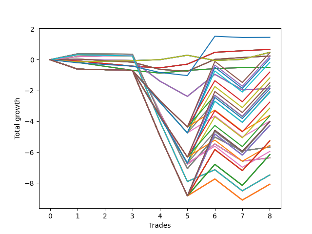

# Long Bulldog 004 
- Symbol: AAPL_Unlimited
- Date Range: 03/23/2022 - 07/08/2022
- Trading Period: 7:20-12:30
- Number of Trades: 8



| Name | Win Percent | Profit | Avg Profit / Trade | Avg Time / Trade |      | Name | Win Percent | Profit | Avg Profit / Trade | Avg Time / Trade |
| ---- | ----------- | ------ | ------------------ | ---------------- | ---- | ---- | ----------- | ------ | ------------------ | ---------------- |
| Sorted By <br> Profit | | | | | | Sorted By <br> Win Percentage ||||
| Seventy-Three | 25.00 | 725.00 | 90.62 | 09:20 |     | Seventy | 75.00 | 240.00 | 30.00 | 27:00 |
| Sixty-Five | 50.00 | 335.00 | 41.88 | 13:16 |     | Sixty-Two | 75.00 | 240.00 | 30.00 | 27:00 |
| Fifty-Seven | 50.00 | 335.00 | 41.88 | 13:16 |     | Fifty-Four | 75.00 | 240.00 | 30.00 | 27:00 |
| Forty-Nine | 50.00 | 335.00 | 41.88 | 13:16 |     | Forty-Six | 75.00 | 240.00 | 30.00 | 27:00 |
| Forty-One | 50.00 | 335.00 | 41.88 | 13:16 |     | Six | 75.00 | 240.00 | 30.00 | 27:00 |
| One | 50.00 | 335.00 | 41.88 | 13:16 |     | Sixty-Eight | 62.50 | -3185.00 | -398.12 | 83:37 |
| Seventy | 75.00 | 240.00 | 30.00 | 27:00 |     | Sixty | 62.50 | -3185.00 | -398.12 | 83:37 |
| Sixty-Two | 75.00 | 240.00 | 30.00 | 27:00 |     | Fifty-Two | 62.50 | -3185.00 | -398.12 | 83:37 |
| Fifty-Four | 75.00 | 240.00 | 30.00 | 27:00 |     | Forty-Four | 62.50 | -3185.00 | -398.12 | 83:37 |
| Forty-Six | 75.00 | 240.00 | 30.00 | 27:00 |     | Four | 62.50 | -3185.00 | -398.12 | 83:37 |
| Six | 75.00 | 240.00 | 30.00 | 27:00 |     | Sixty-Five | 50.00 | 335.00 | 41.88 | 13:16 |
| One Hundred | 25.00 | 225.00 | 28.13 | 142:13 |     | Fifty-Seven | 50.00 | 335.00 | 41.88 | 13:16 |
| Sixty-Seven | 50.00 | 120.00 | 15.00 | 26:05 |     | Forty-Nine | 50.00 | 335.00 | 41.88 | 13:16 |
| Fifty-Nine | 50.00 | 120.00 | 15.00 | 26:05 |     | Forty-One | 50.00 | 335.00 | 41.88 | 13:16 |
| Fifty-One | 50.00 | 120.00 | 15.00 | 26:05 |     | One | 50.00 | 335.00 | 41.88 | 13:16 |
| Forty-Three | 50.00 | 120.00 | 15.00 | 26:05 |     | Sixty-Seven | 50.00 | 120.00 | 15.00 | 26:05 |
| Three | 50.00 | 120.00 | 15.00 | 26:05 |     | Fifty-Nine | 50.00 | 120.00 | 15.00 | 26:05 |
| Ninety-Nine | 25.00 | 105.00 | 13.13 | 140:21 |     | Fifty-One | 50.00 | 120.00 | 15.00 | 26:05 |
| Ninety-Five | 25.00 | 35.00 | 4.38 | 142:33 |     | Forty-Three | 50.00 | 120.00 | 15.00 | 26:05 |
| Ninety-Four | 25.00 | -85.00 | -10.62 | 140:40 |     | Three | 50.00 | 120.00 | 15.00 | 26:05 |
| Sixty-Four | 50.00 | -255.00 | -31.87 | 10:28 |     | Sixty-Four | 50.00 | -255.00 | -31.87 | 10:28 |
| Fifty-Six | 50.00 | -255.00 | -31.87 | 10:28 |     | Fifty-Six | 50.00 | -255.00 | -31.87 | 10:28 |
| Forty-Eight | 50.00 | -255.00 | -31.87 | 10:28 |     | Forty-Eight | 50.00 | -255.00 | -31.87 | 10:28 |
| Forty | 50.00 | -255.00 | -31.87 | 10:28 |     | Forty | 50.00 | -255.00 | -31.87 | 10:28 |
| Zero | 50.00 | -255.00 | -31.87 | 10:28 |     | Zero | 50.00 | -255.00 | -31.87 | 10:28 |
| Ninety-Eight | 25.00 | -400.00 | -50.00 | 137:57 |     | Sixty-Six | 37.50 | -935.00 | -116.88 | 43:20 |
| Ninety-Three | 25.00 | -590.00 | -73.75 | 138:16 |     | Fifty-Eight | 37.50 | -935.00 | -116.88 | 43:20 |
| One Hundred Ten | 25.00 | -750.00 | -93.75 | 154:50 |     | Fifty | 37.50 | -935.00 | -116.88 | 43:20 |
| Ninety-Seven | 25.00 | -845.00 | -105.62 | 134:11 |     | Forty-Two | 37.50 | -935.00 | -116.88 | 43:20 |
| One Hundred Nine | 25.00 | -870.00 | -108.75 | 152:57 |     | Two | 37.50 | -935.00 | -116.88 | 43:20 |
| Sixty-Six | 37.50 | -935.00 | -116.88 | 43:20 |     | Sixty-Nine | 37.50 | -2835.00 | -354.37 | 95:28 |
| Fifty-Eight | 37.50 | -935.00 | -116.88 | 43:20 |     | Sixty-One | 37.50 | -2835.00 | -354.37 | 95:28 |
| Fifty | 37.50 | -935.00 | -116.88 | 43:20 |     | Fifty-Three | 37.50 | -2835.00 | -354.37 | 95:28 |
| Forty-Two | 37.50 | -935.00 | -116.88 | 43:20 |     | Forty-Five | 37.50 | -2835.00 | -354.37 | 95:28 |
| Two | 37.50 | -935.00 | -116.88 | 43:20 |     | Five | 37.50 | -2835.00 | -354.37 | 95:28 |
| One Hundred Five | 25.00 | -945.00 | -118.12 | 159:22 |     | Seventy-One | 37.50 | -3740.00 | -467.50 | 131:42 |
| Ninety-Two | 25.00 | -1035.00 | -129.37 | 134:31 |     | Sixty-Three | 37.50 | -3740.00 | -467.50 | 131:42 |
| One Hundred Four | 25.00 | -1065.00 | -133.12 | 157:30 |     | Fifty-Five | 37.50 | -3740.00 | -467.50 | 131:42 |
| One Hundred Eight | 25.00 | -1375.00 | -171.87 | 150:33 |     | Forty-Seven | 37.50 | -3740.00 | -467.50 | 131:42 |
| One Hundred Three | 25.00 | -1570.00 | -196.25 | 155:06 |     | Seven | 37.50 | -3740.00 | -467.50 | 131:42 |
| Ninety-Six | 25.00 | -1805.00 | -225.62 | 124:57 |     | Seventy-Three | 25.00 | 725.00 | 90.62 | 09:20 |
| One Hundred Seven | 25.00 | -1820.00 | -227.50 | 146:48 |     | One Hundred | 25.00 | 225.00 | 28.13 | 142:13 |
| Ninety-One | 25.00 | -1995.00 | -249.37 | 125:16 |     | Ninety-Nine | 25.00 | 105.00 | 13.13 | 140:21 |
| One Hundred Thirty | 25.00 | -2010.00 | -251.25 | 179:45 |     | Ninety-Five | 25.00 | 35.00 | 4.38 | 142:33 |
| One Hundred Twenty-Five | 25.00 | -2010.00 | -251.25 | 179:45 |     | Ninety-Four | 25.00 | -85.00 | -10.62 | 140:40 |
| One Hundred Twenty | 25.00 | -2010.00 | -251.25 | 179:45 |     | Ninety-Eight | 25.00 | -400.00 | -50.00 | 137:57 |
| One Hundred Fifteen | 25.00 | -2010.00 | -251.25 | 179:45 |     | Ninety-Three | 25.00 | -590.00 | -73.75 | 138:16 |
| Eighty-Five | 25.00 | -2010.00 | -251.25 | 179:45 |     | One Hundred Ten | 25.00 | -750.00 | -93.75 | 154:50 |
| One Hundred Two | 25.00 | -2015.00 | -251.87 | 151:20 |     | Ninety-Seven | 25.00 | -845.00 | -105.62 | 134:11 |
| One Hundred Twenty-Nine | 25.00 | -2130.00 | -266.25 | 177:52 |     | One Hundred Nine | 25.00 | -870.00 | -108.75 | 152:57 |
| One Hundred Twenty-Four | 25.00 | -2130.00 | -266.25 | 177:52 |     | One Hundred Five | 25.00 | -945.00 | -118.12 | 159:22 |
| One Hundred Ninteen | 25.00 | -2130.00 | -266.25 | 177:52 |     | Ninety-Two | 25.00 | -1035.00 | -129.37 | 134:31 |
| One Hundred Fourteen | 25.00 | -2130.00 | -266.25 | 177:52 |     | One Hundred Four | 25.00 | -1065.00 | -133.12 | 157:30 |
| Eighty-Four | 25.00 | -2130.00 | -266.25 | 177:52 |     | One Hundred Eight | 25.00 | -1375.00 | -171.87 | 150:33 |
| One Hundred Twenty-Eight | 25.00 | -2635.00 | -329.37 | 175:28 |     | One Hundred Three | 25.00 | -1570.00 | -196.25 | 155:06 |
| One Hundred Twenty-Three | 25.00 | -2635.00 | -329.37 | 175:28 |     | Ninety-Six | 25.00 | -1805.00 | -225.62 | 124:57 |
| One Hundred Eighteen | 25.00 | -2635.00 | -329.37 | 175:28 |     | One Hundred Seven | 25.00 | -1820.00 | -227.50 | 146:48 |
| One Hundred Thirteen | 25.00 | -2635.00 | -329.37 | 175:28 |     | Ninety-One | 25.00 | -1995.00 | -249.37 | 125:16 |
| Eighty-Three | 25.00 | -2635.00 | -329.37 | 175:28 |     | One Hundred Thirty | 25.00 | -2010.00 | -251.25 | 179:45 |
| One Hundred Six | 25.00 | -2780.00 | -347.50 | 137:33 |     | One Hundred Twenty-Five | 25.00 | -2010.00 | -251.25 | 179:45 |
| Sixty-Nine | 37.50 | -2835.00 | -354.37 | 95:28 |     | One Hundred Twenty | 25.00 | -2010.00 | -251.25 | 179:45 |
| Sixty-One | 37.50 | -2835.00 | -354.37 | 95:28 |     | One Hundred Fifteen | 25.00 | -2010.00 | -251.25 | 179:45 |
| Fifty-Three | 37.50 | -2835.00 | -354.37 | 95:28 |     | Eighty-Five | 25.00 | -2010.00 | -251.25 | 179:45 |
| Forty-Five | 37.50 | -2835.00 | -354.37 | 95:28 |     | One Hundred Two | 25.00 | -2015.00 | -251.87 | 151:20 |
| Five | 37.50 | -2835.00 | -354.37 | 95:28 |     | One Hundred Twenty-Nine | 25.00 | -2130.00 | -266.25 | 177:52 |
| One Hundred One | 25.00 | -2975.00 | -371.87 | 142:06 |     | One Hundred Twenty-Four | 25.00 | -2130.00 | -266.25 | 177:52 |
| One Hundred Twenty-Seven | 25.00 | -3080.00 | -385.00 | 171:43 |     | One Hundred Ninteen | 25.00 | -2130.00 | -266.25 | 177:52 |
| One Hundred Twenty-Two | 25.00 | -3080.00 | -385.00 | 171:43 |     | One Hundred Fourteen | 25.00 | -2130.00 | -266.25 | 177:52 |
| One Hundred Seventeen | 25.00 | -3080.00 | -385.00 | 171:43 |     | Eighty-Four | 25.00 | -2130.00 | -266.25 | 177:52 |
| One Hundred Twelve | 25.00 | -3080.00 | -385.00 | 171:43 |     | One Hundred Twenty-Eight | 25.00 | -2635.00 | -329.37 | 175:28 |
| Eighty-Two | 25.00 | -3080.00 | -385.00 | 171:43 |     | One Hundred Twenty-Three | 25.00 | -2635.00 | -329.37 | 175:28 |
| Sixty-Eight | 62.50 | -3185.00 | -398.12 | 83:37 |     | One Hundred Eighteen | 25.00 | -2635.00 | -329.37 | 175:28 |
| Sixty | 62.50 | -3185.00 | -398.12 | 83:37 |     | One Hundred Thirteen | 25.00 | -2635.00 | -329.37 | 175:28 |
| Fifty-Two | 62.50 | -3185.00 | -398.12 | 83:37 |     | Eighty-Three | 25.00 | -2635.00 | -329.37 | 175:28 |
| Forty-Four | 62.50 | -3185.00 | -398.12 | 83:37 |     | One Hundred Six | 25.00 | -2780.00 | -347.50 | 137:33 |
| Four | 62.50 | -3185.00 | -398.12 | 83:37 |     | One Hundred One | 25.00 | -2975.00 | -371.87 | 142:06 |
| Seventy-One | 37.50 | -3740.00 | -467.50 | 131:42 |     | One Hundred Twenty-Seven | 25.00 | -3080.00 | -385.00 | 171:43 |
| Sixty-Three | 37.50 | -3740.00 | -467.50 | 131:42 |     | One Hundred Twenty-Two | 25.00 | -3080.00 | -385.00 | 171:43 |
| Fifty-Five | 37.50 | -3740.00 | -467.50 | 131:42 |     | One Hundred Seventeen | 25.00 | -3080.00 | -385.00 | 171:43 |
| Forty-Seven | 37.50 | -3740.00 | -467.50 | 131:42 |     | One Hundred Twelve | 25.00 | -3080.00 | -385.00 | 171:43 |
| Seven | 37.50 | -3740.00 | -467.50 | 131:42 |     | Eighty-Two | 25.00 | -3080.00 | -385.00 | 171:43 |
| One Hundred Twenty-Six | 25.00 | -4040.00 | -505.00 | 162:28 |     | One Hundred Twenty-Six | 25.00 | -4040.00 | -505.00 | 162:28 |
| One Hundred Twenty-One | 25.00 | -4040.00 | -505.00 | 162:28 |     | One Hundred Twenty-One | 25.00 | -4040.00 | -505.00 | 162:28 |
| One Hundred Sixteen | 25.00 | -4040.00 | -505.00 | 162:28 |     | One Hundred Sixteen | 25.00 | -4040.00 | -505.00 | 162:28 |
| One Hundred Eleven | 25.00 | -4040.00 | -505.00 | 162:28 |     | One Hundred Eleven | 25.00 | -4040.00 | -505.00 | 162:28 |
| Eighty-One | 25.00 | -4040.00 | -505.00 | 162:28 |     | Eighty-One | 25.00 | -4040.00 | -505.00 | 162:28 |

## NO STOPLOSS

### Test Zero
* Sell when price hits the middle line of the 20p bollinger
* No Stoploss
* Results:
```
Total Trades: 8
Percent Up: 50.00
Percent Down: 50.00
Total Points Moved Up: -0.51
Potential Profit: -255.00
Total Points Ups: 0.36 Count Ups: 4
Total Points Downs: -0.87 Count Downs: 4
```

<details><summary>Trades</summary>

<code>In: 2022-03-31 08:23:00		Out: 2022-03-31 08:33:15		Total Position Time: 10:15		Total Move Up: -0.17		Total to Date: -0.17</code> <br />
<code>In: 2022-04-08 10:45:00		Out: 2022-04-08 11:08:25		Total Position Time: 23:25		Total Move Up: -0.26		Total to Date: -0.43</code> <br />
<code>In: 2022-04-08 10:45:00		Out: 2022-04-08 11:08:25		Total Position Time: 23:25		Total Move Up: -0.26		Total to Date: -0.69</code> <br />
<code>In: 2022-04-21 08:54:00		Out: 2022-04-21 09:06:35		Total Position Time: 12:35		Total Move Up: -0.18		Total to Date: -0.87</code> <br />
<code>In: 2022-04-21 09:03:00		Out: 2022-04-21 09:06:35		Total Position Time: 03:35		Total Move Up: 0.17		Total to Date: -0.70</code> <br />
<code>In: 2022-05-04 11:37:00		Out: 2022-05-04 11:41:35		Total Position Time: 04:35		Total Move Up: 0.12		Total to Date: -0.58</code> <br />
<code>In: 2022-06-08 09:02:00		Out: 2022-06-08 09:03:10		Total Position Time: 01:10		Total Move Up: 0.07		Total to Date: -0.51</code> <br />
<code>In: 2022-06-23 09:49:00		Out: 2022-06-23 09:53:45		Total Position Time: 04:45		Total Move Up: 0.00		Total to Date: -0.51</code> <br />


</details>

### Test One
* Sell when the price hits the upper line of the 20p 1std bollinger
* No Stoploss
* Results:
```
Total Trades: 8
Percent Up: 50.00
Percent Down: 50.00
Total Points Moved Up: 0.67
Potential Profit: 335.00
Total Points Ups: 1.20 Count Ups: 4
Total Points Downs: -0.53 Count Downs: 4
```

<details><summary>Trades</summary>

<code>In: 2022-03-31 08:23:00		Out: 2022-03-31 08:36:30		Total Position Time: 13:30		Total Move Up: -0.08		Total to Date: -0.08</code> <br />
<code>In: 2022-04-08 10:45:00		Out: 2022-04-08 11:11:10		Total Position Time: 26:10		Total Move Up: -0.17		Total to Date: -0.25</code> <br />
<code>In: 2022-04-08 10:45:00		Out: 2022-04-08 11:11:10		Total Position Time: 26:10		Total Move Up: -0.17		Total to Date: -0.42</code> <br />
<code>In: 2022-04-21 08:54:00		Out: 2022-04-21 09:12:05		Total Position Time: 18:05		Total Move Up: -0.11		Total to Date: -0.53</code> <br />
<code>In: 2022-04-21 09:03:00		Out: 2022-04-21 09:12:05		Total Position Time: 09:05		Total Move Up: 0.24		Total to Date: -0.29</code> <br />
<code>In: 2022-05-04 11:37:00		Out: 2022-05-04 11:43:55		Total Position Time: 06:55		Total Move Up: 0.77		Total to Date: 0.48</code> <br />
<code>In: 2022-06-08 09:02:00		Out: 2022-06-08 09:03:15		Total Position Time: 01:15		Total Move Up: 0.10		Total to Date: 0.58</code> <br />
<code>In: 2022-06-23 09:49:00		Out: 2022-06-23 09:54:05		Total Position Time: 05:05		Total Move Up: 0.09		Total to Date: 0.67</code> <br />


</details>

### Test Two
* Sell when the price hits the upper line of the 20p 2std bollinger
* No Stoploss
* Results:
```
Total Trades: 8
Percent Up: 37.50
Percent Down: 62.50
Total Points Moved Up: -1.87
Potential Profit: -935.00
Total Points Ups: 1.53 Count Ups: 3
Total Points Downs: -3.40 Count Downs: 5
```

<details><summary>Trades</summary>

<code>In: 2022-03-31 08:23:00		Out: 2022-03-31 08:36:40		Total Position Time: 13:40		Total Move Up: 0.01		Total to Date: 0.01</code> <br />
<code>In: 2022-04-08 10:45:00		Out: 2022-04-08 11:20:45		Total Position Time: 35:45		Total Move Up: -0.03		Total to Date: -0.02</code> <br />
<code>In: 2022-04-08 10:45:00		Out: 2022-04-08 11:20:45		Total Position Time: 35:45		Total Move Up: -0.03		Total to Date: -0.05</code> <br />
<code>In: 2022-04-21 08:54:00		Out: 2022-04-21 10:31:20		Total Position Time: 97:20		Total Move Up: -1.34		Total to Date: -1.39</code> <br />
<code>In: 2022-04-21 09:03:00		Out: 2022-04-21 10:31:20		Total Position Time: 88:20		Total Move Up: -0.99		Total to Date: -2.38</code> <br />
<code>In: 2022-05-04 11:37:00		Out: 2022-05-04 11:46:55		Total Position Time: 09:55		Total Move Up: 1.43		Total to Date: -0.95</code> <br />
<code>In: 2022-06-08 09:02:00		Out: 2022-06-08 10:00:10		Total Position Time: 58:10		Total Move Up: -1.01		Total to Date: -1.96</code> <br />
<code>In: 2022-06-23 09:49:00		Out: 2022-06-23 09:56:50		Total Position Time: 07:50		Total Move Up: 0.09		Total to Date: -1.87</code> <br />


</details>

### Test Three
* Sell when price hits the middle line of the 50p bollinger
* No Stoploss
* Results:
```
Total Trades: 8
Percent Up: 50.00
Percent Down: 50.00
Total Points Moved Up: 0.24
Potential Profit: 120.00
Total Points Ups: 1.03 Count Ups: 4
Total Points Downs: -0.79 Count Downs: 4
```

<details><summary>Trades</summary>

<code>In: 2022-03-31 08:23:00		Out: 2022-03-31 08:36:45		Total Position Time: 13:45		Total Move Up: 0.04		Total to Date: 0.04</code> <br />
<code>In: 2022-04-08 10:45:00		Out: 2022-04-08 11:20:30		Total Position Time: 35:30		Total Move Up: -0.10		Total to Date: -0.06</code> <br />
<code>In: 2022-04-08 10:45:00		Out: 2022-04-08 11:20:30		Total Position Time: 35:30		Total Move Up: -0.10		Total to Date: -0.16</code> <br />
<code>In: 2022-04-21 08:54:00		Out: 2022-04-21 09:47:05		Total Position Time: 53:05		Total Move Up: -0.47		Total to Date: -0.63</code> <br />
<code>In: 2022-04-21 09:03:00		Out: 2022-04-21 09:47:05		Total Position Time: 44:05		Total Move Up: -0.12		Total to Date: -0.75</code> <br />
<code>In: 2022-05-04 11:37:00		Out: 2022-05-04 11:43:55		Total Position Time: 06:55		Total Move Up: 0.77		Total to Date: 0.02</code> <br />
<code>In: 2022-06-08 09:02:00		Out: 2022-06-08 09:03:25		Total Position Time: 01:25		Total Move Up: 0.12		Total to Date: 0.14</code> <br />
<code>In: 2022-06-23 09:49:00		Out: 2022-06-23 10:07:30		Total Position Time: 18:30		Total Move Up: 0.10		Total to Date: 0.24</code> <br />


</details>

### Test Four
* Sell when the price hits the upper line of the 50p 1std bollinger
* No Stoploss
* Results:
```
Total Trades: 8
Percent Up: 62.50
Percent Down: 37.50
Total Points Moved Up: -6.37
Potential Profit: -3185.00
Total Points Ups: 1.81 Count Ups: 5
Total Points Downs: -8.18 Count Downs: 3
```

<details><summary>Trades</summary>

<code>In: 2022-03-31 08:23:00		Out: 2022-03-31 08:40:40		Total Position Time: 17:40		Total Move Up: 0.20		Total to Date: 0.20</code> <br />
<code>In: 2022-04-08 10:45:00		Out: 2022-04-08 11:21:10		Total Position Time: 36:10		Total Move Up: 0.04		Total to Date: 0.24</code> <br />
<code>In: 2022-04-08 10:45:00		Out: 2022-04-08 11:21:10		Total Position Time: 36:10		Total Move Up: 0.04		Total to Date: 0.28</code> <br />
<code>In: 2022-04-21 08:54:00		Out: 2022-04-21 12:29:55		Total Position Time: 215:55		Total Move Up: -3.71		Total to Date: -3.43</code> <br />
<code>In: 2022-04-21 09:03:00		Out: 2022-04-21 12:29:55		Total Position Time: 206:55		Total Move Up: -3.36		Total to Date: -6.79</code> <br />
<code>In: 2022-05-04 11:37:00		Out: 2022-05-04 11:46:50		Total Position Time: 09:50		Total Move Up: 1.32		Total to Date: -5.47</code> <br />
<code>In: 2022-06-08 09:02:00		Out: 2022-06-08 10:54:00		Total Position Time: 112:00		Total Move Up: -1.11		Total to Date: -6.58</code> <br />
<code>In: 2022-06-23 09:49:00		Out: 2022-06-23 10:23:20		Total Position Time: 34:20		Total Move Up: 0.21		Total to Date: -6.37</code> <br />


</details>

### Test Five
* Sell when the price hits the upper line of the 50p 2std bollinger
* No Stoploss
* Results:
```
Total Trades: 8
Percent Up: 37.50
Percent Down: 62.50
Total Points Moved Up: -5.67
Potential Profit: -2835.00
Total Points Ups: 2.68 Count Ups: 3
Total Points Downs: -8.35 Count Downs: 5
```

<details><summary>Trades</summary>

<code>In: 2022-03-31 08:23:00		Out: 2022-03-31 08:41:35		Total Position Time: 18:35		Total Move Up: 0.38		Total to Date: 0.38</code> <br />
<code>In: 2022-04-08 10:45:00		Out: 2022-04-08 11:52:15		Total Position Time: 67:15		Total Move Up: -0.01		Total to Date: 0.37</code> <br />
<code>In: 2022-04-08 10:45:00		Out: 2022-04-08 11:52:15		Total Position Time: 67:15		Total Move Up: -0.01		Total to Date: 0.36</code> <br />
<code>In: 2022-04-21 08:54:00		Out: 2022-04-21 12:44:20		Total Position Time: 230:20		Total Move Up: -3.89		Total to Date: -3.53</code> <br />
<code>In: 2022-04-21 09:03:00		Out: 2022-04-21 12:44:20		Total Position Time: 221:20		Total Move Up: -3.54		Total to Date: -7.07</code> <br />
<code>In: 2022-05-04 11:37:00		Out: 2022-05-04 11:47:10		Total Position Time: 10:10		Total Move Up: 2.05		Total to Date: -5.02</code> <br />
<code>In: 2022-06-08 09:02:00		Out: 2022-06-08 10:56:30		Total Position Time: 114:30		Total Move Up: -0.90		Total to Date: -5.92</code> <br />
<code>In: 2022-06-23 09:49:00		Out: 2022-06-23 10:23:25		Total Position Time: 34:25		Total Move Up: 0.25		Total to Date: -5.67</code> <br />


</details>

### Test Six
* Sell when the price hits the middle line of the 1std VWAP
* No Stoploss
* Results:
```
Total Trades: 8
Percent Up: 75.00
Percent Down: 25.00
Total Points Moved Up: 0.48
Potential Profit: 240.00
Total Points Ups: 0.96 Count Ups: 6
Total Points Downs: -0.48 Count Downs: 2
```

<details><summary>Trades</summary>

<code>In: 2022-03-31 08:23:00		Out: 2022-03-31 08:24:10		Total Position Time: 01:10		Total Move Up: -0.14		Total to Date: -0.14</code> <br />
<code>In: 2022-04-08 10:45:00		Out: 2022-04-08 11:53:00		Total Position Time: 68:00		Total Move Up: 0.04		Total to Date: -0.10</code> <br />
<code>In: 2022-04-08 10:45:00		Out: 2022-04-08 11:53:00		Total Position Time: 68:00		Total Move Up: 0.04		Total to Date: -0.06</code> <br />
<code>In: 2022-04-21 08:54:00		Out: 2022-04-21 08:55:10		Total Position Time: 01:10		Total Move Up: 0.06		Total to Date: 0.00</code> <br />
<code>In: 2022-04-21 09:03:00		Out: 2022-04-21 09:12:15		Total Position Time: 09:15		Total Move Up: 0.29		Total to Date: 0.29</code> <br />
<code>In: 2022-05-04 11:37:00		Out: 2022-05-04 11:38:10		Total Position Time: 01:10		Total Move Up: -0.34		Total to Date: -0.05</code> <br />
<code>In: 2022-06-08 09:02:00		Out: 2022-06-08 09:03:10		Total Position Time: 01:10		Total Move Up: 0.07		Total to Date: 0.02</code> <br />
<code>In: 2022-06-23 09:49:00		Out: 2022-06-23 10:55:05		Total Position Time: 66:05		Total Move Up: 0.46		Total to Date: 0.48</code> <br />


</details>

### Test Seven
* Sell when the price hits the upper line of the 1std VWAP
* No Stoploss
* Results:
```
Total Trades: 8
Percent Up: 37.50
Percent Down: 62.50
Total Points Moved Up: -7.48
Potential Profit: -3740.00
Total Points Ups: 2.12 Count Ups: 3
Total Points Downs: -9.60 Count Downs: 5
```

<details><summary>Trades</summary>

<code>In: 2022-03-31 08:23:00		Out: 2022-03-31 08:41:10		Total Position Time: 18:10		Total Move Up: 0.32		Total to Date: 0.32</code> <br />
<code>In: 2022-04-08 10:45:00		Out: 2022-04-08 12:47:00		Total Position Time: 122:00		Total Move Up: -0.04		Total to Date: 0.28</code> <br />
<code>In: 2022-04-08 10:45:00		Out: 2022-04-08 12:47:00		Total Position Time: 122:00		Total Move Up: -0.04		Total to Date: 0.24</code> <br />
<code>In: 2022-04-21 08:54:00		Out: 2022-04-21 12:47:00		Total Position Time: 233:00		Total Move Up: -4.25		Total to Date: -4.01</code> <br />
<code>In: 2022-04-21 09:03:00		Out: 2022-04-21 12:47:00		Total Position Time: 224:00		Total Move Up: -3.90		Total to Date: -7.91</code> <br />
<code>In: 2022-05-04 11:37:00		Out: 2022-05-04 11:43:55		Total Position Time: 06:55		Total Move Up: 0.77		Total to Date: -7.14</code> <br />
<code>In: 2022-06-08 09:02:00		Out: 2022-06-08 12:47:00		Total Position Time: 225:00		Total Move Up: -1.37		Total to Date: -8.51</code> <br />
<code>In: 2022-06-23 09:49:00		Out: 2022-06-23 11:31:35		Total Position Time: 102:35		Total Move Up: 1.03		Total to Date: -7.48</code> <br />


</details>

## STOPLOSS OF 5

### Test Forty
* Sell when price hits the middle line of the 20p bollinger
* Stoploss is 5 points
* Results:
```
Total Trades: 8
Percent Up: 50.00
Percent Down: 50.00
Total Points Moved Up: -0.51
Potential Profit: -255.00
Total Points Ups: 0.36 Count Ups: 4
Total Points Downs: -0.87 Count Downs: 4
```

<details><summary>Trades</summary>

<code>In: 2022-03-31 08:23:00		Out: 2022-03-31 08:33:15		Total Position Time: 10:15		Total Move Up: -0.17		Total to Date: -0.17</code> <br />
<code>In: 2022-04-08 10:45:00		Out: 2022-04-08 11:08:25		Total Position Time: 23:25		Total Move Up: -0.26		Total to Date: -0.43</code> <br />
<code>In: 2022-04-08 10:45:00		Out: 2022-04-08 11:08:25		Total Position Time: 23:25		Total Move Up: -0.26		Total to Date: -0.69</code> <br />
<code>In: 2022-04-21 08:54:00		Out: 2022-04-21 09:06:35		Total Position Time: 12:35		Total Move Up: -0.18		Total to Date: -0.87</code> <br />
<code>In: 2022-04-21 09:03:00		Out: 2022-04-21 09:06:35		Total Position Time: 03:35		Total Move Up: 0.17		Total to Date: -0.70</code> <br />
<code>In: 2022-05-04 11:37:00		Out: 2022-05-04 11:41:35		Total Position Time: 04:35		Total Move Up: 0.12		Total to Date: -0.58</code> <br />
<code>In: 2022-06-08 09:02:00		Out: 2022-06-08 09:03:10		Total Position Time: 01:10		Total Move Up: 0.07		Total to Date: -0.51</code> <br />
<code>In: 2022-06-23 09:49:00		Out: 2022-06-23 09:53:45		Total Position Time: 04:45		Total Move Up: 0.00		Total to Date: -0.51</code> <br />


</details>

### Test Forty-One
* Sell when the price hits the upper line of the 20p 1std bollinger
* Stoploss is 5 points
* Results:
```
Total Trades: 8
Percent Up: 50.00
Percent Down: 50.00
Total Points Moved Up: 0.67
Potential Profit: 335.00
Total Points Ups: 1.20 Count Ups: 4
Total Points Downs: -0.53 Count Downs: 4
```

<details><summary>Trades</summary>

<code>In: 2022-03-31 08:23:00		Out: 2022-03-31 08:36:30		Total Position Time: 13:30		Total Move Up: -0.08		Total to Date: -0.08</code> <br />
<code>In: 2022-04-08 10:45:00		Out: 2022-04-08 11:11:10		Total Position Time: 26:10		Total Move Up: -0.17		Total to Date: -0.25</code> <br />
<code>In: 2022-04-08 10:45:00		Out: 2022-04-08 11:11:10		Total Position Time: 26:10		Total Move Up: -0.17		Total to Date: -0.42</code> <br />
<code>In: 2022-04-21 08:54:00		Out: 2022-04-21 09:12:05		Total Position Time: 18:05		Total Move Up: -0.11		Total to Date: -0.53</code> <br />
<code>In: 2022-04-21 09:03:00		Out: 2022-04-21 09:12:05		Total Position Time: 09:05		Total Move Up: 0.24		Total to Date: -0.29</code> <br />
<code>In: 2022-05-04 11:37:00		Out: 2022-05-04 11:43:55		Total Position Time: 06:55		Total Move Up: 0.77		Total to Date: 0.48</code> <br />
<code>In: 2022-06-08 09:02:00		Out: 2022-06-08 09:03:15		Total Position Time: 01:15		Total Move Up: 0.10		Total to Date: 0.58</code> <br />
<code>In: 2022-06-23 09:49:00		Out: 2022-06-23 09:54:05		Total Position Time: 05:05		Total Move Up: 0.09		Total to Date: 0.67</code> <br />


</details>

### Test Forty-Two
* Sell when the price hits the upper line of the 20p 2std bollinger
* Stoploss is 5 points
* Results:
```
Total Trades: 8
Percent Up: 37.50
Percent Down: 62.50
Total Points Moved Up: -1.87
Potential Profit: -935.00
Total Points Ups: 1.53 Count Ups: 3
Total Points Downs: -3.40 Count Downs: 5
```

<details><summary>Trades</summary>

<code>In: 2022-03-31 08:23:00		Out: 2022-03-31 08:36:40		Total Position Time: 13:40		Total Move Up: 0.01		Total to Date: 0.01</code> <br />
<code>In: 2022-04-08 10:45:00		Out: 2022-04-08 11:20:45		Total Position Time: 35:45		Total Move Up: -0.03		Total to Date: -0.02</code> <br />
<code>In: 2022-04-08 10:45:00		Out: 2022-04-08 11:20:45		Total Position Time: 35:45		Total Move Up: -0.03		Total to Date: -0.05</code> <br />
<code>In: 2022-04-21 08:54:00		Out: 2022-04-21 10:31:20		Total Position Time: 97:20		Total Move Up: -1.34		Total to Date: -1.39</code> <br />
<code>In: 2022-04-21 09:03:00		Out: 2022-04-21 10:31:20		Total Position Time: 88:20		Total Move Up: -0.99		Total to Date: -2.38</code> <br />
<code>In: 2022-05-04 11:37:00		Out: 2022-05-04 11:46:55		Total Position Time: 09:55		Total Move Up: 1.43		Total to Date: -0.95</code> <br />
<code>In: 2022-06-08 09:02:00		Out: 2022-06-08 10:00:10		Total Position Time: 58:10		Total Move Up: -1.01		Total to Date: -1.96</code> <br />
<code>In: 2022-06-23 09:49:00		Out: 2022-06-23 09:56:50		Total Position Time: 07:50		Total Move Up: 0.09		Total to Date: -1.87</code> <br />


</details>

### Test Forty-Three
* Sell when price hits the middle line of the 50p bollinger
* Stoploss is 5 points
* Results:
```
Total Trades: 8
Percent Up: 50.00
Percent Down: 50.00
Total Points Moved Up: 0.24
Potential Profit: 120.00
Total Points Ups: 1.03 Count Ups: 4
Total Points Downs: -0.79 Count Downs: 4
```

<details><summary>Trades</summary>

<code>In: 2022-03-31 08:23:00		Out: 2022-03-31 08:36:45		Total Position Time: 13:45		Total Move Up: 0.04		Total to Date: 0.04</code> <br />
<code>In: 2022-04-08 10:45:00		Out: 2022-04-08 11:20:30		Total Position Time: 35:30		Total Move Up: -0.10		Total to Date: -0.06</code> <br />
<code>In: 2022-04-08 10:45:00		Out: 2022-04-08 11:20:30		Total Position Time: 35:30		Total Move Up: -0.10		Total to Date: -0.16</code> <br />
<code>In: 2022-04-21 08:54:00		Out: 2022-04-21 09:47:05		Total Position Time: 53:05		Total Move Up: -0.47		Total to Date: -0.63</code> <br />
<code>In: 2022-04-21 09:03:00		Out: 2022-04-21 09:47:05		Total Position Time: 44:05		Total Move Up: -0.12		Total to Date: -0.75</code> <br />
<code>In: 2022-05-04 11:37:00		Out: 2022-05-04 11:43:55		Total Position Time: 06:55		Total Move Up: 0.77		Total to Date: 0.02</code> <br />
<code>In: 2022-06-08 09:02:00		Out: 2022-06-08 09:03:25		Total Position Time: 01:25		Total Move Up: 0.12		Total to Date: 0.14</code> <br />
<code>In: 2022-06-23 09:49:00		Out: 2022-06-23 10:07:30		Total Position Time: 18:30		Total Move Up: 0.10		Total to Date: 0.24</code> <br />


</details>

### Test Forty-Four
* Sell when the price hits the upper line of the 50p 1std bollinger
* Stoploss is 5 points
* Results:
```
Total Trades: 8
Percent Up: 62.50
Percent Down: 37.50
Total Points Moved Up: -6.37
Potential Profit: -3185.00
Total Points Ups: 1.81 Count Ups: 5
Total Points Downs: -8.18 Count Downs: 3
```

<details><summary>Trades</summary>

<code>In: 2022-03-31 08:23:00		Out: 2022-03-31 08:40:40		Total Position Time: 17:40		Total Move Up: 0.20		Total to Date: 0.20</code> <br />
<code>In: 2022-04-08 10:45:00		Out: 2022-04-08 11:21:10		Total Position Time: 36:10		Total Move Up: 0.04		Total to Date: 0.24</code> <br />
<code>In: 2022-04-08 10:45:00		Out: 2022-04-08 11:21:10		Total Position Time: 36:10		Total Move Up: 0.04		Total to Date: 0.28</code> <br />
<code>In: 2022-04-21 08:54:00		Out: 2022-04-21 12:29:55		Total Position Time: 215:55		Total Move Up: -3.71		Total to Date: -3.43</code> <br />
<code>In: 2022-04-21 09:03:00		Out: 2022-04-21 12:29:55		Total Position Time: 206:55		Total Move Up: -3.36		Total to Date: -6.79</code> <br />
<code>In: 2022-05-04 11:37:00		Out: 2022-05-04 11:46:50		Total Position Time: 09:50		Total Move Up: 1.32		Total to Date: -5.47</code> <br />
<code>In: 2022-06-08 09:02:00		Out: 2022-06-08 10:54:00		Total Position Time: 112:00		Total Move Up: -1.11		Total to Date: -6.58</code> <br />
<code>In: 2022-06-23 09:49:00		Out: 2022-06-23 10:23:20		Total Position Time: 34:20		Total Move Up: 0.21		Total to Date: -6.37</code> <br />


</details>

### Test Forty-Five
* Sell when the price hits the upper line of the 50p 2std bollinger
* Stoploss is 5 points
* Results:
```
Total Trades: 8
Percent Up: 37.50
Percent Down: 62.50
Total Points Moved Up: -5.67
Potential Profit: -2835.00
Total Points Ups: 2.68 Count Ups: 3
Total Points Downs: -8.35 Count Downs: 5
```

<details><summary>Trades</summary>

<code>In: 2022-03-31 08:23:00		Out: 2022-03-31 08:41:35		Total Position Time: 18:35		Total Move Up: 0.38		Total to Date: 0.38</code> <br />
<code>In: 2022-04-08 10:45:00		Out: 2022-04-08 11:52:15		Total Position Time: 67:15		Total Move Up: -0.01		Total to Date: 0.37</code> <br />
<code>In: 2022-04-08 10:45:00		Out: 2022-04-08 11:52:15		Total Position Time: 67:15		Total Move Up: -0.01		Total to Date: 0.36</code> <br />
<code>In: 2022-04-21 08:54:00		Out: 2022-04-21 12:44:20		Total Position Time: 230:20		Total Move Up: -3.89		Total to Date: -3.53</code> <br />
<code>In: 2022-04-21 09:03:00		Out: 2022-04-21 12:44:20		Total Position Time: 221:20		Total Move Up: -3.54		Total to Date: -7.07</code> <br />
<code>In: 2022-05-04 11:37:00		Out: 2022-05-04 11:47:10		Total Position Time: 10:10		Total Move Up: 2.05		Total to Date: -5.02</code> <br />
<code>In: 2022-06-08 09:02:00		Out: 2022-06-08 10:56:30		Total Position Time: 114:30		Total Move Up: -0.90		Total to Date: -5.92</code> <br />
<code>In: 2022-06-23 09:49:00		Out: 2022-06-23 10:23:25		Total Position Time: 34:25		Total Move Up: 0.25		Total to Date: -5.67</code> <br />


</details>

### Test Forty-Six
* Sell when the price hits the middle line of the 1std VWAP
* Stoploss is 5 points
* Results:
```
Total Trades: 8
Percent Up: 75.00
Percent Down: 25.00
Total Points Moved Up: 0.48
Potential Profit: 240.00
Total Points Ups: 0.96 Count Ups: 6
Total Points Downs: -0.48 Count Downs: 2
```

<details><summary>Trades</summary>

<code>In: 2022-03-31 08:23:00		Out: 2022-03-31 08:24:10		Total Position Time: 01:10		Total Move Up: -0.14		Total to Date: -0.14</code> <br />
<code>In: 2022-04-08 10:45:00		Out: 2022-04-08 11:53:00		Total Position Time: 68:00		Total Move Up: 0.04		Total to Date: -0.10</code> <br />
<code>In: 2022-04-08 10:45:00		Out: 2022-04-08 11:53:00		Total Position Time: 68:00		Total Move Up: 0.04		Total to Date: -0.06</code> <br />
<code>In: 2022-04-21 08:54:00		Out: 2022-04-21 08:55:10		Total Position Time: 01:10		Total Move Up: 0.06		Total to Date: 0.00</code> <br />
<code>In: 2022-04-21 09:03:00		Out: 2022-04-21 09:12:15		Total Position Time: 09:15		Total Move Up: 0.29		Total to Date: 0.29</code> <br />
<code>In: 2022-05-04 11:37:00		Out: 2022-05-04 11:38:10		Total Position Time: 01:10		Total Move Up: -0.34		Total to Date: -0.05</code> <br />
<code>In: 2022-06-08 09:02:00		Out: 2022-06-08 09:03:10		Total Position Time: 01:10		Total Move Up: 0.07		Total to Date: 0.02</code> <br />
<code>In: 2022-06-23 09:49:00		Out: 2022-06-23 10:55:05		Total Position Time: 66:05		Total Move Up: 0.46		Total to Date: 0.48</code> <br />


</details>

### Test Forty-Seven
* Sell when the price hits the upper line of the 1std VWAP
* Stoploss is 5 points
* Results:
```
Total Trades: 8
Percent Up: 37.50
Percent Down: 62.50
Total Points Moved Up: -7.48
Potential Profit: -3740.00
Total Points Ups: 2.12 Count Ups: 3
Total Points Downs: -9.60 Count Downs: 5
```

<details><summary>Trades</summary>

<code>In: 2022-03-31 08:23:00		Out: 2022-03-31 08:41:10		Total Position Time: 18:10		Total Move Up: 0.32		Total to Date: 0.32</code> <br />
<code>In: 2022-04-08 10:45:00		Out: 2022-04-08 12:47:00		Total Position Time: 122:00		Total Move Up: -0.04		Total to Date: 0.28</code> <br />
<code>In: 2022-04-08 10:45:00		Out: 2022-04-08 12:47:00		Total Position Time: 122:00		Total Move Up: -0.04		Total to Date: 0.24</code> <br />
<code>In: 2022-04-21 08:54:00		Out: 2022-04-21 12:47:00		Total Position Time: 233:00		Total Move Up: -4.25		Total to Date: -4.01</code> <br />
<code>In: 2022-04-21 09:03:00		Out: 2022-04-21 12:47:00		Total Position Time: 224:00		Total Move Up: -3.90		Total to Date: -7.91</code> <br />
<code>In: 2022-05-04 11:37:00		Out: 2022-05-04 11:43:55		Total Position Time: 06:55		Total Move Up: 0.77		Total to Date: -7.14</code> <br />
<code>In: 2022-06-08 09:02:00		Out: 2022-06-08 12:47:00		Total Position Time: 225:00		Total Move Up: -1.37		Total to Date: -8.51</code> <br />
<code>In: 2022-06-23 09:49:00		Out: 2022-06-23 11:31:35		Total Position Time: 102:35		Total Move Up: 1.03		Total to Date: -7.48</code> <br />


</details>

## TRAIL STOP OF 5

### Test Forty-Eight
* Sell when price hits the middle line of the 20p bollinger
* Trailing Stop is 5 points
* Results:
```
Total Trades: 8
Percent Up: 50.00
Percent Down: 50.00
Total Points Moved Up: -0.51
Potential Profit: -255.00
Total Points Ups: 0.36 Count Ups: 4
Total Points Downs: -0.87 Count Downs: 4
```

<details><summary>Trades</summary>

<code>In: 2022-03-31 08:23:00		Out: 2022-03-31 08:33:15		Total Position Time: 10:15		Total Move Up: -0.17		Total to Date: -0.17</code> <br />
<code>In: 2022-04-08 10:45:00		Out: 2022-04-08 11:08:25		Total Position Time: 23:25		Total Move Up: -0.26		Total to Date: -0.43</code> <br />
<code>In: 2022-04-08 10:45:00		Out: 2022-04-08 11:08:25		Total Position Time: 23:25		Total Move Up: -0.26		Total to Date: -0.69</code> <br />
<code>In: 2022-04-21 08:54:00		Out: 2022-04-21 09:06:35		Total Position Time: 12:35		Total Move Up: -0.18		Total to Date: -0.87</code> <br />
<code>In: 2022-04-21 09:03:00		Out: 2022-04-21 09:06:35		Total Position Time: 03:35		Total Move Up: 0.17		Total to Date: -0.70</code> <br />
<code>In: 2022-05-04 11:37:00		Out: 2022-05-04 11:41:35		Total Position Time: 04:35		Total Move Up: 0.12		Total to Date: -0.58</code> <br />
<code>In: 2022-06-08 09:02:00		Out: 2022-06-08 09:03:10		Total Position Time: 01:10		Total Move Up: 0.07		Total to Date: -0.51</code> <br />
<code>In: 2022-06-23 09:49:00		Out: 2022-06-23 09:53:45		Total Position Time: 04:45		Total Move Up: 0.00		Total to Date: -0.51</code> <br />


</details>

### Test Forty-Nine
* Sell when the price hits the upper line of the 20p 1std bollinger
* Trailing Stop is 5 points
* Results:
```
Total Trades: 8
Percent Up: 50.00
Percent Down: 50.00
Total Points Moved Up: 0.67
Potential Profit: 335.00
Total Points Ups: 1.20 Count Ups: 4
Total Points Downs: -0.53 Count Downs: 4
```

<details><summary>Trades</summary>

<code>In: 2022-03-31 08:23:00		Out: 2022-03-31 08:36:30		Total Position Time: 13:30		Total Move Up: -0.08		Total to Date: -0.08</code> <br />
<code>In: 2022-04-08 10:45:00		Out: 2022-04-08 11:11:10		Total Position Time: 26:10		Total Move Up: -0.17		Total to Date: -0.25</code> <br />
<code>In: 2022-04-08 10:45:00		Out: 2022-04-08 11:11:10		Total Position Time: 26:10		Total Move Up: -0.17		Total to Date: -0.42</code> <br />
<code>In: 2022-04-21 08:54:00		Out: 2022-04-21 09:12:05		Total Position Time: 18:05		Total Move Up: -0.11		Total to Date: -0.53</code> <br />
<code>In: 2022-04-21 09:03:00		Out: 2022-04-21 09:12:05		Total Position Time: 09:05		Total Move Up: 0.24		Total to Date: -0.29</code> <br />
<code>In: 2022-05-04 11:37:00		Out: 2022-05-04 11:43:55		Total Position Time: 06:55		Total Move Up: 0.77		Total to Date: 0.48</code> <br />
<code>In: 2022-06-08 09:02:00		Out: 2022-06-08 09:03:15		Total Position Time: 01:15		Total Move Up: 0.10		Total to Date: 0.58</code> <br />
<code>In: 2022-06-23 09:49:00		Out: 2022-06-23 09:54:05		Total Position Time: 05:05		Total Move Up: 0.09		Total to Date: 0.67</code> <br />


</details>

### Test Fifty
* Sell when the price hits the upper line of the 20p 2std bollinger
* Trailing Stop is 5 points
* Results:
```
Total Trades: 8
Percent Up: 37.50
Percent Down: 62.50
Total Points Moved Up: -1.87
Potential Profit: -935.00
Total Points Ups: 1.53 Count Ups: 3
Total Points Downs: -3.40 Count Downs: 5
```

<details><summary>Trades</summary>

<code>In: 2022-03-31 08:23:00		Out: 2022-03-31 08:36:40		Total Position Time: 13:40		Total Move Up: 0.01		Total to Date: 0.01</code> <br />
<code>In: 2022-04-08 10:45:00		Out: 2022-04-08 11:20:45		Total Position Time: 35:45		Total Move Up: -0.03		Total to Date: -0.02</code> <br />
<code>In: 2022-04-08 10:45:00		Out: 2022-04-08 11:20:45		Total Position Time: 35:45		Total Move Up: -0.03		Total to Date: -0.05</code> <br />
<code>In: 2022-04-21 08:54:00		Out: 2022-04-21 10:31:20		Total Position Time: 97:20		Total Move Up: -1.34		Total to Date: -1.39</code> <br />
<code>In: 2022-04-21 09:03:00		Out: 2022-04-21 10:31:20		Total Position Time: 88:20		Total Move Up: -0.99		Total to Date: -2.38</code> <br />
<code>In: 2022-05-04 11:37:00		Out: 2022-05-04 11:46:55		Total Position Time: 09:55		Total Move Up: 1.43		Total to Date: -0.95</code> <br />
<code>In: 2022-06-08 09:02:00		Out: 2022-06-08 10:00:10		Total Position Time: 58:10		Total Move Up: -1.01		Total to Date: -1.96</code> <br />
<code>In: 2022-06-23 09:49:00		Out: 2022-06-23 09:56:50		Total Position Time: 07:50		Total Move Up: 0.09		Total to Date: -1.87</code> <br />


</details>

### Test Fifty-One
* Sell when price hits the middle line of the 50p bollinger
* Trailing Stop is 5 points
* Results:
```
Total Trades: 8
Percent Up: 50.00
Percent Down: 50.00
Total Points Moved Up: 0.24
Potential Profit: 120.00
Total Points Ups: 1.03 Count Ups: 4
Total Points Downs: -0.79 Count Downs: 4
```

<details><summary>Trades</summary>

<code>In: 2022-03-31 08:23:00		Out: 2022-03-31 08:36:45		Total Position Time: 13:45		Total Move Up: 0.04		Total to Date: 0.04</code> <br />
<code>In: 2022-04-08 10:45:00		Out: 2022-04-08 11:20:30		Total Position Time: 35:30		Total Move Up: -0.10		Total to Date: -0.06</code> <br />
<code>In: 2022-04-08 10:45:00		Out: 2022-04-08 11:20:30		Total Position Time: 35:30		Total Move Up: -0.10		Total to Date: -0.16</code> <br />
<code>In: 2022-04-21 08:54:00		Out: 2022-04-21 09:47:05		Total Position Time: 53:05		Total Move Up: -0.47		Total to Date: -0.63</code> <br />
<code>In: 2022-04-21 09:03:00		Out: 2022-04-21 09:47:05		Total Position Time: 44:05		Total Move Up: -0.12		Total to Date: -0.75</code> <br />
<code>In: 2022-05-04 11:37:00		Out: 2022-05-04 11:43:55		Total Position Time: 06:55		Total Move Up: 0.77		Total to Date: 0.02</code> <br />
<code>In: 2022-06-08 09:02:00		Out: 2022-06-08 09:03:25		Total Position Time: 01:25		Total Move Up: 0.12		Total to Date: 0.14</code> <br />
<code>In: 2022-06-23 09:49:00		Out: 2022-06-23 10:07:30		Total Position Time: 18:30		Total Move Up: 0.10		Total to Date: 0.24</code> <br />


</details>

### Test Fifty-Two
* Sell when the price hits the upper line of the 50p 1std bollinger
* Trailing Stop is 5 points
* Results:
```
Total Trades: 8
Percent Up: 62.50
Percent Down: 37.50
Total Points Moved Up: -6.37
Potential Profit: -3185.00
Total Points Ups: 1.81 Count Ups: 5
Total Points Downs: -8.18 Count Downs: 3
```

<details><summary>Trades</summary>

<code>In: 2022-03-31 08:23:00		Out: 2022-03-31 08:40:40		Total Position Time: 17:40		Total Move Up: 0.20		Total to Date: 0.20</code> <br />
<code>In: 2022-04-08 10:45:00		Out: 2022-04-08 11:21:10		Total Position Time: 36:10		Total Move Up: 0.04		Total to Date: 0.24</code> <br />
<code>In: 2022-04-08 10:45:00		Out: 2022-04-08 11:21:10		Total Position Time: 36:10		Total Move Up: 0.04		Total to Date: 0.28</code> <br />
<code>In: 2022-04-21 08:54:00		Out: 2022-04-21 12:29:55		Total Position Time: 215:55		Total Move Up: -3.71		Total to Date: -3.43</code> <br />
<code>In: 2022-04-21 09:03:00		Out: 2022-04-21 12:29:55		Total Position Time: 206:55		Total Move Up: -3.36		Total to Date: -6.79</code> <br />
<code>In: 2022-05-04 11:37:00		Out: 2022-05-04 11:46:50		Total Position Time: 09:50		Total Move Up: 1.32		Total to Date: -5.47</code> <br />
<code>In: 2022-06-08 09:02:00		Out: 2022-06-08 10:54:00		Total Position Time: 112:00		Total Move Up: -1.11		Total to Date: -6.58</code> <br />
<code>In: 2022-06-23 09:49:00		Out: 2022-06-23 10:23:20		Total Position Time: 34:20		Total Move Up: 0.21		Total to Date: -6.37</code> <br />


</details>

### Test Fifty-Three
* Sell when the price hits the upper line of the 50p 2std bollinger
* Trailing Stop is 5 points
* Results:
```
Total Trades: 8
Percent Up: 37.50
Percent Down: 62.50
Total Points Moved Up: -5.67
Potential Profit: -2835.00
Total Points Ups: 2.68 Count Ups: 3
Total Points Downs: -8.35 Count Downs: 5
```

<details><summary>Trades</summary>

<code>In: 2022-03-31 08:23:00		Out: 2022-03-31 08:41:35		Total Position Time: 18:35		Total Move Up: 0.38		Total to Date: 0.38</code> <br />
<code>In: 2022-04-08 10:45:00		Out: 2022-04-08 11:52:15		Total Position Time: 67:15		Total Move Up: -0.01		Total to Date: 0.37</code> <br />
<code>In: 2022-04-08 10:45:00		Out: 2022-04-08 11:52:15		Total Position Time: 67:15		Total Move Up: -0.01		Total to Date: 0.36</code> <br />
<code>In: 2022-04-21 08:54:00		Out: 2022-04-21 12:44:20		Total Position Time: 230:20		Total Move Up: -3.89		Total to Date: -3.53</code> <br />
<code>In: 2022-04-21 09:03:00		Out: 2022-04-21 12:44:20		Total Position Time: 221:20		Total Move Up: -3.54		Total to Date: -7.07</code> <br />
<code>In: 2022-05-04 11:37:00		Out: 2022-05-04 11:47:10		Total Position Time: 10:10		Total Move Up: 2.05		Total to Date: -5.02</code> <br />
<code>In: 2022-06-08 09:02:00		Out: 2022-06-08 10:56:30		Total Position Time: 114:30		Total Move Up: -0.90		Total to Date: -5.92</code> <br />
<code>In: 2022-06-23 09:49:00		Out: 2022-06-23 10:23:25		Total Position Time: 34:25		Total Move Up: 0.25		Total to Date: -5.67</code> <br />


</details>

### Test Fifty-Four
* Sell when the price hits the middle line of the 1std VWAP
* Trailing Stop is 5 points
* Results:
```
Total Trades: 8
Percent Up: 75.00
Percent Down: 25.00
Total Points Moved Up: 0.48
Potential Profit: 240.00
Total Points Ups: 0.96 Count Ups: 6
Total Points Downs: -0.48 Count Downs: 2
```

<details><summary>Trades</summary>

<code>In: 2022-03-31 08:23:00		Out: 2022-03-31 08:24:10		Total Position Time: 01:10		Total Move Up: -0.14		Total to Date: -0.14</code> <br />
<code>In: 2022-04-08 10:45:00		Out: 2022-04-08 11:53:00		Total Position Time: 68:00		Total Move Up: 0.04		Total to Date: -0.10</code> <br />
<code>In: 2022-04-08 10:45:00		Out: 2022-04-08 11:53:00		Total Position Time: 68:00		Total Move Up: 0.04		Total to Date: -0.06</code> <br />
<code>In: 2022-04-21 08:54:00		Out: 2022-04-21 08:55:10		Total Position Time: 01:10		Total Move Up: 0.06		Total to Date: 0.00</code> <br />
<code>In: 2022-04-21 09:03:00		Out: 2022-04-21 09:12:15		Total Position Time: 09:15		Total Move Up: 0.29		Total to Date: 0.29</code> <br />
<code>In: 2022-05-04 11:37:00		Out: 2022-05-04 11:38:10		Total Position Time: 01:10		Total Move Up: -0.34		Total to Date: -0.05</code> <br />
<code>In: 2022-06-08 09:02:00		Out: 2022-06-08 09:03:10		Total Position Time: 01:10		Total Move Up: 0.07		Total to Date: 0.02</code> <br />
<code>In: 2022-06-23 09:49:00		Out: 2022-06-23 10:55:05		Total Position Time: 66:05		Total Move Up: 0.46		Total to Date: 0.48</code> <br />


</details>

### Test Fifty-Five
* Sell when the price hits the upper line of the 1std VWAP
* Trailing Stop is 5 points
* Results:
```
Total Trades: 8
Percent Up: 37.50
Percent Down: 62.50
Total Points Moved Up: -7.48
Potential Profit: -3740.00
Total Points Ups: 2.12 Count Ups: 3
Total Points Downs: -9.60 Count Downs: 5
```

<details><summary>Trades</summary>

<code>In: 2022-03-31 08:23:00		Out: 2022-03-31 08:41:10		Total Position Time: 18:10		Total Move Up: 0.32		Total to Date: 0.32</code> <br />
<code>In: 2022-04-08 10:45:00		Out: 2022-04-08 12:47:00		Total Position Time: 122:00		Total Move Up: -0.04		Total to Date: 0.28</code> <br />
<code>In: 2022-04-08 10:45:00		Out: 2022-04-08 12:47:00		Total Position Time: 122:00		Total Move Up: -0.04		Total to Date: 0.24</code> <br />
<code>In: 2022-04-21 08:54:00		Out: 2022-04-21 12:47:00		Total Position Time: 233:00		Total Move Up: -4.25		Total to Date: -4.01</code> <br />
<code>In: 2022-04-21 09:03:00		Out: 2022-04-21 12:47:00		Total Position Time: 224:00		Total Move Up: -3.90		Total to Date: -7.91</code> <br />
<code>In: 2022-05-04 11:37:00		Out: 2022-05-04 11:43:55		Total Position Time: 06:55		Total Move Up: 0.77		Total to Date: -7.14</code> <br />
<code>In: 2022-06-08 09:02:00		Out: 2022-06-08 12:47:00		Total Position Time: 225:00		Total Move Up: -1.37		Total to Date: -8.51</code> <br />
<code>In: 2022-06-23 09:49:00		Out: 2022-06-23 11:31:35		Total Position Time: 102:35		Total Move Up: 1.03		Total to Date: -7.48</code> <br />


</details>

## STOPLOSS OF 10

### Test Fifty-Six
* Sell when price hits the middle line of the 20p bollinger
* Stoploss is 10 points
* Results:
```
Total Trades: 8
Percent Up: 50.00
Percent Down: 50.00
Total Points Moved Up: -0.51
Potential Profit: -255.00
Total Points Ups: 0.36 Count Ups: 4
Total Points Downs: -0.87 Count Downs: 4
```

<details><summary>Trades</summary>

<code>In: 2022-03-31 08:23:00		Out: 2022-03-31 08:33:15		Total Position Time: 10:15		Total Move Up: -0.17		Total to Date: -0.17</code> <br />
<code>In: 2022-04-08 10:45:00		Out: 2022-04-08 11:08:25		Total Position Time: 23:25		Total Move Up: -0.26		Total to Date: -0.43</code> <br />
<code>In: 2022-04-08 10:45:00		Out: 2022-04-08 11:08:25		Total Position Time: 23:25		Total Move Up: -0.26		Total to Date: -0.69</code> <br />
<code>In: 2022-04-21 08:54:00		Out: 2022-04-21 09:06:35		Total Position Time: 12:35		Total Move Up: -0.18		Total to Date: -0.87</code> <br />
<code>In: 2022-04-21 09:03:00		Out: 2022-04-21 09:06:35		Total Position Time: 03:35		Total Move Up: 0.17		Total to Date: -0.70</code> <br />
<code>In: 2022-05-04 11:37:00		Out: 2022-05-04 11:41:35		Total Position Time: 04:35		Total Move Up: 0.12		Total to Date: -0.58</code> <br />
<code>In: 2022-06-08 09:02:00		Out: 2022-06-08 09:03:10		Total Position Time: 01:10		Total Move Up: 0.07		Total to Date: -0.51</code> <br />
<code>In: 2022-06-23 09:49:00		Out: 2022-06-23 09:53:45		Total Position Time: 04:45		Total Move Up: 0.00		Total to Date: -0.51</code> <br />


</details>

### Test Fifty-Seven
* Sell when the price hits the upper line of the 20p 1std bollinger
* Stoploss is 10 points
* Results:
```
Total Trades: 8
Percent Up: 50.00
Percent Down: 50.00
Total Points Moved Up: 0.67
Potential Profit: 335.00
Total Points Ups: 1.20 Count Ups: 4
Total Points Downs: -0.53 Count Downs: 4
```

<details><summary>Trades</summary>

<code>In: 2022-03-31 08:23:00		Out: 2022-03-31 08:36:30		Total Position Time: 13:30		Total Move Up: -0.08		Total to Date: -0.08</code> <br />
<code>In: 2022-04-08 10:45:00		Out: 2022-04-08 11:11:10		Total Position Time: 26:10		Total Move Up: -0.17		Total to Date: -0.25</code> <br />
<code>In: 2022-04-08 10:45:00		Out: 2022-04-08 11:11:10		Total Position Time: 26:10		Total Move Up: -0.17		Total to Date: -0.42</code> <br />
<code>In: 2022-04-21 08:54:00		Out: 2022-04-21 09:12:05		Total Position Time: 18:05		Total Move Up: -0.11		Total to Date: -0.53</code> <br />
<code>In: 2022-04-21 09:03:00		Out: 2022-04-21 09:12:05		Total Position Time: 09:05		Total Move Up: 0.24		Total to Date: -0.29</code> <br />
<code>In: 2022-05-04 11:37:00		Out: 2022-05-04 11:43:55		Total Position Time: 06:55		Total Move Up: 0.77		Total to Date: 0.48</code> <br />
<code>In: 2022-06-08 09:02:00		Out: 2022-06-08 09:03:15		Total Position Time: 01:15		Total Move Up: 0.10		Total to Date: 0.58</code> <br />
<code>In: 2022-06-23 09:49:00		Out: 2022-06-23 09:54:05		Total Position Time: 05:05		Total Move Up: 0.09		Total to Date: 0.67</code> <br />


</details>

### Test Fifty-Eight
* Sell when the price hits the upper line of the 20p 2std bollinger
* Stoploss is 10 points
* Results:
```
Total Trades: 8
Percent Up: 37.50
Percent Down: 62.50
Total Points Moved Up: -1.87
Potential Profit: -935.00
Total Points Ups: 1.53 Count Ups: 3
Total Points Downs: -3.40 Count Downs: 5
```

<details><summary>Trades</summary>

<code>In: 2022-03-31 08:23:00		Out: 2022-03-31 08:36:40		Total Position Time: 13:40		Total Move Up: 0.01		Total to Date: 0.01</code> <br />
<code>In: 2022-04-08 10:45:00		Out: 2022-04-08 11:20:45		Total Position Time: 35:45		Total Move Up: -0.03		Total to Date: -0.02</code> <br />
<code>In: 2022-04-08 10:45:00		Out: 2022-04-08 11:20:45		Total Position Time: 35:45		Total Move Up: -0.03		Total to Date: -0.05</code> <br />
<code>In: 2022-04-21 08:54:00		Out: 2022-04-21 10:31:20		Total Position Time: 97:20		Total Move Up: -1.34		Total to Date: -1.39</code> <br />
<code>In: 2022-04-21 09:03:00		Out: 2022-04-21 10:31:20		Total Position Time: 88:20		Total Move Up: -0.99		Total to Date: -2.38</code> <br />
<code>In: 2022-05-04 11:37:00		Out: 2022-05-04 11:46:55		Total Position Time: 09:55		Total Move Up: 1.43		Total to Date: -0.95</code> <br />
<code>In: 2022-06-08 09:02:00		Out: 2022-06-08 10:00:10		Total Position Time: 58:10		Total Move Up: -1.01		Total to Date: -1.96</code> <br />
<code>In: 2022-06-23 09:49:00		Out: 2022-06-23 09:56:50		Total Position Time: 07:50		Total Move Up: 0.09		Total to Date: -1.87</code> <br />


</details>

### Test Fifty-Nine
* Sell when price hits the middle line of the 50p bollinger
* Stoploss is 10 points
* Results:
```
Total Trades: 8
Percent Up: 50.00
Percent Down: 50.00
Total Points Moved Up: 0.24
Potential Profit: 120.00
Total Points Ups: 1.03 Count Ups: 4
Total Points Downs: -0.79 Count Downs: 4
```

<details><summary>Trades</summary>

<code>In: 2022-03-31 08:23:00		Out: 2022-03-31 08:36:45		Total Position Time: 13:45		Total Move Up: 0.04		Total to Date: 0.04</code> <br />
<code>In: 2022-04-08 10:45:00		Out: 2022-04-08 11:20:30		Total Position Time: 35:30		Total Move Up: -0.10		Total to Date: -0.06</code> <br />
<code>In: 2022-04-08 10:45:00		Out: 2022-04-08 11:20:30		Total Position Time: 35:30		Total Move Up: -0.10		Total to Date: -0.16</code> <br />
<code>In: 2022-04-21 08:54:00		Out: 2022-04-21 09:47:05		Total Position Time: 53:05		Total Move Up: -0.47		Total to Date: -0.63</code> <br />
<code>In: 2022-04-21 09:03:00		Out: 2022-04-21 09:47:05		Total Position Time: 44:05		Total Move Up: -0.12		Total to Date: -0.75</code> <br />
<code>In: 2022-05-04 11:37:00		Out: 2022-05-04 11:43:55		Total Position Time: 06:55		Total Move Up: 0.77		Total to Date: 0.02</code> <br />
<code>In: 2022-06-08 09:02:00		Out: 2022-06-08 09:03:25		Total Position Time: 01:25		Total Move Up: 0.12		Total to Date: 0.14</code> <br />
<code>In: 2022-06-23 09:49:00		Out: 2022-06-23 10:07:30		Total Position Time: 18:30		Total Move Up: 0.10		Total to Date: 0.24</code> <br />


</details>

### Test Sixty
* Sell when the price hits the upper line of the 50p 1std bollinger
* Stoploss is 10 points
* Results:
```
Total Trades: 8
Percent Up: 62.50
Percent Down: 37.50
Total Points Moved Up: -6.37
Potential Profit: -3185.00
Total Points Ups: 1.81 Count Ups: 5
Total Points Downs: -8.18 Count Downs: 3
```

<details><summary>Trades</summary>

<code>In: 2022-03-31 08:23:00		Out: 2022-03-31 08:40:40		Total Position Time: 17:40		Total Move Up: 0.20		Total to Date: 0.20</code> <br />
<code>In: 2022-04-08 10:45:00		Out: 2022-04-08 11:21:10		Total Position Time: 36:10		Total Move Up: 0.04		Total to Date: 0.24</code> <br />
<code>In: 2022-04-08 10:45:00		Out: 2022-04-08 11:21:10		Total Position Time: 36:10		Total Move Up: 0.04		Total to Date: 0.28</code> <br />
<code>In: 2022-04-21 08:54:00		Out: 2022-04-21 12:29:55		Total Position Time: 215:55		Total Move Up: -3.71		Total to Date: -3.43</code> <br />
<code>In: 2022-04-21 09:03:00		Out: 2022-04-21 12:29:55		Total Position Time: 206:55		Total Move Up: -3.36		Total to Date: -6.79</code> <br />
<code>In: 2022-05-04 11:37:00		Out: 2022-05-04 11:46:50		Total Position Time: 09:50		Total Move Up: 1.32		Total to Date: -5.47</code> <br />
<code>In: 2022-06-08 09:02:00		Out: 2022-06-08 10:54:00		Total Position Time: 112:00		Total Move Up: -1.11		Total to Date: -6.58</code> <br />
<code>In: 2022-06-23 09:49:00		Out: 2022-06-23 10:23:20		Total Position Time: 34:20		Total Move Up: 0.21		Total to Date: -6.37</code> <br />


</details>

### Test Sixty-One
* Sell when the price hits the upper line of the 50p 2std bollinger
* Stoploss is 10 points
* Results:
```
Total Trades: 8
Percent Up: 37.50
Percent Down: 62.50
Total Points Moved Up: -5.67
Potential Profit: -2835.00
Total Points Ups: 2.68 Count Ups: 3
Total Points Downs: -8.35 Count Downs: 5
```

<details><summary>Trades</summary>

<code>In: 2022-03-31 08:23:00		Out: 2022-03-31 08:41:35		Total Position Time: 18:35		Total Move Up: 0.38		Total to Date: 0.38</code> <br />
<code>In: 2022-04-08 10:45:00		Out: 2022-04-08 11:52:15		Total Position Time: 67:15		Total Move Up: -0.01		Total to Date: 0.37</code> <br />
<code>In: 2022-04-08 10:45:00		Out: 2022-04-08 11:52:15		Total Position Time: 67:15		Total Move Up: -0.01		Total to Date: 0.36</code> <br />
<code>In: 2022-04-21 08:54:00		Out: 2022-04-21 12:44:20		Total Position Time: 230:20		Total Move Up: -3.89		Total to Date: -3.53</code> <br />
<code>In: 2022-04-21 09:03:00		Out: 2022-04-21 12:44:20		Total Position Time: 221:20		Total Move Up: -3.54		Total to Date: -7.07</code> <br />
<code>In: 2022-05-04 11:37:00		Out: 2022-05-04 11:47:10		Total Position Time: 10:10		Total Move Up: 2.05		Total to Date: -5.02</code> <br />
<code>In: 2022-06-08 09:02:00		Out: 2022-06-08 10:56:30		Total Position Time: 114:30		Total Move Up: -0.90		Total to Date: -5.92</code> <br />
<code>In: 2022-06-23 09:49:00		Out: 2022-06-23 10:23:25		Total Position Time: 34:25		Total Move Up: 0.25		Total to Date: -5.67</code> <br />


</details>

### Test Sixty-Two
* Sell when the price hits the middle line of the 1std VWAP
* Stoploss is 10 points
* Results:
```
Total Trades: 8
Percent Up: 75.00
Percent Down: 25.00
Total Points Moved Up: 0.48
Potential Profit: 240.00
Total Points Ups: 0.96 Count Ups: 6
Total Points Downs: -0.48 Count Downs: 2
```

<details><summary>Trades</summary>

<code>In: 2022-03-31 08:23:00		Out: 2022-03-31 08:24:10		Total Position Time: 01:10		Total Move Up: -0.14		Total to Date: -0.14</code> <br />
<code>In: 2022-04-08 10:45:00		Out: 2022-04-08 11:53:00		Total Position Time: 68:00		Total Move Up: 0.04		Total to Date: -0.10</code> <br />
<code>In: 2022-04-08 10:45:00		Out: 2022-04-08 11:53:00		Total Position Time: 68:00		Total Move Up: 0.04		Total to Date: -0.06</code> <br />
<code>In: 2022-04-21 08:54:00		Out: 2022-04-21 08:55:10		Total Position Time: 01:10		Total Move Up: 0.06		Total to Date: 0.00</code> <br />
<code>In: 2022-04-21 09:03:00		Out: 2022-04-21 09:12:15		Total Position Time: 09:15		Total Move Up: 0.29		Total to Date: 0.29</code> <br />
<code>In: 2022-05-04 11:37:00		Out: 2022-05-04 11:38:10		Total Position Time: 01:10		Total Move Up: -0.34		Total to Date: -0.05</code> <br />
<code>In: 2022-06-08 09:02:00		Out: 2022-06-08 09:03:10		Total Position Time: 01:10		Total Move Up: 0.07		Total to Date: 0.02</code> <br />
<code>In: 2022-06-23 09:49:00		Out: 2022-06-23 10:55:05		Total Position Time: 66:05		Total Move Up: 0.46		Total to Date: 0.48</code> <br />


</details>

### Test Sixty-Three
* Sell when the price hits the upper line of the 1std VWAP
* Stoploss is 10 points
* Results:
```
Total Trades: 8
Percent Up: 37.50
Percent Down: 62.50
Total Points Moved Up: -7.48
Potential Profit: -3740.00
Total Points Ups: 2.12 Count Ups: 3
Total Points Downs: -9.60 Count Downs: 5
```

<details><summary>Trades</summary>

<code>In: 2022-03-31 08:23:00		Out: 2022-03-31 08:41:10		Total Position Time: 18:10		Total Move Up: 0.32		Total to Date: 0.32</code> <br />
<code>In: 2022-04-08 10:45:00		Out: 2022-04-08 12:47:00		Total Position Time: 122:00		Total Move Up: -0.04		Total to Date: 0.28</code> <br />
<code>In: 2022-04-08 10:45:00		Out: 2022-04-08 12:47:00		Total Position Time: 122:00		Total Move Up: -0.04		Total to Date: 0.24</code> <br />
<code>In: 2022-04-21 08:54:00		Out: 2022-04-21 12:47:00		Total Position Time: 233:00		Total Move Up: -4.25		Total to Date: -4.01</code> <br />
<code>In: 2022-04-21 09:03:00		Out: 2022-04-21 12:47:00		Total Position Time: 224:00		Total Move Up: -3.90		Total to Date: -7.91</code> <br />
<code>In: 2022-05-04 11:37:00		Out: 2022-05-04 11:43:55		Total Position Time: 06:55		Total Move Up: 0.77		Total to Date: -7.14</code> <br />
<code>In: 2022-06-08 09:02:00		Out: 2022-06-08 12:47:00		Total Position Time: 225:00		Total Move Up: -1.37		Total to Date: -8.51</code> <br />
<code>In: 2022-06-23 09:49:00		Out: 2022-06-23 11:31:35		Total Position Time: 102:35		Total Move Up: 1.03		Total to Date: -7.48</code> <br />


</details>

## TRAIL STOP OF 10

### Test Sixty-Four
* Sell when price hits the middle line of the 20p bollinger
* Trailing Stop is 10 points
* Results:
```
Total Trades: 8
Percent Up: 50.00
Percent Down: 50.00
Total Points Moved Up: -0.51
Potential Profit: -255.00
Total Points Ups: 0.36 Count Ups: 4
Total Points Downs: -0.87 Count Downs: 4
```

<details><summary>Trades</summary>

<code>In: 2022-03-31 08:23:00		Out: 2022-03-31 08:33:15		Total Position Time: 10:15		Total Move Up: -0.17		Total to Date: -0.17</code> <br />
<code>In: 2022-04-08 10:45:00		Out: 2022-04-08 11:08:25		Total Position Time: 23:25		Total Move Up: -0.26		Total to Date: -0.43</code> <br />
<code>In: 2022-04-08 10:45:00		Out: 2022-04-08 11:08:25		Total Position Time: 23:25		Total Move Up: -0.26		Total to Date: -0.69</code> <br />
<code>In: 2022-04-21 08:54:00		Out: 2022-04-21 09:06:35		Total Position Time: 12:35		Total Move Up: -0.18		Total to Date: -0.87</code> <br />
<code>In: 2022-04-21 09:03:00		Out: 2022-04-21 09:06:35		Total Position Time: 03:35		Total Move Up: 0.17		Total to Date: -0.70</code> <br />
<code>In: 2022-05-04 11:37:00		Out: 2022-05-04 11:41:35		Total Position Time: 04:35		Total Move Up: 0.12		Total to Date: -0.58</code> <br />
<code>In: 2022-06-08 09:02:00		Out: 2022-06-08 09:03:10		Total Position Time: 01:10		Total Move Up: 0.07		Total to Date: -0.51</code> <br />
<code>In: 2022-06-23 09:49:00		Out: 2022-06-23 09:53:45		Total Position Time: 04:45		Total Move Up: 0.00		Total to Date: -0.51</code> <br />


</details>

### Test Sixty-Five
* Sell when the price hits the upper line of the 20p 1std bollinger
* Trailing Stop is 10 points
* Results:
```
Total Trades: 8
Percent Up: 50.00
Percent Down: 50.00
Total Points Moved Up: 0.67
Potential Profit: 335.00
Total Points Ups: 1.20 Count Ups: 4
Total Points Downs: -0.53 Count Downs: 4
```

<details><summary>Trades</summary>

<code>In: 2022-03-31 08:23:00		Out: 2022-03-31 08:36:30		Total Position Time: 13:30		Total Move Up: -0.08		Total to Date: -0.08</code> <br />
<code>In: 2022-04-08 10:45:00		Out: 2022-04-08 11:11:10		Total Position Time: 26:10		Total Move Up: -0.17		Total to Date: -0.25</code> <br />
<code>In: 2022-04-08 10:45:00		Out: 2022-04-08 11:11:10		Total Position Time: 26:10		Total Move Up: -0.17		Total to Date: -0.42</code> <br />
<code>In: 2022-04-21 08:54:00		Out: 2022-04-21 09:12:05		Total Position Time: 18:05		Total Move Up: -0.11		Total to Date: -0.53</code> <br />
<code>In: 2022-04-21 09:03:00		Out: 2022-04-21 09:12:05		Total Position Time: 09:05		Total Move Up: 0.24		Total to Date: -0.29</code> <br />
<code>In: 2022-05-04 11:37:00		Out: 2022-05-04 11:43:55		Total Position Time: 06:55		Total Move Up: 0.77		Total to Date: 0.48</code> <br />
<code>In: 2022-06-08 09:02:00		Out: 2022-06-08 09:03:15		Total Position Time: 01:15		Total Move Up: 0.10		Total to Date: 0.58</code> <br />
<code>In: 2022-06-23 09:49:00		Out: 2022-06-23 09:54:05		Total Position Time: 05:05		Total Move Up: 0.09		Total to Date: 0.67</code> <br />


</details>

### Test Sixty-Six
* Sell when the price hits the upper line of the 20p 2std bollinger
* Trailing Stop is 10 points
* Results:
```
Total Trades: 8
Percent Up: 37.50
Percent Down: 62.50
Total Points Moved Up: -1.87
Potential Profit: -935.00
Total Points Ups: 1.53 Count Ups: 3
Total Points Downs: -3.40 Count Downs: 5
```

<details><summary>Trades</summary>

<code>In: 2022-03-31 08:23:00		Out: 2022-03-31 08:36:40		Total Position Time: 13:40		Total Move Up: 0.01		Total to Date: 0.01</code> <br />
<code>In: 2022-04-08 10:45:00		Out: 2022-04-08 11:20:45		Total Position Time: 35:45		Total Move Up: -0.03		Total to Date: -0.02</code> <br />
<code>In: 2022-04-08 10:45:00		Out: 2022-04-08 11:20:45		Total Position Time: 35:45		Total Move Up: -0.03		Total to Date: -0.05</code> <br />
<code>In: 2022-04-21 08:54:00		Out: 2022-04-21 10:31:20		Total Position Time: 97:20		Total Move Up: -1.34		Total to Date: -1.39</code> <br />
<code>In: 2022-04-21 09:03:00		Out: 2022-04-21 10:31:20		Total Position Time: 88:20		Total Move Up: -0.99		Total to Date: -2.38</code> <br />
<code>In: 2022-05-04 11:37:00		Out: 2022-05-04 11:46:55		Total Position Time: 09:55		Total Move Up: 1.43		Total to Date: -0.95</code> <br />
<code>In: 2022-06-08 09:02:00		Out: 2022-06-08 10:00:10		Total Position Time: 58:10		Total Move Up: -1.01		Total to Date: -1.96</code> <br />
<code>In: 2022-06-23 09:49:00		Out: 2022-06-23 09:56:50		Total Position Time: 07:50		Total Move Up: 0.09		Total to Date: -1.87</code> <br />


</details>

### Test Sixty-Seven
* Sell when price hits the middle line of the 50p bollinger
* Trailing Stop is 10 points
* Results:
```
Total Trades: 8
Percent Up: 50.00
Percent Down: 50.00
Total Points Moved Up: 0.24
Potential Profit: 120.00
Total Points Ups: 1.03 Count Ups: 4
Total Points Downs: -0.79 Count Downs: 4
```

<details><summary>Trades</summary>

<code>In: 2022-03-31 08:23:00		Out: 2022-03-31 08:36:45		Total Position Time: 13:45		Total Move Up: 0.04		Total to Date: 0.04</code> <br />
<code>In: 2022-04-08 10:45:00		Out: 2022-04-08 11:20:30		Total Position Time: 35:30		Total Move Up: -0.10		Total to Date: -0.06</code> <br />
<code>In: 2022-04-08 10:45:00		Out: 2022-04-08 11:20:30		Total Position Time: 35:30		Total Move Up: -0.10		Total to Date: -0.16</code> <br />
<code>In: 2022-04-21 08:54:00		Out: 2022-04-21 09:47:05		Total Position Time: 53:05		Total Move Up: -0.47		Total to Date: -0.63</code> <br />
<code>In: 2022-04-21 09:03:00		Out: 2022-04-21 09:47:05		Total Position Time: 44:05		Total Move Up: -0.12		Total to Date: -0.75</code> <br />
<code>In: 2022-05-04 11:37:00		Out: 2022-05-04 11:43:55		Total Position Time: 06:55		Total Move Up: 0.77		Total to Date: 0.02</code> <br />
<code>In: 2022-06-08 09:02:00		Out: 2022-06-08 09:03:25		Total Position Time: 01:25		Total Move Up: 0.12		Total to Date: 0.14</code> <br />
<code>In: 2022-06-23 09:49:00		Out: 2022-06-23 10:07:30		Total Position Time: 18:30		Total Move Up: 0.10		Total to Date: 0.24</code> <br />


</details>

### Test Sixty-Eight
* Sell when the price hits the upper line of the 50p 1std bollinger
* Trailing Stop is 10 points
* Results:
```
Total Trades: 8
Percent Up: 62.50
Percent Down: 37.50
Total Points Moved Up: -6.37
Potential Profit: -3185.00
Total Points Ups: 1.81 Count Ups: 5
Total Points Downs: -8.18 Count Downs: 3
```

<details><summary>Trades</summary>

<code>In: 2022-03-31 08:23:00		Out: 2022-03-31 08:40:40		Total Position Time: 17:40		Total Move Up: 0.20		Total to Date: 0.20</code> <br />
<code>In: 2022-04-08 10:45:00		Out: 2022-04-08 11:21:10		Total Position Time: 36:10		Total Move Up: 0.04		Total to Date: 0.24</code> <br />
<code>In: 2022-04-08 10:45:00		Out: 2022-04-08 11:21:10		Total Position Time: 36:10		Total Move Up: 0.04		Total to Date: 0.28</code> <br />
<code>In: 2022-04-21 08:54:00		Out: 2022-04-21 12:29:55		Total Position Time: 215:55		Total Move Up: -3.71		Total to Date: -3.43</code> <br />
<code>In: 2022-04-21 09:03:00		Out: 2022-04-21 12:29:55		Total Position Time: 206:55		Total Move Up: -3.36		Total to Date: -6.79</code> <br />
<code>In: 2022-05-04 11:37:00		Out: 2022-05-04 11:46:50		Total Position Time: 09:50		Total Move Up: 1.32		Total to Date: -5.47</code> <br />
<code>In: 2022-06-08 09:02:00		Out: 2022-06-08 10:54:00		Total Position Time: 112:00		Total Move Up: -1.11		Total to Date: -6.58</code> <br />
<code>In: 2022-06-23 09:49:00		Out: 2022-06-23 10:23:20		Total Position Time: 34:20		Total Move Up: 0.21		Total to Date: -6.37</code> <br />


</details>

### Test Sixty-Nine
* Sell when the price hits the upper line of the 50p 2std bollinger
* Trailing Stop is 10 points
* Results:
```
Total Trades: 8
Percent Up: 37.50
Percent Down: 62.50
Total Points Moved Up: -5.67
Potential Profit: -2835.00
Total Points Ups: 2.68 Count Ups: 3
Total Points Downs: -8.35 Count Downs: 5
```

<details><summary>Trades</summary>

<code>In: 2022-03-31 08:23:00		Out: 2022-03-31 08:41:35		Total Position Time: 18:35		Total Move Up: 0.38		Total to Date: 0.38</code> <br />
<code>In: 2022-04-08 10:45:00		Out: 2022-04-08 11:52:15		Total Position Time: 67:15		Total Move Up: -0.01		Total to Date: 0.37</code> <br />
<code>In: 2022-04-08 10:45:00		Out: 2022-04-08 11:52:15		Total Position Time: 67:15		Total Move Up: -0.01		Total to Date: 0.36</code> <br />
<code>In: 2022-04-21 08:54:00		Out: 2022-04-21 12:44:20		Total Position Time: 230:20		Total Move Up: -3.89		Total to Date: -3.53</code> <br />
<code>In: 2022-04-21 09:03:00		Out: 2022-04-21 12:44:20		Total Position Time: 221:20		Total Move Up: -3.54		Total to Date: -7.07</code> <br />
<code>In: 2022-05-04 11:37:00		Out: 2022-05-04 11:47:10		Total Position Time: 10:10		Total Move Up: 2.05		Total to Date: -5.02</code> <br />
<code>In: 2022-06-08 09:02:00		Out: 2022-06-08 10:56:30		Total Position Time: 114:30		Total Move Up: -0.90		Total to Date: -5.92</code> <br />
<code>In: 2022-06-23 09:49:00		Out: 2022-06-23 10:23:25		Total Position Time: 34:25		Total Move Up: 0.25		Total to Date: -5.67</code> <br />


</details>

### Test Seventy
* Sell when the price hits the middle line of the 1std VWAP
* Trailing Stop is 10 points
* Results:
```
Total Trades: 8
Percent Up: 75.00
Percent Down: 25.00
Total Points Moved Up: 0.48
Potential Profit: 240.00
Total Points Ups: 0.96 Count Ups: 6
Total Points Downs: -0.48 Count Downs: 2
```

<details><summary>Trades</summary>

<code>In: 2022-03-31 08:23:00		Out: 2022-03-31 08:24:10		Total Position Time: 01:10		Total Move Up: -0.14		Total to Date: -0.14</code> <br />
<code>In: 2022-04-08 10:45:00		Out: 2022-04-08 11:53:00		Total Position Time: 68:00		Total Move Up: 0.04		Total to Date: -0.10</code> <br />
<code>In: 2022-04-08 10:45:00		Out: 2022-04-08 11:53:00		Total Position Time: 68:00		Total Move Up: 0.04		Total to Date: -0.06</code> <br />
<code>In: 2022-04-21 08:54:00		Out: 2022-04-21 08:55:10		Total Position Time: 01:10		Total Move Up: 0.06		Total to Date: 0.00</code> <br />
<code>In: 2022-04-21 09:03:00		Out: 2022-04-21 09:12:15		Total Position Time: 09:15		Total Move Up: 0.29		Total to Date: 0.29</code> <br />
<code>In: 2022-05-04 11:37:00		Out: 2022-05-04 11:38:10		Total Position Time: 01:10		Total Move Up: -0.34		Total to Date: -0.05</code> <br />
<code>In: 2022-06-08 09:02:00		Out: 2022-06-08 09:03:10		Total Position Time: 01:10		Total Move Up: 0.07		Total to Date: 0.02</code> <br />
<code>In: 2022-06-23 09:49:00		Out: 2022-06-23 10:55:05		Total Position Time: 66:05		Total Move Up: 0.46		Total to Date: 0.48</code> <br />


</details>

### Test Seventy-One
* Sell when the price hits the upper line of the 1std VWAP
* Trailing Stop is 10 points
* Results:
```
Total Trades: 8
Percent Up: 37.50
Percent Down: 62.50
Total Points Moved Up: -7.48
Potential Profit: -3740.00
Total Points Ups: 2.12 Count Ups: 3
Total Points Downs: -9.60 Count Downs: 5
```

<details><summary>Trades</summary>

<code>In: 2022-03-31 08:23:00		Out: 2022-03-31 08:41:10		Total Position Time: 18:10		Total Move Up: 0.32		Total to Date: 0.32</code> <br />
<code>In: 2022-04-08 10:45:00		Out: 2022-04-08 12:47:00		Total Position Time: 122:00		Total Move Up: -0.04		Total to Date: 0.28</code> <br />
<code>In: 2022-04-08 10:45:00		Out: 2022-04-08 12:47:00		Total Position Time: 122:00		Total Move Up: -0.04		Total to Date: 0.24</code> <br />
<code>In: 2022-04-21 08:54:00		Out: 2022-04-21 12:47:00		Total Position Time: 233:00		Total Move Up: -4.25		Total to Date: -4.01</code> <br />
<code>In: 2022-04-21 09:03:00		Out: 2022-04-21 12:47:00		Total Position Time: 224:00		Total Move Up: -3.90		Total to Date: -7.91</code> <br />
<code>In: 2022-05-04 11:37:00		Out: 2022-05-04 11:43:55		Total Position Time: 06:55		Total Move Up: 0.77		Total to Date: -7.14</code> <br />
<code>In: 2022-06-08 09:02:00		Out: 2022-06-08 12:47:00		Total Position Time: 225:00		Total Move Up: -1.37		Total to Date: -8.51</code> <br />
<code>In: 2022-06-23 09:49:00		Out: 2022-06-23 11:31:35		Total Position Time: 102:35		Total Move Up: 1.03		Total to Date: -7.48</code> <br />


</details>

## SPECIAL EXIT CONDITIONS 

### Test Seventy-Three
* Sell when the linear regression slope changes to negative
* No Stoploss
* Results:
```
Total Trades: 8
Percent Up: 25.00
Percent Down: 75.00
Total Points Moved Up: 1.45
Potential Profit: 725.00
Total Points Ups: 2.56 Count Ups: 2
Total Points Downs: -1.11 Count Downs: 6
```

<details><summary>Trades</summary>

<code>In: 2022-03-31 08:23:00		Out: 2022-03-31 08:28:05		Total Position Time: 05:05		Total Move Up: -0.20		Total to Date: -0.20</code> <br />
<code>In: 2022-04-08 10:45:00		Out: 2022-04-08 10:53:05		Total Position Time: 08:05		Total Move Up: -0.11		Total to Date: -0.31</code> <br />
<code>In: 2022-04-08 10:45:00		Out: 2022-04-08 10:53:05		Total Position Time: 08:05		Total Move Up: -0.11		Total to Date: -0.42</code> <br />
<code>In: 2022-04-21 08:54:00		Out: 2022-04-21 08:59:05		Total Position Time: 05:05		Total Move Up: -0.41		Total to Date: -0.83</code> <br />
<code>In: 2022-04-21 09:03:00		Out: 2022-04-21 09:16:05		Total Position Time: 13:05		Total Move Up: -0.20		Total to Date: -1.03</code> <br />
<code>In: 2022-05-04 11:37:00		Out: 2022-05-04 12:00:05		Total Position Time: 23:05		Total Move Up: 2.55		Total to Date: 1.52</code> <br />
<code>In: 2022-06-08 09:02:00		Out: 2022-06-08 09:08:05		Total Position Time: 06:05		Total Move Up: -0.08		Total to Date: 1.44</code> <br />
<code>In: 2022-06-23 09:49:00		Out: 2022-06-23 09:55:05		Total Position Time: 06:05		Total Move Up: 0.01		Total to Date: 1.45</code> <br />


</details>

## TAKE PROFIT

### Test Eighty-One
* Take Profit of 1 Point
* No Stoploss
* Results:
```
Total Trades: 8
Percent Up: 25.00
Percent Down: 75.00
Total Points Moved Up: -8.08
Potential Profit: -4040.00
Total Points Ups: 2.13 Count Ups: 2
Total Points Downs: -10.21 Count Downs: 6
```

<details><summary>Trades</summary>

<code>In: 2022-03-31 08:23:00		Out: 2022-03-31 12:47:00		Total Position Time: 264:00		Total Move Up: -0.61		Total to Date: -0.61</code> <br />
<code>In: 2022-04-08 10:45:00		Out: 2022-04-08 12:47:00		Total Position Time: 122:00		Total Move Up: -0.04		Total to Date: -0.65</code> <br />
<code>In: 2022-04-08 10:45:00		Out: 2022-04-08 12:47:00		Total Position Time: 122:00		Total Move Up: -0.04		Total to Date: -0.69</code> <br />
<code>In: 2022-04-21 08:54:00		Out: 2022-04-21 12:47:00		Total Position Time: 233:00		Total Move Up: -4.25		Total to Date: -4.94</code> <br />
<code>In: 2022-04-21 09:03:00		Out: 2022-04-21 12:47:00		Total Position Time: 224:00		Total Move Up: -3.90		Total to Date: -8.84</code> <br />
<code>In: 2022-05-04 11:37:00		Out: 2022-05-04 11:44:15		Total Position Time: 07:15		Total Move Up: 1.10		Total to Date: -7.74</code> <br />
<code>In: 2022-06-08 09:02:00		Out: 2022-06-08 12:47:00		Total Position Time: 225:00		Total Move Up: -1.37		Total to Date: -9.11</code> <br />
<code>In: 2022-06-23 09:49:00		Out: 2022-06-23 11:31:35		Total Position Time: 102:35		Total Move Up: 1.03		Total to Date: -8.08</code> <br />


</details>

### Test Eighty-Two
* Take Profit of 2 Point
* No Stoploss
* Results:
```
Total Trades: 8
Percent Up: 25.00
Percent Down: 75.00
Total Points Moved Up: -6.16
Potential Profit: -3080.00
Total Points Ups: 4.05 Count Ups: 2
Total Points Downs: -10.21 Count Downs: 6
```

<details><summary>Trades</summary>

<code>In: 2022-03-31 08:23:00		Out: 2022-03-31 12:47:00		Total Position Time: 264:00		Total Move Up: -0.61		Total to Date: -0.61</code> <br />
<code>In: 2022-04-08 10:45:00		Out: 2022-04-08 12:47:00		Total Position Time: 122:00		Total Move Up: -0.04		Total to Date: -0.65</code> <br />
<code>In: 2022-04-08 10:45:00		Out: 2022-04-08 12:47:00		Total Position Time: 122:00		Total Move Up: -0.04		Total to Date: -0.69</code> <br />
<code>In: 2022-04-21 08:54:00		Out: 2022-04-21 12:47:00		Total Position Time: 233:00		Total Move Up: -4.25		Total to Date: -4.94</code> <br />
<code>In: 2022-04-21 09:03:00		Out: 2022-04-21 12:47:00		Total Position Time: 224:00		Total Move Up: -3.90		Total to Date: -8.84</code> <br />
<code>In: 2022-05-04 11:37:00		Out: 2022-05-04 11:47:10		Total Position Time: 10:10		Total Move Up: 2.05		Total to Date: -6.79</code> <br />
<code>In: 2022-06-08 09:02:00		Out: 2022-06-08 12:47:00		Total Position Time: 225:00		Total Move Up: -1.37		Total to Date: -8.16</code> <br />
<code>In: 2022-06-23 09:49:00		Out: 2022-06-23 12:42:35		Total Position Time: 173:35		Total Move Up: 2.00		Total to Date: -6.16</code> <br />


</details>

### Test Eighty-Three
* Take Profit of 3 Point
* No Stoploss
* Results:
```
Total Trades: 8
Percent Up: 25.00
Percent Down: 75.00
Total Points Moved Up: -5.27
Potential Profit: -2635.00
Total Points Ups: 4.94 Count Ups: 2
Total Points Downs: -10.21 Count Downs: 6
```

<details><summary>Trades</summary>

<code>In: 2022-03-31 08:23:00		Out: 2022-03-31 12:47:00		Total Position Time: 264:00		Total Move Up: -0.61		Total to Date: -0.61</code> <br />
<code>In: 2022-04-08 10:45:00		Out: 2022-04-08 12:47:00		Total Position Time: 122:00		Total Move Up: -0.04		Total to Date: -0.65</code> <br />
<code>In: 2022-04-08 10:45:00		Out: 2022-04-08 12:47:00		Total Position Time: 122:00		Total Move Up: -0.04		Total to Date: -0.69</code> <br />
<code>In: 2022-04-21 08:54:00		Out: 2022-04-21 12:47:00		Total Position Time: 233:00		Total Move Up: -4.25		Total to Date: -4.94</code> <br />
<code>In: 2022-04-21 09:03:00		Out: 2022-04-21 12:47:00		Total Position Time: 224:00		Total Move Up: -3.90		Total to Date: -8.84</code> <br />
<code>In: 2022-05-04 11:37:00		Out: 2022-05-04 12:12:50		Total Position Time: 35:50		Total Move Up: 3.01		Total to Date: -5.83</code> <br />
<code>In: 2022-06-08 09:02:00		Out: 2022-06-08 12:47:00		Total Position Time: 225:00		Total Move Up: -1.37		Total to Date: -7.20</code> <br />
<code>In: 2022-06-23 09:49:00		Out: 2022-06-23 12:47:00		Total Position Time: 178:00		Total Move Up: 1.93		Total to Date: -5.27</code> <br />


</details>

### Test Eighty-Four
* Take Profit of 4 Point
* No Stoploss
* Results:
```
Total Trades: 8
Percent Up: 25.00
Percent Down: 75.00
Total Points Moved Up: -4.26
Potential Profit: -2130.00
Total Points Ups: 5.95 Count Ups: 2
Total Points Downs: -10.21 Count Downs: 6
```

<details><summary>Trades</summary>

<code>In: 2022-03-31 08:23:00		Out: 2022-03-31 12:47:00		Total Position Time: 264:00		Total Move Up: -0.61		Total to Date: -0.61</code> <br />
<code>In: 2022-04-08 10:45:00		Out: 2022-04-08 12:47:00		Total Position Time: 122:00		Total Move Up: -0.04		Total to Date: -0.65</code> <br />
<code>In: 2022-04-08 10:45:00		Out: 2022-04-08 12:47:00		Total Position Time: 122:00		Total Move Up: -0.04		Total to Date: -0.69</code> <br />
<code>In: 2022-04-21 08:54:00		Out: 2022-04-21 12:47:00		Total Position Time: 233:00		Total Move Up: -4.25		Total to Date: -4.94</code> <br />
<code>In: 2022-04-21 09:03:00		Out: 2022-04-21 12:47:00		Total Position Time: 224:00		Total Move Up: -3.90		Total to Date: -8.84</code> <br />
<code>In: 2022-05-04 11:37:00		Out: 2022-05-04 12:32:00		Total Position Time: 55:00		Total Move Up: 4.02		Total to Date: -4.82</code> <br />
<code>In: 2022-06-08 09:02:00		Out: 2022-06-08 12:47:00		Total Position Time: 225:00		Total Move Up: -1.37		Total to Date: -6.19</code> <br />
<code>In: 2022-06-23 09:49:00		Out: 2022-06-23 12:47:00		Total Position Time: 178:00		Total Move Up: 1.93		Total to Date: -4.26</code> <br />


</details>

### Test Eighty-Five
* Take Profit of 5 Point
* No Stoploss
* Results:
```
Total Trades: 8
Percent Up: 25.00
Percent Down: 75.00
Total Points Moved Up: -4.02
Potential Profit: -2010.00
Total Points Ups: 6.19 Count Ups: 2
Total Points Downs: -10.21 Count Downs: 6
```

<details><summary>Trades</summary>

<code>In: 2022-03-31 08:23:00		Out: 2022-03-31 12:47:00		Total Position Time: 264:00		Total Move Up: -0.61		Total to Date: -0.61</code> <br />
<code>In: 2022-04-08 10:45:00		Out: 2022-04-08 12:47:00		Total Position Time: 122:00		Total Move Up: -0.04		Total to Date: -0.65</code> <br />
<code>In: 2022-04-08 10:45:00		Out: 2022-04-08 12:47:00		Total Position Time: 122:00		Total Move Up: -0.04		Total to Date: -0.69</code> <br />
<code>In: 2022-04-21 08:54:00		Out: 2022-04-21 12:47:00		Total Position Time: 233:00		Total Move Up: -4.25		Total to Date: -4.94</code> <br />
<code>In: 2022-04-21 09:03:00		Out: 2022-04-21 12:47:00		Total Position Time: 224:00		Total Move Up: -3.90		Total to Date: -8.84</code> <br />
<code>In: 2022-05-04 11:37:00		Out: 2022-05-04 12:47:00		Total Position Time: 70:00		Total Move Up: 4.26		Total to Date: -4.58</code> <br />
<code>In: 2022-06-08 09:02:00		Out: 2022-06-08 12:47:00		Total Position Time: 225:00		Total Move Up: -1.37		Total to Date: -5.95</code> <br />
<code>In: 2022-06-23 09:49:00		Out: 2022-06-23 12:47:00		Total Position Time: 178:00		Total Move Up: 1.93		Total to Date: -4.02</code> <br />


</details>

## TAKE PROFIT Stoploss of Two

### Test Ninety-One
* Take Profit of 1 Point
* Stoploss is 2 points
* Results:
```
Total Trades: 8
Percent Up: 25.00
Percent Down: 75.00
Total Points Moved Up: -3.99
Potential Profit: -1995.00
Total Points Ups: 2.13 Count Ups: 2
Total Points Downs: -6.12 Count Downs: 6
```

<details><summary>Trades</summary>

<code>In: 2022-03-31 08:23:00		Out: 2022-03-31 12:47:00		Total Position Time: 264:00		Total Move Up: -0.61		Total to Date: -0.61</code> <br />
<code>In: 2022-04-08 10:45:00		Out: 2022-04-08 12:47:00		Total Position Time: 122:00		Total Move Up: -0.04		Total to Date: -0.65</code> <br />
<code>In: 2022-04-08 10:45:00		Out: 2022-04-08 12:47:00		Total Position Time: 122:00		Total Move Up: -0.04		Total to Date: -0.69</code> <br />
<code>In: 2022-04-21 08:54:00		Out: 2022-04-21 10:17:15		Total Position Time: 83:15		Total Move Up: -2.07		Total to Date: -2.76</code> <br />
<code>In: 2022-04-21 09:03:00		Out: 2022-04-21 10:19:10		Total Position Time: 76:10		Total Move Up: -1.99		Total to Date: -4.75</code> <br />
<code>In: 2022-05-04 11:37:00		Out: 2022-05-04 11:44:15		Total Position Time: 07:15		Total Move Up: 1.10		Total to Date: -3.65</code> <br />
<code>In: 2022-06-08 09:02:00		Out: 2022-06-08 12:47:00		Total Position Time: 225:00		Total Move Up: -1.37		Total to Date: -5.02</code> <br />
<code>In: 2022-06-23 09:49:00		Out: 2022-06-23 11:31:35		Total Position Time: 102:35		Total Move Up: 1.03		Total to Date: -3.99</code> <br />


</details>

### Test Ninety-Two
* Take Profit of 2 Point
* Stoploss is 2 points
* Results:
```
Total Trades: 8
Percent Up: 25.00
Percent Down: 75.00
Total Points Moved Up: -2.07
Potential Profit: -1035.00
Total Points Ups: 4.05 Count Ups: 2
Total Points Downs: -6.12 Count Downs: 6
```

<details><summary>Trades</summary>

<code>In: 2022-03-31 08:23:00		Out: 2022-03-31 12:47:00		Total Position Time: 264:00		Total Move Up: -0.61		Total to Date: -0.61</code> <br />
<code>In: 2022-04-08 10:45:00		Out: 2022-04-08 12:47:00		Total Position Time: 122:00		Total Move Up: -0.04		Total to Date: -0.65</code> <br />
<code>In: 2022-04-08 10:45:00		Out: 2022-04-08 12:47:00		Total Position Time: 122:00		Total Move Up: -0.04		Total to Date: -0.69</code> <br />
<code>In: 2022-04-21 08:54:00		Out: 2022-04-21 10:17:15		Total Position Time: 83:15		Total Move Up: -2.07		Total to Date: -2.76</code> <br />
<code>In: 2022-04-21 09:03:00		Out: 2022-04-21 10:19:10		Total Position Time: 76:10		Total Move Up: -1.99		Total to Date: -4.75</code> <br />
<code>In: 2022-05-04 11:37:00		Out: 2022-05-04 11:47:10		Total Position Time: 10:10		Total Move Up: 2.05		Total to Date: -2.70</code> <br />
<code>In: 2022-06-08 09:02:00		Out: 2022-06-08 12:47:00		Total Position Time: 225:00		Total Move Up: -1.37		Total to Date: -4.07</code> <br />
<code>In: 2022-06-23 09:49:00		Out: 2022-06-23 12:42:35		Total Position Time: 173:35		Total Move Up: 2.00		Total to Date: -2.07</code> <br />


</details>

### Test Ninety-Three
* Take Profit of 3 Point
* Stoploss is 2 points
* Results:
```
Total Trades: 8
Percent Up: 25.00
Percent Down: 75.00
Total Points Moved Up: -1.18
Potential Profit: -590.00
Total Points Ups: 4.94 Count Ups: 2
Total Points Downs: -6.12 Count Downs: 6
```

<details><summary>Trades</summary>

<code>In: 2022-03-31 08:23:00		Out: 2022-03-31 12:47:00		Total Position Time: 264:00		Total Move Up: -0.61		Total to Date: -0.61</code> <br />
<code>In: 2022-04-08 10:45:00		Out: 2022-04-08 12:47:00		Total Position Time: 122:00		Total Move Up: -0.04		Total to Date: -0.65</code> <br />
<code>In: 2022-04-08 10:45:00		Out: 2022-04-08 12:47:00		Total Position Time: 122:00		Total Move Up: -0.04		Total to Date: -0.69</code> <br />
<code>In: 2022-04-21 08:54:00		Out: 2022-04-21 10:17:15		Total Position Time: 83:15		Total Move Up: -2.07		Total to Date: -2.76</code> <br />
<code>In: 2022-04-21 09:03:00		Out: 2022-04-21 10:19:10		Total Position Time: 76:10		Total Move Up: -1.99		Total to Date: -4.75</code> <br />
<code>In: 2022-05-04 11:37:00		Out: 2022-05-04 12:12:50		Total Position Time: 35:50		Total Move Up: 3.01		Total to Date: -1.74</code> <br />
<code>In: 2022-06-08 09:02:00		Out: 2022-06-08 12:47:00		Total Position Time: 225:00		Total Move Up: -1.37		Total to Date: -3.11</code> <br />
<code>In: 2022-06-23 09:49:00		Out: 2022-06-23 12:47:00		Total Position Time: 178:00		Total Move Up: 1.93		Total to Date: -1.18</code> <br />


</details>

### Test Ninety-Four
* Take Profit of 4 Point
* Stoploss is 2 points
* Results:
```
Total Trades: 8
Percent Up: 25.00
Percent Down: 75.00
Total Points Moved Up: -0.17
Potential Profit: -85.00
Total Points Ups: 5.95 Count Ups: 2
Total Points Downs: -6.12 Count Downs: 6
```

<details><summary>Trades</summary>

<code>In: 2022-03-31 08:23:00		Out: 2022-03-31 12:47:00		Total Position Time: 264:00		Total Move Up: -0.61		Total to Date: -0.61</code> <br />
<code>In: 2022-04-08 10:45:00		Out: 2022-04-08 12:47:00		Total Position Time: 122:00		Total Move Up: -0.04		Total to Date: -0.65</code> <br />
<code>In: 2022-04-08 10:45:00		Out: 2022-04-08 12:47:00		Total Position Time: 122:00		Total Move Up: -0.04		Total to Date: -0.69</code> <br />
<code>In: 2022-04-21 08:54:00		Out: 2022-04-21 10:17:15		Total Position Time: 83:15		Total Move Up: -2.07		Total to Date: -2.76</code> <br />
<code>In: 2022-04-21 09:03:00		Out: 2022-04-21 10:19:10		Total Position Time: 76:10		Total Move Up: -1.99		Total to Date: -4.75</code> <br />
<code>In: 2022-05-04 11:37:00		Out: 2022-05-04 12:32:00		Total Position Time: 55:00		Total Move Up: 4.02		Total to Date: -0.73</code> <br />
<code>In: 2022-06-08 09:02:00		Out: 2022-06-08 12:47:00		Total Position Time: 225:00		Total Move Up: -1.37		Total to Date: -2.10</code> <br />
<code>In: 2022-06-23 09:49:00		Out: 2022-06-23 12:47:00		Total Position Time: 178:00		Total Move Up: 1.93		Total to Date: -0.17</code> <br />


</details>

### Test Ninety-Five
* Take Profit of 5 Point
* Stoploss is 2 points
* Results:
```
Total Trades: 8
Percent Up: 25.00
Percent Down: 75.00
Total Points Moved Up: 0.07
Potential Profit: 35.00
Total Points Ups: 6.19 Count Ups: 2
Total Points Downs: -6.12 Count Downs: 6
```

<details><summary>Trades</summary>

<code>In: 2022-03-31 08:23:00		Out: 2022-03-31 12:47:00		Total Position Time: 264:00		Total Move Up: -0.61		Total to Date: -0.61</code> <br />
<code>In: 2022-04-08 10:45:00		Out: 2022-04-08 12:47:00		Total Position Time: 122:00		Total Move Up: -0.04		Total to Date: -0.65</code> <br />
<code>In: 2022-04-08 10:45:00		Out: 2022-04-08 12:47:00		Total Position Time: 122:00		Total Move Up: -0.04		Total to Date: -0.69</code> <br />
<code>In: 2022-04-21 08:54:00		Out: 2022-04-21 10:17:15		Total Position Time: 83:15		Total Move Up: -2.07		Total to Date: -2.76</code> <br />
<code>In: 2022-04-21 09:03:00		Out: 2022-04-21 10:19:10		Total Position Time: 76:10		Total Move Up: -1.99		Total to Date: -4.75</code> <br />
<code>In: 2022-05-04 11:37:00		Out: 2022-05-04 12:47:00		Total Position Time: 70:00		Total Move Up: 4.26		Total to Date: -0.49</code> <br />
<code>In: 2022-06-08 09:02:00		Out: 2022-06-08 12:47:00		Total Position Time: 225:00		Total Move Up: -1.37		Total to Date: -1.86</code> <br />
<code>In: 2022-06-23 09:49:00		Out: 2022-06-23 12:47:00		Total Position Time: 178:00		Total Move Up: 1.93		Total to Date: 0.07</code> <br />


</details>

## TAKE PROFIT Trailstop of Two

### Test Ninety-Six
* Take Profit of 1 Point
* Trailing stop is 2 points
* Results:
```
Total Trades: 8
Percent Up: 25.00
Percent Down: 75.00
Total Points Moved Up: -3.61
Potential Profit: -1805.00
Total Points Ups: 2.13 Count Ups: 2
Total Points Downs: -5.74 Count Downs: 6
```

<details><summary>Trades</summary>

<code>In: 2022-03-31 08:23:00		Out: 2022-03-31 12:47:00		Total Position Time: 264:00		Total Move Up: -0.61		Total to Date: -0.61</code> <br />
<code>In: 2022-04-08 10:45:00		Out: 2022-04-08 12:47:00		Total Position Time: 122:00		Total Move Up: -0.04		Total to Date: -0.65</code> <br />
<code>In: 2022-04-08 10:45:00		Out: 2022-04-08 12:47:00		Total Position Time: 122:00		Total Move Up: -0.04		Total to Date: -0.69</code> <br />
<code>In: 2022-04-21 08:54:00		Out: 2022-04-21 10:16:35		Total Position Time: 82:35		Total Move Up: -1.96		Total to Date: -2.65</code> <br />
<code>In: 2022-04-21 09:03:00		Out: 2022-04-21 10:17:15		Total Position Time: 74:15		Total Move Up: -1.72		Total to Date: -4.37</code> <br />
<code>In: 2022-05-04 11:37:00		Out: 2022-05-04 11:44:15		Total Position Time: 07:15		Total Move Up: 1.10		Total to Date: -3.27</code> <br />
<code>In: 2022-06-08 09:02:00		Out: 2022-06-08 12:47:00		Total Position Time: 225:00		Total Move Up: -1.37		Total to Date: -4.64</code> <br />
<code>In: 2022-06-23 09:49:00		Out: 2022-06-23 11:31:35		Total Position Time: 102:35		Total Move Up: 1.03		Total to Date: -3.61</code> <br />


</details>

### Test Ninety-Seven
* Take Profit of 2 Point
* Trailing stop is 2 points
* Results:
```
Total Trades: 8
Percent Up: 25.00
Percent Down: 75.00
Total Points Moved Up: -1.69
Potential Profit: -845.00
Total Points Ups: 4.05 Count Ups: 2
Total Points Downs: -5.74 Count Downs: 6
```

<details><summary>Trades</summary>

<code>In: 2022-03-31 08:23:00		Out: 2022-03-31 12:47:00		Total Position Time: 264:00		Total Move Up: -0.61		Total to Date: -0.61</code> <br />
<code>In: 2022-04-08 10:45:00		Out: 2022-04-08 12:47:00		Total Position Time: 122:00		Total Move Up: -0.04		Total to Date: -0.65</code> <br />
<code>In: 2022-04-08 10:45:00		Out: 2022-04-08 12:47:00		Total Position Time: 122:00		Total Move Up: -0.04		Total to Date: -0.69</code> <br />
<code>In: 2022-04-21 08:54:00		Out: 2022-04-21 10:16:35		Total Position Time: 82:35		Total Move Up: -1.96		Total to Date: -2.65</code> <br />
<code>In: 2022-04-21 09:03:00		Out: 2022-04-21 10:17:15		Total Position Time: 74:15		Total Move Up: -1.72		Total to Date: -4.37</code> <br />
<code>In: 2022-05-04 11:37:00		Out: 2022-05-04 11:47:10		Total Position Time: 10:10		Total Move Up: 2.05		Total to Date: -2.32</code> <br />
<code>In: 2022-06-08 09:02:00		Out: 2022-06-08 12:47:00		Total Position Time: 225:00		Total Move Up: -1.37		Total to Date: -3.69</code> <br />
<code>In: 2022-06-23 09:49:00		Out: 2022-06-23 12:42:35		Total Position Time: 173:35		Total Move Up: 2.00		Total to Date: -1.69</code> <br />


</details>

### Test Ninety-Eight
* Take Profit of 3 Point
* Trailing stop is 2 points
* Results:
```
Total Trades: 8
Percent Up: 25.00
Percent Down: 75.00
Total Points Moved Up: -0.80
Potential Profit: -400.00
Total Points Ups: 4.94 Count Ups: 2
Total Points Downs: -5.74 Count Downs: 6
```

<details><summary>Trades</summary>

<code>In: 2022-03-31 08:23:00		Out: 2022-03-31 12:47:00		Total Position Time: 264:00		Total Move Up: -0.61		Total to Date: -0.61</code> <br />
<code>In: 2022-04-08 10:45:00		Out: 2022-04-08 12:47:00		Total Position Time: 122:00		Total Move Up: -0.04		Total to Date: -0.65</code> <br />
<code>In: 2022-04-08 10:45:00		Out: 2022-04-08 12:47:00		Total Position Time: 122:00		Total Move Up: -0.04		Total to Date: -0.69</code> <br />
<code>In: 2022-04-21 08:54:00		Out: 2022-04-21 10:16:35		Total Position Time: 82:35		Total Move Up: -1.96		Total to Date: -2.65</code> <br />
<code>In: 2022-04-21 09:03:00		Out: 2022-04-21 10:17:15		Total Position Time: 74:15		Total Move Up: -1.72		Total to Date: -4.37</code> <br />
<code>In: 2022-05-04 11:37:00		Out: 2022-05-04 12:12:50		Total Position Time: 35:50		Total Move Up: 3.01		Total to Date: -1.36</code> <br />
<code>In: 2022-06-08 09:02:00		Out: 2022-06-08 12:47:00		Total Position Time: 225:00		Total Move Up: -1.37		Total to Date: -2.73</code> <br />
<code>In: 2022-06-23 09:49:00		Out: 2022-06-23 12:47:00		Total Position Time: 178:00		Total Move Up: 1.93		Total to Date: -0.80</code> <br />


</details>

### Test Ninety-Nine
* Take Profit of 4 Point
* Trailing stop is 2 points
* Results:
```
Total Trades: 8
Percent Up: 25.00
Percent Down: 75.00
Total Points Moved Up: 0.21
Potential Profit: 105.00
Total Points Ups: 5.95 Count Ups: 2
Total Points Downs: -5.74 Count Downs: 6
```

<details><summary>Trades</summary>

<code>In: 2022-03-31 08:23:00		Out: 2022-03-31 12:47:00		Total Position Time: 264:00		Total Move Up: -0.61		Total to Date: -0.61</code> <br />
<code>In: 2022-04-08 10:45:00		Out: 2022-04-08 12:47:00		Total Position Time: 122:00		Total Move Up: -0.04		Total to Date: -0.65</code> <br />
<code>In: 2022-04-08 10:45:00		Out: 2022-04-08 12:47:00		Total Position Time: 122:00		Total Move Up: -0.04		Total to Date: -0.69</code> <br />
<code>In: 2022-04-21 08:54:00		Out: 2022-04-21 10:16:35		Total Position Time: 82:35		Total Move Up: -1.96		Total to Date: -2.65</code> <br />
<code>In: 2022-04-21 09:03:00		Out: 2022-04-21 10:17:15		Total Position Time: 74:15		Total Move Up: -1.72		Total to Date: -4.37</code> <br />
<code>In: 2022-05-04 11:37:00		Out: 2022-05-04 12:32:00		Total Position Time: 55:00		Total Move Up: 4.02		Total to Date: -0.35</code> <br />
<code>In: 2022-06-08 09:02:00		Out: 2022-06-08 12:47:00		Total Position Time: 225:00		Total Move Up: -1.37		Total to Date: -1.72</code> <br />
<code>In: 2022-06-23 09:49:00		Out: 2022-06-23 12:47:00		Total Position Time: 178:00		Total Move Up: 1.93		Total to Date: 0.21</code> <br />


</details>

### Test One Hundred
* Take Profit of 5 Point
* Trailing stop is 2 points
* Results:
```
Total Trades: 8
Percent Up: 25.00
Percent Down: 75.00
Total Points Moved Up: 0.45
Potential Profit: 225.00
Total Points Ups: 6.19 Count Ups: 2
Total Points Downs: -5.74 Count Downs: 6
```

<details><summary>Trades</summary>

<code>In: 2022-03-31 08:23:00		Out: 2022-03-31 12:47:00		Total Position Time: 264:00		Total Move Up: -0.61		Total to Date: -0.61</code> <br />
<code>In: 2022-04-08 10:45:00		Out: 2022-04-08 12:47:00		Total Position Time: 122:00		Total Move Up: -0.04		Total to Date: -0.65</code> <br />
<code>In: 2022-04-08 10:45:00		Out: 2022-04-08 12:47:00		Total Position Time: 122:00		Total Move Up: -0.04		Total to Date: -0.69</code> <br />
<code>In: 2022-04-21 08:54:00		Out: 2022-04-21 10:16:35		Total Position Time: 82:35		Total Move Up: -1.96		Total to Date: -2.65</code> <br />
<code>In: 2022-04-21 09:03:00		Out: 2022-04-21 10:17:15		Total Position Time: 74:15		Total Move Up: -1.72		Total to Date: -4.37</code> <br />
<code>In: 2022-05-04 11:37:00		Out: 2022-05-04 12:47:00		Total Position Time: 70:00		Total Move Up: 4.26		Total to Date: -0.11</code> <br />
<code>In: 2022-06-08 09:02:00		Out: 2022-06-08 12:47:00		Total Position Time: 225:00		Total Move Up: -1.37		Total to Date: -1.48</code> <br />
<code>In: 2022-06-23 09:49:00		Out: 2022-06-23 12:47:00		Total Position Time: 178:00		Total Move Up: 1.93		Total to Date: 0.45</code> <br />


</details>

## TAKE PROFIT Stoploss of Three

### Test One Hundred One
* Take Profit of 1 Point
* Stoploss is 3 points
* Results:
```
Total Trades: 8
Percent Up: 25.00
Percent Down: 75.00
Total Points Moved Up: -5.95
Potential Profit: -2975.00
Total Points Ups: 2.13 Count Ups: 2
Total Points Downs: -8.08 Count Downs: 6
```

<details><summary>Trades</summary>

<code>In: 2022-03-31 08:23:00		Out: 2022-03-31 12:47:00		Total Position Time: 264:00		Total Move Up: -0.61		Total to Date: -0.61</code> <br />
<code>In: 2022-04-08 10:45:00		Out: 2022-04-08 12:47:00		Total Position Time: 122:00		Total Move Up: -0.04		Total to Date: -0.65</code> <br />
<code>In: 2022-04-08 10:45:00		Out: 2022-04-08 12:47:00		Total Position Time: 122:00		Total Move Up: -0.04		Total to Date: -0.69</code> <br />
<code>In: 2022-04-21 08:54:00		Out: 2022-04-21 11:09:15		Total Position Time: 135:15		Total Move Up: -3.00		Total to Date: -3.69</code> <br />
<code>In: 2022-04-21 09:03:00		Out: 2022-04-21 11:41:45		Total Position Time: 158:45		Total Move Up: -3.02		Total to Date: -6.71</code> <br />
<code>In: 2022-05-04 11:37:00		Out: 2022-05-04 11:44:15		Total Position Time: 07:15		Total Move Up: 1.10		Total to Date: -5.61</code> <br />
<code>In: 2022-06-08 09:02:00		Out: 2022-06-08 12:47:00		Total Position Time: 225:00		Total Move Up: -1.37		Total to Date: -6.98</code> <br />
<code>In: 2022-06-23 09:49:00		Out: 2022-06-23 11:31:35		Total Position Time: 102:35		Total Move Up: 1.03		Total to Date: -5.95</code> <br />


</details>

### Test One Hundred Two
* Take Profit of 2 Point
* Stoploss is 3 points
* Results:
```
Total Trades: 8
Percent Up: 25.00
Percent Down: 75.00
Total Points Moved Up: -4.03
Potential Profit: -2015.00
Total Points Ups: 4.05 Count Ups: 2
Total Points Downs: -8.08 Count Downs: 6
```

<details><summary>Trades</summary>

<code>In: 2022-03-31 08:23:00		Out: 2022-03-31 12:47:00		Total Position Time: 264:00		Total Move Up: -0.61		Total to Date: -0.61</code> <br />
<code>In: 2022-04-08 10:45:00		Out: 2022-04-08 12:47:00		Total Position Time: 122:00		Total Move Up: -0.04		Total to Date: -0.65</code> <br />
<code>In: 2022-04-08 10:45:00		Out: 2022-04-08 12:47:00		Total Position Time: 122:00		Total Move Up: -0.04		Total to Date: -0.69</code> <br />
<code>In: 2022-04-21 08:54:00		Out: 2022-04-21 11:09:15		Total Position Time: 135:15		Total Move Up: -3.00		Total to Date: -3.69</code> <br />
<code>In: 2022-04-21 09:03:00		Out: 2022-04-21 11:41:45		Total Position Time: 158:45		Total Move Up: -3.02		Total to Date: -6.71</code> <br />
<code>In: 2022-05-04 11:37:00		Out: 2022-05-04 11:47:10		Total Position Time: 10:10		Total Move Up: 2.05		Total to Date: -4.66</code> <br />
<code>In: 2022-06-08 09:02:00		Out: 2022-06-08 12:47:00		Total Position Time: 225:00		Total Move Up: -1.37		Total to Date: -6.03</code> <br />
<code>In: 2022-06-23 09:49:00		Out: 2022-06-23 12:42:35		Total Position Time: 173:35		Total Move Up: 2.00		Total to Date: -4.03</code> <br />


</details>

### Test One Hundred Three
* Take Profit of 3 Point
* Stoploss is 3 points
* Results:
```
Total Trades: 8
Percent Up: 25.00
Percent Down: 75.00
Total Points Moved Up: -3.14
Potential Profit: -1570.00
Total Points Ups: 4.94 Count Ups: 2
Total Points Downs: -8.08 Count Downs: 6
```

<details><summary>Trades</summary>

<code>In: 2022-03-31 08:23:00		Out: 2022-03-31 12:47:00		Total Position Time: 264:00		Total Move Up: -0.61		Total to Date: -0.61</code> <br />
<code>In: 2022-04-08 10:45:00		Out: 2022-04-08 12:47:00		Total Position Time: 122:00		Total Move Up: -0.04		Total to Date: -0.65</code> <br />
<code>In: 2022-04-08 10:45:00		Out: 2022-04-08 12:47:00		Total Position Time: 122:00		Total Move Up: -0.04		Total to Date: -0.69</code> <br />
<code>In: 2022-04-21 08:54:00		Out: 2022-04-21 11:09:15		Total Position Time: 135:15		Total Move Up: -3.00		Total to Date: -3.69</code> <br />
<code>In: 2022-04-21 09:03:00		Out: 2022-04-21 11:41:45		Total Position Time: 158:45		Total Move Up: -3.02		Total to Date: -6.71</code> <br />
<code>In: 2022-05-04 11:37:00		Out: 2022-05-04 12:12:50		Total Position Time: 35:50		Total Move Up: 3.01		Total to Date: -3.70</code> <br />
<code>In: 2022-06-08 09:02:00		Out: 2022-06-08 12:47:00		Total Position Time: 225:00		Total Move Up: -1.37		Total to Date: -5.07</code> <br />
<code>In: 2022-06-23 09:49:00		Out: 2022-06-23 12:47:00		Total Position Time: 178:00		Total Move Up: 1.93		Total to Date: -3.14</code> <br />


</details>

### Test One Hundred Four
* Take Profit of 4 Point
* Stoploss is 3 points
* Results:
```
Total Trades: 8
Percent Up: 25.00
Percent Down: 75.00
Total Points Moved Up: -2.13
Potential Profit: -1065.00
Total Points Ups: 5.95 Count Ups: 2
Total Points Downs: -8.08 Count Downs: 6
```

<details><summary>Trades</summary>

<code>In: 2022-03-31 08:23:00		Out: 2022-03-31 12:47:00		Total Position Time: 264:00		Total Move Up: -0.61		Total to Date: -0.61</code> <br />
<code>In: 2022-04-08 10:45:00		Out: 2022-04-08 12:47:00		Total Position Time: 122:00		Total Move Up: -0.04		Total to Date: -0.65</code> <br />
<code>In: 2022-04-08 10:45:00		Out: 2022-04-08 12:47:00		Total Position Time: 122:00		Total Move Up: -0.04		Total to Date: -0.69</code> <br />
<code>In: 2022-04-21 08:54:00		Out: 2022-04-21 11:09:15		Total Position Time: 135:15		Total Move Up: -3.00		Total to Date: -3.69</code> <br />
<code>In: 2022-04-21 09:03:00		Out: 2022-04-21 11:41:45		Total Position Time: 158:45		Total Move Up: -3.02		Total to Date: -6.71</code> <br />
<code>In: 2022-05-04 11:37:00		Out: 2022-05-04 12:32:00		Total Position Time: 55:00		Total Move Up: 4.02		Total to Date: -2.69</code> <br />
<code>In: 2022-06-08 09:02:00		Out: 2022-06-08 12:47:00		Total Position Time: 225:00		Total Move Up: -1.37		Total to Date: -4.06</code> <br />
<code>In: 2022-06-23 09:49:00		Out: 2022-06-23 12:47:00		Total Position Time: 178:00		Total Move Up: 1.93		Total to Date: -2.13</code> <br />


</details>

### Test One Hundred Five
* Take Profit of 5 Point
* Stoploss is 3 points
* Results:
```
Total Trades: 8
Percent Up: 25.00
Percent Down: 75.00
Total Points Moved Up: -1.89
Potential Profit: -945.00
Total Points Ups: 6.19 Count Ups: 2
Total Points Downs: -8.08 Count Downs: 6
```

<details><summary>Trades</summary>

<code>In: 2022-03-31 08:23:00		Out: 2022-03-31 12:47:00		Total Position Time: 264:00		Total Move Up: -0.61		Total to Date: -0.61</code> <br />
<code>In: 2022-04-08 10:45:00		Out: 2022-04-08 12:47:00		Total Position Time: 122:00		Total Move Up: -0.04		Total to Date: -0.65</code> <br />
<code>In: 2022-04-08 10:45:00		Out: 2022-04-08 12:47:00		Total Position Time: 122:00		Total Move Up: -0.04		Total to Date: -0.69</code> <br />
<code>In: 2022-04-21 08:54:00		Out: 2022-04-21 11:09:15		Total Position Time: 135:15		Total Move Up: -3.00		Total to Date: -3.69</code> <br />
<code>In: 2022-04-21 09:03:00		Out: 2022-04-21 11:41:45		Total Position Time: 158:45		Total Move Up: -3.02		Total to Date: -6.71</code> <br />
<code>In: 2022-05-04 11:37:00		Out: 2022-05-04 12:47:00		Total Position Time: 70:00		Total Move Up: 4.26		Total to Date: -2.45</code> <br />
<code>In: 2022-06-08 09:02:00		Out: 2022-06-08 12:47:00		Total Position Time: 225:00		Total Move Up: -1.37		Total to Date: -3.82</code> <br />
<code>In: 2022-06-23 09:49:00		Out: 2022-06-23 12:47:00		Total Position Time: 178:00		Total Move Up: 1.93		Total to Date: -1.89</code> <br />


</details>

## TAKE PROFIT Trailstop of Three

### Test One Hundred Six
* Take Profit of 1 Point
* Trailing stop is 3 points
* Results:
```
Total Trades: 8
Percent Up: 25.00
Percent Down: 75.00
Total Points Moved Up: -5.56
Potential Profit: -2780.00
Total Points Ups: 2.13 Count Ups: 2
Total Points Downs: -7.69 Count Downs: 6
```

<details><summary>Trades</summary>

<code>In: 2022-03-31 08:23:00		Out: 2022-03-31 12:47:00		Total Position Time: 264:00		Total Move Up: -0.61		Total to Date: -0.61</code> <br />
<code>In: 2022-04-08 10:45:00		Out: 2022-04-08 12:47:00		Total Position Time: 122:00		Total Move Up: -0.04		Total to Date: -0.65</code> <br />
<code>In: 2022-04-08 10:45:00		Out: 2022-04-08 12:47:00		Total Position Time: 122:00		Total Move Up: -0.04		Total to Date: -0.69</code> <br />
<code>In: 2022-04-21 08:54:00		Out: 2022-04-21 11:04:15		Total Position Time: 130:15		Total Move Up: -2.94		Total to Date: -3.63</code> <br />
<code>In: 2022-04-21 09:03:00		Out: 2022-04-21 11:10:25		Total Position Time: 127:25		Total Move Up: -2.69		Total to Date: -6.32</code> <br />
<code>In: 2022-05-04 11:37:00		Out: 2022-05-04 11:44:15		Total Position Time: 07:15		Total Move Up: 1.10		Total to Date: -5.22</code> <br />
<code>In: 2022-06-08 09:02:00		Out: 2022-06-08 12:47:00		Total Position Time: 225:00		Total Move Up: -1.37		Total to Date: -6.59</code> <br />
<code>In: 2022-06-23 09:49:00		Out: 2022-06-23 11:31:35		Total Position Time: 102:35		Total Move Up: 1.03		Total to Date: -5.56</code> <br />


</details>

### Test One Hundred Seven
* Take Profit of 2 Point
* Trailing stop is 3 points
* Results:
```
Total Trades: 8
Percent Up: 25.00
Percent Down: 75.00
Total Points Moved Up: -3.64
Potential Profit: -1820.00
Total Points Ups: 4.05 Count Ups: 2
Total Points Downs: -7.69 Count Downs: 6
```

<details><summary>Trades</summary>

<code>In: 2022-03-31 08:23:00		Out: 2022-03-31 12:47:00		Total Position Time: 264:00		Total Move Up: -0.61		Total to Date: -0.61</code> <br />
<code>In: 2022-04-08 10:45:00		Out: 2022-04-08 12:47:00		Total Position Time: 122:00		Total Move Up: -0.04		Total to Date: -0.65</code> <br />
<code>In: 2022-04-08 10:45:00		Out: 2022-04-08 12:47:00		Total Position Time: 122:00		Total Move Up: -0.04		Total to Date: -0.69</code> <br />
<code>In: 2022-04-21 08:54:00		Out: 2022-04-21 11:04:15		Total Position Time: 130:15		Total Move Up: -2.94		Total to Date: -3.63</code> <br />
<code>In: 2022-04-21 09:03:00		Out: 2022-04-21 11:10:25		Total Position Time: 127:25		Total Move Up: -2.69		Total to Date: -6.32</code> <br />
<code>In: 2022-05-04 11:37:00		Out: 2022-05-04 11:47:10		Total Position Time: 10:10		Total Move Up: 2.05		Total to Date: -4.27</code> <br />
<code>In: 2022-06-08 09:02:00		Out: 2022-06-08 12:47:00		Total Position Time: 225:00		Total Move Up: -1.37		Total to Date: -5.64</code> <br />
<code>In: 2022-06-23 09:49:00		Out: 2022-06-23 12:42:35		Total Position Time: 173:35		Total Move Up: 2.00		Total to Date: -3.64</code> <br />


</details>

### Test One Hundred Eight
* Take Profit of 3 Point
* Trailing stop is 3 points
* Results:
```
Total Trades: 8
Percent Up: 25.00
Percent Down: 75.00
Total Points Moved Up: -2.75
Potential Profit: -1375.00
Total Points Ups: 4.94 Count Ups: 2
Total Points Downs: -7.69 Count Downs: 6
```

<details><summary>Trades</summary>

<code>In: 2022-03-31 08:23:00		Out: 2022-03-31 12:47:00		Total Position Time: 264:00		Total Move Up: -0.61		Total to Date: -0.61</code> <br />
<code>In: 2022-04-08 10:45:00		Out: 2022-04-08 12:47:00		Total Position Time: 122:00		Total Move Up: -0.04		Total to Date: -0.65</code> <br />
<code>In: 2022-04-08 10:45:00		Out: 2022-04-08 12:47:00		Total Position Time: 122:00		Total Move Up: -0.04		Total to Date: -0.69</code> <br />
<code>In: 2022-04-21 08:54:00		Out: 2022-04-21 11:04:15		Total Position Time: 130:15		Total Move Up: -2.94		Total to Date: -3.63</code> <br />
<code>In: 2022-04-21 09:03:00		Out: 2022-04-21 11:10:25		Total Position Time: 127:25		Total Move Up: -2.69		Total to Date: -6.32</code> <br />
<code>In: 2022-05-04 11:37:00		Out: 2022-05-04 12:12:50		Total Position Time: 35:50		Total Move Up: 3.01		Total to Date: -3.31</code> <br />
<code>In: 2022-06-08 09:02:00		Out: 2022-06-08 12:47:00		Total Position Time: 225:00		Total Move Up: -1.37		Total to Date: -4.68</code> <br />
<code>In: 2022-06-23 09:49:00		Out: 2022-06-23 12:47:00		Total Position Time: 178:00		Total Move Up: 1.93		Total to Date: -2.75</code> <br />


</details>

### Test One Hundred Nine
* Take Profit of 4 Point
* Trailing stop is 3 points
* Results:
```
Total Trades: 8
Percent Up: 25.00
Percent Down: 75.00
Total Points Moved Up: -1.74
Potential Profit: -870.00
Total Points Ups: 5.95 Count Ups: 2
Total Points Downs: -7.69 Count Downs: 6
```

<details><summary>Trades</summary>

<code>In: 2022-03-31 08:23:00		Out: 2022-03-31 12:47:00		Total Position Time: 264:00		Total Move Up: -0.61		Total to Date: -0.61</code> <br />
<code>In: 2022-04-08 10:45:00		Out: 2022-04-08 12:47:00		Total Position Time: 122:00		Total Move Up: -0.04		Total to Date: -0.65</code> <br />
<code>In: 2022-04-08 10:45:00		Out: 2022-04-08 12:47:00		Total Position Time: 122:00		Total Move Up: -0.04		Total to Date: -0.69</code> <br />
<code>In: 2022-04-21 08:54:00		Out: 2022-04-21 11:04:15		Total Position Time: 130:15		Total Move Up: -2.94		Total to Date: -3.63</code> <br />
<code>In: 2022-04-21 09:03:00		Out: 2022-04-21 11:10:25		Total Position Time: 127:25		Total Move Up: -2.69		Total to Date: -6.32</code> <br />
<code>In: 2022-05-04 11:37:00		Out: 2022-05-04 12:32:00		Total Position Time: 55:00		Total Move Up: 4.02		Total to Date: -2.30</code> <br />
<code>In: 2022-06-08 09:02:00		Out: 2022-06-08 12:47:00		Total Position Time: 225:00		Total Move Up: -1.37		Total to Date: -3.67</code> <br />
<code>In: 2022-06-23 09:49:00		Out: 2022-06-23 12:47:00		Total Position Time: 178:00		Total Move Up: 1.93		Total to Date: -1.74</code> <br />


</details>

### Test One Hundred Ten
* Take Profit of 5 Point
* Trailing stop is 3 points
* Results:
```
Total Trades: 8
Percent Up: 25.00
Percent Down: 75.00
Total Points Moved Up: -1.50
Potential Profit: -750.00
Total Points Ups: 6.19 Count Ups: 2
Total Points Downs: -7.69 Count Downs: 6
```

<details><summary>Trades</summary>

<code>In: 2022-03-31 08:23:00		Out: 2022-03-31 12:47:00		Total Position Time: 264:00		Total Move Up: -0.61		Total to Date: -0.61</code> <br />
<code>In: 2022-04-08 10:45:00		Out: 2022-04-08 12:47:00		Total Position Time: 122:00		Total Move Up: -0.04		Total to Date: -0.65</code> <br />
<code>In: 2022-04-08 10:45:00		Out: 2022-04-08 12:47:00		Total Position Time: 122:00		Total Move Up: -0.04		Total to Date: -0.69</code> <br />
<code>In: 2022-04-21 08:54:00		Out: 2022-04-21 11:04:15		Total Position Time: 130:15		Total Move Up: -2.94		Total to Date: -3.63</code> <br />
<code>In: 2022-04-21 09:03:00		Out: 2022-04-21 11:10:25		Total Position Time: 127:25		Total Move Up: -2.69		Total to Date: -6.32</code> <br />
<code>In: 2022-05-04 11:37:00		Out: 2022-05-04 12:47:00		Total Position Time: 70:00		Total Move Up: 4.26		Total to Date: -2.06</code> <br />
<code>In: 2022-06-08 09:02:00		Out: 2022-06-08 12:47:00		Total Position Time: 225:00		Total Move Up: -1.37		Total to Date: -3.43</code> <br />
<code>In: 2022-06-23 09:49:00		Out: 2022-06-23 12:47:00		Total Position Time: 178:00		Total Move Up: 1.93		Total to Date: -1.50</code> <br />


</details>

## TAKE PROFIT Stoploss of Five

### Test One Hundred Eleven
* Take Profit of 1 Point
* Stoploss is 5 points
* Results:
```
Total Trades: 8
Percent Up: 25.00
Percent Down: 75.00
Total Points Moved Up: -8.08
Potential Profit: -4040.00
Total Points Ups: 2.13 Count Ups: 2
Total Points Downs: -10.21 Count Downs: 6
```

<details><summary>Trades</summary>

<code>In: 2022-03-31 08:23:00		Out: 2022-03-31 12:47:00		Total Position Time: 264:00		Total Move Up: -0.61		Total to Date: -0.61</code> <br />
<code>In: 2022-04-08 10:45:00		Out: 2022-04-08 12:47:00		Total Position Time: 122:00		Total Move Up: -0.04		Total to Date: -0.65</code> <br />
<code>In: 2022-04-08 10:45:00		Out: 2022-04-08 12:47:00		Total Position Time: 122:00		Total Move Up: -0.04		Total to Date: -0.69</code> <br />
<code>In: 2022-04-21 08:54:00		Out: 2022-04-21 12:47:00		Total Position Time: 233:00		Total Move Up: -4.25		Total to Date: -4.94</code> <br />
<code>In: 2022-04-21 09:03:00		Out: 2022-04-21 12:47:00		Total Position Time: 224:00		Total Move Up: -3.90		Total to Date: -8.84</code> <br />
<code>In: 2022-05-04 11:37:00		Out: 2022-05-04 11:44:15		Total Position Time: 07:15		Total Move Up: 1.10		Total to Date: -7.74</code> <br />
<code>In: 2022-06-08 09:02:00		Out: 2022-06-08 12:47:00		Total Position Time: 225:00		Total Move Up: -1.37		Total to Date: -9.11</code> <br />
<code>In: 2022-06-23 09:49:00		Out: 2022-06-23 11:31:35		Total Position Time: 102:35		Total Move Up: 1.03		Total to Date: -8.08</code> <br />


</details>

### Test One Hundred Twelve
* Take Profit of 2 Point
* Stoploss is 5 points
* Results:
```
Total Trades: 8
Percent Up: 25.00
Percent Down: 75.00
Total Points Moved Up: -6.16
Potential Profit: -3080.00
Total Points Ups: 4.05 Count Ups: 2
Total Points Downs: -10.21 Count Downs: 6
```

<details><summary>Trades</summary>

<code>In: 2022-03-31 08:23:00		Out: 2022-03-31 12:47:00		Total Position Time: 264:00		Total Move Up: -0.61		Total to Date: -0.61</code> <br />
<code>In: 2022-04-08 10:45:00		Out: 2022-04-08 12:47:00		Total Position Time: 122:00		Total Move Up: -0.04		Total to Date: -0.65</code> <br />
<code>In: 2022-04-08 10:45:00		Out: 2022-04-08 12:47:00		Total Position Time: 122:00		Total Move Up: -0.04		Total to Date: -0.69</code> <br />
<code>In: 2022-04-21 08:54:00		Out: 2022-04-21 12:47:00		Total Position Time: 233:00		Total Move Up: -4.25		Total to Date: -4.94</code> <br />
<code>In: 2022-04-21 09:03:00		Out: 2022-04-21 12:47:00		Total Position Time: 224:00		Total Move Up: -3.90		Total to Date: -8.84</code> <br />
<code>In: 2022-05-04 11:37:00		Out: 2022-05-04 11:47:10		Total Position Time: 10:10		Total Move Up: 2.05		Total to Date: -6.79</code> <br />
<code>In: 2022-06-08 09:02:00		Out: 2022-06-08 12:47:00		Total Position Time: 225:00		Total Move Up: -1.37		Total to Date: -8.16</code> <br />
<code>In: 2022-06-23 09:49:00		Out: 2022-06-23 12:42:35		Total Position Time: 173:35		Total Move Up: 2.00		Total to Date: -6.16</code> <br />


</details>

### Test One Hundred Thirteen
* Take Profit of 3 Point
* Stoploss is 5 points
* Results:
```
Total Trades: 8
Percent Up: 25.00
Percent Down: 75.00
Total Points Moved Up: -5.27
Potential Profit: -2635.00
Total Points Ups: 4.94 Count Ups: 2
Total Points Downs: -10.21 Count Downs: 6
```

<details><summary>Trades</summary>

<code>In: 2022-03-31 08:23:00		Out: 2022-03-31 12:47:00		Total Position Time: 264:00		Total Move Up: -0.61		Total to Date: -0.61</code> <br />
<code>In: 2022-04-08 10:45:00		Out: 2022-04-08 12:47:00		Total Position Time: 122:00		Total Move Up: -0.04		Total to Date: -0.65</code> <br />
<code>In: 2022-04-08 10:45:00		Out: 2022-04-08 12:47:00		Total Position Time: 122:00		Total Move Up: -0.04		Total to Date: -0.69</code> <br />
<code>In: 2022-04-21 08:54:00		Out: 2022-04-21 12:47:00		Total Position Time: 233:00		Total Move Up: -4.25		Total to Date: -4.94</code> <br />
<code>In: 2022-04-21 09:03:00		Out: 2022-04-21 12:47:00		Total Position Time: 224:00		Total Move Up: -3.90		Total to Date: -8.84</code> <br />
<code>In: 2022-05-04 11:37:00		Out: 2022-05-04 12:12:50		Total Position Time: 35:50		Total Move Up: 3.01		Total to Date: -5.83</code> <br />
<code>In: 2022-06-08 09:02:00		Out: 2022-06-08 12:47:00		Total Position Time: 225:00		Total Move Up: -1.37		Total to Date: -7.20</code> <br />
<code>In: 2022-06-23 09:49:00		Out: 2022-06-23 12:47:00		Total Position Time: 178:00		Total Move Up: 1.93		Total to Date: -5.27</code> <br />


</details>

### Test One Hundred Fourteen
* Take Profit of 4 Point
* Stoploss is 5 points
* Results:
```
Total Trades: 8
Percent Up: 25.00
Percent Down: 75.00
Total Points Moved Up: -4.26
Potential Profit: -2130.00
Total Points Ups: 5.95 Count Ups: 2
Total Points Downs: -10.21 Count Downs: 6
```

<details><summary>Trades</summary>

<code>In: 2022-03-31 08:23:00		Out: 2022-03-31 12:47:00		Total Position Time: 264:00		Total Move Up: -0.61		Total to Date: -0.61</code> <br />
<code>In: 2022-04-08 10:45:00		Out: 2022-04-08 12:47:00		Total Position Time: 122:00		Total Move Up: -0.04		Total to Date: -0.65</code> <br />
<code>In: 2022-04-08 10:45:00		Out: 2022-04-08 12:47:00		Total Position Time: 122:00		Total Move Up: -0.04		Total to Date: -0.69</code> <br />
<code>In: 2022-04-21 08:54:00		Out: 2022-04-21 12:47:00		Total Position Time: 233:00		Total Move Up: -4.25		Total to Date: -4.94</code> <br />
<code>In: 2022-04-21 09:03:00		Out: 2022-04-21 12:47:00		Total Position Time: 224:00		Total Move Up: -3.90		Total to Date: -8.84</code> <br />
<code>In: 2022-05-04 11:37:00		Out: 2022-05-04 12:32:00		Total Position Time: 55:00		Total Move Up: 4.02		Total to Date: -4.82</code> <br />
<code>In: 2022-06-08 09:02:00		Out: 2022-06-08 12:47:00		Total Position Time: 225:00		Total Move Up: -1.37		Total to Date: -6.19</code> <br />
<code>In: 2022-06-23 09:49:00		Out: 2022-06-23 12:47:00		Total Position Time: 178:00		Total Move Up: 1.93		Total to Date: -4.26</code> <br />


</details>

### Test One Hundred Fifteen
* Take Profit of 5 Point
* Stoploss is 5 points
* Results:
```
Total Trades: 8
Percent Up: 25.00
Percent Down: 75.00
Total Points Moved Up: -4.02
Potential Profit: -2010.00
Total Points Ups: 6.19 Count Ups: 2
Total Points Downs: -10.21 Count Downs: 6
```

<details><summary>Trades</summary>

<code>In: 2022-03-31 08:23:00		Out: 2022-03-31 12:47:00		Total Position Time: 264:00		Total Move Up: -0.61		Total to Date: -0.61</code> <br />
<code>In: 2022-04-08 10:45:00		Out: 2022-04-08 12:47:00		Total Position Time: 122:00		Total Move Up: -0.04		Total to Date: -0.65</code> <br />
<code>In: 2022-04-08 10:45:00		Out: 2022-04-08 12:47:00		Total Position Time: 122:00		Total Move Up: -0.04		Total to Date: -0.69</code> <br />
<code>In: 2022-04-21 08:54:00		Out: 2022-04-21 12:47:00		Total Position Time: 233:00		Total Move Up: -4.25		Total to Date: -4.94</code> <br />
<code>In: 2022-04-21 09:03:00		Out: 2022-04-21 12:47:00		Total Position Time: 224:00		Total Move Up: -3.90		Total to Date: -8.84</code> <br />
<code>In: 2022-05-04 11:37:00		Out: 2022-05-04 12:47:00		Total Position Time: 70:00		Total Move Up: 4.26		Total to Date: -4.58</code> <br />
<code>In: 2022-06-08 09:02:00		Out: 2022-06-08 12:47:00		Total Position Time: 225:00		Total Move Up: -1.37		Total to Date: -5.95</code> <br />
<code>In: 2022-06-23 09:49:00		Out: 2022-06-23 12:47:00		Total Position Time: 178:00		Total Move Up: 1.93		Total to Date: -4.02</code> <br />


</details>

## TAKE PROFIT Trailstop of Five

### Test One Hundred Sixteen
* Take Profit of 1 Point
* Trailing stop is 5 points
* Results:
```
Total Trades: 8
Percent Up: 25.00
Percent Down: 75.00
Total Points Moved Up: -8.08
Potential Profit: -4040.00
Total Points Ups: 2.13 Count Ups: 2
Total Points Downs: -10.21 Count Downs: 6
```

<details><summary>Trades</summary>

<code>In: 2022-03-31 08:23:00		Out: 2022-03-31 12:47:00		Total Position Time: 264:00		Total Move Up: -0.61		Total to Date: -0.61</code> <br />
<code>In: 2022-04-08 10:45:00		Out: 2022-04-08 12:47:00		Total Position Time: 122:00		Total Move Up: -0.04		Total to Date: -0.65</code> <br />
<code>In: 2022-04-08 10:45:00		Out: 2022-04-08 12:47:00		Total Position Time: 122:00		Total Move Up: -0.04		Total to Date: -0.69</code> <br />
<code>In: 2022-04-21 08:54:00		Out: 2022-04-21 12:47:00		Total Position Time: 233:00		Total Move Up: -4.25		Total to Date: -4.94</code> <br />
<code>In: 2022-04-21 09:03:00		Out: 2022-04-21 12:47:00		Total Position Time: 224:00		Total Move Up: -3.90		Total to Date: -8.84</code> <br />
<code>In: 2022-05-04 11:37:00		Out: 2022-05-04 11:44:15		Total Position Time: 07:15		Total Move Up: 1.10		Total to Date: -7.74</code> <br />
<code>In: 2022-06-08 09:02:00		Out: 2022-06-08 12:47:00		Total Position Time: 225:00		Total Move Up: -1.37		Total to Date: -9.11</code> <br />
<code>In: 2022-06-23 09:49:00		Out: 2022-06-23 11:31:35		Total Position Time: 102:35		Total Move Up: 1.03		Total to Date: -8.08</code> <br />


</details>

### Test One Hundred Seventeen
* Take Profit of 2 Point
* Trailing stop is 5 points
* Results:
```
Total Trades: 8
Percent Up: 25.00
Percent Down: 75.00
Total Points Moved Up: -6.16
Potential Profit: -3080.00
Total Points Ups: 4.05 Count Ups: 2
Total Points Downs: -10.21 Count Downs: 6
```

<details><summary>Trades</summary>

<code>In: 2022-03-31 08:23:00		Out: 2022-03-31 12:47:00		Total Position Time: 264:00		Total Move Up: -0.61		Total to Date: -0.61</code> <br />
<code>In: 2022-04-08 10:45:00		Out: 2022-04-08 12:47:00		Total Position Time: 122:00		Total Move Up: -0.04		Total to Date: -0.65</code> <br />
<code>In: 2022-04-08 10:45:00		Out: 2022-04-08 12:47:00		Total Position Time: 122:00		Total Move Up: -0.04		Total to Date: -0.69</code> <br />
<code>In: 2022-04-21 08:54:00		Out: 2022-04-21 12:47:00		Total Position Time: 233:00		Total Move Up: -4.25		Total to Date: -4.94</code> <br />
<code>In: 2022-04-21 09:03:00		Out: 2022-04-21 12:47:00		Total Position Time: 224:00		Total Move Up: -3.90		Total to Date: -8.84</code> <br />
<code>In: 2022-05-04 11:37:00		Out: 2022-05-04 11:47:10		Total Position Time: 10:10		Total Move Up: 2.05		Total to Date: -6.79</code> <br />
<code>In: 2022-06-08 09:02:00		Out: 2022-06-08 12:47:00		Total Position Time: 225:00		Total Move Up: -1.37		Total to Date: -8.16</code> <br />
<code>In: 2022-06-23 09:49:00		Out: 2022-06-23 12:42:35		Total Position Time: 173:35		Total Move Up: 2.00		Total to Date: -6.16</code> <br />


</details>

### Test One Hundred Eighteen
* Take Profit of 3 Point
* Trailing stop is 5 points
* Results:
```
Total Trades: 8
Percent Up: 25.00
Percent Down: 75.00
Total Points Moved Up: -5.27
Potential Profit: -2635.00
Total Points Ups: 4.94 Count Ups: 2
Total Points Downs: -10.21 Count Downs: 6
```

<details><summary>Trades</summary>

<code>In: 2022-03-31 08:23:00		Out: 2022-03-31 12:47:00		Total Position Time: 264:00		Total Move Up: -0.61		Total to Date: -0.61</code> <br />
<code>In: 2022-04-08 10:45:00		Out: 2022-04-08 12:47:00		Total Position Time: 122:00		Total Move Up: -0.04		Total to Date: -0.65</code> <br />
<code>In: 2022-04-08 10:45:00		Out: 2022-04-08 12:47:00		Total Position Time: 122:00		Total Move Up: -0.04		Total to Date: -0.69</code> <br />
<code>In: 2022-04-21 08:54:00		Out: 2022-04-21 12:47:00		Total Position Time: 233:00		Total Move Up: -4.25		Total to Date: -4.94</code> <br />
<code>In: 2022-04-21 09:03:00		Out: 2022-04-21 12:47:00		Total Position Time: 224:00		Total Move Up: -3.90		Total to Date: -8.84</code> <br />
<code>In: 2022-05-04 11:37:00		Out: 2022-05-04 12:12:50		Total Position Time: 35:50		Total Move Up: 3.01		Total to Date: -5.83</code> <br />
<code>In: 2022-06-08 09:02:00		Out: 2022-06-08 12:47:00		Total Position Time: 225:00		Total Move Up: -1.37		Total to Date: -7.20</code> <br />
<code>In: 2022-06-23 09:49:00		Out: 2022-06-23 12:47:00		Total Position Time: 178:00		Total Move Up: 1.93		Total to Date: -5.27</code> <br />


</details>

### Test One Hundred Ninteen
* Take Profit of 4 Point
* Trailing stop is 5 points
* Results:
```
Total Trades: 8
Percent Up: 25.00
Percent Down: 75.00
Total Points Moved Up: -4.26
Potential Profit: -2130.00
Total Points Ups: 5.95 Count Ups: 2
Total Points Downs: -10.21 Count Downs: 6
```

<details><summary>Trades</summary>

<code>In: 2022-03-31 08:23:00		Out: 2022-03-31 12:47:00		Total Position Time: 264:00		Total Move Up: -0.61		Total to Date: -0.61</code> <br />
<code>In: 2022-04-08 10:45:00		Out: 2022-04-08 12:47:00		Total Position Time: 122:00		Total Move Up: -0.04		Total to Date: -0.65</code> <br />
<code>In: 2022-04-08 10:45:00		Out: 2022-04-08 12:47:00		Total Position Time: 122:00		Total Move Up: -0.04		Total to Date: -0.69</code> <br />
<code>In: 2022-04-21 08:54:00		Out: 2022-04-21 12:47:00		Total Position Time: 233:00		Total Move Up: -4.25		Total to Date: -4.94</code> <br />
<code>In: 2022-04-21 09:03:00		Out: 2022-04-21 12:47:00		Total Position Time: 224:00		Total Move Up: -3.90		Total to Date: -8.84</code> <br />
<code>In: 2022-05-04 11:37:00		Out: 2022-05-04 12:32:00		Total Position Time: 55:00		Total Move Up: 4.02		Total to Date: -4.82</code> <br />
<code>In: 2022-06-08 09:02:00		Out: 2022-06-08 12:47:00		Total Position Time: 225:00		Total Move Up: -1.37		Total to Date: -6.19</code> <br />
<code>In: 2022-06-23 09:49:00		Out: 2022-06-23 12:47:00		Total Position Time: 178:00		Total Move Up: 1.93		Total to Date: -4.26</code> <br />


</details>

### Test One Hundred Twenty
* Take Profit of 5 Point
* Trailing stop is 5 points
* Results:
```
Total Trades: 8
Percent Up: 25.00
Percent Down: 75.00
Total Points Moved Up: -4.02
Potential Profit: -2010.00
Total Points Ups: 6.19 Count Ups: 2
Total Points Downs: -10.21 Count Downs: 6
```

<details><summary>Trades</summary>

<code>In: 2022-03-31 08:23:00		Out: 2022-03-31 12:47:00		Total Position Time: 264:00		Total Move Up: -0.61		Total to Date: -0.61</code> <br />
<code>In: 2022-04-08 10:45:00		Out: 2022-04-08 12:47:00		Total Position Time: 122:00		Total Move Up: -0.04		Total to Date: -0.65</code> <br />
<code>In: 2022-04-08 10:45:00		Out: 2022-04-08 12:47:00		Total Position Time: 122:00		Total Move Up: -0.04		Total to Date: -0.69</code> <br />
<code>In: 2022-04-21 08:54:00		Out: 2022-04-21 12:47:00		Total Position Time: 233:00		Total Move Up: -4.25		Total to Date: -4.94</code> <br />
<code>In: 2022-04-21 09:03:00		Out: 2022-04-21 12:47:00		Total Position Time: 224:00		Total Move Up: -3.90		Total to Date: -8.84</code> <br />
<code>In: 2022-05-04 11:37:00		Out: 2022-05-04 12:47:00		Total Position Time: 70:00		Total Move Up: 4.26		Total to Date: -4.58</code> <br />
<code>In: 2022-06-08 09:02:00		Out: 2022-06-08 12:47:00		Total Position Time: 225:00		Total Move Up: -1.37		Total to Date: -5.95</code> <br />
<code>In: 2022-06-23 09:49:00		Out: 2022-06-23 12:47:00		Total Position Time: 178:00		Total Move Up: 1.93		Total to Date: -4.02</code> <br />


</details>

## TAKE PROFIT Stoploss of Ten

### Test One Hundred Twenty-One
* Take Profit of 1 Point
* Stoploss is 10 points
* Results:
```
Total Trades: 8
Percent Up: 25.00
Percent Down: 75.00
Total Points Moved Up: -8.08
Potential Profit: -4040.00
Total Points Ups: 2.13 Count Ups: 2
Total Points Downs: -10.21 Count Downs: 6
```

<details><summary>Trades</summary>

<code>In: 2022-03-31 08:23:00		Out: 2022-03-31 12:47:00		Total Position Time: 264:00		Total Move Up: -0.61		Total to Date: -0.61</code> <br />
<code>In: 2022-04-08 10:45:00		Out: 2022-04-08 12:47:00		Total Position Time: 122:00		Total Move Up: -0.04		Total to Date: -0.65</code> <br />
<code>In: 2022-04-08 10:45:00		Out: 2022-04-08 12:47:00		Total Position Time: 122:00		Total Move Up: -0.04		Total to Date: -0.69</code> <br />
<code>In: 2022-04-21 08:54:00		Out: 2022-04-21 12:47:00		Total Position Time: 233:00		Total Move Up: -4.25		Total to Date: -4.94</code> <br />
<code>In: 2022-04-21 09:03:00		Out: 2022-04-21 12:47:00		Total Position Time: 224:00		Total Move Up: -3.90		Total to Date: -8.84</code> <br />
<code>In: 2022-05-04 11:37:00		Out: 2022-05-04 11:44:15		Total Position Time: 07:15		Total Move Up: 1.10		Total to Date: -7.74</code> <br />
<code>In: 2022-06-08 09:02:00		Out: 2022-06-08 12:47:00		Total Position Time: 225:00		Total Move Up: -1.37		Total to Date: -9.11</code> <br />
<code>In: 2022-06-23 09:49:00		Out: 2022-06-23 11:31:35		Total Position Time: 102:35		Total Move Up: 1.03		Total to Date: -8.08</code> <br />


</details>

### Test One Hundred Twenty-Two
* Take Profit of 2 Point
* Stoploss is 10 points
* Results:
```
Total Trades: 8
Percent Up: 25.00
Percent Down: 75.00
Total Points Moved Up: -6.16
Potential Profit: -3080.00
Total Points Ups: 4.05 Count Ups: 2
Total Points Downs: -10.21 Count Downs: 6
```

<details><summary>Trades</summary>

<code>In: 2022-03-31 08:23:00		Out: 2022-03-31 12:47:00		Total Position Time: 264:00		Total Move Up: -0.61		Total to Date: -0.61</code> <br />
<code>In: 2022-04-08 10:45:00		Out: 2022-04-08 12:47:00		Total Position Time: 122:00		Total Move Up: -0.04		Total to Date: -0.65</code> <br />
<code>In: 2022-04-08 10:45:00		Out: 2022-04-08 12:47:00		Total Position Time: 122:00		Total Move Up: -0.04		Total to Date: -0.69</code> <br />
<code>In: 2022-04-21 08:54:00		Out: 2022-04-21 12:47:00		Total Position Time: 233:00		Total Move Up: -4.25		Total to Date: -4.94</code> <br />
<code>In: 2022-04-21 09:03:00		Out: 2022-04-21 12:47:00		Total Position Time: 224:00		Total Move Up: -3.90		Total to Date: -8.84</code> <br />
<code>In: 2022-05-04 11:37:00		Out: 2022-05-04 11:47:10		Total Position Time: 10:10		Total Move Up: 2.05		Total to Date: -6.79</code> <br />
<code>In: 2022-06-08 09:02:00		Out: 2022-06-08 12:47:00		Total Position Time: 225:00		Total Move Up: -1.37		Total to Date: -8.16</code> <br />
<code>In: 2022-06-23 09:49:00		Out: 2022-06-23 12:42:35		Total Position Time: 173:35		Total Move Up: 2.00		Total to Date: -6.16</code> <br />


</details>

### Test One Hundred Twenty-Three
* Take Profit of 3 Point
* Stoploss is 10 points
* Results:
```
Total Trades: 8
Percent Up: 25.00
Percent Down: 75.00
Total Points Moved Up: -5.27
Potential Profit: -2635.00
Total Points Ups: 4.94 Count Ups: 2
Total Points Downs: -10.21 Count Downs: 6
```

<details><summary>Trades</summary>

<code>In: 2022-03-31 08:23:00		Out: 2022-03-31 12:47:00		Total Position Time: 264:00		Total Move Up: -0.61		Total to Date: -0.61</code> <br />
<code>In: 2022-04-08 10:45:00		Out: 2022-04-08 12:47:00		Total Position Time: 122:00		Total Move Up: -0.04		Total to Date: -0.65</code> <br />
<code>In: 2022-04-08 10:45:00		Out: 2022-04-08 12:47:00		Total Position Time: 122:00		Total Move Up: -0.04		Total to Date: -0.69</code> <br />
<code>In: 2022-04-21 08:54:00		Out: 2022-04-21 12:47:00		Total Position Time: 233:00		Total Move Up: -4.25		Total to Date: -4.94</code> <br />
<code>In: 2022-04-21 09:03:00		Out: 2022-04-21 12:47:00		Total Position Time: 224:00		Total Move Up: -3.90		Total to Date: -8.84</code> <br />
<code>In: 2022-05-04 11:37:00		Out: 2022-05-04 12:12:50		Total Position Time: 35:50		Total Move Up: 3.01		Total to Date: -5.83</code> <br />
<code>In: 2022-06-08 09:02:00		Out: 2022-06-08 12:47:00		Total Position Time: 225:00		Total Move Up: -1.37		Total to Date: -7.20</code> <br />
<code>In: 2022-06-23 09:49:00		Out: 2022-06-23 12:47:00		Total Position Time: 178:00		Total Move Up: 1.93		Total to Date: -5.27</code> <br />


</details>

### Test One Hundred Twenty-Four
* Take Profit of 4 Point
* Stoploss is 10 points
* Results:
```
Total Trades: 8
Percent Up: 25.00
Percent Down: 75.00
Total Points Moved Up: -4.26
Potential Profit: -2130.00
Total Points Ups: 5.95 Count Ups: 2
Total Points Downs: -10.21 Count Downs: 6
```

<details><summary>Trades</summary>

<code>In: 2022-03-31 08:23:00		Out: 2022-03-31 12:47:00		Total Position Time: 264:00		Total Move Up: -0.61		Total to Date: -0.61</code> <br />
<code>In: 2022-04-08 10:45:00		Out: 2022-04-08 12:47:00		Total Position Time: 122:00		Total Move Up: -0.04		Total to Date: -0.65</code> <br />
<code>In: 2022-04-08 10:45:00		Out: 2022-04-08 12:47:00		Total Position Time: 122:00		Total Move Up: -0.04		Total to Date: -0.69</code> <br />
<code>In: 2022-04-21 08:54:00		Out: 2022-04-21 12:47:00		Total Position Time: 233:00		Total Move Up: -4.25		Total to Date: -4.94</code> <br />
<code>In: 2022-04-21 09:03:00		Out: 2022-04-21 12:47:00		Total Position Time: 224:00		Total Move Up: -3.90		Total to Date: -8.84</code> <br />
<code>In: 2022-05-04 11:37:00		Out: 2022-05-04 12:32:00		Total Position Time: 55:00		Total Move Up: 4.02		Total to Date: -4.82</code> <br />
<code>In: 2022-06-08 09:02:00		Out: 2022-06-08 12:47:00		Total Position Time: 225:00		Total Move Up: -1.37		Total to Date: -6.19</code> <br />
<code>In: 2022-06-23 09:49:00		Out: 2022-06-23 12:47:00		Total Position Time: 178:00		Total Move Up: 1.93		Total to Date: -4.26</code> <br />


</details>

### Test One Hundred Twenty-Five
* Take Profit of 5 Point
* Stoploss is 10 points
* Results:
```
Total Trades: 8
Percent Up: 25.00
Percent Down: 75.00
Total Points Moved Up: -4.02
Potential Profit: -2010.00
Total Points Ups: 6.19 Count Ups: 2
Total Points Downs: -10.21 Count Downs: 6
```

<details><summary>Trades</summary>

<code>In: 2022-03-31 08:23:00		Out: 2022-03-31 12:47:00		Total Position Time: 264:00		Total Move Up: -0.61		Total to Date: -0.61</code> <br />
<code>In: 2022-04-08 10:45:00		Out: 2022-04-08 12:47:00		Total Position Time: 122:00		Total Move Up: -0.04		Total to Date: -0.65</code> <br />
<code>In: 2022-04-08 10:45:00		Out: 2022-04-08 12:47:00		Total Position Time: 122:00		Total Move Up: -0.04		Total to Date: -0.69</code> <br />
<code>In: 2022-04-21 08:54:00		Out: 2022-04-21 12:47:00		Total Position Time: 233:00		Total Move Up: -4.25		Total to Date: -4.94</code> <br />
<code>In: 2022-04-21 09:03:00		Out: 2022-04-21 12:47:00		Total Position Time: 224:00		Total Move Up: -3.90		Total to Date: -8.84</code> <br />
<code>In: 2022-05-04 11:37:00		Out: 2022-05-04 12:47:00		Total Position Time: 70:00		Total Move Up: 4.26		Total to Date: -4.58</code> <br />
<code>In: 2022-06-08 09:02:00		Out: 2022-06-08 12:47:00		Total Position Time: 225:00		Total Move Up: -1.37		Total to Date: -5.95</code> <br />
<code>In: 2022-06-23 09:49:00		Out: 2022-06-23 12:47:00		Total Position Time: 178:00		Total Move Up: 1.93		Total to Date: -4.02</code> <br />


</details>

## TAKE PROFIT Trailstop of Ten

### Test One Hundred Twenty-Six
* Take Profit of 1 Point
* Trailing stop is 10 points
* Results:
```
Total Trades: 8
Percent Up: 25.00
Percent Down: 75.00
Total Points Moved Up: -8.08
Potential Profit: -4040.00
Total Points Ups: 2.13 Count Ups: 2
Total Points Downs: -10.21 Count Downs: 6
```

<details><summary>Trades</summary>

<code>In: 2022-03-31 08:23:00		Out: 2022-03-31 12:47:00		Total Position Time: 264:00		Total Move Up: -0.61		Total to Date: -0.61</code> <br />
<code>In: 2022-04-08 10:45:00		Out: 2022-04-08 12:47:00		Total Position Time: 122:00		Total Move Up: -0.04		Total to Date: -0.65</code> <br />
<code>In: 2022-04-08 10:45:00		Out: 2022-04-08 12:47:00		Total Position Time: 122:00		Total Move Up: -0.04		Total to Date: -0.69</code> <br />
<code>In: 2022-04-21 08:54:00		Out: 2022-04-21 12:47:00		Total Position Time: 233:00		Total Move Up: -4.25		Total to Date: -4.94</code> <br />
<code>In: 2022-04-21 09:03:00		Out: 2022-04-21 12:47:00		Total Position Time: 224:00		Total Move Up: -3.90		Total to Date: -8.84</code> <br />
<code>In: 2022-05-04 11:37:00		Out: 2022-05-04 11:44:15		Total Position Time: 07:15		Total Move Up: 1.10		Total to Date: -7.74</code> <br />
<code>In: 2022-06-08 09:02:00		Out: 2022-06-08 12:47:00		Total Position Time: 225:00		Total Move Up: -1.37		Total to Date: -9.11</code> <br />
<code>In: 2022-06-23 09:49:00		Out: 2022-06-23 11:31:35		Total Position Time: 102:35		Total Move Up: 1.03		Total to Date: -8.08</code> <br />


</details>

### Test One Hundred Twenty-Seven
* Take Profit of 2 Point
* Trailing stop is 10 points
* Results:
```
Total Trades: 8
Percent Up: 25.00
Percent Down: 75.00
Total Points Moved Up: -6.16
Potential Profit: -3080.00
Total Points Ups: 4.05 Count Ups: 2
Total Points Downs: -10.21 Count Downs: 6
```

<details><summary>Trades</summary>

<code>In: 2022-03-31 08:23:00		Out: 2022-03-31 12:47:00		Total Position Time: 264:00		Total Move Up: -0.61		Total to Date: -0.61</code> <br />
<code>In: 2022-04-08 10:45:00		Out: 2022-04-08 12:47:00		Total Position Time: 122:00		Total Move Up: -0.04		Total to Date: -0.65</code> <br />
<code>In: 2022-04-08 10:45:00		Out: 2022-04-08 12:47:00		Total Position Time: 122:00		Total Move Up: -0.04		Total to Date: -0.69</code> <br />
<code>In: 2022-04-21 08:54:00		Out: 2022-04-21 12:47:00		Total Position Time: 233:00		Total Move Up: -4.25		Total to Date: -4.94</code> <br />
<code>In: 2022-04-21 09:03:00		Out: 2022-04-21 12:47:00		Total Position Time: 224:00		Total Move Up: -3.90		Total to Date: -8.84</code> <br />
<code>In: 2022-05-04 11:37:00		Out: 2022-05-04 11:47:10		Total Position Time: 10:10		Total Move Up: 2.05		Total to Date: -6.79</code> <br />
<code>In: 2022-06-08 09:02:00		Out: 2022-06-08 12:47:00		Total Position Time: 225:00		Total Move Up: -1.37		Total to Date: -8.16</code> <br />
<code>In: 2022-06-23 09:49:00		Out: 2022-06-23 12:42:35		Total Position Time: 173:35		Total Move Up: 2.00		Total to Date: -6.16</code> <br />


</details>

### Test One Hundred Twenty-Eight
* Take Profit of 3 Point
* Trailing stop is 10 points
* Results:
```
Total Trades: 8
Percent Up: 25.00
Percent Down: 75.00
Total Points Moved Up: -5.27
Potential Profit: -2635.00
Total Points Ups: 4.94 Count Ups: 2
Total Points Downs: -10.21 Count Downs: 6
```

<details><summary>Trades</summary>

<code>In: 2022-03-31 08:23:00		Out: 2022-03-31 12:47:00		Total Position Time: 264:00		Total Move Up: -0.61		Total to Date: -0.61</code> <br />
<code>In: 2022-04-08 10:45:00		Out: 2022-04-08 12:47:00		Total Position Time: 122:00		Total Move Up: -0.04		Total to Date: -0.65</code> <br />
<code>In: 2022-04-08 10:45:00		Out: 2022-04-08 12:47:00		Total Position Time: 122:00		Total Move Up: -0.04		Total to Date: -0.69</code> <br />
<code>In: 2022-04-21 08:54:00		Out: 2022-04-21 12:47:00		Total Position Time: 233:00		Total Move Up: -4.25		Total to Date: -4.94</code> <br />
<code>In: 2022-04-21 09:03:00		Out: 2022-04-21 12:47:00		Total Position Time: 224:00		Total Move Up: -3.90		Total to Date: -8.84</code> <br />
<code>In: 2022-05-04 11:37:00		Out: 2022-05-04 12:12:50		Total Position Time: 35:50		Total Move Up: 3.01		Total to Date: -5.83</code> <br />
<code>In: 2022-06-08 09:02:00		Out: 2022-06-08 12:47:00		Total Position Time: 225:00		Total Move Up: -1.37		Total to Date: -7.20</code> <br />
<code>In: 2022-06-23 09:49:00		Out: 2022-06-23 12:47:00		Total Position Time: 178:00		Total Move Up: 1.93		Total to Date: -5.27</code> <br />


</details>

### Test One Hundred Twenty-Nine
* Take Profit of 4 Point
* Trailing stop is 10 points
* Results:
```
Total Trades: 8
Percent Up: 25.00
Percent Down: 75.00
Total Points Moved Up: -4.26
Potential Profit: -2130.00
Total Points Ups: 5.95 Count Ups: 2
Total Points Downs: -10.21 Count Downs: 6
```

<details><summary>Trades</summary>

<code>In: 2022-03-31 08:23:00		Out: 2022-03-31 12:47:00		Total Position Time: 264:00		Total Move Up: -0.61		Total to Date: -0.61</code> <br />
<code>In: 2022-04-08 10:45:00		Out: 2022-04-08 12:47:00		Total Position Time: 122:00		Total Move Up: -0.04		Total to Date: -0.65</code> <br />
<code>In: 2022-04-08 10:45:00		Out: 2022-04-08 12:47:00		Total Position Time: 122:00		Total Move Up: -0.04		Total to Date: -0.69</code> <br />
<code>In: 2022-04-21 08:54:00		Out: 2022-04-21 12:47:00		Total Position Time: 233:00		Total Move Up: -4.25		Total to Date: -4.94</code> <br />
<code>In: 2022-04-21 09:03:00		Out: 2022-04-21 12:47:00		Total Position Time: 224:00		Total Move Up: -3.90		Total to Date: -8.84</code> <br />
<code>In: 2022-05-04 11:37:00		Out: 2022-05-04 12:32:00		Total Position Time: 55:00		Total Move Up: 4.02		Total to Date: -4.82</code> <br />
<code>In: 2022-06-08 09:02:00		Out: 2022-06-08 12:47:00		Total Position Time: 225:00		Total Move Up: -1.37		Total to Date: -6.19</code> <br />
<code>In: 2022-06-23 09:49:00		Out: 2022-06-23 12:47:00		Total Position Time: 178:00		Total Move Up: 1.93		Total to Date: -4.26</code> <br />


</details>

### Test One Hundred Thirty
* Take Profit of 5 Point
* Trailing stop is 10 points
* Results:
```
Total Trades: 8
Percent Up: 25.00
Percent Down: 75.00
Total Points Moved Up: -4.02
Potential Profit: -2010.00
Total Points Ups: 6.19 Count Ups: 2
Total Points Downs: -10.21 Count Downs: 6
```

<details><summary>Trades</summary>

<code>In: 2022-03-31 08:23:00		Out: 2022-03-31 12:47:00		Total Position Time: 264:00		Total Move Up: -0.61		Total to Date: -0.61</code> <br />
<code>In: 2022-04-08 10:45:00		Out: 2022-04-08 12:47:00		Total Position Time: 122:00		Total Move Up: -0.04		Total to Date: -0.65</code> <br />
<code>In: 2022-04-08 10:45:00		Out: 2022-04-08 12:47:00		Total Position Time: 122:00		Total Move Up: -0.04		Total to Date: -0.69</code> <br />
<code>In: 2022-04-21 08:54:00		Out: 2022-04-21 12:47:00		Total Position Time: 233:00		Total Move Up: -4.25		Total to Date: -4.94</code> <br />
<code>In: 2022-04-21 09:03:00		Out: 2022-04-21 12:47:00		Total Position Time: 224:00		Total Move Up: -3.90		Total to Date: -8.84</code> <br />
<code>In: 2022-05-04 11:37:00		Out: 2022-05-04 12:47:00		Total Position Time: 70:00		Total Move Up: 4.26		Total to Date: -4.58</code> <br />
<code>In: 2022-06-08 09:02:00		Out: 2022-06-08 12:47:00		Total Position Time: 225:00		Total Move Up: -1.37		Total to Date: -5.95</code> <br />
<code>In: 2022-06-23 09:49:00		Out: 2022-06-23 12:47:00		Total Position Time: 178:00		Total Move Up: 1.93		Total to Date: -4.02</code> <br />


</details>