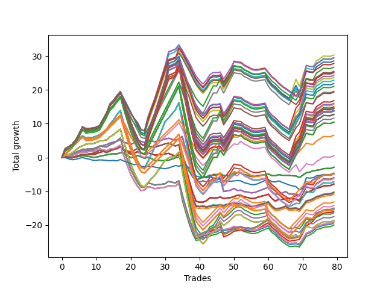

# Long Bulldog 005 
- Symbol: AAPL_Unlimited
- Date Range: 03/23/2022 - 07/08/2022
- Trading Period: 7:20-12:30
- Number of Trades: 79



| Name | Win Percent | Profit | Avg Profit / Trade | Avg Time / Trade |      | Name | Win Percent | Profit | Avg Profit / Trade | Avg Time / Trade |
| ---- | ----------- | ------ | ------------------ | ---------------- | ---- | ---- | ----------- | ------ | ------------------ | ---------------- |
| Sorted By <br> Profit | | | | | | Sorted By <br> Win Percentage ||||
| Ninety-Three | 55.70 | 15165.00 | 191.96 | 143:19 |     | Sixty-Six | 64.56 | -2395.00 | -30.32 | 30:35 |
| Ninety-Four | 55.70 | 14770.00 | 186.96 | 148:31 |     | Fifty-Eight | 64.56 | -2395.00 | -30.32 | 30:35 |
| Ninety-Nine | 54.43 | 14705.00 | 186.14 | 143:10 |     | Fifty | 64.56 | -2395.00 | -30.32 | 30:35 |
| Ninety-Five | 55.70 | 14285.00 | 180.82 | 149:55 |     | Forty-Two | 64.56 | -2395.00 | -30.32 | 30:35 |
| Ninety-Eight | 54.43 | 13910.00 | 176.08 | 138:26 |     | Two | 64.56 | -2395.00 | -30.32 | 30:35 |
| Ninety-Seven | 54.43 | 13355.00 | 169.05 | 121:32 |     | Sixty-Five | 63.29 | -3930.00 | -49.75 | 21:50 |
| Ninety-Two | 55.70 | 12735.00 | 161.20 | 124:21 |     | Fifty-Seven | 63.29 | -3930.00 | -49.75 | 21:50 |
| One Hundred | 54.43 | 12670.00 | 160.38 | 143:42 |     | Forty-Nine | 63.29 | -3930.00 | -49.75 | 21:50 |
| One Hundred Eight | 56.96 | 12550.00 | 158.86 | 148:10 |     | Forty-One | 63.29 | -3930.00 | -49.75 | 21:50 |
| One Hundred Nine | 56.96 | 12155.00 | 153.86 | 153:23 |     | One | 63.29 | -3930.00 | -49.75 | 21:50 |
| One Hundred Three | 56.96 | 11825.00 | 149.68 | 150:05 |     | Fifty-One | 62.03 | -5110.00 | -64.68 | 31:11 |
| One Hundred Four | 56.96 | 11430.00 | 144.68 | 155:18 |     | Sixty-Seven | 62.03 | -5185.00 | -65.63 | 31:44 |
| One Hundred Five | 56.96 | 10945.00 | 138.54 | 156:41 |     | Fifty-Nine | 62.03 | -5185.00 | -65.63 | 31:44 |
| One Hundred Seven | 56.96 | 10520.00 | 133.16 | 128:59 |     | Three | 62.03 | -5185.00 | -65.63 | 31:44 |
| One Hundred Two | 56.96 | 9795.00 | 123.99 | 130:54 |     | Forty-Three | 62.03 | -5435.00 | -68.80 | 31:17 |
| One Hundred Ten | 56.96 | 9655.00 | 122.22 | 154:13 |     | Sixty-Nine | 60.76 | -7510.00 | -95.06 | 66:41 |
| One Hundred Eighteen | 56.96 | 8390.00 | 106.20 | 160:37 |     | Sixty-One | 60.76 | -7510.00 | -95.06 | 66:41 |
| One Hundred Ninteen | 56.96 | 7995.00 | 101.20 | 165:50 |     | Five | 60.76 | -7510.00 | -95.06 | 66:41 |
| One Hundred Thirteen | 56.96 | 7845.00 | 99.30 | 160:51 |     | Fifty-Three | 60.76 | -7640.00 | -96.71 | 66:00 |
| One Hundred Twenty | 56.96 | 7510.00 | 95.06 | 167:13 |     | Forty-Five | 60.76 | -7965.00 | -100.82 | 66:05 |
| One Hundred Fourteen | 56.96 | 7450.00 | 94.30 | 166:04 |     | Fifty-Four | 60.76 | -8195.00 | -103.73 | 102:16 |
| One Hundred Twenty-Eight | 56.96 | 7255.00 | 91.84 | 163:17 |     | Forty-Six | 60.76 | -8740.00 | -110.63 | 102:30 |
| One Hundred Twenty-Three | 56.96 | 7255.00 | 91.84 | 163:17 |     | Seventy | 60.76 | -9330.00 | -118.10 | 104:56 |
| Eighty-Three | 56.96 | 7255.00 | 91.84 | 163:17 |     | Sixty-Two | 60.76 | -9330.00 | -118.10 | 104:56 |
| One Hundred Fifteen | 56.96 | 6965.00 | 88.16 | 167:27 |     | Six | 60.76 | -9330.00 | -118.10 | 104:56 |
| One Hundred Twenty-Nine | 56.96 | 6860.00 | 86.84 | 168:30 |     | Ninety-Six | 59.49 | 3280.00 | 41.52 | 97:37 |
| One Hundred Twenty-Four | 56.96 | 6860.00 | 86.84 | 168:30 |     | One Hundred Six | 59.49 | -2410.00 | -30.51 | 103:45 |
| Eighty-Four | 56.96 | 6860.00 | 86.84 | 168:30 |     | One Hundred One | 59.49 | -3135.00 | -39.68 | 105:41 |
| One Hundred Thirty | 56.96 | 6375.00 | 80.70 | 169:54 |     | One Hundred Sixteen | 59.49 | -6570.00 | -83.16 | 116:13 |
| One Hundred Twenty-Five | 56.96 | 6375.00 | 80.70 | 169:54 |     | One Hundred Eleven | 59.49 | -7115.00 | -90.06 | 116:27 |
| Eighty-Five | 56.96 | 6375.00 | 80.70 | 169:54 |     | One Hundred Twenty-Six | 59.49 | -7705.00 | -97.53 | 118:53 |
| One Hundred Seventeen | 56.96 | 6360.00 | 80.51 | 141:27 |     | One Hundred Twenty-One | 59.49 | -7705.00 | -97.53 | 118:53 |
| One Hundred Twelve | 56.96 | 5815.00 | 73.61 | 141:41 |     | Eighty-One | 59.49 | -7705.00 | -97.53 | 118:53 |
| One Hundred Twenty-Seven | 56.96 | 5225.00 | 66.14 | 144:07 |     | Ninety-One | 58.23 | 245.00 | 3.10 | 99:44 |
| One Hundred Twenty-Two | 56.96 | 5225.00 | 66.14 | 144:07 |     | Sixty-Eight | 58.23 | -9525.00 | -120.57 | 55:42 |
| Eighty-Two | 56.96 | 5225.00 | 66.14 | 144:07 |     | Sixty | 58.23 | -9525.00 | -120.57 | 55:42 |
| Ninety-Six | 59.49 | 3280.00 | 41.52 | 97:37 |     | Four | 58.23 | -9525.00 | -120.57 | 55:42 |
| Ninety-One | 58.23 | 245.00 | 3.10 | 99:44 |     | Fifty-Two | 58.23 | -9675.00 | -122.47 | 55:08 |
| Sixty-Four | 56.96 | -1450.00 | -18.35 | 13:08 |     | Forty-Four | 58.23 | -10000.00 | -126.58 | 55:13 |
| Fifty-Six | 56.96 | -1450.00 | -18.35 | 13:08 |     | One Hundred Eight | 56.96 | 12550.00 | 158.86 | 148:10 |
| Forty-Eight | 56.96 | -1450.00 | -18.35 | 13:08 |     | One Hundred Nine | 56.96 | 12155.00 | 153.86 | 153:23 |
| Forty | 56.96 | -1450.00 | -18.35 | 13:08 |     | One Hundred Three | 56.96 | 11825.00 | 149.68 | 150:05 |
| Zero | 56.96 | -1450.00 | -18.35 | 13:08 |     | One Hundred Four | 56.96 | 11430.00 | 144.68 | 155:18 |
| Seventy-Three | 37.97 | -2315.00 | -29.30 | 13:31 |     | One Hundred Five | 56.96 | 10945.00 | 138.54 | 156:41 |
| Sixty-Six | 64.56 | -2395.00 | -30.32 | 30:35 |     | One Hundred Seven | 56.96 | 10520.00 | 133.16 | 128:59 |
| Fifty-Eight | 64.56 | -2395.00 | -30.32 | 30:35 |     | One Hundred Two | 56.96 | 9795.00 | 123.99 | 130:54 |
| Fifty | 64.56 | -2395.00 | -30.32 | 30:35 |     | One Hundred Ten | 56.96 | 9655.00 | 122.22 | 154:13 |
| Forty-Two | 64.56 | -2395.00 | -30.32 | 30:35 |     | One Hundred Eighteen | 56.96 | 8390.00 | 106.20 | 160:37 |
| Two | 64.56 | -2395.00 | -30.32 | 30:35 |     | One Hundred Ninteen | 56.96 | 7995.00 | 101.20 | 165:50 |
| One Hundred Six | 59.49 | -2410.00 | -30.51 | 103:45 |     | One Hundred Thirteen | 56.96 | 7845.00 | 99.30 | 160:51 |
| Fifty-Five | 55.70 | -2460.00 | -31.14 | 120:30 |     | One Hundred Twenty | 56.96 | 7510.00 | 95.06 | 167:13 |
| Forty-Seven | 55.70 | -3005.00 | -38.04 | 120:44 |     | One Hundred Fourteen | 56.96 | 7450.00 | 94.30 | 166:04 |
| One Hundred One | 59.49 | -3135.00 | -39.68 | 105:41 |     | One Hundred Twenty-Eight | 56.96 | 7255.00 | 91.84 | 163:17 |
| Seventy-One | 55.70 | -3595.00 | -45.51 | 123:10 |     | One Hundred Twenty-Three | 56.96 | 7255.00 | 91.84 | 163:17 |
| Sixty-Three | 55.70 | -3595.00 | -45.51 | 123:10 |     | Eighty-Three | 56.96 | 7255.00 | 91.84 | 163:17 |
| Seven | 55.70 | -3595.00 | -45.51 | 123:10 |     | One Hundred Fifteen | 56.96 | 6965.00 | 88.16 | 167:27 |
| Sixty-Five | 63.29 | -3930.00 | -49.75 | 21:50 |     | One Hundred Twenty-Nine | 56.96 | 6860.00 | 86.84 | 168:30 |
| Fifty-Seven | 63.29 | -3930.00 | -49.75 | 21:50 |     | One Hundred Twenty-Four | 56.96 | 6860.00 | 86.84 | 168:30 |
| Forty-Nine | 63.29 | -3930.00 | -49.75 | 21:50 |     | Eighty-Four | 56.96 | 6860.00 | 86.84 | 168:30 |
| Forty-One | 63.29 | -3930.00 | -49.75 | 21:50 |     | One Hundred Thirty | 56.96 | 6375.00 | 80.70 | 169:54 |
| One | 63.29 | -3930.00 | -49.75 | 21:50 |     | One Hundred Twenty-Five | 56.96 | 6375.00 | 80.70 | 169:54 |
| Fifty-One | 62.03 | -5110.00 | -64.68 | 31:11 |     | Eighty-Five | 56.96 | 6375.00 | 80.70 | 169:54 |
| Sixty-Seven | 62.03 | -5185.00 | -65.63 | 31:44 |     | One Hundred Seventeen | 56.96 | 6360.00 | 80.51 | 141:27 |
| Fifty-Nine | 62.03 | -5185.00 | -65.63 | 31:44 |     | One Hundred Twelve | 56.96 | 5815.00 | 73.61 | 141:41 |
| Three | 62.03 | -5185.00 | -65.63 | 31:44 |     | One Hundred Twenty-Seven | 56.96 | 5225.00 | 66.14 | 144:07 |
| Forty-Three | 62.03 | -5435.00 | -68.80 | 31:17 |     | One Hundred Twenty-Two | 56.96 | 5225.00 | 66.14 | 144:07 |
| One Hundred Sixteen | 59.49 | -6570.00 | -83.16 | 116:13 |     | Eighty-Two | 56.96 | 5225.00 | 66.14 | 144:07 |
| One Hundred Eleven | 59.49 | -7115.00 | -90.06 | 116:27 |     | Sixty-Four | 56.96 | -1450.00 | -18.35 | 13:08 |
| Sixty-Nine | 60.76 | -7510.00 | -95.06 | 66:41 |     | Fifty-Six | 56.96 | -1450.00 | -18.35 | 13:08 |
| Sixty-One | 60.76 | -7510.00 | -95.06 | 66:41 |     | Forty-Eight | 56.96 | -1450.00 | -18.35 | 13:08 |
| Five | 60.76 | -7510.00 | -95.06 | 66:41 |     | Forty | 56.96 | -1450.00 | -18.35 | 13:08 |
| Fifty-Three | 60.76 | -7640.00 | -96.71 | 66:00 |     | Zero | 56.96 | -1450.00 | -18.35 | 13:08 |
| One Hundred Twenty-Six | 59.49 | -7705.00 | -97.53 | 118:53 |     | Ninety-Three | 55.70 | 15165.00 | 191.96 | 143:19 |
| One Hundred Twenty-One | 59.49 | -7705.00 | -97.53 | 118:53 |     | Ninety-Four | 55.70 | 14770.00 | 186.96 | 148:31 |
| Eighty-One | 59.49 | -7705.00 | -97.53 | 118:53 |     | Ninety-Five | 55.70 | 14285.00 | 180.82 | 149:55 |
| Forty-Five | 60.76 | -7965.00 | -100.82 | 66:05 |     | Ninety-Two | 55.70 | 12735.00 | 161.20 | 124:21 |
| Fifty-Four | 60.76 | -8195.00 | -103.73 | 102:16 |     | Fifty-Five | 55.70 | -2460.00 | -31.14 | 120:30 |
| Forty-Six | 60.76 | -8740.00 | -110.63 | 102:30 |     | Forty-Seven | 55.70 | -3005.00 | -38.04 | 120:44 |
| Seventy | 60.76 | -9330.00 | -118.10 | 104:56 |     | Seventy-One | 55.70 | -3595.00 | -45.51 | 123:10 |
| Sixty-Two | 60.76 | -9330.00 | -118.10 | 104:56 |     | Sixty-Three | 55.70 | -3595.00 | -45.51 | 123:10 |
| Six | 60.76 | -9330.00 | -118.10 | 104:56 |     | Seven | 55.70 | -3595.00 | -45.51 | 123:10 |
| Sixty-Eight | 58.23 | -9525.00 | -120.57 | 55:42 |     | Ninety-Nine | 54.43 | 14705.00 | 186.14 | 143:10 |
| Sixty | 58.23 | -9525.00 | -120.57 | 55:42 |     | Ninety-Eight | 54.43 | 13910.00 | 176.08 | 138:26 |
| Four | 58.23 | -9525.00 | -120.57 | 55:42 |     | Ninety-Seven | 54.43 | 13355.00 | 169.05 | 121:32 |
| Fifty-Two | 58.23 | -9675.00 | -122.47 | 55:08 |     | One Hundred | 54.43 | 12670.00 | 160.38 | 143:42 |
| Forty-Four | 58.23 | -10000.00 | -126.58 | 55:13 |     | Seventy-Three | 37.97 | -2315.00 | -29.30 | 13:31 |

## NO STOPLOSS

### Test Zero
* Sell when price hits the middle line of the 20p bollinger
* No Stoploss
* Results:
```
Total Trades: 79
Percent Up: 56.96
Percent Down: 43.04
Total Points Moved Up: -2.90
Potential Profit: -1450.00
Total Points Ups: 11.69 Count Ups: 45
Total Points Downs: -14.59 Count Downs: 34
```

<details><summary>Trades</summary>

<code>In: 2022-03-24 07:22:00		Out: 2022-03-24 07:32:45		Total Position Time: 10:45		Total Move Up: 0.11		Total to Date: 0.11</code> <br />
<code>In: 2022-03-25 08:12:00		Out: 2022-03-25 08:30:30		Total Position Time: 18:30		Total Move Up: -0.17		Total to Date: -0.06</code> <br />
<code>In: 2022-03-25 08:14:00		Out: 2022-03-25 08:30:30		Total Position Time: 16:30		Total Move Up: -0.07		Total to Date: -0.13</code> <br />
<code>In: 2022-03-25 08:59:00		Out: 2022-03-25 09:05:05		Total Position Time: 06:05		Total Move Up: 0.29		Total to Date: 0.16</code> <br />
<code>In: 2022-03-28 08:51:00		Out: 2022-03-28 09:01:40		Total Position Time: 10:40		Total Move Up: 0.14		Total to Date: 0.30</code> <br />
<code>In: 2022-03-29 09:36:00		Out: 2022-03-29 09:43:15		Total Position Time: 07:15		Total Move Up: 0.24		Total to Date: 0.54</code> <br />
<code>In: 2022-03-30 07:58:00		Out: 2022-03-30 08:15:55		Total Position Time: 17:55		Total Move Up: -0.18		Total to Date: 0.36</code> <br />
<code>In: 2022-03-30 12:13:00		Out: 2022-03-30 12:28:10		Total Position Time: 15:10		Total Move Up: -0.09		Total to Date: 0.27</code> <br />
<code>In: 2022-03-30 12:14:00		Out: 2022-03-30 12:28:10		Total Position Time: 14:10		Total Move Up: -0.23		Total to Date: 0.04</code> <br />
<code>In: 2022-03-30 12:20:00		Out: 2022-03-30 12:28:10		Total Position Time: 08:10		Total Move Up: 0.06		Total to Date: 0.10</code> <br />
<code>In: 2022-03-30 12:22:00		Out: 2022-03-30 12:28:10		Total Position Time: 06:10		Total Move Up: 0.23		Total to Date: 0.33</code> <br />
<code>In: 2022-04-07 07:42:00		Out: 2022-04-07 07:54:30		Total Position Time: 12:30		Total Move Up: 0.23		Total to Date: 0.56</code> <br />
<code>In: 2022-04-07 07:43:00		Out: 2022-04-07 07:54:30		Total Position Time: 11:30		Total Move Up: 0.20		Total to Date: 0.76</code> <br />
<code>In: 2022-04-07 08:35:00		Out: 2022-04-07 08:45:45		Total Position Time: 10:45		Total Move Up: 0.23		Total to Date: 0.99</code> <br />
<code>In: 2022-04-20 08:21:00		Out: 2022-04-20 08:29:20		Total Position Time: 08:20		Total Move Up: 0.09		Total to Date: 1.08</code> <br />
<code>In: 2022-04-20 09:14:00		Out: 2022-04-20 09:27:10		Total Position Time: 13:10		Total Move Up: -0.02		Total to Date: 1.06</code> <br />
<code>In: 2022-04-20 11:56:00		Out: 2022-04-20 11:59:10		Total Position Time: 03:10		Total Move Up: 0.31		Total to Date: 1.37</code> <br />
<code>In: 2022-04-21 09:47:00		Out: 2022-04-21 09:48:10		Total Position Time: 01:10		Total Move Up: -0.12		Total to Date: 1.25</code> <br />
<code>In: 2022-04-21 09:54:00		Out: 2022-04-21 10:21:40		Total Position Time: 27:40		Total Move Up: -0.64		Total to Date: 0.61</code> <br />
<code>In: 2022-04-21 09:56:00		Out: 2022-04-21 10:21:40		Total Position Time: 25:40		Total Move Up: -0.67		Total to Date: -0.06</code> <br />
<code>In: 2022-04-21 10:11:00		Out: 2022-04-21 10:21:40		Total Position Time: 10:40		Total Move Up: 0.17		Total to Date: 0.11</code> <br />
<code>In: 2022-04-21 10:21:00		Out: 2022-04-21 10:22:10		Total Position Time: 01:10		Total Move Up: 0.46		Total to Date: 0.57</code> <br />
<code>In: 2022-04-21 11:00:00		Out: 2022-04-21 11:21:05		Total Position Time: 21:05		Total Move Up: -0.39		Total to Date: 0.18</code> <br />
<code>In: 2022-04-21 11:47:00		Out: 2022-04-21 12:13:55		Total Position Time: 26:55		Total Move Up: -0.43		Total to Date: -0.25</code> <br />
<code>In: 2022-04-25 08:51:00		Out: 2022-04-25 08:57:40		Total Position Time: 06:40		Total Move Up: 0.33		Total to Date: 0.08</code> <br />
<code>In: 2022-05-02 10:30:00		Out: 2022-05-02 10:59:55		Total Position Time: 29:55		Total Move Up: -0.38		Total to Date: -0.30</code> <br />
<code>In: 2022-05-02 10:31:00		Out: 2022-05-02 10:59:55		Total Position Time: 28:55		Total Move Up: -0.56		Total to Date: -0.86</code> <br />
<code>In: 2022-05-02 10:48:00		Out: 2022-05-02 10:59:55		Total Position Time: 11:55		Total Move Up: -0.03		Total to Date: -0.89</code> <br />
<code>In: 2022-05-02 10:49:00		Out: 2022-05-02 10:59:55		Total Position Time: 10:55		Total Move Up: -0.06		Total to Date: -0.95</code> <br />
<code>In: 2022-05-02 10:51:00		Out: 2022-05-02 10:59:55		Total Position Time: 08:55		Total Move Up: -0.01		Total to Date: -0.96</code> <br />
<code>In: 2022-05-04 08:14:00		Out: 2022-05-04 08:23:05		Total Position Time: 09:05		Total Move Up: 0.13		Total to Date: -0.83</code> <br />
<code>In: 2022-05-10 07:50:00		Out: 2022-05-10 07:58:05		Total Position Time: 08:05		Total Move Up: 0.35		Total to Date: -0.48</code> <br />
<code>In: 2022-05-10 07:52:00		Out: 2022-05-10 07:58:05		Total Position Time: 06:05		Total Move Up: 0.38		Total to Date: -0.10</code> <br />
<code>In: 2022-05-10 08:11:00		Out: 2022-05-10 08:19:40		Total Position Time: 08:40		Total Move Up: 0.23		Total to Date: 0.13</code> <br />
<code>In: 2022-05-11 09:12:00		Out: 2022-05-11 09:16:15		Total Position Time: 04:15		Total Move Up: 0.38		Total to Date: 0.51</code> <br />
<code>In: 2022-05-11 09:32:00		Out: 2022-05-11 10:25:15		Total Position Time: 53:15		Total Move Up: -2.41		Total to Date: -1.90</code> <br />
<code>In: 2022-05-11 09:35:00		Out: 2022-05-11 10:25:15		Total Position Time: 50:15		Total Move Up: -2.15		Total to Date: -4.05</code> <br />
<code>In: 2022-05-11 09:54:00		Out: 2022-05-11 10:25:15		Total Position Time: 31:15		Total Move Up: -1.70		Total to Date: -5.75</code> <br />
<code>In: 2022-05-11 09:59:00		Out: 2022-05-11 10:25:15		Total Position Time: 26:15		Total Move Up: -0.85		Total to Date: -6.60</code> <br />
<code>In: 2022-05-11 10:43:00		Out: 2022-05-11 10:53:15		Total Position Time: 10:15		Total Move Up: 0.28		Total to Date: -6.32</code> <br />
<code>In: 2022-05-11 10:45:00		Out: 2022-05-11 10:53:15		Total Position Time: 08:15		Total Move Up: 0.56		Total to Date: -5.76</code> <br />
<code>In: 2022-05-12 11:07:00		Out: 2022-05-12 11:18:45		Total Position Time: 11:45		Total Move Up: 0.03		Total to Date: -5.73</code> <br />
<code>In: 2022-05-12 11:11:00		Out: 2022-05-12 11:18:45		Total Position Time: 07:45		Total Move Up: 0.50		Total to Date: -5.23</code> <br />
<code>In: 2022-05-16 07:52:00		Out: 2022-05-16 08:05:10		Total Position Time: 13:10		Total Move Up: -0.08		Total to Date: -5.31</code> <br />
<code>In: 2022-05-19 10:12:00		Out: 2022-05-19 10:23:30		Total Position Time: 11:30		Total Move Up: 0.16		Total to Date: -5.15</code> <br />
<code>In: 2022-05-19 10:15:00		Out: 2022-05-19 10:23:30		Total Position Time: 08:30		Total Move Up: 0.47		Total to Date: -4.68</code> <br />
<code>In: 2022-05-20 07:53:00		Out: 2022-05-20 08:26:20		Total Position Time: 33:20		Total Move Up: -0.72		Total to Date: -5.40</code> <br />
<code>In: 2022-05-25 09:29:00		Out: 2022-05-25 09:44:25		Total Position Time: 15:25		Total Move Up: 0.07		Total to Date: -5.33</code> <br />
<code>In: 2022-05-25 10:08:00		Out: 2022-05-25 10:15:55		Total Position Time: 07:55		Total Move Up: 0.06		Total to Date: -5.27</code> <br />
<code>In: 2022-05-25 10:14:00		Out: 2022-05-25 10:15:55		Total Position Time: 01:55		Total Move Up: 0.33		Total to Date: -4.94</code> <br />
<code>In: 2022-06-03 07:40:00		Out: 2022-06-03 07:48:10		Total Position Time: 08:10		Total Move Up: 0.39		Total to Date: -4.55</code> <br />
<code>In: 2022-06-06 09:06:00		Out: 2022-06-06 09:19:45		Total Position Time: 13:45		Total Move Up: 0.04		Total to Date: -4.51</code> <br />
<code>In: 2022-06-08 09:29:00		Out: 2022-06-08 09:56:55		Total Position Time: 27:55		Total Move Up: -0.57		Total to Date: -5.08</code> <br />
<code>In: 2022-06-08 09:34:00		Out: 2022-06-08 09:56:55		Total Position Time: 22:55		Total Move Up: -0.23		Total to Date: -5.31</code> <br />
<code>In: 2022-06-08 09:35:00		Out: 2022-06-08 09:56:55		Total Position Time: 21:55		Total Move Up: -0.34		Total to Date: -5.65</code> <br />
<code>In: 2022-06-08 09:41:00		Out: 2022-06-08 09:56:55		Total Position Time: 15:55		Total Move Up: -0.01		Total to Date: -5.66</code> <br />
<code>In: 2022-06-08 09:46:00		Out: 2022-06-08 09:56:55		Total Position Time: 10:55		Total Move Up: 0.28		Total to Date: -5.38</code> <br />
<code>In: 2022-06-08 10:33:00		Out: 2022-06-08 10:41:55		Total Position Time: 08:55		Total Move Up: 0.15		Total to Date: -5.23</code> <br />
<code>In: 2022-06-08 10:35:00		Out: 2022-06-08 10:41:55		Total Position Time: 06:55		Total Move Up: 0.11		Total to Date: -5.12</code> <br />
<code>In: 2022-06-09 08:09:00		Out: 2022-06-09 08:10:35		Total Position Time: 01:35		Total Move Up: 0.26		Total to Date: -4.86</code> <br />
<code>In: 2022-06-09 12:03:00		Out: 2022-06-09 12:24:30		Total Position Time: 21:30		Total Move Up: -0.52		Total to Date: -5.38</code> <br />
<code>In: 2022-06-09 12:09:00		Out: 2022-06-09 12:24:30		Total Position Time: 15:30		Total Move Up: -0.04		Total to Date: -5.42</code> <br />
<code>In: 2022-06-13 11:34:00		Out: 2022-06-13 11:36:45		Total Position Time: 02:45		Total Move Up: 0.35		Total to Date: -5.07</code> <br />
<code>In: 2022-06-13 11:59:00		Out: 2022-06-13 12:16:50		Total Position Time: 17:50		Total Move Up: -0.21		Total to Date: -5.28</code> <br />
<code>In: 2022-06-13 12:08:00		Out: 2022-06-13 12:16:50		Total Position Time: 08:50		Total Move Up: 0.01		Total to Date: -5.27</code> <br />
<code>In: 2022-06-13 12:17:00		Out: 2022-06-13 12:18:10		Total Position Time: 01:10		Total Move Up: -0.02		Total to Date: -5.29</code> <br />
<code>In: 2022-06-15 07:33:00		Out: 2022-06-15 07:50:15		Total Position Time: 17:15		Total Move Up: -0.14		Total to Date: -5.43</code> <br />
<code>In: 2022-06-15 07:37:00		Out: 2022-06-15 07:50:15		Total Position Time: 13:15		Total Move Up: -0.04		Total to Date: -5.47</code> <br />
<code>In: 2022-06-15 11:01:00		Out: 2022-06-15 11:02:15		Total Position Time: 01:15		Total Move Up: -0.48		Total to Date: -5.95</code> <br />
<code>In: 2022-06-15 11:08:00		Out: 2022-06-15 11:16:00		Total Position Time: 08:00		Total Move Up: 0.72		Total to Date: -5.23</code> <br />
<code>In: 2022-06-15 11:34:00		Out: 2022-06-15 11:37:10		Total Position Time: 03:10		Total Move Up: 0.69		Total to Date: -4.54</code> <br />
<code>In: 2022-06-16 11:50:00		Out: 2022-06-16 12:00:25		Total Position Time: 10:25		Total Move Up: 0.18		Total to Date: -4.36</code> <br />
<code>In: 2022-06-16 11:55:00		Out: 2022-06-16 12:00:25		Total Position Time: 05:25		Total Move Up: 0.40		Total to Date: -3.96</code> <br />
<code>In: 2022-06-17 07:50:00		Out: 2022-06-17 07:55:10		Total Position Time: 05:10		Total Move Up: 0.16		Total to Date: -3.80</code> <br />
<code>In: 2022-06-24 08:19:00		Out: 2022-06-24 08:26:15		Total Position Time: 07:15		Total Move Up: 0.16		Total to Date: -3.64</code> <br />
<code>In: 2022-06-24 08:21:00		Out: 2022-06-24 08:26:15		Total Position Time: 05:15		Total Move Up: 0.31		Total to Date: -3.33</code> <br />
<code>In: 2022-06-27 10:50:00		Out: 2022-06-27 11:03:15		Total Position Time: 13:15		Total Move Up: 0.08		Total to Date: -3.25</code> <br />
<code>In: 2022-06-27 12:01:00		Out: 2022-06-27 12:10:30		Total Position Time: 09:30		Total Move Up: -0.03		Total to Date: -3.28</code> <br />
<code>In: 2022-06-27 12:07:00		Out: 2022-06-27 12:10:30		Total Position Time: 03:30		Total Move Up: 0.38		Total to Date: -2.90</code> <br />


</details>

### Test One
* Sell when the price hits the upper line of the 20p 1std bollinger
* No Stoploss
* Results:
```
Total Trades: 79
Percent Up: 63.29
Percent Down: 36.71
Total Points Moved Up: -7.86
Potential Profit: -3930.00
Total Points Ups: 15.83 Count Ups: 50
Total Points Downs: -23.69 Count Downs: 29
```

<details><summary>Trades</summary>

<code>In: 2022-03-24 07:22:00		Out: 2022-03-24 07:34:15		Total Position Time: 12:15		Total Move Up: 0.33		Total to Date: 0.33</code> <br />
<code>In: 2022-03-25 08:12:00		Out: 2022-03-25 08:41:25		Total Position Time: 29:25		Total Move Up: -0.24		Total to Date: 0.09</code> <br />
<code>In: 2022-03-25 08:14:00		Out: 2022-03-25 08:41:25		Total Position Time: 27:25		Total Move Up: -0.14		Total to Date: -0.05</code> <br />
<code>In: 2022-03-25 08:59:00		Out: 2022-03-25 09:06:05		Total Position Time: 07:05		Total Move Up: 0.38		Total to Date: 0.33</code> <br />
<code>In: 2022-03-28 08:51:00		Out: 2022-03-28 09:02:05		Total Position Time: 11:05		Total Move Up: 0.26		Total to Date: 0.59</code> <br />
<code>In: 2022-03-29 09:36:00		Out: 2022-03-29 09:45:05		Total Position Time: 09:05		Total Move Up: 0.36		Total to Date: 0.95</code> <br />
<code>In: 2022-03-30 07:58:00		Out: 2022-03-30 08:19:15		Total Position Time: 21:15		Total Move Up: -0.11		Total to Date: 0.84</code> <br />
<code>In: 2022-03-30 12:13:00		Out: 2022-03-30 12:31:35		Total Position Time: 18:35		Total Move Up: 0.08		Total to Date: 0.92</code> <br />
<code>In: 2022-03-30 12:14:00		Out: 2022-03-30 12:31:35		Total Position Time: 17:35		Total Move Up: -0.06		Total to Date: 0.86</code> <br />
<code>In: 2022-03-30 12:20:00		Out: 2022-03-30 12:31:35		Total Position Time: 11:35		Total Move Up: 0.23		Total to Date: 1.09</code> <br />
<code>In: 2022-03-30 12:22:00		Out: 2022-03-30 12:31:35		Total Position Time: 09:35		Total Move Up: 0.40		Total to Date: 1.49</code> <br />
<code>In: 2022-04-07 07:42:00		Out: 2022-04-07 08:00:05		Total Position Time: 18:05		Total Move Up: 0.27		Total to Date: 1.76</code> <br />
<code>In: 2022-04-07 07:43:00		Out: 2022-04-07 08:00:05		Total Position Time: 17:05		Total Move Up: 0.24		Total to Date: 2.00</code> <br />
<code>In: 2022-04-07 08:35:00		Out: 2022-04-07 08:47:05		Total Position Time: 12:05		Total Move Up: 0.34		Total to Date: 2.34</code> <br />
<code>In: 2022-04-20 08:21:00		Out: 2022-04-20 08:31:25		Total Position Time: 10:25		Total Move Up: 0.21		Total to Date: 2.55</code> <br />
<code>In: 2022-04-20 09:14:00		Out: 2022-04-20 09:28:45		Total Position Time: 14:45		Total Move Up: 0.09		Total to Date: 2.64</code> <br />
<code>In: 2022-04-20 11:56:00		Out: 2022-04-20 12:01:15		Total Position Time: 05:15		Total Move Up: 0.54		Total to Date: 3.18</code> <br />
<code>In: 2022-04-21 09:47:00		Out: 2022-04-21 10:28:50		Total Position Time: 41:50		Total Move Up: -1.08		Total to Date: 2.10</code> <br />
<code>In: 2022-04-21 09:54:00		Out: 2022-04-21 10:28:50		Total Position Time: 34:50		Total Move Up: -0.55		Total to Date: 1.55</code> <br />
<code>In: 2022-04-21 09:56:00		Out: 2022-04-21 10:28:50		Total Position Time: 32:50		Total Move Up: -0.58		Total to Date: 0.97</code> <br />
<code>In: 2022-04-21 10:11:00		Out: 2022-04-21 10:28:50		Total Position Time: 17:50		Total Move Up: 0.26		Total to Date: 1.23</code> <br />
<code>In: 2022-04-21 10:21:00		Out: 2022-04-21 10:28:50		Total Position Time: 07:50		Total Move Up: 0.49		Total to Date: 1.72</code> <br />
<code>In: 2022-04-21 11:00:00		Out: 2022-04-21 11:31:10		Total Position Time: 31:10		Total Move Up: -0.45		Total to Date: 1.27</code> <br />
<code>In: 2022-04-21 11:47:00		Out: 2022-04-21 12:15:05		Total Position Time: 28:05		Total Move Up: -0.32		Total to Date: 0.95</code> <br />
<code>In: 2022-04-25 08:51:00		Out: 2022-04-25 09:04:55		Total Position Time: 13:55		Total Move Up: 0.33		Total to Date: 1.28</code> <br />
<code>In: 2022-05-02 10:30:00		Out: 2022-05-02 11:02:15		Total Position Time: 32:15		Total Move Up: -0.21		Total to Date: 1.07</code> <br />
<code>In: 2022-05-02 10:31:00		Out: 2022-05-02 11:02:15		Total Position Time: 31:15		Total Move Up: -0.39		Total to Date: 0.68</code> <br />
<code>In: 2022-05-02 10:48:00		Out: 2022-05-02 11:02:15		Total Position Time: 14:15		Total Move Up: 0.14		Total to Date: 0.82</code> <br />
<code>In: 2022-05-02 10:49:00		Out: 2022-05-02 11:02:15		Total Position Time: 13:15		Total Move Up: 0.11		Total to Date: 0.93</code> <br />
<code>In: 2022-05-02 10:51:00		Out: 2022-05-02 11:02:15		Total Position Time: 11:15		Total Move Up: 0.16		Total to Date: 1.09</code> <br />
<code>In: 2022-05-04 08:14:00		Out: 2022-05-04 08:34:55		Total Position Time: 20:55		Total Move Up: 0.10		Total to Date: 1.19</code> <br />
<code>In: 2022-05-10 07:50:00		Out: 2022-05-10 08:23:05		Total Position Time: 33:05		Total Move Up: -0.41		Total to Date: 0.78</code> <br />
<code>In: 2022-05-10 07:52:00		Out: 2022-05-10 08:23:05		Total Position Time: 31:05		Total Move Up: -0.38		Total to Date: 0.40</code> <br />
<code>In: 2022-05-10 08:11:00		Out: 2022-05-10 08:23:05		Total Position Time: 12:05		Total Move Up: 0.44		Total to Date: 0.84</code> <br />
<code>In: 2022-05-11 09:12:00		Out: 2022-05-11 09:21:15		Total Position Time: 09:15		Total Move Up: 0.41		Total to Date: 1.25</code> <br />
<code>In: 2022-05-11 09:32:00		Out: 2022-05-11 11:18:35		Total Position Time: 106:35		Total Move Up: -4.19		Total to Date: -2.94</code> <br />
<code>In: 2022-05-11 09:35:00		Out: 2022-05-11 11:18:35		Total Position Time: 103:35		Total Move Up: -3.93		Total to Date: -6.87</code> <br />
<code>In: 2022-05-11 09:54:00		Out: 2022-05-11 11:18:35		Total Position Time: 84:35		Total Move Up: -3.48		Total to Date: -10.35</code> <br />
<code>In: 2022-05-11 09:59:00		Out: 2022-05-11 11:18:35		Total Position Time: 79:35		Total Move Up: -2.63		Total to Date: -12.98</code> <br />
<code>In: 2022-05-11 10:43:00		Out: 2022-05-11 11:18:35		Total Position Time: 35:35		Total Move Up: -0.26		Total to Date: -13.24</code> <br />
<code>In: 2022-05-11 10:45:00		Out: 2022-05-11 11:18:35		Total Position Time: 33:35		Total Move Up: 0.02		Total to Date: -13.22</code> <br />
<code>In: 2022-05-12 11:07:00		Out: 2022-05-12 11:20:35		Total Position Time: 13:35		Total Move Up: 0.41		Total to Date: -12.81</code> <br />
<code>In: 2022-05-12 11:11:00		Out: 2022-05-12 11:20:35		Total Position Time: 09:35		Total Move Up: 0.88		Total to Date: -11.93</code> <br />
<code>In: 2022-05-16 07:52:00		Out: 2022-05-16 08:09:30		Total Position Time: 17:30		Total Move Up: -0.05		Total to Date: -11.98</code> <br />
<code>In: 2022-05-19 10:12:00		Out: 2022-05-19 10:31:50		Total Position Time: 19:50		Total Move Up: -0.02		Total to Date: -12.00</code> <br />
<code>In: 2022-05-19 10:15:00		Out: 2022-05-19 10:31:50		Total Position Time: 16:50		Total Move Up: 0.29		Total to Date: -11.71</code> <br />
<code>In: 2022-05-20 07:53:00		Out: 2022-05-20 08:27:15		Total Position Time: 34:15		Total Move Up: -0.41		Total to Date: -12.12</code> <br />
<code>In: 2022-05-25 09:29:00		Out: 2022-05-25 09:45:15		Total Position Time: 16:15		Total Move Up: 0.12		Total to Date: -12.00</code> <br />
<code>In: 2022-05-25 10:08:00		Out: 2022-05-25 10:27:00		Total Position Time: 19:00		Total Move Up: 0.09		Total to Date: -11.91</code> <br />
<code>In: 2022-05-25 10:14:00		Out: 2022-05-25 10:27:00		Total Position Time: 13:00		Total Move Up: 0.36		Total to Date: -11.55</code> <br />
<code>In: 2022-06-03 07:40:00		Out: 2022-06-03 07:58:25		Total Position Time: 18:25		Total Move Up: 0.33		Total to Date: -11.22</code> <br />
<code>In: 2022-06-06 09:06:00		Out: 2022-06-06 09:24:10		Total Position Time: 18:10		Total Move Up: 0.01		Total to Date: -11.21</code> <br />
<code>In: 2022-06-08 09:29:00		Out: 2022-06-08 09:59:05		Total Position Time: 30:05		Total Move Up: -0.50		Total to Date: -11.71</code> <br />
<code>In: 2022-06-08 09:34:00		Out: 2022-06-08 09:59:05		Total Position Time: 25:05		Total Move Up: -0.16		Total to Date: -11.87</code> <br />
<code>In: 2022-06-08 09:35:00		Out: 2022-06-08 09:59:05		Total Position Time: 24:05		Total Move Up: -0.27		Total to Date: -12.14</code> <br />
<code>In: 2022-06-08 09:41:00		Out: 2022-06-08 09:59:05		Total Position Time: 18:05		Total Move Up: 0.06		Total to Date: -12.08</code> <br />
<code>In: 2022-06-08 09:46:00		Out: 2022-06-08 09:59:05		Total Position Time: 13:05		Total Move Up: 0.35		Total to Date: -11.73</code> <br />
<code>In: 2022-06-08 10:33:00		Out: 2022-06-08 10:45:05		Total Position Time: 12:05		Total Move Up: 0.28		Total to Date: -11.45</code> <br />
<code>In: 2022-06-08 10:35:00		Out: 2022-06-08 10:45:05		Total Position Time: 10:05		Total Move Up: 0.24		Total to Date: -11.21</code> <br />
<code>In: 2022-06-09 08:09:00		Out: 2022-06-09 08:11:10		Total Position Time: 02:10		Total Move Up: 0.33		Total to Date: -10.88</code> <br />
<code>In: 2022-06-09 12:03:00		Out: 2022-06-09 12:47:00		Total Position Time: 44:00		Total Move Up: -1.26		Total to Date: -12.14</code> <br />
<code>In: 2022-06-09 12:09:00		Out: 2022-06-09 12:47:00		Total Position Time: 38:00		Total Move Up: -0.78		Total to Date: -12.92</code> <br />
<code>In: 2022-06-13 11:34:00		Out: 2022-06-13 11:41:50		Total Position Time: 07:50		Total Move Up: 0.52		Total to Date: -12.40</code> <br />
<code>In: 2022-06-13 11:59:00		Out: 2022-06-13 12:17:10		Total Position Time: 18:10		Total Move Up: 0.01		Total to Date: -12.39</code> <br />
<code>In: 2022-06-13 12:08:00		Out: 2022-06-13 12:17:10		Total Position Time: 09:10		Total Move Up: 0.23		Total to Date: -12.16</code> <br />
<code>In: 2022-06-13 12:17:00		Out: 2022-06-13 12:20:15		Total Position Time: 03:15		Total Move Up: 0.07		Total to Date: -12.09</code> <br />
<code>In: 2022-06-15 07:33:00		Out: 2022-06-15 07:58:55		Total Position Time: 25:55		Total Move Up: -0.16		Total to Date: -12.25</code> <br />
<code>In: 2022-06-15 07:37:00		Out: 2022-06-15 07:58:55		Total Position Time: 21:55		Total Move Up: -0.06		Total to Date: -12.31</code> <br />
<code>In: 2022-06-15 11:01:00		Out: 2022-06-15 11:20:30		Total Position Time: 19:30		Total Move Up: -0.61		Total to Date: -12.92</code> <br />
<code>In: 2022-06-15 11:08:00		Out: 2022-06-15 11:20:30		Total Position Time: 12:30		Total Move Up: 1.19		Total to Date: -11.73</code> <br />
<code>In: 2022-06-15 11:34:00		Out: 2022-06-15 11:38:05		Total Position Time: 04:05		Total Move Up: 1.34		Total to Date: -10.39</code> <br />
<code>In: 2022-06-16 11:50:00		Out: 2022-06-16 12:01:35		Total Position Time: 11:35		Total Move Up: 0.34		Total to Date: -10.05</code> <br />
<code>In: 2022-06-16 11:55:00		Out: 2022-06-16 12:01:35		Total Position Time: 06:35		Total Move Up: 0.56		Total to Date: -9.49</code> <br />
<code>In: 2022-06-17 07:50:00		Out: 2022-06-17 07:56:15		Total Position Time: 06:15		Total Move Up: 0.33		Total to Date: -9.16</code> <br />
<code>In: 2022-06-24 08:19:00		Out: 2022-06-24 08:29:40		Total Position Time: 10:40		Total Move Up: 0.28		Total to Date: -8.88</code> <br />
<code>In: 2022-06-24 08:21:00		Out: 2022-06-24 08:29:40		Total Position Time: 08:40		Total Move Up: 0.43		Total to Date: -8.45</code> <br />
<code>In: 2022-06-27 10:50:00		Out: 2022-06-27 11:05:00		Total Position Time: 15:00		Total Move Up: 0.10		Total to Date: -8.35</code> <br />
<code>In: 2022-06-27 12:01:00		Out: 2022-06-27 12:13:05		Total Position Time: 12:05		Total Move Up: 0.04		Total to Date: -8.31</code> <br />
<code>In: 2022-06-27 12:07:00		Out: 2022-06-27 12:13:05		Total Position Time: 06:05		Total Move Up: 0.45		Total to Date: -7.86</code> <br />


</details>

### Test Two
* Sell when the price hits the upper line of the 20p 2std bollinger
* No Stoploss
* Results:
```
Total Trades: 79
Percent Up: 64.56
Percent Down: 35.44
Total Points Moved Up: -4.79
Potential Profit: -2395.00
Total Points Ups: 20.41 Count Ups: 51
Total Points Downs: -25.20 Count Downs: 28
```

<details><summary>Trades</summary>

<code>In: 2022-03-24 07:22:00		Out: 2022-03-24 07:45:45		Total Position Time: 23:45		Total Move Up: 0.66		Total to Date: 0.66</code> <br />
<code>In: 2022-03-25 08:12:00		Out: 2022-03-25 08:42:05		Total Position Time: 30:05		Total Move Up: -0.14		Total to Date: 0.52</code> <br />
<code>In: 2022-03-25 08:14:00		Out: 2022-03-25 08:42:05		Total Position Time: 28:05		Total Move Up: -0.04		Total to Date: 0.48</code> <br />
<code>In: 2022-03-25 08:59:00		Out: 2022-03-25 09:11:20		Total Position Time: 12:20		Total Move Up: 0.58		Total to Date: 1.06</code> <br />
<code>In: 2022-03-28 08:51:00		Out: 2022-03-28 09:07:10		Total Position Time: 16:10		Total Move Up: 0.37		Total to Date: 1.43</code> <br />
<code>In: 2022-03-29 09:36:00		Out: 2022-03-29 09:45:30		Total Position Time: 09:30		Total Move Up: 0.50		Total to Date: 1.93</code> <br />
<code>In: 2022-03-30 07:58:00		Out: 2022-03-30 08:34:40		Total Position Time: 36:40		Total Move Up: 0.00		Total to Date: 1.93</code> <br />
<code>In: 2022-03-30 12:13:00		Out: 2022-03-30 12:36:15		Total Position Time: 23:15		Total Move Up: 0.24		Total to Date: 2.17</code> <br />
<code>In: 2022-03-30 12:14:00		Out: 2022-03-30 12:36:15		Total Position Time: 22:15		Total Move Up: 0.10		Total to Date: 2.27</code> <br />
<code>In: 2022-03-30 12:20:00		Out: 2022-03-30 12:36:15		Total Position Time: 16:15		Total Move Up: 0.39		Total to Date: 2.66</code> <br />
<code>In: 2022-03-30 12:22:00		Out: 2022-03-30 12:36:15		Total Position Time: 14:15		Total Move Up: 0.56		Total to Date: 3.22</code> <br />
<code>In: 2022-04-07 07:42:00		Out: 2022-04-07 08:01:05		Total Position Time: 19:05		Total Move Up: 0.31		Total to Date: 3.53</code> <br />
<code>In: 2022-04-07 07:43:00		Out: 2022-04-07 08:01:05		Total Position Time: 18:05		Total Move Up: 0.28		Total to Date: 3.81</code> <br />
<code>In: 2022-04-07 08:35:00		Out: 2022-04-07 08:48:05		Total Position Time: 13:05		Total Move Up: 0.46		Total to Date: 4.27</code> <br />
<code>In: 2022-04-20 08:21:00		Out: 2022-04-20 08:38:10		Total Position Time: 17:10		Total Move Up: 0.29		Total to Date: 4.56</code> <br />
<code>In: 2022-04-20 09:14:00		Out: 2022-04-20 09:30:55		Total Position Time: 16:55		Total Move Up: 0.18		Total to Date: 4.74</code> <br />
<code>In: 2022-04-20 11:56:00		Out: 2022-04-20 12:01:20		Total Position Time: 05:20		Total Move Up: 0.64		Total to Date: 5.38</code> <br />
<code>In: 2022-04-21 09:47:00		Out: 2022-04-21 10:31:20		Total Position Time: 44:20		Total Move Up: -0.86		Total to Date: 4.52</code> <br />
<code>In: 2022-04-21 09:54:00		Out: 2022-04-21 10:31:20		Total Position Time: 37:20		Total Move Up: -0.33		Total to Date: 4.19</code> <br />
<code>In: 2022-04-21 09:56:00		Out: 2022-04-21 10:31:20		Total Position Time: 35:20		Total Move Up: -0.36		Total to Date: 3.83</code> <br />
<code>In: 2022-04-21 10:11:00		Out: 2022-04-21 10:31:20		Total Position Time: 20:20		Total Move Up: 0.48		Total to Date: 4.31</code> <br />
<code>In: 2022-04-21 10:21:00		Out: 2022-04-21 10:31:20		Total Position Time: 10:20		Total Move Up: 0.71		Total to Date: 5.02</code> <br />
<code>In: 2022-04-21 11:00:00		Out: 2022-04-21 11:31:50		Total Position Time: 31:50		Total Move Up: -0.27		Total to Date: 4.75</code> <br />
<code>In: 2022-04-21 11:47:00		Out: 2022-04-21 12:18:15		Total Position Time: 31:15		Total Move Up: -0.28		Total to Date: 4.47</code> <br />
<code>In: 2022-04-25 08:51:00		Out: 2022-04-25 09:05:20		Total Position Time: 14:20		Total Move Up: 0.48		Total to Date: 4.95</code> <br />
<code>In: 2022-05-02 10:30:00		Out: 2022-05-02 11:03:05		Total Position Time: 33:05		Total Move Up: -0.07		Total to Date: 4.88</code> <br />
<code>In: 2022-05-02 10:31:00		Out: 2022-05-02 11:03:05		Total Position Time: 32:05		Total Move Up: -0.25		Total to Date: 4.63</code> <br />
<code>In: 2022-05-02 10:48:00		Out: 2022-05-02 11:03:05		Total Position Time: 15:05		Total Move Up: 0.28		Total to Date: 4.91</code> <br />
<code>In: 2022-05-02 10:49:00		Out: 2022-05-02 11:03:05		Total Position Time: 14:05		Total Move Up: 0.25		Total to Date: 5.16</code> <br />
<code>In: 2022-05-02 10:51:00		Out: 2022-05-02 11:03:05		Total Position Time: 12:05		Total Move Up: 0.30		Total to Date: 5.46</code> <br />
<code>In: 2022-05-04 08:14:00		Out: 2022-05-04 08:36:20		Total Position Time: 22:20		Total Move Up: 0.22		Total to Date: 5.68</code> <br />
<code>In: 2022-05-10 07:50:00		Out: 2022-05-10 08:37:50		Total Position Time: 47:50		Total Move Up: -0.31		Total to Date: 5.37</code> <br />
<code>In: 2022-05-10 07:52:00		Out: 2022-05-10 08:37:50		Total Position Time: 45:50		Total Move Up: -0.28		Total to Date: 5.09</code> <br />
<code>In: 2022-05-10 08:11:00		Out: 2022-05-10 08:37:50		Total Position Time: 26:50		Total Move Up: 0.54		Total to Date: 5.63</code> <br />
<code>In: 2022-05-11 09:12:00		Out: 2022-05-11 09:24:05		Total Position Time: 12:05		Total Move Up: 0.56		Total to Date: 6.19</code> <br />
<code>In: 2022-05-11 09:32:00		Out: 2022-05-11 11:24:05		Total Position Time: 112:05		Total Move Up: -3.97		Total to Date: 2.22</code> <br />
<code>In: 2022-05-11 09:35:00		Out: 2022-05-11 11:24:05		Total Position Time: 109:05		Total Move Up: -3.71		Total to Date: -1.49</code> <br />
<code>In: 2022-05-11 09:54:00		Out: 2022-05-11 11:24:05		Total Position Time: 90:05		Total Move Up: -3.26		Total to Date: -4.75</code> <br />
<code>In: 2022-05-11 09:59:00		Out: 2022-05-11 11:24:05		Total Position Time: 85:05		Total Move Up: -2.41		Total to Date: -7.16</code> <br />
<code>In: 2022-05-11 10:43:00		Out: 2022-05-11 11:24:05		Total Position Time: 41:05		Total Move Up: -0.04		Total to Date: -7.20</code> <br />
<code>In: 2022-05-11 10:45:00		Out: 2022-05-11 11:24:05		Total Position Time: 39:05		Total Move Up: 0.24		Total to Date: -6.96</code> <br />
<code>In: 2022-05-12 11:07:00		Out: 2022-05-12 11:51:45		Total Position Time: 44:45		Total Move Up: -0.21		Total to Date: -7.17</code> <br />
<code>In: 2022-05-12 11:11:00		Out: 2022-05-12 11:51:45		Total Position Time: 40:45		Total Move Up: 0.26		Total to Date: -6.91</code> <br />
<code>In: 2022-05-16 07:52:00		Out: 2022-05-16 08:09:55		Total Position Time: 17:55		Total Move Up: 0.14		Total to Date: -6.77</code> <br />
<code>In: 2022-05-19 10:12:00		Out: 2022-05-19 10:33:20		Total Position Time: 21:20		Total Move Up: 0.11		Total to Date: -6.66</code> <br />
<code>In: 2022-05-19 10:15:00		Out: 2022-05-19 10:33:20		Total Position Time: 18:20		Total Move Up: 0.42		Total to Date: -6.24</code> <br />
<code>In: 2022-05-20 07:53:00		Out: 2022-05-20 10:33:45		Total Position Time: 160:45		Total Move Up: -3.85		Total to Date: -10.09</code> <br />
<code>In: 2022-05-25 09:29:00		Out: 2022-05-25 09:47:30		Total Position Time: 18:30		Total Move Up: 0.18		Total to Date: -9.91</code> <br />
<code>In: 2022-05-25 10:08:00		Out: 2022-05-25 10:29:20		Total Position Time: 21:20		Total Move Up: 0.23		Total to Date: -9.68</code> <br />
<code>In: 2022-05-25 10:14:00		Out: 2022-05-25 10:29:20		Total Position Time: 15:20		Total Move Up: 0.50		Total to Date: -9.18</code> <br />
<code>In: 2022-06-03 07:40:00		Out: 2022-06-03 08:31:40		Total Position Time: 51:40		Total Move Up: -0.60		Total to Date: -9.78</code> <br />
<code>In: 2022-06-06 09:06:00		Out: 2022-06-06 09:39:30		Total Position Time: 33:30		Total Move Up: 0.11		Total to Date: -9.67</code> <br />
<code>In: 2022-06-08 09:29:00		Out: 2022-06-08 10:00:10		Total Position Time: 31:10		Total Move Up: -0.46		Total to Date: -10.13</code> <br />
<code>In: 2022-06-08 09:34:00		Out: 2022-06-08 10:00:10		Total Position Time: 26:10		Total Move Up: -0.12		Total to Date: -10.25</code> <br />
<code>In: 2022-06-08 09:35:00		Out: 2022-06-08 10:00:10		Total Position Time: 25:10		Total Move Up: -0.23		Total to Date: -10.48</code> <br />
<code>In: 2022-06-08 09:41:00		Out: 2022-06-08 10:00:10		Total Position Time: 19:10		Total Move Up: 0.10		Total to Date: -10.38</code> <br />
<code>In: 2022-06-08 09:46:00		Out: 2022-06-08 10:00:10		Total Position Time: 14:10		Total Move Up: 0.39		Total to Date: -9.99</code> <br />
<code>In: 2022-06-08 10:33:00		Out: 2022-06-08 10:47:15		Total Position Time: 14:15		Total Move Up: 0.40		Total to Date: -9.59</code> <br />
<code>In: 2022-06-08 10:35:00		Out: 2022-06-08 10:47:15		Total Position Time: 12:15		Total Move Up: 0.36		Total to Date: -9.23</code> <br />
<code>In: 2022-06-09 08:09:00		Out: 2022-06-09 08:22:40		Total Position Time: 13:40		Total Move Up: 0.42		Total to Date: -8.81</code> <br />
<code>In: 2022-06-09 12:03:00		Out: 2022-06-09 12:47:00		Total Position Time: 44:00		Total Move Up: -1.26		Total to Date: -10.07</code> <br />
<code>In: 2022-06-09 12:09:00		Out: 2022-06-09 12:47:00		Total Position Time: 38:00		Total Move Up: -0.78		Total to Date: -10.85</code> <br />
<code>In: 2022-06-13 11:34:00		Out: 2022-06-13 12:17:15		Total Position Time: 43:15		Total Move Up: 0.07		Total to Date: -10.78</code> <br />
<code>In: 2022-06-13 11:59:00		Out: 2022-06-13 12:17:15		Total Position Time: 18:15		Total Move Up: 0.24		Total to Date: -10.54</code> <br />
<code>In: 2022-06-13 12:08:00		Out: 2022-06-13 12:17:15		Total Position Time: 09:15		Total Move Up: 0.46		Total to Date: -10.08</code> <br />
<code>In: 2022-06-13 12:17:00		Out: 2022-06-13 12:47:00		Total Position Time: 30:00		Total Move Up: -0.71		Total to Date: -10.79</code> <br />
<code>In: 2022-06-15 07:33:00		Out: 2022-06-15 07:59:05		Total Position Time: 26:05		Total Move Up: -0.06		Total to Date: -10.85</code> <br />
<code>In: 2022-06-15 07:37:00		Out: 2022-06-15 07:59:05		Total Position Time: 22:05		Total Move Up: 0.04		Total to Date: -10.81</code> <br />
<code>In: 2022-06-15 11:01:00		Out: 2022-06-15 11:38:10		Total Position Time: 37:10		Total Move Up: -0.32		Total to Date: -11.13</code> <br />
<code>In: 2022-06-15 11:08:00		Out: 2022-06-15 11:38:10		Total Position Time: 30:10		Total Move Up: 1.48		Total to Date: -9.65</code> <br />
<code>In: 2022-06-15 11:34:00		Out: 2022-06-15 11:38:10		Total Position Time: 04:10		Total Move Up: 1.71		Total to Date: -7.94</code> <br />
<code>In: 2022-06-16 11:50:00		Out: 2022-06-16 12:10:10		Total Position Time: 20:10		Total Move Up: 0.56		Total to Date: -7.38</code> <br />
<code>In: 2022-06-16 11:55:00		Out: 2022-06-16 12:10:10		Total Position Time: 15:10		Total Move Up: 0.78		Total to Date: -6.60</code> <br />
<code>In: 2022-06-17 07:50:00		Out: 2022-06-17 08:02:30		Total Position Time: 12:30		Total Move Up: 0.60		Total to Date: -6.00</code> <br />
<code>In: 2022-06-24 08:19:00		Out: 2022-06-24 08:54:05		Total Position Time: 35:05		Total Move Up: 0.28		Total to Date: -5.72</code> <br />
<code>In: 2022-06-24 08:21:00		Out: 2022-06-24 08:54:05		Total Position Time: 33:05		Total Move Up: 0.43		Total to Date: -5.29</code> <br />
<code>In: 2022-06-27 10:50:00		Out: 2022-06-27 11:17:10		Total Position Time: 27:10		Total Move Up: 0.13		Total to Date: -5.16</code> <br />
<code>In: 2022-06-27 12:01:00		Out: 2022-06-27 12:47:00		Total Position Time: 46:00		Total Move Up: -0.02		Total to Date: -5.18</code> <br />
<code>In: 2022-06-27 12:07:00		Out: 2022-06-27 12:47:00		Total Position Time: 40:00		Total Move Up: 0.39		Total to Date: -4.79</code> <br />


</details>

### Test Three
* Sell when price hits the middle line of the 50p bollinger
* No Stoploss
* Results:
```
Total Trades: 79
Percent Up: 62.03
Percent Down: 37.97
Total Points Moved Up: -10.37
Potential Profit: -5185.00
Total Points Ups: 17.32 Count Ups: 49
Total Points Downs: -27.69 Count Downs: 30
```

<details><summary>Trades</summary>

<code>In: 2022-03-24 07:22:00		Out: 2022-03-24 07:35:35		Total Position Time: 13:35		Total Move Up: 0.47		Total to Date: 0.47</code> <br />
<code>In: 2022-03-25 08:12:00		Out: 2022-03-25 09:05:15		Total Position Time: 53:15		Total Move Up: -0.33		Total to Date: 0.14</code> <br />
<code>In: 2022-03-25 08:14:00		Out: 2022-03-25 09:05:15		Total Position Time: 51:15		Total Move Up: -0.23		Total to Date: -0.09</code> <br />
<code>In: 2022-03-25 08:59:00		Out: 2022-03-25 09:05:15		Total Position Time: 06:15		Total Move Up: 0.32		Total to Date: 0.23</code> <br />
<code>In: 2022-03-28 08:51:00		Out: 2022-03-28 09:23:30		Total Position Time: 32:30		Total Move Up: 0.18		Total to Date: 0.41</code> <br />
<code>In: 2022-03-29 09:36:00		Out: 2022-03-29 09:45:20		Total Position Time: 09:20		Total Move Up: 0.44		Total to Date: 0.85</code> <br />
<code>In: 2022-03-30 07:58:00		Out: 2022-03-30 08:34:40		Total Position Time: 36:40		Total Move Up: 0.00		Total to Date: 0.85</code> <br />
<code>In: 2022-03-30 12:13:00		Out: 2022-03-30 12:36:15		Total Position Time: 23:15		Total Move Up: 0.24		Total to Date: 1.09</code> <br />
<code>In: 2022-03-30 12:14:00		Out: 2022-03-30 12:36:15		Total Position Time: 22:15		Total Move Up: 0.10		Total to Date: 1.19</code> <br />
<code>In: 2022-03-30 12:20:00		Out: 2022-03-30 12:36:15		Total Position Time: 16:15		Total Move Up: 0.39		Total to Date: 1.58</code> <br />
<code>In: 2022-03-30 12:22:00		Out: 2022-03-30 12:36:15		Total Position Time: 14:15		Total Move Up: 0.56		Total to Date: 2.14</code> <br />
<code>In: 2022-04-07 07:42:00		Out: 2022-04-07 08:48:10		Total Position Time: 66:10		Total Move Up: -0.33		Total to Date: 1.81</code> <br />
<code>In: 2022-04-07 07:43:00		Out: 2022-04-07 08:48:10		Total Position Time: 65:10		Total Move Up: -0.36		Total to Date: 1.45</code> <br />
<code>In: 2022-04-07 08:35:00		Out: 2022-04-07 08:48:10		Total Position Time: 13:10		Total Move Up: 0.48		Total to Date: 1.93</code> <br />
<code>In: 2022-04-20 08:21:00		Out: 2022-04-20 08:42:00		Total Position Time: 21:00		Total Move Up: 0.41		Total to Date: 2.34</code> <br />
<code>In: 2022-04-20 09:14:00		Out: 2022-04-20 09:32:40		Total Position Time: 18:40		Total Move Up: 0.25		Total to Date: 2.59</code> <br />
<code>In: 2022-04-20 11:56:00		Out: 2022-04-20 12:01:15		Total Position Time: 05:15		Total Move Up: 0.54		Total to Date: 3.13</code> <br />
<code>In: 2022-04-21 09:47:00		Out: 2022-04-21 10:31:40		Total Position Time: 44:40		Total Move Up: -0.86		Total to Date: 2.27</code> <br />
<code>In: 2022-04-21 09:54:00		Out: 2022-04-21 10:31:40		Total Position Time: 37:40		Total Move Up: -0.33		Total to Date: 1.94</code> <br />
<code>In: 2022-04-21 09:56:00		Out: 2022-04-21 10:31:40		Total Position Time: 35:40		Total Move Up: -0.36		Total to Date: 1.58</code> <br />
<code>In: 2022-04-21 10:11:00		Out: 2022-04-21 10:31:40		Total Position Time: 20:40		Total Move Up: 0.48		Total to Date: 2.06</code> <br />
<code>In: 2022-04-21 10:21:00		Out: 2022-04-21 10:31:40		Total Position Time: 10:40		Total Move Up: 0.71		Total to Date: 2.77</code> <br />
<code>In: 2022-04-21 11:00:00		Out: 2022-04-21 11:35:45		Total Position Time: 35:45		Total Move Up: -0.21		Total to Date: 2.56</code> <br />
<code>In: 2022-04-21 11:47:00		Out: 2022-04-21 12:25:05		Total Position Time: 38:05		Total Move Up: -0.12		Total to Date: 2.44</code> <br />
<code>In: 2022-04-25 08:51:00		Out: 2022-04-25 09:06:05		Total Position Time: 15:05		Total Move Up: 0.78		Total to Date: 3.22</code> <br />
<code>In: 2022-05-02 10:30:00		Out: 2022-05-02 11:03:55		Total Position Time: 33:55		Total Move Up: -0.01		Total to Date: 3.21</code> <br />
<code>In: 2022-05-02 10:31:00		Out: 2022-05-02 11:03:55		Total Position Time: 32:55		Total Move Up: -0.19		Total to Date: 3.02</code> <br />
<code>In: 2022-05-02 10:48:00		Out: 2022-05-02 11:03:55		Total Position Time: 15:55		Total Move Up: 0.34		Total to Date: 3.36</code> <br />
<code>In: 2022-05-02 10:49:00		Out: 2022-05-02 11:03:55		Total Position Time: 14:55		Total Move Up: 0.31		Total to Date: 3.67</code> <br />
<code>In: 2022-05-02 10:51:00		Out: 2022-05-02 11:03:55		Total Position Time: 12:55		Total Move Up: 0.36		Total to Date: 4.03</code> <br />
<code>In: 2022-05-04 08:14:00		Out: 2022-05-04 08:36:20		Total Position Time: 22:20		Total Move Up: 0.22		Total to Date: 4.25</code> <br />
<code>In: 2022-05-10 07:50:00		Out: 2022-05-10 08:37:10		Total Position Time: 47:10		Total Move Up: -0.45		Total to Date: 3.80</code> <br />
<code>In: 2022-05-10 07:52:00		Out: 2022-05-10 08:37:10		Total Position Time: 45:10		Total Move Up: -0.42		Total to Date: 3.38</code> <br />
<code>In: 2022-05-10 08:11:00		Out: 2022-05-10 08:37:10		Total Position Time: 26:10		Total Move Up: 0.40		Total to Date: 3.78</code> <br />
<code>In: 2022-05-11 09:12:00		Out: 2022-05-11 11:23:35		Total Position Time: 131:35		Total Move Up: -4.51		Total to Date: -0.73</code> <br />
<code>In: 2022-05-11 09:32:00		Out: 2022-05-11 11:23:35		Total Position Time: 111:35		Total Move Up: -4.06		Total to Date: -4.79</code> <br />
<code>In: 2022-05-11 09:35:00		Out: 2022-05-11 11:23:35		Total Position Time: 108:35		Total Move Up: -3.80		Total to Date: -8.59</code> <br />
<code>In: 2022-05-11 09:54:00		Out: 2022-05-11 11:23:35		Total Position Time: 89:35		Total Move Up: -3.35		Total to Date: -11.94</code> <br />
<code>In: 2022-05-11 09:59:00		Out: 2022-05-11 11:23:35		Total Position Time: 84:35		Total Move Up: -2.50		Total to Date: -14.44</code> <br />
<code>In: 2022-05-11 10:43:00		Out: 2022-05-11 11:23:35		Total Position Time: 40:35		Total Move Up: -0.13		Total to Date: -14.57</code> <br />
<code>In: 2022-05-11 10:45:00		Out: 2022-05-11 11:23:35		Total Position Time: 38:35		Total Move Up: 0.15		Total to Date: -14.42</code> <br />
<code>In: 2022-05-12 11:07:00		Out: 2022-05-12 11:51:35		Total Position Time: 44:35		Total Move Up: -0.25		Total to Date: -14.67</code> <br />
<code>In: 2022-05-12 11:11:00		Out: 2022-05-12 11:51:35		Total Position Time: 40:35		Total Move Up: 0.22		Total to Date: -14.45</code> <br />
<code>In: 2022-05-16 07:52:00		Out: 2022-05-16 08:16:10		Total Position Time: 24:10		Total Move Up: 0.30		Total to Date: -14.15</code> <br />
<code>In: 2022-05-19 10:12:00		Out: 2022-05-19 10:55:25		Total Position Time: 43:25		Total Move Up: -0.10		Total to Date: -14.25</code> <br />
<code>In: 2022-05-19 10:15:00		Out: 2022-05-19 10:55:25		Total Position Time: 40:25		Total Move Up: 0.21		Total to Date: -14.04</code> <br />
<code>In: 2022-05-20 07:53:00		Out: 2022-05-20 08:34:20		Total Position Time: 41:20		Total Move Up: -0.27		Total to Date: -14.31</code> <br />
<code>In: 2022-05-25 09:29:00		Out: 2022-05-25 09:49:20		Total Position Time: 20:20		Total Move Up: 0.40		Total to Date: -13.91</code> <br />
<code>In: 2022-05-25 10:08:00		Out: 2022-05-25 10:16:30		Total Position Time: 08:30		Total Move Up: 0.11		Total to Date: -13.80</code> <br />
<code>In: 2022-05-25 10:14:00		Out: 2022-05-25 10:16:30		Total Position Time: 02:30		Total Move Up: 0.38		Total to Date: -13.42</code> <br />
<code>In: 2022-06-03 07:40:00		Out: 2022-06-03 08:33:30		Total Position Time: 53:30		Total Move Up: -0.33		Total to Date: -13.75</code> <br />
<code>In: 2022-06-06 09:06:00		Out: 2022-06-06 09:40:00		Total Position Time: 34:00		Total Move Up: 0.14		Total to Date: -13.61</code> <br />
<code>In: 2022-06-08 09:29:00		Out: 2022-06-08 10:19:15		Total Position Time: 50:15		Total Move Up: -0.51		Total to Date: -14.12</code> <br />
<code>In: 2022-06-08 09:34:00		Out: 2022-06-08 10:19:15		Total Position Time: 45:15		Total Move Up: -0.17		Total to Date: -14.29</code> <br />
<code>In: 2022-06-08 09:35:00		Out: 2022-06-08 10:19:15		Total Position Time: 44:15		Total Move Up: -0.28		Total to Date: -14.57</code> <br />
<code>In: 2022-06-08 09:41:00		Out: 2022-06-08 10:19:15		Total Position Time: 38:15		Total Move Up: 0.05		Total to Date: -14.52</code> <br />
<code>In: 2022-06-08 09:46:00		Out: 2022-06-08 10:19:15		Total Position Time: 33:15		Total Move Up: 0.34		Total to Date: -14.18</code> <br />
<code>In: 2022-06-08 10:33:00		Out: 2022-06-08 10:45:15		Total Position Time: 12:15		Total Move Up: 0.31		Total to Date: -13.87</code> <br />
<code>In: 2022-06-08 10:35:00		Out: 2022-06-08 10:45:15		Total Position Time: 10:15		Total Move Up: 0.27		Total to Date: -13.60</code> <br />
<code>In: 2022-06-09 08:09:00		Out: 2022-06-09 08:24:35		Total Position Time: 15:35		Total Move Up: 0.42		Total to Date: -13.18</code> <br />
<code>In: 2022-06-09 12:03:00		Out: 2022-06-09 12:47:00		Total Position Time: 44:00		Total Move Up: -1.26		Total to Date: -14.44</code> <br />
<code>In: 2022-06-09 12:09:00		Out: 2022-06-09 12:47:00		Total Position Time: 38:00		Total Move Up: -0.78		Total to Date: -15.22</code> <br />
<code>In: 2022-06-13 11:34:00		Out: 2022-06-13 12:17:15		Total Position Time: 43:15		Total Move Up: 0.07		Total to Date: -15.15</code> <br />
<code>In: 2022-06-13 11:59:00		Out: 2022-06-13 12:17:15		Total Position Time: 18:15		Total Move Up: 0.24		Total to Date: -14.91</code> <br />
<code>In: 2022-06-13 12:08:00		Out: 2022-06-13 12:17:15		Total Position Time: 09:15		Total Move Up: 0.46		Total to Date: -14.45</code> <br />
<code>In: 2022-06-13 12:17:00		Out: 2022-06-13 12:47:00		Total Position Time: 30:00		Total Move Up: -0.71		Total to Date: -15.16</code> <br />
<code>In: 2022-06-15 07:33:00		Out: 2022-06-15 08:00:30		Total Position Time: 27:30		Total Move Up: 0.04		Total to Date: -15.12</code> <br />
<code>In: 2022-06-15 07:37:00		Out: 2022-06-15 08:00:30		Total Position Time: 23:30		Total Move Up: 0.14		Total to Date: -14.98</code> <br />
<code>In: 2022-06-15 11:01:00		Out: 2022-06-15 11:02:15		Total Position Time: 01:15		Total Move Up: -0.48		Total to Date: -15.46</code> <br />
<code>In: 2022-06-15 11:08:00		Out: 2022-06-15 11:17:05		Total Position Time: 09:05		Total Move Up: 1.21		Total to Date: -14.25</code> <br />
<code>In: 2022-06-15 11:34:00		Out: 2022-06-15 11:38:05		Total Position Time: 04:05		Total Move Up: 1.34		Total to Date: -12.91</code> <br />
<code>In: 2022-06-16 11:50:00		Out: 2022-06-16 12:00:35		Total Position Time: 10:35		Total Move Up: 0.21		Total to Date: -12.70</code> <br />
<code>In: 2022-06-16 11:55:00		Out: 2022-06-16 12:00:35		Total Position Time: 05:35		Total Move Up: 0.43		Total to Date: -12.27</code> <br />
<code>In: 2022-06-17 07:50:00		Out: 2022-06-17 08:03:10		Total Position Time: 13:10		Total Move Up: 0.61		Total to Date: -11.66</code> <br />
<code>In: 2022-06-24 08:19:00		Out: 2022-06-24 08:29:20		Total Position Time: 10:20		Total Move Up: 0.26		Total to Date: -11.40</code> <br />
<code>In: 2022-06-24 08:21:00		Out: 2022-06-24 08:29:20		Total Position Time: 08:20		Total Move Up: 0.41		Total to Date: -10.99</code> <br />
<code>In: 2022-06-27 10:50:00		Out: 2022-06-27 11:17:10		Total Position Time: 27:10		Total Move Up: 0.13		Total to Date: -10.86</code> <br />
<code>In: 2022-06-27 12:01:00		Out: 2022-06-27 12:13:05		Total Position Time: 12:05		Total Move Up: 0.04		Total to Date: -10.82</code> <br />
<code>In: 2022-06-27 12:07:00		Out: 2022-06-27 12:13:05		Total Position Time: 06:05		Total Move Up: 0.45		Total to Date: -10.37</code> <br />


</details>

### Test Four
* Sell when the price hits the upper line of the 50p 1std bollinger
* No Stoploss
* Results:
```
Total Trades: 79
Percent Up: 58.23
Percent Down: 41.77
Total Points Moved Up: -19.05
Potential Profit: -9525.00
Total Points Ups: 19.17 Count Ups: 46
Total Points Downs: -38.22 Count Downs: 33
```

<details><summary>Trades</summary>

<code>In: 2022-03-24 07:22:00		Out: 2022-03-24 07:45:45		Total Position Time: 23:45		Total Move Up: 0.66		Total to Date: 0.66</code> <br />
<code>In: 2022-03-25 08:12:00		Out: 2022-03-25 09:09:05		Total Position Time: 57:05		Total Move Up: -0.14		Total to Date: 0.52</code> <br />
<code>In: 2022-03-25 08:14:00		Out: 2022-03-25 09:09:05		Total Position Time: 55:05		Total Move Up: -0.04		Total to Date: 0.48</code> <br />
<code>In: 2022-03-25 08:59:00		Out: 2022-03-25 09:09:05		Total Position Time: 10:05		Total Move Up: 0.51		Total to Date: 0.99</code> <br />
<code>In: 2022-03-28 08:51:00		Out: 2022-03-28 09:30:50		Total Position Time: 39:50		Total Move Up: 0.28		Total to Date: 1.27</code> <br />
<code>In: 2022-03-29 09:36:00		Out: 2022-03-29 10:29:15		Total Position Time: 53:15		Total Move Up: 0.39		Total to Date: 1.66</code> <br />
<code>In: 2022-03-30 07:58:00		Out: 2022-03-30 09:01:50		Total Position Time: 63:50		Total Move Up: -0.08		Total to Date: 1.58</code> <br />
<code>In: 2022-03-30 12:13:00		Out: 2022-03-30 12:47:00		Total Position Time: 34:00		Total Move Up: 0.16		Total to Date: 1.74</code> <br />
<code>In: 2022-03-30 12:14:00		Out: 2022-03-30 12:47:00		Total Position Time: 33:00		Total Move Up: 0.02		Total to Date: 1.76</code> <br />
<code>In: 2022-03-30 12:20:00		Out: 2022-03-30 12:47:00		Total Position Time: 27:00		Total Move Up: 0.31		Total to Date: 2.07</code> <br />
<code>In: 2022-03-30 12:22:00		Out: 2022-03-30 12:47:00		Total Position Time: 25:00		Total Move Up: 0.48		Total to Date: 2.55</code> <br />
<code>In: 2022-04-07 07:42:00		Out: 2022-04-07 09:05:20		Total Position Time: 83:20		Total Move Up: -0.28		Total to Date: 2.27</code> <br />
<code>In: 2022-04-07 07:43:00		Out: 2022-04-07 09:05:20		Total Position Time: 82:20		Total Move Up: -0.31		Total to Date: 1.96</code> <br />
<code>In: 2022-04-07 08:35:00		Out: 2022-04-07 09:05:20		Total Position Time: 30:20		Total Move Up: 0.53		Total to Date: 2.49</code> <br />
<code>In: 2022-04-20 08:21:00		Out: 2022-04-20 09:36:55		Total Position Time: 75:55		Total Move Up: 0.09		Total to Date: 2.58</code> <br />
<code>In: 2022-04-20 09:14:00		Out: 2022-04-20 09:36:55		Total Position Time: 22:55		Total Move Up: 0.43		Total to Date: 3.01</code> <br />
<code>In: 2022-04-20 11:56:00		Out: 2022-04-20 12:12:40		Total Position Time: 16:40		Total Move Up: 0.63		Total to Date: 3.64</code> <br />
<code>In: 2022-04-21 09:47:00		Out: 2022-04-21 12:29:55		Total Position Time: 162:55		Total Move Up: -3.23		Total to Date: 0.41</code> <br />
<code>In: 2022-04-21 09:54:00		Out: 2022-04-21 12:29:55		Total Position Time: 155:55		Total Move Up: -2.70		Total to Date: -2.29</code> <br />
<code>In: 2022-04-21 09:56:00		Out: 2022-04-21 12:29:55		Total Position Time: 153:55		Total Move Up: -2.73		Total to Date: -5.02</code> <br />
<code>In: 2022-04-21 10:11:00		Out: 2022-04-21 12:29:55		Total Position Time: 138:55		Total Move Up: -1.89		Total to Date: -6.91</code> <br />
<code>In: 2022-04-21 10:21:00		Out: 2022-04-21 12:29:55		Total Position Time: 128:55		Total Move Up: -1.66		Total to Date: -8.57</code> <br />
<code>In: 2022-04-21 11:00:00		Out: 2022-04-21 12:29:55		Total Position Time: 89:55		Total Move Up: -1.21		Total to Date: -9.78</code> <br />
<code>In: 2022-04-21 11:47:00		Out: 2022-04-21 12:29:55		Total Position Time: 42:55		Total Move Up: 0.13		Total to Date: -9.65</code> <br />
<code>In: 2022-04-25 08:51:00		Out: 2022-04-25 09:15:50		Total Position Time: 24:50		Total Move Up: 1.02		Total to Date: -8.63</code> <br />
<code>In: 2022-05-02 10:30:00		Out: 2022-05-02 11:53:35		Total Position Time: 83:35		Total Move Up: -0.21		Total to Date: -8.84</code> <br />
<code>In: 2022-05-02 10:31:00		Out: 2022-05-02 11:53:35		Total Position Time: 82:35		Total Move Up: -0.39		Total to Date: -9.23</code> <br />
<code>In: 2022-05-02 10:48:00		Out: 2022-05-02 11:53:35		Total Position Time: 65:35		Total Move Up: 0.14		Total to Date: -9.09</code> <br />
<code>In: 2022-05-02 10:49:00		Out: 2022-05-02 11:53:35		Total Position Time: 64:35		Total Move Up: 0.11		Total to Date: -8.98</code> <br />
<code>In: 2022-05-02 10:51:00		Out: 2022-05-02 11:53:35		Total Position Time: 62:35		Total Move Up: 0.16		Total to Date: -8.82</code> <br />
<code>In: 2022-05-04 08:14:00		Out: 2022-05-04 08:39:25		Total Position Time: 25:25		Total Move Up: 0.45		Total to Date: -8.37</code> <br />
<code>In: 2022-05-10 07:50:00		Out: 2022-05-10 08:39:10		Total Position Time: 49:10		Total Move Up: -0.06		Total to Date: -8.43</code> <br />
<code>In: 2022-05-10 07:52:00		Out: 2022-05-10 08:39:10		Total Position Time: 47:10		Total Move Up: -0.03		Total to Date: -8.46</code> <br />
<code>In: 2022-05-10 08:11:00		Out: 2022-05-10 08:39:10		Total Position Time: 28:10		Total Move Up: 0.79		Total to Date: -7.67</code> <br />
<code>In: 2022-05-11 09:12:00		Out: 2022-05-11 11:26:00		Total Position Time: 134:00		Total Move Up: -4.06		Total to Date: -11.73</code> <br />
<code>In: 2022-05-11 09:32:00		Out: 2022-05-11 11:26:00		Total Position Time: 114:00		Total Move Up: -3.61		Total to Date: -15.34</code> <br />
<code>In: 2022-05-11 09:35:00		Out: 2022-05-11 11:26:00		Total Position Time: 111:00		Total Move Up: -3.35		Total to Date: -18.69</code> <br />
<code>In: 2022-05-11 09:54:00		Out: 2022-05-11 11:26:00		Total Position Time: 92:00		Total Move Up: -2.90		Total to Date: -21.59</code> <br />
<code>In: 2022-05-11 09:59:00		Out: 2022-05-11 11:26:00		Total Position Time: 87:00		Total Move Up: -2.05		Total to Date: -23.64</code> <br />
<code>In: 2022-05-11 10:43:00		Out: 2022-05-11 11:26:00		Total Position Time: 43:00		Total Move Up: 0.32		Total to Date: -23.32</code> <br />
<code>In: 2022-05-11 10:45:00		Out: 2022-05-11 11:26:00		Total Position Time: 41:00		Total Move Up: 0.60		Total to Date: -22.72</code> <br />
<code>In: 2022-05-12 11:07:00		Out: 2022-05-12 12:00:30		Total Position Time: 53:30		Total Move Up: -0.02		Total to Date: -22.74</code> <br />
<code>In: 2022-05-12 11:11:00		Out: 2022-05-12 12:00:30		Total Position Time: 49:30		Total Move Up: 0.45		Total to Date: -22.29</code> <br />
<code>In: 2022-05-16 07:52:00		Out: 2022-05-16 08:33:25		Total Position Time: 41:25		Total Move Up: 0.30		Total to Date: -21.99</code> <br />
<code>In: 2022-05-19 10:12:00		Out: 2022-05-19 10:56:20		Total Position Time: 44:20		Total Move Up: 0.27		Total to Date: -21.72</code> <br />
<code>In: 2022-05-19 10:15:00		Out: 2022-05-19 10:56:20		Total Position Time: 41:20		Total Move Up: 0.58		Total to Date: -21.14</code> <br />
<code>In: 2022-05-20 07:53:00		Out: 2022-05-20 08:52:55		Total Position Time: 59:55		Total Move Up: -0.21		Total to Date: -21.35</code> <br />
<code>In: 2022-05-25 09:29:00		Out: 2022-05-25 10:29:35		Total Position Time: 60:35		Total Move Up: 0.17		Total to Date: -21.18</code> <br />
<code>In: 2022-05-25 10:08:00		Out: 2022-05-25 10:29:35		Total Position Time: 21:35		Total Move Up: 0.27		Total to Date: -20.91</code> <br />
<code>In: 2022-05-25 10:14:00		Out: 2022-05-25 10:29:35		Total Position Time: 15:35		Total Move Up: 0.54		Total to Date: -20.37</code> <br />
<code>In: 2022-06-03 07:40:00		Out: 2022-06-03 09:00:25		Total Position Time: 80:25		Total Move Up: -0.20		Total to Date: -20.57</code> <br />
<code>In: 2022-06-06 09:06:00		Out: 2022-06-06 09:53:35		Total Position Time: 47:35		Total Move Up: 0.12		Total to Date: -20.45</code> <br />
<code>In: 2022-06-08 09:29:00		Out: 2022-06-08 10:54:00		Total Position Time: 85:00		Total Move Up: -0.56		Total to Date: -21.01</code> <br />
<code>In: 2022-06-08 09:34:00		Out: 2022-06-08 10:54:00		Total Position Time: 80:00		Total Move Up: -0.22		Total to Date: -21.23</code> <br />
<code>In: 2022-06-08 09:35:00		Out: 2022-06-08 10:54:00		Total Position Time: 79:00		Total Move Up: -0.33		Total to Date: -21.56</code> <br />
<code>In: 2022-06-08 09:41:00		Out: 2022-06-08 10:54:00		Total Position Time: 73:00		Total Move Up: 0.00		Total to Date: -21.56</code> <br />
<code>In: 2022-06-08 09:46:00		Out: 2022-06-08 10:54:00		Total Position Time: 68:00		Total Move Up: 0.29		Total to Date: -21.27</code> <br />
<code>In: 2022-06-08 10:33:00		Out: 2022-06-08 10:54:00		Total Position Time: 21:00		Total Move Up: 0.48		Total to Date: -20.79</code> <br />
<code>In: 2022-06-08 10:35:00		Out: 2022-06-08 10:54:00		Total Position Time: 19:00		Total Move Up: 0.44		Total to Date: -20.35</code> <br />
<code>In: 2022-06-09 08:09:00		Out: 2022-06-09 08:35:55		Total Position Time: 26:55		Total Move Up: 0.40		Total to Date: -19.95</code> <br />
<code>In: 2022-06-09 12:03:00		Out: 2022-06-09 12:47:00		Total Position Time: 44:00		Total Move Up: -1.26		Total to Date: -21.21</code> <br />
<code>In: 2022-06-09 12:09:00		Out: 2022-06-09 12:47:00		Total Position Time: 38:00		Total Move Up: -0.78		Total to Date: -21.99</code> <br />
<code>In: 2022-06-13 11:34:00		Out: 2022-06-13 12:47:00		Total Position Time: 73:00		Total Move Up: -1.08		Total to Date: -23.07</code> <br />
<code>In: 2022-06-13 11:59:00		Out: 2022-06-13 12:47:00		Total Position Time: 48:00		Total Move Up: -0.91		Total to Date: -23.98</code> <br />
<code>In: 2022-06-13 12:08:00		Out: 2022-06-13 12:47:00		Total Position Time: 39:00		Total Move Up: -0.69		Total to Date: -24.67</code> <br />
<code>In: 2022-06-13 12:17:00		Out: 2022-06-13 12:47:00		Total Position Time: 30:00		Total Move Up: -0.71		Total to Date: -25.38</code> <br />
<code>In: 2022-06-15 07:33:00		Out: 2022-06-15 08:18:30		Total Position Time: 45:30		Total Move Up: 0.01		Total to Date: -25.37</code> <br />
<code>In: 2022-06-15 07:37:00		Out: 2022-06-15 08:18:30		Total Position Time: 41:30		Total Move Up: 0.11		Total to Date: -25.26</code> <br />
<code>In: 2022-06-15 11:01:00		Out: 2022-06-15 11:38:10		Total Position Time: 37:10		Total Move Up: -0.32		Total to Date: -25.58</code> <br />
<code>In: 2022-06-15 11:08:00		Out: 2022-06-15 11:38:10		Total Position Time: 30:10		Total Move Up: 1.48		Total to Date: -24.10</code> <br />
<code>In: 2022-06-15 11:34:00		Out: 2022-06-15 11:38:10		Total Position Time: 04:10		Total Move Up: 1.71		Total to Date: -22.39</code> <br />
<code>In: 2022-06-16 11:50:00		Out: 2022-06-16 12:01:45		Total Position Time: 11:45		Total Move Up: 0.40		Total to Date: -21.99</code> <br />
<code>In: 2022-06-16 11:55:00		Out: 2022-06-16 12:01:45		Total Position Time: 06:45		Total Move Up: 0.62		Total to Date: -21.37</code> <br />
<code>In: 2022-06-17 07:50:00		Out: 2022-06-17 08:06:05		Total Position Time: 16:05		Total Move Up: 0.99		Total to Date: -20.38</code> <br />
<code>In: 2022-06-24 08:19:00		Out: 2022-06-24 08:59:25		Total Position Time: 40:25		Total Move Up: 0.24		Total to Date: -20.14</code> <br />
<code>In: 2022-06-24 08:21:00		Out: 2022-06-24 08:59:25		Total Position Time: 38:25		Total Move Up: 0.39		Total to Date: -19.75</code> <br />
<code>In: 2022-06-27 10:50:00		Out: 2022-06-27 11:33:25		Total Position Time: 43:25		Total Move Up: 0.13		Total to Date: -19.62</code> <br />
<code>In: 2022-06-27 12:01:00		Out: 2022-06-27 12:45:40		Total Position Time: 44:40		Total Move Up: 0.08		Total to Date: -19.54</code> <br />
<code>In: 2022-06-27 12:07:00		Out: 2022-06-27 12:45:40		Total Position Time: 38:40		Total Move Up: 0.49		Total to Date: -19.05</code> <br />


</details>

### Test Five
* Sell when the price hits the upper line of the 50p 2std bollinger
* No Stoploss
* Results:
```
Total Trades: 79
Percent Up: 60.76
Percent Down: 39.24
Total Points Moved Up: -15.02
Potential Profit: -7510.00
Total Points Ups: 26.16 Count Ups: 48
Total Points Downs: -41.18 Count Downs: 31
```

<details><summary>Trades</summary>

<code>In: 2022-03-24 07:22:00		Out: 2022-03-24 08:19:40		Total Position Time: 57:40		Total Move Up: 0.83		Total to Date: 0.83</code> <br />
<code>In: 2022-03-25 08:12:00		Out: 2022-03-25 09:11:30		Total Position Time: 59:30		Total Move Up: -0.02		Total to Date: 0.81</code> <br />
<code>In: 2022-03-25 08:14:00		Out: 2022-03-25 09:11:30		Total Position Time: 57:30		Total Move Up: 0.08		Total to Date: 0.89</code> <br />
<code>In: 2022-03-25 08:59:00		Out: 2022-03-25 09:11:30		Total Position Time: 12:30		Total Move Up: 0.63		Total to Date: 1.52</code> <br />
<code>In: 2022-03-28 08:51:00		Out: 2022-03-28 09:36:00		Total Position Time: 45:00		Total Move Up: 0.42		Total to Date: 1.94</code> <br />
<code>In: 2022-03-29 09:36:00		Out: 2022-03-29 10:40:00		Total Position Time: 64:00		Total Move Up: 0.49		Total to Date: 2.43</code> <br />
<code>In: 2022-03-30 07:58:00		Out: 2022-03-30 09:37:20		Total Position Time: 99:20		Total Move Up: -0.03		Total to Date: 2.40</code> <br />
<code>In: 2022-03-30 12:13:00		Out: 2022-03-30 12:47:00		Total Position Time: 34:00		Total Move Up: 0.16		Total to Date: 2.56</code> <br />
<code>In: 2022-03-30 12:14:00		Out: 2022-03-30 12:47:00		Total Position Time: 33:00		Total Move Up: 0.02		Total to Date: 2.58</code> <br />
<code>In: 2022-03-30 12:20:00		Out: 2022-03-30 12:47:00		Total Position Time: 27:00		Total Move Up: 0.31		Total to Date: 2.89</code> <br />
<code>In: 2022-03-30 12:22:00		Out: 2022-03-30 12:47:00		Total Position Time: 25:00		Total Move Up: 0.48		Total to Date: 3.37</code> <br />
<code>In: 2022-04-07 07:42:00		Out: 2022-04-07 09:06:30		Total Position Time: 84:30		Total Move Up: -0.13		Total to Date: 3.24</code> <br />
<code>In: 2022-04-07 07:43:00		Out: 2022-04-07 09:06:30		Total Position Time: 83:30		Total Move Up: -0.16		Total to Date: 3.08</code> <br />
<code>In: 2022-04-07 08:35:00		Out: 2022-04-07 09:06:30		Total Position Time: 31:30		Total Move Up: 0.68		Total to Date: 3.76</code> <br />
<code>In: 2022-04-20 08:21:00		Out: 2022-04-20 09:50:25		Total Position Time: 89:25		Total Move Up: 0.41		Total to Date: 4.17</code> <br />
<code>In: 2022-04-20 09:14:00		Out: 2022-04-20 09:50:25		Total Position Time: 36:25		Total Move Up: 0.75		Total to Date: 4.92</code> <br />
<code>In: 2022-04-20 11:56:00		Out: 2022-04-20 12:13:35		Total Position Time: 17:35		Total Move Up: 0.79		Total to Date: 5.71</code> <br />
<code>In: 2022-04-21 09:47:00		Out: 2022-04-21 12:44:20		Total Position Time: 177:20		Total Move Up: -3.41		Total to Date: 2.30</code> <br />
<code>In: 2022-04-21 09:54:00		Out: 2022-04-21 12:44:20		Total Position Time: 170:20		Total Move Up: -2.88		Total to Date: -0.58</code> <br />
<code>In: 2022-04-21 09:56:00		Out: 2022-04-21 12:44:20		Total Position Time: 168:20		Total Move Up: -2.91		Total to Date: -3.49</code> <br />
<code>In: 2022-04-21 10:11:00		Out: 2022-04-21 12:44:20		Total Position Time: 153:20		Total Move Up: -2.07		Total to Date: -5.56</code> <br />
<code>In: 2022-04-21 10:21:00		Out: 2022-04-21 12:44:20		Total Position Time: 143:20		Total Move Up: -1.84		Total to Date: -7.40</code> <br />
<code>In: 2022-04-21 11:00:00		Out: 2022-04-21 12:44:20		Total Position Time: 104:20		Total Move Up: -1.39		Total to Date: -8.79</code> <br />
<code>In: 2022-04-21 11:47:00		Out: 2022-04-21 12:44:20		Total Position Time: 57:20		Total Move Up: -0.05		Total to Date: -8.84</code> <br />
<code>In: 2022-04-25 08:51:00		Out: 2022-04-25 09:24:15		Total Position Time: 33:15		Total Move Up: 1.26		Total to Date: -7.58</code> <br />
<code>In: 2022-05-02 10:30:00		Out: 2022-05-02 12:03:30		Total Position Time: 93:30		Total Move Up: -0.21		Total to Date: -7.79</code> <br />
<code>In: 2022-05-02 10:31:00		Out: 2022-05-02 12:03:30		Total Position Time: 92:30		Total Move Up: -0.39		Total to Date: -8.18</code> <br />
<code>In: 2022-05-02 10:48:00		Out: 2022-05-02 12:03:30		Total Position Time: 75:30		Total Move Up: 0.14		Total to Date: -8.04</code> <br />
<code>In: 2022-05-02 10:49:00		Out: 2022-05-02 12:03:30		Total Position Time: 74:30		Total Move Up: 0.11		Total to Date: -7.93</code> <br />
<code>In: 2022-05-02 10:51:00		Out: 2022-05-02 12:03:30		Total Position Time: 72:30		Total Move Up: 0.16		Total to Date: -7.77</code> <br />
<code>In: 2022-05-04 08:14:00		Out: 2022-05-04 08:47:05		Total Position Time: 33:05		Total Move Up: 0.68		Total to Date: -7.09</code> <br />
<code>In: 2022-05-10 07:50:00		Out: 2022-05-10 10:07:25		Total Position Time: 137:25		Total Move Up: -0.24		Total to Date: -7.33</code> <br />
<code>In: 2022-05-10 07:52:00		Out: 2022-05-10 10:07:25		Total Position Time: 135:25		Total Move Up: -0.21		Total to Date: -7.54</code> <br />
<code>In: 2022-05-10 08:11:00		Out: 2022-05-10 10:07:25		Total Position Time: 116:25		Total Move Up: 0.61		Total to Date: -6.93</code> <br />
<code>In: 2022-05-11 09:12:00		Out: 2022-05-11 11:35:00		Total Position Time: 143:00		Total Move Up: -4.10		Total to Date: -11.03</code> <br />
<code>In: 2022-05-11 09:32:00		Out: 2022-05-11 11:35:00		Total Position Time: 123:00		Total Move Up: -3.65		Total to Date: -14.68</code> <br />
<code>In: 2022-05-11 09:35:00		Out: 2022-05-11 11:35:00		Total Position Time: 120:00		Total Move Up: -3.39		Total to Date: -18.07</code> <br />
<code>In: 2022-05-11 09:54:00		Out: 2022-05-11 11:35:00		Total Position Time: 101:00		Total Move Up: -2.94		Total to Date: -21.01</code> <br />
<code>In: 2022-05-11 09:59:00		Out: 2022-05-11 11:35:00		Total Position Time: 96:00		Total Move Up: -2.09		Total to Date: -23.10</code> <br />
<code>In: 2022-05-11 10:43:00		Out: 2022-05-11 11:35:00		Total Position Time: 52:00		Total Move Up: 0.28		Total to Date: -22.82</code> <br />
<code>In: 2022-05-11 10:45:00		Out: 2022-05-11 11:35:00		Total Position Time: 50:00		Total Move Up: 0.56		Total to Date: -22.26</code> <br />
<code>In: 2022-05-12 11:07:00		Out: 2022-05-12 12:18:15		Total Position Time: 71:15		Total Move Up: 0.32		Total to Date: -21.94</code> <br />
<code>In: 2022-05-12 11:11:00		Out: 2022-05-12 12:18:15		Total Position Time: 67:15		Total Move Up: 0.79		Total to Date: -21.15</code> <br />
<code>In: 2022-05-16 07:52:00		Out: 2022-05-16 08:35:00		Total Position Time: 43:00		Total Move Up: 0.50		Total to Date: -20.65</code> <br />
<code>In: 2022-05-19 10:12:00		Out: 2022-05-19 10:58:05		Total Position Time: 46:05		Total Move Up: 0.43		Total to Date: -20.22</code> <br />
<code>In: 2022-05-19 10:15:00		Out: 2022-05-19 10:58:05		Total Position Time: 43:05		Total Move Up: 0.74		Total to Date: -19.48</code> <br />
<code>In: 2022-05-20 07:53:00		Out: 2022-05-20 10:54:15		Total Position Time: 181:15		Total Move Up: -3.14		Total to Date: -22.62</code> <br />
<code>In: 2022-05-25 09:29:00		Out: 2022-05-25 10:35:30		Total Position Time: 66:30		Total Move Up: 0.42		Total to Date: -22.20</code> <br />
<code>In: 2022-05-25 10:08:00		Out: 2022-05-25 10:35:30		Total Position Time: 27:30		Total Move Up: 0.52		Total to Date: -21.68</code> <br />
<code>In: 2022-05-25 10:14:00		Out: 2022-05-25 10:35:30		Total Position Time: 21:30		Total Move Up: 0.79		Total to Date: -20.89</code> <br />
<code>In: 2022-06-03 07:40:00		Out: 2022-06-03 09:01:50		Total Position Time: 81:50		Total Move Up: 0.10		Total to Date: -20.79</code> <br />
<code>In: 2022-06-06 09:06:00		Out: 2022-06-06 09:56:10		Total Position Time: 50:10		Total Move Up: 0.30		Total to Date: -20.49</code> <br />
<code>In: 2022-06-08 09:29:00		Out: 2022-06-08 10:56:30		Total Position Time: 87:30		Total Move Up: -0.35		Total to Date: -20.84</code> <br />
<code>In: 2022-06-08 09:34:00		Out: 2022-06-08 10:56:30		Total Position Time: 82:30		Total Move Up: -0.01		Total to Date: -20.85</code> <br />
<code>In: 2022-06-08 09:35:00		Out: 2022-06-08 10:56:30		Total Position Time: 81:30		Total Move Up: -0.12		Total to Date: -20.97</code> <br />
<code>In: 2022-06-08 09:41:00		Out: 2022-06-08 10:56:30		Total Position Time: 75:30		Total Move Up: 0.21		Total to Date: -20.76</code> <br />
<code>In: 2022-06-08 09:46:00		Out: 2022-06-08 10:56:30		Total Position Time: 70:30		Total Move Up: 0.50		Total to Date: -20.26</code> <br />
<code>In: 2022-06-08 10:33:00		Out: 2022-06-08 10:56:30		Total Position Time: 23:30		Total Move Up: 0.69		Total to Date: -19.57</code> <br />
<code>In: 2022-06-08 10:35:00		Out: 2022-06-08 10:56:30		Total Position Time: 21:30		Total Move Up: 0.65		Total to Date: -18.92</code> <br />
<code>In: 2022-06-09 08:09:00		Out: 2022-06-09 08:41:45		Total Position Time: 32:45		Total Move Up: 0.47		Total to Date: -18.45</code> <br />
<code>In: 2022-06-09 12:03:00		Out: 2022-06-09 12:47:00		Total Position Time: 44:00		Total Move Up: -1.26		Total to Date: -19.71</code> <br />
<code>In: 2022-06-09 12:09:00		Out: 2022-06-09 12:47:00		Total Position Time: 38:00		Total Move Up: -0.78		Total to Date: -20.49</code> <br />
<code>In: 2022-06-13 11:34:00		Out: 2022-06-13 12:47:00		Total Position Time: 73:00		Total Move Up: -1.08		Total to Date: -21.57</code> <br />
<code>In: 2022-06-13 11:59:00		Out: 2022-06-13 12:47:00		Total Position Time: 48:00		Total Move Up: -0.91		Total to Date: -22.48</code> <br />
<code>In: 2022-06-13 12:08:00		Out: 2022-06-13 12:47:00		Total Position Time: 39:00		Total Move Up: -0.69		Total to Date: -23.17</code> <br />
<code>In: 2022-06-13 12:17:00		Out: 2022-06-13 12:47:00		Total Position Time: 30:00		Total Move Up: -0.71		Total to Date: -23.88</code> <br />
<code>In: 2022-06-15 07:33:00		Out: 2022-06-15 08:24:25		Total Position Time: 51:25		Total Move Up: 0.12		Total to Date: -23.76</code> <br />
<code>In: 2022-06-15 07:37:00		Out: 2022-06-15 08:24:25		Total Position Time: 47:25		Total Move Up: 0.22		Total to Date: -23.54</code> <br />
<code>In: 2022-06-15 11:01:00		Out: 2022-06-15 11:38:55		Total Position Time: 37:55		Total Move Up: 0.13		Total to Date: -23.41</code> <br />
<code>In: 2022-06-15 11:08:00		Out: 2022-06-15 11:38:55		Total Position Time: 30:55		Total Move Up: 1.93		Total to Date: -21.48</code> <br />
<code>In: 2022-06-15 11:34:00		Out: 2022-06-15 11:38:55		Total Position Time: 04:55		Total Move Up: 2.16		Total to Date: -19.32</code> <br />
<code>In: 2022-06-16 11:50:00		Out: 2022-06-16 12:10:20		Total Position Time: 20:20		Total Move Up: 0.60		Total to Date: -18.72</code> <br />
<code>In: 2022-06-16 11:55:00		Out: 2022-06-16 12:10:20		Total Position Time: 15:20		Total Move Up: 0.82		Total to Date: -17.90</code> <br />
<code>In: 2022-06-17 07:50:00		Out: 2022-06-17 08:07:55		Total Position Time: 17:55		Total Move Up: 1.43		Total to Date: -16.47</code> <br />
<code>In: 2022-06-24 08:19:00		Out: 2022-06-24 09:02:10		Total Position Time: 43:10		Total Move Up: 0.37		Total to Date: -16.10</code> <br />
<code>In: 2022-06-24 08:21:00		Out: 2022-06-24 09:02:10		Total Position Time: 41:10		Total Move Up: 0.52		Total to Date: -15.58</code> <br />
<code>In: 2022-06-27 10:50:00		Out: 2022-06-27 11:34:15		Total Position Time: 44:15		Total Move Up: 0.19		Total to Date: -15.39</code> <br />
<code>In: 2022-06-27 12:01:00		Out: 2022-06-27 12:47:00		Total Position Time: 46:00		Total Move Up: -0.02		Total to Date: -15.41</code> <br />
<code>In: 2022-06-27 12:07:00		Out: 2022-06-27 12:47:00		Total Position Time: 40:00		Total Move Up: 0.39		Total to Date: -15.02</code> <br />


</details>

### Test Six
* Sell when the price hits the middle line of the 1std VWAP
* No Stoploss
* Results:
```
Total Trades: 79
Percent Up: 60.76
Percent Down: 39.24
Total Points Moved Up: -18.66
Potential Profit: -9330.00
Total Points Ups: 35.45 Count Ups: 48
Total Points Downs: -54.11 Count Downs: 31
```

<details><summary>Trades</summary>

<code>In: 2022-03-24 07:22:00		Out: 2022-03-24 07:45:25		Total Position Time: 23:25		Total Move Up: 0.60		Total to Date: 0.60</code> <br />
<code>In: 2022-03-25 08:12:00		Out: 2022-03-25 10:49:00		Total Position Time: 157:00		Total Move Up: 0.30		Total to Date: 0.90</code> <br />
<code>In: 2022-03-25 08:14:00		Out: 2022-03-25 10:49:00		Total Position Time: 155:00		Total Move Up: 0.40		Total to Date: 1.30</code> <br />
<code>In: 2022-03-25 08:59:00		Out: 2022-03-25 10:49:00		Total Position Time: 110:00		Total Move Up: 0.95		Total to Date: 2.25</code> <br />
<code>In: 2022-03-28 08:51:00		Out: 2022-03-28 09:55:05		Total Position Time: 64:05		Total Move Up: 0.72		Total to Date: 2.97</code> <br />
<code>In: 2022-03-29 09:36:00		Out: 2022-03-29 09:45:25		Total Position Time: 09:25		Total Move Up: 0.49		Total to Date: 3.46</code> <br />
<code>In: 2022-03-30 07:58:00		Out: 2022-03-30 10:38:20		Total Position Time: 160:20		Total Move Up: 0.45		Total to Date: 3.91</code> <br />
<code>In: 2022-03-30 12:13:00		Out: 2022-03-30 12:47:00		Total Position Time: 34:00		Total Move Up: 0.16		Total to Date: 4.07</code> <br />
<code>In: 2022-03-30 12:14:00		Out: 2022-03-30 12:47:00		Total Position Time: 33:00		Total Move Up: 0.02		Total to Date: 4.09</code> <br />
<code>In: 2022-03-30 12:20:00		Out: 2022-03-30 12:47:00		Total Position Time: 27:00		Total Move Up: 0.31		Total to Date: 4.40</code> <br />
<code>In: 2022-03-30 12:22:00		Out: 2022-03-30 12:47:00		Total Position Time: 25:00		Total Move Up: 0.48		Total to Date: 4.88</code> <br />
<code>In: 2022-04-07 07:42:00		Out: 2022-04-07 10:56:05		Total Position Time: 194:05		Total Move Up: 0.16		Total to Date: 5.04</code> <br />
<code>In: 2022-04-07 07:43:00		Out: 2022-04-07 10:56:05		Total Position Time: 193:05		Total Move Up: 0.13		Total to Date: 5.17</code> <br />
<code>In: 2022-04-07 08:35:00		Out: 2022-04-07 10:56:05		Total Position Time: 141:05		Total Move Up: 0.97		Total to Date: 6.14</code> <br />
<code>In: 2022-04-20 08:21:00		Out: 2022-04-20 10:04:05		Total Position Time: 103:05		Total Move Up: 0.56		Total to Date: 6.70</code> <br />
<code>In: 2022-04-20 09:14:00		Out: 2022-04-20 10:04:05		Total Position Time: 50:05		Total Move Up: 0.90		Total to Date: 7.60</code> <br />
<code>In: 2022-04-20 11:56:00		Out: 2022-04-20 12:13:30		Total Position Time: 17:30		Total Move Up: 0.75		Total to Date: 8.35</code> <br />
<code>In: 2022-04-21 09:47:00		Out: 2022-04-21 12:47:00		Total Position Time: 180:00		Total Move Up: -3.77		Total to Date: 4.58</code> <br />
<code>In: 2022-04-21 09:54:00		Out: 2022-04-21 12:47:00		Total Position Time: 173:00		Total Move Up: -3.24		Total to Date: 1.34</code> <br />
<code>In: 2022-04-21 09:56:00		Out: 2022-04-21 12:47:00		Total Position Time: 171:00		Total Move Up: -3.27		Total to Date: -1.93</code> <br />
<code>In: 2022-04-21 10:11:00		Out: 2022-04-21 12:47:00		Total Position Time: 156:00		Total Move Up: -2.43		Total to Date: -4.36</code> <br />
<code>In: 2022-04-21 10:21:00		Out: 2022-04-21 12:47:00		Total Position Time: 146:00		Total Move Up: -2.20		Total to Date: -6.56</code> <br />
<code>In: 2022-04-21 11:00:00		Out: 2022-04-21 12:47:00		Total Position Time: 107:00		Total Move Up: -1.75		Total to Date: -8.31</code> <br />
<code>In: 2022-04-21 11:47:00		Out: 2022-04-21 12:47:00		Total Position Time: 60:00		Total Move Up: -0.41		Total to Date: -8.72</code> <br />
<code>In: 2022-04-25 08:51:00		Out: 2022-04-25 09:24:15		Total Position Time: 33:15		Total Move Up: 1.26		Total to Date: -7.46</code> <br />
<code>In: 2022-05-02 10:30:00		Out: 2022-05-02 12:13:20		Total Position Time: 103:20		Total Move Up: 1.16		Total to Date: -6.30</code> <br />
<code>In: 2022-05-02 10:31:00		Out: 2022-05-02 12:13:20		Total Position Time: 102:20		Total Move Up: 0.98		Total to Date: -5.32</code> <br />
<code>In: 2022-05-02 10:48:00		Out: 2022-05-02 12:13:20		Total Position Time: 85:20		Total Move Up: 1.51		Total to Date: -3.81</code> <br />
<code>In: 2022-05-02 10:49:00		Out: 2022-05-02 12:13:20		Total Position Time: 84:20		Total Move Up: 1.48		Total to Date: -2.33</code> <br />
<code>In: 2022-05-02 10:51:00		Out: 2022-05-02 12:13:20		Total Position Time: 82:20		Total Move Up: 1.53		Total to Date: -0.80</code> <br />
<code>In: 2022-05-04 08:14:00		Out: 2022-05-04 08:47:05		Total Position Time: 33:05		Total Move Up: 0.68		Total to Date: -0.12</code> <br />
<code>In: 2022-05-10 07:50:00		Out: 2022-05-10 10:30:00		Total Position Time: 160:00		Total Move Up: 0.27		Total to Date: 0.15</code> <br />
<code>In: 2022-05-10 07:52:00		Out: 2022-05-10 10:30:00		Total Position Time: 158:00		Total Move Up: 0.30		Total to Date: 0.45</code> <br />
<code>In: 2022-05-10 08:11:00		Out: 2022-05-10 10:30:00		Total Position Time: 139:00		Total Move Up: 1.12		Total to Date: 1.57</code> <br />
<code>In: 2022-05-11 09:12:00		Out: 2022-05-11 12:47:00		Total Position Time: 215:00		Total Move Up: -5.79		Total to Date: -4.22</code> <br />
<code>In: 2022-05-11 09:32:00		Out: 2022-05-11 12:47:00		Total Position Time: 195:00		Total Move Up: -5.34		Total to Date: -9.56</code> <br />
<code>In: 2022-05-11 09:35:00		Out: 2022-05-11 12:47:00		Total Position Time: 192:00		Total Move Up: -5.08		Total to Date: -14.64</code> <br />
<code>In: 2022-05-11 09:54:00		Out: 2022-05-11 12:47:00		Total Position Time: 173:00		Total Move Up: -4.63		Total to Date: -19.27</code> <br />
<code>In: 2022-05-11 09:59:00		Out: 2022-05-11 12:47:00		Total Position Time: 168:00		Total Move Up: -3.78		Total to Date: -23.05</code> <br />
<code>In: 2022-05-11 10:43:00		Out: 2022-05-11 12:47:00		Total Position Time: 124:00		Total Move Up: -1.41		Total to Date: -24.46</code> <br />
<code>In: 2022-05-11 10:45:00		Out: 2022-05-11 12:47:00		Total Position Time: 122:00		Total Move Up: -1.13		Total to Date: -25.59</code> <br />
<code>In: 2022-05-12 11:07:00		Out: 2022-05-12 12:47:00		Total Position Time: 100:00		Total Move Up: 1.15		Total to Date: -24.44</code> <br />
<code>In: 2022-05-12 11:11:00		Out: 2022-05-12 12:47:00		Total Position Time: 96:00		Total Move Up: 1.62		Total to Date: -22.82</code> <br />
<code>In: 2022-05-16 07:52:00		Out: 2022-05-16 08:17:40		Total Position Time: 25:40		Total Move Up: 0.49		Total to Date: -22.33</code> <br />
<code>In: 2022-05-19 10:12:00		Out: 2022-05-19 11:50:25		Total Position Time: 98:25		Total Move Up: 1.61		Total to Date: -20.72</code> <br />
<code>In: 2022-05-19 10:15:00		Out: 2022-05-19 11:50:25		Total Position Time: 95:25		Total Move Up: 1.92		Total to Date: -18.80</code> <br />
<code>In: 2022-05-20 07:53:00		Out: 2022-05-20 12:37:15		Total Position Time: 284:15		Total Move Up: -1.31		Total to Date: -20.11</code> <br />
<code>In: 2022-05-25 09:29:00		Out: 2022-05-25 11:00:30		Total Position Time: 91:30		Total Move Up: 0.73		Total to Date: -19.38</code> <br />
<code>In: 2022-05-25 10:08:00		Out: 2022-05-25 11:00:30		Total Position Time: 52:30		Total Move Up: 0.83		Total to Date: -18.55</code> <br />
<code>In: 2022-05-25 10:14:00		Out: 2022-05-25 11:00:30		Total Position Time: 46:30		Total Move Up: 1.10		Total to Date: -17.45</code> <br />
<code>In: 2022-06-03 07:40:00		Out: 2022-06-03 09:56:10		Total Position Time: 136:10		Total Move Up: 0.58		Total to Date: -16.87</code> <br />
<code>In: 2022-06-06 09:06:00		Out: 2022-06-06 12:47:00		Total Position Time: 221:00		Total Move Up: -0.10		Total to Date: -16.97</code> <br />
<code>In: 2022-06-08 09:29:00		Out: 2022-06-08 12:47:00		Total Position Time: 198:00		Total Move Up: -0.82		Total to Date: -17.79</code> <br />
<code>In: 2022-06-08 09:34:00		Out: 2022-06-08 12:47:00		Total Position Time: 193:00		Total Move Up: -0.48		Total to Date: -18.27</code> <br />
<code>In: 2022-06-08 09:35:00		Out: 2022-06-08 12:47:00		Total Position Time: 192:00		Total Move Up: -0.59		Total to Date: -18.86</code> <br />
<code>In: 2022-06-08 09:41:00		Out: 2022-06-08 12:47:00		Total Position Time: 186:00		Total Move Up: -0.26		Total to Date: -19.12</code> <br />
<code>In: 2022-06-08 09:46:00		Out: 2022-06-08 12:47:00		Total Position Time: 181:00		Total Move Up: 0.03		Total to Date: -19.09</code> <br />
<code>In: 2022-06-08 10:33:00		Out: 2022-06-08 12:47:00		Total Position Time: 134:00		Total Move Up: 0.22		Total to Date: -18.87</code> <br />
<code>In: 2022-06-08 10:35:00		Out: 2022-06-08 12:47:00		Total Position Time: 132:00		Total Move Up: 0.18		Total to Date: -18.69</code> <br />
<code>In: 2022-06-09 08:09:00		Out: 2022-06-09 08:43:50		Total Position Time: 34:50		Total Move Up: 0.77		Total to Date: -17.92</code> <br />
<code>In: 2022-06-09 12:03:00		Out: 2022-06-09 12:47:00		Total Position Time: 44:00		Total Move Up: -1.26		Total to Date: -19.18</code> <br />
<code>In: 2022-06-09 12:09:00		Out: 2022-06-09 12:47:00		Total Position Time: 38:00		Total Move Up: -0.78		Total to Date: -19.96</code> <br />
<code>In: 2022-06-13 11:34:00		Out: 2022-06-13 12:47:00		Total Position Time: 73:00		Total Move Up: -1.08		Total to Date: -21.04</code> <br />
<code>In: 2022-06-13 11:59:00		Out: 2022-06-13 12:47:00		Total Position Time: 48:00		Total Move Up: -0.91		Total to Date: -21.95</code> <br />
<code>In: 2022-06-13 12:08:00		Out: 2022-06-13 12:47:00		Total Position Time: 39:00		Total Move Up: -0.69		Total to Date: -22.64</code> <br />
<code>In: 2022-06-13 12:17:00		Out: 2022-06-13 12:47:00		Total Position Time: 30:00		Total Move Up: -0.71		Total to Date: -23.35</code> <br />
<code>In: 2022-06-15 07:33:00		Out: 2022-06-15 08:24:35		Total Position Time: 51:35		Total Move Up: 0.15		Total to Date: -23.20</code> <br />
<code>In: 2022-06-15 07:37:00		Out: 2022-06-15 08:24:35		Total Position Time: 47:35		Total Move Up: 0.25		Total to Date: -22.95</code> <br />
<code>In: 2022-06-15 11:01:00		Out: 2022-06-15 11:02:35		Total Position Time: 01:35		Total Move Up: -0.44		Total to Date: -23.39</code> <br />
<code>In: 2022-06-15 11:08:00		Out: 2022-06-15 11:20:40		Total Position Time: 12:40		Total Move Up: 1.25		Total to Date: -22.14</code> <br />
<code>In: 2022-06-15 11:34:00		Out: 2022-06-15 11:38:10		Total Position Time: 04:10		Total Move Up: 1.71		Total to Date: -20.43</code> <br />
<code>In: 2022-06-16 11:50:00		Out: 2022-06-16 12:47:00		Total Position Time: 57:00		Total Move Up: -0.30		Total to Date: -20.73</code> <br />
<code>In: 2022-06-16 11:55:00		Out: 2022-06-16 12:47:00		Total Position Time: 52:00		Total Move Up: -0.08		Total to Date: -20.81</code> <br />
<code>In: 2022-06-17 07:50:00		Out: 2022-06-17 08:03:55		Total Position Time: 13:55		Total Move Up: 0.84		Total to Date: -19.97</code> <br />
<code>In: 2022-06-24 08:19:00		Out: 2022-06-24 11:48:05		Total Position Time: 209:05		Total Move Up: 0.42		Total to Date: -19.55</code> <br />
<code>In: 2022-06-24 08:21:00		Out: 2022-06-24 11:48:05		Total Position Time: 207:05		Total Move Up: 0.57		Total to Date: -18.98</code> <br />
<code>In: 2022-06-27 10:50:00		Out: 2022-06-27 12:47:00		Total Position Time: 117:00		Total Move Up: -0.05		Total to Date: -19.03</code> <br />
<code>In: 2022-06-27 12:01:00		Out: 2022-06-27 12:47:00		Total Position Time: 46:00		Total Move Up: -0.02		Total to Date: -19.05</code> <br />
<code>In: 2022-06-27 12:07:00		Out: 2022-06-27 12:47:00		Total Position Time: 40:00		Total Move Up: 0.39		Total to Date: -18.66</code> <br />


</details>

### Test Seven
* Sell when the price hits the upper line of the 1std VWAP
* No Stoploss
* Results:
```
Total Trades: 79
Percent Up: 55.70
Percent Down: 44.30
Total Points Moved Up: -7.19
Potential Profit: -3595.00
Total Points Ups: 50.27 Count Ups: 44
Total Points Downs: -57.46 Count Downs: 35
```

<details><summary>Trades</summary>

<code>In: 2022-03-24 07:22:00		Out: 2022-03-24 08:25:45		Total Position Time: 63:45		Total Move Up: 0.98		Total to Date: 0.98</code> <br />
<code>In: 2022-03-25 08:12:00		Out: 2022-03-25 11:03:35		Total Position Time: 171:35		Total Move Up: 0.89		Total to Date: 1.87</code> <br />
<code>In: 2022-03-25 08:14:00		Out: 2022-03-25 11:03:35		Total Position Time: 169:35		Total Move Up: 0.99		Total to Date: 2.86</code> <br />
<code>In: 2022-03-25 08:59:00		Out: 2022-03-25 11:03:35		Total Position Time: 124:35		Total Move Up: 1.54		Total to Date: 4.40</code> <br />
<code>In: 2022-03-28 08:51:00		Out: 2022-03-28 10:25:40		Total Position Time: 94:40		Total Move Up: 1.22		Total to Date: 5.62</code> <br />
<code>In: 2022-03-29 09:36:00		Out: 2022-03-29 10:46:40		Total Position Time: 70:40		Total Move Up: 0.75		Total to Date: 6.37</code> <br />
<code>In: 2022-03-30 07:58:00		Out: 2022-03-30 12:47:00		Total Position Time: 289:00		Total Move Up: -0.59		Total to Date: 5.78</code> <br />
<code>In: 2022-03-30 12:13:00		Out: 2022-03-30 12:47:00		Total Position Time: 34:00		Total Move Up: 0.16		Total to Date: 5.94</code> <br />
<code>In: 2022-03-30 12:14:00		Out: 2022-03-30 12:47:00		Total Position Time: 33:00		Total Move Up: 0.02		Total to Date: 5.96</code> <br />
<code>In: 2022-03-30 12:20:00		Out: 2022-03-30 12:47:00		Total Position Time: 27:00		Total Move Up: 0.31		Total to Date: 6.27</code> <br />
<code>In: 2022-03-30 12:22:00		Out: 2022-03-30 12:47:00		Total Position Time: 25:00		Total Move Up: 0.48		Total to Date: 6.75</code> <br />
<code>In: 2022-04-07 07:42:00		Out: 2022-04-07 11:26:15		Total Position Time: 224:15		Total Move Up: 0.79		Total to Date: 7.54</code> <br />
<code>In: 2022-04-07 07:43:00		Out: 2022-04-07 11:26:15		Total Position Time: 223:15		Total Move Up: 0.76		Total to Date: 8.30</code> <br />
<code>In: 2022-04-07 08:35:00		Out: 2022-04-07 11:26:15		Total Position Time: 171:15		Total Move Up: 1.60		Total to Date: 9.90</code> <br />
<code>In: 2022-04-20 08:21:00		Out: 2022-04-20 10:43:35		Total Position Time: 142:35		Total Move Up: 1.19		Total to Date: 11.09</code> <br />
<code>In: 2022-04-20 09:14:00		Out: 2022-04-20 10:43:35		Total Position Time: 89:35		Total Move Up: 1.53		Total to Date: 12.62</code> <br />
<code>In: 2022-04-20 11:56:00		Out: 2022-04-20 12:46:55		Total Position Time: 50:55		Total Move Up: 1.26		Total to Date: 13.88</code> <br />
<code>In: 2022-04-21 09:47:00		Out: 2022-04-21 12:47:00		Total Position Time: 180:00		Total Move Up: -3.77		Total to Date: 10.11</code> <br />
<code>In: 2022-04-21 09:54:00		Out: 2022-04-21 12:47:00		Total Position Time: 173:00		Total Move Up: -3.24		Total to Date: 6.87</code> <br />
<code>In: 2022-04-21 09:56:00		Out: 2022-04-21 12:47:00		Total Position Time: 171:00		Total Move Up: -3.27		Total to Date: 3.60</code> <br />
<code>In: 2022-04-21 10:11:00		Out: 2022-04-21 12:47:00		Total Position Time: 156:00		Total Move Up: -2.43		Total to Date: 1.17</code> <br />
<code>In: 2022-04-21 10:21:00		Out: 2022-04-21 12:47:00		Total Position Time: 146:00		Total Move Up: -2.20		Total to Date: -1.03</code> <br />
<code>In: 2022-04-21 11:00:00		Out: 2022-04-21 12:47:00		Total Position Time: 107:00		Total Move Up: -1.75		Total to Date: -2.78</code> <br />
<code>In: 2022-04-21 11:47:00		Out: 2022-04-21 12:47:00		Total Position Time: 60:00		Total Move Up: -0.41		Total to Date: -3.19</code> <br />
<code>In: 2022-04-25 08:51:00		Out: 2022-04-25 10:30:35		Total Position Time: 99:35		Total Move Up: 1.92		Total to Date: -1.27</code> <br />
<code>In: 2022-05-02 10:30:00		Out: 2022-05-02 12:24:55		Total Position Time: 114:55		Total Move Up: 2.22		Total to Date: 0.95</code> <br />
<code>In: 2022-05-02 10:31:00		Out: 2022-05-02 12:24:55		Total Position Time: 113:55		Total Move Up: 2.04		Total to Date: 2.99</code> <br />
<code>In: 2022-05-02 10:48:00		Out: 2022-05-02 12:24:55		Total Position Time: 96:55		Total Move Up: 2.57		Total to Date: 5.56</code> <br />
<code>In: 2022-05-02 10:49:00		Out: 2022-05-02 12:24:55		Total Position Time: 95:55		Total Move Up: 2.54		Total to Date: 8.10</code> <br />
<code>In: 2022-05-02 10:51:00		Out: 2022-05-02 12:24:55		Total Position Time: 93:55		Total Move Up: 2.59		Total to Date: 10.69</code> <br />
<code>In: 2022-05-04 08:14:00		Out: 2022-05-04 08:48:30		Total Position Time: 34:30		Total Move Up: 0.98		Total to Date: 11.67</code> <br />
<code>In: 2022-05-10 07:50:00		Out: 2022-05-10 10:36:10		Total Position Time: 166:10		Total Move Up: 1.22		Total to Date: 12.89</code> <br />
<code>In: 2022-05-10 07:52:00		Out: 2022-05-10 10:36:10		Total Position Time: 164:10		Total Move Up: 1.25		Total to Date: 14.14</code> <br />
<code>In: 2022-05-10 08:11:00		Out: 2022-05-10 10:36:10		Total Position Time: 145:10		Total Move Up: 2.07		Total to Date: 16.21</code> <br />
<code>In: 2022-05-11 09:12:00		Out: 2022-05-11 12:47:00		Total Position Time: 215:00		Total Move Up: -5.79		Total to Date: 10.42</code> <br />
<code>In: 2022-05-11 09:32:00		Out: 2022-05-11 12:47:00		Total Position Time: 195:00		Total Move Up: -5.34		Total to Date: 5.08</code> <br />
<code>In: 2022-05-11 09:35:00		Out: 2022-05-11 12:47:00		Total Position Time: 192:00		Total Move Up: -5.08		Total to Date: 0.00</code> <br />
<code>In: 2022-05-11 09:54:00		Out: 2022-05-11 12:47:00		Total Position Time: 173:00		Total Move Up: -4.63		Total to Date: -4.63</code> <br />
<code>In: 2022-05-11 09:59:00		Out: 2022-05-11 12:47:00		Total Position Time: 168:00		Total Move Up: -3.78		Total to Date: -8.41</code> <br />
<code>In: 2022-05-11 10:43:00		Out: 2022-05-11 12:47:00		Total Position Time: 124:00		Total Move Up: -1.41		Total to Date: -9.82</code> <br />
<code>In: 2022-05-11 10:45:00		Out: 2022-05-11 12:47:00		Total Position Time: 122:00		Total Move Up: -1.13		Total to Date: -10.95</code> <br />
<code>In: 2022-05-12 11:07:00		Out: 2022-05-12 12:47:00		Total Position Time: 100:00		Total Move Up: 1.15		Total to Date: -9.80</code> <br />
<code>In: 2022-05-12 11:11:00		Out: 2022-05-12 12:47:00		Total Position Time: 96:00		Total Move Up: 1.62		Total to Date: -8.18</code> <br />
<code>In: 2022-05-16 07:52:00		Out: 2022-05-16 08:44:50		Total Position Time: 52:50		Total Move Up: 0.93		Total to Date: -7.25</code> <br />
<code>In: 2022-05-19 10:12:00		Out: 2022-05-19 12:47:00		Total Position Time: 155:00		Total Move Up: -0.07		Total to Date: -7.32</code> <br />
<code>In: 2022-05-19 10:15:00		Out: 2022-05-19 12:47:00		Total Position Time: 152:00		Total Move Up: 0.24		Total to Date: -7.08</code> <br />
<code>In: 2022-05-20 07:53:00		Out: 2022-05-20 12:47:00		Total Position Time: 294:00		Total Move Up: -1.36		Total to Date: -8.44</code> <br />
<code>In: 2022-05-25 09:29:00		Out: 2022-05-25 11:02:30		Total Position Time: 93:30		Total Move Up: 1.24		Total to Date: -7.20</code> <br />
<code>In: 2022-05-25 10:08:00		Out: 2022-05-25 11:02:30		Total Position Time: 54:30		Total Move Up: 1.34		Total to Date: -5.86</code> <br />
<code>In: 2022-05-25 10:14:00		Out: 2022-05-25 11:02:30		Total Position Time: 48:30		Total Move Up: 1.61		Total to Date: -4.25</code> <br />
<code>In: 2022-06-03 07:40:00		Out: 2022-06-03 12:47:00		Total Position Time: 307:00		Total Move Up: -0.24		Total to Date: -4.49</code> <br />
<code>In: 2022-06-06 09:06:00		Out: 2022-06-06 12:47:00		Total Position Time: 221:00		Total Move Up: -0.10		Total to Date: -4.59</code> <br />
<code>In: 2022-06-08 09:29:00		Out: 2022-06-08 12:47:00		Total Position Time: 198:00		Total Move Up: -0.82		Total to Date: -5.41</code> <br />
<code>In: 2022-06-08 09:34:00		Out: 2022-06-08 12:47:00		Total Position Time: 193:00		Total Move Up: -0.48		Total to Date: -5.89</code> <br />
<code>In: 2022-06-08 09:35:00		Out: 2022-06-08 12:47:00		Total Position Time: 192:00		Total Move Up: -0.59		Total to Date: -6.48</code> <br />
<code>In: 2022-06-08 09:41:00		Out: 2022-06-08 12:47:00		Total Position Time: 186:00		Total Move Up: -0.26		Total to Date: -6.74</code> <br />
<code>In: 2022-06-08 09:46:00		Out: 2022-06-08 12:47:00		Total Position Time: 181:00		Total Move Up: 0.03		Total to Date: -6.71</code> <br />
<code>In: 2022-06-08 10:33:00		Out: 2022-06-08 12:47:00		Total Position Time: 134:00		Total Move Up: 0.22		Total to Date: -6.49</code> <br />
<code>In: 2022-06-08 10:35:00		Out: 2022-06-08 12:47:00		Total Position Time: 132:00		Total Move Up: 0.18		Total to Date: -6.31</code> <br />
<code>In: 2022-06-09 08:09:00		Out: 2022-06-09 12:47:00		Total Position Time: 278:00		Total Move Up: -2.77		Total to Date: -9.08</code> <br />
<code>In: 2022-06-09 12:03:00		Out: 2022-06-09 12:47:00		Total Position Time: 44:00		Total Move Up: -1.26		Total to Date: -10.34</code> <br />
<code>In: 2022-06-09 12:09:00		Out: 2022-06-09 12:47:00		Total Position Time: 38:00		Total Move Up: -0.78		Total to Date: -11.12</code> <br />
<code>In: 2022-06-13 11:34:00		Out: 2022-06-13 12:47:00		Total Position Time: 73:00		Total Move Up: -1.08		Total to Date: -12.20</code> <br />
<code>In: 2022-06-13 11:59:00		Out: 2022-06-13 12:47:00		Total Position Time: 48:00		Total Move Up: -0.91		Total to Date: -13.11</code> <br />
<code>In: 2022-06-13 12:08:00		Out: 2022-06-13 12:47:00		Total Position Time: 39:00		Total Move Up: -0.69		Total to Date: -13.80</code> <br />
<code>In: 2022-06-13 12:17:00		Out: 2022-06-13 12:47:00		Total Position Time: 30:00		Total Move Up: -0.71		Total to Date: -14.51</code> <br />
<code>In: 2022-06-15 07:33:00		Out: 2022-06-15 08:45:50		Total Position Time: 72:50		Total Move Up: 0.41		Total to Date: -14.10</code> <br />
<code>In: 2022-06-15 07:37:00		Out: 2022-06-15 08:45:50		Total Position Time: 68:50		Total Move Up: 0.51		Total to Date: -13.59</code> <br />
<code>In: 2022-06-15 11:01:00		Out: 2022-06-15 11:38:50		Total Position Time: 37:50		Total Move Up: -0.07		Total to Date: -13.66</code> <br />
<code>In: 2022-06-15 11:08:00		Out: 2022-06-15 11:38:50		Total Position Time: 30:50		Total Move Up: 1.73		Total to Date: -11.93</code> <br />
<code>In: 2022-06-15 11:34:00		Out: 2022-06-15 11:38:50		Total Position Time: 04:50		Total Move Up: 1.96		Total to Date: -9.97</code> <br />
<code>In: 2022-06-16 11:50:00		Out: 2022-06-16 12:47:00		Total Position Time: 57:00		Total Move Up: -0.30		Total to Date: -10.27</code> <br />
<code>In: 2022-06-16 11:55:00		Out: 2022-06-16 12:47:00		Total Position Time: 52:00		Total Move Up: -0.08		Total to Date: -10.35</code> <br />
<code>In: 2022-06-17 07:50:00		Out: 2022-06-17 08:08:00		Total Position Time: 18:00		Total Move Up: 1.49		Total to Date: -8.86</code> <br />
<code>In: 2022-06-24 08:19:00		Out: 2022-06-24 12:47:00		Total Position Time: 268:00		Total Move Up: 0.60		Total to Date: -8.26</code> <br />
<code>In: 2022-06-24 08:21:00		Out: 2022-06-24 12:47:00		Total Position Time: 266:00		Total Move Up: 0.75		Total to Date: -7.51</code> <br />
<code>In: 2022-06-27 10:50:00		Out: 2022-06-27 12:47:00		Total Position Time: 117:00		Total Move Up: -0.05		Total to Date: -7.56</code> <br />
<code>In: 2022-06-27 12:01:00		Out: 2022-06-27 12:47:00		Total Position Time: 46:00		Total Move Up: -0.02		Total to Date: -7.58</code> <br />
<code>In: 2022-06-27 12:07:00		Out: 2022-06-27 12:47:00		Total Position Time: 40:00		Total Move Up: 0.39		Total to Date: -7.19</code> <br />


</details>

## STOPLOSS OF 5

### Test Forty
* Sell when price hits the middle line of the 20p bollinger
* Stoploss is 5 points
* Results:
```
Total Trades: 79
Percent Up: 56.96
Percent Down: 43.04
Total Points Moved Up: -2.90
Potential Profit: -1450.00
Total Points Ups: 11.69 Count Ups: 45
Total Points Downs: -14.59 Count Downs: 34
```

<details><summary>Trades</summary>

<code>In: 2022-03-24 07:22:00		Out: 2022-03-24 07:32:45		Total Position Time: 10:45		Total Move Up: 0.11		Total to Date: 0.11</code> <br />
<code>In: 2022-03-25 08:12:00		Out: 2022-03-25 08:30:30		Total Position Time: 18:30		Total Move Up: -0.17		Total to Date: -0.06</code> <br />
<code>In: 2022-03-25 08:14:00		Out: 2022-03-25 08:30:30		Total Position Time: 16:30		Total Move Up: -0.07		Total to Date: -0.13</code> <br />
<code>In: 2022-03-25 08:59:00		Out: 2022-03-25 09:05:05		Total Position Time: 06:05		Total Move Up: 0.29		Total to Date: 0.16</code> <br />
<code>In: 2022-03-28 08:51:00		Out: 2022-03-28 09:01:40		Total Position Time: 10:40		Total Move Up: 0.14		Total to Date: 0.30</code> <br />
<code>In: 2022-03-29 09:36:00		Out: 2022-03-29 09:43:15		Total Position Time: 07:15		Total Move Up: 0.24		Total to Date: 0.54</code> <br />
<code>In: 2022-03-30 07:58:00		Out: 2022-03-30 08:15:55		Total Position Time: 17:55		Total Move Up: -0.18		Total to Date: 0.36</code> <br />
<code>In: 2022-03-30 12:13:00		Out: 2022-03-30 12:28:10		Total Position Time: 15:10		Total Move Up: -0.09		Total to Date: 0.27</code> <br />
<code>In: 2022-03-30 12:14:00		Out: 2022-03-30 12:28:10		Total Position Time: 14:10		Total Move Up: -0.23		Total to Date: 0.04</code> <br />
<code>In: 2022-03-30 12:20:00		Out: 2022-03-30 12:28:10		Total Position Time: 08:10		Total Move Up: 0.06		Total to Date: 0.10</code> <br />
<code>In: 2022-03-30 12:22:00		Out: 2022-03-30 12:28:10		Total Position Time: 06:10		Total Move Up: 0.23		Total to Date: 0.33</code> <br />
<code>In: 2022-04-07 07:42:00		Out: 2022-04-07 07:54:30		Total Position Time: 12:30		Total Move Up: 0.23		Total to Date: 0.56</code> <br />
<code>In: 2022-04-07 07:43:00		Out: 2022-04-07 07:54:30		Total Position Time: 11:30		Total Move Up: 0.20		Total to Date: 0.76</code> <br />
<code>In: 2022-04-07 08:35:00		Out: 2022-04-07 08:45:45		Total Position Time: 10:45		Total Move Up: 0.23		Total to Date: 0.99</code> <br />
<code>In: 2022-04-20 08:21:00		Out: 2022-04-20 08:29:20		Total Position Time: 08:20		Total Move Up: 0.09		Total to Date: 1.08</code> <br />
<code>In: 2022-04-20 09:14:00		Out: 2022-04-20 09:27:10		Total Position Time: 13:10		Total Move Up: -0.02		Total to Date: 1.06</code> <br />
<code>In: 2022-04-20 11:56:00		Out: 2022-04-20 11:59:10		Total Position Time: 03:10		Total Move Up: 0.31		Total to Date: 1.37</code> <br />
<code>In: 2022-04-21 09:47:00		Out: 2022-04-21 09:48:10		Total Position Time: 01:10		Total Move Up: -0.12		Total to Date: 1.25</code> <br />
<code>In: 2022-04-21 09:54:00		Out: 2022-04-21 10:21:40		Total Position Time: 27:40		Total Move Up: -0.64		Total to Date: 0.61</code> <br />
<code>In: 2022-04-21 09:56:00		Out: 2022-04-21 10:21:40		Total Position Time: 25:40		Total Move Up: -0.67		Total to Date: -0.06</code> <br />
<code>In: 2022-04-21 10:11:00		Out: 2022-04-21 10:21:40		Total Position Time: 10:40		Total Move Up: 0.17		Total to Date: 0.11</code> <br />
<code>In: 2022-04-21 10:21:00		Out: 2022-04-21 10:22:10		Total Position Time: 01:10		Total Move Up: 0.46		Total to Date: 0.57</code> <br />
<code>In: 2022-04-21 11:00:00		Out: 2022-04-21 11:21:05		Total Position Time: 21:05		Total Move Up: -0.39		Total to Date: 0.18</code> <br />
<code>In: 2022-04-21 11:47:00		Out: 2022-04-21 12:13:55		Total Position Time: 26:55		Total Move Up: -0.43		Total to Date: -0.25</code> <br />
<code>In: 2022-04-25 08:51:00		Out: 2022-04-25 08:57:40		Total Position Time: 06:40		Total Move Up: 0.33		Total to Date: 0.08</code> <br />
<code>In: 2022-05-02 10:30:00		Out: 2022-05-02 10:59:55		Total Position Time: 29:55		Total Move Up: -0.38		Total to Date: -0.30</code> <br />
<code>In: 2022-05-02 10:31:00		Out: 2022-05-02 10:59:55		Total Position Time: 28:55		Total Move Up: -0.56		Total to Date: -0.86</code> <br />
<code>In: 2022-05-02 10:48:00		Out: 2022-05-02 10:59:55		Total Position Time: 11:55		Total Move Up: -0.03		Total to Date: -0.89</code> <br />
<code>In: 2022-05-02 10:49:00		Out: 2022-05-02 10:59:55		Total Position Time: 10:55		Total Move Up: -0.06		Total to Date: -0.95</code> <br />
<code>In: 2022-05-02 10:51:00		Out: 2022-05-02 10:59:55		Total Position Time: 08:55		Total Move Up: -0.01		Total to Date: -0.96</code> <br />
<code>In: 2022-05-04 08:14:00		Out: 2022-05-04 08:23:05		Total Position Time: 09:05		Total Move Up: 0.13		Total to Date: -0.83</code> <br />
<code>In: 2022-05-10 07:50:00		Out: 2022-05-10 07:58:05		Total Position Time: 08:05		Total Move Up: 0.35		Total to Date: -0.48</code> <br />
<code>In: 2022-05-10 07:52:00		Out: 2022-05-10 07:58:05		Total Position Time: 06:05		Total Move Up: 0.38		Total to Date: -0.10</code> <br />
<code>In: 2022-05-10 08:11:00		Out: 2022-05-10 08:19:40		Total Position Time: 08:40		Total Move Up: 0.23		Total to Date: 0.13</code> <br />
<code>In: 2022-05-11 09:12:00		Out: 2022-05-11 09:16:15		Total Position Time: 04:15		Total Move Up: 0.38		Total to Date: 0.51</code> <br />
<code>In: 2022-05-11 09:32:00		Out: 2022-05-11 10:25:15		Total Position Time: 53:15		Total Move Up: -2.41		Total to Date: -1.90</code> <br />
<code>In: 2022-05-11 09:35:00		Out: 2022-05-11 10:25:15		Total Position Time: 50:15		Total Move Up: -2.15		Total to Date: -4.05</code> <br />
<code>In: 2022-05-11 09:54:00		Out: 2022-05-11 10:25:15		Total Position Time: 31:15		Total Move Up: -1.70		Total to Date: -5.75</code> <br />
<code>In: 2022-05-11 09:59:00		Out: 2022-05-11 10:25:15		Total Position Time: 26:15		Total Move Up: -0.85		Total to Date: -6.60</code> <br />
<code>In: 2022-05-11 10:43:00		Out: 2022-05-11 10:53:15		Total Position Time: 10:15		Total Move Up: 0.28		Total to Date: -6.32</code> <br />
<code>In: 2022-05-11 10:45:00		Out: 2022-05-11 10:53:15		Total Position Time: 08:15		Total Move Up: 0.56		Total to Date: -5.76</code> <br />
<code>In: 2022-05-12 11:07:00		Out: 2022-05-12 11:18:45		Total Position Time: 11:45		Total Move Up: 0.03		Total to Date: -5.73</code> <br />
<code>In: 2022-05-12 11:11:00		Out: 2022-05-12 11:18:45		Total Position Time: 07:45		Total Move Up: 0.50		Total to Date: -5.23</code> <br />
<code>In: 2022-05-16 07:52:00		Out: 2022-05-16 08:05:10		Total Position Time: 13:10		Total Move Up: -0.08		Total to Date: -5.31</code> <br />
<code>In: 2022-05-19 10:12:00		Out: 2022-05-19 10:23:30		Total Position Time: 11:30		Total Move Up: 0.16		Total to Date: -5.15</code> <br />
<code>In: 2022-05-19 10:15:00		Out: 2022-05-19 10:23:30		Total Position Time: 08:30		Total Move Up: 0.47		Total to Date: -4.68</code> <br />
<code>In: 2022-05-20 07:53:00		Out: 2022-05-20 08:26:20		Total Position Time: 33:20		Total Move Up: -0.72		Total to Date: -5.40</code> <br />
<code>In: 2022-05-25 09:29:00		Out: 2022-05-25 09:44:25		Total Position Time: 15:25		Total Move Up: 0.07		Total to Date: -5.33</code> <br />
<code>In: 2022-05-25 10:08:00		Out: 2022-05-25 10:15:55		Total Position Time: 07:55		Total Move Up: 0.06		Total to Date: -5.27</code> <br />
<code>In: 2022-05-25 10:14:00		Out: 2022-05-25 10:15:55		Total Position Time: 01:55		Total Move Up: 0.33		Total to Date: -4.94</code> <br />
<code>In: 2022-06-03 07:40:00		Out: 2022-06-03 07:48:10		Total Position Time: 08:10		Total Move Up: 0.39		Total to Date: -4.55</code> <br />
<code>In: 2022-06-06 09:06:00		Out: 2022-06-06 09:19:45		Total Position Time: 13:45		Total Move Up: 0.04		Total to Date: -4.51</code> <br />
<code>In: 2022-06-08 09:29:00		Out: 2022-06-08 09:56:55		Total Position Time: 27:55		Total Move Up: -0.57		Total to Date: -5.08</code> <br />
<code>In: 2022-06-08 09:34:00		Out: 2022-06-08 09:56:55		Total Position Time: 22:55		Total Move Up: -0.23		Total to Date: -5.31</code> <br />
<code>In: 2022-06-08 09:35:00		Out: 2022-06-08 09:56:55		Total Position Time: 21:55		Total Move Up: -0.34		Total to Date: -5.65</code> <br />
<code>In: 2022-06-08 09:41:00		Out: 2022-06-08 09:56:55		Total Position Time: 15:55		Total Move Up: -0.01		Total to Date: -5.66</code> <br />
<code>In: 2022-06-08 09:46:00		Out: 2022-06-08 09:56:55		Total Position Time: 10:55		Total Move Up: 0.28		Total to Date: -5.38</code> <br />
<code>In: 2022-06-08 10:33:00		Out: 2022-06-08 10:41:55		Total Position Time: 08:55		Total Move Up: 0.15		Total to Date: -5.23</code> <br />
<code>In: 2022-06-08 10:35:00		Out: 2022-06-08 10:41:55		Total Position Time: 06:55		Total Move Up: 0.11		Total to Date: -5.12</code> <br />
<code>In: 2022-06-09 08:09:00		Out: 2022-06-09 08:10:35		Total Position Time: 01:35		Total Move Up: 0.26		Total to Date: -4.86</code> <br />
<code>In: 2022-06-09 12:03:00		Out: 2022-06-09 12:24:30		Total Position Time: 21:30		Total Move Up: -0.52		Total to Date: -5.38</code> <br />
<code>In: 2022-06-09 12:09:00		Out: 2022-06-09 12:24:30		Total Position Time: 15:30		Total Move Up: -0.04		Total to Date: -5.42</code> <br />
<code>In: 2022-06-13 11:34:00		Out: 2022-06-13 11:36:45		Total Position Time: 02:45		Total Move Up: 0.35		Total to Date: -5.07</code> <br />
<code>In: 2022-06-13 11:59:00		Out: 2022-06-13 12:16:50		Total Position Time: 17:50		Total Move Up: -0.21		Total to Date: -5.28</code> <br />
<code>In: 2022-06-13 12:08:00		Out: 2022-06-13 12:16:50		Total Position Time: 08:50		Total Move Up: 0.01		Total to Date: -5.27</code> <br />
<code>In: 2022-06-13 12:17:00		Out: 2022-06-13 12:18:10		Total Position Time: 01:10		Total Move Up: -0.02		Total to Date: -5.29</code> <br />
<code>In: 2022-06-15 07:33:00		Out: 2022-06-15 07:50:15		Total Position Time: 17:15		Total Move Up: -0.14		Total to Date: -5.43</code> <br />
<code>In: 2022-06-15 07:37:00		Out: 2022-06-15 07:50:15		Total Position Time: 13:15		Total Move Up: -0.04		Total to Date: -5.47</code> <br />
<code>In: 2022-06-15 11:01:00		Out: 2022-06-15 11:02:15		Total Position Time: 01:15		Total Move Up: -0.48		Total to Date: -5.95</code> <br />
<code>In: 2022-06-15 11:08:00		Out: 2022-06-15 11:16:00		Total Position Time: 08:00		Total Move Up: 0.72		Total to Date: -5.23</code> <br />
<code>In: 2022-06-15 11:34:00		Out: 2022-06-15 11:37:10		Total Position Time: 03:10		Total Move Up: 0.69		Total to Date: -4.54</code> <br />
<code>In: 2022-06-16 11:50:00		Out: 2022-06-16 12:00:25		Total Position Time: 10:25		Total Move Up: 0.18		Total to Date: -4.36</code> <br />
<code>In: 2022-06-16 11:55:00		Out: 2022-06-16 12:00:25		Total Position Time: 05:25		Total Move Up: 0.40		Total to Date: -3.96</code> <br />
<code>In: 2022-06-17 07:50:00		Out: 2022-06-17 07:55:10		Total Position Time: 05:10		Total Move Up: 0.16		Total to Date: -3.80</code> <br />
<code>In: 2022-06-24 08:19:00		Out: 2022-06-24 08:26:15		Total Position Time: 07:15		Total Move Up: 0.16		Total to Date: -3.64</code> <br />
<code>In: 2022-06-24 08:21:00		Out: 2022-06-24 08:26:15		Total Position Time: 05:15		Total Move Up: 0.31		Total to Date: -3.33</code> <br />
<code>In: 2022-06-27 10:50:00		Out: 2022-06-27 11:03:15		Total Position Time: 13:15		Total Move Up: 0.08		Total to Date: -3.25</code> <br />
<code>In: 2022-06-27 12:01:00		Out: 2022-06-27 12:10:30		Total Position Time: 09:30		Total Move Up: -0.03		Total to Date: -3.28</code> <br />
<code>In: 2022-06-27 12:07:00		Out: 2022-06-27 12:10:30		Total Position Time: 03:30		Total Move Up: 0.38		Total to Date: -2.90</code> <br />


</details>

### Test Forty-One
* Sell when the price hits the upper line of the 20p 1std bollinger
* Stoploss is 5 points
* Results:
```
Total Trades: 79
Percent Up: 63.29
Percent Down: 36.71
Total Points Moved Up: -7.86
Potential Profit: -3930.00
Total Points Ups: 15.83 Count Ups: 50
Total Points Downs: -23.69 Count Downs: 29
```

<details><summary>Trades</summary>

<code>In: 2022-03-24 07:22:00		Out: 2022-03-24 07:34:15		Total Position Time: 12:15		Total Move Up: 0.33		Total to Date: 0.33</code> <br />
<code>In: 2022-03-25 08:12:00		Out: 2022-03-25 08:41:25		Total Position Time: 29:25		Total Move Up: -0.24		Total to Date: 0.09</code> <br />
<code>In: 2022-03-25 08:14:00		Out: 2022-03-25 08:41:25		Total Position Time: 27:25		Total Move Up: -0.14		Total to Date: -0.05</code> <br />
<code>In: 2022-03-25 08:59:00		Out: 2022-03-25 09:06:05		Total Position Time: 07:05		Total Move Up: 0.38		Total to Date: 0.33</code> <br />
<code>In: 2022-03-28 08:51:00		Out: 2022-03-28 09:02:05		Total Position Time: 11:05		Total Move Up: 0.26		Total to Date: 0.59</code> <br />
<code>In: 2022-03-29 09:36:00		Out: 2022-03-29 09:45:05		Total Position Time: 09:05		Total Move Up: 0.36		Total to Date: 0.95</code> <br />
<code>In: 2022-03-30 07:58:00		Out: 2022-03-30 08:19:15		Total Position Time: 21:15		Total Move Up: -0.11		Total to Date: 0.84</code> <br />
<code>In: 2022-03-30 12:13:00		Out: 2022-03-30 12:31:35		Total Position Time: 18:35		Total Move Up: 0.08		Total to Date: 0.92</code> <br />
<code>In: 2022-03-30 12:14:00		Out: 2022-03-30 12:31:35		Total Position Time: 17:35		Total Move Up: -0.06		Total to Date: 0.86</code> <br />
<code>In: 2022-03-30 12:20:00		Out: 2022-03-30 12:31:35		Total Position Time: 11:35		Total Move Up: 0.23		Total to Date: 1.09</code> <br />
<code>In: 2022-03-30 12:22:00		Out: 2022-03-30 12:31:35		Total Position Time: 09:35		Total Move Up: 0.40		Total to Date: 1.49</code> <br />
<code>In: 2022-04-07 07:42:00		Out: 2022-04-07 08:00:05		Total Position Time: 18:05		Total Move Up: 0.27		Total to Date: 1.76</code> <br />
<code>In: 2022-04-07 07:43:00		Out: 2022-04-07 08:00:05		Total Position Time: 17:05		Total Move Up: 0.24		Total to Date: 2.00</code> <br />
<code>In: 2022-04-07 08:35:00		Out: 2022-04-07 08:47:05		Total Position Time: 12:05		Total Move Up: 0.34		Total to Date: 2.34</code> <br />
<code>In: 2022-04-20 08:21:00		Out: 2022-04-20 08:31:25		Total Position Time: 10:25		Total Move Up: 0.21		Total to Date: 2.55</code> <br />
<code>In: 2022-04-20 09:14:00		Out: 2022-04-20 09:28:45		Total Position Time: 14:45		Total Move Up: 0.09		Total to Date: 2.64</code> <br />
<code>In: 2022-04-20 11:56:00		Out: 2022-04-20 12:01:15		Total Position Time: 05:15		Total Move Up: 0.54		Total to Date: 3.18</code> <br />
<code>In: 2022-04-21 09:47:00		Out: 2022-04-21 10:28:50		Total Position Time: 41:50		Total Move Up: -1.08		Total to Date: 2.10</code> <br />
<code>In: 2022-04-21 09:54:00		Out: 2022-04-21 10:28:50		Total Position Time: 34:50		Total Move Up: -0.55		Total to Date: 1.55</code> <br />
<code>In: 2022-04-21 09:56:00		Out: 2022-04-21 10:28:50		Total Position Time: 32:50		Total Move Up: -0.58		Total to Date: 0.97</code> <br />
<code>In: 2022-04-21 10:11:00		Out: 2022-04-21 10:28:50		Total Position Time: 17:50		Total Move Up: 0.26		Total to Date: 1.23</code> <br />
<code>In: 2022-04-21 10:21:00		Out: 2022-04-21 10:28:50		Total Position Time: 07:50		Total Move Up: 0.49		Total to Date: 1.72</code> <br />
<code>In: 2022-04-21 11:00:00		Out: 2022-04-21 11:31:10		Total Position Time: 31:10		Total Move Up: -0.45		Total to Date: 1.27</code> <br />
<code>In: 2022-04-21 11:47:00		Out: 2022-04-21 12:15:05		Total Position Time: 28:05		Total Move Up: -0.32		Total to Date: 0.95</code> <br />
<code>In: 2022-04-25 08:51:00		Out: 2022-04-25 09:04:55		Total Position Time: 13:55		Total Move Up: 0.33		Total to Date: 1.28</code> <br />
<code>In: 2022-05-02 10:30:00		Out: 2022-05-02 11:02:15		Total Position Time: 32:15		Total Move Up: -0.21		Total to Date: 1.07</code> <br />
<code>In: 2022-05-02 10:31:00		Out: 2022-05-02 11:02:15		Total Position Time: 31:15		Total Move Up: -0.39		Total to Date: 0.68</code> <br />
<code>In: 2022-05-02 10:48:00		Out: 2022-05-02 11:02:15		Total Position Time: 14:15		Total Move Up: 0.14		Total to Date: 0.82</code> <br />
<code>In: 2022-05-02 10:49:00		Out: 2022-05-02 11:02:15		Total Position Time: 13:15		Total Move Up: 0.11		Total to Date: 0.93</code> <br />
<code>In: 2022-05-02 10:51:00		Out: 2022-05-02 11:02:15		Total Position Time: 11:15		Total Move Up: 0.16		Total to Date: 1.09</code> <br />
<code>In: 2022-05-04 08:14:00		Out: 2022-05-04 08:34:55		Total Position Time: 20:55		Total Move Up: 0.10		Total to Date: 1.19</code> <br />
<code>In: 2022-05-10 07:50:00		Out: 2022-05-10 08:23:05		Total Position Time: 33:05		Total Move Up: -0.41		Total to Date: 0.78</code> <br />
<code>In: 2022-05-10 07:52:00		Out: 2022-05-10 08:23:05		Total Position Time: 31:05		Total Move Up: -0.38		Total to Date: 0.40</code> <br />
<code>In: 2022-05-10 08:11:00		Out: 2022-05-10 08:23:05		Total Position Time: 12:05		Total Move Up: 0.44		Total to Date: 0.84</code> <br />
<code>In: 2022-05-11 09:12:00		Out: 2022-05-11 09:21:15		Total Position Time: 09:15		Total Move Up: 0.41		Total to Date: 1.25</code> <br />
<code>In: 2022-05-11 09:32:00		Out: 2022-05-11 11:18:35		Total Position Time: 106:35		Total Move Up: -4.19		Total to Date: -2.94</code> <br />
<code>In: 2022-05-11 09:35:00		Out: 2022-05-11 11:18:35		Total Position Time: 103:35		Total Move Up: -3.93		Total to Date: -6.87</code> <br />
<code>In: 2022-05-11 09:54:00		Out: 2022-05-11 11:18:35		Total Position Time: 84:35		Total Move Up: -3.48		Total to Date: -10.35</code> <br />
<code>In: 2022-05-11 09:59:00		Out: 2022-05-11 11:18:35		Total Position Time: 79:35		Total Move Up: -2.63		Total to Date: -12.98</code> <br />
<code>In: 2022-05-11 10:43:00		Out: 2022-05-11 11:18:35		Total Position Time: 35:35		Total Move Up: -0.26		Total to Date: -13.24</code> <br />
<code>In: 2022-05-11 10:45:00		Out: 2022-05-11 11:18:35		Total Position Time: 33:35		Total Move Up: 0.02		Total to Date: -13.22</code> <br />
<code>In: 2022-05-12 11:07:00		Out: 2022-05-12 11:20:35		Total Position Time: 13:35		Total Move Up: 0.41		Total to Date: -12.81</code> <br />
<code>In: 2022-05-12 11:11:00		Out: 2022-05-12 11:20:35		Total Position Time: 09:35		Total Move Up: 0.88		Total to Date: -11.93</code> <br />
<code>In: 2022-05-16 07:52:00		Out: 2022-05-16 08:09:30		Total Position Time: 17:30		Total Move Up: -0.05		Total to Date: -11.98</code> <br />
<code>In: 2022-05-19 10:12:00		Out: 2022-05-19 10:31:50		Total Position Time: 19:50		Total Move Up: -0.02		Total to Date: -12.00</code> <br />
<code>In: 2022-05-19 10:15:00		Out: 2022-05-19 10:31:50		Total Position Time: 16:50		Total Move Up: 0.29		Total to Date: -11.71</code> <br />
<code>In: 2022-05-20 07:53:00		Out: 2022-05-20 08:27:15		Total Position Time: 34:15		Total Move Up: -0.41		Total to Date: -12.12</code> <br />
<code>In: 2022-05-25 09:29:00		Out: 2022-05-25 09:45:15		Total Position Time: 16:15		Total Move Up: 0.12		Total to Date: -12.00</code> <br />
<code>In: 2022-05-25 10:08:00		Out: 2022-05-25 10:27:00		Total Position Time: 19:00		Total Move Up: 0.09		Total to Date: -11.91</code> <br />
<code>In: 2022-05-25 10:14:00		Out: 2022-05-25 10:27:00		Total Position Time: 13:00		Total Move Up: 0.36		Total to Date: -11.55</code> <br />
<code>In: 2022-06-03 07:40:00		Out: 2022-06-03 07:58:25		Total Position Time: 18:25		Total Move Up: 0.33		Total to Date: -11.22</code> <br />
<code>In: 2022-06-06 09:06:00		Out: 2022-06-06 09:24:10		Total Position Time: 18:10		Total Move Up: 0.01		Total to Date: -11.21</code> <br />
<code>In: 2022-06-08 09:29:00		Out: 2022-06-08 09:59:05		Total Position Time: 30:05		Total Move Up: -0.50		Total to Date: -11.71</code> <br />
<code>In: 2022-06-08 09:34:00		Out: 2022-06-08 09:59:05		Total Position Time: 25:05		Total Move Up: -0.16		Total to Date: -11.87</code> <br />
<code>In: 2022-06-08 09:35:00		Out: 2022-06-08 09:59:05		Total Position Time: 24:05		Total Move Up: -0.27		Total to Date: -12.14</code> <br />
<code>In: 2022-06-08 09:41:00		Out: 2022-06-08 09:59:05		Total Position Time: 18:05		Total Move Up: 0.06		Total to Date: -12.08</code> <br />
<code>In: 2022-06-08 09:46:00		Out: 2022-06-08 09:59:05		Total Position Time: 13:05		Total Move Up: 0.35		Total to Date: -11.73</code> <br />
<code>In: 2022-06-08 10:33:00		Out: 2022-06-08 10:45:05		Total Position Time: 12:05		Total Move Up: 0.28		Total to Date: -11.45</code> <br />
<code>In: 2022-06-08 10:35:00		Out: 2022-06-08 10:45:05		Total Position Time: 10:05		Total Move Up: 0.24		Total to Date: -11.21</code> <br />
<code>In: 2022-06-09 08:09:00		Out: 2022-06-09 08:11:10		Total Position Time: 02:10		Total Move Up: 0.33		Total to Date: -10.88</code> <br />
<code>In: 2022-06-09 12:03:00		Out: 2022-06-09 12:47:00		Total Position Time: 44:00		Total Move Up: -1.26		Total to Date: -12.14</code> <br />
<code>In: 2022-06-09 12:09:00		Out: 2022-06-09 12:47:00		Total Position Time: 38:00		Total Move Up: -0.78		Total to Date: -12.92</code> <br />
<code>In: 2022-06-13 11:34:00		Out: 2022-06-13 11:41:50		Total Position Time: 07:50		Total Move Up: 0.52		Total to Date: -12.40</code> <br />
<code>In: 2022-06-13 11:59:00		Out: 2022-06-13 12:17:10		Total Position Time: 18:10		Total Move Up: 0.01		Total to Date: -12.39</code> <br />
<code>In: 2022-06-13 12:08:00		Out: 2022-06-13 12:17:10		Total Position Time: 09:10		Total Move Up: 0.23		Total to Date: -12.16</code> <br />
<code>In: 2022-06-13 12:17:00		Out: 2022-06-13 12:20:15		Total Position Time: 03:15		Total Move Up: 0.07		Total to Date: -12.09</code> <br />
<code>In: 2022-06-15 07:33:00		Out: 2022-06-15 07:58:55		Total Position Time: 25:55		Total Move Up: -0.16		Total to Date: -12.25</code> <br />
<code>In: 2022-06-15 07:37:00		Out: 2022-06-15 07:58:55		Total Position Time: 21:55		Total Move Up: -0.06		Total to Date: -12.31</code> <br />
<code>In: 2022-06-15 11:01:00		Out: 2022-06-15 11:20:30		Total Position Time: 19:30		Total Move Up: -0.61		Total to Date: -12.92</code> <br />
<code>In: 2022-06-15 11:08:00		Out: 2022-06-15 11:20:30		Total Position Time: 12:30		Total Move Up: 1.19		Total to Date: -11.73</code> <br />
<code>In: 2022-06-15 11:34:00		Out: 2022-06-15 11:38:05		Total Position Time: 04:05		Total Move Up: 1.34		Total to Date: -10.39</code> <br />
<code>In: 2022-06-16 11:50:00		Out: 2022-06-16 12:01:35		Total Position Time: 11:35		Total Move Up: 0.34		Total to Date: -10.05</code> <br />
<code>In: 2022-06-16 11:55:00		Out: 2022-06-16 12:01:35		Total Position Time: 06:35		Total Move Up: 0.56		Total to Date: -9.49</code> <br />
<code>In: 2022-06-17 07:50:00		Out: 2022-06-17 07:56:15		Total Position Time: 06:15		Total Move Up: 0.33		Total to Date: -9.16</code> <br />
<code>In: 2022-06-24 08:19:00		Out: 2022-06-24 08:29:40		Total Position Time: 10:40		Total Move Up: 0.28		Total to Date: -8.88</code> <br />
<code>In: 2022-06-24 08:21:00		Out: 2022-06-24 08:29:40		Total Position Time: 08:40		Total Move Up: 0.43		Total to Date: -8.45</code> <br />
<code>In: 2022-06-27 10:50:00		Out: 2022-06-27 11:05:00		Total Position Time: 15:00		Total Move Up: 0.10		Total to Date: -8.35</code> <br />
<code>In: 2022-06-27 12:01:00		Out: 2022-06-27 12:13:05		Total Position Time: 12:05		Total Move Up: 0.04		Total to Date: -8.31</code> <br />
<code>In: 2022-06-27 12:07:00		Out: 2022-06-27 12:13:05		Total Position Time: 06:05		Total Move Up: 0.45		Total to Date: -7.86</code> <br />


</details>

### Test Forty-Two
* Sell when the price hits the upper line of the 20p 2std bollinger
* Stoploss is 5 points
* Results:
```
Total Trades: 79
Percent Up: 64.56
Percent Down: 35.44
Total Points Moved Up: -4.79
Potential Profit: -2395.00
Total Points Ups: 20.41 Count Ups: 51
Total Points Downs: -25.20 Count Downs: 28
```

<details><summary>Trades</summary>

<code>In: 2022-03-24 07:22:00		Out: 2022-03-24 07:45:45		Total Position Time: 23:45		Total Move Up: 0.66		Total to Date: 0.66</code> <br />
<code>In: 2022-03-25 08:12:00		Out: 2022-03-25 08:42:05		Total Position Time: 30:05		Total Move Up: -0.14		Total to Date: 0.52</code> <br />
<code>In: 2022-03-25 08:14:00		Out: 2022-03-25 08:42:05		Total Position Time: 28:05		Total Move Up: -0.04		Total to Date: 0.48</code> <br />
<code>In: 2022-03-25 08:59:00		Out: 2022-03-25 09:11:20		Total Position Time: 12:20		Total Move Up: 0.58		Total to Date: 1.06</code> <br />
<code>In: 2022-03-28 08:51:00		Out: 2022-03-28 09:07:10		Total Position Time: 16:10		Total Move Up: 0.37		Total to Date: 1.43</code> <br />
<code>In: 2022-03-29 09:36:00		Out: 2022-03-29 09:45:30		Total Position Time: 09:30		Total Move Up: 0.50		Total to Date: 1.93</code> <br />
<code>In: 2022-03-30 07:58:00		Out: 2022-03-30 08:34:40		Total Position Time: 36:40		Total Move Up: 0.00		Total to Date: 1.93</code> <br />
<code>In: 2022-03-30 12:13:00		Out: 2022-03-30 12:36:15		Total Position Time: 23:15		Total Move Up: 0.24		Total to Date: 2.17</code> <br />
<code>In: 2022-03-30 12:14:00		Out: 2022-03-30 12:36:15		Total Position Time: 22:15		Total Move Up: 0.10		Total to Date: 2.27</code> <br />
<code>In: 2022-03-30 12:20:00		Out: 2022-03-30 12:36:15		Total Position Time: 16:15		Total Move Up: 0.39		Total to Date: 2.66</code> <br />
<code>In: 2022-03-30 12:22:00		Out: 2022-03-30 12:36:15		Total Position Time: 14:15		Total Move Up: 0.56		Total to Date: 3.22</code> <br />
<code>In: 2022-04-07 07:42:00		Out: 2022-04-07 08:01:05		Total Position Time: 19:05		Total Move Up: 0.31		Total to Date: 3.53</code> <br />
<code>In: 2022-04-07 07:43:00		Out: 2022-04-07 08:01:05		Total Position Time: 18:05		Total Move Up: 0.28		Total to Date: 3.81</code> <br />
<code>In: 2022-04-07 08:35:00		Out: 2022-04-07 08:48:05		Total Position Time: 13:05		Total Move Up: 0.46		Total to Date: 4.27</code> <br />
<code>In: 2022-04-20 08:21:00		Out: 2022-04-20 08:38:10		Total Position Time: 17:10		Total Move Up: 0.29		Total to Date: 4.56</code> <br />
<code>In: 2022-04-20 09:14:00		Out: 2022-04-20 09:30:55		Total Position Time: 16:55		Total Move Up: 0.18		Total to Date: 4.74</code> <br />
<code>In: 2022-04-20 11:56:00		Out: 2022-04-20 12:01:20		Total Position Time: 05:20		Total Move Up: 0.64		Total to Date: 5.38</code> <br />
<code>In: 2022-04-21 09:47:00		Out: 2022-04-21 10:31:20		Total Position Time: 44:20		Total Move Up: -0.86		Total to Date: 4.52</code> <br />
<code>In: 2022-04-21 09:54:00		Out: 2022-04-21 10:31:20		Total Position Time: 37:20		Total Move Up: -0.33		Total to Date: 4.19</code> <br />
<code>In: 2022-04-21 09:56:00		Out: 2022-04-21 10:31:20		Total Position Time: 35:20		Total Move Up: -0.36		Total to Date: 3.83</code> <br />
<code>In: 2022-04-21 10:11:00		Out: 2022-04-21 10:31:20		Total Position Time: 20:20		Total Move Up: 0.48		Total to Date: 4.31</code> <br />
<code>In: 2022-04-21 10:21:00		Out: 2022-04-21 10:31:20		Total Position Time: 10:20		Total Move Up: 0.71		Total to Date: 5.02</code> <br />
<code>In: 2022-04-21 11:00:00		Out: 2022-04-21 11:31:50		Total Position Time: 31:50		Total Move Up: -0.27		Total to Date: 4.75</code> <br />
<code>In: 2022-04-21 11:47:00		Out: 2022-04-21 12:18:15		Total Position Time: 31:15		Total Move Up: -0.28		Total to Date: 4.47</code> <br />
<code>In: 2022-04-25 08:51:00		Out: 2022-04-25 09:05:20		Total Position Time: 14:20		Total Move Up: 0.48		Total to Date: 4.95</code> <br />
<code>In: 2022-05-02 10:30:00		Out: 2022-05-02 11:03:05		Total Position Time: 33:05		Total Move Up: -0.07		Total to Date: 4.88</code> <br />
<code>In: 2022-05-02 10:31:00		Out: 2022-05-02 11:03:05		Total Position Time: 32:05		Total Move Up: -0.25		Total to Date: 4.63</code> <br />
<code>In: 2022-05-02 10:48:00		Out: 2022-05-02 11:03:05		Total Position Time: 15:05		Total Move Up: 0.28		Total to Date: 4.91</code> <br />
<code>In: 2022-05-02 10:49:00		Out: 2022-05-02 11:03:05		Total Position Time: 14:05		Total Move Up: 0.25		Total to Date: 5.16</code> <br />
<code>In: 2022-05-02 10:51:00		Out: 2022-05-02 11:03:05		Total Position Time: 12:05		Total Move Up: 0.30		Total to Date: 5.46</code> <br />
<code>In: 2022-05-04 08:14:00		Out: 2022-05-04 08:36:20		Total Position Time: 22:20		Total Move Up: 0.22		Total to Date: 5.68</code> <br />
<code>In: 2022-05-10 07:50:00		Out: 2022-05-10 08:37:50		Total Position Time: 47:50		Total Move Up: -0.31		Total to Date: 5.37</code> <br />
<code>In: 2022-05-10 07:52:00		Out: 2022-05-10 08:37:50		Total Position Time: 45:50		Total Move Up: -0.28		Total to Date: 5.09</code> <br />
<code>In: 2022-05-10 08:11:00		Out: 2022-05-10 08:37:50		Total Position Time: 26:50		Total Move Up: 0.54		Total to Date: 5.63</code> <br />
<code>In: 2022-05-11 09:12:00		Out: 2022-05-11 09:24:05		Total Position Time: 12:05		Total Move Up: 0.56		Total to Date: 6.19</code> <br />
<code>In: 2022-05-11 09:32:00		Out: 2022-05-11 11:24:05		Total Position Time: 112:05		Total Move Up: -3.97		Total to Date: 2.22</code> <br />
<code>In: 2022-05-11 09:35:00		Out: 2022-05-11 11:24:05		Total Position Time: 109:05		Total Move Up: -3.71		Total to Date: -1.49</code> <br />
<code>In: 2022-05-11 09:54:00		Out: 2022-05-11 11:24:05		Total Position Time: 90:05		Total Move Up: -3.26		Total to Date: -4.75</code> <br />
<code>In: 2022-05-11 09:59:00		Out: 2022-05-11 11:24:05		Total Position Time: 85:05		Total Move Up: -2.41		Total to Date: -7.16</code> <br />
<code>In: 2022-05-11 10:43:00		Out: 2022-05-11 11:24:05		Total Position Time: 41:05		Total Move Up: -0.04		Total to Date: -7.20</code> <br />
<code>In: 2022-05-11 10:45:00		Out: 2022-05-11 11:24:05		Total Position Time: 39:05		Total Move Up: 0.24		Total to Date: -6.96</code> <br />
<code>In: 2022-05-12 11:07:00		Out: 2022-05-12 11:51:45		Total Position Time: 44:45		Total Move Up: -0.21		Total to Date: -7.17</code> <br />
<code>In: 2022-05-12 11:11:00		Out: 2022-05-12 11:51:45		Total Position Time: 40:45		Total Move Up: 0.26		Total to Date: -6.91</code> <br />
<code>In: 2022-05-16 07:52:00		Out: 2022-05-16 08:09:55		Total Position Time: 17:55		Total Move Up: 0.14		Total to Date: -6.77</code> <br />
<code>In: 2022-05-19 10:12:00		Out: 2022-05-19 10:33:20		Total Position Time: 21:20		Total Move Up: 0.11		Total to Date: -6.66</code> <br />
<code>In: 2022-05-19 10:15:00		Out: 2022-05-19 10:33:20		Total Position Time: 18:20		Total Move Up: 0.42		Total to Date: -6.24</code> <br />
<code>In: 2022-05-20 07:53:00		Out: 2022-05-20 10:33:45		Total Position Time: 160:45		Total Move Up: -3.85		Total to Date: -10.09</code> <br />
<code>In: 2022-05-25 09:29:00		Out: 2022-05-25 09:47:30		Total Position Time: 18:30		Total Move Up: 0.18		Total to Date: -9.91</code> <br />
<code>In: 2022-05-25 10:08:00		Out: 2022-05-25 10:29:20		Total Position Time: 21:20		Total Move Up: 0.23		Total to Date: -9.68</code> <br />
<code>In: 2022-05-25 10:14:00		Out: 2022-05-25 10:29:20		Total Position Time: 15:20		Total Move Up: 0.50		Total to Date: -9.18</code> <br />
<code>In: 2022-06-03 07:40:00		Out: 2022-06-03 08:31:40		Total Position Time: 51:40		Total Move Up: -0.60		Total to Date: -9.78</code> <br />
<code>In: 2022-06-06 09:06:00		Out: 2022-06-06 09:39:30		Total Position Time: 33:30		Total Move Up: 0.11		Total to Date: -9.67</code> <br />
<code>In: 2022-06-08 09:29:00		Out: 2022-06-08 10:00:10		Total Position Time: 31:10		Total Move Up: -0.46		Total to Date: -10.13</code> <br />
<code>In: 2022-06-08 09:34:00		Out: 2022-06-08 10:00:10		Total Position Time: 26:10		Total Move Up: -0.12		Total to Date: -10.25</code> <br />
<code>In: 2022-06-08 09:35:00		Out: 2022-06-08 10:00:10		Total Position Time: 25:10		Total Move Up: -0.23		Total to Date: -10.48</code> <br />
<code>In: 2022-06-08 09:41:00		Out: 2022-06-08 10:00:10		Total Position Time: 19:10		Total Move Up: 0.10		Total to Date: -10.38</code> <br />
<code>In: 2022-06-08 09:46:00		Out: 2022-06-08 10:00:10		Total Position Time: 14:10		Total Move Up: 0.39		Total to Date: -9.99</code> <br />
<code>In: 2022-06-08 10:33:00		Out: 2022-06-08 10:47:15		Total Position Time: 14:15		Total Move Up: 0.40		Total to Date: -9.59</code> <br />
<code>In: 2022-06-08 10:35:00		Out: 2022-06-08 10:47:15		Total Position Time: 12:15		Total Move Up: 0.36		Total to Date: -9.23</code> <br />
<code>In: 2022-06-09 08:09:00		Out: 2022-06-09 08:22:40		Total Position Time: 13:40		Total Move Up: 0.42		Total to Date: -8.81</code> <br />
<code>In: 2022-06-09 12:03:00		Out: 2022-06-09 12:47:00		Total Position Time: 44:00		Total Move Up: -1.26		Total to Date: -10.07</code> <br />
<code>In: 2022-06-09 12:09:00		Out: 2022-06-09 12:47:00		Total Position Time: 38:00		Total Move Up: -0.78		Total to Date: -10.85</code> <br />
<code>In: 2022-06-13 11:34:00		Out: 2022-06-13 12:17:15		Total Position Time: 43:15		Total Move Up: 0.07		Total to Date: -10.78</code> <br />
<code>In: 2022-06-13 11:59:00		Out: 2022-06-13 12:17:15		Total Position Time: 18:15		Total Move Up: 0.24		Total to Date: -10.54</code> <br />
<code>In: 2022-06-13 12:08:00		Out: 2022-06-13 12:17:15		Total Position Time: 09:15		Total Move Up: 0.46		Total to Date: -10.08</code> <br />
<code>In: 2022-06-13 12:17:00		Out: 2022-06-13 12:47:00		Total Position Time: 30:00		Total Move Up: -0.71		Total to Date: -10.79</code> <br />
<code>In: 2022-06-15 07:33:00		Out: 2022-06-15 07:59:05		Total Position Time: 26:05		Total Move Up: -0.06		Total to Date: -10.85</code> <br />
<code>In: 2022-06-15 07:37:00		Out: 2022-06-15 07:59:05		Total Position Time: 22:05		Total Move Up: 0.04		Total to Date: -10.81</code> <br />
<code>In: 2022-06-15 11:01:00		Out: 2022-06-15 11:38:10		Total Position Time: 37:10		Total Move Up: -0.32		Total to Date: -11.13</code> <br />
<code>In: 2022-06-15 11:08:00		Out: 2022-06-15 11:38:10		Total Position Time: 30:10		Total Move Up: 1.48		Total to Date: -9.65</code> <br />
<code>In: 2022-06-15 11:34:00		Out: 2022-06-15 11:38:10		Total Position Time: 04:10		Total Move Up: 1.71		Total to Date: -7.94</code> <br />
<code>In: 2022-06-16 11:50:00		Out: 2022-06-16 12:10:10		Total Position Time: 20:10		Total Move Up: 0.56		Total to Date: -7.38</code> <br />
<code>In: 2022-06-16 11:55:00		Out: 2022-06-16 12:10:10		Total Position Time: 15:10		Total Move Up: 0.78		Total to Date: -6.60</code> <br />
<code>In: 2022-06-17 07:50:00		Out: 2022-06-17 08:02:30		Total Position Time: 12:30		Total Move Up: 0.60		Total to Date: -6.00</code> <br />
<code>In: 2022-06-24 08:19:00		Out: 2022-06-24 08:54:05		Total Position Time: 35:05		Total Move Up: 0.28		Total to Date: -5.72</code> <br />
<code>In: 2022-06-24 08:21:00		Out: 2022-06-24 08:54:05		Total Position Time: 33:05		Total Move Up: 0.43		Total to Date: -5.29</code> <br />
<code>In: 2022-06-27 10:50:00		Out: 2022-06-27 11:17:10		Total Position Time: 27:10		Total Move Up: 0.13		Total to Date: -5.16</code> <br />
<code>In: 2022-06-27 12:01:00		Out: 2022-06-27 12:47:00		Total Position Time: 46:00		Total Move Up: -0.02		Total to Date: -5.18</code> <br />
<code>In: 2022-06-27 12:07:00		Out: 2022-06-27 12:47:00		Total Position Time: 40:00		Total Move Up: 0.39		Total to Date: -4.79</code> <br />


</details>

### Test Forty-Three
* Sell when price hits the middle line of the 50p bollinger
* Stoploss is 5 points
* Results:
```
Total Trades: 79
Percent Up: 62.03
Percent Down: 37.97
Total Points Moved Up: -10.87
Potential Profit: -5435.00
Total Points Ups: 17.32 Count Ups: 49
Total Points Downs: -28.19 Count Downs: 30
```

<details><summary>Trades</summary>

<code>In: 2022-03-24 07:22:00		Out: 2022-03-24 07:35:35		Total Position Time: 13:35		Total Move Up: 0.47		Total to Date: 0.47</code> <br />
<code>In: 2022-03-25 08:12:00		Out: 2022-03-25 09:05:15		Total Position Time: 53:15		Total Move Up: -0.33		Total to Date: 0.14</code> <br />
<code>In: 2022-03-25 08:14:00		Out: 2022-03-25 09:05:15		Total Position Time: 51:15		Total Move Up: -0.23		Total to Date: -0.09</code> <br />
<code>In: 2022-03-25 08:59:00		Out: 2022-03-25 09:05:15		Total Position Time: 06:15		Total Move Up: 0.32		Total to Date: 0.23</code> <br />
<code>In: 2022-03-28 08:51:00		Out: 2022-03-28 09:23:30		Total Position Time: 32:30		Total Move Up: 0.18		Total to Date: 0.41</code> <br />
<code>In: 2022-03-29 09:36:00		Out: 2022-03-29 09:45:20		Total Position Time: 09:20		Total Move Up: 0.44		Total to Date: 0.85</code> <br />
<code>In: 2022-03-30 07:58:00		Out: 2022-03-30 08:34:40		Total Position Time: 36:40		Total Move Up: 0.00		Total to Date: 0.85</code> <br />
<code>In: 2022-03-30 12:13:00		Out: 2022-03-30 12:36:15		Total Position Time: 23:15		Total Move Up: 0.24		Total to Date: 1.09</code> <br />
<code>In: 2022-03-30 12:14:00		Out: 2022-03-30 12:36:15		Total Position Time: 22:15		Total Move Up: 0.10		Total to Date: 1.19</code> <br />
<code>In: 2022-03-30 12:20:00		Out: 2022-03-30 12:36:15		Total Position Time: 16:15		Total Move Up: 0.39		Total to Date: 1.58</code> <br />
<code>In: 2022-03-30 12:22:00		Out: 2022-03-30 12:36:15		Total Position Time: 14:15		Total Move Up: 0.56		Total to Date: 2.14</code> <br />
<code>In: 2022-04-07 07:42:00		Out: 2022-04-07 08:48:10		Total Position Time: 66:10		Total Move Up: -0.33		Total to Date: 1.81</code> <br />
<code>In: 2022-04-07 07:43:00		Out: 2022-04-07 08:48:10		Total Position Time: 65:10		Total Move Up: -0.36		Total to Date: 1.45</code> <br />
<code>In: 2022-04-07 08:35:00		Out: 2022-04-07 08:48:10		Total Position Time: 13:10		Total Move Up: 0.48		Total to Date: 1.93</code> <br />
<code>In: 2022-04-20 08:21:00		Out: 2022-04-20 08:42:00		Total Position Time: 21:00		Total Move Up: 0.41		Total to Date: 2.34</code> <br />
<code>In: 2022-04-20 09:14:00		Out: 2022-04-20 09:32:40		Total Position Time: 18:40		Total Move Up: 0.25		Total to Date: 2.59</code> <br />
<code>In: 2022-04-20 11:56:00		Out: 2022-04-20 12:01:15		Total Position Time: 05:15		Total Move Up: 0.54		Total to Date: 3.13</code> <br />
<code>In: 2022-04-21 09:47:00		Out: 2022-04-21 10:31:40		Total Position Time: 44:40		Total Move Up: -0.86		Total to Date: 2.27</code> <br />
<code>In: 2022-04-21 09:54:00		Out: 2022-04-21 10:31:40		Total Position Time: 37:40		Total Move Up: -0.33		Total to Date: 1.94</code> <br />
<code>In: 2022-04-21 09:56:00		Out: 2022-04-21 10:31:40		Total Position Time: 35:40		Total Move Up: -0.36		Total to Date: 1.58</code> <br />
<code>In: 2022-04-21 10:11:00		Out: 2022-04-21 10:31:40		Total Position Time: 20:40		Total Move Up: 0.48		Total to Date: 2.06</code> <br />
<code>In: 2022-04-21 10:21:00		Out: 2022-04-21 10:31:40		Total Position Time: 10:40		Total Move Up: 0.71		Total to Date: 2.77</code> <br />
<code>In: 2022-04-21 11:00:00		Out: 2022-04-21 11:35:45		Total Position Time: 35:45		Total Move Up: -0.21		Total to Date: 2.56</code> <br />
<code>In: 2022-04-21 11:47:00		Out: 2022-04-21 12:25:05		Total Position Time: 38:05		Total Move Up: -0.12		Total to Date: 2.44</code> <br />
<code>In: 2022-04-25 08:51:00		Out: 2022-04-25 09:06:05		Total Position Time: 15:05		Total Move Up: 0.78		Total to Date: 3.22</code> <br />
<code>In: 2022-05-02 10:30:00		Out: 2022-05-02 11:03:55		Total Position Time: 33:55		Total Move Up: -0.01		Total to Date: 3.21</code> <br />
<code>In: 2022-05-02 10:31:00		Out: 2022-05-02 11:03:55		Total Position Time: 32:55		Total Move Up: -0.19		Total to Date: 3.02</code> <br />
<code>In: 2022-05-02 10:48:00		Out: 2022-05-02 11:03:55		Total Position Time: 15:55		Total Move Up: 0.34		Total to Date: 3.36</code> <br />
<code>In: 2022-05-02 10:49:00		Out: 2022-05-02 11:03:55		Total Position Time: 14:55		Total Move Up: 0.31		Total to Date: 3.67</code> <br />
<code>In: 2022-05-02 10:51:00		Out: 2022-05-02 11:03:55		Total Position Time: 12:55		Total Move Up: 0.36		Total to Date: 4.03</code> <br />
<code>In: 2022-05-04 08:14:00		Out: 2022-05-04 08:36:20		Total Position Time: 22:20		Total Move Up: 0.22		Total to Date: 4.25</code> <br />
<code>In: 2022-05-10 07:50:00		Out: 2022-05-10 08:37:10		Total Position Time: 47:10		Total Move Up: -0.45		Total to Date: 3.80</code> <br />
<code>In: 2022-05-10 07:52:00		Out: 2022-05-10 08:37:10		Total Position Time: 45:10		Total Move Up: -0.42		Total to Date: 3.38</code> <br />
<code>In: 2022-05-10 08:11:00		Out: 2022-05-10 08:37:10		Total Position Time: 26:10		Total Move Up: 0.40		Total to Date: 3.78</code> <br />
<code>In: 2022-05-11 09:12:00		Out: 2022-05-11 10:47:50		Total Position Time: 95:50		Total Move Up: -5.01		Total to Date: -1.23</code> <br />
<code>In: 2022-05-11 09:32:00		Out: 2022-05-11 11:23:35		Total Position Time: 111:35		Total Move Up: -4.06		Total to Date: -5.29</code> <br />
<code>In: 2022-05-11 09:35:00		Out: 2022-05-11 11:23:35		Total Position Time: 108:35		Total Move Up: -3.80		Total to Date: -9.09</code> <br />
<code>In: 2022-05-11 09:54:00		Out: 2022-05-11 11:23:35		Total Position Time: 89:35		Total Move Up: -3.35		Total to Date: -12.44</code> <br />
<code>In: 2022-05-11 09:59:00		Out: 2022-05-11 11:23:35		Total Position Time: 84:35		Total Move Up: -2.50		Total to Date: -14.94</code> <br />
<code>In: 2022-05-11 10:43:00		Out: 2022-05-11 11:23:35		Total Position Time: 40:35		Total Move Up: -0.13		Total to Date: -15.07</code> <br />
<code>In: 2022-05-11 10:45:00		Out: 2022-05-11 11:23:35		Total Position Time: 38:35		Total Move Up: 0.15		Total to Date: -14.92</code> <br />
<code>In: 2022-05-12 11:07:00		Out: 2022-05-12 11:51:35		Total Position Time: 44:35		Total Move Up: -0.25		Total to Date: -15.17</code> <br />
<code>In: 2022-05-12 11:11:00		Out: 2022-05-12 11:51:35		Total Position Time: 40:35		Total Move Up: 0.22		Total to Date: -14.95</code> <br />
<code>In: 2022-05-16 07:52:00		Out: 2022-05-16 08:16:10		Total Position Time: 24:10		Total Move Up: 0.30		Total to Date: -14.65</code> <br />
<code>In: 2022-05-19 10:12:00		Out: 2022-05-19 10:55:25		Total Position Time: 43:25		Total Move Up: -0.10		Total to Date: -14.75</code> <br />
<code>In: 2022-05-19 10:15:00		Out: 2022-05-19 10:55:25		Total Position Time: 40:25		Total Move Up: 0.21		Total to Date: -14.54</code> <br />
<code>In: 2022-05-20 07:53:00		Out: 2022-05-20 08:34:20		Total Position Time: 41:20		Total Move Up: -0.27		Total to Date: -14.81</code> <br />
<code>In: 2022-05-25 09:29:00		Out: 2022-05-25 09:49:20		Total Position Time: 20:20		Total Move Up: 0.40		Total to Date: -14.41</code> <br />
<code>In: 2022-05-25 10:08:00		Out: 2022-05-25 10:16:30		Total Position Time: 08:30		Total Move Up: 0.11		Total to Date: -14.30</code> <br />
<code>In: 2022-05-25 10:14:00		Out: 2022-05-25 10:16:30		Total Position Time: 02:30		Total Move Up: 0.38		Total to Date: -13.92</code> <br />
<code>In: 2022-06-03 07:40:00		Out: 2022-06-03 08:33:30		Total Position Time: 53:30		Total Move Up: -0.33		Total to Date: -14.25</code> <br />
<code>In: 2022-06-06 09:06:00		Out: 2022-06-06 09:40:00		Total Position Time: 34:00		Total Move Up: 0.14		Total to Date: -14.11</code> <br />
<code>In: 2022-06-08 09:29:00		Out: 2022-06-08 10:19:15		Total Position Time: 50:15		Total Move Up: -0.51		Total to Date: -14.62</code> <br />
<code>In: 2022-06-08 09:34:00		Out: 2022-06-08 10:19:15		Total Position Time: 45:15		Total Move Up: -0.17		Total to Date: -14.79</code> <br />
<code>In: 2022-06-08 09:35:00		Out: 2022-06-08 10:19:15		Total Position Time: 44:15		Total Move Up: -0.28		Total to Date: -15.07</code> <br />
<code>In: 2022-06-08 09:41:00		Out: 2022-06-08 10:19:15		Total Position Time: 38:15		Total Move Up: 0.05		Total to Date: -15.02</code> <br />
<code>In: 2022-06-08 09:46:00		Out: 2022-06-08 10:19:15		Total Position Time: 33:15		Total Move Up: 0.34		Total to Date: -14.68</code> <br />
<code>In: 2022-06-08 10:33:00		Out: 2022-06-08 10:45:15		Total Position Time: 12:15		Total Move Up: 0.31		Total to Date: -14.37</code> <br />
<code>In: 2022-06-08 10:35:00		Out: 2022-06-08 10:45:15		Total Position Time: 10:15		Total Move Up: 0.27		Total to Date: -14.10</code> <br />
<code>In: 2022-06-09 08:09:00		Out: 2022-06-09 08:24:35		Total Position Time: 15:35		Total Move Up: 0.42		Total to Date: -13.68</code> <br />
<code>In: 2022-06-09 12:03:00		Out: 2022-06-09 12:47:00		Total Position Time: 44:00		Total Move Up: -1.26		Total to Date: -14.94</code> <br />
<code>In: 2022-06-09 12:09:00		Out: 2022-06-09 12:47:00		Total Position Time: 38:00		Total Move Up: -0.78		Total to Date: -15.72</code> <br />
<code>In: 2022-06-13 11:34:00		Out: 2022-06-13 12:17:15		Total Position Time: 43:15		Total Move Up: 0.07		Total to Date: -15.65</code> <br />
<code>In: 2022-06-13 11:59:00		Out: 2022-06-13 12:17:15		Total Position Time: 18:15		Total Move Up: 0.24		Total to Date: -15.41</code> <br />
<code>In: 2022-06-13 12:08:00		Out: 2022-06-13 12:17:15		Total Position Time: 09:15		Total Move Up: 0.46		Total to Date: -14.95</code> <br />
<code>In: 2022-06-13 12:17:00		Out: 2022-06-13 12:47:00		Total Position Time: 30:00		Total Move Up: -0.71		Total to Date: -15.66</code> <br />
<code>In: 2022-06-15 07:33:00		Out: 2022-06-15 08:00:30		Total Position Time: 27:30		Total Move Up: 0.04		Total to Date: -15.62</code> <br />
<code>In: 2022-06-15 07:37:00		Out: 2022-06-15 08:00:30		Total Position Time: 23:30		Total Move Up: 0.14		Total to Date: -15.48</code> <br />
<code>In: 2022-06-15 11:01:00		Out: 2022-06-15 11:02:15		Total Position Time: 01:15		Total Move Up: -0.48		Total to Date: -15.96</code> <br />
<code>In: 2022-06-15 11:08:00		Out: 2022-06-15 11:17:05		Total Position Time: 09:05		Total Move Up: 1.21		Total to Date: -14.75</code> <br />
<code>In: 2022-06-15 11:34:00		Out: 2022-06-15 11:38:05		Total Position Time: 04:05		Total Move Up: 1.34		Total to Date: -13.41</code> <br />
<code>In: 2022-06-16 11:50:00		Out: 2022-06-16 12:00:35		Total Position Time: 10:35		Total Move Up: 0.21		Total to Date: -13.20</code> <br />
<code>In: 2022-06-16 11:55:00		Out: 2022-06-16 12:00:35		Total Position Time: 05:35		Total Move Up: 0.43		Total to Date: -12.77</code> <br />
<code>In: 2022-06-17 07:50:00		Out: 2022-06-17 08:03:10		Total Position Time: 13:10		Total Move Up: 0.61		Total to Date: -12.16</code> <br />
<code>In: 2022-06-24 08:19:00		Out: 2022-06-24 08:29:20		Total Position Time: 10:20		Total Move Up: 0.26		Total to Date: -11.90</code> <br />
<code>In: 2022-06-24 08:21:00		Out: 2022-06-24 08:29:20		Total Position Time: 08:20		Total Move Up: 0.41		Total to Date: -11.49</code> <br />
<code>In: 2022-06-27 10:50:00		Out: 2022-06-27 11:17:10		Total Position Time: 27:10		Total Move Up: 0.13		Total to Date: -11.36</code> <br />
<code>In: 2022-06-27 12:01:00		Out: 2022-06-27 12:13:05		Total Position Time: 12:05		Total Move Up: 0.04		Total to Date: -11.32</code> <br />
<code>In: 2022-06-27 12:07:00		Out: 2022-06-27 12:13:05		Total Position Time: 06:05		Total Move Up: 0.45		Total to Date: -10.87</code> <br />


</details>

### Test Forty-Four
* Sell when the price hits the upper line of the 50p 1std bollinger
* Stoploss is 5 points
* Results:
```
Total Trades: 79
Percent Up: 58.23
Percent Down: 41.77
Total Points Moved Up: -20.00
Potential Profit: -10000.00
Total Points Ups: 19.17 Count Ups: 46
Total Points Downs: -39.17 Count Downs: 33
```

<details><summary>Trades</summary>

<code>In: 2022-03-24 07:22:00		Out: 2022-03-24 07:45:45		Total Position Time: 23:45		Total Move Up: 0.66		Total to Date: 0.66</code> <br />
<code>In: 2022-03-25 08:12:00		Out: 2022-03-25 09:09:05		Total Position Time: 57:05		Total Move Up: -0.14		Total to Date: 0.52</code> <br />
<code>In: 2022-03-25 08:14:00		Out: 2022-03-25 09:09:05		Total Position Time: 55:05		Total Move Up: -0.04		Total to Date: 0.48</code> <br />
<code>In: 2022-03-25 08:59:00		Out: 2022-03-25 09:09:05		Total Position Time: 10:05		Total Move Up: 0.51		Total to Date: 0.99</code> <br />
<code>In: 2022-03-28 08:51:00		Out: 2022-03-28 09:30:50		Total Position Time: 39:50		Total Move Up: 0.28		Total to Date: 1.27</code> <br />
<code>In: 2022-03-29 09:36:00		Out: 2022-03-29 10:29:15		Total Position Time: 53:15		Total Move Up: 0.39		Total to Date: 1.66</code> <br />
<code>In: 2022-03-30 07:58:00		Out: 2022-03-30 09:01:50		Total Position Time: 63:50		Total Move Up: -0.08		Total to Date: 1.58</code> <br />
<code>In: 2022-03-30 12:13:00		Out: 2022-03-30 12:47:00		Total Position Time: 34:00		Total Move Up: 0.16		Total to Date: 1.74</code> <br />
<code>In: 2022-03-30 12:14:00		Out: 2022-03-30 12:47:00		Total Position Time: 33:00		Total Move Up: 0.02		Total to Date: 1.76</code> <br />
<code>In: 2022-03-30 12:20:00		Out: 2022-03-30 12:47:00		Total Position Time: 27:00		Total Move Up: 0.31		Total to Date: 2.07</code> <br />
<code>In: 2022-03-30 12:22:00		Out: 2022-03-30 12:47:00		Total Position Time: 25:00		Total Move Up: 0.48		Total to Date: 2.55</code> <br />
<code>In: 2022-04-07 07:42:00		Out: 2022-04-07 09:05:20		Total Position Time: 83:20		Total Move Up: -0.28		Total to Date: 2.27</code> <br />
<code>In: 2022-04-07 07:43:00		Out: 2022-04-07 09:05:20		Total Position Time: 82:20		Total Move Up: -0.31		Total to Date: 1.96</code> <br />
<code>In: 2022-04-07 08:35:00		Out: 2022-04-07 09:05:20		Total Position Time: 30:20		Total Move Up: 0.53		Total to Date: 2.49</code> <br />
<code>In: 2022-04-20 08:21:00		Out: 2022-04-20 09:36:55		Total Position Time: 75:55		Total Move Up: 0.09		Total to Date: 2.58</code> <br />
<code>In: 2022-04-20 09:14:00		Out: 2022-04-20 09:36:55		Total Position Time: 22:55		Total Move Up: 0.43		Total to Date: 3.01</code> <br />
<code>In: 2022-04-20 11:56:00		Out: 2022-04-20 12:12:40		Total Position Time: 16:40		Total Move Up: 0.63		Total to Date: 3.64</code> <br />
<code>In: 2022-04-21 09:47:00		Out: 2022-04-21 12:29:55		Total Position Time: 162:55		Total Move Up: -3.23		Total to Date: 0.41</code> <br />
<code>In: 2022-04-21 09:54:00		Out: 2022-04-21 12:29:55		Total Position Time: 155:55		Total Move Up: -2.70		Total to Date: -2.29</code> <br />
<code>In: 2022-04-21 09:56:00		Out: 2022-04-21 12:29:55		Total Position Time: 153:55		Total Move Up: -2.73		Total to Date: -5.02</code> <br />
<code>In: 2022-04-21 10:11:00		Out: 2022-04-21 12:29:55		Total Position Time: 138:55		Total Move Up: -1.89		Total to Date: -6.91</code> <br />
<code>In: 2022-04-21 10:21:00		Out: 2022-04-21 12:29:55		Total Position Time: 128:55		Total Move Up: -1.66		Total to Date: -8.57</code> <br />
<code>In: 2022-04-21 11:00:00		Out: 2022-04-21 12:29:55		Total Position Time: 89:55		Total Move Up: -1.21		Total to Date: -9.78</code> <br />
<code>In: 2022-04-21 11:47:00		Out: 2022-04-21 12:29:55		Total Position Time: 42:55		Total Move Up: 0.13		Total to Date: -9.65</code> <br />
<code>In: 2022-04-25 08:51:00		Out: 2022-04-25 09:15:50		Total Position Time: 24:50		Total Move Up: 1.02		Total to Date: -8.63</code> <br />
<code>In: 2022-05-02 10:30:00		Out: 2022-05-02 11:53:35		Total Position Time: 83:35		Total Move Up: -0.21		Total to Date: -8.84</code> <br />
<code>In: 2022-05-02 10:31:00		Out: 2022-05-02 11:53:35		Total Position Time: 82:35		Total Move Up: -0.39		Total to Date: -9.23</code> <br />
<code>In: 2022-05-02 10:48:00		Out: 2022-05-02 11:53:35		Total Position Time: 65:35		Total Move Up: 0.14		Total to Date: -9.09</code> <br />
<code>In: 2022-05-02 10:49:00		Out: 2022-05-02 11:53:35		Total Position Time: 64:35		Total Move Up: 0.11		Total to Date: -8.98</code> <br />
<code>In: 2022-05-02 10:51:00		Out: 2022-05-02 11:53:35		Total Position Time: 62:35		Total Move Up: 0.16		Total to Date: -8.82</code> <br />
<code>In: 2022-05-04 08:14:00		Out: 2022-05-04 08:39:25		Total Position Time: 25:25		Total Move Up: 0.45		Total to Date: -8.37</code> <br />
<code>In: 2022-05-10 07:50:00		Out: 2022-05-10 08:39:10		Total Position Time: 49:10		Total Move Up: -0.06		Total to Date: -8.43</code> <br />
<code>In: 2022-05-10 07:52:00		Out: 2022-05-10 08:39:10		Total Position Time: 47:10		Total Move Up: -0.03		Total to Date: -8.46</code> <br />
<code>In: 2022-05-10 08:11:00		Out: 2022-05-10 08:39:10		Total Position Time: 28:10		Total Move Up: 0.79		Total to Date: -7.67</code> <br />
<code>In: 2022-05-11 09:12:00		Out: 2022-05-11 10:47:50		Total Position Time: 95:50		Total Move Up: -5.01		Total to Date: -12.68</code> <br />
<code>In: 2022-05-11 09:32:00		Out: 2022-05-11 11:26:00		Total Position Time: 114:00		Total Move Up: -3.61		Total to Date: -16.29</code> <br />
<code>In: 2022-05-11 09:35:00		Out: 2022-05-11 11:26:00		Total Position Time: 111:00		Total Move Up: -3.35		Total to Date: -19.64</code> <br />
<code>In: 2022-05-11 09:54:00		Out: 2022-05-11 11:26:00		Total Position Time: 92:00		Total Move Up: -2.90		Total to Date: -22.54</code> <br />
<code>In: 2022-05-11 09:59:00		Out: 2022-05-11 11:26:00		Total Position Time: 87:00		Total Move Up: -2.05		Total to Date: -24.59</code> <br />
<code>In: 2022-05-11 10:43:00		Out: 2022-05-11 11:26:00		Total Position Time: 43:00		Total Move Up: 0.32		Total to Date: -24.27</code> <br />
<code>In: 2022-05-11 10:45:00		Out: 2022-05-11 11:26:00		Total Position Time: 41:00		Total Move Up: 0.60		Total to Date: -23.67</code> <br />
<code>In: 2022-05-12 11:07:00		Out: 2022-05-12 12:00:30		Total Position Time: 53:30		Total Move Up: -0.02		Total to Date: -23.69</code> <br />
<code>In: 2022-05-12 11:11:00		Out: 2022-05-12 12:00:30		Total Position Time: 49:30		Total Move Up: 0.45		Total to Date: -23.24</code> <br />
<code>In: 2022-05-16 07:52:00		Out: 2022-05-16 08:33:25		Total Position Time: 41:25		Total Move Up: 0.30		Total to Date: -22.94</code> <br />
<code>In: 2022-05-19 10:12:00		Out: 2022-05-19 10:56:20		Total Position Time: 44:20		Total Move Up: 0.27		Total to Date: -22.67</code> <br />
<code>In: 2022-05-19 10:15:00		Out: 2022-05-19 10:56:20		Total Position Time: 41:20		Total Move Up: 0.58		Total to Date: -22.09</code> <br />
<code>In: 2022-05-20 07:53:00		Out: 2022-05-20 08:52:55		Total Position Time: 59:55		Total Move Up: -0.21		Total to Date: -22.30</code> <br />
<code>In: 2022-05-25 09:29:00		Out: 2022-05-25 10:29:35		Total Position Time: 60:35		Total Move Up: 0.17		Total to Date: -22.13</code> <br />
<code>In: 2022-05-25 10:08:00		Out: 2022-05-25 10:29:35		Total Position Time: 21:35		Total Move Up: 0.27		Total to Date: -21.86</code> <br />
<code>In: 2022-05-25 10:14:00		Out: 2022-05-25 10:29:35		Total Position Time: 15:35		Total Move Up: 0.54		Total to Date: -21.32</code> <br />
<code>In: 2022-06-03 07:40:00		Out: 2022-06-03 09:00:25		Total Position Time: 80:25		Total Move Up: -0.20		Total to Date: -21.52</code> <br />
<code>In: 2022-06-06 09:06:00		Out: 2022-06-06 09:53:35		Total Position Time: 47:35		Total Move Up: 0.12		Total to Date: -21.40</code> <br />
<code>In: 2022-06-08 09:29:00		Out: 2022-06-08 10:54:00		Total Position Time: 85:00		Total Move Up: -0.56		Total to Date: -21.96</code> <br />
<code>In: 2022-06-08 09:34:00		Out: 2022-06-08 10:54:00		Total Position Time: 80:00		Total Move Up: -0.22		Total to Date: -22.18</code> <br />
<code>In: 2022-06-08 09:35:00		Out: 2022-06-08 10:54:00		Total Position Time: 79:00		Total Move Up: -0.33		Total to Date: -22.51</code> <br />
<code>In: 2022-06-08 09:41:00		Out: 2022-06-08 10:54:00		Total Position Time: 73:00		Total Move Up: 0.00		Total to Date: -22.51</code> <br />
<code>In: 2022-06-08 09:46:00		Out: 2022-06-08 10:54:00		Total Position Time: 68:00		Total Move Up: 0.29		Total to Date: -22.22</code> <br />
<code>In: 2022-06-08 10:33:00		Out: 2022-06-08 10:54:00		Total Position Time: 21:00		Total Move Up: 0.48		Total to Date: -21.74</code> <br />
<code>In: 2022-06-08 10:35:00		Out: 2022-06-08 10:54:00		Total Position Time: 19:00		Total Move Up: 0.44		Total to Date: -21.30</code> <br />
<code>In: 2022-06-09 08:09:00		Out: 2022-06-09 08:35:55		Total Position Time: 26:55		Total Move Up: 0.40		Total to Date: -20.90</code> <br />
<code>In: 2022-06-09 12:03:00		Out: 2022-06-09 12:47:00		Total Position Time: 44:00		Total Move Up: -1.26		Total to Date: -22.16</code> <br />
<code>In: 2022-06-09 12:09:00		Out: 2022-06-09 12:47:00		Total Position Time: 38:00		Total Move Up: -0.78		Total to Date: -22.94</code> <br />
<code>In: 2022-06-13 11:34:00		Out: 2022-06-13 12:47:00		Total Position Time: 73:00		Total Move Up: -1.08		Total to Date: -24.02</code> <br />
<code>In: 2022-06-13 11:59:00		Out: 2022-06-13 12:47:00		Total Position Time: 48:00		Total Move Up: -0.91		Total to Date: -24.93</code> <br />
<code>In: 2022-06-13 12:08:00		Out: 2022-06-13 12:47:00		Total Position Time: 39:00		Total Move Up: -0.69		Total to Date: -25.62</code> <br />
<code>In: 2022-06-13 12:17:00		Out: 2022-06-13 12:47:00		Total Position Time: 30:00		Total Move Up: -0.71		Total to Date: -26.33</code> <br />
<code>In: 2022-06-15 07:33:00		Out: 2022-06-15 08:18:30		Total Position Time: 45:30		Total Move Up: 0.01		Total to Date: -26.32</code> <br />
<code>In: 2022-06-15 07:37:00		Out: 2022-06-15 08:18:30		Total Position Time: 41:30		Total Move Up: 0.11		Total to Date: -26.21</code> <br />
<code>In: 2022-06-15 11:01:00		Out: 2022-06-15 11:38:10		Total Position Time: 37:10		Total Move Up: -0.32		Total to Date: -26.53</code> <br />
<code>In: 2022-06-15 11:08:00		Out: 2022-06-15 11:38:10		Total Position Time: 30:10		Total Move Up: 1.48		Total to Date: -25.05</code> <br />
<code>In: 2022-06-15 11:34:00		Out: 2022-06-15 11:38:10		Total Position Time: 04:10		Total Move Up: 1.71		Total to Date: -23.34</code> <br />
<code>In: 2022-06-16 11:50:00		Out: 2022-06-16 12:01:45		Total Position Time: 11:45		Total Move Up: 0.40		Total to Date: -22.94</code> <br />
<code>In: 2022-06-16 11:55:00		Out: 2022-06-16 12:01:45		Total Position Time: 06:45		Total Move Up: 0.62		Total to Date: -22.32</code> <br />
<code>In: 2022-06-17 07:50:00		Out: 2022-06-17 08:06:05		Total Position Time: 16:05		Total Move Up: 0.99		Total to Date: -21.33</code> <br />
<code>In: 2022-06-24 08:19:00		Out: 2022-06-24 08:59:25		Total Position Time: 40:25		Total Move Up: 0.24		Total to Date: -21.09</code> <br />
<code>In: 2022-06-24 08:21:00		Out: 2022-06-24 08:59:25		Total Position Time: 38:25		Total Move Up: 0.39		Total to Date: -20.70</code> <br />
<code>In: 2022-06-27 10:50:00		Out: 2022-06-27 11:33:25		Total Position Time: 43:25		Total Move Up: 0.13		Total to Date: -20.57</code> <br />
<code>In: 2022-06-27 12:01:00		Out: 2022-06-27 12:45:40		Total Position Time: 44:40		Total Move Up: 0.08		Total to Date: -20.49</code> <br />
<code>In: 2022-06-27 12:07:00		Out: 2022-06-27 12:45:40		Total Position Time: 38:40		Total Move Up: 0.49		Total to Date: -20.00</code> <br />


</details>

### Test Forty-Five
* Sell when the price hits the upper line of the 50p 2std bollinger
* Stoploss is 5 points
* Results:
```
Total Trades: 79
Percent Up: 60.76
Percent Down: 39.24
Total Points Moved Up: -15.93
Potential Profit: -7965.00
Total Points Ups: 26.16 Count Ups: 48
Total Points Downs: -42.09 Count Downs: 31
```

<details><summary>Trades</summary>

<code>In: 2022-03-24 07:22:00		Out: 2022-03-24 08:19:40		Total Position Time: 57:40		Total Move Up: 0.83		Total to Date: 0.83</code> <br />
<code>In: 2022-03-25 08:12:00		Out: 2022-03-25 09:11:30		Total Position Time: 59:30		Total Move Up: -0.02		Total to Date: 0.81</code> <br />
<code>In: 2022-03-25 08:14:00		Out: 2022-03-25 09:11:30		Total Position Time: 57:30		Total Move Up: 0.08		Total to Date: 0.89</code> <br />
<code>In: 2022-03-25 08:59:00		Out: 2022-03-25 09:11:30		Total Position Time: 12:30		Total Move Up: 0.63		Total to Date: 1.52</code> <br />
<code>In: 2022-03-28 08:51:00		Out: 2022-03-28 09:36:00		Total Position Time: 45:00		Total Move Up: 0.42		Total to Date: 1.94</code> <br />
<code>In: 2022-03-29 09:36:00		Out: 2022-03-29 10:40:00		Total Position Time: 64:00		Total Move Up: 0.49		Total to Date: 2.43</code> <br />
<code>In: 2022-03-30 07:58:00		Out: 2022-03-30 09:37:20		Total Position Time: 99:20		Total Move Up: -0.03		Total to Date: 2.40</code> <br />
<code>In: 2022-03-30 12:13:00		Out: 2022-03-30 12:47:00		Total Position Time: 34:00		Total Move Up: 0.16		Total to Date: 2.56</code> <br />
<code>In: 2022-03-30 12:14:00		Out: 2022-03-30 12:47:00		Total Position Time: 33:00		Total Move Up: 0.02		Total to Date: 2.58</code> <br />
<code>In: 2022-03-30 12:20:00		Out: 2022-03-30 12:47:00		Total Position Time: 27:00		Total Move Up: 0.31		Total to Date: 2.89</code> <br />
<code>In: 2022-03-30 12:22:00		Out: 2022-03-30 12:47:00		Total Position Time: 25:00		Total Move Up: 0.48		Total to Date: 3.37</code> <br />
<code>In: 2022-04-07 07:42:00		Out: 2022-04-07 09:06:30		Total Position Time: 84:30		Total Move Up: -0.13		Total to Date: 3.24</code> <br />
<code>In: 2022-04-07 07:43:00		Out: 2022-04-07 09:06:30		Total Position Time: 83:30		Total Move Up: -0.16		Total to Date: 3.08</code> <br />
<code>In: 2022-04-07 08:35:00		Out: 2022-04-07 09:06:30		Total Position Time: 31:30		Total Move Up: 0.68		Total to Date: 3.76</code> <br />
<code>In: 2022-04-20 08:21:00		Out: 2022-04-20 09:50:25		Total Position Time: 89:25		Total Move Up: 0.41		Total to Date: 4.17</code> <br />
<code>In: 2022-04-20 09:14:00		Out: 2022-04-20 09:50:25		Total Position Time: 36:25		Total Move Up: 0.75		Total to Date: 4.92</code> <br />
<code>In: 2022-04-20 11:56:00		Out: 2022-04-20 12:13:35		Total Position Time: 17:35		Total Move Up: 0.79		Total to Date: 5.71</code> <br />
<code>In: 2022-04-21 09:47:00		Out: 2022-04-21 12:44:20		Total Position Time: 177:20		Total Move Up: -3.41		Total to Date: 2.30</code> <br />
<code>In: 2022-04-21 09:54:00		Out: 2022-04-21 12:44:20		Total Position Time: 170:20		Total Move Up: -2.88		Total to Date: -0.58</code> <br />
<code>In: 2022-04-21 09:56:00		Out: 2022-04-21 12:44:20		Total Position Time: 168:20		Total Move Up: -2.91		Total to Date: -3.49</code> <br />
<code>In: 2022-04-21 10:11:00		Out: 2022-04-21 12:44:20		Total Position Time: 153:20		Total Move Up: -2.07		Total to Date: -5.56</code> <br />
<code>In: 2022-04-21 10:21:00		Out: 2022-04-21 12:44:20		Total Position Time: 143:20		Total Move Up: -1.84		Total to Date: -7.40</code> <br />
<code>In: 2022-04-21 11:00:00		Out: 2022-04-21 12:44:20		Total Position Time: 104:20		Total Move Up: -1.39		Total to Date: -8.79</code> <br />
<code>In: 2022-04-21 11:47:00		Out: 2022-04-21 12:44:20		Total Position Time: 57:20		Total Move Up: -0.05		Total to Date: -8.84</code> <br />
<code>In: 2022-04-25 08:51:00		Out: 2022-04-25 09:24:15		Total Position Time: 33:15		Total Move Up: 1.26		Total to Date: -7.58</code> <br />
<code>In: 2022-05-02 10:30:00		Out: 2022-05-02 12:03:30		Total Position Time: 93:30		Total Move Up: -0.21		Total to Date: -7.79</code> <br />
<code>In: 2022-05-02 10:31:00		Out: 2022-05-02 12:03:30		Total Position Time: 92:30		Total Move Up: -0.39		Total to Date: -8.18</code> <br />
<code>In: 2022-05-02 10:48:00		Out: 2022-05-02 12:03:30		Total Position Time: 75:30		Total Move Up: 0.14		Total to Date: -8.04</code> <br />
<code>In: 2022-05-02 10:49:00		Out: 2022-05-02 12:03:30		Total Position Time: 74:30		Total Move Up: 0.11		Total to Date: -7.93</code> <br />
<code>In: 2022-05-02 10:51:00		Out: 2022-05-02 12:03:30		Total Position Time: 72:30		Total Move Up: 0.16		Total to Date: -7.77</code> <br />
<code>In: 2022-05-04 08:14:00		Out: 2022-05-04 08:47:05		Total Position Time: 33:05		Total Move Up: 0.68		Total to Date: -7.09</code> <br />
<code>In: 2022-05-10 07:50:00		Out: 2022-05-10 10:07:25		Total Position Time: 137:25		Total Move Up: -0.24		Total to Date: -7.33</code> <br />
<code>In: 2022-05-10 07:52:00		Out: 2022-05-10 10:07:25		Total Position Time: 135:25		Total Move Up: -0.21		Total to Date: -7.54</code> <br />
<code>In: 2022-05-10 08:11:00		Out: 2022-05-10 10:07:25		Total Position Time: 116:25		Total Move Up: 0.61		Total to Date: -6.93</code> <br />
<code>In: 2022-05-11 09:12:00		Out: 2022-05-11 10:47:50		Total Position Time: 95:50		Total Move Up: -5.01		Total to Date: -11.94</code> <br />
<code>In: 2022-05-11 09:32:00		Out: 2022-05-11 11:35:00		Total Position Time: 123:00		Total Move Up: -3.65		Total to Date: -15.59</code> <br />
<code>In: 2022-05-11 09:35:00		Out: 2022-05-11 11:35:00		Total Position Time: 120:00		Total Move Up: -3.39		Total to Date: -18.98</code> <br />
<code>In: 2022-05-11 09:54:00		Out: 2022-05-11 11:35:00		Total Position Time: 101:00		Total Move Up: -2.94		Total to Date: -21.92</code> <br />
<code>In: 2022-05-11 09:59:00		Out: 2022-05-11 11:35:00		Total Position Time: 96:00		Total Move Up: -2.09		Total to Date: -24.01</code> <br />
<code>In: 2022-05-11 10:43:00		Out: 2022-05-11 11:35:00		Total Position Time: 52:00		Total Move Up: 0.28		Total to Date: -23.73</code> <br />
<code>In: 2022-05-11 10:45:00		Out: 2022-05-11 11:35:00		Total Position Time: 50:00		Total Move Up: 0.56		Total to Date: -23.17</code> <br />
<code>In: 2022-05-12 11:07:00		Out: 2022-05-12 12:18:15		Total Position Time: 71:15		Total Move Up: 0.32		Total to Date: -22.85</code> <br />
<code>In: 2022-05-12 11:11:00		Out: 2022-05-12 12:18:15		Total Position Time: 67:15		Total Move Up: 0.79		Total to Date: -22.06</code> <br />
<code>In: 2022-05-16 07:52:00		Out: 2022-05-16 08:35:00		Total Position Time: 43:00		Total Move Up: 0.50		Total to Date: -21.56</code> <br />
<code>In: 2022-05-19 10:12:00		Out: 2022-05-19 10:58:05		Total Position Time: 46:05		Total Move Up: 0.43		Total to Date: -21.13</code> <br />
<code>In: 2022-05-19 10:15:00		Out: 2022-05-19 10:58:05		Total Position Time: 43:05		Total Move Up: 0.74		Total to Date: -20.39</code> <br />
<code>In: 2022-05-20 07:53:00		Out: 2022-05-20 10:54:15		Total Position Time: 181:15		Total Move Up: -3.14		Total to Date: -23.53</code> <br />
<code>In: 2022-05-25 09:29:00		Out: 2022-05-25 10:35:30		Total Position Time: 66:30		Total Move Up: 0.42		Total to Date: -23.11</code> <br />
<code>In: 2022-05-25 10:08:00		Out: 2022-05-25 10:35:30		Total Position Time: 27:30		Total Move Up: 0.52		Total to Date: -22.59</code> <br />
<code>In: 2022-05-25 10:14:00		Out: 2022-05-25 10:35:30		Total Position Time: 21:30		Total Move Up: 0.79		Total to Date: -21.80</code> <br />
<code>In: 2022-06-03 07:40:00		Out: 2022-06-03 09:01:50		Total Position Time: 81:50		Total Move Up: 0.10		Total to Date: -21.70</code> <br />
<code>In: 2022-06-06 09:06:00		Out: 2022-06-06 09:56:10		Total Position Time: 50:10		Total Move Up: 0.30		Total to Date: -21.40</code> <br />
<code>In: 2022-06-08 09:29:00		Out: 2022-06-08 10:56:30		Total Position Time: 87:30		Total Move Up: -0.35		Total to Date: -21.75</code> <br />
<code>In: 2022-06-08 09:34:00		Out: 2022-06-08 10:56:30		Total Position Time: 82:30		Total Move Up: -0.01		Total to Date: -21.76</code> <br />
<code>In: 2022-06-08 09:35:00		Out: 2022-06-08 10:56:30		Total Position Time: 81:30		Total Move Up: -0.12		Total to Date: -21.88</code> <br />
<code>In: 2022-06-08 09:41:00		Out: 2022-06-08 10:56:30		Total Position Time: 75:30		Total Move Up: 0.21		Total to Date: -21.67</code> <br />
<code>In: 2022-06-08 09:46:00		Out: 2022-06-08 10:56:30		Total Position Time: 70:30		Total Move Up: 0.50		Total to Date: -21.17</code> <br />
<code>In: 2022-06-08 10:33:00		Out: 2022-06-08 10:56:30		Total Position Time: 23:30		Total Move Up: 0.69		Total to Date: -20.48</code> <br />
<code>In: 2022-06-08 10:35:00		Out: 2022-06-08 10:56:30		Total Position Time: 21:30		Total Move Up: 0.65		Total to Date: -19.83</code> <br />
<code>In: 2022-06-09 08:09:00		Out: 2022-06-09 08:41:45		Total Position Time: 32:45		Total Move Up: 0.47		Total to Date: -19.36</code> <br />
<code>In: 2022-06-09 12:03:00		Out: 2022-06-09 12:47:00		Total Position Time: 44:00		Total Move Up: -1.26		Total to Date: -20.62</code> <br />
<code>In: 2022-06-09 12:09:00		Out: 2022-06-09 12:47:00		Total Position Time: 38:00		Total Move Up: -0.78		Total to Date: -21.40</code> <br />
<code>In: 2022-06-13 11:34:00		Out: 2022-06-13 12:47:00		Total Position Time: 73:00		Total Move Up: -1.08		Total to Date: -22.48</code> <br />
<code>In: 2022-06-13 11:59:00		Out: 2022-06-13 12:47:00		Total Position Time: 48:00		Total Move Up: -0.91		Total to Date: -23.39</code> <br />
<code>In: 2022-06-13 12:08:00		Out: 2022-06-13 12:47:00		Total Position Time: 39:00		Total Move Up: -0.69		Total to Date: -24.08</code> <br />
<code>In: 2022-06-13 12:17:00		Out: 2022-06-13 12:47:00		Total Position Time: 30:00		Total Move Up: -0.71		Total to Date: -24.79</code> <br />
<code>In: 2022-06-15 07:33:00		Out: 2022-06-15 08:24:25		Total Position Time: 51:25		Total Move Up: 0.12		Total to Date: -24.67</code> <br />
<code>In: 2022-06-15 07:37:00		Out: 2022-06-15 08:24:25		Total Position Time: 47:25		Total Move Up: 0.22		Total to Date: -24.45</code> <br />
<code>In: 2022-06-15 11:01:00		Out: 2022-06-15 11:38:55		Total Position Time: 37:55		Total Move Up: 0.13		Total to Date: -24.32</code> <br />
<code>In: 2022-06-15 11:08:00		Out: 2022-06-15 11:38:55		Total Position Time: 30:55		Total Move Up: 1.93		Total to Date: -22.39</code> <br />
<code>In: 2022-06-15 11:34:00		Out: 2022-06-15 11:38:55		Total Position Time: 04:55		Total Move Up: 2.16		Total to Date: -20.23</code> <br />
<code>In: 2022-06-16 11:50:00		Out: 2022-06-16 12:10:20		Total Position Time: 20:20		Total Move Up: 0.60		Total to Date: -19.63</code> <br />
<code>In: 2022-06-16 11:55:00		Out: 2022-06-16 12:10:20		Total Position Time: 15:20		Total Move Up: 0.82		Total to Date: -18.81</code> <br />
<code>In: 2022-06-17 07:50:00		Out: 2022-06-17 08:07:55		Total Position Time: 17:55		Total Move Up: 1.43		Total to Date: -17.38</code> <br />
<code>In: 2022-06-24 08:19:00		Out: 2022-06-24 09:02:10		Total Position Time: 43:10		Total Move Up: 0.37		Total to Date: -17.01</code> <br />
<code>In: 2022-06-24 08:21:00		Out: 2022-06-24 09:02:10		Total Position Time: 41:10		Total Move Up: 0.52		Total to Date: -16.49</code> <br />
<code>In: 2022-06-27 10:50:00		Out: 2022-06-27 11:34:15		Total Position Time: 44:15		Total Move Up: 0.19		Total to Date: -16.30</code> <br />
<code>In: 2022-06-27 12:01:00		Out: 2022-06-27 12:47:00		Total Position Time: 46:00		Total Move Up: -0.02		Total to Date: -16.32</code> <br />
<code>In: 2022-06-27 12:07:00		Out: 2022-06-27 12:47:00		Total Position Time: 40:00		Total Move Up: 0.39		Total to Date: -15.93</code> <br />


</details>

### Test Forty-Six
* Sell when the price hits the middle line of the 1std VWAP
* Stoploss is 5 points
* Results:
```
Total Trades: 79
Percent Up: 60.76
Percent Down: 39.24
Total Points Moved Up: -17.48
Potential Profit: -8740.00
Total Points Ups: 35.45 Count Ups: 48
Total Points Downs: -52.93 Count Downs: 31
```

<details><summary>Trades</summary>

<code>In: 2022-03-24 07:22:00		Out: 2022-03-24 07:45:25		Total Position Time: 23:25		Total Move Up: 0.60		Total to Date: 0.60</code> <br />
<code>In: 2022-03-25 08:12:00		Out: 2022-03-25 10:49:00		Total Position Time: 157:00		Total Move Up: 0.30		Total to Date: 0.90</code> <br />
<code>In: 2022-03-25 08:14:00		Out: 2022-03-25 10:49:00		Total Position Time: 155:00		Total Move Up: 0.40		Total to Date: 1.30</code> <br />
<code>In: 2022-03-25 08:59:00		Out: 2022-03-25 10:49:00		Total Position Time: 110:00		Total Move Up: 0.95		Total to Date: 2.25</code> <br />
<code>In: 2022-03-28 08:51:00		Out: 2022-03-28 09:55:05		Total Position Time: 64:05		Total Move Up: 0.72		Total to Date: 2.97</code> <br />
<code>In: 2022-03-29 09:36:00		Out: 2022-03-29 09:45:25		Total Position Time: 09:25		Total Move Up: 0.49		Total to Date: 3.46</code> <br />
<code>In: 2022-03-30 07:58:00		Out: 2022-03-30 10:38:20		Total Position Time: 160:20		Total Move Up: 0.45		Total to Date: 3.91</code> <br />
<code>In: 2022-03-30 12:13:00		Out: 2022-03-30 12:47:00		Total Position Time: 34:00		Total Move Up: 0.16		Total to Date: 4.07</code> <br />
<code>In: 2022-03-30 12:14:00		Out: 2022-03-30 12:47:00		Total Position Time: 33:00		Total Move Up: 0.02		Total to Date: 4.09</code> <br />
<code>In: 2022-03-30 12:20:00		Out: 2022-03-30 12:47:00		Total Position Time: 27:00		Total Move Up: 0.31		Total to Date: 4.40</code> <br />
<code>In: 2022-03-30 12:22:00		Out: 2022-03-30 12:47:00		Total Position Time: 25:00		Total Move Up: 0.48		Total to Date: 4.88</code> <br />
<code>In: 2022-04-07 07:42:00		Out: 2022-04-07 10:56:05		Total Position Time: 194:05		Total Move Up: 0.16		Total to Date: 5.04</code> <br />
<code>In: 2022-04-07 07:43:00		Out: 2022-04-07 10:56:05		Total Position Time: 193:05		Total Move Up: 0.13		Total to Date: 5.17</code> <br />
<code>In: 2022-04-07 08:35:00		Out: 2022-04-07 10:56:05		Total Position Time: 141:05		Total Move Up: 0.97		Total to Date: 6.14</code> <br />
<code>In: 2022-04-20 08:21:00		Out: 2022-04-20 10:04:05		Total Position Time: 103:05		Total Move Up: 0.56		Total to Date: 6.70</code> <br />
<code>In: 2022-04-20 09:14:00		Out: 2022-04-20 10:04:05		Total Position Time: 50:05		Total Move Up: 0.90		Total to Date: 7.60</code> <br />
<code>In: 2022-04-20 11:56:00		Out: 2022-04-20 12:13:30		Total Position Time: 17:30		Total Move Up: 0.75		Total to Date: 8.35</code> <br />
<code>In: 2022-04-21 09:47:00		Out: 2022-04-21 12:47:00		Total Position Time: 180:00		Total Move Up: -3.77		Total to Date: 4.58</code> <br />
<code>In: 2022-04-21 09:54:00		Out: 2022-04-21 12:47:00		Total Position Time: 173:00		Total Move Up: -3.24		Total to Date: 1.34</code> <br />
<code>In: 2022-04-21 09:56:00		Out: 2022-04-21 12:47:00		Total Position Time: 171:00		Total Move Up: -3.27		Total to Date: -1.93</code> <br />
<code>In: 2022-04-21 10:11:00		Out: 2022-04-21 12:47:00		Total Position Time: 156:00		Total Move Up: -2.43		Total to Date: -4.36</code> <br />
<code>In: 2022-04-21 10:21:00		Out: 2022-04-21 12:47:00		Total Position Time: 146:00		Total Move Up: -2.20		Total to Date: -6.56</code> <br />
<code>In: 2022-04-21 11:00:00		Out: 2022-04-21 12:47:00		Total Position Time: 107:00		Total Move Up: -1.75		Total to Date: -8.31</code> <br />
<code>In: 2022-04-21 11:47:00		Out: 2022-04-21 12:47:00		Total Position Time: 60:00		Total Move Up: -0.41		Total to Date: -8.72</code> <br />
<code>In: 2022-04-25 08:51:00		Out: 2022-04-25 09:24:15		Total Position Time: 33:15		Total Move Up: 1.26		Total to Date: -7.46</code> <br />
<code>In: 2022-05-02 10:30:00		Out: 2022-05-02 12:13:20		Total Position Time: 103:20		Total Move Up: 1.16		Total to Date: -6.30</code> <br />
<code>In: 2022-05-02 10:31:00		Out: 2022-05-02 12:13:20		Total Position Time: 102:20		Total Move Up: 0.98		Total to Date: -5.32</code> <br />
<code>In: 2022-05-02 10:48:00		Out: 2022-05-02 12:13:20		Total Position Time: 85:20		Total Move Up: 1.51		Total to Date: -3.81</code> <br />
<code>In: 2022-05-02 10:49:00		Out: 2022-05-02 12:13:20		Total Position Time: 84:20		Total Move Up: 1.48		Total to Date: -2.33</code> <br />
<code>In: 2022-05-02 10:51:00		Out: 2022-05-02 12:13:20		Total Position Time: 82:20		Total Move Up: 1.53		Total to Date: -0.80</code> <br />
<code>In: 2022-05-04 08:14:00		Out: 2022-05-04 08:47:05		Total Position Time: 33:05		Total Move Up: 0.68		Total to Date: -0.12</code> <br />
<code>In: 2022-05-10 07:50:00		Out: 2022-05-10 10:30:00		Total Position Time: 160:00		Total Move Up: 0.27		Total to Date: 0.15</code> <br />
<code>In: 2022-05-10 07:52:00		Out: 2022-05-10 10:30:00		Total Position Time: 158:00		Total Move Up: 0.30		Total to Date: 0.45</code> <br />
<code>In: 2022-05-10 08:11:00		Out: 2022-05-10 10:30:00		Total Position Time: 139:00		Total Move Up: 1.12		Total to Date: 1.57</code> <br />
<code>In: 2022-05-11 09:12:00		Out: 2022-05-11 10:47:50		Total Position Time: 95:50		Total Move Up: -5.01		Total to Date: -3.44</code> <br />
<code>In: 2022-05-11 09:32:00		Out: 2022-05-11 12:04:50		Total Position Time: 152:50		Total Move Up: -4.97		Total to Date: -8.41</code> <br />
<code>In: 2022-05-11 09:35:00		Out: 2022-05-11 12:15:50		Total Position Time: 160:50		Total Move Up: -5.05		Total to Date: -13.46</code> <br />
<code>In: 2022-05-11 09:54:00		Out: 2022-05-11 12:47:00		Total Position Time: 173:00		Total Move Up: -4.63		Total to Date: -18.09</code> <br />
<code>In: 2022-05-11 09:59:00		Out: 2022-05-11 12:47:00		Total Position Time: 168:00		Total Move Up: -3.78		Total to Date: -21.87</code> <br />
<code>In: 2022-05-11 10:43:00		Out: 2022-05-11 12:47:00		Total Position Time: 124:00		Total Move Up: -1.41		Total to Date: -23.28</code> <br />
<code>In: 2022-05-11 10:45:00		Out: 2022-05-11 12:47:00		Total Position Time: 122:00		Total Move Up: -1.13		Total to Date: -24.41</code> <br />
<code>In: 2022-05-12 11:07:00		Out: 2022-05-12 12:47:00		Total Position Time: 100:00		Total Move Up: 1.15		Total to Date: -23.26</code> <br />
<code>In: 2022-05-12 11:11:00		Out: 2022-05-12 12:47:00		Total Position Time: 96:00		Total Move Up: 1.62		Total to Date: -21.64</code> <br />
<code>In: 2022-05-16 07:52:00		Out: 2022-05-16 08:17:40		Total Position Time: 25:40		Total Move Up: 0.49		Total to Date: -21.15</code> <br />
<code>In: 2022-05-19 10:12:00		Out: 2022-05-19 11:50:25		Total Position Time: 98:25		Total Move Up: 1.61		Total to Date: -19.54</code> <br />
<code>In: 2022-05-19 10:15:00		Out: 2022-05-19 11:50:25		Total Position Time: 95:25		Total Move Up: 1.92		Total to Date: -17.62</code> <br />
<code>In: 2022-05-20 07:53:00		Out: 2022-05-20 12:37:15		Total Position Time: 284:15		Total Move Up: -1.31		Total to Date: -18.93</code> <br />
<code>In: 2022-05-25 09:29:00		Out: 2022-05-25 11:00:30		Total Position Time: 91:30		Total Move Up: 0.73		Total to Date: -18.20</code> <br />
<code>In: 2022-05-25 10:08:00		Out: 2022-05-25 11:00:30		Total Position Time: 52:30		Total Move Up: 0.83		Total to Date: -17.37</code> <br />
<code>In: 2022-05-25 10:14:00		Out: 2022-05-25 11:00:30		Total Position Time: 46:30		Total Move Up: 1.10		Total to Date: -16.27</code> <br />
<code>In: 2022-06-03 07:40:00		Out: 2022-06-03 09:56:10		Total Position Time: 136:10		Total Move Up: 0.58		Total to Date: -15.69</code> <br />
<code>In: 2022-06-06 09:06:00		Out: 2022-06-06 12:47:00		Total Position Time: 221:00		Total Move Up: -0.10		Total to Date: -15.79</code> <br />
<code>In: 2022-06-08 09:29:00		Out: 2022-06-08 12:47:00		Total Position Time: 198:00		Total Move Up: -0.82		Total to Date: -16.61</code> <br />
<code>In: 2022-06-08 09:34:00		Out: 2022-06-08 12:47:00		Total Position Time: 193:00		Total Move Up: -0.48		Total to Date: -17.09</code> <br />
<code>In: 2022-06-08 09:35:00		Out: 2022-06-08 12:47:00		Total Position Time: 192:00		Total Move Up: -0.59		Total to Date: -17.68</code> <br />
<code>In: 2022-06-08 09:41:00		Out: 2022-06-08 12:47:00		Total Position Time: 186:00		Total Move Up: -0.26		Total to Date: -17.94</code> <br />
<code>In: 2022-06-08 09:46:00		Out: 2022-06-08 12:47:00		Total Position Time: 181:00		Total Move Up: 0.03		Total to Date: -17.91</code> <br />
<code>In: 2022-06-08 10:33:00		Out: 2022-06-08 12:47:00		Total Position Time: 134:00		Total Move Up: 0.22		Total to Date: -17.69</code> <br />
<code>In: 2022-06-08 10:35:00		Out: 2022-06-08 12:47:00		Total Position Time: 132:00		Total Move Up: 0.18		Total to Date: -17.51</code> <br />
<code>In: 2022-06-09 08:09:00		Out: 2022-06-09 08:43:50		Total Position Time: 34:50		Total Move Up: 0.77		Total to Date: -16.74</code> <br />
<code>In: 2022-06-09 12:03:00		Out: 2022-06-09 12:47:00		Total Position Time: 44:00		Total Move Up: -1.26		Total to Date: -18.00</code> <br />
<code>In: 2022-06-09 12:09:00		Out: 2022-06-09 12:47:00		Total Position Time: 38:00		Total Move Up: -0.78		Total to Date: -18.78</code> <br />
<code>In: 2022-06-13 11:34:00		Out: 2022-06-13 12:47:00		Total Position Time: 73:00		Total Move Up: -1.08		Total to Date: -19.86</code> <br />
<code>In: 2022-06-13 11:59:00		Out: 2022-06-13 12:47:00		Total Position Time: 48:00		Total Move Up: -0.91		Total to Date: -20.77</code> <br />
<code>In: 2022-06-13 12:08:00		Out: 2022-06-13 12:47:00		Total Position Time: 39:00		Total Move Up: -0.69		Total to Date: -21.46</code> <br />
<code>In: 2022-06-13 12:17:00		Out: 2022-06-13 12:47:00		Total Position Time: 30:00		Total Move Up: -0.71		Total to Date: -22.17</code> <br />
<code>In: 2022-06-15 07:33:00		Out: 2022-06-15 08:24:35		Total Position Time: 51:35		Total Move Up: 0.15		Total to Date: -22.02</code> <br />
<code>In: 2022-06-15 07:37:00		Out: 2022-06-15 08:24:35		Total Position Time: 47:35		Total Move Up: 0.25		Total to Date: -21.77</code> <br />
<code>In: 2022-06-15 11:01:00		Out: 2022-06-15 11:02:35		Total Position Time: 01:35		Total Move Up: -0.44		Total to Date: -22.21</code> <br />
<code>In: 2022-06-15 11:08:00		Out: 2022-06-15 11:20:40		Total Position Time: 12:40		Total Move Up: 1.25		Total to Date: -20.96</code> <br />
<code>In: 2022-06-15 11:34:00		Out: 2022-06-15 11:38:10		Total Position Time: 04:10		Total Move Up: 1.71		Total to Date: -19.25</code> <br />
<code>In: 2022-06-16 11:50:00		Out: 2022-06-16 12:47:00		Total Position Time: 57:00		Total Move Up: -0.30		Total to Date: -19.55</code> <br />
<code>In: 2022-06-16 11:55:00		Out: 2022-06-16 12:47:00		Total Position Time: 52:00		Total Move Up: -0.08		Total to Date: -19.63</code> <br />
<code>In: 2022-06-17 07:50:00		Out: 2022-06-17 08:03:55		Total Position Time: 13:55		Total Move Up: 0.84		Total to Date: -18.79</code> <br />
<code>In: 2022-06-24 08:19:00		Out: 2022-06-24 11:48:05		Total Position Time: 209:05		Total Move Up: 0.42		Total to Date: -18.37</code> <br />
<code>In: 2022-06-24 08:21:00		Out: 2022-06-24 11:48:05		Total Position Time: 207:05		Total Move Up: 0.57		Total to Date: -17.80</code> <br />
<code>In: 2022-06-27 10:50:00		Out: 2022-06-27 12:47:00		Total Position Time: 117:00		Total Move Up: -0.05		Total to Date: -17.85</code> <br />
<code>In: 2022-06-27 12:01:00		Out: 2022-06-27 12:47:00		Total Position Time: 46:00		Total Move Up: -0.02		Total to Date: -17.87</code> <br />
<code>In: 2022-06-27 12:07:00		Out: 2022-06-27 12:47:00		Total Position Time: 40:00		Total Move Up: 0.39		Total to Date: -17.48</code> <br />


</details>

### Test Forty-Seven
* Sell when the price hits the upper line of the 1std VWAP
* Stoploss is 5 points
* Results:
```
Total Trades: 79
Percent Up: 55.70
Percent Down: 44.30
Total Points Moved Up: -6.01
Potential Profit: -3005.00
Total Points Ups: 50.27 Count Ups: 44
Total Points Downs: -56.28 Count Downs: 35
```

<details><summary>Trades</summary>

<code>In: 2022-03-24 07:22:00		Out: 2022-03-24 08:25:45		Total Position Time: 63:45		Total Move Up: 0.98		Total to Date: 0.98</code> <br />
<code>In: 2022-03-25 08:12:00		Out: 2022-03-25 11:03:35		Total Position Time: 171:35		Total Move Up: 0.89		Total to Date: 1.87</code> <br />
<code>In: 2022-03-25 08:14:00		Out: 2022-03-25 11:03:35		Total Position Time: 169:35		Total Move Up: 0.99		Total to Date: 2.86</code> <br />
<code>In: 2022-03-25 08:59:00		Out: 2022-03-25 11:03:35		Total Position Time: 124:35		Total Move Up: 1.54		Total to Date: 4.40</code> <br />
<code>In: 2022-03-28 08:51:00		Out: 2022-03-28 10:25:40		Total Position Time: 94:40		Total Move Up: 1.22		Total to Date: 5.62</code> <br />
<code>In: 2022-03-29 09:36:00		Out: 2022-03-29 10:46:40		Total Position Time: 70:40		Total Move Up: 0.75		Total to Date: 6.37</code> <br />
<code>In: 2022-03-30 07:58:00		Out: 2022-03-30 12:47:00		Total Position Time: 289:00		Total Move Up: -0.59		Total to Date: 5.78</code> <br />
<code>In: 2022-03-30 12:13:00		Out: 2022-03-30 12:47:00		Total Position Time: 34:00		Total Move Up: 0.16		Total to Date: 5.94</code> <br />
<code>In: 2022-03-30 12:14:00		Out: 2022-03-30 12:47:00		Total Position Time: 33:00		Total Move Up: 0.02		Total to Date: 5.96</code> <br />
<code>In: 2022-03-30 12:20:00		Out: 2022-03-30 12:47:00		Total Position Time: 27:00		Total Move Up: 0.31		Total to Date: 6.27</code> <br />
<code>In: 2022-03-30 12:22:00		Out: 2022-03-30 12:47:00		Total Position Time: 25:00		Total Move Up: 0.48		Total to Date: 6.75</code> <br />
<code>In: 2022-04-07 07:42:00		Out: 2022-04-07 11:26:15		Total Position Time: 224:15		Total Move Up: 0.79		Total to Date: 7.54</code> <br />
<code>In: 2022-04-07 07:43:00		Out: 2022-04-07 11:26:15		Total Position Time: 223:15		Total Move Up: 0.76		Total to Date: 8.30</code> <br />
<code>In: 2022-04-07 08:35:00		Out: 2022-04-07 11:26:15		Total Position Time: 171:15		Total Move Up: 1.60		Total to Date: 9.90</code> <br />
<code>In: 2022-04-20 08:21:00		Out: 2022-04-20 10:43:35		Total Position Time: 142:35		Total Move Up: 1.19		Total to Date: 11.09</code> <br />
<code>In: 2022-04-20 09:14:00		Out: 2022-04-20 10:43:35		Total Position Time: 89:35		Total Move Up: 1.53		Total to Date: 12.62</code> <br />
<code>In: 2022-04-20 11:56:00		Out: 2022-04-20 12:46:55		Total Position Time: 50:55		Total Move Up: 1.26		Total to Date: 13.88</code> <br />
<code>In: 2022-04-21 09:47:00		Out: 2022-04-21 12:47:00		Total Position Time: 180:00		Total Move Up: -3.77		Total to Date: 10.11</code> <br />
<code>In: 2022-04-21 09:54:00		Out: 2022-04-21 12:47:00		Total Position Time: 173:00		Total Move Up: -3.24		Total to Date: 6.87</code> <br />
<code>In: 2022-04-21 09:56:00		Out: 2022-04-21 12:47:00		Total Position Time: 171:00		Total Move Up: -3.27		Total to Date: 3.60</code> <br />
<code>In: 2022-04-21 10:11:00		Out: 2022-04-21 12:47:00		Total Position Time: 156:00		Total Move Up: -2.43		Total to Date: 1.17</code> <br />
<code>In: 2022-04-21 10:21:00		Out: 2022-04-21 12:47:00		Total Position Time: 146:00		Total Move Up: -2.20		Total to Date: -1.03</code> <br />
<code>In: 2022-04-21 11:00:00		Out: 2022-04-21 12:47:00		Total Position Time: 107:00		Total Move Up: -1.75		Total to Date: -2.78</code> <br />
<code>In: 2022-04-21 11:47:00		Out: 2022-04-21 12:47:00		Total Position Time: 60:00		Total Move Up: -0.41		Total to Date: -3.19</code> <br />
<code>In: 2022-04-25 08:51:00		Out: 2022-04-25 10:30:35		Total Position Time: 99:35		Total Move Up: 1.92		Total to Date: -1.27</code> <br />
<code>In: 2022-05-02 10:30:00		Out: 2022-05-02 12:24:55		Total Position Time: 114:55		Total Move Up: 2.22		Total to Date: 0.95</code> <br />
<code>In: 2022-05-02 10:31:00		Out: 2022-05-02 12:24:55		Total Position Time: 113:55		Total Move Up: 2.04		Total to Date: 2.99</code> <br />
<code>In: 2022-05-02 10:48:00		Out: 2022-05-02 12:24:55		Total Position Time: 96:55		Total Move Up: 2.57		Total to Date: 5.56</code> <br />
<code>In: 2022-05-02 10:49:00		Out: 2022-05-02 12:24:55		Total Position Time: 95:55		Total Move Up: 2.54		Total to Date: 8.10</code> <br />
<code>In: 2022-05-02 10:51:00		Out: 2022-05-02 12:24:55		Total Position Time: 93:55		Total Move Up: 2.59		Total to Date: 10.69</code> <br />
<code>In: 2022-05-04 08:14:00		Out: 2022-05-04 08:48:30		Total Position Time: 34:30		Total Move Up: 0.98		Total to Date: 11.67</code> <br />
<code>In: 2022-05-10 07:50:00		Out: 2022-05-10 10:36:10		Total Position Time: 166:10		Total Move Up: 1.22		Total to Date: 12.89</code> <br />
<code>In: 2022-05-10 07:52:00		Out: 2022-05-10 10:36:10		Total Position Time: 164:10		Total Move Up: 1.25		Total to Date: 14.14</code> <br />
<code>In: 2022-05-10 08:11:00		Out: 2022-05-10 10:36:10		Total Position Time: 145:10		Total Move Up: 2.07		Total to Date: 16.21</code> <br />
<code>In: 2022-05-11 09:12:00		Out: 2022-05-11 10:47:50		Total Position Time: 95:50		Total Move Up: -5.01		Total to Date: 11.20</code> <br />
<code>In: 2022-05-11 09:32:00		Out: 2022-05-11 12:04:50		Total Position Time: 152:50		Total Move Up: -4.97		Total to Date: 6.23</code> <br />
<code>In: 2022-05-11 09:35:00		Out: 2022-05-11 12:15:50		Total Position Time: 160:50		Total Move Up: -5.05		Total to Date: 1.18</code> <br />
<code>In: 2022-05-11 09:54:00		Out: 2022-05-11 12:47:00		Total Position Time: 173:00		Total Move Up: -4.63		Total to Date: -3.45</code> <br />
<code>In: 2022-05-11 09:59:00		Out: 2022-05-11 12:47:00		Total Position Time: 168:00		Total Move Up: -3.78		Total to Date: -7.23</code> <br />
<code>In: 2022-05-11 10:43:00		Out: 2022-05-11 12:47:00		Total Position Time: 124:00		Total Move Up: -1.41		Total to Date: -8.64</code> <br />
<code>In: 2022-05-11 10:45:00		Out: 2022-05-11 12:47:00		Total Position Time: 122:00		Total Move Up: -1.13		Total to Date: -9.77</code> <br />
<code>In: 2022-05-12 11:07:00		Out: 2022-05-12 12:47:00		Total Position Time: 100:00		Total Move Up: 1.15		Total to Date: -8.62</code> <br />
<code>In: 2022-05-12 11:11:00		Out: 2022-05-12 12:47:00		Total Position Time: 96:00		Total Move Up: 1.62		Total to Date: -7.00</code> <br />
<code>In: 2022-05-16 07:52:00		Out: 2022-05-16 08:44:50		Total Position Time: 52:50		Total Move Up: 0.93		Total to Date: -6.07</code> <br />
<code>In: 2022-05-19 10:12:00		Out: 2022-05-19 12:47:00		Total Position Time: 155:00		Total Move Up: -0.07		Total to Date: -6.14</code> <br />
<code>In: 2022-05-19 10:15:00		Out: 2022-05-19 12:47:00		Total Position Time: 152:00		Total Move Up: 0.24		Total to Date: -5.90</code> <br />
<code>In: 2022-05-20 07:53:00		Out: 2022-05-20 12:47:00		Total Position Time: 294:00		Total Move Up: -1.36		Total to Date: -7.26</code> <br />
<code>In: 2022-05-25 09:29:00		Out: 2022-05-25 11:02:30		Total Position Time: 93:30		Total Move Up: 1.24		Total to Date: -6.02</code> <br />
<code>In: 2022-05-25 10:08:00		Out: 2022-05-25 11:02:30		Total Position Time: 54:30		Total Move Up: 1.34		Total to Date: -4.68</code> <br />
<code>In: 2022-05-25 10:14:00		Out: 2022-05-25 11:02:30		Total Position Time: 48:30		Total Move Up: 1.61		Total to Date: -3.07</code> <br />
<code>In: 2022-06-03 07:40:00		Out: 2022-06-03 12:47:00		Total Position Time: 307:00		Total Move Up: -0.24		Total to Date: -3.31</code> <br />
<code>In: 2022-06-06 09:06:00		Out: 2022-06-06 12:47:00		Total Position Time: 221:00		Total Move Up: -0.10		Total to Date: -3.41</code> <br />
<code>In: 2022-06-08 09:29:00		Out: 2022-06-08 12:47:00		Total Position Time: 198:00		Total Move Up: -0.82		Total to Date: -4.23</code> <br />
<code>In: 2022-06-08 09:34:00		Out: 2022-06-08 12:47:00		Total Position Time: 193:00		Total Move Up: -0.48		Total to Date: -4.71</code> <br />
<code>In: 2022-06-08 09:35:00		Out: 2022-06-08 12:47:00		Total Position Time: 192:00		Total Move Up: -0.59		Total to Date: -5.30</code> <br />
<code>In: 2022-06-08 09:41:00		Out: 2022-06-08 12:47:00		Total Position Time: 186:00		Total Move Up: -0.26		Total to Date: -5.56</code> <br />
<code>In: 2022-06-08 09:46:00		Out: 2022-06-08 12:47:00		Total Position Time: 181:00		Total Move Up: 0.03		Total to Date: -5.53</code> <br />
<code>In: 2022-06-08 10:33:00		Out: 2022-06-08 12:47:00		Total Position Time: 134:00		Total Move Up: 0.22		Total to Date: -5.31</code> <br />
<code>In: 2022-06-08 10:35:00		Out: 2022-06-08 12:47:00		Total Position Time: 132:00		Total Move Up: 0.18		Total to Date: -5.13</code> <br />
<code>In: 2022-06-09 08:09:00		Out: 2022-06-09 12:47:00		Total Position Time: 278:00		Total Move Up: -2.77		Total to Date: -7.90</code> <br />
<code>In: 2022-06-09 12:03:00		Out: 2022-06-09 12:47:00		Total Position Time: 44:00		Total Move Up: -1.26		Total to Date: -9.16</code> <br />
<code>In: 2022-06-09 12:09:00		Out: 2022-06-09 12:47:00		Total Position Time: 38:00		Total Move Up: -0.78		Total to Date: -9.94</code> <br />
<code>In: 2022-06-13 11:34:00		Out: 2022-06-13 12:47:00		Total Position Time: 73:00		Total Move Up: -1.08		Total to Date: -11.02</code> <br />
<code>In: 2022-06-13 11:59:00		Out: 2022-06-13 12:47:00		Total Position Time: 48:00		Total Move Up: -0.91		Total to Date: -11.93</code> <br />
<code>In: 2022-06-13 12:08:00		Out: 2022-06-13 12:47:00		Total Position Time: 39:00		Total Move Up: -0.69		Total to Date: -12.62</code> <br />
<code>In: 2022-06-13 12:17:00		Out: 2022-06-13 12:47:00		Total Position Time: 30:00		Total Move Up: -0.71		Total to Date: -13.33</code> <br />
<code>In: 2022-06-15 07:33:00		Out: 2022-06-15 08:45:50		Total Position Time: 72:50		Total Move Up: 0.41		Total to Date: -12.92</code> <br />
<code>In: 2022-06-15 07:37:00		Out: 2022-06-15 08:45:50		Total Position Time: 68:50		Total Move Up: 0.51		Total to Date: -12.41</code> <br />
<code>In: 2022-06-15 11:01:00		Out: 2022-06-15 11:38:50		Total Position Time: 37:50		Total Move Up: -0.07		Total to Date: -12.48</code> <br />
<code>In: 2022-06-15 11:08:00		Out: 2022-06-15 11:38:50		Total Position Time: 30:50		Total Move Up: 1.73		Total to Date: -10.75</code> <br />
<code>In: 2022-06-15 11:34:00		Out: 2022-06-15 11:38:50		Total Position Time: 04:50		Total Move Up: 1.96		Total to Date: -8.79</code> <br />
<code>In: 2022-06-16 11:50:00		Out: 2022-06-16 12:47:00		Total Position Time: 57:00		Total Move Up: -0.30		Total to Date: -9.09</code> <br />
<code>In: 2022-06-16 11:55:00		Out: 2022-06-16 12:47:00		Total Position Time: 52:00		Total Move Up: -0.08		Total to Date: -9.17</code> <br />
<code>In: 2022-06-17 07:50:00		Out: 2022-06-17 08:08:00		Total Position Time: 18:00		Total Move Up: 1.49		Total to Date: -7.68</code> <br />
<code>In: 2022-06-24 08:19:00		Out: 2022-06-24 12:47:00		Total Position Time: 268:00		Total Move Up: 0.60		Total to Date: -7.08</code> <br />
<code>In: 2022-06-24 08:21:00		Out: 2022-06-24 12:47:00		Total Position Time: 266:00		Total Move Up: 0.75		Total to Date: -6.33</code> <br />
<code>In: 2022-06-27 10:50:00		Out: 2022-06-27 12:47:00		Total Position Time: 117:00		Total Move Up: -0.05		Total to Date: -6.38</code> <br />
<code>In: 2022-06-27 12:01:00		Out: 2022-06-27 12:47:00		Total Position Time: 46:00		Total Move Up: -0.02		Total to Date: -6.40</code> <br />
<code>In: 2022-06-27 12:07:00		Out: 2022-06-27 12:47:00		Total Position Time: 40:00		Total Move Up: 0.39		Total to Date: -6.01</code> <br />


</details>

## TRAIL STOP OF 5

### Test Forty-Eight
* Sell when price hits the middle line of the 20p bollinger
* Trailing Stop is 5 points
* Results:
```
Total Trades: 79
Percent Up: 56.96
Percent Down: 43.04
Total Points Moved Up: -2.90
Potential Profit: -1450.00
Total Points Ups: 11.69 Count Ups: 45
Total Points Downs: -14.59 Count Downs: 34
```

<details><summary>Trades</summary>

<code>In: 2022-03-24 07:22:00		Out: 2022-03-24 07:32:45		Total Position Time: 10:45		Total Move Up: 0.11		Total to Date: 0.11</code> <br />
<code>In: 2022-03-25 08:12:00		Out: 2022-03-25 08:30:30		Total Position Time: 18:30		Total Move Up: -0.17		Total to Date: -0.06</code> <br />
<code>In: 2022-03-25 08:14:00		Out: 2022-03-25 08:30:30		Total Position Time: 16:30		Total Move Up: -0.07		Total to Date: -0.13</code> <br />
<code>In: 2022-03-25 08:59:00		Out: 2022-03-25 09:05:05		Total Position Time: 06:05		Total Move Up: 0.29		Total to Date: 0.16</code> <br />
<code>In: 2022-03-28 08:51:00		Out: 2022-03-28 09:01:40		Total Position Time: 10:40		Total Move Up: 0.14		Total to Date: 0.30</code> <br />
<code>In: 2022-03-29 09:36:00		Out: 2022-03-29 09:43:15		Total Position Time: 07:15		Total Move Up: 0.24		Total to Date: 0.54</code> <br />
<code>In: 2022-03-30 07:58:00		Out: 2022-03-30 08:15:55		Total Position Time: 17:55		Total Move Up: -0.18		Total to Date: 0.36</code> <br />
<code>In: 2022-03-30 12:13:00		Out: 2022-03-30 12:28:10		Total Position Time: 15:10		Total Move Up: -0.09		Total to Date: 0.27</code> <br />
<code>In: 2022-03-30 12:14:00		Out: 2022-03-30 12:28:10		Total Position Time: 14:10		Total Move Up: -0.23		Total to Date: 0.04</code> <br />
<code>In: 2022-03-30 12:20:00		Out: 2022-03-30 12:28:10		Total Position Time: 08:10		Total Move Up: 0.06		Total to Date: 0.10</code> <br />
<code>In: 2022-03-30 12:22:00		Out: 2022-03-30 12:28:10		Total Position Time: 06:10		Total Move Up: 0.23		Total to Date: 0.33</code> <br />
<code>In: 2022-04-07 07:42:00		Out: 2022-04-07 07:54:30		Total Position Time: 12:30		Total Move Up: 0.23		Total to Date: 0.56</code> <br />
<code>In: 2022-04-07 07:43:00		Out: 2022-04-07 07:54:30		Total Position Time: 11:30		Total Move Up: 0.20		Total to Date: 0.76</code> <br />
<code>In: 2022-04-07 08:35:00		Out: 2022-04-07 08:45:45		Total Position Time: 10:45		Total Move Up: 0.23		Total to Date: 0.99</code> <br />
<code>In: 2022-04-20 08:21:00		Out: 2022-04-20 08:29:20		Total Position Time: 08:20		Total Move Up: 0.09		Total to Date: 1.08</code> <br />
<code>In: 2022-04-20 09:14:00		Out: 2022-04-20 09:27:10		Total Position Time: 13:10		Total Move Up: -0.02		Total to Date: 1.06</code> <br />
<code>In: 2022-04-20 11:56:00		Out: 2022-04-20 11:59:10		Total Position Time: 03:10		Total Move Up: 0.31		Total to Date: 1.37</code> <br />
<code>In: 2022-04-21 09:47:00		Out: 2022-04-21 09:48:10		Total Position Time: 01:10		Total Move Up: -0.12		Total to Date: 1.25</code> <br />
<code>In: 2022-04-21 09:54:00		Out: 2022-04-21 10:21:40		Total Position Time: 27:40		Total Move Up: -0.64		Total to Date: 0.61</code> <br />
<code>In: 2022-04-21 09:56:00		Out: 2022-04-21 10:21:40		Total Position Time: 25:40		Total Move Up: -0.67		Total to Date: -0.06</code> <br />
<code>In: 2022-04-21 10:11:00		Out: 2022-04-21 10:21:40		Total Position Time: 10:40		Total Move Up: 0.17		Total to Date: 0.11</code> <br />
<code>In: 2022-04-21 10:21:00		Out: 2022-04-21 10:22:10		Total Position Time: 01:10		Total Move Up: 0.46		Total to Date: 0.57</code> <br />
<code>In: 2022-04-21 11:00:00		Out: 2022-04-21 11:21:05		Total Position Time: 21:05		Total Move Up: -0.39		Total to Date: 0.18</code> <br />
<code>In: 2022-04-21 11:47:00		Out: 2022-04-21 12:13:55		Total Position Time: 26:55		Total Move Up: -0.43		Total to Date: -0.25</code> <br />
<code>In: 2022-04-25 08:51:00		Out: 2022-04-25 08:57:40		Total Position Time: 06:40		Total Move Up: 0.33		Total to Date: 0.08</code> <br />
<code>In: 2022-05-02 10:30:00		Out: 2022-05-02 10:59:55		Total Position Time: 29:55		Total Move Up: -0.38		Total to Date: -0.30</code> <br />
<code>In: 2022-05-02 10:31:00		Out: 2022-05-02 10:59:55		Total Position Time: 28:55		Total Move Up: -0.56		Total to Date: -0.86</code> <br />
<code>In: 2022-05-02 10:48:00		Out: 2022-05-02 10:59:55		Total Position Time: 11:55		Total Move Up: -0.03		Total to Date: -0.89</code> <br />
<code>In: 2022-05-02 10:49:00		Out: 2022-05-02 10:59:55		Total Position Time: 10:55		Total Move Up: -0.06		Total to Date: -0.95</code> <br />
<code>In: 2022-05-02 10:51:00		Out: 2022-05-02 10:59:55		Total Position Time: 08:55		Total Move Up: -0.01		Total to Date: -0.96</code> <br />
<code>In: 2022-05-04 08:14:00		Out: 2022-05-04 08:23:05		Total Position Time: 09:05		Total Move Up: 0.13		Total to Date: -0.83</code> <br />
<code>In: 2022-05-10 07:50:00		Out: 2022-05-10 07:58:05		Total Position Time: 08:05		Total Move Up: 0.35		Total to Date: -0.48</code> <br />
<code>In: 2022-05-10 07:52:00		Out: 2022-05-10 07:58:05		Total Position Time: 06:05		Total Move Up: 0.38		Total to Date: -0.10</code> <br />
<code>In: 2022-05-10 08:11:00		Out: 2022-05-10 08:19:40		Total Position Time: 08:40		Total Move Up: 0.23		Total to Date: 0.13</code> <br />
<code>In: 2022-05-11 09:12:00		Out: 2022-05-11 09:16:15		Total Position Time: 04:15		Total Move Up: 0.38		Total to Date: 0.51</code> <br />
<code>In: 2022-05-11 09:32:00		Out: 2022-05-11 10:25:15		Total Position Time: 53:15		Total Move Up: -2.41		Total to Date: -1.90</code> <br />
<code>In: 2022-05-11 09:35:00		Out: 2022-05-11 10:25:15		Total Position Time: 50:15		Total Move Up: -2.15		Total to Date: -4.05</code> <br />
<code>In: 2022-05-11 09:54:00		Out: 2022-05-11 10:25:15		Total Position Time: 31:15		Total Move Up: -1.70		Total to Date: -5.75</code> <br />
<code>In: 2022-05-11 09:59:00		Out: 2022-05-11 10:25:15		Total Position Time: 26:15		Total Move Up: -0.85		Total to Date: -6.60</code> <br />
<code>In: 2022-05-11 10:43:00		Out: 2022-05-11 10:53:15		Total Position Time: 10:15		Total Move Up: 0.28		Total to Date: -6.32</code> <br />
<code>In: 2022-05-11 10:45:00		Out: 2022-05-11 10:53:15		Total Position Time: 08:15		Total Move Up: 0.56		Total to Date: -5.76</code> <br />
<code>In: 2022-05-12 11:07:00		Out: 2022-05-12 11:18:45		Total Position Time: 11:45		Total Move Up: 0.03		Total to Date: -5.73</code> <br />
<code>In: 2022-05-12 11:11:00		Out: 2022-05-12 11:18:45		Total Position Time: 07:45		Total Move Up: 0.50		Total to Date: -5.23</code> <br />
<code>In: 2022-05-16 07:52:00		Out: 2022-05-16 08:05:10		Total Position Time: 13:10		Total Move Up: -0.08		Total to Date: -5.31</code> <br />
<code>In: 2022-05-19 10:12:00		Out: 2022-05-19 10:23:30		Total Position Time: 11:30		Total Move Up: 0.16		Total to Date: -5.15</code> <br />
<code>In: 2022-05-19 10:15:00		Out: 2022-05-19 10:23:30		Total Position Time: 08:30		Total Move Up: 0.47		Total to Date: -4.68</code> <br />
<code>In: 2022-05-20 07:53:00		Out: 2022-05-20 08:26:20		Total Position Time: 33:20		Total Move Up: -0.72		Total to Date: -5.40</code> <br />
<code>In: 2022-05-25 09:29:00		Out: 2022-05-25 09:44:25		Total Position Time: 15:25		Total Move Up: 0.07		Total to Date: -5.33</code> <br />
<code>In: 2022-05-25 10:08:00		Out: 2022-05-25 10:15:55		Total Position Time: 07:55		Total Move Up: 0.06		Total to Date: -5.27</code> <br />
<code>In: 2022-05-25 10:14:00		Out: 2022-05-25 10:15:55		Total Position Time: 01:55		Total Move Up: 0.33		Total to Date: -4.94</code> <br />
<code>In: 2022-06-03 07:40:00		Out: 2022-06-03 07:48:10		Total Position Time: 08:10		Total Move Up: 0.39		Total to Date: -4.55</code> <br />
<code>In: 2022-06-06 09:06:00		Out: 2022-06-06 09:19:45		Total Position Time: 13:45		Total Move Up: 0.04		Total to Date: -4.51</code> <br />
<code>In: 2022-06-08 09:29:00		Out: 2022-06-08 09:56:55		Total Position Time: 27:55		Total Move Up: -0.57		Total to Date: -5.08</code> <br />
<code>In: 2022-06-08 09:34:00		Out: 2022-06-08 09:56:55		Total Position Time: 22:55		Total Move Up: -0.23		Total to Date: -5.31</code> <br />
<code>In: 2022-06-08 09:35:00		Out: 2022-06-08 09:56:55		Total Position Time: 21:55		Total Move Up: -0.34		Total to Date: -5.65</code> <br />
<code>In: 2022-06-08 09:41:00		Out: 2022-06-08 09:56:55		Total Position Time: 15:55		Total Move Up: -0.01		Total to Date: -5.66</code> <br />
<code>In: 2022-06-08 09:46:00		Out: 2022-06-08 09:56:55		Total Position Time: 10:55		Total Move Up: 0.28		Total to Date: -5.38</code> <br />
<code>In: 2022-06-08 10:33:00		Out: 2022-06-08 10:41:55		Total Position Time: 08:55		Total Move Up: 0.15		Total to Date: -5.23</code> <br />
<code>In: 2022-06-08 10:35:00		Out: 2022-06-08 10:41:55		Total Position Time: 06:55		Total Move Up: 0.11		Total to Date: -5.12</code> <br />
<code>In: 2022-06-09 08:09:00		Out: 2022-06-09 08:10:35		Total Position Time: 01:35		Total Move Up: 0.26		Total to Date: -4.86</code> <br />
<code>In: 2022-06-09 12:03:00		Out: 2022-06-09 12:24:30		Total Position Time: 21:30		Total Move Up: -0.52		Total to Date: -5.38</code> <br />
<code>In: 2022-06-09 12:09:00		Out: 2022-06-09 12:24:30		Total Position Time: 15:30		Total Move Up: -0.04		Total to Date: -5.42</code> <br />
<code>In: 2022-06-13 11:34:00		Out: 2022-06-13 11:36:45		Total Position Time: 02:45		Total Move Up: 0.35		Total to Date: -5.07</code> <br />
<code>In: 2022-06-13 11:59:00		Out: 2022-06-13 12:16:50		Total Position Time: 17:50		Total Move Up: -0.21		Total to Date: -5.28</code> <br />
<code>In: 2022-06-13 12:08:00		Out: 2022-06-13 12:16:50		Total Position Time: 08:50		Total Move Up: 0.01		Total to Date: -5.27</code> <br />
<code>In: 2022-06-13 12:17:00		Out: 2022-06-13 12:18:10		Total Position Time: 01:10		Total Move Up: -0.02		Total to Date: -5.29</code> <br />
<code>In: 2022-06-15 07:33:00		Out: 2022-06-15 07:50:15		Total Position Time: 17:15		Total Move Up: -0.14		Total to Date: -5.43</code> <br />
<code>In: 2022-06-15 07:37:00		Out: 2022-06-15 07:50:15		Total Position Time: 13:15		Total Move Up: -0.04		Total to Date: -5.47</code> <br />
<code>In: 2022-06-15 11:01:00		Out: 2022-06-15 11:02:15		Total Position Time: 01:15		Total Move Up: -0.48		Total to Date: -5.95</code> <br />
<code>In: 2022-06-15 11:08:00		Out: 2022-06-15 11:16:00		Total Position Time: 08:00		Total Move Up: 0.72		Total to Date: -5.23</code> <br />
<code>In: 2022-06-15 11:34:00		Out: 2022-06-15 11:37:10		Total Position Time: 03:10		Total Move Up: 0.69		Total to Date: -4.54</code> <br />
<code>In: 2022-06-16 11:50:00		Out: 2022-06-16 12:00:25		Total Position Time: 10:25		Total Move Up: 0.18		Total to Date: -4.36</code> <br />
<code>In: 2022-06-16 11:55:00		Out: 2022-06-16 12:00:25		Total Position Time: 05:25		Total Move Up: 0.40		Total to Date: -3.96</code> <br />
<code>In: 2022-06-17 07:50:00		Out: 2022-06-17 07:55:10		Total Position Time: 05:10		Total Move Up: 0.16		Total to Date: -3.80</code> <br />
<code>In: 2022-06-24 08:19:00		Out: 2022-06-24 08:26:15		Total Position Time: 07:15		Total Move Up: 0.16		Total to Date: -3.64</code> <br />
<code>In: 2022-06-24 08:21:00		Out: 2022-06-24 08:26:15		Total Position Time: 05:15		Total Move Up: 0.31		Total to Date: -3.33</code> <br />
<code>In: 2022-06-27 10:50:00		Out: 2022-06-27 11:03:15		Total Position Time: 13:15		Total Move Up: 0.08		Total to Date: -3.25</code> <br />
<code>In: 2022-06-27 12:01:00		Out: 2022-06-27 12:10:30		Total Position Time: 09:30		Total Move Up: -0.03		Total to Date: -3.28</code> <br />
<code>In: 2022-06-27 12:07:00		Out: 2022-06-27 12:10:30		Total Position Time: 03:30		Total Move Up: 0.38		Total to Date: -2.90</code> <br />


</details>

### Test Forty-Nine
* Sell when the price hits the upper line of the 20p 1std bollinger
* Trailing Stop is 5 points
* Results:
```
Total Trades: 79
Percent Up: 63.29
Percent Down: 36.71
Total Points Moved Up: -7.86
Potential Profit: -3930.00
Total Points Ups: 15.83 Count Ups: 50
Total Points Downs: -23.69 Count Downs: 29
```

<details><summary>Trades</summary>

<code>In: 2022-03-24 07:22:00		Out: 2022-03-24 07:34:15		Total Position Time: 12:15		Total Move Up: 0.33		Total to Date: 0.33</code> <br />
<code>In: 2022-03-25 08:12:00		Out: 2022-03-25 08:41:25		Total Position Time: 29:25		Total Move Up: -0.24		Total to Date: 0.09</code> <br />
<code>In: 2022-03-25 08:14:00		Out: 2022-03-25 08:41:25		Total Position Time: 27:25		Total Move Up: -0.14		Total to Date: -0.05</code> <br />
<code>In: 2022-03-25 08:59:00		Out: 2022-03-25 09:06:05		Total Position Time: 07:05		Total Move Up: 0.38		Total to Date: 0.33</code> <br />
<code>In: 2022-03-28 08:51:00		Out: 2022-03-28 09:02:05		Total Position Time: 11:05		Total Move Up: 0.26		Total to Date: 0.59</code> <br />
<code>In: 2022-03-29 09:36:00		Out: 2022-03-29 09:45:05		Total Position Time: 09:05		Total Move Up: 0.36		Total to Date: 0.95</code> <br />
<code>In: 2022-03-30 07:58:00		Out: 2022-03-30 08:19:15		Total Position Time: 21:15		Total Move Up: -0.11		Total to Date: 0.84</code> <br />
<code>In: 2022-03-30 12:13:00		Out: 2022-03-30 12:31:35		Total Position Time: 18:35		Total Move Up: 0.08		Total to Date: 0.92</code> <br />
<code>In: 2022-03-30 12:14:00		Out: 2022-03-30 12:31:35		Total Position Time: 17:35		Total Move Up: -0.06		Total to Date: 0.86</code> <br />
<code>In: 2022-03-30 12:20:00		Out: 2022-03-30 12:31:35		Total Position Time: 11:35		Total Move Up: 0.23		Total to Date: 1.09</code> <br />
<code>In: 2022-03-30 12:22:00		Out: 2022-03-30 12:31:35		Total Position Time: 09:35		Total Move Up: 0.40		Total to Date: 1.49</code> <br />
<code>In: 2022-04-07 07:42:00		Out: 2022-04-07 08:00:05		Total Position Time: 18:05		Total Move Up: 0.27		Total to Date: 1.76</code> <br />
<code>In: 2022-04-07 07:43:00		Out: 2022-04-07 08:00:05		Total Position Time: 17:05		Total Move Up: 0.24		Total to Date: 2.00</code> <br />
<code>In: 2022-04-07 08:35:00		Out: 2022-04-07 08:47:05		Total Position Time: 12:05		Total Move Up: 0.34		Total to Date: 2.34</code> <br />
<code>In: 2022-04-20 08:21:00		Out: 2022-04-20 08:31:25		Total Position Time: 10:25		Total Move Up: 0.21		Total to Date: 2.55</code> <br />
<code>In: 2022-04-20 09:14:00		Out: 2022-04-20 09:28:45		Total Position Time: 14:45		Total Move Up: 0.09		Total to Date: 2.64</code> <br />
<code>In: 2022-04-20 11:56:00		Out: 2022-04-20 12:01:15		Total Position Time: 05:15		Total Move Up: 0.54		Total to Date: 3.18</code> <br />
<code>In: 2022-04-21 09:47:00		Out: 2022-04-21 10:28:50		Total Position Time: 41:50		Total Move Up: -1.08		Total to Date: 2.10</code> <br />
<code>In: 2022-04-21 09:54:00		Out: 2022-04-21 10:28:50		Total Position Time: 34:50		Total Move Up: -0.55		Total to Date: 1.55</code> <br />
<code>In: 2022-04-21 09:56:00		Out: 2022-04-21 10:28:50		Total Position Time: 32:50		Total Move Up: -0.58		Total to Date: 0.97</code> <br />
<code>In: 2022-04-21 10:11:00		Out: 2022-04-21 10:28:50		Total Position Time: 17:50		Total Move Up: 0.26		Total to Date: 1.23</code> <br />
<code>In: 2022-04-21 10:21:00		Out: 2022-04-21 10:28:50		Total Position Time: 07:50		Total Move Up: 0.49		Total to Date: 1.72</code> <br />
<code>In: 2022-04-21 11:00:00		Out: 2022-04-21 11:31:10		Total Position Time: 31:10		Total Move Up: -0.45		Total to Date: 1.27</code> <br />
<code>In: 2022-04-21 11:47:00		Out: 2022-04-21 12:15:05		Total Position Time: 28:05		Total Move Up: -0.32		Total to Date: 0.95</code> <br />
<code>In: 2022-04-25 08:51:00		Out: 2022-04-25 09:04:55		Total Position Time: 13:55		Total Move Up: 0.33		Total to Date: 1.28</code> <br />
<code>In: 2022-05-02 10:30:00		Out: 2022-05-02 11:02:15		Total Position Time: 32:15		Total Move Up: -0.21		Total to Date: 1.07</code> <br />
<code>In: 2022-05-02 10:31:00		Out: 2022-05-02 11:02:15		Total Position Time: 31:15		Total Move Up: -0.39		Total to Date: 0.68</code> <br />
<code>In: 2022-05-02 10:48:00		Out: 2022-05-02 11:02:15		Total Position Time: 14:15		Total Move Up: 0.14		Total to Date: 0.82</code> <br />
<code>In: 2022-05-02 10:49:00		Out: 2022-05-02 11:02:15		Total Position Time: 13:15		Total Move Up: 0.11		Total to Date: 0.93</code> <br />
<code>In: 2022-05-02 10:51:00		Out: 2022-05-02 11:02:15		Total Position Time: 11:15		Total Move Up: 0.16		Total to Date: 1.09</code> <br />
<code>In: 2022-05-04 08:14:00		Out: 2022-05-04 08:34:55		Total Position Time: 20:55		Total Move Up: 0.10		Total to Date: 1.19</code> <br />
<code>In: 2022-05-10 07:50:00		Out: 2022-05-10 08:23:05		Total Position Time: 33:05		Total Move Up: -0.41		Total to Date: 0.78</code> <br />
<code>In: 2022-05-10 07:52:00		Out: 2022-05-10 08:23:05		Total Position Time: 31:05		Total Move Up: -0.38		Total to Date: 0.40</code> <br />
<code>In: 2022-05-10 08:11:00		Out: 2022-05-10 08:23:05		Total Position Time: 12:05		Total Move Up: 0.44		Total to Date: 0.84</code> <br />
<code>In: 2022-05-11 09:12:00		Out: 2022-05-11 09:21:15		Total Position Time: 09:15		Total Move Up: 0.41		Total to Date: 1.25</code> <br />
<code>In: 2022-05-11 09:32:00		Out: 2022-05-11 11:18:35		Total Position Time: 106:35		Total Move Up: -4.19		Total to Date: -2.94</code> <br />
<code>In: 2022-05-11 09:35:00		Out: 2022-05-11 11:18:35		Total Position Time: 103:35		Total Move Up: -3.93		Total to Date: -6.87</code> <br />
<code>In: 2022-05-11 09:54:00		Out: 2022-05-11 11:18:35		Total Position Time: 84:35		Total Move Up: -3.48		Total to Date: -10.35</code> <br />
<code>In: 2022-05-11 09:59:00		Out: 2022-05-11 11:18:35		Total Position Time: 79:35		Total Move Up: -2.63		Total to Date: -12.98</code> <br />
<code>In: 2022-05-11 10:43:00		Out: 2022-05-11 11:18:35		Total Position Time: 35:35		Total Move Up: -0.26		Total to Date: -13.24</code> <br />
<code>In: 2022-05-11 10:45:00		Out: 2022-05-11 11:18:35		Total Position Time: 33:35		Total Move Up: 0.02		Total to Date: -13.22</code> <br />
<code>In: 2022-05-12 11:07:00		Out: 2022-05-12 11:20:35		Total Position Time: 13:35		Total Move Up: 0.41		Total to Date: -12.81</code> <br />
<code>In: 2022-05-12 11:11:00		Out: 2022-05-12 11:20:35		Total Position Time: 09:35		Total Move Up: 0.88		Total to Date: -11.93</code> <br />
<code>In: 2022-05-16 07:52:00		Out: 2022-05-16 08:09:30		Total Position Time: 17:30		Total Move Up: -0.05		Total to Date: -11.98</code> <br />
<code>In: 2022-05-19 10:12:00		Out: 2022-05-19 10:31:50		Total Position Time: 19:50		Total Move Up: -0.02		Total to Date: -12.00</code> <br />
<code>In: 2022-05-19 10:15:00		Out: 2022-05-19 10:31:50		Total Position Time: 16:50		Total Move Up: 0.29		Total to Date: -11.71</code> <br />
<code>In: 2022-05-20 07:53:00		Out: 2022-05-20 08:27:15		Total Position Time: 34:15		Total Move Up: -0.41		Total to Date: -12.12</code> <br />
<code>In: 2022-05-25 09:29:00		Out: 2022-05-25 09:45:15		Total Position Time: 16:15		Total Move Up: 0.12		Total to Date: -12.00</code> <br />
<code>In: 2022-05-25 10:08:00		Out: 2022-05-25 10:27:00		Total Position Time: 19:00		Total Move Up: 0.09		Total to Date: -11.91</code> <br />
<code>In: 2022-05-25 10:14:00		Out: 2022-05-25 10:27:00		Total Position Time: 13:00		Total Move Up: 0.36		Total to Date: -11.55</code> <br />
<code>In: 2022-06-03 07:40:00		Out: 2022-06-03 07:58:25		Total Position Time: 18:25		Total Move Up: 0.33		Total to Date: -11.22</code> <br />
<code>In: 2022-06-06 09:06:00		Out: 2022-06-06 09:24:10		Total Position Time: 18:10		Total Move Up: 0.01		Total to Date: -11.21</code> <br />
<code>In: 2022-06-08 09:29:00		Out: 2022-06-08 09:59:05		Total Position Time: 30:05		Total Move Up: -0.50		Total to Date: -11.71</code> <br />
<code>In: 2022-06-08 09:34:00		Out: 2022-06-08 09:59:05		Total Position Time: 25:05		Total Move Up: -0.16		Total to Date: -11.87</code> <br />
<code>In: 2022-06-08 09:35:00		Out: 2022-06-08 09:59:05		Total Position Time: 24:05		Total Move Up: -0.27		Total to Date: -12.14</code> <br />
<code>In: 2022-06-08 09:41:00		Out: 2022-06-08 09:59:05		Total Position Time: 18:05		Total Move Up: 0.06		Total to Date: -12.08</code> <br />
<code>In: 2022-06-08 09:46:00		Out: 2022-06-08 09:59:05		Total Position Time: 13:05		Total Move Up: 0.35		Total to Date: -11.73</code> <br />
<code>In: 2022-06-08 10:33:00		Out: 2022-06-08 10:45:05		Total Position Time: 12:05		Total Move Up: 0.28		Total to Date: -11.45</code> <br />
<code>In: 2022-06-08 10:35:00		Out: 2022-06-08 10:45:05		Total Position Time: 10:05		Total Move Up: 0.24		Total to Date: -11.21</code> <br />
<code>In: 2022-06-09 08:09:00		Out: 2022-06-09 08:11:10		Total Position Time: 02:10		Total Move Up: 0.33		Total to Date: -10.88</code> <br />
<code>In: 2022-06-09 12:03:00		Out: 2022-06-09 12:47:00		Total Position Time: 44:00		Total Move Up: -1.26		Total to Date: -12.14</code> <br />
<code>In: 2022-06-09 12:09:00		Out: 2022-06-09 12:47:00		Total Position Time: 38:00		Total Move Up: -0.78		Total to Date: -12.92</code> <br />
<code>In: 2022-06-13 11:34:00		Out: 2022-06-13 11:41:50		Total Position Time: 07:50		Total Move Up: 0.52		Total to Date: -12.40</code> <br />
<code>In: 2022-06-13 11:59:00		Out: 2022-06-13 12:17:10		Total Position Time: 18:10		Total Move Up: 0.01		Total to Date: -12.39</code> <br />
<code>In: 2022-06-13 12:08:00		Out: 2022-06-13 12:17:10		Total Position Time: 09:10		Total Move Up: 0.23		Total to Date: -12.16</code> <br />
<code>In: 2022-06-13 12:17:00		Out: 2022-06-13 12:20:15		Total Position Time: 03:15		Total Move Up: 0.07		Total to Date: -12.09</code> <br />
<code>In: 2022-06-15 07:33:00		Out: 2022-06-15 07:58:55		Total Position Time: 25:55		Total Move Up: -0.16		Total to Date: -12.25</code> <br />
<code>In: 2022-06-15 07:37:00		Out: 2022-06-15 07:58:55		Total Position Time: 21:55		Total Move Up: -0.06		Total to Date: -12.31</code> <br />
<code>In: 2022-06-15 11:01:00		Out: 2022-06-15 11:20:30		Total Position Time: 19:30		Total Move Up: -0.61		Total to Date: -12.92</code> <br />
<code>In: 2022-06-15 11:08:00		Out: 2022-06-15 11:20:30		Total Position Time: 12:30		Total Move Up: 1.19		Total to Date: -11.73</code> <br />
<code>In: 2022-06-15 11:34:00		Out: 2022-06-15 11:38:05		Total Position Time: 04:05		Total Move Up: 1.34		Total to Date: -10.39</code> <br />
<code>In: 2022-06-16 11:50:00		Out: 2022-06-16 12:01:35		Total Position Time: 11:35		Total Move Up: 0.34		Total to Date: -10.05</code> <br />
<code>In: 2022-06-16 11:55:00		Out: 2022-06-16 12:01:35		Total Position Time: 06:35		Total Move Up: 0.56		Total to Date: -9.49</code> <br />
<code>In: 2022-06-17 07:50:00		Out: 2022-06-17 07:56:15		Total Position Time: 06:15		Total Move Up: 0.33		Total to Date: -9.16</code> <br />
<code>In: 2022-06-24 08:19:00		Out: 2022-06-24 08:29:40		Total Position Time: 10:40		Total Move Up: 0.28		Total to Date: -8.88</code> <br />
<code>In: 2022-06-24 08:21:00		Out: 2022-06-24 08:29:40		Total Position Time: 08:40		Total Move Up: 0.43		Total to Date: -8.45</code> <br />
<code>In: 2022-06-27 10:50:00		Out: 2022-06-27 11:05:00		Total Position Time: 15:00		Total Move Up: 0.10		Total to Date: -8.35</code> <br />
<code>In: 2022-06-27 12:01:00		Out: 2022-06-27 12:13:05		Total Position Time: 12:05		Total Move Up: 0.04		Total to Date: -8.31</code> <br />
<code>In: 2022-06-27 12:07:00		Out: 2022-06-27 12:13:05		Total Position Time: 06:05		Total Move Up: 0.45		Total to Date: -7.86</code> <br />


</details>

### Test Fifty
* Sell when the price hits the upper line of the 20p 2std bollinger
* Trailing Stop is 5 points
* Results:
```
Total Trades: 79
Percent Up: 64.56
Percent Down: 35.44
Total Points Moved Up: -4.79
Potential Profit: -2395.00
Total Points Ups: 20.41 Count Ups: 51
Total Points Downs: -25.20 Count Downs: 28
```

<details><summary>Trades</summary>

<code>In: 2022-03-24 07:22:00		Out: 2022-03-24 07:45:45		Total Position Time: 23:45		Total Move Up: 0.66		Total to Date: 0.66</code> <br />
<code>In: 2022-03-25 08:12:00		Out: 2022-03-25 08:42:05		Total Position Time: 30:05		Total Move Up: -0.14		Total to Date: 0.52</code> <br />
<code>In: 2022-03-25 08:14:00		Out: 2022-03-25 08:42:05		Total Position Time: 28:05		Total Move Up: -0.04		Total to Date: 0.48</code> <br />
<code>In: 2022-03-25 08:59:00		Out: 2022-03-25 09:11:20		Total Position Time: 12:20		Total Move Up: 0.58		Total to Date: 1.06</code> <br />
<code>In: 2022-03-28 08:51:00		Out: 2022-03-28 09:07:10		Total Position Time: 16:10		Total Move Up: 0.37		Total to Date: 1.43</code> <br />
<code>In: 2022-03-29 09:36:00		Out: 2022-03-29 09:45:30		Total Position Time: 09:30		Total Move Up: 0.50		Total to Date: 1.93</code> <br />
<code>In: 2022-03-30 07:58:00		Out: 2022-03-30 08:34:40		Total Position Time: 36:40		Total Move Up: 0.00		Total to Date: 1.93</code> <br />
<code>In: 2022-03-30 12:13:00		Out: 2022-03-30 12:36:15		Total Position Time: 23:15		Total Move Up: 0.24		Total to Date: 2.17</code> <br />
<code>In: 2022-03-30 12:14:00		Out: 2022-03-30 12:36:15		Total Position Time: 22:15		Total Move Up: 0.10		Total to Date: 2.27</code> <br />
<code>In: 2022-03-30 12:20:00		Out: 2022-03-30 12:36:15		Total Position Time: 16:15		Total Move Up: 0.39		Total to Date: 2.66</code> <br />
<code>In: 2022-03-30 12:22:00		Out: 2022-03-30 12:36:15		Total Position Time: 14:15		Total Move Up: 0.56		Total to Date: 3.22</code> <br />
<code>In: 2022-04-07 07:42:00		Out: 2022-04-07 08:01:05		Total Position Time: 19:05		Total Move Up: 0.31		Total to Date: 3.53</code> <br />
<code>In: 2022-04-07 07:43:00		Out: 2022-04-07 08:01:05		Total Position Time: 18:05		Total Move Up: 0.28		Total to Date: 3.81</code> <br />
<code>In: 2022-04-07 08:35:00		Out: 2022-04-07 08:48:05		Total Position Time: 13:05		Total Move Up: 0.46		Total to Date: 4.27</code> <br />
<code>In: 2022-04-20 08:21:00		Out: 2022-04-20 08:38:10		Total Position Time: 17:10		Total Move Up: 0.29		Total to Date: 4.56</code> <br />
<code>In: 2022-04-20 09:14:00		Out: 2022-04-20 09:30:55		Total Position Time: 16:55		Total Move Up: 0.18		Total to Date: 4.74</code> <br />
<code>In: 2022-04-20 11:56:00		Out: 2022-04-20 12:01:20		Total Position Time: 05:20		Total Move Up: 0.64		Total to Date: 5.38</code> <br />
<code>In: 2022-04-21 09:47:00		Out: 2022-04-21 10:31:20		Total Position Time: 44:20		Total Move Up: -0.86		Total to Date: 4.52</code> <br />
<code>In: 2022-04-21 09:54:00		Out: 2022-04-21 10:31:20		Total Position Time: 37:20		Total Move Up: -0.33		Total to Date: 4.19</code> <br />
<code>In: 2022-04-21 09:56:00		Out: 2022-04-21 10:31:20		Total Position Time: 35:20		Total Move Up: -0.36		Total to Date: 3.83</code> <br />
<code>In: 2022-04-21 10:11:00		Out: 2022-04-21 10:31:20		Total Position Time: 20:20		Total Move Up: 0.48		Total to Date: 4.31</code> <br />
<code>In: 2022-04-21 10:21:00		Out: 2022-04-21 10:31:20		Total Position Time: 10:20		Total Move Up: 0.71		Total to Date: 5.02</code> <br />
<code>In: 2022-04-21 11:00:00		Out: 2022-04-21 11:31:50		Total Position Time: 31:50		Total Move Up: -0.27		Total to Date: 4.75</code> <br />
<code>In: 2022-04-21 11:47:00		Out: 2022-04-21 12:18:15		Total Position Time: 31:15		Total Move Up: -0.28		Total to Date: 4.47</code> <br />
<code>In: 2022-04-25 08:51:00		Out: 2022-04-25 09:05:20		Total Position Time: 14:20		Total Move Up: 0.48		Total to Date: 4.95</code> <br />
<code>In: 2022-05-02 10:30:00		Out: 2022-05-02 11:03:05		Total Position Time: 33:05		Total Move Up: -0.07		Total to Date: 4.88</code> <br />
<code>In: 2022-05-02 10:31:00		Out: 2022-05-02 11:03:05		Total Position Time: 32:05		Total Move Up: -0.25		Total to Date: 4.63</code> <br />
<code>In: 2022-05-02 10:48:00		Out: 2022-05-02 11:03:05		Total Position Time: 15:05		Total Move Up: 0.28		Total to Date: 4.91</code> <br />
<code>In: 2022-05-02 10:49:00		Out: 2022-05-02 11:03:05		Total Position Time: 14:05		Total Move Up: 0.25		Total to Date: 5.16</code> <br />
<code>In: 2022-05-02 10:51:00		Out: 2022-05-02 11:03:05		Total Position Time: 12:05		Total Move Up: 0.30		Total to Date: 5.46</code> <br />
<code>In: 2022-05-04 08:14:00		Out: 2022-05-04 08:36:20		Total Position Time: 22:20		Total Move Up: 0.22		Total to Date: 5.68</code> <br />
<code>In: 2022-05-10 07:50:00		Out: 2022-05-10 08:37:50		Total Position Time: 47:50		Total Move Up: -0.31		Total to Date: 5.37</code> <br />
<code>In: 2022-05-10 07:52:00		Out: 2022-05-10 08:37:50		Total Position Time: 45:50		Total Move Up: -0.28		Total to Date: 5.09</code> <br />
<code>In: 2022-05-10 08:11:00		Out: 2022-05-10 08:37:50		Total Position Time: 26:50		Total Move Up: 0.54		Total to Date: 5.63</code> <br />
<code>In: 2022-05-11 09:12:00		Out: 2022-05-11 09:24:05		Total Position Time: 12:05		Total Move Up: 0.56		Total to Date: 6.19</code> <br />
<code>In: 2022-05-11 09:32:00		Out: 2022-05-11 11:24:05		Total Position Time: 112:05		Total Move Up: -3.97		Total to Date: 2.22</code> <br />
<code>In: 2022-05-11 09:35:00		Out: 2022-05-11 11:24:05		Total Position Time: 109:05		Total Move Up: -3.71		Total to Date: -1.49</code> <br />
<code>In: 2022-05-11 09:54:00		Out: 2022-05-11 11:24:05		Total Position Time: 90:05		Total Move Up: -3.26		Total to Date: -4.75</code> <br />
<code>In: 2022-05-11 09:59:00		Out: 2022-05-11 11:24:05		Total Position Time: 85:05		Total Move Up: -2.41		Total to Date: -7.16</code> <br />
<code>In: 2022-05-11 10:43:00		Out: 2022-05-11 11:24:05		Total Position Time: 41:05		Total Move Up: -0.04		Total to Date: -7.20</code> <br />
<code>In: 2022-05-11 10:45:00		Out: 2022-05-11 11:24:05		Total Position Time: 39:05		Total Move Up: 0.24		Total to Date: -6.96</code> <br />
<code>In: 2022-05-12 11:07:00		Out: 2022-05-12 11:51:45		Total Position Time: 44:45		Total Move Up: -0.21		Total to Date: -7.17</code> <br />
<code>In: 2022-05-12 11:11:00		Out: 2022-05-12 11:51:45		Total Position Time: 40:45		Total Move Up: 0.26		Total to Date: -6.91</code> <br />
<code>In: 2022-05-16 07:52:00		Out: 2022-05-16 08:09:55		Total Position Time: 17:55		Total Move Up: 0.14		Total to Date: -6.77</code> <br />
<code>In: 2022-05-19 10:12:00		Out: 2022-05-19 10:33:20		Total Position Time: 21:20		Total Move Up: 0.11		Total to Date: -6.66</code> <br />
<code>In: 2022-05-19 10:15:00		Out: 2022-05-19 10:33:20		Total Position Time: 18:20		Total Move Up: 0.42		Total to Date: -6.24</code> <br />
<code>In: 2022-05-20 07:53:00		Out: 2022-05-20 10:33:45		Total Position Time: 160:45		Total Move Up: -3.85		Total to Date: -10.09</code> <br />
<code>In: 2022-05-25 09:29:00		Out: 2022-05-25 09:47:30		Total Position Time: 18:30		Total Move Up: 0.18		Total to Date: -9.91</code> <br />
<code>In: 2022-05-25 10:08:00		Out: 2022-05-25 10:29:20		Total Position Time: 21:20		Total Move Up: 0.23		Total to Date: -9.68</code> <br />
<code>In: 2022-05-25 10:14:00		Out: 2022-05-25 10:29:20		Total Position Time: 15:20		Total Move Up: 0.50		Total to Date: -9.18</code> <br />
<code>In: 2022-06-03 07:40:00		Out: 2022-06-03 08:31:40		Total Position Time: 51:40		Total Move Up: -0.60		Total to Date: -9.78</code> <br />
<code>In: 2022-06-06 09:06:00		Out: 2022-06-06 09:39:30		Total Position Time: 33:30		Total Move Up: 0.11		Total to Date: -9.67</code> <br />
<code>In: 2022-06-08 09:29:00		Out: 2022-06-08 10:00:10		Total Position Time: 31:10		Total Move Up: -0.46		Total to Date: -10.13</code> <br />
<code>In: 2022-06-08 09:34:00		Out: 2022-06-08 10:00:10		Total Position Time: 26:10		Total Move Up: -0.12		Total to Date: -10.25</code> <br />
<code>In: 2022-06-08 09:35:00		Out: 2022-06-08 10:00:10		Total Position Time: 25:10		Total Move Up: -0.23		Total to Date: -10.48</code> <br />
<code>In: 2022-06-08 09:41:00		Out: 2022-06-08 10:00:10		Total Position Time: 19:10		Total Move Up: 0.10		Total to Date: -10.38</code> <br />
<code>In: 2022-06-08 09:46:00		Out: 2022-06-08 10:00:10		Total Position Time: 14:10		Total Move Up: 0.39		Total to Date: -9.99</code> <br />
<code>In: 2022-06-08 10:33:00		Out: 2022-06-08 10:47:15		Total Position Time: 14:15		Total Move Up: 0.40		Total to Date: -9.59</code> <br />
<code>In: 2022-06-08 10:35:00		Out: 2022-06-08 10:47:15		Total Position Time: 12:15		Total Move Up: 0.36		Total to Date: -9.23</code> <br />
<code>In: 2022-06-09 08:09:00		Out: 2022-06-09 08:22:40		Total Position Time: 13:40		Total Move Up: 0.42		Total to Date: -8.81</code> <br />
<code>In: 2022-06-09 12:03:00		Out: 2022-06-09 12:47:00		Total Position Time: 44:00		Total Move Up: -1.26		Total to Date: -10.07</code> <br />
<code>In: 2022-06-09 12:09:00		Out: 2022-06-09 12:47:00		Total Position Time: 38:00		Total Move Up: -0.78		Total to Date: -10.85</code> <br />
<code>In: 2022-06-13 11:34:00		Out: 2022-06-13 12:17:15		Total Position Time: 43:15		Total Move Up: 0.07		Total to Date: -10.78</code> <br />
<code>In: 2022-06-13 11:59:00		Out: 2022-06-13 12:17:15		Total Position Time: 18:15		Total Move Up: 0.24		Total to Date: -10.54</code> <br />
<code>In: 2022-06-13 12:08:00		Out: 2022-06-13 12:17:15		Total Position Time: 09:15		Total Move Up: 0.46		Total to Date: -10.08</code> <br />
<code>In: 2022-06-13 12:17:00		Out: 2022-06-13 12:47:00		Total Position Time: 30:00		Total Move Up: -0.71		Total to Date: -10.79</code> <br />
<code>In: 2022-06-15 07:33:00		Out: 2022-06-15 07:59:05		Total Position Time: 26:05		Total Move Up: -0.06		Total to Date: -10.85</code> <br />
<code>In: 2022-06-15 07:37:00		Out: 2022-06-15 07:59:05		Total Position Time: 22:05		Total Move Up: 0.04		Total to Date: -10.81</code> <br />
<code>In: 2022-06-15 11:01:00		Out: 2022-06-15 11:38:10		Total Position Time: 37:10		Total Move Up: -0.32		Total to Date: -11.13</code> <br />
<code>In: 2022-06-15 11:08:00		Out: 2022-06-15 11:38:10		Total Position Time: 30:10		Total Move Up: 1.48		Total to Date: -9.65</code> <br />
<code>In: 2022-06-15 11:34:00		Out: 2022-06-15 11:38:10		Total Position Time: 04:10		Total Move Up: 1.71		Total to Date: -7.94</code> <br />
<code>In: 2022-06-16 11:50:00		Out: 2022-06-16 12:10:10		Total Position Time: 20:10		Total Move Up: 0.56		Total to Date: -7.38</code> <br />
<code>In: 2022-06-16 11:55:00		Out: 2022-06-16 12:10:10		Total Position Time: 15:10		Total Move Up: 0.78		Total to Date: -6.60</code> <br />
<code>In: 2022-06-17 07:50:00		Out: 2022-06-17 08:02:30		Total Position Time: 12:30		Total Move Up: 0.60		Total to Date: -6.00</code> <br />
<code>In: 2022-06-24 08:19:00		Out: 2022-06-24 08:54:05		Total Position Time: 35:05		Total Move Up: 0.28		Total to Date: -5.72</code> <br />
<code>In: 2022-06-24 08:21:00		Out: 2022-06-24 08:54:05		Total Position Time: 33:05		Total Move Up: 0.43		Total to Date: -5.29</code> <br />
<code>In: 2022-06-27 10:50:00		Out: 2022-06-27 11:17:10		Total Position Time: 27:10		Total Move Up: 0.13		Total to Date: -5.16</code> <br />
<code>In: 2022-06-27 12:01:00		Out: 2022-06-27 12:47:00		Total Position Time: 46:00		Total Move Up: -0.02		Total to Date: -5.18</code> <br />
<code>In: 2022-06-27 12:07:00		Out: 2022-06-27 12:47:00		Total Position Time: 40:00		Total Move Up: 0.39		Total to Date: -4.79</code> <br />


</details>

### Test Fifty-One
* Sell when price hits the middle line of the 50p bollinger
* Trailing Stop is 5 points
* Results:
```
Total Trades: 79
Percent Up: 62.03
Percent Down: 37.97
Total Points Moved Up: -10.22
Potential Profit: -5110.00
Total Points Ups: 17.32 Count Ups: 49
Total Points Downs: -27.54 Count Downs: 30
```

<details><summary>Trades</summary>

<code>In: 2022-03-24 07:22:00		Out: 2022-03-24 07:35:35		Total Position Time: 13:35		Total Move Up: 0.47		Total to Date: 0.47</code> <br />
<code>In: 2022-03-25 08:12:00		Out: 2022-03-25 09:05:15		Total Position Time: 53:15		Total Move Up: -0.33		Total to Date: 0.14</code> <br />
<code>In: 2022-03-25 08:14:00		Out: 2022-03-25 09:05:15		Total Position Time: 51:15		Total Move Up: -0.23		Total to Date: -0.09</code> <br />
<code>In: 2022-03-25 08:59:00		Out: 2022-03-25 09:05:15		Total Position Time: 06:15		Total Move Up: 0.32		Total to Date: 0.23</code> <br />
<code>In: 2022-03-28 08:51:00		Out: 2022-03-28 09:23:30		Total Position Time: 32:30		Total Move Up: 0.18		Total to Date: 0.41</code> <br />
<code>In: 2022-03-29 09:36:00		Out: 2022-03-29 09:45:20		Total Position Time: 09:20		Total Move Up: 0.44		Total to Date: 0.85</code> <br />
<code>In: 2022-03-30 07:58:00		Out: 2022-03-30 08:34:40		Total Position Time: 36:40		Total Move Up: 0.00		Total to Date: 0.85</code> <br />
<code>In: 2022-03-30 12:13:00		Out: 2022-03-30 12:36:15		Total Position Time: 23:15		Total Move Up: 0.24		Total to Date: 1.09</code> <br />
<code>In: 2022-03-30 12:14:00		Out: 2022-03-30 12:36:15		Total Position Time: 22:15		Total Move Up: 0.10		Total to Date: 1.19</code> <br />
<code>In: 2022-03-30 12:20:00		Out: 2022-03-30 12:36:15		Total Position Time: 16:15		Total Move Up: 0.39		Total to Date: 1.58</code> <br />
<code>In: 2022-03-30 12:22:00		Out: 2022-03-30 12:36:15		Total Position Time: 14:15		Total Move Up: 0.56		Total to Date: 2.14</code> <br />
<code>In: 2022-04-07 07:42:00		Out: 2022-04-07 08:48:10		Total Position Time: 66:10		Total Move Up: -0.33		Total to Date: 1.81</code> <br />
<code>In: 2022-04-07 07:43:00		Out: 2022-04-07 08:48:10		Total Position Time: 65:10		Total Move Up: -0.36		Total to Date: 1.45</code> <br />
<code>In: 2022-04-07 08:35:00		Out: 2022-04-07 08:48:10		Total Position Time: 13:10		Total Move Up: 0.48		Total to Date: 1.93</code> <br />
<code>In: 2022-04-20 08:21:00		Out: 2022-04-20 08:42:00		Total Position Time: 21:00		Total Move Up: 0.41		Total to Date: 2.34</code> <br />
<code>In: 2022-04-20 09:14:00		Out: 2022-04-20 09:32:40		Total Position Time: 18:40		Total Move Up: 0.25		Total to Date: 2.59</code> <br />
<code>In: 2022-04-20 11:56:00		Out: 2022-04-20 12:01:15		Total Position Time: 05:15		Total Move Up: 0.54		Total to Date: 3.13</code> <br />
<code>In: 2022-04-21 09:47:00		Out: 2022-04-21 10:31:40		Total Position Time: 44:40		Total Move Up: -0.86		Total to Date: 2.27</code> <br />
<code>In: 2022-04-21 09:54:00		Out: 2022-04-21 10:31:40		Total Position Time: 37:40		Total Move Up: -0.33		Total to Date: 1.94</code> <br />
<code>In: 2022-04-21 09:56:00		Out: 2022-04-21 10:31:40		Total Position Time: 35:40		Total Move Up: -0.36		Total to Date: 1.58</code> <br />
<code>In: 2022-04-21 10:11:00		Out: 2022-04-21 10:31:40		Total Position Time: 20:40		Total Move Up: 0.48		Total to Date: 2.06</code> <br />
<code>In: 2022-04-21 10:21:00		Out: 2022-04-21 10:31:40		Total Position Time: 10:40		Total Move Up: 0.71		Total to Date: 2.77</code> <br />
<code>In: 2022-04-21 11:00:00		Out: 2022-04-21 11:35:45		Total Position Time: 35:45		Total Move Up: -0.21		Total to Date: 2.56</code> <br />
<code>In: 2022-04-21 11:47:00		Out: 2022-04-21 12:25:05		Total Position Time: 38:05		Total Move Up: -0.12		Total to Date: 2.44</code> <br />
<code>In: 2022-04-25 08:51:00		Out: 2022-04-25 09:06:05		Total Position Time: 15:05		Total Move Up: 0.78		Total to Date: 3.22</code> <br />
<code>In: 2022-05-02 10:30:00		Out: 2022-05-02 11:03:55		Total Position Time: 33:55		Total Move Up: -0.01		Total to Date: 3.21</code> <br />
<code>In: 2022-05-02 10:31:00		Out: 2022-05-02 11:03:55		Total Position Time: 32:55		Total Move Up: -0.19		Total to Date: 3.02</code> <br />
<code>In: 2022-05-02 10:48:00		Out: 2022-05-02 11:03:55		Total Position Time: 15:55		Total Move Up: 0.34		Total to Date: 3.36</code> <br />
<code>In: 2022-05-02 10:49:00		Out: 2022-05-02 11:03:55		Total Position Time: 14:55		Total Move Up: 0.31		Total to Date: 3.67</code> <br />
<code>In: 2022-05-02 10:51:00		Out: 2022-05-02 11:03:55		Total Position Time: 12:55		Total Move Up: 0.36		Total to Date: 4.03</code> <br />
<code>In: 2022-05-04 08:14:00		Out: 2022-05-04 08:36:20		Total Position Time: 22:20		Total Move Up: 0.22		Total to Date: 4.25</code> <br />
<code>In: 2022-05-10 07:50:00		Out: 2022-05-10 08:37:10		Total Position Time: 47:10		Total Move Up: -0.45		Total to Date: 3.80</code> <br />
<code>In: 2022-05-10 07:52:00		Out: 2022-05-10 08:37:10		Total Position Time: 45:10		Total Move Up: -0.42		Total to Date: 3.38</code> <br />
<code>In: 2022-05-10 08:11:00		Out: 2022-05-10 08:37:10		Total Position Time: 26:10		Total Move Up: 0.40		Total to Date: 3.78</code> <br />
<code>In: 2022-05-11 09:12:00		Out: 2022-05-11 10:41:10		Total Position Time: 89:10		Total Move Up: -4.36		Total to Date: -0.58</code> <br />
<code>In: 2022-05-11 09:32:00		Out: 2022-05-11 11:23:35		Total Position Time: 111:35		Total Move Up: -4.06		Total to Date: -4.64</code> <br />
<code>In: 2022-05-11 09:35:00		Out: 2022-05-11 11:23:35		Total Position Time: 108:35		Total Move Up: -3.80		Total to Date: -8.44</code> <br />
<code>In: 2022-05-11 09:54:00		Out: 2022-05-11 11:23:35		Total Position Time: 89:35		Total Move Up: -3.35		Total to Date: -11.79</code> <br />
<code>In: 2022-05-11 09:59:00		Out: 2022-05-11 11:23:35		Total Position Time: 84:35		Total Move Up: -2.50		Total to Date: -14.29</code> <br />
<code>In: 2022-05-11 10:43:00		Out: 2022-05-11 11:23:35		Total Position Time: 40:35		Total Move Up: -0.13		Total to Date: -14.42</code> <br />
<code>In: 2022-05-11 10:45:00		Out: 2022-05-11 11:23:35		Total Position Time: 38:35		Total Move Up: 0.15		Total to Date: -14.27</code> <br />
<code>In: 2022-05-12 11:07:00		Out: 2022-05-12 11:51:35		Total Position Time: 44:35		Total Move Up: -0.25		Total to Date: -14.52</code> <br />
<code>In: 2022-05-12 11:11:00		Out: 2022-05-12 11:51:35		Total Position Time: 40:35		Total Move Up: 0.22		Total to Date: -14.30</code> <br />
<code>In: 2022-05-16 07:52:00		Out: 2022-05-16 08:16:10		Total Position Time: 24:10		Total Move Up: 0.30		Total to Date: -14.00</code> <br />
<code>In: 2022-05-19 10:12:00		Out: 2022-05-19 10:55:25		Total Position Time: 43:25		Total Move Up: -0.10		Total to Date: -14.10</code> <br />
<code>In: 2022-05-19 10:15:00		Out: 2022-05-19 10:55:25		Total Position Time: 40:25		Total Move Up: 0.21		Total to Date: -13.89</code> <br />
<code>In: 2022-05-20 07:53:00		Out: 2022-05-20 08:34:20		Total Position Time: 41:20		Total Move Up: -0.27		Total to Date: -14.16</code> <br />
<code>In: 2022-05-25 09:29:00		Out: 2022-05-25 09:49:20		Total Position Time: 20:20		Total Move Up: 0.40		Total to Date: -13.76</code> <br />
<code>In: 2022-05-25 10:08:00		Out: 2022-05-25 10:16:30		Total Position Time: 08:30		Total Move Up: 0.11		Total to Date: -13.65</code> <br />
<code>In: 2022-05-25 10:14:00		Out: 2022-05-25 10:16:30		Total Position Time: 02:30		Total Move Up: 0.38		Total to Date: -13.27</code> <br />
<code>In: 2022-06-03 07:40:00		Out: 2022-06-03 08:33:30		Total Position Time: 53:30		Total Move Up: -0.33		Total to Date: -13.60</code> <br />
<code>In: 2022-06-06 09:06:00		Out: 2022-06-06 09:40:00		Total Position Time: 34:00		Total Move Up: 0.14		Total to Date: -13.46</code> <br />
<code>In: 2022-06-08 09:29:00		Out: 2022-06-08 10:19:15		Total Position Time: 50:15		Total Move Up: -0.51		Total to Date: -13.97</code> <br />
<code>In: 2022-06-08 09:34:00		Out: 2022-06-08 10:19:15		Total Position Time: 45:15		Total Move Up: -0.17		Total to Date: -14.14</code> <br />
<code>In: 2022-06-08 09:35:00		Out: 2022-06-08 10:19:15		Total Position Time: 44:15		Total Move Up: -0.28		Total to Date: -14.42</code> <br />
<code>In: 2022-06-08 09:41:00		Out: 2022-06-08 10:19:15		Total Position Time: 38:15		Total Move Up: 0.05		Total to Date: -14.37</code> <br />
<code>In: 2022-06-08 09:46:00		Out: 2022-06-08 10:19:15		Total Position Time: 33:15		Total Move Up: 0.34		Total to Date: -14.03</code> <br />
<code>In: 2022-06-08 10:33:00		Out: 2022-06-08 10:45:15		Total Position Time: 12:15		Total Move Up: 0.31		Total to Date: -13.72</code> <br />
<code>In: 2022-06-08 10:35:00		Out: 2022-06-08 10:45:15		Total Position Time: 10:15		Total Move Up: 0.27		Total to Date: -13.45</code> <br />
<code>In: 2022-06-09 08:09:00		Out: 2022-06-09 08:24:35		Total Position Time: 15:35		Total Move Up: 0.42		Total to Date: -13.03</code> <br />
<code>In: 2022-06-09 12:03:00		Out: 2022-06-09 12:47:00		Total Position Time: 44:00		Total Move Up: -1.26		Total to Date: -14.29</code> <br />
<code>In: 2022-06-09 12:09:00		Out: 2022-06-09 12:47:00		Total Position Time: 38:00		Total Move Up: -0.78		Total to Date: -15.07</code> <br />
<code>In: 2022-06-13 11:34:00		Out: 2022-06-13 12:17:15		Total Position Time: 43:15		Total Move Up: 0.07		Total to Date: -15.00</code> <br />
<code>In: 2022-06-13 11:59:00		Out: 2022-06-13 12:17:15		Total Position Time: 18:15		Total Move Up: 0.24		Total to Date: -14.76</code> <br />
<code>In: 2022-06-13 12:08:00		Out: 2022-06-13 12:17:15		Total Position Time: 09:15		Total Move Up: 0.46		Total to Date: -14.30</code> <br />
<code>In: 2022-06-13 12:17:00		Out: 2022-06-13 12:47:00		Total Position Time: 30:00		Total Move Up: -0.71		Total to Date: -15.01</code> <br />
<code>In: 2022-06-15 07:33:00		Out: 2022-06-15 08:00:30		Total Position Time: 27:30		Total Move Up: 0.04		Total to Date: -14.97</code> <br />
<code>In: 2022-06-15 07:37:00		Out: 2022-06-15 08:00:30		Total Position Time: 23:30		Total Move Up: 0.14		Total to Date: -14.83</code> <br />
<code>In: 2022-06-15 11:01:00		Out: 2022-06-15 11:02:15		Total Position Time: 01:15		Total Move Up: -0.48		Total to Date: -15.31</code> <br />
<code>In: 2022-06-15 11:08:00		Out: 2022-06-15 11:17:05		Total Position Time: 09:05		Total Move Up: 1.21		Total to Date: -14.10</code> <br />
<code>In: 2022-06-15 11:34:00		Out: 2022-06-15 11:38:05		Total Position Time: 04:05		Total Move Up: 1.34		Total to Date: -12.76</code> <br />
<code>In: 2022-06-16 11:50:00		Out: 2022-06-16 12:00:35		Total Position Time: 10:35		Total Move Up: 0.21		Total to Date: -12.55</code> <br />
<code>In: 2022-06-16 11:55:00		Out: 2022-06-16 12:00:35		Total Position Time: 05:35		Total Move Up: 0.43		Total to Date: -12.12</code> <br />
<code>In: 2022-06-17 07:50:00		Out: 2022-06-17 08:03:10		Total Position Time: 13:10		Total Move Up: 0.61		Total to Date: -11.51</code> <br />
<code>In: 2022-06-24 08:19:00		Out: 2022-06-24 08:29:20		Total Position Time: 10:20		Total Move Up: 0.26		Total to Date: -11.25</code> <br />
<code>In: 2022-06-24 08:21:00		Out: 2022-06-24 08:29:20		Total Position Time: 08:20		Total Move Up: 0.41		Total to Date: -10.84</code> <br />
<code>In: 2022-06-27 10:50:00		Out: 2022-06-27 11:17:10		Total Position Time: 27:10		Total Move Up: 0.13		Total to Date: -10.71</code> <br />
<code>In: 2022-06-27 12:01:00		Out: 2022-06-27 12:13:05		Total Position Time: 12:05		Total Move Up: 0.04		Total to Date: -10.67</code> <br />
<code>In: 2022-06-27 12:07:00		Out: 2022-06-27 12:13:05		Total Position Time: 06:05		Total Move Up: 0.45		Total to Date: -10.22</code> <br />


</details>

### Test Fifty-Two
* Sell when the price hits the upper line of the 50p 1std bollinger
* Trailing Stop is 5 points
* Results:
```
Total Trades: 79
Percent Up: 58.23
Percent Down: 41.77
Total Points Moved Up: -19.35
Potential Profit: -9675.00
Total Points Ups: 19.17 Count Ups: 46
Total Points Downs: -38.52 Count Downs: 33
```

<details><summary>Trades</summary>

<code>In: 2022-03-24 07:22:00		Out: 2022-03-24 07:45:45		Total Position Time: 23:45		Total Move Up: 0.66		Total to Date: 0.66</code> <br />
<code>In: 2022-03-25 08:12:00		Out: 2022-03-25 09:09:05		Total Position Time: 57:05		Total Move Up: -0.14		Total to Date: 0.52</code> <br />
<code>In: 2022-03-25 08:14:00		Out: 2022-03-25 09:09:05		Total Position Time: 55:05		Total Move Up: -0.04		Total to Date: 0.48</code> <br />
<code>In: 2022-03-25 08:59:00		Out: 2022-03-25 09:09:05		Total Position Time: 10:05		Total Move Up: 0.51		Total to Date: 0.99</code> <br />
<code>In: 2022-03-28 08:51:00		Out: 2022-03-28 09:30:50		Total Position Time: 39:50		Total Move Up: 0.28		Total to Date: 1.27</code> <br />
<code>In: 2022-03-29 09:36:00		Out: 2022-03-29 10:29:15		Total Position Time: 53:15		Total Move Up: 0.39		Total to Date: 1.66</code> <br />
<code>In: 2022-03-30 07:58:00		Out: 2022-03-30 09:01:50		Total Position Time: 63:50		Total Move Up: -0.08		Total to Date: 1.58</code> <br />
<code>In: 2022-03-30 12:13:00		Out: 2022-03-30 12:47:00		Total Position Time: 34:00		Total Move Up: 0.16		Total to Date: 1.74</code> <br />
<code>In: 2022-03-30 12:14:00		Out: 2022-03-30 12:47:00		Total Position Time: 33:00		Total Move Up: 0.02		Total to Date: 1.76</code> <br />
<code>In: 2022-03-30 12:20:00		Out: 2022-03-30 12:47:00		Total Position Time: 27:00		Total Move Up: 0.31		Total to Date: 2.07</code> <br />
<code>In: 2022-03-30 12:22:00		Out: 2022-03-30 12:47:00		Total Position Time: 25:00		Total Move Up: 0.48		Total to Date: 2.55</code> <br />
<code>In: 2022-04-07 07:42:00		Out: 2022-04-07 09:05:20		Total Position Time: 83:20		Total Move Up: -0.28		Total to Date: 2.27</code> <br />
<code>In: 2022-04-07 07:43:00		Out: 2022-04-07 09:05:20		Total Position Time: 82:20		Total Move Up: -0.31		Total to Date: 1.96</code> <br />
<code>In: 2022-04-07 08:35:00		Out: 2022-04-07 09:05:20		Total Position Time: 30:20		Total Move Up: 0.53		Total to Date: 2.49</code> <br />
<code>In: 2022-04-20 08:21:00		Out: 2022-04-20 09:36:55		Total Position Time: 75:55		Total Move Up: 0.09		Total to Date: 2.58</code> <br />
<code>In: 2022-04-20 09:14:00		Out: 2022-04-20 09:36:55		Total Position Time: 22:55		Total Move Up: 0.43		Total to Date: 3.01</code> <br />
<code>In: 2022-04-20 11:56:00		Out: 2022-04-20 12:12:40		Total Position Time: 16:40		Total Move Up: 0.63		Total to Date: 3.64</code> <br />
<code>In: 2022-04-21 09:47:00		Out: 2022-04-21 12:29:55		Total Position Time: 162:55		Total Move Up: -3.23		Total to Date: 0.41</code> <br />
<code>In: 2022-04-21 09:54:00		Out: 2022-04-21 12:29:55		Total Position Time: 155:55		Total Move Up: -2.70		Total to Date: -2.29</code> <br />
<code>In: 2022-04-21 09:56:00		Out: 2022-04-21 12:29:55		Total Position Time: 153:55		Total Move Up: -2.73		Total to Date: -5.02</code> <br />
<code>In: 2022-04-21 10:11:00		Out: 2022-04-21 12:29:55		Total Position Time: 138:55		Total Move Up: -1.89		Total to Date: -6.91</code> <br />
<code>In: 2022-04-21 10:21:00		Out: 2022-04-21 12:29:55		Total Position Time: 128:55		Total Move Up: -1.66		Total to Date: -8.57</code> <br />
<code>In: 2022-04-21 11:00:00		Out: 2022-04-21 12:29:55		Total Position Time: 89:55		Total Move Up: -1.21		Total to Date: -9.78</code> <br />
<code>In: 2022-04-21 11:47:00		Out: 2022-04-21 12:29:55		Total Position Time: 42:55		Total Move Up: 0.13		Total to Date: -9.65</code> <br />
<code>In: 2022-04-25 08:51:00		Out: 2022-04-25 09:15:50		Total Position Time: 24:50		Total Move Up: 1.02		Total to Date: -8.63</code> <br />
<code>In: 2022-05-02 10:30:00		Out: 2022-05-02 11:53:35		Total Position Time: 83:35		Total Move Up: -0.21		Total to Date: -8.84</code> <br />
<code>In: 2022-05-02 10:31:00		Out: 2022-05-02 11:53:35		Total Position Time: 82:35		Total Move Up: -0.39		Total to Date: -9.23</code> <br />
<code>In: 2022-05-02 10:48:00		Out: 2022-05-02 11:53:35		Total Position Time: 65:35		Total Move Up: 0.14		Total to Date: -9.09</code> <br />
<code>In: 2022-05-02 10:49:00		Out: 2022-05-02 11:53:35		Total Position Time: 64:35		Total Move Up: 0.11		Total to Date: -8.98</code> <br />
<code>In: 2022-05-02 10:51:00		Out: 2022-05-02 11:53:35		Total Position Time: 62:35		Total Move Up: 0.16		Total to Date: -8.82</code> <br />
<code>In: 2022-05-04 08:14:00		Out: 2022-05-04 08:39:25		Total Position Time: 25:25		Total Move Up: 0.45		Total to Date: -8.37</code> <br />
<code>In: 2022-05-10 07:50:00		Out: 2022-05-10 08:39:10		Total Position Time: 49:10		Total Move Up: -0.06		Total to Date: -8.43</code> <br />
<code>In: 2022-05-10 07:52:00		Out: 2022-05-10 08:39:10		Total Position Time: 47:10		Total Move Up: -0.03		Total to Date: -8.46</code> <br />
<code>In: 2022-05-10 08:11:00		Out: 2022-05-10 08:39:10		Total Position Time: 28:10		Total Move Up: 0.79		Total to Date: -7.67</code> <br />
<code>In: 2022-05-11 09:12:00		Out: 2022-05-11 10:41:10		Total Position Time: 89:10		Total Move Up: -4.36		Total to Date: -12.03</code> <br />
<code>In: 2022-05-11 09:32:00		Out: 2022-05-11 11:26:00		Total Position Time: 114:00		Total Move Up: -3.61		Total to Date: -15.64</code> <br />
<code>In: 2022-05-11 09:35:00		Out: 2022-05-11 11:26:00		Total Position Time: 111:00		Total Move Up: -3.35		Total to Date: -18.99</code> <br />
<code>In: 2022-05-11 09:54:00		Out: 2022-05-11 11:26:00		Total Position Time: 92:00		Total Move Up: -2.90		Total to Date: -21.89</code> <br />
<code>In: 2022-05-11 09:59:00		Out: 2022-05-11 11:26:00		Total Position Time: 87:00		Total Move Up: -2.05		Total to Date: -23.94</code> <br />
<code>In: 2022-05-11 10:43:00		Out: 2022-05-11 11:26:00		Total Position Time: 43:00		Total Move Up: 0.32		Total to Date: -23.62</code> <br />
<code>In: 2022-05-11 10:45:00		Out: 2022-05-11 11:26:00		Total Position Time: 41:00		Total Move Up: 0.60		Total to Date: -23.02</code> <br />
<code>In: 2022-05-12 11:07:00		Out: 2022-05-12 12:00:30		Total Position Time: 53:30		Total Move Up: -0.02		Total to Date: -23.04</code> <br />
<code>In: 2022-05-12 11:11:00		Out: 2022-05-12 12:00:30		Total Position Time: 49:30		Total Move Up: 0.45		Total to Date: -22.59</code> <br />
<code>In: 2022-05-16 07:52:00		Out: 2022-05-16 08:33:25		Total Position Time: 41:25		Total Move Up: 0.30		Total to Date: -22.29</code> <br />
<code>In: 2022-05-19 10:12:00		Out: 2022-05-19 10:56:20		Total Position Time: 44:20		Total Move Up: 0.27		Total to Date: -22.02</code> <br />
<code>In: 2022-05-19 10:15:00		Out: 2022-05-19 10:56:20		Total Position Time: 41:20		Total Move Up: 0.58		Total to Date: -21.44</code> <br />
<code>In: 2022-05-20 07:53:00		Out: 2022-05-20 08:52:55		Total Position Time: 59:55		Total Move Up: -0.21		Total to Date: -21.65</code> <br />
<code>In: 2022-05-25 09:29:00		Out: 2022-05-25 10:29:35		Total Position Time: 60:35		Total Move Up: 0.17		Total to Date: -21.48</code> <br />
<code>In: 2022-05-25 10:08:00		Out: 2022-05-25 10:29:35		Total Position Time: 21:35		Total Move Up: 0.27		Total to Date: -21.21</code> <br />
<code>In: 2022-05-25 10:14:00		Out: 2022-05-25 10:29:35		Total Position Time: 15:35		Total Move Up: 0.54		Total to Date: -20.67</code> <br />
<code>In: 2022-06-03 07:40:00		Out: 2022-06-03 09:00:25		Total Position Time: 80:25		Total Move Up: -0.20		Total to Date: -20.87</code> <br />
<code>In: 2022-06-06 09:06:00		Out: 2022-06-06 09:53:35		Total Position Time: 47:35		Total Move Up: 0.12		Total to Date: -20.75</code> <br />
<code>In: 2022-06-08 09:29:00		Out: 2022-06-08 10:54:00		Total Position Time: 85:00		Total Move Up: -0.56		Total to Date: -21.31</code> <br />
<code>In: 2022-06-08 09:34:00		Out: 2022-06-08 10:54:00		Total Position Time: 80:00		Total Move Up: -0.22		Total to Date: -21.53</code> <br />
<code>In: 2022-06-08 09:35:00		Out: 2022-06-08 10:54:00		Total Position Time: 79:00		Total Move Up: -0.33		Total to Date: -21.86</code> <br />
<code>In: 2022-06-08 09:41:00		Out: 2022-06-08 10:54:00		Total Position Time: 73:00		Total Move Up: 0.00		Total to Date: -21.86</code> <br />
<code>In: 2022-06-08 09:46:00		Out: 2022-06-08 10:54:00		Total Position Time: 68:00		Total Move Up: 0.29		Total to Date: -21.57</code> <br />
<code>In: 2022-06-08 10:33:00		Out: 2022-06-08 10:54:00		Total Position Time: 21:00		Total Move Up: 0.48		Total to Date: -21.09</code> <br />
<code>In: 2022-06-08 10:35:00		Out: 2022-06-08 10:54:00		Total Position Time: 19:00		Total Move Up: 0.44		Total to Date: -20.65</code> <br />
<code>In: 2022-06-09 08:09:00		Out: 2022-06-09 08:35:55		Total Position Time: 26:55		Total Move Up: 0.40		Total to Date: -20.25</code> <br />
<code>In: 2022-06-09 12:03:00		Out: 2022-06-09 12:47:00		Total Position Time: 44:00		Total Move Up: -1.26		Total to Date: -21.51</code> <br />
<code>In: 2022-06-09 12:09:00		Out: 2022-06-09 12:47:00		Total Position Time: 38:00		Total Move Up: -0.78		Total to Date: -22.29</code> <br />
<code>In: 2022-06-13 11:34:00		Out: 2022-06-13 12:47:00		Total Position Time: 73:00		Total Move Up: -1.08		Total to Date: -23.37</code> <br />
<code>In: 2022-06-13 11:59:00		Out: 2022-06-13 12:47:00		Total Position Time: 48:00		Total Move Up: -0.91		Total to Date: -24.28</code> <br />
<code>In: 2022-06-13 12:08:00		Out: 2022-06-13 12:47:00		Total Position Time: 39:00		Total Move Up: -0.69		Total to Date: -24.97</code> <br />
<code>In: 2022-06-13 12:17:00		Out: 2022-06-13 12:47:00		Total Position Time: 30:00		Total Move Up: -0.71		Total to Date: -25.68</code> <br />
<code>In: 2022-06-15 07:33:00		Out: 2022-06-15 08:18:30		Total Position Time: 45:30		Total Move Up: 0.01		Total to Date: -25.67</code> <br />
<code>In: 2022-06-15 07:37:00		Out: 2022-06-15 08:18:30		Total Position Time: 41:30		Total Move Up: 0.11		Total to Date: -25.56</code> <br />
<code>In: 2022-06-15 11:01:00		Out: 2022-06-15 11:38:10		Total Position Time: 37:10		Total Move Up: -0.32		Total to Date: -25.88</code> <br />
<code>In: 2022-06-15 11:08:00		Out: 2022-06-15 11:38:10		Total Position Time: 30:10		Total Move Up: 1.48		Total to Date: -24.40</code> <br />
<code>In: 2022-06-15 11:34:00		Out: 2022-06-15 11:38:10		Total Position Time: 04:10		Total Move Up: 1.71		Total to Date: -22.69</code> <br />
<code>In: 2022-06-16 11:50:00		Out: 2022-06-16 12:01:45		Total Position Time: 11:45		Total Move Up: 0.40		Total to Date: -22.29</code> <br />
<code>In: 2022-06-16 11:55:00		Out: 2022-06-16 12:01:45		Total Position Time: 06:45		Total Move Up: 0.62		Total to Date: -21.67</code> <br />
<code>In: 2022-06-17 07:50:00		Out: 2022-06-17 08:06:05		Total Position Time: 16:05		Total Move Up: 0.99		Total to Date: -20.68</code> <br />
<code>In: 2022-06-24 08:19:00		Out: 2022-06-24 08:59:25		Total Position Time: 40:25		Total Move Up: 0.24		Total to Date: -20.44</code> <br />
<code>In: 2022-06-24 08:21:00		Out: 2022-06-24 08:59:25		Total Position Time: 38:25		Total Move Up: 0.39		Total to Date: -20.05</code> <br />
<code>In: 2022-06-27 10:50:00		Out: 2022-06-27 11:33:25		Total Position Time: 43:25		Total Move Up: 0.13		Total to Date: -19.92</code> <br />
<code>In: 2022-06-27 12:01:00		Out: 2022-06-27 12:45:40		Total Position Time: 44:40		Total Move Up: 0.08		Total to Date: -19.84</code> <br />
<code>In: 2022-06-27 12:07:00		Out: 2022-06-27 12:45:40		Total Position Time: 38:40		Total Move Up: 0.49		Total to Date: -19.35</code> <br />


</details>

### Test Fifty-Three
* Sell when the price hits the upper line of the 50p 2std bollinger
* Trailing Stop is 5 points
* Results:
```
Total Trades: 79
Percent Up: 60.76
Percent Down: 39.24
Total Points Moved Up: -15.28
Potential Profit: -7640.00
Total Points Ups: 26.16 Count Ups: 48
Total Points Downs: -41.44 Count Downs: 31
```

<details><summary>Trades</summary>

<code>In: 2022-03-24 07:22:00		Out: 2022-03-24 08:19:40		Total Position Time: 57:40		Total Move Up: 0.83		Total to Date: 0.83</code> <br />
<code>In: 2022-03-25 08:12:00		Out: 2022-03-25 09:11:30		Total Position Time: 59:30		Total Move Up: -0.02		Total to Date: 0.81</code> <br />
<code>In: 2022-03-25 08:14:00		Out: 2022-03-25 09:11:30		Total Position Time: 57:30		Total Move Up: 0.08		Total to Date: 0.89</code> <br />
<code>In: 2022-03-25 08:59:00		Out: 2022-03-25 09:11:30		Total Position Time: 12:30		Total Move Up: 0.63		Total to Date: 1.52</code> <br />
<code>In: 2022-03-28 08:51:00		Out: 2022-03-28 09:36:00		Total Position Time: 45:00		Total Move Up: 0.42		Total to Date: 1.94</code> <br />
<code>In: 2022-03-29 09:36:00		Out: 2022-03-29 10:40:00		Total Position Time: 64:00		Total Move Up: 0.49		Total to Date: 2.43</code> <br />
<code>In: 2022-03-30 07:58:00		Out: 2022-03-30 09:37:20		Total Position Time: 99:20		Total Move Up: -0.03		Total to Date: 2.40</code> <br />
<code>In: 2022-03-30 12:13:00		Out: 2022-03-30 12:47:00		Total Position Time: 34:00		Total Move Up: 0.16		Total to Date: 2.56</code> <br />
<code>In: 2022-03-30 12:14:00		Out: 2022-03-30 12:47:00		Total Position Time: 33:00		Total Move Up: 0.02		Total to Date: 2.58</code> <br />
<code>In: 2022-03-30 12:20:00		Out: 2022-03-30 12:47:00		Total Position Time: 27:00		Total Move Up: 0.31		Total to Date: 2.89</code> <br />
<code>In: 2022-03-30 12:22:00		Out: 2022-03-30 12:47:00		Total Position Time: 25:00		Total Move Up: 0.48		Total to Date: 3.37</code> <br />
<code>In: 2022-04-07 07:42:00		Out: 2022-04-07 09:06:30		Total Position Time: 84:30		Total Move Up: -0.13		Total to Date: 3.24</code> <br />
<code>In: 2022-04-07 07:43:00		Out: 2022-04-07 09:06:30		Total Position Time: 83:30		Total Move Up: -0.16		Total to Date: 3.08</code> <br />
<code>In: 2022-04-07 08:35:00		Out: 2022-04-07 09:06:30		Total Position Time: 31:30		Total Move Up: 0.68		Total to Date: 3.76</code> <br />
<code>In: 2022-04-20 08:21:00		Out: 2022-04-20 09:50:25		Total Position Time: 89:25		Total Move Up: 0.41		Total to Date: 4.17</code> <br />
<code>In: 2022-04-20 09:14:00		Out: 2022-04-20 09:50:25		Total Position Time: 36:25		Total Move Up: 0.75		Total to Date: 4.92</code> <br />
<code>In: 2022-04-20 11:56:00		Out: 2022-04-20 12:13:35		Total Position Time: 17:35		Total Move Up: 0.79		Total to Date: 5.71</code> <br />
<code>In: 2022-04-21 09:47:00		Out: 2022-04-21 12:44:20		Total Position Time: 177:20		Total Move Up: -3.41		Total to Date: 2.30</code> <br />
<code>In: 2022-04-21 09:54:00		Out: 2022-04-21 12:44:20		Total Position Time: 170:20		Total Move Up: -2.88		Total to Date: -0.58</code> <br />
<code>In: 2022-04-21 09:56:00		Out: 2022-04-21 12:44:20		Total Position Time: 168:20		Total Move Up: -2.91		Total to Date: -3.49</code> <br />
<code>In: 2022-04-21 10:11:00		Out: 2022-04-21 12:44:20		Total Position Time: 153:20		Total Move Up: -2.07		Total to Date: -5.56</code> <br />
<code>In: 2022-04-21 10:21:00		Out: 2022-04-21 12:44:20		Total Position Time: 143:20		Total Move Up: -1.84		Total to Date: -7.40</code> <br />
<code>In: 2022-04-21 11:00:00		Out: 2022-04-21 12:44:20		Total Position Time: 104:20		Total Move Up: -1.39		Total to Date: -8.79</code> <br />
<code>In: 2022-04-21 11:47:00		Out: 2022-04-21 12:44:20		Total Position Time: 57:20		Total Move Up: -0.05		Total to Date: -8.84</code> <br />
<code>In: 2022-04-25 08:51:00		Out: 2022-04-25 09:24:15		Total Position Time: 33:15		Total Move Up: 1.26		Total to Date: -7.58</code> <br />
<code>In: 2022-05-02 10:30:00		Out: 2022-05-02 12:03:30		Total Position Time: 93:30		Total Move Up: -0.21		Total to Date: -7.79</code> <br />
<code>In: 2022-05-02 10:31:00		Out: 2022-05-02 12:03:30		Total Position Time: 92:30		Total Move Up: -0.39		Total to Date: -8.18</code> <br />
<code>In: 2022-05-02 10:48:00		Out: 2022-05-02 12:03:30		Total Position Time: 75:30		Total Move Up: 0.14		Total to Date: -8.04</code> <br />
<code>In: 2022-05-02 10:49:00		Out: 2022-05-02 12:03:30		Total Position Time: 74:30		Total Move Up: 0.11		Total to Date: -7.93</code> <br />
<code>In: 2022-05-02 10:51:00		Out: 2022-05-02 12:03:30		Total Position Time: 72:30		Total Move Up: 0.16		Total to Date: -7.77</code> <br />
<code>In: 2022-05-04 08:14:00		Out: 2022-05-04 08:47:05		Total Position Time: 33:05		Total Move Up: 0.68		Total to Date: -7.09</code> <br />
<code>In: 2022-05-10 07:50:00		Out: 2022-05-10 10:07:25		Total Position Time: 137:25		Total Move Up: -0.24		Total to Date: -7.33</code> <br />
<code>In: 2022-05-10 07:52:00		Out: 2022-05-10 10:07:25		Total Position Time: 135:25		Total Move Up: -0.21		Total to Date: -7.54</code> <br />
<code>In: 2022-05-10 08:11:00		Out: 2022-05-10 10:07:25		Total Position Time: 116:25		Total Move Up: 0.61		Total to Date: -6.93</code> <br />
<code>In: 2022-05-11 09:12:00		Out: 2022-05-11 10:41:10		Total Position Time: 89:10		Total Move Up: -4.36		Total to Date: -11.29</code> <br />
<code>In: 2022-05-11 09:32:00		Out: 2022-05-11 11:35:00		Total Position Time: 123:00		Total Move Up: -3.65		Total to Date: -14.94</code> <br />
<code>In: 2022-05-11 09:35:00		Out: 2022-05-11 11:35:00		Total Position Time: 120:00		Total Move Up: -3.39		Total to Date: -18.33</code> <br />
<code>In: 2022-05-11 09:54:00		Out: 2022-05-11 11:35:00		Total Position Time: 101:00		Total Move Up: -2.94		Total to Date: -21.27</code> <br />
<code>In: 2022-05-11 09:59:00		Out: 2022-05-11 11:35:00		Total Position Time: 96:00		Total Move Up: -2.09		Total to Date: -23.36</code> <br />
<code>In: 2022-05-11 10:43:00		Out: 2022-05-11 11:35:00		Total Position Time: 52:00		Total Move Up: 0.28		Total to Date: -23.08</code> <br />
<code>In: 2022-05-11 10:45:00		Out: 2022-05-11 11:35:00		Total Position Time: 50:00		Total Move Up: 0.56		Total to Date: -22.52</code> <br />
<code>In: 2022-05-12 11:07:00		Out: 2022-05-12 12:18:15		Total Position Time: 71:15		Total Move Up: 0.32		Total to Date: -22.20</code> <br />
<code>In: 2022-05-12 11:11:00		Out: 2022-05-12 12:18:15		Total Position Time: 67:15		Total Move Up: 0.79		Total to Date: -21.41</code> <br />
<code>In: 2022-05-16 07:52:00		Out: 2022-05-16 08:35:00		Total Position Time: 43:00		Total Move Up: 0.50		Total to Date: -20.91</code> <br />
<code>In: 2022-05-19 10:12:00		Out: 2022-05-19 10:58:05		Total Position Time: 46:05		Total Move Up: 0.43		Total to Date: -20.48</code> <br />
<code>In: 2022-05-19 10:15:00		Out: 2022-05-19 10:58:05		Total Position Time: 43:05		Total Move Up: 0.74		Total to Date: -19.74</code> <br />
<code>In: 2022-05-20 07:53:00		Out: 2022-05-20 10:54:15		Total Position Time: 181:15		Total Move Up: -3.14		Total to Date: -22.88</code> <br />
<code>In: 2022-05-25 09:29:00		Out: 2022-05-25 10:35:30		Total Position Time: 66:30		Total Move Up: 0.42		Total to Date: -22.46</code> <br />
<code>In: 2022-05-25 10:08:00		Out: 2022-05-25 10:35:30		Total Position Time: 27:30		Total Move Up: 0.52		Total to Date: -21.94</code> <br />
<code>In: 2022-05-25 10:14:00		Out: 2022-05-25 10:35:30		Total Position Time: 21:30		Total Move Up: 0.79		Total to Date: -21.15</code> <br />
<code>In: 2022-06-03 07:40:00		Out: 2022-06-03 09:01:50		Total Position Time: 81:50		Total Move Up: 0.10		Total to Date: -21.05</code> <br />
<code>In: 2022-06-06 09:06:00		Out: 2022-06-06 09:56:10		Total Position Time: 50:10		Total Move Up: 0.30		Total to Date: -20.75</code> <br />
<code>In: 2022-06-08 09:29:00		Out: 2022-06-08 10:56:30		Total Position Time: 87:30		Total Move Up: -0.35		Total to Date: -21.10</code> <br />
<code>In: 2022-06-08 09:34:00		Out: 2022-06-08 10:56:30		Total Position Time: 82:30		Total Move Up: -0.01		Total to Date: -21.11</code> <br />
<code>In: 2022-06-08 09:35:00		Out: 2022-06-08 10:56:30		Total Position Time: 81:30		Total Move Up: -0.12		Total to Date: -21.23</code> <br />
<code>In: 2022-06-08 09:41:00		Out: 2022-06-08 10:56:30		Total Position Time: 75:30		Total Move Up: 0.21		Total to Date: -21.02</code> <br />
<code>In: 2022-06-08 09:46:00		Out: 2022-06-08 10:56:30		Total Position Time: 70:30		Total Move Up: 0.50		Total to Date: -20.52</code> <br />
<code>In: 2022-06-08 10:33:00		Out: 2022-06-08 10:56:30		Total Position Time: 23:30		Total Move Up: 0.69		Total to Date: -19.83</code> <br />
<code>In: 2022-06-08 10:35:00		Out: 2022-06-08 10:56:30		Total Position Time: 21:30		Total Move Up: 0.65		Total to Date: -19.18</code> <br />
<code>In: 2022-06-09 08:09:00		Out: 2022-06-09 08:41:45		Total Position Time: 32:45		Total Move Up: 0.47		Total to Date: -18.71</code> <br />
<code>In: 2022-06-09 12:03:00		Out: 2022-06-09 12:47:00		Total Position Time: 44:00		Total Move Up: -1.26		Total to Date: -19.97</code> <br />
<code>In: 2022-06-09 12:09:00		Out: 2022-06-09 12:47:00		Total Position Time: 38:00		Total Move Up: -0.78		Total to Date: -20.75</code> <br />
<code>In: 2022-06-13 11:34:00		Out: 2022-06-13 12:47:00		Total Position Time: 73:00		Total Move Up: -1.08		Total to Date: -21.83</code> <br />
<code>In: 2022-06-13 11:59:00		Out: 2022-06-13 12:47:00		Total Position Time: 48:00		Total Move Up: -0.91		Total to Date: -22.74</code> <br />
<code>In: 2022-06-13 12:08:00		Out: 2022-06-13 12:47:00		Total Position Time: 39:00		Total Move Up: -0.69		Total to Date: -23.43</code> <br />
<code>In: 2022-06-13 12:17:00		Out: 2022-06-13 12:47:00		Total Position Time: 30:00		Total Move Up: -0.71		Total to Date: -24.14</code> <br />
<code>In: 2022-06-15 07:33:00		Out: 2022-06-15 08:24:25		Total Position Time: 51:25		Total Move Up: 0.12		Total to Date: -24.02</code> <br />
<code>In: 2022-06-15 07:37:00		Out: 2022-06-15 08:24:25		Total Position Time: 47:25		Total Move Up: 0.22		Total to Date: -23.80</code> <br />
<code>In: 2022-06-15 11:01:00		Out: 2022-06-15 11:38:55		Total Position Time: 37:55		Total Move Up: 0.13		Total to Date: -23.67</code> <br />
<code>In: 2022-06-15 11:08:00		Out: 2022-06-15 11:38:55		Total Position Time: 30:55		Total Move Up: 1.93		Total to Date: -21.74</code> <br />
<code>In: 2022-06-15 11:34:00		Out: 2022-06-15 11:38:55		Total Position Time: 04:55		Total Move Up: 2.16		Total to Date: -19.58</code> <br />
<code>In: 2022-06-16 11:50:00		Out: 2022-06-16 12:10:20		Total Position Time: 20:20		Total Move Up: 0.60		Total to Date: -18.98</code> <br />
<code>In: 2022-06-16 11:55:00		Out: 2022-06-16 12:10:20		Total Position Time: 15:20		Total Move Up: 0.82		Total to Date: -18.16</code> <br />
<code>In: 2022-06-17 07:50:00		Out: 2022-06-17 08:07:55		Total Position Time: 17:55		Total Move Up: 1.43		Total to Date: -16.73</code> <br />
<code>In: 2022-06-24 08:19:00		Out: 2022-06-24 09:02:10		Total Position Time: 43:10		Total Move Up: 0.37		Total to Date: -16.36</code> <br />
<code>In: 2022-06-24 08:21:00		Out: 2022-06-24 09:02:10		Total Position Time: 41:10		Total Move Up: 0.52		Total to Date: -15.84</code> <br />
<code>In: 2022-06-27 10:50:00		Out: 2022-06-27 11:34:15		Total Position Time: 44:15		Total Move Up: 0.19		Total to Date: -15.65</code> <br />
<code>In: 2022-06-27 12:01:00		Out: 2022-06-27 12:47:00		Total Position Time: 46:00		Total Move Up: -0.02		Total to Date: -15.67</code> <br />
<code>In: 2022-06-27 12:07:00		Out: 2022-06-27 12:47:00		Total Position Time: 40:00		Total Move Up: 0.39		Total to Date: -15.28</code> <br />


</details>

### Test Fifty-Four
* Sell when the price hits the middle line of the 1std VWAP
* Trailing Stop is 5 points
* Results:
```
Total Trades: 79
Percent Up: 60.76
Percent Down: 39.24
Total Points Moved Up: -16.39
Potential Profit: -8195.00
Total Points Ups: 35.45 Count Ups: 48
Total Points Downs: -51.84 Count Downs: 31
```

<details><summary>Trades</summary>

<code>In: 2022-03-24 07:22:00		Out: 2022-03-24 07:45:25		Total Position Time: 23:25		Total Move Up: 0.60		Total to Date: 0.60</code> <br />
<code>In: 2022-03-25 08:12:00		Out: 2022-03-25 10:49:00		Total Position Time: 157:00		Total Move Up: 0.30		Total to Date: 0.90</code> <br />
<code>In: 2022-03-25 08:14:00		Out: 2022-03-25 10:49:00		Total Position Time: 155:00		Total Move Up: 0.40		Total to Date: 1.30</code> <br />
<code>In: 2022-03-25 08:59:00		Out: 2022-03-25 10:49:00		Total Position Time: 110:00		Total Move Up: 0.95		Total to Date: 2.25</code> <br />
<code>In: 2022-03-28 08:51:00		Out: 2022-03-28 09:55:05		Total Position Time: 64:05		Total Move Up: 0.72		Total to Date: 2.97</code> <br />
<code>In: 2022-03-29 09:36:00		Out: 2022-03-29 09:45:25		Total Position Time: 09:25		Total Move Up: 0.49		Total to Date: 3.46</code> <br />
<code>In: 2022-03-30 07:58:00		Out: 2022-03-30 10:38:20		Total Position Time: 160:20		Total Move Up: 0.45		Total to Date: 3.91</code> <br />
<code>In: 2022-03-30 12:13:00		Out: 2022-03-30 12:47:00		Total Position Time: 34:00		Total Move Up: 0.16		Total to Date: 4.07</code> <br />
<code>In: 2022-03-30 12:14:00		Out: 2022-03-30 12:47:00		Total Position Time: 33:00		Total Move Up: 0.02		Total to Date: 4.09</code> <br />
<code>In: 2022-03-30 12:20:00		Out: 2022-03-30 12:47:00		Total Position Time: 27:00		Total Move Up: 0.31		Total to Date: 4.40</code> <br />
<code>In: 2022-03-30 12:22:00		Out: 2022-03-30 12:47:00		Total Position Time: 25:00		Total Move Up: 0.48		Total to Date: 4.88</code> <br />
<code>In: 2022-04-07 07:42:00		Out: 2022-04-07 10:56:05		Total Position Time: 194:05		Total Move Up: 0.16		Total to Date: 5.04</code> <br />
<code>In: 2022-04-07 07:43:00		Out: 2022-04-07 10:56:05		Total Position Time: 193:05		Total Move Up: 0.13		Total to Date: 5.17</code> <br />
<code>In: 2022-04-07 08:35:00		Out: 2022-04-07 10:56:05		Total Position Time: 141:05		Total Move Up: 0.97		Total to Date: 6.14</code> <br />
<code>In: 2022-04-20 08:21:00		Out: 2022-04-20 10:04:05		Total Position Time: 103:05		Total Move Up: 0.56		Total to Date: 6.70</code> <br />
<code>In: 2022-04-20 09:14:00		Out: 2022-04-20 10:04:05		Total Position Time: 50:05		Total Move Up: 0.90		Total to Date: 7.60</code> <br />
<code>In: 2022-04-20 11:56:00		Out: 2022-04-20 12:13:30		Total Position Time: 17:30		Total Move Up: 0.75		Total to Date: 8.35</code> <br />
<code>In: 2022-04-21 09:47:00		Out: 2022-04-21 12:47:00		Total Position Time: 180:00		Total Move Up: -3.77		Total to Date: 4.58</code> <br />
<code>In: 2022-04-21 09:54:00		Out: 2022-04-21 12:47:00		Total Position Time: 173:00		Total Move Up: -3.24		Total to Date: 1.34</code> <br />
<code>In: 2022-04-21 09:56:00		Out: 2022-04-21 12:47:00		Total Position Time: 171:00		Total Move Up: -3.27		Total to Date: -1.93</code> <br />
<code>In: 2022-04-21 10:11:00		Out: 2022-04-21 12:47:00		Total Position Time: 156:00		Total Move Up: -2.43		Total to Date: -4.36</code> <br />
<code>In: 2022-04-21 10:21:00		Out: 2022-04-21 12:47:00		Total Position Time: 146:00		Total Move Up: -2.20		Total to Date: -6.56</code> <br />
<code>In: 2022-04-21 11:00:00		Out: 2022-04-21 12:47:00		Total Position Time: 107:00		Total Move Up: -1.75		Total to Date: -8.31</code> <br />
<code>In: 2022-04-21 11:47:00		Out: 2022-04-21 12:47:00		Total Position Time: 60:00		Total Move Up: -0.41		Total to Date: -8.72</code> <br />
<code>In: 2022-04-25 08:51:00		Out: 2022-04-25 09:24:15		Total Position Time: 33:15		Total Move Up: 1.26		Total to Date: -7.46</code> <br />
<code>In: 2022-05-02 10:30:00		Out: 2022-05-02 12:13:20		Total Position Time: 103:20		Total Move Up: 1.16		Total to Date: -6.30</code> <br />
<code>In: 2022-05-02 10:31:00		Out: 2022-05-02 12:13:20		Total Position Time: 102:20		Total Move Up: 0.98		Total to Date: -5.32</code> <br />
<code>In: 2022-05-02 10:48:00		Out: 2022-05-02 12:13:20		Total Position Time: 85:20		Total Move Up: 1.51		Total to Date: -3.81</code> <br />
<code>In: 2022-05-02 10:49:00		Out: 2022-05-02 12:13:20		Total Position Time: 84:20		Total Move Up: 1.48		Total to Date: -2.33</code> <br />
<code>In: 2022-05-02 10:51:00		Out: 2022-05-02 12:13:20		Total Position Time: 82:20		Total Move Up: 1.53		Total to Date: -0.80</code> <br />
<code>In: 2022-05-04 08:14:00		Out: 2022-05-04 08:47:05		Total Position Time: 33:05		Total Move Up: 0.68		Total to Date: -0.12</code> <br />
<code>In: 2022-05-10 07:50:00		Out: 2022-05-10 10:30:00		Total Position Time: 160:00		Total Move Up: 0.27		Total to Date: 0.15</code> <br />
<code>In: 2022-05-10 07:52:00		Out: 2022-05-10 10:30:00		Total Position Time: 158:00		Total Move Up: 0.30		Total to Date: 0.45</code> <br />
<code>In: 2022-05-10 08:11:00		Out: 2022-05-10 10:30:00		Total Position Time: 139:00		Total Move Up: 1.12		Total to Date: 1.57</code> <br />
<code>In: 2022-05-11 09:12:00		Out: 2022-05-11 10:41:10		Total Position Time: 89:10		Total Move Up: -4.36		Total to Date: -2.79</code> <br />
<code>In: 2022-05-11 09:32:00		Out: 2022-05-11 12:04:30		Total Position Time: 152:30		Total Move Up: -4.92		Total to Date: -7.71</code> <br />
<code>In: 2022-05-11 09:35:00		Out: 2022-05-11 12:04:30		Total Position Time: 149:30		Total Move Up: -4.66		Total to Date: -12.37</code> <br />
<code>In: 2022-05-11 09:54:00		Out: 2022-05-11 12:47:00		Total Position Time: 173:00		Total Move Up: -4.63		Total to Date: -17.00</code> <br />
<code>In: 2022-05-11 09:59:00		Out: 2022-05-11 12:47:00		Total Position Time: 168:00		Total Move Up: -3.78		Total to Date: -20.78</code> <br />
<code>In: 2022-05-11 10:43:00		Out: 2022-05-11 12:47:00		Total Position Time: 124:00		Total Move Up: -1.41		Total to Date: -22.19</code> <br />
<code>In: 2022-05-11 10:45:00		Out: 2022-05-11 12:47:00		Total Position Time: 122:00		Total Move Up: -1.13		Total to Date: -23.32</code> <br />
<code>In: 2022-05-12 11:07:00		Out: 2022-05-12 12:47:00		Total Position Time: 100:00		Total Move Up: 1.15		Total to Date: -22.17</code> <br />
<code>In: 2022-05-12 11:11:00		Out: 2022-05-12 12:47:00		Total Position Time: 96:00		Total Move Up: 1.62		Total to Date: -20.55</code> <br />
<code>In: 2022-05-16 07:52:00		Out: 2022-05-16 08:17:40		Total Position Time: 25:40		Total Move Up: 0.49		Total to Date: -20.06</code> <br />
<code>In: 2022-05-19 10:12:00		Out: 2022-05-19 11:50:25		Total Position Time: 98:25		Total Move Up: 1.61		Total to Date: -18.45</code> <br />
<code>In: 2022-05-19 10:15:00		Out: 2022-05-19 11:50:25		Total Position Time: 95:25		Total Move Up: 1.92		Total to Date: -16.53</code> <br />
<code>In: 2022-05-20 07:53:00		Out: 2022-05-20 12:37:15		Total Position Time: 284:15		Total Move Up: -1.31		Total to Date: -17.84</code> <br />
<code>In: 2022-05-25 09:29:00		Out: 2022-05-25 11:00:30		Total Position Time: 91:30		Total Move Up: 0.73		Total to Date: -17.11</code> <br />
<code>In: 2022-05-25 10:08:00		Out: 2022-05-25 11:00:30		Total Position Time: 52:30		Total Move Up: 0.83		Total to Date: -16.28</code> <br />
<code>In: 2022-05-25 10:14:00		Out: 2022-05-25 11:00:30		Total Position Time: 46:30		Total Move Up: 1.10		Total to Date: -15.18</code> <br />
<code>In: 2022-06-03 07:40:00		Out: 2022-06-03 09:56:10		Total Position Time: 136:10		Total Move Up: 0.58		Total to Date: -14.60</code> <br />
<code>In: 2022-06-06 09:06:00		Out: 2022-06-06 12:47:00		Total Position Time: 221:00		Total Move Up: -0.10		Total to Date: -14.70</code> <br />
<code>In: 2022-06-08 09:29:00		Out: 2022-06-08 12:47:00		Total Position Time: 198:00		Total Move Up: -0.82		Total to Date: -15.52</code> <br />
<code>In: 2022-06-08 09:34:00		Out: 2022-06-08 12:47:00		Total Position Time: 193:00		Total Move Up: -0.48		Total to Date: -16.00</code> <br />
<code>In: 2022-06-08 09:35:00		Out: 2022-06-08 12:47:00		Total Position Time: 192:00		Total Move Up: -0.59		Total to Date: -16.59</code> <br />
<code>In: 2022-06-08 09:41:00		Out: 2022-06-08 12:47:00		Total Position Time: 186:00		Total Move Up: -0.26		Total to Date: -16.85</code> <br />
<code>In: 2022-06-08 09:46:00		Out: 2022-06-08 12:47:00		Total Position Time: 181:00		Total Move Up: 0.03		Total to Date: -16.82</code> <br />
<code>In: 2022-06-08 10:33:00		Out: 2022-06-08 12:47:00		Total Position Time: 134:00		Total Move Up: 0.22		Total to Date: -16.60</code> <br />
<code>In: 2022-06-08 10:35:00		Out: 2022-06-08 12:47:00		Total Position Time: 132:00		Total Move Up: 0.18		Total to Date: -16.42</code> <br />
<code>In: 2022-06-09 08:09:00		Out: 2022-06-09 08:43:50		Total Position Time: 34:50		Total Move Up: 0.77		Total to Date: -15.65</code> <br />
<code>In: 2022-06-09 12:03:00		Out: 2022-06-09 12:47:00		Total Position Time: 44:00		Total Move Up: -1.26		Total to Date: -16.91</code> <br />
<code>In: 2022-06-09 12:09:00		Out: 2022-06-09 12:47:00		Total Position Time: 38:00		Total Move Up: -0.78		Total to Date: -17.69</code> <br />
<code>In: 2022-06-13 11:34:00		Out: 2022-06-13 12:47:00		Total Position Time: 73:00		Total Move Up: -1.08		Total to Date: -18.77</code> <br />
<code>In: 2022-06-13 11:59:00		Out: 2022-06-13 12:47:00		Total Position Time: 48:00		Total Move Up: -0.91		Total to Date: -19.68</code> <br />
<code>In: 2022-06-13 12:08:00		Out: 2022-06-13 12:47:00		Total Position Time: 39:00		Total Move Up: -0.69		Total to Date: -20.37</code> <br />
<code>In: 2022-06-13 12:17:00		Out: 2022-06-13 12:47:00		Total Position Time: 30:00		Total Move Up: -0.71		Total to Date: -21.08</code> <br />
<code>In: 2022-06-15 07:33:00		Out: 2022-06-15 08:24:35		Total Position Time: 51:35		Total Move Up: 0.15		Total to Date: -20.93</code> <br />
<code>In: 2022-06-15 07:37:00		Out: 2022-06-15 08:24:35		Total Position Time: 47:35		Total Move Up: 0.25		Total to Date: -20.68</code> <br />
<code>In: 2022-06-15 11:01:00		Out: 2022-06-15 11:02:35		Total Position Time: 01:35		Total Move Up: -0.44		Total to Date: -21.12</code> <br />
<code>In: 2022-06-15 11:08:00		Out: 2022-06-15 11:20:40		Total Position Time: 12:40		Total Move Up: 1.25		Total to Date: -19.87</code> <br />
<code>In: 2022-06-15 11:34:00		Out: 2022-06-15 11:38:10		Total Position Time: 04:10		Total Move Up: 1.71		Total to Date: -18.16</code> <br />
<code>In: 2022-06-16 11:50:00		Out: 2022-06-16 12:47:00		Total Position Time: 57:00		Total Move Up: -0.30		Total to Date: -18.46</code> <br />
<code>In: 2022-06-16 11:55:00		Out: 2022-06-16 12:47:00		Total Position Time: 52:00		Total Move Up: -0.08		Total to Date: -18.54</code> <br />
<code>In: 2022-06-17 07:50:00		Out: 2022-06-17 08:03:55		Total Position Time: 13:55		Total Move Up: 0.84		Total to Date: -17.70</code> <br />
<code>In: 2022-06-24 08:19:00		Out: 2022-06-24 11:48:05		Total Position Time: 209:05		Total Move Up: 0.42		Total to Date: -17.28</code> <br />
<code>In: 2022-06-24 08:21:00		Out: 2022-06-24 11:48:05		Total Position Time: 207:05		Total Move Up: 0.57		Total to Date: -16.71</code> <br />
<code>In: 2022-06-27 10:50:00		Out: 2022-06-27 12:47:00		Total Position Time: 117:00		Total Move Up: -0.05		Total to Date: -16.76</code> <br />
<code>In: 2022-06-27 12:01:00		Out: 2022-06-27 12:47:00		Total Position Time: 46:00		Total Move Up: -0.02		Total to Date: -16.78</code> <br />
<code>In: 2022-06-27 12:07:00		Out: 2022-06-27 12:47:00		Total Position Time: 40:00		Total Move Up: 0.39		Total to Date: -16.39</code> <br />


</details>

### Test Fifty-Five
* Sell when the price hits the upper line of the 1std VWAP
* Trailing Stop is 5 points
* Results:
```
Total Trades: 79
Percent Up: 55.70
Percent Down: 44.30
Total Points Moved Up: -4.92
Potential Profit: -2460.00
Total Points Ups: 50.27 Count Ups: 44
Total Points Downs: -55.19 Count Downs: 35
```

<details><summary>Trades</summary>

<code>In: 2022-03-24 07:22:00		Out: 2022-03-24 08:25:45		Total Position Time: 63:45		Total Move Up: 0.98		Total to Date: 0.98</code> <br />
<code>In: 2022-03-25 08:12:00		Out: 2022-03-25 11:03:35		Total Position Time: 171:35		Total Move Up: 0.89		Total to Date: 1.87</code> <br />
<code>In: 2022-03-25 08:14:00		Out: 2022-03-25 11:03:35		Total Position Time: 169:35		Total Move Up: 0.99		Total to Date: 2.86</code> <br />
<code>In: 2022-03-25 08:59:00		Out: 2022-03-25 11:03:35		Total Position Time: 124:35		Total Move Up: 1.54		Total to Date: 4.40</code> <br />
<code>In: 2022-03-28 08:51:00		Out: 2022-03-28 10:25:40		Total Position Time: 94:40		Total Move Up: 1.22		Total to Date: 5.62</code> <br />
<code>In: 2022-03-29 09:36:00		Out: 2022-03-29 10:46:40		Total Position Time: 70:40		Total Move Up: 0.75		Total to Date: 6.37</code> <br />
<code>In: 2022-03-30 07:58:00		Out: 2022-03-30 12:47:00		Total Position Time: 289:00		Total Move Up: -0.59		Total to Date: 5.78</code> <br />
<code>In: 2022-03-30 12:13:00		Out: 2022-03-30 12:47:00		Total Position Time: 34:00		Total Move Up: 0.16		Total to Date: 5.94</code> <br />
<code>In: 2022-03-30 12:14:00		Out: 2022-03-30 12:47:00		Total Position Time: 33:00		Total Move Up: 0.02		Total to Date: 5.96</code> <br />
<code>In: 2022-03-30 12:20:00		Out: 2022-03-30 12:47:00		Total Position Time: 27:00		Total Move Up: 0.31		Total to Date: 6.27</code> <br />
<code>In: 2022-03-30 12:22:00		Out: 2022-03-30 12:47:00		Total Position Time: 25:00		Total Move Up: 0.48		Total to Date: 6.75</code> <br />
<code>In: 2022-04-07 07:42:00		Out: 2022-04-07 11:26:15		Total Position Time: 224:15		Total Move Up: 0.79		Total to Date: 7.54</code> <br />
<code>In: 2022-04-07 07:43:00		Out: 2022-04-07 11:26:15		Total Position Time: 223:15		Total Move Up: 0.76		Total to Date: 8.30</code> <br />
<code>In: 2022-04-07 08:35:00		Out: 2022-04-07 11:26:15		Total Position Time: 171:15		Total Move Up: 1.60		Total to Date: 9.90</code> <br />
<code>In: 2022-04-20 08:21:00		Out: 2022-04-20 10:43:35		Total Position Time: 142:35		Total Move Up: 1.19		Total to Date: 11.09</code> <br />
<code>In: 2022-04-20 09:14:00		Out: 2022-04-20 10:43:35		Total Position Time: 89:35		Total Move Up: 1.53		Total to Date: 12.62</code> <br />
<code>In: 2022-04-20 11:56:00		Out: 2022-04-20 12:46:55		Total Position Time: 50:55		Total Move Up: 1.26		Total to Date: 13.88</code> <br />
<code>In: 2022-04-21 09:47:00		Out: 2022-04-21 12:47:00		Total Position Time: 180:00		Total Move Up: -3.77		Total to Date: 10.11</code> <br />
<code>In: 2022-04-21 09:54:00		Out: 2022-04-21 12:47:00		Total Position Time: 173:00		Total Move Up: -3.24		Total to Date: 6.87</code> <br />
<code>In: 2022-04-21 09:56:00		Out: 2022-04-21 12:47:00		Total Position Time: 171:00		Total Move Up: -3.27		Total to Date: 3.60</code> <br />
<code>In: 2022-04-21 10:11:00		Out: 2022-04-21 12:47:00		Total Position Time: 156:00		Total Move Up: -2.43		Total to Date: 1.17</code> <br />
<code>In: 2022-04-21 10:21:00		Out: 2022-04-21 12:47:00		Total Position Time: 146:00		Total Move Up: -2.20		Total to Date: -1.03</code> <br />
<code>In: 2022-04-21 11:00:00		Out: 2022-04-21 12:47:00		Total Position Time: 107:00		Total Move Up: -1.75		Total to Date: -2.78</code> <br />
<code>In: 2022-04-21 11:47:00		Out: 2022-04-21 12:47:00		Total Position Time: 60:00		Total Move Up: -0.41		Total to Date: -3.19</code> <br />
<code>In: 2022-04-25 08:51:00		Out: 2022-04-25 10:30:35		Total Position Time: 99:35		Total Move Up: 1.92		Total to Date: -1.27</code> <br />
<code>In: 2022-05-02 10:30:00		Out: 2022-05-02 12:24:55		Total Position Time: 114:55		Total Move Up: 2.22		Total to Date: 0.95</code> <br />
<code>In: 2022-05-02 10:31:00		Out: 2022-05-02 12:24:55		Total Position Time: 113:55		Total Move Up: 2.04		Total to Date: 2.99</code> <br />
<code>In: 2022-05-02 10:48:00		Out: 2022-05-02 12:24:55		Total Position Time: 96:55		Total Move Up: 2.57		Total to Date: 5.56</code> <br />
<code>In: 2022-05-02 10:49:00		Out: 2022-05-02 12:24:55		Total Position Time: 95:55		Total Move Up: 2.54		Total to Date: 8.10</code> <br />
<code>In: 2022-05-02 10:51:00		Out: 2022-05-02 12:24:55		Total Position Time: 93:55		Total Move Up: 2.59		Total to Date: 10.69</code> <br />
<code>In: 2022-05-04 08:14:00		Out: 2022-05-04 08:48:30		Total Position Time: 34:30		Total Move Up: 0.98		Total to Date: 11.67</code> <br />
<code>In: 2022-05-10 07:50:00		Out: 2022-05-10 10:36:10		Total Position Time: 166:10		Total Move Up: 1.22		Total to Date: 12.89</code> <br />
<code>In: 2022-05-10 07:52:00		Out: 2022-05-10 10:36:10		Total Position Time: 164:10		Total Move Up: 1.25		Total to Date: 14.14</code> <br />
<code>In: 2022-05-10 08:11:00		Out: 2022-05-10 10:36:10		Total Position Time: 145:10		Total Move Up: 2.07		Total to Date: 16.21</code> <br />
<code>In: 2022-05-11 09:12:00		Out: 2022-05-11 10:41:10		Total Position Time: 89:10		Total Move Up: -4.36		Total to Date: 11.85</code> <br />
<code>In: 2022-05-11 09:32:00		Out: 2022-05-11 12:04:30		Total Position Time: 152:30		Total Move Up: -4.92		Total to Date: 6.93</code> <br />
<code>In: 2022-05-11 09:35:00		Out: 2022-05-11 12:04:30		Total Position Time: 149:30		Total Move Up: -4.66		Total to Date: 2.27</code> <br />
<code>In: 2022-05-11 09:54:00		Out: 2022-05-11 12:47:00		Total Position Time: 173:00		Total Move Up: -4.63		Total to Date: -2.36</code> <br />
<code>In: 2022-05-11 09:59:00		Out: 2022-05-11 12:47:00		Total Position Time: 168:00		Total Move Up: -3.78		Total to Date: -6.14</code> <br />
<code>In: 2022-05-11 10:43:00		Out: 2022-05-11 12:47:00		Total Position Time: 124:00		Total Move Up: -1.41		Total to Date: -7.55</code> <br />
<code>In: 2022-05-11 10:45:00		Out: 2022-05-11 12:47:00		Total Position Time: 122:00		Total Move Up: -1.13		Total to Date: -8.68</code> <br />
<code>In: 2022-05-12 11:07:00		Out: 2022-05-12 12:47:00		Total Position Time: 100:00		Total Move Up: 1.15		Total to Date: -7.53</code> <br />
<code>In: 2022-05-12 11:11:00		Out: 2022-05-12 12:47:00		Total Position Time: 96:00		Total Move Up: 1.62		Total to Date: -5.91</code> <br />
<code>In: 2022-05-16 07:52:00		Out: 2022-05-16 08:44:50		Total Position Time: 52:50		Total Move Up: 0.93		Total to Date: -4.98</code> <br />
<code>In: 2022-05-19 10:12:00		Out: 2022-05-19 12:47:00		Total Position Time: 155:00		Total Move Up: -0.07		Total to Date: -5.05</code> <br />
<code>In: 2022-05-19 10:15:00		Out: 2022-05-19 12:47:00		Total Position Time: 152:00		Total Move Up: 0.24		Total to Date: -4.81</code> <br />
<code>In: 2022-05-20 07:53:00		Out: 2022-05-20 12:47:00		Total Position Time: 294:00		Total Move Up: -1.36		Total to Date: -6.17</code> <br />
<code>In: 2022-05-25 09:29:00		Out: 2022-05-25 11:02:30		Total Position Time: 93:30		Total Move Up: 1.24		Total to Date: -4.93</code> <br />
<code>In: 2022-05-25 10:08:00		Out: 2022-05-25 11:02:30		Total Position Time: 54:30		Total Move Up: 1.34		Total to Date: -3.59</code> <br />
<code>In: 2022-05-25 10:14:00		Out: 2022-05-25 11:02:30		Total Position Time: 48:30		Total Move Up: 1.61		Total to Date: -1.98</code> <br />
<code>In: 2022-06-03 07:40:00		Out: 2022-06-03 12:47:00		Total Position Time: 307:00		Total Move Up: -0.24		Total to Date: -2.22</code> <br />
<code>In: 2022-06-06 09:06:00		Out: 2022-06-06 12:47:00		Total Position Time: 221:00		Total Move Up: -0.10		Total to Date: -2.32</code> <br />
<code>In: 2022-06-08 09:29:00		Out: 2022-06-08 12:47:00		Total Position Time: 198:00		Total Move Up: -0.82		Total to Date: -3.14</code> <br />
<code>In: 2022-06-08 09:34:00		Out: 2022-06-08 12:47:00		Total Position Time: 193:00		Total Move Up: -0.48		Total to Date: -3.62</code> <br />
<code>In: 2022-06-08 09:35:00		Out: 2022-06-08 12:47:00		Total Position Time: 192:00		Total Move Up: -0.59		Total to Date: -4.21</code> <br />
<code>In: 2022-06-08 09:41:00		Out: 2022-06-08 12:47:00		Total Position Time: 186:00		Total Move Up: -0.26		Total to Date: -4.47</code> <br />
<code>In: 2022-06-08 09:46:00		Out: 2022-06-08 12:47:00		Total Position Time: 181:00		Total Move Up: 0.03		Total to Date: -4.44</code> <br />
<code>In: 2022-06-08 10:33:00		Out: 2022-06-08 12:47:00		Total Position Time: 134:00		Total Move Up: 0.22		Total to Date: -4.22</code> <br />
<code>In: 2022-06-08 10:35:00		Out: 2022-06-08 12:47:00		Total Position Time: 132:00		Total Move Up: 0.18		Total to Date: -4.04</code> <br />
<code>In: 2022-06-09 08:09:00		Out: 2022-06-09 12:47:00		Total Position Time: 278:00		Total Move Up: -2.77		Total to Date: -6.81</code> <br />
<code>In: 2022-06-09 12:03:00		Out: 2022-06-09 12:47:00		Total Position Time: 44:00		Total Move Up: -1.26		Total to Date: -8.07</code> <br />
<code>In: 2022-06-09 12:09:00		Out: 2022-06-09 12:47:00		Total Position Time: 38:00		Total Move Up: -0.78		Total to Date: -8.85</code> <br />
<code>In: 2022-06-13 11:34:00		Out: 2022-06-13 12:47:00		Total Position Time: 73:00		Total Move Up: -1.08		Total to Date: -9.93</code> <br />
<code>In: 2022-06-13 11:59:00		Out: 2022-06-13 12:47:00		Total Position Time: 48:00		Total Move Up: -0.91		Total to Date: -10.84</code> <br />
<code>In: 2022-06-13 12:08:00		Out: 2022-06-13 12:47:00		Total Position Time: 39:00		Total Move Up: -0.69		Total to Date: -11.53</code> <br />
<code>In: 2022-06-13 12:17:00		Out: 2022-06-13 12:47:00		Total Position Time: 30:00		Total Move Up: -0.71		Total to Date: -12.24</code> <br />
<code>In: 2022-06-15 07:33:00		Out: 2022-06-15 08:45:50		Total Position Time: 72:50		Total Move Up: 0.41		Total to Date: -11.83</code> <br />
<code>In: 2022-06-15 07:37:00		Out: 2022-06-15 08:45:50		Total Position Time: 68:50		Total Move Up: 0.51		Total to Date: -11.32</code> <br />
<code>In: 2022-06-15 11:01:00		Out: 2022-06-15 11:38:50		Total Position Time: 37:50		Total Move Up: -0.07		Total to Date: -11.39</code> <br />
<code>In: 2022-06-15 11:08:00		Out: 2022-06-15 11:38:50		Total Position Time: 30:50		Total Move Up: 1.73		Total to Date: -9.66</code> <br />
<code>In: 2022-06-15 11:34:00		Out: 2022-06-15 11:38:50		Total Position Time: 04:50		Total Move Up: 1.96		Total to Date: -7.70</code> <br />
<code>In: 2022-06-16 11:50:00		Out: 2022-06-16 12:47:00		Total Position Time: 57:00		Total Move Up: -0.30		Total to Date: -8.00</code> <br />
<code>In: 2022-06-16 11:55:00		Out: 2022-06-16 12:47:00		Total Position Time: 52:00		Total Move Up: -0.08		Total to Date: -8.08</code> <br />
<code>In: 2022-06-17 07:50:00		Out: 2022-06-17 08:08:00		Total Position Time: 18:00		Total Move Up: 1.49		Total to Date: -6.59</code> <br />
<code>In: 2022-06-24 08:19:00		Out: 2022-06-24 12:47:00		Total Position Time: 268:00		Total Move Up: 0.60		Total to Date: -5.99</code> <br />
<code>In: 2022-06-24 08:21:00		Out: 2022-06-24 12:47:00		Total Position Time: 266:00		Total Move Up: 0.75		Total to Date: -5.24</code> <br />
<code>In: 2022-06-27 10:50:00		Out: 2022-06-27 12:47:00		Total Position Time: 117:00		Total Move Up: -0.05		Total to Date: -5.29</code> <br />
<code>In: 2022-06-27 12:01:00		Out: 2022-06-27 12:47:00		Total Position Time: 46:00		Total Move Up: -0.02		Total to Date: -5.31</code> <br />
<code>In: 2022-06-27 12:07:00		Out: 2022-06-27 12:47:00		Total Position Time: 40:00		Total Move Up: 0.39		Total to Date: -4.92</code> <br />


</details>

## STOPLOSS OF 10

### Test Fifty-Six
* Sell when price hits the middle line of the 20p bollinger
* Stoploss is 10 points
* Results:
```
Total Trades: 79
Percent Up: 56.96
Percent Down: 43.04
Total Points Moved Up: -2.90
Potential Profit: -1450.00
Total Points Ups: 11.69 Count Ups: 45
Total Points Downs: -14.59 Count Downs: 34
```

<details><summary>Trades</summary>

<code>In: 2022-03-24 07:22:00		Out: 2022-03-24 07:32:45		Total Position Time: 10:45		Total Move Up: 0.11		Total to Date: 0.11</code> <br />
<code>In: 2022-03-25 08:12:00		Out: 2022-03-25 08:30:30		Total Position Time: 18:30		Total Move Up: -0.17		Total to Date: -0.06</code> <br />
<code>In: 2022-03-25 08:14:00		Out: 2022-03-25 08:30:30		Total Position Time: 16:30		Total Move Up: -0.07		Total to Date: -0.13</code> <br />
<code>In: 2022-03-25 08:59:00		Out: 2022-03-25 09:05:05		Total Position Time: 06:05		Total Move Up: 0.29		Total to Date: 0.16</code> <br />
<code>In: 2022-03-28 08:51:00		Out: 2022-03-28 09:01:40		Total Position Time: 10:40		Total Move Up: 0.14		Total to Date: 0.30</code> <br />
<code>In: 2022-03-29 09:36:00		Out: 2022-03-29 09:43:15		Total Position Time: 07:15		Total Move Up: 0.24		Total to Date: 0.54</code> <br />
<code>In: 2022-03-30 07:58:00		Out: 2022-03-30 08:15:55		Total Position Time: 17:55		Total Move Up: -0.18		Total to Date: 0.36</code> <br />
<code>In: 2022-03-30 12:13:00		Out: 2022-03-30 12:28:10		Total Position Time: 15:10		Total Move Up: -0.09		Total to Date: 0.27</code> <br />
<code>In: 2022-03-30 12:14:00		Out: 2022-03-30 12:28:10		Total Position Time: 14:10		Total Move Up: -0.23		Total to Date: 0.04</code> <br />
<code>In: 2022-03-30 12:20:00		Out: 2022-03-30 12:28:10		Total Position Time: 08:10		Total Move Up: 0.06		Total to Date: 0.10</code> <br />
<code>In: 2022-03-30 12:22:00		Out: 2022-03-30 12:28:10		Total Position Time: 06:10		Total Move Up: 0.23		Total to Date: 0.33</code> <br />
<code>In: 2022-04-07 07:42:00		Out: 2022-04-07 07:54:30		Total Position Time: 12:30		Total Move Up: 0.23		Total to Date: 0.56</code> <br />
<code>In: 2022-04-07 07:43:00		Out: 2022-04-07 07:54:30		Total Position Time: 11:30		Total Move Up: 0.20		Total to Date: 0.76</code> <br />
<code>In: 2022-04-07 08:35:00		Out: 2022-04-07 08:45:45		Total Position Time: 10:45		Total Move Up: 0.23		Total to Date: 0.99</code> <br />
<code>In: 2022-04-20 08:21:00		Out: 2022-04-20 08:29:20		Total Position Time: 08:20		Total Move Up: 0.09		Total to Date: 1.08</code> <br />
<code>In: 2022-04-20 09:14:00		Out: 2022-04-20 09:27:10		Total Position Time: 13:10		Total Move Up: -0.02		Total to Date: 1.06</code> <br />
<code>In: 2022-04-20 11:56:00		Out: 2022-04-20 11:59:10		Total Position Time: 03:10		Total Move Up: 0.31		Total to Date: 1.37</code> <br />
<code>In: 2022-04-21 09:47:00		Out: 2022-04-21 09:48:10		Total Position Time: 01:10		Total Move Up: -0.12		Total to Date: 1.25</code> <br />
<code>In: 2022-04-21 09:54:00		Out: 2022-04-21 10:21:40		Total Position Time: 27:40		Total Move Up: -0.64		Total to Date: 0.61</code> <br />
<code>In: 2022-04-21 09:56:00		Out: 2022-04-21 10:21:40		Total Position Time: 25:40		Total Move Up: -0.67		Total to Date: -0.06</code> <br />
<code>In: 2022-04-21 10:11:00		Out: 2022-04-21 10:21:40		Total Position Time: 10:40		Total Move Up: 0.17		Total to Date: 0.11</code> <br />
<code>In: 2022-04-21 10:21:00		Out: 2022-04-21 10:22:10		Total Position Time: 01:10		Total Move Up: 0.46		Total to Date: 0.57</code> <br />
<code>In: 2022-04-21 11:00:00		Out: 2022-04-21 11:21:05		Total Position Time: 21:05		Total Move Up: -0.39		Total to Date: 0.18</code> <br />
<code>In: 2022-04-21 11:47:00		Out: 2022-04-21 12:13:55		Total Position Time: 26:55		Total Move Up: -0.43		Total to Date: -0.25</code> <br />
<code>In: 2022-04-25 08:51:00		Out: 2022-04-25 08:57:40		Total Position Time: 06:40		Total Move Up: 0.33		Total to Date: 0.08</code> <br />
<code>In: 2022-05-02 10:30:00		Out: 2022-05-02 10:59:55		Total Position Time: 29:55		Total Move Up: -0.38		Total to Date: -0.30</code> <br />
<code>In: 2022-05-02 10:31:00		Out: 2022-05-02 10:59:55		Total Position Time: 28:55		Total Move Up: -0.56		Total to Date: -0.86</code> <br />
<code>In: 2022-05-02 10:48:00		Out: 2022-05-02 10:59:55		Total Position Time: 11:55		Total Move Up: -0.03		Total to Date: -0.89</code> <br />
<code>In: 2022-05-02 10:49:00		Out: 2022-05-02 10:59:55		Total Position Time: 10:55		Total Move Up: -0.06		Total to Date: -0.95</code> <br />
<code>In: 2022-05-02 10:51:00		Out: 2022-05-02 10:59:55		Total Position Time: 08:55		Total Move Up: -0.01		Total to Date: -0.96</code> <br />
<code>In: 2022-05-04 08:14:00		Out: 2022-05-04 08:23:05		Total Position Time: 09:05		Total Move Up: 0.13		Total to Date: -0.83</code> <br />
<code>In: 2022-05-10 07:50:00		Out: 2022-05-10 07:58:05		Total Position Time: 08:05		Total Move Up: 0.35		Total to Date: -0.48</code> <br />
<code>In: 2022-05-10 07:52:00		Out: 2022-05-10 07:58:05		Total Position Time: 06:05		Total Move Up: 0.38		Total to Date: -0.10</code> <br />
<code>In: 2022-05-10 08:11:00		Out: 2022-05-10 08:19:40		Total Position Time: 08:40		Total Move Up: 0.23		Total to Date: 0.13</code> <br />
<code>In: 2022-05-11 09:12:00		Out: 2022-05-11 09:16:15		Total Position Time: 04:15		Total Move Up: 0.38		Total to Date: 0.51</code> <br />
<code>In: 2022-05-11 09:32:00		Out: 2022-05-11 10:25:15		Total Position Time: 53:15		Total Move Up: -2.41		Total to Date: -1.90</code> <br />
<code>In: 2022-05-11 09:35:00		Out: 2022-05-11 10:25:15		Total Position Time: 50:15		Total Move Up: -2.15		Total to Date: -4.05</code> <br />
<code>In: 2022-05-11 09:54:00		Out: 2022-05-11 10:25:15		Total Position Time: 31:15		Total Move Up: -1.70		Total to Date: -5.75</code> <br />
<code>In: 2022-05-11 09:59:00		Out: 2022-05-11 10:25:15		Total Position Time: 26:15		Total Move Up: -0.85		Total to Date: -6.60</code> <br />
<code>In: 2022-05-11 10:43:00		Out: 2022-05-11 10:53:15		Total Position Time: 10:15		Total Move Up: 0.28		Total to Date: -6.32</code> <br />
<code>In: 2022-05-11 10:45:00		Out: 2022-05-11 10:53:15		Total Position Time: 08:15		Total Move Up: 0.56		Total to Date: -5.76</code> <br />
<code>In: 2022-05-12 11:07:00		Out: 2022-05-12 11:18:45		Total Position Time: 11:45		Total Move Up: 0.03		Total to Date: -5.73</code> <br />
<code>In: 2022-05-12 11:11:00		Out: 2022-05-12 11:18:45		Total Position Time: 07:45		Total Move Up: 0.50		Total to Date: -5.23</code> <br />
<code>In: 2022-05-16 07:52:00		Out: 2022-05-16 08:05:10		Total Position Time: 13:10		Total Move Up: -0.08		Total to Date: -5.31</code> <br />
<code>In: 2022-05-19 10:12:00		Out: 2022-05-19 10:23:30		Total Position Time: 11:30		Total Move Up: 0.16		Total to Date: -5.15</code> <br />
<code>In: 2022-05-19 10:15:00		Out: 2022-05-19 10:23:30		Total Position Time: 08:30		Total Move Up: 0.47		Total to Date: -4.68</code> <br />
<code>In: 2022-05-20 07:53:00		Out: 2022-05-20 08:26:20		Total Position Time: 33:20		Total Move Up: -0.72		Total to Date: -5.40</code> <br />
<code>In: 2022-05-25 09:29:00		Out: 2022-05-25 09:44:25		Total Position Time: 15:25		Total Move Up: 0.07		Total to Date: -5.33</code> <br />
<code>In: 2022-05-25 10:08:00		Out: 2022-05-25 10:15:55		Total Position Time: 07:55		Total Move Up: 0.06		Total to Date: -5.27</code> <br />
<code>In: 2022-05-25 10:14:00		Out: 2022-05-25 10:15:55		Total Position Time: 01:55		Total Move Up: 0.33		Total to Date: -4.94</code> <br />
<code>In: 2022-06-03 07:40:00		Out: 2022-06-03 07:48:10		Total Position Time: 08:10		Total Move Up: 0.39		Total to Date: -4.55</code> <br />
<code>In: 2022-06-06 09:06:00		Out: 2022-06-06 09:19:45		Total Position Time: 13:45		Total Move Up: 0.04		Total to Date: -4.51</code> <br />
<code>In: 2022-06-08 09:29:00		Out: 2022-06-08 09:56:55		Total Position Time: 27:55		Total Move Up: -0.57		Total to Date: -5.08</code> <br />
<code>In: 2022-06-08 09:34:00		Out: 2022-06-08 09:56:55		Total Position Time: 22:55		Total Move Up: -0.23		Total to Date: -5.31</code> <br />
<code>In: 2022-06-08 09:35:00		Out: 2022-06-08 09:56:55		Total Position Time: 21:55		Total Move Up: -0.34		Total to Date: -5.65</code> <br />
<code>In: 2022-06-08 09:41:00		Out: 2022-06-08 09:56:55		Total Position Time: 15:55		Total Move Up: -0.01		Total to Date: -5.66</code> <br />
<code>In: 2022-06-08 09:46:00		Out: 2022-06-08 09:56:55		Total Position Time: 10:55		Total Move Up: 0.28		Total to Date: -5.38</code> <br />
<code>In: 2022-06-08 10:33:00		Out: 2022-06-08 10:41:55		Total Position Time: 08:55		Total Move Up: 0.15		Total to Date: -5.23</code> <br />
<code>In: 2022-06-08 10:35:00		Out: 2022-06-08 10:41:55		Total Position Time: 06:55		Total Move Up: 0.11		Total to Date: -5.12</code> <br />
<code>In: 2022-06-09 08:09:00		Out: 2022-06-09 08:10:35		Total Position Time: 01:35		Total Move Up: 0.26		Total to Date: -4.86</code> <br />
<code>In: 2022-06-09 12:03:00		Out: 2022-06-09 12:24:30		Total Position Time: 21:30		Total Move Up: -0.52		Total to Date: -5.38</code> <br />
<code>In: 2022-06-09 12:09:00		Out: 2022-06-09 12:24:30		Total Position Time: 15:30		Total Move Up: -0.04		Total to Date: -5.42</code> <br />
<code>In: 2022-06-13 11:34:00		Out: 2022-06-13 11:36:45		Total Position Time: 02:45		Total Move Up: 0.35		Total to Date: -5.07</code> <br />
<code>In: 2022-06-13 11:59:00		Out: 2022-06-13 12:16:50		Total Position Time: 17:50		Total Move Up: -0.21		Total to Date: -5.28</code> <br />
<code>In: 2022-06-13 12:08:00		Out: 2022-06-13 12:16:50		Total Position Time: 08:50		Total Move Up: 0.01		Total to Date: -5.27</code> <br />
<code>In: 2022-06-13 12:17:00		Out: 2022-06-13 12:18:10		Total Position Time: 01:10		Total Move Up: -0.02		Total to Date: -5.29</code> <br />
<code>In: 2022-06-15 07:33:00		Out: 2022-06-15 07:50:15		Total Position Time: 17:15		Total Move Up: -0.14		Total to Date: -5.43</code> <br />
<code>In: 2022-06-15 07:37:00		Out: 2022-06-15 07:50:15		Total Position Time: 13:15		Total Move Up: -0.04		Total to Date: -5.47</code> <br />
<code>In: 2022-06-15 11:01:00		Out: 2022-06-15 11:02:15		Total Position Time: 01:15		Total Move Up: -0.48		Total to Date: -5.95</code> <br />
<code>In: 2022-06-15 11:08:00		Out: 2022-06-15 11:16:00		Total Position Time: 08:00		Total Move Up: 0.72		Total to Date: -5.23</code> <br />
<code>In: 2022-06-15 11:34:00		Out: 2022-06-15 11:37:10		Total Position Time: 03:10		Total Move Up: 0.69		Total to Date: -4.54</code> <br />
<code>In: 2022-06-16 11:50:00		Out: 2022-06-16 12:00:25		Total Position Time: 10:25		Total Move Up: 0.18		Total to Date: -4.36</code> <br />
<code>In: 2022-06-16 11:55:00		Out: 2022-06-16 12:00:25		Total Position Time: 05:25		Total Move Up: 0.40		Total to Date: -3.96</code> <br />
<code>In: 2022-06-17 07:50:00		Out: 2022-06-17 07:55:10		Total Position Time: 05:10		Total Move Up: 0.16		Total to Date: -3.80</code> <br />
<code>In: 2022-06-24 08:19:00		Out: 2022-06-24 08:26:15		Total Position Time: 07:15		Total Move Up: 0.16		Total to Date: -3.64</code> <br />
<code>In: 2022-06-24 08:21:00		Out: 2022-06-24 08:26:15		Total Position Time: 05:15		Total Move Up: 0.31		Total to Date: -3.33</code> <br />
<code>In: 2022-06-27 10:50:00		Out: 2022-06-27 11:03:15		Total Position Time: 13:15		Total Move Up: 0.08		Total to Date: -3.25</code> <br />
<code>In: 2022-06-27 12:01:00		Out: 2022-06-27 12:10:30		Total Position Time: 09:30		Total Move Up: -0.03		Total to Date: -3.28</code> <br />
<code>In: 2022-06-27 12:07:00		Out: 2022-06-27 12:10:30		Total Position Time: 03:30		Total Move Up: 0.38		Total to Date: -2.90</code> <br />


</details>

### Test Fifty-Seven
* Sell when the price hits the upper line of the 20p 1std bollinger
* Stoploss is 10 points
* Results:
```
Total Trades: 79
Percent Up: 63.29
Percent Down: 36.71
Total Points Moved Up: -7.86
Potential Profit: -3930.00
Total Points Ups: 15.83 Count Ups: 50
Total Points Downs: -23.69 Count Downs: 29
```

<details><summary>Trades</summary>

<code>In: 2022-03-24 07:22:00		Out: 2022-03-24 07:34:15		Total Position Time: 12:15		Total Move Up: 0.33		Total to Date: 0.33</code> <br />
<code>In: 2022-03-25 08:12:00		Out: 2022-03-25 08:41:25		Total Position Time: 29:25		Total Move Up: -0.24		Total to Date: 0.09</code> <br />
<code>In: 2022-03-25 08:14:00		Out: 2022-03-25 08:41:25		Total Position Time: 27:25		Total Move Up: -0.14		Total to Date: -0.05</code> <br />
<code>In: 2022-03-25 08:59:00		Out: 2022-03-25 09:06:05		Total Position Time: 07:05		Total Move Up: 0.38		Total to Date: 0.33</code> <br />
<code>In: 2022-03-28 08:51:00		Out: 2022-03-28 09:02:05		Total Position Time: 11:05		Total Move Up: 0.26		Total to Date: 0.59</code> <br />
<code>In: 2022-03-29 09:36:00		Out: 2022-03-29 09:45:05		Total Position Time: 09:05		Total Move Up: 0.36		Total to Date: 0.95</code> <br />
<code>In: 2022-03-30 07:58:00		Out: 2022-03-30 08:19:15		Total Position Time: 21:15		Total Move Up: -0.11		Total to Date: 0.84</code> <br />
<code>In: 2022-03-30 12:13:00		Out: 2022-03-30 12:31:35		Total Position Time: 18:35		Total Move Up: 0.08		Total to Date: 0.92</code> <br />
<code>In: 2022-03-30 12:14:00		Out: 2022-03-30 12:31:35		Total Position Time: 17:35		Total Move Up: -0.06		Total to Date: 0.86</code> <br />
<code>In: 2022-03-30 12:20:00		Out: 2022-03-30 12:31:35		Total Position Time: 11:35		Total Move Up: 0.23		Total to Date: 1.09</code> <br />
<code>In: 2022-03-30 12:22:00		Out: 2022-03-30 12:31:35		Total Position Time: 09:35		Total Move Up: 0.40		Total to Date: 1.49</code> <br />
<code>In: 2022-04-07 07:42:00		Out: 2022-04-07 08:00:05		Total Position Time: 18:05		Total Move Up: 0.27		Total to Date: 1.76</code> <br />
<code>In: 2022-04-07 07:43:00		Out: 2022-04-07 08:00:05		Total Position Time: 17:05		Total Move Up: 0.24		Total to Date: 2.00</code> <br />
<code>In: 2022-04-07 08:35:00		Out: 2022-04-07 08:47:05		Total Position Time: 12:05		Total Move Up: 0.34		Total to Date: 2.34</code> <br />
<code>In: 2022-04-20 08:21:00		Out: 2022-04-20 08:31:25		Total Position Time: 10:25		Total Move Up: 0.21		Total to Date: 2.55</code> <br />
<code>In: 2022-04-20 09:14:00		Out: 2022-04-20 09:28:45		Total Position Time: 14:45		Total Move Up: 0.09		Total to Date: 2.64</code> <br />
<code>In: 2022-04-20 11:56:00		Out: 2022-04-20 12:01:15		Total Position Time: 05:15		Total Move Up: 0.54		Total to Date: 3.18</code> <br />
<code>In: 2022-04-21 09:47:00		Out: 2022-04-21 10:28:50		Total Position Time: 41:50		Total Move Up: -1.08		Total to Date: 2.10</code> <br />
<code>In: 2022-04-21 09:54:00		Out: 2022-04-21 10:28:50		Total Position Time: 34:50		Total Move Up: -0.55		Total to Date: 1.55</code> <br />
<code>In: 2022-04-21 09:56:00		Out: 2022-04-21 10:28:50		Total Position Time: 32:50		Total Move Up: -0.58		Total to Date: 0.97</code> <br />
<code>In: 2022-04-21 10:11:00		Out: 2022-04-21 10:28:50		Total Position Time: 17:50		Total Move Up: 0.26		Total to Date: 1.23</code> <br />
<code>In: 2022-04-21 10:21:00		Out: 2022-04-21 10:28:50		Total Position Time: 07:50		Total Move Up: 0.49		Total to Date: 1.72</code> <br />
<code>In: 2022-04-21 11:00:00		Out: 2022-04-21 11:31:10		Total Position Time: 31:10		Total Move Up: -0.45		Total to Date: 1.27</code> <br />
<code>In: 2022-04-21 11:47:00		Out: 2022-04-21 12:15:05		Total Position Time: 28:05		Total Move Up: -0.32		Total to Date: 0.95</code> <br />
<code>In: 2022-04-25 08:51:00		Out: 2022-04-25 09:04:55		Total Position Time: 13:55		Total Move Up: 0.33		Total to Date: 1.28</code> <br />
<code>In: 2022-05-02 10:30:00		Out: 2022-05-02 11:02:15		Total Position Time: 32:15		Total Move Up: -0.21		Total to Date: 1.07</code> <br />
<code>In: 2022-05-02 10:31:00		Out: 2022-05-02 11:02:15		Total Position Time: 31:15		Total Move Up: -0.39		Total to Date: 0.68</code> <br />
<code>In: 2022-05-02 10:48:00		Out: 2022-05-02 11:02:15		Total Position Time: 14:15		Total Move Up: 0.14		Total to Date: 0.82</code> <br />
<code>In: 2022-05-02 10:49:00		Out: 2022-05-02 11:02:15		Total Position Time: 13:15		Total Move Up: 0.11		Total to Date: 0.93</code> <br />
<code>In: 2022-05-02 10:51:00		Out: 2022-05-02 11:02:15		Total Position Time: 11:15		Total Move Up: 0.16		Total to Date: 1.09</code> <br />
<code>In: 2022-05-04 08:14:00		Out: 2022-05-04 08:34:55		Total Position Time: 20:55		Total Move Up: 0.10		Total to Date: 1.19</code> <br />
<code>In: 2022-05-10 07:50:00		Out: 2022-05-10 08:23:05		Total Position Time: 33:05		Total Move Up: -0.41		Total to Date: 0.78</code> <br />
<code>In: 2022-05-10 07:52:00		Out: 2022-05-10 08:23:05		Total Position Time: 31:05		Total Move Up: -0.38		Total to Date: 0.40</code> <br />
<code>In: 2022-05-10 08:11:00		Out: 2022-05-10 08:23:05		Total Position Time: 12:05		Total Move Up: 0.44		Total to Date: 0.84</code> <br />
<code>In: 2022-05-11 09:12:00		Out: 2022-05-11 09:21:15		Total Position Time: 09:15		Total Move Up: 0.41		Total to Date: 1.25</code> <br />
<code>In: 2022-05-11 09:32:00		Out: 2022-05-11 11:18:35		Total Position Time: 106:35		Total Move Up: -4.19		Total to Date: -2.94</code> <br />
<code>In: 2022-05-11 09:35:00		Out: 2022-05-11 11:18:35		Total Position Time: 103:35		Total Move Up: -3.93		Total to Date: -6.87</code> <br />
<code>In: 2022-05-11 09:54:00		Out: 2022-05-11 11:18:35		Total Position Time: 84:35		Total Move Up: -3.48		Total to Date: -10.35</code> <br />
<code>In: 2022-05-11 09:59:00		Out: 2022-05-11 11:18:35		Total Position Time: 79:35		Total Move Up: -2.63		Total to Date: -12.98</code> <br />
<code>In: 2022-05-11 10:43:00		Out: 2022-05-11 11:18:35		Total Position Time: 35:35		Total Move Up: -0.26		Total to Date: -13.24</code> <br />
<code>In: 2022-05-11 10:45:00		Out: 2022-05-11 11:18:35		Total Position Time: 33:35		Total Move Up: 0.02		Total to Date: -13.22</code> <br />
<code>In: 2022-05-12 11:07:00		Out: 2022-05-12 11:20:35		Total Position Time: 13:35		Total Move Up: 0.41		Total to Date: -12.81</code> <br />
<code>In: 2022-05-12 11:11:00		Out: 2022-05-12 11:20:35		Total Position Time: 09:35		Total Move Up: 0.88		Total to Date: -11.93</code> <br />
<code>In: 2022-05-16 07:52:00		Out: 2022-05-16 08:09:30		Total Position Time: 17:30		Total Move Up: -0.05		Total to Date: -11.98</code> <br />
<code>In: 2022-05-19 10:12:00		Out: 2022-05-19 10:31:50		Total Position Time: 19:50		Total Move Up: -0.02		Total to Date: -12.00</code> <br />
<code>In: 2022-05-19 10:15:00		Out: 2022-05-19 10:31:50		Total Position Time: 16:50		Total Move Up: 0.29		Total to Date: -11.71</code> <br />
<code>In: 2022-05-20 07:53:00		Out: 2022-05-20 08:27:15		Total Position Time: 34:15		Total Move Up: -0.41		Total to Date: -12.12</code> <br />
<code>In: 2022-05-25 09:29:00		Out: 2022-05-25 09:45:15		Total Position Time: 16:15		Total Move Up: 0.12		Total to Date: -12.00</code> <br />
<code>In: 2022-05-25 10:08:00		Out: 2022-05-25 10:27:00		Total Position Time: 19:00		Total Move Up: 0.09		Total to Date: -11.91</code> <br />
<code>In: 2022-05-25 10:14:00		Out: 2022-05-25 10:27:00		Total Position Time: 13:00		Total Move Up: 0.36		Total to Date: -11.55</code> <br />
<code>In: 2022-06-03 07:40:00		Out: 2022-06-03 07:58:25		Total Position Time: 18:25		Total Move Up: 0.33		Total to Date: -11.22</code> <br />
<code>In: 2022-06-06 09:06:00		Out: 2022-06-06 09:24:10		Total Position Time: 18:10		Total Move Up: 0.01		Total to Date: -11.21</code> <br />
<code>In: 2022-06-08 09:29:00		Out: 2022-06-08 09:59:05		Total Position Time: 30:05		Total Move Up: -0.50		Total to Date: -11.71</code> <br />
<code>In: 2022-06-08 09:34:00		Out: 2022-06-08 09:59:05		Total Position Time: 25:05		Total Move Up: -0.16		Total to Date: -11.87</code> <br />
<code>In: 2022-06-08 09:35:00		Out: 2022-06-08 09:59:05		Total Position Time: 24:05		Total Move Up: -0.27		Total to Date: -12.14</code> <br />
<code>In: 2022-06-08 09:41:00		Out: 2022-06-08 09:59:05		Total Position Time: 18:05		Total Move Up: 0.06		Total to Date: -12.08</code> <br />
<code>In: 2022-06-08 09:46:00		Out: 2022-06-08 09:59:05		Total Position Time: 13:05		Total Move Up: 0.35		Total to Date: -11.73</code> <br />
<code>In: 2022-06-08 10:33:00		Out: 2022-06-08 10:45:05		Total Position Time: 12:05		Total Move Up: 0.28		Total to Date: -11.45</code> <br />
<code>In: 2022-06-08 10:35:00		Out: 2022-06-08 10:45:05		Total Position Time: 10:05		Total Move Up: 0.24		Total to Date: -11.21</code> <br />
<code>In: 2022-06-09 08:09:00		Out: 2022-06-09 08:11:10		Total Position Time: 02:10		Total Move Up: 0.33		Total to Date: -10.88</code> <br />
<code>In: 2022-06-09 12:03:00		Out: 2022-06-09 12:47:00		Total Position Time: 44:00		Total Move Up: -1.26		Total to Date: -12.14</code> <br />
<code>In: 2022-06-09 12:09:00		Out: 2022-06-09 12:47:00		Total Position Time: 38:00		Total Move Up: -0.78		Total to Date: -12.92</code> <br />
<code>In: 2022-06-13 11:34:00		Out: 2022-06-13 11:41:50		Total Position Time: 07:50		Total Move Up: 0.52		Total to Date: -12.40</code> <br />
<code>In: 2022-06-13 11:59:00		Out: 2022-06-13 12:17:10		Total Position Time: 18:10		Total Move Up: 0.01		Total to Date: -12.39</code> <br />
<code>In: 2022-06-13 12:08:00		Out: 2022-06-13 12:17:10		Total Position Time: 09:10		Total Move Up: 0.23		Total to Date: -12.16</code> <br />
<code>In: 2022-06-13 12:17:00		Out: 2022-06-13 12:20:15		Total Position Time: 03:15		Total Move Up: 0.07		Total to Date: -12.09</code> <br />
<code>In: 2022-06-15 07:33:00		Out: 2022-06-15 07:58:55		Total Position Time: 25:55		Total Move Up: -0.16		Total to Date: -12.25</code> <br />
<code>In: 2022-06-15 07:37:00		Out: 2022-06-15 07:58:55		Total Position Time: 21:55		Total Move Up: -0.06		Total to Date: -12.31</code> <br />
<code>In: 2022-06-15 11:01:00		Out: 2022-06-15 11:20:30		Total Position Time: 19:30		Total Move Up: -0.61		Total to Date: -12.92</code> <br />
<code>In: 2022-06-15 11:08:00		Out: 2022-06-15 11:20:30		Total Position Time: 12:30		Total Move Up: 1.19		Total to Date: -11.73</code> <br />
<code>In: 2022-06-15 11:34:00		Out: 2022-06-15 11:38:05		Total Position Time: 04:05		Total Move Up: 1.34		Total to Date: -10.39</code> <br />
<code>In: 2022-06-16 11:50:00		Out: 2022-06-16 12:01:35		Total Position Time: 11:35		Total Move Up: 0.34		Total to Date: -10.05</code> <br />
<code>In: 2022-06-16 11:55:00		Out: 2022-06-16 12:01:35		Total Position Time: 06:35		Total Move Up: 0.56		Total to Date: -9.49</code> <br />
<code>In: 2022-06-17 07:50:00		Out: 2022-06-17 07:56:15		Total Position Time: 06:15		Total Move Up: 0.33		Total to Date: -9.16</code> <br />
<code>In: 2022-06-24 08:19:00		Out: 2022-06-24 08:29:40		Total Position Time: 10:40		Total Move Up: 0.28		Total to Date: -8.88</code> <br />
<code>In: 2022-06-24 08:21:00		Out: 2022-06-24 08:29:40		Total Position Time: 08:40		Total Move Up: 0.43		Total to Date: -8.45</code> <br />
<code>In: 2022-06-27 10:50:00		Out: 2022-06-27 11:05:00		Total Position Time: 15:00		Total Move Up: 0.10		Total to Date: -8.35</code> <br />
<code>In: 2022-06-27 12:01:00		Out: 2022-06-27 12:13:05		Total Position Time: 12:05		Total Move Up: 0.04		Total to Date: -8.31</code> <br />
<code>In: 2022-06-27 12:07:00		Out: 2022-06-27 12:13:05		Total Position Time: 06:05		Total Move Up: 0.45		Total to Date: -7.86</code> <br />


</details>

### Test Fifty-Eight
* Sell when the price hits the upper line of the 20p 2std bollinger
* Stoploss is 10 points
* Results:
```
Total Trades: 79
Percent Up: 64.56
Percent Down: 35.44
Total Points Moved Up: -4.79
Potential Profit: -2395.00
Total Points Ups: 20.41 Count Ups: 51
Total Points Downs: -25.20 Count Downs: 28
```

<details><summary>Trades</summary>

<code>In: 2022-03-24 07:22:00		Out: 2022-03-24 07:45:45		Total Position Time: 23:45		Total Move Up: 0.66		Total to Date: 0.66</code> <br />
<code>In: 2022-03-25 08:12:00		Out: 2022-03-25 08:42:05		Total Position Time: 30:05		Total Move Up: -0.14		Total to Date: 0.52</code> <br />
<code>In: 2022-03-25 08:14:00		Out: 2022-03-25 08:42:05		Total Position Time: 28:05		Total Move Up: -0.04		Total to Date: 0.48</code> <br />
<code>In: 2022-03-25 08:59:00		Out: 2022-03-25 09:11:20		Total Position Time: 12:20		Total Move Up: 0.58		Total to Date: 1.06</code> <br />
<code>In: 2022-03-28 08:51:00		Out: 2022-03-28 09:07:10		Total Position Time: 16:10		Total Move Up: 0.37		Total to Date: 1.43</code> <br />
<code>In: 2022-03-29 09:36:00		Out: 2022-03-29 09:45:30		Total Position Time: 09:30		Total Move Up: 0.50		Total to Date: 1.93</code> <br />
<code>In: 2022-03-30 07:58:00		Out: 2022-03-30 08:34:40		Total Position Time: 36:40		Total Move Up: 0.00		Total to Date: 1.93</code> <br />
<code>In: 2022-03-30 12:13:00		Out: 2022-03-30 12:36:15		Total Position Time: 23:15		Total Move Up: 0.24		Total to Date: 2.17</code> <br />
<code>In: 2022-03-30 12:14:00		Out: 2022-03-30 12:36:15		Total Position Time: 22:15		Total Move Up: 0.10		Total to Date: 2.27</code> <br />
<code>In: 2022-03-30 12:20:00		Out: 2022-03-30 12:36:15		Total Position Time: 16:15		Total Move Up: 0.39		Total to Date: 2.66</code> <br />
<code>In: 2022-03-30 12:22:00		Out: 2022-03-30 12:36:15		Total Position Time: 14:15		Total Move Up: 0.56		Total to Date: 3.22</code> <br />
<code>In: 2022-04-07 07:42:00		Out: 2022-04-07 08:01:05		Total Position Time: 19:05		Total Move Up: 0.31		Total to Date: 3.53</code> <br />
<code>In: 2022-04-07 07:43:00		Out: 2022-04-07 08:01:05		Total Position Time: 18:05		Total Move Up: 0.28		Total to Date: 3.81</code> <br />
<code>In: 2022-04-07 08:35:00		Out: 2022-04-07 08:48:05		Total Position Time: 13:05		Total Move Up: 0.46		Total to Date: 4.27</code> <br />
<code>In: 2022-04-20 08:21:00		Out: 2022-04-20 08:38:10		Total Position Time: 17:10		Total Move Up: 0.29		Total to Date: 4.56</code> <br />
<code>In: 2022-04-20 09:14:00		Out: 2022-04-20 09:30:55		Total Position Time: 16:55		Total Move Up: 0.18		Total to Date: 4.74</code> <br />
<code>In: 2022-04-20 11:56:00		Out: 2022-04-20 12:01:20		Total Position Time: 05:20		Total Move Up: 0.64		Total to Date: 5.38</code> <br />
<code>In: 2022-04-21 09:47:00		Out: 2022-04-21 10:31:20		Total Position Time: 44:20		Total Move Up: -0.86		Total to Date: 4.52</code> <br />
<code>In: 2022-04-21 09:54:00		Out: 2022-04-21 10:31:20		Total Position Time: 37:20		Total Move Up: -0.33		Total to Date: 4.19</code> <br />
<code>In: 2022-04-21 09:56:00		Out: 2022-04-21 10:31:20		Total Position Time: 35:20		Total Move Up: -0.36		Total to Date: 3.83</code> <br />
<code>In: 2022-04-21 10:11:00		Out: 2022-04-21 10:31:20		Total Position Time: 20:20		Total Move Up: 0.48		Total to Date: 4.31</code> <br />
<code>In: 2022-04-21 10:21:00		Out: 2022-04-21 10:31:20		Total Position Time: 10:20		Total Move Up: 0.71		Total to Date: 5.02</code> <br />
<code>In: 2022-04-21 11:00:00		Out: 2022-04-21 11:31:50		Total Position Time: 31:50		Total Move Up: -0.27		Total to Date: 4.75</code> <br />
<code>In: 2022-04-21 11:47:00		Out: 2022-04-21 12:18:15		Total Position Time: 31:15		Total Move Up: -0.28		Total to Date: 4.47</code> <br />
<code>In: 2022-04-25 08:51:00		Out: 2022-04-25 09:05:20		Total Position Time: 14:20		Total Move Up: 0.48		Total to Date: 4.95</code> <br />
<code>In: 2022-05-02 10:30:00		Out: 2022-05-02 11:03:05		Total Position Time: 33:05		Total Move Up: -0.07		Total to Date: 4.88</code> <br />
<code>In: 2022-05-02 10:31:00		Out: 2022-05-02 11:03:05		Total Position Time: 32:05		Total Move Up: -0.25		Total to Date: 4.63</code> <br />
<code>In: 2022-05-02 10:48:00		Out: 2022-05-02 11:03:05		Total Position Time: 15:05		Total Move Up: 0.28		Total to Date: 4.91</code> <br />
<code>In: 2022-05-02 10:49:00		Out: 2022-05-02 11:03:05		Total Position Time: 14:05		Total Move Up: 0.25		Total to Date: 5.16</code> <br />
<code>In: 2022-05-02 10:51:00		Out: 2022-05-02 11:03:05		Total Position Time: 12:05		Total Move Up: 0.30		Total to Date: 5.46</code> <br />
<code>In: 2022-05-04 08:14:00		Out: 2022-05-04 08:36:20		Total Position Time: 22:20		Total Move Up: 0.22		Total to Date: 5.68</code> <br />
<code>In: 2022-05-10 07:50:00		Out: 2022-05-10 08:37:50		Total Position Time: 47:50		Total Move Up: -0.31		Total to Date: 5.37</code> <br />
<code>In: 2022-05-10 07:52:00		Out: 2022-05-10 08:37:50		Total Position Time: 45:50		Total Move Up: -0.28		Total to Date: 5.09</code> <br />
<code>In: 2022-05-10 08:11:00		Out: 2022-05-10 08:37:50		Total Position Time: 26:50		Total Move Up: 0.54		Total to Date: 5.63</code> <br />
<code>In: 2022-05-11 09:12:00		Out: 2022-05-11 09:24:05		Total Position Time: 12:05		Total Move Up: 0.56		Total to Date: 6.19</code> <br />
<code>In: 2022-05-11 09:32:00		Out: 2022-05-11 11:24:05		Total Position Time: 112:05		Total Move Up: -3.97		Total to Date: 2.22</code> <br />
<code>In: 2022-05-11 09:35:00		Out: 2022-05-11 11:24:05		Total Position Time: 109:05		Total Move Up: -3.71		Total to Date: -1.49</code> <br />
<code>In: 2022-05-11 09:54:00		Out: 2022-05-11 11:24:05		Total Position Time: 90:05		Total Move Up: -3.26		Total to Date: -4.75</code> <br />
<code>In: 2022-05-11 09:59:00		Out: 2022-05-11 11:24:05		Total Position Time: 85:05		Total Move Up: -2.41		Total to Date: -7.16</code> <br />
<code>In: 2022-05-11 10:43:00		Out: 2022-05-11 11:24:05		Total Position Time: 41:05		Total Move Up: -0.04		Total to Date: -7.20</code> <br />
<code>In: 2022-05-11 10:45:00		Out: 2022-05-11 11:24:05		Total Position Time: 39:05		Total Move Up: 0.24		Total to Date: -6.96</code> <br />
<code>In: 2022-05-12 11:07:00		Out: 2022-05-12 11:51:45		Total Position Time: 44:45		Total Move Up: -0.21		Total to Date: -7.17</code> <br />
<code>In: 2022-05-12 11:11:00		Out: 2022-05-12 11:51:45		Total Position Time: 40:45		Total Move Up: 0.26		Total to Date: -6.91</code> <br />
<code>In: 2022-05-16 07:52:00		Out: 2022-05-16 08:09:55		Total Position Time: 17:55		Total Move Up: 0.14		Total to Date: -6.77</code> <br />
<code>In: 2022-05-19 10:12:00		Out: 2022-05-19 10:33:20		Total Position Time: 21:20		Total Move Up: 0.11		Total to Date: -6.66</code> <br />
<code>In: 2022-05-19 10:15:00		Out: 2022-05-19 10:33:20		Total Position Time: 18:20		Total Move Up: 0.42		Total to Date: -6.24</code> <br />
<code>In: 2022-05-20 07:53:00		Out: 2022-05-20 10:33:45		Total Position Time: 160:45		Total Move Up: -3.85		Total to Date: -10.09</code> <br />
<code>In: 2022-05-25 09:29:00		Out: 2022-05-25 09:47:30		Total Position Time: 18:30		Total Move Up: 0.18		Total to Date: -9.91</code> <br />
<code>In: 2022-05-25 10:08:00		Out: 2022-05-25 10:29:20		Total Position Time: 21:20		Total Move Up: 0.23		Total to Date: -9.68</code> <br />
<code>In: 2022-05-25 10:14:00		Out: 2022-05-25 10:29:20		Total Position Time: 15:20		Total Move Up: 0.50		Total to Date: -9.18</code> <br />
<code>In: 2022-06-03 07:40:00		Out: 2022-06-03 08:31:40		Total Position Time: 51:40		Total Move Up: -0.60		Total to Date: -9.78</code> <br />
<code>In: 2022-06-06 09:06:00		Out: 2022-06-06 09:39:30		Total Position Time: 33:30		Total Move Up: 0.11		Total to Date: -9.67</code> <br />
<code>In: 2022-06-08 09:29:00		Out: 2022-06-08 10:00:10		Total Position Time: 31:10		Total Move Up: -0.46		Total to Date: -10.13</code> <br />
<code>In: 2022-06-08 09:34:00		Out: 2022-06-08 10:00:10		Total Position Time: 26:10		Total Move Up: -0.12		Total to Date: -10.25</code> <br />
<code>In: 2022-06-08 09:35:00		Out: 2022-06-08 10:00:10		Total Position Time: 25:10		Total Move Up: -0.23		Total to Date: -10.48</code> <br />
<code>In: 2022-06-08 09:41:00		Out: 2022-06-08 10:00:10		Total Position Time: 19:10		Total Move Up: 0.10		Total to Date: -10.38</code> <br />
<code>In: 2022-06-08 09:46:00		Out: 2022-06-08 10:00:10		Total Position Time: 14:10		Total Move Up: 0.39		Total to Date: -9.99</code> <br />
<code>In: 2022-06-08 10:33:00		Out: 2022-06-08 10:47:15		Total Position Time: 14:15		Total Move Up: 0.40		Total to Date: -9.59</code> <br />
<code>In: 2022-06-08 10:35:00		Out: 2022-06-08 10:47:15		Total Position Time: 12:15		Total Move Up: 0.36		Total to Date: -9.23</code> <br />
<code>In: 2022-06-09 08:09:00		Out: 2022-06-09 08:22:40		Total Position Time: 13:40		Total Move Up: 0.42		Total to Date: -8.81</code> <br />
<code>In: 2022-06-09 12:03:00		Out: 2022-06-09 12:47:00		Total Position Time: 44:00		Total Move Up: -1.26		Total to Date: -10.07</code> <br />
<code>In: 2022-06-09 12:09:00		Out: 2022-06-09 12:47:00		Total Position Time: 38:00		Total Move Up: -0.78		Total to Date: -10.85</code> <br />
<code>In: 2022-06-13 11:34:00		Out: 2022-06-13 12:17:15		Total Position Time: 43:15		Total Move Up: 0.07		Total to Date: -10.78</code> <br />
<code>In: 2022-06-13 11:59:00		Out: 2022-06-13 12:17:15		Total Position Time: 18:15		Total Move Up: 0.24		Total to Date: -10.54</code> <br />
<code>In: 2022-06-13 12:08:00		Out: 2022-06-13 12:17:15		Total Position Time: 09:15		Total Move Up: 0.46		Total to Date: -10.08</code> <br />
<code>In: 2022-06-13 12:17:00		Out: 2022-06-13 12:47:00		Total Position Time: 30:00		Total Move Up: -0.71		Total to Date: -10.79</code> <br />
<code>In: 2022-06-15 07:33:00		Out: 2022-06-15 07:59:05		Total Position Time: 26:05		Total Move Up: -0.06		Total to Date: -10.85</code> <br />
<code>In: 2022-06-15 07:37:00		Out: 2022-06-15 07:59:05		Total Position Time: 22:05		Total Move Up: 0.04		Total to Date: -10.81</code> <br />
<code>In: 2022-06-15 11:01:00		Out: 2022-06-15 11:38:10		Total Position Time: 37:10		Total Move Up: -0.32		Total to Date: -11.13</code> <br />
<code>In: 2022-06-15 11:08:00		Out: 2022-06-15 11:38:10		Total Position Time: 30:10		Total Move Up: 1.48		Total to Date: -9.65</code> <br />
<code>In: 2022-06-15 11:34:00		Out: 2022-06-15 11:38:10		Total Position Time: 04:10		Total Move Up: 1.71		Total to Date: -7.94</code> <br />
<code>In: 2022-06-16 11:50:00		Out: 2022-06-16 12:10:10		Total Position Time: 20:10		Total Move Up: 0.56		Total to Date: -7.38</code> <br />
<code>In: 2022-06-16 11:55:00		Out: 2022-06-16 12:10:10		Total Position Time: 15:10		Total Move Up: 0.78		Total to Date: -6.60</code> <br />
<code>In: 2022-06-17 07:50:00		Out: 2022-06-17 08:02:30		Total Position Time: 12:30		Total Move Up: 0.60		Total to Date: -6.00</code> <br />
<code>In: 2022-06-24 08:19:00		Out: 2022-06-24 08:54:05		Total Position Time: 35:05		Total Move Up: 0.28		Total to Date: -5.72</code> <br />
<code>In: 2022-06-24 08:21:00		Out: 2022-06-24 08:54:05		Total Position Time: 33:05		Total Move Up: 0.43		Total to Date: -5.29</code> <br />
<code>In: 2022-06-27 10:50:00		Out: 2022-06-27 11:17:10		Total Position Time: 27:10		Total Move Up: 0.13		Total to Date: -5.16</code> <br />
<code>In: 2022-06-27 12:01:00		Out: 2022-06-27 12:47:00		Total Position Time: 46:00		Total Move Up: -0.02		Total to Date: -5.18</code> <br />
<code>In: 2022-06-27 12:07:00		Out: 2022-06-27 12:47:00		Total Position Time: 40:00		Total Move Up: 0.39		Total to Date: -4.79</code> <br />


</details>

### Test Fifty-Nine
* Sell when price hits the middle line of the 50p bollinger
* Stoploss is 10 points
* Results:
```
Total Trades: 79
Percent Up: 62.03
Percent Down: 37.97
Total Points Moved Up: -10.37
Potential Profit: -5185.00
Total Points Ups: 17.32 Count Ups: 49
Total Points Downs: -27.69 Count Downs: 30
```

<details><summary>Trades</summary>

<code>In: 2022-03-24 07:22:00		Out: 2022-03-24 07:35:35		Total Position Time: 13:35		Total Move Up: 0.47		Total to Date: 0.47</code> <br />
<code>In: 2022-03-25 08:12:00		Out: 2022-03-25 09:05:15		Total Position Time: 53:15		Total Move Up: -0.33		Total to Date: 0.14</code> <br />
<code>In: 2022-03-25 08:14:00		Out: 2022-03-25 09:05:15		Total Position Time: 51:15		Total Move Up: -0.23		Total to Date: -0.09</code> <br />
<code>In: 2022-03-25 08:59:00		Out: 2022-03-25 09:05:15		Total Position Time: 06:15		Total Move Up: 0.32		Total to Date: 0.23</code> <br />
<code>In: 2022-03-28 08:51:00		Out: 2022-03-28 09:23:30		Total Position Time: 32:30		Total Move Up: 0.18		Total to Date: 0.41</code> <br />
<code>In: 2022-03-29 09:36:00		Out: 2022-03-29 09:45:20		Total Position Time: 09:20		Total Move Up: 0.44		Total to Date: 0.85</code> <br />
<code>In: 2022-03-30 07:58:00		Out: 2022-03-30 08:34:40		Total Position Time: 36:40		Total Move Up: 0.00		Total to Date: 0.85</code> <br />
<code>In: 2022-03-30 12:13:00		Out: 2022-03-30 12:36:15		Total Position Time: 23:15		Total Move Up: 0.24		Total to Date: 1.09</code> <br />
<code>In: 2022-03-30 12:14:00		Out: 2022-03-30 12:36:15		Total Position Time: 22:15		Total Move Up: 0.10		Total to Date: 1.19</code> <br />
<code>In: 2022-03-30 12:20:00		Out: 2022-03-30 12:36:15		Total Position Time: 16:15		Total Move Up: 0.39		Total to Date: 1.58</code> <br />
<code>In: 2022-03-30 12:22:00		Out: 2022-03-30 12:36:15		Total Position Time: 14:15		Total Move Up: 0.56		Total to Date: 2.14</code> <br />
<code>In: 2022-04-07 07:42:00		Out: 2022-04-07 08:48:10		Total Position Time: 66:10		Total Move Up: -0.33		Total to Date: 1.81</code> <br />
<code>In: 2022-04-07 07:43:00		Out: 2022-04-07 08:48:10		Total Position Time: 65:10		Total Move Up: -0.36		Total to Date: 1.45</code> <br />
<code>In: 2022-04-07 08:35:00		Out: 2022-04-07 08:48:10		Total Position Time: 13:10		Total Move Up: 0.48		Total to Date: 1.93</code> <br />
<code>In: 2022-04-20 08:21:00		Out: 2022-04-20 08:42:00		Total Position Time: 21:00		Total Move Up: 0.41		Total to Date: 2.34</code> <br />
<code>In: 2022-04-20 09:14:00		Out: 2022-04-20 09:32:40		Total Position Time: 18:40		Total Move Up: 0.25		Total to Date: 2.59</code> <br />
<code>In: 2022-04-20 11:56:00		Out: 2022-04-20 12:01:15		Total Position Time: 05:15		Total Move Up: 0.54		Total to Date: 3.13</code> <br />
<code>In: 2022-04-21 09:47:00		Out: 2022-04-21 10:31:40		Total Position Time: 44:40		Total Move Up: -0.86		Total to Date: 2.27</code> <br />
<code>In: 2022-04-21 09:54:00		Out: 2022-04-21 10:31:40		Total Position Time: 37:40		Total Move Up: -0.33		Total to Date: 1.94</code> <br />
<code>In: 2022-04-21 09:56:00		Out: 2022-04-21 10:31:40		Total Position Time: 35:40		Total Move Up: -0.36		Total to Date: 1.58</code> <br />
<code>In: 2022-04-21 10:11:00		Out: 2022-04-21 10:31:40		Total Position Time: 20:40		Total Move Up: 0.48		Total to Date: 2.06</code> <br />
<code>In: 2022-04-21 10:21:00		Out: 2022-04-21 10:31:40		Total Position Time: 10:40		Total Move Up: 0.71		Total to Date: 2.77</code> <br />
<code>In: 2022-04-21 11:00:00		Out: 2022-04-21 11:35:45		Total Position Time: 35:45		Total Move Up: -0.21		Total to Date: 2.56</code> <br />
<code>In: 2022-04-21 11:47:00		Out: 2022-04-21 12:25:05		Total Position Time: 38:05		Total Move Up: -0.12		Total to Date: 2.44</code> <br />
<code>In: 2022-04-25 08:51:00		Out: 2022-04-25 09:06:05		Total Position Time: 15:05		Total Move Up: 0.78		Total to Date: 3.22</code> <br />
<code>In: 2022-05-02 10:30:00		Out: 2022-05-02 11:03:55		Total Position Time: 33:55		Total Move Up: -0.01		Total to Date: 3.21</code> <br />
<code>In: 2022-05-02 10:31:00		Out: 2022-05-02 11:03:55		Total Position Time: 32:55		Total Move Up: -0.19		Total to Date: 3.02</code> <br />
<code>In: 2022-05-02 10:48:00		Out: 2022-05-02 11:03:55		Total Position Time: 15:55		Total Move Up: 0.34		Total to Date: 3.36</code> <br />
<code>In: 2022-05-02 10:49:00		Out: 2022-05-02 11:03:55		Total Position Time: 14:55		Total Move Up: 0.31		Total to Date: 3.67</code> <br />
<code>In: 2022-05-02 10:51:00		Out: 2022-05-02 11:03:55		Total Position Time: 12:55		Total Move Up: 0.36		Total to Date: 4.03</code> <br />
<code>In: 2022-05-04 08:14:00		Out: 2022-05-04 08:36:20		Total Position Time: 22:20		Total Move Up: 0.22		Total to Date: 4.25</code> <br />
<code>In: 2022-05-10 07:50:00		Out: 2022-05-10 08:37:10		Total Position Time: 47:10		Total Move Up: -0.45		Total to Date: 3.80</code> <br />
<code>In: 2022-05-10 07:52:00		Out: 2022-05-10 08:37:10		Total Position Time: 45:10		Total Move Up: -0.42		Total to Date: 3.38</code> <br />
<code>In: 2022-05-10 08:11:00		Out: 2022-05-10 08:37:10		Total Position Time: 26:10		Total Move Up: 0.40		Total to Date: 3.78</code> <br />
<code>In: 2022-05-11 09:12:00		Out: 2022-05-11 11:23:35		Total Position Time: 131:35		Total Move Up: -4.51		Total to Date: -0.73</code> <br />
<code>In: 2022-05-11 09:32:00		Out: 2022-05-11 11:23:35		Total Position Time: 111:35		Total Move Up: -4.06		Total to Date: -4.79</code> <br />
<code>In: 2022-05-11 09:35:00		Out: 2022-05-11 11:23:35		Total Position Time: 108:35		Total Move Up: -3.80		Total to Date: -8.59</code> <br />
<code>In: 2022-05-11 09:54:00		Out: 2022-05-11 11:23:35		Total Position Time: 89:35		Total Move Up: -3.35		Total to Date: -11.94</code> <br />
<code>In: 2022-05-11 09:59:00		Out: 2022-05-11 11:23:35		Total Position Time: 84:35		Total Move Up: -2.50		Total to Date: -14.44</code> <br />
<code>In: 2022-05-11 10:43:00		Out: 2022-05-11 11:23:35		Total Position Time: 40:35		Total Move Up: -0.13		Total to Date: -14.57</code> <br />
<code>In: 2022-05-11 10:45:00		Out: 2022-05-11 11:23:35		Total Position Time: 38:35		Total Move Up: 0.15		Total to Date: -14.42</code> <br />
<code>In: 2022-05-12 11:07:00		Out: 2022-05-12 11:51:35		Total Position Time: 44:35		Total Move Up: -0.25		Total to Date: -14.67</code> <br />
<code>In: 2022-05-12 11:11:00		Out: 2022-05-12 11:51:35		Total Position Time: 40:35		Total Move Up: 0.22		Total to Date: -14.45</code> <br />
<code>In: 2022-05-16 07:52:00		Out: 2022-05-16 08:16:10		Total Position Time: 24:10		Total Move Up: 0.30		Total to Date: -14.15</code> <br />
<code>In: 2022-05-19 10:12:00		Out: 2022-05-19 10:55:25		Total Position Time: 43:25		Total Move Up: -0.10		Total to Date: -14.25</code> <br />
<code>In: 2022-05-19 10:15:00		Out: 2022-05-19 10:55:25		Total Position Time: 40:25		Total Move Up: 0.21		Total to Date: -14.04</code> <br />
<code>In: 2022-05-20 07:53:00		Out: 2022-05-20 08:34:20		Total Position Time: 41:20		Total Move Up: -0.27		Total to Date: -14.31</code> <br />
<code>In: 2022-05-25 09:29:00		Out: 2022-05-25 09:49:20		Total Position Time: 20:20		Total Move Up: 0.40		Total to Date: -13.91</code> <br />
<code>In: 2022-05-25 10:08:00		Out: 2022-05-25 10:16:30		Total Position Time: 08:30		Total Move Up: 0.11		Total to Date: -13.80</code> <br />
<code>In: 2022-05-25 10:14:00		Out: 2022-05-25 10:16:30		Total Position Time: 02:30		Total Move Up: 0.38		Total to Date: -13.42</code> <br />
<code>In: 2022-06-03 07:40:00		Out: 2022-06-03 08:33:30		Total Position Time: 53:30		Total Move Up: -0.33		Total to Date: -13.75</code> <br />
<code>In: 2022-06-06 09:06:00		Out: 2022-06-06 09:40:00		Total Position Time: 34:00		Total Move Up: 0.14		Total to Date: -13.61</code> <br />
<code>In: 2022-06-08 09:29:00		Out: 2022-06-08 10:19:15		Total Position Time: 50:15		Total Move Up: -0.51		Total to Date: -14.12</code> <br />
<code>In: 2022-06-08 09:34:00		Out: 2022-06-08 10:19:15		Total Position Time: 45:15		Total Move Up: -0.17		Total to Date: -14.29</code> <br />
<code>In: 2022-06-08 09:35:00		Out: 2022-06-08 10:19:15		Total Position Time: 44:15		Total Move Up: -0.28		Total to Date: -14.57</code> <br />
<code>In: 2022-06-08 09:41:00		Out: 2022-06-08 10:19:15		Total Position Time: 38:15		Total Move Up: 0.05		Total to Date: -14.52</code> <br />
<code>In: 2022-06-08 09:46:00		Out: 2022-06-08 10:19:15		Total Position Time: 33:15		Total Move Up: 0.34		Total to Date: -14.18</code> <br />
<code>In: 2022-06-08 10:33:00		Out: 2022-06-08 10:45:15		Total Position Time: 12:15		Total Move Up: 0.31		Total to Date: -13.87</code> <br />
<code>In: 2022-06-08 10:35:00		Out: 2022-06-08 10:45:15		Total Position Time: 10:15		Total Move Up: 0.27		Total to Date: -13.60</code> <br />
<code>In: 2022-06-09 08:09:00		Out: 2022-06-09 08:24:35		Total Position Time: 15:35		Total Move Up: 0.42		Total to Date: -13.18</code> <br />
<code>In: 2022-06-09 12:03:00		Out: 2022-06-09 12:47:00		Total Position Time: 44:00		Total Move Up: -1.26		Total to Date: -14.44</code> <br />
<code>In: 2022-06-09 12:09:00		Out: 2022-06-09 12:47:00		Total Position Time: 38:00		Total Move Up: -0.78		Total to Date: -15.22</code> <br />
<code>In: 2022-06-13 11:34:00		Out: 2022-06-13 12:17:15		Total Position Time: 43:15		Total Move Up: 0.07		Total to Date: -15.15</code> <br />
<code>In: 2022-06-13 11:59:00		Out: 2022-06-13 12:17:15		Total Position Time: 18:15		Total Move Up: 0.24		Total to Date: -14.91</code> <br />
<code>In: 2022-06-13 12:08:00		Out: 2022-06-13 12:17:15		Total Position Time: 09:15		Total Move Up: 0.46		Total to Date: -14.45</code> <br />
<code>In: 2022-06-13 12:17:00		Out: 2022-06-13 12:47:00		Total Position Time: 30:00		Total Move Up: -0.71		Total to Date: -15.16</code> <br />
<code>In: 2022-06-15 07:33:00		Out: 2022-06-15 08:00:30		Total Position Time: 27:30		Total Move Up: 0.04		Total to Date: -15.12</code> <br />
<code>In: 2022-06-15 07:37:00		Out: 2022-06-15 08:00:30		Total Position Time: 23:30		Total Move Up: 0.14		Total to Date: -14.98</code> <br />
<code>In: 2022-06-15 11:01:00		Out: 2022-06-15 11:02:15		Total Position Time: 01:15		Total Move Up: -0.48		Total to Date: -15.46</code> <br />
<code>In: 2022-06-15 11:08:00		Out: 2022-06-15 11:17:05		Total Position Time: 09:05		Total Move Up: 1.21		Total to Date: -14.25</code> <br />
<code>In: 2022-06-15 11:34:00		Out: 2022-06-15 11:38:05		Total Position Time: 04:05		Total Move Up: 1.34		Total to Date: -12.91</code> <br />
<code>In: 2022-06-16 11:50:00		Out: 2022-06-16 12:00:35		Total Position Time: 10:35		Total Move Up: 0.21		Total to Date: -12.70</code> <br />
<code>In: 2022-06-16 11:55:00		Out: 2022-06-16 12:00:35		Total Position Time: 05:35		Total Move Up: 0.43		Total to Date: -12.27</code> <br />
<code>In: 2022-06-17 07:50:00		Out: 2022-06-17 08:03:10		Total Position Time: 13:10		Total Move Up: 0.61		Total to Date: -11.66</code> <br />
<code>In: 2022-06-24 08:19:00		Out: 2022-06-24 08:29:20		Total Position Time: 10:20		Total Move Up: 0.26		Total to Date: -11.40</code> <br />
<code>In: 2022-06-24 08:21:00		Out: 2022-06-24 08:29:20		Total Position Time: 08:20		Total Move Up: 0.41		Total to Date: -10.99</code> <br />
<code>In: 2022-06-27 10:50:00		Out: 2022-06-27 11:17:10		Total Position Time: 27:10		Total Move Up: 0.13		Total to Date: -10.86</code> <br />
<code>In: 2022-06-27 12:01:00		Out: 2022-06-27 12:13:05		Total Position Time: 12:05		Total Move Up: 0.04		Total to Date: -10.82</code> <br />
<code>In: 2022-06-27 12:07:00		Out: 2022-06-27 12:13:05		Total Position Time: 06:05		Total Move Up: 0.45		Total to Date: -10.37</code> <br />


</details>

### Test Sixty
* Sell when the price hits the upper line of the 50p 1std bollinger
* Stoploss is 10 points
* Results:
```
Total Trades: 79
Percent Up: 58.23
Percent Down: 41.77
Total Points Moved Up: -19.05
Potential Profit: -9525.00
Total Points Ups: 19.17 Count Ups: 46
Total Points Downs: -38.22 Count Downs: 33
```

<details><summary>Trades</summary>

<code>In: 2022-03-24 07:22:00		Out: 2022-03-24 07:45:45		Total Position Time: 23:45		Total Move Up: 0.66		Total to Date: 0.66</code> <br />
<code>In: 2022-03-25 08:12:00		Out: 2022-03-25 09:09:05		Total Position Time: 57:05		Total Move Up: -0.14		Total to Date: 0.52</code> <br />
<code>In: 2022-03-25 08:14:00		Out: 2022-03-25 09:09:05		Total Position Time: 55:05		Total Move Up: -0.04		Total to Date: 0.48</code> <br />
<code>In: 2022-03-25 08:59:00		Out: 2022-03-25 09:09:05		Total Position Time: 10:05		Total Move Up: 0.51		Total to Date: 0.99</code> <br />
<code>In: 2022-03-28 08:51:00		Out: 2022-03-28 09:30:50		Total Position Time: 39:50		Total Move Up: 0.28		Total to Date: 1.27</code> <br />
<code>In: 2022-03-29 09:36:00		Out: 2022-03-29 10:29:15		Total Position Time: 53:15		Total Move Up: 0.39		Total to Date: 1.66</code> <br />
<code>In: 2022-03-30 07:58:00		Out: 2022-03-30 09:01:50		Total Position Time: 63:50		Total Move Up: -0.08		Total to Date: 1.58</code> <br />
<code>In: 2022-03-30 12:13:00		Out: 2022-03-30 12:47:00		Total Position Time: 34:00		Total Move Up: 0.16		Total to Date: 1.74</code> <br />
<code>In: 2022-03-30 12:14:00		Out: 2022-03-30 12:47:00		Total Position Time: 33:00		Total Move Up: 0.02		Total to Date: 1.76</code> <br />
<code>In: 2022-03-30 12:20:00		Out: 2022-03-30 12:47:00		Total Position Time: 27:00		Total Move Up: 0.31		Total to Date: 2.07</code> <br />
<code>In: 2022-03-30 12:22:00		Out: 2022-03-30 12:47:00		Total Position Time: 25:00		Total Move Up: 0.48		Total to Date: 2.55</code> <br />
<code>In: 2022-04-07 07:42:00		Out: 2022-04-07 09:05:20		Total Position Time: 83:20		Total Move Up: -0.28		Total to Date: 2.27</code> <br />
<code>In: 2022-04-07 07:43:00		Out: 2022-04-07 09:05:20		Total Position Time: 82:20		Total Move Up: -0.31		Total to Date: 1.96</code> <br />
<code>In: 2022-04-07 08:35:00		Out: 2022-04-07 09:05:20		Total Position Time: 30:20		Total Move Up: 0.53		Total to Date: 2.49</code> <br />
<code>In: 2022-04-20 08:21:00		Out: 2022-04-20 09:36:55		Total Position Time: 75:55		Total Move Up: 0.09		Total to Date: 2.58</code> <br />
<code>In: 2022-04-20 09:14:00		Out: 2022-04-20 09:36:55		Total Position Time: 22:55		Total Move Up: 0.43		Total to Date: 3.01</code> <br />
<code>In: 2022-04-20 11:56:00		Out: 2022-04-20 12:12:40		Total Position Time: 16:40		Total Move Up: 0.63		Total to Date: 3.64</code> <br />
<code>In: 2022-04-21 09:47:00		Out: 2022-04-21 12:29:55		Total Position Time: 162:55		Total Move Up: -3.23		Total to Date: 0.41</code> <br />
<code>In: 2022-04-21 09:54:00		Out: 2022-04-21 12:29:55		Total Position Time: 155:55		Total Move Up: -2.70		Total to Date: -2.29</code> <br />
<code>In: 2022-04-21 09:56:00		Out: 2022-04-21 12:29:55		Total Position Time: 153:55		Total Move Up: -2.73		Total to Date: -5.02</code> <br />
<code>In: 2022-04-21 10:11:00		Out: 2022-04-21 12:29:55		Total Position Time: 138:55		Total Move Up: -1.89		Total to Date: -6.91</code> <br />
<code>In: 2022-04-21 10:21:00		Out: 2022-04-21 12:29:55		Total Position Time: 128:55		Total Move Up: -1.66		Total to Date: -8.57</code> <br />
<code>In: 2022-04-21 11:00:00		Out: 2022-04-21 12:29:55		Total Position Time: 89:55		Total Move Up: -1.21		Total to Date: -9.78</code> <br />
<code>In: 2022-04-21 11:47:00		Out: 2022-04-21 12:29:55		Total Position Time: 42:55		Total Move Up: 0.13		Total to Date: -9.65</code> <br />
<code>In: 2022-04-25 08:51:00		Out: 2022-04-25 09:15:50		Total Position Time: 24:50		Total Move Up: 1.02		Total to Date: -8.63</code> <br />
<code>In: 2022-05-02 10:30:00		Out: 2022-05-02 11:53:35		Total Position Time: 83:35		Total Move Up: -0.21		Total to Date: -8.84</code> <br />
<code>In: 2022-05-02 10:31:00		Out: 2022-05-02 11:53:35		Total Position Time: 82:35		Total Move Up: -0.39		Total to Date: -9.23</code> <br />
<code>In: 2022-05-02 10:48:00		Out: 2022-05-02 11:53:35		Total Position Time: 65:35		Total Move Up: 0.14		Total to Date: -9.09</code> <br />
<code>In: 2022-05-02 10:49:00		Out: 2022-05-02 11:53:35		Total Position Time: 64:35		Total Move Up: 0.11		Total to Date: -8.98</code> <br />
<code>In: 2022-05-02 10:51:00		Out: 2022-05-02 11:53:35		Total Position Time: 62:35		Total Move Up: 0.16		Total to Date: -8.82</code> <br />
<code>In: 2022-05-04 08:14:00		Out: 2022-05-04 08:39:25		Total Position Time: 25:25		Total Move Up: 0.45		Total to Date: -8.37</code> <br />
<code>In: 2022-05-10 07:50:00		Out: 2022-05-10 08:39:10		Total Position Time: 49:10		Total Move Up: -0.06		Total to Date: -8.43</code> <br />
<code>In: 2022-05-10 07:52:00		Out: 2022-05-10 08:39:10		Total Position Time: 47:10		Total Move Up: -0.03		Total to Date: -8.46</code> <br />
<code>In: 2022-05-10 08:11:00		Out: 2022-05-10 08:39:10		Total Position Time: 28:10		Total Move Up: 0.79		Total to Date: -7.67</code> <br />
<code>In: 2022-05-11 09:12:00		Out: 2022-05-11 11:26:00		Total Position Time: 134:00		Total Move Up: -4.06		Total to Date: -11.73</code> <br />
<code>In: 2022-05-11 09:32:00		Out: 2022-05-11 11:26:00		Total Position Time: 114:00		Total Move Up: -3.61		Total to Date: -15.34</code> <br />
<code>In: 2022-05-11 09:35:00		Out: 2022-05-11 11:26:00		Total Position Time: 111:00		Total Move Up: -3.35		Total to Date: -18.69</code> <br />
<code>In: 2022-05-11 09:54:00		Out: 2022-05-11 11:26:00		Total Position Time: 92:00		Total Move Up: -2.90		Total to Date: -21.59</code> <br />
<code>In: 2022-05-11 09:59:00		Out: 2022-05-11 11:26:00		Total Position Time: 87:00		Total Move Up: -2.05		Total to Date: -23.64</code> <br />
<code>In: 2022-05-11 10:43:00		Out: 2022-05-11 11:26:00		Total Position Time: 43:00		Total Move Up: 0.32		Total to Date: -23.32</code> <br />
<code>In: 2022-05-11 10:45:00		Out: 2022-05-11 11:26:00		Total Position Time: 41:00		Total Move Up: 0.60		Total to Date: -22.72</code> <br />
<code>In: 2022-05-12 11:07:00		Out: 2022-05-12 12:00:30		Total Position Time: 53:30		Total Move Up: -0.02		Total to Date: -22.74</code> <br />
<code>In: 2022-05-12 11:11:00		Out: 2022-05-12 12:00:30		Total Position Time: 49:30		Total Move Up: 0.45		Total to Date: -22.29</code> <br />
<code>In: 2022-05-16 07:52:00		Out: 2022-05-16 08:33:25		Total Position Time: 41:25		Total Move Up: 0.30		Total to Date: -21.99</code> <br />
<code>In: 2022-05-19 10:12:00		Out: 2022-05-19 10:56:20		Total Position Time: 44:20		Total Move Up: 0.27		Total to Date: -21.72</code> <br />
<code>In: 2022-05-19 10:15:00		Out: 2022-05-19 10:56:20		Total Position Time: 41:20		Total Move Up: 0.58		Total to Date: -21.14</code> <br />
<code>In: 2022-05-20 07:53:00		Out: 2022-05-20 08:52:55		Total Position Time: 59:55		Total Move Up: -0.21		Total to Date: -21.35</code> <br />
<code>In: 2022-05-25 09:29:00		Out: 2022-05-25 10:29:35		Total Position Time: 60:35		Total Move Up: 0.17		Total to Date: -21.18</code> <br />
<code>In: 2022-05-25 10:08:00		Out: 2022-05-25 10:29:35		Total Position Time: 21:35		Total Move Up: 0.27		Total to Date: -20.91</code> <br />
<code>In: 2022-05-25 10:14:00		Out: 2022-05-25 10:29:35		Total Position Time: 15:35		Total Move Up: 0.54		Total to Date: -20.37</code> <br />
<code>In: 2022-06-03 07:40:00		Out: 2022-06-03 09:00:25		Total Position Time: 80:25		Total Move Up: -0.20		Total to Date: -20.57</code> <br />
<code>In: 2022-06-06 09:06:00		Out: 2022-06-06 09:53:35		Total Position Time: 47:35		Total Move Up: 0.12		Total to Date: -20.45</code> <br />
<code>In: 2022-06-08 09:29:00		Out: 2022-06-08 10:54:00		Total Position Time: 85:00		Total Move Up: -0.56		Total to Date: -21.01</code> <br />
<code>In: 2022-06-08 09:34:00		Out: 2022-06-08 10:54:00		Total Position Time: 80:00		Total Move Up: -0.22		Total to Date: -21.23</code> <br />
<code>In: 2022-06-08 09:35:00		Out: 2022-06-08 10:54:00		Total Position Time: 79:00		Total Move Up: -0.33		Total to Date: -21.56</code> <br />
<code>In: 2022-06-08 09:41:00		Out: 2022-06-08 10:54:00		Total Position Time: 73:00		Total Move Up: 0.00		Total to Date: -21.56</code> <br />
<code>In: 2022-06-08 09:46:00		Out: 2022-06-08 10:54:00		Total Position Time: 68:00		Total Move Up: 0.29		Total to Date: -21.27</code> <br />
<code>In: 2022-06-08 10:33:00		Out: 2022-06-08 10:54:00		Total Position Time: 21:00		Total Move Up: 0.48		Total to Date: -20.79</code> <br />
<code>In: 2022-06-08 10:35:00		Out: 2022-06-08 10:54:00		Total Position Time: 19:00		Total Move Up: 0.44		Total to Date: -20.35</code> <br />
<code>In: 2022-06-09 08:09:00		Out: 2022-06-09 08:35:55		Total Position Time: 26:55		Total Move Up: 0.40		Total to Date: -19.95</code> <br />
<code>In: 2022-06-09 12:03:00		Out: 2022-06-09 12:47:00		Total Position Time: 44:00		Total Move Up: -1.26		Total to Date: -21.21</code> <br />
<code>In: 2022-06-09 12:09:00		Out: 2022-06-09 12:47:00		Total Position Time: 38:00		Total Move Up: -0.78		Total to Date: -21.99</code> <br />
<code>In: 2022-06-13 11:34:00		Out: 2022-06-13 12:47:00		Total Position Time: 73:00		Total Move Up: -1.08		Total to Date: -23.07</code> <br />
<code>In: 2022-06-13 11:59:00		Out: 2022-06-13 12:47:00		Total Position Time: 48:00		Total Move Up: -0.91		Total to Date: -23.98</code> <br />
<code>In: 2022-06-13 12:08:00		Out: 2022-06-13 12:47:00		Total Position Time: 39:00		Total Move Up: -0.69		Total to Date: -24.67</code> <br />
<code>In: 2022-06-13 12:17:00		Out: 2022-06-13 12:47:00		Total Position Time: 30:00		Total Move Up: -0.71		Total to Date: -25.38</code> <br />
<code>In: 2022-06-15 07:33:00		Out: 2022-06-15 08:18:30		Total Position Time: 45:30		Total Move Up: 0.01		Total to Date: -25.37</code> <br />
<code>In: 2022-06-15 07:37:00		Out: 2022-06-15 08:18:30		Total Position Time: 41:30		Total Move Up: 0.11		Total to Date: -25.26</code> <br />
<code>In: 2022-06-15 11:01:00		Out: 2022-06-15 11:38:10		Total Position Time: 37:10		Total Move Up: -0.32		Total to Date: -25.58</code> <br />
<code>In: 2022-06-15 11:08:00		Out: 2022-06-15 11:38:10		Total Position Time: 30:10		Total Move Up: 1.48		Total to Date: -24.10</code> <br />
<code>In: 2022-06-15 11:34:00		Out: 2022-06-15 11:38:10		Total Position Time: 04:10		Total Move Up: 1.71		Total to Date: -22.39</code> <br />
<code>In: 2022-06-16 11:50:00		Out: 2022-06-16 12:01:45		Total Position Time: 11:45		Total Move Up: 0.40		Total to Date: -21.99</code> <br />
<code>In: 2022-06-16 11:55:00		Out: 2022-06-16 12:01:45		Total Position Time: 06:45		Total Move Up: 0.62		Total to Date: -21.37</code> <br />
<code>In: 2022-06-17 07:50:00		Out: 2022-06-17 08:06:05		Total Position Time: 16:05		Total Move Up: 0.99		Total to Date: -20.38</code> <br />
<code>In: 2022-06-24 08:19:00		Out: 2022-06-24 08:59:25		Total Position Time: 40:25		Total Move Up: 0.24		Total to Date: -20.14</code> <br />
<code>In: 2022-06-24 08:21:00		Out: 2022-06-24 08:59:25		Total Position Time: 38:25		Total Move Up: 0.39		Total to Date: -19.75</code> <br />
<code>In: 2022-06-27 10:50:00		Out: 2022-06-27 11:33:25		Total Position Time: 43:25		Total Move Up: 0.13		Total to Date: -19.62</code> <br />
<code>In: 2022-06-27 12:01:00		Out: 2022-06-27 12:45:40		Total Position Time: 44:40		Total Move Up: 0.08		Total to Date: -19.54</code> <br />
<code>In: 2022-06-27 12:07:00		Out: 2022-06-27 12:45:40		Total Position Time: 38:40		Total Move Up: 0.49		Total to Date: -19.05</code> <br />


</details>

### Test Sixty-One
* Sell when the price hits the upper line of the 50p 2std bollinger
* Stoploss is 10 points
* Results:
```
Total Trades: 79
Percent Up: 60.76
Percent Down: 39.24
Total Points Moved Up: -15.02
Potential Profit: -7510.00
Total Points Ups: 26.16 Count Ups: 48
Total Points Downs: -41.18 Count Downs: 31
```

<details><summary>Trades</summary>

<code>In: 2022-03-24 07:22:00		Out: 2022-03-24 08:19:40		Total Position Time: 57:40		Total Move Up: 0.83		Total to Date: 0.83</code> <br />
<code>In: 2022-03-25 08:12:00		Out: 2022-03-25 09:11:30		Total Position Time: 59:30		Total Move Up: -0.02		Total to Date: 0.81</code> <br />
<code>In: 2022-03-25 08:14:00		Out: 2022-03-25 09:11:30		Total Position Time: 57:30		Total Move Up: 0.08		Total to Date: 0.89</code> <br />
<code>In: 2022-03-25 08:59:00		Out: 2022-03-25 09:11:30		Total Position Time: 12:30		Total Move Up: 0.63		Total to Date: 1.52</code> <br />
<code>In: 2022-03-28 08:51:00		Out: 2022-03-28 09:36:00		Total Position Time: 45:00		Total Move Up: 0.42		Total to Date: 1.94</code> <br />
<code>In: 2022-03-29 09:36:00		Out: 2022-03-29 10:40:00		Total Position Time: 64:00		Total Move Up: 0.49		Total to Date: 2.43</code> <br />
<code>In: 2022-03-30 07:58:00		Out: 2022-03-30 09:37:20		Total Position Time: 99:20		Total Move Up: -0.03		Total to Date: 2.40</code> <br />
<code>In: 2022-03-30 12:13:00		Out: 2022-03-30 12:47:00		Total Position Time: 34:00		Total Move Up: 0.16		Total to Date: 2.56</code> <br />
<code>In: 2022-03-30 12:14:00		Out: 2022-03-30 12:47:00		Total Position Time: 33:00		Total Move Up: 0.02		Total to Date: 2.58</code> <br />
<code>In: 2022-03-30 12:20:00		Out: 2022-03-30 12:47:00		Total Position Time: 27:00		Total Move Up: 0.31		Total to Date: 2.89</code> <br />
<code>In: 2022-03-30 12:22:00		Out: 2022-03-30 12:47:00		Total Position Time: 25:00		Total Move Up: 0.48		Total to Date: 3.37</code> <br />
<code>In: 2022-04-07 07:42:00		Out: 2022-04-07 09:06:30		Total Position Time: 84:30		Total Move Up: -0.13		Total to Date: 3.24</code> <br />
<code>In: 2022-04-07 07:43:00		Out: 2022-04-07 09:06:30		Total Position Time: 83:30		Total Move Up: -0.16		Total to Date: 3.08</code> <br />
<code>In: 2022-04-07 08:35:00		Out: 2022-04-07 09:06:30		Total Position Time: 31:30		Total Move Up: 0.68		Total to Date: 3.76</code> <br />
<code>In: 2022-04-20 08:21:00		Out: 2022-04-20 09:50:25		Total Position Time: 89:25		Total Move Up: 0.41		Total to Date: 4.17</code> <br />
<code>In: 2022-04-20 09:14:00		Out: 2022-04-20 09:50:25		Total Position Time: 36:25		Total Move Up: 0.75		Total to Date: 4.92</code> <br />
<code>In: 2022-04-20 11:56:00		Out: 2022-04-20 12:13:35		Total Position Time: 17:35		Total Move Up: 0.79		Total to Date: 5.71</code> <br />
<code>In: 2022-04-21 09:47:00		Out: 2022-04-21 12:44:20		Total Position Time: 177:20		Total Move Up: -3.41		Total to Date: 2.30</code> <br />
<code>In: 2022-04-21 09:54:00		Out: 2022-04-21 12:44:20		Total Position Time: 170:20		Total Move Up: -2.88		Total to Date: -0.58</code> <br />
<code>In: 2022-04-21 09:56:00		Out: 2022-04-21 12:44:20		Total Position Time: 168:20		Total Move Up: -2.91		Total to Date: -3.49</code> <br />
<code>In: 2022-04-21 10:11:00		Out: 2022-04-21 12:44:20		Total Position Time: 153:20		Total Move Up: -2.07		Total to Date: -5.56</code> <br />
<code>In: 2022-04-21 10:21:00		Out: 2022-04-21 12:44:20		Total Position Time: 143:20		Total Move Up: -1.84		Total to Date: -7.40</code> <br />
<code>In: 2022-04-21 11:00:00		Out: 2022-04-21 12:44:20		Total Position Time: 104:20		Total Move Up: -1.39		Total to Date: -8.79</code> <br />
<code>In: 2022-04-21 11:47:00		Out: 2022-04-21 12:44:20		Total Position Time: 57:20		Total Move Up: -0.05		Total to Date: -8.84</code> <br />
<code>In: 2022-04-25 08:51:00		Out: 2022-04-25 09:24:15		Total Position Time: 33:15		Total Move Up: 1.26		Total to Date: -7.58</code> <br />
<code>In: 2022-05-02 10:30:00		Out: 2022-05-02 12:03:30		Total Position Time: 93:30		Total Move Up: -0.21		Total to Date: -7.79</code> <br />
<code>In: 2022-05-02 10:31:00		Out: 2022-05-02 12:03:30		Total Position Time: 92:30		Total Move Up: -0.39		Total to Date: -8.18</code> <br />
<code>In: 2022-05-02 10:48:00		Out: 2022-05-02 12:03:30		Total Position Time: 75:30		Total Move Up: 0.14		Total to Date: -8.04</code> <br />
<code>In: 2022-05-02 10:49:00		Out: 2022-05-02 12:03:30		Total Position Time: 74:30		Total Move Up: 0.11		Total to Date: -7.93</code> <br />
<code>In: 2022-05-02 10:51:00		Out: 2022-05-02 12:03:30		Total Position Time: 72:30		Total Move Up: 0.16		Total to Date: -7.77</code> <br />
<code>In: 2022-05-04 08:14:00		Out: 2022-05-04 08:47:05		Total Position Time: 33:05		Total Move Up: 0.68		Total to Date: -7.09</code> <br />
<code>In: 2022-05-10 07:50:00		Out: 2022-05-10 10:07:25		Total Position Time: 137:25		Total Move Up: -0.24		Total to Date: -7.33</code> <br />
<code>In: 2022-05-10 07:52:00		Out: 2022-05-10 10:07:25		Total Position Time: 135:25		Total Move Up: -0.21		Total to Date: -7.54</code> <br />
<code>In: 2022-05-10 08:11:00		Out: 2022-05-10 10:07:25		Total Position Time: 116:25		Total Move Up: 0.61		Total to Date: -6.93</code> <br />
<code>In: 2022-05-11 09:12:00		Out: 2022-05-11 11:35:00		Total Position Time: 143:00		Total Move Up: -4.10		Total to Date: -11.03</code> <br />
<code>In: 2022-05-11 09:32:00		Out: 2022-05-11 11:35:00		Total Position Time: 123:00		Total Move Up: -3.65		Total to Date: -14.68</code> <br />
<code>In: 2022-05-11 09:35:00		Out: 2022-05-11 11:35:00		Total Position Time: 120:00		Total Move Up: -3.39		Total to Date: -18.07</code> <br />
<code>In: 2022-05-11 09:54:00		Out: 2022-05-11 11:35:00		Total Position Time: 101:00		Total Move Up: -2.94		Total to Date: -21.01</code> <br />
<code>In: 2022-05-11 09:59:00		Out: 2022-05-11 11:35:00		Total Position Time: 96:00		Total Move Up: -2.09		Total to Date: -23.10</code> <br />
<code>In: 2022-05-11 10:43:00		Out: 2022-05-11 11:35:00		Total Position Time: 52:00		Total Move Up: 0.28		Total to Date: -22.82</code> <br />
<code>In: 2022-05-11 10:45:00		Out: 2022-05-11 11:35:00		Total Position Time: 50:00		Total Move Up: 0.56		Total to Date: -22.26</code> <br />
<code>In: 2022-05-12 11:07:00		Out: 2022-05-12 12:18:15		Total Position Time: 71:15		Total Move Up: 0.32		Total to Date: -21.94</code> <br />
<code>In: 2022-05-12 11:11:00		Out: 2022-05-12 12:18:15		Total Position Time: 67:15		Total Move Up: 0.79		Total to Date: -21.15</code> <br />
<code>In: 2022-05-16 07:52:00		Out: 2022-05-16 08:35:00		Total Position Time: 43:00		Total Move Up: 0.50		Total to Date: -20.65</code> <br />
<code>In: 2022-05-19 10:12:00		Out: 2022-05-19 10:58:05		Total Position Time: 46:05		Total Move Up: 0.43		Total to Date: -20.22</code> <br />
<code>In: 2022-05-19 10:15:00		Out: 2022-05-19 10:58:05		Total Position Time: 43:05		Total Move Up: 0.74		Total to Date: -19.48</code> <br />
<code>In: 2022-05-20 07:53:00		Out: 2022-05-20 10:54:15		Total Position Time: 181:15		Total Move Up: -3.14		Total to Date: -22.62</code> <br />
<code>In: 2022-05-25 09:29:00		Out: 2022-05-25 10:35:30		Total Position Time: 66:30		Total Move Up: 0.42		Total to Date: -22.20</code> <br />
<code>In: 2022-05-25 10:08:00		Out: 2022-05-25 10:35:30		Total Position Time: 27:30		Total Move Up: 0.52		Total to Date: -21.68</code> <br />
<code>In: 2022-05-25 10:14:00		Out: 2022-05-25 10:35:30		Total Position Time: 21:30		Total Move Up: 0.79		Total to Date: -20.89</code> <br />
<code>In: 2022-06-03 07:40:00		Out: 2022-06-03 09:01:50		Total Position Time: 81:50		Total Move Up: 0.10		Total to Date: -20.79</code> <br />
<code>In: 2022-06-06 09:06:00		Out: 2022-06-06 09:56:10		Total Position Time: 50:10		Total Move Up: 0.30		Total to Date: -20.49</code> <br />
<code>In: 2022-06-08 09:29:00		Out: 2022-06-08 10:56:30		Total Position Time: 87:30		Total Move Up: -0.35		Total to Date: -20.84</code> <br />
<code>In: 2022-06-08 09:34:00		Out: 2022-06-08 10:56:30		Total Position Time: 82:30		Total Move Up: -0.01		Total to Date: -20.85</code> <br />
<code>In: 2022-06-08 09:35:00		Out: 2022-06-08 10:56:30		Total Position Time: 81:30		Total Move Up: -0.12		Total to Date: -20.97</code> <br />
<code>In: 2022-06-08 09:41:00		Out: 2022-06-08 10:56:30		Total Position Time: 75:30		Total Move Up: 0.21		Total to Date: -20.76</code> <br />
<code>In: 2022-06-08 09:46:00		Out: 2022-06-08 10:56:30		Total Position Time: 70:30		Total Move Up: 0.50		Total to Date: -20.26</code> <br />
<code>In: 2022-06-08 10:33:00		Out: 2022-06-08 10:56:30		Total Position Time: 23:30		Total Move Up: 0.69		Total to Date: -19.57</code> <br />
<code>In: 2022-06-08 10:35:00		Out: 2022-06-08 10:56:30		Total Position Time: 21:30		Total Move Up: 0.65		Total to Date: -18.92</code> <br />
<code>In: 2022-06-09 08:09:00		Out: 2022-06-09 08:41:45		Total Position Time: 32:45		Total Move Up: 0.47		Total to Date: -18.45</code> <br />
<code>In: 2022-06-09 12:03:00		Out: 2022-06-09 12:47:00		Total Position Time: 44:00		Total Move Up: -1.26		Total to Date: -19.71</code> <br />
<code>In: 2022-06-09 12:09:00		Out: 2022-06-09 12:47:00		Total Position Time: 38:00		Total Move Up: -0.78		Total to Date: -20.49</code> <br />
<code>In: 2022-06-13 11:34:00		Out: 2022-06-13 12:47:00		Total Position Time: 73:00		Total Move Up: -1.08		Total to Date: -21.57</code> <br />
<code>In: 2022-06-13 11:59:00		Out: 2022-06-13 12:47:00		Total Position Time: 48:00		Total Move Up: -0.91		Total to Date: -22.48</code> <br />
<code>In: 2022-06-13 12:08:00		Out: 2022-06-13 12:47:00		Total Position Time: 39:00		Total Move Up: -0.69		Total to Date: -23.17</code> <br />
<code>In: 2022-06-13 12:17:00		Out: 2022-06-13 12:47:00		Total Position Time: 30:00		Total Move Up: -0.71		Total to Date: -23.88</code> <br />
<code>In: 2022-06-15 07:33:00		Out: 2022-06-15 08:24:25		Total Position Time: 51:25		Total Move Up: 0.12		Total to Date: -23.76</code> <br />
<code>In: 2022-06-15 07:37:00		Out: 2022-06-15 08:24:25		Total Position Time: 47:25		Total Move Up: 0.22		Total to Date: -23.54</code> <br />
<code>In: 2022-06-15 11:01:00		Out: 2022-06-15 11:38:55		Total Position Time: 37:55		Total Move Up: 0.13		Total to Date: -23.41</code> <br />
<code>In: 2022-06-15 11:08:00		Out: 2022-06-15 11:38:55		Total Position Time: 30:55		Total Move Up: 1.93		Total to Date: -21.48</code> <br />
<code>In: 2022-06-15 11:34:00		Out: 2022-06-15 11:38:55		Total Position Time: 04:55		Total Move Up: 2.16		Total to Date: -19.32</code> <br />
<code>In: 2022-06-16 11:50:00		Out: 2022-06-16 12:10:20		Total Position Time: 20:20		Total Move Up: 0.60		Total to Date: -18.72</code> <br />
<code>In: 2022-06-16 11:55:00		Out: 2022-06-16 12:10:20		Total Position Time: 15:20		Total Move Up: 0.82		Total to Date: -17.90</code> <br />
<code>In: 2022-06-17 07:50:00		Out: 2022-06-17 08:07:55		Total Position Time: 17:55		Total Move Up: 1.43		Total to Date: -16.47</code> <br />
<code>In: 2022-06-24 08:19:00		Out: 2022-06-24 09:02:10		Total Position Time: 43:10		Total Move Up: 0.37		Total to Date: -16.10</code> <br />
<code>In: 2022-06-24 08:21:00		Out: 2022-06-24 09:02:10		Total Position Time: 41:10		Total Move Up: 0.52		Total to Date: -15.58</code> <br />
<code>In: 2022-06-27 10:50:00		Out: 2022-06-27 11:34:15		Total Position Time: 44:15		Total Move Up: 0.19		Total to Date: -15.39</code> <br />
<code>In: 2022-06-27 12:01:00		Out: 2022-06-27 12:47:00		Total Position Time: 46:00		Total Move Up: -0.02		Total to Date: -15.41</code> <br />
<code>In: 2022-06-27 12:07:00		Out: 2022-06-27 12:47:00		Total Position Time: 40:00		Total Move Up: 0.39		Total to Date: -15.02</code> <br />


</details>

### Test Sixty-Two
* Sell when the price hits the middle line of the 1std VWAP
* Stoploss is 10 points
* Results:
```
Total Trades: 79
Percent Up: 60.76
Percent Down: 39.24
Total Points Moved Up: -18.66
Potential Profit: -9330.00
Total Points Ups: 35.45 Count Ups: 48
Total Points Downs: -54.11 Count Downs: 31
```

<details><summary>Trades</summary>

<code>In: 2022-03-24 07:22:00		Out: 2022-03-24 07:45:25		Total Position Time: 23:25		Total Move Up: 0.60		Total to Date: 0.60</code> <br />
<code>In: 2022-03-25 08:12:00		Out: 2022-03-25 10:49:00		Total Position Time: 157:00		Total Move Up: 0.30		Total to Date: 0.90</code> <br />
<code>In: 2022-03-25 08:14:00		Out: 2022-03-25 10:49:00		Total Position Time: 155:00		Total Move Up: 0.40		Total to Date: 1.30</code> <br />
<code>In: 2022-03-25 08:59:00		Out: 2022-03-25 10:49:00		Total Position Time: 110:00		Total Move Up: 0.95		Total to Date: 2.25</code> <br />
<code>In: 2022-03-28 08:51:00		Out: 2022-03-28 09:55:05		Total Position Time: 64:05		Total Move Up: 0.72		Total to Date: 2.97</code> <br />
<code>In: 2022-03-29 09:36:00		Out: 2022-03-29 09:45:25		Total Position Time: 09:25		Total Move Up: 0.49		Total to Date: 3.46</code> <br />
<code>In: 2022-03-30 07:58:00		Out: 2022-03-30 10:38:20		Total Position Time: 160:20		Total Move Up: 0.45		Total to Date: 3.91</code> <br />
<code>In: 2022-03-30 12:13:00		Out: 2022-03-30 12:47:00		Total Position Time: 34:00		Total Move Up: 0.16		Total to Date: 4.07</code> <br />
<code>In: 2022-03-30 12:14:00		Out: 2022-03-30 12:47:00		Total Position Time: 33:00		Total Move Up: 0.02		Total to Date: 4.09</code> <br />
<code>In: 2022-03-30 12:20:00		Out: 2022-03-30 12:47:00		Total Position Time: 27:00		Total Move Up: 0.31		Total to Date: 4.40</code> <br />
<code>In: 2022-03-30 12:22:00		Out: 2022-03-30 12:47:00		Total Position Time: 25:00		Total Move Up: 0.48		Total to Date: 4.88</code> <br />
<code>In: 2022-04-07 07:42:00		Out: 2022-04-07 10:56:05		Total Position Time: 194:05		Total Move Up: 0.16		Total to Date: 5.04</code> <br />
<code>In: 2022-04-07 07:43:00		Out: 2022-04-07 10:56:05		Total Position Time: 193:05		Total Move Up: 0.13		Total to Date: 5.17</code> <br />
<code>In: 2022-04-07 08:35:00		Out: 2022-04-07 10:56:05		Total Position Time: 141:05		Total Move Up: 0.97		Total to Date: 6.14</code> <br />
<code>In: 2022-04-20 08:21:00		Out: 2022-04-20 10:04:05		Total Position Time: 103:05		Total Move Up: 0.56		Total to Date: 6.70</code> <br />
<code>In: 2022-04-20 09:14:00		Out: 2022-04-20 10:04:05		Total Position Time: 50:05		Total Move Up: 0.90		Total to Date: 7.60</code> <br />
<code>In: 2022-04-20 11:56:00		Out: 2022-04-20 12:13:30		Total Position Time: 17:30		Total Move Up: 0.75		Total to Date: 8.35</code> <br />
<code>In: 2022-04-21 09:47:00		Out: 2022-04-21 12:47:00		Total Position Time: 180:00		Total Move Up: -3.77		Total to Date: 4.58</code> <br />
<code>In: 2022-04-21 09:54:00		Out: 2022-04-21 12:47:00		Total Position Time: 173:00		Total Move Up: -3.24		Total to Date: 1.34</code> <br />
<code>In: 2022-04-21 09:56:00		Out: 2022-04-21 12:47:00		Total Position Time: 171:00		Total Move Up: -3.27		Total to Date: -1.93</code> <br />
<code>In: 2022-04-21 10:11:00		Out: 2022-04-21 12:47:00		Total Position Time: 156:00		Total Move Up: -2.43		Total to Date: -4.36</code> <br />
<code>In: 2022-04-21 10:21:00		Out: 2022-04-21 12:47:00		Total Position Time: 146:00		Total Move Up: -2.20		Total to Date: -6.56</code> <br />
<code>In: 2022-04-21 11:00:00		Out: 2022-04-21 12:47:00		Total Position Time: 107:00		Total Move Up: -1.75		Total to Date: -8.31</code> <br />
<code>In: 2022-04-21 11:47:00		Out: 2022-04-21 12:47:00		Total Position Time: 60:00		Total Move Up: -0.41		Total to Date: -8.72</code> <br />
<code>In: 2022-04-25 08:51:00		Out: 2022-04-25 09:24:15		Total Position Time: 33:15		Total Move Up: 1.26		Total to Date: -7.46</code> <br />
<code>In: 2022-05-02 10:30:00		Out: 2022-05-02 12:13:20		Total Position Time: 103:20		Total Move Up: 1.16		Total to Date: -6.30</code> <br />
<code>In: 2022-05-02 10:31:00		Out: 2022-05-02 12:13:20		Total Position Time: 102:20		Total Move Up: 0.98		Total to Date: -5.32</code> <br />
<code>In: 2022-05-02 10:48:00		Out: 2022-05-02 12:13:20		Total Position Time: 85:20		Total Move Up: 1.51		Total to Date: -3.81</code> <br />
<code>In: 2022-05-02 10:49:00		Out: 2022-05-02 12:13:20		Total Position Time: 84:20		Total Move Up: 1.48		Total to Date: -2.33</code> <br />
<code>In: 2022-05-02 10:51:00		Out: 2022-05-02 12:13:20		Total Position Time: 82:20		Total Move Up: 1.53		Total to Date: -0.80</code> <br />
<code>In: 2022-05-04 08:14:00		Out: 2022-05-04 08:47:05		Total Position Time: 33:05		Total Move Up: 0.68		Total to Date: -0.12</code> <br />
<code>In: 2022-05-10 07:50:00		Out: 2022-05-10 10:30:00		Total Position Time: 160:00		Total Move Up: 0.27		Total to Date: 0.15</code> <br />
<code>In: 2022-05-10 07:52:00		Out: 2022-05-10 10:30:00		Total Position Time: 158:00		Total Move Up: 0.30		Total to Date: 0.45</code> <br />
<code>In: 2022-05-10 08:11:00		Out: 2022-05-10 10:30:00		Total Position Time: 139:00		Total Move Up: 1.12		Total to Date: 1.57</code> <br />
<code>In: 2022-05-11 09:12:00		Out: 2022-05-11 12:47:00		Total Position Time: 215:00		Total Move Up: -5.79		Total to Date: -4.22</code> <br />
<code>In: 2022-05-11 09:32:00		Out: 2022-05-11 12:47:00		Total Position Time: 195:00		Total Move Up: -5.34		Total to Date: -9.56</code> <br />
<code>In: 2022-05-11 09:35:00		Out: 2022-05-11 12:47:00		Total Position Time: 192:00		Total Move Up: -5.08		Total to Date: -14.64</code> <br />
<code>In: 2022-05-11 09:54:00		Out: 2022-05-11 12:47:00		Total Position Time: 173:00		Total Move Up: -4.63		Total to Date: -19.27</code> <br />
<code>In: 2022-05-11 09:59:00		Out: 2022-05-11 12:47:00		Total Position Time: 168:00		Total Move Up: -3.78		Total to Date: -23.05</code> <br />
<code>In: 2022-05-11 10:43:00		Out: 2022-05-11 12:47:00		Total Position Time: 124:00		Total Move Up: -1.41		Total to Date: -24.46</code> <br />
<code>In: 2022-05-11 10:45:00		Out: 2022-05-11 12:47:00		Total Position Time: 122:00		Total Move Up: -1.13		Total to Date: -25.59</code> <br />
<code>In: 2022-05-12 11:07:00		Out: 2022-05-12 12:47:00		Total Position Time: 100:00		Total Move Up: 1.15		Total to Date: -24.44</code> <br />
<code>In: 2022-05-12 11:11:00		Out: 2022-05-12 12:47:00		Total Position Time: 96:00		Total Move Up: 1.62		Total to Date: -22.82</code> <br />
<code>In: 2022-05-16 07:52:00		Out: 2022-05-16 08:17:40		Total Position Time: 25:40		Total Move Up: 0.49		Total to Date: -22.33</code> <br />
<code>In: 2022-05-19 10:12:00		Out: 2022-05-19 11:50:25		Total Position Time: 98:25		Total Move Up: 1.61		Total to Date: -20.72</code> <br />
<code>In: 2022-05-19 10:15:00		Out: 2022-05-19 11:50:25		Total Position Time: 95:25		Total Move Up: 1.92		Total to Date: -18.80</code> <br />
<code>In: 2022-05-20 07:53:00		Out: 2022-05-20 12:37:15		Total Position Time: 284:15		Total Move Up: -1.31		Total to Date: -20.11</code> <br />
<code>In: 2022-05-25 09:29:00		Out: 2022-05-25 11:00:30		Total Position Time: 91:30		Total Move Up: 0.73		Total to Date: -19.38</code> <br />
<code>In: 2022-05-25 10:08:00		Out: 2022-05-25 11:00:30		Total Position Time: 52:30		Total Move Up: 0.83		Total to Date: -18.55</code> <br />
<code>In: 2022-05-25 10:14:00		Out: 2022-05-25 11:00:30		Total Position Time: 46:30		Total Move Up: 1.10		Total to Date: -17.45</code> <br />
<code>In: 2022-06-03 07:40:00		Out: 2022-06-03 09:56:10		Total Position Time: 136:10		Total Move Up: 0.58		Total to Date: -16.87</code> <br />
<code>In: 2022-06-06 09:06:00		Out: 2022-06-06 12:47:00		Total Position Time: 221:00		Total Move Up: -0.10		Total to Date: -16.97</code> <br />
<code>In: 2022-06-08 09:29:00		Out: 2022-06-08 12:47:00		Total Position Time: 198:00		Total Move Up: -0.82		Total to Date: -17.79</code> <br />
<code>In: 2022-06-08 09:34:00		Out: 2022-06-08 12:47:00		Total Position Time: 193:00		Total Move Up: -0.48		Total to Date: -18.27</code> <br />
<code>In: 2022-06-08 09:35:00		Out: 2022-06-08 12:47:00		Total Position Time: 192:00		Total Move Up: -0.59		Total to Date: -18.86</code> <br />
<code>In: 2022-06-08 09:41:00		Out: 2022-06-08 12:47:00		Total Position Time: 186:00		Total Move Up: -0.26		Total to Date: -19.12</code> <br />
<code>In: 2022-06-08 09:46:00		Out: 2022-06-08 12:47:00		Total Position Time: 181:00		Total Move Up: 0.03		Total to Date: -19.09</code> <br />
<code>In: 2022-06-08 10:33:00		Out: 2022-06-08 12:47:00		Total Position Time: 134:00		Total Move Up: 0.22		Total to Date: -18.87</code> <br />
<code>In: 2022-06-08 10:35:00		Out: 2022-06-08 12:47:00		Total Position Time: 132:00		Total Move Up: 0.18		Total to Date: -18.69</code> <br />
<code>In: 2022-06-09 08:09:00		Out: 2022-06-09 08:43:50		Total Position Time: 34:50		Total Move Up: 0.77		Total to Date: -17.92</code> <br />
<code>In: 2022-06-09 12:03:00		Out: 2022-06-09 12:47:00		Total Position Time: 44:00		Total Move Up: -1.26		Total to Date: -19.18</code> <br />
<code>In: 2022-06-09 12:09:00		Out: 2022-06-09 12:47:00		Total Position Time: 38:00		Total Move Up: -0.78		Total to Date: -19.96</code> <br />
<code>In: 2022-06-13 11:34:00		Out: 2022-06-13 12:47:00		Total Position Time: 73:00		Total Move Up: -1.08		Total to Date: -21.04</code> <br />
<code>In: 2022-06-13 11:59:00		Out: 2022-06-13 12:47:00		Total Position Time: 48:00		Total Move Up: -0.91		Total to Date: -21.95</code> <br />
<code>In: 2022-06-13 12:08:00		Out: 2022-06-13 12:47:00		Total Position Time: 39:00		Total Move Up: -0.69		Total to Date: -22.64</code> <br />
<code>In: 2022-06-13 12:17:00		Out: 2022-06-13 12:47:00		Total Position Time: 30:00		Total Move Up: -0.71		Total to Date: -23.35</code> <br />
<code>In: 2022-06-15 07:33:00		Out: 2022-06-15 08:24:35		Total Position Time: 51:35		Total Move Up: 0.15		Total to Date: -23.20</code> <br />
<code>In: 2022-06-15 07:37:00		Out: 2022-06-15 08:24:35		Total Position Time: 47:35		Total Move Up: 0.25		Total to Date: -22.95</code> <br />
<code>In: 2022-06-15 11:01:00		Out: 2022-06-15 11:02:35		Total Position Time: 01:35		Total Move Up: -0.44		Total to Date: -23.39</code> <br />
<code>In: 2022-06-15 11:08:00		Out: 2022-06-15 11:20:40		Total Position Time: 12:40		Total Move Up: 1.25		Total to Date: -22.14</code> <br />
<code>In: 2022-06-15 11:34:00		Out: 2022-06-15 11:38:10		Total Position Time: 04:10		Total Move Up: 1.71		Total to Date: -20.43</code> <br />
<code>In: 2022-06-16 11:50:00		Out: 2022-06-16 12:47:00		Total Position Time: 57:00		Total Move Up: -0.30		Total to Date: -20.73</code> <br />
<code>In: 2022-06-16 11:55:00		Out: 2022-06-16 12:47:00		Total Position Time: 52:00		Total Move Up: -0.08		Total to Date: -20.81</code> <br />
<code>In: 2022-06-17 07:50:00		Out: 2022-06-17 08:03:55		Total Position Time: 13:55		Total Move Up: 0.84		Total to Date: -19.97</code> <br />
<code>In: 2022-06-24 08:19:00		Out: 2022-06-24 11:48:05		Total Position Time: 209:05		Total Move Up: 0.42		Total to Date: -19.55</code> <br />
<code>In: 2022-06-24 08:21:00		Out: 2022-06-24 11:48:05		Total Position Time: 207:05		Total Move Up: 0.57		Total to Date: -18.98</code> <br />
<code>In: 2022-06-27 10:50:00		Out: 2022-06-27 12:47:00		Total Position Time: 117:00		Total Move Up: -0.05		Total to Date: -19.03</code> <br />
<code>In: 2022-06-27 12:01:00		Out: 2022-06-27 12:47:00		Total Position Time: 46:00		Total Move Up: -0.02		Total to Date: -19.05</code> <br />
<code>In: 2022-06-27 12:07:00		Out: 2022-06-27 12:47:00		Total Position Time: 40:00		Total Move Up: 0.39		Total to Date: -18.66</code> <br />


</details>

### Test Sixty-Three
* Sell when the price hits the upper line of the 1std VWAP
* Stoploss is 10 points
* Results:
```
Total Trades: 79
Percent Up: 55.70
Percent Down: 44.30
Total Points Moved Up: -7.19
Potential Profit: -3595.00
Total Points Ups: 50.27 Count Ups: 44
Total Points Downs: -57.46 Count Downs: 35
```

<details><summary>Trades</summary>

<code>In: 2022-03-24 07:22:00		Out: 2022-03-24 08:25:45		Total Position Time: 63:45		Total Move Up: 0.98		Total to Date: 0.98</code> <br />
<code>In: 2022-03-25 08:12:00		Out: 2022-03-25 11:03:35		Total Position Time: 171:35		Total Move Up: 0.89		Total to Date: 1.87</code> <br />
<code>In: 2022-03-25 08:14:00		Out: 2022-03-25 11:03:35		Total Position Time: 169:35		Total Move Up: 0.99		Total to Date: 2.86</code> <br />
<code>In: 2022-03-25 08:59:00		Out: 2022-03-25 11:03:35		Total Position Time: 124:35		Total Move Up: 1.54		Total to Date: 4.40</code> <br />
<code>In: 2022-03-28 08:51:00		Out: 2022-03-28 10:25:40		Total Position Time: 94:40		Total Move Up: 1.22		Total to Date: 5.62</code> <br />
<code>In: 2022-03-29 09:36:00		Out: 2022-03-29 10:46:40		Total Position Time: 70:40		Total Move Up: 0.75		Total to Date: 6.37</code> <br />
<code>In: 2022-03-30 07:58:00		Out: 2022-03-30 12:47:00		Total Position Time: 289:00		Total Move Up: -0.59		Total to Date: 5.78</code> <br />
<code>In: 2022-03-30 12:13:00		Out: 2022-03-30 12:47:00		Total Position Time: 34:00		Total Move Up: 0.16		Total to Date: 5.94</code> <br />
<code>In: 2022-03-30 12:14:00		Out: 2022-03-30 12:47:00		Total Position Time: 33:00		Total Move Up: 0.02		Total to Date: 5.96</code> <br />
<code>In: 2022-03-30 12:20:00		Out: 2022-03-30 12:47:00		Total Position Time: 27:00		Total Move Up: 0.31		Total to Date: 6.27</code> <br />
<code>In: 2022-03-30 12:22:00		Out: 2022-03-30 12:47:00		Total Position Time: 25:00		Total Move Up: 0.48		Total to Date: 6.75</code> <br />
<code>In: 2022-04-07 07:42:00		Out: 2022-04-07 11:26:15		Total Position Time: 224:15		Total Move Up: 0.79		Total to Date: 7.54</code> <br />
<code>In: 2022-04-07 07:43:00		Out: 2022-04-07 11:26:15		Total Position Time: 223:15		Total Move Up: 0.76		Total to Date: 8.30</code> <br />
<code>In: 2022-04-07 08:35:00		Out: 2022-04-07 11:26:15		Total Position Time: 171:15		Total Move Up: 1.60		Total to Date: 9.90</code> <br />
<code>In: 2022-04-20 08:21:00		Out: 2022-04-20 10:43:35		Total Position Time: 142:35		Total Move Up: 1.19		Total to Date: 11.09</code> <br />
<code>In: 2022-04-20 09:14:00		Out: 2022-04-20 10:43:35		Total Position Time: 89:35		Total Move Up: 1.53		Total to Date: 12.62</code> <br />
<code>In: 2022-04-20 11:56:00		Out: 2022-04-20 12:46:55		Total Position Time: 50:55		Total Move Up: 1.26		Total to Date: 13.88</code> <br />
<code>In: 2022-04-21 09:47:00		Out: 2022-04-21 12:47:00		Total Position Time: 180:00		Total Move Up: -3.77		Total to Date: 10.11</code> <br />
<code>In: 2022-04-21 09:54:00		Out: 2022-04-21 12:47:00		Total Position Time: 173:00		Total Move Up: -3.24		Total to Date: 6.87</code> <br />
<code>In: 2022-04-21 09:56:00		Out: 2022-04-21 12:47:00		Total Position Time: 171:00		Total Move Up: -3.27		Total to Date: 3.60</code> <br />
<code>In: 2022-04-21 10:11:00		Out: 2022-04-21 12:47:00		Total Position Time: 156:00		Total Move Up: -2.43		Total to Date: 1.17</code> <br />
<code>In: 2022-04-21 10:21:00		Out: 2022-04-21 12:47:00		Total Position Time: 146:00		Total Move Up: -2.20		Total to Date: -1.03</code> <br />
<code>In: 2022-04-21 11:00:00		Out: 2022-04-21 12:47:00		Total Position Time: 107:00		Total Move Up: -1.75		Total to Date: -2.78</code> <br />
<code>In: 2022-04-21 11:47:00		Out: 2022-04-21 12:47:00		Total Position Time: 60:00		Total Move Up: -0.41		Total to Date: -3.19</code> <br />
<code>In: 2022-04-25 08:51:00		Out: 2022-04-25 10:30:35		Total Position Time: 99:35		Total Move Up: 1.92		Total to Date: -1.27</code> <br />
<code>In: 2022-05-02 10:30:00		Out: 2022-05-02 12:24:55		Total Position Time: 114:55		Total Move Up: 2.22		Total to Date: 0.95</code> <br />
<code>In: 2022-05-02 10:31:00		Out: 2022-05-02 12:24:55		Total Position Time: 113:55		Total Move Up: 2.04		Total to Date: 2.99</code> <br />
<code>In: 2022-05-02 10:48:00		Out: 2022-05-02 12:24:55		Total Position Time: 96:55		Total Move Up: 2.57		Total to Date: 5.56</code> <br />
<code>In: 2022-05-02 10:49:00		Out: 2022-05-02 12:24:55		Total Position Time: 95:55		Total Move Up: 2.54		Total to Date: 8.10</code> <br />
<code>In: 2022-05-02 10:51:00		Out: 2022-05-02 12:24:55		Total Position Time: 93:55		Total Move Up: 2.59		Total to Date: 10.69</code> <br />
<code>In: 2022-05-04 08:14:00		Out: 2022-05-04 08:48:30		Total Position Time: 34:30		Total Move Up: 0.98		Total to Date: 11.67</code> <br />
<code>In: 2022-05-10 07:50:00		Out: 2022-05-10 10:36:10		Total Position Time: 166:10		Total Move Up: 1.22		Total to Date: 12.89</code> <br />
<code>In: 2022-05-10 07:52:00		Out: 2022-05-10 10:36:10		Total Position Time: 164:10		Total Move Up: 1.25		Total to Date: 14.14</code> <br />
<code>In: 2022-05-10 08:11:00		Out: 2022-05-10 10:36:10		Total Position Time: 145:10		Total Move Up: 2.07		Total to Date: 16.21</code> <br />
<code>In: 2022-05-11 09:12:00		Out: 2022-05-11 12:47:00		Total Position Time: 215:00		Total Move Up: -5.79		Total to Date: 10.42</code> <br />
<code>In: 2022-05-11 09:32:00		Out: 2022-05-11 12:47:00		Total Position Time: 195:00		Total Move Up: -5.34		Total to Date: 5.08</code> <br />
<code>In: 2022-05-11 09:35:00		Out: 2022-05-11 12:47:00		Total Position Time: 192:00		Total Move Up: -5.08		Total to Date: 0.00</code> <br />
<code>In: 2022-05-11 09:54:00		Out: 2022-05-11 12:47:00		Total Position Time: 173:00		Total Move Up: -4.63		Total to Date: -4.63</code> <br />
<code>In: 2022-05-11 09:59:00		Out: 2022-05-11 12:47:00		Total Position Time: 168:00		Total Move Up: -3.78		Total to Date: -8.41</code> <br />
<code>In: 2022-05-11 10:43:00		Out: 2022-05-11 12:47:00		Total Position Time: 124:00		Total Move Up: -1.41		Total to Date: -9.82</code> <br />
<code>In: 2022-05-11 10:45:00		Out: 2022-05-11 12:47:00		Total Position Time: 122:00		Total Move Up: -1.13		Total to Date: -10.95</code> <br />
<code>In: 2022-05-12 11:07:00		Out: 2022-05-12 12:47:00		Total Position Time: 100:00		Total Move Up: 1.15		Total to Date: -9.80</code> <br />
<code>In: 2022-05-12 11:11:00		Out: 2022-05-12 12:47:00		Total Position Time: 96:00		Total Move Up: 1.62		Total to Date: -8.18</code> <br />
<code>In: 2022-05-16 07:52:00		Out: 2022-05-16 08:44:50		Total Position Time: 52:50		Total Move Up: 0.93		Total to Date: -7.25</code> <br />
<code>In: 2022-05-19 10:12:00		Out: 2022-05-19 12:47:00		Total Position Time: 155:00		Total Move Up: -0.07		Total to Date: -7.32</code> <br />
<code>In: 2022-05-19 10:15:00		Out: 2022-05-19 12:47:00		Total Position Time: 152:00		Total Move Up: 0.24		Total to Date: -7.08</code> <br />
<code>In: 2022-05-20 07:53:00		Out: 2022-05-20 12:47:00		Total Position Time: 294:00		Total Move Up: -1.36		Total to Date: -8.44</code> <br />
<code>In: 2022-05-25 09:29:00		Out: 2022-05-25 11:02:30		Total Position Time: 93:30		Total Move Up: 1.24		Total to Date: -7.20</code> <br />
<code>In: 2022-05-25 10:08:00		Out: 2022-05-25 11:02:30		Total Position Time: 54:30		Total Move Up: 1.34		Total to Date: -5.86</code> <br />
<code>In: 2022-05-25 10:14:00		Out: 2022-05-25 11:02:30		Total Position Time: 48:30		Total Move Up: 1.61		Total to Date: -4.25</code> <br />
<code>In: 2022-06-03 07:40:00		Out: 2022-06-03 12:47:00		Total Position Time: 307:00		Total Move Up: -0.24		Total to Date: -4.49</code> <br />
<code>In: 2022-06-06 09:06:00		Out: 2022-06-06 12:47:00		Total Position Time: 221:00		Total Move Up: -0.10		Total to Date: -4.59</code> <br />
<code>In: 2022-06-08 09:29:00		Out: 2022-06-08 12:47:00		Total Position Time: 198:00		Total Move Up: -0.82		Total to Date: -5.41</code> <br />
<code>In: 2022-06-08 09:34:00		Out: 2022-06-08 12:47:00		Total Position Time: 193:00		Total Move Up: -0.48		Total to Date: -5.89</code> <br />
<code>In: 2022-06-08 09:35:00		Out: 2022-06-08 12:47:00		Total Position Time: 192:00		Total Move Up: -0.59		Total to Date: -6.48</code> <br />
<code>In: 2022-06-08 09:41:00		Out: 2022-06-08 12:47:00		Total Position Time: 186:00		Total Move Up: -0.26		Total to Date: -6.74</code> <br />
<code>In: 2022-06-08 09:46:00		Out: 2022-06-08 12:47:00		Total Position Time: 181:00		Total Move Up: 0.03		Total to Date: -6.71</code> <br />
<code>In: 2022-06-08 10:33:00		Out: 2022-06-08 12:47:00		Total Position Time: 134:00		Total Move Up: 0.22		Total to Date: -6.49</code> <br />
<code>In: 2022-06-08 10:35:00		Out: 2022-06-08 12:47:00		Total Position Time: 132:00		Total Move Up: 0.18		Total to Date: -6.31</code> <br />
<code>In: 2022-06-09 08:09:00		Out: 2022-06-09 12:47:00		Total Position Time: 278:00		Total Move Up: -2.77		Total to Date: -9.08</code> <br />
<code>In: 2022-06-09 12:03:00		Out: 2022-06-09 12:47:00		Total Position Time: 44:00		Total Move Up: -1.26		Total to Date: -10.34</code> <br />
<code>In: 2022-06-09 12:09:00		Out: 2022-06-09 12:47:00		Total Position Time: 38:00		Total Move Up: -0.78		Total to Date: -11.12</code> <br />
<code>In: 2022-06-13 11:34:00		Out: 2022-06-13 12:47:00		Total Position Time: 73:00		Total Move Up: -1.08		Total to Date: -12.20</code> <br />
<code>In: 2022-06-13 11:59:00		Out: 2022-06-13 12:47:00		Total Position Time: 48:00		Total Move Up: -0.91		Total to Date: -13.11</code> <br />
<code>In: 2022-06-13 12:08:00		Out: 2022-06-13 12:47:00		Total Position Time: 39:00		Total Move Up: -0.69		Total to Date: -13.80</code> <br />
<code>In: 2022-06-13 12:17:00		Out: 2022-06-13 12:47:00		Total Position Time: 30:00		Total Move Up: -0.71		Total to Date: -14.51</code> <br />
<code>In: 2022-06-15 07:33:00		Out: 2022-06-15 08:45:50		Total Position Time: 72:50		Total Move Up: 0.41		Total to Date: -14.10</code> <br />
<code>In: 2022-06-15 07:37:00		Out: 2022-06-15 08:45:50		Total Position Time: 68:50		Total Move Up: 0.51		Total to Date: -13.59</code> <br />
<code>In: 2022-06-15 11:01:00		Out: 2022-06-15 11:38:50		Total Position Time: 37:50		Total Move Up: -0.07		Total to Date: -13.66</code> <br />
<code>In: 2022-06-15 11:08:00		Out: 2022-06-15 11:38:50		Total Position Time: 30:50		Total Move Up: 1.73		Total to Date: -11.93</code> <br />
<code>In: 2022-06-15 11:34:00		Out: 2022-06-15 11:38:50		Total Position Time: 04:50		Total Move Up: 1.96		Total to Date: -9.97</code> <br />
<code>In: 2022-06-16 11:50:00		Out: 2022-06-16 12:47:00		Total Position Time: 57:00		Total Move Up: -0.30		Total to Date: -10.27</code> <br />
<code>In: 2022-06-16 11:55:00		Out: 2022-06-16 12:47:00		Total Position Time: 52:00		Total Move Up: -0.08		Total to Date: -10.35</code> <br />
<code>In: 2022-06-17 07:50:00		Out: 2022-06-17 08:08:00		Total Position Time: 18:00		Total Move Up: 1.49		Total to Date: -8.86</code> <br />
<code>In: 2022-06-24 08:19:00		Out: 2022-06-24 12:47:00		Total Position Time: 268:00		Total Move Up: 0.60		Total to Date: -8.26</code> <br />
<code>In: 2022-06-24 08:21:00		Out: 2022-06-24 12:47:00		Total Position Time: 266:00		Total Move Up: 0.75		Total to Date: -7.51</code> <br />
<code>In: 2022-06-27 10:50:00		Out: 2022-06-27 12:47:00		Total Position Time: 117:00		Total Move Up: -0.05		Total to Date: -7.56</code> <br />
<code>In: 2022-06-27 12:01:00		Out: 2022-06-27 12:47:00		Total Position Time: 46:00		Total Move Up: -0.02		Total to Date: -7.58</code> <br />
<code>In: 2022-06-27 12:07:00		Out: 2022-06-27 12:47:00		Total Position Time: 40:00		Total Move Up: 0.39		Total to Date: -7.19</code> <br />


</details>

## TRAIL STOP OF 10

### Test Sixty-Four
* Sell when price hits the middle line of the 20p bollinger
* Trailing Stop is 10 points
* Results:
```
Total Trades: 79
Percent Up: 56.96
Percent Down: 43.04
Total Points Moved Up: -2.90
Potential Profit: -1450.00
Total Points Ups: 11.69 Count Ups: 45
Total Points Downs: -14.59 Count Downs: 34
```

<details><summary>Trades</summary>

<code>In: 2022-03-24 07:22:00		Out: 2022-03-24 07:32:45		Total Position Time: 10:45		Total Move Up: 0.11		Total to Date: 0.11</code> <br />
<code>In: 2022-03-25 08:12:00		Out: 2022-03-25 08:30:30		Total Position Time: 18:30		Total Move Up: -0.17		Total to Date: -0.06</code> <br />
<code>In: 2022-03-25 08:14:00		Out: 2022-03-25 08:30:30		Total Position Time: 16:30		Total Move Up: -0.07		Total to Date: -0.13</code> <br />
<code>In: 2022-03-25 08:59:00		Out: 2022-03-25 09:05:05		Total Position Time: 06:05		Total Move Up: 0.29		Total to Date: 0.16</code> <br />
<code>In: 2022-03-28 08:51:00		Out: 2022-03-28 09:01:40		Total Position Time: 10:40		Total Move Up: 0.14		Total to Date: 0.30</code> <br />
<code>In: 2022-03-29 09:36:00		Out: 2022-03-29 09:43:15		Total Position Time: 07:15		Total Move Up: 0.24		Total to Date: 0.54</code> <br />
<code>In: 2022-03-30 07:58:00		Out: 2022-03-30 08:15:55		Total Position Time: 17:55		Total Move Up: -0.18		Total to Date: 0.36</code> <br />
<code>In: 2022-03-30 12:13:00		Out: 2022-03-30 12:28:10		Total Position Time: 15:10		Total Move Up: -0.09		Total to Date: 0.27</code> <br />
<code>In: 2022-03-30 12:14:00		Out: 2022-03-30 12:28:10		Total Position Time: 14:10		Total Move Up: -0.23		Total to Date: 0.04</code> <br />
<code>In: 2022-03-30 12:20:00		Out: 2022-03-30 12:28:10		Total Position Time: 08:10		Total Move Up: 0.06		Total to Date: 0.10</code> <br />
<code>In: 2022-03-30 12:22:00		Out: 2022-03-30 12:28:10		Total Position Time: 06:10		Total Move Up: 0.23		Total to Date: 0.33</code> <br />
<code>In: 2022-04-07 07:42:00		Out: 2022-04-07 07:54:30		Total Position Time: 12:30		Total Move Up: 0.23		Total to Date: 0.56</code> <br />
<code>In: 2022-04-07 07:43:00		Out: 2022-04-07 07:54:30		Total Position Time: 11:30		Total Move Up: 0.20		Total to Date: 0.76</code> <br />
<code>In: 2022-04-07 08:35:00		Out: 2022-04-07 08:45:45		Total Position Time: 10:45		Total Move Up: 0.23		Total to Date: 0.99</code> <br />
<code>In: 2022-04-20 08:21:00		Out: 2022-04-20 08:29:20		Total Position Time: 08:20		Total Move Up: 0.09		Total to Date: 1.08</code> <br />
<code>In: 2022-04-20 09:14:00		Out: 2022-04-20 09:27:10		Total Position Time: 13:10		Total Move Up: -0.02		Total to Date: 1.06</code> <br />
<code>In: 2022-04-20 11:56:00		Out: 2022-04-20 11:59:10		Total Position Time: 03:10		Total Move Up: 0.31		Total to Date: 1.37</code> <br />
<code>In: 2022-04-21 09:47:00		Out: 2022-04-21 09:48:10		Total Position Time: 01:10		Total Move Up: -0.12		Total to Date: 1.25</code> <br />
<code>In: 2022-04-21 09:54:00		Out: 2022-04-21 10:21:40		Total Position Time: 27:40		Total Move Up: -0.64		Total to Date: 0.61</code> <br />
<code>In: 2022-04-21 09:56:00		Out: 2022-04-21 10:21:40		Total Position Time: 25:40		Total Move Up: -0.67		Total to Date: -0.06</code> <br />
<code>In: 2022-04-21 10:11:00		Out: 2022-04-21 10:21:40		Total Position Time: 10:40		Total Move Up: 0.17		Total to Date: 0.11</code> <br />
<code>In: 2022-04-21 10:21:00		Out: 2022-04-21 10:22:10		Total Position Time: 01:10		Total Move Up: 0.46		Total to Date: 0.57</code> <br />
<code>In: 2022-04-21 11:00:00		Out: 2022-04-21 11:21:05		Total Position Time: 21:05		Total Move Up: -0.39		Total to Date: 0.18</code> <br />
<code>In: 2022-04-21 11:47:00		Out: 2022-04-21 12:13:55		Total Position Time: 26:55		Total Move Up: -0.43		Total to Date: -0.25</code> <br />
<code>In: 2022-04-25 08:51:00		Out: 2022-04-25 08:57:40		Total Position Time: 06:40		Total Move Up: 0.33		Total to Date: 0.08</code> <br />
<code>In: 2022-05-02 10:30:00		Out: 2022-05-02 10:59:55		Total Position Time: 29:55		Total Move Up: -0.38		Total to Date: -0.30</code> <br />
<code>In: 2022-05-02 10:31:00		Out: 2022-05-02 10:59:55		Total Position Time: 28:55		Total Move Up: -0.56		Total to Date: -0.86</code> <br />
<code>In: 2022-05-02 10:48:00		Out: 2022-05-02 10:59:55		Total Position Time: 11:55		Total Move Up: -0.03		Total to Date: -0.89</code> <br />
<code>In: 2022-05-02 10:49:00		Out: 2022-05-02 10:59:55		Total Position Time: 10:55		Total Move Up: -0.06		Total to Date: -0.95</code> <br />
<code>In: 2022-05-02 10:51:00		Out: 2022-05-02 10:59:55		Total Position Time: 08:55		Total Move Up: -0.01		Total to Date: -0.96</code> <br />
<code>In: 2022-05-04 08:14:00		Out: 2022-05-04 08:23:05		Total Position Time: 09:05		Total Move Up: 0.13		Total to Date: -0.83</code> <br />
<code>In: 2022-05-10 07:50:00		Out: 2022-05-10 07:58:05		Total Position Time: 08:05		Total Move Up: 0.35		Total to Date: -0.48</code> <br />
<code>In: 2022-05-10 07:52:00		Out: 2022-05-10 07:58:05		Total Position Time: 06:05		Total Move Up: 0.38		Total to Date: -0.10</code> <br />
<code>In: 2022-05-10 08:11:00		Out: 2022-05-10 08:19:40		Total Position Time: 08:40		Total Move Up: 0.23		Total to Date: 0.13</code> <br />
<code>In: 2022-05-11 09:12:00		Out: 2022-05-11 09:16:15		Total Position Time: 04:15		Total Move Up: 0.38		Total to Date: 0.51</code> <br />
<code>In: 2022-05-11 09:32:00		Out: 2022-05-11 10:25:15		Total Position Time: 53:15		Total Move Up: -2.41		Total to Date: -1.90</code> <br />
<code>In: 2022-05-11 09:35:00		Out: 2022-05-11 10:25:15		Total Position Time: 50:15		Total Move Up: -2.15		Total to Date: -4.05</code> <br />
<code>In: 2022-05-11 09:54:00		Out: 2022-05-11 10:25:15		Total Position Time: 31:15		Total Move Up: -1.70		Total to Date: -5.75</code> <br />
<code>In: 2022-05-11 09:59:00		Out: 2022-05-11 10:25:15		Total Position Time: 26:15		Total Move Up: -0.85		Total to Date: -6.60</code> <br />
<code>In: 2022-05-11 10:43:00		Out: 2022-05-11 10:53:15		Total Position Time: 10:15		Total Move Up: 0.28		Total to Date: -6.32</code> <br />
<code>In: 2022-05-11 10:45:00		Out: 2022-05-11 10:53:15		Total Position Time: 08:15		Total Move Up: 0.56		Total to Date: -5.76</code> <br />
<code>In: 2022-05-12 11:07:00		Out: 2022-05-12 11:18:45		Total Position Time: 11:45		Total Move Up: 0.03		Total to Date: -5.73</code> <br />
<code>In: 2022-05-12 11:11:00		Out: 2022-05-12 11:18:45		Total Position Time: 07:45		Total Move Up: 0.50		Total to Date: -5.23</code> <br />
<code>In: 2022-05-16 07:52:00		Out: 2022-05-16 08:05:10		Total Position Time: 13:10		Total Move Up: -0.08		Total to Date: -5.31</code> <br />
<code>In: 2022-05-19 10:12:00		Out: 2022-05-19 10:23:30		Total Position Time: 11:30		Total Move Up: 0.16		Total to Date: -5.15</code> <br />
<code>In: 2022-05-19 10:15:00		Out: 2022-05-19 10:23:30		Total Position Time: 08:30		Total Move Up: 0.47		Total to Date: -4.68</code> <br />
<code>In: 2022-05-20 07:53:00		Out: 2022-05-20 08:26:20		Total Position Time: 33:20		Total Move Up: -0.72		Total to Date: -5.40</code> <br />
<code>In: 2022-05-25 09:29:00		Out: 2022-05-25 09:44:25		Total Position Time: 15:25		Total Move Up: 0.07		Total to Date: -5.33</code> <br />
<code>In: 2022-05-25 10:08:00		Out: 2022-05-25 10:15:55		Total Position Time: 07:55		Total Move Up: 0.06		Total to Date: -5.27</code> <br />
<code>In: 2022-05-25 10:14:00		Out: 2022-05-25 10:15:55		Total Position Time: 01:55		Total Move Up: 0.33		Total to Date: -4.94</code> <br />
<code>In: 2022-06-03 07:40:00		Out: 2022-06-03 07:48:10		Total Position Time: 08:10		Total Move Up: 0.39		Total to Date: -4.55</code> <br />
<code>In: 2022-06-06 09:06:00		Out: 2022-06-06 09:19:45		Total Position Time: 13:45		Total Move Up: 0.04		Total to Date: -4.51</code> <br />
<code>In: 2022-06-08 09:29:00		Out: 2022-06-08 09:56:55		Total Position Time: 27:55		Total Move Up: -0.57		Total to Date: -5.08</code> <br />
<code>In: 2022-06-08 09:34:00		Out: 2022-06-08 09:56:55		Total Position Time: 22:55		Total Move Up: -0.23		Total to Date: -5.31</code> <br />
<code>In: 2022-06-08 09:35:00		Out: 2022-06-08 09:56:55		Total Position Time: 21:55		Total Move Up: -0.34		Total to Date: -5.65</code> <br />
<code>In: 2022-06-08 09:41:00		Out: 2022-06-08 09:56:55		Total Position Time: 15:55		Total Move Up: -0.01		Total to Date: -5.66</code> <br />
<code>In: 2022-06-08 09:46:00		Out: 2022-06-08 09:56:55		Total Position Time: 10:55		Total Move Up: 0.28		Total to Date: -5.38</code> <br />
<code>In: 2022-06-08 10:33:00		Out: 2022-06-08 10:41:55		Total Position Time: 08:55		Total Move Up: 0.15		Total to Date: -5.23</code> <br />
<code>In: 2022-06-08 10:35:00		Out: 2022-06-08 10:41:55		Total Position Time: 06:55		Total Move Up: 0.11		Total to Date: -5.12</code> <br />
<code>In: 2022-06-09 08:09:00		Out: 2022-06-09 08:10:35		Total Position Time: 01:35		Total Move Up: 0.26		Total to Date: -4.86</code> <br />
<code>In: 2022-06-09 12:03:00		Out: 2022-06-09 12:24:30		Total Position Time: 21:30		Total Move Up: -0.52		Total to Date: -5.38</code> <br />
<code>In: 2022-06-09 12:09:00		Out: 2022-06-09 12:24:30		Total Position Time: 15:30		Total Move Up: -0.04		Total to Date: -5.42</code> <br />
<code>In: 2022-06-13 11:34:00		Out: 2022-06-13 11:36:45		Total Position Time: 02:45		Total Move Up: 0.35		Total to Date: -5.07</code> <br />
<code>In: 2022-06-13 11:59:00		Out: 2022-06-13 12:16:50		Total Position Time: 17:50		Total Move Up: -0.21		Total to Date: -5.28</code> <br />
<code>In: 2022-06-13 12:08:00		Out: 2022-06-13 12:16:50		Total Position Time: 08:50		Total Move Up: 0.01		Total to Date: -5.27</code> <br />
<code>In: 2022-06-13 12:17:00		Out: 2022-06-13 12:18:10		Total Position Time: 01:10		Total Move Up: -0.02		Total to Date: -5.29</code> <br />
<code>In: 2022-06-15 07:33:00		Out: 2022-06-15 07:50:15		Total Position Time: 17:15		Total Move Up: -0.14		Total to Date: -5.43</code> <br />
<code>In: 2022-06-15 07:37:00		Out: 2022-06-15 07:50:15		Total Position Time: 13:15		Total Move Up: -0.04		Total to Date: -5.47</code> <br />
<code>In: 2022-06-15 11:01:00		Out: 2022-06-15 11:02:15		Total Position Time: 01:15		Total Move Up: -0.48		Total to Date: -5.95</code> <br />
<code>In: 2022-06-15 11:08:00		Out: 2022-06-15 11:16:00		Total Position Time: 08:00		Total Move Up: 0.72		Total to Date: -5.23</code> <br />
<code>In: 2022-06-15 11:34:00		Out: 2022-06-15 11:37:10		Total Position Time: 03:10		Total Move Up: 0.69		Total to Date: -4.54</code> <br />
<code>In: 2022-06-16 11:50:00		Out: 2022-06-16 12:00:25		Total Position Time: 10:25		Total Move Up: 0.18		Total to Date: -4.36</code> <br />
<code>In: 2022-06-16 11:55:00		Out: 2022-06-16 12:00:25		Total Position Time: 05:25		Total Move Up: 0.40		Total to Date: -3.96</code> <br />
<code>In: 2022-06-17 07:50:00		Out: 2022-06-17 07:55:10		Total Position Time: 05:10		Total Move Up: 0.16		Total to Date: -3.80</code> <br />
<code>In: 2022-06-24 08:19:00		Out: 2022-06-24 08:26:15		Total Position Time: 07:15		Total Move Up: 0.16		Total to Date: -3.64</code> <br />
<code>In: 2022-06-24 08:21:00		Out: 2022-06-24 08:26:15		Total Position Time: 05:15		Total Move Up: 0.31		Total to Date: -3.33</code> <br />
<code>In: 2022-06-27 10:50:00		Out: 2022-06-27 11:03:15		Total Position Time: 13:15		Total Move Up: 0.08		Total to Date: -3.25</code> <br />
<code>In: 2022-06-27 12:01:00		Out: 2022-06-27 12:10:30		Total Position Time: 09:30		Total Move Up: -0.03		Total to Date: -3.28</code> <br />
<code>In: 2022-06-27 12:07:00		Out: 2022-06-27 12:10:30		Total Position Time: 03:30		Total Move Up: 0.38		Total to Date: -2.90</code> <br />


</details>

### Test Sixty-Five
* Sell when the price hits the upper line of the 20p 1std bollinger
* Trailing Stop is 10 points
* Results:
```
Total Trades: 79
Percent Up: 63.29
Percent Down: 36.71
Total Points Moved Up: -7.86
Potential Profit: -3930.00
Total Points Ups: 15.83 Count Ups: 50
Total Points Downs: -23.69 Count Downs: 29
```

<details><summary>Trades</summary>

<code>In: 2022-03-24 07:22:00		Out: 2022-03-24 07:34:15		Total Position Time: 12:15		Total Move Up: 0.33		Total to Date: 0.33</code> <br />
<code>In: 2022-03-25 08:12:00		Out: 2022-03-25 08:41:25		Total Position Time: 29:25		Total Move Up: -0.24		Total to Date: 0.09</code> <br />
<code>In: 2022-03-25 08:14:00		Out: 2022-03-25 08:41:25		Total Position Time: 27:25		Total Move Up: -0.14		Total to Date: -0.05</code> <br />
<code>In: 2022-03-25 08:59:00		Out: 2022-03-25 09:06:05		Total Position Time: 07:05		Total Move Up: 0.38		Total to Date: 0.33</code> <br />
<code>In: 2022-03-28 08:51:00		Out: 2022-03-28 09:02:05		Total Position Time: 11:05		Total Move Up: 0.26		Total to Date: 0.59</code> <br />
<code>In: 2022-03-29 09:36:00		Out: 2022-03-29 09:45:05		Total Position Time: 09:05		Total Move Up: 0.36		Total to Date: 0.95</code> <br />
<code>In: 2022-03-30 07:58:00		Out: 2022-03-30 08:19:15		Total Position Time: 21:15		Total Move Up: -0.11		Total to Date: 0.84</code> <br />
<code>In: 2022-03-30 12:13:00		Out: 2022-03-30 12:31:35		Total Position Time: 18:35		Total Move Up: 0.08		Total to Date: 0.92</code> <br />
<code>In: 2022-03-30 12:14:00		Out: 2022-03-30 12:31:35		Total Position Time: 17:35		Total Move Up: -0.06		Total to Date: 0.86</code> <br />
<code>In: 2022-03-30 12:20:00		Out: 2022-03-30 12:31:35		Total Position Time: 11:35		Total Move Up: 0.23		Total to Date: 1.09</code> <br />
<code>In: 2022-03-30 12:22:00		Out: 2022-03-30 12:31:35		Total Position Time: 09:35		Total Move Up: 0.40		Total to Date: 1.49</code> <br />
<code>In: 2022-04-07 07:42:00		Out: 2022-04-07 08:00:05		Total Position Time: 18:05		Total Move Up: 0.27		Total to Date: 1.76</code> <br />
<code>In: 2022-04-07 07:43:00		Out: 2022-04-07 08:00:05		Total Position Time: 17:05		Total Move Up: 0.24		Total to Date: 2.00</code> <br />
<code>In: 2022-04-07 08:35:00		Out: 2022-04-07 08:47:05		Total Position Time: 12:05		Total Move Up: 0.34		Total to Date: 2.34</code> <br />
<code>In: 2022-04-20 08:21:00		Out: 2022-04-20 08:31:25		Total Position Time: 10:25		Total Move Up: 0.21		Total to Date: 2.55</code> <br />
<code>In: 2022-04-20 09:14:00		Out: 2022-04-20 09:28:45		Total Position Time: 14:45		Total Move Up: 0.09		Total to Date: 2.64</code> <br />
<code>In: 2022-04-20 11:56:00		Out: 2022-04-20 12:01:15		Total Position Time: 05:15		Total Move Up: 0.54		Total to Date: 3.18</code> <br />
<code>In: 2022-04-21 09:47:00		Out: 2022-04-21 10:28:50		Total Position Time: 41:50		Total Move Up: -1.08		Total to Date: 2.10</code> <br />
<code>In: 2022-04-21 09:54:00		Out: 2022-04-21 10:28:50		Total Position Time: 34:50		Total Move Up: -0.55		Total to Date: 1.55</code> <br />
<code>In: 2022-04-21 09:56:00		Out: 2022-04-21 10:28:50		Total Position Time: 32:50		Total Move Up: -0.58		Total to Date: 0.97</code> <br />
<code>In: 2022-04-21 10:11:00		Out: 2022-04-21 10:28:50		Total Position Time: 17:50		Total Move Up: 0.26		Total to Date: 1.23</code> <br />
<code>In: 2022-04-21 10:21:00		Out: 2022-04-21 10:28:50		Total Position Time: 07:50		Total Move Up: 0.49		Total to Date: 1.72</code> <br />
<code>In: 2022-04-21 11:00:00		Out: 2022-04-21 11:31:10		Total Position Time: 31:10		Total Move Up: -0.45		Total to Date: 1.27</code> <br />
<code>In: 2022-04-21 11:47:00		Out: 2022-04-21 12:15:05		Total Position Time: 28:05		Total Move Up: -0.32		Total to Date: 0.95</code> <br />
<code>In: 2022-04-25 08:51:00		Out: 2022-04-25 09:04:55		Total Position Time: 13:55		Total Move Up: 0.33		Total to Date: 1.28</code> <br />
<code>In: 2022-05-02 10:30:00		Out: 2022-05-02 11:02:15		Total Position Time: 32:15		Total Move Up: -0.21		Total to Date: 1.07</code> <br />
<code>In: 2022-05-02 10:31:00		Out: 2022-05-02 11:02:15		Total Position Time: 31:15		Total Move Up: -0.39		Total to Date: 0.68</code> <br />
<code>In: 2022-05-02 10:48:00		Out: 2022-05-02 11:02:15		Total Position Time: 14:15		Total Move Up: 0.14		Total to Date: 0.82</code> <br />
<code>In: 2022-05-02 10:49:00		Out: 2022-05-02 11:02:15		Total Position Time: 13:15		Total Move Up: 0.11		Total to Date: 0.93</code> <br />
<code>In: 2022-05-02 10:51:00		Out: 2022-05-02 11:02:15		Total Position Time: 11:15		Total Move Up: 0.16		Total to Date: 1.09</code> <br />
<code>In: 2022-05-04 08:14:00		Out: 2022-05-04 08:34:55		Total Position Time: 20:55		Total Move Up: 0.10		Total to Date: 1.19</code> <br />
<code>In: 2022-05-10 07:50:00		Out: 2022-05-10 08:23:05		Total Position Time: 33:05		Total Move Up: -0.41		Total to Date: 0.78</code> <br />
<code>In: 2022-05-10 07:52:00		Out: 2022-05-10 08:23:05		Total Position Time: 31:05		Total Move Up: -0.38		Total to Date: 0.40</code> <br />
<code>In: 2022-05-10 08:11:00		Out: 2022-05-10 08:23:05		Total Position Time: 12:05		Total Move Up: 0.44		Total to Date: 0.84</code> <br />
<code>In: 2022-05-11 09:12:00		Out: 2022-05-11 09:21:15		Total Position Time: 09:15		Total Move Up: 0.41		Total to Date: 1.25</code> <br />
<code>In: 2022-05-11 09:32:00		Out: 2022-05-11 11:18:35		Total Position Time: 106:35		Total Move Up: -4.19		Total to Date: -2.94</code> <br />
<code>In: 2022-05-11 09:35:00		Out: 2022-05-11 11:18:35		Total Position Time: 103:35		Total Move Up: -3.93		Total to Date: -6.87</code> <br />
<code>In: 2022-05-11 09:54:00		Out: 2022-05-11 11:18:35		Total Position Time: 84:35		Total Move Up: -3.48		Total to Date: -10.35</code> <br />
<code>In: 2022-05-11 09:59:00		Out: 2022-05-11 11:18:35		Total Position Time: 79:35		Total Move Up: -2.63		Total to Date: -12.98</code> <br />
<code>In: 2022-05-11 10:43:00		Out: 2022-05-11 11:18:35		Total Position Time: 35:35		Total Move Up: -0.26		Total to Date: -13.24</code> <br />
<code>In: 2022-05-11 10:45:00		Out: 2022-05-11 11:18:35		Total Position Time: 33:35		Total Move Up: 0.02		Total to Date: -13.22</code> <br />
<code>In: 2022-05-12 11:07:00		Out: 2022-05-12 11:20:35		Total Position Time: 13:35		Total Move Up: 0.41		Total to Date: -12.81</code> <br />
<code>In: 2022-05-12 11:11:00		Out: 2022-05-12 11:20:35		Total Position Time: 09:35		Total Move Up: 0.88		Total to Date: -11.93</code> <br />
<code>In: 2022-05-16 07:52:00		Out: 2022-05-16 08:09:30		Total Position Time: 17:30		Total Move Up: -0.05		Total to Date: -11.98</code> <br />
<code>In: 2022-05-19 10:12:00		Out: 2022-05-19 10:31:50		Total Position Time: 19:50		Total Move Up: -0.02		Total to Date: -12.00</code> <br />
<code>In: 2022-05-19 10:15:00		Out: 2022-05-19 10:31:50		Total Position Time: 16:50		Total Move Up: 0.29		Total to Date: -11.71</code> <br />
<code>In: 2022-05-20 07:53:00		Out: 2022-05-20 08:27:15		Total Position Time: 34:15		Total Move Up: -0.41		Total to Date: -12.12</code> <br />
<code>In: 2022-05-25 09:29:00		Out: 2022-05-25 09:45:15		Total Position Time: 16:15		Total Move Up: 0.12		Total to Date: -12.00</code> <br />
<code>In: 2022-05-25 10:08:00		Out: 2022-05-25 10:27:00		Total Position Time: 19:00		Total Move Up: 0.09		Total to Date: -11.91</code> <br />
<code>In: 2022-05-25 10:14:00		Out: 2022-05-25 10:27:00		Total Position Time: 13:00		Total Move Up: 0.36		Total to Date: -11.55</code> <br />
<code>In: 2022-06-03 07:40:00		Out: 2022-06-03 07:58:25		Total Position Time: 18:25		Total Move Up: 0.33		Total to Date: -11.22</code> <br />
<code>In: 2022-06-06 09:06:00		Out: 2022-06-06 09:24:10		Total Position Time: 18:10		Total Move Up: 0.01		Total to Date: -11.21</code> <br />
<code>In: 2022-06-08 09:29:00		Out: 2022-06-08 09:59:05		Total Position Time: 30:05		Total Move Up: -0.50		Total to Date: -11.71</code> <br />
<code>In: 2022-06-08 09:34:00		Out: 2022-06-08 09:59:05		Total Position Time: 25:05		Total Move Up: -0.16		Total to Date: -11.87</code> <br />
<code>In: 2022-06-08 09:35:00		Out: 2022-06-08 09:59:05		Total Position Time: 24:05		Total Move Up: -0.27		Total to Date: -12.14</code> <br />
<code>In: 2022-06-08 09:41:00		Out: 2022-06-08 09:59:05		Total Position Time: 18:05		Total Move Up: 0.06		Total to Date: -12.08</code> <br />
<code>In: 2022-06-08 09:46:00		Out: 2022-06-08 09:59:05		Total Position Time: 13:05		Total Move Up: 0.35		Total to Date: -11.73</code> <br />
<code>In: 2022-06-08 10:33:00		Out: 2022-06-08 10:45:05		Total Position Time: 12:05		Total Move Up: 0.28		Total to Date: -11.45</code> <br />
<code>In: 2022-06-08 10:35:00		Out: 2022-06-08 10:45:05		Total Position Time: 10:05		Total Move Up: 0.24		Total to Date: -11.21</code> <br />
<code>In: 2022-06-09 08:09:00		Out: 2022-06-09 08:11:10		Total Position Time: 02:10		Total Move Up: 0.33		Total to Date: -10.88</code> <br />
<code>In: 2022-06-09 12:03:00		Out: 2022-06-09 12:47:00		Total Position Time: 44:00		Total Move Up: -1.26		Total to Date: -12.14</code> <br />
<code>In: 2022-06-09 12:09:00		Out: 2022-06-09 12:47:00		Total Position Time: 38:00		Total Move Up: -0.78		Total to Date: -12.92</code> <br />
<code>In: 2022-06-13 11:34:00		Out: 2022-06-13 11:41:50		Total Position Time: 07:50		Total Move Up: 0.52		Total to Date: -12.40</code> <br />
<code>In: 2022-06-13 11:59:00		Out: 2022-06-13 12:17:10		Total Position Time: 18:10		Total Move Up: 0.01		Total to Date: -12.39</code> <br />
<code>In: 2022-06-13 12:08:00		Out: 2022-06-13 12:17:10		Total Position Time: 09:10		Total Move Up: 0.23		Total to Date: -12.16</code> <br />
<code>In: 2022-06-13 12:17:00		Out: 2022-06-13 12:20:15		Total Position Time: 03:15		Total Move Up: 0.07		Total to Date: -12.09</code> <br />
<code>In: 2022-06-15 07:33:00		Out: 2022-06-15 07:58:55		Total Position Time: 25:55		Total Move Up: -0.16		Total to Date: -12.25</code> <br />
<code>In: 2022-06-15 07:37:00		Out: 2022-06-15 07:58:55		Total Position Time: 21:55		Total Move Up: -0.06		Total to Date: -12.31</code> <br />
<code>In: 2022-06-15 11:01:00		Out: 2022-06-15 11:20:30		Total Position Time: 19:30		Total Move Up: -0.61		Total to Date: -12.92</code> <br />
<code>In: 2022-06-15 11:08:00		Out: 2022-06-15 11:20:30		Total Position Time: 12:30		Total Move Up: 1.19		Total to Date: -11.73</code> <br />
<code>In: 2022-06-15 11:34:00		Out: 2022-06-15 11:38:05		Total Position Time: 04:05		Total Move Up: 1.34		Total to Date: -10.39</code> <br />
<code>In: 2022-06-16 11:50:00		Out: 2022-06-16 12:01:35		Total Position Time: 11:35		Total Move Up: 0.34		Total to Date: -10.05</code> <br />
<code>In: 2022-06-16 11:55:00		Out: 2022-06-16 12:01:35		Total Position Time: 06:35		Total Move Up: 0.56		Total to Date: -9.49</code> <br />
<code>In: 2022-06-17 07:50:00		Out: 2022-06-17 07:56:15		Total Position Time: 06:15		Total Move Up: 0.33		Total to Date: -9.16</code> <br />
<code>In: 2022-06-24 08:19:00		Out: 2022-06-24 08:29:40		Total Position Time: 10:40		Total Move Up: 0.28		Total to Date: -8.88</code> <br />
<code>In: 2022-06-24 08:21:00		Out: 2022-06-24 08:29:40		Total Position Time: 08:40		Total Move Up: 0.43		Total to Date: -8.45</code> <br />
<code>In: 2022-06-27 10:50:00		Out: 2022-06-27 11:05:00		Total Position Time: 15:00		Total Move Up: 0.10		Total to Date: -8.35</code> <br />
<code>In: 2022-06-27 12:01:00		Out: 2022-06-27 12:13:05		Total Position Time: 12:05		Total Move Up: 0.04		Total to Date: -8.31</code> <br />
<code>In: 2022-06-27 12:07:00		Out: 2022-06-27 12:13:05		Total Position Time: 06:05		Total Move Up: 0.45		Total to Date: -7.86</code> <br />


</details>

### Test Sixty-Six
* Sell when the price hits the upper line of the 20p 2std bollinger
* Trailing Stop is 10 points
* Results:
```
Total Trades: 79
Percent Up: 64.56
Percent Down: 35.44
Total Points Moved Up: -4.79
Potential Profit: -2395.00
Total Points Ups: 20.41 Count Ups: 51
Total Points Downs: -25.20 Count Downs: 28
```

<details><summary>Trades</summary>

<code>In: 2022-03-24 07:22:00		Out: 2022-03-24 07:45:45		Total Position Time: 23:45		Total Move Up: 0.66		Total to Date: 0.66</code> <br />
<code>In: 2022-03-25 08:12:00		Out: 2022-03-25 08:42:05		Total Position Time: 30:05		Total Move Up: -0.14		Total to Date: 0.52</code> <br />
<code>In: 2022-03-25 08:14:00		Out: 2022-03-25 08:42:05		Total Position Time: 28:05		Total Move Up: -0.04		Total to Date: 0.48</code> <br />
<code>In: 2022-03-25 08:59:00		Out: 2022-03-25 09:11:20		Total Position Time: 12:20		Total Move Up: 0.58		Total to Date: 1.06</code> <br />
<code>In: 2022-03-28 08:51:00		Out: 2022-03-28 09:07:10		Total Position Time: 16:10		Total Move Up: 0.37		Total to Date: 1.43</code> <br />
<code>In: 2022-03-29 09:36:00		Out: 2022-03-29 09:45:30		Total Position Time: 09:30		Total Move Up: 0.50		Total to Date: 1.93</code> <br />
<code>In: 2022-03-30 07:58:00		Out: 2022-03-30 08:34:40		Total Position Time: 36:40		Total Move Up: 0.00		Total to Date: 1.93</code> <br />
<code>In: 2022-03-30 12:13:00		Out: 2022-03-30 12:36:15		Total Position Time: 23:15		Total Move Up: 0.24		Total to Date: 2.17</code> <br />
<code>In: 2022-03-30 12:14:00		Out: 2022-03-30 12:36:15		Total Position Time: 22:15		Total Move Up: 0.10		Total to Date: 2.27</code> <br />
<code>In: 2022-03-30 12:20:00		Out: 2022-03-30 12:36:15		Total Position Time: 16:15		Total Move Up: 0.39		Total to Date: 2.66</code> <br />
<code>In: 2022-03-30 12:22:00		Out: 2022-03-30 12:36:15		Total Position Time: 14:15		Total Move Up: 0.56		Total to Date: 3.22</code> <br />
<code>In: 2022-04-07 07:42:00		Out: 2022-04-07 08:01:05		Total Position Time: 19:05		Total Move Up: 0.31		Total to Date: 3.53</code> <br />
<code>In: 2022-04-07 07:43:00		Out: 2022-04-07 08:01:05		Total Position Time: 18:05		Total Move Up: 0.28		Total to Date: 3.81</code> <br />
<code>In: 2022-04-07 08:35:00		Out: 2022-04-07 08:48:05		Total Position Time: 13:05		Total Move Up: 0.46		Total to Date: 4.27</code> <br />
<code>In: 2022-04-20 08:21:00		Out: 2022-04-20 08:38:10		Total Position Time: 17:10		Total Move Up: 0.29		Total to Date: 4.56</code> <br />
<code>In: 2022-04-20 09:14:00		Out: 2022-04-20 09:30:55		Total Position Time: 16:55		Total Move Up: 0.18		Total to Date: 4.74</code> <br />
<code>In: 2022-04-20 11:56:00		Out: 2022-04-20 12:01:20		Total Position Time: 05:20		Total Move Up: 0.64		Total to Date: 5.38</code> <br />
<code>In: 2022-04-21 09:47:00		Out: 2022-04-21 10:31:20		Total Position Time: 44:20		Total Move Up: -0.86		Total to Date: 4.52</code> <br />
<code>In: 2022-04-21 09:54:00		Out: 2022-04-21 10:31:20		Total Position Time: 37:20		Total Move Up: -0.33		Total to Date: 4.19</code> <br />
<code>In: 2022-04-21 09:56:00		Out: 2022-04-21 10:31:20		Total Position Time: 35:20		Total Move Up: -0.36		Total to Date: 3.83</code> <br />
<code>In: 2022-04-21 10:11:00		Out: 2022-04-21 10:31:20		Total Position Time: 20:20		Total Move Up: 0.48		Total to Date: 4.31</code> <br />
<code>In: 2022-04-21 10:21:00		Out: 2022-04-21 10:31:20		Total Position Time: 10:20		Total Move Up: 0.71		Total to Date: 5.02</code> <br />
<code>In: 2022-04-21 11:00:00		Out: 2022-04-21 11:31:50		Total Position Time: 31:50		Total Move Up: -0.27		Total to Date: 4.75</code> <br />
<code>In: 2022-04-21 11:47:00		Out: 2022-04-21 12:18:15		Total Position Time: 31:15		Total Move Up: -0.28		Total to Date: 4.47</code> <br />
<code>In: 2022-04-25 08:51:00		Out: 2022-04-25 09:05:20		Total Position Time: 14:20		Total Move Up: 0.48		Total to Date: 4.95</code> <br />
<code>In: 2022-05-02 10:30:00		Out: 2022-05-02 11:03:05		Total Position Time: 33:05		Total Move Up: -0.07		Total to Date: 4.88</code> <br />
<code>In: 2022-05-02 10:31:00		Out: 2022-05-02 11:03:05		Total Position Time: 32:05		Total Move Up: -0.25		Total to Date: 4.63</code> <br />
<code>In: 2022-05-02 10:48:00		Out: 2022-05-02 11:03:05		Total Position Time: 15:05		Total Move Up: 0.28		Total to Date: 4.91</code> <br />
<code>In: 2022-05-02 10:49:00		Out: 2022-05-02 11:03:05		Total Position Time: 14:05		Total Move Up: 0.25		Total to Date: 5.16</code> <br />
<code>In: 2022-05-02 10:51:00		Out: 2022-05-02 11:03:05		Total Position Time: 12:05		Total Move Up: 0.30		Total to Date: 5.46</code> <br />
<code>In: 2022-05-04 08:14:00		Out: 2022-05-04 08:36:20		Total Position Time: 22:20		Total Move Up: 0.22		Total to Date: 5.68</code> <br />
<code>In: 2022-05-10 07:50:00		Out: 2022-05-10 08:37:50		Total Position Time: 47:50		Total Move Up: -0.31		Total to Date: 5.37</code> <br />
<code>In: 2022-05-10 07:52:00		Out: 2022-05-10 08:37:50		Total Position Time: 45:50		Total Move Up: -0.28		Total to Date: 5.09</code> <br />
<code>In: 2022-05-10 08:11:00		Out: 2022-05-10 08:37:50		Total Position Time: 26:50		Total Move Up: 0.54		Total to Date: 5.63</code> <br />
<code>In: 2022-05-11 09:12:00		Out: 2022-05-11 09:24:05		Total Position Time: 12:05		Total Move Up: 0.56		Total to Date: 6.19</code> <br />
<code>In: 2022-05-11 09:32:00		Out: 2022-05-11 11:24:05		Total Position Time: 112:05		Total Move Up: -3.97		Total to Date: 2.22</code> <br />
<code>In: 2022-05-11 09:35:00		Out: 2022-05-11 11:24:05		Total Position Time: 109:05		Total Move Up: -3.71		Total to Date: -1.49</code> <br />
<code>In: 2022-05-11 09:54:00		Out: 2022-05-11 11:24:05		Total Position Time: 90:05		Total Move Up: -3.26		Total to Date: -4.75</code> <br />
<code>In: 2022-05-11 09:59:00		Out: 2022-05-11 11:24:05		Total Position Time: 85:05		Total Move Up: -2.41		Total to Date: -7.16</code> <br />
<code>In: 2022-05-11 10:43:00		Out: 2022-05-11 11:24:05		Total Position Time: 41:05		Total Move Up: -0.04		Total to Date: -7.20</code> <br />
<code>In: 2022-05-11 10:45:00		Out: 2022-05-11 11:24:05		Total Position Time: 39:05		Total Move Up: 0.24		Total to Date: -6.96</code> <br />
<code>In: 2022-05-12 11:07:00		Out: 2022-05-12 11:51:45		Total Position Time: 44:45		Total Move Up: -0.21		Total to Date: -7.17</code> <br />
<code>In: 2022-05-12 11:11:00		Out: 2022-05-12 11:51:45		Total Position Time: 40:45		Total Move Up: 0.26		Total to Date: -6.91</code> <br />
<code>In: 2022-05-16 07:52:00		Out: 2022-05-16 08:09:55		Total Position Time: 17:55		Total Move Up: 0.14		Total to Date: -6.77</code> <br />
<code>In: 2022-05-19 10:12:00		Out: 2022-05-19 10:33:20		Total Position Time: 21:20		Total Move Up: 0.11		Total to Date: -6.66</code> <br />
<code>In: 2022-05-19 10:15:00		Out: 2022-05-19 10:33:20		Total Position Time: 18:20		Total Move Up: 0.42		Total to Date: -6.24</code> <br />
<code>In: 2022-05-20 07:53:00		Out: 2022-05-20 10:33:45		Total Position Time: 160:45		Total Move Up: -3.85		Total to Date: -10.09</code> <br />
<code>In: 2022-05-25 09:29:00		Out: 2022-05-25 09:47:30		Total Position Time: 18:30		Total Move Up: 0.18		Total to Date: -9.91</code> <br />
<code>In: 2022-05-25 10:08:00		Out: 2022-05-25 10:29:20		Total Position Time: 21:20		Total Move Up: 0.23		Total to Date: -9.68</code> <br />
<code>In: 2022-05-25 10:14:00		Out: 2022-05-25 10:29:20		Total Position Time: 15:20		Total Move Up: 0.50		Total to Date: -9.18</code> <br />
<code>In: 2022-06-03 07:40:00		Out: 2022-06-03 08:31:40		Total Position Time: 51:40		Total Move Up: -0.60		Total to Date: -9.78</code> <br />
<code>In: 2022-06-06 09:06:00		Out: 2022-06-06 09:39:30		Total Position Time: 33:30		Total Move Up: 0.11		Total to Date: -9.67</code> <br />
<code>In: 2022-06-08 09:29:00		Out: 2022-06-08 10:00:10		Total Position Time: 31:10		Total Move Up: -0.46		Total to Date: -10.13</code> <br />
<code>In: 2022-06-08 09:34:00		Out: 2022-06-08 10:00:10		Total Position Time: 26:10		Total Move Up: -0.12		Total to Date: -10.25</code> <br />
<code>In: 2022-06-08 09:35:00		Out: 2022-06-08 10:00:10		Total Position Time: 25:10		Total Move Up: -0.23		Total to Date: -10.48</code> <br />
<code>In: 2022-06-08 09:41:00		Out: 2022-06-08 10:00:10		Total Position Time: 19:10		Total Move Up: 0.10		Total to Date: -10.38</code> <br />
<code>In: 2022-06-08 09:46:00		Out: 2022-06-08 10:00:10		Total Position Time: 14:10		Total Move Up: 0.39		Total to Date: -9.99</code> <br />
<code>In: 2022-06-08 10:33:00		Out: 2022-06-08 10:47:15		Total Position Time: 14:15		Total Move Up: 0.40		Total to Date: -9.59</code> <br />
<code>In: 2022-06-08 10:35:00		Out: 2022-06-08 10:47:15		Total Position Time: 12:15		Total Move Up: 0.36		Total to Date: -9.23</code> <br />
<code>In: 2022-06-09 08:09:00		Out: 2022-06-09 08:22:40		Total Position Time: 13:40		Total Move Up: 0.42		Total to Date: -8.81</code> <br />
<code>In: 2022-06-09 12:03:00		Out: 2022-06-09 12:47:00		Total Position Time: 44:00		Total Move Up: -1.26		Total to Date: -10.07</code> <br />
<code>In: 2022-06-09 12:09:00		Out: 2022-06-09 12:47:00		Total Position Time: 38:00		Total Move Up: -0.78		Total to Date: -10.85</code> <br />
<code>In: 2022-06-13 11:34:00		Out: 2022-06-13 12:17:15		Total Position Time: 43:15		Total Move Up: 0.07		Total to Date: -10.78</code> <br />
<code>In: 2022-06-13 11:59:00		Out: 2022-06-13 12:17:15		Total Position Time: 18:15		Total Move Up: 0.24		Total to Date: -10.54</code> <br />
<code>In: 2022-06-13 12:08:00		Out: 2022-06-13 12:17:15		Total Position Time: 09:15		Total Move Up: 0.46		Total to Date: -10.08</code> <br />
<code>In: 2022-06-13 12:17:00		Out: 2022-06-13 12:47:00		Total Position Time: 30:00		Total Move Up: -0.71		Total to Date: -10.79</code> <br />
<code>In: 2022-06-15 07:33:00		Out: 2022-06-15 07:59:05		Total Position Time: 26:05		Total Move Up: -0.06		Total to Date: -10.85</code> <br />
<code>In: 2022-06-15 07:37:00		Out: 2022-06-15 07:59:05		Total Position Time: 22:05		Total Move Up: 0.04		Total to Date: -10.81</code> <br />
<code>In: 2022-06-15 11:01:00		Out: 2022-06-15 11:38:10		Total Position Time: 37:10		Total Move Up: -0.32		Total to Date: -11.13</code> <br />
<code>In: 2022-06-15 11:08:00		Out: 2022-06-15 11:38:10		Total Position Time: 30:10		Total Move Up: 1.48		Total to Date: -9.65</code> <br />
<code>In: 2022-06-15 11:34:00		Out: 2022-06-15 11:38:10		Total Position Time: 04:10		Total Move Up: 1.71		Total to Date: -7.94</code> <br />
<code>In: 2022-06-16 11:50:00		Out: 2022-06-16 12:10:10		Total Position Time: 20:10		Total Move Up: 0.56		Total to Date: -7.38</code> <br />
<code>In: 2022-06-16 11:55:00		Out: 2022-06-16 12:10:10		Total Position Time: 15:10		Total Move Up: 0.78		Total to Date: -6.60</code> <br />
<code>In: 2022-06-17 07:50:00		Out: 2022-06-17 08:02:30		Total Position Time: 12:30		Total Move Up: 0.60		Total to Date: -6.00</code> <br />
<code>In: 2022-06-24 08:19:00		Out: 2022-06-24 08:54:05		Total Position Time: 35:05		Total Move Up: 0.28		Total to Date: -5.72</code> <br />
<code>In: 2022-06-24 08:21:00		Out: 2022-06-24 08:54:05		Total Position Time: 33:05		Total Move Up: 0.43		Total to Date: -5.29</code> <br />
<code>In: 2022-06-27 10:50:00		Out: 2022-06-27 11:17:10		Total Position Time: 27:10		Total Move Up: 0.13		Total to Date: -5.16</code> <br />
<code>In: 2022-06-27 12:01:00		Out: 2022-06-27 12:47:00		Total Position Time: 46:00		Total Move Up: -0.02		Total to Date: -5.18</code> <br />
<code>In: 2022-06-27 12:07:00		Out: 2022-06-27 12:47:00		Total Position Time: 40:00		Total Move Up: 0.39		Total to Date: -4.79</code> <br />


</details>

### Test Sixty-Seven
* Sell when price hits the middle line of the 50p bollinger
* Trailing Stop is 10 points
* Results:
```
Total Trades: 79
Percent Up: 62.03
Percent Down: 37.97
Total Points Moved Up: -10.37
Potential Profit: -5185.00
Total Points Ups: 17.32 Count Ups: 49
Total Points Downs: -27.69 Count Downs: 30
```

<details><summary>Trades</summary>

<code>In: 2022-03-24 07:22:00		Out: 2022-03-24 07:35:35		Total Position Time: 13:35		Total Move Up: 0.47		Total to Date: 0.47</code> <br />
<code>In: 2022-03-25 08:12:00		Out: 2022-03-25 09:05:15		Total Position Time: 53:15		Total Move Up: -0.33		Total to Date: 0.14</code> <br />
<code>In: 2022-03-25 08:14:00		Out: 2022-03-25 09:05:15		Total Position Time: 51:15		Total Move Up: -0.23		Total to Date: -0.09</code> <br />
<code>In: 2022-03-25 08:59:00		Out: 2022-03-25 09:05:15		Total Position Time: 06:15		Total Move Up: 0.32		Total to Date: 0.23</code> <br />
<code>In: 2022-03-28 08:51:00		Out: 2022-03-28 09:23:30		Total Position Time: 32:30		Total Move Up: 0.18		Total to Date: 0.41</code> <br />
<code>In: 2022-03-29 09:36:00		Out: 2022-03-29 09:45:20		Total Position Time: 09:20		Total Move Up: 0.44		Total to Date: 0.85</code> <br />
<code>In: 2022-03-30 07:58:00		Out: 2022-03-30 08:34:40		Total Position Time: 36:40		Total Move Up: 0.00		Total to Date: 0.85</code> <br />
<code>In: 2022-03-30 12:13:00		Out: 2022-03-30 12:36:15		Total Position Time: 23:15		Total Move Up: 0.24		Total to Date: 1.09</code> <br />
<code>In: 2022-03-30 12:14:00		Out: 2022-03-30 12:36:15		Total Position Time: 22:15		Total Move Up: 0.10		Total to Date: 1.19</code> <br />
<code>In: 2022-03-30 12:20:00		Out: 2022-03-30 12:36:15		Total Position Time: 16:15		Total Move Up: 0.39		Total to Date: 1.58</code> <br />
<code>In: 2022-03-30 12:22:00		Out: 2022-03-30 12:36:15		Total Position Time: 14:15		Total Move Up: 0.56		Total to Date: 2.14</code> <br />
<code>In: 2022-04-07 07:42:00		Out: 2022-04-07 08:48:10		Total Position Time: 66:10		Total Move Up: -0.33		Total to Date: 1.81</code> <br />
<code>In: 2022-04-07 07:43:00		Out: 2022-04-07 08:48:10		Total Position Time: 65:10		Total Move Up: -0.36		Total to Date: 1.45</code> <br />
<code>In: 2022-04-07 08:35:00		Out: 2022-04-07 08:48:10		Total Position Time: 13:10		Total Move Up: 0.48		Total to Date: 1.93</code> <br />
<code>In: 2022-04-20 08:21:00		Out: 2022-04-20 08:42:00		Total Position Time: 21:00		Total Move Up: 0.41		Total to Date: 2.34</code> <br />
<code>In: 2022-04-20 09:14:00		Out: 2022-04-20 09:32:40		Total Position Time: 18:40		Total Move Up: 0.25		Total to Date: 2.59</code> <br />
<code>In: 2022-04-20 11:56:00		Out: 2022-04-20 12:01:15		Total Position Time: 05:15		Total Move Up: 0.54		Total to Date: 3.13</code> <br />
<code>In: 2022-04-21 09:47:00		Out: 2022-04-21 10:31:40		Total Position Time: 44:40		Total Move Up: -0.86		Total to Date: 2.27</code> <br />
<code>In: 2022-04-21 09:54:00		Out: 2022-04-21 10:31:40		Total Position Time: 37:40		Total Move Up: -0.33		Total to Date: 1.94</code> <br />
<code>In: 2022-04-21 09:56:00		Out: 2022-04-21 10:31:40		Total Position Time: 35:40		Total Move Up: -0.36		Total to Date: 1.58</code> <br />
<code>In: 2022-04-21 10:11:00		Out: 2022-04-21 10:31:40		Total Position Time: 20:40		Total Move Up: 0.48		Total to Date: 2.06</code> <br />
<code>In: 2022-04-21 10:21:00		Out: 2022-04-21 10:31:40		Total Position Time: 10:40		Total Move Up: 0.71		Total to Date: 2.77</code> <br />
<code>In: 2022-04-21 11:00:00		Out: 2022-04-21 11:35:45		Total Position Time: 35:45		Total Move Up: -0.21		Total to Date: 2.56</code> <br />
<code>In: 2022-04-21 11:47:00		Out: 2022-04-21 12:25:05		Total Position Time: 38:05		Total Move Up: -0.12		Total to Date: 2.44</code> <br />
<code>In: 2022-04-25 08:51:00		Out: 2022-04-25 09:06:05		Total Position Time: 15:05		Total Move Up: 0.78		Total to Date: 3.22</code> <br />
<code>In: 2022-05-02 10:30:00		Out: 2022-05-02 11:03:55		Total Position Time: 33:55		Total Move Up: -0.01		Total to Date: 3.21</code> <br />
<code>In: 2022-05-02 10:31:00		Out: 2022-05-02 11:03:55		Total Position Time: 32:55		Total Move Up: -0.19		Total to Date: 3.02</code> <br />
<code>In: 2022-05-02 10:48:00		Out: 2022-05-02 11:03:55		Total Position Time: 15:55		Total Move Up: 0.34		Total to Date: 3.36</code> <br />
<code>In: 2022-05-02 10:49:00		Out: 2022-05-02 11:03:55		Total Position Time: 14:55		Total Move Up: 0.31		Total to Date: 3.67</code> <br />
<code>In: 2022-05-02 10:51:00		Out: 2022-05-02 11:03:55		Total Position Time: 12:55		Total Move Up: 0.36		Total to Date: 4.03</code> <br />
<code>In: 2022-05-04 08:14:00		Out: 2022-05-04 08:36:20		Total Position Time: 22:20		Total Move Up: 0.22		Total to Date: 4.25</code> <br />
<code>In: 2022-05-10 07:50:00		Out: 2022-05-10 08:37:10		Total Position Time: 47:10		Total Move Up: -0.45		Total to Date: 3.80</code> <br />
<code>In: 2022-05-10 07:52:00		Out: 2022-05-10 08:37:10		Total Position Time: 45:10		Total Move Up: -0.42		Total to Date: 3.38</code> <br />
<code>In: 2022-05-10 08:11:00		Out: 2022-05-10 08:37:10		Total Position Time: 26:10		Total Move Up: 0.40		Total to Date: 3.78</code> <br />
<code>In: 2022-05-11 09:12:00		Out: 2022-05-11 11:23:35		Total Position Time: 131:35		Total Move Up: -4.51		Total to Date: -0.73</code> <br />
<code>In: 2022-05-11 09:32:00		Out: 2022-05-11 11:23:35		Total Position Time: 111:35		Total Move Up: -4.06		Total to Date: -4.79</code> <br />
<code>In: 2022-05-11 09:35:00		Out: 2022-05-11 11:23:35		Total Position Time: 108:35		Total Move Up: -3.80		Total to Date: -8.59</code> <br />
<code>In: 2022-05-11 09:54:00		Out: 2022-05-11 11:23:35		Total Position Time: 89:35		Total Move Up: -3.35		Total to Date: -11.94</code> <br />
<code>In: 2022-05-11 09:59:00		Out: 2022-05-11 11:23:35		Total Position Time: 84:35		Total Move Up: -2.50		Total to Date: -14.44</code> <br />
<code>In: 2022-05-11 10:43:00		Out: 2022-05-11 11:23:35		Total Position Time: 40:35		Total Move Up: -0.13		Total to Date: -14.57</code> <br />
<code>In: 2022-05-11 10:45:00		Out: 2022-05-11 11:23:35		Total Position Time: 38:35		Total Move Up: 0.15		Total to Date: -14.42</code> <br />
<code>In: 2022-05-12 11:07:00		Out: 2022-05-12 11:51:35		Total Position Time: 44:35		Total Move Up: -0.25		Total to Date: -14.67</code> <br />
<code>In: 2022-05-12 11:11:00		Out: 2022-05-12 11:51:35		Total Position Time: 40:35		Total Move Up: 0.22		Total to Date: -14.45</code> <br />
<code>In: 2022-05-16 07:52:00		Out: 2022-05-16 08:16:10		Total Position Time: 24:10		Total Move Up: 0.30		Total to Date: -14.15</code> <br />
<code>In: 2022-05-19 10:12:00		Out: 2022-05-19 10:55:25		Total Position Time: 43:25		Total Move Up: -0.10		Total to Date: -14.25</code> <br />
<code>In: 2022-05-19 10:15:00		Out: 2022-05-19 10:55:25		Total Position Time: 40:25		Total Move Up: 0.21		Total to Date: -14.04</code> <br />
<code>In: 2022-05-20 07:53:00		Out: 2022-05-20 08:34:20		Total Position Time: 41:20		Total Move Up: -0.27		Total to Date: -14.31</code> <br />
<code>In: 2022-05-25 09:29:00		Out: 2022-05-25 09:49:20		Total Position Time: 20:20		Total Move Up: 0.40		Total to Date: -13.91</code> <br />
<code>In: 2022-05-25 10:08:00		Out: 2022-05-25 10:16:30		Total Position Time: 08:30		Total Move Up: 0.11		Total to Date: -13.80</code> <br />
<code>In: 2022-05-25 10:14:00		Out: 2022-05-25 10:16:30		Total Position Time: 02:30		Total Move Up: 0.38		Total to Date: -13.42</code> <br />
<code>In: 2022-06-03 07:40:00		Out: 2022-06-03 08:33:30		Total Position Time: 53:30		Total Move Up: -0.33		Total to Date: -13.75</code> <br />
<code>In: 2022-06-06 09:06:00		Out: 2022-06-06 09:40:00		Total Position Time: 34:00		Total Move Up: 0.14		Total to Date: -13.61</code> <br />
<code>In: 2022-06-08 09:29:00		Out: 2022-06-08 10:19:15		Total Position Time: 50:15		Total Move Up: -0.51		Total to Date: -14.12</code> <br />
<code>In: 2022-06-08 09:34:00		Out: 2022-06-08 10:19:15		Total Position Time: 45:15		Total Move Up: -0.17		Total to Date: -14.29</code> <br />
<code>In: 2022-06-08 09:35:00		Out: 2022-06-08 10:19:15		Total Position Time: 44:15		Total Move Up: -0.28		Total to Date: -14.57</code> <br />
<code>In: 2022-06-08 09:41:00		Out: 2022-06-08 10:19:15		Total Position Time: 38:15		Total Move Up: 0.05		Total to Date: -14.52</code> <br />
<code>In: 2022-06-08 09:46:00		Out: 2022-06-08 10:19:15		Total Position Time: 33:15		Total Move Up: 0.34		Total to Date: -14.18</code> <br />
<code>In: 2022-06-08 10:33:00		Out: 2022-06-08 10:45:15		Total Position Time: 12:15		Total Move Up: 0.31		Total to Date: -13.87</code> <br />
<code>In: 2022-06-08 10:35:00		Out: 2022-06-08 10:45:15		Total Position Time: 10:15		Total Move Up: 0.27		Total to Date: -13.60</code> <br />
<code>In: 2022-06-09 08:09:00		Out: 2022-06-09 08:24:35		Total Position Time: 15:35		Total Move Up: 0.42		Total to Date: -13.18</code> <br />
<code>In: 2022-06-09 12:03:00		Out: 2022-06-09 12:47:00		Total Position Time: 44:00		Total Move Up: -1.26		Total to Date: -14.44</code> <br />
<code>In: 2022-06-09 12:09:00		Out: 2022-06-09 12:47:00		Total Position Time: 38:00		Total Move Up: -0.78		Total to Date: -15.22</code> <br />
<code>In: 2022-06-13 11:34:00		Out: 2022-06-13 12:17:15		Total Position Time: 43:15		Total Move Up: 0.07		Total to Date: -15.15</code> <br />
<code>In: 2022-06-13 11:59:00		Out: 2022-06-13 12:17:15		Total Position Time: 18:15		Total Move Up: 0.24		Total to Date: -14.91</code> <br />
<code>In: 2022-06-13 12:08:00		Out: 2022-06-13 12:17:15		Total Position Time: 09:15		Total Move Up: 0.46		Total to Date: -14.45</code> <br />
<code>In: 2022-06-13 12:17:00		Out: 2022-06-13 12:47:00		Total Position Time: 30:00		Total Move Up: -0.71		Total to Date: -15.16</code> <br />
<code>In: 2022-06-15 07:33:00		Out: 2022-06-15 08:00:30		Total Position Time: 27:30		Total Move Up: 0.04		Total to Date: -15.12</code> <br />
<code>In: 2022-06-15 07:37:00		Out: 2022-06-15 08:00:30		Total Position Time: 23:30		Total Move Up: 0.14		Total to Date: -14.98</code> <br />
<code>In: 2022-06-15 11:01:00		Out: 2022-06-15 11:02:15		Total Position Time: 01:15		Total Move Up: -0.48		Total to Date: -15.46</code> <br />
<code>In: 2022-06-15 11:08:00		Out: 2022-06-15 11:17:05		Total Position Time: 09:05		Total Move Up: 1.21		Total to Date: -14.25</code> <br />
<code>In: 2022-06-15 11:34:00		Out: 2022-06-15 11:38:05		Total Position Time: 04:05		Total Move Up: 1.34		Total to Date: -12.91</code> <br />
<code>In: 2022-06-16 11:50:00		Out: 2022-06-16 12:00:35		Total Position Time: 10:35		Total Move Up: 0.21		Total to Date: -12.70</code> <br />
<code>In: 2022-06-16 11:55:00		Out: 2022-06-16 12:00:35		Total Position Time: 05:35		Total Move Up: 0.43		Total to Date: -12.27</code> <br />
<code>In: 2022-06-17 07:50:00		Out: 2022-06-17 08:03:10		Total Position Time: 13:10		Total Move Up: 0.61		Total to Date: -11.66</code> <br />
<code>In: 2022-06-24 08:19:00		Out: 2022-06-24 08:29:20		Total Position Time: 10:20		Total Move Up: 0.26		Total to Date: -11.40</code> <br />
<code>In: 2022-06-24 08:21:00		Out: 2022-06-24 08:29:20		Total Position Time: 08:20		Total Move Up: 0.41		Total to Date: -10.99</code> <br />
<code>In: 2022-06-27 10:50:00		Out: 2022-06-27 11:17:10		Total Position Time: 27:10		Total Move Up: 0.13		Total to Date: -10.86</code> <br />
<code>In: 2022-06-27 12:01:00		Out: 2022-06-27 12:13:05		Total Position Time: 12:05		Total Move Up: 0.04		Total to Date: -10.82</code> <br />
<code>In: 2022-06-27 12:07:00		Out: 2022-06-27 12:13:05		Total Position Time: 06:05		Total Move Up: 0.45		Total to Date: -10.37</code> <br />


</details>

### Test Sixty-Eight
* Sell when the price hits the upper line of the 50p 1std bollinger
* Trailing Stop is 10 points
* Results:
```
Total Trades: 79
Percent Up: 58.23
Percent Down: 41.77
Total Points Moved Up: -19.05
Potential Profit: -9525.00
Total Points Ups: 19.17 Count Ups: 46
Total Points Downs: -38.22 Count Downs: 33
```

<details><summary>Trades</summary>

<code>In: 2022-03-24 07:22:00		Out: 2022-03-24 07:45:45		Total Position Time: 23:45		Total Move Up: 0.66		Total to Date: 0.66</code> <br />
<code>In: 2022-03-25 08:12:00		Out: 2022-03-25 09:09:05		Total Position Time: 57:05		Total Move Up: -0.14		Total to Date: 0.52</code> <br />
<code>In: 2022-03-25 08:14:00		Out: 2022-03-25 09:09:05		Total Position Time: 55:05		Total Move Up: -0.04		Total to Date: 0.48</code> <br />
<code>In: 2022-03-25 08:59:00		Out: 2022-03-25 09:09:05		Total Position Time: 10:05		Total Move Up: 0.51		Total to Date: 0.99</code> <br />
<code>In: 2022-03-28 08:51:00		Out: 2022-03-28 09:30:50		Total Position Time: 39:50		Total Move Up: 0.28		Total to Date: 1.27</code> <br />
<code>In: 2022-03-29 09:36:00		Out: 2022-03-29 10:29:15		Total Position Time: 53:15		Total Move Up: 0.39		Total to Date: 1.66</code> <br />
<code>In: 2022-03-30 07:58:00		Out: 2022-03-30 09:01:50		Total Position Time: 63:50		Total Move Up: -0.08		Total to Date: 1.58</code> <br />
<code>In: 2022-03-30 12:13:00		Out: 2022-03-30 12:47:00		Total Position Time: 34:00		Total Move Up: 0.16		Total to Date: 1.74</code> <br />
<code>In: 2022-03-30 12:14:00		Out: 2022-03-30 12:47:00		Total Position Time: 33:00		Total Move Up: 0.02		Total to Date: 1.76</code> <br />
<code>In: 2022-03-30 12:20:00		Out: 2022-03-30 12:47:00		Total Position Time: 27:00		Total Move Up: 0.31		Total to Date: 2.07</code> <br />
<code>In: 2022-03-30 12:22:00		Out: 2022-03-30 12:47:00		Total Position Time: 25:00		Total Move Up: 0.48		Total to Date: 2.55</code> <br />
<code>In: 2022-04-07 07:42:00		Out: 2022-04-07 09:05:20		Total Position Time: 83:20		Total Move Up: -0.28		Total to Date: 2.27</code> <br />
<code>In: 2022-04-07 07:43:00		Out: 2022-04-07 09:05:20		Total Position Time: 82:20		Total Move Up: -0.31		Total to Date: 1.96</code> <br />
<code>In: 2022-04-07 08:35:00		Out: 2022-04-07 09:05:20		Total Position Time: 30:20		Total Move Up: 0.53		Total to Date: 2.49</code> <br />
<code>In: 2022-04-20 08:21:00		Out: 2022-04-20 09:36:55		Total Position Time: 75:55		Total Move Up: 0.09		Total to Date: 2.58</code> <br />
<code>In: 2022-04-20 09:14:00		Out: 2022-04-20 09:36:55		Total Position Time: 22:55		Total Move Up: 0.43		Total to Date: 3.01</code> <br />
<code>In: 2022-04-20 11:56:00		Out: 2022-04-20 12:12:40		Total Position Time: 16:40		Total Move Up: 0.63		Total to Date: 3.64</code> <br />
<code>In: 2022-04-21 09:47:00		Out: 2022-04-21 12:29:55		Total Position Time: 162:55		Total Move Up: -3.23		Total to Date: 0.41</code> <br />
<code>In: 2022-04-21 09:54:00		Out: 2022-04-21 12:29:55		Total Position Time: 155:55		Total Move Up: -2.70		Total to Date: -2.29</code> <br />
<code>In: 2022-04-21 09:56:00		Out: 2022-04-21 12:29:55		Total Position Time: 153:55		Total Move Up: -2.73		Total to Date: -5.02</code> <br />
<code>In: 2022-04-21 10:11:00		Out: 2022-04-21 12:29:55		Total Position Time: 138:55		Total Move Up: -1.89		Total to Date: -6.91</code> <br />
<code>In: 2022-04-21 10:21:00		Out: 2022-04-21 12:29:55		Total Position Time: 128:55		Total Move Up: -1.66		Total to Date: -8.57</code> <br />
<code>In: 2022-04-21 11:00:00		Out: 2022-04-21 12:29:55		Total Position Time: 89:55		Total Move Up: -1.21		Total to Date: -9.78</code> <br />
<code>In: 2022-04-21 11:47:00		Out: 2022-04-21 12:29:55		Total Position Time: 42:55		Total Move Up: 0.13		Total to Date: -9.65</code> <br />
<code>In: 2022-04-25 08:51:00		Out: 2022-04-25 09:15:50		Total Position Time: 24:50		Total Move Up: 1.02		Total to Date: -8.63</code> <br />
<code>In: 2022-05-02 10:30:00		Out: 2022-05-02 11:53:35		Total Position Time: 83:35		Total Move Up: -0.21		Total to Date: -8.84</code> <br />
<code>In: 2022-05-02 10:31:00		Out: 2022-05-02 11:53:35		Total Position Time: 82:35		Total Move Up: -0.39		Total to Date: -9.23</code> <br />
<code>In: 2022-05-02 10:48:00		Out: 2022-05-02 11:53:35		Total Position Time: 65:35		Total Move Up: 0.14		Total to Date: -9.09</code> <br />
<code>In: 2022-05-02 10:49:00		Out: 2022-05-02 11:53:35		Total Position Time: 64:35		Total Move Up: 0.11		Total to Date: -8.98</code> <br />
<code>In: 2022-05-02 10:51:00		Out: 2022-05-02 11:53:35		Total Position Time: 62:35		Total Move Up: 0.16		Total to Date: -8.82</code> <br />
<code>In: 2022-05-04 08:14:00		Out: 2022-05-04 08:39:25		Total Position Time: 25:25		Total Move Up: 0.45		Total to Date: -8.37</code> <br />
<code>In: 2022-05-10 07:50:00		Out: 2022-05-10 08:39:10		Total Position Time: 49:10		Total Move Up: -0.06		Total to Date: -8.43</code> <br />
<code>In: 2022-05-10 07:52:00		Out: 2022-05-10 08:39:10		Total Position Time: 47:10		Total Move Up: -0.03		Total to Date: -8.46</code> <br />
<code>In: 2022-05-10 08:11:00		Out: 2022-05-10 08:39:10		Total Position Time: 28:10		Total Move Up: 0.79		Total to Date: -7.67</code> <br />
<code>In: 2022-05-11 09:12:00		Out: 2022-05-11 11:26:00		Total Position Time: 134:00		Total Move Up: -4.06		Total to Date: -11.73</code> <br />
<code>In: 2022-05-11 09:32:00		Out: 2022-05-11 11:26:00		Total Position Time: 114:00		Total Move Up: -3.61		Total to Date: -15.34</code> <br />
<code>In: 2022-05-11 09:35:00		Out: 2022-05-11 11:26:00		Total Position Time: 111:00		Total Move Up: -3.35		Total to Date: -18.69</code> <br />
<code>In: 2022-05-11 09:54:00		Out: 2022-05-11 11:26:00		Total Position Time: 92:00		Total Move Up: -2.90		Total to Date: -21.59</code> <br />
<code>In: 2022-05-11 09:59:00		Out: 2022-05-11 11:26:00		Total Position Time: 87:00		Total Move Up: -2.05		Total to Date: -23.64</code> <br />
<code>In: 2022-05-11 10:43:00		Out: 2022-05-11 11:26:00		Total Position Time: 43:00		Total Move Up: 0.32		Total to Date: -23.32</code> <br />
<code>In: 2022-05-11 10:45:00		Out: 2022-05-11 11:26:00		Total Position Time: 41:00		Total Move Up: 0.60		Total to Date: -22.72</code> <br />
<code>In: 2022-05-12 11:07:00		Out: 2022-05-12 12:00:30		Total Position Time: 53:30		Total Move Up: -0.02		Total to Date: -22.74</code> <br />
<code>In: 2022-05-12 11:11:00		Out: 2022-05-12 12:00:30		Total Position Time: 49:30		Total Move Up: 0.45		Total to Date: -22.29</code> <br />
<code>In: 2022-05-16 07:52:00		Out: 2022-05-16 08:33:25		Total Position Time: 41:25		Total Move Up: 0.30		Total to Date: -21.99</code> <br />
<code>In: 2022-05-19 10:12:00		Out: 2022-05-19 10:56:20		Total Position Time: 44:20		Total Move Up: 0.27		Total to Date: -21.72</code> <br />
<code>In: 2022-05-19 10:15:00		Out: 2022-05-19 10:56:20		Total Position Time: 41:20		Total Move Up: 0.58		Total to Date: -21.14</code> <br />
<code>In: 2022-05-20 07:53:00		Out: 2022-05-20 08:52:55		Total Position Time: 59:55		Total Move Up: -0.21		Total to Date: -21.35</code> <br />
<code>In: 2022-05-25 09:29:00		Out: 2022-05-25 10:29:35		Total Position Time: 60:35		Total Move Up: 0.17		Total to Date: -21.18</code> <br />
<code>In: 2022-05-25 10:08:00		Out: 2022-05-25 10:29:35		Total Position Time: 21:35		Total Move Up: 0.27		Total to Date: -20.91</code> <br />
<code>In: 2022-05-25 10:14:00		Out: 2022-05-25 10:29:35		Total Position Time: 15:35		Total Move Up: 0.54		Total to Date: -20.37</code> <br />
<code>In: 2022-06-03 07:40:00		Out: 2022-06-03 09:00:25		Total Position Time: 80:25		Total Move Up: -0.20		Total to Date: -20.57</code> <br />
<code>In: 2022-06-06 09:06:00		Out: 2022-06-06 09:53:35		Total Position Time: 47:35		Total Move Up: 0.12		Total to Date: -20.45</code> <br />
<code>In: 2022-06-08 09:29:00		Out: 2022-06-08 10:54:00		Total Position Time: 85:00		Total Move Up: -0.56		Total to Date: -21.01</code> <br />
<code>In: 2022-06-08 09:34:00		Out: 2022-06-08 10:54:00		Total Position Time: 80:00		Total Move Up: -0.22		Total to Date: -21.23</code> <br />
<code>In: 2022-06-08 09:35:00		Out: 2022-06-08 10:54:00		Total Position Time: 79:00		Total Move Up: -0.33		Total to Date: -21.56</code> <br />
<code>In: 2022-06-08 09:41:00		Out: 2022-06-08 10:54:00		Total Position Time: 73:00		Total Move Up: 0.00		Total to Date: -21.56</code> <br />
<code>In: 2022-06-08 09:46:00		Out: 2022-06-08 10:54:00		Total Position Time: 68:00		Total Move Up: 0.29		Total to Date: -21.27</code> <br />
<code>In: 2022-06-08 10:33:00		Out: 2022-06-08 10:54:00		Total Position Time: 21:00		Total Move Up: 0.48		Total to Date: -20.79</code> <br />
<code>In: 2022-06-08 10:35:00		Out: 2022-06-08 10:54:00		Total Position Time: 19:00		Total Move Up: 0.44		Total to Date: -20.35</code> <br />
<code>In: 2022-06-09 08:09:00		Out: 2022-06-09 08:35:55		Total Position Time: 26:55		Total Move Up: 0.40		Total to Date: -19.95</code> <br />
<code>In: 2022-06-09 12:03:00		Out: 2022-06-09 12:47:00		Total Position Time: 44:00		Total Move Up: -1.26		Total to Date: -21.21</code> <br />
<code>In: 2022-06-09 12:09:00		Out: 2022-06-09 12:47:00		Total Position Time: 38:00		Total Move Up: -0.78		Total to Date: -21.99</code> <br />
<code>In: 2022-06-13 11:34:00		Out: 2022-06-13 12:47:00		Total Position Time: 73:00		Total Move Up: -1.08		Total to Date: -23.07</code> <br />
<code>In: 2022-06-13 11:59:00		Out: 2022-06-13 12:47:00		Total Position Time: 48:00		Total Move Up: -0.91		Total to Date: -23.98</code> <br />
<code>In: 2022-06-13 12:08:00		Out: 2022-06-13 12:47:00		Total Position Time: 39:00		Total Move Up: -0.69		Total to Date: -24.67</code> <br />
<code>In: 2022-06-13 12:17:00		Out: 2022-06-13 12:47:00		Total Position Time: 30:00		Total Move Up: -0.71		Total to Date: -25.38</code> <br />
<code>In: 2022-06-15 07:33:00		Out: 2022-06-15 08:18:30		Total Position Time: 45:30		Total Move Up: 0.01		Total to Date: -25.37</code> <br />
<code>In: 2022-06-15 07:37:00		Out: 2022-06-15 08:18:30		Total Position Time: 41:30		Total Move Up: 0.11		Total to Date: -25.26</code> <br />
<code>In: 2022-06-15 11:01:00		Out: 2022-06-15 11:38:10		Total Position Time: 37:10		Total Move Up: -0.32		Total to Date: -25.58</code> <br />
<code>In: 2022-06-15 11:08:00		Out: 2022-06-15 11:38:10		Total Position Time: 30:10		Total Move Up: 1.48		Total to Date: -24.10</code> <br />
<code>In: 2022-06-15 11:34:00		Out: 2022-06-15 11:38:10		Total Position Time: 04:10		Total Move Up: 1.71		Total to Date: -22.39</code> <br />
<code>In: 2022-06-16 11:50:00		Out: 2022-06-16 12:01:45		Total Position Time: 11:45		Total Move Up: 0.40		Total to Date: -21.99</code> <br />
<code>In: 2022-06-16 11:55:00		Out: 2022-06-16 12:01:45		Total Position Time: 06:45		Total Move Up: 0.62		Total to Date: -21.37</code> <br />
<code>In: 2022-06-17 07:50:00		Out: 2022-06-17 08:06:05		Total Position Time: 16:05		Total Move Up: 0.99		Total to Date: -20.38</code> <br />
<code>In: 2022-06-24 08:19:00		Out: 2022-06-24 08:59:25		Total Position Time: 40:25		Total Move Up: 0.24		Total to Date: -20.14</code> <br />
<code>In: 2022-06-24 08:21:00		Out: 2022-06-24 08:59:25		Total Position Time: 38:25		Total Move Up: 0.39		Total to Date: -19.75</code> <br />
<code>In: 2022-06-27 10:50:00		Out: 2022-06-27 11:33:25		Total Position Time: 43:25		Total Move Up: 0.13		Total to Date: -19.62</code> <br />
<code>In: 2022-06-27 12:01:00		Out: 2022-06-27 12:45:40		Total Position Time: 44:40		Total Move Up: 0.08		Total to Date: -19.54</code> <br />
<code>In: 2022-06-27 12:07:00		Out: 2022-06-27 12:45:40		Total Position Time: 38:40		Total Move Up: 0.49		Total to Date: -19.05</code> <br />


</details>

### Test Sixty-Nine
* Sell when the price hits the upper line of the 50p 2std bollinger
* Trailing Stop is 10 points
* Results:
```
Total Trades: 79
Percent Up: 60.76
Percent Down: 39.24
Total Points Moved Up: -15.02
Potential Profit: -7510.00
Total Points Ups: 26.16 Count Ups: 48
Total Points Downs: -41.18 Count Downs: 31
```

<details><summary>Trades</summary>

<code>In: 2022-03-24 07:22:00		Out: 2022-03-24 08:19:40		Total Position Time: 57:40		Total Move Up: 0.83		Total to Date: 0.83</code> <br />
<code>In: 2022-03-25 08:12:00		Out: 2022-03-25 09:11:30		Total Position Time: 59:30		Total Move Up: -0.02		Total to Date: 0.81</code> <br />
<code>In: 2022-03-25 08:14:00		Out: 2022-03-25 09:11:30		Total Position Time: 57:30		Total Move Up: 0.08		Total to Date: 0.89</code> <br />
<code>In: 2022-03-25 08:59:00		Out: 2022-03-25 09:11:30		Total Position Time: 12:30		Total Move Up: 0.63		Total to Date: 1.52</code> <br />
<code>In: 2022-03-28 08:51:00		Out: 2022-03-28 09:36:00		Total Position Time: 45:00		Total Move Up: 0.42		Total to Date: 1.94</code> <br />
<code>In: 2022-03-29 09:36:00		Out: 2022-03-29 10:40:00		Total Position Time: 64:00		Total Move Up: 0.49		Total to Date: 2.43</code> <br />
<code>In: 2022-03-30 07:58:00		Out: 2022-03-30 09:37:20		Total Position Time: 99:20		Total Move Up: -0.03		Total to Date: 2.40</code> <br />
<code>In: 2022-03-30 12:13:00		Out: 2022-03-30 12:47:00		Total Position Time: 34:00		Total Move Up: 0.16		Total to Date: 2.56</code> <br />
<code>In: 2022-03-30 12:14:00		Out: 2022-03-30 12:47:00		Total Position Time: 33:00		Total Move Up: 0.02		Total to Date: 2.58</code> <br />
<code>In: 2022-03-30 12:20:00		Out: 2022-03-30 12:47:00		Total Position Time: 27:00		Total Move Up: 0.31		Total to Date: 2.89</code> <br />
<code>In: 2022-03-30 12:22:00		Out: 2022-03-30 12:47:00		Total Position Time: 25:00		Total Move Up: 0.48		Total to Date: 3.37</code> <br />
<code>In: 2022-04-07 07:42:00		Out: 2022-04-07 09:06:30		Total Position Time: 84:30		Total Move Up: -0.13		Total to Date: 3.24</code> <br />
<code>In: 2022-04-07 07:43:00		Out: 2022-04-07 09:06:30		Total Position Time: 83:30		Total Move Up: -0.16		Total to Date: 3.08</code> <br />
<code>In: 2022-04-07 08:35:00		Out: 2022-04-07 09:06:30		Total Position Time: 31:30		Total Move Up: 0.68		Total to Date: 3.76</code> <br />
<code>In: 2022-04-20 08:21:00		Out: 2022-04-20 09:50:25		Total Position Time: 89:25		Total Move Up: 0.41		Total to Date: 4.17</code> <br />
<code>In: 2022-04-20 09:14:00		Out: 2022-04-20 09:50:25		Total Position Time: 36:25		Total Move Up: 0.75		Total to Date: 4.92</code> <br />
<code>In: 2022-04-20 11:56:00		Out: 2022-04-20 12:13:35		Total Position Time: 17:35		Total Move Up: 0.79		Total to Date: 5.71</code> <br />
<code>In: 2022-04-21 09:47:00		Out: 2022-04-21 12:44:20		Total Position Time: 177:20		Total Move Up: -3.41		Total to Date: 2.30</code> <br />
<code>In: 2022-04-21 09:54:00		Out: 2022-04-21 12:44:20		Total Position Time: 170:20		Total Move Up: -2.88		Total to Date: -0.58</code> <br />
<code>In: 2022-04-21 09:56:00		Out: 2022-04-21 12:44:20		Total Position Time: 168:20		Total Move Up: -2.91		Total to Date: -3.49</code> <br />
<code>In: 2022-04-21 10:11:00		Out: 2022-04-21 12:44:20		Total Position Time: 153:20		Total Move Up: -2.07		Total to Date: -5.56</code> <br />
<code>In: 2022-04-21 10:21:00		Out: 2022-04-21 12:44:20		Total Position Time: 143:20		Total Move Up: -1.84		Total to Date: -7.40</code> <br />
<code>In: 2022-04-21 11:00:00		Out: 2022-04-21 12:44:20		Total Position Time: 104:20		Total Move Up: -1.39		Total to Date: -8.79</code> <br />
<code>In: 2022-04-21 11:47:00		Out: 2022-04-21 12:44:20		Total Position Time: 57:20		Total Move Up: -0.05		Total to Date: -8.84</code> <br />
<code>In: 2022-04-25 08:51:00		Out: 2022-04-25 09:24:15		Total Position Time: 33:15		Total Move Up: 1.26		Total to Date: -7.58</code> <br />
<code>In: 2022-05-02 10:30:00		Out: 2022-05-02 12:03:30		Total Position Time: 93:30		Total Move Up: -0.21		Total to Date: -7.79</code> <br />
<code>In: 2022-05-02 10:31:00		Out: 2022-05-02 12:03:30		Total Position Time: 92:30		Total Move Up: -0.39		Total to Date: -8.18</code> <br />
<code>In: 2022-05-02 10:48:00		Out: 2022-05-02 12:03:30		Total Position Time: 75:30		Total Move Up: 0.14		Total to Date: -8.04</code> <br />
<code>In: 2022-05-02 10:49:00		Out: 2022-05-02 12:03:30		Total Position Time: 74:30		Total Move Up: 0.11		Total to Date: -7.93</code> <br />
<code>In: 2022-05-02 10:51:00		Out: 2022-05-02 12:03:30		Total Position Time: 72:30		Total Move Up: 0.16		Total to Date: -7.77</code> <br />
<code>In: 2022-05-04 08:14:00		Out: 2022-05-04 08:47:05		Total Position Time: 33:05		Total Move Up: 0.68		Total to Date: -7.09</code> <br />
<code>In: 2022-05-10 07:50:00		Out: 2022-05-10 10:07:25		Total Position Time: 137:25		Total Move Up: -0.24		Total to Date: -7.33</code> <br />
<code>In: 2022-05-10 07:52:00		Out: 2022-05-10 10:07:25		Total Position Time: 135:25		Total Move Up: -0.21		Total to Date: -7.54</code> <br />
<code>In: 2022-05-10 08:11:00		Out: 2022-05-10 10:07:25		Total Position Time: 116:25		Total Move Up: 0.61		Total to Date: -6.93</code> <br />
<code>In: 2022-05-11 09:12:00		Out: 2022-05-11 11:35:00		Total Position Time: 143:00		Total Move Up: -4.10		Total to Date: -11.03</code> <br />
<code>In: 2022-05-11 09:32:00		Out: 2022-05-11 11:35:00		Total Position Time: 123:00		Total Move Up: -3.65		Total to Date: -14.68</code> <br />
<code>In: 2022-05-11 09:35:00		Out: 2022-05-11 11:35:00		Total Position Time: 120:00		Total Move Up: -3.39		Total to Date: -18.07</code> <br />
<code>In: 2022-05-11 09:54:00		Out: 2022-05-11 11:35:00		Total Position Time: 101:00		Total Move Up: -2.94		Total to Date: -21.01</code> <br />
<code>In: 2022-05-11 09:59:00		Out: 2022-05-11 11:35:00		Total Position Time: 96:00		Total Move Up: -2.09		Total to Date: -23.10</code> <br />
<code>In: 2022-05-11 10:43:00		Out: 2022-05-11 11:35:00		Total Position Time: 52:00		Total Move Up: 0.28		Total to Date: -22.82</code> <br />
<code>In: 2022-05-11 10:45:00		Out: 2022-05-11 11:35:00		Total Position Time: 50:00		Total Move Up: 0.56		Total to Date: -22.26</code> <br />
<code>In: 2022-05-12 11:07:00		Out: 2022-05-12 12:18:15		Total Position Time: 71:15		Total Move Up: 0.32		Total to Date: -21.94</code> <br />
<code>In: 2022-05-12 11:11:00		Out: 2022-05-12 12:18:15		Total Position Time: 67:15		Total Move Up: 0.79		Total to Date: -21.15</code> <br />
<code>In: 2022-05-16 07:52:00		Out: 2022-05-16 08:35:00		Total Position Time: 43:00		Total Move Up: 0.50		Total to Date: -20.65</code> <br />
<code>In: 2022-05-19 10:12:00		Out: 2022-05-19 10:58:05		Total Position Time: 46:05		Total Move Up: 0.43		Total to Date: -20.22</code> <br />
<code>In: 2022-05-19 10:15:00		Out: 2022-05-19 10:58:05		Total Position Time: 43:05		Total Move Up: 0.74		Total to Date: -19.48</code> <br />
<code>In: 2022-05-20 07:53:00		Out: 2022-05-20 10:54:15		Total Position Time: 181:15		Total Move Up: -3.14		Total to Date: -22.62</code> <br />
<code>In: 2022-05-25 09:29:00		Out: 2022-05-25 10:35:30		Total Position Time: 66:30		Total Move Up: 0.42		Total to Date: -22.20</code> <br />
<code>In: 2022-05-25 10:08:00		Out: 2022-05-25 10:35:30		Total Position Time: 27:30		Total Move Up: 0.52		Total to Date: -21.68</code> <br />
<code>In: 2022-05-25 10:14:00		Out: 2022-05-25 10:35:30		Total Position Time: 21:30		Total Move Up: 0.79		Total to Date: -20.89</code> <br />
<code>In: 2022-06-03 07:40:00		Out: 2022-06-03 09:01:50		Total Position Time: 81:50		Total Move Up: 0.10		Total to Date: -20.79</code> <br />
<code>In: 2022-06-06 09:06:00		Out: 2022-06-06 09:56:10		Total Position Time: 50:10		Total Move Up: 0.30		Total to Date: -20.49</code> <br />
<code>In: 2022-06-08 09:29:00		Out: 2022-06-08 10:56:30		Total Position Time: 87:30		Total Move Up: -0.35		Total to Date: -20.84</code> <br />
<code>In: 2022-06-08 09:34:00		Out: 2022-06-08 10:56:30		Total Position Time: 82:30		Total Move Up: -0.01		Total to Date: -20.85</code> <br />
<code>In: 2022-06-08 09:35:00		Out: 2022-06-08 10:56:30		Total Position Time: 81:30		Total Move Up: -0.12		Total to Date: -20.97</code> <br />
<code>In: 2022-06-08 09:41:00		Out: 2022-06-08 10:56:30		Total Position Time: 75:30		Total Move Up: 0.21		Total to Date: -20.76</code> <br />
<code>In: 2022-06-08 09:46:00		Out: 2022-06-08 10:56:30		Total Position Time: 70:30		Total Move Up: 0.50		Total to Date: -20.26</code> <br />
<code>In: 2022-06-08 10:33:00		Out: 2022-06-08 10:56:30		Total Position Time: 23:30		Total Move Up: 0.69		Total to Date: -19.57</code> <br />
<code>In: 2022-06-08 10:35:00		Out: 2022-06-08 10:56:30		Total Position Time: 21:30		Total Move Up: 0.65		Total to Date: -18.92</code> <br />
<code>In: 2022-06-09 08:09:00		Out: 2022-06-09 08:41:45		Total Position Time: 32:45		Total Move Up: 0.47		Total to Date: -18.45</code> <br />
<code>In: 2022-06-09 12:03:00		Out: 2022-06-09 12:47:00		Total Position Time: 44:00		Total Move Up: -1.26		Total to Date: -19.71</code> <br />
<code>In: 2022-06-09 12:09:00		Out: 2022-06-09 12:47:00		Total Position Time: 38:00		Total Move Up: -0.78		Total to Date: -20.49</code> <br />
<code>In: 2022-06-13 11:34:00		Out: 2022-06-13 12:47:00		Total Position Time: 73:00		Total Move Up: -1.08		Total to Date: -21.57</code> <br />
<code>In: 2022-06-13 11:59:00		Out: 2022-06-13 12:47:00		Total Position Time: 48:00		Total Move Up: -0.91		Total to Date: -22.48</code> <br />
<code>In: 2022-06-13 12:08:00		Out: 2022-06-13 12:47:00		Total Position Time: 39:00		Total Move Up: -0.69		Total to Date: -23.17</code> <br />
<code>In: 2022-06-13 12:17:00		Out: 2022-06-13 12:47:00		Total Position Time: 30:00		Total Move Up: -0.71		Total to Date: -23.88</code> <br />
<code>In: 2022-06-15 07:33:00		Out: 2022-06-15 08:24:25		Total Position Time: 51:25		Total Move Up: 0.12		Total to Date: -23.76</code> <br />
<code>In: 2022-06-15 07:37:00		Out: 2022-06-15 08:24:25		Total Position Time: 47:25		Total Move Up: 0.22		Total to Date: -23.54</code> <br />
<code>In: 2022-06-15 11:01:00		Out: 2022-06-15 11:38:55		Total Position Time: 37:55		Total Move Up: 0.13		Total to Date: -23.41</code> <br />
<code>In: 2022-06-15 11:08:00		Out: 2022-06-15 11:38:55		Total Position Time: 30:55		Total Move Up: 1.93		Total to Date: -21.48</code> <br />
<code>In: 2022-06-15 11:34:00		Out: 2022-06-15 11:38:55		Total Position Time: 04:55		Total Move Up: 2.16		Total to Date: -19.32</code> <br />
<code>In: 2022-06-16 11:50:00		Out: 2022-06-16 12:10:20		Total Position Time: 20:20		Total Move Up: 0.60		Total to Date: -18.72</code> <br />
<code>In: 2022-06-16 11:55:00		Out: 2022-06-16 12:10:20		Total Position Time: 15:20		Total Move Up: 0.82		Total to Date: -17.90</code> <br />
<code>In: 2022-06-17 07:50:00		Out: 2022-06-17 08:07:55		Total Position Time: 17:55		Total Move Up: 1.43		Total to Date: -16.47</code> <br />
<code>In: 2022-06-24 08:19:00		Out: 2022-06-24 09:02:10		Total Position Time: 43:10		Total Move Up: 0.37		Total to Date: -16.10</code> <br />
<code>In: 2022-06-24 08:21:00		Out: 2022-06-24 09:02:10		Total Position Time: 41:10		Total Move Up: 0.52		Total to Date: -15.58</code> <br />
<code>In: 2022-06-27 10:50:00		Out: 2022-06-27 11:34:15		Total Position Time: 44:15		Total Move Up: 0.19		Total to Date: -15.39</code> <br />
<code>In: 2022-06-27 12:01:00		Out: 2022-06-27 12:47:00		Total Position Time: 46:00		Total Move Up: -0.02		Total to Date: -15.41</code> <br />
<code>In: 2022-06-27 12:07:00		Out: 2022-06-27 12:47:00		Total Position Time: 40:00		Total Move Up: 0.39		Total to Date: -15.02</code> <br />


</details>

### Test Seventy
* Sell when the price hits the middle line of the 1std VWAP
* Trailing Stop is 10 points
* Results:
```
Total Trades: 79
Percent Up: 60.76
Percent Down: 39.24
Total Points Moved Up: -18.66
Potential Profit: -9330.00
Total Points Ups: 35.45 Count Ups: 48
Total Points Downs: -54.11 Count Downs: 31
```

<details><summary>Trades</summary>

<code>In: 2022-03-24 07:22:00		Out: 2022-03-24 07:45:25		Total Position Time: 23:25		Total Move Up: 0.60		Total to Date: 0.60</code> <br />
<code>In: 2022-03-25 08:12:00		Out: 2022-03-25 10:49:00		Total Position Time: 157:00		Total Move Up: 0.30		Total to Date: 0.90</code> <br />
<code>In: 2022-03-25 08:14:00		Out: 2022-03-25 10:49:00		Total Position Time: 155:00		Total Move Up: 0.40		Total to Date: 1.30</code> <br />
<code>In: 2022-03-25 08:59:00		Out: 2022-03-25 10:49:00		Total Position Time: 110:00		Total Move Up: 0.95		Total to Date: 2.25</code> <br />
<code>In: 2022-03-28 08:51:00		Out: 2022-03-28 09:55:05		Total Position Time: 64:05		Total Move Up: 0.72		Total to Date: 2.97</code> <br />
<code>In: 2022-03-29 09:36:00		Out: 2022-03-29 09:45:25		Total Position Time: 09:25		Total Move Up: 0.49		Total to Date: 3.46</code> <br />
<code>In: 2022-03-30 07:58:00		Out: 2022-03-30 10:38:20		Total Position Time: 160:20		Total Move Up: 0.45		Total to Date: 3.91</code> <br />
<code>In: 2022-03-30 12:13:00		Out: 2022-03-30 12:47:00		Total Position Time: 34:00		Total Move Up: 0.16		Total to Date: 4.07</code> <br />
<code>In: 2022-03-30 12:14:00		Out: 2022-03-30 12:47:00		Total Position Time: 33:00		Total Move Up: 0.02		Total to Date: 4.09</code> <br />
<code>In: 2022-03-30 12:20:00		Out: 2022-03-30 12:47:00		Total Position Time: 27:00		Total Move Up: 0.31		Total to Date: 4.40</code> <br />
<code>In: 2022-03-30 12:22:00		Out: 2022-03-30 12:47:00		Total Position Time: 25:00		Total Move Up: 0.48		Total to Date: 4.88</code> <br />
<code>In: 2022-04-07 07:42:00		Out: 2022-04-07 10:56:05		Total Position Time: 194:05		Total Move Up: 0.16		Total to Date: 5.04</code> <br />
<code>In: 2022-04-07 07:43:00		Out: 2022-04-07 10:56:05		Total Position Time: 193:05		Total Move Up: 0.13		Total to Date: 5.17</code> <br />
<code>In: 2022-04-07 08:35:00		Out: 2022-04-07 10:56:05		Total Position Time: 141:05		Total Move Up: 0.97		Total to Date: 6.14</code> <br />
<code>In: 2022-04-20 08:21:00		Out: 2022-04-20 10:04:05		Total Position Time: 103:05		Total Move Up: 0.56		Total to Date: 6.70</code> <br />
<code>In: 2022-04-20 09:14:00		Out: 2022-04-20 10:04:05		Total Position Time: 50:05		Total Move Up: 0.90		Total to Date: 7.60</code> <br />
<code>In: 2022-04-20 11:56:00		Out: 2022-04-20 12:13:30		Total Position Time: 17:30		Total Move Up: 0.75		Total to Date: 8.35</code> <br />
<code>In: 2022-04-21 09:47:00		Out: 2022-04-21 12:47:00		Total Position Time: 180:00		Total Move Up: -3.77		Total to Date: 4.58</code> <br />
<code>In: 2022-04-21 09:54:00		Out: 2022-04-21 12:47:00		Total Position Time: 173:00		Total Move Up: -3.24		Total to Date: 1.34</code> <br />
<code>In: 2022-04-21 09:56:00		Out: 2022-04-21 12:47:00		Total Position Time: 171:00		Total Move Up: -3.27		Total to Date: -1.93</code> <br />
<code>In: 2022-04-21 10:11:00		Out: 2022-04-21 12:47:00		Total Position Time: 156:00		Total Move Up: -2.43		Total to Date: -4.36</code> <br />
<code>In: 2022-04-21 10:21:00		Out: 2022-04-21 12:47:00		Total Position Time: 146:00		Total Move Up: -2.20		Total to Date: -6.56</code> <br />
<code>In: 2022-04-21 11:00:00		Out: 2022-04-21 12:47:00		Total Position Time: 107:00		Total Move Up: -1.75		Total to Date: -8.31</code> <br />
<code>In: 2022-04-21 11:47:00		Out: 2022-04-21 12:47:00		Total Position Time: 60:00		Total Move Up: -0.41		Total to Date: -8.72</code> <br />
<code>In: 2022-04-25 08:51:00		Out: 2022-04-25 09:24:15		Total Position Time: 33:15		Total Move Up: 1.26		Total to Date: -7.46</code> <br />
<code>In: 2022-05-02 10:30:00		Out: 2022-05-02 12:13:20		Total Position Time: 103:20		Total Move Up: 1.16		Total to Date: -6.30</code> <br />
<code>In: 2022-05-02 10:31:00		Out: 2022-05-02 12:13:20		Total Position Time: 102:20		Total Move Up: 0.98		Total to Date: -5.32</code> <br />
<code>In: 2022-05-02 10:48:00		Out: 2022-05-02 12:13:20		Total Position Time: 85:20		Total Move Up: 1.51		Total to Date: -3.81</code> <br />
<code>In: 2022-05-02 10:49:00		Out: 2022-05-02 12:13:20		Total Position Time: 84:20		Total Move Up: 1.48		Total to Date: -2.33</code> <br />
<code>In: 2022-05-02 10:51:00		Out: 2022-05-02 12:13:20		Total Position Time: 82:20		Total Move Up: 1.53		Total to Date: -0.80</code> <br />
<code>In: 2022-05-04 08:14:00		Out: 2022-05-04 08:47:05		Total Position Time: 33:05		Total Move Up: 0.68		Total to Date: -0.12</code> <br />
<code>In: 2022-05-10 07:50:00		Out: 2022-05-10 10:30:00		Total Position Time: 160:00		Total Move Up: 0.27		Total to Date: 0.15</code> <br />
<code>In: 2022-05-10 07:52:00		Out: 2022-05-10 10:30:00		Total Position Time: 158:00		Total Move Up: 0.30		Total to Date: 0.45</code> <br />
<code>In: 2022-05-10 08:11:00		Out: 2022-05-10 10:30:00		Total Position Time: 139:00		Total Move Up: 1.12		Total to Date: 1.57</code> <br />
<code>In: 2022-05-11 09:12:00		Out: 2022-05-11 12:47:00		Total Position Time: 215:00		Total Move Up: -5.79		Total to Date: -4.22</code> <br />
<code>In: 2022-05-11 09:32:00		Out: 2022-05-11 12:47:00		Total Position Time: 195:00		Total Move Up: -5.34		Total to Date: -9.56</code> <br />
<code>In: 2022-05-11 09:35:00		Out: 2022-05-11 12:47:00		Total Position Time: 192:00		Total Move Up: -5.08		Total to Date: -14.64</code> <br />
<code>In: 2022-05-11 09:54:00		Out: 2022-05-11 12:47:00		Total Position Time: 173:00		Total Move Up: -4.63		Total to Date: -19.27</code> <br />
<code>In: 2022-05-11 09:59:00		Out: 2022-05-11 12:47:00		Total Position Time: 168:00		Total Move Up: -3.78		Total to Date: -23.05</code> <br />
<code>In: 2022-05-11 10:43:00		Out: 2022-05-11 12:47:00		Total Position Time: 124:00		Total Move Up: -1.41		Total to Date: -24.46</code> <br />
<code>In: 2022-05-11 10:45:00		Out: 2022-05-11 12:47:00		Total Position Time: 122:00		Total Move Up: -1.13		Total to Date: -25.59</code> <br />
<code>In: 2022-05-12 11:07:00		Out: 2022-05-12 12:47:00		Total Position Time: 100:00		Total Move Up: 1.15		Total to Date: -24.44</code> <br />
<code>In: 2022-05-12 11:11:00		Out: 2022-05-12 12:47:00		Total Position Time: 96:00		Total Move Up: 1.62		Total to Date: -22.82</code> <br />
<code>In: 2022-05-16 07:52:00		Out: 2022-05-16 08:17:40		Total Position Time: 25:40		Total Move Up: 0.49		Total to Date: -22.33</code> <br />
<code>In: 2022-05-19 10:12:00		Out: 2022-05-19 11:50:25		Total Position Time: 98:25		Total Move Up: 1.61		Total to Date: -20.72</code> <br />
<code>In: 2022-05-19 10:15:00		Out: 2022-05-19 11:50:25		Total Position Time: 95:25		Total Move Up: 1.92		Total to Date: -18.80</code> <br />
<code>In: 2022-05-20 07:53:00		Out: 2022-05-20 12:37:15		Total Position Time: 284:15		Total Move Up: -1.31		Total to Date: -20.11</code> <br />
<code>In: 2022-05-25 09:29:00		Out: 2022-05-25 11:00:30		Total Position Time: 91:30		Total Move Up: 0.73		Total to Date: -19.38</code> <br />
<code>In: 2022-05-25 10:08:00		Out: 2022-05-25 11:00:30		Total Position Time: 52:30		Total Move Up: 0.83		Total to Date: -18.55</code> <br />
<code>In: 2022-05-25 10:14:00		Out: 2022-05-25 11:00:30		Total Position Time: 46:30		Total Move Up: 1.10		Total to Date: -17.45</code> <br />
<code>In: 2022-06-03 07:40:00		Out: 2022-06-03 09:56:10		Total Position Time: 136:10		Total Move Up: 0.58		Total to Date: -16.87</code> <br />
<code>In: 2022-06-06 09:06:00		Out: 2022-06-06 12:47:00		Total Position Time: 221:00		Total Move Up: -0.10		Total to Date: -16.97</code> <br />
<code>In: 2022-06-08 09:29:00		Out: 2022-06-08 12:47:00		Total Position Time: 198:00		Total Move Up: -0.82		Total to Date: -17.79</code> <br />
<code>In: 2022-06-08 09:34:00		Out: 2022-06-08 12:47:00		Total Position Time: 193:00		Total Move Up: -0.48		Total to Date: -18.27</code> <br />
<code>In: 2022-06-08 09:35:00		Out: 2022-06-08 12:47:00		Total Position Time: 192:00		Total Move Up: -0.59		Total to Date: -18.86</code> <br />
<code>In: 2022-06-08 09:41:00		Out: 2022-06-08 12:47:00		Total Position Time: 186:00		Total Move Up: -0.26		Total to Date: -19.12</code> <br />
<code>In: 2022-06-08 09:46:00		Out: 2022-06-08 12:47:00		Total Position Time: 181:00		Total Move Up: 0.03		Total to Date: -19.09</code> <br />
<code>In: 2022-06-08 10:33:00		Out: 2022-06-08 12:47:00		Total Position Time: 134:00		Total Move Up: 0.22		Total to Date: -18.87</code> <br />
<code>In: 2022-06-08 10:35:00		Out: 2022-06-08 12:47:00		Total Position Time: 132:00		Total Move Up: 0.18		Total to Date: -18.69</code> <br />
<code>In: 2022-06-09 08:09:00		Out: 2022-06-09 08:43:50		Total Position Time: 34:50		Total Move Up: 0.77		Total to Date: -17.92</code> <br />
<code>In: 2022-06-09 12:03:00		Out: 2022-06-09 12:47:00		Total Position Time: 44:00		Total Move Up: -1.26		Total to Date: -19.18</code> <br />
<code>In: 2022-06-09 12:09:00		Out: 2022-06-09 12:47:00		Total Position Time: 38:00		Total Move Up: -0.78		Total to Date: -19.96</code> <br />
<code>In: 2022-06-13 11:34:00		Out: 2022-06-13 12:47:00		Total Position Time: 73:00		Total Move Up: -1.08		Total to Date: -21.04</code> <br />
<code>In: 2022-06-13 11:59:00		Out: 2022-06-13 12:47:00		Total Position Time: 48:00		Total Move Up: -0.91		Total to Date: -21.95</code> <br />
<code>In: 2022-06-13 12:08:00		Out: 2022-06-13 12:47:00		Total Position Time: 39:00		Total Move Up: -0.69		Total to Date: -22.64</code> <br />
<code>In: 2022-06-13 12:17:00		Out: 2022-06-13 12:47:00		Total Position Time: 30:00		Total Move Up: -0.71		Total to Date: -23.35</code> <br />
<code>In: 2022-06-15 07:33:00		Out: 2022-06-15 08:24:35		Total Position Time: 51:35		Total Move Up: 0.15		Total to Date: -23.20</code> <br />
<code>In: 2022-06-15 07:37:00		Out: 2022-06-15 08:24:35		Total Position Time: 47:35		Total Move Up: 0.25		Total to Date: -22.95</code> <br />
<code>In: 2022-06-15 11:01:00		Out: 2022-06-15 11:02:35		Total Position Time: 01:35		Total Move Up: -0.44		Total to Date: -23.39</code> <br />
<code>In: 2022-06-15 11:08:00		Out: 2022-06-15 11:20:40		Total Position Time: 12:40		Total Move Up: 1.25		Total to Date: -22.14</code> <br />
<code>In: 2022-06-15 11:34:00		Out: 2022-06-15 11:38:10		Total Position Time: 04:10		Total Move Up: 1.71		Total to Date: -20.43</code> <br />
<code>In: 2022-06-16 11:50:00		Out: 2022-06-16 12:47:00		Total Position Time: 57:00		Total Move Up: -0.30		Total to Date: -20.73</code> <br />
<code>In: 2022-06-16 11:55:00		Out: 2022-06-16 12:47:00		Total Position Time: 52:00		Total Move Up: -0.08		Total to Date: -20.81</code> <br />
<code>In: 2022-06-17 07:50:00		Out: 2022-06-17 08:03:55		Total Position Time: 13:55		Total Move Up: 0.84		Total to Date: -19.97</code> <br />
<code>In: 2022-06-24 08:19:00		Out: 2022-06-24 11:48:05		Total Position Time: 209:05		Total Move Up: 0.42		Total to Date: -19.55</code> <br />
<code>In: 2022-06-24 08:21:00		Out: 2022-06-24 11:48:05		Total Position Time: 207:05		Total Move Up: 0.57		Total to Date: -18.98</code> <br />
<code>In: 2022-06-27 10:50:00		Out: 2022-06-27 12:47:00		Total Position Time: 117:00		Total Move Up: -0.05		Total to Date: -19.03</code> <br />
<code>In: 2022-06-27 12:01:00		Out: 2022-06-27 12:47:00		Total Position Time: 46:00		Total Move Up: -0.02		Total to Date: -19.05</code> <br />
<code>In: 2022-06-27 12:07:00		Out: 2022-06-27 12:47:00		Total Position Time: 40:00		Total Move Up: 0.39		Total to Date: -18.66</code> <br />


</details>

### Test Seventy-One
* Sell when the price hits the upper line of the 1std VWAP
* Trailing Stop is 10 points
* Results:
```
Total Trades: 79
Percent Up: 55.70
Percent Down: 44.30
Total Points Moved Up: -7.19
Potential Profit: -3595.00
Total Points Ups: 50.27 Count Ups: 44
Total Points Downs: -57.46 Count Downs: 35
```

<details><summary>Trades</summary>

<code>In: 2022-03-24 07:22:00		Out: 2022-03-24 08:25:45		Total Position Time: 63:45		Total Move Up: 0.98		Total to Date: 0.98</code> <br />
<code>In: 2022-03-25 08:12:00		Out: 2022-03-25 11:03:35		Total Position Time: 171:35		Total Move Up: 0.89		Total to Date: 1.87</code> <br />
<code>In: 2022-03-25 08:14:00		Out: 2022-03-25 11:03:35		Total Position Time: 169:35		Total Move Up: 0.99		Total to Date: 2.86</code> <br />
<code>In: 2022-03-25 08:59:00		Out: 2022-03-25 11:03:35		Total Position Time: 124:35		Total Move Up: 1.54		Total to Date: 4.40</code> <br />
<code>In: 2022-03-28 08:51:00		Out: 2022-03-28 10:25:40		Total Position Time: 94:40		Total Move Up: 1.22		Total to Date: 5.62</code> <br />
<code>In: 2022-03-29 09:36:00		Out: 2022-03-29 10:46:40		Total Position Time: 70:40		Total Move Up: 0.75		Total to Date: 6.37</code> <br />
<code>In: 2022-03-30 07:58:00		Out: 2022-03-30 12:47:00		Total Position Time: 289:00		Total Move Up: -0.59		Total to Date: 5.78</code> <br />
<code>In: 2022-03-30 12:13:00		Out: 2022-03-30 12:47:00		Total Position Time: 34:00		Total Move Up: 0.16		Total to Date: 5.94</code> <br />
<code>In: 2022-03-30 12:14:00		Out: 2022-03-30 12:47:00		Total Position Time: 33:00		Total Move Up: 0.02		Total to Date: 5.96</code> <br />
<code>In: 2022-03-30 12:20:00		Out: 2022-03-30 12:47:00		Total Position Time: 27:00		Total Move Up: 0.31		Total to Date: 6.27</code> <br />
<code>In: 2022-03-30 12:22:00		Out: 2022-03-30 12:47:00		Total Position Time: 25:00		Total Move Up: 0.48		Total to Date: 6.75</code> <br />
<code>In: 2022-04-07 07:42:00		Out: 2022-04-07 11:26:15		Total Position Time: 224:15		Total Move Up: 0.79		Total to Date: 7.54</code> <br />
<code>In: 2022-04-07 07:43:00		Out: 2022-04-07 11:26:15		Total Position Time: 223:15		Total Move Up: 0.76		Total to Date: 8.30</code> <br />
<code>In: 2022-04-07 08:35:00		Out: 2022-04-07 11:26:15		Total Position Time: 171:15		Total Move Up: 1.60		Total to Date: 9.90</code> <br />
<code>In: 2022-04-20 08:21:00		Out: 2022-04-20 10:43:35		Total Position Time: 142:35		Total Move Up: 1.19		Total to Date: 11.09</code> <br />
<code>In: 2022-04-20 09:14:00		Out: 2022-04-20 10:43:35		Total Position Time: 89:35		Total Move Up: 1.53		Total to Date: 12.62</code> <br />
<code>In: 2022-04-20 11:56:00		Out: 2022-04-20 12:46:55		Total Position Time: 50:55		Total Move Up: 1.26		Total to Date: 13.88</code> <br />
<code>In: 2022-04-21 09:47:00		Out: 2022-04-21 12:47:00		Total Position Time: 180:00		Total Move Up: -3.77		Total to Date: 10.11</code> <br />
<code>In: 2022-04-21 09:54:00		Out: 2022-04-21 12:47:00		Total Position Time: 173:00		Total Move Up: -3.24		Total to Date: 6.87</code> <br />
<code>In: 2022-04-21 09:56:00		Out: 2022-04-21 12:47:00		Total Position Time: 171:00		Total Move Up: -3.27		Total to Date: 3.60</code> <br />
<code>In: 2022-04-21 10:11:00		Out: 2022-04-21 12:47:00		Total Position Time: 156:00		Total Move Up: -2.43		Total to Date: 1.17</code> <br />
<code>In: 2022-04-21 10:21:00		Out: 2022-04-21 12:47:00		Total Position Time: 146:00		Total Move Up: -2.20		Total to Date: -1.03</code> <br />
<code>In: 2022-04-21 11:00:00		Out: 2022-04-21 12:47:00		Total Position Time: 107:00		Total Move Up: -1.75		Total to Date: -2.78</code> <br />
<code>In: 2022-04-21 11:47:00		Out: 2022-04-21 12:47:00		Total Position Time: 60:00		Total Move Up: -0.41		Total to Date: -3.19</code> <br />
<code>In: 2022-04-25 08:51:00		Out: 2022-04-25 10:30:35		Total Position Time: 99:35		Total Move Up: 1.92		Total to Date: -1.27</code> <br />
<code>In: 2022-05-02 10:30:00		Out: 2022-05-02 12:24:55		Total Position Time: 114:55		Total Move Up: 2.22		Total to Date: 0.95</code> <br />
<code>In: 2022-05-02 10:31:00		Out: 2022-05-02 12:24:55		Total Position Time: 113:55		Total Move Up: 2.04		Total to Date: 2.99</code> <br />
<code>In: 2022-05-02 10:48:00		Out: 2022-05-02 12:24:55		Total Position Time: 96:55		Total Move Up: 2.57		Total to Date: 5.56</code> <br />
<code>In: 2022-05-02 10:49:00		Out: 2022-05-02 12:24:55		Total Position Time: 95:55		Total Move Up: 2.54		Total to Date: 8.10</code> <br />
<code>In: 2022-05-02 10:51:00		Out: 2022-05-02 12:24:55		Total Position Time: 93:55		Total Move Up: 2.59		Total to Date: 10.69</code> <br />
<code>In: 2022-05-04 08:14:00		Out: 2022-05-04 08:48:30		Total Position Time: 34:30		Total Move Up: 0.98		Total to Date: 11.67</code> <br />
<code>In: 2022-05-10 07:50:00		Out: 2022-05-10 10:36:10		Total Position Time: 166:10		Total Move Up: 1.22		Total to Date: 12.89</code> <br />
<code>In: 2022-05-10 07:52:00		Out: 2022-05-10 10:36:10		Total Position Time: 164:10		Total Move Up: 1.25		Total to Date: 14.14</code> <br />
<code>In: 2022-05-10 08:11:00		Out: 2022-05-10 10:36:10		Total Position Time: 145:10		Total Move Up: 2.07		Total to Date: 16.21</code> <br />
<code>In: 2022-05-11 09:12:00		Out: 2022-05-11 12:47:00		Total Position Time: 215:00		Total Move Up: -5.79		Total to Date: 10.42</code> <br />
<code>In: 2022-05-11 09:32:00		Out: 2022-05-11 12:47:00		Total Position Time: 195:00		Total Move Up: -5.34		Total to Date: 5.08</code> <br />
<code>In: 2022-05-11 09:35:00		Out: 2022-05-11 12:47:00		Total Position Time: 192:00		Total Move Up: -5.08		Total to Date: 0.00</code> <br />
<code>In: 2022-05-11 09:54:00		Out: 2022-05-11 12:47:00		Total Position Time: 173:00		Total Move Up: -4.63		Total to Date: -4.63</code> <br />
<code>In: 2022-05-11 09:59:00		Out: 2022-05-11 12:47:00		Total Position Time: 168:00		Total Move Up: -3.78		Total to Date: -8.41</code> <br />
<code>In: 2022-05-11 10:43:00		Out: 2022-05-11 12:47:00		Total Position Time: 124:00		Total Move Up: -1.41		Total to Date: -9.82</code> <br />
<code>In: 2022-05-11 10:45:00		Out: 2022-05-11 12:47:00		Total Position Time: 122:00		Total Move Up: -1.13		Total to Date: -10.95</code> <br />
<code>In: 2022-05-12 11:07:00		Out: 2022-05-12 12:47:00		Total Position Time: 100:00		Total Move Up: 1.15		Total to Date: -9.80</code> <br />
<code>In: 2022-05-12 11:11:00		Out: 2022-05-12 12:47:00		Total Position Time: 96:00		Total Move Up: 1.62		Total to Date: -8.18</code> <br />
<code>In: 2022-05-16 07:52:00		Out: 2022-05-16 08:44:50		Total Position Time: 52:50		Total Move Up: 0.93		Total to Date: -7.25</code> <br />
<code>In: 2022-05-19 10:12:00		Out: 2022-05-19 12:47:00		Total Position Time: 155:00		Total Move Up: -0.07		Total to Date: -7.32</code> <br />
<code>In: 2022-05-19 10:15:00		Out: 2022-05-19 12:47:00		Total Position Time: 152:00		Total Move Up: 0.24		Total to Date: -7.08</code> <br />
<code>In: 2022-05-20 07:53:00		Out: 2022-05-20 12:47:00		Total Position Time: 294:00		Total Move Up: -1.36		Total to Date: -8.44</code> <br />
<code>In: 2022-05-25 09:29:00		Out: 2022-05-25 11:02:30		Total Position Time: 93:30		Total Move Up: 1.24		Total to Date: -7.20</code> <br />
<code>In: 2022-05-25 10:08:00		Out: 2022-05-25 11:02:30		Total Position Time: 54:30		Total Move Up: 1.34		Total to Date: -5.86</code> <br />
<code>In: 2022-05-25 10:14:00		Out: 2022-05-25 11:02:30		Total Position Time: 48:30		Total Move Up: 1.61		Total to Date: -4.25</code> <br />
<code>In: 2022-06-03 07:40:00		Out: 2022-06-03 12:47:00		Total Position Time: 307:00		Total Move Up: -0.24		Total to Date: -4.49</code> <br />
<code>In: 2022-06-06 09:06:00		Out: 2022-06-06 12:47:00		Total Position Time: 221:00		Total Move Up: -0.10		Total to Date: -4.59</code> <br />
<code>In: 2022-06-08 09:29:00		Out: 2022-06-08 12:47:00		Total Position Time: 198:00		Total Move Up: -0.82		Total to Date: -5.41</code> <br />
<code>In: 2022-06-08 09:34:00		Out: 2022-06-08 12:47:00		Total Position Time: 193:00		Total Move Up: -0.48		Total to Date: -5.89</code> <br />
<code>In: 2022-06-08 09:35:00		Out: 2022-06-08 12:47:00		Total Position Time: 192:00		Total Move Up: -0.59		Total to Date: -6.48</code> <br />
<code>In: 2022-06-08 09:41:00		Out: 2022-06-08 12:47:00		Total Position Time: 186:00		Total Move Up: -0.26		Total to Date: -6.74</code> <br />
<code>In: 2022-06-08 09:46:00		Out: 2022-06-08 12:47:00		Total Position Time: 181:00		Total Move Up: 0.03		Total to Date: -6.71</code> <br />
<code>In: 2022-06-08 10:33:00		Out: 2022-06-08 12:47:00		Total Position Time: 134:00		Total Move Up: 0.22		Total to Date: -6.49</code> <br />
<code>In: 2022-06-08 10:35:00		Out: 2022-06-08 12:47:00		Total Position Time: 132:00		Total Move Up: 0.18		Total to Date: -6.31</code> <br />
<code>In: 2022-06-09 08:09:00		Out: 2022-06-09 12:47:00		Total Position Time: 278:00		Total Move Up: -2.77		Total to Date: -9.08</code> <br />
<code>In: 2022-06-09 12:03:00		Out: 2022-06-09 12:47:00		Total Position Time: 44:00		Total Move Up: -1.26		Total to Date: -10.34</code> <br />
<code>In: 2022-06-09 12:09:00		Out: 2022-06-09 12:47:00		Total Position Time: 38:00		Total Move Up: -0.78		Total to Date: -11.12</code> <br />
<code>In: 2022-06-13 11:34:00		Out: 2022-06-13 12:47:00		Total Position Time: 73:00		Total Move Up: -1.08		Total to Date: -12.20</code> <br />
<code>In: 2022-06-13 11:59:00		Out: 2022-06-13 12:47:00		Total Position Time: 48:00		Total Move Up: -0.91		Total to Date: -13.11</code> <br />
<code>In: 2022-06-13 12:08:00		Out: 2022-06-13 12:47:00		Total Position Time: 39:00		Total Move Up: -0.69		Total to Date: -13.80</code> <br />
<code>In: 2022-06-13 12:17:00		Out: 2022-06-13 12:47:00		Total Position Time: 30:00		Total Move Up: -0.71		Total to Date: -14.51</code> <br />
<code>In: 2022-06-15 07:33:00		Out: 2022-06-15 08:45:50		Total Position Time: 72:50		Total Move Up: 0.41		Total to Date: -14.10</code> <br />
<code>In: 2022-06-15 07:37:00		Out: 2022-06-15 08:45:50		Total Position Time: 68:50		Total Move Up: 0.51		Total to Date: -13.59</code> <br />
<code>In: 2022-06-15 11:01:00		Out: 2022-06-15 11:38:50		Total Position Time: 37:50		Total Move Up: -0.07		Total to Date: -13.66</code> <br />
<code>In: 2022-06-15 11:08:00		Out: 2022-06-15 11:38:50		Total Position Time: 30:50		Total Move Up: 1.73		Total to Date: -11.93</code> <br />
<code>In: 2022-06-15 11:34:00		Out: 2022-06-15 11:38:50		Total Position Time: 04:50		Total Move Up: 1.96		Total to Date: -9.97</code> <br />
<code>In: 2022-06-16 11:50:00		Out: 2022-06-16 12:47:00		Total Position Time: 57:00		Total Move Up: -0.30		Total to Date: -10.27</code> <br />
<code>In: 2022-06-16 11:55:00		Out: 2022-06-16 12:47:00		Total Position Time: 52:00		Total Move Up: -0.08		Total to Date: -10.35</code> <br />
<code>In: 2022-06-17 07:50:00		Out: 2022-06-17 08:08:00		Total Position Time: 18:00		Total Move Up: 1.49		Total to Date: -8.86</code> <br />
<code>In: 2022-06-24 08:19:00		Out: 2022-06-24 12:47:00		Total Position Time: 268:00		Total Move Up: 0.60		Total to Date: -8.26</code> <br />
<code>In: 2022-06-24 08:21:00		Out: 2022-06-24 12:47:00		Total Position Time: 266:00		Total Move Up: 0.75		Total to Date: -7.51</code> <br />
<code>In: 2022-06-27 10:50:00		Out: 2022-06-27 12:47:00		Total Position Time: 117:00		Total Move Up: -0.05		Total to Date: -7.56</code> <br />
<code>In: 2022-06-27 12:01:00		Out: 2022-06-27 12:47:00		Total Position Time: 46:00		Total Move Up: -0.02		Total to Date: -7.58</code> <br />
<code>In: 2022-06-27 12:07:00		Out: 2022-06-27 12:47:00		Total Position Time: 40:00		Total Move Up: 0.39		Total to Date: -7.19</code> <br />


</details>

## SPECIAL EXIT CONDITIONS 

### Test Seventy-Three
* Sell when the linear regression slope changes to negative
* No Stoploss
* Results:
```
Total Trades: 79
Percent Up: 37.97
Percent Down: 62.03
Total Points Moved Up: -4.63
Potential Profit: -2315.00
Total Points Ups: 10.60 Count Ups: 30
Total Points Downs: -15.23 Count Downs: 49
```

<details><summary>Trades</summary>

<code>In: 2022-03-24 07:22:00		Out: 2022-03-24 07:27:05		Total Position Time: 05:05		Total Move Up: -0.06		Total to Date: -0.06</code> <br />
<code>In: 2022-03-25 08:12:00		Out: 2022-03-25 08:26:05		Total Position Time: 14:05		Total Move Up: -0.36		Total to Date: -0.42</code> <br />
<code>In: 2022-03-25 08:14:00		Out: 2022-03-25 08:26:05		Total Position Time: 12:05		Total Move Up: -0.26		Total to Date: -0.68</code> <br />
<code>In: 2022-03-25 08:59:00		Out: 2022-03-25 09:04:05		Total Position Time: 05:05		Total Move Up: 0.13		Total to Date: -0.55</code> <br />
<code>In: 2022-03-28 08:51:00		Out: 2022-03-28 09:02:05		Total Position Time: 11:05		Total Move Up: 0.26		Total to Date: -0.29</code> <br />
<code>In: 2022-03-29 09:36:00		Out: 2022-03-29 09:55:05		Total Position Time: 19:05		Total Move Up: 0.28		Total to Date: -0.01</code> <br />
<code>In: 2022-03-30 07:58:00		Out: 2022-03-30 08:06:05		Total Position Time: 08:05		Total Move Up: -0.32		Total to Date: -0.33</code> <br />
<code>In: 2022-03-30 12:13:00		Out: 2022-03-30 12:41:05		Total Position Time: 28:05		Total Move Up: -0.18		Total to Date: -0.51</code> <br />
<code>In: 2022-03-30 12:14:00		Out: 2022-03-30 12:41:05		Total Position Time: 27:05		Total Move Up: -0.32		Total to Date: -0.83</code> <br />
<code>In: 2022-03-30 12:20:00		Out: 2022-03-30 12:41:05		Total Position Time: 21:05		Total Move Up: -0.03		Total to Date: -0.86</code> <br />
<code>In: 2022-03-30 12:22:00		Out: 2022-03-30 12:41:05		Total Position Time: 19:05		Total Move Up: 0.14		Total to Date: -0.72</code> <br />
<code>In: 2022-04-07 07:42:00		Out: 2022-04-07 07:59:05		Total Position Time: 17:05		Total Move Up: -0.06		Total to Date: -0.78</code> <br />
<code>In: 2022-04-07 07:43:00		Out: 2022-04-07 07:59:05		Total Position Time: 16:05		Total Move Up: -0.09		Total to Date: -0.87</code> <br />
<code>In: 2022-04-07 08:35:00		Out: 2022-04-07 08:55:05		Total Position Time: 20:05		Total Move Up: -0.10		Total to Date: -0.97</code> <br />
<code>In: 2022-04-20 08:21:00		Out: 2022-04-20 08:29:05		Total Position Time: 08:05		Total Move Up: 0.09		Total to Date: -0.88</code> <br />
<code>In: 2022-04-20 09:14:00		Out: 2022-04-20 09:23:05		Total Position Time: 09:05		Total Move Up: -0.13		Total to Date: -1.01</code> <br />
<code>In: 2022-04-20 11:56:00		Out: 2022-04-20 12:11:05		Total Position Time: 15:05		Total Move Up: 0.41		Total to Date: -0.60</code> <br />
<code>In: 2022-04-21 09:47:00		Out: 2022-04-21 09:51:05		Total Position Time: 04:05		Total Move Up: -0.47		Total to Date: -1.07</code> <br />
<code>In: 2022-04-21 09:54:00		Out: 2022-04-21 10:04:05		Total Position Time: 10:05		Total Move Up: -0.35		Total to Date: -1.42</code> <br />
<code>In: 2022-04-21 09:56:00		Out: 2022-04-21 10:04:05		Total Position Time: 08:05		Total Move Up: -0.38		Total to Date: -1.80</code> <br />
<code>In: 2022-04-21 10:11:00		Out: 2022-04-21 10:18:05		Total Position Time: 07:05		Total Move Up: -0.33		Total to Date: -2.13</code> <br />
<code>In: 2022-04-21 10:21:00		Out: 2022-04-21 10:28:05		Total Position Time: 07:05		Total Move Up: 0.18		Total to Date: -1.95</code> <br />
<code>In: 2022-04-21 11:00:00		Out: 2022-04-21 11:14:05		Total Position Time: 14:05		Total Move Up: -0.64		Total to Date: -2.59</code> <br />
<code>In: 2022-04-21 11:47:00		Out: 2022-04-21 11:54:05		Total Position Time: 07:05		Total Move Up: -0.14		Total to Date: -2.73</code> <br />
<code>In: 2022-04-25 08:51:00		Out: 2022-04-25 09:03:05		Total Position Time: 12:05		Total Move Up: 0.18		Total to Date: -2.55</code> <br />
<code>In: 2022-05-02 10:30:00		Out: 2022-05-02 10:41:05		Total Position Time: 11:05		Total Move Up: -0.07		Total to Date: -2.62</code> <br />
<code>In: 2022-05-02 10:31:00		Out: 2022-05-02 10:41:05		Total Position Time: 10:05		Total Move Up: -0.25		Total to Date: -2.87</code> <br />
<code>In: 2022-05-02 10:48:00		Out: 2022-05-02 10:59:05		Total Position Time: 11:05		Total Move Up: -0.15		Total to Date: -3.02</code> <br />
<code>In: 2022-05-02 10:49:00		Out: 2022-05-02 10:59:05		Total Position Time: 10:05		Total Move Up: -0.18		Total to Date: -3.20</code> <br />
<code>In: 2022-05-02 10:51:00		Out: 2022-05-02 10:59:05		Total Position Time: 08:05		Total Move Up: -0.13		Total to Date: -3.33</code> <br />
<code>In: 2022-05-04 08:14:00		Out: 2022-05-04 08:24:05		Total Position Time: 10:05		Total Move Up: 0.22		Total to Date: -3.11</code> <br />
<code>In: 2022-05-10 07:50:00		Out: 2022-05-10 07:58:05		Total Position Time: 08:05		Total Move Up: 0.35		Total to Date: -2.76</code> <br />
<code>In: 2022-05-10 07:52:00		Out: 2022-05-10 07:58:05		Total Position Time: 06:05		Total Move Up: 0.38		Total to Date: -2.38</code> <br />
<code>In: 2022-05-10 08:11:00		Out: 2022-05-10 08:16:05		Total Position Time: 05:05		Total Move Up: -0.22		Total to Date: -2.60</code> <br />
<code>In: 2022-05-11 09:12:00		Out: 2022-05-11 09:21:05		Total Position Time: 09:05		Total Move Up: 0.37		Total to Date: -2.23</code> <br />
<code>In: 2022-05-11 09:32:00		Out: 2022-05-11 09:46:05		Total Position Time: 14:05		Total Move Up: -0.48		Total to Date: -2.71</code> <br />
<code>In: 2022-05-11 09:35:00		Out: 2022-05-11 09:46:05		Total Position Time: 11:05		Total Move Up: -0.22		Total to Date: -2.93</code> <br />
<code>In: 2022-05-11 09:54:00		Out: 2022-05-11 10:17:05		Total Position Time: 23:05		Total Move Up: -1.70		Total to Date: -4.63</code> <br />
<code>In: 2022-05-11 09:59:00		Out: 2022-05-11 10:17:05		Total Position Time: 18:05		Total Move Up: -0.85		Total to Date: -5.48</code> <br />
<code>In: 2022-05-11 10:43:00		Out: 2022-05-11 10:58:05		Total Position Time: 15:05		Total Move Up: -0.35		Total to Date: -5.83</code> <br />
<code>In: 2022-05-11 10:45:00		Out: 2022-05-11 10:58:05		Total Position Time: 13:05		Total Move Up: -0.07		Total to Date: -5.90</code> <br />
<code>In: 2022-05-12 11:07:00		Out: 2022-05-12 11:25:05		Total Position Time: 18:05		Total Move Up: -0.12		Total to Date: -6.02</code> <br />
<code>In: 2022-05-12 11:11:00		Out: 2022-05-12 11:25:05		Total Position Time: 14:05		Total Move Up: 0.35		Total to Date: -5.67</code> <br />
<code>In: 2022-05-16 07:52:00		Out: 2022-05-16 08:01:05		Total Position Time: 09:05		Total Move Up: -0.44		Total to Date: -6.11</code> <br />
<code>In: 2022-05-19 10:12:00		Out: 2022-05-19 10:29:05		Total Position Time: 17:05		Total Move Up: -0.27		Total to Date: -6.38</code> <br />
<code>In: 2022-05-19 10:15:00		Out: 2022-05-19 10:29:05		Total Position Time: 14:05		Total Move Up: 0.04		Total to Date: -6.34</code> <br />
<code>In: 2022-05-20 07:53:00		Out: 2022-05-20 08:08:05		Total Position Time: 15:05		Total Move Up: -0.54		Total to Date: -6.88</code> <br />
<code>In: 2022-05-25 09:29:00		Out: 2022-05-25 09:37:05		Total Position Time: 08:05		Total Move Up: -0.12		Total to Date: -7.00</code> <br />
<code>In: 2022-05-25 10:08:00		Out: 2022-05-25 10:23:05		Total Position Time: 15:05		Total Move Up: -0.10		Total to Date: -7.10</code> <br />
<code>In: 2022-05-25 10:14:00		Out: 2022-05-25 10:23:05		Total Position Time: 09:05		Total Move Up: 0.17		Total to Date: -6.93</code> <br />
<code>In: 2022-06-03 07:40:00		Out: 2022-06-03 07:55:05		Total Position Time: 15:05		Total Move Up: 0.10		Total to Date: -6.83</code> <br />
<code>In: 2022-06-06 09:06:00		Out: 2022-06-06 09:27:05		Total Position Time: 21:05		Total Move Up: -0.10		Total to Date: -6.93</code> <br />
<code>In: 2022-06-08 09:29:00		Out: 2022-06-08 10:01:05		Total Position Time: 32:05		Total Move Up: -0.56		Total to Date: -7.49</code> <br />
<code>In: 2022-06-08 09:34:00		Out: 2022-06-08 10:01:05		Total Position Time: 27:05		Total Move Up: -0.22		Total to Date: -7.71</code> <br />
<code>In: 2022-06-08 09:35:00		Out: 2022-06-08 10:01:05		Total Position Time: 26:05		Total Move Up: -0.33		Total to Date: -8.04</code> <br />
<code>In: 2022-06-08 09:41:00		Out: 2022-06-08 10:01:05		Total Position Time: 20:05		Total Move Up: 0.00		Total to Date: -8.04</code> <br />
<code>In: 2022-06-08 09:46:00		Out: 2022-06-08 10:01:05		Total Position Time: 15:05		Total Move Up: 0.29		Total to Date: -7.75</code> <br />
<code>In: 2022-06-08 10:33:00		Out: 2022-06-08 10:54:05		Total Position Time: 21:05		Total Move Up: 0.48		Total to Date: -7.27</code> <br />
<code>In: 2022-06-08 10:35:00		Out: 2022-06-08 10:54:05		Total Position Time: 19:05		Total Move Up: 0.44		Total to Date: -6.83</code> <br />
<code>In: 2022-06-09 08:09:00		Out: 2022-06-09 08:22:05		Total Position Time: 13:05		Total Move Up: 0.28		Total to Date: -6.55</code> <br />
<code>In: 2022-06-09 12:03:00		Out: 2022-06-09 12:16:05		Total Position Time: 13:05		Total Move Up: -0.60		Total to Date: -7.15</code> <br />
<code>In: 2022-06-09 12:09:00		Out: 2022-06-09 12:16:05		Total Position Time: 07:05		Total Move Up: -0.12		Total to Date: -7.27</code> <br />
<code>In: 2022-06-13 11:34:00		Out: 2022-06-13 11:46:05		Total Position Time: 12:05		Total Move Up: 0.34		Total to Date: -6.93</code> <br />
<code>In: 2022-06-13 11:59:00		Out: 2022-06-13 12:09:05		Total Position Time: 10:05		Total Move Up: -0.44		Total to Date: -7.37</code> <br />
<code>In: 2022-06-13 12:08:00		Out: 2022-06-13 12:27:05		Total Position Time: 19:05		Total Move Up: -0.37		Total to Date: -7.74</code> <br />
<code>In: 2022-06-13 12:17:00		Out: 2022-06-13 12:27:05		Total Position Time: 10:05		Total Move Up: -0.39		Total to Date: -8.13</code> <br />
<code>In: 2022-06-15 07:33:00		Out: 2022-06-15 07:48:05		Total Position Time: 15:05		Total Move Up: -0.29		Total to Date: -8.42</code> <br />
<code>In: 2022-06-15 07:37:00		Out: 2022-06-15 07:48:05		Total Position Time: 11:05		Total Move Up: -0.19		Total to Date: -8.61</code> <br />
<code>In: 2022-06-15 11:01:00		Out: 2022-06-15 11:04:05		Total Position Time: 03:05		Total Move Up: -0.99		Total to Date: -9.60</code> <br />
<code>In: 2022-06-15 11:08:00		Out: 2022-06-15 11:13:05		Total Position Time: 05:05		Total Move Up: 0.49		Total to Date: -9.11</code> <br />
<code>In: 2022-06-15 11:34:00		Out: 2022-06-15 11:50:05		Total Position Time: 16:05		Total Move Up: 3.10		Total to Date: -6.01</code> <br />
<code>In: 2022-06-16 11:50:00		Out: 2022-06-16 12:00:05		Total Position Time: 10:05		Total Move Up: -0.10		Total to Date: -6.11</code> <br />
<code>In: 2022-06-16 11:55:00		Out: 2022-06-16 12:00:05		Total Position Time: 05:05		Total Move Up: 0.12		Total to Date: -5.99</code> <br />
<code>In: 2022-06-17 07:50:00		Out: 2022-06-17 08:03:05		Total Position Time: 13:05		Total Move Up: 0.55		Total to Date: -5.44</code> <br />
<code>In: 2022-06-24 08:19:00		Out: 2022-06-24 08:36:05		Total Position Time: 17:05		Total Move Up: 0.13		Total to Date: -5.31</code> <br />
<code>In: 2022-06-24 08:21:00		Out: 2022-06-24 08:36:05		Total Position Time: 15:05		Total Move Up: 0.28		Total to Date: -5.03</code> <br />
<code>In: 2022-06-27 10:50:00		Out: 2022-06-27 11:02:05		Total Position Time: 12:05		Total Move Up: -0.05		Total to Date: -5.08</code> <br />
<code>In: 2022-06-27 12:01:00		Out: 2022-06-27 12:22:05		Total Position Time: 21:05		Total Move Up: 0.02		Total to Date: -5.06</code> <br />
<code>In: 2022-06-27 12:07:00		Out: 2022-06-27 12:22:05		Total Position Time: 15:05		Total Move Up: 0.43		Total to Date: -4.63</code> <br />


</details>

## TAKE PROFIT

### Test Eighty-One
* Take Profit of 1 Point
* No Stoploss
* Results:
```
Total Trades: 79
Percent Up: 59.49
Percent Down: 40.51
Total Points Moved Up: -15.41
Potential Profit: -7705.00
Total Points Ups: 41.81 Count Ups: 47
Total Points Downs: -57.22 Count Downs: 32
```

<details><summary>Trades</summary>

<code>In: 2022-03-24 07:22:00		Out: 2022-03-24 08:25:50		Total Position Time: 63:50		Total Move Up: 1.01		Total to Date: 1.01</code> <br />
<code>In: 2022-03-25 08:12:00		Out: 2022-03-25 11:31:05		Total Position Time: 199:05		Total Move Up: 1.01		Total to Date: 2.02</code> <br />
<code>In: 2022-03-25 08:14:00		Out: 2022-03-25 11:03:40		Total Position Time: 169:40		Total Move Up: 0.99		Total to Date: 3.01</code> <br />
<code>In: 2022-03-25 08:59:00		Out: 2022-03-25 10:50:00		Total Position Time: 111:00		Total Move Up: 1.00		Total to Date: 4.01</code> <br />
<code>In: 2022-03-28 08:51:00		Out: 2022-03-28 10:21:30		Total Position Time: 90:30		Total Move Up: 1.00		Total to Date: 5.01</code> <br />
<code>In: 2022-03-29 09:36:00		Out: 2022-03-29 10:48:05		Total Position Time: 72:05		Total Move Up: 0.99		Total to Date: 6.00</code> <br />
<code>In: 2022-03-30 07:58:00		Out: 2022-03-30 12:47:00		Total Position Time: 289:00		Total Move Up: -0.59		Total to Date: 5.41</code> <br />
<code>In: 2022-03-30 12:13:00		Out: 2022-03-30 12:47:00		Total Position Time: 34:00		Total Move Up: 0.16		Total to Date: 5.57</code> <br />
<code>In: 2022-03-30 12:14:00		Out: 2022-03-30 12:47:00		Total Position Time: 33:00		Total Move Up: 0.02		Total to Date: 5.59</code> <br />
<code>In: 2022-03-30 12:20:00		Out: 2022-03-30 12:47:00		Total Position Time: 27:00		Total Move Up: 0.31		Total to Date: 5.90</code> <br />
<code>In: 2022-03-30 12:22:00		Out: 2022-03-30 12:47:00		Total Position Time: 25:00		Total Move Up: 0.48		Total to Date: 6.38</code> <br />
<code>In: 2022-04-07 07:42:00		Out: 2022-04-07 11:56:00		Total Position Time: 254:00		Total Move Up: 1.01		Total to Date: 7.39</code> <br />
<code>In: 2022-04-07 07:43:00		Out: 2022-04-07 11:59:20		Total Position Time: 256:20		Total Move Up: 1.02		Total to Date: 8.41</code> <br />
<code>In: 2022-04-07 08:35:00		Out: 2022-04-07 10:56:10		Total Position Time: 141:10		Total Move Up: 1.05		Total to Date: 9.46</code> <br />
<code>In: 2022-04-20 08:21:00		Out: 2022-04-20 10:35:15		Total Position Time: 134:15		Total Move Up: 1.00		Total to Date: 10.46</code> <br />
<code>In: 2022-04-20 09:14:00		Out: 2022-04-20 10:04:15		Total Position Time: 50:15		Total Move Up: 1.01		Total to Date: 11.47</code> <br />
<code>In: 2022-04-20 11:56:00		Out: 2022-04-20 12:26:15		Total Position Time: 30:15		Total Move Up: 1.01		Total to Date: 12.48</code> <br />
<code>In: 2022-04-21 09:47:00		Out: 2022-04-21 12:47:00		Total Position Time: 180:00		Total Move Up: -3.77		Total to Date: 8.71</code> <br />
<code>In: 2022-04-21 09:54:00		Out: 2022-04-21 12:47:00		Total Position Time: 173:00		Total Move Up: -3.24		Total to Date: 5.47</code> <br />
<code>In: 2022-04-21 09:56:00		Out: 2022-04-21 12:47:00		Total Position Time: 171:00		Total Move Up: -3.27		Total to Date: 2.20</code> <br />
<code>In: 2022-04-21 10:11:00		Out: 2022-04-21 12:47:00		Total Position Time: 156:00		Total Move Up: -2.43		Total to Date: -0.23</code> <br />
<code>In: 2022-04-21 10:21:00		Out: 2022-04-21 12:47:00		Total Position Time: 146:00		Total Move Up: -2.20		Total to Date: -2.43</code> <br />
<code>In: 2022-04-21 11:00:00		Out: 2022-04-21 12:47:00		Total Position Time: 107:00		Total Move Up: -1.75		Total to Date: -4.18</code> <br />
<code>In: 2022-04-21 11:47:00		Out: 2022-04-21 12:47:00		Total Position Time: 60:00		Total Move Up: -0.41		Total to Date: -4.59</code> <br />
<code>In: 2022-04-25 08:51:00		Out: 2022-04-25 09:15:50		Total Position Time: 24:50		Total Move Up: 1.02		Total to Date: -3.57</code> <br />
<code>In: 2022-05-02 10:30:00		Out: 2022-05-02 12:12:15		Total Position Time: 102:15		Total Move Up: 0.97		Total to Date: -2.60</code> <br />
<code>In: 2022-05-02 10:31:00		Out: 2022-05-02 12:13:30		Total Position Time: 102:30		Total Move Up: 1.06		Total to Date: -1.54</code> <br />
<code>In: 2022-05-02 10:48:00		Out: 2022-05-02 12:11:10		Total Position Time: 83:10		Total Move Up: 1.01		Total to Date: -0.53</code> <br />
<code>In: 2022-05-02 10:49:00		Out: 2022-05-02 12:11:15		Total Position Time: 82:15		Total Move Up: 1.14		Total to Date: 0.61</code> <br />
<code>In: 2022-05-02 10:51:00		Out: 2022-05-02 12:10:25		Total Position Time: 79:25		Total Move Up: 1.00		Total to Date: 1.61</code> <br />
<code>In: 2022-05-04 08:14:00		Out: 2022-05-04 08:49:05		Total Position Time: 35:05		Total Move Up: 0.99		Total to Date: 2.60</code> <br />
<code>In: 2022-05-10 07:50:00		Out: 2022-05-10 10:35:05		Total Position Time: 165:05		Total Move Up: 0.99		Total to Date: 3.59</code> <br />
<code>In: 2022-05-10 07:52:00		Out: 2022-05-10 10:35:05		Total Position Time: 163:05		Total Move Up: 1.02		Total to Date: 4.61</code> <br />
<code>In: 2022-05-10 08:11:00		Out: 2022-05-10 10:29:55		Total Position Time: 138:55		Total Move Up: 1.10		Total to Date: 5.71</code> <br />
<code>In: 2022-05-11 09:12:00		Out: 2022-05-11 12:47:00		Total Position Time: 215:00		Total Move Up: -5.79		Total to Date: -0.08</code> <br />
<code>In: 2022-05-11 09:32:00		Out: 2022-05-11 12:47:00		Total Position Time: 195:00		Total Move Up: -5.34		Total to Date: -5.42</code> <br />
<code>In: 2022-05-11 09:35:00		Out: 2022-05-11 12:47:00		Total Position Time: 192:00		Total Move Up: -5.08		Total to Date: -10.50</code> <br />
<code>In: 2022-05-11 09:54:00		Out: 2022-05-11 12:47:00		Total Position Time: 173:00		Total Move Up: -4.63		Total to Date: -15.13</code> <br />
<code>In: 2022-05-11 09:59:00		Out: 2022-05-11 12:47:00		Total Position Time: 168:00		Total Move Up: -3.78		Total to Date: -18.91</code> <br />
<code>In: 2022-05-11 10:43:00		Out: 2022-05-11 12:47:00		Total Position Time: 124:00		Total Move Up: -1.41		Total to Date: -20.32</code> <br />
<code>In: 2022-05-11 10:45:00		Out: 2022-05-11 12:47:00		Total Position Time: 122:00		Total Move Up: -1.13		Total to Date: -21.45</code> <br />
<code>In: 2022-05-12 11:07:00		Out: 2022-05-12 12:19:25		Total Position Time: 72:25		Total Move Up: 1.08		Total to Date: -20.37</code> <br />
<code>In: 2022-05-12 11:11:00		Out: 2022-05-12 12:18:20		Total Position Time: 67:20		Total Move Up: 1.00		Total to Date: -19.37</code> <br />
<code>In: 2022-05-16 07:52:00		Out: 2022-05-16 08:45:00		Total Position Time: 53:00		Total Move Up: 1.08		Total to Date: -18.29</code> <br />
<code>In: 2022-05-19 10:12:00		Out: 2022-05-19 11:38:15		Total Position Time: 86:15		Total Move Up: 1.07		Total to Date: -17.22</code> <br />
<code>In: 2022-05-19 10:15:00		Out: 2022-05-19 11:37:40		Total Position Time: 82:40		Total Move Up: 1.03		Total to Date: -16.19</code> <br />
<code>In: 2022-05-20 07:53:00		Out: 2022-05-20 12:47:00		Total Position Time: 294:00		Total Move Up: -1.36		Total to Date: -17.55</code> <br />
<code>In: 2022-05-25 09:29:00		Out: 2022-05-25 11:02:25		Total Position Time: 93:25		Total Move Up: 1.17		Total to Date: -16.38</code> <br />
<code>In: 2022-05-25 10:08:00		Out: 2022-05-25 11:02:15		Total Position Time: 54:15		Total Move Up: 1.04		Total to Date: -15.34</code> <br />
<code>In: 2022-05-25 10:14:00		Out: 2022-05-25 10:45:30		Total Position Time: 31:30		Total Move Up: 1.01		Total to Date: -14.33</code> <br />
<code>In: 2022-06-03 07:40:00		Out: 2022-06-03 12:47:00		Total Position Time: 307:00		Total Move Up: -0.24		Total to Date: -14.57</code> <br />
<code>In: 2022-06-06 09:06:00		Out: 2022-06-06 11:02:30		Total Position Time: 116:30		Total Move Up: 1.00		Total to Date: -13.57</code> <br />
<code>In: 2022-06-08 09:29:00		Out: 2022-06-08 12:47:00		Total Position Time: 198:00		Total Move Up: -0.82		Total to Date: -14.39</code> <br />
<code>In: 2022-06-08 09:34:00		Out: 2022-06-08 12:47:00		Total Position Time: 193:00		Total Move Up: -0.48		Total to Date: -14.87</code> <br />
<code>In: 2022-06-08 09:35:00		Out: 2022-06-08 12:47:00		Total Position Time: 192:00		Total Move Up: -0.59		Total to Date: -15.46</code> <br />
<code>In: 2022-06-08 09:41:00		Out: 2022-06-08 12:47:00		Total Position Time: 186:00		Total Move Up: -0.26		Total to Date: -15.72</code> <br />
<code>In: 2022-06-08 09:46:00		Out: 2022-06-08 12:47:00		Total Position Time: 181:00		Total Move Up: 0.03		Total to Date: -15.69</code> <br />
<code>In: 2022-06-08 10:33:00		Out: 2022-06-08 12:47:00		Total Position Time: 134:00		Total Move Up: 0.22		Total to Date: -15.47</code> <br />
<code>In: 2022-06-08 10:35:00		Out: 2022-06-08 12:47:00		Total Position Time: 132:00		Total Move Up: 0.18		Total to Date: -15.29</code> <br />
<code>In: 2022-06-09 08:09:00		Out: 2022-06-09 12:47:00		Total Position Time: 278:00		Total Move Up: -2.77		Total to Date: -18.06</code> <br />
<code>In: 2022-06-09 12:03:00		Out: 2022-06-09 12:47:00		Total Position Time: 44:00		Total Move Up: -1.26		Total to Date: -19.32</code> <br />
<code>In: 2022-06-09 12:09:00		Out: 2022-06-09 12:47:00		Total Position Time: 38:00		Total Move Up: -0.78		Total to Date: -20.10</code> <br />
<code>In: 2022-06-13 11:34:00		Out: 2022-06-13 12:47:00		Total Position Time: 73:00		Total Move Up: -1.08		Total to Date: -21.18</code> <br />
<code>In: 2022-06-13 11:59:00		Out: 2022-06-13 12:47:00		Total Position Time: 48:00		Total Move Up: -0.91		Total to Date: -22.09</code> <br />
<code>In: 2022-06-13 12:08:00		Out: 2022-06-13 12:47:00		Total Position Time: 39:00		Total Move Up: -0.69		Total to Date: -22.78</code> <br />
<code>In: 2022-06-13 12:17:00		Out: 2022-06-13 12:47:00		Total Position Time: 30:00		Total Move Up: -0.71		Total to Date: -23.49</code> <br />
<code>In: 2022-06-15 07:33:00		Out: 2022-06-15 11:00:35		Total Position Time: 207:35		Total Move Up: 1.23		Total to Date: -22.26</code> <br />
<code>In: 2022-06-15 07:37:00		Out: 2022-06-15 09:22:45		Total Position Time: 105:45		Total Move Up: 1.01		Total to Date: -21.25</code> <br />
<code>In: 2022-06-15 11:01:00		Out: 2022-06-15 11:41:15		Total Position Time: 40:15		Total Move Up: 1.14		Total to Date: -20.11</code> <br />
<code>In: 2022-06-15 11:08:00		Out: 2022-06-15 11:17:00		Total Position Time: 09:00		Total Move Up: 1.05		Total to Date: -19.06</code> <br />
<code>In: 2022-06-15 11:34:00		Out: 2022-06-15 11:38:05		Total Position Time: 04:05		Total Move Up: 1.34		Total to Date: -17.72</code> <br />
<code>In: 2022-06-16 11:50:00		Out: 2022-06-16 12:47:00		Total Position Time: 57:00		Total Move Up: -0.30		Total to Date: -18.02</code> <br />
<code>In: 2022-06-16 11:55:00		Out: 2022-06-16 12:47:00		Total Position Time: 52:00		Total Move Up: -0.08		Total to Date: -18.10</code> <br />
<code>In: 2022-06-17 07:50:00		Out: 2022-06-17 08:06:15		Total Position Time: 16:15		Total Move Up: 1.02		Total to Date: -17.08</code> <br />
<code>In: 2022-06-24 08:19:00		Out: 2022-06-24 12:47:00		Total Position Time: 268:00		Total Move Up: 0.60		Total to Date: -16.48</code> <br />
<code>In: 2022-06-24 08:21:00		Out: 2022-06-24 12:47:00		Total Position Time: 266:00		Total Move Up: 0.75		Total to Date: -15.73</code> <br />
<code>In: 2022-06-27 10:50:00		Out: 2022-06-27 12:47:00		Total Position Time: 117:00		Total Move Up: -0.05		Total to Date: -15.78</code> <br />
<code>In: 2022-06-27 12:01:00		Out: 2022-06-27 12:47:00		Total Position Time: 46:00		Total Move Up: -0.02		Total to Date: -15.80</code> <br />
<code>In: 2022-06-27 12:07:00		Out: 2022-06-27 12:47:00		Total Position Time: 40:00		Total Move Up: 0.39		Total to Date: -15.41</code> <br />


</details>

### Test Eighty-Two
* Take Profit of 2 Point
* No Stoploss
* Results:
```
Total Trades: 79
Percent Up: 56.96
Percent Down: 43.04
Total Points Moved Up: 10.45
Potential Profit: 5225.00
Total Points Ups: 67.84 Count Ups: 45
Total Points Downs: -57.39 Count Downs: 34
```

<details><summary>Trades</summary>

<code>In: 2022-03-24 07:22:00		Out: 2022-03-24 10:01:05		Total Position Time: 159:05		Total Move Up: 1.98		Total to Date: 1.98</code> <br />
<code>In: 2022-03-25 08:12:00		Out: 2022-03-25 12:47:00		Total Position Time: 275:00		Total Move Up: 0.56		Total to Date: 2.54</code> <br />
<code>In: 2022-03-25 08:14:00		Out: 2022-03-25 12:47:00		Total Position Time: 273:00		Total Move Up: 0.66		Total to Date: 3.20</code> <br />
<code>In: 2022-03-25 08:59:00		Out: 2022-03-25 12:47:00		Total Position Time: 228:00		Total Move Up: 1.21		Total to Date: 4.41</code> <br />
<code>In: 2022-03-28 08:51:00		Out: 2022-03-28 12:47:00		Total Position Time: 236:00		Total Move Up: 1.83		Total to Date: 6.24</code> <br />
<code>In: 2022-03-29 09:36:00		Out: 2022-03-29 12:08:30		Total Position Time: 152:30		Total Move Up: 2.00		Total to Date: 8.24</code> <br />
<code>In: 2022-03-30 07:58:00		Out: 2022-03-30 12:47:00		Total Position Time: 289:00		Total Move Up: -0.59		Total to Date: 7.65</code> <br />
<code>In: 2022-03-30 12:13:00		Out: 2022-03-30 12:47:00		Total Position Time: 34:00		Total Move Up: 0.16		Total to Date: 7.81</code> <br />
<code>In: 2022-03-30 12:14:00		Out: 2022-03-30 12:47:00		Total Position Time: 33:00		Total Move Up: 0.02		Total to Date: 7.83</code> <br />
<code>In: 2022-03-30 12:20:00		Out: 2022-03-30 12:47:00		Total Position Time: 27:00		Total Move Up: 0.31		Total to Date: 8.14</code> <br />
<code>In: 2022-03-30 12:22:00		Out: 2022-03-30 12:47:00		Total Position Time: 25:00		Total Move Up: 0.48		Total to Date: 8.62</code> <br />
<code>In: 2022-04-07 07:42:00		Out: 2022-04-07 12:47:00		Total Position Time: 305:00		Total Move Up: 1.86		Total to Date: 10.48</code> <br />
<code>In: 2022-04-07 07:43:00		Out: 2022-04-07 12:47:00		Total Position Time: 304:00		Total Move Up: 1.83		Total to Date: 12.31</code> <br />
<code>In: 2022-04-07 08:35:00		Out: 2022-04-07 11:59:55		Total Position Time: 204:55		Total Move Up: 2.09		Total to Date: 14.40</code> <br />
<code>In: 2022-04-20 08:21:00		Out: 2022-04-20 12:47:00		Total Position Time: 266:00		Total Move Up: 1.04		Total to Date: 15.44</code> <br />
<code>In: 2022-04-20 09:14:00		Out: 2022-04-20 12:47:00		Total Position Time: 213:00		Total Move Up: 1.38		Total to Date: 16.82</code> <br />
<code>In: 2022-04-20 11:56:00		Out: 2022-04-20 12:47:00		Total Position Time: 51:00		Total Move Up: 1.22		Total to Date: 18.04</code> <br />
<code>In: 2022-04-21 09:47:00		Out: 2022-04-21 12:47:00		Total Position Time: 180:00		Total Move Up: -3.77		Total to Date: 14.27</code> <br />
<code>In: 2022-04-21 09:54:00		Out: 2022-04-21 12:47:00		Total Position Time: 173:00		Total Move Up: -3.24		Total to Date: 11.03</code> <br />
<code>In: 2022-04-21 09:56:00		Out: 2022-04-21 12:47:00		Total Position Time: 171:00		Total Move Up: -3.27		Total to Date: 7.76</code> <br />
<code>In: 2022-04-21 10:11:00		Out: 2022-04-21 12:47:00		Total Position Time: 156:00		Total Move Up: -2.43		Total to Date: 5.33</code> <br />
<code>In: 2022-04-21 10:21:00		Out: 2022-04-21 12:47:00		Total Position Time: 146:00		Total Move Up: -2.20		Total to Date: 3.13</code> <br />
<code>In: 2022-04-21 11:00:00		Out: 2022-04-21 12:47:00		Total Position Time: 107:00		Total Move Up: -1.75		Total to Date: 1.38</code> <br />
<code>In: 2022-04-21 11:47:00		Out: 2022-04-21 12:47:00		Total Position Time: 60:00		Total Move Up: -0.41		Total to Date: 0.97</code> <br />
<code>In: 2022-04-25 08:51:00		Out: 2022-04-25 11:21:35		Total Position Time: 150:35		Total Move Up: 2.01		Total to Date: 2.98</code> <br />
<code>In: 2022-05-02 10:30:00		Out: 2022-05-02 12:22:40		Total Position Time: 112:40		Total Move Up: 2.00		Total to Date: 4.98</code> <br />
<code>In: 2022-05-02 10:31:00		Out: 2022-05-02 12:24:55		Total Position Time: 113:55		Total Move Up: 2.04		Total to Date: 7.02</code> <br />
<code>In: 2022-05-02 10:48:00		Out: 2022-05-02 12:20:50		Total Position Time: 92:50		Total Move Up: 2.00		Total to Date: 9.02</code> <br />
<code>In: 2022-05-02 10:49:00		Out: 2022-05-02 12:21:05		Total Position Time: 92:05		Total Move Up: 2.00		Total to Date: 11.02</code> <br />
<code>In: 2022-05-02 10:51:00		Out: 2022-05-02 12:20:30		Total Position Time: 89:30		Total Move Up: 1.99		Total to Date: 13.01</code> <br />
<code>In: 2022-05-04 08:14:00		Out: 2022-05-04 09:39:15		Total Position Time: 85:15		Total Move Up: 2.03		Total to Date: 15.04</code> <br />
<code>In: 2022-05-10 07:50:00		Out: 2022-05-10 10:48:10		Total Position Time: 178:10		Total Move Up: 2.01		Total to Date: 17.05</code> <br />
<code>In: 2022-05-10 07:52:00		Out: 2022-05-10 10:47:50		Total Position Time: 175:50		Total Move Up: 2.01		Total to Date: 19.06</code> <br />
<code>In: 2022-05-10 08:11:00		Out: 2022-05-10 10:36:05		Total Position Time: 145:05		Total Move Up: 2.04		Total to Date: 21.10</code> <br />
<code>In: 2022-05-11 09:12:00		Out: 2022-05-11 12:47:00		Total Position Time: 215:00		Total Move Up: -5.79		Total to Date: 15.31</code> <br />
<code>In: 2022-05-11 09:32:00		Out: 2022-05-11 12:47:00		Total Position Time: 195:00		Total Move Up: -5.34		Total to Date: 9.97</code> <br />
<code>In: 2022-05-11 09:35:00		Out: 2022-05-11 12:47:00		Total Position Time: 192:00		Total Move Up: -5.08		Total to Date: 4.89</code> <br />
<code>In: 2022-05-11 09:54:00		Out: 2022-05-11 12:47:00		Total Position Time: 173:00		Total Move Up: -4.63		Total to Date: 0.26</code> <br />
<code>In: 2022-05-11 09:59:00		Out: 2022-05-11 12:47:00		Total Position Time: 168:00		Total Move Up: -3.78		Total to Date: -3.52</code> <br />
<code>In: 2022-05-11 10:43:00		Out: 2022-05-11 12:47:00		Total Position Time: 124:00		Total Move Up: -1.41		Total to Date: -4.93</code> <br />
<code>In: 2022-05-11 10:45:00		Out: 2022-05-11 12:47:00		Total Position Time: 122:00		Total Move Up: -1.13		Total to Date: -6.06</code> <br />
<code>In: 2022-05-12 11:07:00		Out: 2022-05-12 12:26:25		Total Position Time: 79:25		Total Move Up: 1.99		Total to Date: -4.07</code> <br />
<code>In: 2022-05-12 11:11:00		Out: 2022-05-12 12:22:00		Total Position Time: 71:00		Total Move Up: 2.08		Total to Date: -1.99</code> <br />
<code>In: 2022-05-16 07:52:00		Out: 2022-05-16 08:56:05		Total Position Time: 64:05		Total Move Up: 2.03		Total to Date: 0.04</code> <br />
<code>In: 2022-05-19 10:12:00		Out: 2022-05-19 12:47:00		Total Position Time: 155:00		Total Move Up: -0.07		Total to Date: -0.03</code> <br />
<code>In: 2022-05-19 10:15:00		Out: 2022-05-19 12:02:45		Total Position Time: 107:45		Total Move Up: 2.09		Total to Date: 2.06</code> <br />
<code>In: 2022-05-20 07:53:00		Out: 2022-05-20 12:47:00		Total Position Time: 294:00		Total Move Up: -1.36		Total to Date: 0.70</code> <br />
<code>In: 2022-05-25 09:29:00		Out: 2022-05-25 11:54:15		Total Position Time: 145:15		Total Move Up: 2.00		Total to Date: 2.70</code> <br />
<code>In: 2022-05-25 10:08:00		Out: 2022-05-25 11:54:10		Total Position Time: 106:10		Total Move Up: 2.04		Total to Date: 4.74</code> <br />
<code>In: 2022-05-25 10:14:00		Out: 2022-05-25 11:34:50		Total Position Time: 80:50		Total Move Up: 2.00		Total to Date: 6.74</code> <br />
<code>In: 2022-06-03 07:40:00		Out: 2022-06-03 12:47:00		Total Position Time: 307:00		Total Move Up: -0.24		Total to Date: 6.50</code> <br />
<code>In: 2022-06-06 09:06:00		Out: 2022-06-06 12:47:00		Total Position Time: 221:00		Total Move Up: -0.10		Total to Date: 6.40</code> <br />
<code>In: 2022-06-08 09:29:00		Out: 2022-06-08 12:47:00		Total Position Time: 198:00		Total Move Up: -0.82		Total to Date: 5.58</code> <br />
<code>In: 2022-06-08 09:34:00		Out: 2022-06-08 12:47:00		Total Position Time: 193:00		Total Move Up: -0.48		Total to Date: 5.10</code> <br />
<code>In: 2022-06-08 09:35:00		Out: 2022-06-08 12:47:00		Total Position Time: 192:00		Total Move Up: -0.59		Total to Date: 4.51</code> <br />
<code>In: 2022-06-08 09:41:00		Out: 2022-06-08 12:47:00		Total Position Time: 186:00		Total Move Up: -0.26		Total to Date: 4.25</code> <br />
<code>In: 2022-06-08 09:46:00		Out: 2022-06-08 12:47:00		Total Position Time: 181:00		Total Move Up: 0.03		Total to Date: 4.28</code> <br />
<code>In: 2022-06-08 10:33:00		Out: 2022-06-08 12:47:00		Total Position Time: 134:00		Total Move Up: 0.22		Total to Date: 4.50</code> <br />
<code>In: 2022-06-08 10:35:00		Out: 2022-06-08 12:47:00		Total Position Time: 132:00		Total Move Up: 0.18		Total to Date: 4.68</code> <br />
<code>In: 2022-06-09 08:09:00		Out: 2022-06-09 12:47:00		Total Position Time: 278:00		Total Move Up: -2.77		Total to Date: 1.91</code> <br />
<code>In: 2022-06-09 12:03:00		Out: 2022-06-09 12:47:00		Total Position Time: 44:00		Total Move Up: -1.26		Total to Date: 0.65</code> <br />
<code>In: 2022-06-09 12:09:00		Out: 2022-06-09 12:47:00		Total Position Time: 38:00		Total Move Up: -0.78		Total to Date: -0.13</code> <br />
<code>In: 2022-06-13 11:34:00		Out: 2022-06-13 12:47:00		Total Position Time: 73:00		Total Move Up: -1.08		Total to Date: -1.21</code> <br />
<code>In: 2022-06-13 11:59:00		Out: 2022-06-13 12:47:00		Total Position Time: 48:00		Total Move Up: -0.91		Total to Date: -2.12</code> <br />
<code>In: 2022-06-13 12:08:00		Out: 2022-06-13 12:47:00		Total Position Time: 39:00		Total Move Up: -0.69		Total to Date: -2.81</code> <br />
<code>In: 2022-06-13 12:17:00		Out: 2022-06-13 12:47:00		Total Position Time: 30:00		Total Move Up: -0.71		Total to Date: -3.52</code> <br />
<code>In: 2022-06-15 07:33:00		Out: 2022-06-15 11:42:20		Total Position Time: 249:20		Total Move Up: 2.10		Total to Date: -1.42</code> <br />
<code>In: 2022-06-15 07:37:00		Out: 2022-06-15 11:42:15		Total Position Time: 245:15		Total Move Up: 2.10		Total to Date: 0.68</code> <br />
<code>In: 2022-06-15 11:01:00		Out: 2022-06-15 12:29:50		Total Position Time: 88:50		Total Move Up: 2.02		Total to Date: 2.70</code> <br />
<code>In: 2022-06-15 11:08:00		Out: 2022-06-15 11:39:00		Total Position Time: 31:00		Total Move Up: 2.30		Total to Date: 5.00</code> <br />
<code>In: 2022-06-15 11:34:00		Out: 2022-06-15 11:38:55		Total Position Time: 04:55		Total Move Up: 2.16		Total to Date: 7.16</code> <br />
<code>In: 2022-06-16 11:50:00		Out: 2022-06-16 12:47:00		Total Position Time: 57:00		Total Move Up: -0.30		Total to Date: 6.86</code> <br />
<code>In: 2022-06-16 11:55:00		Out: 2022-06-16 12:47:00		Total Position Time: 52:00		Total Move Up: -0.08		Total to Date: 6.78</code> <br />
<code>In: 2022-06-17 07:50:00		Out: 2022-06-17 08:19:15		Total Position Time: 29:15		Total Move Up: 2.00		Total to Date: 8.78</code> <br />
<code>In: 2022-06-24 08:19:00		Out: 2022-06-24 12:47:00		Total Position Time: 268:00		Total Move Up: 0.60		Total to Date: 9.38</code> <br />
<code>In: 2022-06-24 08:21:00		Out: 2022-06-24 12:47:00		Total Position Time: 266:00		Total Move Up: 0.75		Total to Date: 10.13</code> <br />
<code>In: 2022-06-27 10:50:00		Out: 2022-06-27 12:47:00		Total Position Time: 117:00		Total Move Up: -0.05		Total to Date: 10.08</code> <br />
<code>In: 2022-06-27 12:01:00		Out: 2022-06-27 12:47:00		Total Position Time: 46:00		Total Move Up: -0.02		Total to Date: 10.06</code> <br />
<code>In: 2022-06-27 12:07:00		Out: 2022-06-27 12:47:00		Total Position Time: 40:00		Total Move Up: 0.39		Total to Date: 10.45</code> <br />


</details>

### Test Eighty-Three
* Take Profit of 3 Point
* No Stoploss
* Results:
```
Total Trades: 79
Percent Up: 56.96
Percent Down: 43.04
Total Points Moved Up: 14.51
Potential Profit: 7255.00
Total Points Ups: 71.90 Count Ups: 45
Total Points Downs: -57.39 Count Downs: 34
```

<details><summary>Trades</summary>

<code>In: 2022-03-24 07:22:00		Out: 2022-03-24 12:47:00		Total Position Time: 325:00		Total Move Up: 2.65		Total to Date: 2.65</code> <br />
<code>In: 2022-03-25 08:12:00		Out: 2022-03-25 12:47:00		Total Position Time: 275:00		Total Move Up: 0.56		Total to Date: 3.21</code> <br />
<code>In: 2022-03-25 08:14:00		Out: 2022-03-25 12:47:00		Total Position Time: 273:00		Total Move Up: 0.66		Total to Date: 3.87</code> <br />
<code>In: 2022-03-25 08:59:00		Out: 2022-03-25 12:47:00		Total Position Time: 228:00		Total Move Up: 1.21		Total to Date: 5.08</code> <br />
<code>In: 2022-03-28 08:51:00		Out: 2022-03-28 12:47:00		Total Position Time: 236:00		Total Move Up: 1.83		Total to Date: 6.91</code> <br />
<code>In: 2022-03-29 09:36:00		Out: 2022-03-29 12:47:00		Total Position Time: 191:00		Total Move Up: 2.15		Total to Date: 9.06</code> <br />
<code>In: 2022-03-30 07:58:00		Out: 2022-03-30 12:47:00		Total Position Time: 289:00		Total Move Up: -0.59		Total to Date: 8.47</code> <br />
<code>In: 2022-03-30 12:13:00		Out: 2022-03-30 12:47:00		Total Position Time: 34:00		Total Move Up: 0.16		Total to Date: 8.63</code> <br />
<code>In: 2022-03-30 12:14:00		Out: 2022-03-30 12:47:00		Total Position Time: 33:00		Total Move Up: 0.02		Total to Date: 8.65</code> <br />
<code>In: 2022-03-30 12:20:00		Out: 2022-03-30 12:47:00		Total Position Time: 27:00		Total Move Up: 0.31		Total to Date: 8.96</code> <br />
<code>In: 2022-03-30 12:22:00		Out: 2022-03-30 12:47:00		Total Position Time: 25:00		Total Move Up: 0.48		Total to Date: 9.44</code> <br />
<code>In: 2022-04-07 07:42:00		Out: 2022-04-07 12:47:00		Total Position Time: 305:00		Total Move Up: 1.86		Total to Date: 11.30</code> <br />
<code>In: 2022-04-07 07:43:00		Out: 2022-04-07 12:47:00		Total Position Time: 304:00		Total Move Up: 1.83		Total to Date: 13.13</code> <br />
<code>In: 2022-04-07 08:35:00		Out: 2022-04-07 12:47:00		Total Position Time: 252:00		Total Move Up: 2.67		Total to Date: 15.80</code> <br />
<code>In: 2022-04-20 08:21:00		Out: 2022-04-20 12:47:00		Total Position Time: 266:00		Total Move Up: 1.04		Total to Date: 16.84</code> <br />
<code>In: 2022-04-20 09:14:00		Out: 2022-04-20 12:47:00		Total Position Time: 213:00		Total Move Up: 1.38		Total to Date: 18.22</code> <br />
<code>In: 2022-04-20 11:56:00		Out: 2022-04-20 12:47:00		Total Position Time: 51:00		Total Move Up: 1.22		Total to Date: 19.44</code> <br />
<code>In: 2022-04-21 09:47:00		Out: 2022-04-21 12:47:00		Total Position Time: 180:00		Total Move Up: -3.77		Total to Date: 15.67</code> <br />
<code>In: 2022-04-21 09:54:00		Out: 2022-04-21 12:47:00		Total Position Time: 173:00		Total Move Up: -3.24		Total to Date: 12.43</code> <br />
<code>In: 2022-04-21 09:56:00		Out: 2022-04-21 12:47:00		Total Position Time: 171:00		Total Move Up: -3.27		Total to Date: 9.16</code> <br />
<code>In: 2022-04-21 10:11:00		Out: 2022-04-21 12:47:00		Total Position Time: 156:00		Total Move Up: -2.43		Total to Date: 6.73</code> <br />
<code>In: 2022-04-21 10:21:00		Out: 2022-04-21 12:47:00		Total Position Time: 146:00		Total Move Up: -2.20		Total to Date: 4.53</code> <br />
<code>In: 2022-04-21 11:00:00		Out: 2022-04-21 12:47:00		Total Position Time: 107:00		Total Move Up: -1.75		Total to Date: 2.78</code> <br />
<code>In: 2022-04-21 11:47:00		Out: 2022-04-21 12:47:00		Total Position Time: 60:00		Total Move Up: -0.41		Total to Date: 2.37</code> <br />
<code>In: 2022-04-25 08:51:00		Out: 2022-04-25 11:47:35		Total Position Time: 176:35		Total Move Up: 3.03		Total to Date: 5.40</code> <br />
<code>In: 2022-05-02 10:30:00		Out: 2022-05-02 12:35:15		Total Position Time: 125:15		Total Move Up: 3.01		Total to Date: 8.41</code> <br />
<code>In: 2022-05-02 10:31:00		Out: 2022-05-02 12:47:00		Total Position Time: 136:00		Total Move Up: 2.70		Total to Date: 11.11</code> <br />
<code>In: 2022-05-02 10:48:00		Out: 2022-05-02 12:30:30		Total Position Time: 102:30		Total Move Up: 2.98		Total to Date: 14.09</code> <br />
<code>In: 2022-05-02 10:49:00		Out: 2022-05-02 12:30:35		Total Position Time: 101:35		Total Move Up: 3.08		Total to Date: 17.17</code> <br />
<code>In: 2022-05-02 10:51:00		Out: 2022-05-02 12:30:30		Total Position Time: 99:30		Total Move Up: 3.00		Total to Date: 20.17</code> <br />
<code>In: 2022-05-04 08:14:00		Out: 2022-05-04 10:45:05		Total Position Time: 151:05		Total Move Up: 2.98		Total to Date: 23.15</code> <br />
<code>In: 2022-05-10 07:50:00		Out: 2022-05-10 12:47:00		Total Position Time: 297:00		Total Move Up: 0.42		Total to Date: 23.57</code> <br />
<code>In: 2022-05-10 07:52:00		Out: 2022-05-10 12:47:00		Total Position Time: 295:00		Total Move Up: 0.45		Total to Date: 24.02</code> <br />
<code>In: 2022-05-10 08:11:00		Out: 2022-05-10 10:50:00		Total Position Time: 159:00		Total Move Up: 3.00		Total to Date: 27.02</code> <br />
<code>In: 2022-05-11 09:12:00		Out: 2022-05-11 12:47:00		Total Position Time: 215:00		Total Move Up: -5.79		Total to Date: 21.23</code> <br />
<code>In: 2022-05-11 09:32:00		Out: 2022-05-11 12:47:00		Total Position Time: 195:00		Total Move Up: -5.34		Total to Date: 15.89</code> <br />
<code>In: 2022-05-11 09:35:00		Out: 2022-05-11 12:47:00		Total Position Time: 192:00		Total Move Up: -5.08		Total to Date: 10.81</code> <br />
<code>In: 2022-05-11 09:54:00		Out: 2022-05-11 12:47:00		Total Position Time: 173:00		Total Move Up: -4.63		Total to Date: 6.18</code> <br />
<code>In: 2022-05-11 09:59:00		Out: 2022-05-11 12:47:00		Total Position Time: 168:00		Total Move Up: -3.78		Total to Date: 2.40</code> <br />
<code>In: 2022-05-11 10:43:00		Out: 2022-05-11 12:47:00		Total Position Time: 124:00		Total Move Up: -1.41		Total to Date: 0.99</code> <br />
<code>In: 2022-05-11 10:45:00		Out: 2022-05-11 12:47:00		Total Position Time: 122:00		Total Move Up: -1.13		Total to Date: -0.14</code> <br />
<code>In: 2022-05-12 11:07:00		Out: 2022-05-12 12:47:00		Total Position Time: 100:00		Total Move Up: 1.15		Total to Date: 1.01</code> <br />
<code>In: 2022-05-12 11:11:00		Out: 2022-05-12 12:47:00		Total Position Time: 96:00		Total Move Up: 1.62		Total to Date: 2.63</code> <br />
<code>In: 2022-05-16 07:52:00		Out: 2022-05-16 12:47:00		Total Position Time: 295:00		Total Move Up: 0.47		Total to Date: 3.10</code> <br />
<code>In: 2022-05-19 10:12:00		Out: 2022-05-19 12:47:00		Total Position Time: 155:00		Total Move Up: -0.07		Total to Date: 3.03</code> <br />
<code>In: 2022-05-19 10:15:00		Out: 2022-05-19 12:47:00		Total Position Time: 152:00		Total Move Up: 0.24		Total to Date: 3.27</code> <br />
<code>In: 2022-05-20 07:53:00		Out: 2022-05-20 12:47:00		Total Position Time: 294:00		Total Move Up: -1.36		Total to Date: 1.91</code> <br />
<code>In: 2022-05-25 09:29:00		Out: 2022-05-25 12:47:00		Total Position Time: 198:00		Total Move Up: 1.53		Total to Date: 3.44</code> <br />
<code>In: 2022-05-25 10:08:00		Out: 2022-05-25 12:47:00		Total Position Time: 159:00		Total Move Up: 1.63		Total to Date: 5.07</code> <br />
<code>In: 2022-05-25 10:14:00		Out: 2022-05-25 12:13:10		Total Position Time: 119:10		Total Move Up: 2.98		Total to Date: 8.05</code> <br />
<code>In: 2022-06-03 07:40:00		Out: 2022-06-03 12:47:00		Total Position Time: 307:00		Total Move Up: -0.24		Total to Date: 7.81</code> <br />
<code>In: 2022-06-06 09:06:00		Out: 2022-06-06 12:47:00		Total Position Time: 221:00		Total Move Up: -0.10		Total to Date: 7.71</code> <br />
<code>In: 2022-06-08 09:29:00		Out: 2022-06-08 12:47:00		Total Position Time: 198:00		Total Move Up: -0.82		Total to Date: 6.89</code> <br />
<code>In: 2022-06-08 09:34:00		Out: 2022-06-08 12:47:00		Total Position Time: 193:00		Total Move Up: -0.48		Total to Date: 6.41</code> <br />
<code>In: 2022-06-08 09:35:00		Out: 2022-06-08 12:47:00		Total Position Time: 192:00		Total Move Up: -0.59		Total to Date: 5.82</code> <br />
<code>In: 2022-06-08 09:41:00		Out: 2022-06-08 12:47:00		Total Position Time: 186:00		Total Move Up: -0.26		Total to Date: 5.56</code> <br />
<code>In: 2022-06-08 09:46:00		Out: 2022-06-08 12:47:00		Total Position Time: 181:00		Total Move Up: 0.03		Total to Date: 5.59</code> <br />
<code>In: 2022-06-08 10:33:00		Out: 2022-06-08 12:47:00		Total Position Time: 134:00		Total Move Up: 0.22		Total to Date: 5.81</code> <br />
<code>In: 2022-06-08 10:35:00		Out: 2022-06-08 12:47:00		Total Position Time: 132:00		Total Move Up: 0.18		Total to Date: 5.99</code> <br />
<code>In: 2022-06-09 08:09:00		Out: 2022-06-09 12:47:00		Total Position Time: 278:00		Total Move Up: -2.77		Total to Date: 3.22</code> <br />
<code>In: 2022-06-09 12:03:00		Out: 2022-06-09 12:47:00		Total Position Time: 44:00		Total Move Up: -1.26		Total to Date: 1.96</code> <br />
<code>In: 2022-06-09 12:09:00		Out: 2022-06-09 12:47:00		Total Position Time: 38:00		Total Move Up: -0.78		Total to Date: 1.18</code> <br />
<code>In: 2022-06-13 11:34:00		Out: 2022-06-13 12:47:00		Total Position Time: 73:00		Total Move Up: -1.08		Total to Date: 0.10</code> <br />
<code>In: 2022-06-13 11:59:00		Out: 2022-06-13 12:47:00		Total Position Time: 48:00		Total Move Up: -0.91		Total to Date: -0.81</code> <br />
<code>In: 2022-06-13 12:08:00		Out: 2022-06-13 12:47:00		Total Position Time: 39:00		Total Move Up: -0.69		Total to Date: -1.50</code> <br />
<code>In: 2022-06-13 12:17:00		Out: 2022-06-13 12:47:00		Total Position Time: 30:00		Total Move Up: -0.71		Total to Date: -2.21</code> <br />
<code>In: 2022-06-15 07:33:00		Out: 2022-06-15 12:33:10		Total Position Time: 300:10		Total Move Up: 3.13		Total to Date: 0.92</code> <br />
<code>In: 2022-06-15 07:37:00		Out: 2022-06-15 12:33:05		Total Position Time: 296:05		Total Move Up: 3.10		Total to Date: 4.02</code> <br />
<code>In: 2022-06-15 11:01:00		Out: 2022-06-15 12:47:00		Total Position Time: 106:00		Total Move Up: 1.22		Total to Date: 5.24</code> <br />
<code>In: 2022-06-15 11:08:00		Out: 2022-06-15 11:41:30		Total Position Time: 33:30		Total Move Up: 3.02		Total to Date: 8.26</code> <br />
<code>In: 2022-06-15 11:34:00		Out: 2022-06-15 11:41:15		Total Position Time: 07:15		Total Move Up: 3.17		Total to Date: 11.43</code> <br />
<code>In: 2022-06-16 11:50:00		Out: 2022-06-16 12:47:00		Total Position Time: 57:00		Total Move Up: -0.30		Total to Date: 11.13</code> <br />
<code>In: 2022-06-16 11:55:00		Out: 2022-06-16 12:47:00		Total Position Time: 52:00		Total Move Up: -0.08		Total to Date: 11.05</code> <br />
<code>In: 2022-06-17 07:50:00		Out: 2022-06-17 12:47:00		Total Position Time: 297:00		Total Move Up: 1.79		Total to Date: 12.84</code> <br />
<code>In: 2022-06-24 08:19:00		Out: 2022-06-24 12:47:00		Total Position Time: 268:00		Total Move Up: 0.60		Total to Date: 13.44</code> <br />
<code>In: 2022-06-24 08:21:00		Out: 2022-06-24 12:47:00		Total Position Time: 266:00		Total Move Up: 0.75		Total to Date: 14.19</code> <br />
<code>In: 2022-06-27 10:50:00		Out: 2022-06-27 12:47:00		Total Position Time: 117:00		Total Move Up: -0.05		Total to Date: 14.14</code> <br />
<code>In: 2022-06-27 12:01:00		Out: 2022-06-27 12:47:00		Total Position Time: 46:00		Total Move Up: -0.02		Total to Date: 14.12</code> <br />
<code>In: 2022-06-27 12:07:00		Out: 2022-06-27 12:47:00		Total Position Time: 40:00		Total Move Up: 0.39		Total to Date: 14.51</code> <br />


</details>

### Test Eighty-Four
* Take Profit of 4 Point
* No Stoploss
* Results:
```
Total Trades: 79
Percent Up: 56.96
Percent Down: 43.04
Total Points Moved Up: 13.72
Potential Profit: 6860.00
Total Points Ups: 71.11 Count Ups: 45
Total Points Downs: -57.39 Count Downs: 34
```

<details><summary>Trades</summary>

<code>In: 2022-03-24 07:22:00		Out: 2022-03-24 12:47:00		Total Position Time: 325:00		Total Move Up: 2.65		Total to Date: 2.65</code> <br />
<code>In: 2022-03-25 08:12:00		Out: 2022-03-25 12:47:00		Total Position Time: 275:00		Total Move Up: 0.56		Total to Date: 3.21</code> <br />
<code>In: 2022-03-25 08:14:00		Out: 2022-03-25 12:47:00		Total Position Time: 273:00		Total Move Up: 0.66		Total to Date: 3.87</code> <br />
<code>In: 2022-03-25 08:59:00		Out: 2022-03-25 12:47:00		Total Position Time: 228:00		Total Move Up: 1.21		Total to Date: 5.08</code> <br />
<code>In: 2022-03-28 08:51:00		Out: 2022-03-28 12:47:00		Total Position Time: 236:00		Total Move Up: 1.83		Total to Date: 6.91</code> <br />
<code>In: 2022-03-29 09:36:00		Out: 2022-03-29 12:47:00		Total Position Time: 191:00		Total Move Up: 2.15		Total to Date: 9.06</code> <br />
<code>In: 2022-03-30 07:58:00		Out: 2022-03-30 12:47:00		Total Position Time: 289:00		Total Move Up: -0.59		Total to Date: 8.47</code> <br />
<code>In: 2022-03-30 12:13:00		Out: 2022-03-30 12:47:00		Total Position Time: 34:00		Total Move Up: 0.16		Total to Date: 8.63</code> <br />
<code>In: 2022-03-30 12:14:00		Out: 2022-03-30 12:47:00		Total Position Time: 33:00		Total Move Up: 0.02		Total to Date: 8.65</code> <br />
<code>In: 2022-03-30 12:20:00		Out: 2022-03-30 12:47:00		Total Position Time: 27:00		Total Move Up: 0.31		Total to Date: 8.96</code> <br />
<code>In: 2022-03-30 12:22:00		Out: 2022-03-30 12:47:00		Total Position Time: 25:00		Total Move Up: 0.48		Total to Date: 9.44</code> <br />
<code>In: 2022-04-07 07:42:00		Out: 2022-04-07 12:47:00		Total Position Time: 305:00		Total Move Up: 1.86		Total to Date: 11.30</code> <br />
<code>In: 2022-04-07 07:43:00		Out: 2022-04-07 12:47:00		Total Position Time: 304:00		Total Move Up: 1.83		Total to Date: 13.13</code> <br />
<code>In: 2022-04-07 08:35:00		Out: 2022-04-07 12:47:00		Total Position Time: 252:00		Total Move Up: 2.67		Total to Date: 15.80</code> <br />
<code>In: 2022-04-20 08:21:00		Out: 2022-04-20 12:47:00		Total Position Time: 266:00		Total Move Up: 1.04		Total to Date: 16.84</code> <br />
<code>In: 2022-04-20 09:14:00		Out: 2022-04-20 12:47:00		Total Position Time: 213:00		Total Move Up: 1.38		Total to Date: 18.22</code> <br />
<code>In: 2022-04-20 11:56:00		Out: 2022-04-20 12:47:00		Total Position Time: 51:00		Total Move Up: 1.22		Total to Date: 19.44</code> <br />
<code>In: 2022-04-21 09:47:00		Out: 2022-04-21 12:47:00		Total Position Time: 180:00		Total Move Up: -3.77		Total to Date: 15.67</code> <br />
<code>In: 2022-04-21 09:54:00		Out: 2022-04-21 12:47:00		Total Position Time: 173:00		Total Move Up: -3.24		Total to Date: 12.43</code> <br />
<code>In: 2022-04-21 09:56:00		Out: 2022-04-21 12:47:00		Total Position Time: 171:00		Total Move Up: -3.27		Total to Date: 9.16</code> <br />
<code>In: 2022-04-21 10:11:00		Out: 2022-04-21 12:47:00		Total Position Time: 156:00		Total Move Up: -2.43		Total to Date: 6.73</code> <br />
<code>In: 2022-04-21 10:21:00		Out: 2022-04-21 12:47:00		Total Position Time: 146:00		Total Move Up: -2.20		Total to Date: 4.53</code> <br />
<code>In: 2022-04-21 11:00:00		Out: 2022-04-21 12:47:00		Total Position Time: 107:00		Total Move Up: -1.75		Total to Date: 2.78</code> <br />
<code>In: 2022-04-21 11:47:00		Out: 2022-04-21 12:47:00		Total Position Time: 60:00		Total Move Up: -0.41		Total to Date: 2.37</code> <br />
<code>In: 2022-04-25 08:51:00		Out: 2022-04-25 12:44:05		Total Position Time: 233:05		Total Move Up: 4.08		Total to Date: 6.45</code> <br />
<code>In: 2022-05-02 10:30:00		Out: 2022-05-02 12:47:00		Total Position Time: 137:00		Total Move Up: 2.88		Total to Date: 9.33</code> <br />
<code>In: 2022-05-02 10:31:00		Out: 2022-05-02 12:47:00		Total Position Time: 136:00		Total Move Up: 2.70		Total to Date: 12.03</code> <br />
<code>In: 2022-05-02 10:48:00		Out: 2022-05-02 12:47:00		Total Position Time: 119:00		Total Move Up: 3.23		Total to Date: 15.26</code> <br />
<code>In: 2022-05-02 10:49:00		Out: 2022-05-02 12:47:00		Total Position Time: 118:00		Total Move Up: 3.20		Total to Date: 18.46</code> <br />
<code>In: 2022-05-02 10:51:00		Out: 2022-05-02 12:47:00		Total Position Time: 116:00		Total Move Up: 3.25		Total to Date: 21.71</code> <br />
<code>In: 2022-05-04 08:14:00		Out: 2022-05-04 11:01:30		Total Position Time: 167:30		Total Move Up: 4.13		Total to Date: 25.84</code> <br />
<code>In: 2022-05-10 07:50:00		Out: 2022-05-10 12:47:00		Total Position Time: 297:00		Total Move Up: 0.42		Total to Date: 26.26</code> <br />
<code>In: 2022-05-10 07:52:00		Out: 2022-05-10 12:47:00		Total Position Time: 295:00		Total Move Up: 0.45		Total to Date: 26.71</code> <br />
<code>In: 2022-05-10 08:11:00		Out: 2022-05-10 12:47:00		Total Position Time: 276:00		Total Move Up: 1.27		Total to Date: 27.98</code> <br />
<code>In: 2022-05-11 09:12:00		Out: 2022-05-11 12:47:00		Total Position Time: 215:00		Total Move Up: -5.79		Total to Date: 22.19</code> <br />
<code>In: 2022-05-11 09:32:00		Out: 2022-05-11 12:47:00		Total Position Time: 195:00		Total Move Up: -5.34		Total to Date: 16.85</code> <br />
<code>In: 2022-05-11 09:35:00		Out: 2022-05-11 12:47:00		Total Position Time: 192:00		Total Move Up: -5.08		Total to Date: 11.77</code> <br />
<code>In: 2022-05-11 09:54:00		Out: 2022-05-11 12:47:00		Total Position Time: 173:00		Total Move Up: -4.63		Total to Date: 7.14</code> <br />
<code>In: 2022-05-11 09:59:00		Out: 2022-05-11 12:47:00		Total Position Time: 168:00		Total Move Up: -3.78		Total to Date: 3.36</code> <br />
<code>In: 2022-05-11 10:43:00		Out: 2022-05-11 12:47:00		Total Position Time: 124:00		Total Move Up: -1.41		Total to Date: 1.95</code> <br />
<code>In: 2022-05-11 10:45:00		Out: 2022-05-11 12:47:00		Total Position Time: 122:00		Total Move Up: -1.13		Total to Date: 0.82</code> <br />
<code>In: 2022-05-12 11:07:00		Out: 2022-05-12 12:47:00		Total Position Time: 100:00		Total Move Up: 1.15		Total to Date: 1.97</code> <br />
<code>In: 2022-05-12 11:11:00		Out: 2022-05-12 12:47:00		Total Position Time: 96:00		Total Move Up: 1.62		Total to Date: 3.59</code> <br />
<code>In: 2022-05-16 07:52:00		Out: 2022-05-16 12:47:00		Total Position Time: 295:00		Total Move Up: 0.47		Total to Date: 4.06</code> <br />
<code>In: 2022-05-19 10:12:00		Out: 2022-05-19 12:47:00		Total Position Time: 155:00		Total Move Up: -0.07		Total to Date: 3.99</code> <br />
<code>In: 2022-05-19 10:15:00		Out: 2022-05-19 12:47:00		Total Position Time: 152:00		Total Move Up: 0.24		Total to Date: 4.23</code> <br />
<code>In: 2022-05-20 07:53:00		Out: 2022-05-20 12:47:00		Total Position Time: 294:00		Total Move Up: -1.36		Total to Date: 2.87</code> <br />
<code>In: 2022-05-25 09:29:00		Out: 2022-05-25 12:47:00		Total Position Time: 198:00		Total Move Up: 1.53		Total to Date: 4.40</code> <br />
<code>In: 2022-05-25 10:08:00		Out: 2022-05-25 12:47:00		Total Position Time: 159:00		Total Move Up: 1.63		Total to Date: 6.03</code> <br />
<code>In: 2022-05-25 10:14:00		Out: 2022-05-25 12:47:00		Total Position Time: 153:00		Total Move Up: 1.90		Total to Date: 7.93</code> <br />
<code>In: 2022-06-03 07:40:00		Out: 2022-06-03 12:47:00		Total Position Time: 307:00		Total Move Up: -0.24		Total to Date: 7.69</code> <br />
<code>In: 2022-06-06 09:06:00		Out: 2022-06-06 12:47:00		Total Position Time: 221:00		Total Move Up: -0.10		Total to Date: 7.59</code> <br />
<code>In: 2022-06-08 09:29:00		Out: 2022-06-08 12:47:00		Total Position Time: 198:00		Total Move Up: -0.82		Total to Date: 6.77</code> <br />
<code>In: 2022-06-08 09:34:00		Out: 2022-06-08 12:47:00		Total Position Time: 193:00		Total Move Up: -0.48		Total to Date: 6.29</code> <br />
<code>In: 2022-06-08 09:35:00		Out: 2022-06-08 12:47:00		Total Position Time: 192:00		Total Move Up: -0.59		Total to Date: 5.70</code> <br />
<code>In: 2022-06-08 09:41:00		Out: 2022-06-08 12:47:00		Total Position Time: 186:00		Total Move Up: -0.26		Total to Date: 5.44</code> <br />
<code>In: 2022-06-08 09:46:00		Out: 2022-06-08 12:47:00		Total Position Time: 181:00		Total Move Up: 0.03		Total to Date: 5.47</code> <br />
<code>In: 2022-06-08 10:33:00		Out: 2022-06-08 12:47:00		Total Position Time: 134:00		Total Move Up: 0.22		Total to Date: 5.69</code> <br />
<code>In: 2022-06-08 10:35:00		Out: 2022-06-08 12:47:00		Total Position Time: 132:00		Total Move Up: 0.18		Total to Date: 5.87</code> <br />
<code>In: 2022-06-09 08:09:00		Out: 2022-06-09 12:47:00		Total Position Time: 278:00		Total Move Up: -2.77		Total to Date: 3.10</code> <br />
<code>In: 2022-06-09 12:03:00		Out: 2022-06-09 12:47:00		Total Position Time: 44:00		Total Move Up: -1.26		Total to Date: 1.84</code> <br />
<code>In: 2022-06-09 12:09:00		Out: 2022-06-09 12:47:00		Total Position Time: 38:00		Total Move Up: -0.78		Total to Date: 1.06</code> <br />
<code>In: 2022-06-13 11:34:00		Out: 2022-06-13 12:47:00		Total Position Time: 73:00		Total Move Up: -1.08		Total to Date: -0.02</code> <br />
<code>In: 2022-06-13 11:59:00		Out: 2022-06-13 12:47:00		Total Position Time: 48:00		Total Move Up: -0.91		Total to Date: -0.93</code> <br />
<code>In: 2022-06-13 12:08:00		Out: 2022-06-13 12:47:00		Total Position Time: 39:00		Total Move Up: -0.69		Total to Date: -1.62</code> <br />
<code>In: 2022-06-13 12:17:00		Out: 2022-06-13 12:47:00		Total Position Time: 30:00		Total Move Up: -0.71		Total to Date: -2.33</code> <br />
<code>In: 2022-06-15 07:33:00		Out: 2022-06-15 12:47:00		Total Position Time: 314:00		Total Move Up: 1.83		Total to Date: -0.50</code> <br />
<code>In: 2022-06-15 07:37:00		Out: 2022-06-15 12:47:00		Total Position Time: 310:00		Total Move Up: 1.93		Total to Date: 1.43</code> <br />
<code>In: 2022-06-15 11:01:00		Out: 2022-06-15 12:47:00		Total Position Time: 106:00		Total Move Up: 1.22		Total to Date: 2.65</code> <br />
<code>In: 2022-06-15 11:08:00		Out: 2022-06-15 12:32:25		Total Position Time: 84:25		Total Move Up: 3.98		Total to Date: 6.63</code> <br />
<code>In: 2022-06-15 11:34:00		Out: 2022-06-15 12:29:10		Total Position Time: 55:10		Total Move Up: 4.01		Total to Date: 10.64</code> <br />
<code>In: 2022-06-16 11:50:00		Out: 2022-06-16 12:47:00		Total Position Time: 57:00		Total Move Up: -0.30		Total to Date: 10.34</code> <br />
<code>In: 2022-06-16 11:55:00		Out: 2022-06-16 12:47:00		Total Position Time: 52:00		Total Move Up: -0.08		Total to Date: 10.26</code> <br />
<code>In: 2022-06-17 07:50:00		Out: 2022-06-17 12:47:00		Total Position Time: 297:00		Total Move Up: 1.79		Total to Date: 12.05</code> <br />
<code>In: 2022-06-24 08:19:00		Out: 2022-06-24 12:47:00		Total Position Time: 268:00		Total Move Up: 0.60		Total to Date: 12.65</code> <br />
<code>In: 2022-06-24 08:21:00		Out: 2022-06-24 12:47:00		Total Position Time: 266:00		Total Move Up: 0.75		Total to Date: 13.40</code> <br />
<code>In: 2022-06-27 10:50:00		Out: 2022-06-27 12:47:00		Total Position Time: 117:00		Total Move Up: -0.05		Total to Date: 13.35</code> <br />
<code>In: 2022-06-27 12:01:00		Out: 2022-06-27 12:47:00		Total Position Time: 46:00		Total Move Up: -0.02		Total to Date: 13.33</code> <br />
<code>In: 2022-06-27 12:07:00		Out: 2022-06-27 12:47:00		Total Position Time: 40:00		Total Move Up: 0.39		Total to Date: 13.72</code> <br />


</details>

### Test Eighty-Five
* Take Profit of 5 Point
* No Stoploss
* Results:
```
Total Trades: 79
Percent Up: 56.96
Percent Down: 43.04
Total Points Moved Up: 12.75
Potential Profit: 6375.00
Total Points Ups: 70.14 Count Ups: 45
Total Points Downs: -57.39 Count Downs: 34
```

<details><summary>Trades</summary>

<code>In: 2022-03-24 07:22:00		Out: 2022-03-24 12:47:00		Total Position Time: 325:00		Total Move Up: 2.65		Total to Date: 2.65</code> <br />
<code>In: 2022-03-25 08:12:00		Out: 2022-03-25 12:47:00		Total Position Time: 275:00		Total Move Up: 0.56		Total to Date: 3.21</code> <br />
<code>In: 2022-03-25 08:14:00		Out: 2022-03-25 12:47:00		Total Position Time: 273:00		Total Move Up: 0.66		Total to Date: 3.87</code> <br />
<code>In: 2022-03-25 08:59:00		Out: 2022-03-25 12:47:00		Total Position Time: 228:00		Total Move Up: 1.21		Total to Date: 5.08</code> <br />
<code>In: 2022-03-28 08:51:00		Out: 2022-03-28 12:47:00		Total Position Time: 236:00		Total Move Up: 1.83		Total to Date: 6.91</code> <br />
<code>In: 2022-03-29 09:36:00		Out: 2022-03-29 12:47:00		Total Position Time: 191:00		Total Move Up: 2.15		Total to Date: 9.06</code> <br />
<code>In: 2022-03-30 07:58:00		Out: 2022-03-30 12:47:00		Total Position Time: 289:00		Total Move Up: -0.59		Total to Date: 8.47</code> <br />
<code>In: 2022-03-30 12:13:00		Out: 2022-03-30 12:47:00		Total Position Time: 34:00		Total Move Up: 0.16		Total to Date: 8.63</code> <br />
<code>In: 2022-03-30 12:14:00		Out: 2022-03-30 12:47:00		Total Position Time: 33:00		Total Move Up: 0.02		Total to Date: 8.65</code> <br />
<code>In: 2022-03-30 12:20:00		Out: 2022-03-30 12:47:00		Total Position Time: 27:00		Total Move Up: 0.31		Total to Date: 8.96</code> <br />
<code>In: 2022-03-30 12:22:00		Out: 2022-03-30 12:47:00		Total Position Time: 25:00		Total Move Up: 0.48		Total to Date: 9.44</code> <br />
<code>In: 2022-04-07 07:42:00		Out: 2022-04-07 12:47:00		Total Position Time: 305:00		Total Move Up: 1.86		Total to Date: 11.30</code> <br />
<code>In: 2022-04-07 07:43:00		Out: 2022-04-07 12:47:00		Total Position Time: 304:00		Total Move Up: 1.83		Total to Date: 13.13</code> <br />
<code>In: 2022-04-07 08:35:00		Out: 2022-04-07 12:47:00		Total Position Time: 252:00		Total Move Up: 2.67		Total to Date: 15.80</code> <br />
<code>In: 2022-04-20 08:21:00		Out: 2022-04-20 12:47:00		Total Position Time: 266:00		Total Move Up: 1.04		Total to Date: 16.84</code> <br />
<code>In: 2022-04-20 09:14:00		Out: 2022-04-20 12:47:00		Total Position Time: 213:00		Total Move Up: 1.38		Total to Date: 18.22</code> <br />
<code>In: 2022-04-20 11:56:00		Out: 2022-04-20 12:47:00		Total Position Time: 51:00		Total Move Up: 1.22		Total to Date: 19.44</code> <br />
<code>In: 2022-04-21 09:47:00		Out: 2022-04-21 12:47:00		Total Position Time: 180:00		Total Move Up: -3.77		Total to Date: 15.67</code> <br />
<code>In: 2022-04-21 09:54:00		Out: 2022-04-21 12:47:00		Total Position Time: 173:00		Total Move Up: -3.24		Total to Date: 12.43</code> <br />
<code>In: 2022-04-21 09:56:00		Out: 2022-04-21 12:47:00		Total Position Time: 171:00		Total Move Up: -3.27		Total to Date: 9.16</code> <br />
<code>In: 2022-04-21 10:11:00		Out: 2022-04-21 12:47:00		Total Position Time: 156:00		Total Move Up: -2.43		Total to Date: 6.73</code> <br />
<code>In: 2022-04-21 10:21:00		Out: 2022-04-21 12:47:00		Total Position Time: 146:00		Total Move Up: -2.20		Total to Date: 4.53</code> <br />
<code>In: 2022-04-21 11:00:00		Out: 2022-04-21 12:47:00		Total Position Time: 107:00		Total Move Up: -1.75		Total to Date: 2.78</code> <br />
<code>In: 2022-04-21 11:47:00		Out: 2022-04-21 12:47:00		Total Position Time: 60:00		Total Move Up: -0.41		Total to Date: 2.37</code> <br />
<code>In: 2022-04-25 08:51:00		Out: 2022-04-25 12:47:00		Total Position Time: 236:00		Total Move Up: 3.89		Total to Date: 6.26</code> <br />
<code>In: 2022-05-02 10:30:00		Out: 2022-05-02 12:47:00		Total Position Time: 137:00		Total Move Up: 2.88		Total to Date: 9.14</code> <br />
<code>In: 2022-05-02 10:31:00		Out: 2022-05-02 12:47:00		Total Position Time: 136:00		Total Move Up: 2.70		Total to Date: 11.84</code> <br />
<code>In: 2022-05-02 10:48:00		Out: 2022-05-02 12:47:00		Total Position Time: 119:00		Total Move Up: 3.23		Total to Date: 15.07</code> <br />
<code>In: 2022-05-02 10:49:00		Out: 2022-05-02 12:47:00		Total Position Time: 118:00		Total Move Up: 3.20		Total to Date: 18.27</code> <br />
<code>In: 2022-05-02 10:51:00		Out: 2022-05-02 12:47:00		Total Position Time: 116:00		Total Move Up: 3.25		Total to Date: 21.52</code> <br />
<code>In: 2022-05-04 08:14:00		Out: 2022-05-04 12:16:10		Total Position Time: 242:10		Total Move Up: 5.07		Total to Date: 26.59</code> <br />
<code>In: 2022-05-10 07:50:00		Out: 2022-05-10 12:47:00		Total Position Time: 297:00		Total Move Up: 0.42		Total to Date: 27.01</code> <br />
<code>In: 2022-05-10 07:52:00		Out: 2022-05-10 12:47:00		Total Position Time: 295:00		Total Move Up: 0.45		Total to Date: 27.46</code> <br />
<code>In: 2022-05-10 08:11:00		Out: 2022-05-10 12:47:00		Total Position Time: 276:00		Total Move Up: 1.27		Total to Date: 28.73</code> <br />
<code>In: 2022-05-11 09:12:00		Out: 2022-05-11 12:47:00		Total Position Time: 215:00		Total Move Up: -5.79		Total to Date: 22.94</code> <br />
<code>In: 2022-05-11 09:32:00		Out: 2022-05-11 12:47:00		Total Position Time: 195:00		Total Move Up: -5.34		Total to Date: 17.60</code> <br />
<code>In: 2022-05-11 09:35:00		Out: 2022-05-11 12:47:00		Total Position Time: 192:00		Total Move Up: -5.08		Total to Date: 12.52</code> <br />
<code>In: 2022-05-11 09:54:00		Out: 2022-05-11 12:47:00		Total Position Time: 173:00		Total Move Up: -4.63		Total to Date: 7.89</code> <br />
<code>In: 2022-05-11 09:59:00		Out: 2022-05-11 12:47:00		Total Position Time: 168:00		Total Move Up: -3.78		Total to Date: 4.11</code> <br />
<code>In: 2022-05-11 10:43:00		Out: 2022-05-11 12:47:00		Total Position Time: 124:00		Total Move Up: -1.41		Total to Date: 2.70</code> <br />
<code>In: 2022-05-11 10:45:00		Out: 2022-05-11 12:47:00		Total Position Time: 122:00		Total Move Up: -1.13		Total to Date: 1.57</code> <br />
<code>In: 2022-05-12 11:07:00		Out: 2022-05-12 12:47:00		Total Position Time: 100:00		Total Move Up: 1.15		Total to Date: 2.72</code> <br />
<code>In: 2022-05-12 11:11:00		Out: 2022-05-12 12:47:00		Total Position Time: 96:00		Total Move Up: 1.62		Total to Date: 4.34</code> <br />
<code>In: 2022-05-16 07:52:00		Out: 2022-05-16 12:47:00		Total Position Time: 295:00		Total Move Up: 0.47		Total to Date: 4.81</code> <br />
<code>In: 2022-05-19 10:12:00		Out: 2022-05-19 12:47:00		Total Position Time: 155:00		Total Move Up: -0.07		Total to Date: 4.74</code> <br />
<code>In: 2022-05-19 10:15:00		Out: 2022-05-19 12:47:00		Total Position Time: 152:00		Total Move Up: 0.24		Total to Date: 4.98</code> <br />
<code>In: 2022-05-20 07:53:00		Out: 2022-05-20 12:47:00		Total Position Time: 294:00		Total Move Up: -1.36		Total to Date: 3.62</code> <br />
<code>In: 2022-05-25 09:29:00		Out: 2022-05-25 12:47:00		Total Position Time: 198:00		Total Move Up: 1.53		Total to Date: 5.15</code> <br />
<code>In: 2022-05-25 10:08:00		Out: 2022-05-25 12:47:00		Total Position Time: 159:00		Total Move Up: 1.63		Total to Date: 6.78</code> <br />
<code>In: 2022-05-25 10:14:00		Out: 2022-05-25 12:47:00		Total Position Time: 153:00		Total Move Up: 1.90		Total to Date: 8.68</code> <br />
<code>In: 2022-06-03 07:40:00		Out: 2022-06-03 12:47:00		Total Position Time: 307:00		Total Move Up: -0.24		Total to Date: 8.44</code> <br />
<code>In: 2022-06-06 09:06:00		Out: 2022-06-06 12:47:00		Total Position Time: 221:00		Total Move Up: -0.10		Total to Date: 8.34</code> <br />
<code>In: 2022-06-08 09:29:00		Out: 2022-06-08 12:47:00		Total Position Time: 198:00		Total Move Up: -0.82		Total to Date: 7.52</code> <br />
<code>In: 2022-06-08 09:34:00		Out: 2022-06-08 12:47:00		Total Position Time: 193:00		Total Move Up: -0.48		Total to Date: 7.04</code> <br />
<code>In: 2022-06-08 09:35:00		Out: 2022-06-08 12:47:00		Total Position Time: 192:00		Total Move Up: -0.59		Total to Date: 6.45</code> <br />
<code>In: 2022-06-08 09:41:00		Out: 2022-06-08 12:47:00		Total Position Time: 186:00		Total Move Up: -0.26		Total to Date: 6.19</code> <br />
<code>In: 2022-06-08 09:46:00		Out: 2022-06-08 12:47:00		Total Position Time: 181:00		Total Move Up: 0.03		Total to Date: 6.22</code> <br />
<code>In: 2022-06-08 10:33:00		Out: 2022-06-08 12:47:00		Total Position Time: 134:00		Total Move Up: 0.22		Total to Date: 6.44</code> <br />
<code>In: 2022-06-08 10:35:00		Out: 2022-06-08 12:47:00		Total Position Time: 132:00		Total Move Up: 0.18		Total to Date: 6.62</code> <br />
<code>In: 2022-06-09 08:09:00		Out: 2022-06-09 12:47:00		Total Position Time: 278:00		Total Move Up: -2.77		Total to Date: 3.85</code> <br />
<code>In: 2022-06-09 12:03:00		Out: 2022-06-09 12:47:00		Total Position Time: 44:00		Total Move Up: -1.26		Total to Date: 2.59</code> <br />
<code>In: 2022-06-09 12:09:00		Out: 2022-06-09 12:47:00		Total Position Time: 38:00		Total Move Up: -0.78		Total to Date: 1.81</code> <br />
<code>In: 2022-06-13 11:34:00		Out: 2022-06-13 12:47:00		Total Position Time: 73:00		Total Move Up: -1.08		Total to Date: 0.73</code> <br />
<code>In: 2022-06-13 11:59:00		Out: 2022-06-13 12:47:00		Total Position Time: 48:00		Total Move Up: -0.91		Total to Date: -0.18</code> <br />
<code>In: 2022-06-13 12:08:00		Out: 2022-06-13 12:47:00		Total Position Time: 39:00		Total Move Up: -0.69		Total to Date: -0.87</code> <br />
<code>In: 2022-06-13 12:17:00		Out: 2022-06-13 12:47:00		Total Position Time: 30:00		Total Move Up: -0.71		Total to Date: -1.58</code> <br />
<code>In: 2022-06-15 07:33:00		Out: 2022-06-15 12:47:00		Total Position Time: 314:00		Total Move Up: 1.83		Total to Date: 0.25</code> <br />
<code>In: 2022-06-15 07:37:00		Out: 2022-06-15 12:47:00		Total Position Time: 310:00		Total Move Up: 1.93		Total to Date: 2.18</code> <br />
<code>In: 2022-06-15 11:01:00		Out: 2022-06-15 12:47:00		Total Position Time: 106:00		Total Move Up: 1.22		Total to Date: 3.40</code> <br />
<code>In: 2022-06-15 11:08:00		Out: 2022-06-15 12:47:00		Total Position Time: 99:00		Total Move Up: 3.02		Total to Date: 6.42</code> <br />
<code>In: 2022-06-15 11:34:00		Out: 2022-06-15 12:47:00		Total Position Time: 73:00		Total Move Up: 3.25		Total to Date: 9.67</code> <br />
<code>In: 2022-06-16 11:50:00		Out: 2022-06-16 12:47:00		Total Position Time: 57:00		Total Move Up: -0.30		Total to Date: 9.37</code> <br />
<code>In: 2022-06-16 11:55:00		Out: 2022-06-16 12:47:00		Total Position Time: 52:00		Total Move Up: -0.08		Total to Date: 9.29</code> <br />
<code>In: 2022-06-17 07:50:00		Out: 2022-06-17 12:47:00		Total Position Time: 297:00		Total Move Up: 1.79		Total to Date: 11.08</code> <br />
<code>In: 2022-06-24 08:19:00		Out: 2022-06-24 12:47:00		Total Position Time: 268:00		Total Move Up: 0.60		Total to Date: 11.68</code> <br />
<code>In: 2022-06-24 08:21:00		Out: 2022-06-24 12:47:00		Total Position Time: 266:00		Total Move Up: 0.75		Total to Date: 12.43</code> <br />
<code>In: 2022-06-27 10:50:00		Out: 2022-06-27 12:47:00		Total Position Time: 117:00		Total Move Up: -0.05		Total to Date: 12.38</code> <br />
<code>In: 2022-06-27 12:01:00		Out: 2022-06-27 12:47:00		Total Position Time: 46:00		Total Move Up: -0.02		Total to Date: 12.36</code> <br />
<code>In: 2022-06-27 12:07:00		Out: 2022-06-27 12:47:00		Total Position Time: 40:00		Total Move Up: 0.39		Total to Date: 12.75</code> <br />


</details>

## TAKE PROFIT Stoploss of Two

### Test Ninety-One
* Take Profit of 1 Point
* Stoploss is 2 points
* Results:
```
Total Trades: 79
Percent Up: 58.23
Percent Down: 41.77
Total Points Moved Up: 0.49
Potential Profit: 245.00
Total Points Ups: 40.67 Count Ups: 46
Total Points Downs: -40.18 Count Downs: 33
```

<details><summary>Trades</summary>

<code>In: 2022-03-24 07:22:00		Out: 2022-03-24 08:25:50		Total Position Time: 63:50		Total Move Up: 1.01		Total to Date: 1.01</code> <br />
<code>In: 2022-03-25 08:12:00		Out: 2022-03-25 11:31:05		Total Position Time: 199:05		Total Move Up: 1.01		Total to Date: 2.02</code> <br />
<code>In: 2022-03-25 08:14:00		Out: 2022-03-25 11:03:40		Total Position Time: 169:40		Total Move Up: 0.99		Total to Date: 3.01</code> <br />
<code>In: 2022-03-25 08:59:00		Out: 2022-03-25 10:50:00		Total Position Time: 111:00		Total Move Up: 1.00		Total to Date: 4.01</code> <br />
<code>In: 2022-03-28 08:51:00		Out: 2022-03-28 10:21:30		Total Position Time: 90:30		Total Move Up: 1.00		Total to Date: 5.01</code> <br />
<code>In: 2022-03-29 09:36:00		Out: 2022-03-29 10:48:05		Total Position Time: 72:05		Total Move Up: 0.99		Total to Date: 6.00</code> <br />
<code>In: 2022-03-30 07:58:00		Out: 2022-03-30 12:47:00		Total Position Time: 289:00		Total Move Up: -0.59		Total to Date: 5.41</code> <br />
<code>In: 2022-03-30 12:13:00		Out: 2022-03-30 12:47:00		Total Position Time: 34:00		Total Move Up: 0.16		Total to Date: 5.57</code> <br />
<code>In: 2022-03-30 12:14:00		Out: 2022-03-30 12:47:00		Total Position Time: 33:00		Total Move Up: 0.02		Total to Date: 5.59</code> <br />
<code>In: 2022-03-30 12:20:00		Out: 2022-03-30 12:47:00		Total Position Time: 27:00		Total Move Up: 0.31		Total to Date: 5.90</code> <br />
<code>In: 2022-03-30 12:22:00		Out: 2022-03-30 12:47:00		Total Position Time: 25:00		Total Move Up: 0.48		Total to Date: 6.38</code> <br />
<code>In: 2022-04-07 07:42:00		Out: 2022-04-07 11:56:00		Total Position Time: 254:00		Total Move Up: 1.01		Total to Date: 7.39</code> <br />
<code>In: 2022-04-07 07:43:00		Out: 2022-04-07 11:59:20		Total Position Time: 256:20		Total Move Up: 1.02		Total to Date: 8.41</code> <br />
<code>In: 2022-04-07 08:35:00		Out: 2022-04-07 10:56:10		Total Position Time: 141:10		Total Move Up: 1.05		Total to Date: 9.46</code> <br />
<code>In: 2022-04-20 08:21:00		Out: 2022-04-20 10:35:15		Total Position Time: 134:15		Total Move Up: 1.00		Total to Date: 10.46</code> <br />
<code>In: 2022-04-20 09:14:00		Out: 2022-04-20 10:04:15		Total Position Time: 50:15		Total Move Up: 1.01		Total to Date: 11.47</code> <br />
<code>In: 2022-04-20 11:56:00		Out: 2022-04-20 12:26:15		Total Position Time: 30:15		Total Move Up: 1.01		Total to Date: 12.48</code> <br />
<code>In: 2022-04-21 09:47:00		Out: 2022-04-21 10:59:00		Total Position Time: 72:00		Total Move Up: -2.04		Total to Date: 10.44</code> <br />
<code>In: 2022-04-21 09:54:00		Out: 2022-04-21 11:09:35		Total Position Time: 75:35		Total Move Up: -2.00		Total to Date: 8.44</code> <br />
<code>In: 2022-04-21 09:56:00		Out: 2022-04-21 11:09:15		Total Position Time: 73:15		Total Move Up: -2.02		Total to Date: 6.42</code> <br />
<code>In: 2022-04-21 10:11:00		Out: 2022-04-21 11:45:25		Total Position Time: 94:25		Total Move Up: -1.99		Total to Date: 4.43</code> <br />
<code>In: 2022-04-21 10:21:00		Out: 2022-04-21 11:49:15		Total Position Time: 88:15		Total Move Up: -2.01		Total to Date: 2.42</code> <br />
<code>In: 2022-04-21 11:00:00		Out: 2022-04-21 12:10:05		Total Position Time: 70:05		Total Move Up: -1.99		Total to Date: 0.43</code> <br />
<code>In: 2022-04-21 11:47:00		Out: 2022-04-21 12:47:00		Total Position Time: 60:00		Total Move Up: -0.41		Total to Date: 0.02</code> <br />
<code>In: 2022-04-25 08:51:00		Out: 2022-04-25 09:15:50		Total Position Time: 24:50		Total Move Up: 1.02		Total to Date: 1.04</code> <br />
<code>In: 2022-05-02 10:30:00		Out: 2022-05-02 12:12:15		Total Position Time: 102:15		Total Move Up: 0.97		Total to Date: 2.01</code> <br />
<code>In: 2022-05-02 10:31:00		Out: 2022-05-02 12:13:30		Total Position Time: 102:30		Total Move Up: 1.06		Total to Date: 3.07</code> <br />
<code>In: 2022-05-02 10:48:00		Out: 2022-05-02 12:11:10		Total Position Time: 83:10		Total Move Up: 1.01		Total to Date: 4.08</code> <br />
<code>In: 2022-05-02 10:49:00		Out: 2022-05-02 12:11:15		Total Position Time: 82:15		Total Move Up: 1.14		Total to Date: 5.22</code> <br />
<code>In: 2022-05-02 10:51:00		Out: 2022-05-02 12:10:25		Total Position Time: 79:25		Total Move Up: 1.00		Total to Date: 6.22</code> <br />
<code>In: 2022-05-04 08:14:00		Out: 2022-05-04 08:49:05		Total Position Time: 35:05		Total Move Up: 0.99		Total to Date: 7.21</code> <br />
<code>In: 2022-05-10 07:50:00		Out: 2022-05-10 10:35:05		Total Position Time: 165:05		Total Move Up: 0.99		Total to Date: 8.20</code> <br />
<code>In: 2022-05-10 07:52:00		Out: 2022-05-10 10:35:05		Total Position Time: 163:05		Total Move Up: 1.02		Total to Date: 9.22</code> <br />
<code>In: 2022-05-10 08:11:00		Out: 2022-05-10 10:29:55		Total Position Time: 138:55		Total Move Up: 1.10		Total to Date: 10.32</code> <br />
<code>In: 2022-05-11 09:12:00		Out: 2022-05-11 09:58:00		Total Position Time: 46:00		Total Move Up: -2.00		Total to Date: 8.32</code> <br />
<code>In: 2022-05-11 09:32:00		Out: 2022-05-11 10:04:00		Total Position Time: 32:00		Total Move Up: -2.12		Total to Date: 6.20</code> <br />
<code>In: 2022-05-11 09:35:00		Out: 2022-05-11 10:05:00		Total Position Time: 30:00		Total Move Up: -2.03		Total to Date: 4.17</code> <br />
<code>In: 2022-05-11 09:54:00		Out: 2022-05-11 10:20:55		Total Position Time: 26:55		Total Move Up: -2.03		Total to Date: 2.14</code> <br />
<code>In: 2022-05-11 09:59:00		Out: 2022-05-11 10:39:55		Total Position Time: 40:55		Total Move Up: -1.98		Total to Date: 0.16</code> <br />
<code>In: 2022-05-11 10:43:00		Out: 2022-05-11 12:47:00		Total Position Time: 124:00		Total Move Up: -1.41		Total to Date: -1.25</code> <br />
<code>In: 2022-05-11 10:45:00		Out: 2022-05-11 12:47:00		Total Position Time: 122:00		Total Move Up: -1.13		Total to Date: -2.38</code> <br />
<code>In: 2022-05-12 11:07:00		Out: 2022-05-12 12:19:25		Total Position Time: 72:25		Total Move Up: 1.08		Total to Date: -1.30</code> <br />
<code>In: 2022-05-12 11:11:00		Out: 2022-05-12 12:18:20		Total Position Time: 67:20		Total Move Up: 1.00		Total to Date: -0.30</code> <br />
<code>In: 2022-05-16 07:52:00		Out: 2022-05-16 08:45:00		Total Position Time: 53:00		Total Move Up: 1.08		Total to Date: 0.78</code> <br />
<code>In: 2022-05-19 10:12:00		Out: 2022-05-19 11:38:15		Total Position Time: 86:15		Total Move Up: 1.07		Total to Date: 1.85</code> <br />
<code>In: 2022-05-19 10:15:00		Out: 2022-05-19 11:37:40		Total Position Time: 82:40		Total Move Up: 1.03		Total to Date: 2.88</code> <br />
<code>In: 2022-05-20 07:53:00		Out: 2022-05-20 09:15:15		Total Position Time: 82:15		Total Move Up: -2.07		Total to Date: 0.81</code> <br />
<code>In: 2022-05-25 09:29:00		Out: 2022-05-25 11:02:25		Total Position Time: 93:25		Total Move Up: 1.17		Total to Date: 1.98</code> <br />
<code>In: 2022-05-25 10:08:00		Out: 2022-05-25 11:02:15		Total Position Time: 54:15		Total Move Up: 1.04		Total to Date: 3.02</code> <br />
<code>In: 2022-05-25 10:14:00		Out: 2022-05-25 10:45:30		Total Position Time: 31:30		Total Move Up: 1.01		Total to Date: 4.03</code> <br />
<code>In: 2022-06-03 07:40:00		Out: 2022-06-03 12:47:00		Total Position Time: 307:00		Total Move Up: -0.24		Total to Date: 3.79</code> <br />
<code>In: 2022-06-06 09:06:00		Out: 2022-06-06 11:02:30		Total Position Time: 116:30		Total Move Up: 1.00		Total to Date: 4.79</code> <br />
<code>In: 2022-06-08 09:29:00		Out: 2022-06-08 12:47:00		Total Position Time: 198:00		Total Move Up: -0.82		Total to Date: 3.97</code> <br />
<code>In: 2022-06-08 09:34:00		Out: 2022-06-08 12:47:00		Total Position Time: 193:00		Total Move Up: -0.48		Total to Date: 3.49</code> <br />
<code>In: 2022-06-08 09:35:00		Out: 2022-06-08 12:47:00		Total Position Time: 192:00		Total Move Up: -0.59		Total to Date: 2.90</code> <br />
<code>In: 2022-06-08 09:41:00		Out: 2022-06-08 12:47:00		Total Position Time: 186:00		Total Move Up: -0.26		Total to Date: 2.64</code> <br />
<code>In: 2022-06-08 09:46:00		Out: 2022-06-08 12:47:00		Total Position Time: 181:00		Total Move Up: 0.03		Total to Date: 2.67</code> <br />
<code>In: 2022-06-08 10:33:00		Out: 2022-06-08 12:47:00		Total Position Time: 134:00		Total Move Up: 0.22		Total to Date: 2.89</code> <br />
<code>In: 2022-06-08 10:35:00		Out: 2022-06-08 12:47:00		Total Position Time: 132:00		Total Move Up: 0.18		Total to Date: 3.07</code> <br />
<code>In: 2022-06-09 08:09:00		Out: 2022-06-09 12:07:05		Total Position Time: 238:05		Total Move Up: -2.00		Total to Date: 1.07</code> <br />
<code>In: 2022-06-09 12:03:00		Out: 2022-06-09 12:47:00		Total Position Time: 44:00		Total Move Up: -1.26		Total to Date: -0.19</code> <br />
<code>In: 2022-06-09 12:09:00		Out: 2022-06-09 12:47:00		Total Position Time: 38:00		Total Move Up: -0.78		Total to Date: -0.97</code> <br />
<code>In: 2022-06-13 11:34:00		Out: 2022-06-13 12:47:00		Total Position Time: 73:00		Total Move Up: -1.08		Total to Date: -2.05</code> <br />
<code>In: 2022-06-13 11:59:00		Out: 2022-06-13 12:47:00		Total Position Time: 48:00		Total Move Up: -0.91		Total to Date: -2.96</code> <br />
<code>In: 2022-06-13 12:08:00		Out: 2022-06-13 12:47:00		Total Position Time: 39:00		Total Move Up: -0.69		Total to Date: -3.65</code> <br />
<code>In: 2022-06-13 12:17:00		Out: 2022-06-13 12:47:00		Total Position Time: 30:00		Total Move Up: -0.71		Total to Date: -4.36</code> <br />
<code>In: 2022-06-15 07:33:00		Out: 2022-06-15 11:00:35		Total Position Time: 207:35		Total Move Up: 1.23		Total to Date: -3.13</code> <br />
<code>In: 2022-06-15 07:37:00		Out: 2022-06-15 09:22:45		Total Position Time: 105:45		Total Move Up: 1.01		Total to Date: -2.12</code> <br />
<code>In: 2022-06-15 11:01:00		Out: 2022-06-15 11:06:40		Total Position Time: 05:40		Total Move Up: -2.09		Total to Date: -4.21</code> <br />
<code>In: 2022-06-15 11:08:00		Out: 2022-06-15 11:17:00		Total Position Time: 09:00		Total Move Up: 1.05		Total to Date: -3.16</code> <br />
<code>In: 2022-06-15 11:34:00		Out: 2022-06-15 11:38:05		Total Position Time: 04:05		Total Move Up: 1.34		Total to Date: -1.82</code> <br />
<code>In: 2022-06-16 11:50:00		Out: 2022-06-16 12:47:00		Total Position Time: 57:00		Total Move Up: -0.30		Total to Date: -2.12</code> <br />
<code>In: 2022-06-16 11:55:00		Out: 2022-06-16 12:47:00		Total Position Time: 52:00		Total Move Up: -0.08		Total to Date: -2.20</code> <br />
<code>In: 2022-06-17 07:50:00		Out: 2022-06-17 08:06:15		Total Position Time: 16:15		Total Move Up: 1.02		Total to Date: -1.18</code> <br />
<code>In: 2022-06-24 08:19:00		Out: 2022-06-24 12:47:00		Total Position Time: 268:00		Total Move Up: 0.60		Total to Date: -0.58</code> <br />
<code>In: 2022-06-24 08:21:00		Out: 2022-06-24 12:47:00		Total Position Time: 266:00		Total Move Up: 0.75		Total to Date: 0.17</code> <br />
<code>In: 2022-06-27 10:50:00		Out: 2022-06-27 12:47:00		Total Position Time: 117:00		Total Move Up: -0.05		Total to Date: 0.12</code> <br />
<code>In: 2022-06-27 12:01:00		Out: 2022-06-27 12:47:00		Total Position Time: 46:00		Total Move Up: -0.02		Total to Date: 0.10</code> <br />
<code>In: 2022-06-27 12:07:00		Out: 2022-06-27 12:47:00		Total Position Time: 40:00		Total Move Up: 0.39		Total to Date: 0.49</code> <br />


</details>

### Test Ninety-Two
* Take Profit of 2 Point
* Stoploss is 2 points
* Results:
```
Total Trades: 79
Percent Up: 55.70
Percent Down: 44.30
Total Points Moved Up: 25.47
Potential Profit: 12735.00
Total Points Ups: 65.82 Count Ups: 44
Total Points Downs: -40.35 Count Downs: 35
```

<details><summary>Trades</summary>

<code>In: 2022-03-24 07:22:00		Out: 2022-03-24 10:01:05		Total Position Time: 159:05		Total Move Up: 1.98		Total to Date: 1.98</code> <br />
<code>In: 2022-03-25 08:12:00		Out: 2022-03-25 12:47:00		Total Position Time: 275:00		Total Move Up: 0.56		Total to Date: 2.54</code> <br />
<code>In: 2022-03-25 08:14:00		Out: 2022-03-25 12:47:00		Total Position Time: 273:00		Total Move Up: 0.66		Total to Date: 3.20</code> <br />
<code>In: 2022-03-25 08:59:00		Out: 2022-03-25 12:47:00		Total Position Time: 228:00		Total Move Up: 1.21		Total to Date: 4.41</code> <br />
<code>In: 2022-03-28 08:51:00		Out: 2022-03-28 12:47:00		Total Position Time: 236:00		Total Move Up: 1.83		Total to Date: 6.24</code> <br />
<code>In: 2022-03-29 09:36:00		Out: 2022-03-29 12:08:30		Total Position Time: 152:30		Total Move Up: 2.00		Total to Date: 8.24</code> <br />
<code>In: 2022-03-30 07:58:00		Out: 2022-03-30 12:47:00		Total Position Time: 289:00		Total Move Up: -0.59		Total to Date: 7.65</code> <br />
<code>In: 2022-03-30 12:13:00		Out: 2022-03-30 12:47:00		Total Position Time: 34:00		Total Move Up: 0.16		Total to Date: 7.81</code> <br />
<code>In: 2022-03-30 12:14:00		Out: 2022-03-30 12:47:00		Total Position Time: 33:00		Total Move Up: 0.02		Total to Date: 7.83</code> <br />
<code>In: 2022-03-30 12:20:00		Out: 2022-03-30 12:47:00		Total Position Time: 27:00		Total Move Up: 0.31		Total to Date: 8.14</code> <br />
<code>In: 2022-03-30 12:22:00		Out: 2022-03-30 12:47:00		Total Position Time: 25:00		Total Move Up: 0.48		Total to Date: 8.62</code> <br />
<code>In: 2022-04-07 07:42:00		Out: 2022-04-07 12:47:00		Total Position Time: 305:00		Total Move Up: 1.86		Total to Date: 10.48</code> <br />
<code>In: 2022-04-07 07:43:00		Out: 2022-04-07 12:47:00		Total Position Time: 304:00		Total Move Up: 1.83		Total to Date: 12.31</code> <br />
<code>In: 2022-04-07 08:35:00		Out: 2022-04-07 11:59:55		Total Position Time: 204:55		Total Move Up: 2.09		Total to Date: 14.40</code> <br />
<code>In: 2022-04-20 08:21:00		Out: 2022-04-20 12:47:00		Total Position Time: 266:00		Total Move Up: 1.04		Total to Date: 15.44</code> <br />
<code>In: 2022-04-20 09:14:00		Out: 2022-04-20 12:47:00		Total Position Time: 213:00		Total Move Up: 1.38		Total to Date: 16.82</code> <br />
<code>In: 2022-04-20 11:56:00		Out: 2022-04-20 12:47:00		Total Position Time: 51:00		Total Move Up: 1.22		Total to Date: 18.04</code> <br />
<code>In: 2022-04-21 09:47:00		Out: 2022-04-21 10:59:00		Total Position Time: 72:00		Total Move Up: -2.04		Total to Date: 16.00</code> <br />
<code>In: 2022-04-21 09:54:00		Out: 2022-04-21 11:09:35		Total Position Time: 75:35		Total Move Up: -2.00		Total to Date: 14.00</code> <br />
<code>In: 2022-04-21 09:56:00		Out: 2022-04-21 11:09:15		Total Position Time: 73:15		Total Move Up: -2.02		Total to Date: 11.98</code> <br />
<code>In: 2022-04-21 10:11:00		Out: 2022-04-21 11:45:25		Total Position Time: 94:25		Total Move Up: -1.99		Total to Date: 9.99</code> <br />
<code>In: 2022-04-21 10:21:00		Out: 2022-04-21 11:49:15		Total Position Time: 88:15		Total Move Up: -2.01		Total to Date: 7.98</code> <br />
<code>In: 2022-04-21 11:00:00		Out: 2022-04-21 12:10:05		Total Position Time: 70:05		Total Move Up: -1.99		Total to Date: 5.99</code> <br />
<code>In: 2022-04-21 11:47:00		Out: 2022-04-21 12:47:00		Total Position Time: 60:00		Total Move Up: -0.41		Total to Date: 5.58</code> <br />
<code>In: 2022-04-25 08:51:00		Out: 2022-04-25 11:21:35		Total Position Time: 150:35		Total Move Up: 2.01		Total to Date: 7.59</code> <br />
<code>In: 2022-05-02 10:30:00		Out: 2022-05-02 12:22:40		Total Position Time: 112:40		Total Move Up: 2.00		Total to Date: 9.59</code> <br />
<code>In: 2022-05-02 10:31:00		Out: 2022-05-02 12:24:55		Total Position Time: 113:55		Total Move Up: 2.04		Total to Date: 11.63</code> <br />
<code>In: 2022-05-02 10:48:00		Out: 2022-05-02 12:20:50		Total Position Time: 92:50		Total Move Up: 2.00		Total to Date: 13.63</code> <br />
<code>In: 2022-05-02 10:49:00		Out: 2022-05-02 12:21:05		Total Position Time: 92:05		Total Move Up: 2.00		Total to Date: 15.63</code> <br />
<code>In: 2022-05-02 10:51:00		Out: 2022-05-02 12:20:30		Total Position Time: 89:30		Total Move Up: 1.99		Total to Date: 17.62</code> <br />
<code>In: 2022-05-04 08:14:00		Out: 2022-05-04 09:39:15		Total Position Time: 85:15		Total Move Up: 2.03		Total to Date: 19.65</code> <br />
<code>In: 2022-05-10 07:50:00		Out: 2022-05-10 10:48:10		Total Position Time: 178:10		Total Move Up: 2.01		Total to Date: 21.66</code> <br />
<code>In: 2022-05-10 07:52:00		Out: 2022-05-10 10:47:50		Total Position Time: 175:50		Total Move Up: 2.01		Total to Date: 23.67</code> <br />
<code>In: 2022-05-10 08:11:00		Out: 2022-05-10 10:36:05		Total Position Time: 145:05		Total Move Up: 2.04		Total to Date: 25.71</code> <br />
<code>In: 2022-05-11 09:12:00		Out: 2022-05-11 09:58:00		Total Position Time: 46:00		Total Move Up: -2.00		Total to Date: 23.71</code> <br />
<code>In: 2022-05-11 09:32:00		Out: 2022-05-11 10:04:00		Total Position Time: 32:00		Total Move Up: -2.12		Total to Date: 21.59</code> <br />
<code>In: 2022-05-11 09:35:00		Out: 2022-05-11 10:05:00		Total Position Time: 30:00		Total Move Up: -2.03		Total to Date: 19.56</code> <br />
<code>In: 2022-05-11 09:54:00		Out: 2022-05-11 10:20:55		Total Position Time: 26:55		Total Move Up: -2.03		Total to Date: 17.53</code> <br />
<code>In: 2022-05-11 09:59:00		Out: 2022-05-11 10:39:55		Total Position Time: 40:55		Total Move Up: -1.98		Total to Date: 15.55</code> <br />
<code>In: 2022-05-11 10:43:00		Out: 2022-05-11 12:47:00		Total Position Time: 124:00		Total Move Up: -1.41		Total to Date: 14.14</code> <br />
<code>In: 2022-05-11 10:45:00		Out: 2022-05-11 12:47:00		Total Position Time: 122:00		Total Move Up: -1.13		Total to Date: 13.01</code> <br />
<code>In: 2022-05-12 11:07:00		Out: 2022-05-12 12:26:25		Total Position Time: 79:25		Total Move Up: 1.99		Total to Date: 15.00</code> <br />
<code>In: 2022-05-12 11:11:00		Out: 2022-05-12 12:22:00		Total Position Time: 71:00		Total Move Up: 2.08		Total to Date: 17.08</code> <br />
<code>In: 2022-05-16 07:52:00		Out: 2022-05-16 08:56:05		Total Position Time: 64:05		Total Move Up: 2.03		Total to Date: 19.11</code> <br />
<code>In: 2022-05-19 10:12:00		Out: 2022-05-19 12:47:00		Total Position Time: 155:00		Total Move Up: -0.07		Total to Date: 19.04</code> <br />
<code>In: 2022-05-19 10:15:00		Out: 2022-05-19 12:02:45		Total Position Time: 107:45		Total Move Up: 2.09		Total to Date: 21.13</code> <br />
<code>In: 2022-05-20 07:53:00		Out: 2022-05-20 09:15:15		Total Position Time: 82:15		Total Move Up: -2.07		Total to Date: 19.06</code> <br />
<code>In: 2022-05-25 09:29:00		Out: 2022-05-25 11:54:15		Total Position Time: 145:15		Total Move Up: 2.00		Total to Date: 21.06</code> <br />
<code>In: 2022-05-25 10:08:00		Out: 2022-05-25 11:54:10		Total Position Time: 106:10		Total Move Up: 2.04		Total to Date: 23.10</code> <br />
<code>In: 2022-05-25 10:14:00		Out: 2022-05-25 11:34:50		Total Position Time: 80:50		Total Move Up: 2.00		Total to Date: 25.10</code> <br />
<code>In: 2022-06-03 07:40:00		Out: 2022-06-03 12:47:00		Total Position Time: 307:00		Total Move Up: -0.24		Total to Date: 24.86</code> <br />
<code>In: 2022-06-06 09:06:00		Out: 2022-06-06 12:47:00		Total Position Time: 221:00		Total Move Up: -0.10		Total to Date: 24.76</code> <br />
<code>In: 2022-06-08 09:29:00		Out: 2022-06-08 12:47:00		Total Position Time: 198:00		Total Move Up: -0.82		Total to Date: 23.94</code> <br />
<code>In: 2022-06-08 09:34:00		Out: 2022-06-08 12:47:00		Total Position Time: 193:00		Total Move Up: -0.48		Total to Date: 23.46</code> <br />
<code>In: 2022-06-08 09:35:00		Out: 2022-06-08 12:47:00		Total Position Time: 192:00		Total Move Up: -0.59		Total to Date: 22.87</code> <br />
<code>In: 2022-06-08 09:41:00		Out: 2022-06-08 12:47:00		Total Position Time: 186:00		Total Move Up: -0.26		Total to Date: 22.61</code> <br />
<code>In: 2022-06-08 09:46:00		Out: 2022-06-08 12:47:00		Total Position Time: 181:00		Total Move Up: 0.03		Total to Date: 22.64</code> <br />
<code>In: 2022-06-08 10:33:00		Out: 2022-06-08 12:47:00		Total Position Time: 134:00		Total Move Up: 0.22		Total to Date: 22.86</code> <br />
<code>In: 2022-06-08 10:35:00		Out: 2022-06-08 12:47:00		Total Position Time: 132:00		Total Move Up: 0.18		Total to Date: 23.04</code> <br />
<code>In: 2022-06-09 08:09:00		Out: 2022-06-09 12:07:05		Total Position Time: 238:05		Total Move Up: -2.00		Total to Date: 21.04</code> <br />
<code>In: 2022-06-09 12:03:00		Out: 2022-06-09 12:47:00		Total Position Time: 44:00		Total Move Up: -1.26		Total to Date: 19.78</code> <br />
<code>In: 2022-06-09 12:09:00		Out: 2022-06-09 12:47:00		Total Position Time: 38:00		Total Move Up: -0.78		Total to Date: 19.00</code> <br />
<code>In: 2022-06-13 11:34:00		Out: 2022-06-13 12:47:00		Total Position Time: 73:00		Total Move Up: -1.08		Total to Date: 17.92</code> <br />
<code>In: 2022-06-13 11:59:00		Out: 2022-06-13 12:47:00		Total Position Time: 48:00		Total Move Up: -0.91		Total to Date: 17.01</code> <br />
<code>In: 2022-06-13 12:08:00		Out: 2022-06-13 12:47:00		Total Position Time: 39:00		Total Move Up: -0.69		Total to Date: 16.32</code> <br />
<code>In: 2022-06-13 12:17:00		Out: 2022-06-13 12:47:00		Total Position Time: 30:00		Total Move Up: -0.71		Total to Date: 15.61</code> <br />
<code>In: 2022-06-15 07:33:00		Out: 2022-06-15 11:42:20		Total Position Time: 249:20		Total Move Up: 2.10		Total to Date: 17.71</code> <br />
<code>In: 2022-06-15 07:37:00		Out: 2022-06-15 11:42:15		Total Position Time: 245:15		Total Move Up: 2.10		Total to Date: 19.81</code> <br />
<code>In: 2022-06-15 11:01:00		Out: 2022-06-15 11:06:40		Total Position Time: 05:40		Total Move Up: -2.09		Total to Date: 17.72</code> <br />
<code>In: 2022-06-15 11:08:00		Out: 2022-06-15 11:39:00		Total Position Time: 31:00		Total Move Up: 2.30		Total to Date: 20.02</code> <br />
<code>In: 2022-06-15 11:34:00		Out: 2022-06-15 11:38:55		Total Position Time: 04:55		Total Move Up: 2.16		Total to Date: 22.18</code> <br />
<code>In: 2022-06-16 11:50:00		Out: 2022-06-16 12:47:00		Total Position Time: 57:00		Total Move Up: -0.30		Total to Date: 21.88</code> <br />
<code>In: 2022-06-16 11:55:00		Out: 2022-06-16 12:47:00		Total Position Time: 52:00		Total Move Up: -0.08		Total to Date: 21.80</code> <br />
<code>In: 2022-06-17 07:50:00		Out: 2022-06-17 08:19:15		Total Position Time: 29:15		Total Move Up: 2.00		Total to Date: 23.80</code> <br />
<code>In: 2022-06-24 08:19:00		Out: 2022-06-24 12:47:00		Total Position Time: 268:00		Total Move Up: 0.60		Total to Date: 24.40</code> <br />
<code>In: 2022-06-24 08:21:00		Out: 2022-06-24 12:47:00		Total Position Time: 266:00		Total Move Up: 0.75		Total to Date: 25.15</code> <br />
<code>In: 2022-06-27 10:50:00		Out: 2022-06-27 12:47:00		Total Position Time: 117:00		Total Move Up: -0.05		Total to Date: 25.10</code> <br />
<code>In: 2022-06-27 12:01:00		Out: 2022-06-27 12:47:00		Total Position Time: 46:00		Total Move Up: -0.02		Total to Date: 25.08</code> <br />
<code>In: 2022-06-27 12:07:00		Out: 2022-06-27 12:47:00		Total Position Time: 40:00		Total Move Up: 0.39		Total to Date: 25.47</code> <br />


</details>

### Test Ninety-Three
* Take Profit of 3 Point
* Stoploss is 2 points
* Results:
```
Total Trades: 79
Percent Up: 55.70
Percent Down: 44.30
Total Points Moved Up: 30.33
Potential Profit: 15165.00
Total Points Ups: 70.68 Count Ups: 44
Total Points Downs: -40.35 Count Downs: 35
```

<details><summary>Trades</summary>

<code>In: 2022-03-24 07:22:00		Out: 2022-03-24 12:47:00		Total Position Time: 325:00		Total Move Up: 2.65		Total to Date: 2.65</code> <br />
<code>In: 2022-03-25 08:12:00		Out: 2022-03-25 12:47:00		Total Position Time: 275:00		Total Move Up: 0.56		Total to Date: 3.21</code> <br />
<code>In: 2022-03-25 08:14:00		Out: 2022-03-25 12:47:00		Total Position Time: 273:00		Total Move Up: 0.66		Total to Date: 3.87</code> <br />
<code>In: 2022-03-25 08:59:00		Out: 2022-03-25 12:47:00		Total Position Time: 228:00		Total Move Up: 1.21		Total to Date: 5.08</code> <br />
<code>In: 2022-03-28 08:51:00		Out: 2022-03-28 12:47:00		Total Position Time: 236:00		Total Move Up: 1.83		Total to Date: 6.91</code> <br />
<code>In: 2022-03-29 09:36:00		Out: 2022-03-29 12:47:00		Total Position Time: 191:00		Total Move Up: 2.15		Total to Date: 9.06</code> <br />
<code>In: 2022-03-30 07:58:00		Out: 2022-03-30 12:47:00		Total Position Time: 289:00		Total Move Up: -0.59		Total to Date: 8.47</code> <br />
<code>In: 2022-03-30 12:13:00		Out: 2022-03-30 12:47:00		Total Position Time: 34:00		Total Move Up: 0.16		Total to Date: 8.63</code> <br />
<code>In: 2022-03-30 12:14:00		Out: 2022-03-30 12:47:00		Total Position Time: 33:00		Total Move Up: 0.02		Total to Date: 8.65</code> <br />
<code>In: 2022-03-30 12:20:00		Out: 2022-03-30 12:47:00		Total Position Time: 27:00		Total Move Up: 0.31		Total to Date: 8.96</code> <br />
<code>In: 2022-03-30 12:22:00		Out: 2022-03-30 12:47:00		Total Position Time: 25:00		Total Move Up: 0.48		Total to Date: 9.44</code> <br />
<code>In: 2022-04-07 07:42:00		Out: 2022-04-07 12:47:00		Total Position Time: 305:00		Total Move Up: 1.86		Total to Date: 11.30</code> <br />
<code>In: 2022-04-07 07:43:00		Out: 2022-04-07 12:47:00		Total Position Time: 304:00		Total Move Up: 1.83		Total to Date: 13.13</code> <br />
<code>In: 2022-04-07 08:35:00		Out: 2022-04-07 12:47:00		Total Position Time: 252:00		Total Move Up: 2.67		Total to Date: 15.80</code> <br />
<code>In: 2022-04-20 08:21:00		Out: 2022-04-20 12:47:00		Total Position Time: 266:00		Total Move Up: 1.04		Total to Date: 16.84</code> <br />
<code>In: 2022-04-20 09:14:00		Out: 2022-04-20 12:47:00		Total Position Time: 213:00		Total Move Up: 1.38		Total to Date: 18.22</code> <br />
<code>In: 2022-04-20 11:56:00		Out: 2022-04-20 12:47:00		Total Position Time: 51:00		Total Move Up: 1.22		Total to Date: 19.44</code> <br />
<code>In: 2022-04-21 09:47:00		Out: 2022-04-21 10:59:00		Total Position Time: 72:00		Total Move Up: -2.04		Total to Date: 17.40</code> <br />
<code>In: 2022-04-21 09:54:00		Out: 2022-04-21 11:09:35		Total Position Time: 75:35		Total Move Up: -2.00		Total to Date: 15.40</code> <br />
<code>In: 2022-04-21 09:56:00		Out: 2022-04-21 11:09:15		Total Position Time: 73:15		Total Move Up: -2.02		Total to Date: 13.38</code> <br />
<code>In: 2022-04-21 10:11:00		Out: 2022-04-21 11:45:25		Total Position Time: 94:25		Total Move Up: -1.99		Total to Date: 11.39</code> <br />
<code>In: 2022-04-21 10:21:00		Out: 2022-04-21 11:49:15		Total Position Time: 88:15		Total Move Up: -2.01		Total to Date: 9.38</code> <br />
<code>In: 2022-04-21 11:00:00		Out: 2022-04-21 12:10:05		Total Position Time: 70:05		Total Move Up: -1.99		Total to Date: 7.39</code> <br />
<code>In: 2022-04-21 11:47:00		Out: 2022-04-21 12:47:00		Total Position Time: 60:00		Total Move Up: -0.41		Total to Date: 6.98</code> <br />
<code>In: 2022-04-25 08:51:00		Out: 2022-04-25 11:47:35		Total Position Time: 176:35		Total Move Up: 3.03		Total to Date: 10.01</code> <br />
<code>In: 2022-05-02 10:30:00		Out: 2022-05-02 12:35:15		Total Position Time: 125:15		Total Move Up: 3.01		Total to Date: 13.02</code> <br />
<code>In: 2022-05-02 10:31:00		Out: 2022-05-02 12:47:00		Total Position Time: 136:00		Total Move Up: 2.70		Total to Date: 15.72</code> <br />
<code>In: 2022-05-02 10:48:00		Out: 2022-05-02 12:30:30		Total Position Time: 102:30		Total Move Up: 2.98		Total to Date: 18.70</code> <br />
<code>In: 2022-05-02 10:49:00		Out: 2022-05-02 12:30:35		Total Position Time: 101:35		Total Move Up: 3.08		Total to Date: 21.78</code> <br />
<code>In: 2022-05-02 10:51:00		Out: 2022-05-02 12:30:30		Total Position Time: 99:30		Total Move Up: 3.00		Total to Date: 24.78</code> <br />
<code>In: 2022-05-04 08:14:00		Out: 2022-05-04 10:45:05		Total Position Time: 151:05		Total Move Up: 2.98		Total to Date: 27.76</code> <br />
<code>In: 2022-05-10 07:50:00		Out: 2022-05-10 12:47:00		Total Position Time: 297:00		Total Move Up: 0.42		Total to Date: 28.18</code> <br />
<code>In: 2022-05-10 07:52:00		Out: 2022-05-10 12:47:00		Total Position Time: 295:00		Total Move Up: 0.45		Total to Date: 28.63</code> <br />
<code>In: 2022-05-10 08:11:00		Out: 2022-05-10 10:50:00		Total Position Time: 159:00		Total Move Up: 3.00		Total to Date: 31.63</code> <br />
<code>In: 2022-05-11 09:12:00		Out: 2022-05-11 09:58:00		Total Position Time: 46:00		Total Move Up: -2.00		Total to Date: 29.63</code> <br />
<code>In: 2022-05-11 09:32:00		Out: 2022-05-11 10:04:00		Total Position Time: 32:00		Total Move Up: -2.12		Total to Date: 27.51</code> <br />
<code>In: 2022-05-11 09:35:00		Out: 2022-05-11 10:05:00		Total Position Time: 30:00		Total Move Up: -2.03		Total to Date: 25.48</code> <br />
<code>In: 2022-05-11 09:54:00		Out: 2022-05-11 10:20:55		Total Position Time: 26:55		Total Move Up: -2.03		Total to Date: 23.45</code> <br />
<code>In: 2022-05-11 09:59:00		Out: 2022-05-11 10:39:55		Total Position Time: 40:55		Total Move Up: -1.98		Total to Date: 21.47</code> <br />
<code>In: 2022-05-11 10:43:00		Out: 2022-05-11 12:47:00		Total Position Time: 124:00		Total Move Up: -1.41		Total to Date: 20.06</code> <br />
<code>In: 2022-05-11 10:45:00		Out: 2022-05-11 12:47:00		Total Position Time: 122:00		Total Move Up: -1.13		Total to Date: 18.93</code> <br />
<code>In: 2022-05-12 11:07:00		Out: 2022-05-12 12:47:00		Total Position Time: 100:00		Total Move Up: 1.15		Total to Date: 20.08</code> <br />
<code>In: 2022-05-12 11:11:00		Out: 2022-05-12 12:47:00		Total Position Time: 96:00		Total Move Up: 1.62		Total to Date: 21.70</code> <br />
<code>In: 2022-05-16 07:52:00		Out: 2022-05-16 12:47:00		Total Position Time: 295:00		Total Move Up: 0.47		Total to Date: 22.17</code> <br />
<code>In: 2022-05-19 10:12:00		Out: 2022-05-19 12:47:00		Total Position Time: 155:00		Total Move Up: -0.07		Total to Date: 22.10</code> <br />
<code>In: 2022-05-19 10:15:00		Out: 2022-05-19 12:47:00		Total Position Time: 152:00		Total Move Up: 0.24		Total to Date: 22.34</code> <br />
<code>In: 2022-05-20 07:53:00		Out: 2022-05-20 09:15:15		Total Position Time: 82:15		Total Move Up: -2.07		Total to Date: 20.27</code> <br />
<code>In: 2022-05-25 09:29:00		Out: 2022-05-25 12:47:00		Total Position Time: 198:00		Total Move Up: 1.53		Total to Date: 21.80</code> <br />
<code>In: 2022-05-25 10:08:00		Out: 2022-05-25 12:47:00		Total Position Time: 159:00		Total Move Up: 1.63		Total to Date: 23.43</code> <br />
<code>In: 2022-05-25 10:14:00		Out: 2022-05-25 12:13:10		Total Position Time: 119:10		Total Move Up: 2.98		Total to Date: 26.41</code> <br />
<code>In: 2022-06-03 07:40:00		Out: 2022-06-03 12:47:00		Total Position Time: 307:00		Total Move Up: -0.24		Total to Date: 26.17</code> <br />
<code>In: 2022-06-06 09:06:00		Out: 2022-06-06 12:47:00		Total Position Time: 221:00		Total Move Up: -0.10		Total to Date: 26.07</code> <br />
<code>In: 2022-06-08 09:29:00		Out: 2022-06-08 12:47:00		Total Position Time: 198:00		Total Move Up: -0.82		Total to Date: 25.25</code> <br />
<code>In: 2022-06-08 09:34:00		Out: 2022-06-08 12:47:00		Total Position Time: 193:00		Total Move Up: -0.48		Total to Date: 24.77</code> <br />
<code>In: 2022-06-08 09:35:00		Out: 2022-06-08 12:47:00		Total Position Time: 192:00		Total Move Up: -0.59		Total to Date: 24.18</code> <br />
<code>In: 2022-06-08 09:41:00		Out: 2022-06-08 12:47:00		Total Position Time: 186:00		Total Move Up: -0.26		Total to Date: 23.92</code> <br />
<code>In: 2022-06-08 09:46:00		Out: 2022-06-08 12:47:00		Total Position Time: 181:00		Total Move Up: 0.03		Total to Date: 23.95</code> <br />
<code>In: 2022-06-08 10:33:00		Out: 2022-06-08 12:47:00		Total Position Time: 134:00		Total Move Up: 0.22		Total to Date: 24.17</code> <br />
<code>In: 2022-06-08 10:35:00		Out: 2022-06-08 12:47:00		Total Position Time: 132:00		Total Move Up: 0.18		Total to Date: 24.35</code> <br />
<code>In: 2022-06-09 08:09:00		Out: 2022-06-09 12:07:05		Total Position Time: 238:05		Total Move Up: -2.00		Total to Date: 22.35</code> <br />
<code>In: 2022-06-09 12:03:00		Out: 2022-06-09 12:47:00		Total Position Time: 44:00		Total Move Up: -1.26		Total to Date: 21.09</code> <br />
<code>In: 2022-06-09 12:09:00		Out: 2022-06-09 12:47:00		Total Position Time: 38:00		Total Move Up: -0.78		Total to Date: 20.31</code> <br />
<code>In: 2022-06-13 11:34:00		Out: 2022-06-13 12:47:00		Total Position Time: 73:00		Total Move Up: -1.08		Total to Date: 19.23</code> <br />
<code>In: 2022-06-13 11:59:00		Out: 2022-06-13 12:47:00		Total Position Time: 48:00		Total Move Up: -0.91		Total to Date: 18.32</code> <br />
<code>In: 2022-06-13 12:08:00		Out: 2022-06-13 12:47:00		Total Position Time: 39:00		Total Move Up: -0.69		Total to Date: 17.63</code> <br />
<code>In: 2022-06-13 12:17:00		Out: 2022-06-13 12:47:00		Total Position Time: 30:00		Total Move Up: -0.71		Total to Date: 16.92</code> <br />
<code>In: 2022-06-15 07:33:00		Out: 2022-06-15 12:33:10		Total Position Time: 300:10		Total Move Up: 3.13		Total to Date: 20.05</code> <br />
<code>In: 2022-06-15 07:37:00		Out: 2022-06-15 12:33:05		Total Position Time: 296:05		Total Move Up: 3.10		Total to Date: 23.15</code> <br />
<code>In: 2022-06-15 11:01:00		Out: 2022-06-15 11:06:40		Total Position Time: 05:40		Total Move Up: -2.09		Total to Date: 21.06</code> <br />
<code>In: 2022-06-15 11:08:00		Out: 2022-06-15 11:41:30		Total Position Time: 33:30		Total Move Up: 3.02		Total to Date: 24.08</code> <br />
<code>In: 2022-06-15 11:34:00		Out: 2022-06-15 11:41:15		Total Position Time: 07:15		Total Move Up: 3.17		Total to Date: 27.25</code> <br />
<code>In: 2022-06-16 11:50:00		Out: 2022-06-16 12:47:00		Total Position Time: 57:00		Total Move Up: -0.30		Total to Date: 26.95</code> <br />
<code>In: 2022-06-16 11:55:00		Out: 2022-06-16 12:47:00		Total Position Time: 52:00		Total Move Up: -0.08		Total to Date: 26.87</code> <br />
<code>In: 2022-06-17 07:50:00		Out: 2022-06-17 12:47:00		Total Position Time: 297:00		Total Move Up: 1.79		Total to Date: 28.66</code> <br />
<code>In: 2022-06-24 08:19:00		Out: 2022-06-24 12:47:00		Total Position Time: 268:00		Total Move Up: 0.60		Total to Date: 29.26</code> <br />
<code>In: 2022-06-24 08:21:00		Out: 2022-06-24 12:47:00		Total Position Time: 266:00		Total Move Up: 0.75		Total to Date: 30.01</code> <br />
<code>In: 2022-06-27 10:50:00		Out: 2022-06-27 12:47:00		Total Position Time: 117:00		Total Move Up: -0.05		Total to Date: 29.96</code> <br />
<code>In: 2022-06-27 12:01:00		Out: 2022-06-27 12:47:00		Total Position Time: 46:00		Total Move Up: -0.02		Total to Date: 29.94</code> <br />
<code>In: 2022-06-27 12:07:00		Out: 2022-06-27 12:47:00		Total Position Time: 40:00		Total Move Up: 0.39		Total to Date: 30.33</code> <br />


</details>

### Test Ninety-Four
* Take Profit of 4 Point
* Stoploss is 2 points
* Results:
```
Total Trades: 79
Percent Up: 55.70
Percent Down: 44.30
Total Points Moved Up: 29.54
Potential Profit: 14770.00
Total Points Ups: 69.89 Count Ups: 44
Total Points Downs: -40.35 Count Downs: 35
```

<details><summary>Trades</summary>

<code>In: 2022-03-24 07:22:00		Out: 2022-03-24 12:47:00		Total Position Time: 325:00		Total Move Up: 2.65		Total to Date: 2.65</code> <br />
<code>In: 2022-03-25 08:12:00		Out: 2022-03-25 12:47:00		Total Position Time: 275:00		Total Move Up: 0.56		Total to Date: 3.21</code> <br />
<code>In: 2022-03-25 08:14:00		Out: 2022-03-25 12:47:00		Total Position Time: 273:00		Total Move Up: 0.66		Total to Date: 3.87</code> <br />
<code>In: 2022-03-25 08:59:00		Out: 2022-03-25 12:47:00		Total Position Time: 228:00		Total Move Up: 1.21		Total to Date: 5.08</code> <br />
<code>In: 2022-03-28 08:51:00		Out: 2022-03-28 12:47:00		Total Position Time: 236:00		Total Move Up: 1.83		Total to Date: 6.91</code> <br />
<code>In: 2022-03-29 09:36:00		Out: 2022-03-29 12:47:00		Total Position Time: 191:00		Total Move Up: 2.15		Total to Date: 9.06</code> <br />
<code>In: 2022-03-30 07:58:00		Out: 2022-03-30 12:47:00		Total Position Time: 289:00		Total Move Up: -0.59		Total to Date: 8.47</code> <br />
<code>In: 2022-03-30 12:13:00		Out: 2022-03-30 12:47:00		Total Position Time: 34:00		Total Move Up: 0.16		Total to Date: 8.63</code> <br />
<code>In: 2022-03-30 12:14:00		Out: 2022-03-30 12:47:00		Total Position Time: 33:00		Total Move Up: 0.02		Total to Date: 8.65</code> <br />
<code>In: 2022-03-30 12:20:00		Out: 2022-03-30 12:47:00		Total Position Time: 27:00		Total Move Up: 0.31		Total to Date: 8.96</code> <br />
<code>In: 2022-03-30 12:22:00		Out: 2022-03-30 12:47:00		Total Position Time: 25:00		Total Move Up: 0.48		Total to Date: 9.44</code> <br />
<code>In: 2022-04-07 07:42:00		Out: 2022-04-07 12:47:00		Total Position Time: 305:00		Total Move Up: 1.86		Total to Date: 11.30</code> <br />
<code>In: 2022-04-07 07:43:00		Out: 2022-04-07 12:47:00		Total Position Time: 304:00		Total Move Up: 1.83		Total to Date: 13.13</code> <br />
<code>In: 2022-04-07 08:35:00		Out: 2022-04-07 12:47:00		Total Position Time: 252:00		Total Move Up: 2.67		Total to Date: 15.80</code> <br />
<code>In: 2022-04-20 08:21:00		Out: 2022-04-20 12:47:00		Total Position Time: 266:00		Total Move Up: 1.04		Total to Date: 16.84</code> <br />
<code>In: 2022-04-20 09:14:00		Out: 2022-04-20 12:47:00		Total Position Time: 213:00		Total Move Up: 1.38		Total to Date: 18.22</code> <br />
<code>In: 2022-04-20 11:56:00		Out: 2022-04-20 12:47:00		Total Position Time: 51:00		Total Move Up: 1.22		Total to Date: 19.44</code> <br />
<code>In: 2022-04-21 09:47:00		Out: 2022-04-21 10:59:00		Total Position Time: 72:00		Total Move Up: -2.04		Total to Date: 17.40</code> <br />
<code>In: 2022-04-21 09:54:00		Out: 2022-04-21 11:09:35		Total Position Time: 75:35		Total Move Up: -2.00		Total to Date: 15.40</code> <br />
<code>In: 2022-04-21 09:56:00		Out: 2022-04-21 11:09:15		Total Position Time: 73:15		Total Move Up: -2.02		Total to Date: 13.38</code> <br />
<code>In: 2022-04-21 10:11:00		Out: 2022-04-21 11:45:25		Total Position Time: 94:25		Total Move Up: -1.99		Total to Date: 11.39</code> <br />
<code>In: 2022-04-21 10:21:00		Out: 2022-04-21 11:49:15		Total Position Time: 88:15		Total Move Up: -2.01		Total to Date: 9.38</code> <br />
<code>In: 2022-04-21 11:00:00		Out: 2022-04-21 12:10:05		Total Position Time: 70:05		Total Move Up: -1.99		Total to Date: 7.39</code> <br />
<code>In: 2022-04-21 11:47:00		Out: 2022-04-21 12:47:00		Total Position Time: 60:00		Total Move Up: -0.41		Total to Date: 6.98</code> <br />
<code>In: 2022-04-25 08:51:00		Out: 2022-04-25 12:44:05		Total Position Time: 233:05		Total Move Up: 4.08		Total to Date: 11.06</code> <br />
<code>In: 2022-05-02 10:30:00		Out: 2022-05-02 12:47:00		Total Position Time: 137:00		Total Move Up: 2.88		Total to Date: 13.94</code> <br />
<code>In: 2022-05-02 10:31:00		Out: 2022-05-02 12:47:00		Total Position Time: 136:00		Total Move Up: 2.70		Total to Date: 16.64</code> <br />
<code>In: 2022-05-02 10:48:00		Out: 2022-05-02 12:47:00		Total Position Time: 119:00		Total Move Up: 3.23		Total to Date: 19.87</code> <br />
<code>In: 2022-05-02 10:49:00		Out: 2022-05-02 12:47:00		Total Position Time: 118:00		Total Move Up: 3.20		Total to Date: 23.07</code> <br />
<code>In: 2022-05-02 10:51:00		Out: 2022-05-02 12:47:00		Total Position Time: 116:00		Total Move Up: 3.25		Total to Date: 26.32</code> <br />
<code>In: 2022-05-04 08:14:00		Out: 2022-05-04 11:01:30		Total Position Time: 167:30		Total Move Up: 4.13		Total to Date: 30.45</code> <br />
<code>In: 2022-05-10 07:50:00		Out: 2022-05-10 12:47:00		Total Position Time: 297:00		Total Move Up: 0.42		Total to Date: 30.87</code> <br />
<code>In: 2022-05-10 07:52:00		Out: 2022-05-10 12:47:00		Total Position Time: 295:00		Total Move Up: 0.45		Total to Date: 31.32</code> <br />
<code>In: 2022-05-10 08:11:00		Out: 2022-05-10 12:47:00		Total Position Time: 276:00		Total Move Up: 1.27		Total to Date: 32.59</code> <br />
<code>In: 2022-05-11 09:12:00		Out: 2022-05-11 09:58:00		Total Position Time: 46:00		Total Move Up: -2.00		Total to Date: 30.59</code> <br />
<code>In: 2022-05-11 09:32:00		Out: 2022-05-11 10:04:00		Total Position Time: 32:00		Total Move Up: -2.12		Total to Date: 28.47</code> <br />
<code>In: 2022-05-11 09:35:00		Out: 2022-05-11 10:05:00		Total Position Time: 30:00		Total Move Up: -2.03		Total to Date: 26.44</code> <br />
<code>In: 2022-05-11 09:54:00		Out: 2022-05-11 10:20:55		Total Position Time: 26:55		Total Move Up: -2.03		Total to Date: 24.41</code> <br />
<code>In: 2022-05-11 09:59:00		Out: 2022-05-11 10:39:55		Total Position Time: 40:55		Total Move Up: -1.98		Total to Date: 22.43</code> <br />
<code>In: 2022-05-11 10:43:00		Out: 2022-05-11 12:47:00		Total Position Time: 124:00		Total Move Up: -1.41		Total to Date: 21.02</code> <br />
<code>In: 2022-05-11 10:45:00		Out: 2022-05-11 12:47:00		Total Position Time: 122:00		Total Move Up: -1.13		Total to Date: 19.89</code> <br />
<code>In: 2022-05-12 11:07:00		Out: 2022-05-12 12:47:00		Total Position Time: 100:00		Total Move Up: 1.15		Total to Date: 21.04</code> <br />
<code>In: 2022-05-12 11:11:00		Out: 2022-05-12 12:47:00		Total Position Time: 96:00		Total Move Up: 1.62		Total to Date: 22.66</code> <br />
<code>In: 2022-05-16 07:52:00		Out: 2022-05-16 12:47:00		Total Position Time: 295:00		Total Move Up: 0.47		Total to Date: 23.13</code> <br />
<code>In: 2022-05-19 10:12:00		Out: 2022-05-19 12:47:00		Total Position Time: 155:00		Total Move Up: -0.07		Total to Date: 23.06</code> <br />
<code>In: 2022-05-19 10:15:00		Out: 2022-05-19 12:47:00		Total Position Time: 152:00		Total Move Up: 0.24		Total to Date: 23.30</code> <br />
<code>In: 2022-05-20 07:53:00		Out: 2022-05-20 09:15:15		Total Position Time: 82:15		Total Move Up: -2.07		Total to Date: 21.23</code> <br />
<code>In: 2022-05-25 09:29:00		Out: 2022-05-25 12:47:00		Total Position Time: 198:00		Total Move Up: 1.53		Total to Date: 22.76</code> <br />
<code>In: 2022-05-25 10:08:00		Out: 2022-05-25 12:47:00		Total Position Time: 159:00		Total Move Up: 1.63		Total to Date: 24.39</code> <br />
<code>In: 2022-05-25 10:14:00		Out: 2022-05-25 12:47:00		Total Position Time: 153:00		Total Move Up: 1.90		Total to Date: 26.29</code> <br />
<code>In: 2022-06-03 07:40:00		Out: 2022-06-03 12:47:00		Total Position Time: 307:00		Total Move Up: -0.24		Total to Date: 26.05</code> <br />
<code>In: 2022-06-06 09:06:00		Out: 2022-06-06 12:47:00		Total Position Time: 221:00		Total Move Up: -0.10		Total to Date: 25.95</code> <br />
<code>In: 2022-06-08 09:29:00		Out: 2022-06-08 12:47:00		Total Position Time: 198:00		Total Move Up: -0.82		Total to Date: 25.13</code> <br />
<code>In: 2022-06-08 09:34:00		Out: 2022-06-08 12:47:00		Total Position Time: 193:00		Total Move Up: -0.48		Total to Date: 24.65</code> <br />
<code>In: 2022-06-08 09:35:00		Out: 2022-06-08 12:47:00		Total Position Time: 192:00		Total Move Up: -0.59		Total to Date: 24.06</code> <br />
<code>In: 2022-06-08 09:41:00		Out: 2022-06-08 12:47:00		Total Position Time: 186:00		Total Move Up: -0.26		Total to Date: 23.80</code> <br />
<code>In: 2022-06-08 09:46:00		Out: 2022-06-08 12:47:00		Total Position Time: 181:00		Total Move Up: 0.03		Total to Date: 23.83</code> <br />
<code>In: 2022-06-08 10:33:00		Out: 2022-06-08 12:47:00		Total Position Time: 134:00		Total Move Up: 0.22		Total to Date: 24.05</code> <br />
<code>In: 2022-06-08 10:35:00		Out: 2022-06-08 12:47:00		Total Position Time: 132:00		Total Move Up: 0.18		Total to Date: 24.23</code> <br />
<code>In: 2022-06-09 08:09:00		Out: 2022-06-09 12:07:05		Total Position Time: 238:05		Total Move Up: -2.00		Total to Date: 22.23</code> <br />
<code>In: 2022-06-09 12:03:00		Out: 2022-06-09 12:47:00		Total Position Time: 44:00		Total Move Up: -1.26		Total to Date: 20.97</code> <br />
<code>In: 2022-06-09 12:09:00		Out: 2022-06-09 12:47:00		Total Position Time: 38:00		Total Move Up: -0.78		Total to Date: 20.19</code> <br />
<code>In: 2022-06-13 11:34:00		Out: 2022-06-13 12:47:00		Total Position Time: 73:00		Total Move Up: -1.08		Total to Date: 19.11</code> <br />
<code>In: 2022-06-13 11:59:00		Out: 2022-06-13 12:47:00		Total Position Time: 48:00		Total Move Up: -0.91		Total to Date: 18.20</code> <br />
<code>In: 2022-06-13 12:08:00		Out: 2022-06-13 12:47:00		Total Position Time: 39:00		Total Move Up: -0.69		Total to Date: 17.51</code> <br />
<code>In: 2022-06-13 12:17:00		Out: 2022-06-13 12:47:00		Total Position Time: 30:00		Total Move Up: -0.71		Total to Date: 16.80</code> <br />
<code>In: 2022-06-15 07:33:00		Out: 2022-06-15 12:47:00		Total Position Time: 314:00		Total Move Up: 1.83		Total to Date: 18.63</code> <br />
<code>In: 2022-06-15 07:37:00		Out: 2022-06-15 12:47:00		Total Position Time: 310:00		Total Move Up: 1.93		Total to Date: 20.56</code> <br />
<code>In: 2022-06-15 11:01:00		Out: 2022-06-15 11:06:40		Total Position Time: 05:40		Total Move Up: -2.09		Total to Date: 18.47</code> <br />
<code>In: 2022-06-15 11:08:00		Out: 2022-06-15 12:32:25		Total Position Time: 84:25		Total Move Up: 3.98		Total to Date: 22.45</code> <br />
<code>In: 2022-06-15 11:34:00		Out: 2022-06-15 12:29:10		Total Position Time: 55:10		Total Move Up: 4.01		Total to Date: 26.46</code> <br />
<code>In: 2022-06-16 11:50:00		Out: 2022-06-16 12:47:00		Total Position Time: 57:00		Total Move Up: -0.30		Total to Date: 26.16</code> <br />
<code>In: 2022-06-16 11:55:00		Out: 2022-06-16 12:47:00		Total Position Time: 52:00		Total Move Up: -0.08		Total to Date: 26.08</code> <br />
<code>In: 2022-06-17 07:50:00		Out: 2022-06-17 12:47:00		Total Position Time: 297:00		Total Move Up: 1.79		Total to Date: 27.87</code> <br />
<code>In: 2022-06-24 08:19:00		Out: 2022-06-24 12:47:00		Total Position Time: 268:00		Total Move Up: 0.60		Total to Date: 28.47</code> <br />
<code>In: 2022-06-24 08:21:00		Out: 2022-06-24 12:47:00		Total Position Time: 266:00		Total Move Up: 0.75		Total to Date: 29.22</code> <br />
<code>In: 2022-06-27 10:50:00		Out: 2022-06-27 12:47:00		Total Position Time: 117:00		Total Move Up: -0.05		Total to Date: 29.17</code> <br />
<code>In: 2022-06-27 12:01:00		Out: 2022-06-27 12:47:00		Total Position Time: 46:00		Total Move Up: -0.02		Total to Date: 29.15</code> <br />
<code>In: 2022-06-27 12:07:00		Out: 2022-06-27 12:47:00		Total Position Time: 40:00		Total Move Up: 0.39		Total to Date: 29.54</code> <br />


</details>

### Test Ninety-Five
* Take Profit of 5 Point
* Stoploss is 2 points
* Results:
```
Total Trades: 79
Percent Up: 55.70
Percent Down: 44.30
Total Points Moved Up: 28.57
Potential Profit: 14285.00
Total Points Ups: 68.92 Count Ups: 44
Total Points Downs: -40.35 Count Downs: 35
```

<details><summary>Trades</summary>

<code>In: 2022-03-24 07:22:00		Out: 2022-03-24 12:47:00		Total Position Time: 325:00		Total Move Up: 2.65		Total to Date: 2.65</code> <br />
<code>In: 2022-03-25 08:12:00		Out: 2022-03-25 12:47:00		Total Position Time: 275:00		Total Move Up: 0.56		Total to Date: 3.21</code> <br />
<code>In: 2022-03-25 08:14:00		Out: 2022-03-25 12:47:00		Total Position Time: 273:00		Total Move Up: 0.66		Total to Date: 3.87</code> <br />
<code>In: 2022-03-25 08:59:00		Out: 2022-03-25 12:47:00		Total Position Time: 228:00		Total Move Up: 1.21		Total to Date: 5.08</code> <br />
<code>In: 2022-03-28 08:51:00		Out: 2022-03-28 12:47:00		Total Position Time: 236:00		Total Move Up: 1.83		Total to Date: 6.91</code> <br />
<code>In: 2022-03-29 09:36:00		Out: 2022-03-29 12:47:00		Total Position Time: 191:00		Total Move Up: 2.15		Total to Date: 9.06</code> <br />
<code>In: 2022-03-30 07:58:00		Out: 2022-03-30 12:47:00		Total Position Time: 289:00		Total Move Up: -0.59		Total to Date: 8.47</code> <br />
<code>In: 2022-03-30 12:13:00		Out: 2022-03-30 12:47:00		Total Position Time: 34:00		Total Move Up: 0.16		Total to Date: 8.63</code> <br />
<code>In: 2022-03-30 12:14:00		Out: 2022-03-30 12:47:00		Total Position Time: 33:00		Total Move Up: 0.02		Total to Date: 8.65</code> <br />
<code>In: 2022-03-30 12:20:00		Out: 2022-03-30 12:47:00		Total Position Time: 27:00		Total Move Up: 0.31		Total to Date: 8.96</code> <br />
<code>In: 2022-03-30 12:22:00		Out: 2022-03-30 12:47:00		Total Position Time: 25:00		Total Move Up: 0.48		Total to Date: 9.44</code> <br />
<code>In: 2022-04-07 07:42:00		Out: 2022-04-07 12:47:00		Total Position Time: 305:00		Total Move Up: 1.86		Total to Date: 11.30</code> <br />
<code>In: 2022-04-07 07:43:00		Out: 2022-04-07 12:47:00		Total Position Time: 304:00		Total Move Up: 1.83		Total to Date: 13.13</code> <br />
<code>In: 2022-04-07 08:35:00		Out: 2022-04-07 12:47:00		Total Position Time: 252:00		Total Move Up: 2.67		Total to Date: 15.80</code> <br />
<code>In: 2022-04-20 08:21:00		Out: 2022-04-20 12:47:00		Total Position Time: 266:00		Total Move Up: 1.04		Total to Date: 16.84</code> <br />
<code>In: 2022-04-20 09:14:00		Out: 2022-04-20 12:47:00		Total Position Time: 213:00		Total Move Up: 1.38		Total to Date: 18.22</code> <br />
<code>In: 2022-04-20 11:56:00		Out: 2022-04-20 12:47:00		Total Position Time: 51:00		Total Move Up: 1.22		Total to Date: 19.44</code> <br />
<code>In: 2022-04-21 09:47:00		Out: 2022-04-21 10:59:00		Total Position Time: 72:00		Total Move Up: -2.04		Total to Date: 17.40</code> <br />
<code>In: 2022-04-21 09:54:00		Out: 2022-04-21 11:09:35		Total Position Time: 75:35		Total Move Up: -2.00		Total to Date: 15.40</code> <br />
<code>In: 2022-04-21 09:56:00		Out: 2022-04-21 11:09:15		Total Position Time: 73:15		Total Move Up: -2.02		Total to Date: 13.38</code> <br />
<code>In: 2022-04-21 10:11:00		Out: 2022-04-21 11:45:25		Total Position Time: 94:25		Total Move Up: -1.99		Total to Date: 11.39</code> <br />
<code>In: 2022-04-21 10:21:00		Out: 2022-04-21 11:49:15		Total Position Time: 88:15		Total Move Up: -2.01		Total to Date: 9.38</code> <br />
<code>In: 2022-04-21 11:00:00		Out: 2022-04-21 12:10:05		Total Position Time: 70:05		Total Move Up: -1.99		Total to Date: 7.39</code> <br />
<code>In: 2022-04-21 11:47:00		Out: 2022-04-21 12:47:00		Total Position Time: 60:00		Total Move Up: -0.41		Total to Date: 6.98</code> <br />
<code>In: 2022-04-25 08:51:00		Out: 2022-04-25 12:47:00		Total Position Time: 236:00		Total Move Up: 3.89		Total to Date: 10.87</code> <br />
<code>In: 2022-05-02 10:30:00		Out: 2022-05-02 12:47:00		Total Position Time: 137:00		Total Move Up: 2.88		Total to Date: 13.75</code> <br />
<code>In: 2022-05-02 10:31:00		Out: 2022-05-02 12:47:00		Total Position Time: 136:00		Total Move Up: 2.70		Total to Date: 16.45</code> <br />
<code>In: 2022-05-02 10:48:00		Out: 2022-05-02 12:47:00		Total Position Time: 119:00		Total Move Up: 3.23		Total to Date: 19.68</code> <br />
<code>In: 2022-05-02 10:49:00		Out: 2022-05-02 12:47:00		Total Position Time: 118:00		Total Move Up: 3.20		Total to Date: 22.88</code> <br />
<code>In: 2022-05-02 10:51:00		Out: 2022-05-02 12:47:00		Total Position Time: 116:00		Total Move Up: 3.25		Total to Date: 26.13</code> <br />
<code>In: 2022-05-04 08:14:00		Out: 2022-05-04 12:16:10		Total Position Time: 242:10		Total Move Up: 5.07		Total to Date: 31.20</code> <br />
<code>In: 2022-05-10 07:50:00		Out: 2022-05-10 12:47:00		Total Position Time: 297:00		Total Move Up: 0.42		Total to Date: 31.62</code> <br />
<code>In: 2022-05-10 07:52:00		Out: 2022-05-10 12:47:00		Total Position Time: 295:00		Total Move Up: 0.45		Total to Date: 32.07</code> <br />
<code>In: 2022-05-10 08:11:00		Out: 2022-05-10 12:47:00		Total Position Time: 276:00		Total Move Up: 1.27		Total to Date: 33.34</code> <br />
<code>In: 2022-05-11 09:12:00		Out: 2022-05-11 09:58:00		Total Position Time: 46:00		Total Move Up: -2.00		Total to Date: 31.34</code> <br />
<code>In: 2022-05-11 09:32:00		Out: 2022-05-11 10:04:00		Total Position Time: 32:00		Total Move Up: -2.12		Total to Date: 29.22</code> <br />
<code>In: 2022-05-11 09:35:00		Out: 2022-05-11 10:05:00		Total Position Time: 30:00		Total Move Up: -2.03		Total to Date: 27.19</code> <br />
<code>In: 2022-05-11 09:54:00		Out: 2022-05-11 10:20:55		Total Position Time: 26:55		Total Move Up: -2.03		Total to Date: 25.16</code> <br />
<code>In: 2022-05-11 09:59:00		Out: 2022-05-11 10:39:55		Total Position Time: 40:55		Total Move Up: -1.98		Total to Date: 23.18</code> <br />
<code>In: 2022-05-11 10:43:00		Out: 2022-05-11 12:47:00		Total Position Time: 124:00		Total Move Up: -1.41		Total to Date: 21.77</code> <br />
<code>In: 2022-05-11 10:45:00		Out: 2022-05-11 12:47:00		Total Position Time: 122:00		Total Move Up: -1.13		Total to Date: 20.64</code> <br />
<code>In: 2022-05-12 11:07:00		Out: 2022-05-12 12:47:00		Total Position Time: 100:00		Total Move Up: 1.15		Total to Date: 21.79</code> <br />
<code>In: 2022-05-12 11:11:00		Out: 2022-05-12 12:47:00		Total Position Time: 96:00		Total Move Up: 1.62		Total to Date: 23.41</code> <br />
<code>In: 2022-05-16 07:52:00		Out: 2022-05-16 12:47:00		Total Position Time: 295:00		Total Move Up: 0.47		Total to Date: 23.88</code> <br />
<code>In: 2022-05-19 10:12:00		Out: 2022-05-19 12:47:00		Total Position Time: 155:00		Total Move Up: -0.07		Total to Date: 23.81</code> <br />
<code>In: 2022-05-19 10:15:00		Out: 2022-05-19 12:47:00		Total Position Time: 152:00		Total Move Up: 0.24		Total to Date: 24.05</code> <br />
<code>In: 2022-05-20 07:53:00		Out: 2022-05-20 09:15:15		Total Position Time: 82:15		Total Move Up: -2.07		Total to Date: 21.98</code> <br />
<code>In: 2022-05-25 09:29:00		Out: 2022-05-25 12:47:00		Total Position Time: 198:00		Total Move Up: 1.53		Total to Date: 23.51</code> <br />
<code>In: 2022-05-25 10:08:00		Out: 2022-05-25 12:47:00		Total Position Time: 159:00		Total Move Up: 1.63		Total to Date: 25.14</code> <br />
<code>In: 2022-05-25 10:14:00		Out: 2022-05-25 12:47:00		Total Position Time: 153:00		Total Move Up: 1.90		Total to Date: 27.04</code> <br />
<code>In: 2022-06-03 07:40:00		Out: 2022-06-03 12:47:00		Total Position Time: 307:00		Total Move Up: -0.24		Total to Date: 26.80</code> <br />
<code>In: 2022-06-06 09:06:00		Out: 2022-06-06 12:47:00		Total Position Time: 221:00		Total Move Up: -0.10		Total to Date: 26.70</code> <br />
<code>In: 2022-06-08 09:29:00		Out: 2022-06-08 12:47:00		Total Position Time: 198:00		Total Move Up: -0.82		Total to Date: 25.88</code> <br />
<code>In: 2022-06-08 09:34:00		Out: 2022-06-08 12:47:00		Total Position Time: 193:00		Total Move Up: -0.48		Total to Date: 25.40</code> <br />
<code>In: 2022-06-08 09:35:00		Out: 2022-06-08 12:47:00		Total Position Time: 192:00		Total Move Up: -0.59		Total to Date: 24.81</code> <br />
<code>In: 2022-06-08 09:41:00		Out: 2022-06-08 12:47:00		Total Position Time: 186:00		Total Move Up: -0.26		Total to Date: 24.55</code> <br />
<code>In: 2022-06-08 09:46:00		Out: 2022-06-08 12:47:00		Total Position Time: 181:00		Total Move Up: 0.03		Total to Date: 24.58</code> <br />
<code>In: 2022-06-08 10:33:00		Out: 2022-06-08 12:47:00		Total Position Time: 134:00		Total Move Up: 0.22		Total to Date: 24.80</code> <br />
<code>In: 2022-06-08 10:35:00		Out: 2022-06-08 12:47:00		Total Position Time: 132:00		Total Move Up: 0.18		Total to Date: 24.98</code> <br />
<code>In: 2022-06-09 08:09:00		Out: 2022-06-09 12:07:05		Total Position Time: 238:05		Total Move Up: -2.00		Total to Date: 22.98</code> <br />
<code>In: 2022-06-09 12:03:00		Out: 2022-06-09 12:47:00		Total Position Time: 44:00		Total Move Up: -1.26		Total to Date: 21.72</code> <br />
<code>In: 2022-06-09 12:09:00		Out: 2022-06-09 12:47:00		Total Position Time: 38:00		Total Move Up: -0.78		Total to Date: 20.94</code> <br />
<code>In: 2022-06-13 11:34:00		Out: 2022-06-13 12:47:00		Total Position Time: 73:00		Total Move Up: -1.08		Total to Date: 19.86</code> <br />
<code>In: 2022-06-13 11:59:00		Out: 2022-06-13 12:47:00		Total Position Time: 48:00		Total Move Up: -0.91		Total to Date: 18.95</code> <br />
<code>In: 2022-06-13 12:08:00		Out: 2022-06-13 12:47:00		Total Position Time: 39:00		Total Move Up: -0.69		Total to Date: 18.26</code> <br />
<code>In: 2022-06-13 12:17:00		Out: 2022-06-13 12:47:00		Total Position Time: 30:00		Total Move Up: -0.71		Total to Date: 17.55</code> <br />
<code>In: 2022-06-15 07:33:00		Out: 2022-06-15 12:47:00		Total Position Time: 314:00		Total Move Up: 1.83		Total to Date: 19.38</code> <br />
<code>In: 2022-06-15 07:37:00		Out: 2022-06-15 12:47:00		Total Position Time: 310:00		Total Move Up: 1.93		Total to Date: 21.31</code> <br />
<code>In: 2022-06-15 11:01:00		Out: 2022-06-15 11:06:40		Total Position Time: 05:40		Total Move Up: -2.09		Total to Date: 19.22</code> <br />
<code>In: 2022-06-15 11:08:00		Out: 2022-06-15 12:47:00		Total Position Time: 99:00		Total Move Up: 3.02		Total to Date: 22.24</code> <br />
<code>In: 2022-06-15 11:34:00		Out: 2022-06-15 12:47:00		Total Position Time: 73:00		Total Move Up: 3.25		Total to Date: 25.49</code> <br />
<code>In: 2022-06-16 11:50:00		Out: 2022-06-16 12:47:00		Total Position Time: 57:00		Total Move Up: -0.30		Total to Date: 25.19</code> <br />
<code>In: 2022-06-16 11:55:00		Out: 2022-06-16 12:47:00		Total Position Time: 52:00		Total Move Up: -0.08		Total to Date: 25.11</code> <br />
<code>In: 2022-06-17 07:50:00		Out: 2022-06-17 12:47:00		Total Position Time: 297:00		Total Move Up: 1.79		Total to Date: 26.90</code> <br />
<code>In: 2022-06-24 08:19:00		Out: 2022-06-24 12:47:00		Total Position Time: 268:00		Total Move Up: 0.60		Total to Date: 27.50</code> <br />
<code>In: 2022-06-24 08:21:00		Out: 2022-06-24 12:47:00		Total Position Time: 266:00		Total Move Up: 0.75		Total to Date: 28.25</code> <br />
<code>In: 2022-06-27 10:50:00		Out: 2022-06-27 12:47:00		Total Position Time: 117:00		Total Move Up: -0.05		Total to Date: 28.20</code> <br />
<code>In: 2022-06-27 12:01:00		Out: 2022-06-27 12:47:00		Total Position Time: 46:00		Total Move Up: -0.02		Total to Date: 28.18</code> <br />
<code>In: 2022-06-27 12:07:00		Out: 2022-06-27 12:47:00		Total Position Time: 40:00		Total Move Up: 0.39		Total to Date: 28.57</code> <br />


</details>

## TAKE PROFIT Trailstop of Two

### Test Ninety-Six
* Take Profit of 1 Point
* Trailing stop is 2 points
* Results:
```
Total Trades: 79
Percent Up: 59.49
Percent Down: 40.51
Total Points Moved Up: 6.56
Potential Profit: 3280.00
Total Points Ups: 41.81 Count Ups: 47
Total Points Downs: -35.25 Count Downs: 32
```

<details><summary>Trades</summary>

<code>In: 2022-03-24 07:22:00		Out: 2022-03-24 08:25:50		Total Position Time: 63:50		Total Move Up: 1.01		Total to Date: 1.01</code> <br />
<code>In: 2022-03-25 08:12:00		Out: 2022-03-25 11:31:05		Total Position Time: 199:05		Total Move Up: 1.01		Total to Date: 2.02</code> <br />
<code>In: 2022-03-25 08:14:00		Out: 2022-03-25 11:03:40		Total Position Time: 169:40		Total Move Up: 0.99		Total to Date: 3.01</code> <br />
<code>In: 2022-03-25 08:59:00		Out: 2022-03-25 10:50:00		Total Position Time: 111:00		Total Move Up: 1.00		Total to Date: 4.01</code> <br />
<code>In: 2022-03-28 08:51:00		Out: 2022-03-28 10:21:30		Total Position Time: 90:30		Total Move Up: 1.00		Total to Date: 5.01</code> <br />
<code>In: 2022-03-29 09:36:00		Out: 2022-03-29 10:48:05		Total Position Time: 72:05		Total Move Up: 0.99		Total to Date: 6.00</code> <br />
<code>In: 2022-03-30 07:58:00		Out: 2022-03-30 12:21:00		Total Position Time: 263:00		Total Move Up: -1.07		Total to Date: 4.93</code> <br />
<code>In: 2022-03-30 12:13:00		Out: 2022-03-30 12:47:00		Total Position Time: 34:00		Total Move Up: 0.16		Total to Date: 5.09</code> <br />
<code>In: 2022-03-30 12:14:00		Out: 2022-03-30 12:47:00		Total Position Time: 33:00		Total Move Up: 0.02		Total to Date: 5.11</code> <br />
<code>In: 2022-03-30 12:20:00		Out: 2022-03-30 12:47:00		Total Position Time: 27:00		Total Move Up: 0.31		Total to Date: 5.42</code> <br />
<code>In: 2022-03-30 12:22:00		Out: 2022-03-30 12:47:00		Total Position Time: 25:00		Total Move Up: 0.48		Total to Date: 5.90</code> <br />
<code>In: 2022-04-07 07:42:00		Out: 2022-04-07 11:56:00		Total Position Time: 254:00		Total Move Up: 1.01		Total to Date: 6.91</code> <br />
<code>In: 2022-04-07 07:43:00		Out: 2022-04-07 11:59:20		Total Position Time: 256:20		Total Move Up: 1.02		Total to Date: 7.93</code> <br />
<code>In: 2022-04-07 08:35:00		Out: 2022-04-07 10:56:10		Total Position Time: 141:10		Total Move Up: 1.05		Total to Date: 8.98</code> <br />
<code>In: 2022-04-20 08:21:00		Out: 2022-04-20 10:35:15		Total Position Time: 134:15		Total Move Up: 1.00		Total to Date: 9.98</code> <br />
<code>In: 2022-04-20 09:14:00		Out: 2022-04-20 10:04:15		Total Position Time: 50:15		Total Move Up: 1.01		Total to Date: 10.99</code> <br />
<code>In: 2022-04-20 11:56:00		Out: 2022-04-20 12:26:15		Total Position Time: 30:15		Total Move Up: 1.01		Total to Date: 12.00</code> <br />
<code>In: 2022-04-21 09:47:00		Out: 2022-04-21 10:59:00		Total Position Time: 72:00		Total Move Up: -2.04		Total to Date: 9.96</code> <br />
<code>In: 2022-04-21 09:54:00		Out: 2022-04-21 11:04:00		Total Position Time: 70:00		Total Move Up: -1.90		Total to Date: 8.06</code> <br />
<code>In: 2022-04-21 09:56:00		Out: 2022-04-21 11:04:35		Total Position Time: 68:35		Total Move Up: -1.98		Total to Date: 6.08</code> <br />
<code>In: 2022-04-21 10:11:00		Out: 2022-04-21 11:15:25		Total Position Time: 64:25		Total Move Up: -1.51		Total to Date: 4.57</code> <br />
<code>In: 2022-04-21 10:21:00		Out: 2022-04-21 11:15:25		Total Position Time: 54:25		Total Move Up: -1.28		Total to Date: 3.29</code> <br />
<code>In: 2022-04-21 11:00:00		Out: 2022-04-21 12:04:40		Total Position Time: 64:40		Total Move Up: -1.99		Total to Date: 1.30</code> <br />
<code>In: 2022-04-21 11:47:00		Out: 2022-04-21 12:47:00		Total Position Time: 60:00		Total Move Up: -0.41		Total to Date: 0.89</code> <br />
<code>In: 2022-04-25 08:51:00		Out: 2022-04-25 09:15:50		Total Position Time: 24:50		Total Move Up: 1.02		Total to Date: 1.91</code> <br />
<code>In: 2022-05-02 10:30:00		Out: 2022-05-02 12:12:15		Total Position Time: 102:15		Total Move Up: 0.97		Total to Date: 2.88</code> <br />
<code>In: 2022-05-02 10:31:00		Out: 2022-05-02 12:13:30		Total Position Time: 102:30		Total Move Up: 1.06		Total to Date: 3.94</code> <br />
<code>In: 2022-05-02 10:48:00		Out: 2022-05-02 12:11:10		Total Position Time: 83:10		Total Move Up: 1.01		Total to Date: 4.95</code> <br />
<code>In: 2022-05-02 10:49:00		Out: 2022-05-02 12:11:15		Total Position Time: 82:15		Total Move Up: 1.14		Total to Date: 6.09</code> <br />
<code>In: 2022-05-02 10:51:00		Out: 2022-05-02 12:10:25		Total Position Time: 79:25		Total Move Up: 1.00		Total to Date: 7.09</code> <br />
<code>In: 2022-05-04 08:14:00		Out: 2022-05-04 08:49:05		Total Position Time: 35:05		Total Move Up: 0.99		Total to Date: 8.08</code> <br />
<code>In: 2022-05-10 07:50:00		Out: 2022-05-10 10:35:05		Total Position Time: 165:05		Total Move Up: 0.99		Total to Date: 9.07</code> <br />
<code>In: 2022-05-10 07:52:00		Out: 2022-05-10 10:35:05		Total Position Time: 163:05		Total Move Up: 1.02		Total to Date: 10.09</code> <br />
<code>In: 2022-05-10 08:11:00		Out: 2022-05-10 10:29:55		Total Position Time: 138:55		Total Move Up: 1.10		Total to Date: 11.19</code> <br />
<code>In: 2022-05-11 09:12:00		Out: 2022-05-11 09:53:20		Total Position Time: 41:20		Total Move Up: -1.40		Total to Date: 9.79</code> <br />
<code>In: 2022-05-11 09:32:00		Out: 2022-05-11 10:03:55		Total Position Time: 31:55		Total Move Up: -1.97		Total to Date: 7.82</code> <br />
<code>In: 2022-05-11 09:35:00		Out: 2022-05-11 10:03:55		Total Position Time: 28:55		Total Move Up: -1.71		Total to Date: 6.11</code> <br />
<code>In: 2022-05-11 09:54:00		Out: 2022-05-11 10:21:10		Total Position Time: 27:10		Total Move Up: -2.12		Total to Date: 3.99</code> <br />
<code>In: 2022-05-11 09:59:00		Out: 2022-05-11 10:39:35		Total Position Time: 40:35		Total Move Up: -1.92		Total to Date: 2.07</code> <br />
<code>In: 2022-05-11 10:43:00		Out: 2022-05-11 12:05:30		Total Position Time: 82:30		Total Move Up: -1.31		Total to Date: 0.76</code> <br />
<code>In: 2022-05-11 10:45:00		Out: 2022-05-11 12:05:30		Total Position Time: 80:30		Total Move Up: -1.03		Total to Date: -0.27</code> <br />
<code>In: 2022-05-12 11:07:00		Out: 2022-05-12 12:19:25		Total Position Time: 72:25		Total Move Up: 1.08		Total to Date: 0.81</code> <br />
<code>In: 2022-05-12 11:11:00		Out: 2022-05-12 12:18:20		Total Position Time: 67:20		Total Move Up: 1.00		Total to Date: 1.81</code> <br />
<code>In: 2022-05-16 07:52:00		Out: 2022-05-16 08:45:00		Total Position Time: 53:00		Total Move Up: 1.08		Total to Date: 2.89</code> <br />
<code>In: 2022-05-19 10:12:00		Out: 2022-05-19 11:38:15		Total Position Time: 86:15		Total Move Up: 1.07		Total to Date: 3.96</code> <br />
<code>In: 2022-05-19 10:15:00		Out: 2022-05-19 11:37:40		Total Position Time: 82:40		Total Move Up: 1.03		Total to Date: 4.99</code> <br />
<code>In: 2022-05-20 07:53:00		Out: 2022-05-20 09:15:15		Total Position Time: 82:15		Total Move Up: -2.07		Total to Date: 2.92</code> <br />
<code>In: 2022-05-25 09:29:00		Out: 2022-05-25 11:02:25		Total Position Time: 93:25		Total Move Up: 1.17		Total to Date: 4.09</code> <br />
<code>In: 2022-05-25 10:08:00		Out: 2022-05-25 11:02:15		Total Position Time: 54:15		Total Move Up: 1.04		Total to Date: 5.13</code> <br />
<code>In: 2022-05-25 10:14:00		Out: 2022-05-25 10:45:30		Total Position Time: 31:30		Total Move Up: 1.01		Total to Date: 6.14</code> <br />
<code>In: 2022-06-03 07:40:00		Out: 2022-06-03 12:47:00		Total Position Time: 307:00		Total Move Up: -0.24		Total to Date: 5.90</code> <br />
<code>In: 2022-06-06 09:06:00		Out: 2022-06-06 11:02:30		Total Position Time: 116:30		Total Move Up: 1.00		Total to Date: 6.90</code> <br />
<code>In: 2022-06-08 09:29:00		Out: 2022-06-08 12:47:00		Total Position Time: 198:00		Total Move Up: -0.82		Total to Date: 6.08</code> <br />
<code>In: 2022-06-08 09:34:00		Out: 2022-06-08 12:47:00		Total Position Time: 193:00		Total Move Up: -0.48		Total to Date: 5.60</code> <br />
<code>In: 2022-06-08 09:35:00		Out: 2022-06-08 12:47:00		Total Position Time: 192:00		Total Move Up: -0.59		Total to Date: 5.01</code> <br />
<code>In: 2022-06-08 09:41:00		Out: 2022-06-08 12:47:00		Total Position Time: 186:00		Total Move Up: -0.26		Total to Date: 4.75</code> <br />
<code>In: 2022-06-08 09:46:00		Out: 2022-06-08 12:47:00		Total Position Time: 181:00		Total Move Up: 0.03		Total to Date: 4.78</code> <br />
<code>In: 2022-06-08 10:33:00		Out: 2022-06-08 12:47:00		Total Position Time: 134:00		Total Move Up: 0.22		Total to Date: 5.00</code> <br />
<code>In: 2022-06-08 10:35:00		Out: 2022-06-08 12:47:00		Total Position Time: 132:00		Total Move Up: 0.18		Total to Date: 5.18</code> <br />
<code>In: 2022-06-09 08:09:00		Out: 2022-06-09 11:59:20		Total Position Time: 230:20		Total Move Up: -1.27		Total to Date: 3.91</code> <br />
<code>In: 2022-06-09 12:03:00		Out: 2022-06-09 12:47:00		Total Position Time: 44:00		Total Move Up: -1.26		Total to Date: 2.65</code> <br />
<code>In: 2022-06-09 12:09:00		Out: 2022-06-09 12:47:00		Total Position Time: 38:00		Total Move Up: -0.78		Total to Date: 1.87</code> <br />
<code>In: 2022-06-13 11:34:00		Out: 2022-06-13 12:47:00		Total Position Time: 73:00		Total Move Up: -1.08		Total to Date: 0.79</code> <br />
<code>In: 2022-06-13 11:59:00		Out: 2022-06-13 12:47:00		Total Position Time: 48:00		Total Move Up: -0.91		Total to Date: -0.12</code> <br />
<code>In: 2022-06-13 12:08:00		Out: 2022-06-13 12:47:00		Total Position Time: 39:00		Total Move Up: -0.69		Total to Date: -0.81</code> <br />
<code>In: 2022-06-13 12:17:00		Out: 2022-06-13 12:47:00		Total Position Time: 30:00		Total Move Up: -0.71		Total to Date: -1.52</code> <br />
<code>In: 2022-06-15 07:33:00		Out: 2022-06-15 11:00:35		Total Position Time: 207:35		Total Move Up: 1.23		Total to Date: -0.29</code> <br />
<code>In: 2022-06-15 07:37:00		Out: 2022-06-15 09:22:45		Total Position Time: 105:45		Total Move Up: 1.01		Total to Date: 0.72</code> <br />
<code>In: 2022-06-15 11:01:00		Out: 2022-06-15 11:41:15		Total Position Time: 40:15		Total Move Up: 1.14		Total to Date: 1.86</code> <br />
<code>In: 2022-06-15 11:08:00		Out: 2022-06-15 11:17:00		Total Position Time: 09:00		Total Move Up: 1.05		Total to Date: 2.91</code> <br />
<code>In: 2022-06-15 11:34:00		Out: 2022-06-15 11:38:05		Total Position Time: 04:05		Total Move Up: 1.34		Total to Date: 4.25</code> <br />
<code>In: 2022-06-16 11:50:00		Out: 2022-06-16 12:47:00		Total Position Time: 57:00		Total Move Up: -0.30		Total to Date: 3.95</code> <br />
<code>In: 2022-06-16 11:55:00		Out: 2022-06-16 12:47:00		Total Position Time: 52:00		Total Move Up: -0.08		Total to Date: 3.87</code> <br />
<code>In: 2022-06-17 07:50:00		Out: 2022-06-17 08:06:15		Total Position Time: 16:15		Total Move Up: 1.02		Total to Date: 4.89</code> <br />
<code>In: 2022-06-24 08:19:00		Out: 2022-06-24 12:47:00		Total Position Time: 268:00		Total Move Up: 0.60		Total to Date: 5.49</code> <br />
<code>In: 2022-06-24 08:21:00		Out: 2022-06-24 12:47:00		Total Position Time: 266:00		Total Move Up: 0.75		Total to Date: 6.24</code> <br />
<code>In: 2022-06-27 10:50:00		Out: 2022-06-27 12:47:00		Total Position Time: 117:00		Total Move Up: -0.05		Total to Date: 6.19</code> <br />
<code>In: 2022-06-27 12:01:00		Out: 2022-06-27 12:47:00		Total Position Time: 46:00		Total Move Up: -0.02		Total to Date: 6.17</code> <br />
<code>In: 2022-06-27 12:07:00		Out: 2022-06-27 12:47:00		Total Position Time: 40:00		Total Move Up: 0.39		Total to Date: 6.56</code> <br />


</details>

### Test Ninety-Seven
* Take Profit of 2 Point
* Trailing stop is 2 points
* Results:
```
Total Trades: 79
Percent Up: 54.43
Percent Down: 45.57
Total Points Moved Up: 26.71
Potential Profit: 13355.00
Total Points Ups: 63.64 Count Ups: 43
Total Points Downs: -36.93 Count Downs: 36
```

<details><summary>Trades</summary>

<code>In: 2022-03-24 07:22:00		Out: 2022-03-24 10:01:05		Total Position Time: 159:05		Total Move Up: 1.98		Total to Date: 1.98</code> <br />
<code>In: 2022-03-25 08:12:00		Out: 2022-03-25 12:47:00		Total Position Time: 275:00		Total Move Up: 0.56		Total to Date: 2.54</code> <br />
<code>In: 2022-03-25 08:14:00		Out: 2022-03-25 12:47:00		Total Position Time: 273:00		Total Move Up: 0.66		Total to Date: 3.20</code> <br />
<code>In: 2022-03-25 08:59:00		Out: 2022-03-25 12:47:00		Total Position Time: 228:00		Total Move Up: 1.21		Total to Date: 4.41</code> <br />
<code>In: 2022-03-28 08:51:00		Out: 2022-03-28 12:47:00		Total Position Time: 236:00		Total Move Up: 1.83		Total to Date: 6.24</code> <br />
<code>In: 2022-03-29 09:36:00		Out: 2022-03-29 12:08:30		Total Position Time: 152:30		Total Move Up: 2.00		Total to Date: 8.24</code> <br />
<code>In: 2022-03-30 07:58:00		Out: 2022-03-30 12:21:00		Total Position Time: 263:00		Total Move Up: -1.07		Total to Date: 7.17</code> <br />
<code>In: 2022-03-30 12:13:00		Out: 2022-03-30 12:47:00		Total Position Time: 34:00		Total Move Up: 0.16		Total to Date: 7.33</code> <br />
<code>In: 2022-03-30 12:14:00		Out: 2022-03-30 12:47:00		Total Position Time: 33:00		Total Move Up: 0.02		Total to Date: 7.35</code> <br />
<code>In: 2022-03-30 12:20:00		Out: 2022-03-30 12:47:00		Total Position Time: 27:00		Total Move Up: 0.31		Total to Date: 7.66</code> <br />
<code>In: 2022-03-30 12:22:00		Out: 2022-03-30 12:47:00		Total Position Time: 25:00		Total Move Up: 0.48		Total to Date: 8.14</code> <br />
<code>In: 2022-04-07 07:42:00		Out: 2022-04-07 12:47:00		Total Position Time: 305:00		Total Move Up: 1.86		Total to Date: 10.00</code> <br />
<code>In: 2022-04-07 07:43:00		Out: 2022-04-07 12:47:00		Total Position Time: 304:00		Total Move Up: 1.83		Total to Date: 11.83</code> <br />
<code>In: 2022-04-07 08:35:00		Out: 2022-04-07 11:59:55		Total Position Time: 204:55		Total Move Up: 2.09		Total to Date: 13.92</code> <br />
<code>In: 2022-04-20 08:21:00		Out: 2022-04-20 12:47:00		Total Position Time: 266:00		Total Move Up: 1.04		Total to Date: 14.96</code> <br />
<code>In: 2022-04-20 09:14:00		Out: 2022-04-20 12:47:00		Total Position Time: 213:00		Total Move Up: 1.38		Total to Date: 16.34</code> <br />
<code>In: 2022-04-20 11:56:00		Out: 2022-04-20 12:47:00		Total Position Time: 51:00		Total Move Up: 1.22		Total to Date: 17.56</code> <br />
<code>In: 2022-04-21 09:47:00		Out: 2022-04-21 10:59:00		Total Position Time: 72:00		Total Move Up: -2.04		Total to Date: 15.52</code> <br />
<code>In: 2022-04-21 09:54:00		Out: 2022-04-21 11:04:00		Total Position Time: 70:00		Total Move Up: -1.90		Total to Date: 13.62</code> <br />
<code>In: 2022-04-21 09:56:00		Out: 2022-04-21 11:04:35		Total Position Time: 68:35		Total Move Up: -1.98		Total to Date: 11.64</code> <br />
<code>In: 2022-04-21 10:11:00		Out: 2022-04-21 11:15:25		Total Position Time: 64:25		Total Move Up: -1.51		Total to Date: 10.13</code> <br />
<code>In: 2022-04-21 10:21:00		Out: 2022-04-21 11:15:25		Total Position Time: 54:25		Total Move Up: -1.28		Total to Date: 8.85</code> <br />
<code>In: 2022-04-21 11:00:00		Out: 2022-04-21 12:04:40		Total Position Time: 64:40		Total Move Up: -1.99		Total to Date: 6.86</code> <br />
<code>In: 2022-04-21 11:47:00		Out: 2022-04-21 12:47:00		Total Position Time: 60:00		Total Move Up: -0.41		Total to Date: 6.45</code> <br />
<code>In: 2022-04-25 08:51:00		Out: 2022-04-25 11:21:35		Total Position Time: 150:35		Total Move Up: 2.01		Total to Date: 8.46</code> <br />
<code>In: 2022-05-02 10:30:00		Out: 2022-05-02 12:22:40		Total Position Time: 112:40		Total Move Up: 2.00		Total to Date: 10.46</code> <br />
<code>In: 2022-05-02 10:31:00		Out: 2022-05-02 12:24:55		Total Position Time: 113:55		Total Move Up: 2.04		Total to Date: 12.50</code> <br />
<code>In: 2022-05-02 10:48:00		Out: 2022-05-02 12:20:50		Total Position Time: 92:50		Total Move Up: 2.00		Total to Date: 14.50</code> <br />
<code>In: 2022-05-02 10:49:00		Out: 2022-05-02 12:21:05		Total Position Time: 92:05		Total Move Up: 2.00		Total to Date: 16.50</code> <br />
<code>In: 2022-05-02 10:51:00		Out: 2022-05-02 12:20:30		Total Position Time: 89:30		Total Move Up: 1.99		Total to Date: 18.49</code> <br />
<code>In: 2022-05-04 08:14:00		Out: 2022-05-04 09:39:15		Total Position Time: 85:15		Total Move Up: 2.03		Total to Date: 20.52</code> <br />
<code>In: 2022-05-10 07:50:00		Out: 2022-05-10 10:48:10		Total Position Time: 178:10		Total Move Up: 2.01		Total to Date: 22.53</code> <br />
<code>In: 2022-05-10 07:52:00		Out: 2022-05-10 10:47:50		Total Position Time: 175:50		Total Move Up: 2.01		Total to Date: 24.54</code> <br />
<code>In: 2022-05-10 08:11:00		Out: 2022-05-10 10:36:05		Total Position Time: 145:05		Total Move Up: 2.04		Total to Date: 26.58</code> <br />
<code>In: 2022-05-11 09:12:00		Out: 2022-05-11 09:53:20		Total Position Time: 41:20		Total Move Up: -1.40		Total to Date: 25.18</code> <br />
<code>In: 2022-05-11 09:32:00		Out: 2022-05-11 10:03:55		Total Position Time: 31:55		Total Move Up: -1.97		Total to Date: 23.21</code> <br />
<code>In: 2022-05-11 09:35:00		Out: 2022-05-11 10:03:55		Total Position Time: 28:55		Total Move Up: -1.71		Total to Date: 21.50</code> <br />
<code>In: 2022-05-11 09:54:00		Out: 2022-05-11 10:21:10		Total Position Time: 27:10		Total Move Up: -2.12		Total to Date: 19.38</code> <br />
<code>In: 2022-05-11 09:59:00		Out: 2022-05-11 10:39:35		Total Position Time: 40:35		Total Move Up: -1.92		Total to Date: 17.46</code> <br />
<code>In: 2022-05-11 10:43:00		Out: 2022-05-11 12:05:30		Total Position Time: 82:30		Total Move Up: -1.31		Total to Date: 16.15</code> <br />
<code>In: 2022-05-11 10:45:00		Out: 2022-05-11 12:05:30		Total Position Time: 80:30		Total Move Up: -1.03		Total to Date: 15.12</code> <br />
<code>In: 2022-05-12 11:07:00		Out: 2022-05-12 12:26:25		Total Position Time: 79:25		Total Move Up: 1.99		Total to Date: 17.11</code> <br />
<code>In: 2022-05-12 11:11:00		Out: 2022-05-12 12:22:00		Total Position Time: 71:00		Total Move Up: 2.08		Total to Date: 19.19</code> <br />
<code>In: 2022-05-16 07:52:00		Out: 2022-05-16 08:56:05		Total Position Time: 64:05		Total Move Up: 2.03		Total to Date: 21.22</code> <br />
<code>In: 2022-05-19 10:12:00		Out: 2022-05-19 12:25:00		Total Position Time: 133:00		Total Move Up: -0.08		Total to Date: 21.14</code> <br />
<code>In: 2022-05-19 10:15:00		Out: 2022-05-19 12:02:45		Total Position Time: 107:45		Total Move Up: 2.09		Total to Date: 23.23</code> <br />
<code>In: 2022-05-20 07:53:00		Out: 2022-05-20 09:15:15		Total Position Time: 82:15		Total Move Up: -2.07		Total to Date: 21.16</code> <br />
<code>In: 2022-05-25 09:29:00		Out: 2022-05-25 11:54:15		Total Position Time: 145:15		Total Move Up: 2.00		Total to Date: 23.16</code> <br />
<code>In: 2022-05-25 10:08:00		Out: 2022-05-25 11:54:10		Total Position Time: 106:10		Total Move Up: 2.04		Total to Date: 25.20</code> <br />
<code>In: 2022-05-25 10:14:00		Out: 2022-05-25 11:34:50		Total Position Time: 80:50		Total Move Up: 2.00		Total to Date: 27.20</code> <br />
<code>In: 2022-06-03 07:40:00		Out: 2022-06-03 12:47:00		Total Position Time: 307:00		Total Move Up: -0.24		Total to Date: 26.96</code> <br />
<code>In: 2022-06-06 09:06:00		Out: 2022-06-06 12:47:00		Total Position Time: 221:00		Total Move Up: -0.10		Total to Date: 26.86</code> <br />
<code>In: 2022-06-08 09:29:00		Out: 2022-06-08 12:47:00		Total Position Time: 198:00		Total Move Up: -0.82		Total to Date: 26.04</code> <br />
<code>In: 2022-06-08 09:34:00		Out: 2022-06-08 12:47:00		Total Position Time: 193:00		Total Move Up: -0.48		Total to Date: 25.56</code> <br />
<code>In: 2022-06-08 09:35:00		Out: 2022-06-08 12:47:00		Total Position Time: 192:00		Total Move Up: -0.59		Total to Date: 24.97</code> <br />
<code>In: 2022-06-08 09:41:00		Out: 2022-06-08 12:47:00		Total Position Time: 186:00		Total Move Up: -0.26		Total to Date: 24.71</code> <br />
<code>In: 2022-06-08 09:46:00		Out: 2022-06-08 12:47:00		Total Position Time: 181:00		Total Move Up: 0.03		Total to Date: 24.74</code> <br />
<code>In: 2022-06-08 10:33:00		Out: 2022-06-08 12:47:00		Total Position Time: 134:00		Total Move Up: 0.22		Total to Date: 24.96</code> <br />
<code>In: 2022-06-08 10:35:00		Out: 2022-06-08 12:47:00		Total Position Time: 132:00		Total Move Up: 0.18		Total to Date: 25.14</code> <br />
<code>In: 2022-06-09 08:09:00		Out: 2022-06-09 11:59:20		Total Position Time: 230:20		Total Move Up: -1.27		Total to Date: 23.87</code> <br />
<code>In: 2022-06-09 12:03:00		Out: 2022-06-09 12:47:00		Total Position Time: 44:00		Total Move Up: -1.26		Total to Date: 22.61</code> <br />
<code>In: 2022-06-09 12:09:00		Out: 2022-06-09 12:47:00		Total Position Time: 38:00		Total Move Up: -0.78		Total to Date: 21.83</code> <br />
<code>In: 2022-06-13 11:34:00		Out: 2022-06-13 12:47:00		Total Position Time: 73:00		Total Move Up: -1.08		Total to Date: 20.75</code> <br />
<code>In: 2022-06-13 11:59:00		Out: 2022-06-13 12:47:00		Total Position Time: 48:00		Total Move Up: -0.91		Total to Date: 19.84</code> <br />
<code>In: 2022-06-13 12:08:00		Out: 2022-06-13 12:47:00		Total Position Time: 39:00		Total Move Up: -0.69		Total to Date: 19.15</code> <br />
<code>In: 2022-06-13 12:17:00		Out: 2022-06-13 12:47:00		Total Position Time: 30:00		Total Move Up: -0.71		Total to Date: 18.44</code> <br />
<code>In: 2022-06-15 07:33:00		Out: 2022-06-15 11:01:45		Total Position Time: 208:45		Total Move Up: -0.80		Total to Date: 17.64</code> <br />
<code>In: 2022-06-15 07:37:00		Out: 2022-06-15 11:01:45		Total Position Time: 204:45		Total Move Up: -0.70		Total to Date: 16.94</code> <br />
<code>In: 2022-06-15 11:01:00		Out: 2022-06-15 12:29:50		Total Position Time: 88:50		Total Move Up: 2.02		Total to Date: 18.96</code> <br />
<code>In: 2022-06-15 11:08:00		Out: 2022-06-15 11:39:00		Total Position Time: 31:00		Total Move Up: 2.30		Total to Date: 21.26</code> <br />
<code>In: 2022-06-15 11:34:00		Out: 2022-06-15 11:38:55		Total Position Time: 04:55		Total Move Up: 2.16		Total to Date: 23.42</code> <br />
<code>In: 2022-06-16 11:50:00		Out: 2022-06-16 12:47:00		Total Position Time: 57:00		Total Move Up: -0.30		Total to Date: 23.12</code> <br />
<code>In: 2022-06-16 11:55:00		Out: 2022-06-16 12:47:00		Total Position Time: 52:00		Total Move Up: -0.08		Total to Date: 23.04</code> <br />
<code>In: 2022-06-17 07:50:00		Out: 2022-06-17 08:19:15		Total Position Time: 29:15		Total Move Up: 2.00		Total to Date: 25.04</code> <br />
<code>In: 2022-06-24 08:19:00		Out: 2022-06-24 12:47:00		Total Position Time: 268:00		Total Move Up: 0.60		Total to Date: 25.64</code> <br />
<code>In: 2022-06-24 08:21:00		Out: 2022-06-24 12:47:00		Total Position Time: 266:00		Total Move Up: 0.75		Total to Date: 26.39</code> <br />
<code>In: 2022-06-27 10:50:00		Out: 2022-06-27 12:47:00		Total Position Time: 117:00		Total Move Up: -0.05		Total to Date: 26.34</code> <br />
<code>In: 2022-06-27 12:01:00		Out: 2022-06-27 12:47:00		Total Position Time: 46:00		Total Move Up: -0.02		Total to Date: 26.32</code> <br />
<code>In: 2022-06-27 12:07:00		Out: 2022-06-27 12:47:00		Total Position Time: 40:00		Total Move Up: 0.39		Total to Date: 26.71</code> <br />


</details>

### Test Ninety-Eight
* Take Profit of 3 Point
* Trailing stop is 2 points
* Results:
```
Total Trades: 79
Percent Up: 54.43
Percent Down: 45.57
Total Points Moved Up: 27.82
Potential Profit: 13910.00
Total Points Ups: 64.75 Count Ups: 43
Total Points Downs: -36.93 Count Downs: 36
```

<details><summary>Trades</summary>

<code>In: 2022-03-24 07:22:00		Out: 2022-03-24 12:47:00		Total Position Time: 325:00		Total Move Up: 2.65		Total to Date: 2.65</code> <br />
<code>In: 2022-03-25 08:12:00		Out: 2022-03-25 12:47:00		Total Position Time: 275:00		Total Move Up: 0.56		Total to Date: 3.21</code> <br />
<code>In: 2022-03-25 08:14:00		Out: 2022-03-25 12:47:00		Total Position Time: 273:00		Total Move Up: 0.66		Total to Date: 3.87</code> <br />
<code>In: 2022-03-25 08:59:00		Out: 2022-03-25 12:47:00		Total Position Time: 228:00		Total Move Up: 1.21		Total to Date: 5.08</code> <br />
<code>In: 2022-03-28 08:51:00		Out: 2022-03-28 12:47:00		Total Position Time: 236:00		Total Move Up: 1.83		Total to Date: 6.91</code> <br />
<code>In: 2022-03-29 09:36:00		Out: 2022-03-29 12:47:00		Total Position Time: 191:00		Total Move Up: 2.15		Total to Date: 9.06</code> <br />
<code>In: 2022-03-30 07:58:00		Out: 2022-03-30 12:21:00		Total Position Time: 263:00		Total Move Up: -1.07		Total to Date: 7.99</code> <br />
<code>In: 2022-03-30 12:13:00		Out: 2022-03-30 12:47:00		Total Position Time: 34:00		Total Move Up: 0.16		Total to Date: 8.15</code> <br />
<code>In: 2022-03-30 12:14:00		Out: 2022-03-30 12:47:00		Total Position Time: 33:00		Total Move Up: 0.02		Total to Date: 8.17</code> <br />
<code>In: 2022-03-30 12:20:00		Out: 2022-03-30 12:47:00		Total Position Time: 27:00		Total Move Up: 0.31		Total to Date: 8.48</code> <br />
<code>In: 2022-03-30 12:22:00		Out: 2022-03-30 12:47:00		Total Position Time: 25:00		Total Move Up: 0.48		Total to Date: 8.96</code> <br />
<code>In: 2022-04-07 07:42:00		Out: 2022-04-07 12:47:00		Total Position Time: 305:00		Total Move Up: 1.86		Total to Date: 10.82</code> <br />
<code>In: 2022-04-07 07:43:00		Out: 2022-04-07 12:47:00		Total Position Time: 304:00		Total Move Up: 1.83		Total to Date: 12.65</code> <br />
<code>In: 2022-04-07 08:35:00		Out: 2022-04-07 12:47:00		Total Position Time: 252:00		Total Move Up: 2.67		Total to Date: 15.32</code> <br />
<code>In: 2022-04-20 08:21:00		Out: 2022-04-20 12:47:00		Total Position Time: 266:00		Total Move Up: 1.04		Total to Date: 16.36</code> <br />
<code>In: 2022-04-20 09:14:00		Out: 2022-04-20 12:47:00		Total Position Time: 213:00		Total Move Up: 1.38		Total to Date: 17.74</code> <br />
<code>In: 2022-04-20 11:56:00		Out: 2022-04-20 12:47:00		Total Position Time: 51:00		Total Move Up: 1.22		Total to Date: 18.96</code> <br />
<code>In: 2022-04-21 09:47:00		Out: 2022-04-21 10:59:00		Total Position Time: 72:00		Total Move Up: -2.04		Total to Date: 16.92</code> <br />
<code>In: 2022-04-21 09:54:00		Out: 2022-04-21 11:04:00		Total Position Time: 70:00		Total Move Up: -1.90		Total to Date: 15.02</code> <br />
<code>In: 2022-04-21 09:56:00		Out: 2022-04-21 11:04:35		Total Position Time: 68:35		Total Move Up: -1.98		Total to Date: 13.04</code> <br />
<code>In: 2022-04-21 10:11:00		Out: 2022-04-21 11:15:25		Total Position Time: 64:25		Total Move Up: -1.51		Total to Date: 11.53</code> <br />
<code>In: 2022-04-21 10:21:00		Out: 2022-04-21 11:15:25		Total Position Time: 54:25		Total Move Up: -1.28		Total to Date: 10.25</code> <br />
<code>In: 2022-04-21 11:00:00		Out: 2022-04-21 12:04:40		Total Position Time: 64:40		Total Move Up: -1.99		Total to Date: 8.26</code> <br />
<code>In: 2022-04-21 11:47:00		Out: 2022-04-21 12:47:00		Total Position Time: 60:00		Total Move Up: -0.41		Total to Date: 7.85</code> <br />
<code>In: 2022-04-25 08:51:00		Out: 2022-04-25 11:47:35		Total Position Time: 176:35		Total Move Up: 3.03		Total to Date: 10.88</code> <br />
<code>In: 2022-05-02 10:30:00		Out: 2022-05-02 12:35:15		Total Position Time: 125:15		Total Move Up: 3.01		Total to Date: 13.89</code> <br />
<code>In: 2022-05-02 10:31:00		Out: 2022-05-02 12:47:00		Total Position Time: 136:00		Total Move Up: 2.70		Total to Date: 16.59</code> <br />
<code>In: 2022-05-02 10:48:00		Out: 2022-05-02 12:30:30		Total Position Time: 102:30		Total Move Up: 2.98		Total to Date: 19.57</code> <br />
<code>In: 2022-05-02 10:49:00		Out: 2022-05-02 12:30:35		Total Position Time: 101:35		Total Move Up: 3.08		Total to Date: 22.65</code> <br />
<code>In: 2022-05-02 10:51:00		Out: 2022-05-02 12:30:30		Total Position Time: 99:30		Total Move Up: 3.00		Total to Date: 25.65</code> <br />
<code>In: 2022-05-04 08:14:00		Out: 2022-05-04 10:45:05		Total Position Time: 151:05		Total Move Up: 2.98		Total to Date: 28.63</code> <br />
<code>In: 2022-05-10 07:50:00		Out: 2022-05-10 12:37:50		Total Position Time: 287:50		Total Move Up: 0.33		Total to Date: 28.96</code> <br />
<code>In: 2022-05-10 07:52:00		Out: 2022-05-10 12:37:50		Total Position Time: 285:50		Total Move Up: 0.36		Total to Date: 29.32</code> <br />
<code>In: 2022-05-10 08:11:00		Out: 2022-05-10 10:50:00		Total Position Time: 159:00		Total Move Up: 3.00		Total to Date: 32.32</code> <br />
<code>In: 2022-05-11 09:12:00		Out: 2022-05-11 09:53:20		Total Position Time: 41:20		Total Move Up: -1.40		Total to Date: 30.92</code> <br />
<code>In: 2022-05-11 09:32:00		Out: 2022-05-11 10:03:55		Total Position Time: 31:55		Total Move Up: -1.97		Total to Date: 28.95</code> <br />
<code>In: 2022-05-11 09:35:00		Out: 2022-05-11 10:03:55		Total Position Time: 28:55		Total Move Up: -1.71		Total to Date: 27.24</code> <br />
<code>In: 2022-05-11 09:54:00		Out: 2022-05-11 10:21:10		Total Position Time: 27:10		Total Move Up: -2.12		Total to Date: 25.12</code> <br />
<code>In: 2022-05-11 09:59:00		Out: 2022-05-11 10:39:35		Total Position Time: 40:35		Total Move Up: -1.92		Total to Date: 23.20</code> <br />
<code>In: 2022-05-11 10:43:00		Out: 2022-05-11 12:05:30		Total Position Time: 82:30		Total Move Up: -1.31		Total to Date: 21.89</code> <br />
<code>In: 2022-05-11 10:45:00		Out: 2022-05-11 12:05:30		Total Position Time: 80:30		Total Move Up: -1.03		Total to Date: 20.86</code> <br />
<code>In: 2022-05-12 11:07:00		Out: 2022-05-12 12:47:00		Total Position Time: 100:00		Total Move Up: 1.15		Total to Date: 22.01</code> <br />
<code>In: 2022-05-12 11:11:00		Out: 2022-05-12 12:47:00		Total Position Time: 96:00		Total Move Up: 1.62		Total to Date: 23.63</code> <br />
<code>In: 2022-05-16 07:52:00		Out: 2022-05-16 12:42:35		Total Position Time: 290:35		Total Move Up: 0.65		Total to Date: 24.28</code> <br />
<code>In: 2022-05-19 10:12:00		Out: 2022-05-19 12:25:00		Total Position Time: 133:00		Total Move Up: -0.08		Total to Date: 24.20</code> <br />
<code>In: 2022-05-19 10:15:00		Out: 2022-05-19 12:25:00		Total Position Time: 130:00		Total Move Up: 0.23		Total to Date: 24.43</code> <br />
<code>In: 2022-05-20 07:53:00		Out: 2022-05-20 09:15:15		Total Position Time: 82:15		Total Move Up: -2.07		Total to Date: 22.36</code> <br />
<code>In: 2022-05-25 09:29:00		Out: 2022-05-25 12:47:00		Total Position Time: 198:00		Total Move Up: 1.53		Total to Date: 23.89</code> <br />
<code>In: 2022-05-25 10:08:00		Out: 2022-05-25 12:47:00		Total Position Time: 159:00		Total Move Up: 1.63		Total to Date: 25.52</code> <br />
<code>In: 2022-05-25 10:14:00		Out: 2022-05-25 12:13:10		Total Position Time: 119:10		Total Move Up: 2.98		Total to Date: 28.50</code> <br />
<code>In: 2022-06-03 07:40:00		Out: 2022-06-03 12:47:00		Total Position Time: 307:00		Total Move Up: -0.24		Total to Date: 28.26</code> <br />
<code>In: 2022-06-06 09:06:00		Out: 2022-06-06 12:47:00		Total Position Time: 221:00		Total Move Up: -0.10		Total to Date: 28.16</code> <br />
<code>In: 2022-06-08 09:29:00		Out: 2022-06-08 12:47:00		Total Position Time: 198:00		Total Move Up: -0.82		Total to Date: 27.34</code> <br />
<code>In: 2022-06-08 09:34:00		Out: 2022-06-08 12:47:00		Total Position Time: 193:00		Total Move Up: -0.48		Total to Date: 26.86</code> <br />
<code>In: 2022-06-08 09:35:00		Out: 2022-06-08 12:47:00		Total Position Time: 192:00		Total Move Up: -0.59		Total to Date: 26.27</code> <br />
<code>In: 2022-06-08 09:41:00		Out: 2022-06-08 12:47:00		Total Position Time: 186:00		Total Move Up: -0.26		Total to Date: 26.01</code> <br />
<code>In: 2022-06-08 09:46:00		Out: 2022-06-08 12:47:00		Total Position Time: 181:00		Total Move Up: 0.03		Total to Date: 26.04</code> <br />
<code>In: 2022-06-08 10:33:00		Out: 2022-06-08 12:47:00		Total Position Time: 134:00		Total Move Up: 0.22		Total to Date: 26.26</code> <br />
<code>In: 2022-06-08 10:35:00		Out: 2022-06-08 12:47:00		Total Position Time: 132:00		Total Move Up: 0.18		Total to Date: 26.44</code> <br />
<code>In: 2022-06-09 08:09:00		Out: 2022-06-09 11:59:20		Total Position Time: 230:20		Total Move Up: -1.27		Total to Date: 25.17</code> <br />
<code>In: 2022-06-09 12:03:00		Out: 2022-06-09 12:47:00		Total Position Time: 44:00		Total Move Up: -1.26		Total to Date: 23.91</code> <br />
<code>In: 2022-06-09 12:09:00		Out: 2022-06-09 12:47:00		Total Position Time: 38:00		Total Move Up: -0.78		Total to Date: 23.13</code> <br />
<code>In: 2022-06-13 11:34:00		Out: 2022-06-13 12:47:00		Total Position Time: 73:00		Total Move Up: -1.08		Total to Date: 22.05</code> <br />
<code>In: 2022-06-13 11:59:00		Out: 2022-06-13 12:47:00		Total Position Time: 48:00		Total Move Up: -0.91		Total to Date: 21.14</code> <br />
<code>In: 2022-06-13 12:08:00		Out: 2022-06-13 12:47:00		Total Position Time: 39:00		Total Move Up: -0.69		Total to Date: 20.45</code> <br />
<code>In: 2022-06-13 12:17:00		Out: 2022-06-13 12:47:00		Total Position Time: 30:00		Total Move Up: -0.71		Total to Date: 19.74</code> <br />
<code>In: 2022-06-15 07:33:00		Out: 2022-06-15 11:01:45		Total Position Time: 208:45		Total Move Up: -0.80		Total to Date: 18.94</code> <br />
<code>In: 2022-06-15 07:37:00		Out: 2022-06-15 11:01:45		Total Position Time: 204:45		Total Move Up: -0.70		Total to Date: 18.24</code> <br />
<code>In: 2022-06-15 11:01:00		Out: 2022-06-15 12:47:00		Total Position Time: 106:00		Total Move Up: 1.22		Total to Date: 19.46</code> <br />
<code>In: 2022-06-15 11:08:00		Out: 2022-06-15 11:41:30		Total Position Time: 33:30		Total Move Up: 3.02		Total to Date: 22.48</code> <br />
<code>In: 2022-06-15 11:34:00		Out: 2022-06-15 11:41:15		Total Position Time: 07:15		Total Move Up: 3.17		Total to Date: 25.65</code> <br />
<code>In: 2022-06-16 11:50:00		Out: 2022-06-16 12:47:00		Total Position Time: 57:00		Total Move Up: -0.30		Total to Date: 25.35</code> <br />
<code>In: 2022-06-16 11:55:00		Out: 2022-06-16 12:47:00		Total Position Time: 52:00		Total Move Up: -0.08		Total to Date: 25.27</code> <br />
<code>In: 2022-06-17 07:50:00		Out: 2022-06-17 12:13:05		Total Position Time: 263:05		Total Move Up: 0.88		Total to Date: 26.15</code> <br />
<code>In: 2022-06-24 08:19:00		Out: 2022-06-24 12:47:00		Total Position Time: 268:00		Total Move Up: 0.60		Total to Date: 26.75</code> <br />
<code>In: 2022-06-24 08:21:00		Out: 2022-06-24 12:47:00		Total Position Time: 266:00		Total Move Up: 0.75		Total to Date: 27.50</code> <br />
<code>In: 2022-06-27 10:50:00		Out: 2022-06-27 12:47:00		Total Position Time: 117:00		Total Move Up: -0.05		Total to Date: 27.45</code> <br />
<code>In: 2022-06-27 12:01:00		Out: 2022-06-27 12:47:00		Total Position Time: 46:00		Total Move Up: -0.02		Total to Date: 27.43</code> <br />
<code>In: 2022-06-27 12:07:00		Out: 2022-06-27 12:47:00		Total Position Time: 40:00		Total Move Up: 0.39		Total to Date: 27.82</code> <br />


</details>

### Test Ninety-Nine
* Take Profit of 4 Point
* Trailing stop is 2 points
* Results:
```
Total Trades: 79
Percent Up: 54.43
Percent Down: 45.57
Total Points Moved Up: 29.41
Potential Profit: 14705.00
Total Points Ups: 66.34 Count Ups: 43
Total Points Downs: -36.93 Count Downs: 36
```

<details><summary>Trades</summary>

<code>In: 2022-03-24 07:22:00		Out: 2022-03-24 12:47:00		Total Position Time: 325:00		Total Move Up: 2.65		Total to Date: 2.65</code> <br />
<code>In: 2022-03-25 08:12:00		Out: 2022-03-25 12:47:00		Total Position Time: 275:00		Total Move Up: 0.56		Total to Date: 3.21</code> <br />
<code>In: 2022-03-25 08:14:00		Out: 2022-03-25 12:47:00		Total Position Time: 273:00		Total Move Up: 0.66		Total to Date: 3.87</code> <br />
<code>In: 2022-03-25 08:59:00		Out: 2022-03-25 12:47:00		Total Position Time: 228:00		Total Move Up: 1.21		Total to Date: 5.08</code> <br />
<code>In: 2022-03-28 08:51:00		Out: 2022-03-28 12:47:00		Total Position Time: 236:00		Total Move Up: 1.83		Total to Date: 6.91</code> <br />
<code>In: 2022-03-29 09:36:00		Out: 2022-03-29 12:47:00		Total Position Time: 191:00		Total Move Up: 2.15		Total to Date: 9.06</code> <br />
<code>In: 2022-03-30 07:58:00		Out: 2022-03-30 12:21:00		Total Position Time: 263:00		Total Move Up: -1.07		Total to Date: 7.99</code> <br />
<code>In: 2022-03-30 12:13:00		Out: 2022-03-30 12:47:00		Total Position Time: 34:00		Total Move Up: 0.16		Total to Date: 8.15</code> <br />
<code>In: 2022-03-30 12:14:00		Out: 2022-03-30 12:47:00		Total Position Time: 33:00		Total Move Up: 0.02		Total to Date: 8.17</code> <br />
<code>In: 2022-03-30 12:20:00		Out: 2022-03-30 12:47:00		Total Position Time: 27:00		Total Move Up: 0.31		Total to Date: 8.48</code> <br />
<code>In: 2022-03-30 12:22:00		Out: 2022-03-30 12:47:00		Total Position Time: 25:00		Total Move Up: 0.48		Total to Date: 8.96</code> <br />
<code>In: 2022-04-07 07:42:00		Out: 2022-04-07 12:47:00		Total Position Time: 305:00		Total Move Up: 1.86		Total to Date: 10.82</code> <br />
<code>In: 2022-04-07 07:43:00		Out: 2022-04-07 12:47:00		Total Position Time: 304:00		Total Move Up: 1.83		Total to Date: 12.65</code> <br />
<code>In: 2022-04-07 08:35:00		Out: 2022-04-07 12:47:00		Total Position Time: 252:00		Total Move Up: 2.67		Total to Date: 15.32</code> <br />
<code>In: 2022-04-20 08:21:00		Out: 2022-04-20 12:47:00		Total Position Time: 266:00		Total Move Up: 1.04		Total to Date: 16.36</code> <br />
<code>In: 2022-04-20 09:14:00		Out: 2022-04-20 12:47:00		Total Position Time: 213:00		Total Move Up: 1.38		Total to Date: 17.74</code> <br />
<code>In: 2022-04-20 11:56:00		Out: 2022-04-20 12:47:00		Total Position Time: 51:00		Total Move Up: 1.22		Total to Date: 18.96</code> <br />
<code>In: 2022-04-21 09:47:00		Out: 2022-04-21 10:59:00		Total Position Time: 72:00		Total Move Up: -2.04		Total to Date: 16.92</code> <br />
<code>In: 2022-04-21 09:54:00		Out: 2022-04-21 11:04:00		Total Position Time: 70:00		Total Move Up: -1.90		Total to Date: 15.02</code> <br />
<code>In: 2022-04-21 09:56:00		Out: 2022-04-21 11:04:35		Total Position Time: 68:35		Total Move Up: -1.98		Total to Date: 13.04</code> <br />
<code>In: 2022-04-21 10:11:00		Out: 2022-04-21 11:15:25		Total Position Time: 64:25		Total Move Up: -1.51		Total to Date: 11.53</code> <br />
<code>In: 2022-04-21 10:21:00		Out: 2022-04-21 11:15:25		Total Position Time: 54:25		Total Move Up: -1.28		Total to Date: 10.25</code> <br />
<code>In: 2022-04-21 11:00:00		Out: 2022-04-21 12:04:40		Total Position Time: 64:40		Total Move Up: -1.99		Total to Date: 8.26</code> <br />
<code>In: 2022-04-21 11:47:00		Out: 2022-04-21 12:47:00		Total Position Time: 60:00		Total Move Up: -0.41		Total to Date: 7.85</code> <br />
<code>In: 2022-04-25 08:51:00		Out: 2022-04-25 12:44:05		Total Position Time: 233:05		Total Move Up: 4.08		Total to Date: 11.93</code> <br />
<code>In: 2022-05-02 10:30:00		Out: 2022-05-02 12:47:00		Total Position Time: 137:00		Total Move Up: 2.88		Total to Date: 14.81</code> <br />
<code>In: 2022-05-02 10:31:00		Out: 2022-05-02 12:47:00		Total Position Time: 136:00		Total Move Up: 2.70		Total to Date: 17.51</code> <br />
<code>In: 2022-05-02 10:48:00		Out: 2022-05-02 12:47:00		Total Position Time: 119:00		Total Move Up: 3.23		Total to Date: 20.74</code> <br />
<code>In: 2022-05-02 10:49:00		Out: 2022-05-02 12:47:00		Total Position Time: 118:00		Total Move Up: 3.20		Total to Date: 23.94</code> <br />
<code>In: 2022-05-02 10:51:00		Out: 2022-05-02 12:47:00		Total Position Time: 116:00		Total Move Up: 3.25		Total to Date: 27.19</code> <br />
<code>In: 2022-05-04 08:14:00		Out: 2022-05-04 11:01:30		Total Position Time: 167:30		Total Move Up: 4.13		Total to Date: 31.32</code> <br />
<code>In: 2022-05-10 07:50:00		Out: 2022-05-10 12:37:50		Total Position Time: 287:50		Total Move Up: 0.33		Total to Date: 31.65</code> <br />
<code>In: 2022-05-10 07:52:00		Out: 2022-05-10 12:37:50		Total Position Time: 285:50		Total Move Up: 0.36		Total to Date: 32.01</code> <br />
<code>In: 2022-05-10 08:11:00		Out: 2022-05-10 12:37:50		Total Position Time: 266:50		Total Move Up: 1.18		Total to Date: 33.19</code> <br />
<code>In: 2022-05-11 09:12:00		Out: 2022-05-11 09:53:20		Total Position Time: 41:20		Total Move Up: -1.40		Total to Date: 31.79</code> <br />
<code>In: 2022-05-11 09:32:00		Out: 2022-05-11 10:03:55		Total Position Time: 31:55		Total Move Up: -1.97		Total to Date: 29.82</code> <br />
<code>In: 2022-05-11 09:35:00		Out: 2022-05-11 10:03:55		Total Position Time: 28:55		Total Move Up: -1.71		Total to Date: 28.11</code> <br />
<code>In: 2022-05-11 09:54:00		Out: 2022-05-11 10:21:10		Total Position Time: 27:10		Total Move Up: -2.12		Total to Date: 25.99</code> <br />
<code>In: 2022-05-11 09:59:00		Out: 2022-05-11 10:39:35		Total Position Time: 40:35		Total Move Up: -1.92		Total to Date: 24.07</code> <br />
<code>In: 2022-05-11 10:43:00		Out: 2022-05-11 12:05:30		Total Position Time: 82:30		Total Move Up: -1.31		Total to Date: 22.76</code> <br />
<code>In: 2022-05-11 10:45:00		Out: 2022-05-11 12:05:30		Total Position Time: 80:30		Total Move Up: -1.03		Total to Date: 21.73</code> <br />
<code>In: 2022-05-12 11:07:00		Out: 2022-05-12 12:47:00		Total Position Time: 100:00		Total Move Up: 1.15		Total to Date: 22.88</code> <br />
<code>In: 2022-05-12 11:11:00		Out: 2022-05-12 12:47:00		Total Position Time: 96:00		Total Move Up: 1.62		Total to Date: 24.50</code> <br />
<code>In: 2022-05-16 07:52:00		Out: 2022-05-16 12:42:35		Total Position Time: 290:35		Total Move Up: 0.65		Total to Date: 25.15</code> <br />
<code>In: 2022-05-19 10:12:00		Out: 2022-05-19 12:25:00		Total Position Time: 133:00		Total Move Up: -0.08		Total to Date: 25.07</code> <br />
<code>In: 2022-05-19 10:15:00		Out: 2022-05-19 12:25:00		Total Position Time: 130:00		Total Move Up: 0.23		Total to Date: 25.30</code> <br />
<code>In: 2022-05-20 07:53:00		Out: 2022-05-20 09:15:15		Total Position Time: 82:15		Total Move Up: -2.07		Total to Date: 23.23</code> <br />
<code>In: 2022-05-25 09:29:00		Out: 2022-05-25 12:47:00		Total Position Time: 198:00		Total Move Up: 1.53		Total to Date: 24.76</code> <br />
<code>In: 2022-05-25 10:08:00		Out: 2022-05-25 12:47:00		Total Position Time: 159:00		Total Move Up: 1.63		Total to Date: 26.39</code> <br />
<code>In: 2022-05-25 10:14:00		Out: 2022-05-25 12:47:00		Total Position Time: 153:00		Total Move Up: 1.90		Total to Date: 28.29</code> <br />
<code>In: 2022-06-03 07:40:00		Out: 2022-06-03 12:47:00		Total Position Time: 307:00		Total Move Up: -0.24		Total to Date: 28.05</code> <br />
<code>In: 2022-06-06 09:06:00		Out: 2022-06-06 12:47:00		Total Position Time: 221:00		Total Move Up: -0.10		Total to Date: 27.95</code> <br />
<code>In: 2022-06-08 09:29:00		Out: 2022-06-08 12:47:00		Total Position Time: 198:00		Total Move Up: -0.82		Total to Date: 27.13</code> <br />
<code>In: 2022-06-08 09:34:00		Out: 2022-06-08 12:47:00		Total Position Time: 193:00		Total Move Up: -0.48		Total to Date: 26.65</code> <br />
<code>In: 2022-06-08 09:35:00		Out: 2022-06-08 12:47:00		Total Position Time: 192:00		Total Move Up: -0.59		Total to Date: 26.06</code> <br />
<code>In: 2022-06-08 09:41:00		Out: 2022-06-08 12:47:00		Total Position Time: 186:00		Total Move Up: -0.26		Total to Date: 25.80</code> <br />
<code>In: 2022-06-08 09:46:00		Out: 2022-06-08 12:47:00		Total Position Time: 181:00		Total Move Up: 0.03		Total to Date: 25.83</code> <br />
<code>In: 2022-06-08 10:33:00		Out: 2022-06-08 12:47:00		Total Position Time: 134:00		Total Move Up: 0.22		Total to Date: 26.05</code> <br />
<code>In: 2022-06-08 10:35:00		Out: 2022-06-08 12:47:00		Total Position Time: 132:00		Total Move Up: 0.18		Total to Date: 26.23</code> <br />
<code>In: 2022-06-09 08:09:00		Out: 2022-06-09 11:59:20		Total Position Time: 230:20		Total Move Up: -1.27		Total to Date: 24.96</code> <br />
<code>In: 2022-06-09 12:03:00		Out: 2022-06-09 12:47:00		Total Position Time: 44:00		Total Move Up: -1.26		Total to Date: 23.70</code> <br />
<code>In: 2022-06-09 12:09:00		Out: 2022-06-09 12:47:00		Total Position Time: 38:00		Total Move Up: -0.78		Total to Date: 22.92</code> <br />
<code>In: 2022-06-13 11:34:00		Out: 2022-06-13 12:47:00		Total Position Time: 73:00		Total Move Up: -1.08		Total to Date: 21.84</code> <br />
<code>In: 2022-06-13 11:59:00		Out: 2022-06-13 12:47:00		Total Position Time: 48:00		Total Move Up: -0.91		Total to Date: 20.93</code> <br />
<code>In: 2022-06-13 12:08:00		Out: 2022-06-13 12:47:00		Total Position Time: 39:00		Total Move Up: -0.69		Total to Date: 20.24</code> <br />
<code>In: 2022-06-13 12:17:00		Out: 2022-06-13 12:47:00		Total Position Time: 30:00		Total Move Up: -0.71		Total to Date: 19.53</code> <br />
<code>In: 2022-06-15 07:33:00		Out: 2022-06-15 11:01:45		Total Position Time: 208:45		Total Move Up: -0.80		Total to Date: 18.73</code> <br />
<code>In: 2022-06-15 07:37:00		Out: 2022-06-15 11:01:45		Total Position Time: 204:45		Total Move Up: -0.70		Total to Date: 18.03</code> <br />
<code>In: 2022-06-15 11:01:00		Out: 2022-06-15 12:47:00		Total Position Time: 106:00		Total Move Up: 1.22		Total to Date: 19.25</code> <br />
<code>In: 2022-06-15 11:08:00		Out: 2022-06-15 12:32:25		Total Position Time: 84:25		Total Move Up: 3.98		Total to Date: 23.23</code> <br />
<code>In: 2022-06-15 11:34:00		Out: 2022-06-15 12:29:10		Total Position Time: 55:10		Total Move Up: 4.01		Total to Date: 27.24</code> <br />
<code>In: 2022-06-16 11:50:00		Out: 2022-06-16 12:47:00		Total Position Time: 57:00		Total Move Up: -0.30		Total to Date: 26.94</code> <br />
<code>In: 2022-06-16 11:55:00		Out: 2022-06-16 12:47:00		Total Position Time: 52:00		Total Move Up: -0.08		Total to Date: 26.86</code> <br />
<code>In: 2022-06-17 07:50:00		Out: 2022-06-17 12:13:05		Total Position Time: 263:05		Total Move Up: 0.88		Total to Date: 27.74</code> <br />
<code>In: 2022-06-24 08:19:00		Out: 2022-06-24 12:47:00		Total Position Time: 268:00		Total Move Up: 0.60		Total to Date: 28.34</code> <br />
<code>In: 2022-06-24 08:21:00		Out: 2022-06-24 12:47:00		Total Position Time: 266:00		Total Move Up: 0.75		Total to Date: 29.09</code> <br />
<code>In: 2022-06-27 10:50:00		Out: 2022-06-27 12:47:00		Total Position Time: 117:00		Total Move Up: -0.05		Total to Date: 29.04</code> <br />
<code>In: 2022-06-27 12:01:00		Out: 2022-06-27 12:47:00		Total Position Time: 46:00		Total Move Up: -0.02		Total to Date: 29.02</code> <br />
<code>In: 2022-06-27 12:07:00		Out: 2022-06-27 12:47:00		Total Position Time: 40:00		Total Move Up: 0.39		Total to Date: 29.41</code> <br />


</details>

### Test One Hundred
* Take Profit of 5 Point
* Trailing stop is 2 points
* Results:
```
Total Trades: 79
Percent Up: 54.43
Percent Down: 45.57
Total Points Moved Up: 25.34
Potential Profit: 12670.00
Total Points Ups: 62.27 Count Ups: 43
Total Points Downs: -36.93 Count Downs: 36
```

<details><summary>Trades</summary>

<code>In: 2022-03-24 07:22:00		Out: 2022-03-24 12:47:00		Total Position Time: 325:00		Total Move Up: 2.65		Total to Date: 2.65</code> <br />
<code>In: 2022-03-25 08:12:00		Out: 2022-03-25 12:47:00		Total Position Time: 275:00		Total Move Up: 0.56		Total to Date: 3.21</code> <br />
<code>In: 2022-03-25 08:14:00		Out: 2022-03-25 12:47:00		Total Position Time: 273:00		Total Move Up: 0.66		Total to Date: 3.87</code> <br />
<code>In: 2022-03-25 08:59:00		Out: 2022-03-25 12:47:00		Total Position Time: 228:00		Total Move Up: 1.21		Total to Date: 5.08</code> <br />
<code>In: 2022-03-28 08:51:00		Out: 2022-03-28 12:47:00		Total Position Time: 236:00		Total Move Up: 1.83		Total to Date: 6.91</code> <br />
<code>In: 2022-03-29 09:36:00		Out: 2022-03-29 12:47:00		Total Position Time: 191:00		Total Move Up: 2.15		Total to Date: 9.06</code> <br />
<code>In: 2022-03-30 07:58:00		Out: 2022-03-30 12:21:00		Total Position Time: 263:00		Total Move Up: -1.07		Total to Date: 7.99</code> <br />
<code>In: 2022-03-30 12:13:00		Out: 2022-03-30 12:47:00		Total Position Time: 34:00		Total Move Up: 0.16		Total to Date: 8.15</code> <br />
<code>In: 2022-03-30 12:14:00		Out: 2022-03-30 12:47:00		Total Position Time: 33:00		Total Move Up: 0.02		Total to Date: 8.17</code> <br />
<code>In: 2022-03-30 12:20:00		Out: 2022-03-30 12:47:00		Total Position Time: 27:00		Total Move Up: 0.31		Total to Date: 8.48</code> <br />
<code>In: 2022-03-30 12:22:00		Out: 2022-03-30 12:47:00		Total Position Time: 25:00		Total Move Up: 0.48		Total to Date: 8.96</code> <br />
<code>In: 2022-04-07 07:42:00		Out: 2022-04-07 12:47:00		Total Position Time: 305:00		Total Move Up: 1.86		Total to Date: 10.82</code> <br />
<code>In: 2022-04-07 07:43:00		Out: 2022-04-07 12:47:00		Total Position Time: 304:00		Total Move Up: 1.83		Total to Date: 12.65</code> <br />
<code>In: 2022-04-07 08:35:00		Out: 2022-04-07 12:47:00		Total Position Time: 252:00		Total Move Up: 2.67		Total to Date: 15.32</code> <br />
<code>In: 2022-04-20 08:21:00		Out: 2022-04-20 12:47:00		Total Position Time: 266:00		Total Move Up: 1.04		Total to Date: 16.36</code> <br />
<code>In: 2022-04-20 09:14:00		Out: 2022-04-20 12:47:00		Total Position Time: 213:00		Total Move Up: 1.38		Total to Date: 17.74</code> <br />
<code>In: 2022-04-20 11:56:00		Out: 2022-04-20 12:47:00		Total Position Time: 51:00		Total Move Up: 1.22		Total to Date: 18.96</code> <br />
<code>In: 2022-04-21 09:47:00		Out: 2022-04-21 10:59:00		Total Position Time: 72:00		Total Move Up: -2.04		Total to Date: 16.92</code> <br />
<code>In: 2022-04-21 09:54:00		Out: 2022-04-21 11:04:00		Total Position Time: 70:00		Total Move Up: -1.90		Total to Date: 15.02</code> <br />
<code>In: 2022-04-21 09:56:00		Out: 2022-04-21 11:04:35		Total Position Time: 68:35		Total Move Up: -1.98		Total to Date: 13.04</code> <br />
<code>In: 2022-04-21 10:11:00		Out: 2022-04-21 11:15:25		Total Position Time: 64:25		Total Move Up: -1.51		Total to Date: 11.53</code> <br />
<code>In: 2022-04-21 10:21:00		Out: 2022-04-21 11:15:25		Total Position Time: 54:25		Total Move Up: -1.28		Total to Date: 10.25</code> <br />
<code>In: 2022-04-21 11:00:00		Out: 2022-04-21 12:04:40		Total Position Time: 64:40		Total Move Up: -1.99		Total to Date: 8.26</code> <br />
<code>In: 2022-04-21 11:47:00		Out: 2022-04-21 12:47:00		Total Position Time: 60:00		Total Move Up: -0.41		Total to Date: 7.85</code> <br />
<code>In: 2022-04-25 08:51:00		Out: 2022-04-25 12:47:00		Total Position Time: 236:00		Total Move Up: 3.89		Total to Date: 11.74</code> <br />
<code>In: 2022-05-02 10:30:00		Out: 2022-05-02 12:47:00		Total Position Time: 137:00		Total Move Up: 2.88		Total to Date: 14.62</code> <br />
<code>In: 2022-05-02 10:31:00		Out: 2022-05-02 12:47:00		Total Position Time: 136:00		Total Move Up: 2.70		Total to Date: 17.32</code> <br />
<code>In: 2022-05-02 10:48:00		Out: 2022-05-02 12:47:00		Total Position Time: 119:00		Total Move Up: 3.23		Total to Date: 20.55</code> <br />
<code>In: 2022-05-02 10:49:00		Out: 2022-05-02 12:47:00		Total Position Time: 118:00		Total Move Up: 3.20		Total to Date: 23.75</code> <br />
<code>In: 2022-05-02 10:51:00		Out: 2022-05-02 12:47:00		Total Position Time: 116:00		Total Move Up: 3.25		Total to Date: 27.00</code> <br />
<code>In: 2022-05-04 08:14:00		Out: 2022-05-04 11:07:40		Total Position Time: 173:40		Total Move Up: 1.97		Total to Date: 28.97</code> <br />
<code>In: 2022-05-10 07:50:00		Out: 2022-05-10 12:37:50		Total Position Time: 287:50		Total Move Up: 0.33		Total to Date: 29.30</code> <br />
<code>In: 2022-05-10 07:52:00		Out: 2022-05-10 12:37:50		Total Position Time: 285:50		Total Move Up: 0.36		Total to Date: 29.66</code> <br />
<code>In: 2022-05-10 08:11:00		Out: 2022-05-10 12:37:50		Total Position Time: 266:50		Total Move Up: 1.18		Total to Date: 30.84</code> <br />
<code>In: 2022-05-11 09:12:00		Out: 2022-05-11 09:53:20		Total Position Time: 41:20		Total Move Up: -1.40		Total to Date: 29.44</code> <br />
<code>In: 2022-05-11 09:32:00		Out: 2022-05-11 10:03:55		Total Position Time: 31:55		Total Move Up: -1.97		Total to Date: 27.47</code> <br />
<code>In: 2022-05-11 09:35:00		Out: 2022-05-11 10:03:55		Total Position Time: 28:55		Total Move Up: -1.71		Total to Date: 25.76</code> <br />
<code>In: 2022-05-11 09:54:00		Out: 2022-05-11 10:21:10		Total Position Time: 27:10		Total Move Up: -2.12		Total to Date: 23.64</code> <br />
<code>In: 2022-05-11 09:59:00		Out: 2022-05-11 10:39:35		Total Position Time: 40:35		Total Move Up: -1.92		Total to Date: 21.72</code> <br />
<code>In: 2022-05-11 10:43:00		Out: 2022-05-11 12:05:30		Total Position Time: 82:30		Total Move Up: -1.31		Total to Date: 20.41</code> <br />
<code>In: 2022-05-11 10:45:00		Out: 2022-05-11 12:05:30		Total Position Time: 80:30		Total Move Up: -1.03		Total to Date: 19.38</code> <br />
<code>In: 2022-05-12 11:07:00		Out: 2022-05-12 12:47:00		Total Position Time: 100:00		Total Move Up: 1.15		Total to Date: 20.53</code> <br />
<code>In: 2022-05-12 11:11:00		Out: 2022-05-12 12:47:00		Total Position Time: 96:00		Total Move Up: 1.62		Total to Date: 22.15</code> <br />
<code>In: 2022-05-16 07:52:00		Out: 2022-05-16 12:42:35		Total Position Time: 290:35		Total Move Up: 0.65		Total to Date: 22.80</code> <br />
<code>In: 2022-05-19 10:12:00		Out: 2022-05-19 12:25:00		Total Position Time: 133:00		Total Move Up: -0.08		Total to Date: 22.72</code> <br />
<code>In: 2022-05-19 10:15:00		Out: 2022-05-19 12:25:00		Total Position Time: 130:00		Total Move Up: 0.23		Total to Date: 22.95</code> <br />
<code>In: 2022-05-20 07:53:00		Out: 2022-05-20 09:15:15		Total Position Time: 82:15		Total Move Up: -2.07		Total to Date: 20.88</code> <br />
<code>In: 2022-05-25 09:29:00		Out: 2022-05-25 12:47:00		Total Position Time: 198:00		Total Move Up: 1.53		Total to Date: 22.41</code> <br />
<code>In: 2022-05-25 10:08:00		Out: 2022-05-25 12:47:00		Total Position Time: 159:00		Total Move Up: 1.63		Total to Date: 24.04</code> <br />
<code>In: 2022-05-25 10:14:00		Out: 2022-05-25 12:47:00		Total Position Time: 153:00		Total Move Up: 1.90		Total to Date: 25.94</code> <br />
<code>In: 2022-06-03 07:40:00		Out: 2022-06-03 12:47:00		Total Position Time: 307:00		Total Move Up: -0.24		Total to Date: 25.70</code> <br />
<code>In: 2022-06-06 09:06:00		Out: 2022-06-06 12:47:00		Total Position Time: 221:00		Total Move Up: -0.10		Total to Date: 25.60</code> <br />
<code>In: 2022-06-08 09:29:00		Out: 2022-06-08 12:47:00		Total Position Time: 198:00		Total Move Up: -0.82		Total to Date: 24.78</code> <br />
<code>In: 2022-06-08 09:34:00		Out: 2022-06-08 12:47:00		Total Position Time: 193:00		Total Move Up: -0.48		Total to Date: 24.30</code> <br />
<code>In: 2022-06-08 09:35:00		Out: 2022-06-08 12:47:00		Total Position Time: 192:00		Total Move Up: -0.59		Total to Date: 23.71</code> <br />
<code>In: 2022-06-08 09:41:00		Out: 2022-06-08 12:47:00		Total Position Time: 186:00		Total Move Up: -0.26		Total to Date: 23.45</code> <br />
<code>In: 2022-06-08 09:46:00		Out: 2022-06-08 12:47:00		Total Position Time: 181:00		Total Move Up: 0.03		Total to Date: 23.48</code> <br />
<code>In: 2022-06-08 10:33:00		Out: 2022-06-08 12:47:00		Total Position Time: 134:00		Total Move Up: 0.22		Total to Date: 23.70</code> <br />
<code>In: 2022-06-08 10:35:00		Out: 2022-06-08 12:47:00		Total Position Time: 132:00		Total Move Up: 0.18		Total to Date: 23.88</code> <br />
<code>In: 2022-06-09 08:09:00		Out: 2022-06-09 11:59:20		Total Position Time: 230:20		Total Move Up: -1.27		Total to Date: 22.61</code> <br />
<code>In: 2022-06-09 12:03:00		Out: 2022-06-09 12:47:00		Total Position Time: 44:00		Total Move Up: -1.26		Total to Date: 21.35</code> <br />
<code>In: 2022-06-09 12:09:00		Out: 2022-06-09 12:47:00		Total Position Time: 38:00		Total Move Up: -0.78		Total to Date: 20.57</code> <br />
<code>In: 2022-06-13 11:34:00		Out: 2022-06-13 12:47:00		Total Position Time: 73:00		Total Move Up: -1.08		Total to Date: 19.49</code> <br />
<code>In: 2022-06-13 11:59:00		Out: 2022-06-13 12:47:00		Total Position Time: 48:00		Total Move Up: -0.91		Total to Date: 18.58</code> <br />
<code>In: 2022-06-13 12:08:00		Out: 2022-06-13 12:47:00		Total Position Time: 39:00		Total Move Up: -0.69		Total to Date: 17.89</code> <br />
<code>In: 2022-06-13 12:17:00		Out: 2022-06-13 12:47:00		Total Position Time: 30:00		Total Move Up: -0.71		Total to Date: 17.18</code> <br />
<code>In: 2022-06-15 07:33:00		Out: 2022-06-15 11:01:45		Total Position Time: 208:45		Total Move Up: -0.80		Total to Date: 16.38</code> <br />
<code>In: 2022-06-15 07:37:00		Out: 2022-06-15 11:01:45		Total Position Time: 204:45		Total Move Up: -0.70		Total to Date: 15.68</code> <br />
<code>In: 2022-06-15 11:01:00		Out: 2022-06-15 12:47:00		Total Position Time: 106:00		Total Move Up: 1.22		Total to Date: 16.90</code> <br />
<code>In: 2022-06-15 11:08:00		Out: 2022-06-15 12:47:00		Total Position Time: 99:00		Total Move Up: 3.02		Total to Date: 19.92</code> <br />
<code>In: 2022-06-15 11:34:00		Out: 2022-06-15 12:47:00		Total Position Time: 73:00		Total Move Up: 3.25		Total to Date: 23.17</code> <br />
<code>In: 2022-06-16 11:50:00		Out: 2022-06-16 12:47:00		Total Position Time: 57:00		Total Move Up: -0.30		Total to Date: 22.87</code> <br />
<code>In: 2022-06-16 11:55:00		Out: 2022-06-16 12:47:00		Total Position Time: 52:00		Total Move Up: -0.08		Total to Date: 22.79</code> <br />
<code>In: 2022-06-17 07:50:00		Out: 2022-06-17 12:13:05		Total Position Time: 263:05		Total Move Up: 0.88		Total to Date: 23.67</code> <br />
<code>In: 2022-06-24 08:19:00		Out: 2022-06-24 12:47:00		Total Position Time: 268:00		Total Move Up: 0.60		Total to Date: 24.27</code> <br />
<code>In: 2022-06-24 08:21:00		Out: 2022-06-24 12:47:00		Total Position Time: 266:00		Total Move Up: 0.75		Total to Date: 25.02</code> <br />
<code>In: 2022-06-27 10:50:00		Out: 2022-06-27 12:47:00		Total Position Time: 117:00		Total Move Up: -0.05		Total to Date: 24.97</code> <br />
<code>In: 2022-06-27 12:01:00		Out: 2022-06-27 12:47:00		Total Position Time: 46:00		Total Move Up: -0.02		Total to Date: 24.95</code> <br />
<code>In: 2022-06-27 12:07:00		Out: 2022-06-27 12:47:00		Total Position Time: 40:00		Total Move Up: 0.39		Total to Date: 25.34</code> <br />


</details>

## TAKE PROFIT Stoploss of Three

### Test One Hundred One
* Take Profit of 1 Point
* Stoploss is 3 points
* Results:
```
Total Trades: 79
Percent Up: 59.49
Percent Down: 40.51
Total Points Moved Up: -6.27
Potential Profit: -3135.00
Total Points Ups: 41.81 Count Ups: 47
Total Points Downs: -48.08 Count Downs: 32
```

<details><summary>Trades</summary>

<code>In: 2022-03-24 07:22:00		Out: 2022-03-24 08:25:50		Total Position Time: 63:50		Total Move Up: 1.01		Total to Date: 1.01</code> <br />
<code>In: 2022-03-25 08:12:00		Out: 2022-03-25 11:31:05		Total Position Time: 199:05		Total Move Up: 1.01		Total to Date: 2.02</code> <br />
<code>In: 2022-03-25 08:14:00		Out: 2022-03-25 11:03:40		Total Position Time: 169:40		Total Move Up: 0.99		Total to Date: 3.01</code> <br />
<code>In: 2022-03-25 08:59:00		Out: 2022-03-25 10:50:00		Total Position Time: 111:00		Total Move Up: 1.00		Total to Date: 4.01</code> <br />
<code>In: 2022-03-28 08:51:00		Out: 2022-03-28 10:21:30		Total Position Time: 90:30		Total Move Up: 1.00		Total to Date: 5.01</code> <br />
<code>In: 2022-03-29 09:36:00		Out: 2022-03-29 10:48:05		Total Position Time: 72:05		Total Move Up: 0.99		Total to Date: 6.00</code> <br />
<code>In: 2022-03-30 07:58:00		Out: 2022-03-30 12:47:00		Total Position Time: 289:00		Total Move Up: -0.59		Total to Date: 5.41</code> <br />
<code>In: 2022-03-30 12:13:00		Out: 2022-03-30 12:47:00		Total Position Time: 34:00		Total Move Up: 0.16		Total to Date: 5.57</code> <br />
<code>In: 2022-03-30 12:14:00		Out: 2022-03-30 12:47:00		Total Position Time: 33:00		Total Move Up: 0.02		Total to Date: 5.59</code> <br />
<code>In: 2022-03-30 12:20:00		Out: 2022-03-30 12:47:00		Total Position Time: 27:00		Total Move Up: 0.31		Total to Date: 5.90</code> <br />
<code>In: 2022-03-30 12:22:00		Out: 2022-03-30 12:47:00		Total Position Time: 25:00		Total Move Up: 0.48		Total to Date: 6.38</code> <br />
<code>In: 2022-04-07 07:42:00		Out: 2022-04-07 11:56:00		Total Position Time: 254:00		Total Move Up: 1.01		Total to Date: 7.39</code> <br />
<code>In: 2022-04-07 07:43:00		Out: 2022-04-07 11:59:20		Total Position Time: 256:20		Total Move Up: 1.02		Total to Date: 8.41</code> <br />
<code>In: 2022-04-07 08:35:00		Out: 2022-04-07 10:56:10		Total Position Time: 141:10		Total Move Up: 1.05		Total to Date: 9.46</code> <br />
<code>In: 2022-04-20 08:21:00		Out: 2022-04-20 10:35:15		Total Position Time: 134:15		Total Move Up: 1.00		Total to Date: 10.46</code> <br />
<code>In: 2022-04-20 09:14:00		Out: 2022-04-20 10:04:15		Total Position Time: 50:15		Total Move Up: 1.01		Total to Date: 11.47</code> <br />
<code>In: 2022-04-20 11:56:00		Out: 2022-04-20 12:26:15		Total Position Time: 30:15		Total Move Up: 1.01		Total to Date: 12.48</code> <br />
<code>In: 2022-04-21 09:47:00		Out: 2022-04-21 11:44:10		Total Position Time: 117:10		Total Move Up: -3.07		Total to Date: 9.41</code> <br />
<code>In: 2022-04-21 09:54:00		Out: 2022-04-21 11:49:00		Total Position Time: 115:00		Total Move Up: -3.00		Total to Date: 6.41</code> <br />
<code>In: 2022-04-21 09:56:00		Out: 2022-04-21 11:48:40		Total Position Time: 112:40		Total Move Up: -3.00		Total to Date: 3.41</code> <br />
<code>In: 2022-04-21 10:11:00		Out: 2022-04-21 12:47:00		Total Position Time: 156:00		Total Move Up: -2.43		Total to Date: 0.98</code> <br />
<code>In: 2022-04-21 10:21:00		Out: 2022-04-21 12:47:00		Total Position Time: 146:00		Total Move Up: -2.20		Total to Date: -1.22</code> <br />
<code>In: 2022-04-21 11:00:00		Out: 2022-04-21 12:47:00		Total Position Time: 107:00		Total Move Up: -1.75		Total to Date: -2.97</code> <br />
<code>In: 2022-04-21 11:47:00		Out: 2022-04-21 12:47:00		Total Position Time: 60:00		Total Move Up: -0.41		Total to Date: -3.38</code> <br />
<code>In: 2022-04-25 08:51:00		Out: 2022-04-25 09:15:50		Total Position Time: 24:50		Total Move Up: 1.02		Total to Date: -2.36</code> <br />
<code>In: 2022-05-02 10:30:00		Out: 2022-05-02 12:12:15		Total Position Time: 102:15		Total Move Up: 0.97		Total to Date: -1.39</code> <br />
<code>In: 2022-05-02 10:31:00		Out: 2022-05-02 12:13:30		Total Position Time: 102:30		Total Move Up: 1.06		Total to Date: -0.33</code> <br />
<code>In: 2022-05-02 10:48:00		Out: 2022-05-02 12:11:10		Total Position Time: 83:10		Total Move Up: 1.01		Total to Date: 0.68</code> <br />
<code>In: 2022-05-02 10:49:00		Out: 2022-05-02 12:11:15		Total Position Time: 82:15		Total Move Up: 1.14		Total to Date: 1.82</code> <br />
<code>In: 2022-05-02 10:51:00		Out: 2022-05-02 12:10:25		Total Position Time: 79:25		Total Move Up: 1.00		Total to Date: 2.82</code> <br />
<code>In: 2022-05-04 08:14:00		Out: 2022-05-04 08:49:05		Total Position Time: 35:05		Total Move Up: 0.99		Total to Date: 3.81</code> <br />
<code>In: 2022-05-10 07:50:00		Out: 2022-05-10 10:35:05		Total Position Time: 165:05		Total Move Up: 0.99		Total to Date: 4.80</code> <br />
<code>In: 2022-05-10 07:52:00		Out: 2022-05-10 10:35:05		Total Position Time: 163:05		Total Move Up: 1.02		Total to Date: 5.82</code> <br />
<code>In: 2022-05-10 08:11:00		Out: 2022-05-10 10:29:55		Total Position Time: 138:55		Total Move Up: 1.10		Total to Date: 6.92</code> <br />
<code>In: 2022-05-11 09:12:00		Out: 2022-05-11 10:06:10		Total Position Time: 54:10		Total Move Up: -3.02		Total to Date: 3.90</code> <br />
<code>In: 2022-05-11 09:32:00		Out: 2022-05-11 10:22:25		Total Position Time: 50:25		Total Move Up: -3.00		Total to Date: 0.90</code> <br />
<code>In: 2022-05-11 09:35:00		Out: 2022-05-11 10:38:45		Total Position Time: 63:45		Total Move Up: -3.03		Total to Date: -2.13</code> <br />
<code>In: 2022-05-11 09:54:00		Out: 2022-05-11 10:40:15		Total Position Time: 46:15		Total Move Up: -2.99		Total to Date: -5.12</code> <br />
<code>In: 2022-05-11 09:59:00		Out: 2022-05-11 10:47:50		Total Position Time: 48:50		Total Move Up: -3.00		Total to Date: -8.12</code> <br />
<code>In: 2022-05-11 10:43:00		Out: 2022-05-11 12:47:00		Total Position Time: 124:00		Total Move Up: -1.41		Total to Date: -9.53</code> <br />
<code>In: 2022-05-11 10:45:00		Out: 2022-05-11 12:47:00		Total Position Time: 122:00		Total Move Up: -1.13		Total to Date: -10.66</code> <br />
<code>In: 2022-05-12 11:07:00		Out: 2022-05-12 12:19:25		Total Position Time: 72:25		Total Move Up: 1.08		Total to Date: -9.58</code> <br />
<code>In: 2022-05-12 11:11:00		Out: 2022-05-12 12:18:20		Total Position Time: 67:20		Total Move Up: 1.00		Total to Date: -8.58</code> <br />
<code>In: 2022-05-16 07:52:00		Out: 2022-05-16 08:45:00		Total Position Time: 53:00		Total Move Up: 1.08		Total to Date: -7.50</code> <br />
<code>In: 2022-05-19 10:12:00		Out: 2022-05-19 11:38:15		Total Position Time: 86:15		Total Move Up: 1.07		Total to Date: -6.43</code> <br />
<code>In: 2022-05-19 10:15:00		Out: 2022-05-19 11:37:40		Total Position Time: 82:40		Total Move Up: 1.03		Total to Date: -5.40</code> <br />
<code>In: 2022-05-20 07:53:00		Out: 2022-05-20 09:42:35		Total Position Time: 109:35		Total Move Up: -3.01		Total to Date: -8.41</code> <br />
<code>In: 2022-05-25 09:29:00		Out: 2022-05-25 11:02:25		Total Position Time: 93:25		Total Move Up: 1.17		Total to Date: -7.24</code> <br />
<code>In: 2022-05-25 10:08:00		Out: 2022-05-25 11:02:15		Total Position Time: 54:15		Total Move Up: 1.04		Total to Date: -6.20</code> <br />
<code>In: 2022-05-25 10:14:00		Out: 2022-05-25 10:45:30		Total Position Time: 31:30		Total Move Up: 1.01		Total to Date: -5.19</code> <br />
<code>In: 2022-06-03 07:40:00		Out: 2022-06-03 12:47:00		Total Position Time: 307:00		Total Move Up: -0.24		Total to Date: -5.43</code> <br />
<code>In: 2022-06-06 09:06:00		Out: 2022-06-06 11:02:30		Total Position Time: 116:30		Total Move Up: 1.00		Total to Date: -4.43</code> <br />
<code>In: 2022-06-08 09:29:00		Out: 2022-06-08 12:47:00		Total Position Time: 198:00		Total Move Up: -0.82		Total to Date: -5.25</code> <br />
<code>In: 2022-06-08 09:34:00		Out: 2022-06-08 12:47:00		Total Position Time: 193:00		Total Move Up: -0.48		Total to Date: -5.73</code> <br />
<code>In: 2022-06-08 09:35:00		Out: 2022-06-08 12:47:00		Total Position Time: 192:00		Total Move Up: -0.59		Total to Date: -6.32</code> <br />
<code>In: 2022-06-08 09:41:00		Out: 2022-06-08 12:47:00		Total Position Time: 186:00		Total Move Up: -0.26		Total to Date: -6.58</code> <br />
<code>In: 2022-06-08 09:46:00		Out: 2022-06-08 12:47:00		Total Position Time: 181:00		Total Move Up: 0.03		Total to Date: -6.55</code> <br />
<code>In: 2022-06-08 10:33:00		Out: 2022-06-08 12:47:00		Total Position Time: 134:00		Total Move Up: 0.22		Total to Date: -6.33</code> <br />
<code>In: 2022-06-08 10:35:00		Out: 2022-06-08 12:47:00		Total Position Time: 132:00		Total Move Up: 0.18		Total to Date: -6.15</code> <br />
<code>In: 2022-06-09 08:09:00		Out: 2022-06-09 12:47:00		Total Position Time: 278:00		Total Move Up: -2.77		Total to Date: -8.92</code> <br />
<code>In: 2022-06-09 12:03:00		Out: 2022-06-09 12:47:00		Total Position Time: 44:00		Total Move Up: -1.26		Total to Date: -10.18</code> <br />
<code>In: 2022-06-09 12:09:00		Out: 2022-06-09 12:47:00		Total Position Time: 38:00		Total Move Up: -0.78		Total to Date: -10.96</code> <br />
<code>In: 2022-06-13 11:34:00		Out: 2022-06-13 12:47:00		Total Position Time: 73:00		Total Move Up: -1.08		Total to Date: -12.04</code> <br />
<code>In: 2022-06-13 11:59:00		Out: 2022-06-13 12:47:00		Total Position Time: 48:00		Total Move Up: -0.91		Total to Date: -12.95</code> <br />
<code>In: 2022-06-13 12:08:00		Out: 2022-06-13 12:47:00		Total Position Time: 39:00		Total Move Up: -0.69		Total to Date: -13.64</code> <br />
<code>In: 2022-06-13 12:17:00		Out: 2022-06-13 12:47:00		Total Position Time: 30:00		Total Move Up: -0.71		Total to Date: -14.35</code> <br />
<code>In: 2022-06-15 07:33:00		Out: 2022-06-15 11:00:35		Total Position Time: 207:35		Total Move Up: 1.23		Total to Date: -13.12</code> <br />
<code>In: 2022-06-15 07:37:00		Out: 2022-06-15 09:22:45		Total Position Time: 105:45		Total Move Up: 1.01		Total to Date: -12.11</code> <br />
<code>In: 2022-06-15 11:01:00		Out: 2022-06-15 11:41:15		Total Position Time: 40:15		Total Move Up: 1.14		Total to Date: -10.97</code> <br />
<code>In: 2022-06-15 11:08:00		Out: 2022-06-15 11:17:00		Total Position Time: 09:00		Total Move Up: 1.05		Total to Date: -9.92</code> <br />
<code>In: 2022-06-15 11:34:00		Out: 2022-06-15 11:38:05		Total Position Time: 04:05		Total Move Up: 1.34		Total to Date: -8.58</code> <br />
<code>In: 2022-06-16 11:50:00		Out: 2022-06-16 12:47:00		Total Position Time: 57:00		Total Move Up: -0.30		Total to Date: -8.88</code> <br />
<code>In: 2022-06-16 11:55:00		Out: 2022-06-16 12:47:00		Total Position Time: 52:00		Total Move Up: -0.08		Total to Date: -8.96</code> <br />
<code>In: 2022-06-17 07:50:00		Out: 2022-06-17 08:06:15		Total Position Time: 16:15		Total Move Up: 1.02		Total to Date: -7.94</code> <br />
<code>In: 2022-06-24 08:19:00		Out: 2022-06-24 12:47:00		Total Position Time: 268:00		Total Move Up: 0.60		Total to Date: -7.34</code> <br />
<code>In: 2022-06-24 08:21:00		Out: 2022-06-24 12:47:00		Total Position Time: 266:00		Total Move Up: 0.75		Total to Date: -6.59</code> <br />
<code>In: 2022-06-27 10:50:00		Out: 2022-06-27 12:47:00		Total Position Time: 117:00		Total Move Up: -0.05		Total to Date: -6.64</code> <br />
<code>In: 2022-06-27 12:01:00		Out: 2022-06-27 12:47:00		Total Position Time: 46:00		Total Move Up: -0.02		Total to Date: -6.66</code> <br />
<code>In: 2022-06-27 12:07:00		Out: 2022-06-27 12:47:00		Total Position Time: 40:00		Total Move Up: 0.39		Total to Date: -6.27</code> <br />


</details>

### Test One Hundred Two
* Take Profit of 2 Point
* Stoploss is 3 points
* Results:
```
Total Trades: 79
Percent Up: 56.96
Percent Down: 43.04
Total Points Moved Up: 19.59
Potential Profit: 9795.00
Total Points Ups: 67.84 Count Ups: 45
Total Points Downs: -48.25 Count Downs: 34
```

<details><summary>Trades</summary>

<code>In: 2022-03-24 07:22:00		Out: 2022-03-24 10:01:05		Total Position Time: 159:05		Total Move Up: 1.98		Total to Date: 1.98</code> <br />
<code>In: 2022-03-25 08:12:00		Out: 2022-03-25 12:47:00		Total Position Time: 275:00		Total Move Up: 0.56		Total to Date: 2.54</code> <br />
<code>In: 2022-03-25 08:14:00		Out: 2022-03-25 12:47:00		Total Position Time: 273:00		Total Move Up: 0.66		Total to Date: 3.20</code> <br />
<code>In: 2022-03-25 08:59:00		Out: 2022-03-25 12:47:00		Total Position Time: 228:00		Total Move Up: 1.21		Total to Date: 4.41</code> <br />
<code>In: 2022-03-28 08:51:00		Out: 2022-03-28 12:47:00		Total Position Time: 236:00		Total Move Up: 1.83		Total to Date: 6.24</code> <br />
<code>In: 2022-03-29 09:36:00		Out: 2022-03-29 12:08:30		Total Position Time: 152:30		Total Move Up: 2.00		Total to Date: 8.24</code> <br />
<code>In: 2022-03-30 07:58:00		Out: 2022-03-30 12:47:00		Total Position Time: 289:00		Total Move Up: -0.59		Total to Date: 7.65</code> <br />
<code>In: 2022-03-30 12:13:00		Out: 2022-03-30 12:47:00		Total Position Time: 34:00		Total Move Up: 0.16		Total to Date: 7.81</code> <br />
<code>In: 2022-03-30 12:14:00		Out: 2022-03-30 12:47:00		Total Position Time: 33:00		Total Move Up: 0.02		Total to Date: 7.83</code> <br />
<code>In: 2022-03-30 12:20:00		Out: 2022-03-30 12:47:00		Total Position Time: 27:00		Total Move Up: 0.31		Total to Date: 8.14</code> <br />
<code>In: 2022-03-30 12:22:00		Out: 2022-03-30 12:47:00		Total Position Time: 25:00		Total Move Up: 0.48		Total to Date: 8.62</code> <br />
<code>In: 2022-04-07 07:42:00		Out: 2022-04-07 12:47:00		Total Position Time: 305:00		Total Move Up: 1.86		Total to Date: 10.48</code> <br />
<code>In: 2022-04-07 07:43:00		Out: 2022-04-07 12:47:00		Total Position Time: 304:00		Total Move Up: 1.83		Total to Date: 12.31</code> <br />
<code>In: 2022-04-07 08:35:00		Out: 2022-04-07 11:59:55		Total Position Time: 204:55		Total Move Up: 2.09		Total to Date: 14.40</code> <br />
<code>In: 2022-04-20 08:21:00		Out: 2022-04-20 12:47:00		Total Position Time: 266:00		Total Move Up: 1.04		Total to Date: 15.44</code> <br />
<code>In: 2022-04-20 09:14:00		Out: 2022-04-20 12:47:00		Total Position Time: 213:00		Total Move Up: 1.38		Total to Date: 16.82</code> <br />
<code>In: 2022-04-20 11:56:00		Out: 2022-04-20 12:47:00		Total Position Time: 51:00		Total Move Up: 1.22		Total to Date: 18.04</code> <br />
<code>In: 2022-04-21 09:47:00		Out: 2022-04-21 11:44:10		Total Position Time: 117:10		Total Move Up: -3.07		Total to Date: 14.97</code> <br />
<code>In: 2022-04-21 09:54:00		Out: 2022-04-21 11:49:00		Total Position Time: 115:00		Total Move Up: -3.00		Total to Date: 11.97</code> <br />
<code>In: 2022-04-21 09:56:00		Out: 2022-04-21 11:48:40		Total Position Time: 112:40		Total Move Up: -3.00		Total to Date: 8.97</code> <br />
<code>In: 2022-04-21 10:11:00		Out: 2022-04-21 12:47:00		Total Position Time: 156:00		Total Move Up: -2.43		Total to Date: 6.54</code> <br />
<code>In: 2022-04-21 10:21:00		Out: 2022-04-21 12:47:00		Total Position Time: 146:00		Total Move Up: -2.20		Total to Date: 4.34</code> <br />
<code>In: 2022-04-21 11:00:00		Out: 2022-04-21 12:47:00		Total Position Time: 107:00		Total Move Up: -1.75		Total to Date: 2.59</code> <br />
<code>In: 2022-04-21 11:47:00		Out: 2022-04-21 12:47:00		Total Position Time: 60:00		Total Move Up: -0.41		Total to Date: 2.18</code> <br />
<code>In: 2022-04-25 08:51:00		Out: 2022-04-25 11:21:35		Total Position Time: 150:35		Total Move Up: 2.01		Total to Date: 4.19</code> <br />
<code>In: 2022-05-02 10:30:00		Out: 2022-05-02 12:22:40		Total Position Time: 112:40		Total Move Up: 2.00		Total to Date: 6.19</code> <br />
<code>In: 2022-05-02 10:31:00		Out: 2022-05-02 12:24:55		Total Position Time: 113:55		Total Move Up: 2.04		Total to Date: 8.23</code> <br />
<code>In: 2022-05-02 10:48:00		Out: 2022-05-02 12:20:50		Total Position Time: 92:50		Total Move Up: 2.00		Total to Date: 10.23</code> <br />
<code>In: 2022-05-02 10:49:00		Out: 2022-05-02 12:21:05		Total Position Time: 92:05		Total Move Up: 2.00		Total to Date: 12.23</code> <br />
<code>In: 2022-05-02 10:51:00		Out: 2022-05-02 12:20:30		Total Position Time: 89:30		Total Move Up: 1.99		Total to Date: 14.22</code> <br />
<code>In: 2022-05-04 08:14:00		Out: 2022-05-04 09:39:15		Total Position Time: 85:15		Total Move Up: 2.03		Total to Date: 16.25</code> <br />
<code>In: 2022-05-10 07:50:00		Out: 2022-05-10 10:48:10		Total Position Time: 178:10		Total Move Up: 2.01		Total to Date: 18.26</code> <br />
<code>In: 2022-05-10 07:52:00		Out: 2022-05-10 10:47:50		Total Position Time: 175:50		Total Move Up: 2.01		Total to Date: 20.27</code> <br />
<code>In: 2022-05-10 08:11:00		Out: 2022-05-10 10:36:05		Total Position Time: 145:05		Total Move Up: 2.04		Total to Date: 22.31</code> <br />
<code>In: 2022-05-11 09:12:00		Out: 2022-05-11 10:06:10		Total Position Time: 54:10		Total Move Up: -3.02		Total to Date: 19.29</code> <br />
<code>In: 2022-05-11 09:32:00		Out: 2022-05-11 10:22:25		Total Position Time: 50:25		Total Move Up: -3.00		Total to Date: 16.29</code> <br />
<code>In: 2022-05-11 09:35:00		Out: 2022-05-11 10:38:45		Total Position Time: 63:45		Total Move Up: -3.03		Total to Date: 13.26</code> <br />
<code>In: 2022-05-11 09:54:00		Out: 2022-05-11 10:40:15		Total Position Time: 46:15		Total Move Up: -2.99		Total to Date: 10.27</code> <br />
<code>In: 2022-05-11 09:59:00		Out: 2022-05-11 10:47:50		Total Position Time: 48:50		Total Move Up: -3.00		Total to Date: 7.27</code> <br />
<code>In: 2022-05-11 10:43:00		Out: 2022-05-11 12:47:00		Total Position Time: 124:00		Total Move Up: -1.41		Total to Date: 5.86</code> <br />
<code>In: 2022-05-11 10:45:00		Out: 2022-05-11 12:47:00		Total Position Time: 122:00		Total Move Up: -1.13		Total to Date: 4.73</code> <br />
<code>In: 2022-05-12 11:07:00		Out: 2022-05-12 12:26:25		Total Position Time: 79:25		Total Move Up: 1.99		Total to Date: 6.72</code> <br />
<code>In: 2022-05-12 11:11:00		Out: 2022-05-12 12:22:00		Total Position Time: 71:00		Total Move Up: 2.08		Total to Date: 8.80</code> <br />
<code>In: 2022-05-16 07:52:00		Out: 2022-05-16 08:56:05		Total Position Time: 64:05		Total Move Up: 2.03		Total to Date: 10.83</code> <br />
<code>In: 2022-05-19 10:12:00		Out: 2022-05-19 12:47:00		Total Position Time: 155:00		Total Move Up: -0.07		Total to Date: 10.76</code> <br />
<code>In: 2022-05-19 10:15:00		Out: 2022-05-19 12:02:45		Total Position Time: 107:45		Total Move Up: 2.09		Total to Date: 12.85</code> <br />
<code>In: 2022-05-20 07:53:00		Out: 2022-05-20 09:42:35		Total Position Time: 109:35		Total Move Up: -3.01		Total to Date: 9.84</code> <br />
<code>In: 2022-05-25 09:29:00		Out: 2022-05-25 11:54:15		Total Position Time: 145:15		Total Move Up: 2.00		Total to Date: 11.84</code> <br />
<code>In: 2022-05-25 10:08:00		Out: 2022-05-25 11:54:10		Total Position Time: 106:10		Total Move Up: 2.04		Total to Date: 13.88</code> <br />
<code>In: 2022-05-25 10:14:00		Out: 2022-05-25 11:34:50		Total Position Time: 80:50		Total Move Up: 2.00		Total to Date: 15.88</code> <br />
<code>In: 2022-06-03 07:40:00		Out: 2022-06-03 12:47:00		Total Position Time: 307:00		Total Move Up: -0.24		Total to Date: 15.64</code> <br />
<code>In: 2022-06-06 09:06:00		Out: 2022-06-06 12:47:00		Total Position Time: 221:00		Total Move Up: -0.10		Total to Date: 15.54</code> <br />
<code>In: 2022-06-08 09:29:00		Out: 2022-06-08 12:47:00		Total Position Time: 198:00		Total Move Up: -0.82		Total to Date: 14.72</code> <br />
<code>In: 2022-06-08 09:34:00		Out: 2022-06-08 12:47:00		Total Position Time: 193:00		Total Move Up: -0.48		Total to Date: 14.24</code> <br />
<code>In: 2022-06-08 09:35:00		Out: 2022-06-08 12:47:00		Total Position Time: 192:00		Total Move Up: -0.59		Total to Date: 13.65</code> <br />
<code>In: 2022-06-08 09:41:00		Out: 2022-06-08 12:47:00		Total Position Time: 186:00		Total Move Up: -0.26		Total to Date: 13.39</code> <br />
<code>In: 2022-06-08 09:46:00		Out: 2022-06-08 12:47:00		Total Position Time: 181:00		Total Move Up: 0.03		Total to Date: 13.42</code> <br />
<code>In: 2022-06-08 10:33:00		Out: 2022-06-08 12:47:00		Total Position Time: 134:00		Total Move Up: 0.22		Total to Date: 13.64</code> <br />
<code>In: 2022-06-08 10:35:00		Out: 2022-06-08 12:47:00		Total Position Time: 132:00		Total Move Up: 0.18		Total to Date: 13.82</code> <br />
<code>In: 2022-06-09 08:09:00		Out: 2022-06-09 12:47:00		Total Position Time: 278:00		Total Move Up: -2.77		Total to Date: 11.05</code> <br />
<code>In: 2022-06-09 12:03:00		Out: 2022-06-09 12:47:00		Total Position Time: 44:00		Total Move Up: -1.26		Total to Date: 9.79</code> <br />
<code>In: 2022-06-09 12:09:00		Out: 2022-06-09 12:47:00		Total Position Time: 38:00		Total Move Up: -0.78		Total to Date: 9.01</code> <br />
<code>In: 2022-06-13 11:34:00		Out: 2022-06-13 12:47:00		Total Position Time: 73:00		Total Move Up: -1.08		Total to Date: 7.93</code> <br />
<code>In: 2022-06-13 11:59:00		Out: 2022-06-13 12:47:00		Total Position Time: 48:00		Total Move Up: -0.91		Total to Date: 7.02</code> <br />
<code>In: 2022-06-13 12:08:00		Out: 2022-06-13 12:47:00		Total Position Time: 39:00		Total Move Up: -0.69		Total to Date: 6.33</code> <br />
<code>In: 2022-06-13 12:17:00		Out: 2022-06-13 12:47:00		Total Position Time: 30:00		Total Move Up: -0.71		Total to Date: 5.62</code> <br />
<code>In: 2022-06-15 07:33:00		Out: 2022-06-15 11:42:20		Total Position Time: 249:20		Total Move Up: 2.10		Total to Date: 7.72</code> <br />
<code>In: 2022-06-15 07:37:00		Out: 2022-06-15 11:42:15		Total Position Time: 245:15		Total Move Up: 2.10		Total to Date: 9.82</code> <br />
<code>In: 2022-06-15 11:01:00		Out: 2022-06-15 12:29:50		Total Position Time: 88:50		Total Move Up: 2.02		Total to Date: 11.84</code> <br />
<code>In: 2022-06-15 11:08:00		Out: 2022-06-15 11:39:00		Total Position Time: 31:00		Total Move Up: 2.30		Total to Date: 14.14</code> <br />
<code>In: 2022-06-15 11:34:00		Out: 2022-06-15 11:38:55		Total Position Time: 04:55		Total Move Up: 2.16		Total to Date: 16.30</code> <br />
<code>In: 2022-06-16 11:50:00		Out: 2022-06-16 12:47:00		Total Position Time: 57:00		Total Move Up: -0.30		Total to Date: 16.00</code> <br />
<code>In: 2022-06-16 11:55:00		Out: 2022-06-16 12:47:00		Total Position Time: 52:00		Total Move Up: -0.08		Total to Date: 15.92</code> <br />
<code>In: 2022-06-17 07:50:00		Out: 2022-06-17 08:19:15		Total Position Time: 29:15		Total Move Up: 2.00		Total to Date: 17.92</code> <br />
<code>In: 2022-06-24 08:19:00		Out: 2022-06-24 12:47:00		Total Position Time: 268:00		Total Move Up: 0.60		Total to Date: 18.52</code> <br />
<code>In: 2022-06-24 08:21:00		Out: 2022-06-24 12:47:00		Total Position Time: 266:00		Total Move Up: 0.75		Total to Date: 19.27</code> <br />
<code>In: 2022-06-27 10:50:00		Out: 2022-06-27 12:47:00		Total Position Time: 117:00		Total Move Up: -0.05		Total to Date: 19.22</code> <br />
<code>In: 2022-06-27 12:01:00		Out: 2022-06-27 12:47:00		Total Position Time: 46:00		Total Move Up: -0.02		Total to Date: 19.20</code> <br />
<code>In: 2022-06-27 12:07:00		Out: 2022-06-27 12:47:00		Total Position Time: 40:00		Total Move Up: 0.39		Total to Date: 19.59</code> <br />


</details>

### Test One Hundred Three
* Take Profit of 3 Point
* Stoploss is 3 points
* Results:
```
Total Trades: 79
Percent Up: 56.96
Percent Down: 43.04
Total Points Moved Up: 23.65
Potential Profit: 11825.00
Total Points Ups: 71.90 Count Ups: 45
Total Points Downs: -48.25 Count Downs: 34
```

<details><summary>Trades</summary>

<code>In: 2022-03-24 07:22:00		Out: 2022-03-24 12:47:00		Total Position Time: 325:00		Total Move Up: 2.65		Total to Date: 2.65</code> <br />
<code>In: 2022-03-25 08:12:00		Out: 2022-03-25 12:47:00		Total Position Time: 275:00		Total Move Up: 0.56		Total to Date: 3.21</code> <br />
<code>In: 2022-03-25 08:14:00		Out: 2022-03-25 12:47:00		Total Position Time: 273:00		Total Move Up: 0.66		Total to Date: 3.87</code> <br />
<code>In: 2022-03-25 08:59:00		Out: 2022-03-25 12:47:00		Total Position Time: 228:00		Total Move Up: 1.21		Total to Date: 5.08</code> <br />
<code>In: 2022-03-28 08:51:00		Out: 2022-03-28 12:47:00		Total Position Time: 236:00		Total Move Up: 1.83		Total to Date: 6.91</code> <br />
<code>In: 2022-03-29 09:36:00		Out: 2022-03-29 12:47:00		Total Position Time: 191:00		Total Move Up: 2.15		Total to Date: 9.06</code> <br />
<code>In: 2022-03-30 07:58:00		Out: 2022-03-30 12:47:00		Total Position Time: 289:00		Total Move Up: -0.59		Total to Date: 8.47</code> <br />
<code>In: 2022-03-30 12:13:00		Out: 2022-03-30 12:47:00		Total Position Time: 34:00		Total Move Up: 0.16		Total to Date: 8.63</code> <br />
<code>In: 2022-03-30 12:14:00		Out: 2022-03-30 12:47:00		Total Position Time: 33:00		Total Move Up: 0.02		Total to Date: 8.65</code> <br />
<code>In: 2022-03-30 12:20:00		Out: 2022-03-30 12:47:00		Total Position Time: 27:00		Total Move Up: 0.31		Total to Date: 8.96</code> <br />
<code>In: 2022-03-30 12:22:00		Out: 2022-03-30 12:47:00		Total Position Time: 25:00		Total Move Up: 0.48		Total to Date: 9.44</code> <br />
<code>In: 2022-04-07 07:42:00		Out: 2022-04-07 12:47:00		Total Position Time: 305:00		Total Move Up: 1.86		Total to Date: 11.30</code> <br />
<code>In: 2022-04-07 07:43:00		Out: 2022-04-07 12:47:00		Total Position Time: 304:00		Total Move Up: 1.83		Total to Date: 13.13</code> <br />
<code>In: 2022-04-07 08:35:00		Out: 2022-04-07 12:47:00		Total Position Time: 252:00		Total Move Up: 2.67		Total to Date: 15.80</code> <br />
<code>In: 2022-04-20 08:21:00		Out: 2022-04-20 12:47:00		Total Position Time: 266:00		Total Move Up: 1.04		Total to Date: 16.84</code> <br />
<code>In: 2022-04-20 09:14:00		Out: 2022-04-20 12:47:00		Total Position Time: 213:00		Total Move Up: 1.38		Total to Date: 18.22</code> <br />
<code>In: 2022-04-20 11:56:00		Out: 2022-04-20 12:47:00		Total Position Time: 51:00		Total Move Up: 1.22		Total to Date: 19.44</code> <br />
<code>In: 2022-04-21 09:47:00		Out: 2022-04-21 11:44:10		Total Position Time: 117:10		Total Move Up: -3.07		Total to Date: 16.37</code> <br />
<code>In: 2022-04-21 09:54:00		Out: 2022-04-21 11:49:00		Total Position Time: 115:00		Total Move Up: -3.00		Total to Date: 13.37</code> <br />
<code>In: 2022-04-21 09:56:00		Out: 2022-04-21 11:48:40		Total Position Time: 112:40		Total Move Up: -3.00		Total to Date: 10.37</code> <br />
<code>In: 2022-04-21 10:11:00		Out: 2022-04-21 12:47:00		Total Position Time: 156:00		Total Move Up: -2.43		Total to Date: 7.94</code> <br />
<code>In: 2022-04-21 10:21:00		Out: 2022-04-21 12:47:00		Total Position Time: 146:00		Total Move Up: -2.20		Total to Date: 5.74</code> <br />
<code>In: 2022-04-21 11:00:00		Out: 2022-04-21 12:47:00		Total Position Time: 107:00		Total Move Up: -1.75		Total to Date: 3.99</code> <br />
<code>In: 2022-04-21 11:47:00		Out: 2022-04-21 12:47:00		Total Position Time: 60:00		Total Move Up: -0.41		Total to Date: 3.58</code> <br />
<code>In: 2022-04-25 08:51:00		Out: 2022-04-25 11:47:35		Total Position Time: 176:35		Total Move Up: 3.03		Total to Date: 6.61</code> <br />
<code>In: 2022-05-02 10:30:00		Out: 2022-05-02 12:35:15		Total Position Time: 125:15		Total Move Up: 3.01		Total to Date: 9.62</code> <br />
<code>In: 2022-05-02 10:31:00		Out: 2022-05-02 12:47:00		Total Position Time: 136:00		Total Move Up: 2.70		Total to Date: 12.32</code> <br />
<code>In: 2022-05-02 10:48:00		Out: 2022-05-02 12:30:30		Total Position Time: 102:30		Total Move Up: 2.98		Total to Date: 15.30</code> <br />
<code>In: 2022-05-02 10:49:00		Out: 2022-05-02 12:30:35		Total Position Time: 101:35		Total Move Up: 3.08		Total to Date: 18.38</code> <br />
<code>In: 2022-05-02 10:51:00		Out: 2022-05-02 12:30:30		Total Position Time: 99:30		Total Move Up: 3.00		Total to Date: 21.38</code> <br />
<code>In: 2022-05-04 08:14:00		Out: 2022-05-04 10:45:05		Total Position Time: 151:05		Total Move Up: 2.98		Total to Date: 24.36</code> <br />
<code>In: 2022-05-10 07:50:00		Out: 2022-05-10 12:47:00		Total Position Time: 297:00		Total Move Up: 0.42		Total to Date: 24.78</code> <br />
<code>In: 2022-05-10 07:52:00		Out: 2022-05-10 12:47:00		Total Position Time: 295:00		Total Move Up: 0.45		Total to Date: 25.23</code> <br />
<code>In: 2022-05-10 08:11:00		Out: 2022-05-10 10:50:00		Total Position Time: 159:00		Total Move Up: 3.00		Total to Date: 28.23</code> <br />
<code>In: 2022-05-11 09:12:00		Out: 2022-05-11 10:06:10		Total Position Time: 54:10		Total Move Up: -3.02		Total to Date: 25.21</code> <br />
<code>In: 2022-05-11 09:32:00		Out: 2022-05-11 10:22:25		Total Position Time: 50:25		Total Move Up: -3.00		Total to Date: 22.21</code> <br />
<code>In: 2022-05-11 09:35:00		Out: 2022-05-11 10:38:45		Total Position Time: 63:45		Total Move Up: -3.03		Total to Date: 19.18</code> <br />
<code>In: 2022-05-11 09:54:00		Out: 2022-05-11 10:40:15		Total Position Time: 46:15		Total Move Up: -2.99		Total to Date: 16.19</code> <br />
<code>In: 2022-05-11 09:59:00		Out: 2022-05-11 10:47:50		Total Position Time: 48:50		Total Move Up: -3.00		Total to Date: 13.19</code> <br />
<code>In: 2022-05-11 10:43:00		Out: 2022-05-11 12:47:00		Total Position Time: 124:00		Total Move Up: -1.41		Total to Date: 11.78</code> <br />
<code>In: 2022-05-11 10:45:00		Out: 2022-05-11 12:47:00		Total Position Time: 122:00		Total Move Up: -1.13		Total to Date: 10.65</code> <br />
<code>In: 2022-05-12 11:07:00		Out: 2022-05-12 12:47:00		Total Position Time: 100:00		Total Move Up: 1.15		Total to Date: 11.80</code> <br />
<code>In: 2022-05-12 11:11:00		Out: 2022-05-12 12:47:00		Total Position Time: 96:00		Total Move Up: 1.62		Total to Date: 13.42</code> <br />
<code>In: 2022-05-16 07:52:00		Out: 2022-05-16 12:47:00		Total Position Time: 295:00		Total Move Up: 0.47		Total to Date: 13.89</code> <br />
<code>In: 2022-05-19 10:12:00		Out: 2022-05-19 12:47:00		Total Position Time: 155:00		Total Move Up: -0.07		Total to Date: 13.82</code> <br />
<code>In: 2022-05-19 10:15:00		Out: 2022-05-19 12:47:00		Total Position Time: 152:00		Total Move Up: 0.24		Total to Date: 14.06</code> <br />
<code>In: 2022-05-20 07:53:00		Out: 2022-05-20 09:42:35		Total Position Time: 109:35		Total Move Up: -3.01		Total to Date: 11.05</code> <br />
<code>In: 2022-05-25 09:29:00		Out: 2022-05-25 12:47:00		Total Position Time: 198:00		Total Move Up: 1.53		Total to Date: 12.58</code> <br />
<code>In: 2022-05-25 10:08:00		Out: 2022-05-25 12:47:00		Total Position Time: 159:00		Total Move Up: 1.63		Total to Date: 14.21</code> <br />
<code>In: 2022-05-25 10:14:00		Out: 2022-05-25 12:13:10		Total Position Time: 119:10		Total Move Up: 2.98		Total to Date: 17.19</code> <br />
<code>In: 2022-06-03 07:40:00		Out: 2022-06-03 12:47:00		Total Position Time: 307:00		Total Move Up: -0.24		Total to Date: 16.95</code> <br />
<code>In: 2022-06-06 09:06:00		Out: 2022-06-06 12:47:00		Total Position Time: 221:00		Total Move Up: -0.10		Total to Date: 16.85</code> <br />
<code>In: 2022-06-08 09:29:00		Out: 2022-06-08 12:47:00		Total Position Time: 198:00		Total Move Up: -0.82		Total to Date: 16.03</code> <br />
<code>In: 2022-06-08 09:34:00		Out: 2022-06-08 12:47:00		Total Position Time: 193:00		Total Move Up: -0.48		Total to Date: 15.55</code> <br />
<code>In: 2022-06-08 09:35:00		Out: 2022-06-08 12:47:00		Total Position Time: 192:00		Total Move Up: -0.59		Total to Date: 14.96</code> <br />
<code>In: 2022-06-08 09:41:00		Out: 2022-06-08 12:47:00		Total Position Time: 186:00		Total Move Up: -0.26		Total to Date: 14.70</code> <br />
<code>In: 2022-06-08 09:46:00		Out: 2022-06-08 12:47:00		Total Position Time: 181:00		Total Move Up: 0.03		Total to Date: 14.73</code> <br />
<code>In: 2022-06-08 10:33:00		Out: 2022-06-08 12:47:00		Total Position Time: 134:00		Total Move Up: 0.22		Total to Date: 14.95</code> <br />
<code>In: 2022-06-08 10:35:00		Out: 2022-06-08 12:47:00		Total Position Time: 132:00		Total Move Up: 0.18		Total to Date: 15.13</code> <br />
<code>In: 2022-06-09 08:09:00		Out: 2022-06-09 12:47:00		Total Position Time: 278:00		Total Move Up: -2.77		Total to Date: 12.36</code> <br />
<code>In: 2022-06-09 12:03:00		Out: 2022-06-09 12:47:00		Total Position Time: 44:00		Total Move Up: -1.26		Total to Date: 11.10</code> <br />
<code>In: 2022-06-09 12:09:00		Out: 2022-06-09 12:47:00		Total Position Time: 38:00		Total Move Up: -0.78		Total to Date: 10.32</code> <br />
<code>In: 2022-06-13 11:34:00		Out: 2022-06-13 12:47:00		Total Position Time: 73:00		Total Move Up: -1.08		Total to Date: 9.24</code> <br />
<code>In: 2022-06-13 11:59:00		Out: 2022-06-13 12:47:00		Total Position Time: 48:00		Total Move Up: -0.91		Total to Date: 8.33</code> <br />
<code>In: 2022-06-13 12:08:00		Out: 2022-06-13 12:47:00		Total Position Time: 39:00		Total Move Up: -0.69		Total to Date: 7.64</code> <br />
<code>In: 2022-06-13 12:17:00		Out: 2022-06-13 12:47:00		Total Position Time: 30:00		Total Move Up: -0.71		Total to Date: 6.93</code> <br />
<code>In: 2022-06-15 07:33:00		Out: 2022-06-15 12:33:10		Total Position Time: 300:10		Total Move Up: 3.13		Total to Date: 10.06</code> <br />
<code>In: 2022-06-15 07:37:00		Out: 2022-06-15 12:33:05		Total Position Time: 296:05		Total Move Up: 3.10		Total to Date: 13.16</code> <br />
<code>In: 2022-06-15 11:01:00		Out: 2022-06-15 12:47:00		Total Position Time: 106:00		Total Move Up: 1.22		Total to Date: 14.38</code> <br />
<code>In: 2022-06-15 11:08:00		Out: 2022-06-15 11:41:30		Total Position Time: 33:30		Total Move Up: 3.02		Total to Date: 17.40</code> <br />
<code>In: 2022-06-15 11:34:00		Out: 2022-06-15 11:41:15		Total Position Time: 07:15		Total Move Up: 3.17		Total to Date: 20.57</code> <br />
<code>In: 2022-06-16 11:50:00		Out: 2022-06-16 12:47:00		Total Position Time: 57:00		Total Move Up: -0.30		Total to Date: 20.27</code> <br />
<code>In: 2022-06-16 11:55:00		Out: 2022-06-16 12:47:00		Total Position Time: 52:00		Total Move Up: -0.08		Total to Date: 20.19</code> <br />
<code>In: 2022-06-17 07:50:00		Out: 2022-06-17 12:47:00		Total Position Time: 297:00		Total Move Up: 1.79		Total to Date: 21.98</code> <br />
<code>In: 2022-06-24 08:19:00		Out: 2022-06-24 12:47:00		Total Position Time: 268:00		Total Move Up: 0.60		Total to Date: 22.58</code> <br />
<code>In: 2022-06-24 08:21:00		Out: 2022-06-24 12:47:00		Total Position Time: 266:00		Total Move Up: 0.75		Total to Date: 23.33</code> <br />
<code>In: 2022-06-27 10:50:00		Out: 2022-06-27 12:47:00		Total Position Time: 117:00		Total Move Up: -0.05		Total to Date: 23.28</code> <br />
<code>In: 2022-06-27 12:01:00		Out: 2022-06-27 12:47:00		Total Position Time: 46:00		Total Move Up: -0.02		Total to Date: 23.26</code> <br />
<code>In: 2022-06-27 12:07:00		Out: 2022-06-27 12:47:00		Total Position Time: 40:00		Total Move Up: 0.39		Total to Date: 23.65</code> <br />


</details>

### Test One Hundred Four
* Take Profit of 4 Point
* Stoploss is 3 points
* Results:
```
Total Trades: 79
Percent Up: 56.96
Percent Down: 43.04
Total Points Moved Up: 22.86
Potential Profit: 11430.00
Total Points Ups: 71.11 Count Ups: 45
Total Points Downs: -48.25 Count Downs: 34
```

<details><summary>Trades</summary>

<code>In: 2022-03-24 07:22:00		Out: 2022-03-24 12:47:00		Total Position Time: 325:00		Total Move Up: 2.65		Total to Date: 2.65</code> <br />
<code>In: 2022-03-25 08:12:00		Out: 2022-03-25 12:47:00		Total Position Time: 275:00		Total Move Up: 0.56		Total to Date: 3.21</code> <br />
<code>In: 2022-03-25 08:14:00		Out: 2022-03-25 12:47:00		Total Position Time: 273:00		Total Move Up: 0.66		Total to Date: 3.87</code> <br />
<code>In: 2022-03-25 08:59:00		Out: 2022-03-25 12:47:00		Total Position Time: 228:00		Total Move Up: 1.21		Total to Date: 5.08</code> <br />
<code>In: 2022-03-28 08:51:00		Out: 2022-03-28 12:47:00		Total Position Time: 236:00		Total Move Up: 1.83		Total to Date: 6.91</code> <br />
<code>In: 2022-03-29 09:36:00		Out: 2022-03-29 12:47:00		Total Position Time: 191:00		Total Move Up: 2.15		Total to Date: 9.06</code> <br />
<code>In: 2022-03-30 07:58:00		Out: 2022-03-30 12:47:00		Total Position Time: 289:00		Total Move Up: -0.59		Total to Date: 8.47</code> <br />
<code>In: 2022-03-30 12:13:00		Out: 2022-03-30 12:47:00		Total Position Time: 34:00		Total Move Up: 0.16		Total to Date: 8.63</code> <br />
<code>In: 2022-03-30 12:14:00		Out: 2022-03-30 12:47:00		Total Position Time: 33:00		Total Move Up: 0.02		Total to Date: 8.65</code> <br />
<code>In: 2022-03-30 12:20:00		Out: 2022-03-30 12:47:00		Total Position Time: 27:00		Total Move Up: 0.31		Total to Date: 8.96</code> <br />
<code>In: 2022-03-30 12:22:00		Out: 2022-03-30 12:47:00		Total Position Time: 25:00		Total Move Up: 0.48		Total to Date: 9.44</code> <br />
<code>In: 2022-04-07 07:42:00		Out: 2022-04-07 12:47:00		Total Position Time: 305:00		Total Move Up: 1.86		Total to Date: 11.30</code> <br />
<code>In: 2022-04-07 07:43:00		Out: 2022-04-07 12:47:00		Total Position Time: 304:00		Total Move Up: 1.83		Total to Date: 13.13</code> <br />
<code>In: 2022-04-07 08:35:00		Out: 2022-04-07 12:47:00		Total Position Time: 252:00		Total Move Up: 2.67		Total to Date: 15.80</code> <br />
<code>In: 2022-04-20 08:21:00		Out: 2022-04-20 12:47:00		Total Position Time: 266:00		Total Move Up: 1.04		Total to Date: 16.84</code> <br />
<code>In: 2022-04-20 09:14:00		Out: 2022-04-20 12:47:00		Total Position Time: 213:00		Total Move Up: 1.38		Total to Date: 18.22</code> <br />
<code>In: 2022-04-20 11:56:00		Out: 2022-04-20 12:47:00		Total Position Time: 51:00		Total Move Up: 1.22		Total to Date: 19.44</code> <br />
<code>In: 2022-04-21 09:47:00		Out: 2022-04-21 11:44:10		Total Position Time: 117:10		Total Move Up: -3.07		Total to Date: 16.37</code> <br />
<code>In: 2022-04-21 09:54:00		Out: 2022-04-21 11:49:00		Total Position Time: 115:00		Total Move Up: -3.00		Total to Date: 13.37</code> <br />
<code>In: 2022-04-21 09:56:00		Out: 2022-04-21 11:48:40		Total Position Time: 112:40		Total Move Up: -3.00		Total to Date: 10.37</code> <br />
<code>In: 2022-04-21 10:11:00		Out: 2022-04-21 12:47:00		Total Position Time: 156:00		Total Move Up: -2.43		Total to Date: 7.94</code> <br />
<code>In: 2022-04-21 10:21:00		Out: 2022-04-21 12:47:00		Total Position Time: 146:00		Total Move Up: -2.20		Total to Date: 5.74</code> <br />
<code>In: 2022-04-21 11:00:00		Out: 2022-04-21 12:47:00		Total Position Time: 107:00		Total Move Up: -1.75		Total to Date: 3.99</code> <br />
<code>In: 2022-04-21 11:47:00		Out: 2022-04-21 12:47:00		Total Position Time: 60:00		Total Move Up: -0.41		Total to Date: 3.58</code> <br />
<code>In: 2022-04-25 08:51:00		Out: 2022-04-25 12:44:05		Total Position Time: 233:05		Total Move Up: 4.08		Total to Date: 7.66</code> <br />
<code>In: 2022-05-02 10:30:00		Out: 2022-05-02 12:47:00		Total Position Time: 137:00		Total Move Up: 2.88		Total to Date: 10.54</code> <br />
<code>In: 2022-05-02 10:31:00		Out: 2022-05-02 12:47:00		Total Position Time: 136:00		Total Move Up: 2.70		Total to Date: 13.24</code> <br />
<code>In: 2022-05-02 10:48:00		Out: 2022-05-02 12:47:00		Total Position Time: 119:00		Total Move Up: 3.23		Total to Date: 16.47</code> <br />
<code>In: 2022-05-02 10:49:00		Out: 2022-05-02 12:47:00		Total Position Time: 118:00		Total Move Up: 3.20		Total to Date: 19.67</code> <br />
<code>In: 2022-05-02 10:51:00		Out: 2022-05-02 12:47:00		Total Position Time: 116:00		Total Move Up: 3.25		Total to Date: 22.92</code> <br />
<code>In: 2022-05-04 08:14:00		Out: 2022-05-04 11:01:30		Total Position Time: 167:30		Total Move Up: 4.13		Total to Date: 27.05</code> <br />
<code>In: 2022-05-10 07:50:00		Out: 2022-05-10 12:47:00		Total Position Time: 297:00		Total Move Up: 0.42		Total to Date: 27.47</code> <br />
<code>In: 2022-05-10 07:52:00		Out: 2022-05-10 12:47:00		Total Position Time: 295:00		Total Move Up: 0.45		Total to Date: 27.92</code> <br />
<code>In: 2022-05-10 08:11:00		Out: 2022-05-10 12:47:00		Total Position Time: 276:00		Total Move Up: 1.27		Total to Date: 29.19</code> <br />
<code>In: 2022-05-11 09:12:00		Out: 2022-05-11 10:06:10		Total Position Time: 54:10		Total Move Up: -3.02		Total to Date: 26.17</code> <br />
<code>In: 2022-05-11 09:32:00		Out: 2022-05-11 10:22:25		Total Position Time: 50:25		Total Move Up: -3.00		Total to Date: 23.17</code> <br />
<code>In: 2022-05-11 09:35:00		Out: 2022-05-11 10:38:45		Total Position Time: 63:45		Total Move Up: -3.03		Total to Date: 20.14</code> <br />
<code>In: 2022-05-11 09:54:00		Out: 2022-05-11 10:40:15		Total Position Time: 46:15		Total Move Up: -2.99		Total to Date: 17.15</code> <br />
<code>In: 2022-05-11 09:59:00		Out: 2022-05-11 10:47:50		Total Position Time: 48:50		Total Move Up: -3.00		Total to Date: 14.15</code> <br />
<code>In: 2022-05-11 10:43:00		Out: 2022-05-11 12:47:00		Total Position Time: 124:00		Total Move Up: -1.41		Total to Date: 12.74</code> <br />
<code>In: 2022-05-11 10:45:00		Out: 2022-05-11 12:47:00		Total Position Time: 122:00		Total Move Up: -1.13		Total to Date: 11.61</code> <br />
<code>In: 2022-05-12 11:07:00		Out: 2022-05-12 12:47:00		Total Position Time: 100:00		Total Move Up: 1.15		Total to Date: 12.76</code> <br />
<code>In: 2022-05-12 11:11:00		Out: 2022-05-12 12:47:00		Total Position Time: 96:00		Total Move Up: 1.62		Total to Date: 14.38</code> <br />
<code>In: 2022-05-16 07:52:00		Out: 2022-05-16 12:47:00		Total Position Time: 295:00		Total Move Up: 0.47		Total to Date: 14.85</code> <br />
<code>In: 2022-05-19 10:12:00		Out: 2022-05-19 12:47:00		Total Position Time: 155:00		Total Move Up: -0.07		Total to Date: 14.78</code> <br />
<code>In: 2022-05-19 10:15:00		Out: 2022-05-19 12:47:00		Total Position Time: 152:00		Total Move Up: 0.24		Total to Date: 15.02</code> <br />
<code>In: 2022-05-20 07:53:00		Out: 2022-05-20 09:42:35		Total Position Time: 109:35		Total Move Up: -3.01		Total to Date: 12.01</code> <br />
<code>In: 2022-05-25 09:29:00		Out: 2022-05-25 12:47:00		Total Position Time: 198:00		Total Move Up: 1.53		Total to Date: 13.54</code> <br />
<code>In: 2022-05-25 10:08:00		Out: 2022-05-25 12:47:00		Total Position Time: 159:00		Total Move Up: 1.63		Total to Date: 15.17</code> <br />
<code>In: 2022-05-25 10:14:00		Out: 2022-05-25 12:47:00		Total Position Time: 153:00		Total Move Up: 1.90		Total to Date: 17.07</code> <br />
<code>In: 2022-06-03 07:40:00		Out: 2022-06-03 12:47:00		Total Position Time: 307:00		Total Move Up: -0.24		Total to Date: 16.83</code> <br />
<code>In: 2022-06-06 09:06:00		Out: 2022-06-06 12:47:00		Total Position Time: 221:00		Total Move Up: -0.10		Total to Date: 16.73</code> <br />
<code>In: 2022-06-08 09:29:00		Out: 2022-06-08 12:47:00		Total Position Time: 198:00		Total Move Up: -0.82		Total to Date: 15.91</code> <br />
<code>In: 2022-06-08 09:34:00		Out: 2022-06-08 12:47:00		Total Position Time: 193:00		Total Move Up: -0.48		Total to Date: 15.43</code> <br />
<code>In: 2022-06-08 09:35:00		Out: 2022-06-08 12:47:00		Total Position Time: 192:00		Total Move Up: -0.59		Total to Date: 14.84</code> <br />
<code>In: 2022-06-08 09:41:00		Out: 2022-06-08 12:47:00		Total Position Time: 186:00		Total Move Up: -0.26		Total to Date: 14.58</code> <br />
<code>In: 2022-06-08 09:46:00		Out: 2022-06-08 12:47:00		Total Position Time: 181:00		Total Move Up: 0.03		Total to Date: 14.61</code> <br />
<code>In: 2022-06-08 10:33:00		Out: 2022-06-08 12:47:00		Total Position Time: 134:00		Total Move Up: 0.22		Total to Date: 14.83</code> <br />
<code>In: 2022-06-08 10:35:00		Out: 2022-06-08 12:47:00		Total Position Time: 132:00		Total Move Up: 0.18		Total to Date: 15.01</code> <br />
<code>In: 2022-06-09 08:09:00		Out: 2022-06-09 12:47:00		Total Position Time: 278:00		Total Move Up: -2.77		Total to Date: 12.24</code> <br />
<code>In: 2022-06-09 12:03:00		Out: 2022-06-09 12:47:00		Total Position Time: 44:00		Total Move Up: -1.26		Total to Date: 10.98</code> <br />
<code>In: 2022-06-09 12:09:00		Out: 2022-06-09 12:47:00		Total Position Time: 38:00		Total Move Up: -0.78		Total to Date: 10.20</code> <br />
<code>In: 2022-06-13 11:34:00		Out: 2022-06-13 12:47:00		Total Position Time: 73:00		Total Move Up: -1.08		Total to Date: 9.12</code> <br />
<code>In: 2022-06-13 11:59:00		Out: 2022-06-13 12:47:00		Total Position Time: 48:00		Total Move Up: -0.91		Total to Date: 8.21</code> <br />
<code>In: 2022-06-13 12:08:00		Out: 2022-06-13 12:47:00		Total Position Time: 39:00		Total Move Up: -0.69		Total to Date: 7.52</code> <br />
<code>In: 2022-06-13 12:17:00		Out: 2022-06-13 12:47:00		Total Position Time: 30:00		Total Move Up: -0.71		Total to Date: 6.81</code> <br />
<code>In: 2022-06-15 07:33:00		Out: 2022-06-15 12:47:00		Total Position Time: 314:00		Total Move Up: 1.83		Total to Date: 8.64</code> <br />
<code>In: 2022-06-15 07:37:00		Out: 2022-06-15 12:47:00		Total Position Time: 310:00		Total Move Up: 1.93		Total to Date: 10.57</code> <br />
<code>In: 2022-06-15 11:01:00		Out: 2022-06-15 12:47:00		Total Position Time: 106:00		Total Move Up: 1.22		Total to Date: 11.79</code> <br />
<code>In: 2022-06-15 11:08:00		Out: 2022-06-15 12:32:25		Total Position Time: 84:25		Total Move Up: 3.98		Total to Date: 15.77</code> <br />
<code>In: 2022-06-15 11:34:00		Out: 2022-06-15 12:29:10		Total Position Time: 55:10		Total Move Up: 4.01		Total to Date: 19.78</code> <br />
<code>In: 2022-06-16 11:50:00		Out: 2022-06-16 12:47:00		Total Position Time: 57:00		Total Move Up: -0.30		Total to Date: 19.48</code> <br />
<code>In: 2022-06-16 11:55:00		Out: 2022-06-16 12:47:00		Total Position Time: 52:00		Total Move Up: -0.08		Total to Date: 19.40</code> <br />
<code>In: 2022-06-17 07:50:00		Out: 2022-06-17 12:47:00		Total Position Time: 297:00		Total Move Up: 1.79		Total to Date: 21.19</code> <br />
<code>In: 2022-06-24 08:19:00		Out: 2022-06-24 12:47:00		Total Position Time: 268:00		Total Move Up: 0.60		Total to Date: 21.79</code> <br />
<code>In: 2022-06-24 08:21:00		Out: 2022-06-24 12:47:00		Total Position Time: 266:00		Total Move Up: 0.75		Total to Date: 22.54</code> <br />
<code>In: 2022-06-27 10:50:00		Out: 2022-06-27 12:47:00		Total Position Time: 117:00		Total Move Up: -0.05		Total to Date: 22.49</code> <br />
<code>In: 2022-06-27 12:01:00		Out: 2022-06-27 12:47:00		Total Position Time: 46:00		Total Move Up: -0.02		Total to Date: 22.47</code> <br />
<code>In: 2022-06-27 12:07:00		Out: 2022-06-27 12:47:00		Total Position Time: 40:00		Total Move Up: 0.39		Total to Date: 22.86</code> <br />


</details>

### Test One Hundred Five
* Take Profit of 5 Point
* Stoploss is 3 points
* Results:
```
Total Trades: 79
Percent Up: 56.96
Percent Down: 43.04
Total Points Moved Up: 21.89
Potential Profit: 10945.00
Total Points Ups: 70.14 Count Ups: 45
Total Points Downs: -48.25 Count Downs: 34
```

<details><summary>Trades</summary>

<code>In: 2022-03-24 07:22:00		Out: 2022-03-24 12:47:00		Total Position Time: 325:00		Total Move Up: 2.65		Total to Date: 2.65</code> <br />
<code>In: 2022-03-25 08:12:00		Out: 2022-03-25 12:47:00		Total Position Time: 275:00		Total Move Up: 0.56		Total to Date: 3.21</code> <br />
<code>In: 2022-03-25 08:14:00		Out: 2022-03-25 12:47:00		Total Position Time: 273:00		Total Move Up: 0.66		Total to Date: 3.87</code> <br />
<code>In: 2022-03-25 08:59:00		Out: 2022-03-25 12:47:00		Total Position Time: 228:00		Total Move Up: 1.21		Total to Date: 5.08</code> <br />
<code>In: 2022-03-28 08:51:00		Out: 2022-03-28 12:47:00		Total Position Time: 236:00		Total Move Up: 1.83		Total to Date: 6.91</code> <br />
<code>In: 2022-03-29 09:36:00		Out: 2022-03-29 12:47:00		Total Position Time: 191:00		Total Move Up: 2.15		Total to Date: 9.06</code> <br />
<code>In: 2022-03-30 07:58:00		Out: 2022-03-30 12:47:00		Total Position Time: 289:00		Total Move Up: -0.59		Total to Date: 8.47</code> <br />
<code>In: 2022-03-30 12:13:00		Out: 2022-03-30 12:47:00		Total Position Time: 34:00		Total Move Up: 0.16		Total to Date: 8.63</code> <br />
<code>In: 2022-03-30 12:14:00		Out: 2022-03-30 12:47:00		Total Position Time: 33:00		Total Move Up: 0.02		Total to Date: 8.65</code> <br />
<code>In: 2022-03-30 12:20:00		Out: 2022-03-30 12:47:00		Total Position Time: 27:00		Total Move Up: 0.31		Total to Date: 8.96</code> <br />
<code>In: 2022-03-30 12:22:00		Out: 2022-03-30 12:47:00		Total Position Time: 25:00		Total Move Up: 0.48		Total to Date: 9.44</code> <br />
<code>In: 2022-04-07 07:42:00		Out: 2022-04-07 12:47:00		Total Position Time: 305:00		Total Move Up: 1.86		Total to Date: 11.30</code> <br />
<code>In: 2022-04-07 07:43:00		Out: 2022-04-07 12:47:00		Total Position Time: 304:00		Total Move Up: 1.83		Total to Date: 13.13</code> <br />
<code>In: 2022-04-07 08:35:00		Out: 2022-04-07 12:47:00		Total Position Time: 252:00		Total Move Up: 2.67		Total to Date: 15.80</code> <br />
<code>In: 2022-04-20 08:21:00		Out: 2022-04-20 12:47:00		Total Position Time: 266:00		Total Move Up: 1.04		Total to Date: 16.84</code> <br />
<code>In: 2022-04-20 09:14:00		Out: 2022-04-20 12:47:00		Total Position Time: 213:00		Total Move Up: 1.38		Total to Date: 18.22</code> <br />
<code>In: 2022-04-20 11:56:00		Out: 2022-04-20 12:47:00		Total Position Time: 51:00		Total Move Up: 1.22		Total to Date: 19.44</code> <br />
<code>In: 2022-04-21 09:47:00		Out: 2022-04-21 11:44:10		Total Position Time: 117:10		Total Move Up: -3.07		Total to Date: 16.37</code> <br />
<code>In: 2022-04-21 09:54:00		Out: 2022-04-21 11:49:00		Total Position Time: 115:00		Total Move Up: -3.00		Total to Date: 13.37</code> <br />
<code>In: 2022-04-21 09:56:00		Out: 2022-04-21 11:48:40		Total Position Time: 112:40		Total Move Up: -3.00		Total to Date: 10.37</code> <br />
<code>In: 2022-04-21 10:11:00		Out: 2022-04-21 12:47:00		Total Position Time: 156:00		Total Move Up: -2.43		Total to Date: 7.94</code> <br />
<code>In: 2022-04-21 10:21:00		Out: 2022-04-21 12:47:00		Total Position Time: 146:00		Total Move Up: -2.20		Total to Date: 5.74</code> <br />
<code>In: 2022-04-21 11:00:00		Out: 2022-04-21 12:47:00		Total Position Time: 107:00		Total Move Up: -1.75		Total to Date: 3.99</code> <br />
<code>In: 2022-04-21 11:47:00		Out: 2022-04-21 12:47:00		Total Position Time: 60:00		Total Move Up: -0.41		Total to Date: 3.58</code> <br />
<code>In: 2022-04-25 08:51:00		Out: 2022-04-25 12:47:00		Total Position Time: 236:00		Total Move Up: 3.89		Total to Date: 7.47</code> <br />
<code>In: 2022-05-02 10:30:00		Out: 2022-05-02 12:47:00		Total Position Time: 137:00		Total Move Up: 2.88		Total to Date: 10.35</code> <br />
<code>In: 2022-05-02 10:31:00		Out: 2022-05-02 12:47:00		Total Position Time: 136:00		Total Move Up: 2.70		Total to Date: 13.05</code> <br />
<code>In: 2022-05-02 10:48:00		Out: 2022-05-02 12:47:00		Total Position Time: 119:00		Total Move Up: 3.23		Total to Date: 16.28</code> <br />
<code>In: 2022-05-02 10:49:00		Out: 2022-05-02 12:47:00		Total Position Time: 118:00		Total Move Up: 3.20		Total to Date: 19.48</code> <br />
<code>In: 2022-05-02 10:51:00		Out: 2022-05-02 12:47:00		Total Position Time: 116:00		Total Move Up: 3.25		Total to Date: 22.73</code> <br />
<code>In: 2022-05-04 08:14:00		Out: 2022-05-04 12:16:10		Total Position Time: 242:10		Total Move Up: 5.07		Total to Date: 27.80</code> <br />
<code>In: 2022-05-10 07:50:00		Out: 2022-05-10 12:47:00		Total Position Time: 297:00		Total Move Up: 0.42		Total to Date: 28.22</code> <br />
<code>In: 2022-05-10 07:52:00		Out: 2022-05-10 12:47:00		Total Position Time: 295:00		Total Move Up: 0.45		Total to Date: 28.67</code> <br />
<code>In: 2022-05-10 08:11:00		Out: 2022-05-10 12:47:00		Total Position Time: 276:00		Total Move Up: 1.27		Total to Date: 29.94</code> <br />
<code>In: 2022-05-11 09:12:00		Out: 2022-05-11 10:06:10		Total Position Time: 54:10		Total Move Up: -3.02		Total to Date: 26.92</code> <br />
<code>In: 2022-05-11 09:32:00		Out: 2022-05-11 10:22:25		Total Position Time: 50:25		Total Move Up: -3.00		Total to Date: 23.92</code> <br />
<code>In: 2022-05-11 09:35:00		Out: 2022-05-11 10:38:45		Total Position Time: 63:45		Total Move Up: -3.03		Total to Date: 20.89</code> <br />
<code>In: 2022-05-11 09:54:00		Out: 2022-05-11 10:40:15		Total Position Time: 46:15		Total Move Up: -2.99		Total to Date: 17.90</code> <br />
<code>In: 2022-05-11 09:59:00		Out: 2022-05-11 10:47:50		Total Position Time: 48:50		Total Move Up: -3.00		Total to Date: 14.90</code> <br />
<code>In: 2022-05-11 10:43:00		Out: 2022-05-11 12:47:00		Total Position Time: 124:00		Total Move Up: -1.41		Total to Date: 13.49</code> <br />
<code>In: 2022-05-11 10:45:00		Out: 2022-05-11 12:47:00		Total Position Time: 122:00		Total Move Up: -1.13		Total to Date: 12.36</code> <br />
<code>In: 2022-05-12 11:07:00		Out: 2022-05-12 12:47:00		Total Position Time: 100:00		Total Move Up: 1.15		Total to Date: 13.51</code> <br />
<code>In: 2022-05-12 11:11:00		Out: 2022-05-12 12:47:00		Total Position Time: 96:00		Total Move Up: 1.62		Total to Date: 15.13</code> <br />
<code>In: 2022-05-16 07:52:00		Out: 2022-05-16 12:47:00		Total Position Time: 295:00		Total Move Up: 0.47		Total to Date: 15.60</code> <br />
<code>In: 2022-05-19 10:12:00		Out: 2022-05-19 12:47:00		Total Position Time: 155:00		Total Move Up: -0.07		Total to Date: 15.53</code> <br />
<code>In: 2022-05-19 10:15:00		Out: 2022-05-19 12:47:00		Total Position Time: 152:00		Total Move Up: 0.24		Total to Date: 15.77</code> <br />
<code>In: 2022-05-20 07:53:00		Out: 2022-05-20 09:42:35		Total Position Time: 109:35		Total Move Up: -3.01		Total to Date: 12.76</code> <br />
<code>In: 2022-05-25 09:29:00		Out: 2022-05-25 12:47:00		Total Position Time: 198:00		Total Move Up: 1.53		Total to Date: 14.29</code> <br />
<code>In: 2022-05-25 10:08:00		Out: 2022-05-25 12:47:00		Total Position Time: 159:00		Total Move Up: 1.63		Total to Date: 15.92</code> <br />
<code>In: 2022-05-25 10:14:00		Out: 2022-05-25 12:47:00		Total Position Time: 153:00		Total Move Up: 1.90		Total to Date: 17.82</code> <br />
<code>In: 2022-06-03 07:40:00		Out: 2022-06-03 12:47:00		Total Position Time: 307:00		Total Move Up: -0.24		Total to Date: 17.58</code> <br />
<code>In: 2022-06-06 09:06:00		Out: 2022-06-06 12:47:00		Total Position Time: 221:00		Total Move Up: -0.10		Total to Date: 17.48</code> <br />
<code>In: 2022-06-08 09:29:00		Out: 2022-06-08 12:47:00		Total Position Time: 198:00		Total Move Up: -0.82		Total to Date: 16.66</code> <br />
<code>In: 2022-06-08 09:34:00		Out: 2022-06-08 12:47:00		Total Position Time: 193:00		Total Move Up: -0.48		Total to Date: 16.18</code> <br />
<code>In: 2022-06-08 09:35:00		Out: 2022-06-08 12:47:00		Total Position Time: 192:00		Total Move Up: -0.59		Total to Date: 15.59</code> <br />
<code>In: 2022-06-08 09:41:00		Out: 2022-06-08 12:47:00		Total Position Time: 186:00		Total Move Up: -0.26		Total to Date: 15.33</code> <br />
<code>In: 2022-06-08 09:46:00		Out: 2022-06-08 12:47:00		Total Position Time: 181:00		Total Move Up: 0.03		Total to Date: 15.36</code> <br />
<code>In: 2022-06-08 10:33:00		Out: 2022-06-08 12:47:00		Total Position Time: 134:00		Total Move Up: 0.22		Total to Date: 15.58</code> <br />
<code>In: 2022-06-08 10:35:00		Out: 2022-06-08 12:47:00		Total Position Time: 132:00		Total Move Up: 0.18		Total to Date: 15.76</code> <br />
<code>In: 2022-06-09 08:09:00		Out: 2022-06-09 12:47:00		Total Position Time: 278:00		Total Move Up: -2.77		Total to Date: 12.99</code> <br />
<code>In: 2022-06-09 12:03:00		Out: 2022-06-09 12:47:00		Total Position Time: 44:00		Total Move Up: -1.26		Total to Date: 11.73</code> <br />
<code>In: 2022-06-09 12:09:00		Out: 2022-06-09 12:47:00		Total Position Time: 38:00		Total Move Up: -0.78		Total to Date: 10.95</code> <br />
<code>In: 2022-06-13 11:34:00		Out: 2022-06-13 12:47:00		Total Position Time: 73:00		Total Move Up: -1.08		Total to Date: 9.87</code> <br />
<code>In: 2022-06-13 11:59:00		Out: 2022-06-13 12:47:00		Total Position Time: 48:00		Total Move Up: -0.91		Total to Date: 8.96</code> <br />
<code>In: 2022-06-13 12:08:00		Out: 2022-06-13 12:47:00		Total Position Time: 39:00		Total Move Up: -0.69		Total to Date: 8.27</code> <br />
<code>In: 2022-06-13 12:17:00		Out: 2022-06-13 12:47:00		Total Position Time: 30:00		Total Move Up: -0.71		Total to Date: 7.56</code> <br />
<code>In: 2022-06-15 07:33:00		Out: 2022-06-15 12:47:00		Total Position Time: 314:00		Total Move Up: 1.83		Total to Date: 9.39</code> <br />
<code>In: 2022-06-15 07:37:00		Out: 2022-06-15 12:47:00		Total Position Time: 310:00		Total Move Up: 1.93		Total to Date: 11.32</code> <br />
<code>In: 2022-06-15 11:01:00		Out: 2022-06-15 12:47:00		Total Position Time: 106:00		Total Move Up: 1.22		Total to Date: 12.54</code> <br />
<code>In: 2022-06-15 11:08:00		Out: 2022-06-15 12:47:00		Total Position Time: 99:00		Total Move Up: 3.02		Total to Date: 15.56</code> <br />
<code>In: 2022-06-15 11:34:00		Out: 2022-06-15 12:47:00		Total Position Time: 73:00		Total Move Up: 3.25		Total to Date: 18.81</code> <br />
<code>In: 2022-06-16 11:50:00		Out: 2022-06-16 12:47:00		Total Position Time: 57:00		Total Move Up: -0.30		Total to Date: 18.51</code> <br />
<code>In: 2022-06-16 11:55:00		Out: 2022-06-16 12:47:00		Total Position Time: 52:00		Total Move Up: -0.08		Total to Date: 18.43</code> <br />
<code>In: 2022-06-17 07:50:00		Out: 2022-06-17 12:47:00		Total Position Time: 297:00		Total Move Up: 1.79		Total to Date: 20.22</code> <br />
<code>In: 2022-06-24 08:19:00		Out: 2022-06-24 12:47:00		Total Position Time: 268:00		Total Move Up: 0.60		Total to Date: 20.82</code> <br />
<code>In: 2022-06-24 08:21:00		Out: 2022-06-24 12:47:00		Total Position Time: 266:00		Total Move Up: 0.75		Total to Date: 21.57</code> <br />
<code>In: 2022-06-27 10:50:00		Out: 2022-06-27 12:47:00		Total Position Time: 117:00		Total Move Up: -0.05		Total to Date: 21.52</code> <br />
<code>In: 2022-06-27 12:01:00		Out: 2022-06-27 12:47:00		Total Position Time: 46:00		Total Move Up: -0.02		Total to Date: 21.50</code> <br />
<code>In: 2022-06-27 12:07:00		Out: 2022-06-27 12:47:00		Total Position Time: 40:00		Total Move Up: 0.39		Total to Date: 21.89</code> <br />


</details>

## TAKE PROFIT Trailstop of Three

### Test One Hundred Six
* Take Profit of 1 Point
* Trailing stop is 3 points
* Results:
```
Total Trades: 79
Percent Up: 59.49
Percent Down: 40.51
Total Points Moved Up: -4.82
Potential Profit: -2410.00
Total Points Ups: 41.81 Count Ups: 47
Total Points Downs: -46.63 Count Downs: 32
```

<details><summary>Trades</summary>

<code>In: 2022-03-24 07:22:00		Out: 2022-03-24 08:25:50		Total Position Time: 63:50		Total Move Up: 1.01		Total to Date: 1.01</code> <br />
<code>In: 2022-03-25 08:12:00		Out: 2022-03-25 11:31:05		Total Position Time: 199:05		Total Move Up: 1.01		Total to Date: 2.02</code> <br />
<code>In: 2022-03-25 08:14:00		Out: 2022-03-25 11:03:40		Total Position Time: 169:40		Total Move Up: 0.99		Total to Date: 3.01</code> <br />
<code>In: 2022-03-25 08:59:00		Out: 2022-03-25 10:50:00		Total Position Time: 111:00		Total Move Up: 1.00		Total to Date: 4.01</code> <br />
<code>In: 2022-03-28 08:51:00		Out: 2022-03-28 10:21:30		Total Position Time: 90:30		Total Move Up: 1.00		Total to Date: 5.01</code> <br />
<code>In: 2022-03-29 09:36:00		Out: 2022-03-29 10:48:05		Total Position Time: 72:05		Total Move Up: 0.99		Total to Date: 6.00</code> <br />
<code>In: 2022-03-30 07:58:00		Out: 2022-03-30 12:47:00		Total Position Time: 289:00		Total Move Up: -0.59		Total to Date: 5.41</code> <br />
<code>In: 2022-03-30 12:13:00		Out: 2022-03-30 12:47:00		Total Position Time: 34:00		Total Move Up: 0.16		Total to Date: 5.57</code> <br />
<code>In: 2022-03-30 12:14:00		Out: 2022-03-30 12:47:00		Total Position Time: 33:00		Total Move Up: 0.02		Total to Date: 5.59</code> <br />
<code>In: 2022-03-30 12:20:00		Out: 2022-03-30 12:47:00		Total Position Time: 27:00		Total Move Up: 0.31		Total to Date: 5.90</code> <br />
<code>In: 2022-03-30 12:22:00		Out: 2022-03-30 12:47:00		Total Position Time: 25:00		Total Move Up: 0.48		Total to Date: 6.38</code> <br />
<code>In: 2022-04-07 07:42:00		Out: 2022-04-07 11:56:00		Total Position Time: 254:00		Total Move Up: 1.01		Total to Date: 7.39</code> <br />
<code>In: 2022-04-07 07:43:00		Out: 2022-04-07 11:59:20		Total Position Time: 256:20		Total Move Up: 1.02		Total to Date: 8.41</code> <br />
<code>In: 2022-04-07 08:35:00		Out: 2022-04-07 10:56:10		Total Position Time: 141:10		Total Move Up: 1.05		Total to Date: 9.46</code> <br />
<code>In: 2022-04-20 08:21:00		Out: 2022-04-20 10:35:15		Total Position Time: 134:15		Total Move Up: 1.00		Total to Date: 10.46</code> <br />
<code>In: 2022-04-20 09:14:00		Out: 2022-04-20 10:04:15		Total Position Time: 50:15		Total Move Up: 1.01		Total to Date: 11.47</code> <br />
<code>In: 2022-04-20 11:56:00		Out: 2022-04-20 12:26:15		Total Position Time: 30:15		Total Move Up: 1.01		Total to Date: 12.48</code> <br />
<code>In: 2022-04-21 09:47:00		Out: 2022-04-21 11:44:10		Total Position Time: 117:10		Total Move Up: -3.07		Total to Date: 9.41</code> <br />
<code>In: 2022-04-21 09:54:00		Out: 2022-04-21 11:48:05		Total Position Time: 114:05		Total Move Up: -2.94		Total to Date: 6.47</code> <br />
<code>In: 2022-04-21 09:56:00		Out: 2022-04-21 11:48:35		Total Position Time: 112:35		Total Move Up: -2.99		Total to Date: 3.48</code> <br />
<code>In: 2022-04-21 10:11:00		Out: 2022-04-21 11:55:25		Total Position Time: 104:25		Total Move Up: -2.50		Total to Date: 0.98</code> <br />
<code>In: 2022-04-21 10:21:00		Out: 2022-04-21 11:55:25		Total Position Time: 94:25		Total Move Up: -2.27		Total to Date: -1.29</code> <br />
<code>In: 2022-04-21 11:00:00		Out: 2022-04-21 12:47:00		Total Position Time: 107:00		Total Move Up: -1.75		Total to Date: -3.04</code> <br />
<code>In: 2022-04-21 11:47:00		Out: 2022-04-21 12:47:00		Total Position Time: 60:00		Total Move Up: -0.41		Total to Date: -3.45</code> <br />
<code>In: 2022-04-25 08:51:00		Out: 2022-04-25 09:15:50		Total Position Time: 24:50		Total Move Up: 1.02		Total to Date: -2.43</code> <br />
<code>In: 2022-05-02 10:30:00		Out: 2022-05-02 12:12:15		Total Position Time: 102:15		Total Move Up: 0.97		Total to Date: -1.46</code> <br />
<code>In: 2022-05-02 10:31:00		Out: 2022-05-02 12:13:30		Total Position Time: 102:30		Total Move Up: 1.06		Total to Date: -0.40</code> <br />
<code>In: 2022-05-02 10:48:00		Out: 2022-05-02 12:11:10		Total Position Time: 83:10		Total Move Up: 1.01		Total to Date: 0.61</code> <br />
<code>In: 2022-05-02 10:49:00		Out: 2022-05-02 12:11:15		Total Position Time: 82:15		Total Move Up: 1.14		Total to Date: 1.75</code> <br />
<code>In: 2022-05-02 10:51:00		Out: 2022-05-02 12:10:25		Total Position Time: 79:25		Total Move Up: 1.00		Total to Date: 2.75</code> <br />
<code>In: 2022-05-04 08:14:00		Out: 2022-05-04 08:49:05		Total Position Time: 35:05		Total Move Up: 0.99		Total to Date: 3.74</code> <br />
<code>In: 2022-05-10 07:50:00		Out: 2022-05-10 10:35:05		Total Position Time: 165:05		Total Move Up: 0.99		Total to Date: 4.73</code> <br />
<code>In: 2022-05-10 07:52:00		Out: 2022-05-10 10:35:05		Total Position Time: 163:05		Total Move Up: 1.02		Total to Date: 5.75</code> <br />
<code>In: 2022-05-10 08:11:00		Out: 2022-05-10 10:29:55		Total Position Time: 138:55		Total Move Up: 1.10		Total to Date: 6.85</code> <br />
<code>In: 2022-05-11 09:12:00		Out: 2022-05-11 10:03:55		Total Position Time: 51:55		Total Move Up: -2.42		Total to Date: 4.43</code> <br />
<code>In: 2022-05-11 09:32:00		Out: 2022-05-11 10:22:05		Total Position Time: 50:05		Total Move Up: -2.94		Total to Date: 1.49</code> <br />
<code>In: 2022-05-11 09:35:00		Out: 2022-05-11 10:22:05		Total Position Time: 47:05		Total Move Up: -2.68		Total to Date: -1.19</code> <br />
<code>In: 2022-05-11 09:54:00		Out: 2022-05-11 10:41:00		Total Position Time: 47:00		Total Move Up: -3.09		Total to Date: -4.28</code> <br />
<code>In: 2022-05-11 09:59:00		Out: 2022-05-11 10:46:05		Total Position Time: 47:05		Total Move Up: -2.92		Total to Date: -7.20</code> <br />
<code>In: 2022-05-11 10:43:00		Out: 2022-05-11 12:47:00		Total Position Time: 124:00		Total Move Up: -1.41		Total to Date: -8.61</code> <br />
<code>In: 2022-05-11 10:45:00		Out: 2022-05-11 12:47:00		Total Position Time: 122:00		Total Move Up: -1.13		Total to Date: -9.74</code> <br />
<code>In: 2022-05-12 11:07:00		Out: 2022-05-12 12:19:25		Total Position Time: 72:25		Total Move Up: 1.08		Total to Date: -8.66</code> <br />
<code>In: 2022-05-12 11:11:00		Out: 2022-05-12 12:18:20		Total Position Time: 67:20		Total Move Up: 1.00		Total to Date: -7.66</code> <br />
<code>In: 2022-05-16 07:52:00		Out: 2022-05-16 08:45:00		Total Position Time: 53:00		Total Move Up: 1.08		Total to Date: -6.58</code> <br />
<code>In: 2022-05-19 10:12:00		Out: 2022-05-19 11:38:15		Total Position Time: 86:15		Total Move Up: 1.07		Total to Date: -5.51</code> <br />
<code>In: 2022-05-19 10:15:00		Out: 2022-05-19 11:37:40		Total Position Time: 82:40		Total Move Up: 1.03		Total to Date: -4.48</code> <br />
<code>In: 2022-05-20 07:53:00		Out: 2022-05-20 09:42:35		Total Position Time: 109:35		Total Move Up: -3.01		Total to Date: -7.49</code> <br />
<code>In: 2022-05-25 09:29:00		Out: 2022-05-25 11:02:25		Total Position Time: 93:25		Total Move Up: 1.17		Total to Date: -6.32</code> <br />
<code>In: 2022-05-25 10:08:00		Out: 2022-05-25 11:02:15		Total Position Time: 54:15		Total Move Up: 1.04		Total to Date: -5.28</code> <br />
<code>In: 2022-05-25 10:14:00		Out: 2022-05-25 10:45:30		Total Position Time: 31:30		Total Move Up: 1.01		Total to Date: -4.27</code> <br />
<code>In: 2022-06-03 07:40:00		Out: 2022-06-03 12:47:00		Total Position Time: 307:00		Total Move Up: -0.24		Total to Date: -4.51</code> <br />
<code>In: 2022-06-06 09:06:00		Out: 2022-06-06 11:02:30		Total Position Time: 116:30		Total Move Up: 1.00		Total to Date: -3.51</code> <br />
<code>In: 2022-06-08 09:29:00		Out: 2022-06-08 12:47:00		Total Position Time: 198:00		Total Move Up: -0.82		Total to Date: -4.33</code> <br />
<code>In: 2022-06-08 09:34:00		Out: 2022-06-08 12:47:00		Total Position Time: 193:00		Total Move Up: -0.48		Total to Date: -4.81</code> <br />
<code>In: 2022-06-08 09:35:00		Out: 2022-06-08 12:47:00		Total Position Time: 192:00		Total Move Up: -0.59		Total to Date: -5.40</code> <br />
<code>In: 2022-06-08 09:41:00		Out: 2022-06-08 12:47:00		Total Position Time: 186:00		Total Move Up: -0.26		Total to Date: -5.66</code> <br />
<code>In: 2022-06-08 09:46:00		Out: 2022-06-08 12:47:00		Total Position Time: 181:00		Total Move Up: 0.03		Total to Date: -5.63</code> <br />
<code>In: 2022-06-08 10:33:00		Out: 2022-06-08 12:47:00		Total Position Time: 134:00		Total Move Up: 0.22		Total to Date: -5.41</code> <br />
<code>In: 2022-06-08 10:35:00		Out: 2022-06-08 12:47:00		Total Position Time: 132:00		Total Move Up: 0.18		Total to Date: -5.23</code> <br />
<code>In: 2022-06-09 08:09:00		Out: 2022-06-09 12:19:50		Total Position Time: 250:50		Total Move Up: -2.24		Total to Date: -7.47</code> <br />
<code>In: 2022-06-09 12:03:00		Out: 2022-06-09 12:47:00		Total Position Time: 44:00		Total Move Up: -1.26		Total to Date: -8.73</code> <br />
<code>In: 2022-06-09 12:09:00		Out: 2022-06-09 12:47:00		Total Position Time: 38:00		Total Move Up: -0.78		Total to Date: -9.51</code> <br />
<code>In: 2022-06-13 11:34:00		Out: 2022-06-13 12:47:00		Total Position Time: 73:00		Total Move Up: -1.08		Total to Date: -10.59</code> <br />
<code>In: 2022-06-13 11:59:00		Out: 2022-06-13 12:47:00		Total Position Time: 48:00		Total Move Up: -0.91		Total to Date: -11.50</code> <br />
<code>In: 2022-06-13 12:08:00		Out: 2022-06-13 12:47:00		Total Position Time: 39:00		Total Move Up: -0.69		Total to Date: -12.19</code> <br />
<code>In: 2022-06-13 12:17:00		Out: 2022-06-13 12:47:00		Total Position Time: 30:00		Total Move Up: -0.71		Total to Date: -12.90</code> <br />
<code>In: 2022-06-15 07:33:00		Out: 2022-06-15 11:00:35		Total Position Time: 207:35		Total Move Up: 1.23		Total to Date: -11.67</code> <br />
<code>In: 2022-06-15 07:37:00		Out: 2022-06-15 09:22:45		Total Position Time: 105:45		Total Move Up: 1.01		Total to Date: -10.66</code> <br />
<code>In: 2022-06-15 11:01:00		Out: 2022-06-15 11:41:15		Total Position Time: 40:15		Total Move Up: 1.14		Total to Date: -9.52</code> <br />
<code>In: 2022-06-15 11:08:00		Out: 2022-06-15 11:17:00		Total Position Time: 09:00		Total Move Up: 1.05		Total to Date: -8.47</code> <br />
<code>In: 2022-06-15 11:34:00		Out: 2022-06-15 11:38:05		Total Position Time: 04:05		Total Move Up: 1.34		Total to Date: -7.13</code> <br />
<code>In: 2022-06-16 11:50:00		Out: 2022-06-16 12:47:00		Total Position Time: 57:00		Total Move Up: -0.30		Total to Date: -7.43</code> <br />
<code>In: 2022-06-16 11:55:00		Out: 2022-06-16 12:47:00		Total Position Time: 52:00		Total Move Up: -0.08		Total to Date: -7.51</code> <br />
<code>In: 2022-06-17 07:50:00		Out: 2022-06-17 08:06:15		Total Position Time: 16:15		Total Move Up: 1.02		Total to Date: -6.49</code> <br />
<code>In: 2022-06-24 08:19:00		Out: 2022-06-24 12:47:00		Total Position Time: 268:00		Total Move Up: 0.60		Total to Date: -5.89</code> <br />
<code>In: 2022-06-24 08:21:00		Out: 2022-06-24 12:47:00		Total Position Time: 266:00		Total Move Up: 0.75		Total to Date: -5.14</code> <br />
<code>In: 2022-06-27 10:50:00		Out: 2022-06-27 12:47:00		Total Position Time: 117:00		Total Move Up: -0.05		Total to Date: -5.19</code> <br />
<code>In: 2022-06-27 12:01:00		Out: 2022-06-27 12:47:00		Total Position Time: 46:00		Total Move Up: -0.02		Total to Date: -5.21</code> <br />
<code>In: 2022-06-27 12:07:00		Out: 2022-06-27 12:47:00		Total Position Time: 40:00		Total Move Up: 0.39		Total to Date: -4.82</code> <br />


</details>

### Test One Hundred Seven
* Take Profit of 2 Point
* Trailing stop is 3 points
* Results:
```
Total Trades: 79
Percent Up: 56.96
Percent Down: 43.04
Total Points Moved Up: 21.04
Potential Profit: 10520.00
Total Points Ups: 67.84 Count Ups: 45
Total Points Downs: -46.80 Count Downs: 34
```

<details><summary>Trades</summary>

<code>In: 2022-03-24 07:22:00		Out: 2022-03-24 10:01:05		Total Position Time: 159:05		Total Move Up: 1.98		Total to Date: 1.98</code> <br />
<code>In: 2022-03-25 08:12:00		Out: 2022-03-25 12:47:00		Total Position Time: 275:00		Total Move Up: 0.56		Total to Date: 2.54</code> <br />
<code>In: 2022-03-25 08:14:00		Out: 2022-03-25 12:47:00		Total Position Time: 273:00		Total Move Up: 0.66		Total to Date: 3.20</code> <br />
<code>In: 2022-03-25 08:59:00		Out: 2022-03-25 12:47:00		Total Position Time: 228:00		Total Move Up: 1.21		Total to Date: 4.41</code> <br />
<code>In: 2022-03-28 08:51:00		Out: 2022-03-28 12:47:00		Total Position Time: 236:00		Total Move Up: 1.83		Total to Date: 6.24</code> <br />
<code>In: 2022-03-29 09:36:00		Out: 2022-03-29 12:08:30		Total Position Time: 152:30		Total Move Up: 2.00		Total to Date: 8.24</code> <br />
<code>In: 2022-03-30 07:58:00		Out: 2022-03-30 12:47:00		Total Position Time: 289:00		Total Move Up: -0.59		Total to Date: 7.65</code> <br />
<code>In: 2022-03-30 12:13:00		Out: 2022-03-30 12:47:00		Total Position Time: 34:00		Total Move Up: 0.16		Total to Date: 7.81</code> <br />
<code>In: 2022-03-30 12:14:00		Out: 2022-03-30 12:47:00		Total Position Time: 33:00		Total Move Up: 0.02		Total to Date: 7.83</code> <br />
<code>In: 2022-03-30 12:20:00		Out: 2022-03-30 12:47:00		Total Position Time: 27:00		Total Move Up: 0.31		Total to Date: 8.14</code> <br />
<code>In: 2022-03-30 12:22:00		Out: 2022-03-30 12:47:00		Total Position Time: 25:00		Total Move Up: 0.48		Total to Date: 8.62</code> <br />
<code>In: 2022-04-07 07:42:00		Out: 2022-04-07 12:47:00		Total Position Time: 305:00		Total Move Up: 1.86		Total to Date: 10.48</code> <br />
<code>In: 2022-04-07 07:43:00		Out: 2022-04-07 12:47:00		Total Position Time: 304:00		Total Move Up: 1.83		Total to Date: 12.31</code> <br />
<code>In: 2022-04-07 08:35:00		Out: 2022-04-07 11:59:55		Total Position Time: 204:55		Total Move Up: 2.09		Total to Date: 14.40</code> <br />
<code>In: 2022-04-20 08:21:00		Out: 2022-04-20 12:47:00		Total Position Time: 266:00		Total Move Up: 1.04		Total to Date: 15.44</code> <br />
<code>In: 2022-04-20 09:14:00		Out: 2022-04-20 12:47:00		Total Position Time: 213:00		Total Move Up: 1.38		Total to Date: 16.82</code> <br />
<code>In: 2022-04-20 11:56:00		Out: 2022-04-20 12:47:00		Total Position Time: 51:00		Total Move Up: 1.22		Total to Date: 18.04</code> <br />
<code>In: 2022-04-21 09:47:00		Out: 2022-04-21 11:44:10		Total Position Time: 117:10		Total Move Up: -3.07		Total to Date: 14.97</code> <br />
<code>In: 2022-04-21 09:54:00		Out: 2022-04-21 11:48:05		Total Position Time: 114:05		Total Move Up: -2.94		Total to Date: 12.03</code> <br />
<code>In: 2022-04-21 09:56:00		Out: 2022-04-21 11:48:35		Total Position Time: 112:35		Total Move Up: -2.99		Total to Date: 9.04</code> <br />
<code>In: 2022-04-21 10:11:00		Out: 2022-04-21 11:55:25		Total Position Time: 104:25		Total Move Up: -2.50		Total to Date: 6.54</code> <br />
<code>In: 2022-04-21 10:21:00		Out: 2022-04-21 11:55:25		Total Position Time: 94:25		Total Move Up: -2.27		Total to Date: 4.27</code> <br />
<code>In: 2022-04-21 11:00:00		Out: 2022-04-21 12:47:00		Total Position Time: 107:00		Total Move Up: -1.75		Total to Date: 2.52</code> <br />
<code>In: 2022-04-21 11:47:00		Out: 2022-04-21 12:47:00		Total Position Time: 60:00		Total Move Up: -0.41		Total to Date: 2.11</code> <br />
<code>In: 2022-04-25 08:51:00		Out: 2022-04-25 11:21:35		Total Position Time: 150:35		Total Move Up: 2.01		Total to Date: 4.12</code> <br />
<code>In: 2022-05-02 10:30:00		Out: 2022-05-02 12:22:40		Total Position Time: 112:40		Total Move Up: 2.00		Total to Date: 6.12</code> <br />
<code>In: 2022-05-02 10:31:00		Out: 2022-05-02 12:24:55		Total Position Time: 113:55		Total Move Up: 2.04		Total to Date: 8.16</code> <br />
<code>In: 2022-05-02 10:48:00		Out: 2022-05-02 12:20:50		Total Position Time: 92:50		Total Move Up: 2.00		Total to Date: 10.16</code> <br />
<code>In: 2022-05-02 10:49:00		Out: 2022-05-02 12:21:05		Total Position Time: 92:05		Total Move Up: 2.00		Total to Date: 12.16</code> <br />
<code>In: 2022-05-02 10:51:00		Out: 2022-05-02 12:20:30		Total Position Time: 89:30		Total Move Up: 1.99		Total to Date: 14.15</code> <br />
<code>In: 2022-05-04 08:14:00		Out: 2022-05-04 09:39:15		Total Position Time: 85:15		Total Move Up: 2.03		Total to Date: 16.18</code> <br />
<code>In: 2022-05-10 07:50:00		Out: 2022-05-10 10:48:10		Total Position Time: 178:10		Total Move Up: 2.01		Total to Date: 18.19</code> <br />
<code>In: 2022-05-10 07:52:00		Out: 2022-05-10 10:47:50		Total Position Time: 175:50		Total Move Up: 2.01		Total to Date: 20.20</code> <br />
<code>In: 2022-05-10 08:11:00		Out: 2022-05-10 10:36:05		Total Position Time: 145:05		Total Move Up: 2.04		Total to Date: 22.24</code> <br />
<code>In: 2022-05-11 09:12:00		Out: 2022-05-11 10:03:55		Total Position Time: 51:55		Total Move Up: -2.42		Total to Date: 19.82</code> <br />
<code>In: 2022-05-11 09:32:00		Out: 2022-05-11 10:22:05		Total Position Time: 50:05		Total Move Up: -2.94		Total to Date: 16.88</code> <br />
<code>In: 2022-05-11 09:35:00		Out: 2022-05-11 10:22:05		Total Position Time: 47:05		Total Move Up: -2.68		Total to Date: 14.20</code> <br />
<code>In: 2022-05-11 09:54:00		Out: 2022-05-11 10:41:00		Total Position Time: 47:00		Total Move Up: -3.09		Total to Date: 11.11</code> <br />
<code>In: 2022-05-11 09:59:00		Out: 2022-05-11 10:46:05		Total Position Time: 47:05		Total Move Up: -2.92		Total to Date: 8.19</code> <br />
<code>In: 2022-05-11 10:43:00		Out: 2022-05-11 12:47:00		Total Position Time: 124:00		Total Move Up: -1.41		Total to Date: 6.78</code> <br />
<code>In: 2022-05-11 10:45:00		Out: 2022-05-11 12:47:00		Total Position Time: 122:00		Total Move Up: -1.13		Total to Date: 5.65</code> <br />
<code>In: 2022-05-12 11:07:00		Out: 2022-05-12 12:26:25		Total Position Time: 79:25		Total Move Up: 1.99		Total to Date: 7.64</code> <br />
<code>In: 2022-05-12 11:11:00		Out: 2022-05-12 12:22:00		Total Position Time: 71:00		Total Move Up: 2.08		Total to Date: 9.72</code> <br />
<code>In: 2022-05-16 07:52:00		Out: 2022-05-16 08:56:05		Total Position Time: 64:05		Total Move Up: 2.03		Total to Date: 11.75</code> <br />
<code>In: 2022-05-19 10:12:00		Out: 2022-05-19 12:47:00		Total Position Time: 155:00		Total Move Up: -0.07		Total to Date: 11.68</code> <br />
<code>In: 2022-05-19 10:15:00		Out: 2022-05-19 12:02:45		Total Position Time: 107:45		Total Move Up: 2.09		Total to Date: 13.77</code> <br />
<code>In: 2022-05-20 07:53:00		Out: 2022-05-20 09:42:35		Total Position Time: 109:35		Total Move Up: -3.01		Total to Date: 10.76</code> <br />
<code>In: 2022-05-25 09:29:00		Out: 2022-05-25 11:54:15		Total Position Time: 145:15		Total Move Up: 2.00		Total to Date: 12.76</code> <br />
<code>In: 2022-05-25 10:08:00		Out: 2022-05-25 11:54:10		Total Position Time: 106:10		Total Move Up: 2.04		Total to Date: 14.80</code> <br />
<code>In: 2022-05-25 10:14:00		Out: 2022-05-25 11:34:50		Total Position Time: 80:50		Total Move Up: 2.00		Total to Date: 16.80</code> <br />
<code>In: 2022-06-03 07:40:00		Out: 2022-06-03 12:47:00		Total Position Time: 307:00		Total Move Up: -0.24		Total to Date: 16.56</code> <br />
<code>In: 2022-06-06 09:06:00		Out: 2022-06-06 12:47:00		Total Position Time: 221:00		Total Move Up: -0.10		Total to Date: 16.46</code> <br />
<code>In: 2022-06-08 09:29:00		Out: 2022-06-08 12:47:00		Total Position Time: 198:00		Total Move Up: -0.82		Total to Date: 15.64</code> <br />
<code>In: 2022-06-08 09:34:00		Out: 2022-06-08 12:47:00		Total Position Time: 193:00		Total Move Up: -0.48		Total to Date: 15.16</code> <br />
<code>In: 2022-06-08 09:35:00		Out: 2022-06-08 12:47:00		Total Position Time: 192:00		Total Move Up: -0.59		Total to Date: 14.57</code> <br />
<code>In: 2022-06-08 09:41:00		Out: 2022-06-08 12:47:00		Total Position Time: 186:00		Total Move Up: -0.26		Total to Date: 14.31</code> <br />
<code>In: 2022-06-08 09:46:00		Out: 2022-06-08 12:47:00		Total Position Time: 181:00		Total Move Up: 0.03		Total to Date: 14.34</code> <br />
<code>In: 2022-06-08 10:33:00		Out: 2022-06-08 12:47:00		Total Position Time: 134:00		Total Move Up: 0.22		Total to Date: 14.56</code> <br />
<code>In: 2022-06-08 10:35:00		Out: 2022-06-08 12:47:00		Total Position Time: 132:00		Total Move Up: 0.18		Total to Date: 14.74</code> <br />
<code>In: 2022-06-09 08:09:00		Out: 2022-06-09 12:19:50		Total Position Time: 250:50		Total Move Up: -2.24		Total to Date: 12.50</code> <br />
<code>In: 2022-06-09 12:03:00		Out: 2022-06-09 12:47:00		Total Position Time: 44:00		Total Move Up: -1.26		Total to Date: 11.24</code> <br />
<code>In: 2022-06-09 12:09:00		Out: 2022-06-09 12:47:00		Total Position Time: 38:00		Total Move Up: -0.78		Total to Date: 10.46</code> <br />
<code>In: 2022-06-13 11:34:00		Out: 2022-06-13 12:47:00		Total Position Time: 73:00		Total Move Up: -1.08		Total to Date: 9.38</code> <br />
<code>In: 2022-06-13 11:59:00		Out: 2022-06-13 12:47:00		Total Position Time: 48:00		Total Move Up: -0.91		Total to Date: 8.47</code> <br />
<code>In: 2022-06-13 12:08:00		Out: 2022-06-13 12:47:00		Total Position Time: 39:00		Total Move Up: -0.69		Total to Date: 7.78</code> <br />
<code>In: 2022-06-13 12:17:00		Out: 2022-06-13 12:47:00		Total Position Time: 30:00		Total Move Up: -0.71		Total to Date: 7.07</code> <br />
<code>In: 2022-06-15 07:33:00		Out: 2022-06-15 11:42:20		Total Position Time: 249:20		Total Move Up: 2.10		Total to Date: 9.17</code> <br />
<code>In: 2022-06-15 07:37:00		Out: 2022-06-15 11:42:15		Total Position Time: 245:15		Total Move Up: 2.10		Total to Date: 11.27</code> <br />
<code>In: 2022-06-15 11:01:00		Out: 2022-06-15 12:29:50		Total Position Time: 88:50		Total Move Up: 2.02		Total to Date: 13.29</code> <br />
<code>In: 2022-06-15 11:08:00		Out: 2022-06-15 11:39:00		Total Position Time: 31:00		Total Move Up: 2.30		Total to Date: 15.59</code> <br />
<code>In: 2022-06-15 11:34:00		Out: 2022-06-15 11:38:55		Total Position Time: 04:55		Total Move Up: 2.16		Total to Date: 17.75</code> <br />
<code>In: 2022-06-16 11:50:00		Out: 2022-06-16 12:47:00		Total Position Time: 57:00		Total Move Up: -0.30		Total to Date: 17.45</code> <br />
<code>In: 2022-06-16 11:55:00		Out: 2022-06-16 12:47:00		Total Position Time: 52:00		Total Move Up: -0.08		Total to Date: 17.37</code> <br />
<code>In: 2022-06-17 07:50:00		Out: 2022-06-17 08:19:15		Total Position Time: 29:15		Total Move Up: 2.00		Total to Date: 19.37</code> <br />
<code>In: 2022-06-24 08:19:00		Out: 2022-06-24 12:47:00		Total Position Time: 268:00		Total Move Up: 0.60		Total to Date: 19.97</code> <br />
<code>In: 2022-06-24 08:21:00		Out: 2022-06-24 12:47:00		Total Position Time: 266:00		Total Move Up: 0.75		Total to Date: 20.72</code> <br />
<code>In: 2022-06-27 10:50:00		Out: 2022-06-27 12:47:00		Total Position Time: 117:00		Total Move Up: -0.05		Total to Date: 20.67</code> <br />
<code>In: 2022-06-27 12:01:00		Out: 2022-06-27 12:47:00		Total Position Time: 46:00		Total Move Up: -0.02		Total to Date: 20.65</code> <br />
<code>In: 2022-06-27 12:07:00		Out: 2022-06-27 12:47:00		Total Position Time: 40:00		Total Move Up: 0.39		Total to Date: 21.04</code> <br />


</details>

### Test One Hundred Eight
* Take Profit of 3 Point
* Trailing stop is 3 points
* Results:
```
Total Trades: 79
Percent Up: 56.96
Percent Down: 43.04
Total Points Moved Up: 25.10
Potential Profit: 12550.00
Total Points Ups: 71.90 Count Ups: 45
Total Points Downs: -46.80 Count Downs: 34
```

<details><summary>Trades</summary>

<code>In: 2022-03-24 07:22:00		Out: 2022-03-24 12:47:00		Total Position Time: 325:00		Total Move Up: 2.65		Total to Date: 2.65</code> <br />
<code>In: 2022-03-25 08:12:00		Out: 2022-03-25 12:47:00		Total Position Time: 275:00		Total Move Up: 0.56		Total to Date: 3.21</code> <br />
<code>In: 2022-03-25 08:14:00		Out: 2022-03-25 12:47:00		Total Position Time: 273:00		Total Move Up: 0.66		Total to Date: 3.87</code> <br />
<code>In: 2022-03-25 08:59:00		Out: 2022-03-25 12:47:00		Total Position Time: 228:00		Total Move Up: 1.21		Total to Date: 5.08</code> <br />
<code>In: 2022-03-28 08:51:00		Out: 2022-03-28 12:47:00		Total Position Time: 236:00		Total Move Up: 1.83		Total to Date: 6.91</code> <br />
<code>In: 2022-03-29 09:36:00		Out: 2022-03-29 12:47:00		Total Position Time: 191:00		Total Move Up: 2.15		Total to Date: 9.06</code> <br />
<code>In: 2022-03-30 07:58:00		Out: 2022-03-30 12:47:00		Total Position Time: 289:00		Total Move Up: -0.59		Total to Date: 8.47</code> <br />
<code>In: 2022-03-30 12:13:00		Out: 2022-03-30 12:47:00		Total Position Time: 34:00		Total Move Up: 0.16		Total to Date: 8.63</code> <br />
<code>In: 2022-03-30 12:14:00		Out: 2022-03-30 12:47:00		Total Position Time: 33:00		Total Move Up: 0.02		Total to Date: 8.65</code> <br />
<code>In: 2022-03-30 12:20:00		Out: 2022-03-30 12:47:00		Total Position Time: 27:00		Total Move Up: 0.31		Total to Date: 8.96</code> <br />
<code>In: 2022-03-30 12:22:00		Out: 2022-03-30 12:47:00		Total Position Time: 25:00		Total Move Up: 0.48		Total to Date: 9.44</code> <br />
<code>In: 2022-04-07 07:42:00		Out: 2022-04-07 12:47:00		Total Position Time: 305:00		Total Move Up: 1.86		Total to Date: 11.30</code> <br />
<code>In: 2022-04-07 07:43:00		Out: 2022-04-07 12:47:00		Total Position Time: 304:00		Total Move Up: 1.83		Total to Date: 13.13</code> <br />
<code>In: 2022-04-07 08:35:00		Out: 2022-04-07 12:47:00		Total Position Time: 252:00		Total Move Up: 2.67		Total to Date: 15.80</code> <br />
<code>In: 2022-04-20 08:21:00		Out: 2022-04-20 12:47:00		Total Position Time: 266:00		Total Move Up: 1.04		Total to Date: 16.84</code> <br />
<code>In: 2022-04-20 09:14:00		Out: 2022-04-20 12:47:00		Total Position Time: 213:00		Total Move Up: 1.38		Total to Date: 18.22</code> <br />
<code>In: 2022-04-20 11:56:00		Out: 2022-04-20 12:47:00		Total Position Time: 51:00		Total Move Up: 1.22		Total to Date: 19.44</code> <br />
<code>In: 2022-04-21 09:47:00		Out: 2022-04-21 11:44:10		Total Position Time: 117:10		Total Move Up: -3.07		Total to Date: 16.37</code> <br />
<code>In: 2022-04-21 09:54:00		Out: 2022-04-21 11:48:05		Total Position Time: 114:05		Total Move Up: -2.94		Total to Date: 13.43</code> <br />
<code>In: 2022-04-21 09:56:00		Out: 2022-04-21 11:48:35		Total Position Time: 112:35		Total Move Up: -2.99		Total to Date: 10.44</code> <br />
<code>In: 2022-04-21 10:11:00		Out: 2022-04-21 11:55:25		Total Position Time: 104:25		Total Move Up: -2.50		Total to Date: 7.94</code> <br />
<code>In: 2022-04-21 10:21:00		Out: 2022-04-21 11:55:25		Total Position Time: 94:25		Total Move Up: -2.27		Total to Date: 5.67</code> <br />
<code>In: 2022-04-21 11:00:00		Out: 2022-04-21 12:47:00		Total Position Time: 107:00		Total Move Up: -1.75		Total to Date: 3.92</code> <br />
<code>In: 2022-04-21 11:47:00		Out: 2022-04-21 12:47:00		Total Position Time: 60:00		Total Move Up: -0.41		Total to Date: 3.51</code> <br />
<code>In: 2022-04-25 08:51:00		Out: 2022-04-25 11:47:35		Total Position Time: 176:35		Total Move Up: 3.03		Total to Date: 6.54</code> <br />
<code>In: 2022-05-02 10:30:00		Out: 2022-05-02 12:35:15		Total Position Time: 125:15		Total Move Up: 3.01		Total to Date: 9.55</code> <br />
<code>In: 2022-05-02 10:31:00		Out: 2022-05-02 12:47:00		Total Position Time: 136:00		Total Move Up: 2.70		Total to Date: 12.25</code> <br />
<code>In: 2022-05-02 10:48:00		Out: 2022-05-02 12:30:30		Total Position Time: 102:30		Total Move Up: 2.98		Total to Date: 15.23</code> <br />
<code>In: 2022-05-02 10:49:00		Out: 2022-05-02 12:30:35		Total Position Time: 101:35		Total Move Up: 3.08		Total to Date: 18.31</code> <br />
<code>In: 2022-05-02 10:51:00		Out: 2022-05-02 12:30:30		Total Position Time: 99:30		Total Move Up: 3.00		Total to Date: 21.31</code> <br />
<code>In: 2022-05-04 08:14:00		Out: 2022-05-04 10:45:05		Total Position Time: 151:05		Total Move Up: 2.98		Total to Date: 24.29</code> <br />
<code>In: 2022-05-10 07:50:00		Out: 2022-05-10 12:47:00		Total Position Time: 297:00		Total Move Up: 0.42		Total to Date: 24.71</code> <br />
<code>In: 2022-05-10 07:52:00		Out: 2022-05-10 12:47:00		Total Position Time: 295:00		Total Move Up: 0.45		Total to Date: 25.16</code> <br />
<code>In: 2022-05-10 08:11:00		Out: 2022-05-10 10:50:00		Total Position Time: 159:00		Total Move Up: 3.00		Total to Date: 28.16</code> <br />
<code>In: 2022-05-11 09:12:00		Out: 2022-05-11 10:03:55		Total Position Time: 51:55		Total Move Up: -2.42		Total to Date: 25.74</code> <br />
<code>In: 2022-05-11 09:32:00		Out: 2022-05-11 10:22:05		Total Position Time: 50:05		Total Move Up: -2.94		Total to Date: 22.80</code> <br />
<code>In: 2022-05-11 09:35:00		Out: 2022-05-11 10:22:05		Total Position Time: 47:05		Total Move Up: -2.68		Total to Date: 20.12</code> <br />
<code>In: 2022-05-11 09:54:00		Out: 2022-05-11 10:41:00		Total Position Time: 47:00		Total Move Up: -3.09		Total to Date: 17.03</code> <br />
<code>In: 2022-05-11 09:59:00		Out: 2022-05-11 10:46:05		Total Position Time: 47:05		Total Move Up: -2.92		Total to Date: 14.11</code> <br />
<code>In: 2022-05-11 10:43:00		Out: 2022-05-11 12:47:00		Total Position Time: 124:00		Total Move Up: -1.41		Total to Date: 12.70</code> <br />
<code>In: 2022-05-11 10:45:00		Out: 2022-05-11 12:47:00		Total Position Time: 122:00		Total Move Up: -1.13		Total to Date: 11.57</code> <br />
<code>In: 2022-05-12 11:07:00		Out: 2022-05-12 12:47:00		Total Position Time: 100:00		Total Move Up: 1.15		Total to Date: 12.72</code> <br />
<code>In: 2022-05-12 11:11:00		Out: 2022-05-12 12:47:00		Total Position Time: 96:00		Total Move Up: 1.62		Total to Date: 14.34</code> <br />
<code>In: 2022-05-16 07:52:00		Out: 2022-05-16 12:47:00		Total Position Time: 295:00		Total Move Up: 0.47		Total to Date: 14.81</code> <br />
<code>In: 2022-05-19 10:12:00		Out: 2022-05-19 12:47:00		Total Position Time: 155:00		Total Move Up: -0.07		Total to Date: 14.74</code> <br />
<code>In: 2022-05-19 10:15:00		Out: 2022-05-19 12:47:00		Total Position Time: 152:00		Total Move Up: 0.24		Total to Date: 14.98</code> <br />
<code>In: 2022-05-20 07:53:00		Out: 2022-05-20 09:42:35		Total Position Time: 109:35		Total Move Up: -3.01		Total to Date: 11.97</code> <br />
<code>In: 2022-05-25 09:29:00		Out: 2022-05-25 12:47:00		Total Position Time: 198:00		Total Move Up: 1.53		Total to Date: 13.50</code> <br />
<code>In: 2022-05-25 10:08:00		Out: 2022-05-25 12:47:00		Total Position Time: 159:00		Total Move Up: 1.63		Total to Date: 15.13</code> <br />
<code>In: 2022-05-25 10:14:00		Out: 2022-05-25 12:13:10		Total Position Time: 119:10		Total Move Up: 2.98		Total to Date: 18.11</code> <br />
<code>In: 2022-06-03 07:40:00		Out: 2022-06-03 12:47:00		Total Position Time: 307:00		Total Move Up: -0.24		Total to Date: 17.87</code> <br />
<code>In: 2022-06-06 09:06:00		Out: 2022-06-06 12:47:00		Total Position Time: 221:00		Total Move Up: -0.10		Total to Date: 17.77</code> <br />
<code>In: 2022-06-08 09:29:00		Out: 2022-06-08 12:47:00		Total Position Time: 198:00		Total Move Up: -0.82		Total to Date: 16.95</code> <br />
<code>In: 2022-06-08 09:34:00		Out: 2022-06-08 12:47:00		Total Position Time: 193:00		Total Move Up: -0.48		Total to Date: 16.47</code> <br />
<code>In: 2022-06-08 09:35:00		Out: 2022-06-08 12:47:00		Total Position Time: 192:00		Total Move Up: -0.59		Total to Date: 15.88</code> <br />
<code>In: 2022-06-08 09:41:00		Out: 2022-06-08 12:47:00		Total Position Time: 186:00		Total Move Up: -0.26		Total to Date: 15.62</code> <br />
<code>In: 2022-06-08 09:46:00		Out: 2022-06-08 12:47:00		Total Position Time: 181:00		Total Move Up: 0.03		Total to Date: 15.65</code> <br />
<code>In: 2022-06-08 10:33:00		Out: 2022-06-08 12:47:00		Total Position Time: 134:00		Total Move Up: 0.22		Total to Date: 15.87</code> <br />
<code>In: 2022-06-08 10:35:00		Out: 2022-06-08 12:47:00		Total Position Time: 132:00		Total Move Up: 0.18		Total to Date: 16.05</code> <br />
<code>In: 2022-06-09 08:09:00		Out: 2022-06-09 12:19:50		Total Position Time: 250:50		Total Move Up: -2.24		Total to Date: 13.81</code> <br />
<code>In: 2022-06-09 12:03:00		Out: 2022-06-09 12:47:00		Total Position Time: 44:00		Total Move Up: -1.26		Total to Date: 12.55</code> <br />
<code>In: 2022-06-09 12:09:00		Out: 2022-06-09 12:47:00		Total Position Time: 38:00		Total Move Up: -0.78		Total to Date: 11.77</code> <br />
<code>In: 2022-06-13 11:34:00		Out: 2022-06-13 12:47:00		Total Position Time: 73:00		Total Move Up: -1.08		Total to Date: 10.69</code> <br />
<code>In: 2022-06-13 11:59:00		Out: 2022-06-13 12:47:00		Total Position Time: 48:00		Total Move Up: -0.91		Total to Date: 9.78</code> <br />
<code>In: 2022-06-13 12:08:00		Out: 2022-06-13 12:47:00		Total Position Time: 39:00		Total Move Up: -0.69		Total to Date: 9.09</code> <br />
<code>In: 2022-06-13 12:17:00		Out: 2022-06-13 12:47:00		Total Position Time: 30:00		Total Move Up: -0.71		Total to Date: 8.38</code> <br />
<code>In: 2022-06-15 07:33:00		Out: 2022-06-15 12:33:10		Total Position Time: 300:10		Total Move Up: 3.13		Total to Date: 11.51</code> <br />
<code>In: 2022-06-15 07:37:00		Out: 2022-06-15 12:33:05		Total Position Time: 296:05		Total Move Up: 3.10		Total to Date: 14.61</code> <br />
<code>In: 2022-06-15 11:01:00		Out: 2022-06-15 12:47:00		Total Position Time: 106:00		Total Move Up: 1.22		Total to Date: 15.83</code> <br />
<code>In: 2022-06-15 11:08:00		Out: 2022-06-15 11:41:30		Total Position Time: 33:30		Total Move Up: 3.02		Total to Date: 18.85</code> <br />
<code>In: 2022-06-15 11:34:00		Out: 2022-06-15 11:41:15		Total Position Time: 07:15		Total Move Up: 3.17		Total to Date: 22.02</code> <br />
<code>In: 2022-06-16 11:50:00		Out: 2022-06-16 12:47:00		Total Position Time: 57:00		Total Move Up: -0.30		Total to Date: 21.72</code> <br />
<code>In: 2022-06-16 11:55:00		Out: 2022-06-16 12:47:00		Total Position Time: 52:00		Total Move Up: -0.08		Total to Date: 21.64</code> <br />
<code>In: 2022-06-17 07:50:00		Out: 2022-06-17 12:47:00		Total Position Time: 297:00		Total Move Up: 1.79		Total to Date: 23.43</code> <br />
<code>In: 2022-06-24 08:19:00		Out: 2022-06-24 12:47:00		Total Position Time: 268:00		Total Move Up: 0.60		Total to Date: 24.03</code> <br />
<code>In: 2022-06-24 08:21:00		Out: 2022-06-24 12:47:00		Total Position Time: 266:00		Total Move Up: 0.75		Total to Date: 24.78</code> <br />
<code>In: 2022-06-27 10:50:00		Out: 2022-06-27 12:47:00		Total Position Time: 117:00		Total Move Up: -0.05		Total to Date: 24.73</code> <br />
<code>In: 2022-06-27 12:01:00		Out: 2022-06-27 12:47:00		Total Position Time: 46:00		Total Move Up: -0.02		Total to Date: 24.71</code> <br />
<code>In: 2022-06-27 12:07:00		Out: 2022-06-27 12:47:00		Total Position Time: 40:00		Total Move Up: 0.39		Total to Date: 25.10</code> <br />


</details>

### Test One Hundred Nine
* Take Profit of 4 Point
* Trailing stop is 3 points
* Results:
```
Total Trades: 79
Percent Up: 56.96
Percent Down: 43.04
Total Points Moved Up: 24.31
Potential Profit: 12155.00
Total Points Ups: 71.11 Count Ups: 45
Total Points Downs: -46.80 Count Downs: 34
```

<details><summary>Trades</summary>

<code>In: 2022-03-24 07:22:00		Out: 2022-03-24 12:47:00		Total Position Time: 325:00		Total Move Up: 2.65		Total to Date: 2.65</code> <br />
<code>In: 2022-03-25 08:12:00		Out: 2022-03-25 12:47:00		Total Position Time: 275:00		Total Move Up: 0.56		Total to Date: 3.21</code> <br />
<code>In: 2022-03-25 08:14:00		Out: 2022-03-25 12:47:00		Total Position Time: 273:00		Total Move Up: 0.66		Total to Date: 3.87</code> <br />
<code>In: 2022-03-25 08:59:00		Out: 2022-03-25 12:47:00		Total Position Time: 228:00		Total Move Up: 1.21		Total to Date: 5.08</code> <br />
<code>In: 2022-03-28 08:51:00		Out: 2022-03-28 12:47:00		Total Position Time: 236:00		Total Move Up: 1.83		Total to Date: 6.91</code> <br />
<code>In: 2022-03-29 09:36:00		Out: 2022-03-29 12:47:00		Total Position Time: 191:00		Total Move Up: 2.15		Total to Date: 9.06</code> <br />
<code>In: 2022-03-30 07:58:00		Out: 2022-03-30 12:47:00		Total Position Time: 289:00		Total Move Up: -0.59		Total to Date: 8.47</code> <br />
<code>In: 2022-03-30 12:13:00		Out: 2022-03-30 12:47:00		Total Position Time: 34:00		Total Move Up: 0.16		Total to Date: 8.63</code> <br />
<code>In: 2022-03-30 12:14:00		Out: 2022-03-30 12:47:00		Total Position Time: 33:00		Total Move Up: 0.02		Total to Date: 8.65</code> <br />
<code>In: 2022-03-30 12:20:00		Out: 2022-03-30 12:47:00		Total Position Time: 27:00		Total Move Up: 0.31		Total to Date: 8.96</code> <br />
<code>In: 2022-03-30 12:22:00		Out: 2022-03-30 12:47:00		Total Position Time: 25:00		Total Move Up: 0.48		Total to Date: 9.44</code> <br />
<code>In: 2022-04-07 07:42:00		Out: 2022-04-07 12:47:00		Total Position Time: 305:00		Total Move Up: 1.86		Total to Date: 11.30</code> <br />
<code>In: 2022-04-07 07:43:00		Out: 2022-04-07 12:47:00		Total Position Time: 304:00		Total Move Up: 1.83		Total to Date: 13.13</code> <br />
<code>In: 2022-04-07 08:35:00		Out: 2022-04-07 12:47:00		Total Position Time: 252:00		Total Move Up: 2.67		Total to Date: 15.80</code> <br />
<code>In: 2022-04-20 08:21:00		Out: 2022-04-20 12:47:00		Total Position Time: 266:00		Total Move Up: 1.04		Total to Date: 16.84</code> <br />
<code>In: 2022-04-20 09:14:00		Out: 2022-04-20 12:47:00		Total Position Time: 213:00		Total Move Up: 1.38		Total to Date: 18.22</code> <br />
<code>In: 2022-04-20 11:56:00		Out: 2022-04-20 12:47:00		Total Position Time: 51:00		Total Move Up: 1.22		Total to Date: 19.44</code> <br />
<code>In: 2022-04-21 09:47:00		Out: 2022-04-21 11:44:10		Total Position Time: 117:10		Total Move Up: -3.07		Total to Date: 16.37</code> <br />
<code>In: 2022-04-21 09:54:00		Out: 2022-04-21 11:48:05		Total Position Time: 114:05		Total Move Up: -2.94		Total to Date: 13.43</code> <br />
<code>In: 2022-04-21 09:56:00		Out: 2022-04-21 11:48:35		Total Position Time: 112:35		Total Move Up: -2.99		Total to Date: 10.44</code> <br />
<code>In: 2022-04-21 10:11:00		Out: 2022-04-21 11:55:25		Total Position Time: 104:25		Total Move Up: -2.50		Total to Date: 7.94</code> <br />
<code>In: 2022-04-21 10:21:00		Out: 2022-04-21 11:55:25		Total Position Time: 94:25		Total Move Up: -2.27		Total to Date: 5.67</code> <br />
<code>In: 2022-04-21 11:00:00		Out: 2022-04-21 12:47:00		Total Position Time: 107:00		Total Move Up: -1.75		Total to Date: 3.92</code> <br />
<code>In: 2022-04-21 11:47:00		Out: 2022-04-21 12:47:00		Total Position Time: 60:00		Total Move Up: -0.41		Total to Date: 3.51</code> <br />
<code>In: 2022-04-25 08:51:00		Out: 2022-04-25 12:44:05		Total Position Time: 233:05		Total Move Up: 4.08		Total to Date: 7.59</code> <br />
<code>In: 2022-05-02 10:30:00		Out: 2022-05-02 12:47:00		Total Position Time: 137:00		Total Move Up: 2.88		Total to Date: 10.47</code> <br />
<code>In: 2022-05-02 10:31:00		Out: 2022-05-02 12:47:00		Total Position Time: 136:00		Total Move Up: 2.70		Total to Date: 13.17</code> <br />
<code>In: 2022-05-02 10:48:00		Out: 2022-05-02 12:47:00		Total Position Time: 119:00		Total Move Up: 3.23		Total to Date: 16.40</code> <br />
<code>In: 2022-05-02 10:49:00		Out: 2022-05-02 12:47:00		Total Position Time: 118:00		Total Move Up: 3.20		Total to Date: 19.60</code> <br />
<code>In: 2022-05-02 10:51:00		Out: 2022-05-02 12:47:00		Total Position Time: 116:00		Total Move Up: 3.25		Total to Date: 22.85</code> <br />
<code>In: 2022-05-04 08:14:00		Out: 2022-05-04 11:01:30		Total Position Time: 167:30		Total Move Up: 4.13		Total to Date: 26.98</code> <br />
<code>In: 2022-05-10 07:50:00		Out: 2022-05-10 12:47:00		Total Position Time: 297:00		Total Move Up: 0.42		Total to Date: 27.40</code> <br />
<code>In: 2022-05-10 07:52:00		Out: 2022-05-10 12:47:00		Total Position Time: 295:00		Total Move Up: 0.45		Total to Date: 27.85</code> <br />
<code>In: 2022-05-10 08:11:00		Out: 2022-05-10 12:47:00		Total Position Time: 276:00		Total Move Up: 1.27		Total to Date: 29.12</code> <br />
<code>In: 2022-05-11 09:12:00		Out: 2022-05-11 10:03:55		Total Position Time: 51:55		Total Move Up: -2.42		Total to Date: 26.70</code> <br />
<code>In: 2022-05-11 09:32:00		Out: 2022-05-11 10:22:05		Total Position Time: 50:05		Total Move Up: -2.94		Total to Date: 23.76</code> <br />
<code>In: 2022-05-11 09:35:00		Out: 2022-05-11 10:22:05		Total Position Time: 47:05		Total Move Up: -2.68		Total to Date: 21.08</code> <br />
<code>In: 2022-05-11 09:54:00		Out: 2022-05-11 10:41:00		Total Position Time: 47:00		Total Move Up: -3.09		Total to Date: 17.99</code> <br />
<code>In: 2022-05-11 09:59:00		Out: 2022-05-11 10:46:05		Total Position Time: 47:05		Total Move Up: -2.92		Total to Date: 15.07</code> <br />
<code>In: 2022-05-11 10:43:00		Out: 2022-05-11 12:47:00		Total Position Time: 124:00		Total Move Up: -1.41		Total to Date: 13.66</code> <br />
<code>In: 2022-05-11 10:45:00		Out: 2022-05-11 12:47:00		Total Position Time: 122:00		Total Move Up: -1.13		Total to Date: 12.53</code> <br />
<code>In: 2022-05-12 11:07:00		Out: 2022-05-12 12:47:00		Total Position Time: 100:00		Total Move Up: 1.15		Total to Date: 13.68</code> <br />
<code>In: 2022-05-12 11:11:00		Out: 2022-05-12 12:47:00		Total Position Time: 96:00		Total Move Up: 1.62		Total to Date: 15.30</code> <br />
<code>In: 2022-05-16 07:52:00		Out: 2022-05-16 12:47:00		Total Position Time: 295:00		Total Move Up: 0.47		Total to Date: 15.77</code> <br />
<code>In: 2022-05-19 10:12:00		Out: 2022-05-19 12:47:00		Total Position Time: 155:00		Total Move Up: -0.07		Total to Date: 15.70</code> <br />
<code>In: 2022-05-19 10:15:00		Out: 2022-05-19 12:47:00		Total Position Time: 152:00		Total Move Up: 0.24		Total to Date: 15.94</code> <br />
<code>In: 2022-05-20 07:53:00		Out: 2022-05-20 09:42:35		Total Position Time: 109:35		Total Move Up: -3.01		Total to Date: 12.93</code> <br />
<code>In: 2022-05-25 09:29:00		Out: 2022-05-25 12:47:00		Total Position Time: 198:00		Total Move Up: 1.53		Total to Date: 14.46</code> <br />
<code>In: 2022-05-25 10:08:00		Out: 2022-05-25 12:47:00		Total Position Time: 159:00		Total Move Up: 1.63		Total to Date: 16.09</code> <br />
<code>In: 2022-05-25 10:14:00		Out: 2022-05-25 12:47:00		Total Position Time: 153:00		Total Move Up: 1.90		Total to Date: 17.99</code> <br />
<code>In: 2022-06-03 07:40:00		Out: 2022-06-03 12:47:00		Total Position Time: 307:00		Total Move Up: -0.24		Total to Date: 17.75</code> <br />
<code>In: 2022-06-06 09:06:00		Out: 2022-06-06 12:47:00		Total Position Time: 221:00		Total Move Up: -0.10		Total to Date: 17.65</code> <br />
<code>In: 2022-06-08 09:29:00		Out: 2022-06-08 12:47:00		Total Position Time: 198:00		Total Move Up: -0.82		Total to Date: 16.83</code> <br />
<code>In: 2022-06-08 09:34:00		Out: 2022-06-08 12:47:00		Total Position Time: 193:00		Total Move Up: -0.48		Total to Date: 16.35</code> <br />
<code>In: 2022-06-08 09:35:00		Out: 2022-06-08 12:47:00		Total Position Time: 192:00		Total Move Up: -0.59		Total to Date: 15.76</code> <br />
<code>In: 2022-06-08 09:41:00		Out: 2022-06-08 12:47:00		Total Position Time: 186:00		Total Move Up: -0.26		Total to Date: 15.50</code> <br />
<code>In: 2022-06-08 09:46:00		Out: 2022-06-08 12:47:00		Total Position Time: 181:00		Total Move Up: 0.03		Total to Date: 15.53</code> <br />
<code>In: 2022-06-08 10:33:00		Out: 2022-06-08 12:47:00		Total Position Time: 134:00		Total Move Up: 0.22		Total to Date: 15.75</code> <br />
<code>In: 2022-06-08 10:35:00		Out: 2022-06-08 12:47:00		Total Position Time: 132:00		Total Move Up: 0.18		Total to Date: 15.93</code> <br />
<code>In: 2022-06-09 08:09:00		Out: 2022-06-09 12:19:50		Total Position Time: 250:50		Total Move Up: -2.24		Total to Date: 13.69</code> <br />
<code>In: 2022-06-09 12:03:00		Out: 2022-06-09 12:47:00		Total Position Time: 44:00		Total Move Up: -1.26		Total to Date: 12.43</code> <br />
<code>In: 2022-06-09 12:09:00		Out: 2022-06-09 12:47:00		Total Position Time: 38:00		Total Move Up: -0.78		Total to Date: 11.65</code> <br />
<code>In: 2022-06-13 11:34:00		Out: 2022-06-13 12:47:00		Total Position Time: 73:00		Total Move Up: -1.08		Total to Date: 10.57</code> <br />
<code>In: 2022-06-13 11:59:00		Out: 2022-06-13 12:47:00		Total Position Time: 48:00		Total Move Up: -0.91		Total to Date: 9.66</code> <br />
<code>In: 2022-06-13 12:08:00		Out: 2022-06-13 12:47:00		Total Position Time: 39:00		Total Move Up: -0.69		Total to Date: 8.97</code> <br />
<code>In: 2022-06-13 12:17:00		Out: 2022-06-13 12:47:00		Total Position Time: 30:00		Total Move Up: -0.71		Total to Date: 8.26</code> <br />
<code>In: 2022-06-15 07:33:00		Out: 2022-06-15 12:47:00		Total Position Time: 314:00		Total Move Up: 1.83		Total to Date: 10.09</code> <br />
<code>In: 2022-06-15 07:37:00		Out: 2022-06-15 12:47:00		Total Position Time: 310:00		Total Move Up: 1.93		Total to Date: 12.02</code> <br />
<code>In: 2022-06-15 11:01:00		Out: 2022-06-15 12:47:00		Total Position Time: 106:00		Total Move Up: 1.22		Total to Date: 13.24</code> <br />
<code>In: 2022-06-15 11:08:00		Out: 2022-06-15 12:32:25		Total Position Time: 84:25		Total Move Up: 3.98		Total to Date: 17.22</code> <br />
<code>In: 2022-06-15 11:34:00		Out: 2022-06-15 12:29:10		Total Position Time: 55:10		Total Move Up: 4.01		Total to Date: 21.23</code> <br />
<code>In: 2022-06-16 11:50:00		Out: 2022-06-16 12:47:00		Total Position Time: 57:00		Total Move Up: -0.30		Total to Date: 20.93</code> <br />
<code>In: 2022-06-16 11:55:00		Out: 2022-06-16 12:47:00		Total Position Time: 52:00		Total Move Up: -0.08		Total to Date: 20.85</code> <br />
<code>In: 2022-06-17 07:50:00		Out: 2022-06-17 12:47:00		Total Position Time: 297:00		Total Move Up: 1.79		Total to Date: 22.64</code> <br />
<code>In: 2022-06-24 08:19:00		Out: 2022-06-24 12:47:00		Total Position Time: 268:00		Total Move Up: 0.60		Total to Date: 23.24</code> <br />
<code>In: 2022-06-24 08:21:00		Out: 2022-06-24 12:47:00		Total Position Time: 266:00		Total Move Up: 0.75		Total to Date: 23.99</code> <br />
<code>In: 2022-06-27 10:50:00		Out: 2022-06-27 12:47:00		Total Position Time: 117:00		Total Move Up: -0.05		Total to Date: 23.94</code> <br />
<code>In: 2022-06-27 12:01:00		Out: 2022-06-27 12:47:00		Total Position Time: 46:00		Total Move Up: -0.02		Total to Date: 23.92</code> <br />
<code>In: 2022-06-27 12:07:00		Out: 2022-06-27 12:47:00		Total Position Time: 40:00		Total Move Up: 0.39		Total to Date: 24.31</code> <br />


</details>

### Test One Hundred Ten
* Take Profit of 5 Point
* Trailing stop is 3 points
* Results:
```
Total Trades: 79
Percent Up: 56.96
Percent Down: 43.04
Total Points Moved Up: 19.31
Potential Profit: 9655.00
Total Points Ups: 66.11 Count Ups: 45
Total Points Downs: -46.80 Count Downs: 34
```

<details><summary>Trades</summary>

<code>In: 2022-03-24 07:22:00		Out: 2022-03-24 12:47:00		Total Position Time: 325:00		Total Move Up: 2.65		Total to Date: 2.65</code> <br />
<code>In: 2022-03-25 08:12:00		Out: 2022-03-25 12:47:00		Total Position Time: 275:00		Total Move Up: 0.56		Total to Date: 3.21</code> <br />
<code>In: 2022-03-25 08:14:00		Out: 2022-03-25 12:47:00		Total Position Time: 273:00		Total Move Up: 0.66		Total to Date: 3.87</code> <br />
<code>In: 2022-03-25 08:59:00		Out: 2022-03-25 12:47:00		Total Position Time: 228:00		Total Move Up: 1.21		Total to Date: 5.08</code> <br />
<code>In: 2022-03-28 08:51:00		Out: 2022-03-28 12:47:00		Total Position Time: 236:00		Total Move Up: 1.83		Total to Date: 6.91</code> <br />
<code>In: 2022-03-29 09:36:00		Out: 2022-03-29 12:47:00		Total Position Time: 191:00		Total Move Up: 2.15		Total to Date: 9.06</code> <br />
<code>In: 2022-03-30 07:58:00		Out: 2022-03-30 12:47:00		Total Position Time: 289:00		Total Move Up: -0.59		Total to Date: 8.47</code> <br />
<code>In: 2022-03-30 12:13:00		Out: 2022-03-30 12:47:00		Total Position Time: 34:00		Total Move Up: 0.16		Total to Date: 8.63</code> <br />
<code>In: 2022-03-30 12:14:00		Out: 2022-03-30 12:47:00		Total Position Time: 33:00		Total Move Up: 0.02		Total to Date: 8.65</code> <br />
<code>In: 2022-03-30 12:20:00		Out: 2022-03-30 12:47:00		Total Position Time: 27:00		Total Move Up: 0.31		Total to Date: 8.96</code> <br />
<code>In: 2022-03-30 12:22:00		Out: 2022-03-30 12:47:00		Total Position Time: 25:00		Total Move Up: 0.48		Total to Date: 9.44</code> <br />
<code>In: 2022-04-07 07:42:00		Out: 2022-04-07 12:47:00		Total Position Time: 305:00		Total Move Up: 1.86		Total to Date: 11.30</code> <br />
<code>In: 2022-04-07 07:43:00		Out: 2022-04-07 12:47:00		Total Position Time: 304:00		Total Move Up: 1.83		Total to Date: 13.13</code> <br />
<code>In: 2022-04-07 08:35:00		Out: 2022-04-07 12:47:00		Total Position Time: 252:00		Total Move Up: 2.67		Total to Date: 15.80</code> <br />
<code>In: 2022-04-20 08:21:00		Out: 2022-04-20 12:47:00		Total Position Time: 266:00		Total Move Up: 1.04		Total to Date: 16.84</code> <br />
<code>In: 2022-04-20 09:14:00		Out: 2022-04-20 12:47:00		Total Position Time: 213:00		Total Move Up: 1.38		Total to Date: 18.22</code> <br />
<code>In: 2022-04-20 11:56:00		Out: 2022-04-20 12:47:00		Total Position Time: 51:00		Total Move Up: 1.22		Total to Date: 19.44</code> <br />
<code>In: 2022-04-21 09:47:00		Out: 2022-04-21 11:44:10		Total Position Time: 117:10		Total Move Up: -3.07		Total to Date: 16.37</code> <br />
<code>In: 2022-04-21 09:54:00		Out: 2022-04-21 11:48:05		Total Position Time: 114:05		Total Move Up: -2.94		Total to Date: 13.43</code> <br />
<code>In: 2022-04-21 09:56:00		Out: 2022-04-21 11:48:35		Total Position Time: 112:35		Total Move Up: -2.99		Total to Date: 10.44</code> <br />
<code>In: 2022-04-21 10:11:00		Out: 2022-04-21 11:55:25		Total Position Time: 104:25		Total Move Up: -2.50		Total to Date: 7.94</code> <br />
<code>In: 2022-04-21 10:21:00		Out: 2022-04-21 11:55:25		Total Position Time: 94:25		Total Move Up: -2.27		Total to Date: 5.67</code> <br />
<code>In: 2022-04-21 11:00:00		Out: 2022-04-21 12:47:00		Total Position Time: 107:00		Total Move Up: -1.75		Total to Date: 3.92</code> <br />
<code>In: 2022-04-21 11:47:00		Out: 2022-04-21 12:47:00		Total Position Time: 60:00		Total Move Up: -0.41		Total to Date: 3.51</code> <br />
<code>In: 2022-04-25 08:51:00		Out: 2022-04-25 12:47:00		Total Position Time: 236:00		Total Move Up: 3.89		Total to Date: 7.40</code> <br />
<code>In: 2022-05-02 10:30:00		Out: 2022-05-02 12:47:00		Total Position Time: 137:00		Total Move Up: 2.88		Total to Date: 10.28</code> <br />
<code>In: 2022-05-02 10:31:00		Out: 2022-05-02 12:47:00		Total Position Time: 136:00		Total Move Up: 2.70		Total to Date: 12.98</code> <br />
<code>In: 2022-05-02 10:48:00		Out: 2022-05-02 12:47:00		Total Position Time: 119:00		Total Move Up: 3.23		Total to Date: 16.21</code> <br />
<code>In: 2022-05-02 10:49:00		Out: 2022-05-02 12:47:00		Total Position Time: 118:00		Total Move Up: 3.20		Total to Date: 19.41</code> <br />
<code>In: 2022-05-02 10:51:00		Out: 2022-05-02 12:47:00		Total Position Time: 116:00		Total Move Up: 3.25		Total to Date: 22.66</code> <br />
<code>In: 2022-05-04 08:14:00		Out: 2022-05-04 11:32:25		Total Position Time: 198:25		Total Move Up: 1.04		Total to Date: 23.70</code> <br />
<code>In: 2022-05-10 07:50:00		Out: 2022-05-10 12:47:00		Total Position Time: 297:00		Total Move Up: 0.42		Total to Date: 24.12</code> <br />
<code>In: 2022-05-10 07:52:00		Out: 2022-05-10 12:47:00		Total Position Time: 295:00		Total Move Up: 0.45		Total to Date: 24.57</code> <br />
<code>In: 2022-05-10 08:11:00		Out: 2022-05-10 12:47:00		Total Position Time: 276:00		Total Move Up: 1.27		Total to Date: 25.84</code> <br />
<code>In: 2022-05-11 09:12:00		Out: 2022-05-11 10:03:55		Total Position Time: 51:55		Total Move Up: -2.42		Total to Date: 23.42</code> <br />
<code>In: 2022-05-11 09:32:00		Out: 2022-05-11 10:22:05		Total Position Time: 50:05		Total Move Up: -2.94		Total to Date: 20.48</code> <br />
<code>In: 2022-05-11 09:35:00		Out: 2022-05-11 10:22:05		Total Position Time: 47:05		Total Move Up: -2.68		Total to Date: 17.80</code> <br />
<code>In: 2022-05-11 09:54:00		Out: 2022-05-11 10:41:00		Total Position Time: 47:00		Total Move Up: -3.09		Total to Date: 14.71</code> <br />
<code>In: 2022-05-11 09:59:00		Out: 2022-05-11 10:46:05		Total Position Time: 47:05		Total Move Up: -2.92		Total to Date: 11.79</code> <br />
<code>In: 2022-05-11 10:43:00		Out: 2022-05-11 12:47:00		Total Position Time: 124:00		Total Move Up: -1.41		Total to Date: 10.38</code> <br />
<code>In: 2022-05-11 10:45:00		Out: 2022-05-11 12:47:00		Total Position Time: 122:00		Total Move Up: -1.13		Total to Date: 9.25</code> <br />
<code>In: 2022-05-12 11:07:00		Out: 2022-05-12 12:47:00		Total Position Time: 100:00		Total Move Up: 1.15		Total to Date: 10.40</code> <br />
<code>In: 2022-05-12 11:11:00		Out: 2022-05-12 12:47:00		Total Position Time: 96:00		Total Move Up: 1.62		Total to Date: 12.02</code> <br />
<code>In: 2022-05-16 07:52:00		Out: 2022-05-16 12:47:00		Total Position Time: 295:00		Total Move Up: 0.47		Total to Date: 12.49</code> <br />
<code>In: 2022-05-19 10:12:00		Out: 2022-05-19 12:47:00		Total Position Time: 155:00		Total Move Up: -0.07		Total to Date: 12.42</code> <br />
<code>In: 2022-05-19 10:15:00		Out: 2022-05-19 12:47:00		Total Position Time: 152:00		Total Move Up: 0.24		Total to Date: 12.66</code> <br />
<code>In: 2022-05-20 07:53:00		Out: 2022-05-20 09:42:35		Total Position Time: 109:35		Total Move Up: -3.01		Total to Date: 9.65</code> <br />
<code>In: 2022-05-25 09:29:00		Out: 2022-05-25 12:47:00		Total Position Time: 198:00		Total Move Up: 1.53		Total to Date: 11.18</code> <br />
<code>In: 2022-05-25 10:08:00		Out: 2022-05-25 12:47:00		Total Position Time: 159:00		Total Move Up: 1.63		Total to Date: 12.81</code> <br />
<code>In: 2022-05-25 10:14:00		Out: 2022-05-25 12:47:00		Total Position Time: 153:00		Total Move Up: 1.90		Total to Date: 14.71</code> <br />
<code>In: 2022-06-03 07:40:00		Out: 2022-06-03 12:47:00		Total Position Time: 307:00		Total Move Up: -0.24		Total to Date: 14.47</code> <br />
<code>In: 2022-06-06 09:06:00		Out: 2022-06-06 12:47:00		Total Position Time: 221:00		Total Move Up: -0.10		Total to Date: 14.37</code> <br />
<code>In: 2022-06-08 09:29:00		Out: 2022-06-08 12:47:00		Total Position Time: 198:00		Total Move Up: -0.82		Total to Date: 13.55</code> <br />
<code>In: 2022-06-08 09:34:00		Out: 2022-06-08 12:47:00		Total Position Time: 193:00		Total Move Up: -0.48		Total to Date: 13.07</code> <br />
<code>In: 2022-06-08 09:35:00		Out: 2022-06-08 12:47:00		Total Position Time: 192:00		Total Move Up: -0.59		Total to Date: 12.48</code> <br />
<code>In: 2022-06-08 09:41:00		Out: 2022-06-08 12:47:00		Total Position Time: 186:00		Total Move Up: -0.26		Total to Date: 12.22</code> <br />
<code>In: 2022-06-08 09:46:00		Out: 2022-06-08 12:47:00		Total Position Time: 181:00		Total Move Up: 0.03		Total to Date: 12.25</code> <br />
<code>In: 2022-06-08 10:33:00		Out: 2022-06-08 12:47:00		Total Position Time: 134:00		Total Move Up: 0.22		Total to Date: 12.47</code> <br />
<code>In: 2022-06-08 10:35:00		Out: 2022-06-08 12:47:00		Total Position Time: 132:00		Total Move Up: 0.18		Total to Date: 12.65</code> <br />
<code>In: 2022-06-09 08:09:00		Out: 2022-06-09 12:19:50		Total Position Time: 250:50		Total Move Up: -2.24		Total to Date: 10.41</code> <br />
<code>In: 2022-06-09 12:03:00		Out: 2022-06-09 12:47:00		Total Position Time: 44:00		Total Move Up: -1.26		Total to Date: 9.15</code> <br />
<code>In: 2022-06-09 12:09:00		Out: 2022-06-09 12:47:00		Total Position Time: 38:00		Total Move Up: -0.78		Total to Date: 8.37</code> <br />
<code>In: 2022-06-13 11:34:00		Out: 2022-06-13 12:47:00		Total Position Time: 73:00		Total Move Up: -1.08		Total to Date: 7.29</code> <br />
<code>In: 2022-06-13 11:59:00		Out: 2022-06-13 12:47:00		Total Position Time: 48:00		Total Move Up: -0.91		Total to Date: 6.38</code> <br />
<code>In: 2022-06-13 12:08:00		Out: 2022-06-13 12:47:00		Total Position Time: 39:00		Total Move Up: -0.69		Total to Date: 5.69</code> <br />
<code>In: 2022-06-13 12:17:00		Out: 2022-06-13 12:47:00		Total Position Time: 30:00		Total Move Up: -0.71		Total to Date: 4.98</code> <br />
<code>In: 2022-06-15 07:33:00		Out: 2022-06-15 12:47:00		Total Position Time: 314:00		Total Move Up: 1.83		Total to Date: 6.81</code> <br />
<code>In: 2022-06-15 07:37:00		Out: 2022-06-15 12:47:00		Total Position Time: 310:00		Total Move Up: 1.93		Total to Date: 8.74</code> <br />
<code>In: 2022-06-15 11:01:00		Out: 2022-06-15 12:47:00		Total Position Time: 106:00		Total Move Up: 1.22		Total to Date: 9.96</code> <br />
<code>In: 2022-06-15 11:08:00		Out: 2022-06-15 12:47:00		Total Position Time: 99:00		Total Move Up: 3.02		Total to Date: 12.98</code> <br />
<code>In: 2022-06-15 11:34:00		Out: 2022-06-15 12:47:00		Total Position Time: 73:00		Total Move Up: 3.25		Total to Date: 16.23</code> <br />
<code>In: 2022-06-16 11:50:00		Out: 2022-06-16 12:47:00		Total Position Time: 57:00		Total Move Up: -0.30		Total to Date: 15.93</code> <br />
<code>In: 2022-06-16 11:55:00		Out: 2022-06-16 12:47:00		Total Position Time: 52:00		Total Move Up: -0.08		Total to Date: 15.85</code> <br />
<code>In: 2022-06-17 07:50:00		Out: 2022-06-17 12:47:00		Total Position Time: 297:00		Total Move Up: 1.79		Total to Date: 17.64</code> <br />
<code>In: 2022-06-24 08:19:00		Out: 2022-06-24 12:47:00		Total Position Time: 268:00		Total Move Up: 0.60		Total to Date: 18.24</code> <br />
<code>In: 2022-06-24 08:21:00		Out: 2022-06-24 12:47:00		Total Position Time: 266:00		Total Move Up: 0.75		Total to Date: 18.99</code> <br />
<code>In: 2022-06-27 10:50:00		Out: 2022-06-27 12:47:00		Total Position Time: 117:00		Total Move Up: -0.05		Total to Date: 18.94</code> <br />
<code>In: 2022-06-27 12:01:00		Out: 2022-06-27 12:47:00		Total Position Time: 46:00		Total Move Up: -0.02		Total to Date: 18.92</code> <br />
<code>In: 2022-06-27 12:07:00		Out: 2022-06-27 12:47:00		Total Position Time: 40:00		Total Move Up: 0.39		Total to Date: 19.31</code> <br />


</details>

## TAKE PROFIT Stoploss of Five

### Test One Hundred Eleven
* Take Profit of 1 Point
* Stoploss is 5 points
* Results:
```
Total Trades: 79
Percent Up: 59.49
Percent Down: 40.51
Total Points Moved Up: -14.23
Potential Profit: -7115.00
Total Points Ups: 41.81 Count Ups: 47
Total Points Downs: -56.04 Count Downs: 32
```

<details><summary>Trades</summary>

<code>In: 2022-03-24 07:22:00		Out: 2022-03-24 08:25:50		Total Position Time: 63:50		Total Move Up: 1.01		Total to Date: 1.01</code> <br />
<code>In: 2022-03-25 08:12:00		Out: 2022-03-25 11:31:05		Total Position Time: 199:05		Total Move Up: 1.01		Total to Date: 2.02</code> <br />
<code>In: 2022-03-25 08:14:00		Out: 2022-03-25 11:03:40		Total Position Time: 169:40		Total Move Up: 0.99		Total to Date: 3.01</code> <br />
<code>In: 2022-03-25 08:59:00		Out: 2022-03-25 10:50:00		Total Position Time: 111:00		Total Move Up: 1.00		Total to Date: 4.01</code> <br />
<code>In: 2022-03-28 08:51:00		Out: 2022-03-28 10:21:30		Total Position Time: 90:30		Total Move Up: 1.00		Total to Date: 5.01</code> <br />
<code>In: 2022-03-29 09:36:00		Out: 2022-03-29 10:48:05		Total Position Time: 72:05		Total Move Up: 0.99		Total to Date: 6.00</code> <br />
<code>In: 2022-03-30 07:58:00		Out: 2022-03-30 12:47:00		Total Position Time: 289:00		Total Move Up: -0.59		Total to Date: 5.41</code> <br />
<code>In: 2022-03-30 12:13:00		Out: 2022-03-30 12:47:00		Total Position Time: 34:00		Total Move Up: 0.16		Total to Date: 5.57</code> <br />
<code>In: 2022-03-30 12:14:00		Out: 2022-03-30 12:47:00		Total Position Time: 33:00		Total Move Up: 0.02		Total to Date: 5.59</code> <br />
<code>In: 2022-03-30 12:20:00		Out: 2022-03-30 12:47:00		Total Position Time: 27:00		Total Move Up: 0.31		Total to Date: 5.90</code> <br />
<code>In: 2022-03-30 12:22:00		Out: 2022-03-30 12:47:00		Total Position Time: 25:00		Total Move Up: 0.48		Total to Date: 6.38</code> <br />
<code>In: 2022-04-07 07:42:00		Out: 2022-04-07 11:56:00		Total Position Time: 254:00		Total Move Up: 1.01		Total to Date: 7.39</code> <br />
<code>In: 2022-04-07 07:43:00		Out: 2022-04-07 11:59:20		Total Position Time: 256:20		Total Move Up: 1.02		Total to Date: 8.41</code> <br />
<code>In: 2022-04-07 08:35:00		Out: 2022-04-07 10:56:10		Total Position Time: 141:10		Total Move Up: 1.05		Total to Date: 9.46</code> <br />
<code>In: 2022-04-20 08:21:00		Out: 2022-04-20 10:35:15		Total Position Time: 134:15		Total Move Up: 1.00		Total to Date: 10.46</code> <br />
<code>In: 2022-04-20 09:14:00		Out: 2022-04-20 10:04:15		Total Position Time: 50:15		Total Move Up: 1.01		Total to Date: 11.47</code> <br />
<code>In: 2022-04-20 11:56:00		Out: 2022-04-20 12:26:15		Total Position Time: 30:15		Total Move Up: 1.01		Total to Date: 12.48</code> <br />
<code>In: 2022-04-21 09:47:00		Out: 2022-04-21 12:47:00		Total Position Time: 180:00		Total Move Up: -3.77		Total to Date: 8.71</code> <br />
<code>In: 2022-04-21 09:54:00		Out: 2022-04-21 12:47:00		Total Position Time: 173:00		Total Move Up: -3.24		Total to Date: 5.47</code> <br />
<code>In: 2022-04-21 09:56:00		Out: 2022-04-21 12:47:00		Total Position Time: 171:00		Total Move Up: -3.27		Total to Date: 2.20</code> <br />
<code>In: 2022-04-21 10:11:00		Out: 2022-04-21 12:47:00		Total Position Time: 156:00		Total Move Up: -2.43		Total to Date: -0.23</code> <br />
<code>In: 2022-04-21 10:21:00		Out: 2022-04-21 12:47:00		Total Position Time: 146:00		Total Move Up: -2.20		Total to Date: -2.43</code> <br />
<code>In: 2022-04-21 11:00:00		Out: 2022-04-21 12:47:00		Total Position Time: 107:00		Total Move Up: -1.75		Total to Date: -4.18</code> <br />
<code>In: 2022-04-21 11:47:00		Out: 2022-04-21 12:47:00		Total Position Time: 60:00		Total Move Up: -0.41		Total to Date: -4.59</code> <br />
<code>In: 2022-04-25 08:51:00		Out: 2022-04-25 09:15:50		Total Position Time: 24:50		Total Move Up: 1.02		Total to Date: -3.57</code> <br />
<code>In: 2022-05-02 10:30:00		Out: 2022-05-02 12:12:15		Total Position Time: 102:15		Total Move Up: 0.97		Total to Date: -2.60</code> <br />
<code>In: 2022-05-02 10:31:00		Out: 2022-05-02 12:13:30		Total Position Time: 102:30		Total Move Up: 1.06		Total to Date: -1.54</code> <br />
<code>In: 2022-05-02 10:48:00		Out: 2022-05-02 12:11:10		Total Position Time: 83:10		Total Move Up: 1.01		Total to Date: -0.53</code> <br />
<code>In: 2022-05-02 10:49:00		Out: 2022-05-02 12:11:15		Total Position Time: 82:15		Total Move Up: 1.14		Total to Date: 0.61</code> <br />
<code>In: 2022-05-02 10:51:00		Out: 2022-05-02 12:10:25		Total Position Time: 79:25		Total Move Up: 1.00		Total to Date: 1.61</code> <br />
<code>In: 2022-05-04 08:14:00		Out: 2022-05-04 08:49:05		Total Position Time: 35:05		Total Move Up: 0.99		Total to Date: 2.60</code> <br />
<code>In: 2022-05-10 07:50:00		Out: 2022-05-10 10:35:05		Total Position Time: 165:05		Total Move Up: 0.99		Total to Date: 3.59</code> <br />
<code>In: 2022-05-10 07:52:00		Out: 2022-05-10 10:35:05		Total Position Time: 163:05		Total Move Up: 1.02		Total to Date: 4.61</code> <br />
<code>In: 2022-05-10 08:11:00		Out: 2022-05-10 10:29:55		Total Position Time: 138:55		Total Move Up: 1.10		Total to Date: 5.71</code> <br />
<code>In: 2022-05-11 09:12:00		Out: 2022-05-11 10:47:50		Total Position Time: 95:50		Total Move Up: -5.01		Total to Date: 0.70</code> <br />
<code>In: 2022-05-11 09:32:00		Out: 2022-05-11 12:04:50		Total Position Time: 152:50		Total Move Up: -4.97		Total to Date: -4.27</code> <br />
<code>In: 2022-05-11 09:35:00		Out: 2022-05-11 12:15:50		Total Position Time: 160:50		Total Move Up: -5.05		Total to Date: -9.32</code> <br />
<code>In: 2022-05-11 09:54:00		Out: 2022-05-11 12:47:00		Total Position Time: 173:00		Total Move Up: -4.63		Total to Date: -13.95</code> <br />
<code>In: 2022-05-11 09:59:00		Out: 2022-05-11 12:47:00		Total Position Time: 168:00		Total Move Up: -3.78		Total to Date: -17.73</code> <br />
<code>In: 2022-05-11 10:43:00		Out: 2022-05-11 12:47:00		Total Position Time: 124:00		Total Move Up: -1.41		Total to Date: -19.14</code> <br />
<code>In: 2022-05-11 10:45:00		Out: 2022-05-11 12:47:00		Total Position Time: 122:00		Total Move Up: -1.13		Total to Date: -20.27</code> <br />
<code>In: 2022-05-12 11:07:00		Out: 2022-05-12 12:19:25		Total Position Time: 72:25		Total Move Up: 1.08		Total to Date: -19.19</code> <br />
<code>In: 2022-05-12 11:11:00		Out: 2022-05-12 12:18:20		Total Position Time: 67:20		Total Move Up: 1.00		Total to Date: -18.19</code> <br />
<code>In: 2022-05-16 07:52:00		Out: 2022-05-16 08:45:00		Total Position Time: 53:00		Total Move Up: 1.08		Total to Date: -17.11</code> <br />
<code>In: 2022-05-19 10:12:00		Out: 2022-05-19 11:38:15		Total Position Time: 86:15		Total Move Up: 1.07		Total to Date: -16.04</code> <br />
<code>In: 2022-05-19 10:15:00		Out: 2022-05-19 11:37:40		Total Position Time: 82:40		Total Move Up: 1.03		Total to Date: -15.01</code> <br />
<code>In: 2022-05-20 07:53:00		Out: 2022-05-20 12:47:00		Total Position Time: 294:00		Total Move Up: -1.36		Total to Date: -16.37</code> <br />
<code>In: 2022-05-25 09:29:00		Out: 2022-05-25 11:02:25		Total Position Time: 93:25		Total Move Up: 1.17		Total to Date: -15.20</code> <br />
<code>In: 2022-05-25 10:08:00		Out: 2022-05-25 11:02:15		Total Position Time: 54:15		Total Move Up: 1.04		Total to Date: -14.16</code> <br />
<code>In: 2022-05-25 10:14:00		Out: 2022-05-25 10:45:30		Total Position Time: 31:30		Total Move Up: 1.01		Total to Date: -13.15</code> <br />
<code>In: 2022-06-03 07:40:00		Out: 2022-06-03 12:47:00		Total Position Time: 307:00		Total Move Up: -0.24		Total to Date: -13.39</code> <br />
<code>In: 2022-06-06 09:06:00		Out: 2022-06-06 11:02:30		Total Position Time: 116:30		Total Move Up: 1.00		Total to Date: -12.39</code> <br />
<code>In: 2022-06-08 09:29:00		Out: 2022-06-08 12:47:00		Total Position Time: 198:00		Total Move Up: -0.82		Total to Date: -13.21</code> <br />
<code>In: 2022-06-08 09:34:00		Out: 2022-06-08 12:47:00		Total Position Time: 193:00		Total Move Up: -0.48		Total to Date: -13.69</code> <br />
<code>In: 2022-06-08 09:35:00		Out: 2022-06-08 12:47:00		Total Position Time: 192:00		Total Move Up: -0.59		Total to Date: -14.28</code> <br />
<code>In: 2022-06-08 09:41:00		Out: 2022-06-08 12:47:00		Total Position Time: 186:00		Total Move Up: -0.26		Total to Date: -14.54</code> <br />
<code>In: 2022-06-08 09:46:00		Out: 2022-06-08 12:47:00		Total Position Time: 181:00		Total Move Up: 0.03		Total to Date: -14.51</code> <br />
<code>In: 2022-06-08 10:33:00		Out: 2022-06-08 12:47:00		Total Position Time: 134:00		Total Move Up: 0.22		Total to Date: -14.29</code> <br />
<code>In: 2022-06-08 10:35:00		Out: 2022-06-08 12:47:00		Total Position Time: 132:00		Total Move Up: 0.18		Total to Date: -14.11</code> <br />
<code>In: 2022-06-09 08:09:00		Out: 2022-06-09 12:47:00		Total Position Time: 278:00		Total Move Up: -2.77		Total to Date: -16.88</code> <br />
<code>In: 2022-06-09 12:03:00		Out: 2022-06-09 12:47:00		Total Position Time: 44:00		Total Move Up: -1.26		Total to Date: -18.14</code> <br />
<code>In: 2022-06-09 12:09:00		Out: 2022-06-09 12:47:00		Total Position Time: 38:00		Total Move Up: -0.78		Total to Date: -18.92</code> <br />
<code>In: 2022-06-13 11:34:00		Out: 2022-06-13 12:47:00		Total Position Time: 73:00		Total Move Up: -1.08		Total to Date: -20.00</code> <br />
<code>In: 2022-06-13 11:59:00		Out: 2022-06-13 12:47:00		Total Position Time: 48:00		Total Move Up: -0.91		Total to Date: -20.91</code> <br />
<code>In: 2022-06-13 12:08:00		Out: 2022-06-13 12:47:00		Total Position Time: 39:00		Total Move Up: -0.69		Total to Date: -21.60</code> <br />
<code>In: 2022-06-13 12:17:00		Out: 2022-06-13 12:47:00		Total Position Time: 30:00		Total Move Up: -0.71		Total to Date: -22.31</code> <br />
<code>In: 2022-06-15 07:33:00		Out: 2022-06-15 11:00:35		Total Position Time: 207:35		Total Move Up: 1.23		Total to Date: -21.08</code> <br />
<code>In: 2022-06-15 07:37:00		Out: 2022-06-15 09:22:45		Total Position Time: 105:45		Total Move Up: 1.01		Total to Date: -20.07</code> <br />
<code>In: 2022-06-15 11:01:00		Out: 2022-06-15 11:41:15		Total Position Time: 40:15		Total Move Up: 1.14		Total to Date: -18.93</code> <br />
<code>In: 2022-06-15 11:08:00		Out: 2022-06-15 11:17:00		Total Position Time: 09:00		Total Move Up: 1.05		Total to Date: -17.88</code> <br />
<code>In: 2022-06-15 11:34:00		Out: 2022-06-15 11:38:05		Total Position Time: 04:05		Total Move Up: 1.34		Total to Date: -16.54</code> <br />
<code>In: 2022-06-16 11:50:00		Out: 2022-06-16 12:47:00		Total Position Time: 57:00		Total Move Up: -0.30		Total to Date: -16.84</code> <br />
<code>In: 2022-06-16 11:55:00		Out: 2022-06-16 12:47:00		Total Position Time: 52:00		Total Move Up: -0.08		Total to Date: -16.92</code> <br />
<code>In: 2022-06-17 07:50:00		Out: 2022-06-17 08:06:15		Total Position Time: 16:15		Total Move Up: 1.02		Total to Date: -15.90</code> <br />
<code>In: 2022-06-24 08:19:00		Out: 2022-06-24 12:47:00		Total Position Time: 268:00		Total Move Up: 0.60		Total to Date: -15.30</code> <br />
<code>In: 2022-06-24 08:21:00		Out: 2022-06-24 12:47:00		Total Position Time: 266:00		Total Move Up: 0.75		Total to Date: -14.55</code> <br />
<code>In: 2022-06-27 10:50:00		Out: 2022-06-27 12:47:00		Total Position Time: 117:00		Total Move Up: -0.05		Total to Date: -14.60</code> <br />
<code>In: 2022-06-27 12:01:00		Out: 2022-06-27 12:47:00		Total Position Time: 46:00		Total Move Up: -0.02		Total to Date: -14.62</code> <br />
<code>In: 2022-06-27 12:07:00		Out: 2022-06-27 12:47:00		Total Position Time: 40:00		Total Move Up: 0.39		Total to Date: -14.23</code> <br />


</details>

### Test One Hundred Twelve
* Take Profit of 2 Point
* Stoploss is 5 points
* Results:
```
Total Trades: 79
Percent Up: 56.96
Percent Down: 43.04
Total Points Moved Up: 11.63
Potential Profit: 5815.00
Total Points Ups: 67.84 Count Ups: 45
Total Points Downs: -56.21 Count Downs: 34
```

<details><summary>Trades</summary>

<code>In: 2022-03-24 07:22:00		Out: 2022-03-24 10:01:05		Total Position Time: 159:05		Total Move Up: 1.98		Total to Date: 1.98</code> <br />
<code>In: 2022-03-25 08:12:00		Out: 2022-03-25 12:47:00		Total Position Time: 275:00		Total Move Up: 0.56		Total to Date: 2.54</code> <br />
<code>In: 2022-03-25 08:14:00		Out: 2022-03-25 12:47:00		Total Position Time: 273:00		Total Move Up: 0.66		Total to Date: 3.20</code> <br />
<code>In: 2022-03-25 08:59:00		Out: 2022-03-25 12:47:00		Total Position Time: 228:00		Total Move Up: 1.21		Total to Date: 4.41</code> <br />
<code>In: 2022-03-28 08:51:00		Out: 2022-03-28 12:47:00		Total Position Time: 236:00		Total Move Up: 1.83		Total to Date: 6.24</code> <br />
<code>In: 2022-03-29 09:36:00		Out: 2022-03-29 12:08:30		Total Position Time: 152:30		Total Move Up: 2.00		Total to Date: 8.24</code> <br />
<code>In: 2022-03-30 07:58:00		Out: 2022-03-30 12:47:00		Total Position Time: 289:00		Total Move Up: -0.59		Total to Date: 7.65</code> <br />
<code>In: 2022-03-30 12:13:00		Out: 2022-03-30 12:47:00		Total Position Time: 34:00		Total Move Up: 0.16		Total to Date: 7.81</code> <br />
<code>In: 2022-03-30 12:14:00		Out: 2022-03-30 12:47:00		Total Position Time: 33:00		Total Move Up: 0.02		Total to Date: 7.83</code> <br />
<code>In: 2022-03-30 12:20:00		Out: 2022-03-30 12:47:00		Total Position Time: 27:00		Total Move Up: 0.31		Total to Date: 8.14</code> <br />
<code>In: 2022-03-30 12:22:00		Out: 2022-03-30 12:47:00		Total Position Time: 25:00		Total Move Up: 0.48		Total to Date: 8.62</code> <br />
<code>In: 2022-04-07 07:42:00		Out: 2022-04-07 12:47:00		Total Position Time: 305:00		Total Move Up: 1.86		Total to Date: 10.48</code> <br />
<code>In: 2022-04-07 07:43:00		Out: 2022-04-07 12:47:00		Total Position Time: 304:00		Total Move Up: 1.83		Total to Date: 12.31</code> <br />
<code>In: 2022-04-07 08:35:00		Out: 2022-04-07 11:59:55		Total Position Time: 204:55		Total Move Up: 2.09		Total to Date: 14.40</code> <br />
<code>In: 2022-04-20 08:21:00		Out: 2022-04-20 12:47:00		Total Position Time: 266:00		Total Move Up: 1.04		Total to Date: 15.44</code> <br />
<code>In: 2022-04-20 09:14:00		Out: 2022-04-20 12:47:00		Total Position Time: 213:00		Total Move Up: 1.38		Total to Date: 16.82</code> <br />
<code>In: 2022-04-20 11:56:00		Out: 2022-04-20 12:47:00		Total Position Time: 51:00		Total Move Up: 1.22		Total to Date: 18.04</code> <br />
<code>In: 2022-04-21 09:47:00		Out: 2022-04-21 12:47:00		Total Position Time: 180:00		Total Move Up: -3.77		Total to Date: 14.27</code> <br />
<code>In: 2022-04-21 09:54:00		Out: 2022-04-21 12:47:00		Total Position Time: 173:00		Total Move Up: -3.24		Total to Date: 11.03</code> <br />
<code>In: 2022-04-21 09:56:00		Out: 2022-04-21 12:47:00		Total Position Time: 171:00		Total Move Up: -3.27		Total to Date: 7.76</code> <br />
<code>In: 2022-04-21 10:11:00		Out: 2022-04-21 12:47:00		Total Position Time: 156:00		Total Move Up: -2.43		Total to Date: 5.33</code> <br />
<code>In: 2022-04-21 10:21:00		Out: 2022-04-21 12:47:00		Total Position Time: 146:00		Total Move Up: -2.20		Total to Date: 3.13</code> <br />
<code>In: 2022-04-21 11:00:00		Out: 2022-04-21 12:47:00		Total Position Time: 107:00		Total Move Up: -1.75		Total to Date: 1.38</code> <br />
<code>In: 2022-04-21 11:47:00		Out: 2022-04-21 12:47:00		Total Position Time: 60:00		Total Move Up: -0.41		Total to Date: 0.97</code> <br />
<code>In: 2022-04-25 08:51:00		Out: 2022-04-25 11:21:35		Total Position Time: 150:35		Total Move Up: 2.01		Total to Date: 2.98</code> <br />
<code>In: 2022-05-02 10:30:00		Out: 2022-05-02 12:22:40		Total Position Time: 112:40		Total Move Up: 2.00		Total to Date: 4.98</code> <br />
<code>In: 2022-05-02 10:31:00		Out: 2022-05-02 12:24:55		Total Position Time: 113:55		Total Move Up: 2.04		Total to Date: 7.02</code> <br />
<code>In: 2022-05-02 10:48:00		Out: 2022-05-02 12:20:50		Total Position Time: 92:50		Total Move Up: 2.00		Total to Date: 9.02</code> <br />
<code>In: 2022-05-02 10:49:00		Out: 2022-05-02 12:21:05		Total Position Time: 92:05		Total Move Up: 2.00		Total to Date: 11.02</code> <br />
<code>In: 2022-05-02 10:51:00		Out: 2022-05-02 12:20:30		Total Position Time: 89:30		Total Move Up: 1.99		Total to Date: 13.01</code> <br />
<code>In: 2022-05-04 08:14:00		Out: 2022-05-04 09:39:15		Total Position Time: 85:15		Total Move Up: 2.03		Total to Date: 15.04</code> <br />
<code>In: 2022-05-10 07:50:00		Out: 2022-05-10 10:48:10		Total Position Time: 178:10		Total Move Up: 2.01		Total to Date: 17.05</code> <br />
<code>In: 2022-05-10 07:52:00		Out: 2022-05-10 10:47:50		Total Position Time: 175:50		Total Move Up: 2.01		Total to Date: 19.06</code> <br />
<code>In: 2022-05-10 08:11:00		Out: 2022-05-10 10:36:05		Total Position Time: 145:05		Total Move Up: 2.04		Total to Date: 21.10</code> <br />
<code>In: 2022-05-11 09:12:00		Out: 2022-05-11 10:47:50		Total Position Time: 95:50		Total Move Up: -5.01		Total to Date: 16.09</code> <br />
<code>In: 2022-05-11 09:32:00		Out: 2022-05-11 12:04:50		Total Position Time: 152:50		Total Move Up: -4.97		Total to Date: 11.12</code> <br />
<code>In: 2022-05-11 09:35:00		Out: 2022-05-11 12:15:50		Total Position Time: 160:50		Total Move Up: -5.05		Total to Date: 6.07</code> <br />
<code>In: 2022-05-11 09:54:00		Out: 2022-05-11 12:47:00		Total Position Time: 173:00		Total Move Up: -4.63		Total to Date: 1.44</code> <br />
<code>In: 2022-05-11 09:59:00		Out: 2022-05-11 12:47:00		Total Position Time: 168:00		Total Move Up: -3.78		Total to Date: -2.34</code> <br />
<code>In: 2022-05-11 10:43:00		Out: 2022-05-11 12:47:00		Total Position Time: 124:00		Total Move Up: -1.41		Total to Date: -3.75</code> <br />
<code>In: 2022-05-11 10:45:00		Out: 2022-05-11 12:47:00		Total Position Time: 122:00		Total Move Up: -1.13		Total to Date: -4.88</code> <br />
<code>In: 2022-05-12 11:07:00		Out: 2022-05-12 12:26:25		Total Position Time: 79:25		Total Move Up: 1.99		Total to Date: -2.89</code> <br />
<code>In: 2022-05-12 11:11:00		Out: 2022-05-12 12:22:00		Total Position Time: 71:00		Total Move Up: 2.08		Total to Date: -0.81</code> <br />
<code>In: 2022-05-16 07:52:00		Out: 2022-05-16 08:56:05		Total Position Time: 64:05		Total Move Up: 2.03		Total to Date: 1.22</code> <br />
<code>In: 2022-05-19 10:12:00		Out: 2022-05-19 12:47:00		Total Position Time: 155:00		Total Move Up: -0.07		Total to Date: 1.15</code> <br />
<code>In: 2022-05-19 10:15:00		Out: 2022-05-19 12:02:45		Total Position Time: 107:45		Total Move Up: 2.09		Total to Date: 3.24</code> <br />
<code>In: 2022-05-20 07:53:00		Out: 2022-05-20 12:47:00		Total Position Time: 294:00		Total Move Up: -1.36		Total to Date: 1.88</code> <br />
<code>In: 2022-05-25 09:29:00		Out: 2022-05-25 11:54:15		Total Position Time: 145:15		Total Move Up: 2.00		Total to Date: 3.88</code> <br />
<code>In: 2022-05-25 10:08:00		Out: 2022-05-25 11:54:10		Total Position Time: 106:10		Total Move Up: 2.04		Total to Date: 5.92</code> <br />
<code>In: 2022-05-25 10:14:00		Out: 2022-05-25 11:34:50		Total Position Time: 80:50		Total Move Up: 2.00		Total to Date: 7.92</code> <br />
<code>In: 2022-06-03 07:40:00		Out: 2022-06-03 12:47:00		Total Position Time: 307:00		Total Move Up: -0.24		Total to Date: 7.68</code> <br />
<code>In: 2022-06-06 09:06:00		Out: 2022-06-06 12:47:00		Total Position Time: 221:00		Total Move Up: -0.10		Total to Date: 7.58</code> <br />
<code>In: 2022-06-08 09:29:00		Out: 2022-06-08 12:47:00		Total Position Time: 198:00		Total Move Up: -0.82		Total to Date: 6.76</code> <br />
<code>In: 2022-06-08 09:34:00		Out: 2022-06-08 12:47:00		Total Position Time: 193:00		Total Move Up: -0.48		Total to Date: 6.28</code> <br />
<code>In: 2022-06-08 09:35:00		Out: 2022-06-08 12:47:00		Total Position Time: 192:00		Total Move Up: -0.59		Total to Date: 5.69</code> <br />
<code>In: 2022-06-08 09:41:00		Out: 2022-06-08 12:47:00		Total Position Time: 186:00		Total Move Up: -0.26		Total to Date: 5.43</code> <br />
<code>In: 2022-06-08 09:46:00		Out: 2022-06-08 12:47:00		Total Position Time: 181:00		Total Move Up: 0.03		Total to Date: 5.46</code> <br />
<code>In: 2022-06-08 10:33:00		Out: 2022-06-08 12:47:00		Total Position Time: 134:00		Total Move Up: 0.22		Total to Date: 5.68</code> <br />
<code>In: 2022-06-08 10:35:00		Out: 2022-06-08 12:47:00		Total Position Time: 132:00		Total Move Up: 0.18		Total to Date: 5.86</code> <br />
<code>In: 2022-06-09 08:09:00		Out: 2022-06-09 12:47:00		Total Position Time: 278:00		Total Move Up: -2.77		Total to Date: 3.09</code> <br />
<code>In: 2022-06-09 12:03:00		Out: 2022-06-09 12:47:00		Total Position Time: 44:00		Total Move Up: -1.26		Total to Date: 1.83</code> <br />
<code>In: 2022-06-09 12:09:00		Out: 2022-06-09 12:47:00		Total Position Time: 38:00		Total Move Up: -0.78		Total to Date: 1.05</code> <br />
<code>In: 2022-06-13 11:34:00		Out: 2022-06-13 12:47:00		Total Position Time: 73:00		Total Move Up: -1.08		Total to Date: -0.03</code> <br />
<code>In: 2022-06-13 11:59:00		Out: 2022-06-13 12:47:00		Total Position Time: 48:00		Total Move Up: -0.91		Total to Date: -0.94</code> <br />
<code>In: 2022-06-13 12:08:00		Out: 2022-06-13 12:47:00		Total Position Time: 39:00		Total Move Up: -0.69		Total to Date: -1.63</code> <br />
<code>In: 2022-06-13 12:17:00		Out: 2022-06-13 12:47:00		Total Position Time: 30:00		Total Move Up: -0.71		Total to Date: -2.34</code> <br />
<code>In: 2022-06-15 07:33:00		Out: 2022-06-15 11:42:20		Total Position Time: 249:20		Total Move Up: 2.10		Total to Date: -0.24</code> <br />
<code>In: 2022-06-15 07:37:00		Out: 2022-06-15 11:42:15		Total Position Time: 245:15		Total Move Up: 2.10		Total to Date: 1.86</code> <br />
<code>In: 2022-06-15 11:01:00		Out: 2022-06-15 12:29:50		Total Position Time: 88:50		Total Move Up: 2.02		Total to Date: 3.88</code> <br />
<code>In: 2022-06-15 11:08:00		Out: 2022-06-15 11:39:00		Total Position Time: 31:00		Total Move Up: 2.30		Total to Date: 6.18</code> <br />
<code>In: 2022-06-15 11:34:00		Out: 2022-06-15 11:38:55		Total Position Time: 04:55		Total Move Up: 2.16		Total to Date: 8.34</code> <br />
<code>In: 2022-06-16 11:50:00		Out: 2022-06-16 12:47:00		Total Position Time: 57:00		Total Move Up: -0.30		Total to Date: 8.04</code> <br />
<code>In: 2022-06-16 11:55:00		Out: 2022-06-16 12:47:00		Total Position Time: 52:00		Total Move Up: -0.08		Total to Date: 7.96</code> <br />
<code>In: 2022-06-17 07:50:00		Out: 2022-06-17 08:19:15		Total Position Time: 29:15		Total Move Up: 2.00		Total to Date: 9.96</code> <br />
<code>In: 2022-06-24 08:19:00		Out: 2022-06-24 12:47:00		Total Position Time: 268:00		Total Move Up: 0.60		Total to Date: 10.56</code> <br />
<code>In: 2022-06-24 08:21:00		Out: 2022-06-24 12:47:00		Total Position Time: 266:00		Total Move Up: 0.75		Total to Date: 11.31</code> <br />
<code>In: 2022-06-27 10:50:00		Out: 2022-06-27 12:47:00		Total Position Time: 117:00		Total Move Up: -0.05		Total to Date: 11.26</code> <br />
<code>In: 2022-06-27 12:01:00		Out: 2022-06-27 12:47:00		Total Position Time: 46:00		Total Move Up: -0.02		Total to Date: 11.24</code> <br />
<code>In: 2022-06-27 12:07:00		Out: 2022-06-27 12:47:00		Total Position Time: 40:00		Total Move Up: 0.39		Total to Date: 11.63</code> <br />


</details>

### Test One Hundred Thirteen
* Take Profit of 3 Point
* Stoploss is 5 points
* Results:
```
Total Trades: 79
Percent Up: 56.96
Percent Down: 43.04
Total Points Moved Up: 15.69
Potential Profit: 7845.00
Total Points Ups: 71.90 Count Ups: 45
Total Points Downs: -56.21 Count Downs: 34
```

<details><summary>Trades</summary>

<code>In: 2022-03-24 07:22:00		Out: 2022-03-24 12:47:00		Total Position Time: 325:00		Total Move Up: 2.65		Total to Date: 2.65</code> <br />
<code>In: 2022-03-25 08:12:00		Out: 2022-03-25 12:47:00		Total Position Time: 275:00		Total Move Up: 0.56		Total to Date: 3.21</code> <br />
<code>In: 2022-03-25 08:14:00		Out: 2022-03-25 12:47:00		Total Position Time: 273:00		Total Move Up: 0.66		Total to Date: 3.87</code> <br />
<code>In: 2022-03-25 08:59:00		Out: 2022-03-25 12:47:00		Total Position Time: 228:00		Total Move Up: 1.21		Total to Date: 5.08</code> <br />
<code>In: 2022-03-28 08:51:00		Out: 2022-03-28 12:47:00		Total Position Time: 236:00		Total Move Up: 1.83		Total to Date: 6.91</code> <br />
<code>In: 2022-03-29 09:36:00		Out: 2022-03-29 12:47:00		Total Position Time: 191:00		Total Move Up: 2.15		Total to Date: 9.06</code> <br />
<code>In: 2022-03-30 07:58:00		Out: 2022-03-30 12:47:00		Total Position Time: 289:00		Total Move Up: -0.59		Total to Date: 8.47</code> <br />
<code>In: 2022-03-30 12:13:00		Out: 2022-03-30 12:47:00		Total Position Time: 34:00		Total Move Up: 0.16		Total to Date: 8.63</code> <br />
<code>In: 2022-03-30 12:14:00		Out: 2022-03-30 12:47:00		Total Position Time: 33:00		Total Move Up: 0.02		Total to Date: 8.65</code> <br />
<code>In: 2022-03-30 12:20:00		Out: 2022-03-30 12:47:00		Total Position Time: 27:00		Total Move Up: 0.31		Total to Date: 8.96</code> <br />
<code>In: 2022-03-30 12:22:00		Out: 2022-03-30 12:47:00		Total Position Time: 25:00		Total Move Up: 0.48		Total to Date: 9.44</code> <br />
<code>In: 2022-04-07 07:42:00		Out: 2022-04-07 12:47:00		Total Position Time: 305:00		Total Move Up: 1.86		Total to Date: 11.30</code> <br />
<code>In: 2022-04-07 07:43:00		Out: 2022-04-07 12:47:00		Total Position Time: 304:00		Total Move Up: 1.83		Total to Date: 13.13</code> <br />
<code>In: 2022-04-07 08:35:00		Out: 2022-04-07 12:47:00		Total Position Time: 252:00		Total Move Up: 2.67		Total to Date: 15.80</code> <br />
<code>In: 2022-04-20 08:21:00		Out: 2022-04-20 12:47:00		Total Position Time: 266:00		Total Move Up: 1.04		Total to Date: 16.84</code> <br />
<code>In: 2022-04-20 09:14:00		Out: 2022-04-20 12:47:00		Total Position Time: 213:00		Total Move Up: 1.38		Total to Date: 18.22</code> <br />
<code>In: 2022-04-20 11:56:00		Out: 2022-04-20 12:47:00		Total Position Time: 51:00		Total Move Up: 1.22		Total to Date: 19.44</code> <br />
<code>In: 2022-04-21 09:47:00		Out: 2022-04-21 12:47:00		Total Position Time: 180:00		Total Move Up: -3.77		Total to Date: 15.67</code> <br />
<code>In: 2022-04-21 09:54:00		Out: 2022-04-21 12:47:00		Total Position Time: 173:00		Total Move Up: -3.24		Total to Date: 12.43</code> <br />
<code>In: 2022-04-21 09:56:00		Out: 2022-04-21 12:47:00		Total Position Time: 171:00		Total Move Up: -3.27		Total to Date: 9.16</code> <br />
<code>In: 2022-04-21 10:11:00		Out: 2022-04-21 12:47:00		Total Position Time: 156:00		Total Move Up: -2.43		Total to Date: 6.73</code> <br />
<code>In: 2022-04-21 10:21:00		Out: 2022-04-21 12:47:00		Total Position Time: 146:00		Total Move Up: -2.20		Total to Date: 4.53</code> <br />
<code>In: 2022-04-21 11:00:00		Out: 2022-04-21 12:47:00		Total Position Time: 107:00		Total Move Up: -1.75		Total to Date: 2.78</code> <br />
<code>In: 2022-04-21 11:47:00		Out: 2022-04-21 12:47:00		Total Position Time: 60:00		Total Move Up: -0.41		Total to Date: 2.37</code> <br />
<code>In: 2022-04-25 08:51:00		Out: 2022-04-25 11:47:35		Total Position Time: 176:35		Total Move Up: 3.03		Total to Date: 5.40</code> <br />
<code>In: 2022-05-02 10:30:00		Out: 2022-05-02 12:35:15		Total Position Time: 125:15		Total Move Up: 3.01		Total to Date: 8.41</code> <br />
<code>In: 2022-05-02 10:31:00		Out: 2022-05-02 12:47:00		Total Position Time: 136:00		Total Move Up: 2.70		Total to Date: 11.11</code> <br />
<code>In: 2022-05-02 10:48:00		Out: 2022-05-02 12:30:30		Total Position Time: 102:30		Total Move Up: 2.98		Total to Date: 14.09</code> <br />
<code>In: 2022-05-02 10:49:00		Out: 2022-05-02 12:30:35		Total Position Time: 101:35		Total Move Up: 3.08		Total to Date: 17.17</code> <br />
<code>In: 2022-05-02 10:51:00		Out: 2022-05-02 12:30:30		Total Position Time: 99:30		Total Move Up: 3.00		Total to Date: 20.17</code> <br />
<code>In: 2022-05-04 08:14:00		Out: 2022-05-04 10:45:05		Total Position Time: 151:05		Total Move Up: 2.98		Total to Date: 23.15</code> <br />
<code>In: 2022-05-10 07:50:00		Out: 2022-05-10 12:47:00		Total Position Time: 297:00		Total Move Up: 0.42		Total to Date: 23.57</code> <br />
<code>In: 2022-05-10 07:52:00		Out: 2022-05-10 12:47:00		Total Position Time: 295:00		Total Move Up: 0.45		Total to Date: 24.02</code> <br />
<code>In: 2022-05-10 08:11:00		Out: 2022-05-10 10:50:00		Total Position Time: 159:00		Total Move Up: 3.00		Total to Date: 27.02</code> <br />
<code>In: 2022-05-11 09:12:00		Out: 2022-05-11 10:47:50		Total Position Time: 95:50		Total Move Up: -5.01		Total to Date: 22.01</code> <br />
<code>In: 2022-05-11 09:32:00		Out: 2022-05-11 12:04:50		Total Position Time: 152:50		Total Move Up: -4.97		Total to Date: 17.04</code> <br />
<code>In: 2022-05-11 09:35:00		Out: 2022-05-11 12:15:50		Total Position Time: 160:50		Total Move Up: -5.05		Total to Date: 11.99</code> <br />
<code>In: 2022-05-11 09:54:00		Out: 2022-05-11 12:47:00		Total Position Time: 173:00		Total Move Up: -4.63		Total to Date: 7.36</code> <br />
<code>In: 2022-05-11 09:59:00		Out: 2022-05-11 12:47:00		Total Position Time: 168:00		Total Move Up: -3.78		Total to Date: 3.58</code> <br />
<code>In: 2022-05-11 10:43:00		Out: 2022-05-11 12:47:00		Total Position Time: 124:00		Total Move Up: -1.41		Total to Date: 2.17</code> <br />
<code>In: 2022-05-11 10:45:00		Out: 2022-05-11 12:47:00		Total Position Time: 122:00		Total Move Up: -1.13		Total to Date: 1.04</code> <br />
<code>In: 2022-05-12 11:07:00		Out: 2022-05-12 12:47:00		Total Position Time: 100:00		Total Move Up: 1.15		Total to Date: 2.19</code> <br />
<code>In: 2022-05-12 11:11:00		Out: 2022-05-12 12:47:00		Total Position Time: 96:00		Total Move Up: 1.62		Total to Date: 3.81</code> <br />
<code>In: 2022-05-16 07:52:00		Out: 2022-05-16 12:47:00		Total Position Time: 295:00		Total Move Up: 0.47		Total to Date: 4.28</code> <br />
<code>In: 2022-05-19 10:12:00		Out: 2022-05-19 12:47:00		Total Position Time: 155:00		Total Move Up: -0.07		Total to Date: 4.21</code> <br />
<code>In: 2022-05-19 10:15:00		Out: 2022-05-19 12:47:00		Total Position Time: 152:00		Total Move Up: 0.24		Total to Date: 4.45</code> <br />
<code>In: 2022-05-20 07:53:00		Out: 2022-05-20 12:47:00		Total Position Time: 294:00		Total Move Up: -1.36		Total to Date: 3.09</code> <br />
<code>In: 2022-05-25 09:29:00		Out: 2022-05-25 12:47:00		Total Position Time: 198:00		Total Move Up: 1.53		Total to Date: 4.62</code> <br />
<code>In: 2022-05-25 10:08:00		Out: 2022-05-25 12:47:00		Total Position Time: 159:00		Total Move Up: 1.63		Total to Date: 6.25</code> <br />
<code>In: 2022-05-25 10:14:00		Out: 2022-05-25 12:13:10		Total Position Time: 119:10		Total Move Up: 2.98		Total to Date: 9.23</code> <br />
<code>In: 2022-06-03 07:40:00		Out: 2022-06-03 12:47:00		Total Position Time: 307:00		Total Move Up: -0.24		Total to Date: 8.99</code> <br />
<code>In: 2022-06-06 09:06:00		Out: 2022-06-06 12:47:00		Total Position Time: 221:00		Total Move Up: -0.10		Total to Date: 8.89</code> <br />
<code>In: 2022-06-08 09:29:00		Out: 2022-06-08 12:47:00		Total Position Time: 198:00		Total Move Up: -0.82		Total to Date: 8.07</code> <br />
<code>In: 2022-06-08 09:34:00		Out: 2022-06-08 12:47:00		Total Position Time: 193:00		Total Move Up: -0.48		Total to Date: 7.59</code> <br />
<code>In: 2022-06-08 09:35:00		Out: 2022-06-08 12:47:00		Total Position Time: 192:00		Total Move Up: -0.59		Total to Date: 7.00</code> <br />
<code>In: 2022-06-08 09:41:00		Out: 2022-06-08 12:47:00		Total Position Time: 186:00		Total Move Up: -0.26		Total to Date: 6.74</code> <br />
<code>In: 2022-06-08 09:46:00		Out: 2022-06-08 12:47:00		Total Position Time: 181:00		Total Move Up: 0.03		Total to Date: 6.77</code> <br />
<code>In: 2022-06-08 10:33:00		Out: 2022-06-08 12:47:00		Total Position Time: 134:00		Total Move Up: 0.22		Total to Date: 6.99</code> <br />
<code>In: 2022-06-08 10:35:00		Out: 2022-06-08 12:47:00		Total Position Time: 132:00		Total Move Up: 0.18		Total to Date: 7.17</code> <br />
<code>In: 2022-06-09 08:09:00		Out: 2022-06-09 12:47:00		Total Position Time: 278:00		Total Move Up: -2.77		Total to Date: 4.40</code> <br />
<code>In: 2022-06-09 12:03:00		Out: 2022-06-09 12:47:00		Total Position Time: 44:00		Total Move Up: -1.26		Total to Date: 3.14</code> <br />
<code>In: 2022-06-09 12:09:00		Out: 2022-06-09 12:47:00		Total Position Time: 38:00		Total Move Up: -0.78		Total to Date: 2.36</code> <br />
<code>In: 2022-06-13 11:34:00		Out: 2022-06-13 12:47:00		Total Position Time: 73:00		Total Move Up: -1.08		Total to Date: 1.28</code> <br />
<code>In: 2022-06-13 11:59:00		Out: 2022-06-13 12:47:00		Total Position Time: 48:00		Total Move Up: -0.91		Total to Date: 0.37</code> <br />
<code>In: 2022-06-13 12:08:00		Out: 2022-06-13 12:47:00		Total Position Time: 39:00		Total Move Up: -0.69		Total to Date: -0.32</code> <br />
<code>In: 2022-06-13 12:17:00		Out: 2022-06-13 12:47:00		Total Position Time: 30:00		Total Move Up: -0.71		Total to Date: -1.03</code> <br />
<code>In: 2022-06-15 07:33:00		Out: 2022-06-15 12:33:10		Total Position Time: 300:10		Total Move Up: 3.13		Total to Date: 2.10</code> <br />
<code>In: 2022-06-15 07:37:00		Out: 2022-06-15 12:33:05		Total Position Time: 296:05		Total Move Up: 3.10		Total to Date: 5.20</code> <br />
<code>In: 2022-06-15 11:01:00		Out: 2022-06-15 12:47:00		Total Position Time: 106:00		Total Move Up: 1.22		Total to Date: 6.42</code> <br />
<code>In: 2022-06-15 11:08:00		Out: 2022-06-15 11:41:30		Total Position Time: 33:30		Total Move Up: 3.02		Total to Date: 9.44</code> <br />
<code>In: 2022-06-15 11:34:00		Out: 2022-06-15 11:41:15		Total Position Time: 07:15		Total Move Up: 3.17		Total to Date: 12.61</code> <br />
<code>In: 2022-06-16 11:50:00		Out: 2022-06-16 12:47:00		Total Position Time: 57:00		Total Move Up: -0.30		Total to Date: 12.31</code> <br />
<code>In: 2022-06-16 11:55:00		Out: 2022-06-16 12:47:00		Total Position Time: 52:00		Total Move Up: -0.08		Total to Date: 12.23</code> <br />
<code>In: 2022-06-17 07:50:00		Out: 2022-06-17 12:47:00		Total Position Time: 297:00		Total Move Up: 1.79		Total to Date: 14.02</code> <br />
<code>In: 2022-06-24 08:19:00		Out: 2022-06-24 12:47:00		Total Position Time: 268:00		Total Move Up: 0.60		Total to Date: 14.62</code> <br />
<code>In: 2022-06-24 08:21:00		Out: 2022-06-24 12:47:00		Total Position Time: 266:00		Total Move Up: 0.75		Total to Date: 15.37</code> <br />
<code>In: 2022-06-27 10:50:00		Out: 2022-06-27 12:47:00		Total Position Time: 117:00		Total Move Up: -0.05		Total to Date: 15.32</code> <br />
<code>In: 2022-06-27 12:01:00		Out: 2022-06-27 12:47:00		Total Position Time: 46:00		Total Move Up: -0.02		Total to Date: 15.30</code> <br />
<code>In: 2022-06-27 12:07:00		Out: 2022-06-27 12:47:00		Total Position Time: 40:00		Total Move Up: 0.39		Total to Date: 15.69</code> <br />


</details>

### Test One Hundred Fourteen
* Take Profit of 4 Point
* Stoploss is 5 points
* Results:
```
Total Trades: 79
Percent Up: 56.96
Percent Down: 43.04
Total Points Moved Up: 14.90
Potential Profit: 7450.00
Total Points Ups: 71.11 Count Ups: 45
Total Points Downs: -56.21 Count Downs: 34
```

<details><summary>Trades</summary>

<code>In: 2022-03-24 07:22:00		Out: 2022-03-24 12:47:00		Total Position Time: 325:00		Total Move Up: 2.65		Total to Date: 2.65</code> <br />
<code>In: 2022-03-25 08:12:00		Out: 2022-03-25 12:47:00		Total Position Time: 275:00		Total Move Up: 0.56		Total to Date: 3.21</code> <br />
<code>In: 2022-03-25 08:14:00		Out: 2022-03-25 12:47:00		Total Position Time: 273:00		Total Move Up: 0.66		Total to Date: 3.87</code> <br />
<code>In: 2022-03-25 08:59:00		Out: 2022-03-25 12:47:00		Total Position Time: 228:00		Total Move Up: 1.21		Total to Date: 5.08</code> <br />
<code>In: 2022-03-28 08:51:00		Out: 2022-03-28 12:47:00		Total Position Time: 236:00		Total Move Up: 1.83		Total to Date: 6.91</code> <br />
<code>In: 2022-03-29 09:36:00		Out: 2022-03-29 12:47:00		Total Position Time: 191:00		Total Move Up: 2.15		Total to Date: 9.06</code> <br />
<code>In: 2022-03-30 07:58:00		Out: 2022-03-30 12:47:00		Total Position Time: 289:00		Total Move Up: -0.59		Total to Date: 8.47</code> <br />
<code>In: 2022-03-30 12:13:00		Out: 2022-03-30 12:47:00		Total Position Time: 34:00		Total Move Up: 0.16		Total to Date: 8.63</code> <br />
<code>In: 2022-03-30 12:14:00		Out: 2022-03-30 12:47:00		Total Position Time: 33:00		Total Move Up: 0.02		Total to Date: 8.65</code> <br />
<code>In: 2022-03-30 12:20:00		Out: 2022-03-30 12:47:00		Total Position Time: 27:00		Total Move Up: 0.31		Total to Date: 8.96</code> <br />
<code>In: 2022-03-30 12:22:00		Out: 2022-03-30 12:47:00		Total Position Time: 25:00		Total Move Up: 0.48		Total to Date: 9.44</code> <br />
<code>In: 2022-04-07 07:42:00		Out: 2022-04-07 12:47:00		Total Position Time: 305:00		Total Move Up: 1.86		Total to Date: 11.30</code> <br />
<code>In: 2022-04-07 07:43:00		Out: 2022-04-07 12:47:00		Total Position Time: 304:00		Total Move Up: 1.83		Total to Date: 13.13</code> <br />
<code>In: 2022-04-07 08:35:00		Out: 2022-04-07 12:47:00		Total Position Time: 252:00		Total Move Up: 2.67		Total to Date: 15.80</code> <br />
<code>In: 2022-04-20 08:21:00		Out: 2022-04-20 12:47:00		Total Position Time: 266:00		Total Move Up: 1.04		Total to Date: 16.84</code> <br />
<code>In: 2022-04-20 09:14:00		Out: 2022-04-20 12:47:00		Total Position Time: 213:00		Total Move Up: 1.38		Total to Date: 18.22</code> <br />
<code>In: 2022-04-20 11:56:00		Out: 2022-04-20 12:47:00		Total Position Time: 51:00		Total Move Up: 1.22		Total to Date: 19.44</code> <br />
<code>In: 2022-04-21 09:47:00		Out: 2022-04-21 12:47:00		Total Position Time: 180:00		Total Move Up: -3.77		Total to Date: 15.67</code> <br />
<code>In: 2022-04-21 09:54:00		Out: 2022-04-21 12:47:00		Total Position Time: 173:00		Total Move Up: -3.24		Total to Date: 12.43</code> <br />
<code>In: 2022-04-21 09:56:00		Out: 2022-04-21 12:47:00		Total Position Time: 171:00		Total Move Up: -3.27		Total to Date: 9.16</code> <br />
<code>In: 2022-04-21 10:11:00		Out: 2022-04-21 12:47:00		Total Position Time: 156:00		Total Move Up: -2.43		Total to Date: 6.73</code> <br />
<code>In: 2022-04-21 10:21:00		Out: 2022-04-21 12:47:00		Total Position Time: 146:00		Total Move Up: -2.20		Total to Date: 4.53</code> <br />
<code>In: 2022-04-21 11:00:00		Out: 2022-04-21 12:47:00		Total Position Time: 107:00		Total Move Up: -1.75		Total to Date: 2.78</code> <br />
<code>In: 2022-04-21 11:47:00		Out: 2022-04-21 12:47:00		Total Position Time: 60:00		Total Move Up: -0.41		Total to Date: 2.37</code> <br />
<code>In: 2022-04-25 08:51:00		Out: 2022-04-25 12:44:05		Total Position Time: 233:05		Total Move Up: 4.08		Total to Date: 6.45</code> <br />
<code>In: 2022-05-02 10:30:00		Out: 2022-05-02 12:47:00		Total Position Time: 137:00		Total Move Up: 2.88		Total to Date: 9.33</code> <br />
<code>In: 2022-05-02 10:31:00		Out: 2022-05-02 12:47:00		Total Position Time: 136:00		Total Move Up: 2.70		Total to Date: 12.03</code> <br />
<code>In: 2022-05-02 10:48:00		Out: 2022-05-02 12:47:00		Total Position Time: 119:00		Total Move Up: 3.23		Total to Date: 15.26</code> <br />
<code>In: 2022-05-02 10:49:00		Out: 2022-05-02 12:47:00		Total Position Time: 118:00		Total Move Up: 3.20		Total to Date: 18.46</code> <br />
<code>In: 2022-05-02 10:51:00		Out: 2022-05-02 12:47:00		Total Position Time: 116:00		Total Move Up: 3.25		Total to Date: 21.71</code> <br />
<code>In: 2022-05-04 08:14:00		Out: 2022-05-04 11:01:30		Total Position Time: 167:30		Total Move Up: 4.13		Total to Date: 25.84</code> <br />
<code>In: 2022-05-10 07:50:00		Out: 2022-05-10 12:47:00		Total Position Time: 297:00		Total Move Up: 0.42		Total to Date: 26.26</code> <br />
<code>In: 2022-05-10 07:52:00		Out: 2022-05-10 12:47:00		Total Position Time: 295:00		Total Move Up: 0.45		Total to Date: 26.71</code> <br />
<code>In: 2022-05-10 08:11:00		Out: 2022-05-10 12:47:00		Total Position Time: 276:00		Total Move Up: 1.27		Total to Date: 27.98</code> <br />
<code>In: 2022-05-11 09:12:00		Out: 2022-05-11 10:47:50		Total Position Time: 95:50		Total Move Up: -5.01		Total to Date: 22.97</code> <br />
<code>In: 2022-05-11 09:32:00		Out: 2022-05-11 12:04:50		Total Position Time: 152:50		Total Move Up: -4.97		Total to Date: 18.00</code> <br />
<code>In: 2022-05-11 09:35:00		Out: 2022-05-11 12:15:50		Total Position Time: 160:50		Total Move Up: -5.05		Total to Date: 12.95</code> <br />
<code>In: 2022-05-11 09:54:00		Out: 2022-05-11 12:47:00		Total Position Time: 173:00		Total Move Up: -4.63		Total to Date: 8.32</code> <br />
<code>In: 2022-05-11 09:59:00		Out: 2022-05-11 12:47:00		Total Position Time: 168:00		Total Move Up: -3.78		Total to Date: 4.54</code> <br />
<code>In: 2022-05-11 10:43:00		Out: 2022-05-11 12:47:00		Total Position Time: 124:00		Total Move Up: -1.41		Total to Date: 3.13</code> <br />
<code>In: 2022-05-11 10:45:00		Out: 2022-05-11 12:47:00		Total Position Time: 122:00		Total Move Up: -1.13		Total to Date: 2.00</code> <br />
<code>In: 2022-05-12 11:07:00		Out: 2022-05-12 12:47:00		Total Position Time: 100:00		Total Move Up: 1.15		Total to Date: 3.15</code> <br />
<code>In: 2022-05-12 11:11:00		Out: 2022-05-12 12:47:00		Total Position Time: 96:00		Total Move Up: 1.62		Total to Date: 4.77</code> <br />
<code>In: 2022-05-16 07:52:00		Out: 2022-05-16 12:47:00		Total Position Time: 295:00		Total Move Up: 0.47		Total to Date: 5.24</code> <br />
<code>In: 2022-05-19 10:12:00		Out: 2022-05-19 12:47:00		Total Position Time: 155:00		Total Move Up: -0.07		Total to Date: 5.17</code> <br />
<code>In: 2022-05-19 10:15:00		Out: 2022-05-19 12:47:00		Total Position Time: 152:00		Total Move Up: 0.24		Total to Date: 5.41</code> <br />
<code>In: 2022-05-20 07:53:00		Out: 2022-05-20 12:47:00		Total Position Time: 294:00		Total Move Up: -1.36		Total to Date: 4.05</code> <br />
<code>In: 2022-05-25 09:29:00		Out: 2022-05-25 12:47:00		Total Position Time: 198:00		Total Move Up: 1.53		Total to Date: 5.58</code> <br />
<code>In: 2022-05-25 10:08:00		Out: 2022-05-25 12:47:00		Total Position Time: 159:00		Total Move Up: 1.63		Total to Date: 7.21</code> <br />
<code>In: 2022-05-25 10:14:00		Out: 2022-05-25 12:47:00		Total Position Time: 153:00		Total Move Up: 1.90		Total to Date: 9.11</code> <br />
<code>In: 2022-06-03 07:40:00		Out: 2022-06-03 12:47:00		Total Position Time: 307:00		Total Move Up: -0.24		Total to Date: 8.87</code> <br />
<code>In: 2022-06-06 09:06:00		Out: 2022-06-06 12:47:00		Total Position Time: 221:00		Total Move Up: -0.10		Total to Date: 8.77</code> <br />
<code>In: 2022-06-08 09:29:00		Out: 2022-06-08 12:47:00		Total Position Time: 198:00		Total Move Up: -0.82		Total to Date: 7.95</code> <br />
<code>In: 2022-06-08 09:34:00		Out: 2022-06-08 12:47:00		Total Position Time: 193:00		Total Move Up: -0.48		Total to Date: 7.47</code> <br />
<code>In: 2022-06-08 09:35:00		Out: 2022-06-08 12:47:00		Total Position Time: 192:00		Total Move Up: -0.59		Total to Date: 6.88</code> <br />
<code>In: 2022-06-08 09:41:00		Out: 2022-06-08 12:47:00		Total Position Time: 186:00		Total Move Up: -0.26		Total to Date: 6.62</code> <br />
<code>In: 2022-06-08 09:46:00		Out: 2022-06-08 12:47:00		Total Position Time: 181:00		Total Move Up: 0.03		Total to Date: 6.65</code> <br />
<code>In: 2022-06-08 10:33:00		Out: 2022-06-08 12:47:00		Total Position Time: 134:00		Total Move Up: 0.22		Total to Date: 6.87</code> <br />
<code>In: 2022-06-08 10:35:00		Out: 2022-06-08 12:47:00		Total Position Time: 132:00		Total Move Up: 0.18		Total to Date: 7.05</code> <br />
<code>In: 2022-06-09 08:09:00		Out: 2022-06-09 12:47:00		Total Position Time: 278:00		Total Move Up: -2.77		Total to Date: 4.28</code> <br />
<code>In: 2022-06-09 12:03:00		Out: 2022-06-09 12:47:00		Total Position Time: 44:00		Total Move Up: -1.26		Total to Date: 3.02</code> <br />
<code>In: 2022-06-09 12:09:00		Out: 2022-06-09 12:47:00		Total Position Time: 38:00		Total Move Up: -0.78		Total to Date: 2.24</code> <br />
<code>In: 2022-06-13 11:34:00		Out: 2022-06-13 12:47:00		Total Position Time: 73:00		Total Move Up: -1.08		Total to Date: 1.16</code> <br />
<code>In: 2022-06-13 11:59:00		Out: 2022-06-13 12:47:00		Total Position Time: 48:00		Total Move Up: -0.91		Total to Date: 0.25</code> <br />
<code>In: 2022-06-13 12:08:00		Out: 2022-06-13 12:47:00		Total Position Time: 39:00		Total Move Up: -0.69		Total to Date: -0.44</code> <br />
<code>In: 2022-06-13 12:17:00		Out: 2022-06-13 12:47:00		Total Position Time: 30:00		Total Move Up: -0.71		Total to Date: -1.15</code> <br />
<code>In: 2022-06-15 07:33:00		Out: 2022-06-15 12:47:00		Total Position Time: 314:00		Total Move Up: 1.83		Total to Date: 0.68</code> <br />
<code>In: 2022-06-15 07:37:00		Out: 2022-06-15 12:47:00		Total Position Time: 310:00		Total Move Up: 1.93		Total to Date: 2.61</code> <br />
<code>In: 2022-06-15 11:01:00		Out: 2022-06-15 12:47:00		Total Position Time: 106:00		Total Move Up: 1.22		Total to Date: 3.83</code> <br />
<code>In: 2022-06-15 11:08:00		Out: 2022-06-15 12:32:25		Total Position Time: 84:25		Total Move Up: 3.98		Total to Date: 7.81</code> <br />
<code>In: 2022-06-15 11:34:00		Out: 2022-06-15 12:29:10		Total Position Time: 55:10		Total Move Up: 4.01		Total to Date: 11.82</code> <br />
<code>In: 2022-06-16 11:50:00		Out: 2022-06-16 12:47:00		Total Position Time: 57:00		Total Move Up: -0.30		Total to Date: 11.52</code> <br />
<code>In: 2022-06-16 11:55:00		Out: 2022-06-16 12:47:00		Total Position Time: 52:00		Total Move Up: -0.08		Total to Date: 11.44</code> <br />
<code>In: 2022-06-17 07:50:00		Out: 2022-06-17 12:47:00		Total Position Time: 297:00		Total Move Up: 1.79		Total to Date: 13.23</code> <br />
<code>In: 2022-06-24 08:19:00		Out: 2022-06-24 12:47:00		Total Position Time: 268:00		Total Move Up: 0.60		Total to Date: 13.83</code> <br />
<code>In: 2022-06-24 08:21:00		Out: 2022-06-24 12:47:00		Total Position Time: 266:00		Total Move Up: 0.75		Total to Date: 14.58</code> <br />
<code>In: 2022-06-27 10:50:00		Out: 2022-06-27 12:47:00		Total Position Time: 117:00		Total Move Up: -0.05		Total to Date: 14.53</code> <br />
<code>In: 2022-06-27 12:01:00		Out: 2022-06-27 12:47:00		Total Position Time: 46:00		Total Move Up: -0.02		Total to Date: 14.51</code> <br />
<code>In: 2022-06-27 12:07:00		Out: 2022-06-27 12:47:00		Total Position Time: 40:00		Total Move Up: 0.39		Total to Date: 14.90</code> <br />


</details>

### Test One Hundred Fifteen
* Take Profit of 5 Point
* Stoploss is 5 points
* Results:
```
Total Trades: 79
Percent Up: 56.96
Percent Down: 43.04
Total Points Moved Up: 13.93
Potential Profit: 6965.00
Total Points Ups: 70.14 Count Ups: 45
Total Points Downs: -56.21 Count Downs: 34
```

<details><summary>Trades</summary>

<code>In: 2022-03-24 07:22:00		Out: 2022-03-24 12:47:00		Total Position Time: 325:00		Total Move Up: 2.65		Total to Date: 2.65</code> <br />
<code>In: 2022-03-25 08:12:00		Out: 2022-03-25 12:47:00		Total Position Time: 275:00		Total Move Up: 0.56		Total to Date: 3.21</code> <br />
<code>In: 2022-03-25 08:14:00		Out: 2022-03-25 12:47:00		Total Position Time: 273:00		Total Move Up: 0.66		Total to Date: 3.87</code> <br />
<code>In: 2022-03-25 08:59:00		Out: 2022-03-25 12:47:00		Total Position Time: 228:00		Total Move Up: 1.21		Total to Date: 5.08</code> <br />
<code>In: 2022-03-28 08:51:00		Out: 2022-03-28 12:47:00		Total Position Time: 236:00		Total Move Up: 1.83		Total to Date: 6.91</code> <br />
<code>In: 2022-03-29 09:36:00		Out: 2022-03-29 12:47:00		Total Position Time: 191:00		Total Move Up: 2.15		Total to Date: 9.06</code> <br />
<code>In: 2022-03-30 07:58:00		Out: 2022-03-30 12:47:00		Total Position Time: 289:00		Total Move Up: -0.59		Total to Date: 8.47</code> <br />
<code>In: 2022-03-30 12:13:00		Out: 2022-03-30 12:47:00		Total Position Time: 34:00		Total Move Up: 0.16		Total to Date: 8.63</code> <br />
<code>In: 2022-03-30 12:14:00		Out: 2022-03-30 12:47:00		Total Position Time: 33:00		Total Move Up: 0.02		Total to Date: 8.65</code> <br />
<code>In: 2022-03-30 12:20:00		Out: 2022-03-30 12:47:00		Total Position Time: 27:00		Total Move Up: 0.31		Total to Date: 8.96</code> <br />
<code>In: 2022-03-30 12:22:00		Out: 2022-03-30 12:47:00		Total Position Time: 25:00		Total Move Up: 0.48		Total to Date: 9.44</code> <br />
<code>In: 2022-04-07 07:42:00		Out: 2022-04-07 12:47:00		Total Position Time: 305:00		Total Move Up: 1.86		Total to Date: 11.30</code> <br />
<code>In: 2022-04-07 07:43:00		Out: 2022-04-07 12:47:00		Total Position Time: 304:00		Total Move Up: 1.83		Total to Date: 13.13</code> <br />
<code>In: 2022-04-07 08:35:00		Out: 2022-04-07 12:47:00		Total Position Time: 252:00		Total Move Up: 2.67		Total to Date: 15.80</code> <br />
<code>In: 2022-04-20 08:21:00		Out: 2022-04-20 12:47:00		Total Position Time: 266:00		Total Move Up: 1.04		Total to Date: 16.84</code> <br />
<code>In: 2022-04-20 09:14:00		Out: 2022-04-20 12:47:00		Total Position Time: 213:00		Total Move Up: 1.38		Total to Date: 18.22</code> <br />
<code>In: 2022-04-20 11:56:00		Out: 2022-04-20 12:47:00		Total Position Time: 51:00		Total Move Up: 1.22		Total to Date: 19.44</code> <br />
<code>In: 2022-04-21 09:47:00		Out: 2022-04-21 12:47:00		Total Position Time: 180:00		Total Move Up: -3.77		Total to Date: 15.67</code> <br />
<code>In: 2022-04-21 09:54:00		Out: 2022-04-21 12:47:00		Total Position Time: 173:00		Total Move Up: -3.24		Total to Date: 12.43</code> <br />
<code>In: 2022-04-21 09:56:00		Out: 2022-04-21 12:47:00		Total Position Time: 171:00		Total Move Up: -3.27		Total to Date: 9.16</code> <br />
<code>In: 2022-04-21 10:11:00		Out: 2022-04-21 12:47:00		Total Position Time: 156:00		Total Move Up: -2.43		Total to Date: 6.73</code> <br />
<code>In: 2022-04-21 10:21:00		Out: 2022-04-21 12:47:00		Total Position Time: 146:00		Total Move Up: -2.20		Total to Date: 4.53</code> <br />
<code>In: 2022-04-21 11:00:00		Out: 2022-04-21 12:47:00		Total Position Time: 107:00		Total Move Up: -1.75		Total to Date: 2.78</code> <br />
<code>In: 2022-04-21 11:47:00		Out: 2022-04-21 12:47:00		Total Position Time: 60:00		Total Move Up: -0.41		Total to Date: 2.37</code> <br />
<code>In: 2022-04-25 08:51:00		Out: 2022-04-25 12:47:00		Total Position Time: 236:00		Total Move Up: 3.89		Total to Date: 6.26</code> <br />
<code>In: 2022-05-02 10:30:00		Out: 2022-05-02 12:47:00		Total Position Time: 137:00		Total Move Up: 2.88		Total to Date: 9.14</code> <br />
<code>In: 2022-05-02 10:31:00		Out: 2022-05-02 12:47:00		Total Position Time: 136:00		Total Move Up: 2.70		Total to Date: 11.84</code> <br />
<code>In: 2022-05-02 10:48:00		Out: 2022-05-02 12:47:00		Total Position Time: 119:00		Total Move Up: 3.23		Total to Date: 15.07</code> <br />
<code>In: 2022-05-02 10:49:00		Out: 2022-05-02 12:47:00		Total Position Time: 118:00		Total Move Up: 3.20		Total to Date: 18.27</code> <br />
<code>In: 2022-05-02 10:51:00		Out: 2022-05-02 12:47:00		Total Position Time: 116:00		Total Move Up: 3.25		Total to Date: 21.52</code> <br />
<code>In: 2022-05-04 08:14:00		Out: 2022-05-04 12:16:10		Total Position Time: 242:10		Total Move Up: 5.07		Total to Date: 26.59</code> <br />
<code>In: 2022-05-10 07:50:00		Out: 2022-05-10 12:47:00		Total Position Time: 297:00		Total Move Up: 0.42		Total to Date: 27.01</code> <br />
<code>In: 2022-05-10 07:52:00		Out: 2022-05-10 12:47:00		Total Position Time: 295:00		Total Move Up: 0.45		Total to Date: 27.46</code> <br />
<code>In: 2022-05-10 08:11:00		Out: 2022-05-10 12:47:00		Total Position Time: 276:00		Total Move Up: 1.27		Total to Date: 28.73</code> <br />
<code>In: 2022-05-11 09:12:00		Out: 2022-05-11 10:47:50		Total Position Time: 95:50		Total Move Up: -5.01		Total to Date: 23.72</code> <br />
<code>In: 2022-05-11 09:32:00		Out: 2022-05-11 12:04:50		Total Position Time: 152:50		Total Move Up: -4.97		Total to Date: 18.75</code> <br />
<code>In: 2022-05-11 09:35:00		Out: 2022-05-11 12:15:50		Total Position Time: 160:50		Total Move Up: -5.05		Total to Date: 13.70</code> <br />
<code>In: 2022-05-11 09:54:00		Out: 2022-05-11 12:47:00		Total Position Time: 173:00		Total Move Up: -4.63		Total to Date: 9.07</code> <br />
<code>In: 2022-05-11 09:59:00		Out: 2022-05-11 12:47:00		Total Position Time: 168:00		Total Move Up: -3.78		Total to Date: 5.29</code> <br />
<code>In: 2022-05-11 10:43:00		Out: 2022-05-11 12:47:00		Total Position Time: 124:00		Total Move Up: -1.41		Total to Date: 3.88</code> <br />
<code>In: 2022-05-11 10:45:00		Out: 2022-05-11 12:47:00		Total Position Time: 122:00		Total Move Up: -1.13		Total to Date: 2.75</code> <br />
<code>In: 2022-05-12 11:07:00		Out: 2022-05-12 12:47:00		Total Position Time: 100:00		Total Move Up: 1.15		Total to Date: 3.90</code> <br />
<code>In: 2022-05-12 11:11:00		Out: 2022-05-12 12:47:00		Total Position Time: 96:00		Total Move Up: 1.62		Total to Date: 5.52</code> <br />
<code>In: 2022-05-16 07:52:00		Out: 2022-05-16 12:47:00		Total Position Time: 295:00		Total Move Up: 0.47		Total to Date: 5.99</code> <br />
<code>In: 2022-05-19 10:12:00		Out: 2022-05-19 12:47:00		Total Position Time: 155:00		Total Move Up: -0.07		Total to Date: 5.92</code> <br />
<code>In: 2022-05-19 10:15:00		Out: 2022-05-19 12:47:00		Total Position Time: 152:00		Total Move Up: 0.24		Total to Date: 6.16</code> <br />
<code>In: 2022-05-20 07:53:00		Out: 2022-05-20 12:47:00		Total Position Time: 294:00		Total Move Up: -1.36		Total to Date: 4.80</code> <br />
<code>In: 2022-05-25 09:29:00		Out: 2022-05-25 12:47:00		Total Position Time: 198:00		Total Move Up: 1.53		Total to Date: 6.33</code> <br />
<code>In: 2022-05-25 10:08:00		Out: 2022-05-25 12:47:00		Total Position Time: 159:00		Total Move Up: 1.63		Total to Date: 7.96</code> <br />
<code>In: 2022-05-25 10:14:00		Out: 2022-05-25 12:47:00		Total Position Time: 153:00		Total Move Up: 1.90		Total to Date: 9.86</code> <br />
<code>In: 2022-06-03 07:40:00		Out: 2022-06-03 12:47:00		Total Position Time: 307:00		Total Move Up: -0.24		Total to Date: 9.62</code> <br />
<code>In: 2022-06-06 09:06:00		Out: 2022-06-06 12:47:00		Total Position Time: 221:00		Total Move Up: -0.10		Total to Date: 9.52</code> <br />
<code>In: 2022-06-08 09:29:00		Out: 2022-06-08 12:47:00		Total Position Time: 198:00		Total Move Up: -0.82		Total to Date: 8.70</code> <br />
<code>In: 2022-06-08 09:34:00		Out: 2022-06-08 12:47:00		Total Position Time: 193:00		Total Move Up: -0.48		Total to Date: 8.22</code> <br />
<code>In: 2022-06-08 09:35:00		Out: 2022-06-08 12:47:00		Total Position Time: 192:00		Total Move Up: -0.59		Total to Date: 7.63</code> <br />
<code>In: 2022-06-08 09:41:00		Out: 2022-06-08 12:47:00		Total Position Time: 186:00		Total Move Up: -0.26		Total to Date: 7.37</code> <br />
<code>In: 2022-06-08 09:46:00		Out: 2022-06-08 12:47:00		Total Position Time: 181:00		Total Move Up: 0.03		Total to Date: 7.40</code> <br />
<code>In: 2022-06-08 10:33:00		Out: 2022-06-08 12:47:00		Total Position Time: 134:00		Total Move Up: 0.22		Total to Date: 7.62</code> <br />
<code>In: 2022-06-08 10:35:00		Out: 2022-06-08 12:47:00		Total Position Time: 132:00		Total Move Up: 0.18		Total to Date: 7.80</code> <br />
<code>In: 2022-06-09 08:09:00		Out: 2022-06-09 12:47:00		Total Position Time: 278:00		Total Move Up: -2.77		Total to Date: 5.03</code> <br />
<code>In: 2022-06-09 12:03:00		Out: 2022-06-09 12:47:00		Total Position Time: 44:00		Total Move Up: -1.26		Total to Date: 3.77</code> <br />
<code>In: 2022-06-09 12:09:00		Out: 2022-06-09 12:47:00		Total Position Time: 38:00		Total Move Up: -0.78		Total to Date: 2.99</code> <br />
<code>In: 2022-06-13 11:34:00		Out: 2022-06-13 12:47:00		Total Position Time: 73:00		Total Move Up: -1.08		Total to Date: 1.91</code> <br />
<code>In: 2022-06-13 11:59:00		Out: 2022-06-13 12:47:00		Total Position Time: 48:00		Total Move Up: -0.91		Total to Date: 1.00</code> <br />
<code>In: 2022-06-13 12:08:00		Out: 2022-06-13 12:47:00		Total Position Time: 39:00		Total Move Up: -0.69		Total to Date: 0.31</code> <br />
<code>In: 2022-06-13 12:17:00		Out: 2022-06-13 12:47:00		Total Position Time: 30:00		Total Move Up: -0.71		Total to Date: -0.40</code> <br />
<code>In: 2022-06-15 07:33:00		Out: 2022-06-15 12:47:00		Total Position Time: 314:00		Total Move Up: 1.83		Total to Date: 1.43</code> <br />
<code>In: 2022-06-15 07:37:00		Out: 2022-06-15 12:47:00		Total Position Time: 310:00		Total Move Up: 1.93		Total to Date: 3.36</code> <br />
<code>In: 2022-06-15 11:01:00		Out: 2022-06-15 12:47:00		Total Position Time: 106:00		Total Move Up: 1.22		Total to Date: 4.58</code> <br />
<code>In: 2022-06-15 11:08:00		Out: 2022-06-15 12:47:00		Total Position Time: 99:00		Total Move Up: 3.02		Total to Date: 7.60</code> <br />
<code>In: 2022-06-15 11:34:00		Out: 2022-06-15 12:47:00		Total Position Time: 73:00		Total Move Up: 3.25		Total to Date: 10.85</code> <br />
<code>In: 2022-06-16 11:50:00		Out: 2022-06-16 12:47:00		Total Position Time: 57:00		Total Move Up: -0.30		Total to Date: 10.55</code> <br />
<code>In: 2022-06-16 11:55:00		Out: 2022-06-16 12:47:00		Total Position Time: 52:00		Total Move Up: -0.08		Total to Date: 10.47</code> <br />
<code>In: 2022-06-17 07:50:00		Out: 2022-06-17 12:47:00		Total Position Time: 297:00		Total Move Up: 1.79		Total to Date: 12.26</code> <br />
<code>In: 2022-06-24 08:19:00		Out: 2022-06-24 12:47:00		Total Position Time: 268:00		Total Move Up: 0.60		Total to Date: 12.86</code> <br />
<code>In: 2022-06-24 08:21:00		Out: 2022-06-24 12:47:00		Total Position Time: 266:00		Total Move Up: 0.75		Total to Date: 13.61</code> <br />
<code>In: 2022-06-27 10:50:00		Out: 2022-06-27 12:47:00		Total Position Time: 117:00		Total Move Up: -0.05		Total to Date: 13.56</code> <br />
<code>In: 2022-06-27 12:01:00		Out: 2022-06-27 12:47:00		Total Position Time: 46:00		Total Move Up: -0.02		Total to Date: 13.54</code> <br />
<code>In: 2022-06-27 12:07:00		Out: 2022-06-27 12:47:00		Total Position Time: 40:00		Total Move Up: 0.39		Total to Date: 13.93</code> <br />


</details>

## TAKE PROFIT Trailstop of Five

### Test One Hundred Sixteen
* Take Profit of 1 Point
* Trailing stop is 5 points
* Results:
```
Total Trades: 79
Percent Up: 59.49
Percent Down: 40.51
Total Points Moved Up: -13.14
Potential Profit: -6570.00
Total Points Ups: 41.81 Count Ups: 47
Total Points Downs: -54.95 Count Downs: 32
```

<details><summary>Trades</summary>

<code>In: 2022-03-24 07:22:00		Out: 2022-03-24 08:25:50		Total Position Time: 63:50		Total Move Up: 1.01		Total to Date: 1.01</code> <br />
<code>In: 2022-03-25 08:12:00		Out: 2022-03-25 11:31:05		Total Position Time: 199:05		Total Move Up: 1.01		Total to Date: 2.02</code> <br />
<code>In: 2022-03-25 08:14:00		Out: 2022-03-25 11:03:40		Total Position Time: 169:40		Total Move Up: 0.99		Total to Date: 3.01</code> <br />
<code>In: 2022-03-25 08:59:00		Out: 2022-03-25 10:50:00		Total Position Time: 111:00		Total Move Up: 1.00		Total to Date: 4.01</code> <br />
<code>In: 2022-03-28 08:51:00		Out: 2022-03-28 10:21:30		Total Position Time: 90:30		Total Move Up: 1.00		Total to Date: 5.01</code> <br />
<code>In: 2022-03-29 09:36:00		Out: 2022-03-29 10:48:05		Total Position Time: 72:05		Total Move Up: 0.99		Total to Date: 6.00</code> <br />
<code>In: 2022-03-30 07:58:00		Out: 2022-03-30 12:47:00		Total Position Time: 289:00		Total Move Up: -0.59		Total to Date: 5.41</code> <br />
<code>In: 2022-03-30 12:13:00		Out: 2022-03-30 12:47:00		Total Position Time: 34:00		Total Move Up: 0.16		Total to Date: 5.57</code> <br />
<code>In: 2022-03-30 12:14:00		Out: 2022-03-30 12:47:00		Total Position Time: 33:00		Total Move Up: 0.02		Total to Date: 5.59</code> <br />
<code>In: 2022-03-30 12:20:00		Out: 2022-03-30 12:47:00		Total Position Time: 27:00		Total Move Up: 0.31		Total to Date: 5.90</code> <br />
<code>In: 2022-03-30 12:22:00		Out: 2022-03-30 12:47:00		Total Position Time: 25:00		Total Move Up: 0.48		Total to Date: 6.38</code> <br />
<code>In: 2022-04-07 07:42:00		Out: 2022-04-07 11:56:00		Total Position Time: 254:00		Total Move Up: 1.01		Total to Date: 7.39</code> <br />
<code>In: 2022-04-07 07:43:00		Out: 2022-04-07 11:59:20		Total Position Time: 256:20		Total Move Up: 1.02		Total to Date: 8.41</code> <br />
<code>In: 2022-04-07 08:35:00		Out: 2022-04-07 10:56:10		Total Position Time: 141:10		Total Move Up: 1.05		Total to Date: 9.46</code> <br />
<code>In: 2022-04-20 08:21:00		Out: 2022-04-20 10:35:15		Total Position Time: 134:15		Total Move Up: 1.00		Total to Date: 10.46</code> <br />
<code>In: 2022-04-20 09:14:00		Out: 2022-04-20 10:04:15		Total Position Time: 50:15		Total Move Up: 1.01		Total to Date: 11.47</code> <br />
<code>In: 2022-04-20 11:56:00		Out: 2022-04-20 12:26:15		Total Position Time: 30:15		Total Move Up: 1.01		Total to Date: 12.48</code> <br />
<code>In: 2022-04-21 09:47:00		Out: 2022-04-21 12:47:00		Total Position Time: 180:00		Total Move Up: -3.77		Total to Date: 8.71</code> <br />
<code>In: 2022-04-21 09:54:00		Out: 2022-04-21 12:47:00		Total Position Time: 173:00		Total Move Up: -3.24		Total to Date: 5.47</code> <br />
<code>In: 2022-04-21 09:56:00		Out: 2022-04-21 12:47:00		Total Position Time: 171:00		Total Move Up: -3.27		Total to Date: 2.20</code> <br />
<code>In: 2022-04-21 10:11:00		Out: 2022-04-21 12:47:00		Total Position Time: 156:00		Total Move Up: -2.43		Total to Date: -0.23</code> <br />
<code>In: 2022-04-21 10:21:00		Out: 2022-04-21 12:47:00		Total Position Time: 146:00		Total Move Up: -2.20		Total to Date: -2.43</code> <br />
<code>In: 2022-04-21 11:00:00		Out: 2022-04-21 12:47:00		Total Position Time: 107:00		Total Move Up: -1.75		Total to Date: -4.18</code> <br />
<code>In: 2022-04-21 11:47:00		Out: 2022-04-21 12:47:00		Total Position Time: 60:00		Total Move Up: -0.41		Total to Date: -4.59</code> <br />
<code>In: 2022-04-25 08:51:00		Out: 2022-04-25 09:15:50		Total Position Time: 24:50		Total Move Up: 1.02		Total to Date: -3.57</code> <br />
<code>In: 2022-05-02 10:30:00		Out: 2022-05-02 12:12:15		Total Position Time: 102:15		Total Move Up: 0.97		Total to Date: -2.60</code> <br />
<code>In: 2022-05-02 10:31:00		Out: 2022-05-02 12:13:30		Total Position Time: 102:30		Total Move Up: 1.06		Total to Date: -1.54</code> <br />
<code>In: 2022-05-02 10:48:00		Out: 2022-05-02 12:11:10		Total Position Time: 83:10		Total Move Up: 1.01		Total to Date: -0.53</code> <br />
<code>In: 2022-05-02 10:49:00		Out: 2022-05-02 12:11:15		Total Position Time: 82:15		Total Move Up: 1.14		Total to Date: 0.61</code> <br />
<code>In: 2022-05-02 10:51:00		Out: 2022-05-02 12:10:25		Total Position Time: 79:25		Total Move Up: 1.00		Total to Date: 1.61</code> <br />
<code>In: 2022-05-04 08:14:00		Out: 2022-05-04 08:49:05		Total Position Time: 35:05		Total Move Up: 0.99		Total to Date: 2.60</code> <br />
<code>In: 2022-05-10 07:50:00		Out: 2022-05-10 10:35:05		Total Position Time: 165:05		Total Move Up: 0.99		Total to Date: 3.59</code> <br />
<code>In: 2022-05-10 07:52:00		Out: 2022-05-10 10:35:05		Total Position Time: 163:05		Total Move Up: 1.02		Total to Date: 4.61</code> <br />
<code>In: 2022-05-10 08:11:00		Out: 2022-05-10 10:29:55		Total Position Time: 138:55		Total Move Up: 1.10		Total to Date: 5.71</code> <br />
<code>In: 2022-05-11 09:12:00		Out: 2022-05-11 10:41:10		Total Position Time: 89:10		Total Move Up: -4.36		Total to Date: 1.35</code> <br />
<code>In: 2022-05-11 09:32:00		Out: 2022-05-11 12:04:30		Total Position Time: 152:30		Total Move Up: -4.92		Total to Date: -3.57</code> <br />
<code>In: 2022-05-11 09:35:00		Out: 2022-05-11 12:04:30		Total Position Time: 149:30		Total Move Up: -4.66		Total to Date: -8.23</code> <br />
<code>In: 2022-05-11 09:54:00		Out: 2022-05-11 12:47:00		Total Position Time: 173:00		Total Move Up: -4.63		Total to Date: -12.86</code> <br />
<code>In: 2022-05-11 09:59:00		Out: 2022-05-11 12:47:00		Total Position Time: 168:00		Total Move Up: -3.78		Total to Date: -16.64</code> <br />
<code>In: 2022-05-11 10:43:00		Out: 2022-05-11 12:47:00		Total Position Time: 124:00		Total Move Up: -1.41		Total to Date: -18.05</code> <br />
<code>In: 2022-05-11 10:45:00		Out: 2022-05-11 12:47:00		Total Position Time: 122:00		Total Move Up: -1.13		Total to Date: -19.18</code> <br />
<code>In: 2022-05-12 11:07:00		Out: 2022-05-12 12:19:25		Total Position Time: 72:25		Total Move Up: 1.08		Total to Date: -18.10</code> <br />
<code>In: 2022-05-12 11:11:00		Out: 2022-05-12 12:18:20		Total Position Time: 67:20		Total Move Up: 1.00		Total to Date: -17.10</code> <br />
<code>In: 2022-05-16 07:52:00		Out: 2022-05-16 08:45:00		Total Position Time: 53:00		Total Move Up: 1.08		Total to Date: -16.02</code> <br />
<code>In: 2022-05-19 10:12:00		Out: 2022-05-19 11:38:15		Total Position Time: 86:15		Total Move Up: 1.07		Total to Date: -14.95</code> <br />
<code>In: 2022-05-19 10:15:00		Out: 2022-05-19 11:37:40		Total Position Time: 82:40		Total Move Up: 1.03		Total to Date: -13.92</code> <br />
<code>In: 2022-05-20 07:53:00		Out: 2022-05-20 12:47:00		Total Position Time: 294:00		Total Move Up: -1.36		Total to Date: -15.28</code> <br />
<code>In: 2022-05-25 09:29:00		Out: 2022-05-25 11:02:25		Total Position Time: 93:25		Total Move Up: 1.17		Total to Date: -14.11</code> <br />
<code>In: 2022-05-25 10:08:00		Out: 2022-05-25 11:02:15		Total Position Time: 54:15		Total Move Up: 1.04		Total to Date: -13.07</code> <br />
<code>In: 2022-05-25 10:14:00		Out: 2022-05-25 10:45:30		Total Position Time: 31:30		Total Move Up: 1.01		Total to Date: -12.06</code> <br />
<code>In: 2022-06-03 07:40:00		Out: 2022-06-03 12:47:00		Total Position Time: 307:00		Total Move Up: -0.24		Total to Date: -12.30</code> <br />
<code>In: 2022-06-06 09:06:00		Out: 2022-06-06 11:02:30		Total Position Time: 116:30		Total Move Up: 1.00		Total to Date: -11.30</code> <br />
<code>In: 2022-06-08 09:29:00		Out: 2022-06-08 12:47:00		Total Position Time: 198:00		Total Move Up: -0.82		Total to Date: -12.12</code> <br />
<code>In: 2022-06-08 09:34:00		Out: 2022-06-08 12:47:00		Total Position Time: 193:00		Total Move Up: -0.48		Total to Date: -12.60</code> <br />
<code>In: 2022-06-08 09:35:00		Out: 2022-06-08 12:47:00		Total Position Time: 192:00		Total Move Up: -0.59		Total to Date: -13.19</code> <br />
<code>In: 2022-06-08 09:41:00		Out: 2022-06-08 12:47:00		Total Position Time: 186:00		Total Move Up: -0.26		Total to Date: -13.45</code> <br />
<code>In: 2022-06-08 09:46:00		Out: 2022-06-08 12:47:00		Total Position Time: 181:00		Total Move Up: 0.03		Total to Date: -13.42</code> <br />
<code>In: 2022-06-08 10:33:00		Out: 2022-06-08 12:47:00		Total Position Time: 134:00		Total Move Up: 0.22		Total to Date: -13.20</code> <br />
<code>In: 2022-06-08 10:35:00		Out: 2022-06-08 12:47:00		Total Position Time: 132:00		Total Move Up: 0.18		Total to Date: -13.02</code> <br />
<code>In: 2022-06-09 08:09:00		Out: 2022-06-09 12:47:00		Total Position Time: 278:00		Total Move Up: -2.77		Total to Date: -15.79</code> <br />
<code>In: 2022-06-09 12:03:00		Out: 2022-06-09 12:47:00		Total Position Time: 44:00		Total Move Up: -1.26		Total to Date: -17.05</code> <br />
<code>In: 2022-06-09 12:09:00		Out: 2022-06-09 12:47:00		Total Position Time: 38:00		Total Move Up: -0.78		Total to Date: -17.83</code> <br />
<code>In: 2022-06-13 11:34:00		Out: 2022-06-13 12:47:00		Total Position Time: 73:00		Total Move Up: -1.08		Total to Date: -18.91</code> <br />
<code>In: 2022-06-13 11:59:00		Out: 2022-06-13 12:47:00		Total Position Time: 48:00		Total Move Up: -0.91		Total to Date: -19.82</code> <br />
<code>In: 2022-06-13 12:08:00		Out: 2022-06-13 12:47:00		Total Position Time: 39:00		Total Move Up: -0.69		Total to Date: -20.51</code> <br />
<code>In: 2022-06-13 12:17:00		Out: 2022-06-13 12:47:00		Total Position Time: 30:00		Total Move Up: -0.71		Total to Date: -21.22</code> <br />
<code>In: 2022-06-15 07:33:00		Out: 2022-06-15 11:00:35		Total Position Time: 207:35		Total Move Up: 1.23		Total to Date: -19.99</code> <br />
<code>In: 2022-06-15 07:37:00		Out: 2022-06-15 09:22:45		Total Position Time: 105:45		Total Move Up: 1.01		Total to Date: -18.98</code> <br />
<code>In: 2022-06-15 11:01:00		Out: 2022-06-15 11:41:15		Total Position Time: 40:15		Total Move Up: 1.14		Total to Date: -17.84</code> <br />
<code>In: 2022-06-15 11:08:00		Out: 2022-06-15 11:17:00		Total Position Time: 09:00		Total Move Up: 1.05		Total to Date: -16.79</code> <br />
<code>In: 2022-06-15 11:34:00		Out: 2022-06-15 11:38:05		Total Position Time: 04:05		Total Move Up: 1.34		Total to Date: -15.45</code> <br />
<code>In: 2022-06-16 11:50:00		Out: 2022-06-16 12:47:00		Total Position Time: 57:00		Total Move Up: -0.30		Total to Date: -15.75</code> <br />
<code>In: 2022-06-16 11:55:00		Out: 2022-06-16 12:47:00		Total Position Time: 52:00		Total Move Up: -0.08		Total to Date: -15.83</code> <br />
<code>In: 2022-06-17 07:50:00		Out: 2022-06-17 08:06:15		Total Position Time: 16:15		Total Move Up: 1.02		Total to Date: -14.81</code> <br />
<code>In: 2022-06-24 08:19:00		Out: 2022-06-24 12:47:00		Total Position Time: 268:00		Total Move Up: 0.60		Total to Date: -14.21</code> <br />
<code>In: 2022-06-24 08:21:00		Out: 2022-06-24 12:47:00		Total Position Time: 266:00		Total Move Up: 0.75		Total to Date: -13.46</code> <br />
<code>In: 2022-06-27 10:50:00		Out: 2022-06-27 12:47:00		Total Position Time: 117:00		Total Move Up: -0.05		Total to Date: -13.51</code> <br />
<code>In: 2022-06-27 12:01:00		Out: 2022-06-27 12:47:00		Total Position Time: 46:00		Total Move Up: -0.02		Total to Date: -13.53</code> <br />
<code>In: 2022-06-27 12:07:00		Out: 2022-06-27 12:47:00		Total Position Time: 40:00		Total Move Up: 0.39		Total to Date: -13.14</code> <br />


</details>

### Test One Hundred Seventeen
* Take Profit of 2 Point
* Trailing stop is 5 points
* Results:
```
Total Trades: 79
Percent Up: 56.96
Percent Down: 43.04
Total Points Moved Up: 12.72
Potential Profit: 6360.00
Total Points Ups: 67.84 Count Ups: 45
Total Points Downs: -55.12 Count Downs: 34
```

<details><summary>Trades</summary>

<code>In: 2022-03-24 07:22:00		Out: 2022-03-24 10:01:05		Total Position Time: 159:05		Total Move Up: 1.98		Total to Date: 1.98</code> <br />
<code>In: 2022-03-25 08:12:00		Out: 2022-03-25 12:47:00		Total Position Time: 275:00		Total Move Up: 0.56		Total to Date: 2.54</code> <br />
<code>In: 2022-03-25 08:14:00		Out: 2022-03-25 12:47:00		Total Position Time: 273:00		Total Move Up: 0.66		Total to Date: 3.20</code> <br />
<code>In: 2022-03-25 08:59:00		Out: 2022-03-25 12:47:00		Total Position Time: 228:00		Total Move Up: 1.21		Total to Date: 4.41</code> <br />
<code>In: 2022-03-28 08:51:00		Out: 2022-03-28 12:47:00		Total Position Time: 236:00		Total Move Up: 1.83		Total to Date: 6.24</code> <br />
<code>In: 2022-03-29 09:36:00		Out: 2022-03-29 12:08:30		Total Position Time: 152:30		Total Move Up: 2.00		Total to Date: 8.24</code> <br />
<code>In: 2022-03-30 07:58:00		Out: 2022-03-30 12:47:00		Total Position Time: 289:00		Total Move Up: -0.59		Total to Date: 7.65</code> <br />
<code>In: 2022-03-30 12:13:00		Out: 2022-03-30 12:47:00		Total Position Time: 34:00		Total Move Up: 0.16		Total to Date: 7.81</code> <br />
<code>In: 2022-03-30 12:14:00		Out: 2022-03-30 12:47:00		Total Position Time: 33:00		Total Move Up: 0.02		Total to Date: 7.83</code> <br />
<code>In: 2022-03-30 12:20:00		Out: 2022-03-30 12:47:00		Total Position Time: 27:00		Total Move Up: 0.31		Total to Date: 8.14</code> <br />
<code>In: 2022-03-30 12:22:00		Out: 2022-03-30 12:47:00		Total Position Time: 25:00		Total Move Up: 0.48		Total to Date: 8.62</code> <br />
<code>In: 2022-04-07 07:42:00		Out: 2022-04-07 12:47:00		Total Position Time: 305:00		Total Move Up: 1.86		Total to Date: 10.48</code> <br />
<code>In: 2022-04-07 07:43:00		Out: 2022-04-07 12:47:00		Total Position Time: 304:00		Total Move Up: 1.83		Total to Date: 12.31</code> <br />
<code>In: 2022-04-07 08:35:00		Out: 2022-04-07 11:59:55		Total Position Time: 204:55		Total Move Up: 2.09		Total to Date: 14.40</code> <br />
<code>In: 2022-04-20 08:21:00		Out: 2022-04-20 12:47:00		Total Position Time: 266:00		Total Move Up: 1.04		Total to Date: 15.44</code> <br />
<code>In: 2022-04-20 09:14:00		Out: 2022-04-20 12:47:00		Total Position Time: 213:00		Total Move Up: 1.38		Total to Date: 16.82</code> <br />
<code>In: 2022-04-20 11:56:00		Out: 2022-04-20 12:47:00		Total Position Time: 51:00		Total Move Up: 1.22		Total to Date: 18.04</code> <br />
<code>In: 2022-04-21 09:47:00		Out: 2022-04-21 12:47:00		Total Position Time: 180:00		Total Move Up: -3.77		Total to Date: 14.27</code> <br />
<code>In: 2022-04-21 09:54:00		Out: 2022-04-21 12:47:00		Total Position Time: 173:00		Total Move Up: -3.24		Total to Date: 11.03</code> <br />
<code>In: 2022-04-21 09:56:00		Out: 2022-04-21 12:47:00		Total Position Time: 171:00		Total Move Up: -3.27		Total to Date: 7.76</code> <br />
<code>In: 2022-04-21 10:11:00		Out: 2022-04-21 12:47:00		Total Position Time: 156:00		Total Move Up: -2.43		Total to Date: 5.33</code> <br />
<code>In: 2022-04-21 10:21:00		Out: 2022-04-21 12:47:00		Total Position Time: 146:00		Total Move Up: -2.20		Total to Date: 3.13</code> <br />
<code>In: 2022-04-21 11:00:00		Out: 2022-04-21 12:47:00		Total Position Time: 107:00		Total Move Up: -1.75		Total to Date: 1.38</code> <br />
<code>In: 2022-04-21 11:47:00		Out: 2022-04-21 12:47:00		Total Position Time: 60:00		Total Move Up: -0.41		Total to Date: 0.97</code> <br />
<code>In: 2022-04-25 08:51:00		Out: 2022-04-25 11:21:35		Total Position Time: 150:35		Total Move Up: 2.01		Total to Date: 2.98</code> <br />
<code>In: 2022-05-02 10:30:00		Out: 2022-05-02 12:22:40		Total Position Time: 112:40		Total Move Up: 2.00		Total to Date: 4.98</code> <br />
<code>In: 2022-05-02 10:31:00		Out: 2022-05-02 12:24:55		Total Position Time: 113:55		Total Move Up: 2.04		Total to Date: 7.02</code> <br />
<code>In: 2022-05-02 10:48:00		Out: 2022-05-02 12:20:50		Total Position Time: 92:50		Total Move Up: 2.00		Total to Date: 9.02</code> <br />
<code>In: 2022-05-02 10:49:00		Out: 2022-05-02 12:21:05		Total Position Time: 92:05		Total Move Up: 2.00		Total to Date: 11.02</code> <br />
<code>In: 2022-05-02 10:51:00		Out: 2022-05-02 12:20:30		Total Position Time: 89:30		Total Move Up: 1.99		Total to Date: 13.01</code> <br />
<code>In: 2022-05-04 08:14:00		Out: 2022-05-04 09:39:15		Total Position Time: 85:15		Total Move Up: 2.03		Total to Date: 15.04</code> <br />
<code>In: 2022-05-10 07:50:00		Out: 2022-05-10 10:48:10		Total Position Time: 178:10		Total Move Up: 2.01		Total to Date: 17.05</code> <br />
<code>In: 2022-05-10 07:52:00		Out: 2022-05-10 10:47:50		Total Position Time: 175:50		Total Move Up: 2.01		Total to Date: 19.06</code> <br />
<code>In: 2022-05-10 08:11:00		Out: 2022-05-10 10:36:05		Total Position Time: 145:05		Total Move Up: 2.04		Total to Date: 21.10</code> <br />
<code>In: 2022-05-11 09:12:00		Out: 2022-05-11 10:41:10		Total Position Time: 89:10		Total Move Up: -4.36		Total to Date: 16.74</code> <br />
<code>In: 2022-05-11 09:32:00		Out: 2022-05-11 12:04:30		Total Position Time: 152:30		Total Move Up: -4.92		Total to Date: 11.82</code> <br />
<code>In: 2022-05-11 09:35:00		Out: 2022-05-11 12:04:30		Total Position Time: 149:30		Total Move Up: -4.66		Total to Date: 7.16</code> <br />
<code>In: 2022-05-11 09:54:00		Out: 2022-05-11 12:47:00		Total Position Time: 173:00		Total Move Up: -4.63		Total to Date: 2.53</code> <br />
<code>In: 2022-05-11 09:59:00		Out: 2022-05-11 12:47:00		Total Position Time: 168:00		Total Move Up: -3.78		Total to Date: -1.25</code> <br />
<code>In: 2022-05-11 10:43:00		Out: 2022-05-11 12:47:00		Total Position Time: 124:00		Total Move Up: -1.41		Total to Date: -2.66</code> <br />
<code>In: 2022-05-11 10:45:00		Out: 2022-05-11 12:47:00		Total Position Time: 122:00		Total Move Up: -1.13		Total to Date: -3.79</code> <br />
<code>In: 2022-05-12 11:07:00		Out: 2022-05-12 12:26:25		Total Position Time: 79:25		Total Move Up: 1.99		Total to Date: -1.80</code> <br />
<code>In: 2022-05-12 11:11:00		Out: 2022-05-12 12:22:00		Total Position Time: 71:00		Total Move Up: 2.08		Total to Date: 0.28</code> <br />
<code>In: 2022-05-16 07:52:00		Out: 2022-05-16 08:56:05		Total Position Time: 64:05		Total Move Up: 2.03		Total to Date: 2.31</code> <br />
<code>In: 2022-05-19 10:12:00		Out: 2022-05-19 12:47:00		Total Position Time: 155:00		Total Move Up: -0.07		Total to Date: 2.24</code> <br />
<code>In: 2022-05-19 10:15:00		Out: 2022-05-19 12:02:45		Total Position Time: 107:45		Total Move Up: 2.09		Total to Date: 4.33</code> <br />
<code>In: 2022-05-20 07:53:00		Out: 2022-05-20 12:47:00		Total Position Time: 294:00		Total Move Up: -1.36		Total to Date: 2.97</code> <br />
<code>In: 2022-05-25 09:29:00		Out: 2022-05-25 11:54:15		Total Position Time: 145:15		Total Move Up: 2.00		Total to Date: 4.97</code> <br />
<code>In: 2022-05-25 10:08:00		Out: 2022-05-25 11:54:10		Total Position Time: 106:10		Total Move Up: 2.04		Total to Date: 7.01</code> <br />
<code>In: 2022-05-25 10:14:00		Out: 2022-05-25 11:34:50		Total Position Time: 80:50		Total Move Up: 2.00		Total to Date: 9.01</code> <br />
<code>In: 2022-06-03 07:40:00		Out: 2022-06-03 12:47:00		Total Position Time: 307:00		Total Move Up: -0.24		Total to Date: 8.77</code> <br />
<code>In: 2022-06-06 09:06:00		Out: 2022-06-06 12:47:00		Total Position Time: 221:00		Total Move Up: -0.10		Total to Date: 8.67</code> <br />
<code>In: 2022-06-08 09:29:00		Out: 2022-06-08 12:47:00		Total Position Time: 198:00		Total Move Up: -0.82		Total to Date: 7.85</code> <br />
<code>In: 2022-06-08 09:34:00		Out: 2022-06-08 12:47:00		Total Position Time: 193:00		Total Move Up: -0.48		Total to Date: 7.37</code> <br />
<code>In: 2022-06-08 09:35:00		Out: 2022-06-08 12:47:00		Total Position Time: 192:00		Total Move Up: -0.59		Total to Date: 6.78</code> <br />
<code>In: 2022-06-08 09:41:00		Out: 2022-06-08 12:47:00		Total Position Time: 186:00		Total Move Up: -0.26		Total to Date: 6.52</code> <br />
<code>In: 2022-06-08 09:46:00		Out: 2022-06-08 12:47:00		Total Position Time: 181:00		Total Move Up: 0.03		Total to Date: 6.55</code> <br />
<code>In: 2022-06-08 10:33:00		Out: 2022-06-08 12:47:00		Total Position Time: 134:00		Total Move Up: 0.22		Total to Date: 6.77</code> <br />
<code>In: 2022-06-08 10:35:00		Out: 2022-06-08 12:47:00		Total Position Time: 132:00		Total Move Up: 0.18		Total to Date: 6.95</code> <br />
<code>In: 2022-06-09 08:09:00		Out: 2022-06-09 12:47:00		Total Position Time: 278:00		Total Move Up: -2.77		Total to Date: 4.18</code> <br />
<code>In: 2022-06-09 12:03:00		Out: 2022-06-09 12:47:00		Total Position Time: 44:00		Total Move Up: -1.26		Total to Date: 2.92</code> <br />
<code>In: 2022-06-09 12:09:00		Out: 2022-06-09 12:47:00		Total Position Time: 38:00		Total Move Up: -0.78		Total to Date: 2.14</code> <br />
<code>In: 2022-06-13 11:34:00		Out: 2022-06-13 12:47:00		Total Position Time: 73:00		Total Move Up: -1.08		Total to Date: 1.06</code> <br />
<code>In: 2022-06-13 11:59:00		Out: 2022-06-13 12:47:00		Total Position Time: 48:00		Total Move Up: -0.91		Total to Date: 0.15</code> <br />
<code>In: 2022-06-13 12:08:00		Out: 2022-06-13 12:47:00		Total Position Time: 39:00		Total Move Up: -0.69		Total to Date: -0.54</code> <br />
<code>In: 2022-06-13 12:17:00		Out: 2022-06-13 12:47:00		Total Position Time: 30:00		Total Move Up: -0.71		Total to Date: -1.25</code> <br />
<code>In: 2022-06-15 07:33:00		Out: 2022-06-15 11:42:20		Total Position Time: 249:20		Total Move Up: 2.10		Total to Date: 0.85</code> <br />
<code>In: 2022-06-15 07:37:00		Out: 2022-06-15 11:42:15		Total Position Time: 245:15		Total Move Up: 2.10		Total to Date: 2.95</code> <br />
<code>In: 2022-06-15 11:01:00		Out: 2022-06-15 12:29:50		Total Position Time: 88:50		Total Move Up: 2.02		Total to Date: 4.97</code> <br />
<code>In: 2022-06-15 11:08:00		Out: 2022-06-15 11:39:00		Total Position Time: 31:00		Total Move Up: 2.30		Total to Date: 7.27</code> <br />
<code>In: 2022-06-15 11:34:00		Out: 2022-06-15 11:38:55		Total Position Time: 04:55		Total Move Up: 2.16		Total to Date: 9.43</code> <br />
<code>In: 2022-06-16 11:50:00		Out: 2022-06-16 12:47:00		Total Position Time: 57:00		Total Move Up: -0.30		Total to Date: 9.13</code> <br />
<code>In: 2022-06-16 11:55:00		Out: 2022-06-16 12:47:00		Total Position Time: 52:00		Total Move Up: -0.08		Total to Date: 9.05</code> <br />
<code>In: 2022-06-17 07:50:00		Out: 2022-06-17 08:19:15		Total Position Time: 29:15		Total Move Up: 2.00		Total to Date: 11.05</code> <br />
<code>In: 2022-06-24 08:19:00		Out: 2022-06-24 12:47:00		Total Position Time: 268:00		Total Move Up: 0.60		Total to Date: 11.65</code> <br />
<code>In: 2022-06-24 08:21:00		Out: 2022-06-24 12:47:00		Total Position Time: 266:00		Total Move Up: 0.75		Total to Date: 12.40</code> <br />
<code>In: 2022-06-27 10:50:00		Out: 2022-06-27 12:47:00		Total Position Time: 117:00		Total Move Up: -0.05		Total to Date: 12.35</code> <br />
<code>In: 2022-06-27 12:01:00		Out: 2022-06-27 12:47:00		Total Position Time: 46:00		Total Move Up: -0.02		Total to Date: 12.33</code> <br />
<code>In: 2022-06-27 12:07:00		Out: 2022-06-27 12:47:00		Total Position Time: 40:00		Total Move Up: 0.39		Total to Date: 12.72</code> <br />


</details>

### Test One Hundred Eighteen
* Take Profit of 3 Point
* Trailing stop is 5 points
* Results:
```
Total Trades: 79
Percent Up: 56.96
Percent Down: 43.04
Total Points Moved Up: 16.78
Potential Profit: 8390.00
Total Points Ups: 71.90 Count Ups: 45
Total Points Downs: -55.12 Count Downs: 34
```

<details><summary>Trades</summary>

<code>In: 2022-03-24 07:22:00		Out: 2022-03-24 12:47:00		Total Position Time: 325:00		Total Move Up: 2.65		Total to Date: 2.65</code> <br />
<code>In: 2022-03-25 08:12:00		Out: 2022-03-25 12:47:00		Total Position Time: 275:00		Total Move Up: 0.56		Total to Date: 3.21</code> <br />
<code>In: 2022-03-25 08:14:00		Out: 2022-03-25 12:47:00		Total Position Time: 273:00		Total Move Up: 0.66		Total to Date: 3.87</code> <br />
<code>In: 2022-03-25 08:59:00		Out: 2022-03-25 12:47:00		Total Position Time: 228:00		Total Move Up: 1.21		Total to Date: 5.08</code> <br />
<code>In: 2022-03-28 08:51:00		Out: 2022-03-28 12:47:00		Total Position Time: 236:00		Total Move Up: 1.83		Total to Date: 6.91</code> <br />
<code>In: 2022-03-29 09:36:00		Out: 2022-03-29 12:47:00		Total Position Time: 191:00		Total Move Up: 2.15		Total to Date: 9.06</code> <br />
<code>In: 2022-03-30 07:58:00		Out: 2022-03-30 12:47:00		Total Position Time: 289:00		Total Move Up: -0.59		Total to Date: 8.47</code> <br />
<code>In: 2022-03-30 12:13:00		Out: 2022-03-30 12:47:00		Total Position Time: 34:00		Total Move Up: 0.16		Total to Date: 8.63</code> <br />
<code>In: 2022-03-30 12:14:00		Out: 2022-03-30 12:47:00		Total Position Time: 33:00		Total Move Up: 0.02		Total to Date: 8.65</code> <br />
<code>In: 2022-03-30 12:20:00		Out: 2022-03-30 12:47:00		Total Position Time: 27:00		Total Move Up: 0.31		Total to Date: 8.96</code> <br />
<code>In: 2022-03-30 12:22:00		Out: 2022-03-30 12:47:00		Total Position Time: 25:00		Total Move Up: 0.48		Total to Date: 9.44</code> <br />
<code>In: 2022-04-07 07:42:00		Out: 2022-04-07 12:47:00		Total Position Time: 305:00		Total Move Up: 1.86		Total to Date: 11.30</code> <br />
<code>In: 2022-04-07 07:43:00		Out: 2022-04-07 12:47:00		Total Position Time: 304:00		Total Move Up: 1.83		Total to Date: 13.13</code> <br />
<code>In: 2022-04-07 08:35:00		Out: 2022-04-07 12:47:00		Total Position Time: 252:00		Total Move Up: 2.67		Total to Date: 15.80</code> <br />
<code>In: 2022-04-20 08:21:00		Out: 2022-04-20 12:47:00		Total Position Time: 266:00		Total Move Up: 1.04		Total to Date: 16.84</code> <br />
<code>In: 2022-04-20 09:14:00		Out: 2022-04-20 12:47:00		Total Position Time: 213:00		Total Move Up: 1.38		Total to Date: 18.22</code> <br />
<code>In: 2022-04-20 11:56:00		Out: 2022-04-20 12:47:00		Total Position Time: 51:00		Total Move Up: 1.22		Total to Date: 19.44</code> <br />
<code>In: 2022-04-21 09:47:00		Out: 2022-04-21 12:47:00		Total Position Time: 180:00		Total Move Up: -3.77		Total to Date: 15.67</code> <br />
<code>In: 2022-04-21 09:54:00		Out: 2022-04-21 12:47:00		Total Position Time: 173:00		Total Move Up: -3.24		Total to Date: 12.43</code> <br />
<code>In: 2022-04-21 09:56:00		Out: 2022-04-21 12:47:00		Total Position Time: 171:00		Total Move Up: -3.27		Total to Date: 9.16</code> <br />
<code>In: 2022-04-21 10:11:00		Out: 2022-04-21 12:47:00		Total Position Time: 156:00		Total Move Up: -2.43		Total to Date: 6.73</code> <br />
<code>In: 2022-04-21 10:21:00		Out: 2022-04-21 12:47:00		Total Position Time: 146:00		Total Move Up: -2.20		Total to Date: 4.53</code> <br />
<code>In: 2022-04-21 11:00:00		Out: 2022-04-21 12:47:00		Total Position Time: 107:00		Total Move Up: -1.75		Total to Date: 2.78</code> <br />
<code>In: 2022-04-21 11:47:00		Out: 2022-04-21 12:47:00		Total Position Time: 60:00		Total Move Up: -0.41		Total to Date: 2.37</code> <br />
<code>In: 2022-04-25 08:51:00		Out: 2022-04-25 11:47:35		Total Position Time: 176:35		Total Move Up: 3.03		Total to Date: 5.40</code> <br />
<code>In: 2022-05-02 10:30:00		Out: 2022-05-02 12:35:15		Total Position Time: 125:15		Total Move Up: 3.01		Total to Date: 8.41</code> <br />
<code>In: 2022-05-02 10:31:00		Out: 2022-05-02 12:47:00		Total Position Time: 136:00		Total Move Up: 2.70		Total to Date: 11.11</code> <br />
<code>In: 2022-05-02 10:48:00		Out: 2022-05-02 12:30:30		Total Position Time: 102:30		Total Move Up: 2.98		Total to Date: 14.09</code> <br />
<code>In: 2022-05-02 10:49:00		Out: 2022-05-02 12:30:35		Total Position Time: 101:35		Total Move Up: 3.08		Total to Date: 17.17</code> <br />
<code>In: 2022-05-02 10:51:00		Out: 2022-05-02 12:30:30		Total Position Time: 99:30		Total Move Up: 3.00		Total to Date: 20.17</code> <br />
<code>In: 2022-05-04 08:14:00		Out: 2022-05-04 10:45:05		Total Position Time: 151:05		Total Move Up: 2.98		Total to Date: 23.15</code> <br />
<code>In: 2022-05-10 07:50:00		Out: 2022-05-10 12:47:00		Total Position Time: 297:00		Total Move Up: 0.42		Total to Date: 23.57</code> <br />
<code>In: 2022-05-10 07:52:00		Out: 2022-05-10 12:47:00		Total Position Time: 295:00		Total Move Up: 0.45		Total to Date: 24.02</code> <br />
<code>In: 2022-05-10 08:11:00		Out: 2022-05-10 10:50:00		Total Position Time: 159:00		Total Move Up: 3.00		Total to Date: 27.02</code> <br />
<code>In: 2022-05-11 09:12:00		Out: 2022-05-11 10:41:10		Total Position Time: 89:10		Total Move Up: -4.36		Total to Date: 22.66</code> <br />
<code>In: 2022-05-11 09:32:00		Out: 2022-05-11 12:04:30		Total Position Time: 152:30		Total Move Up: -4.92		Total to Date: 17.74</code> <br />
<code>In: 2022-05-11 09:35:00		Out: 2022-05-11 12:04:30		Total Position Time: 149:30		Total Move Up: -4.66		Total to Date: 13.08</code> <br />
<code>In: 2022-05-11 09:54:00		Out: 2022-05-11 12:47:00		Total Position Time: 173:00		Total Move Up: -4.63		Total to Date: 8.45</code> <br />
<code>In: 2022-05-11 09:59:00		Out: 2022-05-11 12:47:00		Total Position Time: 168:00		Total Move Up: -3.78		Total to Date: 4.67</code> <br />
<code>In: 2022-05-11 10:43:00		Out: 2022-05-11 12:47:00		Total Position Time: 124:00		Total Move Up: -1.41		Total to Date: 3.26</code> <br />
<code>In: 2022-05-11 10:45:00		Out: 2022-05-11 12:47:00		Total Position Time: 122:00		Total Move Up: -1.13		Total to Date: 2.13</code> <br />
<code>In: 2022-05-12 11:07:00		Out: 2022-05-12 12:47:00		Total Position Time: 100:00		Total Move Up: 1.15		Total to Date: 3.28</code> <br />
<code>In: 2022-05-12 11:11:00		Out: 2022-05-12 12:47:00		Total Position Time: 96:00		Total Move Up: 1.62		Total to Date: 4.90</code> <br />
<code>In: 2022-05-16 07:52:00		Out: 2022-05-16 12:47:00		Total Position Time: 295:00		Total Move Up: 0.47		Total to Date: 5.37</code> <br />
<code>In: 2022-05-19 10:12:00		Out: 2022-05-19 12:47:00		Total Position Time: 155:00		Total Move Up: -0.07		Total to Date: 5.30</code> <br />
<code>In: 2022-05-19 10:15:00		Out: 2022-05-19 12:47:00		Total Position Time: 152:00		Total Move Up: 0.24		Total to Date: 5.54</code> <br />
<code>In: 2022-05-20 07:53:00		Out: 2022-05-20 12:47:00		Total Position Time: 294:00		Total Move Up: -1.36		Total to Date: 4.18</code> <br />
<code>In: 2022-05-25 09:29:00		Out: 2022-05-25 12:47:00		Total Position Time: 198:00		Total Move Up: 1.53		Total to Date: 5.71</code> <br />
<code>In: 2022-05-25 10:08:00		Out: 2022-05-25 12:47:00		Total Position Time: 159:00		Total Move Up: 1.63		Total to Date: 7.34</code> <br />
<code>In: 2022-05-25 10:14:00		Out: 2022-05-25 12:13:10		Total Position Time: 119:10		Total Move Up: 2.98		Total to Date: 10.32</code> <br />
<code>In: 2022-06-03 07:40:00		Out: 2022-06-03 12:47:00		Total Position Time: 307:00		Total Move Up: -0.24		Total to Date: 10.08</code> <br />
<code>In: 2022-06-06 09:06:00		Out: 2022-06-06 12:47:00		Total Position Time: 221:00		Total Move Up: -0.10		Total to Date: 9.98</code> <br />
<code>In: 2022-06-08 09:29:00		Out: 2022-06-08 12:47:00		Total Position Time: 198:00		Total Move Up: -0.82		Total to Date: 9.16</code> <br />
<code>In: 2022-06-08 09:34:00		Out: 2022-06-08 12:47:00		Total Position Time: 193:00		Total Move Up: -0.48		Total to Date: 8.68</code> <br />
<code>In: 2022-06-08 09:35:00		Out: 2022-06-08 12:47:00		Total Position Time: 192:00		Total Move Up: -0.59		Total to Date: 8.09</code> <br />
<code>In: 2022-06-08 09:41:00		Out: 2022-06-08 12:47:00		Total Position Time: 186:00		Total Move Up: -0.26		Total to Date: 7.83</code> <br />
<code>In: 2022-06-08 09:46:00		Out: 2022-06-08 12:47:00		Total Position Time: 181:00		Total Move Up: 0.03		Total to Date: 7.86</code> <br />
<code>In: 2022-06-08 10:33:00		Out: 2022-06-08 12:47:00		Total Position Time: 134:00		Total Move Up: 0.22		Total to Date: 8.08</code> <br />
<code>In: 2022-06-08 10:35:00		Out: 2022-06-08 12:47:00		Total Position Time: 132:00		Total Move Up: 0.18		Total to Date: 8.26</code> <br />
<code>In: 2022-06-09 08:09:00		Out: 2022-06-09 12:47:00		Total Position Time: 278:00		Total Move Up: -2.77		Total to Date: 5.49</code> <br />
<code>In: 2022-06-09 12:03:00		Out: 2022-06-09 12:47:00		Total Position Time: 44:00		Total Move Up: -1.26		Total to Date: 4.23</code> <br />
<code>In: 2022-06-09 12:09:00		Out: 2022-06-09 12:47:00		Total Position Time: 38:00		Total Move Up: -0.78		Total to Date: 3.45</code> <br />
<code>In: 2022-06-13 11:34:00		Out: 2022-06-13 12:47:00		Total Position Time: 73:00		Total Move Up: -1.08		Total to Date: 2.37</code> <br />
<code>In: 2022-06-13 11:59:00		Out: 2022-06-13 12:47:00		Total Position Time: 48:00		Total Move Up: -0.91		Total to Date: 1.46</code> <br />
<code>In: 2022-06-13 12:08:00		Out: 2022-06-13 12:47:00		Total Position Time: 39:00		Total Move Up: -0.69		Total to Date: 0.77</code> <br />
<code>In: 2022-06-13 12:17:00		Out: 2022-06-13 12:47:00		Total Position Time: 30:00		Total Move Up: -0.71		Total to Date: 0.06</code> <br />
<code>In: 2022-06-15 07:33:00		Out: 2022-06-15 12:33:10		Total Position Time: 300:10		Total Move Up: 3.13		Total to Date: 3.19</code> <br />
<code>In: 2022-06-15 07:37:00		Out: 2022-06-15 12:33:05		Total Position Time: 296:05		Total Move Up: 3.10		Total to Date: 6.29</code> <br />
<code>In: 2022-06-15 11:01:00		Out: 2022-06-15 12:47:00		Total Position Time: 106:00		Total Move Up: 1.22		Total to Date: 7.51</code> <br />
<code>In: 2022-06-15 11:08:00		Out: 2022-06-15 11:41:30		Total Position Time: 33:30		Total Move Up: 3.02		Total to Date: 10.53</code> <br />
<code>In: 2022-06-15 11:34:00		Out: 2022-06-15 11:41:15		Total Position Time: 07:15		Total Move Up: 3.17		Total to Date: 13.70</code> <br />
<code>In: 2022-06-16 11:50:00		Out: 2022-06-16 12:47:00		Total Position Time: 57:00		Total Move Up: -0.30		Total to Date: 13.40</code> <br />
<code>In: 2022-06-16 11:55:00		Out: 2022-06-16 12:47:00		Total Position Time: 52:00		Total Move Up: -0.08		Total to Date: 13.32</code> <br />
<code>In: 2022-06-17 07:50:00		Out: 2022-06-17 12:47:00		Total Position Time: 297:00		Total Move Up: 1.79		Total to Date: 15.11</code> <br />
<code>In: 2022-06-24 08:19:00		Out: 2022-06-24 12:47:00		Total Position Time: 268:00		Total Move Up: 0.60		Total to Date: 15.71</code> <br />
<code>In: 2022-06-24 08:21:00		Out: 2022-06-24 12:47:00		Total Position Time: 266:00		Total Move Up: 0.75		Total to Date: 16.46</code> <br />
<code>In: 2022-06-27 10:50:00		Out: 2022-06-27 12:47:00		Total Position Time: 117:00		Total Move Up: -0.05		Total to Date: 16.41</code> <br />
<code>In: 2022-06-27 12:01:00		Out: 2022-06-27 12:47:00		Total Position Time: 46:00		Total Move Up: -0.02		Total to Date: 16.39</code> <br />
<code>In: 2022-06-27 12:07:00		Out: 2022-06-27 12:47:00		Total Position Time: 40:00		Total Move Up: 0.39		Total to Date: 16.78</code> <br />


</details>

### Test One Hundred Ninteen
* Take Profit of 4 Point
* Trailing stop is 5 points
* Results:
```
Total Trades: 79
Percent Up: 56.96
Percent Down: 43.04
Total Points Moved Up: 15.99
Potential Profit: 7995.00
Total Points Ups: 71.11 Count Ups: 45
Total Points Downs: -55.12 Count Downs: 34
```

<details><summary>Trades</summary>

<code>In: 2022-03-24 07:22:00		Out: 2022-03-24 12:47:00		Total Position Time: 325:00		Total Move Up: 2.65		Total to Date: 2.65</code> <br />
<code>In: 2022-03-25 08:12:00		Out: 2022-03-25 12:47:00		Total Position Time: 275:00		Total Move Up: 0.56		Total to Date: 3.21</code> <br />
<code>In: 2022-03-25 08:14:00		Out: 2022-03-25 12:47:00		Total Position Time: 273:00		Total Move Up: 0.66		Total to Date: 3.87</code> <br />
<code>In: 2022-03-25 08:59:00		Out: 2022-03-25 12:47:00		Total Position Time: 228:00		Total Move Up: 1.21		Total to Date: 5.08</code> <br />
<code>In: 2022-03-28 08:51:00		Out: 2022-03-28 12:47:00		Total Position Time: 236:00		Total Move Up: 1.83		Total to Date: 6.91</code> <br />
<code>In: 2022-03-29 09:36:00		Out: 2022-03-29 12:47:00		Total Position Time: 191:00		Total Move Up: 2.15		Total to Date: 9.06</code> <br />
<code>In: 2022-03-30 07:58:00		Out: 2022-03-30 12:47:00		Total Position Time: 289:00		Total Move Up: -0.59		Total to Date: 8.47</code> <br />
<code>In: 2022-03-30 12:13:00		Out: 2022-03-30 12:47:00		Total Position Time: 34:00		Total Move Up: 0.16		Total to Date: 8.63</code> <br />
<code>In: 2022-03-30 12:14:00		Out: 2022-03-30 12:47:00		Total Position Time: 33:00		Total Move Up: 0.02		Total to Date: 8.65</code> <br />
<code>In: 2022-03-30 12:20:00		Out: 2022-03-30 12:47:00		Total Position Time: 27:00		Total Move Up: 0.31		Total to Date: 8.96</code> <br />
<code>In: 2022-03-30 12:22:00		Out: 2022-03-30 12:47:00		Total Position Time: 25:00		Total Move Up: 0.48		Total to Date: 9.44</code> <br />
<code>In: 2022-04-07 07:42:00		Out: 2022-04-07 12:47:00		Total Position Time: 305:00		Total Move Up: 1.86		Total to Date: 11.30</code> <br />
<code>In: 2022-04-07 07:43:00		Out: 2022-04-07 12:47:00		Total Position Time: 304:00		Total Move Up: 1.83		Total to Date: 13.13</code> <br />
<code>In: 2022-04-07 08:35:00		Out: 2022-04-07 12:47:00		Total Position Time: 252:00		Total Move Up: 2.67		Total to Date: 15.80</code> <br />
<code>In: 2022-04-20 08:21:00		Out: 2022-04-20 12:47:00		Total Position Time: 266:00		Total Move Up: 1.04		Total to Date: 16.84</code> <br />
<code>In: 2022-04-20 09:14:00		Out: 2022-04-20 12:47:00		Total Position Time: 213:00		Total Move Up: 1.38		Total to Date: 18.22</code> <br />
<code>In: 2022-04-20 11:56:00		Out: 2022-04-20 12:47:00		Total Position Time: 51:00		Total Move Up: 1.22		Total to Date: 19.44</code> <br />
<code>In: 2022-04-21 09:47:00		Out: 2022-04-21 12:47:00		Total Position Time: 180:00		Total Move Up: -3.77		Total to Date: 15.67</code> <br />
<code>In: 2022-04-21 09:54:00		Out: 2022-04-21 12:47:00		Total Position Time: 173:00		Total Move Up: -3.24		Total to Date: 12.43</code> <br />
<code>In: 2022-04-21 09:56:00		Out: 2022-04-21 12:47:00		Total Position Time: 171:00		Total Move Up: -3.27		Total to Date: 9.16</code> <br />
<code>In: 2022-04-21 10:11:00		Out: 2022-04-21 12:47:00		Total Position Time: 156:00		Total Move Up: -2.43		Total to Date: 6.73</code> <br />
<code>In: 2022-04-21 10:21:00		Out: 2022-04-21 12:47:00		Total Position Time: 146:00		Total Move Up: -2.20		Total to Date: 4.53</code> <br />
<code>In: 2022-04-21 11:00:00		Out: 2022-04-21 12:47:00		Total Position Time: 107:00		Total Move Up: -1.75		Total to Date: 2.78</code> <br />
<code>In: 2022-04-21 11:47:00		Out: 2022-04-21 12:47:00		Total Position Time: 60:00		Total Move Up: -0.41		Total to Date: 2.37</code> <br />
<code>In: 2022-04-25 08:51:00		Out: 2022-04-25 12:44:05		Total Position Time: 233:05		Total Move Up: 4.08		Total to Date: 6.45</code> <br />
<code>In: 2022-05-02 10:30:00		Out: 2022-05-02 12:47:00		Total Position Time: 137:00		Total Move Up: 2.88		Total to Date: 9.33</code> <br />
<code>In: 2022-05-02 10:31:00		Out: 2022-05-02 12:47:00		Total Position Time: 136:00		Total Move Up: 2.70		Total to Date: 12.03</code> <br />
<code>In: 2022-05-02 10:48:00		Out: 2022-05-02 12:47:00		Total Position Time: 119:00		Total Move Up: 3.23		Total to Date: 15.26</code> <br />
<code>In: 2022-05-02 10:49:00		Out: 2022-05-02 12:47:00		Total Position Time: 118:00		Total Move Up: 3.20		Total to Date: 18.46</code> <br />
<code>In: 2022-05-02 10:51:00		Out: 2022-05-02 12:47:00		Total Position Time: 116:00		Total Move Up: 3.25		Total to Date: 21.71</code> <br />
<code>In: 2022-05-04 08:14:00		Out: 2022-05-04 11:01:30		Total Position Time: 167:30		Total Move Up: 4.13		Total to Date: 25.84</code> <br />
<code>In: 2022-05-10 07:50:00		Out: 2022-05-10 12:47:00		Total Position Time: 297:00		Total Move Up: 0.42		Total to Date: 26.26</code> <br />
<code>In: 2022-05-10 07:52:00		Out: 2022-05-10 12:47:00		Total Position Time: 295:00		Total Move Up: 0.45		Total to Date: 26.71</code> <br />
<code>In: 2022-05-10 08:11:00		Out: 2022-05-10 12:47:00		Total Position Time: 276:00		Total Move Up: 1.27		Total to Date: 27.98</code> <br />
<code>In: 2022-05-11 09:12:00		Out: 2022-05-11 10:41:10		Total Position Time: 89:10		Total Move Up: -4.36		Total to Date: 23.62</code> <br />
<code>In: 2022-05-11 09:32:00		Out: 2022-05-11 12:04:30		Total Position Time: 152:30		Total Move Up: -4.92		Total to Date: 18.70</code> <br />
<code>In: 2022-05-11 09:35:00		Out: 2022-05-11 12:04:30		Total Position Time: 149:30		Total Move Up: -4.66		Total to Date: 14.04</code> <br />
<code>In: 2022-05-11 09:54:00		Out: 2022-05-11 12:47:00		Total Position Time: 173:00		Total Move Up: -4.63		Total to Date: 9.41</code> <br />
<code>In: 2022-05-11 09:59:00		Out: 2022-05-11 12:47:00		Total Position Time: 168:00		Total Move Up: -3.78		Total to Date: 5.63</code> <br />
<code>In: 2022-05-11 10:43:00		Out: 2022-05-11 12:47:00		Total Position Time: 124:00		Total Move Up: -1.41		Total to Date: 4.22</code> <br />
<code>In: 2022-05-11 10:45:00		Out: 2022-05-11 12:47:00		Total Position Time: 122:00		Total Move Up: -1.13		Total to Date: 3.09</code> <br />
<code>In: 2022-05-12 11:07:00		Out: 2022-05-12 12:47:00		Total Position Time: 100:00		Total Move Up: 1.15		Total to Date: 4.24</code> <br />
<code>In: 2022-05-12 11:11:00		Out: 2022-05-12 12:47:00		Total Position Time: 96:00		Total Move Up: 1.62		Total to Date: 5.86</code> <br />
<code>In: 2022-05-16 07:52:00		Out: 2022-05-16 12:47:00		Total Position Time: 295:00		Total Move Up: 0.47		Total to Date: 6.33</code> <br />
<code>In: 2022-05-19 10:12:00		Out: 2022-05-19 12:47:00		Total Position Time: 155:00		Total Move Up: -0.07		Total to Date: 6.26</code> <br />
<code>In: 2022-05-19 10:15:00		Out: 2022-05-19 12:47:00		Total Position Time: 152:00		Total Move Up: 0.24		Total to Date: 6.50</code> <br />
<code>In: 2022-05-20 07:53:00		Out: 2022-05-20 12:47:00		Total Position Time: 294:00		Total Move Up: -1.36		Total to Date: 5.14</code> <br />
<code>In: 2022-05-25 09:29:00		Out: 2022-05-25 12:47:00		Total Position Time: 198:00		Total Move Up: 1.53		Total to Date: 6.67</code> <br />
<code>In: 2022-05-25 10:08:00		Out: 2022-05-25 12:47:00		Total Position Time: 159:00		Total Move Up: 1.63		Total to Date: 8.30</code> <br />
<code>In: 2022-05-25 10:14:00		Out: 2022-05-25 12:47:00		Total Position Time: 153:00		Total Move Up: 1.90		Total to Date: 10.20</code> <br />
<code>In: 2022-06-03 07:40:00		Out: 2022-06-03 12:47:00		Total Position Time: 307:00		Total Move Up: -0.24		Total to Date: 9.96</code> <br />
<code>In: 2022-06-06 09:06:00		Out: 2022-06-06 12:47:00		Total Position Time: 221:00		Total Move Up: -0.10		Total to Date: 9.86</code> <br />
<code>In: 2022-06-08 09:29:00		Out: 2022-06-08 12:47:00		Total Position Time: 198:00		Total Move Up: -0.82		Total to Date: 9.04</code> <br />
<code>In: 2022-06-08 09:34:00		Out: 2022-06-08 12:47:00		Total Position Time: 193:00		Total Move Up: -0.48		Total to Date: 8.56</code> <br />
<code>In: 2022-06-08 09:35:00		Out: 2022-06-08 12:47:00		Total Position Time: 192:00		Total Move Up: -0.59		Total to Date: 7.97</code> <br />
<code>In: 2022-06-08 09:41:00		Out: 2022-06-08 12:47:00		Total Position Time: 186:00		Total Move Up: -0.26		Total to Date: 7.71</code> <br />
<code>In: 2022-06-08 09:46:00		Out: 2022-06-08 12:47:00		Total Position Time: 181:00		Total Move Up: 0.03		Total to Date: 7.74</code> <br />
<code>In: 2022-06-08 10:33:00		Out: 2022-06-08 12:47:00		Total Position Time: 134:00		Total Move Up: 0.22		Total to Date: 7.96</code> <br />
<code>In: 2022-06-08 10:35:00		Out: 2022-06-08 12:47:00		Total Position Time: 132:00		Total Move Up: 0.18		Total to Date: 8.14</code> <br />
<code>In: 2022-06-09 08:09:00		Out: 2022-06-09 12:47:00		Total Position Time: 278:00		Total Move Up: -2.77		Total to Date: 5.37</code> <br />
<code>In: 2022-06-09 12:03:00		Out: 2022-06-09 12:47:00		Total Position Time: 44:00		Total Move Up: -1.26		Total to Date: 4.11</code> <br />
<code>In: 2022-06-09 12:09:00		Out: 2022-06-09 12:47:00		Total Position Time: 38:00		Total Move Up: -0.78		Total to Date: 3.33</code> <br />
<code>In: 2022-06-13 11:34:00		Out: 2022-06-13 12:47:00		Total Position Time: 73:00		Total Move Up: -1.08		Total to Date: 2.25</code> <br />
<code>In: 2022-06-13 11:59:00		Out: 2022-06-13 12:47:00		Total Position Time: 48:00		Total Move Up: -0.91		Total to Date: 1.34</code> <br />
<code>In: 2022-06-13 12:08:00		Out: 2022-06-13 12:47:00		Total Position Time: 39:00		Total Move Up: -0.69		Total to Date: 0.65</code> <br />
<code>In: 2022-06-13 12:17:00		Out: 2022-06-13 12:47:00		Total Position Time: 30:00		Total Move Up: -0.71		Total to Date: -0.06</code> <br />
<code>In: 2022-06-15 07:33:00		Out: 2022-06-15 12:47:00		Total Position Time: 314:00		Total Move Up: 1.83		Total to Date: 1.77</code> <br />
<code>In: 2022-06-15 07:37:00		Out: 2022-06-15 12:47:00		Total Position Time: 310:00		Total Move Up: 1.93		Total to Date: 3.70</code> <br />
<code>In: 2022-06-15 11:01:00		Out: 2022-06-15 12:47:00		Total Position Time: 106:00		Total Move Up: 1.22		Total to Date: 4.92</code> <br />
<code>In: 2022-06-15 11:08:00		Out: 2022-06-15 12:32:25		Total Position Time: 84:25		Total Move Up: 3.98		Total to Date: 8.90</code> <br />
<code>In: 2022-06-15 11:34:00		Out: 2022-06-15 12:29:10		Total Position Time: 55:10		Total Move Up: 4.01		Total to Date: 12.91</code> <br />
<code>In: 2022-06-16 11:50:00		Out: 2022-06-16 12:47:00		Total Position Time: 57:00		Total Move Up: -0.30		Total to Date: 12.61</code> <br />
<code>In: 2022-06-16 11:55:00		Out: 2022-06-16 12:47:00		Total Position Time: 52:00		Total Move Up: -0.08		Total to Date: 12.53</code> <br />
<code>In: 2022-06-17 07:50:00		Out: 2022-06-17 12:47:00		Total Position Time: 297:00		Total Move Up: 1.79		Total to Date: 14.32</code> <br />
<code>In: 2022-06-24 08:19:00		Out: 2022-06-24 12:47:00		Total Position Time: 268:00		Total Move Up: 0.60		Total to Date: 14.92</code> <br />
<code>In: 2022-06-24 08:21:00		Out: 2022-06-24 12:47:00		Total Position Time: 266:00		Total Move Up: 0.75		Total to Date: 15.67</code> <br />
<code>In: 2022-06-27 10:50:00		Out: 2022-06-27 12:47:00		Total Position Time: 117:00		Total Move Up: -0.05		Total to Date: 15.62</code> <br />
<code>In: 2022-06-27 12:01:00		Out: 2022-06-27 12:47:00		Total Position Time: 46:00		Total Move Up: -0.02		Total to Date: 15.60</code> <br />
<code>In: 2022-06-27 12:07:00		Out: 2022-06-27 12:47:00		Total Position Time: 40:00		Total Move Up: 0.39		Total to Date: 15.99</code> <br />


</details>

### Test One Hundred Twenty
* Take Profit of 5 Point
* Trailing stop is 5 points
* Results:
```
Total Trades: 79
Percent Up: 56.96
Percent Down: 43.04
Total Points Moved Up: 15.02
Potential Profit: 7510.00
Total Points Ups: 70.14 Count Ups: 45
Total Points Downs: -55.12 Count Downs: 34
```

<details><summary>Trades</summary>

<code>In: 2022-03-24 07:22:00		Out: 2022-03-24 12:47:00		Total Position Time: 325:00		Total Move Up: 2.65		Total to Date: 2.65</code> <br />
<code>In: 2022-03-25 08:12:00		Out: 2022-03-25 12:47:00		Total Position Time: 275:00		Total Move Up: 0.56		Total to Date: 3.21</code> <br />
<code>In: 2022-03-25 08:14:00		Out: 2022-03-25 12:47:00		Total Position Time: 273:00		Total Move Up: 0.66		Total to Date: 3.87</code> <br />
<code>In: 2022-03-25 08:59:00		Out: 2022-03-25 12:47:00		Total Position Time: 228:00		Total Move Up: 1.21		Total to Date: 5.08</code> <br />
<code>In: 2022-03-28 08:51:00		Out: 2022-03-28 12:47:00		Total Position Time: 236:00		Total Move Up: 1.83		Total to Date: 6.91</code> <br />
<code>In: 2022-03-29 09:36:00		Out: 2022-03-29 12:47:00		Total Position Time: 191:00		Total Move Up: 2.15		Total to Date: 9.06</code> <br />
<code>In: 2022-03-30 07:58:00		Out: 2022-03-30 12:47:00		Total Position Time: 289:00		Total Move Up: -0.59		Total to Date: 8.47</code> <br />
<code>In: 2022-03-30 12:13:00		Out: 2022-03-30 12:47:00		Total Position Time: 34:00		Total Move Up: 0.16		Total to Date: 8.63</code> <br />
<code>In: 2022-03-30 12:14:00		Out: 2022-03-30 12:47:00		Total Position Time: 33:00		Total Move Up: 0.02		Total to Date: 8.65</code> <br />
<code>In: 2022-03-30 12:20:00		Out: 2022-03-30 12:47:00		Total Position Time: 27:00		Total Move Up: 0.31		Total to Date: 8.96</code> <br />
<code>In: 2022-03-30 12:22:00		Out: 2022-03-30 12:47:00		Total Position Time: 25:00		Total Move Up: 0.48		Total to Date: 9.44</code> <br />
<code>In: 2022-04-07 07:42:00		Out: 2022-04-07 12:47:00		Total Position Time: 305:00		Total Move Up: 1.86		Total to Date: 11.30</code> <br />
<code>In: 2022-04-07 07:43:00		Out: 2022-04-07 12:47:00		Total Position Time: 304:00		Total Move Up: 1.83		Total to Date: 13.13</code> <br />
<code>In: 2022-04-07 08:35:00		Out: 2022-04-07 12:47:00		Total Position Time: 252:00		Total Move Up: 2.67		Total to Date: 15.80</code> <br />
<code>In: 2022-04-20 08:21:00		Out: 2022-04-20 12:47:00		Total Position Time: 266:00		Total Move Up: 1.04		Total to Date: 16.84</code> <br />
<code>In: 2022-04-20 09:14:00		Out: 2022-04-20 12:47:00		Total Position Time: 213:00		Total Move Up: 1.38		Total to Date: 18.22</code> <br />
<code>In: 2022-04-20 11:56:00		Out: 2022-04-20 12:47:00		Total Position Time: 51:00		Total Move Up: 1.22		Total to Date: 19.44</code> <br />
<code>In: 2022-04-21 09:47:00		Out: 2022-04-21 12:47:00		Total Position Time: 180:00		Total Move Up: -3.77		Total to Date: 15.67</code> <br />
<code>In: 2022-04-21 09:54:00		Out: 2022-04-21 12:47:00		Total Position Time: 173:00		Total Move Up: -3.24		Total to Date: 12.43</code> <br />
<code>In: 2022-04-21 09:56:00		Out: 2022-04-21 12:47:00		Total Position Time: 171:00		Total Move Up: -3.27		Total to Date: 9.16</code> <br />
<code>In: 2022-04-21 10:11:00		Out: 2022-04-21 12:47:00		Total Position Time: 156:00		Total Move Up: -2.43		Total to Date: 6.73</code> <br />
<code>In: 2022-04-21 10:21:00		Out: 2022-04-21 12:47:00		Total Position Time: 146:00		Total Move Up: -2.20		Total to Date: 4.53</code> <br />
<code>In: 2022-04-21 11:00:00		Out: 2022-04-21 12:47:00		Total Position Time: 107:00		Total Move Up: -1.75		Total to Date: 2.78</code> <br />
<code>In: 2022-04-21 11:47:00		Out: 2022-04-21 12:47:00		Total Position Time: 60:00		Total Move Up: -0.41		Total to Date: 2.37</code> <br />
<code>In: 2022-04-25 08:51:00		Out: 2022-04-25 12:47:00		Total Position Time: 236:00		Total Move Up: 3.89		Total to Date: 6.26</code> <br />
<code>In: 2022-05-02 10:30:00		Out: 2022-05-02 12:47:00		Total Position Time: 137:00		Total Move Up: 2.88		Total to Date: 9.14</code> <br />
<code>In: 2022-05-02 10:31:00		Out: 2022-05-02 12:47:00		Total Position Time: 136:00		Total Move Up: 2.70		Total to Date: 11.84</code> <br />
<code>In: 2022-05-02 10:48:00		Out: 2022-05-02 12:47:00		Total Position Time: 119:00		Total Move Up: 3.23		Total to Date: 15.07</code> <br />
<code>In: 2022-05-02 10:49:00		Out: 2022-05-02 12:47:00		Total Position Time: 118:00		Total Move Up: 3.20		Total to Date: 18.27</code> <br />
<code>In: 2022-05-02 10:51:00		Out: 2022-05-02 12:47:00		Total Position Time: 116:00		Total Move Up: 3.25		Total to Date: 21.52</code> <br />
<code>In: 2022-05-04 08:14:00		Out: 2022-05-04 12:16:10		Total Position Time: 242:10		Total Move Up: 5.07		Total to Date: 26.59</code> <br />
<code>In: 2022-05-10 07:50:00		Out: 2022-05-10 12:47:00		Total Position Time: 297:00		Total Move Up: 0.42		Total to Date: 27.01</code> <br />
<code>In: 2022-05-10 07:52:00		Out: 2022-05-10 12:47:00		Total Position Time: 295:00		Total Move Up: 0.45		Total to Date: 27.46</code> <br />
<code>In: 2022-05-10 08:11:00		Out: 2022-05-10 12:47:00		Total Position Time: 276:00		Total Move Up: 1.27		Total to Date: 28.73</code> <br />
<code>In: 2022-05-11 09:12:00		Out: 2022-05-11 10:41:10		Total Position Time: 89:10		Total Move Up: -4.36		Total to Date: 24.37</code> <br />
<code>In: 2022-05-11 09:32:00		Out: 2022-05-11 12:04:30		Total Position Time: 152:30		Total Move Up: -4.92		Total to Date: 19.45</code> <br />
<code>In: 2022-05-11 09:35:00		Out: 2022-05-11 12:04:30		Total Position Time: 149:30		Total Move Up: -4.66		Total to Date: 14.79</code> <br />
<code>In: 2022-05-11 09:54:00		Out: 2022-05-11 12:47:00		Total Position Time: 173:00		Total Move Up: -4.63		Total to Date: 10.16</code> <br />
<code>In: 2022-05-11 09:59:00		Out: 2022-05-11 12:47:00		Total Position Time: 168:00		Total Move Up: -3.78		Total to Date: 6.38</code> <br />
<code>In: 2022-05-11 10:43:00		Out: 2022-05-11 12:47:00		Total Position Time: 124:00		Total Move Up: -1.41		Total to Date: 4.97</code> <br />
<code>In: 2022-05-11 10:45:00		Out: 2022-05-11 12:47:00		Total Position Time: 122:00		Total Move Up: -1.13		Total to Date: 3.84</code> <br />
<code>In: 2022-05-12 11:07:00		Out: 2022-05-12 12:47:00		Total Position Time: 100:00		Total Move Up: 1.15		Total to Date: 4.99</code> <br />
<code>In: 2022-05-12 11:11:00		Out: 2022-05-12 12:47:00		Total Position Time: 96:00		Total Move Up: 1.62		Total to Date: 6.61</code> <br />
<code>In: 2022-05-16 07:52:00		Out: 2022-05-16 12:47:00		Total Position Time: 295:00		Total Move Up: 0.47		Total to Date: 7.08</code> <br />
<code>In: 2022-05-19 10:12:00		Out: 2022-05-19 12:47:00		Total Position Time: 155:00		Total Move Up: -0.07		Total to Date: 7.01</code> <br />
<code>In: 2022-05-19 10:15:00		Out: 2022-05-19 12:47:00		Total Position Time: 152:00		Total Move Up: 0.24		Total to Date: 7.25</code> <br />
<code>In: 2022-05-20 07:53:00		Out: 2022-05-20 12:47:00		Total Position Time: 294:00		Total Move Up: -1.36		Total to Date: 5.89</code> <br />
<code>In: 2022-05-25 09:29:00		Out: 2022-05-25 12:47:00		Total Position Time: 198:00		Total Move Up: 1.53		Total to Date: 7.42</code> <br />
<code>In: 2022-05-25 10:08:00		Out: 2022-05-25 12:47:00		Total Position Time: 159:00		Total Move Up: 1.63		Total to Date: 9.05</code> <br />
<code>In: 2022-05-25 10:14:00		Out: 2022-05-25 12:47:00		Total Position Time: 153:00		Total Move Up: 1.90		Total to Date: 10.95</code> <br />
<code>In: 2022-06-03 07:40:00		Out: 2022-06-03 12:47:00		Total Position Time: 307:00		Total Move Up: -0.24		Total to Date: 10.71</code> <br />
<code>In: 2022-06-06 09:06:00		Out: 2022-06-06 12:47:00		Total Position Time: 221:00		Total Move Up: -0.10		Total to Date: 10.61</code> <br />
<code>In: 2022-06-08 09:29:00		Out: 2022-06-08 12:47:00		Total Position Time: 198:00		Total Move Up: -0.82		Total to Date: 9.79</code> <br />
<code>In: 2022-06-08 09:34:00		Out: 2022-06-08 12:47:00		Total Position Time: 193:00		Total Move Up: -0.48		Total to Date: 9.31</code> <br />
<code>In: 2022-06-08 09:35:00		Out: 2022-06-08 12:47:00		Total Position Time: 192:00		Total Move Up: -0.59		Total to Date: 8.72</code> <br />
<code>In: 2022-06-08 09:41:00		Out: 2022-06-08 12:47:00		Total Position Time: 186:00		Total Move Up: -0.26		Total to Date: 8.46</code> <br />
<code>In: 2022-06-08 09:46:00		Out: 2022-06-08 12:47:00		Total Position Time: 181:00		Total Move Up: 0.03		Total to Date: 8.49</code> <br />
<code>In: 2022-06-08 10:33:00		Out: 2022-06-08 12:47:00		Total Position Time: 134:00		Total Move Up: 0.22		Total to Date: 8.71</code> <br />
<code>In: 2022-06-08 10:35:00		Out: 2022-06-08 12:47:00		Total Position Time: 132:00		Total Move Up: 0.18		Total to Date: 8.89</code> <br />
<code>In: 2022-06-09 08:09:00		Out: 2022-06-09 12:47:00		Total Position Time: 278:00		Total Move Up: -2.77		Total to Date: 6.12</code> <br />
<code>In: 2022-06-09 12:03:00		Out: 2022-06-09 12:47:00		Total Position Time: 44:00		Total Move Up: -1.26		Total to Date: 4.86</code> <br />
<code>In: 2022-06-09 12:09:00		Out: 2022-06-09 12:47:00		Total Position Time: 38:00		Total Move Up: -0.78		Total to Date: 4.08</code> <br />
<code>In: 2022-06-13 11:34:00		Out: 2022-06-13 12:47:00		Total Position Time: 73:00		Total Move Up: -1.08		Total to Date: 3.00</code> <br />
<code>In: 2022-06-13 11:59:00		Out: 2022-06-13 12:47:00		Total Position Time: 48:00		Total Move Up: -0.91		Total to Date: 2.09</code> <br />
<code>In: 2022-06-13 12:08:00		Out: 2022-06-13 12:47:00		Total Position Time: 39:00		Total Move Up: -0.69		Total to Date: 1.40</code> <br />
<code>In: 2022-06-13 12:17:00		Out: 2022-06-13 12:47:00		Total Position Time: 30:00		Total Move Up: -0.71		Total to Date: 0.69</code> <br />
<code>In: 2022-06-15 07:33:00		Out: 2022-06-15 12:47:00		Total Position Time: 314:00		Total Move Up: 1.83		Total to Date: 2.52</code> <br />
<code>In: 2022-06-15 07:37:00		Out: 2022-06-15 12:47:00		Total Position Time: 310:00		Total Move Up: 1.93		Total to Date: 4.45</code> <br />
<code>In: 2022-06-15 11:01:00		Out: 2022-06-15 12:47:00		Total Position Time: 106:00		Total Move Up: 1.22		Total to Date: 5.67</code> <br />
<code>In: 2022-06-15 11:08:00		Out: 2022-06-15 12:47:00		Total Position Time: 99:00		Total Move Up: 3.02		Total to Date: 8.69</code> <br />
<code>In: 2022-06-15 11:34:00		Out: 2022-06-15 12:47:00		Total Position Time: 73:00		Total Move Up: 3.25		Total to Date: 11.94</code> <br />
<code>In: 2022-06-16 11:50:00		Out: 2022-06-16 12:47:00		Total Position Time: 57:00		Total Move Up: -0.30		Total to Date: 11.64</code> <br />
<code>In: 2022-06-16 11:55:00		Out: 2022-06-16 12:47:00		Total Position Time: 52:00		Total Move Up: -0.08		Total to Date: 11.56</code> <br />
<code>In: 2022-06-17 07:50:00		Out: 2022-06-17 12:47:00		Total Position Time: 297:00		Total Move Up: 1.79		Total to Date: 13.35</code> <br />
<code>In: 2022-06-24 08:19:00		Out: 2022-06-24 12:47:00		Total Position Time: 268:00		Total Move Up: 0.60		Total to Date: 13.95</code> <br />
<code>In: 2022-06-24 08:21:00		Out: 2022-06-24 12:47:00		Total Position Time: 266:00		Total Move Up: 0.75		Total to Date: 14.70</code> <br />
<code>In: 2022-06-27 10:50:00		Out: 2022-06-27 12:47:00		Total Position Time: 117:00		Total Move Up: -0.05		Total to Date: 14.65</code> <br />
<code>In: 2022-06-27 12:01:00		Out: 2022-06-27 12:47:00		Total Position Time: 46:00		Total Move Up: -0.02		Total to Date: 14.63</code> <br />
<code>In: 2022-06-27 12:07:00		Out: 2022-06-27 12:47:00		Total Position Time: 40:00		Total Move Up: 0.39		Total to Date: 15.02</code> <br />


</details>

## TAKE PROFIT Stoploss of Ten

### Test One Hundred Twenty-One
* Take Profit of 1 Point
* Stoploss is 10 points
* Results:
```
Total Trades: 79
Percent Up: 59.49
Percent Down: 40.51
Total Points Moved Up: -15.41
Potential Profit: -7705.00
Total Points Ups: 41.81 Count Ups: 47
Total Points Downs: -57.22 Count Downs: 32
```

<details><summary>Trades</summary>

<code>In: 2022-03-24 07:22:00		Out: 2022-03-24 08:25:50		Total Position Time: 63:50		Total Move Up: 1.01		Total to Date: 1.01</code> <br />
<code>In: 2022-03-25 08:12:00		Out: 2022-03-25 11:31:05		Total Position Time: 199:05		Total Move Up: 1.01		Total to Date: 2.02</code> <br />
<code>In: 2022-03-25 08:14:00		Out: 2022-03-25 11:03:40		Total Position Time: 169:40		Total Move Up: 0.99		Total to Date: 3.01</code> <br />
<code>In: 2022-03-25 08:59:00		Out: 2022-03-25 10:50:00		Total Position Time: 111:00		Total Move Up: 1.00		Total to Date: 4.01</code> <br />
<code>In: 2022-03-28 08:51:00		Out: 2022-03-28 10:21:30		Total Position Time: 90:30		Total Move Up: 1.00		Total to Date: 5.01</code> <br />
<code>In: 2022-03-29 09:36:00		Out: 2022-03-29 10:48:05		Total Position Time: 72:05		Total Move Up: 0.99		Total to Date: 6.00</code> <br />
<code>In: 2022-03-30 07:58:00		Out: 2022-03-30 12:47:00		Total Position Time: 289:00		Total Move Up: -0.59		Total to Date: 5.41</code> <br />
<code>In: 2022-03-30 12:13:00		Out: 2022-03-30 12:47:00		Total Position Time: 34:00		Total Move Up: 0.16		Total to Date: 5.57</code> <br />
<code>In: 2022-03-30 12:14:00		Out: 2022-03-30 12:47:00		Total Position Time: 33:00		Total Move Up: 0.02		Total to Date: 5.59</code> <br />
<code>In: 2022-03-30 12:20:00		Out: 2022-03-30 12:47:00		Total Position Time: 27:00		Total Move Up: 0.31		Total to Date: 5.90</code> <br />
<code>In: 2022-03-30 12:22:00		Out: 2022-03-30 12:47:00		Total Position Time: 25:00		Total Move Up: 0.48		Total to Date: 6.38</code> <br />
<code>In: 2022-04-07 07:42:00		Out: 2022-04-07 11:56:00		Total Position Time: 254:00		Total Move Up: 1.01		Total to Date: 7.39</code> <br />
<code>In: 2022-04-07 07:43:00		Out: 2022-04-07 11:59:20		Total Position Time: 256:20		Total Move Up: 1.02		Total to Date: 8.41</code> <br />
<code>In: 2022-04-07 08:35:00		Out: 2022-04-07 10:56:10		Total Position Time: 141:10		Total Move Up: 1.05		Total to Date: 9.46</code> <br />
<code>In: 2022-04-20 08:21:00		Out: 2022-04-20 10:35:15		Total Position Time: 134:15		Total Move Up: 1.00		Total to Date: 10.46</code> <br />
<code>In: 2022-04-20 09:14:00		Out: 2022-04-20 10:04:15		Total Position Time: 50:15		Total Move Up: 1.01		Total to Date: 11.47</code> <br />
<code>In: 2022-04-20 11:56:00		Out: 2022-04-20 12:26:15		Total Position Time: 30:15		Total Move Up: 1.01		Total to Date: 12.48</code> <br />
<code>In: 2022-04-21 09:47:00		Out: 2022-04-21 12:47:00		Total Position Time: 180:00		Total Move Up: -3.77		Total to Date: 8.71</code> <br />
<code>In: 2022-04-21 09:54:00		Out: 2022-04-21 12:47:00		Total Position Time: 173:00		Total Move Up: -3.24		Total to Date: 5.47</code> <br />
<code>In: 2022-04-21 09:56:00		Out: 2022-04-21 12:47:00		Total Position Time: 171:00		Total Move Up: -3.27		Total to Date: 2.20</code> <br />
<code>In: 2022-04-21 10:11:00		Out: 2022-04-21 12:47:00		Total Position Time: 156:00		Total Move Up: -2.43		Total to Date: -0.23</code> <br />
<code>In: 2022-04-21 10:21:00		Out: 2022-04-21 12:47:00		Total Position Time: 146:00		Total Move Up: -2.20		Total to Date: -2.43</code> <br />
<code>In: 2022-04-21 11:00:00		Out: 2022-04-21 12:47:00		Total Position Time: 107:00		Total Move Up: -1.75		Total to Date: -4.18</code> <br />
<code>In: 2022-04-21 11:47:00		Out: 2022-04-21 12:47:00		Total Position Time: 60:00		Total Move Up: -0.41		Total to Date: -4.59</code> <br />
<code>In: 2022-04-25 08:51:00		Out: 2022-04-25 09:15:50		Total Position Time: 24:50		Total Move Up: 1.02		Total to Date: -3.57</code> <br />
<code>In: 2022-05-02 10:30:00		Out: 2022-05-02 12:12:15		Total Position Time: 102:15		Total Move Up: 0.97		Total to Date: -2.60</code> <br />
<code>In: 2022-05-02 10:31:00		Out: 2022-05-02 12:13:30		Total Position Time: 102:30		Total Move Up: 1.06		Total to Date: -1.54</code> <br />
<code>In: 2022-05-02 10:48:00		Out: 2022-05-02 12:11:10		Total Position Time: 83:10		Total Move Up: 1.01		Total to Date: -0.53</code> <br />
<code>In: 2022-05-02 10:49:00		Out: 2022-05-02 12:11:15		Total Position Time: 82:15		Total Move Up: 1.14		Total to Date: 0.61</code> <br />
<code>In: 2022-05-02 10:51:00		Out: 2022-05-02 12:10:25		Total Position Time: 79:25		Total Move Up: 1.00		Total to Date: 1.61</code> <br />
<code>In: 2022-05-04 08:14:00		Out: 2022-05-04 08:49:05		Total Position Time: 35:05		Total Move Up: 0.99		Total to Date: 2.60</code> <br />
<code>In: 2022-05-10 07:50:00		Out: 2022-05-10 10:35:05		Total Position Time: 165:05		Total Move Up: 0.99		Total to Date: 3.59</code> <br />
<code>In: 2022-05-10 07:52:00		Out: 2022-05-10 10:35:05		Total Position Time: 163:05		Total Move Up: 1.02		Total to Date: 4.61</code> <br />
<code>In: 2022-05-10 08:11:00		Out: 2022-05-10 10:29:55		Total Position Time: 138:55		Total Move Up: 1.10		Total to Date: 5.71</code> <br />
<code>In: 2022-05-11 09:12:00		Out: 2022-05-11 12:47:00		Total Position Time: 215:00		Total Move Up: -5.79		Total to Date: -0.08</code> <br />
<code>In: 2022-05-11 09:32:00		Out: 2022-05-11 12:47:00		Total Position Time: 195:00		Total Move Up: -5.34		Total to Date: -5.42</code> <br />
<code>In: 2022-05-11 09:35:00		Out: 2022-05-11 12:47:00		Total Position Time: 192:00		Total Move Up: -5.08		Total to Date: -10.50</code> <br />
<code>In: 2022-05-11 09:54:00		Out: 2022-05-11 12:47:00		Total Position Time: 173:00		Total Move Up: -4.63		Total to Date: -15.13</code> <br />
<code>In: 2022-05-11 09:59:00		Out: 2022-05-11 12:47:00		Total Position Time: 168:00		Total Move Up: -3.78		Total to Date: -18.91</code> <br />
<code>In: 2022-05-11 10:43:00		Out: 2022-05-11 12:47:00		Total Position Time: 124:00		Total Move Up: -1.41		Total to Date: -20.32</code> <br />
<code>In: 2022-05-11 10:45:00		Out: 2022-05-11 12:47:00		Total Position Time: 122:00		Total Move Up: -1.13		Total to Date: -21.45</code> <br />
<code>In: 2022-05-12 11:07:00		Out: 2022-05-12 12:19:25		Total Position Time: 72:25		Total Move Up: 1.08		Total to Date: -20.37</code> <br />
<code>In: 2022-05-12 11:11:00		Out: 2022-05-12 12:18:20		Total Position Time: 67:20		Total Move Up: 1.00		Total to Date: -19.37</code> <br />
<code>In: 2022-05-16 07:52:00		Out: 2022-05-16 08:45:00		Total Position Time: 53:00		Total Move Up: 1.08		Total to Date: -18.29</code> <br />
<code>In: 2022-05-19 10:12:00		Out: 2022-05-19 11:38:15		Total Position Time: 86:15		Total Move Up: 1.07		Total to Date: -17.22</code> <br />
<code>In: 2022-05-19 10:15:00		Out: 2022-05-19 11:37:40		Total Position Time: 82:40		Total Move Up: 1.03		Total to Date: -16.19</code> <br />
<code>In: 2022-05-20 07:53:00		Out: 2022-05-20 12:47:00		Total Position Time: 294:00		Total Move Up: -1.36		Total to Date: -17.55</code> <br />
<code>In: 2022-05-25 09:29:00		Out: 2022-05-25 11:02:25		Total Position Time: 93:25		Total Move Up: 1.17		Total to Date: -16.38</code> <br />
<code>In: 2022-05-25 10:08:00		Out: 2022-05-25 11:02:15		Total Position Time: 54:15		Total Move Up: 1.04		Total to Date: -15.34</code> <br />
<code>In: 2022-05-25 10:14:00		Out: 2022-05-25 10:45:30		Total Position Time: 31:30		Total Move Up: 1.01		Total to Date: -14.33</code> <br />
<code>In: 2022-06-03 07:40:00		Out: 2022-06-03 12:47:00		Total Position Time: 307:00		Total Move Up: -0.24		Total to Date: -14.57</code> <br />
<code>In: 2022-06-06 09:06:00		Out: 2022-06-06 11:02:30		Total Position Time: 116:30		Total Move Up: 1.00		Total to Date: -13.57</code> <br />
<code>In: 2022-06-08 09:29:00		Out: 2022-06-08 12:47:00		Total Position Time: 198:00		Total Move Up: -0.82		Total to Date: -14.39</code> <br />
<code>In: 2022-06-08 09:34:00		Out: 2022-06-08 12:47:00		Total Position Time: 193:00		Total Move Up: -0.48		Total to Date: -14.87</code> <br />
<code>In: 2022-06-08 09:35:00		Out: 2022-06-08 12:47:00		Total Position Time: 192:00		Total Move Up: -0.59		Total to Date: -15.46</code> <br />
<code>In: 2022-06-08 09:41:00		Out: 2022-06-08 12:47:00		Total Position Time: 186:00		Total Move Up: -0.26		Total to Date: -15.72</code> <br />
<code>In: 2022-06-08 09:46:00		Out: 2022-06-08 12:47:00		Total Position Time: 181:00		Total Move Up: 0.03		Total to Date: -15.69</code> <br />
<code>In: 2022-06-08 10:33:00		Out: 2022-06-08 12:47:00		Total Position Time: 134:00		Total Move Up: 0.22		Total to Date: -15.47</code> <br />
<code>In: 2022-06-08 10:35:00		Out: 2022-06-08 12:47:00		Total Position Time: 132:00		Total Move Up: 0.18		Total to Date: -15.29</code> <br />
<code>In: 2022-06-09 08:09:00		Out: 2022-06-09 12:47:00		Total Position Time: 278:00		Total Move Up: -2.77		Total to Date: -18.06</code> <br />
<code>In: 2022-06-09 12:03:00		Out: 2022-06-09 12:47:00		Total Position Time: 44:00		Total Move Up: -1.26		Total to Date: -19.32</code> <br />
<code>In: 2022-06-09 12:09:00		Out: 2022-06-09 12:47:00		Total Position Time: 38:00		Total Move Up: -0.78		Total to Date: -20.10</code> <br />
<code>In: 2022-06-13 11:34:00		Out: 2022-06-13 12:47:00		Total Position Time: 73:00		Total Move Up: -1.08		Total to Date: -21.18</code> <br />
<code>In: 2022-06-13 11:59:00		Out: 2022-06-13 12:47:00		Total Position Time: 48:00		Total Move Up: -0.91		Total to Date: -22.09</code> <br />
<code>In: 2022-06-13 12:08:00		Out: 2022-06-13 12:47:00		Total Position Time: 39:00		Total Move Up: -0.69		Total to Date: -22.78</code> <br />
<code>In: 2022-06-13 12:17:00		Out: 2022-06-13 12:47:00		Total Position Time: 30:00		Total Move Up: -0.71		Total to Date: -23.49</code> <br />
<code>In: 2022-06-15 07:33:00		Out: 2022-06-15 11:00:35		Total Position Time: 207:35		Total Move Up: 1.23		Total to Date: -22.26</code> <br />
<code>In: 2022-06-15 07:37:00		Out: 2022-06-15 09:22:45		Total Position Time: 105:45		Total Move Up: 1.01		Total to Date: -21.25</code> <br />
<code>In: 2022-06-15 11:01:00		Out: 2022-06-15 11:41:15		Total Position Time: 40:15		Total Move Up: 1.14		Total to Date: -20.11</code> <br />
<code>In: 2022-06-15 11:08:00		Out: 2022-06-15 11:17:00		Total Position Time: 09:00		Total Move Up: 1.05		Total to Date: -19.06</code> <br />
<code>In: 2022-06-15 11:34:00		Out: 2022-06-15 11:38:05		Total Position Time: 04:05		Total Move Up: 1.34		Total to Date: -17.72</code> <br />
<code>In: 2022-06-16 11:50:00		Out: 2022-06-16 12:47:00		Total Position Time: 57:00		Total Move Up: -0.30		Total to Date: -18.02</code> <br />
<code>In: 2022-06-16 11:55:00		Out: 2022-06-16 12:47:00		Total Position Time: 52:00		Total Move Up: -0.08		Total to Date: -18.10</code> <br />
<code>In: 2022-06-17 07:50:00		Out: 2022-06-17 08:06:15		Total Position Time: 16:15		Total Move Up: 1.02		Total to Date: -17.08</code> <br />
<code>In: 2022-06-24 08:19:00		Out: 2022-06-24 12:47:00		Total Position Time: 268:00		Total Move Up: 0.60		Total to Date: -16.48</code> <br />
<code>In: 2022-06-24 08:21:00		Out: 2022-06-24 12:47:00		Total Position Time: 266:00		Total Move Up: 0.75		Total to Date: -15.73</code> <br />
<code>In: 2022-06-27 10:50:00		Out: 2022-06-27 12:47:00		Total Position Time: 117:00		Total Move Up: -0.05		Total to Date: -15.78</code> <br />
<code>In: 2022-06-27 12:01:00		Out: 2022-06-27 12:47:00		Total Position Time: 46:00		Total Move Up: -0.02		Total to Date: -15.80</code> <br />
<code>In: 2022-06-27 12:07:00		Out: 2022-06-27 12:47:00		Total Position Time: 40:00		Total Move Up: 0.39		Total to Date: -15.41</code> <br />


</details>

### Test One Hundred Twenty-Two
* Take Profit of 2 Point
* Stoploss is 10 points
* Results:
```
Total Trades: 79
Percent Up: 56.96
Percent Down: 43.04
Total Points Moved Up: 10.45
Potential Profit: 5225.00
Total Points Ups: 67.84 Count Ups: 45
Total Points Downs: -57.39 Count Downs: 34
```

<details><summary>Trades</summary>

<code>In: 2022-03-24 07:22:00		Out: 2022-03-24 10:01:05		Total Position Time: 159:05		Total Move Up: 1.98		Total to Date: 1.98</code> <br />
<code>In: 2022-03-25 08:12:00		Out: 2022-03-25 12:47:00		Total Position Time: 275:00		Total Move Up: 0.56		Total to Date: 2.54</code> <br />
<code>In: 2022-03-25 08:14:00		Out: 2022-03-25 12:47:00		Total Position Time: 273:00		Total Move Up: 0.66		Total to Date: 3.20</code> <br />
<code>In: 2022-03-25 08:59:00		Out: 2022-03-25 12:47:00		Total Position Time: 228:00		Total Move Up: 1.21		Total to Date: 4.41</code> <br />
<code>In: 2022-03-28 08:51:00		Out: 2022-03-28 12:47:00		Total Position Time: 236:00		Total Move Up: 1.83		Total to Date: 6.24</code> <br />
<code>In: 2022-03-29 09:36:00		Out: 2022-03-29 12:08:30		Total Position Time: 152:30		Total Move Up: 2.00		Total to Date: 8.24</code> <br />
<code>In: 2022-03-30 07:58:00		Out: 2022-03-30 12:47:00		Total Position Time: 289:00		Total Move Up: -0.59		Total to Date: 7.65</code> <br />
<code>In: 2022-03-30 12:13:00		Out: 2022-03-30 12:47:00		Total Position Time: 34:00		Total Move Up: 0.16		Total to Date: 7.81</code> <br />
<code>In: 2022-03-30 12:14:00		Out: 2022-03-30 12:47:00		Total Position Time: 33:00		Total Move Up: 0.02		Total to Date: 7.83</code> <br />
<code>In: 2022-03-30 12:20:00		Out: 2022-03-30 12:47:00		Total Position Time: 27:00		Total Move Up: 0.31		Total to Date: 8.14</code> <br />
<code>In: 2022-03-30 12:22:00		Out: 2022-03-30 12:47:00		Total Position Time: 25:00		Total Move Up: 0.48		Total to Date: 8.62</code> <br />
<code>In: 2022-04-07 07:42:00		Out: 2022-04-07 12:47:00		Total Position Time: 305:00		Total Move Up: 1.86		Total to Date: 10.48</code> <br />
<code>In: 2022-04-07 07:43:00		Out: 2022-04-07 12:47:00		Total Position Time: 304:00		Total Move Up: 1.83		Total to Date: 12.31</code> <br />
<code>In: 2022-04-07 08:35:00		Out: 2022-04-07 11:59:55		Total Position Time: 204:55		Total Move Up: 2.09		Total to Date: 14.40</code> <br />
<code>In: 2022-04-20 08:21:00		Out: 2022-04-20 12:47:00		Total Position Time: 266:00		Total Move Up: 1.04		Total to Date: 15.44</code> <br />
<code>In: 2022-04-20 09:14:00		Out: 2022-04-20 12:47:00		Total Position Time: 213:00		Total Move Up: 1.38		Total to Date: 16.82</code> <br />
<code>In: 2022-04-20 11:56:00		Out: 2022-04-20 12:47:00		Total Position Time: 51:00		Total Move Up: 1.22		Total to Date: 18.04</code> <br />
<code>In: 2022-04-21 09:47:00		Out: 2022-04-21 12:47:00		Total Position Time: 180:00		Total Move Up: -3.77		Total to Date: 14.27</code> <br />
<code>In: 2022-04-21 09:54:00		Out: 2022-04-21 12:47:00		Total Position Time: 173:00		Total Move Up: -3.24		Total to Date: 11.03</code> <br />
<code>In: 2022-04-21 09:56:00		Out: 2022-04-21 12:47:00		Total Position Time: 171:00		Total Move Up: -3.27		Total to Date: 7.76</code> <br />
<code>In: 2022-04-21 10:11:00		Out: 2022-04-21 12:47:00		Total Position Time: 156:00		Total Move Up: -2.43		Total to Date: 5.33</code> <br />
<code>In: 2022-04-21 10:21:00		Out: 2022-04-21 12:47:00		Total Position Time: 146:00		Total Move Up: -2.20		Total to Date: 3.13</code> <br />
<code>In: 2022-04-21 11:00:00		Out: 2022-04-21 12:47:00		Total Position Time: 107:00		Total Move Up: -1.75		Total to Date: 1.38</code> <br />
<code>In: 2022-04-21 11:47:00		Out: 2022-04-21 12:47:00		Total Position Time: 60:00		Total Move Up: -0.41		Total to Date: 0.97</code> <br />
<code>In: 2022-04-25 08:51:00		Out: 2022-04-25 11:21:35		Total Position Time: 150:35		Total Move Up: 2.01		Total to Date: 2.98</code> <br />
<code>In: 2022-05-02 10:30:00		Out: 2022-05-02 12:22:40		Total Position Time: 112:40		Total Move Up: 2.00		Total to Date: 4.98</code> <br />
<code>In: 2022-05-02 10:31:00		Out: 2022-05-02 12:24:55		Total Position Time: 113:55		Total Move Up: 2.04		Total to Date: 7.02</code> <br />
<code>In: 2022-05-02 10:48:00		Out: 2022-05-02 12:20:50		Total Position Time: 92:50		Total Move Up: 2.00		Total to Date: 9.02</code> <br />
<code>In: 2022-05-02 10:49:00		Out: 2022-05-02 12:21:05		Total Position Time: 92:05		Total Move Up: 2.00		Total to Date: 11.02</code> <br />
<code>In: 2022-05-02 10:51:00		Out: 2022-05-02 12:20:30		Total Position Time: 89:30		Total Move Up: 1.99		Total to Date: 13.01</code> <br />
<code>In: 2022-05-04 08:14:00		Out: 2022-05-04 09:39:15		Total Position Time: 85:15		Total Move Up: 2.03		Total to Date: 15.04</code> <br />
<code>In: 2022-05-10 07:50:00		Out: 2022-05-10 10:48:10		Total Position Time: 178:10		Total Move Up: 2.01		Total to Date: 17.05</code> <br />
<code>In: 2022-05-10 07:52:00		Out: 2022-05-10 10:47:50		Total Position Time: 175:50		Total Move Up: 2.01		Total to Date: 19.06</code> <br />
<code>In: 2022-05-10 08:11:00		Out: 2022-05-10 10:36:05		Total Position Time: 145:05		Total Move Up: 2.04		Total to Date: 21.10</code> <br />
<code>In: 2022-05-11 09:12:00		Out: 2022-05-11 12:47:00		Total Position Time: 215:00		Total Move Up: -5.79		Total to Date: 15.31</code> <br />
<code>In: 2022-05-11 09:32:00		Out: 2022-05-11 12:47:00		Total Position Time: 195:00		Total Move Up: -5.34		Total to Date: 9.97</code> <br />
<code>In: 2022-05-11 09:35:00		Out: 2022-05-11 12:47:00		Total Position Time: 192:00		Total Move Up: -5.08		Total to Date: 4.89</code> <br />
<code>In: 2022-05-11 09:54:00		Out: 2022-05-11 12:47:00		Total Position Time: 173:00		Total Move Up: -4.63		Total to Date: 0.26</code> <br />
<code>In: 2022-05-11 09:59:00		Out: 2022-05-11 12:47:00		Total Position Time: 168:00		Total Move Up: -3.78		Total to Date: -3.52</code> <br />
<code>In: 2022-05-11 10:43:00		Out: 2022-05-11 12:47:00		Total Position Time: 124:00		Total Move Up: -1.41		Total to Date: -4.93</code> <br />
<code>In: 2022-05-11 10:45:00		Out: 2022-05-11 12:47:00		Total Position Time: 122:00		Total Move Up: -1.13		Total to Date: -6.06</code> <br />
<code>In: 2022-05-12 11:07:00		Out: 2022-05-12 12:26:25		Total Position Time: 79:25		Total Move Up: 1.99		Total to Date: -4.07</code> <br />
<code>In: 2022-05-12 11:11:00		Out: 2022-05-12 12:22:00		Total Position Time: 71:00		Total Move Up: 2.08		Total to Date: -1.99</code> <br />
<code>In: 2022-05-16 07:52:00		Out: 2022-05-16 08:56:05		Total Position Time: 64:05		Total Move Up: 2.03		Total to Date: 0.04</code> <br />
<code>In: 2022-05-19 10:12:00		Out: 2022-05-19 12:47:00		Total Position Time: 155:00		Total Move Up: -0.07		Total to Date: -0.03</code> <br />
<code>In: 2022-05-19 10:15:00		Out: 2022-05-19 12:02:45		Total Position Time: 107:45		Total Move Up: 2.09		Total to Date: 2.06</code> <br />
<code>In: 2022-05-20 07:53:00		Out: 2022-05-20 12:47:00		Total Position Time: 294:00		Total Move Up: -1.36		Total to Date: 0.70</code> <br />
<code>In: 2022-05-25 09:29:00		Out: 2022-05-25 11:54:15		Total Position Time: 145:15		Total Move Up: 2.00		Total to Date: 2.70</code> <br />
<code>In: 2022-05-25 10:08:00		Out: 2022-05-25 11:54:10		Total Position Time: 106:10		Total Move Up: 2.04		Total to Date: 4.74</code> <br />
<code>In: 2022-05-25 10:14:00		Out: 2022-05-25 11:34:50		Total Position Time: 80:50		Total Move Up: 2.00		Total to Date: 6.74</code> <br />
<code>In: 2022-06-03 07:40:00		Out: 2022-06-03 12:47:00		Total Position Time: 307:00		Total Move Up: -0.24		Total to Date: 6.50</code> <br />
<code>In: 2022-06-06 09:06:00		Out: 2022-06-06 12:47:00		Total Position Time: 221:00		Total Move Up: -0.10		Total to Date: 6.40</code> <br />
<code>In: 2022-06-08 09:29:00		Out: 2022-06-08 12:47:00		Total Position Time: 198:00		Total Move Up: -0.82		Total to Date: 5.58</code> <br />
<code>In: 2022-06-08 09:34:00		Out: 2022-06-08 12:47:00		Total Position Time: 193:00		Total Move Up: -0.48		Total to Date: 5.10</code> <br />
<code>In: 2022-06-08 09:35:00		Out: 2022-06-08 12:47:00		Total Position Time: 192:00		Total Move Up: -0.59		Total to Date: 4.51</code> <br />
<code>In: 2022-06-08 09:41:00		Out: 2022-06-08 12:47:00		Total Position Time: 186:00		Total Move Up: -0.26		Total to Date: 4.25</code> <br />
<code>In: 2022-06-08 09:46:00		Out: 2022-06-08 12:47:00		Total Position Time: 181:00		Total Move Up: 0.03		Total to Date: 4.28</code> <br />
<code>In: 2022-06-08 10:33:00		Out: 2022-06-08 12:47:00		Total Position Time: 134:00		Total Move Up: 0.22		Total to Date: 4.50</code> <br />
<code>In: 2022-06-08 10:35:00		Out: 2022-06-08 12:47:00		Total Position Time: 132:00		Total Move Up: 0.18		Total to Date: 4.68</code> <br />
<code>In: 2022-06-09 08:09:00		Out: 2022-06-09 12:47:00		Total Position Time: 278:00		Total Move Up: -2.77		Total to Date: 1.91</code> <br />
<code>In: 2022-06-09 12:03:00		Out: 2022-06-09 12:47:00		Total Position Time: 44:00		Total Move Up: -1.26		Total to Date: 0.65</code> <br />
<code>In: 2022-06-09 12:09:00		Out: 2022-06-09 12:47:00		Total Position Time: 38:00		Total Move Up: -0.78		Total to Date: -0.13</code> <br />
<code>In: 2022-06-13 11:34:00		Out: 2022-06-13 12:47:00		Total Position Time: 73:00		Total Move Up: -1.08		Total to Date: -1.21</code> <br />
<code>In: 2022-06-13 11:59:00		Out: 2022-06-13 12:47:00		Total Position Time: 48:00		Total Move Up: -0.91		Total to Date: -2.12</code> <br />
<code>In: 2022-06-13 12:08:00		Out: 2022-06-13 12:47:00		Total Position Time: 39:00		Total Move Up: -0.69		Total to Date: -2.81</code> <br />
<code>In: 2022-06-13 12:17:00		Out: 2022-06-13 12:47:00		Total Position Time: 30:00		Total Move Up: -0.71		Total to Date: -3.52</code> <br />
<code>In: 2022-06-15 07:33:00		Out: 2022-06-15 11:42:20		Total Position Time: 249:20		Total Move Up: 2.10		Total to Date: -1.42</code> <br />
<code>In: 2022-06-15 07:37:00		Out: 2022-06-15 11:42:15		Total Position Time: 245:15		Total Move Up: 2.10		Total to Date: 0.68</code> <br />
<code>In: 2022-06-15 11:01:00		Out: 2022-06-15 12:29:50		Total Position Time: 88:50		Total Move Up: 2.02		Total to Date: 2.70</code> <br />
<code>In: 2022-06-15 11:08:00		Out: 2022-06-15 11:39:00		Total Position Time: 31:00		Total Move Up: 2.30		Total to Date: 5.00</code> <br />
<code>In: 2022-06-15 11:34:00		Out: 2022-06-15 11:38:55		Total Position Time: 04:55		Total Move Up: 2.16		Total to Date: 7.16</code> <br />
<code>In: 2022-06-16 11:50:00		Out: 2022-06-16 12:47:00		Total Position Time: 57:00		Total Move Up: -0.30		Total to Date: 6.86</code> <br />
<code>In: 2022-06-16 11:55:00		Out: 2022-06-16 12:47:00		Total Position Time: 52:00		Total Move Up: -0.08		Total to Date: 6.78</code> <br />
<code>In: 2022-06-17 07:50:00		Out: 2022-06-17 08:19:15		Total Position Time: 29:15		Total Move Up: 2.00		Total to Date: 8.78</code> <br />
<code>In: 2022-06-24 08:19:00		Out: 2022-06-24 12:47:00		Total Position Time: 268:00		Total Move Up: 0.60		Total to Date: 9.38</code> <br />
<code>In: 2022-06-24 08:21:00		Out: 2022-06-24 12:47:00		Total Position Time: 266:00		Total Move Up: 0.75		Total to Date: 10.13</code> <br />
<code>In: 2022-06-27 10:50:00		Out: 2022-06-27 12:47:00		Total Position Time: 117:00		Total Move Up: -0.05		Total to Date: 10.08</code> <br />
<code>In: 2022-06-27 12:01:00		Out: 2022-06-27 12:47:00		Total Position Time: 46:00		Total Move Up: -0.02		Total to Date: 10.06</code> <br />
<code>In: 2022-06-27 12:07:00		Out: 2022-06-27 12:47:00		Total Position Time: 40:00		Total Move Up: 0.39		Total to Date: 10.45</code> <br />


</details>

### Test One Hundred Twenty-Three
* Take Profit of 3 Point
* Stoploss is 10 points
* Results:
```
Total Trades: 79
Percent Up: 56.96
Percent Down: 43.04
Total Points Moved Up: 14.51
Potential Profit: 7255.00
Total Points Ups: 71.90 Count Ups: 45
Total Points Downs: -57.39 Count Downs: 34
```

<details><summary>Trades</summary>

<code>In: 2022-03-24 07:22:00		Out: 2022-03-24 12:47:00		Total Position Time: 325:00		Total Move Up: 2.65		Total to Date: 2.65</code> <br />
<code>In: 2022-03-25 08:12:00		Out: 2022-03-25 12:47:00		Total Position Time: 275:00		Total Move Up: 0.56		Total to Date: 3.21</code> <br />
<code>In: 2022-03-25 08:14:00		Out: 2022-03-25 12:47:00		Total Position Time: 273:00		Total Move Up: 0.66		Total to Date: 3.87</code> <br />
<code>In: 2022-03-25 08:59:00		Out: 2022-03-25 12:47:00		Total Position Time: 228:00		Total Move Up: 1.21		Total to Date: 5.08</code> <br />
<code>In: 2022-03-28 08:51:00		Out: 2022-03-28 12:47:00		Total Position Time: 236:00		Total Move Up: 1.83		Total to Date: 6.91</code> <br />
<code>In: 2022-03-29 09:36:00		Out: 2022-03-29 12:47:00		Total Position Time: 191:00		Total Move Up: 2.15		Total to Date: 9.06</code> <br />
<code>In: 2022-03-30 07:58:00		Out: 2022-03-30 12:47:00		Total Position Time: 289:00		Total Move Up: -0.59		Total to Date: 8.47</code> <br />
<code>In: 2022-03-30 12:13:00		Out: 2022-03-30 12:47:00		Total Position Time: 34:00		Total Move Up: 0.16		Total to Date: 8.63</code> <br />
<code>In: 2022-03-30 12:14:00		Out: 2022-03-30 12:47:00		Total Position Time: 33:00		Total Move Up: 0.02		Total to Date: 8.65</code> <br />
<code>In: 2022-03-30 12:20:00		Out: 2022-03-30 12:47:00		Total Position Time: 27:00		Total Move Up: 0.31		Total to Date: 8.96</code> <br />
<code>In: 2022-03-30 12:22:00		Out: 2022-03-30 12:47:00		Total Position Time: 25:00		Total Move Up: 0.48		Total to Date: 9.44</code> <br />
<code>In: 2022-04-07 07:42:00		Out: 2022-04-07 12:47:00		Total Position Time: 305:00		Total Move Up: 1.86		Total to Date: 11.30</code> <br />
<code>In: 2022-04-07 07:43:00		Out: 2022-04-07 12:47:00		Total Position Time: 304:00		Total Move Up: 1.83		Total to Date: 13.13</code> <br />
<code>In: 2022-04-07 08:35:00		Out: 2022-04-07 12:47:00		Total Position Time: 252:00		Total Move Up: 2.67		Total to Date: 15.80</code> <br />
<code>In: 2022-04-20 08:21:00		Out: 2022-04-20 12:47:00		Total Position Time: 266:00		Total Move Up: 1.04		Total to Date: 16.84</code> <br />
<code>In: 2022-04-20 09:14:00		Out: 2022-04-20 12:47:00		Total Position Time: 213:00		Total Move Up: 1.38		Total to Date: 18.22</code> <br />
<code>In: 2022-04-20 11:56:00		Out: 2022-04-20 12:47:00		Total Position Time: 51:00		Total Move Up: 1.22		Total to Date: 19.44</code> <br />
<code>In: 2022-04-21 09:47:00		Out: 2022-04-21 12:47:00		Total Position Time: 180:00		Total Move Up: -3.77		Total to Date: 15.67</code> <br />
<code>In: 2022-04-21 09:54:00		Out: 2022-04-21 12:47:00		Total Position Time: 173:00		Total Move Up: -3.24		Total to Date: 12.43</code> <br />
<code>In: 2022-04-21 09:56:00		Out: 2022-04-21 12:47:00		Total Position Time: 171:00		Total Move Up: -3.27		Total to Date: 9.16</code> <br />
<code>In: 2022-04-21 10:11:00		Out: 2022-04-21 12:47:00		Total Position Time: 156:00		Total Move Up: -2.43		Total to Date: 6.73</code> <br />
<code>In: 2022-04-21 10:21:00		Out: 2022-04-21 12:47:00		Total Position Time: 146:00		Total Move Up: -2.20		Total to Date: 4.53</code> <br />
<code>In: 2022-04-21 11:00:00		Out: 2022-04-21 12:47:00		Total Position Time: 107:00		Total Move Up: -1.75		Total to Date: 2.78</code> <br />
<code>In: 2022-04-21 11:47:00		Out: 2022-04-21 12:47:00		Total Position Time: 60:00		Total Move Up: -0.41		Total to Date: 2.37</code> <br />
<code>In: 2022-04-25 08:51:00		Out: 2022-04-25 11:47:35		Total Position Time: 176:35		Total Move Up: 3.03		Total to Date: 5.40</code> <br />
<code>In: 2022-05-02 10:30:00		Out: 2022-05-02 12:35:15		Total Position Time: 125:15		Total Move Up: 3.01		Total to Date: 8.41</code> <br />
<code>In: 2022-05-02 10:31:00		Out: 2022-05-02 12:47:00		Total Position Time: 136:00		Total Move Up: 2.70		Total to Date: 11.11</code> <br />
<code>In: 2022-05-02 10:48:00		Out: 2022-05-02 12:30:30		Total Position Time: 102:30		Total Move Up: 2.98		Total to Date: 14.09</code> <br />
<code>In: 2022-05-02 10:49:00		Out: 2022-05-02 12:30:35		Total Position Time: 101:35		Total Move Up: 3.08		Total to Date: 17.17</code> <br />
<code>In: 2022-05-02 10:51:00		Out: 2022-05-02 12:30:30		Total Position Time: 99:30		Total Move Up: 3.00		Total to Date: 20.17</code> <br />
<code>In: 2022-05-04 08:14:00		Out: 2022-05-04 10:45:05		Total Position Time: 151:05		Total Move Up: 2.98		Total to Date: 23.15</code> <br />
<code>In: 2022-05-10 07:50:00		Out: 2022-05-10 12:47:00		Total Position Time: 297:00		Total Move Up: 0.42		Total to Date: 23.57</code> <br />
<code>In: 2022-05-10 07:52:00		Out: 2022-05-10 12:47:00		Total Position Time: 295:00		Total Move Up: 0.45		Total to Date: 24.02</code> <br />
<code>In: 2022-05-10 08:11:00		Out: 2022-05-10 10:50:00		Total Position Time: 159:00		Total Move Up: 3.00		Total to Date: 27.02</code> <br />
<code>In: 2022-05-11 09:12:00		Out: 2022-05-11 12:47:00		Total Position Time: 215:00		Total Move Up: -5.79		Total to Date: 21.23</code> <br />
<code>In: 2022-05-11 09:32:00		Out: 2022-05-11 12:47:00		Total Position Time: 195:00		Total Move Up: -5.34		Total to Date: 15.89</code> <br />
<code>In: 2022-05-11 09:35:00		Out: 2022-05-11 12:47:00		Total Position Time: 192:00		Total Move Up: -5.08		Total to Date: 10.81</code> <br />
<code>In: 2022-05-11 09:54:00		Out: 2022-05-11 12:47:00		Total Position Time: 173:00		Total Move Up: -4.63		Total to Date: 6.18</code> <br />
<code>In: 2022-05-11 09:59:00		Out: 2022-05-11 12:47:00		Total Position Time: 168:00		Total Move Up: -3.78		Total to Date: 2.40</code> <br />
<code>In: 2022-05-11 10:43:00		Out: 2022-05-11 12:47:00		Total Position Time: 124:00		Total Move Up: -1.41		Total to Date: 0.99</code> <br />
<code>In: 2022-05-11 10:45:00		Out: 2022-05-11 12:47:00		Total Position Time: 122:00		Total Move Up: -1.13		Total to Date: -0.14</code> <br />
<code>In: 2022-05-12 11:07:00		Out: 2022-05-12 12:47:00		Total Position Time: 100:00		Total Move Up: 1.15		Total to Date: 1.01</code> <br />
<code>In: 2022-05-12 11:11:00		Out: 2022-05-12 12:47:00		Total Position Time: 96:00		Total Move Up: 1.62		Total to Date: 2.63</code> <br />
<code>In: 2022-05-16 07:52:00		Out: 2022-05-16 12:47:00		Total Position Time: 295:00		Total Move Up: 0.47		Total to Date: 3.10</code> <br />
<code>In: 2022-05-19 10:12:00		Out: 2022-05-19 12:47:00		Total Position Time: 155:00		Total Move Up: -0.07		Total to Date: 3.03</code> <br />
<code>In: 2022-05-19 10:15:00		Out: 2022-05-19 12:47:00		Total Position Time: 152:00		Total Move Up: 0.24		Total to Date: 3.27</code> <br />
<code>In: 2022-05-20 07:53:00		Out: 2022-05-20 12:47:00		Total Position Time: 294:00		Total Move Up: -1.36		Total to Date: 1.91</code> <br />
<code>In: 2022-05-25 09:29:00		Out: 2022-05-25 12:47:00		Total Position Time: 198:00		Total Move Up: 1.53		Total to Date: 3.44</code> <br />
<code>In: 2022-05-25 10:08:00		Out: 2022-05-25 12:47:00		Total Position Time: 159:00		Total Move Up: 1.63		Total to Date: 5.07</code> <br />
<code>In: 2022-05-25 10:14:00		Out: 2022-05-25 12:13:10		Total Position Time: 119:10		Total Move Up: 2.98		Total to Date: 8.05</code> <br />
<code>In: 2022-06-03 07:40:00		Out: 2022-06-03 12:47:00		Total Position Time: 307:00		Total Move Up: -0.24		Total to Date: 7.81</code> <br />
<code>In: 2022-06-06 09:06:00		Out: 2022-06-06 12:47:00		Total Position Time: 221:00		Total Move Up: -0.10		Total to Date: 7.71</code> <br />
<code>In: 2022-06-08 09:29:00		Out: 2022-06-08 12:47:00		Total Position Time: 198:00		Total Move Up: -0.82		Total to Date: 6.89</code> <br />
<code>In: 2022-06-08 09:34:00		Out: 2022-06-08 12:47:00		Total Position Time: 193:00		Total Move Up: -0.48		Total to Date: 6.41</code> <br />
<code>In: 2022-06-08 09:35:00		Out: 2022-06-08 12:47:00		Total Position Time: 192:00		Total Move Up: -0.59		Total to Date: 5.82</code> <br />
<code>In: 2022-06-08 09:41:00		Out: 2022-06-08 12:47:00		Total Position Time: 186:00		Total Move Up: -0.26		Total to Date: 5.56</code> <br />
<code>In: 2022-06-08 09:46:00		Out: 2022-06-08 12:47:00		Total Position Time: 181:00		Total Move Up: 0.03		Total to Date: 5.59</code> <br />
<code>In: 2022-06-08 10:33:00		Out: 2022-06-08 12:47:00		Total Position Time: 134:00		Total Move Up: 0.22		Total to Date: 5.81</code> <br />
<code>In: 2022-06-08 10:35:00		Out: 2022-06-08 12:47:00		Total Position Time: 132:00		Total Move Up: 0.18		Total to Date: 5.99</code> <br />
<code>In: 2022-06-09 08:09:00		Out: 2022-06-09 12:47:00		Total Position Time: 278:00		Total Move Up: -2.77		Total to Date: 3.22</code> <br />
<code>In: 2022-06-09 12:03:00		Out: 2022-06-09 12:47:00		Total Position Time: 44:00		Total Move Up: -1.26		Total to Date: 1.96</code> <br />
<code>In: 2022-06-09 12:09:00		Out: 2022-06-09 12:47:00		Total Position Time: 38:00		Total Move Up: -0.78		Total to Date: 1.18</code> <br />
<code>In: 2022-06-13 11:34:00		Out: 2022-06-13 12:47:00		Total Position Time: 73:00		Total Move Up: -1.08		Total to Date: 0.10</code> <br />
<code>In: 2022-06-13 11:59:00		Out: 2022-06-13 12:47:00		Total Position Time: 48:00		Total Move Up: -0.91		Total to Date: -0.81</code> <br />
<code>In: 2022-06-13 12:08:00		Out: 2022-06-13 12:47:00		Total Position Time: 39:00		Total Move Up: -0.69		Total to Date: -1.50</code> <br />
<code>In: 2022-06-13 12:17:00		Out: 2022-06-13 12:47:00		Total Position Time: 30:00		Total Move Up: -0.71		Total to Date: -2.21</code> <br />
<code>In: 2022-06-15 07:33:00		Out: 2022-06-15 12:33:10		Total Position Time: 300:10		Total Move Up: 3.13		Total to Date: 0.92</code> <br />
<code>In: 2022-06-15 07:37:00		Out: 2022-06-15 12:33:05		Total Position Time: 296:05		Total Move Up: 3.10		Total to Date: 4.02</code> <br />
<code>In: 2022-06-15 11:01:00		Out: 2022-06-15 12:47:00		Total Position Time: 106:00		Total Move Up: 1.22		Total to Date: 5.24</code> <br />
<code>In: 2022-06-15 11:08:00		Out: 2022-06-15 11:41:30		Total Position Time: 33:30		Total Move Up: 3.02		Total to Date: 8.26</code> <br />
<code>In: 2022-06-15 11:34:00		Out: 2022-06-15 11:41:15		Total Position Time: 07:15		Total Move Up: 3.17		Total to Date: 11.43</code> <br />
<code>In: 2022-06-16 11:50:00		Out: 2022-06-16 12:47:00		Total Position Time: 57:00		Total Move Up: -0.30		Total to Date: 11.13</code> <br />
<code>In: 2022-06-16 11:55:00		Out: 2022-06-16 12:47:00		Total Position Time: 52:00		Total Move Up: -0.08		Total to Date: 11.05</code> <br />
<code>In: 2022-06-17 07:50:00		Out: 2022-06-17 12:47:00		Total Position Time: 297:00		Total Move Up: 1.79		Total to Date: 12.84</code> <br />
<code>In: 2022-06-24 08:19:00		Out: 2022-06-24 12:47:00		Total Position Time: 268:00		Total Move Up: 0.60		Total to Date: 13.44</code> <br />
<code>In: 2022-06-24 08:21:00		Out: 2022-06-24 12:47:00		Total Position Time: 266:00		Total Move Up: 0.75		Total to Date: 14.19</code> <br />
<code>In: 2022-06-27 10:50:00		Out: 2022-06-27 12:47:00		Total Position Time: 117:00		Total Move Up: -0.05		Total to Date: 14.14</code> <br />
<code>In: 2022-06-27 12:01:00		Out: 2022-06-27 12:47:00		Total Position Time: 46:00		Total Move Up: -0.02		Total to Date: 14.12</code> <br />
<code>In: 2022-06-27 12:07:00		Out: 2022-06-27 12:47:00		Total Position Time: 40:00		Total Move Up: 0.39		Total to Date: 14.51</code> <br />


</details>

### Test One Hundred Twenty-Four
* Take Profit of 4 Point
* Stoploss is 10 points
* Results:
```
Total Trades: 79
Percent Up: 56.96
Percent Down: 43.04
Total Points Moved Up: 13.72
Potential Profit: 6860.00
Total Points Ups: 71.11 Count Ups: 45
Total Points Downs: -57.39 Count Downs: 34
```

<details><summary>Trades</summary>

<code>In: 2022-03-24 07:22:00		Out: 2022-03-24 12:47:00		Total Position Time: 325:00		Total Move Up: 2.65		Total to Date: 2.65</code> <br />
<code>In: 2022-03-25 08:12:00		Out: 2022-03-25 12:47:00		Total Position Time: 275:00		Total Move Up: 0.56		Total to Date: 3.21</code> <br />
<code>In: 2022-03-25 08:14:00		Out: 2022-03-25 12:47:00		Total Position Time: 273:00		Total Move Up: 0.66		Total to Date: 3.87</code> <br />
<code>In: 2022-03-25 08:59:00		Out: 2022-03-25 12:47:00		Total Position Time: 228:00		Total Move Up: 1.21		Total to Date: 5.08</code> <br />
<code>In: 2022-03-28 08:51:00		Out: 2022-03-28 12:47:00		Total Position Time: 236:00		Total Move Up: 1.83		Total to Date: 6.91</code> <br />
<code>In: 2022-03-29 09:36:00		Out: 2022-03-29 12:47:00		Total Position Time: 191:00		Total Move Up: 2.15		Total to Date: 9.06</code> <br />
<code>In: 2022-03-30 07:58:00		Out: 2022-03-30 12:47:00		Total Position Time: 289:00		Total Move Up: -0.59		Total to Date: 8.47</code> <br />
<code>In: 2022-03-30 12:13:00		Out: 2022-03-30 12:47:00		Total Position Time: 34:00		Total Move Up: 0.16		Total to Date: 8.63</code> <br />
<code>In: 2022-03-30 12:14:00		Out: 2022-03-30 12:47:00		Total Position Time: 33:00		Total Move Up: 0.02		Total to Date: 8.65</code> <br />
<code>In: 2022-03-30 12:20:00		Out: 2022-03-30 12:47:00		Total Position Time: 27:00		Total Move Up: 0.31		Total to Date: 8.96</code> <br />
<code>In: 2022-03-30 12:22:00		Out: 2022-03-30 12:47:00		Total Position Time: 25:00		Total Move Up: 0.48		Total to Date: 9.44</code> <br />
<code>In: 2022-04-07 07:42:00		Out: 2022-04-07 12:47:00		Total Position Time: 305:00		Total Move Up: 1.86		Total to Date: 11.30</code> <br />
<code>In: 2022-04-07 07:43:00		Out: 2022-04-07 12:47:00		Total Position Time: 304:00		Total Move Up: 1.83		Total to Date: 13.13</code> <br />
<code>In: 2022-04-07 08:35:00		Out: 2022-04-07 12:47:00		Total Position Time: 252:00		Total Move Up: 2.67		Total to Date: 15.80</code> <br />
<code>In: 2022-04-20 08:21:00		Out: 2022-04-20 12:47:00		Total Position Time: 266:00		Total Move Up: 1.04		Total to Date: 16.84</code> <br />
<code>In: 2022-04-20 09:14:00		Out: 2022-04-20 12:47:00		Total Position Time: 213:00		Total Move Up: 1.38		Total to Date: 18.22</code> <br />
<code>In: 2022-04-20 11:56:00		Out: 2022-04-20 12:47:00		Total Position Time: 51:00		Total Move Up: 1.22		Total to Date: 19.44</code> <br />
<code>In: 2022-04-21 09:47:00		Out: 2022-04-21 12:47:00		Total Position Time: 180:00		Total Move Up: -3.77		Total to Date: 15.67</code> <br />
<code>In: 2022-04-21 09:54:00		Out: 2022-04-21 12:47:00		Total Position Time: 173:00		Total Move Up: -3.24		Total to Date: 12.43</code> <br />
<code>In: 2022-04-21 09:56:00		Out: 2022-04-21 12:47:00		Total Position Time: 171:00		Total Move Up: -3.27		Total to Date: 9.16</code> <br />
<code>In: 2022-04-21 10:11:00		Out: 2022-04-21 12:47:00		Total Position Time: 156:00		Total Move Up: -2.43		Total to Date: 6.73</code> <br />
<code>In: 2022-04-21 10:21:00		Out: 2022-04-21 12:47:00		Total Position Time: 146:00		Total Move Up: -2.20		Total to Date: 4.53</code> <br />
<code>In: 2022-04-21 11:00:00		Out: 2022-04-21 12:47:00		Total Position Time: 107:00		Total Move Up: -1.75		Total to Date: 2.78</code> <br />
<code>In: 2022-04-21 11:47:00		Out: 2022-04-21 12:47:00		Total Position Time: 60:00		Total Move Up: -0.41		Total to Date: 2.37</code> <br />
<code>In: 2022-04-25 08:51:00		Out: 2022-04-25 12:44:05		Total Position Time: 233:05		Total Move Up: 4.08		Total to Date: 6.45</code> <br />
<code>In: 2022-05-02 10:30:00		Out: 2022-05-02 12:47:00		Total Position Time: 137:00		Total Move Up: 2.88		Total to Date: 9.33</code> <br />
<code>In: 2022-05-02 10:31:00		Out: 2022-05-02 12:47:00		Total Position Time: 136:00		Total Move Up: 2.70		Total to Date: 12.03</code> <br />
<code>In: 2022-05-02 10:48:00		Out: 2022-05-02 12:47:00		Total Position Time: 119:00		Total Move Up: 3.23		Total to Date: 15.26</code> <br />
<code>In: 2022-05-02 10:49:00		Out: 2022-05-02 12:47:00		Total Position Time: 118:00		Total Move Up: 3.20		Total to Date: 18.46</code> <br />
<code>In: 2022-05-02 10:51:00		Out: 2022-05-02 12:47:00		Total Position Time: 116:00		Total Move Up: 3.25		Total to Date: 21.71</code> <br />
<code>In: 2022-05-04 08:14:00		Out: 2022-05-04 11:01:30		Total Position Time: 167:30		Total Move Up: 4.13		Total to Date: 25.84</code> <br />
<code>In: 2022-05-10 07:50:00		Out: 2022-05-10 12:47:00		Total Position Time: 297:00		Total Move Up: 0.42		Total to Date: 26.26</code> <br />
<code>In: 2022-05-10 07:52:00		Out: 2022-05-10 12:47:00		Total Position Time: 295:00		Total Move Up: 0.45		Total to Date: 26.71</code> <br />
<code>In: 2022-05-10 08:11:00		Out: 2022-05-10 12:47:00		Total Position Time: 276:00		Total Move Up: 1.27		Total to Date: 27.98</code> <br />
<code>In: 2022-05-11 09:12:00		Out: 2022-05-11 12:47:00		Total Position Time: 215:00		Total Move Up: -5.79		Total to Date: 22.19</code> <br />
<code>In: 2022-05-11 09:32:00		Out: 2022-05-11 12:47:00		Total Position Time: 195:00		Total Move Up: -5.34		Total to Date: 16.85</code> <br />
<code>In: 2022-05-11 09:35:00		Out: 2022-05-11 12:47:00		Total Position Time: 192:00		Total Move Up: -5.08		Total to Date: 11.77</code> <br />
<code>In: 2022-05-11 09:54:00		Out: 2022-05-11 12:47:00		Total Position Time: 173:00		Total Move Up: -4.63		Total to Date: 7.14</code> <br />
<code>In: 2022-05-11 09:59:00		Out: 2022-05-11 12:47:00		Total Position Time: 168:00		Total Move Up: -3.78		Total to Date: 3.36</code> <br />
<code>In: 2022-05-11 10:43:00		Out: 2022-05-11 12:47:00		Total Position Time: 124:00		Total Move Up: -1.41		Total to Date: 1.95</code> <br />
<code>In: 2022-05-11 10:45:00		Out: 2022-05-11 12:47:00		Total Position Time: 122:00		Total Move Up: -1.13		Total to Date: 0.82</code> <br />
<code>In: 2022-05-12 11:07:00		Out: 2022-05-12 12:47:00		Total Position Time: 100:00		Total Move Up: 1.15		Total to Date: 1.97</code> <br />
<code>In: 2022-05-12 11:11:00		Out: 2022-05-12 12:47:00		Total Position Time: 96:00		Total Move Up: 1.62		Total to Date: 3.59</code> <br />
<code>In: 2022-05-16 07:52:00		Out: 2022-05-16 12:47:00		Total Position Time: 295:00		Total Move Up: 0.47		Total to Date: 4.06</code> <br />
<code>In: 2022-05-19 10:12:00		Out: 2022-05-19 12:47:00		Total Position Time: 155:00		Total Move Up: -0.07		Total to Date: 3.99</code> <br />
<code>In: 2022-05-19 10:15:00		Out: 2022-05-19 12:47:00		Total Position Time: 152:00		Total Move Up: 0.24		Total to Date: 4.23</code> <br />
<code>In: 2022-05-20 07:53:00		Out: 2022-05-20 12:47:00		Total Position Time: 294:00		Total Move Up: -1.36		Total to Date: 2.87</code> <br />
<code>In: 2022-05-25 09:29:00		Out: 2022-05-25 12:47:00		Total Position Time: 198:00		Total Move Up: 1.53		Total to Date: 4.40</code> <br />
<code>In: 2022-05-25 10:08:00		Out: 2022-05-25 12:47:00		Total Position Time: 159:00		Total Move Up: 1.63		Total to Date: 6.03</code> <br />
<code>In: 2022-05-25 10:14:00		Out: 2022-05-25 12:47:00		Total Position Time: 153:00		Total Move Up: 1.90		Total to Date: 7.93</code> <br />
<code>In: 2022-06-03 07:40:00		Out: 2022-06-03 12:47:00		Total Position Time: 307:00		Total Move Up: -0.24		Total to Date: 7.69</code> <br />
<code>In: 2022-06-06 09:06:00		Out: 2022-06-06 12:47:00		Total Position Time: 221:00		Total Move Up: -0.10		Total to Date: 7.59</code> <br />
<code>In: 2022-06-08 09:29:00		Out: 2022-06-08 12:47:00		Total Position Time: 198:00		Total Move Up: -0.82		Total to Date: 6.77</code> <br />
<code>In: 2022-06-08 09:34:00		Out: 2022-06-08 12:47:00		Total Position Time: 193:00		Total Move Up: -0.48		Total to Date: 6.29</code> <br />
<code>In: 2022-06-08 09:35:00		Out: 2022-06-08 12:47:00		Total Position Time: 192:00		Total Move Up: -0.59		Total to Date: 5.70</code> <br />
<code>In: 2022-06-08 09:41:00		Out: 2022-06-08 12:47:00		Total Position Time: 186:00		Total Move Up: -0.26		Total to Date: 5.44</code> <br />
<code>In: 2022-06-08 09:46:00		Out: 2022-06-08 12:47:00		Total Position Time: 181:00		Total Move Up: 0.03		Total to Date: 5.47</code> <br />
<code>In: 2022-06-08 10:33:00		Out: 2022-06-08 12:47:00		Total Position Time: 134:00		Total Move Up: 0.22		Total to Date: 5.69</code> <br />
<code>In: 2022-06-08 10:35:00		Out: 2022-06-08 12:47:00		Total Position Time: 132:00		Total Move Up: 0.18		Total to Date: 5.87</code> <br />
<code>In: 2022-06-09 08:09:00		Out: 2022-06-09 12:47:00		Total Position Time: 278:00		Total Move Up: -2.77		Total to Date: 3.10</code> <br />
<code>In: 2022-06-09 12:03:00		Out: 2022-06-09 12:47:00		Total Position Time: 44:00		Total Move Up: -1.26		Total to Date: 1.84</code> <br />
<code>In: 2022-06-09 12:09:00		Out: 2022-06-09 12:47:00		Total Position Time: 38:00		Total Move Up: -0.78		Total to Date: 1.06</code> <br />
<code>In: 2022-06-13 11:34:00		Out: 2022-06-13 12:47:00		Total Position Time: 73:00		Total Move Up: -1.08		Total to Date: -0.02</code> <br />
<code>In: 2022-06-13 11:59:00		Out: 2022-06-13 12:47:00		Total Position Time: 48:00		Total Move Up: -0.91		Total to Date: -0.93</code> <br />
<code>In: 2022-06-13 12:08:00		Out: 2022-06-13 12:47:00		Total Position Time: 39:00		Total Move Up: -0.69		Total to Date: -1.62</code> <br />
<code>In: 2022-06-13 12:17:00		Out: 2022-06-13 12:47:00		Total Position Time: 30:00		Total Move Up: -0.71		Total to Date: -2.33</code> <br />
<code>In: 2022-06-15 07:33:00		Out: 2022-06-15 12:47:00		Total Position Time: 314:00		Total Move Up: 1.83		Total to Date: -0.50</code> <br />
<code>In: 2022-06-15 07:37:00		Out: 2022-06-15 12:47:00		Total Position Time: 310:00		Total Move Up: 1.93		Total to Date: 1.43</code> <br />
<code>In: 2022-06-15 11:01:00		Out: 2022-06-15 12:47:00		Total Position Time: 106:00		Total Move Up: 1.22		Total to Date: 2.65</code> <br />
<code>In: 2022-06-15 11:08:00		Out: 2022-06-15 12:32:25		Total Position Time: 84:25		Total Move Up: 3.98		Total to Date: 6.63</code> <br />
<code>In: 2022-06-15 11:34:00		Out: 2022-06-15 12:29:10		Total Position Time: 55:10		Total Move Up: 4.01		Total to Date: 10.64</code> <br />
<code>In: 2022-06-16 11:50:00		Out: 2022-06-16 12:47:00		Total Position Time: 57:00		Total Move Up: -0.30		Total to Date: 10.34</code> <br />
<code>In: 2022-06-16 11:55:00		Out: 2022-06-16 12:47:00		Total Position Time: 52:00		Total Move Up: -0.08		Total to Date: 10.26</code> <br />
<code>In: 2022-06-17 07:50:00		Out: 2022-06-17 12:47:00		Total Position Time: 297:00		Total Move Up: 1.79		Total to Date: 12.05</code> <br />
<code>In: 2022-06-24 08:19:00		Out: 2022-06-24 12:47:00		Total Position Time: 268:00		Total Move Up: 0.60		Total to Date: 12.65</code> <br />
<code>In: 2022-06-24 08:21:00		Out: 2022-06-24 12:47:00		Total Position Time: 266:00		Total Move Up: 0.75		Total to Date: 13.40</code> <br />
<code>In: 2022-06-27 10:50:00		Out: 2022-06-27 12:47:00		Total Position Time: 117:00		Total Move Up: -0.05		Total to Date: 13.35</code> <br />
<code>In: 2022-06-27 12:01:00		Out: 2022-06-27 12:47:00		Total Position Time: 46:00		Total Move Up: -0.02		Total to Date: 13.33</code> <br />
<code>In: 2022-06-27 12:07:00		Out: 2022-06-27 12:47:00		Total Position Time: 40:00		Total Move Up: 0.39		Total to Date: 13.72</code> <br />


</details>

### Test One Hundred Twenty-Five
* Take Profit of 5 Point
* Stoploss is 10 points
* Results:
```
Total Trades: 79
Percent Up: 56.96
Percent Down: 43.04
Total Points Moved Up: 12.75
Potential Profit: 6375.00
Total Points Ups: 70.14 Count Ups: 45
Total Points Downs: -57.39 Count Downs: 34
```

<details><summary>Trades</summary>

<code>In: 2022-03-24 07:22:00		Out: 2022-03-24 12:47:00		Total Position Time: 325:00		Total Move Up: 2.65		Total to Date: 2.65</code> <br />
<code>In: 2022-03-25 08:12:00		Out: 2022-03-25 12:47:00		Total Position Time: 275:00		Total Move Up: 0.56		Total to Date: 3.21</code> <br />
<code>In: 2022-03-25 08:14:00		Out: 2022-03-25 12:47:00		Total Position Time: 273:00		Total Move Up: 0.66		Total to Date: 3.87</code> <br />
<code>In: 2022-03-25 08:59:00		Out: 2022-03-25 12:47:00		Total Position Time: 228:00		Total Move Up: 1.21		Total to Date: 5.08</code> <br />
<code>In: 2022-03-28 08:51:00		Out: 2022-03-28 12:47:00		Total Position Time: 236:00		Total Move Up: 1.83		Total to Date: 6.91</code> <br />
<code>In: 2022-03-29 09:36:00		Out: 2022-03-29 12:47:00		Total Position Time: 191:00		Total Move Up: 2.15		Total to Date: 9.06</code> <br />
<code>In: 2022-03-30 07:58:00		Out: 2022-03-30 12:47:00		Total Position Time: 289:00		Total Move Up: -0.59		Total to Date: 8.47</code> <br />
<code>In: 2022-03-30 12:13:00		Out: 2022-03-30 12:47:00		Total Position Time: 34:00		Total Move Up: 0.16		Total to Date: 8.63</code> <br />
<code>In: 2022-03-30 12:14:00		Out: 2022-03-30 12:47:00		Total Position Time: 33:00		Total Move Up: 0.02		Total to Date: 8.65</code> <br />
<code>In: 2022-03-30 12:20:00		Out: 2022-03-30 12:47:00		Total Position Time: 27:00		Total Move Up: 0.31		Total to Date: 8.96</code> <br />
<code>In: 2022-03-30 12:22:00		Out: 2022-03-30 12:47:00		Total Position Time: 25:00		Total Move Up: 0.48		Total to Date: 9.44</code> <br />
<code>In: 2022-04-07 07:42:00		Out: 2022-04-07 12:47:00		Total Position Time: 305:00		Total Move Up: 1.86		Total to Date: 11.30</code> <br />
<code>In: 2022-04-07 07:43:00		Out: 2022-04-07 12:47:00		Total Position Time: 304:00		Total Move Up: 1.83		Total to Date: 13.13</code> <br />
<code>In: 2022-04-07 08:35:00		Out: 2022-04-07 12:47:00		Total Position Time: 252:00		Total Move Up: 2.67		Total to Date: 15.80</code> <br />
<code>In: 2022-04-20 08:21:00		Out: 2022-04-20 12:47:00		Total Position Time: 266:00		Total Move Up: 1.04		Total to Date: 16.84</code> <br />
<code>In: 2022-04-20 09:14:00		Out: 2022-04-20 12:47:00		Total Position Time: 213:00		Total Move Up: 1.38		Total to Date: 18.22</code> <br />
<code>In: 2022-04-20 11:56:00		Out: 2022-04-20 12:47:00		Total Position Time: 51:00		Total Move Up: 1.22		Total to Date: 19.44</code> <br />
<code>In: 2022-04-21 09:47:00		Out: 2022-04-21 12:47:00		Total Position Time: 180:00		Total Move Up: -3.77		Total to Date: 15.67</code> <br />
<code>In: 2022-04-21 09:54:00		Out: 2022-04-21 12:47:00		Total Position Time: 173:00		Total Move Up: -3.24		Total to Date: 12.43</code> <br />
<code>In: 2022-04-21 09:56:00		Out: 2022-04-21 12:47:00		Total Position Time: 171:00		Total Move Up: -3.27		Total to Date: 9.16</code> <br />
<code>In: 2022-04-21 10:11:00		Out: 2022-04-21 12:47:00		Total Position Time: 156:00		Total Move Up: -2.43		Total to Date: 6.73</code> <br />
<code>In: 2022-04-21 10:21:00		Out: 2022-04-21 12:47:00		Total Position Time: 146:00		Total Move Up: -2.20		Total to Date: 4.53</code> <br />
<code>In: 2022-04-21 11:00:00		Out: 2022-04-21 12:47:00		Total Position Time: 107:00		Total Move Up: -1.75		Total to Date: 2.78</code> <br />
<code>In: 2022-04-21 11:47:00		Out: 2022-04-21 12:47:00		Total Position Time: 60:00		Total Move Up: -0.41		Total to Date: 2.37</code> <br />
<code>In: 2022-04-25 08:51:00		Out: 2022-04-25 12:47:00		Total Position Time: 236:00		Total Move Up: 3.89		Total to Date: 6.26</code> <br />
<code>In: 2022-05-02 10:30:00		Out: 2022-05-02 12:47:00		Total Position Time: 137:00		Total Move Up: 2.88		Total to Date: 9.14</code> <br />
<code>In: 2022-05-02 10:31:00		Out: 2022-05-02 12:47:00		Total Position Time: 136:00		Total Move Up: 2.70		Total to Date: 11.84</code> <br />
<code>In: 2022-05-02 10:48:00		Out: 2022-05-02 12:47:00		Total Position Time: 119:00		Total Move Up: 3.23		Total to Date: 15.07</code> <br />
<code>In: 2022-05-02 10:49:00		Out: 2022-05-02 12:47:00		Total Position Time: 118:00		Total Move Up: 3.20		Total to Date: 18.27</code> <br />
<code>In: 2022-05-02 10:51:00		Out: 2022-05-02 12:47:00		Total Position Time: 116:00		Total Move Up: 3.25		Total to Date: 21.52</code> <br />
<code>In: 2022-05-04 08:14:00		Out: 2022-05-04 12:16:10		Total Position Time: 242:10		Total Move Up: 5.07		Total to Date: 26.59</code> <br />
<code>In: 2022-05-10 07:50:00		Out: 2022-05-10 12:47:00		Total Position Time: 297:00		Total Move Up: 0.42		Total to Date: 27.01</code> <br />
<code>In: 2022-05-10 07:52:00		Out: 2022-05-10 12:47:00		Total Position Time: 295:00		Total Move Up: 0.45		Total to Date: 27.46</code> <br />
<code>In: 2022-05-10 08:11:00		Out: 2022-05-10 12:47:00		Total Position Time: 276:00		Total Move Up: 1.27		Total to Date: 28.73</code> <br />
<code>In: 2022-05-11 09:12:00		Out: 2022-05-11 12:47:00		Total Position Time: 215:00		Total Move Up: -5.79		Total to Date: 22.94</code> <br />
<code>In: 2022-05-11 09:32:00		Out: 2022-05-11 12:47:00		Total Position Time: 195:00		Total Move Up: -5.34		Total to Date: 17.60</code> <br />
<code>In: 2022-05-11 09:35:00		Out: 2022-05-11 12:47:00		Total Position Time: 192:00		Total Move Up: -5.08		Total to Date: 12.52</code> <br />
<code>In: 2022-05-11 09:54:00		Out: 2022-05-11 12:47:00		Total Position Time: 173:00		Total Move Up: -4.63		Total to Date: 7.89</code> <br />
<code>In: 2022-05-11 09:59:00		Out: 2022-05-11 12:47:00		Total Position Time: 168:00		Total Move Up: -3.78		Total to Date: 4.11</code> <br />
<code>In: 2022-05-11 10:43:00		Out: 2022-05-11 12:47:00		Total Position Time: 124:00		Total Move Up: -1.41		Total to Date: 2.70</code> <br />
<code>In: 2022-05-11 10:45:00		Out: 2022-05-11 12:47:00		Total Position Time: 122:00		Total Move Up: -1.13		Total to Date: 1.57</code> <br />
<code>In: 2022-05-12 11:07:00		Out: 2022-05-12 12:47:00		Total Position Time: 100:00		Total Move Up: 1.15		Total to Date: 2.72</code> <br />
<code>In: 2022-05-12 11:11:00		Out: 2022-05-12 12:47:00		Total Position Time: 96:00		Total Move Up: 1.62		Total to Date: 4.34</code> <br />
<code>In: 2022-05-16 07:52:00		Out: 2022-05-16 12:47:00		Total Position Time: 295:00		Total Move Up: 0.47		Total to Date: 4.81</code> <br />
<code>In: 2022-05-19 10:12:00		Out: 2022-05-19 12:47:00		Total Position Time: 155:00		Total Move Up: -0.07		Total to Date: 4.74</code> <br />
<code>In: 2022-05-19 10:15:00		Out: 2022-05-19 12:47:00		Total Position Time: 152:00		Total Move Up: 0.24		Total to Date: 4.98</code> <br />
<code>In: 2022-05-20 07:53:00		Out: 2022-05-20 12:47:00		Total Position Time: 294:00		Total Move Up: -1.36		Total to Date: 3.62</code> <br />
<code>In: 2022-05-25 09:29:00		Out: 2022-05-25 12:47:00		Total Position Time: 198:00		Total Move Up: 1.53		Total to Date: 5.15</code> <br />
<code>In: 2022-05-25 10:08:00		Out: 2022-05-25 12:47:00		Total Position Time: 159:00		Total Move Up: 1.63		Total to Date: 6.78</code> <br />
<code>In: 2022-05-25 10:14:00		Out: 2022-05-25 12:47:00		Total Position Time: 153:00		Total Move Up: 1.90		Total to Date: 8.68</code> <br />
<code>In: 2022-06-03 07:40:00		Out: 2022-06-03 12:47:00		Total Position Time: 307:00		Total Move Up: -0.24		Total to Date: 8.44</code> <br />
<code>In: 2022-06-06 09:06:00		Out: 2022-06-06 12:47:00		Total Position Time: 221:00		Total Move Up: -0.10		Total to Date: 8.34</code> <br />
<code>In: 2022-06-08 09:29:00		Out: 2022-06-08 12:47:00		Total Position Time: 198:00		Total Move Up: -0.82		Total to Date: 7.52</code> <br />
<code>In: 2022-06-08 09:34:00		Out: 2022-06-08 12:47:00		Total Position Time: 193:00		Total Move Up: -0.48		Total to Date: 7.04</code> <br />
<code>In: 2022-06-08 09:35:00		Out: 2022-06-08 12:47:00		Total Position Time: 192:00		Total Move Up: -0.59		Total to Date: 6.45</code> <br />
<code>In: 2022-06-08 09:41:00		Out: 2022-06-08 12:47:00		Total Position Time: 186:00		Total Move Up: -0.26		Total to Date: 6.19</code> <br />
<code>In: 2022-06-08 09:46:00		Out: 2022-06-08 12:47:00		Total Position Time: 181:00		Total Move Up: 0.03		Total to Date: 6.22</code> <br />
<code>In: 2022-06-08 10:33:00		Out: 2022-06-08 12:47:00		Total Position Time: 134:00		Total Move Up: 0.22		Total to Date: 6.44</code> <br />
<code>In: 2022-06-08 10:35:00		Out: 2022-06-08 12:47:00		Total Position Time: 132:00		Total Move Up: 0.18		Total to Date: 6.62</code> <br />
<code>In: 2022-06-09 08:09:00		Out: 2022-06-09 12:47:00		Total Position Time: 278:00		Total Move Up: -2.77		Total to Date: 3.85</code> <br />
<code>In: 2022-06-09 12:03:00		Out: 2022-06-09 12:47:00		Total Position Time: 44:00		Total Move Up: -1.26		Total to Date: 2.59</code> <br />
<code>In: 2022-06-09 12:09:00		Out: 2022-06-09 12:47:00		Total Position Time: 38:00		Total Move Up: -0.78		Total to Date: 1.81</code> <br />
<code>In: 2022-06-13 11:34:00		Out: 2022-06-13 12:47:00		Total Position Time: 73:00		Total Move Up: -1.08		Total to Date: 0.73</code> <br />
<code>In: 2022-06-13 11:59:00		Out: 2022-06-13 12:47:00		Total Position Time: 48:00		Total Move Up: -0.91		Total to Date: -0.18</code> <br />
<code>In: 2022-06-13 12:08:00		Out: 2022-06-13 12:47:00		Total Position Time: 39:00		Total Move Up: -0.69		Total to Date: -0.87</code> <br />
<code>In: 2022-06-13 12:17:00		Out: 2022-06-13 12:47:00		Total Position Time: 30:00		Total Move Up: -0.71		Total to Date: -1.58</code> <br />
<code>In: 2022-06-15 07:33:00		Out: 2022-06-15 12:47:00		Total Position Time: 314:00		Total Move Up: 1.83		Total to Date: 0.25</code> <br />
<code>In: 2022-06-15 07:37:00		Out: 2022-06-15 12:47:00		Total Position Time: 310:00		Total Move Up: 1.93		Total to Date: 2.18</code> <br />
<code>In: 2022-06-15 11:01:00		Out: 2022-06-15 12:47:00		Total Position Time: 106:00		Total Move Up: 1.22		Total to Date: 3.40</code> <br />
<code>In: 2022-06-15 11:08:00		Out: 2022-06-15 12:47:00		Total Position Time: 99:00		Total Move Up: 3.02		Total to Date: 6.42</code> <br />
<code>In: 2022-06-15 11:34:00		Out: 2022-06-15 12:47:00		Total Position Time: 73:00		Total Move Up: 3.25		Total to Date: 9.67</code> <br />
<code>In: 2022-06-16 11:50:00		Out: 2022-06-16 12:47:00		Total Position Time: 57:00		Total Move Up: -0.30		Total to Date: 9.37</code> <br />
<code>In: 2022-06-16 11:55:00		Out: 2022-06-16 12:47:00		Total Position Time: 52:00		Total Move Up: -0.08		Total to Date: 9.29</code> <br />
<code>In: 2022-06-17 07:50:00		Out: 2022-06-17 12:47:00		Total Position Time: 297:00		Total Move Up: 1.79		Total to Date: 11.08</code> <br />
<code>In: 2022-06-24 08:19:00		Out: 2022-06-24 12:47:00		Total Position Time: 268:00		Total Move Up: 0.60		Total to Date: 11.68</code> <br />
<code>In: 2022-06-24 08:21:00		Out: 2022-06-24 12:47:00		Total Position Time: 266:00		Total Move Up: 0.75		Total to Date: 12.43</code> <br />
<code>In: 2022-06-27 10:50:00		Out: 2022-06-27 12:47:00		Total Position Time: 117:00		Total Move Up: -0.05		Total to Date: 12.38</code> <br />
<code>In: 2022-06-27 12:01:00		Out: 2022-06-27 12:47:00		Total Position Time: 46:00		Total Move Up: -0.02		Total to Date: 12.36</code> <br />
<code>In: 2022-06-27 12:07:00		Out: 2022-06-27 12:47:00		Total Position Time: 40:00		Total Move Up: 0.39		Total to Date: 12.75</code> <br />


</details>

## TAKE PROFIT Trailstop of Ten

### Test One Hundred Twenty-Six
* Take Profit of 1 Point
* Trailing stop is 10 points
* Results:
```
Total Trades: 79
Percent Up: 59.49
Percent Down: 40.51
Total Points Moved Up: -15.41
Potential Profit: -7705.00
Total Points Ups: 41.81 Count Ups: 47
Total Points Downs: -57.22 Count Downs: 32
```

<details><summary>Trades</summary>

<code>In: 2022-03-24 07:22:00		Out: 2022-03-24 08:25:50		Total Position Time: 63:50		Total Move Up: 1.01		Total to Date: 1.01</code> <br />
<code>In: 2022-03-25 08:12:00		Out: 2022-03-25 11:31:05		Total Position Time: 199:05		Total Move Up: 1.01		Total to Date: 2.02</code> <br />
<code>In: 2022-03-25 08:14:00		Out: 2022-03-25 11:03:40		Total Position Time: 169:40		Total Move Up: 0.99		Total to Date: 3.01</code> <br />
<code>In: 2022-03-25 08:59:00		Out: 2022-03-25 10:50:00		Total Position Time: 111:00		Total Move Up: 1.00		Total to Date: 4.01</code> <br />
<code>In: 2022-03-28 08:51:00		Out: 2022-03-28 10:21:30		Total Position Time: 90:30		Total Move Up: 1.00		Total to Date: 5.01</code> <br />
<code>In: 2022-03-29 09:36:00		Out: 2022-03-29 10:48:05		Total Position Time: 72:05		Total Move Up: 0.99		Total to Date: 6.00</code> <br />
<code>In: 2022-03-30 07:58:00		Out: 2022-03-30 12:47:00		Total Position Time: 289:00		Total Move Up: -0.59		Total to Date: 5.41</code> <br />
<code>In: 2022-03-30 12:13:00		Out: 2022-03-30 12:47:00		Total Position Time: 34:00		Total Move Up: 0.16		Total to Date: 5.57</code> <br />
<code>In: 2022-03-30 12:14:00		Out: 2022-03-30 12:47:00		Total Position Time: 33:00		Total Move Up: 0.02		Total to Date: 5.59</code> <br />
<code>In: 2022-03-30 12:20:00		Out: 2022-03-30 12:47:00		Total Position Time: 27:00		Total Move Up: 0.31		Total to Date: 5.90</code> <br />
<code>In: 2022-03-30 12:22:00		Out: 2022-03-30 12:47:00		Total Position Time: 25:00		Total Move Up: 0.48		Total to Date: 6.38</code> <br />
<code>In: 2022-04-07 07:42:00		Out: 2022-04-07 11:56:00		Total Position Time: 254:00		Total Move Up: 1.01		Total to Date: 7.39</code> <br />
<code>In: 2022-04-07 07:43:00		Out: 2022-04-07 11:59:20		Total Position Time: 256:20		Total Move Up: 1.02		Total to Date: 8.41</code> <br />
<code>In: 2022-04-07 08:35:00		Out: 2022-04-07 10:56:10		Total Position Time: 141:10		Total Move Up: 1.05		Total to Date: 9.46</code> <br />
<code>In: 2022-04-20 08:21:00		Out: 2022-04-20 10:35:15		Total Position Time: 134:15		Total Move Up: 1.00		Total to Date: 10.46</code> <br />
<code>In: 2022-04-20 09:14:00		Out: 2022-04-20 10:04:15		Total Position Time: 50:15		Total Move Up: 1.01		Total to Date: 11.47</code> <br />
<code>In: 2022-04-20 11:56:00		Out: 2022-04-20 12:26:15		Total Position Time: 30:15		Total Move Up: 1.01		Total to Date: 12.48</code> <br />
<code>In: 2022-04-21 09:47:00		Out: 2022-04-21 12:47:00		Total Position Time: 180:00		Total Move Up: -3.77		Total to Date: 8.71</code> <br />
<code>In: 2022-04-21 09:54:00		Out: 2022-04-21 12:47:00		Total Position Time: 173:00		Total Move Up: -3.24		Total to Date: 5.47</code> <br />
<code>In: 2022-04-21 09:56:00		Out: 2022-04-21 12:47:00		Total Position Time: 171:00		Total Move Up: -3.27		Total to Date: 2.20</code> <br />
<code>In: 2022-04-21 10:11:00		Out: 2022-04-21 12:47:00		Total Position Time: 156:00		Total Move Up: -2.43		Total to Date: -0.23</code> <br />
<code>In: 2022-04-21 10:21:00		Out: 2022-04-21 12:47:00		Total Position Time: 146:00		Total Move Up: -2.20		Total to Date: -2.43</code> <br />
<code>In: 2022-04-21 11:00:00		Out: 2022-04-21 12:47:00		Total Position Time: 107:00		Total Move Up: -1.75		Total to Date: -4.18</code> <br />
<code>In: 2022-04-21 11:47:00		Out: 2022-04-21 12:47:00		Total Position Time: 60:00		Total Move Up: -0.41		Total to Date: -4.59</code> <br />
<code>In: 2022-04-25 08:51:00		Out: 2022-04-25 09:15:50		Total Position Time: 24:50		Total Move Up: 1.02		Total to Date: -3.57</code> <br />
<code>In: 2022-05-02 10:30:00		Out: 2022-05-02 12:12:15		Total Position Time: 102:15		Total Move Up: 0.97		Total to Date: -2.60</code> <br />
<code>In: 2022-05-02 10:31:00		Out: 2022-05-02 12:13:30		Total Position Time: 102:30		Total Move Up: 1.06		Total to Date: -1.54</code> <br />
<code>In: 2022-05-02 10:48:00		Out: 2022-05-02 12:11:10		Total Position Time: 83:10		Total Move Up: 1.01		Total to Date: -0.53</code> <br />
<code>In: 2022-05-02 10:49:00		Out: 2022-05-02 12:11:15		Total Position Time: 82:15		Total Move Up: 1.14		Total to Date: 0.61</code> <br />
<code>In: 2022-05-02 10:51:00		Out: 2022-05-02 12:10:25		Total Position Time: 79:25		Total Move Up: 1.00		Total to Date: 1.61</code> <br />
<code>In: 2022-05-04 08:14:00		Out: 2022-05-04 08:49:05		Total Position Time: 35:05		Total Move Up: 0.99		Total to Date: 2.60</code> <br />
<code>In: 2022-05-10 07:50:00		Out: 2022-05-10 10:35:05		Total Position Time: 165:05		Total Move Up: 0.99		Total to Date: 3.59</code> <br />
<code>In: 2022-05-10 07:52:00		Out: 2022-05-10 10:35:05		Total Position Time: 163:05		Total Move Up: 1.02		Total to Date: 4.61</code> <br />
<code>In: 2022-05-10 08:11:00		Out: 2022-05-10 10:29:55		Total Position Time: 138:55		Total Move Up: 1.10		Total to Date: 5.71</code> <br />
<code>In: 2022-05-11 09:12:00		Out: 2022-05-11 12:47:00		Total Position Time: 215:00		Total Move Up: -5.79		Total to Date: -0.08</code> <br />
<code>In: 2022-05-11 09:32:00		Out: 2022-05-11 12:47:00		Total Position Time: 195:00		Total Move Up: -5.34		Total to Date: -5.42</code> <br />
<code>In: 2022-05-11 09:35:00		Out: 2022-05-11 12:47:00		Total Position Time: 192:00		Total Move Up: -5.08		Total to Date: -10.50</code> <br />
<code>In: 2022-05-11 09:54:00		Out: 2022-05-11 12:47:00		Total Position Time: 173:00		Total Move Up: -4.63		Total to Date: -15.13</code> <br />
<code>In: 2022-05-11 09:59:00		Out: 2022-05-11 12:47:00		Total Position Time: 168:00		Total Move Up: -3.78		Total to Date: -18.91</code> <br />
<code>In: 2022-05-11 10:43:00		Out: 2022-05-11 12:47:00		Total Position Time: 124:00		Total Move Up: -1.41		Total to Date: -20.32</code> <br />
<code>In: 2022-05-11 10:45:00		Out: 2022-05-11 12:47:00		Total Position Time: 122:00		Total Move Up: -1.13		Total to Date: -21.45</code> <br />
<code>In: 2022-05-12 11:07:00		Out: 2022-05-12 12:19:25		Total Position Time: 72:25		Total Move Up: 1.08		Total to Date: -20.37</code> <br />
<code>In: 2022-05-12 11:11:00		Out: 2022-05-12 12:18:20		Total Position Time: 67:20		Total Move Up: 1.00		Total to Date: -19.37</code> <br />
<code>In: 2022-05-16 07:52:00		Out: 2022-05-16 08:45:00		Total Position Time: 53:00		Total Move Up: 1.08		Total to Date: -18.29</code> <br />
<code>In: 2022-05-19 10:12:00		Out: 2022-05-19 11:38:15		Total Position Time: 86:15		Total Move Up: 1.07		Total to Date: -17.22</code> <br />
<code>In: 2022-05-19 10:15:00		Out: 2022-05-19 11:37:40		Total Position Time: 82:40		Total Move Up: 1.03		Total to Date: -16.19</code> <br />
<code>In: 2022-05-20 07:53:00		Out: 2022-05-20 12:47:00		Total Position Time: 294:00		Total Move Up: -1.36		Total to Date: -17.55</code> <br />
<code>In: 2022-05-25 09:29:00		Out: 2022-05-25 11:02:25		Total Position Time: 93:25		Total Move Up: 1.17		Total to Date: -16.38</code> <br />
<code>In: 2022-05-25 10:08:00		Out: 2022-05-25 11:02:15		Total Position Time: 54:15		Total Move Up: 1.04		Total to Date: -15.34</code> <br />
<code>In: 2022-05-25 10:14:00		Out: 2022-05-25 10:45:30		Total Position Time: 31:30		Total Move Up: 1.01		Total to Date: -14.33</code> <br />
<code>In: 2022-06-03 07:40:00		Out: 2022-06-03 12:47:00		Total Position Time: 307:00		Total Move Up: -0.24		Total to Date: -14.57</code> <br />
<code>In: 2022-06-06 09:06:00		Out: 2022-06-06 11:02:30		Total Position Time: 116:30		Total Move Up: 1.00		Total to Date: -13.57</code> <br />
<code>In: 2022-06-08 09:29:00		Out: 2022-06-08 12:47:00		Total Position Time: 198:00		Total Move Up: -0.82		Total to Date: -14.39</code> <br />
<code>In: 2022-06-08 09:34:00		Out: 2022-06-08 12:47:00		Total Position Time: 193:00		Total Move Up: -0.48		Total to Date: -14.87</code> <br />
<code>In: 2022-06-08 09:35:00		Out: 2022-06-08 12:47:00		Total Position Time: 192:00		Total Move Up: -0.59		Total to Date: -15.46</code> <br />
<code>In: 2022-06-08 09:41:00		Out: 2022-06-08 12:47:00		Total Position Time: 186:00		Total Move Up: -0.26		Total to Date: -15.72</code> <br />
<code>In: 2022-06-08 09:46:00		Out: 2022-06-08 12:47:00		Total Position Time: 181:00		Total Move Up: 0.03		Total to Date: -15.69</code> <br />
<code>In: 2022-06-08 10:33:00		Out: 2022-06-08 12:47:00		Total Position Time: 134:00		Total Move Up: 0.22		Total to Date: -15.47</code> <br />
<code>In: 2022-06-08 10:35:00		Out: 2022-06-08 12:47:00		Total Position Time: 132:00		Total Move Up: 0.18		Total to Date: -15.29</code> <br />
<code>In: 2022-06-09 08:09:00		Out: 2022-06-09 12:47:00		Total Position Time: 278:00		Total Move Up: -2.77		Total to Date: -18.06</code> <br />
<code>In: 2022-06-09 12:03:00		Out: 2022-06-09 12:47:00		Total Position Time: 44:00		Total Move Up: -1.26		Total to Date: -19.32</code> <br />
<code>In: 2022-06-09 12:09:00		Out: 2022-06-09 12:47:00		Total Position Time: 38:00		Total Move Up: -0.78		Total to Date: -20.10</code> <br />
<code>In: 2022-06-13 11:34:00		Out: 2022-06-13 12:47:00		Total Position Time: 73:00		Total Move Up: -1.08		Total to Date: -21.18</code> <br />
<code>In: 2022-06-13 11:59:00		Out: 2022-06-13 12:47:00		Total Position Time: 48:00		Total Move Up: -0.91		Total to Date: -22.09</code> <br />
<code>In: 2022-06-13 12:08:00		Out: 2022-06-13 12:47:00		Total Position Time: 39:00		Total Move Up: -0.69		Total to Date: -22.78</code> <br />
<code>In: 2022-06-13 12:17:00		Out: 2022-06-13 12:47:00		Total Position Time: 30:00		Total Move Up: -0.71		Total to Date: -23.49</code> <br />
<code>In: 2022-06-15 07:33:00		Out: 2022-06-15 11:00:35		Total Position Time: 207:35		Total Move Up: 1.23		Total to Date: -22.26</code> <br />
<code>In: 2022-06-15 07:37:00		Out: 2022-06-15 09:22:45		Total Position Time: 105:45		Total Move Up: 1.01		Total to Date: -21.25</code> <br />
<code>In: 2022-06-15 11:01:00		Out: 2022-06-15 11:41:15		Total Position Time: 40:15		Total Move Up: 1.14		Total to Date: -20.11</code> <br />
<code>In: 2022-06-15 11:08:00		Out: 2022-06-15 11:17:00		Total Position Time: 09:00		Total Move Up: 1.05		Total to Date: -19.06</code> <br />
<code>In: 2022-06-15 11:34:00		Out: 2022-06-15 11:38:05		Total Position Time: 04:05		Total Move Up: 1.34		Total to Date: -17.72</code> <br />
<code>In: 2022-06-16 11:50:00		Out: 2022-06-16 12:47:00		Total Position Time: 57:00		Total Move Up: -0.30		Total to Date: -18.02</code> <br />
<code>In: 2022-06-16 11:55:00		Out: 2022-06-16 12:47:00		Total Position Time: 52:00		Total Move Up: -0.08		Total to Date: -18.10</code> <br />
<code>In: 2022-06-17 07:50:00		Out: 2022-06-17 08:06:15		Total Position Time: 16:15		Total Move Up: 1.02		Total to Date: -17.08</code> <br />
<code>In: 2022-06-24 08:19:00		Out: 2022-06-24 12:47:00		Total Position Time: 268:00		Total Move Up: 0.60		Total to Date: -16.48</code> <br />
<code>In: 2022-06-24 08:21:00		Out: 2022-06-24 12:47:00		Total Position Time: 266:00		Total Move Up: 0.75		Total to Date: -15.73</code> <br />
<code>In: 2022-06-27 10:50:00		Out: 2022-06-27 12:47:00		Total Position Time: 117:00		Total Move Up: -0.05		Total to Date: -15.78</code> <br />
<code>In: 2022-06-27 12:01:00		Out: 2022-06-27 12:47:00		Total Position Time: 46:00		Total Move Up: -0.02		Total to Date: -15.80</code> <br />
<code>In: 2022-06-27 12:07:00		Out: 2022-06-27 12:47:00		Total Position Time: 40:00		Total Move Up: 0.39		Total to Date: -15.41</code> <br />


</details>

### Test One Hundred Twenty-Seven
* Take Profit of 2 Point
* Trailing stop is 10 points
* Results:
```
Total Trades: 79
Percent Up: 56.96
Percent Down: 43.04
Total Points Moved Up: 10.45
Potential Profit: 5225.00
Total Points Ups: 67.84 Count Ups: 45
Total Points Downs: -57.39 Count Downs: 34
```

<details><summary>Trades</summary>

<code>In: 2022-03-24 07:22:00		Out: 2022-03-24 10:01:05		Total Position Time: 159:05		Total Move Up: 1.98		Total to Date: 1.98</code> <br />
<code>In: 2022-03-25 08:12:00		Out: 2022-03-25 12:47:00		Total Position Time: 275:00		Total Move Up: 0.56		Total to Date: 2.54</code> <br />
<code>In: 2022-03-25 08:14:00		Out: 2022-03-25 12:47:00		Total Position Time: 273:00		Total Move Up: 0.66		Total to Date: 3.20</code> <br />
<code>In: 2022-03-25 08:59:00		Out: 2022-03-25 12:47:00		Total Position Time: 228:00		Total Move Up: 1.21		Total to Date: 4.41</code> <br />
<code>In: 2022-03-28 08:51:00		Out: 2022-03-28 12:47:00		Total Position Time: 236:00		Total Move Up: 1.83		Total to Date: 6.24</code> <br />
<code>In: 2022-03-29 09:36:00		Out: 2022-03-29 12:08:30		Total Position Time: 152:30		Total Move Up: 2.00		Total to Date: 8.24</code> <br />
<code>In: 2022-03-30 07:58:00		Out: 2022-03-30 12:47:00		Total Position Time: 289:00		Total Move Up: -0.59		Total to Date: 7.65</code> <br />
<code>In: 2022-03-30 12:13:00		Out: 2022-03-30 12:47:00		Total Position Time: 34:00		Total Move Up: 0.16		Total to Date: 7.81</code> <br />
<code>In: 2022-03-30 12:14:00		Out: 2022-03-30 12:47:00		Total Position Time: 33:00		Total Move Up: 0.02		Total to Date: 7.83</code> <br />
<code>In: 2022-03-30 12:20:00		Out: 2022-03-30 12:47:00		Total Position Time: 27:00		Total Move Up: 0.31		Total to Date: 8.14</code> <br />
<code>In: 2022-03-30 12:22:00		Out: 2022-03-30 12:47:00		Total Position Time: 25:00		Total Move Up: 0.48		Total to Date: 8.62</code> <br />
<code>In: 2022-04-07 07:42:00		Out: 2022-04-07 12:47:00		Total Position Time: 305:00		Total Move Up: 1.86		Total to Date: 10.48</code> <br />
<code>In: 2022-04-07 07:43:00		Out: 2022-04-07 12:47:00		Total Position Time: 304:00		Total Move Up: 1.83		Total to Date: 12.31</code> <br />
<code>In: 2022-04-07 08:35:00		Out: 2022-04-07 11:59:55		Total Position Time: 204:55		Total Move Up: 2.09		Total to Date: 14.40</code> <br />
<code>In: 2022-04-20 08:21:00		Out: 2022-04-20 12:47:00		Total Position Time: 266:00		Total Move Up: 1.04		Total to Date: 15.44</code> <br />
<code>In: 2022-04-20 09:14:00		Out: 2022-04-20 12:47:00		Total Position Time: 213:00		Total Move Up: 1.38		Total to Date: 16.82</code> <br />
<code>In: 2022-04-20 11:56:00		Out: 2022-04-20 12:47:00		Total Position Time: 51:00		Total Move Up: 1.22		Total to Date: 18.04</code> <br />
<code>In: 2022-04-21 09:47:00		Out: 2022-04-21 12:47:00		Total Position Time: 180:00		Total Move Up: -3.77		Total to Date: 14.27</code> <br />
<code>In: 2022-04-21 09:54:00		Out: 2022-04-21 12:47:00		Total Position Time: 173:00		Total Move Up: -3.24		Total to Date: 11.03</code> <br />
<code>In: 2022-04-21 09:56:00		Out: 2022-04-21 12:47:00		Total Position Time: 171:00		Total Move Up: -3.27		Total to Date: 7.76</code> <br />
<code>In: 2022-04-21 10:11:00		Out: 2022-04-21 12:47:00		Total Position Time: 156:00		Total Move Up: -2.43		Total to Date: 5.33</code> <br />
<code>In: 2022-04-21 10:21:00		Out: 2022-04-21 12:47:00		Total Position Time: 146:00		Total Move Up: -2.20		Total to Date: 3.13</code> <br />
<code>In: 2022-04-21 11:00:00		Out: 2022-04-21 12:47:00		Total Position Time: 107:00		Total Move Up: -1.75		Total to Date: 1.38</code> <br />
<code>In: 2022-04-21 11:47:00		Out: 2022-04-21 12:47:00		Total Position Time: 60:00		Total Move Up: -0.41		Total to Date: 0.97</code> <br />
<code>In: 2022-04-25 08:51:00		Out: 2022-04-25 11:21:35		Total Position Time: 150:35		Total Move Up: 2.01		Total to Date: 2.98</code> <br />
<code>In: 2022-05-02 10:30:00		Out: 2022-05-02 12:22:40		Total Position Time: 112:40		Total Move Up: 2.00		Total to Date: 4.98</code> <br />
<code>In: 2022-05-02 10:31:00		Out: 2022-05-02 12:24:55		Total Position Time: 113:55		Total Move Up: 2.04		Total to Date: 7.02</code> <br />
<code>In: 2022-05-02 10:48:00		Out: 2022-05-02 12:20:50		Total Position Time: 92:50		Total Move Up: 2.00		Total to Date: 9.02</code> <br />
<code>In: 2022-05-02 10:49:00		Out: 2022-05-02 12:21:05		Total Position Time: 92:05		Total Move Up: 2.00		Total to Date: 11.02</code> <br />
<code>In: 2022-05-02 10:51:00		Out: 2022-05-02 12:20:30		Total Position Time: 89:30		Total Move Up: 1.99		Total to Date: 13.01</code> <br />
<code>In: 2022-05-04 08:14:00		Out: 2022-05-04 09:39:15		Total Position Time: 85:15		Total Move Up: 2.03		Total to Date: 15.04</code> <br />
<code>In: 2022-05-10 07:50:00		Out: 2022-05-10 10:48:10		Total Position Time: 178:10		Total Move Up: 2.01		Total to Date: 17.05</code> <br />
<code>In: 2022-05-10 07:52:00		Out: 2022-05-10 10:47:50		Total Position Time: 175:50		Total Move Up: 2.01		Total to Date: 19.06</code> <br />
<code>In: 2022-05-10 08:11:00		Out: 2022-05-10 10:36:05		Total Position Time: 145:05		Total Move Up: 2.04		Total to Date: 21.10</code> <br />
<code>In: 2022-05-11 09:12:00		Out: 2022-05-11 12:47:00		Total Position Time: 215:00		Total Move Up: -5.79		Total to Date: 15.31</code> <br />
<code>In: 2022-05-11 09:32:00		Out: 2022-05-11 12:47:00		Total Position Time: 195:00		Total Move Up: -5.34		Total to Date: 9.97</code> <br />
<code>In: 2022-05-11 09:35:00		Out: 2022-05-11 12:47:00		Total Position Time: 192:00		Total Move Up: -5.08		Total to Date: 4.89</code> <br />
<code>In: 2022-05-11 09:54:00		Out: 2022-05-11 12:47:00		Total Position Time: 173:00		Total Move Up: -4.63		Total to Date: 0.26</code> <br />
<code>In: 2022-05-11 09:59:00		Out: 2022-05-11 12:47:00		Total Position Time: 168:00		Total Move Up: -3.78		Total to Date: -3.52</code> <br />
<code>In: 2022-05-11 10:43:00		Out: 2022-05-11 12:47:00		Total Position Time: 124:00		Total Move Up: -1.41		Total to Date: -4.93</code> <br />
<code>In: 2022-05-11 10:45:00		Out: 2022-05-11 12:47:00		Total Position Time: 122:00		Total Move Up: -1.13		Total to Date: -6.06</code> <br />
<code>In: 2022-05-12 11:07:00		Out: 2022-05-12 12:26:25		Total Position Time: 79:25		Total Move Up: 1.99		Total to Date: -4.07</code> <br />
<code>In: 2022-05-12 11:11:00		Out: 2022-05-12 12:22:00		Total Position Time: 71:00		Total Move Up: 2.08		Total to Date: -1.99</code> <br />
<code>In: 2022-05-16 07:52:00		Out: 2022-05-16 08:56:05		Total Position Time: 64:05		Total Move Up: 2.03		Total to Date: 0.04</code> <br />
<code>In: 2022-05-19 10:12:00		Out: 2022-05-19 12:47:00		Total Position Time: 155:00		Total Move Up: -0.07		Total to Date: -0.03</code> <br />
<code>In: 2022-05-19 10:15:00		Out: 2022-05-19 12:02:45		Total Position Time: 107:45		Total Move Up: 2.09		Total to Date: 2.06</code> <br />
<code>In: 2022-05-20 07:53:00		Out: 2022-05-20 12:47:00		Total Position Time: 294:00		Total Move Up: -1.36		Total to Date: 0.70</code> <br />
<code>In: 2022-05-25 09:29:00		Out: 2022-05-25 11:54:15		Total Position Time: 145:15		Total Move Up: 2.00		Total to Date: 2.70</code> <br />
<code>In: 2022-05-25 10:08:00		Out: 2022-05-25 11:54:10		Total Position Time: 106:10		Total Move Up: 2.04		Total to Date: 4.74</code> <br />
<code>In: 2022-05-25 10:14:00		Out: 2022-05-25 11:34:50		Total Position Time: 80:50		Total Move Up: 2.00		Total to Date: 6.74</code> <br />
<code>In: 2022-06-03 07:40:00		Out: 2022-06-03 12:47:00		Total Position Time: 307:00		Total Move Up: -0.24		Total to Date: 6.50</code> <br />
<code>In: 2022-06-06 09:06:00		Out: 2022-06-06 12:47:00		Total Position Time: 221:00		Total Move Up: -0.10		Total to Date: 6.40</code> <br />
<code>In: 2022-06-08 09:29:00		Out: 2022-06-08 12:47:00		Total Position Time: 198:00		Total Move Up: -0.82		Total to Date: 5.58</code> <br />
<code>In: 2022-06-08 09:34:00		Out: 2022-06-08 12:47:00		Total Position Time: 193:00		Total Move Up: -0.48		Total to Date: 5.10</code> <br />
<code>In: 2022-06-08 09:35:00		Out: 2022-06-08 12:47:00		Total Position Time: 192:00		Total Move Up: -0.59		Total to Date: 4.51</code> <br />
<code>In: 2022-06-08 09:41:00		Out: 2022-06-08 12:47:00		Total Position Time: 186:00		Total Move Up: -0.26		Total to Date: 4.25</code> <br />
<code>In: 2022-06-08 09:46:00		Out: 2022-06-08 12:47:00		Total Position Time: 181:00		Total Move Up: 0.03		Total to Date: 4.28</code> <br />
<code>In: 2022-06-08 10:33:00		Out: 2022-06-08 12:47:00		Total Position Time: 134:00		Total Move Up: 0.22		Total to Date: 4.50</code> <br />
<code>In: 2022-06-08 10:35:00		Out: 2022-06-08 12:47:00		Total Position Time: 132:00		Total Move Up: 0.18		Total to Date: 4.68</code> <br />
<code>In: 2022-06-09 08:09:00		Out: 2022-06-09 12:47:00		Total Position Time: 278:00		Total Move Up: -2.77		Total to Date: 1.91</code> <br />
<code>In: 2022-06-09 12:03:00		Out: 2022-06-09 12:47:00		Total Position Time: 44:00		Total Move Up: -1.26		Total to Date: 0.65</code> <br />
<code>In: 2022-06-09 12:09:00		Out: 2022-06-09 12:47:00		Total Position Time: 38:00		Total Move Up: -0.78		Total to Date: -0.13</code> <br />
<code>In: 2022-06-13 11:34:00		Out: 2022-06-13 12:47:00		Total Position Time: 73:00		Total Move Up: -1.08		Total to Date: -1.21</code> <br />
<code>In: 2022-06-13 11:59:00		Out: 2022-06-13 12:47:00		Total Position Time: 48:00		Total Move Up: -0.91		Total to Date: -2.12</code> <br />
<code>In: 2022-06-13 12:08:00		Out: 2022-06-13 12:47:00		Total Position Time: 39:00		Total Move Up: -0.69		Total to Date: -2.81</code> <br />
<code>In: 2022-06-13 12:17:00		Out: 2022-06-13 12:47:00		Total Position Time: 30:00		Total Move Up: -0.71		Total to Date: -3.52</code> <br />
<code>In: 2022-06-15 07:33:00		Out: 2022-06-15 11:42:20		Total Position Time: 249:20		Total Move Up: 2.10		Total to Date: -1.42</code> <br />
<code>In: 2022-06-15 07:37:00		Out: 2022-06-15 11:42:15		Total Position Time: 245:15		Total Move Up: 2.10		Total to Date: 0.68</code> <br />
<code>In: 2022-06-15 11:01:00		Out: 2022-06-15 12:29:50		Total Position Time: 88:50		Total Move Up: 2.02		Total to Date: 2.70</code> <br />
<code>In: 2022-06-15 11:08:00		Out: 2022-06-15 11:39:00		Total Position Time: 31:00		Total Move Up: 2.30		Total to Date: 5.00</code> <br />
<code>In: 2022-06-15 11:34:00		Out: 2022-06-15 11:38:55		Total Position Time: 04:55		Total Move Up: 2.16		Total to Date: 7.16</code> <br />
<code>In: 2022-06-16 11:50:00		Out: 2022-06-16 12:47:00		Total Position Time: 57:00		Total Move Up: -0.30		Total to Date: 6.86</code> <br />
<code>In: 2022-06-16 11:55:00		Out: 2022-06-16 12:47:00		Total Position Time: 52:00		Total Move Up: -0.08		Total to Date: 6.78</code> <br />
<code>In: 2022-06-17 07:50:00		Out: 2022-06-17 08:19:15		Total Position Time: 29:15		Total Move Up: 2.00		Total to Date: 8.78</code> <br />
<code>In: 2022-06-24 08:19:00		Out: 2022-06-24 12:47:00		Total Position Time: 268:00		Total Move Up: 0.60		Total to Date: 9.38</code> <br />
<code>In: 2022-06-24 08:21:00		Out: 2022-06-24 12:47:00		Total Position Time: 266:00		Total Move Up: 0.75		Total to Date: 10.13</code> <br />
<code>In: 2022-06-27 10:50:00		Out: 2022-06-27 12:47:00		Total Position Time: 117:00		Total Move Up: -0.05		Total to Date: 10.08</code> <br />
<code>In: 2022-06-27 12:01:00		Out: 2022-06-27 12:47:00		Total Position Time: 46:00		Total Move Up: -0.02		Total to Date: 10.06</code> <br />
<code>In: 2022-06-27 12:07:00		Out: 2022-06-27 12:47:00		Total Position Time: 40:00		Total Move Up: 0.39		Total to Date: 10.45</code> <br />


</details>

### Test One Hundred Twenty-Eight
* Take Profit of 3 Point
* Trailing stop is 10 points
* Results:
```
Total Trades: 79
Percent Up: 56.96
Percent Down: 43.04
Total Points Moved Up: 14.51
Potential Profit: 7255.00
Total Points Ups: 71.90 Count Ups: 45
Total Points Downs: -57.39 Count Downs: 34
```

<details><summary>Trades</summary>

<code>In: 2022-03-24 07:22:00		Out: 2022-03-24 12:47:00		Total Position Time: 325:00		Total Move Up: 2.65		Total to Date: 2.65</code> <br />
<code>In: 2022-03-25 08:12:00		Out: 2022-03-25 12:47:00		Total Position Time: 275:00		Total Move Up: 0.56		Total to Date: 3.21</code> <br />
<code>In: 2022-03-25 08:14:00		Out: 2022-03-25 12:47:00		Total Position Time: 273:00		Total Move Up: 0.66		Total to Date: 3.87</code> <br />
<code>In: 2022-03-25 08:59:00		Out: 2022-03-25 12:47:00		Total Position Time: 228:00		Total Move Up: 1.21		Total to Date: 5.08</code> <br />
<code>In: 2022-03-28 08:51:00		Out: 2022-03-28 12:47:00		Total Position Time: 236:00		Total Move Up: 1.83		Total to Date: 6.91</code> <br />
<code>In: 2022-03-29 09:36:00		Out: 2022-03-29 12:47:00		Total Position Time: 191:00		Total Move Up: 2.15		Total to Date: 9.06</code> <br />
<code>In: 2022-03-30 07:58:00		Out: 2022-03-30 12:47:00		Total Position Time: 289:00		Total Move Up: -0.59		Total to Date: 8.47</code> <br />
<code>In: 2022-03-30 12:13:00		Out: 2022-03-30 12:47:00		Total Position Time: 34:00		Total Move Up: 0.16		Total to Date: 8.63</code> <br />
<code>In: 2022-03-30 12:14:00		Out: 2022-03-30 12:47:00		Total Position Time: 33:00		Total Move Up: 0.02		Total to Date: 8.65</code> <br />
<code>In: 2022-03-30 12:20:00		Out: 2022-03-30 12:47:00		Total Position Time: 27:00		Total Move Up: 0.31		Total to Date: 8.96</code> <br />
<code>In: 2022-03-30 12:22:00		Out: 2022-03-30 12:47:00		Total Position Time: 25:00		Total Move Up: 0.48		Total to Date: 9.44</code> <br />
<code>In: 2022-04-07 07:42:00		Out: 2022-04-07 12:47:00		Total Position Time: 305:00		Total Move Up: 1.86		Total to Date: 11.30</code> <br />
<code>In: 2022-04-07 07:43:00		Out: 2022-04-07 12:47:00		Total Position Time: 304:00		Total Move Up: 1.83		Total to Date: 13.13</code> <br />
<code>In: 2022-04-07 08:35:00		Out: 2022-04-07 12:47:00		Total Position Time: 252:00		Total Move Up: 2.67		Total to Date: 15.80</code> <br />
<code>In: 2022-04-20 08:21:00		Out: 2022-04-20 12:47:00		Total Position Time: 266:00		Total Move Up: 1.04		Total to Date: 16.84</code> <br />
<code>In: 2022-04-20 09:14:00		Out: 2022-04-20 12:47:00		Total Position Time: 213:00		Total Move Up: 1.38		Total to Date: 18.22</code> <br />
<code>In: 2022-04-20 11:56:00		Out: 2022-04-20 12:47:00		Total Position Time: 51:00		Total Move Up: 1.22		Total to Date: 19.44</code> <br />
<code>In: 2022-04-21 09:47:00		Out: 2022-04-21 12:47:00		Total Position Time: 180:00		Total Move Up: -3.77		Total to Date: 15.67</code> <br />
<code>In: 2022-04-21 09:54:00		Out: 2022-04-21 12:47:00		Total Position Time: 173:00		Total Move Up: -3.24		Total to Date: 12.43</code> <br />
<code>In: 2022-04-21 09:56:00		Out: 2022-04-21 12:47:00		Total Position Time: 171:00		Total Move Up: -3.27		Total to Date: 9.16</code> <br />
<code>In: 2022-04-21 10:11:00		Out: 2022-04-21 12:47:00		Total Position Time: 156:00		Total Move Up: -2.43		Total to Date: 6.73</code> <br />
<code>In: 2022-04-21 10:21:00		Out: 2022-04-21 12:47:00		Total Position Time: 146:00		Total Move Up: -2.20		Total to Date: 4.53</code> <br />
<code>In: 2022-04-21 11:00:00		Out: 2022-04-21 12:47:00		Total Position Time: 107:00		Total Move Up: -1.75		Total to Date: 2.78</code> <br />
<code>In: 2022-04-21 11:47:00		Out: 2022-04-21 12:47:00		Total Position Time: 60:00		Total Move Up: -0.41		Total to Date: 2.37</code> <br />
<code>In: 2022-04-25 08:51:00		Out: 2022-04-25 11:47:35		Total Position Time: 176:35		Total Move Up: 3.03		Total to Date: 5.40</code> <br />
<code>In: 2022-05-02 10:30:00		Out: 2022-05-02 12:35:15		Total Position Time: 125:15		Total Move Up: 3.01		Total to Date: 8.41</code> <br />
<code>In: 2022-05-02 10:31:00		Out: 2022-05-02 12:47:00		Total Position Time: 136:00		Total Move Up: 2.70		Total to Date: 11.11</code> <br />
<code>In: 2022-05-02 10:48:00		Out: 2022-05-02 12:30:30		Total Position Time: 102:30		Total Move Up: 2.98		Total to Date: 14.09</code> <br />
<code>In: 2022-05-02 10:49:00		Out: 2022-05-02 12:30:35		Total Position Time: 101:35		Total Move Up: 3.08		Total to Date: 17.17</code> <br />
<code>In: 2022-05-02 10:51:00		Out: 2022-05-02 12:30:30		Total Position Time: 99:30		Total Move Up: 3.00		Total to Date: 20.17</code> <br />
<code>In: 2022-05-04 08:14:00		Out: 2022-05-04 10:45:05		Total Position Time: 151:05		Total Move Up: 2.98		Total to Date: 23.15</code> <br />
<code>In: 2022-05-10 07:50:00		Out: 2022-05-10 12:47:00		Total Position Time: 297:00		Total Move Up: 0.42		Total to Date: 23.57</code> <br />
<code>In: 2022-05-10 07:52:00		Out: 2022-05-10 12:47:00		Total Position Time: 295:00		Total Move Up: 0.45		Total to Date: 24.02</code> <br />
<code>In: 2022-05-10 08:11:00		Out: 2022-05-10 10:50:00		Total Position Time: 159:00		Total Move Up: 3.00		Total to Date: 27.02</code> <br />
<code>In: 2022-05-11 09:12:00		Out: 2022-05-11 12:47:00		Total Position Time: 215:00		Total Move Up: -5.79		Total to Date: 21.23</code> <br />
<code>In: 2022-05-11 09:32:00		Out: 2022-05-11 12:47:00		Total Position Time: 195:00		Total Move Up: -5.34		Total to Date: 15.89</code> <br />
<code>In: 2022-05-11 09:35:00		Out: 2022-05-11 12:47:00		Total Position Time: 192:00		Total Move Up: -5.08		Total to Date: 10.81</code> <br />
<code>In: 2022-05-11 09:54:00		Out: 2022-05-11 12:47:00		Total Position Time: 173:00		Total Move Up: -4.63		Total to Date: 6.18</code> <br />
<code>In: 2022-05-11 09:59:00		Out: 2022-05-11 12:47:00		Total Position Time: 168:00		Total Move Up: -3.78		Total to Date: 2.40</code> <br />
<code>In: 2022-05-11 10:43:00		Out: 2022-05-11 12:47:00		Total Position Time: 124:00		Total Move Up: -1.41		Total to Date: 0.99</code> <br />
<code>In: 2022-05-11 10:45:00		Out: 2022-05-11 12:47:00		Total Position Time: 122:00		Total Move Up: -1.13		Total to Date: -0.14</code> <br />
<code>In: 2022-05-12 11:07:00		Out: 2022-05-12 12:47:00		Total Position Time: 100:00		Total Move Up: 1.15		Total to Date: 1.01</code> <br />
<code>In: 2022-05-12 11:11:00		Out: 2022-05-12 12:47:00		Total Position Time: 96:00		Total Move Up: 1.62		Total to Date: 2.63</code> <br />
<code>In: 2022-05-16 07:52:00		Out: 2022-05-16 12:47:00		Total Position Time: 295:00		Total Move Up: 0.47		Total to Date: 3.10</code> <br />
<code>In: 2022-05-19 10:12:00		Out: 2022-05-19 12:47:00		Total Position Time: 155:00		Total Move Up: -0.07		Total to Date: 3.03</code> <br />
<code>In: 2022-05-19 10:15:00		Out: 2022-05-19 12:47:00		Total Position Time: 152:00		Total Move Up: 0.24		Total to Date: 3.27</code> <br />
<code>In: 2022-05-20 07:53:00		Out: 2022-05-20 12:47:00		Total Position Time: 294:00		Total Move Up: -1.36		Total to Date: 1.91</code> <br />
<code>In: 2022-05-25 09:29:00		Out: 2022-05-25 12:47:00		Total Position Time: 198:00		Total Move Up: 1.53		Total to Date: 3.44</code> <br />
<code>In: 2022-05-25 10:08:00		Out: 2022-05-25 12:47:00		Total Position Time: 159:00		Total Move Up: 1.63		Total to Date: 5.07</code> <br />
<code>In: 2022-05-25 10:14:00		Out: 2022-05-25 12:13:10		Total Position Time: 119:10		Total Move Up: 2.98		Total to Date: 8.05</code> <br />
<code>In: 2022-06-03 07:40:00		Out: 2022-06-03 12:47:00		Total Position Time: 307:00		Total Move Up: -0.24		Total to Date: 7.81</code> <br />
<code>In: 2022-06-06 09:06:00		Out: 2022-06-06 12:47:00		Total Position Time: 221:00		Total Move Up: -0.10		Total to Date: 7.71</code> <br />
<code>In: 2022-06-08 09:29:00		Out: 2022-06-08 12:47:00		Total Position Time: 198:00		Total Move Up: -0.82		Total to Date: 6.89</code> <br />
<code>In: 2022-06-08 09:34:00		Out: 2022-06-08 12:47:00		Total Position Time: 193:00		Total Move Up: -0.48		Total to Date: 6.41</code> <br />
<code>In: 2022-06-08 09:35:00		Out: 2022-06-08 12:47:00		Total Position Time: 192:00		Total Move Up: -0.59		Total to Date: 5.82</code> <br />
<code>In: 2022-06-08 09:41:00		Out: 2022-06-08 12:47:00		Total Position Time: 186:00		Total Move Up: -0.26		Total to Date: 5.56</code> <br />
<code>In: 2022-06-08 09:46:00		Out: 2022-06-08 12:47:00		Total Position Time: 181:00		Total Move Up: 0.03		Total to Date: 5.59</code> <br />
<code>In: 2022-06-08 10:33:00		Out: 2022-06-08 12:47:00		Total Position Time: 134:00		Total Move Up: 0.22		Total to Date: 5.81</code> <br />
<code>In: 2022-06-08 10:35:00		Out: 2022-06-08 12:47:00		Total Position Time: 132:00		Total Move Up: 0.18		Total to Date: 5.99</code> <br />
<code>In: 2022-06-09 08:09:00		Out: 2022-06-09 12:47:00		Total Position Time: 278:00		Total Move Up: -2.77		Total to Date: 3.22</code> <br />
<code>In: 2022-06-09 12:03:00		Out: 2022-06-09 12:47:00		Total Position Time: 44:00		Total Move Up: -1.26		Total to Date: 1.96</code> <br />
<code>In: 2022-06-09 12:09:00		Out: 2022-06-09 12:47:00		Total Position Time: 38:00		Total Move Up: -0.78		Total to Date: 1.18</code> <br />
<code>In: 2022-06-13 11:34:00		Out: 2022-06-13 12:47:00		Total Position Time: 73:00		Total Move Up: -1.08		Total to Date: 0.10</code> <br />
<code>In: 2022-06-13 11:59:00		Out: 2022-06-13 12:47:00		Total Position Time: 48:00		Total Move Up: -0.91		Total to Date: -0.81</code> <br />
<code>In: 2022-06-13 12:08:00		Out: 2022-06-13 12:47:00		Total Position Time: 39:00		Total Move Up: -0.69		Total to Date: -1.50</code> <br />
<code>In: 2022-06-13 12:17:00		Out: 2022-06-13 12:47:00		Total Position Time: 30:00		Total Move Up: -0.71		Total to Date: -2.21</code> <br />
<code>In: 2022-06-15 07:33:00		Out: 2022-06-15 12:33:10		Total Position Time: 300:10		Total Move Up: 3.13		Total to Date: 0.92</code> <br />
<code>In: 2022-06-15 07:37:00		Out: 2022-06-15 12:33:05		Total Position Time: 296:05		Total Move Up: 3.10		Total to Date: 4.02</code> <br />
<code>In: 2022-06-15 11:01:00		Out: 2022-06-15 12:47:00		Total Position Time: 106:00		Total Move Up: 1.22		Total to Date: 5.24</code> <br />
<code>In: 2022-06-15 11:08:00		Out: 2022-06-15 11:41:30		Total Position Time: 33:30		Total Move Up: 3.02		Total to Date: 8.26</code> <br />
<code>In: 2022-06-15 11:34:00		Out: 2022-06-15 11:41:15		Total Position Time: 07:15		Total Move Up: 3.17		Total to Date: 11.43</code> <br />
<code>In: 2022-06-16 11:50:00		Out: 2022-06-16 12:47:00		Total Position Time: 57:00		Total Move Up: -0.30		Total to Date: 11.13</code> <br />
<code>In: 2022-06-16 11:55:00		Out: 2022-06-16 12:47:00		Total Position Time: 52:00		Total Move Up: -0.08		Total to Date: 11.05</code> <br />
<code>In: 2022-06-17 07:50:00		Out: 2022-06-17 12:47:00		Total Position Time: 297:00		Total Move Up: 1.79		Total to Date: 12.84</code> <br />
<code>In: 2022-06-24 08:19:00		Out: 2022-06-24 12:47:00		Total Position Time: 268:00		Total Move Up: 0.60		Total to Date: 13.44</code> <br />
<code>In: 2022-06-24 08:21:00		Out: 2022-06-24 12:47:00		Total Position Time: 266:00		Total Move Up: 0.75		Total to Date: 14.19</code> <br />
<code>In: 2022-06-27 10:50:00		Out: 2022-06-27 12:47:00		Total Position Time: 117:00		Total Move Up: -0.05		Total to Date: 14.14</code> <br />
<code>In: 2022-06-27 12:01:00		Out: 2022-06-27 12:47:00		Total Position Time: 46:00		Total Move Up: -0.02		Total to Date: 14.12</code> <br />
<code>In: 2022-06-27 12:07:00		Out: 2022-06-27 12:47:00		Total Position Time: 40:00		Total Move Up: 0.39		Total to Date: 14.51</code> <br />


</details>

### Test One Hundred Twenty-Nine
* Take Profit of 4 Point
* Trailing stop is 10 points
* Results:
```
Total Trades: 79
Percent Up: 56.96
Percent Down: 43.04
Total Points Moved Up: 13.72
Potential Profit: 6860.00
Total Points Ups: 71.11 Count Ups: 45
Total Points Downs: -57.39 Count Downs: 34
```

<details><summary>Trades</summary>

<code>In: 2022-03-24 07:22:00		Out: 2022-03-24 12:47:00		Total Position Time: 325:00		Total Move Up: 2.65		Total to Date: 2.65</code> <br />
<code>In: 2022-03-25 08:12:00		Out: 2022-03-25 12:47:00		Total Position Time: 275:00		Total Move Up: 0.56		Total to Date: 3.21</code> <br />
<code>In: 2022-03-25 08:14:00		Out: 2022-03-25 12:47:00		Total Position Time: 273:00		Total Move Up: 0.66		Total to Date: 3.87</code> <br />
<code>In: 2022-03-25 08:59:00		Out: 2022-03-25 12:47:00		Total Position Time: 228:00		Total Move Up: 1.21		Total to Date: 5.08</code> <br />
<code>In: 2022-03-28 08:51:00		Out: 2022-03-28 12:47:00		Total Position Time: 236:00		Total Move Up: 1.83		Total to Date: 6.91</code> <br />
<code>In: 2022-03-29 09:36:00		Out: 2022-03-29 12:47:00		Total Position Time: 191:00		Total Move Up: 2.15		Total to Date: 9.06</code> <br />
<code>In: 2022-03-30 07:58:00		Out: 2022-03-30 12:47:00		Total Position Time: 289:00		Total Move Up: -0.59		Total to Date: 8.47</code> <br />
<code>In: 2022-03-30 12:13:00		Out: 2022-03-30 12:47:00		Total Position Time: 34:00		Total Move Up: 0.16		Total to Date: 8.63</code> <br />
<code>In: 2022-03-30 12:14:00		Out: 2022-03-30 12:47:00		Total Position Time: 33:00		Total Move Up: 0.02		Total to Date: 8.65</code> <br />
<code>In: 2022-03-30 12:20:00		Out: 2022-03-30 12:47:00		Total Position Time: 27:00		Total Move Up: 0.31		Total to Date: 8.96</code> <br />
<code>In: 2022-03-30 12:22:00		Out: 2022-03-30 12:47:00		Total Position Time: 25:00		Total Move Up: 0.48		Total to Date: 9.44</code> <br />
<code>In: 2022-04-07 07:42:00		Out: 2022-04-07 12:47:00		Total Position Time: 305:00		Total Move Up: 1.86		Total to Date: 11.30</code> <br />
<code>In: 2022-04-07 07:43:00		Out: 2022-04-07 12:47:00		Total Position Time: 304:00		Total Move Up: 1.83		Total to Date: 13.13</code> <br />
<code>In: 2022-04-07 08:35:00		Out: 2022-04-07 12:47:00		Total Position Time: 252:00		Total Move Up: 2.67		Total to Date: 15.80</code> <br />
<code>In: 2022-04-20 08:21:00		Out: 2022-04-20 12:47:00		Total Position Time: 266:00		Total Move Up: 1.04		Total to Date: 16.84</code> <br />
<code>In: 2022-04-20 09:14:00		Out: 2022-04-20 12:47:00		Total Position Time: 213:00		Total Move Up: 1.38		Total to Date: 18.22</code> <br />
<code>In: 2022-04-20 11:56:00		Out: 2022-04-20 12:47:00		Total Position Time: 51:00		Total Move Up: 1.22		Total to Date: 19.44</code> <br />
<code>In: 2022-04-21 09:47:00		Out: 2022-04-21 12:47:00		Total Position Time: 180:00		Total Move Up: -3.77		Total to Date: 15.67</code> <br />
<code>In: 2022-04-21 09:54:00		Out: 2022-04-21 12:47:00		Total Position Time: 173:00		Total Move Up: -3.24		Total to Date: 12.43</code> <br />
<code>In: 2022-04-21 09:56:00		Out: 2022-04-21 12:47:00		Total Position Time: 171:00		Total Move Up: -3.27		Total to Date: 9.16</code> <br />
<code>In: 2022-04-21 10:11:00		Out: 2022-04-21 12:47:00		Total Position Time: 156:00		Total Move Up: -2.43		Total to Date: 6.73</code> <br />
<code>In: 2022-04-21 10:21:00		Out: 2022-04-21 12:47:00		Total Position Time: 146:00		Total Move Up: -2.20		Total to Date: 4.53</code> <br />
<code>In: 2022-04-21 11:00:00		Out: 2022-04-21 12:47:00		Total Position Time: 107:00		Total Move Up: -1.75		Total to Date: 2.78</code> <br />
<code>In: 2022-04-21 11:47:00		Out: 2022-04-21 12:47:00		Total Position Time: 60:00		Total Move Up: -0.41		Total to Date: 2.37</code> <br />
<code>In: 2022-04-25 08:51:00		Out: 2022-04-25 12:44:05		Total Position Time: 233:05		Total Move Up: 4.08		Total to Date: 6.45</code> <br />
<code>In: 2022-05-02 10:30:00		Out: 2022-05-02 12:47:00		Total Position Time: 137:00		Total Move Up: 2.88		Total to Date: 9.33</code> <br />
<code>In: 2022-05-02 10:31:00		Out: 2022-05-02 12:47:00		Total Position Time: 136:00		Total Move Up: 2.70		Total to Date: 12.03</code> <br />
<code>In: 2022-05-02 10:48:00		Out: 2022-05-02 12:47:00		Total Position Time: 119:00		Total Move Up: 3.23		Total to Date: 15.26</code> <br />
<code>In: 2022-05-02 10:49:00		Out: 2022-05-02 12:47:00		Total Position Time: 118:00		Total Move Up: 3.20		Total to Date: 18.46</code> <br />
<code>In: 2022-05-02 10:51:00		Out: 2022-05-02 12:47:00		Total Position Time: 116:00		Total Move Up: 3.25		Total to Date: 21.71</code> <br />
<code>In: 2022-05-04 08:14:00		Out: 2022-05-04 11:01:30		Total Position Time: 167:30		Total Move Up: 4.13		Total to Date: 25.84</code> <br />
<code>In: 2022-05-10 07:50:00		Out: 2022-05-10 12:47:00		Total Position Time: 297:00		Total Move Up: 0.42		Total to Date: 26.26</code> <br />
<code>In: 2022-05-10 07:52:00		Out: 2022-05-10 12:47:00		Total Position Time: 295:00		Total Move Up: 0.45		Total to Date: 26.71</code> <br />
<code>In: 2022-05-10 08:11:00		Out: 2022-05-10 12:47:00		Total Position Time: 276:00		Total Move Up: 1.27		Total to Date: 27.98</code> <br />
<code>In: 2022-05-11 09:12:00		Out: 2022-05-11 12:47:00		Total Position Time: 215:00		Total Move Up: -5.79		Total to Date: 22.19</code> <br />
<code>In: 2022-05-11 09:32:00		Out: 2022-05-11 12:47:00		Total Position Time: 195:00		Total Move Up: -5.34		Total to Date: 16.85</code> <br />
<code>In: 2022-05-11 09:35:00		Out: 2022-05-11 12:47:00		Total Position Time: 192:00		Total Move Up: -5.08		Total to Date: 11.77</code> <br />
<code>In: 2022-05-11 09:54:00		Out: 2022-05-11 12:47:00		Total Position Time: 173:00		Total Move Up: -4.63		Total to Date: 7.14</code> <br />
<code>In: 2022-05-11 09:59:00		Out: 2022-05-11 12:47:00		Total Position Time: 168:00		Total Move Up: -3.78		Total to Date: 3.36</code> <br />
<code>In: 2022-05-11 10:43:00		Out: 2022-05-11 12:47:00		Total Position Time: 124:00		Total Move Up: -1.41		Total to Date: 1.95</code> <br />
<code>In: 2022-05-11 10:45:00		Out: 2022-05-11 12:47:00		Total Position Time: 122:00		Total Move Up: -1.13		Total to Date: 0.82</code> <br />
<code>In: 2022-05-12 11:07:00		Out: 2022-05-12 12:47:00		Total Position Time: 100:00		Total Move Up: 1.15		Total to Date: 1.97</code> <br />
<code>In: 2022-05-12 11:11:00		Out: 2022-05-12 12:47:00		Total Position Time: 96:00		Total Move Up: 1.62		Total to Date: 3.59</code> <br />
<code>In: 2022-05-16 07:52:00		Out: 2022-05-16 12:47:00		Total Position Time: 295:00		Total Move Up: 0.47		Total to Date: 4.06</code> <br />
<code>In: 2022-05-19 10:12:00		Out: 2022-05-19 12:47:00		Total Position Time: 155:00		Total Move Up: -0.07		Total to Date: 3.99</code> <br />
<code>In: 2022-05-19 10:15:00		Out: 2022-05-19 12:47:00		Total Position Time: 152:00		Total Move Up: 0.24		Total to Date: 4.23</code> <br />
<code>In: 2022-05-20 07:53:00		Out: 2022-05-20 12:47:00		Total Position Time: 294:00		Total Move Up: -1.36		Total to Date: 2.87</code> <br />
<code>In: 2022-05-25 09:29:00		Out: 2022-05-25 12:47:00		Total Position Time: 198:00		Total Move Up: 1.53		Total to Date: 4.40</code> <br />
<code>In: 2022-05-25 10:08:00		Out: 2022-05-25 12:47:00		Total Position Time: 159:00		Total Move Up: 1.63		Total to Date: 6.03</code> <br />
<code>In: 2022-05-25 10:14:00		Out: 2022-05-25 12:47:00		Total Position Time: 153:00		Total Move Up: 1.90		Total to Date: 7.93</code> <br />
<code>In: 2022-06-03 07:40:00		Out: 2022-06-03 12:47:00		Total Position Time: 307:00		Total Move Up: -0.24		Total to Date: 7.69</code> <br />
<code>In: 2022-06-06 09:06:00		Out: 2022-06-06 12:47:00		Total Position Time: 221:00		Total Move Up: -0.10		Total to Date: 7.59</code> <br />
<code>In: 2022-06-08 09:29:00		Out: 2022-06-08 12:47:00		Total Position Time: 198:00		Total Move Up: -0.82		Total to Date: 6.77</code> <br />
<code>In: 2022-06-08 09:34:00		Out: 2022-06-08 12:47:00		Total Position Time: 193:00		Total Move Up: -0.48		Total to Date: 6.29</code> <br />
<code>In: 2022-06-08 09:35:00		Out: 2022-06-08 12:47:00		Total Position Time: 192:00		Total Move Up: -0.59		Total to Date: 5.70</code> <br />
<code>In: 2022-06-08 09:41:00		Out: 2022-06-08 12:47:00		Total Position Time: 186:00		Total Move Up: -0.26		Total to Date: 5.44</code> <br />
<code>In: 2022-06-08 09:46:00		Out: 2022-06-08 12:47:00		Total Position Time: 181:00		Total Move Up: 0.03		Total to Date: 5.47</code> <br />
<code>In: 2022-06-08 10:33:00		Out: 2022-06-08 12:47:00		Total Position Time: 134:00		Total Move Up: 0.22		Total to Date: 5.69</code> <br />
<code>In: 2022-06-08 10:35:00		Out: 2022-06-08 12:47:00		Total Position Time: 132:00		Total Move Up: 0.18		Total to Date: 5.87</code> <br />
<code>In: 2022-06-09 08:09:00		Out: 2022-06-09 12:47:00		Total Position Time: 278:00		Total Move Up: -2.77		Total to Date: 3.10</code> <br />
<code>In: 2022-06-09 12:03:00		Out: 2022-06-09 12:47:00		Total Position Time: 44:00		Total Move Up: -1.26		Total to Date: 1.84</code> <br />
<code>In: 2022-06-09 12:09:00		Out: 2022-06-09 12:47:00		Total Position Time: 38:00		Total Move Up: -0.78		Total to Date: 1.06</code> <br />
<code>In: 2022-06-13 11:34:00		Out: 2022-06-13 12:47:00		Total Position Time: 73:00		Total Move Up: -1.08		Total to Date: -0.02</code> <br />
<code>In: 2022-06-13 11:59:00		Out: 2022-06-13 12:47:00		Total Position Time: 48:00		Total Move Up: -0.91		Total to Date: -0.93</code> <br />
<code>In: 2022-06-13 12:08:00		Out: 2022-06-13 12:47:00		Total Position Time: 39:00		Total Move Up: -0.69		Total to Date: -1.62</code> <br />
<code>In: 2022-06-13 12:17:00		Out: 2022-06-13 12:47:00		Total Position Time: 30:00		Total Move Up: -0.71		Total to Date: -2.33</code> <br />
<code>In: 2022-06-15 07:33:00		Out: 2022-06-15 12:47:00		Total Position Time: 314:00		Total Move Up: 1.83		Total to Date: -0.50</code> <br />
<code>In: 2022-06-15 07:37:00		Out: 2022-06-15 12:47:00		Total Position Time: 310:00		Total Move Up: 1.93		Total to Date: 1.43</code> <br />
<code>In: 2022-06-15 11:01:00		Out: 2022-06-15 12:47:00		Total Position Time: 106:00		Total Move Up: 1.22		Total to Date: 2.65</code> <br />
<code>In: 2022-06-15 11:08:00		Out: 2022-06-15 12:32:25		Total Position Time: 84:25		Total Move Up: 3.98		Total to Date: 6.63</code> <br />
<code>In: 2022-06-15 11:34:00		Out: 2022-06-15 12:29:10		Total Position Time: 55:10		Total Move Up: 4.01		Total to Date: 10.64</code> <br />
<code>In: 2022-06-16 11:50:00		Out: 2022-06-16 12:47:00		Total Position Time: 57:00		Total Move Up: -0.30		Total to Date: 10.34</code> <br />
<code>In: 2022-06-16 11:55:00		Out: 2022-06-16 12:47:00		Total Position Time: 52:00		Total Move Up: -0.08		Total to Date: 10.26</code> <br />
<code>In: 2022-06-17 07:50:00		Out: 2022-06-17 12:47:00		Total Position Time: 297:00		Total Move Up: 1.79		Total to Date: 12.05</code> <br />
<code>In: 2022-06-24 08:19:00		Out: 2022-06-24 12:47:00		Total Position Time: 268:00		Total Move Up: 0.60		Total to Date: 12.65</code> <br />
<code>In: 2022-06-24 08:21:00		Out: 2022-06-24 12:47:00		Total Position Time: 266:00		Total Move Up: 0.75		Total to Date: 13.40</code> <br />
<code>In: 2022-06-27 10:50:00		Out: 2022-06-27 12:47:00		Total Position Time: 117:00		Total Move Up: -0.05		Total to Date: 13.35</code> <br />
<code>In: 2022-06-27 12:01:00		Out: 2022-06-27 12:47:00		Total Position Time: 46:00		Total Move Up: -0.02		Total to Date: 13.33</code> <br />
<code>In: 2022-06-27 12:07:00		Out: 2022-06-27 12:47:00		Total Position Time: 40:00		Total Move Up: 0.39		Total to Date: 13.72</code> <br />


</details>

### Test One Hundred Thirty
* Take Profit of 5 Point
* Trailing stop is 10 points
* Results:
```
Total Trades: 79
Percent Up: 56.96
Percent Down: 43.04
Total Points Moved Up: 12.75
Potential Profit: 6375.00
Total Points Ups: 70.14 Count Ups: 45
Total Points Downs: -57.39 Count Downs: 34
```

<details><summary>Trades</summary>

<code>In: 2022-03-24 07:22:00		Out: 2022-03-24 12:47:00		Total Position Time: 325:00		Total Move Up: 2.65		Total to Date: 2.65</code> <br />
<code>In: 2022-03-25 08:12:00		Out: 2022-03-25 12:47:00		Total Position Time: 275:00		Total Move Up: 0.56		Total to Date: 3.21</code> <br />
<code>In: 2022-03-25 08:14:00		Out: 2022-03-25 12:47:00		Total Position Time: 273:00		Total Move Up: 0.66		Total to Date: 3.87</code> <br />
<code>In: 2022-03-25 08:59:00		Out: 2022-03-25 12:47:00		Total Position Time: 228:00		Total Move Up: 1.21		Total to Date: 5.08</code> <br />
<code>In: 2022-03-28 08:51:00		Out: 2022-03-28 12:47:00		Total Position Time: 236:00		Total Move Up: 1.83		Total to Date: 6.91</code> <br />
<code>In: 2022-03-29 09:36:00		Out: 2022-03-29 12:47:00		Total Position Time: 191:00		Total Move Up: 2.15		Total to Date: 9.06</code> <br />
<code>In: 2022-03-30 07:58:00		Out: 2022-03-30 12:47:00		Total Position Time: 289:00		Total Move Up: -0.59		Total to Date: 8.47</code> <br />
<code>In: 2022-03-30 12:13:00		Out: 2022-03-30 12:47:00		Total Position Time: 34:00		Total Move Up: 0.16		Total to Date: 8.63</code> <br />
<code>In: 2022-03-30 12:14:00		Out: 2022-03-30 12:47:00		Total Position Time: 33:00		Total Move Up: 0.02		Total to Date: 8.65</code> <br />
<code>In: 2022-03-30 12:20:00		Out: 2022-03-30 12:47:00		Total Position Time: 27:00		Total Move Up: 0.31		Total to Date: 8.96</code> <br />
<code>In: 2022-03-30 12:22:00		Out: 2022-03-30 12:47:00		Total Position Time: 25:00		Total Move Up: 0.48		Total to Date: 9.44</code> <br />
<code>In: 2022-04-07 07:42:00		Out: 2022-04-07 12:47:00		Total Position Time: 305:00		Total Move Up: 1.86		Total to Date: 11.30</code> <br />
<code>In: 2022-04-07 07:43:00		Out: 2022-04-07 12:47:00		Total Position Time: 304:00		Total Move Up: 1.83		Total to Date: 13.13</code> <br />
<code>In: 2022-04-07 08:35:00		Out: 2022-04-07 12:47:00		Total Position Time: 252:00		Total Move Up: 2.67		Total to Date: 15.80</code> <br />
<code>In: 2022-04-20 08:21:00		Out: 2022-04-20 12:47:00		Total Position Time: 266:00		Total Move Up: 1.04		Total to Date: 16.84</code> <br />
<code>In: 2022-04-20 09:14:00		Out: 2022-04-20 12:47:00		Total Position Time: 213:00		Total Move Up: 1.38		Total to Date: 18.22</code> <br />
<code>In: 2022-04-20 11:56:00		Out: 2022-04-20 12:47:00		Total Position Time: 51:00		Total Move Up: 1.22		Total to Date: 19.44</code> <br />
<code>In: 2022-04-21 09:47:00		Out: 2022-04-21 12:47:00		Total Position Time: 180:00		Total Move Up: -3.77		Total to Date: 15.67</code> <br />
<code>In: 2022-04-21 09:54:00		Out: 2022-04-21 12:47:00		Total Position Time: 173:00		Total Move Up: -3.24		Total to Date: 12.43</code> <br />
<code>In: 2022-04-21 09:56:00		Out: 2022-04-21 12:47:00		Total Position Time: 171:00		Total Move Up: -3.27		Total to Date: 9.16</code> <br />
<code>In: 2022-04-21 10:11:00		Out: 2022-04-21 12:47:00		Total Position Time: 156:00		Total Move Up: -2.43		Total to Date: 6.73</code> <br />
<code>In: 2022-04-21 10:21:00		Out: 2022-04-21 12:47:00		Total Position Time: 146:00		Total Move Up: -2.20		Total to Date: 4.53</code> <br />
<code>In: 2022-04-21 11:00:00		Out: 2022-04-21 12:47:00		Total Position Time: 107:00		Total Move Up: -1.75		Total to Date: 2.78</code> <br />
<code>In: 2022-04-21 11:47:00		Out: 2022-04-21 12:47:00		Total Position Time: 60:00		Total Move Up: -0.41		Total to Date: 2.37</code> <br />
<code>In: 2022-04-25 08:51:00		Out: 2022-04-25 12:47:00		Total Position Time: 236:00		Total Move Up: 3.89		Total to Date: 6.26</code> <br />
<code>In: 2022-05-02 10:30:00		Out: 2022-05-02 12:47:00		Total Position Time: 137:00		Total Move Up: 2.88		Total to Date: 9.14</code> <br />
<code>In: 2022-05-02 10:31:00		Out: 2022-05-02 12:47:00		Total Position Time: 136:00		Total Move Up: 2.70		Total to Date: 11.84</code> <br />
<code>In: 2022-05-02 10:48:00		Out: 2022-05-02 12:47:00		Total Position Time: 119:00		Total Move Up: 3.23		Total to Date: 15.07</code> <br />
<code>In: 2022-05-02 10:49:00		Out: 2022-05-02 12:47:00		Total Position Time: 118:00		Total Move Up: 3.20		Total to Date: 18.27</code> <br />
<code>In: 2022-05-02 10:51:00		Out: 2022-05-02 12:47:00		Total Position Time: 116:00		Total Move Up: 3.25		Total to Date: 21.52</code> <br />
<code>In: 2022-05-04 08:14:00		Out: 2022-05-04 12:16:10		Total Position Time: 242:10		Total Move Up: 5.07		Total to Date: 26.59</code> <br />
<code>In: 2022-05-10 07:50:00		Out: 2022-05-10 12:47:00		Total Position Time: 297:00		Total Move Up: 0.42		Total to Date: 27.01</code> <br />
<code>In: 2022-05-10 07:52:00		Out: 2022-05-10 12:47:00		Total Position Time: 295:00		Total Move Up: 0.45		Total to Date: 27.46</code> <br />
<code>In: 2022-05-10 08:11:00		Out: 2022-05-10 12:47:00		Total Position Time: 276:00		Total Move Up: 1.27		Total to Date: 28.73</code> <br />
<code>In: 2022-05-11 09:12:00		Out: 2022-05-11 12:47:00		Total Position Time: 215:00		Total Move Up: -5.79		Total to Date: 22.94</code> <br />
<code>In: 2022-05-11 09:32:00		Out: 2022-05-11 12:47:00		Total Position Time: 195:00		Total Move Up: -5.34		Total to Date: 17.60</code> <br />
<code>In: 2022-05-11 09:35:00		Out: 2022-05-11 12:47:00		Total Position Time: 192:00		Total Move Up: -5.08		Total to Date: 12.52</code> <br />
<code>In: 2022-05-11 09:54:00		Out: 2022-05-11 12:47:00		Total Position Time: 173:00		Total Move Up: -4.63		Total to Date: 7.89</code> <br />
<code>In: 2022-05-11 09:59:00		Out: 2022-05-11 12:47:00		Total Position Time: 168:00		Total Move Up: -3.78		Total to Date: 4.11</code> <br />
<code>In: 2022-05-11 10:43:00		Out: 2022-05-11 12:47:00		Total Position Time: 124:00		Total Move Up: -1.41		Total to Date: 2.70</code> <br />
<code>In: 2022-05-11 10:45:00		Out: 2022-05-11 12:47:00		Total Position Time: 122:00		Total Move Up: -1.13		Total to Date: 1.57</code> <br />
<code>In: 2022-05-12 11:07:00		Out: 2022-05-12 12:47:00		Total Position Time: 100:00		Total Move Up: 1.15		Total to Date: 2.72</code> <br />
<code>In: 2022-05-12 11:11:00		Out: 2022-05-12 12:47:00		Total Position Time: 96:00		Total Move Up: 1.62		Total to Date: 4.34</code> <br />
<code>In: 2022-05-16 07:52:00		Out: 2022-05-16 12:47:00		Total Position Time: 295:00		Total Move Up: 0.47		Total to Date: 4.81</code> <br />
<code>In: 2022-05-19 10:12:00		Out: 2022-05-19 12:47:00		Total Position Time: 155:00		Total Move Up: -0.07		Total to Date: 4.74</code> <br />
<code>In: 2022-05-19 10:15:00		Out: 2022-05-19 12:47:00		Total Position Time: 152:00		Total Move Up: 0.24		Total to Date: 4.98</code> <br />
<code>In: 2022-05-20 07:53:00		Out: 2022-05-20 12:47:00		Total Position Time: 294:00		Total Move Up: -1.36		Total to Date: 3.62</code> <br />
<code>In: 2022-05-25 09:29:00		Out: 2022-05-25 12:47:00		Total Position Time: 198:00		Total Move Up: 1.53		Total to Date: 5.15</code> <br />
<code>In: 2022-05-25 10:08:00		Out: 2022-05-25 12:47:00		Total Position Time: 159:00		Total Move Up: 1.63		Total to Date: 6.78</code> <br />
<code>In: 2022-05-25 10:14:00		Out: 2022-05-25 12:47:00		Total Position Time: 153:00		Total Move Up: 1.90		Total to Date: 8.68</code> <br />
<code>In: 2022-06-03 07:40:00		Out: 2022-06-03 12:47:00		Total Position Time: 307:00		Total Move Up: -0.24		Total to Date: 8.44</code> <br />
<code>In: 2022-06-06 09:06:00		Out: 2022-06-06 12:47:00		Total Position Time: 221:00		Total Move Up: -0.10		Total to Date: 8.34</code> <br />
<code>In: 2022-06-08 09:29:00		Out: 2022-06-08 12:47:00		Total Position Time: 198:00		Total Move Up: -0.82		Total to Date: 7.52</code> <br />
<code>In: 2022-06-08 09:34:00		Out: 2022-06-08 12:47:00		Total Position Time: 193:00		Total Move Up: -0.48		Total to Date: 7.04</code> <br />
<code>In: 2022-06-08 09:35:00		Out: 2022-06-08 12:47:00		Total Position Time: 192:00		Total Move Up: -0.59		Total to Date: 6.45</code> <br />
<code>In: 2022-06-08 09:41:00		Out: 2022-06-08 12:47:00		Total Position Time: 186:00		Total Move Up: -0.26		Total to Date: 6.19</code> <br />
<code>In: 2022-06-08 09:46:00		Out: 2022-06-08 12:47:00		Total Position Time: 181:00		Total Move Up: 0.03		Total to Date: 6.22</code> <br />
<code>In: 2022-06-08 10:33:00		Out: 2022-06-08 12:47:00		Total Position Time: 134:00		Total Move Up: 0.22		Total to Date: 6.44</code> <br />
<code>In: 2022-06-08 10:35:00		Out: 2022-06-08 12:47:00		Total Position Time: 132:00		Total Move Up: 0.18		Total to Date: 6.62</code> <br />
<code>In: 2022-06-09 08:09:00		Out: 2022-06-09 12:47:00		Total Position Time: 278:00		Total Move Up: -2.77		Total to Date: 3.85</code> <br />
<code>In: 2022-06-09 12:03:00		Out: 2022-06-09 12:47:00		Total Position Time: 44:00		Total Move Up: -1.26		Total to Date: 2.59</code> <br />
<code>In: 2022-06-09 12:09:00		Out: 2022-06-09 12:47:00		Total Position Time: 38:00		Total Move Up: -0.78		Total to Date: 1.81</code> <br />
<code>In: 2022-06-13 11:34:00		Out: 2022-06-13 12:47:00		Total Position Time: 73:00		Total Move Up: -1.08		Total to Date: 0.73</code> <br />
<code>In: 2022-06-13 11:59:00		Out: 2022-06-13 12:47:00		Total Position Time: 48:00		Total Move Up: -0.91		Total to Date: -0.18</code> <br />
<code>In: 2022-06-13 12:08:00		Out: 2022-06-13 12:47:00		Total Position Time: 39:00		Total Move Up: -0.69		Total to Date: -0.87</code> <br />
<code>In: 2022-06-13 12:17:00		Out: 2022-06-13 12:47:00		Total Position Time: 30:00		Total Move Up: -0.71		Total to Date: -1.58</code> <br />
<code>In: 2022-06-15 07:33:00		Out: 2022-06-15 12:47:00		Total Position Time: 314:00		Total Move Up: 1.83		Total to Date: 0.25</code> <br />
<code>In: 2022-06-15 07:37:00		Out: 2022-06-15 12:47:00		Total Position Time: 310:00		Total Move Up: 1.93		Total to Date: 2.18</code> <br />
<code>In: 2022-06-15 11:01:00		Out: 2022-06-15 12:47:00		Total Position Time: 106:00		Total Move Up: 1.22		Total to Date: 3.40</code> <br />
<code>In: 2022-06-15 11:08:00		Out: 2022-06-15 12:47:00		Total Position Time: 99:00		Total Move Up: 3.02		Total to Date: 6.42</code> <br />
<code>In: 2022-06-15 11:34:00		Out: 2022-06-15 12:47:00		Total Position Time: 73:00		Total Move Up: 3.25		Total to Date: 9.67</code> <br />
<code>In: 2022-06-16 11:50:00		Out: 2022-06-16 12:47:00		Total Position Time: 57:00		Total Move Up: -0.30		Total to Date: 9.37</code> <br />
<code>In: 2022-06-16 11:55:00		Out: 2022-06-16 12:47:00		Total Position Time: 52:00		Total Move Up: -0.08		Total to Date: 9.29</code> <br />
<code>In: 2022-06-17 07:50:00		Out: 2022-06-17 12:47:00		Total Position Time: 297:00		Total Move Up: 1.79		Total to Date: 11.08</code> <br />
<code>In: 2022-06-24 08:19:00		Out: 2022-06-24 12:47:00		Total Position Time: 268:00		Total Move Up: 0.60		Total to Date: 11.68</code> <br />
<code>In: 2022-06-24 08:21:00		Out: 2022-06-24 12:47:00		Total Position Time: 266:00		Total Move Up: 0.75		Total to Date: 12.43</code> <br />
<code>In: 2022-06-27 10:50:00		Out: 2022-06-27 12:47:00		Total Position Time: 117:00		Total Move Up: -0.05		Total to Date: 12.38</code> <br />
<code>In: 2022-06-27 12:01:00		Out: 2022-06-27 12:47:00		Total Position Time: 46:00		Total Move Up: -0.02		Total to Date: 12.36</code> <br />
<code>In: 2022-06-27 12:07:00		Out: 2022-06-27 12:47:00		Total Position Time: 40:00		Total Move Up: 0.39		Total to Date: 12.75</code> <br />


</details>