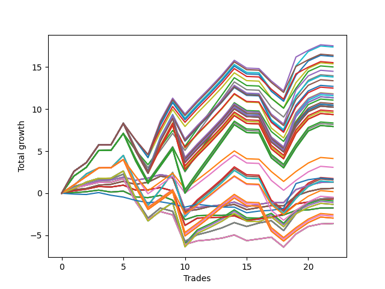

# Long Bulldog 006 
- Symbol: AAPL_Unlimited
- Date Range: 03/23/2022 - 07/08/2022
- Trading Period: 7:20-12:30
- Number of Trades: 22



| Name | Win Percent | Profit | Avg Profit / Trade | Avg Time / Trade |      | Name | Win Percent | Profit | Avg Profit / Trade | Avg Time / Trade |
| ---- | ----------- | ------ | ------------------ | ---------------- | ---- | ---- | ----------- | ------ | ------------------ | ---------------- |
| Sorted By <br> Profit | | | | | | Sorted By <br> Win Percentage ||||
| Ninety-Nine | 63.64 | 8760.00 | 398.18 | 160:07 |     | Sixty-Six | 77.27 | 670.00 | 30.45 | 24:25 |
| Ninety-Four | 63.64 | 8690.00 | 395.00 | 163:27 |     | Fifty-Eight | 77.27 | 670.00 | 30.45 | 24:25 |
| One Hundred | 63.64 | 8200.00 | 372.73 | 160:55 |     | Fifty | 77.27 | 670.00 | 30.45 | 24:25 |
| Ninety-Five | 63.64 | 8130.00 | 369.55 | 164:15 |     | Forty-Two | 77.27 | 670.00 | 30.45 | 24:25 |
| Ninety-Eight | 63.64 | 7760.00 | 352.73 | 155:18 |     | Two | 77.27 | 670.00 | 30.45 | 24:25 |
| Ninety-Three | 63.64 | 7690.00 | 349.55 | 158:39 |     | Sixty-Seven | 77.27 | 290.00 | 13.18 | 23:23 |
| Ninety-Seven | 63.64 | 7505.00 | 341.14 | 123:05 |     | Fifty-Nine | 77.27 | 290.00 | 13.18 | 23:23 |
| One Hundred Nine | 63.64 | 7245.00 | 329.32 | 167:14 |     | Fifty-One | 77.27 | 290.00 | 13.18 | 23:23 |
| Ninety-Two | 63.64 | 6980.00 | 317.27 | 124:52 |     | Forty-Three | 77.27 | 290.00 | 13.18 | 23:23 |
| One Hundred Four | 63.64 | 6910.00 | 314.09 | 170:46 |     | Three | 77.27 | 290.00 | 13.18 | 23:23 |
| One Hundred Ten | 63.64 | 6685.00 | 303.86 | 168:02 |     | Sixty-Five | 77.27 | -335.00 | -15.23 | 16:55 |
| One Hundred Five | 63.64 | 6350.00 | 288.64 | 171:35 |     | Fifty-Seven | 77.27 | -335.00 | -15.23 | 16:55 |
| One Hundred Eight | 63.64 | 6245.00 | 283.86 | 162:25 |     | Forty-Nine | 77.27 | -335.00 | -15.23 | 16:55 |
| One Hundred Three | 63.64 | 5910.00 | 268.64 | 165:58 |     | Forty-One | 77.27 | -335.00 | -15.23 | 16:55 |
| One Hundred Ninteen | 63.64 | 5885.00 | 267.50 | 178:07 |     | One | 77.27 | -335.00 | -15.23 | 16:55 |
| One Hundred Fourteen | 63.64 | 5795.00 | 263.41 | 178:09 |     | Sixty-Nine | 72.73 | -275.00 | -12.50 | 58:40 |
| One Hundred Twenty-Nine | 63.64 | 5675.00 | 257.95 | 180:03 |     | Sixty-One | 72.73 | -275.00 | -12.50 | 58:40 |
| One Hundred Twenty-Four | 63.64 | 5675.00 | 257.95 | 180:03 |     | Fifty-Three | 72.73 | -275.00 | -12.50 | 58:40 |
| Eighty-Four | 63.64 | 5675.00 | 257.95 | 180:03 |     | Forty-Five | 72.73 | -275.00 | -12.50 | 58:40 |
| One Hundred Seven | 63.64 | 5535.00 | 251.59 | 128:39 |     | Five | 72.73 | -275.00 | -12.50 | 58:40 |
| One Hundred Twenty | 63.64 | 5325.00 | 242.05 | 178:55 |     | Sixty-Eight | 72.73 | -1795.00 | -81.59 | 51:32 |
| One Hundred Fifteen | 63.64 | 5235.00 | 237.95 | 178:57 |     | Sixty | 72.73 | -1795.00 | -81.59 | 51:32 |
| One Hundred Two | 63.64 | 5200.00 | 236.36 | 132:12 |     | Fifty-Two | 72.73 | -1795.00 | -81.59 | 51:32 |
| One Hundred Thirty | 63.64 | 5115.00 | 232.50 | 180:51 |     | Forty-Four | 72.73 | -1795.00 | -81.59 | 51:32 |
| One Hundred Twenty-Five | 63.64 | 5115.00 | 232.50 | 180:51 |     | Four | 72.73 | -1795.00 | -81.59 | 51:32 |
| Eighty-Five | 63.64 | 5115.00 | 232.50 | 180:51 |     | Fifty-Four | 68.18 | -450.00 | -20.45 | 91:34 |
| One Hundred Eighteen | 63.64 | 4885.00 | 222.05 | 173:19 |     | Forty-Six | 68.18 | -540.00 | -24.55 | 91:36 |
| One Hundred Thirteen | 63.64 | 4795.00 | 217.95 | 173:21 |     | Seventy | 68.18 | -660.00 | -30.00 | 93:30 |
| One Hundred Twenty-Eight | 63.64 | 4675.00 | 212.50 | 175:15 |     | Sixty-Two | 68.18 | -660.00 | -30.00 | 93:30 |
| One Hundred Twenty-Three | 63.64 | 4675.00 | 212.50 | 175:15 |     | Six | 68.18 | -660.00 | -30.00 | 93:30 |
| Eighty-Three | 63.64 | 4675.00 | 212.50 | 175:15 |     | Sixty-Four | 68.18 | -875.00 | -39.77 | 11:12 |
| One Hundred Seventeen | 63.64 | 4175.00 | 189.77 | 139:33 |     | Fifty-Six | 68.18 | -875.00 | -39.77 | 11:12 |
| One Hundred Twelve | 63.64 | 4085.00 | 185.68 | 139:35 |     | Forty-Eight | 68.18 | -875.00 | -39.77 | 11:12 |
| One Hundred Twenty-Seven | 63.64 | 3965.00 | 180.23 | 141:29 |     | Forty | 68.18 | -875.00 | -39.77 | 11:12 |
| One Hundred Twenty-Two | 63.64 | 3965.00 | 180.23 | 141:29 |     | Zero | 68.18 | -875.00 | -39.77 | 11:12 |
| Eighty-Two | 63.64 | 3965.00 | 180.23 | 141:29 |     | Ninety-Nine | 63.64 | 8760.00 | 398.18 | 160:07 |
| Ninety-Six | 63.64 | 2065.00 | 93.86 | 92:35 |     | Ninety-Four | 63.64 | 8690.00 | 395.00 | 163:27 |
| Ninety-One | 63.64 | 1540.00 | 70.00 | 94:23 |     | One Hundred | 63.64 | 8200.00 | 372.73 | 160:55 |
| Fifty-Five | 63.64 | 875.00 | 39.77 | 115:58 |     | Ninety-Five | 63.64 | 8130.00 | 369.55 | 164:15 |
| Seventy-Three | 45.45 | 840.00 | 38.18 | 12:43 |     | Ninety-Eight | 63.64 | 7760.00 | 352.73 | 155:18 |
| Forty-Seven | 63.64 | 785.00 | 35.68 | 116:00 |     | Ninety-Three | 63.64 | 7690.00 | 349.55 | 158:39 |
| Sixty-Six | 77.27 | 670.00 | 30.45 | 24:25 |     | Ninety-Seven | 63.64 | 7505.00 | 341.14 | 123:05 |
| Fifty-Eight | 77.27 | 670.00 | 30.45 | 24:25 |     | One Hundred Nine | 63.64 | 7245.00 | 329.32 | 167:14 |
| Fifty | 77.27 | 670.00 | 30.45 | 24:25 |     | Ninety-Two | 63.64 | 6980.00 | 317.27 | 124:52 |
| Forty-Two | 77.27 | 670.00 | 30.45 | 24:25 |     | One Hundred Four | 63.64 | 6910.00 | 314.09 | 170:46 |
| Two | 77.27 | 670.00 | 30.45 | 24:25 |     | One Hundred Ten | 63.64 | 6685.00 | 303.86 | 168:02 |
| Seventy-One | 63.64 | 665.00 | 30.23 | 117:54 |     | One Hundred Five | 63.64 | 6350.00 | 288.64 | 171:35 |
| Sixty-Three | 63.64 | 665.00 | 30.23 | 117:54 |     | One Hundred Eight | 63.64 | 6245.00 | 283.86 | 162:25 |
| Seven | 63.64 | 665.00 | 30.23 | 117:54 |     | One Hundred Three | 63.64 | 5910.00 | 268.64 | 165:58 |
| Sixty-Seven | 77.27 | 290.00 | 13.18 | 23:23 |     | One Hundred Ninteen | 63.64 | 5885.00 | 267.50 | 178:07 |
| Fifty-Nine | 77.27 | 290.00 | 13.18 | 23:23 |     | One Hundred Fourteen | 63.64 | 5795.00 | 263.41 | 178:09 |
| Fifty-One | 77.27 | 290.00 | 13.18 | 23:23 |     | One Hundred Twenty-Nine | 63.64 | 5675.00 | 257.95 | 180:03 |
| Forty-Three | 77.27 | 290.00 | 13.18 | 23:23 |     | One Hundred Twenty-Four | 63.64 | 5675.00 | 257.95 | 180:03 |
| Three | 77.27 | 290.00 | 13.18 | 23:23 |     | Eighty-Four | 63.64 | 5675.00 | 257.95 | 180:03 |
| One Hundred Six | 63.64 | 95.00 | 4.32 | 98:10 |     | One Hundred Seven | 63.64 | 5535.00 | 251.59 | 128:39 |
| One Hundred One | 63.64 | -240.00 | -10.91 | 101:42 |     | One Hundred Twenty | 63.64 | 5325.00 | 242.05 | 178:55 |
| Sixty-Nine | 72.73 | -275.00 | -12.50 | 58:40 |     | One Hundred Fifteen | 63.64 | 5235.00 | 237.95 | 178:57 |
| Sixty-One | 72.73 | -275.00 | -12.50 | 58:40 |     | One Hundred Two | 63.64 | 5200.00 | 236.36 | 132:12 |
| Fifty-Three | 72.73 | -275.00 | -12.50 | 58:40 |     | One Hundred Thirty | 63.64 | 5115.00 | 232.50 | 180:51 |
| Forty-Five | 72.73 | -275.00 | -12.50 | 58:40 |     | One Hundred Twenty-Five | 63.64 | 5115.00 | 232.50 | 180:51 |
| Five | 72.73 | -275.00 | -12.50 | 58:40 |     | Eighty-Five | 63.64 | 5115.00 | 232.50 | 180:51 |
| Sixty-Five | 77.27 | -335.00 | -15.23 | 16:55 |     | One Hundred Eighteen | 63.64 | 4885.00 | 222.05 | 173:19 |
| Fifty-Seven | 77.27 | -335.00 | -15.23 | 16:55 |     | One Hundred Thirteen | 63.64 | 4795.00 | 217.95 | 173:21 |
| Forty-Nine | 77.27 | -335.00 | -15.23 | 16:55 |     | One Hundred Twenty-Eight | 63.64 | 4675.00 | 212.50 | 175:15 |
| Forty-One | 77.27 | -335.00 | -15.23 | 16:55 |     | One Hundred Twenty-Three | 63.64 | 4675.00 | 212.50 | 175:15 |
| One | 77.27 | -335.00 | -15.23 | 16:55 |     | Eighty-Three | 63.64 | 4675.00 | 212.50 | 175:15 |
| Fifty-Four | 68.18 | -450.00 | -20.45 | 91:34 |     | One Hundred Seventeen | 63.64 | 4175.00 | 189.77 | 139:33 |
| Forty-Six | 68.18 | -540.00 | -24.55 | 91:36 |     | One Hundred Twelve | 63.64 | 4085.00 | 185.68 | 139:35 |
| Seventy | 68.18 | -660.00 | -30.00 | 93:30 |     | One Hundred Twenty-Seven | 63.64 | 3965.00 | 180.23 | 141:29 |
| Sixty-Two | 68.18 | -660.00 | -30.00 | 93:30 |     | One Hundred Twenty-Two | 63.64 | 3965.00 | 180.23 | 141:29 |
| Six | 68.18 | -660.00 | -30.00 | 93:30 |     | Eighty-Two | 63.64 | 3965.00 | 180.23 | 141:29 |
| Sixty-Four | 68.18 | -875.00 | -39.77 | 11:12 |     | Ninety-Six | 63.64 | 2065.00 | 93.86 | 92:35 |
| Fifty-Six | 68.18 | -875.00 | -39.77 | 11:12 |     | Ninety-One | 63.64 | 1540.00 | 70.00 | 94:23 |
| Forty-Eight | 68.18 | -875.00 | -39.77 | 11:12 |     | Fifty-Five | 63.64 | 875.00 | 39.77 | 115:58 |
| Forty | 68.18 | -875.00 | -39.77 | 11:12 |     | Forty-Seven | 63.64 | 785.00 | 35.68 | 116:00 |
| Zero | 68.18 | -875.00 | -39.77 | 11:12 |     | Seventy-One | 63.64 | 665.00 | 30.23 | 117:54 |
| One Hundred Sixteen | 63.64 | -1265.00 | -57.50 | 109:03 |     | Sixty-Three | 63.64 | 665.00 | 30.23 | 117:54 |
| One Hundred Eleven | 63.64 | -1355.00 | -61.59 | 109:05 |     | Seven | 63.64 | 665.00 | 30.23 | 117:54 |
| One Hundred Twenty-Six | 63.64 | -1475.00 | -67.05 | 110:59 |     | One Hundred Six | 63.64 | 95.00 | 4.32 | 98:10 |
| One Hundred Twenty-One | 63.64 | -1475.00 | -67.05 | 110:59 |     | One Hundred One | 63.64 | -240.00 | -10.91 | 101:42 |
| Eighty-One | 63.64 | -1475.00 | -67.05 | 110:59 |     | One Hundred Sixteen | 63.64 | -1265.00 | -57.50 | 109:03 |
| Sixty-Eight | 72.73 | -1795.00 | -81.59 | 51:32 |     | One Hundred Eleven | 63.64 | -1355.00 | -61.59 | 109:05 |
| Sixty | 72.73 | -1795.00 | -81.59 | 51:32 |     | One Hundred Twenty-Six | 63.64 | -1475.00 | -67.05 | 110:59 |
| Fifty-Two | 72.73 | -1795.00 | -81.59 | 51:32 |     | One Hundred Twenty-One | 63.64 | -1475.00 | -67.05 | 110:59 |
| Forty-Four | 72.73 | -1795.00 | -81.59 | 51:32 |     | Eighty-One | 63.64 | -1475.00 | -67.05 | 110:59 |
| Four | 72.73 | -1795.00 | -81.59 | 51:32 |     | Seventy-Three | 45.45 | 840.00 | 38.18 | 12:43 |

## NO STOPLOSS

### Test Zero
* Sell when price hits the middle line of the 20p bollinger
* No Stoploss
* Results:
```
Total Trades: 22
Percent Up: 68.18
Percent Down: 31.82
Total Points Moved Up: -1.75
Potential Profit: -875.00
Total Points Ups: 2.82 Count Ups: 15
Total Points Downs: -4.57 Count Downs: 7
```

<details><summary>Trades</summary>

<code>In: 2022-03-24 07:23:00		Out: 2022-03-24 07:32:45		Total Position Time: 09:45		Total Move Up: 0.07		Total to Date: 0.07</code> <br />
<code>In: 2022-03-25 09:00:00		Out: 2022-03-25 09:05:05		Total Position Time: 05:05		Total Move Up: 0.11		Total to Date: 0.18</code> <br />
<code>In: 2022-03-29 09:37:00		Out: 2022-03-29 09:43:15		Total Position Time: 06:15		Total Move Up: 0.19		Total to Date: 0.37</code> <br />
<code>In: 2022-03-30 12:14:00		Out: 2022-03-30 12:28:10		Total Position Time: 14:10		Total Move Up: -0.23		Total to Date: 0.14</code> <br />
<code>In: 2022-04-07 08:36:00		Out: 2022-04-07 08:45:45		Total Position Time: 09:45		Total Move Up: 0.11		Total to Date: 0.25</code> <br />
<code>In: 2022-04-21 09:57:00		Out: 2022-04-21 10:21:40		Total Position Time: 24:40		Total Move Up: -0.68		Total to Date: -0.43</code> <br />
<code>In: 2022-04-21 10:22:00		Out: 2022-04-21 10:23:10		Total Position Time: 01:10		Total Move Up: -0.09		Total to Date: -0.52</code> <br />
<code>In: 2022-04-25 08:52:00		Out: 2022-04-25 08:57:40		Total Position Time: 05:40		Total Move Up: 0.26		Total to Date: -0.26</code> <br />
<code>In: 2022-05-02 10:31:00		Out: 2022-05-02 10:59:55		Total Position Time: 28:55		Total Move Up: -0.56		Total to Date: -0.82</code> <br />
<code>In: 2022-05-11 09:36:00		Out: 2022-05-11 10:25:15		Total Position Time: 49:15		Total Move Up: -2.32		Total to Date: -3.14</code> <br />
<code>In: 2022-05-12 11:12:00		Out: 2022-05-12 11:18:45		Total Position Time: 06:45		Total Move Up: 0.48		Total to Date: -2.66</code> <br />
<code>In: 2022-05-25 09:30:00		Out: 2022-05-25 09:44:25		Total Position Time: 14:25		Total Move Up: 0.03		Total to Date: -2.63</code> <br />
<code>In: 2022-05-25 10:09:00		Out: 2022-05-25 10:15:55		Total Position Time: 06:55		Total Move Up: -0.01		Total to Date: -2.64</code> <br />
<code>In: 2022-05-25 10:15:00		Out: 2022-05-25 10:16:20		Total Position Time: 01:20		Total Move Up: 0.16		Total to Date: -2.48</code> <br />
<code>In: 2022-06-08 09:30:00		Out: 2022-06-08 09:56:55		Total Position Time: 26:55		Total Move Up: -0.68		Total to Date: -3.16</code> <br />
<code>In: 2022-06-08 09:47:00		Out: 2022-06-08 09:56:55		Total Position Time: 09:55		Total Move Up: 0.19		Total to Date: -2.97</code> <br />
<code>In: 2022-06-09 08:10:00		Out: 2022-06-09 08:11:10		Total Position Time: 01:10		Total Move Up: 0.14		Total to Date: -2.83</code> <br />
<code>In: 2022-06-13 11:35:00		Out: 2022-06-13 11:36:45		Total Position Time: 01:45		Total Move Up: 0.25		Total to Date: -2.58</code> <br />
<code>In: 2022-06-15 11:35:00		Out: 2022-06-15 11:37:10		Total Position Time: 02:10		Total Move Up: 0.53		Total to Date: -2.05</code> <br />
<code>In: 2022-06-17 07:51:00		Out: 2022-06-17 07:55:10		Total Position Time: 04:10		Total Move Up: 0.07		Total to Date: -1.98</code> <br />
<code>In: 2022-06-24 08:22:00		Out: 2022-06-24 08:26:15		Total Position Time: 04:15		Total Move Up: 0.22		Total to Date: -1.76</code> <br />
<code>In: 2022-06-27 10:51:00		Out: 2022-06-27 11:03:15		Total Position Time: 12:15		Total Move Up: 0.01		Total to Date: -1.75</code> <br />


</details>

### Test One
* Sell when the price hits the upper line of the 20p 1std bollinger
* No Stoploss
* Results:
```
Total Trades: 22
Percent Up: 77.27
Percent Down: 22.73
Total Points Moved Up: -0.67
Potential Profit: -335.00
Total Points Ups: 5.08 Count Ups: 17
Total Points Downs: -5.75 Count Downs: 5
```

<details><summary>Trades</summary>

<code>In: 2022-03-24 07:23:00		Out: 2022-03-24 07:34:15		Total Position Time: 11:15		Total Move Up: 0.29		Total to Date: 0.29</code> <br />
<code>In: 2022-03-25 09:00:00		Out: 2022-03-25 09:06:05		Total Position Time: 06:05		Total Move Up: 0.20		Total to Date: 0.49</code> <br />
<code>In: 2022-03-29 09:37:00		Out: 2022-03-29 09:45:05		Total Position Time: 08:05		Total Move Up: 0.31		Total to Date: 0.80</code> <br />
<code>In: 2022-03-30 12:14:00		Out: 2022-03-30 12:31:35		Total Position Time: 17:35		Total Move Up: -0.06		Total to Date: 0.74</code> <br />
<code>In: 2022-04-07 08:36:00		Out: 2022-04-07 08:47:05		Total Position Time: 11:05		Total Move Up: 0.22		Total to Date: 0.96</code> <br />
<code>In: 2022-04-21 09:57:00		Out: 2022-04-21 10:28:50		Total Position Time: 31:50		Total Move Up: -0.59		Total to Date: 0.37</code> <br />
<code>In: 2022-04-21 10:22:00		Out: 2022-04-21 10:28:50		Total Position Time: 06:50		Total Move Up: 0.04		Total to Date: 0.41</code> <br />
<code>In: 2022-04-25 08:52:00		Out: 2022-04-25 09:04:55		Total Position Time: 12:55		Total Move Up: 0.26		Total to Date: 0.67</code> <br />
<code>In: 2022-05-02 10:31:00		Out: 2022-05-02 11:02:15		Total Position Time: 31:15		Total Move Up: -0.39		Total to Date: 0.28</code> <br />
<code>In: 2022-05-11 09:36:00		Out: 2022-05-11 11:18:35		Total Position Time: 102:35		Total Move Up: -4.10		Total to Date: -3.82</code> <br />
<code>In: 2022-05-12 11:12:00		Out: 2022-05-12 11:20:35		Total Position Time: 08:35		Total Move Up: 0.86		Total to Date: -2.96</code> <br />
<code>In: 2022-05-25 09:30:00		Out: 2022-05-25 09:45:15		Total Position Time: 15:15		Total Move Up: 0.08		Total to Date: -2.88</code> <br />
<code>In: 2022-05-25 10:09:00		Out: 2022-05-25 10:27:00		Total Position Time: 18:00		Total Move Up: 0.02		Total to Date: -2.86</code> <br />
<code>In: 2022-05-25 10:15:00		Out: 2022-05-25 10:27:00		Total Position Time: 12:00		Total Move Up: 0.19		Total to Date: -2.67</code> <br />
<code>In: 2022-06-08 09:30:00		Out: 2022-06-08 09:59:05		Total Position Time: 29:05		Total Move Up: -0.61		Total to Date: -3.28</code> <br />
<code>In: 2022-06-08 09:47:00		Out: 2022-06-08 09:59:05		Total Position Time: 12:05		Total Move Up: 0.26		Total to Date: -3.02</code> <br />
<code>In: 2022-06-09 08:10:00		Out: 2022-06-09 08:11:10		Total Position Time: 01:10		Total Move Up: 0.14		Total to Date: -2.88</code> <br />
<code>In: 2022-06-13 11:35:00		Out: 2022-06-13 11:41:50		Total Position Time: 06:50		Total Move Up: 0.42		Total to Date: -2.46</code> <br />
<code>In: 2022-06-15 11:35:00		Out: 2022-06-15 11:38:05		Total Position Time: 03:05		Total Move Up: 1.18		Total to Date: -1.28</code> <br />
<code>In: 2022-06-17 07:51:00		Out: 2022-06-17 07:56:15		Total Position Time: 05:15		Total Move Up: 0.24		Total to Date: -1.04</code> <br />
<code>In: 2022-06-24 08:22:00		Out: 2022-06-24 08:29:40		Total Position Time: 07:40		Total Move Up: 0.34		Total to Date: -0.70</code> <br />
<code>In: 2022-06-27 10:51:00		Out: 2022-06-27 11:05:00		Total Position Time: 14:00		Total Move Up: 0.03		Total to Date: -0.67</code> <br />


</details>

### Test Two
* Sell when the price hits the upper line of the 20p 2std bollinger
* No Stoploss
* Results:
```
Total Trades: 22
Percent Up: 77.27
Percent Down: 22.73
Total Points Moved Up: 1.34
Potential Profit: 670.00
Total Points Ups: 6.44 Count Ups: 17
Total Points Downs: -5.10 Count Downs: 5
```

<details><summary>Trades</summary>

<code>In: 2022-03-24 07:23:00		Out: 2022-03-24 07:45:45		Total Position Time: 22:45		Total Move Up: 0.62		Total to Date: 0.62</code> <br />
<code>In: 2022-03-25 09:00:00		Out: 2022-03-25 09:11:20		Total Position Time: 11:20		Total Move Up: 0.40		Total to Date: 1.02</code> <br />
<code>In: 2022-03-29 09:37:00		Out: 2022-03-29 09:45:30		Total Position Time: 08:30		Total Move Up: 0.45		Total to Date: 1.47</code> <br />
<code>In: 2022-03-30 12:14:00		Out: 2022-03-30 12:36:15		Total Position Time: 22:15		Total Move Up: 0.10		Total to Date: 1.57</code> <br />
<code>In: 2022-04-07 08:36:00		Out: 2022-04-07 08:48:05		Total Position Time: 12:05		Total Move Up: 0.34		Total to Date: 1.91</code> <br />
<code>In: 2022-04-21 09:57:00		Out: 2022-04-21 10:31:20		Total Position Time: 34:20		Total Move Up: -0.37		Total to Date: 1.54</code> <br />
<code>In: 2022-04-21 10:22:00		Out: 2022-04-21 10:31:20		Total Position Time: 09:20		Total Move Up: 0.26		Total to Date: 1.80</code> <br />
<code>In: 2022-04-25 08:52:00		Out: 2022-04-25 09:05:20		Total Position Time: 13:20		Total Move Up: 0.41		Total to Date: 2.21</code> <br />
<code>In: 2022-05-02 10:31:00		Out: 2022-05-02 11:03:05		Total Position Time: 32:05		Total Move Up: -0.25		Total to Date: 1.96</code> <br />
<code>In: 2022-05-11 09:36:00		Out: 2022-05-11 11:24:05		Total Position Time: 108:05		Total Move Up: -3.88		Total to Date: -1.92</code> <br />
<code>In: 2022-05-12 11:12:00		Out: 2022-05-12 11:51:45		Total Position Time: 39:45		Total Move Up: 0.24		Total to Date: -1.68</code> <br />
<code>In: 2022-05-25 09:30:00		Out: 2022-05-25 09:47:30		Total Position Time: 17:30		Total Move Up: 0.14		Total to Date: -1.54</code> <br />
<code>In: 2022-05-25 10:09:00		Out: 2022-05-25 10:29:20		Total Position Time: 20:20		Total Move Up: 0.16		Total to Date: -1.38</code> <br />
<code>In: 2022-05-25 10:15:00		Out: 2022-05-25 10:29:20		Total Position Time: 14:20		Total Move Up: 0.33		Total to Date: -1.05</code> <br />
<code>In: 2022-06-08 09:30:00		Out: 2022-06-08 10:00:10		Total Position Time: 30:10		Total Move Up: -0.57		Total to Date: -1.62</code> <br />
<code>In: 2022-06-08 09:47:00		Out: 2022-06-08 10:00:10		Total Position Time: 13:10		Total Move Up: 0.30		Total to Date: -1.32</code> <br />
<code>In: 2022-06-09 08:10:00		Out: 2022-06-09 08:22:40		Total Position Time: 12:40		Total Move Up: 0.23		Total to Date: -1.09</code> <br />
<code>In: 2022-06-13 11:35:00		Out: 2022-06-13 12:17:15		Total Position Time: 42:15		Total Move Up: -0.03		Total to Date: -1.12</code> <br />
<code>In: 2022-06-15 11:35:00		Out: 2022-06-15 11:38:10		Total Position Time: 03:10		Total Move Up: 1.55		Total to Date: 0.43</code> <br />
<code>In: 2022-06-17 07:51:00		Out: 2022-06-17 08:02:30		Total Position Time: 11:30		Total Move Up: 0.51		Total to Date: 0.94</code> <br />
<code>In: 2022-06-24 08:22:00		Out: 2022-06-24 08:54:05		Total Position Time: 32:05		Total Move Up: 0.34		Total to Date: 1.28</code> <br />
<code>In: 2022-06-27 10:51:00		Out: 2022-06-27 11:17:10		Total Position Time: 26:10		Total Move Up: 0.06		Total to Date: 1.34</code> <br />


</details>

### Test Three
* Sell when price hits the middle line of the 50p bollinger
* No Stoploss
* Results:
```
Total Trades: 22
Percent Up: 77.27
Percent Down: 22.73
Total Points Moved Up: 0.58
Potential Profit: 290.00
Total Points Ups: 5.76 Count Ups: 17
Total Points Downs: -5.18 Count Downs: 5
```

<details><summary>Trades</summary>

<code>In: 2022-03-24 07:23:00		Out: 2022-03-24 07:35:35		Total Position Time: 12:35		Total Move Up: 0.43		Total to Date: 0.43</code> <br />
<code>In: 2022-03-25 09:00:00		Out: 2022-03-25 09:05:15		Total Position Time: 05:15		Total Move Up: 0.14		Total to Date: 0.57</code> <br />
<code>In: 2022-03-29 09:37:00		Out: 2022-03-29 09:45:20		Total Position Time: 08:20		Total Move Up: 0.39		Total to Date: 0.96</code> <br />
<code>In: 2022-03-30 12:14:00		Out: 2022-03-30 12:36:15		Total Position Time: 22:15		Total Move Up: 0.10		Total to Date: 1.06</code> <br />
<code>In: 2022-04-07 08:36:00		Out: 2022-04-07 08:48:10		Total Position Time: 12:10		Total Move Up: 0.36		Total to Date: 1.42</code> <br />
<code>In: 2022-04-21 09:57:00		Out: 2022-04-21 10:31:40		Total Position Time: 34:40		Total Move Up: -0.37		Total to Date: 1.05</code> <br />
<code>In: 2022-04-21 10:22:00		Out: 2022-04-21 10:31:40		Total Position Time: 09:40		Total Move Up: 0.26		Total to Date: 1.31</code> <br />
<code>In: 2022-04-25 08:52:00		Out: 2022-04-25 09:06:05		Total Position Time: 14:05		Total Move Up: 0.71		Total to Date: 2.02</code> <br />
<code>In: 2022-05-02 10:31:00		Out: 2022-05-02 11:03:55		Total Position Time: 32:55		Total Move Up: -0.19		Total to Date: 1.83</code> <br />
<code>In: 2022-05-11 09:36:00		Out: 2022-05-11 11:23:35		Total Position Time: 107:35		Total Move Up: -3.97		Total to Date: -2.14</code> <br />
<code>In: 2022-05-12 11:12:00		Out: 2022-05-12 11:51:35		Total Position Time: 39:35		Total Move Up: 0.20		Total to Date: -1.94</code> <br />
<code>In: 2022-05-25 09:30:00		Out: 2022-05-25 09:49:20		Total Position Time: 19:20		Total Move Up: 0.36		Total to Date: -1.58</code> <br />
<code>In: 2022-05-25 10:09:00		Out: 2022-05-25 10:16:30		Total Position Time: 07:30		Total Move Up: 0.04		Total to Date: -1.54</code> <br />
<code>In: 2022-05-25 10:15:00		Out: 2022-05-25 10:16:30		Total Position Time: 01:30		Total Move Up: 0.21		Total to Date: -1.33</code> <br />
<code>In: 2022-06-08 09:30:00		Out: 2022-06-08 10:19:15		Total Position Time: 49:15		Total Move Up: -0.62		Total to Date: -1.95</code> <br />
<code>In: 2022-06-08 09:47:00		Out: 2022-06-08 10:19:15		Total Position Time: 32:15		Total Move Up: 0.25		Total to Date: -1.70</code> <br />
<code>In: 2022-06-09 08:10:00		Out: 2022-06-09 08:24:35		Total Position Time: 14:35		Total Move Up: 0.23		Total to Date: -1.47</code> <br />
<code>In: 2022-06-13 11:35:00		Out: 2022-06-13 12:17:15		Total Position Time: 42:15		Total Move Up: -0.03		Total to Date: -1.50</code> <br />
<code>In: 2022-06-15 11:35:00		Out: 2022-06-15 11:38:05		Total Position Time: 03:05		Total Move Up: 1.18		Total to Date: -0.32</code> <br />
<code>In: 2022-06-17 07:51:00		Out: 2022-06-17 08:03:10		Total Position Time: 12:10		Total Move Up: 0.52		Total to Date: 0.20</code> <br />
<code>In: 2022-06-24 08:22:00		Out: 2022-06-24 08:29:20		Total Position Time: 07:20		Total Move Up: 0.32		Total to Date: 0.52</code> <br />
<code>In: 2022-06-27 10:51:00		Out: 2022-06-27 11:17:10		Total Position Time: 26:10		Total Move Up: 0.06		Total to Date: 0.58</code> <br />


</details>

### Test Four
* Sell when the price hits the upper line of the 50p 1std bollinger
* No Stoploss
* Results:
```
Total Trades: 22
Percent Up: 72.73
Percent Down: 27.27
Total Points Moved Up: -3.59
Potential Profit: -1795.00
Total Points Ups: 7.02 Count Ups: 16
Total Points Downs: -10.61 Count Downs: 6
```

<details><summary>Trades</summary>

<code>In: 2022-03-24 07:23:00		Out: 2022-03-24 07:45:45		Total Position Time: 22:45		Total Move Up: 0.62		Total to Date: 0.62</code> <br />
<code>In: 2022-03-25 09:00:00		Out: 2022-03-25 09:09:05		Total Position Time: 09:05		Total Move Up: 0.33		Total to Date: 0.95</code> <br />
<code>In: 2022-03-29 09:37:00		Out: 2022-03-29 10:29:15		Total Position Time: 52:15		Total Move Up: 0.34		Total to Date: 1.29</code> <br />
<code>In: 2022-03-30 12:14:00		Out: 2022-03-30 12:47:00		Total Position Time: 33:00		Total Move Up: 0.02		Total to Date: 1.31</code> <br />
<code>In: 2022-04-07 08:36:00		Out: 2022-04-07 09:05:20		Total Position Time: 29:20		Total Move Up: 0.41		Total to Date: 1.72</code> <br />
<code>In: 2022-04-21 09:57:00		Out: 2022-04-21 12:29:55		Total Position Time: 152:55		Total Move Up: -2.74		Total to Date: -1.02</code> <br />
<code>In: 2022-04-21 10:22:00		Out: 2022-04-21 12:29:55		Total Position Time: 127:55		Total Move Up: -2.11		Total to Date: -3.13</code> <br />
<code>In: 2022-04-25 08:52:00		Out: 2022-04-25 09:15:50		Total Position Time: 23:50		Total Move Up: 0.95		Total to Date: -2.18</code> <br />
<code>In: 2022-05-02 10:31:00		Out: 2022-05-02 11:53:35		Total Position Time: 82:35		Total Move Up: -0.39		Total to Date: -2.57</code> <br />
<code>In: 2022-05-11 09:36:00		Out: 2022-05-11 11:26:00		Total Position Time: 110:00		Total Move Up: -3.52		Total to Date: -6.09</code> <br />
<code>In: 2022-05-12 11:12:00		Out: 2022-05-12 12:00:30		Total Position Time: 48:30		Total Move Up: 0.43		Total to Date: -5.66</code> <br />
<code>In: 2022-05-25 09:30:00		Out: 2022-05-25 10:29:35		Total Position Time: 59:35		Total Move Up: 0.13		Total to Date: -5.53</code> <br />
<code>In: 2022-05-25 10:09:00		Out: 2022-05-25 10:29:35		Total Position Time: 20:35		Total Move Up: 0.20		Total to Date: -5.33</code> <br />
<code>In: 2022-05-25 10:15:00		Out: 2022-05-25 10:29:35		Total Position Time: 14:35		Total Move Up: 0.37		Total to Date: -4.96</code> <br />
<code>In: 2022-06-08 09:30:00		Out: 2022-06-08 10:54:00		Total Position Time: 84:00		Total Move Up: -0.67		Total to Date: -5.63</code> <br />
<code>In: 2022-06-08 09:47:00		Out: 2022-06-08 10:54:00		Total Position Time: 67:00		Total Move Up: 0.20		Total to Date: -5.43</code> <br />
<code>In: 2022-06-09 08:10:00		Out: 2022-06-09 08:35:55		Total Position Time: 25:55		Total Move Up: 0.21		Total to Date: -5.22</code> <br />
<code>In: 2022-06-13 11:35:00		Out: 2022-06-13 12:47:00		Total Position Time: 72:00		Total Move Up: -1.18		Total to Date: -6.40</code> <br />
<code>In: 2022-06-15 11:35:00		Out: 2022-06-15 11:38:10		Total Position Time: 03:10		Total Move Up: 1.55		Total to Date: -4.85</code> <br />
<code>In: 2022-06-17 07:51:00		Out: 2022-06-17 08:06:05		Total Position Time: 15:05		Total Move Up: 0.90		Total to Date: -3.95</code> <br />
<code>In: 2022-06-24 08:22:00		Out: 2022-06-24 08:59:25		Total Position Time: 37:25		Total Move Up: 0.30		Total to Date: -3.65</code> <br />
<code>In: 2022-06-27 10:51:00		Out: 2022-06-27 11:33:25		Total Position Time: 42:25		Total Move Up: 0.06		Total to Date: -3.59</code> <br />


</details>

### Test Five
* Sell when the price hits the upper line of the 50p 2std bollinger
* No Stoploss
* Results:
```
Total Trades: 22
Percent Up: 72.73
Percent Down: 27.27
Total Points Moved Up: -0.55
Potential Profit: -275.00
Total Points Ups: 10.25 Count Ups: 16
Total Points Downs: -10.80 Count Downs: 6
```

<details><summary>Trades</summary>

<code>In: 2022-03-24 07:23:00		Out: 2022-03-24 08:19:40		Total Position Time: 56:40		Total Move Up: 0.79		Total to Date: 0.79</code> <br />
<code>In: 2022-03-25 09:00:00		Out: 2022-03-25 09:11:30		Total Position Time: 11:30		Total Move Up: 0.45		Total to Date: 1.24</code> <br />
<code>In: 2022-03-29 09:37:00		Out: 2022-03-29 10:40:00		Total Position Time: 63:00		Total Move Up: 0.44		Total to Date: 1.68</code> <br />
<code>In: 2022-03-30 12:14:00		Out: 2022-03-30 12:47:00		Total Position Time: 33:00		Total Move Up: 0.02		Total to Date: 1.70</code> <br />
<code>In: 2022-04-07 08:36:00		Out: 2022-04-07 09:06:30		Total Position Time: 30:30		Total Move Up: 0.56		Total to Date: 2.26</code> <br />
<code>In: 2022-04-21 09:57:00		Out: 2022-04-21 12:44:20		Total Position Time: 167:20		Total Move Up: -2.92		Total to Date: -0.66</code> <br />
<code>In: 2022-04-21 10:22:00		Out: 2022-04-21 12:44:20		Total Position Time: 142:20		Total Move Up: -2.29		Total to Date: -2.95</code> <br />
<code>In: 2022-04-25 08:52:00		Out: 2022-04-25 09:24:15		Total Position Time: 32:15		Total Move Up: 1.19		Total to Date: -1.76</code> <br />
<code>In: 2022-05-02 10:31:00		Out: 2022-05-02 12:03:30		Total Position Time: 92:30		Total Move Up: -0.39		Total to Date: -2.15</code> <br />
<code>In: 2022-05-11 09:36:00		Out: 2022-05-11 11:35:00		Total Position Time: 119:00		Total Move Up: -3.56		Total to Date: -5.71</code> <br />
<code>In: 2022-05-12 11:12:00		Out: 2022-05-12 12:18:15		Total Position Time: 66:15		Total Move Up: 0.77		Total to Date: -4.94</code> <br />
<code>In: 2022-05-25 09:30:00		Out: 2022-05-25 10:35:30		Total Position Time: 65:30		Total Move Up: 0.38		Total to Date: -4.56</code> <br />
<code>In: 2022-05-25 10:09:00		Out: 2022-05-25 10:35:30		Total Position Time: 26:30		Total Move Up: 0.45		Total to Date: -4.11</code> <br />
<code>In: 2022-05-25 10:15:00		Out: 2022-05-25 10:35:30		Total Position Time: 20:30		Total Move Up: 0.62		Total to Date: -3.49</code> <br />
<code>In: 2022-06-08 09:30:00		Out: 2022-06-08 10:56:30		Total Position Time: 86:30		Total Move Up: -0.46		Total to Date: -3.95</code> <br />
<code>In: 2022-06-08 09:47:00		Out: 2022-06-08 10:56:30		Total Position Time: 69:30		Total Move Up: 0.41		Total to Date: -3.54</code> <br />
<code>In: 2022-06-09 08:10:00		Out: 2022-06-09 08:41:45		Total Position Time: 31:45		Total Move Up: 0.28		Total to Date: -3.26</code> <br />
<code>In: 2022-06-13 11:35:00		Out: 2022-06-13 12:47:00		Total Position Time: 72:00		Total Move Up: -1.18		Total to Date: -4.44</code> <br />
<code>In: 2022-06-15 11:35:00		Out: 2022-06-15 11:38:55		Total Position Time: 03:55		Total Move Up: 2.00		Total to Date: -2.44</code> <br />
<code>In: 2022-06-17 07:51:00		Out: 2022-06-17 08:07:55		Total Position Time: 16:55		Total Move Up: 1.34		Total to Date: -1.10</code> <br />
<code>In: 2022-06-24 08:22:00		Out: 2022-06-24 09:02:10		Total Position Time: 40:10		Total Move Up: 0.43		Total to Date: -0.67</code> <br />
<code>In: 2022-06-27 10:51:00		Out: 2022-06-27 11:34:15		Total Position Time: 43:15		Total Move Up: 0.12		Total to Date: -0.55</code> <br />


</details>

### Test Six
* Sell when the price hits the middle line of the 1std VWAP
* No Stoploss
* Results:
```
Total Trades: 22
Percent Up: 68.18
Percent Down: 31.82
Total Points Moved Up: -1.32
Potential Profit: -660.00
Total Points Ups: 12.15 Count Ups: 15
Total Points Downs: -13.47 Count Downs: 7
```

<details><summary>Trades</summary>

<code>In: 2022-03-24 07:23:00		Out: 2022-03-24 07:45:25		Total Position Time: 22:25		Total Move Up: 0.56		Total to Date: 0.56</code> <br />
<code>In: 2022-03-25 09:00:00		Out: 2022-03-25 10:49:00		Total Position Time: 109:00		Total Move Up: 0.77		Total to Date: 1.33</code> <br />
<code>In: 2022-03-29 09:37:00		Out: 2022-03-29 09:45:25		Total Position Time: 08:25		Total Move Up: 0.44		Total to Date: 1.77</code> <br />
<code>In: 2022-03-30 12:14:00		Out: 2022-03-30 12:47:00		Total Position Time: 33:00		Total Move Up: 0.02		Total to Date: 1.79</code> <br />
<code>In: 2022-04-07 08:36:00		Out: 2022-04-07 10:56:05		Total Position Time: 140:05		Total Move Up: 0.85		Total to Date: 2.64</code> <br />
<code>In: 2022-04-21 09:57:00		Out: 2022-04-21 12:47:00		Total Position Time: 170:00		Total Move Up: -3.28		Total to Date: -0.64</code> <br />
<code>In: 2022-04-21 10:22:00		Out: 2022-04-21 12:47:00		Total Position Time: 145:00		Total Move Up: -2.65		Total to Date: -3.29</code> <br />
<code>In: 2022-04-25 08:52:00		Out: 2022-04-25 09:24:15		Total Position Time: 32:15		Total Move Up: 1.19		Total to Date: -2.10</code> <br />
<code>In: 2022-05-02 10:31:00		Out: 2022-05-02 12:13:20		Total Position Time: 102:20		Total Move Up: 0.98		Total to Date: -1.12</code> <br />
<code>In: 2022-05-11 09:36:00		Out: 2022-05-11 12:47:00		Total Position Time: 191:00		Total Move Up: -5.25		Total to Date: -6.37</code> <br />
<code>In: 2022-05-12 11:12:00		Out: 2022-05-12 12:47:00		Total Position Time: 95:00		Total Move Up: 1.60		Total to Date: -4.77</code> <br />
<code>In: 2022-05-25 09:30:00		Out: 2022-05-25 11:00:30		Total Position Time: 90:30		Total Move Up: 0.69		Total to Date: -4.08</code> <br />
<code>In: 2022-05-25 10:09:00		Out: 2022-05-25 11:00:30		Total Position Time: 51:30		Total Move Up: 0.76		Total to Date: -3.32</code> <br />
<code>In: 2022-05-25 10:15:00		Out: 2022-05-25 11:00:30		Total Position Time: 45:30		Total Move Up: 0.93		Total to Date: -2.39</code> <br />
<code>In: 2022-06-08 09:30:00		Out: 2022-06-08 12:47:00		Total Position Time: 197:00		Total Move Up: -0.93		Total to Date: -3.32</code> <br />
<code>In: 2022-06-08 09:47:00		Out: 2022-06-08 12:47:00		Total Position Time: 180:00		Total Move Up: -0.06		Total to Date: -3.38</code> <br />
<code>In: 2022-06-09 08:10:00		Out: 2022-06-09 08:43:50		Total Position Time: 33:50		Total Move Up: 0.58		Total to Date: -2.80</code> <br />
<code>In: 2022-06-13 11:35:00		Out: 2022-06-13 12:47:00		Total Position Time: 72:00		Total Move Up: -1.18		Total to Date: -3.98</code> <br />
<code>In: 2022-06-15 11:35:00		Out: 2022-06-15 11:38:10		Total Position Time: 03:10		Total Move Up: 1.55		Total to Date: -2.43</code> <br />
<code>In: 2022-06-17 07:51:00		Out: 2022-06-17 08:03:55		Total Position Time: 12:55		Total Move Up: 0.75		Total to Date: -1.68</code> <br />
<code>In: 2022-06-24 08:22:00		Out: 2022-06-24 11:48:05		Total Position Time: 206:05		Total Move Up: 0.48		Total to Date: -1.20</code> <br />
<code>In: 2022-06-27 10:51:00		Out: 2022-06-27 12:47:00		Total Position Time: 116:00		Total Move Up: -0.12		Total to Date: -1.32</code> <br />


</details>

### Test Seven
* Sell when the price hits the upper line of the 1std VWAP
* No Stoploss
* Results:
```
Total Trades: 22
Percent Up: 63.64
Percent Down: 36.36
Total Points Moved Up: 1.33
Potential Profit: 665.00
Total Points Ups: 17.76 Count Ups: 14
Total Points Downs: -16.43 Count Downs: 8
```

<details><summary>Trades</summary>

<code>In: 2022-03-24 07:23:00		Out: 2022-03-24 08:25:45		Total Position Time: 62:45		Total Move Up: 0.94		Total to Date: 0.94</code> <br />
<code>In: 2022-03-25 09:00:00		Out: 2022-03-25 11:03:35		Total Position Time: 123:35		Total Move Up: 1.36		Total to Date: 2.30</code> <br />
<code>In: 2022-03-29 09:37:00		Out: 2022-03-29 10:46:40		Total Position Time: 69:40		Total Move Up: 0.70		Total to Date: 3.00</code> <br />
<code>In: 2022-03-30 12:14:00		Out: 2022-03-30 12:47:00		Total Position Time: 33:00		Total Move Up: 0.02		Total to Date: 3.02</code> <br />
<code>In: 2022-04-07 08:36:00		Out: 2022-04-07 11:26:15		Total Position Time: 170:15		Total Move Up: 1.48		Total to Date: 4.50</code> <br />
<code>In: 2022-04-21 09:57:00		Out: 2022-04-21 12:47:00		Total Position Time: 170:00		Total Move Up: -3.28		Total to Date: 1.22</code> <br />
<code>In: 2022-04-21 10:22:00		Out: 2022-04-21 12:47:00		Total Position Time: 145:00		Total Move Up: -2.65		Total to Date: -1.43</code> <br />
<code>In: 2022-04-25 08:52:00		Out: 2022-04-25 10:30:35		Total Position Time: 98:35		Total Move Up: 1.85		Total to Date: 0.42</code> <br />
<code>In: 2022-05-02 10:31:00		Out: 2022-05-02 12:24:55		Total Position Time: 113:55		Total Move Up: 2.04		Total to Date: 2.46</code> <br />
<code>In: 2022-05-11 09:36:00		Out: 2022-05-11 12:47:00		Total Position Time: 191:00		Total Move Up: -5.25		Total to Date: -2.79</code> <br />
<code>In: 2022-05-12 11:12:00		Out: 2022-05-12 12:47:00		Total Position Time: 95:00		Total Move Up: 1.60		Total to Date: -1.19</code> <br />
<code>In: 2022-05-25 09:30:00		Out: 2022-05-25 11:02:30		Total Position Time: 92:30		Total Move Up: 1.20		Total to Date: 0.01</code> <br />
<code>In: 2022-05-25 10:09:00		Out: 2022-05-25 11:02:30		Total Position Time: 53:30		Total Move Up: 1.27		Total to Date: 1.28</code> <br />
<code>In: 2022-05-25 10:15:00		Out: 2022-05-25 11:02:30		Total Position Time: 47:30		Total Move Up: 1.44		Total to Date: 2.72</code> <br />
<code>In: 2022-06-08 09:30:00		Out: 2022-06-08 12:47:00		Total Position Time: 197:00		Total Move Up: -0.93		Total to Date: 1.79</code> <br />
<code>In: 2022-06-08 09:47:00		Out: 2022-06-08 12:47:00		Total Position Time: 180:00		Total Move Up: -0.06		Total to Date: 1.73</code> <br />
<code>In: 2022-06-09 08:10:00		Out: 2022-06-09 12:47:00		Total Position Time: 277:00		Total Move Up: -2.96		Total to Date: -1.23</code> <br />
<code>In: 2022-06-13 11:35:00		Out: 2022-06-13 12:47:00		Total Position Time: 72:00		Total Move Up: -1.18		Total to Date: -2.41</code> <br />
<code>In: 2022-06-15 11:35:00		Out: 2022-06-15 11:38:50		Total Position Time: 03:50		Total Move Up: 1.80		Total to Date: -0.61</code> <br />
<code>In: 2022-06-17 07:51:00		Out: 2022-06-17 08:08:00		Total Position Time: 17:00		Total Move Up: 1.40		Total to Date: 0.79</code> <br />
<code>In: 2022-06-24 08:22:00		Out: 2022-06-24 12:47:00		Total Position Time: 265:00		Total Move Up: 0.66		Total to Date: 1.45</code> <br />
<code>In: 2022-06-27 10:51:00		Out: 2022-06-27 12:47:00		Total Position Time: 116:00		Total Move Up: -0.12		Total to Date: 1.33</code> <br />


</details>

## STOPLOSS OF 5

### Test Forty
* Sell when price hits the middle line of the 20p bollinger
* Stoploss is 5 points
* Results:
```
Total Trades: 22
Percent Up: 68.18
Percent Down: 31.82
Total Points Moved Up: -1.75
Potential Profit: -875.00
Total Points Ups: 2.82 Count Ups: 15
Total Points Downs: -4.57 Count Downs: 7
```

<details><summary>Trades</summary>

<code>In: 2022-03-24 07:23:00		Out: 2022-03-24 07:32:45		Total Position Time: 09:45		Total Move Up: 0.07		Total to Date: 0.07</code> <br />
<code>In: 2022-03-25 09:00:00		Out: 2022-03-25 09:05:05		Total Position Time: 05:05		Total Move Up: 0.11		Total to Date: 0.18</code> <br />
<code>In: 2022-03-29 09:37:00		Out: 2022-03-29 09:43:15		Total Position Time: 06:15		Total Move Up: 0.19		Total to Date: 0.37</code> <br />
<code>In: 2022-03-30 12:14:00		Out: 2022-03-30 12:28:10		Total Position Time: 14:10		Total Move Up: -0.23		Total to Date: 0.14</code> <br />
<code>In: 2022-04-07 08:36:00		Out: 2022-04-07 08:45:45		Total Position Time: 09:45		Total Move Up: 0.11		Total to Date: 0.25</code> <br />
<code>In: 2022-04-21 09:57:00		Out: 2022-04-21 10:21:40		Total Position Time: 24:40		Total Move Up: -0.68		Total to Date: -0.43</code> <br />
<code>In: 2022-04-21 10:22:00		Out: 2022-04-21 10:23:10		Total Position Time: 01:10		Total Move Up: -0.09		Total to Date: -0.52</code> <br />
<code>In: 2022-04-25 08:52:00		Out: 2022-04-25 08:57:40		Total Position Time: 05:40		Total Move Up: 0.26		Total to Date: -0.26</code> <br />
<code>In: 2022-05-02 10:31:00		Out: 2022-05-02 10:59:55		Total Position Time: 28:55		Total Move Up: -0.56		Total to Date: -0.82</code> <br />
<code>In: 2022-05-11 09:36:00		Out: 2022-05-11 10:25:15		Total Position Time: 49:15		Total Move Up: -2.32		Total to Date: -3.14</code> <br />
<code>In: 2022-05-12 11:12:00		Out: 2022-05-12 11:18:45		Total Position Time: 06:45		Total Move Up: 0.48		Total to Date: -2.66</code> <br />
<code>In: 2022-05-25 09:30:00		Out: 2022-05-25 09:44:25		Total Position Time: 14:25		Total Move Up: 0.03		Total to Date: -2.63</code> <br />
<code>In: 2022-05-25 10:09:00		Out: 2022-05-25 10:15:55		Total Position Time: 06:55		Total Move Up: -0.01		Total to Date: -2.64</code> <br />
<code>In: 2022-05-25 10:15:00		Out: 2022-05-25 10:16:20		Total Position Time: 01:20		Total Move Up: 0.16		Total to Date: -2.48</code> <br />
<code>In: 2022-06-08 09:30:00		Out: 2022-06-08 09:56:55		Total Position Time: 26:55		Total Move Up: -0.68		Total to Date: -3.16</code> <br />
<code>In: 2022-06-08 09:47:00		Out: 2022-06-08 09:56:55		Total Position Time: 09:55		Total Move Up: 0.19		Total to Date: -2.97</code> <br />
<code>In: 2022-06-09 08:10:00		Out: 2022-06-09 08:11:10		Total Position Time: 01:10		Total Move Up: 0.14		Total to Date: -2.83</code> <br />
<code>In: 2022-06-13 11:35:00		Out: 2022-06-13 11:36:45		Total Position Time: 01:45		Total Move Up: 0.25		Total to Date: -2.58</code> <br />
<code>In: 2022-06-15 11:35:00		Out: 2022-06-15 11:37:10		Total Position Time: 02:10		Total Move Up: 0.53		Total to Date: -2.05</code> <br />
<code>In: 2022-06-17 07:51:00		Out: 2022-06-17 07:55:10		Total Position Time: 04:10		Total Move Up: 0.07		Total to Date: -1.98</code> <br />
<code>In: 2022-06-24 08:22:00		Out: 2022-06-24 08:26:15		Total Position Time: 04:15		Total Move Up: 0.22		Total to Date: -1.76</code> <br />
<code>In: 2022-06-27 10:51:00		Out: 2022-06-27 11:03:15		Total Position Time: 12:15		Total Move Up: 0.01		Total to Date: -1.75</code> <br />


</details>

### Test Forty-One
* Sell when the price hits the upper line of the 20p 1std bollinger
* Stoploss is 5 points
* Results:
```
Total Trades: 22
Percent Up: 77.27
Percent Down: 22.73
Total Points Moved Up: -0.67
Potential Profit: -335.00
Total Points Ups: 5.08 Count Ups: 17
Total Points Downs: -5.75 Count Downs: 5
```

<details><summary>Trades</summary>

<code>In: 2022-03-24 07:23:00		Out: 2022-03-24 07:34:15		Total Position Time: 11:15		Total Move Up: 0.29		Total to Date: 0.29</code> <br />
<code>In: 2022-03-25 09:00:00		Out: 2022-03-25 09:06:05		Total Position Time: 06:05		Total Move Up: 0.20		Total to Date: 0.49</code> <br />
<code>In: 2022-03-29 09:37:00		Out: 2022-03-29 09:45:05		Total Position Time: 08:05		Total Move Up: 0.31		Total to Date: 0.80</code> <br />
<code>In: 2022-03-30 12:14:00		Out: 2022-03-30 12:31:35		Total Position Time: 17:35		Total Move Up: -0.06		Total to Date: 0.74</code> <br />
<code>In: 2022-04-07 08:36:00		Out: 2022-04-07 08:47:05		Total Position Time: 11:05		Total Move Up: 0.22		Total to Date: 0.96</code> <br />
<code>In: 2022-04-21 09:57:00		Out: 2022-04-21 10:28:50		Total Position Time: 31:50		Total Move Up: -0.59		Total to Date: 0.37</code> <br />
<code>In: 2022-04-21 10:22:00		Out: 2022-04-21 10:28:50		Total Position Time: 06:50		Total Move Up: 0.04		Total to Date: 0.41</code> <br />
<code>In: 2022-04-25 08:52:00		Out: 2022-04-25 09:04:55		Total Position Time: 12:55		Total Move Up: 0.26		Total to Date: 0.67</code> <br />
<code>In: 2022-05-02 10:31:00		Out: 2022-05-02 11:02:15		Total Position Time: 31:15		Total Move Up: -0.39		Total to Date: 0.28</code> <br />
<code>In: 2022-05-11 09:36:00		Out: 2022-05-11 11:18:35		Total Position Time: 102:35		Total Move Up: -4.10		Total to Date: -3.82</code> <br />
<code>In: 2022-05-12 11:12:00		Out: 2022-05-12 11:20:35		Total Position Time: 08:35		Total Move Up: 0.86		Total to Date: -2.96</code> <br />
<code>In: 2022-05-25 09:30:00		Out: 2022-05-25 09:45:15		Total Position Time: 15:15		Total Move Up: 0.08		Total to Date: -2.88</code> <br />
<code>In: 2022-05-25 10:09:00		Out: 2022-05-25 10:27:00		Total Position Time: 18:00		Total Move Up: 0.02		Total to Date: -2.86</code> <br />
<code>In: 2022-05-25 10:15:00		Out: 2022-05-25 10:27:00		Total Position Time: 12:00		Total Move Up: 0.19		Total to Date: -2.67</code> <br />
<code>In: 2022-06-08 09:30:00		Out: 2022-06-08 09:59:05		Total Position Time: 29:05		Total Move Up: -0.61		Total to Date: -3.28</code> <br />
<code>In: 2022-06-08 09:47:00		Out: 2022-06-08 09:59:05		Total Position Time: 12:05		Total Move Up: 0.26		Total to Date: -3.02</code> <br />
<code>In: 2022-06-09 08:10:00		Out: 2022-06-09 08:11:10		Total Position Time: 01:10		Total Move Up: 0.14		Total to Date: -2.88</code> <br />
<code>In: 2022-06-13 11:35:00		Out: 2022-06-13 11:41:50		Total Position Time: 06:50		Total Move Up: 0.42		Total to Date: -2.46</code> <br />
<code>In: 2022-06-15 11:35:00		Out: 2022-06-15 11:38:05		Total Position Time: 03:05		Total Move Up: 1.18		Total to Date: -1.28</code> <br />
<code>In: 2022-06-17 07:51:00		Out: 2022-06-17 07:56:15		Total Position Time: 05:15		Total Move Up: 0.24		Total to Date: -1.04</code> <br />
<code>In: 2022-06-24 08:22:00		Out: 2022-06-24 08:29:40		Total Position Time: 07:40		Total Move Up: 0.34		Total to Date: -0.70</code> <br />
<code>In: 2022-06-27 10:51:00		Out: 2022-06-27 11:05:00		Total Position Time: 14:00		Total Move Up: 0.03		Total to Date: -0.67</code> <br />


</details>

### Test Forty-Two
* Sell when the price hits the upper line of the 20p 2std bollinger
* Stoploss is 5 points
* Results:
```
Total Trades: 22
Percent Up: 77.27
Percent Down: 22.73
Total Points Moved Up: 1.34
Potential Profit: 670.00
Total Points Ups: 6.44 Count Ups: 17
Total Points Downs: -5.10 Count Downs: 5
```

<details><summary>Trades</summary>

<code>In: 2022-03-24 07:23:00		Out: 2022-03-24 07:45:45		Total Position Time: 22:45		Total Move Up: 0.62		Total to Date: 0.62</code> <br />
<code>In: 2022-03-25 09:00:00		Out: 2022-03-25 09:11:20		Total Position Time: 11:20		Total Move Up: 0.40		Total to Date: 1.02</code> <br />
<code>In: 2022-03-29 09:37:00		Out: 2022-03-29 09:45:30		Total Position Time: 08:30		Total Move Up: 0.45		Total to Date: 1.47</code> <br />
<code>In: 2022-03-30 12:14:00		Out: 2022-03-30 12:36:15		Total Position Time: 22:15		Total Move Up: 0.10		Total to Date: 1.57</code> <br />
<code>In: 2022-04-07 08:36:00		Out: 2022-04-07 08:48:05		Total Position Time: 12:05		Total Move Up: 0.34		Total to Date: 1.91</code> <br />
<code>In: 2022-04-21 09:57:00		Out: 2022-04-21 10:31:20		Total Position Time: 34:20		Total Move Up: -0.37		Total to Date: 1.54</code> <br />
<code>In: 2022-04-21 10:22:00		Out: 2022-04-21 10:31:20		Total Position Time: 09:20		Total Move Up: 0.26		Total to Date: 1.80</code> <br />
<code>In: 2022-04-25 08:52:00		Out: 2022-04-25 09:05:20		Total Position Time: 13:20		Total Move Up: 0.41		Total to Date: 2.21</code> <br />
<code>In: 2022-05-02 10:31:00		Out: 2022-05-02 11:03:05		Total Position Time: 32:05		Total Move Up: -0.25		Total to Date: 1.96</code> <br />
<code>In: 2022-05-11 09:36:00		Out: 2022-05-11 11:24:05		Total Position Time: 108:05		Total Move Up: -3.88		Total to Date: -1.92</code> <br />
<code>In: 2022-05-12 11:12:00		Out: 2022-05-12 11:51:45		Total Position Time: 39:45		Total Move Up: 0.24		Total to Date: -1.68</code> <br />
<code>In: 2022-05-25 09:30:00		Out: 2022-05-25 09:47:30		Total Position Time: 17:30		Total Move Up: 0.14		Total to Date: -1.54</code> <br />
<code>In: 2022-05-25 10:09:00		Out: 2022-05-25 10:29:20		Total Position Time: 20:20		Total Move Up: 0.16		Total to Date: -1.38</code> <br />
<code>In: 2022-05-25 10:15:00		Out: 2022-05-25 10:29:20		Total Position Time: 14:20		Total Move Up: 0.33		Total to Date: -1.05</code> <br />
<code>In: 2022-06-08 09:30:00		Out: 2022-06-08 10:00:10		Total Position Time: 30:10		Total Move Up: -0.57		Total to Date: -1.62</code> <br />
<code>In: 2022-06-08 09:47:00		Out: 2022-06-08 10:00:10		Total Position Time: 13:10		Total Move Up: 0.30		Total to Date: -1.32</code> <br />
<code>In: 2022-06-09 08:10:00		Out: 2022-06-09 08:22:40		Total Position Time: 12:40		Total Move Up: 0.23		Total to Date: -1.09</code> <br />
<code>In: 2022-06-13 11:35:00		Out: 2022-06-13 12:17:15		Total Position Time: 42:15		Total Move Up: -0.03		Total to Date: -1.12</code> <br />
<code>In: 2022-06-15 11:35:00		Out: 2022-06-15 11:38:10		Total Position Time: 03:10		Total Move Up: 1.55		Total to Date: 0.43</code> <br />
<code>In: 2022-06-17 07:51:00		Out: 2022-06-17 08:02:30		Total Position Time: 11:30		Total Move Up: 0.51		Total to Date: 0.94</code> <br />
<code>In: 2022-06-24 08:22:00		Out: 2022-06-24 08:54:05		Total Position Time: 32:05		Total Move Up: 0.34		Total to Date: 1.28</code> <br />
<code>In: 2022-06-27 10:51:00		Out: 2022-06-27 11:17:10		Total Position Time: 26:10		Total Move Up: 0.06		Total to Date: 1.34</code> <br />


</details>

### Test Forty-Three
* Sell when price hits the middle line of the 50p bollinger
* Stoploss is 5 points
* Results:
```
Total Trades: 22
Percent Up: 77.27
Percent Down: 22.73
Total Points Moved Up: 0.58
Potential Profit: 290.00
Total Points Ups: 5.76 Count Ups: 17
Total Points Downs: -5.18 Count Downs: 5
```

<details><summary>Trades</summary>

<code>In: 2022-03-24 07:23:00		Out: 2022-03-24 07:35:35		Total Position Time: 12:35		Total Move Up: 0.43		Total to Date: 0.43</code> <br />
<code>In: 2022-03-25 09:00:00		Out: 2022-03-25 09:05:15		Total Position Time: 05:15		Total Move Up: 0.14		Total to Date: 0.57</code> <br />
<code>In: 2022-03-29 09:37:00		Out: 2022-03-29 09:45:20		Total Position Time: 08:20		Total Move Up: 0.39		Total to Date: 0.96</code> <br />
<code>In: 2022-03-30 12:14:00		Out: 2022-03-30 12:36:15		Total Position Time: 22:15		Total Move Up: 0.10		Total to Date: 1.06</code> <br />
<code>In: 2022-04-07 08:36:00		Out: 2022-04-07 08:48:10		Total Position Time: 12:10		Total Move Up: 0.36		Total to Date: 1.42</code> <br />
<code>In: 2022-04-21 09:57:00		Out: 2022-04-21 10:31:40		Total Position Time: 34:40		Total Move Up: -0.37		Total to Date: 1.05</code> <br />
<code>In: 2022-04-21 10:22:00		Out: 2022-04-21 10:31:40		Total Position Time: 09:40		Total Move Up: 0.26		Total to Date: 1.31</code> <br />
<code>In: 2022-04-25 08:52:00		Out: 2022-04-25 09:06:05		Total Position Time: 14:05		Total Move Up: 0.71		Total to Date: 2.02</code> <br />
<code>In: 2022-05-02 10:31:00		Out: 2022-05-02 11:03:55		Total Position Time: 32:55		Total Move Up: -0.19		Total to Date: 1.83</code> <br />
<code>In: 2022-05-11 09:36:00		Out: 2022-05-11 11:23:35		Total Position Time: 107:35		Total Move Up: -3.97		Total to Date: -2.14</code> <br />
<code>In: 2022-05-12 11:12:00		Out: 2022-05-12 11:51:35		Total Position Time: 39:35		Total Move Up: 0.20		Total to Date: -1.94</code> <br />
<code>In: 2022-05-25 09:30:00		Out: 2022-05-25 09:49:20		Total Position Time: 19:20		Total Move Up: 0.36		Total to Date: -1.58</code> <br />
<code>In: 2022-05-25 10:09:00		Out: 2022-05-25 10:16:30		Total Position Time: 07:30		Total Move Up: 0.04		Total to Date: -1.54</code> <br />
<code>In: 2022-05-25 10:15:00		Out: 2022-05-25 10:16:30		Total Position Time: 01:30		Total Move Up: 0.21		Total to Date: -1.33</code> <br />
<code>In: 2022-06-08 09:30:00		Out: 2022-06-08 10:19:15		Total Position Time: 49:15		Total Move Up: -0.62		Total to Date: -1.95</code> <br />
<code>In: 2022-06-08 09:47:00		Out: 2022-06-08 10:19:15		Total Position Time: 32:15		Total Move Up: 0.25		Total to Date: -1.70</code> <br />
<code>In: 2022-06-09 08:10:00		Out: 2022-06-09 08:24:35		Total Position Time: 14:35		Total Move Up: 0.23		Total to Date: -1.47</code> <br />
<code>In: 2022-06-13 11:35:00		Out: 2022-06-13 12:17:15		Total Position Time: 42:15		Total Move Up: -0.03		Total to Date: -1.50</code> <br />
<code>In: 2022-06-15 11:35:00		Out: 2022-06-15 11:38:05		Total Position Time: 03:05		Total Move Up: 1.18		Total to Date: -0.32</code> <br />
<code>In: 2022-06-17 07:51:00		Out: 2022-06-17 08:03:10		Total Position Time: 12:10		Total Move Up: 0.52		Total to Date: 0.20</code> <br />
<code>In: 2022-06-24 08:22:00		Out: 2022-06-24 08:29:20		Total Position Time: 07:20		Total Move Up: 0.32		Total to Date: 0.52</code> <br />
<code>In: 2022-06-27 10:51:00		Out: 2022-06-27 11:17:10		Total Position Time: 26:10		Total Move Up: 0.06		Total to Date: 0.58</code> <br />


</details>

### Test Forty-Four
* Sell when the price hits the upper line of the 50p 1std bollinger
* Stoploss is 5 points
* Results:
```
Total Trades: 22
Percent Up: 72.73
Percent Down: 27.27
Total Points Moved Up: -3.59
Potential Profit: -1795.00
Total Points Ups: 7.02 Count Ups: 16
Total Points Downs: -10.61 Count Downs: 6
```

<details><summary>Trades</summary>

<code>In: 2022-03-24 07:23:00		Out: 2022-03-24 07:45:45		Total Position Time: 22:45		Total Move Up: 0.62		Total to Date: 0.62</code> <br />
<code>In: 2022-03-25 09:00:00		Out: 2022-03-25 09:09:05		Total Position Time: 09:05		Total Move Up: 0.33		Total to Date: 0.95</code> <br />
<code>In: 2022-03-29 09:37:00		Out: 2022-03-29 10:29:15		Total Position Time: 52:15		Total Move Up: 0.34		Total to Date: 1.29</code> <br />
<code>In: 2022-03-30 12:14:00		Out: 2022-03-30 12:47:00		Total Position Time: 33:00		Total Move Up: 0.02		Total to Date: 1.31</code> <br />
<code>In: 2022-04-07 08:36:00		Out: 2022-04-07 09:05:20		Total Position Time: 29:20		Total Move Up: 0.41		Total to Date: 1.72</code> <br />
<code>In: 2022-04-21 09:57:00		Out: 2022-04-21 12:29:55		Total Position Time: 152:55		Total Move Up: -2.74		Total to Date: -1.02</code> <br />
<code>In: 2022-04-21 10:22:00		Out: 2022-04-21 12:29:55		Total Position Time: 127:55		Total Move Up: -2.11		Total to Date: -3.13</code> <br />
<code>In: 2022-04-25 08:52:00		Out: 2022-04-25 09:15:50		Total Position Time: 23:50		Total Move Up: 0.95		Total to Date: -2.18</code> <br />
<code>In: 2022-05-02 10:31:00		Out: 2022-05-02 11:53:35		Total Position Time: 82:35		Total Move Up: -0.39		Total to Date: -2.57</code> <br />
<code>In: 2022-05-11 09:36:00		Out: 2022-05-11 11:26:00		Total Position Time: 110:00		Total Move Up: -3.52		Total to Date: -6.09</code> <br />
<code>In: 2022-05-12 11:12:00		Out: 2022-05-12 12:00:30		Total Position Time: 48:30		Total Move Up: 0.43		Total to Date: -5.66</code> <br />
<code>In: 2022-05-25 09:30:00		Out: 2022-05-25 10:29:35		Total Position Time: 59:35		Total Move Up: 0.13		Total to Date: -5.53</code> <br />
<code>In: 2022-05-25 10:09:00		Out: 2022-05-25 10:29:35		Total Position Time: 20:35		Total Move Up: 0.20		Total to Date: -5.33</code> <br />
<code>In: 2022-05-25 10:15:00		Out: 2022-05-25 10:29:35		Total Position Time: 14:35		Total Move Up: 0.37		Total to Date: -4.96</code> <br />
<code>In: 2022-06-08 09:30:00		Out: 2022-06-08 10:54:00		Total Position Time: 84:00		Total Move Up: -0.67		Total to Date: -5.63</code> <br />
<code>In: 2022-06-08 09:47:00		Out: 2022-06-08 10:54:00		Total Position Time: 67:00		Total Move Up: 0.20		Total to Date: -5.43</code> <br />
<code>In: 2022-06-09 08:10:00		Out: 2022-06-09 08:35:55		Total Position Time: 25:55		Total Move Up: 0.21		Total to Date: -5.22</code> <br />
<code>In: 2022-06-13 11:35:00		Out: 2022-06-13 12:47:00		Total Position Time: 72:00		Total Move Up: -1.18		Total to Date: -6.40</code> <br />
<code>In: 2022-06-15 11:35:00		Out: 2022-06-15 11:38:10		Total Position Time: 03:10		Total Move Up: 1.55		Total to Date: -4.85</code> <br />
<code>In: 2022-06-17 07:51:00		Out: 2022-06-17 08:06:05		Total Position Time: 15:05		Total Move Up: 0.90		Total to Date: -3.95</code> <br />
<code>In: 2022-06-24 08:22:00		Out: 2022-06-24 08:59:25		Total Position Time: 37:25		Total Move Up: 0.30		Total to Date: -3.65</code> <br />
<code>In: 2022-06-27 10:51:00		Out: 2022-06-27 11:33:25		Total Position Time: 42:25		Total Move Up: 0.06		Total to Date: -3.59</code> <br />


</details>

### Test Forty-Five
* Sell when the price hits the upper line of the 50p 2std bollinger
* Stoploss is 5 points
* Results:
```
Total Trades: 22
Percent Up: 72.73
Percent Down: 27.27
Total Points Moved Up: -0.55
Potential Profit: -275.00
Total Points Ups: 10.25 Count Ups: 16
Total Points Downs: -10.80 Count Downs: 6
```

<details><summary>Trades</summary>

<code>In: 2022-03-24 07:23:00		Out: 2022-03-24 08:19:40		Total Position Time: 56:40		Total Move Up: 0.79		Total to Date: 0.79</code> <br />
<code>In: 2022-03-25 09:00:00		Out: 2022-03-25 09:11:30		Total Position Time: 11:30		Total Move Up: 0.45		Total to Date: 1.24</code> <br />
<code>In: 2022-03-29 09:37:00		Out: 2022-03-29 10:40:00		Total Position Time: 63:00		Total Move Up: 0.44		Total to Date: 1.68</code> <br />
<code>In: 2022-03-30 12:14:00		Out: 2022-03-30 12:47:00		Total Position Time: 33:00		Total Move Up: 0.02		Total to Date: 1.70</code> <br />
<code>In: 2022-04-07 08:36:00		Out: 2022-04-07 09:06:30		Total Position Time: 30:30		Total Move Up: 0.56		Total to Date: 2.26</code> <br />
<code>In: 2022-04-21 09:57:00		Out: 2022-04-21 12:44:20		Total Position Time: 167:20		Total Move Up: -2.92		Total to Date: -0.66</code> <br />
<code>In: 2022-04-21 10:22:00		Out: 2022-04-21 12:44:20		Total Position Time: 142:20		Total Move Up: -2.29		Total to Date: -2.95</code> <br />
<code>In: 2022-04-25 08:52:00		Out: 2022-04-25 09:24:15		Total Position Time: 32:15		Total Move Up: 1.19		Total to Date: -1.76</code> <br />
<code>In: 2022-05-02 10:31:00		Out: 2022-05-02 12:03:30		Total Position Time: 92:30		Total Move Up: -0.39		Total to Date: -2.15</code> <br />
<code>In: 2022-05-11 09:36:00		Out: 2022-05-11 11:35:00		Total Position Time: 119:00		Total Move Up: -3.56		Total to Date: -5.71</code> <br />
<code>In: 2022-05-12 11:12:00		Out: 2022-05-12 12:18:15		Total Position Time: 66:15		Total Move Up: 0.77		Total to Date: -4.94</code> <br />
<code>In: 2022-05-25 09:30:00		Out: 2022-05-25 10:35:30		Total Position Time: 65:30		Total Move Up: 0.38		Total to Date: -4.56</code> <br />
<code>In: 2022-05-25 10:09:00		Out: 2022-05-25 10:35:30		Total Position Time: 26:30		Total Move Up: 0.45		Total to Date: -4.11</code> <br />
<code>In: 2022-05-25 10:15:00		Out: 2022-05-25 10:35:30		Total Position Time: 20:30		Total Move Up: 0.62		Total to Date: -3.49</code> <br />
<code>In: 2022-06-08 09:30:00		Out: 2022-06-08 10:56:30		Total Position Time: 86:30		Total Move Up: -0.46		Total to Date: -3.95</code> <br />
<code>In: 2022-06-08 09:47:00		Out: 2022-06-08 10:56:30		Total Position Time: 69:30		Total Move Up: 0.41		Total to Date: -3.54</code> <br />
<code>In: 2022-06-09 08:10:00		Out: 2022-06-09 08:41:45		Total Position Time: 31:45		Total Move Up: 0.28		Total to Date: -3.26</code> <br />
<code>In: 2022-06-13 11:35:00		Out: 2022-06-13 12:47:00		Total Position Time: 72:00		Total Move Up: -1.18		Total to Date: -4.44</code> <br />
<code>In: 2022-06-15 11:35:00		Out: 2022-06-15 11:38:55		Total Position Time: 03:55		Total Move Up: 2.00		Total to Date: -2.44</code> <br />
<code>In: 2022-06-17 07:51:00		Out: 2022-06-17 08:07:55		Total Position Time: 16:55		Total Move Up: 1.34		Total to Date: -1.10</code> <br />
<code>In: 2022-06-24 08:22:00		Out: 2022-06-24 09:02:10		Total Position Time: 40:10		Total Move Up: 0.43		Total to Date: -0.67</code> <br />
<code>In: 2022-06-27 10:51:00		Out: 2022-06-27 11:34:15		Total Position Time: 43:15		Total Move Up: 0.12		Total to Date: -0.55</code> <br />


</details>

### Test Forty-Six
* Sell when the price hits the middle line of the 1std VWAP
* Stoploss is 5 points
* Results:
```
Total Trades: 22
Percent Up: 68.18
Percent Down: 31.82
Total Points Moved Up: -1.08
Potential Profit: -540.00
Total Points Ups: 12.15 Count Ups: 15
Total Points Downs: -13.23 Count Downs: 7
```

<details><summary>Trades</summary>

<code>In: 2022-03-24 07:23:00		Out: 2022-03-24 07:45:25		Total Position Time: 22:25		Total Move Up: 0.56		Total to Date: 0.56</code> <br />
<code>In: 2022-03-25 09:00:00		Out: 2022-03-25 10:49:00		Total Position Time: 109:00		Total Move Up: 0.77		Total to Date: 1.33</code> <br />
<code>In: 2022-03-29 09:37:00		Out: 2022-03-29 09:45:25		Total Position Time: 08:25		Total Move Up: 0.44		Total to Date: 1.77</code> <br />
<code>In: 2022-03-30 12:14:00		Out: 2022-03-30 12:47:00		Total Position Time: 33:00		Total Move Up: 0.02		Total to Date: 1.79</code> <br />
<code>In: 2022-04-07 08:36:00		Out: 2022-04-07 10:56:05		Total Position Time: 140:05		Total Move Up: 0.85		Total to Date: 2.64</code> <br />
<code>In: 2022-04-21 09:57:00		Out: 2022-04-21 12:47:00		Total Position Time: 170:00		Total Move Up: -3.28		Total to Date: -0.64</code> <br />
<code>In: 2022-04-21 10:22:00		Out: 2022-04-21 12:47:00		Total Position Time: 145:00		Total Move Up: -2.65		Total to Date: -3.29</code> <br />
<code>In: 2022-04-25 08:52:00		Out: 2022-04-25 09:24:15		Total Position Time: 32:15		Total Move Up: 1.19		Total to Date: -2.10</code> <br />
<code>In: 2022-05-02 10:31:00		Out: 2022-05-02 12:13:20		Total Position Time: 102:20		Total Move Up: 0.98		Total to Date: -1.12</code> <br />
<code>In: 2022-05-11 09:36:00		Out: 2022-05-11 12:05:15		Total Position Time: 149:15		Total Move Up: -5.01		Total to Date: -6.13</code> <br />
<code>In: 2022-05-12 11:12:00		Out: 2022-05-12 12:47:00		Total Position Time: 95:00		Total Move Up: 1.60		Total to Date: -4.53</code> <br />
<code>In: 2022-05-25 09:30:00		Out: 2022-05-25 11:00:30		Total Position Time: 90:30		Total Move Up: 0.69		Total to Date: -3.84</code> <br />
<code>In: 2022-05-25 10:09:00		Out: 2022-05-25 11:00:30		Total Position Time: 51:30		Total Move Up: 0.76		Total to Date: -3.08</code> <br />
<code>In: 2022-05-25 10:15:00		Out: 2022-05-25 11:00:30		Total Position Time: 45:30		Total Move Up: 0.93		Total to Date: -2.15</code> <br />
<code>In: 2022-06-08 09:30:00		Out: 2022-06-08 12:47:00		Total Position Time: 197:00		Total Move Up: -0.93		Total to Date: -3.08</code> <br />
<code>In: 2022-06-08 09:47:00		Out: 2022-06-08 12:47:00		Total Position Time: 180:00		Total Move Up: -0.06		Total to Date: -3.14</code> <br />
<code>In: 2022-06-09 08:10:00		Out: 2022-06-09 08:43:50		Total Position Time: 33:50		Total Move Up: 0.58		Total to Date: -2.56</code> <br />
<code>In: 2022-06-13 11:35:00		Out: 2022-06-13 12:47:00		Total Position Time: 72:00		Total Move Up: -1.18		Total to Date: -3.74</code> <br />
<code>In: 2022-06-15 11:35:00		Out: 2022-06-15 11:38:10		Total Position Time: 03:10		Total Move Up: 1.55		Total to Date: -2.19</code> <br />
<code>In: 2022-06-17 07:51:00		Out: 2022-06-17 08:03:55		Total Position Time: 12:55		Total Move Up: 0.75		Total to Date: -1.44</code> <br />
<code>In: 2022-06-24 08:22:00		Out: 2022-06-24 11:48:05		Total Position Time: 206:05		Total Move Up: 0.48		Total to Date: -0.96</code> <br />
<code>In: 2022-06-27 10:51:00		Out: 2022-06-27 12:47:00		Total Position Time: 116:00		Total Move Up: -0.12		Total to Date: -1.08</code> <br />


</details>

### Test Forty-Seven
* Sell when the price hits the upper line of the 1std VWAP
* Stoploss is 5 points
* Results:
```
Total Trades: 22
Percent Up: 63.64
Percent Down: 36.36
Total Points Moved Up: 1.57
Potential Profit: 785.00
Total Points Ups: 17.76 Count Ups: 14
Total Points Downs: -16.19 Count Downs: 8
```

<details><summary>Trades</summary>

<code>In: 2022-03-24 07:23:00		Out: 2022-03-24 08:25:45		Total Position Time: 62:45		Total Move Up: 0.94		Total to Date: 0.94</code> <br />
<code>In: 2022-03-25 09:00:00		Out: 2022-03-25 11:03:35		Total Position Time: 123:35		Total Move Up: 1.36		Total to Date: 2.30</code> <br />
<code>In: 2022-03-29 09:37:00		Out: 2022-03-29 10:46:40		Total Position Time: 69:40		Total Move Up: 0.70		Total to Date: 3.00</code> <br />
<code>In: 2022-03-30 12:14:00		Out: 2022-03-30 12:47:00		Total Position Time: 33:00		Total Move Up: 0.02		Total to Date: 3.02</code> <br />
<code>In: 2022-04-07 08:36:00		Out: 2022-04-07 11:26:15		Total Position Time: 170:15		Total Move Up: 1.48		Total to Date: 4.50</code> <br />
<code>In: 2022-04-21 09:57:00		Out: 2022-04-21 12:47:00		Total Position Time: 170:00		Total Move Up: -3.28		Total to Date: 1.22</code> <br />
<code>In: 2022-04-21 10:22:00		Out: 2022-04-21 12:47:00		Total Position Time: 145:00		Total Move Up: -2.65		Total to Date: -1.43</code> <br />
<code>In: 2022-04-25 08:52:00		Out: 2022-04-25 10:30:35		Total Position Time: 98:35		Total Move Up: 1.85		Total to Date: 0.42</code> <br />
<code>In: 2022-05-02 10:31:00		Out: 2022-05-02 12:24:55		Total Position Time: 113:55		Total Move Up: 2.04		Total to Date: 2.46</code> <br />
<code>In: 2022-05-11 09:36:00		Out: 2022-05-11 12:05:15		Total Position Time: 149:15		Total Move Up: -5.01		Total to Date: -2.55</code> <br />
<code>In: 2022-05-12 11:12:00		Out: 2022-05-12 12:47:00		Total Position Time: 95:00		Total Move Up: 1.60		Total to Date: -0.95</code> <br />
<code>In: 2022-05-25 09:30:00		Out: 2022-05-25 11:02:30		Total Position Time: 92:30		Total Move Up: 1.20		Total to Date: 0.25</code> <br />
<code>In: 2022-05-25 10:09:00		Out: 2022-05-25 11:02:30		Total Position Time: 53:30		Total Move Up: 1.27		Total to Date: 1.52</code> <br />
<code>In: 2022-05-25 10:15:00		Out: 2022-05-25 11:02:30		Total Position Time: 47:30		Total Move Up: 1.44		Total to Date: 2.96</code> <br />
<code>In: 2022-06-08 09:30:00		Out: 2022-06-08 12:47:00		Total Position Time: 197:00		Total Move Up: -0.93		Total to Date: 2.03</code> <br />
<code>In: 2022-06-08 09:47:00		Out: 2022-06-08 12:47:00		Total Position Time: 180:00		Total Move Up: -0.06		Total to Date: 1.97</code> <br />
<code>In: 2022-06-09 08:10:00		Out: 2022-06-09 12:47:00		Total Position Time: 277:00		Total Move Up: -2.96		Total to Date: -0.99</code> <br />
<code>In: 2022-06-13 11:35:00		Out: 2022-06-13 12:47:00		Total Position Time: 72:00		Total Move Up: -1.18		Total to Date: -2.17</code> <br />
<code>In: 2022-06-15 11:35:00		Out: 2022-06-15 11:38:50		Total Position Time: 03:50		Total Move Up: 1.80		Total to Date: -0.37</code> <br />
<code>In: 2022-06-17 07:51:00		Out: 2022-06-17 08:08:00		Total Position Time: 17:00		Total Move Up: 1.40		Total to Date: 1.03</code> <br />
<code>In: 2022-06-24 08:22:00		Out: 2022-06-24 12:47:00		Total Position Time: 265:00		Total Move Up: 0.66		Total to Date: 1.69</code> <br />
<code>In: 2022-06-27 10:51:00		Out: 2022-06-27 12:47:00		Total Position Time: 116:00		Total Move Up: -0.12		Total to Date: 1.57</code> <br />


</details>

## TRAIL STOP OF 5

### Test Forty-Eight
* Sell when price hits the middle line of the 20p bollinger
* Trailing Stop is 5 points
* Results:
```
Total Trades: 22
Percent Up: 68.18
Percent Down: 31.82
Total Points Moved Up: -1.75
Potential Profit: -875.00
Total Points Ups: 2.82 Count Ups: 15
Total Points Downs: -4.57 Count Downs: 7
```

<details><summary>Trades</summary>

<code>In: 2022-03-24 07:23:00		Out: 2022-03-24 07:32:45		Total Position Time: 09:45		Total Move Up: 0.07		Total to Date: 0.07</code> <br />
<code>In: 2022-03-25 09:00:00		Out: 2022-03-25 09:05:05		Total Position Time: 05:05		Total Move Up: 0.11		Total to Date: 0.18</code> <br />
<code>In: 2022-03-29 09:37:00		Out: 2022-03-29 09:43:15		Total Position Time: 06:15		Total Move Up: 0.19		Total to Date: 0.37</code> <br />
<code>In: 2022-03-30 12:14:00		Out: 2022-03-30 12:28:10		Total Position Time: 14:10		Total Move Up: -0.23		Total to Date: 0.14</code> <br />
<code>In: 2022-04-07 08:36:00		Out: 2022-04-07 08:45:45		Total Position Time: 09:45		Total Move Up: 0.11		Total to Date: 0.25</code> <br />
<code>In: 2022-04-21 09:57:00		Out: 2022-04-21 10:21:40		Total Position Time: 24:40		Total Move Up: -0.68		Total to Date: -0.43</code> <br />
<code>In: 2022-04-21 10:22:00		Out: 2022-04-21 10:23:10		Total Position Time: 01:10		Total Move Up: -0.09		Total to Date: -0.52</code> <br />
<code>In: 2022-04-25 08:52:00		Out: 2022-04-25 08:57:40		Total Position Time: 05:40		Total Move Up: 0.26		Total to Date: -0.26</code> <br />
<code>In: 2022-05-02 10:31:00		Out: 2022-05-02 10:59:55		Total Position Time: 28:55		Total Move Up: -0.56		Total to Date: -0.82</code> <br />
<code>In: 2022-05-11 09:36:00		Out: 2022-05-11 10:25:15		Total Position Time: 49:15		Total Move Up: -2.32		Total to Date: -3.14</code> <br />
<code>In: 2022-05-12 11:12:00		Out: 2022-05-12 11:18:45		Total Position Time: 06:45		Total Move Up: 0.48		Total to Date: -2.66</code> <br />
<code>In: 2022-05-25 09:30:00		Out: 2022-05-25 09:44:25		Total Position Time: 14:25		Total Move Up: 0.03		Total to Date: -2.63</code> <br />
<code>In: 2022-05-25 10:09:00		Out: 2022-05-25 10:15:55		Total Position Time: 06:55		Total Move Up: -0.01		Total to Date: -2.64</code> <br />
<code>In: 2022-05-25 10:15:00		Out: 2022-05-25 10:16:20		Total Position Time: 01:20		Total Move Up: 0.16		Total to Date: -2.48</code> <br />
<code>In: 2022-06-08 09:30:00		Out: 2022-06-08 09:56:55		Total Position Time: 26:55		Total Move Up: -0.68		Total to Date: -3.16</code> <br />
<code>In: 2022-06-08 09:47:00		Out: 2022-06-08 09:56:55		Total Position Time: 09:55		Total Move Up: 0.19		Total to Date: -2.97</code> <br />
<code>In: 2022-06-09 08:10:00		Out: 2022-06-09 08:11:10		Total Position Time: 01:10		Total Move Up: 0.14		Total to Date: -2.83</code> <br />
<code>In: 2022-06-13 11:35:00		Out: 2022-06-13 11:36:45		Total Position Time: 01:45		Total Move Up: 0.25		Total to Date: -2.58</code> <br />
<code>In: 2022-06-15 11:35:00		Out: 2022-06-15 11:37:10		Total Position Time: 02:10		Total Move Up: 0.53		Total to Date: -2.05</code> <br />
<code>In: 2022-06-17 07:51:00		Out: 2022-06-17 07:55:10		Total Position Time: 04:10		Total Move Up: 0.07		Total to Date: -1.98</code> <br />
<code>In: 2022-06-24 08:22:00		Out: 2022-06-24 08:26:15		Total Position Time: 04:15		Total Move Up: 0.22		Total to Date: -1.76</code> <br />
<code>In: 2022-06-27 10:51:00		Out: 2022-06-27 11:03:15		Total Position Time: 12:15		Total Move Up: 0.01		Total to Date: -1.75</code> <br />


</details>

### Test Forty-Nine
* Sell when the price hits the upper line of the 20p 1std bollinger
* Trailing Stop is 5 points
* Results:
```
Total Trades: 22
Percent Up: 77.27
Percent Down: 22.73
Total Points Moved Up: -0.67
Potential Profit: -335.00
Total Points Ups: 5.08 Count Ups: 17
Total Points Downs: -5.75 Count Downs: 5
```

<details><summary>Trades</summary>

<code>In: 2022-03-24 07:23:00		Out: 2022-03-24 07:34:15		Total Position Time: 11:15		Total Move Up: 0.29		Total to Date: 0.29</code> <br />
<code>In: 2022-03-25 09:00:00		Out: 2022-03-25 09:06:05		Total Position Time: 06:05		Total Move Up: 0.20		Total to Date: 0.49</code> <br />
<code>In: 2022-03-29 09:37:00		Out: 2022-03-29 09:45:05		Total Position Time: 08:05		Total Move Up: 0.31		Total to Date: 0.80</code> <br />
<code>In: 2022-03-30 12:14:00		Out: 2022-03-30 12:31:35		Total Position Time: 17:35		Total Move Up: -0.06		Total to Date: 0.74</code> <br />
<code>In: 2022-04-07 08:36:00		Out: 2022-04-07 08:47:05		Total Position Time: 11:05		Total Move Up: 0.22		Total to Date: 0.96</code> <br />
<code>In: 2022-04-21 09:57:00		Out: 2022-04-21 10:28:50		Total Position Time: 31:50		Total Move Up: -0.59		Total to Date: 0.37</code> <br />
<code>In: 2022-04-21 10:22:00		Out: 2022-04-21 10:28:50		Total Position Time: 06:50		Total Move Up: 0.04		Total to Date: 0.41</code> <br />
<code>In: 2022-04-25 08:52:00		Out: 2022-04-25 09:04:55		Total Position Time: 12:55		Total Move Up: 0.26		Total to Date: 0.67</code> <br />
<code>In: 2022-05-02 10:31:00		Out: 2022-05-02 11:02:15		Total Position Time: 31:15		Total Move Up: -0.39		Total to Date: 0.28</code> <br />
<code>In: 2022-05-11 09:36:00		Out: 2022-05-11 11:18:35		Total Position Time: 102:35		Total Move Up: -4.10		Total to Date: -3.82</code> <br />
<code>In: 2022-05-12 11:12:00		Out: 2022-05-12 11:20:35		Total Position Time: 08:35		Total Move Up: 0.86		Total to Date: -2.96</code> <br />
<code>In: 2022-05-25 09:30:00		Out: 2022-05-25 09:45:15		Total Position Time: 15:15		Total Move Up: 0.08		Total to Date: -2.88</code> <br />
<code>In: 2022-05-25 10:09:00		Out: 2022-05-25 10:27:00		Total Position Time: 18:00		Total Move Up: 0.02		Total to Date: -2.86</code> <br />
<code>In: 2022-05-25 10:15:00		Out: 2022-05-25 10:27:00		Total Position Time: 12:00		Total Move Up: 0.19		Total to Date: -2.67</code> <br />
<code>In: 2022-06-08 09:30:00		Out: 2022-06-08 09:59:05		Total Position Time: 29:05		Total Move Up: -0.61		Total to Date: -3.28</code> <br />
<code>In: 2022-06-08 09:47:00		Out: 2022-06-08 09:59:05		Total Position Time: 12:05		Total Move Up: 0.26		Total to Date: -3.02</code> <br />
<code>In: 2022-06-09 08:10:00		Out: 2022-06-09 08:11:10		Total Position Time: 01:10		Total Move Up: 0.14		Total to Date: -2.88</code> <br />
<code>In: 2022-06-13 11:35:00		Out: 2022-06-13 11:41:50		Total Position Time: 06:50		Total Move Up: 0.42		Total to Date: -2.46</code> <br />
<code>In: 2022-06-15 11:35:00		Out: 2022-06-15 11:38:05		Total Position Time: 03:05		Total Move Up: 1.18		Total to Date: -1.28</code> <br />
<code>In: 2022-06-17 07:51:00		Out: 2022-06-17 07:56:15		Total Position Time: 05:15		Total Move Up: 0.24		Total to Date: -1.04</code> <br />
<code>In: 2022-06-24 08:22:00		Out: 2022-06-24 08:29:40		Total Position Time: 07:40		Total Move Up: 0.34		Total to Date: -0.70</code> <br />
<code>In: 2022-06-27 10:51:00		Out: 2022-06-27 11:05:00		Total Position Time: 14:00		Total Move Up: 0.03		Total to Date: -0.67</code> <br />


</details>

### Test Fifty
* Sell when the price hits the upper line of the 20p 2std bollinger
* Trailing Stop is 5 points
* Results:
```
Total Trades: 22
Percent Up: 77.27
Percent Down: 22.73
Total Points Moved Up: 1.34
Potential Profit: 670.00
Total Points Ups: 6.44 Count Ups: 17
Total Points Downs: -5.10 Count Downs: 5
```

<details><summary>Trades</summary>

<code>In: 2022-03-24 07:23:00		Out: 2022-03-24 07:45:45		Total Position Time: 22:45		Total Move Up: 0.62		Total to Date: 0.62</code> <br />
<code>In: 2022-03-25 09:00:00		Out: 2022-03-25 09:11:20		Total Position Time: 11:20		Total Move Up: 0.40		Total to Date: 1.02</code> <br />
<code>In: 2022-03-29 09:37:00		Out: 2022-03-29 09:45:30		Total Position Time: 08:30		Total Move Up: 0.45		Total to Date: 1.47</code> <br />
<code>In: 2022-03-30 12:14:00		Out: 2022-03-30 12:36:15		Total Position Time: 22:15		Total Move Up: 0.10		Total to Date: 1.57</code> <br />
<code>In: 2022-04-07 08:36:00		Out: 2022-04-07 08:48:05		Total Position Time: 12:05		Total Move Up: 0.34		Total to Date: 1.91</code> <br />
<code>In: 2022-04-21 09:57:00		Out: 2022-04-21 10:31:20		Total Position Time: 34:20		Total Move Up: -0.37		Total to Date: 1.54</code> <br />
<code>In: 2022-04-21 10:22:00		Out: 2022-04-21 10:31:20		Total Position Time: 09:20		Total Move Up: 0.26		Total to Date: 1.80</code> <br />
<code>In: 2022-04-25 08:52:00		Out: 2022-04-25 09:05:20		Total Position Time: 13:20		Total Move Up: 0.41		Total to Date: 2.21</code> <br />
<code>In: 2022-05-02 10:31:00		Out: 2022-05-02 11:03:05		Total Position Time: 32:05		Total Move Up: -0.25		Total to Date: 1.96</code> <br />
<code>In: 2022-05-11 09:36:00		Out: 2022-05-11 11:24:05		Total Position Time: 108:05		Total Move Up: -3.88		Total to Date: -1.92</code> <br />
<code>In: 2022-05-12 11:12:00		Out: 2022-05-12 11:51:45		Total Position Time: 39:45		Total Move Up: 0.24		Total to Date: -1.68</code> <br />
<code>In: 2022-05-25 09:30:00		Out: 2022-05-25 09:47:30		Total Position Time: 17:30		Total Move Up: 0.14		Total to Date: -1.54</code> <br />
<code>In: 2022-05-25 10:09:00		Out: 2022-05-25 10:29:20		Total Position Time: 20:20		Total Move Up: 0.16		Total to Date: -1.38</code> <br />
<code>In: 2022-05-25 10:15:00		Out: 2022-05-25 10:29:20		Total Position Time: 14:20		Total Move Up: 0.33		Total to Date: -1.05</code> <br />
<code>In: 2022-06-08 09:30:00		Out: 2022-06-08 10:00:10		Total Position Time: 30:10		Total Move Up: -0.57		Total to Date: -1.62</code> <br />
<code>In: 2022-06-08 09:47:00		Out: 2022-06-08 10:00:10		Total Position Time: 13:10		Total Move Up: 0.30		Total to Date: -1.32</code> <br />
<code>In: 2022-06-09 08:10:00		Out: 2022-06-09 08:22:40		Total Position Time: 12:40		Total Move Up: 0.23		Total to Date: -1.09</code> <br />
<code>In: 2022-06-13 11:35:00		Out: 2022-06-13 12:17:15		Total Position Time: 42:15		Total Move Up: -0.03		Total to Date: -1.12</code> <br />
<code>In: 2022-06-15 11:35:00		Out: 2022-06-15 11:38:10		Total Position Time: 03:10		Total Move Up: 1.55		Total to Date: 0.43</code> <br />
<code>In: 2022-06-17 07:51:00		Out: 2022-06-17 08:02:30		Total Position Time: 11:30		Total Move Up: 0.51		Total to Date: 0.94</code> <br />
<code>In: 2022-06-24 08:22:00		Out: 2022-06-24 08:54:05		Total Position Time: 32:05		Total Move Up: 0.34		Total to Date: 1.28</code> <br />
<code>In: 2022-06-27 10:51:00		Out: 2022-06-27 11:17:10		Total Position Time: 26:10		Total Move Up: 0.06		Total to Date: 1.34</code> <br />


</details>

### Test Fifty-One
* Sell when price hits the middle line of the 50p bollinger
* Trailing Stop is 5 points
* Results:
```
Total Trades: 22
Percent Up: 77.27
Percent Down: 22.73
Total Points Moved Up: 0.58
Potential Profit: 290.00
Total Points Ups: 5.76 Count Ups: 17
Total Points Downs: -5.18 Count Downs: 5
```

<details><summary>Trades</summary>

<code>In: 2022-03-24 07:23:00		Out: 2022-03-24 07:35:35		Total Position Time: 12:35		Total Move Up: 0.43		Total to Date: 0.43</code> <br />
<code>In: 2022-03-25 09:00:00		Out: 2022-03-25 09:05:15		Total Position Time: 05:15		Total Move Up: 0.14		Total to Date: 0.57</code> <br />
<code>In: 2022-03-29 09:37:00		Out: 2022-03-29 09:45:20		Total Position Time: 08:20		Total Move Up: 0.39		Total to Date: 0.96</code> <br />
<code>In: 2022-03-30 12:14:00		Out: 2022-03-30 12:36:15		Total Position Time: 22:15		Total Move Up: 0.10		Total to Date: 1.06</code> <br />
<code>In: 2022-04-07 08:36:00		Out: 2022-04-07 08:48:10		Total Position Time: 12:10		Total Move Up: 0.36		Total to Date: 1.42</code> <br />
<code>In: 2022-04-21 09:57:00		Out: 2022-04-21 10:31:40		Total Position Time: 34:40		Total Move Up: -0.37		Total to Date: 1.05</code> <br />
<code>In: 2022-04-21 10:22:00		Out: 2022-04-21 10:31:40		Total Position Time: 09:40		Total Move Up: 0.26		Total to Date: 1.31</code> <br />
<code>In: 2022-04-25 08:52:00		Out: 2022-04-25 09:06:05		Total Position Time: 14:05		Total Move Up: 0.71		Total to Date: 2.02</code> <br />
<code>In: 2022-05-02 10:31:00		Out: 2022-05-02 11:03:55		Total Position Time: 32:55		Total Move Up: -0.19		Total to Date: 1.83</code> <br />
<code>In: 2022-05-11 09:36:00		Out: 2022-05-11 11:23:35		Total Position Time: 107:35		Total Move Up: -3.97		Total to Date: -2.14</code> <br />
<code>In: 2022-05-12 11:12:00		Out: 2022-05-12 11:51:35		Total Position Time: 39:35		Total Move Up: 0.20		Total to Date: -1.94</code> <br />
<code>In: 2022-05-25 09:30:00		Out: 2022-05-25 09:49:20		Total Position Time: 19:20		Total Move Up: 0.36		Total to Date: -1.58</code> <br />
<code>In: 2022-05-25 10:09:00		Out: 2022-05-25 10:16:30		Total Position Time: 07:30		Total Move Up: 0.04		Total to Date: -1.54</code> <br />
<code>In: 2022-05-25 10:15:00		Out: 2022-05-25 10:16:30		Total Position Time: 01:30		Total Move Up: 0.21		Total to Date: -1.33</code> <br />
<code>In: 2022-06-08 09:30:00		Out: 2022-06-08 10:19:15		Total Position Time: 49:15		Total Move Up: -0.62		Total to Date: -1.95</code> <br />
<code>In: 2022-06-08 09:47:00		Out: 2022-06-08 10:19:15		Total Position Time: 32:15		Total Move Up: 0.25		Total to Date: -1.70</code> <br />
<code>In: 2022-06-09 08:10:00		Out: 2022-06-09 08:24:35		Total Position Time: 14:35		Total Move Up: 0.23		Total to Date: -1.47</code> <br />
<code>In: 2022-06-13 11:35:00		Out: 2022-06-13 12:17:15		Total Position Time: 42:15		Total Move Up: -0.03		Total to Date: -1.50</code> <br />
<code>In: 2022-06-15 11:35:00		Out: 2022-06-15 11:38:05		Total Position Time: 03:05		Total Move Up: 1.18		Total to Date: -0.32</code> <br />
<code>In: 2022-06-17 07:51:00		Out: 2022-06-17 08:03:10		Total Position Time: 12:10		Total Move Up: 0.52		Total to Date: 0.20</code> <br />
<code>In: 2022-06-24 08:22:00		Out: 2022-06-24 08:29:20		Total Position Time: 07:20		Total Move Up: 0.32		Total to Date: 0.52</code> <br />
<code>In: 2022-06-27 10:51:00		Out: 2022-06-27 11:17:10		Total Position Time: 26:10		Total Move Up: 0.06		Total to Date: 0.58</code> <br />


</details>

### Test Fifty-Two
* Sell when the price hits the upper line of the 50p 1std bollinger
* Trailing Stop is 5 points
* Results:
```
Total Trades: 22
Percent Up: 72.73
Percent Down: 27.27
Total Points Moved Up: -3.59
Potential Profit: -1795.00
Total Points Ups: 7.02 Count Ups: 16
Total Points Downs: -10.61 Count Downs: 6
```

<details><summary>Trades</summary>

<code>In: 2022-03-24 07:23:00		Out: 2022-03-24 07:45:45		Total Position Time: 22:45		Total Move Up: 0.62		Total to Date: 0.62</code> <br />
<code>In: 2022-03-25 09:00:00		Out: 2022-03-25 09:09:05		Total Position Time: 09:05		Total Move Up: 0.33		Total to Date: 0.95</code> <br />
<code>In: 2022-03-29 09:37:00		Out: 2022-03-29 10:29:15		Total Position Time: 52:15		Total Move Up: 0.34		Total to Date: 1.29</code> <br />
<code>In: 2022-03-30 12:14:00		Out: 2022-03-30 12:47:00		Total Position Time: 33:00		Total Move Up: 0.02		Total to Date: 1.31</code> <br />
<code>In: 2022-04-07 08:36:00		Out: 2022-04-07 09:05:20		Total Position Time: 29:20		Total Move Up: 0.41		Total to Date: 1.72</code> <br />
<code>In: 2022-04-21 09:57:00		Out: 2022-04-21 12:29:55		Total Position Time: 152:55		Total Move Up: -2.74		Total to Date: -1.02</code> <br />
<code>In: 2022-04-21 10:22:00		Out: 2022-04-21 12:29:55		Total Position Time: 127:55		Total Move Up: -2.11		Total to Date: -3.13</code> <br />
<code>In: 2022-04-25 08:52:00		Out: 2022-04-25 09:15:50		Total Position Time: 23:50		Total Move Up: 0.95		Total to Date: -2.18</code> <br />
<code>In: 2022-05-02 10:31:00		Out: 2022-05-02 11:53:35		Total Position Time: 82:35		Total Move Up: -0.39		Total to Date: -2.57</code> <br />
<code>In: 2022-05-11 09:36:00		Out: 2022-05-11 11:26:00		Total Position Time: 110:00		Total Move Up: -3.52		Total to Date: -6.09</code> <br />
<code>In: 2022-05-12 11:12:00		Out: 2022-05-12 12:00:30		Total Position Time: 48:30		Total Move Up: 0.43		Total to Date: -5.66</code> <br />
<code>In: 2022-05-25 09:30:00		Out: 2022-05-25 10:29:35		Total Position Time: 59:35		Total Move Up: 0.13		Total to Date: -5.53</code> <br />
<code>In: 2022-05-25 10:09:00		Out: 2022-05-25 10:29:35		Total Position Time: 20:35		Total Move Up: 0.20		Total to Date: -5.33</code> <br />
<code>In: 2022-05-25 10:15:00		Out: 2022-05-25 10:29:35		Total Position Time: 14:35		Total Move Up: 0.37		Total to Date: -4.96</code> <br />
<code>In: 2022-06-08 09:30:00		Out: 2022-06-08 10:54:00		Total Position Time: 84:00		Total Move Up: -0.67		Total to Date: -5.63</code> <br />
<code>In: 2022-06-08 09:47:00		Out: 2022-06-08 10:54:00		Total Position Time: 67:00		Total Move Up: 0.20		Total to Date: -5.43</code> <br />
<code>In: 2022-06-09 08:10:00		Out: 2022-06-09 08:35:55		Total Position Time: 25:55		Total Move Up: 0.21		Total to Date: -5.22</code> <br />
<code>In: 2022-06-13 11:35:00		Out: 2022-06-13 12:47:00		Total Position Time: 72:00		Total Move Up: -1.18		Total to Date: -6.40</code> <br />
<code>In: 2022-06-15 11:35:00		Out: 2022-06-15 11:38:10		Total Position Time: 03:10		Total Move Up: 1.55		Total to Date: -4.85</code> <br />
<code>In: 2022-06-17 07:51:00		Out: 2022-06-17 08:06:05		Total Position Time: 15:05		Total Move Up: 0.90		Total to Date: -3.95</code> <br />
<code>In: 2022-06-24 08:22:00		Out: 2022-06-24 08:59:25		Total Position Time: 37:25		Total Move Up: 0.30		Total to Date: -3.65</code> <br />
<code>In: 2022-06-27 10:51:00		Out: 2022-06-27 11:33:25		Total Position Time: 42:25		Total Move Up: 0.06		Total to Date: -3.59</code> <br />


</details>

### Test Fifty-Three
* Sell when the price hits the upper line of the 50p 2std bollinger
* Trailing Stop is 5 points
* Results:
```
Total Trades: 22
Percent Up: 72.73
Percent Down: 27.27
Total Points Moved Up: -0.55
Potential Profit: -275.00
Total Points Ups: 10.25 Count Ups: 16
Total Points Downs: -10.80 Count Downs: 6
```

<details><summary>Trades</summary>

<code>In: 2022-03-24 07:23:00		Out: 2022-03-24 08:19:40		Total Position Time: 56:40		Total Move Up: 0.79		Total to Date: 0.79</code> <br />
<code>In: 2022-03-25 09:00:00		Out: 2022-03-25 09:11:30		Total Position Time: 11:30		Total Move Up: 0.45		Total to Date: 1.24</code> <br />
<code>In: 2022-03-29 09:37:00		Out: 2022-03-29 10:40:00		Total Position Time: 63:00		Total Move Up: 0.44		Total to Date: 1.68</code> <br />
<code>In: 2022-03-30 12:14:00		Out: 2022-03-30 12:47:00		Total Position Time: 33:00		Total Move Up: 0.02		Total to Date: 1.70</code> <br />
<code>In: 2022-04-07 08:36:00		Out: 2022-04-07 09:06:30		Total Position Time: 30:30		Total Move Up: 0.56		Total to Date: 2.26</code> <br />
<code>In: 2022-04-21 09:57:00		Out: 2022-04-21 12:44:20		Total Position Time: 167:20		Total Move Up: -2.92		Total to Date: -0.66</code> <br />
<code>In: 2022-04-21 10:22:00		Out: 2022-04-21 12:44:20		Total Position Time: 142:20		Total Move Up: -2.29		Total to Date: -2.95</code> <br />
<code>In: 2022-04-25 08:52:00		Out: 2022-04-25 09:24:15		Total Position Time: 32:15		Total Move Up: 1.19		Total to Date: -1.76</code> <br />
<code>In: 2022-05-02 10:31:00		Out: 2022-05-02 12:03:30		Total Position Time: 92:30		Total Move Up: -0.39		Total to Date: -2.15</code> <br />
<code>In: 2022-05-11 09:36:00		Out: 2022-05-11 11:35:00		Total Position Time: 119:00		Total Move Up: -3.56		Total to Date: -5.71</code> <br />
<code>In: 2022-05-12 11:12:00		Out: 2022-05-12 12:18:15		Total Position Time: 66:15		Total Move Up: 0.77		Total to Date: -4.94</code> <br />
<code>In: 2022-05-25 09:30:00		Out: 2022-05-25 10:35:30		Total Position Time: 65:30		Total Move Up: 0.38		Total to Date: -4.56</code> <br />
<code>In: 2022-05-25 10:09:00		Out: 2022-05-25 10:35:30		Total Position Time: 26:30		Total Move Up: 0.45		Total to Date: -4.11</code> <br />
<code>In: 2022-05-25 10:15:00		Out: 2022-05-25 10:35:30		Total Position Time: 20:30		Total Move Up: 0.62		Total to Date: -3.49</code> <br />
<code>In: 2022-06-08 09:30:00		Out: 2022-06-08 10:56:30		Total Position Time: 86:30		Total Move Up: -0.46		Total to Date: -3.95</code> <br />
<code>In: 2022-06-08 09:47:00		Out: 2022-06-08 10:56:30		Total Position Time: 69:30		Total Move Up: 0.41		Total to Date: -3.54</code> <br />
<code>In: 2022-06-09 08:10:00		Out: 2022-06-09 08:41:45		Total Position Time: 31:45		Total Move Up: 0.28		Total to Date: -3.26</code> <br />
<code>In: 2022-06-13 11:35:00		Out: 2022-06-13 12:47:00		Total Position Time: 72:00		Total Move Up: -1.18		Total to Date: -4.44</code> <br />
<code>In: 2022-06-15 11:35:00		Out: 2022-06-15 11:38:55		Total Position Time: 03:55		Total Move Up: 2.00		Total to Date: -2.44</code> <br />
<code>In: 2022-06-17 07:51:00		Out: 2022-06-17 08:07:55		Total Position Time: 16:55		Total Move Up: 1.34		Total to Date: -1.10</code> <br />
<code>In: 2022-06-24 08:22:00		Out: 2022-06-24 09:02:10		Total Position Time: 40:10		Total Move Up: 0.43		Total to Date: -0.67</code> <br />
<code>In: 2022-06-27 10:51:00		Out: 2022-06-27 11:34:15		Total Position Time: 43:15		Total Move Up: 0.12		Total to Date: -0.55</code> <br />


</details>

### Test Fifty-Four
* Sell when the price hits the middle line of the 1std VWAP
* Trailing Stop is 5 points
* Results:
```
Total Trades: 22
Percent Up: 68.18
Percent Down: 31.82
Total Points Moved Up: -0.90
Potential Profit: -450.00
Total Points Ups: 12.15 Count Ups: 15
Total Points Downs: -13.05 Count Downs: 7
```

<details><summary>Trades</summary>

<code>In: 2022-03-24 07:23:00		Out: 2022-03-24 07:45:25		Total Position Time: 22:25		Total Move Up: 0.56		Total to Date: 0.56</code> <br />
<code>In: 2022-03-25 09:00:00		Out: 2022-03-25 10:49:00		Total Position Time: 109:00		Total Move Up: 0.77		Total to Date: 1.33</code> <br />
<code>In: 2022-03-29 09:37:00		Out: 2022-03-29 09:45:25		Total Position Time: 08:25		Total Move Up: 0.44		Total to Date: 1.77</code> <br />
<code>In: 2022-03-30 12:14:00		Out: 2022-03-30 12:47:00		Total Position Time: 33:00		Total Move Up: 0.02		Total to Date: 1.79</code> <br />
<code>In: 2022-04-07 08:36:00		Out: 2022-04-07 10:56:05		Total Position Time: 140:05		Total Move Up: 0.85		Total to Date: 2.64</code> <br />
<code>In: 2022-04-21 09:57:00		Out: 2022-04-21 12:47:00		Total Position Time: 170:00		Total Move Up: -3.28		Total to Date: -0.64</code> <br />
<code>In: 2022-04-21 10:22:00		Out: 2022-04-21 12:47:00		Total Position Time: 145:00		Total Move Up: -2.65		Total to Date: -3.29</code> <br />
<code>In: 2022-04-25 08:52:00		Out: 2022-04-25 09:24:15		Total Position Time: 32:15		Total Move Up: 1.19		Total to Date: -2.10</code> <br />
<code>In: 2022-05-02 10:31:00		Out: 2022-05-02 12:13:20		Total Position Time: 102:20		Total Move Up: 0.98		Total to Date: -1.12</code> <br />
<code>In: 2022-05-11 09:36:00		Out: 2022-05-11 12:04:30		Total Position Time: 148:30		Total Move Up: -4.83		Total to Date: -5.95</code> <br />
<code>In: 2022-05-12 11:12:00		Out: 2022-05-12 12:47:00		Total Position Time: 95:00		Total Move Up: 1.60		Total to Date: -4.35</code> <br />
<code>In: 2022-05-25 09:30:00		Out: 2022-05-25 11:00:30		Total Position Time: 90:30		Total Move Up: 0.69		Total to Date: -3.66</code> <br />
<code>In: 2022-05-25 10:09:00		Out: 2022-05-25 11:00:30		Total Position Time: 51:30		Total Move Up: 0.76		Total to Date: -2.90</code> <br />
<code>In: 2022-05-25 10:15:00		Out: 2022-05-25 11:00:30		Total Position Time: 45:30		Total Move Up: 0.93		Total to Date: -1.97</code> <br />
<code>In: 2022-06-08 09:30:00		Out: 2022-06-08 12:47:00		Total Position Time: 197:00		Total Move Up: -0.93		Total to Date: -2.90</code> <br />
<code>In: 2022-06-08 09:47:00		Out: 2022-06-08 12:47:00		Total Position Time: 180:00		Total Move Up: -0.06		Total to Date: -2.96</code> <br />
<code>In: 2022-06-09 08:10:00		Out: 2022-06-09 08:43:50		Total Position Time: 33:50		Total Move Up: 0.58		Total to Date: -2.38</code> <br />
<code>In: 2022-06-13 11:35:00		Out: 2022-06-13 12:47:00		Total Position Time: 72:00		Total Move Up: -1.18		Total to Date: -3.56</code> <br />
<code>In: 2022-06-15 11:35:00		Out: 2022-06-15 11:38:10		Total Position Time: 03:10		Total Move Up: 1.55		Total to Date: -2.01</code> <br />
<code>In: 2022-06-17 07:51:00		Out: 2022-06-17 08:03:55		Total Position Time: 12:55		Total Move Up: 0.75		Total to Date: -1.26</code> <br />
<code>In: 2022-06-24 08:22:00		Out: 2022-06-24 11:48:05		Total Position Time: 206:05		Total Move Up: 0.48		Total to Date: -0.78</code> <br />
<code>In: 2022-06-27 10:51:00		Out: 2022-06-27 12:47:00		Total Position Time: 116:00		Total Move Up: -0.12		Total to Date: -0.90</code> <br />


</details>

### Test Fifty-Five
* Sell when the price hits the upper line of the 1std VWAP
* Trailing Stop is 5 points
* Results:
```
Total Trades: 22
Percent Up: 63.64
Percent Down: 36.36
Total Points Moved Up: 1.75
Potential Profit: 875.00
Total Points Ups: 17.76 Count Ups: 14
Total Points Downs: -16.01 Count Downs: 8
```

<details><summary>Trades</summary>

<code>In: 2022-03-24 07:23:00		Out: 2022-03-24 08:25:45		Total Position Time: 62:45		Total Move Up: 0.94		Total to Date: 0.94</code> <br />
<code>In: 2022-03-25 09:00:00		Out: 2022-03-25 11:03:35		Total Position Time: 123:35		Total Move Up: 1.36		Total to Date: 2.30</code> <br />
<code>In: 2022-03-29 09:37:00		Out: 2022-03-29 10:46:40		Total Position Time: 69:40		Total Move Up: 0.70		Total to Date: 3.00</code> <br />
<code>In: 2022-03-30 12:14:00		Out: 2022-03-30 12:47:00		Total Position Time: 33:00		Total Move Up: 0.02		Total to Date: 3.02</code> <br />
<code>In: 2022-04-07 08:36:00		Out: 2022-04-07 11:26:15		Total Position Time: 170:15		Total Move Up: 1.48		Total to Date: 4.50</code> <br />
<code>In: 2022-04-21 09:57:00		Out: 2022-04-21 12:47:00		Total Position Time: 170:00		Total Move Up: -3.28		Total to Date: 1.22</code> <br />
<code>In: 2022-04-21 10:22:00		Out: 2022-04-21 12:47:00		Total Position Time: 145:00		Total Move Up: -2.65		Total to Date: -1.43</code> <br />
<code>In: 2022-04-25 08:52:00		Out: 2022-04-25 10:30:35		Total Position Time: 98:35		Total Move Up: 1.85		Total to Date: 0.42</code> <br />
<code>In: 2022-05-02 10:31:00		Out: 2022-05-02 12:24:55		Total Position Time: 113:55		Total Move Up: 2.04		Total to Date: 2.46</code> <br />
<code>In: 2022-05-11 09:36:00		Out: 2022-05-11 12:04:30		Total Position Time: 148:30		Total Move Up: -4.83		Total to Date: -2.37</code> <br />
<code>In: 2022-05-12 11:12:00		Out: 2022-05-12 12:47:00		Total Position Time: 95:00		Total Move Up: 1.60		Total to Date: -0.77</code> <br />
<code>In: 2022-05-25 09:30:00		Out: 2022-05-25 11:02:30		Total Position Time: 92:30		Total Move Up: 1.20		Total to Date: 0.43</code> <br />
<code>In: 2022-05-25 10:09:00		Out: 2022-05-25 11:02:30		Total Position Time: 53:30		Total Move Up: 1.27		Total to Date: 1.70</code> <br />
<code>In: 2022-05-25 10:15:00		Out: 2022-05-25 11:02:30		Total Position Time: 47:30		Total Move Up: 1.44		Total to Date: 3.14</code> <br />
<code>In: 2022-06-08 09:30:00		Out: 2022-06-08 12:47:00		Total Position Time: 197:00		Total Move Up: -0.93		Total to Date: 2.21</code> <br />
<code>In: 2022-06-08 09:47:00		Out: 2022-06-08 12:47:00		Total Position Time: 180:00		Total Move Up: -0.06		Total to Date: 2.15</code> <br />
<code>In: 2022-06-09 08:10:00		Out: 2022-06-09 12:47:00		Total Position Time: 277:00		Total Move Up: -2.96		Total to Date: -0.81</code> <br />
<code>In: 2022-06-13 11:35:00		Out: 2022-06-13 12:47:00		Total Position Time: 72:00		Total Move Up: -1.18		Total to Date: -1.99</code> <br />
<code>In: 2022-06-15 11:35:00		Out: 2022-06-15 11:38:50		Total Position Time: 03:50		Total Move Up: 1.80		Total to Date: -0.19</code> <br />
<code>In: 2022-06-17 07:51:00		Out: 2022-06-17 08:08:00		Total Position Time: 17:00		Total Move Up: 1.40		Total to Date: 1.21</code> <br />
<code>In: 2022-06-24 08:22:00		Out: 2022-06-24 12:47:00		Total Position Time: 265:00		Total Move Up: 0.66		Total to Date: 1.87</code> <br />
<code>In: 2022-06-27 10:51:00		Out: 2022-06-27 12:47:00		Total Position Time: 116:00		Total Move Up: -0.12		Total to Date: 1.75</code> <br />


</details>

## STOPLOSS OF 10

### Test Fifty-Six
* Sell when price hits the middle line of the 20p bollinger
* Stoploss is 10 points
* Results:
```
Total Trades: 22
Percent Up: 68.18
Percent Down: 31.82
Total Points Moved Up: -1.75
Potential Profit: -875.00
Total Points Ups: 2.82 Count Ups: 15
Total Points Downs: -4.57 Count Downs: 7
```

<details><summary>Trades</summary>

<code>In: 2022-03-24 07:23:00		Out: 2022-03-24 07:32:45		Total Position Time: 09:45		Total Move Up: 0.07		Total to Date: 0.07</code> <br />
<code>In: 2022-03-25 09:00:00		Out: 2022-03-25 09:05:05		Total Position Time: 05:05		Total Move Up: 0.11		Total to Date: 0.18</code> <br />
<code>In: 2022-03-29 09:37:00		Out: 2022-03-29 09:43:15		Total Position Time: 06:15		Total Move Up: 0.19		Total to Date: 0.37</code> <br />
<code>In: 2022-03-30 12:14:00		Out: 2022-03-30 12:28:10		Total Position Time: 14:10		Total Move Up: -0.23		Total to Date: 0.14</code> <br />
<code>In: 2022-04-07 08:36:00		Out: 2022-04-07 08:45:45		Total Position Time: 09:45		Total Move Up: 0.11		Total to Date: 0.25</code> <br />
<code>In: 2022-04-21 09:57:00		Out: 2022-04-21 10:21:40		Total Position Time: 24:40		Total Move Up: -0.68		Total to Date: -0.43</code> <br />
<code>In: 2022-04-21 10:22:00		Out: 2022-04-21 10:23:10		Total Position Time: 01:10		Total Move Up: -0.09		Total to Date: -0.52</code> <br />
<code>In: 2022-04-25 08:52:00		Out: 2022-04-25 08:57:40		Total Position Time: 05:40		Total Move Up: 0.26		Total to Date: -0.26</code> <br />
<code>In: 2022-05-02 10:31:00		Out: 2022-05-02 10:59:55		Total Position Time: 28:55		Total Move Up: -0.56		Total to Date: -0.82</code> <br />
<code>In: 2022-05-11 09:36:00		Out: 2022-05-11 10:25:15		Total Position Time: 49:15		Total Move Up: -2.32		Total to Date: -3.14</code> <br />
<code>In: 2022-05-12 11:12:00		Out: 2022-05-12 11:18:45		Total Position Time: 06:45		Total Move Up: 0.48		Total to Date: -2.66</code> <br />
<code>In: 2022-05-25 09:30:00		Out: 2022-05-25 09:44:25		Total Position Time: 14:25		Total Move Up: 0.03		Total to Date: -2.63</code> <br />
<code>In: 2022-05-25 10:09:00		Out: 2022-05-25 10:15:55		Total Position Time: 06:55		Total Move Up: -0.01		Total to Date: -2.64</code> <br />
<code>In: 2022-05-25 10:15:00		Out: 2022-05-25 10:16:20		Total Position Time: 01:20		Total Move Up: 0.16		Total to Date: -2.48</code> <br />
<code>In: 2022-06-08 09:30:00		Out: 2022-06-08 09:56:55		Total Position Time: 26:55		Total Move Up: -0.68		Total to Date: -3.16</code> <br />
<code>In: 2022-06-08 09:47:00		Out: 2022-06-08 09:56:55		Total Position Time: 09:55		Total Move Up: 0.19		Total to Date: -2.97</code> <br />
<code>In: 2022-06-09 08:10:00		Out: 2022-06-09 08:11:10		Total Position Time: 01:10		Total Move Up: 0.14		Total to Date: -2.83</code> <br />
<code>In: 2022-06-13 11:35:00		Out: 2022-06-13 11:36:45		Total Position Time: 01:45		Total Move Up: 0.25		Total to Date: -2.58</code> <br />
<code>In: 2022-06-15 11:35:00		Out: 2022-06-15 11:37:10		Total Position Time: 02:10		Total Move Up: 0.53		Total to Date: -2.05</code> <br />
<code>In: 2022-06-17 07:51:00		Out: 2022-06-17 07:55:10		Total Position Time: 04:10		Total Move Up: 0.07		Total to Date: -1.98</code> <br />
<code>In: 2022-06-24 08:22:00		Out: 2022-06-24 08:26:15		Total Position Time: 04:15		Total Move Up: 0.22		Total to Date: -1.76</code> <br />
<code>In: 2022-06-27 10:51:00		Out: 2022-06-27 11:03:15		Total Position Time: 12:15		Total Move Up: 0.01		Total to Date: -1.75</code> <br />


</details>

### Test Fifty-Seven
* Sell when the price hits the upper line of the 20p 1std bollinger
* Stoploss is 10 points
* Results:
```
Total Trades: 22
Percent Up: 77.27
Percent Down: 22.73
Total Points Moved Up: -0.67
Potential Profit: -335.00
Total Points Ups: 5.08 Count Ups: 17
Total Points Downs: -5.75 Count Downs: 5
```

<details><summary>Trades</summary>

<code>In: 2022-03-24 07:23:00		Out: 2022-03-24 07:34:15		Total Position Time: 11:15		Total Move Up: 0.29		Total to Date: 0.29</code> <br />
<code>In: 2022-03-25 09:00:00		Out: 2022-03-25 09:06:05		Total Position Time: 06:05		Total Move Up: 0.20		Total to Date: 0.49</code> <br />
<code>In: 2022-03-29 09:37:00		Out: 2022-03-29 09:45:05		Total Position Time: 08:05		Total Move Up: 0.31		Total to Date: 0.80</code> <br />
<code>In: 2022-03-30 12:14:00		Out: 2022-03-30 12:31:35		Total Position Time: 17:35		Total Move Up: -0.06		Total to Date: 0.74</code> <br />
<code>In: 2022-04-07 08:36:00		Out: 2022-04-07 08:47:05		Total Position Time: 11:05		Total Move Up: 0.22		Total to Date: 0.96</code> <br />
<code>In: 2022-04-21 09:57:00		Out: 2022-04-21 10:28:50		Total Position Time: 31:50		Total Move Up: -0.59		Total to Date: 0.37</code> <br />
<code>In: 2022-04-21 10:22:00		Out: 2022-04-21 10:28:50		Total Position Time: 06:50		Total Move Up: 0.04		Total to Date: 0.41</code> <br />
<code>In: 2022-04-25 08:52:00		Out: 2022-04-25 09:04:55		Total Position Time: 12:55		Total Move Up: 0.26		Total to Date: 0.67</code> <br />
<code>In: 2022-05-02 10:31:00		Out: 2022-05-02 11:02:15		Total Position Time: 31:15		Total Move Up: -0.39		Total to Date: 0.28</code> <br />
<code>In: 2022-05-11 09:36:00		Out: 2022-05-11 11:18:35		Total Position Time: 102:35		Total Move Up: -4.10		Total to Date: -3.82</code> <br />
<code>In: 2022-05-12 11:12:00		Out: 2022-05-12 11:20:35		Total Position Time: 08:35		Total Move Up: 0.86		Total to Date: -2.96</code> <br />
<code>In: 2022-05-25 09:30:00		Out: 2022-05-25 09:45:15		Total Position Time: 15:15		Total Move Up: 0.08		Total to Date: -2.88</code> <br />
<code>In: 2022-05-25 10:09:00		Out: 2022-05-25 10:27:00		Total Position Time: 18:00		Total Move Up: 0.02		Total to Date: -2.86</code> <br />
<code>In: 2022-05-25 10:15:00		Out: 2022-05-25 10:27:00		Total Position Time: 12:00		Total Move Up: 0.19		Total to Date: -2.67</code> <br />
<code>In: 2022-06-08 09:30:00		Out: 2022-06-08 09:59:05		Total Position Time: 29:05		Total Move Up: -0.61		Total to Date: -3.28</code> <br />
<code>In: 2022-06-08 09:47:00		Out: 2022-06-08 09:59:05		Total Position Time: 12:05		Total Move Up: 0.26		Total to Date: -3.02</code> <br />
<code>In: 2022-06-09 08:10:00		Out: 2022-06-09 08:11:10		Total Position Time: 01:10		Total Move Up: 0.14		Total to Date: -2.88</code> <br />
<code>In: 2022-06-13 11:35:00		Out: 2022-06-13 11:41:50		Total Position Time: 06:50		Total Move Up: 0.42		Total to Date: -2.46</code> <br />
<code>In: 2022-06-15 11:35:00		Out: 2022-06-15 11:38:05		Total Position Time: 03:05		Total Move Up: 1.18		Total to Date: -1.28</code> <br />
<code>In: 2022-06-17 07:51:00		Out: 2022-06-17 07:56:15		Total Position Time: 05:15		Total Move Up: 0.24		Total to Date: -1.04</code> <br />
<code>In: 2022-06-24 08:22:00		Out: 2022-06-24 08:29:40		Total Position Time: 07:40		Total Move Up: 0.34		Total to Date: -0.70</code> <br />
<code>In: 2022-06-27 10:51:00		Out: 2022-06-27 11:05:00		Total Position Time: 14:00		Total Move Up: 0.03		Total to Date: -0.67</code> <br />


</details>

### Test Fifty-Eight
* Sell when the price hits the upper line of the 20p 2std bollinger
* Stoploss is 10 points
* Results:
```
Total Trades: 22
Percent Up: 77.27
Percent Down: 22.73
Total Points Moved Up: 1.34
Potential Profit: 670.00
Total Points Ups: 6.44 Count Ups: 17
Total Points Downs: -5.10 Count Downs: 5
```

<details><summary>Trades</summary>

<code>In: 2022-03-24 07:23:00		Out: 2022-03-24 07:45:45		Total Position Time: 22:45		Total Move Up: 0.62		Total to Date: 0.62</code> <br />
<code>In: 2022-03-25 09:00:00		Out: 2022-03-25 09:11:20		Total Position Time: 11:20		Total Move Up: 0.40		Total to Date: 1.02</code> <br />
<code>In: 2022-03-29 09:37:00		Out: 2022-03-29 09:45:30		Total Position Time: 08:30		Total Move Up: 0.45		Total to Date: 1.47</code> <br />
<code>In: 2022-03-30 12:14:00		Out: 2022-03-30 12:36:15		Total Position Time: 22:15		Total Move Up: 0.10		Total to Date: 1.57</code> <br />
<code>In: 2022-04-07 08:36:00		Out: 2022-04-07 08:48:05		Total Position Time: 12:05		Total Move Up: 0.34		Total to Date: 1.91</code> <br />
<code>In: 2022-04-21 09:57:00		Out: 2022-04-21 10:31:20		Total Position Time: 34:20		Total Move Up: -0.37		Total to Date: 1.54</code> <br />
<code>In: 2022-04-21 10:22:00		Out: 2022-04-21 10:31:20		Total Position Time: 09:20		Total Move Up: 0.26		Total to Date: 1.80</code> <br />
<code>In: 2022-04-25 08:52:00		Out: 2022-04-25 09:05:20		Total Position Time: 13:20		Total Move Up: 0.41		Total to Date: 2.21</code> <br />
<code>In: 2022-05-02 10:31:00		Out: 2022-05-02 11:03:05		Total Position Time: 32:05		Total Move Up: -0.25		Total to Date: 1.96</code> <br />
<code>In: 2022-05-11 09:36:00		Out: 2022-05-11 11:24:05		Total Position Time: 108:05		Total Move Up: -3.88		Total to Date: -1.92</code> <br />
<code>In: 2022-05-12 11:12:00		Out: 2022-05-12 11:51:45		Total Position Time: 39:45		Total Move Up: 0.24		Total to Date: -1.68</code> <br />
<code>In: 2022-05-25 09:30:00		Out: 2022-05-25 09:47:30		Total Position Time: 17:30		Total Move Up: 0.14		Total to Date: -1.54</code> <br />
<code>In: 2022-05-25 10:09:00		Out: 2022-05-25 10:29:20		Total Position Time: 20:20		Total Move Up: 0.16		Total to Date: -1.38</code> <br />
<code>In: 2022-05-25 10:15:00		Out: 2022-05-25 10:29:20		Total Position Time: 14:20		Total Move Up: 0.33		Total to Date: -1.05</code> <br />
<code>In: 2022-06-08 09:30:00		Out: 2022-06-08 10:00:10		Total Position Time: 30:10		Total Move Up: -0.57		Total to Date: -1.62</code> <br />
<code>In: 2022-06-08 09:47:00		Out: 2022-06-08 10:00:10		Total Position Time: 13:10		Total Move Up: 0.30		Total to Date: -1.32</code> <br />
<code>In: 2022-06-09 08:10:00		Out: 2022-06-09 08:22:40		Total Position Time: 12:40		Total Move Up: 0.23		Total to Date: -1.09</code> <br />
<code>In: 2022-06-13 11:35:00		Out: 2022-06-13 12:17:15		Total Position Time: 42:15		Total Move Up: -0.03		Total to Date: -1.12</code> <br />
<code>In: 2022-06-15 11:35:00		Out: 2022-06-15 11:38:10		Total Position Time: 03:10		Total Move Up: 1.55		Total to Date: 0.43</code> <br />
<code>In: 2022-06-17 07:51:00		Out: 2022-06-17 08:02:30		Total Position Time: 11:30		Total Move Up: 0.51		Total to Date: 0.94</code> <br />
<code>In: 2022-06-24 08:22:00		Out: 2022-06-24 08:54:05		Total Position Time: 32:05		Total Move Up: 0.34		Total to Date: 1.28</code> <br />
<code>In: 2022-06-27 10:51:00		Out: 2022-06-27 11:17:10		Total Position Time: 26:10		Total Move Up: 0.06		Total to Date: 1.34</code> <br />


</details>

### Test Fifty-Nine
* Sell when price hits the middle line of the 50p bollinger
* Stoploss is 10 points
* Results:
```
Total Trades: 22
Percent Up: 77.27
Percent Down: 22.73
Total Points Moved Up: 0.58
Potential Profit: 290.00
Total Points Ups: 5.76 Count Ups: 17
Total Points Downs: -5.18 Count Downs: 5
```

<details><summary>Trades</summary>

<code>In: 2022-03-24 07:23:00		Out: 2022-03-24 07:35:35		Total Position Time: 12:35		Total Move Up: 0.43		Total to Date: 0.43</code> <br />
<code>In: 2022-03-25 09:00:00		Out: 2022-03-25 09:05:15		Total Position Time: 05:15		Total Move Up: 0.14		Total to Date: 0.57</code> <br />
<code>In: 2022-03-29 09:37:00		Out: 2022-03-29 09:45:20		Total Position Time: 08:20		Total Move Up: 0.39		Total to Date: 0.96</code> <br />
<code>In: 2022-03-30 12:14:00		Out: 2022-03-30 12:36:15		Total Position Time: 22:15		Total Move Up: 0.10		Total to Date: 1.06</code> <br />
<code>In: 2022-04-07 08:36:00		Out: 2022-04-07 08:48:10		Total Position Time: 12:10		Total Move Up: 0.36		Total to Date: 1.42</code> <br />
<code>In: 2022-04-21 09:57:00		Out: 2022-04-21 10:31:40		Total Position Time: 34:40		Total Move Up: -0.37		Total to Date: 1.05</code> <br />
<code>In: 2022-04-21 10:22:00		Out: 2022-04-21 10:31:40		Total Position Time: 09:40		Total Move Up: 0.26		Total to Date: 1.31</code> <br />
<code>In: 2022-04-25 08:52:00		Out: 2022-04-25 09:06:05		Total Position Time: 14:05		Total Move Up: 0.71		Total to Date: 2.02</code> <br />
<code>In: 2022-05-02 10:31:00		Out: 2022-05-02 11:03:55		Total Position Time: 32:55		Total Move Up: -0.19		Total to Date: 1.83</code> <br />
<code>In: 2022-05-11 09:36:00		Out: 2022-05-11 11:23:35		Total Position Time: 107:35		Total Move Up: -3.97		Total to Date: -2.14</code> <br />
<code>In: 2022-05-12 11:12:00		Out: 2022-05-12 11:51:35		Total Position Time: 39:35		Total Move Up: 0.20		Total to Date: -1.94</code> <br />
<code>In: 2022-05-25 09:30:00		Out: 2022-05-25 09:49:20		Total Position Time: 19:20		Total Move Up: 0.36		Total to Date: -1.58</code> <br />
<code>In: 2022-05-25 10:09:00		Out: 2022-05-25 10:16:30		Total Position Time: 07:30		Total Move Up: 0.04		Total to Date: -1.54</code> <br />
<code>In: 2022-05-25 10:15:00		Out: 2022-05-25 10:16:30		Total Position Time: 01:30		Total Move Up: 0.21		Total to Date: -1.33</code> <br />
<code>In: 2022-06-08 09:30:00		Out: 2022-06-08 10:19:15		Total Position Time: 49:15		Total Move Up: -0.62		Total to Date: -1.95</code> <br />
<code>In: 2022-06-08 09:47:00		Out: 2022-06-08 10:19:15		Total Position Time: 32:15		Total Move Up: 0.25		Total to Date: -1.70</code> <br />
<code>In: 2022-06-09 08:10:00		Out: 2022-06-09 08:24:35		Total Position Time: 14:35		Total Move Up: 0.23		Total to Date: -1.47</code> <br />
<code>In: 2022-06-13 11:35:00		Out: 2022-06-13 12:17:15		Total Position Time: 42:15		Total Move Up: -0.03		Total to Date: -1.50</code> <br />
<code>In: 2022-06-15 11:35:00		Out: 2022-06-15 11:38:05		Total Position Time: 03:05		Total Move Up: 1.18		Total to Date: -0.32</code> <br />
<code>In: 2022-06-17 07:51:00		Out: 2022-06-17 08:03:10		Total Position Time: 12:10		Total Move Up: 0.52		Total to Date: 0.20</code> <br />
<code>In: 2022-06-24 08:22:00		Out: 2022-06-24 08:29:20		Total Position Time: 07:20		Total Move Up: 0.32		Total to Date: 0.52</code> <br />
<code>In: 2022-06-27 10:51:00		Out: 2022-06-27 11:17:10		Total Position Time: 26:10		Total Move Up: 0.06		Total to Date: 0.58</code> <br />


</details>

### Test Sixty
* Sell when the price hits the upper line of the 50p 1std bollinger
* Stoploss is 10 points
* Results:
```
Total Trades: 22
Percent Up: 72.73
Percent Down: 27.27
Total Points Moved Up: -3.59
Potential Profit: -1795.00
Total Points Ups: 7.02 Count Ups: 16
Total Points Downs: -10.61 Count Downs: 6
```

<details><summary>Trades</summary>

<code>In: 2022-03-24 07:23:00		Out: 2022-03-24 07:45:45		Total Position Time: 22:45		Total Move Up: 0.62		Total to Date: 0.62</code> <br />
<code>In: 2022-03-25 09:00:00		Out: 2022-03-25 09:09:05		Total Position Time: 09:05		Total Move Up: 0.33		Total to Date: 0.95</code> <br />
<code>In: 2022-03-29 09:37:00		Out: 2022-03-29 10:29:15		Total Position Time: 52:15		Total Move Up: 0.34		Total to Date: 1.29</code> <br />
<code>In: 2022-03-30 12:14:00		Out: 2022-03-30 12:47:00		Total Position Time: 33:00		Total Move Up: 0.02		Total to Date: 1.31</code> <br />
<code>In: 2022-04-07 08:36:00		Out: 2022-04-07 09:05:20		Total Position Time: 29:20		Total Move Up: 0.41		Total to Date: 1.72</code> <br />
<code>In: 2022-04-21 09:57:00		Out: 2022-04-21 12:29:55		Total Position Time: 152:55		Total Move Up: -2.74		Total to Date: -1.02</code> <br />
<code>In: 2022-04-21 10:22:00		Out: 2022-04-21 12:29:55		Total Position Time: 127:55		Total Move Up: -2.11		Total to Date: -3.13</code> <br />
<code>In: 2022-04-25 08:52:00		Out: 2022-04-25 09:15:50		Total Position Time: 23:50		Total Move Up: 0.95		Total to Date: -2.18</code> <br />
<code>In: 2022-05-02 10:31:00		Out: 2022-05-02 11:53:35		Total Position Time: 82:35		Total Move Up: -0.39		Total to Date: -2.57</code> <br />
<code>In: 2022-05-11 09:36:00		Out: 2022-05-11 11:26:00		Total Position Time: 110:00		Total Move Up: -3.52		Total to Date: -6.09</code> <br />
<code>In: 2022-05-12 11:12:00		Out: 2022-05-12 12:00:30		Total Position Time: 48:30		Total Move Up: 0.43		Total to Date: -5.66</code> <br />
<code>In: 2022-05-25 09:30:00		Out: 2022-05-25 10:29:35		Total Position Time: 59:35		Total Move Up: 0.13		Total to Date: -5.53</code> <br />
<code>In: 2022-05-25 10:09:00		Out: 2022-05-25 10:29:35		Total Position Time: 20:35		Total Move Up: 0.20		Total to Date: -5.33</code> <br />
<code>In: 2022-05-25 10:15:00		Out: 2022-05-25 10:29:35		Total Position Time: 14:35		Total Move Up: 0.37		Total to Date: -4.96</code> <br />
<code>In: 2022-06-08 09:30:00		Out: 2022-06-08 10:54:00		Total Position Time: 84:00		Total Move Up: -0.67		Total to Date: -5.63</code> <br />
<code>In: 2022-06-08 09:47:00		Out: 2022-06-08 10:54:00		Total Position Time: 67:00		Total Move Up: 0.20		Total to Date: -5.43</code> <br />
<code>In: 2022-06-09 08:10:00		Out: 2022-06-09 08:35:55		Total Position Time: 25:55		Total Move Up: 0.21		Total to Date: -5.22</code> <br />
<code>In: 2022-06-13 11:35:00		Out: 2022-06-13 12:47:00		Total Position Time: 72:00		Total Move Up: -1.18		Total to Date: -6.40</code> <br />
<code>In: 2022-06-15 11:35:00		Out: 2022-06-15 11:38:10		Total Position Time: 03:10		Total Move Up: 1.55		Total to Date: -4.85</code> <br />
<code>In: 2022-06-17 07:51:00		Out: 2022-06-17 08:06:05		Total Position Time: 15:05		Total Move Up: 0.90		Total to Date: -3.95</code> <br />
<code>In: 2022-06-24 08:22:00		Out: 2022-06-24 08:59:25		Total Position Time: 37:25		Total Move Up: 0.30		Total to Date: -3.65</code> <br />
<code>In: 2022-06-27 10:51:00		Out: 2022-06-27 11:33:25		Total Position Time: 42:25		Total Move Up: 0.06		Total to Date: -3.59</code> <br />


</details>

### Test Sixty-One
* Sell when the price hits the upper line of the 50p 2std bollinger
* Stoploss is 10 points
* Results:
```
Total Trades: 22
Percent Up: 72.73
Percent Down: 27.27
Total Points Moved Up: -0.55
Potential Profit: -275.00
Total Points Ups: 10.25 Count Ups: 16
Total Points Downs: -10.80 Count Downs: 6
```

<details><summary>Trades</summary>

<code>In: 2022-03-24 07:23:00		Out: 2022-03-24 08:19:40		Total Position Time: 56:40		Total Move Up: 0.79		Total to Date: 0.79</code> <br />
<code>In: 2022-03-25 09:00:00		Out: 2022-03-25 09:11:30		Total Position Time: 11:30		Total Move Up: 0.45		Total to Date: 1.24</code> <br />
<code>In: 2022-03-29 09:37:00		Out: 2022-03-29 10:40:00		Total Position Time: 63:00		Total Move Up: 0.44		Total to Date: 1.68</code> <br />
<code>In: 2022-03-30 12:14:00		Out: 2022-03-30 12:47:00		Total Position Time: 33:00		Total Move Up: 0.02		Total to Date: 1.70</code> <br />
<code>In: 2022-04-07 08:36:00		Out: 2022-04-07 09:06:30		Total Position Time: 30:30		Total Move Up: 0.56		Total to Date: 2.26</code> <br />
<code>In: 2022-04-21 09:57:00		Out: 2022-04-21 12:44:20		Total Position Time: 167:20		Total Move Up: -2.92		Total to Date: -0.66</code> <br />
<code>In: 2022-04-21 10:22:00		Out: 2022-04-21 12:44:20		Total Position Time: 142:20		Total Move Up: -2.29		Total to Date: -2.95</code> <br />
<code>In: 2022-04-25 08:52:00		Out: 2022-04-25 09:24:15		Total Position Time: 32:15		Total Move Up: 1.19		Total to Date: -1.76</code> <br />
<code>In: 2022-05-02 10:31:00		Out: 2022-05-02 12:03:30		Total Position Time: 92:30		Total Move Up: -0.39		Total to Date: -2.15</code> <br />
<code>In: 2022-05-11 09:36:00		Out: 2022-05-11 11:35:00		Total Position Time: 119:00		Total Move Up: -3.56		Total to Date: -5.71</code> <br />
<code>In: 2022-05-12 11:12:00		Out: 2022-05-12 12:18:15		Total Position Time: 66:15		Total Move Up: 0.77		Total to Date: -4.94</code> <br />
<code>In: 2022-05-25 09:30:00		Out: 2022-05-25 10:35:30		Total Position Time: 65:30		Total Move Up: 0.38		Total to Date: -4.56</code> <br />
<code>In: 2022-05-25 10:09:00		Out: 2022-05-25 10:35:30		Total Position Time: 26:30		Total Move Up: 0.45		Total to Date: -4.11</code> <br />
<code>In: 2022-05-25 10:15:00		Out: 2022-05-25 10:35:30		Total Position Time: 20:30		Total Move Up: 0.62		Total to Date: -3.49</code> <br />
<code>In: 2022-06-08 09:30:00		Out: 2022-06-08 10:56:30		Total Position Time: 86:30		Total Move Up: -0.46		Total to Date: -3.95</code> <br />
<code>In: 2022-06-08 09:47:00		Out: 2022-06-08 10:56:30		Total Position Time: 69:30		Total Move Up: 0.41		Total to Date: -3.54</code> <br />
<code>In: 2022-06-09 08:10:00		Out: 2022-06-09 08:41:45		Total Position Time: 31:45		Total Move Up: 0.28		Total to Date: -3.26</code> <br />
<code>In: 2022-06-13 11:35:00		Out: 2022-06-13 12:47:00		Total Position Time: 72:00		Total Move Up: -1.18		Total to Date: -4.44</code> <br />
<code>In: 2022-06-15 11:35:00		Out: 2022-06-15 11:38:55		Total Position Time: 03:55		Total Move Up: 2.00		Total to Date: -2.44</code> <br />
<code>In: 2022-06-17 07:51:00		Out: 2022-06-17 08:07:55		Total Position Time: 16:55		Total Move Up: 1.34		Total to Date: -1.10</code> <br />
<code>In: 2022-06-24 08:22:00		Out: 2022-06-24 09:02:10		Total Position Time: 40:10		Total Move Up: 0.43		Total to Date: -0.67</code> <br />
<code>In: 2022-06-27 10:51:00		Out: 2022-06-27 11:34:15		Total Position Time: 43:15		Total Move Up: 0.12		Total to Date: -0.55</code> <br />


</details>

### Test Sixty-Two
* Sell when the price hits the middle line of the 1std VWAP
* Stoploss is 10 points
* Results:
```
Total Trades: 22
Percent Up: 68.18
Percent Down: 31.82
Total Points Moved Up: -1.32
Potential Profit: -660.00
Total Points Ups: 12.15 Count Ups: 15
Total Points Downs: -13.47 Count Downs: 7
```

<details><summary>Trades</summary>

<code>In: 2022-03-24 07:23:00		Out: 2022-03-24 07:45:25		Total Position Time: 22:25		Total Move Up: 0.56		Total to Date: 0.56</code> <br />
<code>In: 2022-03-25 09:00:00		Out: 2022-03-25 10:49:00		Total Position Time: 109:00		Total Move Up: 0.77		Total to Date: 1.33</code> <br />
<code>In: 2022-03-29 09:37:00		Out: 2022-03-29 09:45:25		Total Position Time: 08:25		Total Move Up: 0.44		Total to Date: 1.77</code> <br />
<code>In: 2022-03-30 12:14:00		Out: 2022-03-30 12:47:00		Total Position Time: 33:00		Total Move Up: 0.02		Total to Date: 1.79</code> <br />
<code>In: 2022-04-07 08:36:00		Out: 2022-04-07 10:56:05		Total Position Time: 140:05		Total Move Up: 0.85		Total to Date: 2.64</code> <br />
<code>In: 2022-04-21 09:57:00		Out: 2022-04-21 12:47:00		Total Position Time: 170:00		Total Move Up: -3.28		Total to Date: -0.64</code> <br />
<code>In: 2022-04-21 10:22:00		Out: 2022-04-21 12:47:00		Total Position Time: 145:00		Total Move Up: -2.65		Total to Date: -3.29</code> <br />
<code>In: 2022-04-25 08:52:00		Out: 2022-04-25 09:24:15		Total Position Time: 32:15		Total Move Up: 1.19		Total to Date: -2.10</code> <br />
<code>In: 2022-05-02 10:31:00		Out: 2022-05-02 12:13:20		Total Position Time: 102:20		Total Move Up: 0.98		Total to Date: -1.12</code> <br />
<code>In: 2022-05-11 09:36:00		Out: 2022-05-11 12:47:00		Total Position Time: 191:00		Total Move Up: -5.25		Total to Date: -6.37</code> <br />
<code>In: 2022-05-12 11:12:00		Out: 2022-05-12 12:47:00		Total Position Time: 95:00		Total Move Up: 1.60		Total to Date: -4.77</code> <br />
<code>In: 2022-05-25 09:30:00		Out: 2022-05-25 11:00:30		Total Position Time: 90:30		Total Move Up: 0.69		Total to Date: -4.08</code> <br />
<code>In: 2022-05-25 10:09:00		Out: 2022-05-25 11:00:30		Total Position Time: 51:30		Total Move Up: 0.76		Total to Date: -3.32</code> <br />
<code>In: 2022-05-25 10:15:00		Out: 2022-05-25 11:00:30		Total Position Time: 45:30		Total Move Up: 0.93		Total to Date: -2.39</code> <br />
<code>In: 2022-06-08 09:30:00		Out: 2022-06-08 12:47:00		Total Position Time: 197:00		Total Move Up: -0.93		Total to Date: -3.32</code> <br />
<code>In: 2022-06-08 09:47:00		Out: 2022-06-08 12:47:00		Total Position Time: 180:00		Total Move Up: -0.06		Total to Date: -3.38</code> <br />
<code>In: 2022-06-09 08:10:00		Out: 2022-06-09 08:43:50		Total Position Time: 33:50		Total Move Up: 0.58		Total to Date: -2.80</code> <br />
<code>In: 2022-06-13 11:35:00		Out: 2022-06-13 12:47:00		Total Position Time: 72:00		Total Move Up: -1.18		Total to Date: -3.98</code> <br />
<code>In: 2022-06-15 11:35:00		Out: 2022-06-15 11:38:10		Total Position Time: 03:10		Total Move Up: 1.55		Total to Date: -2.43</code> <br />
<code>In: 2022-06-17 07:51:00		Out: 2022-06-17 08:03:55		Total Position Time: 12:55		Total Move Up: 0.75		Total to Date: -1.68</code> <br />
<code>In: 2022-06-24 08:22:00		Out: 2022-06-24 11:48:05		Total Position Time: 206:05		Total Move Up: 0.48		Total to Date: -1.20</code> <br />
<code>In: 2022-06-27 10:51:00		Out: 2022-06-27 12:47:00		Total Position Time: 116:00		Total Move Up: -0.12		Total to Date: -1.32</code> <br />


</details>

### Test Sixty-Three
* Sell when the price hits the upper line of the 1std VWAP
* Stoploss is 10 points
* Results:
```
Total Trades: 22
Percent Up: 63.64
Percent Down: 36.36
Total Points Moved Up: 1.33
Potential Profit: 665.00
Total Points Ups: 17.76 Count Ups: 14
Total Points Downs: -16.43 Count Downs: 8
```

<details><summary>Trades</summary>

<code>In: 2022-03-24 07:23:00		Out: 2022-03-24 08:25:45		Total Position Time: 62:45		Total Move Up: 0.94		Total to Date: 0.94</code> <br />
<code>In: 2022-03-25 09:00:00		Out: 2022-03-25 11:03:35		Total Position Time: 123:35		Total Move Up: 1.36		Total to Date: 2.30</code> <br />
<code>In: 2022-03-29 09:37:00		Out: 2022-03-29 10:46:40		Total Position Time: 69:40		Total Move Up: 0.70		Total to Date: 3.00</code> <br />
<code>In: 2022-03-30 12:14:00		Out: 2022-03-30 12:47:00		Total Position Time: 33:00		Total Move Up: 0.02		Total to Date: 3.02</code> <br />
<code>In: 2022-04-07 08:36:00		Out: 2022-04-07 11:26:15		Total Position Time: 170:15		Total Move Up: 1.48		Total to Date: 4.50</code> <br />
<code>In: 2022-04-21 09:57:00		Out: 2022-04-21 12:47:00		Total Position Time: 170:00		Total Move Up: -3.28		Total to Date: 1.22</code> <br />
<code>In: 2022-04-21 10:22:00		Out: 2022-04-21 12:47:00		Total Position Time: 145:00		Total Move Up: -2.65		Total to Date: -1.43</code> <br />
<code>In: 2022-04-25 08:52:00		Out: 2022-04-25 10:30:35		Total Position Time: 98:35		Total Move Up: 1.85		Total to Date: 0.42</code> <br />
<code>In: 2022-05-02 10:31:00		Out: 2022-05-02 12:24:55		Total Position Time: 113:55		Total Move Up: 2.04		Total to Date: 2.46</code> <br />
<code>In: 2022-05-11 09:36:00		Out: 2022-05-11 12:47:00		Total Position Time: 191:00		Total Move Up: -5.25		Total to Date: -2.79</code> <br />
<code>In: 2022-05-12 11:12:00		Out: 2022-05-12 12:47:00		Total Position Time: 95:00		Total Move Up: 1.60		Total to Date: -1.19</code> <br />
<code>In: 2022-05-25 09:30:00		Out: 2022-05-25 11:02:30		Total Position Time: 92:30		Total Move Up: 1.20		Total to Date: 0.01</code> <br />
<code>In: 2022-05-25 10:09:00		Out: 2022-05-25 11:02:30		Total Position Time: 53:30		Total Move Up: 1.27		Total to Date: 1.28</code> <br />
<code>In: 2022-05-25 10:15:00		Out: 2022-05-25 11:02:30		Total Position Time: 47:30		Total Move Up: 1.44		Total to Date: 2.72</code> <br />
<code>In: 2022-06-08 09:30:00		Out: 2022-06-08 12:47:00		Total Position Time: 197:00		Total Move Up: -0.93		Total to Date: 1.79</code> <br />
<code>In: 2022-06-08 09:47:00		Out: 2022-06-08 12:47:00		Total Position Time: 180:00		Total Move Up: -0.06		Total to Date: 1.73</code> <br />
<code>In: 2022-06-09 08:10:00		Out: 2022-06-09 12:47:00		Total Position Time: 277:00		Total Move Up: -2.96		Total to Date: -1.23</code> <br />
<code>In: 2022-06-13 11:35:00		Out: 2022-06-13 12:47:00		Total Position Time: 72:00		Total Move Up: -1.18		Total to Date: -2.41</code> <br />
<code>In: 2022-06-15 11:35:00		Out: 2022-06-15 11:38:50		Total Position Time: 03:50		Total Move Up: 1.80		Total to Date: -0.61</code> <br />
<code>In: 2022-06-17 07:51:00		Out: 2022-06-17 08:08:00		Total Position Time: 17:00		Total Move Up: 1.40		Total to Date: 0.79</code> <br />
<code>In: 2022-06-24 08:22:00		Out: 2022-06-24 12:47:00		Total Position Time: 265:00		Total Move Up: 0.66		Total to Date: 1.45</code> <br />
<code>In: 2022-06-27 10:51:00		Out: 2022-06-27 12:47:00		Total Position Time: 116:00		Total Move Up: -0.12		Total to Date: 1.33</code> <br />


</details>

## TRAIL STOP OF 10

### Test Sixty-Four
* Sell when price hits the middle line of the 20p bollinger
* Trailing Stop is 10 points
* Results:
```
Total Trades: 22
Percent Up: 68.18
Percent Down: 31.82
Total Points Moved Up: -1.75
Potential Profit: -875.00
Total Points Ups: 2.82 Count Ups: 15
Total Points Downs: -4.57 Count Downs: 7
```

<details><summary>Trades</summary>

<code>In: 2022-03-24 07:23:00		Out: 2022-03-24 07:32:45		Total Position Time: 09:45		Total Move Up: 0.07		Total to Date: 0.07</code> <br />
<code>In: 2022-03-25 09:00:00		Out: 2022-03-25 09:05:05		Total Position Time: 05:05		Total Move Up: 0.11		Total to Date: 0.18</code> <br />
<code>In: 2022-03-29 09:37:00		Out: 2022-03-29 09:43:15		Total Position Time: 06:15		Total Move Up: 0.19		Total to Date: 0.37</code> <br />
<code>In: 2022-03-30 12:14:00		Out: 2022-03-30 12:28:10		Total Position Time: 14:10		Total Move Up: -0.23		Total to Date: 0.14</code> <br />
<code>In: 2022-04-07 08:36:00		Out: 2022-04-07 08:45:45		Total Position Time: 09:45		Total Move Up: 0.11		Total to Date: 0.25</code> <br />
<code>In: 2022-04-21 09:57:00		Out: 2022-04-21 10:21:40		Total Position Time: 24:40		Total Move Up: -0.68		Total to Date: -0.43</code> <br />
<code>In: 2022-04-21 10:22:00		Out: 2022-04-21 10:23:10		Total Position Time: 01:10		Total Move Up: -0.09		Total to Date: -0.52</code> <br />
<code>In: 2022-04-25 08:52:00		Out: 2022-04-25 08:57:40		Total Position Time: 05:40		Total Move Up: 0.26		Total to Date: -0.26</code> <br />
<code>In: 2022-05-02 10:31:00		Out: 2022-05-02 10:59:55		Total Position Time: 28:55		Total Move Up: -0.56		Total to Date: -0.82</code> <br />
<code>In: 2022-05-11 09:36:00		Out: 2022-05-11 10:25:15		Total Position Time: 49:15		Total Move Up: -2.32		Total to Date: -3.14</code> <br />
<code>In: 2022-05-12 11:12:00		Out: 2022-05-12 11:18:45		Total Position Time: 06:45		Total Move Up: 0.48		Total to Date: -2.66</code> <br />
<code>In: 2022-05-25 09:30:00		Out: 2022-05-25 09:44:25		Total Position Time: 14:25		Total Move Up: 0.03		Total to Date: -2.63</code> <br />
<code>In: 2022-05-25 10:09:00		Out: 2022-05-25 10:15:55		Total Position Time: 06:55		Total Move Up: -0.01		Total to Date: -2.64</code> <br />
<code>In: 2022-05-25 10:15:00		Out: 2022-05-25 10:16:20		Total Position Time: 01:20		Total Move Up: 0.16		Total to Date: -2.48</code> <br />
<code>In: 2022-06-08 09:30:00		Out: 2022-06-08 09:56:55		Total Position Time: 26:55		Total Move Up: -0.68		Total to Date: -3.16</code> <br />
<code>In: 2022-06-08 09:47:00		Out: 2022-06-08 09:56:55		Total Position Time: 09:55		Total Move Up: 0.19		Total to Date: -2.97</code> <br />
<code>In: 2022-06-09 08:10:00		Out: 2022-06-09 08:11:10		Total Position Time: 01:10		Total Move Up: 0.14		Total to Date: -2.83</code> <br />
<code>In: 2022-06-13 11:35:00		Out: 2022-06-13 11:36:45		Total Position Time: 01:45		Total Move Up: 0.25		Total to Date: -2.58</code> <br />
<code>In: 2022-06-15 11:35:00		Out: 2022-06-15 11:37:10		Total Position Time: 02:10		Total Move Up: 0.53		Total to Date: -2.05</code> <br />
<code>In: 2022-06-17 07:51:00		Out: 2022-06-17 07:55:10		Total Position Time: 04:10		Total Move Up: 0.07		Total to Date: -1.98</code> <br />
<code>In: 2022-06-24 08:22:00		Out: 2022-06-24 08:26:15		Total Position Time: 04:15		Total Move Up: 0.22		Total to Date: -1.76</code> <br />
<code>In: 2022-06-27 10:51:00		Out: 2022-06-27 11:03:15		Total Position Time: 12:15		Total Move Up: 0.01		Total to Date: -1.75</code> <br />


</details>

### Test Sixty-Five
* Sell when the price hits the upper line of the 20p 1std bollinger
* Trailing Stop is 10 points
* Results:
```
Total Trades: 22
Percent Up: 77.27
Percent Down: 22.73
Total Points Moved Up: -0.67
Potential Profit: -335.00
Total Points Ups: 5.08 Count Ups: 17
Total Points Downs: -5.75 Count Downs: 5
```

<details><summary>Trades</summary>

<code>In: 2022-03-24 07:23:00		Out: 2022-03-24 07:34:15		Total Position Time: 11:15		Total Move Up: 0.29		Total to Date: 0.29</code> <br />
<code>In: 2022-03-25 09:00:00		Out: 2022-03-25 09:06:05		Total Position Time: 06:05		Total Move Up: 0.20		Total to Date: 0.49</code> <br />
<code>In: 2022-03-29 09:37:00		Out: 2022-03-29 09:45:05		Total Position Time: 08:05		Total Move Up: 0.31		Total to Date: 0.80</code> <br />
<code>In: 2022-03-30 12:14:00		Out: 2022-03-30 12:31:35		Total Position Time: 17:35		Total Move Up: -0.06		Total to Date: 0.74</code> <br />
<code>In: 2022-04-07 08:36:00		Out: 2022-04-07 08:47:05		Total Position Time: 11:05		Total Move Up: 0.22		Total to Date: 0.96</code> <br />
<code>In: 2022-04-21 09:57:00		Out: 2022-04-21 10:28:50		Total Position Time: 31:50		Total Move Up: -0.59		Total to Date: 0.37</code> <br />
<code>In: 2022-04-21 10:22:00		Out: 2022-04-21 10:28:50		Total Position Time: 06:50		Total Move Up: 0.04		Total to Date: 0.41</code> <br />
<code>In: 2022-04-25 08:52:00		Out: 2022-04-25 09:04:55		Total Position Time: 12:55		Total Move Up: 0.26		Total to Date: 0.67</code> <br />
<code>In: 2022-05-02 10:31:00		Out: 2022-05-02 11:02:15		Total Position Time: 31:15		Total Move Up: -0.39		Total to Date: 0.28</code> <br />
<code>In: 2022-05-11 09:36:00		Out: 2022-05-11 11:18:35		Total Position Time: 102:35		Total Move Up: -4.10		Total to Date: -3.82</code> <br />
<code>In: 2022-05-12 11:12:00		Out: 2022-05-12 11:20:35		Total Position Time: 08:35		Total Move Up: 0.86		Total to Date: -2.96</code> <br />
<code>In: 2022-05-25 09:30:00		Out: 2022-05-25 09:45:15		Total Position Time: 15:15		Total Move Up: 0.08		Total to Date: -2.88</code> <br />
<code>In: 2022-05-25 10:09:00		Out: 2022-05-25 10:27:00		Total Position Time: 18:00		Total Move Up: 0.02		Total to Date: -2.86</code> <br />
<code>In: 2022-05-25 10:15:00		Out: 2022-05-25 10:27:00		Total Position Time: 12:00		Total Move Up: 0.19		Total to Date: -2.67</code> <br />
<code>In: 2022-06-08 09:30:00		Out: 2022-06-08 09:59:05		Total Position Time: 29:05		Total Move Up: -0.61		Total to Date: -3.28</code> <br />
<code>In: 2022-06-08 09:47:00		Out: 2022-06-08 09:59:05		Total Position Time: 12:05		Total Move Up: 0.26		Total to Date: -3.02</code> <br />
<code>In: 2022-06-09 08:10:00		Out: 2022-06-09 08:11:10		Total Position Time: 01:10		Total Move Up: 0.14		Total to Date: -2.88</code> <br />
<code>In: 2022-06-13 11:35:00		Out: 2022-06-13 11:41:50		Total Position Time: 06:50		Total Move Up: 0.42		Total to Date: -2.46</code> <br />
<code>In: 2022-06-15 11:35:00		Out: 2022-06-15 11:38:05		Total Position Time: 03:05		Total Move Up: 1.18		Total to Date: -1.28</code> <br />
<code>In: 2022-06-17 07:51:00		Out: 2022-06-17 07:56:15		Total Position Time: 05:15		Total Move Up: 0.24		Total to Date: -1.04</code> <br />
<code>In: 2022-06-24 08:22:00		Out: 2022-06-24 08:29:40		Total Position Time: 07:40		Total Move Up: 0.34		Total to Date: -0.70</code> <br />
<code>In: 2022-06-27 10:51:00		Out: 2022-06-27 11:05:00		Total Position Time: 14:00		Total Move Up: 0.03		Total to Date: -0.67</code> <br />


</details>

### Test Sixty-Six
* Sell when the price hits the upper line of the 20p 2std bollinger
* Trailing Stop is 10 points
* Results:
```
Total Trades: 22
Percent Up: 77.27
Percent Down: 22.73
Total Points Moved Up: 1.34
Potential Profit: 670.00
Total Points Ups: 6.44 Count Ups: 17
Total Points Downs: -5.10 Count Downs: 5
```

<details><summary>Trades</summary>

<code>In: 2022-03-24 07:23:00		Out: 2022-03-24 07:45:45		Total Position Time: 22:45		Total Move Up: 0.62		Total to Date: 0.62</code> <br />
<code>In: 2022-03-25 09:00:00		Out: 2022-03-25 09:11:20		Total Position Time: 11:20		Total Move Up: 0.40		Total to Date: 1.02</code> <br />
<code>In: 2022-03-29 09:37:00		Out: 2022-03-29 09:45:30		Total Position Time: 08:30		Total Move Up: 0.45		Total to Date: 1.47</code> <br />
<code>In: 2022-03-30 12:14:00		Out: 2022-03-30 12:36:15		Total Position Time: 22:15		Total Move Up: 0.10		Total to Date: 1.57</code> <br />
<code>In: 2022-04-07 08:36:00		Out: 2022-04-07 08:48:05		Total Position Time: 12:05		Total Move Up: 0.34		Total to Date: 1.91</code> <br />
<code>In: 2022-04-21 09:57:00		Out: 2022-04-21 10:31:20		Total Position Time: 34:20		Total Move Up: -0.37		Total to Date: 1.54</code> <br />
<code>In: 2022-04-21 10:22:00		Out: 2022-04-21 10:31:20		Total Position Time: 09:20		Total Move Up: 0.26		Total to Date: 1.80</code> <br />
<code>In: 2022-04-25 08:52:00		Out: 2022-04-25 09:05:20		Total Position Time: 13:20		Total Move Up: 0.41		Total to Date: 2.21</code> <br />
<code>In: 2022-05-02 10:31:00		Out: 2022-05-02 11:03:05		Total Position Time: 32:05		Total Move Up: -0.25		Total to Date: 1.96</code> <br />
<code>In: 2022-05-11 09:36:00		Out: 2022-05-11 11:24:05		Total Position Time: 108:05		Total Move Up: -3.88		Total to Date: -1.92</code> <br />
<code>In: 2022-05-12 11:12:00		Out: 2022-05-12 11:51:45		Total Position Time: 39:45		Total Move Up: 0.24		Total to Date: -1.68</code> <br />
<code>In: 2022-05-25 09:30:00		Out: 2022-05-25 09:47:30		Total Position Time: 17:30		Total Move Up: 0.14		Total to Date: -1.54</code> <br />
<code>In: 2022-05-25 10:09:00		Out: 2022-05-25 10:29:20		Total Position Time: 20:20		Total Move Up: 0.16		Total to Date: -1.38</code> <br />
<code>In: 2022-05-25 10:15:00		Out: 2022-05-25 10:29:20		Total Position Time: 14:20		Total Move Up: 0.33		Total to Date: -1.05</code> <br />
<code>In: 2022-06-08 09:30:00		Out: 2022-06-08 10:00:10		Total Position Time: 30:10		Total Move Up: -0.57		Total to Date: -1.62</code> <br />
<code>In: 2022-06-08 09:47:00		Out: 2022-06-08 10:00:10		Total Position Time: 13:10		Total Move Up: 0.30		Total to Date: -1.32</code> <br />
<code>In: 2022-06-09 08:10:00		Out: 2022-06-09 08:22:40		Total Position Time: 12:40		Total Move Up: 0.23		Total to Date: -1.09</code> <br />
<code>In: 2022-06-13 11:35:00		Out: 2022-06-13 12:17:15		Total Position Time: 42:15		Total Move Up: -0.03		Total to Date: -1.12</code> <br />
<code>In: 2022-06-15 11:35:00		Out: 2022-06-15 11:38:10		Total Position Time: 03:10		Total Move Up: 1.55		Total to Date: 0.43</code> <br />
<code>In: 2022-06-17 07:51:00		Out: 2022-06-17 08:02:30		Total Position Time: 11:30		Total Move Up: 0.51		Total to Date: 0.94</code> <br />
<code>In: 2022-06-24 08:22:00		Out: 2022-06-24 08:54:05		Total Position Time: 32:05		Total Move Up: 0.34		Total to Date: 1.28</code> <br />
<code>In: 2022-06-27 10:51:00		Out: 2022-06-27 11:17:10		Total Position Time: 26:10		Total Move Up: 0.06		Total to Date: 1.34</code> <br />


</details>

### Test Sixty-Seven
* Sell when price hits the middle line of the 50p bollinger
* Trailing Stop is 10 points
* Results:
```
Total Trades: 22
Percent Up: 77.27
Percent Down: 22.73
Total Points Moved Up: 0.58
Potential Profit: 290.00
Total Points Ups: 5.76 Count Ups: 17
Total Points Downs: -5.18 Count Downs: 5
```

<details><summary>Trades</summary>

<code>In: 2022-03-24 07:23:00		Out: 2022-03-24 07:35:35		Total Position Time: 12:35		Total Move Up: 0.43		Total to Date: 0.43</code> <br />
<code>In: 2022-03-25 09:00:00		Out: 2022-03-25 09:05:15		Total Position Time: 05:15		Total Move Up: 0.14		Total to Date: 0.57</code> <br />
<code>In: 2022-03-29 09:37:00		Out: 2022-03-29 09:45:20		Total Position Time: 08:20		Total Move Up: 0.39		Total to Date: 0.96</code> <br />
<code>In: 2022-03-30 12:14:00		Out: 2022-03-30 12:36:15		Total Position Time: 22:15		Total Move Up: 0.10		Total to Date: 1.06</code> <br />
<code>In: 2022-04-07 08:36:00		Out: 2022-04-07 08:48:10		Total Position Time: 12:10		Total Move Up: 0.36		Total to Date: 1.42</code> <br />
<code>In: 2022-04-21 09:57:00		Out: 2022-04-21 10:31:40		Total Position Time: 34:40		Total Move Up: -0.37		Total to Date: 1.05</code> <br />
<code>In: 2022-04-21 10:22:00		Out: 2022-04-21 10:31:40		Total Position Time: 09:40		Total Move Up: 0.26		Total to Date: 1.31</code> <br />
<code>In: 2022-04-25 08:52:00		Out: 2022-04-25 09:06:05		Total Position Time: 14:05		Total Move Up: 0.71		Total to Date: 2.02</code> <br />
<code>In: 2022-05-02 10:31:00		Out: 2022-05-02 11:03:55		Total Position Time: 32:55		Total Move Up: -0.19		Total to Date: 1.83</code> <br />
<code>In: 2022-05-11 09:36:00		Out: 2022-05-11 11:23:35		Total Position Time: 107:35		Total Move Up: -3.97		Total to Date: -2.14</code> <br />
<code>In: 2022-05-12 11:12:00		Out: 2022-05-12 11:51:35		Total Position Time: 39:35		Total Move Up: 0.20		Total to Date: -1.94</code> <br />
<code>In: 2022-05-25 09:30:00		Out: 2022-05-25 09:49:20		Total Position Time: 19:20		Total Move Up: 0.36		Total to Date: -1.58</code> <br />
<code>In: 2022-05-25 10:09:00		Out: 2022-05-25 10:16:30		Total Position Time: 07:30		Total Move Up: 0.04		Total to Date: -1.54</code> <br />
<code>In: 2022-05-25 10:15:00		Out: 2022-05-25 10:16:30		Total Position Time: 01:30		Total Move Up: 0.21		Total to Date: -1.33</code> <br />
<code>In: 2022-06-08 09:30:00		Out: 2022-06-08 10:19:15		Total Position Time: 49:15		Total Move Up: -0.62		Total to Date: -1.95</code> <br />
<code>In: 2022-06-08 09:47:00		Out: 2022-06-08 10:19:15		Total Position Time: 32:15		Total Move Up: 0.25		Total to Date: -1.70</code> <br />
<code>In: 2022-06-09 08:10:00		Out: 2022-06-09 08:24:35		Total Position Time: 14:35		Total Move Up: 0.23		Total to Date: -1.47</code> <br />
<code>In: 2022-06-13 11:35:00		Out: 2022-06-13 12:17:15		Total Position Time: 42:15		Total Move Up: -0.03		Total to Date: -1.50</code> <br />
<code>In: 2022-06-15 11:35:00		Out: 2022-06-15 11:38:05		Total Position Time: 03:05		Total Move Up: 1.18		Total to Date: -0.32</code> <br />
<code>In: 2022-06-17 07:51:00		Out: 2022-06-17 08:03:10		Total Position Time: 12:10		Total Move Up: 0.52		Total to Date: 0.20</code> <br />
<code>In: 2022-06-24 08:22:00		Out: 2022-06-24 08:29:20		Total Position Time: 07:20		Total Move Up: 0.32		Total to Date: 0.52</code> <br />
<code>In: 2022-06-27 10:51:00		Out: 2022-06-27 11:17:10		Total Position Time: 26:10		Total Move Up: 0.06		Total to Date: 0.58</code> <br />


</details>

### Test Sixty-Eight
* Sell when the price hits the upper line of the 50p 1std bollinger
* Trailing Stop is 10 points
* Results:
```
Total Trades: 22
Percent Up: 72.73
Percent Down: 27.27
Total Points Moved Up: -3.59
Potential Profit: -1795.00
Total Points Ups: 7.02 Count Ups: 16
Total Points Downs: -10.61 Count Downs: 6
```

<details><summary>Trades</summary>

<code>In: 2022-03-24 07:23:00		Out: 2022-03-24 07:45:45		Total Position Time: 22:45		Total Move Up: 0.62		Total to Date: 0.62</code> <br />
<code>In: 2022-03-25 09:00:00		Out: 2022-03-25 09:09:05		Total Position Time: 09:05		Total Move Up: 0.33		Total to Date: 0.95</code> <br />
<code>In: 2022-03-29 09:37:00		Out: 2022-03-29 10:29:15		Total Position Time: 52:15		Total Move Up: 0.34		Total to Date: 1.29</code> <br />
<code>In: 2022-03-30 12:14:00		Out: 2022-03-30 12:47:00		Total Position Time: 33:00		Total Move Up: 0.02		Total to Date: 1.31</code> <br />
<code>In: 2022-04-07 08:36:00		Out: 2022-04-07 09:05:20		Total Position Time: 29:20		Total Move Up: 0.41		Total to Date: 1.72</code> <br />
<code>In: 2022-04-21 09:57:00		Out: 2022-04-21 12:29:55		Total Position Time: 152:55		Total Move Up: -2.74		Total to Date: -1.02</code> <br />
<code>In: 2022-04-21 10:22:00		Out: 2022-04-21 12:29:55		Total Position Time: 127:55		Total Move Up: -2.11		Total to Date: -3.13</code> <br />
<code>In: 2022-04-25 08:52:00		Out: 2022-04-25 09:15:50		Total Position Time: 23:50		Total Move Up: 0.95		Total to Date: -2.18</code> <br />
<code>In: 2022-05-02 10:31:00		Out: 2022-05-02 11:53:35		Total Position Time: 82:35		Total Move Up: -0.39		Total to Date: -2.57</code> <br />
<code>In: 2022-05-11 09:36:00		Out: 2022-05-11 11:26:00		Total Position Time: 110:00		Total Move Up: -3.52		Total to Date: -6.09</code> <br />
<code>In: 2022-05-12 11:12:00		Out: 2022-05-12 12:00:30		Total Position Time: 48:30		Total Move Up: 0.43		Total to Date: -5.66</code> <br />
<code>In: 2022-05-25 09:30:00		Out: 2022-05-25 10:29:35		Total Position Time: 59:35		Total Move Up: 0.13		Total to Date: -5.53</code> <br />
<code>In: 2022-05-25 10:09:00		Out: 2022-05-25 10:29:35		Total Position Time: 20:35		Total Move Up: 0.20		Total to Date: -5.33</code> <br />
<code>In: 2022-05-25 10:15:00		Out: 2022-05-25 10:29:35		Total Position Time: 14:35		Total Move Up: 0.37		Total to Date: -4.96</code> <br />
<code>In: 2022-06-08 09:30:00		Out: 2022-06-08 10:54:00		Total Position Time: 84:00		Total Move Up: -0.67		Total to Date: -5.63</code> <br />
<code>In: 2022-06-08 09:47:00		Out: 2022-06-08 10:54:00		Total Position Time: 67:00		Total Move Up: 0.20		Total to Date: -5.43</code> <br />
<code>In: 2022-06-09 08:10:00		Out: 2022-06-09 08:35:55		Total Position Time: 25:55		Total Move Up: 0.21		Total to Date: -5.22</code> <br />
<code>In: 2022-06-13 11:35:00		Out: 2022-06-13 12:47:00		Total Position Time: 72:00		Total Move Up: -1.18		Total to Date: -6.40</code> <br />
<code>In: 2022-06-15 11:35:00		Out: 2022-06-15 11:38:10		Total Position Time: 03:10		Total Move Up: 1.55		Total to Date: -4.85</code> <br />
<code>In: 2022-06-17 07:51:00		Out: 2022-06-17 08:06:05		Total Position Time: 15:05		Total Move Up: 0.90		Total to Date: -3.95</code> <br />
<code>In: 2022-06-24 08:22:00		Out: 2022-06-24 08:59:25		Total Position Time: 37:25		Total Move Up: 0.30		Total to Date: -3.65</code> <br />
<code>In: 2022-06-27 10:51:00		Out: 2022-06-27 11:33:25		Total Position Time: 42:25		Total Move Up: 0.06		Total to Date: -3.59</code> <br />


</details>

### Test Sixty-Nine
* Sell when the price hits the upper line of the 50p 2std bollinger
* Trailing Stop is 10 points
* Results:
```
Total Trades: 22
Percent Up: 72.73
Percent Down: 27.27
Total Points Moved Up: -0.55
Potential Profit: -275.00
Total Points Ups: 10.25 Count Ups: 16
Total Points Downs: -10.80 Count Downs: 6
```

<details><summary>Trades</summary>

<code>In: 2022-03-24 07:23:00		Out: 2022-03-24 08:19:40		Total Position Time: 56:40		Total Move Up: 0.79		Total to Date: 0.79</code> <br />
<code>In: 2022-03-25 09:00:00		Out: 2022-03-25 09:11:30		Total Position Time: 11:30		Total Move Up: 0.45		Total to Date: 1.24</code> <br />
<code>In: 2022-03-29 09:37:00		Out: 2022-03-29 10:40:00		Total Position Time: 63:00		Total Move Up: 0.44		Total to Date: 1.68</code> <br />
<code>In: 2022-03-30 12:14:00		Out: 2022-03-30 12:47:00		Total Position Time: 33:00		Total Move Up: 0.02		Total to Date: 1.70</code> <br />
<code>In: 2022-04-07 08:36:00		Out: 2022-04-07 09:06:30		Total Position Time: 30:30		Total Move Up: 0.56		Total to Date: 2.26</code> <br />
<code>In: 2022-04-21 09:57:00		Out: 2022-04-21 12:44:20		Total Position Time: 167:20		Total Move Up: -2.92		Total to Date: -0.66</code> <br />
<code>In: 2022-04-21 10:22:00		Out: 2022-04-21 12:44:20		Total Position Time: 142:20		Total Move Up: -2.29		Total to Date: -2.95</code> <br />
<code>In: 2022-04-25 08:52:00		Out: 2022-04-25 09:24:15		Total Position Time: 32:15		Total Move Up: 1.19		Total to Date: -1.76</code> <br />
<code>In: 2022-05-02 10:31:00		Out: 2022-05-02 12:03:30		Total Position Time: 92:30		Total Move Up: -0.39		Total to Date: -2.15</code> <br />
<code>In: 2022-05-11 09:36:00		Out: 2022-05-11 11:35:00		Total Position Time: 119:00		Total Move Up: -3.56		Total to Date: -5.71</code> <br />
<code>In: 2022-05-12 11:12:00		Out: 2022-05-12 12:18:15		Total Position Time: 66:15		Total Move Up: 0.77		Total to Date: -4.94</code> <br />
<code>In: 2022-05-25 09:30:00		Out: 2022-05-25 10:35:30		Total Position Time: 65:30		Total Move Up: 0.38		Total to Date: -4.56</code> <br />
<code>In: 2022-05-25 10:09:00		Out: 2022-05-25 10:35:30		Total Position Time: 26:30		Total Move Up: 0.45		Total to Date: -4.11</code> <br />
<code>In: 2022-05-25 10:15:00		Out: 2022-05-25 10:35:30		Total Position Time: 20:30		Total Move Up: 0.62		Total to Date: -3.49</code> <br />
<code>In: 2022-06-08 09:30:00		Out: 2022-06-08 10:56:30		Total Position Time: 86:30		Total Move Up: -0.46		Total to Date: -3.95</code> <br />
<code>In: 2022-06-08 09:47:00		Out: 2022-06-08 10:56:30		Total Position Time: 69:30		Total Move Up: 0.41		Total to Date: -3.54</code> <br />
<code>In: 2022-06-09 08:10:00		Out: 2022-06-09 08:41:45		Total Position Time: 31:45		Total Move Up: 0.28		Total to Date: -3.26</code> <br />
<code>In: 2022-06-13 11:35:00		Out: 2022-06-13 12:47:00		Total Position Time: 72:00		Total Move Up: -1.18		Total to Date: -4.44</code> <br />
<code>In: 2022-06-15 11:35:00		Out: 2022-06-15 11:38:55		Total Position Time: 03:55		Total Move Up: 2.00		Total to Date: -2.44</code> <br />
<code>In: 2022-06-17 07:51:00		Out: 2022-06-17 08:07:55		Total Position Time: 16:55		Total Move Up: 1.34		Total to Date: -1.10</code> <br />
<code>In: 2022-06-24 08:22:00		Out: 2022-06-24 09:02:10		Total Position Time: 40:10		Total Move Up: 0.43		Total to Date: -0.67</code> <br />
<code>In: 2022-06-27 10:51:00		Out: 2022-06-27 11:34:15		Total Position Time: 43:15		Total Move Up: 0.12		Total to Date: -0.55</code> <br />


</details>

### Test Seventy
* Sell when the price hits the middle line of the 1std VWAP
* Trailing Stop is 10 points
* Results:
```
Total Trades: 22
Percent Up: 68.18
Percent Down: 31.82
Total Points Moved Up: -1.32
Potential Profit: -660.00
Total Points Ups: 12.15 Count Ups: 15
Total Points Downs: -13.47 Count Downs: 7
```

<details><summary>Trades</summary>

<code>In: 2022-03-24 07:23:00		Out: 2022-03-24 07:45:25		Total Position Time: 22:25		Total Move Up: 0.56		Total to Date: 0.56</code> <br />
<code>In: 2022-03-25 09:00:00		Out: 2022-03-25 10:49:00		Total Position Time: 109:00		Total Move Up: 0.77		Total to Date: 1.33</code> <br />
<code>In: 2022-03-29 09:37:00		Out: 2022-03-29 09:45:25		Total Position Time: 08:25		Total Move Up: 0.44		Total to Date: 1.77</code> <br />
<code>In: 2022-03-30 12:14:00		Out: 2022-03-30 12:47:00		Total Position Time: 33:00		Total Move Up: 0.02		Total to Date: 1.79</code> <br />
<code>In: 2022-04-07 08:36:00		Out: 2022-04-07 10:56:05		Total Position Time: 140:05		Total Move Up: 0.85		Total to Date: 2.64</code> <br />
<code>In: 2022-04-21 09:57:00		Out: 2022-04-21 12:47:00		Total Position Time: 170:00		Total Move Up: -3.28		Total to Date: -0.64</code> <br />
<code>In: 2022-04-21 10:22:00		Out: 2022-04-21 12:47:00		Total Position Time: 145:00		Total Move Up: -2.65		Total to Date: -3.29</code> <br />
<code>In: 2022-04-25 08:52:00		Out: 2022-04-25 09:24:15		Total Position Time: 32:15		Total Move Up: 1.19		Total to Date: -2.10</code> <br />
<code>In: 2022-05-02 10:31:00		Out: 2022-05-02 12:13:20		Total Position Time: 102:20		Total Move Up: 0.98		Total to Date: -1.12</code> <br />
<code>In: 2022-05-11 09:36:00		Out: 2022-05-11 12:47:00		Total Position Time: 191:00		Total Move Up: -5.25		Total to Date: -6.37</code> <br />
<code>In: 2022-05-12 11:12:00		Out: 2022-05-12 12:47:00		Total Position Time: 95:00		Total Move Up: 1.60		Total to Date: -4.77</code> <br />
<code>In: 2022-05-25 09:30:00		Out: 2022-05-25 11:00:30		Total Position Time: 90:30		Total Move Up: 0.69		Total to Date: -4.08</code> <br />
<code>In: 2022-05-25 10:09:00		Out: 2022-05-25 11:00:30		Total Position Time: 51:30		Total Move Up: 0.76		Total to Date: -3.32</code> <br />
<code>In: 2022-05-25 10:15:00		Out: 2022-05-25 11:00:30		Total Position Time: 45:30		Total Move Up: 0.93		Total to Date: -2.39</code> <br />
<code>In: 2022-06-08 09:30:00		Out: 2022-06-08 12:47:00		Total Position Time: 197:00		Total Move Up: -0.93		Total to Date: -3.32</code> <br />
<code>In: 2022-06-08 09:47:00		Out: 2022-06-08 12:47:00		Total Position Time: 180:00		Total Move Up: -0.06		Total to Date: -3.38</code> <br />
<code>In: 2022-06-09 08:10:00		Out: 2022-06-09 08:43:50		Total Position Time: 33:50		Total Move Up: 0.58		Total to Date: -2.80</code> <br />
<code>In: 2022-06-13 11:35:00		Out: 2022-06-13 12:47:00		Total Position Time: 72:00		Total Move Up: -1.18		Total to Date: -3.98</code> <br />
<code>In: 2022-06-15 11:35:00		Out: 2022-06-15 11:38:10		Total Position Time: 03:10		Total Move Up: 1.55		Total to Date: -2.43</code> <br />
<code>In: 2022-06-17 07:51:00		Out: 2022-06-17 08:03:55		Total Position Time: 12:55		Total Move Up: 0.75		Total to Date: -1.68</code> <br />
<code>In: 2022-06-24 08:22:00		Out: 2022-06-24 11:48:05		Total Position Time: 206:05		Total Move Up: 0.48		Total to Date: -1.20</code> <br />
<code>In: 2022-06-27 10:51:00		Out: 2022-06-27 12:47:00		Total Position Time: 116:00		Total Move Up: -0.12		Total to Date: -1.32</code> <br />


</details>

### Test Seventy-One
* Sell when the price hits the upper line of the 1std VWAP
* Trailing Stop is 10 points
* Results:
```
Total Trades: 22
Percent Up: 63.64
Percent Down: 36.36
Total Points Moved Up: 1.33
Potential Profit: 665.00
Total Points Ups: 17.76 Count Ups: 14
Total Points Downs: -16.43 Count Downs: 8
```

<details><summary>Trades</summary>

<code>In: 2022-03-24 07:23:00		Out: 2022-03-24 08:25:45		Total Position Time: 62:45		Total Move Up: 0.94		Total to Date: 0.94</code> <br />
<code>In: 2022-03-25 09:00:00		Out: 2022-03-25 11:03:35		Total Position Time: 123:35		Total Move Up: 1.36		Total to Date: 2.30</code> <br />
<code>In: 2022-03-29 09:37:00		Out: 2022-03-29 10:46:40		Total Position Time: 69:40		Total Move Up: 0.70		Total to Date: 3.00</code> <br />
<code>In: 2022-03-30 12:14:00		Out: 2022-03-30 12:47:00		Total Position Time: 33:00		Total Move Up: 0.02		Total to Date: 3.02</code> <br />
<code>In: 2022-04-07 08:36:00		Out: 2022-04-07 11:26:15		Total Position Time: 170:15		Total Move Up: 1.48		Total to Date: 4.50</code> <br />
<code>In: 2022-04-21 09:57:00		Out: 2022-04-21 12:47:00		Total Position Time: 170:00		Total Move Up: -3.28		Total to Date: 1.22</code> <br />
<code>In: 2022-04-21 10:22:00		Out: 2022-04-21 12:47:00		Total Position Time: 145:00		Total Move Up: -2.65		Total to Date: -1.43</code> <br />
<code>In: 2022-04-25 08:52:00		Out: 2022-04-25 10:30:35		Total Position Time: 98:35		Total Move Up: 1.85		Total to Date: 0.42</code> <br />
<code>In: 2022-05-02 10:31:00		Out: 2022-05-02 12:24:55		Total Position Time: 113:55		Total Move Up: 2.04		Total to Date: 2.46</code> <br />
<code>In: 2022-05-11 09:36:00		Out: 2022-05-11 12:47:00		Total Position Time: 191:00		Total Move Up: -5.25		Total to Date: -2.79</code> <br />
<code>In: 2022-05-12 11:12:00		Out: 2022-05-12 12:47:00		Total Position Time: 95:00		Total Move Up: 1.60		Total to Date: -1.19</code> <br />
<code>In: 2022-05-25 09:30:00		Out: 2022-05-25 11:02:30		Total Position Time: 92:30		Total Move Up: 1.20		Total to Date: 0.01</code> <br />
<code>In: 2022-05-25 10:09:00		Out: 2022-05-25 11:02:30		Total Position Time: 53:30		Total Move Up: 1.27		Total to Date: 1.28</code> <br />
<code>In: 2022-05-25 10:15:00		Out: 2022-05-25 11:02:30		Total Position Time: 47:30		Total Move Up: 1.44		Total to Date: 2.72</code> <br />
<code>In: 2022-06-08 09:30:00		Out: 2022-06-08 12:47:00		Total Position Time: 197:00		Total Move Up: -0.93		Total to Date: 1.79</code> <br />
<code>In: 2022-06-08 09:47:00		Out: 2022-06-08 12:47:00		Total Position Time: 180:00		Total Move Up: -0.06		Total to Date: 1.73</code> <br />
<code>In: 2022-06-09 08:10:00		Out: 2022-06-09 12:47:00		Total Position Time: 277:00		Total Move Up: -2.96		Total to Date: -1.23</code> <br />
<code>In: 2022-06-13 11:35:00		Out: 2022-06-13 12:47:00		Total Position Time: 72:00		Total Move Up: -1.18		Total to Date: -2.41</code> <br />
<code>In: 2022-06-15 11:35:00		Out: 2022-06-15 11:38:50		Total Position Time: 03:50		Total Move Up: 1.80		Total to Date: -0.61</code> <br />
<code>In: 2022-06-17 07:51:00		Out: 2022-06-17 08:08:00		Total Position Time: 17:00		Total Move Up: 1.40		Total to Date: 0.79</code> <br />
<code>In: 2022-06-24 08:22:00		Out: 2022-06-24 12:47:00		Total Position Time: 265:00		Total Move Up: 0.66		Total to Date: 1.45</code> <br />
<code>In: 2022-06-27 10:51:00		Out: 2022-06-27 12:47:00		Total Position Time: 116:00		Total Move Up: -0.12		Total to Date: 1.33</code> <br />


</details>

## SPECIAL EXIT CONDITIONS 

### Test Seventy-Three
* Sell when the linear regression slope changes to negative
* No Stoploss
* Results:
```
Total Trades: 22
Percent Up: 45.45
Percent Down: 54.55
Total Points Moved Up: 1.68
Potential Profit: 840.00
Total Points Ups: 4.79 Count Ups: 10
Total Points Downs: -3.11 Count Downs: 12
```

<details><summary>Trades</summary>

<code>In: 2022-03-24 07:23:00		Out: 2022-03-24 07:27:05		Total Position Time: 04:05		Total Move Up: -0.10		Total to Date: -0.10</code> <br />
<code>In: 2022-03-25 09:00:00		Out: 2022-03-25 09:04:05		Total Position Time: 04:05		Total Move Up: -0.05		Total to Date: -0.15</code> <br />
<code>In: 2022-03-29 09:37:00		Out: 2022-03-29 09:55:05		Total Position Time: 18:05		Total Move Up: 0.23		Total to Date: 0.08</code> <br />
<code>In: 2022-03-30 12:14:00		Out: 2022-03-30 12:41:05		Total Position Time: 27:05		Total Move Up: -0.32		Total to Date: -0.24</code> <br />
<code>In: 2022-04-07 08:36:00		Out: 2022-04-07 08:55:05		Total Position Time: 19:05		Total Move Up: -0.22		Total to Date: -0.46</code> <br />
<code>In: 2022-04-21 09:57:00		Out: 2022-04-21 10:04:05		Total Position Time: 07:05		Total Move Up: -0.39		Total to Date: -0.85</code> <br />
<code>In: 2022-04-21 10:22:00		Out: 2022-04-21 10:28:05		Total Position Time: 06:05		Total Move Up: -0.27		Total to Date: -1.12</code> <br />
<code>In: 2022-04-25 08:52:00		Out: 2022-04-25 09:03:05		Total Position Time: 11:05		Total Move Up: 0.11		Total to Date: -1.01</code> <br />
<code>In: 2022-05-02 10:31:00		Out: 2022-05-02 10:41:05		Total Position Time: 10:05		Total Move Up: -0.25		Total to Date: -1.26</code> <br />
<code>In: 2022-05-11 09:36:00		Out: 2022-05-11 09:46:05		Total Position Time: 10:05		Total Move Up: -0.39		Total to Date: -1.65</code> <br />
<code>In: 2022-05-12 11:12:00		Out: 2022-05-12 11:25:05		Total Position Time: 13:05		Total Move Up: 0.33		Total to Date: -1.32</code> <br />
<code>In: 2022-05-25 09:30:00		Out: 2022-05-25 09:37:05		Total Position Time: 07:05		Total Move Up: -0.16		Total to Date: -1.48</code> <br />
<code>In: 2022-05-25 10:09:00		Out: 2022-05-25 10:23:05		Total Position Time: 14:05		Total Move Up: -0.17		Total to Date: -1.65</code> <br />
<code>In: 2022-05-25 10:15:00		Out: 2022-05-25 10:23:05		Total Position Time: 08:05		Total Move Up: 0.00		Total to Date: -1.65</code> <br />
<code>In: 2022-06-08 09:30:00		Out: 2022-06-08 10:01:05		Total Position Time: 31:05		Total Move Up: -0.67		Total to Date: -2.32</code> <br />
<code>In: 2022-06-08 09:47:00		Out: 2022-06-08 10:01:05		Total Position Time: 14:05		Total Move Up: 0.20		Total to Date: -2.12</code> <br />
<code>In: 2022-06-09 08:10:00		Out: 2022-06-09 08:22:05		Total Position Time: 12:05		Total Move Up: 0.09		Total to Date: -2.03</code> <br />
<code>In: 2022-06-13 11:35:00		Out: 2022-06-13 11:46:05		Total Position Time: 11:05		Total Move Up: 0.24		Total to Date: -1.79</code> <br />
<code>In: 2022-06-15 11:35:00		Out: 2022-06-15 11:50:05		Total Position Time: 15:05		Total Move Up: 2.94		Total to Date: 1.15</code> <br />
<code>In: 2022-06-17 07:51:00		Out: 2022-06-17 08:03:05		Total Position Time: 12:05		Total Move Up: 0.46		Total to Date: 1.61</code> <br />
<code>In: 2022-06-24 08:22:00		Out: 2022-06-24 08:36:05		Total Position Time: 14:05		Total Move Up: 0.19		Total to Date: 1.80</code> <br />
<code>In: 2022-06-27 10:51:00		Out: 2022-06-27 11:02:05		Total Position Time: 11:05		Total Move Up: -0.12		Total to Date: 1.68</code> <br />


</details>

## TAKE PROFIT

### Test Eighty-One
* Take Profit of 1 Point
* No Stoploss
* Results:
```
Total Trades: 22
Percent Up: 63.64
Percent Down: 36.36
Total Points Moved Up: -2.95
Potential Profit: -1475.00
Total Points Ups: 13.48 Count Ups: 14
Total Points Downs: -16.43 Count Downs: 8
```

<details><summary>Trades</summary>

<code>In: 2022-03-24 07:23:00		Out: 2022-03-24 08:26:00		Total Position Time: 63:00		Total Move Up: 1.00		Total to Date: 1.00</code> <br />
<code>In: 2022-03-25 09:00:00		Out: 2022-03-25 10:54:15		Total Position Time: 114:15		Total Move Up: 1.00		Total to Date: 2.00</code> <br />
<code>In: 2022-03-29 09:37:00		Out: 2022-03-29 10:48:30		Total Position Time: 71:30		Total Move Up: 1.01		Total to Date: 3.01</code> <br />
<code>In: 2022-03-30 12:14:00		Out: 2022-03-30 12:47:00		Total Position Time: 33:00		Total Move Up: 0.02		Total to Date: 3.03</code> <br />
<code>In: 2022-04-07 08:36:00		Out: 2022-04-07 10:59:55		Total Position Time: 143:55		Total Move Up: 0.98		Total to Date: 4.01</code> <br />
<code>In: 2022-04-21 09:57:00		Out: 2022-04-21 12:47:00		Total Position Time: 170:00		Total Move Up: -3.28		Total to Date: 0.73</code> <br />
<code>In: 2022-04-21 10:22:00		Out: 2022-04-21 12:47:00		Total Position Time: 145:00		Total Move Up: -2.65		Total to Date: -1.92</code> <br />
<code>In: 2022-04-25 08:52:00		Out: 2022-04-25 09:16:05		Total Position Time: 24:05		Total Move Up: 1.04		Total to Date: -0.88</code> <br />
<code>In: 2022-05-02 10:31:00		Out: 2022-05-02 12:13:30		Total Position Time: 102:30		Total Move Up: 1.06		Total to Date: 0.18</code> <br />
<code>In: 2022-05-11 09:36:00		Out: 2022-05-11 12:47:00		Total Position Time: 191:00		Total Move Up: -5.25		Total to Date: -5.07</code> <br />
<code>In: 2022-05-12 11:12:00		Out: 2022-05-12 12:18:25		Total Position Time: 66:25		Total Move Up: 1.08		Total to Date: -3.99</code> <br />
<code>In: 2022-05-25 09:30:00		Out: 2022-05-25 11:02:25		Total Position Time: 92:25		Total Move Up: 1.13		Total to Date: -2.86</code> <br />
<code>In: 2022-05-25 10:09:00		Out: 2022-05-25 11:02:25		Total Position Time: 53:25		Total Move Up: 1.20		Total to Date: -1.66</code> <br />
<code>In: 2022-05-25 10:15:00		Out: 2022-05-25 11:00:35		Total Position Time: 45:35		Total Move Up: 1.11		Total to Date: -0.55</code> <br />
<code>In: 2022-06-08 09:30:00		Out: 2022-06-08 12:47:00		Total Position Time: 197:00		Total Move Up: -0.93		Total to Date: -1.48</code> <br />
<code>In: 2022-06-08 09:47:00		Out: 2022-06-08 12:47:00		Total Position Time: 180:00		Total Move Up: -0.06		Total to Date: -1.54</code> <br />
<code>In: 2022-06-09 08:10:00		Out: 2022-06-09 12:47:00		Total Position Time: 277:00		Total Move Up: -2.96		Total to Date: -4.50</code> <br />
<code>In: 2022-06-13 11:35:00		Out: 2022-06-13 12:47:00		Total Position Time: 72:00		Total Move Up: -1.18		Total to Date: -5.68</code> <br />
<code>In: 2022-06-15 11:35:00		Out: 2022-06-15 11:38:05		Total Position Time: 03:05		Total Move Up: 1.18		Total to Date: -4.50</code> <br />
<code>In: 2022-06-17 07:51:00		Out: 2022-06-17 08:06:40		Total Position Time: 15:40		Total Move Up: 1.01		Total to Date: -3.49</code> <br />
<code>In: 2022-06-24 08:22:00		Out: 2022-06-24 12:47:00		Total Position Time: 265:00		Total Move Up: 0.66		Total to Date: -2.83</code> <br />
<code>In: 2022-06-27 10:51:00		Out: 2022-06-27 12:47:00		Total Position Time: 116:00		Total Move Up: -0.12		Total to Date: -2.95</code> <br />


</details>

### Test Eighty-Two
* Take Profit of 2 Point
* No Stoploss
* Results:
```
Total Trades: 22
Percent Up: 63.64
Percent Down: 36.36
Total Points Moved Up: 7.93
Potential Profit: 3965.00
Total Points Ups: 24.36 Count Ups: 14
Total Points Downs: -16.43 Count Downs: 8
```

<details><summary>Trades</summary>

<code>In: 2022-03-24 07:23:00		Out: 2022-03-24 10:01:20		Total Position Time: 158:20		Total Move Up: 2.05		Total to Date: 2.05</code> <br />
<code>In: 2022-03-25 09:00:00		Out: 2022-03-25 12:47:00		Total Position Time: 227:00		Total Move Up: 1.03		Total to Date: 3.08</code> <br />
<code>In: 2022-03-29 09:37:00		Out: 2022-03-29 12:10:50		Total Position Time: 153:50		Total Move Up: 2.00		Total to Date: 5.08</code> <br />
<code>In: 2022-03-30 12:14:00		Out: 2022-03-30 12:47:00		Total Position Time: 33:00		Total Move Up: 0.02		Total to Date: 5.10</code> <br />
<code>In: 2022-04-07 08:36:00		Out: 2022-04-07 12:00:15		Total Position Time: 204:15		Total Move Up: 2.01		Total to Date: 7.11</code> <br />
<code>In: 2022-04-21 09:57:00		Out: 2022-04-21 12:47:00		Total Position Time: 170:00		Total Move Up: -3.28		Total to Date: 3.83</code> <br />
<code>In: 2022-04-21 10:22:00		Out: 2022-04-21 12:47:00		Total Position Time: 145:00		Total Move Up: -2.65		Total to Date: 1.18</code> <br />
<code>In: 2022-04-25 08:52:00		Out: 2022-04-25 11:21:40		Total Position Time: 149:40		Total Move Up: 2.04		Total to Date: 3.22</code> <br />
<code>In: 2022-05-02 10:31:00		Out: 2022-05-02 12:24:55		Total Position Time: 113:55		Total Move Up: 2.04		Total to Date: 5.26</code> <br />
<code>In: 2022-05-11 09:36:00		Out: 2022-05-11 12:47:00		Total Position Time: 191:00		Total Move Up: -5.25		Total to Date: 0.01</code> <br />
<code>In: 2022-05-12 11:12:00		Out: 2022-05-12 12:22:00		Total Position Time: 70:00		Total Move Up: 2.06		Total to Date: 2.07</code> <br />
<code>In: 2022-05-25 09:30:00		Out: 2022-05-25 11:54:20		Total Position Time: 144:20		Total Move Up: 2.00		Total to Date: 4.07</code> <br />
<code>In: 2022-05-25 10:09:00		Out: 2022-05-25 11:54:15		Total Position Time: 105:15		Total Move Up: 2.03		Total to Date: 6.10</code> <br />
<code>In: 2022-05-25 10:15:00		Out: 2022-05-25 11:54:05		Total Position Time: 99:05		Total Move Up: 2.05		Total to Date: 8.15</code> <br />
<code>In: 2022-06-08 09:30:00		Out: 2022-06-08 12:47:00		Total Position Time: 197:00		Total Move Up: -0.93		Total to Date: 7.22</code> <br />
<code>In: 2022-06-08 09:47:00		Out: 2022-06-08 12:47:00		Total Position Time: 180:00		Total Move Up: -0.06		Total to Date: 7.16</code> <br />
<code>In: 2022-06-09 08:10:00		Out: 2022-06-09 12:47:00		Total Position Time: 277:00		Total Move Up: -2.96		Total to Date: 4.20</code> <br />
<code>In: 2022-06-13 11:35:00		Out: 2022-06-13 12:47:00		Total Position Time: 72:00		Total Move Up: -1.18		Total to Date: 3.02</code> <br />
<code>In: 2022-06-15 11:35:00		Out: 2022-06-15 11:39:00		Total Position Time: 04:00		Total Move Up: 2.37		Total to Date: 5.39</code> <br />
<code>In: 2022-06-17 07:51:00		Out: 2022-06-17 08:28:00		Total Position Time: 37:00		Total Move Up: 2.00		Total to Date: 7.39</code> <br />
<code>In: 2022-06-24 08:22:00		Out: 2022-06-24 12:47:00		Total Position Time: 265:00		Total Move Up: 0.66		Total to Date: 8.05</code> <br />
<code>In: 2022-06-27 10:51:00		Out: 2022-06-27 12:47:00		Total Position Time: 116:00		Total Move Up: -0.12		Total to Date: 7.93</code> <br />


</details>

### Test Eighty-Three
* Take Profit of 3 Point
* No Stoploss
* Results:
```
Total Trades: 22
Percent Up: 63.64
Percent Down: 36.36
Total Points Moved Up: 9.35
Potential Profit: 4675.00
Total Points Ups: 25.78 Count Ups: 14
Total Points Downs: -16.43 Count Downs: 8
```

<details><summary>Trades</summary>

<code>In: 2022-03-24 07:23:00		Out: 2022-03-24 12:47:00		Total Position Time: 324:00		Total Move Up: 2.61		Total to Date: 2.61</code> <br />
<code>In: 2022-03-25 09:00:00		Out: 2022-03-25 12:47:00		Total Position Time: 227:00		Total Move Up: 1.03		Total to Date: 3.64</code> <br />
<code>In: 2022-03-29 09:37:00		Out: 2022-03-29 12:47:00		Total Position Time: 190:00		Total Move Up: 2.10		Total to Date: 5.74</code> <br />
<code>In: 2022-03-30 12:14:00		Out: 2022-03-30 12:47:00		Total Position Time: 33:00		Total Move Up: 0.02		Total to Date: 5.76</code> <br />
<code>In: 2022-04-07 08:36:00		Out: 2022-04-07 12:47:00		Total Position Time: 251:00		Total Move Up: 2.55		Total to Date: 8.31</code> <br />
<code>In: 2022-04-21 09:57:00		Out: 2022-04-21 12:47:00		Total Position Time: 170:00		Total Move Up: -3.28		Total to Date: 5.03</code> <br />
<code>In: 2022-04-21 10:22:00		Out: 2022-04-21 12:47:00		Total Position Time: 145:00		Total Move Up: -2.65		Total to Date: 2.38</code> <br />
<code>In: 2022-04-25 08:52:00		Out: 2022-04-25 11:49:20		Total Position Time: 177:20		Total Move Up: 3.02		Total to Date: 5.40</code> <br />
<code>In: 2022-05-02 10:31:00		Out: 2022-05-02 12:47:00		Total Position Time: 136:00		Total Move Up: 2.70		Total to Date: 8.10</code> <br />
<code>In: 2022-05-11 09:36:00		Out: 2022-05-11 12:47:00		Total Position Time: 191:00		Total Move Up: -5.25		Total to Date: 2.85</code> <br />
<code>In: 2022-05-12 11:12:00		Out: 2022-05-12 12:47:00		Total Position Time: 95:00		Total Move Up: 1.60		Total to Date: 4.45</code> <br />
<code>In: 2022-05-25 09:30:00		Out: 2022-05-25 12:47:00		Total Position Time: 197:00		Total Move Up: 1.49		Total to Date: 5.94</code> <br />
<code>In: 2022-05-25 10:09:00		Out: 2022-05-25 12:47:00		Total Position Time: 158:00		Total Move Up: 1.56		Total to Date: 7.50</code> <br />
<code>In: 2022-05-25 10:15:00		Out: 2022-05-25 12:47:00		Total Position Time: 152:00		Total Move Up: 1.73		Total to Date: 9.23</code> <br />
<code>In: 2022-06-08 09:30:00		Out: 2022-06-08 12:47:00		Total Position Time: 197:00		Total Move Up: -0.93		Total to Date: 8.30</code> <br />
<code>In: 2022-06-08 09:47:00		Out: 2022-06-08 12:47:00		Total Position Time: 180:00		Total Move Up: -0.06		Total to Date: 8.24</code> <br />
<code>In: 2022-06-09 08:10:00		Out: 2022-06-09 12:47:00		Total Position Time: 277:00		Total Move Up: -2.96		Total to Date: 5.28</code> <br />
<code>In: 2022-06-13 11:35:00		Out: 2022-06-13 12:47:00		Total Position Time: 72:00		Total Move Up: -1.18		Total to Date: 4.10</code> <br />
<code>In: 2022-06-15 11:35:00		Out: 2022-06-15 11:41:15		Total Position Time: 06:15		Total Move Up: 3.01		Total to Date: 7.11</code> <br />
<code>In: 2022-06-17 07:51:00		Out: 2022-06-17 12:47:00		Total Position Time: 296:00		Total Move Up: 1.70		Total to Date: 8.81</code> <br />
<code>In: 2022-06-24 08:22:00		Out: 2022-06-24 12:47:00		Total Position Time: 265:00		Total Move Up: 0.66		Total to Date: 9.47</code> <br />
<code>In: 2022-06-27 10:51:00		Out: 2022-06-27 12:47:00		Total Position Time: 116:00		Total Move Up: -0.12		Total to Date: 9.35</code> <br />


</details>

### Test Eighty-Four
* Take Profit of 4 Point
* No Stoploss
* Results:
```
Total Trades: 22
Percent Up: 63.64
Percent Down: 36.36
Total Points Moved Up: 11.35
Potential Profit: 5675.00
Total Points Ups: 27.78 Count Ups: 14
Total Points Downs: -16.43 Count Downs: 8
```

<details><summary>Trades</summary>

<code>In: 2022-03-24 07:23:00		Out: 2022-03-24 12:47:00		Total Position Time: 324:00		Total Move Up: 2.61		Total to Date: 2.61</code> <br />
<code>In: 2022-03-25 09:00:00		Out: 2022-03-25 12:47:00		Total Position Time: 227:00		Total Move Up: 1.03		Total to Date: 3.64</code> <br />
<code>In: 2022-03-29 09:37:00		Out: 2022-03-29 12:47:00		Total Position Time: 190:00		Total Move Up: 2.10		Total to Date: 5.74</code> <br />
<code>In: 2022-03-30 12:14:00		Out: 2022-03-30 12:47:00		Total Position Time: 33:00		Total Move Up: 0.02		Total to Date: 5.76</code> <br />
<code>In: 2022-04-07 08:36:00		Out: 2022-04-07 12:47:00		Total Position Time: 251:00		Total Move Up: 2.55		Total to Date: 8.31</code> <br />
<code>In: 2022-04-21 09:57:00		Out: 2022-04-21 12:47:00		Total Position Time: 170:00		Total Move Up: -3.28		Total to Date: 5.03</code> <br />
<code>In: 2022-04-21 10:22:00		Out: 2022-04-21 12:47:00		Total Position Time: 145:00		Total Move Up: -2.65		Total to Date: 2.38</code> <br />
<code>In: 2022-04-25 08:52:00		Out: 2022-04-25 12:44:05		Total Position Time: 232:05		Total Move Up: 4.01		Total to Date: 6.39</code> <br />
<code>In: 2022-05-02 10:31:00		Out: 2022-05-02 12:47:00		Total Position Time: 136:00		Total Move Up: 2.70		Total to Date: 9.09</code> <br />
<code>In: 2022-05-11 09:36:00		Out: 2022-05-11 12:47:00		Total Position Time: 191:00		Total Move Up: -5.25		Total to Date: 3.84</code> <br />
<code>In: 2022-05-12 11:12:00		Out: 2022-05-12 12:47:00		Total Position Time: 95:00		Total Move Up: 1.60		Total to Date: 5.44</code> <br />
<code>In: 2022-05-25 09:30:00		Out: 2022-05-25 12:47:00		Total Position Time: 197:00		Total Move Up: 1.49		Total to Date: 6.93</code> <br />
<code>In: 2022-05-25 10:09:00		Out: 2022-05-25 12:47:00		Total Position Time: 158:00		Total Move Up: 1.56		Total to Date: 8.49</code> <br />
<code>In: 2022-05-25 10:15:00		Out: 2022-05-25 12:47:00		Total Position Time: 152:00		Total Move Up: 1.73		Total to Date: 10.22</code> <br />
<code>In: 2022-06-08 09:30:00		Out: 2022-06-08 12:47:00		Total Position Time: 197:00		Total Move Up: -0.93		Total to Date: 9.29</code> <br />
<code>In: 2022-06-08 09:47:00		Out: 2022-06-08 12:47:00		Total Position Time: 180:00		Total Move Up: -0.06		Total to Date: 9.23</code> <br />
<code>In: 2022-06-09 08:10:00		Out: 2022-06-09 12:47:00		Total Position Time: 277:00		Total Move Up: -2.96		Total to Date: 6.27</code> <br />
<code>In: 2022-06-13 11:35:00		Out: 2022-06-13 12:47:00		Total Position Time: 72:00		Total Move Up: -1.18		Total to Date: 5.09</code> <br />
<code>In: 2022-06-15 11:35:00		Out: 2022-06-15 12:32:10		Total Position Time: 57:10		Total Move Up: 4.02		Total to Date: 9.11</code> <br />
<code>In: 2022-06-17 07:51:00		Out: 2022-06-17 12:47:00		Total Position Time: 296:00		Total Move Up: 1.70		Total to Date: 10.81</code> <br />
<code>In: 2022-06-24 08:22:00		Out: 2022-06-24 12:47:00		Total Position Time: 265:00		Total Move Up: 0.66		Total to Date: 11.47</code> <br />
<code>In: 2022-06-27 10:51:00		Out: 2022-06-27 12:47:00		Total Position Time: 116:00		Total Move Up: -0.12		Total to Date: 11.35</code> <br />


</details>

### Test Eighty-Five
* Take Profit of 5 Point
* No Stoploss
* Results:
```
Total Trades: 22
Percent Up: 63.64
Percent Down: 36.36
Total Points Moved Up: 10.23
Potential Profit: 5115.00
Total Points Ups: 26.66 Count Ups: 14
Total Points Downs: -16.43 Count Downs: 8
```

<details><summary>Trades</summary>

<code>In: 2022-03-24 07:23:00		Out: 2022-03-24 12:47:00		Total Position Time: 324:00		Total Move Up: 2.61		Total to Date: 2.61</code> <br />
<code>In: 2022-03-25 09:00:00		Out: 2022-03-25 12:47:00		Total Position Time: 227:00		Total Move Up: 1.03		Total to Date: 3.64</code> <br />
<code>In: 2022-03-29 09:37:00		Out: 2022-03-29 12:47:00		Total Position Time: 190:00		Total Move Up: 2.10		Total to Date: 5.74</code> <br />
<code>In: 2022-03-30 12:14:00		Out: 2022-03-30 12:47:00		Total Position Time: 33:00		Total Move Up: 0.02		Total to Date: 5.76</code> <br />
<code>In: 2022-04-07 08:36:00		Out: 2022-04-07 12:47:00		Total Position Time: 251:00		Total Move Up: 2.55		Total to Date: 8.31</code> <br />
<code>In: 2022-04-21 09:57:00		Out: 2022-04-21 12:47:00		Total Position Time: 170:00		Total Move Up: -3.28		Total to Date: 5.03</code> <br />
<code>In: 2022-04-21 10:22:00		Out: 2022-04-21 12:47:00		Total Position Time: 145:00		Total Move Up: -2.65		Total to Date: 2.38</code> <br />
<code>In: 2022-04-25 08:52:00		Out: 2022-04-25 12:47:00		Total Position Time: 235:00		Total Move Up: 3.82		Total to Date: 6.20</code> <br />
<code>In: 2022-05-02 10:31:00		Out: 2022-05-02 12:47:00		Total Position Time: 136:00		Total Move Up: 2.70		Total to Date: 8.90</code> <br />
<code>In: 2022-05-11 09:36:00		Out: 2022-05-11 12:47:00		Total Position Time: 191:00		Total Move Up: -5.25		Total to Date: 3.65</code> <br />
<code>In: 2022-05-12 11:12:00		Out: 2022-05-12 12:47:00		Total Position Time: 95:00		Total Move Up: 1.60		Total to Date: 5.25</code> <br />
<code>In: 2022-05-25 09:30:00		Out: 2022-05-25 12:47:00		Total Position Time: 197:00		Total Move Up: 1.49		Total to Date: 6.74</code> <br />
<code>In: 2022-05-25 10:09:00		Out: 2022-05-25 12:47:00		Total Position Time: 158:00		Total Move Up: 1.56		Total to Date: 8.30</code> <br />
<code>In: 2022-05-25 10:15:00		Out: 2022-05-25 12:47:00		Total Position Time: 152:00		Total Move Up: 1.73		Total to Date: 10.03</code> <br />
<code>In: 2022-06-08 09:30:00		Out: 2022-06-08 12:47:00		Total Position Time: 197:00		Total Move Up: -0.93		Total to Date: 9.10</code> <br />
<code>In: 2022-06-08 09:47:00		Out: 2022-06-08 12:47:00		Total Position Time: 180:00		Total Move Up: -0.06		Total to Date: 9.04</code> <br />
<code>In: 2022-06-09 08:10:00		Out: 2022-06-09 12:47:00		Total Position Time: 277:00		Total Move Up: -2.96		Total to Date: 6.08</code> <br />
<code>In: 2022-06-13 11:35:00		Out: 2022-06-13 12:47:00		Total Position Time: 72:00		Total Move Up: -1.18		Total to Date: 4.90</code> <br />
<code>In: 2022-06-15 11:35:00		Out: 2022-06-15 12:47:00		Total Position Time: 72:00		Total Move Up: 3.09		Total to Date: 7.99</code> <br />
<code>In: 2022-06-17 07:51:00		Out: 2022-06-17 12:47:00		Total Position Time: 296:00		Total Move Up: 1.70		Total to Date: 9.69</code> <br />
<code>In: 2022-06-24 08:22:00		Out: 2022-06-24 12:47:00		Total Position Time: 265:00		Total Move Up: 0.66		Total to Date: 10.35</code> <br />
<code>In: 2022-06-27 10:51:00		Out: 2022-06-27 12:47:00		Total Position Time: 116:00		Total Move Up: -0.12		Total to Date: 10.23</code> <br />


</details>

## TAKE PROFIT Stoploss of Two

### Test Ninety-One
* Take Profit of 1 Point
* Stoploss is 2 points
* Results:
```
Total Trades: 22
Percent Up: 63.64
Percent Down: 36.36
Total Points Moved Up: 3.08
Potential Profit: 1540.00
Total Points Ups: 13.48 Count Ups: 14
Total Points Downs: -10.40 Count Downs: 8
```

<details><summary>Trades</summary>

<code>In: 2022-03-24 07:23:00		Out: 2022-03-24 08:26:00		Total Position Time: 63:00		Total Move Up: 1.00		Total to Date: 1.00</code> <br />
<code>In: 2022-03-25 09:00:00		Out: 2022-03-25 10:54:15		Total Position Time: 114:15		Total Move Up: 1.00		Total to Date: 2.00</code> <br />
<code>In: 2022-03-29 09:37:00		Out: 2022-03-29 10:48:30		Total Position Time: 71:30		Total Move Up: 1.01		Total to Date: 3.01</code> <br />
<code>In: 2022-03-30 12:14:00		Out: 2022-03-30 12:47:00		Total Position Time: 33:00		Total Move Up: 0.02		Total to Date: 3.03</code> <br />
<code>In: 2022-04-07 08:36:00		Out: 2022-04-07 10:59:55		Total Position Time: 143:55		Total Move Up: 0.98		Total to Date: 4.01</code> <br />
<code>In: 2022-04-21 09:57:00		Out: 2022-04-21 11:09:15		Total Position Time: 72:15		Total Move Up: -2.03		Total to Date: 1.98</code> <br />
<code>In: 2022-04-21 10:22:00		Out: 2022-04-21 11:44:45		Total Position Time: 82:45		Total Move Up: -2.04		Total to Date: -0.06</code> <br />
<code>In: 2022-04-25 08:52:00		Out: 2022-04-25 09:16:05		Total Position Time: 24:05		Total Move Up: 1.04		Total to Date: 0.98</code> <br />
<code>In: 2022-05-02 10:31:00		Out: 2022-05-02 12:13:30		Total Position Time: 102:30		Total Move Up: 1.06		Total to Date: 2.04</code> <br />
<code>In: 2022-05-11 09:36:00		Out: 2022-05-11 10:04:00		Total Position Time: 28:00		Total Move Up: -2.03		Total to Date: 0.01</code> <br />
<code>In: 2022-05-12 11:12:00		Out: 2022-05-12 12:18:25		Total Position Time: 66:25		Total Move Up: 1.08		Total to Date: 1.09</code> <br />
<code>In: 2022-05-25 09:30:00		Out: 2022-05-25 11:02:25		Total Position Time: 92:25		Total Move Up: 1.13		Total to Date: 2.22</code> <br />
<code>In: 2022-05-25 10:09:00		Out: 2022-05-25 11:02:25		Total Position Time: 53:25		Total Move Up: 1.20		Total to Date: 3.42</code> <br />
<code>In: 2022-05-25 10:15:00		Out: 2022-05-25 11:00:35		Total Position Time: 45:35		Total Move Up: 1.11		Total to Date: 4.53</code> <br />
<code>In: 2022-06-08 09:30:00		Out: 2022-06-08 12:47:00		Total Position Time: 197:00		Total Move Up: -0.93		Total to Date: 3.60</code> <br />
<code>In: 2022-06-08 09:47:00		Out: 2022-06-08 12:47:00		Total Position Time: 180:00		Total Move Up: -0.06		Total to Date: 3.54</code> <br />
<code>In: 2022-06-09 08:10:00		Out: 2022-06-09 12:04:45		Total Position Time: 234:45		Total Move Up: -2.01		Total to Date: 1.53</code> <br />
<code>In: 2022-06-13 11:35:00		Out: 2022-06-13 12:47:00		Total Position Time: 72:00		Total Move Up: -1.18		Total to Date: 0.35</code> <br />
<code>In: 2022-06-15 11:35:00		Out: 2022-06-15 11:38:05		Total Position Time: 03:05		Total Move Up: 1.18		Total to Date: 1.53</code> <br />
<code>In: 2022-06-17 07:51:00		Out: 2022-06-17 08:06:40		Total Position Time: 15:40		Total Move Up: 1.01		Total to Date: 2.54</code> <br />
<code>In: 2022-06-24 08:22:00		Out: 2022-06-24 12:47:00		Total Position Time: 265:00		Total Move Up: 0.66		Total to Date: 3.20</code> <br />
<code>In: 2022-06-27 10:51:00		Out: 2022-06-27 12:47:00		Total Position Time: 116:00		Total Move Up: -0.12		Total to Date: 3.08</code> <br />


</details>

### Test Ninety-Two
* Take Profit of 2 Point
* Stoploss is 2 points
* Results:
```
Total Trades: 22
Percent Up: 63.64
Percent Down: 36.36
Total Points Moved Up: 13.96
Potential Profit: 6980.00
Total Points Ups: 24.36 Count Ups: 14
Total Points Downs: -10.40 Count Downs: 8
```

<details><summary>Trades</summary>

<code>In: 2022-03-24 07:23:00		Out: 2022-03-24 10:01:20		Total Position Time: 158:20		Total Move Up: 2.05		Total to Date: 2.05</code> <br />
<code>In: 2022-03-25 09:00:00		Out: 2022-03-25 12:47:00		Total Position Time: 227:00		Total Move Up: 1.03		Total to Date: 3.08</code> <br />
<code>In: 2022-03-29 09:37:00		Out: 2022-03-29 12:10:50		Total Position Time: 153:50		Total Move Up: 2.00		Total to Date: 5.08</code> <br />
<code>In: 2022-03-30 12:14:00		Out: 2022-03-30 12:47:00		Total Position Time: 33:00		Total Move Up: 0.02		Total to Date: 5.10</code> <br />
<code>In: 2022-04-07 08:36:00		Out: 2022-04-07 12:00:15		Total Position Time: 204:15		Total Move Up: 2.01		Total to Date: 7.11</code> <br />
<code>In: 2022-04-21 09:57:00		Out: 2022-04-21 11:09:15		Total Position Time: 72:15		Total Move Up: -2.03		Total to Date: 5.08</code> <br />
<code>In: 2022-04-21 10:22:00		Out: 2022-04-21 11:44:45		Total Position Time: 82:45		Total Move Up: -2.04		Total to Date: 3.04</code> <br />
<code>In: 2022-04-25 08:52:00		Out: 2022-04-25 11:21:40		Total Position Time: 149:40		Total Move Up: 2.04		Total to Date: 5.08</code> <br />
<code>In: 2022-05-02 10:31:00		Out: 2022-05-02 12:24:55		Total Position Time: 113:55		Total Move Up: 2.04		Total to Date: 7.12</code> <br />
<code>In: 2022-05-11 09:36:00		Out: 2022-05-11 10:04:00		Total Position Time: 28:00		Total Move Up: -2.03		Total to Date: 5.09</code> <br />
<code>In: 2022-05-12 11:12:00		Out: 2022-05-12 12:22:00		Total Position Time: 70:00		Total Move Up: 2.06		Total to Date: 7.15</code> <br />
<code>In: 2022-05-25 09:30:00		Out: 2022-05-25 11:54:20		Total Position Time: 144:20		Total Move Up: 2.00		Total to Date: 9.15</code> <br />
<code>In: 2022-05-25 10:09:00		Out: 2022-05-25 11:54:15		Total Position Time: 105:15		Total Move Up: 2.03		Total to Date: 11.18</code> <br />
<code>In: 2022-05-25 10:15:00		Out: 2022-05-25 11:54:05		Total Position Time: 99:05		Total Move Up: 2.05		Total to Date: 13.23</code> <br />
<code>In: 2022-06-08 09:30:00		Out: 2022-06-08 12:47:00		Total Position Time: 197:00		Total Move Up: -0.93		Total to Date: 12.30</code> <br />
<code>In: 2022-06-08 09:47:00		Out: 2022-06-08 12:47:00		Total Position Time: 180:00		Total Move Up: -0.06		Total to Date: 12.24</code> <br />
<code>In: 2022-06-09 08:10:00		Out: 2022-06-09 12:04:45		Total Position Time: 234:45		Total Move Up: -2.01		Total to Date: 10.23</code> <br />
<code>In: 2022-06-13 11:35:00		Out: 2022-06-13 12:47:00		Total Position Time: 72:00		Total Move Up: -1.18		Total to Date: 9.05</code> <br />
<code>In: 2022-06-15 11:35:00		Out: 2022-06-15 11:39:00		Total Position Time: 04:00		Total Move Up: 2.37		Total to Date: 11.42</code> <br />
<code>In: 2022-06-17 07:51:00		Out: 2022-06-17 08:28:00		Total Position Time: 37:00		Total Move Up: 2.00		Total to Date: 13.42</code> <br />
<code>In: 2022-06-24 08:22:00		Out: 2022-06-24 12:47:00		Total Position Time: 265:00		Total Move Up: 0.66		Total to Date: 14.08</code> <br />
<code>In: 2022-06-27 10:51:00		Out: 2022-06-27 12:47:00		Total Position Time: 116:00		Total Move Up: -0.12		Total to Date: 13.96</code> <br />


</details>

### Test Ninety-Three
* Take Profit of 3 Point
* Stoploss is 2 points
* Results:
```
Total Trades: 22
Percent Up: 63.64
Percent Down: 36.36
Total Points Moved Up: 15.38
Potential Profit: 7690.00
Total Points Ups: 25.78 Count Ups: 14
Total Points Downs: -10.40 Count Downs: 8
```

<details><summary>Trades</summary>

<code>In: 2022-03-24 07:23:00		Out: 2022-03-24 12:47:00		Total Position Time: 324:00		Total Move Up: 2.61		Total to Date: 2.61</code> <br />
<code>In: 2022-03-25 09:00:00		Out: 2022-03-25 12:47:00		Total Position Time: 227:00		Total Move Up: 1.03		Total to Date: 3.64</code> <br />
<code>In: 2022-03-29 09:37:00		Out: 2022-03-29 12:47:00		Total Position Time: 190:00		Total Move Up: 2.10		Total to Date: 5.74</code> <br />
<code>In: 2022-03-30 12:14:00		Out: 2022-03-30 12:47:00		Total Position Time: 33:00		Total Move Up: 0.02		Total to Date: 5.76</code> <br />
<code>In: 2022-04-07 08:36:00		Out: 2022-04-07 12:47:00		Total Position Time: 251:00		Total Move Up: 2.55		Total to Date: 8.31</code> <br />
<code>In: 2022-04-21 09:57:00		Out: 2022-04-21 11:09:15		Total Position Time: 72:15		Total Move Up: -2.03		Total to Date: 6.28</code> <br />
<code>In: 2022-04-21 10:22:00		Out: 2022-04-21 11:44:45		Total Position Time: 82:45		Total Move Up: -2.04		Total to Date: 4.24</code> <br />
<code>In: 2022-04-25 08:52:00		Out: 2022-04-25 11:49:20		Total Position Time: 177:20		Total Move Up: 3.02		Total to Date: 7.26</code> <br />
<code>In: 2022-05-02 10:31:00		Out: 2022-05-02 12:47:00		Total Position Time: 136:00		Total Move Up: 2.70		Total to Date: 9.96</code> <br />
<code>In: 2022-05-11 09:36:00		Out: 2022-05-11 10:04:00		Total Position Time: 28:00		Total Move Up: -2.03		Total to Date: 7.93</code> <br />
<code>In: 2022-05-12 11:12:00		Out: 2022-05-12 12:47:00		Total Position Time: 95:00		Total Move Up: 1.60		Total to Date: 9.53</code> <br />
<code>In: 2022-05-25 09:30:00		Out: 2022-05-25 12:47:00		Total Position Time: 197:00		Total Move Up: 1.49		Total to Date: 11.02</code> <br />
<code>In: 2022-05-25 10:09:00		Out: 2022-05-25 12:47:00		Total Position Time: 158:00		Total Move Up: 1.56		Total to Date: 12.58</code> <br />
<code>In: 2022-05-25 10:15:00		Out: 2022-05-25 12:47:00		Total Position Time: 152:00		Total Move Up: 1.73		Total to Date: 14.31</code> <br />
<code>In: 2022-06-08 09:30:00		Out: 2022-06-08 12:47:00		Total Position Time: 197:00		Total Move Up: -0.93		Total to Date: 13.38</code> <br />
<code>In: 2022-06-08 09:47:00		Out: 2022-06-08 12:47:00		Total Position Time: 180:00		Total Move Up: -0.06		Total to Date: 13.32</code> <br />
<code>In: 2022-06-09 08:10:00		Out: 2022-06-09 12:04:45		Total Position Time: 234:45		Total Move Up: -2.01		Total to Date: 11.31</code> <br />
<code>In: 2022-06-13 11:35:00		Out: 2022-06-13 12:47:00		Total Position Time: 72:00		Total Move Up: -1.18		Total to Date: 10.13</code> <br />
<code>In: 2022-06-15 11:35:00		Out: 2022-06-15 11:41:15		Total Position Time: 06:15		Total Move Up: 3.01		Total to Date: 13.14</code> <br />
<code>In: 2022-06-17 07:51:00		Out: 2022-06-17 12:47:00		Total Position Time: 296:00		Total Move Up: 1.70		Total to Date: 14.84</code> <br />
<code>In: 2022-06-24 08:22:00		Out: 2022-06-24 12:47:00		Total Position Time: 265:00		Total Move Up: 0.66		Total to Date: 15.50</code> <br />
<code>In: 2022-06-27 10:51:00		Out: 2022-06-27 12:47:00		Total Position Time: 116:00		Total Move Up: -0.12		Total to Date: 15.38</code> <br />


</details>

### Test Ninety-Four
* Take Profit of 4 Point
* Stoploss is 2 points
* Results:
```
Total Trades: 22
Percent Up: 63.64
Percent Down: 36.36
Total Points Moved Up: 17.38
Potential Profit: 8690.00
Total Points Ups: 27.78 Count Ups: 14
Total Points Downs: -10.40 Count Downs: 8
```

<details><summary>Trades</summary>

<code>In: 2022-03-24 07:23:00		Out: 2022-03-24 12:47:00		Total Position Time: 324:00		Total Move Up: 2.61		Total to Date: 2.61</code> <br />
<code>In: 2022-03-25 09:00:00		Out: 2022-03-25 12:47:00		Total Position Time: 227:00		Total Move Up: 1.03		Total to Date: 3.64</code> <br />
<code>In: 2022-03-29 09:37:00		Out: 2022-03-29 12:47:00		Total Position Time: 190:00		Total Move Up: 2.10		Total to Date: 5.74</code> <br />
<code>In: 2022-03-30 12:14:00		Out: 2022-03-30 12:47:00		Total Position Time: 33:00		Total Move Up: 0.02		Total to Date: 5.76</code> <br />
<code>In: 2022-04-07 08:36:00		Out: 2022-04-07 12:47:00		Total Position Time: 251:00		Total Move Up: 2.55		Total to Date: 8.31</code> <br />
<code>In: 2022-04-21 09:57:00		Out: 2022-04-21 11:09:15		Total Position Time: 72:15		Total Move Up: -2.03		Total to Date: 6.28</code> <br />
<code>In: 2022-04-21 10:22:00		Out: 2022-04-21 11:44:45		Total Position Time: 82:45		Total Move Up: -2.04		Total to Date: 4.24</code> <br />
<code>In: 2022-04-25 08:52:00		Out: 2022-04-25 12:44:05		Total Position Time: 232:05		Total Move Up: 4.01		Total to Date: 8.25</code> <br />
<code>In: 2022-05-02 10:31:00		Out: 2022-05-02 12:47:00		Total Position Time: 136:00		Total Move Up: 2.70		Total to Date: 10.95</code> <br />
<code>In: 2022-05-11 09:36:00		Out: 2022-05-11 10:04:00		Total Position Time: 28:00		Total Move Up: -2.03		Total to Date: 8.92</code> <br />
<code>In: 2022-05-12 11:12:00		Out: 2022-05-12 12:47:00		Total Position Time: 95:00		Total Move Up: 1.60		Total to Date: 10.52</code> <br />
<code>In: 2022-05-25 09:30:00		Out: 2022-05-25 12:47:00		Total Position Time: 197:00		Total Move Up: 1.49		Total to Date: 12.01</code> <br />
<code>In: 2022-05-25 10:09:00		Out: 2022-05-25 12:47:00		Total Position Time: 158:00		Total Move Up: 1.56		Total to Date: 13.57</code> <br />
<code>In: 2022-05-25 10:15:00		Out: 2022-05-25 12:47:00		Total Position Time: 152:00		Total Move Up: 1.73		Total to Date: 15.30</code> <br />
<code>In: 2022-06-08 09:30:00		Out: 2022-06-08 12:47:00		Total Position Time: 197:00		Total Move Up: -0.93		Total to Date: 14.37</code> <br />
<code>In: 2022-06-08 09:47:00		Out: 2022-06-08 12:47:00		Total Position Time: 180:00		Total Move Up: -0.06		Total to Date: 14.31</code> <br />
<code>In: 2022-06-09 08:10:00		Out: 2022-06-09 12:04:45		Total Position Time: 234:45		Total Move Up: -2.01		Total to Date: 12.30</code> <br />
<code>In: 2022-06-13 11:35:00		Out: 2022-06-13 12:47:00		Total Position Time: 72:00		Total Move Up: -1.18		Total to Date: 11.12</code> <br />
<code>In: 2022-06-15 11:35:00		Out: 2022-06-15 12:32:10		Total Position Time: 57:10		Total Move Up: 4.02		Total to Date: 15.14</code> <br />
<code>In: 2022-06-17 07:51:00		Out: 2022-06-17 12:47:00		Total Position Time: 296:00		Total Move Up: 1.70		Total to Date: 16.84</code> <br />
<code>In: 2022-06-24 08:22:00		Out: 2022-06-24 12:47:00		Total Position Time: 265:00		Total Move Up: 0.66		Total to Date: 17.50</code> <br />
<code>In: 2022-06-27 10:51:00		Out: 2022-06-27 12:47:00		Total Position Time: 116:00		Total Move Up: -0.12		Total to Date: 17.38</code> <br />


</details>

### Test Ninety-Five
* Take Profit of 5 Point
* Stoploss is 2 points
* Results:
```
Total Trades: 22
Percent Up: 63.64
Percent Down: 36.36
Total Points Moved Up: 16.26
Potential Profit: 8130.00
Total Points Ups: 26.66 Count Ups: 14
Total Points Downs: -10.40 Count Downs: 8
```

<details><summary>Trades</summary>

<code>In: 2022-03-24 07:23:00		Out: 2022-03-24 12:47:00		Total Position Time: 324:00		Total Move Up: 2.61		Total to Date: 2.61</code> <br />
<code>In: 2022-03-25 09:00:00		Out: 2022-03-25 12:47:00		Total Position Time: 227:00		Total Move Up: 1.03		Total to Date: 3.64</code> <br />
<code>In: 2022-03-29 09:37:00		Out: 2022-03-29 12:47:00		Total Position Time: 190:00		Total Move Up: 2.10		Total to Date: 5.74</code> <br />
<code>In: 2022-03-30 12:14:00		Out: 2022-03-30 12:47:00		Total Position Time: 33:00		Total Move Up: 0.02		Total to Date: 5.76</code> <br />
<code>In: 2022-04-07 08:36:00		Out: 2022-04-07 12:47:00		Total Position Time: 251:00		Total Move Up: 2.55		Total to Date: 8.31</code> <br />
<code>In: 2022-04-21 09:57:00		Out: 2022-04-21 11:09:15		Total Position Time: 72:15		Total Move Up: -2.03		Total to Date: 6.28</code> <br />
<code>In: 2022-04-21 10:22:00		Out: 2022-04-21 11:44:45		Total Position Time: 82:45		Total Move Up: -2.04		Total to Date: 4.24</code> <br />
<code>In: 2022-04-25 08:52:00		Out: 2022-04-25 12:47:00		Total Position Time: 235:00		Total Move Up: 3.82		Total to Date: 8.06</code> <br />
<code>In: 2022-05-02 10:31:00		Out: 2022-05-02 12:47:00		Total Position Time: 136:00		Total Move Up: 2.70		Total to Date: 10.76</code> <br />
<code>In: 2022-05-11 09:36:00		Out: 2022-05-11 10:04:00		Total Position Time: 28:00		Total Move Up: -2.03		Total to Date: 8.73</code> <br />
<code>In: 2022-05-12 11:12:00		Out: 2022-05-12 12:47:00		Total Position Time: 95:00		Total Move Up: 1.60		Total to Date: 10.33</code> <br />
<code>In: 2022-05-25 09:30:00		Out: 2022-05-25 12:47:00		Total Position Time: 197:00		Total Move Up: 1.49		Total to Date: 11.82</code> <br />
<code>In: 2022-05-25 10:09:00		Out: 2022-05-25 12:47:00		Total Position Time: 158:00		Total Move Up: 1.56		Total to Date: 13.38</code> <br />
<code>In: 2022-05-25 10:15:00		Out: 2022-05-25 12:47:00		Total Position Time: 152:00		Total Move Up: 1.73		Total to Date: 15.11</code> <br />
<code>In: 2022-06-08 09:30:00		Out: 2022-06-08 12:47:00		Total Position Time: 197:00		Total Move Up: -0.93		Total to Date: 14.18</code> <br />
<code>In: 2022-06-08 09:47:00		Out: 2022-06-08 12:47:00		Total Position Time: 180:00		Total Move Up: -0.06		Total to Date: 14.12</code> <br />
<code>In: 2022-06-09 08:10:00		Out: 2022-06-09 12:04:45		Total Position Time: 234:45		Total Move Up: -2.01		Total to Date: 12.11</code> <br />
<code>In: 2022-06-13 11:35:00		Out: 2022-06-13 12:47:00		Total Position Time: 72:00		Total Move Up: -1.18		Total to Date: 10.93</code> <br />
<code>In: 2022-06-15 11:35:00		Out: 2022-06-15 12:47:00		Total Position Time: 72:00		Total Move Up: 3.09		Total to Date: 14.02</code> <br />
<code>In: 2022-06-17 07:51:00		Out: 2022-06-17 12:47:00		Total Position Time: 296:00		Total Move Up: 1.70		Total to Date: 15.72</code> <br />
<code>In: 2022-06-24 08:22:00		Out: 2022-06-24 12:47:00		Total Position Time: 265:00		Total Move Up: 0.66		Total to Date: 16.38</code> <br />
<code>In: 2022-06-27 10:51:00		Out: 2022-06-27 12:47:00		Total Position Time: 116:00		Total Move Up: -0.12		Total to Date: 16.26</code> <br />


</details>

## TAKE PROFIT Trailstop of Two

### Test Ninety-Six
* Take Profit of 1 Point
* Trailing stop is 2 points
* Results:
```
Total Trades: 22
Percent Up: 63.64
Percent Down: 36.36
Total Points Moved Up: 4.13
Potential Profit: 2065.00
Total Points Ups: 13.48 Count Ups: 14
Total Points Downs: -9.35 Count Downs: 8
```

<details><summary>Trades</summary>

<code>In: 2022-03-24 07:23:00		Out: 2022-03-24 08:26:00		Total Position Time: 63:00		Total Move Up: 1.00		Total to Date: 1.00</code> <br />
<code>In: 2022-03-25 09:00:00		Out: 2022-03-25 10:54:15		Total Position Time: 114:15		Total Move Up: 1.00		Total to Date: 2.00</code> <br />
<code>In: 2022-03-29 09:37:00		Out: 2022-03-29 10:48:30		Total Position Time: 71:30		Total Move Up: 1.01		Total to Date: 3.01</code> <br />
<code>In: 2022-03-30 12:14:00		Out: 2022-03-30 12:47:00		Total Position Time: 33:00		Total Move Up: 0.02		Total to Date: 3.03</code> <br />
<code>In: 2022-04-07 08:36:00		Out: 2022-04-07 10:59:55		Total Position Time: 143:55		Total Move Up: 0.98		Total to Date: 4.01</code> <br />
<code>In: 2022-04-21 09:57:00		Out: 2022-04-21 11:04:35		Total Position Time: 67:35		Total Move Up: -1.99		Total to Date: 2.02</code> <br />
<code>In: 2022-04-21 10:22:00		Out: 2022-04-21 11:15:25		Total Position Time: 53:25		Total Move Up: -1.73		Total to Date: 0.29</code> <br />
<code>In: 2022-04-25 08:52:00		Out: 2022-04-25 09:16:05		Total Position Time: 24:05		Total Move Up: 1.04		Total to Date: 1.33</code> <br />
<code>In: 2022-05-02 10:31:00		Out: 2022-05-02 12:13:30		Total Position Time: 102:30		Total Move Up: 1.06		Total to Date: 2.39</code> <br />
<code>In: 2022-05-11 09:36:00		Out: 2022-05-11 10:03:55		Total Position Time: 27:55		Total Move Up: -1.88		Total to Date: 0.51</code> <br />
<code>In: 2022-05-12 11:12:00		Out: 2022-05-12 12:18:25		Total Position Time: 66:25		Total Move Up: 1.08		Total to Date: 1.59</code> <br />
<code>In: 2022-05-25 09:30:00		Out: 2022-05-25 11:02:25		Total Position Time: 92:25		Total Move Up: 1.13		Total to Date: 2.72</code> <br />
<code>In: 2022-05-25 10:09:00		Out: 2022-05-25 11:02:25		Total Position Time: 53:25		Total Move Up: 1.20		Total to Date: 3.92</code> <br />
<code>In: 2022-05-25 10:15:00		Out: 2022-05-25 11:00:35		Total Position Time: 45:35		Total Move Up: 1.11		Total to Date: 5.03</code> <br />
<code>In: 2022-06-08 09:30:00		Out: 2022-06-08 12:47:00		Total Position Time: 197:00		Total Move Up: -0.93		Total to Date: 4.10</code> <br />
<code>In: 2022-06-08 09:47:00		Out: 2022-06-08 12:47:00		Total Position Time: 180:00		Total Move Up: -0.06		Total to Date: 4.04</code> <br />
<code>In: 2022-06-09 08:10:00		Out: 2022-06-09 11:59:20		Total Position Time: 229:20		Total Move Up: -1.46		Total to Date: 2.58</code> <br />
<code>In: 2022-06-13 11:35:00		Out: 2022-06-13 12:47:00		Total Position Time: 72:00		Total Move Up: -1.18		Total to Date: 1.40</code> <br />
<code>In: 2022-06-15 11:35:00		Out: 2022-06-15 11:38:05		Total Position Time: 03:05		Total Move Up: 1.18		Total to Date: 2.58</code> <br />
<code>In: 2022-06-17 07:51:00		Out: 2022-06-17 08:06:40		Total Position Time: 15:40		Total Move Up: 1.01		Total to Date: 3.59</code> <br />
<code>In: 2022-06-24 08:22:00		Out: 2022-06-24 12:47:00		Total Position Time: 265:00		Total Move Up: 0.66		Total to Date: 4.25</code> <br />
<code>In: 2022-06-27 10:51:00		Out: 2022-06-27 12:47:00		Total Position Time: 116:00		Total Move Up: -0.12		Total to Date: 4.13</code> <br />


</details>

### Test Ninety-Seven
* Take Profit of 2 Point
* Trailing stop is 2 points
* Results:
```
Total Trades: 22
Percent Up: 63.64
Percent Down: 36.36
Total Points Moved Up: 15.01
Potential Profit: 7505.00
Total Points Ups: 24.36 Count Ups: 14
Total Points Downs: -9.35 Count Downs: 8
```

<details><summary>Trades</summary>

<code>In: 2022-03-24 07:23:00		Out: 2022-03-24 10:01:20		Total Position Time: 158:20		Total Move Up: 2.05		Total to Date: 2.05</code> <br />
<code>In: 2022-03-25 09:00:00		Out: 2022-03-25 12:47:00		Total Position Time: 227:00		Total Move Up: 1.03		Total to Date: 3.08</code> <br />
<code>In: 2022-03-29 09:37:00		Out: 2022-03-29 12:10:50		Total Position Time: 153:50		Total Move Up: 2.00		Total to Date: 5.08</code> <br />
<code>In: 2022-03-30 12:14:00		Out: 2022-03-30 12:47:00		Total Position Time: 33:00		Total Move Up: 0.02		Total to Date: 5.10</code> <br />
<code>In: 2022-04-07 08:36:00		Out: 2022-04-07 12:00:15		Total Position Time: 204:15		Total Move Up: 2.01		Total to Date: 7.11</code> <br />
<code>In: 2022-04-21 09:57:00		Out: 2022-04-21 11:04:35		Total Position Time: 67:35		Total Move Up: -1.99		Total to Date: 5.12</code> <br />
<code>In: 2022-04-21 10:22:00		Out: 2022-04-21 11:15:25		Total Position Time: 53:25		Total Move Up: -1.73		Total to Date: 3.39</code> <br />
<code>In: 2022-04-25 08:52:00		Out: 2022-04-25 11:21:40		Total Position Time: 149:40		Total Move Up: 2.04		Total to Date: 5.43</code> <br />
<code>In: 2022-05-02 10:31:00		Out: 2022-05-02 12:24:55		Total Position Time: 113:55		Total Move Up: 2.04		Total to Date: 7.47</code> <br />
<code>In: 2022-05-11 09:36:00		Out: 2022-05-11 10:03:55		Total Position Time: 27:55		Total Move Up: -1.88		Total to Date: 5.59</code> <br />
<code>In: 2022-05-12 11:12:00		Out: 2022-05-12 12:22:00		Total Position Time: 70:00		Total Move Up: 2.06		Total to Date: 7.65</code> <br />
<code>In: 2022-05-25 09:30:00		Out: 2022-05-25 11:54:20		Total Position Time: 144:20		Total Move Up: 2.00		Total to Date: 9.65</code> <br />
<code>In: 2022-05-25 10:09:00		Out: 2022-05-25 11:54:15		Total Position Time: 105:15		Total Move Up: 2.03		Total to Date: 11.68</code> <br />
<code>In: 2022-05-25 10:15:00		Out: 2022-05-25 11:54:05		Total Position Time: 99:05		Total Move Up: 2.05		Total to Date: 13.73</code> <br />
<code>In: 2022-06-08 09:30:00		Out: 2022-06-08 12:47:00		Total Position Time: 197:00		Total Move Up: -0.93		Total to Date: 12.80</code> <br />
<code>In: 2022-06-08 09:47:00		Out: 2022-06-08 12:47:00		Total Position Time: 180:00		Total Move Up: -0.06		Total to Date: 12.74</code> <br />
<code>In: 2022-06-09 08:10:00		Out: 2022-06-09 11:59:20		Total Position Time: 229:20		Total Move Up: -1.46		Total to Date: 11.28</code> <br />
<code>In: 2022-06-13 11:35:00		Out: 2022-06-13 12:47:00		Total Position Time: 72:00		Total Move Up: -1.18		Total to Date: 10.10</code> <br />
<code>In: 2022-06-15 11:35:00		Out: 2022-06-15 11:39:00		Total Position Time: 04:00		Total Move Up: 2.37		Total to Date: 12.47</code> <br />
<code>In: 2022-06-17 07:51:00		Out: 2022-06-17 08:28:00		Total Position Time: 37:00		Total Move Up: 2.00		Total to Date: 14.47</code> <br />
<code>In: 2022-06-24 08:22:00		Out: 2022-06-24 12:47:00		Total Position Time: 265:00		Total Move Up: 0.66		Total to Date: 15.13</code> <br />
<code>In: 2022-06-27 10:51:00		Out: 2022-06-27 12:47:00		Total Position Time: 116:00		Total Move Up: -0.12		Total to Date: 15.01</code> <br />


</details>

### Test Ninety-Eight
* Take Profit of 3 Point
* Trailing stop is 2 points
* Results:
```
Total Trades: 22
Percent Up: 63.64
Percent Down: 36.36
Total Points Moved Up: 15.52
Potential Profit: 7760.00
Total Points Ups: 24.87 Count Ups: 14
Total Points Downs: -9.35 Count Downs: 8
```

<details><summary>Trades</summary>

<code>In: 2022-03-24 07:23:00		Out: 2022-03-24 12:47:00		Total Position Time: 324:00		Total Move Up: 2.61		Total to Date: 2.61</code> <br />
<code>In: 2022-03-25 09:00:00		Out: 2022-03-25 12:47:00		Total Position Time: 227:00		Total Move Up: 1.03		Total to Date: 3.64</code> <br />
<code>In: 2022-03-29 09:37:00		Out: 2022-03-29 12:47:00		Total Position Time: 190:00		Total Move Up: 2.10		Total to Date: 5.74</code> <br />
<code>In: 2022-03-30 12:14:00		Out: 2022-03-30 12:47:00		Total Position Time: 33:00		Total Move Up: 0.02		Total to Date: 5.76</code> <br />
<code>In: 2022-04-07 08:36:00		Out: 2022-04-07 12:47:00		Total Position Time: 251:00		Total Move Up: 2.55		Total to Date: 8.31</code> <br />
<code>In: 2022-04-21 09:57:00		Out: 2022-04-21 11:04:35		Total Position Time: 67:35		Total Move Up: -1.99		Total to Date: 6.32</code> <br />
<code>In: 2022-04-21 10:22:00		Out: 2022-04-21 11:15:25		Total Position Time: 53:25		Total Move Up: -1.73		Total to Date: 4.59</code> <br />
<code>In: 2022-04-25 08:52:00		Out: 2022-04-25 11:49:20		Total Position Time: 177:20		Total Move Up: 3.02		Total to Date: 7.61</code> <br />
<code>In: 2022-05-02 10:31:00		Out: 2022-05-02 12:47:00		Total Position Time: 136:00		Total Move Up: 2.70		Total to Date: 10.31</code> <br />
<code>In: 2022-05-11 09:36:00		Out: 2022-05-11 10:03:55		Total Position Time: 27:55		Total Move Up: -1.88		Total to Date: 8.43</code> <br />
<code>In: 2022-05-12 11:12:00		Out: 2022-05-12 12:47:00		Total Position Time: 95:00		Total Move Up: 1.60		Total to Date: 10.03</code> <br />
<code>In: 2022-05-25 09:30:00		Out: 2022-05-25 12:47:00		Total Position Time: 197:00		Total Move Up: 1.49		Total to Date: 11.52</code> <br />
<code>In: 2022-05-25 10:09:00		Out: 2022-05-25 12:47:00		Total Position Time: 158:00		Total Move Up: 1.56		Total to Date: 13.08</code> <br />
<code>In: 2022-05-25 10:15:00		Out: 2022-05-25 12:47:00		Total Position Time: 152:00		Total Move Up: 1.73		Total to Date: 14.81</code> <br />
<code>In: 2022-06-08 09:30:00		Out: 2022-06-08 12:47:00		Total Position Time: 197:00		Total Move Up: -0.93		Total to Date: 13.88</code> <br />
<code>In: 2022-06-08 09:47:00		Out: 2022-06-08 12:47:00		Total Position Time: 180:00		Total Move Up: -0.06		Total to Date: 13.82</code> <br />
<code>In: 2022-06-09 08:10:00		Out: 2022-06-09 11:59:20		Total Position Time: 229:20		Total Move Up: -1.46		Total to Date: 12.36</code> <br />
<code>In: 2022-06-13 11:35:00		Out: 2022-06-13 12:47:00		Total Position Time: 72:00		Total Move Up: -1.18		Total to Date: 11.18</code> <br />
<code>In: 2022-06-15 11:35:00		Out: 2022-06-15 11:41:15		Total Position Time: 06:15		Total Move Up: 3.01		Total to Date: 14.19</code> <br />
<code>In: 2022-06-17 07:51:00		Out: 2022-06-17 12:13:05		Total Position Time: 262:05		Total Move Up: 0.79		Total to Date: 14.98</code> <br />
<code>In: 2022-06-24 08:22:00		Out: 2022-06-24 12:47:00		Total Position Time: 265:00		Total Move Up: 0.66		Total to Date: 15.64</code> <br />
<code>In: 2022-06-27 10:51:00		Out: 2022-06-27 12:47:00		Total Position Time: 116:00		Total Move Up: -0.12		Total to Date: 15.52</code> <br />


</details>

### Test Ninety-Nine
* Take Profit of 4 Point
* Trailing stop is 2 points
* Results:
```
Total Trades: 22
Percent Up: 63.64
Percent Down: 36.36
Total Points Moved Up: 17.52
Potential Profit: 8760.00
Total Points Ups: 26.87 Count Ups: 14
Total Points Downs: -9.35 Count Downs: 8
```

<details><summary>Trades</summary>

<code>In: 2022-03-24 07:23:00		Out: 2022-03-24 12:47:00		Total Position Time: 324:00		Total Move Up: 2.61		Total to Date: 2.61</code> <br />
<code>In: 2022-03-25 09:00:00		Out: 2022-03-25 12:47:00		Total Position Time: 227:00		Total Move Up: 1.03		Total to Date: 3.64</code> <br />
<code>In: 2022-03-29 09:37:00		Out: 2022-03-29 12:47:00		Total Position Time: 190:00		Total Move Up: 2.10		Total to Date: 5.74</code> <br />
<code>In: 2022-03-30 12:14:00		Out: 2022-03-30 12:47:00		Total Position Time: 33:00		Total Move Up: 0.02		Total to Date: 5.76</code> <br />
<code>In: 2022-04-07 08:36:00		Out: 2022-04-07 12:47:00		Total Position Time: 251:00		Total Move Up: 2.55		Total to Date: 8.31</code> <br />
<code>In: 2022-04-21 09:57:00		Out: 2022-04-21 11:04:35		Total Position Time: 67:35		Total Move Up: -1.99		Total to Date: 6.32</code> <br />
<code>In: 2022-04-21 10:22:00		Out: 2022-04-21 11:15:25		Total Position Time: 53:25		Total Move Up: -1.73		Total to Date: 4.59</code> <br />
<code>In: 2022-04-25 08:52:00		Out: 2022-04-25 12:44:05		Total Position Time: 232:05		Total Move Up: 4.01		Total to Date: 8.60</code> <br />
<code>In: 2022-05-02 10:31:00		Out: 2022-05-02 12:47:00		Total Position Time: 136:00		Total Move Up: 2.70		Total to Date: 11.30</code> <br />
<code>In: 2022-05-11 09:36:00		Out: 2022-05-11 10:03:55		Total Position Time: 27:55		Total Move Up: -1.88		Total to Date: 9.42</code> <br />
<code>In: 2022-05-12 11:12:00		Out: 2022-05-12 12:47:00		Total Position Time: 95:00		Total Move Up: 1.60		Total to Date: 11.02</code> <br />
<code>In: 2022-05-25 09:30:00		Out: 2022-05-25 12:47:00		Total Position Time: 197:00		Total Move Up: 1.49		Total to Date: 12.51</code> <br />
<code>In: 2022-05-25 10:09:00		Out: 2022-05-25 12:47:00		Total Position Time: 158:00		Total Move Up: 1.56		Total to Date: 14.07</code> <br />
<code>In: 2022-05-25 10:15:00		Out: 2022-05-25 12:47:00		Total Position Time: 152:00		Total Move Up: 1.73		Total to Date: 15.80</code> <br />
<code>In: 2022-06-08 09:30:00		Out: 2022-06-08 12:47:00		Total Position Time: 197:00		Total Move Up: -0.93		Total to Date: 14.87</code> <br />
<code>In: 2022-06-08 09:47:00		Out: 2022-06-08 12:47:00		Total Position Time: 180:00		Total Move Up: -0.06		Total to Date: 14.81</code> <br />
<code>In: 2022-06-09 08:10:00		Out: 2022-06-09 11:59:20		Total Position Time: 229:20		Total Move Up: -1.46		Total to Date: 13.35</code> <br />
<code>In: 2022-06-13 11:35:00		Out: 2022-06-13 12:47:00		Total Position Time: 72:00		Total Move Up: -1.18		Total to Date: 12.17</code> <br />
<code>In: 2022-06-15 11:35:00		Out: 2022-06-15 12:32:10		Total Position Time: 57:10		Total Move Up: 4.02		Total to Date: 16.19</code> <br />
<code>In: 2022-06-17 07:51:00		Out: 2022-06-17 12:13:05		Total Position Time: 262:05		Total Move Up: 0.79		Total to Date: 16.98</code> <br />
<code>In: 2022-06-24 08:22:00		Out: 2022-06-24 12:47:00		Total Position Time: 265:00		Total Move Up: 0.66		Total to Date: 17.64</code> <br />
<code>In: 2022-06-27 10:51:00		Out: 2022-06-27 12:47:00		Total Position Time: 116:00		Total Move Up: -0.12		Total to Date: 17.52</code> <br />


</details>

### Test One Hundred
* Take Profit of 5 Point
* Trailing stop is 2 points
* Results:
```
Total Trades: 22
Percent Up: 63.64
Percent Down: 36.36
Total Points Moved Up: 16.40
Potential Profit: 8200.00
Total Points Ups: 25.75 Count Ups: 14
Total Points Downs: -9.35 Count Downs: 8
```

<details><summary>Trades</summary>

<code>In: 2022-03-24 07:23:00		Out: 2022-03-24 12:47:00		Total Position Time: 324:00		Total Move Up: 2.61		Total to Date: 2.61</code> <br />
<code>In: 2022-03-25 09:00:00		Out: 2022-03-25 12:47:00		Total Position Time: 227:00		Total Move Up: 1.03		Total to Date: 3.64</code> <br />
<code>In: 2022-03-29 09:37:00		Out: 2022-03-29 12:47:00		Total Position Time: 190:00		Total Move Up: 2.10		Total to Date: 5.74</code> <br />
<code>In: 2022-03-30 12:14:00		Out: 2022-03-30 12:47:00		Total Position Time: 33:00		Total Move Up: 0.02		Total to Date: 5.76</code> <br />
<code>In: 2022-04-07 08:36:00		Out: 2022-04-07 12:47:00		Total Position Time: 251:00		Total Move Up: 2.55		Total to Date: 8.31</code> <br />
<code>In: 2022-04-21 09:57:00		Out: 2022-04-21 11:04:35		Total Position Time: 67:35		Total Move Up: -1.99		Total to Date: 6.32</code> <br />
<code>In: 2022-04-21 10:22:00		Out: 2022-04-21 11:15:25		Total Position Time: 53:25		Total Move Up: -1.73		Total to Date: 4.59</code> <br />
<code>In: 2022-04-25 08:52:00		Out: 2022-04-25 12:47:00		Total Position Time: 235:00		Total Move Up: 3.82		Total to Date: 8.41</code> <br />
<code>In: 2022-05-02 10:31:00		Out: 2022-05-02 12:47:00		Total Position Time: 136:00		Total Move Up: 2.70		Total to Date: 11.11</code> <br />
<code>In: 2022-05-11 09:36:00		Out: 2022-05-11 10:03:55		Total Position Time: 27:55		Total Move Up: -1.88		Total to Date: 9.23</code> <br />
<code>In: 2022-05-12 11:12:00		Out: 2022-05-12 12:47:00		Total Position Time: 95:00		Total Move Up: 1.60		Total to Date: 10.83</code> <br />
<code>In: 2022-05-25 09:30:00		Out: 2022-05-25 12:47:00		Total Position Time: 197:00		Total Move Up: 1.49		Total to Date: 12.32</code> <br />
<code>In: 2022-05-25 10:09:00		Out: 2022-05-25 12:47:00		Total Position Time: 158:00		Total Move Up: 1.56		Total to Date: 13.88</code> <br />
<code>In: 2022-05-25 10:15:00		Out: 2022-05-25 12:47:00		Total Position Time: 152:00		Total Move Up: 1.73		Total to Date: 15.61</code> <br />
<code>In: 2022-06-08 09:30:00		Out: 2022-06-08 12:47:00		Total Position Time: 197:00		Total Move Up: -0.93		Total to Date: 14.68</code> <br />
<code>In: 2022-06-08 09:47:00		Out: 2022-06-08 12:47:00		Total Position Time: 180:00		Total Move Up: -0.06		Total to Date: 14.62</code> <br />
<code>In: 2022-06-09 08:10:00		Out: 2022-06-09 11:59:20		Total Position Time: 229:20		Total Move Up: -1.46		Total to Date: 13.16</code> <br />
<code>In: 2022-06-13 11:35:00		Out: 2022-06-13 12:47:00		Total Position Time: 72:00		Total Move Up: -1.18		Total to Date: 11.98</code> <br />
<code>In: 2022-06-15 11:35:00		Out: 2022-06-15 12:47:00		Total Position Time: 72:00		Total Move Up: 3.09		Total to Date: 15.07</code> <br />
<code>In: 2022-06-17 07:51:00		Out: 2022-06-17 12:13:05		Total Position Time: 262:05		Total Move Up: 0.79		Total to Date: 15.86</code> <br />
<code>In: 2022-06-24 08:22:00		Out: 2022-06-24 12:47:00		Total Position Time: 265:00		Total Move Up: 0.66		Total to Date: 16.52</code> <br />
<code>In: 2022-06-27 10:51:00		Out: 2022-06-27 12:47:00		Total Position Time: 116:00		Total Move Up: -0.12		Total to Date: 16.40</code> <br />


</details>

## TAKE PROFIT Stoploss of Three

### Test One Hundred One
* Take Profit of 1 Point
* Stoploss is 3 points
* Results:
```
Total Trades: 22
Percent Up: 63.64
Percent Down: 36.36
Total Points Moved Up: -0.48
Potential Profit: -240.00
Total Points Ups: 13.48 Count Ups: 14
Total Points Downs: -13.96 Count Downs: 8
```

<details><summary>Trades</summary>

<code>In: 2022-03-24 07:23:00		Out: 2022-03-24 08:26:00		Total Position Time: 63:00		Total Move Up: 1.00		Total to Date: 1.00</code> <br />
<code>In: 2022-03-25 09:00:00		Out: 2022-03-25 10:54:15		Total Position Time: 114:15		Total Move Up: 1.00		Total to Date: 2.00</code> <br />
<code>In: 2022-03-29 09:37:00		Out: 2022-03-29 10:48:30		Total Position Time: 71:30		Total Move Up: 1.01		Total to Date: 3.01</code> <br />
<code>In: 2022-03-30 12:14:00		Out: 2022-03-30 12:47:00		Total Position Time: 33:00		Total Move Up: 0.02		Total to Date: 3.03</code> <br />
<code>In: 2022-04-07 08:36:00		Out: 2022-04-07 10:59:55		Total Position Time: 143:55		Total Move Up: 0.98		Total to Date: 4.01</code> <br />
<code>In: 2022-04-21 09:57:00		Out: 2022-04-21 11:48:35		Total Position Time: 111:35		Total Move Up: -3.00		Total to Date: 1.01</code> <br />
<code>In: 2022-04-21 10:22:00		Out: 2022-04-21 12:47:00		Total Position Time: 145:00		Total Move Up: -2.65		Total to Date: -1.64</code> <br />
<code>In: 2022-04-25 08:52:00		Out: 2022-04-25 09:16:05		Total Position Time: 24:05		Total Move Up: 1.04		Total to Date: -0.60</code> <br />
<code>In: 2022-05-02 10:31:00		Out: 2022-05-02 12:13:30		Total Position Time: 102:30		Total Move Up: 1.06		Total to Date: 0.46</code> <br />
<code>In: 2022-05-11 09:36:00		Out: 2022-05-11 10:23:35		Total Position Time: 47:35		Total Move Up: -3.00		Total to Date: -2.54</code> <br />
<code>In: 2022-05-12 11:12:00		Out: 2022-05-12 12:18:25		Total Position Time: 66:25		Total Move Up: 1.08		Total to Date: -1.46</code> <br />
<code>In: 2022-05-25 09:30:00		Out: 2022-05-25 11:02:25		Total Position Time: 92:25		Total Move Up: 1.13		Total to Date: -0.33</code> <br />
<code>In: 2022-05-25 10:09:00		Out: 2022-05-25 11:02:25		Total Position Time: 53:25		Total Move Up: 1.20		Total to Date: 0.87</code> <br />
<code>In: 2022-05-25 10:15:00		Out: 2022-05-25 11:00:35		Total Position Time: 45:35		Total Move Up: 1.11		Total to Date: 1.98</code> <br />
<code>In: 2022-06-08 09:30:00		Out: 2022-06-08 12:47:00		Total Position Time: 197:00		Total Move Up: -0.93		Total to Date: 1.05</code> <br />
<code>In: 2022-06-08 09:47:00		Out: 2022-06-08 12:47:00		Total Position Time: 180:00		Total Move Up: -0.06		Total to Date: 0.99</code> <br />
<code>In: 2022-06-09 08:10:00		Out: 2022-06-09 12:44:40		Total Position Time: 274:40		Total Move Up: -3.02		Total to Date: -2.03</code> <br />
<code>In: 2022-06-13 11:35:00		Out: 2022-06-13 12:47:00		Total Position Time: 72:00		Total Move Up: -1.18		Total to Date: -3.21</code> <br />
<code>In: 2022-06-15 11:35:00		Out: 2022-06-15 11:38:05		Total Position Time: 03:05		Total Move Up: 1.18		Total to Date: -2.03</code> <br />
<code>In: 2022-06-17 07:51:00		Out: 2022-06-17 08:06:40		Total Position Time: 15:40		Total Move Up: 1.01		Total to Date: -1.02</code> <br />
<code>In: 2022-06-24 08:22:00		Out: 2022-06-24 12:47:00		Total Position Time: 265:00		Total Move Up: 0.66		Total to Date: -0.36</code> <br />
<code>In: 2022-06-27 10:51:00		Out: 2022-06-27 12:47:00		Total Position Time: 116:00		Total Move Up: -0.12		Total to Date: -0.48</code> <br />


</details>

### Test One Hundred Two
* Take Profit of 2 Point
* Stoploss is 3 points
* Results:
```
Total Trades: 22
Percent Up: 63.64
Percent Down: 36.36
Total Points Moved Up: 10.40
Potential Profit: 5200.00
Total Points Ups: 24.36 Count Ups: 14
Total Points Downs: -13.96 Count Downs: 8
```

<details><summary>Trades</summary>

<code>In: 2022-03-24 07:23:00		Out: 2022-03-24 10:01:20		Total Position Time: 158:20		Total Move Up: 2.05		Total to Date: 2.05</code> <br />
<code>In: 2022-03-25 09:00:00		Out: 2022-03-25 12:47:00		Total Position Time: 227:00		Total Move Up: 1.03		Total to Date: 3.08</code> <br />
<code>In: 2022-03-29 09:37:00		Out: 2022-03-29 12:10:50		Total Position Time: 153:50		Total Move Up: 2.00		Total to Date: 5.08</code> <br />
<code>In: 2022-03-30 12:14:00		Out: 2022-03-30 12:47:00		Total Position Time: 33:00		Total Move Up: 0.02		Total to Date: 5.10</code> <br />
<code>In: 2022-04-07 08:36:00		Out: 2022-04-07 12:00:15		Total Position Time: 204:15		Total Move Up: 2.01		Total to Date: 7.11</code> <br />
<code>In: 2022-04-21 09:57:00		Out: 2022-04-21 11:48:35		Total Position Time: 111:35		Total Move Up: -3.00		Total to Date: 4.11</code> <br />
<code>In: 2022-04-21 10:22:00		Out: 2022-04-21 12:47:00		Total Position Time: 145:00		Total Move Up: -2.65		Total to Date: 1.46</code> <br />
<code>In: 2022-04-25 08:52:00		Out: 2022-04-25 11:21:40		Total Position Time: 149:40		Total Move Up: 2.04		Total to Date: 3.50</code> <br />
<code>In: 2022-05-02 10:31:00		Out: 2022-05-02 12:24:55		Total Position Time: 113:55		Total Move Up: 2.04		Total to Date: 5.54</code> <br />
<code>In: 2022-05-11 09:36:00		Out: 2022-05-11 10:23:35		Total Position Time: 47:35		Total Move Up: -3.00		Total to Date: 2.54</code> <br />
<code>In: 2022-05-12 11:12:00		Out: 2022-05-12 12:22:00		Total Position Time: 70:00		Total Move Up: 2.06		Total to Date: 4.60</code> <br />
<code>In: 2022-05-25 09:30:00		Out: 2022-05-25 11:54:20		Total Position Time: 144:20		Total Move Up: 2.00		Total to Date: 6.60</code> <br />
<code>In: 2022-05-25 10:09:00		Out: 2022-05-25 11:54:15		Total Position Time: 105:15		Total Move Up: 2.03		Total to Date: 8.63</code> <br />
<code>In: 2022-05-25 10:15:00		Out: 2022-05-25 11:54:05		Total Position Time: 99:05		Total Move Up: 2.05		Total to Date: 10.68</code> <br />
<code>In: 2022-06-08 09:30:00		Out: 2022-06-08 12:47:00		Total Position Time: 197:00		Total Move Up: -0.93		Total to Date: 9.75</code> <br />
<code>In: 2022-06-08 09:47:00		Out: 2022-06-08 12:47:00		Total Position Time: 180:00		Total Move Up: -0.06		Total to Date: 9.69</code> <br />
<code>In: 2022-06-09 08:10:00		Out: 2022-06-09 12:44:40		Total Position Time: 274:40		Total Move Up: -3.02		Total to Date: 6.67</code> <br />
<code>In: 2022-06-13 11:35:00		Out: 2022-06-13 12:47:00		Total Position Time: 72:00		Total Move Up: -1.18		Total to Date: 5.49</code> <br />
<code>In: 2022-06-15 11:35:00		Out: 2022-06-15 11:39:00		Total Position Time: 04:00		Total Move Up: 2.37		Total to Date: 7.86</code> <br />
<code>In: 2022-06-17 07:51:00		Out: 2022-06-17 08:28:00		Total Position Time: 37:00		Total Move Up: 2.00		Total to Date: 9.86</code> <br />
<code>In: 2022-06-24 08:22:00		Out: 2022-06-24 12:47:00		Total Position Time: 265:00		Total Move Up: 0.66		Total to Date: 10.52</code> <br />
<code>In: 2022-06-27 10:51:00		Out: 2022-06-27 12:47:00		Total Position Time: 116:00		Total Move Up: -0.12		Total to Date: 10.40</code> <br />


</details>

### Test One Hundred Three
* Take Profit of 3 Point
* Stoploss is 3 points
* Results:
```
Total Trades: 22
Percent Up: 63.64
Percent Down: 36.36
Total Points Moved Up: 11.82
Potential Profit: 5910.00
Total Points Ups: 25.78 Count Ups: 14
Total Points Downs: -13.96 Count Downs: 8
```

<details><summary>Trades</summary>

<code>In: 2022-03-24 07:23:00		Out: 2022-03-24 12:47:00		Total Position Time: 324:00		Total Move Up: 2.61		Total to Date: 2.61</code> <br />
<code>In: 2022-03-25 09:00:00		Out: 2022-03-25 12:47:00		Total Position Time: 227:00		Total Move Up: 1.03		Total to Date: 3.64</code> <br />
<code>In: 2022-03-29 09:37:00		Out: 2022-03-29 12:47:00		Total Position Time: 190:00		Total Move Up: 2.10		Total to Date: 5.74</code> <br />
<code>In: 2022-03-30 12:14:00		Out: 2022-03-30 12:47:00		Total Position Time: 33:00		Total Move Up: 0.02		Total to Date: 5.76</code> <br />
<code>In: 2022-04-07 08:36:00		Out: 2022-04-07 12:47:00		Total Position Time: 251:00		Total Move Up: 2.55		Total to Date: 8.31</code> <br />
<code>In: 2022-04-21 09:57:00		Out: 2022-04-21 11:48:35		Total Position Time: 111:35		Total Move Up: -3.00		Total to Date: 5.31</code> <br />
<code>In: 2022-04-21 10:22:00		Out: 2022-04-21 12:47:00		Total Position Time: 145:00		Total Move Up: -2.65		Total to Date: 2.66</code> <br />
<code>In: 2022-04-25 08:52:00		Out: 2022-04-25 11:49:20		Total Position Time: 177:20		Total Move Up: 3.02		Total to Date: 5.68</code> <br />
<code>In: 2022-05-02 10:31:00		Out: 2022-05-02 12:47:00		Total Position Time: 136:00		Total Move Up: 2.70		Total to Date: 8.38</code> <br />
<code>In: 2022-05-11 09:36:00		Out: 2022-05-11 10:23:35		Total Position Time: 47:35		Total Move Up: -3.00		Total to Date: 5.38</code> <br />
<code>In: 2022-05-12 11:12:00		Out: 2022-05-12 12:47:00		Total Position Time: 95:00		Total Move Up: 1.60		Total to Date: 6.98</code> <br />
<code>In: 2022-05-25 09:30:00		Out: 2022-05-25 12:47:00		Total Position Time: 197:00		Total Move Up: 1.49		Total to Date: 8.47</code> <br />
<code>In: 2022-05-25 10:09:00		Out: 2022-05-25 12:47:00		Total Position Time: 158:00		Total Move Up: 1.56		Total to Date: 10.03</code> <br />
<code>In: 2022-05-25 10:15:00		Out: 2022-05-25 12:47:00		Total Position Time: 152:00		Total Move Up: 1.73		Total to Date: 11.76</code> <br />
<code>In: 2022-06-08 09:30:00		Out: 2022-06-08 12:47:00		Total Position Time: 197:00		Total Move Up: -0.93		Total to Date: 10.83</code> <br />
<code>In: 2022-06-08 09:47:00		Out: 2022-06-08 12:47:00		Total Position Time: 180:00		Total Move Up: -0.06		Total to Date: 10.77</code> <br />
<code>In: 2022-06-09 08:10:00		Out: 2022-06-09 12:44:40		Total Position Time: 274:40		Total Move Up: -3.02		Total to Date: 7.75</code> <br />
<code>In: 2022-06-13 11:35:00		Out: 2022-06-13 12:47:00		Total Position Time: 72:00		Total Move Up: -1.18		Total to Date: 6.57</code> <br />
<code>In: 2022-06-15 11:35:00		Out: 2022-06-15 11:41:15		Total Position Time: 06:15		Total Move Up: 3.01		Total to Date: 9.58</code> <br />
<code>In: 2022-06-17 07:51:00		Out: 2022-06-17 12:47:00		Total Position Time: 296:00		Total Move Up: 1.70		Total to Date: 11.28</code> <br />
<code>In: 2022-06-24 08:22:00		Out: 2022-06-24 12:47:00		Total Position Time: 265:00		Total Move Up: 0.66		Total to Date: 11.94</code> <br />
<code>In: 2022-06-27 10:51:00		Out: 2022-06-27 12:47:00		Total Position Time: 116:00		Total Move Up: -0.12		Total to Date: 11.82</code> <br />


</details>

### Test One Hundred Four
* Take Profit of 4 Point
* Stoploss is 3 points
* Results:
```
Total Trades: 22
Percent Up: 63.64
Percent Down: 36.36
Total Points Moved Up: 13.82
Potential Profit: 6910.00
Total Points Ups: 27.78 Count Ups: 14
Total Points Downs: -13.96 Count Downs: 8
```

<details><summary>Trades</summary>

<code>In: 2022-03-24 07:23:00		Out: 2022-03-24 12:47:00		Total Position Time: 324:00		Total Move Up: 2.61		Total to Date: 2.61</code> <br />
<code>In: 2022-03-25 09:00:00		Out: 2022-03-25 12:47:00		Total Position Time: 227:00		Total Move Up: 1.03		Total to Date: 3.64</code> <br />
<code>In: 2022-03-29 09:37:00		Out: 2022-03-29 12:47:00		Total Position Time: 190:00		Total Move Up: 2.10		Total to Date: 5.74</code> <br />
<code>In: 2022-03-30 12:14:00		Out: 2022-03-30 12:47:00		Total Position Time: 33:00		Total Move Up: 0.02		Total to Date: 5.76</code> <br />
<code>In: 2022-04-07 08:36:00		Out: 2022-04-07 12:47:00		Total Position Time: 251:00		Total Move Up: 2.55		Total to Date: 8.31</code> <br />
<code>In: 2022-04-21 09:57:00		Out: 2022-04-21 11:48:35		Total Position Time: 111:35		Total Move Up: -3.00		Total to Date: 5.31</code> <br />
<code>In: 2022-04-21 10:22:00		Out: 2022-04-21 12:47:00		Total Position Time: 145:00		Total Move Up: -2.65		Total to Date: 2.66</code> <br />
<code>In: 2022-04-25 08:52:00		Out: 2022-04-25 12:44:05		Total Position Time: 232:05		Total Move Up: 4.01		Total to Date: 6.67</code> <br />
<code>In: 2022-05-02 10:31:00		Out: 2022-05-02 12:47:00		Total Position Time: 136:00		Total Move Up: 2.70		Total to Date: 9.37</code> <br />
<code>In: 2022-05-11 09:36:00		Out: 2022-05-11 10:23:35		Total Position Time: 47:35		Total Move Up: -3.00		Total to Date: 6.37</code> <br />
<code>In: 2022-05-12 11:12:00		Out: 2022-05-12 12:47:00		Total Position Time: 95:00		Total Move Up: 1.60		Total to Date: 7.97</code> <br />
<code>In: 2022-05-25 09:30:00		Out: 2022-05-25 12:47:00		Total Position Time: 197:00		Total Move Up: 1.49		Total to Date: 9.46</code> <br />
<code>In: 2022-05-25 10:09:00		Out: 2022-05-25 12:47:00		Total Position Time: 158:00		Total Move Up: 1.56		Total to Date: 11.02</code> <br />
<code>In: 2022-05-25 10:15:00		Out: 2022-05-25 12:47:00		Total Position Time: 152:00		Total Move Up: 1.73		Total to Date: 12.75</code> <br />
<code>In: 2022-06-08 09:30:00		Out: 2022-06-08 12:47:00		Total Position Time: 197:00		Total Move Up: -0.93		Total to Date: 11.82</code> <br />
<code>In: 2022-06-08 09:47:00		Out: 2022-06-08 12:47:00		Total Position Time: 180:00		Total Move Up: -0.06		Total to Date: 11.76</code> <br />
<code>In: 2022-06-09 08:10:00		Out: 2022-06-09 12:44:40		Total Position Time: 274:40		Total Move Up: -3.02		Total to Date: 8.74</code> <br />
<code>In: 2022-06-13 11:35:00		Out: 2022-06-13 12:47:00		Total Position Time: 72:00		Total Move Up: -1.18		Total to Date: 7.56</code> <br />
<code>In: 2022-06-15 11:35:00		Out: 2022-06-15 12:32:10		Total Position Time: 57:10		Total Move Up: 4.02		Total to Date: 11.58</code> <br />
<code>In: 2022-06-17 07:51:00		Out: 2022-06-17 12:47:00		Total Position Time: 296:00		Total Move Up: 1.70		Total to Date: 13.28</code> <br />
<code>In: 2022-06-24 08:22:00		Out: 2022-06-24 12:47:00		Total Position Time: 265:00		Total Move Up: 0.66		Total to Date: 13.94</code> <br />
<code>In: 2022-06-27 10:51:00		Out: 2022-06-27 12:47:00		Total Position Time: 116:00		Total Move Up: -0.12		Total to Date: 13.82</code> <br />


</details>

### Test One Hundred Five
* Take Profit of 5 Point
* Stoploss is 3 points
* Results:
```
Total Trades: 22
Percent Up: 63.64
Percent Down: 36.36
Total Points Moved Up: 12.70
Potential Profit: 6350.00
Total Points Ups: 26.66 Count Ups: 14
Total Points Downs: -13.96 Count Downs: 8
```

<details><summary>Trades</summary>

<code>In: 2022-03-24 07:23:00		Out: 2022-03-24 12:47:00		Total Position Time: 324:00		Total Move Up: 2.61		Total to Date: 2.61</code> <br />
<code>In: 2022-03-25 09:00:00		Out: 2022-03-25 12:47:00		Total Position Time: 227:00		Total Move Up: 1.03		Total to Date: 3.64</code> <br />
<code>In: 2022-03-29 09:37:00		Out: 2022-03-29 12:47:00		Total Position Time: 190:00		Total Move Up: 2.10		Total to Date: 5.74</code> <br />
<code>In: 2022-03-30 12:14:00		Out: 2022-03-30 12:47:00		Total Position Time: 33:00		Total Move Up: 0.02		Total to Date: 5.76</code> <br />
<code>In: 2022-04-07 08:36:00		Out: 2022-04-07 12:47:00		Total Position Time: 251:00		Total Move Up: 2.55		Total to Date: 8.31</code> <br />
<code>In: 2022-04-21 09:57:00		Out: 2022-04-21 11:48:35		Total Position Time: 111:35		Total Move Up: -3.00		Total to Date: 5.31</code> <br />
<code>In: 2022-04-21 10:22:00		Out: 2022-04-21 12:47:00		Total Position Time: 145:00		Total Move Up: -2.65		Total to Date: 2.66</code> <br />
<code>In: 2022-04-25 08:52:00		Out: 2022-04-25 12:47:00		Total Position Time: 235:00		Total Move Up: 3.82		Total to Date: 6.48</code> <br />
<code>In: 2022-05-02 10:31:00		Out: 2022-05-02 12:47:00		Total Position Time: 136:00		Total Move Up: 2.70		Total to Date: 9.18</code> <br />
<code>In: 2022-05-11 09:36:00		Out: 2022-05-11 10:23:35		Total Position Time: 47:35		Total Move Up: -3.00		Total to Date: 6.18</code> <br />
<code>In: 2022-05-12 11:12:00		Out: 2022-05-12 12:47:00		Total Position Time: 95:00		Total Move Up: 1.60		Total to Date: 7.78</code> <br />
<code>In: 2022-05-25 09:30:00		Out: 2022-05-25 12:47:00		Total Position Time: 197:00		Total Move Up: 1.49		Total to Date: 9.27</code> <br />
<code>In: 2022-05-25 10:09:00		Out: 2022-05-25 12:47:00		Total Position Time: 158:00		Total Move Up: 1.56		Total to Date: 10.83</code> <br />
<code>In: 2022-05-25 10:15:00		Out: 2022-05-25 12:47:00		Total Position Time: 152:00		Total Move Up: 1.73		Total to Date: 12.56</code> <br />
<code>In: 2022-06-08 09:30:00		Out: 2022-06-08 12:47:00		Total Position Time: 197:00		Total Move Up: -0.93		Total to Date: 11.63</code> <br />
<code>In: 2022-06-08 09:47:00		Out: 2022-06-08 12:47:00		Total Position Time: 180:00		Total Move Up: -0.06		Total to Date: 11.57</code> <br />
<code>In: 2022-06-09 08:10:00		Out: 2022-06-09 12:44:40		Total Position Time: 274:40		Total Move Up: -3.02		Total to Date: 8.55</code> <br />
<code>In: 2022-06-13 11:35:00		Out: 2022-06-13 12:47:00		Total Position Time: 72:00		Total Move Up: -1.18		Total to Date: 7.37</code> <br />
<code>In: 2022-06-15 11:35:00		Out: 2022-06-15 12:47:00		Total Position Time: 72:00		Total Move Up: 3.09		Total to Date: 10.46</code> <br />
<code>In: 2022-06-17 07:51:00		Out: 2022-06-17 12:47:00		Total Position Time: 296:00		Total Move Up: 1.70		Total to Date: 12.16</code> <br />
<code>In: 2022-06-24 08:22:00		Out: 2022-06-24 12:47:00		Total Position Time: 265:00		Total Move Up: 0.66		Total to Date: 12.82</code> <br />
<code>In: 2022-06-27 10:51:00		Out: 2022-06-27 12:47:00		Total Position Time: 116:00		Total Move Up: -0.12		Total to Date: 12.70</code> <br />


</details>

## TAKE PROFIT Trailstop of Three

### Test One Hundred Six
* Take Profit of 1 Point
* Trailing stop is 3 points
* Results:
```
Total Trades: 22
Percent Up: 63.64
Percent Down: 36.36
Total Points Moved Up: 0.19
Potential Profit: 95.00
Total Points Ups: 13.48 Count Ups: 14
Total Points Downs: -13.29 Count Downs: 8
```

<details><summary>Trades</summary>

<code>In: 2022-03-24 07:23:00		Out: 2022-03-24 08:26:00		Total Position Time: 63:00		Total Move Up: 1.00		Total to Date: 1.00</code> <br />
<code>In: 2022-03-25 09:00:00		Out: 2022-03-25 10:54:15		Total Position Time: 114:15		Total Move Up: 1.00		Total to Date: 2.00</code> <br />
<code>In: 2022-03-29 09:37:00		Out: 2022-03-29 10:48:30		Total Position Time: 71:30		Total Move Up: 1.01		Total to Date: 3.01</code> <br />
<code>In: 2022-03-30 12:14:00		Out: 2022-03-30 12:47:00		Total Position Time: 33:00		Total Move Up: 0.02		Total to Date: 3.03</code> <br />
<code>In: 2022-04-07 08:36:00		Out: 2022-04-07 10:59:55		Total Position Time: 143:55		Total Move Up: 0.98		Total to Date: 4.01</code> <br />
<code>In: 2022-04-21 09:57:00		Out: 2022-04-21 11:48:35		Total Position Time: 111:35		Total Move Up: -3.00		Total to Date: 1.01</code> <br />
<code>In: 2022-04-21 10:22:00		Out: 2022-04-21 11:55:25		Total Position Time: 93:25		Total Move Up: -2.72		Total to Date: -1.71</code> <br />
<code>In: 2022-04-25 08:52:00		Out: 2022-04-25 09:16:05		Total Position Time: 24:05		Total Move Up: 1.04		Total to Date: -0.67</code> <br />
<code>In: 2022-05-02 10:31:00		Out: 2022-05-02 12:13:30		Total Position Time: 102:30		Total Move Up: 1.06		Total to Date: 0.39</code> <br />
<code>In: 2022-05-11 09:36:00		Out: 2022-05-11 10:22:05		Total Position Time: 46:05		Total Move Up: -2.85		Total to Date: -2.46</code> <br />
<code>In: 2022-05-12 11:12:00		Out: 2022-05-12 12:18:25		Total Position Time: 66:25		Total Move Up: 1.08		Total to Date: -1.38</code> <br />
<code>In: 2022-05-25 09:30:00		Out: 2022-05-25 11:02:25		Total Position Time: 92:25		Total Move Up: 1.13		Total to Date: -0.25</code> <br />
<code>In: 2022-05-25 10:09:00		Out: 2022-05-25 11:02:25		Total Position Time: 53:25		Total Move Up: 1.20		Total to Date: 0.95</code> <br />
<code>In: 2022-05-25 10:15:00		Out: 2022-05-25 11:00:35		Total Position Time: 45:35		Total Move Up: 1.11		Total to Date: 2.06</code> <br />
<code>In: 2022-06-08 09:30:00		Out: 2022-06-08 12:47:00		Total Position Time: 197:00		Total Move Up: -0.93		Total to Date: 1.13</code> <br />
<code>In: 2022-06-08 09:47:00		Out: 2022-06-08 12:47:00		Total Position Time: 180:00		Total Move Up: -0.06		Total to Date: 1.07</code> <br />
<code>In: 2022-06-09 08:10:00		Out: 2022-06-09 12:19:50		Total Position Time: 249:50		Total Move Up: -2.43		Total to Date: -1.36</code> <br />
<code>In: 2022-06-13 11:35:00		Out: 2022-06-13 12:47:00		Total Position Time: 72:00		Total Move Up: -1.18		Total to Date: -2.54</code> <br />
<code>In: 2022-06-15 11:35:00		Out: 2022-06-15 11:38:05		Total Position Time: 03:05		Total Move Up: 1.18		Total to Date: -1.36</code> <br />
<code>In: 2022-06-17 07:51:00		Out: 2022-06-17 08:06:40		Total Position Time: 15:40		Total Move Up: 1.01		Total to Date: -0.35</code> <br />
<code>In: 2022-06-24 08:22:00		Out: 2022-06-24 12:47:00		Total Position Time: 265:00		Total Move Up: 0.66		Total to Date: 0.31</code> <br />
<code>In: 2022-06-27 10:51:00		Out: 2022-06-27 12:47:00		Total Position Time: 116:00		Total Move Up: -0.12		Total to Date: 0.19</code> <br />


</details>

### Test One Hundred Seven
* Take Profit of 2 Point
* Trailing stop is 3 points
* Results:
```
Total Trades: 22
Percent Up: 63.64
Percent Down: 36.36
Total Points Moved Up: 11.07
Potential Profit: 5535.00
Total Points Ups: 24.36 Count Ups: 14
Total Points Downs: -13.29 Count Downs: 8
```

<details><summary>Trades</summary>

<code>In: 2022-03-24 07:23:00		Out: 2022-03-24 10:01:20		Total Position Time: 158:20		Total Move Up: 2.05		Total to Date: 2.05</code> <br />
<code>In: 2022-03-25 09:00:00		Out: 2022-03-25 12:47:00		Total Position Time: 227:00		Total Move Up: 1.03		Total to Date: 3.08</code> <br />
<code>In: 2022-03-29 09:37:00		Out: 2022-03-29 12:10:50		Total Position Time: 153:50		Total Move Up: 2.00		Total to Date: 5.08</code> <br />
<code>In: 2022-03-30 12:14:00		Out: 2022-03-30 12:47:00		Total Position Time: 33:00		Total Move Up: 0.02		Total to Date: 5.10</code> <br />
<code>In: 2022-04-07 08:36:00		Out: 2022-04-07 12:00:15		Total Position Time: 204:15		Total Move Up: 2.01		Total to Date: 7.11</code> <br />
<code>In: 2022-04-21 09:57:00		Out: 2022-04-21 11:48:35		Total Position Time: 111:35		Total Move Up: -3.00		Total to Date: 4.11</code> <br />
<code>In: 2022-04-21 10:22:00		Out: 2022-04-21 11:55:25		Total Position Time: 93:25		Total Move Up: -2.72		Total to Date: 1.39</code> <br />
<code>In: 2022-04-25 08:52:00		Out: 2022-04-25 11:21:40		Total Position Time: 149:40		Total Move Up: 2.04		Total to Date: 3.43</code> <br />
<code>In: 2022-05-02 10:31:00		Out: 2022-05-02 12:24:55		Total Position Time: 113:55		Total Move Up: 2.04		Total to Date: 5.47</code> <br />
<code>In: 2022-05-11 09:36:00		Out: 2022-05-11 10:22:05		Total Position Time: 46:05		Total Move Up: -2.85		Total to Date: 2.62</code> <br />
<code>In: 2022-05-12 11:12:00		Out: 2022-05-12 12:22:00		Total Position Time: 70:00		Total Move Up: 2.06		Total to Date: 4.68</code> <br />
<code>In: 2022-05-25 09:30:00		Out: 2022-05-25 11:54:20		Total Position Time: 144:20		Total Move Up: 2.00		Total to Date: 6.68</code> <br />
<code>In: 2022-05-25 10:09:00		Out: 2022-05-25 11:54:15		Total Position Time: 105:15		Total Move Up: 2.03		Total to Date: 8.71</code> <br />
<code>In: 2022-05-25 10:15:00		Out: 2022-05-25 11:54:05		Total Position Time: 99:05		Total Move Up: 2.05		Total to Date: 10.76</code> <br />
<code>In: 2022-06-08 09:30:00		Out: 2022-06-08 12:47:00		Total Position Time: 197:00		Total Move Up: -0.93		Total to Date: 9.83</code> <br />
<code>In: 2022-06-08 09:47:00		Out: 2022-06-08 12:47:00		Total Position Time: 180:00		Total Move Up: -0.06		Total to Date: 9.77</code> <br />
<code>In: 2022-06-09 08:10:00		Out: 2022-06-09 12:19:50		Total Position Time: 249:50		Total Move Up: -2.43		Total to Date: 7.34</code> <br />
<code>In: 2022-06-13 11:35:00		Out: 2022-06-13 12:47:00		Total Position Time: 72:00		Total Move Up: -1.18		Total to Date: 6.16</code> <br />
<code>In: 2022-06-15 11:35:00		Out: 2022-06-15 11:39:00		Total Position Time: 04:00		Total Move Up: 2.37		Total to Date: 8.53</code> <br />
<code>In: 2022-06-17 07:51:00		Out: 2022-06-17 08:28:00		Total Position Time: 37:00		Total Move Up: 2.00		Total to Date: 10.53</code> <br />
<code>In: 2022-06-24 08:22:00		Out: 2022-06-24 12:47:00		Total Position Time: 265:00		Total Move Up: 0.66		Total to Date: 11.19</code> <br />
<code>In: 2022-06-27 10:51:00		Out: 2022-06-27 12:47:00		Total Position Time: 116:00		Total Move Up: -0.12		Total to Date: 11.07</code> <br />


</details>

### Test One Hundred Eight
* Take Profit of 3 Point
* Trailing stop is 3 points
* Results:
```
Total Trades: 22
Percent Up: 63.64
Percent Down: 36.36
Total Points Moved Up: 12.49
Potential Profit: 6245.00
Total Points Ups: 25.78 Count Ups: 14
Total Points Downs: -13.29 Count Downs: 8
```

<details><summary>Trades</summary>

<code>In: 2022-03-24 07:23:00		Out: 2022-03-24 12:47:00		Total Position Time: 324:00		Total Move Up: 2.61		Total to Date: 2.61</code> <br />
<code>In: 2022-03-25 09:00:00		Out: 2022-03-25 12:47:00		Total Position Time: 227:00		Total Move Up: 1.03		Total to Date: 3.64</code> <br />
<code>In: 2022-03-29 09:37:00		Out: 2022-03-29 12:47:00		Total Position Time: 190:00		Total Move Up: 2.10		Total to Date: 5.74</code> <br />
<code>In: 2022-03-30 12:14:00		Out: 2022-03-30 12:47:00		Total Position Time: 33:00		Total Move Up: 0.02		Total to Date: 5.76</code> <br />
<code>In: 2022-04-07 08:36:00		Out: 2022-04-07 12:47:00		Total Position Time: 251:00		Total Move Up: 2.55		Total to Date: 8.31</code> <br />
<code>In: 2022-04-21 09:57:00		Out: 2022-04-21 11:48:35		Total Position Time: 111:35		Total Move Up: -3.00		Total to Date: 5.31</code> <br />
<code>In: 2022-04-21 10:22:00		Out: 2022-04-21 11:55:25		Total Position Time: 93:25		Total Move Up: -2.72		Total to Date: 2.59</code> <br />
<code>In: 2022-04-25 08:52:00		Out: 2022-04-25 11:49:20		Total Position Time: 177:20		Total Move Up: 3.02		Total to Date: 5.61</code> <br />
<code>In: 2022-05-02 10:31:00		Out: 2022-05-02 12:47:00		Total Position Time: 136:00		Total Move Up: 2.70		Total to Date: 8.31</code> <br />
<code>In: 2022-05-11 09:36:00		Out: 2022-05-11 10:22:05		Total Position Time: 46:05		Total Move Up: -2.85		Total to Date: 5.46</code> <br />
<code>In: 2022-05-12 11:12:00		Out: 2022-05-12 12:47:00		Total Position Time: 95:00		Total Move Up: 1.60		Total to Date: 7.06</code> <br />
<code>In: 2022-05-25 09:30:00		Out: 2022-05-25 12:47:00		Total Position Time: 197:00		Total Move Up: 1.49		Total to Date: 8.55</code> <br />
<code>In: 2022-05-25 10:09:00		Out: 2022-05-25 12:47:00		Total Position Time: 158:00		Total Move Up: 1.56		Total to Date: 10.11</code> <br />
<code>In: 2022-05-25 10:15:00		Out: 2022-05-25 12:47:00		Total Position Time: 152:00		Total Move Up: 1.73		Total to Date: 11.84</code> <br />
<code>In: 2022-06-08 09:30:00		Out: 2022-06-08 12:47:00		Total Position Time: 197:00		Total Move Up: -0.93		Total to Date: 10.91</code> <br />
<code>In: 2022-06-08 09:47:00		Out: 2022-06-08 12:47:00		Total Position Time: 180:00		Total Move Up: -0.06		Total to Date: 10.85</code> <br />
<code>In: 2022-06-09 08:10:00		Out: 2022-06-09 12:19:50		Total Position Time: 249:50		Total Move Up: -2.43		Total to Date: 8.42</code> <br />
<code>In: 2022-06-13 11:35:00		Out: 2022-06-13 12:47:00		Total Position Time: 72:00		Total Move Up: -1.18		Total to Date: 7.24</code> <br />
<code>In: 2022-06-15 11:35:00		Out: 2022-06-15 11:41:15		Total Position Time: 06:15		Total Move Up: 3.01		Total to Date: 10.25</code> <br />
<code>In: 2022-06-17 07:51:00		Out: 2022-06-17 12:47:00		Total Position Time: 296:00		Total Move Up: 1.70		Total to Date: 11.95</code> <br />
<code>In: 2022-06-24 08:22:00		Out: 2022-06-24 12:47:00		Total Position Time: 265:00		Total Move Up: 0.66		Total to Date: 12.61</code> <br />
<code>In: 2022-06-27 10:51:00		Out: 2022-06-27 12:47:00		Total Position Time: 116:00		Total Move Up: -0.12		Total to Date: 12.49</code> <br />


</details>

### Test One Hundred Nine
* Take Profit of 4 Point
* Trailing stop is 3 points
* Results:
```
Total Trades: 22
Percent Up: 63.64
Percent Down: 36.36
Total Points Moved Up: 14.49
Potential Profit: 7245.00
Total Points Ups: 27.78 Count Ups: 14
Total Points Downs: -13.29 Count Downs: 8
```

<details><summary>Trades</summary>

<code>In: 2022-03-24 07:23:00		Out: 2022-03-24 12:47:00		Total Position Time: 324:00		Total Move Up: 2.61		Total to Date: 2.61</code> <br />
<code>In: 2022-03-25 09:00:00		Out: 2022-03-25 12:47:00		Total Position Time: 227:00		Total Move Up: 1.03		Total to Date: 3.64</code> <br />
<code>In: 2022-03-29 09:37:00		Out: 2022-03-29 12:47:00		Total Position Time: 190:00		Total Move Up: 2.10		Total to Date: 5.74</code> <br />
<code>In: 2022-03-30 12:14:00		Out: 2022-03-30 12:47:00		Total Position Time: 33:00		Total Move Up: 0.02		Total to Date: 5.76</code> <br />
<code>In: 2022-04-07 08:36:00		Out: 2022-04-07 12:47:00		Total Position Time: 251:00		Total Move Up: 2.55		Total to Date: 8.31</code> <br />
<code>In: 2022-04-21 09:57:00		Out: 2022-04-21 11:48:35		Total Position Time: 111:35		Total Move Up: -3.00		Total to Date: 5.31</code> <br />
<code>In: 2022-04-21 10:22:00		Out: 2022-04-21 11:55:25		Total Position Time: 93:25		Total Move Up: -2.72		Total to Date: 2.59</code> <br />
<code>In: 2022-04-25 08:52:00		Out: 2022-04-25 12:44:05		Total Position Time: 232:05		Total Move Up: 4.01		Total to Date: 6.60</code> <br />
<code>In: 2022-05-02 10:31:00		Out: 2022-05-02 12:47:00		Total Position Time: 136:00		Total Move Up: 2.70		Total to Date: 9.30</code> <br />
<code>In: 2022-05-11 09:36:00		Out: 2022-05-11 10:22:05		Total Position Time: 46:05		Total Move Up: -2.85		Total to Date: 6.45</code> <br />
<code>In: 2022-05-12 11:12:00		Out: 2022-05-12 12:47:00		Total Position Time: 95:00		Total Move Up: 1.60		Total to Date: 8.05</code> <br />
<code>In: 2022-05-25 09:30:00		Out: 2022-05-25 12:47:00		Total Position Time: 197:00		Total Move Up: 1.49		Total to Date: 9.54</code> <br />
<code>In: 2022-05-25 10:09:00		Out: 2022-05-25 12:47:00		Total Position Time: 158:00		Total Move Up: 1.56		Total to Date: 11.10</code> <br />
<code>In: 2022-05-25 10:15:00		Out: 2022-05-25 12:47:00		Total Position Time: 152:00		Total Move Up: 1.73		Total to Date: 12.83</code> <br />
<code>In: 2022-06-08 09:30:00		Out: 2022-06-08 12:47:00		Total Position Time: 197:00		Total Move Up: -0.93		Total to Date: 11.90</code> <br />
<code>In: 2022-06-08 09:47:00		Out: 2022-06-08 12:47:00		Total Position Time: 180:00		Total Move Up: -0.06		Total to Date: 11.84</code> <br />
<code>In: 2022-06-09 08:10:00		Out: 2022-06-09 12:19:50		Total Position Time: 249:50		Total Move Up: -2.43		Total to Date: 9.41</code> <br />
<code>In: 2022-06-13 11:35:00		Out: 2022-06-13 12:47:00		Total Position Time: 72:00		Total Move Up: -1.18		Total to Date: 8.23</code> <br />
<code>In: 2022-06-15 11:35:00		Out: 2022-06-15 12:32:10		Total Position Time: 57:10		Total Move Up: 4.02		Total to Date: 12.25</code> <br />
<code>In: 2022-06-17 07:51:00		Out: 2022-06-17 12:47:00		Total Position Time: 296:00		Total Move Up: 1.70		Total to Date: 13.95</code> <br />
<code>In: 2022-06-24 08:22:00		Out: 2022-06-24 12:47:00		Total Position Time: 265:00		Total Move Up: 0.66		Total to Date: 14.61</code> <br />
<code>In: 2022-06-27 10:51:00		Out: 2022-06-27 12:47:00		Total Position Time: 116:00		Total Move Up: -0.12		Total to Date: 14.49</code> <br />


</details>

### Test One Hundred Ten
* Take Profit of 5 Point
* Trailing stop is 3 points
* Results:
```
Total Trades: 22
Percent Up: 63.64
Percent Down: 36.36
Total Points Moved Up: 13.37
Potential Profit: 6685.00
Total Points Ups: 26.66 Count Ups: 14
Total Points Downs: -13.29 Count Downs: 8
```

<details><summary>Trades</summary>

<code>In: 2022-03-24 07:23:00		Out: 2022-03-24 12:47:00		Total Position Time: 324:00		Total Move Up: 2.61		Total to Date: 2.61</code> <br />
<code>In: 2022-03-25 09:00:00		Out: 2022-03-25 12:47:00		Total Position Time: 227:00		Total Move Up: 1.03		Total to Date: 3.64</code> <br />
<code>In: 2022-03-29 09:37:00		Out: 2022-03-29 12:47:00		Total Position Time: 190:00		Total Move Up: 2.10		Total to Date: 5.74</code> <br />
<code>In: 2022-03-30 12:14:00		Out: 2022-03-30 12:47:00		Total Position Time: 33:00		Total Move Up: 0.02		Total to Date: 5.76</code> <br />
<code>In: 2022-04-07 08:36:00		Out: 2022-04-07 12:47:00		Total Position Time: 251:00		Total Move Up: 2.55		Total to Date: 8.31</code> <br />
<code>In: 2022-04-21 09:57:00		Out: 2022-04-21 11:48:35		Total Position Time: 111:35		Total Move Up: -3.00		Total to Date: 5.31</code> <br />
<code>In: 2022-04-21 10:22:00		Out: 2022-04-21 11:55:25		Total Position Time: 93:25		Total Move Up: -2.72		Total to Date: 2.59</code> <br />
<code>In: 2022-04-25 08:52:00		Out: 2022-04-25 12:47:00		Total Position Time: 235:00		Total Move Up: 3.82		Total to Date: 6.41</code> <br />
<code>In: 2022-05-02 10:31:00		Out: 2022-05-02 12:47:00		Total Position Time: 136:00		Total Move Up: 2.70		Total to Date: 9.11</code> <br />
<code>In: 2022-05-11 09:36:00		Out: 2022-05-11 10:22:05		Total Position Time: 46:05		Total Move Up: -2.85		Total to Date: 6.26</code> <br />
<code>In: 2022-05-12 11:12:00		Out: 2022-05-12 12:47:00		Total Position Time: 95:00		Total Move Up: 1.60		Total to Date: 7.86</code> <br />
<code>In: 2022-05-25 09:30:00		Out: 2022-05-25 12:47:00		Total Position Time: 197:00		Total Move Up: 1.49		Total to Date: 9.35</code> <br />
<code>In: 2022-05-25 10:09:00		Out: 2022-05-25 12:47:00		Total Position Time: 158:00		Total Move Up: 1.56		Total to Date: 10.91</code> <br />
<code>In: 2022-05-25 10:15:00		Out: 2022-05-25 12:47:00		Total Position Time: 152:00		Total Move Up: 1.73		Total to Date: 12.64</code> <br />
<code>In: 2022-06-08 09:30:00		Out: 2022-06-08 12:47:00		Total Position Time: 197:00		Total Move Up: -0.93		Total to Date: 11.71</code> <br />
<code>In: 2022-06-08 09:47:00		Out: 2022-06-08 12:47:00		Total Position Time: 180:00		Total Move Up: -0.06		Total to Date: 11.65</code> <br />
<code>In: 2022-06-09 08:10:00		Out: 2022-06-09 12:19:50		Total Position Time: 249:50		Total Move Up: -2.43		Total to Date: 9.22</code> <br />
<code>In: 2022-06-13 11:35:00		Out: 2022-06-13 12:47:00		Total Position Time: 72:00		Total Move Up: -1.18		Total to Date: 8.04</code> <br />
<code>In: 2022-06-15 11:35:00		Out: 2022-06-15 12:47:00		Total Position Time: 72:00		Total Move Up: 3.09		Total to Date: 11.13</code> <br />
<code>In: 2022-06-17 07:51:00		Out: 2022-06-17 12:47:00		Total Position Time: 296:00		Total Move Up: 1.70		Total to Date: 12.83</code> <br />
<code>In: 2022-06-24 08:22:00		Out: 2022-06-24 12:47:00		Total Position Time: 265:00		Total Move Up: 0.66		Total to Date: 13.49</code> <br />
<code>In: 2022-06-27 10:51:00		Out: 2022-06-27 12:47:00		Total Position Time: 116:00		Total Move Up: -0.12		Total to Date: 13.37</code> <br />


</details>

## TAKE PROFIT Stoploss of Five

### Test One Hundred Eleven
* Take Profit of 1 Point
* Stoploss is 5 points
* Results:
```
Total Trades: 22
Percent Up: 63.64
Percent Down: 36.36
Total Points Moved Up: -2.71
Potential Profit: -1355.00
Total Points Ups: 13.48 Count Ups: 14
Total Points Downs: -16.19 Count Downs: 8
```

<details><summary>Trades</summary>

<code>In: 2022-03-24 07:23:00		Out: 2022-03-24 08:26:00		Total Position Time: 63:00		Total Move Up: 1.00		Total to Date: 1.00</code> <br />
<code>In: 2022-03-25 09:00:00		Out: 2022-03-25 10:54:15		Total Position Time: 114:15		Total Move Up: 1.00		Total to Date: 2.00</code> <br />
<code>In: 2022-03-29 09:37:00		Out: 2022-03-29 10:48:30		Total Position Time: 71:30		Total Move Up: 1.01		Total to Date: 3.01</code> <br />
<code>In: 2022-03-30 12:14:00		Out: 2022-03-30 12:47:00		Total Position Time: 33:00		Total Move Up: 0.02		Total to Date: 3.03</code> <br />
<code>In: 2022-04-07 08:36:00		Out: 2022-04-07 10:59:55		Total Position Time: 143:55		Total Move Up: 0.98		Total to Date: 4.01</code> <br />
<code>In: 2022-04-21 09:57:00		Out: 2022-04-21 12:47:00		Total Position Time: 170:00		Total Move Up: -3.28		Total to Date: 0.73</code> <br />
<code>In: 2022-04-21 10:22:00		Out: 2022-04-21 12:47:00		Total Position Time: 145:00		Total Move Up: -2.65		Total to Date: -1.92</code> <br />
<code>In: 2022-04-25 08:52:00		Out: 2022-04-25 09:16:05		Total Position Time: 24:05		Total Move Up: 1.04		Total to Date: -0.88</code> <br />
<code>In: 2022-05-02 10:31:00		Out: 2022-05-02 12:13:30		Total Position Time: 102:30		Total Move Up: 1.06		Total to Date: 0.18</code> <br />
<code>In: 2022-05-11 09:36:00		Out: 2022-05-11 12:05:15		Total Position Time: 149:15		Total Move Up: -5.01		Total to Date: -4.83</code> <br />
<code>In: 2022-05-12 11:12:00		Out: 2022-05-12 12:18:25		Total Position Time: 66:25		Total Move Up: 1.08		Total to Date: -3.75</code> <br />
<code>In: 2022-05-25 09:30:00		Out: 2022-05-25 11:02:25		Total Position Time: 92:25		Total Move Up: 1.13		Total to Date: -2.62</code> <br />
<code>In: 2022-05-25 10:09:00		Out: 2022-05-25 11:02:25		Total Position Time: 53:25		Total Move Up: 1.20		Total to Date: -1.42</code> <br />
<code>In: 2022-05-25 10:15:00		Out: 2022-05-25 11:00:35		Total Position Time: 45:35		Total Move Up: 1.11		Total to Date: -0.31</code> <br />
<code>In: 2022-06-08 09:30:00		Out: 2022-06-08 12:47:00		Total Position Time: 197:00		Total Move Up: -0.93		Total to Date: -1.24</code> <br />
<code>In: 2022-06-08 09:47:00		Out: 2022-06-08 12:47:00		Total Position Time: 180:00		Total Move Up: -0.06		Total to Date: -1.30</code> <br />
<code>In: 2022-06-09 08:10:00		Out: 2022-06-09 12:47:00		Total Position Time: 277:00		Total Move Up: -2.96		Total to Date: -4.26</code> <br />
<code>In: 2022-06-13 11:35:00		Out: 2022-06-13 12:47:00		Total Position Time: 72:00		Total Move Up: -1.18		Total to Date: -5.44</code> <br />
<code>In: 2022-06-15 11:35:00		Out: 2022-06-15 11:38:05		Total Position Time: 03:05		Total Move Up: 1.18		Total to Date: -4.26</code> <br />
<code>In: 2022-06-17 07:51:00		Out: 2022-06-17 08:06:40		Total Position Time: 15:40		Total Move Up: 1.01		Total to Date: -3.25</code> <br />
<code>In: 2022-06-24 08:22:00		Out: 2022-06-24 12:47:00		Total Position Time: 265:00		Total Move Up: 0.66		Total to Date: -2.59</code> <br />
<code>In: 2022-06-27 10:51:00		Out: 2022-06-27 12:47:00		Total Position Time: 116:00		Total Move Up: -0.12		Total to Date: -2.71</code> <br />


</details>

### Test One Hundred Twelve
* Take Profit of 2 Point
* Stoploss is 5 points
* Results:
```
Total Trades: 22
Percent Up: 63.64
Percent Down: 36.36
Total Points Moved Up: 8.17
Potential Profit: 4085.00
Total Points Ups: 24.36 Count Ups: 14
Total Points Downs: -16.19 Count Downs: 8
```

<details><summary>Trades</summary>

<code>In: 2022-03-24 07:23:00		Out: 2022-03-24 10:01:20		Total Position Time: 158:20		Total Move Up: 2.05		Total to Date: 2.05</code> <br />
<code>In: 2022-03-25 09:00:00		Out: 2022-03-25 12:47:00		Total Position Time: 227:00		Total Move Up: 1.03		Total to Date: 3.08</code> <br />
<code>In: 2022-03-29 09:37:00		Out: 2022-03-29 12:10:50		Total Position Time: 153:50		Total Move Up: 2.00		Total to Date: 5.08</code> <br />
<code>In: 2022-03-30 12:14:00		Out: 2022-03-30 12:47:00		Total Position Time: 33:00		Total Move Up: 0.02		Total to Date: 5.10</code> <br />
<code>In: 2022-04-07 08:36:00		Out: 2022-04-07 12:00:15		Total Position Time: 204:15		Total Move Up: 2.01		Total to Date: 7.11</code> <br />
<code>In: 2022-04-21 09:57:00		Out: 2022-04-21 12:47:00		Total Position Time: 170:00		Total Move Up: -3.28		Total to Date: 3.83</code> <br />
<code>In: 2022-04-21 10:22:00		Out: 2022-04-21 12:47:00		Total Position Time: 145:00		Total Move Up: -2.65		Total to Date: 1.18</code> <br />
<code>In: 2022-04-25 08:52:00		Out: 2022-04-25 11:21:40		Total Position Time: 149:40		Total Move Up: 2.04		Total to Date: 3.22</code> <br />
<code>In: 2022-05-02 10:31:00		Out: 2022-05-02 12:24:55		Total Position Time: 113:55		Total Move Up: 2.04		Total to Date: 5.26</code> <br />
<code>In: 2022-05-11 09:36:00		Out: 2022-05-11 12:05:15		Total Position Time: 149:15		Total Move Up: -5.01		Total to Date: 0.25</code> <br />
<code>In: 2022-05-12 11:12:00		Out: 2022-05-12 12:22:00		Total Position Time: 70:00		Total Move Up: 2.06		Total to Date: 2.31</code> <br />
<code>In: 2022-05-25 09:30:00		Out: 2022-05-25 11:54:20		Total Position Time: 144:20		Total Move Up: 2.00		Total to Date: 4.31</code> <br />
<code>In: 2022-05-25 10:09:00		Out: 2022-05-25 11:54:15		Total Position Time: 105:15		Total Move Up: 2.03		Total to Date: 6.34</code> <br />
<code>In: 2022-05-25 10:15:00		Out: 2022-05-25 11:54:05		Total Position Time: 99:05		Total Move Up: 2.05		Total to Date: 8.39</code> <br />
<code>In: 2022-06-08 09:30:00		Out: 2022-06-08 12:47:00		Total Position Time: 197:00		Total Move Up: -0.93		Total to Date: 7.46</code> <br />
<code>In: 2022-06-08 09:47:00		Out: 2022-06-08 12:47:00		Total Position Time: 180:00		Total Move Up: -0.06		Total to Date: 7.40</code> <br />
<code>In: 2022-06-09 08:10:00		Out: 2022-06-09 12:47:00		Total Position Time: 277:00		Total Move Up: -2.96		Total to Date: 4.44</code> <br />
<code>In: 2022-06-13 11:35:00		Out: 2022-06-13 12:47:00		Total Position Time: 72:00		Total Move Up: -1.18		Total to Date: 3.26</code> <br />
<code>In: 2022-06-15 11:35:00		Out: 2022-06-15 11:39:00		Total Position Time: 04:00		Total Move Up: 2.37		Total to Date: 5.63</code> <br />
<code>In: 2022-06-17 07:51:00		Out: 2022-06-17 08:28:00		Total Position Time: 37:00		Total Move Up: 2.00		Total to Date: 7.63</code> <br />
<code>In: 2022-06-24 08:22:00		Out: 2022-06-24 12:47:00		Total Position Time: 265:00		Total Move Up: 0.66		Total to Date: 8.29</code> <br />
<code>In: 2022-06-27 10:51:00		Out: 2022-06-27 12:47:00		Total Position Time: 116:00		Total Move Up: -0.12		Total to Date: 8.17</code> <br />


</details>

### Test One Hundred Thirteen
* Take Profit of 3 Point
* Stoploss is 5 points
* Results:
```
Total Trades: 22
Percent Up: 63.64
Percent Down: 36.36
Total Points Moved Up: 9.59
Potential Profit: 4795.00
Total Points Ups: 25.78 Count Ups: 14
Total Points Downs: -16.19 Count Downs: 8
```

<details><summary>Trades</summary>

<code>In: 2022-03-24 07:23:00		Out: 2022-03-24 12:47:00		Total Position Time: 324:00		Total Move Up: 2.61		Total to Date: 2.61</code> <br />
<code>In: 2022-03-25 09:00:00		Out: 2022-03-25 12:47:00		Total Position Time: 227:00		Total Move Up: 1.03		Total to Date: 3.64</code> <br />
<code>In: 2022-03-29 09:37:00		Out: 2022-03-29 12:47:00		Total Position Time: 190:00		Total Move Up: 2.10		Total to Date: 5.74</code> <br />
<code>In: 2022-03-30 12:14:00		Out: 2022-03-30 12:47:00		Total Position Time: 33:00		Total Move Up: 0.02		Total to Date: 5.76</code> <br />
<code>In: 2022-04-07 08:36:00		Out: 2022-04-07 12:47:00		Total Position Time: 251:00		Total Move Up: 2.55		Total to Date: 8.31</code> <br />
<code>In: 2022-04-21 09:57:00		Out: 2022-04-21 12:47:00		Total Position Time: 170:00		Total Move Up: -3.28		Total to Date: 5.03</code> <br />
<code>In: 2022-04-21 10:22:00		Out: 2022-04-21 12:47:00		Total Position Time: 145:00		Total Move Up: -2.65		Total to Date: 2.38</code> <br />
<code>In: 2022-04-25 08:52:00		Out: 2022-04-25 11:49:20		Total Position Time: 177:20		Total Move Up: 3.02		Total to Date: 5.40</code> <br />
<code>In: 2022-05-02 10:31:00		Out: 2022-05-02 12:47:00		Total Position Time: 136:00		Total Move Up: 2.70		Total to Date: 8.10</code> <br />
<code>In: 2022-05-11 09:36:00		Out: 2022-05-11 12:05:15		Total Position Time: 149:15		Total Move Up: -5.01		Total to Date: 3.09</code> <br />
<code>In: 2022-05-12 11:12:00		Out: 2022-05-12 12:47:00		Total Position Time: 95:00		Total Move Up: 1.60		Total to Date: 4.69</code> <br />
<code>In: 2022-05-25 09:30:00		Out: 2022-05-25 12:47:00		Total Position Time: 197:00		Total Move Up: 1.49		Total to Date: 6.18</code> <br />
<code>In: 2022-05-25 10:09:00		Out: 2022-05-25 12:47:00		Total Position Time: 158:00		Total Move Up: 1.56		Total to Date: 7.74</code> <br />
<code>In: 2022-05-25 10:15:00		Out: 2022-05-25 12:47:00		Total Position Time: 152:00		Total Move Up: 1.73		Total to Date: 9.47</code> <br />
<code>In: 2022-06-08 09:30:00		Out: 2022-06-08 12:47:00		Total Position Time: 197:00		Total Move Up: -0.93		Total to Date: 8.54</code> <br />
<code>In: 2022-06-08 09:47:00		Out: 2022-06-08 12:47:00		Total Position Time: 180:00		Total Move Up: -0.06		Total to Date: 8.48</code> <br />
<code>In: 2022-06-09 08:10:00		Out: 2022-06-09 12:47:00		Total Position Time: 277:00		Total Move Up: -2.96		Total to Date: 5.52</code> <br />
<code>In: 2022-06-13 11:35:00		Out: 2022-06-13 12:47:00		Total Position Time: 72:00		Total Move Up: -1.18		Total to Date: 4.34</code> <br />
<code>In: 2022-06-15 11:35:00		Out: 2022-06-15 11:41:15		Total Position Time: 06:15		Total Move Up: 3.01		Total to Date: 7.35</code> <br />
<code>In: 2022-06-17 07:51:00		Out: 2022-06-17 12:47:00		Total Position Time: 296:00		Total Move Up: 1.70		Total to Date: 9.05</code> <br />
<code>In: 2022-06-24 08:22:00		Out: 2022-06-24 12:47:00		Total Position Time: 265:00		Total Move Up: 0.66		Total to Date: 9.71</code> <br />
<code>In: 2022-06-27 10:51:00		Out: 2022-06-27 12:47:00		Total Position Time: 116:00		Total Move Up: -0.12		Total to Date: 9.59</code> <br />


</details>

### Test One Hundred Fourteen
* Take Profit of 4 Point
* Stoploss is 5 points
* Results:
```
Total Trades: 22
Percent Up: 63.64
Percent Down: 36.36
Total Points Moved Up: 11.59
Potential Profit: 5795.00
Total Points Ups: 27.78 Count Ups: 14
Total Points Downs: -16.19 Count Downs: 8
```

<details><summary>Trades</summary>

<code>In: 2022-03-24 07:23:00		Out: 2022-03-24 12:47:00		Total Position Time: 324:00		Total Move Up: 2.61		Total to Date: 2.61</code> <br />
<code>In: 2022-03-25 09:00:00		Out: 2022-03-25 12:47:00		Total Position Time: 227:00		Total Move Up: 1.03		Total to Date: 3.64</code> <br />
<code>In: 2022-03-29 09:37:00		Out: 2022-03-29 12:47:00		Total Position Time: 190:00		Total Move Up: 2.10		Total to Date: 5.74</code> <br />
<code>In: 2022-03-30 12:14:00		Out: 2022-03-30 12:47:00		Total Position Time: 33:00		Total Move Up: 0.02		Total to Date: 5.76</code> <br />
<code>In: 2022-04-07 08:36:00		Out: 2022-04-07 12:47:00		Total Position Time: 251:00		Total Move Up: 2.55		Total to Date: 8.31</code> <br />
<code>In: 2022-04-21 09:57:00		Out: 2022-04-21 12:47:00		Total Position Time: 170:00		Total Move Up: -3.28		Total to Date: 5.03</code> <br />
<code>In: 2022-04-21 10:22:00		Out: 2022-04-21 12:47:00		Total Position Time: 145:00		Total Move Up: -2.65		Total to Date: 2.38</code> <br />
<code>In: 2022-04-25 08:52:00		Out: 2022-04-25 12:44:05		Total Position Time: 232:05		Total Move Up: 4.01		Total to Date: 6.39</code> <br />
<code>In: 2022-05-02 10:31:00		Out: 2022-05-02 12:47:00		Total Position Time: 136:00		Total Move Up: 2.70		Total to Date: 9.09</code> <br />
<code>In: 2022-05-11 09:36:00		Out: 2022-05-11 12:05:15		Total Position Time: 149:15		Total Move Up: -5.01		Total to Date: 4.08</code> <br />
<code>In: 2022-05-12 11:12:00		Out: 2022-05-12 12:47:00		Total Position Time: 95:00		Total Move Up: 1.60		Total to Date: 5.68</code> <br />
<code>In: 2022-05-25 09:30:00		Out: 2022-05-25 12:47:00		Total Position Time: 197:00		Total Move Up: 1.49		Total to Date: 7.17</code> <br />
<code>In: 2022-05-25 10:09:00		Out: 2022-05-25 12:47:00		Total Position Time: 158:00		Total Move Up: 1.56		Total to Date: 8.73</code> <br />
<code>In: 2022-05-25 10:15:00		Out: 2022-05-25 12:47:00		Total Position Time: 152:00		Total Move Up: 1.73		Total to Date: 10.46</code> <br />
<code>In: 2022-06-08 09:30:00		Out: 2022-06-08 12:47:00		Total Position Time: 197:00		Total Move Up: -0.93		Total to Date: 9.53</code> <br />
<code>In: 2022-06-08 09:47:00		Out: 2022-06-08 12:47:00		Total Position Time: 180:00		Total Move Up: -0.06		Total to Date: 9.47</code> <br />
<code>In: 2022-06-09 08:10:00		Out: 2022-06-09 12:47:00		Total Position Time: 277:00		Total Move Up: -2.96		Total to Date: 6.51</code> <br />
<code>In: 2022-06-13 11:35:00		Out: 2022-06-13 12:47:00		Total Position Time: 72:00		Total Move Up: -1.18		Total to Date: 5.33</code> <br />
<code>In: 2022-06-15 11:35:00		Out: 2022-06-15 12:32:10		Total Position Time: 57:10		Total Move Up: 4.02		Total to Date: 9.35</code> <br />
<code>In: 2022-06-17 07:51:00		Out: 2022-06-17 12:47:00		Total Position Time: 296:00		Total Move Up: 1.70		Total to Date: 11.05</code> <br />
<code>In: 2022-06-24 08:22:00		Out: 2022-06-24 12:47:00		Total Position Time: 265:00		Total Move Up: 0.66		Total to Date: 11.71</code> <br />
<code>In: 2022-06-27 10:51:00		Out: 2022-06-27 12:47:00		Total Position Time: 116:00		Total Move Up: -0.12		Total to Date: 11.59</code> <br />


</details>

### Test One Hundred Fifteen
* Take Profit of 5 Point
* Stoploss is 5 points
* Results:
```
Total Trades: 22
Percent Up: 63.64
Percent Down: 36.36
Total Points Moved Up: 10.47
Potential Profit: 5235.00
Total Points Ups: 26.66 Count Ups: 14
Total Points Downs: -16.19 Count Downs: 8
```

<details><summary>Trades</summary>

<code>In: 2022-03-24 07:23:00		Out: 2022-03-24 12:47:00		Total Position Time: 324:00		Total Move Up: 2.61		Total to Date: 2.61</code> <br />
<code>In: 2022-03-25 09:00:00		Out: 2022-03-25 12:47:00		Total Position Time: 227:00		Total Move Up: 1.03		Total to Date: 3.64</code> <br />
<code>In: 2022-03-29 09:37:00		Out: 2022-03-29 12:47:00		Total Position Time: 190:00		Total Move Up: 2.10		Total to Date: 5.74</code> <br />
<code>In: 2022-03-30 12:14:00		Out: 2022-03-30 12:47:00		Total Position Time: 33:00		Total Move Up: 0.02		Total to Date: 5.76</code> <br />
<code>In: 2022-04-07 08:36:00		Out: 2022-04-07 12:47:00		Total Position Time: 251:00		Total Move Up: 2.55		Total to Date: 8.31</code> <br />
<code>In: 2022-04-21 09:57:00		Out: 2022-04-21 12:47:00		Total Position Time: 170:00		Total Move Up: -3.28		Total to Date: 5.03</code> <br />
<code>In: 2022-04-21 10:22:00		Out: 2022-04-21 12:47:00		Total Position Time: 145:00		Total Move Up: -2.65		Total to Date: 2.38</code> <br />
<code>In: 2022-04-25 08:52:00		Out: 2022-04-25 12:47:00		Total Position Time: 235:00		Total Move Up: 3.82		Total to Date: 6.20</code> <br />
<code>In: 2022-05-02 10:31:00		Out: 2022-05-02 12:47:00		Total Position Time: 136:00		Total Move Up: 2.70		Total to Date: 8.90</code> <br />
<code>In: 2022-05-11 09:36:00		Out: 2022-05-11 12:05:15		Total Position Time: 149:15		Total Move Up: -5.01		Total to Date: 3.89</code> <br />
<code>In: 2022-05-12 11:12:00		Out: 2022-05-12 12:47:00		Total Position Time: 95:00		Total Move Up: 1.60		Total to Date: 5.49</code> <br />
<code>In: 2022-05-25 09:30:00		Out: 2022-05-25 12:47:00		Total Position Time: 197:00		Total Move Up: 1.49		Total to Date: 6.98</code> <br />
<code>In: 2022-05-25 10:09:00		Out: 2022-05-25 12:47:00		Total Position Time: 158:00		Total Move Up: 1.56		Total to Date: 8.54</code> <br />
<code>In: 2022-05-25 10:15:00		Out: 2022-05-25 12:47:00		Total Position Time: 152:00		Total Move Up: 1.73		Total to Date: 10.27</code> <br />
<code>In: 2022-06-08 09:30:00		Out: 2022-06-08 12:47:00		Total Position Time: 197:00		Total Move Up: -0.93		Total to Date: 9.34</code> <br />
<code>In: 2022-06-08 09:47:00		Out: 2022-06-08 12:47:00		Total Position Time: 180:00		Total Move Up: -0.06		Total to Date: 9.28</code> <br />
<code>In: 2022-06-09 08:10:00		Out: 2022-06-09 12:47:00		Total Position Time: 277:00		Total Move Up: -2.96		Total to Date: 6.32</code> <br />
<code>In: 2022-06-13 11:35:00		Out: 2022-06-13 12:47:00		Total Position Time: 72:00		Total Move Up: -1.18		Total to Date: 5.14</code> <br />
<code>In: 2022-06-15 11:35:00		Out: 2022-06-15 12:47:00		Total Position Time: 72:00		Total Move Up: 3.09		Total to Date: 8.23</code> <br />
<code>In: 2022-06-17 07:51:00		Out: 2022-06-17 12:47:00		Total Position Time: 296:00		Total Move Up: 1.70		Total to Date: 9.93</code> <br />
<code>In: 2022-06-24 08:22:00		Out: 2022-06-24 12:47:00		Total Position Time: 265:00		Total Move Up: 0.66		Total to Date: 10.59</code> <br />
<code>In: 2022-06-27 10:51:00		Out: 2022-06-27 12:47:00		Total Position Time: 116:00		Total Move Up: -0.12		Total to Date: 10.47</code> <br />


</details>

## TAKE PROFIT Trailstop of Five

### Test One Hundred Sixteen
* Take Profit of 1 Point
* Trailing stop is 5 points
* Results:
```
Total Trades: 22
Percent Up: 63.64
Percent Down: 36.36
Total Points Moved Up: -2.53
Potential Profit: -1265.00
Total Points Ups: 13.48 Count Ups: 14
Total Points Downs: -16.01 Count Downs: 8
```

<details><summary>Trades</summary>

<code>In: 2022-03-24 07:23:00		Out: 2022-03-24 08:26:00		Total Position Time: 63:00		Total Move Up: 1.00		Total to Date: 1.00</code> <br />
<code>In: 2022-03-25 09:00:00		Out: 2022-03-25 10:54:15		Total Position Time: 114:15		Total Move Up: 1.00		Total to Date: 2.00</code> <br />
<code>In: 2022-03-29 09:37:00		Out: 2022-03-29 10:48:30		Total Position Time: 71:30		Total Move Up: 1.01		Total to Date: 3.01</code> <br />
<code>In: 2022-03-30 12:14:00		Out: 2022-03-30 12:47:00		Total Position Time: 33:00		Total Move Up: 0.02		Total to Date: 3.03</code> <br />
<code>In: 2022-04-07 08:36:00		Out: 2022-04-07 10:59:55		Total Position Time: 143:55		Total Move Up: 0.98		Total to Date: 4.01</code> <br />
<code>In: 2022-04-21 09:57:00		Out: 2022-04-21 12:47:00		Total Position Time: 170:00		Total Move Up: -3.28		Total to Date: 0.73</code> <br />
<code>In: 2022-04-21 10:22:00		Out: 2022-04-21 12:47:00		Total Position Time: 145:00		Total Move Up: -2.65		Total to Date: -1.92</code> <br />
<code>In: 2022-04-25 08:52:00		Out: 2022-04-25 09:16:05		Total Position Time: 24:05		Total Move Up: 1.04		Total to Date: -0.88</code> <br />
<code>In: 2022-05-02 10:31:00		Out: 2022-05-02 12:13:30		Total Position Time: 102:30		Total Move Up: 1.06		Total to Date: 0.18</code> <br />
<code>In: 2022-05-11 09:36:00		Out: 2022-05-11 12:04:30		Total Position Time: 148:30		Total Move Up: -4.83		Total to Date: -4.65</code> <br />
<code>In: 2022-05-12 11:12:00		Out: 2022-05-12 12:18:25		Total Position Time: 66:25		Total Move Up: 1.08		Total to Date: -3.57</code> <br />
<code>In: 2022-05-25 09:30:00		Out: 2022-05-25 11:02:25		Total Position Time: 92:25		Total Move Up: 1.13		Total to Date: -2.44</code> <br />
<code>In: 2022-05-25 10:09:00		Out: 2022-05-25 11:02:25		Total Position Time: 53:25		Total Move Up: 1.20		Total to Date: -1.24</code> <br />
<code>In: 2022-05-25 10:15:00		Out: 2022-05-25 11:00:35		Total Position Time: 45:35		Total Move Up: 1.11		Total to Date: -0.13</code> <br />
<code>In: 2022-06-08 09:30:00		Out: 2022-06-08 12:47:00		Total Position Time: 197:00		Total Move Up: -0.93		Total to Date: -1.06</code> <br />
<code>In: 2022-06-08 09:47:00		Out: 2022-06-08 12:47:00		Total Position Time: 180:00		Total Move Up: -0.06		Total to Date: -1.12</code> <br />
<code>In: 2022-06-09 08:10:00		Out: 2022-06-09 12:47:00		Total Position Time: 277:00		Total Move Up: -2.96		Total to Date: -4.08</code> <br />
<code>In: 2022-06-13 11:35:00		Out: 2022-06-13 12:47:00		Total Position Time: 72:00		Total Move Up: -1.18		Total to Date: -5.26</code> <br />
<code>In: 2022-06-15 11:35:00		Out: 2022-06-15 11:38:05		Total Position Time: 03:05		Total Move Up: 1.18		Total to Date: -4.08</code> <br />
<code>In: 2022-06-17 07:51:00		Out: 2022-06-17 08:06:40		Total Position Time: 15:40		Total Move Up: 1.01		Total to Date: -3.07</code> <br />
<code>In: 2022-06-24 08:22:00		Out: 2022-06-24 12:47:00		Total Position Time: 265:00		Total Move Up: 0.66		Total to Date: -2.41</code> <br />
<code>In: 2022-06-27 10:51:00		Out: 2022-06-27 12:47:00		Total Position Time: 116:00		Total Move Up: -0.12		Total to Date: -2.53</code> <br />


</details>

### Test One Hundred Seventeen
* Take Profit of 2 Point
* Trailing stop is 5 points
* Results:
```
Total Trades: 22
Percent Up: 63.64
Percent Down: 36.36
Total Points Moved Up: 8.35
Potential Profit: 4175.00
Total Points Ups: 24.36 Count Ups: 14
Total Points Downs: -16.01 Count Downs: 8
```

<details><summary>Trades</summary>

<code>In: 2022-03-24 07:23:00		Out: 2022-03-24 10:01:20		Total Position Time: 158:20		Total Move Up: 2.05		Total to Date: 2.05</code> <br />
<code>In: 2022-03-25 09:00:00		Out: 2022-03-25 12:47:00		Total Position Time: 227:00		Total Move Up: 1.03		Total to Date: 3.08</code> <br />
<code>In: 2022-03-29 09:37:00		Out: 2022-03-29 12:10:50		Total Position Time: 153:50		Total Move Up: 2.00		Total to Date: 5.08</code> <br />
<code>In: 2022-03-30 12:14:00		Out: 2022-03-30 12:47:00		Total Position Time: 33:00		Total Move Up: 0.02		Total to Date: 5.10</code> <br />
<code>In: 2022-04-07 08:36:00		Out: 2022-04-07 12:00:15		Total Position Time: 204:15		Total Move Up: 2.01		Total to Date: 7.11</code> <br />
<code>In: 2022-04-21 09:57:00		Out: 2022-04-21 12:47:00		Total Position Time: 170:00		Total Move Up: -3.28		Total to Date: 3.83</code> <br />
<code>In: 2022-04-21 10:22:00		Out: 2022-04-21 12:47:00		Total Position Time: 145:00		Total Move Up: -2.65		Total to Date: 1.18</code> <br />
<code>In: 2022-04-25 08:52:00		Out: 2022-04-25 11:21:40		Total Position Time: 149:40		Total Move Up: 2.04		Total to Date: 3.22</code> <br />
<code>In: 2022-05-02 10:31:00		Out: 2022-05-02 12:24:55		Total Position Time: 113:55		Total Move Up: 2.04		Total to Date: 5.26</code> <br />
<code>In: 2022-05-11 09:36:00		Out: 2022-05-11 12:04:30		Total Position Time: 148:30		Total Move Up: -4.83		Total to Date: 0.43</code> <br />
<code>In: 2022-05-12 11:12:00		Out: 2022-05-12 12:22:00		Total Position Time: 70:00		Total Move Up: 2.06		Total to Date: 2.49</code> <br />
<code>In: 2022-05-25 09:30:00		Out: 2022-05-25 11:54:20		Total Position Time: 144:20		Total Move Up: 2.00		Total to Date: 4.49</code> <br />
<code>In: 2022-05-25 10:09:00		Out: 2022-05-25 11:54:15		Total Position Time: 105:15		Total Move Up: 2.03		Total to Date: 6.52</code> <br />
<code>In: 2022-05-25 10:15:00		Out: 2022-05-25 11:54:05		Total Position Time: 99:05		Total Move Up: 2.05		Total to Date: 8.57</code> <br />
<code>In: 2022-06-08 09:30:00		Out: 2022-06-08 12:47:00		Total Position Time: 197:00		Total Move Up: -0.93		Total to Date: 7.64</code> <br />
<code>In: 2022-06-08 09:47:00		Out: 2022-06-08 12:47:00		Total Position Time: 180:00		Total Move Up: -0.06		Total to Date: 7.58</code> <br />
<code>In: 2022-06-09 08:10:00		Out: 2022-06-09 12:47:00		Total Position Time: 277:00		Total Move Up: -2.96		Total to Date: 4.62</code> <br />
<code>In: 2022-06-13 11:35:00		Out: 2022-06-13 12:47:00		Total Position Time: 72:00		Total Move Up: -1.18		Total to Date: 3.44</code> <br />
<code>In: 2022-06-15 11:35:00		Out: 2022-06-15 11:39:00		Total Position Time: 04:00		Total Move Up: 2.37		Total to Date: 5.81</code> <br />
<code>In: 2022-06-17 07:51:00		Out: 2022-06-17 08:28:00		Total Position Time: 37:00		Total Move Up: 2.00		Total to Date: 7.81</code> <br />
<code>In: 2022-06-24 08:22:00		Out: 2022-06-24 12:47:00		Total Position Time: 265:00		Total Move Up: 0.66		Total to Date: 8.47</code> <br />
<code>In: 2022-06-27 10:51:00		Out: 2022-06-27 12:47:00		Total Position Time: 116:00		Total Move Up: -0.12		Total to Date: 8.35</code> <br />


</details>

### Test One Hundred Eighteen
* Take Profit of 3 Point
* Trailing stop is 5 points
* Results:
```
Total Trades: 22
Percent Up: 63.64
Percent Down: 36.36
Total Points Moved Up: 9.77
Potential Profit: 4885.00
Total Points Ups: 25.78 Count Ups: 14
Total Points Downs: -16.01 Count Downs: 8
```

<details><summary>Trades</summary>

<code>In: 2022-03-24 07:23:00		Out: 2022-03-24 12:47:00		Total Position Time: 324:00		Total Move Up: 2.61		Total to Date: 2.61</code> <br />
<code>In: 2022-03-25 09:00:00		Out: 2022-03-25 12:47:00		Total Position Time: 227:00		Total Move Up: 1.03		Total to Date: 3.64</code> <br />
<code>In: 2022-03-29 09:37:00		Out: 2022-03-29 12:47:00		Total Position Time: 190:00		Total Move Up: 2.10		Total to Date: 5.74</code> <br />
<code>In: 2022-03-30 12:14:00		Out: 2022-03-30 12:47:00		Total Position Time: 33:00		Total Move Up: 0.02		Total to Date: 5.76</code> <br />
<code>In: 2022-04-07 08:36:00		Out: 2022-04-07 12:47:00		Total Position Time: 251:00		Total Move Up: 2.55		Total to Date: 8.31</code> <br />
<code>In: 2022-04-21 09:57:00		Out: 2022-04-21 12:47:00		Total Position Time: 170:00		Total Move Up: -3.28		Total to Date: 5.03</code> <br />
<code>In: 2022-04-21 10:22:00		Out: 2022-04-21 12:47:00		Total Position Time: 145:00		Total Move Up: -2.65		Total to Date: 2.38</code> <br />
<code>In: 2022-04-25 08:52:00		Out: 2022-04-25 11:49:20		Total Position Time: 177:20		Total Move Up: 3.02		Total to Date: 5.40</code> <br />
<code>In: 2022-05-02 10:31:00		Out: 2022-05-02 12:47:00		Total Position Time: 136:00		Total Move Up: 2.70		Total to Date: 8.10</code> <br />
<code>In: 2022-05-11 09:36:00		Out: 2022-05-11 12:04:30		Total Position Time: 148:30		Total Move Up: -4.83		Total to Date: 3.27</code> <br />
<code>In: 2022-05-12 11:12:00		Out: 2022-05-12 12:47:00		Total Position Time: 95:00		Total Move Up: 1.60		Total to Date: 4.87</code> <br />
<code>In: 2022-05-25 09:30:00		Out: 2022-05-25 12:47:00		Total Position Time: 197:00		Total Move Up: 1.49		Total to Date: 6.36</code> <br />
<code>In: 2022-05-25 10:09:00		Out: 2022-05-25 12:47:00		Total Position Time: 158:00		Total Move Up: 1.56		Total to Date: 7.92</code> <br />
<code>In: 2022-05-25 10:15:00		Out: 2022-05-25 12:47:00		Total Position Time: 152:00		Total Move Up: 1.73		Total to Date: 9.65</code> <br />
<code>In: 2022-06-08 09:30:00		Out: 2022-06-08 12:47:00		Total Position Time: 197:00		Total Move Up: -0.93		Total to Date: 8.72</code> <br />
<code>In: 2022-06-08 09:47:00		Out: 2022-06-08 12:47:00		Total Position Time: 180:00		Total Move Up: -0.06		Total to Date: 8.66</code> <br />
<code>In: 2022-06-09 08:10:00		Out: 2022-06-09 12:47:00		Total Position Time: 277:00		Total Move Up: -2.96		Total to Date: 5.70</code> <br />
<code>In: 2022-06-13 11:35:00		Out: 2022-06-13 12:47:00		Total Position Time: 72:00		Total Move Up: -1.18		Total to Date: 4.52</code> <br />
<code>In: 2022-06-15 11:35:00		Out: 2022-06-15 11:41:15		Total Position Time: 06:15		Total Move Up: 3.01		Total to Date: 7.53</code> <br />
<code>In: 2022-06-17 07:51:00		Out: 2022-06-17 12:47:00		Total Position Time: 296:00		Total Move Up: 1.70		Total to Date: 9.23</code> <br />
<code>In: 2022-06-24 08:22:00		Out: 2022-06-24 12:47:00		Total Position Time: 265:00		Total Move Up: 0.66		Total to Date: 9.89</code> <br />
<code>In: 2022-06-27 10:51:00		Out: 2022-06-27 12:47:00		Total Position Time: 116:00		Total Move Up: -0.12		Total to Date: 9.77</code> <br />


</details>

### Test One Hundred Ninteen
* Take Profit of 4 Point
* Trailing stop is 5 points
* Results:
```
Total Trades: 22
Percent Up: 63.64
Percent Down: 36.36
Total Points Moved Up: 11.77
Potential Profit: 5885.00
Total Points Ups: 27.78 Count Ups: 14
Total Points Downs: -16.01 Count Downs: 8
```

<details><summary>Trades</summary>

<code>In: 2022-03-24 07:23:00		Out: 2022-03-24 12:47:00		Total Position Time: 324:00		Total Move Up: 2.61		Total to Date: 2.61</code> <br />
<code>In: 2022-03-25 09:00:00		Out: 2022-03-25 12:47:00		Total Position Time: 227:00		Total Move Up: 1.03		Total to Date: 3.64</code> <br />
<code>In: 2022-03-29 09:37:00		Out: 2022-03-29 12:47:00		Total Position Time: 190:00		Total Move Up: 2.10		Total to Date: 5.74</code> <br />
<code>In: 2022-03-30 12:14:00		Out: 2022-03-30 12:47:00		Total Position Time: 33:00		Total Move Up: 0.02		Total to Date: 5.76</code> <br />
<code>In: 2022-04-07 08:36:00		Out: 2022-04-07 12:47:00		Total Position Time: 251:00		Total Move Up: 2.55		Total to Date: 8.31</code> <br />
<code>In: 2022-04-21 09:57:00		Out: 2022-04-21 12:47:00		Total Position Time: 170:00		Total Move Up: -3.28		Total to Date: 5.03</code> <br />
<code>In: 2022-04-21 10:22:00		Out: 2022-04-21 12:47:00		Total Position Time: 145:00		Total Move Up: -2.65		Total to Date: 2.38</code> <br />
<code>In: 2022-04-25 08:52:00		Out: 2022-04-25 12:44:05		Total Position Time: 232:05		Total Move Up: 4.01		Total to Date: 6.39</code> <br />
<code>In: 2022-05-02 10:31:00		Out: 2022-05-02 12:47:00		Total Position Time: 136:00		Total Move Up: 2.70		Total to Date: 9.09</code> <br />
<code>In: 2022-05-11 09:36:00		Out: 2022-05-11 12:04:30		Total Position Time: 148:30		Total Move Up: -4.83		Total to Date: 4.26</code> <br />
<code>In: 2022-05-12 11:12:00		Out: 2022-05-12 12:47:00		Total Position Time: 95:00		Total Move Up: 1.60		Total to Date: 5.86</code> <br />
<code>In: 2022-05-25 09:30:00		Out: 2022-05-25 12:47:00		Total Position Time: 197:00		Total Move Up: 1.49		Total to Date: 7.35</code> <br />
<code>In: 2022-05-25 10:09:00		Out: 2022-05-25 12:47:00		Total Position Time: 158:00		Total Move Up: 1.56		Total to Date: 8.91</code> <br />
<code>In: 2022-05-25 10:15:00		Out: 2022-05-25 12:47:00		Total Position Time: 152:00		Total Move Up: 1.73		Total to Date: 10.64</code> <br />
<code>In: 2022-06-08 09:30:00		Out: 2022-06-08 12:47:00		Total Position Time: 197:00		Total Move Up: -0.93		Total to Date: 9.71</code> <br />
<code>In: 2022-06-08 09:47:00		Out: 2022-06-08 12:47:00		Total Position Time: 180:00		Total Move Up: -0.06		Total to Date: 9.65</code> <br />
<code>In: 2022-06-09 08:10:00		Out: 2022-06-09 12:47:00		Total Position Time: 277:00		Total Move Up: -2.96		Total to Date: 6.69</code> <br />
<code>In: 2022-06-13 11:35:00		Out: 2022-06-13 12:47:00		Total Position Time: 72:00		Total Move Up: -1.18		Total to Date: 5.51</code> <br />
<code>In: 2022-06-15 11:35:00		Out: 2022-06-15 12:32:10		Total Position Time: 57:10		Total Move Up: 4.02		Total to Date: 9.53</code> <br />
<code>In: 2022-06-17 07:51:00		Out: 2022-06-17 12:47:00		Total Position Time: 296:00		Total Move Up: 1.70		Total to Date: 11.23</code> <br />
<code>In: 2022-06-24 08:22:00		Out: 2022-06-24 12:47:00		Total Position Time: 265:00		Total Move Up: 0.66		Total to Date: 11.89</code> <br />
<code>In: 2022-06-27 10:51:00		Out: 2022-06-27 12:47:00		Total Position Time: 116:00		Total Move Up: -0.12		Total to Date: 11.77</code> <br />


</details>

### Test One Hundred Twenty
* Take Profit of 5 Point
* Trailing stop is 5 points
* Results:
```
Total Trades: 22
Percent Up: 63.64
Percent Down: 36.36
Total Points Moved Up: 10.65
Potential Profit: 5325.00
Total Points Ups: 26.66 Count Ups: 14
Total Points Downs: -16.01 Count Downs: 8
```

<details><summary>Trades</summary>

<code>In: 2022-03-24 07:23:00		Out: 2022-03-24 12:47:00		Total Position Time: 324:00		Total Move Up: 2.61		Total to Date: 2.61</code> <br />
<code>In: 2022-03-25 09:00:00		Out: 2022-03-25 12:47:00		Total Position Time: 227:00		Total Move Up: 1.03		Total to Date: 3.64</code> <br />
<code>In: 2022-03-29 09:37:00		Out: 2022-03-29 12:47:00		Total Position Time: 190:00		Total Move Up: 2.10		Total to Date: 5.74</code> <br />
<code>In: 2022-03-30 12:14:00		Out: 2022-03-30 12:47:00		Total Position Time: 33:00		Total Move Up: 0.02		Total to Date: 5.76</code> <br />
<code>In: 2022-04-07 08:36:00		Out: 2022-04-07 12:47:00		Total Position Time: 251:00		Total Move Up: 2.55		Total to Date: 8.31</code> <br />
<code>In: 2022-04-21 09:57:00		Out: 2022-04-21 12:47:00		Total Position Time: 170:00		Total Move Up: -3.28		Total to Date: 5.03</code> <br />
<code>In: 2022-04-21 10:22:00		Out: 2022-04-21 12:47:00		Total Position Time: 145:00		Total Move Up: -2.65		Total to Date: 2.38</code> <br />
<code>In: 2022-04-25 08:52:00		Out: 2022-04-25 12:47:00		Total Position Time: 235:00		Total Move Up: 3.82		Total to Date: 6.20</code> <br />
<code>In: 2022-05-02 10:31:00		Out: 2022-05-02 12:47:00		Total Position Time: 136:00		Total Move Up: 2.70		Total to Date: 8.90</code> <br />
<code>In: 2022-05-11 09:36:00		Out: 2022-05-11 12:04:30		Total Position Time: 148:30		Total Move Up: -4.83		Total to Date: 4.07</code> <br />
<code>In: 2022-05-12 11:12:00		Out: 2022-05-12 12:47:00		Total Position Time: 95:00		Total Move Up: 1.60		Total to Date: 5.67</code> <br />
<code>In: 2022-05-25 09:30:00		Out: 2022-05-25 12:47:00		Total Position Time: 197:00		Total Move Up: 1.49		Total to Date: 7.16</code> <br />
<code>In: 2022-05-25 10:09:00		Out: 2022-05-25 12:47:00		Total Position Time: 158:00		Total Move Up: 1.56		Total to Date: 8.72</code> <br />
<code>In: 2022-05-25 10:15:00		Out: 2022-05-25 12:47:00		Total Position Time: 152:00		Total Move Up: 1.73		Total to Date: 10.45</code> <br />
<code>In: 2022-06-08 09:30:00		Out: 2022-06-08 12:47:00		Total Position Time: 197:00		Total Move Up: -0.93		Total to Date: 9.52</code> <br />
<code>In: 2022-06-08 09:47:00		Out: 2022-06-08 12:47:00		Total Position Time: 180:00		Total Move Up: -0.06		Total to Date: 9.46</code> <br />
<code>In: 2022-06-09 08:10:00		Out: 2022-06-09 12:47:00		Total Position Time: 277:00		Total Move Up: -2.96		Total to Date: 6.50</code> <br />
<code>In: 2022-06-13 11:35:00		Out: 2022-06-13 12:47:00		Total Position Time: 72:00		Total Move Up: -1.18		Total to Date: 5.32</code> <br />
<code>In: 2022-06-15 11:35:00		Out: 2022-06-15 12:47:00		Total Position Time: 72:00		Total Move Up: 3.09		Total to Date: 8.41</code> <br />
<code>In: 2022-06-17 07:51:00		Out: 2022-06-17 12:47:00		Total Position Time: 296:00		Total Move Up: 1.70		Total to Date: 10.11</code> <br />
<code>In: 2022-06-24 08:22:00		Out: 2022-06-24 12:47:00		Total Position Time: 265:00		Total Move Up: 0.66		Total to Date: 10.77</code> <br />
<code>In: 2022-06-27 10:51:00		Out: 2022-06-27 12:47:00		Total Position Time: 116:00		Total Move Up: -0.12		Total to Date: 10.65</code> <br />


</details>

## TAKE PROFIT Stoploss of Ten

### Test One Hundred Twenty-One
* Take Profit of 1 Point
* Stoploss is 10 points
* Results:
```
Total Trades: 22
Percent Up: 63.64
Percent Down: 36.36
Total Points Moved Up: -2.95
Potential Profit: -1475.00
Total Points Ups: 13.48 Count Ups: 14
Total Points Downs: -16.43 Count Downs: 8
```

<details><summary>Trades</summary>

<code>In: 2022-03-24 07:23:00		Out: 2022-03-24 08:26:00		Total Position Time: 63:00		Total Move Up: 1.00		Total to Date: 1.00</code> <br />
<code>In: 2022-03-25 09:00:00		Out: 2022-03-25 10:54:15		Total Position Time: 114:15		Total Move Up: 1.00		Total to Date: 2.00</code> <br />
<code>In: 2022-03-29 09:37:00		Out: 2022-03-29 10:48:30		Total Position Time: 71:30		Total Move Up: 1.01		Total to Date: 3.01</code> <br />
<code>In: 2022-03-30 12:14:00		Out: 2022-03-30 12:47:00		Total Position Time: 33:00		Total Move Up: 0.02		Total to Date: 3.03</code> <br />
<code>In: 2022-04-07 08:36:00		Out: 2022-04-07 10:59:55		Total Position Time: 143:55		Total Move Up: 0.98		Total to Date: 4.01</code> <br />
<code>In: 2022-04-21 09:57:00		Out: 2022-04-21 12:47:00		Total Position Time: 170:00		Total Move Up: -3.28		Total to Date: 0.73</code> <br />
<code>In: 2022-04-21 10:22:00		Out: 2022-04-21 12:47:00		Total Position Time: 145:00		Total Move Up: -2.65		Total to Date: -1.92</code> <br />
<code>In: 2022-04-25 08:52:00		Out: 2022-04-25 09:16:05		Total Position Time: 24:05		Total Move Up: 1.04		Total to Date: -0.88</code> <br />
<code>In: 2022-05-02 10:31:00		Out: 2022-05-02 12:13:30		Total Position Time: 102:30		Total Move Up: 1.06		Total to Date: 0.18</code> <br />
<code>In: 2022-05-11 09:36:00		Out: 2022-05-11 12:47:00		Total Position Time: 191:00		Total Move Up: -5.25		Total to Date: -5.07</code> <br />
<code>In: 2022-05-12 11:12:00		Out: 2022-05-12 12:18:25		Total Position Time: 66:25		Total Move Up: 1.08		Total to Date: -3.99</code> <br />
<code>In: 2022-05-25 09:30:00		Out: 2022-05-25 11:02:25		Total Position Time: 92:25		Total Move Up: 1.13		Total to Date: -2.86</code> <br />
<code>In: 2022-05-25 10:09:00		Out: 2022-05-25 11:02:25		Total Position Time: 53:25		Total Move Up: 1.20		Total to Date: -1.66</code> <br />
<code>In: 2022-05-25 10:15:00		Out: 2022-05-25 11:00:35		Total Position Time: 45:35		Total Move Up: 1.11		Total to Date: -0.55</code> <br />
<code>In: 2022-06-08 09:30:00		Out: 2022-06-08 12:47:00		Total Position Time: 197:00		Total Move Up: -0.93		Total to Date: -1.48</code> <br />
<code>In: 2022-06-08 09:47:00		Out: 2022-06-08 12:47:00		Total Position Time: 180:00		Total Move Up: -0.06		Total to Date: -1.54</code> <br />
<code>In: 2022-06-09 08:10:00		Out: 2022-06-09 12:47:00		Total Position Time: 277:00		Total Move Up: -2.96		Total to Date: -4.50</code> <br />
<code>In: 2022-06-13 11:35:00		Out: 2022-06-13 12:47:00		Total Position Time: 72:00		Total Move Up: -1.18		Total to Date: -5.68</code> <br />
<code>In: 2022-06-15 11:35:00		Out: 2022-06-15 11:38:05		Total Position Time: 03:05		Total Move Up: 1.18		Total to Date: -4.50</code> <br />
<code>In: 2022-06-17 07:51:00		Out: 2022-06-17 08:06:40		Total Position Time: 15:40		Total Move Up: 1.01		Total to Date: -3.49</code> <br />
<code>In: 2022-06-24 08:22:00		Out: 2022-06-24 12:47:00		Total Position Time: 265:00		Total Move Up: 0.66		Total to Date: -2.83</code> <br />
<code>In: 2022-06-27 10:51:00		Out: 2022-06-27 12:47:00		Total Position Time: 116:00		Total Move Up: -0.12		Total to Date: -2.95</code> <br />


</details>

### Test One Hundred Twenty-Two
* Take Profit of 2 Point
* Stoploss is 10 points
* Results:
```
Total Trades: 22
Percent Up: 63.64
Percent Down: 36.36
Total Points Moved Up: 7.93
Potential Profit: 3965.00
Total Points Ups: 24.36 Count Ups: 14
Total Points Downs: -16.43 Count Downs: 8
```

<details><summary>Trades</summary>

<code>In: 2022-03-24 07:23:00		Out: 2022-03-24 10:01:20		Total Position Time: 158:20		Total Move Up: 2.05		Total to Date: 2.05</code> <br />
<code>In: 2022-03-25 09:00:00		Out: 2022-03-25 12:47:00		Total Position Time: 227:00		Total Move Up: 1.03		Total to Date: 3.08</code> <br />
<code>In: 2022-03-29 09:37:00		Out: 2022-03-29 12:10:50		Total Position Time: 153:50		Total Move Up: 2.00		Total to Date: 5.08</code> <br />
<code>In: 2022-03-30 12:14:00		Out: 2022-03-30 12:47:00		Total Position Time: 33:00		Total Move Up: 0.02		Total to Date: 5.10</code> <br />
<code>In: 2022-04-07 08:36:00		Out: 2022-04-07 12:00:15		Total Position Time: 204:15		Total Move Up: 2.01		Total to Date: 7.11</code> <br />
<code>In: 2022-04-21 09:57:00		Out: 2022-04-21 12:47:00		Total Position Time: 170:00		Total Move Up: -3.28		Total to Date: 3.83</code> <br />
<code>In: 2022-04-21 10:22:00		Out: 2022-04-21 12:47:00		Total Position Time: 145:00		Total Move Up: -2.65		Total to Date: 1.18</code> <br />
<code>In: 2022-04-25 08:52:00		Out: 2022-04-25 11:21:40		Total Position Time: 149:40		Total Move Up: 2.04		Total to Date: 3.22</code> <br />
<code>In: 2022-05-02 10:31:00		Out: 2022-05-02 12:24:55		Total Position Time: 113:55		Total Move Up: 2.04		Total to Date: 5.26</code> <br />
<code>In: 2022-05-11 09:36:00		Out: 2022-05-11 12:47:00		Total Position Time: 191:00		Total Move Up: -5.25		Total to Date: 0.01</code> <br />
<code>In: 2022-05-12 11:12:00		Out: 2022-05-12 12:22:00		Total Position Time: 70:00		Total Move Up: 2.06		Total to Date: 2.07</code> <br />
<code>In: 2022-05-25 09:30:00		Out: 2022-05-25 11:54:20		Total Position Time: 144:20		Total Move Up: 2.00		Total to Date: 4.07</code> <br />
<code>In: 2022-05-25 10:09:00		Out: 2022-05-25 11:54:15		Total Position Time: 105:15		Total Move Up: 2.03		Total to Date: 6.10</code> <br />
<code>In: 2022-05-25 10:15:00		Out: 2022-05-25 11:54:05		Total Position Time: 99:05		Total Move Up: 2.05		Total to Date: 8.15</code> <br />
<code>In: 2022-06-08 09:30:00		Out: 2022-06-08 12:47:00		Total Position Time: 197:00		Total Move Up: -0.93		Total to Date: 7.22</code> <br />
<code>In: 2022-06-08 09:47:00		Out: 2022-06-08 12:47:00		Total Position Time: 180:00		Total Move Up: -0.06		Total to Date: 7.16</code> <br />
<code>In: 2022-06-09 08:10:00		Out: 2022-06-09 12:47:00		Total Position Time: 277:00		Total Move Up: -2.96		Total to Date: 4.20</code> <br />
<code>In: 2022-06-13 11:35:00		Out: 2022-06-13 12:47:00		Total Position Time: 72:00		Total Move Up: -1.18		Total to Date: 3.02</code> <br />
<code>In: 2022-06-15 11:35:00		Out: 2022-06-15 11:39:00		Total Position Time: 04:00		Total Move Up: 2.37		Total to Date: 5.39</code> <br />
<code>In: 2022-06-17 07:51:00		Out: 2022-06-17 08:28:00		Total Position Time: 37:00		Total Move Up: 2.00		Total to Date: 7.39</code> <br />
<code>In: 2022-06-24 08:22:00		Out: 2022-06-24 12:47:00		Total Position Time: 265:00		Total Move Up: 0.66		Total to Date: 8.05</code> <br />
<code>In: 2022-06-27 10:51:00		Out: 2022-06-27 12:47:00		Total Position Time: 116:00		Total Move Up: -0.12		Total to Date: 7.93</code> <br />


</details>

### Test One Hundred Twenty-Three
* Take Profit of 3 Point
* Stoploss is 10 points
* Results:
```
Total Trades: 22
Percent Up: 63.64
Percent Down: 36.36
Total Points Moved Up: 9.35
Potential Profit: 4675.00
Total Points Ups: 25.78 Count Ups: 14
Total Points Downs: -16.43 Count Downs: 8
```

<details><summary>Trades</summary>

<code>In: 2022-03-24 07:23:00		Out: 2022-03-24 12:47:00		Total Position Time: 324:00		Total Move Up: 2.61		Total to Date: 2.61</code> <br />
<code>In: 2022-03-25 09:00:00		Out: 2022-03-25 12:47:00		Total Position Time: 227:00		Total Move Up: 1.03		Total to Date: 3.64</code> <br />
<code>In: 2022-03-29 09:37:00		Out: 2022-03-29 12:47:00		Total Position Time: 190:00		Total Move Up: 2.10		Total to Date: 5.74</code> <br />
<code>In: 2022-03-30 12:14:00		Out: 2022-03-30 12:47:00		Total Position Time: 33:00		Total Move Up: 0.02		Total to Date: 5.76</code> <br />
<code>In: 2022-04-07 08:36:00		Out: 2022-04-07 12:47:00		Total Position Time: 251:00		Total Move Up: 2.55		Total to Date: 8.31</code> <br />
<code>In: 2022-04-21 09:57:00		Out: 2022-04-21 12:47:00		Total Position Time: 170:00		Total Move Up: -3.28		Total to Date: 5.03</code> <br />
<code>In: 2022-04-21 10:22:00		Out: 2022-04-21 12:47:00		Total Position Time: 145:00		Total Move Up: -2.65		Total to Date: 2.38</code> <br />
<code>In: 2022-04-25 08:52:00		Out: 2022-04-25 11:49:20		Total Position Time: 177:20		Total Move Up: 3.02		Total to Date: 5.40</code> <br />
<code>In: 2022-05-02 10:31:00		Out: 2022-05-02 12:47:00		Total Position Time: 136:00		Total Move Up: 2.70		Total to Date: 8.10</code> <br />
<code>In: 2022-05-11 09:36:00		Out: 2022-05-11 12:47:00		Total Position Time: 191:00		Total Move Up: -5.25		Total to Date: 2.85</code> <br />
<code>In: 2022-05-12 11:12:00		Out: 2022-05-12 12:47:00		Total Position Time: 95:00		Total Move Up: 1.60		Total to Date: 4.45</code> <br />
<code>In: 2022-05-25 09:30:00		Out: 2022-05-25 12:47:00		Total Position Time: 197:00		Total Move Up: 1.49		Total to Date: 5.94</code> <br />
<code>In: 2022-05-25 10:09:00		Out: 2022-05-25 12:47:00		Total Position Time: 158:00		Total Move Up: 1.56		Total to Date: 7.50</code> <br />
<code>In: 2022-05-25 10:15:00		Out: 2022-05-25 12:47:00		Total Position Time: 152:00		Total Move Up: 1.73		Total to Date: 9.23</code> <br />
<code>In: 2022-06-08 09:30:00		Out: 2022-06-08 12:47:00		Total Position Time: 197:00		Total Move Up: -0.93		Total to Date: 8.30</code> <br />
<code>In: 2022-06-08 09:47:00		Out: 2022-06-08 12:47:00		Total Position Time: 180:00		Total Move Up: -0.06		Total to Date: 8.24</code> <br />
<code>In: 2022-06-09 08:10:00		Out: 2022-06-09 12:47:00		Total Position Time: 277:00		Total Move Up: -2.96		Total to Date: 5.28</code> <br />
<code>In: 2022-06-13 11:35:00		Out: 2022-06-13 12:47:00		Total Position Time: 72:00		Total Move Up: -1.18		Total to Date: 4.10</code> <br />
<code>In: 2022-06-15 11:35:00		Out: 2022-06-15 11:41:15		Total Position Time: 06:15		Total Move Up: 3.01		Total to Date: 7.11</code> <br />
<code>In: 2022-06-17 07:51:00		Out: 2022-06-17 12:47:00		Total Position Time: 296:00		Total Move Up: 1.70		Total to Date: 8.81</code> <br />
<code>In: 2022-06-24 08:22:00		Out: 2022-06-24 12:47:00		Total Position Time: 265:00		Total Move Up: 0.66		Total to Date: 9.47</code> <br />
<code>In: 2022-06-27 10:51:00		Out: 2022-06-27 12:47:00		Total Position Time: 116:00		Total Move Up: -0.12		Total to Date: 9.35</code> <br />


</details>

### Test One Hundred Twenty-Four
* Take Profit of 4 Point
* Stoploss is 10 points
* Results:
```
Total Trades: 22
Percent Up: 63.64
Percent Down: 36.36
Total Points Moved Up: 11.35
Potential Profit: 5675.00
Total Points Ups: 27.78 Count Ups: 14
Total Points Downs: -16.43 Count Downs: 8
```

<details><summary>Trades</summary>

<code>In: 2022-03-24 07:23:00		Out: 2022-03-24 12:47:00		Total Position Time: 324:00		Total Move Up: 2.61		Total to Date: 2.61</code> <br />
<code>In: 2022-03-25 09:00:00		Out: 2022-03-25 12:47:00		Total Position Time: 227:00		Total Move Up: 1.03		Total to Date: 3.64</code> <br />
<code>In: 2022-03-29 09:37:00		Out: 2022-03-29 12:47:00		Total Position Time: 190:00		Total Move Up: 2.10		Total to Date: 5.74</code> <br />
<code>In: 2022-03-30 12:14:00		Out: 2022-03-30 12:47:00		Total Position Time: 33:00		Total Move Up: 0.02		Total to Date: 5.76</code> <br />
<code>In: 2022-04-07 08:36:00		Out: 2022-04-07 12:47:00		Total Position Time: 251:00		Total Move Up: 2.55		Total to Date: 8.31</code> <br />
<code>In: 2022-04-21 09:57:00		Out: 2022-04-21 12:47:00		Total Position Time: 170:00		Total Move Up: -3.28		Total to Date: 5.03</code> <br />
<code>In: 2022-04-21 10:22:00		Out: 2022-04-21 12:47:00		Total Position Time: 145:00		Total Move Up: -2.65		Total to Date: 2.38</code> <br />
<code>In: 2022-04-25 08:52:00		Out: 2022-04-25 12:44:05		Total Position Time: 232:05		Total Move Up: 4.01		Total to Date: 6.39</code> <br />
<code>In: 2022-05-02 10:31:00		Out: 2022-05-02 12:47:00		Total Position Time: 136:00		Total Move Up: 2.70		Total to Date: 9.09</code> <br />
<code>In: 2022-05-11 09:36:00		Out: 2022-05-11 12:47:00		Total Position Time: 191:00		Total Move Up: -5.25		Total to Date: 3.84</code> <br />
<code>In: 2022-05-12 11:12:00		Out: 2022-05-12 12:47:00		Total Position Time: 95:00		Total Move Up: 1.60		Total to Date: 5.44</code> <br />
<code>In: 2022-05-25 09:30:00		Out: 2022-05-25 12:47:00		Total Position Time: 197:00		Total Move Up: 1.49		Total to Date: 6.93</code> <br />
<code>In: 2022-05-25 10:09:00		Out: 2022-05-25 12:47:00		Total Position Time: 158:00		Total Move Up: 1.56		Total to Date: 8.49</code> <br />
<code>In: 2022-05-25 10:15:00		Out: 2022-05-25 12:47:00		Total Position Time: 152:00		Total Move Up: 1.73		Total to Date: 10.22</code> <br />
<code>In: 2022-06-08 09:30:00		Out: 2022-06-08 12:47:00		Total Position Time: 197:00		Total Move Up: -0.93		Total to Date: 9.29</code> <br />
<code>In: 2022-06-08 09:47:00		Out: 2022-06-08 12:47:00		Total Position Time: 180:00		Total Move Up: -0.06		Total to Date: 9.23</code> <br />
<code>In: 2022-06-09 08:10:00		Out: 2022-06-09 12:47:00		Total Position Time: 277:00		Total Move Up: -2.96		Total to Date: 6.27</code> <br />
<code>In: 2022-06-13 11:35:00		Out: 2022-06-13 12:47:00		Total Position Time: 72:00		Total Move Up: -1.18		Total to Date: 5.09</code> <br />
<code>In: 2022-06-15 11:35:00		Out: 2022-06-15 12:32:10		Total Position Time: 57:10		Total Move Up: 4.02		Total to Date: 9.11</code> <br />
<code>In: 2022-06-17 07:51:00		Out: 2022-06-17 12:47:00		Total Position Time: 296:00		Total Move Up: 1.70		Total to Date: 10.81</code> <br />
<code>In: 2022-06-24 08:22:00		Out: 2022-06-24 12:47:00		Total Position Time: 265:00		Total Move Up: 0.66		Total to Date: 11.47</code> <br />
<code>In: 2022-06-27 10:51:00		Out: 2022-06-27 12:47:00		Total Position Time: 116:00		Total Move Up: -0.12		Total to Date: 11.35</code> <br />


</details>

### Test One Hundred Twenty-Five
* Take Profit of 5 Point
* Stoploss is 10 points
* Results:
```
Total Trades: 22
Percent Up: 63.64
Percent Down: 36.36
Total Points Moved Up: 10.23
Potential Profit: 5115.00
Total Points Ups: 26.66 Count Ups: 14
Total Points Downs: -16.43 Count Downs: 8
```

<details><summary>Trades</summary>

<code>In: 2022-03-24 07:23:00		Out: 2022-03-24 12:47:00		Total Position Time: 324:00		Total Move Up: 2.61		Total to Date: 2.61</code> <br />
<code>In: 2022-03-25 09:00:00		Out: 2022-03-25 12:47:00		Total Position Time: 227:00		Total Move Up: 1.03		Total to Date: 3.64</code> <br />
<code>In: 2022-03-29 09:37:00		Out: 2022-03-29 12:47:00		Total Position Time: 190:00		Total Move Up: 2.10		Total to Date: 5.74</code> <br />
<code>In: 2022-03-30 12:14:00		Out: 2022-03-30 12:47:00		Total Position Time: 33:00		Total Move Up: 0.02		Total to Date: 5.76</code> <br />
<code>In: 2022-04-07 08:36:00		Out: 2022-04-07 12:47:00		Total Position Time: 251:00		Total Move Up: 2.55		Total to Date: 8.31</code> <br />
<code>In: 2022-04-21 09:57:00		Out: 2022-04-21 12:47:00		Total Position Time: 170:00		Total Move Up: -3.28		Total to Date: 5.03</code> <br />
<code>In: 2022-04-21 10:22:00		Out: 2022-04-21 12:47:00		Total Position Time: 145:00		Total Move Up: -2.65		Total to Date: 2.38</code> <br />
<code>In: 2022-04-25 08:52:00		Out: 2022-04-25 12:47:00		Total Position Time: 235:00		Total Move Up: 3.82		Total to Date: 6.20</code> <br />
<code>In: 2022-05-02 10:31:00		Out: 2022-05-02 12:47:00		Total Position Time: 136:00		Total Move Up: 2.70		Total to Date: 8.90</code> <br />
<code>In: 2022-05-11 09:36:00		Out: 2022-05-11 12:47:00		Total Position Time: 191:00		Total Move Up: -5.25		Total to Date: 3.65</code> <br />
<code>In: 2022-05-12 11:12:00		Out: 2022-05-12 12:47:00		Total Position Time: 95:00		Total Move Up: 1.60		Total to Date: 5.25</code> <br />
<code>In: 2022-05-25 09:30:00		Out: 2022-05-25 12:47:00		Total Position Time: 197:00		Total Move Up: 1.49		Total to Date: 6.74</code> <br />
<code>In: 2022-05-25 10:09:00		Out: 2022-05-25 12:47:00		Total Position Time: 158:00		Total Move Up: 1.56		Total to Date: 8.30</code> <br />
<code>In: 2022-05-25 10:15:00		Out: 2022-05-25 12:47:00		Total Position Time: 152:00		Total Move Up: 1.73		Total to Date: 10.03</code> <br />
<code>In: 2022-06-08 09:30:00		Out: 2022-06-08 12:47:00		Total Position Time: 197:00		Total Move Up: -0.93		Total to Date: 9.10</code> <br />
<code>In: 2022-06-08 09:47:00		Out: 2022-06-08 12:47:00		Total Position Time: 180:00		Total Move Up: -0.06		Total to Date: 9.04</code> <br />
<code>In: 2022-06-09 08:10:00		Out: 2022-06-09 12:47:00		Total Position Time: 277:00		Total Move Up: -2.96		Total to Date: 6.08</code> <br />
<code>In: 2022-06-13 11:35:00		Out: 2022-06-13 12:47:00		Total Position Time: 72:00		Total Move Up: -1.18		Total to Date: 4.90</code> <br />
<code>In: 2022-06-15 11:35:00		Out: 2022-06-15 12:47:00		Total Position Time: 72:00		Total Move Up: 3.09		Total to Date: 7.99</code> <br />
<code>In: 2022-06-17 07:51:00		Out: 2022-06-17 12:47:00		Total Position Time: 296:00		Total Move Up: 1.70		Total to Date: 9.69</code> <br />
<code>In: 2022-06-24 08:22:00		Out: 2022-06-24 12:47:00		Total Position Time: 265:00		Total Move Up: 0.66		Total to Date: 10.35</code> <br />
<code>In: 2022-06-27 10:51:00		Out: 2022-06-27 12:47:00		Total Position Time: 116:00		Total Move Up: -0.12		Total to Date: 10.23</code> <br />


</details>

## TAKE PROFIT Trailstop of Ten

### Test One Hundred Twenty-Six
* Take Profit of 1 Point
* Trailing stop is 10 points
* Results:
```
Total Trades: 22
Percent Up: 63.64
Percent Down: 36.36
Total Points Moved Up: -2.95
Potential Profit: -1475.00
Total Points Ups: 13.48 Count Ups: 14
Total Points Downs: -16.43 Count Downs: 8
```

<details><summary>Trades</summary>

<code>In: 2022-03-24 07:23:00		Out: 2022-03-24 08:26:00		Total Position Time: 63:00		Total Move Up: 1.00		Total to Date: 1.00</code> <br />
<code>In: 2022-03-25 09:00:00		Out: 2022-03-25 10:54:15		Total Position Time: 114:15		Total Move Up: 1.00		Total to Date: 2.00</code> <br />
<code>In: 2022-03-29 09:37:00		Out: 2022-03-29 10:48:30		Total Position Time: 71:30		Total Move Up: 1.01		Total to Date: 3.01</code> <br />
<code>In: 2022-03-30 12:14:00		Out: 2022-03-30 12:47:00		Total Position Time: 33:00		Total Move Up: 0.02		Total to Date: 3.03</code> <br />
<code>In: 2022-04-07 08:36:00		Out: 2022-04-07 10:59:55		Total Position Time: 143:55		Total Move Up: 0.98		Total to Date: 4.01</code> <br />
<code>In: 2022-04-21 09:57:00		Out: 2022-04-21 12:47:00		Total Position Time: 170:00		Total Move Up: -3.28		Total to Date: 0.73</code> <br />
<code>In: 2022-04-21 10:22:00		Out: 2022-04-21 12:47:00		Total Position Time: 145:00		Total Move Up: -2.65		Total to Date: -1.92</code> <br />
<code>In: 2022-04-25 08:52:00		Out: 2022-04-25 09:16:05		Total Position Time: 24:05		Total Move Up: 1.04		Total to Date: -0.88</code> <br />
<code>In: 2022-05-02 10:31:00		Out: 2022-05-02 12:13:30		Total Position Time: 102:30		Total Move Up: 1.06		Total to Date: 0.18</code> <br />
<code>In: 2022-05-11 09:36:00		Out: 2022-05-11 12:47:00		Total Position Time: 191:00		Total Move Up: -5.25		Total to Date: -5.07</code> <br />
<code>In: 2022-05-12 11:12:00		Out: 2022-05-12 12:18:25		Total Position Time: 66:25		Total Move Up: 1.08		Total to Date: -3.99</code> <br />
<code>In: 2022-05-25 09:30:00		Out: 2022-05-25 11:02:25		Total Position Time: 92:25		Total Move Up: 1.13		Total to Date: -2.86</code> <br />
<code>In: 2022-05-25 10:09:00		Out: 2022-05-25 11:02:25		Total Position Time: 53:25		Total Move Up: 1.20		Total to Date: -1.66</code> <br />
<code>In: 2022-05-25 10:15:00		Out: 2022-05-25 11:00:35		Total Position Time: 45:35		Total Move Up: 1.11		Total to Date: -0.55</code> <br />
<code>In: 2022-06-08 09:30:00		Out: 2022-06-08 12:47:00		Total Position Time: 197:00		Total Move Up: -0.93		Total to Date: -1.48</code> <br />
<code>In: 2022-06-08 09:47:00		Out: 2022-06-08 12:47:00		Total Position Time: 180:00		Total Move Up: -0.06		Total to Date: -1.54</code> <br />
<code>In: 2022-06-09 08:10:00		Out: 2022-06-09 12:47:00		Total Position Time: 277:00		Total Move Up: -2.96		Total to Date: -4.50</code> <br />
<code>In: 2022-06-13 11:35:00		Out: 2022-06-13 12:47:00		Total Position Time: 72:00		Total Move Up: -1.18		Total to Date: -5.68</code> <br />
<code>In: 2022-06-15 11:35:00		Out: 2022-06-15 11:38:05		Total Position Time: 03:05		Total Move Up: 1.18		Total to Date: -4.50</code> <br />
<code>In: 2022-06-17 07:51:00		Out: 2022-06-17 08:06:40		Total Position Time: 15:40		Total Move Up: 1.01		Total to Date: -3.49</code> <br />
<code>In: 2022-06-24 08:22:00		Out: 2022-06-24 12:47:00		Total Position Time: 265:00		Total Move Up: 0.66		Total to Date: -2.83</code> <br />
<code>In: 2022-06-27 10:51:00		Out: 2022-06-27 12:47:00		Total Position Time: 116:00		Total Move Up: -0.12		Total to Date: -2.95</code> <br />


</details>

### Test One Hundred Twenty-Seven
* Take Profit of 2 Point
* Trailing stop is 10 points
* Results:
```
Total Trades: 22
Percent Up: 63.64
Percent Down: 36.36
Total Points Moved Up: 7.93
Potential Profit: 3965.00
Total Points Ups: 24.36 Count Ups: 14
Total Points Downs: -16.43 Count Downs: 8
```

<details><summary>Trades</summary>

<code>In: 2022-03-24 07:23:00		Out: 2022-03-24 10:01:20		Total Position Time: 158:20		Total Move Up: 2.05		Total to Date: 2.05</code> <br />
<code>In: 2022-03-25 09:00:00		Out: 2022-03-25 12:47:00		Total Position Time: 227:00		Total Move Up: 1.03		Total to Date: 3.08</code> <br />
<code>In: 2022-03-29 09:37:00		Out: 2022-03-29 12:10:50		Total Position Time: 153:50		Total Move Up: 2.00		Total to Date: 5.08</code> <br />
<code>In: 2022-03-30 12:14:00		Out: 2022-03-30 12:47:00		Total Position Time: 33:00		Total Move Up: 0.02		Total to Date: 5.10</code> <br />
<code>In: 2022-04-07 08:36:00		Out: 2022-04-07 12:00:15		Total Position Time: 204:15		Total Move Up: 2.01		Total to Date: 7.11</code> <br />
<code>In: 2022-04-21 09:57:00		Out: 2022-04-21 12:47:00		Total Position Time: 170:00		Total Move Up: -3.28		Total to Date: 3.83</code> <br />
<code>In: 2022-04-21 10:22:00		Out: 2022-04-21 12:47:00		Total Position Time: 145:00		Total Move Up: -2.65		Total to Date: 1.18</code> <br />
<code>In: 2022-04-25 08:52:00		Out: 2022-04-25 11:21:40		Total Position Time: 149:40		Total Move Up: 2.04		Total to Date: 3.22</code> <br />
<code>In: 2022-05-02 10:31:00		Out: 2022-05-02 12:24:55		Total Position Time: 113:55		Total Move Up: 2.04		Total to Date: 5.26</code> <br />
<code>In: 2022-05-11 09:36:00		Out: 2022-05-11 12:47:00		Total Position Time: 191:00		Total Move Up: -5.25		Total to Date: 0.01</code> <br />
<code>In: 2022-05-12 11:12:00		Out: 2022-05-12 12:22:00		Total Position Time: 70:00		Total Move Up: 2.06		Total to Date: 2.07</code> <br />
<code>In: 2022-05-25 09:30:00		Out: 2022-05-25 11:54:20		Total Position Time: 144:20		Total Move Up: 2.00		Total to Date: 4.07</code> <br />
<code>In: 2022-05-25 10:09:00		Out: 2022-05-25 11:54:15		Total Position Time: 105:15		Total Move Up: 2.03		Total to Date: 6.10</code> <br />
<code>In: 2022-05-25 10:15:00		Out: 2022-05-25 11:54:05		Total Position Time: 99:05		Total Move Up: 2.05		Total to Date: 8.15</code> <br />
<code>In: 2022-06-08 09:30:00		Out: 2022-06-08 12:47:00		Total Position Time: 197:00		Total Move Up: -0.93		Total to Date: 7.22</code> <br />
<code>In: 2022-06-08 09:47:00		Out: 2022-06-08 12:47:00		Total Position Time: 180:00		Total Move Up: -0.06		Total to Date: 7.16</code> <br />
<code>In: 2022-06-09 08:10:00		Out: 2022-06-09 12:47:00		Total Position Time: 277:00		Total Move Up: -2.96		Total to Date: 4.20</code> <br />
<code>In: 2022-06-13 11:35:00		Out: 2022-06-13 12:47:00		Total Position Time: 72:00		Total Move Up: -1.18		Total to Date: 3.02</code> <br />
<code>In: 2022-06-15 11:35:00		Out: 2022-06-15 11:39:00		Total Position Time: 04:00		Total Move Up: 2.37		Total to Date: 5.39</code> <br />
<code>In: 2022-06-17 07:51:00		Out: 2022-06-17 08:28:00		Total Position Time: 37:00		Total Move Up: 2.00		Total to Date: 7.39</code> <br />
<code>In: 2022-06-24 08:22:00		Out: 2022-06-24 12:47:00		Total Position Time: 265:00		Total Move Up: 0.66		Total to Date: 8.05</code> <br />
<code>In: 2022-06-27 10:51:00		Out: 2022-06-27 12:47:00		Total Position Time: 116:00		Total Move Up: -0.12		Total to Date: 7.93</code> <br />


</details>

### Test One Hundred Twenty-Eight
* Take Profit of 3 Point
* Trailing stop is 10 points
* Results:
```
Total Trades: 22
Percent Up: 63.64
Percent Down: 36.36
Total Points Moved Up: 9.35
Potential Profit: 4675.00
Total Points Ups: 25.78 Count Ups: 14
Total Points Downs: -16.43 Count Downs: 8
```

<details><summary>Trades</summary>

<code>In: 2022-03-24 07:23:00		Out: 2022-03-24 12:47:00		Total Position Time: 324:00		Total Move Up: 2.61		Total to Date: 2.61</code> <br />
<code>In: 2022-03-25 09:00:00		Out: 2022-03-25 12:47:00		Total Position Time: 227:00		Total Move Up: 1.03		Total to Date: 3.64</code> <br />
<code>In: 2022-03-29 09:37:00		Out: 2022-03-29 12:47:00		Total Position Time: 190:00		Total Move Up: 2.10		Total to Date: 5.74</code> <br />
<code>In: 2022-03-30 12:14:00		Out: 2022-03-30 12:47:00		Total Position Time: 33:00		Total Move Up: 0.02		Total to Date: 5.76</code> <br />
<code>In: 2022-04-07 08:36:00		Out: 2022-04-07 12:47:00		Total Position Time: 251:00		Total Move Up: 2.55		Total to Date: 8.31</code> <br />
<code>In: 2022-04-21 09:57:00		Out: 2022-04-21 12:47:00		Total Position Time: 170:00		Total Move Up: -3.28		Total to Date: 5.03</code> <br />
<code>In: 2022-04-21 10:22:00		Out: 2022-04-21 12:47:00		Total Position Time: 145:00		Total Move Up: -2.65		Total to Date: 2.38</code> <br />
<code>In: 2022-04-25 08:52:00		Out: 2022-04-25 11:49:20		Total Position Time: 177:20		Total Move Up: 3.02		Total to Date: 5.40</code> <br />
<code>In: 2022-05-02 10:31:00		Out: 2022-05-02 12:47:00		Total Position Time: 136:00		Total Move Up: 2.70		Total to Date: 8.10</code> <br />
<code>In: 2022-05-11 09:36:00		Out: 2022-05-11 12:47:00		Total Position Time: 191:00		Total Move Up: -5.25		Total to Date: 2.85</code> <br />
<code>In: 2022-05-12 11:12:00		Out: 2022-05-12 12:47:00		Total Position Time: 95:00		Total Move Up: 1.60		Total to Date: 4.45</code> <br />
<code>In: 2022-05-25 09:30:00		Out: 2022-05-25 12:47:00		Total Position Time: 197:00		Total Move Up: 1.49		Total to Date: 5.94</code> <br />
<code>In: 2022-05-25 10:09:00		Out: 2022-05-25 12:47:00		Total Position Time: 158:00		Total Move Up: 1.56		Total to Date: 7.50</code> <br />
<code>In: 2022-05-25 10:15:00		Out: 2022-05-25 12:47:00		Total Position Time: 152:00		Total Move Up: 1.73		Total to Date: 9.23</code> <br />
<code>In: 2022-06-08 09:30:00		Out: 2022-06-08 12:47:00		Total Position Time: 197:00		Total Move Up: -0.93		Total to Date: 8.30</code> <br />
<code>In: 2022-06-08 09:47:00		Out: 2022-06-08 12:47:00		Total Position Time: 180:00		Total Move Up: -0.06		Total to Date: 8.24</code> <br />
<code>In: 2022-06-09 08:10:00		Out: 2022-06-09 12:47:00		Total Position Time: 277:00		Total Move Up: -2.96		Total to Date: 5.28</code> <br />
<code>In: 2022-06-13 11:35:00		Out: 2022-06-13 12:47:00		Total Position Time: 72:00		Total Move Up: -1.18		Total to Date: 4.10</code> <br />
<code>In: 2022-06-15 11:35:00		Out: 2022-06-15 11:41:15		Total Position Time: 06:15		Total Move Up: 3.01		Total to Date: 7.11</code> <br />
<code>In: 2022-06-17 07:51:00		Out: 2022-06-17 12:47:00		Total Position Time: 296:00		Total Move Up: 1.70		Total to Date: 8.81</code> <br />
<code>In: 2022-06-24 08:22:00		Out: 2022-06-24 12:47:00		Total Position Time: 265:00		Total Move Up: 0.66		Total to Date: 9.47</code> <br />
<code>In: 2022-06-27 10:51:00		Out: 2022-06-27 12:47:00		Total Position Time: 116:00		Total Move Up: -0.12		Total to Date: 9.35</code> <br />


</details>

### Test One Hundred Twenty-Nine
* Take Profit of 4 Point
* Trailing stop is 10 points
* Results:
```
Total Trades: 22
Percent Up: 63.64
Percent Down: 36.36
Total Points Moved Up: 11.35
Potential Profit: 5675.00
Total Points Ups: 27.78 Count Ups: 14
Total Points Downs: -16.43 Count Downs: 8
```

<details><summary>Trades</summary>

<code>In: 2022-03-24 07:23:00		Out: 2022-03-24 12:47:00		Total Position Time: 324:00		Total Move Up: 2.61		Total to Date: 2.61</code> <br />
<code>In: 2022-03-25 09:00:00		Out: 2022-03-25 12:47:00		Total Position Time: 227:00		Total Move Up: 1.03		Total to Date: 3.64</code> <br />
<code>In: 2022-03-29 09:37:00		Out: 2022-03-29 12:47:00		Total Position Time: 190:00		Total Move Up: 2.10		Total to Date: 5.74</code> <br />
<code>In: 2022-03-30 12:14:00		Out: 2022-03-30 12:47:00		Total Position Time: 33:00		Total Move Up: 0.02		Total to Date: 5.76</code> <br />
<code>In: 2022-04-07 08:36:00		Out: 2022-04-07 12:47:00		Total Position Time: 251:00		Total Move Up: 2.55		Total to Date: 8.31</code> <br />
<code>In: 2022-04-21 09:57:00		Out: 2022-04-21 12:47:00		Total Position Time: 170:00		Total Move Up: -3.28		Total to Date: 5.03</code> <br />
<code>In: 2022-04-21 10:22:00		Out: 2022-04-21 12:47:00		Total Position Time: 145:00		Total Move Up: -2.65		Total to Date: 2.38</code> <br />
<code>In: 2022-04-25 08:52:00		Out: 2022-04-25 12:44:05		Total Position Time: 232:05		Total Move Up: 4.01		Total to Date: 6.39</code> <br />
<code>In: 2022-05-02 10:31:00		Out: 2022-05-02 12:47:00		Total Position Time: 136:00		Total Move Up: 2.70		Total to Date: 9.09</code> <br />
<code>In: 2022-05-11 09:36:00		Out: 2022-05-11 12:47:00		Total Position Time: 191:00		Total Move Up: -5.25		Total to Date: 3.84</code> <br />
<code>In: 2022-05-12 11:12:00		Out: 2022-05-12 12:47:00		Total Position Time: 95:00		Total Move Up: 1.60		Total to Date: 5.44</code> <br />
<code>In: 2022-05-25 09:30:00		Out: 2022-05-25 12:47:00		Total Position Time: 197:00		Total Move Up: 1.49		Total to Date: 6.93</code> <br />
<code>In: 2022-05-25 10:09:00		Out: 2022-05-25 12:47:00		Total Position Time: 158:00		Total Move Up: 1.56		Total to Date: 8.49</code> <br />
<code>In: 2022-05-25 10:15:00		Out: 2022-05-25 12:47:00		Total Position Time: 152:00		Total Move Up: 1.73		Total to Date: 10.22</code> <br />
<code>In: 2022-06-08 09:30:00		Out: 2022-06-08 12:47:00		Total Position Time: 197:00		Total Move Up: -0.93		Total to Date: 9.29</code> <br />
<code>In: 2022-06-08 09:47:00		Out: 2022-06-08 12:47:00		Total Position Time: 180:00		Total Move Up: -0.06		Total to Date: 9.23</code> <br />
<code>In: 2022-06-09 08:10:00		Out: 2022-06-09 12:47:00		Total Position Time: 277:00		Total Move Up: -2.96		Total to Date: 6.27</code> <br />
<code>In: 2022-06-13 11:35:00		Out: 2022-06-13 12:47:00		Total Position Time: 72:00		Total Move Up: -1.18		Total to Date: 5.09</code> <br />
<code>In: 2022-06-15 11:35:00		Out: 2022-06-15 12:32:10		Total Position Time: 57:10		Total Move Up: 4.02		Total to Date: 9.11</code> <br />
<code>In: 2022-06-17 07:51:00		Out: 2022-06-17 12:47:00		Total Position Time: 296:00		Total Move Up: 1.70		Total to Date: 10.81</code> <br />
<code>In: 2022-06-24 08:22:00		Out: 2022-06-24 12:47:00		Total Position Time: 265:00		Total Move Up: 0.66		Total to Date: 11.47</code> <br />
<code>In: 2022-06-27 10:51:00		Out: 2022-06-27 12:47:00		Total Position Time: 116:00		Total Move Up: -0.12		Total to Date: 11.35</code> <br />


</details>

### Test One Hundred Thirty
* Take Profit of 5 Point
* Trailing stop is 10 points
* Results:
```
Total Trades: 22
Percent Up: 63.64
Percent Down: 36.36
Total Points Moved Up: 10.23
Potential Profit: 5115.00
Total Points Ups: 26.66 Count Ups: 14
Total Points Downs: -16.43 Count Downs: 8
```

<details><summary>Trades</summary>

<code>In: 2022-03-24 07:23:00		Out: 2022-03-24 12:47:00		Total Position Time: 324:00		Total Move Up: 2.61		Total to Date: 2.61</code> <br />
<code>In: 2022-03-25 09:00:00		Out: 2022-03-25 12:47:00		Total Position Time: 227:00		Total Move Up: 1.03		Total to Date: 3.64</code> <br />
<code>In: 2022-03-29 09:37:00		Out: 2022-03-29 12:47:00		Total Position Time: 190:00		Total Move Up: 2.10		Total to Date: 5.74</code> <br />
<code>In: 2022-03-30 12:14:00		Out: 2022-03-30 12:47:00		Total Position Time: 33:00		Total Move Up: 0.02		Total to Date: 5.76</code> <br />
<code>In: 2022-04-07 08:36:00		Out: 2022-04-07 12:47:00		Total Position Time: 251:00		Total Move Up: 2.55		Total to Date: 8.31</code> <br />
<code>In: 2022-04-21 09:57:00		Out: 2022-04-21 12:47:00		Total Position Time: 170:00		Total Move Up: -3.28		Total to Date: 5.03</code> <br />
<code>In: 2022-04-21 10:22:00		Out: 2022-04-21 12:47:00		Total Position Time: 145:00		Total Move Up: -2.65		Total to Date: 2.38</code> <br />
<code>In: 2022-04-25 08:52:00		Out: 2022-04-25 12:47:00		Total Position Time: 235:00		Total Move Up: 3.82		Total to Date: 6.20</code> <br />
<code>In: 2022-05-02 10:31:00		Out: 2022-05-02 12:47:00		Total Position Time: 136:00		Total Move Up: 2.70		Total to Date: 8.90</code> <br />
<code>In: 2022-05-11 09:36:00		Out: 2022-05-11 12:47:00		Total Position Time: 191:00		Total Move Up: -5.25		Total to Date: 3.65</code> <br />
<code>In: 2022-05-12 11:12:00		Out: 2022-05-12 12:47:00		Total Position Time: 95:00		Total Move Up: 1.60		Total to Date: 5.25</code> <br />
<code>In: 2022-05-25 09:30:00		Out: 2022-05-25 12:47:00		Total Position Time: 197:00		Total Move Up: 1.49		Total to Date: 6.74</code> <br />
<code>In: 2022-05-25 10:09:00		Out: 2022-05-25 12:47:00		Total Position Time: 158:00		Total Move Up: 1.56		Total to Date: 8.30</code> <br />
<code>In: 2022-05-25 10:15:00		Out: 2022-05-25 12:47:00		Total Position Time: 152:00		Total Move Up: 1.73		Total to Date: 10.03</code> <br />
<code>In: 2022-06-08 09:30:00		Out: 2022-06-08 12:47:00		Total Position Time: 197:00		Total Move Up: -0.93		Total to Date: 9.10</code> <br />
<code>In: 2022-06-08 09:47:00		Out: 2022-06-08 12:47:00		Total Position Time: 180:00		Total Move Up: -0.06		Total to Date: 9.04</code> <br />
<code>In: 2022-06-09 08:10:00		Out: 2022-06-09 12:47:00		Total Position Time: 277:00		Total Move Up: -2.96		Total to Date: 6.08</code> <br />
<code>In: 2022-06-13 11:35:00		Out: 2022-06-13 12:47:00		Total Position Time: 72:00		Total Move Up: -1.18		Total to Date: 4.90</code> <br />
<code>In: 2022-06-15 11:35:00		Out: 2022-06-15 12:47:00		Total Position Time: 72:00		Total Move Up: 3.09		Total to Date: 7.99</code> <br />
<code>In: 2022-06-17 07:51:00		Out: 2022-06-17 12:47:00		Total Position Time: 296:00		Total Move Up: 1.70		Total to Date: 9.69</code> <br />
<code>In: 2022-06-24 08:22:00		Out: 2022-06-24 12:47:00		Total Position Time: 265:00		Total Move Up: 0.66		Total to Date: 10.35</code> <br />
<code>In: 2022-06-27 10:51:00		Out: 2022-06-27 12:47:00		Total Position Time: 116:00		Total Move Up: -0.12		Total to Date: 10.23</code> <br />


</details>