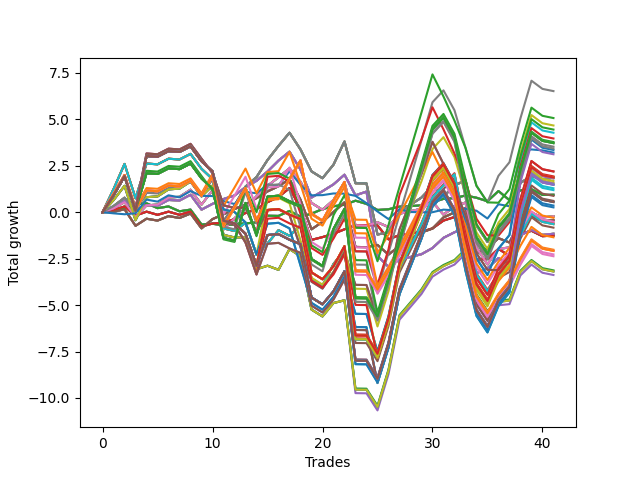

# Long Pointer Two (1227) 
- Symbol: AAPL_Unlimited
- Date Range: 03/23/2022 - 07/08/2022
- Trading Period: 7:20-12:30
- Number of Trades: 41



| Name | Win Percent | Profit | Avg Profit / Trade | Avg Time / Trade |      | Name | Win Percent | Profit | Avg Profit / Trade | Avg Time / Trade |
| ---- | ----------- | ------ | ------------------ | ---------------- | ---- | ---- | ----------- | ------ | ------------------ | ---------------- |
| Sorted By <br> Profit | | | | | | Sorted By <br> Win Percentage ||||
| Ninety-Two | 48.78 | 3260.00 | 79.51 | 120:18 |     | Sixty-Five | 73.17 | -630.00 | -15.37 | 15:54 |
| Ninety-Seven | 43.90 | 2535.00 | 61.83 | 102:14 |     | Fifty-Seven | 73.17 | -630.00 | -15.37 | 15:54 |
| Ninety-Three | 46.34 | 2335.00 | 56.95 | 140:09 |     | Forty-Nine | 73.17 | -630.00 | -15.37 | 15:54 |
| One Hundred Seven | 48.78 | 2225.00 | 54.27 | 128:49 |     | Forty-One | 73.17 | -630.00 | -15.37 | 15:54 |
| Ninety-Four | 46.34 | 2140.00 | 52.20 | 144:43 |     | One | 73.17 | -630.00 | -15.37 | 15:54 |
| Ninety-Eight | 43.90 | 1985.00 | 48.41 | 119:58 |     | Sixty-Four | 70.73 | 470.00 | 11.46 | 07:59 |
| One Hundred Seventeen | 48.78 | 1890.00 | 46.10 | 139:36 |     | Fifty-Six | 70.73 | 470.00 | 11.46 | 07:59 |
| One Hundred Twenty-Seven | 48.78 | 1860.00 | 45.37 | 141:21 |     | Forty-Eight | 70.73 | 470.00 | 11.46 | 07:59 |
| One Hundred Twenty-Two | 48.78 | 1860.00 | 45.37 | 141:21 |     | Forty | 70.73 | 470.00 | 11.46 | 07:59 |
| Eighty-Two | 48.78 | 1860.00 | 45.37 | 141:21 |     | Zero | 70.73 | 470.00 | 11.46 | 07:59 |
| One Hundred Twelve | 48.78 | 1765.00 | 43.05 | 139:55 |     | Sixty-Seven | 70.73 | -215.00 | -5.24 | 23:27 |
| One Hundred Two | 48.78 | 1715.00 | 41.83 | 131:55 |     | Fifty-Nine | 70.73 | -215.00 | -5.24 | 23:27 |
| Ninety-Five | 46.34 | 1675.00 | 40.85 | 145:05 |     | Fifty-One | 70.73 | -215.00 | -5.24 | 23:27 |
| Seventy-Three | 39.02 | 1605.00 | 39.15 | 08:18 |     | Forty-Three | 70.73 | -215.00 | -5.24 | 23:27 |
| Ninety-Nine | 43.90 | 1560.00 | 38.05 | 122:55 |     | Three | 70.73 | -215.00 | -5.24 | 23:27 |
| One Hundred Eight | 46.34 | 1100.00 | 26.83 | 147:29 |     | Sixty-Six | 70.73 | -580.00 | -14.15 | 23:35 |
| One Hundred | 43.90 | 1095.00 | 26.71 | 123:16 |     | Fifty-Eight | 70.73 | -580.00 | -14.15 | 23:35 |
| One Hundred Eighteen | 46.34 | 965.00 | 23.54 | 159:27 |     | Fifty | 70.73 | -580.00 | -14.15 | 23:35 |
| Sixty-Nine | 63.41 | 935.00 | 22.80 | 50:06 |     | Forty-Two | 70.73 | -580.00 | -14.15 | 23:35 |
| Sixty-One | 63.41 | 935.00 | 22.80 | 50:06 |     | Two | 70.73 | -580.00 | -14.15 | 23:35 |
| Fifty-Three | 63.41 | 935.00 | 22.80 | 50:06 |     | Sixty-Eight | 68.29 | -110.00 | -2.68 | 36:34 |
| Forty-Five | 63.41 | 935.00 | 22.80 | 50:06 |     | Sixty | 68.29 | -110.00 | -2.68 | 36:34 |
| Five | 63.41 | 935.00 | 22.80 | 50:06 |     | Fifty-Two | 68.29 | -110.00 | -2.68 | 36:34 |
| One Hundred Twenty-Eight | 46.34 | 935.00 | 22.80 | 161:12 |     | Forty-Four | 68.29 | -110.00 | -2.68 | 36:34 |
| One Hundred Twenty-Three | 46.34 | 935.00 | 22.80 | 161:12 |     | Four | 68.29 | -110.00 | -2.68 | 36:34 |
| Eighty-Three | 46.34 | 935.00 | 22.80 | 161:12 |     | Sixty-Nine | 63.41 | 935.00 | 22.80 | 50:06 |
| One Hundred Nine | 46.34 | 905.00 | 22.07 | 152:03 |     | Sixty-One | 63.41 | 935.00 | 22.80 | 50:06 |
| One Hundred Thirteen | 46.34 | 840.00 | 20.49 | 159:46 |     | Fifty-Three | 63.41 | 935.00 | 22.80 | 50:06 |
| One Hundred Three | 46.34 | 790.00 | 19.27 | 151:46 |     | Forty-Five | 63.41 | 935.00 | 22.80 | 50:06 |
| One Hundred Ninteen | 46.34 | 770.00 | 18.78 | 164:02 |     | Five | 63.41 | 935.00 | 22.80 | 50:06 |
| One Hundred Twenty-Nine | 46.34 | 740.00 | 18.05 | 165:47 |     | Fifty-Four | 60.98 | -1565.00 | -38.17 | 80:53 |
| One Hundred Twenty-Four | 46.34 | 740.00 | 18.05 | 165:47 |     | Seventy | 60.98 | -1595.00 | -38.90 | 82:38 |
| Eighty-Four | 46.34 | 740.00 | 18.05 | 165:47 |     | Sixty-Two | 60.98 | -1595.00 | -38.90 | 82:38 |
| One Hundred Fourteen | 46.34 | 645.00 | 15.73 | 164:20 |     | Six | 60.98 | -1595.00 | -38.90 | 82:38 |
| One Hundred Four | 46.34 | 595.00 | 14.51 | 156:21 |     | Forty-Six | 60.98 | -1690.00 | -41.22 | 81:11 |
| Sixty-Four | 70.73 | 470.00 | 11.46 | 07:59 |     | One Hundred Six | 58.54 | -675.00 | -16.46 | 94:06 |
| Fifty-Six | 70.73 | 470.00 | 11.46 | 07:59 |     | One Hundred Sixteen | 58.54 | -1010.00 | -24.63 | 104:53 |
| Forty-Eight | 70.73 | 470.00 | 11.46 | 07:59 |     | One Hundred Twenty-Six | 58.54 | -1040.00 | -25.37 | 106:38 |
| Forty | 70.73 | 470.00 | 11.46 | 07:59 |     | One Hundred Twenty-One | 58.54 | -1040.00 | -25.37 | 106:38 |
| Zero | 70.73 | 470.00 | 11.46 | 07:59 |     | Eighty-One | 58.54 | -1040.00 | -25.37 | 106:38 |
| One Hundred Ten | 46.34 | 440.00 | 10.73 | 152:25 |     | One Hundred Eleven | 58.54 | -1135.00 | -27.68 | 105:12 |
| One Hundred Twenty | 46.34 | 305.00 | 7.44 | 164:23 |     | One Hundred One | 58.54 | -1185.00 | -28.90 | 97:12 |
| One Hundred Thirty | 46.34 | 275.00 | 6.71 | 166:08 |     | Ninety-One | 56.10 | -255.00 | -6.22 | 88:38 |
| One Hundred Twenty-Five | 46.34 | 275.00 | 6.71 | 166:08 |     | Ninety-Six | 53.66 | -150.00 | -3.66 | 74:13 |
| Eighty-Five | 46.34 | 275.00 | 6.71 | 166:08 |     | Fifty-Five | 53.66 | -290.00 | -7.07 | 108:05 |
| One Hundred Fifteen | 46.34 | 180.00 | 4.39 | 164:42 |     | Seventy-One | 53.66 | -320.00 | -7.80 | 109:50 |
| One Hundred Five | 46.34 | 130.00 | 3.17 | 156:42 |     | Sixty-Three | 53.66 | -320.00 | -7.80 | 109:50 |
| Sixty-Eight | 68.29 | -110.00 | -2.68 | 36:34 |     | Seven | 53.66 | -320.00 | -7.80 | 109:50 |
| Sixty | 68.29 | -110.00 | -2.68 | 36:34 |     | Forty-Seven | 53.66 | -415.00 | -10.12 | 108:24 |
| Fifty-Two | 68.29 | -110.00 | -2.68 | 36:34 |     | Ninety-Two | 48.78 | 3260.00 | 79.51 | 120:18 |
| Forty-Four | 68.29 | -110.00 | -2.68 | 36:34 |     | One Hundred Seven | 48.78 | 2225.00 | 54.27 | 128:49 |
| Four | 68.29 | -110.00 | -2.68 | 36:34 |     | One Hundred Seventeen | 48.78 | 1890.00 | 46.10 | 139:36 |
| Ninety-Six | 53.66 | -150.00 | -3.66 | 74:13 |     | One Hundred Twenty-Seven | 48.78 | 1860.00 | 45.37 | 141:21 |
| Sixty-Seven | 70.73 | -215.00 | -5.24 | 23:27 |     | One Hundred Twenty-Two | 48.78 | 1860.00 | 45.37 | 141:21 |
| Fifty-Nine | 70.73 | -215.00 | -5.24 | 23:27 |     | Eighty-Two | 48.78 | 1860.00 | 45.37 | 141:21 |
| Fifty-One | 70.73 | -215.00 | -5.24 | 23:27 |     | One Hundred Twelve | 48.78 | 1765.00 | 43.05 | 139:55 |
| Forty-Three | 70.73 | -215.00 | -5.24 | 23:27 |     | One Hundred Two | 48.78 | 1715.00 | 41.83 | 131:55 |
| Three | 70.73 | -215.00 | -5.24 | 23:27 |     | Ninety-Three | 46.34 | 2335.00 | 56.95 | 140:09 |
| Ninety-One | 56.10 | -255.00 | -6.22 | 88:38 |     | Ninety-Four | 46.34 | 2140.00 | 52.20 | 144:43 |
| Fifty-Five | 53.66 | -290.00 | -7.07 | 108:05 |     | Ninety-Five | 46.34 | 1675.00 | 40.85 | 145:05 |
| Seventy-One | 53.66 | -320.00 | -7.80 | 109:50 |     | One Hundred Eight | 46.34 | 1100.00 | 26.83 | 147:29 |
| Sixty-Three | 53.66 | -320.00 | -7.80 | 109:50 |     | One Hundred Eighteen | 46.34 | 965.00 | 23.54 | 159:27 |
| Seven | 53.66 | -320.00 | -7.80 | 109:50 |     | One Hundred Twenty-Eight | 46.34 | 935.00 | 22.80 | 161:12 |
| Forty-Seven | 53.66 | -415.00 | -10.12 | 108:24 |     | One Hundred Twenty-Three | 46.34 | 935.00 | 22.80 | 161:12 |
| Sixty-Six | 70.73 | -580.00 | -14.15 | 23:35 |     | Eighty-Three | 46.34 | 935.00 | 22.80 | 161:12 |
| Fifty-Eight | 70.73 | -580.00 | -14.15 | 23:35 |     | One Hundred Nine | 46.34 | 905.00 | 22.07 | 152:03 |
| Fifty | 70.73 | -580.00 | -14.15 | 23:35 |     | One Hundred Thirteen | 46.34 | 840.00 | 20.49 | 159:46 |
| Forty-Two | 70.73 | -580.00 | -14.15 | 23:35 |     | One Hundred Three | 46.34 | 790.00 | 19.27 | 151:46 |
| Two | 70.73 | -580.00 | -14.15 | 23:35 |     | One Hundred Ninteen | 46.34 | 770.00 | 18.78 | 164:02 |
| Sixty-Five | 73.17 | -630.00 | -15.37 | 15:54 |     | One Hundred Twenty-Nine | 46.34 | 740.00 | 18.05 | 165:47 |
| Fifty-Seven | 73.17 | -630.00 | -15.37 | 15:54 |     | One Hundred Twenty-Four | 46.34 | 740.00 | 18.05 | 165:47 |
| Forty-Nine | 73.17 | -630.00 | -15.37 | 15:54 |     | Eighty-Four | 46.34 | 740.00 | 18.05 | 165:47 |
| Forty-One | 73.17 | -630.00 | -15.37 | 15:54 |     | One Hundred Fourteen | 46.34 | 645.00 | 15.73 | 164:20 |
| One | 73.17 | -630.00 | -15.37 | 15:54 |     | One Hundred Four | 46.34 | 595.00 | 14.51 | 156:21 |
| One Hundred Six | 58.54 | -675.00 | -16.46 | 94:06 |     | One Hundred Ten | 46.34 | 440.00 | 10.73 | 152:25 |
| One Hundred Sixteen | 58.54 | -1010.00 | -24.63 | 104:53 |     | One Hundred Twenty | 46.34 | 305.00 | 7.44 | 164:23 |
| One Hundred Twenty-Six | 58.54 | -1040.00 | -25.37 | 106:38 |     | One Hundred Thirty | 46.34 | 275.00 | 6.71 | 166:08 |
| One Hundred Twenty-One | 58.54 | -1040.00 | -25.37 | 106:38 |     | One Hundred Twenty-Five | 46.34 | 275.00 | 6.71 | 166:08 |
| Eighty-One | 58.54 | -1040.00 | -25.37 | 106:38 |     | Eighty-Five | 46.34 | 275.00 | 6.71 | 166:08 |
| One Hundred Eleven | 58.54 | -1135.00 | -27.68 | 105:12 |     | One Hundred Fifteen | 46.34 | 180.00 | 4.39 | 164:42 |
| One Hundred One | 58.54 | -1185.00 | -28.90 | 97:12 |     | One Hundred Five | 46.34 | 130.00 | 3.17 | 156:42 |
| Fifty-Four | 60.98 | -1565.00 | -38.17 | 80:53 |     | Ninety-Seven | 43.90 | 2535.00 | 61.83 | 102:14 |
| Seventy | 60.98 | -1595.00 | -38.90 | 82:38 |     | Ninety-Eight | 43.90 | 1985.00 | 48.41 | 119:58 |
| Sixty-Two | 60.98 | -1595.00 | -38.90 | 82:38 |     | Ninety-Nine | 43.90 | 1560.00 | 38.05 | 122:55 |
| Six | 60.98 | -1595.00 | -38.90 | 82:38 |     | One Hundred | 43.90 | 1095.00 | 26.71 | 123:16 |
| Forty-Six | 60.98 | -1690.00 | -41.22 | 81:11 |     | Seventy-Three | 39.02 | 1605.00 | 39.15 | 08:18 |

## NO STOPLOSS

### Test Zero
* Sell when price hits the middle line of the 20p bollinger
* No Stoploss
* Results:
```
Total Trades: 41
Percent Up: 70.73
Percent Down: 29.27
Total Points Moved Up: 0.94
Potential Profit: 470.00
Total Points Ups: 4.28 Count Ups: 29
Total Points Downs: -3.34 Count Downs: 12
```

<details><summary>Trades</summary>

<code>In: 2022-03-25 08:30:00		Out: 2022-03-25 08:35:05		Total Position Time: 05:05		Total Move Up: 0.11		Total to Date: 0.11</code> <br />
<code>In: 2022-03-25 09:00:00		Out: 2022-03-25 09:05:05		Total Position Time: 05:05		Total Move Up: 0.11		Total to Date: 0.22</code> <br />
<code>In: 2022-04-05 08:21:00		Out: 2022-04-05 08:22:25		Total Position Time: 01:25		Total Move Up: 0.22		Total to Date: 0.44</code> <br />
<code>In: 2022-04-07 09:52:00		Out: 2022-04-07 09:58:45		Total Position Time: 06:45		Total Move Up: 0.04		Total to Date: 0.48</code> <br />
<code>In: 2022-04-08 10:45:00		Out: 2022-04-08 11:08:25		Total Position Time: 23:25		Total Move Up: -0.26		Total to Date: 0.22</code> <br />
<code>In: 2022-04-08 11:08:00		Out: 2022-04-08 11:09:10		Total Position Time: 01:10		Total Move Up: 0.09		Total to Date: 0.31</code> <br />
<code>In: 2022-04-08 10:45:00		Out: 2022-04-08 11:08:25		Total Position Time: 23:25		Total Move Up: -0.26		Total to Date: 0.05</code> <br />
<code>In: 2022-04-08 11:08:00		Out: 2022-04-08 11:09:10		Total Position Time: 01:10		Total Move Up: 0.09		Total to Date: 0.14</code> <br />
<code>In: 2022-04-11 12:18:00		Out: 2022-04-11 12:47:00		Total Position Time: 29:00		Total Move Up: -0.80		Total to Date: -0.66</code> <br />
<code>In: 2022-04-12 08:02:00		Out: 2022-04-12 08:13:15		Total Position Time: 11:15		Total Move Up: 0.04		Total to Date: -0.62</code> <br />
<code>In: 2022-04-21 10:22:00		Out: 2022-04-21 10:23:10		Total Position Time: 01:10		Total Move Up: -0.09		Total to Date: -0.71</code> <br />
<code>In: 2022-04-22 11:59:00		Out: 2022-04-22 12:07:30		Total Position Time: 08:30		Total Move Up: 0.07		Total to Date: -0.64</code> <br />
<code>In: 2022-04-27 09:04:00		Out: 2022-04-27 09:05:20		Total Position Time: 01:20		Total Move Up: 0.04		Total to Date: -0.60</code> <br />
<code>In: 2022-04-29 09:53:00		Out: 2022-04-29 10:00:05		Total Position Time: 07:05		Total Move Up: 0.05		Total to Date: -0.55</code> <br />
<code>In: 2022-05-03 07:49:00		Out: 2022-05-03 07:54:05		Total Position Time: 05:05		Total Move Up: 0.36		Total to Date: -0.19</code> <br />
<code>In: 2022-05-03 11:45:00		Out: 2022-05-03 11:48:15		Total Position Time: 03:15		Total Move Up: -0.01		Total to Date: -0.20</code> <br />
<code>In: 2022-05-09 11:35:00		Out: 2022-05-09 11:37:40		Total Position Time: 02:40		Total Move Up: 0.27		Total to Date: 0.07</code> <br />
<code>In: 2022-05-10 07:44:00		Out: 2022-05-10 07:58:05		Total Position Time: 14:05		Total Move Up: -0.31		Total to Date: -0.24</code> <br />
<code>In: 2022-05-11 10:25:00		Out: 2022-05-11 10:26:10		Total Position Time: 01:10		Total Move Up: 0.16		Total to Date: -0.08</code> <br />
<code>In: 2022-05-11 12:18:00		Out: 2022-05-11 12:19:10		Total Position Time: 01:10		Total Move Up: 0.25		Total to Date: 0.17</code> <br />
<code>In: 2022-05-16 08:02:00		Out: 2022-05-16 08:05:10		Total Position Time: 03:10		Total Move Up: 0.15		Total to Date: 0.32</code> <br />
<code>In: 2022-05-17 11:25:00		Out: 2022-05-17 11:37:20		Total Position Time: 12:20		Total Move Up: 0.08		Total to Date: 0.40</code> <br />
<code>In: 2022-05-18 07:47:00		Out: 2022-05-18 07:48:35		Total Position Time: 01:35		Total Move Up: 0.22		Total to Date: 0.62</code> <br />
<code>In: 2022-05-19 12:31:00		Out: 2022-05-19 12:43:15		Total Position Time: 12:15		Total Move Up: -0.17		Total to Date: 0.45</code> <br />
<code>In: 2022-05-20 08:15:00		Out: 2022-05-20 08:26:20		Total Position Time: 11:20		Total Move Up: -0.33		Total to Date: 0.12</code> <br />
<code>In: 2022-05-20 09:56:00		Out: 2022-05-20 10:00:00		Total Position Time: 04:00		Total Move Up: 0.04		Total to Date: 0.16</code> <br />
<code>In: 2022-05-20 10:32:00		Out: 2022-05-20 10:33:10		Total Position Time: 01:10		Total Move Up: 0.14		Total to Date: 0.30</code> <br />
<code>In: 2022-05-25 09:30:00		Out: 2022-05-25 09:44:25		Total Position Time: 14:25		Total Move Up: 0.03		Total to Date: 0.33</code> <br />
<code>In: 2022-05-25 09:38:00		Out: 2022-05-25 09:44:25		Total Position Time: 06:25		Total Move Up: 0.04		Total to Date: 0.37</code> <br />
<code>In: 2022-05-25 10:15:00		Out: 2022-05-25 10:16:20		Total Position Time: 01:20		Total Move Up: 0.16		Total to Date: 0.53</code> <br />
<code>In: 2022-06-01 07:39:00		Out: 2022-06-01 07:40:10		Total Position Time: 01:10		Total Move Up: 0.19		Total to Date: 0.72</code> <br />
<code>In: 2022-06-08 08:06:00		Out: 2022-06-08 08:10:40		Total Position Time: 04:40		Total Move Up: 0.04		Total to Date: 0.76</code> <br />
<code>In: 2022-06-09 08:10:00		Out: 2022-06-09 08:11:10		Total Position Time: 01:10		Total Move Up: 0.14		Total to Date: 0.90</code> <br />
<code>In: 2022-06-09 11:14:00		Out: 2022-06-09 11:28:40		Total Position Time: 14:40		Total Move Up: -0.12		Total to Date: 0.78</code> <br />
<code>In: 2022-06-13 12:04:00		Out: 2022-06-13 12:16:50		Total Position Time: 12:50		Total Move Up: -0.19		Total to Date: 0.59</code> <br />
<code>In: 2022-06-14 07:46:00		Out: 2022-06-14 07:47:10		Total Position Time: 01:10		Total Move Up: 0.55		Total to Date: 1.14</code> <br />
<code>In: 2022-06-14 11:53:00		Out: 2022-06-14 12:22:10		Total Position Time: 29:10		Total Move Up: -0.49		Total to Date: 0.65</code> <br />
<code>In: 2022-06-15 11:35:00		Out: 2022-06-15 11:37:10		Total Position Time: 02:10		Total Move Up: 0.53		Total to Date: 1.18</code> <br />
<code>In: 2022-06-23 10:06:00		Out: 2022-06-23 10:07:10		Total Position Time: 01:10		Total Move Up: 0.06		Total to Date: 1.24</code> <br />
<code>In: 2022-06-27 10:37:00		Out: 2022-06-27 11:03:15		Total Position Time: 26:15		Total Move Up: -0.31		Total to Date: 0.93</code> <br />
<code>In: 2022-06-27 10:51:00		Out: 2022-06-27 11:03:15		Total Position Time: 12:15		Total Move Up: 0.01		Total to Date: 0.94</code> <br />


</details>

### Test One
* Sell when the price hits the upper line of the 20p 1std bollinger
* No Stoploss
* Results:
```
Total Trades: 41
Percent Up: 73.17
Percent Down: 26.83
Total Points Moved Up: -1.26
Potential Profit: -630.00
Total Points Ups: 7.04 Count Ups: 30
Total Points Downs: -8.30 Count Downs: 11
```

<details><summary>Trades</summary>

<code>In: 2022-03-25 08:30:00		Out: 2022-03-25 08:41:25		Total Position Time: 11:25		Total Move Up: 0.11		Total to Date: 0.11</code> <br />
<code>In: 2022-03-25 09:00:00		Out: 2022-03-25 09:06:05		Total Position Time: 06:05		Total Move Up: 0.20		Total to Date: 0.31</code> <br />
<code>In: 2022-04-05 08:21:00		Out: 2022-04-05 09:05:00		Total Position Time: 44:00		Total Move Up: -0.49		Total to Date: -0.18</code> <br />
<code>In: 2022-04-07 09:52:00		Out: 2022-04-07 10:02:15		Total Position Time: 10:15		Total Move Up: 0.21		Total to Date: 0.03</code> <br />
<code>In: 2022-04-08 10:45:00		Out: 2022-04-08 11:11:10		Total Position Time: 26:10		Total Move Up: -0.17		Total to Date: -0.14</code> <br />
<code>In: 2022-04-08 11:08:00		Out: 2022-04-08 11:11:10		Total Position Time: 03:10		Total Move Up: 0.17		Total to Date: 0.03</code> <br />
<code>In: 2022-04-08 10:45:00		Out: 2022-04-08 11:11:10		Total Position Time: 26:10		Total Move Up: -0.17		Total to Date: -0.14</code> <br />
<code>In: 2022-04-08 11:08:00		Out: 2022-04-08 11:11:10		Total Position Time: 03:10		Total Move Up: 0.17		Total to Date: 0.03</code> <br />
<code>In: 2022-04-11 12:18:00		Out: 2022-04-11 12:47:00		Total Position Time: 29:00		Total Move Up: -0.80		Total to Date: -0.77</code> <br />
<code>In: 2022-04-12 08:02:00		Out: 2022-04-12 08:14:15		Total Position Time: 12:15		Total Move Up: 0.16		Total to Date: -0.61</code> <br />
<code>In: 2022-04-21 10:22:00		Out: 2022-04-21 10:28:50		Total Position Time: 06:50		Total Move Up: 0.04		Total to Date: -0.57</code> <br />
<code>In: 2022-04-22 11:59:00		Out: 2022-04-22 12:11:50		Total Position Time: 12:50		Total Move Up: 0.20		Total to Date: -0.37</code> <br />
<code>In: 2022-04-27 09:04:00		Out: 2022-04-27 09:06:00		Total Position Time: 02:00		Total Move Up: 0.33		Total to Date: -0.04</code> <br />
<code>In: 2022-04-29 09:53:00		Out: 2022-04-29 10:00:20		Total Position Time: 07:20		Total Move Up: 0.21		Total to Date: 0.17</code> <br />
<code>In: 2022-05-03 07:49:00		Out: 2022-05-03 07:57:20		Total Position Time: 08:20		Total Move Up: 0.37		Total to Date: 0.54</code> <br />
<code>In: 2022-05-03 11:45:00		Out: 2022-05-03 11:52:05		Total Position Time: 07:05		Total Move Up: 0.28		Total to Date: 0.82</code> <br />
<code>In: 2022-05-09 11:35:00		Out: 2022-05-09 11:38:20		Total Position Time: 03:20		Total Move Up: 0.48		Total to Date: 1.30</code> <br />
<code>In: 2022-05-10 07:44:00		Out: 2022-05-10 08:23:05		Total Position Time: 39:05		Total Move Up: -1.07		Total to Date: 0.23</code> <br />
<code>In: 2022-05-11 10:25:00		Out: 2022-05-11 11:18:35		Total Position Time: 53:35		Total Move Up: -1.72		Total to Date: -1.49</code> <br />
<code>In: 2022-05-11 12:18:00		Out: 2022-05-11 12:26:55		Total Position Time: 08:55		Total Move Up: 0.15		Total to Date: -1.34</code> <br />
<code>In: 2022-05-16 08:02:00		Out: 2022-05-16 08:09:30		Total Position Time: 07:30		Total Move Up: 0.18		Total to Date: -1.16</code> <br />
<code>In: 2022-05-17 11:25:00		Out: 2022-05-17 11:39:40		Total Position Time: 14:40		Total Move Up: 0.24		Total to Date: -0.92</code> <br />
<code>In: 2022-05-18 07:47:00		Out: 2022-05-18 08:00:00		Total Position Time: 13:00		Total Move Up: 0.20		Total to Date: -0.72</code> <br />
<code>In: 2022-05-19 12:31:00		Out: 2022-05-19 12:44:30		Total Position Time: 13:30		Total Move Up: 0.03		Total to Date: -0.69</code> <br />
<code>In: 2022-05-20 08:15:00		Out: 2022-05-20 08:27:15		Total Position Time: 12:15		Total Move Up: -0.02		Total to Date: -0.71</code> <br />
<code>In: 2022-05-20 09:56:00		Out: 2022-05-20 10:33:15		Total Position Time: 37:15		Total Move Up: -0.75		Total to Date: -1.46</code> <br />
<code>In: 2022-05-20 10:32:00		Out: 2022-05-20 10:33:15		Total Position Time: 01:15		Total Move Up: 0.23		Total to Date: -1.23</code> <br />
<code>In: 2022-05-25 09:30:00		Out: 2022-05-25 09:45:15		Total Position Time: 15:15		Total Move Up: 0.08		Total to Date: -1.15</code> <br />
<code>In: 2022-05-25 09:38:00		Out: 2022-05-25 09:45:15		Total Position Time: 07:15		Total Move Up: 0.09		Total to Date: -1.06</code> <br />
<code>In: 2022-05-25 10:15:00		Out: 2022-05-25 10:27:00		Total Position Time: 12:00		Total Move Up: 0.19		Total to Date: -0.87</code> <br />
<code>In: 2022-06-01 07:39:00		Out: 2022-06-01 07:42:50		Total Position Time: 03:50		Total Move Up: 0.42		Total to Date: -0.45</code> <br />
<code>In: 2022-06-08 08:06:00		Out: 2022-06-08 08:11:05		Total Position Time: 05:05		Total Move Up: 0.19		Total to Date: -0.26</code> <br />
<code>In: 2022-06-09 08:10:00		Out: 2022-06-09 08:11:10		Total Position Time: 01:10		Total Move Up: 0.14		Total to Date: -0.12</code> <br />
<code>In: 2022-06-09 11:14:00		Out: 2022-06-09 12:47:00		Total Position Time: 93:00		Total Move Up: -2.43		Total to Date: -2.55</code> <br />
<code>In: 2022-06-13 12:04:00		Out: 2022-06-13 12:17:10		Total Position Time: 13:10		Total Move Up: 0.03		Total to Date: -2.52</code> <br />
<code>In: 2022-06-14 07:46:00		Out: 2022-06-14 07:47:10		Total Position Time: 01:10		Total Move Up: 0.55		Total to Date: -1.97</code> <br />
<code>In: 2022-06-14 11:53:00		Out: 2022-06-14 12:26:30		Total Position Time: 33:30		Total Move Up: -0.39		Total to Date: -2.36</code> <br />
<code>In: 2022-06-15 11:35:00		Out: 2022-06-15 11:38:05		Total Position Time: 03:05		Total Move Up: 1.18		Total to Date: -1.18</code> <br />
<code>In: 2022-06-23 10:06:00		Out: 2022-06-23 10:07:25		Total Position Time: 01:25		Total Move Up: 0.18		Total to Date: -1.00</code> <br />
<code>In: 2022-06-27 10:37:00		Out: 2022-06-27 11:05:00		Total Position Time: 28:00		Total Move Up: -0.29		Total to Date: -1.29</code> <br />
<code>In: 2022-06-27 10:51:00		Out: 2022-06-27 11:05:00		Total Position Time: 14:00		Total Move Up: 0.03		Total to Date: -1.26</code> <br />


</details>

### Test Two
* Sell when the price hits the upper line of the 20p 2std bollinger
* No Stoploss
* Results:
```
Total Trades: 41
Percent Up: 70.73
Percent Down: 29.27
Total Points Moved Up: -1.16
Potential Profit: -580.00
Total Points Ups: 10.80 Count Ups: 29
Total Points Downs: -11.96 Count Downs: 12
```

<details><summary>Trades</summary>

<code>In: 2022-03-25 08:30:00		Out: 2022-03-25 08:42:05		Total Position Time: 12:05		Total Move Up: 0.21		Total to Date: 0.21</code> <br />
<code>In: 2022-03-25 09:00:00		Out: 2022-03-25 09:11:20		Total Position Time: 11:20		Total Move Up: 0.40		Total to Date: 0.61</code> <br />
<code>In: 2022-04-05 08:21:00		Out: 2022-04-05 09:05:20		Total Position Time: 44:20		Total Move Up: -0.47		Total to Date: 0.14</code> <br />
<code>In: 2022-04-07 09:52:00		Out: 2022-04-07 10:03:05		Total Position Time: 11:05		Total Move Up: 0.24		Total to Date: 0.38</code> <br />
<code>In: 2022-04-08 10:45:00		Out: 2022-04-08 11:20:45		Total Position Time: 35:45		Total Move Up: -0.03		Total to Date: 0.35</code> <br />
<code>In: 2022-04-08 11:08:00		Out: 2022-04-08 11:20:45		Total Position Time: 12:45		Total Move Up: 0.31		Total to Date: 0.66</code> <br />
<code>In: 2022-04-08 10:45:00		Out: 2022-04-08 11:20:45		Total Position Time: 35:45		Total Move Up: -0.03		Total to Date: 0.63</code> <br />
<code>In: 2022-04-08 11:08:00		Out: 2022-04-08 11:20:45		Total Position Time: 12:45		Total Move Up: 0.31		Total to Date: 0.94</code> <br />
<code>In: 2022-04-11 12:18:00		Out: 2022-04-11 12:47:00		Total Position Time: 29:00		Total Move Up: -0.80		Total to Date: 0.14</code> <br />
<code>In: 2022-04-12 08:02:00		Out: 2022-04-12 08:15:15		Total Position Time: 13:15		Total Move Up: 0.31		Total to Date: 0.45</code> <br />
<code>In: 2022-04-21 10:22:00		Out: 2022-04-21 10:31:20		Total Position Time: 09:20		Total Move Up: 0.26		Total to Date: 0.71</code> <br />
<code>In: 2022-04-22 11:59:00		Out: 2022-04-22 12:12:45		Total Position Time: 13:45		Total Move Up: 0.19		Total to Date: 0.90</code> <br />
<code>In: 2022-04-27 09:04:00		Out: 2022-04-27 09:06:15		Total Position Time: 02:15		Total Move Up: 0.45		Total to Date: 1.35</code> <br />
<code>In: 2022-04-29 09:53:00		Out: 2022-04-29 10:01:00		Total Position Time: 08:00		Total Move Up: 0.34		Total to Date: 1.69</code> <br />
<code>In: 2022-05-03 07:49:00		Out: 2022-05-03 08:02:10		Total Position Time: 13:10		Total Move Up: 0.50		Total to Date: 2.19</code> <br />
<code>In: 2022-05-03 11:45:00		Out: 2022-05-03 11:59:05		Total Position Time: 14:05		Total Move Up: 0.59		Total to Date: 2.78</code> <br />
<code>In: 2022-05-09 11:35:00		Out: 2022-05-09 11:46:50		Total Position Time: 11:50		Total Move Up: 0.48		Total to Date: 3.26</code> <br />
<code>In: 2022-05-10 07:44:00		Out: 2022-05-10 08:37:50		Total Position Time: 53:50		Total Move Up: -0.97		Total to Date: 2.29</code> <br />
<code>In: 2022-05-11 10:25:00		Out: 2022-05-11 11:24:05		Total Position Time: 59:05		Total Move Up: -1.50		Total to Date: 0.79</code> <br />
<code>In: 2022-05-11 12:18:00		Out: 2022-05-11 12:32:30		Total Position Time: 14:30		Total Move Up: 0.34		Total to Date: 1.13</code> <br />
<code>In: 2022-05-16 08:02:00		Out: 2022-05-16 08:09:55		Total Position Time: 07:55		Total Move Up: 0.37		Total to Date: 1.50</code> <br />
<code>In: 2022-05-17 11:25:00		Out: 2022-05-17 11:40:00		Total Position Time: 15:00		Total Move Up: 0.52		Total to Date: 2.02</code> <br />
<code>In: 2022-05-18 07:47:00		Out: 2022-05-18 08:43:30		Total Position Time: 56:30		Total Move Up: -1.11		Total to Date: 0.91</code> <br />
<code>In: 2022-05-19 12:31:00		Out: 2022-05-19 12:45:45		Total Position Time: 14:45		Total Move Up: 0.20		Total to Date: 1.11</code> <br />
<code>In: 2022-05-20 08:15:00		Out: 2022-05-20 10:33:45		Total Position Time: 138:45		Total Move Up: -3.46		Total to Date: -2.35</code> <br />
<code>In: 2022-05-20 09:56:00		Out: 2022-05-20 10:33:45		Total Position Time: 37:45		Total Move Up: -0.59		Total to Date: -2.94</code> <br />
<code>In: 2022-05-20 10:32:00		Out: 2022-05-20 10:33:45		Total Position Time: 01:45		Total Move Up: 0.39		Total to Date: -2.55</code> <br />
<code>In: 2022-05-25 09:30:00		Out: 2022-05-25 09:47:30		Total Position Time: 17:30		Total Move Up: 0.14		Total to Date: -2.41</code> <br />
<code>In: 2022-05-25 09:38:00		Out: 2022-05-25 09:47:30		Total Position Time: 09:30		Total Move Up: 0.15		Total to Date: -2.26</code> <br />
<code>In: 2022-05-25 10:15:00		Out: 2022-05-25 10:29:20		Total Position Time: 14:20		Total Move Up: 0.33		Total to Date: -1.93</code> <br />
<code>In: 2022-06-01 07:39:00		Out: 2022-06-01 07:43:45		Total Position Time: 04:45		Total Move Up: 0.55		Total to Date: -1.38</code> <br />
<code>In: 2022-06-08 08:06:00		Out: 2022-06-08 08:11:35		Total Position Time: 05:35		Total Move Up: 0.30		Total to Date: -1.08</code> <br />
<code>In: 2022-06-09 08:10:00		Out: 2022-06-09 08:22:40		Total Position Time: 12:40		Total Move Up: 0.23		Total to Date: -0.85</code> <br />
<code>In: 2022-06-09 11:14:00		Out: 2022-06-09 12:47:00		Total Position Time: 93:00		Total Move Up: -2.43		Total to Date: -3.28</code> <br />
<code>In: 2022-06-13 12:04:00		Out: 2022-06-13 12:17:15		Total Position Time: 13:15		Total Move Up: 0.26		Total to Date: -3.02</code> <br />
<code>In: 2022-06-14 07:46:00		Out: 2022-06-14 07:47:10		Total Position Time: 01:10		Total Move Up: 0.55		Total to Date: -2.47</code> <br />
<code>In: 2022-06-14 11:53:00		Out: 2022-06-14 12:27:10		Total Position Time: 34:10		Total Move Up: -0.31		Total to Date: -2.78</code> <br />
<code>In: 2022-06-15 11:35:00		Out: 2022-06-15 11:38:10		Total Position Time: 03:10		Total Move Up: 1.55		Total to Date: -1.23</code> <br />
<code>In: 2022-06-23 10:06:00		Out: 2022-06-23 10:07:40		Total Position Time: 01:40		Total Move Up: 0.27		Total to Date: -0.96</code> <br />
<code>In: 2022-06-27 10:37:00		Out: 2022-06-27 11:17:10		Total Position Time: 40:10		Total Move Up: -0.26		Total to Date: -1.22</code> <br />
<code>In: 2022-06-27 10:51:00		Out: 2022-06-27 11:17:10		Total Position Time: 26:10		Total Move Up: 0.06		Total to Date: -1.16</code> <br />


</details>

### Test Three
* Sell when price hits the middle line of the 50p bollinger
* No Stoploss
* Results:
```
Total Trades: 41
Percent Up: 70.73
Percent Down: 29.27
Total Points Moved Up: -0.43
Potential Profit: -215.00
Total Points Ups: 10.01 Count Ups: 29
Total Points Downs: -10.44 Count Downs: 12
```

<details><summary>Trades</summary>

<code>In: 2022-03-25 08:30:00		Out: 2022-03-25 09:05:15		Total Position Time: 35:15		Total Move Up: 0.02		Total to Date: 0.02</code> <br />
<code>In: 2022-03-25 09:00:00		Out: 2022-03-25 09:05:15		Total Position Time: 05:15		Total Move Up: 0.14		Total to Date: 0.16</code> <br />
<code>In: 2022-04-05 08:21:00		Out: 2022-04-05 09:56:10		Total Position Time: 95:10		Total Move Up: -0.89		Total to Date: -0.73</code> <br />
<code>In: 2022-04-07 09:52:00		Out: 2022-04-07 10:03:10		Total Position Time: 11:10		Total Move Up: 0.38		Total to Date: -0.35</code> <br />
<code>In: 2022-04-08 10:45:00		Out: 2022-04-08 11:20:30		Total Position Time: 35:30		Total Move Up: -0.10		Total to Date: -0.45</code> <br />
<code>In: 2022-04-08 11:08:00		Out: 2022-04-08 11:20:30		Total Position Time: 12:30		Total Move Up: 0.24		Total to Date: -0.21</code> <br />
<code>In: 2022-04-08 10:45:00		Out: 2022-04-08 11:20:30		Total Position Time: 35:30		Total Move Up: -0.10		Total to Date: -0.31</code> <br />
<code>In: 2022-04-08 11:08:00		Out: 2022-04-08 11:20:30		Total Position Time: 12:30		Total Move Up: 0.24		Total to Date: -0.07</code> <br />
<code>In: 2022-04-11 12:18:00		Out: 2022-04-11 12:47:00		Total Position Time: 29:00		Total Move Up: -0.80		Total to Date: -0.87</code> <br />
<code>In: 2022-04-12 08:02:00		Out: 2022-04-12 08:19:50		Total Position Time: 17:50		Total Move Up: 0.50		Total to Date: -0.37</code> <br />
<code>In: 2022-04-21 10:22:00		Out: 2022-04-21 10:31:40		Total Position Time: 09:40		Total Move Up: 0.26		Total to Date: -0.11</code> <br />
<code>In: 2022-04-22 11:59:00		Out: 2022-04-22 12:13:30		Total Position Time: 14:30		Total Move Up: 0.28		Total to Date: 0.17</code> <br />
<code>In: 2022-04-27 09:04:00		Out: 2022-04-27 09:05:50		Total Position Time: 01:50		Total Move Up: 0.25		Total to Date: 0.42</code> <br />
<code>In: 2022-04-29 09:53:00		Out: 2022-04-29 10:01:10		Total Position Time: 08:10		Total Move Up: 0.34		Total to Date: 0.76</code> <br />
<code>In: 2022-05-03 07:49:00		Out: 2022-05-03 07:54:05		Total Position Time: 05:05		Total Move Up: 0.36		Total to Date: 1.12</code> <br />
<code>In: 2022-05-03 11:45:00		Out: 2022-05-03 11:52:05		Total Position Time: 07:05		Total Move Up: 0.28		Total to Date: 1.40</code> <br />
<code>In: 2022-05-09 11:35:00		Out: 2022-05-09 11:38:05		Total Position Time: 03:05		Total Move Up: 0.38		Total to Date: 1.78</code> <br />
<code>In: 2022-05-10 07:44:00		Out: 2022-05-10 08:37:10		Total Position Time: 53:10		Total Move Up: -1.11		Total to Date: 0.67</code> <br />
<code>In: 2022-05-11 10:25:00		Out: 2022-05-11 11:23:35		Total Position Time: 58:35		Total Move Up: -1.59		Total to Date: -0.92</code> <br />
<code>In: 2022-05-11 12:18:00		Out: 2022-05-11 12:32:45		Total Position Time: 14:45		Total Move Up: 0.40		Total to Date: -0.52</code> <br />
<code>In: 2022-05-16 08:02:00		Out: 2022-05-16 08:16:10		Total Position Time: 14:10		Total Move Up: 0.53		Total to Date: 0.01</code> <br />
<code>In: 2022-05-17 11:25:00		Out: 2022-05-17 11:40:00		Total Position Time: 15:00		Total Move Up: 0.52		Total to Date: 0.53</code> <br />
<code>In: 2022-05-18 07:47:00		Out: 2022-05-18 09:39:10		Total Position Time: 112:10		Total Move Up: -2.40		Total to Date: -1.87</code> <br />
<code>In: 2022-05-19 12:31:00		Out: 2022-05-19 12:47:00		Total Position Time: 16:00		Total Move Up: -0.01		Total to Date: -1.88</code> <br />
<code>In: 2022-05-20 08:15:00		Out: 2022-05-20 08:34:20		Total Position Time: 19:20		Total Move Up: 0.12		Total to Date: -1.76</code> <br />
<code>In: 2022-05-20 09:56:00		Out: 2022-05-20 10:33:55		Total Position Time: 37:55		Total Move Up: -0.52		Total to Date: -2.28</code> <br />
<code>In: 2022-05-20 10:32:00		Out: 2022-05-20 10:33:55		Total Position Time: 01:55		Total Move Up: 0.46		Total to Date: -1.82</code> <br />
<code>In: 2022-05-25 09:30:00		Out: 2022-05-25 09:49:20		Total Position Time: 19:20		Total Move Up: 0.36		Total to Date: -1.46</code> <br />
<code>In: 2022-05-25 09:38:00		Out: 2022-05-25 09:49:20		Total Position Time: 11:20		Total Move Up: 0.37		Total to Date: -1.09</code> <br />
<code>In: 2022-05-25 10:15:00		Out: 2022-05-25 10:16:30		Total Position Time: 01:30		Total Move Up: 0.21		Total to Date: -0.88</code> <br />
<code>In: 2022-06-01 07:39:00		Out: 2022-06-01 07:53:55		Total Position Time: 14:55		Total Move Up: 0.60		Total to Date: -0.28</code> <br />
<code>In: 2022-06-08 08:06:00		Out: 2022-06-08 08:11:30		Total Position Time: 05:30		Total Move Up: 0.27		Total to Date: -0.01</code> <br />
<code>In: 2022-06-09 08:10:00		Out: 2022-06-09 08:24:35		Total Position Time: 14:35		Total Move Up: 0.23		Total to Date: 0.22</code> <br />
<code>In: 2022-06-09 11:14:00		Out: 2022-06-09 12:47:00		Total Position Time: 93:00		Total Move Up: -2.43		Total to Date: -2.21</code> <br />
<code>In: 2022-06-13 12:04:00		Out: 2022-06-13 12:17:15		Total Position Time: 13:15		Total Move Up: 0.26		Total to Date: -1.95</code> <br />
<code>In: 2022-06-14 07:46:00		Out: 2022-06-14 07:47:10		Total Position Time: 01:10		Total Move Up: 0.55		Total to Date: -1.40</code> <br />
<code>In: 2022-06-14 11:53:00		Out: 2022-06-14 12:27:25		Total Position Time: 34:25		Total Move Up: -0.23		Total to Date: -1.63</code> <br />
<code>In: 2022-06-15 11:35:00		Out: 2022-06-15 11:38:05		Total Position Time: 03:05		Total Move Up: 1.18		Total to Date: -0.45</code> <br />
<code>In: 2022-06-23 10:06:00		Out: 2022-06-23 10:07:30		Total Position Time: 01:30		Total Move Up: 0.22		Total to Date: -0.23</code> <br />
<code>In: 2022-06-27 10:37:00		Out: 2022-06-27 11:17:10		Total Position Time: 40:10		Total Move Up: -0.26		Total to Date: -0.49</code> <br />
<code>In: 2022-06-27 10:51:00		Out: 2022-06-27 11:17:10		Total Position Time: 26:10		Total Move Up: 0.06		Total to Date: -0.43</code> <br />


</details>

### Test Four
* Sell when the price hits the upper line of the 50p 1std bollinger
* No Stoploss
* Results:
```
Total Trades: 41
Percent Up: 68.29
Percent Down: 31.71
Total Points Moved Up: -0.22
Potential Profit: -110.00
Total Points Ups: 12.58 Count Ups: 28
Total Points Downs: -12.80 Count Downs: 13
```

<details><summary>Trades</summary>

<code>In: 2022-03-25 08:30:00		Out: 2022-03-25 09:09:05		Total Position Time: 39:05		Total Move Up: 0.21		Total to Date: 0.21</code> <br />
<code>In: 2022-03-25 09:00:00		Out: 2022-03-25 09:09:05		Total Position Time: 09:05		Total Move Up: 0.33		Total to Date: 0.54</code> <br />
<code>In: 2022-04-05 08:21:00		Out: 2022-04-05 10:04:20		Total Position Time: 103:20		Total Move Up: -0.80		Total to Date: -0.26</code> <br />
<code>In: 2022-04-07 09:52:00		Out: 2022-04-07 10:11:40		Total Position Time: 19:40		Total Move Up: 0.63		Total to Date: 0.37</code> <br />
<code>In: 2022-04-08 10:45:00		Out: 2022-04-08 11:21:10		Total Position Time: 36:10		Total Move Up: 0.04		Total to Date: 0.41</code> <br />
<code>In: 2022-04-08 11:08:00		Out: 2022-04-08 11:21:10		Total Position Time: 13:10		Total Move Up: 0.38		Total to Date: 0.79</code> <br />
<code>In: 2022-04-08 10:45:00		Out: 2022-04-08 11:21:10		Total Position Time: 36:10		Total Move Up: 0.04		Total to Date: 0.83</code> <br />
<code>In: 2022-04-08 11:08:00		Out: 2022-04-08 11:21:10		Total Position Time: 13:10		Total Move Up: 0.38		Total to Date: 1.21</code> <br />
<code>In: 2022-04-11 12:18:00		Out: 2022-04-11 12:47:00		Total Position Time: 29:00		Total Move Up: -0.80		Total to Date: 0.41</code> <br />
<code>In: 2022-04-12 08:02:00		Out: 2022-04-12 08:25:10		Total Position Time: 23:10		Total Move Up: 0.77		Total to Date: 1.18</code> <br />
<code>In: 2022-04-21 10:22:00		Out: 2022-04-21 12:29:55		Total Position Time: 127:55		Total Move Up: -2.11		Total to Date: -0.93</code> <br />
<code>In: 2022-04-22 11:59:00		Out: 2022-04-22 12:14:25		Total Position Time: 15:25		Total Move Up: 0.60		Total to Date: -0.33</code> <br />
<code>In: 2022-04-27 09:04:00		Out: 2022-04-27 09:08:20		Total Position Time: 04:20		Total Move Up: 0.55		Total to Date: 0.22</code> <br />
<code>In: 2022-04-29 09:53:00		Out: 2022-04-29 10:03:40		Total Position Time: 10:40		Total Move Up: 0.64		Total to Date: 0.86</code> <br />
<code>In: 2022-05-03 07:49:00		Out: 2022-05-03 08:02:25		Total Position Time: 13:25		Total Move Up: 0.56		Total to Date: 1.42</code> <br />
<code>In: 2022-05-03 11:45:00		Out: 2022-05-03 11:57:05		Total Position Time: 12:05		Total Move Up: 0.46		Total to Date: 1.88</code> <br />
<code>In: 2022-05-09 11:35:00		Out: 2022-05-09 11:46:50		Total Position Time: 11:50		Total Move Up: 0.48		Total to Date: 2.36</code> <br />
<code>In: 2022-05-10 07:44:00		Out: 2022-05-10 08:39:10		Total Position Time: 55:10		Total Move Up: -0.72		Total to Date: 1.64</code> <br />
<code>In: 2022-05-11 10:25:00		Out: 2022-05-11 11:26:00		Total Position Time: 61:00		Total Move Up: -1.14		Total to Date: 0.50</code> <br />
<code>In: 2022-05-11 12:18:00		Out: 2022-05-11 12:47:00		Total Position Time: 29:00		Total Move Up: -0.37		Total to Date: 0.13</code> <br />
<code>In: 2022-05-16 08:02:00		Out: 2022-05-16 08:33:25		Total Position Time: 31:25		Total Move Up: 0.53		Total to Date: 0.66</code> <br />
<code>In: 2022-05-17 11:25:00		Out: 2022-05-17 11:40:20		Total Position Time: 15:20		Total Move Up: 0.95		Total to Date: 1.61</code> <br />
<code>In: 2022-05-18 07:47:00		Out: 2022-05-18 09:48:00		Total Position Time: 121:00		Total Move Up: -2.32		Total to Date: -0.71</code> <br />
<code>In: 2022-05-19 12:31:00		Out: 2022-05-19 12:47:00		Total Position Time: 16:00		Total Move Up: -0.01		Total to Date: -0.72</code> <br />
<code>In: 2022-05-20 08:15:00		Out: 2022-05-20 08:52:55		Total Position Time: 37:55		Total Move Up: 0.18		Total to Date: -0.54</code> <br />
<code>In: 2022-05-20 09:56:00		Out: 2022-05-20 10:44:05		Total Position Time: 48:05		Total Move Up: -0.26		Total to Date: -0.80</code> <br />
<code>In: 2022-05-20 10:32:00		Out: 2022-05-20 10:44:05		Total Position Time: 12:05		Total Move Up: 0.72		Total to Date: -0.08</code> <br />
<code>In: 2022-05-25 09:30:00		Out: 2022-05-25 10:29:35		Total Position Time: 59:35		Total Move Up: 0.13		Total to Date: 0.05</code> <br />
<code>In: 2022-05-25 09:38:00		Out: 2022-05-25 10:29:35		Total Position Time: 51:35		Total Move Up: 0.14		Total to Date: 0.19</code> <br />
<code>In: 2022-05-25 10:15:00		Out: 2022-05-25 10:29:35		Total Position Time: 14:35		Total Move Up: 0.37		Total to Date: 0.56</code> <br />
<code>In: 2022-06-01 07:39:00		Out: 2022-06-01 09:16:05		Total Position Time: 97:05		Total Move Up: -0.69		Total to Date: -0.13</code> <br />
<code>In: 2022-06-08 08:06:00		Out: 2022-06-08 08:15:05		Total Position Time: 09:05		Total Move Up: 0.44		Total to Date: 0.31</code> <br />
<code>In: 2022-06-09 08:10:00		Out: 2022-06-09 08:35:55		Total Position Time: 25:55		Total Move Up: 0.21		Total to Date: 0.52</code> <br />
<code>In: 2022-06-09 11:14:00		Out: 2022-06-09 12:47:00		Total Position Time: 93:00		Total Move Up: -2.43		Total to Date: -1.91</code> <br />
<code>In: 2022-06-13 12:04:00		Out: 2022-06-13 12:47:00		Total Position Time: 43:00		Total Move Up: -0.89		Total to Date: -2.80</code> <br />
<code>In: 2022-06-14 07:46:00		Out: 2022-06-14 07:50:00		Total Position Time: 04:00		Total Move Up: 0.83		Total to Date: -1.97</code> <br />
<code>In: 2022-06-14 11:53:00		Out: 2022-06-14 12:30:50		Total Position Time: 37:50		Total Move Up: 0.07		Total to Date: -1.90</code> <br />
<code>In: 2022-06-15 11:35:00		Out: 2022-06-15 11:38:10		Total Position Time: 03:10		Total Move Up: 1.55		Total to Date: -0.35</code> <br />
<code>In: 2022-06-23 10:06:00		Out: 2022-06-23 10:23:20		Total Position Time: 17:20		Total Move Up: 0.33		Total to Date: -0.02</code> <br />
<code>In: 2022-06-27 10:37:00		Out: 2022-06-27 11:33:25		Total Position Time: 56:25		Total Move Up: -0.26		Total to Date: -0.28</code> <br />
<code>In: 2022-06-27 10:51:00		Out: 2022-06-27 11:33:25		Total Position Time: 42:25		Total Move Up: 0.06		Total to Date: -0.22</code> <br />


</details>

### Test Five
* Sell when the price hits the upper line of the 50p 2std bollinger
* No Stoploss
* Results:
```
Total Trades: 41
Percent Up: 63.41
Percent Down: 36.59
Total Points Moved Up: 1.87
Potential Profit: 935.00
Total Points Ups: 17.19 Count Ups: 26
Total Points Downs: -15.32 Count Downs: 15
```

<details><summary>Trades</summary>

<code>In: 2022-03-25 08:30:00		Out: 2022-03-25 09:11:30		Total Position Time: 41:30		Total Move Up: 0.33		Total to Date: 0.33</code> <br />
<code>In: 2022-03-25 09:00:00		Out: 2022-03-25 09:11:30		Total Position Time: 11:30		Total Move Up: 0.45		Total to Date: 0.78</code> <br />
<code>In: 2022-04-05 08:21:00		Out: 2022-04-05 10:07:05		Total Position Time: 106:05		Total Move Up: -0.66		Total to Date: 0.12</code> <br />
<code>In: 2022-04-07 09:52:00		Out: 2022-04-07 10:12:40		Total Position Time: 20:40		Total Move Up: 0.92		Total to Date: 1.04</code> <br />
<code>In: 2022-04-08 10:45:00		Out: 2022-04-08 11:52:15		Total Position Time: 67:15		Total Move Up: -0.01		Total to Date: 1.03</code> <br />
<code>In: 2022-04-08 11:08:00		Out: 2022-04-08 11:52:15		Total Position Time: 44:15		Total Move Up: 0.33		Total to Date: 1.36</code> <br />
<code>In: 2022-04-08 10:45:00		Out: 2022-04-08 11:52:15		Total Position Time: 67:15		Total Move Up: -0.01		Total to Date: 1.35</code> <br />
<code>In: 2022-04-08 11:08:00		Out: 2022-04-08 11:52:15		Total Position Time: 44:15		Total Move Up: 0.33		Total to Date: 1.68</code> <br />
<code>In: 2022-04-11 12:18:00		Out: 2022-04-11 12:47:00		Total Position Time: 29:00		Total Move Up: -0.80		Total to Date: 0.88</code> <br />
<code>In: 2022-04-12 08:02:00		Out: 2022-04-12 08:29:25		Total Position Time: 27:25		Total Move Up: 0.93		Total to Date: 1.81</code> <br />
<code>In: 2022-04-21 10:22:00		Out: 2022-04-21 12:44:20		Total Position Time: 142:20		Total Move Up: -2.29		Total to Date: -0.48</code> <br />
<code>In: 2022-04-22 11:59:00		Out: 2022-04-22 12:16:55		Total Position Time: 17:55		Total Move Up: 0.84		Total to Date: 0.36</code> <br />
<code>In: 2022-04-27 09:04:00		Out: 2022-04-27 09:22:10		Total Position Time: 18:10		Total Move Up: 1.02		Total to Date: 1.38</code> <br />
<code>In: 2022-04-29 09:53:00		Out: 2022-04-29 10:26:35		Total Position Time: 33:35		Total Move Up: 0.51		Total to Date: 1.89</code> <br />
<code>In: 2022-05-03 07:49:00		Out: 2022-05-03 08:05:00		Total Position Time: 16:00		Total Move Up: 0.92		Total to Date: 2.81</code> <br />
<code>In: 2022-05-03 11:45:00		Out: 2022-05-03 11:59:45		Total Position Time: 14:45		Total Move Up: 0.76		Total to Date: 3.57</code> <br />
<code>In: 2022-05-09 11:35:00		Out: 2022-05-09 11:47:30		Total Position Time: 12:30		Total Move Up: 0.71		Total to Date: 4.28</code> <br />
<code>In: 2022-05-10 07:44:00		Out: 2022-05-10 10:07:25		Total Position Time: 143:25		Total Move Up: -0.90		Total to Date: 3.38</code> <br />
<code>In: 2022-05-11 10:25:00		Out: 2022-05-11 11:35:00		Total Position Time: 70:00		Total Move Up: -1.18		Total to Date: 2.20</code> <br />
<code>In: 2022-05-11 12:18:00		Out: 2022-05-11 12:47:00		Total Position Time: 29:00		Total Move Up: -0.37		Total to Date: 1.83</code> <br />
<code>In: 2022-05-16 08:02:00		Out: 2022-05-16 08:35:00		Total Position Time: 33:00		Total Move Up: 0.73		Total to Date: 2.56</code> <br />
<code>In: 2022-05-17 11:25:00		Out: 2022-05-17 11:48:45		Total Position Time: 23:45		Total Move Up: 1.25		Total to Date: 3.81</code> <br />
<code>In: 2022-05-18 07:47:00		Out: 2022-05-18 09:50:45		Total Position Time: 123:45		Total Move Up: -2.25		Total to Date: 1.56</code> <br />
<code>In: 2022-05-19 12:31:00		Out: 2022-05-19 12:47:00		Total Position Time: 16:00		Total Move Up: -0.01		Total to Date: 1.55</code> <br />
<code>In: 2022-05-20 08:15:00		Out: 2022-05-20 10:54:15		Total Position Time: 159:15		Total Move Up: -2.75		Total to Date: -1.20</code> <br />
<code>In: 2022-05-20 09:56:00		Out: 2022-05-20 10:54:15		Total Position Time: 58:15		Total Move Up: 0.12		Total to Date: -1.08</code> <br />
<code>In: 2022-05-20 10:32:00		Out: 2022-05-20 10:54:15		Total Position Time: 22:15		Total Move Up: 1.10		Total to Date: 0.02</code> <br />
<code>In: 2022-05-25 09:30:00		Out: 2022-05-25 10:35:30		Total Position Time: 65:30		Total Move Up: 0.38		Total to Date: 0.40</code> <br />
<code>In: 2022-05-25 09:38:00		Out: 2022-05-25 10:35:30		Total Position Time: 57:30		Total Move Up: 0.39		Total to Date: 0.79</code> <br />
<code>In: 2022-05-25 10:15:00		Out: 2022-05-25 10:35:30		Total Position Time: 20:30		Total Move Up: 0.62		Total to Date: 1.41</code> <br />
<code>In: 2022-06-01 07:39:00		Out: 2022-06-01 09:33:05		Total Position Time: 114:05		Total Move Up: -0.57		Total to Date: 0.84</code> <br />
<code>In: 2022-06-08 08:06:00		Out: 2022-06-08 08:17:55		Total Position Time: 11:55		Total Move Up: 0.60		Total to Date: 1.44</code> <br />
<code>In: 2022-06-09 08:10:00		Out: 2022-06-09 08:41:45		Total Position Time: 31:45		Total Move Up: 0.28		Total to Date: 1.72</code> <br />
<code>In: 2022-06-09 11:14:00		Out: 2022-06-09 12:47:00		Total Position Time: 93:00		Total Move Up: -2.43		Total to Date: -0.71</code> <br />
<code>In: 2022-06-13 12:04:00		Out: 2022-06-13 12:47:00		Total Position Time: 43:00		Total Move Up: -0.89		Total to Date: -1.60</code> <br />
<code>In: 2022-06-14 07:46:00		Out: 2022-06-14 08:45:05		Total Position Time: 59:05		Total Move Up: 0.91		Total to Date: -0.69</code> <br />
<code>In: 2022-06-14 11:53:00		Out: 2022-06-14 12:36:25		Total Position Time: 43:25		Total Move Up: 0.27		Total to Date: -0.42</code> <br />
<code>In: 2022-06-15 11:35:00		Out: 2022-06-15 11:38:55		Total Position Time: 03:55		Total Move Up: 2.00		Total to Date: 1.58</code> <br />
<code>In: 2022-06-23 10:06:00		Out: 2022-06-23 10:23:25		Total Position Time: 17:25		Total Move Up: 0.37		Total to Date: 1.95</code> <br />
<code>In: 2022-06-27 10:37:00		Out: 2022-06-27 11:34:15		Total Position Time: 57:15		Total Move Up: -0.20		Total to Date: 1.75</code> <br />
<code>In: 2022-06-27 10:51:00		Out: 2022-06-27 11:34:15		Total Position Time: 43:15		Total Move Up: 0.12		Total to Date: 1.87</code> <br />


</details>

### Test Six
* Sell when the price hits the middle line of the 1std VWAP
* No Stoploss
* Results:
```
Total Trades: 41
Percent Up: 60.98
Percent Down: 39.02
Total Points Moved Up: -3.19
Potential Profit: -1595.00
Total Points Ups: 17.44 Count Ups: 25
Total Points Downs: -20.63 Count Downs: 16
```

<details><summary>Trades</summary>

<code>In: 2022-03-25 08:30:00		Out: 2022-03-25 10:49:00		Total Position Time: 139:00		Total Move Up: 0.65		Total to Date: 0.65</code> <br />
<code>In: 2022-03-25 09:00:00		Out: 2022-03-25 10:49:00		Total Position Time: 109:00		Total Move Up: 0.77		Total to Date: 1.42</code> <br />
<code>In: 2022-04-05 08:21:00		Out: 2022-04-05 12:47:00		Total Position Time: 266:00		Total Move Up: -1.85		Total to Date: -0.43</code> <br />
<code>In: 2022-04-07 09:52:00		Out: 2022-04-07 10:56:05		Total Position Time: 64:05		Total Move Up: 1.24		Total to Date: 0.81</code> <br />
<code>In: 2022-04-08 10:45:00		Out: 2022-04-08 11:53:00		Total Position Time: 68:00		Total Move Up: 0.04		Total to Date: 0.85</code> <br />
<code>In: 2022-04-08 11:08:00		Out: 2022-04-08 11:53:00		Total Position Time: 45:00		Total Move Up: 0.38		Total to Date: 1.23</code> <br />
<code>In: 2022-04-08 10:45:00		Out: 2022-04-08 11:53:00		Total Position Time: 68:00		Total Move Up: 0.04		Total to Date: 1.27</code> <br />
<code>In: 2022-04-08 11:08:00		Out: 2022-04-08 11:53:00		Total Position Time: 45:00		Total Move Up: 0.38		Total to Date: 1.65</code> <br />
<code>In: 2022-04-11 12:18:00		Out: 2022-04-11 12:47:00		Total Position Time: 29:00		Total Move Up: -0.80		Total to Date: 0.85</code> <br />
<code>In: 2022-04-12 08:02:00		Out: 2022-04-12 08:21:00		Total Position Time: 19:00		Total Move Up: 0.58		Total to Date: 1.43</code> <br />
<code>In: 2022-04-21 10:22:00		Out: 2022-04-21 12:47:00		Total Position Time: 145:00		Total Move Up: -2.65		Total to Date: -1.22</code> <br />
<code>In: 2022-04-22 11:59:00		Out: 2022-04-22 12:47:00		Total Position Time: 48:00		Total Move Up: -0.14		Total to Date: -1.36</code> <br />
<code>In: 2022-04-27 09:04:00		Out: 2022-04-27 09:05:10		Total Position Time: 01:10		Total Move Up: 0.01		Total to Date: -1.35</code> <br />
<code>In: 2022-04-29 09:53:00		Out: 2022-04-29 12:47:00		Total Position Time: 174:00		Total Move Up: -1.72		Total to Date: -3.07</code> <br />
<code>In: 2022-05-03 07:49:00		Out: 2022-05-03 07:52:25		Total Position Time: 03:25		Total Move Up: 0.19		Total to Date: -2.88</code> <br />
<code>In: 2022-05-03 11:45:00		Out: 2022-05-03 11:46:10		Total Position Time: 01:10		Total Move Up: -0.22		Total to Date: -3.10</code> <br />
<code>In: 2022-05-09 11:35:00		Out: 2022-05-09 12:00:05		Total Position Time: 25:05		Total Move Up: 1.12		Total to Date: -1.98</code> <br />
<code>In: 2022-05-10 07:44:00		Out: 2022-05-10 10:30:00		Total Position Time: 166:00		Total Move Up: -0.39		Total to Date: -2.37</code> <br />
<code>In: 2022-05-11 10:25:00		Out: 2022-05-11 12:47:00		Total Position Time: 142:00		Total Move Up: -2.87		Total to Date: -5.24</code> <br />
<code>In: 2022-05-11 12:18:00		Out: 2022-05-11 12:47:00		Total Position Time: 29:00		Total Move Up: -0.37		Total to Date: -5.61</code> <br />
<code>In: 2022-05-16 08:02:00		Out: 2022-05-16 08:17:40		Total Position Time: 15:40		Total Move Up: 0.72		Total to Date: -4.89</code> <br />
<code>In: 2022-05-17 11:25:00		Out: 2022-05-17 11:27:00		Total Position Time: 02:00		Total Move Up: 0.15		Total to Date: -4.74</code> <br />
<code>In: 2022-05-18 07:47:00		Out: 2022-05-18 12:47:00		Total Position Time: 300:00		Total Move Up: -4.81		Total to Date: -9.55</code> <br />
<code>In: 2022-05-19 12:31:00		Out: 2022-05-19 12:47:00		Total Position Time: 16:00		Total Move Up: -0.01		Total to Date: -9.56</code> <br />
<code>In: 2022-05-20 08:15:00		Out: 2022-05-20 12:37:15		Total Position Time: 262:15		Total Move Up: -0.92		Total to Date: -10.48</code> <br />
<code>In: 2022-05-20 09:56:00		Out: 2022-05-20 12:37:15		Total Position Time: 161:15		Total Move Up: 1.95		Total to Date: -8.53</code> <br />
<code>In: 2022-05-20 10:32:00		Out: 2022-05-20 12:37:15		Total Position Time: 125:15		Total Move Up: 2.93		Total to Date: -5.60</code> <br />
<code>In: 2022-05-25 09:30:00		Out: 2022-05-25 11:00:30		Total Position Time: 90:30		Total Move Up: 0.69		Total to Date: -4.91</code> <br />
<code>In: 2022-05-25 09:38:00		Out: 2022-05-25 11:00:30		Total Position Time: 82:30		Total Move Up: 0.70		Total to Date: -4.21</code> <br />
<code>In: 2022-05-25 10:15:00		Out: 2022-05-25 11:00:30		Total Position Time: 45:30		Total Move Up: 0.93		Total to Date: -3.28</code> <br />
<code>In: 2022-06-01 07:39:00		Out: 2022-06-01 11:23:30		Total Position Time: 224:30		Total Move Up: 0.38		Total to Date: -2.90</code> <br />
<code>In: 2022-06-08 08:06:00		Out: 2022-06-08 08:11:30		Total Position Time: 05:30		Total Move Up: 0.27		Total to Date: -2.63</code> <br />
<code>In: 2022-06-09 08:10:00		Out: 2022-06-09 08:43:50		Total Position Time: 33:50		Total Move Up: 0.58		Total to Date: -2.05</code> <br />
<code>In: 2022-06-09 11:14:00		Out: 2022-06-09 12:47:00		Total Position Time: 93:00		Total Move Up: -2.43		Total to Date: -4.48</code> <br />
<code>In: 2022-06-13 12:04:00		Out: 2022-06-13 12:47:00		Total Position Time: 43:00		Total Move Up: -0.89		Total to Date: -5.37</code> <br />
<code>In: 2022-06-14 07:46:00		Out: 2022-06-14 07:47:10		Total Position Time: 01:10		Total Move Up: 0.55		Total to Date: -4.82</code> <br />
<code>In: 2022-06-14 11:53:00		Out: 2022-06-14 11:54:10		Total Position Time: 01:10		Total Move Up: 0.06		Total to Date: -4.76</code> <br />
<code>In: 2022-06-15 11:35:00		Out: 2022-06-15 11:38:10		Total Position Time: 03:10		Total Move Up: 1.55		Total to Date: -3.21</code> <br />
<code>In: 2022-06-23 10:06:00		Out: 2022-06-23 10:55:05		Total Position Time: 49:05		Total Move Up: 0.58		Total to Date: -2.63</code> <br />
<code>In: 2022-06-27 10:37:00		Out: 2022-06-27 12:47:00		Total Position Time: 130:00		Total Move Up: -0.44		Total to Date: -3.07</code> <br />
<code>In: 2022-06-27 10:51:00		Out: 2022-06-27 12:47:00		Total Position Time: 116:00		Total Move Up: -0.12		Total to Date: -3.19</code> <br />


</details>

### Test Seven
* Sell when the price hits the upper line of the 1std VWAP
* No Stoploss
* Results:
```
Total Trades: 41
Percent Up: 53.66
Percent Down: 46.34
Total Points Moved Up: -0.64
Potential Profit: -320.00
Total Points Ups: 23.33 Count Ups: 22
Total Points Downs: -23.97 Count Downs: 19
```

<details><summary>Trades</summary>

<code>In: 2022-03-25 08:30:00		Out: 2022-03-25 11:03:35		Total Position Time: 153:35		Total Move Up: 1.24		Total to Date: 1.24</code> <br />
<code>In: 2022-03-25 09:00:00		Out: 2022-03-25 11:03:35		Total Position Time: 123:35		Total Move Up: 1.36		Total to Date: 2.60</code> <br />
<code>In: 2022-04-05 08:21:00		Out: 2022-04-05 12:47:00		Total Position Time: 266:00		Total Move Up: -1.85		Total to Date: 0.75</code> <br />
<code>In: 2022-04-07 09:52:00		Out: 2022-04-07 11:26:15		Total Position Time: 94:15		Total Move Up: 1.87		Total to Date: 2.62</code> <br />
<code>In: 2022-04-08 10:45:00		Out: 2022-04-08 12:47:00		Total Position Time: 122:00		Total Move Up: -0.04		Total to Date: 2.58</code> <br />
<code>In: 2022-04-08 11:08:00		Out: 2022-04-08 12:47:00		Total Position Time: 99:00		Total Move Up: 0.30		Total to Date: 2.88</code> <br />
<code>In: 2022-04-08 10:45:00		Out: 2022-04-08 12:47:00		Total Position Time: 122:00		Total Move Up: -0.04		Total to Date: 2.84</code> <br />
<code>In: 2022-04-08 11:08:00		Out: 2022-04-08 12:47:00		Total Position Time: 99:00		Total Move Up: 0.30		Total to Date: 3.14</code> <br />
<code>In: 2022-04-11 12:18:00		Out: 2022-04-11 12:47:00		Total Position Time: 29:00		Total Move Up: -0.80		Total to Date: 2.34</code> <br />
<code>In: 2022-04-12 08:02:00		Out: 2022-04-12 12:47:00		Total Position Time: 285:00		Total Move Up: -0.56		Total to Date: 1.78</code> <br />
<code>In: 2022-04-21 10:22:00		Out: 2022-04-21 12:47:00		Total Position Time: 145:00		Total Move Up: -2.65		Total to Date: -0.87</code> <br />
<code>In: 2022-04-22 11:59:00		Out: 2022-04-22 12:47:00		Total Position Time: 48:00		Total Move Up: -0.14		Total to Date: -1.01</code> <br />
<code>In: 2022-04-27 09:04:00		Out: 2022-04-27 09:06:10		Total Position Time: 02:10		Total Move Up: 0.44		Total to Date: -0.57</code> <br />
<code>In: 2022-04-29 09:53:00		Out: 2022-04-29 12:47:00		Total Position Time: 174:00		Total Move Up: -1.72		Total to Date: -2.29</code> <br />
<code>In: 2022-05-03 07:49:00		Out: 2022-05-03 08:04:25		Total Position Time: 15:25		Total Move Up: 0.61		Total to Date: -1.68</code> <br />
<code>In: 2022-05-03 11:45:00		Out: 2022-05-03 11:59:25		Total Position Time: 14:25		Total Move Up: 0.71		Total to Date: -0.97</code> <br />
<code>In: 2022-05-09 11:35:00		Out: 2022-05-09 12:47:00		Total Position Time: 72:00		Total Move Up: -0.30		Total to Date: -1.27</code> <br />
<code>In: 2022-05-10 07:44:00		Out: 2022-05-10 10:36:10		Total Position Time: 172:10		Total Move Up: 0.56		Total to Date: -0.71</code> <br />
<code>In: 2022-05-11 10:25:00		Out: 2022-05-11 12:47:00		Total Position Time: 142:00		Total Move Up: -2.87		Total to Date: -3.58</code> <br />
<code>In: 2022-05-11 12:18:00		Out: 2022-05-11 12:47:00		Total Position Time: 29:00		Total Move Up: -0.37		Total to Date: -3.95</code> <br />
<code>In: 2022-05-16 08:02:00		Out: 2022-05-16 08:44:50		Total Position Time: 42:50		Total Move Up: 1.16		Total to Date: -2.79</code> <br />
<code>In: 2022-05-17 11:25:00		Out: 2022-05-17 11:40:10		Total Position Time: 15:10		Total Move Up: 0.75		Total to Date: -2.04</code> <br />
<code>In: 2022-05-18 07:47:00		Out: 2022-05-18 12:47:00		Total Position Time: 300:00		Total Move Up: -4.81		Total to Date: -6.85</code> <br />
<code>In: 2022-05-19 12:31:00		Out: 2022-05-19 12:47:00		Total Position Time: 16:00		Total Move Up: -0.01		Total to Date: -6.86</code> <br />
<code>In: 2022-05-20 08:15:00		Out: 2022-05-20 12:47:00		Total Position Time: 272:00		Total Move Up: -0.97		Total to Date: -7.83</code> <br />
<code>In: 2022-05-20 09:56:00		Out: 2022-05-20 12:47:00		Total Position Time: 171:00		Total Move Up: 1.90		Total to Date: -5.93</code> <br />
<code>In: 2022-05-20 10:32:00		Out: 2022-05-20 12:47:00		Total Position Time: 135:00		Total Move Up: 2.88		Total to Date: -3.05</code> <br />
<code>In: 2022-05-25 09:30:00		Out: 2022-05-25 11:02:30		Total Position Time: 92:30		Total Move Up: 1.20		Total to Date: -1.85</code> <br />
<code>In: 2022-05-25 09:38:00		Out: 2022-05-25 11:02:30		Total Position Time: 84:30		Total Move Up: 1.21		Total to Date: -0.64</code> <br />
<code>In: 2022-05-25 10:15:00		Out: 2022-05-25 11:02:30		Total Position Time: 47:30		Total Move Up: 1.44		Total to Date: 0.80</code> <br />
<code>In: 2022-06-01 07:39:00		Out: 2022-06-01 12:47:00		Total Position Time: 308:00		Total Move Up: 0.64		Total to Date: 1.44</code> <br />
<code>In: 2022-06-08 08:06:00		Out: 2022-06-08 08:17:55		Total Position Time: 11:55		Total Move Up: 0.60		Total to Date: 2.04</code> <br />
<code>In: 2022-06-09 08:10:00		Out: 2022-06-09 12:47:00		Total Position Time: 277:00		Total Move Up: -2.96		Total to Date: -0.92</code> <br />
<code>In: 2022-06-09 11:14:00		Out: 2022-06-09 12:47:00		Total Position Time: 93:00		Total Move Up: -2.43		Total to Date: -3.35</code> <br />
<code>In: 2022-06-13 12:04:00		Out: 2022-06-13 12:47:00		Total Position Time: 43:00		Total Move Up: -0.89		Total to Date: -4.24</code> <br />
<code>In: 2022-06-14 07:46:00		Out: 2022-06-14 07:52:50		Total Position Time: 06:50		Total Move Up: 0.89		Total to Date: -3.35</code> <br />
<code>In: 2022-06-14 11:53:00		Out: 2022-06-14 12:37:35		Total Position Time: 44:35		Total Move Up: 0.32		Total to Date: -3.03</code> <br />
<code>In: 2022-06-15 11:35:00		Out: 2022-06-15 11:38:50		Total Position Time: 03:50		Total Move Up: 1.80		Total to Date: -1.23</code> <br />
<code>In: 2022-06-23 10:06:00		Out: 2022-06-23 11:31:35		Total Position Time: 85:35		Total Move Up: 1.15		Total to Date: -0.08</code> <br />
<code>In: 2022-06-27 10:37:00		Out: 2022-06-27 12:47:00		Total Position Time: 130:00		Total Move Up: -0.44		Total to Date: -0.52</code> <br />
<code>In: 2022-06-27 10:51:00		Out: 2022-06-27 12:47:00		Total Position Time: 116:00		Total Move Up: -0.12		Total to Date: -0.64</code> <br />


</details>

## STOPLOSS OF 5

### Test Forty
* Sell when price hits the middle line of the 20p bollinger
* Stoploss is 5 points
* Results:
```
Total Trades: 41
Percent Up: 70.73
Percent Down: 29.27
Total Points Moved Up: 0.94
Potential Profit: 470.00
Total Points Ups: 4.28 Count Ups: 29
Total Points Downs: -3.34 Count Downs: 12
```

<details><summary>Trades</summary>

<code>In: 2022-03-25 08:30:00		Out: 2022-03-25 08:35:05		Total Position Time: 05:05		Total Move Up: 0.11		Total to Date: 0.11</code> <br />
<code>In: 2022-03-25 09:00:00		Out: 2022-03-25 09:05:05		Total Position Time: 05:05		Total Move Up: 0.11		Total to Date: 0.22</code> <br />
<code>In: 2022-04-05 08:21:00		Out: 2022-04-05 08:22:25		Total Position Time: 01:25		Total Move Up: 0.22		Total to Date: 0.44</code> <br />
<code>In: 2022-04-07 09:52:00		Out: 2022-04-07 09:58:45		Total Position Time: 06:45		Total Move Up: 0.04		Total to Date: 0.48</code> <br />
<code>In: 2022-04-08 10:45:00		Out: 2022-04-08 11:08:25		Total Position Time: 23:25		Total Move Up: -0.26		Total to Date: 0.22</code> <br />
<code>In: 2022-04-08 11:08:00		Out: 2022-04-08 11:09:10		Total Position Time: 01:10		Total Move Up: 0.09		Total to Date: 0.31</code> <br />
<code>In: 2022-04-08 10:45:00		Out: 2022-04-08 11:08:25		Total Position Time: 23:25		Total Move Up: -0.26		Total to Date: 0.05</code> <br />
<code>In: 2022-04-08 11:08:00		Out: 2022-04-08 11:09:10		Total Position Time: 01:10		Total Move Up: 0.09		Total to Date: 0.14</code> <br />
<code>In: 2022-04-11 12:18:00		Out: 2022-04-11 12:47:00		Total Position Time: 29:00		Total Move Up: -0.80		Total to Date: -0.66</code> <br />
<code>In: 2022-04-12 08:02:00		Out: 2022-04-12 08:13:15		Total Position Time: 11:15		Total Move Up: 0.04		Total to Date: -0.62</code> <br />
<code>In: 2022-04-21 10:22:00		Out: 2022-04-21 10:23:10		Total Position Time: 01:10		Total Move Up: -0.09		Total to Date: -0.71</code> <br />
<code>In: 2022-04-22 11:59:00		Out: 2022-04-22 12:07:30		Total Position Time: 08:30		Total Move Up: 0.07		Total to Date: -0.64</code> <br />
<code>In: 2022-04-27 09:04:00		Out: 2022-04-27 09:05:20		Total Position Time: 01:20		Total Move Up: 0.04		Total to Date: -0.60</code> <br />
<code>In: 2022-04-29 09:53:00		Out: 2022-04-29 10:00:05		Total Position Time: 07:05		Total Move Up: 0.05		Total to Date: -0.55</code> <br />
<code>In: 2022-05-03 07:49:00		Out: 2022-05-03 07:54:05		Total Position Time: 05:05		Total Move Up: 0.36		Total to Date: -0.19</code> <br />
<code>In: 2022-05-03 11:45:00		Out: 2022-05-03 11:48:15		Total Position Time: 03:15		Total Move Up: -0.01		Total to Date: -0.20</code> <br />
<code>In: 2022-05-09 11:35:00		Out: 2022-05-09 11:37:40		Total Position Time: 02:40		Total Move Up: 0.27		Total to Date: 0.07</code> <br />
<code>In: 2022-05-10 07:44:00		Out: 2022-05-10 07:58:05		Total Position Time: 14:05		Total Move Up: -0.31		Total to Date: -0.24</code> <br />
<code>In: 2022-05-11 10:25:00		Out: 2022-05-11 10:26:10		Total Position Time: 01:10		Total Move Up: 0.16		Total to Date: -0.08</code> <br />
<code>In: 2022-05-11 12:18:00		Out: 2022-05-11 12:19:10		Total Position Time: 01:10		Total Move Up: 0.25		Total to Date: 0.17</code> <br />
<code>In: 2022-05-16 08:02:00		Out: 2022-05-16 08:05:10		Total Position Time: 03:10		Total Move Up: 0.15		Total to Date: 0.32</code> <br />
<code>In: 2022-05-17 11:25:00		Out: 2022-05-17 11:37:20		Total Position Time: 12:20		Total Move Up: 0.08		Total to Date: 0.40</code> <br />
<code>In: 2022-05-18 07:47:00		Out: 2022-05-18 07:48:35		Total Position Time: 01:35		Total Move Up: 0.22		Total to Date: 0.62</code> <br />
<code>In: 2022-05-19 12:31:00		Out: 2022-05-19 12:43:15		Total Position Time: 12:15		Total Move Up: -0.17		Total to Date: 0.45</code> <br />
<code>In: 2022-05-20 08:15:00		Out: 2022-05-20 08:26:20		Total Position Time: 11:20		Total Move Up: -0.33		Total to Date: 0.12</code> <br />
<code>In: 2022-05-20 09:56:00		Out: 2022-05-20 10:00:00		Total Position Time: 04:00		Total Move Up: 0.04		Total to Date: 0.16</code> <br />
<code>In: 2022-05-20 10:32:00		Out: 2022-05-20 10:33:10		Total Position Time: 01:10		Total Move Up: 0.14		Total to Date: 0.30</code> <br />
<code>In: 2022-05-25 09:30:00		Out: 2022-05-25 09:44:25		Total Position Time: 14:25		Total Move Up: 0.03		Total to Date: 0.33</code> <br />
<code>In: 2022-05-25 09:38:00		Out: 2022-05-25 09:44:25		Total Position Time: 06:25		Total Move Up: 0.04		Total to Date: 0.37</code> <br />
<code>In: 2022-05-25 10:15:00		Out: 2022-05-25 10:16:20		Total Position Time: 01:20		Total Move Up: 0.16		Total to Date: 0.53</code> <br />
<code>In: 2022-06-01 07:39:00		Out: 2022-06-01 07:40:10		Total Position Time: 01:10		Total Move Up: 0.19		Total to Date: 0.72</code> <br />
<code>In: 2022-06-08 08:06:00		Out: 2022-06-08 08:10:40		Total Position Time: 04:40		Total Move Up: 0.04		Total to Date: 0.76</code> <br />
<code>In: 2022-06-09 08:10:00		Out: 2022-06-09 08:11:10		Total Position Time: 01:10		Total Move Up: 0.14		Total to Date: 0.90</code> <br />
<code>In: 2022-06-09 11:14:00		Out: 2022-06-09 11:28:40		Total Position Time: 14:40		Total Move Up: -0.12		Total to Date: 0.78</code> <br />
<code>In: 2022-06-13 12:04:00		Out: 2022-06-13 12:16:50		Total Position Time: 12:50		Total Move Up: -0.19		Total to Date: 0.59</code> <br />
<code>In: 2022-06-14 07:46:00		Out: 2022-06-14 07:47:10		Total Position Time: 01:10		Total Move Up: 0.55		Total to Date: 1.14</code> <br />
<code>In: 2022-06-14 11:53:00		Out: 2022-06-14 12:22:10		Total Position Time: 29:10		Total Move Up: -0.49		Total to Date: 0.65</code> <br />
<code>In: 2022-06-15 11:35:00		Out: 2022-06-15 11:37:10		Total Position Time: 02:10		Total Move Up: 0.53		Total to Date: 1.18</code> <br />
<code>In: 2022-06-23 10:06:00		Out: 2022-06-23 10:07:10		Total Position Time: 01:10		Total Move Up: 0.06		Total to Date: 1.24</code> <br />
<code>In: 2022-06-27 10:37:00		Out: 2022-06-27 11:03:15		Total Position Time: 26:15		Total Move Up: -0.31		Total to Date: 0.93</code> <br />
<code>In: 2022-06-27 10:51:00		Out: 2022-06-27 11:03:15		Total Position Time: 12:15		Total Move Up: 0.01		Total to Date: 0.94</code> <br />


</details>

### Test Forty-One
* Sell when the price hits the upper line of the 20p 1std bollinger
* Stoploss is 5 points
* Results:
```
Total Trades: 41
Percent Up: 73.17
Percent Down: 26.83
Total Points Moved Up: -1.26
Potential Profit: -630.00
Total Points Ups: 7.04 Count Ups: 30
Total Points Downs: -8.30 Count Downs: 11
```

<details><summary>Trades</summary>

<code>In: 2022-03-25 08:30:00		Out: 2022-03-25 08:41:25		Total Position Time: 11:25		Total Move Up: 0.11		Total to Date: 0.11</code> <br />
<code>In: 2022-03-25 09:00:00		Out: 2022-03-25 09:06:05		Total Position Time: 06:05		Total Move Up: 0.20		Total to Date: 0.31</code> <br />
<code>In: 2022-04-05 08:21:00		Out: 2022-04-05 09:05:00		Total Position Time: 44:00		Total Move Up: -0.49		Total to Date: -0.18</code> <br />
<code>In: 2022-04-07 09:52:00		Out: 2022-04-07 10:02:15		Total Position Time: 10:15		Total Move Up: 0.21		Total to Date: 0.03</code> <br />
<code>In: 2022-04-08 10:45:00		Out: 2022-04-08 11:11:10		Total Position Time: 26:10		Total Move Up: -0.17		Total to Date: -0.14</code> <br />
<code>In: 2022-04-08 11:08:00		Out: 2022-04-08 11:11:10		Total Position Time: 03:10		Total Move Up: 0.17		Total to Date: 0.03</code> <br />
<code>In: 2022-04-08 10:45:00		Out: 2022-04-08 11:11:10		Total Position Time: 26:10		Total Move Up: -0.17		Total to Date: -0.14</code> <br />
<code>In: 2022-04-08 11:08:00		Out: 2022-04-08 11:11:10		Total Position Time: 03:10		Total Move Up: 0.17		Total to Date: 0.03</code> <br />
<code>In: 2022-04-11 12:18:00		Out: 2022-04-11 12:47:00		Total Position Time: 29:00		Total Move Up: -0.80		Total to Date: -0.77</code> <br />
<code>In: 2022-04-12 08:02:00		Out: 2022-04-12 08:14:15		Total Position Time: 12:15		Total Move Up: 0.16		Total to Date: -0.61</code> <br />
<code>In: 2022-04-21 10:22:00		Out: 2022-04-21 10:28:50		Total Position Time: 06:50		Total Move Up: 0.04		Total to Date: -0.57</code> <br />
<code>In: 2022-04-22 11:59:00		Out: 2022-04-22 12:11:50		Total Position Time: 12:50		Total Move Up: 0.20		Total to Date: -0.37</code> <br />
<code>In: 2022-04-27 09:04:00		Out: 2022-04-27 09:06:00		Total Position Time: 02:00		Total Move Up: 0.33		Total to Date: -0.04</code> <br />
<code>In: 2022-04-29 09:53:00		Out: 2022-04-29 10:00:20		Total Position Time: 07:20		Total Move Up: 0.21		Total to Date: 0.17</code> <br />
<code>In: 2022-05-03 07:49:00		Out: 2022-05-03 07:57:20		Total Position Time: 08:20		Total Move Up: 0.37		Total to Date: 0.54</code> <br />
<code>In: 2022-05-03 11:45:00		Out: 2022-05-03 11:52:05		Total Position Time: 07:05		Total Move Up: 0.28		Total to Date: 0.82</code> <br />
<code>In: 2022-05-09 11:35:00		Out: 2022-05-09 11:38:20		Total Position Time: 03:20		Total Move Up: 0.48		Total to Date: 1.30</code> <br />
<code>In: 2022-05-10 07:44:00		Out: 2022-05-10 08:23:05		Total Position Time: 39:05		Total Move Up: -1.07		Total to Date: 0.23</code> <br />
<code>In: 2022-05-11 10:25:00		Out: 2022-05-11 11:18:35		Total Position Time: 53:35		Total Move Up: -1.72		Total to Date: -1.49</code> <br />
<code>In: 2022-05-11 12:18:00		Out: 2022-05-11 12:26:55		Total Position Time: 08:55		Total Move Up: 0.15		Total to Date: -1.34</code> <br />
<code>In: 2022-05-16 08:02:00		Out: 2022-05-16 08:09:30		Total Position Time: 07:30		Total Move Up: 0.18		Total to Date: -1.16</code> <br />
<code>In: 2022-05-17 11:25:00		Out: 2022-05-17 11:39:40		Total Position Time: 14:40		Total Move Up: 0.24		Total to Date: -0.92</code> <br />
<code>In: 2022-05-18 07:47:00		Out: 2022-05-18 08:00:00		Total Position Time: 13:00		Total Move Up: 0.20		Total to Date: -0.72</code> <br />
<code>In: 2022-05-19 12:31:00		Out: 2022-05-19 12:44:30		Total Position Time: 13:30		Total Move Up: 0.03		Total to Date: -0.69</code> <br />
<code>In: 2022-05-20 08:15:00		Out: 2022-05-20 08:27:15		Total Position Time: 12:15		Total Move Up: -0.02		Total to Date: -0.71</code> <br />
<code>In: 2022-05-20 09:56:00		Out: 2022-05-20 10:33:15		Total Position Time: 37:15		Total Move Up: -0.75		Total to Date: -1.46</code> <br />
<code>In: 2022-05-20 10:32:00		Out: 2022-05-20 10:33:15		Total Position Time: 01:15		Total Move Up: 0.23		Total to Date: -1.23</code> <br />
<code>In: 2022-05-25 09:30:00		Out: 2022-05-25 09:45:15		Total Position Time: 15:15		Total Move Up: 0.08		Total to Date: -1.15</code> <br />
<code>In: 2022-05-25 09:38:00		Out: 2022-05-25 09:45:15		Total Position Time: 07:15		Total Move Up: 0.09		Total to Date: -1.06</code> <br />
<code>In: 2022-05-25 10:15:00		Out: 2022-05-25 10:27:00		Total Position Time: 12:00		Total Move Up: 0.19		Total to Date: -0.87</code> <br />
<code>In: 2022-06-01 07:39:00		Out: 2022-06-01 07:42:50		Total Position Time: 03:50		Total Move Up: 0.42		Total to Date: -0.45</code> <br />
<code>In: 2022-06-08 08:06:00		Out: 2022-06-08 08:11:05		Total Position Time: 05:05		Total Move Up: 0.19		Total to Date: -0.26</code> <br />
<code>In: 2022-06-09 08:10:00		Out: 2022-06-09 08:11:10		Total Position Time: 01:10		Total Move Up: 0.14		Total to Date: -0.12</code> <br />
<code>In: 2022-06-09 11:14:00		Out: 2022-06-09 12:47:00		Total Position Time: 93:00		Total Move Up: -2.43		Total to Date: -2.55</code> <br />
<code>In: 2022-06-13 12:04:00		Out: 2022-06-13 12:17:10		Total Position Time: 13:10		Total Move Up: 0.03		Total to Date: -2.52</code> <br />
<code>In: 2022-06-14 07:46:00		Out: 2022-06-14 07:47:10		Total Position Time: 01:10		Total Move Up: 0.55		Total to Date: -1.97</code> <br />
<code>In: 2022-06-14 11:53:00		Out: 2022-06-14 12:26:30		Total Position Time: 33:30		Total Move Up: -0.39		Total to Date: -2.36</code> <br />
<code>In: 2022-06-15 11:35:00		Out: 2022-06-15 11:38:05		Total Position Time: 03:05		Total Move Up: 1.18		Total to Date: -1.18</code> <br />
<code>In: 2022-06-23 10:06:00		Out: 2022-06-23 10:07:25		Total Position Time: 01:25		Total Move Up: 0.18		Total to Date: -1.00</code> <br />
<code>In: 2022-06-27 10:37:00		Out: 2022-06-27 11:05:00		Total Position Time: 28:00		Total Move Up: -0.29		Total to Date: -1.29</code> <br />
<code>In: 2022-06-27 10:51:00		Out: 2022-06-27 11:05:00		Total Position Time: 14:00		Total Move Up: 0.03		Total to Date: -1.26</code> <br />


</details>

### Test Forty-Two
* Sell when the price hits the upper line of the 20p 2std bollinger
* Stoploss is 5 points
* Results:
```
Total Trades: 41
Percent Up: 70.73
Percent Down: 29.27
Total Points Moved Up: -1.16
Potential Profit: -580.00
Total Points Ups: 10.80 Count Ups: 29
Total Points Downs: -11.96 Count Downs: 12
```

<details><summary>Trades</summary>

<code>In: 2022-03-25 08:30:00		Out: 2022-03-25 08:42:05		Total Position Time: 12:05		Total Move Up: 0.21		Total to Date: 0.21</code> <br />
<code>In: 2022-03-25 09:00:00		Out: 2022-03-25 09:11:20		Total Position Time: 11:20		Total Move Up: 0.40		Total to Date: 0.61</code> <br />
<code>In: 2022-04-05 08:21:00		Out: 2022-04-05 09:05:20		Total Position Time: 44:20		Total Move Up: -0.47		Total to Date: 0.14</code> <br />
<code>In: 2022-04-07 09:52:00		Out: 2022-04-07 10:03:05		Total Position Time: 11:05		Total Move Up: 0.24		Total to Date: 0.38</code> <br />
<code>In: 2022-04-08 10:45:00		Out: 2022-04-08 11:20:45		Total Position Time: 35:45		Total Move Up: -0.03		Total to Date: 0.35</code> <br />
<code>In: 2022-04-08 11:08:00		Out: 2022-04-08 11:20:45		Total Position Time: 12:45		Total Move Up: 0.31		Total to Date: 0.66</code> <br />
<code>In: 2022-04-08 10:45:00		Out: 2022-04-08 11:20:45		Total Position Time: 35:45		Total Move Up: -0.03		Total to Date: 0.63</code> <br />
<code>In: 2022-04-08 11:08:00		Out: 2022-04-08 11:20:45		Total Position Time: 12:45		Total Move Up: 0.31		Total to Date: 0.94</code> <br />
<code>In: 2022-04-11 12:18:00		Out: 2022-04-11 12:47:00		Total Position Time: 29:00		Total Move Up: -0.80		Total to Date: 0.14</code> <br />
<code>In: 2022-04-12 08:02:00		Out: 2022-04-12 08:15:15		Total Position Time: 13:15		Total Move Up: 0.31		Total to Date: 0.45</code> <br />
<code>In: 2022-04-21 10:22:00		Out: 2022-04-21 10:31:20		Total Position Time: 09:20		Total Move Up: 0.26		Total to Date: 0.71</code> <br />
<code>In: 2022-04-22 11:59:00		Out: 2022-04-22 12:12:45		Total Position Time: 13:45		Total Move Up: 0.19		Total to Date: 0.90</code> <br />
<code>In: 2022-04-27 09:04:00		Out: 2022-04-27 09:06:15		Total Position Time: 02:15		Total Move Up: 0.45		Total to Date: 1.35</code> <br />
<code>In: 2022-04-29 09:53:00		Out: 2022-04-29 10:01:00		Total Position Time: 08:00		Total Move Up: 0.34		Total to Date: 1.69</code> <br />
<code>In: 2022-05-03 07:49:00		Out: 2022-05-03 08:02:10		Total Position Time: 13:10		Total Move Up: 0.50		Total to Date: 2.19</code> <br />
<code>In: 2022-05-03 11:45:00		Out: 2022-05-03 11:59:05		Total Position Time: 14:05		Total Move Up: 0.59		Total to Date: 2.78</code> <br />
<code>In: 2022-05-09 11:35:00		Out: 2022-05-09 11:46:50		Total Position Time: 11:50		Total Move Up: 0.48		Total to Date: 3.26</code> <br />
<code>In: 2022-05-10 07:44:00		Out: 2022-05-10 08:37:50		Total Position Time: 53:50		Total Move Up: -0.97		Total to Date: 2.29</code> <br />
<code>In: 2022-05-11 10:25:00		Out: 2022-05-11 11:24:05		Total Position Time: 59:05		Total Move Up: -1.50		Total to Date: 0.79</code> <br />
<code>In: 2022-05-11 12:18:00		Out: 2022-05-11 12:32:30		Total Position Time: 14:30		Total Move Up: 0.34		Total to Date: 1.13</code> <br />
<code>In: 2022-05-16 08:02:00		Out: 2022-05-16 08:09:55		Total Position Time: 07:55		Total Move Up: 0.37		Total to Date: 1.50</code> <br />
<code>In: 2022-05-17 11:25:00		Out: 2022-05-17 11:40:00		Total Position Time: 15:00		Total Move Up: 0.52		Total to Date: 2.02</code> <br />
<code>In: 2022-05-18 07:47:00		Out: 2022-05-18 08:43:30		Total Position Time: 56:30		Total Move Up: -1.11		Total to Date: 0.91</code> <br />
<code>In: 2022-05-19 12:31:00		Out: 2022-05-19 12:45:45		Total Position Time: 14:45		Total Move Up: 0.20		Total to Date: 1.11</code> <br />
<code>In: 2022-05-20 08:15:00		Out: 2022-05-20 10:33:45		Total Position Time: 138:45		Total Move Up: -3.46		Total to Date: -2.35</code> <br />
<code>In: 2022-05-20 09:56:00		Out: 2022-05-20 10:33:45		Total Position Time: 37:45		Total Move Up: -0.59		Total to Date: -2.94</code> <br />
<code>In: 2022-05-20 10:32:00		Out: 2022-05-20 10:33:45		Total Position Time: 01:45		Total Move Up: 0.39		Total to Date: -2.55</code> <br />
<code>In: 2022-05-25 09:30:00		Out: 2022-05-25 09:47:30		Total Position Time: 17:30		Total Move Up: 0.14		Total to Date: -2.41</code> <br />
<code>In: 2022-05-25 09:38:00		Out: 2022-05-25 09:47:30		Total Position Time: 09:30		Total Move Up: 0.15		Total to Date: -2.26</code> <br />
<code>In: 2022-05-25 10:15:00		Out: 2022-05-25 10:29:20		Total Position Time: 14:20		Total Move Up: 0.33		Total to Date: -1.93</code> <br />
<code>In: 2022-06-01 07:39:00		Out: 2022-06-01 07:43:45		Total Position Time: 04:45		Total Move Up: 0.55		Total to Date: -1.38</code> <br />
<code>In: 2022-06-08 08:06:00		Out: 2022-06-08 08:11:35		Total Position Time: 05:35		Total Move Up: 0.30		Total to Date: -1.08</code> <br />
<code>In: 2022-06-09 08:10:00		Out: 2022-06-09 08:22:40		Total Position Time: 12:40		Total Move Up: 0.23		Total to Date: -0.85</code> <br />
<code>In: 2022-06-09 11:14:00		Out: 2022-06-09 12:47:00		Total Position Time: 93:00		Total Move Up: -2.43		Total to Date: -3.28</code> <br />
<code>In: 2022-06-13 12:04:00		Out: 2022-06-13 12:17:15		Total Position Time: 13:15		Total Move Up: 0.26		Total to Date: -3.02</code> <br />
<code>In: 2022-06-14 07:46:00		Out: 2022-06-14 07:47:10		Total Position Time: 01:10		Total Move Up: 0.55		Total to Date: -2.47</code> <br />
<code>In: 2022-06-14 11:53:00		Out: 2022-06-14 12:27:10		Total Position Time: 34:10		Total Move Up: -0.31		Total to Date: -2.78</code> <br />
<code>In: 2022-06-15 11:35:00		Out: 2022-06-15 11:38:10		Total Position Time: 03:10		Total Move Up: 1.55		Total to Date: -1.23</code> <br />
<code>In: 2022-06-23 10:06:00		Out: 2022-06-23 10:07:40		Total Position Time: 01:40		Total Move Up: 0.27		Total to Date: -0.96</code> <br />
<code>In: 2022-06-27 10:37:00		Out: 2022-06-27 11:17:10		Total Position Time: 40:10		Total Move Up: -0.26		Total to Date: -1.22</code> <br />
<code>In: 2022-06-27 10:51:00		Out: 2022-06-27 11:17:10		Total Position Time: 26:10		Total Move Up: 0.06		Total to Date: -1.16</code> <br />


</details>

### Test Forty-Three
* Sell when price hits the middle line of the 50p bollinger
* Stoploss is 5 points
* Results:
```
Total Trades: 41
Percent Up: 70.73
Percent Down: 29.27
Total Points Moved Up: -0.43
Potential Profit: -215.00
Total Points Ups: 10.01 Count Ups: 29
Total Points Downs: -10.44 Count Downs: 12
```

<details><summary>Trades</summary>

<code>In: 2022-03-25 08:30:00		Out: 2022-03-25 09:05:15		Total Position Time: 35:15		Total Move Up: 0.02		Total to Date: 0.02</code> <br />
<code>In: 2022-03-25 09:00:00		Out: 2022-03-25 09:05:15		Total Position Time: 05:15		Total Move Up: 0.14		Total to Date: 0.16</code> <br />
<code>In: 2022-04-05 08:21:00		Out: 2022-04-05 09:56:10		Total Position Time: 95:10		Total Move Up: -0.89		Total to Date: -0.73</code> <br />
<code>In: 2022-04-07 09:52:00		Out: 2022-04-07 10:03:10		Total Position Time: 11:10		Total Move Up: 0.38		Total to Date: -0.35</code> <br />
<code>In: 2022-04-08 10:45:00		Out: 2022-04-08 11:20:30		Total Position Time: 35:30		Total Move Up: -0.10		Total to Date: -0.45</code> <br />
<code>In: 2022-04-08 11:08:00		Out: 2022-04-08 11:20:30		Total Position Time: 12:30		Total Move Up: 0.24		Total to Date: -0.21</code> <br />
<code>In: 2022-04-08 10:45:00		Out: 2022-04-08 11:20:30		Total Position Time: 35:30		Total Move Up: -0.10		Total to Date: -0.31</code> <br />
<code>In: 2022-04-08 11:08:00		Out: 2022-04-08 11:20:30		Total Position Time: 12:30		Total Move Up: 0.24		Total to Date: -0.07</code> <br />
<code>In: 2022-04-11 12:18:00		Out: 2022-04-11 12:47:00		Total Position Time: 29:00		Total Move Up: -0.80		Total to Date: -0.87</code> <br />
<code>In: 2022-04-12 08:02:00		Out: 2022-04-12 08:19:50		Total Position Time: 17:50		Total Move Up: 0.50		Total to Date: -0.37</code> <br />
<code>In: 2022-04-21 10:22:00		Out: 2022-04-21 10:31:40		Total Position Time: 09:40		Total Move Up: 0.26		Total to Date: -0.11</code> <br />
<code>In: 2022-04-22 11:59:00		Out: 2022-04-22 12:13:30		Total Position Time: 14:30		Total Move Up: 0.28		Total to Date: 0.17</code> <br />
<code>In: 2022-04-27 09:04:00		Out: 2022-04-27 09:05:50		Total Position Time: 01:50		Total Move Up: 0.25		Total to Date: 0.42</code> <br />
<code>In: 2022-04-29 09:53:00		Out: 2022-04-29 10:01:10		Total Position Time: 08:10		Total Move Up: 0.34		Total to Date: 0.76</code> <br />
<code>In: 2022-05-03 07:49:00		Out: 2022-05-03 07:54:05		Total Position Time: 05:05		Total Move Up: 0.36		Total to Date: 1.12</code> <br />
<code>In: 2022-05-03 11:45:00		Out: 2022-05-03 11:52:05		Total Position Time: 07:05		Total Move Up: 0.28		Total to Date: 1.40</code> <br />
<code>In: 2022-05-09 11:35:00		Out: 2022-05-09 11:38:05		Total Position Time: 03:05		Total Move Up: 0.38		Total to Date: 1.78</code> <br />
<code>In: 2022-05-10 07:44:00		Out: 2022-05-10 08:37:10		Total Position Time: 53:10		Total Move Up: -1.11		Total to Date: 0.67</code> <br />
<code>In: 2022-05-11 10:25:00		Out: 2022-05-11 11:23:35		Total Position Time: 58:35		Total Move Up: -1.59		Total to Date: -0.92</code> <br />
<code>In: 2022-05-11 12:18:00		Out: 2022-05-11 12:32:45		Total Position Time: 14:45		Total Move Up: 0.40		Total to Date: -0.52</code> <br />
<code>In: 2022-05-16 08:02:00		Out: 2022-05-16 08:16:10		Total Position Time: 14:10		Total Move Up: 0.53		Total to Date: 0.01</code> <br />
<code>In: 2022-05-17 11:25:00		Out: 2022-05-17 11:40:00		Total Position Time: 15:00		Total Move Up: 0.52		Total to Date: 0.53</code> <br />
<code>In: 2022-05-18 07:47:00		Out: 2022-05-18 09:39:10		Total Position Time: 112:10		Total Move Up: -2.40		Total to Date: -1.87</code> <br />
<code>In: 2022-05-19 12:31:00		Out: 2022-05-19 12:47:00		Total Position Time: 16:00		Total Move Up: -0.01		Total to Date: -1.88</code> <br />
<code>In: 2022-05-20 08:15:00		Out: 2022-05-20 08:34:20		Total Position Time: 19:20		Total Move Up: 0.12		Total to Date: -1.76</code> <br />
<code>In: 2022-05-20 09:56:00		Out: 2022-05-20 10:33:55		Total Position Time: 37:55		Total Move Up: -0.52		Total to Date: -2.28</code> <br />
<code>In: 2022-05-20 10:32:00		Out: 2022-05-20 10:33:55		Total Position Time: 01:55		Total Move Up: 0.46		Total to Date: -1.82</code> <br />
<code>In: 2022-05-25 09:30:00		Out: 2022-05-25 09:49:20		Total Position Time: 19:20		Total Move Up: 0.36		Total to Date: -1.46</code> <br />
<code>In: 2022-05-25 09:38:00		Out: 2022-05-25 09:49:20		Total Position Time: 11:20		Total Move Up: 0.37		Total to Date: -1.09</code> <br />
<code>In: 2022-05-25 10:15:00		Out: 2022-05-25 10:16:30		Total Position Time: 01:30		Total Move Up: 0.21		Total to Date: -0.88</code> <br />
<code>In: 2022-06-01 07:39:00		Out: 2022-06-01 07:53:55		Total Position Time: 14:55		Total Move Up: 0.60		Total to Date: -0.28</code> <br />
<code>In: 2022-06-08 08:06:00		Out: 2022-06-08 08:11:30		Total Position Time: 05:30		Total Move Up: 0.27		Total to Date: -0.01</code> <br />
<code>In: 2022-06-09 08:10:00		Out: 2022-06-09 08:24:35		Total Position Time: 14:35		Total Move Up: 0.23		Total to Date: 0.22</code> <br />
<code>In: 2022-06-09 11:14:00		Out: 2022-06-09 12:47:00		Total Position Time: 93:00		Total Move Up: -2.43		Total to Date: -2.21</code> <br />
<code>In: 2022-06-13 12:04:00		Out: 2022-06-13 12:17:15		Total Position Time: 13:15		Total Move Up: 0.26		Total to Date: -1.95</code> <br />
<code>In: 2022-06-14 07:46:00		Out: 2022-06-14 07:47:10		Total Position Time: 01:10		Total Move Up: 0.55		Total to Date: -1.40</code> <br />
<code>In: 2022-06-14 11:53:00		Out: 2022-06-14 12:27:25		Total Position Time: 34:25		Total Move Up: -0.23		Total to Date: -1.63</code> <br />
<code>In: 2022-06-15 11:35:00		Out: 2022-06-15 11:38:05		Total Position Time: 03:05		Total Move Up: 1.18		Total to Date: -0.45</code> <br />
<code>In: 2022-06-23 10:06:00		Out: 2022-06-23 10:07:30		Total Position Time: 01:30		Total Move Up: 0.22		Total to Date: -0.23</code> <br />
<code>In: 2022-06-27 10:37:00		Out: 2022-06-27 11:17:10		Total Position Time: 40:10		Total Move Up: -0.26		Total to Date: -0.49</code> <br />
<code>In: 2022-06-27 10:51:00		Out: 2022-06-27 11:17:10		Total Position Time: 26:10		Total Move Up: 0.06		Total to Date: -0.43</code> <br />


</details>

### Test Forty-Four
* Sell when the price hits the upper line of the 50p 1std bollinger
* Stoploss is 5 points
* Results:
```
Total Trades: 41
Percent Up: 68.29
Percent Down: 31.71
Total Points Moved Up: -0.22
Potential Profit: -110.00
Total Points Ups: 12.58 Count Ups: 28
Total Points Downs: -12.80 Count Downs: 13
```

<details><summary>Trades</summary>

<code>In: 2022-03-25 08:30:00		Out: 2022-03-25 09:09:05		Total Position Time: 39:05		Total Move Up: 0.21		Total to Date: 0.21</code> <br />
<code>In: 2022-03-25 09:00:00		Out: 2022-03-25 09:09:05		Total Position Time: 09:05		Total Move Up: 0.33		Total to Date: 0.54</code> <br />
<code>In: 2022-04-05 08:21:00		Out: 2022-04-05 10:04:20		Total Position Time: 103:20		Total Move Up: -0.80		Total to Date: -0.26</code> <br />
<code>In: 2022-04-07 09:52:00		Out: 2022-04-07 10:11:40		Total Position Time: 19:40		Total Move Up: 0.63		Total to Date: 0.37</code> <br />
<code>In: 2022-04-08 10:45:00		Out: 2022-04-08 11:21:10		Total Position Time: 36:10		Total Move Up: 0.04		Total to Date: 0.41</code> <br />
<code>In: 2022-04-08 11:08:00		Out: 2022-04-08 11:21:10		Total Position Time: 13:10		Total Move Up: 0.38		Total to Date: 0.79</code> <br />
<code>In: 2022-04-08 10:45:00		Out: 2022-04-08 11:21:10		Total Position Time: 36:10		Total Move Up: 0.04		Total to Date: 0.83</code> <br />
<code>In: 2022-04-08 11:08:00		Out: 2022-04-08 11:21:10		Total Position Time: 13:10		Total Move Up: 0.38		Total to Date: 1.21</code> <br />
<code>In: 2022-04-11 12:18:00		Out: 2022-04-11 12:47:00		Total Position Time: 29:00		Total Move Up: -0.80		Total to Date: 0.41</code> <br />
<code>In: 2022-04-12 08:02:00		Out: 2022-04-12 08:25:10		Total Position Time: 23:10		Total Move Up: 0.77		Total to Date: 1.18</code> <br />
<code>In: 2022-04-21 10:22:00		Out: 2022-04-21 12:29:55		Total Position Time: 127:55		Total Move Up: -2.11		Total to Date: -0.93</code> <br />
<code>In: 2022-04-22 11:59:00		Out: 2022-04-22 12:14:25		Total Position Time: 15:25		Total Move Up: 0.60		Total to Date: -0.33</code> <br />
<code>In: 2022-04-27 09:04:00		Out: 2022-04-27 09:08:20		Total Position Time: 04:20		Total Move Up: 0.55		Total to Date: 0.22</code> <br />
<code>In: 2022-04-29 09:53:00		Out: 2022-04-29 10:03:40		Total Position Time: 10:40		Total Move Up: 0.64		Total to Date: 0.86</code> <br />
<code>In: 2022-05-03 07:49:00		Out: 2022-05-03 08:02:25		Total Position Time: 13:25		Total Move Up: 0.56		Total to Date: 1.42</code> <br />
<code>In: 2022-05-03 11:45:00		Out: 2022-05-03 11:57:05		Total Position Time: 12:05		Total Move Up: 0.46		Total to Date: 1.88</code> <br />
<code>In: 2022-05-09 11:35:00		Out: 2022-05-09 11:46:50		Total Position Time: 11:50		Total Move Up: 0.48		Total to Date: 2.36</code> <br />
<code>In: 2022-05-10 07:44:00		Out: 2022-05-10 08:39:10		Total Position Time: 55:10		Total Move Up: -0.72		Total to Date: 1.64</code> <br />
<code>In: 2022-05-11 10:25:00		Out: 2022-05-11 11:26:00		Total Position Time: 61:00		Total Move Up: -1.14		Total to Date: 0.50</code> <br />
<code>In: 2022-05-11 12:18:00		Out: 2022-05-11 12:47:00		Total Position Time: 29:00		Total Move Up: -0.37		Total to Date: 0.13</code> <br />
<code>In: 2022-05-16 08:02:00		Out: 2022-05-16 08:33:25		Total Position Time: 31:25		Total Move Up: 0.53		Total to Date: 0.66</code> <br />
<code>In: 2022-05-17 11:25:00		Out: 2022-05-17 11:40:20		Total Position Time: 15:20		Total Move Up: 0.95		Total to Date: 1.61</code> <br />
<code>In: 2022-05-18 07:47:00		Out: 2022-05-18 09:48:00		Total Position Time: 121:00		Total Move Up: -2.32		Total to Date: -0.71</code> <br />
<code>In: 2022-05-19 12:31:00		Out: 2022-05-19 12:47:00		Total Position Time: 16:00		Total Move Up: -0.01		Total to Date: -0.72</code> <br />
<code>In: 2022-05-20 08:15:00		Out: 2022-05-20 08:52:55		Total Position Time: 37:55		Total Move Up: 0.18		Total to Date: -0.54</code> <br />
<code>In: 2022-05-20 09:56:00		Out: 2022-05-20 10:44:05		Total Position Time: 48:05		Total Move Up: -0.26		Total to Date: -0.80</code> <br />
<code>In: 2022-05-20 10:32:00		Out: 2022-05-20 10:44:05		Total Position Time: 12:05		Total Move Up: 0.72		Total to Date: -0.08</code> <br />
<code>In: 2022-05-25 09:30:00		Out: 2022-05-25 10:29:35		Total Position Time: 59:35		Total Move Up: 0.13		Total to Date: 0.05</code> <br />
<code>In: 2022-05-25 09:38:00		Out: 2022-05-25 10:29:35		Total Position Time: 51:35		Total Move Up: 0.14		Total to Date: 0.19</code> <br />
<code>In: 2022-05-25 10:15:00		Out: 2022-05-25 10:29:35		Total Position Time: 14:35		Total Move Up: 0.37		Total to Date: 0.56</code> <br />
<code>In: 2022-06-01 07:39:00		Out: 2022-06-01 09:16:05		Total Position Time: 97:05		Total Move Up: -0.69		Total to Date: -0.13</code> <br />
<code>In: 2022-06-08 08:06:00		Out: 2022-06-08 08:15:05		Total Position Time: 09:05		Total Move Up: 0.44		Total to Date: 0.31</code> <br />
<code>In: 2022-06-09 08:10:00		Out: 2022-06-09 08:35:55		Total Position Time: 25:55		Total Move Up: 0.21		Total to Date: 0.52</code> <br />
<code>In: 2022-06-09 11:14:00		Out: 2022-06-09 12:47:00		Total Position Time: 93:00		Total Move Up: -2.43		Total to Date: -1.91</code> <br />
<code>In: 2022-06-13 12:04:00		Out: 2022-06-13 12:47:00		Total Position Time: 43:00		Total Move Up: -0.89		Total to Date: -2.80</code> <br />
<code>In: 2022-06-14 07:46:00		Out: 2022-06-14 07:50:00		Total Position Time: 04:00		Total Move Up: 0.83		Total to Date: -1.97</code> <br />
<code>In: 2022-06-14 11:53:00		Out: 2022-06-14 12:30:50		Total Position Time: 37:50		Total Move Up: 0.07		Total to Date: -1.90</code> <br />
<code>In: 2022-06-15 11:35:00		Out: 2022-06-15 11:38:10		Total Position Time: 03:10		Total Move Up: 1.55		Total to Date: -0.35</code> <br />
<code>In: 2022-06-23 10:06:00		Out: 2022-06-23 10:23:20		Total Position Time: 17:20		Total Move Up: 0.33		Total to Date: -0.02</code> <br />
<code>In: 2022-06-27 10:37:00		Out: 2022-06-27 11:33:25		Total Position Time: 56:25		Total Move Up: -0.26		Total to Date: -0.28</code> <br />
<code>In: 2022-06-27 10:51:00		Out: 2022-06-27 11:33:25		Total Position Time: 42:25		Total Move Up: 0.06		Total to Date: -0.22</code> <br />


</details>

### Test Forty-Five
* Sell when the price hits the upper line of the 50p 2std bollinger
* Stoploss is 5 points
* Results:
```
Total Trades: 41
Percent Up: 63.41
Percent Down: 36.59
Total Points Moved Up: 1.87
Potential Profit: 935.00
Total Points Ups: 17.19 Count Ups: 26
Total Points Downs: -15.32 Count Downs: 15
```

<details><summary>Trades</summary>

<code>In: 2022-03-25 08:30:00		Out: 2022-03-25 09:11:30		Total Position Time: 41:30		Total Move Up: 0.33		Total to Date: 0.33</code> <br />
<code>In: 2022-03-25 09:00:00		Out: 2022-03-25 09:11:30		Total Position Time: 11:30		Total Move Up: 0.45		Total to Date: 0.78</code> <br />
<code>In: 2022-04-05 08:21:00		Out: 2022-04-05 10:07:05		Total Position Time: 106:05		Total Move Up: -0.66		Total to Date: 0.12</code> <br />
<code>In: 2022-04-07 09:52:00		Out: 2022-04-07 10:12:40		Total Position Time: 20:40		Total Move Up: 0.92		Total to Date: 1.04</code> <br />
<code>In: 2022-04-08 10:45:00		Out: 2022-04-08 11:52:15		Total Position Time: 67:15		Total Move Up: -0.01		Total to Date: 1.03</code> <br />
<code>In: 2022-04-08 11:08:00		Out: 2022-04-08 11:52:15		Total Position Time: 44:15		Total Move Up: 0.33		Total to Date: 1.36</code> <br />
<code>In: 2022-04-08 10:45:00		Out: 2022-04-08 11:52:15		Total Position Time: 67:15		Total Move Up: -0.01		Total to Date: 1.35</code> <br />
<code>In: 2022-04-08 11:08:00		Out: 2022-04-08 11:52:15		Total Position Time: 44:15		Total Move Up: 0.33		Total to Date: 1.68</code> <br />
<code>In: 2022-04-11 12:18:00		Out: 2022-04-11 12:47:00		Total Position Time: 29:00		Total Move Up: -0.80		Total to Date: 0.88</code> <br />
<code>In: 2022-04-12 08:02:00		Out: 2022-04-12 08:29:25		Total Position Time: 27:25		Total Move Up: 0.93		Total to Date: 1.81</code> <br />
<code>In: 2022-04-21 10:22:00		Out: 2022-04-21 12:44:20		Total Position Time: 142:20		Total Move Up: -2.29		Total to Date: -0.48</code> <br />
<code>In: 2022-04-22 11:59:00		Out: 2022-04-22 12:16:55		Total Position Time: 17:55		Total Move Up: 0.84		Total to Date: 0.36</code> <br />
<code>In: 2022-04-27 09:04:00		Out: 2022-04-27 09:22:10		Total Position Time: 18:10		Total Move Up: 1.02		Total to Date: 1.38</code> <br />
<code>In: 2022-04-29 09:53:00		Out: 2022-04-29 10:26:35		Total Position Time: 33:35		Total Move Up: 0.51		Total to Date: 1.89</code> <br />
<code>In: 2022-05-03 07:49:00		Out: 2022-05-03 08:05:00		Total Position Time: 16:00		Total Move Up: 0.92		Total to Date: 2.81</code> <br />
<code>In: 2022-05-03 11:45:00		Out: 2022-05-03 11:59:45		Total Position Time: 14:45		Total Move Up: 0.76		Total to Date: 3.57</code> <br />
<code>In: 2022-05-09 11:35:00		Out: 2022-05-09 11:47:30		Total Position Time: 12:30		Total Move Up: 0.71		Total to Date: 4.28</code> <br />
<code>In: 2022-05-10 07:44:00		Out: 2022-05-10 10:07:25		Total Position Time: 143:25		Total Move Up: -0.90		Total to Date: 3.38</code> <br />
<code>In: 2022-05-11 10:25:00		Out: 2022-05-11 11:35:00		Total Position Time: 70:00		Total Move Up: -1.18		Total to Date: 2.20</code> <br />
<code>In: 2022-05-11 12:18:00		Out: 2022-05-11 12:47:00		Total Position Time: 29:00		Total Move Up: -0.37		Total to Date: 1.83</code> <br />
<code>In: 2022-05-16 08:02:00		Out: 2022-05-16 08:35:00		Total Position Time: 33:00		Total Move Up: 0.73		Total to Date: 2.56</code> <br />
<code>In: 2022-05-17 11:25:00		Out: 2022-05-17 11:48:45		Total Position Time: 23:45		Total Move Up: 1.25		Total to Date: 3.81</code> <br />
<code>In: 2022-05-18 07:47:00		Out: 2022-05-18 09:50:45		Total Position Time: 123:45		Total Move Up: -2.25		Total to Date: 1.56</code> <br />
<code>In: 2022-05-19 12:31:00		Out: 2022-05-19 12:47:00		Total Position Time: 16:00		Total Move Up: -0.01		Total to Date: 1.55</code> <br />
<code>In: 2022-05-20 08:15:00		Out: 2022-05-20 10:54:15		Total Position Time: 159:15		Total Move Up: -2.75		Total to Date: -1.20</code> <br />
<code>In: 2022-05-20 09:56:00		Out: 2022-05-20 10:54:15		Total Position Time: 58:15		Total Move Up: 0.12		Total to Date: -1.08</code> <br />
<code>In: 2022-05-20 10:32:00		Out: 2022-05-20 10:54:15		Total Position Time: 22:15		Total Move Up: 1.10		Total to Date: 0.02</code> <br />
<code>In: 2022-05-25 09:30:00		Out: 2022-05-25 10:35:30		Total Position Time: 65:30		Total Move Up: 0.38		Total to Date: 0.40</code> <br />
<code>In: 2022-05-25 09:38:00		Out: 2022-05-25 10:35:30		Total Position Time: 57:30		Total Move Up: 0.39		Total to Date: 0.79</code> <br />
<code>In: 2022-05-25 10:15:00		Out: 2022-05-25 10:35:30		Total Position Time: 20:30		Total Move Up: 0.62		Total to Date: 1.41</code> <br />
<code>In: 2022-06-01 07:39:00		Out: 2022-06-01 09:33:05		Total Position Time: 114:05		Total Move Up: -0.57		Total to Date: 0.84</code> <br />
<code>In: 2022-06-08 08:06:00		Out: 2022-06-08 08:17:55		Total Position Time: 11:55		Total Move Up: 0.60		Total to Date: 1.44</code> <br />
<code>In: 2022-06-09 08:10:00		Out: 2022-06-09 08:41:45		Total Position Time: 31:45		Total Move Up: 0.28		Total to Date: 1.72</code> <br />
<code>In: 2022-06-09 11:14:00		Out: 2022-06-09 12:47:00		Total Position Time: 93:00		Total Move Up: -2.43		Total to Date: -0.71</code> <br />
<code>In: 2022-06-13 12:04:00		Out: 2022-06-13 12:47:00		Total Position Time: 43:00		Total Move Up: -0.89		Total to Date: -1.60</code> <br />
<code>In: 2022-06-14 07:46:00		Out: 2022-06-14 08:45:05		Total Position Time: 59:05		Total Move Up: 0.91		Total to Date: -0.69</code> <br />
<code>In: 2022-06-14 11:53:00		Out: 2022-06-14 12:36:25		Total Position Time: 43:25		Total Move Up: 0.27		Total to Date: -0.42</code> <br />
<code>In: 2022-06-15 11:35:00		Out: 2022-06-15 11:38:55		Total Position Time: 03:55		Total Move Up: 2.00		Total to Date: 1.58</code> <br />
<code>In: 2022-06-23 10:06:00		Out: 2022-06-23 10:23:25		Total Position Time: 17:25		Total Move Up: 0.37		Total to Date: 1.95</code> <br />
<code>In: 2022-06-27 10:37:00		Out: 2022-06-27 11:34:15		Total Position Time: 57:15		Total Move Up: -0.20		Total to Date: 1.75</code> <br />
<code>In: 2022-06-27 10:51:00		Out: 2022-06-27 11:34:15		Total Position Time: 43:15		Total Move Up: 0.12		Total to Date: 1.87</code> <br />


</details>

### Test Forty-Six
* Sell when the price hits the middle line of the 1std VWAP
* Stoploss is 5 points
* Results:
```
Total Trades: 41
Percent Up: 60.98
Percent Down: 39.02
Total Points Moved Up: -3.38
Potential Profit: -1690.00
Total Points Ups: 17.44 Count Ups: 25
Total Points Downs: -20.82 Count Downs: 16
```

<details><summary>Trades</summary>

<code>In: 2022-03-25 08:30:00		Out: 2022-03-25 10:49:00		Total Position Time: 139:00		Total Move Up: 0.65		Total to Date: 0.65</code> <br />
<code>In: 2022-03-25 09:00:00		Out: 2022-03-25 10:49:00		Total Position Time: 109:00		Total Move Up: 0.77		Total to Date: 1.42</code> <br />
<code>In: 2022-04-05 08:21:00		Out: 2022-04-05 12:47:00		Total Position Time: 266:00		Total Move Up: -1.85		Total to Date: -0.43</code> <br />
<code>In: 2022-04-07 09:52:00		Out: 2022-04-07 10:56:05		Total Position Time: 64:05		Total Move Up: 1.24		Total to Date: 0.81</code> <br />
<code>In: 2022-04-08 10:45:00		Out: 2022-04-08 11:53:00		Total Position Time: 68:00		Total Move Up: 0.04		Total to Date: 0.85</code> <br />
<code>In: 2022-04-08 11:08:00		Out: 2022-04-08 11:53:00		Total Position Time: 45:00		Total Move Up: 0.38		Total to Date: 1.23</code> <br />
<code>In: 2022-04-08 10:45:00		Out: 2022-04-08 11:53:00		Total Position Time: 68:00		Total Move Up: 0.04		Total to Date: 1.27</code> <br />
<code>In: 2022-04-08 11:08:00		Out: 2022-04-08 11:53:00		Total Position Time: 45:00		Total Move Up: 0.38		Total to Date: 1.65</code> <br />
<code>In: 2022-04-11 12:18:00		Out: 2022-04-11 12:47:00		Total Position Time: 29:00		Total Move Up: -0.80		Total to Date: 0.85</code> <br />
<code>In: 2022-04-12 08:02:00		Out: 2022-04-12 08:21:00		Total Position Time: 19:00		Total Move Up: 0.58		Total to Date: 1.43</code> <br />
<code>In: 2022-04-21 10:22:00		Out: 2022-04-21 12:47:00		Total Position Time: 145:00		Total Move Up: -2.65		Total to Date: -1.22</code> <br />
<code>In: 2022-04-22 11:59:00		Out: 2022-04-22 12:47:00		Total Position Time: 48:00		Total Move Up: -0.14		Total to Date: -1.36</code> <br />
<code>In: 2022-04-27 09:04:00		Out: 2022-04-27 09:05:10		Total Position Time: 01:10		Total Move Up: 0.01		Total to Date: -1.35</code> <br />
<code>In: 2022-04-29 09:53:00		Out: 2022-04-29 12:47:00		Total Position Time: 174:00		Total Move Up: -1.72		Total to Date: -3.07</code> <br />
<code>In: 2022-05-03 07:49:00		Out: 2022-05-03 07:52:25		Total Position Time: 03:25		Total Move Up: 0.19		Total to Date: -2.88</code> <br />
<code>In: 2022-05-03 11:45:00		Out: 2022-05-03 11:46:10		Total Position Time: 01:10		Total Move Up: -0.22		Total to Date: -3.10</code> <br />
<code>In: 2022-05-09 11:35:00		Out: 2022-05-09 12:00:05		Total Position Time: 25:05		Total Move Up: 1.12		Total to Date: -1.98</code> <br />
<code>In: 2022-05-10 07:44:00		Out: 2022-05-10 10:30:00		Total Position Time: 166:00		Total Move Up: -0.39		Total to Date: -2.37</code> <br />
<code>In: 2022-05-11 10:25:00		Out: 2022-05-11 12:47:00		Total Position Time: 142:00		Total Move Up: -2.87		Total to Date: -5.24</code> <br />
<code>In: 2022-05-11 12:18:00		Out: 2022-05-11 12:47:00		Total Position Time: 29:00		Total Move Up: -0.37		Total to Date: -5.61</code> <br />
<code>In: 2022-05-16 08:02:00		Out: 2022-05-16 08:17:40		Total Position Time: 15:40		Total Move Up: 0.72		Total to Date: -4.89</code> <br />
<code>In: 2022-05-17 11:25:00		Out: 2022-05-17 11:27:00		Total Position Time: 02:00		Total Move Up: 0.15		Total to Date: -4.74</code> <br />
<code>In: 2022-05-18 07:47:00		Out: 2022-05-18 11:47:55		Total Position Time: 240:55		Total Move Up: -5.00		Total to Date: -9.74</code> <br />
<code>In: 2022-05-19 12:31:00		Out: 2022-05-19 12:47:00		Total Position Time: 16:00		Total Move Up: -0.01		Total to Date: -9.75</code> <br />
<code>In: 2022-05-20 08:15:00		Out: 2022-05-20 12:37:15		Total Position Time: 262:15		Total Move Up: -0.92		Total to Date: -10.67</code> <br />
<code>In: 2022-05-20 09:56:00		Out: 2022-05-20 12:37:15		Total Position Time: 161:15		Total Move Up: 1.95		Total to Date: -8.72</code> <br />
<code>In: 2022-05-20 10:32:00		Out: 2022-05-20 12:37:15		Total Position Time: 125:15		Total Move Up: 2.93		Total to Date: -5.79</code> <br />
<code>In: 2022-05-25 09:30:00		Out: 2022-05-25 11:00:30		Total Position Time: 90:30		Total Move Up: 0.69		Total to Date: -5.10</code> <br />
<code>In: 2022-05-25 09:38:00		Out: 2022-05-25 11:00:30		Total Position Time: 82:30		Total Move Up: 0.70		Total to Date: -4.40</code> <br />
<code>In: 2022-05-25 10:15:00		Out: 2022-05-25 11:00:30		Total Position Time: 45:30		Total Move Up: 0.93		Total to Date: -3.47</code> <br />
<code>In: 2022-06-01 07:39:00		Out: 2022-06-01 11:23:30		Total Position Time: 224:30		Total Move Up: 0.38		Total to Date: -3.09</code> <br />
<code>In: 2022-06-08 08:06:00		Out: 2022-06-08 08:11:30		Total Position Time: 05:30		Total Move Up: 0.27		Total to Date: -2.82</code> <br />
<code>In: 2022-06-09 08:10:00		Out: 2022-06-09 08:43:50		Total Position Time: 33:50		Total Move Up: 0.58		Total to Date: -2.24</code> <br />
<code>In: 2022-06-09 11:14:00		Out: 2022-06-09 12:47:00		Total Position Time: 93:00		Total Move Up: -2.43		Total to Date: -4.67</code> <br />
<code>In: 2022-06-13 12:04:00		Out: 2022-06-13 12:47:00		Total Position Time: 43:00		Total Move Up: -0.89		Total to Date: -5.56</code> <br />
<code>In: 2022-06-14 07:46:00		Out: 2022-06-14 07:47:10		Total Position Time: 01:10		Total Move Up: 0.55		Total to Date: -5.01</code> <br />
<code>In: 2022-06-14 11:53:00		Out: 2022-06-14 11:54:10		Total Position Time: 01:10		Total Move Up: 0.06		Total to Date: -4.95</code> <br />
<code>In: 2022-06-15 11:35:00		Out: 2022-06-15 11:38:10		Total Position Time: 03:10		Total Move Up: 1.55		Total to Date: -3.40</code> <br />
<code>In: 2022-06-23 10:06:00		Out: 2022-06-23 10:55:05		Total Position Time: 49:05		Total Move Up: 0.58		Total to Date: -2.82</code> <br />
<code>In: 2022-06-27 10:37:00		Out: 2022-06-27 12:47:00		Total Position Time: 130:00		Total Move Up: -0.44		Total to Date: -3.26</code> <br />
<code>In: 2022-06-27 10:51:00		Out: 2022-06-27 12:47:00		Total Position Time: 116:00		Total Move Up: -0.12		Total to Date: -3.38</code> <br />


</details>

### Test Forty-Seven
* Sell when the price hits the upper line of the 1std VWAP
* Stoploss is 5 points
* Results:
```
Total Trades: 41
Percent Up: 53.66
Percent Down: 46.34
Total Points Moved Up: -0.83
Potential Profit: -415.00
Total Points Ups: 23.33 Count Ups: 22
Total Points Downs: -24.16 Count Downs: 19
```

<details><summary>Trades</summary>

<code>In: 2022-03-25 08:30:00		Out: 2022-03-25 11:03:35		Total Position Time: 153:35		Total Move Up: 1.24		Total to Date: 1.24</code> <br />
<code>In: 2022-03-25 09:00:00		Out: 2022-03-25 11:03:35		Total Position Time: 123:35		Total Move Up: 1.36		Total to Date: 2.60</code> <br />
<code>In: 2022-04-05 08:21:00		Out: 2022-04-05 12:47:00		Total Position Time: 266:00		Total Move Up: -1.85		Total to Date: 0.75</code> <br />
<code>In: 2022-04-07 09:52:00		Out: 2022-04-07 11:26:15		Total Position Time: 94:15		Total Move Up: 1.87		Total to Date: 2.62</code> <br />
<code>In: 2022-04-08 10:45:00		Out: 2022-04-08 12:47:00		Total Position Time: 122:00		Total Move Up: -0.04		Total to Date: 2.58</code> <br />
<code>In: 2022-04-08 11:08:00		Out: 2022-04-08 12:47:00		Total Position Time: 99:00		Total Move Up: 0.30		Total to Date: 2.88</code> <br />
<code>In: 2022-04-08 10:45:00		Out: 2022-04-08 12:47:00		Total Position Time: 122:00		Total Move Up: -0.04		Total to Date: 2.84</code> <br />
<code>In: 2022-04-08 11:08:00		Out: 2022-04-08 12:47:00		Total Position Time: 99:00		Total Move Up: 0.30		Total to Date: 3.14</code> <br />
<code>In: 2022-04-11 12:18:00		Out: 2022-04-11 12:47:00		Total Position Time: 29:00		Total Move Up: -0.80		Total to Date: 2.34</code> <br />
<code>In: 2022-04-12 08:02:00		Out: 2022-04-12 12:47:00		Total Position Time: 285:00		Total Move Up: -0.56		Total to Date: 1.78</code> <br />
<code>In: 2022-04-21 10:22:00		Out: 2022-04-21 12:47:00		Total Position Time: 145:00		Total Move Up: -2.65		Total to Date: -0.87</code> <br />
<code>In: 2022-04-22 11:59:00		Out: 2022-04-22 12:47:00		Total Position Time: 48:00		Total Move Up: -0.14		Total to Date: -1.01</code> <br />
<code>In: 2022-04-27 09:04:00		Out: 2022-04-27 09:06:10		Total Position Time: 02:10		Total Move Up: 0.44		Total to Date: -0.57</code> <br />
<code>In: 2022-04-29 09:53:00		Out: 2022-04-29 12:47:00		Total Position Time: 174:00		Total Move Up: -1.72		Total to Date: -2.29</code> <br />
<code>In: 2022-05-03 07:49:00		Out: 2022-05-03 08:04:25		Total Position Time: 15:25		Total Move Up: 0.61		Total to Date: -1.68</code> <br />
<code>In: 2022-05-03 11:45:00		Out: 2022-05-03 11:59:25		Total Position Time: 14:25		Total Move Up: 0.71		Total to Date: -0.97</code> <br />
<code>In: 2022-05-09 11:35:00		Out: 2022-05-09 12:47:00		Total Position Time: 72:00		Total Move Up: -0.30		Total to Date: -1.27</code> <br />
<code>In: 2022-05-10 07:44:00		Out: 2022-05-10 10:36:10		Total Position Time: 172:10		Total Move Up: 0.56		Total to Date: -0.71</code> <br />
<code>In: 2022-05-11 10:25:00		Out: 2022-05-11 12:47:00		Total Position Time: 142:00		Total Move Up: -2.87		Total to Date: -3.58</code> <br />
<code>In: 2022-05-11 12:18:00		Out: 2022-05-11 12:47:00		Total Position Time: 29:00		Total Move Up: -0.37		Total to Date: -3.95</code> <br />
<code>In: 2022-05-16 08:02:00		Out: 2022-05-16 08:44:50		Total Position Time: 42:50		Total Move Up: 1.16		Total to Date: -2.79</code> <br />
<code>In: 2022-05-17 11:25:00		Out: 2022-05-17 11:40:10		Total Position Time: 15:10		Total Move Up: 0.75		Total to Date: -2.04</code> <br />
<code>In: 2022-05-18 07:47:00		Out: 2022-05-18 11:47:55		Total Position Time: 240:55		Total Move Up: -5.00		Total to Date: -7.04</code> <br />
<code>In: 2022-05-19 12:31:00		Out: 2022-05-19 12:47:00		Total Position Time: 16:00		Total Move Up: -0.01		Total to Date: -7.05</code> <br />
<code>In: 2022-05-20 08:15:00		Out: 2022-05-20 12:47:00		Total Position Time: 272:00		Total Move Up: -0.97		Total to Date: -8.02</code> <br />
<code>In: 2022-05-20 09:56:00		Out: 2022-05-20 12:47:00		Total Position Time: 171:00		Total Move Up: 1.90		Total to Date: -6.12</code> <br />
<code>In: 2022-05-20 10:32:00		Out: 2022-05-20 12:47:00		Total Position Time: 135:00		Total Move Up: 2.88		Total to Date: -3.24</code> <br />
<code>In: 2022-05-25 09:30:00		Out: 2022-05-25 11:02:30		Total Position Time: 92:30		Total Move Up: 1.20		Total to Date: -2.04</code> <br />
<code>In: 2022-05-25 09:38:00		Out: 2022-05-25 11:02:30		Total Position Time: 84:30		Total Move Up: 1.21		Total to Date: -0.83</code> <br />
<code>In: 2022-05-25 10:15:00		Out: 2022-05-25 11:02:30		Total Position Time: 47:30		Total Move Up: 1.44		Total to Date: 0.61</code> <br />
<code>In: 2022-06-01 07:39:00		Out: 2022-06-01 12:47:00		Total Position Time: 308:00		Total Move Up: 0.64		Total to Date: 1.25</code> <br />
<code>In: 2022-06-08 08:06:00		Out: 2022-06-08 08:17:55		Total Position Time: 11:55		Total Move Up: 0.60		Total to Date: 1.85</code> <br />
<code>In: 2022-06-09 08:10:00		Out: 2022-06-09 12:47:00		Total Position Time: 277:00		Total Move Up: -2.96		Total to Date: -1.11</code> <br />
<code>In: 2022-06-09 11:14:00		Out: 2022-06-09 12:47:00		Total Position Time: 93:00		Total Move Up: -2.43		Total to Date: -3.54</code> <br />
<code>In: 2022-06-13 12:04:00		Out: 2022-06-13 12:47:00		Total Position Time: 43:00		Total Move Up: -0.89		Total to Date: -4.43</code> <br />
<code>In: 2022-06-14 07:46:00		Out: 2022-06-14 07:52:50		Total Position Time: 06:50		Total Move Up: 0.89		Total to Date: -3.54</code> <br />
<code>In: 2022-06-14 11:53:00		Out: 2022-06-14 12:37:35		Total Position Time: 44:35		Total Move Up: 0.32		Total to Date: -3.22</code> <br />
<code>In: 2022-06-15 11:35:00		Out: 2022-06-15 11:38:50		Total Position Time: 03:50		Total Move Up: 1.80		Total to Date: -1.42</code> <br />
<code>In: 2022-06-23 10:06:00		Out: 2022-06-23 11:31:35		Total Position Time: 85:35		Total Move Up: 1.15		Total to Date: -0.27</code> <br />
<code>In: 2022-06-27 10:37:00		Out: 2022-06-27 12:47:00		Total Position Time: 130:00		Total Move Up: -0.44		Total to Date: -0.71</code> <br />
<code>In: 2022-06-27 10:51:00		Out: 2022-06-27 12:47:00		Total Position Time: 116:00		Total Move Up: -0.12		Total to Date: -0.83</code> <br />


</details>

## TRAIL STOP OF 5

### Test Forty-Eight
* Sell when price hits the middle line of the 20p bollinger
* Trailing Stop is 5 points
* Results:
```
Total Trades: 41
Percent Up: 70.73
Percent Down: 29.27
Total Points Moved Up: 0.94
Potential Profit: 470.00
Total Points Ups: 4.28 Count Ups: 29
Total Points Downs: -3.34 Count Downs: 12
```

<details><summary>Trades</summary>

<code>In: 2022-03-25 08:30:00		Out: 2022-03-25 08:35:05		Total Position Time: 05:05		Total Move Up: 0.11		Total to Date: 0.11</code> <br />
<code>In: 2022-03-25 09:00:00		Out: 2022-03-25 09:05:05		Total Position Time: 05:05		Total Move Up: 0.11		Total to Date: 0.22</code> <br />
<code>In: 2022-04-05 08:21:00		Out: 2022-04-05 08:22:25		Total Position Time: 01:25		Total Move Up: 0.22		Total to Date: 0.44</code> <br />
<code>In: 2022-04-07 09:52:00		Out: 2022-04-07 09:58:45		Total Position Time: 06:45		Total Move Up: 0.04		Total to Date: 0.48</code> <br />
<code>In: 2022-04-08 10:45:00		Out: 2022-04-08 11:08:25		Total Position Time: 23:25		Total Move Up: -0.26		Total to Date: 0.22</code> <br />
<code>In: 2022-04-08 11:08:00		Out: 2022-04-08 11:09:10		Total Position Time: 01:10		Total Move Up: 0.09		Total to Date: 0.31</code> <br />
<code>In: 2022-04-08 10:45:00		Out: 2022-04-08 11:08:25		Total Position Time: 23:25		Total Move Up: -0.26		Total to Date: 0.05</code> <br />
<code>In: 2022-04-08 11:08:00		Out: 2022-04-08 11:09:10		Total Position Time: 01:10		Total Move Up: 0.09		Total to Date: 0.14</code> <br />
<code>In: 2022-04-11 12:18:00		Out: 2022-04-11 12:47:00		Total Position Time: 29:00		Total Move Up: -0.80		Total to Date: -0.66</code> <br />
<code>In: 2022-04-12 08:02:00		Out: 2022-04-12 08:13:15		Total Position Time: 11:15		Total Move Up: 0.04		Total to Date: -0.62</code> <br />
<code>In: 2022-04-21 10:22:00		Out: 2022-04-21 10:23:10		Total Position Time: 01:10		Total Move Up: -0.09		Total to Date: -0.71</code> <br />
<code>In: 2022-04-22 11:59:00		Out: 2022-04-22 12:07:30		Total Position Time: 08:30		Total Move Up: 0.07		Total to Date: -0.64</code> <br />
<code>In: 2022-04-27 09:04:00		Out: 2022-04-27 09:05:20		Total Position Time: 01:20		Total Move Up: 0.04		Total to Date: -0.60</code> <br />
<code>In: 2022-04-29 09:53:00		Out: 2022-04-29 10:00:05		Total Position Time: 07:05		Total Move Up: 0.05		Total to Date: -0.55</code> <br />
<code>In: 2022-05-03 07:49:00		Out: 2022-05-03 07:54:05		Total Position Time: 05:05		Total Move Up: 0.36		Total to Date: -0.19</code> <br />
<code>In: 2022-05-03 11:45:00		Out: 2022-05-03 11:48:15		Total Position Time: 03:15		Total Move Up: -0.01		Total to Date: -0.20</code> <br />
<code>In: 2022-05-09 11:35:00		Out: 2022-05-09 11:37:40		Total Position Time: 02:40		Total Move Up: 0.27		Total to Date: 0.07</code> <br />
<code>In: 2022-05-10 07:44:00		Out: 2022-05-10 07:58:05		Total Position Time: 14:05		Total Move Up: -0.31		Total to Date: -0.24</code> <br />
<code>In: 2022-05-11 10:25:00		Out: 2022-05-11 10:26:10		Total Position Time: 01:10		Total Move Up: 0.16		Total to Date: -0.08</code> <br />
<code>In: 2022-05-11 12:18:00		Out: 2022-05-11 12:19:10		Total Position Time: 01:10		Total Move Up: 0.25		Total to Date: 0.17</code> <br />
<code>In: 2022-05-16 08:02:00		Out: 2022-05-16 08:05:10		Total Position Time: 03:10		Total Move Up: 0.15		Total to Date: 0.32</code> <br />
<code>In: 2022-05-17 11:25:00		Out: 2022-05-17 11:37:20		Total Position Time: 12:20		Total Move Up: 0.08		Total to Date: 0.40</code> <br />
<code>In: 2022-05-18 07:47:00		Out: 2022-05-18 07:48:35		Total Position Time: 01:35		Total Move Up: 0.22		Total to Date: 0.62</code> <br />
<code>In: 2022-05-19 12:31:00		Out: 2022-05-19 12:43:15		Total Position Time: 12:15		Total Move Up: -0.17		Total to Date: 0.45</code> <br />
<code>In: 2022-05-20 08:15:00		Out: 2022-05-20 08:26:20		Total Position Time: 11:20		Total Move Up: -0.33		Total to Date: 0.12</code> <br />
<code>In: 2022-05-20 09:56:00		Out: 2022-05-20 10:00:00		Total Position Time: 04:00		Total Move Up: 0.04		Total to Date: 0.16</code> <br />
<code>In: 2022-05-20 10:32:00		Out: 2022-05-20 10:33:10		Total Position Time: 01:10		Total Move Up: 0.14		Total to Date: 0.30</code> <br />
<code>In: 2022-05-25 09:30:00		Out: 2022-05-25 09:44:25		Total Position Time: 14:25		Total Move Up: 0.03		Total to Date: 0.33</code> <br />
<code>In: 2022-05-25 09:38:00		Out: 2022-05-25 09:44:25		Total Position Time: 06:25		Total Move Up: 0.04		Total to Date: 0.37</code> <br />
<code>In: 2022-05-25 10:15:00		Out: 2022-05-25 10:16:20		Total Position Time: 01:20		Total Move Up: 0.16		Total to Date: 0.53</code> <br />
<code>In: 2022-06-01 07:39:00		Out: 2022-06-01 07:40:10		Total Position Time: 01:10		Total Move Up: 0.19		Total to Date: 0.72</code> <br />
<code>In: 2022-06-08 08:06:00		Out: 2022-06-08 08:10:40		Total Position Time: 04:40		Total Move Up: 0.04		Total to Date: 0.76</code> <br />
<code>In: 2022-06-09 08:10:00		Out: 2022-06-09 08:11:10		Total Position Time: 01:10		Total Move Up: 0.14		Total to Date: 0.90</code> <br />
<code>In: 2022-06-09 11:14:00		Out: 2022-06-09 11:28:40		Total Position Time: 14:40		Total Move Up: -0.12		Total to Date: 0.78</code> <br />
<code>In: 2022-06-13 12:04:00		Out: 2022-06-13 12:16:50		Total Position Time: 12:50		Total Move Up: -0.19		Total to Date: 0.59</code> <br />
<code>In: 2022-06-14 07:46:00		Out: 2022-06-14 07:47:10		Total Position Time: 01:10		Total Move Up: 0.55		Total to Date: 1.14</code> <br />
<code>In: 2022-06-14 11:53:00		Out: 2022-06-14 12:22:10		Total Position Time: 29:10		Total Move Up: -0.49		Total to Date: 0.65</code> <br />
<code>In: 2022-06-15 11:35:00		Out: 2022-06-15 11:37:10		Total Position Time: 02:10		Total Move Up: 0.53		Total to Date: 1.18</code> <br />
<code>In: 2022-06-23 10:06:00		Out: 2022-06-23 10:07:10		Total Position Time: 01:10		Total Move Up: 0.06		Total to Date: 1.24</code> <br />
<code>In: 2022-06-27 10:37:00		Out: 2022-06-27 11:03:15		Total Position Time: 26:15		Total Move Up: -0.31		Total to Date: 0.93</code> <br />
<code>In: 2022-06-27 10:51:00		Out: 2022-06-27 11:03:15		Total Position Time: 12:15		Total Move Up: 0.01		Total to Date: 0.94</code> <br />


</details>

### Test Forty-Nine
* Sell when the price hits the upper line of the 20p 1std bollinger
* Trailing Stop is 5 points
* Results:
```
Total Trades: 41
Percent Up: 73.17
Percent Down: 26.83
Total Points Moved Up: -1.26
Potential Profit: -630.00
Total Points Ups: 7.04 Count Ups: 30
Total Points Downs: -8.30 Count Downs: 11
```

<details><summary>Trades</summary>

<code>In: 2022-03-25 08:30:00		Out: 2022-03-25 08:41:25		Total Position Time: 11:25		Total Move Up: 0.11		Total to Date: 0.11</code> <br />
<code>In: 2022-03-25 09:00:00		Out: 2022-03-25 09:06:05		Total Position Time: 06:05		Total Move Up: 0.20		Total to Date: 0.31</code> <br />
<code>In: 2022-04-05 08:21:00		Out: 2022-04-05 09:05:00		Total Position Time: 44:00		Total Move Up: -0.49		Total to Date: -0.18</code> <br />
<code>In: 2022-04-07 09:52:00		Out: 2022-04-07 10:02:15		Total Position Time: 10:15		Total Move Up: 0.21		Total to Date: 0.03</code> <br />
<code>In: 2022-04-08 10:45:00		Out: 2022-04-08 11:11:10		Total Position Time: 26:10		Total Move Up: -0.17		Total to Date: -0.14</code> <br />
<code>In: 2022-04-08 11:08:00		Out: 2022-04-08 11:11:10		Total Position Time: 03:10		Total Move Up: 0.17		Total to Date: 0.03</code> <br />
<code>In: 2022-04-08 10:45:00		Out: 2022-04-08 11:11:10		Total Position Time: 26:10		Total Move Up: -0.17		Total to Date: -0.14</code> <br />
<code>In: 2022-04-08 11:08:00		Out: 2022-04-08 11:11:10		Total Position Time: 03:10		Total Move Up: 0.17		Total to Date: 0.03</code> <br />
<code>In: 2022-04-11 12:18:00		Out: 2022-04-11 12:47:00		Total Position Time: 29:00		Total Move Up: -0.80		Total to Date: -0.77</code> <br />
<code>In: 2022-04-12 08:02:00		Out: 2022-04-12 08:14:15		Total Position Time: 12:15		Total Move Up: 0.16		Total to Date: -0.61</code> <br />
<code>In: 2022-04-21 10:22:00		Out: 2022-04-21 10:28:50		Total Position Time: 06:50		Total Move Up: 0.04		Total to Date: -0.57</code> <br />
<code>In: 2022-04-22 11:59:00		Out: 2022-04-22 12:11:50		Total Position Time: 12:50		Total Move Up: 0.20		Total to Date: -0.37</code> <br />
<code>In: 2022-04-27 09:04:00		Out: 2022-04-27 09:06:00		Total Position Time: 02:00		Total Move Up: 0.33		Total to Date: -0.04</code> <br />
<code>In: 2022-04-29 09:53:00		Out: 2022-04-29 10:00:20		Total Position Time: 07:20		Total Move Up: 0.21		Total to Date: 0.17</code> <br />
<code>In: 2022-05-03 07:49:00		Out: 2022-05-03 07:57:20		Total Position Time: 08:20		Total Move Up: 0.37		Total to Date: 0.54</code> <br />
<code>In: 2022-05-03 11:45:00		Out: 2022-05-03 11:52:05		Total Position Time: 07:05		Total Move Up: 0.28		Total to Date: 0.82</code> <br />
<code>In: 2022-05-09 11:35:00		Out: 2022-05-09 11:38:20		Total Position Time: 03:20		Total Move Up: 0.48		Total to Date: 1.30</code> <br />
<code>In: 2022-05-10 07:44:00		Out: 2022-05-10 08:23:05		Total Position Time: 39:05		Total Move Up: -1.07		Total to Date: 0.23</code> <br />
<code>In: 2022-05-11 10:25:00		Out: 2022-05-11 11:18:35		Total Position Time: 53:35		Total Move Up: -1.72		Total to Date: -1.49</code> <br />
<code>In: 2022-05-11 12:18:00		Out: 2022-05-11 12:26:55		Total Position Time: 08:55		Total Move Up: 0.15		Total to Date: -1.34</code> <br />
<code>In: 2022-05-16 08:02:00		Out: 2022-05-16 08:09:30		Total Position Time: 07:30		Total Move Up: 0.18		Total to Date: -1.16</code> <br />
<code>In: 2022-05-17 11:25:00		Out: 2022-05-17 11:39:40		Total Position Time: 14:40		Total Move Up: 0.24		Total to Date: -0.92</code> <br />
<code>In: 2022-05-18 07:47:00		Out: 2022-05-18 08:00:00		Total Position Time: 13:00		Total Move Up: 0.20		Total to Date: -0.72</code> <br />
<code>In: 2022-05-19 12:31:00		Out: 2022-05-19 12:44:30		Total Position Time: 13:30		Total Move Up: 0.03		Total to Date: -0.69</code> <br />
<code>In: 2022-05-20 08:15:00		Out: 2022-05-20 08:27:15		Total Position Time: 12:15		Total Move Up: -0.02		Total to Date: -0.71</code> <br />
<code>In: 2022-05-20 09:56:00		Out: 2022-05-20 10:33:15		Total Position Time: 37:15		Total Move Up: -0.75		Total to Date: -1.46</code> <br />
<code>In: 2022-05-20 10:32:00		Out: 2022-05-20 10:33:15		Total Position Time: 01:15		Total Move Up: 0.23		Total to Date: -1.23</code> <br />
<code>In: 2022-05-25 09:30:00		Out: 2022-05-25 09:45:15		Total Position Time: 15:15		Total Move Up: 0.08		Total to Date: -1.15</code> <br />
<code>In: 2022-05-25 09:38:00		Out: 2022-05-25 09:45:15		Total Position Time: 07:15		Total Move Up: 0.09		Total to Date: -1.06</code> <br />
<code>In: 2022-05-25 10:15:00		Out: 2022-05-25 10:27:00		Total Position Time: 12:00		Total Move Up: 0.19		Total to Date: -0.87</code> <br />
<code>In: 2022-06-01 07:39:00		Out: 2022-06-01 07:42:50		Total Position Time: 03:50		Total Move Up: 0.42		Total to Date: -0.45</code> <br />
<code>In: 2022-06-08 08:06:00		Out: 2022-06-08 08:11:05		Total Position Time: 05:05		Total Move Up: 0.19		Total to Date: -0.26</code> <br />
<code>In: 2022-06-09 08:10:00		Out: 2022-06-09 08:11:10		Total Position Time: 01:10		Total Move Up: 0.14		Total to Date: -0.12</code> <br />
<code>In: 2022-06-09 11:14:00		Out: 2022-06-09 12:47:00		Total Position Time: 93:00		Total Move Up: -2.43		Total to Date: -2.55</code> <br />
<code>In: 2022-06-13 12:04:00		Out: 2022-06-13 12:17:10		Total Position Time: 13:10		Total Move Up: 0.03		Total to Date: -2.52</code> <br />
<code>In: 2022-06-14 07:46:00		Out: 2022-06-14 07:47:10		Total Position Time: 01:10		Total Move Up: 0.55		Total to Date: -1.97</code> <br />
<code>In: 2022-06-14 11:53:00		Out: 2022-06-14 12:26:30		Total Position Time: 33:30		Total Move Up: -0.39		Total to Date: -2.36</code> <br />
<code>In: 2022-06-15 11:35:00		Out: 2022-06-15 11:38:05		Total Position Time: 03:05		Total Move Up: 1.18		Total to Date: -1.18</code> <br />
<code>In: 2022-06-23 10:06:00		Out: 2022-06-23 10:07:25		Total Position Time: 01:25		Total Move Up: 0.18		Total to Date: -1.00</code> <br />
<code>In: 2022-06-27 10:37:00		Out: 2022-06-27 11:05:00		Total Position Time: 28:00		Total Move Up: -0.29		Total to Date: -1.29</code> <br />
<code>In: 2022-06-27 10:51:00		Out: 2022-06-27 11:05:00		Total Position Time: 14:00		Total Move Up: 0.03		Total to Date: -1.26</code> <br />


</details>

### Test Fifty
* Sell when the price hits the upper line of the 20p 2std bollinger
* Trailing Stop is 5 points
* Results:
```
Total Trades: 41
Percent Up: 70.73
Percent Down: 29.27
Total Points Moved Up: -1.16
Potential Profit: -580.00
Total Points Ups: 10.80 Count Ups: 29
Total Points Downs: -11.96 Count Downs: 12
```

<details><summary>Trades</summary>

<code>In: 2022-03-25 08:30:00		Out: 2022-03-25 08:42:05		Total Position Time: 12:05		Total Move Up: 0.21		Total to Date: 0.21</code> <br />
<code>In: 2022-03-25 09:00:00		Out: 2022-03-25 09:11:20		Total Position Time: 11:20		Total Move Up: 0.40		Total to Date: 0.61</code> <br />
<code>In: 2022-04-05 08:21:00		Out: 2022-04-05 09:05:20		Total Position Time: 44:20		Total Move Up: -0.47		Total to Date: 0.14</code> <br />
<code>In: 2022-04-07 09:52:00		Out: 2022-04-07 10:03:05		Total Position Time: 11:05		Total Move Up: 0.24		Total to Date: 0.38</code> <br />
<code>In: 2022-04-08 10:45:00		Out: 2022-04-08 11:20:45		Total Position Time: 35:45		Total Move Up: -0.03		Total to Date: 0.35</code> <br />
<code>In: 2022-04-08 11:08:00		Out: 2022-04-08 11:20:45		Total Position Time: 12:45		Total Move Up: 0.31		Total to Date: 0.66</code> <br />
<code>In: 2022-04-08 10:45:00		Out: 2022-04-08 11:20:45		Total Position Time: 35:45		Total Move Up: -0.03		Total to Date: 0.63</code> <br />
<code>In: 2022-04-08 11:08:00		Out: 2022-04-08 11:20:45		Total Position Time: 12:45		Total Move Up: 0.31		Total to Date: 0.94</code> <br />
<code>In: 2022-04-11 12:18:00		Out: 2022-04-11 12:47:00		Total Position Time: 29:00		Total Move Up: -0.80		Total to Date: 0.14</code> <br />
<code>In: 2022-04-12 08:02:00		Out: 2022-04-12 08:15:15		Total Position Time: 13:15		Total Move Up: 0.31		Total to Date: 0.45</code> <br />
<code>In: 2022-04-21 10:22:00		Out: 2022-04-21 10:31:20		Total Position Time: 09:20		Total Move Up: 0.26		Total to Date: 0.71</code> <br />
<code>In: 2022-04-22 11:59:00		Out: 2022-04-22 12:12:45		Total Position Time: 13:45		Total Move Up: 0.19		Total to Date: 0.90</code> <br />
<code>In: 2022-04-27 09:04:00		Out: 2022-04-27 09:06:15		Total Position Time: 02:15		Total Move Up: 0.45		Total to Date: 1.35</code> <br />
<code>In: 2022-04-29 09:53:00		Out: 2022-04-29 10:01:00		Total Position Time: 08:00		Total Move Up: 0.34		Total to Date: 1.69</code> <br />
<code>In: 2022-05-03 07:49:00		Out: 2022-05-03 08:02:10		Total Position Time: 13:10		Total Move Up: 0.50		Total to Date: 2.19</code> <br />
<code>In: 2022-05-03 11:45:00		Out: 2022-05-03 11:59:05		Total Position Time: 14:05		Total Move Up: 0.59		Total to Date: 2.78</code> <br />
<code>In: 2022-05-09 11:35:00		Out: 2022-05-09 11:46:50		Total Position Time: 11:50		Total Move Up: 0.48		Total to Date: 3.26</code> <br />
<code>In: 2022-05-10 07:44:00		Out: 2022-05-10 08:37:50		Total Position Time: 53:50		Total Move Up: -0.97		Total to Date: 2.29</code> <br />
<code>In: 2022-05-11 10:25:00		Out: 2022-05-11 11:24:05		Total Position Time: 59:05		Total Move Up: -1.50		Total to Date: 0.79</code> <br />
<code>In: 2022-05-11 12:18:00		Out: 2022-05-11 12:32:30		Total Position Time: 14:30		Total Move Up: 0.34		Total to Date: 1.13</code> <br />
<code>In: 2022-05-16 08:02:00		Out: 2022-05-16 08:09:55		Total Position Time: 07:55		Total Move Up: 0.37		Total to Date: 1.50</code> <br />
<code>In: 2022-05-17 11:25:00		Out: 2022-05-17 11:40:00		Total Position Time: 15:00		Total Move Up: 0.52		Total to Date: 2.02</code> <br />
<code>In: 2022-05-18 07:47:00		Out: 2022-05-18 08:43:30		Total Position Time: 56:30		Total Move Up: -1.11		Total to Date: 0.91</code> <br />
<code>In: 2022-05-19 12:31:00		Out: 2022-05-19 12:45:45		Total Position Time: 14:45		Total Move Up: 0.20		Total to Date: 1.11</code> <br />
<code>In: 2022-05-20 08:15:00		Out: 2022-05-20 10:33:45		Total Position Time: 138:45		Total Move Up: -3.46		Total to Date: -2.35</code> <br />
<code>In: 2022-05-20 09:56:00		Out: 2022-05-20 10:33:45		Total Position Time: 37:45		Total Move Up: -0.59		Total to Date: -2.94</code> <br />
<code>In: 2022-05-20 10:32:00		Out: 2022-05-20 10:33:45		Total Position Time: 01:45		Total Move Up: 0.39		Total to Date: -2.55</code> <br />
<code>In: 2022-05-25 09:30:00		Out: 2022-05-25 09:47:30		Total Position Time: 17:30		Total Move Up: 0.14		Total to Date: -2.41</code> <br />
<code>In: 2022-05-25 09:38:00		Out: 2022-05-25 09:47:30		Total Position Time: 09:30		Total Move Up: 0.15		Total to Date: -2.26</code> <br />
<code>In: 2022-05-25 10:15:00		Out: 2022-05-25 10:29:20		Total Position Time: 14:20		Total Move Up: 0.33		Total to Date: -1.93</code> <br />
<code>In: 2022-06-01 07:39:00		Out: 2022-06-01 07:43:45		Total Position Time: 04:45		Total Move Up: 0.55		Total to Date: -1.38</code> <br />
<code>In: 2022-06-08 08:06:00		Out: 2022-06-08 08:11:35		Total Position Time: 05:35		Total Move Up: 0.30		Total to Date: -1.08</code> <br />
<code>In: 2022-06-09 08:10:00		Out: 2022-06-09 08:22:40		Total Position Time: 12:40		Total Move Up: 0.23		Total to Date: -0.85</code> <br />
<code>In: 2022-06-09 11:14:00		Out: 2022-06-09 12:47:00		Total Position Time: 93:00		Total Move Up: -2.43		Total to Date: -3.28</code> <br />
<code>In: 2022-06-13 12:04:00		Out: 2022-06-13 12:17:15		Total Position Time: 13:15		Total Move Up: 0.26		Total to Date: -3.02</code> <br />
<code>In: 2022-06-14 07:46:00		Out: 2022-06-14 07:47:10		Total Position Time: 01:10		Total Move Up: 0.55		Total to Date: -2.47</code> <br />
<code>In: 2022-06-14 11:53:00		Out: 2022-06-14 12:27:10		Total Position Time: 34:10		Total Move Up: -0.31		Total to Date: -2.78</code> <br />
<code>In: 2022-06-15 11:35:00		Out: 2022-06-15 11:38:10		Total Position Time: 03:10		Total Move Up: 1.55		Total to Date: -1.23</code> <br />
<code>In: 2022-06-23 10:06:00		Out: 2022-06-23 10:07:40		Total Position Time: 01:40		Total Move Up: 0.27		Total to Date: -0.96</code> <br />
<code>In: 2022-06-27 10:37:00		Out: 2022-06-27 11:17:10		Total Position Time: 40:10		Total Move Up: -0.26		Total to Date: -1.22</code> <br />
<code>In: 2022-06-27 10:51:00		Out: 2022-06-27 11:17:10		Total Position Time: 26:10		Total Move Up: 0.06		Total to Date: -1.16</code> <br />


</details>

### Test Fifty-One
* Sell when price hits the middle line of the 50p bollinger
* Trailing Stop is 5 points
* Results:
```
Total Trades: 41
Percent Up: 70.73
Percent Down: 29.27
Total Points Moved Up: -0.43
Potential Profit: -215.00
Total Points Ups: 10.01 Count Ups: 29
Total Points Downs: -10.44 Count Downs: 12
```

<details><summary>Trades</summary>

<code>In: 2022-03-25 08:30:00		Out: 2022-03-25 09:05:15		Total Position Time: 35:15		Total Move Up: 0.02		Total to Date: 0.02</code> <br />
<code>In: 2022-03-25 09:00:00		Out: 2022-03-25 09:05:15		Total Position Time: 05:15		Total Move Up: 0.14		Total to Date: 0.16</code> <br />
<code>In: 2022-04-05 08:21:00		Out: 2022-04-05 09:56:10		Total Position Time: 95:10		Total Move Up: -0.89		Total to Date: -0.73</code> <br />
<code>In: 2022-04-07 09:52:00		Out: 2022-04-07 10:03:10		Total Position Time: 11:10		Total Move Up: 0.38		Total to Date: -0.35</code> <br />
<code>In: 2022-04-08 10:45:00		Out: 2022-04-08 11:20:30		Total Position Time: 35:30		Total Move Up: -0.10		Total to Date: -0.45</code> <br />
<code>In: 2022-04-08 11:08:00		Out: 2022-04-08 11:20:30		Total Position Time: 12:30		Total Move Up: 0.24		Total to Date: -0.21</code> <br />
<code>In: 2022-04-08 10:45:00		Out: 2022-04-08 11:20:30		Total Position Time: 35:30		Total Move Up: -0.10		Total to Date: -0.31</code> <br />
<code>In: 2022-04-08 11:08:00		Out: 2022-04-08 11:20:30		Total Position Time: 12:30		Total Move Up: 0.24		Total to Date: -0.07</code> <br />
<code>In: 2022-04-11 12:18:00		Out: 2022-04-11 12:47:00		Total Position Time: 29:00		Total Move Up: -0.80		Total to Date: -0.87</code> <br />
<code>In: 2022-04-12 08:02:00		Out: 2022-04-12 08:19:50		Total Position Time: 17:50		Total Move Up: 0.50		Total to Date: -0.37</code> <br />
<code>In: 2022-04-21 10:22:00		Out: 2022-04-21 10:31:40		Total Position Time: 09:40		Total Move Up: 0.26		Total to Date: -0.11</code> <br />
<code>In: 2022-04-22 11:59:00		Out: 2022-04-22 12:13:30		Total Position Time: 14:30		Total Move Up: 0.28		Total to Date: 0.17</code> <br />
<code>In: 2022-04-27 09:04:00		Out: 2022-04-27 09:05:50		Total Position Time: 01:50		Total Move Up: 0.25		Total to Date: 0.42</code> <br />
<code>In: 2022-04-29 09:53:00		Out: 2022-04-29 10:01:10		Total Position Time: 08:10		Total Move Up: 0.34		Total to Date: 0.76</code> <br />
<code>In: 2022-05-03 07:49:00		Out: 2022-05-03 07:54:05		Total Position Time: 05:05		Total Move Up: 0.36		Total to Date: 1.12</code> <br />
<code>In: 2022-05-03 11:45:00		Out: 2022-05-03 11:52:05		Total Position Time: 07:05		Total Move Up: 0.28		Total to Date: 1.40</code> <br />
<code>In: 2022-05-09 11:35:00		Out: 2022-05-09 11:38:05		Total Position Time: 03:05		Total Move Up: 0.38		Total to Date: 1.78</code> <br />
<code>In: 2022-05-10 07:44:00		Out: 2022-05-10 08:37:10		Total Position Time: 53:10		Total Move Up: -1.11		Total to Date: 0.67</code> <br />
<code>In: 2022-05-11 10:25:00		Out: 2022-05-11 11:23:35		Total Position Time: 58:35		Total Move Up: -1.59		Total to Date: -0.92</code> <br />
<code>In: 2022-05-11 12:18:00		Out: 2022-05-11 12:32:45		Total Position Time: 14:45		Total Move Up: 0.40		Total to Date: -0.52</code> <br />
<code>In: 2022-05-16 08:02:00		Out: 2022-05-16 08:16:10		Total Position Time: 14:10		Total Move Up: 0.53		Total to Date: 0.01</code> <br />
<code>In: 2022-05-17 11:25:00		Out: 2022-05-17 11:40:00		Total Position Time: 15:00		Total Move Up: 0.52		Total to Date: 0.53</code> <br />
<code>In: 2022-05-18 07:47:00		Out: 2022-05-18 09:39:10		Total Position Time: 112:10		Total Move Up: -2.40		Total to Date: -1.87</code> <br />
<code>In: 2022-05-19 12:31:00		Out: 2022-05-19 12:47:00		Total Position Time: 16:00		Total Move Up: -0.01		Total to Date: -1.88</code> <br />
<code>In: 2022-05-20 08:15:00		Out: 2022-05-20 08:34:20		Total Position Time: 19:20		Total Move Up: 0.12		Total to Date: -1.76</code> <br />
<code>In: 2022-05-20 09:56:00		Out: 2022-05-20 10:33:55		Total Position Time: 37:55		Total Move Up: -0.52		Total to Date: -2.28</code> <br />
<code>In: 2022-05-20 10:32:00		Out: 2022-05-20 10:33:55		Total Position Time: 01:55		Total Move Up: 0.46		Total to Date: -1.82</code> <br />
<code>In: 2022-05-25 09:30:00		Out: 2022-05-25 09:49:20		Total Position Time: 19:20		Total Move Up: 0.36		Total to Date: -1.46</code> <br />
<code>In: 2022-05-25 09:38:00		Out: 2022-05-25 09:49:20		Total Position Time: 11:20		Total Move Up: 0.37		Total to Date: -1.09</code> <br />
<code>In: 2022-05-25 10:15:00		Out: 2022-05-25 10:16:30		Total Position Time: 01:30		Total Move Up: 0.21		Total to Date: -0.88</code> <br />
<code>In: 2022-06-01 07:39:00		Out: 2022-06-01 07:53:55		Total Position Time: 14:55		Total Move Up: 0.60		Total to Date: -0.28</code> <br />
<code>In: 2022-06-08 08:06:00		Out: 2022-06-08 08:11:30		Total Position Time: 05:30		Total Move Up: 0.27		Total to Date: -0.01</code> <br />
<code>In: 2022-06-09 08:10:00		Out: 2022-06-09 08:24:35		Total Position Time: 14:35		Total Move Up: 0.23		Total to Date: 0.22</code> <br />
<code>In: 2022-06-09 11:14:00		Out: 2022-06-09 12:47:00		Total Position Time: 93:00		Total Move Up: -2.43		Total to Date: -2.21</code> <br />
<code>In: 2022-06-13 12:04:00		Out: 2022-06-13 12:17:15		Total Position Time: 13:15		Total Move Up: 0.26		Total to Date: -1.95</code> <br />
<code>In: 2022-06-14 07:46:00		Out: 2022-06-14 07:47:10		Total Position Time: 01:10		Total Move Up: 0.55		Total to Date: -1.40</code> <br />
<code>In: 2022-06-14 11:53:00		Out: 2022-06-14 12:27:25		Total Position Time: 34:25		Total Move Up: -0.23		Total to Date: -1.63</code> <br />
<code>In: 2022-06-15 11:35:00		Out: 2022-06-15 11:38:05		Total Position Time: 03:05		Total Move Up: 1.18		Total to Date: -0.45</code> <br />
<code>In: 2022-06-23 10:06:00		Out: 2022-06-23 10:07:30		Total Position Time: 01:30		Total Move Up: 0.22		Total to Date: -0.23</code> <br />
<code>In: 2022-06-27 10:37:00		Out: 2022-06-27 11:17:10		Total Position Time: 40:10		Total Move Up: -0.26		Total to Date: -0.49</code> <br />
<code>In: 2022-06-27 10:51:00		Out: 2022-06-27 11:17:10		Total Position Time: 26:10		Total Move Up: 0.06		Total to Date: -0.43</code> <br />


</details>

### Test Fifty-Two
* Sell when the price hits the upper line of the 50p 1std bollinger
* Trailing Stop is 5 points
* Results:
```
Total Trades: 41
Percent Up: 68.29
Percent Down: 31.71
Total Points Moved Up: -0.22
Potential Profit: -110.00
Total Points Ups: 12.58 Count Ups: 28
Total Points Downs: -12.80 Count Downs: 13
```

<details><summary>Trades</summary>

<code>In: 2022-03-25 08:30:00		Out: 2022-03-25 09:09:05		Total Position Time: 39:05		Total Move Up: 0.21		Total to Date: 0.21</code> <br />
<code>In: 2022-03-25 09:00:00		Out: 2022-03-25 09:09:05		Total Position Time: 09:05		Total Move Up: 0.33		Total to Date: 0.54</code> <br />
<code>In: 2022-04-05 08:21:00		Out: 2022-04-05 10:04:20		Total Position Time: 103:20		Total Move Up: -0.80		Total to Date: -0.26</code> <br />
<code>In: 2022-04-07 09:52:00		Out: 2022-04-07 10:11:40		Total Position Time: 19:40		Total Move Up: 0.63		Total to Date: 0.37</code> <br />
<code>In: 2022-04-08 10:45:00		Out: 2022-04-08 11:21:10		Total Position Time: 36:10		Total Move Up: 0.04		Total to Date: 0.41</code> <br />
<code>In: 2022-04-08 11:08:00		Out: 2022-04-08 11:21:10		Total Position Time: 13:10		Total Move Up: 0.38		Total to Date: 0.79</code> <br />
<code>In: 2022-04-08 10:45:00		Out: 2022-04-08 11:21:10		Total Position Time: 36:10		Total Move Up: 0.04		Total to Date: 0.83</code> <br />
<code>In: 2022-04-08 11:08:00		Out: 2022-04-08 11:21:10		Total Position Time: 13:10		Total Move Up: 0.38		Total to Date: 1.21</code> <br />
<code>In: 2022-04-11 12:18:00		Out: 2022-04-11 12:47:00		Total Position Time: 29:00		Total Move Up: -0.80		Total to Date: 0.41</code> <br />
<code>In: 2022-04-12 08:02:00		Out: 2022-04-12 08:25:10		Total Position Time: 23:10		Total Move Up: 0.77		Total to Date: 1.18</code> <br />
<code>In: 2022-04-21 10:22:00		Out: 2022-04-21 12:29:55		Total Position Time: 127:55		Total Move Up: -2.11		Total to Date: -0.93</code> <br />
<code>In: 2022-04-22 11:59:00		Out: 2022-04-22 12:14:25		Total Position Time: 15:25		Total Move Up: 0.60		Total to Date: -0.33</code> <br />
<code>In: 2022-04-27 09:04:00		Out: 2022-04-27 09:08:20		Total Position Time: 04:20		Total Move Up: 0.55		Total to Date: 0.22</code> <br />
<code>In: 2022-04-29 09:53:00		Out: 2022-04-29 10:03:40		Total Position Time: 10:40		Total Move Up: 0.64		Total to Date: 0.86</code> <br />
<code>In: 2022-05-03 07:49:00		Out: 2022-05-03 08:02:25		Total Position Time: 13:25		Total Move Up: 0.56		Total to Date: 1.42</code> <br />
<code>In: 2022-05-03 11:45:00		Out: 2022-05-03 11:57:05		Total Position Time: 12:05		Total Move Up: 0.46		Total to Date: 1.88</code> <br />
<code>In: 2022-05-09 11:35:00		Out: 2022-05-09 11:46:50		Total Position Time: 11:50		Total Move Up: 0.48		Total to Date: 2.36</code> <br />
<code>In: 2022-05-10 07:44:00		Out: 2022-05-10 08:39:10		Total Position Time: 55:10		Total Move Up: -0.72		Total to Date: 1.64</code> <br />
<code>In: 2022-05-11 10:25:00		Out: 2022-05-11 11:26:00		Total Position Time: 61:00		Total Move Up: -1.14		Total to Date: 0.50</code> <br />
<code>In: 2022-05-11 12:18:00		Out: 2022-05-11 12:47:00		Total Position Time: 29:00		Total Move Up: -0.37		Total to Date: 0.13</code> <br />
<code>In: 2022-05-16 08:02:00		Out: 2022-05-16 08:33:25		Total Position Time: 31:25		Total Move Up: 0.53		Total to Date: 0.66</code> <br />
<code>In: 2022-05-17 11:25:00		Out: 2022-05-17 11:40:20		Total Position Time: 15:20		Total Move Up: 0.95		Total to Date: 1.61</code> <br />
<code>In: 2022-05-18 07:47:00		Out: 2022-05-18 09:48:00		Total Position Time: 121:00		Total Move Up: -2.32		Total to Date: -0.71</code> <br />
<code>In: 2022-05-19 12:31:00		Out: 2022-05-19 12:47:00		Total Position Time: 16:00		Total Move Up: -0.01		Total to Date: -0.72</code> <br />
<code>In: 2022-05-20 08:15:00		Out: 2022-05-20 08:52:55		Total Position Time: 37:55		Total Move Up: 0.18		Total to Date: -0.54</code> <br />
<code>In: 2022-05-20 09:56:00		Out: 2022-05-20 10:44:05		Total Position Time: 48:05		Total Move Up: -0.26		Total to Date: -0.80</code> <br />
<code>In: 2022-05-20 10:32:00		Out: 2022-05-20 10:44:05		Total Position Time: 12:05		Total Move Up: 0.72		Total to Date: -0.08</code> <br />
<code>In: 2022-05-25 09:30:00		Out: 2022-05-25 10:29:35		Total Position Time: 59:35		Total Move Up: 0.13		Total to Date: 0.05</code> <br />
<code>In: 2022-05-25 09:38:00		Out: 2022-05-25 10:29:35		Total Position Time: 51:35		Total Move Up: 0.14		Total to Date: 0.19</code> <br />
<code>In: 2022-05-25 10:15:00		Out: 2022-05-25 10:29:35		Total Position Time: 14:35		Total Move Up: 0.37		Total to Date: 0.56</code> <br />
<code>In: 2022-06-01 07:39:00		Out: 2022-06-01 09:16:05		Total Position Time: 97:05		Total Move Up: -0.69		Total to Date: -0.13</code> <br />
<code>In: 2022-06-08 08:06:00		Out: 2022-06-08 08:15:05		Total Position Time: 09:05		Total Move Up: 0.44		Total to Date: 0.31</code> <br />
<code>In: 2022-06-09 08:10:00		Out: 2022-06-09 08:35:55		Total Position Time: 25:55		Total Move Up: 0.21		Total to Date: 0.52</code> <br />
<code>In: 2022-06-09 11:14:00		Out: 2022-06-09 12:47:00		Total Position Time: 93:00		Total Move Up: -2.43		Total to Date: -1.91</code> <br />
<code>In: 2022-06-13 12:04:00		Out: 2022-06-13 12:47:00		Total Position Time: 43:00		Total Move Up: -0.89		Total to Date: -2.80</code> <br />
<code>In: 2022-06-14 07:46:00		Out: 2022-06-14 07:50:00		Total Position Time: 04:00		Total Move Up: 0.83		Total to Date: -1.97</code> <br />
<code>In: 2022-06-14 11:53:00		Out: 2022-06-14 12:30:50		Total Position Time: 37:50		Total Move Up: 0.07		Total to Date: -1.90</code> <br />
<code>In: 2022-06-15 11:35:00		Out: 2022-06-15 11:38:10		Total Position Time: 03:10		Total Move Up: 1.55		Total to Date: -0.35</code> <br />
<code>In: 2022-06-23 10:06:00		Out: 2022-06-23 10:23:20		Total Position Time: 17:20		Total Move Up: 0.33		Total to Date: -0.02</code> <br />
<code>In: 2022-06-27 10:37:00		Out: 2022-06-27 11:33:25		Total Position Time: 56:25		Total Move Up: -0.26		Total to Date: -0.28</code> <br />
<code>In: 2022-06-27 10:51:00		Out: 2022-06-27 11:33:25		Total Position Time: 42:25		Total Move Up: 0.06		Total to Date: -0.22</code> <br />


</details>

### Test Fifty-Three
* Sell when the price hits the upper line of the 50p 2std bollinger
* Trailing Stop is 5 points
* Results:
```
Total Trades: 41
Percent Up: 63.41
Percent Down: 36.59
Total Points Moved Up: 1.87
Potential Profit: 935.00
Total Points Ups: 17.19 Count Ups: 26
Total Points Downs: -15.32 Count Downs: 15
```

<details><summary>Trades</summary>

<code>In: 2022-03-25 08:30:00		Out: 2022-03-25 09:11:30		Total Position Time: 41:30		Total Move Up: 0.33		Total to Date: 0.33</code> <br />
<code>In: 2022-03-25 09:00:00		Out: 2022-03-25 09:11:30		Total Position Time: 11:30		Total Move Up: 0.45		Total to Date: 0.78</code> <br />
<code>In: 2022-04-05 08:21:00		Out: 2022-04-05 10:07:05		Total Position Time: 106:05		Total Move Up: -0.66		Total to Date: 0.12</code> <br />
<code>In: 2022-04-07 09:52:00		Out: 2022-04-07 10:12:40		Total Position Time: 20:40		Total Move Up: 0.92		Total to Date: 1.04</code> <br />
<code>In: 2022-04-08 10:45:00		Out: 2022-04-08 11:52:15		Total Position Time: 67:15		Total Move Up: -0.01		Total to Date: 1.03</code> <br />
<code>In: 2022-04-08 11:08:00		Out: 2022-04-08 11:52:15		Total Position Time: 44:15		Total Move Up: 0.33		Total to Date: 1.36</code> <br />
<code>In: 2022-04-08 10:45:00		Out: 2022-04-08 11:52:15		Total Position Time: 67:15		Total Move Up: -0.01		Total to Date: 1.35</code> <br />
<code>In: 2022-04-08 11:08:00		Out: 2022-04-08 11:52:15		Total Position Time: 44:15		Total Move Up: 0.33		Total to Date: 1.68</code> <br />
<code>In: 2022-04-11 12:18:00		Out: 2022-04-11 12:47:00		Total Position Time: 29:00		Total Move Up: -0.80		Total to Date: 0.88</code> <br />
<code>In: 2022-04-12 08:02:00		Out: 2022-04-12 08:29:25		Total Position Time: 27:25		Total Move Up: 0.93		Total to Date: 1.81</code> <br />
<code>In: 2022-04-21 10:22:00		Out: 2022-04-21 12:44:20		Total Position Time: 142:20		Total Move Up: -2.29		Total to Date: -0.48</code> <br />
<code>In: 2022-04-22 11:59:00		Out: 2022-04-22 12:16:55		Total Position Time: 17:55		Total Move Up: 0.84		Total to Date: 0.36</code> <br />
<code>In: 2022-04-27 09:04:00		Out: 2022-04-27 09:22:10		Total Position Time: 18:10		Total Move Up: 1.02		Total to Date: 1.38</code> <br />
<code>In: 2022-04-29 09:53:00		Out: 2022-04-29 10:26:35		Total Position Time: 33:35		Total Move Up: 0.51		Total to Date: 1.89</code> <br />
<code>In: 2022-05-03 07:49:00		Out: 2022-05-03 08:05:00		Total Position Time: 16:00		Total Move Up: 0.92		Total to Date: 2.81</code> <br />
<code>In: 2022-05-03 11:45:00		Out: 2022-05-03 11:59:45		Total Position Time: 14:45		Total Move Up: 0.76		Total to Date: 3.57</code> <br />
<code>In: 2022-05-09 11:35:00		Out: 2022-05-09 11:47:30		Total Position Time: 12:30		Total Move Up: 0.71		Total to Date: 4.28</code> <br />
<code>In: 2022-05-10 07:44:00		Out: 2022-05-10 10:07:25		Total Position Time: 143:25		Total Move Up: -0.90		Total to Date: 3.38</code> <br />
<code>In: 2022-05-11 10:25:00		Out: 2022-05-11 11:35:00		Total Position Time: 70:00		Total Move Up: -1.18		Total to Date: 2.20</code> <br />
<code>In: 2022-05-11 12:18:00		Out: 2022-05-11 12:47:00		Total Position Time: 29:00		Total Move Up: -0.37		Total to Date: 1.83</code> <br />
<code>In: 2022-05-16 08:02:00		Out: 2022-05-16 08:35:00		Total Position Time: 33:00		Total Move Up: 0.73		Total to Date: 2.56</code> <br />
<code>In: 2022-05-17 11:25:00		Out: 2022-05-17 11:48:45		Total Position Time: 23:45		Total Move Up: 1.25		Total to Date: 3.81</code> <br />
<code>In: 2022-05-18 07:47:00		Out: 2022-05-18 09:50:45		Total Position Time: 123:45		Total Move Up: -2.25		Total to Date: 1.56</code> <br />
<code>In: 2022-05-19 12:31:00		Out: 2022-05-19 12:47:00		Total Position Time: 16:00		Total Move Up: -0.01		Total to Date: 1.55</code> <br />
<code>In: 2022-05-20 08:15:00		Out: 2022-05-20 10:54:15		Total Position Time: 159:15		Total Move Up: -2.75		Total to Date: -1.20</code> <br />
<code>In: 2022-05-20 09:56:00		Out: 2022-05-20 10:54:15		Total Position Time: 58:15		Total Move Up: 0.12		Total to Date: -1.08</code> <br />
<code>In: 2022-05-20 10:32:00		Out: 2022-05-20 10:54:15		Total Position Time: 22:15		Total Move Up: 1.10		Total to Date: 0.02</code> <br />
<code>In: 2022-05-25 09:30:00		Out: 2022-05-25 10:35:30		Total Position Time: 65:30		Total Move Up: 0.38		Total to Date: 0.40</code> <br />
<code>In: 2022-05-25 09:38:00		Out: 2022-05-25 10:35:30		Total Position Time: 57:30		Total Move Up: 0.39		Total to Date: 0.79</code> <br />
<code>In: 2022-05-25 10:15:00		Out: 2022-05-25 10:35:30		Total Position Time: 20:30		Total Move Up: 0.62		Total to Date: 1.41</code> <br />
<code>In: 2022-06-01 07:39:00		Out: 2022-06-01 09:33:05		Total Position Time: 114:05		Total Move Up: -0.57		Total to Date: 0.84</code> <br />
<code>In: 2022-06-08 08:06:00		Out: 2022-06-08 08:17:55		Total Position Time: 11:55		Total Move Up: 0.60		Total to Date: 1.44</code> <br />
<code>In: 2022-06-09 08:10:00		Out: 2022-06-09 08:41:45		Total Position Time: 31:45		Total Move Up: 0.28		Total to Date: 1.72</code> <br />
<code>In: 2022-06-09 11:14:00		Out: 2022-06-09 12:47:00		Total Position Time: 93:00		Total Move Up: -2.43		Total to Date: -0.71</code> <br />
<code>In: 2022-06-13 12:04:00		Out: 2022-06-13 12:47:00		Total Position Time: 43:00		Total Move Up: -0.89		Total to Date: -1.60</code> <br />
<code>In: 2022-06-14 07:46:00		Out: 2022-06-14 08:45:05		Total Position Time: 59:05		Total Move Up: 0.91		Total to Date: -0.69</code> <br />
<code>In: 2022-06-14 11:53:00		Out: 2022-06-14 12:36:25		Total Position Time: 43:25		Total Move Up: 0.27		Total to Date: -0.42</code> <br />
<code>In: 2022-06-15 11:35:00		Out: 2022-06-15 11:38:55		Total Position Time: 03:55		Total Move Up: 2.00		Total to Date: 1.58</code> <br />
<code>In: 2022-06-23 10:06:00		Out: 2022-06-23 10:23:25		Total Position Time: 17:25		Total Move Up: 0.37		Total to Date: 1.95</code> <br />
<code>In: 2022-06-27 10:37:00		Out: 2022-06-27 11:34:15		Total Position Time: 57:15		Total Move Up: -0.20		Total to Date: 1.75</code> <br />
<code>In: 2022-06-27 10:51:00		Out: 2022-06-27 11:34:15		Total Position Time: 43:15		Total Move Up: 0.12		Total to Date: 1.87</code> <br />


</details>

### Test Fifty-Four
* Sell when the price hits the middle line of the 1std VWAP
* Trailing Stop is 5 points
* Results:
```
Total Trades: 41
Percent Up: 60.98
Percent Down: 39.02
Total Points Moved Up: -3.13
Potential Profit: -1565.00
Total Points Ups: 17.44 Count Ups: 25
Total Points Downs: -20.57 Count Downs: 16
```

<details><summary>Trades</summary>

<code>In: 2022-03-25 08:30:00		Out: 2022-03-25 10:49:00		Total Position Time: 139:00		Total Move Up: 0.65		Total to Date: 0.65</code> <br />
<code>In: 2022-03-25 09:00:00		Out: 2022-03-25 10:49:00		Total Position Time: 109:00		Total Move Up: 0.77		Total to Date: 1.42</code> <br />
<code>In: 2022-04-05 08:21:00		Out: 2022-04-05 12:47:00		Total Position Time: 266:00		Total Move Up: -1.85		Total to Date: -0.43</code> <br />
<code>In: 2022-04-07 09:52:00		Out: 2022-04-07 10:56:05		Total Position Time: 64:05		Total Move Up: 1.24		Total to Date: 0.81</code> <br />
<code>In: 2022-04-08 10:45:00		Out: 2022-04-08 11:53:00		Total Position Time: 68:00		Total Move Up: 0.04		Total to Date: 0.85</code> <br />
<code>In: 2022-04-08 11:08:00		Out: 2022-04-08 11:53:00		Total Position Time: 45:00		Total Move Up: 0.38		Total to Date: 1.23</code> <br />
<code>In: 2022-04-08 10:45:00		Out: 2022-04-08 11:53:00		Total Position Time: 68:00		Total Move Up: 0.04		Total to Date: 1.27</code> <br />
<code>In: 2022-04-08 11:08:00		Out: 2022-04-08 11:53:00		Total Position Time: 45:00		Total Move Up: 0.38		Total to Date: 1.65</code> <br />
<code>In: 2022-04-11 12:18:00		Out: 2022-04-11 12:47:00		Total Position Time: 29:00		Total Move Up: -0.80		Total to Date: 0.85</code> <br />
<code>In: 2022-04-12 08:02:00		Out: 2022-04-12 08:21:00		Total Position Time: 19:00		Total Move Up: 0.58		Total to Date: 1.43</code> <br />
<code>In: 2022-04-21 10:22:00		Out: 2022-04-21 12:47:00		Total Position Time: 145:00		Total Move Up: -2.65		Total to Date: -1.22</code> <br />
<code>In: 2022-04-22 11:59:00		Out: 2022-04-22 12:47:00		Total Position Time: 48:00		Total Move Up: -0.14		Total to Date: -1.36</code> <br />
<code>In: 2022-04-27 09:04:00		Out: 2022-04-27 09:05:10		Total Position Time: 01:10		Total Move Up: 0.01		Total to Date: -1.35</code> <br />
<code>In: 2022-04-29 09:53:00		Out: 2022-04-29 12:47:00		Total Position Time: 174:00		Total Move Up: -1.72		Total to Date: -3.07</code> <br />
<code>In: 2022-05-03 07:49:00		Out: 2022-05-03 07:52:25		Total Position Time: 03:25		Total Move Up: 0.19		Total to Date: -2.88</code> <br />
<code>In: 2022-05-03 11:45:00		Out: 2022-05-03 11:46:10		Total Position Time: 01:10		Total Move Up: -0.22		Total to Date: -3.10</code> <br />
<code>In: 2022-05-09 11:35:00		Out: 2022-05-09 12:00:05		Total Position Time: 25:05		Total Move Up: 1.12		Total to Date: -1.98</code> <br />
<code>In: 2022-05-10 07:44:00		Out: 2022-05-10 10:30:00		Total Position Time: 166:00		Total Move Up: -0.39		Total to Date: -2.37</code> <br />
<code>In: 2022-05-11 10:25:00		Out: 2022-05-11 12:47:00		Total Position Time: 142:00		Total Move Up: -2.87		Total to Date: -5.24</code> <br />
<code>In: 2022-05-11 12:18:00		Out: 2022-05-11 12:47:00		Total Position Time: 29:00		Total Move Up: -0.37		Total to Date: -5.61</code> <br />
<code>In: 2022-05-16 08:02:00		Out: 2022-05-16 08:17:40		Total Position Time: 15:40		Total Move Up: 0.72		Total to Date: -4.89</code> <br />
<code>In: 2022-05-17 11:25:00		Out: 2022-05-17 11:27:00		Total Position Time: 02:00		Total Move Up: 0.15		Total to Date: -4.74</code> <br />
<code>In: 2022-05-18 07:47:00		Out: 2022-05-18 11:35:15		Total Position Time: 228:15		Total Move Up: -4.75		Total to Date: -9.49</code> <br />
<code>In: 2022-05-19 12:31:00		Out: 2022-05-19 12:47:00		Total Position Time: 16:00		Total Move Up: -0.01		Total to Date: -9.50</code> <br />
<code>In: 2022-05-20 08:15:00		Out: 2022-05-20 12:37:15		Total Position Time: 262:15		Total Move Up: -0.92		Total to Date: -10.42</code> <br />
<code>In: 2022-05-20 09:56:00		Out: 2022-05-20 12:37:15		Total Position Time: 161:15		Total Move Up: 1.95		Total to Date: -8.47</code> <br />
<code>In: 2022-05-20 10:32:00		Out: 2022-05-20 12:37:15		Total Position Time: 125:15		Total Move Up: 2.93		Total to Date: -5.54</code> <br />
<code>In: 2022-05-25 09:30:00		Out: 2022-05-25 11:00:30		Total Position Time: 90:30		Total Move Up: 0.69		Total to Date: -4.85</code> <br />
<code>In: 2022-05-25 09:38:00		Out: 2022-05-25 11:00:30		Total Position Time: 82:30		Total Move Up: 0.70		Total to Date: -4.15</code> <br />
<code>In: 2022-05-25 10:15:00		Out: 2022-05-25 11:00:30		Total Position Time: 45:30		Total Move Up: 0.93		Total to Date: -3.22</code> <br />
<code>In: 2022-06-01 07:39:00		Out: 2022-06-01 11:23:30		Total Position Time: 224:30		Total Move Up: 0.38		Total to Date: -2.84</code> <br />
<code>In: 2022-06-08 08:06:00		Out: 2022-06-08 08:11:30		Total Position Time: 05:30		Total Move Up: 0.27		Total to Date: -2.57</code> <br />
<code>In: 2022-06-09 08:10:00		Out: 2022-06-09 08:43:50		Total Position Time: 33:50		Total Move Up: 0.58		Total to Date: -1.99</code> <br />
<code>In: 2022-06-09 11:14:00		Out: 2022-06-09 12:47:00		Total Position Time: 93:00		Total Move Up: -2.43		Total to Date: -4.42</code> <br />
<code>In: 2022-06-13 12:04:00		Out: 2022-06-13 12:47:00		Total Position Time: 43:00		Total Move Up: -0.89		Total to Date: -5.31</code> <br />
<code>In: 2022-06-14 07:46:00		Out: 2022-06-14 07:47:10		Total Position Time: 01:10		Total Move Up: 0.55		Total to Date: -4.76</code> <br />
<code>In: 2022-06-14 11:53:00		Out: 2022-06-14 11:54:10		Total Position Time: 01:10		Total Move Up: 0.06		Total to Date: -4.70</code> <br />
<code>In: 2022-06-15 11:35:00		Out: 2022-06-15 11:38:10		Total Position Time: 03:10		Total Move Up: 1.55		Total to Date: -3.15</code> <br />
<code>In: 2022-06-23 10:06:00		Out: 2022-06-23 10:55:05		Total Position Time: 49:05		Total Move Up: 0.58		Total to Date: -2.57</code> <br />
<code>In: 2022-06-27 10:37:00		Out: 2022-06-27 12:47:00		Total Position Time: 130:00		Total Move Up: -0.44		Total to Date: -3.01</code> <br />
<code>In: 2022-06-27 10:51:00		Out: 2022-06-27 12:47:00		Total Position Time: 116:00		Total Move Up: -0.12		Total to Date: -3.13</code> <br />


</details>

### Test Fifty-Five
* Sell when the price hits the upper line of the 1std VWAP
* Trailing Stop is 5 points
* Results:
```
Total Trades: 41
Percent Up: 53.66
Percent Down: 46.34
Total Points Moved Up: -0.58
Potential Profit: -290.00
Total Points Ups: 23.33 Count Ups: 22
Total Points Downs: -23.91 Count Downs: 19
```

<details><summary>Trades</summary>

<code>In: 2022-03-25 08:30:00		Out: 2022-03-25 11:03:35		Total Position Time: 153:35		Total Move Up: 1.24		Total to Date: 1.24</code> <br />
<code>In: 2022-03-25 09:00:00		Out: 2022-03-25 11:03:35		Total Position Time: 123:35		Total Move Up: 1.36		Total to Date: 2.60</code> <br />
<code>In: 2022-04-05 08:21:00		Out: 2022-04-05 12:47:00		Total Position Time: 266:00		Total Move Up: -1.85		Total to Date: 0.75</code> <br />
<code>In: 2022-04-07 09:52:00		Out: 2022-04-07 11:26:15		Total Position Time: 94:15		Total Move Up: 1.87		Total to Date: 2.62</code> <br />
<code>In: 2022-04-08 10:45:00		Out: 2022-04-08 12:47:00		Total Position Time: 122:00		Total Move Up: -0.04		Total to Date: 2.58</code> <br />
<code>In: 2022-04-08 11:08:00		Out: 2022-04-08 12:47:00		Total Position Time: 99:00		Total Move Up: 0.30		Total to Date: 2.88</code> <br />
<code>In: 2022-04-08 10:45:00		Out: 2022-04-08 12:47:00		Total Position Time: 122:00		Total Move Up: -0.04		Total to Date: 2.84</code> <br />
<code>In: 2022-04-08 11:08:00		Out: 2022-04-08 12:47:00		Total Position Time: 99:00		Total Move Up: 0.30		Total to Date: 3.14</code> <br />
<code>In: 2022-04-11 12:18:00		Out: 2022-04-11 12:47:00		Total Position Time: 29:00		Total Move Up: -0.80		Total to Date: 2.34</code> <br />
<code>In: 2022-04-12 08:02:00		Out: 2022-04-12 12:47:00		Total Position Time: 285:00		Total Move Up: -0.56		Total to Date: 1.78</code> <br />
<code>In: 2022-04-21 10:22:00		Out: 2022-04-21 12:47:00		Total Position Time: 145:00		Total Move Up: -2.65		Total to Date: -0.87</code> <br />
<code>In: 2022-04-22 11:59:00		Out: 2022-04-22 12:47:00		Total Position Time: 48:00		Total Move Up: -0.14		Total to Date: -1.01</code> <br />
<code>In: 2022-04-27 09:04:00		Out: 2022-04-27 09:06:10		Total Position Time: 02:10		Total Move Up: 0.44		Total to Date: -0.57</code> <br />
<code>In: 2022-04-29 09:53:00		Out: 2022-04-29 12:47:00		Total Position Time: 174:00		Total Move Up: -1.72		Total to Date: -2.29</code> <br />
<code>In: 2022-05-03 07:49:00		Out: 2022-05-03 08:04:25		Total Position Time: 15:25		Total Move Up: 0.61		Total to Date: -1.68</code> <br />
<code>In: 2022-05-03 11:45:00		Out: 2022-05-03 11:59:25		Total Position Time: 14:25		Total Move Up: 0.71		Total to Date: -0.97</code> <br />
<code>In: 2022-05-09 11:35:00		Out: 2022-05-09 12:47:00		Total Position Time: 72:00		Total Move Up: -0.30		Total to Date: -1.27</code> <br />
<code>In: 2022-05-10 07:44:00		Out: 2022-05-10 10:36:10		Total Position Time: 172:10		Total Move Up: 0.56		Total to Date: -0.71</code> <br />
<code>In: 2022-05-11 10:25:00		Out: 2022-05-11 12:47:00		Total Position Time: 142:00		Total Move Up: -2.87		Total to Date: -3.58</code> <br />
<code>In: 2022-05-11 12:18:00		Out: 2022-05-11 12:47:00		Total Position Time: 29:00		Total Move Up: -0.37		Total to Date: -3.95</code> <br />
<code>In: 2022-05-16 08:02:00		Out: 2022-05-16 08:44:50		Total Position Time: 42:50		Total Move Up: 1.16		Total to Date: -2.79</code> <br />
<code>In: 2022-05-17 11:25:00		Out: 2022-05-17 11:40:10		Total Position Time: 15:10		Total Move Up: 0.75		Total to Date: -2.04</code> <br />
<code>In: 2022-05-18 07:47:00		Out: 2022-05-18 11:35:15		Total Position Time: 228:15		Total Move Up: -4.75		Total to Date: -6.79</code> <br />
<code>In: 2022-05-19 12:31:00		Out: 2022-05-19 12:47:00		Total Position Time: 16:00		Total Move Up: -0.01		Total to Date: -6.80</code> <br />
<code>In: 2022-05-20 08:15:00		Out: 2022-05-20 12:47:00		Total Position Time: 272:00		Total Move Up: -0.97		Total to Date: -7.77</code> <br />
<code>In: 2022-05-20 09:56:00		Out: 2022-05-20 12:47:00		Total Position Time: 171:00		Total Move Up: 1.90		Total to Date: -5.87</code> <br />
<code>In: 2022-05-20 10:32:00		Out: 2022-05-20 12:47:00		Total Position Time: 135:00		Total Move Up: 2.88		Total to Date: -2.99</code> <br />
<code>In: 2022-05-25 09:30:00		Out: 2022-05-25 11:02:30		Total Position Time: 92:30		Total Move Up: 1.20		Total to Date: -1.79</code> <br />
<code>In: 2022-05-25 09:38:00		Out: 2022-05-25 11:02:30		Total Position Time: 84:30		Total Move Up: 1.21		Total to Date: -0.58</code> <br />
<code>In: 2022-05-25 10:15:00		Out: 2022-05-25 11:02:30		Total Position Time: 47:30		Total Move Up: 1.44		Total to Date: 0.86</code> <br />
<code>In: 2022-06-01 07:39:00		Out: 2022-06-01 12:47:00		Total Position Time: 308:00		Total Move Up: 0.64		Total to Date: 1.50</code> <br />
<code>In: 2022-06-08 08:06:00		Out: 2022-06-08 08:17:55		Total Position Time: 11:55		Total Move Up: 0.60		Total to Date: 2.10</code> <br />
<code>In: 2022-06-09 08:10:00		Out: 2022-06-09 12:47:00		Total Position Time: 277:00		Total Move Up: -2.96		Total to Date: -0.86</code> <br />
<code>In: 2022-06-09 11:14:00		Out: 2022-06-09 12:47:00		Total Position Time: 93:00		Total Move Up: -2.43		Total to Date: -3.29</code> <br />
<code>In: 2022-06-13 12:04:00		Out: 2022-06-13 12:47:00		Total Position Time: 43:00		Total Move Up: -0.89		Total to Date: -4.18</code> <br />
<code>In: 2022-06-14 07:46:00		Out: 2022-06-14 07:52:50		Total Position Time: 06:50		Total Move Up: 0.89		Total to Date: -3.29</code> <br />
<code>In: 2022-06-14 11:53:00		Out: 2022-06-14 12:37:35		Total Position Time: 44:35		Total Move Up: 0.32		Total to Date: -2.97</code> <br />
<code>In: 2022-06-15 11:35:00		Out: 2022-06-15 11:38:50		Total Position Time: 03:50		Total Move Up: 1.80		Total to Date: -1.17</code> <br />
<code>In: 2022-06-23 10:06:00		Out: 2022-06-23 11:31:35		Total Position Time: 85:35		Total Move Up: 1.15		Total to Date: -0.02</code> <br />
<code>In: 2022-06-27 10:37:00		Out: 2022-06-27 12:47:00		Total Position Time: 130:00		Total Move Up: -0.44		Total to Date: -0.46</code> <br />
<code>In: 2022-06-27 10:51:00		Out: 2022-06-27 12:47:00		Total Position Time: 116:00		Total Move Up: -0.12		Total to Date: -0.58</code> <br />


</details>

## STOPLOSS OF 10

### Test Fifty-Six
* Sell when price hits the middle line of the 20p bollinger
* Stoploss is 10 points
* Results:
```
Total Trades: 41
Percent Up: 70.73
Percent Down: 29.27
Total Points Moved Up: 0.94
Potential Profit: 470.00
Total Points Ups: 4.28 Count Ups: 29
Total Points Downs: -3.34 Count Downs: 12
```

<details><summary>Trades</summary>

<code>In: 2022-03-25 08:30:00		Out: 2022-03-25 08:35:05		Total Position Time: 05:05		Total Move Up: 0.11		Total to Date: 0.11</code> <br />
<code>In: 2022-03-25 09:00:00		Out: 2022-03-25 09:05:05		Total Position Time: 05:05		Total Move Up: 0.11		Total to Date: 0.22</code> <br />
<code>In: 2022-04-05 08:21:00		Out: 2022-04-05 08:22:25		Total Position Time: 01:25		Total Move Up: 0.22		Total to Date: 0.44</code> <br />
<code>In: 2022-04-07 09:52:00		Out: 2022-04-07 09:58:45		Total Position Time: 06:45		Total Move Up: 0.04		Total to Date: 0.48</code> <br />
<code>In: 2022-04-08 10:45:00		Out: 2022-04-08 11:08:25		Total Position Time: 23:25		Total Move Up: -0.26		Total to Date: 0.22</code> <br />
<code>In: 2022-04-08 11:08:00		Out: 2022-04-08 11:09:10		Total Position Time: 01:10		Total Move Up: 0.09		Total to Date: 0.31</code> <br />
<code>In: 2022-04-08 10:45:00		Out: 2022-04-08 11:08:25		Total Position Time: 23:25		Total Move Up: -0.26		Total to Date: 0.05</code> <br />
<code>In: 2022-04-08 11:08:00		Out: 2022-04-08 11:09:10		Total Position Time: 01:10		Total Move Up: 0.09		Total to Date: 0.14</code> <br />
<code>In: 2022-04-11 12:18:00		Out: 2022-04-11 12:47:00		Total Position Time: 29:00		Total Move Up: -0.80		Total to Date: -0.66</code> <br />
<code>In: 2022-04-12 08:02:00		Out: 2022-04-12 08:13:15		Total Position Time: 11:15		Total Move Up: 0.04		Total to Date: -0.62</code> <br />
<code>In: 2022-04-21 10:22:00		Out: 2022-04-21 10:23:10		Total Position Time: 01:10		Total Move Up: -0.09		Total to Date: -0.71</code> <br />
<code>In: 2022-04-22 11:59:00		Out: 2022-04-22 12:07:30		Total Position Time: 08:30		Total Move Up: 0.07		Total to Date: -0.64</code> <br />
<code>In: 2022-04-27 09:04:00		Out: 2022-04-27 09:05:20		Total Position Time: 01:20		Total Move Up: 0.04		Total to Date: -0.60</code> <br />
<code>In: 2022-04-29 09:53:00		Out: 2022-04-29 10:00:05		Total Position Time: 07:05		Total Move Up: 0.05		Total to Date: -0.55</code> <br />
<code>In: 2022-05-03 07:49:00		Out: 2022-05-03 07:54:05		Total Position Time: 05:05		Total Move Up: 0.36		Total to Date: -0.19</code> <br />
<code>In: 2022-05-03 11:45:00		Out: 2022-05-03 11:48:15		Total Position Time: 03:15		Total Move Up: -0.01		Total to Date: -0.20</code> <br />
<code>In: 2022-05-09 11:35:00		Out: 2022-05-09 11:37:40		Total Position Time: 02:40		Total Move Up: 0.27		Total to Date: 0.07</code> <br />
<code>In: 2022-05-10 07:44:00		Out: 2022-05-10 07:58:05		Total Position Time: 14:05		Total Move Up: -0.31		Total to Date: -0.24</code> <br />
<code>In: 2022-05-11 10:25:00		Out: 2022-05-11 10:26:10		Total Position Time: 01:10		Total Move Up: 0.16		Total to Date: -0.08</code> <br />
<code>In: 2022-05-11 12:18:00		Out: 2022-05-11 12:19:10		Total Position Time: 01:10		Total Move Up: 0.25		Total to Date: 0.17</code> <br />
<code>In: 2022-05-16 08:02:00		Out: 2022-05-16 08:05:10		Total Position Time: 03:10		Total Move Up: 0.15		Total to Date: 0.32</code> <br />
<code>In: 2022-05-17 11:25:00		Out: 2022-05-17 11:37:20		Total Position Time: 12:20		Total Move Up: 0.08		Total to Date: 0.40</code> <br />
<code>In: 2022-05-18 07:47:00		Out: 2022-05-18 07:48:35		Total Position Time: 01:35		Total Move Up: 0.22		Total to Date: 0.62</code> <br />
<code>In: 2022-05-19 12:31:00		Out: 2022-05-19 12:43:15		Total Position Time: 12:15		Total Move Up: -0.17		Total to Date: 0.45</code> <br />
<code>In: 2022-05-20 08:15:00		Out: 2022-05-20 08:26:20		Total Position Time: 11:20		Total Move Up: -0.33		Total to Date: 0.12</code> <br />
<code>In: 2022-05-20 09:56:00		Out: 2022-05-20 10:00:00		Total Position Time: 04:00		Total Move Up: 0.04		Total to Date: 0.16</code> <br />
<code>In: 2022-05-20 10:32:00		Out: 2022-05-20 10:33:10		Total Position Time: 01:10		Total Move Up: 0.14		Total to Date: 0.30</code> <br />
<code>In: 2022-05-25 09:30:00		Out: 2022-05-25 09:44:25		Total Position Time: 14:25		Total Move Up: 0.03		Total to Date: 0.33</code> <br />
<code>In: 2022-05-25 09:38:00		Out: 2022-05-25 09:44:25		Total Position Time: 06:25		Total Move Up: 0.04		Total to Date: 0.37</code> <br />
<code>In: 2022-05-25 10:15:00		Out: 2022-05-25 10:16:20		Total Position Time: 01:20		Total Move Up: 0.16		Total to Date: 0.53</code> <br />
<code>In: 2022-06-01 07:39:00		Out: 2022-06-01 07:40:10		Total Position Time: 01:10		Total Move Up: 0.19		Total to Date: 0.72</code> <br />
<code>In: 2022-06-08 08:06:00		Out: 2022-06-08 08:10:40		Total Position Time: 04:40		Total Move Up: 0.04		Total to Date: 0.76</code> <br />
<code>In: 2022-06-09 08:10:00		Out: 2022-06-09 08:11:10		Total Position Time: 01:10		Total Move Up: 0.14		Total to Date: 0.90</code> <br />
<code>In: 2022-06-09 11:14:00		Out: 2022-06-09 11:28:40		Total Position Time: 14:40		Total Move Up: -0.12		Total to Date: 0.78</code> <br />
<code>In: 2022-06-13 12:04:00		Out: 2022-06-13 12:16:50		Total Position Time: 12:50		Total Move Up: -0.19		Total to Date: 0.59</code> <br />
<code>In: 2022-06-14 07:46:00		Out: 2022-06-14 07:47:10		Total Position Time: 01:10		Total Move Up: 0.55		Total to Date: 1.14</code> <br />
<code>In: 2022-06-14 11:53:00		Out: 2022-06-14 12:22:10		Total Position Time: 29:10		Total Move Up: -0.49		Total to Date: 0.65</code> <br />
<code>In: 2022-06-15 11:35:00		Out: 2022-06-15 11:37:10		Total Position Time: 02:10		Total Move Up: 0.53		Total to Date: 1.18</code> <br />
<code>In: 2022-06-23 10:06:00		Out: 2022-06-23 10:07:10		Total Position Time: 01:10		Total Move Up: 0.06		Total to Date: 1.24</code> <br />
<code>In: 2022-06-27 10:37:00		Out: 2022-06-27 11:03:15		Total Position Time: 26:15		Total Move Up: -0.31		Total to Date: 0.93</code> <br />
<code>In: 2022-06-27 10:51:00		Out: 2022-06-27 11:03:15		Total Position Time: 12:15		Total Move Up: 0.01		Total to Date: 0.94</code> <br />


</details>

### Test Fifty-Seven
* Sell when the price hits the upper line of the 20p 1std bollinger
* Stoploss is 10 points
* Results:
```
Total Trades: 41
Percent Up: 73.17
Percent Down: 26.83
Total Points Moved Up: -1.26
Potential Profit: -630.00
Total Points Ups: 7.04 Count Ups: 30
Total Points Downs: -8.30 Count Downs: 11
```

<details><summary>Trades</summary>

<code>In: 2022-03-25 08:30:00		Out: 2022-03-25 08:41:25		Total Position Time: 11:25		Total Move Up: 0.11		Total to Date: 0.11</code> <br />
<code>In: 2022-03-25 09:00:00		Out: 2022-03-25 09:06:05		Total Position Time: 06:05		Total Move Up: 0.20		Total to Date: 0.31</code> <br />
<code>In: 2022-04-05 08:21:00		Out: 2022-04-05 09:05:00		Total Position Time: 44:00		Total Move Up: -0.49		Total to Date: -0.18</code> <br />
<code>In: 2022-04-07 09:52:00		Out: 2022-04-07 10:02:15		Total Position Time: 10:15		Total Move Up: 0.21		Total to Date: 0.03</code> <br />
<code>In: 2022-04-08 10:45:00		Out: 2022-04-08 11:11:10		Total Position Time: 26:10		Total Move Up: -0.17		Total to Date: -0.14</code> <br />
<code>In: 2022-04-08 11:08:00		Out: 2022-04-08 11:11:10		Total Position Time: 03:10		Total Move Up: 0.17		Total to Date: 0.03</code> <br />
<code>In: 2022-04-08 10:45:00		Out: 2022-04-08 11:11:10		Total Position Time: 26:10		Total Move Up: -0.17		Total to Date: -0.14</code> <br />
<code>In: 2022-04-08 11:08:00		Out: 2022-04-08 11:11:10		Total Position Time: 03:10		Total Move Up: 0.17		Total to Date: 0.03</code> <br />
<code>In: 2022-04-11 12:18:00		Out: 2022-04-11 12:47:00		Total Position Time: 29:00		Total Move Up: -0.80		Total to Date: -0.77</code> <br />
<code>In: 2022-04-12 08:02:00		Out: 2022-04-12 08:14:15		Total Position Time: 12:15		Total Move Up: 0.16		Total to Date: -0.61</code> <br />
<code>In: 2022-04-21 10:22:00		Out: 2022-04-21 10:28:50		Total Position Time: 06:50		Total Move Up: 0.04		Total to Date: -0.57</code> <br />
<code>In: 2022-04-22 11:59:00		Out: 2022-04-22 12:11:50		Total Position Time: 12:50		Total Move Up: 0.20		Total to Date: -0.37</code> <br />
<code>In: 2022-04-27 09:04:00		Out: 2022-04-27 09:06:00		Total Position Time: 02:00		Total Move Up: 0.33		Total to Date: -0.04</code> <br />
<code>In: 2022-04-29 09:53:00		Out: 2022-04-29 10:00:20		Total Position Time: 07:20		Total Move Up: 0.21		Total to Date: 0.17</code> <br />
<code>In: 2022-05-03 07:49:00		Out: 2022-05-03 07:57:20		Total Position Time: 08:20		Total Move Up: 0.37		Total to Date: 0.54</code> <br />
<code>In: 2022-05-03 11:45:00		Out: 2022-05-03 11:52:05		Total Position Time: 07:05		Total Move Up: 0.28		Total to Date: 0.82</code> <br />
<code>In: 2022-05-09 11:35:00		Out: 2022-05-09 11:38:20		Total Position Time: 03:20		Total Move Up: 0.48		Total to Date: 1.30</code> <br />
<code>In: 2022-05-10 07:44:00		Out: 2022-05-10 08:23:05		Total Position Time: 39:05		Total Move Up: -1.07		Total to Date: 0.23</code> <br />
<code>In: 2022-05-11 10:25:00		Out: 2022-05-11 11:18:35		Total Position Time: 53:35		Total Move Up: -1.72		Total to Date: -1.49</code> <br />
<code>In: 2022-05-11 12:18:00		Out: 2022-05-11 12:26:55		Total Position Time: 08:55		Total Move Up: 0.15		Total to Date: -1.34</code> <br />
<code>In: 2022-05-16 08:02:00		Out: 2022-05-16 08:09:30		Total Position Time: 07:30		Total Move Up: 0.18		Total to Date: -1.16</code> <br />
<code>In: 2022-05-17 11:25:00		Out: 2022-05-17 11:39:40		Total Position Time: 14:40		Total Move Up: 0.24		Total to Date: -0.92</code> <br />
<code>In: 2022-05-18 07:47:00		Out: 2022-05-18 08:00:00		Total Position Time: 13:00		Total Move Up: 0.20		Total to Date: -0.72</code> <br />
<code>In: 2022-05-19 12:31:00		Out: 2022-05-19 12:44:30		Total Position Time: 13:30		Total Move Up: 0.03		Total to Date: -0.69</code> <br />
<code>In: 2022-05-20 08:15:00		Out: 2022-05-20 08:27:15		Total Position Time: 12:15		Total Move Up: -0.02		Total to Date: -0.71</code> <br />
<code>In: 2022-05-20 09:56:00		Out: 2022-05-20 10:33:15		Total Position Time: 37:15		Total Move Up: -0.75		Total to Date: -1.46</code> <br />
<code>In: 2022-05-20 10:32:00		Out: 2022-05-20 10:33:15		Total Position Time: 01:15		Total Move Up: 0.23		Total to Date: -1.23</code> <br />
<code>In: 2022-05-25 09:30:00		Out: 2022-05-25 09:45:15		Total Position Time: 15:15		Total Move Up: 0.08		Total to Date: -1.15</code> <br />
<code>In: 2022-05-25 09:38:00		Out: 2022-05-25 09:45:15		Total Position Time: 07:15		Total Move Up: 0.09		Total to Date: -1.06</code> <br />
<code>In: 2022-05-25 10:15:00		Out: 2022-05-25 10:27:00		Total Position Time: 12:00		Total Move Up: 0.19		Total to Date: -0.87</code> <br />
<code>In: 2022-06-01 07:39:00		Out: 2022-06-01 07:42:50		Total Position Time: 03:50		Total Move Up: 0.42		Total to Date: -0.45</code> <br />
<code>In: 2022-06-08 08:06:00		Out: 2022-06-08 08:11:05		Total Position Time: 05:05		Total Move Up: 0.19		Total to Date: -0.26</code> <br />
<code>In: 2022-06-09 08:10:00		Out: 2022-06-09 08:11:10		Total Position Time: 01:10		Total Move Up: 0.14		Total to Date: -0.12</code> <br />
<code>In: 2022-06-09 11:14:00		Out: 2022-06-09 12:47:00		Total Position Time: 93:00		Total Move Up: -2.43		Total to Date: -2.55</code> <br />
<code>In: 2022-06-13 12:04:00		Out: 2022-06-13 12:17:10		Total Position Time: 13:10		Total Move Up: 0.03		Total to Date: -2.52</code> <br />
<code>In: 2022-06-14 07:46:00		Out: 2022-06-14 07:47:10		Total Position Time: 01:10		Total Move Up: 0.55		Total to Date: -1.97</code> <br />
<code>In: 2022-06-14 11:53:00		Out: 2022-06-14 12:26:30		Total Position Time: 33:30		Total Move Up: -0.39		Total to Date: -2.36</code> <br />
<code>In: 2022-06-15 11:35:00		Out: 2022-06-15 11:38:05		Total Position Time: 03:05		Total Move Up: 1.18		Total to Date: -1.18</code> <br />
<code>In: 2022-06-23 10:06:00		Out: 2022-06-23 10:07:25		Total Position Time: 01:25		Total Move Up: 0.18		Total to Date: -1.00</code> <br />
<code>In: 2022-06-27 10:37:00		Out: 2022-06-27 11:05:00		Total Position Time: 28:00		Total Move Up: -0.29		Total to Date: -1.29</code> <br />
<code>In: 2022-06-27 10:51:00		Out: 2022-06-27 11:05:00		Total Position Time: 14:00		Total Move Up: 0.03		Total to Date: -1.26</code> <br />


</details>

### Test Fifty-Eight
* Sell when the price hits the upper line of the 20p 2std bollinger
* Stoploss is 10 points
* Results:
```
Total Trades: 41
Percent Up: 70.73
Percent Down: 29.27
Total Points Moved Up: -1.16
Potential Profit: -580.00
Total Points Ups: 10.80 Count Ups: 29
Total Points Downs: -11.96 Count Downs: 12
```

<details><summary>Trades</summary>

<code>In: 2022-03-25 08:30:00		Out: 2022-03-25 08:42:05		Total Position Time: 12:05		Total Move Up: 0.21		Total to Date: 0.21</code> <br />
<code>In: 2022-03-25 09:00:00		Out: 2022-03-25 09:11:20		Total Position Time: 11:20		Total Move Up: 0.40		Total to Date: 0.61</code> <br />
<code>In: 2022-04-05 08:21:00		Out: 2022-04-05 09:05:20		Total Position Time: 44:20		Total Move Up: -0.47		Total to Date: 0.14</code> <br />
<code>In: 2022-04-07 09:52:00		Out: 2022-04-07 10:03:05		Total Position Time: 11:05		Total Move Up: 0.24		Total to Date: 0.38</code> <br />
<code>In: 2022-04-08 10:45:00		Out: 2022-04-08 11:20:45		Total Position Time: 35:45		Total Move Up: -0.03		Total to Date: 0.35</code> <br />
<code>In: 2022-04-08 11:08:00		Out: 2022-04-08 11:20:45		Total Position Time: 12:45		Total Move Up: 0.31		Total to Date: 0.66</code> <br />
<code>In: 2022-04-08 10:45:00		Out: 2022-04-08 11:20:45		Total Position Time: 35:45		Total Move Up: -0.03		Total to Date: 0.63</code> <br />
<code>In: 2022-04-08 11:08:00		Out: 2022-04-08 11:20:45		Total Position Time: 12:45		Total Move Up: 0.31		Total to Date: 0.94</code> <br />
<code>In: 2022-04-11 12:18:00		Out: 2022-04-11 12:47:00		Total Position Time: 29:00		Total Move Up: -0.80		Total to Date: 0.14</code> <br />
<code>In: 2022-04-12 08:02:00		Out: 2022-04-12 08:15:15		Total Position Time: 13:15		Total Move Up: 0.31		Total to Date: 0.45</code> <br />
<code>In: 2022-04-21 10:22:00		Out: 2022-04-21 10:31:20		Total Position Time: 09:20		Total Move Up: 0.26		Total to Date: 0.71</code> <br />
<code>In: 2022-04-22 11:59:00		Out: 2022-04-22 12:12:45		Total Position Time: 13:45		Total Move Up: 0.19		Total to Date: 0.90</code> <br />
<code>In: 2022-04-27 09:04:00		Out: 2022-04-27 09:06:15		Total Position Time: 02:15		Total Move Up: 0.45		Total to Date: 1.35</code> <br />
<code>In: 2022-04-29 09:53:00		Out: 2022-04-29 10:01:00		Total Position Time: 08:00		Total Move Up: 0.34		Total to Date: 1.69</code> <br />
<code>In: 2022-05-03 07:49:00		Out: 2022-05-03 08:02:10		Total Position Time: 13:10		Total Move Up: 0.50		Total to Date: 2.19</code> <br />
<code>In: 2022-05-03 11:45:00		Out: 2022-05-03 11:59:05		Total Position Time: 14:05		Total Move Up: 0.59		Total to Date: 2.78</code> <br />
<code>In: 2022-05-09 11:35:00		Out: 2022-05-09 11:46:50		Total Position Time: 11:50		Total Move Up: 0.48		Total to Date: 3.26</code> <br />
<code>In: 2022-05-10 07:44:00		Out: 2022-05-10 08:37:50		Total Position Time: 53:50		Total Move Up: -0.97		Total to Date: 2.29</code> <br />
<code>In: 2022-05-11 10:25:00		Out: 2022-05-11 11:24:05		Total Position Time: 59:05		Total Move Up: -1.50		Total to Date: 0.79</code> <br />
<code>In: 2022-05-11 12:18:00		Out: 2022-05-11 12:32:30		Total Position Time: 14:30		Total Move Up: 0.34		Total to Date: 1.13</code> <br />
<code>In: 2022-05-16 08:02:00		Out: 2022-05-16 08:09:55		Total Position Time: 07:55		Total Move Up: 0.37		Total to Date: 1.50</code> <br />
<code>In: 2022-05-17 11:25:00		Out: 2022-05-17 11:40:00		Total Position Time: 15:00		Total Move Up: 0.52		Total to Date: 2.02</code> <br />
<code>In: 2022-05-18 07:47:00		Out: 2022-05-18 08:43:30		Total Position Time: 56:30		Total Move Up: -1.11		Total to Date: 0.91</code> <br />
<code>In: 2022-05-19 12:31:00		Out: 2022-05-19 12:45:45		Total Position Time: 14:45		Total Move Up: 0.20		Total to Date: 1.11</code> <br />
<code>In: 2022-05-20 08:15:00		Out: 2022-05-20 10:33:45		Total Position Time: 138:45		Total Move Up: -3.46		Total to Date: -2.35</code> <br />
<code>In: 2022-05-20 09:56:00		Out: 2022-05-20 10:33:45		Total Position Time: 37:45		Total Move Up: -0.59		Total to Date: -2.94</code> <br />
<code>In: 2022-05-20 10:32:00		Out: 2022-05-20 10:33:45		Total Position Time: 01:45		Total Move Up: 0.39		Total to Date: -2.55</code> <br />
<code>In: 2022-05-25 09:30:00		Out: 2022-05-25 09:47:30		Total Position Time: 17:30		Total Move Up: 0.14		Total to Date: -2.41</code> <br />
<code>In: 2022-05-25 09:38:00		Out: 2022-05-25 09:47:30		Total Position Time: 09:30		Total Move Up: 0.15		Total to Date: -2.26</code> <br />
<code>In: 2022-05-25 10:15:00		Out: 2022-05-25 10:29:20		Total Position Time: 14:20		Total Move Up: 0.33		Total to Date: -1.93</code> <br />
<code>In: 2022-06-01 07:39:00		Out: 2022-06-01 07:43:45		Total Position Time: 04:45		Total Move Up: 0.55		Total to Date: -1.38</code> <br />
<code>In: 2022-06-08 08:06:00		Out: 2022-06-08 08:11:35		Total Position Time: 05:35		Total Move Up: 0.30		Total to Date: -1.08</code> <br />
<code>In: 2022-06-09 08:10:00		Out: 2022-06-09 08:22:40		Total Position Time: 12:40		Total Move Up: 0.23		Total to Date: -0.85</code> <br />
<code>In: 2022-06-09 11:14:00		Out: 2022-06-09 12:47:00		Total Position Time: 93:00		Total Move Up: -2.43		Total to Date: -3.28</code> <br />
<code>In: 2022-06-13 12:04:00		Out: 2022-06-13 12:17:15		Total Position Time: 13:15		Total Move Up: 0.26		Total to Date: -3.02</code> <br />
<code>In: 2022-06-14 07:46:00		Out: 2022-06-14 07:47:10		Total Position Time: 01:10		Total Move Up: 0.55		Total to Date: -2.47</code> <br />
<code>In: 2022-06-14 11:53:00		Out: 2022-06-14 12:27:10		Total Position Time: 34:10		Total Move Up: -0.31		Total to Date: -2.78</code> <br />
<code>In: 2022-06-15 11:35:00		Out: 2022-06-15 11:38:10		Total Position Time: 03:10		Total Move Up: 1.55		Total to Date: -1.23</code> <br />
<code>In: 2022-06-23 10:06:00		Out: 2022-06-23 10:07:40		Total Position Time: 01:40		Total Move Up: 0.27		Total to Date: -0.96</code> <br />
<code>In: 2022-06-27 10:37:00		Out: 2022-06-27 11:17:10		Total Position Time: 40:10		Total Move Up: -0.26		Total to Date: -1.22</code> <br />
<code>In: 2022-06-27 10:51:00		Out: 2022-06-27 11:17:10		Total Position Time: 26:10		Total Move Up: 0.06		Total to Date: -1.16</code> <br />


</details>

### Test Fifty-Nine
* Sell when price hits the middle line of the 50p bollinger
* Stoploss is 10 points
* Results:
```
Total Trades: 41
Percent Up: 70.73
Percent Down: 29.27
Total Points Moved Up: -0.43
Potential Profit: -215.00
Total Points Ups: 10.01 Count Ups: 29
Total Points Downs: -10.44 Count Downs: 12
```

<details><summary>Trades</summary>

<code>In: 2022-03-25 08:30:00		Out: 2022-03-25 09:05:15		Total Position Time: 35:15		Total Move Up: 0.02		Total to Date: 0.02</code> <br />
<code>In: 2022-03-25 09:00:00		Out: 2022-03-25 09:05:15		Total Position Time: 05:15		Total Move Up: 0.14		Total to Date: 0.16</code> <br />
<code>In: 2022-04-05 08:21:00		Out: 2022-04-05 09:56:10		Total Position Time: 95:10		Total Move Up: -0.89		Total to Date: -0.73</code> <br />
<code>In: 2022-04-07 09:52:00		Out: 2022-04-07 10:03:10		Total Position Time: 11:10		Total Move Up: 0.38		Total to Date: -0.35</code> <br />
<code>In: 2022-04-08 10:45:00		Out: 2022-04-08 11:20:30		Total Position Time: 35:30		Total Move Up: -0.10		Total to Date: -0.45</code> <br />
<code>In: 2022-04-08 11:08:00		Out: 2022-04-08 11:20:30		Total Position Time: 12:30		Total Move Up: 0.24		Total to Date: -0.21</code> <br />
<code>In: 2022-04-08 10:45:00		Out: 2022-04-08 11:20:30		Total Position Time: 35:30		Total Move Up: -0.10		Total to Date: -0.31</code> <br />
<code>In: 2022-04-08 11:08:00		Out: 2022-04-08 11:20:30		Total Position Time: 12:30		Total Move Up: 0.24		Total to Date: -0.07</code> <br />
<code>In: 2022-04-11 12:18:00		Out: 2022-04-11 12:47:00		Total Position Time: 29:00		Total Move Up: -0.80		Total to Date: -0.87</code> <br />
<code>In: 2022-04-12 08:02:00		Out: 2022-04-12 08:19:50		Total Position Time: 17:50		Total Move Up: 0.50		Total to Date: -0.37</code> <br />
<code>In: 2022-04-21 10:22:00		Out: 2022-04-21 10:31:40		Total Position Time: 09:40		Total Move Up: 0.26		Total to Date: -0.11</code> <br />
<code>In: 2022-04-22 11:59:00		Out: 2022-04-22 12:13:30		Total Position Time: 14:30		Total Move Up: 0.28		Total to Date: 0.17</code> <br />
<code>In: 2022-04-27 09:04:00		Out: 2022-04-27 09:05:50		Total Position Time: 01:50		Total Move Up: 0.25		Total to Date: 0.42</code> <br />
<code>In: 2022-04-29 09:53:00		Out: 2022-04-29 10:01:10		Total Position Time: 08:10		Total Move Up: 0.34		Total to Date: 0.76</code> <br />
<code>In: 2022-05-03 07:49:00		Out: 2022-05-03 07:54:05		Total Position Time: 05:05		Total Move Up: 0.36		Total to Date: 1.12</code> <br />
<code>In: 2022-05-03 11:45:00		Out: 2022-05-03 11:52:05		Total Position Time: 07:05		Total Move Up: 0.28		Total to Date: 1.40</code> <br />
<code>In: 2022-05-09 11:35:00		Out: 2022-05-09 11:38:05		Total Position Time: 03:05		Total Move Up: 0.38		Total to Date: 1.78</code> <br />
<code>In: 2022-05-10 07:44:00		Out: 2022-05-10 08:37:10		Total Position Time: 53:10		Total Move Up: -1.11		Total to Date: 0.67</code> <br />
<code>In: 2022-05-11 10:25:00		Out: 2022-05-11 11:23:35		Total Position Time: 58:35		Total Move Up: -1.59		Total to Date: -0.92</code> <br />
<code>In: 2022-05-11 12:18:00		Out: 2022-05-11 12:32:45		Total Position Time: 14:45		Total Move Up: 0.40		Total to Date: -0.52</code> <br />
<code>In: 2022-05-16 08:02:00		Out: 2022-05-16 08:16:10		Total Position Time: 14:10		Total Move Up: 0.53		Total to Date: 0.01</code> <br />
<code>In: 2022-05-17 11:25:00		Out: 2022-05-17 11:40:00		Total Position Time: 15:00		Total Move Up: 0.52		Total to Date: 0.53</code> <br />
<code>In: 2022-05-18 07:47:00		Out: 2022-05-18 09:39:10		Total Position Time: 112:10		Total Move Up: -2.40		Total to Date: -1.87</code> <br />
<code>In: 2022-05-19 12:31:00		Out: 2022-05-19 12:47:00		Total Position Time: 16:00		Total Move Up: -0.01		Total to Date: -1.88</code> <br />
<code>In: 2022-05-20 08:15:00		Out: 2022-05-20 08:34:20		Total Position Time: 19:20		Total Move Up: 0.12		Total to Date: -1.76</code> <br />
<code>In: 2022-05-20 09:56:00		Out: 2022-05-20 10:33:55		Total Position Time: 37:55		Total Move Up: -0.52		Total to Date: -2.28</code> <br />
<code>In: 2022-05-20 10:32:00		Out: 2022-05-20 10:33:55		Total Position Time: 01:55		Total Move Up: 0.46		Total to Date: -1.82</code> <br />
<code>In: 2022-05-25 09:30:00		Out: 2022-05-25 09:49:20		Total Position Time: 19:20		Total Move Up: 0.36		Total to Date: -1.46</code> <br />
<code>In: 2022-05-25 09:38:00		Out: 2022-05-25 09:49:20		Total Position Time: 11:20		Total Move Up: 0.37		Total to Date: -1.09</code> <br />
<code>In: 2022-05-25 10:15:00		Out: 2022-05-25 10:16:30		Total Position Time: 01:30		Total Move Up: 0.21		Total to Date: -0.88</code> <br />
<code>In: 2022-06-01 07:39:00		Out: 2022-06-01 07:53:55		Total Position Time: 14:55		Total Move Up: 0.60		Total to Date: -0.28</code> <br />
<code>In: 2022-06-08 08:06:00		Out: 2022-06-08 08:11:30		Total Position Time: 05:30		Total Move Up: 0.27		Total to Date: -0.01</code> <br />
<code>In: 2022-06-09 08:10:00		Out: 2022-06-09 08:24:35		Total Position Time: 14:35		Total Move Up: 0.23		Total to Date: 0.22</code> <br />
<code>In: 2022-06-09 11:14:00		Out: 2022-06-09 12:47:00		Total Position Time: 93:00		Total Move Up: -2.43		Total to Date: -2.21</code> <br />
<code>In: 2022-06-13 12:04:00		Out: 2022-06-13 12:17:15		Total Position Time: 13:15		Total Move Up: 0.26		Total to Date: -1.95</code> <br />
<code>In: 2022-06-14 07:46:00		Out: 2022-06-14 07:47:10		Total Position Time: 01:10		Total Move Up: 0.55		Total to Date: -1.40</code> <br />
<code>In: 2022-06-14 11:53:00		Out: 2022-06-14 12:27:25		Total Position Time: 34:25		Total Move Up: -0.23		Total to Date: -1.63</code> <br />
<code>In: 2022-06-15 11:35:00		Out: 2022-06-15 11:38:05		Total Position Time: 03:05		Total Move Up: 1.18		Total to Date: -0.45</code> <br />
<code>In: 2022-06-23 10:06:00		Out: 2022-06-23 10:07:30		Total Position Time: 01:30		Total Move Up: 0.22		Total to Date: -0.23</code> <br />
<code>In: 2022-06-27 10:37:00		Out: 2022-06-27 11:17:10		Total Position Time: 40:10		Total Move Up: -0.26		Total to Date: -0.49</code> <br />
<code>In: 2022-06-27 10:51:00		Out: 2022-06-27 11:17:10		Total Position Time: 26:10		Total Move Up: 0.06		Total to Date: -0.43</code> <br />


</details>

### Test Sixty
* Sell when the price hits the upper line of the 50p 1std bollinger
* Stoploss is 10 points
* Results:
```
Total Trades: 41
Percent Up: 68.29
Percent Down: 31.71
Total Points Moved Up: -0.22
Potential Profit: -110.00
Total Points Ups: 12.58 Count Ups: 28
Total Points Downs: -12.80 Count Downs: 13
```

<details><summary>Trades</summary>

<code>In: 2022-03-25 08:30:00		Out: 2022-03-25 09:09:05		Total Position Time: 39:05		Total Move Up: 0.21		Total to Date: 0.21</code> <br />
<code>In: 2022-03-25 09:00:00		Out: 2022-03-25 09:09:05		Total Position Time: 09:05		Total Move Up: 0.33		Total to Date: 0.54</code> <br />
<code>In: 2022-04-05 08:21:00		Out: 2022-04-05 10:04:20		Total Position Time: 103:20		Total Move Up: -0.80		Total to Date: -0.26</code> <br />
<code>In: 2022-04-07 09:52:00		Out: 2022-04-07 10:11:40		Total Position Time: 19:40		Total Move Up: 0.63		Total to Date: 0.37</code> <br />
<code>In: 2022-04-08 10:45:00		Out: 2022-04-08 11:21:10		Total Position Time: 36:10		Total Move Up: 0.04		Total to Date: 0.41</code> <br />
<code>In: 2022-04-08 11:08:00		Out: 2022-04-08 11:21:10		Total Position Time: 13:10		Total Move Up: 0.38		Total to Date: 0.79</code> <br />
<code>In: 2022-04-08 10:45:00		Out: 2022-04-08 11:21:10		Total Position Time: 36:10		Total Move Up: 0.04		Total to Date: 0.83</code> <br />
<code>In: 2022-04-08 11:08:00		Out: 2022-04-08 11:21:10		Total Position Time: 13:10		Total Move Up: 0.38		Total to Date: 1.21</code> <br />
<code>In: 2022-04-11 12:18:00		Out: 2022-04-11 12:47:00		Total Position Time: 29:00		Total Move Up: -0.80		Total to Date: 0.41</code> <br />
<code>In: 2022-04-12 08:02:00		Out: 2022-04-12 08:25:10		Total Position Time: 23:10		Total Move Up: 0.77		Total to Date: 1.18</code> <br />
<code>In: 2022-04-21 10:22:00		Out: 2022-04-21 12:29:55		Total Position Time: 127:55		Total Move Up: -2.11		Total to Date: -0.93</code> <br />
<code>In: 2022-04-22 11:59:00		Out: 2022-04-22 12:14:25		Total Position Time: 15:25		Total Move Up: 0.60		Total to Date: -0.33</code> <br />
<code>In: 2022-04-27 09:04:00		Out: 2022-04-27 09:08:20		Total Position Time: 04:20		Total Move Up: 0.55		Total to Date: 0.22</code> <br />
<code>In: 2022-04-29 09:53:00		Out: 2022-04-29 10:03:40		Total Position Time: 10:40		Total Move Up: 0.64		Total to Date: 0.86</code> <br />
<code>In: 2022-05-03 07:49:00		Out: 2022-05-03 08:02:25		Total Position Time: 13:25		Total Move Up: 0.56		Total to Date: 1.42</code> <br />
<code>In: 2022-05-03 11:45:00		Out: 2022-05-03 11:57:05		Total Position Time: 12:05		Total Move Up: 0.46		Total to Date: 1.88</code> <br />
<code>In: 2022-05-09 11:35:00		Out: 2022-05-09 11:46:50		Total Position Time: 11:50		Total Move Up: 0.48		Total to Date: 2.36</code> <br />
<code>In: 2022-05-10 07:44:00		Out: 2022-05-10 08:39:10		Total Position Time: 55:10		Total Move Up: -0.72		Total to Date: 1.64</code> <br />
<code>In: 2022-05-11 10:25:00		Out: 2022-05-11 11:26:00		Total Position Time: 61:00		Total Move Up: -1.14		Total to Date: 0.50</code> <br />
<code>In: 2022-05-11 12:18:00		Out: 2022-05-11 12:47:00		Total Position Time: 29:00		Total Move Up: -0.37		Total to Date: 0.13</code> <br />
<code>In: 2022-05-16 08:02:00		Out: 2022-05-16 08:33:25		Total Position Time: 31:25		Total Move Up: 0.53		Total to Date: 0.66</code> <br />
<code>In: 2022-05-17 11:25:00		Out: 2022-05-17 11:40:20		Total Position Time: 15:20		Total Move Up: 0.95		Total to Date: 1.61</code> <br />
<code>In: 2022-05-18 07:47:00		Out: 2022-05-18 09:48:00		Total Position Time: 121:00		Total Move Up: -2.32		Total to Date: -0.71</code> <br />
<code>In: 2022-05-19 12:31:00		Out: 2022-05-19 12:47:00		Total Position Time: 16:00		Total Move Up: -0.01		Total to Date: -0.72</code> <br />
<code>In: 2022-05-20 08:15:00		Out: 2022-05-20 08:52:55		Total Position Time: 37:55		Total Move Up: 0.18		Total to Date: -0.54</code> <br />
<code>In: 2022-05-20 09:56:00		Out: 2022-05-20 10:44:05		Total Position Time: 48:05		Total Move Up: -0.26		Total to Date: -0.80</code> <br />
<code>In: 2022-05-20 10:32:00		Out: 2022-05-20 10:44:05		Total Position Time: 12:05		Total Move Up: 0.72		Total to Date: -0.08</code> <br />
<code>In: 2022-05-25 09:30:00		Out: 2022-05-25 10:29:35		Total Position Time: 59:35		Total Move Up: 0.13		Total to Date: 0.05</code> <br />
<code>In: 2022-05-25 09:38:00		Out: 2022-05-25 10:29:35		Total Position Time: 51:35		Total Move Up: 0.14		Total to Date: 0.19</code> <br />
<code>In: 2022-05-25 10:15:00		Out: 2022-05-25 10:29:35		Total Position Time: 14:35		Total Move Up: 0.37		Total to Date: 0.56</code> <br />
<code>In: 2022-06-01 07:39:00		Out: 2022-06-01 09:16:05		Total Position Time: 97:05		Total Move Up: -0.69		Total to Date: -0.13</code> <br />
<code>In: 2022-06-08 08:06:00		Out: 2022-06-08 08:15:05		Total Position Time: 09:05		Total Move Up: 0.44		Total to Date: 0.31</code> <br />
<code>In: 2022-06-09 08:10:00		Out: 2022-06-09 08:35:55		Total Position Time: 25:55		Total Move Up: 0.21		Total to Date: 0.52</code> <br />
<code>In: 2022-06-09 11:14:00		Out: 2022-06-09 12:47:00		Total Position Time: 93:00		Total Move Up: -2.43		Total to Date: -1.91</code> <br />
<code>In: 2022-06-13 12:04:00		Out: 2022-06-13 12:47:00		Total Position Time: 43:00		Total Move Up: -0.89		Total to Date: -2.80</code> <br />
<code>In: 2022-06-14 07:46:00		Out: 2022-06-14 07:50:00		Total Position Time: 04:00		Total Move Up: 0.83		Total to Date: -1.97</code> <br />
<code>In: 2022-06-14 11:53:00		Out: 2022-06-14 12:30:50		Total Position Time: 37:50		Total Move Up: 0.07		Total to Date: -1.90</code> <br />
<code>In: 2022-06-15 11:35:00		Out: 2022-06-15 11:38:10		Total Position Time: 03:10		Total Move Up: 1.55		Total to Date: -0.35</code> <br />
<code>In: 2022-06-23 10:06:00		Out: 2022-06-23 10:23:20		Total Position Time: 17:20		Total Move Up: 0.33		Total to Date: -0.02</code> <br />
<code>In: 2022-06-27 10:37:00		Out: 2022-06-27 11:33:25		Total Position Time: 56:25		Total Move Up: -0.26		Total to Date: -0.28</code> <br />
<code>In: 2022-06-27 10:51:00		Out: 2022-06-27 11:33:25		Total Position Time: 42:25		Total Move Up: 0.06		Total to Date: -0.22</code> <br />


</details>

### Test Sixty-One
* Sell when the price hits the upper line of the 50p 2std bollinger
* Stoploss is 10 points
* Results:
```
Total Trades: 41
Percent Up: 63.41
Percent Down: 36.59
Total Points Moved Up: 1.87
Potential Profit: 935.00
Total Points Ups: 17.19 Count Ups: 26
Total Points Downs: -15.32 Count Downs: 15
```

<details><summary>Trades</summary>

<code>In: 2022-03-25 08:30:00		Out: 2022-03-25 09:11:30		Total Position Time: 41:30		Total Move Up: 0.33		Total to Date: 0.33</code> <br />
<code>In: 2022-03-25 09:00:00		Out: 2022-03-25 09:11:30		Total Position Time: 11:30		Total Move Up: 0.45		Total to Date: 0.78</code> <br />
<code>In: 2022-04-05 08:21:00		Out: 2022-04-05 10:07:05		Total Position Time: 106:05		Total Move Up: -0.66		Total to Date: 0.12</code> <br />
<code>In: 2022-04-07 09:52:00		Out: 2022-04-07 10:12:40		Total Position Time: 20:40		Total Move Up: 0.92		Total to Date: 1.04</code> <br />
<code>In: 2022-04-08 10:45:00		Out: 2022-04-08 11:52:15		Total Position Time: 67:15		Total Move Up: -0.01		Total to Date: 1.03</code> <br />
<code>In: 2022-04-08 11:08:00		Out: 2022-04-08 11:52:15		Total Position Time: 44:15		Total Move Up: 0.33		Total to Date: 1.36</code> <br />
<code>In: 2022-04-08 10:45:00		Out: 2022-04-08 11:52:15		Total Position Time: 67:15		Total Move Up: -0.01		Total to Date: 1.35</code> <br />
<code>In: 2022-04-08 11:08:00		Out: 2022-04-08 11:52:15		Total Position Time: 44:15		Total Move Up: 0.33		Total to Date: 1.68</code> <br />
<code>In: 2022-04-11 12:18:00		Out: 2022-04-11 12:47:00		Total Position Time: 29:00		Total Move Up: -0.80		Total to Date: 0.88</code> <br />
<code>In: 2022-04-12 08:02:00		Out: 2022-04-12 08:29:25		Total Position Time: 27:25		Total Move Up: 0.93		Total to Date: 1.81</code> <br />
<code>In: 2022-04-21 10:22:00		Out: 2022-04-21 12:44:20		Total Position Time: 142:20		Total Move Up: -2.29		Total to Date: -0.48</code> <br />
<code>In: 2022-04-22 11:59:00		Out: 2022-04-22 12:16:55		Total Position Time: 17:55		Total Move Up: 0.84		Total to Date: 0.36</code> <br />
<code>In: 2022-04-27 09:04:00		Out: 2022-04-27 09:22:10		Total Position Time: 18:10		Total Move Up: 1.02		Total to Date: 1.38</code> <br />
<code>In: 2022-04-29 09:53:00		Out: 2022-04-29 10:26:35		Total Position Time: 33:35		Total Move Up: 0.51		Total to Date: 1.89</code> <br />
<code>In: 2022-05-03 07:49:00		Out: 2022-05-03 08:05:00		Total Position Time: 16:00		Total Move Up: 0.92		Total to Date: 2.81</code> <br />
<code>In: 2022-05-03 11:45:00		Out: 2022-05-03 11:59:45		Total Position Time: 14:45		Total Move Up: 0.76		Total to Date: 3.57</code> <br />
<code>In: 2022-05-09 11:35:00		Out: 2022-05-09 11:47:30		Total Position Time: 12:30		Total Move Up: 0.71		Total to Date: 4.28</code> <br />
<code>In: 2022-05-10 07:44:00		Out: 2022-05-10 10:07:25		Total Position Time: 143:25		Total Move Up: -0.90		Total to Date: 3.38</code> <br />
<code>In: 2022-05-11 10:25:00		Out: 2022-05-11 11:35:00		Total Position Time: 70:00		Total Move Up: -1.18		Total to Date: 2.20</code> <br />
<code>In: 2022-05-11 12:18:00		Out: 2022-05-11 12:47:00		Total Position Time: 29:00		Total Move Up: -0.37		Total to Date: 1.83</code> <br />
<code>In: 2022-05-16 08:02:00		Out: 2022-05-16 08:35:00		Total Position Time: 33:00		Total Move Up: 0.73		Total to Date: 2.56</code> <br />
<code>In: 2022-05-17 11:25:00		Out: 2022-05-17 11:48:45		Total Position Time: 23:45		Total Move Up: 1.25		Total to Date: 3.81</code> <br />
<code>In: 2022-05-18 07:47:00		Out: 2022-05-18 09:50:45		Total Position Time: 123:45		Total Move Up: -2.25		Total to Date: 1.56</code> <br />
<code>In: 2022-05-19 12:31:00		Out: 2022-05-19 12:47:00		Total Position Time: 16:00		Total Move Up: -0.01		Total to Date: 1.55</code> <br />
<code>In: 2022-05-20 08:15:00		Out: 2022-05-20 10:54:15		Total Position Time: 159:15		Total Move Up: -2.75		Total to Date: -1.20</code> <br />
<code>In: 2022-05-20 09:56:00		Out: 2022-05-20 10:54:15		Total Position Time: 58:15		Total Move Up: 0.12		Total to Date: -1.08</code> <br />
<code>In: 2022-05-20 10:32:00		Out: 2022-05-20 10:54:15		Total Position Time: 22:15		Total Move Up: 1.10		Total to Date: 0.02</code> <br />
<code>In: 2022-05-25 09:30:00		Out: 2022-05-25 10:35:30		Total Position Time: 65:30		Total Move Up: 0.38		Total to Date: 0.40</code> <br />
<code>In: 2022-05-25 09:38:00		Out: 2022-05-25 10:35:30		Total Position Time: 57:30		Total Move Up: 0.39		Total to Date: 0.79</code> <br />
<code>In: 2022-05-25 10:15:00		Out: 2022-05-25 10:35:30		Total Position Time: 20:30		Total Move Up: 0.62		Total to Date: 1.41</code> <br />
<code>In: 2022-06-01 07:39:00		Out: 2022-06-01 09:33:05		Total Position Time: 114:05		Total Move Up: -0.57		Total to Date: 0.84</code> <br />
<code>In: 2022-06-08 08:06:00		Out: 2022-06-08 08:17:55		Total Position Time: 11:55		Total Move Up: 0.60		Total to Date: 1.44</code> <br />
<code>In: 2022-06-09 08:10:00		Out: 2022-06-09 08:41:45		Total Position Time: 31:45		Total Move Up: 0.28		Total to Date: 1.72</code> <br />
<code>In: 2022-06-09 11:14:00		Out: 2022-06-09 12:47:00		Total Position Time: 93:00		Total Move Up: -2.43		Total to Date: -0.71</code> <br />
<code>In: 2022-06-13 12:04:00		Out: 2022-06-13 12:47:00		Total Position Time: 43:00		Total Move Up: -0.89		Total to Date: -1.60</code> <br />
<code>In: 2022-06-14 07:46:00		Out: 2022-06-14 08:45:05		Total Position Time: 59:05		Total Move Up: 0.91		Total to Date: -0.69</code> <br />
<code>In: 2022-06-14 11:53:00		Out: 2022-06-14 12:36:25		Total Position Time: 43:25		Total Move Up: 0.27		Total to Date: -0.42</code> <br />
<code>In: 2022-06-15 11:35:00		Out: 2022-06-15 11:38:55		Total Position Time: 03:55		Total Move Up: 2.00		Total to Date: 1.58</code> <br />
<code>In: 2022-06-23 10:06:00		Out: 2022-06-23 10:23:25		Total Position Time: 17:25		Total Move Up: 0.37		Total to Date: 1.95</code> <br />
<code>In: 2022-06-27 10:37:00		Out: 2022-06-27 11:34:15		Total Position Time: 57:15		Total Move Up: -0.20		Total to Date: 1.75</code> <br />
<code>In: 2022-06-27 10:51:00		Out: 2022-06-27 11:34:15		Total Position Time: 43:15		Total Move Up: 0.12		Total to Date: 1.87</code> <br />


</details>

### Test Sixty-Two
* Sell when the price hits the middle line of the 1std VWAP
* Stoploss is 10 points
* Results:
```
Total Trades: 41
Percent Up: 60.98
Percent Down: 39.02
Total Points Moved Up: -3.19
Potential Profit: -1595.00
Total Points Ups: 17.44 Count Ups: 25
Total Points Downs: -20.63 Count Downs: 16
```

<details><summary>Trades</summary>

<code>In: 2022-03-25 08:30:00		Out: 2022-03-25 10:49:00		Total Position Time: 139:00		Total Move Up: 0.65		Total to Date: 0.65</code> <br />
<code>In: 2022-03-25 09:00:00		Out: 2022-03-25 10:49:00		Total Position Time: 109:00		Total Move Up: 0.77		Total to Date: 1.42</code> <br />
<code>In: 2022-04-05 08:21:00		Out: 2022-04-05 12:47:00		Total Position Time: 266:00		Total Move Up: -1.85		Total to Date: -0.43</code> <br />
<code>In: 2022-04-07 09:52:00		Out: 2022-04-07 10:56:05		Total Position Time: 64:05		Total Move Up: 1.24		Total to Date: 0.81</code> <br />
<code>In: 2022-04-08 10:45:00		Out: 2022-04-08 11:53:00		Total Position Time: 68:00		Total Move Up: 0.04		Total to Date: 0.85</code> <br />
<code>In: 2022-04-08 11:08:00		Out: 2022-04-08 11:53:00		Total Position Time: 45:00		Total Move Up: 0.38		Total to Date: 1.23</code> <br />
<code>In: 2022-04-08 10:45:00		Out: 2022-04-08 11:53:00		Total Position Time: 68:00		Total Move Up: 0.04		Total to Date: 1.27</code> <br />
<code>In: 2022-04-08 11:08:00		Out: 2022-04-08 11:53:00		Total Position Time: 45:00		Total Move Up: 0.38		Total to Date: 1.65</code> <br />
<code>In: 2022-04-11 12:18:00		Out: 2022-04-11 12:47:00		Total Position Time: 29:00		Total Move Up: -0.80		Total to Date: 0.85</code> <br />
<code>In: 2022-04-12 08:02:00		Out: 2022-04-12 08:21:00		Total Position Time: 19:00		Total Move Up: 0.58		Total to Date: 1.43</code> <br />
<code>In: 2022-04-21 10:22:00		Out: 2022-04-21 12:47:00		Total Position Time: 145:00		Total Move Up: -2.65		Total to Date: -1.22</code> <br />
<code>In: 2022-04-22 11:59:00		Out: 2022-04-22 12:47:00		Total Position Time: 48:00		Total Move Up: -0.14		Total to Date: -1.36</code> <br />
<code>In: 2022-04-27 09:04:00		Out: 2022-04-27 09:05:10		Total Position Time: 01:10		Total Move Up: 0.01		Total to Date: -1.35</code> <br />
<code>In: 2022-04-29 09:53:00		Out: 2022-04-29 12:47:00		Total Position Time: 174:00		Total Move Up: -1.72		Total to Date: -3.07</code> <br />
<code>In: 2022-05-03 07:49:00		Out: 2022-05-03 07:52:25		Total Position Time: 03:25		Total Move Up: 0.19		Total to Date: -2.88</code> <br />
<code>In: 2022-05-03 11:45:00		Out: 2022-05-03 11:46:10		Total Position Time: 01:10		Total Move Up: -0.22		Total to Date: -3.10</code> <br />
<code>In: 2022-05-09 11:35:00		Out: 2022-05-09 12:00:05		Total Position Time: 25:05		Total Move Up: 1.12		Total to Date: -1.98</code> <br />
<code>In: 2022-05-10 07:44:00		Out: 2022-05-10 10:30:00		Total Position Time: 166:00		Total Move Up: -0.39		Total to Date: -2.37</code> <br />
<code>In: 2022-05-11 10:25:00		Out: 2022-05-11 12:47:00		Total Position Time: 142:00		Total Move Up: -2.87		Total to Date: -5.24</code> <br />
<code>In: 2022-05-11 12:18:00		Out: 2022-05-11 12:47:00		Total Position Time: 29:00		Total Move Up: -0.37		Total to Date: -5.61</code> <br />
<code>In: 2022-05-16 08:02:00		Out: 2022-05-16 08:17:40		Total Position Time: 15:40		Total Move Up: 0.72		Total to Date: -4.89</code> <br />
<code>In: 2022-05-17 11:25:00		Out: 2022-05-17 11:27:00		Total Position Time: 02:00		Total Move Up: 0.15		Total to Date: -4.74</code> <br />
<code>In: 2022-05-18 07:47:00		Out: 2022-05-18 12:47:00		Total Position Time: 300:00		Total Move Up: -4.81		Total to Date: -9.55</code> <br />
<code>In: 2022-05-19 12:31:00		Out: 2022-05-19 12:47:00		Total Position Time: 16:00		Total Move Up: -0.01		Total to Date: -9.56</code> <br />
<code>In: 2022-05-20 08:15:00		Out: 2022-05-20 12:37:15		Total Position Time: 262:15		Total Move Up: -0.92		Total to Date: -10.48</code> <br />
<code>In: 2022-05-20 09:56:00		Out: 2022-05-20 12:37:15		Total Position Time: 161:15		Total Move Up: 1.95		Total to Date: -8.53</code> <br />
<code>In: 2022-05-20 10:32:00		Out: 2022-05-20 12:37:15		Total Position Time: 125:15		Total Move Up: 2.93		Total to Date: -5.60</code> <br />
<code>In: 2022-05-25 09:30:00		Out: 2022-05-25 11:00:30		Total Position Time: 90:30		Total Move Up: 0.69		Total to Date: -4.91</code> <br />
<code>In: 2022-05-25 09:38:00		Out: 2022-05-25 11:00:30		Total Position Time: 82:30		Total Move Up: 0.70		Total to Date: -4.21</code> <br />
<code>In: 2022-05-25 10:15:00		Out: 2022-05-25 11:00:30		Total Position Time: 45:30		Total Move Up: 0.93		Total to Date: -3.28</code> <br />
<code>In: 2022-06-01 07:39:00		Out: 2022-06-01 11:23:30		Total Position Time: 224:30		Total Move Up: 0.38		Total to Date: -2.90</code> <br />
<code>In: 2022-06-08 08:06:00		Out: 2022-06-08 08:11:30		Total Position Time: 05:30		Total Move Up: 0.27		Total to Date: -2.63</code> <br />
<code>In: 2022-06-09 08:10:00		Out: 2022-06-09 08:43:50		Total Position Time: 33:50		Total Move Up: 0.58		Total to Date: -2.05</code> <br />
<code>In: 2022-06-09 11:14:00		Out: 2022-06-09 12:47:00		Total Position Time: 93:00		Total Move Up: -2.43		Total to Date: -4.48</code> <br />
<code>In: 2022-06-13 12:04:00		Out: 2022-06-13 12:47:00		Total Position Time: 43:00		Total Move Up: -0.89		Total to Date: -5.37</code> <br />
<code>In: 2022-06-14 07:46:00		Out: 2022-06-14 07:47:10		Total Position Time: 01:10		Total Move Up: 0.55		Total to Date: -4.82</code> <br />
<code>In: 2022-06-14 11:53:00		Out: 2022-06-14 11:54:10		Total Position Time: 01:10		Total Move Up: 0.06		Total to Date: -4.76</code> <br />
<code>In: 2022-06-15 11:35:00		Out: 2022-06-15 11:38:10		Total Position Time: 03:10		Total Move Up: 1.55		Total to Date: -3.21</code> <br />
<code>In: 2022-06-23 10:06:00		Out: 2022-06-23 10:55:05		Total Position Time: 49:05		Total Move Up: 0.58		Total to Date: -2.63</code> <br />
<code>In: 2022-06-27 10:37:00		Out: 2022-06-27 12:47:00		Total Position Time: 130:00		Total Move Up: -0.44		Total to Date: -3.07</code> <br />
<code>In: 2022-06-27 10:51:00		Out: 2022-06-27 12:47:00		Total Position Time: 116:00		Total Move Up: -0.12		Total to Date: -3.19</code> <br />


</details>

### Test Sixty-Three
* Sell when the price hits the upper line of the 1std VWAP
* Stoploss is 10 points
* Results:
```
Total Trades: 41
Percent Up: 53.66
Percent Down: 46.34
Total Points Moved Up: -0.64
Potential Profit: -320.00
Total Points Ups: 23.33 Count Ups: 22
Total Points Downs: -23.97 Count Downs: 19
```

<details><summary>Trades</summary>

<code>In: 2022-03-25 08:30:00		Out: 2022-03-25 11:03:35		Total Position Time: 153:35		Total Move Up: 1.24		Total to Date: 1.24</code> <br />
<code>In: 2022-03-25 09:00:00		Out: 2022-03-25 11:03:35		Total Position Time: 123:35		Total Move Up: 1.36		Total to Date: 2.60</code> <br />
<code>In: 2022-04-05 08:21:00		Out: 2022-04-05 12:47:00		Total Position Time: 266:00		Total Move Up: -1.85		Total to Date: 0.75</code> <br />
<code>In: 2022-04-07 09:52:00		Out: 2022-04-07 11:26:15		Total Position Time: 94:15		Total Move Up: 1.87		Total to Date: 2.62</code> <br />
<code>In: 2022-04-08 10:45:00		Out: 2022-04-08 12:47:00		Total Position Time: 122:00		Total Move Up: -0.04		Total to Date: 2.58</code> <br />
<code>In: 2022-04-08 11:08:00		Out: 2022-04-08 12:47:00		Total Position Time: 99:00		Total Move Up: 0.30		Total to Date: 2.88</code> <br />
<code>In: 2022-04-08 10:45:00		Out: 2022-04-08 12:47:00		Total Position Time: 122:00		Total Move Up: -0.04		Total to Date: 2.84</code> <br />
<code>In: 2022-04-08 11:08:00		Out: 2022-04-08 12:47:00		Total Position Time: 99:00		Total Move Up: 0.30		Total to Date: 3.14</code> <br />
<code>In: 2022-04-11 12:18:00		Out: 2022-04-11 12:47:00		Total Position Time: 29:00		Total Move Up: -0.80		Total to Date: 2.34</code> <br />
<code>In: 2022-04-12 08:02:00		Out: 2022-04-12 12:47:00		Total Position Time: 285:00		Total Move Up: -0.56		Total to Date: 1.78</code> <br />
<code>In: 2022-04-21 10:22:00		Out: 2022-04-21 12:47:00		Total Position Time: 145:00		Total Move Up: -2.65		Total to Date: -0.87</code> <br />
<code>In: 2022-04-22 11:59:00		Out: 2022-04-22 12:47:00		Total Position Time: 48:00		Total Move Up: -0.14		Total to Date: -1.01</code> <br />
<code>In: 2022-04-27 09:04:00		Out: 2022-04-27 09:06:10		Total Position Time: 02:10		Total Move Up: 0.44		Total to Date: -0.57</code> <br />
<code>In: 2022-04-29 09:53:00		Out: 2022-04-29 12:47:00		Total Position Time: 174:00		Total Move Up: -1.72		Total to Date: -2.29</code> <br />
<code>In: 2022-05-03 07:49:00		Out: 2022-05-03 08:04:25		Total Position Time: 15:25		Total Move Up: 0.61		Total to Date: -1.68</code> <br />
<code>In: 2022-05-03 11:45:00		Out: 2022-05-03 11:59:25		Total Position Time: 14:25		Total Move Up: 0.71		Total to Date: -0.97</code> <br />
<code>In: 2022-05-09 11:35:00		Out: 2022-05-09 12:47:00		Total Position Time: 72:00		Total Move Up: -0.30		Total to Date: -1.27</code> <br />
<code>In: 2022-05-10 07:44:00		Out: 2022-05-10 10:36:10		Total Position Time: 172:10		Total Move Up: 0.56		Total to Date: -0.71</code> <br />
<code>In: 2022-05-11 10:25:00		Out: 2022-05-11 12:47:00		Total Position Time: 142:00		Total Move Up: -2.87		Total to Date: -3.58</code> <br />
<code>In: 2022-05-11 12:18:00		Out: 2022-05-11 12:47:00		Total Position Time: 29:00		Total Move Up: -0.37		Total to Date: -3.95</code> <br />
<code>In: 2022-05-16 08:02:00		Out: 2022-05-16 08:44:50		Total Position Time: 42:50		Total Move Up: 1.16		Total to Date: -2.79</code> <br />
<code>In: 2022-05-17 11:25:00		Out: 2022-05-17 11:40:10		Total Position Time: 15:10		Total Move Up: 0.75		Total to Date: -2.04</code> <br />
<code>In: 2022-05-18 07:47:00		Out: 2022-05-18 12:47:00		Total Position Time: 300:00		Total Move Up: -4.81		Total to Date: -6.85</code> <br />
<code>In: 2022-05-19 12:31:00		Out: 2022-05-19 12:47:00		Total Position Time: 16:00		Total Move Up: -0.01		Total to Date: -6.86</code> <br />
<code>In: 2022-05-20 08:15:00		Out: 2022-05-20 12:47:00		Total Position Time: 272:00		Total Move Up: -0.97		Total to Date: -7.83</code> <br />
<code>In: 2022-05-20 09:56:00		Out: 2022-05-20 12:47:00		Total Position Time: 171:00		Total Move Up: 1.90		Total to Date: -5.93</code> <br />
<code>In: 2022-05-20 10:32:00		Out: 2022-05-20 12:47:00		Total Position Time: 135:00		Total Move Up: 2.88		Total to Date: -3.05</code> <br />
<code>In: 2022-05-25 09:30:00		Out: 2022-05-25 11:02:30		Total Position Time: 92:30		Total Move Up: 1.20		Total to Date: -1.85</code> <br />
<code>In: 2022-05-25 09:38:00		Out: 2022-05-25 11:02:30		Total Position Time: 84:30		Total Move Up: 1.21		Total to Date: -0.64</code> <br />
<code>In: 2022-05-25 10:15:00		Out: 2022-05-25 11:02:30		Total Position Time: 47:30		Total Move Up: 1.44		Total to Date: 0.80</code> <br />
<code>In: 2022-06-01 07:39:00		Out: 2022-06-01 12:47:00		Total Position Time: 308:00		Total Move Up: 0.64		Total to Date: 1.44</code> <br />
<code>In: 2022-06-08 08:06:00		Out: 2022-06-08 08:17:55		Total Position Time: 11:55		Total Move Up: 0.60		Total to Date: 2.04</code> <br />
<code>In: 2022-06-09 08:10:00		Out: 2022-06-09 12:47:00		Total Position Time: 277:00		Total Move Up: -2.96		Total to Date: -0.92</code> <br />
<code>In: 2022-06-09 11:14:00		Out: 2022-06-09 12:47:00		Total Position Time: 93:00		Total Move Up: -2.43		Total to Date: -3.35</code> <br />
<code>In: 2022-06-13 12:04:00		Out: 2022-06-13 12:47:00		Total Position Time: 43:00		Total Move Up: -0.89		Total to Date: -4.24</code> <br />
<code>In: 2022-06-14 07:46:00		Out: 2022-06-14 07:52:50		Total Position Time: 06:50		Total Move Up: 0.89		Total to Date: -3.35</code> <br />
<code>In: 2022-06-14 11:53:00		Out: 2022-06-14 12:37:35		Total Position Time: 44:35		Total Move Up: 0.32		Total to Date: -3.03</code> <br />
<code>In: 2022-06-15 11:35:00		Out: 2022-06-15 11:38:50		Total Position Time: 03:50		Total Move Up: 1.80		Total to Date: -1.23</code> <br />
<code>In: 2022-06-23 10:06:00		Out: 2022-06-23 11:31:35		Total Position Time: 85:35		Total Move Up: 1.15		Total to Date: -0.08</code> <br />
<code>In: 2022-06-27 10:37:00		Out: 2022-06-27 12:47:00		Total Position Time: 130:00		Total Move Up: -0.44		Total to Date: -0.52</code> <br />
<code>In: 2022-06-27 10:51:00		Out: 2022-06-27 12:47:00		Total Position Time: 116:00		Total Move Up: -0.12		Total to Date: -0.64</code> <br />


</details>

## TRAIL STOP OF 10

### Test Sixty-Four
* Sell when price hits the middle line of the 20p bollinger
* Trailing Stop is 10 points
* Results:
```
Total Trades: 41
Percent Up: 70.73
Percent Down: 29.27
Total Points Moved Up: 0.94
Potential Profit: 470.00
Total Points Ups: 4.28 Count Ups: 29
Total Points Downs: -3.34 Count Downs: 12
```

<details><summary>Trades</summary>

<code>In: 2022-03-25 08:30:00		Out: 2022-03-25 08:35:05		Total Position Time: 05:05		Total Move Up: 0.11		Total to Date: 0.11</code> <br />
<code>In: 2022-03-25 09:00:00		Out: 2022-03-25 09:05:05		Total Position Time: 05:05		Total Move Up: 0.11		Total to Date: 0.22</code> <br />
<code>In: 2022-04-05 08:21:00		Out: 2022-04-05 08:22:25		Total Position Time: 01:25		Total Move Up: 0.22		Total to Date: 0.44</code> <br />
<code>In: 2022-04-07 09:52:00		Out: 2022-04-07 09:58:45		Total Position Time: 06:45		Total Move Up: 0.04		Total to Date: 0.48</code> <br />
<code>In: 2022-04-08 10:45:00		Out: 2022-04-08 11:08:25		Total Position Time: 23:25		Total Move Up: -0.26		Total to Date: 0.22</code> <br />
<code>In: 2022-04-08 11:08:00		Out: 2022-04-08 11:09:10		Total Position Time: 01:10		Total Move Up: 0.09		Total to Date: 0.31</code> <br />
<code>In: 2022-04-08 10:45:00		Out: 2022-04-08 11:08:25		Total Position Time: 23:25		Total Move Up: -0.26		Total to Date: 0.05</code> <br />
<code>In: 2022-04-08 11:08:00		Out: 2022-04-08 11:09:10		Total Position Time: 01:10		Total Move Up: 0.09		Total to Date: 0.14</code> <br />
<code>In: 2022-04-11 12:18:00		Out: 2022-04-11 12:47:00		Total Position Time: 29:00		Total Move Up: -0.80		Total to Date: -0.66</code> <br />
<code>In: 2022-04-12 08:02:00		Out: 2022-04-12 08:13:15		Total Position Time: 11:15		Total Move Up: 0.04		Total to Date: -0.62</code> <br />
<code>In: 2022-04-21 10:22:00		Out: 2022-04-21 10:23:10		Total Position Time: 01:10		Total Move Up: -0.09		Total to Date: -0.71</code> <br />
<code>In: 2022-04-22 11:59:00		Out: 2022-04-22 12:07:30		Total Position Time: 08:30		Total Move Up: 0.07		Total to Date: -0.64</code> <br />
<code>In: 2022-04-27 09:04:00		Out: 2022-04-27 09:05:20		Total Position Time: 01:20		Total Move Up: 0.04		Total to Date: -0.60</code> <br />
<code>In: 2022-04-29 09:53:00		Out: 2022-04-29 10:00:05		Total Position Time: 07:05		Total Move Up: 0.05		Total to Date: -0.55</code> <br />
<code>In: 2022-05-03 07:49:00		Out: 2022-05-03 07:54:05		Total Position Time: 05:05		Total Move Up: 0.36		Total to Date: -0.19</code> <br />
<code>In: 2022-05-03 11:45:00		Out: 2022-05-03 11:48:15		Total Position Time: 03:15		Total Move Up: -0.01		Total to Date: -0.20</code> <br />
<code>In: 2022-05-09 11:35:00		Out: 2022-05-09 11:37:40		Total Position Time: 02:40		Total Move Up: 0.27		Total to Date: 0.07</code> <br />
<code>In: 2022-05-10 07:44:00		Out: 2022-05-10 07:58:05		Total Position Time: 14:05		Total Move Up: -0.31		Total to Date: -0.24</code> <br />
<code>In: 2022-05-11 10:25:00		Out: 2022-05-11 10:26:10		Total Position Time: 01:10		Total Move Up: 0.16		Total to Date: -0.08</code> <br />
<code>In: 2022-05-11 12:18:00		Out: 2022-05-11 12:19:10		Total Position Time: 01:10		Total Move Up: 0.25		Total to Date: 0.17</code> <br />
<code>In: 2022-05-16 08:02:00		Out: 2022-05-16 08:05:10		Total Position Time: 03:10		Total Move Up: 0.15		Total to Date: 0.32</code> <br />
<code>In: 2022-05-17 11:25:00		Out: 2022-05-17 11:37:20		Total Position Time: 12:20		Total Move Up: 0.08		Total to Date: 0.40</code> <br />
<code>In: 2022-05-18 07:47:00		Out: 2022-05-18 07:48:35		Total Position Time: 01:35		Total Move Up: 0.22		Total to Date: 0.62</code> <br />
<code>In: 2022-05-19 12:31:00		Out: 2022-05-19 12:43:15		Total Position Time: 12:15		Total Move Up: -0.17		Total to Date: 0.45</code> <br />
<code>In: 2022-05-20 08:15:00		Out: 2022-05-20 08:26:20		Total Position Time: 11:20		Total Move Up: -0.33		Total to Date: 0.12</code> <br />
<code>In: 2022-05-20 09:56:00		Out: 2022-05-20 10:00:00		Total Position Time: 04:00		Total Move Up: 0.04		Total to Date: 0.16</code> <br />
<code>In: 2022-05-20 10:32:00		Out: 2022-05-20 10:33:10		Total Position Time: 01:10		Total Move Up: 0.14		Total to Date: 0.30</code> <br />
<code>In: 2022-05-25 09:30:00		Out: 2022-05-25 09:44:25		Total Position Time: 14:25		Total Move Up: 0.03		Total to Date: 0.33</code> <br />
<code>In: 2022-05-25 09:38:00		Out: 2022-05-25 09:44:25		Total Position Time: 06:25		Total Move Up: 0.04		Total to Date: 0.37</code> <br />
<code>In: 2022-05-25 10:15:00		Out: 2022-05-25 10:16:20		Total Position Time: 01:20		Total Move Up: 0.16		Total to Date: 0.53</code> <br />
<code>In: 2022-06-01 07:39:00		Out: 2022-06-01 07:40:10		Total Position Time: 01:10		Total Move Up: 0.19		Total to Date: 0.72</code> <br />
<code>In: 2022-06-08 08:06:00		Out: 2022-06-08 08:10:40		Total Position Time: 04:40		Total Move Up: 0.04		Total to Date: 0.76</code> <br />
<code>In: 2022-06-09 08:10:00		Out: 2022-06-09 08:11:10		Total Position Time: 01:10		Total Move Up: 0.14		Total to Date: 0.90</code> <br />
<code>In: 2022-06-09 11:14:00		Out: 2022-06-09 11:28:40		Total Position Time: 14:40		Total Move Up: -0.12		Total to Date: 0.78</code> <br />
<code>In: 2022-06-13 12:04:00		Out: 2022-06-13 12:16:50		Total Position Time: 12:50		Total Move Up: -0.19		Total to Date: 0.59</code> <br />
<code>In: 2022-06-14 07:46:00		Out: 2022-06-14 07:47:10		Total Position Time: 01:10		Total Move Up: 0.55		Total to Date: 1.14</code> <br />
<code>In: 2022-06-14 11:53:00		Out: 2022-06-14 12:22:10		Total Position Time: 29:10		Total Move Up: -0.49		Total to Date: 0.65</code> <br />
<code>In: 2022-06-15 11:35:00		Out: 2022-06-15 11:37:10		Total Position Time: 02:10		Total Move Up: 0.53		Total to Date: 1.18</code> <br />
<code>In: 2022-06-23 10:06:00		Out: 2022-06-23 10:07:10		Total Position Time: 01:10		Total Move Up: 0.06		Total to Date: 1.24</code> <br />
<code>In: 2022-06-27 10:37:00		Out: 2022-06-27 11:03:15		Total Position Time: 26:15		Total Move Up: -0.31		Total to Date: 0.93</code> <br />
<code>In: 2022-06-27 10:51:00		Out: 2022-06-27 11:03:15		Total Position Time: 12:15		Total Move Up: 0.01		Total to Date: 0.94</code> <br />


</details>

### Test Sixty-Five
* Sell when the price hits the upper line of the 20p 1std bollinger
* Trailing Stop is 10 points
* Results:
```
Total Trades: 41
Percent Up: 73.17
Percent Down: 26.83
Total Points Moved Up: -1.26
Potential Profit: -630.00
Total Points Ups: 7.04 Count Ups: 30
Total Points Downs: -8.30 Count Downs: 11
```

<details><summary>Trades</summary>

<code>In: 2022-03-25 08:30:00		Out: 2022-03-25 08:41:25		Total Position Time: 11:25		Total Move Up: 0.11		Total to Date: 0.11</code> <br />
<code>In: 2022-03-25 09:00:00		Out: 2022-03-25 09:06:05		Total Position Time: 06:05		Total Move Up: 0.20		Total to Date: 0.31</code> <br />
<code>In: 2022-04-05 08:21:00		Out: 2022-04-05 09:05:00		Total Position Time: 44:00		Total Move Up: -0.49		Total to Date: -0.18</code> <br />
<code>In: 2022-04-07 09:52:00		Out: 2022-04-07 10:02:15		Total Position Time: 10:15		Total Move Up: 0.21		Total to Date: 0.03</code> <br />
<code>In: 2022-04-08 10:45:00		Out: 2022-04-08 11:11:10		Total Position Time: 26:10		Total Move Up: -0.17		Total to Date: -0.14</code> <br />
<code>In: 2022-04-08 11:08:00		Out: 2022-04-08 11:11:10		Total Position Time: 03:10		Total Move Up: 0.17		Total to Date: 0.03</code> <br />
<code>In: 2022-04-08 10:45:00		Out: 2022-04-08 11:11:10		Total Position Time: 26:10		Total Move Up: -0.17		Total to Date: -0.14</code> <br />
<code>In: 2022-04-08 11:08:00		Out: 2022-04-08 11:11:10		Total Position Time: 03:10		Total Move Up: 0.17		Total to Date: 0.03</code> <br />
<code>In: 2022-04-11 12:18:00		Out: 2022-04-11 12:47:00		Total Position Time: 29:00		Total Move Up: -0.80		Total to Date: -0.77</code> <br />
<code>In: 2022-04-12 08:02:00		Out: 2022-04-12 08:14:15		Total Position Time: 12:15		Total Move Up: 0.16		Total to Date: -0.61</code> <br />
<code>In: 2022-04-21 10:22:00		Out: 2022-04-21 10:28:50		Total Position Time: 06:50		Total Move Up: 0.04		Total to Date: -0.57</code> <br />
<code>In: 2022-04-22 11:59:00		Out: 2022-04-22 12:11:50		Total Position Time: 12:50		Total Move Up: 0.20		Total to Date: -0.37</code> <br />
<code>In: 2022-04-27 09:04:00		Out: 2022-04-27 09:06:00		Total Position Time: 02:00		Total Move Up: 0.33		Total to Date: -0.04</code> <br />
<code>In: 2022-04-29 09:53:00		Out: 2022-04-29 10:00:20		Total Position Time: 07:20		Total Move Up: 0.21		Total to Date: 0.17</code> <br />
<code>In: 2022-05-03 07:49:00		Out: 2022-05-03 07:57:20		Total Position Time: 08:20		Total Move Up: 0.37		Total to Date: 0.54</code> <br />
<code>In: 2022-05-03 11:45:00		Out: 2022-05-03 11:52:05		Total Position Time: 07:05		Total Move Up: 0.28		Total to Date: 0.82</code> <br />
<code>In: 2022-05-09 11:35:00		Out: 2022-05-09 11:38:20		Total Position Time: 03:20		Total Move Up: 0.48		Total to Date: 1.30</code> <br />
<code>In: 2022-05-10 07:44:00		Out: 2022-05-10 08:23:05		Total Position Time: 39:05		Total Move Up: -1.07		Total to Date: 0.23</code> <br />
<code>In: 2022-05-11 10:25:00		Out: 2022-05-11 11:18:35		Total Position Time: 53:35		Total Move Up: -1.72		Total to Date: -1.49</code> <br />
<code>In: 2022-05-11 12:18:00		Out: 2022-05-11 12:26:55		Total Position Time: 08:55		Total Move Up: 0.15		Total to Date: -1.34</code> <br />
<code>In: 2022-05-16 08:02:00		Out: 2022-05-16 08:09:30		Total Position Time: 07:30		Total Move Up: 0.18		Total to Date: -1.16</code> <br />
<code>In: 2022-05-17 11:25:00		Out: 2022-05-17 11:39:40		Total Position Time: 14:40		Total Move Up: 0.24		Total to Date: -0.92</code> <br />
<code>In: 2022-05-18 07:47:00		Out: 2022-05-18 08:00:00		Total Position Time: 13:00		Total Move Up: 0.20		Total to Date: -0.72</code> <br />
<code>In: 2022-05-19 12:31:00		Out: 2022-05-19 12:44:30		Total Position Time: 13:30		Total Move Up: 0.03		Total to Date: -0.69</code> <br />
<code>In: 2022-05-20 08:15:00		Out: 2022-05-20 08:27:15		Total Position Time: 12:15		Total Move Up: -0.02		Total to Date: -0.71</code> <br />
<code>In: 2022-05-20 09:56:00		Out: 2022-05-20 10:33:15		Total Position Time: 37:15		Total Move Up: -0.75		Total to Date: -1.46</code> <br />
<code>In: 2022-05-20 10:32:00		Out: 2022-05-20 10:33:15		Total Position Time: 01:15		Total Move Up: 0.23		Total to Date: -1.23</code> <br />
<code>In: 2022-05-25 09:30:00		Out: 2022-05-25 09:45:15		Total Position Time: 15:15		Total Move Up: 0.08		Total to Date: -1.15</code> <br />
<code>In: 2022-05-25 09:38:00		Out: 2022-05-25 09:45:15		Total Position Time: 07:15		Total Move Up: 0.09		Total to Date: -1.06</code> <br />
<code>In: 2022-05-25 10:15:00		Out: 2022-05-25 10:27:00		Total Position Time: 12:00		Total Move Up: 0.19		Total to Date: -0.87</code> <br />
<code>In: 2022-06-01 07:39:00		Out: 2022-06-01 07:42:50		Total Position Time: 03:50		Total Move Up: 0.42		Total to Date: -0.45</code> <br />
<code>In: 2022-06-08 08:06:00		Out: 2022-06-08 08:11:05		Total Position Time: 05:05		Total Move Up: 0.19		Total to Date: -0.26</code> <br />
<code>In: 2022-06-09 08:10:00		Out: 2022-06-09 08:11:10		Total Position Time: 01:10		Total Move Up: 0.14		Total to Date: -0.12</code> <br />
<code>In: 2022-06-09 11:14:00		Out: 2022-06-09 12:47:00		Total Position Time: 93:00		Total Move Up: -2.43		Total to Date: -2.55</code> <br />
<code>In: 2022-06-13 12:04:00		Out: 2022-06-13 12:17:10		Total Position Time: 13:10		Total Move Up: 0.03		Total to Date: -2.52</code> <br />
<code>In: 2022-06-14 07:46:00		Out: 2022-06-14 07:47:10		Total Position Time: 01:10		Total Move Up: 0.55		Total to Date: -1.97</code> <br />
<code>In: 2022-06-14 11:53:00		Out: 2022-06-14 12:26:30		Total Position Time: 33:30		Total Move Up: -0.39		Total to Date: -2.36</code> <br />
<code>In: 2022-06-15 11:35:00		Out: 2022-06-15 11:38:05		Total Position Time: 03:05		Total Move Up: 1.18		Total to Date: -1.18</code> <br />
<code>In: 2022-06-23 10:06:00		Out: 2022-06-23 10:07:25		Total Position Time: 01:25		Total Move Up: 0.18		Total to Date: -1.00</code> <br />
<code>In: 2022-06-27 10:37:00		Out: 2022-06-27 11:05:00		Total Position Time: 28:00		Total Move Up: -0.29		Total to Date: -1.29</code> <br />
<code>In: 2022-06-27 10:51:00		Out: 2022-06-27 11:05:00		Total Position Time: 14:00		Total Move Up: 0.03		Total to Date: -1.26</code> <br />


</details>

### Test Sixty-Six
* Sell when the price hits the upper line of the 20p 2std bollinger
* Trailing Stop is 10 points
* Results:
```
Total Trades: 41
Percent Up: 70.73
Percent Down: 29.27
Total Points Moved Up: -1.16
Potential Profit: -580.00
Total Points Ups: 10.80 Count Ups: 29
Total Points Downs: -11.96 Count Downs: 12
```

<details><summary>Trades</summary>

<code>In: 2022-03-25 08:30:00		Out: 2022-03-25 08:42:05		Total Position Time: 12:05		Total Move Up: 0.21		Total to Date: 0.21</code> <br />
<code>In: 2022-03-25 09:00:00		Out: 2022-03-25 09:11:20		Total Position Time: 11:20		Total Move Up: 0.40		Total to Date: 0.61</code> <br />
<code>In: 2022-04-05 08:21:00		Out: 2022-04-05 09:05:20		Total Position Time: 44:20		Total Move Up: -0.47		Total to Date: 0.14</code> <br />
<code>In: 2022-04-07 09:52:00		Out: 2022-04-07 10:03:05		Total Position Time: 11:05		Total Move Up: 0.24		Total to Date: 0.38</code> <br />
<code>In: 2022-04-08 10:45:00		Out: 2022-04-08 11:20:45		Total Position Time: 35:45		Total Move Up: -0.03		Total to Date: 0.35</code> <br />
<code>In: 2022-04-08 11:08:00		Out: 2022-04-08 11:20:45		Total Position Time: 12:45		Total Move Up: 0.31		Total to Date: 0.66</code> <br />
<code>In: 2022-04-08 10:45:00		Out: 2022-04-08 11:20:45		Total Position Time: 35:45		Total Move Up: -0.03		Total to Date: 0.63</code> <br />
<code>In: 2022-04-08 11:08:00		Out: 2022-04-08 11:20:45		Total Position Time: 12:45		Total Move Up: 0.31		Total to Date: 0.94</code> <br />
<code>In: 2022-04-11 12:18:00		Out: 2022-04-11 12:47:00		Total Position Time: 29:00		Total Move Up: -0.80		Total to Date: 0.14</code> <br />
<code>In: 2022-04-12 08:02:00		Out: 2022-04-12 08:15:15		Total Position Time: 13:15		Total Move Up: 0.31		Total to Date: 0.45</code> <br />
<code>In: 2022-04-21 10:22:00		Out: 2022-04-21 10:31:20		Total Position Time: 09:20		Total Move Up: 0.26		Total to Date: 0.71</code> <br />
<code>In: 2022-04-22 11:59:00		Out: 2022-04-22 12:12:45		Total Position Time: 13:45		Total Move Up: 0.19		Total to Date: 0.90</code> <br />
<code>In: 2022-04-27 09:04:00		Out: 2022-04-27 09:06:15		Total Position Time: 02:15		Total Move Up: 0.45		Total to Date: 1.35</code> <br />
<code>In: 2022-04-29 09:53:00		Out: 2022-04-29 10:01:00		Total Position Time: 08:00		Total Move Up: 0.34		Total to Date: 1.69</code> <br />
<code>In: 2022-05-03 07:49:00		Out: 2022-05-03 08:02:10		Total Position Time: 13:10		Total Move Up: 0.50		Total to Date: 2.19</code> <br />
<code>In: 2022-05-03 11:45:00		Out: 2022-05-03 11:59:05		Total Position Time: 14:05		Total Move Up: 0.59		Total to Date: 2.78</code> <br />
<code>In: 2022-05-09 11:35:00		Out: 2022-05-09 11:46:50		Total Position Time: 11:50		Total Move Up: 0.48		Total to Date: 3.26</code> <br />
<code>In: 2022-05-10 07:44:00		Out: 2022-05-10 08:37:50		Total Position Time: 53:50		Total Move Up: -0.97		Total to Date: 2.29</code> <br />
<code>In: 2022-05-11 10:25:00		Out: 2022-05-11 11:24:05		Total Position Time: 59:05		Total Move Up: -1.50		Total to Date: 0.79</code> <br />
<code>In: 2022-05-11 12:18:00		Out: 2022-05-11 12:32:30		Total Position Time: 14:30		Total Move Up: 0.34		Total to Date: 1.13</code> <br />
<code>In: 2022-05-16 08:02:00		Out: 2022-05-16 08:09:55		Total Position Time: 07:55		Total Move Up: 0.37		Total to Date: 1.50</code> <br />
<code>In: 2022-05-17 11:25:00		Out: 2022-05-17 11:40:00		Total Position Time: 15:00		Total Move Up: 0.52		Total to Date: 2.02</code> <br />
<code>In: 2022-05-18 07:47:00		Out: 2022-05-18 08:43:30		Total Position Time: 56:30		Total Move Up: -1.11		Total to Date: 0.91</code> <br />
<code>In: 2022-05-19 12:31:00		Out: 2022-05-19 12:45:45		Total Position Time: 14:45		Total Move Up: 0.20		Total to Date: 1.11</code> <br />
<code>In: 2022-05-20 08:15:00		Out: 2022-05-20 10:33:45		Total Position Time: 138:45		Total Move Up: -3.46		Total to Date: -2.35</code> <br />
<code>In: 2022-05-20 09:56:00		Out: 2022-05-20 10:33:45		Total Position Time: 37:45		Total Move Up: -0.59		Total to Date: -2.94</code> <br />
<code>In: 2022-05-20 10:32:00		Out: 2022-05-20 10:33:45		Total Position Time: 01:45		Total Move Up: 0.39		Total to Date: -2.55</code> <br />
<code>In: 2022-05-25 09:30:00		Out: 2022-05-25 09:47:30		Total Position Time: 17:30		Total Move Up: 0.14		Total to Date: -2.41</code> <br />
<code>In: 2022-05-25 09:38:00		Out: 2022-05-25 09:47:30		Total Position Time: 09:30		Total Move Up: 0.15		Total to Date: -2.26</code> <br />
<code>In: 2022-05-25 10:15:00		Out: 2022-05-25 10:29:20		Total Position Time: 14:20		Total Move Up: 0.33		Total to Date: -1.93</code> <br />
<code>In: 2022-06-01 07:39:00		Out: 2022-06-01 07:43:45		Total Position Time: 04:45		Total Move Up: 0.55		Total to Date: -1.38</code> <br />
<code>In: 2022-06-08 08:06:00		Out: 2022-06-08 08:11:35		Total Position Time: 05:35		Total Move Up: 0.30		Total to Date: -1.08</code> <br />
<code>In: 2022-06-09 08:10:00		Out: 2022-06-09 08:22:40		Total Position Time: 12:40		Total Move Up: 0.23		Total to Date: -0.85</code> <br />
<code>In: 2022-06-09 11:14:00		Out: 2022-06-09 12:47:00		Total Position Time: 93:00		Total Move Up: -2.43		Total to Date: -3.28</code> <br />
<code>In: 2022-06-13 12:04:00		Out: 2022-06-13 12:17:15		Total Position Time: 13:15		Total Move Up: 0.26		Total to Date: -3.02</code> <br />
<code>In: 2022-06-14 07:46:00		Out: 2022-06-14 07:47:10		Total Position Time: 01:10		Total Move Up: 0.55		Total to Date: -2.47</code> <br />
<code>In: 2022-06-14 11:53:00		Out: 2022-06-14 12:27:10		Total Position Time: 34:10		Total Move Up: -0.31		Total to Date: -2.78</code> <br />
<code>In: 2022-06-15 11:35:00		Out: 2022-06-15 11:38:10		Total Position Time: 03:10		Total Move Up: 1.55		Total to Date: -1.23</code> <br />
<code>In: 2022-06-23 10:06:00		Out: 2022-06-23 10:07:40		Total Position Time: 01:40		Total Move Up: 0.27		Total to Date: -0.96</code> <br />
<code>In: 2022-06-27 10:37:00		Out: 2022-06-27 11:17:10		Total Position Time: 40:10		Total Move Up: -0.26		Total to Date: -1.22</code> <br />
<code>In: 2022-06-27 10:51:00		Out: 2022-06-27 11:17:10		Total Position Time: 26:10		Total Move Up: 0.06		Total to Date: -1.16</code> <br />


</details>

### Test Sixty-Seven
* Sell when price hits the middle line of the 50p bollinger
* Trailing Stop is 10 points
* Results:
```
Total Trades: 41
Percent Up: 70.73
Percent Down: 29.27
Total Points Moved Up: -0.43
Potential Profit: -215.00
Total Points Ups: 10.01 Count Ups: 29
Total Points Downs: -10.44 Count Downs: 12
```

<details><summary>Trades</summary>

<code>In: 2022-03-25 08:30:00		Out: 2022-03-25 09:05:15		Total Position Time: 35:15		Total Move Up: 0.02		Total to Date: 0.02</code> <br />
<code>In: 2022-03-25 09:00:00		Out: 2022-03-25 09:05:15		Total Position Time: 05:15		Total Move Up: 0.14		Total to Date: 0.16</code> <br />
<code>In: 2022-04-05 08:21:00		Out: 2022-04-05 09:56:10		Total Position Time: 95:10		Total Move Up: -0.89		Total to Date: -0.73</code> <br />
<code>In: 2022-04-07 09:52:00		Out: 2022-04-07 10:03:10		Total Position Time: 11:10		Total Move Up: 0.38		Total to Date: -0.35</code> <br />
<code>In: 2022-04-08 10:45:00		Out: 2022-04-08 11:20:30		Total Position Time: 35:30		Total Move Up: -0.10		Total to Date: -0.45</code> <br />
<code>In: 2022-04-08 11:08:00		Out: 2022-04-08 11:20:30		Total Position Time: 12:30		Total Move Up: 0.24		Total to Date: -0.21</code> <br />
<code>In: 2022-04-08 10:45:00		Out: 2022-04-08 11:20:30		Total Position Time: 35:30		Total Move Up: -0.10		Total to Date: -0.31</code> <br />
<code>In: 2022-04-08 11:08:00		Out: 2022-04-08 11:20:30		Total Position Time: 12:30		Total Move Up: 0.24		Total to Date: -0.07</code> <br />
<code>In: 2022-04-11 12:18:00		Out: 2022-04-11 12:47:00		Total Position Time: 29:00		Total Move Up: -0.80		Total to Date: -0.87</code> <br />
<code>In: 2022-04-12 08:02:00		Out: 2022-04-12 08:19:50		Total Position Time: 17:50		Total Move Up: 0.50		Total to Date: -0.37</code> <br />
<code>In: 2022-04-21 10:22:00		Out: 2022-04-21 10:31:40		Total Position Time: 09:40		Total Move Up: 0.26		Total to Date: -0.11</code> <br />
<code>In: 2022-04-22 11:59:00		Out: 2022-04-22 12:13:30		Total Position Time: 14:30		Total Move Up: 0.28		Total to Date: 0.17</code> <br />
<code>In: 2022-04-27 09:04:00		Out: 2022-04-27 09:05:50		Total Position Time: 01:50		Total Move Up: 0.25		Total to Date: 0.42</code> <br />
<code>In: 2022-04-29 09:53:00		Out: 2022-04-29 10:01:10		Total Position Time: 08:10		Total Move Up: 0.34		Total to Date: 0.76</code> <br />
<code>In: 2022-05-03 07:49:00		Out: 2022-05-03 07:54:05		Total Position Time: 05:05		Total Move Up: 0.36		Total to Date: 1.12</code> <br />
<code>In: 2022-05-03 11:45:00		Out: 2022-05-03 11:52:05		Total Position Time: 07:05		Total Move Up: 0.28		Total to Date: 1.40</code> <br />
<code>In: 2022-05-09 11:35:00		Out: 2022-05-09 11:38:05		Total Position Time: 03:05		Total Move Up: 0.38		Total to Date: 1.78</code> <br />
<code>In: 2022-05-10 07:44:00		Out: 2022-05-10 08:37:10		Total Position Time: 53:10		Total Move Up: -1.11		Total to Date: 0.67</code> <br />
<code>In: 2022-05-11 10:25:00		Out: 2022-05-11 11:23:35		Total Position Time: 58:35		Total Move Up: -1.59		Total to Date: -0.92</code> <br />
<code>In: 2022-05-11 12:18:00		Out: 2022-05-11 12:32:45		Total Position Time: 14:45		Total Move Up: 0.40		Total to Date: -0.52</code> <br />
<code>In: 2022-05-16 08:02:00		Out: 2022-05-16 08:16:10		Total Position Time: 14:10		Total Move Up: 0.53		Total to Date: 0.01</code> <br />
<code>In: 2022-05-17 11:25:00		Out: 2022-05-17 11:40:00		Total Position Time: 15:00		Total Move Up: 0.52		Total to Date: 0.53</code> <br />
<code>In: 2022-05-18 07:47:00		Out: 2022-05-18 09:39:10		Total Position Time: 112:10		Total Move Up: -2.40		Total to Date: -1.87</code> <br />
<code>In: 2022-05-19 12:31:00		Out: 2022-05-19 12:47:00		Total Position Time: 16:00		Total Move Up: -0.01		Total to Date: -1.88</code> <br />
<code>In: 2022-05-20 08:15:00		Out: 2022-05-20 08:34:20		Total Position Time: 19:20		Total Move Up: 0.12		Total to Date: -1.76</code> <br />
<code>In: 2022-05-20 09:56:00		Out: 2022-05-20 10:33:55		Total Position Time: 37:55		Total Move Up: -0.52		Total to Date: -2.28</code> <br />
<code>In: 2022-05-20 10:32:00		Out: 2022-05-20 10:33:55		Total Position Time: 01:55		Total Move Up: 0.46		Total to Date: -1.82</code> <br />
<code>In: 2022-05-25 09:30:00		Out: 2022-05-25 09:49:20		Total Position Time: 19:20		Total Move Up: 0.36		Total to Date: -1.46</code> <br />
<code>In: 2022-05-25 09:38:00		Out: 2022-05-25 09:49:20		Total Position Time: 11:20		Total Move Up: 0.37		Total to Date: -1.09</code> <br />
<code>In: 2022-05-25 10:15:00		Out: 2022-05-25 10:16:30		Total Position Time: 01:30		Total Move Up: 0.21		Total to Date: -0.88</code> <br />
<code>In: 2022-06-01 07:39:00		Out: 2022-06-01 07:53:55		Total Position Time: 14:55		Total Move Up: 0.60		Total to Date: -0.28</code> <br />
<code>In: 2022-06-08 08:06:00		Out: 2022-06-08 08:11:30		Total Position Time: 05:30		Total Move Up: 0.27		Total to Date: -0.01</code> <br />
<code>In: 2022-06-09 08:10:00		Out: 2022-06-09 08:24:35		Total Position Time: 14:35		Total Move Up: 0.23		Total to Date: 0.22</code> <br />
<code>In: 2022-06-09 11:14:00		Out: 2022-06-09 12:47:00		Total Position Time: 93:00		Total Move Up: -2.43		Total to Date: -2.21</code> <br />
<code>In: 2022-06-13 12:04:00		Out: 2022-06-13 12:17:15		Total Position Time: 13:15		Total Move Up: 0.26		Total to Date: -1.95</code> <br />
<code>In: 2022-06-14 07:46:00		Out: 2022-06-14 07:47:10		Total Position Time: 01:10		Total Move Up: 0.55		Total to Date: -1.40</code> <br />
<code>In: 2022-06-14 11:53:00		Out: 2022-06-14 12:27:25		Total Position Time: 34:25		Total Move Up: -0.23		Total to Date: -1.63</code> <br />
<code>In: 2022-06-15 11:35:00		Out: 2022-06-15 11:38:05		Total Position Time: 03:05		Total Move Up: 1.18		Total to Date: -0.45</code> <br />
<code>In: 2022-06-23 10:06:00		Out: 2022-06-23 10:07:30		Total Position Time: 01:30		Total Move Up: 0.22		Total to Date: -0.23</code> <br />
<code>In: 2022-06-27 10:37:00		Out: 2022-06-27 11:17:10		Total Position Time: 40:10		Total Move Up: -0.26		Total to Date: -0.49</code> <br />
<code>In: 2022-06-27 10:51:00		Out: 2022-06-27 11:17:10		Total Position Time: 26:10		Total Move Up: 0.06		Total to Date: -0.43</code> <br />


</details>

### Test Sixty-Eight
* Sell when the price hits the upper line of the 50p 1std bollinger
* Trailing Stop is 10 points
* Results:
```
Total Trades: 41
Percent Up: 68.29
Percent Down: 31.71
Total Points Moved Up: -0.22
Potential Profit: -110.00
Total Points Ups: 12.58 Count Ups: 28
Total Points Downs: -12.80 Count Downs: 13
```

<details><summary>Trades</summary>

<code>In: 2022-03-25 08:30:00		Out: 2022-03-25 09:09:05		Total Position Time: 39:05		Total Move Up: 0.21		Total to Date: 0.21</code> <br />
<code>In: 2022-03-25 09:00:00		Out: 2022-03-25 09:09:05		Total Position Time: 09:05		Total Move Up: 0.33		Total to Date: 0.54</code> <br />
<code>In: 2022-04-05 08:21:00		Out: 2022-04-05 10:04:20		Total Position Time: 103:20		Total Move Up: -0.80		Total to Date: -0.26</code> <br />
<code>In: 2022-04-07 09:52:00		Out: 2022-04-07 10:11:40		Total Position Time: 19:40		Total Move Up: 0.63		Total to Date: 0.37</code> <br />
<code>In: 2022-04-08 10:45:00		Out: 2022-04-08 11:21:10		Total Position Time: 36:10		Total Move Up: 0.04		Total to Date: 0.41</code> <br />
<code>In: 2022-04-08 11:08:00		Out: 2022-04-08 11:21:10		Total Position Time: 13:10		Total Move Up: 0.38		Total to Date: 0.79</code> <br />
<code>In: 2022-04-08 10:45:00		Out: 2022-04-08 11:21:10		Total Position Time: 36:10		Total Move Up: 0.04		Total to Date: 0.83</code> <br />
<code>In: 2022-04-08 11:08:00		Out: 2022-04-08 11:21:10		Total Position Time: 13:10		Total Move Up: 0.38		Total to Date: 1.21</code> <br />
<code>In: 2022-04-11 12:18:00		Out: 2022-04-11 12:47:00		Total Position Time: 29:00		Total Move Up: -0.80		Total to Date: 0.41</code> <br />
<code>In: 2022-04-12 08:02:00		Out: 2022-04-12 08:25:10		Total Position Time: 23:10		Total Move Up: 0.77		Total to Date: 1.18</code> <br />
<code>In: 2022-04-21 10:22:00		Out: 2022-04-21 12:29:55		Total Position Time: 127:55		Total Move Up: -2.11		Total to Date: -0.93</code> <br />
<code>In: 2022-04-22 11:59:00		Out: 2022-04-22 12:14:25		Total Position Time: 15:25		Total Move Up: 0.60		Total to Date: -0.33</code> <br />
<code>In: 2022-04-27 09:04:00		Out: 2022-04-27 09:08:20		Total Position Time: 04:20		Total Move Up: 0.55		Total to Date: 0.22</code> <br />
<code>In: 2022-04-29 09:53:00		Out: 2022-04-29 10:03:40		Total Position Time: 10:40		Total Move Up: 0.64		Total to Date: 0.86</code> <br />
<code>In: 2022-05-03 07:49:00		Out: 2022-05-03 08:02:25		Total Position Time: 13:25		Total Move Up: 0.56		Total to Date: 1.42</code> <br />
<code>In: 2022-05-03 11:45:00		Out: 2022-05-03 11:57:05		Total Position Time: 12:05		Total Move Up: 0.46		Total to Date: 1.88</code> <br />
<code>In: 2022-05-09 11:35:00		Out: 2022-05-09 11:46:50		Total Position Time: 11:50		Total Move Up: 0.48		Total to Date: 2.36</code> <br />
<code>In: 2022-05-10 07:44:00		Out: 2022-05-10 08:39:10		Total Position Time: 55:10		Total Move Up: -0.72		Total to Date: 1.64</code> <br />
<code>In: 2022-05-11 10:25:00		Out: 2022-05-11 11:26:00		Total Position Time: 61:00		Total Move Up: -1.14		Total to Date: 0.50</code> <br />
<code>In: 2022-05-11 12:18:00		Out: 2022-05-11 12:47:00		Total Position Time: 29:00		Total Move Up: -0.37		Total to Date: 0.13</code> <br />
<code>In: 2022-05-16 08:02:00		Out: 2022-05-16 08:33:25		Total Position Time: 31:25		Total Move Up: 0.53		Total to Date: 0.66</code> <br />
<code>In: 2022-05-17 11:25:00		Out: 2022-05-17 11:40:20		Total Position Time: 15:20		Total Move Up: 0.95		Total to Date: 1.61</code> <br />
<code>In: 2022-05-18 07:47:00		Out: 2022-05-18 09:48:00		Total Position Time: 121:00		Total Move Up: -2.32		Total to Date: -0.71</code> <br />
<code>In: 2022-05-19 12:31:00		Out: 2022-05-19 12:47:00		Total Position Time: 16:00		Total Move Up: -0.01		Total to Date: -0.72</code> <br />
<code>In: 2022-05-20 08:15:00		Out: 2022-05-20 08:52:55		Total Position Time: 37:55		Total Move Up: 0.18		Total to Date: -0.54</code> <br />
<code>In: 2022-05-20 09:56:00		Out: 2022-05-20 10:44:05		Total Position Time: 48:05		Total Move Up: -0.26		Total to Date: -0.80</code> <br />
<code>In: 2022-05-20 10:32:00		Out: 2022-05-20 10:44:05		Total Position Time: 12:05		Total Move Up: 0.72		Total to Date: -0.08</code> <br />
<code>In: 2022-05-25 09:30:00		Out: 2022-05-25 10:29:35		Total Position Time: 59:35		Total Move Up: 0.13		Total to Date: 0.05</code> <br />
<code>In: 2022-05-25 09:38:00		Out: 2022-05-25 10:29:35		Total Position Time: 51:35		Total Move Up: 0.14		Total to Date: 0.19</code> <br />
<code>In: 2022-05-25 10:15:00		Out: 2022-05-25 10:29:35		Total Position Time: 14:35		Total Move Up: 0.37		Total to Date: 0.56</code> <br />
<code>In: 2022-06-01 07:39:00		Out: 2022-06-01 09:16:05		Total Position Time: 97:05		Total Move Up: -0.69		Total to Date: -0.13</code> <br />
<code>In: 2022-06-08 08:06:00		Out: 2022-06-08 08:15:05		Total Position Time: 09:05		Total Move Up: 0.44		Total to Date: 0.31</code> <br />
<code>In: 2022-06-09 08:10:00		Out: 2022-06-09 08:35:55		Total Position Time: 25:55		Total Move Up: 0.21		Total to Date: 0.52</code> <br />
<code>In: 2022-06-09 11:14:00		Out: 2022-06-09 12:47:00		Total Position Time: 93:00		Total Move Up: -2.43		Total to Date: -1.91</code> <br />
<code>In: 2022-06-13 12:04:00		Out: 2022-06-13 12:47:00		Total Position Time: 43:00		Total Move Up: -0.89		Total to Date: -2.80</code> <br />
<code>In: 2022-06-14 07:46:00		Out: 2022-06-14 07:50:00		Total Position Time: 04:00		Total Move Up: 0.83		Total to Date: -1.97</code> <br />
<code>In: 2022-06-14 11:53:00		Out: 2022-06-14 12:30:50		Total Position Time: 37:50		Total Move Up: 0.07		Total to Date: -1.90</code> <br />
<code>In: 2022-06-15 11:35:00		Out: 2022-06-15 11:38:10		Total Position Time: 03:10		Total Move Up: 1.55		Total to Date: -0.35</code> <br />
<code>In: 2022-06-23 10:06:00		Out: 2022-06-23 10:23:20		Total Position Time: 17:20		Total Move Up: 0.33		Total to Date: -0.02</code> <br />
<code>In: 2022-06-27 10:37:00		Out: 2022-06-27 11:33:25		Total Position Time: 56:25		Total Move Up: -0.26		Total to Date: -0.28</code> <br />
<code>In: 2022-06-27 10:51:00		Out: 2022-06-27 11:33:25		Total Position Time: 42:25		Total Move Up: 0.06		Total to Date: -0.22</code> <br />


</details>

### Test Sixty-Nine
* Sell when the price hits the upper line of the 50p 2std bollinger
* Trailing Stop is 10 points
* Results:
```
Total Trades: 41
Percent Up: 63.41
Percent Down: 36.59
Total Points Moved Up: 1.87
Potential Profit: 935.00
Total Points Ups: 17.19 Count Ups: 26
Total Points Downs: -15.32 Count Downs: 15
```

<details><summary>Trades</summary>

<code>In: 2022-03-25 08:30:00		Out: 2022-03-25 09:11:30		Total Position Time: 41:30		Total Move Up: 0.33		Total to Date: 0.33</code> <br />
<code>In: 2022-03-25 09:00:00		Out: 2022-03-25 09:11:30		Total Position Time: 11:30		Total Move Up: 0.45		Total to Date: 0.78</code> <br />
<code>In: 2022-04-05 08:21:00		Out: 2022-04-05 10:07:05		Total Position Time: 106:05		Total Move Up: -0.66		Total to Date: 0.12</code> <br />
<code>In: 2022-04-07 09:52:00		Out: 2022-04-07 10:12:40		Total Position Time: 20:40		Total Move Up: 0.92		Total to Date: 1.04</code> <br />
<code>In: 2022-04-08 10:45:00		Out: 2022-04-08 11:52:15		Total Position Time: 67:15		Total Move Up: -0.01		Total to Date: 1.03</code> <br />
<code>In: 2022-04-08 11:08:00		Out: 2022-04-08 11:52:15		Total Position Time: 44:15		Total Move Up: 0.33		Total to Date: 1.36</code> <br />
<code>In: 2022-04-08 10:45:00		Out: 2022-04-08 11:52:15		Total Position Time: 67:15		Total Move Up: -0.01		Total to Date: 1.35</code> <br />
<code>In: 2022-04-08 11:08:00		Out: 2022-04-08 11:52:15		Total Position Time: 44:15		Total Move Up: 0.33		Total to Date: 1.68</code> <br />
<code>In: 2022-04-11 12:18:00		Out: 2022-04-11 12:47:00		Total Position Time: 29:00		Total Move Up: -0.80		Total to Date: 0.88</code> <br />
<code>In: 2022-04-12 08:02:00		Out: 2022-04-12 08:29:25		Total Position Time: 27:25		Total Move Up: 0.93		Total to Date: 1.81</code> <br />
<code>In: 2022-04-21 10:22:00		Out: 2022-04-21 12:44:20		Total Position Time: 142:20		Total Move Up: -2.29		Total to Date: -0.48</code> <br />
<code>In: 2022-04-22 11:59:00		Out: 2022-04-22 12:16:55		Total Position Time: 17:55		Total Move Up: 0.84		Total to Date: 0.36</code> <br />
<code>In: 2022-04-27 09:04:00		Out: 2022-04-27 09:22:10		Total Position Time: 18:10		Total Move Up: 1.02		Total to Date: 1.38</code> <br />
<code>In: 2022-04-29 09:53:00		Out: 2022-04-29 10:26:35		Total Position Time: 33:35		Total Move Up: 0.51		Total to Date: 1.89</code> <br />
<code>In: 2022-05-03 07:49:00		Out: 2022-05-03 08:05:00		Total Position Time: 16:00		Total Move Up: 0.92		Total to Date: 2.81</code> <br />
<code>In: 2022-05-03 11:45:00		Out: 2022-05-03 11:59:45		Total Position Time: 14:45		Total Move Up: 0.76		Total to Date: 3.57</code> <br />
<code>In: 2022-05-09 11:35:00		Out: 2022-05-09 11:47:30		Total Position Time: 12:30		Total Move Up: 0.71		Total to Date: 4.28</code> <br />
<code>In: 2022-05-10 07:44:00		Out: 2022-05-10 10:07:25		Total Position Time: 143:25		Total Move Up: -0.90		Total to Date: 3.38</code> <br />
<code>In: 2022-05-11 10:25:00		Out: 2022-05-11 11:35:00		Total Position Time: 70:00		Total Move Up: -1.18		Total to Date: 2.20</code> <br />
<code>In: 2022-05-11 12:18:00		Out: 2022-05-11 12:47:00		Total Position Time: 29:00		Total Move Up: -0.37		Total to Date: 1.83</code> <br />
<code>In: 2022-05-16 08:02:00		Out: 2022-05-16 08:35:00		Total Position Time: 33:00		Total Move Up: 0.73		Total to Date: 2.56</code> <br />
<code>In: 2022-05-17 11:25:00		Out: 2022-05-17 11:48:45		Total Position Time: 23:45		Total Move Up: 1.25		Total to Date: 3.81</code> <br />
<code>In: 2022-05-18 07:47:00		Out: 2022-05-18 09:50:45		Total Position Time: 123:45		Total Move Up: -2.25		Total to Date: 1.56</code> <br />
<code>In: 2022-05-19 12:31:00		Out: 2022-05-19 12:47:00		Total Position Time: 16:00		Total Move Up: -0.01		Total to Date: 1.55</code> <br />
<code>In: 2022-05-20 08:15:00		Out: 2022-05-20 10:54:15		Total Position Time: 159:15		Total Move Up: -2.75		Total to Date: -1.20</code> <br />
<code>In: 2022-05-20 09:56:00		Out: 2022-05-20 10:54:15		Total Position Time: 58:15		Total Move Up: 0.12		Total to Date: -1.08</code> <br />
<code>In: 2022-05-20 10:32:00		Out: 2022-05-20 10:54:15		Total Position Time: 22:15		Total Move Up: 1.10		Total to Date: 0.02</code> <br />
<code>In: 2022-05-25 09:30:00		Out: 2022-05-25 10:35:30		Total Position Time: 65:30		Total Move Up: 0.38		Total to Date: 0.40</code> <br />
<code>In: 2022-05-25 09:38:00		Out: 2022-05-25 10:35:30		Total Position Time: 57:30		Total Move Up: 0.39		Total to Date: 0.79</code> <br />
<code>In: 2022-05-25 10:15:00		Out: 2022-05-25 10:35:30		Total Position Time: 20:30		Total Move Up: 0.62		Total to Date: 1.41</code> <br />
<code>In: 2022-06-01 07:39:00		Out: 2022-06-01 09:33:05		Total Position Time: 114:05		Total Move Up: -0.57		Total to Date: 0.84</code> <br />
<code>In: 2022-06-08 08:06:00		Out: 2022-06-08 08:17:55		Total Position Time: 11:55		Total Move Up: 0.60		Total to Date: 1.44</code> <br />
<code>In: 2022-06-09 08:10:00		Out: 2022-06-09 08:41:45		Total Position Time: 31:45		Total Move Up: 0.28		Total to Date: 1.72</code> <br />
<code>In: 2022-06-09 11:14:00		Out: 2022-06-09 12:47:00		Total Position Time: 93:00		Total Move Up: -2.43		Total to Date: -0.71</code> <br />
<code>In: 2022-06-13 12:04:00		Out: 2022-06-13 12:47:00		Total Position Time: 43:00		Total Move Up: -0.89		Total to Date: -1.60</code> <br />
<code>In: 2022-06-14 07:46:00		Out: 2022-06-14 08:45:05		Total Position Time: 59:05		Total Move Up: 0.91		Total to Date: -0.69</code> <br />
<code>In: 2022-06-14 11:53:00		Out: 2022-06-14 12:36:25		Total Position Time: 43:25		Total Move Up: 0.27		Total to Date: -0.42</code> <br />
<code>In: 2022-06-15 11:35:00		Out: 2022-06-15 11:38:55		Total Position Time: 03:55		Total Move Up: 2.00		Total to Date: 1.58</code> <br />
<code>In: 2022-06-23 10:06:00		Out: 2022-06-23 10:23:25		Total Position Time: 17:25		Total Move Up: 0.37		Total to Date: 1.95</code> <br />
<code>In: 2022-06-27 10:37:00		Out: 2022-06-27 11:34:15		Total Position Time: 57:15		Total Move Up: -0.20		Total to Date: 1.75</code> <br />
<code>In: 2022-06-27 10:51:00		Out: 2022-06-27 11:34:15		Total Position Time: 43:15		Total Move Up: 0.12		Total to Date: 1.87</code> <br />


</details>

### Test Seventy
* Sell when the price hits the middle line of the 1std VWAP
* Trailing Stop is 10 points
* Results:
```
Total Trades: 41
Percent Up: 60.98
Percent Down: 39.02
Total Points Moved Up: -3.19
Potential Profit: -1595.00
Total Points Ups: 17.44 Count Ups: 25
Total Points Downs: -20.63 Count Downs: 16
```

<details><summary>Trades</summary>

<code>In: 2022-03-25 08:30:00		Out: 2022-03-25 10:49:00		Total Position Time: 139:00		Total Move Up: 0.65		Total to Date: 0.65</code> <br />
<code>In: 2022-03-25 09:00:00		Out: 2022-03-25 10:49:00		Total Position Time: 109:00		Total Move Up: 0.77		Total to Date: 1.42</code> <br />
<code>In: 2022-04-05 08:21:00		Out: 2022-04-05 12:47:00		Total Position Time: 266:00		Total Move Up: -1.85		Total to Date: -0.43</code> <br />
<code>In: 2022-04-07 09:52:00		Out: 2022-04-07 10:56:05		Total Position Time: 64:05		Total Move Up: 1.24		Total to Date: 0.81</code> <br />
<code>In: 2022-04-08 10:45:00		Out: 2022-04-08 11:53:00		Total Position Time: 68:00		Total Move Up: 0.04		Total to Date: 0.85</code> <br />
<code>In: 2022-04-08 11:08:00		Out: 2022-04-08 11:53:00		Total Position Time: 45:00		Total Move Up: 0.38		Total to Date: 1.23</code> <br />
<code>In: 2022-04-08 10:45:00		Out: 2022-04-08 11:53:00		Total Position Time: 68:00		Total Move Up: 0.04		Total to Date: 1.27</code> <br />
<code>In: 2022-04-08 11:08:00		Out: 2022-04-08 11:53:00		Total Position Time: 45:00		Total Move Up: 0.38		Total to Date: 1.65</code> <br />
<code>In: 2022-04-11 12:18:00		Out: 2022-04-11 12:47:00		Total Position Time: 29:00		Total Move Up: -0.80		Total to Date: 0.85</code> <br />
<code>In: 2022-04-12 08:02:00		Out: 2022-04-12 08:21:00		Total Position Time: 19:00		Total Move Up: 0.58		Total to Date: 1.43</code> <br />
<code>In: 2022-04-21 10:22:00		Out: 2022-04-21 12:47:00		Total Position Time: 145:00		Total Move Up: -2.65		Total to Date: -1.22</code> <br />
<code>In: 2022-04-22 11:59:00		Out: 2022-04-22 12:47:00		Total Position Time: 48:00		Total Move Up: -0.14		Total to Date: -1.36</code> <br />
<code>In: 2022-04-27 09:04:00		Out: 2022-04-27 09:05:10		Total Position Time: 01:10		Total Move Up: 0.01		Total to Date: -1.35</code> <br />
<code>In: 2022-04-29 09:53:00		Out: 2022-04-29 12:47:00		Total Position Time: 174:00		Total Move Up: -1.72		Total to Date: -3.07</code> <br />
<code>In: 2022-05-03 07:49:00		Out: 2022-05-03 07:52:25		Total Position Time: 03:25		Total Move Up: 0.19		Total to Date: -2.88</code> <br />
<code>In: 2022-05-03 11:45:00		Out: 2022-05-03 11:46:10		Total Position Time: 01:10		Total Move Up: -0.22		Total to Date: -3.10</code> <br />
<code>In: 2022-05-09 11:35:00		Out: 2022-05-09 12:00:05		Total Position Time: 25:05		Total Move Up: 1.12		Total to Date: -1.98</code> <br />
<code>In: 2022-05-10 07:44:00		Out: 2022-05-10 10:30:00		Total Position Time: 166:00		Total Move Up: -0.39		Total to Date: -2.37</code> <br />
<code>In: 2022-05-11 10:25:00		Out: 2022-05-11 12:47:00		Total Position Time: 142:00		Total Move Up: -2.87		Total to Date: -5.24</code> <br />
<code>In: 2022-05-11 12:18:00		Out: 2022-05-11 12:47:00		Total Position Time: 29:00		Total Move Up: -0.37		Total to Date: -5.61</code> <br />
<code>In: 2022-05-16 08:02:00		Out: 2022-05-16 08:17:40		Total Position Time: 15:40		Total Move Up: 0.72		Total to Date: -4.89</code> <br />
<code>In: 2022-05-17 11:25:00		Out: 2022-05-17 11:27:00		Total Position Time: 02:00		Total Move Up: 0.15		Total to Date: -4.74</code> <br />
<code>In: 2022-05-18 07:47:00		Out: 2022-05-18 12:47:00		Total Position Time: 300:00		Total Move Up: -4.81		Total to Date: -9.55</code> <br />
<code>In: 2022-05-19 12:31:00		Out: 2022-05-19 12:47:00		Total Position Time: 16:00		Total Move Up: -0.01		Total to Date: -9.56</code> <br />
<code>In: 2022-05-20 08:15:00		Out: 2022-05-20 12:37:15		Total Position Time: 262:15		Total Move Up: -0.92		Total to Date: -10.48</code> <br />
<code>In: 2022-05-20 09:56:00		Out: 2022-05-20 12:37:15		Total Position Time: 161:15		Total Move Up: 1.95		Total to Date: -8.53</code> <br />
<code>In: 2022-05-20 10:32:00		Out: 2022-05-20 12:37:15		Total Position Time: 125:15		Total Move Up: 2.93		Total to Date: -5.60</code> <br />
<code>In: 2022-05-25 09:30:00		Out: 2022-05-25 11:00:30		Total Position Time: 90:30		Total Move Up: 0.69		Total to Date: -4.91</code> <br />
<code>In: 2022-05-25 09:38:00		Out: 2022-05-25 11:00:30		Total Position Time: 82:30		Total Move Up: 0.70		Total to Date: -4.21</code> <br />
<code>In: 2022-05-25 10:15:00		Out: 2022-05-25 11:00:30		Total Position Time: 45:30		Total Move Up: 0.93		Total to Date: -3.28</code> <br />
<code>In: 2022-06-01 07:39:00		Out: 2022-06-01 11:23:30		Total Position Time: 224:30		Total Move Up: 0.38		Total to Date: -2.90</code> <br />
<code>In: 2022-06-08 08:06:00		Out: 2022-06-08 08:11:30		Total Position Time: 05:30		Total Move Up: 0.27		Total to Date: -2.63</code> <br />
<code>In: 2022-06-09 08:10:00		Out: 2022-06-09 08:43:50		Total Position Time: 33:50		Total Move Up: 0.58		Total to Date: -2.05</code> <br />
<code>In: 2022-06-09 11:14:00		Out: 2022-06-09 12:47:00		Total Position Time: 93:00		Total Move Up: -2.43		Total to Date: -4.48</code> <br />
<code>In: 2022-06-13 12:04:00		Out: 2022-06-13 12:47:00		Total Position Time: 43:00		Total Move Up: -0.89		Total to Date: -5.37</code> <br />
<code>In: 2022-06-14 07:46:00		Out: 2022-06-14 07:47:10		Total Position Time: 01:10		Total Move Up: 0.55		Total to Date: -4.82</code> <br />
<code>In: 2022-06-14 11:53:00		Out: 2022-06-14 11:54:10		Total Position Time: 01:10		Total Move Up: 0.06		Total to Date: -4.76</code> <br />
<code>In: 2022-06-15 11:35:00		Out: 2022-06-15 11:38:10		Total Position Time: 03:10		Total Move Up: 1.55		Total to Date: -3.21</code> <br />
<code>In: 2022-06-23 10:06:00		Out: 2022-06-23 10:55:05		Total Position Time: 49:05		Total Move Up: 0.58		Total to Date: -2.63</code> <br />
<code>In: 2022-06-27 10:37:00		Out: 2022-06-27 12:47:00		Total Position Time: 130:00		Total Move Up: -0.44		Total to Date: -3.07</code> <br />
<code>In: 2022-06-27 10:51:00		Out: 2022-06-27 12:47:00		Total Position Time: 116:00		Total Move Up: -0.12		Total to Date: -3.19</code> <br />


</details>

### Test Seventy-One
* Sell when the price hits the upper line of the 1std VWAP
* Trailing Stop is 10 points
* Results:
```
Total Trades: 41
Percent Up: 53.66
Percent Down: 46.34
Total Points Moved Up: -0.64
Potential Profit: -320.00
Total Points Ups: 23.33 Count Ups: 22
Total Points Downs: -23.97 Count Downs: 19
```

<details><summary>Trades</summary>

<code>In: 2022-03-25 08:30:00		Out: 2022-03-25 11:03:35		Total Position Time: 153:35		Total Move Up: 1.24		Total to Date: 1.24</code> <br />
<code>In: 2022-03-25 09:00:00		Out: 2022-03-25 11:03:35		Total Position Time: 123:35		Total Move Up: 1.36		Total to Date: 2.60</code> <br />
<code>In: 2022-04-05 08:21:00		Out: 2022-04-05 12:47:00		Total Position Time: 266:00		Total Move Up: -1.85		Total to Date: 0.75</code> <br />
<code>In: 2022-04-07 09:52:00		Out: 2022-04-07 11:26:15		Total Position Time: 94:15		Total Move Up: 1.87		Total to Date: 2.62</code> <br />
<code>In: 2022-04-08 10:45:00		Out: 2022-04-08 12:47:00		Total Position Time: 122:00		Total Move Up: -0.04		Total to Date: 2.58</code> <br />
<code>In: 2022-04-08 11:08:00		Out: 2022-04-08 12:47:00		Total Position Time: 99:00		Total Move Up: 0.30		Total to Date: 2.88</code> <br />
<code>In: 2022-04-08 10:45:00		Out: 2022-04-08 12:47:00		Total Position Time: 122:00		Total Move Up: -0.04		Total to Date: 2.84</code> <br />
<code>In: 2022-04-08 11:08:00		Out: 2022-04-08 12:47:00		Total Position Time: 99:00		Total Move Up: 0.30		Total to Date: 3.14</code> <br />
<code>In: 2022-04-11 12:18:00		Out: 2022-04-11 12:47:00		Total Position Time: 29:00		Total Move Up: -0.80		Total to Date: 2.34</code> <br />
<code>In: 2022-04-12 08:02:00		Out: 2022-04-12 12:47:00		Total Position Time: 285:00		Total Move Up: -0.56		Total to Date: 1.78</code> <br />
<code>In: 2022-04-21 10:22:00		Out: 2022-04-21 12:47:00		Total Position Time: 145:00		Total Move Up: -2.65		Total to Date: -0.87</code> <br />
<code>In: 2022-04-22 11:59:00		Out: 2022-04-22 12:47:00		Total Position Time: 48:00		Total Move Up: -0.14		Total to Date: -1.01</code> <br />
<code>In: 2022-04-27 09:04:00		Out: 2022-04-27 09:06:10		Total Position Time: 02:10		Total Move Up: 0.44		Total to Date: -0.57</code> <br />
<code>In: 2022-04-29 09:53:00		Out: 2022-04-29 12:47:00		Total Position Time: 174:00		Total Move Up: -1.72		Total to Date: -2.29</code> <br />
<code>In: 2022-05-03 07:49:00		Out: 2022-05-03 08:04:25		Total Position Time: 15:25		Total Move Up: 0.61		Total to Date: -1.68</code> <br />
<code>In: 2022-05-03 11:45:00		Out: 2022-05-03 11:59:25		Total Position Time: 14:25		Total Move Up: 0.71		Total to Date: -0.97</code> <br />
<code>In: 2022-05-09 11:35:00		Out: 2022-05-09 12:47:00		Total Position Time: 72:00		Total Move Up: -0.30		Total to Date: -1.27</code> <br />
<code>In: 2022-05-10 07:44:00		Out: 2022-05-10 10:36:10		Total Position Time: 172:10		Total Move Up: 0.56		Total to Date: -0.71</code> <br />
<code>In: 2022-05-11 10:25:00		Out: 2022-05-11 12:47:00		Total Position Time: 142:00		Total Move Up: -2.87		Total to Date: -3.58</code> <br />
<code>In: 2022-05-11 12:18:00		Out: 2022-05-11 12:47:00		Total Position Time: 29:00		Total Move Up: -0.37		Total to Date: -3.95</code> <br />
<code>In: 2022-05-16 08:02:00		Out: 2022-05-16 08:44:50		Total Position Time: 42:50		Total Move Up: 1.16		Total to Date: -2.79</code> <br />
<code>In: 2022-05-17 11:25:00		Out: 2022-05-17 11:40:10		Total Position Time: 15:10		Total Move Up: 0.75		Total to Date: -2.04</code> <br />
<code>In: 2022-05-18 07:47:00		Out: 2022-05-18 12:47:00		Total Position Time: 300:00		Total Move Up: -4.81		Total to Date: -6.85</code> <br />
<code>In: 2022-05-19 12:31:00		Out: 2022-05-19 12:47:00		Total Position Time: 16:00		Total Move Up: -0.01		Total to Date: -6.86</code> <br />
<code>In: 2022-05-20 08:15:00		Out: 2022-05-20 12:47:00		Total Position Time: 272:00		Total Move Up: -0.97		Total to Date: -7.83</code> <br />
<code>In: 2022-05-20 09:56:00		Out: 2022-05-20 12:47:00		Total Position Time: 171:00		Total Move Up: 1.90		Total to Date: -5.93</code> <br />
<code>In: 2022-05-20 10:32:00		Out: 2022-05-20 12:47:00		Total Position Time: 135:00		Total Move Up: 2.88		Total to Date: -3.05</code> <br />
<code>In: 2022-05-25 09:30:00		Out: 2022-05-25 11:02:30		Total Position Time: 92:30		Total Move Up: 1.20		Total to Date: -1.85</code> <br />
<code>In: 2022-05-25 09:38:00		Out: 2022-05-25 11:02:30		Total Position Time: 84:30		Total Move Up: 1.21		Total to Date: -0.64</code> <br />
<code>In: 2022-05-25 10:15:00		Out: 2022-05-25 11:02:30		Total Position Time: 47:30		Total Move Up: 1.44		Total to Date: 0.80</code> <br />
<code>In: 2022-06-01 07:39:00		Out: 2022-06-01 12:47:00		Total Position Time: 308:00		Total Move Up: 0.64		Total to Date: 1.44</code> <br />
<code>In: 2022-06-08 08:06:00		Out: 2022-06-08 08:17:55		Total Position Time: 11:55		Total Move Up: 0.60		Total to Date: 2.04</code> <br />
<code>In: 2022-06-09 08:10:00		Out: 2022-06-09 12:47:00		Total Position Time: 277:00		Total Move Up: -2.96		Total to Date: -0.92</code> <br />
<code>In: 2022-06-09 11:14:00		Out: 2022-06-09 12:47:00		Total Position Time: 93:00		Total Move Up: -2.43		Total to Date: -3.35</code> <br />
<code>In: 2022-06-13 12:04:00		Out: 2022-06-13 12:47:00		Total Position Time: 43:00		Total Move Up: -0.89		Total to Date: -4.24</code> <br />
<code>In: 2022-06-14 07:46:00		Out: 2022-06-14 07:52:50		Total Position Time: 06:50		Total Move Up: 0.89		Total to Date: -3.35</code> <br />
<code>In: 2022-06-14 11:53:00		Out: 2022-06-14 12:37:35		Total Position Time: 44:35		Total Move Up: 0.32		Total to Date: -3.03</code> <br />
<code>In: 2022-06-15 11:35:00		Out: 2022-06-15 11:38:50		Total Position Time: 03:50		Total Move Up: 1.80		Total to Date: -1.23</code> <br />
<code>In: 2022-06-23 10:06:00		Out: 2022-06-23 11:31:35		Total Position Time: 85:35		Total Move Up: 1.15		Total to Date: -0.08</code> <br />
<code>In: 2022-06-27 10:37:00		Out: 2022-06-27 12:47:00		Total Position Time: 130:00		Total Move Up: -0.44		Total to Date: -0.52</code> <br />
<code>In: 2022-06-27 10:51:00		Out: 2022-06-27 12:47:00		Total Position Time: 116:00		Total Move Up: -0.12		Total to Date: -0.64</code> <br />


</details>

## SPECIAL EXIT CONDITIONS 

### Test Seventy-Three
* Sell when the linear regression slope changes to negative
* No Stoploss
* Results:
```
Total Trades: 41
Percent Up: 39.02
Percent Down: 60.98
Total Points Moved Up: 3.21
Potential Profit: 1605.00
Total Points Ups: 8.04 Count Ups: 16
Total Points Downs: -4.83 Count Downs: 25
```

<details><summary>Trades</summary>

<code>In: 2022-03-25 08:30:00		Out: 2022-03-25 08:38:05		Total Position Time: 08:05		Total Move Up: -0.06		Total to Date: -0.06</code> <br />
<code>In: 2022-03-25 09:00:00		Out: 2022-03-25 09:04:05		Total Position Time: 04:05		Total Move Up: -0.05		Total to Date: -0.11</code> <br />
<code>In: 2022-04-05 08:21:00		Out: 2022-04-05 08:27:05		Total Position Time: 06:05		Total Move Up: 0.05		Total to Date: -0.06</code> <br />
<code>In: 2022-04-07 09:52:00		Out: 2022-04-07 10:18:05		Total Position Time: 26:05		Total Move Up: 0.74		Total to Date: 0.68</code> <br />
<code>In: 2022-04-08 10:45:00		Out: 2022-04-08 10:53:05		Total Position Time: 08:05		Total Move Up: -0.11		Total to Date: 0.57</code> <br />
<code>In: 2022-04-08 11:08:00		Out: 2022-04-08 11:21:05		Total Position Time: 13:05		Total Move Up: 0.34		Total to Date: 0.91</code> <br />
<code>In: 2022-04-08 10:45:00		Out: 2022-04-08 10:53:05		Total Position Time: 08:05		Total Move Up: -0.11		Total to Date: 0.80</code> <br />
<code>In: 2022-04-08 11:08:00		Out: 2022-04-08 11:21:05		Total Position Time: 13:05		Total Move Up: 0.34		Total to Date: 1.14</code> <br />
<code>In: 2022-04-11 12:18:00		Out: 2022-04-11 12:21:05		Total Position Time: 03:05		Total Move Up: -0.26		Total to Date: 0.88</code> <br />
<code>In: 2022-04-12 08:02:00		Out: 2022-04-12 08:08:05		Total Position Time: 06:05		Total Move Up: -0.01		Total to Date: 0.87</code> <br />
<code>In: 2022-04-21 10:22:00		Out: 2022-04-21 10:28:05		Total Position Time: 06:05		Total Move Up: -0.27		Total to Date: 0.60</code> <br />
<code>In: 2022-04-22 11:59:00		Out: 2022-04-22 12:03:05		Total Position Time: 04:05		Total Move Up: -0.16		Total to Date: 0.44</code> <br />
<code>In: 2022-04-27 09:04:00		Out: 2022-04-27 09:19:05		Total Position Time: 15:05		Total Move Up: 0.65		Total to Date: 1.09</code> <br />
<code>In: 2022-04-29 09:53:00		Out: 2022-04-29 09:57:05		Total Position Time: 04:05		Total Move Up: -0.07		Total to Date: 1.02</code> <br />
<code>In: 2022-05-03 07:49:00		Out: 2022-05-03 08:03:05		Total Position Time: 14:05		Total Move Up: 0.47		Total to Date: 1.49</code> <br />
<code>In: 2022-05-03 11:45:00		Out: 2022-05-03 11:48:05		Total Position Time: 03:05		Total Move Up: -0.04		Total to Date: 1.45</code> <br />
<code>In: 2022-05-09 11:35:00		Out: 2022-05-09 11:52:05		Total Position Time: 17:05		Total Move Up: 0.75		Total to Date: 2.20</code> <br />
<code>In: 2022-05-10 07:44:00		Out: 2022-05-10 07:49:05		Total Position Time: 05:05		Total Move Up: -0.73		Total to Date: 1.47</code> <br />
<code>In: 2022-05-11 10:25:00		Out: 2022-05-11 10:31:05		Total Position Time: 06:05		Total Move Up: -0.56		Total to Date: 0.91</code> <br />
<code>In: 2022-05-11 12:18:00		Out: 2022-05-11 12:22:05		Total Position Time: 04:05		Total Move Up: 0.01		Total to Date: 0.92</code> <br />
<code>In: 2022-05-16 08:02:00		Out: 2022-05-16 08:05:05		Total Position Time: 03:05		Total Move Up: 0.09		Total to Date: 1.01</code> <br />
<code>In: 2022-05-17 11:25:00		Out: 2022-05-17 11:37:05		Total Position Time: 12:05		Total Move Up: -0.01		Total to Date: 1.00</code> <br />
<code>In: 2022-05-18 07:47:00		Out: 2022-05-18 07:53:05		Total Position Time: 06:05		Total Move Up: -0.12		Total to Date: 0.88</code> <br />
<code>In: 2022-05-19 12:31:00		Out: 2022-05-19 12:37:05		Total Position Time: 06:05		Total Move Up: -0.39		Total to Date: 0.49</code> <br />
<code>In: 2022-05-20 08:15:00		Out: 2022-05-20 08:18:05		Total Position Time: 03:05		Total Move Up: -0.45		Total to Date: 0.04</code> <br />
<code>In: 2022-05-20 09:56:00		Out: 2022-05-20 10:03:05		Total Position Time: 07:05		Total Move Up: -0.41		Total to Date: -0.37</code> <br />
<code>In: 2022-05-20 10:32:00		Out: 2022-05-20 10:43:05		Total Position Time: 11:05		Total Move Up: 0.54		Total to Date: 0.17</code> <br />
<code>In: 2022-05-25 09:30:00		Out: 2022-05-25 09:37:05		Total Position Time: 07:05		Total Move Up: -0.16		Total to Date: 0.01</code> <br />
<code>In: 2022-05-25 09:38:00		Out: 2022-05-25 09:42:05		Total Position Time: 04:05		Total Move Up: -0.01		Total to Date: 0.00</code> <br />
<code>In: 2022-05-25 10:15:00		Out: 2022-05-25 10:23:05		Total Position Time: 08:05		Total Move Up: 0.00		Total to Date: 0.00</code> <br />
<code>In: 2022-06-01 07:39:00		Out: 2022-06-01 07:51:05		Total Position Time: 12:05		Total Move Up: 0.14		Total to Date: 0.14</code> <br />
<code>In: 2022-06-08 08:06:00		Out: 2022-06-08 08:10:05		Total Position Time: 04:05		Total Move Up: -0.04		Total to Date: 0.10</code> <br />
<code>In: 2022-06-09 08:10:00		Out: 2022-06-09 08:22:05		Total Position Time: 12:05		Total Move Up: 0.09		Total to Date: 0.19</code> <br />
<code>In: 2022-06-09 11:14:00		Out: 2022-06-09 11:20:05		Total Position Time: 06:05		Total Move Up: -0.11		Total to Date: 0.08</code> <br />
<code>In: 2022-06-13 12:04:00		Out: 2022-06-13 12:09:05		Total Position Time: 05:05		Total Move Up: -0.42		Total to Date: -0.34</code> <br />
<code>In: 2022-06-14 07:46:00		Out: 2022-06-14 07:59:05		Total Position Time: 13:05		Total Move Up: 0.77		Total to Date: 0.43</code> <br />
<code>In: 2022-06-14 11:53:00		Out: 2022-06-14 11:58:05		Total Position Time: 05:05		Total Move Up: -0.11		Total to Date: 0.32</code> <br />
<code>In: 2022-06-15 11:35:00		Out: 2022-06-15 11:50:05		Total Position Time: 15:05		Total Move Up: 2.94		Total to Date: 3.26</code> <br />
<code>In: 2022-06-23 10:06:00		Out: 2022-06-23 10:17:05		Total Position Time: 11:05		Total Move Up: 0.12		Total to Date: 3.38</code> <br />
<code>In: 2022-06-27 10:37:00		Out: 2022-06-27 10:40:05		Total Position Time: 03:05		Total Move Up: -0.05		Total to Date: 3.33</code> <br />
<code>In: 2022-06-27 10:51:00		Out: 2022-06-27 11:02:05		Total Position Time: 11:05		Total Move Up: -0.12		Total to Date: 3.21</code> <br />


</details>

## TAKE PROFIT

### Test Eighty-One
* Take Profit of 1 Point
* No Stoploss
* Results:
```
Total Trades: 41
Percent Up: 58.54
Percent Down: 41.46
Total Points Moved Up: -2.08
Potential Profit: -1040.00
Total Points Ups: 21.96 Count Ups: 24
Total Points Downs: -24.04 Count Downs: 17
```

<details><summary>Trades</summary>

<code>In: 2022-03-25 08:30:00		Out: 2022-03-25 10:57:50		Total Position Time: 147:50		Total Move Up: 1.00		Total to Date: 1.00</code> <br />
<code>In: 2022-03-25 09:00:00		Out: 2022-03-25 10:54:15		Total Position Time: 114:15		Total Move Up: 1.00		Total to Date: 2.00</code> <br />
<code>In: 2022-04-05 08:21:00		Out: 2022-04-05 12:47:00		Total Position Time: 266:00		Total Move Up: -1.85		Total to Date: 0.15</code> <br />
<code>In: 2022-04-07 09:52:00		Out: 2022-04-07 10:20:30		Total Position Time: 28:30		Total Move Up: 1.02		Total to Date: 1.17</code> <br />
<code>In: 2022-04-08 10:45:00		Out: 2022-04-08 12:47:00		Total Position Time: 122:00		Total Move Up: -0.04		Total to Date: 1.13</code> <br />
<code>In: 2022-04-08 11:08:00		Out: 2022-04-08 12:47:00		Total Position Time: 99:00		Total Move Up: 0.30		Total to Date: 1.43</code> <br />
<code>In: 2022-04-08 10:45:00		Out: 2022-04-08 12:47:00		Total Position Time: 122:00		Total Move Up: -0.04		Total to Date: 1.39</code> <br />
<code>In: 2022-04-08 11:08:00		Out: 2022-04-08 12:47:00		Total Position Time: 99:00		Total Move Up: 0.30		Total to Date: 1.69</code> <br />
<code>In: 2022-04-11 12:18:00		Out: 2022-04-11 12:47:00		Total Position Time: 29:00		Total Move Up: -0.80		Total to Date: 0.89</code> <br />
<code>In: 2022-04-12 08:02:00		Out: 2022-04-12 08:30:15		Total Position Time: 28:15		Total Move Up: 1.04		Total to Date: 1.93</code> <br />
<code>In: 2022-04-21 10:22:00		Out: 2022-04-21 12:47:00		Total Position Time: 145:00		Total Move Up: -2.65		Total to Date: -0.72</code> <br />
<code>In: 2022-04-22 11:59:00		Out: 2022-04-22 12:31:25		Total Position Time: 32:25		Total Move Up: 1.00		Total to Date: 0.28</code> <br />
<code>In: 2022-04-27 09:04:00		Out: 2022-04-27 09:22:10		Total Position Time: 18:10		Total Move Up: 1.02		Total to Date: 1.30</code> <br />
<code>In: 2022-04-29 09:53:00		Out: 2022-04-29 12:47:00		Total Position Time: 174:00		Total Move Up: -1.72		Total to Date: -0.42</code> <br />
<code>In: 2022-05-03 07:49:00		Out: 2022-05-03 08:06:05		Total Position Time: 17:05		Total Move Up: 1.14		Total to Date: 0.72</code> <br />
<code>In: 2022-05-03 11:45:00		Out: 2022-05-03 12:47:00		Total Position Time: 62:00		Total Move Up: 0.05		Total to Date: 0.77</code> <br />
<code>In: 2022-05-09 11:35:00		Out: 2022-05-09 11:56:25		Total Position Time: 21:25		Total Move Up: 1.03		Total to Date: 1.80</code> <br />
<code>In: 2022-05-10 07:44:00		Out: 2022-05-10 10:41:50		Total Position Time: 177:50		Total Move Up: 0.99		Total to Date: 2.79</code> <br />
<code>In: 2022-05-11 10:25:00		Out: 2022-05-11 12:47:00		Total Position Time: 142:00		Total Move Up: -2.87		Total to Date: -0.08</code> <br />
<code>In: 2022-05-11 12:18:00		Out: 2022-05-11 12:47:00		Total Position Time: 29:00		Total Move Up: -0.37		Total to Date: -0.45</code> <br />
<code>In: 2022-05-16 08:02:00		Out: 2022-05-16 08:39:25		Total Position Time: 37:25		Total Move Up: 1.08		Total to Date: 0.63</code> <br />
<code>In: 2022-05-17 11:25:00		Out: 2022-05-17 11:47:15		Total Position Time: 22:15		Total Move Up: 1.00		Total to Date: 1.63</code> <br />
<code>In: 2022-05-18 07:47:00		Out: 2022-05-18 12:47:00		Total Position Time: 300:00		Total Move Up: -4.81		Total to Date: -3.18</code> <br />
<code>In: 2022-05-19 12:31:00		Out: 2022-05-19 12:47:00		Total Position Time: 16:00		Total Move Up: -0.01		Total to Date: -3.19</code> <br />
<code>In: 2022-05-20 08:15:00		Out: 2022-05-20 12:47:00		Total Position Time: 272:00		Total Move Up: -0.97		Total to Date: -4.16</code> <br />
<code>In: 2022-05-20 09:56:00		Out: 2022-05-20 12:28:50		Total Position Time: 152:50		Total Move Up: 0.99		Total to Date: -3.17</code> <br />
<code>In: 2022-05-20 10:32:00		Out: 2022-05-20 10:46:15		Total Position Time: 14:15		Total Move Up: 1.07		Total to Date: -2.10</code> <br />
<code>In: 2022-05-25 09:30:00		Out: 2022-05-25 11:02:25		Total Position Time: 92:25		Total Move Up: 1.13		Total to Date: -0.97</code> <br />
<code>In: 2022-05-25 09:38:00		Out: 2022-05-25 11:02:25		Total Position Time: 84:25		Total Move Up: 1.14		Total to Date: 0.17</code> <br />
<code>In: 2022-05-25 10:15:00		Out: 2022-05-25 11:00:35		Total Position Time: 45:35		Total Move Up: 1.11		Total to Date: 1.28</code> <br />
<code>In: 2022-06-01 07:39:00		Out: 2022-06-01 12:47:00		Total Position Time: 308:00		Total Move Up: 0.64		Total to Date: 1.92</code> <br />
<code>In: 2022-06-08 08:06:00		Out: 2022-06-08 12:47:00		Total Position Time: 281:00		Total Move Up: -1.07		Total to Date: 0.85</code> <br />
<code>In: 2022-06-09 08:10:00		Out: 2022-06-09 12:47:00		Total Position Time: 277:00		Total Move Up: -2.96		Total to Date: -2.11</code> <br />
<code>In: 2022-06-09 11:14:00		Out: 2022-06-09 12:47:00		Total Position Time: 93:00		Total Move Up: -2.43		Total to Date: -4.54</code> <br />
<code>In: 2022-06-13 12:04:00		Out: 2022-06-13 12:47:00		Total Position Time: 43:00		Total Move Up: -0.89		Total to Date: -5.43</code> <br />
<code>In: 2022-06-14 07:46:00		Out: 2022-06-14 08:58:40		Total Position Time: 72:40		Total Move Up: 0.99		Total to Date: -4.44</code> <br />
<code>In: 2022-06-14 11:53:00		Out: 2022-06-14 12:47:00		Total Position Time: 54:00		Total Move Up: 0.73		Total to Date: -3.71</code> <br />
<code>In: 2022-06-15 11:35:00		Out: 2022-06-15 11:38:05		Total Position Time: 03:05		Total Move Up: 1.18		Total to Date: -2.53</code> <br />
<code>In: 2022-06-23 10:06:00		Out: 2022-06-23 11:28:40		Total Position Time: 82:40		Total Move Up: 1.01		Total to Date: -1.52</code> <br />
<code>In: 2022-06-27 10:37:00		Out: 2022-06-27 12:47:00		Total Position Time: 130:00		Total Move Up: -0.44		Total to Date: -1.96</code> <br />
<code>In: 2022-06-27 10:51:00		Out: 2022-06-27 12:47:00		Total Position Time: 116:00		Total Move Up: -0.12		Total to Date: -2.08</code> <br />


</details>

### Test Eighty-Two
* Take Profit of 2 Point
* No Stoploss
* Results:
```
Total Trades: 41
Percent Up: 48.78
Percent Down: 51.22
Total Points Moved Up: 3.72
Potential Profit: 1860.00
Total Points Ups: 29.00 Count Ups: 20
Total Points Downs: -25.28 Count Downs: 21
```

<details><summary>Trades</summary>

<code>In: 2022-03-25 08:30:00		Out: 2022-03-25 12:47:00		Total Position Time: 257:00		Total Move Up: 0.91		Total to Date: 0.91</code> <br />
<code>In: 2022-03-25 09:00:00		Out: 2022-03-25 12:47:00		Total Position Time: 227:00		Total Move Up: 1.03		Total to Date: 1.94</code> <br />
<code>In: 2022-04-05 08:21:00		Out: 2022-04-05 12:47:00		Total Position Time: 266:00		Total Move Up: -1.85		Total to Date: 0.09</code> <br />
<code>In: 2022-04-07 09:52:00		Out: 2022-04-07 11:49:20		Total Position Time: 117:20		Total Move Up: 2.01		Total to Date: 2.10</code> <br />
<code>In: 2022-04-08 10:45:00		Out: 2022-04-08 12:47:00		Total Position Time: 122:00		Total Move Up: -0.04		Total to Date: 2.06</code> <br />
<code>In: 2022-04-08 11:08:00		Out: 2022-04-08 12:47:00		Total Position Time: 99:00		Total Move Up: 0.30		Total to Date: 2.36</code> <br />
<code>In: 2022-04-08 10:45:00		Out: 2022-04-08 12:47:00		Total Position Time: 122:00		Total Move Up: -0.04		Total to Date: 2.32</code> <br />
<code>In: 2022-04-08 11:08:00		Out: 2022-04-08 12:47:00		Total Position Time: 99:00		Total Move Up: 0.30		Total to Date: 2.62</code> <br />
<code>In: 2022-04-11 12:18:00		Out: 2022-04-11 12:47:00		Total Position Time: 29:00		Total Move Up: -0.80		Total to Date: 1.82</code> <br />
<code>In: 2022-04-12 08:02:00		Out: 2022-04-12 12:47:00		Total Position Time: 285:00		Total Move Up: -0.56		Total to Date: 1.26</code> <br />
<code>In: 2022-04-21 10:22:00		Out: 2022-04-21 12:47:00		Total Position Time: 145:00		Total Move Up: -2.65		Total to Date: -1.39</code> <br />
<code>In: 2022-04-22 11:59:00		Out: 2022-04-22 12:47:00		Total Position Time: 48:00		Total Move Up: -0.14		Total to Date: -1.53</code> <br />
<code>In: 2022-04-27 09:04:00		Out: 2022-04-27 09:44:00		Total Position Time: 40:00		Total Move Up: 2.03		Total to Date: 0.50</code> <br />
<code>In: 2022-04-29 09:53:00		Out: 2022-04-29 12:47:00		Total Position Time: 174:00		Total Move Up: -1.72		Total to Date: -1.22</code> <br />
<code>In: 2022-05-03 07:49:00		Out: 2022-05-03 08:09:15		Total Position Time: 20:15		Total Move Up: 2.06		Total to Date: 0.84</code> <br />
<code>In: 2022-05-03 11:45:00		Out: 2022-05-03 12:47:00		Total Position Time: 62:00		Total Move Up: 0.05		Total to Date: 0.89</code> <br />
<code>In: 2022-05-09 11:35:00		Out: 2022-05-09 12:47:00		Total Position Time: 72:00		Total Move Up: -0.30		Total to Date: 0.59</code> <br />
<code>In: 2022-05-10 07:44:00		Out: 2022-05-10 12:47:00		Total Position Time: 303:00		Total Move Up: -0.24		Total to Date: 0.35</code> <br />
<code>In: 2022-05-11 10:25:00		Out: 2022-05-11 12:47:00		Total Position Time: 142:00		Total Move Up: -2.87		Total to Date: -2.52</code> <br />
<code>In: 2022-05-11 12:18:00		Out: 2022-05-11 12:47:00		Total Position Time: 29:00		Total Move Up: -0.37		Total to Date: -2.89</code> <br />
<code>In: 2022-05-16 08:02:00		Out: 2022-05-16 08:55:05		Total Position Time: 53:05		Total Move Up: 1.99		Total to Date: -0.90</code> <br />
<code>In: 2022-05-17 11:25:00		Out: 2022-05-17 12:47:00		Total Position Time: 82:00		Total Move Up: 1.08		Total to Date: 0.18</code> <br />
<code>In: 2022-05-18 07:47:00		Out: 2022-05-18 12:47:00		Total Position Time: 300:00		Total Move Up: -4.81		Total to Date: -4.63</code> <br />
<code>In: 2022-05-19 12:31:00		Out: 2022-05-19 12:47:00		Total Position Time: 16:00		Total Move Up: -0.01		Total to Date: -4.64</code> <br />
<code>In: 2022-05-20 08:15:00		Out: 2022-05-20 12:47:00		Total Position Time: 272:00		Total Move Up: -0.97		Total to Date: -5.61</code> <br />
<code>In: 2022-05-20 09:56:00		Out: 2022-05-20 12:37:20		Total Position Time: 161:20		Total Move Up: 1.95		Total to Date: -3.66</code> <br />
<code>In: 2022-05-20 10:32:00		Out: 2022-05-20 12:29:20		Total Position Time: 117:20		Total Move Up: 2.05		Total to Date: -1.61</code> <br />
<code>In: 2022-05-25 09:30:00		Out: 2022-05-25 11:54:20		Total Position Time: 144:20		Total Move Up: 2.00		Total to Date: 0.39</code> <br />
<code>In: 2022-05-25 09:38:00		Out: 2022-05-25 11:54:20		Total Position Time: 136:20		Total Move Up: 2.01		Total to Date: 2.40</code> <br />
<code>In: 2022-05-25 10:15:00		Out: 2022-05-25 11:54:05		Total Position Time: 99:05		Total Move Up: 2.05		Total to Date: 4.45</code> <br />
<code>In: 2022-06-01 07:39:00		Out: 2022-06-01 12:47:00		Total Position Time: 308:00		Total Move Up: 0.64		Total to Date: 5.09</code> <br />
<code>In: 2022-06-08 08:06:00		Out: 2022-06-08 12:47:00		Total Position Time: 281:00		Total Move Up: -1.07		Total to Date: 4.02</code> <br />
<code>In: 2022-06-09 08:10:00		Out: 2022-06-09 12:47:00		Total Position Time: 277:00		Total Move Up: -2.96		Total to Date: 1.06</code> <br />
<code>In: 2022-06-09 11:14:00		Out: 2022-06-09 12:47:00		Total Position Time: 93:00		Total Move Up: -2.43		Total to Date: -1.37</code> <br />
<code>In: 2022-06-13 12:04:00		Out: 2022-06-13 12:47:00		Total Position Time: 43:00		Total Move Up: -0.89		Total to Date: -2.26</code> <br />
<code>In: 2022-06-14 07:46:00		Out: 2022-06-14 12:47:00		Total Position Time: 301:00		Total Move Up: 1.42		Total to Date: -0.84</code> <br />
<code>In: 2022-06-14 11:53:00		Out: 2022-06-14 12:47:00		Total Position Time: 54:00		Total Move Up: 0.73		Total to Date: -0.11</code> <br />
<code>In: 2022-06-15 11:35:00		Out: 2022-06-15 11:39:00		Total Position Time: 04:00		Total Move Up: 2.37		Total to Date: 2.26</code> <br />
<code>In: 2022-06-23 10:06:00		Out: 2022-06-23 12:34:45		Total Position Time: 148:45		Total Move Up: 2.02		Total to Date: 4.28</code> <br />
<code>In: 2022-06-27 10:37:00		Out: 2022-06-27 12:47:00		Total Position Time: 130:00		Total Move Up: -0.44		Total to Date: 3.84</code> <br />
<code>In: 2022-06-27 10:51:00		Out: 2022-06-27 12:47:00		Total Position Time: 116:00		Total Move Up: -0.12		Total to Date: 3.72</code> <br />


</details>

### Test Eighty-Three
* Take Profit of 3 Point
* No Stoploss
* Results:
```
Total Trades: 41
Percent Up: 46.34
Percent Down: 53.66
Total Points Moved Up: 1.87
Potential Profit: 935.00
Total Points Ups: 27.71 Count Ups: 19
Total Points Downs: -25.84 Count Downs: 22
```

<details><summary>Trades</summary>

<code>In: 2022-03-25 08:30:00		Out: 2022-03-25 12:47:00		Total Position Time: 257:00		Total Move Up: 0.91		Total to Date: 0.91</code> <br />
<code>In: 2022-03-25 09:00:00		Out: 2022-03-25 12:47:00		Total Position Time: 227:00		Total Move Up: 1.03		Total to Date: 1.94</code> <br />
<code>In: 2022-04-05 08:21:00		Out: 2022-04-05 12:47:00		Total Position Time: 266:00		Total Move Up: -1.85		Total to Date: 0.09</code> <br />
<code>In: 2022-04-07 09:52:00		Out: 2022-04-07 12:47:00		Total Position Time: 175:00		Total Move Up: 2.94		Total to Date: 3.03</code> <br />
<code>In: 2022-04-08 10:45:00		Out: 2022-04-08 12:47:00		Total Position Time: 122:00		Total Move Up: -0.04		Total to Date: 2.99</code> <br />
<code>In: 2022-04-08 11:08:00		Out: 2022-04-08 12:47:00		Total Position Time: 99:00		Total Move Up: 0.30		Total to Date: 3.29</code> <br />
<code>In: 2022-04-08 10:45:00		Out: 2022-04-08 12:47:00		Total Position Time: 122:00		Total Move Up: -0.04		Total to Date: 3.25</code> <br />
<code>In: 2022-04-08 11:08:00		Out: 2022-04-08 12:47:00		Total Position Time: 99:00		Total Move Up: 0.30		Total to Date: 3.55</code> <br />
<code>In: 2022-04-11 12:18:00		Out: 2022-04-11 12:47:00		Total Position Time: 29:00		Total Move Up: -0.80		Total to Date: 2.75</code> <br />
<code>In: 2022-04-12 08:02:00		Out: 2022-04-12 12:47:00		Total Position Time: 285:00		Total Move Up: -0.56		Total to Date: 2.19</code> <br />
<code>In: 2022-04-21 10:22:00		Out: 2022-04-21 12:47:00		Total Position Time: 145:00		Total Move Up: -2.65		Total to Date: -0.46</code> <br />
<code>In: 2022-04-22 11:59:00		Out: 2022-04-22 12:47:00		Total Position Time: 48:00		Total Move Up: -0.14		Total to Date: -0.60</code> <br />
<code>In: 2022-04-27 09:04:00		Out: 2022-04-27 12:47:00		Total Position Time: 223:00		Total Move Up: -0.56		Total to Date: -1.16</code> <br />
<code>In: 2022-04-29 09:53:00		Out: 2022-04-29 12:47:00		Total Position Time: 174:00		Total Move Up: -1.72		Total to Date: -2.88</code> <br />
<code>In: 2022-05-03 07:49:00		Out: 2022-05-03 10:40:00		Total Position Time: 171:00		Total Move Up: 3.00		Total to Date: 0.12</code> <br />
<code>In: 2022-05-03 11:45:00		Out: 2022-05-03 12:47:00		Total Position Time: 62:00		Total Move Up: 0.05		Total to Date: 0.17</code> <br />
<code>In: 2022-05-09 11:35:00		Out: 2022-05-09 12:47:00		Total Position Time: 72:00		Total Move Up: -0.30		Total to Date: -0.13</code> <br />
<code>In: 2022-05-10 07:44:00		Out: 2022-05-10 12:47:00		Total Position Time: 303:00		Total Move Up: -0.24		Total to Date: -0.37</code> <br />
<code>In: 2022-05-11 10:25:00		Out: 2022-05-11 12:47:00		Total Position Time: 142:00		Total Move Up: -2.87		Total to Date: -3.24</code> <br />
<code>In: 2022-05-11 12:18:00		Out: 2022-05-11 12:47:00		Total Position Time: 29:00		Total Move Up: -0.37		Total to Date: -3.61</code> <br />
<code>In: 2022-05-16 08:02:00		Out: 2022-05-16 12:47:00		Total Position Time: 285:00		Total Move Up: 0.70		Total to Date: -2.91</code> <br />
<code>In: 2022-05-17 11:25:00		Out: 2022-05-17 12:47:00		Total Position Time: 82:00		Total Move Up: 1.08		Total to Date: -1.83</code> <br />
<code>In: 2022-05-18 07:47:00		Out: 2022-05-18 12:47:00		Total Position Time: 300:00		Total Move Up: -4.81		Total to Date: -6.64</code> <br />
<code>In: 2022-05-19 12:31:00		Out: 2022-05-19 12:47:00		Total Position Time: 16:00		Total Move Up: -0.01		Total to Date: -6.65</code> <br />
<code>In: 2022-05-20 08:15:00		Out: 2022-05-20 12:47:00		Total Position Time: 272:00		Total Move Up: -0.97		Total to Date: -7.62</code> <br />
<code>In: 2022-05-20 09:56:00		Out: 2022-05-20 12:47:00		Total Position Time: 171:00		Total Move Up: 1.90		Total to Date: -5.72</code> <br />
<code>In: 2022-05-20 10:32:00		Out: 2022-05-20 12:37:20		Total Position Time: 125:20		Total Move Up: 2.93		Total to Date: -2.79</code> <br />
<code>In: 2022-05-25 09:30:00		Out: 2022-05-25 12:47:00		Total Position Time: 197:00		Total Move Up: 1.49		Total to Date: -1.30</code> <br />
<code>In: 2022-05-25 09:38:00		Out: 2022-05-25 12:47:00		Total Position Time: 189:00		Total Move Up: 1.50		Total to Date: 0.20</code> <br />
<code>In: 2022-05-25 10:15:00		Out: 2022-05-25 12:47:00		Total Position Time: 152:00		Total Move Up: 1.73		Total to Date: 1.93</code> <br />
<code>In: 2022-06-01 07:39:00		Out: 2022-06-01 12:47:00		Total Position Time: 308:00		Total Move Up: 0.64		Total to Date: 2.57</code> <br />
<code>In: 2022-06-08 08:06:00		Out: 2022-06-08 12:47:00		Total Position Time: 281:00		Total Move Up: -1.07		Total to Date: 1.50</code> <br />
<code>In: 2022-06-09 08:10:00		Out: 2022-06-09 12:47:00		Total Position Time: 277:00		Total Move Up: -2.96		Total to Date: -1.46</code> <br />
<code>In: 2022-06-09 11:14:00		Out: 2022-06-09 12:47:00		Total Position Time: 93:00		Total Move Up: -2.43		Total to Date: -3.89</code> <br />
<code>In: 2022-06-13 12:04:00		Out: 2022-06-13 12:47:00		Total Position Time: 43:00		Total Move Up: -0.89		Total to Date: -4.78</code> <br />
<code>In: 2022-06-14 07:46:00		Out: 2022-06-14 12:47:00		Total Position Time: 301:00		Total Move Up: 1.42		Total to Date: -3.36</code> <br />
<code>In: 2022-06-14 11:53:00		Out: 2022-06-14 12:47:00		Total Position Time: 54:00		Total Move Up: 0.73		Total to Date: -2.63</code> <br />
<code>In: 2022-06-15 11:35:00		Out: 2022-06-15 11:41:15		Total Position Time: 06:15		Total Move Up: 3.01		Total to Date: 0.38</code> <br />
<code>In: 2022-06-23 10:06:00		Out: 2022-06-23 12:47:00		Total Position Time: 161:00		Total Move Up: 2.05		Total to Date: 2.43</code> <br />
<code>In: 2022-06-27 10:37:00		Out: 2022-06-27 12:47:00		Total Position Time: 130:00		Total Move Up: -0.44		Total to Date: 1.99</code> <br />
<code>In: 2022-06-27 10:51:00		Out: 2022-06-27 12:47:00		Total Position Time: 116:00		Total Move Up: -0.12		Total to Date: 1.87</code> <br />


</details>

### Test Eighty-Four
* Take Profit of 4 Point
* No Stoploss
* Results:
```
Total Trades: 41
Percent Up: 46.34
Percent Down: 53.66
Total Points Moved Up: 1.48
Potential Profit: 740.00
Total Points Ups: 27.32 Count Ups: 19
Total Points Downs: -25.84 Count Downs: 22
```

<details><summary>Trades</summary>

<code>In: 2022-03-25 08:30:00		Out: 2022-03-25 12:47:00		Total Position Time: 257:00		Total Move Up: 0.91		Total to Date: 0.91</code> <br />
<code>In: 2022-03-25 09:00:00		Out: 2022-03-25 12:47:00		Total Position Time: 227:00		Total Move Up: 1.03		Total to Date: 1.94</code> <br />
<code>In: 2022-04-05 08:21:00		Out: 2022-04-05 12:47:00		Total Position Time: 266:00		Total Move Up: -1.85		Total to Date: 0.09</code> <br />
<code>In: 2022-04-07 09:52:00		Out: 2022-04-07 12:47:00		Total Position Time: 175:00		Total Move Up: 2.94		Total to Date: 3.03</code> <br />
<code>In: 2022-04-08 10:45:00		Out: 2022-04-08 12:47:00		Total Position Time: 122:00		Total Move Up: -0.04		Total to Date: 2.99</code> <br />
<code>In: 2022-04-08 11:08:00		Out: 2022-04-08 12:47:00		Total Position Time: 99:00		Total Move Up: 0.30		Total to Date: 3.29</code> <br />
<code>In: 2022-04-08 10:45:00		Out: 2022-04-08 12:47:00		Total Position Time: 122:00		Total Move Up: -0.04		Total to Date: 3.25</code> <br />
<code>In: 2022-04-08 11:08:00		Out: 2022-04-08 12:47:00		Total Position Time: 99:00		Total Move Up: 0.30		Total to Date: 3.55</code> <br />
<code>In: 2022-04-11 12:18:00		Out: 2022-04-11 12:47:00		Total Position Time: 29:00		Total Move Up: -0.80		Total to Date: 2.75</code> <br />
<code>In: 2022-04-12 08:02:00		Out: 2022-04-12 12:47:00		Total Position Time: 285:00		Total Move Up: -0.56		Total to Date: 2.19</code> <br />
<code>In: 2022-04-21 10:22:00		Out: 2022-04-21 12:47:00		Total Position Time: 145:00		Total Move Up: -2.65		Total to Date: -0.46</code> <br />
<code>In: 2022-04-22 11:59:00		Out: 2022-04-22 12:47:00		Total Position Time: 48:00		Total Move Up: -0.14		Total to Date: -0.60</code> <br />
<code>In: 2022-04-27 09:04:00		Out: 2022-04-27 12:47:00		Total Position Time: 223:00		Total Move Up: -0.56		Total to Date: -1.16</code> <br />
<code>In: 2022-04-29 09:53:00		Out: 2022-04-29 12:47:00		Total Position Time: 174:00		Total Move Up: -1.72		Total to Date: -2.88</code> <br />
<code>In: 2022-05-03 07:49:00		Out: 2022-05-03 12:47:00		Total Position Time: 298:00		Total Move Up: 1.65		Total to Date: -1.23</code> <br />
<code>In: 2022-05-03 11:45:00		Out: 2022-05-03 12:47:00		Total Position Time: 62:00		Total Move Up: 0.05		Total to Date: -1.18</code> <br />
<code>In: 2022-05-09 11:35:00		Out: 2022-05-09 12:47:00		Total Position Time: 72:00		Total Move Up: -0.30		Total to Date: -1.48</code> <br />
<code>In: 2022-05-10 07:44:00		Out: 2022-05-10 12:47:00		Total Position Time: 303:00		Total Move Up: -0.24		Total to Date: -1.72</code> <br />
<code>In: 2022-05-11 10:25:00		Out: 2022-05-11 12:47:00		Total Position Time: 142:00		Total Move Up: -2.87		Total to Date: -4.59</code> <br />
<code>In: 2022-05-11 12:18:00		Out: 2022-05-11 12:47:00		Total Position Time: 29:00		Total Move Up: -0.37		Total to Date: -4.96</code> <br />
<code>In: 2022-05-16 08:02:00		Out: 2022-05-16 12:47:00		Total Position Time: 285:00		Total Move Up: 0.70		Total to Date: -4.26</code> <br />
<code>In: 2022-05-17 11:25:00		Out: 2022-05-17 12:47:00		Total Position Time: 82:00		Total Move Up: 1.08		Total to Date: -3.18</code> <br />
<code>In: 2022-05-18 07:47:00		Out: 2022-05-18 12:47:00		Total Position Time: 300:00		Total Move Up: -4.81		Total to Date: -7.99</code> <br />
<code>In: 2022-05-19 12:31:00		Out: 2022-05-19 12:47:00		Total Position Time: 16:00		Total Move Up: -0.01		Total to Date: -8.00</code> <br />
<code>In: 2022-05-20 08:15:00		Out: 2022-05-20 12:47:00		Total Position Time: 272:00		Total Move Up: -0.97		Total to Date: -8.97</code> <br />
<code>In: 2022-05-20 09:56:00		Out: 2022-05-20 12:47:00		Total Position Time: 171:00		Total Move Up: 1.90		Total to Date: -7.07</code> <br />
<code>In: 2022-05-20 10:32:00		Out: 2022-05-20 12:47:00		Total Position Time: 135:00		Total Move Up: 2.88		Total to Date: -4.19</code> <br />
<code>In: 2022-05-25 09:30:00		Out: 2022-05-25 12:47:00		Total Position Time: 197:00		Total Move Up: 1.49		Total to Date: -2.70</code> <br />
<code>In: 2022-05-25 09:38:00		Out: 2022-05-25 12:47:00		Total Position Time: 189:00		Total Move Up: 1.50		Total to Date: -1.20</code> <br />
<code>In: 2022-05-25 10:15:00		Out: 2022-05-25 12:47:00		Total Position Time: 152:00		Total Move Up: 1.73		Total to Date: 0.53</code> <br />
<code>In: 2022-06-01 07:39:00		Out: 2022-06-01 12:47:00		Total Position Time: 308:00		Total Move Up: 0.64		Total to Date: 1.17</code> <br />
<code>In: 2022-06-08 08:06:00		Out: 2022-06-08 12:47:00		Total Position Time: 281:00		Total Move Up: -1.07		Total to Date: 0.10</code> <br />
<code>In: 2022-06-09 08:10:00		Out: 2022-06-09 12:47:00		Total Position Time: 277:00		Total Move Up: -2.96		Total to Date: -2.86</code> <br />
<code>In: 2022-06-09 11:14:00		Out: 2022-06-09 12:47:00		Total Position Time: 93:00		Total Move Up: -2.43		Total to Date: -5.29</code> <br />
<code>In: 2022-06-13 12:04:00		Out: 2022-06-13 12:47:00		Total Position Time: 43:00		Total Move Up: -0.89		Total to Date: -6.18</code> <br />
<code>In: 2022-06-14 07:46:00		Out: 2022-06-14 12:47:00		Total Position Time: 301:00		Total Move Up: 1.42		Total to Date: -4.76</code> <br />
<code>In: 2022-06-14 11:53:00		Out: 2022-06-14 12:47:00		Total Position Time: 54:00		Total Move Up: 0.73		Total to Date: -4.03</code> <br />
<code>In: 2022-06-15 11:35:00		Out: 2022-06-15 12:32:10		Total Position Time: 57:10		Total Move Up: 4.02		Total to Date: -0.01</code> <br />
<code>In: 2022-06-23 10:06:00		Out: 2022-06-23 12:47:00		Total Position Time: 161:00		Total Move Up: 2.05		Total to Date: 2.04</code> <br />
<code>In: 2022-06-27 10:37:00		Out: 2022-06-27 12:47:00		Total Position Time: 130:00		Total Move Up: -0.44		Total to Date: 1.60</code> <br />
<code>In: 2022-06-27 10:51:00		Out: 2022-06-27 12:47:00		Total Position Time: 116:00		Total Move Up: -0.12		Total to Date: 1.48</code> <br />


</details>

### Test Eighty-Five
* Take Profit of 5 Point
* No Stoploss
* Results:
```
Total Trades: 41
Percent Up: 46.34
Percent Down: 53.66
Total Points Moved Up: 0.55
Potential Profit: 275.00
Total Points Ups: 26.39 Count Ups: 19
Total Points Downs: -25.84 Count Downs: 22
```

<details><summary>Trades</summary>

<code>In: 2022-03-25 08:30:00		Out: 2022-03-25 12:47:00		Total Position Time: 257:00		Total Move Up: 0.91		Total to Date: 0.91</code> <br />
<code>In: 2022-03-25 09:00:00		Out: 2022-03-25 12:47:00		Total Position Time: 227:00		Total Move Up: 1.03		Total to Date: 1.94</code> <br />
<code>In: 2022-04-05 08:21:00		Out: 2022-04-05 12:47:00		Total Position Time: 266:00		Total Move Up: -1.85		Total to Date: 0.09</code> <br />
<code>In: 2022-04-07 09:52:00		Out: 2022-04-07 12:47:00		Total Position Time: 175:00		Total Move Up: 2.94		Total to Date: 3.03</code> <br />
<code>In: 2022-04-08 10:45:00		Out: 2022-04-08 12:47:00		Total Position Time: 122:00		Total Move Up: -0.04		Total to Date: 2.99</code> <br />
<code>In: 2022-04-08 11:08:00		Out: 2022-04-08 12:47:00		Total Position Time: 99:00		Total Move Up: 0.30		Total to Date: 3.29</code> <br />
<code>In: 2022-04-08 10:45:00		Out: 2022-04-08 12:47:00		Total Position Time: 122:00		Total Move Up: -0.04		Total to Date: 3.25</code> <br />
<code>In: 2022-04-08 11:08:00		Out: 2022-04-08 12:47:00		Total Position Time: 99:00		Total Move Up: 0.30		Total to Date: 3.55</code> <br />
<code>In: 2022-04-11 12:18:00		Out: 2022-04-11 12:47:00		Total Position Time: 29:00		Total Move Up: -0.80		Total to Date: 2.75</code> <br />
<code>In: 2022-04-12 08:02:00		Out: 2022-04-12 12:47:00		Total Position Time: 285:00		Total Move Up: -0.56		Total to Date: 2.19</code> <br />
<code>In: 2022-04-21 10:22:00		Out: 2022-04-21 12:47:00		Total Position Time: 145:00		Total Move Up: -2.65		Total to Date: -0.46</code> <br />
<code>In: 2022-04-22 11:59:00		Out: 2022-04-22 12:47:00		Total Position Time: 48:00		Total Move Up: -0.14		Total to Date: -0.60</code> <br />
<code>In: 2022-04-27 09:04:00		Out: 2022-04-27 12:47:00		Total Position Time: 223:00		Total Move Up: -0.56		Total to Date: -1.16</code> <br />
<code>In: 2022-04-29 09:53:00		Out: 2022-04-29 12:47:00		Total Position Time: 174:00		Total Move Up: -1.72		Total to Date: -2.88</code> <br />
<code>In: 2022-05-03 07:49:00		Out: 2022-05-03 12:47:00		Total Position Time: 298:00		Total Move Up: 1.65		Total to Date: -1.23</code> <br />
<code>In: 2022-05-03 11:45:00		Out: 2022-05-03 12:47:00		Total Position Time: 62:00		Total Move Up: 0.05		Total to Date: -1.18</code> <br />
<code>In: 2022-05-09 11:35:00		Out: 2022-05-09 12:47:00		Total Position Time: 72:00		Total Move Up: -0.30		Total to Date: -1.48</code> <br />
<code>In: 2022-05-10 07:44:00		Out: 2022-05-10 12:47:00		Total Position Time: 303:00		Total Move Up: -0.24		Total to Date: -1.72</code> <br />
<code>In: 2022-05-11 10:25:00		Out: 2022-05-11 12:47:00		Total Position Time: 142:00		Total Move Up: -2.87		Total to Date: -4.59</code> <br />
<code>In: 2022-05-11 12:18:00		Out: 2022-05-11 12:47:00		Total Position Time: 29:00		Total Move Up: -0.37		Total to Date: -4.96</code> <br />
<code>In: 2022-05-16 08:02:00		Out: 2022-05-16 12:47:00		Total Position Time: 285:00		Total Move Up: 0.70		Total to Date: -4.26</code> <br />
<code>In: 2022-05-17 11:25:00		Out: 2022-05-17 12:47:00		Total Position Time: 82:00		Total Move Up: 1.08		Total to Date: -3.18</code> <br />
<code>In: 2022-05-18 07:47:00		Out: 2022-05-18 12:47:00		Total Position Time: 300:00		Total Move Up: -4.81		Total to Date: -7.99</code> <br />
<code>In: 2022-05-19 12:31:00		Out: 2022-05-19 12:47:00		Total Position Time: 16:00		Total Move Up: -0.01		Total to Date: -8.00</code> <br />
<code>In: 2022-05-20 08:15:00		Out: 2022-05-20 12:47:00		Total Position Time: 272:00		Total Move Up: -0.97		Total to Date: -8.97</code> <br />
<code>In: 2022-05-20 09:56:00		Out: 2022-05-20 12:47:00		Total Position Time: 171:00		Total Move Up: 1.90		Total to Date: -7.07</code> <br />
<code>In: 2022-05-20 10:32:00		Out: 2022-05-20 12:47:00		Total Position Time: 135:00		Total Move Up: 2.88		Total to Date: -4.19</code> <br />
<code>In: 2022-05-25 09:30:00		Out: 2022-05-25 12:47:00		Total Position Time: 197:00		Total Move Up: 1.49		Total to Date: -2.70</code> <br />
<code>In: 2022-05-25 09:38:00		Out: 2022-05-25 12:47:00		Total Position Time: 189:00		Total Move Up: 1.50		Total to Date: -1.20</code> <br />
<code>In: 2022-05-25 10:15:00		Out: 2022-05-25 12:47:00		Total Position Time: 152:00		Total Move Up: 1.73		Total to Date: 0.53</code> <br />
<code>In: 2022-06-01 07:39:00		Out: 2022-06-01 12:47:00		Total Position Time: 308:00		Total Move Up: 0.64		Total to Date: 1.17</code> <br />
<code>In: 2022-06-08 08:06:00		Out: 2022-06-08 12:47:00		Total Position Time: 281:00		Total Move Up: -1.07		Total to Date: 0.10</code> <br />
<code>In: 2022-06-09 08:10:00		Out: 2022-06-09 12:47:00		Total Position Time: 277:00		Total Move Up: -2.96		Total to Date: -2.86</code> <br />
<code>In: 2022-06-09 11:14:00		Out: 2022-06-09 12:47:00		Total Position Time: 93:00		Total Move Up: -2.43		Total to Date: -5.29</code> <br />
<code>In: 2022-06-13 12:04:00		Out: 2022-06-13 12:47:00		Total Position Time: 43:00		Total Move Up: -0.89		Total to Date: -6.18</code> <br />
<code>In: 2022-06-14 07:46:00		Out: 2022-06-14 12:47:00		Total Position Time: 301:00		Total Move Up: 1.42		Total to Date: -4.76</code> <br />
<code>In: 2022-06-14 11:53:00		Out: 2022-06-14 12:47:00		Total Position Time: 54:00		Total Move Up: 0.73		Total to Date: -4.03</code> <br />
<code>In: 2022-06-15 11:35:00		Out: 2022-06-15 12:47:00		Total Position Time: 72:00		Total Move Up: 3.09		Total to Date: -0.94</code> <br />
<code>In: 2022-06-23 10:06:00		Out: 2022-06-23 12:47:00		Total Position Time: 161:00		Total Move Up: 2.05		Total to Date: 1.11</code> <br />
<code>In: 2022-06-27 10:37:00		Out: 2022-06-27 12:47:00		Total Position Time: 130:00		Total Move Up: -0.44		Total to Date: 0.67</code> <br />
<code>In: 2022-06-27 10:51:00		Out: 2022-06-27 12:47:00		Total Position Time: 116:00		Total Move Up: -0.12		Total to Date: 0.55</code> <br />


</details>

## TAKE PROFIT Stoploss of Two

### Test Ninety-One
* Take Profit of 1 Point
* Stoploss is 2 points
* Results:
```
Total Trades: 41
Percent Up: 56.10
Percent Down: 43.90
Total Points Moved Up: -0.51
Potential Profit: -255.00
Total Points Ups: 20.97 Count Ups: 23
Total Points Downs: -21.48 Count Downs: 18
```

<details><summary>Trades</summary>

<code>In: 2022-03-25 08:30:00		Out: 2022-03-25 10:57:50		Total Position Time: 147:50		Total Move Up: 1.00		Total to Date: 1.00</code> <br />
<code>In: 2022-03-25 09:00:00		Out: 2022-03-25 10:54:15		Total Position Time: 114:15		Total Move Up: 1.00		Total to Date: 2.00</code> <br />
<code>In: 2022-04-05 08:21:00		Out: 2022-04-05 12:47:00		Total Position Time: 266:00		Total Move Up: -1.85		Total to Date: 0.15</code> <br />
<code>In: 2022-04-07 09:52:00		Out: 2022-04-07 10:20:30		Total Position Time: 28:30		Total Move Up: 1.02		Total to Date: 1.17</code> <br />
<code>In: 2022-04-08 10:45:00		Out: 2022-04-08 12:47:00		Total Position Time: 122:00		Total Move Up: -0.04		Total to Date: 1.13</code> <br />
<code>In: 2022-04-08 11:08:00		Out: 2022-04-08 12:47:00		Total Position Time: 99:00		Total Move Up: 0.30		Total to Date: 1.43</code> <br />
<code>In: 2022-04-08 10:45:00		Out: 2022-04-08 12:47:00		Total Position Time: 122:00		Total Move Up: -0.04		Total to Date: 1.39</code> <br />
<code>In: 2022-04-08 11:08:00		Out: 2022-04-08 12:47:00		Total Position Time: 99:00		Total Move Up: 0.30		Total to Date: 1.69</code> <br />
<code>In: 2022-04-11 12:18:00		Out: 2022-04-11 12:47:00		Total Position Time: 29:00		Total Move Up: -0.80		Total to Date: 0.89</code> <br />
<code>In: 2022-04-12 08:02:00		Out: 2022-04-12 08:30:15		Total Position Time: 28:15		Total Move Up: 1.04		Total to Date: 1.93</code> <br />
<code>In: 2022-04-21 10:22:00		Out: 2022-04-21 11:44:45		Total Position Time: 82:45		Total Move Up: -2.04		Total to Date: -0.11</code> <br />
<code>In: 2022-04-22 11:59:00		Out: 2022-04-22 12:31:25		Total Position Time: 32:25		Total Move Up: 1.00		Total to Date: 0.89</code> <br />
<code>In: 2022-04-27 09:04:00		Out: 2022-04-27 09:22:10		Total Position Time: 18:10		Total Move Up: 1.02		Total to Date: 1.91</code> <br />
<code>In: 2022-04-29 09:53:00		Out: 2022-04-29 12:47:00		Total Position Time: 174:00		Total Move Up: -1.72		Total to Date: 0.19</code> <br />
<code>In: 2022-05-03 07:49:00		Out: 2022-05-03 08:06:05		Total Position Time: 17:05		Total Move Up: 1.14		Total to Date: 1.33</code> <br />
<code>In: 2022-05-03 11:45:00		Out: 2022-05-03 12:47:00		Total Position Time: 62:00		Total Move Up: 0.05		Total to Date: 1.38</code> <br />
<code>In: 2022-05-09 11:35:00		Out: 2022-05-09 11:56:25		Total Position Time: 21:25		Total Move Up: 1.03		Total to Date: 2.41</code> <br />
<code>In: 2022-05-10 07:44:00		Out: 2022-05-10 09:31:55		Total Position Time: 107:55		Total Move Up: -2.00		Total to Date: 0.41</code> <br />
<code>In: 2022-05-11 10:25:00		Out: 2022-05-11 10:46:05		Total Position Time: 21:05		Total Move Up: -2.01		Total to Date: -1.60</code> <br />
<code>In: 2022-05-11 12:18:00		Out: 2022-05-11 12:47:00		Total Position Time: 29:00		Total Move Up: -0.37		Total to Date: -1.97</code> <br />
<code>In: 2022-05-16 08:02:00		Out: 2022-05-16 08:39:25		Total Position Time: 37:25		Total Move Up: 1.08		Total to Date: -0.89</code> <br />
<code>In: 2022-05-17 11:25:00		Out: 2022-05-17 11:47:15		Total Position Time: 22:15		Total Move Up: 1.00		Total to Date: 0.11</code> <br />
<code>In: 2022-05-18 07:47:00		Out: 2022-05-18 08:54:50		Total Position Time: 67:50		Total Move Up: -2.00		Total to Date: -1.89</code> <br />
<code>In: 2022-05-19 12:31:00		Out: 2022-05-19 12:47:00		Total Position Time: 16:00		Total Move Up: -0.01		Total to Date: -1.90</code> <br />
<code>In: 2022-05-20 08:15:00		Out: 2022-05-20 09:34:50		Total Position Time: 79:50		Total Move Up: -2.02		Total to Date: -3.92</code> <br />
<code>In: 2022-05-20 09:56:00		Out: 2022-05-20 12:28:50		Total Position Time: 152:50		Total Move Up: 0.99		Total to Date: -2.93</code> <br />
<code>In: 2022-05-20 10:32:00		Out: 2022-05-20 10:46:15		Total Position Time: 14:15		Total Move Up: 1.07		Total to Date: -1.86</code> <br />
<code>In: 2022-05-25 09:30:00		Out: 2022-05-25 11:02:25		Total Position Time: 92:25		Total Move Up: 1.13		Total to Date: -0.73</code> <br />
<code>In: 2022-05-25 09:38:00		Out: 2022-05-25 11:02:25		Total Position Time: 84:25		Total Move Up: 1.14		Total to Date: 0.41</code> <br />
<code>In: 2022-05-25 10:15:00		Out: 2022-05-25 11:00:35		Total Position Time: 45:35		Total Move Up: 1.11		Total to Date: 1.52</code> <br />
<code>In: 2022-06-01 07:39:00		Out: 2022-06-01 12:47:00		Total Position Time: 308:00		Total Move Up: 0.64		Total to Date: 2.16</code> <br />
<code>In: 2022-06-08 08:06:00		Out: 2022-06-08 12:47:00		Total Position Time: 281:00		Total Move Up: -1.07		Total to Date: 1.09</code> <br />
<code>In: 2022-06-09 08:10:00		Out: 2022-06-09 12:04:45		Total Position Time: 234:45		Total Move Up: -2.01		Total to Date: -0.92</code> <br />
<code>In: 2022-06-09 11:14:00		Out: 2022-06-09 12:28:25		Total Position Time: 74:25		Total Move Up: -2.05		Total to Date: -2.97</code> <br />
<code>In: 2022-06-13 12:04:00		Out: 2022-06-13 12:47:00		Total Position Time: 43:00		Total Move Up: -0.89		Total to Date: -3.86</code> <br />
<code>In: 2022-06-14 07:46:00		Out: 2022-06-14 08:58:40		Total Position Time: 72:40		Total Move Up: 0.99		Total to Date: -2.87</code> <br />
<code>In: 2022-06-14 11:53:00		Out: 2022-06-14 12:47:00		Total Position Time: 54:00		Total Move Up: 0.73		Total to Date: -2.14</code> <br />
<code>In: 2022-06-15 11:35:00		Out: 2022-06-15 11:38:05		Total Position Time: 03:05		Total Move Up: 1.18		Total to Date: -0.96</code> <br />
<code>In: 2022-06-23 10:06:00		Out: 2022-06-23 11:28:40		Total Position Time: 82:40		Total Move Up: 1.01		Total to Date: 0.05</code> <br />
<code>In: 2022-06-27 10:37:00		Out: 2022-06-27 12:47:00		Total Position Time: 130:00		Total Move Up: -0.44		Total to Date: -0.39</code> <br />
<code>In: 2022-06-27 10:51:00		Out: 2022-06-27 12:47:00		Total Position Time: 116:00		Total Move Up: -0.12		Total to Date: -0.51</code> <br />


</details>

### Test Ninety-Two
* Take Profit of 2 Point
* Stoploss is 2 points
* Results:
```
Total Trades: 41
Percent Up: 48.78
Percent Down: 51.22
Total Points Moved Up: 6.52
Potential Profit: 3260.00
Total Points Ups: 29.00 Count Ups: 20
Total Points Downs: -22.48 Count Downs: 21
```

<details><summary>Trades</summary>

<code>In: 2022-03-25 08:30:00		Out: 2022-03-25 12:47:00		Total Position Time: 257:00		Total Move Up: 0.91		Total to Date: 0.91</code> <br />
<code>In: 2022-03-25 09:00:00		Out: 2022-03-25 12:47:00		Total Position Time: 227:00		Total Move Up: 1.03		Total to Date: 1.94</code> <br />
<code>In: 2022-04-05 08:21:00		Out: 2022-04-05 12:47:00		Total Position Time: 266:00		Total Move Up: -1.85		Total to Date: 0.09</code> <br />
<code>In: 2022-04-07 09:52:00		Out: 2022-04-07 11:49:20		Total Position Time: 117:20		Total Move Up: 2.01		Total to Date: 2.10</code> <br />
<code>In: 2022-04-08 10:45:00		Out: 2022-04-08 12:47:00		Total Position Time: 122:00		Total Move Up: -0.04		Total to Date: 2.06</code> <br />
<code>In: 2022-04-08 11:08:00		Out: 2022-04-08 12:47:00		Total Position Time: 99:00		Total Move Up: 0.30		Total to Date: 2.36</code> <br />
<code>In: 2022-04-08 10:45:00		Out: 2022-04-08 12:47:00		Total Position Time: 122:00		Total Move Up: -0.04		Total to Date: 2.32</code> <br />
<code>In: 2022-04-08 11:08:00		Out: 2022-04-08 12:47:00		Total Position Time: 99:00		Total Move Up: 0.30		Total to Date: 2.62</code> <br />
<code>In: 2022-04-11 12:18:00		Out: 2022-04-11 12:47:00		Total Position Time: 29:00		Total Move Up: -0.80		Total to Date: 1.82</code> <br />
<code>In: 2022-04-12 08:02:00		Out: 2022-04-12 12:47:00		Total Position Time: 285:00		Total Move Up: -0.56		Total to Date: 1.26</code> <br />
<code>In: 2022-04-21 10:22:00		Out: 2022-04-21 11:44:45		Total Position Time: 82:45		Total Move Up: -2.04		Total to Date: -0.78</code> <br />
<code>In: 2022-04-22 11:59:00		Out: 2022-04-22 12:47:00		Total Position Time: 48:00		Total Move Up: -0.14		Total to Date: -0.92</code> <br />
<code>In: 2022-04-27 09:04:00		Out: 2022-04-27 09:44:00		Total Position Time: 40:00		Total Move Up: 2.03		Total to Date: 1.11</code> <br />
<code>In: 2022-04-29 09:53:00		Out: 2022-04-29 12:47:00		Total Position Time: 174:00		Total Move Up: -1.72		Total to Date: -0.61</code> <br />
<code>In: 2022-05-03 07:49:00		Out: 2022-05-03 08:09:15		Total Position Time: 20:15		Total Move Up: 2.06		Total to Date: 1.45</code> <br />
<code>In: 2022-05-03 11:45:00		Out: 2022-05-03 12:47:00		Total Position Time: 62:00		Total Move Up: 0.05		Total to Date: 1.50</code> <br />
<code>In: 2022-05-09 11:35:00		Out: 2022-05-09 12:47:00		Total Position Time: 72:00		Total Move Up: -0.30		Total to Date: 1.20</code> <br />
<code>In: 2022-05-10 07:44:00		Out: 2022-05-10 09:31:55		Total Position Time: 107:55		Total Move Up: -2.00		Total to Date: -0.80</code> <br />
<code>In: 2022-05-11 10:25:00		Out: 2022-05-11 10:46:05		Total Position Time: 21:05		Total Move Up: -2.01		Total to Date: -2.81</code> <br />
<code>In: 2022-05-11 12:18:00		Out: 2022-05-11 12:47:00		Total Position Time: 29:00		Total Move Up: -0.37		Total to Date: -3.18</code> <br />
<code>In: 2022-05-16 08:02:00		Out: 2022-05-16 08:55:05		Total Position Time: 53:05		Total Move Up: 1.99		Total to Date: -1.19</code> <br />
<code>In: 2022-05-17 11:25:00		Out: 2022-05-17 12:47:00		Total Position Time: 82:00		Total Move Up: 1.08		Total to Date: -0.11</code> <br />
<code>In: 2022-05-18 07:47:00		Out: 2022-05-18 08:54:50		Total Position Time: 67:50		Total Move Up: -2.00		Total to Date: -2.11</code> <br />
<code>In: 2022-05-19 12:31:00		Out: 2022-05-19 12:47:00		Total Position Time: 16:00		Total Move Up: -0.01		Total to Date: -2.12</code> <br />
<code>In: 2022-05-20 08:15:00		Out: 2022-05-20 09:34:50		Total Position Time: 79:50		Total Move Up: -2.02		Total to Date: -4.14</code> <br />
<code>In: 2022-05-20 09:56:00		Out: 2022-05-20 12:37:20		Total Position Time: 161:20		Total Move Up: 1.95		Total to Date: -2.19</code> <br />
<code>In: 2022-05-20 10:32:00		Out: 2022-05-20 12:29:20		Total Position Time: 117:20		Total Move Up: 2.05		Total to Date: -0.14</code> <br />
<code>In: 2022-05-25 09:30:00		Out: 2022-05-25 11:54:20		Total Position Time: 144:20		Total Move Up: 2.00		Total to Date: 1.86</code> <br />
<code>In: 2022-05-25 09:38:00		Out: 2022-05-25 11:54:20		Total Position Time: 136:20		Total Move Up: 2.01		Total to Date: 3.87</code> <br />
<code>In: 2022-05-25 10:15:00		Out: 2022-05-25 11:54:05		Total Position Time: 99:05		Total Move Up: 2.05		Total to Date: 5.92</code> <br />
<code>In: 2022-06-01 07:39:00		Out: 2022-06-01 12:47:00		Total Position Time: 308:00		Total Move Up: 0.64		Total to Date: 6.56</code> <br />
<code>In: 2022-06-08 08:06:00		Out: 2022-06-08 12:47:00		Total Position Time: 281:00		Total Move Up: -1.07		Total to Date: 5.49</code> <br />
<code>In: 2022-06-09 08:10:00		Out: 2022-06-09 12:04:45		Total Position Time: 234:45		Total Move Up: -2.01		Total to Date: 3.48</code> <br />
<code>In: 2022-06-09 11:14:00		Out: 2022-06-09 12:28:25		Total Position Time: 74:25		Total Move Up: -2.05		Total to Date: 1.43</code> <br />
<code>In: 2022-06-13 12:04:00		Out: 2022-06-13 12:47:00		Total Position Time: 43:00		Total Move Up: -0.89		Total to Date: 0.54</code> <br />
<code>In: 2022-06-14 07:46:00		Out: 2022-06-14 12:47:00		Total Position Time: 301:00		Total Move Up: 1.42		Total to Date: 1.96</code> <br />
<code>In: 2022-06-14 11:53:00		Out: 2022-06-14 12:47:00		Total Position Time: 54:00		Total Move Up: 0.73		Total to Date: 2.69</code> <br />
<code>In: 2022-06-15 11:35:00		Out: 2022-06-15 11:39:00		Total Position Time: 04:00		Total Move Up: 2.37		Total to Date: 5.06</code> <br />
<code>In: 2022-06-23 10:06:00		Out: 2022-06-23 12:34:45		Total Position Time: 148:45		Total Move Up: 2.02		Total to Date: 7.08</code> <br />
<code>In: 2022-06-27 10:37:00		Out: 2022-06-27 12:47:00		Total Position Time: 130:00		Total Move Up: -0.44		Total to Date: 6.64</code> <br />
<code>In: 2022-06-27 10:51:00		Out: 2022-06-27 12:47:00		Total Position Time: 116:00		Total Move Up: -0.12		Total to Date: 6.52</code> <br />


</details>

### Test Ninety-Three
* Take Profit of 3 Point
* Stoploss is 2 points
* Results:
```
Total Trades: 41
Percent Up: 46.34
Percent Down: 53.66
Total Points Moved Up: 4.67
Potential Profit: 2335.00
Total Points Ups: 27.71 Count Ups: 19
Total Points Downs: -23.04 Count Downs: 22
```

<details><summary>Trades</summary>

<code>In: 2022-03-25 08:30:00		Out: 2022-03-25 12:47:00		Total Position Time: 257:00		Total Move Up: 0.91		Total to Date: 0.91</code> <br />
<code>In: 2022-03-25 09:00:00		Out: 2022-03-25 12:47:00		Total Position Time: 227:00		Total Move Up: 1.03		Total to Date: 1.94</code> <br />
<code>In: 2022-04-05 08:21:00		Out: 2022-04-05 12:47:00		Total Position Time: 266:00		Total Move Up: -1.85		Total to Date: 0.09</code> <br />
<code>In: 2022-04-07 09:52:00		Out: 2022-04-07 12:47:00		Total Position Time: 175:00		Total Move Up: 2.94		Total to Date: 3.03</code> <br />
<code>In: 2022-04-08 10:45:00		Out: 2022-04-08 12:47:00		Total Position Time: 122:00		Total Move Up: -0.04		Total to Date: 2.99</code> <br />
<code>In: 2022-04-08 11:08:00		Out: 2022-04-08 12:47:00		Total Position Time: 99:00		Total Move Up: 0.30		Total to Date: 3.29</code> <br />
<code>In: 2022-04-08 10:45:00		Out: 2022-04-08 12:47:00		Total Position Time: 122:00		Total Move Up: -0.04		Total to Date: 3.25</code> <br />
<code>In: 2022-04-08 11:08:00		Out: 2022-04-08 12:47:00		Total Position Time: 99:00		Total Move Up: 0.30		Total to Date: 3.55</code> <br />
<code>In: 2022-04-11 12:18:00		Out: 2022-04-11 12:47:00		Total Position Time: 29:00		Total Move Up: -0.80		Total to Date: 2.75</code> <br />
<code>In: 2022-04-12 08:02:00		Out: 2022-04-12 12:47:00		Total Position Time: 285:00		Total Move Up: -0.56		Total to Date: 2.19</code> <br />
<code>In: 2022-04-21 10:22:00		Out: 2022-04-21 11:44:45		Total Position Time: 82:45		Total Move Up: -2.04		Total to Date: 0.15</code> <br />
<code>In: 2022-04-22 11:59:00		Out: 2022-04-22 12:47:00		Total Position Time: 48:00		Total Move Up: -0.14		Total to Date: 0.01</code> <br />
<code>In: 2022-04-27 09:04:00		Out: 2022-04-27 12:47:00		Total Position Time: 223:00		Total Move Up: -0.56		Total to Date: -0.55</code> <br />
<code>In: 2022-04-29 09:53:00		Out: 2022-04-29 12:47:00		Total Position Time: 174:00		Total Move Up: -1.72		Total to Date: -2.27</code> <br />
<code>In: 2022-05-03 07:49:00		Out: 2022-05-03 10:40:00		Total Position Time: 171:00		Total Move Up: 3.00		Total to Date: 0.73</code> <br />
<code>In: 2022-05-03 11:45:00		Out: 2022-05-03 12:47:00		Total Position Time: 62:00		Total Move Up: 0.05		Total to Date: 0.78</code> <br />
<code>In: 2022-05-09 11:35:00		Out: 2022-05-09 12:47:00		Total Position Time: 72:00		Total Move Up: -0.30		Total to Date: 0.48</code> <br />
<code>In: 2022-05-10 07:44:00		Out: 2022-05-10 09:31:55		Total Position Time: 107:55		Total Move Up: -2.00		Total to Date: -1.52</code> <br />
<code>In: 2022-05-11 10:25:00		Out: 2022-05-11 10:46:05		Total Position Time: 21:05		Total Move Up: -2.01		Total to Date: -3.53</code> <br />
<code>In: 2022-05-11 12:18:00		Out: 2022-05-11 12:47:00		Total Position Time: 29:00		Total Move Up: -0.37		Total to Date: -3.90</code> <br />
<code>In: 2022-05-16 08:02:00		Out: 2022-05-16 12:47:00		Total Position Time: 285:00		Total Move Up: 0.70		Total to Date: -3.20</code> <br />
<code>In: 2022-05-17 11:25:00		Out: 2022-05-17 12:47:00		Total Position Time: 82:00		Total Move Up: 1.08		Total to Date: -2.12</code> <br />
<code>In: 2022-05-18 07:47:00		Out: 2022-05-18 08:54:50		Total Position Time: 67:50		Total Move Up: -2.00		Total to Date: -4.12</code> <br />
<code>In: 2022-05-19 12:31:00		Out: 2022-05-19 12:47:00		Total Position Time: 16:00		Total Move Up: -0.01		Total to Date: -4.13</code> <br />
<code>In: 2022-05-20 08:15:00		Out: 2022-05-20 09:34:50		Total Position Time: 79:50		Total Move Up: -2.02		Total to Date: -6.15</code> <br />
<code>In: 2022-05-20 09:56:00		Out: 2022-05-20 12:47:00		Total Position Time: 171:00		Total Move Up: 1.90		Total to Date: -4.25</code> <br />
<code>In: 2022-05-20 10:32:00		Out: 2022-05-20 12:37:20		Total Position Time: 125:20		Total Move Up: 2.93		Total to Date: -1.32</code> <br />
<code>In: 2022-05-25 09:30:00		Out: 2022-05-25 12:47:00		Total Position Time: 197:00		Total Move Up: 1.49		Total to Date: 0.17</code> <br />
<code>In: 2022-05-25 09:38:00		Out: 2022-05-25 12:47:00		Total Position Time: 189:00		Total Move Up: 1.50		Total to Date: 1.67</code> <br />
<code>In: 2022-05-25 10:15:00		Out: 2022-05-25 12:47:00		Total Position Time: 152:00		Total Move Up: 1.73		Total to Date: 3.40</code> <br />
<code>In: 2022-06-01 07:39:00		Out: 2022-06-01 12:47:00		Total Position Time: 308:00		Total Move Up: 0.64		Total to Date: 4.04</code> <br />
<code>In: 2022-06-08 08:06:00		Out: 2022-06-08 12:47:00		Total Position Time: 281:00		Total Move Up: -1.07		Total to Date: 2.97</code> <br />
<code>In: 2022-06-09 08:10:00		Out: 2022-06-09 12:04:45		Total Position Time: 234:45		Total Move Up: -2.01		Total to Date: 0.96</code> <br />
<code>In: 2022-06-09 11:14:00		Out: 2022-06-09 12:28:25		Total Position Time: 74:25		Total Move Up: -2.05		Total to Date: -1.09</code> <br />
<code>In: 2022-06-13 12:04:00		Out: 2022-06-13 12:47:00		Total Position Time: 43:00		Total Move Up: -0.89		Total to Date: -1.98</code> <br />
<code>In: 2022-06-14 07:46:00		Out: 2022-06-14 12:47:00		Total Position Time: 301:00		Total Move Up: 1.42		Total to Date: -0.56</code> <br />
<code>In: 2022-06-14 11:53:00		Out: 2022-06-14 12:47:00		Total Position Time: 54:00		Total Move Up: 0.73		Total to Date: 0.17</code> <br />
<code>In: 2022-06-15 11:35:00		Out: 2022-06-15 11:41:15		Total Position Time: 06:15		Total Move Up: 3.01		Total to Date: 3.18</code> <br />
<code>In: 2022-06-23 10:06:00		Out: 2022-06-23 12:47:00		Total Position Time: 161:00		Total Move Up: 2.05		Total to Date: 5.23</code> <br />
<code>In: 2022-06-27 10:37:00		Out: 2022-06-27 12:47:00		Total Position Time: 130:00		Total Move Up: -0.44		Total to Date: 4.79</code> <br />
<code>In: 2022-06-27 10:51:00		Out: 2022-06-27 12:47:00		Total Position Time: 116:00		Total Move Up: -0.12		Total to Date: 4.67</code> <br />


</details>

### Test Ninety-Four
* Take Profit of 4 Point
* Stoploss is 2 points
* Results:
```
Total Trades: 41
Percent Up: 46.34
Percent Down: 53.66
Total Points Moved Up: 4.28
Potential Profit: 2140.00
Total Points Ups: 27.32 Count Ups: 19
Total Points Downs: -23.04 Count Downs: 22
```

<details><summary>Trades</summary>

<code>In: 2022-03-25 08:30:00		Out: 2022-03-25 12:47:00		Total Position Time: 257:00		Total Move Up: 0.91		Total to Date: 0.91</code> <br />
<code>In: 2022-03-25 09:00:00		Out: 2022-03-25 12:47:00		Total Position Time: 227:00		Total Move Up: 1.03		Total to Date: 1.94</code> <br />
<code>In: 2022-04-05 08:21:00		Out: 2022-04-05 12:47:00		Total Position Time: 266:00		Total Move Up: -1.85		Total to Date: 0.09</code> <br />
<code>In: 2022-04-07 09:52:00		Out: 2022-04-07 12:47:00		Total Position Time: 175:00		Total Move Up: 2.94		Total to Date: 3.03</code> <br />
<code>In: 2022-04-08 10:45:00		Out: 2022-04-08 12:47:00		Total Position Time: 122:00		Total Move Up: -0.04		Total to Date: 2.99</code> <br />
<code>In: 2022-04-08 11:08:00		Out: 2022-04-08 12:47:00		Total Position Time: 99:00		Total Move Up: 0.30		Total to Date: 3.29</code> <br />
<code>In: 2022-04-08 10:45:00		Out: 2022-04-08 12:47:00		Total Position Time: 122:00		Total Move Up: -0.04		Total to Date: 3.25</code> <br />
<code>In: 2022-04-08 11:08:00		Out: 2022-04-08 12:47:00		Total Position Time: 99:00		Total Move Up: 0.30		Total to Date: 3.55</code> <br />
<code>In: 2022-04-11 12:18:00		Out: 2022-04-11 12:47:00		Total Position Time: 29:00		Total Move Up: -0.80		Total to Date: 2.75</code> <br />
<code>In: 2022-04-12 08:02:00		Out: 2022-04-12 12:47:00		Total Position Time: 285:00		Total Move Up: -0.56		Total to Date: 2.19</code> <br />
<code>In: 2022-04-21 10:22:00		Out: 2022-04-21 11:44:45		Total Position Time: 82:45		Total Move Up: -2.04		Total to Date: 0.15</code> <br />
<code>In: 2022-04-22 11:59:00		Out: 2022-04-22 12:47:00		Total Position Time: 48:00		Total Move Up: -0.14		Total to Date: 0.01</code> <br />
<code>In: 2022-04-27 09:04:00		Out: 2022-04-27 12:47:00		Total Position Time: 223:00		Total Move Up: -0.56		Total to Date: -0.55</code> <br />
<code>In: 2022-04-29 09:53:00		Out: 2022-04-29 12:47:00		Total Position Time: 174:00		Total Move Up: -1.72		Total to Date: -2.27</code> <br />
<code>In: 2022-05-03 07:49:00		Out: 2022-05-03 12:47:00		Total Position Time: 298:00		Total Move Up: 1.65		Total to Date: -0.62</code> <br />
<code>In: 2022-05-03 11:45:00		Out: 2022-05-03 12:47:00		Total Position Time: 62:00		Total Move Up: 0.05		Total to Date: -0.57</code> <br />
<code>In: 2022-05-09 11:35:00		Out: 2022-05-09 12:47:00		Total Position Time: 72:00		Total Move Up: -0.30		Total to Date: -0.87</code> <br />
<code>In: 2022-05-10 07:44:00		Out: 2022-05-10 09:31:55		Total Position Time: 107:55		Total Move Up: -2.00		Total to Date: -2.87</code> <br />
<code>In: 2022-05-11 10:25:00		Out: 2022-05-11 10:46:05		Total Position Time: 21:05		Total Move Up: -2.01		Total to Date: -4.88</code> <br />
<code>In: 2022-05-11 12:18:00		Out: 2022-05-11 12:47:00		Total Position Time: 29:00		Total Move Up: -0.37		Total to Date: -5.25</code> <br />
<code>In: 2022-05-16 08:02:00		Out: 2022-05-16 12:47:00		Total Position Time: 285:00		Total Move Up: 0.70		Total to Date: -4.55</code> <br />
<code>In: 2022-05-17 11:25:00		Out: 2022-05-17 12:47:00		Total Position Time: 82:00		Total Move Up: 1.08		Total to Date: -3.47</code> <br />
<code>In: 2022-05-18 07:47:00		Out: 2022-05-18 08:54:50		Total Position Time: 67:50		Total Move Up: -2.00		Total to Date: -5.47</code> <br />
<code>In: 2022-05-19 12:31:00		Out: 2022-05-19 12:47:00		Total Position Time: 16:00		Total Move Up: -0.01		Total to Date: -5.48</code> <br />
<code>In: 2022-05-20 08:15:00		Out: 2022-05-20 09:34:50		Total Position Time: 79:50		Total Move Up: -2.02		Total to Date: -7.50</code> <br />
<code>In: 2022-05-20 09:56:00		Out: 2022-05-20 12:47:00		Total Position Time: 171:00		Total Move Up: 1.90		Total to Date: -5.60</code> <br />
<code>In: 2022-05-20 10:32:00		Out: 2022-05-20 12:47:00		Total Position Time: 135:00		Total Move Up: 2.88		Total to Date: -2.72</code> <br />
<code>In: 2022-05-25 09:30:00		Out: 2022-05-25 12:47:00		Total Position Time: 197:00		Total Move Up: 1.49		Total to Date: -1.23</code> <br />
<code>In: 2022-05-25 09:38:00		Out: 2022-05-25 12:47:00		Total Position Time: 189:00		Total Move Up: 1.50		Total to Date: 0.27</code> <br />
<code>In: 2022-05-25 10:15:00		Out: 2022-05-25 12:47:00		Total Position Time: 152:00		Total Move Up: 1.73		Total to Date: 2.00</code> <br />
<code>In: 2022-06-01 07:39:00		Out: 2022-06-01 12:47:00		Total Position Time: 308:00		Total Move Up: 0.64		Total to Date: 2.64</code> <br />
<code>In: 2022-06-08 08:06:00		Out: 2022-06-08 12:47:00		Total Position Time: 281:00		Total Move Up: -1.07		Total to Date: 1.57</code> <br />
<code>In: 2022-06-09 08:10:00		Out: 2022-06-09 12:04:45		Total Position Time: 234:45		Total Move Up: -2.01		Total to Date: -0.44</code> <br />
<code>In: 2022-06-09 11:14:00		Out: 2022-06-09 12:28:25		Total Position Time: 74:25		Total Move Up: -2.05		Total to Date: -2.49</code> <br />
<code>In: 2022-06-13 12:04:00		Out: 2022-06-13 12:47:00		Total Position Time: 43:00		Total Move Up: -0.89		Total to Date: -3.38</code> <br />
<code>In: 2022-06-14 07:46:00		Out: 2022-06-14 12:47:00		Total Position Time: 301:00		Total Move Up: 1.42		Total to Date: -1.96</code> <br />
<code>In: 2022-06-14 11:53:00		Out: 2022-06-14 12:47:00		Total Position Time: 54:00		Total Move Up: 0.73		Total to Date: -1.23</code> <br />
<code>In: 2022-06-15 11:35:00		Out: 2022-06-15 12:32:10		Total Position Time: 57:10		Total Move Up: 4.02		Total to Date: 2.79</code> <br />
<code>In: 2022-06-23 10:06:00		Out: 2022-06-23 12:47:00		Total Position Time: 161:00		Total Move Up: 2.05		Total to Date: 4.84</code> <br />
<code>In: 2022-06-27 10:37:00		Out: 2022-06-27 12:47:00		Total Position Time: 130:00		Total Move Up: -0.44		Total to Date: 4.40</code> <br />
<code>In: 2022-06-27 10:51:00		Out: 2022-06-27 12:47:00		Total Position Time: 116:00		Total Move Up: -0.12		Total to Date: 4.28</code> <br />


</details>

### Test Ninety-Five
* Take Profit of 5 Point
* Stoploss is 2 points
* Results:
```
Total Trades: 41
Percent Up: 46.34
Percent Down: 53.66
Total Points Moved Up: 3.35
Potential Profit: 1675.00
Total Points Ups: 26.39 Count Ups: 19
Total Points Downs: -23.04 Count Downs: 22
```

<details><summary>Trades</summary>

<code>In: 2022-03-25 08:30:00		Out: 2022-03-25 12:47:00		Total Position Time: 257:00		Total Move Up: 0.91		Total to Date: 0.91</code> <br />
<code>In: 2022-03-25 09:00:00		Out: 2022-03-25 12:47:00		Total Position Time: 227:00		Total Move Up: 1.03		Total to Date: 1.94</code> <br />
<code>In: 2022-04-05 08:21:00		Out: 2022-04-05 12:47:00		Total Position Time: 266:00		Total Move Up: -1.85		Total to Date: 0.09</code> <br />
<code>In: 2022-04-07 09:52:00		Out: 2022-04-07 12:47:00		Total Position Time: 175:00		Total Move Up: 2.94		Total to Date: 3.03</code> <br />
<code>In: 2022-04-08 10:45:00		Out: 2022-04-08 12:47:00		Total Position Time: 122:00		Total Move Up: -0.04		Total to Date: 2.99</code> <br />
<code>In: 2022-04-08 11:08:00		Out: 2022-04-08 12:47:00		Total Position Time: 99:00		Total Move Up: 0.30		Total to Date: 3.29</code> <br />
<code>In: 2022-04-08 10:45:00		Out: 2022-04-08 12:47:00		Total Position Time: 122:00		Total Move Up: -0.04		Total to Date: 3.25</code> <br />
<code>In: 2022-04-08 11:08:00		Out: 2022-04-08 12:47:00		Total Position Time: 99:00		Total Move Up: 0.30		Total to Date: 3.55</code> <br />
<code>In: 2022-04-11 12:18:00		Out: 2022-04-11 12:47:00		Total Position Time: 29:00		Total Move Up: -0.80		Total to Date: 2.75</code> <br />
<code>In: 2022-04-12 08:02:00		Out: 2022-04-12 12:47:00		Total Position Time: 285:00		Total Move Up: -0.56		Total to Date: 2.19</code> <br />
<code>In: 2022-04-21 10:22:00		Out: 2022-04-21 11:44:45		Total Position Time: 82:45		Total Move Up: -2.04		Total to Date: 0.15</code> <br />
<code>In: 2022-04-22 11:59:00		Out: 2022-04-22 12:47:00		Total Position Time: 48:00		Total Move Up: -0.14		Total to Date: 0.01</code> <br />
<code>In: 2022-04-27 09:04:00		Out: 2022-04-27 12:47:00		Total Position Time: 223:00		Total Move Up: -0.56		Total to Date: -0.55</code> <br />
<code>In: 2022-04-29 09:53:00		Out: 2022-04-29 12:47:00		Total Position Time: 174:00		Total Move Up: -1.72		Total to Date: -2.27</code> <br />
<code>In: 2022-05-03 07:49:00		Out: 2022-05-03 12:47:00		Total Position Time: 298:00		Total Move Up: 1.65		Total to Date: -0.62</code> <br />
<code>In: 2022-05-03 11:45:00		Out: 2022-05-03 12:47:00		Total Position Time: 62:00		Total Move Up: 0.05		Total to Date: -0.57</code> <br />
<code>In: 2022-05-09 11:35:00		Out: 2022-05-09 12:47:00		Total Position Time: 72:00		Total Move Up: -0.30		Total to Date: -0.87</code> <br />
<code>In: 2022-05-10 07:44:00		Out: 2022-05-10 09:31:55		Total Position Time: 107:55		Total Move Up: -2.00		Total to Date: -2.87</code> <br />
<code>In: 2022-05-11 10:25:00		Out: 2022-05-11 10:46:05		Total Position Time: 21:05		Total Move Up: -2.01		Total to Date: -4.88</code> <br />
<code>In: 2022-05-11 12:18:00		Out: 2022-05-11 12:47:00		Total Position Time: 29:00		Total Move Up: -0.37		Total to Date: -5.25</code> <br />
<code>In: 2022-05-16 08:02:00		Out: 2022-05-16 12:47:00		Total Position Time: 285:00		Total Move Up: 0.70		Total to Date: -4.55</code> <br />
<code>In: 2022-05-17 11:25:00		Out: 2022-05-17 12:47:00		Total Position Time: 82:00		Total Move Up: 1.08		Total to Date: -3.47</code> <br />
<code>In: 2022-05-18 07:47:00		Out: 2022-05-18 08:54:50		Total Position Time: 67:50		Total Move Up: -2.00		Total to Date: -5.47</code> <br />
<code>In: 2022-05-19 12:31:00		Out: 2022-05-19 12:47:00		Total Position Time: 16:00		Total Move Up: -0.01		Total to Date: -5.48</code> <br />
<code>In: 2022-05-20 08:15:00		Out: 2022-05-20 09:34:50		Total Position Time: 79:50		Total Move Up: -2.02		Total to Date: -7.50</code> <br />
<code>In: 2022-05-20 09:56:00		Out: 2022-05-20 12:47:00		Total Position Time: 171:00		Total Move Up: 1.90		Total to Date: -5.60</code> <br />
<code>In: 2022-05-20 10:32:00		Out: 2022-05-20 12:47:00		Total Position Time: 135:00		Total Move Up: 2.88		Total to Date: -2.72</code> <br />
<code>In: 2022-05-25 09:30:00		Out: 2022-05-25 12:47:00		Total Position Time: 197:00		Total Move Up: 1.49		Total to Date: -1.23</code> <br />
<code>In: 2022-05-25 09:38:00		Out: 2022-05-25 12:47:00		Total Position Time: 189:00		Total Move Up: 1.50		Total to Date: 0.27</code> <br />
<code>In: 2022-05-25 10:15:00		Out: 2022-05-25 12:47:00		Total Position Time: 152:00		Total Move Up: 1.73		Total to Date: 2.00</code> <br />
<code>In: 2022-06-01 07:39:00		Out: 2022-06-01 12:47:00		Total Position Time: 308:00		Total Move Up: 0.64		Total to Date: 2.64</code> <br />
<code>In: 2022-06-08 08:06:00		Out: 2022-06-08 12:47:00		Total Position Time: 281:00		Total Move Up: -1.07		Total to Date: 1.57</code> <br />
<code>In: 2022-06-09 08:10:00		Out: 2022-06-09 12:04:45		Total Position Time: 234:45		Total Move Up: -2.01		Total to Date: -0.44</code> <br />
<code>In: 2022-06-09 11:14:00		Out: 2022-06-09 12:28:25		Total Position Time: 74:25		Total Move Up: -2.05		Total to Date: -2.49</code> <br />
<code>In: 2022-06-13 12:04:00		Out: 2022-06-13 12:47:00		Total Position Time: 43:00		Total Move Up: -0.89		Total to Date: -3.38</code> <br />
<code>In: 2022-06-14 07:46:00		Out: 2022-06-14 12:47:00		Total Position Time: 301:00		Total Move Up: 1.42		Total to Date: -1.96</code> <br />
<code>In: 2022-06-14 11:53:00		Out: 2022-06-14 12:47:00		Total Position Time: 54:00		Total Move Up: 0.73		Total to Date: -1.23</code> <br />
<code>In: 2022-06-15 11:35:00		Out: 2022-06-15 12:47:00		Total Position Time: 72:00		Total Move Up: 3.09		Total to Date: 1.86</code> <br />
<code>In: 2022-06-23 10:06:00		Out: 2022-06-23 12:47:00		Total Position Time: 161:00		Total Move Up: 2.05		Total to Date: 3.91</code> <br />
<code>In: 2022-06-27 10:37:00		Out: 2022-06-27 12:47:00		Total Position Time: 130:00		Total Move Up: -0.44		Total to Date: 3.47</code> <br />
<code>In: 2022-06-27 10:51:00		Out: 2022-06-27 12:47:00		Total Position Time: 116:00		Total Move Up: -0.12		Total to Date: 3.35</code> <br />


</details>

## TAKE PROFIT Trailstop of Two

### Test Ninety-Six
* Take Profit of 1 Point
* Trailing stop is 2 points
* Results:
```
Total Trades: 41
Percent Up: 53.66
Percent Down: 46.34
Total Points Moved Up: -0.30
Potential Profit: -150.00
Total Points Ups: 20.33 Count Ups: 22
Total Points Downs: -20.63 Count Downs: 19
```

<details><summary>Trades</summary>

<code>In: 2022-03-25 08:30:00		Out: 2022-03-25 10:57:50		Total Position Time: 147:50		Total Move Up: 1.00		Total to Date: 1.00</code> <br />
<code>In: 2022-03-25 09:00:00		Out: 2022-03-25 10:54:15		Total Position Time: 114:15		Total Move Up: 1.00		Total to Date: 2.00</code> <br />
<code>In: 2022-04-05 08:21:00		Out: 2022-04-05 12:05:25		Total Position Time: 224:25		Total Move Up: -1.72		Total to Date: 0.28</code> <br />
<code>In: 2022-04-07 09:52:00		Out: 2022-04-07 10:20:30		Total Position Time: 28:30		Total Move Up: 1.02		Total to Date: 1.30</code> <br />
<code>In: 2022-04-08 10:45:00		Out: 2022-04-08 12:47:00		Total Position Time: 122:00		Total Move Up: -0.04		Total to Date: 1.26</code> <br />
<code>In: 2022-04-08 11:08:00		Out: 2022-04-08 12:47:00		Total Position Time: 99:00		Total Move Up: 0.30		Total to Date: 1.56</code> <br />
<code>In: 2022-04-08 10:45:00		Out: 2022-04-08 12:47:00		Total Position Time: 122:00		Total Move Up: -0.04		Total to Date: 1.52</code> <br />
<code>In: 2022-04-08 11:08:00		Out: 2022-04-08 12:47:00		Total Position Time: 99:00		Total Move Up: 0.30		Total to Date: 1.82</code> <br />
<code>In: 2022-04-11 12:18:00		Out: 2022-04-11 12:47:00		Total Position Time: 29:00		Total Move Up: -0.80		Total to Date: 1.02</code> <br />
<code>In: 2022-04-12 08:02:00		Out: 2022-04-12 08:30:15		Total Position Time: 28:15		Total Move Up: 1.04		Total to Date: 2.06</code> <br />
<code>In: 2022-04-21 10:22:00		Out: 2022-04-21 11:15:25		Total Position Time: 53:25		Total Move Up: -1.73		Total to Date: 0.33</code> <br />
<code>In: 2022-04-22 11:59:00		Out: 2022-04-22 12:31:25		Total Position Time: 32:25		Total Move Up: 1.00		Total to Date: 1.33</code> <br />
<code>In: 2022-04-27 09:04:00		Out: 2022-04-27 09:22:10		Total Position Time: 18:10		Total Move Up: 1.02		Total to Date: 2.35</code> <br />
<code>In: 2022-04-29 09:53:00		Out: 2022-04-29 12:37:05		Total Position Time: 164:05		Total Move Up: -1.33		Total to Date: 1.02</code> <br />
<code>In: 2022-05-03 07:49:00		Out: 2022-05-03 08:06:05		Total Position Time: 17:05		Total Move Up: 1.14		Total to Date: 2.16</code> <br />
<code>In: 2022-05-03 11:45:00		Out: 2022-05-03 12:47:00		Total Position Time: 62:00		Total Move Up: 0.05		Total to Date: 2.21</code> <br />
<code>In: 2022-05-09 11:35:00		Out: 2022-05-09 11:56:25		Total Position Time: 21:25		Total Move Up: 1.03		Total to Date: 3.24</code> <br />
<code>In: 2022-05-10 07:44:00		Out: 2022-05-10 08:09:10		Total Position Time: 25:10		Total Move Up: -1.74		Total to Date: 1.50</code> <br />
<code>In: 2022-05-11 10:25:00		Out: 2022-05-11 10:44:35		Total Position Time: 19:35		Total Move Up: -1.85		Total to Date: -0.35</code> <br />
<code>In: 2022-05-11 12:18:00		Out: 2022-05-11 12:47:00		Total Position Time: 29:00		Total Move Up: -0.37		Total to Date: -0.72</code> <br />
<code>In: 2022-05-16 08:02:00		Out: 2022-05-16 08:39:25		Total Position Time: 37:25		Total Move Up: 1.08		Total to Date: 0.36</code> <br />
<code>In: 2022-05-17 11:25:00		Out: 2022-05-17 11:47:15		Total Position Time: 22:15		Total Move Up: 1.00		Total to Date: 1.36</code> <br />
<code>In: 2022-05-18 07:47:00		Out: 2022-05-18 08:29:25		Total Position Time: 42:25		Total Move Up: -1.76		Total to Date: -0.40</code> <br />
<code>In: 2022-05-19 12:31:00		Out: 2022-05-19 12:47:00		Total Position Time: 16:00		Total Move Up: -0.01		Total to Date: -0.41</code> <br />
<code>In: 2022-05-20 08:15:00		Out: 2022-05-20 09:17:35		Total Position Time: 62:35		Total Move Up: -1.79		Total to Date: -2.20</code> <br />
<code>In: 2022-05-20 09:56:00		Out: 2022-05-20 12:28:50		Total Position Time: 152:50		Total Move Up: 0.99		Total to Date: -1.21</code> <br />
<code>In: 2022-05-20 10:32:00		Out: 2022-05-20 10:46:15		Total Position Time: 14:15		Total Move Up: 1.07		Total to Date: -0.14</code> <br />
<code>In: 2022-05-25 09:30:00		Out: 2022-05-25 11:02:25		Total Position Time: 92:25		Total Move Up: 1.13		Total to Date: 0.99</code> <br />
<code>In: 2022-05-25 09:38:00		Out: 2022-05-25 11:02:25		Total Position Time: 84:25		Total Move Up: 1.14		Total to Date: 2.13</code> <br />
<code>In: 2022-05-25 10:15:00		Out: 2022-05-25 11:00:35		Total Position Time: 45:35		Total Move Up: 1.11		Total to Date: 3.24</code> <br />
<code>In: 2022-06-01 07:39:00		Out: 2022-06-01 08:45:10		Total Position Time: 66:10		Total Move Up: -1.19		Total to Date: 2.05</code> <br />
<code>In: 2022-06-08 08:06:00		Out: 2022-06-08 10:31:00		Total Position Time: 145:00		Total Move Up: -1.30		Total to Date: 0.75</code> <br />
<code>In: 2022-06-09 08:10:00		Out: 2022-06-09 11:59:20		Total Position Time: 229:20		Total Move Up: -1.46		Total to Date: -0.71</code> <br />
<code>In: 2022-06-09 11:14:00		Out: 2022-06-09 12:28:25		Total Position Time: 74:25		Total Move Up: -2.05		Total to Date: -2.76</code> <br />
<code>In: 2022-06-13 12:04:00		Out: 2022-06-13 12:47:00		Total Position Time: 43:00		Total Move Up: -0.89		Total to Date: -3.65</code> <br />
<code>In: 2022-06-14 07:46:00		Out: 2022-06-14 08:58:40		Total Position Time: 72:40		Total Move Up: 0.99		Total to Date: -2.66</code> <br />
<code>In: 2022-06-14 11:53:00		Out: 2022-06-14 12:47:00		Total Position Time: 54:00		Total Move Up: 0.73		Total to Date: -1.93</code> <br />
<code>In: 2022-06-15 11:35:00		Out: 2022-06-15 11:38:05		Total Position Time: 03:05		Total Move Up: 1.18		Total to Date: -0.75</code> <br />
<code>In: 2022-06-23 10:06:00		Out: 2022-06-23 11:28:40		Total Position Time: 82:40		Total Move Up: 1.01		Total to Date: 0.26</code> <br />
<code>In: 2022-06-27 10:37:00		Out: 2022-06-27 12:47:00		Total Position Time: 130:00		Total Move Up: -0.44		Total to Date: -0.18</code> <br />
<code>In: 2022-06-27 10:51:00		Out: 2022-06-27 12:47:00		Total Position Time: 116:00		Total Move Up: -0.12		Total to Date: -0.30</code> <br />


</details>

### Test Ninety-Seven
* Take Profit of 2 Point
* Trailing stop is 2 points
* Results:
```
Total Trades: 41
Percent Up: 43.90
Percent Down: 56.10
Total Points Moved Up: 5.07
Potential Profit: 2535.00
Total Points Ups: 26.94 Count Ups: 18
Total Points Downs: -21.87 Count Downs: 23
```

<details><summary>Trades</summary>

<code>In: 2022-03-25 08:30:00		Out: 2022-03-25 12:47:00		Total Position Time: 257:00		Total Move Up: 0.91		Total to Date: 0.91</code> <br />
<code>In: 2022-03-25 09:00:00		Out: 2022-03-25 12:47:00		Total Position Time: 227:00		Total Move Up: 1.03		Total to Date: 1.94</code> <br />
<code>In: 2022-04-05 08:21:00		Out: 2022-04-05 12:05:25		Total Position Time: 224:25		Total Move Up: -1.72		Total to Date: 0.22</code> <br />
<code>In: 2022-04-07 09:52:00		Out: 2022-04-07 11:49:20		Total Position Time: 117:20		Total Move Up: 2.01		Total to Date: 2.23</code> <br />
<code>In: 2022-04-08 10:45:00		Out: 2022-04-08 12:47:00		Total Position Time: 122:00		Total Move Up: -0.04		Total to Date: 2.19</code> <br />
<code>In: 2022-04-08 11:08:00		Out: 2022-04-08 12:47:00		Total Position Time: 99:00		Total Move Up: 0.30		Total to Date: 2.49</code> <br />
<code>In: 2022-04-08 10:45:00		Out: 2022-04-08 12:47:00		Total Position Time: 122:00		Total Move Up: -0.04		Total to Date: 2.45</code> <br />
<code>In: 2022-04-08 11:08:00		Out: 2022-04-08 12:47:00		Total Position Time: 99:00		Total Move Up: 0.30		Total to Date: 2.75</code> <br />
<code>In: 2022-04-11 12:18:00		Out: 2022-04-11 12:47:00		Total Position Time: 29:00		Total Move Up: -0.80		Total to Date: 1.95</code> <br />
<code>In: 2022-04-12 08:02:00		Out: 2022-04-12 10:50:55		Total Position Time: 168:55		Total Move Up: -0.78		Total to Date: 1.17</code> <br />
<code>In: 2022-04-21 10:22:00		Out: 2022-04-21 11:15:25		Total Position Time: 53:25		Total Move Up: -1.73		Total to Date: -0.56</code> <br />
<code>In: 2022-04-22 11:59:00		Out: 2022-04-22 12:47:00		Total Position Time: 48:00		Total Move Up: -0.14		Total to Date: -0.70</code> <br />
<code>In: 2022-04-27 09:04:00		Out: 2022-04-27 09:44:00		Total Position Time: 40:00		Total Move Up: 2.03		Total to Date: 1.33</code> <br />
<code>In: 2022-04-29 09:53:00		Out: 2022-04-29 12:37:05		Total Position Time: 164:05		Total Move Up: -1.33		Total to Date: 0.00</code> <br />
<code>In: 2022-05-03 07:49:00		Out: 2022-05-03 08:09:15		Total Position Time: 20:15		Total Move Up: 2.06		Total to Date: 2.06</code> <br />
<code>In: 2022-05-03 11:45:00		Out: 2022-05-03 12:47:00		Total Position Time: 62:00		Total Move Up: 0.05		Total to Date: 2.11</code> <br />
<code>In: 2022-05-09 11:35:00		Out: 2022-05-09 12:47:00		Total Position Time: 72:00		Total Move Up: -0.30		Total to Date: 1.81</code> <br />
<code>In: 2022-05-10 07:44:00		Out: 2022-05-10 08:09:10		Total Position Time: 25:10		Total Move Up: -1.74		Total to Date: 0.07</code> <br />
<code>In: 2022-05-11 10:25:00		Out: 2022-05-11 10:44:35		Total Position Time: 19:35		Total Move Up: -1.85		Total to Date: -1.78</code> <br />
<code>In: 2022-05-11 12:18:00		Out: 2022-05-11 12:47:00		Total Position Time: 29:00		Total Move Up: -0.37		Total to Date: -2.15</code> <br />
<code>In: 2022-05-16 08:02:00		Out: 2022-05-16 08:55:05		Total Position Time: 53:05		Total Move Up: 1.99		Total to Date: -0.16</code> <br />
<code>In: 2022-05-17 11:25:00		Out: 2022-05-17 12:47:00		Total Position Time: 82:00		Total Move Up: 1.08		Total to Date: 0.92</code> <br />
<code>In: 2022-05-18 07:47:00		Out: 2022-05-18 08:29:25		Total Position Time: 42:25		Total Move Up: -1.76		Total to Date: -0.84</code> <br />
<code>In: 2022-05-19 12:31:00		Out: 2022-05-19 12:47:00		Total Position Time: 16:00		Total Move Up: -0.01		Total to Date: -0.85</code> <br />
<code>In: 2022-05-20 08:15:00		Out: 2022-05-20 09:17:35		Total Position Time: 62:35		Total Move Up: -1.79		Total to Date: -2.64</code> <br />
<code>In: 2022-05-20 09:56:00		Out: 2022-05-20 12:37:20		Total Position Time: 161:20		Total Move Up: 1.95		Total to Date: -0.69</code> <br />
<code>In: 2022-05-20 10:32:00		Out: 2022-05-20 12:29:20		Total Position Time: 117:20		Total Move Up: 2.05		Total to Date: 1.36</code> <br />
<code>In: 2022-05-25 09:30:00		Out: 2022-05-25 11:54:20		Total Position Time: 144:20		Total Move Up: 2.00		Total to Date: 3.36</code> <br />
<code>In: 2022-05-25 09:38:00		Out: 2022-05-25 11:54:20		Total Position Time: 136:20		Total Move Up: 2.01		Total to Date: 5.37</code> <br />
<code>In: 2022-05-25 10:15:00		Out: 2022-05-25 11:54:05		Total Position Time: 99:05		Total Move Up: 2.05		Total to Date: 7.42</code> <br />
<code>In: 2022-06-01 07:39:00		Out: 2022-06-01 08:45:10		Total Position Time: 66:10		Total Move Up: -1.19		Total to Date: 6.23</code> <br />
<code>In: 2022-06-08 08:06:00		Out: 2022-06-08 10:31:00		Total Position Time: 145:00		Total Move Up: -1.30		Total to Date: 4.93</code> <br />
<code>In: 2022-06-09 08:10:00		Out: 2022-06-09 11:59:20		Total Position Time: 229:20		Total Move Up: -1.46		Total to Date: 3.47</code> <br />
<code>In: 2022-06-09 11:14:00		Out: 2022-06-09 12:28:25		Total Position Time: 74:25		Total Move Up: -2.05		Total to Date: 1.42</code> <br />
<code>In: 2022-06-13 12:04:00		Out: 2022-06-13 12:47:00		Total Position Time: 43:00		Total Move Up: -0.89		Total to Date: 0.53</code> <br />
<code>In: 2022-06-14 07:46:00		Out: 2022-06-14 12:13:25		Total Position Time: 267:25		Total Move Up: -0.02		Total to Date: 0.51</code> <br />
<code>In: 2022-06-14 11:53:00		Out: 2022-06-14 12:47:00		Total Position Time: 54:00		Total Move Up: 0.73		Total to Date: 1.24</code> <br />
<code>In: 2022-06-15 11:35:00		Out: 2022-06-15 11:39:00		Total Position Time: 04:00		Total Move Up: 2.37		Total to Date: 3.61</code> <br />
<code>In: 2022-06-23 10:06:00		Out: 2022-06-23 12:34:45		Total Position Time: 148:45		Total Move Up: 2.02		Total to Date: 5.63</code> <br />
<code>In: 2022-06-27 10:37:00		Out: 2022-06-27 12:47:00		Total Position Time: 130:00		Total Move Up: -0.44		Total to Date: 5.19</code> <br />
<code>In: 2022-06-27 10:51:00		Out: 2022-06-27 12:47:00		Total Position Time: 116:00		Total Move Up: -0.12		Total to Date: 5.07</code> <br />


</details>

### Test Ninety-Eight
* Take Profit of 3 Point
* Trailing stop is 2 points
* Results:
```
Total Trades: 41
Percent Up: 43.90
Percent Down: 56.10
Total Points Moved Up: 3.97
Potential Profit: 1985.00
Total Points Ups: 25.84 Count Ups: 18
Total Points Downs: -21.87 Count Downs: 23
```

<details><summary>Trades</summary>

<code>In: 2022-03-25 08:30:00		Out: 2022-03-25 12:47:00		Total Position Time: 257:00		Total Move Up: 0.91		Total to Date: 0.91</code> <br />
<code>In: 2022-03-25 09:00:00		Out: 2022-03-25 12:47:00		Total Position Time: 227:00		Total Move Up: 1.03		Total to Date: 1.94</code> <br />
<code>In: 2022-04-05 08:21:00		Out: 2022-04-05 12:05:25		Total Position Time: 224:25		Total Move Up: -1.72		Total to Date: 0.22</code> <br />
<code>In: 2022-04-07 09:52:00		Out: 2022-04-07 12:47:00		Total Position Time: 175:00		Total Move Up: 2.94		Total to Date: 3.16</code> <br />
<code>In: 2022-04-08 10:45:00		Out: 2022-04-08 12:47:00		Total Position Time: 122:00		Total Move Up: -0.04		Total to Date: 3.12</code> <br />
<code>In: 2022-04-08 11:08:00		Out: 2022-04-08 12:47:00		Total Position Time: 99:00		Total Move Up: 0.30		Total to Date: 3.42</code> <br />
<code>In: 2022-04-08 10:45:00		Out: 2022-04-08 12:47:00		Total Position Time: 122:00		Total Move Up: -0.04		Total to Date: 3.38</code> <br />
<code>In: 2022-04-08 11:08:00		Out: 2022-04-08 12:47:00		Total Position Time: 99:00		Total Move Up: 0.30		Total to Date: 3.68</code> <br />
<code>In: 2022-04-11 12:18:00		Out: 2022-04-11 12:47:00		Total Position Time: 29:00		Total Move Up: -0.80		Total to Date: 2.88</code> <br />
<code>In: 2022-04-12 08:02:00		Out: 2022-04-12 10:50:55		Total Position Time: 168:55		Total Move Up: -0.78		Total to Date: 2.10</code> <br />
<code>In: 2022-04-21 10:22:00		Out: 2022-04-21 11:15:25		Total Position Time: 53:25		Total Move Up: -1.73		Total to Date: 0.37</code> <br />
<code>In: 2022-04-22 11:59:00		Out: 2022-04-22 12:47:00		Total Position Time: 48:00		Total Move Up: -0.14		Total to Date: 0.23</code> <br />
<code>In: 2022-04-27 09:04:00		Out: 2022-04-27 11:24:45		Total Position Time: 140:45		Total Move Up: 0.01		Total to Date: 0.24</code> <br />
<code>In: 2022-04-29 09:53:00		Out: 2022-04-29 12:37:05		Total Position Time: 164:05		Total Move Up: -1.33		Total to Date: -1.09</code> <br />
<code>In: 2022-05-03 07:49:00		Out: 2022-05-03 10:40:00		Total Position Time: 171:00		Total Move Up: 3.00		Total to Date: 1.91</code> <br />
<code>In: 2022-05-03 11:45:00		Out: 2022-05-03 12:47:00		Total Position Time: 62:00		Total Move Up: 0.05		Total to Date: 1.96</code> <br />
<code>In: 2022-05-09 11:35:00		Out: 2022-05-09 12:47:00		Total Position Time: 72:00		Total Move Up: -0.30		Total to Date: 1.66</code> <br />
<code>In: 2022-05-10 07:44:00		Out: 2022-05-10 08:09:10		Total Position Time: 25:10		Total Move Up: -1.74		Total to Date: -0.08</code> <br />
<code>In: 2022-05-11 10:25:00		Out: 2022-05-11 10:44:35		Total Position Time: 19:35		Total Move Up: -1.85		Total to Date: -1.93</code> <br />
<code>In: 2022-05-11 12:18:00		Out: 2022-05-11 12:47:00		Total Position Time: 29:00		Total Move Up: -0.37		Total to Date: -2.30</code> <br />
<code>In: 2022-05-16 08:02:00		Out: 2022-05-16 12:42:35		Total Position Time: 280:35		Total Move Up: 0.88		Total to Date: -1.42</code> <br />
<code>In: 2022-05-17 11:25:00		Out: 2022-05-17 12:47:00		Total Position Time: 82:00		Total Move Up: 1.08		Total to Date: -0.34</code> <br />
<code>In: 2022-05-18 07:47:00		Out: 2022-05-18 08:29:25		Total Position Time: 42:25		Total Move Up: -1.76		Total to Date: -2.10</code> <br />
<code>In: 2022-05-19 12:31:00		Out: 2022-05-19 12:47:00		Total Position Time: 16:00		Total Move Up: -0.01		Total to Date: -2.11</code> <br />
<code>In: 2022-05-20 08:15:00		Out: 2022-05-20 09:17:35		Total Position Time: 62:35		Total Move Up: -1.79		Total to Date: -3.90</code> <br />
<code>In: 2022-05-20 09:56:00		Out: 2022-05-20 12:47:00		Total Position Time: 171:00		Total Move Up: 1.90		Total to Date: -2.00</code> <br />
<code>In: 2022-05-20 10:32:00		Out: 2022-05-20 12:37:20		Total Position Time: 125:20		Total Move Up: 2.93		Total to Date: 0.93</code> <br />
<code>In: 2022-05-25 09:30:00		Out: 2022-05-25 12:47:00		Total Position Time: 197:00		Total Move Up: 1.49		Total to Date: 2.42</code> <br />
<code>In: 2022-05-25 09:38:00		Out: 2022-05-25 12:47:00		Total Position Time: 189:00		Total Move Up: 1.50		Total to Date: 3.92</code> <br />
<code>In: 2022-05-25 10:15:00		Out: 2022-05-25 12:47:00		Total Position Time: 152:00		Total Move Up: 1.73		Total to Date: 5.65</code> <br />
<code>In: 2022-06-01 07:39:00		Out: 2022-06-01 08:45:10		Total Position Time: 66:10		Total Move Up: -1.19		Total to Date: 4.46</code> <br />
<code>In: 2022-06-08 08:06:00		Out: 2022-06-08 10:31:00		Total Position Time: 145:00		Total Move Up: -1.30		Total to Date: 3.16</code> <br />
<code>In: 2022-06-09 08:10:00		Out: 2022-06-09 11:59:20		Total Position Time: 229:20		Total Move Up: -1.46		Total to Date: 1.70</code> <br />
<code>In: 2022-06-09 11:14:00		Out: 2022-06-09 12:28:25		Total Position Time: 74:25		Total Move Up: -2.05		Total to Date: -0.35</code> <br />
<code>In: 2022-06-13 12:04:00		Out: 2022-06-13 12:47:00		Total Position Time: 43:00		Total Move Up: -0.89		Total to Date: -1.24</code> <br />
<code>In: 2022-06-14 07:46:00		Out: 2022-06-14 12:13:25		Total Position Time: 267:25		Total Move Up: -0.02		Total to Date: -1.26</code> <br />
<code>In: 2022-06-14 11:53:00		Out: 2022-06-14 12:47:00		Total Position Time: 54:00		Total Move Up: 0.73		Total to Date: -0.53</code> <br />
<code>In: 2022-06-15 11:35:00		Out: 2022-06-15 11:41:15		Total Position Time: 06:15		Total Move Up: 3.01		Total to Date: 2.48</code> <br />
<code>In: 2022-06-23 10:06:00		Out: 2022-06-23 12:47:00		Total Position Time: 161:00		Total Move Up: 2.05		Total to Date: 4.53</code> <br />
<code>In: 2022-06-27 10:37:00		Out: 2022-06-27 12:47:00		Total Position Time: 130:00		Total Move Up: -0.44		Total to Date: 4.09</code> <br />
<code>In: 2022-06-27 10:51:00		Out: 2022-06-27 12:47:00		Total Position Time: 116:00		Total Move Up: -0.12		Total to Date: 3.97</code> <br />


</details>

### Test Ninety-Nine
* Take Profit of 4 Point
* Trailing stop is 2 points
* Results:
```
Total Trades: 41
Percent Up: 43.90
Percent Down: 56.10
Total Points Moved Up: 3.12
Potential Profit: 1560.00
Total Points Ups: 24.99 Count Ups: 18
Total Points Downs: -21.87 Count Downs: 23
```

<details><summary>Trades</summary>

<code>In: 2022-03-25 08:30:00		Out: 2022-03-25 12:47:00		Total Position Time: 257:00		Total Move Up: 0.91		Total to Date: 0.91</code> <br />
<code>In: 2022-03-25 09:00:00		Out: 2022-03-25 12:47:00		Total Position Time: 227:00		Total Move Up: 1.03		Total to Date: 1.94</code> <br />
<code>In: 2022-04-05 08:21:00		Out: 2022-04-05 12:05:25		Total Position Time: 224:25		Total Move Up: -1.72		Total to Date: 0.22</code> <br />
<code>In: 2022-04-07 09:52:00		Out: 2022-04-07 12:47:00		Total Position Time: 175:00		Total Move Up: 2.94		Total to Date: 3.16</code> <br />
<code>In: 2022-04-08 10:45:00		Out: 2022-04-08 12:47:00		Total Position Time: 122:00		Total Move Up: -0.04		Total to Date: 3.12</code> <br />
<code>In: 2022-04-08 11:08:00		Out: 2022-04-08 12:47:00		Total Position Time: 99:00		Total Move Up: 0.30		Total to Date: 3.42</code> <br />
<code>In: 2022-04-08 10:45:00		Out: 2022-04-08 12:47:00		Total Position Time: 122:00		Total Move Up: -0.04		Total to Date: 3.38</code> <br />
<code>In: 2022-04-08 11:08:00		Out: 2022-04-08 12:47:00		Total Position Time: 99:00		Total Move Up: 0.30		Total to Date: 3.68</code> <br />
<code>In: 2022-04-11 12:18:00		Out: 2022-04-11 12:47:00		Total Position Time: 29:00		Total Move Up: -0.80		Total to Date: 2.88</code> <br />
<code>In: 2022-04-12 08:02:00		Out: 2022-04-12 10:50:55		Total Position Time: 168:55		Total Move Up: -0.78		Total to Date: 2.10</code> <br />
<code>In: 2022-04-21 10:22:00		Out: 2022-04-21 11:15:25		Total Position Time: 53:25		Total Move Up: -1.73		Total to Date: 0.37</code> <br />
<code>In: 2022-04-22 11:59:00		Out: 2022-04-22 12:47:00		Total Position Time: 48:00		Total Move Up: -0.14		Total to Date: 0.23</code> <br />
<code>In: 2022-04-27 09:04:00		Out: 2022-04-27 11:24:45		Total Position Time: 140:45		Total Move Up: 0.01		Total to Date: 0.24</code> <br />
<code>In: 2022-04-29 09:53:00		Out: 2022-04-29 12:37:05		Total Position Time: 164:05		Total Move Up: -1.33		Total to Date: -1.09</code> <br />
<code>In: 2022-05-03 07:49:00		Out: 2022-05-03 11:40:10		Total Position Time: 231:10		Total Move Up: 1.19		Total to Date: 0.10</code> <br />
<code>In: 2022-05-03 11:45:00		Out: 2022-05-03 12:47:00		Total Position Time: 62:00		Total Move Up: 0.05		Total to Date: 0.15</code> <br />
<code>In: 2022-05-09 11:35:00		Out: 2022-05-09 12:47:00		Total Position Time: 72:00		Total Move Up: -0.30		Total to Date: -0.15</code> <br />
<code>In: 2022-05-10 07:44:00		Out: 2022-05-10 08:09:10		Total Position Time: 25:10		Total Move Up: -1.74		Total to Date: -1.89</code> <br />
<code>In: 2022-05-11 10:25:00		Out: 2022-05-11 10:44:35		Total Position Time: 19:35		Total Move Up: -1.85		Total to Date: -3.74</code> <br />
<code>In: 2022-05-11 12:18:00		Out: 2022-05-11 12:47:00		Total Position Time: 29:00		Total Move Up: -0.37		Total to Date: -4.11</code> <br />
<code>In: 2022-05-16 08:02:00		Out: 2022-05-16 12:42:35		Total Position Time: 280:35		Total Move Up: 0.88		Total to Date: -3.23</code> <br />
<code>In: 2022-05-17 11:25:00		Out: 2022-05-17 12:47:00		Total Position Time: 82:00		Total Move Up: 1.08		Total to Date: -2.15</code> <br />
<code>In: 2022-05-18 07:47:00		Out: 2022-05-18 08:29:25		Total Position Time: 42:25		Total Move Up: -1.76		Total to Date: -3.91</code> <br />
<code>In: 2022-05-19 12:31:00		Out: 2022-05-19 12:47:00		Total Position Time: 16:00		Total Move Up: -0.01		Total to Date: -3.92</code> <br />
<code>In: 2022-05-20 08:15:00		Out: 2022-05-20 09:17:35		Total Position Time: 62:35		Total Move Up: -1.79		Total to Date: -5.71</code> <br />
<code>In: 2022-05-20 09:56:00		Out: 2022-05-20 12:47:00		Total Position Time: 171:00		Total Move Up: 1.90		Total to Date: -3.81</code> <br />
<code>In: 2022-05-20 10:32:00		Out: 2022-05-20 12:47:00		Total Position Time: 135:00		Total Move Up: 2.88		Total to Date: -0.93</code> <br />
<code>In: 2022-05-25 09:30:00		Out: 2022-05-25 12:47:00		Total Position Time: 197:00		Total Move Up: 1.49		Total to Date: 0.56</code> <br />
<code>In: 2022-05-25 09:38:00		Out: 2022-05-25 12:47:00		Total Position Time: 189:00		Total Move Up: 1.50		Total to Date: 2.06</code> <br />
<code>In: 2022-05-25 10:15:00		Out: 2022-05-25 12:47:00		Total Position Time: 152:00		Total Move Up: 1.73		Total to Date: 3.79</code> <br />
<code>In: 2022-06-01 07:39:00		Out: 2022-06-01 08:45:10		Total Position Time: 66:10		Total Move Up: -1.19		Total to Date: 2.60</code> <br />
<code>In: 2022-06-08 08:06:00		Out: 2022-06-08 10:31:00		Total Position Time: 145:00		Total Move Up: -1.30		Total to Date: 1.30</code> <br />
<code>In: 2022-06-09 08:10:00		Out: 2022-06-09 11:59:20		Total Position Time: 229:20		Total Move Up: -1.46		Total to Date: -0.16</code> <br />
<code>In: 2022-06-09 11:14:00		Out: 2022-06-09 12:28:25		Total Position Time: 74:25		Total Move Up: -2.05		Total to Date: -2.21</code> <br />
<code>In: 2022-06-13 12:04:00		Out: 2022-06-13 12:47:00		Total Position Time: 43:00		Total Move Up: -0.89		Total to Date: -3.10</code> <br />
<code>In: 2022-06-14 07:46:00		Out: 2022-06-14 12:13:25		Total Position Time: 267:25		Total Move Up: -0.02		Total to Date: -3.12</code> <br />
<code>In: 2022-06-14 11:53:00		Out: 2022-06-14 12:47:00		Total Position Time: 54:00		Total Move Up: 0.73		Total to Date: -2.39</code> <br />
<code>In: 2022-06-15 11:35:00		Out: 2022-06-15 12:32:10		Total Position Time: 57:10		Total Move Up: 4.02		Total to Date: 1.63</code> <br />
<code>In: 2022-06-23 10:06:00		Out: 2022-06-23 12:47:00		Total Position Time: 161:00		Total Move Up: 2.05		Total to Date: 3.68</code> <br />
<code>In: 2022-06-27 10:37:00		Out: 2022-06-27 12:47:00		Total Position Time: 130:00		Total Move Up: -0.44		Total to Date: 3.24</code> <br />
<code>In: 2022-06-27 10:51:00		Out: 2022-06-27 12:47:00		Total Position Time: 116:00		Total Move Up: -0.12		Total to Date: 3.12</code> <br />


</details>

### Test One Hundred
* Take Profit of 5 Point
* Trailing stop is 2 points
* Results:
```
Total Trades: 41
Percent Up: 43.90
Percent Down: 56.10
Total Points Moved Up: 2.19
Potential Profit: 1095.00
Total Points Ups: 24.06 Count Ups: 18
Total Points Downs: -21.87 Count Downs: 23
```

<details><summary>Trades</summary>

<code>In: 2022-03-25 08:30:00		Out: 2022-03-25 12:47:00		Total Position Time: 257:00		Total Move Up: 0.91		Total to Date: 0.91</code> <br />
<code>In: 2022-03-25 09:00:00		Out: 2022-03-25 12:47:00		Total Position Time: 227:00		Total Move Up: 1.03		Total to Date: 1.94</code> <br />
<code>In: 2022-04-05 08:21:00		Out: 2022-04-05 12:05:25		Total Position Time: 224:25		Total Move Up: -1.72		Total to Date: 0.22</code> <br />
<code>In: 2022-04-07 09:52:00		Out: 2022-04-07 12:47:00		Total Position Time: 175:00		Total Move Up: 2.94		Total to Date: 3.16</code> <br />
<code>In: 2022-04-08 10:45:00		Out: 2022-04-08 12:47:00		Total Position Time: 122:00		Total Move Up: -0.04		Total to Date: 3.12</code> <br />
<code>In: 2022-04-08 11:08:00		Out: 2022-04-08 12:47:00		Total Position Time: 99:00		Total Move Up: 0.30		Total to Date: 3.42</code> <br />
<code>In: 2022-04-08 10:45:00		Out: 2022-04-08 12:47:00		Total Position Time: 122:00		Total Move Up: -0.04		Total to Date: 3.38</code> <br />
<code>In: 2022-04-08 11:08:00		Out: 2022-04-08 12:47:00		Total Position Time: 99:00		Total Move Up: 0.30		Total to Date: 3.68</code> <br />
<code>In: 2022-04-11 12:18:00		Out: 2022-04-11 12:47:00		Total Position Time: 29:00		Total Move Up: -0.80		Total to Date: 2.88</code> <br />
<code>In: 2022-04-12 08:02:00		Out: 2022-04-12 10:50:55		Total Position Time: 168:55		Total Move Up: -0.78		Total to Date: 2.10</code> <br />
<code>In: 2022-04-21 10:22:00		Out: 2022-04-21 11:15:25		Total Position Time: 53:25		Total Move Up: -1.73		Total to Date: 0.37</code> <br />
<code>In: 2022-04-22 11:59:00		Out: 2022-04-22 12:47:00		Total Position Time: 48:00		Total Move Up: -0.14		Total to Date: 0.23</code> <br />
<code>In: 2022-04-27 09:04:00		Out: 2022-04-27 11:24:45		Total Position Time: 140:45		Total Move Up: 0.01		Total to Date: 0.24</code> <br />
<code>In: 2022-04-29 09:53:00		Out: 2022-04-29 12:37:05		Total Position Time: 164:05		Total Move Up: -1.33		Total to Date: -1.09</code> <br />
<code>In: 2022-05-03 07:49:00		Out: 2022-05-03 11:40:10		Total Position Time: 231:10		Total Move Up: 1.19		Total to Date: 0.10</code> <br />
<code>In: 2022-05-03 11:45:00		Out: 2022-05-03 12:47:00		Total Position Time: 62:00		Total Move Up: 0.05		Total to Date: 0.15</code> <br />
<code>In: 2022-05-09 11:35:00		Out: 2022-05-09 12:47:00		Total Position Time: 72:00		Total Move Up: -0.30		Total to Date: -0.15</code> <br />
<code>In: 2022-05-10 07:44:00		Out: 2022-05-10 08:09:10		Total Position Time: 25:10		Total Move Up: -1.74		Total to Date: -1.89</code> <br />
<code>In: 2022-05-11 10:25:00		Out: 2022-05-11 10:44:35		Total Position Time: 19:35		Total Move Up: -1.85		Total to Date: -3.74</code> <br />
<code>In: 2022-05-11 12:18:00		Out: 2022-05-11 12:47:00		Total Position Time: 29:00		Total Move Up: -0.37		Total to Date: -4.11</code> <br />
<code>In: 2022-05-16 08:02:00		Out: 2022-05-16 12:42:35		Total Position Time: 280:35		Total Move Up: 0.88		Total to Date: -3.23</code> <br />
<code>In: 2022-05-17 11:25:00		Out: 2022-05-17 12:47:00		Total Position Time: 82:00		Total Move Up: 1.08		Total to Date: -2.15</code> <br />
<code>In: 2022-05-18 07:47:00		Out: 2022-05-18 08:29:25		Total Position Time: 42:25		Total Move Up: -1.76		Total to Date: -3.91</code> <br />
<code>In: 2022-05-19 12:31:00		Out: 2022-05-19 12:47:00		Total Position Time: 16:00		Total Move Up: -0.01		Total to Date: -3.92</code> <br />
<code>In: 2022-05-20 08:15:00		Out: 2022-05-20 09:17:35		Total Position Time: 62:35		Total Move Up: -1.79		Total to Date: -5.71</code> <br />
<code>In: 2022-05-20 09:56:00		Out: 2022-05-20 12:47:00		Total Position Time: 171:00		Total Move Up: 1.90		Total to Date: -3.81</code> <br />
<code>In: 2022-05-20 10:32:00		Out: 2022-05-20 12:47:00		Total Position Time: 135:00		Total Move Up: 2.88		Total to Date: -0.93</code> <br />
<code>In: 2022-05-25 09:30:00		Out: 2022-05-25 12:47:00		Total Position Time: 197:00		Total Move Up: 1.49		Total to Date: 0.56</code> <br />
<code>In: 2022-05-25 09:38:00		Out: 2022-05-25 12:47:00		Total Position Time: 189:00		Total Move Up: 1.50		Total to Date: 2.06</code> <br />
<code>In: 2022-05-25 10:15:00		Out: 2022-05-25 12:47:00		Total Position Time: 152:00		Total Move Up: 1.73		Total to Date: 3.79</code> <br />
<code>In: 2022-06-01 07:39:00		Out: 2022-06-01 08:45:10		Total Position Time: 66:10		Total Move Up: -1.19		Total to Date: 2.60</code> <br />
<code>In: 2022-06-08 08:06:00		Out: 2022-06-08 10:31:00		Total Position Time: 145:00		Total Move Up: -1.30		Total to Date: 1.30</code> <br />
<code>In: 2022-06-09 08:10:00		Out: 2022-06-09 11:59:20		Total Position Time: 229:20		Total Move Up: -1.46		Total to Date: -0.16</code> <br />
<code>In: 2022-06-09 11:14:00		Out: 2022-06-09 12:28:25		Total Position Time: 74:25		Total Move Up: -2.05		Total to Date: -2.21</code> <br />
<code>In: 2022-06-13 12:04:00		Out: 2022-06-13 12:47:00		Total Position Time: 43:00		Total Move Up: -0.89		Total to Date: -3.10</code> <br />
<code>In: 2022-06-14 07:46:00		Out: 2022-06-14 12:13:25		Total Position Time: 267:25		Total Move Up: -0.02		Total to Date: -3.12</code> <br />
<code>In: 2022-06-14 11:53:00		Out: 2022-06-14 12:47:00		Total Position Time: 54:00		Total Move Up: 0.73		Total to Date: -2.39</code> <br />
<code>In: 2022-06-15 11:35:00		Out: 2022-06-15 12:47:00		Total Position Time: 72:00		Total Move Up: 3.09		Total to Date: 0.70</code> <br />
<code>In: 2022-06-23 10:06:00		Out: 2022-06-23 12:47:00		Total Position Time: 161:00		Total Move Up: 2.05		Total to Date: 2.75</code> <br />
<code>In: 2022-06-27 10:37:00		Out: 2022-06-27 12:47:00		Total Position Time: 130:00		Total Move Up: -0.44		Total to Date: 2.31</code> <br />
<code>In: 2022-06-27 10:51:00		Out: 2022-06-27 12:47:00		Total Position Time: 116:00		Total Move Up: -0.12		Total to Date: 2.19</code> <br />


</details>

## TAKE PROFIT Stoploss of Three

### Test One Hundred One
* Take Profit of 1 Point
* Stoploss is 3 points
* Results:
```
Total Trades: 41
Percent Up: 58.54
Percent Down: 41.46
Total Points Moved Up: -2.37
Potential Profit: -1185.00
Total Points Ups: 21.96 Count Ups: 24
Total Points Downs: -24.33 Count Downs: 17
```

<details><summary>Trades</summary>

<code>In: 2022-03-25 08:30:00		Out: 2022-03-25 10:57:50		Total Position Time: 147:50		Total Move Up: 1.00		Total to Date: 1.00</code> <br />
<code>In: 2022-03-25 09:00:00		Out: 2022-03-25 10:54:15		Total Position Time: 114:15		Total Move Up: 1.00		Total to Date: 2.00</code> <br />
<code>In: 2022-04-05 08:21:00		Out: 2022-04-05 12:47:00		Total Position Time: 266:00		Total Move Up: -1.85		Total to Date: 0.15</code> <br />
<code>In: 2022-04-07 09:52:00		Out: 2022-04-07 10:20:30		Total Position Time: 28:30		Total Move Up: 1.02		Total to Date: 1.17</code> <br />
<code>In: 2022-04-08 10:45:00		Out: 2022-04-08 12:47:00		Total Position Time: 122:00		Total Move Up: -0.04		Total to Date: 1.13</code> <br />
<code>In: 2022-04-08 11:08:00		Out: 2022-04-08 12:47:00		Total Position Time: 99:00		Total Move Up: 0.30		Total to Date: 1.43</code> <br />
<code>In: 2022-04-08 10:45:00		Out: 2022-04-08 12:47:00		Total Position Time: 122:00		Total Move Up: -0.04		Total to Date: 1.39</code> <br />
<code>In: 2022-04-08 11:08:00		Out: 2022-04-08 12:47:00		Total Position Time: 99:00		Total Move Up: 0.30		Total to Date: 1.69</code> <br />
<code>In: 2022-04-11 12:18:00		Out: 2022-04-11 12:47:00		Total Position Time: 29:00		Total Move Up: -0.80		Total to Date: 0.89</code> <br />
<code>In: 2022-04-12 08:02:00		Out: 2022-04-12 08:30:15		Total Position Time: 28:15		Total Move Up: 1.04		Total to Date: 1.93</code> <br />
<code>In: 2022-04-21 10:22:00		Out: 2022-04-21 12:47:00		Total Position Time: 145:00		Total Move Up: -2.65		Total to Date: -0.72</code> <br />
<code>In: 2022-04-22 11:59:00		Out: 2022-04-22 12:31:25		Total Position Time: 32:25		Total Move Up: 1.00		Total to Date: 0.28</code> <br />
<code>In: 2022-04-27 09:04:00		Out: 2022-04-27 09:22:10		Total Position Time: 18:10		Total Move Up: 1.02		Total to Date: 1.30</code> <br />
<code>In: 2022-04-29 09:53:00		Out: 2022-04-29 12:47:00		Total Position Time: 174:00		Total Move Up: -1.72		Total to Date: -0.42</code> <br />
<code>In: 2022-05-03 07:49:00		Out: 2022-05-03 08:06:05		Total Position Time: 17:05		Total Move Up: 1.14		Total to Date: 0.72</code> <br />
<code>In: 2022-05-03 11:45:00		Out: 2022-05-03 12:47:00		Total Position Time: 62:00		Total Move Up: 0.05		Total to Date: 0.77</code> <br />
<code>In: 2022-05-09 11:35:00		Out: 2022-05-09 11:56:25		Total Position Time: 21:25		Total Move Up: 1.03		Total to Date: 1.80</code> <br />
<code>In: 2022-05-10 07:44:00		Out: 2022-05-10 10:41:50		Total Position Time: 177:50		Total Move Up: 0.99		Total to Date: 2.79</code> <br />
<code>In: 2022-05-11 10:25:00		Out: 2022-05-11 12:47:00		Total Position Time: 142:00		Total Move Up: -2.87		Total to Date: -0.08</code> <br />
<code>In: 2022-05-11 12:18:00		Out: 2022-05-11 12:47:00		Total Position Time: 29:00		Total Move Up: -0.37		Total to Date: -0.45</code> <br />
<code>In: 2022-05-16 08:02:00		Out: 2022-05-16 08:39:25		Total Position Time: 37:25		Total Move Up: 1.08		Total to Date: 0.63</code> <br />
<code>In: 2022-05-17 11:25:00		Out: 2022-05-17 11:47:15		Total Position Time: 22:15		Total Move Up: 1.00		Total to Date: 1.63</code> <br />
<code>In: 2022-05-18 07:47:00		Out: 2022-05-18 09:23:05		Total Position Time: 96:05		Total Move Up: -3.00		Total to Date: -1.37</code> <br />
<code>In: 2022-05-19 12:31:00		Out: 2022-05-19 12:47:00		Total Position Time: 16:00		Total Move Up: -0.01		Total to Date: -1.38</code> <br />
<code>In: 2022-05-20 08:15:00		Out: 2022-05-20 09:46:30		Total Position Time: 91:30		Total Move Up: -3.01		Total to Date: -4.39</code> <br />
<code>In: 2022-05-20 09:56:00		Out: 2022-05-20 12:28:50		Total Position Time: 152:50		Total Move Up: 0.99		Total to Date: -3.40</code> <br />
<code>In: 2022-05-20 10:32:00		Out: 2022-05-20 10:46:15		Total Position Time: 14:15		Total Move Up: 1.07		Total to Date: -2.33</code> <br />
<code>In: 2022-05-25 09:30:00		Out: 2022-05-25 11:02:25		Total Position Time: 92:25		Total Move Up: 1.13		Total to Date: -1.20</code> <br />
<code>In: 2022-05-25 09:38:00		Out: 2022-05-25 11:02:25		Total Position Time: 84:25		Total Move Up: 1.14		Total to Date: -0.06</code> <br />
<code>In: 2022-05-25 10:15:00		Out: 2022-05-25 11:00:35		Total Position Time: 45:35		Total Move Up: 1.11		Total to Date: 1.05</code> <br />
<code>In: 2022-06-01 07:39:00		Out: 2022-06-01 12:47:00		Total Position Time: 308:00		Total Move Up: 0.64		Total to Date: 1.69</code> <br />
<code>In: 2022-06-08 08:06:00		Out: 2022-06-08 12:47:00		Total Position Time: 281:00		Total Move Up: -1.07		Total to Date: 0.62</code> <br />
<code>In: 2022-06-09 08:10:00		Out: 2022-06-09 12:44:40		Total Position Time: 274:40		Total Move Up: -3.02		Total to Date: -2.40</code> <br />
<code>In: 2022-06-09 11:14:00		Out: 2022-06-09 12:47:00		Total Position Time: 93:00		Total Move Up: -2.43		Total to Date: -4.83</code> <br />
<code>In: 2022-06-13 12:04:00		Out: 2022-06-13 12:47:00		Total Position Time: 43:00		Total Move Up: -0.89		Total to Date: -5.72</code> <br />
<code>In: 2022-06-14 07:46:00		Out: 2022-06-14 08:58:40		Total Position Time: 72:40		Total Move Up: 0.99		Total to Date: -4.73</code> <br />
<code>In: 2022-06-14 11:53:00		Out: 2022-06-14 12:47:00		Total Position Time: 54:00		Total Move Up: 0.73		Total to Date: -4.00</code> <br />
<code>In: 2022-06-15 11:35:00		Out: 2022-06-15 11:38:05		Total Position Time: 03:05		Total Move Up: 1.18		Total to Date: -2.82</code> <br />
<code>In: 2022-06-23 10:06:00		Out: 2022-06-23 11:28:40		Total Position Time: 82:40		Total Move Up: 1.01		Total to Date: -1.81</code> <br />
<code>In: 2022-06-27 10:37:00		Out: 2022-06-27 12:47:00		Total Position Time: 130:00		Total Move Up: -0.44		Total to Date: -2.25</code> <br />
<code>In: 2022-06-27 10:51:00		Out: 2022-06-27 12:47:00		Total Position Time: 116:00		Total Move Up: -0.12		Total to Date: -2.37</code> <br />


</details>

### Test One Hundred Two
* Take Profit of 2 Point
* Stoploss is 3 points
* Results:
```
Total Trades: 41
Percent Up: 48.78
Percent Down: 51.22
Total Points Moved Up: 3.43
Potential Profit: 1715.00
Total Points Ups: 29.00 Count Ups: 20
Total Points Downs: -25.57 Count Downs: 21
```

<details><summary>Trades</summary>

<code>In: 2022-03-25 08:30:00		Out: 2022-03-25 12:47:00		Total Position Time: 257:00		Total Move Up: 0.91		Total to Date: 0.91</code> <br />
<code>In: 2022-03-25 09:00:00		Out: 2022-03-25 12:47:00		Total Position Time: 227:00		Total Move Up: 1.03		Total to Date: 1.94</code> <br />
<code>In: 2022-04-05 08:21:00		Out: 2022-04-05 12:47:00		Total Position Time: 266:00		Total Move Up: -1.85		Total to Date: 0.09</code> <br />
<code>In: 2022-04-07 09:52:00		Out: 2022-04-07 11:49:20		Total Position Time: 117:20		Total Move Up: 2.01		Total to Date: 2.10</code> <br />
<code>In: 2022-04-08 10:45:00		Out: 2022-04-08 12:47:00		Total Position Time: 122:00		Total Move Up: -0.04		Total to Date: 2.06</code> <br />
<code>In: 2022-04-08 11:08:00		Out: 2022-04-08 12:47:00		Total Position Time: 99:00		Total Move Up: 0.30		Total to Date: 2.36</code> <br />
<code>In: 2022-04-08 10:45:00		Out: 2022-04-08 12:47:00		Total Position Time: 122:00		Total Move Up: -0.04		Total to Date: 2.32</code> <br />
<code>In: 2022-04-08 11:08:00		Out: 2022-04-08 12:47:00		Total Position Time: 99:00		Total Move Up: 0.30		Total to Date: 2.62</code> <br />
<code>In: 2022-04-11 12:18:00		Out: 2022-04-11 12:47:00		Total Position Time: 29:00		Total Move Up: -0.80		Total to Date: 1.82</code> <br />
<code>In: 2022-04-12 08:02:00		Out: 2022-04-12 12:47:00		Total Position Time: 285:00		Total Move Up: -0.56		Total to Date: 1.26</code> <br />
<code>In: 2022-04-21 10:22:00		Out: 2022-04-21 12:47:00		Total Position Time: 145:00		Total Move Up: -2.65		Total to Date: -1.39</code> <br />
<code>In: 2022-04-22 11:59:00		Out: 2022-04-22 12:47:00		Total Position Time: 48:00		Total Move Up: -0.14		Total to Date: -1.53</code> <br />
<code>In: 2022-04-27 09:04:00		Out: 2022-04-27 09:44:00		Total Position Time: 40:00		Total Move Up: 2.03		Total to Date: 0.50</code> <br />
<code>In: 2022-04-29 09:53:00		Out: 2022-04-29 12:47:00		Total Position Time: 174:00		Total Move Up: -1.72		Total to Date: -1.22</code> <br />
<code>In: 2022-05-03 07:49:00		Out: 2022-05-03 08:09:15		Total Position Time: 20:15		Total Move Up: 2.06		Total to Date: 0.84</code> <br />
<code>In: 2022-05-03 11:45:00		Out: 2022-05-03 12:47:00		Total Position Time: 62:00		Total Move Up: 0.05		Total to Date: 0.89</code> <br />
<code>In: 2022-05-09 11:35:00		Out: 2022-05-09 12:47:00		Total Position Time: 72:00		Total Move Up: -0.30		Total to Date: 0.59</code> <br />
<code>In: 2022-05-10 07:44:00		Out: 2022-05-10 12:47:00		Total Position Time: 303:00		Total Move Up: -0.24		Total to Date: 0.35</code> <br />
<code>In: 2022-05-11 10:25:00		Out: 2022-05-11 12:47:00		Total Position Time: 142:00		Total Move Up: -2.87		Total to Date: -2.52</code> <br />
<code>In: 2022-05-11 12:18:00		Out: 2022-05-11 12:47:00		Total Position Time: 29:00		Total Move Up: -0.37		Total to Date: -2.89</code> <br />
<code>In: 2022-05-16 08:02:00		Out: 2022-05-16 08:55:05		Total Position Time: 53:05		Total Move Up: 1.99		Total to Date: -0.90</code> <br />
<code>In: 2022-05-17 11:25:00		Out: 2022-05-17 12:47:00		Total Position Time: 82:00		Total Move Up: 1.08		Total to Date: 0.18</code> <br />
<code>In: 2022-05-18 07:47:00		Out: 2022-05-18 09:23:05		Total Position Time: 96:05		Total Move Up: -3.00		Total to Date: -2.82</code> <br />
<code>In: 2022-05-19 12:31:00		Out: 2022-05-19 12:47:00		Total Position Time: 16:00		Total Move Up: -0.01		Total to Date: -2.83</code> <br />
<code>In: 2022-05-20 08:15:00		Out: 2022-05-20 09:46:30		Total Position Time: 91:30		Total Move Up: -3.01		Total to Date: -5.84</code> <br />
<code>In: 2022-05-20 09:56:00		Out: 2022-05-20 12:37:20		Total Position Time: 161:20		Total Move Up: 1.95		Total to Date: -3.89</code> <br />
<code>In: 2022-05-20 10:32:00		Out: 2022-05-20 12:29:20		Total Position Time: 117:20		Total Move Up: 2.05		Total to Date: -1.84</code> <br />
<code>In: 2022-05-25 09:30:00		Out: 2022-05-25 11:54:20		Total Position Time: 144:20		Total Move Up: 2.00		Total to Date: 0.16</code> <br />
<code>In: 2022-05-25 09:38:00		Out: 2022-05-25 11:54:20		Total Position Time: 136:20		Total Move Up: 2.01		Total to Date: 2.17</code> <br />
<code>In: 2022-05-25 10:15:00		Out: 2022-05-25 11:54:05		Total Position Time: 99:05		Total Move Up: 2.05		Total to Date: 4.22</code> <br />
<code>In: 2022-06-01 07:39:00		Out: 2022-06-01 12:47:00		Total Position Time: 308:00		Total Move Up: 0.64		Total to Date: 4.86</code> <br />
<code>In: 2022-06-08 08:06:00		Out: 2022-06-08 12:47:00		Total Position Time: 281:00		Total Move Up: -1.07		Total to Date: 3.79</code> <br />
<code>In: 2022-06-09 08:10:00		Out: 2022-06-09 12:44:40		Total Position Time: 274:40		Total Move Up: -3.02		Total to Date: 0.77</code> <br />
<code>In: 2022-06-09 11:14:00		Out: 2022-06-09 12:47:00		Total Position Time: 93:00		Total Move Up: -2.43		Total to Date: -1.66</code> <br />
<code>In: 2022-06-13 12:04:00		Out: 2022-06-13 12:47:00		Total Position Time: 43:00		Total Move Up: -0.89		Total to Date: -2.55</code> <br />
<code>In: 2022-06-14 07:46:00		Out: 2022-06-14 12:47:00		Total Position Time: 301:00		Total Move Up: 1.42		Total to Date: -1.13</code> <br />
<code>In: 2022-06-14 11:53:00		Out: 2022-06-14 12:47:00		Total Position Time: 54:00		Total Move Up: 0.73		Total to Date: -0.40</code> <br />
<code>In: 2022-06-15 11:35:00		Out: 2022-06-15 11:39:00		Total Position Time: 04:00		Total Move Up: 2.37		Total to Date: 1.97</code> <br />
<code>In: 2022-06-23 10:06:00		Out: 2022-06-23 12:34:45		Total Position Time: 148:45		Total Move Up: 2.02		Total to Date: 3.99</code> <br />
<code>In: 2022-06-27 10:37:00		Out: 2022-06-27 12:47:00		Total Position Time: 130:00		Total Move Up: -0.44		Total to Date: 3.55</code> <br />
<code>In: 2022-06-27 10:51:00		Out: 2022-06-27 12:47:00		Total Position Time: 116:00		Total Move Up: -0.12		Total to Date: 3.43</code> <br />


</details>

### Test One Hundred Three
* Take Profit of 3 Point
* Stoploss is 3 points
* Results:
```
Total Trades: 41
Percent Up: 46.34
Percent Down: 53.66
Total Points Moved Up: 1.58
Potential Profit: 790.00
Total Points Ups: 27.71 Count Ups: 19
Total Points Downs: -26.13 Count Downs: 22
```

<details><summary>Trades</summary>

<code>In: 2022-03-25 08:30:00		Out: 2022-03-25 12:47:00		Total Position Time: 257:00		Total Move Up: 0.91		Total to Date: 0.91</code> <br />
<code>In: 2022-03-25 09:00:00		Out: 2022-03-25 12:47:00		Total Position Time: 227:00		Total Move Up: 1.03		Total to Date: 1.94</code> <br />
<code>In: 2022-04-05 08:21:00		Out: 2022-04-05 12:47:00		Total Position Time: 266:00		Total Move Up: -1.85		Total to Date: 0.09</code> <br />
<code>In: 2022-04-07 09:52:00		Out: 2022-04-07 12:47:00		Total Position Time: 175:00		Total Move Up: 2.94		Total to Date: 3.03</code> <br />
<code>In: 2022-04-08 10:45:00		Out: 2022-04-08 12:47:00		Total Position Time: 122:00		Total Move Up: -0.04		Total to Date: 2.99</code> <br />
<code>In: 2022-04-08 11:08:00		Out: 2022-04-08 12:47:00		Total Position Time: 99:00		Total Move Up: 0.30		Total to Date: 3.29</code> <br />
<code>In: 2022-04-08 10:45:00		Out: 2022-04-08 12:47:00		Total Position Time: 122:00		Total Move Up: -0.04		Total to Date: 3.25</code> <br />
<code>In: 2022-04-08 11:08:00		Out: 2022-04-08 12:47:00		Total Position Time: 99:00		Total Move Up: 0.30		Total to Date: 3.55</code> <br />
<code>In: 2022-04-11 12:18:00		Out: 2022-04-11 12:47:00		Total Position Time: 29:00		Total Move Up: -0.80		Total to Date: 2.75</code> <br />
<code>In: 2022-04-12 08:02:00		Out: 2022-04-12 12:47:00		Total Position Time: 285:00		Total Move Up: -0.56		Total to Date: 2.19</code> <br />
<code>In: 2022-04-21 10:22:00		Out: 2022-04-21 12:47:00		Total Position Time: 145:00		Total Move Up: -2.65		Total to Date: -0.46</code> <br />
<code>In: 2022-04-22 11:59:00		Out: 2022-04-22 12:47:00		Total Position Time: 48:00		Total Move Up: -0.14		Total to Date: -0.60</code> <br />
<code>In: 2022-04-27 09:04:00		Out: 2022-04-27 12:47:00		Total Position Time: 223:00		Total Move Up: -0.56		Total to Date: -1.16</code> <br />
<code>In: 2022-04-29 09:53:00		Out: 2022-04-29 12:47:00		Total Position Time: 174:00		Total Move Up: -1.72		Total to Date: -2.88</code> <br />
<code>In: 2022-05-03 07:49:00		Out: 2022-05-03 10:40:00		Total Position Time: 171:00		Total Move Up: 3.00		Total to Date: 0.12</code> <br />
<code>In: 2022-05-03 11:45:00		Out: 2022-05-03 12:47:00		Total Position Time: 62:00		Total Move Up: 0.05		Total to Date: 0.17</code> <br />
<code>In: 2022-05-09 11:35:00		Out: 2022-05-09 12:47:00		Total Position Time: 72:00		Total Move Up: -0.30		Total to Date: -0.13</code> <br />
<code>In: 2022-05-10 07:44:00		Out: 2022-05-10 12:47:00		Total Position Time: 303:00		Total Move Up: -0.24		Total to Date: -0.37</code> <br />
<code>In: 2022-05-11 10:25:00		Out: 2022-05-11 12:47:00		Total Position Time: 142:00		Total Move Up: -2.87		Total to Date: -3.24</code> <br />
<code>In: 2022-05-11 12:18:00		Out: 2022-05-11 12:47:00		Total Position Time: 29:00		Total Move Up: -0.37		Total to Date: -3.61</code> <br />
<code>In: 2022-05-16 08:02:00		Out: 2022-05-16 12:47:00		Total Position Time: 285:00		Total Move Up: 0.70		Total to Date: -2.91</code> <br />
<code>In: 2022-05-17 11:25:00		Out: 2022-05-17 12:47:00		Total Position Time: 82:00		Total Move Up: 1.08		Total to Date: -1.83</code> <br />
<code>In: 2022-05-18 07:47:00		Out: 2022-05-18 09:23:05		Total Position Time: 96:05		Total Move Up: -3.00		Total to Date: -4.83</code> <br />
<code>In: 2022-05-19 12:31:00		Out: 2022-05-19 12:47:00		Total Position Time: 16:00		Total Move Up: -0.01		Total to Date: -4.84</code> <br />
<code>In: 2022-05-20 08:15:00		Out: 2022-05-20 09:46:30		Total Position Time: 91:30		Total Move Up: -3.01		Total to Date: -7.85</code> <br />
<code>In: 2022-05-20 09:56:00		Out: 2022-05-20 12:47:00		Total Position Time: 171:00		Total Move Up: 1.90		Total to Date: -5.95</code> <br />
<code>In: 2022-05-20 10:32:00		Out: 2022-05-20 12:37:20		Total Position Time: 125:20		Total Move Up: 2.93		Total to Date: -3.02</code> <br />
<code>In: 2022-05-25 09:30:00		Out: 2022-05-25 12:47:00		Total Position Time: 197:00		Total Move Up: 1.49		Total to Date: -1.53</code> <br />
<code>In: 2022-05-25 09:38:00		Out: 2022-05-25 12:47:00		Total Position Time: 189:00		Total Move Up: 1.50		Total to Date: -0.03</code> <br />
<code>In: 2022-05-25 10:15:00		Out: 2022-05-25 12:47:00		Total Position Time: 152:00		Total Move Up: 1.73		Total to Date: 1.70</code> <br />
<code>In: 2022-06-01 07:39:00		Out: 2022-06-01 12:47:00		Total Position Time: 308:00		Total Move Up: 0.64		Total to Date: 2.34</code> <br />
<code>In: 2022-06-08 08:06:00		Out: 2022-06-08 12:47:00		Total Position Time: 281:00		Total Move Up: -1.07		Total to Date: 1.27</code> <br />
<code>In: 2022-06-09 08:10:00		Out: 2022-06-09 12:44:40		Total Position Time: 274:40		Total Move Up: -3.02		Total to Date: -1.75</code> <br />
<code>In: 2022-06-09 11:14:00		Out: 2022-06-09 12:47:00		Total Position Time: 93:00		Total Move Up: -2.43		Total to Date: -4.18</code> <br />
<code>In: 2022-06-13 12:04:00		Out: 2022-06-13 12:47:00		Total Position Time: 43:00		Total Move Up: -0.89		Total to Date: -5.07</code> <br />
<code>In: 2022-06-14 07:46:00		Out: 2022-06-14 12:47:00		Total Position Time: 301:00		Total Move Up: 1.42		Total to Date: -3.65</code> <br />
<code>In: 2022-06-14 11:53:00		Out: 2022-06-14 12:47:00		Total Position Time: 54:00		Total Move Up: 0.73		Total to Date: -2.92</code> <br />
<code>In: 2022-06-15 11:35:00		Out: 2022-06-15 11:41:15		Total Position Time: 06:15		Total Move Up: 3.01		Total to Date: 0.09</code> <br />
<code>In: 2022-06-23 10:06:00		Out: 2022-06-23 12:47:00		Total Position Time: 161:00		Total Move Up: 2.05		Total to Date: 2.14</code> <br />
<code>In: 2022-06-27 10:37:00		Out: 2022-06-27 12:47:00		Total Position Time: 130:00		Total Move Up: -0.44		Total to Date: 1.70</code> <br />
<code>In: 2022-06-27 10:51:00		Out: 2022-06-27 12:47:00		Total Position Time: 116:00		Total Move Up: -0.12		Total to Date: 1.58</code> <br />


</details>

### Test One Hundred Four
* Take Profit of 4 Point
* Stoploss is 3 points
* Results:
```
Total Trades: 41
Percent Up: 46.34
Percent Down: 53.66
Total Points Moved Up: 1.19
Potential Profit: 595.00
Total Points Ups: 27.32 Count Ups: 19
Total Points Downs: -26.13 Count Downs: 22
```

<details><summary>Trades</summary>

<code>In: 2022-03-25 08:30:00		Out: 2022-03-25 12:47:00		Total Position Time: 257:00		Total Move Up: 0.91		Total to Date: 0.91</code> <br />
<code>In: 2022-03-25 09:00:00		Out: 2022-03-25 12:47:00		Total Position Time: 227:00		Total Move Up: 1.03		Total to Date: 1.94</code> <br />
<code>In: 2022-04-05 08:21:00		Out: 2022-04-05 12:47:00		Total Position Time: 266:00		Total Move Up: -1.85		Total to Date: 0.09</code> <br />
<code>In: 2022-04-07 09:52:00		Out: 2022-04-07 12:47:00		Total Position Time: 175:00		Total Move Up: 2.94		Total to Date: 3.03</code> <br />
<code>In: 2022-04-08 10:45:00		Out: 2022-04-08 12:47:00		Total Position Time: 122:00		Total Move Up: -0.04		Total to Date: 2.99</code> <br />
<code>In: 2022-04-08 11:08:00		Out: 2022-04-08 12:47:00		Total Position Time: 99:00		Total Move Up: 0.30		Total to Date: 3.29</code> <br />
<code>In: 2022-04-08 10:45:00		Out: 2022-04-08 12:47:00		Total Position Time: 122:00		Total Move Up: -0.04		Total to Date: 3.25</code> <br />
<code>In: 2022-04-08 11:08:00		Out: 2022-04-08 12:47:00		Total Position Time: 99:00		Total Move Up: 0.30		Total to Date: 3.55</code> <br />
<code>In: 2022-04-11 12:18:00		Out: 2022-04-11 12:47:00		Total Position Time: 29:00		Total Move Up: -0.80		Total to Date: 2.75</code> <br />
<code>In: 2022-04-12 08:02:00		Out: 2022-04-12 12:47:00		Total Position Time: 285:00		Total Move Up: -0.56		Total to Date: 2.19</code> <br />
<code>In: 2022-04-21 10:22:00		Out: 2022-04-21 12:47:00		Total Position Time: 145:00		Total Move Up: -2.65		Total to Date: -0.46</code> <br />
<code>In: 2022-04-22 11:59:00		Out: 2022-04-22 12:47:00		Total Position Time: 48:00		Total Move Up: -0.14		Total to Date: -0.60</code> <br />
<code>In: 2022-04-27 09:04:00		Out: 2022-04-27 12:47:00		Total Position Time: 223:00		Total Move Up: -0.56		Total to Date: -1.16</code> <br />
<code>In: 2022-04-29 09:53:00		Out: 2022-04-29 12:47:00		Total Position Time: 174:00		Total Move Up: -1.72		Total to Date: -2.88</code> <br />
<code>In: 2022-05-03 07:49:00		Out: 2022-05-03 12:47:00		Total Position Time: 298:00		Total Move Up: 1.65		Total to Date: -1.23</code> <br />
<code>In: 2022-05-03 11:45:00		Out: 2022-05-03 12:47:00		Total Position Time: 62:00		Total Move Up: 0.05		Total to Date: -1.18</code> <br />
<code>In: 2022-05-09 11:35:00		Out: 2022-05-09 12:47:00		Total Position Time: 72:00		Total Move Up: -0.30		Total to Date: -1.48</code> <br />
<code>In: 2022-05-10 07:44:00		Out: 2022-05-10 12:47:00		Total Position Time: 303:00		Total Move Up: -0.24		Total to Date: -1.72</code> <br />
<code>In: 2022-05-11 10:25:00		Out: 2022-05-11 12:47:00		Total Position Time: 142:00		Total Move Up: -2.87		Total to Date: -4.59</code> <br />
<code>In: 2022-05-11 12:18:00		Out: 2022-05-11 12:47:00		Total Position Time: 29:00		Total Move Up: -0.37		Total to Date: -4.96</code> <br />
<code>In: 2022-05-16 08:02:00		Out: 2022-05-16 12:47:00		Total Position Time: 285:00		Total Move Up: 0.70		Total to Date: -4.26</code> <br />
<code>In: 2022-05-17 11:25:00		Out: 2022-05-17 12:47:00		Total Position Time: 82:00		Total Move Up: 1.08		Total to Date: -3.18</code> <br />
<code>In: 2022-05-18 07:47:00		Out: 2022-05-18 09:23:05		Total Position Time: 96:05		Total Move Up: -3.00		Total to Date: -6.18</code> <br />
<code>In: 2022-05-19 12:31:00		Out: 2022-05-19 12:47:00		Total Position Time: 16:00		Total Move Up: -0.01		Total to Date: -6.19</code> <br />
<code>In: 2022-05-20 08:15:00		Out: 2022-05-20 09:46:30		Total Position Time: 91:30		Total Move Up: -3.01		Total to Date: -9.20</code> <br />
<code>In: 2022-05-20 09:56:00		Out: 2022-05-20 12:47:00		Total Position Time: 171:00		Total Move Up: 1.90		Total to Date: -7.30</code> <br />
<code>In: 2022-05-20 10:32:00		Out: 2022-05-20 12:47:00		Total Position Time: 135:00		Total Move Up: 2.88		Total to Date: -4.42</code> <br />
<code>In: 2022-05-25 09:30:00		Out: 2022-05-25 12:47:00		Total Position Time: 197:00		Total Move Up: 1.49		Total to Date: -2.93</code> <br />
<code>In: 2022-05-25 09:38:00		Out: 2022-05-25 12:47:00		Total Position Time: 189:00		Total Move Up: 1.50		Total to Date: -1.43</code> <br />
<code>In: 2022-05-25 10:15:00		Out: 2022-05-25 12:47:00		Total Position Time: 152:00		Total Move Up: 1.73		Total to Date: 0.30</code> <br />
<code>In: 2022-06-01 07:39:00		Out: 2022-06-01 12:47:00		Total Position Time: 308:00		Total Move Up: 0.64		Total to Date: 0.94</code> <br />
<code>In: 2022-06-08 08:06:00		Out: 2022-06-08 12:47:00		Total Position Time: 281:00		Total Move Up: -1.07		Total to Date: -0.13</code> <br />
<code>In: 2022-06-09 08:10:00		Out: 2022-06-09 12:44:40		Total Position Time: 274:40		Total Move Up: -3.02		Total to Date: -3.15</code> <br />
<code>In: 2022-06-09 11:14:00		Out: 2022-06-09 12:47:00		Total Position Time: 93:00		Total Move Up: -2.43		Total to Date: -5.58</code> <br />
<code>In: 2022-06-13 12:04:00		Out: 2022-06-13 12:47:00		Total Position Time: 43:00		Total Move Up: -0.89		Total to Date: -6.47</code> <br />
<code>In: 2022-06-14 07:46:00		Out: 2022-06-14 12:47:00		Total Position Time: 301:00		Total Move Up: 1.42		Total to Date: -5.05</code> <br />
<code>In: 2022-06-14 11:53:00		Out: 2022-06-14 12:47:00		Total Position Time: 54:00		Total Move Up: 0.73		Total to Date: -4.32</code> <br />
<code>In: 2022-06-15 11:35:00		Out: 2022-06-15 12:32:10		Total Position Time: 57:10		Total Move Up: 4.02		Total to Date: -0.30</code> <br />
<code>In: 2022-06-23 10:06:00		Out: 2022-06-23 12:47:00		Total Position Time: 161:00		Total Move Up: 2.05		Total to Date: 1.75</code> <br />
<code>In: 2022-06-27 10:37:00		Out: 2022-06-27 12:47:00		Total Position Time: 130:00		Total Move Up: -0.44		Total to Date: 1.31</code> <br />
<code>In: 2022-06-27 10:51:00		Out: 2022-06-27 12:47:00		Total Position Time: 116:00		Total Move Up: -0.12		Total to Date: 1.19</code> <br />


</details>

### Test One Hundred Five
* Take Profit of 5 Point
* Stoploss is 3 points
* Results:
```
Total Trades: 41
Percent Up: 46.34
Percent Down: 53.66
Total Points Moved Up: 0.26
Potential Profit: 130.00
Total Points Ups: 26.39 Count Ups: 19
Total Points Downs: -26.13 Count Downs: 22
```

<details><summary>Trades</summary>

<code>In: 2022-03-25 08:30:00		Out: 2022-03-25 12:47:00		Total Position Time: 257:00		Total Move Up: 0.91		Total to Date: 0.91</code> <br />
<code>In: 2022-03-25 09:00:00		Out: 2022-03-25 12:47:00		Total Position Time: 227:00		Total Move Up: 1.03		Total to Date: 1.94</code> <br />
<code>In: 2022-04-05 08:21:00		Out: 2022-04-05 12:47:00		Total Position Time: 266:00		Total Move Up: -1.85		Total to Date: 0.09</code> <br />
<code>In: 2022-04-07 09:52:00		Out: 2022-04-07 12:47:00		Total Position Time: 175:00		Total Move Up: 2.94		Total to Date: 3.03</code> <br />
<code>In: 2022-04-08 10:45:00		Out: 2022-04-08 12:47:00		Total Position Time: 122:00		Total Move Up: -0.04		Total to Date: 2.99</code> <br />
<code>In: 2022-04-08 11:08:00		Out: 2022-04-08 12:47:00		Total Position Time: 99:00		Total Move Up: 0.30		Total to Date: 3.29</code> <br />
<code>In: 2022-04-08 10:45:00		Out: 2022-04-08 12:47:00		Total Position Time: 122:00		Total Move Up: -0.04		Total to Date: 3.25</code> <br />
<code>In: 2022-04-08 11:08:00		Out: 2022-04-08 12:47:00		Total Position Time: 99:00		Total Move Up: 0.30		Total to Date: 3.55</code> <br />
<code>In: 2022-04-11 12:18:00		Out: 2022-04-11 12:47:00		Total Position Time: 29:00		Total Move Up: -0.80		Total to Date: 2.75</code> <br />
<code>In: 2022-04-12 08:02:00		Out: 2022-04-12 12:47:00		Total Position Time: 285:00		Total Move Up: -0.56		Total to Date: 2.19</code> <br />
<code>In: 2022-04-21 10:22:00		Out: 2022-04-21 12:47:00		Total Position Time: 145:00		Total Move Up: -2.65		Total to Date: -0.46</code> <br />
<code>In: 2022-04-22 11:59:00		Out: 2022-04-22 12:47:00		Total Position Time: 48:00		Total Move Up: -0.14		Total to Date: -0.60</code> <br />
<code>In: 2022-04-27 09:04:00		Out: 2022-04-27 12:47:00		Total Position Time: 223:00		Total Move Up: -0.56		Total to Date: -1.16</code> <br />
<code>In: 2022-04-29 09:53:00		Out: 2022-04-29 12:47:00		Total Position Time: 174:00		Total Move Up: -1.72		Total to Date: -2.88</code> <br />
<code>In: 2022-05-03 07:49:00		Out: 2022-05-03 12:47:00		Total Position Time: 298:00		Total Move Up: 1.65		Total to Date: -1.23</code> <br />
<code>In: 2022-05-03 11:45:00		Out: 2022-05-03 12:47:00		Total Position Time: 62:00		Total Move Up: 0.05		Total to Date: -1.18</code> <br />
<code>In: 2022-05-09 11:35:00		Out: 2022-05-09 12:47:00		Total Position Time: 72:00		Total Move Up: -0.30		Total to Date: -1.48</code> <br />
<code>In: 2022-05-10 07:44:00		Out: 2022-05-10 12:47:00		Total Position Time: 303:00		Total Move Up: -0.24		Total to Date: -1.72</code> <br />
<code>In: 2022-05-11 10:25:00		Out: 2022-05-11 12:47:00		Total Position Time: 142:00		Total Move Up: -2.87		Total to Date: -4.59</code> <br />
<code>In: 2022-05-11 12:18:00		Out: 2022-05-11 12:47:00		Total Position Time: 29:00		Total Move Up: -0.37		Total to Date: -4.96</code> <br />
<code>In: 2022-05-16 08:02:00		Out: 2022-05-16 12:47:00		Total Position Time: 285:00		Total Move Up: 0.70		Total to Date: -4.26</code> <br />
<code>In: 2022-05-17 11:25:00		Out: 2022-05-17 12:47:00		Total Position Time: 82:00		Total Move Up: 1.08		Total to Date: -3.18</code> <br />
<code>In: 2022-05-18 07:47:00		Out: 2022-05-18 09:23:05		Total Position Time: 96:05		Total Move Up: -3.00		Total to Date: -6.18</code> <br />
<code>In: 2022-05-19 12:31:00		Out: 2022-05-19 12:47:00		Total Position Time: 16:00		Total Move Up: -0.01		Total to Date: -6.19</code> <br />
<code>In: 2022-05-20 08:15:00		Out: 2022-05-20 09:46:30		Total Position Time: 91:30		Total Move Up: -3.01		Total to Date: -9.20</code> <br />
<code>In: 2022-05-20 09:56:00		Out: 2022-05-20 12:47:00		Total Position Time: 171:00		Total Move Up: 1.90		Total to Date: -7.30</code> <br />
<code>In: 2022-05-20 10:32:00		Out: 2022-05-20 12:47:00		Total Position Time: 135:00		Total Move Up: 2.88		Total to Date: -4.42</code> <br />
<code>In: 2022-05-25 09:30:00		Out: 2022-05-25 12:47:00		Total Position Time: 197:00		Total Move Up: 1.49		Total to Date: -2.93</code> <br />
<code>In: 2022-05-25 09:38:00		Out: 2022-05-25 12:47:00		Total Position Time: 189:00		Total Move Up: 1.50		Total to Date: -1.43</code> <br />
<code>In: 2022-05-25 10:15:00		Out: 2022-05-25 12:47:00		Total Position Time: 152:00		Total Move Up: 1.73		Total to Date: 0.30</code> <br />
<code>In: 2022-06-01 07:39:00		Out: 2022-06-01 12:47:00		Total Position Time: 308:00		Total Move Up: 0.64		Total to Date: 0.94</code> <br />
<code>In: 2022-06-08 08:06:00		Out: 2022-06-08 12:47:00		Total Position Time: 281:00		Total Move Up: -1.07		Total to Date: -0.13</code> <br />
<code>In: 2022-06-09 08:10:00		Out: 2022-06-09 12:44:40		Total Position Time: 274:40		Total Move Up: -3.02		Total to Date: -3.15</code> <br />
<code>In: 2022-06-09 11:14:00		Out: 2022-06-09 12:47:00		Total Position Time: 93:00		Total Move Up: -2.43		Total to Date: -5.58</code> <br />
<code>In: 2022-06-13 12:04:00		Out: 2022-06-13 12:47:00		Total Position Time: 43:00		Total Move Up: -0.89		Total to Date: -6.47</code> <br />
<code>In: 2022-06-14 07:46:00		Out: 2022-06-14 12:47:00		Total Position Time: 301:00		Total Move Up: 1.42		Total to Date: -5.05</code> <br />
<code>In: 2022-06-14 11:53:00		Out: 2022-06-14 12:47:00		Total Position Time: 54:00		Total Move Up: 0.73		Total to Date: -4.32</code> <br />
<code>In: 2022-06-15 11:35:00		Out: 2022-06-15 12:47:00		Total Position Time: 72:00		Total Move Up: 3.09		Total to Date: -1.23</code> <br />
<code>In: 2022-06-23 10:06:00		Out: 2022-06-23 12:47:00		Total Position Time: 161:00		Total Move Up: 2.05		Total to Date: 0.82</code> <br />
<code>In: 2022-06-27 10:37:00		Out: 2022-06-27 12:47:00		Total Position Time: 130:00		Total Move Up: -0.44		Total to Date: 0.38</code> <br />
<code>In: 2022-06-27 10:51:00		Out: 2022-06-27 12:47:00		Total Position Time: 116:00		Total Move Up: -0.12		Total to Date: 0.26</code> <br />


</details>

## TAKE PROFIT Trailstop of Three

### Test One Hundred Six
* Take Profit of 1 Point
* Trailing stop is 3 points
* Results:
```
Total Trades: 41
Percent Up: 58.54
Percent Down: 41.46
Total Points Moved Up: -1.35
Potential Profit: -675.00
Total Points Ups: 21.96 Count Ups: 24
Total Points Downs: -23.31 Count Downs: 17
```

<details><summary>Trades</summary>

<code>In: 2022-03-25 08:30:00		Out: 2022-03-25 10:57:50		Total Position Time: 147:50		Total Move Up: 1.00		Total to Date: 1.00</code> <br />
<code>In: 2022-03-25 09:00:00		Out: 2022-03-25 10:54:15		Total Position Time: 114:15		Total Move Up: 1.00		Total to Date: 2.00</code> <br />
<code>In: 2022-04-05 08:21:00		Out: 2022-04-05 12:47:00		Total Position Time: 266:00		Total Move Up: -1.85		Total to Date: 0.15</code> <br />
<code>In: 2022-04-07 09:52:00		Out: 2022-04-07 10:20:30		Total Position Time: 28:30		Total Move Up: 1.02		Total to Date: 1.17</code> <br />
<code>In: 2022-04-08 10:45:00		Out: 2022-04-08 12:47:00		Total Position Time: 122:00		Total Move Up: -0.04		Total to Date: 1.13</code> <br />
<code>In: 2022-04-08 11:08:00		Out: 2022-04-08 12:47:00		Total Position Time: 99:00		Total Move Up: 0.30		Total to Date: 1.43</code> <br />
<code>In: 2022-04-08 10:45:00		Out: 2022-04-08 12:47:00		Total Position Time: 122:00		Total Move Up: -0.04		Total to Date: 1.39</code> <br />
<code>In: 2022-04-08 11:08:00		Out: 2022-04-08 12:47:00		Total Position Time: 99:00		Total Move Up: 0.30		Total to Date: 1.69</code> <br />
<code>In: 2022-04-11 12:18:00		Out: 2022-04-11 12:47:00		Total Position Time: 29:00		Total Move Up: -0.80		Total to Date: 0.89</code> <br />
<code>In: 2022-04-12 08:02:00		Out: 2022-04-12 08:30:15		Total Position Time: 28:15		Total Move Up: 1.04		Total to Date: 1.93</code> <br />
<code>In: 2022-04-21 10:22:00		Out: 2022-04-21 11:55:25		Total Position Time: 93:25		Total Move Up: -2.72		Total to Date: -0.79</code> <br />
<code>In: 2022-04-22 11:59:00		Out: 2022-04-22 12:31:25		Total Position Time: 32:25		Total Move Up: 1.00		Total to Date: 0.21</code> <br />
<code>In: 2022-04-27 09:04:00		Out: 2022-04-27 09:22:10		Total Position Time: 18:10		Total Move Up: 1.02		Total to Date: 1.23</code> <br />
<code>In: 2022-04-29 09:53:00		Out: 2022-04-29 12:47:00		Total Position Time: 174:00		Total Move Up: -1.72		Total to Date: -0.49</code> <br />
<code>In: 2022-05-03 07:49:00		Out: 2022-05-03 08:06:05		Total Position Time: 17:05		Total Move Up: 1.14		Total to Date: 0.65</code> <br />
<code>In: 2022-05-03 11:45:00		Out: 2022-05-03 12:47:00		Total Position Time: 62:00		Total Move Up: 0.05		Total to Date: 0.70</code> <br />
<code>In: 2022-05-09 11:35:00		Out: 2022-05-09 11:56:25		Total Position Time: 21:25		Total Move Up: 1.03		Total to Date: 1.73</code> <br />
<code>In: 2022-05-10 07:44:00		Out: 2022-05-10 10:41:50		Total Position Time: 177:50		Total Move Up: 0.99		Total to Date: 2.72</code> <br />
<code>In: 2022-05-11 10:25:00		Out: 2022-05-11 12:15:50		Total Position Time: 110:50		Total Move Up: -2.84		Total to Date: -0.12</code> <br />
<code>In: 2022-05-11 12:18:00		Out: 2022-05-11 12:47:00		Total Position Time: 29:00		Total Move Up: -0.37		Total to Date: -0.49</code> <br />
<code>In: 2022-05-16 08:02:00		Out: 2022-05-16 08:39:25		Total Position Time: 37:25		Total Move Up: 1.08		Total to Date: 0.59</code> <br />
<code>In: 2022-05-17 11:25:00		Out: 2022-05-17 11:47:15		Total Position Time: 22:15		Total Move Up: 1.00		Total to Date: 1.59</code> <br />
<code>In: 2022-05-18 07:47:00		Out: 2022-05-18 09:07:10		Total Position Time: 80:10		Total Move Up: -2.72		Total to Date: -1.13</code> <br />
<code>In: 2022-05-19 12:31:00		Out: 2022-05-19 12:47:00		Total Position Time: 16:00		Total Move Up: -0.01		Total to Date: -1.14</code> <br />
<code>In: 2022-05-20 08:15:00		Out: 2022-05-20 09:42:50		Total Position Time: 87:50		Total Move Up: -2.82		Total to Date: -3.96</code> <br />
<code>In: 2022-05-20 09:56:00		Out: 2022-05-20 12:28:50		Total Position Time: 152:50		Total Move Up: 0.99		Total to Date: -2.97</code> <br />
<code>In: 2022-05-20 10:32:00		Out: 2022-05-20 10:46:15		Total Position Time: 14:15		Total Move Up: 1.07		Total to Date: -1.90</code> <br />
<code>In: 2022-05-25 09:30:00		Out: 2022-05-25 11:02:25		Total Position Time: 92:25		Total Move Up: 1.13		Total to Date: -0.77</code> <br />
<code>In: 2022-05-25 09:38:00		Out: 2022-05-25 11:02:25		Total Position Time: 84:25		Total Move Up: 1.14		Total to Date: 0.37</code> <br />
<code>In: 2022-05-25 10:15:00		Out: 2022-05-25 11:00:35		Total Position Time: 45:35		Total Move Up: 1.11		Total to Date: 1.48</code> <br />
<code>In: 2022-06-01 07:39:00		Out: 2022-06-01 12:47:00		Total Position Time: 308:00		Total Move Up: 0.64		Total to Date: 2.12</code> <br />
<code>In: 2022-06-08 08:06:00		Out: 2022-06-08 12:47:00		Total Position Time: 281:00		Total Move Up: -1.07		Total to Date: 1.05</code> <br />
<code>In: 2022-06-09 08:10:00		Out: 2022-06-09 12:19:50		Total Position Time: 249:50		Total Move Up: -2.43		Total to Date: -1.38</code> <br />
<code>In: 2022-06-09 11:14:00		Out: 2022-06-09 12:47:00		Total Position Time: 93:00		Total Move Up: -2.43		Total to Date: -3.81</code> <br />
<code>In: 2022-06-13 12:04:00		Out: 2022-06-13 12:47:00		Total Position Time: 43:00		Total Move Up: -0.89		Total to Date: -4.70</code> <br />
<code>In: 2022-06-14 07:46:00		Out: 2022-06-14 08:58:40		Total Position Time: 72:40		Total Move Up: 0.99		Total to Date: -3.71</code> <br />
<code>In: 2022-06-14 11:53:00		Out: 2022-06-14 12:47:00		Total Position Time: 54:00		Total Move Up: 0.73		Total to Date: -2.98</code> <br />
<code>In: 2022-06-15 11:35:00		Out: 2022-06-15 11:38:05		Total Position Time: 03:05		Total Move Up: 1.18		Total to Date: -1.80</code> <br />
<code>In: 2022-06-23 10:06:00		Out: 2022-06-23 11:28:40		Total Position Time: 82:40		Total Move Up: 1.01		Total to Date: -0.79</code> <br />
<code>In: 2022-06-27 10:37:00		Out: 2022-06-27 12:47:00		Total Position Time: 130:00		Total Move Up: -0.44		Total to Date: -1.23</code> <br />
<code>In: 2022-06-27 10:51:00		Out: 2022-06-27 12:47:00		Total Position Time: 116:00		Total Move Up: -0.12		Total to Date: -1.35</code> <br />


</details>

### Test One Hundred Seven
* Take Profit of 2 Point
* Trailing stop is 3 points
* Results:
```
Total Trades: 41
Percent Up: 48.78
Percent Down: 51.22
Total Points Moved Up: 4.45
Potential Profit: 2225.00
Total Points Ups: 29.00 Count Ups: 20
Total Points Downs: -24.55 Count Downs: 21
```

<details><summary>Trades</summary>

<code>In: 2022-03-25 08:30:00		Out: 2022-03-25 12:47:00		Total Position Time: 257:00		Total Move Up: 0.91		Total to Date: 0.91</code> <br />
<code>In: 2022-03-25 09:00:00		Out: 2022-03-25 12:47:00		Total Position Time: 227:00		Total Move Up: 1.03		Total to Date: 1.94</code> <br />
<code>In: 2022-04-05 08:21:00		Out: 2022-04-05 12:47:00		Total Position Time: 266:00		Total Move Up: -1.85		Total to Date: 0.09</code> <br />
<code>In: 2022-04-07 09:52:00		Out: 2022-04-07 11:49:20		Total Position Time: 117:20		Total Move Up: 2.01		Total to Date: 2.10</code> <br />
<code>In: 2022-04-08 10:45:00		Out: 2022-04-08 12:47:00		Total Position Time: 122:00		Total Move Up: -0.04		Total to Date: 2.06</code> <br />
<code>In: 2022-04-08 11:08:00		Out: 2022-04-08 12:47:00		Total Position Time: 99:00		Total Move Up: 0.30		Total to Date: 2.36</code> <br />
<code>In: 2022-04-08 10:45:00		Out: 2022-04-08 12:47:00		Total Position Time: 122:00		Total Move Up: -0.04		Total to Date: 2.32</code> <br />
<code>In: 2022-04-08 11:08:00		Out: 2022-04-08 12:47:00		Total Position Time: 99:00		Total Move Up: 0.30		Total to Date: 2.62</code> <br />
<code>In: 2022-04-11 12:18:00		Out: 2022-04-11 12:47:00		Total Position Time: 29:00		Total Move Up: -0.80		Total to Date: 1.82</code> <br />
<code>In: 2022-04-12 08:02:00		Out: 2022-04-12 12:47:00		Total Position Time: 285:00		Total Move Up: -0.56		Total to Date: 1.26</code> <br />
<code>In: 2022-04-21 10:22:00		Out: 2022-04-21 11:55:25		Total Position Time: 93:25		Total Move Up: -2.72		Total to Date: -1.46</code> <br />
<code>In: 2022-04-22 11:59:00		Out: 2022-04-22 12:47:00		Total Position Time: 48:00		Total Move Up: -0.14		Total to Date: -1.60</code> <br />
<code>In: 2022-04-27 09:04:00		Out: 2022-04-27 09:44:00		Total Position Time: 40:00		Total Move Up: 2.03		Total to Date: 0.43</code> <br />
<code>In: 2022-04-29 09:53:00		Out: 2022-04-29 12:47:00		Total Position Time: 174:00		Total Move Up: -1.72		Total to Date: -1.29</code> <br />
<code>In: 2022-05-03 07:49:00		Out: 2022-05-03 08:09:15		Total Position Time: 20:15		Total Move Up: 2.06		Total to Date: 0.77</code> <br />
<code>In: 2022-05-03 11:45:00		Out: 2022-05-03 12:47:00		Total Position Time: 62:00		Total Move Up: 0.05		Total to Date: 0.82</code> <br />
<code>In: 2022-05-09 11:35:00		Out: 2022-05-09 12:47:00		Total Position Time: 72:00		Total Move Up: -0.30		Total to Date: 0.52</code> <br />
<code>In: 2022-05-10 07:44:00		Out: 2022-05-10 12:47:00		Total Position Time: 303:00		Total Move Up: -0.24		Total to Date: 0.28</code> <br />
<code>In: 2022-05-11 10:25:00		Out: 2022-05-11 12:15:50		Total Position Time: 110:50		Total Move Up: -2.84		Total to Date: -2.56</code> <br />
<code>In: 2022-05-11 12:18:00		Out: 2022-05-11 12:47:00		Total Position Time: 29:00		Total Move Up: -0.37		Total to Date: -2.93</code> <br />
<code>In: 2022-05-16 08:02:00		Out: 2022-05-16 08:55:05		Total Position Time: 53:05		Total Move Up: 1.99		Total to Date: -0.94</code> <br />
<code>In: 2022-05-17 11:25:00		Out: 2022-05-17 12:47:00		Total Position Time: 82:00		Total Move Up: 1.08		Total to Date: 0.14</code> <br />
<code>In: 2022-05-18 07:47:00		Out: 2022-05-18 09:07:10		Total Position Time: 80:10		Total Move Up: -2.72		Total to Date: -2.58</code> <br />
<code>In: 2022-05-19 12:31:00		Out: 2022-05-19 12:47:00		Total Position Time: 16:00		Total Move Up: -0.01		Total to Date: -2.59</code> <br />
<code>In: 2022-05-20 08:15:00		Out: 2022-05-20 09:42:50		Total Position Time: 87:50		Total Move Up: -2.82		Total to Date: -5.41</code> <br />
<code>In: 2022-05-20 09:56:00		Out: 2022-05-20 12:37:20		Total Position Time: 161:20		Total Move Up: 1.95		Total to Date: -3.46</code> <br />
<code>In: 2022-05-20 10:32:00		Out: 2022-05-20 12:29:20		Total Position Time: 117:20		Total Move Up: 2.05		Total to Date: -1.41</code> <br />
<code>In: 2022-05-25 09:30:00		Out: 2022-05-25 11:54:20		Total Position Time: 144:20		Total Move Up: 2.00		Total to Date: 0.59</code> <br />
<code>In: 2022-05-25 09:38:00		Out: 2022-05-25 11:54:20		Total Position Time: 136:20		Total Move Up: 2.01		Total to Date: 2.60</code> <br />
<code>In: 2022-05-25 10:15:00		Out: 2022-05-25 11:54:05		Total Position Time: 99:05		Total Move Up: 2.05		Total to Date: 4.65</code> <br />
<code>In: 2022-06-01 07:39:00		Out: 2022-06-01 12:47:00		Total Position Time: 308:00		Total Move Up: 0.64		Total to Date: 5.29</code> <br />
<code>In: 2022-06-08 08:06:00		Out: 2022-06-08 12:47:00		Total Position Time: 281:00		Total Move Up: -1.07		Total to Date: 4.22</code> <br />
<code>In: 2022-06-09 08:10:00		Out: 2022-06-09 12:19:50		Total Position Time: 249:50		Total Move Up: -2.43		Total to Date: 1.79</code> <br />
<code>In: 2022-06-09 11:14:00		Out: 2022-06-09 12:47:00		Total Position Time: 93:00		Total Move Up: -2.43		Total to Date: -0.64</code> <br />
<code>In: 2022-06-13 12:04:00		Out: 2022-06-13 12:47:00		Total Position Time: 43:00		Total Move Up: -0.89		Total to Date: -1.53</code> <br />
<code>In: 2022-06-14 07:46:00		Out: 2022-06-14 12:47:00		Total Position Time: 301:00		Total Move Up: 1.42		Total to Date: -0.11</code> <br />
<code>In: 2022-06-14 11:53:00		Out: 2022-06-14 12:47:00		Total Position Time: 54:00		Total Move Up: 0.73		Total to Date: 0.62</code> <br />
<code>In: 2022-06-15 11:35:00		Out: 2022-06-15 11:39:00		Total Position Time: 04:00		Total Move Up: 2.37		Total to Date: 2.99</code> <br />
<code>In: 2022-06-23 10:06:00		Out: 2022-06-23 12:34:45		Total Position Time: 148:45		Total Move Up: 2.02		Total to Date: 5.01</code> <br />
<code>In: 2022-06-27 10:37:00		Out: 2022-06-27 12:47:00		Total Position Time: 130:00		Total Move Up: -0.44		Total to Date: 4.57</code> <br />
<code>In: 2022-06-27 10:51:00		Out: 2022-06-27 12:47:00		Total Position Time: 116:00		Total Move Up: -0.12		Total to Date: 4.45</code> <br />


</details>

### Test One Hundred Eight
* Take Profit of 3 Point
* Trailing stop is 3 points
* Results:
```
Total Trades: 41
Percent Up: 46.34
Percent Down: 53.66
Total Points Moved Up: 2.20
Potential Profit: 1100.00
Total Points Ups: 27.71 Count Ups: 19
Total Points Downs: -25.51 Count Downs: 22
```

<details><summary>Trades</summary>

<code>In: 2022-03-25 08:30:00		Out: 2022-03-25 12:47:00		Total Position Time: 257:00		Total Move Up: 0.91		Total to Date: 0.91</code> <br />
<code>In: 2022-03-25 09:00:00		Out: 2022-03-25 12:47:00		Total Position Time: 227:00		Total Move Up: 1.03		Total to Date: 1.94</code> <br />
<code>In: 2022-04-05 08:21:00		Out: 2022-04-05 12:47:00		Total Position Time: 266:00		Total Move Up: -1.85		Total to Date: 0.09</code> <br />
<code>In: 2022-04-07 09:52:00		Out: 2022-04-07 12:47:00		Total Position Time: 175:00		Total Move Up: 2.94		Total to Date: 3.03</code> <br />
<code>In: 2022-04-08 10:45:00		Out: 2022-04-08 12:47:00		Total Position Time: 122:00		Total Move Up: -0.04		Total to Date: 2.99</code> <br />
<code>In: 2022-04-08 11:08:00		Out: 2022-04-08 12:47:00		Total Position Time: 99:00		Total Move Up: 0.30		Total to Date: 3.29</code> <br />
<code>In: 2022-04-08 10:45:00		Out: 2022-04-08 12:47:00		Total Position Time: 122:00		Total Move Up: -0.04		Total to Date: 3.25</code> <br />
<code>In: 2022-04-08 11:08:00		Out: 2022-04-08 12:47:00		Total Position Time: 99:00		Total Move Up: 0.30		Total to Date: 3.55</code> <br />
<code>In: 2022-04-11 12:18:00		Out: 2022-04-11 12:47:00		Total Position Time: 29:00		Total Move Up: -0.80		Total to Date: 2.75</code> <br />
<code>In: 2022-04-12 08:02:00		Out: 2022-04-12 12:47:00		Total Position Time: 285:00		Total Move Up: -0.56		Total to Date: 2.19</code> <br />
<code>In: 2022-04-21 10:22:00		Out: 2022-04-21 11:55:25		Total Position Time: 93:25		Total Move Up: -2.72		Total to Date: -0.53</code> <br />
<code>In: 2022-04-22 11:59:00		Out: 2022-04-22 12:47:00		Total Position Time: 48:00		Total Move Up: -0.14		Total to Date: -0.67</code> <br />
<code>In: 2022-04-27 09:04:00		Out: 2022-04-27 11:58:10		Total Position Time: 174:10		Total Move Up: -0.96		Total to Date: -1.63</code> <br />
<code>In: 2022-04-29 09:53:00		Out: 2022-04-29 12:47:00		Total Position Time: 174:00		Total Move Up: -1.72		Total to Date: -3.35</code> <br />
<code>In: 2022-05-03 07:49:00		Out: 2022-05-03 10:40:00		Total Position Time: 171:00		Total Move Up: 3.00		Total to Date: -0.35</code> <br />
<code>In: 2022-05-03 11:45:00		Out: 2022-05-03 12:47:00		Total Position Time: 62:00		Total Move Up: 0.05		Total to Date: -0.30</code> <br />
<code>In: 2022-05-09 11:35:00		Out: 2022-05-09 12:47:00		Total Position Time: 72:00		Total Move Up: -0.30		Total to Date: -0.60</code> <br />
<code>In: 2022-05-10 07:44:00		Out: 2022-05-10 12:47:00		Total Position Time: 303:00		Total Move Up: -0.24		Total to Date: -0.84</code> <br />
<code>In: 2022-05-11 10:25:00		Out: 2022-05-11 12:15:50		Total Position Time: 110:50		Total Move Up: -2.84		Total to Date: -3.68</code> <br />
<code>In: 2022-05-11 12:18:00		Out: 2022-05-11 12:47:00		Total Position Time: 29:00		Total Move Up: -0.37		Total to Date: -4.05</code> <br />
<code>In: 2022-05-16 08:02:00		Out: 2022-05-16 12:47:00		Total Position Time: 285:00		Total Move Up: 0.70		Total to Date: -3.35</code> <br />
<code>In: 2022-05-17 11:25:00		Out: 2022-05-17 12:47:00		Total Position Time: 82:00		Total Move Up: 1.08		Total to Date: -2.27</code> <br />
<code>In: 2022-05-18 07:47:00		Out: 2022-05-18 09:07:10		Total Position Time: 80:10		Total Move Up: -2.72		Total to Date: -4.99</code> <br />
<code>In: 2022-05-19 12:31:00		Out: 2022-05-19 12:47:00		Total Position Time: 16:00		Total Move Up: -0.01		Total to Date: -5.00</code> <br />
<code>In: 2022-05-20 08:15:00		Out: 2022-05-20 09:42:50		Total Position Time: 87:50		Total Move Up: -2.82		Total to Date: -7.82</code> <br />
<code>In: 2022-05-20 09:56:00		Out: 2022-05-20 12:47:00		Total Position Time: 171:00		Total Move Up: 1.90		Total to Date: -5.92</code> <br />
<code>In: 2022-05-20 10:32:00		Out: 2022-05-20 12:37:20		Total Position Time: 125:20		Total Move Up: 2.93		Total to Date: -2.99</code> <br />
<code>In: 2022-05-25 09:30:00		Out: 2022-05-25 12:47:00		Total Position Time: 197:00		Total Move Up: 1.49		Total to Date: -1.50</code> <br />
<code>In: 2022-05-25 09:38:00		Out: 2022-05-25 12:47:00		Total Position Time: 189:00		Total Move Up: 1.50		Total to Date: 0.00</code> <br />
<code>In: 2022-05-25 10:15:00		Out: 2022-05-25 12:47:00		Total Position Time: 152:00		Total Move Up: 1.73		Total to Date: 1.73</code> <br />
<code>In: 2022-06-01 07:39:00		Out: 2022-06-01 12:47:00		Total Position Time: 308:00		Total Move Up: 0.64		Total to Date: 2.37</code> <br />
<code>In: 2022-06-08 08:06:00		Out: 2022-06-08 12:47:00		Total Position Time: 281:00		Total Move Up: -1.07		Total to Date: 1.30</code> <br />
<code>In: 2022-06-09 08:10:00		Out: 2022-06-09 12:19:50		Total Position Time: 249:50		Total Move Up: -2.43		Total to Date: -1.13</code> <br />
<code>In: 2022-06-09 11:14:00		Out: 2022-06-09 12:47:00		Total Position Time: 93:00		Total Move Up: -2.43		Total to Date: -3.56</code> <br />
<code>In: 2022-06-13 12:04:00		Out: 2022-06-13 12:47:00		Total Position Time: 43:00		Total Move Up: -0.89		Total to Date: -4.45</code> <br />
<code>In: 2022-06-14 07:46:00		Out: 2022-06-14 12:47:00		Total Position Time: 301:00		Total Move Up: 1.42		Total to Date: -3.03</code> <br />
<code>In: 2022-06-14 11:53:00		Out: 2022-06-14 12:47:00		Total Position Time: 54:00		Total Move Up: 0.73		Total to Date: -2.30</code> <br />
<code>In: 2022-06-15 11:35:00		Out: 2022-06-15 11:41:15		Total Position Time: 06:15		Total Move Up: 3.01		Total to Date: 0.71</code> <br />
<code>In: 2022-06-23 10:06:00		Out: 2022-06-23 12:47:00		Total Position Time: 161:00		Total Move Up: 2.05		Total to Date: 2.76</code> <br />
<code>In: 2022-06-27 10:37:00		Out: 2022-06-27 12:47:00		Total Position Time: 130:00		Total Move Up: -0.44		Total to Date: 2.32</code> <br />
<code>In: 2022-06-27 10:51:00		Out: 2022-06-27 12:47:00		Total Position Time: 116:00		Total Move Up: -0.12		Total to Date: 2.20</code> <br />


</details>

### Test One Hundred Nine
* Take Profit of 4 Point
* Trailing stop is 3 points
* Results:
```
Total Trades: 41
Percent Up: 46.34
Percent Down: 53.66
Total Points Moved Up: 1.81
Potential Profit: 905.00
Total Points Ups: 27.32 Count Ups: 19
Total Points Downs: -25.51 Count Downs: 22
```

<details><summary>Trades</summary>

<code>In: 2022-03-25 08:30:00		Out: 2022-03-25 12:47:00		Total Position Time: 257:00		Total Move Up: 0.91		Total to Date: 0.91</code> <br />
<code>In: 2022-03-25 09:00:00		Out: 2022-03-25 12:47:00		Total Position Time: 227:00		Total Move Up: 1.03		Total to Date: 1.94</code> <br />
<code>In: 2022-04-05 08:21:00		Out: 2022-04-05 12:47:00		Total Position Time: 266:00		Total Move Up: -1.85		Total to Date: 0.09</code> <br />
<code>In: 2022-04-07 09:52:00		Out: 2022-04-07 12:47:00		Total Position Time: 175:00		Total Move Up: 2.94		Total to Date: 3.03</code> <br />
<code>In: 2022-04-08 10:45:00		Out: 2022-04-08 12:47:00		Total Position Time: 122:00		Total Move Up: -0.04		Total to Date: 2.99</code> <br />
<code>In: 2022-04-08 11:08:00		Out: 2022-04-08 12:47:00		Total Position Time: 99:00		Total Move Up: 0.30		Total to Date: 3.29</code> <br />
<code>In: 2022-04-08 10:45:00		Out: 2022-04-08 12:47:00		Total Position Time: 122:00		Total Move Up: -0.04		Total to Date: 3.25</code> <br />
<code>In: 2022-04-08 11:08:00		Out: 2022-04-08 12:47:00		Total Position Time: 99:00		Total Move Up: 0.30		Total to Date: 3.55</code> <br />
<code>In: 2022-04-11 12:18:00		Out: 2022-04-11 12:47:00		Total Position Time: 29:00		Total Move Up: -0.80		Total to Date: 2.75</code> <br />
<code>In: 2022-04-12 08:02:00		Out: 2022-04-12 12:47:00		Total Position Time: 285:00		Total Move Up: -0.56		Total to Date: 2.19</code> <br />
<code>In: 2022-04-21 10:22:00		Out: 2022-04-21 11:55:25		Total Position Time: 93:25		Total Move Up: -2.72		Total to Date: -0.53</code> <br />
<code>In: 2022-04-22 11:59:00		Out: 2022-04-22 12:47:00		Total Position Time: 48:00		Total Move Up: -0.14		Total to Date: -0.67</code> <br />
<code>In: 2022-04-27 09:04:00		Out: 2022-04-27 11:58:10		Total Position Time: 174:10		Total Move Up: -0.96		Total to Date: -1.63</code> <br />
<code>In: 2022-04-29 09:53:00		Out: 2022-04-29 12:47:00		Total Position Time: 174:00		Total Move Up: -1.72		Total to Date: -3.35</code> <br />
<code>In: 2022-05-03 07:49:00		Out: 2022-05-03 12:47:00		Total Position Time: 298:00		Total Move Up: 1.65		Total to Date: -1.70</code> <br />
<code>In: 2022-05-03 11:45:00		Out: 2022-05-03 12:47:00		Total Position Time: 62:00		Total Move Up: 0.05		Total to Date: -1.65</code> <br />
<code>In: 2022-05-09 11:35:00		Out: 2022-05-09 12:47:00		Total Position Time: 72:00		Total Move Up: -0.30		Total to Date: -1.95</code> <br />
<code>In: 2022-05-10 07:44:00		Out: 2022-05-10 12:47:00		Total Position Time: 303:00		Total Move Up: -0.24		Total to Date: -2.19</code> <br />
<code>In: 2022-05-11 10:25:00		Out: 2022-05-11 12:15:50		Total Position Time: 110:50		Total Move Up: -2.84		Total to Date: -5.03</code> <br />
<code>In: 2022-05-11 12:18:00		Out: 2022-05-11 12:47:00		Total Position Time: 29:00		Total Move Up: -0.37		Total to Date: -5.40</code> <br />
<code>In: 2022-05-16 08:02:00		Out: 2022-05-16 12:47:00		Total Position Time: 285:00		Total Move Up: 0.70		Total to Date: -4.70</code> <br />
<code>In: 2022-05-17 11:25:00		Out: 2022-05-17 12:47:00		Total Position Time: 82:00		Total Move Up: 1.08		Total to Date: -3.62</code> <br />
<code>In: 2022-05-18 07:47:00		Out: 2022-05-18 09:07:10		Total Position Time: 80:10		Total Move Up: -2.72		Total to Date: -6.34</code> <br />
<code>In: 2022-05-19 12:31:00		Out: 2022-05-19 12:47:00		Total Position Time: 16:00		Total Move Up: -0.01		Total to Date: -6.35</code> <br />
<code>In: 2022-05-20 08:15:00		Out: 2022-05-20 09:42:50		Total Position Time: 87:50		Total Move Up: -2.82		Total to Date: -9.17</code> <br />
<code>In: 2022-05-20 09:56:00		Out: 2022-05-20 12:47:00		Total Position Time: 171:00		Total Move Up: 1.90		Total to Date: -7.27</code> <br />
<code>In: 2022-05-20 10:32:00		Out: 2022-05-20 12:47:00		Total Position Time: 135:00		Total Move Up: 2.88		Total to Date: -4.39</code> <br />
<code>In: 2022-05-25 09:30:00		Out: 2022-05-25 12:47:00		Total Position Time: 197:00		Total Move Up: 1.49		Total to Date: -2.90</code> <br />
<code>In: 2022-05-25 09:38:00		Out: 2022-05-25 12:47:00		Total Position Time: 189:00		Total Move Up: 1.50		Total to Date: -1.40</code> <br />
<code>In: 2022-05-25 10:15:00		Out: 2022-05-25 12:47:00		Total Position Time: 152:00		Total Move Up: 1.73		Total to Date: 0.33</code> <br />
<code>In: 2022-06-01 07:39:00		Out: 2022-06-01 12:47:00		Total Position Time: 308:00		Total Move Up: 0.64		Total to Date: 0.97</code> <br />
<code>In: 2022-06-08 08:06:00		Out: 2022-06-08 12:47:00		Total Position Time: 281:00		Total Move Up: -1.07		Total to Date: -0.10</code> <br />
<code>In: 2022-06-09 08:10:00		Out: 2022-06-09 12:19:50		Total Position Time: 249:50		Total Move Up: -2.43		Total to Date: -2.53</code> <br />
<code>In: 2022-06-09 11:14:00		Out: 2022-06-09 12:47:00		Total Position Time: 93:00		Total Move Up: -2.43		Total to Date: -4.96</code> <br />
<code>In: 2022-06-13 12:04:00		Out: 2022-06-13 12:47:00		Total Position Time: 43:00		Total Move Up: -0.89		Total to Date: -5.85</code> <br />
<code>In: 2022-06-14 07:46:00		Out: 2022-06-14 12:47:00		Total Position Time: 301:00		Total Move Up: 1.42		Total to Date: -4.43</code> <br />
<code>In: 2022-06-14 11:53:00		Out: 2022-06-14 12:47:00		Total Position Time: 54:00		Total Move Up: 0.73		Total to Date: -3.70</code> <br />
<code>In: 2022-06-15 11:35:00		Out: 2022-06-15 12:32:10		Total Position Time: 57:10		Total Move Up: 4.02		Total to Date: 0.32</code> <br />
<code>In: 2022-06-23 10:06:00		Out: 2022-06-23 12:47:00		Total Position Time: 161:00		Total Move Up: 2.05		Total to Date: 2.37</code> <br />
<code>In: 2022-06-27 10:37:00		Out: 2022-06-27 12:47:00		Total Position Time: 130:00		Total Move Up: -0.44		Total to Date: 1.93</code> <br />
<code>In: 2022-06-27 10:51:00		Out: 2022-06-27 12:47:00		Total Position Time: 116:00		Total Move Up: -0.12		Total to Date: 1.81</code> <br />


</details>

### Test One Hundred Ten
* Take Profit of 5 Point
* Trailing stop is 3 points
* Results:
```
Total Trades: 41
Percent Up: 46.34
Percent Down: 53.66
Total Points Moved Up: 0.88
Potential Profit: 440.00
Total Points Ups: 26.39 Count Ups: 19
Total Points Downs: -25.51 Count Downs: 22
```

<details><summary>Trades</summary>

<code>In: 2022-03-25 08:30:00		Out: 2022-03-25 12:47:00		Total Position Time: 257:00		Total Move Up: 0.91		Total to Date: 0.91</code> <br />
<code>In: 2022-03-25 09:00:00		Out: 2022-03-25 12:47:00		Total Position Time: 227:00		Total Move Up: 1.03		Total to Date: 1.94</code> <br />
<code>In: 2022-04-05 08:21:00		Out: 2022-04-05 12:47:00		Total Position Time: 266:00		Total Move Up: -1.85		Total to Date: 0.09</code> <br />
<code>In: 2022-04-07 09:52:00		Out: 2022-04-07 12:47:00		Total Position Time: 175:00		Total Move Up: 2.94		Total to Date: 3.03</code> <br />
<code>In: 2022-04-08 10:45:00		Out: 2022-04-08 12:47:00		Total Position Time: 122:00		Total Move Up: -0.04		Total to Date: 2.99</code> <br />
<code>In: 2022-04-08 11:08:00		Out: 2022-04-08 12:47:00		Total Position Time: 99:00		Total Move Up: 0.30		Total to Date: 3.29</code> <br />
<code>In: 2022-04-08 10:45:00		Out: 2022-04-08 12:47:00		Total Position Time: 122:00		Total Move Up: -0.04		Total to Date: 3.25</code> <br />
<code>In: 2022-04-08 11:08:00		Out: 2022-04-08 12:47:00		Total Position Time: 99:00		Total Move Up: 0.30		Total to Date: 3.55</code> <br />
<code>In: 2022-04-11 12:18:00		Out: 2022-04-11 12:47:00		Total Position Time: 29:00		Total Move Up: -0.80		Total to Date: 2.75</code> <br />
<code>In: 2022-04-12 08:02:00		Out: 2022-04-12 12:47:00		Total Position Time: 285:00		Total Move Up: -0.56		Total to Date: 2.19</code> <br />
<code>In: 2022-04-21 10:22:00		Out: 2022-04-21 11:55:25		Total Position Time: 93:25		Total Move Up: -2.72		Total to Date: -0.53</code> <br />
<code>In: 2022-04-22 11:59:00		Out: 2022-04-22 12:47:00		Total Position Time: 48:00		Total Move Up: -0.14		Total to Date: -0.67</code> <br />
<code>In: 2022-04-27 09:04:00		Out: 2022-04-27 11:58:10		Total Position Time: 174:10		Total Move Up: -0.96		Total to Date: -1.63</code> <br />
<code>In: 2022-04-29 09:53:00		Out: 2022-04-29 12:47:00		Total Position Time: 174:00		Total Move Up: -1.72		Total to Date: -3.35</code> <br />
<code>In: 2022-05-03 07:49:00		Out: 2022-05-03 12:47:00		Total Position Time: 298:00		Total Move Up: 1.65		Total to Date: -1.70</code> <br />
<code>In: 2022-05-03 11:45:00		Out: 2022-05-03 12:47:00		Total Position Time: 62:00		Total Move Up: 0.05		Total to Date: -1.65</code> <br />
<code>In: 2022-05-09 11:35:00		Out: 2022-05-09 12:47:00		Total Position Time: 72:00		Total Move Up: -0.30		Total to Date: -1.95</code> <br />
<code>In: 2022-05-10 07:44:00		Out: 2022-05-10 12:47:00		Total Position Time: 303:00		Total Move Up: -0.24		Total to Date: -2.19</code> <br />
<code>In: 2022-05-11 10:25:00		Out: 2022-05-11 12:15:50		Total Position Time: 110:50		Total Move Up: -2.84		Total to Date: -5.03</code> <br />
<code>In: 2022-05-11 12:18:00		Out: 2022-05-11 12:47:00		Total Position Time: 29:00		Total Move Up: -0.37		Total to Date: -5.40</code> <br />
<code>In: 2022-05-16 08:02:00		Out: 2022-05-16 12:47:00		Total Position Time: 285:00		Total Move Up: 0.70		Total to Date: -4.70</code> <br />
<code>In: 2022-05-17 11:25:00		Out: 2022-05-17 12:47:00		Total Position Time: 82:00		Total Move Up: 1.08		Total to Date: -3.62</code> <br />
<code>In: 2022-05-18 07:47:00		Out: 2022-05-18 09:07:10		Total Position Time: 80:10		Total Move Up: -2.72		Total to Date: -6.34</code> <br />
<code>In: 2022-05-19 12:31:00		Out: 2022-05-19 12:47:00		Total Position Time: 16:00		Total Move Up: -0.01		Total to Date: -6.35</code> <br />
<code>In: 2022-05-20 08:15:00		Out: 2022-05-20 09:42:50		Total Position Time: 87:50		Total Move Up: -2.82		Total to Date: -9.17</code> <br />
<code>In: 2022-05-20 09:56:00		Out: 2022-05-20 12:47:00		Total Position Time: 171:00		Total Move Up: 1.90		Total to Date: -7.27</code> <br />
<code>In: 2022-05-20 10:32:00		Out: 2022-05-20 12:47:00		Total Position Time: 135:00		Total Move Up: 2.88		Total to Date: -4.39</code> <br />
<code>In: 2022-05-25 09:30:00		Out: 2022-05-25 12:47:00		Total Position Time: 197:00		Total Move Up: 1.49		Total to Date: -2.90</code> <br />
<code>In: 2022-05-25 09:38:00		Out: 2022-05-25 12:47:00		Total Position Time: 189:00		Total Move Up: 1.50		Total to Date: -1.40</code> <br />
<code>In: 2022-05-25 10:15:00		Out: 2022-05-25 12:47:00		Total Position Time: 152:00		Total Move Up: 1.73		Total to Date: 0.33</code> <br />
<code>In: 2022-06-01 07:39:00		Out: 2022-06-01 12:47:00		Total Position Time: 308:00		Total Move Up: 0.64		Total to Date: 0.97</code> <br />
<code>In: 2022-06-08 08:06:00		Out: 2022-06-08 12:47:00		Total Position Time: 281:00		Total Move Up: -1.07		Total to Date: -0.10</code> <br />
<code>In: 2022-06-09 08:10:00		Out: 2022-06-09 12:19:50		Total Position Time: 249:50		Total Move Up: -2.43		Total to Date: -2.53</code> <br />
<code>In: 2022-06-09 11:14:00		Out: 2022-06-09 12:47:00		Total Position Time: 93:00		Total Move Up: -2.43		Total to Date: -4.96</code> <br />
<code>In: 2022-06-13 12:04:00		Out: 2022-06-13 12:47:00		Total Position Time: 43:00		Total Move Up: -0.89		Total to Date: -5.85</code> <br />
<code>In: 2022-06-14 07:46:00		Out: 2022-06-14 12:47:00		Total Position Time: 301:00		Total Move Up: 1.42		Total to Date: -4.43</code> <br />
<code>In: 2022-06-14 11:53:00		Out: 2022-06-14 12:47:00		Total Position Time: 54:00		Total Move Up: 0.73		Total to Date: -3.70</code> <br />
<code>In: 2022-06-15 11:35:00		Out: 2022-06-15 12:47:00		Total Position Time: 72:00		Total Move Up: 3.09		Total to Date: -0.61</code> <br />
<code>In: 2022-06-23 10:06:00		Out: 2022-06-23 12:47:00		Total Position Time: 161:00		Total Move Up: 2.05		Total to Date: 1.44</code> <br />
<code>In: 2022-06-27 10:37:00		Out: 2022-06-27 12:47:00		Total Position Time: 130:00		Total Move Up: -0.44		Total to Date: 1.00</code> <br />
<code>In: 2022-06-27 10:51:00		Out: 2022-06-27 12:47:00		Total Position Time: 116:00		Total Move Up: -0.12		Total to Date: 0.88</code> <br />


</details>

## TAKE PROFIT Stoploss of Five

### Test One Hundred Eleven
* Take Profit of 1 Point
* Stoploss is 5 points
* Results:
```
Total Trades: 41
Percent Up: 58.54
Percent Down: 41.46
Total Points Moved Up: -2.27
Potential Profit: -1135.00
Total Points Ups: 21.96 Count Ups: 24
Total Points Downs: -24.23 Count Downs: 17
```

<details><summary>Trades</summary>

<code>In: 2022-03-25 08:30:00		Out: 2022-03-25 10:57:50		Total Position Time: 147:50		Total Move Up: 1.00		Total to Date: 1.00</code> <br />
<code>In: 2022-03-25 09:00:00		Out: 2022-03-25 10:54:15		Total Position Time: 114:15		Total Move Up: 1.00		Total to Date: 2.00</code> <br />
<code>In: 2022-04-05 08:21:00		Out: 2022-04-05 12:47:00		Total Position Time: 266:00		Total Move Up: -1.85		Total to Date: 0.15</code> <br />
<code>In: 2022-04-07 09:52:00		Out: 2022-04-07 10:20:30		Total Position Time: 28:30		Total Move Up: 1.02		Total to Date: 1.17</code> <br />
<code>In: 2022-04-08 10:45:00		Out: 2022-04-08 12:47:00		Total Position Time: 122:00		Total Move Up: -0.04		Total to Date: 1.13</code> <br />
<code>In: 2022-04-08 11:08:00		Out: 2022-04-08 12:47:00		Total Position Time: 99:00		Total Move Up: 0.30		Total to Date: 1.43</code> <br />
<code>In: 2022-04-08 10:45:00		Out: 2022-04-08 12:47:00		Total Position Time: 122:00		Total Move Up: -0.04		Total to Date: 1.39</code> <br />
<code>In: 2022-04-08 11:08:00		Out: 2022-04-08 12:47:00		Total Position Time: 99:00		Total Move Up: 0.30		Total to Date: 1.69</code> <br />
<code>In: 2022-04-11 12:18:00		Out: 2022-04-11 12:47:00		Total Position Time: 29:00		Total Move Up: -0.80		Total to Date: 0.89</code> <br />
<code>In: 2022-04-12 08:02:00		Out: 2022-04-12 08:30:15		Total Position Time: 28:15		Total Move Up: 1.04		Total to Date: 1.93</code> <br />
<code>In: 2022-04-21 10:22:00		Out: 2022-04-21 12:47:00		Total Position Time: 145:00		Total Move Up: -2.65		Total to Date: -0.72</code> <br />
<code>In: 2022-04-22 11:59:00		Out: 2022-04-22 12:31:25		Total Position Time: 32:25		Total Move Up: 1.00		Total to Date: 0.28</code> <br />
<code>In: 2022-04-27 09:04:00		Out: 2022-04-27 09:22:10		Total Position Time: 18:10		Total Move Up: 1.02		Total to Date: 1.30</code> <br />
<code>In: 2022-04-29 09:53:00		Out: 2022-04-29 12:47:00		Total Position Time: 174:00		Total Move Up: -1.72		Total to Date: -0.42</code> <br />
<code>In: 2022-05-03 07:49:00		Out: 2022-05-03 08:06:05		Total Position Time: 17:05		Total Move Up: 1.14		Total to Date: 0.72</code> <br />
<code>In: 2022-05-03 11:45:00		Out: 2022-05-03 12:47:00		Total Position Time: 62:00		Total Move Up: 0.05		Total to Date: 0.77</code> <br />
<code>In: 2022-05-09 11:35:00		Out: 2022-05-09 11:56:25		Total Position Time: 21:25		Total Move Up: 1.03		Total to Date: 1.80</code> <br />
<code>In: 2022-05-10 07:44:00		Out: 2022-05-10 10:41:50		Total Position Time: 177:50		Total Move Up: 0.99		Total to Date: 2.79</code> <br />
<code>In: 2022-05-11 10:25:00		Out: 2022-05-11 12:47:00		Total Position Time: 142:00		Total Move Up: -2.87		Total to Date: -0.08</code> <br />
<code>In: 2022-05-11 12:18:00		Out: 2022-05-11 12:47:00		Total Position Time: 29:00		Total Move Up: -0.37		Total to Date: -0.45</code> <br />
<code>In: 2022-05-16 08:02:00		Out: 2022-05-16 08:39:25		Total Position Time: 37:25		Total Move Up: 1.08		Total to Date: 0.63</code> <br />
<code>In: 2022-05-17 11:25:00		Out: 2022-05-17 11:47:15		Total Position Time: 22:15		Total Move Up: 1.00		Total to Date: 1.63</code> <br />
<code>In: 2022-05-18 07:47:00		Out: 2022-05-18 11:47:55		Total Position Time: 240:55		Total Move Up: -5.00		Total to Date: -3.37</code> <br />
<code>In: 2022-05-19 12:31:00		Out: 2022-05-19 12:47:00		Total Position Time: 16:00		Total Move Up: -0.01		Total to Date: -3.38</code> <br />
<code>In: 2022-05-20 08:15:00		Out: 2022-05-20 12:47:00		Total Position Time: 272:00		Total Move Up: -0.97		Total to Date: -4.35</code> <br />
<code>In: 2022-05-20 09:56:00		Out: 2022-05-20 12:28:50		Total Position Time: 152:50		Total Move Up: 0.99		Total to Date: -3.36</code> <br />
<code>In: 2022-05-20 10:32:00		Out: 2022-05-20 10:46:15		Total Position Time: 14:15		Total Move Up: 1.07		Total to Date: -2.29</code> <br />
<code>In: 2022-05-25 09:30:00		Out: 2022-05-25 11:02:25		Total Position Time: 92:25		Total Move Up: 1.13		Total to Date: -1.16</code> <br />
<code>In: 2022-05-25 09:38:00		Out: 2022-05-25 11:02:25		Total Position Time: 84:25		Total Move Up: 1.14		Total to Date: -0.02</code> <br />
<code>In: 2022-05-25 10:15:00		Out: 2022-05-25 11:00:35		Total Position Time: 45:35		Total Move Up: 1.11		Total to Date: 1.09</code> <br />
<code>In: 2022-06-01 07:39:00		Out: 2022-06-01 12:47:00		Total Position Time: 308:00		Total Move Up: 0.64		Total to Date: 1.73</code> <br />
<code>In: 2022-06-08 08:06:00		Out: 2022-06-08 12:47:00		Total Position Time: 281:00		Total Move Up: -1.07		Total to Date: 0.66</code> <br />
<code>In: 2022-06-09 08:10:00		Out: 2022-06-09 12:47:00		Total Position Time: 277:00		Total Move Up: -2.96		Total to Date: -2.30</code> <br />
<code>In: 2022-06-09 11:14:00		Out: 2022-06-09 12:47:00		Total Position Time: 93:00		Total Move Up: -2.43		Total to Date: -4.73</code> <br />
<code>In: 2022-06-13 12:04:00		Out: 2022-06-13 12:47:00		Total Position Time: 43:00		Total Move Up: -0.89		Total to Date: -5.62</code> <br />
<code>In: 2022-06-14 07:46:00		Out: 2022-06-14 08:58:40		Total Position Time: 72:40		Total Move Up: 0.99		Total to Date: -4.63</code> <br />
<code>In: 2022-06-14 11:53:00		Out: 2022-06-14 12:47:00		Total Position Time: 54:00		Total Move Up: 0.73		Total to Date: -3.90</code> <br />
<code>In: 2022-06-15 11:35:00		Out: 2022-06-15 11:38:05		Total Position Time: 03:05		Total Move Up: 1.18		Total to Date: -2.72</code> <br />
<code>In: 2022-06-23 10:06:00		Out: 2022-06-23 11:28:40		Total Position Time: 82:40		Total Move Up: 1.01		Total to Date: -1.71</code> <br />
<code>In: 2022-06-27 10:37:00		Out: 2022-06-27 12:47:00		Total Position Time: 130:00		Total Move Up: -0.44		Total to Date: -2.15</code> <br />
<code>In: 2022-06-27 10:51:00		Out: 2022-06-27 12:47:00		Total Position Time: 116:00		Total Move Up: -0.12		Total to Date: -2.27</code> <br />


</details>

### Test One Hundred Twelve
* Take Profit of 2 Point
* Stoploss is 5 points
* Results:
```
Total Trades: 41
Percent Up: 48.78
Percent Down: 51.22
Total Points Moved Up: 3.53
Potential Profit: 1765.00
Total Points Ups: 29.00 Count Ups: 20
Total Points Downs: -25.47 Count Downs: 21
```

<details><summary>Trades</summary>

<code>In: 2022-03-25 08:30:00		Out: 2022-03-25 12:47:00		Total Position Time: 257:00		Total Move Up: 0.91		Total to Date: 0.91</code> <br />
<code>In: 2022-03-25 09:00:00		Out: 2022-03-25 12:47:00		Total Position Time: 227:00		Total Move Up: 1.03		Total to Date: 1.94</code> <br />
<code>In: 2022-04-05 08:21:00		Out: 2022-04-05 12:47:00		Total Position Time: 266:00		Total Move Up: -1.85		Total to Date: 0.09</code> <br />
<code>In: 2022-04-07 09:52:00		Out: 2022-04-07 11:49:20		Total Position Time: 117:20		Total Move Up: 2.01		Total to Date: 2.10</code> <br />
<code>In: 2022-04-08 10:45:00		Out: 2022-04-08 12:47:00		Total Position Time: 122:00		Total Move Up: -0.04		Total to Date: 2.06</code> <br />
<code>In: 2022-04-08 11:08:00		Out: 2022-04-08 12:47:00		Total Position Time: 99:00		Total Move Up: 0.30		Total to Date: 2.36</code> <br />
<code>In: 2022-04-08 10:45:00		Out: 2022-04-08 12:47:00		Total Position Time: 122:00		Total Move Up: -0.04		Total to Date: 2.32</code> <br />
<code>In: 2022-04-08 11:08:00		Out: 2022-04-08 12:47:00		Total Position Time: 99:00		Total Move Up: 0.30		Total to Date: 2.62</code> <br />
<code>In: 2022-04-11 12:18:00		Out: 2022-04-11 12:47:00		Total Position Time: 29:00		Total Move Up: -0.80		Total to Date: 1.82</code> <br />
<code>In: 2022-04-12 08:02:00		Out: 2022-04-12 12:47:00		Total Position Time: 285:00		Total Move Up: -0.56		Total to Date: 1.26</code> <br />
<code>In: 2022-04-21 10:22:00		Out: 2022-04-21 12:47:00		Total Position Time: 145:00		Total Move Up: -2.65		Total to Date: -1.39</code> <br />
<code>In: 2022-04-22 11:59:00		Out: 2022-04-22 12:47:00		Total Position Time: 48:00		Total Move Up: -0.14		Total to Date: -1.53</code> <br />
<code>In: 2022-04-27 09:04:00		Out: 2022-04-27 09:44:00		Total Position Time: 40:00		Total Move Up: 2.03		Total to Date: 0.50</code> <br />
<code>In: 2022-04-29 09:53:00		Out: 2022-04-29 12:47:00		Total Position Time: 174:00		Total Move Up: -1.72		Total to Date: -1.22</code> <br />
<code>In: 2022-05-03 07:49:00		Out: 2022-05-03 08:09:15		Total Position Time: 20:15		Total Move Up: 2.06		Total to Date: 0.84</code> <br />
<code>In: 2022-05-03 11:45:00		Out: 2022-05-03 12:47:00		Total Position Time: 62:00		Total Move Up: 0.05		Total to Date: 0.89</code> <br />
<code>In: 2022-05-09 11:35:00		Out: 2022-05-09 12:47:00		Total Position Time: 72:00		Total Move Up: -0.30		Total to Date: 0.59</code> <br />
<code>In: 2022-05-10 07:44:00		Out: 2022-05-10 12:47:00		Total Position Time: 303:00		Total Move Up: -0.24		Total to Date: 0.35</code> <br />
<code>In: 2022-05-11 10:25:00		Out: 2022-05-11 12:47:00		Total Position Time: 142:00		Total Move Up: -2.87		Total to Date: -2.52</code> <br />
<code>In: 2022-05-11 12:18:00		Out: 2022-05-11 12:47:00		Total Position Time: 29:00		Total Move Up: -0.37		Total to Date: -2.89</code> <br />
<code>In: 2022-05-16 08:02:00		Out: 2022-05-16 08:55:05		Total Position Time: 53:05		Total Move Up: 1.99		Total to Date: -0.90</code> <br />
<code>In: 2022-05-17 11:25:00		Out: 2022-05-17 12:47:00		Total Position Time: 82:00		Total Move Up: 1.08		Total to Date: 0.18</code> <br />
<code>In: 2022-05-18 07:47:00		Out: 2022-05-18 11:47:55		Total Position Time: 240:55		Total Move Up: -5.00		Total to Date: -4.82</code> <br />
<code>In: 2022-05-19 12:31:00		Out: 2022-05-19 12:47:00		Total Position Time: 16:00		Total Move Up: -0.01		Total to Date: -4.83</code> <br />
<code>In: 2022-05-20 08:15:00		Out: 2022-05-20 12:47:00		Total Position Time: 272:00		Total Move Up: -0.97		Total to Date: -5.80</code> <br />
<code>In: 2022-05-20 09:56:00		Out: 2022-05-20 12:37:20		Total Position Time: 161:20		Total Move Up: 1.95		Total to Date: -3.85</code> <br />
<code>In: 2022-05-20 10:32:00		Out: 2022-05-20 12:29:20		Total Position Time: 117:20		Total Move Up: 2.05		Total to Date: -1.80</code> <br />
<code>In: 2022-05-25 09:30:00		Out: 2022-05-25 11:54:20		Total Position Time: 144:20		Total Move Up: 2.00		Total to Date: 0.20</code> <br />
<code>In: 2022-05-25 09:38:00		Out: 2022-05-25 11:54:20		Total Position Time: 136:20		Total Move Up: 2.01		Total to Date: 2.21</code> <br />
<code>In: 2022-05-25 10:15:00		Out: 2022-05-25 11:54:05		Total Position Time: 99:05		Total Move Up: 2.05		Total to Date: 4.26</code> <br />
<code>In: 2022-06-01 07:39:00		Out: 2022-06-01 12:47:00		Total Position Time: 308:00		Total Move Up: 0.64		Total to Date: 4.90</code> <br />
<code>In: 2022-06-08 08:06:00		Out: 2022-06-08 12:47:00		Total Position Time: 281:00		Total Move Up: -1.07		Total to Date: 3.83</code> <br />
<code>In: 2022-06-09 08:10:00		Out: 2022-06-09 12:47:00		Total Position Time: 277:00		Total Move Up: -2.96		Total to Date: 0.87</code> <br />
<code>In: 2022-06-09 11:14:00		Out: 2022-06-09 12:47:00		Total Position Time: 93:00		Total Move Up: -2.43		Total to Date: -1.56</code> <br />
<code>In: 2022-06-13 12:04:00		Out: 2022-06-13 12:47:00		Total Position Time: 43:00		Total Move Up: -0.89		Total to Date: -2.45</code> <br />
<code>In: 2022-06-14 07:46:00		Out: 2022-06-14 12:47:00		Total Position Time: 301:00		Total Move Up: 1.42		Total to Date: -1.03</code> <br />
<code>In: 2022-06-14 11:53:00		Out: 2022-06-14 12:47:00		Total Position Time: 54:00		Total Move Up: 0.73		Total to Date: -0.30</code> <br />
<code>In: 2022-06-15 11:35:00		Out: 2022-06-15 11:39:00		Total Position Time: 04:00		Total Move Up: 2.37		Total to Date: 2.07</code> <br />
<code>In: 2022-06-23 10:06:00		Out: 2022-06-23 12:34:45		Total Position Time: 148:45		Total Move Up: 2.02		Total to Date: 4.09</code> <br />
<code>In: 2022-06-27 10:37:00		Out: 2022-06-27 12:47:00		Total Position Time: 130:00		Total Move Up: -0.44		Total to Date: 3.65</code> <br />
<code>In: 2022-06-27 10:51:00		Out: 2022-06-27 12:47:00		Total Position Time: 116:00		Total Move Up: -0.12		Total to Date: 3.53</code> <br />


</details>

### Test One Hundred Thirteen
* Take Profit of 3 Point
* Stoploss is 5 points
* Results:
```
Total Trades: 41
Percent Up: 46.34
Percent Down: 53.66
Total Points Moved Up: 1.68
Potential Profit: 840.00
Total Points Ups: 27.71 Count Ups: 19
Total Points Downs: -26.03 Count Downs: 22
```

<details><summary>Trades</summary>

<code>In: 2022-03-25 08:30:00		Out: 2022-03-25 12:47:00		Total Position Time: 257:00		Total Move Up: 0.91		Total to Date: 0.91</code> <br />
<code>In: 2022-03-25 09:00:00		Out: 2022-03-25 12:47:00		Total Position Time: 227:00		Total Move Up: 1.03		Total to Date: 1.94</code> <br />
<code>In: 2022-04-05 08:21:00		Out: 2022-04-05 12:47:00		Total Position Time: 266:00		Total Move Up: -1.85		Total to Date: 0.09</code> <br />
<code>In: 2022-04-07 09:52:00		Out: 2022-04-07 12:47:00		Total Position Time: 175:00		Total Move Up: 2.94		Total to Date: 3.03</code> <br />
<code>In: 2022-04-08 10:45:00		Out: 2022-04-08 12:47:00		Total Position Time: 122:00		Total Move Up: -0.04		Total to Date: 2.99</code> <br />
<code>In: 2022-04-08 11:08:00		Out: 2022-04-08 12:47:00		Total Position Time: 99:00		Total Move Up: 0.30		Total to Date: 3.29</code> <br />
<code>In: 2022-04-08 10:45:00		Out: 2022-04-08 12:47:00		Total Position Time: 122:00		Total Move Up: -0.04		Total to Date: 3.25</code> <br />
<code>In: 2022-04-08 11:08:00		Out: 2022-04-08 12:47:00		Total Position Time: 99:00		Total Move Up: 0.30		Total to Date: 3.55</code> <br />
<code>In: 2022-04-11 12:18:00		Out: 2022-04-11 12:47:00		Total Position Time: 29:00		Total Move Up: -0.80		Total to Date: 2.75</code> <br />
<code>In: 2022-04-12 08:02:00		Out: 2022-04-12 12:47:00		Total Position Time: 285:00		Total Move Up: -0.56		Total to Date: 2.19</code> <br />
<code>In: 2022-04-21 10:22:00		Out: 2022-04-21 12:47:00		Total Position Time: 145:00		Total Move Up: -2.65		Total to Date: -0.46</code> <br />
<code>In: 2022-04-22 11:59:00		Out: 2022-04-22 12:47:00		Total Position Time: 48:00		Total Move Up: -0.14		Total to Date: -0.60</code> <br />
<code>In: 2022-04-27 09:04:00		Out: 2022-04-27 12:47:00		Total Position Time: 223:00		Total Move Up: -0.56		Total to Date: -1.16</code> <br />
<code>In: 2022-04-29 09:53:00		Out: 2022-04-29 12:47:00		Total Position Time: 174:00		Total Move Up: -1.72		Total to Date: -2.88</code> <br />
<code>In: 2022-05-03 07:49:00		Out: 2022-05-03 10:40:00		Total Position Time: 171:00		Total Move Up: 3.00		Total to Date: 0.12</code> <br />
<code>In: 2022-05-03 11:45:00		Out: 2022-05-03 12:47:00		Total Position Time: 62:00		Total Move Up: 0.05		Total to Date: 0.17</code> <br />
<code>In: 2022-05-09 11:35:00		Out: 2022-05-09 12:47:00		Total Position Time: 72:00		Total Move Up: -0.30		Total to Date: -0.13</code> <br />
<code>In: 2022-05-10 07:44:00		Out: 2022-05-10 12:47:00		Total Position Time: 303:00		Total Move Up: -0.24		Total to Date: -0.37</code> <br />
<code>In: 2022-05-11 10:25:00		Out: 2022-05-11 12:47:00		Total Position Time: 142:00		Total Move Up: -2.87		Total to Date: -3.24</code> <br />
<code>In: 2022-05-11 12:18:00		Out: 2022-05-11 12:47:00		Total Position Time: 29:00		Total Move Up: -0.37		Total to Date: -3.61</code> <br />
<code>In: 2022-05-16 08:02:00		Out: 2022-05-16 12:47:00		Total Position Time: 285:00		Total Move Up: 0.70		Total to Date: -2.91</code> <br />
<code>In: 2022-05-17 11:25:00		Out: 2022-05-17 12:47:00		Total Position Time: 82:00		Total Move Up: 1.08		Total to Date: -1.83</code> <br />
<code>In: 2022-05-18 07:47:00		Out: 2022-05-18 11:47:55		Total Position Time: 240:55		Total Move Up: -5.00		Total to Date: -6.83</code> <br />
<code>In: 2022-05-19 12:31:00		Out: 2022-05-19 12:47:00		Total Position Time: 16:00		Total Move Up: -0.01		Total to Date: -6.84</code> <br />
<code>In: 2022-05-20 08:15:00		Out: 2022-05-20 12:47:00		Total Position Time: 272:00		Total Move Up: -0.97		Total to Date: -7.81</code> <br />
<code>In: 2022-05-20 09:56:00		Out: 2022-05-20 12:47:00		Total Position Time: 171:00		Total Move Up: 1.90		Total to Date: -5.91</code> <br />
<code>In: 2022-05-20 10:32:00		Out: 2022-05-20 12:37:20		Total Position Time: 125:20		Total Move Up: 2.93		Total to Date: -2.98</code> <br />
<code>In: 2022-05-25 09:30:00		Out: 2022-05-25 12:47:00		Total Position Time: 197:00		Total Move Up: 1.49		Total to Date: -1.49</code> <br />
<code>In: 2022-05-25 09:38:00		Out: 2022-05-25 12:47:00		Total Position Time: 189:00		Total Move Up: 1.50		Total to Date: 0.01</code> <br />
<code>In: 2022-05-25 10:15:00		Out: 2022-05-25 12:47:00		Total Position Time: 152:00		Total Move Up: 1.73		Total to Date: 1.74</code> <br />
<code>In: 2022-06-01 07:39:00		Out: 2022-06-01 12:47:00		Total Position Time: 308:00		Total Move Up: 0.64		Total to Date: 2.38</code> <br />
<code>In: 2022-06-08 08:06:00		Out: 2022-06-08 12:47:00		Total Position Time: 281:00		Total Move Up: -1.07		Total to Date: 1.31</code> <br />
<code>In: 2022-06-09 08:10:00		Out: 2022-06-09 12:47:00		Total Position Time: 277:00		Total Move Up: -2.96		Total to Date: -1.65</code> <br />
<code>In: 2022-06-09 11:14:00		Out: 2022-06-09 12:47:00		Total Position Time: 93:00		Total Move Up: -2.43		Total to Date: -4.08</code> <br />
<code>In: 2022-06-13 12:04:00		Out: 2022-06-13 12:47:00		Total Position Time: 43:00		Total Move Up: -0.89		Total to Date: -4.97</code> <br />
<code>In: 2022-06-14 07:46:00		Out: 2022-06-14 12:47:00		Total Position Time: 301:00		Total Move Up: 1.42		Total to Date: -3.55</code> <br />
<code>In: 2022-06-14 11:53:00		Out: 2022-06-14 12:47:00		Total Position Time: 54:00		Total Move Up: 0.73		Total to Date: -2.82</code> <br />
<code>In: 2022-06-15 11:35:00		Out: 2022-06-15 11:41:15		Total Position Time: 06:15		Total Move Up: 3.01		Total to Date: 0.19</code> <br />
<code>In: 2022-06-23 10:06:00		Out: 2022-06-23 12:47:00		Total Position Time: 161:00		Total Move Up: 2.05		Total to Date: 2.24</code> <br />
<code>In: 2022-06-27 10:37:00		Out: 2022-06-27 12:47:00		Total Position Time: 130:00		Total Move Up: -0.44		Total to Date: 1.80</code> <br />
<code>In: 2022-06-27 10:51:00		Out: 2022-06-27 12:47:00		Total Position Time: 116:00		Total Move Up: -0.12		Total to Date: 1.68</code> <br />


</details>

### Test One Hundred Fourteen
* Take Profit of 4 Point
* Stoploss is 5 points
* Results:
```
Total Trades: 41
Percent Up: 46.34
Percent Down: 53.66
Total Points Moved Up: 1.29
Potential Profit: 645.00
Total Points Ups: 27.32 Count Ups: 19
Total Points Downs: -26.03 Count Downs: 22
```

<details><summary>Trades</summary>

<code>In: 2022-03-25 08:30:00		Out: 2022-03-25 12:47:00		Total Position Time: 257:00		Total Move Up: 0.91		Total to Date: 0.91</code> <br />
<code>In: 2022-03-25 09:00:00		Out: 2022-03-25 12:47:00		Total Position Time: 227:00		Total Move Up: 1.03		Total to Date: 1.94</code> <br />
<code>In: 2022-04-05 08:21:00		Out: 2022-04-05 12:47:00		Total Position Time: 266:00		Total Move Up: -1.85		Total to Date: 0.09</code> <br />
<code>In: 2022-04-07 09:52:00		Out: 2022-04-07 12:47:00		Total Position Time: 175:00		Total Move Up: 2.94		Total to Date: 3.03</code> <br />
<code>In: 2022-04-08 10:45:00		Out: 2022-04-08 12:47:00		Total Position Time: 122:00		Total Move Up: -0.04		Total to Date: 2.99</code> <br />
<code>In: 2022-04-08 11:08:00		Out: 2022-04-08 12:47:00		Total Position Time: 99:00		Total Move Up: 0.30		Total to Date: 3.29</code> <br />
<code>In: 2022-04-08 10:45:00		Out: 2022-04-08 12:47:00		Total Position Time: 122:00		Total Move Up: -0.04		Total to Date: 3.25</code> <br />
<code>In: 2022-04-08 11:08:00		Out: 2022-04-08 12:47:00		Total Position Time: 99:00		Total Move Up: 0.30		Total to Date: 3.55</code> <br />
<code>In: 2022-04-11 12:18:00		Out: 2022-04-11 12:47:00		Total Position Time: 29:00		Total Move Up: -0.80		Total to Date: 2.75</code> <br />
<code>In: 2022-04-12 08:02:00		Out: 2022-04-12 12:47:00		Total Position Time: 285:00		Total Move Up: -0.56		Total to Date: 2.19</code> <br />
<code>In: 2022-04-21 10:22:00		Out: 2022-04-21 12:47:00		Total Position Time: 145:00		Total Move Up: -2.65		Total to Date: -0.46</code> <br />
<code>In: 2022-04-22 11:59:00		Out: 2022-04-22 12:47:00		Total Position Time: 48:00		Total Move Up: -0.14		Total to Date: -0.60</code> <br />
<code>In: 2022-04-27 09:04:00		Out: 2022-04-27 12:47:00		Total Position Time: 223:00		Total Move Up: -0.56		Total to Date: -1.16</code> <br />
<code>In: 2022-04-29 09:53:00		Out: 2022-04-29 12:47:00		Total Position Time: 174:00		Total Move Up: -1.72		Total to Date: -2.88</code> <br />
<code>In: 2022-05-03 07:49:00		Out: 2022-05-03 12:47:00		Total Position Time: 298:00		Total Move Up: 1.65		Total to Date: -1.23</code> <br />
<code>In: 2022-05-03 11:45:00		Out: 2022-05-03 12:47:00		Total Position Time: 62:00		Total Move Up: 0.05		Total to Date: -1.18</code> <br />
<code>In: 2022-05-09 11:35:00		Out: 2022-05-09 12:47:00		Total Position Time: 72:00		Total Move Up: -0.30		Total to Date: -1.48</code> <br />
<code>In: 2022-05-10 07:44:00		Out: 2022-05-10 12:47:00		Total Position Time: 303:00		Total Move Up: -0.24		Total to Date: -1.72</code> <br />
<code>In: 2022-05-11 10:25:00		Out: 2022-05-11 12:47:00		Total Position Time: 142:00		Total Move Up: -2.87		Total to Date: -4.59</code> <br />
<code>In: 2022-05-11 12:18:00		Out: 2022-05-11 12:47:00		Total Position Time: 29:00		Total Move Up: -0.37		Total to Date: -4.96</code> <br />
<code>In: 2022-05-16 08:02:00		Out: 2022-05-16 12:47:00		Total Position Time: 285:00		Total Move Up: 0.70		Total to Date: -4.26</code> <br />
<code>In: 2022-05-17 11:25:00		Out: 2022-05-17 12:47:00		Total Position Time: 82:00		Total Move Up: 1.08		Total to Date: -3.18</code> <br />
<code>In: 2022-05-18 07:47:00		Out: 2022-05-18 11:47:55		Total Position Time: 240:55		Total Move Up: -5.00		Total to Date: -8.18</code> <br />
<code>In: 2022-05-19 12:31:00		Out: 2022-05-19 12:47:00		Total Position Time: 16:00		Total Move Up: -0.01		Total to Date: -8.19</code> <br />
<code>In: 2022-05-20 08:15:00		Out: 2022-05-20 12:47:00		Total Position Time: 272:00		Total Move Up: -0.97		Total to Date: -9.16</code> <br />
<code>In: 2022-05-20 09:56:00		Out: 2022-05-20 12:47:00		Total Position Time: 171:00		Total Move Up: 1.90		Total to Date: -7.26</code> <br />
<code>In: 2022-05-20 10:32:00		Out: 2022-05-20 12:47:00		Total Position Time: 135:00		Total Move Up: 2.88		Total to Date: -4.38</code> <br />
<code>In: 2022-05-25 09:30:00		Out: 2022-05-25 12:47:00		Total Position Time: 197:00		Total Move Up: 1.49		Total to Date: -2.89</code> <br />
<code>In: 2022-05-25 09:38:00		Out: 2022-05-25 12:47:00		Total Position Time: 189:00		Total Move Up: 1.50		Total to Date: -1.39</code> <br />
<code>In: 2022-05-25 10:15:00		Out: 2022-05-25 12:47:00		Total Position Time: 152:00		Total Move Up: 1.73		Total to Date: 0.34</code> <br />
<code>In: 2022-06-01 07:39:00		Out: 2022-06-01 12:47:00		Total Position Time: 308:00		Total Move Up: 0.64		Total to Date: 0.98</code> <br />
<code>In: 2022-06-08 08:06:00		Out: 2022-06-08 12:47:00		Total Position Time: 281:00		Total Move Up: -1.07		Total to Date: -0.09</code> <br />
<code>In: 2022-06-09 08:10:00		Out: 2022-06-09 12:47:00		Total Position Time: 277:00		Total Move Up: -2.96		Total to Date: -3.05</code> <br />
<code>In: 2022-06-09 11:14:00		Out: 2022-06-09 12:47:00		Total Position Time: 93:00		Total Move Up: -2.43		Total to Date: -5.48</code> <br />
<code>In: 2022-06-13 12:04:00		Out: 2022-06-13 12:47:00		Total Position Time: 43:00		Total Move Up: -0.89		Total to Date: -6.37</code> <br />
<code>In: 2022-06-14 07:46:00		Out: 2022-06-14 12:47:00		Total Position Time: 301:00		Total Move Up: 1.42		Total to Date: -4.95</code> <br />
<code>In: 2022-06-14 11:53:00		Out: 2022-06-14 12:47:00		Total Position Time: 54:00		Total Move Up: 0.73		Total to Date: -4.22</code> <br />
<code>In: 2022-06-15 11:35:00		Out: 2022-06-15 12:32:10		Total Position Time: 57:10		Total Move Up: 4.02		Total to Date: -0.20</code> <br />
<code>In: 2022-06-23 10:06:00		Out: 2022-06-23 12:47:00		Total Position Time: 161:00		Total Move Up: 2.05		Total to Date: 1.85</code> <br />
<code>In: 2022-06-27 10:37:00		Out: 2022-06-27 12:47:00		Total Position Time: 130:00		Total Move Up: -0.44		Total to Date: 1.41</code> <br />
<code>In: 2022-06-27 10:51:00		Out: 2022-06-27 12:47:00		Total Position Time: 116:00		Total Move Up: -0.12		Total to Date: 1.29</code> <br />


</details>

### Test One Hundred Fifteen
* Take Profit of 5 Point
* Stoploss is 5 points
* Results:
```
Total Trades: 41
Percent Up: 46.34
Percent Down: 53.66
Total Points Moved Up: 0.36
Potential Profit: 180.00
Total Points Ups: 26.39 Count Ups: 19
Total Points Downs: -26.03 Count Downs: 22
```

<details><summary>Trades</summary>

<code>In: 2022-03-25 08:30:00		Out: 2022-03-25 12:47:00		Total Position Time: 257:00		Total Move Up: 0.91		Total to Date: 0.91</code> <br />
<code>In: 2022-03-25 09:00:00		Out: 2022-03-25 12:47:00		Total Position Time: 227:00		Total Move Up: 1.03		Total to Date: 1.94</code> <br />
<code>In: 2022-04-05 08:21:00		Out: 2022-04-05 12:47:00		Total Position Time: 266:00		Total Move Up: -1.85		Total to Date: 0.09</code> <br />
<code>In: 2022-04-07 09:52:00		Out: 2022-04-07 12:47:00		Total Position Time: 175:00		Total Move Up: 2.94		Total to Date: 3.03</code> <br />
<code>In: 2022-04-08 10:45:00		Out: 2022-04-08 12:47:00		Total Position Time: 122:00		Total Move Up: -0.04		Total to Date: 2.99</code> <br />
<code>In: 2022-04-08 11:08:00		Out: 2022-04-08 12:47:00		Total Position Time: 99:00		Total Move Up: 0.30		Total to Date: 3.29</code> <br />
<code>In: 2022-04-08 10:45:00		Out: 2022-04-08 12:47:00		Total Position Time: 122:00		Total Move Up: -0.04		Total to Date: 3.25</code> <br />
<code>In: 2022-04-08 11:08:00		Out: 2022-04-08 12:47:00		Total Position Time: 99:00		Total Move Up: 0.30		Total to Date: 3.55</code> <br />
<code>In: 2022-04-11 12:18:00		Out: 2022-04-11 12:47:00		Total Position Time: 29:00		Total Move Up: -0.80		Total to Date: 2.75</code> <br />
<code>In: 2022-04-12 08:02:00		Out: 2022-04-12 12:47:00		Total Position Time: 285:00		Total Move Up: -0.56		Total to Date: 2.19</code> <br />
<code>In: 2022-04-21 10:22:00		Out: 2022-04-21 12:47:00		Total Position Time: 145:00		Total Move Up: -2.65		Total to Date: -0.46</code> <br />
<code>In: 2022-04-22 11:59:00		Out: 2022-04-22 12:47:00		Total Position Time: 48:00		Total Move Up: -0.14		Total to Date: -0.60</code> <br />
<code>In: 2022-04-27 09:04:00		Out: 2022-04-27 12:47:00		Total Position Time: 223:00		Total Move Up: -0.56		Total to Date: -1.16</code> <br />
<code>In: 2022-04-29 09:53:00		Out: 2022-04-29 12:47:00		Total Position Time: 174:00		Total Move Up: -1.72		Total to Date: -2.88</code> <br />
<code>In: 2022-05-03 07:49:00		Out: 2022-05-03 12:47:00		Total Position Time: 298:00		Total Move Up: 1.65		Total to Date: -1.23</code> <br />
<code>In: 2022-05-03 11:45:00		Out: 2022-05-03 12:47:00		Total Position Time: 62:00		Total Move Up: 0.05		Total to Date: -1.18</code> <br />
<code>In: 2022-05-09 11:35:00		Out: 2022-05-09 12:47:00		Total Position Time: 72:00		Total Move Up: -0.30		Total to Date: -1.48</code> <br />
<code>In: 2022-05-10 07:44:00		Out: 2022-05-10 12:47:00		Total Position Time: 303:00		Total Move Up: -0.24		Total to Date: -1.72</code> <br />
<code>In: 2022-05-11 10:25:00		Out: 2022-05-11 12:47:00		Total Position Time: 142:00		Total Move Up: -2.87		Total to Date: -4.59</code> <br />
<code>In: 2022-05-11 12:18:00		Out: 2022-05-11 12:47:00		Total Position Time: 29:00		Total Move Up: -0.37		Total to Date: -4.96</code> <br />
<code>In: 2022-05-16 08:02:00		Out: 2022-05-16 12:47:00		Total Position Time: 285:00		Total Move Up: 0.70		Total to Date: -4.26</code> <br />
<code>In: 2022-05-17 11:25:00		Out: 2022-05-17 12:47:00		Total Position Time: 82:00		Total Move Up: 1.08		Total to Date: -3.18</code> <br />
<code>In: 2022-05-18 07:47:00		Out: 2022-05-18 11:47:55		Total Position Time: 240:55		Total Move Up: -5.00		Total to Date: -8.18</code> <br />
<code>In: 2022-05-19 12:31:00		Out: 2022-05-19 12:47:00		Total Position Time: 16:00		Total Move Up: -0.01		Total to Date: -8.19</code> <br />
<code>In: 2022-05-20 08:15:00		Out: 2022-05-20 12:47:00		Total Position Time: 272:00		Total Move Up: -0.97		Total to Date: -9.16</code> <br />
<code>In: 2022-05-20 09:56:00		Out: 2022-05-20 12:47:00		Total Position Time: 171:00		Total Move Up: 1.90		Total to Date: -7.26</code> <br />
<code>In: 2022-05-20 10:32:00		Out: 2022-05-20 12:47:00		Total Position Time: 135:00		Total Move Up: 2.88		Total to Date: -4.38</code> <br />
<code>In: 2022-05-25 09:30:00		Out: 2022-05-25 12:47:00		Total Position Time: 197:00		Total Move Up: 1.49		Total to Date: -2.89</code> <br />
<code>In: 2022-05-25 09:38:00		Out: 2022-05-25 12:47:00		Total Position Time: 189:00		Total Move Up: 1.50		Total to Date: -1.39</code> <br />
<code>In: 2022-05-25 10:15:00		Out: 2022-05-25 12:47:00		Total Position Time: 152:00		Total Move Up: 1.73		Total to Date: 0.34</code> <br />
<code>In: 2022-06-01 07:39:00		Out: 2022-06-01 12:47:00		Total Position Time: 308:00		Total Move Up: 0.64		Total to Date: 0.98</code> <br />
<code>In: 2022-06-08 08:06:00		Out: 2022-06-08 12:47:00		Total Position Time: 281:00		Total Move Up: -1.07		Total to Date: -0.09</code> <br />
<code>In: 2022-06-09 08:10:00		Out: 2022-06-09 12:47:00		Total Position Time: 277:00		Total Move Up: -2.96		Total to Date: -3.05</code> <br />
<code>In: 2022-06-09 11:14:00		Out: 2022-06-09 12:47:00		Total Position Time: 93:00		Total Move Up: -2.43		Total to Date: -5.48</code> <br />
<code>In: 2022-06-13 12:04:00		Out: 2022-06-13 12:47:00		Total Position Time: 43:00		Total Move Up: -0.89		Total to Date: -6.37</code> <br />
<code>In: 2022-06-14 07:46:00		Out: 2022-06-14 12:47:00		Total Position Time: 301:00		Total Move Up: 1.42		Total to Date: -4.95</code> <br />
<code>In: 2022-06-14 11:53:00		Out: 2022-06-14 12:47:00		Total Position Time: 54:00		Total Move Up: 0.73		Total to Date: -4.22</code> <br />
<code>In: 2022-06-15 11:35:00		Out: 2022-06-15 12:47:00		Total Position Time: 72:00		Total Move Up: 3.09		Total to Date: -1.13</code> <br />
<code>In: 2022-06-23 10:06:00		Out: 2022-06-23 12:47:00		Total Position Time: 161:00		Total Move Up: 2.05		Total to Date: 0.92</code> <br />
<code>In: 2022-06-27 10:37:00		Out: 2022-06-27 12:47:00		Total Position Time: 130:00		Total Move Up: -0.44		Total to Date: 0.48</code> <br />
<code>In: 2022-06-27 10:51:00		Out: 2022-06-27 12:47:00		Total Position Time: 116:00		Total Move Up: -0.12		Total to Date: 0.36</code> <br />


</details>

## TAKE PROFIT Trailstop of Five

### Test One Hundred Sixteen
* Take Profit of 1 Point
* Trailing stop is 5 points
* Results:
```
Total Trades: 41
Percent Up: 58.54
Percent Down: 41.46
Total Points Moved Up: -2.02
Potential Profit: -1010.00
Total Points Ups: 21.96 Count Ups: 24
Total Points Downs: -23.98 Count Downs: 17
```

<details><summary>Trades</summary>

<code>In: 2022-03-25 08:30:00		Out: 2022-03-25 10:57:50		Total Position Time: 147:50		Total Move Up: 1.00		Total to Date: 1.00</code> <br />
<code>In: 2022-03-25 09:00:00		Out: 2022-03-25 10:54:15		Total Position Time: 114:15		Total Move Up: 1.00		Total to Date: 2.00</code> <br />
<code>In: 2022-04-05 08:21:00		Out: 2022-04-05 12:47:00		Total Position Time: 266:00		Total Move Up: -1.85		Total to Date: 0.15</code> <br />
<code>In: 2022-04-07 09:52:00		Out: 2022-04-07 10:20:30		Total Position Time: 28:30		Total Move Up: 1.02		Total to Date: 1.17</code> <br />
<code>In: 2022-04-08 10:45:00		Out: 2022-04-08 12:47:00		Total Position Time: 122:00		Total Move Up: -0.04		Total to Date: 1.13</code> <br />
<code>In: 2022-04-08 11:08:00		Out: 2022-04-08 12:47:00		Total Position Time: 99:00		Total Move Up: 0.30		Total to Date: 1.43</code> <br />
<code>In: 2022-04-08 10:45:00		Out: 2022-04-08 12:47:00		Total Position Time: 122:00		Total Move Up: -0.04		Total to Date: 1.39</code> <br />
<code>In: 2022-04-08 11:08:00		Out: 2022-04-08 12:47:00		Total Position Time: 99:00		Total Move Up: 0.30		Total to Date: 1.69</code> <br />
<code>In: 2022-04-11 12:18:00		Out: 2022-04-11 12:47:00		Total Position Time: 29:00		Total Move Up: -0.80		Total to Date: 0.89</code> <br />
<code>In: 2022-04-12 08:02:00		Out: 2022-04-12 08:30:15		Total Position Time: 28:15		Total Move Up: 1.04		Total to Date: 1.93</code> <br />
<code>In: 2022-04-21 10:22:00		Out: 2022-04-21 12:47:00		Total Position Time: 145:00		Total Move Up: -2.65		Total to Date: -0.72</code> <br />
<code>In: 2022-04-22 11:59:00		Out: 2022-04-22 12:31:25		Total Position Time: 32:25		Total Move Up: 1.00		Total to Date: 0.28</code> <br />
<code>In: 2022-04-27 09:04:00		Out: 2022-04-27 09:22:10		Total Position Time: 18:10		Total Move Up: 1.02		Total to Date: 1.30</code> <br />
<code>In: 2022-04-29 09:53:00		Out: 2022-04-29 12:47:00		Total Position Time: 174:00		Total Move Up: -1.72		Total to Date: -0.42</code> <br />
<code>In: 2022-05-03 07:49:00		Out: 2022-05-03 08:06:05		Total Position Time: 17:05		Total Move Up: 1.14		Total to Date: 0.72</code> <br />
<code>In: 2022-05-03 11:45:00		Out: 2022-05-03 12:47:00		Total Position Time: 62:00		Total Move Up: 0.05		Total to Date: 0.77</code> <br />
<code>In: 2022-05-09 11:35:00		Out: 2022-05-09 11:56:25		Total Position Time: 21:25		Total Move Up: 1.03		Total to Date: 1.80</code> <br />
<code>In: 2022-05-10 07:44:00		Out: 2022-05-10 10:41:50		Total Position Time: 177:50		Total Move Up: 0.99		Total to Date: 2.79</code> <br />
<code>In: 2022-05-11 10:25:00		Out: 2022-05-11 12:47:00		Total Position Time: 142:00		Total Move Up: -2.87		Total to Date: -0.08</code> <br />
<code>In: 2022-05-11 12:18:00		Out: 2022-05-11 12:47:00		Total Position Time: 29:00		Total Move Up: -0.37		Total to Date: -0.45</code> <br />
<code>In: 2022-05-16 08:02:00		Out: 2022-05-16 08:39:25		Total Position Time: 37:25		Total Move Up: 1.08		Total to Date: 0.63</code> <br />
<code>In: 2022-05-17 11:25:00		Out: 2022-05-17 11:47:15		Total Position Time: 22:15		Total Move Up: 1.00		Total to Date: 1.63</code> <br />
<code>In: 2022-05-18 07:47:00		Out: 2022-05-18 11:35:15		Total Position Time: 228:15		Total Move Up: -4.75		Total to Date: -3.12</code> <br />
<code>In: 2022-05-19 12:31:00		Out: 2022-05-19 12:47:00		Total Position Time: 16:00		Total Move Up: -0.01		Total to Date: -3.13</code> <br />
<code>In: 2022-05-20 08:15:00		Out: 2022-05-20 12:47:00		Total Position Time: 272:00		Total Move Up: -0.97		Total to Date: -4.10</code> <br />
<code>In: 2022-05-20 09:56:00		Out: 2022-05-20 12:28:50		Total Position Time: 152:50		Total Move Up: 0.99		Total to Date: -3.11</code> <br />
<code>In: 2022-05-20 10:32:00		Out: 2022-05-20 10:46:15		Total Position Time: 14:15		Total Move Up: 1.07		Total to Date: -2.04</code> <br />
<code>In: 2022-05-25 09:30:00		Out: 2022-05-25 11:02:25		Total Position Time: 92:25		Total Move Up: 1.13		Total to Date: -0.91</code> <br />
<code>In: 2022-05-25 09:38:00		Out: 2022-05-25 11:02:25		Total Position Time: 84:25		Total Move Up: 1.14		Total to Date: 0.23</code> <br />
<code>In: 2022-05-25 10:15:00		Out: 2022-05-25 11:00:35		Total Position Time: 45:35		Total Move Up: 1.11		Total to Date: 1.34</code> <br />
<code>In: 2022-06-01 07:39:00		Out: 2022-06-01 12:47:00		Total Position Time: 308:00		Total Move Up: 0.64		Total to Date: 1.98</code> <br />
<code>In: 2022-06-08 08:06:00		Out: 2022-06-08 12:47:00		Total Position Time: 281:00		Total Move Up: -1.07		Total to Date: 0.91</code> <br />
<code>In: 2022-06-09 08:10:00		Out: 2022-06-09 12:47:00		Total Position Time: 277:00		Total Move Up: -2.96		Total to Date: -2.05</code> <br />
<code>In: 2022-06-09 11:14:00		Out: 2022-06-09 12:47:00		Total Position Time: 93:00		Total Move Up: -2.43		Total to Date: -4.48</code> <br />
<code>In: 2022-06-13 12:04:00		Out: 2022-06-13 12:47:00		Total Position Time: 43:00		Total Move Up: -0.89		Total to Date: -5.37</code> <br />
<code>In: 2022-06-14 07:46:00		Out: 2022-06-14 08:58:40		Total Position Time: 72:40		Total Move Up: 0.99		Total to Date: -4.38</code> <br />
<code>In: 2022-06-14 11:53:00		Out: 2022-06-14 12:47:00		Total Position Time: 54:00		Total Move Up: 0.73		Total to Date: -3.65</code> <br />
<code>In: 2022-06-15 11:35:00		Out: 2022-06-15 11:38:05		Total Position Time: 03:05		Total Move Up: 1.18		Total to Date: -2.47</code> <br />
<code>In: 2022-06-23 10:06:00		Out: 2022-06-23 11:28:40		Total Position Time: 82:40		Total Move Up: 1.01		Total to Date: -1.46</code> <br />
<code>In: 2022-06-27 10:37:00		Out: 2022-06-27 12:47:00		Total Position Time: 130:00		Total Move Up: -0.44		Total to Date: -1.90</code> <br />
<code>In: 2022-06-27 10:51:00		Out: 2022-06-27 12:47:00		Total Position Time: 116:00		Total Move Up: -0.12		Total to Date: -2.02</code> <br />


</details>

### Test One Hundred Seventeen
* Take Profit of 2 Point
* Trailing stop is 5 points
* Results:
```
Total Trades: 41
Percent Up: 48.78
Percent Down: 51.22
Total Points Moved Up: 3.78
Potential Profit: 1890.00
Total Points Ups: 29.00 Count Ups: 20
Total Points Downs: -25.22 Count Downs: 21
```

<details><summary>Trades</summary>

<code>In: 2022-03-25 08:30:00		Out: 2022-03-25 12:47:00		Total Position Time: 257:00		Total Move Up: 0.91		Total to Date: 0.91</code> <br />
<code>In: 2022-03-25 09:00:00		Out: 2022-03-25 12:47:00		Total Position Time: 227:00		Total Move Up: 1.03		Total to Date: 1.94</code> <br />
<code>In: 2022-04-05 08:21:00		Out: 2022-04-05 12:47:00		Total Position Time: 266:00		Total Move Up: -1.85		Total to Date: 0.09</code> <br />
<code>In: 2022-04-07 09:52:00		Out: 2022-04-07 11:49:20		Total Position Time: 117:20		Total Move Up: 2.01		Total to Date: 2.10</code> <br />
<code>In: 2022-04-08 10:45:00		Out: 2022-04-08 12:47:00		Total Position Time: 122:00		Total Move Up: -0.04		Total to Date: 2.06</code> <br />
<code>In: 2022-04-08 11:08:00		Out: 2022-04-08 12:47:00		Total Position Time: 99:00		Total Move Up: 0.30		Total to Date: 2.36</code> <br />
<code>In: 2022-04-08 10:45:00		Out: 2022-04-08 12:47:00		Total Position Time: 122:00		Total Move Up: -0.04		Total to Date: 2.32</code> <br />
<code>In: 2022-04-08 11:08:00		Out: 2022-04-08 12:47:00		Total Position Time: 99:00		Total Move Up: 0.30		Total to Date: 2.62</code> <br />
<code>In: 2022-04-11 12:18:00		Out: 2022-04-11 12:47:00		Total Position Time: 29:00		Total Move Up: -0.80		Total to Date: 1.82</code> <br />
<code>In: 2022-04-12 08:02:00		Out: 2022-04-12 12:47:00		Total Position Time: 285:00		Total Move Up: -0.56		Total to Date: 1.26</code> <br />
<code>In: 2022-04-21 10:22:00		Out: 2022-04-21 12:47:00		Total Position Time: 145:00		Total Move Up: -2.65		Total to Date: -1.39</code> <br />
<code>In: 2022-04-22 11:59:00		Out: 2022-04-22 12:47:00		Total Position Time: 48:00		Total Move Up: -0.14		Total to Date: -1.53</code> <br />
<code>In: 2022-04-27 09:04:00		Out: 2022-04-27 09:44:00		Total Position Time: 40:00		Total Move Up: 2.03		Total to Date: 0.50</code> <br />
<code>In: 2022-04-29 09:53:00		Out: 2022-04-29 12:47:00		Total Position Time: 174:00		Total Move Up: -1.72		Total to Date: -1.22</code> <br />
<code>In: 2022-05-03 07:49:00		Out: 2022-05-03 08:09:15		Total Position Time: 20:15		Total Move Up: 2.06		Total to Date: 0.84</code> <br />
<code>In: 2022-05-03 11:45:00		Out: 2022-05-03 12:47:00		Total Position Time: 62:00		Total Move Up: 0.05		Total to Date: 0.89</code> <br />
<code>In: 2022-05-09 11:35:00		Out: 2022-05-09 12:47:00		Total Position Time: 72:00		Total Move Up: -0.30		Total to Date: 0.59</code> <br />
<code>In: 2022-05-10 07:44:00		Out: 2022-05-10 12:47:00		Total Position Time: 303:00		Total Move Up: -0.24		Total to Date: 0.35</code> <br />
<code>In: 2022-05-11 10:25:00		Out: 2022-05-11 12:47:00		Total Position Time: 142:00		Total Move Up: -2.87		Total to Date: -2.52</code> <br />
<code>In: 2022-05-11 12:18:00		Out: 2022-05-11 12:47:00		Total Position Time: 29:00		Total Move Up: -0.37		Total to Date: -2.89</code> <br />
<code>In: 2022-05-16 08:02:00		Out: 2022-05-16 08:55:05		Total Position Time: 53:05		Total Move Up: 1.99		Total to Date: -0.90</code> <br />
<code>In: 2022-05-17 11:25:00		Out: 2022-05-17 12:47:00		Total Position Time: 82:00		Total Move Up: 1.08		Total to Date: 0.18</code> <br />
<code>In: 2022-05-18 07:47:00		Out: 2022-05-18 11:35:15		Total Position Time: 228:15		Total Move Up: -4.75		Total to Date: -4.57</code> <br />
<code>In: 2022-05-19 12:31:00		Out: 2022-05-19 12:47:00		Total Position Time: 16:00		Total Move Up: -0.01		Total to Date: -4.58</code> <br />
<code>In: 2022-05-20 08:15:00		Out: 2022-05-20 12:47:00		Total Position Time: 272:00		Total Move Up: -0.97		Total to Date: -5.55</code> <br />
<code>In: 2022-05-20 09:56:00		Out: 2022-05-20 12:37:20		Total Position Time: 161:20		Total Move Up: 1.95		Total to Date: -3.60</code> <br />
<code>In: 2022-05-20 10:32:00		Out: 2022-05-20 12:29:20		Total Position Time: 117:20		Total Move Up: 2.05		Total to Date: -1.55</code> <br />
<code>In: 2022-05-25 09:30:00		Out: 2022-05-25 11:54:20		Total Position Time: 144:20		Total Move Up: 2.00		Total to Date: 0.45</code> <br />
<code>In: 2022-05-25 09:38:00		Out: 2022-05-25 11:54:20		Total Position Time: 136:20		Total Move Up: 2.01		Total to Date: 2.46</code> <br />
<code>In: 2022-05-25 10:15:00		Out: 2022-05-25 11:54:05		Total Position Time: 99:05		Total Move Up: 2.05		Total to Date: 4.51</code> <br />
<code>In: 2022-06-01 07:39:00		Out: 2022-06-01 12:47:00		Total Position Time: 308:00		Total Move Up: 0.64		Total to Date: 5.15</code> <br />
<code>In: 2022-06-08 08:06:00		Out: 2022-06-08 12:47:00		Total Position Time: 281:00		Total Move Up: -1.07		Total to Date: 4.08</code> <br />
<code>In: 2022-06-09 08:10:00		Out: 2022-06-09 12:47:00		Total Position Time: 277:00		Total Move Up: -2.96		Total to Date: 1.12</code> <br />
<code>In: 2022-06-09 11:14:00		Out: 2022-06-09 12:47:00		Total Position Time: 93:00		Total Move Up: -2.43		Total to Date: -1.31</code> <br />
<code>In: 2022-06-13 12:04:00		Out: 2022-06-13 12:47:00		Total Position Time: 43:00		Total Move Up: -0.89		Total to Date: -2.20</code> <br />
<code>In: 2022-06-14 07:46:00		Out: 2022-06-14 12:47:00		Total Position Time: 301:00		Total Move Up: 1.42		Total to Date: -0.78</code> <br />
<code>In: 2022-06-14 11:53:00		Out: 2022-06-14 12:47:00		Total Position Time: 54:00		Total Move Up: 0.73		Total to Date: -0.05</code> <br />
<code>In: 2022-06-15 11:35:00		Out: 2022-06-15 11:39:00		Total Position Time: 04:00		Total Move Up: 2.37		Total to Date: 2.32</code> <br />
<code>In: 2022-06-23 10:06:00		Out: 2022-06-23 12:34:45		Total Position Time: 148:45		Total Move Up: 2.02		Total to Date: 4.34</code> <br />
<code>In: 2022-06-27 10:37:00		Out: 2022-06-27 12:47:00		Total Position Time: 130:00		Total Move Up: -0.44		Total to Date: 3.90</code> <br />
<code>In: 2022-06-27 10:51:00		Out: 2022-06-27 12:47:00		Total Position Time: 116:00		Total Move Up: -0.12		Total to Date: 3.78</code> <br />


</details>

### Test One Hundred Eighteen
* Take Profit of 3 Point
* Trailing stop is 5 points
* Results:
```
Total Trades: 41
Percent Up: 46.34
Percent Down: 53.66
Total Points Moved Up: 1.93
Potential Profit: 965.00
Total Points Ups: 27.71 Count Ups: 19
Total Points Downs: -25.78 Count Downs: 22
```

<details><summary>Trades</summary>

<code>In: 2022-03-25 08:30:00		Out: 2022-03-25 12:47:00		Total Position Time: 257:00		Total Move Up: 0.91		Total to Date: 0.91</code> <br />
<code>In: 2022-03-25 09:00:00		Out: 2022-03-25 12:47:00		Total Position Time: 227:00		Total Move Up: 1.03		Total to Date: 1.94</code> <br />
<code>In: 2022-04-05 08:21:00		Out: 2022-04-05 12:47:00		Total Position Time: 266:00		Total Move Up: -1.85		Total to Date: 0.09</code> <br />
<code>In: 2022-04-07 09:52:00		Out: 2022-04-07 12:47:00		Total Position Time: 175:00		Total Move Up: 2.94		Total to Date: 3.03</code> <br />
<code>In: 2022-04-08 10:45:00		Out: 2022-04-08 12:47:00		Total Position Time: 122:00		Total Move Up: -0.04		Total to Date: 2.99</code> <br />
<code>In: 2022-04-08 11:08:00		Out: 2022-04-08 12:47:00		Total Position Time: 99:00		Total Move Up: 0.30		Total to Date: 3.29</code> <br />
<code>In: 2022-04-08 10:45:00		Out: 2022-04-08 12:47:00		Total Position Time: 122:00		Total Move Up: -0.04		Total to Date: 3.25</code> <br />
<code>In: 2022-04-08 11:08:00		Out: 2022-04-08 12:47:00		Total Position Time: 99:00		Total Move Up: 0.30		Total to Date: 3.55</code> <br />
<code>In: 2022-04-11 12:18:00		Out: 2022-04-11 12:47:00		Total Position Time: 29:00		Total Move Up: -0.80		Total to Date: 2.75</code> <br />
<code>In: 2022-04-12 08:02:00		Out: 2022-04-12 12:47:00		Total Position Time: 285:00		Total Move Up: -0.56		Total to Date: 2.19</code> <br />
<code>In: 2022-04-21 10:22:00		Out: 2022-04-21 12:47:00		Total Position Time: 145:00		Total Move Up: -2.65		Total to Date: -0.46</code> <br />
<code>In: 2022-04-22 11:59:00		Out: 2022-04-22 12:47:00		Total Position Time: 48:00		Total Move Up: -0.14		Total to Date: -0.60</code> <br />
<code>In: 2022-04-27 09:04:00		Out: 2022-04-27 12:47:00		Total Position Time: 223:00		Total Move Up: -0.56		Total to Date: -1.16</code> <br />
<code>In: 2022-04-29 09:53:00		Out: 2022-04-29 12:47:00		Total Position Time: 174:00		Total Move Up: -1.72		Total to Date: -2.88</code> <br />
<code>In: 2022-05-03 07:49:00		Out: 2022-05-03 10:40:00		Total Position Time: 171:00		Total Move Up: 3.00		Total to Date: 0.12</code> <br />
<code>In: 2022-05-03 11:45:00		Out: 2022-05-03 12:47:00		Total Position Time: 62:00		Total Move Up: 0.05		Total to Date: 0.17</code> <br />
<code>In: 2022-05-09 11:35:00		Out: 2022-05-09 12:47:00		Total Position Time: 72:00		Total Move Up: -0.30		Total to Date: -0.13</code> <br />
<code>In: 2022-05-10 07:44:00		Out: 2022-05-10 12:47:00		Total Position Time: 303:00		Total Move Up: -0.24		Total to Date: -0.37</code> <br />
<code>In: 2022-05-11 10:25:00		Out: 2022-05-11 12:47:00		Total Position Time: 142:00		Total Move Up: -2.87		Total to Date: -3.24</code> <br />
<code>In: 2022-05-11 12:18:00		Out: 2022-05-11 12:47:00		Total Position Time: 29:00		Total Move Up: -0.37		Total to Date: -3.61</code> <br />
<code>In: 2022-05-16 08:02:00		Out: 2022-05-16 12:47:00		Total Position Time: 285:00		Total Move Up: 0.70		Total to Date: -2.91</code> <br />
<code>In: 2022-05-17 11:25:00		Out: 2022-05-17 12:47:00		Total Position Time: 82:00		Total Move Up: 1.08		Total to Date: -1.83</code> <br />
<code>In: 2022-05-18 07:47:00		Out: 2022-05-18 11:35:15		Total Position Time: 228:15		Total Move Up: -4.75		Total to Date: -6.58</code> <br />
<code>In: 2022-05-19 12:31:00		Out: 2022-05-19 12:47:00		Total Position Time: 16:00		Total Move Up: -0.01		Total to Date: -6.59</code> <br />
<code>In: 2022-05-20 08:15:00		Out: 2022-05-20 12:47:00		Total Position Time: 272:00		Total Move Up: -0.97		Total to Date: -7.56</code> <br />
<code>In: 2022-05-20 09:56:00		Out: 2022-05-20 12:47:00		Total Position Time: 171:00		Total Move Up: 1.90		Total to Date: -5.66</code> <br />
<code>In: 2022-05-20 10:32:00		Out: 2022-05-20 12:37:20		Total Position Time: 125:20		Total Move Up: 2.93		Total to Date: -2.73</code> <br />
<code>In: 2022-05-25 09:30:00		Out: 2022-05-25 12:47:00		Total Position Time: 197:00		Total Move Up: 1.49		Total to Date: -1.24</code> <br />
<code>In: 2022-05-25 09:38:00		Out: 2022-05-25 12:47:00		Total Position Time: 189:00		Total Move Up: 1.50		Total to Date: 0.26</code> <br />
<code>In: 2022-05-25 10:15:00		Out: 2022-05-25 12:47:00		Total Position Time: 152:00		Total Move Up: 1.73		Total to Date: 1.99</code> <br />
<code>In: 2022-06-01 07:39:00		Out: 2022-06-01 12:47:00		Total Position Time: 308:00		Total Move Up: 0.64		Total to Date: 2.63</code> <br />
<code>In: 2022-06-08 08:06:00		Out: 2022-06-08 12:47:00		Total Position Time: 281:00		Total Move Up: -1.07		Total to Date: 1.56</code> <br />
<code>In: 2022-06-09 08:10:00		Out: 2022-06-09 12:47:00		Total Position Time: 277:00		Total Move Up: -2.96		Total to Date: -1.40</code> <br />
<code>In: 2022-06-09 11:14:00		Out: 2022-06-09 12:47:00		Total Position Time: 93:00		Total Move Up: -2.43		Total to Date: -3.83</code> <br />
<code>In: 2022-06-13 12:04:00		Out: 2022-06-13 12:47:00		Total Position Time: 43:00		Total Move Up: -0.89		Total to Date: -4.72</code> <br />
<code>In: 2022-06-14 07:46:00		Out: 2022-06-14 12:47:00		Total Position Time: 301:00		Total Move Up: 1.42		Total to Date: -3.30</code> <br />
<code>In: 2022-06-14 11:53:00		Out: 2022-06-14 12:47:00		Total Position Time: 54:00		Total Move Up: 0.73		Total to Date: -2.57</code> <br />
<code>In: 2022-06-15 11:35:00		Out: 2022-06-15 11:41:15		Total Position Time: 06:15		Total Move Up: 3.01		Total to Date: 0.44</code> <br />
<code>In: 2022-06-23 10:06:00		Out: 2022-06-23 12:47:00		Total Position Time: 161:00		Total Move Up: 2.05		Total to Date: 2.49</code> <br />
<code>In: 2022-06-27 10:37:00		Out: 2022-06-27 12:47:00		Total Position Time: 130:00		Total Move Up: -0.44		Total to Date: 2.05</code> <br />
<code>In: 2022-06-27 10:51:00		Out: 2022-06-27 12:47:00		Total Position Time: 116:00		Total Move Up: -0.12		Total to Date: 1.93</code> <br />


</details>

### Test One Hundred Ninteen
* Take Profit of 4 Point
* Trailing stop is 5 points
* Results:
```
Total Trades: 41
Percent Up: 46.34
Percent Down: 53.66
Total Points Moved Up: 1.54
Potential Profit: 770.00
Total Points Ups: 27.32 Count Ups: 19
Total Points Downs: -25.78 Count Downs: 22
```

<details><summary>Trades</summary>

<code>In: 2022-03-25 08:30:00		Out: 2022-03-25 12:47:00		Total Position Time: 257:00		Total Move Up: 0.91		Total to Date: 0.91</code> <br />
<code>In: 2022-03-25 09:00:00		Out: 2022-03-25 12:47:00		Total Position Time: 227:00		Total Move Up: 1.03		Total to Date: 1.94</code> <br />
<code>In: 2022-04-05 08:21:00		Out: 2022-04-05 12:47:00		Total Position Time: 266:00		Total Move Up: -1.85		Total to Date: 0.09</code> <br />
<code>In: 2022-04-07 09:52:00		Out: 2022-04-07 12:47:00		Total Position Time: 175:00		Total Move Up: 2.94		Total to Date: 3.03</code> <br />
<code>In: 2022-04-08 10:45:00		Out: 2022-04-08 12:47:00		Total Position Time: 122:00		Total Move Up: -0.04		Total to Date: 2.99</code> <br />
<code>In: 2022-04-08 11:08:00		Out: 2022-04-08 12:47:00		Total Position Time: 99:00		Total Move Up: 0.30		Total to Date: 3.29</code> <br />
<code>In: 2022-04-08 10:45:00		Out: 2022-04-08 12:47:00		Total Position Time: 122:00		Total Move Up: -0.04		Total to Date: 3.25</code> <br />
<code>In: 2022-04-08 11:08:00		Out: 2022-04-08 12:47:00		Total Position Time: 99:00		Total Move Up: 0.30		Total to Date: 3.55</code> <br />
<code>In: 2022-04-11 12:18:00		Out: 2022-04-11 12:47:00		Total Position Time: 29:00		Total Move Up: -0.80		Total to Date: 2.75</code> <br />
<code>In: 2022-04-12 08:02:00		Out: 2022-04-12 12:47:00		Total Position Time: 285:00		Total Move Up: -0.56		Total to Date: 2.19</code> <br />
<code>In: 2022-04-21 10:22:00		Out: 2022-04-21 12:47:00		Total Position Time: 145:00		Total Move Up: -2.65		Total to Date: -0.46</code> <br />
<code>In: 2022-04-22 11:59:00		Out: 2022-04-22 12:47:00		Total Position Time: 48:00		Total Move Up: -0.14		Total to Date: -0.60</code> <br />
<code>In: 2022-04-27 09:04:00		Out: 2022-04-27 12:47:00		Total Position Time: 223:00		Total Move Up: -0.56		Total to Date: -1.16</code> <br />
<code>In: 2022-04-29 09:53:00		Out: 2022-04-29 12:47:00		Total Position Time: 174:00		Total Move Up: -1.72		Total to Date: -2.88</code> <br />
<code>In: 2022-05-03 07:49:00		Out: 2022-05-03 12:47:00		Total Position Time: 298:00		Total Move Up: 1.65		Total to Date: -1.23</code> <br />
<code>In: 2022-05-03 11:45:00		Out: 2022-05-03 12:47:00		Total Position Time: 62:00		Total Move Up: 0.05		Total to Date: -1.18</code> <br />
<code>In: 2022-05-09 11:35:00		Out: 2022-05-09 12:47:00		Total Position Time: 72:00		Total Move Up: -0.30		Total to Date: -1.48</code> <br />
<code>In: 2022-05-10 07:44:00		Out: 2022-05-10 12:47:00		Total Position Time: 303:00		Total Move Up: -0.24		Total to Date: -1.72</code> <br />
<code>In: 2022-05-11 10:25:00		Out: 2022-05-11 12:47:00		Total Position Time: 142:00		Total Move Up: -2.87		Total to Date: -4.59</code> <br />
<code>In: 2022-05-11 12:18:00		Out: 2022-05-11 12:47:00		Total Position Time: 29:00		Total Move Up: -0.37		Total to Date: -4.96</code> <br />
<code>In: 2022-05-16 08:02:00		Out: 2022-05-16 12:47:00		Total Position Time: 285:00		Total Move Up: 0.70		Total to Date: -4.26</code> <br />
<code>In: 2022-05-17 11:25:00		Out: 2022-05-17 12:47:00		Total Position Time: 82:00		Total Move Up: 1.08		Total to Date: -3.18</code> <br />
<code>In: 2022-05-18 07:47:00		Out: 2022-05-18 11:35:15		Total Position Time: 228:15		Total Move Up: -4.75		Total to Date: -7.93</code> <br />
<code>In: 2022-05-19 12:31:00		Out: 2022-05-19 12:47:00		Total Position Time: 16:00		Total Move Up: -0.01		Total to Date: -7.94</code> <br />
<code>In: 2022-05-20 08:15:00		Out: 2022-05-20 12:47:00		Total Position Time: 272:00		Total Move Up: -0.97		Total to Date: -8.91</code> <br />
<code>In: 2022-05-20 09:56:00		Out: 2022-05-20 12:47:00		Total Position Time: 171:00		Total Move Up: 1.90		Total to Date: -7.01</code> <br />
<code>In: 2022-05-20 10:32:00		Out: 2022-05-20 12:47:00		Total Position Time: 135:00		Total Move Up: 2.88		Total to Date: -4.13</code> <br />
<code>In: 2022-05-25 09:30:00		Out: 2022-05-25 12:47:00		Total Position Time: 197:00		Total Move Up: 1.49		Total to Date: -2.64</code> <br />
<code>In: 2022-05-25 09:38:00		Out: 2022-05-25 12:47:00		Total Position Time: 189:00		Total Move Up: 1.50		Total to Date: -1.14</code> <br />
<code>In: 2022-05-25 10:15:00		Out: 2022-05-25 12:47:00		Total Position Time: 152:00		Total Move Up: 1.73		Total to Date: 0.59</code> <br />
<code>In: 2022-06-01 07:39:00		Out: 2022-06-01 12:47:00		Total Position Time: 308:00		Total Move Up: 0.64		Total to Date: 1.23</code> <br />
<code>In: 2022-06-08 08:06:00		Out: 2022-06-08 12:47:00		Total Position Time: 281:00		Total Move Up: -1.07		Total to Date: 0.16</code> <br />
<code>In: 2022-06-09 08:10:00		Out: 2022-06-09 12:47:00		Total Position Time: 277:00		Total Move Up: -2.96		Total to Date: -2.80</code> <br />
<code>In: 2022-06-09 11:14:00		Out: 2022-06-09 12:47:00		Total Position Time: 93:00		Total Move Up: -2.43		Total to Date: -5.23</code> <br />
<code>In: 2022-06-13 12:04:00		Out: 2022-06-13 12:47:00		Total Position Time: 43:00		Total Move Up: -0.89		Total to Date: -6.12</code> <br />
<code>In: 2022-06-14 07:46:00		Out: 2022-06-14 12:47:00		Total Position Time: 301:00		Total Move Up: 1.42		Total to Date: -4.70</code> <br />
<code>In: 2022-06-14 11:53:00		Out: 2022-06-14 12:47:00		Total Position Time: 54:00		Total Move Up: 0.73		Total to Date: -3.97</code> <br />
<code>In: 2022-06-15 11:35:00		Out: 2022-06-15 12:32:10		Total Position Time: 57:10		Total Move Up: 4.02		Total to Date: 0.05</code> <br />
<code>In: 2022-06-23 10:06:00		Out: 2022-06-23 12:47:00		Total Position Time: 161:00		Total Move Up: 2.05		Total to Date: 2.10</code> <br />
<code>In: 2022-06-27 10:37:00		Out: 2022-06-27 12:47:00		Total Position Time: 130:00		Total Move Up: -0.44		Total to Date: 1.66</code> <br />
<code>In: 2022-06-27 10:51:00		Out: 2022-06-27 12:47:00		Total Position Time: 116:00		Total Move Up: -0.12		Total to Date: 1.54</code> <br />


</details>

### Test One Hundred Twenty
* Take Profit of 5 Point
* Trailing stop is 5 points
* Results:
```
Total Trades: 41
Percent Up: 46.34
Percent Down: 53.66
Total Points Moved Up: 0.61
Potential Profit: 305.00
Total Points Ups: 26.39 Count Ups: 19
Total Points Downs: -25.78 Count Downs: 22
```

<details><summary>Trades</summary>

<code>In: 2022-03-25 08:30:00		Out: 2022-03-25 12:47:00		Total Position Time: 257:00		Total Move Up: 0.91		Total to Date: 0.91</code> <br />
<code>In: 2022-03-25 09:00:00		Out: 2022-03-25 12:47:00		Total Position Time: 227:00		Total Move Up: 1.03		Total to Date: 1.94</code> <br />
<code>In: 2022-04-05 08:21:00		Out: 2022-04-05 12:47:00		Total Position Time: 266:00		Total Move Up: -1.85		Total to Date: 0.09</code> <br />
<code>In: 2022-04-07 09:52:00		Out: 2022-04-07 12:47:00		Total Position Time: 175:00		Total Move Up: 2.94		Total to Date: 3.03</code> <br />
<code>In: 2022-04-08 10:45:00		Out: 2022-04-08 12:47:00		Total Position Time: 122:00		Total Move Up: -0.04		Total to Date: 2.99</code> <br />
<code>In: 2022-04-08 11:08:00		Out: 2022-04-08 12:47:00		Total Position Time: 99:00		Total Move Up: 0.30		Total to Date: 3.29</code> <br />
<code>In: 2022-04-08 10:45:00		Out: 2022-04-08 12:47:00		Total Position Time: 122:00		Total Move Up: -0.04		Total to Date: 3.25</code> <br />
<code>In: 2022-04-08 11:08:00		Out: 2022-04-08 12:47:00		Total Position Time: 99:00		Total Move Up: 0.30		Total to Date: 3.55</code> <br />
<code>In: 2022-04-11 12:18:00		Out: 2022-04-11 12:47:00		Total Position Time: 29:00		Total Move Up: -0.80		Total to Date: 2.75</code> <br />
<code>In: 2022-04-12 08:02:00		Out: 2022-04-12 12:47:00		Total Position Time: 285:00		Total Move Up: -0.56		Total to Date: 2.19</code> <br />
<code>In: 2022-04-21 10:22:00		Out: 2022-04-21 12:47:00		Total Position Time: 145:00		Total Move Up: -2.65		Total to Date: -0.46</code> <br />
<code>In: 2022-04-22 11:59:00		Out: 2022-04-22 12:47:00		Total Position Time: 48:00		Total Move Up: -0.14		Total to Date: -0.60</code> <br />
<code>In: 2022-04-27 09:04:00		Out: 2022-04-27 12:47:00		Total Position Time: 223:00		Total Move Up: -0.56		Total to Date: -1.16</code> <br />
<code>In: 2022-04-29 09:53:00		Out: 2022-04-29 12:47:00		Total Position Time: 174:00		Total Move Up: -1.72		Total to Date: -2.88</code> <br />
<code>In: 2022-05-03 07:49:00		Out: 2022-05-03 12:47:00		Total Position Time: 298:00		Total Move Up: 1.65		Total to Date: -1.23</code> <br />
<code>In: 2022-05-03 11:45:00		Out: 2022-05-03 12:47:00		Total Position Time: 62:00		Total Move Up: 0.05		Total to Date: -1.18</code> <br />
<code>In: 2022-05-09 11:35:00		Out: 2022-05-09 12:47:00		Total Position Time: 72:00		Total Move Up: -0.30		Total to Date: -1.48</code> <br />
<code>In: 2022-05-10 07:44:00		Out: 2022-05-10 12:47:00		Total Position Time: 303:00		Total Move Up: -0.24		Total to Date: -1.72</code> <br />
<code>In: 2022-05-11 10:25:00		Out: 2022-05-11 12:47:00		Total Position Time: 142:00		Total Move Up: -2.87		Total to Date: -4.59</code> <br />
<code>In: 2022-05-11 12:18:00		Out: 2022-05-11 12:47:00		Total Position Time: 29:00		Total Move Up: -0.37		Total to Date: -4.96</code> <br />
<code>In: 2022-05-16 08:02:00		Out: 2022-05-16 12:47:00		Total Position Time: 285:00		Total Move Up: 0.70		Total to Date: -4.26</code> <br />
<code>In: 2022-05-17 11:25:00		Out: 2022-05-17 12:47:00		Total Position Time: 82:00		Total Move Up: 1.08		Total to Date: -3.18</code> <br />
<code>In: 2022-05-18 07:47:00		Out: 2022-05-18 11:35:15		Total Position Time: 228:15		Total Move Up: -4.75		Total to Date: -7.93</code> <br />
<code>In: 2022-05-19 12:31:00		Out: 2022-05-19 12:47:00		Total Position Time: 16:00		Total Move Up: -0.01		Total to Date: -7.94</code> <br />
<code>In: 2022-05-20 08:15:00		Out: 2022-05-20 12:47:00		Total Position Time: 272:00		Total Move Up: -0.97		Total to Date: -8.91</code> <br />
<code>In: 2022-05-20 09:56:00		Out: 2022-05-20 12:47:00		Total Position Time: 171:00		Total Move Up: 1.90		Total to Date: -7.01</code> <br />
<code>In: 2022-05-20 10:32:00		Out: 2022-05-20 12:47:00		Total Position Time: 135:00		Total Move Up: 2.88		Total to Date: -4.13</code> <br />
<code>In: 2022-05-25 09:30:00		Out: 2022-05-25 12:47:00		Total Position Time: 197:00		Total Move Up: 1.49		Total to Date: -2.64</code> <br />
<code>In: 2022-05-25 09:38:00		Out: 2022-05-25 12:47:00		Total Position Time: 189:00		Total Move Up: 1.50		Total to Date: -1.14</code> <br />
<code>In: 2022-05-25 10:15:00		Out: 2022-05-25 12:47:00		Total Position Time: 152:00		Total Move Up: 1.73		Total to Date: 0.59</code> <br />
<code>In: 2022-06-01 07:39:00		Out: 2022-06-01 12:47:00		Total Position Time: 308:00		Total Move Up: 0.64		Total to Date: 1.23</code> <br />
<code>In: 2022-06-08 08:06:00		Out: 2022-06-08 12:47:00		Total Position Time: 281:00		Total Move Up: -1.07		Total to Date: 0.16</code> <br />
<code>In: 2022-06-09 08:10:00		Out: 2022-06-09 12:47:00		Total Position Time: 277:00		Total Move Up: -2.96		Total to Date: -2.80</code> <br />
<code>In: 2022-06-09 11:14:00		Out: 2022-06-09 12:47:00		Total Position Time: 93:00		Total Move Up: -2.43		Total to Date: -5.23</code> <br />
<code>In: 2022-06-13 12:04:00		Out: 2022-06-13 12:47:00		Total Position Time: 43:00		Total Move Up: -0.89		Total to Date: -6.12</code> <br />
<code>In: 2022-06-14 07:46:00		Out: 2022-06-14 12:47:00		Total Position Time: 301:00		Total Move Up: 1.42		Total to Date: -4.70</code> <br />
<code>In: 2022-06-14 11:53:00		Out: 2022-06-14 12:47:00		Total Position Time: 54:00		Total Move Up: 0.73		Total to Date: -3.97</code> <br />
<code>In: 2022-06-15 11:35:00		Out: 2022-06-15 12:47:00		Total Position Time: 72:00		Total Move Up: 3.09		Total to Date: -0.88</code> <br />
<code>In: 2022-06-23 10:06:00		Out: 2022-06-23 12:47:00		Total Position Time: 161:00		Total Move Up: 2.05		Total to Date: 1.17</code> <br />
<code>In: 2022-06-27 10:37:00		Out: 2022-06-27 12:47:00		Total Position Time: 130:00		Total Move Up: -0.44		Total to Date: 0.73</code> <br />
<code>In: 2022-06-27 10:51:00		Out: 2022-06-27 12:47:00		Total Position Time: 116:00		Total Move Up: -0.12		Total to Date: 0.61</code> <br />


</details>

## TAKE PROFIT Stoploss of Ten

### Test One Hundred Twenty-One
* Take Profit of 1 Point
* Stoploss is 10 points
* Results:
```
Total Trades: 41
Percent Up: 58.54
Percent Down: 41.46
Total Points Moved Up: -2.08
Potential Profit: -1040.00
Total Points Ups: 21.96 Count Ups: 24
Total Points Downs: -24.04 Count Downs: 17
```

<details><summary>Trades</summary>

<code>In: 2022-03-25 08:30:00		Out: 2022-03-25 10:57:50		Total Position Time: 147:50		Total Move Up: 1.00		Total to Date: 1.00</code> <br />
<code>In: 2022-03-25 09:00:00		Out: 2022-03-25 10:54:15		Total Position Time: 114:15		Total Move Up: 1.00		Total to Date: 2.00</code> <br />
<code>In: 2022-04-05 08:21:00		Out: 2022-04-05 12:47:00		Total Position Time: 266:00		Total Move Up: -1.85		Total to Date: 0.15</code> <br />
<code>In: 2022-04-07 09:52:00		Out: 2022-04-07 10:20:30		Total Position Time: 28:30		Total Move Up: 1.02		Total to Date: 1.17</code> <br />
<code>In: 2022-04-08 10:45:00		Out: 2022-04-08 12:47:00		Total Position Time: 122:00		Total Move Up: -0.04		Total to Date: 1.13</code> <br />
<code>In: 2022-04-08 11:08:00		Out: 2022-04-08 12:47:00		Total Position Time: 99:00		Total Move Up: 0.30		Total to Date: 1.43</code> <br />
<code>In: 2022-04-08 10:45:00		Out: 2022-04-08 12:47:00		Total Position Time: 122:00		Total Move Up: -0.04		Total to Date: 1.39</code> <br />
<code>In: 2022-04-08 11:08:00		Out: 2022-04-08 12:47:00		Total Position Time: 99:00		Total Move Up: 0.30		Total to Date: 1.69</code> <br />
<code>In: 2022-04-11 12:18:00		Out: 2022-04-11 12:47:00		Total Position Time: 29:00		Total Move Up: -0.80		Total to Date: 0.89</code> <br />
<code>In: 2022-04-12 08:02:00		Out: 2022-04-12 08:30:15		Total Position Time: 28:15		Total Move Up: 1.04		Total to Date: 1.93</code> <br />
<code>In: 2022-04-21 10:22:00		Out: 2022-04-21 12:47:00		Total Position Time: 145:00		Total Move Up: -2.65		Total to Date: -0.72</code> <br />
<code>In: 2022-04-22 11:59:00		Out: 2022-04-22 12:31:25		Total Position Time: 32:25		Total Move Up: 1.00		Total to Date: 0.28</code> <br />
<code>In: 2022-04-27 09:04:00		Out: 2022-04-27 09:22:10		Total Position Time: 18:10		Total Move Up: 1.02		Total to Date: 1.30</code> <br />
<code>In: 2022-04-29 09:53:00		Out: 2022-04-29 12:47:00		Total Position Time: 174:00		Total Move Up: -1.72		Total to Date: -0.42</code> <br />
<code>In: 2022-05-03 07:49:00		Out: 2022-05-03 08:06:05		Total Position Time: 17:05		Total Move Up: 1.14		Total to Date: 0.72</code> <br />
<code>In: 2022-05-03 11:45:00		Out: 2022-05-03 12:47:00		Total Position Time: 62:00		Total Move Up: 0.05		Total to Date: 0.77</code> <br />
<code>In: 2022-05-09 11:35:00		Out: 2022-05-09 11:56:25		Total Position Time: 21:25		Total Move Up: 1.03		Total to Date: 1.80</code> <br />
<code>In: 2022-05-10 07:44:00		Out: 2022-05-10 10:41:50		Total Position Time: 177:50		Total Move Up: 0.99		Total to Date: 2.79</code> <br />
<code>In: 2022-05-11 10:25:00		Out: 2022-05-11 12:47:00		Total Position Time: 142:00		Total Move Up: -2.87		Total to Date: -0.08</code> <br />
<code>In: 2022-05-11 12:18:00		Out: 2022-05-11 12:47:00		Total Position Time: 29:00		Total Move Up: -0.37		Total to Date: -0.45</code> <br />
<code>In: 2022-05-16 08:02:00		Out: 2022-05-16 08:39:25		Total Position Time: 37:25		Total Move Up: 1.08		Total to Date: 0.63</code> <br />
<code>In: 2022-05-17 11:25:00		Out: 2022-05-17 11:47:15		Total Position Time: 22:15		Total Move Up: 1.00		Total to Date: 1.63</code> <br />
<code>In: 2022-05-18 07:47:00		Out: 2022-05-18 12:47:00		Total Position Time: 300:00		Total Move Up: -4.81		Total to Date: -3.18</code> <br />
<code>In: 2022-05-19 12:31:00		Out: 2022-05-19 12:47:00		Total Position Time: 16:00		Total Move Up: -0.01		Total to Date: -3.19</code> <br />
<code>In: 2022-05-20 08:15:00		Out: 2022-05-20 12:47:00		Total Position Time: 272:00		Total Move Up: -0.97		Total to Date: -4.16</code> <br />
<code>In: 2022-05-20 09:56:00		Out: 2022-05-20 12:28:50		Total Position Time: 152:50		Total Move Up: 0.99		Total to Date: -3.17</code> <br />
<code>In: 2022-05-20 10:32:00		Out: 2022-05-20 10:46:15		Total Position Time: 14:15		Total Move Up: 1.07		Total to Date: -2.10</code> <br />
<code>In: 2022-05-25 09:30:00		Out: 2022-05-25 11:02:25		Total Position Time: 92:25		Total Move Up: 1.13		Total to Date: -0.97</code> <br />
<code>In: 2022-05-25 09:38:00		Out: 2022-05-25 11:02:25		Total Position Time: 84:25		Total Move Up: 1.14		Total to Date: 0.17</code> <br />
<code>In: 2022-05-25 10:15:00		Out: 2022-05-25 11:00:35		Total Position Time: 45:35		Total Move Up: 1.11		Total to Date: 1.28</code> <br />
<code>In: 2022-06-01 07:39:00		Out: 2022-06-01 12:47:00		Total Position Time: 308:00		Total Move Up: 0.64		Total to Date: 1.92</code> <br />
<code>In: 2022-06-08 08:06:00		Out: 2022-06-08 12:47:00		Total Position Time: 281:00		Total Move Up: -1.07		Total to Date: 0.85</code> <br />
<code>In: 2022-06-09 08:10:00		Out: 2022-06-09 12:47:00		Total Position Time: 277:00		Total Move Up: -2.96		Total to Date: -2.11</code> <br />
<code>In: 2022-06-09 11:14:00		Out: 2022-06-09 12:47:00		Total Position Time: 93:00		Total Move Up: -2.43		Total to Date: -4.54</code> <br />
<code>In: 2022-06-13 12:04:00		Out: 2022-06-13 12:47:00		Total Position Time: 43:00		Total Move Up: -0.89		Total to Date: -5.43</code> <br />
<code>In: 2022-06-14 07:46:00		Out: 2022-06-14 08:58:40		Total Position Time: 72:40		Total Move Up: 0.99		Total to Date: -4.44</code> <br />
<code>In: 2022-06-14 11:53:00		Out: 2022-06-14 12:47:00		Total Position Time: 54:00		Total Move Up: 0.73		Total to Date: -3.71</code> <br />
<code>In: 2022-06-15 11:35:00		Out: 2022-06-15 11:38:05		Total Position Time: 03:05		Total Move Up: 1.18		Total to Date: -2.53</code> <br />
<code>In: 2022-06-23 10:06:00		Out: 2022-06-23 11:28:40		Total Position Time: 82:40		Total Move Up: 1.01		Total to Date: -1.52</code> <br />
<code>In: 2022-06-27 10:37:00		Out: 2022-06-27 12:47:00		Total Position Time: 130:00		Total Move Up: -0.44		Total to Date: -1.96</code> <br />
<code>In: 2022-06-27 10:51:00		Out: 2022-06-27 12:47:00		Total Position Time: 116:00		Total Move Up: -0.12		Total to Date: -2.08</code> <br />


</details>

### Test One Hundred Twenty-Two
* Take Profit of 2 Point
* Stoploss is 10 points
* Results:
```
Total Trades: 41
Percent Up: 48.78
Percent Down: 51.22
Total Points Moved Up: 3.72
Potential Profit: 1860.00
Total Points Ups: 29.00 Count Ups: 20
Total Points Downs: -25.28 Count Downs: 21
```

<details><summary>Trades</summary>

<code>In: 2022-03-25 08:30:00		Out: 2022-03-25 12:47:00		Total Position Time: 257:00		Total Move Up: 0.91		Total to Date: 0.91</code> <br />
<code>In: 2022-03-25 09:00:00		Out: 2022-03-25 12:47:00		Total Position Time: 227:00		Total Move Up: 1.03		Total to Date: 1.94</code> <br />
<code>In: 2022-04-05 08:21:00		Out: 2022-04-05 12:47:00		Total Position Time: 266:00		Total Move Up: -1.85		Total to Date: 0.09</code> <br />
<code>In: 2022-04-07 09:52:00		Out: 2022-04-07 11:49:20		Total Position Time: 117:20		Total Move Up: 2.01		Total to Date: 2.10</code> <br />
<code>In: 2022-04-08 10:45:00		Out: 2022-04-08 12:47:00		Total Position Time: 122:00		Total Move Up: -0.04		Total to Date: 2.06</code> <br />
<code>In: 2022-04-08 11:08:00		Out: 2022-04-08 12:47:00		Total Position Time: 99:00		Total Move Up: 0.30		Total to Date: 2.36</code> <br />
<code>In: 2022-04-08 10:45:00		Out: 2022-04-08 12:47:00		Total Position Time: 122:00		Total Move Up: -0.04		Total to Date: 2.32</code> <br />
<code>In: 2022-04-08 11:08:00		Out: 2022-04-08 12:47:00		Total Position Time: 99:00		Total Move Up: 0.30		Total to Date: 2.62</code> <br />
<code>In: 2022-04-11 12:18:00		Out: 2022-04-11 12:47:00		Total Position Time: 29:00		Total Move Up: -0.80		Total to Date: 1.82</code> <br />
<code>In: 2022-04-12 08:02:00		Out: 2022-04-12 12:47:00		Total Position Time: 285:00		Total Move Up: -0.56		Total to Date: 1.26</code> <br />
<code>In: 2022-04-21 10:22:00		Out: 2022-04-21 12:47:00		Total Position Time: 145:00		Total Move Up: -2.65		Total to Date: -1.39</code> <br />
<code>In: 2022-04-22 11:59:00		Out: 2022-04-22 12:47:00		Total Position Time: 48:00		Total Move Up: -0.14		Total to Date: -1.53</code> <br />
<code>In: 2022-04-27 09:04:00		Out: 2022-04-27 09:44:00		Total Position Time: 40:00		Total Move Up: 2.03		Total to Date: 0.50</code> <br />
<code>In: 2022-04-29 09:53:00		Out: 2022-04-29 12:47:00		Total Position Time: 174:00		Total Move Up: -1.72		Total to Date: -1.22</code> <br />
<code>In: 2022-05-03 07:49:00		Out: 2022-05-03 08:09:15		Total Position Time: 20:15		Total Move Up: 2.06		Total to Date: 0.84</code> <br />
<code>In: 2022-05-03 11:45:00		Out: 2022-05-03 12:47:00		Total Position Time: 62:00		Total Move Up: 0.05		Total to Date: 0.89</code> <br />
<code>In: 2022-05-09 11:35:00		Out: 2022-05-09 12:47:00		Total Position Time: 72:00		Total Move Up: -0.30		Total to Date: 0.59</code> <br />
<code>In: 2022-05-10 07:44:00		Out: 2022-05-10 12:47:00		Total Position Time: 303:00		Total Move Up: -0.24		Total to Date: 0.35</code> <br />
<code>In: 2022-05-11 10:25:00		Out: 2022-05-11 12:47:00		Total Position Time: 142:00		Total Move Up: -2.87		Total to Date: -2.52</code> <br />
<code>In: 2022-05-11 12:18:00		Out: 2022-05-11 12:47:00		Total Position Time: 29:00		Total Move Up: -0.37		Total to Date: -2.89</code> <br />
<code>In: 2022-05-16 08:02:00		Out: 2022-05-16 08:55:05		Total Position Time: 53:05		Total Move Up: 1.99		Total to Date: -0.90</code> <br />
<code>In: 2022-05-17 11:25:00		Out: 2022-05-17 12:47:00		Total Position Time: 82:00		Total Move Up: 1.08		Total to Date: 0.18</code> <br />
<code>In: 2022-05-18 07:47:00		Out: 2022-05-18 12:47:00		Total Position Time: 300:00		Total Move Up: -4.81		Total to Date: -4.63</code> <br />
<code>In: 2022-05-19 12:31:00		Out: 2022-05-19 12:47:00		Total Position Time: 16:00		Total Move Up: -0.01		Total to Date: -4.64</code> <br />
<code>In: 2022-05-20 08:15:00		Out: 2022-05-20 12:47:00		Total Position Time: 272:00		Total Move Up: -0.97		Total to Date: -5.61</code> <br />
<code>In: 2022-05-20 09:56:00		Out: 2022-05-20 12:37:20		Total Position Time: 161:20		Total Move Up: 1.95		Total to Date: -3.66</code> <br />
<code>In: 2022-05-20 10:32:00		Out: 2022-05-20 12:29:20		Total Position Time: 117:20		Total Move Up: 2.05		Total to Date: -1.61</code> <br />
<code>In: 2022-05-25 09:30:00		Out: 2022-05-25 11:54:20		Total Position Time: 144:20		Total Move Up: 2.00		Total to Date: 0.39</code> <br />
<code>In: 2022-05-25 09:38:00		Out: 2022-05-25 11:54:20		Total Position Time: 136:20		Total Move Up: 2.01		Total to Date: 2.40</code> <br />
<code>In: 2022-05-25 10:15:00		Out: 2022-05-25 11:54:05		Total Position Time: 99:05		Total Move Up: 2.05		Total to Date: 4.45</code> <br />
<code>In: 2022-06-01 07:39:00		Out: 2022-06-01 12:47:00		Total Position Time: 308:00		Total Move Up: 0.64		Total to Date: 5.09</code> <br />
<code>In: 2022-06-08 08:06:00		Out: 2022-06-08 12:47:00		Total Position Time: 281:00		Total Move Up: -1.07		Total to Date: 4.02</code> <br />
<code>In: 2022-06-09 08:10:00		Out: 2022-06-09 12:47:00		Total Position Time: 277:00		Total Move Up: -2.96		Total to Date: 1.06</code> <br />
<code>In: 2022-06-09 11:14:00		Out: 2022-06-09 12:47:00		Total Position Time: 93:00		Total Move Up: -2.43		Total to Date: -1.37</code> <br />
<code>In: 2022-06-13 12:04:00		Out: 2022-06-13 12:47:00		Total Position Time: 43:00		Total Move Up: -0.89		Total to Date: -2.26</code> <br />
<code>In: 2022-06-14 07:46:00		Out: 2022-06-14 12:47:00		Total Position Time: 301:00		Total Move Up: 1.42		Total to Date: -0.84</code> <br />
<code>In: 2022-06-14 11:53:00		Out: 2022-06-14 12:47:00		Total Position Time: 54:00		Total Move Up: 0.73		Total to Date: -0.11</code> <br />
<code>In: 2022-06-15 11:35:00		Out: 2022-06-15 11:39:00		Total Position Time: 04:00		Total Move Up: 2.37		Total to Date: 2.26</code> <br />
<code>In: 2022-06-23 10:06:00		Out: 2022-06-23 12:34:45		Total Position Time: 148:45		Total Move Up: 2.02		Total to Date: 4.28</code> <br />
<code>In: 2022-06-27 10:37:00		Out: 2022-06-27 12:47:00		Total Position Time: 130:00		Total Move Up: -0.44		Total to Date: 3.84</code> <br />
<code>In: 2022-06-27 10:51:00		Out: 2022-06-27 12:47:00		Total Position Time: 116:00		Total Move Up: -0.12		Total to Date: 3.72</code> <br />


</details>

### Test One Hundred Twenty-Three
* Take Profit of 3 Point
* Stoploss is 10 points
* Results:
```
Total Trades: 41
Percent Up: 46.34
Percent Down: 53.66
Total Points Moved Up: 1.87
Potential Profit: 935.00
Total Points Ups: 27.71 Count Ups: 19
Total Points Downs: -25.84 Count Downs: 22
```

<details><summary>Trades</summary>

<code>In: 2022-03-25 08:30:00		Out: 2022-03-25 12:47:00		Total Position Time: 257:00		Total Move Up: 0.91		Total to Date: 0.91</code> <br />
<code>In: 2022-03-25 09:00:00		Out: 2022-03-25 12:47:00		Total Position Time: 227:00		Total Move Up: 1.03		Total to Date: 1.94</code> <br />
<code>In: 2022-04-05 08:21:00		Out: 2022-04-05 12:47:00		Total Position Time: 266:00		Total Move Up: -1.85		Total to Date: 0.09</code> <br />
<code>In: 2022-04-07 09:52:00		Out: 2022-04-07 12:47:00		Total Position Time: 175:00		Total Move Up: 2.94		Total to Date: 3.03</code> <br />
<code>In: 2022-04-08 10:45:00		Out: 2022-04-08 12:47:00		Total Position Time: 122:00		Total Move Up: -0.04		Total to Date: 2.99</code> <br />
<code>In: 2022-04-08 11:08:00		Out: 2022-04-08 12:47:00		Total Position Time: 99:00		Total Move Up: 0.30		Total to Date: 3.29</code> <br />
<code>In: 2022-04-08 10:45:00		Out: 2022-04-08 12:47:00		Total Position Time: 122:00		Total Move Up: -0.04		Total to Date: 3.25</code> <br />
<code>In: 2022-04-08 11:08:00		Out: 2022-04-08 12:47:00		Total Position Time: 99:00		Total Move Up: 0.30		Total to Date: 3.55</code> <br />
<code>In: 2022-04-11 12:18:00		Out: 2022-04-11 12:47:00		Total Position Time: 29:00		Total Move Up: -0.80		Total to Date: 2.75</code> <br />
<code>In: 2022-04-12 08:02:00		Out: 2022-04-12 12:47:00		Total Position Time: 285:00		Total Move Up: -0.56		Total to Date: 2.19</code> <br />
<code>In: 2022-04-21 10:22:00		Out: 2022-04-21 12:47:00		Total Position Time: 145:00		Total Move Up: -2.65		Total to Date: -0.46</code> <br />
<code>In: 2022-04-22 11:59:00		Out: 2022-04-22 12:47:00		Total Position Time: 48:00		Total Move Up: -0.14		Total to Date: -0.60</code> <br />
<code>In: 2022-04-27 09:04:00		Out: 2022-04-27 12:47:00		Total Position Time: 223:00		Total Move Up: -0.56		Total to Date: -1.16</code> <br />
<code>In: 2022-04-29 09:53:00		Out: 2022-04-29 12:47:00		Total Position Time: 174:00		Total Move Up: -1.72		Total to Date: -2.88</code> <br />
<code>In: 2022-05-03 07:49:00		Out: 2022-05-03 10:40:00		Total Position Time: 171:00		Total Move Up: 3.00		Total to Date: 0.12</code> <br />
<code>In: 2022-05-03 11:45:00		Out: 2022-05-03 12:47:00		Total Position Time: 62:00		Total Move Up: 0.05		Total to Date: 0.17</code> <br />
<code>In: 2022-05-09 11:35:00		Out: 2022-05-09 12:47:00		Total Position Time: 72:00		Total Move Up: -0.30		Total to Date: -0.13</code> <br />
<code>In: 2022-05-10 07:44:00		Out: 2022-05-10 12:47:00		Total Position Time: 303:00		Total Move Up: -0.24		Total to Date: -0.37</code> <br />
<code>In: 2022-05-11 10:25:00		Out: 2022-05-11 12:47:00		Total Position Time: 142:00		Total Move Up: -2.87		Total to Date: -3.24</code> <br />
<code>In: 2022-05-11 12:18:00		Out: 2022-05-11 12:47:00		Total Position Time: 29:00		Total Move Up: -0.37		Total to Date: -3.61</code> <br />
<code>In: 2022-05-16 08:02:00		Out: 2022-05-16 12:47:00		Total Position Time: 285:00		Total Move Up: 0.70		Total to Date: -2.91</code> <br />
<code>In: 2022-05-17 11:25:00		Out: 2022-05-17 12:47:00		Total Position Time: 82:00		Total Move Up: 1.08		Total to Date: -1.83</code> <br />
<code>In: 2022-05-18 07:47:00		Out: 2022-05-18 12:47:00		Total Position Time: 300:00		Total Move Up: -4.81		Total to Date: -6.64</code> <br />
<code>In: 2022-05-19 12:31:00		Out: 2022-05-19 12:47:00		Total Position Time: 16:00		Total Move Up: -0.01		Total to Date: -6.65</code> <br />
<code>In: 2022-05-20 08:15:00		Out: 2022-05-20 12:47:00		Total Position Time: 272:00		Total Move Up: -0.97		Total to Date: -7.62</code> <br />
<code>In: 2022-05-20 09:56:00		Out: 2022-05-20 12:47:00		Total Position Time: 171:00		Total Move Up: 1.90		Total to Date: -5.72</code> <br />
<code>In: 2022-05-20 10:32:00		Out: 2022-05-20 12:37:20		Total Position Time: 125:20		Total Move Up: 2.93		Total to Date: -2.79</code> <br />
<code>In: 2022-05-25 09:30:00		Out: 2022-05-25 12:47:00		Total Position Time: 197:00		Total Move Up: 1.49		Total to Date: -1.30</code> <br />
<code>In: 2022-05-25 09:38:00		Out: 2022-05-25 12:47:00		Total Position Time: 189:00		Total Move Up: 1.50		Total to Date: 0.20</code> <br />
<code>In: 2022-05-25 10:15:00		Out: 2022-05-25 12:47:00		Total Position Time: 152:00		Total Move Up: 1.73		Total to Date: 1.93</code> <br />
<code>In: 2022-06-01 07:39:00		Out: 2022-06-01 12:47:00		Total Position Time: 308:00		Total Move Up: 0.64		Total to Date: 2.57</code> <br />
<code>In: 2022-06-08 08:06:00		Out: 2022-06-08 12:47:00		Total Position Time: 281:00		Total Move Up: -1.07		Total to Date: 1.50</code> <br />
<code>In: 2022-06-09 08:10:00		Out: 2022-06-09 12:47:00		Total Position Time: 277:00		Total Move Up: -2.96		Total to Date: -1.46</code> <br />
<code>In: 2022-06-09 11:14:00		Out: 2022-06-09 12:47:00		Total Position Time: 93:00		Total Move Up: -2.43		Total to Date: -3.89</code> <br />
<code>In: 2022-06-13 12:04:00		Out: 2022-06-13 12:47:00		Total Position Time: 43:00		Total Move Up: -0.89		Total to Date: -4.78</code> <br />
<code>In: 2022-06-14 07:46:00		Out: 2022-06-14 12:47:00		Total Position Time: 301:00		Total Move Up: 1.42		Total to Date: -3.36</code> <br />
<code>In: 2022-06-14 11:53:00		Out: 2022-06-14 12:47:00		Total Position Time: 54:00		Total Move Up: 0.73		Total to Date: -2.63</code> <br />
<code>In: 2022-06-15 11:35:00		Out: 2022-06-15 11:41:15		Total Position Time: 06:15		Total Move Up: 3.01		Total to Date: 0.38</code> <br />
<code>In: 2022-06-23 10:06:00		Out: 2022-06-23 12:47:00		Total Position Time: 161:00		Total Move Up: 2.05		Total to Date: 2.43</code> <br />
<code>In: 2022-06-27 10:37:00		Out: 2022-06-27 12:47:00		Total Position Time: 130:00		Total Move Up: -0.44		Total to Date: 1.99</code> <br />
<code>In: 2022-06-27 10:51:00		Out: 2022-06-27 12:47:00		Total Position Time: 116:00		Total Move Up: -0.12		Total to Date: 1.87</code> <br />


</details>

### Test One Hundred Twenty-Four
* Take Profit of 4 Point
* Stoploss is 10 points
* Results:
```
Total Trades: 41
Percent Up: 46.34
Percent Down: 53.66
Total Points Moved Up: 1.48
Potential Profit: 740.00
Total Points Ups: 27.32 Count Ups: 19
Total Points Downs: -25.84 Count Downs: 22
```

<details><summary>Trades</summary>

<code>In: 2022-03-25 08:30:00		Out: 2022-03-25 12:47:00		Total Position Time: 257:00		Total Move Up: 0.91		Total to Date: 0.91</code> <br />
<code>In: 2022-03-25 09:00:00		Out: 2022-03-25 12:47:00		Total Position Time: 227:00		Total Move Up: 1.03		Total to Date: 1.94</code> <br />
<code>In: 2022-04-05 08:21:00		Out: 2022-04-05 12:47:00		Total Position Time: 266:00		Total Move Up: -1.85		Total to Date: 0.09</code> <br />
<code>In: 2022-04-07 09:52:00		Out: 2022-04-07 12:47:00		Total Position Time: 175:00		Total Move Up: 2.94		Total to Date: 3.03</code> <br />
<code>In: 2022-04-08 10:45:00		Out: 2022-04-08 12:47:00		Total Position Time: 122:00		Total Move Up: -0.04		Total to Date: 2.99</code> <br />
<code>In: 2022-04-08 11:08:00		Out: 2022-04-08 12:47:00		Total Position Time: 99:00		Total Move Up: 0.30		Total to Date: 3.29</code> <br />
<code>In: 2022-04-08 10:45:00		Out: 2022-04-08 12:47:00		Total Position Time: 122:00		Total Move Up: -0.04		Total to Date: 3.25</code> <br />
<code>In: 2022-04-08 11:08:00		Out: 2022-04-08 12:47:00		Total Position Time: 99:00		Total Move Up: 0.30		Total to Date: 3.55</code> <br />
<code>In: 2022-04-11 12:18:00		Out: 2022-04-11 12:47:00		Total Position Time: 29:00		Total Move Up: -0.80		Total to Date: 2.75</code> <br />
<code>In: 2022-04-12 08:02:00		Out: 2022-04-12 12:47:00		Total Position Time: 285:00		Total Move Up: -0.56		Total to Date: 2.19</code> <br />
<code>In: 2022-04-21 10:22:00		Out: 2022-04-21 12:47:00		Total Position Time: 145:00		Total Move Up: -2.65		Total to Date: -0.46</code> <br />
<code>In: 2022-04-22 11:59:00		Out: 2022-04-22 12:47:00		Total Position Time: 48:00		Total Move Up: -0.14		Total to Date: -0.60</code> <br />
<code>In: 2022-04-27 09:04:00		Out: 2022-04-27 12:47:00		Total Position Time: 223:00		Total Move Up: -0.56		Total to Date: -1.16</code> <br />
<code>In: 2022-04-29 09:53:00		Out: 2022-04-29 12:47:00		Total Position Time: 174:00		Total Move Up: -1.72		Total to Date: -2.88</code> <br />
<code>In: 2022-05-03 07:49:00		Out: 2022-05-03 12:47:00		Total Position Time: 298:00		Total Move Up: 1.65		Total to Date: -1.23</code> <br />
<code>In: 2022-05-03 11:45:00		Out: 2022-05-03 12:47:00		Total Position Time: 62:00		Total Move Up: 0.05		Total to Date: -1.18</code> <br />
<code>In: 2022-05-09 11:35:00		Out: 2022-05-09 12:47:00		Total Position Time: 72:00		Total Move Up: -0.30		Total to Date: -1.48</code> <br />
<code>In: 2022-05-10 07:44:00		Out: 2022-05-10 12:47:00		Total Position Time: 303:00		Total Move Up: -0.24		Total to Date: -1.72</code> <br />
<code>In: 2022-05-11 10:25:00		Out: 2022-05-11 12:47:00		Total Position Time: 142:00		Total Move Up: -2.87		Total to Date: -4.59</code> <br />
<code>In: 2022-05-11 12:18:00		Out: 2022-05-11 12:47:00		Total Position Time: 29:00		Total Move Up: -0.37		Total to Date: -4.96</code> <br />
<code>In: 2022-05-16 08:02:00		Out: 2022-05-16 12:47:00		Total Position Time: 285:00		Total Move Up: 0.70		Total to Date: -4.26</code> <br />
<code>In: 2022-05-17 11:25:00		Out: 2022-05-17 12:47:00		Total Position Time: 82:00		Total Move Up: 1.08		Total to Date: -3.18</code> <br />
<code>In: 2022-05-18 07:47:00		Out: 2022-05-18 12:47:00		Total Position Time: 300:00		Total Move Up: -4.81		Total to Date: -7.99</code> <br />
<code>In: 2022-05-19 12:31:00		Out: 2022-05-19 12:47:00		Total Position Time: 16:00		Total Move Up: -0.01		Total to Date: -8.00</code> <br />
<code>In: 2022-05-20 08:15:00		Out: 2022-05-20 12:47:00		Total Position Time: 272:00		Total Move Up: -0.97		Total to Date: -8.97</code> <br />
<code>In: 2022-05-20 09:56:00		Out: 2022-05-20 12:47:00		Total Position Time: 171:00		Total Move Up: 1.90		Total to Date: -7.07</code> <br />
<code>In: 2022-05-20 10:32:00		Out: 2022-05-20 12:47:00		Total Position Time: 135:00		Total Move Up: 2.88		Total to Date: -4.19</code> <br />
<code>In: 2022-05-25 09:30:00		Out: 2022-05-25 12:47:00		Total Position Time: 197:00		Total Move Up: 1.49		Total to Date: -2.70</code> <br />
<code>In: 2022-05-25 09:38:00		Out: 2022-05-25 12:47:00		Total Position Time: 189:00		Total Move Up: 1.50		Total to Date: -1.20</code> <br />
<code>In: 2022-05-25 10:15:00		Out: 2022-05-25 12:47:00		Total Position Time: 152:00		Total Move Up: 1.73		Total to Date: 0.53</code> <br />
<code>In: 2022-06-01 07:39:00		Out: 2022-06-01 12:47:00		Total Position Time: 308:00		Total Move Up: 0.64		Total to Date: 1.17</code> <br />
<code>In: 2022-06-08 08:06:00		Out: 2022-06-08 12:47:00		Total Position Time: 281:00		Total Move Up: -1.07		Total to Date: 0.10</code> <br />
<code>In: 2022-06-09 08:10:00		Out: 2022-06-09 12:47:00		Total Position Time: 277:00		Total Move Up: -2.96		Total to Date: -2.86</code> <br />
<code>In: 2022-06-09 11:14:00		Out: 2022-06-09 12:47:00		Total Position Time: 93:00		Total Move Up: -2.43		Total to Date: -5.29</code> <br />
<code>In: 2022-06-13 12:04:00		Out: 2022-06-13 12:47:00		Total Position Time: 43:00		Total Move Up: -0.89		Total to Date: -6.18</code> <br />
<code>In: 2022-06-14 07:46:00		Out: 2022-06-14 12:47:00		Total Position Time: 301:00		Total Move Up: 1.42		Total to Date: -4.76</code> <br />
<code>In: 2022-06-14 11:53:00		Out: 2022-06-14 12:47:00		Total Position Time: 54:00		Total Move Up: 0.73		Total to Date: -4.03</code> <br />
<code>In: 2022-06-15 11:35:00		Out: 2022-06-15 12:32:10		Total Position Time: 57:10		Total Move Up: 4.02		Total to Date: -0.01</code> <br />
<code>In: 2022-06-23 10:06:00		Out: 2022-06-23 12:47:00		Total Position Time: 161:00		Total Move Up: 2.05		Total to Date: 2.04</code> <br />
<code>In: 2022-06-27 10:37:00		Out: 2022-06-27 12:47:00		Total Position Time: 130:00		Total Move Up: -0.44		Total to Date: 1.60</code> <br />
<code>In: 2022-06-27 10:51:00		Out: 2022-06-27 12:47:00		Total Position Time: 116:00		Total Move Up: -0.12		Total to Date: 1.48</code> <br />


</details>

### Test One Hundred Twenty-Five
* Take Profit of 5 Point
* Stoploss is 10 points
* Results:
```
Total Trades: 41
Percent Up: 46.34
Percent Down: 53.66
Total Points Moved Up: 0.55
Potential Profit: 275.00
Total Points Ups: 26.39 Count Ups: 19
Total Points Downs: -25.84 Count Downs: 22
```

<details><summary>Trades</summary>

<code>In: 2022-03-25 08:30:00		Out: 2022-03-25 12:47:00		Total Position Time: 257:00		Total Move Up: 0.91		Total to Date: 0.91</code> <br />
<code>In: 2022-03-25 09:00:00		Out: 2022-03-25 12:47:00		Total Position Time: 227:00		Total Move Up: 1.03		Total to Date: 1.94</code> <br />
<code>In: 2022-04-05 08:21:00		Out: 2022-04-05 12:47:00		Total Position Time: 266:00		Total Move Up: -1.85		Total to Date: 0.09</code> <br />
<code>In: 2022-04-07 09:52:00		Out: 2022-04-07 12:47:00		Total Position Time: 175:00		Total Move Up: 2.94		Total to Date: 3.03</code> <br />
<code>In: 2022-04-08 10:45:00		Out: 2022-04-08 12:47:00		Total Position Time: 122:00		Total Move Up: -0.04		Total to Date: 2.99</code> <br />
<code>In: 2022-04-08 11:08:00		Out: 2022-04-08 12:47:00		Total Position Time: 99:00		Total Move Up: 0.30		Total to Date: 3.29</code> <br />
<code>In: 2022-04-08 10:45:00		Out: 2022-04-08 12:47:00		Total Position Time: 122:00		Total Move Up: -0.04		Total to Date: 3.25</code> <br />
<code>In: 2022-04-08 11:08:00		Out: 2022-04-08 12:47:00		Total Position Time: 99:00		Total Move Up: 0.30		Total to Date: 3.55</code> <br />
<code>In: 2022-04-11 12:18:00		Out: 2022-04-11 12:47:00		Total Position Time: 29:00		Total Move Up: -0.80		Total to Date: 2.75</code> <br />
<code>In: 2022-04-12 08:02:00		Out: 2022-04-12 12:47:00		Total Position Time: 285:00		Total Move Up: -0.56		Total to Date: 2.19</code> <br />
<code>In: 2022-04-21 10:22:00		Out: 2022-04-21 12:47:00		Total Position Time: 145:00		Total Move Up: -2.65		Total to Date: -0.46</code> <br />
<code>In: 2022-04-22 11:59:00		Out: 2022-04-22 12:47:00		Total Position Time: 48:00		Total Move Up: -0.14		Total to Date: -0.60</code> <br />
<code>In: 2022-04-27 09:04:00		Out: 2022-04-27 12:47:00		Total Position Time: 223:00		Total Move Up: -0.56		Total to Date: -1.16</code> <br />
<code>In: 2022-04-29 09:53:00		Out: 2022-04-29 12:47:00		Total Position Time: 174:00		Total Move Up: -1.72		Total to Date: -2.88</code> <br />
<code>In: 2022-05-03 07:49:00		Out: 2022-05-03 12:47:00		Total Position Time: 298:00		Total Move Up: 1.65		Total to Date: -1.23</code> <br />
<code>In: 2022-05-03 11:45:00		Out: 2022-05-03 12:47:00		Total Position Time: 62:00		Total Move Up: 0.05		Total to Date: -1.18</code> <br />
<code>In: 2022-05-09 11:35:00		Out: 2022-05-09 12:47:00		Total Position Time: 72:00		Total Move Up: -0.30		Total to Date: -1.48</code> <br />
<code>In: 2022-05-10 07:44:00		Out: 2022-05-10 12:47:00		Total Position Time: 303:00		Total Move Up: -0.24		Total to Date: -1.72</code> <br />
<code>In: 2022-05-11 10:25:00		Out: 2022-05-11 12:47:00		Total Position Time: 142:00		Total Move Up: -2.87		Total to Date: -4.59</code> <br />
<code>In: 2022-05-11 12:18:00		Out: 2022-05-11 12:47:00		Total Position Time: 29:00		Total Move Up: -0.37		Total to Date: -4.96</code> <br />
<code>In: 2022-05-16 08:02:00		Out: 2022-05-16 12:47:00		Total Position Time: 285:00		Total Move Up: 0.70		Total to Date: -4.26</code> <br />
<code>In: 2022-05-17 11:25:00		Out: 2022-05-17 12:47:00		Total Position Time: 82:00		Total Move Up: 1.08		Total to Date: -3.18</code> <br />
<code>In: 2022-05-18 07:47:00		Out: 2022-05-18 12:47:00		Total Position Time: 300:00		Total Move Up: -4.81		Total to Date: -7.99</code> <br />
<code>In: 2022-05-19 12:31:00		Out: 2022-05-19 12:47:00		Total Position Time: 16:00		Total Move Up: -0.01		Total to Date: -8.00</code> <br />
<code>In: 2022-05-20 08:15:00		Out: 2022-05-20 12:47:00		Total Position Time: 272:00		Total Move Up: -0.97		Total to Date: -8.97</code> <br />
<code>In: 2022-05-20 09:56:00		Out: 2022-05-20 12:47:00		Total Position Time: 171:00		Total Move Up: 1.90		Total to Date: -7.07</code> <br />
<code>In: 2022-05-20 10:32:00		Out: 2022-05-20 12:47:00		Total Position Time: 135:00		Total Move Up: 2.88		Total to Date: -4.19</code> <br />
<code>In: 2022-05-25 09:30:00		Out: 2022-05-25 12:47:00		Total Position Time: 197:00		Total Move Up: 1.49		Total to Date: -2.70</code> <br />
<code>In: 2022-05-25 09:38:00		Out: 2022-05-25 12:47:00		Total Position Time: 189:00		Total Move Up: 1.50		Total to Date: -1.20</code> <br />
<code>In: 2022-05-25 10:15:00		Out: 2022-05-25 12:47:00		Total Position Time: 152:00		Total Move Up: 1.73		Total to Date: 0.53</code> <br />
<code>In: 2022-06-01 07:39:00		Out: 2022-06-01 12:47:00		Total Position Time: 308:00		Total Move Up: 0.64		Total to Date: 1.17</code> <br />
<code>In: 2022-06-08 08:06:00		Out: 2022-06-08 12:47:00		Total Position Time: 281:00		Total Move Up: -1.07		Total to Date: 0.10</code> <br />
<code>In: 2022-06-09 08:10:00		Out: 2022-06-09 12:47:00		Total Position Time: 277:00		Total Move Up: -2.96		Total to Date: -2.86</code> <br />
<code>In: 2022-06-09 11:14:00		Out: 2022-06-09 12:47:00		Total Position Time: 93:00		Total Move Up: -2.43		Total to Date: -5.29</code> <br />
<code>In: 2022-06-13 12:04:00		Out: 2022-06-13 12:47:00		Total Position Time: 43:00		Total Move Up: -0.89		Total to Date: -6.18</code> <br />
<code>In: 2022-06-14 07:46:00		Out: 2022-06-14 12:47:00		Total Position Time: 301:00		Total Move Up: 1.42		Total to Date: -4.76</code> <br />
<code>In: 2022-06-14 11:53:00		Out: 2022-06-14 12:47:00		Total Position Time: 54:00		Total Move Up: 0.73		Total to Date: -4.03</code> <br />
<code>In: 2022-06-15 11:35:00		Out: 2022-06-15 12:47:00		Total Position Time: 72:00		Total Move Up: 3.09		Total to Date: -0.94</code> <br />
<code>In: 2022-06-23 10:06:00		Out: 2022-06-23 12:47:00		Total Position Time: 161:00		Total Move Up: 2.05		Total to Date: 1.11</code> <br />
<code>In: 2022-06-27 10:37:00		Out: 2022-06-27 12:47:00		Total Position Time: 130:00		Total Move Up: -0.44		Total to Date: 0.67</code> <br />
<code>In: 2022-06-27 10:51:00		Out: 2022-06-27 12:47:00		Total Position Time: 116:00		Total Move Up: -0.12		Total to Date: 0.55</code> <br />


</details>

## TAKE PROFIT Trailstop of Ten

### Test One Hundred Twenty-Six
* Take Profit of 1 Point
* Trailing stop is 10 points
* Results:
```
Total Trades: 41
Percent Up: 58.54
Percent Down: 41.46
Total Points Moved Up: -2.08
Potential Profit: -1040.00
Total Points Ups: 21.96 Count Ups: 24
Total Points Downs: -24.04 Count Downs: 17
```

<details><summary>Trades</summary>

<code>In: 2022-03-25 08:30:00		Out: 2022-03-25 10:57:50		Total Position Time: 147:50		Total Move Up: 1.00		Total to Date: 1.00</code> <br />
<code>In: 2022-03-25 09:00:00		Out: 2022-03-25 10:54:15		Total Position Time: 114:15		Total Move Up: 1.00		Total to Date: 2.00</code> <br />
<code>In: 2022-04-05 08:21:00		Out: 2022-04-05 12:47:00		Total Position Time: 266:00		Total Move Up: -1.85		Total to Date: 0.15</code> <br />
<code>In: 2022-04-07 09:52:00		Out: 2022-04-07 10:20:30		Total Position Time: 28:30		Total Move Up: 1.02		Total to Date: 1.17</code> <br />
<code>In: 2022-04-08 10:45:00		Out: 2022-04-08 12:47:00		Total Position Time: 122:00		Total Move Up: -0.04		Total to Date: 1.13</code> <br />
<code>In: 2022-04-08 11:08:00		Out: 2022-04-08 12:47:00		Total Position Time: 99:00		Total Move Up: 0.30		Total to Date: 1.43</code> <br />
<code>In: 2022-04-08 10:45:00		Out: 2022-04-08 12:47:00		Total Position Time: 122:00		Total Move Up: -0.04		Total to Date: 1.39</code> <br />
<code>In: 2022-04-08 11:08:00		Out: 2022-04-08 12:47:00		Total Position Time: 99:00		Total Move Up: 0.30		Total to Date: 1.69</code> <br />
<code>In: 2022-04-11 12:18:00		Out: 2022-04-11 12:47:00		Total Position Time: 29:00		Total Move Up: -0.80		Total to Date: 0.89</code> <br />
<code>In: 2022-04-12 08:02:00		Out: 2022-04-12 08:30:15		Total Position Time: 28:15		Total Move Up: 1.04		Total to Date: 1.93</code> <br />
<code>In: 2022-04-21 10:22:00		Out: 2022-04-21 12:47:00		Total Position Time: 145:00		Total Move Up: -2.65		Total to Date: -0.72</code> <br />
<code>In: 2022-04-22 11:59:00		Out: 2022-04-22 12:31:25		Total Position Time: 32:25		Total Move Up: 1.00		Total to Date: 0.28</code> <br />
<code>In: 2022-04-27 09:04:00		Out: 2022-04-27 09:22:10		Total Position Time: 18:10		Total Move Up: 1.02		Total to Date: 1.30</code> <br />
<code>In: 2022-04-29 09:53:00		Out: 2022-04-29 12:47:00		Total Position Time: 174:00		Total Move Up: -1.72		Total to Date: -0.42</code> <br />
<code>In: 2022-05-03 07:49:00		Out: 2022-05-03 08:06:05		Total Position Time: 17:05		Total Move Up: 1.14		Total to Date: 0.72</code> <br />
<code>In: 2022-05-03 11:45:00		Out: 2022-05-03 12:47:00		Total Position Time: 62:00		Total Move Up: 0.05		Total to Date: 0.77</code> <br />
<code>In: 2022-05-09 11:35:00		Out: 2022-05-09 11:56:25		Total Position Time: 21:25		Total Move Up: 1.03		Total to Date: 1.80</code> <br />
<code>In: 2022-05-10 07:44:00		Out: 2022-05-10 10:41:50		Total Position Time: 177:50		Total Move Up: 0.99		Total to Date: 2.79</code> <br />
<code>In: 2022-05-11 10:25:00		Out: 2022-05-11 12:47:00		Total Position Time: 142:00		Total Move Up: -2.87		Total to Date: -0.08</code> <br />
<code>In: 2022-05-11 12:18:00		Out: 2022-05-11 12:47:00		Total Position Time: 29:00		Total Move Up: -0.37		Total to Date: -0.45</code> <br />
<code>In: 2022-05-16 08:02:00		Out: 2022-05-16 08:39:25		Total Position Time: 37:25		Total Move Up: 1.08		Total to Date: 0.63</code> <br />
<code>In: 2022-05-17 11:25:00		Out: 2022-05-17 11:47:15		Total Position Time: 22:15		Total Move Up: 1.00		Total to Date: 1.63</code> <br />
<code>In: 2022-05-18 07:47:00		Out: 2022-05-18 12:47:00		Total Position Time: 300:00		Total Move Up: -4.81		Total to Date: -3.18</code> <br />
<code>In: 2022-05-19 12:31:00		Out: 2022-05-19 12:47:00		Total Position Time: 16:00		Total Move Up: -0.01		Total to Date: -3.19</code> <br />
<code>In: 2022-05-20 08:15:00		Out: 2022-05-20 12:47:00		Total Position Time: 272:00		Total Move Up: -0.97		Total to Date: -4.16</code> <br />
<code>In: 2022-05-20 09:56:00		Out: 2022-05-20 12:28:50		Total Position Time: 152:50		Total Move Up: 0.99		Total to Date: -3.17</code> <br />
<code>In: 2022-05-20 10:32:00		Out: 2022-05-20 10:46:15		Total Position Time: 14:15		Total Move Up: 1.07		Total to Date: -2.10</code> <br />
<code>In: 2022-05-25 09:30:00		Out: 2022-05-25 11:02:25		Total Position Time: 92:25		Total Move Up: 1.13		Total to Date: -0.97</code> <br />
<code>In: 2022-05-25 09:38:00		Out: 2022-05-25 11:02:25		Total Position Time: 84:25		Total Move Up: 1.14		Total to Date: 0.17</code> <br />
<code>In: 2022-05-25 10:15:00		Out: 2022-05-25 11:00:35		Total Position Time: 45:35		Total Move Up: 1.11		Total to Date: 1.28</code> <br />
<code>In: 2022-06-01 07:39:00		Out: 2022-06-01 12:47:00		Total Position Time: 308:00		Total Move Up: 0.64		Total to Date: 1.92</code> <br />
<code>In: 2022-06-08 08:06:00		Out: 2022-06-08 12:47:00		Total Position Time: 281:00		Total Move Up: -1.07		Total to Date: 0.85</code> <br />
<code>In: 2022-06-09 08:10:00		Out: 2022-06-09 12:47:00		Total Position Time: 277:00		Total Move Up: -2.96		Total to Date: -2.11</code> <br />
<code>In: 2022-06-09 11:14:00		Out: 2022-06-09 12:47:00		Total Position Time: 93:00		Total Move Up: -2.43		Total to Date: -4.54</code> <br />
<code>In: 2022-06-13 12:04:00		Out: 2022-06-13 12:47:00		Total Position Time: 43:00		Total Move Up: -0.89		Total to Date: -5.43</code> <br />
<code>In: 2022-06-14 07:46:00		Out: 2022-06-14 08:58:40		Total Position Time: 72:40		Total Move Up: 0.99		Total to Date: -4.44</code> <br />
<code>In: 2022-06-14 11:53:00		Out: 2022-06-14 12:47:00		Total Position Time: 54:00		Total Move Up: 0.73		Total to Date: -3.71</code> <br />
<code>In: 2022-06-15 11:35:00		Out: 2022-06-15 11:38:05		Total Position Time: 03:05		Total Move Up: 1.18		Total to Date: -2.53</code> <br />
<code>In: 2022-06-23 10:06:00		Out: 2022-06-23 11:28:40		Total Position Time: 82:40		Total Move Up: 1.01		Total to Date: -1.52</code> <br />
<code>In: 2022-06-27 10:37:00		Out: 2022-06-27 12:47:00		Total Position Time: 130:00		Total Move Up: -0.44		Total to Date: -1.96</code> <br />
<code>In: 2022-06-27 10:51:00		Out: 2022-06-27 12:47:00		Total Position Time: 116:00		Total Move Up: -0.12		Total to Date: -2.08</code> <br />


</details>

### Test One Hundred Twenty-Seven
* Take Profit of 2 Point
* Trailing stop is 10 points
* Results:
```
Total Trades: 41
Percent Up: 48.78
Percent Down: 51.22
Total Points Moved Up: 3.72
Potential Profit: 1860.00
Total Points Ups: 29.00 Count Ups: 20
Total Points Downs: -25.28 Count Downs: 21
```

<details><summary>Trades</summary>

<code>In: 2022-03-25 08:30:00		Out: 2022-03-25 12:47:00		Total Position Time: 257:00		Total Move Up: 0.91		Total to Date: 0.91</code> <br />
<code>In: 2022-03-25 09:00:00		Out: 2022-03-25 12:47:00		Total Position Time: 227:00		Total Move Up: 1.03		Total to Date: 1.94</code> <br />
<code>In: 2022-04-05 08:21:00		Out: 2022-04-05 12:47:00		Total Position Time: 266:00		Total Move Up: -1.85		Total to Date: 0.09</code> <br />
<code>In: 2022-04-07 09:52:00		Out: 2022-04-07 11:49:20		Total Position Time: 117:20		Total Move Up: 2.01		Total to Date: 2.10</code> <br />
<code>In: 2022-04-08 10:45:00		Out: 2022-04-08 12:47:00		Total Position Time: 122:00		Total Move Up: -0.04		Total to Date: 2.06</code> <br />
<code>In: 2022-04-08 11:08:00		Out: 2022-04-08 12:47:00		Total Position Time: 99:00		Total Move Up: 0.30		Total to Date: 2.36</code> <br />
<code>In: 2022-04-08 10:45:00		Out: 2022-04-08 12:47:00		Total Position Time: 122:00		Total Move Up: -0.04		Total to Date: 2.32</code> <br />
<code>In: 2022-04-08 11:08:00		Out: 2022-04-08 12:47:00		Total Position Time: 99:00		Total Move Up: 0.30		Total to Date: 2.62</code> <br />
<code>In: 2022-04-11 12:18:00		Out: 2022-04-11 12:47:00		Total Position Time: 29:00		Total Move Up: -0.80		Total to Date: 1.82</code> <br />
<code>In: 2022-04-12 08:02:00		Out: 2022-04-12 12:47:00		Total Position Time: 285:00		Total Move Up: -0.56		Total to Date: 1.26</code> <br />
<code>In: 2022-04-21 10:22:00		Out: 2022-04-21 12:47:00		Total Position Time: 145:00		Total Move Up: -2.65		Total to Date: -1.39</code> <br />
<code>In: 2022-04-22 11:59:00		Out: 2022-04-22 12:47:00		Total Position Time: 48:00		Total Move Up: -0.14		Total to Date: -1.53</code> <br />
<code>In: 2022-04-27 09:04:00		Out: 2022-04-27 09:44:00		Total Position Time: 40:00		Total Move Up: 2.03		Total to Date: 0.50</code> <br />
<code>In: 2022-04-29 09:53:00		Out: 2022-04-29 12:47:00		Total Position Time: 174:00		Total Move Up: -1.72		Total to Date: -1.22</code> <br />
<code>In: 2022-05-03 07:49:00		Out: 2022-05-03 08:09:15		Total Position Time: 20:15		Total Move Up: 2.06		Total to Date: 0.84</code> <br />
<code>In: 2022-05-03 11:45:00		Out: 2022-05-03 12:47:00		Total Position Time: 62:00		Total Move Up: 0.05		Total to Date: 0.89</code> <br />
<code>In: 2022-05-09 11:35:00		Out: 2022-05-09 12:47:00		Total Position Time: 72:00		Total Move Up: -0.30		Total to Date: 0.59</code> <br />
<code>In: 2022-05-10 07:44:00		Out: 2022-05-10 12:47:00		Total Position Time: 303:00		Total Move Up: -0.24		Total to Date: 0.35</code> <br />
<code>In: 2022-05-11 10:25:00		Out: 2022-05-11 12:47:00		Total Position Time: 142:00		Total Move Up: -2.87		Total to Date: -2.52</code> <br />
<code>In: 2022-05-11 12:18:00		Out: 2022-05-11 12:47:00		Total Position Time: 29:00		Total Move Up: -0.37		Total to Date: -2.89</code> <br />
<code>In: 2022-05-16 08:02:00		Out: 2022-05-16 08:55:05		Total Position Time: 53:05		Total Move Up: 1.99		Total to Date: -0.90</code> <br />
<code>In: 2022-05-17 11:25:00		Out: 2022-05-17 12:47:00		Total Position Time: 82:00		Total Move Up: 1.08		Total to Date: 0.18</code> <br />
<code>In: 2022-05-18 07:47:00		Out: 2022-05-18 12:47:00		Total Position Time: 300:00		Total Move Up: -4.81		Total to Date: -4.63</code> <br />
<code>In: 2022-05-19 12:31:00		Out: 2022-05-19 12:47:00		Total Position Time: 16:00		Total Move Up: -0.01		Total to Date: -4.64</code> <br />
<code>In: 2022-05-20 08:15:00		Out: 2022-05-20 12:47:00		Total Position Time: 272:00		Total Move Up: -0.97		Total to Date: -5.61</code> <br />
<code>In: 2022-05-20 09:56:00		Out: 2022-05-20 12:37:20		Total Position Time: 161:20		Total Move Up: 1.95		Total to Date: -3.66</code> <br />
<code>In: 2022-05-20 10:32:00		Out: 2022-05-20 12:29:20		Total Position Time: 117:20		Total Move Up: 2.05		Total to Date: -1.61</code> <br />
<code>In: 2022-05-25 09:30:00		Out: 2022-05-25 11:54:20		Total Position Time: 144:20		Total Move Up: 2.00		Total to Date: 0.39</code> <br />
<code>In: 2022-05-25 09:38:00		Out: 2022-05-25 11:54:20		Total Position Time: 136:20		Total Move Up: 2.01		Total to Date: 2.40</code> <br />
<code>In: 2022-05-25 10:15:00		Out: 2022-05-25 11:54:05		Total Position Time: 99:05		Total Move Up: 2.05		Total to Date: 4.45</code> <br />
<code>In: 2022-06-01 07:39:00		Out: 2022-06-01 12:47:00		Total Position Time: 308:00		Total Move Up: 0.64		Total to Date: 5.09</code> <br />
<code>In: 2022-06-08 08:06:00		Out: 2022-06-08 12:47:00		Total Position Time: 281:00		Total Move Up: -1.07		Total to Date: 4.02</code> <br />
<code>In: 2022-06-09 08:10:00		Out: 2022-06-09 12:47:00		Total Position Time: 277:00		Total Move Up: -2.96		Total to Date: 1.06</code> <br />
<code>In: 2022-06-09 11:14:00		Out: 2022-06-09 12:47:00		Total Position Time: 93:00		Total Move Up: -2.43		Total to Date: -1.37</code> <br />
<code>In: 2022-06-13 12:04:00		Out: 2022-06-13 12:47:00		Total Position Time: 43:00		Total Move Up: -0.89		Total to Date: -2.26</code> <br />
<code>In: 2022-06-14 07:46:00		Out: 2022-06-14 12:47:00		Total Position Time: 301:00		Total Move Up: 1.42		Total to Date: -0.84</code> <br />
<code>In: 2022-06-14 11:53:00		Out: 2022-06-14 12:47:00		Total Position Time: 54:00		Total Move Up: 0.73		Total to Date: -0.11</code> <br />
<code>In: 2022-06-15 11:35:00		Out: 2022-06-15 11:39:00		Total Position Time: 04:00		Total Move Up: 2.37		Total to Date: 2.26</code> <br />
<code>In: 2022-06-23 10:06:00		Out: 2022-06-23 12:34:45		Total Position Time: 148:45		Total Move Up: 2.02		Total to Date: 4.28</code> <br />
<code>In: 2022-06-27 10:37:00		Out: 2022-06-27 12:47:00		Total Position Time: 130:00		Total Move Up: -0.44		Total to Date: 3.84</code> <br />
<code>In: 2022-06-27 10:51:00		Out: 2022-06-27 12:47:00		Total Position Time: 116:00		Total Move Up: -0.12		Total to Date: 3.72</code> <br />


</details>

### Test One Hundred Twenty-Eight
* Take Profit of 3 Point
* Trailing stop is 10 points
* Results:
```
Total Trades: 41
Percent Up: 46.34
Percent Down: 53.66
Total Points Moved Up: 1.87
Potential Profit: 935.00
Total Points Ups: 27.71 Count Ups: 19
Total Points Downs: -25.84 Count Downs: 22
```

<details><summary>Trades</summary>

<code>In: 2022-03-25 08:30:00		Out: 2022-03-25 12:47:00		Total Position Time: 257:00		Total Move Up: 0.91		Total to Date: 0.91</code> <br />
<code>In: 2022-03-25 09:00:00		Out: 2022-03-25 12:47:00		Total Position Time: 227:00		Total Move Up: 1.03		Total to Date: 1.94</code> <br />
<code>In: 2022-04-05 08:21:00		Out: 2022-04-05 12:47:00		Total Position Time: 266:00		Total Move Up: -1.85		Total to Date: 0.09</code> <br />
<code>In: 2022-04-07 09:52:00		Out: 2022-04-07 12:47:00		Total Position Time: 175:00		Total Move Up: 2.94		Total to Date: 3.03</code> <br />
<code>In: 2022-04-08 10:45:00		Out: 2022-04-08 12:47:00		Total Position Time: 122:00		Total Move Up: -0.04		Total to Date: 2.99</code> <br />
<code>In: 2022-04-08 11:08:00		Out: 2022-04-08 12:47:00		Total Position Time: 99:00		Total Move Up: 0.30		Total to Date: 3.29</code> <br />
<code>In: 2022-04-08 10:45:00		Out: 2022-04-08 12:47:00		Total Position Time: 122:00		Total Move Up: -0.04		Total to Date: 3.25</code> <br />
<code>In: 2022-04-08 11:08:00		Out: 2022-04-08 12:47:00		Total Position Time: 99:00		Total Move Up: 0.30		Total to Date: 3.55</code> <br />
<code>In: 2022-04-11 12:18:00		Out: 2022-04-11 12:47:00		Total Position Time: 29:00		Total Move Up: -0.80		Total to Date: 2.75</code> <br />
<code>In: 2022-04-12 08:02:00		Out: 2022-04-12 12:47:00		Total Position Time: 285:00		Total Move Up: -0.56		Total to Date: 2.19</code> <br />
<code>In: 2022-04-21 10:22:00		Out: 2022-04-21 12:47:00		Total Position Time: 145:00		Total Move Up: -2.65		Total to Date: -0.46</code> <br />
<code>In: 2022-04-22 11:59:00		Out: 2022-04-22 12:47:00		Total Position Time: 48:00		Total Move Up: -0.14		Total to Date: -0.60</code> <br />
<code>In: 2022-04-27 09:04:00		Out: 2022-04-27 12:47:00		Total Position Time: 223:00		Total Move Up: -0.56		Total to Date: -1.16</code> <br />
<code>In: 2022-04-29 09:53:00		Out: 2022-04-29 12:47:00		Total Position Time: 174:00		Total Move Up: -1.72		Total to Date: -2.88</code> <br />
<code>In: 2022-05-03 07:49:00		Out: 2022-05-03 10:40:00		Total Position Time: 171:00		Total Move Up: 3.00		Total to Date: 0.12</code> <br />
<code>In: 2022-05-03 11:45:00		Out: 2022-05-03 12:47:00		Total Position Time: 62:00		Total Move Up: 0.05		Total to Date: 0.17</code> <br />
<code>In: 2022-05-09 11:35:00		Out: 2022-05-09 12:47:00		Total Position Time: 72:00		Total Move Up: -0.30		Total to Date: -0.13</code> <br />
<code>In: 2022-05-10 07:44:00		Out: 2022-05-10 12:47:00		Total Position Time: 303:00		Total Move Up: -0.24		Total to Date: -0.37</code> <br />
<code>In: 2022-05-11 10:25:00		Out: 2022-05-11 12:47:00		Total Position Time: 142:00		Total Move Up: -2.87		Total to Date: -3.24</code> <br />
<code>In: 2022-05-11 12:18:00		Out: 2022-05-11 12:47:00		Total Position Time: 29:00		Total Move Up: -0.37		Total to Date: -3.61</code> <br />
<code>In: 2022-05-16 08:02:00		Out: 2022-05-16 12:47:00		Total Position Time: 285:00		Total Move Up: 0.70		Total to Date: -2.91</code> <br />
<code>In: 2022-05-17 11:25:00		Out: 2022-05-17 12:47:00		Total Position Time: 82:00		Total Move Up: 1.08		Total to Date: -1.83</code> <br />
<code>In: 2022-05-18 07:47:00		Out: 2022-05-18 12:47:00		Total Position Time: 300:00		Total Move Up: -4.81		Total to Date: -6.64</code> <br />
<code>In: 2022-05-19 12:31:00		Out: 2022-05-19 12:47:00		Total Position Time: 16:00		Total Move Up: -0.01		Total to Date: -6.65</code> <br />
<code>In: 2022-05-20 08:15:00		Out: 2022-05-20 12:47:00		Total Position Time: 272:00		Total Move Up: -0.97		Total to Date: -7.62</code> <br />
<code>In: 2022-05-20 09:56:00		Out: 2022-05-20 12:47:00		Total Position Time: 171:00		Total Move Up: 1.90		Total to Date: -5.72</code> <br />
<code>In: 2022-05-20 10:32:00		Out: 2022-05-20 12:37:20		Total Position Time: 125:20		Total Move Up: 2.93		Total to Date: -2.79</code> <br />
<code>In: 2022-05-25 09:30:00		Out: 2022-05-25 12:47:00		Total Position Time: 197:00		Total Move Up: 1.49		Total to Date: -1.30</code> <br />
<code>In: 2022-05-25 09:38:00		Out: 2022-05-25 12:47:00		Total Position Time: 189:00		Total Move Up: 1.50		Total to Date: 0.20</code> <br />
<code>In: 2022-05-25 10:15:00		Out: 2022-05-25 12:47:00		Total Position Time: 152:00		Total Move Up: 1.73		Total to Date: 1.93</code> <br />
<code>In: 2022-06-01 07:39:00		Out: 2022-06-01 12:47:00		Total Position Time: 308:00		Total Move Up: 0.64		Total to Date: 2.57</code> <br />
<code>In: 2022-06-08 08:06:00		Out: 2022-06-08 12:47:00		Total Position Time: 281:00		Total Move Up: -1.07		Total to Date: 1.50</code> <br />
<code>In: 2022-06-09 08:10:00		Out: 2022-06-09 12:47:00		Total Position Time: 277:00		Total Move Up: -2.96		Total to Date: -1.46</code> <br />
<code>In: 2022-06-09 11:14:00		Out: 2022-06-09 12:47:00		Total Position Time: 93:00		Total Move Up: -2.43		Total to Date: -3.89</code> <br />
<code>In: 2022-06-13 12:04:00		Out: 2022-06-13 12:47:00		Total Position Time: 43:00		Total Move Up: -0.89		Total to Date: -4.78</code> <br />
<code>In: 2022-06-14 07:46:00		Out: 2022-06-14 12:47:00		Total Position Time: 301:00		Total Move Up: 1.42		Total to Date: -3.36</code> <br />
<code>In: 2022-06-14 11:53:00		Out: 2022-06-14 12:47:00		Total Position Time: 54:00		Total Move Up: 0.73		Total to Date: -2.63</code> <br />
<code>In: 2022-06-15 11:35:00		Out: 2022-06-15 11:41:15		Total Position Time: 06:15		Total Move Up: 3.01		Total to Date: 0.38</code> <br />
<code>In: 2022-06-23 10:06:00		Out: 2022-06-23 12:47:00		Total Position Time: 161:00		Total Move Up: 2.05		Total to Date: 2.43</code> <br />
<code>In: 2022-06-27 10:37:00		Out: 2022-06-27 12:47:00		Total Position Time: 130:00		Total Move Up: -0.44		Total to Date: 1.99</code> <br />
<code>In: 2022-06-27 10:51:00		Out: 2022-06-27 12:47:00		Total Position Time: 116:00		Total Move Up: -0.12		Total to Date: 1.87</code> <br />


</details>

### Test One Hundred Twenty-Nine
* Take Profit of 4 Point
* Trailing stop is 10 points
* Results:
```
Total Trades: 41
Percent Up: 46.34
Percent Down: 53.66
Total Points Moved Up: 1.48
Potential Profit: 740.00
Total Points Ups: 27.32 Count Ups: 19
Total Points Downs: -25.84 Count Downs: 22
```

<details><summary>Trades</summary>

<code>In: 2022-03-25 08:30:00		Out: 2022-03-25 12:47:00		Total Position Time: 257:00		Total Move Up: 0.91		Total to Date: 0.91</code> <br />
<code>In: 2022-03-25 09:00:00		Out: 2022-03-25 12:47:00		Total Position Time: 227:00		Total Move Up: 1.03		Total to Date: 1.94</code> <br />
<code>In: 2022-04-05 08:21:00		Out: 2022-04-05 12:47:00		Total Position Time: 266:00		Total Move Up: -1.85		Total to Date: 0.09</code> <br />
<code>In: 2022-04-07 09:52:00		Out: 2022-04-07 12:47:00		Total Position Time: 175:00		Total Move Up: 2.94		Total to Date: 3.03</code> <br />
<code>In: 2022-04-08 10:45:00		Out: 2022-04-08 12:47:00		Total Position Time: 122:00		Total Move Up: -0.04		Total to Date: 2.99</code> <br />
<code>In: 2022-04-08 11:08:00		Out: 2022-04-08 12:47:00		Total Position Time: 99:00		Total Move Up: 0.30		Total to Date: 3.29</code> <br />
<code>In: 2022-04-08 10:45:00		Out: 2022-04-08 12:47:00		Total Position Time: 122:00		Total Move Up: -0.04		Total to Date: 3.25</code> <br />
<code>In: 2022-04-08 11:08:00		Out: 2022-04-08 12:47:00		Total Position Time: 99:00		Total Move Up: 0.30		Total to Date: 3.55</code> <br />
<code>In: 2022-04-11 12:18:00		Out: 2022-04-11 12:47:00		Total Position Time: 29:00		Total Move Up: -0.80		Total to Date: 2.75</code> <br />
<code>In: 2022-04-12 08:02:00		Out: 2022-04-12 12:47:00		Total Position Time: 285:00		Total Move Up: -0.56		Total to Date: 2.19</code> <br />
<code>In: 2022-04-21 10:22:00		Out: 2022-04-21 12:47:00		Total Position Time: 145:00		Total Move Up: -2.65		Total to Date: -0.46</code> <br />
<code>In: 2022-04-22 11:59:00		Out: 2022-04-22 12:47:00		Total Position Time: 48:00		Total Move Up: -0.14		Total to Date: -0.60</code> <br />
<code>In: 2022-04-27 09:04:00		Out: 2022-04-27 12:47:00		Total Position Time: 223:00		Total Move Up: -0.56		Total to Date: -1.16</code> <br />
<code>In: 2022-04-29 09:53:00		Out: 2022-04-29 12:47:00		Total Position Time: 174:00		Total Move Up: -1.72		Total to Date: -2.88</code> <br />
<code>In: 2022-05-03 07:49:00		Out: 2022-05-03 12:47:00		Total Position Time: 298:00		Total Move Up: 1.65		Total to Date: -1.23</code> <br />
<code>In: 2022-05-03 11:45:00		Out: 2022-05-03 12:47:00		Total Position Time: 62:00		Total Move Up: 0.05		Total to Date: -1.18</code> <br />
<code>In: 2022-05-09 11:35:00		Out: 2022-05-09 12:47:00		Total Position Time: 72:00		Total Move Up: -0.30		Total to Date: -1.48</code> <br />
<code>In: 2022-05-10 07:44:00		Out: 2022-05-10 12:47:00		Total Position Time: 303:00		Total Move Up: -0.24		Total to Date: -1.72</code> <br />
<code>In: 2022-05-11 10:25:00		Out: 2022-05-11 12:47:00		Total Position Time: 142:00		Total Move Up: -2.87		Total to Date: -4.59</code> <br />
<code>In: 2022-05-11 12:18:00		Out: 2022-05-11 12:47:00		Total Position Time: 29:00		Total Move Up: -0.37		Total to Date: -4.96</code> <br />
<code>In: 2022-05-16 08:02:00		Out: 2022-05-16 12:47:00		Total Position Time: 285:00		Total Move Up: 0.70		Total to Date: -4.26</code> <br />
<code>In: 2022-05-17 11:25:00		Out: 2022-05-17 12:47:00		Total Position Time: 82:00		Total Move Up: 1.08		Total to Date: -3.18</code> <br />
<code>In: 2022-05-18 07:47:00		Out: 2022-05-18 12:47:00		Total Position Time: 300:00		Total Move Up: -4.81		Total to Date: -7.99</code> <br />
<code>In: 2022-05-19 12:31:00		Out: 2022-05-19 12:47:00		Total Position Time: 16:00		Total Move Up: -0.01		Total to Date: -8.00</code> <br />
<code>In: 2022-05-20 08:15:00		Out: 2022-05-20 12:47:00		Total Position Time: 272:00		Total Move Up: -0.97		Total to Date: -8.97</code> <br />
<code>In: 2022-05-20 09:56:00		Out: 2022-05-20 12:47:00		Total Position Time: 171:00		Total Move Up: 1.90		Total to Date: -7.07</code> <br />
<code>In: 2022-05-20 10:32:00		Out: 2022-05-20 12:47:00		Total Position Time: 135:00		Total Move Up: 2.88		Total to Date: -4.19</code> <br />
<code>In: 2022-05-25 09:30:00		Out: 2022-05-25 12:47:00		Total Position Time: 197:00		Total Move Up: 1.49		Total to Date: -2.70</code> <br />
<code>In: 2022-05-25 09:38:00		Out: 2022-05-25 12:47:00		Total Position Time: 189:00		Total Move Up: 1.50		Total to Date: -1.20</code> <br />
<code>In: 2022-05-25 10:15:00		Out: 2022-05-25 12:47:00		Total Position Time: 152:00		Total Move Up: 1.73		Total to Date: 0.53</code> <br />
<code>In: 2022-06-01 07:39:00		Out: 2022-06-01 12:47:00		Total Position Time: 308:00		Total Move Up: 0.64		Total to Date: 1.17</code> <br />
<code>In: 2022-06-08 08:06:00		Out: 2022-06-08 12:47:00		Total Position Time: 281:00		Total Move Up: -1.07		Total to Date: 0.10</code> <br />
<code>In: 2022-06-09 08:10:00		Out: 2022-06-09 12:47:00		Total Position Time: 277:00		Total Move Up: -2.96		Total to Date: -2.86</code> <br />
<code>In: 2022-06-09 11:14:00		Out: 2022-06-09 12:47:00		Total Position Time: 93:00		Total Move Up: -2.43		Total to Date: -5.29</code> <br />
<code>In: 2022-06-13 12:04:00		Out: 2022-06-13 12:47:00		Total Position Time: 43:00		Total Move Up: -0.89		Total to Date: -6.18</code> <br />
<code>In: 2022-06-14 07:46:00		Out: 2022-06-14 12:47:00		Total Position Time: 301:00		Total Move Up: 1.42		Total to Date: -4.76</code> <br />
<code>In: 2022-06-14 11:53:00		Out: 2022-06-14 12:47:00		Total Position Time: 54:00		Total Move Up: 0.73		Total to Date: -4.03</code> <br />
<code>In: 2022-06-15 11:35:00		Out: 2022-06-15 12:32:10		Total Position Time: 57:10		Total Move Up: 4.02		Total to Date: -0.01</code> <br />
<code>In: 2022-06-23 10:06:00		Out: 2022-06-23 12:47:00		Total Position Time: 161:00		Total Move Up: 2.05		Total to Date: 2.04</code> <br />
<code>In: 2022-06-27 10:37:00		Out: 2022-06-27 12:47:00		Total Position Time: 130:00		Total Move Up: -0.44		Total to Date: 1.60</code> <br />
<code>In: 2022-06-27 10:51:00		Out: 2022-06-27 12:47:00		Total Position Time: 116:00		Total Move Up: -0.12		Total to Date: 1.48</code> <br />


</details>

### Test One Hundred Thirty
* Take Profit of 5 Point
* Trailing stop is 10 points
* Results:
```
Total Trades: 41
Percent Up: 46.34
Percent Down: 53.66
Total Points Moved Up: 0.55
Potential Profit: 275.00
Total Points Ups: 26.39 Count Ups: 19
Total Points Downs: -25.84 Count Downs: 22
```

<details><summary>Trades</summary>

<code>In: 2022-03-25 08:30:00		Out: 2022-03-25 12:47:00		Total Position Time: 257:00		Total Move Up: 0.91		Total to Date: 0.91</code> <br />
<code>In: 2022-03-25 09:00:00		Out: 2022-03-25 12:47:00		Total Position Time: 227:00		Total Move Up: 1.03		Total to Date: 1.94</code> <br />
<code>In: 2022-04-05 08:21:00		Out: 2022-04-05 12:47:00		Total Position Time: 266:00		Total Move Up: -1.85		Total to Date: 0.09</code> <br />
<code>In: 2022-04-07 09:52:00		Out: 2022-04-07 12:47:00		Total Position Time: 175:00		Total Move Up: 2.94		Total to Date: 3.03</code> <br />
<code>In: 2022-04-08 10:45:00		Out: 2022-04-08 12:47:00		Total Position Time: 122:00		Total Move Up: -0.04		Total to Date: 2.99</code> <br />
<code>In: 2022-04-08 11:08:00		Out: 2022-04-08 12:47:00		Total Position Time: 99:00		Total Move Up: 0.30		Total to Date: 3.29</code> <br />
<code>In: 2022-04-08 10:45:00		Out: 2022-04-08 12:47:00		Total Position Time: 122:00		Total Move Up: -0.04		Total to Date: 3.25</code> <br />
<code>In: 2022-04-08 11:08:00		Out: 2022-04-08 12:47:00		Total Position Time: 99:00		Total Move Up: 0.30		Total to Date: 3.55</code> <br />
<code>In: 2022-04-11 12:18:00		Out: 2022-04-11 12:47:00		Total Position Time: 29:00		Total Move Up: -0.80		Total to Date: 2.75</code> <br />
<code>In: 2022-04-12 08:02:00		Out: 2022-04-12 12:47:00		Total Position Time: 285:00		Total Move Up: -0.56		Total to Date: 2.19</code> <br />
<code>In: 2022-04-21 10:22:00		Out: 2022-04-21 12:47:00		Total Position Time: 145:00		Total Move Up: -2.65		Total to Date: -0.46</code> <br />
<code>In: 2022-04-22 11:59:00		Out: 2022-04-22 12:47:00		Total Position Time: 48:00		Total Move Up: -0.14		Total to Date: -0.60</code> <br />
<code>In: 2022-04-27 09:04:00		Out: 2022-04-27 12:47:00		Total Position Time: 223:00		Total Move Up: -0.56		Total to Date: -1.16</code> <br />
<code>In: 2022-04-29 09:53:00		Out: 2022-04-29 12:47:00		Total Position Time: 174:00		Total Move Up: -1.72		Total to Date: -2.88</code> <br />
<code>In: 2022-05-03 07:49:00		Out: 2022-05-03 12:47:00		Total Position Time: 298:00		Total Move Up: 1.65		Total to Date: -1.23</code> <br />
<code>In: 2022-05-03 11:45:00		Out: 2022-05-03 12:47:00		Total Position Time: 62:00		Total Move Up: 0.05		Total to Date: -1.18</code> <br />
<code>In: 2022-05-09 11:35:00		Out: 2022-05-09 12:47:00		Total Position Time: 72:00		Total Move Up: -0.30		Total to Date: -1.48</code> <br />
<code>In: 2022-05-10 07:44:00		Out: 2022-05-10 12:47:00		Total Position Time: 303:00		Total Move Up: -0.24		Total to Date: -1.72</code> <br />
<code>In: 2022-05-11 10:25:00		Out: 2022-05-11 12:47:00		Total Position Time: 142:00		Total Move Up: -2.87		Total to Date: -4.59</code> <br />
<code>In: 2022-05-11 12:18:00		Out: 2022-05-11 12:47:00		Total Position Time: 29:00		Total Move Up: -0.37		Total to Date: -4.96</code> <br />
<code>In: 2022-05-16 08:02:00		Out: 2022-05-16 12:47:00		Total Position Time: 285:00		Total Move Up: 0.70		Total to Date: -4.26</code> <br />
<code>In: 2022-05-17 11:25:00		Out: 2022-05-17 12:47:00		Total Position Time: 82:00		Total Move Up: 1.08		Total to Date: -3.18</code> <br />
<code>In: 2022-05-18 07:47:00		Out: 2022-05-18 12:47:00		Total Position Time: 300:00		Total Move Up: -4.81		Total to Date: -7.99</code> <br />
<code>In: 2022-05-19 12:31:00		Out: 2022-05-19 12:47:00		Total Position Time: 16:00		Total Move Up: -0.01		Total to Date: -8.00</code> <br />
<code>In: 2022-05-20 08:15:00		Out: 2022-05-20 12:47:00		Total Position Time: 272:00		Total Move Up: -0.97		Total to Date: -8.97</code> <br />
<code>In: 2022-05-20 09:56:00		Out: 2022-05-20 12:47:00		Total Position Time: 171:00		Total Move Up: 1.90		Total to Date: -7.07</code> <br />
<code>In: 2022-05-20 10:32:00		Out: 2022-05-20 12:47:00		Total Position Time: 135:00		Total Move Up: 2.88		Total to Date: -4.19</code> <br />
<code>In: 2022-05-25 09:30:00		Out: 2022-05-25 12:47:00		Total Position Time: 197:00		Total Move Up: 1.49		Total to Date: -2.70</code> <br />
<code>In: 2022-05-25 09:38:00		Out: 2022-05-25 12:47:00		Total Position Time: 189:00		Total Move Up: 1.50		Total to Date: -1.20</code> <br />
<code>In: 2022-05-25 10:15:00		Out: 2022-05-25 12:47:00		Total Position Time: 152:00		Total Move Up: 1.73		Total to Date: 0.53</code> <br />
<code>In: 2022-06-01 07:39:00		Out: 2022-06-01 12:47:00		Total Position Time: 308:00		Total Move Up: 0.64		Total to Date: 1.17</code> <br />
<code>In: 2022-06-08 08:06:00		Out: 2022-06-08 12:47:00		Total Position Time: 281:00		Total Move Up: -1.07		Total to Date: 0.10</code> <br />
<code>In: 2022-06-09 08:10:00		Out: 2022-06-09 12:47:00		Total Position Time: 277:00		Total Move Up: -2.96		Total to Date: -2.86</code> <br />
<code>In: 2022-06-09 11:14:00		Out: 2022-06-09 12:47:00		Total Position Time: 93:00		Total Move Up: -2.43		Total to Date: -5.29</code> <br />
<code>In: 2022-06-13 12:04:00		Out: 2022-06-13 12:47:00		Total Position Time: 43:00		Total Move Up: -0.89		Total to Date: -6.18</code> <br />
<code>In: 2022-06-14 07:46:00		Out: 2022-06-14 12:47:00		Total Position Time: 301:00		Total Move Up: 1.42		Total to Date: -4.76</code> <br />
<code>In: 2022-06-14 11:53:00		Out: 2022-06-14 12:47:00		Total Position Time: 54:00		Total Move Up: 0.73		Total to Date: -4.03</code> <br />
<code>In: 2022-06-15 11:35:00		Out: 2022-06-15 12:47:00		Total Position Time: 72:00		Total Move Up: 3.09		Total to Date: -0.94</code> <br />
<code>In: 2022-06-23 10:06:00		Out: 2022-06-23 12:47:00		Total Position Time: 161:00		Total Move Up: 2.05		Total to Date: 1.11</code> <br />
<code>In: 2022-06-27 10:37:00		Out: 2022-06-27 12:47:00		Total Position Time: 130:00		Total Move Up: -0.44		Total to Date: 0.67</code> <br />
<code>In: 2022-06-27 10:51:00		Out: 2022-06-27 12:47:00		Total Position Time: 116:00		Total Move Up: -0.12		Total to Date: 0.55</code> <br />


</details>