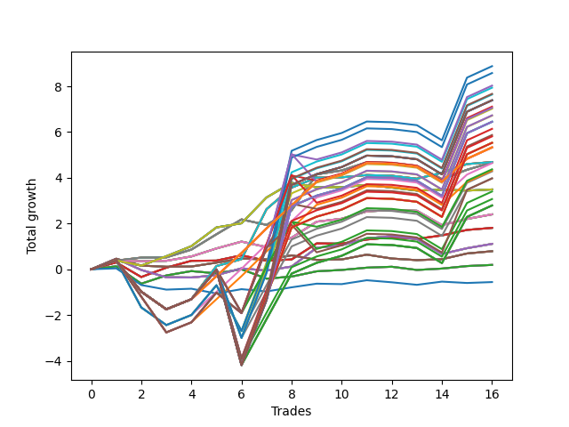

# Long Pointer Five (1226 1230 NC) 
- Symbol: AAPL_Unlimited
- Date Range: 03/23/2022 - 07/08/2022
- Trading Period: 7:20-12:30
- Number of Trades: 16



| Name | Win Percent | Profit | Avg Profit / Trade | Avg Time / Trade |      | Name | Win Percent | Profit | Avg Profit / Trade | Avg Time / Trade |
| ---- | ----------- | ------ | ------------------ | ---------------- | ---- | ---- | ----------- | ------ | ------------------ | ---------------- |
| Sorted By <br> Profit | | | | | | Sorted By <br> Win Percentage ||||
| Ninety-Five | 62.50 | 4440.00 | 277.50 | 151:17 |     | Seventy-One | 75.00 | 2345.00 | 146.56 | 70:58 |
| One Hundred Five | 62.50 | 4290.00 | 268.12 | 160:24 |     | Sixty-Three | 75.00 | 2345.00 | 146.56 | 70:58 |
| Ninety-Nine | 56.25 | 4015.00 | 250.94 | 122:20 |     | Fifty-Five | 75.00 | 2345.00 | 146.56 | 70:58 |
| Ninety-Four | 62.50 | 3970.00 | 248.12 | 146:37 |     | Forty-Seven | 75.00 | 2345.00 | 146.56 | 70:58 |
| One Hundred Twenty | 62.50 | 3835.00 | 239.69 | 162:44 |     | Seven | 75.00 | 2345.00 | 146.56 | 70:58 |
| One Hundred Four | 62.50 | 3820.00 | 238.75 | 155:44 |     | Sixty-Nine | 75.00 | 2335.00 | 145.94 | 44:00 |
| One Hundred Thirty | 62.50 | 3695.00 | 230.94 | 166:23 |     | Sixty-One | 75.00 | 2335.00 | 145.94 | 44:00 |
| One Hundred Twenty-Five | 62.50 | 3695.00 | 230.94 | 166:23 |     | Fifty-Three | 75.00 | 2335.00 | 145.94 | 44:00 |
| One Hundred Fifteen | 62.50 | 3695.00 | 230.94 | 166:23 |     | Forty-Five | 75.00 | 2335.00 | 145.94 | 44:00 |
| Eighty-Five | 62.50 | 3695.00 | 230.94 | 166:23 |     | Five | 75.00 | 2335.00 | 145.94 | 44:00 |
| Ninety-Eight | 56.25 | 3555.00 | 222.19 | 120:35 |     | Sixty-Eight | 75.00 | 1200.00 | 75.00 | 31:45 |
| One Hundred Nine | 56.25 | 3530.00 | 220.62 | 148:24 |     | Sixty | 75.00 | 1200.00 | 75.00 | 31:45 |
| Ninety-Three | 62.50 | 3510.00 | 219.37 | 144:52 |     | Fifty-Two | 75.00 | 1200.00 | 75.00 | 31:45 |
| One Hundred Ninteen | 62.50 | 3365.00 | 210.31 | 158:04 |     | Forty-Four | 75.00 | 1200.00 | 75.00 | 31:45 |
| One Hundred Three | 62.50 | 3360.00 | 210.00 | 153:59 |     | Four | 75.00 | 1200.00 | 75.00 | 31:45 |
| One Hundred Twenty-Nine | 62.50 | 3225.00 | 201.56 | 161:43 |     | Sixty-Five | 75.00 | 905.00 | 56.56 | 10:40 |
| One Hundred Twenty-Four | 62.50 | 3225.00 | 201.56 | 161:43 |     | Fifty-Seven | 75.00 | 905.00 | 56.56 | 10:40 |
| One Hundred Fourteen | 62.50 | 3225.00 | 201.56 | 161:43 |     | Forty-Nine | 75.00 | 905.00 | 56.56 | 10:40 |
| Eighty-Four | 62.50 | 3225.00 | 201.56 | 161:43 |     | Forty-One | 75.00 | 905.00 | 56.56 | 10:40 |
| One Hundred Eight | 56.25 | 3070.00 | 191.87 | 146:40 |     | One | 75.00 | 905.00 | 56.56 | 10:40 |
| One Hundred | 56.25 | 2935.00 | 183.44 | 122:43 |     | Sixty-Four | 75.00 | 95.00 | 5.94 | 06:19 |
| One Hundred Eighteen | 62.50 | 2905.00 | 181.56 | 156:19 |     | Fifty-Six | 75.00 | 95.00 | 5.94 | 06:19 |
| One Hundred Twenty-Eight | 62.50 | 2765.00 | 172.81 | 159:58 |     | Forty-Eight | 75.00 | 95.00 | 5.94 | 06:19 |
| One Hundred Twenty-Three | 62.50 | 2765.00 | 172.81 | 159:58 |     | Forty | 75.00 | 95.00 | 5.94 | 06:19 |
| One Hundred Thirteen | 62.50 | 2765.00 | 172.81 | 159:58 |     | Zero | 75.00 | 95.00 | 5.94 | 06:19 |
| Eighty-Three | 62.50 | 2765.00 | 172.81 | 159:58 |     | One Hundred Twenty-Six | 68.75 | 2665.00 | 166.56 | 92:50 |
| One Hundred Twenty-Six | 68.75 | 2665.00 | 166.56 | 92:50 |     | One Hundred Twenty-One | 68.75 | 2665.00 | 166.56 | 92:50 |
| One Hundred Twenty-One | 68.75 | 2665.00 | 166.56 | 92:50 |     | One Hundred Sixteen | 68.75 | 2665.00 | 166.56 | 92:50 |
| One Hundred Sixteen | 68.75 | 2665.00 | 166.56 | 92:50 |     | One Hundred Eleven | 68.75 | 2665.00 | 166.56 | 92:50 |
| One Hundred Eleven | 68.75 | 2665.00 | 166.56 | 92:50 |     | One Hundred Six | 68.75 | 2665.00 | 166.56 | 92:50 |
| One Hundred Six | 68.75 | 2665.00 | 166.56 | 92:50 |     | One Hundred One | 68.75 | 2665.00 | 166.56 | 92:50 |
| One Hundred One | 68.75 | 2665.00 | 166.56 | 92:50 |     | Eighty-One | 68.75 | 2665.00 | 166.56 | 92:50 |
| Eighty-One | 68.75 | 2665.00 | 166.56 | 92:50 |     | Ninety-One | 68.75 | 2320.00 | 145.00 | 87:06 |
| Seventy-One | 75.00 | 2345.00 | 146.56 | 70:58 |     | Ninety-Six | 68.75 | 2160.00 | 135.00 | 79:54 |
| Sixty-Three | 75.00 | 2345.00 | 146.56 | 70:58 |     | Seventy | 68.75 | 1745.00 | 109.06 | 24:25 |
| Fifty-Five | 75.00 | 2345.00 | 146.56 | 70:58 |     | Sixty-Two | 68.75 | 1745.00 | 109.06 | 24:25 |
| Forty-Seven | 75.00 | 2345.00 | 146.56 | 70:58 |     | Fifty-Four | 68.75 | 1745.00 | 109.06 | 24:25 |
| Seven | 75.00 | 2345.00 | 146.56 | 70:58 |     | Forty-Six | 68.75 | 1745.00 | 109.06 | 24:25 |
| Sixty-Nine | 75.00 | 2335.00 | 145.94 | 44:00 |     | Six | 68.75 | 1745.00 | 109.06 | 24:25 |
| Sixty-One | 75.00 | 2335.00 | 145.94 | 44:00 |     | Ninety-Five | 62.50 | 4440.00 | 277.50 | 151:17 |
| Fifty-Three | 75.00 | 2335.00 | 145.94 | 44:00 |     | One Hundred Five | 62.50 | 4290.00 | 268.12 | 160:24 |
| Forty-Five | 75.00 | 2335.00 | 145.94 | 44:00 |     | Ninety-Four | 62.50 | 3970.00 | 248.12 | 146:37 |
| Five | 75.00 | 2335.00 | 145.94 | 44:00 |     | One Hundred Twenty | 62.50 | 3835.00 | 239.69 | 162:44 |
| Ninety-One | 68.75 | 2320.00 | 145.00 | 87:06 |     | One Hundred Four | 62.50 | 3820.00 | 238.75 | 155:44 |
| Ninety-Seven | 56.25 | 2185.00 | 136.56 | 110:39 |     | One Hundred Thirty | 62.50 | 3695.00 | 230.94 | 166:23 |
| Ninety-Six | 68.75 | 2160.00 | 135.00 | 79:54 |     | One Hundred Twenty-Five | 62.50 | 3695.00 | 230.94 | 166:23 |
| Ninety-Two | 62.50 | 2140.00 | 133.75 | 134:56 |     | One Hundred Fifteen | 62.50 | 3695.00 | 230.94 | 166:23 |
| One Hundred Two | 62.50 | 1990.00 | 124.37 | 144:03 |     | Eighty-Five | 62.50 | 3695.00 | 230.94 | 166:23 |
| One Hundred Ten | 56.25 | 1985.00 | 124.06 | 150:20 |     | Ninety-Three | 62.50 | 3510.00 | 219.37 | 144:52 |
| Seventy | 68.75 | 1745.00 | 109.06 | 24:25 |     | One Hundred Ninteen | 62.50 | 3365.00 | 210.31 | 158:04 |
| Sixty-Two | 68.75 | 1745.00 | 109.06 | 24:25 |     | One Hundred Three | 62.50 | 3360.00 | 210.00 | 153:59 |
| Fifty-Four | 68.75 | 1745.00 | 109.06 | 24:25 |     | One Hundred Twenty-Nine | 62.50 | 3225.00 | 201.56 | 161:43 |
| Forty-Six | 68.75 | 1745.00 | 109.06 | 24:25 |     | One Hundred Twenty-Four | 62.50 | 3225.00 | 201.56 | 161:43 |
| Six | 68.75 | 1745.00 | 109.06 | 24:25 |     | One Hundred Fourteen | 62.50 | 3225.00 | 201.56 | 161:43 |
| One Hundred Seven | 56.25 | 1700.00 | 106.25 | 136:44 |     | Eighty-Four | 62.50 | 3225.00 | 201.56 | 161:43 |
| One Hundred Seventeen | 62.50 | 1535.00 | 95.94 | 146:23 |     | One Hundred Eighteen | 62.50 | 2905.00 | 181.56 | 156:19 |
| One Hundred Twenty-Seven | 62.50 | 1395.00 | 87.19 | 150:02 |     | One Hundred Twenty-Eight | 62.50 | 2765.00 | 172.81 | 159:58 |
| One Hundred Twenty-Two | 62.50 | 1395.00 | 87.19 | 150:02 |     | One Hundred Twenty-Three | 62.50 | 2765.00 | 172.81 | 159:58 |
| One Hundred Twelve | 62.50 | 1395.00 | 87.19 | 150:02 |     | One Hundred Thirteen | 62.50 | 2765.00 | 172.81 | 159:58 |
| Eighty-Two | 62.50 | 1395.00 | 87.19 | 150:02 |     | Eighty-Three | 62.50 | 2765.00 | 172.81 | 159:58 |
| Sixty-Eight | 75.00 | 1200.00 | 75.00 | 31:45 |     | Ninety-Two | 62.50 | 2140.00 | 133.75 | 134:56 |
| Sixty | 75.00 | 1200.00 | 75.00 | 31:45 |     | One Hundred Two | 62.50 | 1990.00 | 124.37 | 144:03 |
| Fifty-Two | 75.00 | 1200.00 | 75.00 | 31:45 |     | One Hundred Seventeen | 62.50 | 1535.00 | 95.94 | 146:23 |
| Forty-Four | 75.00 | 1200.00 | 75.00 | 31:45 |     | One Hundred Twenty-Seven | 62.50 | 1395.00 | 87.19 | 150:02 |
| Four | 75.00 | 1200.00 | 75.00 | 31:45 |     | One Hundred Twenty-Two | 62.50 | 1395.00 | 87.19 | 150:02 |
| Sixty-Five | 75.00 | 905.00 | 56.56 | 10:40 |     | One Hundred Twelve | 62.50 | 1395.00 | 87.19 | 150:02 |
| Fifty-Seven | 75.00 | 905.00 | 56.56 | 10:40 |     | Eighty-Two | 62.50 | 1395.00 | 87.19 | 150:02 |
| Forty-Nine | 75.00 | 905.00 | 56.56 | 10:40 |     | Sixty-Six | 62.50 | 555.00 | 34.69 | 24:51 |
| Forty-One | 75.00 | 905.00 | 56.56 | 10:40 |     | Fifty-Eight | 62.50 | 555.00 | 34.69 | 24:51 |
| One | 75.00 | 905.00 | 56.56 | 10:40 |     | Fifty | 62.50 | 555.00 | 34.69 | 24:51 |
| Sixty-Six | 62.50 | 555.00 | 34.69 | 24:51 |     | Forty-Two | 62.50 | 555.00 | 34.69 | 24:51 |
| Fifty-Eight | 62.50 | 555.00 | 34.69 | 24:51 |     | Two | 62.50 | 555.00 | 34.69 | 24:51 |
| Fifty | 62.50 | 555.00 | 34.69 | 24:51 |     | Sixty-Seven | 62.50 | 395.00 | 24.69 | 16:16 |
| Forty-Two | 62.50 | 555.00 | 34.69 | 24:51 |     | Fifty-Nine | 62.50 | 395.00 | 24.69 | 16:16 |
| Two | 62.50 | 555.00 | 34.69 | 24:51 |     | Fifty-One | 62.50 | 395.00 | 24.69 | 16:16 |
| Sixty-Seven | 62.50 | 395.00 | 24.69 | 16:16 |     | Forty-Three | 62.50 | 395.00 | 24.69 | 16:16 |
| Fifty-Nine | 62.50 | 395.00 | 24.69 | 16:16 |     | Three | 62.50 | 395.00 | 24.69 | 16:16 |
| Fifty-One | 62.50 | 395.00 | 24.69 | 16:16 |     | Ninety-Nine | 56.25 | 4015.00 | 250.94 | 122:20 |
| Forty-Three | 62.50 | 395.00 | 24.69 | 16:16 |     | Ninety-Eight | 56.25 | 3555.00 | 222.19 | 120:35 |
| Three | 62.50 | 395.00 | 24.69 | 16:16 |     | One Hundred Nine | 56.25 | 3530.00 | 220.62 | 148:24 |
| Sixty-Four | 75.00 | 95.00 | 5.94 | 06:19 |     | One Hundred Eight | 56.25 | 3070.00 | 191.87 | 146:40 |
| Fifty-Six | 75.00 | 95.00 | 5.94 | 06:19 |     | One Hundred | 56.25 | 2935.00 | 183.44 | 122:43 |
| Forty-Eight | 75.00 | 95.00 | 5.94 | 06:19 |     | Ninety-Seven | 56.25 | 2185.00 | 136.56 | 110:39 |
| Forty | 75.00 | 95.00 | 5.94 | 06:19 |     | One Hundred Ten | 56.25 | 1985.00 | 124.06 | 150:20 |
| Zero | 75.00 | 95.00 | 5.94 | 06:19 |     | One Hundred Seven | 56.25 | 1700.00 | 106.25 | 136:44 |
| Seventy-Three | 50.00 | -280.00 | -17.50 | 07:23 |     | Seventy-Three | 50.00 | -280.00 | -17.50 | 07:23 |

## NO STOPLOSS

### Test Zero
* Sell when price hits the middle line of the 20p bollinger
* No Stoploss
* Results:
```
Total Trades: 16
Percent Up: 75.00
Percent Down: 25.00
Total Points Moved Up: 0.19
Potential Profit: 95.00
Total Points Ups: 1.60 Count Ups: 12
Total Points Downs: -1.41 Count Downs: 4
```

<details><summary>Trades</summary>

<code>In: 2022-03-30 12:27:00		Out: 2022-03-30 12:28:10		Total Position Time: 01:10		Total Move Up: 0.13		Total to Date: 0.13</code> <br />
<code>In: 2022-04-12 07:47:00		Out: 2022-04-12 08:13:15		Total Position Time: 26:15		Total Move Up: -0.76		Total to Date: -0.63</code> <br />
<code>In: 2022-04-12 09:16:00		Out: 2022-04-12 09:17:45		Total Position Time: 01:45		Total Move Up: 0.36		Total to Date: -0.27</code> <br />
<code>In: 2022-04-12 11:00:00		Out: 2022-04-12 11:04:05		Total Position Time: 04:05		Total Move Up: 0.19		Total to Date: -0.08</code> <br />
<code>In: 2022-04-20 09:19:00		Out: 2022-04-20 09:27:10		Total Position Time: 08:10		Total Move Up: -0.10		Total to Date: -0.18</code> <br />
<code>In: 2022-04-21 07:58:00		Out: 2022-04-21 07:59:10		Total Position Time: 01:10		Total Move Up: 0.18		Total to Date: -0.00</code> <br />
<code>In: 2022-05-02 10:37:00		Out: 2022-05-02 10:59:55		Total Position Time: 22:55		Total Move Up: -0.41		Total to Date: -0.41</code> <br />
<code>In: 2022-05-04 08:19:00		Out: 2022-05-04 08:23:05		Total Position Time: 04:05		Total Move Up: 0.09		Total to Date: -0.32</code> <br />
<code>In: 2022-05-06 07:41:00		Out: 2022-05-06 07:45:20		Total Position Time: 04:20		Total Move Up: 0.23		Total to Date: -0.09</code> <br />
<code>In: 2022-06-02 11:48:00		Out: 2022-06-02 11:52:30		Total Position Time: 04:30		Total Move Up: 0.06		Total to Date: -0.03</code> <br />
<code>In: 2022-06-02 12:03:00		Out: 2022-06-02 12:04:10		Total Position Time: 01:10		Total Move Up: 0.10		Total to Date: 0.07</code> <br />
<code>In: 2022-06-17 11:56:00		Out: 2022-06-17 12:00:35		Total Position Time: 04:35		Total Move Up: 0.04		Total to Date: 0.11</code> <br />
<code>In: 2022-06-27 11:58:00		Out: 2022-06-27 12:10:30		Total Position Time: 12:30		Total Move Up: -0.14		Total to Date: -0.03</code> <br />
<code>In: 2022-06-29 08:54:00		Out: 2022-06-29 08:55:35		Total Position Time: 01:35		Total Move Up: 0.06		Total to Date: 0.03</code> <br />
<code>In: 2022-07-05 08:16:00		Out: 2022-07-05 08:17:45		Total Position Time: 01:45		Total Move Up: 0.11		Total to Date: 0.14</code> <br />
<code>In: 2022-07-07 10:20:00		Out: 2022-07-07 10:21:10		Total Position Time: 01:10		Total Move Up: 0.05		Total to Date: 0.19</code> <br />


</details>

### Test One
* Sell when the price hits the upper line of the 20p 1std bollinger
* No Stoploss
* Results:
```
Total Trades: 16
Percent Up: 75.00
Percent Down: 25.00
Total Points Moved Up: 1.81
Potential Profit: 905.00
Total Points Ups: 2.77 Count Ups: 12
Total Points Downs: -0.96 Count Downs: 4
```

<details><summary>Trades</summary>

<code>In: 2022-03-30 12:27:00		Out: 2022-03-30 12:31:35		Total Position Time: 04:35		Total Move Up: 0.30		Total to Date: 0.30</code> <br />
<code>In: 2022-04-12 07:47:00		Out: 2022-04-12 08:14:15		Total Position Time: 27:15		Total Move Up: -0.64		Total to Date: -0.34</code> <br />
<code>In: 2022-04-12 09:16:00		Out: 2022-04-12 09:18:05		Total Position Time: 02:05		Total Move Up: 0.41		Total to Date: 0.07</code> <br />
<code>In: 2022-04-12 11:00:00		Out: 2022-04-12 11:06:20		Total Position Time: 06:20		Total Move Up: 0.30		Total to Date: 0.37</code> <br />
<code>In: 2022-04-20 09:19:00		Out: 2022-04-20 09:28:45		Total Position Time: 09:45		Total Move Up: 0.01		Total to Date: 0.38</code> <br />
<code>In: 2022-04-21 07:58:00		Out: 2022-04-21 07:59:15		Total Position Time: 01:15		Total Move Up: 0.23		Total to Date: 0.61</code> <br />
<code>In: 2022-05-02 10:37:00		Out: 2022-05-02 11:02:15		Total Position Time: 25:15		Total Move Up: -0.24		Total to Date: 0.37</code> <br />
<code>In: 2022-05-04 08:19:00		Out: 2022-05-04 08:34:55		Total Position Time: 15:55		Total Move Up: 0.06		Total to Date: 0.43</code> <br />
<code>In: 2022-05-06 07:41:00		Out: 2022-05-06 07:45:50		Total Position Time: 04:50		Total Move Up: 0.70		Total to Date: 1.13</code> <br />
<code>In: 2022-06-02 11:48:00		Out: 2022-06-02 12:11:40		Total Position Time: 23:40		Total Move Up: -0.01		Total to Date: 1.12</code> <br />
<code>In: 2022-06-02 12:03:00		Out: 2022-06-02 12:11:40		Total Position Time: 08:40		Total Move Up: 0.18		Total to Date: 1.30</code> <br />
<code>In: 2022-06-17 11:56:00		Out: 2022-06-17 12:03:20		Total Position Time: 07:20		Total Move Up: 0.10		Total to Date: 1.40</code> <br />
<code>In: 2022-06-27 11:58:00		Out: 2022-06-27 12:13:05		Total Position Time: 15:05		Total Move Up: -0.07		Total to Date: 1.33</code> <br />
<code>In: 2022-06-29 08:54:00		Out: 2022-06-29 09:00:55		Total Position Time: 06:55		Total Move Up: 0.15		Total to Date: 1.48</code> <br />
<code>In: 2022-07-05 08:16:00		Out: 2022-07-05 08:20:35		Total Position Time: 04:35		Total Move Up: 0.24		Total to Date: 1.72</code> <br />
<code>In: 2022-07-07 10:20:00		Out: 2022-07-07 10:27:15		Total Position Time: 07:15		Total Move Up: 0.09		Total to Date: 1.81</code> <br />


</details>

### Test Two
* Sell when the price hits the upper line of the 20p 2std bollinger
* No Stoploss
* Results:
```
Total Trades: 16
Percent Up: 62.50
Percent Down: 37.50
Total Points Moved Up: 1.11
Potential Profit: 555.00
Total Points Ups: 2.81 Count Ups: 10
Total Points Downs: -1.70 Count Downs: 6
```

<details><summary>Trades</summary>

<code>In: 2022-03-30 12:27:00		Out: 2022-03-30 12:36:15		Total Position Time: 09:15		Total Move Up: 0.46		Total to Date: 0.46</code> <br />
<code>In: 2022-04-12 07:47:00		Out: 2022-04-12 08:15:15		Total Position Time: 28:15		Total Move Up: -0.49		Total to Date: -0.03</code> <br />
<code>In: 2022-04-12 09:16:00		Out: 2022-04-12 09:49:40		Total Position Time: 33:40		Total Move Up: -0.32		Total to Date: -0.35</code> <br />
<code>In: 2022-04-12 11:00:00		Out: 2022-04-12 11:35:45		Total Position Time: 35:45		Total Move Up: -0.01		Total to Date: -0.36</code> <br />
<code>In: 2022-04-20 09:19:00		Out: 2022-04-20 09:30:55		Total Position Time: 11:55		Total Move Up: 0.10		Total to Date: -0.26</code> <br />
<code>In: 2022-04-21 07:58:00		Out: 2022-04-21 08:01:10		Total Position Time: 03:10		Total Move Up: 0.30		Total to Date: 0.04</code> <br />
<code>In: 2022-05-02 10:37:00		Out: 2022-05-02 11:03:05		Total Position Time: 26:05		Total Move Up: -0.10		Total to Date: -0.06</code> <br />
<code>In: 2022-05-04 08:19:00		Out: 2022-05-04 08:36:20		Total Position Time: 17:20		Total Move Up: 0.18		Total to Date: 0.12</code> <br />
<code>In: 2022-05-06 07:41:00		Out: 2022-05-06 07:55:00		Total Position Time: 14:00		Total Move Up: 0.82		Total to Date: 0.94</code> <br />
<code>In: 2022-06-02 11:48:00		Out: 2022-06-02 12:17:05		Total Position Time: 29:05		Total Move Up: 0.11		Total to Date: 1.05</code> <br />
<code>In: 2022-06-02 12:03:00		Out: 2022-06-02 12:17:05		Total Position Time: 14:05		Total Move Up: 0.30		Total to Date: 1.35</code> <br />
<code>In: 2022-06-17 11:56:00		Out: 2022-06-17 12:27:00		Total Position Time: 31:00		Total Move Up: 0.10		Total to Date: 1.45</code> <br />
<code>In: 2022-06-27 11:58:00		Out: 2022-06-27 12:47:00		Total Position Time: 49:00		Total Move Up: -0.13		Total to Date: 1.32</code> <br />
<code>In: 2022-06-29 08:54:00		Out: 2022-06-29 10:10:00		Total Position Time: 76:00		Total Move Up: -0.65		Total to Date: 0.67</code> <br />
<code>In: 2022-07-05 08:16:00		Out: 2022-07-05 08:21:20		Total Position Time: 05:20		Total Move Up: 0.25		Total to Date: 0.92</code> <br />
<code>In: 2022-07-07 10:20:00		Out: 2022-07-07 10:33:55		Total Position Time: 13:55		Total Move Up: 0.19		Total to Date: 1.11</code> <br />


</details>

### Test Three
* Sell when price hits the middle line of the 50p bollinger
* No Stoploss
* Results:
```
Total Trades: 16
Percent Up: 62.50
Percent Down: 37.50
Total Points Moved Up: 0.79
Potential Profit: 395.00
Total Points Ups: 1.62 Count Ups: 10
Total Points Downs: -0.83 Count Downs: 6
```

<details><summary>Trades</summary>

<code>In: 2022-03-30 12:27:00		Out: 2022-03-30 12:36:15		Total Position Time: 09:15		Total Move Up: 0.46		Total to Date: 0.46</code> <br />
<code>In: 2022-04-12 07:47:00		Out: 2022-04-12 08:19:50		Total Position Time: 32:50		Total Move Up: -0.30		Total to Date: 0.16</code> <br />
<code>In: 2022-04-12 09:16:00		Out: 2022-04-12 09:50:15		Total Position Time: 34:15		Total Move Up: -0.05		Total to Date: 0.11</code> <br />
<code>In: 2022-04-12 11:00:00		Out: 2022-04-12 11:35:50		Total Position Time: 35:50		Total Move Up: 0.01		Total to Date: 0.12</code> <br />
<code>In: 2022-04-20 09:19:00		Out: 2022-04-20 09:32:40		Total Position Time: 13:40		Total Move Up: 0.17		Total to Date: 0.29</code> <br />
<code>In: 2022-04-21 07:58:00		Out: 2022-04-21 07:59:10		Total Position Time: 01:10		Total Move Up: 0.18		Total to Date: 0.47</code> <br />
<code>In: 2022-05-02 10:37:00		Out: 2022-05-02 11:03:55		Total Position Time: 26:55		Total Move Up: -0.04		Total to Date: 0.43</code> <br />
<code>In: 2022-05-04 08:19:00		Out: 2022-05-04 08:36:20		Total Position Time: 17:20		Total Move Up: 0.18		Total to Date: 0.61</code> <br />
<code>In: 2022-05-06 07:41:00		Out: 2022-05-06 07:42:10		Total Position Time: 01:10		Total Move Up: -0.20		Total to Date: 0.41</code> <br />
<code>In: 2022-06-02 11:48:00		Out: 2022-06-02 12:12:05		Total Position Time: 24:05		Total Move Up: 0.02		Total to Date: 0.43</code> <br />
<code>In: 2022-06-02 12:03:00		Out: 2022-06-02 12:12:05		Total Position Time: 09:05		Total Move Up: 0.21		Total to Date: 0.64</code> <br />
<code>In: 2022-06-17 11:56:00		Out: 2022-06-17 12:23:00		Total Position Time: 27:00		Total Move Up: -0.17		Total to Date: 0.47</code> <br />
<code>In: 2022-06-27 11:58:00		Out: 2022-06-27 12:13:05		Total Position Time: 15:05		Total Move Up: -0.07		Total to Date: 0.40</code> <br />
<code>In: 2022-06-29 08:54:00		Out: 2022-06-29 08:55:10		Total Position Time: 01:10		Total Move Up: 0.04		Total to Date: 0.44</code> <br />
<code>In: 2022-07-05 08:16:00		Out: 2022-07-05 08:21:20		Total Position Time: 05:20		Total Move Up: 0.25		Total to Date: 0.69</code> <br />
<code>In: 2022-07-07 10:20:00		Out: 2022-07-07 10:26:10		Total Position Time: 06:10		Total Move Up: 0.10		Total to Date: 0.79</code> <br />


</details>

### Test Four
* Sell when the price hits the upper line of the 50p 1std bollinger
* No Stoploss
* Results:
```
Total Trades: 16
Percent Up: 75.00
Percent Down: 25.00
Total Points Moved Up: 2.40
Potential Profit: 1200.00
Total Points Ups: 3.33 Count Ups: 12
Total Points Downs: -0.93 Count Downs: 4
```

<details><summary>Trades</summary>

<code>In: 2022-03-30 12:27:00		Out: 2022-03-30 12:47:00		Total Position Time: 20:00		Total Move Up: 0.38		Total to Date: 0.38</code> <br />
<code>In: 2022-04-12 07:47:00		Out: 2022-04-12 08:25:10		Total Position Time: 38:10		Total Move Up: -0.03		Total to Date: 0.35</code> <br />
<code>In: 2022-04-12 09:16:00		Out: 2022-04-12 09:58:15		Total Position Time: 42:15		Total Move Up: 0.02		Total to Date: 0.37</code> <br />
<code>In: 2022-04-12 11:00:00		Out: 2022-04-12 11:37:30		Total Position Time: 37:30		Total Move Up: 0.19		Total to Date: 0.56</code> <br />
<code>In: 2022-04-20 09:19:00		Out: 2022-04-20 09:36:55		Total Position Time: 17:55		Total Move Up: 0.35		Total to Date: 0.91</code> <br />
<code>In: 2022-04-21 07:58:00		Out: 2022-04-21 08:01:10		Total Position Time: 03:10		Total Move Up: 0.30		Total to Date: 1.21</code> <br />
<code>In: 2022-05-02 10:37:00		Out: 2022-05-02 11:53:35		Total Position Time: 76:35		Total Move Up: -0.24		Total to Date: 0.97</code> <br />
<code>In: 2022-05-04 08:19:00		Out: 2022-05-04 08:39:25		Total Position Time: 20:25		Total Move Up: 0.41		Total to Date: 1.38</code> <br />
<code>In: 2022-05-06 07:41:00		Out: 2022-05-06 07:45:50		Total Position Time: 04:50		Total Move Up: 0.70		Total to Date: 2.08</code> <br />
<code>In: 2022-06-02 11:48:00		Out: 2022-06-02 12:17:10		Total Position Time: 29:10		Total Move Up: 0.13		Total to Date: 2.21</code> <br />
<code>In: 2022-06-02 12:03:00		Out: 2022-06-02 12:17:10		Total Position Time: 14:10		Total Move Up: 0.32		Total to Date: 2.53</code> <br />
<code>In: 2022-06-17 11:56:00		Out: 2022-06-17 12:35:05		Total Position Time: 39:05		Total Move Up: 0.06		Total to Date: 2.59</code> <br />
<code>In: 2022-06-27 11:58:00		Out: 2022-06-27 12:45:40		Total Position Time: 47:40		Total Move Up: -0.03		Total to Date: 2.56</code> <br />
<code>In: 2022-06-29 08:54:00		Out: 2022-06-29 10:10:05		Total Position Time: 76:05		Total Move Up: -0.63		Total to Date: 1.93</code> <br />
<code>In: 2022-07-05 08:16:00		Out: 2022-07-05 08:42:15		Total Position Time: 26:15		Total Move Up: 0.27		Total to Date: 2.20</code> <br />
<code>In: 2022-07-07 10:20:00		Out: 2022-07-07 10:35:00		Total Position Time: 15:00		Total Move Up: 0.20		Total to Date: 2.40</code> <br />


</details>

### Test Five
* Sell when the price hits the upper line of the 50p 2std bollinger
* No Stoploss
* Results:
```
Total Trades: 16
Percent Up: 75.00
Percent Down: 25.00
Total Points Moved Up: 4.67
Potential Profit: 2335.00
Total Points Ups: 5.65 Count Ups: 12
Total Points Downs: -0.98 Count Downs: 4
```

<details><summary>Trades</summary>

<code>In: 2022-03-30 12:27:00		Out: 2022-03-30 12:47:00		Total Position Time: 20:00		Total Move Up: 0.38		Total to Date: 0.38</code> <br />
<code>In: 2022-04-12 07:47:00		Out: 2022-04-12 08:29:25		Total Position Time: 42:25		Total Move Up: 0.13		Total to Date: 0.51</code> <br />
<code>In: 2022-04-12 09:16:00		Out: 2022-04-12 10:13:35		Total Position Time: 57:35		Total Move Up: 0.01		Total to Date: 0.52</code> <br />
<code>In: 2022-04-12 11:00:00		Out: 2022-04-12 11:45:15		Total Position Time: 45:15		Total Move Up: 0.34		Total to Date: 0.86</code> <br />
<code>In: 2022-04-20 09:19:00		Out: 2022-04-20 09:50:25		Total Position Time: 31:25		Total Move Up: 0.67		Total to Date: 1.53</code> <br />
<code>In: 2022-04-21 07:58:00		Out: 2022-04-21 08:13:45		Total Position Time: 15:45		Total Move Up: 0.65		Total to Date: 2.18</code> <br />
<code>In: 2022-05-02 10:37:00		Out: 2022-05-02 12:03:30		Total Position Time: 86:30		Total Move Up: -0.24		Total to Date: 1.94</code> <br />
<code>In: 2022-05-04 08:19:00		Out: 2022-05-04 08:47:05		Total Position Time: 28:05		Total Move Up: 0.64		Total to Date: 2.58</code> <br />
<code>In: 2022-05-06 07:41:00		Out: 2022-05-06 08:22:05		Total Position Time: 41:05		Total Move Up: 1.57		Total to Date: 4.15</code> <br />
<code>In: 2022-06-02 11:48:00		Out: 2022-06-02 12:35:35		Total Position Time: 47:35		Total Move Up: 0.17		Total to Date: 4.32</code> <br />
<code>In: 2022-06-02 12:03:00		Out: 2022-06-02 12:35:35		Total Position Time: 32:35		Total Move Up: 0.36		Total to Date: 4.68</code> <br />
<code>In: 2022-06-17 11:56:00		Out: 2022-06-17 12:47:00		Total Position Time: 51:00		Total Move Up: -0.03		Total to Date: 4.65</code> <br />
<code>In: 2022-06-27 11:58:00		Out: 2022-06-27 12:47:00		Total Position Time: 49:00		Total Move Up: -0.13		Total to Date: 4.52</code> <br />
<code>In: 2022-06-29 08:54:00		Out: 2022-06-29 10:40:40		Total Position Time: 106:40		Total Move Up: -0.58		Total to Date: 3.94</code> <br />
<code>In: 2022-07-05 08:16:00		Out: 2022-07-05 08:43:15		Total Position Time: 27:15		Total Move Up: 0.41		Total to Date: 4.35</code> <br />
<code>In: 2022-07-07 10:20:00		Out: 2022-07-07 10:42:05		Total Position Time: 22:05		Total Move Up: 0.32		Total to Date: 4.67</code> <br />


</details>

### Test Six
* Sell when the price hits the middle line of the 1std VWAP
* No Stoploss
* Results:
```
Total Trades: 16
Percent Up: 68.75
Percent Down: 31.25
Total Points Moved Up: 3.49
Potential Profit: 1745.00
Total Points Ups: 4.20 Count Ups: 11
Total Points Downs: -0.71 Count Downs: 5
```

<details><summary>Trades</summary>

<code>In: 2022-03-30 12:27:00		Out: 2022-03-30 12:47:00		Total Position Time: 20:00		Total Move Up: 0.38		Total to Date: 0.38</code> <br />
<code>In: 2022-04-12 07:47:00		Out: 2022-04-12 08:21:00		Total Position Time: 34:00		Total Move Up: -0.22		Total to Date: 0.16</code> <br />
<code>In: 2022-04-12 09:16:00		Out: 2022-04-12 09:18:05		Total Position Time: 02:05		Total Move Up: 0.41		Total to Date: 0.57</code> <br />
<code>In: 2022-04-12 11:00:00		Out: 2022-04-12 12:47:00		Total Position Time: 107:00		Total Move Up: 0.44		Total to Date: 1.01</code> <br />
<code>In: 2022-04-20 09:19:00		Out: 2022-04-20 10:04:05		Total Position Time: 45:05		Total Move Up: 0.82		Total to Date: 1.83</code> <br />
<code>In: 2022-04-21 07:58:00		Out: 2022-04-21 07:59:10		Total Position Time: 01:10		Total Move Up: 0.18		Total to Date: 2.01</code> <br />
<code>In: 2022-05-02 10:37:00		Out: 2022-05-02 12:13:20		Total Position Time: 96:20		Total Move Up: 1.13		Total to Date: 3.14</code> <br />
<code>In: 2022-05-04 08:19:00		Out: 2022-05-04 08:47:05		Total Position Time: 28:05		Total Move Up: 0.64		Total to Date: 3.78</code> <br />
<code>In: 2022-05-06 07:41:00		Out: 2022-05-06 07:42:10		Total Position Time: 01:10		Total Move Up: -0.20		Total to Date: 3.58</code> <br />
<code>In: 2022-06-02 11:48:00		Out: 2022-06-02 11:49:10		Total Position Time: 01:10		Total Move Up: 0.01		Total to Date: 3.59</code> <br />
<code>In: 2022-06-02 12:03:00		Out: 2022-06-02 12:04:10		Total Position Time: 01:10		Total Move Up: 0.10		Total to Date: 3.69</code> <br />
<code>In: 2022-06-17 11:56:00		Out: 2022-06-17 11:57:10		Total Position Time: 01:10		Total Move Up: -0.12		Total to Date: 3.57</code> <br />
<code>In: 2022-06-27 11:58:00		Out: 2022-06-27 12:47:00		Total Position Time: 49:00		Total Move Up: -0.13		Total to Date: 3.44</code> <br />
<code>In: 2022-06-29 08:54:00		Out: 2022-06-29 08:55:10		Total Position Time: 01:10		Total Move Up: 0.04		Total to Date: 3.48</code> <br />
<code>In: 2022-07-05 08:16:00		Out: 2022-07-05 08:17:10		Total Position Time: 01:10		Total Move Up: -0.04		Total to Date: 3.44</code> <br />
<code>In: 2022-07-07 10:20:00		Out: 2022-07-07 10:21:10		Total Position Time: 01:10		Total Move Up: 0.05		Total to Date: 3.49</code> <br />


</details>

### Test Seven
* Sell when the price hits the upper line of the 1std VWAP
* No Stoploss
* Results:
```
Total Trades: 16
Percent Up: 75.00
Percent Down: 25.00
Total Points Moved Up: 4.69
Potential Profit: 2345.00
Total Points Ups: 6.98 Count Ups: 12
Total Points Downs: -2.29 Count Downs: 4
```

<details><summary>Trades</summary>

<code>In: 2022-03-30 12:27:00		Out: 2022-03-30 12:47:00		Total Position Time: 20:00		Total Move Up: 0.38		Total to Date: 0.38</code> <br />
<code>In: 2022-04-12 07:47:00		Out: 2022-04-12 12:47:00		Total Position Time: 300:00		Total Move Up: -1.36		Total to Date: -0.98</code> <br />
<code>In: 2022-04-12 09:16:00		Out: 2022-04-12 12:47:00		Total Position Time: 211:00		Total Move Up: -0.77		Total to Date: -1.75</code> <br />
<code>In: 2022-04-12 11:00:00		Out: 2022-04-12 12:47:00		Total Position Time: 107:00		Total Move Up: 0.44		Total to Date: -1.31</code> <br />
<code>In: 2022-04-20 09:19:00		Out: 2022-04-20 10:43:35		Total Position Time: 84:35		Total Move Up: 1.45		Total to Date: 0.14</code> <br />
<code>In: 2022-04-21 07:58:00		Out: 2022-04-21 08:01:10		Total Position Time: 03:10		Total Move Up: 0.30		Total to Date: 0.44</code> <br />
<code>In: 2022-05-02 10:37:00		Out: 2022-05-02 12:24:55		Total Position Time: 107:55		Total Move Up: 2.19		Total to Date: 2.63</code> <br />
<code>In: 2022-05-04 08:19:00		Out: 2022-05-04 08:48:30		Total Position Time: 29:30		Total Move Up: 0.94		Total to Date: 3.57</code> <br />
<code>In: 2022-05-06 07:41:00		Out: 2022-05-06 07:45:25		Total Position Time: 04:25		Total Move Up: 0.44		Total to Date: 4.01</code> <br />
<code>In: 2022-06-02 11:48:00		Out: 2022-06-02 11:49:10		Total Position Time: 01:10		Total Move Up: 0.01		Total to Date: 4.02</code> <br />
<code>In: 2022-06-02 12:03:00		Out: 2022-06-02 12:04:10		Total Position Time: 01:10		Total Move Up: 0.10		Total to Date: 4.12</code> <br />
<code>In: 2022-06-17 11:56:00		Out: 2022-06-17 12:47:00		Total Position Time: 51:00		Total Move Up: -0.03		Total to Date: 4.09</code> <br />
<code>In: 2022-06-27 11:58:00		Out: 2022-06-27 12:47:00		Total Position Time: 49:00		Total Move Up: -0.13		Total to Date: 3.96</code> <br />
<code>In: 2022-06-29 08:54:00		Out: 2022-06-29 11:06:35		Total Position Time: 132:35		Total Move Up: 0.26		Total to Date: 4.22</code> <br />
<code>In: 2022-07-05 08:16:00		Out: 2022-07-05 08:43:10		Total Position Time: 27:10		Total Move Up: 0.38		Total to Date: 4.60</code> <br />
<code>In: 2022-07-07 10:20:00		Out: 2022-07-07 10:25:50		Total Position Time: 05:50		Total Move Up: 0.09		Total to Date: 4.69</code> <br />


</details>

## STOPLOSS OF 5

### Test Forty
* Sell when price hits the middle line of the 20p bollinger
* Stoploss is 5 points
* Results:
```
Total Trades: 16
Percent Up: 75.00
Percent Down: 25.00
Total Points Moved Up: 0.19
Potential Profit: 95.00
Total Points Ups: 1.60 Count Ups: 12
Total Points Downs: -1.41 Count Downs: 4
```

<details><summary>Trades</summary>

<code>In: 2022-03-30 12:27:00		Out: 2022-03-30 12:28:10		Total Position Time: 01:10		Total Move Up: 0.13		Total to Date: 0.13</code> <br />
<code>In: 2022-04-12 07:47:00		Out: 2022-04-12 08:13:15		Total Position Time: 26:15		Total Move Up: -0.76		Total to Date: -0.63</code> <br />
<code>In: 2022-04-12 09:16:00		Out: 2022-04-12 09:17:45		Total Position Time: 01:45		Total Move Up: 0.36		Total to Date: -0.27</code> <br />
<code>In: 2022-04-12 11:00:00		Out: 2022-04-12 11:04:05		Total Position Time: 04:05		Total Move Up: 0.19		Total to Date: -0.08</code> <br />
<code>In: 2022-04-20 09:19:00		Out: 2022-04-20 09:27:10		Total Position Time: 08:10		Total Move Up: -0.10		Total to Date: -0.18</code> <br />
<code>In: 2022-04-21 07:58:00		Out: 2022-04-21 07:59:10		Total Position Time: 01:10		Total Move Up: 0.18		Total to Date: -0.00</code> <br />
<code>In: 2022-05-02 10:37:00		Out: 2022-05-02 10:59:55		Total Position Time: 22:55		Total Move Up: -0.41		Total to Date: -0.41</code> <br />
<code>In: 2022-05-04 08:19:00		Out: 2022-05-04 08:23:05		Total Position Time: 04:05		Total Move Up: 0.09		Total to Date: -0.32</code> <br />
<code>In: 2022-05-06 07:41:00		Out: 2022-05-06 07:45:20		Total Position Time: 04:20		Total Move Up: 0.23		Total to Date: -0.09</code> <br />
<code>In: 2022-06-02 11:48:00		Out: 2022-06-02 11:52:30		Total Position Time: 04:30		Total Move Up: 0.06		Total to Date: -0.03</code> <br />
<code>In: 2022-06-02 12:03:00		Out: 2022-06-02 12:04:10		Total Position Time: 01:10		Total Move Up: 0.10		Total to Date: 0.07</code> <br />
<code>In: 2022-06-17 11:56:00		Out: 2022-06-17 12:00:35		Total Position Time: 04:35		Total Move Up: 0.04		Total to Date: 0.11</code> <br />
<code>In: 2022-06-27 11:58:00		Out: 2022-06-27 12:10:30		Total Position Time: 12:30		Total Move Up: -0.14		Total to Date: -0.03</code> <br />
<code>In: 2022-06-29 08:54:00		Out: 2022-06-29 08:55:35		Total Position Time: 01:35		Total Move Up: 0.06		Total to Date: 0.03</code> <br />
<code>In: 2022-07-05 08:16:00		Out: 2022-07-05 08:17:45		Total Position Time: 01:45		Total Move Up: 0.11		Total to Date: 0.14</code> <br />
<code>In: 2022-07-07 10:20:00		Out: 2022-07-07 10:21:10		Total Position Time: 01:10		Total Move Up: 0.05		Total to Date: 0.19</code> <br />


</details>

### Test Forty-One
* Sell when the price hits the upper line of the 20p 1std bollinger
* Stoploss is 5 points
* Results:
```
Total Trades: 16
Percent Up: 75.00
Percent Down: 25.00
Total Points Moved Up: 1.81
Potential Profit: 905.00
Total Points Ups: 2.77 Count Ups: 12
Total Points Downs: -0.96 Count Downs: 4
```

<details><summary>Trades</summary>

<code>In: 2022-03-30 12:27:00		Out: 2022-03-30 12:31:35		Total Position Time: 04:35		Total Move Up: 0.30		Total to Date: 0.30</code> <br />
<code>In: 2022-04-12 07:47:00		Out: 2022-04-12 08:14:15		Total Position Time: 27:15		Total Move Up: -0.64		Total to Date: -0.34</code> <br />
<code>In: 2022-04-12 09:16:00		Out: 2022-04-12 09:18:05		Total Position Time: 02:05		Total Move Up: 0.41		Total to Date: 0.07</code> <br />
<code>In: 2022-04-12 11:00:00		Out: 2022-04-12 11:06:20		Total Position Time: 06:20		Total Move Up: 0.30		Total to Date: 0.37</code> <br />
<code>In: 2022-04-20 09:19:00		Out: 2022-04-20 09:28:45		Total Position Time: 09:45		Total Move Up: 0.01		Total to Date: 0.38</code> <br />
<code>In: 2022-04-21 07:58:00		Out: 2022-04-21 07:59:15		Total Position Time: 01:15		Total Move Up: 0.23		Total to Date: 0.61</code> <br />
<code>In: 2022-05-02 10:37:00		Out: 2022-05-02 11:02:15		Total Position Time: 25:15		Total Move Up: -0.24		Total to Date: 0.37</code> <br />
<code>In: 2022-05-04 08:19:00		Out: 2022-05-04 08:34:55		Total Position Time: 15:55		Total Move Up: 0.06		Total to Date: 0.43</code> <br />
<code>In: 2022-05-06 07:41:00		Out: 2022-05-06 07:45:50		Total Position Time: 04:50		Total Move Up: 0.70		Total to Date: 1.13</code> <br />
<code>In: 2022-06-02 11:48:00		Out: 2022-06-02 12:11:40		Total Position Time: 23:40		Total Move Up: -0.01		Total to Date: 1.12</code> <br />
<code>In: 2022-06-02 12:03:00		Out: 2022-06-02 12:11:40		Total Position Time: 08:40		Total Move Up: 0.18		Total to Date: 1.30</code> <br />
<code>In: 2022-06-17 11:56:00		Out: 2022-06-17 12:03:20		Total Position Time: 07:20		Total Move Up: 0.10		Total to Date: 1.40</code> <br />
<code>In: 2022-06-27 11:58:00		Out: 2022-06-27 12:13:05		Total Position Time: 15:05		Total Move Up: -0.07		Total to Date: 1.33</code> <br />
<code>In: 2022-06-29 08:54:00		Out: 2022-06-29 09:00:55		Total Position Time: 06:55		Total Move Up: 0.15		Total to Date: 1.48</code> <br />
<code>In: 2022-07-05 08:16:00		Out: 2022-07-05 08:20:35		Total Position Time: 04:35		Total Move Up: 0.24		Total to Date: 1.72</code> <br />
<code>In: 2022-07-07 10:20:00		Out: 2022-07-07 10:27:15		Total Position Time: 07:15		Total Move Up: 0.09		Total to Date: 1.81</code> <br />


</details>

### Test Forty-Two
* Sell when the price hits the upper line of the 20p 2std bollinger
* Stoploss is 5 points
* Results:
```
Total Trades: 16
Percent Up: 62.50
Percent Down: 37.50
Total Points Moved Up: 1.11
Potential Profit: 555.00
Total Points Ups: 2.81 Count Ups: 10
Total Points Downs: -1.70 Count Downs: 6
```

<details><summary>Trades</summary>

<code>In: 2022-03-30 12:27:00		Out: 2022-03-30 12:36:15		Total Position Time: 09:15		Total Move Up: 0.46		Total to Date: 0.46</code> <br />
<code>In: 2022-04-12 07:47:00		Out: 2022-04-12 08:15:15		Total Position Time: 28:15		Total Move Up: -0.49		Total to Date: -0.03</code> <br />
<code>In: 2022-04-12 09:16:00		Out: 2022-04-12 09:49:40		Total Position Time: 33:40		Total Move Up: -0.32		Total to Date: -0.35</code> <br />
<code>In: 2022-04-12 11:00:00		Out: 2022-04-12 11:35:45		Total Position Time: 35:45		Total Move Up: -0.01		Total to Date: -0.36</code> <br />
<code>In: 2022-04-20 09:19:00		Out: 2022-04-20 09:30:55		Total Position Time: 11:55		Total Move Up: 0.10		Total to Date: -0.26</code> <br />
<code>In: 2022-04-21 07:58:00		Out: 2022-04-21 08:01:10		Total Position Time: 03:10		Total Move Up: 0.30		Total to Date: 0.04</code> <br />
<code>In: 2022-05-02 10:37:00		Out: 2022-05-02 11:03:05		Total Position Time: 26:05		Total Move Up: -0.10		Total to Date: -0.06</code> <br />
<code>In: 2022-05-04 08:19:00		Out: 2022-05-04 08:36:20		Total Position Time: 17:20		Total Move Up: 0.18		Total to Date: 0.12</code> <br />
<code>In: 2022-05-06 07:41:00		Out: 2022-05-06 07:55:00		Total Position Time: 14:00		Total Move Up: 0.82		Total to Date: 0.94</code> <br />
<code>In: 2022-06-02 11:48:00		Out: 2022-06-02 12:17:05		Total Position Time: 29:05		Total Move Up: 0.11		Total to Date: 1.05</code> <br />
<code>In: 2022-06-02 12:03:00		Out: 2022-06-02 12:17:05		Total Position Time: 14:05		Total Move Up: 0.30		Total to Date: 1.35</code> <br />
<code>In: 2022-06-17 11:56:00		Out: 2022-06-17 12:27:00		Total Position Time: 31:00		Total Move Up: 0.10		Total to Date: 1.45</code> <br />
<code>In: 2022-06-27 11:58:00		Out: 2022-06-27 12:47:00		Total Position Time: 49:00		Total Move Up: -0.13		Total to Date: 1.32</code> <br />
<code>In: 2022-06-29 08:54:00		Out: 2022-06-29 10:10:00		Total Position Time: 76:00		Total Move Up: -0.65		Total to Date: 0.67</code> <br />
<code>In: 2022-07-05 08:16:00		Out: 2022-07-05 08:21:20		Total Position Time: 05:20		Total Move Up: 0.25		Total to Date: 0.92</code> <br />
<code>In: 2022-07-07 10:20:00		Out: 2022-07-07 10:33:55		Total Position Time: 13:55		Total Move Up: 0.19		Total to Date: 1.11</code> <br />


</details>

### Test Forty-Three
* Sell when price hits the middle line of the 50p bollinger
* Stoploss is 5 points
* Results:
```
Total Trades: 16
Percent Up: 62.50
Percent Down: 37.50
Total Points Moved Up: 0.79
Potential Profit: 395.00
Total Points Ups: 1.62 Count Ups: 10
Total Points Downs: -0.83 Count Downs: 6
```

<details><summary>Trades</summary>

<code>In: 2022-03-30 12:27:00		Out: 2022-03-30 12:36:15		Total Position Time: 09:15		Total Move Up: 0.46		Total to Date: 0.46</code> <br />
<code>In: 2022-04-12 07:47:00		Out: 2022-04-12 08:19:50		Total Position Time: 32:50		Total Move Up: -0.30		Total to Date: 0.16</code> <br />
<code>In: 2022-04-12 09:16:00		Out: 2022-04-12 09:50:15		Total Position Time: 34:15		Total Move Up: -0.05		Total to Date: 0.11</code> <br />
<code>In: 2022-04-12 11:00:00		Out: 2022-04-12 11:35:50		Total Position Time: 35:50		Total Move Up: 0.01		Total to Date: 0.12</code> <br />
<code>In: 2022-04-20 09:19:00		Out: 2022-04-20 09:32:40		Total Position Time: 13:40		Total Move Up: 0.17		Total to Date: 0.29</code> <br />
<code>In: 2022-04-21 07:58:00		Out: 2022-04-21 07:59:10		Total Position Time: 01:10		Total Move Up: 0.18		Total to Date: 0.47</code> <br />
<code>In: 2022-05-02 10:37:00		Out: 2022-05-02 11:03:55		Total Position Time: 26:55		Total Move Up: -0.04		Total to Date: 0.43</code> <br />
<code>In: 2022-05-04 08:19:00		Out: 2022-05-04 08:36:20		Total Position Time: 17:20		Total Move Up: 0.18		Total to Date: 0.61</code> <br />
<code>In: 2022-05-06 07:41:00		Out: 2022-05-06 07:42:10		Total Position Time: 01:10		Total Move Up: -0.20		Total to Date: 0.41</code> <br />
<code>In: 2022-06-02 11:48:00		Out: 2022-06-02 12:12:05		Total Position Time: 24:05		Total Move Up: 0.02		Total to Date: 0.43</code> <br />
<code>In: 2022-06-02 12:03:00		Out: 2022-06-02 12:12:05		Total Position Time: 09:05		Total Move Up: 0.21		Total to Date: 0.64</code> <br />
<code>In: 2022-06-17 11:56:00		Out: 2022-06-17 12:23:00		Total Position Time: 27:00		Total Move Up: -0.17		Total to Date: 0.47</code> <br />
<code>In: 2022-06-27 11:58:00		Out: 2022-06-27 12:13:05		Total Position Time: 15:05		Total Move Up: -0.07		Total to Date: 0.40</code> <br />
<code>In: 2022-06-29 08:54:00		Out: 2022-06-29 08:55:10		Total Position Time: 01:10		Total Move Up: 0.04		Total to Date: 0.44</code> <br />
<code>In: 2022-07-05 08:16:00		Out: 2022-07-05 08:21:20		Total Position Time: 05:20		Total Move Up: 0.25		Total to Date: 0.69</code> <br />
<code>In: 2022-07-07 10:20:00		Out: 2022-07-07 10:26:10		Total Position Time: 06:10		Total Move Up: 0.10		Total to Date: 0.79</code> <br />


</details>

### Test Forty-Four
* Sell when the price hits the upper line of the 50p 1std bollinger
* Stoploss is 5 points
* Results:
```
Total Trades: 16
Percent Up: 75.00
Percent Down: 25.00
Total Points Moved Up: 2.40
Potential Profit: 1200.00
Total Points Ups: 3.33 Count Ups: 12
Total Points Downs: -0.93 Count Downs: 4
```

<details><summary>Trades</summary>

<code>In: 2022-03-30 12:27:00		Out: 2022-03-30 12:47:00		Total Position Time: 20:00		Total Move Up: 0.38		Total to Date: 0.38</code> <br />
<code>In: 2022-04-12 07:47:00		Out: 2022-04-12 08:25:10		Total Position Time: 38:10		Total Move Up: -0.03		Total to Date: 0.35</code> <br />
<code>In: 2022-04-12 09:16:00		Out: 2022-04-12 09:58:15		Total Position Time: 42:15		Total Move Up: 0.02		Total to Date: 0.37</code> <br />
<code>In: 2022-04-12 11:00:00		Out: 2022-04-12 11:37:30		Total Position Time: 37:30		Total Move Up: 0.19		Total to Date: 0.56</code> <br />
<code>In: 2022-04-20 09:19:00		Out: 2022-04-20 09:36:55		Total Position Time: 17:55		Total Move Up: 0.35		Total to Date: 0.91</code> <br />
<code>In: 2022-04-21 07:58:00		Out: 2022-04-21 08:01:10		Total Position Time: 03:10		Total Move Up: 0.30		Total to Date: 1.21</code> <br />
<code>In: 2022-05-02 10:37:00		Out: 2022-05-02 11:53:35		Total Position Time: 76:35		Total Move Up: -0.24		Total to Date: 0.97</code> <br />
<code>In: 2022-05-04 08:19:00		Out: 2022-05-04 08:39:25		Total Position Time: 20:25		Total Move Up: 0.41		Total to Date: 1.38</code> <br />
<code>In: 2022-05-06 07:41:00		Out: 2022-05-06 07:45:50		Total Position Time: 04:50		Total Move Up: 0.70		Total to Date: 2.08</code> <br />
<code>In: 2022-06-02 11:48:00		Out: 2022-06-02 12:17:10		Total Position Time: 29:10		Total Move Up: 0.13		Total to Date: 2.21</code> <br />
<code>In: 2022-06-02 12:03:00		Out: 2022-06-02 12:17:10		Total Position Time: 14:10		Total Move Up: 0.32		Total to Date: 2.53</code> <br />
<code>In: 2022-06-17 11:56:00		Out: 2022-06-17 12:35:05		Total Position Time: 39:05		Total Move Up: 0.06		Total to Date: 2.59</code> <br />
<code>In: 2022-06-27 11:58:00		Out: 2022-06-27 12:45:40		Total Position Time: 47:40		Total Move Up: -0.03		Total to Date: 2.56</code> <br />
<code>In: 2022-06-29 08:54:00		Out: 2022-06-29 10:10:05		Total Position Time: 76:05		Total Move Up: -0.63		Total to Date: 1.93</code> <br />
<code>In: 2022-07-05 08:16:00		Out: 2022-07-05 08:42:15		Total Position Time: 26:15		Total Move Up: 0.27		Total to Date: 2.20</code> <br />
<code>In: 2022-07-07 10:20:00		Out: 2022-07-07 10:35:00		Total Position Time: 15:00		Total Move Up: 0.20		Total to Date: 2.40</code> <br />


</details>

### Test Forty-Five
* Sell when the price hits the upper line of the 50p 2std bollinger
* Stoploss is 5 points
* Results:
```
Total Trades: 16
Percent Up: 75.00
Percent Down: 25.00
Total Points Moved Up: 4.67
Potential Profit: 2335.00
Total Points Ups: 5.65 Count Ups: 12
Total Points Downs: -0.98 Count Downs: 4
```

<details><summary>Trades</summary>

<code>In: 2022-03-30 12:27:00		Out: 2022-03-30 12:47:00		Total Position Time: 20:00		Total Move Up: 0.38		Total to Date: 0.38</code> <br />
<code>In: 2022-04-12 07:47:00		Out: 2022-04-12 08:29:25		Total Position Time: 42:25		Total Move Up: 0.13		Total to Date: 0.51</code> <br />
<code>In: 2022-04-12 09:16:00		Out: 2022-04-12 10:13:35		Total Position Time: 57:35		Total Move Up: 0.01		Total to Date: 0.52</code> <br />
<code>In: 2022-04-12 11:00:00		Out: 2022-04-12 11:45:15		Total Position Time: 45:15		Total Move Up: 0.34		Total to Date: 0.86</code> <br />
<code>In: 2022-04-20 09:19:00		Out: 2022-04-20 09:50:25		Total Position Time: 31:25		Total Move Up: 0.67		Total to Date: 1.53</code> <br />
<code>In: 2022-04-21 07:58:00		Out: 2022-04-21 08:13:45		Total Position Time: 15:45		Total Move Up: 0.65		Total to Date: 2.18</code> <br />
<code>In: 2022-05-02 10:37:00		Out: 2022-05-02 12:03:30		Total Position Time: 86:30		Total Move Up: -0.24		Total to Date: 1.94</code> <br />
<code>In: 2022-05-04 08:19:00		Out: 2022-05-04 08:47:05		Total Position Time: 28:05		Total Move Up: 0.64		Total to Date: 2.58</code> <br />
<code>In: 2022-05-06 07:41:00		Out: 2022-05-06 08:22:05		Total Position Time: 41:05		Total Move Up: 1.57		Total to Date: 4.15</code> <br />
<code>In: 2022-06-02 11:48:00		Out: 2022-06-02 12:35:35		Total Position Time: 47:35		Total Move Up: 0.17		Total to Date: 4.32</code> <br />
<code>In: 2022-06-02 12:03:00		Out: 2022-06-02 12:35:35		Total Position Time: 32:35		Total Move Up: 0.36		Total to Date: 4.68</code> <br />
<code>In: 2022-06-17 11:56:00		Out: 2022-06-17 12:47:00		Total Position Time: 51:00		Total Move Up: -0.03		Total to Date: 4.65</code> <br />
<code>In: 2022-06-27 11:58:00		Out: 2022-06-27 12:47:00		Total Position Time: 49:00		Total Move Up: -0.13		Total to Date: 4.52</code> <br />
<code>In: 2022-06-29 08:54:00		Out: 2022-06-29 10:40:40		Total Position Time: 106:40		Total Move Up: -0.58		Total to Date: 3.94</code> <br />
<code>In: 2022-07-05 08:16:00		Out: 2022-07-05 08:43:15		Total Position Time: 27:15		Total Move Up: 0.41		Total to Date: 4.35</code> <br />
<code>In: 2022-07-07 10:20:00		Out: 2022-07-07 10:42:05		Total Position Time: 22:05		Total Move Up: 0.32		Total to Date: 4.67</code> <br />


</details>

### Test Forty-Six
* Sell when the price hits the middle line of the 1std VWAP
* Stoploss is 5 points
* Results:
```
Total Trades: 16
Percent Up: 68.75
Percent Down: 31.25
Total Points Moved Up: 3.49
Potential Profit: 1745.00
Total Points Ups: 4.20 Count Ups: 11
Total Points Downs: -0.71 Count Downs: 5
```

<details><summary>Trades</summary>

<code>In: 2022-03-30 12:27:00		Out: 2022-03-30 12:47:00		Total Position Time: 20:00		Total Move Up: 0.38		Total to Date: 0.38</code> <br />
<code>In: 2022-04-12 07:47:00		Out: 2022-04-12 08:21:00		Total Position Time: 34:00		Total Move Up: -0.22		Total to Date: 0.16</code> <br />
<code>In: 2022-04-12 09:16:00		Out: 2022-04-12 09:18:05		Total Position Time: 02:05		Total Move Up: 0.41		Total to Date: 0.57</code> <br />
<code>In: 2022-04-12 11:00:00		Out: 2022-04-12 12:47:00		Total Position Time: 107:00		Total Move Up: 0.44		Total to Date: 1.01</code> <br />
<code>In: 2022-04-20 09:19:00		Out: 2022-04-20 10:04:05		Total Position Time: 45:05		Total Move Up: 0.82		Total to Date: 1.83</code> <br />
<code>In: 2022-04-21 07:58:00		Out: 2022-04-21 07:59:10		Total Position Time: 01:10		Total Move Up: 0.18		Total to Date: 2.01</code> <br />
<code>In: 2022-05-02 10:37:00		Out: 2022-05-02 12:13:20		Total Position Time: 96:20		Total Move Up: 1.13		Total to Date: 3.14</code> <br />
<code>In: 2022-05-04 08:19:00		Out: 2022-05-04 08:47:05		Total Position Time: 28:05		Total Move Up: 0.64		Total to Date: 3.78</code> <br />
<code>In: 2022-05-06 07:41:00		Out: 2022-05-06 07:42:10		Total Position Time: 01:10		Total Move Up: -0.20		Total to Date: 3.58</code> <br />
<code>In: 2022-06-02 11:48:00		Out: 2022-06-02 11:49:10		Total Position Time: 01:10		Total Move Up: 0.01		Total to Date: 3.59</code> <br />
<code>In: 2022-06-02 12:03:00		Out: 2022-06-02 12:04:10		Total Position Time: 01:10		Total Move Up: 0.10		Total to Date: 3.69</code> <br />
<code>In: 2022-06-17 11:56:00		Out: 2022-06-17 11:57:10		Total Position Time: 01:10		Total Move Up: -0.12		Total to Date: 3.57</code> <br />
<code>In: 2022-06-27 11:58:00		Out: 2022-06-27 12:47:00		Total Position Time: 49:00		Total Move Up: -0.13		Total to Date: 3.44</code> <br />
<code>In: 2022-06-29 08:54:00		Out: 2022-06-29 08:55:10		Total Position Time: 01:10		Total Move Up: 0.04		Total to Date: 3.48</code> <br />
<code>In: 2022-07-05 08:16:00		Out: 2022-07-05 08:17:10		Total Position Time: 01:10		Total Move Up: -0.04		Total to Date: 3.44</code> <br />
<code>In: 2022-07-07 10:20:00		Out: 2022-07-07 10:21:10		Total Position Time: 01:10		Total Move Up: 0.05		Total to Date: 3.49</code> <br />


</details>

### Test Forty-Seven
* Sell when the price hits the upper line of the 1std VWAP
* Stoploss is 5 points
* Results:
```
Total Trades: 16
Percent Up: 75.00
Percent Down: 25.00
Total Points Moved Up: 4.69
Potential Profit: 2345.00
Total Points Ups: 6.98 Count Ups: 12
Total Points Downs: -2.29 Count Downs: 4
```

<details><summary>Trades</summary>

<code>In: 2022-03-30 12:27:00		Out: 2022-03-30 12:47:00		Total Position Time: 20:00		Total Move Up: 0.38		Total to Date: 0.38</code> <br />
<code>In: 2022-04-12 07:47:00		Out: 2022-04-12 12:47:00		Total Position Time: 300:00		Total Move Up: -1.36		Total to Date: -0.98</code> <br />
<code>In: 2022-04-12 09:16:00		Out: 2022-04-12 12:47:00		Total Position Time: 211:00		Total Move Up: -0.77		Total to Date: -1.75</code> <br />
<code>In: 2022-04-12 11:00:00		Out: 2022-04-12 12:47:00		Total Position Time: 107:00		Total Move Up: 0.44		Total to Date: -1.31</code> <br />
<code>In: 2022-04-20 09:19:00		Out: 2022-04-20 10:43:35		Total Position Time: 84:35		Total Move Up: 1.45		Total to Date: 0.14</code> <br />
<code>In: 2022-04-21 07:58:00		Out: 2022-04-21 08:01:10		Total Position Time: 03:10		Total Move Up: 0.30		Total to Date: 0.44</code> <br />
<code>In: 2022-05-02 10:37:00		Out: 2022-05-02 12:24:55		Total Position Time: 107:55		Total Move Up: 2.19		Total to Date: 2.63</code> <br />
<code>In: 2022-05-04 08:19:00		Out: 2022-05-04 08:48:30		Total Position Time: 29:30		Total Move Up: 0.94		Total to Date: 3.57</code> <br />
<code>In: 2022-05-06 07:41:00		Out: 2022-05-06 07:45:25		Total Position Time: 04:25		Total Move Up: 0.44		Total to Date: 4.01</code> <br />
<code>In: 2022-06-02 11:48:00		Out: 2022-06-02 11:49:10		Total Position Time: 01:10		Total Move Up: 0.01		Total to Date: 4.02</code> <br />
<code>In: 2022-06-02 12:03:00		Out: 2022-06-02 12:04:10		Total Position Time: 01:10		Total Move Up: 0.10		Total to Date: 4.12</code> <br />
<code>In: 2022-06-17 11:56:00		Out: 2022-06-17 12:47:00		Total Position Time: 51:00		Total Move Up: -0.03		Total to Date: 4.09</code> <br />
<code>In: 2022-06-27 11:58:00		Out: 2022-06-27 12:47:00		Total Position Time: 49:00		Total Move Up: -0.13		Total to Date: 3.96</code> <br />
<code>In: 2022-06-29 08:54:00		Out: 2022-06-29 11:06:35		Total Position Time: 132:35		Total Move Up: 0.26		Total to Date: 4.22</code> <br />
<code>In: 2022-07-05 08:16:00		Out: 2022-07-05 08:43:10		Total Position Time: 27:10		Total Move Up: 0.38		Total to Date: 4.60</code> <br />
<code>In: 2022-07-07 10:20:00		Out: 2022-07-07 10:25:50		Total Position Time: 05:50		Total Move Up: 0.09		Total to Date: 4.69</code> <br />


</details>

## TRAIL STOP OF 5

### Test Forty-Eight
* Sell when price hits the middle line of the 20p bollinger
* Trailing Stop is 5 points
* Results:
```
Total Trades: 16
Percent Up: 75.00
Percent Down: 25.00
Total Points Moved Up: 0.19
Potential Profit: 95.00
Total Points Ups: 1.60 Count Ups: 12
Total Points Downs: -1.41 Count Downs: 4
```

<details><summary>Trades</summary>

<code>In: 2022-03-30 12:27:00		Out: 2022-03-30 12:28:10		Total Position Time: 01:10		Total Move Up: 0.13		Total to Date: 0.13</code> <br />
<code>In: 2022-04-12 07:47:00		Out: 2022-04-12 08:13:15		Total Position Time: 26:15		Total Move Up: -0.76		Total to Date: -0.63</code> <br />
<code>In: 2022-04-12 09:16:00		Out: 2022-04-12 09:17:45		Total Position Time: 01:45		Total Move Up: 0.36		Total to Date: -0.27</code> <br />
<code>In: 2022-04-12 11:00:00		Out: 2022-04-12 11:04:05		Total Position Time: 04:05		Total Move Up: 0.19		Total to Date: -0.08</code> <br />
<code>In: 2022-04-20 09:19:00		Out: 2022-04-20 09:27:10		Total Position Time: 08:10		Total Move Up: -0.10		Total to Date: -0.18</code> <br />
<code>In: 2022-04-21 07:58:00		Out: 2022-04-21 07:59:10		Total Position Time: 01:10		Total Move Up: 0.18		Total to Date: -0.00</code> <br />
<code>In: 2022-05-02 10:37:00		Out: 2022-05-02 10:59:55		Total Position Time: 22:55		Total Move Up: -0.41		Total to Date: -0.41</code> <br />
<code>In: 2022-05-04 08:19:00		Out: 2022-05-04 08:23:05		Total Position Time: 04:05		Total Move Up: 0.09		Total to Date: -0.32</code> <br />
<code>In: 2022-05-06 07:41:00		Out: 2022-05-06 07:45:20		Total Position Time: 04:20		Total Move Up: 0.23		Total to Date: -0.09</code> <br />
<code>In: 2022-06-02 11:48:00		Out: 2022-06-02 11:52:30		Total Position Time: 04:30		Total Move Up: 0.06		Total to Date: -0.03</code> <br />
<code>In: 2022-06-02 12:03:00		Out: 2022-06-02 12:04:10		Total Position Time: 01:10		Total Move Up: 0.10		Total to Date: 0.07</code> <br />
<code>In: 2022-06-17 11:56:00		Out: 2022-06-17 12:00:35		Total Position Time: 04:35		Total Move Up: 0.04		Total to Date: 0.11</code> <br />
<code>In: 2022-06-27 11:58:00		Out: 2022-06-27 12:10:30		Total Position Time: 12:30		Total Move Up: -0.14		Total to Date: -0.03</code> <br />
<code>In: 2022-06-29 08:54:00		Out: 2022-06-29 08:55:35		Total Position Time: 01:35		Total Move Up: 0.06		Total to Date: 0.03</code> <br />
<code>In: 2022-07-05 08:16:00		Out: 2022-07-05 08:17:45		Total Position Time: 01:45		Total Move Up: 0.11		Total to Date: 0.14</code> <br />
<code>In: 2022-07-07 10:20:00		Out: 2022-07-07 10:21:10		Total Position Time: 01:10		Total Move Up: 0.05		Total to Date: 0.19</code> <br />


</details>

### Test Forty-Nine
* Sell when the price hits the upper line of the 20p 1std bollinger
* Trailing Stop is 5 points
* Results:
```
Total Trades: 16
Percent Up: 75.00
Percent Down: 25.00
Total Points Moved Up: 1.81
Potential Profit: 905.00
Total Points Ups: 2.77 Count Ups: 12
Total Points Downs: -0.96 Count Downs: 4
```

<details><summary>Trades</summary>

<code>In: 2022-03-30 12:27:00		Out: 2022-03-30 12:31:35		Total Position Time: 04:35		Total Move Up: 0.30		Total to Date: 0.30</code> <br />
<code>In: 2022-04-12 07:47:00		Out: 2022-04-12 08:14:15		Total Position Time: 27:15		Total Move Up: -0.64		Total to Date: -0.34</code> <br />
<code>In: 2022-04-12 09:16:00		Out: 2022-04-12 09:18:05		Total Position Time: 02:05		Total Move Up: 0.41		Total to Date: 0.07</code> <br />
<code>In: 2022-04-12 11:00:00		Out: 2022-04-12 11:06:20		Total Position Time: 06:20		Total Move Up: 0.30		Total to Date: 0.37</code> <br />
<code>In: 2022-04-20 09:19:00		Out: 2022-04-20 09:28:45		Total Position Time: 09:45		Total Move Up: 0.01		Total to Date: 0.38</code> <br />
<code>In: 2022-04-21 07:58:00		Out: 2022-04-21 07:59:15		Total Position Time: 01:15		Total Move Up: 0.23		Total to Date: 0.61</code> <br />
<code>In: 2022-05-02 10:37:00		Out: 2022-05-02 11:02:15		Total Position Time: 25:15		Total Move Up: -0.24		Total to Date: 0.37</code> <br />
<code>In: 2022-05-04 08:19:00		Out: 2022-05-04 08:34:55		Total Position Time: 15:55		Total Move Up: 0.06		Total to Date: 0.43</code> <br />
<code>In: 2022-05-06 07:41:00		Out: 2022-05-06 07:45:50		Total Position Time: 04:50		Total Move Up: 0.70		Total to Date: 1.13</code> <br />
<code>In: 2022-06-02 11:48:00		Out: 2022-06-02 12:11:40		Total Position Time: 23:40		Total Move Up: -0.01		Total to Date: 1.12</code> <br />
<code>In: 2022-06-02 12:03:00		Out: 2022-06-02 12:11:40		Total Position Time: 08:40		Total Move Up: 0.18		Total to Date: 1.30</code> <br />
<code>In: 2022-06-17 11:56:00		Out: 2022-06-17 12:03:20		Total Position Time: 07:20		Total Move Up: 0.10		Total to Date: 1.40</code> <br />
<code>In: 2022-06-27 11:58:00		Out: 2022-06-27 12:13:05		Total Position Time: 15:05		Total Move Up: -0.07		Total to Date: 1.33</code> <br />
<code>In: 2022-06-29 08:54:00		Out: 2022-06-29 09:00:55		Total Position Time: 06:55		Total Move Up: 0.15		Total to Date: 1.48</code> <br />
<code>In: 2022-07-05 08:16:00		Out: 2022-07-05 08:20:35		Total Position Time: 04:35		Total Move Up: 0.24		Total to Date: 1.72</code> <br />
<code>In: 2022-07-07 10:20:00		Out: 2022-07-07 10:27:15		Total Position Time: 07:15		Total Move Up: 0.09		Total to Date: 1.81</code> <br />


</details>

### Test Fifty
* Sell when the price hits the upper line of the 20p 2std bollinger
* Trailing Stop is 5 points
* Results:
```
Total Trades: 16
Percent Up: 62.50
Percent Down: 37.50
Total Points Moved Up: 1.11
Potential Profit: 555.00
Total Points Ups: 2.81 Count Ups: 10
Total Points Downs: -1.70 Count Downs: 6
```

<details><summary>Trades</summary>

<code>In: 2022-03-30 12:27:00		Out: 2022-03-30 12:36:15		Total Position Time: 09:15		Total Move Up: 0.46		Total to Date: 0.46</code> <br />
<code>In: 2022-04-12 07:47:00		Out: 2022-04-12 08:15:15		Total Position Time: 28:15		Total Move Up: -0.49		Total to Date: -0.03</code> <br />
<code>In: 2022-04-12 09:16:00		Out: 2022-04-12 09:49:40		Total Position Time: 33:40		Total Move Up: -0.32		Total to Date: -0.35</code> <br />
<code>In: 2022-04-12 11:00:00		Out: 2022-04-12 11:35:45		Total Position Time: 35:45		Total Move Up: -0.01		Total to Date: -0.36</code> <br />
<code>In: 2022-04-20 09:19:00		Out: 2022-04-20 09:30:55		Total Position Time: 11:55		Total Move Up: 0.10		Total to Date: -0.26</code> <br />
<code>In: 2022-04-21 07:58:00		Out: 2022-04-21 08:01:10		Total Position Time: 03:10		Total Move Up: 0.30		Total to Date: 0.04</code> <br />
<code>In: 2022-05-02 10:37:00		Out: 2022-05-02 11:03:05		Total Position Time: 26:05		Total Move Up: -0.10		Total to Date: -0.06</code> <br />
<code>In: 2022-05-04 08:19:00		Out: 2022-05-04 08:36:20		Total Position Time: 17:20		Total Move Up: 0.18		Total to Date: 0.12</code> <br />
<code>In: 2022-05-06 07:41:00		Out: 2022-05-06 07:55:00		Total Position Time: 14:00		Total Move Up: 0.82		Total to Date: 0.94</code> <br />
<code>In: 2022-06-02 11:48:00		Out: 2022-06-02 12:17:05		Total Position Time: 29:05		Total Move Up: 0.11		Total to Date: 1.05</code> <br />
<code>In: 2022-06-02 12:03:00		Out: 2022-06-02 12:17:05		Total Position Time: 14:05		Total Move Up: 0.30		Total to Date: 1.35</code> <br />
<code>In: 2022-06-17 11:56:00		Out: 2022-06-17 12:27:00		Total Position Time: 31:00		Total Move Up: 0.10		Total to Date: 1.45</code> <br />
<code>In: 2022-06-27 11:58:00		Out: 2022-06-27 12:47:00		Total Position Time: 49:00		Total Move Up: -0.13		Total to Date: 1.32</code> <br />
<code>In: 2022-06-29 08:54:00		Out: 2022-06-29 10:10:00		Total Position Time: 76:00		Total Move Up: -0.65		Total to Date: 0.67</code> <br />
<code>In: 2022-07-05 08:16:00		Out: 2022-07-05 08:21:20		Total Position Time: 05:20		Total Move Up: 0.25		Total to Date: 0.92</code> <br />
<code>In: 2022-07-07 10:20:00		Out: 2022-07-07 10:33:55		Total Position Time: 13:55		Total Move Up: 0.19		Total to Date: 1.11</code> <br />


</details>

### Test Fifty-One
* Sell when price hits the middle line of the 50p bollinger
* Trailing Stop is 5 points
* Results:
```
Total Trades: 16
Percent Up: 62.50
Percent Down: 37.50
Total Points Moved Up: 0.79
Potential Profit: 395.00
Total Points Ups: 1.62 Count Ups: 10
Total Points Downs: -0.83 Count Downs: 6
```

<details><summary>Trades</summary>

<code>In: 2022-03-30 12:27:00		Out: 2022-03-30 12:36:15		Total Position Time: 09:15		Total Move Up: 0.46		Total to Date: 0.46</code> <br />
<code>In: 2022-04-12 07:47:00		Out: 2022-04-12 08:19:50		Total Position Time: 32:50		Total Move Up: -0.30		Total to Date: 0.16</code> <br />
<code>In: 2022-04-12 09:16:00		Out: 2022-04-12 09:50:15		Total Position Time: 34:15		Total Move Up: -0.05		Total to Date: 0.11</code> <br />
<code>In: 2022-04-12 11:00:00		Out: 2022-04-12 11:35:50		Total Position Time: 35:50		Total Move Up: 0.01		Total to Date: 0.12</code> <br />
<code>In: 2022-04-20 09:19:00		Out: 2022-04-20 09:32:40		Total Position Time: 13:40		Total Move Up: 0.17		Total to Date: 0.29</code> <br />
<code>In: 2022-04-21 07:58:00		Out: 2022-04-21 07:59:10		Total Position Time: 01:10		Total Move Up: 0.18		Total to Date: 0.47</code> <br />
<code>In: 2022-05-02 10:37:00		Out: 2022-05-02 11:03:55		Total Position Time: 26:55		Total Move Up: -0.04		Total to Date: 0.43</code> <br />
<code>In: 2022-05-04 08:19:00		Out: 2022-05-04 08:36:20		Total Position Time: 17:20		Total Move Up: 0.18		Total to Date: 0.61</code> <br />
<code>In: 2022-05-06 07:41:00		Out: 2022-05-06 07:42:10		Total Position Time: 01:10		Total Move Up: -0.20		Total to Date: 0.41</code> <br />
<code>In: 2022-06-02 11:48:00		Out: 2022-06-02 12:12:05		Total Position Time: 24:05		Total Move Up: 0.02		Total to Date: 0.43</code> <br />
<code>In: 2022-06-02 12:03:00		Out: 2022-06-02 12:12:05		Total Position Time: 09:05		Total Move Up: 0.21		Total to Date: 0.64</code> <br />
<code>In: 2022-06-17 11:56:00		Out: 2022-06-17 12:23:00		Total Position Time: 27:00		Total Move Up: -0.17		Total to Date: 0.47</code> <br />
<code>In: 2022-06-27 11:58:00		Out: 2022-06-27 12:13:05		Total Position Time: 15:05		Total Move Up: -0.07		Total to Date: 0.40</code> <br />
<code>In: 2022-06-29 08:54:00		Out: 2022-06-29 08:55:10		Total Position Time: 01:10		Total Move Up: 0.04		Total to Date: 0.44</code> <br />
<code>In: 2022-07-05 08:16:00		Out: 2022-07-05 08:21:20		Total Position Time: 05:20		Total Move Up: 0.25		Total to Date: 0.69</code> <br />
<code>In: 2022-07-07 10:20:00		Out: 2022-07-07 10:26:10		Total Position Time: 06:10		Total Move Up: 0.10		Total to Date: 0.79</code> <br />


</details>

### Test Fifty-Two
* Sell when the price hits the upper line of the 50p 1std bollinger
* Trailing Stop is 5 points
* Results:
```
Total Trades: 16
Percent Up: 75.00
Percent Down: 25.00
Total Points Moved Up: 2.40
Potential Profit: 1200.00
Total Points Ups: 3.33 Count Ups: 12
Total Points Downs: -0.93 Count Downs: 4
```

<details><summary>Trades</summary>

<code>In: 2022-03-30 12:27:00		Out: 2022-03-30 12:47:00		Total Position Time: 20:00		Total Move Up: 0.38		Total to Date: 0.38</code> <br />
<code>In: 2022-04-12 07:47:00		Out: 2022-04-12 08:25:10		Total Position Time: 38:10		Total Move Up: -0.03		Total to Date: 0.35</code> <br />
<code>In: 2022-04-12 09:16:00		Out: 2022-04-12 09:58:15		Total Position Time: 42:15		Total Move Up: 0.02		Total to Date: 0.37</code> <br />
<code>In: 2022-04-12 11:00:00		Out: 2022-04-12 11:37:30		Total Position Time: 37:30		Total Move Up: 0.19		Total to Date: 0.56</code> <br />
<code>In: 2022-04-20 09:19:00		Out: 2022-04-20 09:36:55		Total Position Time: 17:55		Total Move Up: 0.35		Total to Date: 0.91</code> <br />
<code>In: 2022-04-21 07:58:00		Out: 2022-04-21 08:01:10		Total Position Time: 03:10		Total Move Up: 0.30		Total to Date: 1.21</code> <br />
<code>In: 2022-05-02 10:37:00		Out: 2022-05-02 11:53:35		Total Position Time: 76:35		Total Move Up: -0.24		Total to Date: 0.97</code> <br />
<code>In: 2022-05-04 08:19:00		Out: 2022-05-04 08:39:25		Total Position Time: 20:25		Total Move Up: 0.41		Total to Date: 1.38</code> <br />
<code>In: 2022-05-06 07:41:00		Out: 2022-05-06 07:45:50		Total Position Time: 04:50		Total Move Up: 0.70		Total to Date: 2.08</code> <br />
<code>In: 2022-06-02 11:48:00		Out: 2022-06-02 12:17:10		Total Position Time: 29:10		Total Move Up: 0.13		Total to Date: 2.21</code> <br />
<code>In: 2022-06-02 12:03:00		Out: 2022-06-02 12:17:10		Total Position Time: 14:10		Total Move Up: 0.32		Total to Date: 2.53</code> <br />
<code>In: 2022-06-17 11:56:00		Out: 2022-06-17 12:35:05		Total Position Time: 39:05		Total Move Up: 0.06		Total to Date: 2.59</code> <br />
<code>In: 2022-06-27 11:58:00		Out: 2022-06-27 12:45:40		Total Position Time: 47:40		Total Move Up: -0.03		Total to Date: 2.56</code> <br />
<code>In: 2022-06-29 08:54:00		Out: 2022-06-29 10:10:05		Total Position Time: 76:05		Total Move Up: -0.63		Total to Date: 1.93</code> <br />
<code>In: 2022-07-05 08:16:00		Out: 2022-07-05 08:42:15		Total Position Time: 26:15		Total Move Up: 0.27		Total to Date: 2.20</code> <br />
<code>In: 2022-07-07 10:20:00		Out: 2022-07-07 10:35:00		Total Position Time: 15:00		Total Move Up: 0.20		Total to Date: 2.40</code> <br />


</details>

### Test Fifty-Three
* Sell when the price hits the upper line of the 50p 2std bollinger
* Trailing Stop is 5 points
* Results:
```
Total Trades: 16
Percent Up: 75.00
Percent Down: 25.00
Total Points Moved Up: 4.67
Potential Profit: 2335.00
Total Points Ups: 5.65 Count Ups: 12
Total Points Downs: -0.98 Count Downs: 4
```

<details><summary>Trades</summary>

<code>In: 2022-03-30 12:27:00		Out: 2022-03-30 12:47:00		Total Position Time: 20:00		Total Move Up: 0.38		Total to Date: 0.38</code> <br />
<code>In: 2022-04-12 07:47:00		Out: 2022-04-12 08:29:25		Total Position Time: 42:25		Total Move Up: 0.13		Total to Date: 0.51</code> <br />
<code>In: 2022-04-12 09:16:00		Out: 2022-04-12 10:13:35		Total Position Time: 57:35		Total Move Up: 0.01		Total to Date: 0.52</code> <br />
<code>In: 2022-04-12 11:00:00		Out: 2022-04-12 11:45:15		Total Position Time: 45:15		Total Move Up: 0.34		Total to Date: 0.86</code> <br />
<code>In: 2022-04-20 09:19:00		Out: 2022-04-20 09:50:25		Total Position Time: 31:25		Total Move Up: 0.67		Total to Date: 1.53</code> <br />
<code>In: 2022-04-21 07:58:00		Out: 2022-04-21 08:13:45		Total Position Time: 15:45		Total Move Up: 0.65		Total to Date: 2.18</code> <br />
<code>In: 2022-05-02 10:37:00		Out: 2022-05-02 12:03:30		Total Position Time: 86:30		Total Move Up: -0.24		Total to Date: 1.94</code> <br />
<code>In: 2022-05-04 08:19:00		Out: 2022-05-04 08:47:05		Total Position Time: 28:05		Total Move Up: 0.64		Total to Date: 2.58</code> <br />
<code>In: 2022-05-06 07:41:00		Out: 2022-05-06 08:22:05		Total Position Time: 41:05		Total Move Up: 1.57		Total to Date: 4.15</code> <br />
<code>In: 2022-06-02 11:48:00		Out: 2022-06-02 12:35:35		Total Position Time: 47:35		Total Move Up: 0.17		Total to Date: 4.32</code> <br />
<code>In: 2022-06-02 12:03:00		Out: 2022-06-02 12:35:35		Total Position Time: 32:35		Total Move Up: 0.36		Total to Date: 4.68</code> <br />
<code>In: 2022-06-17 11:56:00		Out: 2022-06-17 12:47:00		Total Position Time: 51:00		Total Move Up: -0.03		Total to Date: 4.65</code> <br />
<code>In: 2022-06-27 11:58:00		Out: 2022-06-27 12:47:00		Total Position Time: 49:00		Total Move Up: -0.13		Total to Date: 4.52</code> <br />
<code>In: 2022-06-29 08:54:00		Out: 2022-06-29 10:40:40		Total Position Time: 106:40		Total Move Up: -0.58		Total to Date: 3.94</code> <br />
<code>In: 2022-07-05 08:16:00		Out: 2022-07-05 08:43:15		Total Position Time: 27:15		Total Move Up: 0.41		Total to Date: 4.35</code> <br />
<code>In: 2022-07-07 10:20:00		Out: 2022-07-07 10:42:05		Total Position Time: 22:05		Total Move Up: 0.32		Total to Date: 4.67</code> <br />


</details>

### Test Fifty-Four
* Sell when the price hits the middle line of the 1std VWAP
* Trailing Stop is 5 points
* Results:
```
Total Trades: 16
Percent Up: 68.75
Percent Down: 31.25
Total Points Moved Up: 3.49
Potential Profit: 1745.00
Total Points Ups: 4.20 Count Ups: 11
Total Points Downs: -0.71 Count Downs: 5
```

<details><summary>Trades</summary>

<code>In: 2022-03-30 12:27:00		Out: 2022-03-30 12:47:00		Total Position Time: 20:00		Total Move Up: 0.38		Total to Date: 0.38</code> <br />
<code>In: 2022-04-12 07:47:00		Out: 2022-04-12 08:21:00		Total Position Time: 34:00		Total Move Up: -0.22		Total to Date: 0.16</code> <br />
<code>In: 2022-04-12 09:16:00		Out: 2022-04-12 09:18:05		Total Position Time: 02:05		Total Move Up: 0.41		Total to Date: 0.57</code> <br />
<code>In: 2022-04-12 11:00:00		Out: 2022-04-12 12:47:00		Total Position Time: 107:00		Total Move Up: 0.44		Total to Date: 1.01</code> <br />
<code>In: 2022-04-20 09:19:00		Out: 2022-04-20 10:04:05		Total Position Time: 45:05		Total Move Up: 0.82		Total to Date: 1.83</code> <br />
<code>In: 2022-04-21 07:58:00		Out: 2022-04-21 07:59:10		Total Position Time: 01:10		Total Move Up: 0.18		Total to Date: 2.01</code> <br />
<code>In: 2022-05-02 10:37:00		Out: 2022-05-02 12:13:20		Total Position Time: 96:20		Total Move Up: 1.13		Total to Date: 3.14</code> <br />
<code>In: 2022-05-04 08:19:00		Out: 2022-05-04 08:47:05		Total Position Time: 28:05		Total Move Up: 0.64		Total to Date: 3.78</code> <br />
<code>In: 2022-05-06 07:41:00		Out: 2022-05-06 07:42:10		Total Position Time: 01:10		Total Move Up: -0.20		Total to Date: 3.58</code> <br />
<code>In: 2022-06-02 11:48:00		Out: 2022-06-02 11:49:10		Total Position Time: 01:10		Total Move Up: 0.01		Total to Date: 3.59</code> <br />
<code>In: 2022-06-02 12:03:00		Out: 2022-06-02 12:04:10		Total Position Time: 01:10		Total Move Up: 0.10		Total to Date: 3.69</code> <br />
<code>In: 2022-06-17 11:56:00		Out: 2022-06-17 11:57:10		Total Position Time: 01:10		Total Move Up: -0.12		Total to Date: 3.57</code> <br />
<code>In: 2022-06-27 11:58:00		Out: 2022-06-27 12:47:00		Total Position Time: 49:00		Total Move Up: -0.13		Total to Date: 3.44</code> <br />
<code>In: 2022-06-29 08:54:00		Out: 2022-06-29 08:55:10		Total Position Time: 01:10		Total Move Up: 0.04		Total to Date: 3.48</code> <br />
<code>In: 2022-07-05 08:16:00		Out: 2022-07-05 08:17:10		Total Position Time: 01:10		Total Move Up: -0.04		Total to Date: 3.44</code> <br />
<code>In: 2022-07-07 10:20:00		Out: 2022-07-07 10:21:10		Total Position Time: 01:10		Total Move Up: 0.05		Total to Date: 3.49</code> <br />


</details>

### Test Fifty-Five
* Sell when the price hits the upper line of the 1std VWAP
* Trailing Stop is 5 points
* Results:
```
Total Trades: 16
Percent Up: 75.00
Percent Down: 25.00
Total Points Moved Up: 4.69
Potential Profit: 2345.00
Total Points Ups: 6.98 Count Ups: 12
Total Points Downs: -2.29 Count Downs: 4
```

<details><summary>Trades</summary>

<code>In: 2022-03-30 12:27:00		Out: 2022-03-30 12:47:00		Total Position Time: 20:00		Total Move Up: 0.38		Total to Date: 0.38</code> <br />
<code>In: 2022-04-12 07:47:00		Out: 2022-04-12 12:47:00		Total Position Time: 300:00		Total Move Up: -1.36		Total to Date: -0.98</code> <br />
<code>In: 2022-04-12 09:16:00		Out: 2022-04-12 12:47:00		Total Position Time: 211:00		Total Move Up: -0.77		Total to Date: -1.75</code> <br />
<code>In: 2022-04-12 11:00:00		Out: 2022-04-12 12:47:00		Total Position Time: 107:00		Total Move Up: 0.44		Total to Date: -1.31</code> <br />
<code>In: 2022-04-20 09:19:00		Out: 2022-04-20 10:43:35		Total Position Time: 84:35		Total Move Up: 1.45		Total to Date: 0.14</code> <br />
<code>In: 2022-04-21 07:58:00		Out: 2022-04-21 08:01:10		Total Position Time: 03:10		Total Move Up: 0.30		Total to Date: 0.44</code> <br />
<code>In: 2022-05-02 10:37:00		Out: 2022-05-02 12:24:55		Total Position Time: 107:55		Total Move Up: 2.19		Total to Date: 2.63</code> <br />
<code>In: 2022-05-04 08:19:00		Out: 2022-05-04 08:48:30		Total Position Time: 29:30		Total Move Up: 0.94		Total to Date: 3.57</code> <br />
<code>In: 2022-05-06 07:41:00		Out: 2022-05-06 07:45:25		Total Position Time: 04:25		Total Move Up: 0.44		Total to Date: 4.01</code> <br />
<code>In: 2022-06-02 11:48:00		Out: 2022-06-02 11:49:10		Total Position Time: 01:10		Total Move Up: 0.01		Total to Date: 4.02</code> <br />
<code>In: 2022-06-02 12:03:00		Out: 2022-06-02 12:04:10		Total Position Time: 01:10		Total Move Up: 0.10		Total to Date: 4.12</code> <br />
<code>In: 2022-06-17 11:56:00		Out: 2022-06-17 12:47:00		Total Position Time: 51:00		Total Move Up: -0.03		Total to Date: 4.09</code> <br />
<code>In: 2022-06-27 11:58:00		Out: 2022-06-27 12:47:00		Total Position Time: 49:00		Total Move Up: -0.13		Total to Date: 3.96</code> <br />
<code>In: 2022-06-29 08:54:00		Out: 2022-06-29 11:06:35		Total Position Time: 132:35		Total Move Up: 0.26		Total to Date: 4.22</code> <br />
<code>In: 2022-07-05 08:16:00		Out: 2022-07-05 08:43:10		Total Position Time: 27:10		Total Move Up: 0.38		Total to Date: 4.60</code> <br />
<code>In: 2022-07-07 10:20:00		Out: 2022-07-07 10:25:50		Total Position Time: 05:50		Total Move Up: 0.09		Total to Date: 4.69</code> <br />


</details>

## STOPLOSS OF 10

### Test Fifty-Six
* Sell when price hits the middle line of the 20p bollinger
* Stoploss is 10 points
* Results:
```
Total Trades: 16
Percent Up: 75.00
Percent Down: 25.00
Total Points Moved Up: 0.19
Potential Profit: 95.00
Total Points Ups: 1.60 Count Ups: 12
Total Points Downs: -1.41 Count Downs: 4
```

<details><summary>Trades</summary>

<code>In: 2022-03-30 12:27:00		Out: 2022-03-30 12:28:10		Total Position Time: 01:10		Total Move Up: 0.13		Total to Date: 0.13</code> <br />
<code>In: 2022-04-12 07:47:00		Out: 2022-04-12 08:13:15		Total Position Time: 26:15		Total Move Up: -0.76		Total to Date: -0.63</code> <br />
<code>In: 2022-04-12 09:16:00		Out: 2022-04-12 09:17:45		Total Position Time: 01:45		Total Move Up: 0.36		Total to Date: -0.27</code> <br />
<code>In: 2022-04-12 11:00:00		Out: 2022-04-12 11:04:05		Total Position Time: 04:05		Total Move Up: 0.19		Total to Date: -0.08</code> <br />
<code>In: 2022-04-20 09:19:00		Out: 2022-04-20 09:27:10		Total Position Time: 08:10		Total Move Up: -0.10		Total to Date: -0.18</code> <br />
<code>In: 2022-04-21 07:58:00		Out: 2022-04-21 07:59:10		Total Position Time: 01:10		Total Move Up: 0.18		Total to Date: -0.00</code> <br />
<code>In: 2022-05-02 10:37:00		Out: 2022-05-02 10:59:55		Total Position Time: 22:55		Total Move Up: -0.41		Total to Date: -0.41</code> <br />
<code>In: 2022-05-04 08:19:00		Out: 2022-05-04 08:23:05		Total Position Time: 04:05		Total Move Up: 0.09		Total to Date: -0.32</code> <br />
<code>In: 2022-05-06 07:41:00		Out: 2022-05-06 07:45:20		Total Position Time: 04:20		Total Move Up: 0.23		Total to Date: -0.09</code> <br />
<code>In: 2022-06-02 11:48:00		Out: 2022-06-02 11:52:30		Total Position Time: 04:30		Total Move Up: 0.06		Total to Date: -0.03</code> <br />
<code>In: 2022-06-02 12:03:00		Out: 2022-06-02 12:04:10		Total Position Time: 01:10		Total Move Up: 0.10		Total to Date: 0.07</code> <br />
<code>In: 2022-06-17 11:56:00		Out: 2022-06-17 12:00:35		Total Position Time: 04:35		Total Move Up: 0.04		Total to Date: 0.11</code> <br />
<code>In: 2022-06-27 11:58:00		Out: 2022-06-27 12:10:30		Total Position Time: 12:30		Total Move Up: -0.14		Total to Date: -0.03</code> <br />
<code>In: 2022-06-29 08:54:00		Out: 2022-06-29 08:55:35		Total Position Time: 01:35		Total Move Up: 0.06		Total to Date: 0.03</code> <br />
<code>In: 2022-07-05 08:16:00		Out: 2022-07-05 08:17:45		Total Position Time: 01:45		Total Move Up: 0.11		Total to Date: 0.14</code> <br />
<code>In: 2022-07-07 10:20:00		Out: 2022-07-07 10:21:10		Total Position Time: 01:10		Total Move Up: 0.05		Total to Date: 0.19</code> <br />


</details>

### Test Fifty-Seven
* Sell when the price hits the upper line of the 20p 1std bollinger
* Stoploss is 10 points
* Results:
```
Total Trades: 16
Percent Up: 75.00
Percent Down: 25.00
Total Points Moved Up: 1.81
Potential Profit: 905.00
Total Points Ups: 2.77 Count Ups: 12
Total Points Downs: -0.96 Count Downs: 4
```

<details><summary>Trades</summary>

<code>In: 2022-03-30 12:27:00		Out: 2022-03-30 12:31:35		Total Position Time: 04:35		Total Move Up: 0.30		Total to Date: 0.30</code> <br />
<code>In: 2022-04-12 07:47:00		Out: 2022-04-12 08:14:15		Total Position Time: 27:15		Total Move Up: -0.64		Total to Date: -0.34</code> <br />
<code>In: 2022-04-12 09:16:00		Out: 2022-04-12 09:18:05		Total Position Time: 02:05		Total Move Up: 0.41		Total to Date: 0.07</code> <br />
<code>In: 2022-04-12 11:00:00		Out: 2022-04-12 11:06:20		Total Position Time: 06:20		Total Move Up: 0.30		Total to Date: 0.37</code> <br />
<code>In: 2022-04-20 09:19:00		Out: 2022-04-20 09:28:45		Total Position Time: 09:45		Total Move Up: 0.01		Total to Date: 0.38</code> <br />
<code>In: 2022-04-21 07:58:00		Out: 2022-04-21 07:59:15		Total Position Time: 01:15		Total Move Up: 0.23		Total to Date: 0.61</code> <br />
<code>In: 2022-05-02 10:37:00		Out: 2022-05-02 11:02:15		Total Position Time: 25:15		Total Move Up: -0.24		Total to Date: 0.37</code> <br />
<code>In: 2022-05-04 08:19:00		Out: 2022-05-04 08:34:55		Total Position Time: 15:55		Total Move Up: 0.06		Total to Date: 0.43</code> <br />
<code>In: 2022-05-06 07:41:00		Out: 2022-05-06 07:45:50		Total Position Time: 04:50		Total Move Up: 0.70		Total to Date: 1.13</code> <br />
<code>In: 2022-06-02 11:48:00		Out: 2022-06-02 12:11:40		Total Position Time: 23:40		Total Move Up: -0.01		Total to Date: 1.12</code> <br />
<code>In: 2022-06-02 12:03:00		Out: 2022-06-02 12:11:40		Total Position Time: 08:40		Total Move Up: 0.18		Total to Date: 1.30</code> <br />
<code>In: 2022-06-17 11:56:00		Out: 2022-06-17 12:03:20		Total Position Time: 07:20		Total Move Up: 0.10		Total to Date: 1.40</code> <br />
<code>In: 2022-06-27 11:58:00		Out: 2022-06-27 12:13:05		Total Position Time: 15:05		Total Move Up: -0.07		Total to Date: 1.33</code> <br />
<code>In: 2022-06-29 08:54:00		Out: 2022-06-29 09:00:55		Total Position Time: 06:55		Total Move Up: 0.15		Total to Date: 1.48</code> <br />
<code>In: 2022-07-05 08:16:00		Out: 2022-07-05 08:20:35		Total Position Time: 04:35		Total Move Up: 0.24		Total to Date: 1.72</code> <br />
<code>In: 2022-07-07 10:20:00		Out: 2022-07-07 10:27:15		Total Position Time: 07:15		Total Move Up: 0.09		Total to Date: 1.81</code> <br />


</details>

### Test Fifty-Eight
* Sell when the price hits the upper line of the 20p 2std bollinger
* Stoploss is 10 points
* Results:
```
Total Trades: 16
Percent Up: 62.50
Percent Down: 37.50
Total Points Moved Up: 1.11
Potential Profit: 555.00
Total Points Ups: 2.81 Count Ups: 10
Total Points Downs: -1.70 Count Downs: 6
```

<details><summary>Trades</summary>

<code>In: 2022-03-30 12:27:00		Out: 2022-03-30 12:36:15		Total Position Time: 09:15		Total Move Up: 0.46		Total to Date: 0.46</code> <br />
<code>In: 2022-04-12 07:47:00		Out: 2022-04-12 08:15:15		Total Position Time: 28:15		Total Move Up: -0.49		Total to Date: -0.03</code> <br />
<code>In: 2022-04-12 09:16:00		Out: 2022-04-12 09:49:40		Total Position Time: 33:40		Total Move Up: -0.32		Total to Date: -0.35</code> <br />
<code>In: 2022-04-12 11:00:00		Out: 2022-04-12 11:35:45		Total Position Time: 35:45		Total Move Up: -0.01		Total to Date: -0.36</code> <br />
<code>In: 2022-04-20 09:19:00		Out: 2022-04-20 09:30:55		Total Position Time: 11:55		Total Move Up: 0.10		Total to Date: -0.26</code> <br />
<code>In: 2022-04-21 07:58:00		Out: 2022-04-21 08:01:10		Total Position Time: 03:10		Total Move Up: 0.30		Total to Date: 0.04</code> <br />
<code>In: 2022-05-02 10:37:00		Out: 2022-05-02 11:03:05		Total Position Time: 26:05		Total Move Up: -0.10		Total to Date: -0.06</code> <br />
<code>In: 2022-05-04 08:19:00		Out: 2022-05-04 08:36:20		Total Position Time: 17:20		Total Move Up: 0.18		Total to Date: 0.12</code> <br />
<code>In: 2022-05-06 07:41:00		Out: 2022-05-06 07:55:00		Total Position Time: 14:00		Total Move Up: 0.82		Total to Date: 0.94</code> <br />
<code>In: 2022-06-02 11:48:00		Out: 2022-06-02 12:17:05		Total Position Time: 29:05		Total Move Up: 0.11		Total to Date: 1.05</code> <br />
<code>In: 2022-06-02 12:03:00		Out: 2022-06-02 12:17:05		Total Position Time: 14:05		Total Move Up: 0.30		Total to Date: 1.35</code> <br />
<code>In: 2022-06-17 11:56:00		Out: 2022-06-17 12:27:00		Total Position Time: 31:00		Total Move Up: 0.10		Total to Date: 1.45</code> <br />
<code>In: 2022-06-27 11:58:00		Out: 2022-06-27 12:47:00		Total Position Time: 49:00		Total Move Up: -0.13		Total to Date: 1.32</code> <br />
<code>In: 2022-06-29 08:54:00		Out: 2022-06-29 10:10:00		Total Position Time: 76:00		Total Move Up: -0.65		Total to Date: 0.67</code> <br />
<code>In: 2022-07-05 08:16:00		Out: 2022-07-05 08:21:20		Total Position Time: 05:20		Total Move Up: 0.25		Total to Date: 0.92</code> <br />
<code>In: 2022-07-07 10:20:00		Out: 2022-07-07 10:33:55		Total Position Time: 13:55		Total Move Up: 0.19		Total to Date: 1.11</code> <br />


</details>

### Test Fifty-Nine
* Sell when price hits the middle line of the 50p bollinger
* Stoploss is 10 points
* Results:
```
Total Trades: 16
Percent Up: 62.50
Percent Down: 37.50
Total Points Moved Up: 0.79
Potential Profit: 395.00
Total Points Ups: 1.62 Count Ups: 10
Total Points Downs: -0.83 Count Downs: 6
```

<details><summary>Trades</summary>

<code>In: 2022-03-30 12:27:00		Out: 2022-03-30 12:36:15		Total Position Time: 09:15		Total Move Up: 0.46		Total to Date: 0.46</code> <br />
<code>In: 2022-04-12 07:47:00		Out: 2022-04-12 08:19:50		Total Position Time: 32:50		Total Move Up: -0.30		Total to Date: 0.16</code> <br />
<code>In: 2022-04-12 09:16:00		Out: 2022-04-12 09:50:15		Total Position Time: 34:15		Total Move Up: -0.05		Total to Date: 0.11</code> <br />
<code>In: 2022-04-12 11:00:00		Out: 2022-04-12 11:35:50		Total Position Time: 35:50		Total Move Up: 0.01		Total to Date: 0.12</code> <br />
<code>In: 2022-04-20 09:19:00		Out: 2022-04-20 09:32:40		Total Position Time: 13:40		Total Move Up: 0.17		Total to Date: 0.29</code> <br />
<code>In: 2022-04-21 07:58:00		Out: 2022-04-21 07:59:10		Total Position Time: 01:10		Total Move Up: 0.18		Total to Date: 0.47</code> <br />
<code>In: 2022-05-02 10:37:00		Out: 2022-05-02 11:03:55		Total Position Time: 26:55		Total Move Up: -0.04		Total to Date: 0.43</code> <br />
<code>In: 2022-05-04 08:19:00		Out: 2022-05-04 08:36:20		Total Position Time: 17:20		Total Move Up: 0.18		Total to Date: 0.61</code> <br />
<code>In: 2022-05-06 07:41:00		Out: 2022-05-06 07:42:10		Total Position Time: 01:10		Total Move Up: -0.20		Total to Date: 0.41</code> <br />
<code>In: 2022-06-02 11:48:00		Out: 2022-06-02 12:12:05		Total Position Time: 24:05		Total Move Up: 0.02		Total to Date: 0.43</code> <br />
<code>In: 2022-06-02 12:03:00		Out: 2022-06-02 12:12:05		Total Position Time: 09:05		Total Move Up: 0.21		Total to Date: 0.64</code> <br />
<code>In: 2022-06-17 11:56:00		Out: 2022-06-17 12:23:00		Total Position Time: 27:00		Total Move Up: -0.17		Total to Date: 0.47</code> <br />
<code>In: 2022-06-27 11:58:00		Out: 2022-06-27 12:13:05		Total Position Time: 15:05		Total Move Up: -0.07		Total to Date: 0.40</code> <br />
<code>In: 2022-06-29 08:54:00		Out: 2022-06-29 08:55:10		Total Position Time: 01:10		Total Move Up: 0.04		Total to Date: 0.44</code> <br />
<code>In: 2022-07-05 08:16:00		Out: 2022-07-05 08:21:20		Total Position Time: 05:20		Total Move Up: 0.25		Total to Date: 0.69</code> <br />
<code>In: 2022-07-07 10:20:00		Out: 2022-07-07 10:26:10		Total Position Time: 06:10		Total Move Up: 0.10		Total to Date: 0.79</code> <br />


</details>

### Test Sixty
* Sell when the price hits the upper line of the 50p 1std bollinger
* Stoploss is 10 points
* Results:
```
Total Trades: 16
Percent Up: 75.00
Percent Down: 25.00
Total Points Moved Up: 2.40
Potential Profit: 1200.00
Total Points Ups: 3.33 Count Ups: 12
Total Points Downs: -0.93 Count Downs: 4
```

<details><summary>Trades</summary>

<code>In: 2022-03-30 12:27:00		Out: 2022-03-30 12:47:00		Total Position Time: 20:00		Total Move Up: 0.38		Total to Date: 0.38</code> <br />
<code>In: 2022-04-12 07:47:00		Out: 2022-04-12 08:25:10		Total Position Time: 38:10		Total Move Up: -0.03		Total to Date: 0.35</code> <br />
<code>In: 2022-04-12 09:16:00		Out: 2022-04-12 09:58:15		Total Position Time: 42:15		Total Move Up: 0.02		Total to Date: 0.37</code> <br />
<code>In: 2022-04-12 11:00:00		Out: 2022-04-12 11:37:30		Total Position Time: 37:30		Total Move Up: 0.19		Total to Date: 0.56</code> <br />
<code>In: 2022-04-20 09:19:00		Out: 2022-04-20 09:36:55		Total Position Time: 17:55		Total Move Up: 0.35		Total to Date: 0.91</code> <br />
<code>In: 2022-04-21 07:58:00		Out: 2022-04-21 08:01:10		Total Position Time: 03:10		Total Move Up: 0.30		Total to Date: 1.21</code> <br />
<code>In: 2022-05-02 10:37:00		Out: 2022-05-02 11:53:35		Total Position Time: 76:35		Total Move Up: -0.24		Total to Date: 0.97</code> <br />
<code>In: 2022-05-04 08:19:00		Out: 2022-05-04 08:39:25		Total Position Time: 20:25		Total Move Up: 0.41		Total to Date: 1.38</code> <br />
<code>In: 2022-05-06 07:41:00		Out: 2022-05-06 07:45:50		Total Position Time: 04:50		Total Move Up: 0.70		Total to Date: 2.08</code> <br />
<code>In: 2022-06-02 11:48:00		Out: 2022-06-02 12:17:10		Total Position Time: 29:10		Total Move Up: 0.13		Total to Date: 2.21</code> <br />
<code>In: 2022-06-02 12:03:00		Out: 2022-06-02 12:17:10		Total Position Time: 14:10		Total Move Up: 0.32		Total to Date: 2.53</code> <br />
<code>In: 2022-06-17 11:56:00		Out: 2022-06-17 12:35:05		Total Position Time: 39:05		Total Move Up: 0.06		Total to Date: 2.59</code> <br />
<code>In: 2022-06-27 11:58:00		Out: 2022-06-27 12:45:40		Total Position Time: 47:40		Total Move Up: -0.03		Total to Date: 2.56</code> <br />
<code>In: 2022-06-29 08:54:00		Out: 2022-06-29 10:10:05		Total Position Time: 76:05		Total Move Up: -0.63		Total to Date: 1.93</code> <br />
<code>In: 2022-07-05 08:16:00		Out: 2022-07-05 08:42:15		Total Position Time: 26:15		Total Move Up: 0.27		Total to Date: 2.20</code> <br />
<code>In: 2022-07-07 10:20:00		Out: 2022-07-07 10:35:00		Total Position Time: 15:00		Total Move Up: 0.20		Total to Date: 2.40</code> <br />


</details>

### Test Sixty-One
* Sell when the price hits the upper line of the 50p 2std bollinger
* Stoploss is 10 points
* Results:
```
Total Trades: 16
Percent Up: 75.00
Percent Down: 25.00
Total Points Moved Up: 4.67
Potential Profit: 2335.00
Total Points Ups: 5.65 Count Ups: 12
Total Points Downs: -0.98 Count Downs: 4
```

<details><summary>Trades</summary>

<code>In: 2022-03-30 12:27:00		Out: 2022-03-30 12:47:00		Total Position Time: 20:00		Total Move Up: 0.38		Total to Date: 0.38</code> <br />
<code>In: 2022-04-12 07:47:00		Out: 2022-04-12 08:29:25		Total Position Time: 42:25		Total Move Up: 0.13		Total to Date: 0.51</code> <br />
<code>In: 2022-04-12 09:16:00		Out: 2022-04-12 10:13:35		Total Position Time: 57:35		Total Move Up: 0.01		Total to Date: 0.52</code> <br />
<code>In: 2022-04-12 11:00:00		Out: 2022-04-12 11:45:15		Total Position Time: 45:15		Total Move Up: 0.34		Total to Date: 0.86</code> <br />
<code>In: 2022-04-20 09:19:00		Out: 2022-04-20 09:50:25		Total Position Time: 31:25		Total Move Up: 0.67		Total to Date: 1.53</code> <br />
<code>In: 2022-04-21 07:58:00		Out: 2022-04-21 08:13:45		Total Position Time: 15:45		Total Move Up: 0.65		Total to Date: 2.18</code> <br />
<code>In: 2022-05-02 10:37:00		Out: 2022-05-02 12:03:30		Total Position Time: 86:30		Total Move Up: -0.24		Total to Date: 1.94</code> <br />
<code>In: 2022-05-04 08:19:00		Out: 2022-05-04 08:47:05		Total Position Time: 28:05		Total Move Up: 0.64		Total to Date: 2.58</code> <br />
<code>In: 2022-05-06 07:41:00		Out: 2022-05-06 08:22:05		Total Position Time: 41:05		Total Move Up: 1.57		Total to Date: 4.15</code> <br />
<code>In: 2022-06-02 11:48:00		Out: 2022-06-02 12:35:35		Total Position Time: 47:35		Total Move Up: 0.17		Total to Date: 4.32</code> <br />
<code>In: 2022-06-02 12:03:00		Out: 2022-06-02 12:35:35		Total Position Time: 32:35		Total Move Up: 0.36		Total to Date: 4.68</code> <br />
<code>In: 2022-06-17 11:56:00		Out: 2022-06-17 12:47:00		Total Position Time: 51:00		Total Move Up: -0.03		Total to Date: 4.65</code> <br />
<code>In: 2022-06-27 11:58:00		Out: 2022-06-27 12:47:00		Total Position Time: 49:00		Total Move Up: -0.13		Total to Date: 4.52</code> <br />
<code>In: 2022-06-29 08:54:00		Out: 2022-06-29 10:40:40		Total Position Time: 106:40		Total Move Up: -0.58		Total to Date: 3.94</code> <br />
<code>In: 2022-07-05 08:16:00		Out: 2022-07-05 08:43:15		Total Position Time: 27:15		Total Move Up: 0.41		Total to Date: 4.35</code> <br />
<code>In: 2022-07-07 10:20:00		Out: 2022-07-07 10:42:05		Total Position Time: 22:05		Total Move Up: 0.32		Total to Date: 4.67</code> <br />


</details>

### Test Sixty-Two
* Sell when the price hits the middle line of the 1std VWAP
* Stoploss is 10 points
* Results:
```
Total Trades: 16
Percent Up: 68.75
Percent Down: 31.25
Total Points Moved Up: 3.49
Potential Profit: 1745.00
Total Points Ups: 4.20 Count Ups: 11
Total Points Downs: -0.71 Count Downs: 5
```

<details><summary>Trades</summary>

<code>In: 2022-03-30 12:27:00		Out: 2022-03-30 12:47:00		Total Position Time: 20:00		Total Move Up: 0.38		Total to Date: 0.38</code> <br />
<code>In: 2022-04-12 07:47:00		Out: 2022-04-12 08:21:00		Total Position Time: 34:00		Total Move Up: -0.22		Total to Date: 0.16</code> <br />
<code>In: 2022-04-12 09:16:00		Out: 2022-04-12 09:18:05		Total Position Time: 02:05		Total Move Up: 0.41		Total to Date: 0.57</code> <br />
<code>In: 2022-04-12 11:00:00		Out: 2022-04-12 12:47:00		Total Position Time: 107:00		Total Move Up: 0.44		Total to Date: 1.01</code> <br />
<code>In: 2022-04-20 09:19:00		Out: 2022-04-20 10:04:05		Total Position Time: 45:05		Total Move Up: 0.82		Total to Date: 1.83</code> <br />
<code>In: 2022-04-21 07:58:00		Out: 2022-04-21 07:59:10		Total Position Time: 01:10		Total Move Up: 0.18		Total to Date: 2.01</code> <br />
<code>In: 2022-05-02 10:37:00		Out: 2022-05-02 12:13:20		Total Position Time: 96:20		Total Move Up: 1.13		Total to Date: 3.14</code> <br />
<code>In: 2022-05-04 08:19:00		Out: 2022-05-04 08:47:05		Total Position Time: 28:05		Total Move Up: 0.64		Total to Date: 3.78</code> <br />
<code>In: 2022-05-06 07:41:00		Out: 2022-05-06 07:42:10		Total Position Time: 01:10		Total Move Up: -0.20		Total to Date: 3.58</code> <br />
<code>In: 2022-06-02 11:48:00		Out: 2022-06-02 11:49:10		Total Position Time: 01:10		Total Move Up: 0.01		Total to Date: 3.59</code> <br />
<code>In: 2022-06-02 12:03:00		Out: 2022-06-02 12:04:10		Total Position Time: 01:10		Total Move Up: 0.10		Total to Date: 3.69</code> <br />
<code>In: 2022-06-17 11:56:00		Out: 2022-06-17 11:57:10		Total Position Time: 01:10		Total Move Up: -0.12		Total to Date: 3.57</code> <br />
<code>In: 2022-06-27 11:58:00		Out: 2022-06-27 12:47:00		Total Position Time: 49:00		Total Move Up: -0.13		Total to Date: 3.44</code> <br />
<code>In: 2022-06-29 08:54:00		Out: 2022-06-29 08:55:10		Total Position Time: 01:10		Total Move Up: 0.04		Total to Date: 3.48</code> <br />
<code>In: 2022-07-05 08:16:00		Out: 2022-07-05 08:17:10		Total Position Time: 01:10		Total Move Up: -0.04		Total to Date: 3.44</code> <br />
<code>In: 2022-07-07 10:20:00		Out: 2022-07-07 10:21:10		Total Position Time: 01:10		Total Move Up: 0.05		Total to Date: 3.49</code> <br />


</details>

### Test Sixty-Three
* Sell when the price hits the upper line of the 1std VWAP
* Stoploss is 10 points
* Results:
```
Total Trades: 16
Percent Up: 75.00
Percent Down: 25.00
Total Points Moved Up: 4.69
Potential Profit: 2345.00
Total Points Ups: 6.98 Count Ups: 12
Total Points Downs: -2.29 Count Downs: 4
```

<details><summary>Trades</summary>

<code>In: 2022-03-30 12:27:00		Out: 2022-03-30 12:47:00		Total Position Time: 20:00		Total Move Up: 0.38		Total to Date: 0.38</code> <br />
<code>In: 2022-04-12 07:47:00		Out: 2022-04-12 12:47:00		Total Position Time: 300:00		Total Move Up: -1.36		Total to Date: -0.98</code> <br />
<code>In: 2022-04-12 09:16:00		Out: 2022-04-12 12:47:00		Total Position Time: 211:00		Total Move Up: -0.77		Total to Date: -1.75</code> <br />
<code>In: 2022-04-12 11:00:00		Out: 2022-04-12 12:47:00		Total Position Time: 107:00		Total Move Up: 0.44		Total to Date: -1.31</code> <br />
<code>In: 2022-04-20 09:19:00		Out: 2022-04-20 10:43:35		Total Position Time: 84:35		Total Move Up: 1.45		Total to Date: 0.14</code> <br />
<code>In: 2022-04-21 07:58:00		Out: 2022-04-21 08:01:10		Total Position Time: 03:10		Total Move Up: 0.30		Total to Date: 0.44</code> <br />
<code>In: 2022-05-02 10:37:00		Out: 2022-05-02 12:24:55		Total Position Time: 107:55		Total Move Up: 2.19		Total to Date: 2.63</code> <br />
<code>In: 2022-05-04 08:19:00		Out: 2022-05-04 08:48:30		Total Position Time: 29:30		Total Move Up: 0.94		Total to Date: 3.57</code> <br />
<code>In: 2022-05-06 07:41:00		Out: 2022-05-06 07:45:25		Total Position Time: 04:25		Total Move Up: 0.44		Total to Date: 4.01</code> <br />
<code>In: 2022-06-02 11:48:00		Out: 2022-06-02 11:49:10		Total Position Time: 01:10		Total Move Up: 0.01		Total to Date: 4.02</code> <br />
<code>In: 2022-06-02 12:03:00		Out: 2022-06-02 12:04:10		Total Position Time: 01:10		Total Move Up: 0.10		Total to Date: 4.12</code> <br />
<code>In: 2022-06-17 11:56:00		Out: 2022-06-17 12:47:00		Total Position Time: 51:00		Total Move Up: -0.03		Total to Date: 4.09</code> <br />
<code>In: 2022-06-27 11:58:00		Out: 2022-06-27 12:47:00		Total Position Time: 49:00		Total Move Up: -0.13		Total to Date: 3.96</code> <br />
<code>In: 2022-06-29 08:54:00		Out: 2022-06-29 11:06:35		Total Position Time: 132:35		Total Move Up: 0.26		Total to Date: 4.22</code> <br />
<code>In: 2022-07-05 08:16:00		Out: 2022-07-05 08:43:10		Total Position Time: 27:10		Total Move Up: 0.38		Total to Date: 4.60</code> <br />
<code>In: 2022-07-07 10:20:00		Out: 2022-07-07 10:25:50		Total Position Time: 05:50		Total Move Up: 0.09		Total to Date: 4.69</code> <br />


</details>

## TRAIL STOP OF 10

### Test Sixty-Four
* Sell when price hits the middle line of the 20p bollinger
* Trailing Stop is 10 points
* Results:
```
Total Trades: 16
Percent Up: 75.00
Percent Down: 25.00
Total Points Moved Up: 0.19
Potential Profit: 95.00
Total Points Ups: 1.60 Count Ups: 12
Total Points Downs: -1.41 Count Downs: 4
```

<details><summary>Trades</summary>

<code>In: 2022-03-30 12:27:00		Out: 2022-03-30 12:28:10		Total Position Time: 01:10		Total Move Up: 0.13		Total to Date: 0.13</code> <br />
<code>In: 2022-04-12 07:47:00		Out: 2022-04-12 08:13:15		Total Position Time: 26:15		Total Move Up: -0.76		Total to Date: -0.63</code> <br />
<code>In: 2022-04-12 09:16:00		Out: 2022-04-12 09:17:45		Total Position Time: 01:45		Total Move Up: 0.36		Total to Date: -0.27</code> <br />
<code>In: 2022-04-12 11:00:00		Out: 2022-04-12 11:04:05		Total Position Time: 04:05		Total Move Up: 0.19		Total to Date: -0.08</code> <br />
<code>In: 2022-04-20 09:19:00		Out: 2022-04-20 09:27:10		Total Position Time: 08:10		Total Move Up: -0.10		Total to Date: -0.18</code> <br />
<code>In: 2022-04-21 07:58:00		Out: 2022-04-21 07:59:10		Total Position Time: 01:10		Total Move Up: 0.18		Total to Date: -0.00</code> <br />
<code>In: 2022-05-02 10:37:00		Out: 2022-05-02 10:59:55		Total Position Time: 22:55		Total Move Up: -0.41		Total to Date: -0.41</code> <br />
<code>In: 2022-05-04 08:19:00		Out: 2022-05-04 08:23:05		Total Position Time: 04:05		Total Move Up: 0.09		Total to Date: -0.32</code> <br />
<code>In: 2022-05-06 07:41:00		Out: 2022-05-06 07:45:20		Total Position Time: 04:20		Total Move Up: 0.23		Total to Date: -0.09</code> <br />
<code>In: 2022-06-02 11:48:00		Out: 2022-06-02 11:52:30		Total Position Time: 04:30		Total Move Up: 0.06		Total to Date: -0.03</code> <br />
<code>In: 2022-06-02 12:03:00		Out: 2022-06-02 12:04:10		Total Position Time: 01:10		Total Move Up: 0.10		Total to Date: 0.07</code> <br />
<code>In: 2022-06-17 11:56:00		Out: 2022-06-17 12:00:35		Total Position Time: 04:35		Total Move Up: 0.04		Total to Date: 0.11</code> <br />
<code>In: 2022-06-27 11:58:00		Out: 2022-06-27 12:10:30		Total Position Time: 12:30		Total Move Up: -0.14		Total to Date: -0.03</code> <br />
<code>In: 2022-06-29 08:54:00		Out: 2022-06-29 08:55:35		Total Position Time: 01:35		Total Move Up: 0.06		Total to Date: 0.03</code> <br />
<code>In: 2022-07-05 08:16:00		Out: 2022-07-05 08:17:45		Total Position Time: 01:45		Total Move Up: 0.11		Total to Date: 0.14</code> <br />
<code>In: 2022-07-07 10:20:00		Out: 2022-07-07 10:21:10		Total Position Time: 01:10		Total Move Up: 0.05		Total to Date: 0.19</code> <br />


</details>

### Test Sixty-Five
* Sell when the price hits the upper line of the 20p 1std bollinger
* Trailing Stop is 10 points
* Results:
```
Total Trades: 16
Percent Up: 75.00
Percent Down: 25.00
Total Points Moved Up: 1.81
Potential Profit: 905.00
Total Points Ups: 2.77 Count Ups: 12
Total Points Downs: -0.96 Count Downs: 4
```

<details><summary>Trades</summary>

<code>In: 2022-03-30 12:27:00		Out: 2022-03-30 12:31:35		Total Position Time: 04:35		Total Move Up: 0.30		Total to Date: 0.30</code> <br />
<code>In: 2022-04-12 07:47:00		Out: 2022-04-12 08:14:15		Total Position Time: 27:15		Total Move Up: -0.64		Total to Date: -0.34</code> <br />
<code>In: 2022-04-12 09:16:00		Out: 2022-04-12 09:18:05		Total Position Time: 02:05		Total Move Up: 0.41		Total to Date: 0.07</code> <br />
<code>In: 2022-04-12 11:00:00		Out: 2022-04-12 11:06:20		Total Position Time: 06:20		Total Move Up: 0.30		Total to Date: 0.37</code> <br />
<code>In: 2022-04-20 09:19:00		Out: 2022-04-20 09:28:45		Total Position Time: 09:45		Total Move Up: 0.01		Total to Date: 0.38</code> <br />
<code>In: 2022-04-21 07:58:00		Out: 2022-04-21 07:59:15		Total Position Time: 01:15		Total Move Up: 0.23		Total to Date: 0.61</code> <br />
<code>In: 2022-05-02 10:37:00		Out: 2022-05-02 11:02:15		Total Position Time: 25:15		Total Move Up: -0.24		Total to Date: 0.37</code> <br />
<code>In: 2022-05-04 08:19:00		Out: 2022-05-04 08:34:55		Total Position Time: 15:55		Total Move Up: 0.06		Total to Date: 0.43</code> <br />
<code>In: 2022-05-06 07:41:00		Out: 2022-05-06 07:45:50		Total Position Time: 04:50		Total Move Up: 0.70		Total to Date: 1.13</code> <br />
<code>In: 2022-06-02 11:48:00		Out: 2022-06-02 12:11:40		Total Position Time: 23:40		Total Move Up: -0.01		Total to Date: 1.12</code> <br />
<code>In: 2022-06-02 12:03:00		Out: 2022-06-02 12:11:40		Total Position Time: 08:40		Total Move Up: 0.18		Total to Date: 1.30</code> <br />
<code>In: 2022-06-17 11:56:00		Out: 2022-06-17 12:03:20		Total Position Time: 07:20		Total Move Up: 0.10		Total to Date: 1.40</code> <br />
<code>In: 2022-06-27 11:58:00		Out: 2022-06-27 12:13:05		Total Position Time: 15:05		Total Move Up: -0.07		Total to Date: 1.33</code> <br />
<code>In: 2022-06-29 08:54:00		Out: 2022-06-29 09:00:55		Total Position Time: 06:55		Total Move Up: 0.15		Total to Date: 1.48</code> <br />
<code>In: 2022-07-05 08:16:00		Out: 2022-07-05 08:20:35		Total Position Time: 04:35		Total Move Up: 0.24		Total to Date: 1.72</code> <br />
<code>In: 2022-07-07 10:20:00		Out: 2022-07-07 10:27:15		Total Position Time: 07:15		Total Move Up: 0.09		Total to Date: 1.81</code> <br />


</details>

### Test Sixty-Six
* Sell when the price hits the upper line of the 20p 2std bollinger
* Trailing Stop is 10 points
* Results:
```
Total Trades: 16
Percent Up: 62.50
Percent Down: 37.50
Total Points Moved Up: 1.11
Potential Profit: 555.00
Total Points Ups: 2.81 Count Ups: 10
Total Points Downs: -1.70 Count Downs: 6
```

<details><summary>Trades</summary>

<code>In: 2022-03-30 12:27:00		Out: 2022-03-30 12:36:15		Total Position Time: 09:15		Total Move Up: 0.46		Total to Date: 0.46</code> <br />
<code>In: 2022-04-12 07:47:00		Out: 2022-04-12 08:15:15		Total Position Time: 28:15		Total Move Up: -0.49		Total to Date: -0.03</code> <br />
<code>In: 2022-04-12 09:16:00		Out: 2022-04-12 09:49:40		Total Position Time: 33:40		Total Move Up: -0.32		Total to Date: -0.35</code> <br />
<code>In: 2022-04-12 11:00:00		Out: 2022-04-12 11:35:45		Total Position Time: 35:45		Total Move Up: -0.01		Total to Date: -0.36</code> <br />
<code>In: 2022-04-20 09:19:00		Out: 2022-04-20 09:30:55		Total Position Time: 11:55		Total Move Up: 0.10		Total to Date: -0.26</code> <br />
<code>In: 2022-04-21 07:58:00		Out: 2022-04-21 08:01:10		Total Position Time: 03:10		Total Move Up: 0.30		Total to Date: 0.04</code> <br />
<code>In: 2022-05-02 10:37:00		Out: 2022-05-02 11:03:05		Total Position Time: 26:05		Total Move Up: -0.10		Total to Date: -0.06</code> <br />
<code>In: 2022-05-04 08:19:00		Out: 2022-05-04 08:36:20		Total Position Time: 17:20		Total Move Up: 0.18		Total to Date: 0.12</code> <br />
<code>In: 2022-05-06 07:41:00		Out: 2022-05-06 07:55:00		Total Position Time: 14:00		Total Move Up: 0.82		Total to Date: 0.94</code> <br />
<code>In: 2022-06-02 11:48:00		Out: 2022-06-02 12:17:05		Total Position Time: 29:05		Total Move Up: 0.11		Total to Date: 1.05</code> <br />
<code>In: 2022-06-02 12:03:00		Out: 2022-06-02 12:17:05		Total Position Time: 14:05		Total Move Up: 0.30		Total to Date: 1.35</code> <br />
<code>In: 2022-06-17 11:56:00		Out: 2022-06-17 12:27:00		Total Position Time: 31:00		Total Move Up: 0.10		Total to Date: 1.45</code> <br />
<code>In: 2022-06-27 11:58:00		Out: 2022-06-27 12:47:00		Total Position Time: 49:00		Total Move Up: -0.13		Total to Date: 1.32</code> <br />
<code>In: 2022-06-29 08:54:00		Out: 2022-06-29 10:10:00		Total Position Time: 76:00		Total Move Up: -0.65		Total to Date: 0.67</code> <br />
<code>In: 2022-07-05 08:16:00		Out: 2022-07-05 08:21:20		Total Position Time: 05:20		Total Move Up: 0.25		Total to Date: 0.92</code> <br />
<code>In: 2022-07-07 10:20:00		Out: 2022-07-07 10:33:55		Total Position Time: 13:55		Total Move Up: 0.19		Total to Date: 1.11</code> <br />


</details>

### Test Sixty-Seven
* Sell when price hits the middle line of the 50p bollinger
* Trailing Stop is 10 points
* Results:
```
Total Trades: 16
Percent Up: 62.50
Percent Down: 37.50
Total Points Moved Up: 0.79
Potential Profit: 395.00
Total Points Ups: 1.62 Count Ups: 10
Total Points Downs: -0.83 Count Downs: 6
```

<details><summary>Trades</summary>

<code>In: 2022-03-30 12:27:00		Out: 2022-03-30 12:36:15		Total Position Time: 09:15		Total Move Up: 0.46		Total to Date: 0.46</code> <br />
<code>In: 2022-04-12 07:47:00		Out: 2022-04-12 08:19:50		Total Position Time: 32:50		Total Move Up: -0.30		Total to Date: 0.16</code> <br />
<code>In: 2022-04-12 09:16:00		Out: 2022-04-12 09:50:15		Total Position Time: 34:15		Total Move Up: -0.05		Total to Date: 0.11</code> <br />
<code>In: 2022-04-12 11:00:00		Out: 2022-04-12 11:35:50		Total Position Time: 35:50		Total Move Up: 0.01		Total to Date: 0.12</code> <br />
<code>In: 2022-04-20 09:19:00		Out: 2022-04-20 09:32:40		Total Position Time: 13:40		Total Move Up: 0.17		Total to Date: 0.29</code> <br />
<code>In: 2022-04-21 07:58:00		Out: 2022-04-21 07:59:10		Total Position Time: 01:10		Total Move Up: 0.18		Total to Date: 0.47</code> <br />
<code>In: 2022-05-02 10:37:00		Out: 2022-05-02 11:03:55		Total Position Time: 26:55		Total Move Up: -0.04		Total to Date: 0.43</code> <br />
<code>In: 2022-05-04 08:19:00		Out: 2022-05-04 08:36:20		Total Position Time: 17:20		Total Move Up: 0.18		Total to Date: 0.61</code> <br />
<code>In: 2022-05-06 07:41:00		Out: 2022-05-06 07:42:10		Total Position Time: 01:10		Total Move Up: -0.20		Total to Date: 0.41</code> <br />
<code>In: 2022-06-02 11:48:00		Out: 2022-06-02 12:12:05		Total Position Time: 24:05		Total Move Up: 0.02		Total to Date: 0.43</code> <br />
<code>In: 2022-06-02 12:03:00		Out: 2022-06-02 12:12:05		Total Position Time: 09:05		Total Move Up: 0.21		Total to Date: 0.64</code> <br />
<code>In: 2022-06-17 11:56:00		Out: 2022-06-17 12:23:00		Total Position Time: 27:00		Total Move Up: -0.17		Total to Date: 0.47</code> <br />
<code>In: 2022-06-27 11:58:00		Out: 2022-06-27 12:13:05		Total Position Time: 15:05		Total Move Up: -0.07		Total to Date: 0.40</code> <br />
<code>In: 2022-06-29 08:54:00		Out: 2022-06-29 08:55:10		Total Position Time: 01:10		Total Move Up: 0.04		Total to Date: 0.44</code> <br />
<code>In: 2022-07-05 08:16:00		Out: 2022-07-05 08:21:20		Total Position Time: 05:20		Total Move Up: 0.25		Total to Date: 0.69</code> <br />
<code>In: 2022-07-07 10:20:00		Out: 2022-07-07 10:26:10		Total Position Time: 06:10		Total Move Up: 0.10		Total to Date: 0.79</code> <br />


</details>

### Test Sixty-Eight
* Sell when the price hits the upper line of the 50p 1std bollinger
* Trailing Stop is 10 points
* Results:
```
Total Trades: 16
Percent Up: 75.00
Percent Down: 25.00
Total Points Moved Up: 2.40
Potential Profit: 1200.00
Total Points Ups: 3.33 Count Ups: 12
Total Points Downs: -0.93 Count Downs: 4
```

<details><summary>Trades</summary>

<code>In: 2022-03-30 12:27:00		Out: 2022-03-30 12:47:00		Total Position Time: 20:00		Total Move Up: 0.38		Total to Date: 0.38</code> <br />
<code>In: 2022-04-12 07:47:00		Out: 2022-04-12 08:25:10		Total Position Time: 38:10		Total Move Up: -0.03		Total to Date: 0.35</code> <br />
<code>In: 2022-04-12 09:16:00		Out: 2022-04-12 09:58:15		Total Position Time: 42:15		Total Move Up: 0.02		Total to Date: 0.37</code> <br />
<code>In: 2022-04-12 11:00:00		Out: 2022-04-12 11:37:30		Total Position Time: 37:30		Total Move Up: 0.19		Total to Date: 0.56</code> <br />
<code>In: 2022-04-20 09:19:00		Out: 2022-04-20 09:36:55		Total Position Time: 17:55		Total Move Up: 0.35		Total to Date: 0.91</code> <br />
<code>In: 2022-04-21 07:58:00		Out: 2022-04-21 08:01:10		Total Position Time: 03:10		Total Move Up: 0.30		Total to Date: 1.21</code> <br />
<code>In: 2022-05-02 10:37:00		Out: 2022-05-02 11:53:35		Total Position Time: 76:35		Total Move Up: -0.24		Total to Date: 0.97</code> <br />
<code>In: 2022-05-04 08:19:00		Out: 2022-05-04 08:39:25		Total Position Time: 20:25		Total Move Up: 0.41		Total to Date: 1.38</code> <br />
<code>In: 2022-05-06 07:41:00		Out: 2022-05-06 07:45:50		Total Position Time: 04:50		Total Move Up: 0.70		Total to Date: 2.08</code> <br />
<code>In: 2022-06-02 11:48:00		Out: 2022-06-02 12:17:10		Total Position Time: 29:10		Total Move Up: 0.13		Total to Date: 2.21</code> <br />
<code>In: 2022-06-02 12:03:00		Out: 2022-06-02 12:17:10		Total Position Time: 14:10		Total Move Up: 0.32		Total to Date: 2.53</code> <br />
<code>In: 2022-06-17 11:56:00		Out: 2022-06-17 12:35:05		Total Position Time: 39:05		Total Move Up: 0.06		Total to Date: 2.59</code> <br />
<code>In: 2022-06-27 11:58:00		Out: 2022-06-27 12:45:40		Total Position Time: 47:40		Total Move Up: -0.03		Total to Date: 2.56</code> <br />
<code>In: 2022-06-29 08:54:00		Out: 2022-06-29 10:10:05		Total Position Time: 76:05		Total Move Up: -0.63		Total to Date: 1.93</code> <br />
<code>In: 2022-07-05 08:16:00		Out: 2022-07-05 08:42:15		Total Position Time: 26:15		Total Move Up: 0.27		Total to Date: 2.20</code> <br />
<code>In: 2022-07-07 10:20:00		Out: 2022-07-07 10:35:00		Total Position Time: 15:00		Total Move Up: 0.20		Total to Date: 2.40</code> <br />


</details>

### Test Sixty-Nine
* Sell when the price hits the upper line of the 50p 2std bollinger
* Trailing Stop is 10 points
* Results:
```
Total Trades: 16
Percent Up: 75.00
Percent Down: 25.00
Total Points Moved Up: 4.67
Potential Profit: 2335.00
Total Points Ups: 5.65 Count Ups: 12
Total Points Downs: -0.98 Count Downs: 4
```

<details><summary>Trades</summary>

<code>In: 2022-03-30 12:27:00		Out: 2022-03-30 12:47:00		Total Position Time: 20:00		Total Move Up: 0.38		Total to Date: 0.38</code> <br />
<code>In: 2022-04-12 07:47:00		Out: 2022-04-12 08:29:25		Total Position Time: 42:25		Total Move Up: 0.13		Total to Date: 0.51</code> <br />
<code>In: 2022-04-12 09:16:00		Out: 2022-04-12 10:13:35		Total Position Time: 57:35		Total Move Up: 0.01		Total to Date: 0.52</code> <br />
<code>In: 2022-04-12 11:00:00		Out: 2022-04-12 11:45:15		Total Position Time: 45:15		Total Move Up: 0.34		Total to Date: 0.86</code> <br />
<code>In: 2022-04-20 09:19:00		Out: 2022-04-20 09:50:25		Total Position Time: 31:25		Total Move Up: 0.67		Total to Date: 1.53</code> <br />
<code>In: 2022-04-21 07:58:00		Out: 2022-04-21 08:13:45		Total Position Time: 15:45		Total Move Up: 0.65		Total to Date: 2.18</code> <br />
<code>In: 2022-05-02 10:37:00		Out: 2022-05-02 12:03:30		Total Position Time: 86:30		Total Move Up: -0.24		Total to Date: 1.94</code> <br />
<code>In: 2022-05-04 08:19:00		Out: 2022-05-04 08:47:05		Total Position Time: 28:05		Total Move Up: 0.64		Total to Date: 2.58</code> <br />
<code>In: 2022-05-06 07:41:00		Out: 2022-05-06 08:22:05		Total Position Time: 41:05		Total Move Up: 1.57		Total to Date: 4.15</code> <br />
<code>In: 2022-06-02 11:48:00		Out: 2022-06-02 12:35:35		Total Position Time: 47:35		Total Move Up: 0.17		Total to Date: 4.32</code> <br />
<code>In: 2022-06-02 12:03:00		Out: 2022-06-02 12:35:35		Total Position Time: 32:35		Total Move Up: 0.36		Total to Date: 4.68</code> <br />
<code>In: 2022-06-17 11:56:00		Out: 2022-06-17 12:47:00		Total Position Time: 51:00		Total Move Up: -0.03		Total to Date: 4.65</code> <br />
<code>In: 2022-06-27 11:58:00		Out: 2022-06-27 12:47:00		Total Position Time: 49:00		Total Move Up: -0.13		Total to Date: 4.52</code> <br />
<code>In: 2022-06-29 08:54:00		Out: 2022-06-29 10:40:40		Total Position Time: 106:40		Total Move Up: -0.58		Total to Date: 3.94</code> <br />
<code>In: 2022-07-05 08:16:00		Out: 2022-07-05 08:43:15		Total Position Time: 27:15		Total Move Up: 0.41		Total to Date: 4.35</code> <br />
<code>In: 2022-07-07 10:20:00		Out: 2022-07-07 10:42:05		Total Position Time: 22:05		Total Move Up: 0.32		Total to Date: 4.67</code> <br />


</details>

### Test Seventy
* Sell when the price hits the middle line of the 1std VWAP
* Trailing Stop is 10 points
* Results:
```
Total Trades: 16
Percent Up: 68.75
Percent Down: 31.25
Total Points Moved Up: 3.49
Potential Profit: 1745.00
Total Points Ups: 4.20 Count Ups: 11
Total Points Downs: -0.71 Count Downs: 5
```

<details><summary>Trades</summary>

<code>In: 2022-03-30 12:27:00		Out: 2022-03-30 12:47:00		Total Position Time: 20:00		Total Move Up: 0.38		Total to Date: 0.38</code> <br />
<code>In: 2022-04-12 07:47:00		Out: 2022-04-12 08:21:00		Total Position Time: 34:00		Total Move Up: -0.22		Total to Date: 0.16</code> <br />
<code>In: 2022-04-12 09:16:00		Out: 2022-04-12 09:18:05		Total Position Time: 02:05		Total Move Up: 0.41		Total to Date: 0.57</code> <br />
<code>In: 2022-04-12 11:00:00		Out: 2022-04-12 12:47:00		Total Position Time: 107:00		Total Move Up: 0.44		Total to Date: 1.01</code> <br />
<code>In: 2022-04-20 09:19:00		Out: 2022-04-20 10:04:05		Total Position Time: 45:05		Total Move Up: 0.82		Total to Date: 1.83</code> <br />
<code>In: 2022-04-21 07:58:00		Out: 2022-04-21 07:59:10		Total Position Time: 01:10		Total Move Up: 0.18		Total to Date: 2.01</code> <br />
<code>In: 2022-05-02 10:37:00		Out: 2022-05-02 12:13:20		Total Position Time: 96:20		Total Move Up: 1.13		Total to Date: 3.14</code> <br />
<code>In: 2022-05-04 08:19:00		Out: 2022-05-04 08:47:05		Total Position Time: 28:05		Total Move Up: 0.64		Total to Date: 3.78</code> <br />
<code>In: 2022-05-06 07:41:00		Out: 2022-05-06 07:42:10		Total Position Time: 01:10		Total Move Up: -0.20		Total to Date: 3.58</code> <br />
<code>In: 2022-06-02 11:48:00		Out: 2022-06-02 11:49:10		Total Position Time: 01:10		Total Move Up: 0.01		Total to Date: 3.59</code> <br />
<code>In: 2022-06-02 12:03:00		Out: 2022-06-02 12:04:10		Total Position Time: 01:10		Total Move Up: 0.10		Total to Date: 3.69</code> <br />
<code>In: 2022-06-17 11:56:00		Out: 2022-06-17 11:57:10		Total Position Time: 01:10		Total Move Up: -0.12		Total to Date: 3.57</code> <br />
<code>In: 2022-06-27 11:58:00		Out: 2022-06-27 12:47:00		Total Position Time: 49:00		Total Move Up: -0.13		Total to Date: 3.44</code> <br />
<code>In: 2022-06-29 08:54:00		Out: 2022-06-29 08:55:10		Total Position Time: 01:10		Total Move Up: 0.04		Total to Date: 3.48</code> <br />
<code>In: 2022-07-05 08:16:00		Out: 2022-07-05 08:17:10		Total Position Time: 01:10		Total Move Up: -0.04		Total to Date: 3.44</code> <br />
<code>In: 2022-07-07 10:20:00		Out: 2022-07-07 10:21:10		Total Position Time: 01:10		Total Move Up: 0.05		Total to Date: 3.49</code> <br />


</details>

### Test Seventy-One
* Sell when the price hits the upper line of the 1std VWAP
* Trailing Stop is 10 points
* Results:
```
Total Trades: 16
Percent Up: 75.00
Percent Down: 25.00
Total Points Moved Up: 4.69
Potential Profit: 2345.00
Total Points Ups: 6.98 Count Ups: 12
Total Points Downs: -2.29 Count Downs: 4
```

<details><summary>Trades</summary>

<code>In: 2022-03-30 12:27:00		Out: 2022-03-30 12:47:00		Total Position Time: 20:00		Total Move Up: 0.38		Total to Date: 0.38</code> <br />
<code>In: 2022-04-12 07:47:00		Out: 2022-04-12 12:47:00		Total Position Time: 300:00		Total Move Up: -1.36		Total to Date: -0.98</code> <br />
<code>In: 2022-04-12 09:16:00		Out: 2022-04-12 12:47:00		Total Position Time: 211:00		Total Move Up: -0.77		Total to Date: -1.75</code> <br />
<code>In: 2022-04-12 11:00:00		Out: 2022-04-12 12:47:00		Total Position Time: 107:00		Total Move Up: 0.44		Total to Date: -1.31</code> <br />
<code>In: 2022-04-20 09:19:00		Out: 2022-04-20 10:43:35		Total Position Time: 84:35		Total Move Up: 1.45		Total to Date: 0.14</code> <br />
<code>In: 2022-04-21 07:58:00		Out: 2022-04-21 08:01:10		Total Position Time: 03:10		Total Move Up: 0.30		Total to Date: 0.44</code> <br />
<code>In: 2022-05-02 10:37:00		Out: 2022-05-02 12:24:55		Total Position Time: 107:55		Total Move Up: 2.19		Total to Date: 2.63</code> <br />
<code>In: 2022-05-04 08:19:00		Out: 2022-05-04 08:48:30		Total Position Time: 29:30		Total Move Up: 0.94		Total to Date: 3.57</code> <br />
<code>In: 2022-05-06 07:41:00		Out: 2022-05-06 07:45:25		Total Position Time: 04:25		Total Move Up: 0.44		Total to Date: 4.01</code> <br />
<code>In: 2022-06-02 11:48:00		Out: 2022-06-02 11:49:10		Total Position Time: 01:10		Total Move Up: 0.01		Total to Date: 4.02</code> <br />
<code>In: 2022-06-02 12:03:00		Out: 2022-06-02 12:04:10		Total Position Time: 01:10		Total Move Up: 0.10		Total to Date: 4.12</code> <br />
<code>In: 2022-06-17 11:56:00		Out: 2022-06-17 12:47:00		Total Position Time: 51:00		Total Move Up: -0.03		Total to Date: 4.09</code> <br />
<code>In: 2022-06-27 11:58:00		Out: 2022-06-27 12:47:00		Total Position Time: 49:00		Total Move Up: -0.13		Total to Date: 3.96</code> <br />
<code>In: 2022-06-29 08:54:00		Out: 2022-06-29 11:06:35		Total Position Time: 132:35		Total Move Up: 0.26		Total to Date: 4.22</code> <br />
<code>In: 2022-07-05 08:16:00		Out: 2022-07-05 08:43:10		Total Position Time: 27:10		Total Move Up: 0.38		Total to Date: 4.60</code> <br />
<code>In: 2022-07-07 10:20:00		Out: 2022-07-07 10:25:50		Total Position Time: 05:50		Total Move Up: 0.09		Total to Date: 4.69</code> <br />


</details>

## SPECIAL EXIT CONDITIONS 

### Test Seventy-Three
* Sell when the linear regression slope changes to negative
* No Stoploss
* Results:
```
Total Trades: 16
Percent Up: 50.00
Percent Down: 50.00
Total Points Moved Up: -0.56
Potential Profit: -280.00
Total Points Ups: 0.96 Count Ups: 8
Total Points Downs: -1.52 Count Downs: 8
```

<details><summary>Trades</summary>

<code>In: 2022-03-30 12:27:00		Out: 2022-03-30 12:41:05		Total Position Time: 14:05		Total Move Up: 0.04		Total to Date: 0.04</code> <br />
<code>In: 2022-04-12 07:47:00		Out: 2022-04-12 07:51:05		Total Position Time: 04:05		Total Move Up: -0.73		Total to Date: -0.69</code> <br />
<code>In: 2022-04-12 09:16:00		Out: 2022-04-12 09:24:05		Total Position Time: 08:05		Total Move Up: -0.20		Total to Date: -0.89</code> <br />
<code>In: 2022-04-12 11:00:00		Out: 2022-04-12 11:03:05		Total Position Time: 03:05		Total Move Up: 0.04		Total to Date: -0.85</code> <br />
<code>In: 2022-04-20 09:19:00		Out: 2022-04-20 09:23:05		Total Position Time: 04:05		Total Move Up: -0.21		Total to Date: -1.06</code> <br />
<code>In: 2022-04-21 07:58:00		Out: 2022-04-21 08:10:05		Total Position Time: 12:05		Total Move Up: 0.19		Total to Date: -0.87</code> <br />
<code>In: 2022-05-02 10:37:00		Out: 2022-05-02 10:41:05		Total Position Time: 04:05		Total Move Up: -0.10		Total to Date: -0.97</code> <br />
<code>In: 2022-05-04 08:19:00		Out: 2022-05-04 08:24:05		Total Position Time: 05:05		Total Move Up: 0.18		Total to Date: -0.79</code> <br />
<code>In: 2022-05-06 07:41:00		Out: 2022-05-06 07:53:05		Total Position Time: 12:05		Total Move Up: 0.16		Total to Date: -0.63</code> <br />
<code>In: 2022-06-02 11:48:00		Out: 2022-06-02 11:52:05		Total Position Time: 04:05		Total Move Up: -0.02		Total to Date: -0.65</code> <br />
<code>In: 2022-06-02 12:03:00		Out: 2022-06-02 12:16:05		Total Position Time: 13:05		Total Move Up: 0.17		Total to Date: -0.48</code> <br />
<code>In: 2022-06-17 11:56:00		Out: 2022-06-17 12:01:05		Total Position Time: 05:05		Total Move Up: -0.09		Total to Date: -0.57</code> <br />
<code>In: 2022-06-27 11:58:00		Out: 2022-06-27 12:01:05		Total Position Time: 03:05		Total Move Up: -0.11		Total to Date: -0.68</code> <br />
<code>In: 2022-06-29 08:54:00		Out: 2022-06-29 09:01:05		Total Position Time: 07:05		Total Move Up: 0.14		Total to Date: -0.54</code> <br />
<code>In: 2022-07-05 08:16:00		Out: 2022-07-05 08:25:05		Total Position Time: 09:05		Total Move Up: -0.06		Total to Date: -0.60</code> <br />
<code>In: 2022-07-07 10:20:00		Out: 2022-07-07 10:30:05		Total Position Time: 10:05		Total Move Up: 0.04		Total to Date: -0.56</code> <br />


</details>

## TAKE PROFIT

### Test Eighty-One
* Take Profit of 1 Point
* No Stoploss
* Results:
```
Total Trades: 16
Percent Up: 68.75
Percent Down: 31.25
Total Points Moved Up: 5.33
Potential Profit: 2665.00
Total Points Ups: 8.28 Count Ups: 11
Total Points Downs: -2.95 Count Downs: 5
```

<details><summary>Trades</summary>

<code>In: 2022-03-30 12:27:00		Out: 2022-03-30 12:47:00		Total Position Time: 20:00		Total Move Up: 0.38		Total to Date: 0.38</code> <br />
<code>In: 2022-04-12 07:47:00		Out: 2022-04-12 12:47:00		Total Position Time: 300:00		Total Move Up: -1.36		Total to Date: -0.98</code> <br />
<code>In: 2022-04-12 09:16:00		Out: 2022-04-12 12:47:00		Total Position Time: 211:00		Total Move Up: -0.77		Total to Date: -1.75</code> <br />
<code>In: 2022-04-12 11:00:00		Out: 2022-04-12 12:47:00		Total Position Time: 107:00		Total Move Up: 0.44		Total to Date: -1.31</code> <br />
<code>In: 2022-04-20 09:19:00		Out: 2022-04-20 10:13:10		Total Position Time: 54:10		Total Move Up: 1.01		Total to Date: -0.30</code> <br />
<code>In: 2022-04-21 07:58:00		Out: 2022-04-21 08:27:35		Total Position Time: 29:35		Total Move Up: 1.01		Total to Date: 0.71</code> <br />
<code>In: 2022-05-02 10:37:00		Out: 2022-05-02 12:12:30		Total Position Time: 95:30		Total Move Up: 1.08		Total to Date: 1.79</code> <br />
<code>In: 2022-05-04 08:19:00		Out: 2022-05-04 08:51:10		Total Position Time: 32:10		Total Move Up: 1.00		Total to Date: 2.79</code> <br />
<code>In: 2022-05-06 07:41:00		Out: 2022-05-06 07:59:00		Total Position Time: 18:00		Total Move Up: 1.04		Total to Date: 3.83</code> <br />
<code>In: 2022-06-02 11:48:00		Out: 2022-06-02 12:47:00		Total Position Time: 59:00		Total Move Up: 0.31		Total to Date: 4.14</code> <br />
<code>In: 2022-06-02 12:03:00		Out: 2022-06-02 12:47:00		Total Position Time: 44:00		Total Move Up: 0.50		Total to Date: 4.64</code> <br />
<code>In: 2022-06-17 11:56:00		Out: 2022-06-17 12:47:00		Total Position Time: 51:00		Total Move Up: -0.03		Total to Date: 4.61</code> <br />
<code>In: 2022-06-27 11:58:00		Out: 2022-06-27 12:47:00		Total Position Time: 49:00		Total Move Up: -0.13		Total to Date: 4.48</code> <br />
<code>In: 2022-06-29 08:54:00		Out: 2022-06-29 12:47:00		Total Position Time: 233:00		Total Move Up: -0.66		Total to Date: 3.82</code> <br />
<code>In: 2022-07-05 08:16:00		Out: 2022-07-05 08:51:10		Total Position Time: 35:10		Total Move Up: 1.01		Total to Date: 4.83</code> <br />
<code>In: 2022-07-07 10:20:00		Out: 2022-07-07 12:47:00		Total Position Time: 147:00		Total Move Up: 0.50		Total to Date: 5.33</code> <br />


</details>

### Test Eighty-Two
* Take Profit of 2 Point
* No Stoploss
* Results:
```
Total Trades: 16
Percent Up: 62.50
Percent Down: 37.50
Total Points Moved Up: 2.79
Potential Profit: 1395.00
Total Points Ups: 9.92 Count Ups: 10
Total Points Downs: -7.13 Count Downs: 6
```

<details><summary>Trades</summary>

<code>In: 2022-03-30 12:27:00		Out: 2022-03-30 12:47:00		Total Position Time: 20:00		Total Move Up: 0.38		Total to Date: 0.38</code> <br />
<code>In: 2022-04-12 07:47:00		Out: 2022-04-12 12:47:00		Total Position Time: 300:00		Total Move Up: -1.36		Total to Date: -0.98</code> <br />
<code>In: 2022-04-12 09:16:00		Out: 2022-04-12 12:47:00		Total Position Time: 211:00		Total Move Up: -0.77		Total to Date: -1.75</code> <br />
<code>In: 2022-04-12 11:00:00		Out: 2022-04-12 12:47:00		Total Position Time: 107:00		Total Move Up: 0.44		Total to Date: -1.31</code> <br />
<code>In: 2022-04-20 09:19:00		Out: 2022-04-20 12:47:00		Total Position Time: 208:00		Total Move Up: 1.30		Total to Date: -0.01</code> <br />
<code>In: 2022-04-21 07:58:00		Out: 2022-04-21 12:47:00		Total Position Time: 289:00		Total Move Up: -4.18		Total to Date: -4.19</code> <br />
<code>In: 2022-05-02 10:37:00		Out: 2022-05-02 12:22:45		Total Position Time: 105:45		Total Move Up: 2.01		Total to Date: -2.18</code> <br />
<code>In: 2022-05-04 08:19:00		Out: 2022-05-04 09:39:20		Total Position Time: 80:20		Total Move Up: 1.99		Total to Date: -0.19</code> <br />
<code>In: 2022-05-06 07:41:00		Out: 2022-05-06 12:47:00		Total Position Time: 306:00		Total Move Up: 0.47		Total to Date: 0.28</code> <br />
<code>In: 2022-06-02 11:48:00		Out: 2022-06-02 12:47:00		Total Position Time: 59:00		Total Move Up: 0.31		Total to Date: 0.59</code> <br />
<code>In: 2022-06-02 12:03:00		Out: 2022-06-02 12:47:00		Total Position Time: 44:00		Total Move Up: 0.50		Total to Date: 1.09</code> <br />
<code>In: 2022-06-17 11:56:00		Out: 2022-06-17 12:47:00		Total Position Time: 51:00		Total Move Up: -0.03		Total to Date: 1.06</code> <br />
<code>In: 2022-06-27 11:58:00		Out: 2022-06-27 12:47:00		Total Position Time: 49:00		Total Move Up: -0.13		Total to Date: 0.93</code> <br />
<code>In: 2022-06-29 08:54:00		Out: 2022-06-29 12:47:00		Total Position Time: 233:00		Total Move Up: -0.66		Total to Date: 0.27</code> <br />
<code>In: 2022-07-05 08:16:00		Out: 2022-07-05 11:26:35		Total Position Time: 190:35		Total Move Up: 2.02		Total to Date: 2.29</code> <br />
<code>In: 2022-07-07 10:20:00		Out: 2022-07-07 12:47:00		Total Position Time: 147:00		Total Move Up: 0.50		Total to Date: 2.79</code> <br />


</details>

### Test Eighty-Three
* Take Profit of 3 Point
* No Stoploss
* Results:
```
Total Trades: 16
Percent Up: 62.50
Percent Down: 37.50
Total Points Moved Up: 5.53
Potential Profit: 2765.00
Total Points Ups: 12.66 Count Ups: 10
Total Points Downs: -7.13 Count Downs: 6
```

<details><summary>Trades</summary>

<code>In: 2022-03-30 12:27:00		Out: 2022-03-30 12:47:00		Total Position Time: 20:00		Total Move Up: 0.38		Total to Date: 0.38</code> <br />
<code>In: 2022-04-12 07:47:00		Out: 2022-04-12 12:47:00		Total Position Time: 300:00		Total Move Up: -1.36		Total to Date: -0.98</code> <br />
<code>In: 2022-04-12 09:16:00		Out: 2022-04-12 12:47:00		Total Position Time: 211:00		Total Move Up: -0.77		Total to Date: -1.75</code> <br />
<code>In: 2022-04-12 11:00:00		Out: 2022-04-12 12:47:00		Total Position Time: 107:00		Total Move Up: 0.44		Total to Date: -1.31</code> <br />
<code>In: 2022-04-20 09:19:00		Out: 2022-04-20 12:47:00		Total Position Time: 208:00		Total Move Up: 1.30		Total to Date: -0.01</code> <br />
<code>In: 2022-04-21 07:58:00		Out: 2022-04-21 12:47:00		Total Position Time: 289:00		Total Move Up: -4.18		Total to Date: -4.19</code> <br />
<code>In: 2022-05-02 10:37:00		Out: 2022-05-02 12:35:20		Total Position Time: 118:20		Total Move Up: 3.00		Total to Date: -1.19</code> <br />
<code>In: 2022-05-04 08:19:00		Out: 2022-05-04 10:45:15		Total Position Time: 146:15		Total Move Up: 3.02		Total to Date: 1.83</code> <br />
<code>In: 2022-05-06 07:41:00		Out: 2022-05-06 12:47:00		Total Position Time: 306:00		Total Move Up: 0.47		Total to Date: 2.30</code> <br />
<code>In: 2022-06-02 11:48:00		Out: 2022-06-02 12:47:00		Total Position Time: 59:00		Total Move Up: 0.31		Total to Date: 2.61</code> <br />
<code>In: 2022-06-02 12:03:00		Out: 2022-06-02 12:47:00		Total Position Time: 44:00		Total Move Up: 0.50		Total to Date: 3.11</code> <br />
<code>In: 2022-06-17 11:56:00		Out: 2022-06-17 12:47:00		Total Position Time: 51:00		Total Move Up: -0.03		Total to Date: 3.08</code> <br />
<code>In: 2022-06-27 11:58:00		Out: 2022-06-27 12:47:00		Total Position Time: 49:00		Total Move Up: -0.13		Total to Date: 2.95</code> <br />
<code>In: 2022-06-29 08:54:00		Out: 2022-06-29 12:47:00		Total Position Time: 233:00		Total Move Up: -0.66		Total to Date: 2.29</code> <br />
<code>In: 2022-07-05 08:16:00		Out: 2022-07-05 12:47:00		Total Position Time: 271:00		Total Move Up: 2.74		Total to Date: 5.03</code> <br />
<code>In: 2022-07-07 10:20:00		Out: 2022-07-07 12:47:00		Total Position Time: 147:00		Total Move Up: 0.50		Total to Date: 5.53</code> <br />


</details>

### Test Eighty-Four
* Take Profit of 4 Point
* No Stoploss
* Results:
```
Total Trades: 16
Percent Up: 62.50
Percent Down: 37.50
Total Points Moved Up: 6.45
Potential Profit: 3225.00
Total Points Ups: 13.58 Count Ups: 10
Total Points Downs: -7.13 Count Downs: 6
```

<details><summary>Trades</summary>

<code>In: 2022-03-30 12:27:00		Out: 2022-03-30 12:47:00		Total Position Time: 20:00		Total Move Up: 0.38		Total to Date: 0.38</code> <br />
<code>In: 2022-04-12 07:47:00		Out: 2022-04-12 12:47:00		Total Position Time: 300:00		Total Move Up: -1.36		Total to Date: -0.98</code> <br />
<code>In: 2022-04-12 09:16:00		Out: 2022-04-12 12:47:00		Total Position Time: 211:00		Total Move Up: -0.77		Total to Date: -1.75</code> <br />
<code>In: 2022-04-12 11:00:00		Out: 2022-04-12 12:47:00		Total Position Time: 107:00		Total Move Up: 0.44		Total to Date: -1.31</code> <br />
<code>In: 2022-04-20 09:19:00		Out: 2022-04-20 12:47:00		Total Position Time: 208:00		Total Move Up: 1.30		Total to Date: -0.01</code> <br />
<code>In: 2022-04-21 07:58:00		Out: 2022-04-21 12:47:00		Total Position Time: 289:00		Total Move Up: -4.18		Total to Date: -4.19</code> <br />
<code>In: 2022-05-02 10:37:00		Out: 2022-05-02 12:47:00		Total Position Time: 130:00		Total Move Up: 2.85		Total to Date: -1.34</code> <br />
<code>In: 2022-05-04 08:19:00		Out: 2022-05-04 11:01:30		Total Position Time: 162:30		Total Move Up: 4.09		Total to Date: 2.75</code> <br />
<code>In: 2022-05-06 07:41:00		Out: 2022-05-06 12:47:00		Total Position Time: 306:00		Total Move Up: 0.47		Total to Date: 3.22</code> <br />
<code>In: 2022-06-02 11:48:00		Out: 2022-06-02 12:47:00		Total Position Time: 59:00		Total Move Up: 0.31		Total to Date: 3.53</code> <br />
<code>In: 2022-06-02 12:03:00		Out: 2022-06-02 12:47:00		Total Position Time: 44:00		Total Move Up: 0.50		Total to Date: 4.03</code> <br />
<code>In: 2022-06-17 11:56:00		Out: 2022-06-17 12:47:00		Total Position Time: 51:00		Total Move Up: -0.03		Total to Date: 4.00</code> <br />
<code>In: 2022-06-27 11:58:00		Out: 2022-06-27 12:47:00		Total Position Time: 49:00		Total Move Up: -0.13		Total to Date: 3.87</code> <br />
<code>In: 2022-06-29 08:54:00		Out: 2022-06-29 12:47:00		Total Position Time: 233:00		Total Move Up: -0.66		Total to Date: 3.21</code> <br />
<code>In: 2022-07-05 08:16:00		Out: 2022-07-05 12:47:00		Total Position Time: 271:00		Total Move Up: 2.74		Total to Date: 5.95</code> <br />
<code>In: 2022-07-07 10:20:00		Out: 2022-07-07 12:47:00		Total Position Time: 147:00		Total Move Up: 0.50		Total to Date: 6.45</code> <br />


</details>

### Test Eighty-Five
* Take Profit of 5 Point
* No Stoploss
* Results:
```
Total Trades: 16
Percent Up: 62.50
Percent Down: 37.50
Total Points Moved Up: 7.39
Potential Profit: 3695.00
Total Points Ups: 14.52 Count Ups: 10
Total Points Downs: -7.13 Count Downs: 6
```

<details><summary>Trades</summary>

<code>In: 2022-03-30 12:27:00		Out: 2022-03-30 12:47:00		Total Position Time: 20:00		Total Move Up: 0.38		Total to Date: 0.38</code> <br />
<code>In: 2022-04-12 07:47:00		Out: 2022-04-12 12:47:00		Total Position Time: 300:00		Total Move Up: -1.36		Total to Date: -0.98</code> <br />
<code>In: 2022-04-12 09:16:00		Out: 2022-04-12 12:47:00		Total Position Time: 211:00		Total Move Up: -0.77		Total to Date: -1.75</code> <br />
<code>In: 2022-04-12 11:00:00		Out: 2022-04-12 12:47:00		Total Position Time: 107:00		Total Move Up: 0.44		Total to Date: -1.31</code> <br />
<code>In: 2022-04-20 09:19:00		Out: 2022-04-20 12:47:00		Total Position Time: 208:00		Total Move Up: 1.30		Total to Date: -0.01</code> <br />
<code>In: 2022-04-21 07:58:00		Out: 2022-04-21 12:47:00		Total Position Time: 289:00		Total Move Up: -4.18		Total to Date: -4.19</code> <br />
<code>In: 2022-05-02 10:37:00		Out: 2022-05-02 12:47:00		Total Position Time: 130:00		Total Move Up: 2.85		Total to Date: -1.34</code> <br />
<code>In: 2022-05-04 08:19:00		Out: 2022-05-04 12:16:10		Total Position Time: 237:10		Total Move Up: 5.03		Total to Date: 3.69</code> <br />
<code>In: 2022-05-06 07:41:00		Out: 2022-05-06 12:47:00		Total Position Time: 306:00		Total Move Up: 0.47		Total to Date: 4.16</code> <br />
<code>In: 2022-06-02 11:48:00		Out: 2022-06-02 12:47:00		Total Position Time: 59:00		Total Move Up: 0.31		Total to Date: 4.47</code> <br />
<code>In: 2022-06-02 12:03:00		Out: 2022-06-02 12:47:00		Total Position Time: 44:00		Total Move Up: 0.50		Total to Date: 4.97</code> <br />
<code>In: 2022-06-17 11:56:00		Out: 2022-06-17 12:47:00		Total Position Time: 51:00		Total Move Up: -0.03		Total to Date: 4.94</code> <br />
<code>In: 2022-06-27 11:58:00		Out: 2022-06-27 12:47:00		Total Position Time: 49:00		Total Move Up: -0.13		Total to Date: 4.81</code> <br />
<code>In: 2022-06-29 08:54:00		Out: 2022-06-29 12:47:00		Total Position Time: 233:00		Total Move Up: -0.66		Total to Date: 4.15</code> <br />
<code>In: 2022-07-05 08:16:00		Out: 2022-07-05 12:47:00		Total Position Time: 271:00		Total Move Up: 2.74		Total to Date: 6.89</code> <br />
<code>In: 2022-07-07 10:20:00		Out: 2022-07-07 12:47:00		Total Position Time: 147:00		Total Move Up: 0.50		Total to Date: 7.39</code> <br />


</details>

## TAKE PROFIT Stoploss of Two

### Test Ninety-One
* Take Profit of 1 Point
* Stoploss is 2 points
* Results:
```
Total Trades: 16
Percent Up: 68.75
Percent Down: 31.25
Total Points Moved Up: 4.64
Potential Profit: 2320.00
Total Points Ups: 8.28 Count Ups: 11
Total Points Downs: -3.64 Count Downs: 5
```

<details><summary>Trades</summary>

<code>In: 2022-03-30 12:27:00		Out: 2022-03-30 12:47:00		Total Position Time: 20:00		Total Move Up: 0.38		Total to Date: 0.38</code> <br />
<code>In: 2022-04-12 07:47:00		Out: 2022-04-12 11:15:10		Total Position Time: 208:10		Total Move Up: -2.05		Total to Date: -1.67</code> <br />
<code>In: 2022-04-12 09:16:00		Out: 2022-04-12 12:47:00		Total Position Time: 211:00		Total Move Up: -0.77		Total to Date: -2.44</code> <br />
<code>In: 2022-04-12 11:00:00		Out: 2022-04-12 12:47:00		Total Position Time: 107:00		Total Move Up: 0.44		Total to Date: -2.00</code> <br />
<code>In: 2022-04-20 09:19:00		Out: 2022-04-20 10:13:10		Total Position Time: 54:10		Total Move Up: 1.01		Total to Date: -0.99</code> <br />
<code>In: 2022-04-21 07:58:00		Out: 2022-04-21 08:27:35		Total Position Time: 29:35		Total Move Up: 1.01		Total to Date: 0.02</code> <br />
<code>In: 2022-05-02 10:37:00		Out: 2022-05-02 12:12:30		Total Position Time: 95:30		Total Move Up: 1.08		Total to Date: 1.10</code> <br />
<code>In: 2022-05-04 08:19:00		Out: 2022-05-04 08:51:10		Total Position Time: 32:10		Total Move Up: 1.00		Total to Date: 2.10</code> <br />
<code>In: 2022-05-06 07:41:00		Out: 2022-05-06 07:59:00		Total Position Time: 18:00		Total Move Up: 1.04		Total to Date: 3.14</code> <br />
<code>In: 2022-06-02 11:48:00		Out: 2022-06-02 12:47:00		Total Position Time: 59:00		Total Move Up: 0.31		Total to Date: 3.45</code> <br />
<code>In: 2022-06-02 12:03:00		Out: 2022-06-02 12:47:00		Total Position Time: 44:00		Total Move Up: 0.50		Total to Date: 3.95</code> <br />
<code>In: 2022-06-17 11:56:00		Out: 2022-06-17 12:47:00		Total Position Time: 51:00		Total Move Up: -0.03		Total to Date: 3.92</code> <br />
<code>In: 2022-06-27 11:58:00		Out: 2022-06-27 12:47:00		Total Position Time: 49:00		Total Move Up: -0.13		Total to Date: 3.79</code> <br />
<code>In: 2022-06-29 08:54:00		Out: 2022-06-29 12:47:00		Total Position Time: 233:00		Total Move Up: -0.66		Total to Date: 3.13</code> <br />
<code>In: 2022-07-05 08:16:00		Out: 2022-07-05 08:51:10		Total Position Time: 35:10		Total Move Up: 1.01		Total to Date: 4.14</code> <br />
<code>In: 2022-07-07 10:20:00		Out: 2022-07-07 12:47:00		Total Position Time: 147:00		Total Move Up: 0.50		Total to Date: 4.64</code> <br />


</details>

### Test Ninety-Two
* Take Profit of 2 Point
* Stoploss is 2 points
* Results:
```
Total Trades: 16
Percent Up: 62.50
Percent Down: 37.50
Total Points Moved Up: 4.28
Potential Profit: 2140.00
Total Points Ups: 9.92 Count Ups: 10
Total Points Downs: -5.64 Count Downs: 6
```

<details><summary>Trades</summary>

<code>In: 2022-03-30 12:27:00		Out: 2022-03-30 12:47:00		Total Position Time: 20:00		Total Move Up: 0.38		Total to Date: 0.38</code> <br />
<code>In: 2022-04-12 07:47:00		Out: 2022-04-12 11:15:10		Total Position Time: 208:10		Total Move Up: -2.05		Total to Date: -1.67</code> <br />
<code>In: 2022-04-12 09:16:00		Out: 2022-04-12 12:47:00		Total Position Time: 211:00		Total Move Up: -0.77		Total to Date: -2.44</code> <br />
<code>In: 2022-04-12 11:00:00		Out: 2022-04-12 12:47:00		Total Position Time: 107:00		Total Move Up: 0.44		Total to Date: -2.00</code> <br />
<code>In: 2022-04-20 09:19:00		Out: 2022-04-20 12:47:00		Total Position Time: 208:00		Total Move Up: 1.30		Total to Date: -0.70</code> <br />
<code>In: 2022-04-21 07:58:00		Out: 2022-04-21 10:17:15		Total Position Time: 139:15		Total Move Up: -2.00		Total to Date: -2.70</code> <br />
<code>In: 2022-05-02 10:37:00		Out: 2022-05-02 12:22:45		Total Position Time: 105:45		Total Move Up: 2.01		Total to Date: -0.69</code> <br />
<code>In: 2022-05-04 08:19:00		Out: 2022-05-04 09:39:20		Total Position Time: 80:20		Total Move Up: 1.99		Total to Date: 1.30</code> <br />
<code>In: 2022-05-06 07:41:00		Out: 2022-05-06 12:47:00		Total Position Time: 306:00		Total Move Up: 0.47		Total to Date: 1.77</code> <br />
<code>In: 2022-06-02 11:48:00		Out: 2022-06-02 12:47:00		Total Position Time: 59:00		Total Move Up: 0.31		Total to Date: 2.08</code> <br />
<code>In: 2022-06-02 12:03:00		Out: 2022-06-02 12:47:00		Total Position Time: 44:00		Total Move Up: 0.50		Total to Date: 2.58</code> <br />
<code>In: 2022-06-17 11:56:00		Out: 2022-06-17 12:47:00		Total Position Time: 51:00		Total Move Up: -0.03		Total to Date: 2.55</code> <br />
<code>In: 2022-06-27 11:58:00		Out: 2022-06-27 12:47:00		Total Position Time: 49:00		Total Move Up: -0.13		Total to Date: 2.42</code> <br />
<code>In: 2022-06-29 08:54:00		Out: 2022-06-29 12:47:00		Total Position Time: 233:00		Total Move Up: -0.66		Total to Date: 1.76</code> <br />
<code>In: 2022-07-05 08:16:00		Out: 2022-07-05 11:26:35		Total Position Time: 190:35		Total Move Up: 2.02		Total to Date: 3.78</code> <br />
<code>In: 2022-07-07 10:20:00		Out: 2022-07-07 12:47:00		Total Position Time: 147:00		Total Move Up: 0.50		Total to Date: 4.28</code> <br />


</details>

### Test Ninety-Three
* Take Profit of 3 Point
* Stoploss is 2 points
* Results:
```
Total Trades: 16
Percent Up: 62.50
Percent Down: 37.50
Total Points Moved Up: 7.02
Potential Profit: 3510.00
Total Points Ups: 12.66 Count Ups: 10
Total Points Downs: -5.64 Count Downs: 6
```

<details><summary>Trades</summary>

<code>In: 2022-03-30 12:27:00		Out: 2022-03-30 12:47:00		Total Position Time: 20:00		Total Move Up: 0.38		Total to Date: 0.38</code> <br />
<code>In: 2022-04-12 07:47:00		Out: 2022-04-12 11:15:10		Total Position Time: 208:10		Total Move Up: -2.05		Total to Date: -1.67</code> <br />
<code>In: 2022-04-12 09:16:00		Out: 2022-04-12 12:47:00		Total Position Time: 211:00		Total Move Up: -0.77		Total to Date: -2.44</code> <br />
<code>In: 2022-04-12 11:00:00		Out: 2022-04-12 12:47:00		Total Position Time: 107:00		Total Move Up: 0.44		Total to Date: -2.00</code> <br />
<code>In: 2022-04-20 09:19:00		Out: 2022-04-20 12:47:00		Total Position Time: 208:00		Total Move Up: 1.30		Total to Date: -0.70</code> <br />
<code>In: 2022-04-21 07:58:00		Out: 2022-04-21 10:17:15		Total Position Time: 139:15		Total Move Up: -2.00		Total to Date: -2.70</code> <br />
<code>In: 2022-05-02 10:37:00		Out: 2022-05-02 12:35:20		Total Position Time: 118:20		Total Move Up: 3.00		Total to Date: 0.30</code> <br />
<code>In: 2022-05-04 08:19:00		Out: 2022-05-04 10:45:15		Total Position Time: 146:15		Total Move Up: 3.02		Total to Date: 3.32</code> <br />
<code>In: 2022-05-06 07:41:00		Out: 2022-05-06 12:47:00		Total Position Time: 306:00		Total Move Up: 0.47		Total to Date: 3.79</code> <br />
<code>In: 2022-06-02 11:48:00		Out: 2022-06-02 12:47:00		Total Position Time: 59:00		Total Move Up: 0.31		Total to Date: 4.10</code> <br />
<code>In: 2022-06-02 12:03:00		Out: 2022-06-02 12:47:00		Total Position Time: 44:00		Total Move Up: 0.50		Total to Date: 4.60</code> <br />
<code>In: 2022-06-17 11:56:00		Out: 2022-06-17 12:47:00		Total Position Time: 51:00		Total Move Up: -0.03		Total to Date: 4.57</code> <br />
<code>In: 2022-06-27 11:58:00		Out: 2022-06-27 12:47:00		Total Position Time: 49:00		Total Move Up: -0.13		Total to Date: 4.44</code> <br />
<code>In: 2022-06-29 08:54:00		Out: 2022-06-29 12:47:00		Total Position Time: 233:00		Total Move Up: -0.66		Total to Date: 3.78</code> <br />
<code>In: 2022-07-05 08:16:00		Out: 2022-07-05 12:47:00		Total Position Time: 271:00		Total Move Up: 2.74		Total to Date: 6.52</code> <br />
<code>In: 2022-07-07 10:20:00		Out: 2022-07-07 12:47:00		Total Position Time: 147:00		Total Move Up: 0.50		Total to Date: 7.02</code> <br />


</details>

### Test Ninety-Four
* Take Profit of 4 Point
* Stoploss is 2 points
* Results:
```
Total Trades: 16
Percent Up: 62.50
Percent Down: 37.50
Total Points Moved Up: 7.94
Potential Profit: 3970.00
Total Points Ups: 13.58 Count Ups: 10
Total Points Downs: -5.64 Count Downs: 6
```

<details><summary>Trades</summary>

<code>In: 2022-03-30 12:27:00		Out: 2022-03-30 12:47:00		Total Position Time: 20:00		Total Move Up: 0.38		Total to Date: 0.38</code> <br />
<code>In: 2022-04-12 07:47:00		Out: 2022-04-12 11:15:10		Total Position Time: 208:10		Total Move Up: -2.05		Total to Date: -1.67</code> <br />
<code>In: 2022-04-12 09:16:00		Out: 2022-04-12 12:47:00		Total Position Time: 211:00		Total Move Up: -0.77		Total to Date: -2.44</code> <br />
<code>In: 2022-04-12 11:00:00		Out: 2022-04-12 12:47:00		Total Position Time: 107:00		Total Move Up: 0.44		Total to Date: -2.00</code> <br />
<code>In: 2022-04-20 09:19:00		Out: 2022-04-20 12:47:00		Total Position Time: 208:00		Total Move Up: 1.30		Total to Date: -0.70</code> <br />
<code>In: 2022-04-21 07:58:00		Out: 2022-04-21 10:17:15		Total Position Time: 139:15		Total Move Up: -2.00		Total to Date: -2.70</code> <br />
<code>In: 2022-05-02 10:37:00		Out: 2022-05-02 12:47:00		Total Position Time: 130:00		Total Move Up: 2.85		Total to Date: 0.15</code> <br />
<code>In: 2022-05-04 08:19:00		Out: 2022-05-04 11:01:30		Total Position Time: 162:30		Total Move Up: 4.09		Total to Date: 4.24</code> <br />
<code>In: 2022-05-06 07:41:00		Out: 2022-05-06 12:47:00		Total Position Time: 306:00		Total Move Up: 0.47		Total to Date: 4.71</code> <br />
<code>In: 2022-06-02 11:48:00		Out: 2022-06-02 12:47:00		Total Position Time: 59:00		Total Move Up: 0.31		Total to Date: 5.02</code> <br />
<code>In: 2022-06-02 12:03:00		Out: 2022-06-02 12:47:00		Total Position Time: 44:00		Total Move Up: 0.50		Total to Date: 5.52</code> <br />
<code>In: 2022-06-17 11:56:00		Out: 2022-06-17 12:47:00		Total Position Time: 51:00		Total Move Up: -0.03		Total to Date: 5.49</code> <br />
<code>In: 2022-06-27 11:58:00		Out: 2022-06-27 12:47:00		Total Position Time: 49:00		Total Move Up: -0.13		Total to Date: 5.36</code> <br />
<code>In: 2022-06-29 08:54:00		Out: 2022-06-29 12:47:00		Total Position Time: 233:00		Total Move Up: -0.66		Total to Date: 4.70</code> <br />
<code>In: 2022-07-05 08:16:00		Out: 2022-07-05 12:47:00		Total Position Time: 271:00		Total Move Up: 2.74		Total to Date: 7.44</code> <br />
<code>In: 2022-07-07 10:20:00		Out: 2022-07-07 12:47:00		Total Position Time: 147:00		Total Move Up: 0.50		Total to Date: 7.94</code> <br />


</details>

### Test Ninety-Five
* Take Profit of 5 Point
* Stoploss is 2 points
* Results:
```
Total Trades: 16
Percent Up: 62.50
Percent Down: 37.50
Total Points Moved Up: 8.88
Potential Profit: 4440.00
Total Points Ups: 14.52 Count Ups: 10
Total Points Downs: -5.64 Count Downs: 6
```

<details><summary>Trades</summary>

<code>In: 2022-03-30 12:27:00		Out: 2022-03-30 12:47:00		Total Position Time: 20:00		Total Move Up: 0.38		Total to Date: 0.38</code> <br />
<code>In: 2022-04-12 07:47:00		Out: 2022-04-12 11:15:10		Total Position Time: 208:10		Total Move Up: -2.05		Total to Date: -1.67</code> <br />
<code>In: 2022-04-12 09:16:00		Out: 2022-04-12 12:47:00		Total Position Time: 211:00		Total Move Up: -0.77		Total to Date: -2.44</code> <br />
<code>In: 2022-04-12 11:00:00		Out: 2022-04-12 12:47:00		Total Position Time: 107:00		Total Move Up: 0.44		Total to Date: -2.00</code> <br />
<code>In: 2022-04-20 09:19:00		Out: 2022-04-20 12:47:00		Total Position Time: 208:00		Total Move Up: 1.30		Total to Date: -0.70</code> <br />
<code>In: 2022-04-21 07:58:00		Out: 2022-04-21 10:17:15		Total Position Time: 139:15		Total Move Up: -2.00		Total to Date: -2.70</code> <br />
<code>In: 2022-05-02 10:37:00		Out: 2022-05-02 12:47:00		Total Position Time: 130:00		Total Move Up: 2.85		Total to Date: 0.15</code> <br />
<code>In: 2022-05-04 08:19:00		Out: 2022-05-04 12:16:10		Total Position Time: 237:10		Total Move Up: 5.03		Total to Date: 5.18</code> <br />
<code>In: 2022-05-06 07:41:00		Out: 2022-05-06 12:47:00		Total Position Time: 306:00		Total Move Up: 0.47		Total to Date: 5.65</code> <br />
<code>In: 2022-06-02 11:48:00		Out: 2022-06-02 12:47:00		Total Position Time: 59:00		Total Move Up: 0.31		Total to Date: 5.96</code> <br />
<code>In: 2022-06-02 12:03:00		Out: 2022-06-02 12:47:00		Total Position Time: 44:00		Total Move Up: 0.50		Total to Date: 6.46</code> <br />
<code>In: 2022-06-17 11:56:00		Out: 2022-06-17 12:47:00		Total Position Time: 51:00		Total Move Up: -0.03		Total to Date: 6.43</code> <br />
<code>In: 2022-06-27 11:58:00		Out: 2022-06-27 12:47:00		Total Position Time: 49:00		Total Move Up: -0.13		Total to Date: 6.30</code> <br />
<code>In: 2022-06-29 08:54:00		Out: 2022-06-29 12:47:00		Total Position Time: 233:00		Total Move Up: -0.66		Total to Date: 5.64</code> <br />
<code>In: 2022-07-05 08:16:00		Out: 2022-07-05 12:47:00		Total Position Time: 271:00		Total Move Up: 2.74		Total to Date: 8.38</code> <br />
<code>In: 2022-07-07 10:20:00		Out: 2022-07-07 12:47:00		Total Position Time: 147:00		Total Move Up: 0.50		Total to Date: 8.88</code> <br />


</details>

## TAKE PROFIT Trailstop of Two

### Test Ninety-Six
* Take Profit of 1 Point
* Trailing stop is 2 points
* Results:
```
Total Trades: 16
Percent Up: 68.75
Percent Down: 31.25
Total Points Moved Up: 4.32
Potential Profit: 2160.00
Total Points Ups: 8.28 Count Ups: 11
Total Points Downs: -3.96 Count Downs: 5
```

<details><summary>Trades</summary>

<code>In: 2022-03-30 12:27:00		Out: 2022-03-30 12:47:00		Total Position Time: 20:00		Total Move Up: 0.38		Total to Date: 0.38</code> <br />
<code>In: 2022-04-12 07:47:00		Out: 2022-04-12 10:50:55		Total Position Time: 183:55		Total Move Up: -1.58		Total to Date: -1.20</code> <br />
<code>In: 2022-04-12 09:16:00		Out: 2022-04-12 11:15:55		Total Position Time: 119:55		Total Move Up: -1.56		Total to Date: -2.76</code> <br />
<code>In: 2022-04-12 11:00:00		Out: 2022-04-12 12:47:00		Total Position Time: 107:00		Total Move Up: 0.44		Total to Date: -2.32</code> <br />
<code>In: 2022-04-20 09:19:00		Out: 2022-04-20 10:13:10		Total Position Time: 54:10		Total Move Up: 1.01		Total to Date: -1.31</code> <br />
<code>In: 2022-04-21 07:58:00		Out: 2022-04-21 08:27:35		Total Position Time: 29:35		Total Move Up: 1.01		Total to Date: -0.30</code> <br />
<code>In: 2022-05-02 10:37:00		Out: 2022-05-02 12:12:30		Total Position Time: 95:30		Total Move Up: 1.08		Total to Date: 0.78</code> <br />
<code>In: 2022-05-04 08:19:00		Out: 2022-05-04 08:51:10		Total Position Time: 32:10		Total Move Up: 1.00		Total to Date: 1.78</code> <br />
<code>In: 2022-05-06 07:41:00		Out: 2022-05-06 07:59:00		Total Position Time: 18:00		Total Move Up: 1.04		Total to Date: 2.82</code> <br />
<code>In: 2022-06-02 11:48:00		Out: 2022-06-02 12:47:00		Total Position Time: 59:00		Total Move Up: 0.31		Total to Date: 3.13</code> <br />
<code>In: 2022-06-02 12:03:00		Out: 2022-06-02 12:47:00		Total Position Time: 44:00		Total Move Up: 0.50		Total to Date: 3.63</code> <br />
<code>In: 2022-06-17 11:56:00		Out: 2022-06-17 12:47:00		Total Position Time: 51:00		Total Move Up: -0.03		Total to Date: 3.60</code> <br />
<code>In: 2022-06-27 11:58:00		Out: 2022-06-27 12:47:00		Total Position Time: 49:00		Total Move Up: -0.13		Total to Date: 3.47</code> <br />
<code>In: 2022-06-29 08:54:00		Out: 2022-06-29 12:47:00		Total Position Time: 233:00		Total Move Up: -0.66		Total to Date: 2.81</code> <br />
<code>In: 2022-07-05 08:16:00		Out: 2022-07-05 08:51:10		Total Position Time: 35:10		Total Move Up: 1.01		Total to Date: 3.82</code> <br />
<code>In: 2022-07-07 10:20:00		Out: 2022-07-07 12:47:00		Total Position Time: 147:00		Total Move Up: 0.50		Total to Date: 4.32</code> <br />


</details>

### Test Ninety-Seven
* Take Profit of 2 Point
* Trailing stop is 2 points
* Results:
```
Total Trades: 16
Percent Up: 56.25
Percent Down: 43.75
Total Points Moved Up: 4.37
Potential Profit: 2185.00
Total Points Ups: 9.45 Count Ups: 9
Total Points Downs: -5.08 Count Downs: 7
```

<details><summary>Trades</summary>

<code>In: 2022-03-30 12:27:00		Out: 2022-03-30 12:47:00		Total Position Time: 20:00		Total Move Up: 0.38		Total to Date: 0.38</code> <br />
<code>In: 2022-04-12 07:47:00		Out: 2022-04-12 10:50:55		Total Position Time: 183:55		Total Move Up: -1.58		Total to Date: -1.20</code> <br />
<code>In: 2022-04-12 09:16:00		Out: 2022-04-12 11:15:55		Total Position Time: 119:55		Total Move Up: -1.56		Total to Date: -2.76</code> <br />
<code>In: 2022-04-12 11:00:00		Out: 2022-04-12 12:47:00		Total Position Time: 107:00		Total Move Up: 0.44		Total to Date: -2.32</code> <br />
<code>In: 2022-04-20 09:19:00		Out: 2022-04-20 12:47:00		Total Position Time: 208:00		Total Move Up: 1.30		Total to Date: -1.02</code> <br />
<code>In: 2022-04-21 07:58:00		Out: 2022-04-21 09:51:10		Total Position Time: 113:10		Total Move Up: -0.90		Total to Date: -1.92</code> <br />
<code>In: 2022-05-02 10:37:00		Out: 2022-05-02 12:22:45		Total Position Time: 105:45		Total Move Up: 2.01		Total to Date: 0.09</code> <br />
<code>In: 2022-05-04 08:19:00		Out: 2022-05-04 09:39:20		Total Position Time: 80:20		Total Move Up: 1.99		Total to Date: 2.08</code> <br />
<code>In: 2022-05-06 07:41:00		Out: 2022-05-06 08:39:50		Total Position Time: 58:50		Total Move Up: -0.22		Total to Date: 1.86</code> <br />
<code>In: 2022-06-02 11:48:00		Out: 2022-06-02 12:47:00		Total Position Time: 59:00		Total Move Up: 0.31		Total to Date: 2.17</code> <br />
<code>In: 2022-06-02 12:03:00		Out: 2022-06-02 12:47:00		Total Position Time: 44:00		Total Move Up: 0.50		Total to Date: 2.67</code> <br />
<code>In: 2022-06-17 11:56:00		Out: 2022-06-17 12:47:00		Total Position Time: 51:00		Total Move Up: -0.03		Total to Date: 2.64</code> <br />
<code>In: 2022-06-27 11:58:00		Out: 2022-06-27 12:47:00		Total Position Time: 49:00		Total Move Up: -0.13		Total to Date: 2.51</code> <br />
<code>In: 2022-06-29 08:54:00		Out: 2022-06-29 12:47:00		Total Position Time: 233:00		Total Move Up: -0.66		Total to Date: 1.85</code> <br />
<code>In: 2022-07-05 08:16:00		Out: 2022-07-05 11:26:35		Total Position Time: 190:35		Total Move Up: 2.02		Total to Date: 3.87</code> <br />
<code>In: 2022-07-07 10:20:00		Out: 2022-07-07 12:47:00		Total Position Time: 147:00		Total Move Up: 0.50		Total to Date: 4.37</code> <br />


</details>

### Test Ninety-Eight
* Take Profit of 3 Point
* Trailing stop is 2 points
* Results:
```
Total Trades: 16
Percent Up: 56.25
Percent Down: 43.75
Total Points Moved Up: 7.11
Potential Profit: 3555.00
Total Points Ups: 12.19 Count Ups: 9
Total Points Downs: -5.08 Count Downs: 7
```

<details><summary>Trades</summary>

<code>In: 2022-03-30 12:27:00		Out: 2022-03-30 12:47:00		Total Position Time: 20:00		Total Move Up: 0.38		Total to Date: 0.38</code> <br />
<code>In: 2022-04-12 07:47:00		Out: 2022-04-12 10:50:55		Total Position Time: 183:55		Total Move Up: -1.58		Total to Date: -1.20</code> <br />
<code>In: 2022-04-12 09:16:00		Out: 2022-04-12 11:15:55		Total Position Time: 119:55		Total Move Up: -1.56		Total to Date: -2.76</code> <br />
<code>In: 2022-04-12 11:00:00		Out: 2022-04-12 12:47:00		Total Position Time: 107:00		Total Move Up: 0.44		Total to Date: -2.32</code> <br />
<code>In: 2022-04-20 09:19:00		Out: 2022-04-20 12:47:00		Total Position Time: 208:00		Total Move Up: 1.30		Total to Date: -1.02</code> <br />
<code>In: 2022-04-21 07:58:00		Out: 2022-04-21 09:51:10		Total Position Time: 113:10		Total Move Up: -0.90		Total to Date: -1.92</code> <br />
<code>In: 2022-05-02 10:37:00		Out: 2022-05-02 12:35:20		Total Position Time: 118:20		Total Move Up: 3.00		Total to Date: 1.08</code> <br />
<code>In: 2022-05-04 08:19:00		Out: 2022-05-04 10:45:15		Total Position Time: 146:15		Total Move Up: 3.02		Total to Date: 4.10</code> <br />
<code>In: 2022-05-06 07:41:00		Out: 2022-05-06 08:39:50		Total Position Time: 58:50		Total Move Up: -0.22		Total to Date: 3.88</code> <br />
<code>In: 2022-06-02 11:48:00		Out: 2022-06-02 12:47:00		Total Position Time: 59:00		Total Move Up: 0.31		Total to Date: 4.19</code> <br />
<code>In: 2022-06-02 12:03:00		Out: 2022-06-02 12:47:00		Total Position Time: 44:00		Total Move Up: 0.50		Total to Date: 4.69</code> <br />
<code>In: 2022-06-17 11:56:00		Out: 2022-06-17 12:47:00		Total Position Time: 51:00		Total Move Up: -0.03		Total to Date: 4.66</code> <br />
<code>In: 2022-06-27 11:58:00		Out: 2022-06-27 12:47:00		Total Position Time: 49:00		Total Move Up: -0.13		Total to Date: 4.53</code> <br />
<code>In: 2022-06-29 08:54:00		Out: 2022-06-29 12:47:00		Total Position Time: 233:00		Total Move Up: -0.66		Total to Date: 3.87</code> <br />
<code>In: 2022-07-05 08:16:00		Out: 2022-07-05 12:47:00		Total Position Time: 271:00		Total Move Up: 2.74		Total to Date: 6.61</code> <br />
<code>In: 2022-07-07 10:20:00		Out: 2022-07-07 12:47:00		Total Position Time: 147:00		Total Move Up: 0.50		Total to Date: 7.11</code> <br />


</details>

### Test Ninety-Nine
* Take Profit of 4 Point
* Trailing stop is 2 points
* Results:
```
Total Trades: 16
Percent Up: 56.25
Percent Down: 43.75
Total Points Moved Up: 8.03
Potential Profit: 4015.00
Total Points Ups: 13.11 Count Ups: 9
Total Points Downs: -5.08 Count Downs: 7
```

<details><summary>Trades</summary>

<code>In: 2022-03-30 12:27:00		Out: 2022-03-30 12:47:00		Total Position Time: 20:00		Total Move Up: 0.38		Total to Date: 0.38</code> <br />
<code>In: 2022-04-12 07:47:00		Out: 2022-04-12 10:50:55		Total Position Time: 183:55		Total Move Up: -1.58		Total to Date: -1.20</code> <br />
<code>In: 2022-04-12 09:16:00		Out: 2022-04-12 11:15:55		Total Position Time: 119:55		Total Move Up: -1.56		Total to Date: -2.76</code> <br />
<code>In: 2022-04-12 11:00:00		Out: 2022-04-12 12:47:00		Total Position Time: 107:00		Total Move Up: 0.44		Total to Date: -2.32</code> <br />
<code>In: 2022-04-20 09:19:00		Out: 2022-04-20 12:47:00		Total Position Time: 208:00		Total Move Up: 1.30		Total to Date: -1.02</code> <br />
<code>In: 2022-04-21 07:58:00		Out: 2022-04-21 09:51:10		Total Position Time: 113:10		Total Move Up: -0.90		Total to Date: -1.92</code> <br />
<code>In: 2022-05-02 10:37:00		Out: 2022-05-02 12:47:00		Total Position Time: 130:00		Total Move Up: 2.85		Total to Date: 0.93</code> <br />
<code>In: 2022-05-04 08:19:00		Out: 2022-05-04 11:01:30		Total Position Time: 162:30		Total Move Up: 4.09		Total to Date: 5.02</code> <br />
<code>In: 2022-05-06 07:41:00		Out: 2022-05-06 08:39:50		Total Position Time: 58:50		Total Move Up: -0.22		Total to Date: 4.80</code> <br />
<code>In: 2022-06-02 11:48:00		Out: 2022-06-02 12:47:00		Total Position Time: 59:00		Total Move Up: 0.31		Total to Date: 5.11</code> <br />
<code>In: 2022-06-02 12:03:00		Out: 2022-06-02 12:47:00		Total Position Time: 44:00		Total Move Up: 0.50		Total to Date: 5.61</code> <br />
<code>In: 2022-06-17 11:56:00		Out: 2022-06-17 12:47:00		Total Position Time: 51:00		Total Move Up: -0.03		Total to Date: 5.58</code> <br />
<code>In: 2022-06-27 11:58:00		Out: 2022-06-27 12:47:00		Total Position Time: 49:00		Total Move Up: -0.13		Total to Date: 5.45</code> <br />
<code>In: 2022-06-29 08:54:00		Out: 2022-06-29 12:47:00		Total Position Time: 233:00		Total Move Up: -0.66		Total to Date: 4.79</code> <br />
<code>In: 2022-07-05 08:16:00		Out: 2022-07-05 12:47:00		Total Position Time: 271:00		Total Move Up: 2.74		Total to Date: 7.53</code> <br />
<code>In: 2022-07-07 10:20:00		Out: 2022-07-07 12:47:00		Total Position Time: 147:00		Total Move Up: 0.50		Total to Date: 8.03</code> <br />


</details>

### Test One Hundred
* Take Profit of 5 Point
* Trailing stop is 2 points
* Results:
```
Total Trades: 16
Percent Up: 56.25
Percent Down: 43.75
Total Points Moved Up: 5.87
Potential Profit: 2935.00
Total Points Ups: 10.95 Count Ups: 9
Total Points Downs: -5.08 Count Downs: 7
```

<details><summary>Trades</summary>

<code>In: 2022-03-30 12:27:00		Out: 2022-03-30 12:47:00		Total Position Time: 20:00		Total Move Up: 0.38		Total to Date: 0.38</code> <br />
<code>In: 2022-04-12 07:47:00		Out: 2022-04-12 10:50:55		Total Position Time: 183:55		Total Move Up: -1.58		Total to Date: -1.20</code> <br />
<code>In: 2022-04-12 09:16:00		Out: 2022-04-12 11:15:55		Total Position Time: 119:55		Total Move Up: -1.56		Total to Date: -2.76</code> <br />
<code>In: 2022-04-12 11:00:00		Out: 2022-04-12 12:47:00		Total Position Time: 107:00		Total Move Up: 0.44		Total to Date: -2.32</code> <br />
<code>In: 2022-04-20 09:19:00		Out: 2022-04-20 12:47:00		Total Position Time: 208:00		Total Move Up: 1.30		Total to Date: -1.02</code> <br />
<code>In: 2022-04-21 07:58:00		Out: 2022-04-21 09:51:10		Total Position Time: 113:10		Total Move Up: -0.90		Total to Date: -1.92</code> <br />
<code>In: 2022-05-02 10:37:00		Out: 2022-05-02 12:47:00		Total Position Time: 130:00		Total Move Up: 2.85		Total to Date: 0.93</code> <br />
<code>In: 2022-05-04 08:19:00		Out: 2022-05-04 11:07:40		Total Position Time: 168:40		Total Move Up: 1.93		Total to Date: 2.86</code> <br />
<code>In: 2022-05-06 07:41:00		Out: 2022-05-06 08:39:50		Total Position Time: 58:50		Total Move Up: -0.22		Total to Date: 2.64</code> <br />
<code>In: 2022-06-02 11:48:00		Out: 2022-06-02 12:47:00		Total Position Time: 59:00		Total Move Up: 0.31		Total to Date: 2.95</code> <br />
<code>In: 2022-06-02 12:03:00		Out: 2022-06-02 12:47:00		Total Position Time: 44:00		Total Move Up: 0.50		Total to Date: 3.45</code> <br />
<code>In: 2022-06-17 11:56:00		Out: 2022-06-17 12:47:00		Total Position Time: 51:00		Total Move Up: -0.03		Total to Date: 3.42</code> <br />
<code>In: 2022-06-27 11:58:00		Out: 2022-06-27 12:47:00		Total Position Time: 49:00		Total Move Up: -0.13		Total to Date: 3.29</code> <br />
<code>In: 2022-06-29 08:54:00		Out: 2022-06-29 12:47:00		Total Position Time: 233:00		Total Move Up: -0.66		Total to Date: 2.63</code> <br />
<code>In: 2022-07-05 08:16:00		Out: 2022-07-05 12:47:00		Total Position Time: 271:00		Total Move Up: 2.74		Total to Date: 5.37</code> <br />
<code>In: 2022-07-07 10:20:00		Out: 2022-07-07 12:47:00		Total Position Time: 147:00		Total Move Up: 0.50		Total to Date: 5.87</code> <br />


</details>

## TAKE PROFIT Stoploss of Three

### Test One Hundred One
* Take Profit of 1 Point
* Stoploss is 3 points
* Results:
```
Total Trades: 16
Percent Up: 68.75
Percent Down: 31.25
Total Points Moved Up: 5.33
Potential Profit: 2665.00
Total Points Ups: 8.28 Count Ups: 11
Total Points Downs: -2.95 Count Downs: 5
```

<details><summary>Trades</summary>

<code>In: 2022-03-30 12:27:00		Out: 2022-03-30 12:47:00		Total Position Time: 20:00		Total Move Up: 0.38		Total to Date: 0.38</code> <br />
<code>In: 2022-04-12 07:47:00		Out: 2022-04-12 12:47:00		Total Position Time: 300:00		Total Move Up: -1.36		Total to Date: -0.98</code> <br />
<code>In: 2022-04-12 09:16:00		Out: 2022-04-12 12:47:00		Total Position Time: 211:00		Total Move Up: -0.77		Total to Date: -1.75</code> <br />
<code>In: 2022-04-12 11:00:00		Out: 2022-04-12 12:47:00		Total Position Time: 107:00		Total Move Up: 0.44		Total to Date: -1.31</code> <br />
<code>In: 2022-04-20 09:19:00		Out: 2022-04-20 10:13:10		Total Position Time: 54:10		Total Move Up: 1.01		Total to Date: -0.30</code> <br />
<code>In: 2022-04-21 07:58:00		Out: 2022-04-21 08:27:35		Total Position Time: 29:35		Total Move Up: 1.01		Total to Date: 0.71</code> <br />
<code>In: 2022-05-02 10:37:00		Out: 2022-05-02 12:12:30		Total Position Time: 95:30		Total Move Up: 1.08		Total to Date: 1.79</code> <br />
<code>In: 2022-05-04 08:19:00		Out: 2022-05-04 08:51:10		Total Position Time: 32:10		Total Move Up: 1.00		Total to Date: 2.79</code> <br />
<code>In: 2022-05-06 07:41:00		Out: 2022-05-06 07:59:00		Total Position Time: 18:00		Total Move Up: 1.04		Total to Date: 3.83</code> <br />
<code>In: 2022-06-02 11:48:00		Out: 2022-06-02 12:47:00		Total Position Time: 59:00		Total Move Up: 0.31		Total to Date: 4.14</code> <br />
<code>In: 2022-06-02 12:03:00		Out: 2022-06-02 12:47:00		Total Position Time: 44:00		Total Move Up: 0.50		Total to Date: 4.64</code> <br />
<code>In: 2022-06-17 11:56:00		Out: 2022-06-17 12:47:00		Total Position Time: 51:00		Total Move Up: -0.03		Total to Date: 4.61</code> <br />
<code>In: 2022-06-27 11:58:00		Out: 2022-06-27 12:47:00		Total Position Time: 49:00		Total Move Up: -0.13		Total to Date: 4.48</code> <br />
<code>In: 2022-06-29 08:54:00		Out: 2022-06-29 12:47:00		Total Position Time: 233:00		Total Move Up: -0.66		Total to Date: 3.82</code> <br />
<code>In: 2022-07-05 08:16:00		Out: 2022-07-05 08:51:10		Total Position Time: 35:10		Total Move Up: 1.01		Total to Date: 4.83</code> <br />
<code>In: 2022-07-07 10:20:00		Out: 2022-07-07 12:47:00		Total Position Time: 147:00		Total Move Up: 0.50		Total to Date: 5.33</code> <br />


</details>

### Test One Hundred Two
* Take Profit of 2 Point
* Stoploss is 3 points
* Results:
```
Total Trades: 16
Percent Up: 62.50
Percent Down: 37.50
Total Points Moved Up: 3.98
Potential Profit: 1990.00
Total Points Ups: 9.92 Count Ups: 10
Total Points Downs: -5.94 Count Downs: 6
```

<details><summary>Trades</summary>

<code>In: 2022-03-30 12:27:00		Out: 2022-03-30 12:47:00		Total Position Time: 20:00		Total Move Up: 0.38		Total to Date: 0.38</code> <br />
<code>In: 2022-04-12 07:47:00		Out: 2022-04-12 12:47:00		Total Position Time: 300:00		Total Move Up: -1.36		Total to Date: -0.98</code> <br />
<code>In: 2022-04-12 09:16:00		Out: 2022-04-12 12:47:00		Total Position Time: 211:00		Total Move Up: -0.77		Total to Date: -1.75</code> <br />
<code>In: 2022-04-12 11:00:00		Out: 2022-04-12 12:47:00		Total Position Time: 107:00		Total Move Up: 0.44		Total to Date: -1.31</code> <br />
<code>In: 2022-04-20 09:19:00		Out: 2022-04-20 12:47:00		Total Position Time: 208:00		Total Move Up: 1.30		Total to Date: -0.01</code> <br />
<code>In: 2022-04-21 07:58:00		Out: 2022-04-21 11:11:20		Total Position Time: 193:20		Total Move Up: -2.99		Total to Date: -3.00</code> <br />
<code>In: 2022-05-02 10:37:00		Out: 2022-05-02 12:22:45		Total Position Time: 105:45		Total Move Up: 2.01		Total to Date: -0.99</code> <br />
<code>In: 2022-05-04 08:19:00		Out: 2022-05-04 09:39:20		Total Position Time: 80:20		Total Move Up: 1.99		Total to Date: 1.00</code> <br />
<code>In: 2022-05-06 07:41:00		Out: 2022-05-06 12:47:00		Total Position Time: 306:00		Total Move Up: 0.47		Total to Date: 1.47</code> <br />
<code>In: 2022-06-02 11:48:00		Out: 2022-06-02 12:47:00		Total Position Time: 59:00		Total Move Up: 0.31		Total to Date: 1.78</code> <br />
<code>In: 2022-06-02 12:03:00		Out: 2022-06-02 12:47:00		Total Position Time: 44:00		Total Move Up: 0.50		Total to Date: 2.28</code> <br />
<code>In: 2022-06-17 11:56:00		Out: 2022-06-17 12:47:00		Total Position Time: 51:00		Total Move Up: -0.03		Total to Date: 2.25</code> <br />
<code>In: 2022-06-27 11:58:00		Out: 2022-06-27 12:47:00		Total Position Time: 49:00		Total Move Up: -0.13		Total to Date: 2.12</code> <br />
<code>In: 2022-06-29 08:54:00		Out: 2022-06-29 12:47:00		Total Position Time: 233:00		Total Move Up: -0.66		Total to Date: 1.46</code> <br />
<code>In: 2022-07-05 08:16:00		Out: 2022-07-05 11:26:35		Total Position Time: 190:35		Total Move Up: 2.02		Total to Date: 3.48</code> <br />
<code>In: 2022-07-07 10:20:00		Out: 2022-07-07 12:47:00		Total Position Time: 147:00		Total Move Up: 0.50		Total to Date: 3.98</code> <br />


</details>

### Test One Hundred Three
* Take Profit of 3 Point
* Stoploss is 3 points
* Results:
```
Total Trades: 16
Percent Up: 62.50
Percent Down: 37.50
Total Points Moved Up: 6.72
Potential Profit: 3360.00
Total Points Ups: 12.66 Count Ups: 10
Total Points Downs: -5.94 Count Downs: 6
```

<details><summary>Trades</summary>

<code>In: 2022-03-30 12:27:00		Out: 2022-03-30 12:47:00		Total Position Time: 20:00		Total Move Up: 0.38		Total to Date: 0.38</code> <br />
<code>In: 2022-04-12 07:47:00		Out: 2022-04-12 12:47:00		Total Position Time: 300:00		Total Move Up: -1.36		Total to Date: -0.98</code> <br />
<code>In: 2022-04-12 09:16:00		Out: 2022-04-12 12:47:00		Total Position Time: 211:00		Total Move Up: -0.77		Total to Date: -1.75</code> <br />
<code>In: 2022-04-12 11:00:00		Out: 2022-04-12 12:47:00		Total Position Time: 107:00		Total Move Up: 0.44		Total to Date: -1.31</code> <br />
<code>In: 2022-04-20 09:19:00		Out: 2022-04-20 12:47:00		Total Position Time: 208:00		Total Move Up: 1.30		Total to Date: -0.01</code> <br />
<code>In: 2022-04-21 07:58:00		Out: 2022-04-21 11:11:20		Total Position Time: 193:20		Total Move Up: -2.99		Total to Date: -3.00</code> <br />
<code>In: 2022-05-02 10:37:00		Out: 2022-05-02 12:35:20		Total Position Time: 118:20		Total Move Up: 3.00		Total to Date: -0.00</code> <br />
<code>In: 2022-05-04 08:19:00		Out: 2022-05-04 10:45:15		Total Position Time: 146:15		Total Move Up: 3.02		Total to Date: 3.02</code> <br />
<code>In: 2022-05-06 07:41:00		Out: 2022-05-06 12:47:00		Total Position Time: 306:00		Total Move Up: 0.47		Total to Date: 3.49</code> <br />
<code>In: 2022-06-02 11:48:00		Out: 2022-06-02 12:47:00		Total Position Time: 59:00		Total Move Up: 0.31		Total to Date: 3.80</code> <br />
<code>In: 2022-06-02 12:03:00		Out: 2022-06-02 12:47:00		Total Position Time: 44:00		Total Move Up: 0.50		Total to Date: 4.30</code> <br />
<code>In: 2022-06-17 11:56:00		Out: 2022-06-17 12:47:00		Total Position Time: 51:00		Total Move Up: -0.03		Total to Date: 4.27</code> <br />
<code>In: 2022-06-27 11:58:00		Out: 2022-06-27 12:47:00		Total Position Time: 49:00		Total Move Up: -0.13		Total to Date: 4.14</code> <br />
<code>In: 2022-06-29 08:54:00		Out: 2022-06-29 12:47:00		Total Position Time: 233:00		Total Move Up: -0.66		Total to Date: 3.48</code> <br />
<code>In: 2022-07-05 08:16:00		Out: 2022-07-05 12:47:00		Total Position Time: 271:00		Total Move Up: 2.74		Total to Date: 6.22</code> <br />
<code>In: 2022-07-07 10:20:00		Out: 2022-07-07 12:47:00		Total Position Time: 147:00		Total Move Up: 0.50		Total to Date: 6.72</code> <br />


</details>

### Test One Hundred Four
* Take Profit of 4 Point
* Stoploss is 3 points
* Results:
```
Total Trades: 16
Percent Up: 62.50
Percent Down: 37.50
Total Points Moved Up: 7.64
Potential Profit: 3820.00
Total Points Ups: 13.58 Count Ups: 10
Total Points Downs: -5.94 Count Downs: 6
```

<details><summary>Trades</summary>

<code>In: 2022-03-30 12:27:00		Out: 2022-03-30 12:47:00		Total Position Time: 20:00		Total Move Up: 0.38		Total to Date: 0.38</code> <br />
<code>In: 2022-04-12 07:47:00		Out: 2022-04-12 12:47:00		Total Position Time: 300:00		Total Move Up: -1.36		Total to Date: -0.98</code> <br />
<code>In: 2022-04-12 09:16:00		Out: 2022-04-12 12:47:00		Total Position Time: 211:00		Total Move Up: -0.77		Total to Date: -1.75</code> <br />
<code>In: 2022-04-12 11:00:00		Out: 2022-04-12 12:47:00		Total Position Time: 107:00		Total Move Up: 0.44		Total to Date: -1.31</code> <br />
<code>In: 2022-04-20 09:19:00		Out: 2022-04-20 12:47:00		Total Position Time: 208:00		Total Move Up: 1.30		Total to Date: -0.01</code> <br />
<code>In: 2022-04-21 07:58:00		Out: 2022-04-21 11:11:20		Total Position Time: 193:20		Total Move Up: -2.99		Total to Date: -3.00</code> <br />
<code>In: 2022-05-02 10:37:00		Out: 2022-05-02 12:47:00		Total Position Time: 130:00		Total Move Up: 2.85		Total to Date: -0.15</code> <br />
<code>In: 2022-05-04 08:19:00		Out: 2022-05-04 11:01:30		Total Position Time: 162:30		Total Move Up: 4.09		Total to Date: 3.94</code> <br />
<code>In: 2022-05-06 07:41:00		Out: 2022-05-06 12:47:00		Total Position Time: 306:00		Total Move Up: 0.47		Total to Date: 4.41</code> <br />
<code>In: 2022-06-02 11:48:00		Out: 2022-06-02 12:47:00		Total Position Time: 59:00		Total Move Up: 0.31		Total to Date: 4.72</code> <br />
<code>In: 2022-06-02 12:03:00		Out: 2022-06-02 12:47:00		Total Position Time: 44:00		Total Move Up: 0.50		Total to Date: 5.22</code> <br />
<code>In: 2022-06-17 11:56:00		Out: 2022-06-17 12:47:00		Total Position Time: 51:00		Total Move Up: -0.03		Total to Date: 5.19</code> <br />
<code>In: 2022-06-27 11:58:00		Out: 2022-06-27 12:47:00		Total Position Time: 49:00		Total Move Up: -0.13		Total to Date: 5.06</code> <br />
<code>In: 2022-06-29 08:54:00		Out: 2022-06-29 12:47:00		Total Position Time: 233:00		Total Move Up: -0.66		Total to Date: 4.40</code> <br />
<code>In: 2022-07-05 08:16:00		Out: 2022-07-05 12:47:00		Total Position Time: 271:00		Total Move Up: 2.74		Total to Date: 7.14</code> <br />
<code>In: 2022-07-07 10:20:00		Out: 2022-07-07 12:47:00		Total Position Time: 147:00		Total Move Up: 0.50		Total to Date: 7.64</code> <br />


</details>

### Test One Hundred Five
* Take Profit of 5 Point
* Stoploss is 3 points
* Results:
```
Total Trades: 16
Percent Up: 62.50
Percent Down: 37.50
Total Points Moved Up: 8.58
Potential Profit: 4290.00
Total Points Ups: 14.52 Count Ups: 10
Total Points Downs: -5.94 Count Downs: 6
```

<details><summary>Trades</summary>

<code>In: 2022-03-30 12:27:00		Out: 2022-03-30 12:47:00		Total Position Time: 20:00		Total Move Up: 0.38		Total to Date: 0.38</code> <br />
<code>In: 2022-04-12 07:47:00		Out: 2022-04-12 12:47:00		Total Position Time: 300:00		Total Move Up: -1.36		Total to Date: -0.98</code> <br />
<code>In: 2022-04-12 09:16:00		Out: 2022-04-12 12:47:00		Total Position Time: 211:00		Total Move Up: -0.77		Total to Date: -1.75</code> <br />
<code>In: 2022-04-12 11:00:00		Out: 2022-04-12 12:47:00		Total Position Time: 107:00		Total Move Up: 0.44		Total to Date: -1.31</code> <br />
<code>In: 2022-04-20 09:19:00		Out: 2022-04-20 12:47:00		Total Position Time: 208:00		Total Move Up: 1.30		Total to Date: -0.01</code> <br />
<code>In: 2022-04-21 07:58:00		Out: 2022-04-21 11:11:20		Total Position Time: 193:20		Total Move Up: -2.99		Total to Date: -3.00</code> <br />
<code>In: 2022-05-02 10:37:00		Out: 2022-05-02 12:47:00		Total Position Time: 130:00		Total Move Up: 2.85		Total to Date: -0.15</code> <br />
<code>In: 2022-05-04 08:19:00		Out: 2022-05-04 12:16:10		Total Position Time: 237:10		Total Move Up: 5.03		Total to Date: 4.88</code> <br />
<code>In: 2022-05-06 07:41:00		Out: 2022-05-06 12:47:00		Total Position Time: 306:00		Total Move Up: 0.47		Total to Date: 5.35</code> <br />
<code>In: 2022-06-02 11:48:00		Out: 2022-06-02 12:47:00		Total Position Time: 59:00		Total Move Up: 0.31		Total to Date: 5.66</code> <br />
<code>In: 2022-06-02 12:03:00		Out: 2022-06-02 12:47:00		Total Position Time: 44:00		Total Move Up: 0.50		Total to Date: 6.16</code> <br />
<code>In: 2022-06-17 11:56:00		Out: 2022-06-17 12:47:00		Total Position Time: 51:00		Total Move Up: -0.03		Total to Date: 6.13</code> <br />
<code>In: 2022-06-27 11:58:00		Out: 2022-06-27 12:47:00		Total Position Time: 49:00		Total Move Up: -0.13		Total to Date: 6.00</code> <br />
<code>In: 2022-06-29 08:54:00		Out: 2022-06-29 12:47:00		Total Position Time: 233:00		Total Move Up: -0.66		Total to Date: 5.34</code> <br />
<code>In: 2022-07-05 08:16:00		Out: 2022-07-05 12:47:00		Total Position Time: 271:00		Total Move Up: 2.74		Total to Date: 8.08</code> <br />
<code>In: 2022-07-07 10:20:00		Out: 2022-07-07 12:47:00		Total Position Time: 147:00		Total Move Up: 0.50		Total to Date: 8.58</code> <br />


</details>

## TAKE PROFIT Trailstop of Three

### Test One Hundred Six
* Take Profit of 1 Point
* Trailing stop is 3 points
* Results:
```
Total Trades: 16
Percent Up: 68.75
Percent Down: 31.25
Total Points Moved Up: 5.33
Potential Profit: 2665.00
Total Points Ups: 8.28 Count Ups: 11
Total Points Downs: -2.95 Count Downs: 5
```

<details><summary>Trades</summary>

<code>In: 2022-03-30 12:27:00		Out: 2022-03-30 12:47:00		Total Position Time: 20:00		Total Move Up: 0.38		Total to Date: 0.38</code> <br />
<code>In: 2022-04-12 07:47:00		Out: 2022-04-12 12:47:00		Total Position Time: 300:00		Total Move Up: -1.36		Total to Date: -0.98</code> <br />
<code>In: 2022-04-12 09:16:00		Out: 2022-04-12 12:47:00		Total Position Time: 211:00		Total Move Up: -0.77		Total to Date: -1.75</code> <br />
<code>In: 2022-04-12 11:00:00		Out: 2022-04-12 12:47:00		Total Position Time: 107:00		Total Move Up: 0.44		Total to Date: -1.31</code> <br />
<code>In: 2022-04-20 09:19:00		Out: 2022-04-20 10:13:10		Total Position Time: 54:10		Total Move Up: 1.01		Total to Date: -0.30</code> <br />
<code>In: 2022-04-21 07:58:00		Out: 2022-04-21 08:27:35		Total Position Time: 29:35		Total Move Up: 1.01		Total to Date: 0.71</code> <br />
<code>In: 2022-05-02 10:37:00		Out: 2022-05-02 12:12:30		Total Position Time: 95:30		Total Move Up: 1.08		Total to Date: 1.79</code> <br />
<code>In: 2022-05-04 08:19:00		Out: 2022-05-04 08:51:10		Total Position Time: 32:10		Total Move Up: 1.00		Total to Date: 2.79</code> <br />
<code>In: 2022-05-06 07:41:00		Out: 2022-05-06 07:59:00		Total Position Time: 18:00		Total Move Up: 1.04		Total to Date: 3.83</code> <br />
<code>In: 2022-06-02 11:48:00		Out: 2022-06-02 12:47:00		Total Position Time: 59:00		Total Move Up: 0.31		Total to Date: 4.14</code> <br />
<code>In: 2022-06-02 12:03:00		Out: 2022-06-02 12:47:00		Total Position Time: 44:00		Total Move Up: 0.50		Total to Date: 4.64</code> <br />
<code>In: 2022-06-17 11:56:00		Out: 2022-06-17 12:47:00		Total Position Time: 51:00		Total Move Up: -0.03		Total to Date: 4.61</code> <br />
<code>In: 2022-06-27 11:58:00		Out: 2022-06-27 12:47:00		Total Position Time: 49:00		Total Move Up: -0.13		Total to Date: 4.48</code> <br />
<code>In: 2022-06-29 08:54:00		Out: 2022-06-29 12:47:00		Total Position Time: 233:00		Total Move Up: -0.66		Total to Date: 3.82</code> <br />
<code>In: 2022-07-05 08:16:00		Out: 2022-07-05 08:51:10		Total Position Time: 35:10		Total Move Up: 1.01		Total to Date: 4.83</code> <br />
<code>In: 2022-07-07 10:20:00		Out: 2022-07-07 12:47:00		Total Position Time: 147:00		Total Move Up: 0.50		Total to Date: 5.33</code> <br />


</details>

### Test One Hundred Seven
* Take Profit of 2 Point
* Trailing stop is 3 points
* Results:
```
Total Trades: 16
Percent Up: 56.25
Percent Down: 43.75
Total Points Moved Up: 3.40
Potential Profit: 1700.00
Total Points Ups: 9.45 Count Ups: 9
Total Points Downs: -6.05 Count Downs: 7
```

<details><summary>Trades</summary>

<code>In: 2022-03-30 12:27:00		Out: 2022-03-30 12:47:00		Total Position Time: 20:00		Total Move Up: 0.38		Total to Date: 0.38</code> <br />
<code>In: 2022-04-12 07:47:00		Out: 2022-04-12 12:47:00		Total Position Time: 300:00		Total Move Up: -1.36		Total to Date: -0.98</code> <br />
<code>In: 2022-04-12 09:16:00		Out: 2022-04-12 12:47:00		Total Position Time: 211:00		Total Move Up: -0.77		Total to Date: -1.75</code> <br />
<code>In: 2022-04-12 11:00:00		Out: 2022-04-12 12:47:00		Total Position Time: 107:00		Total Move Up: 0.44		Total to Date: -1.31</code> <br />
<code>In: 2022-04-20 09:19:00		Out: 2022-04-20 12:47:00		Total Position Time: 208:00		Total Move Up: 1.30		Total to Date: -0.01</code> <br />
<code>In: 2022-04-21 07:58:00		Out: 2022-04-21 10:16:35		Total Position Time: 138:35		Total Move Up: -1.89		Total to Date: -1.90</code> <br />
<code>In: 2022-05-02 10:37:00		Out: 2022-05-02 12:22:45		Total Position Time: 105:45		Total Move Up: 2.01		Total to Date: 0.11</code> <br />
<code>In: 2022-05-04 08:19:00		Out: 2022-05-04 09:39:20		Total Position Time: 80:20		Total Move Up: 1.99		Total to Date: 2.10</code> <br />
<code>In: 2022-05-06 07:41:00		Out: 2022-05-06 11:44:30		Total Position Time: 243:30		Total Move Up: -1.21		Total to Date: 0.89</code> <br />
<code>In: 2022-06-02 11:48:00		Out: 2022-06-02 12:47:00		Total Position Time: 59:00		Total Move Up: 0.31		Total to Date: 1.20</code> <br />
<code>In: 2022-06-02 12:03:00		Out: 2022-06-02 12:47:00		Total Position Time: 44:00		Total Move Up: 0.50		Total to Date: 1.70</code> <br />
<code>In: 2022-06-17 11:56:00		Out: 2022-06-17 12:47:00		Total Position Time: 51:00		Total Move Up: -0.03		Total to Date: 1.67</code> <br />
<code>In: 2022-06-27 11:58:00		Out: 2022-06-27 12:47:00		Total Position Time: 49:00		Total Move Up: -0.13		Total to Date: 1.54</code> <br />
<code>In: 2022-06-29 08:54:00		Out: 2022-06-29 12:47:00		Total Position Time: 233:00		Total Move Up: -0.66		Total to Date: 0.88</code> <br />
<code>In: 2022-07-05 08:16:00		Out: 2022-07-05 11:26:35		Total Position Time: 190:35		Total Move Up: 2.02		Total to Date: 2.90</code> <br />
<code>In: 2022-07-07 10:20:00		Out: 2022-07-07 12:47:00		Total Position Time: 147:00		Total Move Up: 0.50		Total to Date: 3.40</code> <br />


</details>

### Test One Hundred Eight
* Take Profit of 3 Point
* Trailing stop is 3 points
* Results:
```
Total Trades: 16
Percent Up: 56.25
Percent Down: 43.75
Total Points Moved Up: 6.14
Potential Profit: 3070.00
Total Points Ups: 12.19 Count Ups: 9
Total Points Downs: -6.05 Count Downs: 7
```

<details><summary>Trades</summary>

<code>In: 2022-03-30 12:27:00		Out: 2022-03-30 12:47:00		Total Position Time: 20:00		Total Move Up: 0.38		Total to Date: 0.38</code> <br />
<code>In: 2022-04-12 07:47:00		Out: 2022-04-12 12:47:00		Total Position Time: 300:00		Total Move Up: -1.36		Total to Date: -0.98</code> <br />
<code>In: 2022-04-12 09:16:00		Out: 2022-04-12 12:47:00		Total Position Time: 211:00		Total Move Up: -0.77		Total to Date: -1.75</code> <br />
<code>In: 2022-04-12 11:00:00		Out: 2022-04-12 12:47:00		Total Position Time: 107:00		Total Move Up: 0.44		Total to Date: -1.31</code> <br />
<code>In: 2022-04-20 09:19:00		Out: 2022-04-20 12:47:00		Total Position Time: 208:00		Total Move Up: 1.30		Total to Date: -0.01</code> <br />
<code>In: 2022-04-21 07:58:00		Out: 2022-04-21 10:16:35		Total Position Time: 138:35		Total Move Up: -1.89		Total to Date: -1.90</code> <br />
<code>In: 2022-05-02 10:37:00		Out: 2022-05-02 12:35:20		Total Position Time: 118:20		Total Move Up: 3.00		Total to Date: 1.10</code> <br />
<code>In: 2022-05-04 08:19:00		Out: 2022-05-04 10:45:15		Total Position Time: 146:15		Total Move Up: 3.02		Total to Date: 4.12</code> <br />
<code>In: 2022-05-06 07:41:00		Out: 2022-05-06 11:44:30		Total Position Time: 243:30		Total Move Up: -1.21		Total to Date: 2.91</code> <br />
<code>In: 2022-06-02 11:48:00		Out: 2022-06-02 12:47:00		Total Position Time: 59:00		Total Move Up: 0.31		Total to Date: 3.22</code> <br />
<code>In: 2022-06-02 12:03:00		Out: 2022-06-02 12:47:00		Total Position Time: 44:00		Total Move Up: 0.50		Total to Date: 3.72</code> <br />
<code>In: 2022-06-17 11:56:00		Out: 2022-06-17 12:47:00		Total Position Time: 51:00		Total Move Up: -0.03		Total to Date: 3.69</code> <br />
<code>In: 2022-06-27 11:58:00		Out: 2022-06-27 12:47:00		Total Position Time: 49:00		Total Move Up: -0.13		Total to Date: 3.56</code> <br />
<code>In: 2022-06-29 08:54:00		Out: 2022-06-29 12:47:00		Total Position Time: 233:00		Total Move Up: -0.66		Total to Date: 2.90</code> <br />
<code>In: 2022-07-05 08:16:00		Out: 2022-07-05 12:47:00		Total Position Time: 271:00		Total Move Up: 2.74		Total to Date: 5.64</code> <br />
<code>In: 2022-07-07 10:20:00		Out: 2022-07-07 12:47:00		Total Position Time: 147:00		Total Move Up: 0.50		Total to Date: 6.14</code> <br />


</details>

### Test One Hundred Nine
* Take Profit of 4 Point
* Trailing stop is 3 points
* Results:
```
Total Trades: 16
Percent Up: 56.25
Percent Down: 43.75
Total Points Moved Up: 7.06
Potential Profit: 3530.00
Total Points Ups: 13.11 Count Ups: 9
Total Points Downs: -6.05 Count Downs: 7
```

<details><summary>Trades</summary>

<code>In: 2022-03-30 12:27:00		Out: 2022-03-30 12:47:00		Total Position Time: 20:00		Total Move Up: 0.38		Total to Date: 0.38</code> <br />
<code>In: 2022-04-12 07:47:00		Out: 2022-04-12 12:47:00		Total Position Time: 300:00		Total Move Up: -1.36		Total to Date: -0.98</code> <br />
<code>In: 2022-04-12 09:16:00		Out: 2022-04-12 12:47:00		Total Position Time: 211:00		Total Move Up: -0.77		Total to Date: -1.75</code> <br />
<code>In: 2022-04-12 11:00:00		Out: 2022-04-12 12:47:00		Total Position Time: 107:00		Total Move Up: 0.44		Total to Date: -1.31</code> <br />
<code>In: 2022-04-20 09:19:00		Out: 2022-04-20 12:47:00		Total Position Time: 208:00		Total Move Up: 1.30		Total to Date: -0.01</code> <br />
<code>In: 2022-04-21 07:58:00		Out: 2022-04-21 10:16:35		Total Position Time: 138:35		Total Move Up: -1.89		Total to Date: -1.90</code> <br />
<code>In: 2022-05-02 10:37:00		Out: 2022-05-02 12:47:00		Total Position Time: 130:00		Total Move Up: 2.85		Total to Date: 0.95</code> <br />
<code>In: 2022-05-04 08:19:00		Out: 2022-05-04 11:01:30		Total Position Time: 162:30		Total Move Up: 4.09		Total to Date: 5.04</code> <br />
<code>In: 2022-05-06 07:41:00		Out: 2022-05-06 11:44:30		Total Position Time: 243:30		Total Move Up: -1.21		Total to Date: 3.83</code> <br />
<code>In: 2022-06-02 11:48:00		Out: 2022-06-02 12:47:00		Total Position Time: 59:00		Total Move Up: 0.31		Total to Date: 4.14</code> <br />
<code>In: 2022-06-02 12:03:00		Out: 2022-06-02 12:47:00		Total Position Time: 44:00		Total Move Up: 0.50		Total to Date: 4.64</code> <br />
<code>In: 2022-06-17 11:56:00		Out: 2022-06-17 12:47:00		Total Position Time: 51:00		Total Move Up: -0.03		Total to Date: 4.61</code> <br />
<code>In: 2022-06-27 11:58:00		Out: 2022-06-27 12:47:00		Total Position Time: 49:00		Total Move Up: -0.13		Total to Date: 4.48</code> <br />
<code>In: 2022-06-29 08:54:00		Out: 2022-06-29 12:47:00		Total Position Time: 233:00		Total Move Up: -0.66		Total to Date: 3.82</code> <br />
<code>In: 2022-07-05 08:16:00		Out: 2022-07-05 12:47:00		Total Position Time: 271:00		Total Move Up: 2.74		Total to Date: 6.56</code> <br />
<code>In: 2022-07-07 10:20:00		Out: 2022-07-07 12:47:00		Total Position Time: 147:00		Total Move Up: 0.50		Total to Date: 7.06</code> <br />


</details>

### Test One Hundred Ten
* Take Profit of 5 Point
* Trailing stop is 3 points
* Results:
```
Total Trades: 16
Percent Up: 56.25
Percent Down: 43.75
Total Points Moved Up: 3.97
Potential Profit: 1985.00
Total Points Ups: 10.02 Count Ups: 9
Total Points Downs: -6.05 Count Downs: 7
```

<details><summary>Trades</summary>

<code>In: 2022-03-30 12:27:00		Out: 2022-03-30 12:47:00		Total Position Time: 20:00		Total Move Up: 0.38		Total to Date: 0.38</code> <br />
<code>In: 2022-04-12 07:47:00		Out: 2022-04-12 12:47:00		Total Position Time: 300:00		Total Move Up: -1.36		Total to Date: -0.98</code> <br />
<code>In: 2022-04-12 09:16:00		Out: 2022-04-12 12:47:00		Total Position Time: 211:00		Total Move Up: -0.77		Total to Date: -1.75</code> <br />
<code>In: 2022-04-12 11:00:00		Out: 2022-04-12 12:47:00		Total Position Time: 107:00		Total Move Up: 0.44		Total to Date: -1.31</code> <br />
<code>In: 2022-04-20 09:19:00		Out: 2022-04-20 12:47:00		Total Position Time: 208:00		Total Move Up: 1.30		Total to Date: -0.01</code> <br />
<code>In: 2022-04-21 07:58:00		Out: 2022-04-21 10:16:35		Total Position Time: 138:35		Total Move Up: -1.89		Total to Date: -1.90</code> <br />
<code>In: 2022-05-02 10:37:00		Out: 2022-05-02 12:47:00		Total Position Time: 130:00		Total Move Up: 2.85		Total to Date: 0.95</code> <br />
<code>In: 2022-05-04 08:19:00		Out: 2022-05-04 11:32:25		Total Position Time: 193:25		Total Move Up: 1.00		Total to Date: 1.95</code> <br />
<code>In: 2022-05-06 07:41:00		Out: 2022-05-06 11:44:30		Total Position Time: 243:30		Total Move Up: -1.21		Total to Date: 0.74</code> <br />
<code>In: 2022-06-02 11:48:00		Out: 2022-06-02 12:47:00		Total Position Time: 59:00		Total Move Up: 0.31		Total to Date: 1.05</code> <br />
<code>In: 2022-06-02 12:03:00		Out: 2022-06-02 12:47:00		Total Position Time: 44:00		Total Move Up: 0.50		Total to Date: 1.55</code> <br />
<code>In: 2022-06-17 11:56:00		Out: 2022-06-17 12:47:00		Total Position Time: 51:00		Total Move Up: -0.03		Total to Date: 1.52</code> <br />
<code>In: 2022-06-27 11:58:00		Out: 2022-06-27 12:47:00		Total Position Time: 49:00		Total Move Up: -0.13		Total to Date: 1.39</code> <br />
<code>In: 2022-06-29 08:54:00		Out: 2022-06-29 12:47:00		Total Position Time: 233:00		Total Move Up: -0.66		Total to Date: 0.73</code> <br />
<code>In: 2022-07-05 08:16:00		Out: 2022-07-05 12:47:00		Total Position Time: 271:00		Total Move Up: 2.74		Total to Date: 3.47</code> <br />
<code>In: 2022-07-07 10:20:00		Out: 2022-07-07 12:47:00		Total Position Time: 147:00		Total Move Up: 0.50		Total to Date: 3.97</code> <br />


</details>

## TAKE PROFIT Stoploss of Five

### Test One Hundred Eleven
* Take Profit of 1 Point
* Stoploss is 5 points
* Results:
```
Total Trades: 16
Percent Up: 68.75
Percent Down: 31.25
Total Points Moved Up: 5.33
Potential Profit: 2665.00
Total Points Ups: 8.28 Count Ups: 11
Total Points Downs: -2.95 Count Downs: 5
```

<details><summary>Trades</summary>

<code>In: 2022-03-30 12:27:00		Out: 2022-03-30 12:47:00		Total Position Time: 20:00		Total Move Up: 0.38		Total to Date: 0.38</code> <br />
<code>In: 2022-04-12 07:47:00		Out: 2022-04-12 12:47:00		Total Position Time: 300:00		Total Move Up: -1.36		Total to Date: -0.98</code> <br />
<code>In: 2022-04-12 09:16:00		Out: 2022-04-12 12:47:00		Total Position Time: 211:00		Total Move Up: -0.77		Total to Date: -1.75</code> <br />
<code>In: 2022-04-12 11:00:00		Out: 2022-04-12 12:47:00		Total Position Time: 107:00		Total Move Up: 0.44		Total to Date: -1.31</code> <br />
<code>In: 2022-04-20 09:19:00		Out: 2022-04-20 10:13:10		Total Position Time: 54:10		Total Move Up: 1.01		Total to Date: -0.30</code> <br />
<code>In: 2022-04-21 07:58:00		Out: 2022-04-21 08:27:35		Total Position Time: 29:35		Total Move Up: 1.01		Total to Date: 0.71</code> <br />
<code>In: 2022-05-02 10:37:00		Out: 2022-05-02 12:12:30		Total Position Time: 95:30		Total Move Up: 1.08		Total to Date: 1.79</code> <br />
<code>In: 2022-05-04 08:19:00		Out: 2022-05-04 08:51:10		Total Position Time: 32:10		Total Move Up: 1.00		Total to Date: 2.79</code> <br />
<code>In: 2022-05-06 07:41:00		Out: 2022-05-06 07:59:00		Total Position Time: 18:00		Total Move Up: 1.04		Total to Date: 3.83</code> <br />
<code>In: 2022-06-02 11:48:00		Out: 2022-06-02 12:47:00		Total Position Time: 59:00		Total Move Up: 0.31		Total to Date: 4.14</code> <br />
<code>In: 2022-06-02 12:03:00		Out: 2022-06-02 12:47:00		Total Position Time: 44:00		Total Move Up: 0.50		Total to Date: 4.64</code> <br />
<code>In: 2022-06-17 11:56:00		Out: 2022-06-17 12:47:00		Total Position Time: 51:00		Total Move Up: -0.03		Total to Date: 4.61</code> <br />
<code>In: 2022-06-27 11:58:00		Out: 2022-06-27 12:47:00		Total Position Time: 49:00		Total Move Up: -0.13		Total to Date: 4.48</code> <br />
<code>In: 2022-06-29 08:54:00		Out: 2022-06-29 12:47:00		Total Position Time: 233:00		Total Move Up: -0.66		Total to Date: 3.82</code> <br />
<code>In: 2022-07-05 08:16:00		Out: 2022-07-05 08:51:10		Total Position Time: 35:10		Total Move Up: 1.01		Total to Date: 4.83</code> <br />
<code>In: 2022-07-07 10:20:00		Out: 2022-07-07 12:47:00		Total Position Time: 147:00		Total Move Up: 0.50		Total to Date: 5.33</code> <br />


</details>

### Test One Hundred Twelve
* Take Profit of 2 Point
* Stoploss is 5 points
* Results:
```
Total Trades: 16
Percent Up: 62.50
Percent Down: 37.50
Total Points Moved Up: 2.79
Potential Profit: 1395.00
Total Points Ups: 9.92 Count Ups: 10
Total Points Downs: -7.13 Count Downs: 6
```

<details><summary>Trades</summary>

<code>In: 2022-03-30 12:27:00		Out: 2022-03-30 12:47:00		Total Position Time: 20:00		Total Move Up: 0.38		Total to Date: 0.38</code> <br />
<code>In: 2022-04-12 07:47:00		Out: 2022-04-12 12:47:00		Total Position Time: 300:00		Total Move Up: -1.36		Total to Date: -0.98</code> <br />
<code>In: 2022-04-12 09:16:00		Out: 2022-04-12 12:47:00		Total Position Time: 211:00		Total Move Up: -0.77		Total to Date: -1.75</code> <br />
<code>In: 2022-04-12 11:00:00		Out: 2022-04-12 12:47:00		Total Position Time: 107:00		Total Move Up: 0.44		Total to Date: -1.31</code> <br />
<code>In: 2022-04-20 09:19:00		Out: 2022-04-20 12:47:00		Total Position Time: 208:00		Total Move Up: 1.30		Total to Date: -0.01</code> <br />
<code>In: 2022-04-21 07:58:00		Out: 2022-04-21 12:47:00		Total Position Time: 289:00		Total Move Up: -4.18		Total to Date: -4.19</code> <br />
<code>In: 2022-05-02 10:37:00		Out: 2022-05-02 12:22:45		Total Position Time: 105:45		Total Move Up: 2.01		Total to Date: -2.18</code> <br />
<code>In: 2022-05-04 08:19:00		Out: 2022-05-04 09:39:20		Total Position Time: 80:20		Total Move Up: 1.99		Total to Date: -0.19</code> <br />
<code>In: 2022-05-06 07:41:00		Out: 2022-05-06 12:47:00		Total Position Time: 306:00		Total Move Up: 0.47		Total to Date: 0.28</code> <br />
<code>In: 2022-06-02 11:48:00		Out: 2022-06-02 12:47:00		Total Position Time: 59:00		Total Move Up: 0.31		Total to Date: 0.59</code> <br />
<code>In: 2022-06-02 12:03:00		Out: 2022-06-02 12:47:00		Total Position Time: 44:00		Total Move Up: 0.50		Total to Date: 1.09</code> <br />
<code>In: 2022-06-17 11:56:00		Out: 2022-06-17 12:47:00		Total Position Time: 51:00		Total Move Up: -0.03		Total to Date: 1.06</code> <br />
<code>In: 2022-06-27 11:58:00		Out: 2022-06-27 12:47:00		Total Position Time: 49:00		Total Move Up: -0.13		Total to Date: 0.93</code> <br />
<code>In: 2022-06-29 08:54:00		Out: 2022-06-29 12:47:00		Total Position Time: 233:00		Total Move Up: -0.66		Total to Date: 0.27</code> <br />
<code>In: 2022-07-05 08:16:00		Out: 2022-07-05 11:26:35		Total Position Time: 190:35		Total Move Up: 2.02		Total to Date: 2.29</code> <br />
<code>In: 2022-07-07 10:20:00		Out: 2022-07-07 12:47:00		Total Position Time: 147:00		Total Move Up: 0.50		Total to Date: 2.79</code> <br />


</details>

### Test One Hundred Thirteen
* Take Profit of 3 Point
* Stoploss is 5 points
* Results:
```
Total Trades: 16
Percent Up: 62.50
Percent Down: 37.50
Total Points Moved Up: 5.53
Potential Profit: 2765.00
Total Points Ups: 12.66 Count Ups: 10
Total Points Downs: -7.13 Count Downs: 6
```

<details><summary>Trades</summary>

<code>In: 2022-03-30 12:27:00		Out: 2022-03-30 12:47:00		Total Position Time: 20:00		Total Move Up: 0.38		Total to Date: 0.38</code> <br />
<code>In: 2022-04-12 07:47:00		Out: 2022-04-12 12:47:00		Total Position Time: 300:00		Total Move Up: -1.36		Total to Date: -0.98</code> <br />
<code>In: 2022-04-12 09:16:00		Out: 2022-04-12 12:47:00		Total Position Time: 211:00		Total Move Up: -0.77		Total to Date: -1.75</code> <br />
<code>In: 2022-04-12 11:00:00		Out: 2022-04-12 12:47:00		Total Position Time: 107:00		Total Move Up: 0.44		Total to Date: -1.31</code> <br />
<code>In: 2022-04-20 09:19:00		Out: 2022-04-20 12:47:00		Total Position Time: 208:00		Total Move Up: 1.30		Total to Date: -0.01</code> <br />
<code>In: 2022-04-21 07:58:00		Out: 2022-04-21 12:47:00		Total Position Time: 289:00		Total Move Up: -4.18		Total to Date: -4.19</code> <br />
<code>In: 2022-05-02 10:37:00		Out: 2022-05-02 12:35:20		Total Position Time: 118:20		Total Move Up: 3.00		Total to Date: -1.19</code> <br />
<code>In: 2022-05-04 08:19:00		Out: 2022-05-04 10:45:15		Total Position Time: 146:15		Total Move Up: 3.02		Total to Date: 1.83</code> <br />
<code>In: 2022-05-06 07:41:00		Out: 2022-05-06 12:47:00		Total Position Time: 306:00		Total Move Up: 0.47		Total to Date: 2.30</code> <br />
<code>In: 2022-06-02 11:48:00		Out: 2022-06-02 12:47:00		Total Position Time: 59:00		Total Move Up: 0.31		Total to Date: 2.61</code> <br />
<code>In: 2022-06-02 12:03:00		Out: 2022-06-02 12:47:00		Total Position Time: 44:00		Total Move Up: 0.50		Total to Date: 3.11</code> <br />
<code>In: 2022-06-17 11:56:00		Out: 2022-06-17 12:47:00		Total Position Time: 51:00		Total Move Up: -0.03		Total to Date: 3.08</code> <br />
<code>In: 2022-06-27 11:58:00		Out: 2022-06-27 12:47:00		Total Position Time: 49:00		Total Move Up: -0.13		Total to Date: 2.95</code> <br />
<code>In: 2022-06-29 08:54:00		Out: 2022-06-29 12:47:00		Total Position Time: 233:00		Total Move Up: -0.66		Total to Date: 2.29</code> <br />
<code>In: 2022-07-05 08:16:00		Out: 2022-07-05 12:47:00		Total Position Time: 271:00		Total Move Up: 2.74		Total to Date: 5.03</code> <br />
<code>In: 2022-07-07 10:20:00		Out: 2022-07-07 12:47:00		Total Position Time: 147:00		Total Move Up: 0.50		Total to Date: 5.53</code> <br />


</details>

### Test One Hundred Fourteen
* Take Profit of 4 Point
* Stoploss is 5 points
* Results:
```
Total Trades: 16
Percent Up: 62.50
Percent Down: 37.50
Total Points Moved Up: 6.45
Potential Profit: 3225.00
Total Points Ups: 13.58 Count Ups: 10
Total Points Downs: -7.13 Count Downs: 6
```

<details><summary>Trades</summary>

<code>In: 2022-03-30 12:27:00		Out: 2022-03-30 12:47:00		Total Position Time: 20:00		Total Move Up: 0.38		Total to Date: 0.38</code> <br />
<code>In: 2022-04-12 07:47:00		Out: 2022-04-12 12:47:00		Total Position Time: 300:00		Total Move Up: -1.36		Total to Date: -0.98</code> <br />
<code>In: 2022-04-12 09:16:00		Out: 2022-04-12 12:47:00		Total Position Time: 211:00		Total Move Up: -0.77		Total to Date: -1.75</code> <br />
<code>In: 2022-04-12 11:00:00		Out: 2022-04-12 12:47:00		Total Position Time: 107:00		Total Move Up: 0.44		Total to Date: -1.31</code> <br />
<code>In: 2022-04-20 09:19:00		Out: 2022-04-20 12:47:00		Total Position Time: 208:00		Total Move Up: 1.30		Total to Date: -0.01</code> <br />
<code>In: 2022-04-21 07:58:00		Out: 2022-04-21 12:47:00		Total Position Time: 289:00		Total Move Up: -4.18		Total to Date: -4.19</code> <br />
<code>In: 2022-05-02 10:37:00		Out: 2022-05-02 12:47:00		Total Position Time: 130:00		Total Move Up: 2.85		Total to Date: -1.34</code> <br />
<code>In: 2022-05-04 08:19:00		Out: 2022-05-04 11:01:30		Total Position Time: 162:30		Total Move Up: 4.09		Total to Date: 2.75</code> <br />
<code>In: 2022-05-06 07:41:00		Out: 2022-05-06 12:47:00		Total Position Time: 306:00		Total Move Up: 0.47		Total to Date: 3.22</code> <br />
<code>In: 2022-06-02 11:48:00		Out: 2022-06-02 12:47:00		Total Position Time: 59:00		Total Move Up: 0.31		Total to Date: 3.53</code> <br />
<code>In: 2022-06-02 12:03:00		Out: 2022-06-02 12:47:00		Total Position Time: 44:00		Total Move Up: 0.50		Total to Date: 4.03</code> <br />
<code>In: 2022-06-17 11:56:00		Out: 2022-06-17 12:47:00		Total Position Time: 51:00		Total Move Up: -0.03		Total to Date: 4.00</code> <br />
<code>In: 2022-06-27 11:58:00		Out: 2022-06-27 12:47:00		Total Position Time: 49:00		Total Move Up: -0.13		Total to Date: 3.87</code> <br />
<code>In: 2022-06-29 08:54:00		Out: 2022-06-29 12:47:00		Total Position Time: 233:00		Total Move Up: -0.66		Total to Date: 3.21</code> <br />
<code>In: 2022-07-05 08:16:00		Out: 2022-07-05 12:47:00		Total Position Time: 271:00		Total Move Up: 2.74		Total to Date: 5.95</code> <br />
<code>In: 2022-07-07 10:20:00		Out: 2022-07-07 12:47:00		Total Position Time: 147:00		Total Move Up: 0.50		Total to Date: 6.45</code> <br />


</details>

### Test One Hundred Fifteen
* Take Profit of 5 Point
* Stoploss is 5 points
* Results:
```
Total Trades: 16
Percent Up: 62.50
Percent Down: 37.50
Total Points Moved Up: 7.39
Potential Profit: 3695.00
Total Points Ups: 14.52 Count Ups: 10
Total Points Downs: -7.13 Count Downs: 6
```

<details><summary>Trades</summary>

<code>In: 2022-03-30 12:27:00		Out: 2022-03-30 12:47:00		Total Position Time: 20:00		Total Move Up: 0.38		Total to Date: 0.38</code> <br />
<code>In: 2022-04-12 07:47:00		Out: 2022-04-12 12:47:00		Total Position Time: 300:00		Total Move Up: -1.36		Total to Date: -0.98</code> <br />
<code>In: 2022-04-12 09:16:00		Out: 2022-04-12 12:47:00		Total Position Time: 211:00		Total Move Up: -0.77		Total to Date: -1.75</code> <br />
<code>In: 2022-04-12 11:00:00		Out: 2022-04-12 12:47:00		Total Position Time: 107:00		Total Move Up: 0.44		Total to Date: -1.31</code> <br />
<code>In: 2022-04-20 09:19:00		Out: 2022-04-20 12:47:00		Total Position Time: 208:00		Total Move Up: 1.30		Total to Date: -0.01</code> <br />
<code>In: 2022-04-21 07:58:00		Out: 2022-04-21 12:47:00		Total Position Time: 289:00		Total Move Up: -4.18		Total to Date: -4.19</code> <br />
<code>In: 2022-05-02 10:37:00		Out: 2022-05-02 12:47:00		Total Position Time: 130:00		Total Move Up: 2.85		Total to Date: -1.34</code> <br />
<code>In: 2022-05-04 08:19:00		Out: 2022-05-04 12:16:10		Total Position Time: 237:10		Total Move Up: 5.03		Total to Date: 3.69</code> <br />
<code>In: 2022-05-06 07:41:00		Out: 2022-05-06 12:47:00		Total Position Time: 306:00		Total Move Up: 0.47		Total to Date: 4.16</code> <br />
<code>In: 2022-06-02 11:48:00		Out: 2022-06-02 12:47:00		Total Position Time: 59:00		Total Move Up: 0.31		Total to Date: 4.47</code> <br />
<code>In: 2022-06-02 12:03:00		Out: 2022-06-02 12:47:00		Total Position Time: 44:00		Total Move Up: 0.50		Total to Date: 4.97</code> <br />
<code>In: 2022-06-17 11:56:00		Out: 2022-06-17 12:47:00		Total Position Time: 51:00		Total Move Up: -0.03		Total to Date: 4.94</code> <br />
<code>In: 2022-06-27 11:58:00		Out: 2022-06-27 12:47:00		Total Position Time: 49:00		Total Move Up: -0.13		Total to Date: 4.81</code> <br />
<code>In: 2022-06-29 08:54:00		Out: 2022-06-29 12:47:00		Total Position Time: 233:00		Total Move Up: -0.66		Total to Date: 4.15</code> <br />
<code>In: 2022-07-05 08:16:00		Out: 2022-07-05 12:47:00		Total Position Time: 271:00		Total Move Up: 2.74		Total to Date: 6.89</code> <br />
<code>In: 2022-07-07 10:20:00		Out: 2022-07-07 12:47:00		Total Position Time: 147:00		Total Move Up: 0.50		Total to Date: 7.39</code> <br />


</details>

## TAKE PROFIT Trailstop of Five

### Test One Hundred Sixteen
* Take Profit of 1 Point
* Trailing stop is 5 points
* Results:
```
Total Trades: 16
Percent Up: 68.75
Percent Down: 31.25
Total Points Moved Up: 5.33
Potential Profit: 2665.00
Total Points Ups: 8.28 Count Ups: 11
Total Points Downs: -2.95 Count Downs: 5
```

<details><summary>Trades</summary>

<code>In: 2022-03-30 12:27:00		Out: 2022-03-30 12:47:00		Total Position Time: 20:00		Total Move Up: 0.38		Total to Date: 0.38</code> <br />
<code>In: 2022-04-12 07:47:00		Out: 2022-04-12 12:47:00		Total Position Time: 300:00		Total Move Up: -1.36		Total to Date: -0.98</code> <br />
<code>In: 2022-04-12 09:16:00		Out: 2022-04-12 12:47:00		Total Position Time: 211:00		Total Move Up: -0.77		Total to Date: -1.75</code> <br />
<code>In: 2022-04-12 11:00:00		Out: 2022-04-12 12:47:00		Total Position Time: 107:00		Total Move Up: 0.44		Total to Date: -1.31</code> <br />
<code>In: 2022-04-20 09:19:00		Out: 2022-04-20 10:13:10		Total Position Time: 54:10		Total Move Up: 1.01		Total to Date: -0.30</code> <br />
<code>In: 2022-04-21 07:58:00		Out: 2022-04-21 08:27:35		Total Position Time: 29:35		Total Move Up: 1.01		Total to Date: 0.71</code> <br />
<code>In: 2022-05-02 10:37:00		Out: 2022-05-02 12:12:30		Total Position Time: 95:30		Total Move Up: 1.08		Total to Date: 1.79</code> <br />
<code>In: 2022-05-04 08:19:00		Out: 2022-05-04 08:51:10		Total Position Time: 32:10		Total Move Up: 1.00		Total to Date: 2.79</code> <br />
<code>In: 2022-05-06 07:41:00		Out: 2022-05-06 07:59:00		Total Position Time: 18:00		Total Move Up: 1.04		Total to Date: 3.83</code> <br />
<code>In: 2022-06-02 11:48:00		Out: 2022-06-02 12:47:00		Total Position Time: 59:00		Total Move Up: 0.31		Total to Date: 4.14</code> <br />
<code>In: 2022-06-02 12:03:00		Out: 2022-06-02 12:47:00		Total Position Time: 44:00		Total Move Up: 0.50		Total to Date: 4.64</code> <br />
<code>In: 2022-06-17 11:56:00		Out: 2022-06-17 12:47:00		Total Position Time: 51:00		Total Move Up: -0.03		Total to Date: 4.61</code> <br />
<code>In: 2022-06-27 11:58:00		Out: 2022-06-27 12:47:00		Total Position Time: 49:00		Total Move Up: -0.13		Total to Date: 4.48</code> <br />
<code>In: 2022-06-29 08:54:00		Out: 2022-06-29 12:47:00		Total Position Time: 233:00		Total Move Up: -0.66		Total to Date: 3.82</code> <br />
<code>In: 2022-07-05 08:16:00		Out: 2022-07-05 08:51:10		Total Position Time: 35:10		Total Move Up: 1.01		Total to Date: 4.83</code> <br />
<code>In: 2022-07-07 10:20:00		Out: 2022-07-07 12:47:00		Total Position Time: 147:00		Total Move Up: 0.50		Total to Date: 5.33</code> <br />


</details>

### Test One Hundred Seventeen
* Take Profit of 2 Point
* Trailing stop is 5 points
* Results:
```
Total Trades: 16
Percent Up: 62.50
Percent Down: 37.50
Total Points Moved Up: 3.07
Potential Profit: 1535.00
Total Points Ups: 9.92 Count Ups: 10
Total Points Downs: -6.85 Count Downs: 6
```

<details><summary>Trades</summary>

<code>In: 2022-03-30 12:27:00		Out: 2022-03-30 12:47:00		Total Position Time: 20:00		Total Move Up: 0.38		Total to Date: 0.38</code> <br />
<code>In: 2022-04-12 07:47:00		Out: 2022-04-12 12:47:00		Total Position Time: 300:00		Total Move Up: -1.36		Total to Date: -0.98</code> <br />
<code>In: 2022-04-12 09:16:00		Out: 2022-04-12 12:47:00		Total Position Time: 211:00		Total Move Up: -0.77		Total to Date: -1.75</code> <br />
<code>In: 2022-04-12 11:00:00		Out: 2022-04-12 12:47:00		Total Position Time: 107:00		Total Move Up: 0.44		Total to Date: -1.31</code> <br />
<code>In: 2022-04-20 09:19:00		Out: 2022-04-20 12:47:00		Total Position Time: 208:00		Total Move Up: 1.30		Total to Date: -0.01</code> <br />
<code>In: 2022-04-21 07:58:00		Out: 2022-04-21 11:48:35		Total Position Time: 230:35		Total Move Up: -3.90		Total to Date: -3.91</code> <br />
<code>In: 2022-05-02 10:37:00		Out: 2022-05-02 12:22:45		Total Position Time: 105:45		Total Move Up: 2.01		Total to Date: -1.90</code> <br />
<code>In: 2022-05-04 08:19:00		Out: 2022-05-04 09:39:20		Total Position Time: 80:20		Total Move Up: 1.99		Total to Date: 0.09</code> <br />
<code>In: 2022-05-06 07:41:00		Out: 2022-05-06 12:47:00		Total Position Time: 306:00		Total Move Up: 0.47		Total to Date: 0.56</code> <br />
<code>In: 2022-06-02 11:48:00		Out: 2022-06-02 12:47:00		Total Position Time: 59:00		Total Move Up: 0.31		Total to Date: 0.87</code> <br />
<code>In: 2022-06-02 12:03:00		Out: 2022-06-02 12:47:00		Total Position Time: 44:00		Total Move Up: 0.50		Total to Date: 1.37</code> <br />
<code>In: 2022-06-17 11:56:00		Out: 2022-06-17 12:47:00		Total Position Time: 51:00		Total Move Up: -0.03		Total to Date: 1.34</code> <br />
<code>In: 2022-06-27 11:58:00		Out: 2022-06-27 12:47:00		Total Position Time: 49:00		Total Move Up: -0.13		Total to Date: 1.21</code> <br />
<code>In: 2022-06-29 08:54:00		Out: 2022-06-29 12:47:00		Total Position Time: 233:00		Total Move Up: -0.66		Total to Date: 0.55</code> <br />
<code>In: 2022-07-05 08:16:00		Out: 2022-07-05 11:26:35		Total Position Time: 190:35		Total Move Up: 2.02		Total to Date: 2.57</code> <br />
<code>In: 2022-07-07 10:20:00		Out: 2022-07-07 12:47:00		Total Position Time: 147:00		Total Move Up: 0.50		Total to Date: 3.07</code> <br />


</details>

### Test One Hundred Eighteen
* Take Profit of 3 Point
* Trailing stop is 5 points
* Results:
```
Total Trades: 16
Percent Up: 62.50
Percent Down: 37.50
Total Points Moved Up: 5.81
Potential Profit: 2905.00
Total Points Ups: 12.66 Count Ups: 10
Total Points Downs: -6.85 Count Downs: 6
```

<details><summary>Trades</summary>

<code>In: 2022-03-30 12:27:00		Out: 2022-03-30 12:47:00		Total Position Time: 20:00		Total Move Up: 0.38		Total to Date: 0.38</code> <br />
<code>In: 2022-04-12 07:47:00		Out: 2022-04-12 12:47:00		Total Position Time: 300:00		Total Move Up: -1.36		Total to Date: -0.98</code> <br />
<code>In: 2022-04-12 09:16:00		Out: 2022-04-12 12:47:00		Total Position Time: 211:00		Total Move Up: -0.77		Total to Date: -1.75</code> <br />
<code>In: 2022-04-12 11:00:00		Out: 2022-04-12 12:47:00		Total Position Time: 107:00		Total Move Up: 0.44		Total to Date: -1.31</code> <br />
<code>In: 2022-04-20 09:19:00		Out: 2022-04-20 12:47:00		Total Position Time: 208:00		Total Move Up: 1.30		Total to Date: -0.01</code> <br />
<code>In: 2022-04-21 07:58:00		Out: 2022-04-21 11:48:35		Total Position Time: 230:35		Total Move Up: -3.90		Total to Date: -3.91</code> <br />
<code>In: 2022-05-02 10:37:00		Out: 2022-05-02 12:35:20		Total Position Time: 118:20		Total Move Up: 3.00		Total to Date: -0.91</code> <br />
<code>In: 2022-05-04 08:19:00		Out: 2022-05-04 10:45:15		Total Position Time: 146:15		Total Move Up: 3.02		Total to Date: 2.11</code> <br />
<code>In: 2022-05-06 07:41:00		Out: 2022-05-06 12:47:00		Total Position Time: 306:00		Total Move Up: 0.47		Total to Date: 2.58</code> <br />
<code>In: 2022-06-02 11:48:00		Out: 2022-06-02 12:47:00		Total Position Time: 59:00		Total Move Up: 0.31		Total to Date: 2.89</code> <br />
<code>In: 2022-06-02 12:03:00		Out: 2022-06-02 12:47:00		Total Position Time: 44:00		Total Move Up: 0.50		Total to Date: 3.39</code> <br />
<code>In: 2022-06-17 11:56:00		Out: 2022-06-17 12:47:00		Total Position Time: 51:00		Total Move Up: -0.03		Total to Date: 3.36</code> <br />
<code>In: 2022-06-27 11:58:00		Out: 2022-06-27 12:47:00		Total Position Time: 49:00		Total Move Up: -0.13		Total to Date: 3.23</code> <br />
<code>In: 2022-06-29 08:54:00		Out: 2022-06-29 12:47:00		Total Position Time: 233:00		Total Move Up: -0.66		Total to Date: 2.57</code> <br />
<code>In: 2022-07-05 08:16:00		Out: 2022-07-05 12:47:00		Total Position Time: 271:00		Total Move Up: 2.74		Total to Date: 5.31</code> <br />
<code>In: 2022-07-07 10:20:00		Out: 2022-07-07 12:47:00		Total Position Time: 147:00		Total Move Up: 0.50		Total to Date: 5.81</code> <br />


</details>

### Test One Hundred Ninteen
* Take Profit of 4 Point
* Trailing stop is 5 points
* Results:
```
Total Trades: 16
Percent Up: 62.50
Percent Down: 37.50
Total Points Moved Up: 6.73
Potential Profit: 3365.00
Total Points Ups: 13.58 Count Ups: 10
Total Points Downs: -6.85 Count Downs: 6
```

<details><summary>Trades</summary>

<code>In: 2022-03-30 12:27:00		Out: 2022-03-30 12:47:00		Total Position Time: 20:00		Total Move Up: 0.38		Total to Date: 0.38</code> <br />
<code>In: 2022-04-12 07:47:00		Out: 2022-04-12 12:47:00		Total Position Time: 300:00		Total Move Up: -1.36		Total to Date: -0.98</code> <br />
<code>In: 2022-04-12 09:16:00		Out: 2022-04-12 12:47:00		Total Position Time: 211:00		Total Move Up: -0.77		Total to Date: -1.75</code> <br />
<code>In: 2022-04-12 11:00:00		Out: 2022-04-12 12:47:00		Total Position Time: 107:00		Total Move Up: 0.44		Total to Date: -1.31</code> <br />
<code>In: 2022-04-20 09:19:00		Out: 2022-04-20 12:47:00		Total Position Time: 208:00		Total Move Up: 1.30		Total to Date: -0.01</code> <br />
<code>In: 2022-04-21 07:58:00		Out: 2022-04-21 11:48:35		Total Position Time: 230:35		Total Move Up: -3.90		Total to Date: -3.91</code> <br />
<code>In: 2022-05-02 10:37:00		Out: 2022-05-02 12:47:00		Total Position Time: 130:00		Total Move Up: 2.85		Total to Date: -1.06</code> <br />
<code>In: 2022-05-04 08:19:00		Out: 2022-05-04 11:01:30		Total Position Time: 162:30		Total Move Up: 4.09		Total to Date: 3.03</code> <br />
<code>In: 2022-05-06 07:41:00		Out: 2022-05-06 12:47:00		Total Position Time: 306:00		Total Move Up: 0.47		Total to Date: 3.50</code> <br />
<code>In: 2022-06-02 11:48:00		Out: 2022-06-02 12:47:00		Total Position Time: 59:00		Total Move Up: 0.31		Total to Date: 3.81</code> <br />
<code>In: 2022-06-02 12:03:00		Out: 2022-06-02 12:47:00		Total Position Time: 44:00		Total Move Up: 0.50		Total to Date: 4.31</code> <br />
<code>In: 2022-06-17 11:56:00		Out: 2022-06-17 12:47:00		Total Position Time: 51:00		Total Move Up: -0.03		Total to Date: 4.28</code> <br />
<code>In: 2022-06-27 11:58:00		Out: 2022-06-27 12:47:00		Total Position Time: 49:00		Total Move Up: -0.13		Total to Date: 4.15</code> <br />
<code>In: 2022-06-29 08:54:00		Out: 2022-06-29 12:47:00		Total Position Time: 233:00		Total Move Up: -0.66		Total to Date: 3.49</code> <br />
<code>In: 2022-07-05 08:16:00		Out: 2022-07-05 12:47:00		Total Position Time: 271:00		Total Move Up: 2.74		Total to Date: 6.23</code> <br />
<code>In: 2022-07-07 10:20:00		Out: 2022-07-07 12:47:00		Total Position Time: 147:00		Total Move Up: 0.50		Total to Date: 6.73</code> <br />


</details>

### Test One Hundred Twenty
* Take Profit of 5 Point
* Trailing stop is 5 points
* Results:
```
Total Trades: 16
Percent Up: 62.50
Percent Down: 37.50
Total Points Moved Up: 7.67
Potential Profit: 3835.00
Total Points Ups: 14.52 Count Ups: 10
Total Points Downs: -6.85 Count Downs: 6
```

<details><summary>Trades</summary>

<code>In: 2022-03-30 12:27:00		Out: 2022-03-30 12:47:00		Total Position Time: 20:00		Total Move Up: 0.38		Total to Date: 0.38</code> <br />
<code>In: 2022-04-12 07:47:00		Out: 2022-04-12 12:47:00		Total Position Time: 300:00		Total Move Up: -1.36		Total to Date: -0.98</code> <br />
<code>In: 2022-04-12 09:16:00		Out: 2022-04-12 12:47:00		Total Position Time: 211:00		Total Move Up: -0.77		Total to Date: -1.75</code> <br />
<code>In: 2022-04-12 11:00:00		Out: 2022-04-12 12:47:00		Total Position Time: 107:00		Total Move Up: 0.44		Total to Date: -1.31</code> <br />
<code>In: 2022-04-20 09:19:00		Out: 2022-04-20 12:47:00		Total Position Time: 208:00		Total Move Up: 1.30		Total to Date: -0.01</code> <br />
<code>In: 2022-04-21 07:58:00		Out: 2022-04-21 11:48:35		Total Position Time: 230:35		Total Move Up: -3.90		Total to Date: -3.91</code> <br />
<code>In: 2022-05-02 10:37:00		Out: 2022-05-02 12:47:00		Total Position Time: 130:00		Total Move Up: 2.85		Total to Date: -1.06</code> <br />
<code>In: 2022-05-04 08:19:00		Out: 2022-05-04 12:16:10		Total Position Time: 237:10		Total Move Up: 5.03		Total to Date: 3.97</code> <br />
<code>In: 2022-05-06 07:41:00		Out: 2022-05-06 12:47:00		Total Position Time: 306:00		Total Move Up: 0.47		Total to Date: 4.44</code> <br />
<code>In: 2022-06-02 11:48:00		Out: 2022-06-02 12:47:00		Total Position Time: 59:00		Total Move Up: 0.31		Total to Date: 4.75</code> <br />
<code>In: 2022-06-02 12:03:00		Out: 2022-06-02 12:47:00		Total Position Time: 44:00		Total Move Up: 0.50		Total to Date: 5.25</code> <br />
<code>In: 2022-06-17 11:56:00		Out: 2022-06-17 12:47:00		Total Position Time: 51:00		Total Move Up: -0.03		Total to Date: 5.22</code> <br />
<code>In: 2022-06-27 11:58:00		Out: 2022-06-27 12:47:00		Total Position Time: 49:00		Total Move Up: -0.13		Total to Date: 5.09</code> <br />
<code>In: 2022-06-29 08:54:00		Out: 2022-06-29 12:47:00		Total Position Time: 233:00		Total Move Up: -0.66		Total to Date: 4.43</code> <br />
<code>In: 2022-07-05 08:16:00		Out: 2022-07-05 12:47:00		Total Position Time: 271:00		Total Move Up: 2.74		Total to Date: 7.17</code> <br />
<code>In: 2022-07-07 10:20:00		Out: 2022-07-07 12:47:00		Total Position Time: 147:00		Total Move Up: 0.50		Total to Date: 7.67</code> <br />


</details>

## TAKE PROFIT Stoploss of Ten

### Test One Hundred Twenty-One
* Take Profit of 1 Point
* Stoploss is 10 points
* Results:
```
Total Trades: 16
Percent Up: 68.75
Percent Down: 31.25
Total Points Moved Up: 5.33
Potential Profit: 2665.00
Total Points Ups: 8.28 Count Ups: 11
Total Points Downs: -2.95 Count Downs: 5
```

<details><summary>Trades</summary>

<code>In: 2022-03-30 12:27:00		Out: 2022-03-30 12:47:00		Total Position Time: 20:00		Total Move Up: 0.38		Total to Date: 0.38</code> <br />
<code>In: 2022-04-12 07:47:00		Out: 2022-04-12 12:47:00		Total Position Time: 300:00		Total Move Up: -1.36		Total to Date: -0.98</code> <br />
<code>In: 2022-04-12 09:16:00		Out: 2022-04-12 12:47:00		Total Position Time: 211:00		Total Move Up: -0.77		Total to Date: -1.75</code> <br />
<code>In: 2022-04-12 11:00:00		Out: 2022-04-12 12:47:00		Total Position Time: 107:00		Total Move Up: 0.44		Total to Date: -1.31</code> <br />
<code>In: 2022-04-20 09:19:00		Out: 2022-04-20 10:13:10		Total Position Time: 54:10		Total Move Up: 1.01		Total to Date: -0.30</code> <br />
<code>In: 2022-04-21 07:58:00		Out: 2022-04-21 08:27:35		Total Position Time: 29:35		Total Move Up: 1.01		Total to Date: 0.71</code> <br />
<code>In: 2022-05-02 10:37:00		Out: 2022-05-02 12:12:30		Total Position Time: 95:30		Total Move Up: 1.08		Total to Date: 1.79</code> <br />
<code>In: 2022-05-04 08:19:00		Out: 2022-05-04 08:51:10		Total Position Time: 32:10		Total Move Up: 1.00		Total to Date: 2.79</code> <br />
<code>In: 2022-05-06 07:41:00		Out: 2022-05-06 07:59:00		Total Position Time: 18:00		Total Move Up: 1.04		Total to Date: 3.83</code> <br />
<code>In: 2022-06-02 11:48:00		Out: 2022-06-02 12:47:00		Total Position Time: 59:00		Total Move Up: 0.31		Total to Date: 4.14</code> <br />
<code>In: 2022-06-02 12:03:00		Out: 2022-06-02 12:47:00		Total Position Time: 44:00		Total Move Up: 0.50		Total to Date: 4.64</code> <br />
<code>In: 2022-06-17 11:56:00		Out: 2022-06-17 12:47:00		Total Position Time: 51:00		Total Move Up: -0.03		Total to Date: 4.61</code> <br />
<code>In: 2022-06-27 11:58:00		Out: 2022-06-27 12:47:00		Total Position Time: 49:00		Total Move Up: -0.13		Total to Date: 4.48</code> <br />
<code>In: 2022-06-29 08:54:00		Out: 2022-06-29 12:47:00		Total Position Time: 233:00		Total Move Up: -0.66		Total to Date: 3.82</code> <br />
<code>In: 2022-07-05 08:16:00		Out: 2022-07-05 08:51:10		Total Position Time: 35:10		Total Move Up: 1.01		Total to Date: 4.83</code> <br />
<code>In: 2022-07-07 10:20:00		Out: 2022-07-07 12:47:00		Total Position Time: 147:00		Total Move Up: 0.50		Total to Date: 5.33</code> <br />


</details>

### Test One Hundred Twenty-Two
* Take Profit of 2 Point
* Stoploss is 10 points
* Results:
```
Total Trades: 16
Percent Up: 62.50
Percent Down: 37.50
Total Points Moved Up: 2.79
Potential Profit: 1395.00
Total Points Ups: 9.92 Count Ups: 10
Total Points Downs: -7.13 Count Downs: 6
```

<details><summary>Trades</summary>

<code>In: 2022-03-30 12:27:00		Out: 2022-03-30 12:47:00		Total Position Time: 20:00		Total Move Up: 0.38		Total to Date: 0.38</code> <br />
<code>In: 2022-04-12 07:47:00		Out: 2022-04-12 12:47:00		Total Position Time: 300:00		Total Move Up: -1.36		Total to Date: -0.98</code> <br />
<code>In: 2022-04-12 09:16:00		Out: 2022-04-12 12:47:00		Total Position Time: 211:00		Total Move Up: -0.77		Total to Date: -1.75</code> <br />
<code>In: 2022-04-12 11:00:00		Out: 2022-04-12 12:47:00		Total Position Time: 107:00		Total Move Up: 0.44		Total to Date: -1.31</code> <br />
<code>In: 2022-04-20 09:19:00		Out: 2022-04-20 12:47:00		Total Position Time: 208:00		Total Move Up: 1.30		Total to Date: -0.01</code> <br />
<code>In: 2022-04-21 07:58:00		Out: 2022-04-21 12:47:00		Total Position Time: 289:00		Total Move Up: -4.18		Total to Date: -4.19</code> <br />
<code>In: 2022-05-02 10:37:00		Out: 2022-05-02 12:22:45		Total Position Time: 105:45		Total Move Up: 2.01		Total to Date: -2.18</code> <br />
<code>In: 2022-05-04 08:19:00		Out: 2022-05-04 09:39:20		Total Position Time: 80:20		Total Move Up: 1.99		Total to Date: -0.19</code> <br />
<code>In: 2022-05-06 07:41:00		Out: 2022-05-06 12:47:00		Total Position Time: 306:00		Total Move Up: 0.47		Total to Date: 0.28</code> <br />
<code>In: 2022-06-02 11:48:00		Out: 2022-06-02 12:47:00		Total Position Time: 59:00		Total Move Up: 0.31		Total to Date: 0.59</code> <br />
<code>In: 2022-06-02 12:03:00		Out: 2022-06-02 12:47:00		Total Position Time: 44:00		Total Move Up: 0.50		Total to Date: 1.09</code> <br />
<code>In: 2022-06-17 11:56:00		Out: 2022-06-17 12:47:00		Total Position Time: 51:00		Total Move Up: -0.03		Total to Date: 1.06</code> <br />
<code>In: 2022-06-27 11:58:00		Out: 2022-06-27 12:47:00		Total Position Time: 49:00		Total Move Up: -0.13		Total to Date: 0.93</code> <br />
<code>In: 2022-06-29 08:54:00		Out: 2022-06-29 12:47:00		Total Position Time: 233:00		Total Move Up: -0.66		Total to Date: 0.27</code> <br />
<code>In: 2022-07-05 08:16:00		Out: 2022-07-05 11:26:35		Total Position Time: 190:35		Total Move Up: 2.02		Total to Date: 2.29</code> <br />
<code>In: 2022-07-07 10:20:00		Out: 2022-07-07 12:47:00		Total Position Time: 147:00		Total Move Up: 0.50		Total to Date: 2.79</code> <br />


</details>

### Test One Hundred Twenty-Three
* Take Profit of 3 Point
* Stoploss is 10 points
* Results:
```
Total Trades: 16
Percent Up: 62.50
Percent Down: 37.50
Total Points Moved Up: 5.53
Potential Profit: 2765.00
Total Points Ups: 12.66 Count Ups: 10
Total Points Downs: -7.13 Count Downs: 6
```

<details><summary>Trades</summary>

<code>In: 2022-03-30 12:27:00		Out: 2022-03-30 12:47:00		Total Position Time: 20:00		Total Move Up: 0.38		Total to Date: 0.38</code> <br />
<code>In: 2022-04-12 07:47:00		Out: 2022-04-12 12:47:00		Total Position Time: 300:00		Total Move Up: -1.36		Total to Date: -0.98</code> <br />
<code>In: 2022-04-12 09:16:00		Out: 2022-04-12 12:47:00		Total Position Time: 211:00		Total Move Up: -0.77		Total to Date: -1.75</code> <br />
<code>In: 2022-04-12 11:00:00		Out: 2022-04-12 12:47:00		Total Position Time: 107:00		Total Move Up: 0.44		Total to Date: -1.31</code> <br />
<code>In: 2022-04-20 09:19:00		Out: 2022-04-20 12:47:00		Total Position Time: 208:00		Total Move Up: 1.30		Total to Date: -0.01</code> <br />
<code>In: 2022-04-21 07:58:00		Out: 2022-04-21 12:47:00		Total Position Time: 289:00		Total Move Up: -4.18		Total to Date: -4.19</code> <br />
<code>In: 2022-05-02 10:37:00		Out: 2022-05-02 12:35:20		Total Position Time: 118:20		Total Move Up: 3.00		Total to Date: -1.19</code> <br />
<code>In: 2022-05-04 08:19:00		Out: 2022-05-04 10:45:15		Total Position Time: 146:15		Total Move Up: 3.02		Total to Date: 1.83</code> <br />
<code>In: 2022-05-06 07:41:00		Out: 2022-05-06 12:47:00		Total Position Time: 306:00		Total Move Up: 0.47		Total to Date: 2.30</code> <br />
<code>In: 2022-06-02 11:48:00		Out: 2022-06-02 12:47:00		Total Position Time: 59:00		Total Move Up: 0.31		Total to Date: 2.61</code> <br />
<code>In: 2022-06-02 12:03:00		Out: 2022-06-02 12:47:00		Total Position Time: 44:00		Total Move Up: 0.50		Total to Date: 3.11</code> <br />
<code>In: 2022-06-17 11:56:00		Out: 2022-06-17 12:47:00		Total Position Time: 51:00		Total Move Up: -0.03		Total to Date: 3.08</code> <br />
<code>In: 2022-06-27 11:58:00		Out: 2022-06-27 12:47:00		Total Position Time: 49:00		Total Move Up: -0.13		Total to Date: 2.95</code> <br />
<code>In: 2022-06-29 08:54:00		Out: 2022-06-29 12:47:00		Total Position Time: 233:00		Total Move Up: -0.66		Total to Date: 2.29</code> <br />
<code>In: 2022-07-05 08:16:00		Out: 2022-07-05 12:47:00		Total Position Time: 271:00		Total Move Up: 2.74		Total to Date: 5.03</code> <br />
<code>In: 2022-07-07 10:20:00		Out: 2022-07-07 12:47:00		Total Position Time: 147:00		Total Move Up: 0.50		Total to Date: 5.53</code> <br />


</details>

### Test One Hundred Twenty-Four
* Take Profit of 4 Point
* Stoploss is 10 points
* Results:
```
Total Trades: 16
Percent Up: 62.50
Percent Down: 37.50
Total Points Moved Up: 6.45
Potential Profit: 3225.00
Total Points Ups: 13.58 Count Ups: 10
Total Points Downs: -7.13 Count Downs: 6
```

<details><summary>Trades</summary>

<code>In: 2022-03-30 12:27:00		Out: 2022-03-30 12:47:00		Total Position Time: 20:00		Total Move Up: 0.38		Total to Date: 0.38</code> <br />
<code>In: 2022-04-12 07:47:00		Out: 2022-04-12 12:47:00		Total Position Time: 300:00		Total Move Up: -1.36		Total to Date: -0.98</code> <br />
<code>In: 2022-04-12 09:16:00		Out: 2022-04-12 12:47:00		Total Position Time: 211:00		Total Move Up: -0.77		Total to Date: -1.75</code> <br />
<code>In: 2022-04-12 11:00:00		Out: 2022-04-12 12:47:00		Total Position Time: 107:00		Total Move Up: 0.44		Total to Date: -1.31</code> <br />
<code>In: 2022-04-20 09:19:00		Out: 2022-04-20 12:47:00		Total Position Time: 208:00		Total Move Up: 1.30		Total to Date: -0.01</code> <br />
<code>In: 2022-04-21 07:58:00		Out: 2022-04-21 12:47:00		Total Position Time: 289:00		Total Move Up: -4.18		Total to Date: -4.19</code> <br />
<code>In: 2022-05-02 10:37:00		Out: 2022-05-02 12:47:00		Total Position Time: 130:00		Total Move Up: 2.85		Total to Date: -1.34</code> <br />
<code>In: 2022-05-04 08:19:00		Out: 2022-05-04 11:01:30		Total Position Time: 162:30		Total Move Up: 4.09		Total to Date: 2.75</code> <br />
<code>In: 2022-05-06 07:41:00		Out: 2022-05-06 12:47:00		Total Position Time: 306:00		Total Move Up: 0.47		Total to Date: 3.22</code> <br />
<code>In: 2022-06-02 11:48:00		Out: 2022-06-02 12:47:00		Total Position Time: 59:00		Total Move Up: 0.31		Total to Date: 3.53</code> <br />
<code>In: 2022-06-02 12:03:00		Out: 2022-06-02 12:47:00		Total Position Time: 44:00		Total Move Up: 0.50		Total to Date: 4.03</code> <br />
<code>In: 2022-06-17 11:56:00		Out: 2022-06-17 12:47:00		Total Position Time: 51:00		Total Move Up: -0.03		Total to Date: 4.00</code> <br />
<code>In: 2022-06-27 11:58:00		Out: 2022-06-27 12:47:00		Total Position Time: 49:00		Total Move Up: -0.13		Total to Date: 3.87</code> <br />
<code>In: 2022-06-29 08:54:00		Out: 2022-06-29 12:47:00		Total Position Time: 233:00		Total Move Up: -0.66		Total to Date: 3.21</code> <br />
<code>In: 2022-07-05 08:16:00		Out: 2022-07-05 12:47:00		Total Position Time: 271:00		Total Move Up: 2.74		Total to Date: 5.95</code> <br />
<code>In: 2022-07-07 10:20:00		Out: 2022-07-07 12:47:00		Total Position Time: 147:00		Total Move Up: 0.50		Total to Date: 6.45</code> <br />


</details>

### Test One Hundred Twenty-Five
* Take Profit of 5 Point
* Stoploss is 10 points
* Results:
```
Total Trades: 16
Percent Up: 62.50
Percent Down: 37.50
Total Points Moved Up: 7.39
Potential Profit: 3695.00
Total Points Ups: 14.52 Count Ups: 10
Total Points Downs: -7.13 Count Downs: 6
```

<details><summary>Trades</summary>

<code>In: 2022-03-30 12:27:00		Out: 2022-03-30 12:47:00		Total Position Time: 20:00		Total Move Up: 0.38		Total to Date: 0.38</code> <br />
<code>In: 2022-04-12 07:47:00		Out: 2022-04-12 12:47:00		Total Position Time: 300:00		Total Move Up: -1.36		Total to Date: -0.98</code> <br />
<code>In: 2022-04-12 09:16:00		Out: 2022-04-12 12:47:00		Total Position Time: 211:00		Total Move Up: -0.77		Total to Date: -1.75</code> <br />
<code>In: 2022-04-12 11:00:00		Out: 2022-04-12 12:47:00		Total Position Time: 107:00		Total Move Up: 0.44		Total to Date: -1.31</code> <br />
<code>In: 2022-04-20 09:19:00		Out: 2022-04-20 12:47:00		Total Position Time: 208:00		Total Move Up: 1.30		Total to Date: -0.01</code> <br />
<code>In: 2022-04-21 07:58:00		Out: 2022-04-21 12:47:00		Total Position Time: 289:00		Total Move Up: -4.18		Total to Date: -4.19</code> <br />
<code>In: 2022-05-02 10:37:00		Out: 2022-05-02 12:47:00		Total Position Time: 130:00		Total Move Up: 2.85		Total to Date: -1.34</code> <br />
<code>In: 2022-05-04 08:19:00		Out: 2022-05-04 12:16:10		Total Position Time: 237:10		Total Move Up: 5.03		Total to Date: 3.69</code> <br />
<code>In: 2022-05-06 07:41:00		Out: 2022-05-06 12:47:00		Total Position Time: 306:00		Total Move Up: 0.47		Total to Date: 4.16</code> <br />
<code>In: 2022-06-02 11:48:00		Out: 2022-06-02 12:47:00		Total Position Time: 59:00		Total Move Up: 0.31		Total to Date: 4.47</code> <br />
<code>In: 2022-06-02 12:03:00		Out: 2022-06-02 12:47:00		Total Position Time: 44:00		Total Move Up: 0.50		Total to Date: 4.97</code> <br />
<code>In: 2022-06-17 11:56:00		Out: 2022-06-17 12:47:00		Total Position Time: 51:00		Total Move Up: -0.03		Total to Date: 4.94</code> <br />
<code>In: 2022-06-27 11:58:00		Out: 2022-06-27 12:47:00		Total Position Time: 49:00		Total Move Up: -0.13		Total to Date: 4.81</code> <br />
<code>In: 2022-06-29 08:54:00		Out: 2022-06-29 12:47:00		Total Position Time: 233:00		Total Move Up: -0.66		Total to Date: 4.15</code> <br />
<code>In: 2022-07-05 08:16:00		Out: 2022-07-05 12:47:00		Total Position Time: 271:00		Total Move Up: 2.74		Total to Date: 6.89</code> <br />
<code>In: 2022-07-07 10:20:00		Out: 2022-07-07 12:47:00		Total Position Time: 147:00		Total Move Up: 0.50		Total to Date: 7.39</code> <br />


</details>

## TAKE PROFIT Trailstop of Ten

### Test One Hundred Twenty-Six
* Take Profit of 1 Point
* Trailing stop is 10 points
* Results:
```
Total Trades: 16
Percent Up: 68.75
Percent Down: 31.25
Total Points Moved Up: 5.33
Potential Profit: 2665.00
Total Points Ups: 8.28 Count Ups: 11
Total Points Downs: -2.95 Count Downs: 5
```

<details><summary>Trades</summary>

<code>In: 2022-03-30 12:27:00		Out: 2022-03-30 12:47:00		Total Position Time: 20:00		Total Move Up: 0.38		Total to Date: 0.38</code> <br />
<code>In: 2022-04-12 07:47:00		Out: 2022-04-12 12:47:00		Total Position Time: 300:00		Total Move Up: -1.36		Total to Date: -0.98</code> <br />
<code>In: 2022-04-12 09:16:00		Out: 2022-04-12 12:47:00		Total Position Time: 211:00		Total Move Up: -0.77		Total to Date: -1.75</code> <br />
<code>In: 2022-04-12 11:00:00		Out: 2022-04-12 12:47:00		Total Position Time: 107:00		Total Move Up: 0.44		Total to Date: -1.31</code> <br />
<code>In: 2022-04-20 09:19:00		Out: 2022-04-20 10:13:10		Total Position Time: 54:10		Total Move Up: 1.01		Total to Date: -0.30</code> <br />
<code>In: 2022-04-21 07:58:00		Out: 2022-04-21 08:27:35		Total Position Time: 29:35		Total Move Up: 1.01		Total to Date: 0.71</code> <br />
<code>In: 2022-05-02 10:37:00		Out: 2022-05-02 12:12:30		Total Position Time: 95:30		Total Move Up: 1.08		Total to Date: 1.79</code> <br />
<code>In: 2022-05-04 08:19:00		Out: 2022-05-04 08:51:10		Total Position Time: 32:10		Total Move Up: 1.00		Total to Date: 2.79</code> <br />
<code>In: 2022-05-06 07:41:00		Out: 2022-05-06 07:59:00		Total Position Time: 18:00		Total Move Up: 1.04		Total to Date: 3.83</code> <br />
<code>In: 2022-06-02 11:48:00		Out: 2022-06-02 12:47:00		Total Position Time: 59:00		Total Move Up: 0.31		Total to Date: 4.14</code> <br />
<code>In: 2022-06-02 12:03:00		Out: 2022-06-02 12:47:00		Total Position Time: 44:00		Total Move Up: 0.50		Total to Date: 4.64</code> <br />
<code>In: 2022-06-17 11:56:00		Out: 2022-06-17 12:47:00		Total Position Time: 51:00		Total Move Up: -0.03		Total to Date: 4.61</code> <br />
<code>In: 2022-06-27 11:58:00		Out: 2022-06-27 12:47:00		Total Position Time: 49:00		Total Move Up: -0.13		Total to Date: 4.48</code> <br />
<code>In: 2022-06-29 08:54:00		Out: 2022-06-29 12:47:00		Total Position Time: 233:00		Total Move Up: -0.66		Total to Date: 3.82</code> <br />
<code>In: 2022-07-05 08:16:00		Out: 2022-07-05 08:51:10		Total Position Time: 35:10		Total Move Up: 1.01		Total to Date: 4.83</code> <br />
<code>In: 2022-07-07 10:20:00		Out: 2022-07-07 12:47:00		Total Position Time: 147:00		Total Move Up: 0.50		Total to Date: 5.33</code> <br />


</details>

### Test One Hundred Twenty-Seven
* Take Profit of 2 Point
* Trailing stop is 10 points
* Results:
```
Total Trades: 16
Percent Up: 62.50
Percent Down: 37.50
Total Points Moved Up: 2.79
Potential Profit: 1395.00
Total Points Ups: 9.92 Count Ups: 10
Total Points Downs: -7.13 Count Downs: 6
```

<details><summary>Trades</summary>

<code>In: 2022-03-30 12:27:00		Out: 2022-03-30 12:47:00		Total Position Time: 20:00		Total Move Up: 0.38		Total to Date: 0.38</code> <br />
<code>In: 2022-04-12 07:47:00		Out: 2022-04-12 12:47:00		Total Position Time: 300:00		Total Move Up: -1.36		Total to Date: -0.98</code> <br />
<code>In: 2022-04-12 09:16:00		Out: 2022-04-12 12:47:00		Total Position Time: 211:00		Total Move Up: -0.77		Total to Date: -1.75</code> <br />
<code>In: 2022-04-12 11:00:00		Out: 2022-04-12 12:47:00		Total Position Time: 107:00		Total Move Up: 0.44		Total to Date: -1.31</code> <br />
<code>In: 2022-04-20 09:19:00		Out: 2022-04-20 12:47:00		Total Position Time: 208:00		Total Move Up: 1.30		Total to Date: -0.01</code> <br />
<code>In: 2022-04-21 07:58:00		Out: 2022-04-21 12:47:00		Total Position Time: 289:00		Total Move Up: -4.18		Total to Date: -4.19</code> <br />
<code>In: 2022-05-02 10:37:00		Out: 2022-05-02 12:22:45		Total Position Time: 105:45		Total Move Up: 2.01		Total to Date: -2.18</code> <br />
<code>In: 2022-05-04 08:19:00		Out: 2022-05-04 09:39:20		Total Position Time: 80:20		Total Move Up: 1.99		Total to Date: -0.19</code> <br />
<code>In: 2022-05-06 07:41:00		Out: 2022-05-06 12:47:00		Total Position Time: 306:00		Total Move Up: 0.47		Total to Date: 0.28</code> <br />
<code>In: 2022-06-02 11:48:00		Out: 2022-06-02 12:47:00		Total Position Time: 59:00		Total Move Up: 0.31		Total to Date: 0.59</code> <br />
<code>In: 2022-06-02 12:03:00		Out: 2022-06-02 12:47:00		Total Position Time: 44:00		Total Move Up: 0.50		Total to Date: 1.09</code> <br />
<code>In: 2022-06-17 11:56:00		Out: 2022-06-17 12:47:00		Total Position Time: 51:00		Total Move Up: -0.03		Total to Date: 1.06</code> <br />
<code>In: 2022-06-27 11:58:00		Out: 2022-06-27 12:47:00		Total Position Time: 49:00		Total Move Up: -0.13		Total to Date: 0.93</code> <br />
<code>In: 2022-06-29 08:54:00		Out: 2022-06-29 12:47:00		Total Position Time: 233:00		Total Move Up: -0.66		Total to Date: 0.27</code> <br />
<code>In: 2022-07-05 08:16:00		Out: 2022-07-05 11:26:35		Total Position Time: 190:35		Total Move Up: 2.02		Total to Date: 2.29</code> <br />
<code>In: 2022-07-07 10:20:00		Out: 2022-07-07 12:47:00		Total Position Time: 147:00		Total Move Up: 0.50		Total to Date: 2.79</code> <br />


</details>

### Test One Hundred Twenty-Eight
* Take Profit of 3 Point
* Trailing stop is 10 points
* Results:
```
Total Trades: 16
Percent Up: 62.50
Percent Down: 37.50
Total Points Moved Up: 5.53
Potential Profit: 2765.00
Total Points Ups: 12.66 Count Ups: 10
Total Points Downs: -7.13 Count Downs: 6
```

<details><summary>Trades</summary>

<code>In: 2022-03-30 12:27:00		Out: 2022-03-30 12:47:00		Total Position Time: 20:00		Total Move Up: 0.38		Total to Date: 0.38</code> <br />
<code>In: 2022-04-12 07:47:00		Out: 2022-04-12 12:47:00		Total Position Time: 300:00		Total Move Up: -1.36		Total to Date: -0.98</code> <br />
<code>In: 2022-04-12 09:16:00		Out: 2022-04-12 12:47:00		Total Position Time: 211:00		Total Move Up: -0.77		Total to Date: -1.75</code> <br />
<code>In: 2022-04-12 11:00:00		Out: 2022-04-12 12:47:00		Total Position Time: 107:00		Total Move Up: 0.44		Total to Date: -1.31</code> <br />
<code>In: 2022-04-20 09:19:00		Out: 2022-04-20 12:47:00		Total Position Time: 208:00		Total Move Up: 1.30		Total to Date: -0.01</code> <br />
<code>In: 2022-04-21 07:58:00		Out: 2022-04-21 12:47:00		Total Position Time: 289:00		Total Move Up: -4.18		Total to Date: -4.19</code> <br />
<code>In: 2022-05-02 10:37:00		Out: 2022-05-02 12:35:20		Total Position Time: 118:20		Total Move Up: 3.00		Total to Date: -1.19</code> <br />
<code>In: 2022-05-04 08:19:00		Out: 2022-05-04 10:45:15		Total Position Time: 146:15		Total Move Up: 3.02		Total to Date: 1.83</code> <br />
<code>In: 2022-05-06 07:41:00		Out: 2022-05-06 12:47:00		Total Position Time: 306:00		Total Move Up: 0.47		Total to Date: 2.30</code> <br />
<code>In: 2022-06-02 11:48:00		Out: 2022-06-02 12:47:00		Total Position Time: 59:00		Total Move Up: 0.31		Total to Date: 2.61</code> <br />
<code>In: 2022-06-02 12:03:00		Out: 2022-06-02 12:47:00		Total Position Time: 44:00		Total Move Up: 0.50		Total to Date: 3.11</code> <br />
<code>In: 2022-06-17 11:56:00		Out: 2022-06-17 12:47:00		Total Position Time: 51:00		Total Move Up: -0.03		Total to Date: 3.08</code> <br />
<code>In: 2022-06-27 11:58:00		Out: 2022-06-27 12:47:00		Total Position Time: 49:00		Total Move Up: -0.13		Total to Date: 2.95</code> <br />
<code>In: 2022-06-29 08:54:00		Out: 2022-06-29 12:47:00		Total Position Time: 233:00		Total Move Up: -0.66		Total to Date: 2.29</code> <br />
<code>In: 2022-07-05 08:16:00		Out: 2022-07-05 12:47:00		Total Position Time: 271:00		Total Move Up: 2.74		Total to Date: 5.03</code> <br />
<code>In: 2022-07-07 10:20:00		Out: 2022-07-07 12:47:00		Total Position Time: 147:00		Total Move Up: 0.50		Total to Date: 5.53</code> <br />


</details>

### Test One Hundred Twenty-Nine
* Take Profit of 4 Point
* Trailing stop is 10 points
* Results:
```
Total Trades: 16
Percent Up: 62.50
Percent Down: 37.50
Total Points Moved Up: 6.45
Potential Profit: 3225.00
Total Points Ups: 13.58 Count Ups: 10
Total Points Downs: -7.13 Count Downs: 6
```

<details><summary>Trades</summary>

<code>In: 2022-03-30 12:27:00		Out: 2022-03-30 12:47:00		Total Position Time: 20:00		Total Move Up: 0.38		Total to Date: 0.38</code> <br />
<code>In: 2022-04-12 07:47:00		Out: 2022-04-12 12:47:00		Total Position Time: 300:00		Total Move Up: -1.36		Total to Date: -0.98</code> <br />
<code>In: 2022-04-12 09:16:00		Out: 2022-04-12 12:47:00		Total Position Time: 211:00		Total Move Up: -0.77		Total to Date: -1.75</code> <br />
<code>In: 2022-04-12 11:00:00		Out: 2022-04-12 12:47:00		Total Position Time: 107:00		Total Move Up: 0.44		Total to Date: -1.31</code> <br />
<code>In: 2022-04-20 09:19:00		Out: 2022-04-20 12:47:00		Total Position Time: 208:00		Total Move Up: 1.30		Total to Date: -0.01</code> <br />
<code>In: 2022-04-21 07:58:00		Out: 2022-04-21 12:47:00		Total Position Time: 289:00		Total Move Up: -4.18		Total to Date: -4.19</code> <br />
<code>In: 2022-05-02 10:37:00		Out: 2022-05-02 12:47:00		Total Position Time: 130:00		Total Move Up: 2.85		Total to Date: -1.34</code> <br />
<code>In: 2022-05-04 08:19:00		Out: 2022-05-04 11:01:30		Total Position Time: 162:30		Total Move Up: 4.09		Total to Date: 2.75</code> <br />
<code>In: 2022-05-06 07:41:00		Out: 2022-05-06 12:47:00		Total Position Time: 306:00		Total Move Up: 0.47		Total to Date: 3.22</code> <br />
<code>In: 2022-06-02 11:48:00		Out: 2022-06-02 12:47:00		Total Position Time: 59:00		Total Move Up: 0.31		Total to Date: 3.53</code> <br />
<code>In: 2022-06-02 12:03:00		Out: 2022-06-02 12:47:00		Total Position Time: 44:00		Total Move Up: 0.50		Total to Date: 4.03</code> <br />
<code>In: 2022-06-17 11:56:00		Out: 2022-06-17 12:47:00		Total Position Time: 51:00		Total Move Up: -0.03		Total to Date: 4.00</code> <br />
<code>In: 2022-06-27 11:58:00		Out: 2022-06-27 12:47:00		Total Position Time: 49:00		Total Move Up: -0.13		Total to Date: 3.87</code> <br />
<code>In: 2022-06-29 08:54:00		Out: 2022-06-29 12:47:00		Total Position Time: 233:00		Total Move Up: -0.66		Total to Date: 3.21</code> <br />
<code>In: 2022-07-05 08:16:00		Out: 2022-07-05 12:47:00		Total Position Time: 271:00		Total Move Up: 2.74		Total to Date: 5.95</code> <br />
<code>In: 2022-07-07 10:20:00		Out: 2022-07-07 12:47:00		Total Position Time: 147:00		Total Move Up: 0.50		Total to Date: 6.45</code> <br />


</details>

### Test One Hundred Thirty
* Take Profit of 5 Point
* Trailing stop is 10 points
* Results:
```
Total Trades: 16
Percent Up: 62.50
Percent Down: 37.50
Total Points Moved Up: 7.39
Potential Profit: 3695.00
Total Points Ups: 14.52 Count Ups: 10
Total Points Downs: -7.13 Count Downs: 6
```

<details><summary>Trades</summary>

<code>In: 2022-03-30 12:27:00		Out: 2022-03-30 12:47:00		Total Position Time: 20:00		Total Move Up: 0.38		Total to Date: 0.38</code> <br />
<code>In: 2022-04-12 07:47:00		Out: 2022-04-12 12:47:00		Total Position Time: 300:00		Total Move Up: -1.36		Total to Date: -0.98</code> <br />
<code>In: 2022-04-12 09:16:00		Out: 2022-04-12 12:47:00		Total Position Time: 211:00		Total Move Up: -0.77		Total to Date: -1.75</code> <br />
<code>In: 2022-04-12 11:00:00		Out: 2022-04-12 12:47:00		Total Position Time: 107:00		Total Move Up: 0.44		Total to Date: -1.31</code> <br />
<code>In: 2022-04-20 09:19:00		Out: 2022-04-20 12:47:00		Total Position Time: 208:00		Total Move Up: 1.30		Total to Date: -0.01</code> <br />
<code>In: 2022-04-21 07:58:00		Out: 2022-04-21 12:47:00		Total Position Time: 289:00		Total Move Up: -4.18		Total to Date: -4.19</code> <br />
<code>In: 2022-05-02 10:37:00		Out: 2022-05-02 12:47:00		Total Position Time: 130:00		Total Move Up: 2.85		Total to Date: -1.34</code> <br />
<code>In: 2022-05-04 08:19:00		Out: 2022-05-04 12:16:10		Total Position Time: 237:10		Total Move Up: 5.03		Total to Date: 3.69</code> <br />
<code>In: 2022-05-06 07:41:00		Out: 2022-05-06 12:47:00		Total Position Time: 306:00		Total Move Up: 0.47		Total to Date: 4.16</code> <br />
<code>In: 2022-06-02 11:48:00		Out: 2022-06-02 12:47:00		Total Position Time: 59:00		Total Move Up: 0.31		Total to Date: 4.47</code> <br />
<code>In: 2022-06-02 12:03:00		Out: 2022-06-02 12:47:00		Total Position Time: 44:00		Total Move Up: 0.50		Total to Date: 4.97</code> <br />
<code>In: 2022-06-17 11:56:00		Out: 2022-06-17 12:47:00		Total Position Time: 51:00		Total Move Up: -0.03		Total to Date: 4.94</code> <br />
<code>In: 2022-06-27 11:58:00		Out: 2022-06-27 12:47:00		Total Position Time: 49:00		Total Move Up: -0.13		Total to Date: 4.81</code> <br />
<code>In: 2022-06-29 08:54:00		Out: 2022-06-29 12:47:00		Total Position Time: 233:00		Total Move Up: -0.66		Total to Date: 4.15</code> <br />
<code>In: 2022-07-05 08:16:00		Out: 2022-07-05 12:47:00		Total Position Time: 271:00		Total Move Up: 2.74		Total to Date: 6.89</code> <br />
<code>In: 2022-07-07 10:20:00		Out: 2022-07-07 12:47:00		Total Position Time: 147:00		Total Move Up: 0.50		Total to Date: 7.39</code> <br />


</details>