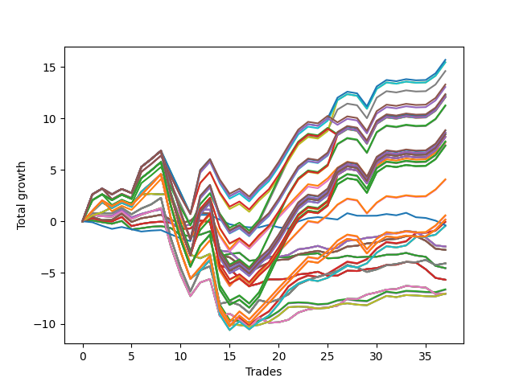

# Long Pointer Six (0219) 
- Symbol: AAPL_Unlimited
- Date Range: 03/23/2022 - 07/08/2022
- Trading Period: 7:20-12:30
- Number of Trades: 37



| Name | Win Percent | Profit | Avg Profit / Trade | Avg Time / Trade |      | Name | Win Percent | Profit | Avg Profit / Trade | Avg Time / Trade |
| ---- | ----------- | ------ | ------------------ | ---------------- | ---- | ---- | ----------- | ------ | ------------------ | ---------------- |
| Sorted By <br> Profit | | | | | | Sorted By <br> Win Percentage ||||
| Ninety-Five | 64.86 | 7850.00 | 212.16 | 155:06 |     | Fifty-Five | 70.27 | -15.00 | -0.41 | 110:06 |
| Ninety-Four | 64.86 | 7730.00 | 208.92 | 154:42 |     | Forty-Seven | 70.27 | -40.00 | -1.08 | 110:07 |
| Ninety-Three | 64.86 | 7730.00 | 208.92 | 153:48 |     | Seventy-One | 70.27 | -225.00 | -6.08 | 111:15 |
| Ninety-Two | 64.86 | 7305.00 | 197.43 | 142:20 |     | Sixty-Three | 70.27 | -225.00 | -6.08 | 111:15 |
| One Hundred | 62.16 | 6650.00 | 179.73 | 149:30 |     | Seven | 70.27 | -225.00 | -6.08 | 111:15 |
| Ninety-Nine | 62.16 | 6530.00 | 176.49 | 149:06 |     | Ninety-Five | 64.86 | 7850.00 | 212.16 | 155:06 |
| One Hundred Ten | 64.86 | 6180.00 | 167.03 | 158:13 |     | Ninety-Four | 64.86 | 7730.00 | 208.92 | 154:42 |
| One Hundred Five | 64.86 | 6155.00 | 166.35 | 159:45 |     | Ninety-Three | 64.86 | 7730.00 | 208.92 | 153:48 |
| Ninety-Seven | 62.16 | 6105.00 | 165.00 | 138:29 |     | Ninety-Two | 64.86 | 7305.00 | 197.43 | 142:20 |
| One Hundred Nine | 64.86 | 6060.00 | 163.78 | 157:49 |     | One Hundred Ten | 64.86 | 6180.00 | 167.03 | 158:13 |
| One Hundred Eight | 64.86 | 6060.00 | 163.78 | 156:54 |     | One Hundred Five | 64.86 | 6155.00 | 166.35 | 159:45 |
| One Hundred Four | 64.86 | 6035.00 | 163.11 | 159:21 |     | One Hundred Nine | 64.86 | 6060.00 | 163.78 | 157:49 |
| One Hundred Three | 64.86 | 6035.00 | 163.11 | 158:27 |     | One Hundred Eight | 64.86 | 6060.00 | 163.78 | 156:54 |
| Ninety-Eight | 62.16 | 6025.00 | 162.84 | 148:35 |     | One Hundred Four | 64.86 | 6035.00 | 163.11 | 159:21 |
| One Hundred Seven | 64.86 | 5635.00 | 152.30 | 145:26 |     | One Hundred Three | 64.86 | 6035.00 | 163.11 | 158:27 |
| One Hundred Two | 64.86 | 5610.00 | 151.62 | 146:59 |     | One Hundred Seven | 64.86 | 5635.00 | 152.30 | 145:26 |
| One Hundred Twenty | 64.86 | 4430.00 | 119.73 | 166:44 |     | One Hundred Two | 64.86 | 5610.00 | 151.62 | 146:59 |
| One Hundred Fifteen | 64.86 | 4405.00 | 119.05 | 166:45 |     | One Hundred Twenty | 64.86 | 4430.00 | 119.73 | 166:44 |
| One Hundred Ninteen | 64.86 | 4310.00 | 116.49 | 166:20 |     | One Hundred Fifteen | 64.86 | 4405.00 | 119.05 | 166:45 |
| One Hundred Eighteen | 64.86 | 4310.00 | 116.49 | 165:25 |     | One Hundred Ninteen | 64.86 | 4310.00 | 116.49 | 166:20 |
| One Hundred Fourteen | 64.86 | 4285.00 | 115.81 | 166:20 |     | One Hundred Eighteen | 64.86 | 4310.00 | 116.49 | 165:25 |
| One Hundred Thirteen | 64.86 | 4285.00 | 115.81 | 165:26 |     | One Hundred Fourteen | 64.86 | 4285.00 | 115.81 | 166:20 |
| One Hundred Thirty | 64.86 | 4220.00 | 114.05 | 167:53 |     | One Hundred Thirteen | 64.86 | 4285.00 | 115.81 | 165:26 |
| One Hundred Twenty-Five | 64.86 | 4220.00 | 114.05 | 167:53 |     | One Hundred Thirty | 64.86 | 4220.00 | 114.05 | 167:53 |
| Eighty-Five | 64.86 | 4220.00 | 114.05 | 167:53 |     | One Hundred Twenty-Five | 64.86 | 4220.00 | 114.05 | 167:53 |
| One Hundred Twenty-Nine | 64.86 | 4100.00 | 110.81 | 167:29 |     | Eighty-Five | 64.86 | 4220.00 | 114.05 | 167:53 |
| One Hundred Twenty-Eight | 64.86 | 4100.00 | 110.81 | 166:34 |     | One Hundred Twenty-Nine | 64.86 | 4100.00 | 110.81 | 167:29 |
| One Hundred Twenty-Four | 64.86 | 4100.00 | 110.81 | 167:29 |     | One Hundred Twenty-Eight | 64.86 | 4100.00 | 110.81 | 166:34 |
| One Hundred Twenty-Three | 64.86 | 4100.00 | 110.81 | 166:34 |     | One Hundred Twenty-Four | 64.86 | 4100.00 | 110.81 | 167:29 |
| Eighty-Four | 64.86 | 4100.00 | 110.81 | 167:29 |     | One Hundred Twenty-Three | 64.86 | 4100.00 | 110.81 | 166:34 |
| Eighty-Three | 64.86 | 4100.00 | 110.81 | 166:34 |     | Eighty-Four | 64.86 | 4100.00 | 110.81 | 167:29 |
| One Hundred Seventeen | 64.86 | 3885.00 | 105.00 | 153:57 |     | Eighty-Three | 64.86 | 4100.00 | 110.81 | 166:34 |
| One Hundred Twelve | 64.86 | 3860.00 | 104.32 | 153:58 |     | One Hundred Seventeen | 64.86 | 3885.00 | 105.00 | 153:57 |
| Ninety-Six | 64.86 | 3825.00 | 103.38 | 108:53 |     | One Hundred Twelve | 64.86 | 3860.00 | 104.32 | 153:58 |
| Ninety-One | 64.86 | 3710.00 | 100.27 | 111:39 |     | Ninety-Six | 64.86 | 3825.00 | 103.38 | 108:53 |
| One Hundred Twenty-Seven | 64.86 | 3675.00 | 99.32 | 155:06 |     | Ninety-One | 64.86 | 3710.00 | 100.27 | 111:39 |
| One Hundred Twenty-Two | 64.86 | 3675.00 | 99.32 | 155:06 |     | One Hundred Twenty-Seven | 64.86 | 3675.00 | 99.32 | 155:06 |
| Eighty-Two | 64.86 | 3675.00 | 99.32 | 155:06 |     | One Hundred Twenty-Two | 64.86 | 3675.00 | 99.32 | 155:06 |
| One Hundred Six | 64.86 | 2040.00 | 55.14 | 114:46 |     | Eighty-Two | 64.86 | 3675.00 | 99.32 | 155:06 |
| One Hundred One | 64.86 | 2015.00 | 54.46 | 116:18 |     | One Hundred Six | 64.86 | 2040.00 | 55.14 | 114:46 |
| One Hundred Sixteen | 64.86 | 290.00 | 7.84 | 123:17 |     | One Hundred One | 64.86 | 2015.00 | 54.46 | 116:18 |
| One Hundred Eleven | 64.86 | 265.00 | 7.16 | 123:17 |     | One Hundred Sixteen | 64.86 | 290.00 | 7.84 | 123:17 |
| One Hundred Twenty-Six | 64.86 | 80.00 | 2.16 | 124:26 |     | One Hundred Eleven | 64.86 | 265.00 | 7.16 | 123:17 |
| One Hundred Twenty-One | 64.86 | 80.00 | 2.16 | 124:26 |     | One Hundred Twenty-Six | 64.86 | 80.00 | 2.16 | 124:26 |
| Eighty-One | 64.86 | 80.00 | 2.16 | 124:26 |     | One Hundred Twenty-One | 64.86 | 80.00 | 2.16 | 124:26 |
| Fifty-Five | 70.27 | -15.00 | -0.41 | 110:06 |     | Eighty-One | 64.86 | 80.00 | 2.16 | 124:26 |
| Forty-Seven | 70.27 | -40.00 | -1.08 | 110:07 |     | Sixty-Seven | 64.86 | -1390.00 | -37.57 | 25:56 |
| Seventy-Three | 35.14 | -195.00 | -5.27 | 09:19 |     | Fifty-Nine | 64.86 | -1390.00 | -37.57 | 25:56 |
| Seventy-One | 70.27 | -225.00 | -6.08 | 111:15 |     | Fifty-One | 64.86 | -1390.00 | -37.57 | 25:56 |
| Sixty-Three | 70.27 | -225.00 | -6.08 | 111:15 |     | Forty-Three | 64.86 | -1390.00 | -37.57 | 25:56 |
| Seven | 70.27 | -225.00 | -6.08 | 111:15 |     | Three | 64.86 | -1390.00 | -37.57 | 25:56 |
| Sixty-Six | 62.16 | -1230.00 | -33.24 | 28:15 |     | Sixty-Nine | 64.86 | -2050.00 | -55.41 | 63:57 |
| Fifty-Eight | 62.16 | -1230.00 | -33.24 | 28:15 |     | Sixty-One | 64.86 | -2050.00 | -55.41 | 63:57 |
| Fifty | 62.16 | -1230.00 | -33.24 | 28:15 |     | Fifty-Three | 64.86 | -2050.00 | -55.41 | 63:57 |
| Forty-Two | 62.16 | -1230.00 | -33.24 | 28:15 |     | Forty-Five | 64.86 | -2050.00 | -55.41 | 63:57 |
| Two | 62.16 | -1230.00 | -33.24 | 28:15 |     | Five | 64.86 | -2050.00 | -55.41 | 63:57 |
| Sixty-Seven | 64.86 | -1390.00 | -37.57 | 25:56 |     | One Hundred | 62.16 | 6650.00 | 179.73 | 149:30 |
| Fifty-Nine | 64.86 | -1390.00 | -37.57 | 25:56 |     | Ninety-Nine | 62.16 | 6530.00 | 176.49 | 149:06 |
| Fifty-One | 64.86 | -1390.00 | -37.57 | 25:56 |     | Ninety-Seven | 62.16 | 6105.00 | 165.00 | 138:29 |
| Forty-Three | 64.86 | -1390.00 | -37.57 | 25:56 |     | Ninety-Eight | 62.16 | 6025.00 | 162.84 | 148:35 |
| Three | 64.86 | -1390.00 | -37.57 | 25:56 |     | Sixty-Six | 62.16 | -1230.00 | -33.24 | 28:15 |
| Sixty-Nine | 64.86 | -2050.00 | -55.41 | 63:57 |     | Fifty-Eight | 62.16 | -1230.00 | -33.24 | 28:15 |
| Sixty-One | 64.86 | -2050.00 | -55.41 | 63:57 |     | Fifty | 62.16 | -1230.00 | -33.24 | 28:15 |
| Fifty-Three | 64.86 | -2050.00 | -55.41 | 63:57 |     | Forty-Two | 62.16 | -1230.00 | -33.24 | 28:15 |
| Forty-Five | 64.86 | -2050.00 | -55.41 | 63:57 |     | Two | 62.16 | -1230.00 | -33.24 | 28:15 |
| Five | 64.86 | -2050.00 | -55.41 | 63:57 |     | Sixty-Eight | 62.16 | -3525.00 | -95.27 | 50:42 |
| Sixty-Four | 59.46 | -2280.00 | -61.62 | 11:26 |     | Sixty | 62.16 | -3525.00 | -95.27 | 50:42 |
| Fifty-Six | 59.46 | -2280.00 | -61.62 | 11:26 |     | Fifty-Two | 62.16 | -3525.00 | -95.27 | 50:42 |
| Forty-Eight | 59.46 | -2280.00 | -61.62 | 11:26 |     | Forty-Four | 62.16 | -3525.00 | -95.27 | 50:42 |
| Forty | 59.46 | -2280.00 | -61.62 | 11:26 |     | Four | 62.16 | -3525.00 | -95.27 | 50:42 |
| Zero | 59.46 | -2280.00 | -61.62 | 11:26 |     | Sixty-Four | 59.46 | -2280.00 | -61.62 | 11:26 |
| Sixty-Five | 56.76 | -2845.00 | -76.89 | 19:57 |     | Fifty-Six | 59.46 | -2280.00 | -61.62 | 11:26 |
| Fifty-Seven | 56.76 | -2845.00 | -76.89 | 19:57 |     | Forty-Eight | 59.46 | -2280.00 | -61.62 | 11:26 |
| Forty-Nine | 56.76 | -2845.00 | -76.89 | 19:57 |     | Forty | 59.46 | -2280.00 | -61.62 | 11:26 |
| Forty-One | 56.76 | -2845.00 | -76.89 | 19:57 |     | Zero | 59.46 | -2280.00 | -61.62 | 11:26 |
| One | 56.76 | -2845.00 | -76.89 | 19:57 |     | Sixty-Five | 56.76 | -2845.00 | -76.89 | 19:57 |
| Fifty-Four | 54.05 | -3310.00 | -89.46 | 58:49 |     | Fifty-Seven | 56.76 | -2845.00 | -76.89 | 19:57 |
| Forty-Six | 54.05 | -3335.00 | -90.14 | 58:49 |     | Forty-Nine | 56.76 | -2845.00 | -76.89 | 19:57 |
| Seventy | 54.05 | -3520.00 | -95.14 | 59:57 |     | Forty-One | 56.76 | -2845.00 | -76.89 | 19:57 |
| Sixty-Two | 54.05 | -3520.00 | -95.14 | 59:57 |     | One | 56.76 | -2845.00 | -76.89 | 19:57 |
| Six | 54.05 | -3520.00 | -95.14 | 59:57 |     | Fifty-Four | 54.05 | -3310.00 | -89.46 | 58:49 |
| Sixty-Eight | 62.16 | -3525.00 | -95.27 | 50:42 |     | Forty-Six | 54.05 | -3335.00 | -90.14 | 58:49 |
| Sixty | 62.16 | -3525.00 | -95.27 | 50:42 |     | Seventy | 54.05 | -3520.00 | -95.14 | 59:57 |
| Fifty-Two | 62.16 | -3525.00 | -95.27 | 50:42 |     | Sixty-Two | 54.05 | -3520.00 | -95.14 | 59:57 |
| Forty-Four | 62.16 | -3525.00 | -95.27 | 50:42 |     | Six | 54.05 | -3520.00 | -95.14 | 59:57 |
| Four | 62.16 | -3525.00 | -95.27 | 50:42 |     | Seventy-Three | 35.14 | -195.00 | -5.27 | 09:19 |

## NO STOPLOSS

### Test Zero
* Sell when price hits the middle line of the 20p bollinger
* No Stoploss
* Results:
```
Total Trades: 37
Percent Up: 59.46
Percent Down: 40.54
Total Points Moved Up: -4.56
Potential Profit: -2280.00
Total Points Ups: 2.88 Count Ups: 22
Total Points Downs: -7.44 Count Downs: 15
```

<details><summary>Trades</summary>

<code>In: 2022-03-24 07:23:00		Out: 2022-03-24 07:32:45		Total Position Time: 09:45		Total Move Up: 0.07		Total to Date: 0.07</code> <br />
<code>In: 2022-03-25 08:17:00		Out: 2022-03-25 08:30:30		Total Position Time: 13:30		Total Move Up: -0.16		Total to Date: -0.09</code> <br />
<code>In: 2022-03-30 08:03:00		Out: 2022-03-30 08:15:55		Total Position Time: 12:55		Total Move Up: -0.15		Total to Date: -0.24</code> <br />
<code>In: 2022-03-30 12:26:00		Out: 2022-03-30 12:28:10		Total Position Time: 02:10		Total Move Up: 0.27		Total to Date: 0.03</code> <br />
<code>In: 2022-04-01 08:22:00		Out: 2022-04-01 08:53:30		Total Position Time: 31:30		Total Move Up: -0.82		Total to Date: -0.79</code> <br />
<code>In: 2022-04-07 08:36:00		Out: 2022-04-07 08:45:45		Total Position Time: 09:45		Total Move Up: 0.11		Total to Date: -0.68</code> <br />
<code>In: 2022-04-19 10:32:00		Out: 2022-04-19 10:34:10		Total Position Time: 02:10		Total Move Up: 0.14		Total to Date: -0.54</code> <br />
<code>In: 2022-04-19 11:15:00		Out: 2022-04-19 11:22:05		Total Position Time: 07:05		Total Move Up: 0.06		Total to Date: -0.48</code> <br />
<code>In: 2022-04-21 08:54:00		Out: 2022-04-21 09:06:35		Total Position Time: 12:35		Total Move Up: -0.18		Total to Date: -0.66</code> <br />
<code>In: 2022-04-21 09:57:00		Out: 2022-04-21 10:21:40		Total Position Time: 24:40		Total Move Up: -0.68		Total to Date: -1.34</code> <br />
<code>In: 2022-04-21 10:22:00		Out: 2022-04-21 10:23:10		Total Position Time: 01:10		Total Move Up: -0.09		Total to Date: -1.43</code> <br />
<code>In: 2022-05-04 11:37:00		Out: 2022-05-04 11:41:35		Total Position Time: 04:35		Total Move Up: 0.12		Total to Date: -1.31</code> <br />
<code>In: 2022-05-06 11:12:00		Out: 2022-05-06 11:15:50		Total Position Time: 03:50		Total Move Up: 0.34		Total to Date: -0.97</code> <br />
<code>In: 2022-05-11 09:37:00		Out: 2022-05-11 10:25:15		Total Position Time: 48:15		Total Move Up: -2.41		Total to Date: -3.38</code> <br />
<code>In: 2022-05-11 10:50:00		Out: 2022-05-11 10:53:15		Total Position Time: 03:15		Total Move Up: 0.20		Total to Date: -3.18</code> <br />
<code>In: 2022-05-13 10:45:00		Out: 2022-05-13 10:49:50		Total Position Time: 04:50		Total Move Up: 0.11		Total to Date: -3.07</code> <br />
<code>In: 2022-05-16 12:26:00		Out: 2022-05-16 12:47:00		Total Position Time: 21:00		Total Move Up: -0.77		Total to Date: -3.84</code> <br />
<code>In: 2022-05-17 11:25:00		Out: 2022-05-17 11:37:20		Total Position Time: 12:20		Total Move Up: 0.08		Total to Date: -3.76</code> <br />
<code>In: 2022-05-25 08:41:00		Out: 2022-05-25 08:44:10		Total Position Time: 03:10		Total Move Up: 0.31		Total to Date: -3.45</code> <br />
<code>In: 2022-05-25 09:31:00		Out: 2022-05-25 09:44:25		Total Position Time: 13:25		Total Move Up: -0.05		Total to Date: -3.50</code> <br />
<code>In: 2022-05-25 10:16:00		Out: 2022-05-25 10:18:00		Total Position Time: 02:00		Total Move Up: 0.01		Total to Date: -3.49</code> <br />
<code>In: 2022-05-27 08:05:00		Out: 2022-05-27 08:07:00		Total Position Time: 02:00		Total Move Up: 0.23		Total to Date: -3.26</code> <br />
<code>In: 2022-05-27 10:54:00		Out: 2022-05-27 10:57:10		Total Position Time: 03:10		Total Move Up: 0.05		Total to Date: -3.21</code> <br />
<code>In: 2022-06-08 09:48:00		Out: 2022-06-08 09:56:55		Total Position Time: 08:55		Total Move Up: 0.10		Total to Date: -3.11</code> <br />
<code>In: 2022-06-14 11:53:00		Out: 2022-06-14 12:22:10		Total Position Time: 29:10		Total Move Up: -0.49		Total to Date: -3.60</code> <br />
<code>In: 2022-06-15 07:43:00		Out: 2022-06-15 07:50:15		Total Position Time: 07:15		Total Move Up: 0.03		Total to Date: -3.57</code> <br />
<code>In: 2022-06-17 12:18:00		Out: 2022-06-17 12:20:50		Total Position Time: 02:50		Total Move Up: 0.22		Total to Date: -3.35</code> <br />
<code>In: 2022-06-21 09:03:00		Out: 2022-06-21 09:14:55		Total Position Time: 11:55		Total Move Up: -0.16		Total to Date: -3.51</code> <br />
<code>In: 2022-06-22 08:08:00		Out: 2022-06-22 08:17:10		Total Position Time: 09:10		Total Move Up: 0.06		Total to Date: -3.45</code> <br />
<code>In: 2022-06-23 09:49:00		Out: 2022-06-23 09:53:45		Total Position Time: 04:45		Total Move Up: 0.00		Total to Date: -3.45</code> <br />
<code>In: 2022-06-24 08:23:00		Out: 2022-06-24 08:26:15		Total Position Time: 03:15		Total Move Up: 0.19		Total to Date: -3.26</code> <br />
<code>In: 2022-06-27 10:51:00		Out: 2022-06-27 11:03:15		Total Position Time: 12:15		Total Move Up: 0.01		Total to Date: -3.25</code> <br />
<code>In: 2022-06-27 12:10:00		Out: 2022-06-27 12:11:10		Total Position Time: 01:10		Total Move Up: 0.17		Total to Date: -3.08</code> <br />
<code>In: 2022-06-29 09:17:00		Out: 2022-06-29 09:36:45		Total Position Time: 19:45		Total Move Up: -0.25		Total to Date: -3.33</code> <br />
<code>In: 2022-06-30 11:47:00		Out: 2022-06-30 12:02:20		Total Position Time: 15:20		Total Move Up: -0.13		Total to Date: -3.46</code> <br />
<code>In: 2022-07-08 09:17:00		Out: 2022-07-08 09:49:45		Total Position Time: 32:45		Total Move Up: -0.88		Total to Date: -4.34</code> <br />
<code>In: 2022-07-08 09:34:00		Out: 2022-07-08 09:49:45		Total Position Time: 15:45		Total Move Up: -0.22		Total to Date: -4.56</code> <br />


</details>

### Test One
* Sell when the price hits the upper line of the 20p 1std bollinger
* No Stoploss
* Results:
```
Total Trades: 37
Percent Up: 56.76
Percent Down: 43.24
Total Points Moved Up: -5.69
Potential Profit: -2845.00
Total Points Ups: 4.73 Count Ups: 21
Total Points Downs: -10.42 Count Downs: 16
```

<details><summary>Trades</summary>

<code>In: 2022-03-24 07:23:00		Out: 2022-03-24 07:34:15		Total Position Time: 11:15		Total Move Up: 0.29		Total to Date: 0.29</code> <br />
<code>In: 2022-03-25 08:17:00		Out: 2022-03-25 08:41:25		Total Position Time: 24:25		Total Move Up: -0.23		Total to Date: 0.06</code> <br />
<code>In: 2022-03-30 08:03:00		Out: 2022-03-30 08:19:15		Total Position Time: 16:15		Total Move Up: -0.08		Total to Date: -0.02</code> <br />
<code>In: 2022-03-30 12:26:00		Out: 2022-03-30 12:31:35		Total Position Time: 05:35		Total Move Up: 0.44		Total to Date: 0.42</code> <br />
<code>In: 2022-04-01 08:22:00		Out: 2022-04-01 09:09:05		Total Position Time: 47:05		Total Move Up: -0.89		Total to Date: -0.47</code> <br />
<code>In: 2022-04-07 08:36:00		Out: 2022-04-07 08:47:05		Total Position Time: 11:05		Total Move Up: 0.22		Total to Date: -0.25</code> <br />
<code>In: 2022-04-19 10:32:00		Out: 2022-04-19 10:48:20		Total Position Time: 16:20		Total Move Up: 0.14		Total to Date: -0.11</code> <br />
<code>In: 2022-04-19 11:15:00		Out: 2022-04-19 11:28:10		Total Position Time: 13:10		Total Move Up: 0.07		Total to Date: -0.04</code> <br />
<code>In: 2022-04-21 08:54:00		Out: 2022-04-21 09:12:05		Total Position Time: 18:05		Total Move Up: -0.11		Total to Date: -0.15</code> <br />
<code>In: 2022-04-21 09:57:00		Out: 2022-04-21 10:28:50		Total Position Time: 31:50		Total Move Up: -0.59		Total to Date: -0.74</code> <br />
<code>In: 2022-04-21 10:22:00		Out: 2022-04-21 10:28:50		Total Position Time: 06:50		Total Move Up: 0.04		Total to Date: -0.70</code> <br />
<code>In: 2022-05-04 11:37:00		Out: 2022-05-04 11:43:55		Total Position Time: 06:55		Total Move Up: 0.77		Total to Date: 0.07</code> <br />
<code>In: 2022-05-06 11:12:00		Out: 2022-05-06 11:49:20		Total Position Time: 37:20		Total Move Up: -0.16		Total to Date: -0.09</code> <br />
<code>In: 2022-05-11 09:37:00		Out: 2022-05-11 11:18:35		Total Position Time: 101:35		Total Move Up: -4.19		Total to Date: -4.28</code> <br />
<code>In: 2022-05-11 10:50:00		Out: 2022-05-11 11:18:35		Total Position Time: 28:35		Total Move Up: -0.34		Total to Date: -4.62</code> <br />
<code>In: 2022-05-13 10:45:00		Out: 2022-05-13 11:22:30		Total Position Time: 37:30		Total Move Up: -0.91		Total to Date: -5.53</code> <br />
<code>In: 2022-05-16 12:26:00		Out: 2022-05-16 12:47:00		Total Position Time: 21:00		Total Move Up: -0.77		Total to Date: -6.30</code> <br />
<code>In: 2022-05-17 11:25:00		Out: 2022-05-17 11:39:40		Total Position Time: 14:40		Total Move Up: 0.24		Total to Date: -6.06</code> <br />
<code>In: 2022-05-25 08:41:00		Out: 2022-05-25 08:48:35		Total Position Time: 07:35		Total Move Up: 0.41		Total to Date: -5.65</code> <br />
<code>In: 2022-05-25 09:31:00		Out: 2022-05-25 09:45:15		Total Position Time: 14:15		Total Move Up: 0.00		Total to Date: -5.65</code> <br />
<code>In: 2022-05-25 10:16:00		Out: 2022-05-25 10:27:00		Total Position Time: 11:00		Total Move Up: 0.06		Total to Date: -5.59</code> <br />
<code>In: 2022-05-27 08:05:00		Out: 2022-05-27 08:11:10		Total Position Time: 06:10		Total Move Up: 0.42		Total to Date: -5.17</code> <br />
<code>In: 2022-05-27 10:54:00		Out: 2022-05-27 11:00:50		Total Position Time: 06:50		Total Move Up: 0.09		Total to Date: -5.08</code> <br />
<code>In: 2022-06-08 09:48:00		Out: 2022-06-08 09:59:05		Total Position Time: 11:05		Total Move Up: 0.17		Total to Date: -4.91</code> <br />
<code>In: 2022-06-14 11:53:00		Out: 2022-06-14 12:26:30		Total Position Time: 33:30		Total Move Up: -0.39		Total to Date: -5.30</code> <br />
<code>In: 2022-06-15 07:43:00		Out: 2022-06-15 07:58:55		Total Position Time: 15:55		Total Move Up: 0.01		Total to Date: -5.29</code> <br />
<code>In: 2022-06-17 12:18:00		Out: 2022-06-17 12:24:00		Total Position Time: 06:00		Total Move Up: 0.48		Total to Date: -4.81</code> <br />
<code>In: 2022-06-21 09:03:00		Out: 2022-06-21 09:17:25		Total Position Time: 14:25		Total Move Up: -0.03		Total to Date: -4.84</code> <br />
<code>In: 2022-06-22 08:08:00		Out: 2022-06-22 08:20:05		Total Position Time: 12:05		Total Move Up: 0.19		Total to Date: -4.65</code> <br />
<code>In: 2022-06-23 09:49:00		Out: 2022-06-23 09:54:05		Total Position Time: 05:05		Total Move Up: 0.09		Total to Date: -4.56</code> <br />
<code>In: 2022-06-24 08:23:00		Out: 2022-06-24 08:29:40		Total Position Time: 06:40		Total Move Up: 0.31		Total to Date: -4.25</code> <br />
<code>In: 2022-06-27 10:51:00		Out: 2022-06-27 11:05:00		Total Position Time: 14:00		Total Move Up: 0.03		Total to Date: -4.22</code> <br />
<code>In: 2022-06-27 12:10:00		Out: 2022-06-27 12:13:05		Total Position Time: 03:05		Total Move Up: 0.26		Total to Date: -3.96</code> <br />
<code>In: 2022-06-29 09:17:00		Out: 2022-06-29 09:38:30		Total Position Time: 21:30		Total Move Up: -0.06		Total to Date: -4.02</code> <br />
<code>In: 2022-06-30 11:47:00		Out: 2022-06-30 12:25:40		Total Position Time: 38:40		Total Move Up: -0.65		Total to Date: -4.67</code> <br />
<code>In: 2022-07-08 09:17:00		Out: 2022-07-08 09:56:10		Total Position Time: 39:10		Total Move Up: -0.84		Total to Date: -5.51</code> <br />
<code>In: 2022-07-08 09:34:00		Out: 2022-07-08 09:56:10		Total Position Time: 22:10		Total Move Up: -0.18		Total to Date: -5.69</code> <br />


</details>

### Test Two
* Sell when the price hits the upper line of the 20p 2std bollinger
* No Stoploss
* Results:
```
Total Trades: 37
Percent Up: 62.16
Percent Down: 37.84
Total Points Moved Up: -2.46
Potential Profit: -1230.00
Total Points Ups: 7.63 Count Ups: 23
Total Points Downs: -10.09 Count Downs: 14
```

<details><summary>Trades</summary>

<code>In: 2022-03-24 07:23:00		Out: 2022-03-24 07:45:45		Total Position Time: 22:45		Total Move Up: 0.62		Total to Date: 0.62</code> <br />
<code>In: 2022-03-25 08:17:00		Out: 2022-03-25 08:42:05		Total Position Time: 25:05		Total Move Up: -0.13		Total to Date: 0.49</code> <br />
<code>In: 2022-03-30 08:03:00		Out: 2022-03-30 08:34:40		Total Position Time: 31:40		Total Move Up: 0.03		Total to Date: 0.52</code> <br />
<code>In: 2022-03-30 12:26:00		Out: 2022-03-30 12:36:15		Total Position Time: 10:15		Total Move Up: 0.60		Total to Date: 1.12</code> <br />
<code>In: 2022-04-01 08:22:00		Out: 2022-04-01 09:09:35		Total Position Time: 47:35		Total Move Up: -0.75		Total to Date: 0.37</code> <br />
<code>In: 2022-04-07 08:36:00		Out: 2022-04-07 08:48:05		Total Position Time: 12:05		Total Move Up: 0.34		Total to Date: 0.71</code> <br />
<code>In: 2022-04-19 10:32:00		Out: 2022-04-19 10:50:20		Total Position Time: 18:20		Total Move Up: 0.26		Total to Date: 0.97</code> <br />
<code>In: 2022-04-19 11:15:00		Out: 2022-04-19 11:29:20		Total Position Time: 14:20		Total Move Up: 0.18		Total to Date: 1.15</code> <br />
<code>In: 2022-04-21 08:54:00		Out: 2022-04-21 10:31:20		Total Position Time: 97:20		Total Move Up: -1.34		Total to Date: -0.19</code> <br />
<code>In: 2022-04-21 09:57:00		Out: 2022-04-21 10:31:20		Total Position Time: 34:20		Total Move Up: -0.37		Total to Date: -0.56</code> <br />
<code>In: 2022-04-21 10:22:00		Out: 2022-04-21 10:31:20		Total Position Time: 09:20		Total Move Up: 0.26		Total to Date: -0.30</code> <br />
<code>In: 2022-05-04 11:37:00		Out: 2022-05-04 11:46:55		Total Position Time: 09:55		Total Move Up: 1.43		Total to Date: 1.13</code> <br />
<code>In: 2022-05-06 11:12:00		Out: 2022-05-06 11:50:05		Total Position Time: 38:05		Total Move Up: -0.01		Total to Date: 1.12</code> <br />
<code>In: 2022-05-11 09:37:00		Out: 2022-05-11 11:24:05		Total Position Time: 107:05		Total Move Up: -3.97		Total to Date: -2.85</code> <br />
<code>In: 2022-05-11 10:50:00		Out: 2022-05-11 11:24:05		Total Position Time: 34:05		Total Move Up: -0.12		Total to Date: -2.97</code> <br />
<code>In: 2022-05-13 10:45:00		Out: 2022-05-13 11:31:00		Total Position Time: 46:00		Total Move Up: -0.81		Total to Date: -3.78</code> <br />
<code>In: 2022-05-16 12:26:00		Out: 2022-05-16 12:47:00		Total Position Time: 21:00		Total Move Up: -0.77		Total to Date: -4.55</code> <br />
<code>In: 2022-05-17 11:25:00		Out: 2022-05-17 11:40:00		Total Position Time: 15:00		Total Move Up: 0.52		Total to Date: -4.03</code> <br />
<code>In: 2022-05-25 08:41:00		Out: 2022-05-25 08:58:25		Total Position Time: 17:25		Total Move Up: 0.50		Total to Date: -3.53</code> <br />
<code>In: 2022-05-25 09:31:00		Out: 2022-05-25 09:47:30		Total Position Time: 16:30		Total Move Up: 0.06		Total to Date: -3.47</code> <br />
<code>In: 2022-05-25 10:16:00		Out: 2022-05-25 10:29:20		Total Position Time: 13:20		Total Move Up: 0.20		Total to Date: -3.27</code> <br />
<code>In: 2022-05-27 08:05:00		Out: 2022-05-27 08:12:05		Total Position Time: 07:05		Total Move Up: 0.54		Total to Date: -2.73</code> <br />
<code>In: 2022-05-27 10:54:00		Out: 2022-05-27 11:03:40		Total Position Time: 09:40		Total Move Up: 0.12		Total to Date: -2.61</code> <br />
<code>In: 2022-06-08 09:48:00		Out: 2022-06-08 10:00:10		Total Position Time: 12:10		Total Move Up: 0.21		Total to Date: -2.40</code> <br />
<code>In: 2022-06-14 11:53:00		Out: 2022-06-14 12:27:10		Total Position Time: 34:10		Total Move Up: -0.31		Total to Date: -2.71</code> <br />
<code>In: 2022-06-15 07:43:00		Out: 2022-06-15 07:59:05		Total Position Time: 16:05		Total Move Up: 0.11		Total to Date: -2.60</code> <br />
<code>In: 2022-06-17 12:18:00		Out: 2022-06-17 12:27:00		Total Position Time: 09:00		Total Move Up: 0.71		Total to Date: -1.89</code> <br />
<code>In: 2022-06-21 09:03:00		Out: 2022-06-21 09:20:10		Total Position Time: 17:10		Total Move Up: 0.07		Total to Date: -1.82</code> <br />
<code>In: 2022-06-22 08:08:00		Out: 2022-06-22 08:23:50		Total Position Time: 15:50		Total Move Up: 0.21		Total to Date: -1.61</code> <br />
<code>In: 2022-06-23 09:49:00		Out: 2022-06-23 09:56:50		Total Position Time: 07:50		Total Move Up: 0.09		Total to Date: -1.52</code> <br />
<code>In: 2022-06-24 08:23:00		Out: 2022-06-24 08:54:05		Total Position Time: 31:05		Total Move Up: 0.31		Total to Date: -1.21</code> <br />
<code>In: 2022-06-27 10:51:00		Out: 2022-06-27 11:17:10		Total Position Time: 26:10		Total Move Up: 0.06		Total to Date: -1.15</code> <br />
<code>In: 2022-06-27 12:10:00		Out: 2022-06-27 12:47:00		Total Position Time: 37:00		Total Move Up: 0.20		Total to Date: -0.95</code> <br />
<code>In: 2022-06-29 09:17:00		Out: 2022-06-29 10:10:00		Total Position Time: 53:00		Total Move Up: -0.10		Total to Date: -1.05</code> <br />
<code>In: 2022-06-30 11:47:00		Out: 2022-06-30 12:26:05		Total Position Time: 39:05		Total Move Up: -0.53		Total to Date: -1.58</code> <br />
<code>In: 2022-07-08 09:17:00		Out: 2022-07-08 10:09:45		Total Position Time: 52:45		Total Move Up: -0.77		Total to Date: -2.35</code> <br />
<code>In: 2022-07-08 09:34:00		Out: 2022-07-08 10:09:45		Total Position Time: 35:45		Total Move Up: -0.11		Total to Date: -2.46</code> <br />


</details>

### Test Three
* Sell when price hits the middle line of the 50p bollinger
* No Stoploss
* Results:
```
Total Trades: 37
Percent Up: 64.86
Percent Down: 35.14
Total Points Moved Up: -2.78
Potential Profit: -1390.00
Total Points Ups: 6.54 Count Ups: 24
Total Points Downs: -9.32 Count Downs: 13
```

<details><summary>Trades</summary>

<code>In: 2022-03-24 07:23:00		Out: 2022-03-24 07:35:35		Total Position Time: 12:35		Total Move Up: 0.43		Total to Date: 0.43</code> <br />
<code>In: 2022-03-25 08:17:00		Out: 2022-03-25 09:05:15		Total Position Time: 48:15		Total Move Up: -0.32		Total to Date: 0.11</code> <br />
<code>In: 2022-03-30 08:03:00		Out: 2022-03-30 08:34:40		Total Position Time: 31:40		Total Move Up: 0.03		Total to Date: 0.14</code> <br />
<code>In: 2022-03-30 12:26:00		Out: 2022-03-30 12:36:15		Total Position Time: 10:15		Total Move Up: 0.60		Total to Date: 0.74</code> <br />
<code>In: 2022-04-01 08:22:00		Out: 2022-04-01 09:14:10		Total Position Time: 52:10		Total Move Up: -0.81		Total to Date: -0.07</code> <br />
<code>In: 2022-04-07 08:36:00		Out: 2022-04-07 08:48:10		Total Position Time: 12:10		Total Move Up: 0.36		Total to Date: 0.29</code> <br />
<code>In: 2022-04-19 10:32:00		Out: 2022-04-19 10:48:30		Total Position Time: 16:30		Total Move Up: 0.16		Total to Date: 0.45</code> <br />
<code>In: 2022-04-19 11:15:00		Out: 2022-04-19 11:29:20		Total Position Time: 14:20		Total Move Up: 0.18		Total to Date: 0.63</code> <br />
<code>In: 2022-04-21 08:54:00		Out: 2022-04-21 09:47:05		Total Position Time: 53:05		Total Move Up: -0.47		Total to Date: 0.16</code> <br />
<code>In: 2022-04-21 09:57:00		Out: 2022-04-21 10:31:40		Total Position Time: 34:40		Total Move Up: -0.37		Total to Date: -0.21</code> <br />
<code>In: 2022-04-21 10:22:00		Out: 2022-04-21 10:31:40		Total Position Time: 09:40		Total Move Up: 0.26		Total to Date: 0.05</code> <br />
<code>In: 2022-05-04 11:37:00		Out: 2022-05-04 11:43:55		Total Position Time: 06:55		Total Move Up: 0.77		Total to Date: 0.82</code> <br />
<code>In: 2022-05-06 11:12:00		Out: 2022-05-06 11:49:25		Total Position Time: 37:25		Total Move Up: -0.06		Total to Date: 0.76</code> <br />
<code>In: 2022-05-11 09:37:00		Out: 2022-05-11 11:23:35		Total Position Time: 106:35		Total Move Up: -4.06		Total to Date: -3.30</code> <br />
<code>In: 2022-05-11 10:50:00		Out: 2022-05-11 11:23:35		Total Position Time: 33:35		Total Move Up: -0.21		Total to Date: -3.51</code> <br />
<code>In: 2022-05-13 10:45:00		Out: 2022-05-13 11:31:20		Total Position Time: 46:20		Total Move Up: -0.69		Total to Date: -4.20</code> <br />
<code>In: 2022-05-16 12:26:00		Out: 2022-05-16 12:47:00		Total Position Time: 21:00		Total Move Up: -0.77		Total to Date: -4.97</code> <br />
<code>In: 2022-05-17 11:25:00		Out: 2022-05-17 11:40:00		Total Position Time: 15:00		Total Move Up: 0.52		Total to Date: -4.45</code> <br />
<code>In: 2022-05-25 08:41:00		Out: 2022-05-25 08:48:35		Total Position Time: 07:35		Total Move Up: 0.41		Total to Date: -4.04</code> <br />
<code>In: 2022-05-25 09:31:00		Out: 2022-05-25 09:49:20		Total Position Time: 18:20		Total Move Up: 0.28		Total to Date: -3.76</code> <br />
<code>In: 2022-05-25 10:16:00		Out: 2022-05-25 10:27:00		Total Position Time: 11:00		Total Move Up: 0.06		Total to Date: -3.70</code> <br />
<code>In: 2022-05-27 08:05:00		Out: 2022-05-27 08:11:35		Total Position Time: 06:35		Total Move Up: 0.48		Total to Date: -3.22</code> <br />
<code>In: 2022-05-27 10:54:00		Out: 2022-05-27 11:04:20		Total Position Time: 10:20		Total Move Up: 0.18		Total to Date: -3.04</code> <br />
<code>In: 2022-06-08 09:48:00		Out: 2022-06-08 10:19:15		Total Position Time: 31:15		Total Move Up: 0.16		Total to Date: -2.88</code> <br />
<code>In: 2022-06-14 11:53:00		Out: 2022-06-14 12:27:25		Total Position Time: 34:25		Total Move Up: -0.23		Total to Date: -3.11</code> <br />
<code>In: 2022-06-15 07:43:00		Out: 2022-06-15 08:00:30		Total Position Time: 17:30		Total Move Up: 0.21		Total to Date: -2.90</code> <br />
<code>In: 2022-06-17 12:18:00		Out: 2022-06-17 12:23:00		Total Position Time: 05:00		Total Move Up: 0.44		Total to Date: -2.46</code> <br />
<code>In: 2022-06-21 09:03:00		Out: 2022-06-21 09:23:05		Total Position Time: 20:05		Total Move Up: 0.08		Total to Date: -2.38</code> <br />
<code>In: 2022-06-22 08:08:00		Out: 2022-06-22 08:31:50		Total Position Time: 23:50		Total Move Up: 0.22		Total to Date: -2.16</code> <br />
<code>In: 2022-06-23 09:49:00		Out: 2022-06-23 10:07:30		Total Position Time: 18:30		Total Move Up: 0.10		Total to Date: -2.06</code> <br />
<code>In: 2022-06-24 08:23:00		Out: 2022-06-24 08:29:20		Total Position Time: 06:20		Total Move Up: 0.29		Total to Date: -1.77</code> <br />
<code>In: 2022-06-27 10:51:00		Out: 2022-06-27 11:17:10		Total Position Time: 26:10		Total Move Up: 0.06		Total to Date: -1.71</code> <br />
<code>In: 2022-06-27 12:10:00		Out: 2022-06-27 12:13:05		Total Position Time: 03:05		Total Move Up: 0.26		Total to Date: -1.45</code> <br />
<code>In: 2022-06-29 09:17:00		Out: 2022-06-29 09:45:15		Total Position Time: 28:15		Total Move Up: 0.00		Total to Date: -1.45</code> <br />
<code>In: 2022-06-30 11:47:00		Out: 2022-06-30 12:27:45		Total Position Time: 40:45		Total Move Up: -0.45		Total to Date: -1.90</code> <br />
<code>In: 2022-07-08 09:17:00		Out: 2022-07-08 10:09:45		Total Position Time: 52:45		Total Move Up: -0.77		Total to Date: -2.67</code> <br />
<code>In: 2022-07-08 09:34:00		Out: 2022-07-08 10:09:45		Total Position Time: 35:45		Total Move Up: -0.11		Total to Date: -2.78</code> <br />


</details>

### Test Four
* Sell when the price hits the upper line of the 50p 1std bollinger
* No Stoploss
* Results:
```
Total Trades: 37
Percent Up: 62.16
Percent Down: 37.84
Total Points Moved Up: -7.05
Potential Profit: -3525.00
Total Points Ups: 8.68 Count Ups: 23
Total Points Downs: -15.73 Count Downs: 14
```

<details><summary>Trades</summary>

<code>In: 2022-03-24 07:23:00		Out: 2022-03-24 07:45:45		Total Position Time: 22:45		Total Move Up: 0.62		Total to Date: 0.62</code> <br />
<code>In: 2022-03-25 08:17:00		Out: 2022-03-25 09:09:05		Total Position Time: 52:05		Total Move Up: -0.13		Total to Date: 0.49</code> <br />
<code>In: 2022-03-30 08:03:00		Out: 2022-03-30 09:01:50		Total Position Time: 58:50		Total Move Up: -0.05		Total to Date: 0.44</code> <br />
<code>In: 2022-03-30 12:26:00		Out: 2022-03-30 12:47:00		Total Position Time: 21:00		Total Move Up: 0.52		Total to Date: 0.96</code> <br />
<code>In: 2022-04-01 08:22:00		Out: 2022-04-01 09:23:00		Total Position Time: 61:00		Total Move Up: -0.73		Total to Date: 0.23</code> <br />
<code>In: 2022-04-07 08:36:00		Out: 2022-04-07 09:05:20		Total Position Time: 29:20		Total Move Up: 0.41		Total to Date: 0.64</code> <br />
<code>In: 2022-04-19 10:32:00		Out: 2022-04-19 10:50:25		Total Position Time: 18:25		Total Move Up: 0.31		Total to Date: 0.95</code> <br />
<code>In: 2022-04-19 11:15:00		Out: 2022-04-19 11:31:10		Total Position Time: 16:10		Total Move Up: 0.33		Total to Date: 1.28</code> <br />
<code>In: 2022-04-21 08:54:00		Out: 2022-04-21 12:29:55		Total Position Time: 215:55		Total Move Up: -3.71		Total to Date: -2.43</code> <br />
<code>In: 2022-04-21 09:57:00		Out: 2022-04-21 12:29:55		Total Position Time: 152:55		Total Move Up: -2.74		Total to Date: -5.17</code> <br />
<code>In: 2022-04-21 10:22:00		Out: 2022-04-21 12:29:55		Total Position Time: 127:55		Total Move Up: -2.11		Total to Date: -7.28</code> <br />
<code>In: 2022-05-04 11:37:00		Out: 2022-05-04 11:46:50		Total Position Time: 09:50		Total Move Up: 1.32		Total to Date: -5.96</code> <br />
<code>In: 2022-05-06 11:12:00		Out: 2022-05-06 11:50:20		Total Position Time: 38:20		Total Move Up: 0.34		Total to Date: -5.62</code> <br />
<code>In: 2022-05-11 09:37:00		Out: 2022-05-11 11:26:00		Total Position Time: 109:00		Total Move Up: -3.61		Total to Date: -9.23</code> <br />
<code>In: 2022-05-11 10:50:00		Out: 2022-05-11 11:26:00		Total Position Time: 36:00		Total Move Up: 0.24		Total to Date: -8.99</code> <br />
<code>In: 2022-05-13 10:45:00		Out: 2022-05-13 11:50:25		Total Position Time: 65:25		Total Move Up: -0.58		Total to Date: -9.57</code> <br />
<code>In: 2022-05-16 12:26:00		Out: 2022-05-16 12:47:00		Total Position Time: 21:00		Total Move Up: -0.77		Total to Date: -10.34</code> <br />
<code>In: 2022-05-17 11:25:00		Out: 2022-05-17 11:40:20		Total Position Time: 15:20		Total Move Up: 0.95		Total to Date: -9.39</code> <br />
<code>In: 2022-05-25 08:41:00		Out: 2022-05-25 10:29:35		Total Position Time: 108:35		Total Move Up: -0.48		Total to Date: -9.87</code> <br />
<code>In: 2022-05-25 09:31:00		Out: 2022-05-25 10:29:35		Total Position Time: 58:35		Total Move Up: 0.05		Total to Date: -9.82</code> <br />
<code>In: 2022-05-25 10:16:00		Out: 2022-05-25 10:29:35		Total Position Time: 13:35		Total Move Up: 0.24		Total to Date: -9.58</code> <br />
<code>In: 2022-05-27 08:05:00		Out: 2022-05-27 08:17:15		Total Position Time: 12:15		Total Move Up: 0.70		Total to Date: -8.88</code> <br />
<code>In: 2022-05-27 10:54:00		Out: 2022-05-27 11:10:30		Total Position Time: 16:30		Total Move Up: 0.31		Total to Date: -8.57</code> <br />
<code>In: 2022-06-08 09:48:00		Out: 2022-06-08 10:54:00		Total Position Time: 66:00		Total Move Up: 0.11		Total to Date: -8.46</code> <br />
<code>In: 2022-06-14 11:53:00		Out: 2022-06-14 12:30:50		Total Position Time: 37:50		Total Move Up: 0.07		Total to Date: -8.39</code> <br />
<code>In: 2022-06-15 07:43:00		Out: 2022-06-15 08:18:30		Total Position Time: 35:30		Total Move Up: 0.18		Total to Date: -8.21</code> <br />
<code>In: 2022-06-17 12:18:00		Out: 2022-06-17 12:35:05		Total Position Time: 17:05		Total Move Up: 0.67		Total to Date: -7.54</code> <br />
<code>In: 2022-06-21 09:03:00		Out: 2022-06-21 10:13:40		Total Position Time: 70:40		Total Move Up: -0.03		Total to Date: -7.57</code> <br />
<code>In: 2022-06-22 08:08:00		Out: 2022-06-22 08:33:05		Total Position Time: 25:05		Total Move Up: 0.44		Total to Date: -7.13</code> <br />
<code>In: 2022-06-23 09:49:00		Out: 2022-06-23 10:23:20		Total Position Time: 34:20		Total Move Up: 0.21		Total to Date: -6.92</code> <br />
<code>In: 2022-06-24 08:23:00		Out: 2022-06-24 08:59:25		Total Position Time: 36:25		Total Move Up: 0.27		Total to Date: -6.65</code> <br />
<code>In: 2022-06-27 10:51:00		Out: 2022-06-27 11:33:25		Total Position Time: 42:25		Total Move Up: 0.06		Total to Date: -6.59</code> <br />
<code>In: 2022-06-27 12:10:00		Out: 2022-06-27 12:45:40		Total Position Time: 35:40		Total Move Up: 0.30		Total to Date: -6.29</code> <br />
<code>In: 2022-06-29 09:17:00		Out: 2022-06-29 10:10:05		Total Position Time: 53:05		Total Move Up: -0.08		Total to Date: -6.37</code> <br />
<code>In: 2022-06-30 11:47:00		Out: 2022-06-30 12:30:05		Total Position Time: 43:05		Total Move Up: -0.08		Total to Date: -6.45</code> <br />
<code>In: 2022-07-08 09:17:00		Out: 2022-07-08 10:14:30		Total Position Time: 57:30		Total Move Up: -0.63		Total to Date: -7.08</code> <br />
<code>In: 2022-07-08 09:34:00		Out: 2022-07-08 10:14:30		Total Position Time: 40:30		Total Move Up: 0.03		Total to Date: -7.05</code> <br />


</details>

### Test Five
* Sell when the price hits the upper line of the 50p 2std bollinger
* No Stoploss
* Results:
```
Total Trades: 37
Percent Up: 64.86
Percent Down: 35.14
Total Points Moved Up: -4.10
Potential Profit: -2050.00
Total Points Ups: 11.81 Count Ups: 24
Total Points Downs: -15.91 Count Downs: 13
```

<details><summary>Trades</summary>

<code>In: 2022-03-24 07:23:00		Out: 2022-03-24 08:19:40		Total Position Time: 56:40		Total Move Up: 0.79		Total to Date: 0.79</code> <br />
<code>In: 2022-03-25 08:17:00		Out: 2022-03-25 09:11:30		Total Position Time: 54:30		Total Move Up: -0.01		Total to Date: 0.78</code> <br />
<code>In: 2022-03-30 08:03:00		Out: 2022-03-30 09:37:20		Total Position Time: 94:20		Total Move Up: 0.00		Total to Date: 0.78</code> <br />
<code>In: 2022-03-30 12:26:00		Out: 2022-03-30 12:47:00		Total Position Time: 21:00		Total Move Up: 0.52		Total to Date: 1.30</code> <br />
<code>In: 2022-04-01 08:22:00		Out: 2022-04-01 09:24:35		Total Position Time: 62:35		Total Move Up: -0.62		Total to Date: 0.68</code> <br />
<code>In: 2022-04-07 08:36:00		Out: 2022-04-07 09:06:30		Total Position Time: 30:30		Total Move Up: 0.56		Total to Date: 1.24</code> <br />
<code>In: 2022-04-19 10:32:00		Out: 2022-04-19 10:55:05		Total Position Time: 23:05		Total Move Up: 0.40		Total to Date: 1.64</code> <br />
<code>In: 2022-04-19 11:15:00		Out: 2022-04-19 12:08:45		Total Position Time: 53:45		Total Move Up: 0.64		Total to Date: 2.28</code> <br />
<code>In: 2022-04-21 08:54:00		Out: 2022-04-21 12:44:20		Total Position Time: 230:20		Total Move Up: -3.89		Total to Date: -1.61</code> <br />
<code>In: 2022-04-21 09:57:00		Out: 2022-04-21 12:44:20		Total Position Time: 167:20		Total Move Up: -2.92		Total to Date: -4.53</code> <br />
<code>In: 2022-04-21 10:22:00		Out: 2022-04-21 12:44:20		Total Position Time: 142:20		Total Move Up: -2.29		Total to Date: -6.82</code> <br />
<code>In: 2022-05-04 11:37:00		Out: 2022-05-04 11:47:10		Total Position Time: 10:10		Total Move Up: 2.05		Total to Date: -4.77</code> <br />
<code>In: 2022-05-06 11:12:00		Out: 2022-05-06 11:55:05		Total Position Time: 43:05		Total Move Up: 0.40		Total to Date: -4.37</code> <br />
<code>In: 2022-05-11 09:37:00		Out: 2022-05-11 11:35:00		Total Position Time: 118:00		Total Move Up: -3.65		Total to Date: -8.02</code> <br />
<code>In: 2022-05-11 10:50:00		Out: 2022-05-11 11:35:00		Total Position Time: 45:00		Total Move Up: 0.20		Total to Date: -7.82</code> <br />
<code>In: 2022-05-13 10:45:00		Out: 2022-05-13 11:51:05		Total Position Time: 66:05		Total Move Up: -0.33		Total to Date: -8.15</code> <br />
<code>In: 2022-05-16 12:26:00		Out: 2022-05-16 12:47:00		Total Position Time: 21:00		Total Move Up: -0.77		Total to Date: -8.92</code> <br />
<code>In: 2022-05-17 11:25:00		Out: 2022-05-17 11:48:45		Total Position Time: 23:45		Total Move Up: 1.25		Total to Date: -7.67</code> <br />
<code>In: 2022-05-25 08:41:00		Out: 2022-05-25 10:35:30		Total Position Time: 114:30		Total Move Up: -0.23		Total to Date: -7.90</code> <br />
<code>In: 2022-05-25 09:31:00		Out: 2022-05-25 10:35:30		Total Position Time: 64:30		Total Move Up: 0.30		Total to Date: -7.60</code> <br />
<code>In: 2022-05-25 10:16:00		Out: 2022-05-25 10:35:30		Total Position Time: 19:30		Total Move Up: 0.49		Total to Date: -7.11</code> <br />
<code>In: 2022-05-27 08:05:00		Out: 2022-05-27 08:31:00		Total Position Time: 26:00		Total Move Up: 0.97		Total to Date: -6.14</code> <br />
<code>In: 2022-05-27 10:54:00		Out: 2022-05-27 11:24:00		Total Position Time: 30:00		Total Move Up: 0.42		Total to Date: -5.72</code> <br />
<code>In: 2022-06-08 09:48:00		Out: 2022-06-08 10:56:30		Total Position Time: 68:30		Total Move Up: 0.32		Total to Date: -5.40</code> <br />
<code>In: 2022-06-14 11:53:00		Out: 2022-06-14 12:36:25		Total Position Time: 43:25		Total Move Up: 0.27		Total to Date: -5.13</code> <br />
<code>In: 2022-06-15 07:43:00		Out: 2022-06-15 08:24:25		Total Position Time: 41:25		Total Move Up: 0.29		Total to Date: -4.84</code> <br />
<code>In: 2022-06-17 12:18:00		Out: 2022-06-17 12:47:00		Total Position Time: 29:00		Total Move Up: 0.58		Total to Date: -4.26</code> <br />
<code>In: 2022-06-21 09:03:00		Out: 2022-06-21 11:30:10		Total Position Time: 147:10		Total Move Up: -0.23		Total to Date: -4.49</code> <br />
<code>In: 2022-06-22 08:08:00		Out: 2022-06-22 09:59:35		Total Position Time: 111:35		Total Move Up: -0.44		Total to Date: -4.93</code> <br />
<code>In: 2022-06-23 09:49:00		Out: 2022-06-23 10:23:25		Total Position Time: 34:25		Total Move Up: 0.25		Total to Date: -4.68</code> <br />
<code>In: 2022-06-24 08:23:00		Out: 2022-06-24 09:02:10		Total Position Time: 39:10		Total Move Up: 0.40		Total to Date: -4.28</code> <br />
<code>In: 2022-06-27 10:51:00		Out: 2022-06-27 11:34:15		Total Position Time: 43:15		Total Move Up: 0.12		Total to Date: -4.16</code> <br />
<code>In: 2022-06-27 12:10:00		Out: 2022-06-27 12:47:00		Total Position Time: 37:00		Total Move Up: 0.20		Total to Date: -3.96</code> <br />
<code>In: 2022-06-29 09:17:00		Out: 2022-06-29 10:40:40		Total Position Time: 83:40		Total Move Up: -0.03		Total to Date: -3.99</code> <br />
<code>In: 2022-06-30 11:47:00		Out: 2022-06-30 12:34:25		Total Position Time: 47:25		Total Move Up: 0.23		Total to Date: -3.76</code> <br />
<code>In: 2022-07-08 09:17:00		Out: 2022-07-08 10:26:40		Total Position Time: 69:40		Total Move Up: -0.50		Total to Date: -4.26</code> <br />
<code>In: 2022-07-08 09:34:00		Out: 2022-07-08 10:26:40		Total Position Time: 52:40		Total Move Up: 0.16		Total to Date: -4.10</code> <br />


</details>

### Test Six
* Sell when the price hits the middle line of the 1std VWAP
* No Stoploss
* Results:
```
Total Trades: 37
Percent Up: 54.05
Percent Down: 45.95
Total Points Moved Up: -7.04
Potential Profit: -3520.00
Total Points Ups: 7.08 Count Ups: 20
Total Points Downs: -14.12 Count Downs: 17
```

<details><summary>Trades</summary>

<code>In: 2022-03-24 07:23:00		Out: 2022-03-24 07:45:25		Total Position Time: 22:25		Total Move Up: 0.56		Total to Date: 0.56</code> <br />
<code>In: 2022-03-25 08:17:00		Out: 2022-03-25 10:49:00		Total Position Time: 152:00		Total Move Up: 0.31		Total to Date: 0.87</code> <br />
<code>In: 2022-03-30 08:03:00		Out: 2022-03-30 10:38:20		Total Position Time: 155:20		Total Move Up: 0.48		Total to Date: 1.35</code> <br />
<code>In: 2022-03-30 12:26:00		Out: 2022-03-30 12:47:00		Total Position Time: 21:00		Total Move Up: 0.52		Total to Date: 1.87</code> <br />
<code>In: 2022-04-01 08:22:00		Out: 2022-04-01 11:05:10		Total Position Time: 163:10		Total Move Up: -0.11		Total to Date: 1.76</code> <br />
<code>In: 2022-04-07 08:36:00		Out: 2022-04-07 10:56:05		Total Position Time: 140:05		Total Move Up: 0.85		Total to Date: 2.61</code> <br />
<code>In: 2022-04-19 10:32:00		Out: 2022-04-19 10:33:10		Total Position Time: 01:10		Total Move Up: 0.06		Total to Date: 2.67</code> <br />
<code>In: 2022-04-19 11:15:00		Out: 2022-04-19 11:16:20		Total Position Time: 01:20		Total Move Up: -0.06		Total to Date: 2.61</code> <br />
<code>In: 2022-04-21 08:54:00		Out: 2022-04-21 08:55:10		Total Position Time: 01:10		Total Move Up: 0.06		Total to Date: 2.67</code> <br />
<code>In: 2022-04-21 09:57:00		Out: 2022-04-21 12:47:00		Total Position Time: 170:00		Total Move Up: -3.28		Total to Date: -0.61</code> <br />
<code>In: 2022-04-21 10:22:00		Out: 2022-04-21 12:47:00		Total Position Time: 145:00		Total Move Up: -2.65		Total to Date: -3.26</code> <br />
<code>In: 2022-05-04 11:37:00		Out: 2022-05-04 11:38:10		Total Position Time: 01:10		Total Move Up: -0.34		Total to Date: -3.60</code> <br />
<code>In: 2022-05-06 11:12:00		Out: 2022-05-06 12:37:20		Total Position Time: 85:20		Total Move Up: 0.42		Total to Date: -3.18</code> <br />
<code>In: 2022-05-11 09:37:00		Out: 2022-05-11 12:47:00		Total Position Time: 190:00		Total Move Up: -5.34		Total to Date: -8.52</code> <br />
<code>In: 2022-05-11 10:50:00		Out: 2022-05-11 12:47:00		Total Position Time: 117:00		Total Move Up: -1.49		Total to Date: -10.01</code> <br />
<code>In: 2022-05-13 10:45:00		Out: 2022-05-13 10:46:10		Total Position Time: 01:10		Total Move Up: -0.09		Total to Date: -10.10</code> <br />
<code>In: 2022-05-16 12:26:00		Out: 2022-05-16 12:27:10		Total Position Time: 01:10		Total Move Up: -0.13		Total to Date: -10.23</code> <br />
<code>In: 2022-05-17 11:25:00		Out: 2022-05-17 11:27:00		Total Position Time: 02:00		Total Move Up: 0.15		Total to Date: -10.08</code> <br />
<code>In: 2022-05-25 08:41:00		Out: 2022-05-25 08:44:10		Total Position Time: 03:10		Total Move Up: 0.31		Total to Date: -9.77</code> <br />
<code>In: 2022-05-25 09:31:00		Out: 2022-05-25 11:00:30		Total Position Time: 89:30		Total Move Up: 0.61		Total to Date: -9.16</code> <br />
<code>In: 2022-05-25 10:16:00		Out: 2022-05-25 11:00:30		Total Position Time: 44:30		Total Move Up: 0.80		Total to Date: -8.36</code> <br />
<code>In: 2022-05-27 08:05:00		Out: 2022-05-27 08:06:10		Total Position Time: 01:10		Total Move Up: 0.06		Total to Date: -8.30</code> <br />
<code>In: 2022-05-27 10:54:00		Out: 2022-05-27 10:55:10		Total Position Time: 01:10		Total Move Up: -0.04		Total to Date: -8.34</code> <br />
<code>In: 2022-06-08 09:48:00		Out: 2022-06-08 12:47:00		Total Position Time: 179:00		Total Move Up: -0.15		Total to Date: -8.49</code> <br />
<code>In: 2022-06-14 11:53:00		Out: 2022-06-14 11:54:10		Total Position Time: 01:10		Total Move Up: 0.06		Total to Date: -8.43</code> <br />
<code>In: 2022-06-15 07:43:00		Out: 2022-06-15 08:24:35		Total Position Time: 41:35		Total Move Up: 0.32		Total to Date: -8.11</code> <br />
<code>In: 2022-06-17 12:18:00		Out: 2022-06-17 12:20:25		Total Position Time: 02:25		Total Move Up: 0.13		Total to Date: -7.98</code> <br />
<code>In: 2022-06-21 09:03:00		Out: 2022-06-21 09:04:20		Total Position Time: 01:20		Total Move Up: -0.13		Total to Date: -8.11</code> <br />
<code>In: 2022-06-22 08:08:00		Out: 2022-06-22 08:09:10		Total Position Time: 01:10		Total Move Up: -0.06		Total to Date: -8.17</code> <br />
<code>In: 2022-06-23 09:49:00		Out: 2022-06-23 10:55:05		Total Position Time: 66:05		Total Move Up: 0.46		Total to Date: -7.71</code> <br />
<code>In: 2022-06-24 08:23:00		Out: 2022-06-24 11:48:05		Total Position Time: 205:05		Total Move Up: 0.45		Total to Date: -7.26</code> <br />
<code>In: 2022-06-27 10:51:00		Out: 2022-06-27 12:47:00		Total Position Time: 116:00		Total Move Up: -0.12		Total to Date: -7.38</code> <br />
<code>In: 2022-06-27 12:10:00		Out: 2022-06-27 12:47:00		Total Position Time: 37:00		Total Move Up: 0.20		Total to Date: -7.18</code> <br />
<code>In: 2022-06-29 09:17:00		Out: 2022-06-29 09:18:55		Total Position Time: 01:55		Total Move Up: -0.04		Total to Date: -7.22</code> <br />
<code>In: 2022-06-30 11:47:00		Out: 2022-06-30 11:48:10		Total Position Time: 01:10		Total Move Up: -0.07		Total to Date: -7.29</code> <br />
<code>In: 2022-07-08 09:17:00		Out: 2022-07-08 09:18:10		Total Position Time: 01:10		Total Move Up: -0.02		Total to Date: -7.31</code> <br />
<code>In: 2022-07-08 09:34:00		Out: 2022-07-08 10:27:40		Total Position Time: 53:40		Total Move Up: 0.27		Total to Date: -7.04</code> <br />


</details>

### Test Seven
* Sell when the price hits the upper line of the 1std VWAP
* No Stoploss
* Results:
```
Total Trades: 37
Percent Up: 70.27
Percent Down: 29.73
Total Points Moved Up: -0.45
Potential Profit: -225.00
Total Points Ups: 18.72 Count Ups: 26
Total Points Downs: -19.17 Count Downs: 11
```

<details><summary>Trades</summary>

<code>In: 2022-03-24 07:23:00		Out: 2022-03-24 08:25:45		Total Position Time: 62:45		Total Move Up: 0.94		Total to Date: 0.94</code> <br />
<code>In: 2022-03-25 08:17:00		Out: 2022-03-25 11:03:35		Total Position Time: 166:35		Total Move Up: 0.90		Total to Date: 1.84</code> <br />
<code>In: 2022-03-30 08:03:00		Out: 2022-03-30 12:47:00		Total Position Time: 284:00		Total Move Up: -0.56		Total to Date: 1.28</code> <br />
<code>In: 2022-03-30 12:26:00		Out: 2022-03-30 12:47:00		Total Position Time: 21:00		Total Move Up: 0.52		Total to Date: 1.80</code> <br />
<code>In: 2022-04-01 08:22:00		Out: 2022-04-01 12:47:00		Total Position Time: 265:00		Total Move Up: -0.40		Total to Date: 1.40</code> <br />
<code>In: 2022-04-07 08:36:00		Out: 2022-04-07 11:26:15		Total Position Time: 170:15		Total Move Up: 1.48		Total to Date: 2.88</code> <br />
<code>In: 2022-04-19 10:32:00		Out: 2022-04-19 12:11:40		Total Position Time: 99:40		Total Move Up: 0.82		Total to Date: 3.70</code> <br />
<code>In: 2022-04-19 11:15:00		Out: 2022-04-19 12:11:40		Total Position Time: 56:40		Total Move Up: 0.89		Total to Date: 4.59</code> <br />
<code>In: 2022-04-21 08:54:00		Out: 2022-04-21 12:47:00		Total Position Time: 233:00		Total Move Up: -4.25		Total to Date: 0.34</code> <br />
<code>In: 2022-04-21 09:57:00		Out: 2022-04-21 12:47:00		Total Position Time: 170:00		Total Move Up: -3.28		Total to Date: -2.94</code> <br />
<code>In: 2022-04-21 10:22:00		Out: 2022-04-21 12:47:00		Total Position Time: 145:00		Total Move Up: -2.65		Total to Date: -5.59</code> <br />
<code>In: 2022-05-04 11:37:00		Out: 2022-05-04 11:43:55		Total Position Time: 06:55		Total Move Up: 0.77		Total to Date: -4.82</code> <br />
<code>In: 2022-05-06 11:12:00		Out: 2022-05-06 12:47:00		Total Position Time: 95:00		Total Move Up: 1.07		Total to Date: -3.75</code> <br />
<code>In: 2022-05-11 09:37:00		Out: 2022-05-11 12:47:00		Total Position Time: 190:00		Total Move Up: -5.34		Total to Date: -9.09</code> <br />
<code>In: 2022-05-11 10:50:00		Out: 2022-05-11 12:47:00		Total Position Time: 117:00		Total Move Up: -1.49		Total to Date: -10.58</code> <br />
<code>In: 2022-05-13 10:45:00		Out: 2022-05-13 12:11:25		Total Position Time: 86:25		Total Move Up: 0.84		Total to Date: -9.74</code> <br />
<code>In: 2022-05-16 12:26:00		Out: 2022-05-16 12:47:00		Total Position Time: 21:00		Total Move Up: -0.77		Total to Date: -10.51</code> <br />
<code>In: 2022-05-17 11:25:00		Out: 2022-05-17 11:40:10		Total Position Time: 15:10		Total Move Up: 0.75		Total to Date: -9.76</code> <br />
<code>In: 2022-05-25 08:41:00		Out: 2022-05-25 11:02:30		Total Position Time: 141:30		Total Move Up: 0.59		Total to Date: -9.17</code> <br />
<code>In: 2022-05-25 09:31:00		Out: 2022-05-25 11:02:30		Total Position Time: 91:30		Total Move Up: 1.12		Total to Date: -8.05</code> <br />
<code>In: 2022-05-25 10:16:00		Out: 2022-05-25 11:02:30		Total Position Time: 46:30		Total Move Up: 1.31		Total to Date: -6.74</code> <br />
<code>In: 2022-05-27 08:05:00		Out: 2022-05-27 08:17:10		Total Position Time: 12:10		Total Move Up: 0.69		Total to Date: -6.05</code> <br />
<code>In: 2022-05-27 10:54:00		Out: 2022-05-27 11:21:55		Total Position Time: 27:55		Total Move Up: 0.38		Total to Date: -5.67</code> <br />
<code>In: 2022-06-08 09:48:00		Out: 2022-06-08 12:47:00		Total Position Time: 179:00		Total Move Up: -0.15		Total to Date: -5.82</code> <br />
<code>In: 2022-06-14 11:53:00		Out: 2022-06-14 12:37:35		Total Position Time: 44:35		Total Move Up: 0.32		Total to Date: -5.50</code> <br />
<code>In: 2022-06-15 07:43:00		Out: 2022-06-15 08:45:50		Total Position Time: 62:50		Total Move Up: 0.58		Total to Date: -4.92</code> <br />
<code>In: 2022-06-17 12:18:00		Out: 2022-06-17 12:47:00		Total Position Time: 29:00		Total Move Up: 0.58		Total to Date: -4.34</code> <br />
<code>In: 2022-06-21 09:03:00		Out: 2022-06-21 12:47:00		Total Position Time: 224:00		Total Move Up: -0.16		Total to Date: -4.50</code> <br />
<code>In: 2022-06-22 08:08:00		Out: 2022-06-22 11:16:45		Total Position Time: 188:45		Total Move Up: 0.41		Total to Date: -4.09</code> <br />
<code>In: 2022-06-23 09:49:00		Out: 2022-06-23 11:31:35		Total Position Time: 102:35		Total Move Up: 1.03		Total to Date: -3.06</code> <br />
<code>In: 2022-06-24 08:23:00		Out: 2022-06-24 12:47:00		Total Position Time: 264:00		Total Move Up: 0.63		Total to Date: -2.43</code> <br />
<code>In: 2022-06-27 10:51:00		Out: 2022-06-27 12:47:00		Total Position Time: 116:00		Total Move Up: -0.12		Total to Date: -2.55</code> <br />
<code>In: 2022-06-27 12:10:00		Out: 2022-06-27 12:47:00		Total Position Time: 37:00		Total Move Up: 0.20		Total to Date: -2.35</code> <br />
<code>In: 2022-06-29 09:17:00		Out: 2022-06-29 11:06:35		Total Position Time: 109:35		Total Move Up: 0.81		Total to Date: -1.54</code> <br />
<code>In: 2022-06-30 11:47:00		Out: 2022-06-30 12:47:00		Total Position Time: 60:00		Total Move Up: 0.03		Total to Date: -1.51</code> <br />
<code>In: 2022-07-08 09:17:00		Out: 2022-07-08 10:52:40		Total Position Time: 95:40		Total Move Up: 0.20		Total to Date: -1.31</code> <br />
<code>In: 2022-07-08 09:34:00		Out: 2022-07-08 10:52:40		Total Position Time: 78:40		Total Move Up: 0.86		Total to Date: -0.45</code> <br />


</details>

## STOPLOSS OF 5

### Test Forty
* Sell when price hits the middle line of the 20p bollinger
* Stoploss is 5 points
* Results:
```
Total Trades: 37
Percent Up: 59.46
Percent Down: 40.54
Total Points Moved Up: -4.56
Potential Profit: -2280.00
Total Points Ups: 2.88 Count Ups: 22
Total Points Downs: -7.44 Count Downs: 15
```

<details><summary>Trades</summary>

<code>In: 2022-03-24 07:23:00		Out: 2022-03-24 07:32:45		Total Position Time: 09:45		Total Move Up: 0.07		Total to Date: 0.07</code> <br />
<code>In: 2022-03-25 08:17:00		Out: 2022-03-25 08:30:30		Total Position Time: 13:30		Total Move Up: -0.16		Total to Date: -0.09</code> <br />
<code>In: 2022-03-30 08:03:00		Out: 2022-03-30 08:15:55		Total Position Time: 12:55		Total Move Up: -0.15		Total to Date: -0.24</code> <br />
<code>In: 2022-03-30 12:26:00		Out: 2022-03-30 12:28:10		Total Position Time: 02:10		Total Move Up: 0.27		Total to Date: 0.03</code> <br />
<code>In: 2022-04-01 08:22:00		Out: 2022-04-01 08:53:30		Total Position Time: 31:30		Total Move Up: -0.82		Total to Date: -0.79</code> <br />
<code>In: 2022-04-07 08:36:00		Out: 2022-04-07 08:45:45		Total Position Time: 09:45		Total Move Up: 0.11		Total to Date: -0.68</code> <br />
<code>In: 2022-04-19 10:32:00		Out: 2022-04-19 10:34:10		Total Position Time: 02:10		Total Move Up: 0.14		Total to Date: -0.54</code> <br />
<code>In: 2022-04-19 11:15:00		Out: 2022-04-19 11:22:05		Total Position Time: 07:05		Total Move Up: 0.06		Total to Date: -0.48</code> <br />
<code>In: 2022-04-21 08:54:00		Out: 2022-04-21 09:06:35		Total Position Time: 12:35		Total Move Up: -0.18		Total to Date: -0.66</code> <br />
<code>In: 2022-04-21 09:57:00		Out: 2022-04-21 10:21:40		Total Position Time: 24:40		Total Move Up: -0.68		Total to Date: -1.34</code> <br />
<code>In: 2022-04-21 10:22:00		Out: 2022-04-21 10:23:10		Total Position Time: 01:10		Total Move Up: -0.09		Total to Date: -1.43</code> <br />
<code>In: 2022-05-04 11:37:00		Out: 2022-05-04 11:41:35		Total Position Time: 04:35		Total Move Up: 0.12		Total to Date: -1.31</code> <br />
<code>In: 2022-05-06 11:12:00		Out: 2022-05-06 11:15:50		Total Position Time: 03:50		Total Move Up: 0.34		Total to Date: -0.97</code> <br />
<code>In: 2022-05-11 09:37:00		Out: 2022-05-11 10:25:15		Total Position Time: 48:15		Total Move Up: -2.41		Total to Date: -3.38</code> <br />
<code>In: 2022-05-11 10:50:00		Out: 2022-05-11 10:53:15		Total Position Time: 03:15		Total Move Up: 0.20		Total to Date: -3.18</code> <br />
<code>In: 2022-05-13 10:45:00		Out: 2022-05-13 10:49:50		Total Position Time: 04:50		Total Move Up: 0.11		Total to Date: -3.07</code> <br />
<code>In: 2022-05-16 12:26:00		Out: 2022-05-16 12:47:00		Total Position Time: 21:00		Total Move Up: -0.77		Total to Date: -3.84</code> <br />
<code>In: 2022-05-17 11:25:00		Out: 2022-05-17 11:37:20		Total Position Time: 12:20		Total Move Up: 0.08		Total to Date: -3.76</code> <br />
<code>In: 2022-05-25 08:41:00		Out: 2022-05-25 08:44:10		Total Position Time: 03:10		Total Move Up: 0.31		Total to Date: -3.45</code> <br />
<code>In: 2022-05-25 09:31:00		Out: 2022-05-25 09:44:25		Total Position Time: 13:25		Total Move Up: -0.05		Total to Date: -3.50</code> <br />
<code>In: 2022-05-25 10:16:00		Out: 2022-05-25 10:18:00		Total Position Time: 02:00		Total Move Up: 0.01		Total to Date: -3.49</code> <br />
<code>In: 2022-05-27 08:05:00		Out: 2022-05-27 08:07:00		Total Position Time: 02:00		Total Move Up: 0.23		Total to Date: -3.26</code> <br />
<code>In: 2022-05-27 10:54:00		Out: 2022-05-27 10:57:10		Total Position Time: 03:10		Total Move Up: 0.05		Total to Date: -3.21</code> <br />
<code>In: 2022-06-08 09:48:00		Out: 2022-06-08 09:56:55		Total Position Time: 08:55		Total Move Up: 0.10		Total to Date: -3.11</code> <br />
<code>In: 2022-06-14 11:53:00		Out: 2022-06-14 12:22:10		Total Position Time: 29:10		Total Move Up: -0.49		Total to Date: -3.60</code> <br />
<code>In: 2022-06-15 07:43:00		Out: 2022-06-15 07:50:15		Total Position Time: 07:15		Total Move Up: 0.03		Total to Date: -3.57</code> <br />
<code>In: 2022-06-17 12:18:00		Out: 2022-06-17 12:20:50		Total Position Time: 02:50		Total Move Up: 0.22		Total to Date: -3.35</code> <br />
<code>In: 2022-06-21 09:03:00		Out: 2022-06-21 09:14:55		Total Position Time: 11:55		Total Move Up: -0.16		Total to Date: -3.51</code> <br />
<code>In: 2022-06-22 08:08:00		Out: 2022-06-22 08:17:10		Total Position Time: 09:10		Total Move Up: 0.06		Total to Date: -3.45</code> <br />
<code>In: 2022-06-23 09:49:00		Out: 2022-06-23 09:53:45		Total Position Time: 04:45		Total Move Up: 0.00		Total to Date: -3.45</code> <br />
<code>In: 2022-06-24 08:23:00		Out: 2022-06-24 08:26:15		Total Position Time: 03:15		Total Move Up: 0.19		Total to Date: -3.26</code> <br />
<code>In: 2022-06-27 10:51:00		Out: 2022-06-27 11:03:15		Total Position Time: 12:15		Total Move Up: 0.01		Total to Date: -3.25</code> <br />
<code>In: 2022-06-27 12:10:00		Out: 2022-06-27 12:11:10		Total Position Time: 01:10		Total Move Up: 0.17		Total to Date: -3.08</code> <br />
<code>In: 2022-06-29 09:17:00		Out: 2022-06-29 09:36:45		Total Position Time: 19:45		Total Move Up: -0.25		Total to Date: -3.33</code> <br />
<code>In: 2022-06-30 11:47:00		Out: 2022-06-30 12:02:20		Total Position Time: 15:20		Total Move Up: -0.13		Total to Date: -3.46</code> <br />
<code>In: 2022-07-08 09:17:00		Out: 2022-07-08 09:49:45		Total Position Time: 32:45		Total Move Up: -0.88		Total to Date: -4.34</code> <br />
<code>In: 2022-07-08 09:34:00		Out: 2022-07-08 09:49:45		Total Position Time: 15:45		Total Move Up: -0.22		Total to Date: -4.56</code> <br />


</details>

### Test Forty-One
* Sell when the price hits the upper line of the 20p 1std bollinger
* Stoploss is 5 points
* Results:
```
Total Trades: 37
Percent Up: 56.76
Percent Down: 43.24
Total Points Moved Up: -5.69
Potential Profit: -2845.00
Total Points Ups: 4.73 Count Ups: 21
Total Points Downs: -10.42 Count Downs: 16
```

<details><summary>Trades</summary>

<code>In: 2022-03-24 07:23:00		Out: 2022-03-24 07:34:15		Total Position Time: 11:15		Total Move Up: 0.29		Total to Date: 0.29</code> <br />
<code>In: 2022-03-25 08:17:00		Out: 2022-03-25 08:41:25		Total Position Time: 24:25		Total Move Up: -0.23		Total to Date: 0.06</code> <br />
<code>In: 2022-03-30 08:03:00		Out: 2022-03-30 08:19:15		Total Position Time: 16:15		Total Move Up: -0.08		Total to Date: -0.02</code> <br />
<code>In: 2022-03-30 12:26:00		Out: 2022-03-30 12:31:35		Total Position Time: 05:35		Total Move Up: 0.44		Total to Date: 0.42</code> <br />
<code>In: 2022-04-01 08:22:00		Out: 2022-04-01 09:09:05		Total Position Time: 47:05		Total Move Up: -0.89		Total to Date: -0.47</code> <br />
<code>In: 2022-04-07 08:36:00		Out: 2022-04-07 08:47:05		Total Position Time: 11:05		Total Move Up: 0.22		Total to Date: -0.25</code> <br />
<code>In: 2022-04-19 10:32:00		Out: 2022-04-19 10:48:20		Total Position Time: 16:20		Total Move Up: 0.14		Total to Date: -0.11</code> <br />
<code>In: 2022-04-19 11:15:00		Out: 2022-04-19 11:28:10		Total Position Time: 13:10		Total Move Up: 0.07		Total to Date: -0.04</code> <br />
<code>In: 2022-04-21 08:54:00		Out: 2022-04-21 09:12:05		Total Position Time: 18:05		Total Move Up: -0.11		Total to Date: -0.15</code> <br />
<code>In: 2022-04-21 09:57:00		Out: 2022-04-21 10:28:50		Total Position Time: 31:50		Total Move Up: -0.59		Total to Date: -0.74</code> <br />
<code>In: 2022-04-21 10:22:00		Out: 2022-04-21 10:28:50		Total Position Time: 06:50		Total Move Up: 0.04		Total to Date: -0.70</code> <br />
<code>In: 2022-05-04 11:37:00		Out: 2022-05-04 11:43:55		Total Position Time: 06:55		Total Move Up: 0.77		Total to Date: 0.07</code> <br />
<code>In: 2022-05-06 11:12:00		Out: 2022-05-06 11:49:20		Total Position Time: 37:20		Total Move Up: -0.16		Total to Date: -0.09</code> <br />
<code>In: 2022-05-11 09:37:00		Out: 2022-05-11 11:18:35		Total Position Time: 101:35		Total Move Up: -4.19		Total to Date: -4.28</code> <br />
<code>In: 2022-05-11 10:50:00		Out: 2022-05-11 11:18:35		Total Position Time: 28:35		Total Move Up: -0.34		Total to Date: -4.62</code> <br />
<code>In: 2022-05-13 10:45:00		Out: 2022-05-13 11:22:30		Total Position Time: 37:30		Total Move Up: -0.91		Total to Date: -5.53</code> <br />
<code>In: 2022-05-16 12:26:00		Out: 2022-05-16 12:47:00		Total Position Time: 21:00		Total Move Up: -0.77		Total to Date: -6.30</code> <br />
<code>In: 2022-05-17 11:25:00		Out: 2022-05-17 11:39:40		Total Position Time: 14:40		Total Move Up: 0.24		Total to Date: -6.06</code> <br />
<code>In: 2022-05-25 08:41:00		Out: 2022-05-25 08:48:35		Total Position Time: 07:35		Total Move Up: 0.41		Total to Date: -5.65</code> <br />
<code>In: 2022-05-25 09:31:00		Out: 2022-05-25 09:45:15		Total Position Time: 14:15		Total Move Up: 0.00		Total to Date: -5.65</code> <br />
<code>In: 2022-05-25 10:16:00		Out: 2022-05-25 10:27:00		Total Position Time: 11:00		Total Move Up: 0.06		Total to Date: -5.59</code> <br />
<code>In: 2022-05-27 08:05:00		Out: 2022-05-27 08:11:10		Total Position Time: 06:10		Total Move Up: 0.42		Total to Date: -5.17</code> <br />
<code>In: 2022-05-27 10:54:00		Out: 2022-05-27 11:00:50		Total Position Time: 06:50		Total Move Up: 0.09		Total to Date: -5.08</code> <br />
<code>In: 2022-06-08 09:48:00		Out: 2022-06-08 09:59:05		Total Position Time: 11:05		Total Move Up: 0.17		Total to Date: -4.91</code> <br />
<code>In: 2022-06-14 11:53:00		Out: 2022-06-14 12:26:30		Total Position Time: 33:30		Total Move Up: -0.39		Total to Date: -5.30</code> <br />
<code>In: 2022-06-15 07:43:00		Out: 2022-06-15 07:58:55		Total Position Time: 15:55		Total Move Up: 0.01		Total to Date: -5.29</code> <br />
<code>In: 2022-06-17 12:18:00		Out: 2022-06-17 12:24:00		Total Position Time: 06:00		Total Move Up: 0.48		Total to Date: -4.81</code> <br />
<code>In: 2022-06-21 09:03:00		Out: 2022-06-21 09:17:25		Total Position Time: 14:25		Total Move Up: -0.03		Total to Date: -4.84</code> <br />
<code>In: 2022-06-22 08:08:00		Out: 2022-06-22 08:20:05		Total Position Time: 12:05		Total Move Up: 0.19		Total to Date: -4.65</code> <br />
<code>In: 2022-06-23 09:49:00		Out: 2022-06-23 09:54:05		Total Position Time: 05:05		Total Move Up: 0.09		Total to Date: -4.56</code> <br />
<code>In: 2022-06-24 08:23:00		Out: 2022-06-24 08:29:40		Total Position Time: 06:40		Total Move Up: 0.31		Total to Date: -4.25</code> <br />
<code>In: 2022-06-27 10:51:00		Out: 2022-06-27 11:05:00		Total Position Time: 14:00		Total Move Up: 0.03		Total to Date: -4.22</code> <br />
<code>In: 2022-06-27 12:10:00		Out: 2022-06-27 12:13:05		Total Position Time: 03:05		Total Move Up: 0.26		Total to Date: -3.96</code> <br />
<code>In: 2022-06-29 09:17:00		Out: 2022-06-29 09:38:30		Total Position Time: 21:30		Total Move Up: -0.06		Total to Date: -4.02</code> <br />
<code>In: 2022-06-30 11:47:00		Out: 2022-06-30 12:25:40		Total Position Time: 38:40		Total Move Up: -0.65		Total to Date: -4.67</code> <br />
<code>In: 2022-07-08 09:17:00		Out: 2022-07-08 09:56:10		Total Position Time: 39:10		Total Move Up: -0.84		Total to Date: -5.51</code> <br />
<code>In: 2022-07-08 09:34:00		Out: 2022-07-08 09:56:10		Total Position Time: 22:10		Total Move Up: -0.18		Total to Date: -5.69</code> <br />


</details>

### Test Forty-Two
* Sell when the price hits the upper line of the 20p 2std bollinger
* Stoploss is 5 points
* Results:
```
Total Trades: 37
Percent Up: 62.16
Percent Down: 37.84
Total Points Moved Up: -2.46
Potential Profit: -1230.00
Total Points Ups: 7.63 Count Ups: 23
Total Points Downs: -10.09 Count Downs: 14
```

<details><summary>Trades</summary>

<code>In: 2022-03-24 07:23:00		Out: 2022-03-24 07:45:45		Total Position Time: 22:45		Total Move Up: 0.62		Total to Date: 0.62</code> <br />
<code>In: 2022-03-25 08:17:00		Out: 2022-03-25 08:42:05		Total Position Time: 25:05		Total Move Up: -0.13		Total to Date: 0.49</code> <br />
<code>In: 2022-03-30 08:03:00		Out: 2022-03-30 08:34:40		Total Position Time: 31:40		Total Move Up: 0.03		Total to Date: 0.52</code> <br />
<code>In: 2022-03-30 12:26:00		Out: 2022-03-30 12:36:15		Total Position Time: 10:15		Total Move Up: 0.60		Total to Date: 1.12</code> <br />
<code>In: 2022-04-01 08:22:00		Out: 2022-04-01 09:09:35		Total Position Time: 47:35		Total Move Up: -0.75		Total to Date: 0.37</code> <br />
<code>In: 2022-04-07 08:36:00		Out: 2022-04-07 08:48:05		Total Position Time: 12:05		Total Move Up: 0.34		Total to Date: 0.71</code> <br />
<code>In: 2022-04-19 10:32:00		Out: 2022-04-19 10:50:20		Total Position Time: 18:20		Total Move Up: 0.26		Total to Date: 0.97</code> <br />
<code>In: 2022-04-19 11:15:00		Out: 2022-04-19 11:29:20		Total Position Time: 14:20		Total Move Up: 0.18		Total to Date: 1.15</code> <br />
<code>In: 2022-04-21 08:54:00		Out: 2022-04-21 10:31:20		Total Position Time: 97:20		Total Move Up: -1.34		Total to Date: -0.19</code> <br />
<code>In: 2022-04-21 09:57:00		Out: 2022-04-21 10:31:20		Total Position Time: 34:20		Total Move Up: -0.37		Total to Date: -0.56</code> <br />
<code>In: 2022-04-21 10:22:00		Out: 2022-04-21 10:31:20		Total Position Time: 09:20		Total Move Up: 0.26		Total to Date: -0.30</code> <br />
<code>In: 2022-05-04 11:37:00		Out: 2022-05-04 11:46:55		Total Position Time: 09:55		Total Move Up: 1.43		Total to Date: 1.13</code> <br />
<code>In: 2022-05-06 11:12:00		Out: 2022-05-06 11:50:05		Total Position Time: 38:05		Total Move Up: -0.01		Total to Date: 1.12</code> <br />
<code>In: 2022-05-11 09:37:00		Out: 2022-05-11 11:24:05		Total Position Time: 107:05		Total Move Up: -3.97		Total to Date: -2.85</code> <br />
<code>In: 2022-05-11 10:50:00		Out: 2022-05-11 11:24:05		Total Position Time: 34:05		Total Move Up: -0.12		Total to Date: -2.97</code> <br />
<code>In: 2022-05-13 10:45:00		Out: 2022-05-13 11:31:00		Total Position Time: 46:00		Total Move Up: -0.81		Total to Date: -3.78</code> <br />
<code>In: 2022-05-16 12:26:00		Out: 2022-05-16 12:47:00		Total Position Time: 21:00		Total Move Up: -0.77		Total to Date: -4.55</code> <br />
<code>In: 2022-05-17 11:25:00		Out: 2022-05-17 11:40:00		Total Position Time: 15:00		Total Move Up: 0.52		Total to Date: -4.03</code> <br />
<code>In: 2022-05-25 08:41:00		Out: 2022-05-25 08:58:25		Total Position Time: 17:25		Total Move Up: 0.50		Total to Date: -3.53</code> <br />
<code>In: 2022-05-25 09:31:00		Out: 2022-05-25 09:47:30		Total Position Time: 16:30		Total Move Up: 0.06		Total to Date: -3.47</code> <br />
<code>In: 2022-05-25 10:16:00		Out: 2022-05-25 10:29:20		Total Position Time: 13:20		Total Move Up: 0.20		Total to Date: -3.27</code> <br />
<code>In: 2022-05-27 08:05:00		Out: 2022-05-27 08:12:05		Total Position Time: 07:05		Total Move Up: 0.54		Total to Date: -2.73</code> <br />
<code>In: 2022-05-27 10:54:00		Out: 2022-05-27 11:03:40		Total Position Time: 09:40		Total Move Up: 0.12		Total to Date: -2.61</code> <br />
<code>In: 2022-06-08 09:48:00		Out: 2022-06-08 10:00:10		Total Position Time: 12:10		Total Move Up: 0.21		Total to Date: -2.40</code> <br />
<code>In: 2022-06-14 11:53:00		Out: 2022-06-14 12:27:10		Total Position Time: 34:10		Total Move Up: -0.31		Total to Date: -2.71</code> <br />
<code>In: 2022-06-15 07:43:00		Out: 2022-06-15 07:59:05		Total Position Time: 16:05		Total Move Up: 0.11		Total to Date: -2.60</code> <br />
<code>In: 2022-06-17 12:18:00		Out: 2022-06-17 12:27:00		Total Position Time: 09:00		Total Move Up: 0.71		Total to Date: -1.89</code> <br />
<code>In: 2022-06-21 09:03:00		Out: 2022-06-21 09:20:10		Total Position Time: 17:10		Total Move Up: 0.07		Total to Date: -1.82</code> <br />
<code>In: 2022-06-22 08:08:00		Out: 2022-06-22 08:23:50		Total Position Time: 15:50		Total Move Up: 0.21		Total to Date: -1.61</code> <br />
<code>In: 2022-06-23 09:49:00		Out: 2022-06-23 09:56:50		Total Position Time: 07:50		Total Move Up: 0.09		Total to Date: -1.52</code> <br />
<code>In: 2022-06-24 08:23:00		Out: 2022-06-24 08:54:05		Total Position Time: 31:05		Total Move Up: 0.31		Total to Date: -1.21</code> <br />
<code>In: 2022-06-27 10:51:00		Out: 2022-06-27 11:17:10		Total Position Time: 26:10		Total Move Up: 0.06		Total to Date: -1.15</code> <br />
<code>In: 2022-06-27 12:10:00		Out: 2022-06-27 12:47:00		Total Position Time: 37:00		Total Move Up: 0.20		Total to Date: -0.95</code> <br />
<code>In: 2022-06-29 09:17:00		Out: 2022-06-29 10:10:00		Total Position Time: 53:00		Total Move Up: -0.10		Total to Date: -1.05</code> <br />
<code>In: 2022-06-30 11:47:00		Out: 2022-06-30 12:26:05		Total Position Time: 39:05		Total Move Up: -0.53		Total to Date: -1.58</code> <br />
<code>In: 2022-07-08 09:17:00		Out: 2022-07-08 10:09:45		Total Position Time: 52:45		Total Move Up: -0.77		Total to Date: -2.35</code> <br />
<code>In: 2022-07-08 09:34:00		Out: 2022-07-08 10:09:45		Total Position Time: 35:45		Total Move Up: -0.11		Total to Date: -2.46</code> <br />


</details>

### Test Forty-Three
* Sell when price hits the middle line of the 50p bollinger
* Stoploss is 5 points
* Results:
```
Total Trades: 37
Percent Up: 64.86
Percent Down: 35.14
Total Points Moved Up: -2.78
Potential Profit: -1390.00
Total Points Ups: 6.54 Count Ups: 24
Total Points Downs: -9.32 Count Downs: 13
```

<details><summary>Trades</summary>

<code>In: 2022-03-24 07:23:00		Out: 2022-03-24 07:35:35		Total Position Time: 12:35		Total Move Up: 0.43		Total to Date: 0.43</code> <br />
<code>In: 2022-03-25 08:17:00		Out: 2022-03-25 09:05:15		Total Position Time: 48:15		Total Move Up: -0.32		Total to Date: 0.11</code> <br />
<code>In: 2022-03-30 08:03:00		Out: 2022-03-30 08:34:40		Total Position Time: 31:40		Total Move Up: 0.03		Total to Date: 0.14</code> <br />
<code>In: 2022-03-30 12:26:00		Out: 2022-03-30 12:36:15		Total Position Time: 10:15		Total Move Up: 0.60		Total to Date: 0.74</code> <br />
<code>In: 2022-04-01 08:22:00		Out: 2022-04-01 09:14:10		Total Position Time: 52:10		Total Move Up: -0.81		Total to Date: -0.07</code> <br />
<code>In: 2022-04-07 08:36:00		Out: 2022-04-07 08:48:10		Total Position Time: 12:10		Total Move Up: 0.36		Total to Date: 0.29</code> <br />
<code>In: 2022-04-19 10:32:00		Out: 2022-04-19 10:48:30		Total Position Time: 16:30		Total Move Up: 0.16		Total to Date: 0.45</code> <br />
<code>In: 2022-04-19 11:15:00		Out: 2022-04-19 11:29:20		Total Position Time: 14:20		Total Move Up: 0.18		Total to Date: 0.63</code> <br />
<code>In: 2022-04-21 08:54:00		Out: 2022-04-21 09:47:05		Total Position Time: 53:05		Total Move Up: -0.47		Total to Date: 0.16</code> <br />
<code>In: 2022-04-21 09:57:00		Out: 2022-04-21 10:31:40		Total Position Time: 34:40		Total Move Up: -0.37		Total to Date: -0.21</code> <br />
<code>In: 2022-04-21 10:22:00		Out: 2022-04-21 10:31:40		Total Position Time: 09:40		Total Move Up: 0.26		Total to Date: 0.05</code> <br />
<code>In: 2022-05-04 11:37:00		Out: 2022-05-04 11:43:55		Total Position Time: 06:55		Total Move Up: 0.77		Total to Date: 0.82</code> <br />
<code>In: 2022-05-06 11:12:00		Out: 2022-05-06 11:49:25		Total Position Time: 37:25		Total Move Up: -0.06		Total to Date: 0.76</code> <br />
<code>In: 2022-05-11 09:37:00		Out: 2022-05-11 11:23:35		Total Position Time: 106:35		Total Move Up: -4.06		Total to Date: -3.30</code> <br />
<code>In: 2022-05-11 10:50:00		Out: 2022-05-11 11:23:35		Total Position Time: 33:35		Total Move Up: -0.21		Total to Date: -3.51</code> <br />
<code>In: 2022-05-13 10:45:00		Out: 2022-05-13 11:31:20		Total Position Time: 46:20		Total Move Up: -0.69		Total to Date: -4.20</code> <br />
<code>In: 2022-05-16 12:26:00		Out: 2022-05-16 12:47:00		Total Position Time: 21:00		Total Move Up: -0.77		Total to Date: -4.97</code> <br />
<code>In: 2022-05-17 11:25:00		Out: 2022-05-17 11:40:00		Total Position Time: 15:00		Total Move Up: 0.52		Total to Date: -4.45</code> <br />
<code>In: 2022-05-25 08:41:00		Out: 2022-05-25 08:48:35		Total Position Time: 07:35		Total Move Up: 0.41		Total to Date: -4.04</code> <br />
<code>In: 2022-05-25 09:31:00		Out: 2022-05-25 09:49:20		Total Position Time: 18:20		Total Move Up: 0.28		Total to Date: -3.76</code> <br />
<code>In: 2022-05-25 10:16:00		Out: 2022-05-25 10:27:00		Total Position Time: 11:00		Total Move Up: 0.06		Total to Date: -3.70</code> <br />
<code>In: 2022-05-27 08:05:00		Out: 2022-05-27 08:11:35		Total Position Time: 06:35		Total Move Up: 0.48		Total to Date: -3.22</code> <br />
<code>In: 2022-05-27 10:54:00		Out: 2022-05-27 11:04:20		Total Position Time: 10:20		Total Move Up: 0.18		Total to Date: -3.04</code> <br />
<code>In: 2022-06-08 09:48:00		Out: 2022-06-08 10:19:15		Total Position Time: 31:15		Total Move Up: 0.16		Total to Date: -2.88</code> <br />
<code>In: 2022-06-14 11:53:00		Out: 2022-06-14 12:27:25		Total Position Time: 34:25		Total Move Up: -0.23		Total to Date: -3.11</code> <br />
<code>In: 2022-06-15 07:43:00		Out: 2022-06-15 08:00:30		Total Position Time: 17:30		Total Move Up: 0.21		Total to Date: -2.90</code> <br />
<code>In: 2022-06-17 12:18:00		Out: 2022-06-17 12:23:00		Total Position Time: 05:00		Total Move Up: 0.44		Total to Date: -2.46</code> <br />
<code>In: 2022-06-21 09:03:00		Out: 2022-06-21 09:23:05		Total Position Time: 20:05		Total Move Up: 0.08		Total to Date: -2.38</code> <br />
<code>In: 2022-06-22 08:08:00		Out: 2022-06-22 08:31:50		Total Position Time: 23:50		Total Move Up: 0.22		Total to Date: -2.16</code> <br />
<code>In: 2022-06-23 09:49:00		Out: 2022-06-23 10:07:30		Total Position Time: 18:30		Total Move Up: 0.10		Total to Date: -2.06</code> <br />
<code>In: 2022-06-24 08:23:00		Out: 2022-06-24 08:29:20		Total Position Time: 06:20		Total Move Up: 0.29		Total to Date: -1.77</code> <br />
<code>In: 2022-06-27 10:51:00		Out: 2022-06-27 11:17:10		Total Position Time: 26:10		Total Move Up: 0.06		Total to Date: -1.71</code> <br />
<code>In: 2022-06-27 12:10:00		Out: 2022-06-27 12:13:05		Total Position Time: 03:05		Total Move Up: 0.26		Total to Date: -1.45</code> <br />
<code>In: 2022-06-29 09:17:00		Out: 2022-06-29 09:45:15		Total Position Time: 28:15		Total Move Up: 0.00		Total to Date: -1.45</code> <br />
<code>In: 2022-06-30 11:47:00		Out: 2022-06-30 12:27:45		Total Position Time: 40:45		Total Move Up: -0.45		Total to Date: -1.90</code> <br />
<code>In: 2022-07-08 09:17:00		Out: 2022-07-08 10:09:45		Total Position Time: 52:45		Total Move Up: -0.77		Total to Date: -2.67</code> <br />
<code>In: 2022-07-08 09:34:00		Out: 2022-07-08 10:09:45		Total Position Time: 35:45		Total Move Up: -0.11		Total to Date: -2.78</code> <br />


</details>

### Test Forty-Four
* Sell when the price hits the upper line of the 50p 1std bollinger
* Stoploss is 5 points
* Results:
```
Total Trades: 37
Percent Up: 62.16
Percent Down: 37.84
Total Points Moved Up: -7.05
Potential Profit: -3525.00
Total Points Ups: 8.68 Count Ups: 23
Total Points Downs: -15.73 Count Downs: 14
```

<details><summary>Trades</summary>

<code>In: 2022-03-24 07:23:00		Out: 2022-03-24 07:45:45		Total Position Time: 22:45		Total Move Up: 0.62		Total to Date: 0.62</code> <br />
<code>In: 2022-03-25 08:17:00		Out: 2022-03-25 09:09:05		Total Position Time: 52:05		Total Move Up: -0.13		Total to Date: 0.49</code> <br />
<code>In: 2022-03-30 08:03:00		Out: 2022-03-30 09:01:50		Total Position Time: 58:50		Total Move Up: -0.05		Total to Date: 0.44</code> <br />
<code>In: 2022-03-30 12:26:00		Out: 2022-03-30 12:47:00		Total Position Time: 21:00		Total Move Up: 0.52		Total to Date: 0.96</code> <br />
<code>In: 2022-04-01 08:22:00		Out: 2022-04-01 09:23:00		Total Position Time: 61:00		Total Move Up: -0.73		Total to Date: 0.23</code> <br />
<code>In: 2022-04-07 08:36:00		Out: 2022-04-07 09:05:20		Total Position Time: 29:20		Total Move Up: 0.41		Total to Date: 0.64</code> <br />
<code>In: 2022-04-19 10:32:00		Out: 2022-04-19 10:50:25		Total Position Time: 18:25		Total Move Up: 0.31		Total to Date: 0.95</code> <br />
<code>In: 2022-04-19 11:15:00		Out: 2022-04-19 11:31:10		Total Position Time: 16:10		Total Move Up: 0.33		Total to Date: 1.28</code> <br />
<code>In: 2022-04-21 08:54:00		Out: 2022-04-21 12:29:55		Total Position Time: 215:55		Total Move Up: -3.71		Total to Date: -2.43</code> <br />
<code>In: 2022-04-21 09:57:00		Out: 2022-04-21 12:29:55		Total Position Time: 152:55		Total Move Up: -2.74		Total to Date: -5.17</code> <br />
<code>In: 2022-04-21 10:22:00		Out: 2022-04-21 12:29:55		Total Position Time: 127:55		Total Move Up: -2.11		Total to Date: -7.28</code> <br />
<code>In: 2022-05-04 11:37:00		Out: 2022-05-04 11:46:50		Total Position Time: 09:50		Total Move Up: 1.32		Total to Date: -5.96</code> <br />
<code>In: 2022-05-06 11:12:00		Out: 2022-05-06 11:50:20		Total Position Time: 38:20		Total Move Up: 0.34		Total to Date: -5.62</code> <br />
<code>In: 2022-05-11 09:37:00		Out: 2022-05-11 11:26:00		Total Position Time: 109:00		Total Move Up: -3.61		Total to Date: -9.23</code> <br />
<code>In: 2022-05-11 10:50:00		Out: 2022-05-11 11:26:00		Total Position Time: 36:00		Total Move Up: 0.24		Total to Date: -8.99</code> <br />
<code>In: 2022-05-13 10:45:00		Out: 2022-05-13 11:50:25		Total Position Time: 65:25		Total Move Up: -0.58		Total to Date: -9.57</code> <br />
<code>In: 2022-05-16 12:26:00		Out: 2022-05-16 12:47:00		Total Position Time: 21:00		Total Move Up: -0.77		Total to Date: -10.34</code> <br />
<code>In: 2022-05-17 11:25:00		Out: 2022-05-17 11:40:20		Total Position Time: 15:20		Total Move Up: 0.95		Total to Date: -9.39</code> <br />
<code>In: 2022-05-25 08:41:00		Out: 2022-05-25 10:29:35		Total Position Time: 108:35		Total Move Up: -0.48		Total to Date: -9.87</code> <br />
<code>In: 2022-05-25 09:31:00		Out: 2022-05-25 10:29:35		Total Position Time: 58:35		Total Move Up: 0.05		Total to Date: -9.82</code> <br />
<code>In: 2022-05-25 10:16:00		Out: 2022-05-25 10:29:35		Total Position Time: 13:35		Total Move Up: 0.24		Total to Date: -9.58</code> <br />
<code>In: 2022-05-27 08:05:00		Out: 2022-05-27 08:17:15		Total Position Time: 12:15		Total Move Up: 0.70		Total to Date: -8.88</code> <br />
<code>In: 2022-05-27 10:54:00		Out: 2022-05-27 11:10:30		Total Position Time: 16:30		Total Move Up: 0.31		Total to Date: -8.57</code> <br />
<code>In: 2022-06-08 09:48:00		Out: 2022-06-08 10:54:00		Total Position Time: 66:00		Total Move Up: 0.11		Total to Date: -8.46</code> <br />
<code>In: 2022-06-14 11:53:00		Out: 2022-06-14 12:30:50		Total Position Time: 37:50		Total Move Up: 0.07		Total to Date: -8.39</code> <br />
<code>In: 2022-06-15 07:43:00		Out: 2022-06-15 08:18:30		Total Position Time: 35:30		Total Move Up: 0.18		Total to Date: -8.21</code> <br />
<code>In: 2022-06-17 12:18:00		Out: 2022-06-17 12:35:05		Total Position Time: 17:05		Total Move Up: 0.67		Total to Date: -7.54</code> <br />
<code>In: 2022-06-21 09:03:00		Out: 2022-06-21 10:13:40		Total Position Time: 70:40		Total Move Up: -0.03		Total to Date: -7.57</code> <br />
<code>In: 2022-06-22 08:08:00		Out: 2022-06-22 08:33:05		Total Position Time: 25:05		Total Move Up: 0.44		Total to Date: -7.13</code> <br />
<code>In: 2022-06-23 09:49:00		Out: 2022-06-23 10:23:20		Total Position Time: 34:20		Total Move Up: 0.21		Total to Date: -6.92</code> <br />
<code>In: 2022-06-24 08:23:00		Out: 2022-06-24 08:59:25		Total Position Time: 36:25		Total Move Up: 0.27		Total to Date: -6.65</code> <br />
<code>In: 2022-06-27 10:51:00		Out: 2022-06-27 11:33:25		Total Position Time: 42:25		Total Move Up: 0.06		Total to Date: -6.59</code> <br />
<code>In: 2022-06-27 12:10:00		Out: 2022-06-27 12:45:40		Total Position Time: 35:40		Total Move Up: 0.30		Total to Date: -6.29</code> <br />
<code>In: 2022-06-29 09:17:00		Out: 2022-06-29 10:10:05		Total Position Time: 53:05		Total Move Up: -0.08		Total to Date: -6.37</code> <br />
<code>In: 2022-06-30 11:47:00		Out: 2022-06-30 12:30:05		Total Position Time: 43:05		Total Move Up: -0.08		Total to Date: -6.45</code> <br />
<code>In: 2022-07-08 09:17:00		Out: 2022-07-08 10:14:30		Total Position Time: 57:30		Total Move Up: -0.63		Total to Date: -7.08</code> <br />
<code>In: 2022-07-08 09:34:00		Out: 2022-07-08 10:14:30		Total Position Time: 40:30		Total Move Up: 0.03		Total to Date: -7.05</code> <br />


</details>

### Test Forty-Five
* Sell when the price hits the upper line of the 50p 2std bollinger
* Stoploss is 5 points
* Results:
```
Total Trades: 37
Percent Up: 64.86
Percent Down: 35.14
Total Points Moved Up: -4.10
Potential Profit: -2050.00
Total Points Ups: 11.81 Count Ups: 24
Total Points Downs: -15.91 Count Downs: 13
```

<details><summary>Trades</summary>

<code>In: 2022-03-24 07:23:00		Out: 2022-03-24 08:19:40		Total Position Time: 56:40		Total Move Up: 0.79		Total to Date: 0.79</code> <br />
<code>In: 2022-03-25 08:17:00		Out: 2022-03-25 09:11:30		Total Position Time: 54:30		Total Move Up: -0.01		Total to Date: 0.78</code> <br />
<code>In: 2022-03-30 08:03:00		Out: 2022-03-30 09:37:20		Total Position Time: 94:20		Total Move Up: 0.00		Total to Date: 0.78</code> <br />
<code>In: 2022-03-30 12:26:00		Out: 2022-03-30 12:47:00		Total Position Time: 21:00		Total Move Up: 0.52		Total to Date: 1.30</code> <br />
<code>In: 2022-04-01 08:22:00		Out: 2022-04-01 09:24:35		Total Position Time: 62:35		Total Move Up: -0.62		Total to Date: 0.68</code> <br />
<code>In: 2022-04-07 08:36:00		Out: 2022-04-07 09:06:30		Total Position Time: 30:30		Total Move Up: 0.56		Total to Date: 1.24</code> <br />
<code>In: 2022-04-19 10:32:00		Out: 2022-04-19 10:55:05		Total Position Time: 23:05		Total Move Up: 0.40		Total to Date: 1.64</code> <br />
<code>In: 2022-04-19 11:15:00		Out: 2022-04-19 12:08:45		Total Position Time: 53:45		Total Move Up: 0.64		Total to Date: 2.28</code> <br />
<code>In: 2022-04-21 08:54:00		Out: 2022-04-21 12:44:20		Total Position Time: 230:20		Total Move Up: -3.89		Total to Date: -1.61</code> <br />
<code>In: 2022-04-21 09:57:00		Out: 2022-04-21 12:44:20		Total Position Time: 167:20		Total Move Up: -2.92		Total to Date: -4.53</code> <br />
<code>In: 2022-04-21 10:22:00		Out: 2022-04-21 12:44:20		Total Position Time: 142:20		Total Move Up: -2.29		Total to Date: -6.82</code> <br />
<code>In: 2022-05-04 11:37:00		Out: 2022-05-04 11:47:10		Total Position Time: 10:10		Total Move Up: 2.05		Total to Date: -4.77</code> <br />
<code>In: 2022-05-06 11:12:00		Out: 2022-05-06 11:55:05		Total Position Time: 43:05		Total Move Up: 0.40		Total to Date: -4.37</code> <br />
<code>In: 2022-05-11 09:37:00		Out: 2022-05-11 11:35:00		Total Position Time: 118:00		Total Move Up: -3.65		Total to Date: -8.02</code> <br />
<code>In: 2022-05-11 10:50:00		Out: 2022-05-11 11:35:00		Total Position Time: 45:00		Total Move Up: 0.20		Total to Date: -7.82</code> <br />
<code>In: 2022-05-13 10:45:00		Out: 2022-05-13 11:51:05		Total Position Time: 66:05		Total Move Up: -0.33		Total to Date: -8.15</code> <br />
<code>In: 2022-05-16 12:26:00		Out: 2022-05-16 12:47:00		Total Position Time: 21:00		Total Move Up: -0.77		Total to Date: -8.92</code> <br />
<code>In: 2022-05-17 11:25:00		Out: 2022-05-17 11:48:45		Total Position Time: 23:45		Total Move Up: 1.25		Total to Date: -7.67</code> <br />
<code>In: 2022-05-25 08:41:00		Out: 2022-05-25 10:35:30		Total Position Time: 114:30		Total Move Up: -0.23		Total to Date: -7.90</code> <br />
<code>In: 2022-05-25 09:31:00		Out: 2022-05-25 10:35:30		Total Position Time: 64:30		Total Move Up: 0.30		Total to Date: -7.60</code> <br />
<code>In: 2022-05-25 10:16:00		Out: 2022-05-25 10:35:30		Total Position Time: 19:30		Total Move Up: 0.49		Total to Date: -7.11</code> <br />
<code>In: 2022-05-27 08:05:00		Out: 2022-05-27 08:31:00		Total Position Time: 26:00		Total Move Up: 0.97		Total to Date: -6.14</code> <br />
<code>In: 2022-05-27 10:54:00		Out: 2022-05-27 11:24:00		Total Position Time: 30:00		Total Move Up: 0.42		Total to Date: -5.72</code> <br />
<code>In: 2022-06-08 09:48:00		Out: 2022-06-08 10:56:30		Total Position Time: 68:30		Total Move Up: 0.32		Total to Date: -5.40</code> <br />
<code>In: 2022-06-14 11:53:00		Out: 2022-06-14 12:36:25		Total Position Time: 43:25		Total Move Up: 0.27		Total to Date: -5.13</code> <br />
<code>In: 2022-06-15 07:43:00		Out: 2022-06-15 08:24:25		Total Position Time: 41:25		Total Move Up: 0.29		Total to Date: -4.84</code> <br />
<code>In: 2022-06-17 12:18:00		Out: 2022-06-17 12:47:00		Total Position Time: 29:00		Total Move Up: 0.58		Total to Date: -4.26</code> <br />
<code>In: 2022-06-21 09:03:00		Out: 2022-06-21 11:30:10		Total Position Time: 147:10		Total Move Up: -0.23		Total to Date: -4.49</code> <br />
<code>In: 2022-06-22 08:08:00		Out: 2022-06-22 09:59:35		Total Position Time: 111:35		Total Move Up: -0.44		Total to Date: -4.93</code> <br />
<code>In: 2022-06-23 09:49:00		Out: 2022-06-23 10:23:25		Total Position Time: 34:25		Total Move Up: 0.25		Total to Date: -4.68</code> <br />
<code>In: 2022-06-24 08:23:00		Out: 2022-06-24 09:02:10		Total Position Time: 39:10		Total Move Up: 0.40		Total to Date: -4.28</code> <br />
<code>In: 2022-06-27 10:51:00		Out: 2022-06-27 11:34:15		Total Position Time: 43:15		Total Move Up: 0.12		Total to Date: -4.16</code> <br />
<code>In: 2022-06-27 12:10:00		Out: 2022-06-27 12:47:00		Total Position Time: 37:00		Total Move Up: 0.20		Total to Date: -3.96</code> <br />
<code>In: 2022-06-29 09:17:00		Out: 2022-06-29 10:40:40		Total Position Time: 83:40		Total Move Up: -0.03		Total to Date: -3.99</code> <br />
<code>In: 2022-06-30 11:47:00		Out: 2022-06-30 12:34:25		Total Position Time: 47:25		Total Move Up: 0.23		Total to Date: -3.76</code> <br />
<code>In: 2022-07-08 09:17:00		Out: 2022-07-08 10:26:40		Total Position Time: 69:40		Total Move Up: -0.50		Total to Date: -4.26</code> <br />
<code>In: 2022-07-08 09:34:00		Out: 2022-07-08 10:26:40		Total Position Time: 52:40		Total Move Up: 0.16		Total to Date: -4.10</code> <br />


</details>

### Test Forty-Six
* Sell when the price hits the middle line of the 1std VWAP
* Stoploss is 5 points
* Results:
```
Total Trades: 37
Percent Up: 54.05
Percent Down: 45.95
Total Points Moved Up: -6.67
Potential Profit: -3335.00
Total Points Ups: 7.08 Count Ups: 20
Total Points Downs: -13.75 Count Downs: 17
```

<details><summary>Trades</summary>

<code>In: 2022-03-24 07:23:00		Out: 2022-03-24 07:45:25		Total Position Time: 22:25		Total Move Up: 0.56		Total to Date: 0.56</code> <br />
<code>In: 2022-03-25 08:17:00		Out: 2022-03-25 10:49:00		Total Position Time: 152:00		Total Move Up: 0.31		Total to Date: 0.87</code> <br />
<code>In: 2022-03-30 08:03:00		Out: 2022-03-30 10:38:20		Total Position Time: 155:20		Total Move Up: 0.48		Total to Date: 1.35</code> <br />
<code>In: 2022-03-30 12:26:00		Out: 2022-03-30 12:47:00		Total Position Time: 21:00		Total Move Up: 0.52		Total to Date: 1.87</code> <br />
<code>In: 2022-04-01 08:22:00		Out: 2022-04-01 11:05:10		Total Position Time: 163:10		Total Move Up: -0.11		Total to Date: 1.76</code> <br />
<code>In: 2022-04-07 08:36:00		Out: 2022-04-07 10:56:05		Total Position Time: 140:05		Total Move Up: 0.85		Total to Date: 2.61</code> <br />
<code>In: 2022-04-19 10:32:00		Out: 2022-04-19 10:33:10		Total Position Time: 01:10		Total Move Up: 0.06		Total to Date: 2.67</code> <br />
<code>In: 2022-04-19 11:15:00		Out: 2022-04-19 11:16:20		Total Position Time: 01:20		Total Move Up: -0.06		Total to Date: 2.61</code> <br />
<code>In: 2022-04-21 08:54:00		Out: 2022-04-21 08:55:10		Total Position Time: 01:10		Total Move Up: 0.06		Total to Date: 2.67</code> <br />
<code>In: 2022-04-21 09:57:00		Out: 2022-04-21 12:47:00		Total Position Time: 170:00		Total Move Up: -3.28		Total to Date: -0.61</code> <br />
<code>In: 2022-04-21 10:22:00		Out: 2022-04-21 12:47:00		Total Position Time: 145:00		Total Move Up: -2.65		Total to Date: -3.26</code> <br />
<code>In: 2022-05-04 11:37:00		Out: 2022-05-04 11:38:10		Total Position Time: 01:10		Total Move Up: -0.34		Total to Date: -3.60</code> <br />
<code>In: 2022-05-06 11:12:00		Out: 2022-05-06 12:37:20		Total Position Time: 85:20		Total Move Up: 0.42		Total to Date: -3.18</code> <br />
<code>In: 2022-05-11 09:37:00		Out: 2022-05-11 12:04:50		Total Position Time: 147:50		Total Move Up: -4.97		Total to Date: -8.15</code> <br />
<code>In: 2022-05-11 10:50:00		Out: 2022-05-11 12:47:00		Total Position Time: 117:00		Total Move Up: -1.49		Total to Date: -9.64</code> <br />
<code>In: 2022-05-13 10:45:00		Out: 2022-05-13 10:46:10		Total Position Time: 01:10		Total Move Up: -0.09		Total to Date: -9.73</code> <br />
<code>In: 2022-05-16 12:26:00		Out: 2022-05-16 12:27:10		Total Position Time: 01:10		Total Move Up: -0.13		Total to Date: -9.86</code> <br />
<code>In: 2022-05-17 11:25:00		Out: 2022-05-17 11:27:00		Total Position Time: 02:00		Total Move Up: 0.15		Total to Date: -9.71</code> <br />
<code>In: 2022-05-25 08:41:00		Out: 2022-05-25 08:44:10		Total Position Time: 03:10		Total Move Up: 0.31		Total to Date: -9.40</code> <br />
<code>In: 2022-05-25 09:31:00		Out: 2022-05-25 11:00:30		Total Position Time: 89:30		Total Move Up: 0.61		Total to Date: -8.79</code> <br />
<code>In: 2022-05-25 10:16:00		Out: 2022-05-25 11:00:30		Total Position Time: 44:30		Total Move Up: 0.80		Total to Date: -7.99</code> <br />
<code>In: 2022-05-27 08:05:00		Out: 2022-05-27 08:06:10		Total Position Time: 01:10		Total Move Up: 0.06		Total to Date: -7.93</code> <br />
<code>In: 2022-05-27 10:54:00		Out: 2022-05-27 10:55:10		Total Position Time: 01:10		Total Move Up: -0.04		Total to Date: -7.97</code> <br />
<code>In: 2022-06-08 09:48:00		Out: 2022-06-08 12:47:00		Total Position Time: 179:00		Total Move Up: -0.15		Total to Date: -8.12</code> <br />
<code>In: 2022-06-14 11:53:00		Out: 2022-06-14 11:54:10		Total Position Time: 01:10		Total Move Up: 0.06		Total to Date: -8.06</code> <br />
<code>In: 2022-06-15 07:43:00		Out: 2022-06-15 08:24:35		Total Position Time: 41:35		Total Move Up: 0.32		Total to Date: -7.74</code> <br />
<code>In: 2022-06-17 12:18:00		Out: 2022-06-17 12:20:25		Total Position Time: 02:25		Total Move Up: 0.13		Total to Date: -7.61</code> <br />
<code>In: 2022-06-21 09:03:00		Out: 2022-06-21 09:04:20		Total Position Time: 01:20		Total Move Up: -0.13		Total to Date: -7.74</code> <br />
<code>In: 2022-06-22 08:08:00		Out: 2022-06-22 08:09:10		Total Position Time: 01:10		Total Move Up: -0.06		Total to Date: -7.80</code> <br />
<code>In: 2022-06-23 09:49:00		Out: 2022-06-23 10:55:05		Total Position Time: 66:05		Total Move Up: 0.46		Total to Date: -7.34</code> <br />
<code>In: 2022-06-24 08:23:00		Out: 2022-06-24 11:48:05		Total Position Time: 205:05		Total Move Up: 0.45		Total to Date: -6.89</code> <br />
<code>In: 2022-06-27 10:51:00		Out: 2022-06-27 12:47:00		Total Position Time: 116:00		Total Move Up: -0.12		Total to Date: -7.01</code> <br />
<code>In: 2022-06-27 12:10:00		Out: 2022-06-27 12:47:00		Total Position Time: 37:00		Total Move Up: 0.20		Total to Date: -6.81</code> <br />
<code>In: 2022-06-29 09:17:00		Out: 2022-06-29 09:18:55		Total Position Time: 01:55		Total Move Up: -0.04		Total to Date: -6.85</code> <br />
<code>In: 2022-06-30 11:47:00		Out: 2022-06-30 11:48:10		Total Position Time: 01:10		Total Move Up: -0.07		Total to Date: -6.92</code> <br />
<code>In: 2022-07-08 09:17:00		Out: 2022-07-08 09:18:10		Total Position Time: 01:10		Total Move Up: -0.02		Total to Date: -6.94</code> <br />
<code>In: 2022-07-08 09:34:00		Out: 2022-07-08 10:27:40		Total Position Time: 53:40		Total Move Up: 0.27		Total to Date: -6.67</code> <br />


</details>

### Test Forty-Seven
* Sell when the price hits the upper line of the 1std VWAP
* Stoploss is 5 points
* Results:
```
Total Trades: 37
Percent Up: 70.27
Percent Down: 29.73
Total Points Moved Up: -0.08
Potential Profit: -40.00
Total Points Ups: 18.72 Count Ups: 26
Total Points Downs: -18.80 Count Downs: 11
```

<details><summary>Trades</summary>

<code>In: 2022-03-24 07:23:00		Out: 2022-03-24 08:25:45		Total Position Time: 62:45		Total Move Up: 0.94		Total to Date: 0.94</code> <br />
<code>In: 2022-03-25 08:17:00		Out: 2022-03-25 11:03:35		Total Position Time: 166:35		Total Move Up: 0.90		Total to Date: 1.84</code> <br />
<code>In: 2022-03-30 08:03:00		Out: 2022-03-30 12:47:00		Total Position Time: 284:00		Total Move Up: -0.56		Total to Date: 1.28</code> <br />
<code>In: 2022-03-30 12:26:00		Out: 2022-03-30 12:47:00		Total Position Time: 21:00		Total Move Up: 0.52		Total to Date: 1.80</code> <br />
<code>In: 2022-04-01 08:22:00		Out: 2022-04-01 12:47:00		Total Position Time: 265:00		Total Move Up: -0.40		Total to Date: 1.40</code> <br />
<code>In: 2022-04-07 08:36:00		Out: 2022-04-07 11:26:15		Total Position Time: 170:15		Total Move Up: 1.48		Total to Date: 2.88</code> <br />
<code>In: 2022-04-19 10:32:00		Out: 2022-04-19 12:11:40		Total Position Time: 99:40		Total Move Up: 0.82		Total to Date: 3.70</code> <br />
<code>In: 2022-04-19 11:15:00		Out: 2022-04-19 12:11:40		Total Position Time: 56:40		Total Move Up: 0.89		Total to Date: 4.59</code> <br />
<code>In: 2022-04-21 08:54:00		Out: 2022-04-21 12:47:00		Total Position Time: 233:00		Total Move Up: -4.25		Total to Date: 0.34</code> <br />
<code>In: 2022-04-21 09:57:00		Out: 2022-04-21 12:47:00		Total Position Time: 170:00		Total Move Up: -3.28		Total to Date: -2.94</code> <br />
<code>In: 2022-04-21 10:22:00		Out: 2022-04-21 12:47:00		Total Position Time: 145:00		Total Move Up: -2.65		Total to Date: -5.59</code> <br />
<code>In: 2022-05-04 11:37:00		Out: 2022-05-04 11:43:55		Total Position Time: 06:55		Total Move Up: 0.77		Total to Date: -4.82</code> <br />
<code>In: 2022-05-06 11:12:00		Out: 2022-05-06 12:47:00		Total Position Time: 95:00		Total Move Up: 1.07		Total to Date: -3.75</code> <br />
<code>In: 2022-05-11 09:37:00		Out: 2022-05-11 12:04:50		Total Position Time: 147:50		Total Move Up: -4.97		Total to Date: -8.72</code> <br />
<code>In: 2022-05-11 10:50:00		Out: 2022-05-11 12:47:00		Total Position Time: 117:00		Total Move Up: -1.49		Total to Date: -10.21</code> <br />
<code>In: 2022-05-13 10:45:00		Out: 2022-05-13 12:11:25		Total Position Time: 86:25		Total Move Up: 0.84		Total to Date: -9.37</code> <br />
<code>In: 2022-05-16 12:26:00		Out: 2022-05-16 12:47:00		Total Position Time: 21:00		Total Move Up: -0.77		Total to Date: -10.14</code> <br />
<code>In: 2022-05-17 11:25:00		Out: 2022-05-17 11:40:10		Total Position Time: 15:10		Total Move Up: 0.75		Total to Date: -9.39</code> <br />
<code>In: 2022-05-25 08:41:00		Out: 2022-05-25 11:02:30		Total Position Time: 141:30		Total Move Up: 0.59		Total to Date: -8.80</code> <br />
<code>In: 2022-05-25 09:31:00		Out: 2022-05-25 11:02:30		Total Position Time: 91:30		Total Move Up: 1.12		Total to Date: -7.68</code> <br />
<code>In: 2022-05-25 10:16:00		Out: 2022-05-25 11:02:30		Total Position Time: 46:30		Total Move Up: 1.31		Total to Date: -6.37</code> <br />
<code>In: 2022-05-27 08:05:00		Out: 2022-05-27 08:17:10		Total Position Time: 12:10		Total Move Up: 0.69		Total to Date: -5.68</code> <br />
<code>In: 2022-05-27 10:54:00		Out: 2022-05-27 11:21:55		Total Position Time: 27:55		Total Move Up: 0.38		Total to Date: -5.30</code> <br />
<code>In: 2022-06-08 09:48:00		Out: 2022-06-08 12:47:00		Total Position Time: 179:00		Total Move Up: -0.15		Total to Date: -5.45</code> <br />
<code>In: 2022-06-14 11:53:00		Out: 2022-06-14 12:37:35		Total Position Time: 44:35		Total Move Up: 0.32		Total to Date: -5.13</code> <br />
<code>In: 2022-06-15 07:43:00		Out: 2022-06-15 08:45:50		Total Position Time: 62:50		Total Move Up: 0.58		Total to Date: -4.55</code> <br />
<code>In: 2022-06-17 12:18:00		Out: 2022-06-17 12:47:00		Total Position Time: 29:00		Total Move Up: 0.58		Total to Date: -3.97</code> <br />
<code>In: 2022-06-21 09:03:00		Out: 2022-06-21 12:47:00		Total Position Time: 224:00		Total Move Up: -0.16		Total to Date: -4.13</code> <br />
<code>In: 2022-06-22 08:08:00		Out: 2022-06-22 11:16:45		Total Position Time: 188:45		Total Move Up: 0.41		Total to Date: -3.72</code> <br />
<code>In: 2022-06-23 09:49:00		Out: 2022-06-23 11:31:35		Total Position Time: 102:35		Total Move Up: 1.03		Total to Date: -2.69</code> <br />
<code>In: 2022-06-24 08:23:00		Out: 2022-06-24 12:47:00		Total Position Time: 264:00		Total Move Up: 0.63		Total to Date: -2.06</code> <br />
<code>In: 2022-06-27 10:51:00		Out: 2022-06-27 12:47:00		Total Position Time: 116:00		Total Move Up: -0.12		Total to Date: -2.18</code> <br />
<code>In: 2022-06-27 12:10:00		Out: 2022-06-27 12:47:00		Total Position Time: 37:00		Total Move Up: 0.20		Total to Date: -1.98</code> <br />
<code>In: 2022-06-29 09:17:00		Out: 2022-06-29 11:06:35		Total Position Time: 109:35		Total Move Up: 0.81		Total to Date: -1.17</code> <br />
<code>In: 2022-06-30 11:47:00		Out: 2022-06-30 12:47:00		Total Position Time: 60:00		Total Move Up: 0.03		Total to Date: -1.14</code> <br />
<code>In: 2022-07-08 09:17:00		Out: 2022-07-08 10:52:40		Total Position Time: 95:40		Total Move Up: 0.20		Total to Date: -0.94</code> <br />
<code>In: 2022-07-08 09:34:00		Out: 2022-07-08 10:52:40		Total Position Time: 78:40		Total Move Up: 0.86		Total to Date: -0.08</code> <br />


</details>

## TRAIL STOP OF 5

### Test Forty-Eight
* Sell when price hits the middle line of the 20p bollinger
* Trailing Stop is 5 points
* Results:
```
Total Trades: 37
Percent Up: 59.46
Percent Down: 40.54
Total Points Moved Up: -4.56
Potential Profit: -2280.00
Total Points Ups: 2.88 Count Ups: 22
Total Points Downs: -7.44 Count Downs: 15
```

<details><summary>Trades</summary>

<code>In: 2022-03-24 07:23:00		Out: 2022-03-24 07:32:45		Total Position Time: 09:45		Total Move Up: 0.07		Total to Date: 0.07</code> <br />
<code>In: 2022-03-25 08:17:00		Out: 2022-03-25 08:30:30		Total Position Time: 13:30		Total Move Up: -0.16		Total to Date: -0.09</code> <br />
<code>In: 2022-03-30 08:03:00		Out: 2022-03-30 08:15:55		Total Position Time: 12:55		Total Move Up: -0.15		Total to Date: -0.24</code> <br />
<code>In: 2022-03-30 12:26:00		Out: 2022-03-30 12:28:10		Total Position Time: 02:10		Total Move Up: 0.27		Total to Date: 0.03</code> <br />
<code>In: 2022-04-01 08:22:00		Out: 2022-04-01 08:53:30		Total Position Time: 31:30		Total Move Up: -0.82		Total to Date: -0.79</code> <br />
<code>In: 2022-04-07 08:36:00		Out: 2022-04-07 08:45:45		Total Position Time: 09:45		Total Move Up: 0.11		Total to Date: -0.68</code> <br />
<code>In: 2022-04-19 10:32:00		Out: 2022-04-19 10:34:10		Total Position Time: 02:10		Total Move Up: 0.14		Total to Date: -0.54</code> <br />
<code>In: 2022-04-19 11:15:00		Out: 2022-04-19 11:22:05		Total Position Time: 07:05		Total Move Up: 0.06		Total to Date: -0.48</code> <br />
<code>In: 2022-04-21 08:54:00		Out: 2022-04-21 09:06:35		Total Position Time: 12:35		Total Move Up: -0.18		Total to Date: -0.66</code> <br />
<code>In: 2022-04-21 09:57:00		Out: 2022-04-21 10:21:40		Total Position Time: 24:40		Total Move Up: -0.68		Total to Date: -1.34</code> <br />
<code>In: 2022-04-21 10:22:00		Out: 2022-04-21 10:23:10		Total Position Time: 01:10		Total Move Up: -0.09		Total to Date: -1.43</code> <br />
<code>In: 2022-05-04 11:37:00		Out: 2022-05-04 11:41:35		Total Position Time: 04:35		Total Move Up: 0.12		Total to Date: -1.31</code> <br />
<code>In: 2022-05-06 11:12:00		Out: 2022-05-06 11:15:50		Total Position Time: 03:50		Total Move Up: 0.34		Total to Date: -0.97</code> <br />
<code>In: 2022-05-11 09:37:00		Out: 2022-05-11 10:25:15		Total Position Time: 48:15		Total Move Up: -2.41		Total to Date: -3.38</code> <br />
<code>In: 2022-05-11 10:50:00		Out: 2022-05-11 10:53:15		Total Position Time: 03:15		Total Move Up: 0.20		Total to Date: -3.18</code> <br />
<code>In: 2022-05-13 10:45:00		Out: 2022-05-13 10:49:50		Total Position Time: 04:50		Total Move Up: 0.11		Total to Date: -3.07</code> <br />
<code>In: 2022-05-16 12:26:00		Out: 2022-05-16 12:47:00		Total Position Time: 21:00		Total Move Up: -0.77		Total to Date: -3.84</code> <br />
<code>In: 2022-05-17 11:25:00		Out: 2022-05-17 11:37:20		Total Position Time: 12:20		Total Move Up: 0.08		Total to Date: -3.76</code> <br />
<code>In: 2022-05-25 08:41:00		Out: 2022-05-25 08:44:10		Total Position Time: 03:10		Total Move Up: 0.31		Total to Date: -3.45</code> <br />
<code>In: 2022-05-25 09:31:00		Out: 2022-05-25 09:44:25		Total Position Time: 13:25		Total Move Up: -0.05		Total to Date: -3.50</code> <br />
<code>In: 2022-05-25 10:16:00		Out: 2022-05-25 10:18:00		Total Position Time: 02:00		Total Move Up: 0.01		Total to Date: -3.49</code> <br />
<code>In: 2022-05-27 08:05:00		Out: 2022-05-27 08:07:00		Total Position Time: 02:00		Total Move Up: 0.23		Total to Date: -3.26</code> <br />
<code>In: 2022-05-27 10:54:00		Out: 2022-05-27 10:57:10		Total Position Time: 03:10		Total Move Up: 0.05		Total to Date: -3.21</code> <br />
<code>In: 2022-06-08 09:48:00		Out: 2022-06-08 09:56:55		Total Position Time: 08:55		Total Move Up: 0.10		Total to Date: -3.11</code> <br />
<code>In: 2022-06-14 11:53:00		Out: 2022-06-14 12:22:10		Total Position Time: 29:10		Total Move Up: -0.49		Total to Date: -3.60</code> <br />
<code>In: 2022-06-15 07:43:00		Out: 2022-06-15 07:50:15		Total Position Time: 07:15		Total Move Up: 0.03		Total to Date: -3.57</code> <br />
<code>In: 2022-06-17 12:18:00		Out: 2022-06-17 12:20:50		Total Position Time: 02:50		Total Move Up: 0.22		Total to Date: -3.35</code> <br />
<code>In: 2022-06-21 09:03:00		Out: 2022-06-21 09:14:55		Total Position Time: 11:55		Total Move Up: -0.16		Total to Date: -3.51</code> <br />
<code>In: 2022-06-22 08:08:00		Out: 2022-06-22 08:17:10		Total Position Time: 09:10		Total Move Up: 0.06		Total to Date: -3.45</code> <br />
<code>In: 2022-06-23 09:49:00		Out: 2022-06-23 09:53:45		Total Position Time: 04:45		Total Move Up: 0.00		Total to Date: -3.45</code> <br />
<code>In: 2022-06-24 08:23:00		Out: 2022-06-24 08:26:15		Total Position Time: 03:15		Total Move Up: 0.19		Total to Date: -3.26</code> <br />
<code>In: 2022-06-27 10:51:00		Out: 2022-06-27 11:03:15		Total Position Time: 12:15		Total Move Up: 0.01		Total to Date: -3.25</code> <br />
<code>In: 2022-06-27 12:10:00		Out: 2022-06-27 12:11:10		Total Position Time: 01:10		Total Move Up: 0.17		Total to Date: -3.08</code> <br />
<code>In: 2022-06-29 09:17:00		Out: 2022-06-29 09:36:45		Total Position Time: 19:45		Total Move Up: -0.25		Total to Date: -3.33</code> <br />
<code>In: 2022-06-30 11:47:00		Out: 2022-06-30 12:02:20		Total Position Time: 15:20		Total Move Up: -0.13		Total to Date: -3.46</code> <br />
<code>In: 2022-07-08 09:17:00		Out: 2022-07-08 09:49:45		Total Position Time: 32:45		Total Move Up: -0.88		Total to Date: -4.34</code> <br />
<code>In: 2022-07-08 09:34:00		Out: 2022-07-08 09:49:45		Total Position Time: 15:45		Total Move Up: -0.22		Total to Date: -4.56</code> <br />


</details>

### Test Forty-Nine
* Sell when the price hits the upper line of the 20p 1std bollinger
* Trailing Stop is 5 points
* Results:
```
Total Trades: 37
Percent Up: 56.76
Percent Down: 43.24
Total Points Moved Up: -5.69
Potential Profit: -2845.00
Total Points Ups: 4.73 Count Ups: 21
Total Points Downs: -10.42 Count Downs: 16
```

<details><summary>Trades</summary>

<code>In: 2022-03-24 07:23:00		Out: 2022-03-24 07:34:15		Total Position Time: 11:15		Total Move Up: 0.29		Total to Date: 0.29</code> <br />
<code>In: 2022-03-25 08:17:00		Out: 2022-03-25 08:41:25		Total Position Time: 24:25		Total Move Up: -0.23		Total to Date: 0.06</code> <br />
<code>In: 2022-03-30 08:03:00		Out: 2022-03-30 08:19:15		Total Position Time: 16:15		Total Move Up: -0.08		Total to Date: -0.02</code> <br />
<code>In: 2022-03-30 12:26:00		Out: 2022-03-30 12:31:35		Total Position Time: 05:35		Total Move Up: 0.44		Total to Date: 0.42</code> <br />
<code>In: 2022-04-01 08:22:00		Out: 2022-04-01 09:09:05		Total Position Time: 47:05		Total Move Up: -0.89		Total to Date: -0.47</code> <br />
<code>In: 2022-04-07 08:36:00		Out: 2022-04-07 08:47:05		Total Position Time: 11:05		Total Move Up: 0.22		Total to Date: -0.25</code> <br />
<code>In: 2022-04-19 10:32:00		Out: 2022-04-19 10:48:20		Total Position Time: 16:20		Total Move Up: 0.14		Total to Date: -0.11</code> <br />
<code>In: 2022-04-19 11:15:00		Out: 2022-04-19 11:28:10		Total Position Time: 13:10		Total Move Up: 0.07		Total to Date: -0.04</code> <br />
<code>In: 2022-04-21 08:54:00		Out: 2022-04-21 09:12:05		Total Position Time: 18:05		Total Move Up: -0.11		Total to Date: -0.15</code> <br />
<code>In: 2022-04-21 09:57:00		Out: 2022-04-21 10:28:50		Total Position Time: 31:50		Total Move Up: -0.59		Total to Date: -0.74</code> <br />
<code>In: 2022-04-21 10:22:00		Out: 2022-04-21 10:28:50		Total Position Time: 06:50		Total Move Up: 0.04		Total to Date: -0.70</code> <br />
<code>In: 2022-05-04 11:37:00		Out: 2022-05-04 11:43:55		Total Position Time: 06:55		Total Move Up: 0.77		Total to Date: 0.07</code> <br />
<code>In: 2022-05-06 11:12:00		Out: 2022-05-06 11:49:20		Total Position Time: 37:20		Total Move Up: -0.16		Total to Date: -0.09</code> <br />
<code>In: 2022-05-11 09:37:00		Out: 2022-05-11 11:18:35		Total Position Time: 101:35		Total Move Up: -4.19		Total to Date: -4.28</code> <br />
<code>In: 2022-05-11 10:50:00		Out: 2022-05-11 11:18:35		Total Position Time: 28:35		Total Move Up: -0.34		Total to Date: -4.62</code> <br />
<code>In: 2022-05-13 10:45:00		Out: 2022-05-13 11:22:30		Total Position Time: 37:30		Total Move Up: -0.91		Total to Date: -5.53</code> <br />
<code>In: 2022-05-16 12:26:00		Out: 2022-05-16 12:47:00		Total Position Time: 21:00		Total Move Up: -0.77		Total to Date: -6.30</code> <br />
<code>In: 2022-05-17 11:25:00		Out: 2022-05-17 11:39:40		Total Position Time: 14:40		Total Move Up: 0.24		Total to Date: -6.06</code> <br />
<code>In: 2022-05-25 08:41:00		Out: 2022-05-25 08:48:35		Total Position Time: 07:35		Total Move Up: 0.41		Total to Date: -5.65</code> <br />
<code>In: 2022-05-25 09:31:00		Out: 2022-05-25 09:45:15		Total Position Time: 14:15		Total Move Up: 0.00		Total to Date: -5.65</code> <br />
<code>In: 2022-05-25 10:16:00		Out: 2022-05-25 10:27:00		Total Position Time: 11:00		Total Move Up: 0.06		Total to Date: -5.59</code> <br />
<code>In: 2022-05-27 08:05:00		Out: 2022-05-27 08:11:10		Total Position Time: 06:10		Total Move Up: 0.42		Total to Date: -5.17</code> <br />
<code>In: 2022-05-27 10:54:00		Out: 2022-05-27 11:00:50		Total Position Time: 06:50		Total Move Up: 0.09		Total to Date: -5.08</code> <br />
<code>In: 2022-06-08 09:48:00		Out: 2022-06-08 09:59:05		Total Position Time: 11:05		Total Move Up: 0.17		Total to Date: -4.91</code> <br />
<code>In: 2022-06-14 11:53:00		Out: 2022-06-14 12:26:30		Total Position Time: 33:30		Total Move Up: -0.39		Total to Date: -5.30</code> <br />
<code>In: 2022-06-15 07:43:00		Out: 2022-06-15 07:58:55		Total Position Time: 15:55		Total Move Up: 0.01		Total to Date: -5.29</code> <br />
<code>In: 2022-06-17 12:18:00		Out: 2022-06-17 12:24:00		Total Position Time: 06:00		Total Move Up: 0.48		Total to Date: -4.81</code> <br />
<code>In: 2022-06-21 09:03:00		Out: 2022-06-21 09:17:25		Total Position Time: 14:25		Total Move Up: -0.03		Total to Date: -4.84</code> <br />
<code>In: 2022-06-22 08:08:00		Out: 2022-06-22 08:20:05		Total Position Time: 12:05		Total Move Up: 0.19		Total to Date: -4.65</code> <br />
<code>In: 2022-06-23 09:49:00		Out: 2022-06-23 09:54:05		Total Position Time: 05:05		Total Move Up: 0.09		Total to Date: -4.56</code> <br />
<code>In: 2022-06-24 08:23:00		Out: 2022-06-24 08:29:40		Total Position Time: 06:40		Total Move Up: 0.31		Total to Date: -4.25</code> <br />
<code>In: 2022-06-27 10:51:00		Out: 2022-06-27 11:05:00		Total Position Time: 14:00		Total Move Up: 0.03		Total to Date: -4.22</code> <br />
<code>In: 2022-06-27 12:10:00		Out: 2022-06-27 12:13:05		Total Position Time: 03:05		Total Move Up: 0.26		Total to Date: -3.96</code> <br />
<code>In: 2022-06-29 09:17:00		Out: 2022-06-29 09:38:30		Total Position Time: 21:30		Total Move Up: -0.06		Total to Date: -4.02</code> <br />
<code>In: 2022-06-30 11:47:00		Out: 2022-06-30 12:25:40		Total Position Time: 38:40		Total Move Up: -0.65		Total to Date: -4.67</code> <br />
<code>In: 2022-07-08 09:17:00		Out: 2022-07-08 09:56:10		Total Position Time: 39:10		Total Move Up: -0.84		Total to Date: -5.51</code> <br />
<code>In: 2022-07-08 09:34:00		Out: 2022-07-08 09:56:10		Total Position Time: 22:10		Total Move Up: -0.18		Total to Date: -5.69</code> <br />


</details>

### Test Fifty
* Sell when the price hits the upper line of the 20p 2std bollinger
* Trailing Stop is 5 points
* Results:
```
Total Trades: 37
Percent Up: 62.16
Percent Down: 37.84
Total Points Moved Up: -2.46
Potential Profit: -1230.00
Total Points Ups: 7.63 Count Ups: 23
Total Points Downs: -10.09 Count Downs: 14
```

<details><summary>Trades</summary>

<code>In: 2022-03-24 07:23:00		Out: 2022-03-24 07:45:45		Total Position Time: 22:45		Total Move Up: 0.62		Total to Date: 0.62</code> <br />
<code>In: 2022-03-25 08:17:00		Out: 2022-03-25 08:42:05		Total Position Time: 25:05		Total Move Up: -0.13		Total to Date: 0.49</code> <br />
<code>In: 2022-03-30 08:03:00		Out: 2022-03-30 08:34:40		Total Position Time: 31:40		Total Move Up: 0.03		Total to Date: 0.52</code> <br />
<code>In: 2022-03-30 12:26:00		Out: 2022-03-30 12:36:15		Total Position Time: 10:15		Total Move Up: 0.60		Total to Date: 1.12</code> <br />
<code>In: 2022-04-01 08:22:00		Out: 2022-04-01 09:09:35		Total Position Time: 47:35		Total Move Up: -0.75		Total to Date: 0.37</code> <br />
<code>In: 2022-04-07 08:36:00		Out: 2022-04-07 08:48:05		Total Position Time: 12:05		Total Move Up: 0.34		Total to Date: 0.71</code> <br />
<code>In: 2022-04-19 10:32:00		Out: 2022-04-19 10:50:20		Total Position Time: 18:20		Total Move Up: 0.26		Total to Date: 0.97</code> <br />
<code>In: 2022-04-19 11:15:00		Out: 2022-04-19 11:29:20		Total Position Time: 14:20		Total Move Up: 0.18		Total to Date: 1.15</code> <br />
<code>In: 2022-04-21 08:54:00		Out: 2022-04-21 10:31:20		Total Position Time: 97:20		Total Move Up: -1.34		Total to Date: -0.19</code> <br />
<code>In: 2022-04-21 09:57:00		Out: 2022-04-21 10:31:20		Total Position Time: 34:20		Total Move Up: -0.37		Total to Date: -0.56</code> <br />
<code>In: 2022-04-21 10:22:00		Out: 2022-04-21 10:31:20		Total Position Time: 09:20		Total Move Up: 0.26		Total to Date: -0.30</code> <br />
<code>In: 2022-05-04 11:37:00		Out: 2022-05-04 11:46:55		Total Position Time: 09:55		Total Move Up: 1.43		Total to Date: 1.13</code> <br />
<code>In: 2022-05-06 11:12:00		Out: 2022-05-06 11:50:05		Total Position Time: 38:05		Total Move Up: -0.01		Total to Date: 1.12</code> <br />
<code>In: 2022-05-11 09:37:00		Out: 2022-05-11 11:24:05		Total Position Time: 107:05		Total Move Up: -3.97		Total to Date: -2.85</code> <br />
<code>In: 2022-05-11 10:50:00		Out: 2022-05-11 11:24:05		Total Position Time: 34:05		Total Move Up: -0.12		Total to Date: -2.97</code> <br />
<code>In: 2022-05-13 10:45:00		Out: 2022-05-13 11:31:00		Total Position Time: 46:00		Total Move Up: -0.81		Total to Date: -3.78</code> <br />
<code>In: 2022-05-16 12:26:00		Out: 2022-05-16 12:47:00		Total Position Time: 21:00		Total Move Up: -0.77		Total to Date: -4.55</code> <br />
<code>In: 2022-05-17 11:25:00		Out: 2022-05-17 11:40:00		Total Position Time: 15:00		Total Move Up: 0.52		Total to Date: -4.03</code> <br />
<code>In: 2022-05-25 08:41:00		Out: 2022-05-25 08:58:25		Total Position Time: 17:25		Total Move Up: 0.50		Total to Date: -3.53</code> <br />
<code>In: 2022-05-25 09:31:00		Out: 2022-05-25 09:47:30		Total Position Time: 16:30		Total Move Up: 0.06		Total to Date: -3.47</code> <br />
<code>In: 2022-05-25 10:16:00		Out: 2022-05-25 10:29:20		Total Position Time: 13:20		Total Move Up: 0.20		Total to Date: -3.27</code> <br />
<code>In: 2022-05-27 08:05:00		Out: 2022-05-27 08:12:05		Total Position Time: 07:05		Total Move Up: 0.54		Total to Date: -2.73</code> <br />
<code>In: 2022-05-27 10:54:00		Out: 2022-05-27 11:03:40		Total Position Time: 09:40		Total Move Up: 0.12		Total to Date: -2.61</code> <br />
<code>In: 2022-06-08 09:48:00		Out: 2022-06-08 10:00:10		Total Position Time: 12:10		Total Move Up: 0.21		Total to Date: -2.40</code> <br />
<code>In: 2022-06-14 11:53:00		Out: 2022-06-14 12:27:10		Total Position Time: 34:10		Total Move Up: -0.31		Total to Date: -2.71</code> <br />
<code>In: 2022-06-15 07:43:00		Out: 2022-06-15 07:59:05		Total Position Time: 16:05		Total Move Up: 0.11		Total to Date: -2.60</code> <br />
<code>In: 2022-06-17 12:18:00		Out: 2022-06-17 12:27:00		Total Position Time: 09:00		Total Move Up: 0.71		Total to Date: -1.89</code> <br />
<code>In: 2022-06-21 09:03:00		Out: 2022-06-21 09:20:10		Total Position Time: 17:10		Total Move Up: 0.07		Total to Date: -1.82</code> <br />
<code>In: 2022-06-22 08:08:00		Out: 2022-06-22 08:23:50		Total Position Time: 15:50		Total Move Up: 0.21		Total to Date: -1.61</code> <br />
<code>In: 2022-06-23 09:49:00		Out: 2022-06-23 09:56:50		Total Position Time: 07:50		Total Move Up: 0.09		Total to Date: -1.52</code> <br />
<code>In: 2022-06-24 08:23:00		Out: 2022-06-24 08:54:05		Total Position Time: 31:05		Total Move Up: 0.31		Total to Date: -1.21</code> <br />
<code>In: 2022-06-27 10:51:00		Out: 2022-06-27 11:17:10		Total Position Time: 26:10		Total Move Up: 0.06		Total to Date: -1.15</code> <br />
<code>In: 2022-06-27 12:10:00		Out: 2022-06-27 12:47:00		Total Position Time: 37:00		Total Move Up: 0.20		Total to Date: -0.95</code> <br />
<code>In: 2022-06-29 09:17:00		Out: 2022-06-29 10:10:00		Total Position Time: 53:00		Total Move Up: -0.10		Total to Date: -1.05</code> <br />
<code>In: 2022-06-30 11:47:00		Out: 2022-06-30 12:26:05		Total Position Time: 39:05		Total Move Up: -0.53		Total to Date: -1.58</code> <br />
<code>In: 2022-07-08 09:17:00		Out: 2022-07-08 10:09:45		Total Position Time: 52:45		Total Move Up: -0.77		Total to Date: -2.35</code> <br />
<code>In: 2022-07-08 09:34:00		Out: 2022-07-08 10:09:45		Total Position Time: 35:45		Total Move Up: -0.11		Total to Date: -2.46</code> <br />


</details>

### Test Fifty-One
* Sell when price hits the middle line of the 50p bollinger
* Trailing Stop is 5 points
* Results:
```
Total Trades: 37
Percent Up: 64.86
Percent Down: 35.14
Total Points Moved Up: -2.78
Potential Profit: -1390.00
Total Points Ups: 6.54 Count Ups: 24
Total Points Downs: -9.32 Count Downs: 13
```

<details><summary>Trades</summary>

<code>In: 2022-03-24 07:23:00		Out: 2022-03-24 07:35:35		Total Position Time: 12:35		Total Move Up: 0.43		Total to Date: 0.43</code> <br />
<code>In: 2022-03-25 08:17:00		Out: 2022-03-25 09:05:15		Total Position Time: 48:15		Total Move Up: -0.32		Total to Date: 0.11</code> <br />
<code>In: 2022-03-30 08:03:00		Out: 2022-03-30 08:34:40		Total Position Time: 31:40		Total Move Up: 0.03		Total to Date: 0.14</code> <br />
<code>In: 2022-03-30 12:26:00		Out: 2022-03-30 12:36:15		Total Position Time: 10:15		Total Move Up: 0.60		Total to Date: 0.74</code> <br />
<code>In: 2022-04-01 08:22:00		Out: 2022-04-01 09:14:10		Total Position Time: 52:10		Total Move Up: -0.81		Total to Date: -0.07</code> <br />
<code>In: 2022-04-07 08:36:00		Out: 2022-04-07 08:48:10		Total Position Time: 12:10		Total Move Up: 0.36		Total to Date: 0.29</code> <br />
<code>In: 2022-04-19 10:32:00		Out: 2022-04-19 10:48:30		Total Position Time: 16:30		Total Move Up: 0.16		Total to Date: 0.45</code> <br />
<code>In: 2022-04-19 11:15:00		Out: 2022-04-19 11:29:20		Total Position Time: 14:20		Total Move Up: 0.18		Total to Date: 0.63</code> <br />
<code>In: 2022-04-21 08:54:00		Out: 2022-04-21 09:47:05		Total Position Time: 53:05		Total Move Up: -0.47		Total to Date: 0.16</code> <br />
<code>In: 2022-04-21 09:57:00		Out: 2022-04-21 10:31:40		Total Position Time: 34:40		Total Move Up: -0.37		Total to Date: -0.21</code> <br />
<code>In: 2022-04-21 10:22:00		Out: 2022-04-21 10:31:40		Total Position Time: 09:40		Total Move Up: 0.26		Total to Date: 0.05</code> <br />
<code>In: 2022-05-04 11:37:00		Out: 2022-05-04 11:43:55		Total Position Time: 06:55		Total Move Up: 0.77		Total to Date: 0.82</code> <br />
<code>In: 2022-05-06 11:12:00		Out: 2022-05-06 11:49:25		Total Position Time: 37:25		Total Move Up: -0.06		Total to Date: 0.76</code> <br />
<code>In: 2022-05-11 09:37:00		Out: 2022-05-11 11:23:35		Total Position Time: 106:35		Total Move Up: -4.06		Total to Date: -3.30</code> <br />
<code>In: 2022-05-11 10:50:00		Out: 2022-05-11 11:23:35		Total Position Time: 33:35		Total Move Up: -0.21		Total to Date: -3.51</code> <br />
<code>In: 2022-05-13 10:45:00		Out: 2022-05-13 11:31:20		Total Position Time: 46:20		Total Move Up: -0.69		Total to Date: -4.20</code> <br />
<code>In: 2022-05-16 12:26:00		Out: 2022-05-16 12:47:00		Total Position Time: 21:00		Total Move Up: -0.77		Total to Date: -4.97</code> <br />
<code>In: 2022-05-17 11:25:00		Out: 2022-05-17 11:40:00		Total Position Time: 15:00		Total Move Up: 0.52		Total to Date: -4.45</code> <br />
<code>In: 2022-05-25 08:41:00		Out: 2022-05-25 08:48:35		Total Position Time: 07:35		Total Move Up: 0.41		Total to Date: -4.04</code> <br />
<code>In: 2022-05-25 09:31:00		Out: 2022-05-25 09:49:20		Total Position Time: 18:20		Total Move Up: 0.28		Total to Date: -3.76</code> <br />
<code>In: 2022-05-25 10:16:00		Out: 2022-05-25 10:27:00		Total Position Time: 11:00		Total Move Up: 0.06		Total to Date: -3.70</code> <br />
<code>In: 2022-05-27 08:05:00		Out: 2022-05-27 08:11:35		Total Position Time: 06:35		Total Move Up: 0.48		Total to Date: -3.22</code> <br />
<code>In: 2022-05-27 10:54:00		Out: 2022-05-27 11:04:20		Total Position Time: 10:20		Total Move Up: 0.18		Total to Date: -3.04</code> <br />
<code>In: 2022-06-08 09:48:00		Out: 2022-06-08 10:19:15		Total Position Time: 31:15		Total Move Up: 0.16		Total to Date: -2.88</code> <br />
<code>In: 2022-06-14 11:53:00		Out: 2022-06-14 12:27:25		Total Position Time: 34:25		Total Move Up: -0.23		Total to Date: -3.11</code> <br />
<code>In: 2022-06-15 07:43:00		Out: 2022-06-15 08:00:30		Total Position Time: 17:30		Total Move Up: 0.21		Total to Date: -2.90</code> <br />
<code>In: 2022-06-17 12:18:00		Out: 2022-06-17 12:23:00		Total Position Time: 05:00		Total Move Up: 0.44		Total to Date: -2.46</code> <br />
<code>In: 2022-06-21 09:03:00		Out: 2022-06-21 09:23:05		Total Position Time: 20:05		Total Move Up: 0.08		Total to Date: -2.38</code> <br />
<code>In: 2022-06-22 08:08:00		Out: 2022-06-22 08:31:50		Total Position Time: 23:50		Total Move Up: 0.22		Total to Date: -2.16</code> <br />
<code>In: 2022-06-23 09:49:00		Out: 2022-06-23 10:07:30		Total Position Time: 18:30		Total Move Up: 0.10		Total to Date: -2.06</code> <br />
<code>In: 2022-06-24 08:23:00		Out: 2022-06-24 08:29:20		Total Position Time: 06:20		Total Move Up: 0.29		Total to Date: -1.77</code> <br />
<code>In: 2022-06-27 10:51:00		Out: 2022-06-27 11:17:10		Total Position Time: 26:10		Total Move Up: 0.06		Total to Date: -1.71</code> <br />
<code>In: 2022-06-27 12:10:00		Out: 2022-06-27 12:13:05		Total Position Time: 03:05		Total Move Up: 0.26		Total to Date: -1.45</code> <br />
<code>In: 2022-06-29 09:17:00		Out: 2022-06-29 09:45:15		Total Position Time: 28:15		Total Move Up: 0.00		Total to Date: -1.45</code> <br />
<code>In: 2022-06-30 11:47:00		Out: 2022-06-30 12:27:45		Total Position Time: 40:45		Total Move Up: -0.45		Total to Date: -1.90</code> <br />
<code>In: 2022-07-08 09:17:00		Out: 2022-07-08 10:09:45		Total Position Time: 52:45		Total Move Up: -0.77		Total to Date: -2.67</code> <br />
<code>In: 2022-07-08 09:34:00		Out: 2022-07-08 10:09:45		Total Position Time: 35:45		Total Move Up: -0.11		Total to Date: -2.78</code> <br />


</details>

### Test Fifty-Two
* Sell when the price hits the upper line of the 50p 1std bollinger
* Trailing Stop is 5 points
* Results:
```
Total Trades: 37
Percent Up: 62.16
Percent Down: 37.84
Total Points Moved Up: -7.05
Potential Profit: -3525.00
Total Points Ups: 8.68 Count Ups: 23
Total Points Downs: -15.73 Count Downs: 14
```

<details><summary>Trades</summary>

<code>In: 2022-03-24 07:23:00		Out: 2022-03-24 07:45:45		Total Position Time: 22:45		Total Move Up: 0.62		Total to Date: 0.62</code> <br />
<code>In: 2022-03-25 08:17:00		Out: 2022-03-25 09:09:05		Total Position Time: 52:05		Total Move Up: -0.13		Total to Date: 0.49</code> <br />
<code>In: 2022-03-30 08:03:00		Out: 2022-03-30 09:01:50		Total Position Time: 58:50		Total Move Up: -0.05		Total to Date: 0.44</code> <br />
<code>In: 2022-03-30 12:26:00		Out: 2022-03-30 12:47:00		Total Position Time: 21:00		Total Move Up: 0.52		Total to Date: 0.96</code> <br />
<code>In: 2022-04-01 08:22:00		Out: 2022-04-01 09:23:00		Total Position Time: 61:00		Total Move Up: -0.73		Total to Date: 0.23</code> <br />
<code>In: 2022-04-07 08:36:00		Out: 2022-04-07 09:05:20		Total Position Time: 29:20		Total Move Up: 0.41		Total to Date: 0.64</code> <br />
<code>In: 2022-04-19 10:32:00		Out: 2022-04-19 10:50:25		Total Position Time: 18:25		Total Move Up: 0.31		Total to Date: 0.95</code> <br />
<code>In: 2022-04-19 11:15:00		Out: 2022-04-19 11:31:10		Total Position Time: 16:10		Total Move Up: 0.33		Total to Date: 1.28</code> <br />
<code>In: 2022-04-21 08:54:00		Out: 2022-04-21 12:29:55		Total Position Time: 215:55		Total Move Up: -3.71		Total to Date: -2.43</code> <br />
<code>In: 2022-04-21 09:57:00		Out: 2022-04-21 12:29:55		Total Position Time: 152:55		Total Move Up: -2.74		Total to Date: -5.17</code> <br />
<code>In: 2022-04-21 10:22:00		Out: 2022-04-21 12:29:55		Total Position Time: 127:55		Total Move Up: -2.11		Total to Date: -7.28</code> <br />
<code>In: 2022-05-04 11:37:00		Out: 2022-05-04 11:46:50		Total Position Time: 09:50		Total Move Up: 1.32		Total to Date: -5.96</code> <br />
<code>In: 2022-05-06 11:12:00		Out: 2022-05-06 11:50:20		Total Position Time: 38:20		Total Move Up: 0.34		Total to Date: -5.62</code> <br />
<code>In: 2022-05-11 09:37:00		Out: 2022-05-11 11:26:00		Total Position Time: 109:00		Total Move Up: -3.61		Total to Date: -9.23</code> <br />
<code>In: 2022-05-11 10:50:00		Out: 2022-05-11 11:26:00		Total Position Time: 36:00		Total Move Up: 0.24		Total to Date: -8.99</code> <br />
<code>In: 2022-05-13 10:45:00		Out: 2022-05-13 11:50:25		Total Position Time: 65:25		Total Move Up: -0.58		Total to Date: -9.57</code> <br />
<code>In: 2022-05-16 12:26:00		Out: 2022-05-16 12:47:00		Total Position Time: 21:00		Total Move Up: -0.77		Total to Date: -10.34</code> <br />
<code>In: 2022-05-17 11:25:00		Out: 2022-05-17 11:40:20		Total Position Time: 15:20		Total Move Up: 0.95		Total to Date: -9.39</code> <br />
<code>In: 2022-05-25 08:41:00		Out: 2022-05-25 10:29:35		Total Position Time: 108:35		Total Move Up: -0.48		Total to Date: -9.87</code> <br />
<code>In: 2022-05-25 09:31:00		Out: 2022-05-25 10:29:35		Total Position Time: 58:35		Total Move Up: 0.05		Total to Date: -9.82</code> <br />
<code>In: 2022-05-25 10:16:00		Out: 2022-05-25 10:29:35		Total Position Time: 13:35		Total Move Up: 0.24		Total to Date: -9.58</code> <br />
<code>In: 2022-05-27 08:05:00		Out: 2022-05-27 08:17:15		Total Position Time: 12:15		Total Move Up: 0.70		Total to Date: -8.88</code> <br />
<code>In: 2022-05-27 10:54:00		Out: 2022-05-27 11:10:30		Total Position Time: 16:30		Total Move Up: 0.31		Total to Date: -8.57</code> <br />
<code>In: 2022-06-08 09:48:00		Out: 2022-06-08 10:54:00		Total Position Time: 66:00		Total Move Up: 0.11		Total to Date: -8.46</code> <br />
<code>In: 2022-06-14 11:53:00		Out: 2022-06-14 12:30:50		Total Position Time: 37:50		Total Move Up: 0.07		Total to Date: -8.39</code> <br />
<code>In: 2022-06-15 07:43:00		Out: 2022-06-15 08:18:30		Total Position Time: 35:30		Total Move Up: 0.18		Total to Date: -8.21</code> <br />
<code>In: 2022-06-17 12:18:00		Out: 2022-06-17 12:35:05		Total Position Time: 17:05		Total Move Up: 0.67		Total to Date: -7.54</code> <br />
<code>In: 2022-06-21 09:03:00		Out: 2022-06-21 10:13:40		Total Position Time: 70:40		Total Move Up: -0.03		Total to Date: -7.57</code> <br />
<code>In: 2022-06-22 08:08:00		Out: 2022-06-22 08:33:05		Total Position Time: 25:05		Total Move Up: 0.44		Total to Date: -7.13</code> <br />
<code>In: 2022-06-23 09:49:00		Out: 2022-06-23 10:23:20		Total Position Time: 34:20		Total Move Up: 0.21		Total to Date: -6.92</code> <br />
<code>In: 2022-06-24 08:23:00		Out: 2022-06-24 08:59:25		Total Position Time: 36:25		Total Move Up: 0.27		Total to Date: -6.65</code> <br />
<code>In: 2022-06-27 10:51:00		Out: 2022-06-27 11:33:25		Total Position Time: 42:25		Total Move Up: 0.06		Total to Date: -6.59</code> <br />
<code>In: 2022-06-27 12:10:00		Out: 2022-06-27 12:45:40		Total Position Time: 35:40		Total Move Up: 0.30		Total to Date: -6.29</code> <br />
<code>In: 2022-06-29 09:17:00		Out: 2022-06-29 10:10:05		Total Position Time: 53:05		Total Move Up: -0.08		Total to Date: -6.37</code> <br />
<code>In: 2022-06-30 11:47:00		Out: 2022-06-30 12:30:05		Total Position Time: 43:05		Total Move Up: -0.08		Total to Date: -6.45</code> <br />
<code>In: 2022-07-08 09:17:00		Out: 2022-07-08 10:14:30		Total Position Time: 57:30		Total Move Up: -0.63		Total to Date: -7.08</code> <br />
<code>In: 2022-07-08 09:34:00		Out: 2022-07-08 10:14:30		Total Position Time: 40:30		Total Move Up: 0.03		Total to Date: -7.05</code> <br />


</details>

### Test Fifty-Three
* Sell when the price hits the upper line of the 50p 2std bollinger
* Trailing Stop is 5 points
* Results:
```
Total Trades: 37
Percent Up: 64.86
Percent Down: 35.14
Total Points Moved Up: -4.10
Potential Profit: -2050.00
Total Points Ups: 11.81 Count Ups: 24
Total Points Downs: -15.91 Count Downs: 13
```

<details><summary>Trades</summary>

<code>In: 2022-03-24 07:23:00		Out: 2022-03-24 08:19:40		Total Position Time: 56:40		Total Move Up: 0.79		Total to Date: 0.79</code> <br />
<code>In: 2022-03-25 08:17:00		Out: 2022-03-25 09:11:30		Total Position Time: 54:30		Total Move Up: -0.01		Total to Date: 0.78</code> <br />
<code>In: 2022-03-30 08:03:00		Out: 2022-03-30 09:37:20		Total Position Time: 94:20		Total Move Up: 0.00		Total to Date: 0.78</code> <br />
<code>In: 2022-03-30 12:26:00		Out: 2022-03-30 12:47:00		Total Position Time: 21:00		Total Move Up: 0.52		Total to Date: 1.30</code> <br />
<code>In: 2022-04-01 08:22:00		Out: 2022-04-01 09:24:35		Total Position Time: 62:35		Total Move Up: -0.62		Total to Date: 0.68</code> <br />
<code>In: 2022-04-07 08:36:00		Out: 2022-04-07 09:06:30		Total Position Time: 30:30		Total Move Up: 0.56		Total to Date: 1.24</code> <br />
<code>In: 2022-04-19 10:32:00		Out: 2022-04-19 10:55:05		Total Position Time: 23:05		Total Move Up: 0.40		Total to Date: 1.64</code> <br />
<code>In: 2022-04-19 11:15:00		Out: 2022-04-19 12:08:45		Total Position Time: 53:45		Total Move Up: 0.64		Total to Date: 2.28</code> <br />
<code>In: 2022-04-21 08:54:00		Out: 2022-04-21 12:44:20		Total Position Time: 230:20		Total Move Up: -3.89		Total to Date: -1.61</code> <br />
<code>In: 2022-04-21 09:57:00		Out: 2022-04-21 12:44:20		Total Position Time: 167:20		Total Move Up: -2.92		Total to Date: -4.53</code> <br />
<code>In: 2022-04-21 10:22:00		Out: 2022-04-21 12:44:20		Total Position Time: 142:20		Total Move Up: -2.29		Total to Date: -6.82</code> <br />
<code>In: 2022-05-04 11:37:00		Out: 2022-05-04 11:47:10		Total Position Time: 10:10		Total Move Up: 2.05		Total to Date: -4.77</code> <br />
<code>In: 2022-05-06 11:12:00		Out: 2022-05-06 11:55:05		Total Position Time: 43:05		Total Move Up: 0.40		Total to Date: -4.37</code> <br />
<code>In: 2022-05-11 09:37:00		Out: 2022-05-11 11:35:00		Total Position Time: 118:00		Total Move Up: -3.65		Total to Date: -8.02</code> <br />
<code>In: 2022-05-11 10:50:00		Out: 2022-05-11 11:35:00		Total Position Time: 45:00		Total Move Up: 0.20		Total to Date: -7.82</code> <br />
<code>In: 2022-05-13 10:45:00		Out: 2022-05-13 11:51:05		Total Position Time: 66:05		Total Move Up: -0.33		Total to Date: -8.15</code> <br />
<code>In: 2022-05-16 12:26:00		Out: 2022-05-16 12:47:00		Total Position Time: 21:00		Total Move Up: -0.77		Total to Date: -8.92</code> <br />
<code>In: 2022-05-17 11:25:00		Out: 2022-05-17 11:48:45		Total Position Time: 23:45		Total Move Up: 1.25		Total to Date: -7.67</code> <br />
<code>In: 2022-05-25 08:41:00		Out: 2022-05-25 10:35:30		Total Position Time: 114:30		Total Move Up: -0.23		Total to Date: -7.90</code> <br />
<code>In: 2022-05-25 09:31:00		Out: 2022-05-25 10:35:30		Total Position Time: 64:30		Total Move Up: 0.30		Total to Date: -7.60</code> <br />
<code>In: 2022-05-25 10:16:00		Out: 2022-05-25 10:35:30		Total Position Time: 19:30		Total Move Up: 0.49		Total to Date: -7.11</code> <br />
<code>In: 2022-05-27 08:05:00		Out: 2022-05-27 08:31:00		Total Position Time: 26:00		Total Move Up: 0.97		Total to Date: -6.14</code> <br />
<code>In: 2022-05-27 10:54:00		Out: 2022-05-27 11:24:00		Total Position Time: 30:00		Total Move Up: 0.42		Total to Date: -5.72</code> <br />
<code>In: 2022-06-08 09:48:00		Out: 2022-06-08 10:56:30		Total Position Time: 68:30		Total Move Up: 0.32		Total to Date: -5.40</code> <br />
<code>In: 2022-06-14 11:53:00		Out: 2022-06-14 12:36:25		Total Position Time: 43:25		Total Move Up: 0.27		Total to Date: -5.13</code> <br />
<code>In: 2022-06-15 07:43:00		Out: 2022-06-15 08:24:25		Total Position Time: 41:25		Total Move Up: 0.29		Total to Date: -4.84</code> <br />
<code>In: 2022-06-17 12:18:00		Out: 2022-06-17 12:47:00		Total Position Time: 29:00		Total Move Up: 0.58		Total to Date: -4.26</code> <br />
<code>In: 2022-06-21 09:03:00		Out: 2022-06-21 11:30:10		Total Position Time: 147:10		Total Move Up: -0.23		Total to Date: -4.49</code> <br />
<code>In: 2022-06-22 08:08:00		Out: 2022-06-22 09:59:35		Total Position Time: 111:35		Total Move Up: -0.44		Total to Date: -4.93</code> <br />
<code>In: 2022-06-23 09:49:00		Out: 2022-06-23 10:23:25		Total Position Time: 34:25		Total Move Up: 0.25		Total to Date: -4.68</code> <br />
<code>In: 2022-06-24 08:23:00		Out: 2022-06-24 09:02:10		Total Position Time: 39:10		Total Move Up: 0.40		Total to Date: -4.28</code> <br />
<code>In: 2022-06-27 10:51:00		Out: 2022-06-27 11:34:15		Total Position Time: 43:15		Total Move Up: 0.12		Total to Date: -4.16</code> <br />
<code>In: 2022-06-27 12:10:00		Out: 2022-06-27 12:47:00		Total Position Time: 37:00		Total Move Up: 0.20		Total to Date: -3.96</code> <br />
<code>In: 2022-06-29 09:17:00		Out: 2022-06-29 10:40:40		Total Position Time: 83:40		Total Move Up: -0.03		Total to Date: -3.99</code> <br />
<code>In: 2022-06-30 11:47:00		Out: 2022-06-30 12:34:25		Total Position Time: 47:25		Total Move Up: 0.23		Total to Date: -3.76</code> <br />
<code>In: 2022-07-08 09:17:00		Out: 2022-07-08 10:26:40		Total Position Time: 69:40		Total Move Up: -0.50		Total to Date: -4.26</code> <br />
<code>In: 2022-07-08 09:34:00		Out: 2022-07-08 10:26:40		Total Position Time: 52:40		Total Move Up: 0.16		Total to Date: -4.10</code> <br />


</details>

### Test Fifty-Four
* Sell when the price hits the middle line of the 1std VWAP
* Trailing Stop is 5 points
* Results:
```
Total Trades: 37
Percent Up: 54.05
Percent Down: 45.95
Total Points Moved Up: -6.62
Potential Profit: -3310.00
Total Points Ups: 7.08 Count Ups: 20
Total Points Downs: -13.70 Count Downs: 17
```

<details><summary>Trades</summary>

<code>In: 2022-03-24 07:23:00		Out: 2022-03-24 07:45:25		Total Position Time: 22:25		Total Move Up: 0.56		Total to Date: 0.56</code> <br />
<code>In: 2022-03-25 08:17:00		Out: 2022-03-25 10:49:00		Total Position Time: 152:00		Total Move Up: 0.31		Total to Date: 0.87</code> <br />
<code>In: 2022-03-30 08:03:00		Out: 2022-03-30 10:38:20		Total Position Time: 155:20		Total Move Up: 0.48		Total to Date: 1.35</code> <br />
<code>In: 2022-03-30 12:26:00		Out: 2022-03-30 12:47:00		Total Position Time: 21:00		Total Move Up: 0.52		Total to Date: 1.87</code> <br />
<code>In: 2022-04-01 08:22:00		Out: 2022-04-01 11:05:10		Total Position Time: 163:10		Total Move Up: -0.11		Total to Date: 1.76</code> <br />
<code>In: 2022-04-07 08:36:00		Out: 2022-04-07 10:56:05		Total Position Time: 140:05		Total Move Up: 0.85		Total to Date: 2.61</code> <br />
<code>In: 2022-04-19 10:32:00		Out: 2022-04-19 10:33:10		Total Position Time: 01:10		Total Move Up: 0.06		Total to Date: 2.67</code> <br />
<code>In: 2022-04-19 11:15:00		Out: 2022-04-19 11:16:20		Total Position Time: 01:20		Total Move Up: -0.06		Total to Date: 2.61</code> <br />
<code>In: 2022-04-21 08:54:00		Out: 2022-04-21 08:55:10		Total Position Time: 01:10		Total Move Up: 0.06		Total to Date: 2.67</code> <br />
<code>In: 2022-04-21 09:57:00		Out: 2022-04-21 12:47:00		Total Position Time: 170:00		Total Move Up: -3.28		Total to Date: -0.61</code> <br />
<code>In: 2022-04-21 10:22:00		Out: 2022-04-21 12:47:00		Total Position Time: 145:00		Total Move Up: -2.65		Total to Date: -3.26</code> <br />
<code>In: 2022-05-04 11:37:00		Out: 2022-05-04 11:38:10		Total Position Time: 01:10		Total Move Up: -0.34		Total to Date: -3.60</code> <br />
<code>In: 2022-05-06 11:12:00		Out: 2022-05-06 12:37:20		Total Position Time: 85:20		Total Move Up: 0.42		Total to Date: -3.18</code> <br />
<code>In: 2022-05-11 09:37:00		Out: 2022-05-11 12:04:30		Total Position Time: 147:30		Total Move Up: -4.92		Total to Date: -8.10</code> <br />
<code>In: 2022-05-11 10:50:00		Out: 2022-05-11 12:47:00		Total Position Time: 117:00		Total Move Up: -1.49		Total to Date: -9.59</code> <br />
<code>In: 2022-05-13 10:45:00		Out: 2022-05-13 10:46:10		Total Position Time: 01:10		Total Move Up: -0.09		Total to Date: -9.68</code> <br />
<code>In: 2022-05-16 12:26:00		Out: 2022-05-16 12:27:10		Total Position Time: 01:10		Total Move Up: -0.13		Total to Date: -9.81</code> <br />
<code>In: 2022-05-17 11:25:00		Out: 2022-05-17 11:27:00		Total Position Time: 02:00		Total Move Up: 0.15		Total to Date: -9.66</code> <br />
<code>In: 2022-05-25 08:41:00		Out: 2022-05-25 08:44:10		Total Position Time: 03:10		Total Move Up: 0.31		Total to Date: -9.35</code> <br />
<code>In: 2022-05-25 09:31:00		Out: 2022-05-25 11:00:30		Total Position Time: 89:30		Total Move Up: 0.61		Total to Date: -8.74</code> <br />
<code>In: 2022-05-25 10:16:00		Out: 2022-05-25 11:00:30		Total Position Time: 44:30		Total Move Up: 0.80		Total to Date: -7.94</code> <br />
<code>In: 2022-05-27 08:05:00		Out: 2022-05-27 08:06:10		Total Position Time: 01:10		Total Move Up: 0.06		Total to Date: -7.88</code> <br />
<code>In: 2022-05-27 10:54:00		Out: 2022-05-27 10:55:10		Total Position Time: 01:10		Total Move Up: -0.04		Total to Date: -7.92</code> <br />
<code>In: 2022-06-08 09:48:00		Out: 2022-06-08 12:47:00		Total Position Time: 179:00		Total Move Up: -0.15		Total to Date: -8.07</code> <br />
<code>In: 2022-06-14 11:53:00		Out: 2022-06-14 11:54:10		Total Position Time: 01:10		Total Move Up: 0.06		Total to Date: -8.01</code> <br />
<code>In: 2022-06-15 07:43:00		Out: 2022-06-15 08:24:35		Total Position Time: 41:35		Total Move Up: 0.32		Total to Date: -7.69</code> <br />
<code>In: 2022-06-17 12:18:00		Out: 2022-06-17 12:20:25		Total Position Time: 02:25		Total Move Up: 0.13		Total to Date: -7.56</code> <br />
<code>In: 2022-06-21 09:03:00		Out: 2022-06-21 09:04:20		Total Position Time: 01:20		Total Move Up: -0.13		Total to Date: -7.69</code> <br />
<code>In: 2022-06-22 08:08:00		Out: 2022-06-22 08:09:10		Total Position Time: 01:10		Total Move Up: -0.06		Total to Date: -7.75</code> <br />
<code>In: 2022-06-23 09:49:00		Out: 2022-06-23 10:55:05		Total Position Time: 66:05		Total Move Up: 0.46		Total to Date: -7.29</code> <br />
<code>In: 2022-06-24 08:23:00		Out: 2022-06-24 11:48:05		Total Position Time: 205:05		Total Move Up: 0.45		Total to Date: -6.84</code> <br />
<code>In: 2022-06-27 10:51:00		Out: 2022-06-27 12:47:00		Total Position Time: 116:00		Total Move Up: -0.12		Total to Date: -6.96</code> <br />
<code>In: 2022-06-27 12:10:00		Out: 2022-06-27 12:47:00		Total Position Time: 37:00		Total Move Up: 0.20		Total to Date: -6.76</code> <br />
<code>In: 2022-06-29 09:17:00		Out: 2022-06-29 09:18:55		Total Position Time: 01:55		Total Move Up: -0.04		Total to Date: -6.80</code> <br />
<code>In: 2022-06-30 11:47:00		Out: 2022-06-30 11:48:10		Total Position Time: 01:10		Total Move Up: -0.07		Total to Date: -6.87</code> <br />
<code>In: 2022-07-08 09:17:00		Out: 2022-07-08 09:18:10		Total Position Time: 01:10		Total Move Up: -0.02		Total to Date: -6.89</code> <br />
<code>In: 2022-07-08 09:34:00		Out: 2022-07-08 10:27:40		Total Position Time: 53:40		Total Move Up: 0.27		Total to Date: -6.62</code> <br />


</details>

### Test Fifty-Five
* Sell when the price hits the upper line of the 1std VWAP
* Trailing Stop is 5 points
* Results:
```
Total Trades: 37
Percent Up: 70.27
Percent Down: 29.73
Total Points Moved Up: -0.03
Potential Profit: -15.00
Total Points Ups: 18.72 Count Ups: 26
Total Points Downs: -18.75 Count Downs: 11
```

<details><summary>Trades</summary>

<code>In: 2022-03-24 07:23:00		Out: 2022-03-24 08:25:45		Total Position Time: 62:45		Total Move Up: 0.94		Total to Date: 0.94</code> <br />
<code>In: 2022-03-25 08:17:00		Out: 2022-03-25 11:03:35		Total Position Time: 166:35		Total Move Up: 0.90		Total to Date: 1.84</code> <br />
<code>In: 2022-03-30 08:03:00		Out: 2022-03-30 12:47:00		Total Position Time: 284:00		Total Move Up: -0.56		Total to Date: 1.28</code> <br />
<code>In: 2022-03-30 12:26:00		Out: 2022-03-30 12:47:00		Total Position Time: 21:00		Total Move Up: 0.52		Total to Date: 1.80</code> <br />
<code>In: 2022-04-01 08:22:00		Out: 2022-04-01 12:47:00		Total Position Time: 265:00		Total Move Up: -0.40		Total to Date: 1.40</code> <br />
<code>In: 2022-04-07 08:36:00		Out: 2022-04-07 11:26:15		Total Position Time: 170:15		Total Move Up: 1.48		Total to Date: 2.88</code> <br />
<code>In: 2022-04-19 10:32:00		Out: 2022-04-19 12:11:40		Total Position Time: 99:40		Total Move Up: 0.82		Total to Date: 3.70</code> <br />
<code>In: 2022-04-19 11:15:00		Out: 2022-04-19 12:11:40		Total Position Time: 56:40		Total Move Up: 0.89		Total to Date: 4.59</code> <br />
<code>In: 2022-04-21 08:54:00		Out: 2022-04-21 12:47:00		Total Position Time: 233:00		Total Move Up: -4.25		Total to Date: 0.34</code> <br />
<code>In: 2022-04-21 09:57:00		Out: 2022-04-21 12:47:00		Total Position Time: 170:00		Total Move Up: -3.28		Total to Date: -2.94</code> <br />
<code>In: 2022-04-21 10:22:00		Out: 2022-04-21 12:47:00		Total Position Time: 145:00		Total Move Up: -2.65		Total to Date: -5.59</code> <br />
<code>In: 2022-05-04 11:37:00		Out: 2022-05-04 11:43:55		Total Position Time: 06:55		Total Move Up: 0.77		Total to Date: -4.82</code> <br />
<code>In: 2022-05-06 11:12:00		Out: 2022-05-06 12:47:00		Total Position Time: 95:00		Total Move Up: 1.07		Total to Date: -3.75</code> <br />
<code>In: 2022-05-11 09:37:00		Out: 2022-05-11 12:04:30		Total Position Time: 147:30		Total Move Up: -4.92		Total to Date: -8.67</code> <br />
<code>In: 2022-05-11 10:50:00		Out: 2022-05-11 12:47:00		Total Position Time: 117:00		Total Move Up: -1.49		Total to Date: -10.16</code> <br />
<code>In: 2022-05-13 10:45:00		Out: 2022-05-13 12:11:25		Total Position Time: 86:25		Total Move Up: 0.84		Total to Date: -9.32</code> <br />
<code>In: 2022-05-16 12:26:00		Out: 2022-05-16 12:47:00		Total Position Time: 21:00		Total Move Up: -0.77		Total to Date: -10.09</code> <br />
<code>In: 2022-05-17 11:25:00		Out: 2022-05-17 11:40:10		Total Position Time: 15:10		Total Move Up: 0.75		Total to Date: -9.34</code> <br />
<code>In: 2022-05-25 08:41:00		Out: 2022-05-25 11:02:30		Total Position Time: 141:30		Total Move Up: 0.59		Total to Date: -8.75</code> <br />
<code>In: 2022-05-25 09:31:00		Out: 2022-05-25 11:02:30		Total Position Time: 91:30		Total Move Up: 1.12		Total to Date: -7.63</code> <br />
<code>In: 2022-05-25 10:16:00		Out: 2022-05-25 11:02:30		Total Position Time: 46:30		Total Move Up: 1.31		Total to Date: -6.32</code> <br />
<code>In: 2022-05-27 08:05:00		Out: 2022-05-27 08:17:10		Total Position Time: 12:10		Total Move Up: 0.69		Total to Date: -5.63</code> <br />
<code>In: 2022-05-27 10:54:00		Out: 2022-05-27 11:21:55		Total Position Time: 27:55		Total Move Up: 0.38		Total to Date: -5.25</code> <br />
<code>In: 2022-06-08 09:48:00		Out: 2022-06-08 12:47:00		Total Position Time: 179:00		Total Move Up: -0.15		Total to Date: -5.40</code> <br />
<code>In: 2022-06-14 11:53:00		Out: 2022-06-14 12:37:35		Total Position Time: 44:35		Total Move Up: 0.32		Total to Date: -5.08</code> <br />
<code>In: 2022-06-15 07:43:00		Out: 2022-06-15 08:45:50		Total Position Time: 62:50		Total Move Up: 0.58		Total to Date: -4.50</code> <br />
<code>In: 2022-06-17 12:18:00		Out: 2022-06-17 12:47:00		Total Position Time: 29:00		Total Move Up: 0.58		Total to Date: -3.92</code> <br />
<code>In: 2022-06-21 09:03:00		Out: 2022-06-21 12:47:00		Total Position Time: 224:00		Total Move Up: -0.16		Total to Date: -4.08</code> <br />
<code>In: 2022-06-22 08:08:00		Out: 2022-06-22 11:16:45		Total Position Time: 188:45		Total Move Up: 0.41		Total to Date: -3.67</code> <br />
<code>In: 2022-06-23 09:49:00		Out: 2022-06-23 11:31:35		Total Position Time: 102:35		Total Move Up: 1.03		Total to Date: -2.64</code> <br />
<code>In: 2022-06-24 08:23:00		Out: 2022-06-24 12:47:00		Total Position Time: 264:00		Total Move Up: 0.63		Total to Date: -2.01</code> <br />
<code>In: 2022-06-27 10:51:00		Out: 2022-06-27 12:47:00		Total Position Time: 116:00		Total Move Up: -0.12		Total to Date: -2.13</code> <br />
<code>In: 2022-06-27 12:10:00		Out: 2022-06-27 12:47:00		Total Position Time: 37:00		Total Move Up: 0.20		Total to Date: -1.93</code> <br />
<code>In: 2022-06-29 09:17:00		Out: 2022-06-29 11:06:35		Total Position Time: 109:35		Total Move Up: 0.81		Total to Date: -1.12</code> <br />
<code>In: 2022-06-30 11:47:00		Out: 2022-06-30 12:47:00		Total Position Time: 60:00		Total Move Up: 0.03		Total to Date: -1.09</code> <br />
<code>In: 2022-07-08 09:17:00		Out: 2022-07-08 10:52:40		Total Position Time: 95:40		Total Move Up: 0.20		Total to Date: -0.89</code> <br />
<code>In: 2022-07-08 09:34:00		Out: 2022-07-08 10:52:40		Total Position Time: 78:40		Total Move Up: 0.86		Total to Date: -0.03</code> <br />


</details>

## STOPLOSS OF 10

### Test Fifty-Six
* Sell when price hits the middle line of the 20p bollinger
* Stoploss is 10 points
* Results:
```
Total Trades: 37
Percent Up: 59.46
Percent Down: 40.54
Total Points Moved Up: -4.56
Potential Profit: -2280.00
Total Points Ups: 2.88 Count Ups: 22
Total Points Downs: -7.44 Count Downs: 15
```

<details><summary>Trades</summary>

<code>In: 2022-03-24 07:23:00		Out: 2022-03-24 07:32:45		Total Position Time: 09:45		Total Move Up: 0.07		Total to Date: 0.07</code> <br />
<code>In: 2022-03-25 08:17:00		Out: 2022-03-25 08:30:30		Total Position Time: 13:30		Total Move Up: -0.16		Total to Date: -0.09</code> <br />
<code>In: 2022-03-30 08:03:00		Out: 2022-03-30 08:15:55		Total Position Time: 12:55		Total Move Up: -0.15		Total to Date: -0.24</code> <br />
<code>In: 2022-03-30 12:26:00		Out: 2022-03-30 12:28:10		Total Position Time: 02:10		Total Move Up: 0.27		Total to Date: 0.03</code> <br />
<code>In: 2022-04-01 08:22:00		Out: 2022-04-01 08:53:30		Total Position Time: 31:30		Total Move Up: -0.82		Total to Date: -0.79</code> <br />
<code>In: 2022-04-07 08:36:00		Out: 2022-04-07 08:45:45		Total Position Time: 09:45		Total Move Up: 0.11		Total to Date: -0.68</code> <br />
<code>In: 2022-04-19 10:32:00		Out: 2022-04-19 10:34:10		Total Position Time: 02:10		Total Move Up: 0.14		Total to Date: -0.54</code> <br />
<code>In: 2022-04-19 11:15:00		Out: 2022-04-19 11:22:05		Total Position Time: 07:05		Total Move Up: 0.06		Total to Date: -0.48</code> <br />
<code>In: 2022-04-21 08:54:00		Out: 2022-04-21 09:06:35		Total Position Time: 12:35		Total Move Up: -0.18		Total to Date: -0.66</code> <br />
<code>In: 2022-04-21 09:57:00		Out: 2022-04-21 10:21:40		Total Position Time: 24:40		Total Move Up: -0.68		Total to Date: -1.34</code> <br />
<code>In: 2022-04-21 10:22:00		Out: 2022-04-21 10:23:10		Total Position Time: 01:10		Total Move Up: -0.09		Total to Date: -1.43</code> <br />
<code>In: 2022-05-04 11:37:00		Out: 2022-05-04 11:41:35		Total Position Time: 04:35		Total Move Up: 0.12		Total to Date: -1.31</code> <br />
<code>In: 2022-05-06 11:12:00		Out: 2022-05-06 11:15:50		Total Position Time: 03:50		Total Move Up: 0.34		Total to Date: -0.97</code> <br />
<code>In: 2022-05-11 09:37:00		Out: 2022-05-11 10:25:15		Total Position Time: 48:15		Total Move Up: -2.41		Total to Date: -3.38</code> <br />
<code>In: 2022-05-11 10:50:00		Out: 2022-05-11 10:53:15		Total Position Time: 03:15		Total Move Up: 0.20		Total to Date: -3.18</code> <br />
<code>In: 2022-05-13 10:45:00		Out: 2022-05-13 10:49:50		Total Position Time: 04:50		Total Move Up: 0.11		Total to Date: -3.07</code> <br />
<code>In: 2022-05-16 12:26:00		Out: 2022-05-16 12:47:00		Total Position Time: 21:00		Total Move Up: -0.77		Total to Date: -3.84</code> <br />
<code>In: 2022-05-17 11:25:00		Out: 2022-05-17 11:37:20		Total Position Time: 12:20		Total Move Up: 0.08		Total to Date: -3.76</code> <br />
<code>In: 2022-05-25 08:41:00		Out: 2022-05-25 08:44:10		Total Position Time: 03:10		Total Move Up: 0.31		Total to Date: -3.45</code> <br />
<code>In: 2022-05-25 09:31:00		Out: 2022-05-25 09:44:25		Total Position Time: 13:25		Total Move Up: -0.05		Total to Date: -3.50</code> <br />
<code>In: 2022-05-25 10:16:00		Out: 2022-05-25 10:18:00		Total Position Time: 02:00		Total Move Up: 0.01		Total to Date: -3.49</code> <br />
<code>In: 2022-05-27 08:05:00		Out: 2022-05-27 08:07:00		Total Position Time: 02:00		Total Move Up: 0.23		Total to Date: -3.26</code> <br />
<code>In: 2022-05-27 10:54:00		Out: 2022-05-27 10:57:10		Total Position Time: 03:10		Total Move Up: 0.05		Total to Date: -3.21</code> <br />
<code>In: 2022-06-08 09:48:00		Out: 2022-06-08 09:56:55		Total Position Time: 08:55		Total Move Up: 0.10		Total to Date: -3.11</code> <br />
<code>In: 2022-06-14 11:53:00		Out: 2022-06-14 12:22:10		Total Position Time: 29:10		Total Move Up: -0.49		Total to Date: -3.60</code> <br />
<code>In: 2022-06-15 07:43:00		Out: 2022-06-15 07:50:15		Total Position Time: 07:15		Total Move Up: 0.03		Total to Date: -3.57</code> <br />
<code>In: 2022-06-17 12:18:00		Out: 2022-06-17 12:20:50		Total Position Time: 02:50		Total Move Up: 0.22		Total to Date: -3.35</code> <br />
<code>In: 2022-06-21 09:03:00		Out: 2022-06-21 09:14:55		Total Position Time: 11:55		Total Move Up: -0.16		Total to Date: -3.51</code> <br />
<code>In: 2022-06-22 08:08:00		Out: 2022-06-22 08:17:10		Total Position Time: 09:10		Total Move Up: 0.06		Total to Date: -3.45</code> <br />
<code>In: 2022-06-23 09:49:00		Out: 2022-06-23 09:53:45		Total Position Time: 04:45		Total Move Up: 0.00		Total to Date: -3.45</code> <br />
<code>In: 2022-06-24 08:23:00		Out: 2022-06-24 08:26:15		Total Position Time: 03:15		Total Move Up: 0.19		Total to Date: -3.26</code> <br />
<code>In: 2022-06-27 10:51:00		Out: 2022-06-27 11:03:15		Total Position Time: 12:15		Total Move Up: 0.01		Total to Date: -3.25</code> <br />
<code>In: 2022-06-27 12:10:00		Out: 2022-06-27 12:11:10		Total Position Time: 01:10		Total Move Up: 0.17		Total to Date: -3.08</code> <br />
<code>In: 2022-06-29 09:17:00		Out: 2022-06-29 09:36:45		Total Position Time: 19:45		Total Move Up: -0.25		Total to Date: -3.33</code> <br />
<code>In: 2022-06-30 11:47:00		Out: 2022-06-30 12:02:20		Total Position Time: 15:20		Total Move Up: -0.13		Total to Date: -3.46</code> <br />
<code>In: 2022-07-08 09:17:00		Out: 2022-07-08 09:49:45		Total Position Time: 32:45		Total Move Up: -0.88		Total to Date: -4.34</code> <br />
<code>In: 2022-07-08 09:34:00		Out: 2022-07-08 09:49:45		Total Position Time: 15:45		Total Move Up: -0.22		Total to Date: -4.56</code> <br />


</details>

### Test Fifty-Seven
* Sell when the price hits the upper line of the 20p 1std bollinger
* Stoploss is 10 points
* Results:
```
Total Trades: 37
Percent Up: 56.76
Percent Down: 43.24
Total Points Moved Up: -5.69
Potential Profit: -2845.00
Total Points Ups: 4.73 Count Ups: 21
Total Points Downs: -10.42 Count Downs: 16
```

<details><summary>Trades</summary>

<code>In: 2022-03-24 07:23:00		Out: 2022-03-24 07:34:15		Total Position Time: 11:15		Total Move Up: 0.29		Total to Date: 0.29</code> <br />
<code>In: 2022-03-25 08:17:00		Out: 2022-03-25 08:41:25		Total Position Time: 24:25		Total Move Up: -0.23		Total to Date: 0.06</code> <br />
<code>In: 2022-03-30 08:03:00		Out: 2022-03-30 08:19:15		Total Position Time: 16:15		Total Move Up: -0.08		Total to Date: -0.02</code> <br />
<code>In: 2022-03-30 12:26:00		Out: 2022-03-30 12:31:35		Total Position Time: 05:35		Total Move Up: 0.44		Total to Date: 0.42</code> <br />
<code>In: 2022-04-01 08:22:00		Out: 2022-04-01 09:09:05		Total Position Time: 47:05		Total Move Up: -0.89		Total to Date: -0.47</code> <br />
<code>In: 2022-04-07 08:36:00		Out: 2022-04-07 08:47:05		Total Position Time: 11:05		Total Move Up: 0.22		Total to Date: -0.25</code> <br />
<code>In: 2022-04-19 10:32:00		Out: 2022-04-19 10:48:20		Total Position Time: 16:20		Total Move Up: 0.14		Total to Date: -0.11</code> <br />
<code>In: 2022-04-19 11:15:00		Out: 2022-04-19 11:28:10		Total Position Time: 13:10		Total Move Up: 0.07		Total to Date: -0.04</code> <br />
<code>In: 2022-04-21 08:54:00		Out: 2022-04-21 09:12:05		Total Position Time: 18:05		Total Move Up: -0.11		Total to Date: -0.15</code> <br />
<code>In: 2022-04-21 09:57:00		Out: 2022-04-21 10:28:50		Total Position Time: 31:50		Total Move Up: -0.59		Total to Date: -0.74</code> <br />
<code>In: 2022-04-21 10:22:00		Out: 2022-04-21 10:28:50		Total Position Time: 06:50		Total Move Up: 0.04		Total to Date: -0.70</code> <br />
<code>In: 2022-05-04 11:37:00		Out: 2022-05-04 11:43:55		Total Position Time: 06:55		Total Move Up: 0.77		Total to Date: 0.07</code> <br />
<code>In: 2022-05-06 11:12:00		Out: 2022-05-06 11:49:20		Total Position Time: 37:20		Total Move Up: -0.16		Total to Date: -0.09</code> <br />
<code>In: 2022-05-11 09:37:00		Out: 2022-05-11 11:18:35		Total Position Time: 101:35		Total Move Up: -4.19		Total to Date: -4.28</code> <br />
<code>In: 2022-05-11 10:50:00		Out: 2022-05-11 11:18:35		Total Position Time: 28:35		Total Move Up: -0.34		Total to Date: -4.62</code> <br />
<code>In: 2022-05-13 10:45:00		Out: 2022-05-13 11:22:30		Total Position Time: 37:30		Total Move Up: -0.91		Total to Date: -5.53</code> <br />
<code>In: 2022-05-16 12:26:00		Out: 2022-05-16 12:47:00		Total Position Time: 21:00		Total Move Up: -0.77		Total to Date: -6.30</code> <br />
<code>In: 2022-05-17 11:25:00		Out: 2022-05-17 11:39:40		Total Position Time: 14:40		Total Move Up: 0.24		Total to Date: -6.06</code> <br />
<code>In: 2022-05-25 08:41:00		Out: 2022-05-25 08:48:35		Total Position Time: 07:35		Total Move Up: 0.41		Total to Date: -5.65</code> <br />
<code>In: 2022-05-25 09:31:00		Out: 2022-05-25 09:45:15		Total Position Time: 14:15		Total Move Up: 0.00		Total to Date: -5.65</code> <br />
<code>In: 2022-05-25 10:16:00		Out: 2022-05-25 10:27:00		Total Position Time: 11:00		Total Move Up: 0.06		Total to Date: -5.59</code> <br />
<code>In: 2022-05-27 08:05:00		Out: 2022-05-27 08:11:10		Total Position Time: 06:10		Total Move Up: 0.42		Total to Date: -5.17</code> <br />
<code>In: 2022-05-27 10:54:00		Out: 2022-05-27 11:00:50		Total Position Time: 06:50		Total Move Up: 0.09		Total to Date: -5.08</code> <br />
<code>In: 2022-06-08 09:48:00		Out: 2022-06-08 09:59:05		Total Position Time: 11:05		Total Move Up: 0.17		Total to Date: -4.91</code> <br />
<code>In: 2022-06-14 11:53:00		Out: 2022-06-14 12:26:30		Total Position Time: 33:30		Total Move Up: -0.39		Total to Date: -5.30</code> <br />
<code>In: 2022-06-15 07:43:00		Out: 2022-06-15 07:58:55		Total Position Time: 15:55		Total Move Up: 0.01		Total to Date: -5.29</code> <br />
<code>In: 2022-06-17 12:18:00		Out: 2022-06-17 12:24:00		Total Position Time: 06:00		Total Move Up: 0.48		Total to Date: -4.81</code> <br />
<code>In: 2022-06-21 09:03:00		Out: 2022-06-21 09:17:25		Total Position Time: 14:25		Total Move Up: -0.03		Total to Date: -4.84</code> <br />
<code>In: 2022-06-22 08:08:00		Out: 2022-06-22 08:20:05		Total Position Time: 12:05		Total Move Up: 0.19		Total to Date: -4.65</code> <br />
<code>In: 2022-06-23 09:49:00		Out: 2022-06-23 09:54:05		Total Position Time: 05:05		Total Move Up: 0.09		Total to Date: -4.56</code> <br />
<code>In: 2022-06-24 08:23:00		Out: 2022-06-24 08:29:40		Total Position Time: 06:40		Total Move Up: 0.31		Total to Date: -4.25</code> <br />
<code>In: 2022-06-27 10:51:00		Out: 2022-06-27 11:05:00		Total Position Time: 14:00		Total Move Up: 0.03		Total to Date: -4.22</code> <br />
<code>In: 2022-06-27 12:10:00		Out: 2022-06-27 12:13:05		Total Position Time: 03:05		Total Move Up: 0.26		Total to Date: -3.96</code> <br />
<code>In: 2022-06-29 09:17:00		Out: 2022-06-29 09:38:30		Total Position Time: 21:30		Total Move Up: -0.06		Total to Date: -4.02</code> <br />
<code>In: 2022-06-30 11:47:00		Out: 2022-06-30 12:25:40		Total Position Time: 38:40		Total Move Up: -0.65		Total to Date: -4.67</code> <br />
<code>In: 2022-07-08 09:17:00		Out: 2022-07-08 09:56:10		Total Position Time: 39:10		Total Move Up: -0.84		Total to Date: -5.51</code> <br />
<code>In: 2022-07-08 09:34:00		Out: 2022-07-08 09:56:10		Total Position Time: 22:10		Total Move Up: -0.18		Total to Date: -5.69</code> <br />


</details>

### Test Fifty-Eight
* Sell when the price hits the upper line of the 20p 2std bollinger
* Stoploss is 10 points
* Results:
```
Total Trades: 37
Percent Up: 62.16
Percent Down: 37.84
Total Points Moved Up: -2.46
Potential Profit: -1230.00
Total Points Ups: 7.63 Count Ups: 23
Total Points Downs: -10.09 Count Downs: 14
```

<details><summary>Trades</summary>

<code>In: 2022-03-24 07:23:00		Out: 2022-03-24 07:45:45		Total Position Time: 22:45		Total Move Up: 0.62		Total to Date: 0.62</code> <br />
<code>In: 2022-03-25 08:17:00		Out: 2022-03-25 08:42:05		Total Position Time: 25:05		Total Move Up: -0.13		Total to Date: 0.49</code> <br />
<code>In: 2022-03-30 08:03:00		Out: 2022-03-30 08:34:40		Total Position Time: 31:40		Total Move Up: 0.03		Total to Date: 0.52</code> <br />
<code>In: 2022-03-30 12:26:00		Out: 2022-03-30 12:36:15		Total Position Time: 10:15		Total Move Up: 0.60		Total to Date: 1.12</code> <br />
<code>In: 2022-04-01 08:22:00		Out: 2022-04-01 09:09:35		Total Position Time: 47:35		Total Move Up: -0.75		Total to Date: 0.37</code> <br />
<code>In: 2022-04-07 08:36:00		Out: 2022-04-07 08:48:05		Total Position Time: 12:05		Total Move Up: 0.34		Total to Date: 0.71</code> <br />
<code>In: 2022-04-19 10:32:00		Out: 2022-04-19 10:50:20		Total Position Time: 18:20		Total Move Up: 0.26		Total to Date: 0.97</code> <br />
<code>In: 2022-04-19 11:15:00		Out: 2022-04-19 11:29:20		Total Position Time: 14:20		Total Move Up: 0.18		Total to Date: 1.15</code> <br />
<code>In: 2022-04-21 08:54:00		Out: 2022-04-21 10:31:20		Total Position Time: 97:20		Total Move Up: -1.34		Total to Date: -0.19</code> <br />
<code>In: 2022-04-21 09:57:00		Out: 2022-04-21 10:31:20		Total Position Time: 34:20		Total Move Up: -0.37		Total to Date: -0.56</code> <br />
<code>In: 2022-04-21 10:22:00		Out: 2022-04-21 10:31:20		Total Position Time: 09:20		Total Move Up: 0.26		Total to Date: -0.30</code> <br />
<code>In: 2022-05-04 11:37:00		Out: 2022-05-04 11:46:55		Total Position Time: 09:55		Total Move Up: 1.43		Total to Date: 1.13</code> <br />
<code>In: 2022-05-06 11:12:00		Out: 2022-05-06 11:50:05		Total Position Time: 38:05		Total Move Up: -0.01		Total to Date: 1.12</code> <br />
<code>In: 2022-05-11 09:37:00		Out: 2022-05-11 11:24:05		Total Position Time: 107:05		Total Move Up: -3.97		Total to Date: -2.85</code> <br />
<code>In: 2022-05-11 10:50:00		Out: 2022-05-11 11:24:05		Total Position Time: 34:05		Total Move Up: -0.12		Total to Date: -2.97</code> <br />
<code>In: 2022-05-13 10:45:00		Out: 2022-05-13 11:31:00		Total Position Time: 46:00		Total Move Up: -0.81		Total to Date: -3.78</code> <br />
<code>In: 2022-05-16 12:26:00		Out: 2022-05-16 12:47:00		Total Position Time: 21:00		Total Move Up: -0.77		Total to Date: -4.55</code> <br />
<code>In: 2022-05-17 11:25:00		Out: 2022-05-17 11:40:00		Total Position Time: 15:00		Total Move Up: 0.52		Total to Date: -4.03</code> <br />
<code>In: 2022-05-25 08:41:00		Out: 2022-05-25 08:58:25		Total Position Time: 17:25		Total Move Up: 0.50		Total to Date: -3.53</code> <br />
<code>In: 2022-05-25 09:31:00		Out: 2022-05-25 09:47:30		Total Position Time: 16:30		Total Move Up: 0.06		Total to Date: -3.47</code> <br />
<code>In: 2022-05-25 10:16:00		Out: 2022-05-25 10:29:20		Total Position Time: 13:20		Total Move Up: 0.20		Total to Date: -3.27</code> <br />
<code>In: 2022-05-27 08:05:00		Out: 2022-05-27 08:12:05		Total Position Time: 07:05		Total Move Up: 0.54		Total to Date: -2.73</code> <br />
<code>In: 2022-05-27 10:54:00		Out: 2022-05-27 11:03:40		Total Position Time: 09:40		Total Move Up: 0.12		Total to Date: -2.61</code> <br />
<code>In: 2022-06-08 09:48:00		Out: 2022-06-08 10:00:10		Total Position Time: 12:10		Total Move Up: 0.21		Total to Date: -2.40</code> <br />
<code>In: 2022-06-14 11:53:00		Out: 2022-06-14 12:27:10		Total Position Time: 34:10		Total Move Up: -0.31		Total to Date: -2.71</code> <br />
<code>In: 2022-06-15 07:43:00		Out: 2022-06-15 07:59:05		Total Position Time: 16:05		Total Move Up: 0.11		Total to Date: -2.60</code> <br />
<code>In: 2022-06-17 12:18:00		Out: 2022-06-17 12:27:00		Total Position Time: 09:00		Total Move Up: 0.71		Total to Date: -1.89</code> <br />
<code>In: 2022-06-21 09:03:00		Out: 2022-06-21 09:20:10		Total Position Time: 17:10		Total Move Up: 0.07		Total to Date: -1.82</code> <br />
<code>In: 2022-06-22 08:08:00		Out: 2022-06-22 08:23:50		Total Position Time: 15:50		Total Move Up: 0.21		Total to Date: -1.61</code> <br />
<code>In: 2022-06-23 09:49:00		Out: 2022-06-23 09:56:50		Total Position Time: 07:50		Total Move Up: 0.09		Total to Date: -1.52</code> <br />
<code>In: 2022-06-24 08:23:00		Out: 2022-06-24 08:54:05		Total Position Time: 31:05		Total Move Up: 0.31		Total to Date: -1.21</code> <br />
<code>In: 2022-06-27 10:51:00		Out: 2022-06-27 11:17:10		Total Position Time: 26:10		Total Move Up: 0.06		Total to Date: -1.15</code> <br />
<code>In: 2022-06-27 12:10:00		Out: 2022-06-27 12:47:00		Total Position Time: 37:00		Total Move Up: 0.20		Total to Date: -0.95</code> <br />
<code>In: 2022-06-29 09:17:00		Out: 2022-06-29 10:10:00		Total Position Time: 53:00		Total Move Up: -0.10		Total to Date: -1.05</code> <br />
<code>In: 2022-06-30 11:47:00		Out: 2022-06-30 12:26:05		Total Position Time: 39:05		Total Move Up: -0.53		Total to Date: -1.58</code> <br />
<code>In: 2022-07-08 09:17:00		Out: 2022-07-08 10:09:45		Total Position Time: 52:45		Total Move Up: -0.77		Total to Date: -2.35</code> <br />
<code>In: 2022-07-08 09:34:00		Out: 2022-07-08 10:09:45		Total Position Time: 35:45		Total Move Up: -0.11		Total to Date: -2.46</code> <br />


</details>

### Test Fifty-Nine
* Sell when price hits the middle line of the 50p bollinger
* Stoploss is 10 points
* Results:
```
Total Trades: 37
Percent Up: 64.86
Percent Down: 35.14
Total Points Moved Up: -2.78
Potential Profit: -1390.00
Total Points Ups: 6.54 Count Ups: 24
Total Points Downs: -9.32 Count Downs: 13
```

<details><summary>Trades</summary>

<code>In: 2022-03-24 07:23:00		Out: 2022-03-24 07:35:35		Total Position Time: 12:35		Total Move Up: 0.43		Total to Date: 0.43</code> <br />
<code>In: 2022-03-25 08:17:00		Out: 2022-03-25 09:05:15		Total Position Time: 48:15		Total Move Up: -0.32		Total to Date: 0.11</code> <br />
<code>In: 2022-03-30 08:03:00		Out: 2022-03-30 08:34:40		Total Position Time: 31:40		Total Move Up: 0.03		Total to Date: 0.14</code> <br />
<code>In: 2022-03-30 12:26:00		Out: 2022-03-30 12:36:15		Total Position Time: 10:15		Total Move Up: 0.60		Total to Date: 0.74</code> <br />
<code>In: 2022-04-01 08:22:00		Out: 2022-04-01 09:14:10		Total Position Time: 52:10		Total Move Up: -0.81		Total to Date: -0.07</code> <br />
<code>In: 2022-04-07 08:36:00		Out: 2022-04-07 08:48:10		Total Position Time: 12:10		Total Move Up: 0.36		Total to Date: 0.29</code> <br />
<code>In: 2022-04-19 10:32:00		Out: 2022-04-19 10:48:30		Total Position Time: 16:30		Total Move Up: 0.16		Total to Date: 0.45</code> <br />
<code>In: 2022-04-19 11:15:00		Out: 2022-04-19 11:29:20		Total Position Time: 14:20		Total Move Up: 0.18		Total to Date: 0.63</code> <br />
<code>In: 2022-04-21 08:54:00		Out: 2022-04-21 09:47:05		Total Position Time: 53:05		Total Move Up: -0.47		Total to Date: 0.16</code> <br />
<code>In: 2022-04-21 09:57:00		Out: 2022-04-21 10:31:40		Total Position Time: 34:40		Total Move Up: -0.37		Total to Date: -0.21</code> <br />
<code>In: 2022-04-21 10:22:00		Out: 2022-04-21 10:31:40		Total Position Time: 09:40		Total Move Up: 0.26		Total to Date: 0.05</code> <br />
<code>In: 2022-05-04 11:37:00		Out: 2022-05-04 11:43:55		Total Position Time: 06:55		Total Move Up: 0.77		Total to Date: 0.82</code> <br />
<code>In: 2022-05-06 11:12:00		Out: 2022-05-06 11:49:25		Total Position Time: 37:25		Total Move Up: -0.06		Total to Date: 0.76</code> <br />
<code>In: 2022-05-11 09:37:00		Out: 2022-05-11 11:23:35		Total Position Time: 106:35		Total Move Up: -4.06		Total to Date: -3.30</code> <br />
<code>In: 2022-05-11 10:50:00		Out: 2022-05-11 11:23:35		Total Position Time: 33:35		Total Move Up: -0.21		Total to Date: -3.51</code> <br />
<code>In: 2022-05-13 10:45:00		Out: 2022-05-13 11:31:20		Total Position Time: 46:20		Total Move Up: -0.69		Total to Date: -4.20</code> <br />
<code>In: 2022-05-16 12:26:00		Out: 2022-05-16 12:47:00		Total Position Time: 21:00		Total Move Up: -0.77		Total to Date: -4.97</code> <br />
<code>In: 2022-05-17 11:25:00		Out: 2022-05-17 11:40:00		Total Position Time: 15:00		Total Move Up: 0.52		Total to Date: -4.45</code> <br />
<code>In: 2022-05-25 08:41:00		Out: 2022-05-25 08:48:35		Total Position Time: 07:35		Total Move Up: 0.41		Total to Date: -4.04</code> <br />
<code>In: 2022-05-25 09:31:00		Out: 2022-05-25 09:49:20		Total Position Time: 18:20		Total Move Up: 0.28		Total to Date: -3.76</code> <br />
<code>In: 2022-05-25 10:16:00		Out: 2022-05-25 10:27:00		Total Position Time: 11:00		Total Move Up: 0.06		Total to Date: -3.70</code> <br />
<code>In: 2022-05-27 08:05:00		Out: 2022-05-27 08:11:35		Total Position Time: 06:35		Total Move Up: 0.48		Total to Date: -3.22</code> <br />
<code>In: 2022-05-27 10:54:00		Out: 2022-05-27 11:04:20		Total Position Time: 10:20		Total Move Up: 0.18		Total to Date: -3.04</code> <br />
<code>In: 2022-06-08 09:48:00		Out: 2022-06-08 10:19:15		Total Position Time: 31:15		Total Move Up: 0.16		Total to Date: -2.88</code> <br />
<code>In: 2022-06-14 11:53:00		Out: 2022-06-14 12:27:25		Total Position Time: 34:25		Total Move Up: -0.23		Total to Date: -3.11</code> <br />
<code>In: 2022-06-15 07:43:00		Out: 2022-06-15 08:00:30		Total Position Time: 17:30		Total Move Up: 0.21		Total to Date: -2.90</code> <br />
<code>In: 2022-06-17 12:18:00		Out: 2022-06-17 12:23:00		Total Position Time: 05:00		Total Move Up: 0.44		Total to Date: -2.46</code> <br />
<code>In: 2022-06-21 09:03:00		Out: 2022-06-21 09:23:05		Total Position Time: 20:05		Total Move Up: 0.08		Total to Date: -2.38</code> <br />
<code>In: 2022-06-22 08:08:00		Out: 2022-06-22 08:31:50		Total Position Time: 23:50		Total Move Up: 0.22		Total to Date: -2.16</code> <br />
<code>In: 2022-06-23 09:49:00		Out: 2022-06-23 10:07:30		Total Position Time: 18:30		Total Move Up: 0.10		Total to Date: -2.06</code> <br />
<code>In: 2022-06-24 08:23:00		Out: 2022-06-24 08:29:20		Total Position Time: 06:20		Total Move Up: 0.29		Total to Date: -1.77</code> <br />
<code>In: 2022-06-27 10:51:00		Out: 2022-06-27 11:17:10		Total Position Time: 26:10		Total Move Up: 0.06		Total to Date: -1.71</code> <br />
<code>In: 2022-06-27 12:10:00		Out: 2022-06-27 12:13:05		Total Position Time: 03:05		Total Move Up: 0.26		Total to Date: -1.45</code> <br />
<code>In: 2022-06-29 09:17:00		Out: 2022-06-29 09:45:15		Total Position Time: 28:15		Total Move Up: 0.00		Total to Date: -1.45</code> <br />
<code>In: 2022-06-30 11:47:00		Out: 2022-06-30 12:27:45		Total Position Time: 40:45		Total Move Up: -0.45		Total to Date: -1.90</code> <br />
<code>In: 2022-07-08 09:17:00		Out: 2022-07-08 10:09:45		Total Position Time: 52:45		Total Move Up: -0.77		Total to Date: -2.67</code> <br />
<code>In: 2022-07-08 09:34:00		Out: 2022-07-08 10:09:45		Total Position Time: 35:45		Total Move Up: -0.11		Total to Date: -2.78</code> <br />


</details>

### Test Sixty
* Sell when the price hits the upper line of the 50p 1std bollinger
* Stoploss is 10 points
* Results:
```
Total Trades: 37
Percent Up: 62.16
Percent Down: 37.84
Total Points Moved Up: -7.05
Potential Profit: -3525.00
Total Points Ups: 8.68 Count Ups: 23
Total Points Downs: -15.73 Count Downs: 14
```

<details><summary>Trades</summary>

<code>In: 2022-03-24 07:23:00		Out: 2022-03-24 07:45:45		Total Position Time: 22:45		Total Move Up: 0.62		Total to Date: 0.62</code> <br />
<code>In: 2022-03-25 08:17:00		Out: 2022-03-25 09:09:05		Total Position Time: 52:05		Total Move Up: -0.13		Total to Date: 0.49</code> <br />
<code>In: 2022-03-30 08:03:00		Out: 2022-03-30 09:01:50		Total Position Time: 58:50		Total Move Up: -0.05		Total to Date: 0.44</code> <br />
<code>In: 2022-03-30 12:26:00		Out: 2022-03-30 12:47:00		Total Position Time: 21:00		Total Move Up: 0.52		Total to Date: 0.96</code> <br />
<code>In: 2022-04-01 08:22:00		Out: 2022-04-01 09:23:00		Total Position Time: 61:00		Total Move Up: -0.73		Total to Date: 0.23</code> <br />
<code>In: 2022-04-07 08:36:00		Out: 2022-04-07 09:05:20		Total Position Time: 29:20		Total Move Up: 0.41		Total to Date: 0.64</code> <br />
<code>In: 2022-04-19 10:32:00		Out: 2022-04-19 10:50:25		Total Position Time: 18:25		Total Move Up: 0.31		Total to Date: 0.95</code> <br />
<code>In: 2022-04-19 11:15:00		Out: 2022-04-19 11:31:10		Total Position Time: 16:10		Total Move Up: 0.33		Total to Date: 1.28</code> <br />
<code>In: 2022-04-21 08:54:00		Out: 2022-04-21 12:29:55		Total Position Time: 215:55		Total Move Up: -3.71		Total to Date: -2.43</code> <br />
<code>In: 2022-04-21 09:57:00		Out: 2022-04-21 12:29:55		Total Position Time: 152:55		Total Move Up: -2.74		Total to Date: -5.17</code> <br />
<code>In: 2022-04-21 10:22:00		Out: 2022-04-21 12:29:55		Total Position Time: 127:55		Total Move Up: -2.11		Total to Date: -7.28</code> <br />
<code>In: 2022-05-04 11:37:00		Out: 2022-05-04 11:46:50		Total Position Time: 09:50		Total Move Up: 1.32		Total to Date: -5.96</code> <br />
<code>In: 2022-05-06 11:12:00		Out: 2022-05-06 11:50:20		Total Position Time: 38:20		Total Move Up: 0.34		Total to Date: -5.62</code> <br />
<code>In: 2022-05-11 09:37:00		Out: 2022-05-11 11:26:00		Total Position Time: 109:00		Total Move Up: -3.61		Total to Date: -9.23</code> <br />
<code>In: 2022-05-11 10:50:00		Out: 2022-05-11 11:26:00		Total Position Time: 36:00		Total Move Up: 0.24		Total to Date: -8.99</code> <br />
<code>In: 2022-05-13 10:45:00		Out: 2022-05-13 11:50:25		Total Position Time: 65:25		Total Move Up: -0.58		Total to Date: -9.57</code> <br />
<code>In: 2022-05-16 12:26:00		Out: 2022-05-16 12:47:00		Total Position Time: 21:00		Total Move Up: -0.77		Total to Date: -10.34</code> <br />
<code>In: 2022-05-17 11:25:00		Out: 2022-05-17 11:40:20		Total Position Time: 15:20		Total Move Up: 0.95		Total to Date: -9.39</code> <br />
<code>In: 2022-05-25 08:41:00		Out: 2022-05-25 10:29:35		Total Position Time: 108:35		Total Move Up: -0.48		Total to Date: -9.87</code> <br />
<code>In: 2022-05-25 09:31:00		Out: 2022-05-25 10:29:35		Total Position Time: 58:35		Total Move Up: 0.05		Total to Date: -9.82</code> <br />
<code>In: 2022-05-25 10:16:00		Out: 2022-05-25 10:29:35		Total Position Time: 13:35		Total Move Up: 0.24		Total to Date: -9.58</code> <br />
<code>In: 2022-05-27 08:05:00		Out: 2022-05-27 08:17:15		Total Position Time: 12:15		Total Move Up: 0.70		Total to Date: -8.88</code> <br />
<code>In: 2022-05-27 10:54:00		Out: 2022-05-27 11:10:30		Total Position Time: 16:30		Total Move Up: 0.31		Total to Date: -8.57</code> <br />
<code>In: 2022-06-08 09:48:00		Out: 2022-06-08 10:54:00		Total Position Time: 66:00		Total Move Up: 0.11		Total to Date: -8.46</code> <br />
<code>In: 2022-06-14 11:53:00		Out: 2022-06-14 12:30:50		Total Position Time: 37:50		Total Move Up: 0.07		Total to Date: -8.39</code> <br />
<code>In: 2022-06-15 07:43:00		Out: 2022-06-15 08:18:30		Total Position Time: 35:30		Total Move Up: 0.18		Total to Date: -8.21</code> <br />
<code>In: 2022-06-17 12:18:00		Out: 2022-06-17 12:35:05		Total Position Time: 17:05		Total Move Up: 0.67		Total to Date: -7.54</code> <br />
<code>In: 2022-06-21 09:03:00		Out: 2022-06-21 10:13:40		Total Position Time: 70:40		Total Move Up: -0.03		Total to Date: -7.57</code> <br />
<code>In: 2022-06-22 08:08:00		Out: 2022-06-22 08:33:05		Total Position Time: 25:05		Total Move Up: 0.44		Total to Date: -7.13</code> <br />
<code>In: 2022-06-23 09:49:00		Out: 2022-06-23 10:23:20		Total Position Time: 34:20		Total Move Up: 0.21		Total to Date: -6.92</code> <br />
<code>In: 2022-06-24 08:23:00		Out: 2022-06-24 08:59:25		Total Position Time: 36:25		Total Move Up: 0.27		Total to Date: -6.65</code> <br />
<code>In: 2022-06-27 10:51:00		Out: 2022-06-27 11:33:25		Total Position Time: 42:25		Total Move Up: 0.06		Total to Date: -6.59</code> <br />
<code>In: 2022-06-27 12:10:00		Out: 2022-06-27 12:45:40		Total Position Time: 35:40		Total Move Up: 0.30		Total to Date: -6.29</code> <br />
<code>In: 2022-06-29 09:17:00		Out: 2022-06-29 10:10:05		Total Position Time: 53:05		Total Move Up: -0.08		Total to Date: -6.37</code> <br />
<code>In: 2022-06-30 11:47:00		Out: 2022-06-30 12:30:05		Total Position Time: 43:05		Total Move Up: -0.08		Total to Date: -6.45</code> <br />
<code>In: 2022-07-08 09:17:00		Out: 2022-07-08 10:14:30		Total Position Time: 57:30		Total Move Up: -0.63		Total to Date: -7.08</code> <br />
<code>In: 2022-07-08 09:34:00		Out: 2022-07-08 10:14:30		Total Position Time: 40:30		Total Move Up: 0.03		Total to Date: -7.05</code> <br />


</details>

### Test Sixty-One
* Sell when the price hits the upper line of the 50p 2std bollinger
* Stoploss is 10 points
* Results:
```
Total Trades: 37
Percent Up: 64.86
Percent Down: 35.14
Total Points Moved Up: -4.10
Potential Profit: -2050.00
Total Points Ups: 11.81 Count Ups: 24
Total Points Downs: -15.91 Count Downs: 13
```

<details><summary>Trades</summary>

<code>In: 2022-03-24 07:23:00		Out: 2022-03-24 08:19:40		Total Position Time: 56:40		Total Move Up: 0.79		Total to Date: 0.79</code> <br />
<code>In: 2022-03-25 08:17:00		Out: 2022-03-25 09:11:30		Total Position Time: 54:30		Total Move Up: -0.01		Total to Date: 0.78</code> <br />
<code>In: 2022-03-30 08:03:00		Out: 2022-03-30 09:37:20		Total Position Time: 94:20		Total Move Up: 0.00		Total to Date: 0.78</code> <br />
<code>In: 2022-03-30 12:26:00		Out: 2022-03-30 12:47:00		Total Position Time: 21:00		Total Move Up: 0.52		Total to Date: 1.30</code> <br />
<code>In: 2022-04-01 08:22:00		Out: 2022-04-01 09:24:35		Total Position Time: 62:35		Total Move Up: -0.62		Total to Date: 0.68</code> <br />
<code>In: 2022-04-07 08:36:00		Out: 2022-04-07 09:06:30		Total Position Time: 30:30		Total Move Up: 0.56		Total to Date: 1.24</code> <br />
<code>In: 2022-04-19 10:32:00		Out: 2022-04-19 10:55:05		Total Position Time: 23:05		Total Move Up: 0.40		Total to Date: 1.64</code> <br />
<code>In: 2022-04-19 11:15:00		Out: 2022-04-19 12:08:45		Total Position Time: 53:45		Total Move Up: 0.64		Total to Date: 2.28</code> <br />
<code>In: 2022-04-21 08:54:00		Out: 2022-04-21 12:44:20		Total Position Time: 230:20		Total Move Up: -3.89		Total to Date: -1.61</code> <br />
<code>In: 2022-04-21 09:57:00		Out: 2022-04-21 12:44:20		Total Position Time: 167:20		Total Move Up: -2.92		Total to Date: -4.53</code> <br />
<code>In: 2022-04-21 10:22:00		Out: 2022-04-21 12:44:20		Total Position Time: 142:20		Total Move Up: -2.29		Total to Date: -6.82</code> <br />
<code>In: 2022-05-04 11:37:00		Out: 2022-05-04 11:47:10		Total Position Time: 10:10		Total Move Up: 2.05		Total to Date: -4.77</code> <br />
<code>In: 2022-05-06 11:12:00		Out: 2022-05-06 11:55:05		Total Position Time: 43:05		Total Move Up: 0.40		Total to Date: -4.37</code> <br />
<code>In: 2022-05-11 09:37:00		Out: 2022-05-11 11:35:00		Total Position Time: 118:00		Total Move Up: -3.65		Total to Date: -8.02</code> <br />
<code>In: 2022-05-11 10:50:00		Out: 2022-05-11 11:35:00		Total Position Time: 45:00		Total Move Up: 0.20		Total to Date: -7.82</code> <br />
<code>In: 2022-05-13 10:45:00		Out: 2022-05-13 11:51:05		Total Position Time: 66:05		Total Move Up: -0.33		Total to Date: -8.15</code> <br />
<code>In: 2022-05-16 12:26:00		Out: 2022-05-16 12:47:00		Total Position Time: 21:00		Total Move Up: -0.77		Total to Date: -8.92</code> <br />
<code>In: 2022-05-17 11:25:00		Out: 2022-05-17 11:48:45		Total Position Time: 23:45		Total Move Up: 1.25		Total to Date: -7.67</code> <br />
<code>In: 2022-05-25 08:41:00		Out: 2022-05-25 10:35:30		Total Position Time: 114:30		Total Move Up: -0.23		Total to Date: -7.90</code> <br />
<code>In: 2022-05-25 09:31:00		Out: 2022-05-25 10:35:30		Total Position Time: 64:30		Total Move Up: 0.30		Total to Date: -7.60</code> <br />
<code>In: 2022-05-25 10:16:00		Out: 2022-05-25 10:35:30		Total Position Time: 19:30		Total Move Up: 0.49		Total to Date: -7.11</code> <br />
<code>In: 2022-05-27 08:05:00		Out: 2022-05-27 08:31:00		Total Position Time: 26:00		Total Move Up: 0.97		Total to Date: -6.14</code> <br />
<code>In: 2022-05-27 10:54:00		Out: 2022-05-27 11:24:00		Total Position Time: 30:00		Total Move Up: 0.42		Total to Date: -5.72</code> <br />
<code>In: 2022-06-08 09:48:00		Out: 2022-06-08 10:56:30		Total Position Time: 68:30		Total Move Up: 0.32		Total to Date: -5.40</code> <br />
<code>In: 2022-06-14 11:53:00		Out: 2022-06-14 12:36:25		Total Position Time: 43:25		Total Move Up: 0.27		Total to Date: -5.13</code> <br />
<code>In: 2022-06-15 07:43:00		Out: 2022-06-15 08:24:25		Total Position Time: 41:25		Total Move Up: 0.29		Total to Date: -4.84</code> <br />
<code>In: 2022-06-17 12:18:00		Out: 2022-06-17 12:47:00		Total Position Time: 29:00		Total Move Up: 0.58		Total to Date: -4.26</code> <br />
<code>In: 2022-06-21 09:03:00		Out: 2022-06-21 11:30:10		Total Position Time: 147:10		Total Move Up: -0.23		Total to Date: -4.49</code> <br />
<code>In: 2022-06-22 08:08:00		Out: 2022-06-22 09:59:35		Total Position Time: 111:35		Total Move Up: -0.44		Total to Date: -4.93</code> <br />
<code>In: 2022-06-23 09:49:00		Out: 2022-06-23 10:23:25		Total Position Time: 34:25		Total Move Up: 0.25		Total to Date: -4.68</code> <br />
<code>In: 2022-06-24 08:23:00		Out: 2022-06-24 09:02:10		Total Position Time: 39:10		Total Move Up: 0.40		Total to Date: -4.28</code> <br />
<code>In: 2022-06-27 10:51:00		Out: 2022-06-27 11:34:15		Total Position Time: 43:15		Total Move Up: 0.12		Total to Date: -4.16</code> <br />
<code>In: 2022-06-27 12:10:00		Out: 2022-06-27 12:47:00		Total Position Time: 37:00		Total Move Up: 0.20		Total to Date: -3.96</code> <br />
<code>In: 2022-06-29 09:17:00		Out: 2022-06-29 10:40:40		Total Position Time: 83:40		Total Move Up: -0.03		Total to Date: -3.99</code> <br />
<code>In: 2022-06-30 11:47:00		Out: 2022-06-30 12:34:25		Total Position Time: 47:25		Total Move Up: 0.23		Total to Date: -3.76</code> <br />
<code>In: 2022-07-08 09:17:00		Out: 2022-07-08 10:26:40		Total Position Time: 69:40		Total Move Up: -0.50		Total to Date: -4.26</code> <br />
<code>In: 2022-07-08 09:34:00		Out: 2022-07-08 10:26:40		Total Position Time: 52:40		Total Move Up: 0.16		Total to Date: -4.10</code> <br />


</details>

### Test Sixty-Two
* Sell when the price hits the middle line of the 1std VWAP
* Stoploss is 10 points
* Results:
```
Total Trades: 37
Percent Up: 54.05
Percent Down: 45.95
Total Points Moved Up: -7.04
Potential Profit: -3520.00
Total Points Ups: 7.08 Count Ups: 20
Total Points Downs: -14.12 Count Downs: 17
```

<details><summary>Trades</summary>

<code>In: 2022-03-24 07:23:00		Out: 2022-03-24 07:45:25		Total Position Time: 22:25		Total Move Up: 0.56		Total to Date: 0.56</code> <br />
<code>In: 2022-03-25 08:17:00		Out: 2022-03-25 10:49:00		Total Position Time: 152:00		Total Move Up: 0.31		Total to Date: 0.87</code> <br />
<code>In: 2022-03-30 08:03:00		Out: 2022-03-30 10:38:20		Total Position Time: 155:20		Total Move Up: 0.48		Total to Date: 1.35</code> <br />
<code>In: 2022-03-30 12:26:00		Out: 2022-03-30 12:47:00		Total Position Time: 21:00		Total Move Up: 0.52		Total to Date: 1.87</code> <br />
<code>In: 2022-04-01 08:22:00		Out: 2022-04-01 11:05:10		Total Position Time: 163:10		Total Move Up: -0.11		Total to Date: 1.76</code> <br />
<code>In: 2022-04-07 08:36:00		Out: 2022-04-07 10:56:05		Total Position Time: 140:05		Total Move Up: 0.85		Total to Date: 2.61</code> <br />
<code>In: 2022-04-19 10:32:00		Out: 2022-04-19 10:33:10		Total Position Time: 01:10		Total Move Up: 0.06		Total to Date: 2.67</code> <br />
<code>In: 2022-04-19 11:15:00		Out: 2022-04-19 11:16:20		Total Position Time: 01:20		Total Move Up: -0.06		Total to Date: 2.61</code> <br />
<code>In: 2022-04-21 08:54:00		Out: 2022-04-21 08:55:10		Total Position Time: 01:10		Total Move Up: 0.06		Total to Date: 2.67</code> <br />
<code>In: 2022-04-21 09:57:00		Out: 2022-04-21 12:47:00		Total Position Time: 170:00		Total Move Up: -3.28		Total to Date: -0.61</code> <br />
<code>In: 2022-04-21 10:22:00		Out: 2022-04-21 12:47:00		Total Position Time: 145:00		Total Move Up: -2.65		Total to Date: -3.26</code> <br />
<code>In: 2022-05-04 11:37:00		Out: 2022-05-04 11:38:10		Total Position Time: 01:10		Total Move Up: -0.34		Total to Date: -3.60</code> <br />
<code>In: 2022-05-06 11:12:00		Out: 2022-05-06 12:37:20		Total Position Time: 85:20		Total Move Up: 0.42		Total to Date: -3.18</code> <br />
<code>In: 2022-05-11 09:37:00		Out: 2022-05-11 12:47:00		Total Position Time: 190:00		Total Move Up: -5.34		Total to Date: -8.52</code> <br />
<code>In: 2022-05-11 10:50:00		Out: 2022-05-11 12:47:00		Total Position Time: 117:00		Total Move Up: -1.49		Total to Date: -10.01</code> <br />
<code>In: 2022-05-13 10:45:00		Out: 2022-05-13 10:46:10		Total Position Time: 01:10		Total Move Up: -0.09		Total to Date: -10.10</code> <br />
<code>In: 2022-05-16 12:26:00		Out: 2022-05-16 12:27:10		Total Position Time: 01:10		Total Move Up: -0.13		Total to Date: -10.23</code> <br />
<code>In: 2022-05-17 11:25:00		Out: 2022-05-17 11:27:00		Total Position Time: 02:00		Total Move Up: 0.15		Total to Date: -10.08</code> <br />
<code>In: 2022-05-25 08:41:00		Out: 2022-05-25 08:44:10		Total Position Time: 03:10		Total Move Up: 0.31		Total to Date: -9.77</code> <br />
<code>In: 2022-05-25 09:31:00		Out: 2022-05-25 11:00:30		Total Position Time: 89:30		Total Move Up: 0.61		Total to Date: -9.16</code> <br />
<code>In: 2022-05-25 10:16:00		Out: 2022-05-25 11:00:30		Total Position Time: 44:30		Total Move Up: 0.80		Total to Date: -8.36</code> <br />
<code>In: 2022-05-27 08:05:00		Out: 2022-05-27 08:06:10		Total Position Time: 01:10		Total Move Up: 0.06		Total to Date: -8.30</code> <br />
<code>In: 2022-05-27 10:54:00		Out: 2022-05-27 10:55:10		Total Position Time: 01:10		Total Move Up: -0.04		Total to Date: -8.34</code> <br />
<code>In: 2022-06-08 09:48:00		Out: 2022-06-08 12:47:00		Total Position Time: 179:00		Total Move Up: -0.15		Total to Date: -8.49</code> <br />
<code>In: 2022-06-14 11:53:00		Out: 2022-06-14 11:54:10		Total Position Time: 01:10		Total Move Up: 0.06		Total to Date: -8.43</code> <br />
<code>In: 2022-06-15 07:43:00		Out: 2022-06-15 08:24:35		Total Position Time: 41:35		Total Move Up: 0.32		Total to Date: -8.11</code> <br />
<code>In: 2022-06-17 12:18:00		Out: 2022-06-17 12:20:25		Total Position Time: 02:25		Total Move Up: 0.13		Total to Date: -7.98</code> <br />
<code>In: 2022-06-21 09:03:00		Out: 2022-06-21 09:04:20		Total Position Time: 01:20		Total Move Up: -0.13		Total to Date: -8.11</code> <br />
<code>In: 2022-06-22 08:08:00		Out: 2022-06-22 08:09:10		Total Position Time: 01:10		Total Move Up: -0.06		Total to Date: -8.17</code> <br />
<code>In: 2022-06-23 09:49:00		Out: 2022-06-23 10:55:05		Total Position Time: 66:05		Total Move Up: 0.46		Total to Date: -7.71</code> <br />
<code>In: 2022-06-24 08:23:00		Out: 2022-06-24 11:48:05		Total Position Time: 205:05		Total Move Up: 0.45		Total to Date: -7.26</code> <br />
<code>In: 2022-06-27 10:51:00		Out: 2022-06-27 12:47:00		Total Position Time: 116:00		Total Move Up: -0.12		Total to Date: -7.38</code> <br />
<code>In: 2022-06-27 12:10:00		Out: 2022-06-27 12:47:00		Total Position Time: 37:00		Total Move Up: 0.20		Total to Date: -7.18</code> <br />
<code>In: 2022-06-29 09:17:00		Out: 2022-06-29 09:18:55		Total Position Time: 01:55		Total Move Up: -0.04		Total to Date: -7.22</code> <br />
<code>In: 2022-06-30 11:47:00		Out: 2022-06-30 11:48:10		Total Position Time: 01:10		Total Move Up: -0.07		Total to Date: -7.29</code> <br />
<code>In: 2022-07-08 09:17:00		Out: 2022-07-08 09:18:10		Total Position Time: 01:10		Total Move Up: -0.02		Total to Date: -7.31</code> <br />
<code>In: 2022-07-08 09:34:00		Out: 2022-07-08 10:27:40		Total Position Time: 53:40		Total Move Up: 0.27		Total to Date: -7.04</code> <br />


</details>

### Test Sixty-Three
* Sell when the price hits the upper line of the 1std VWAP
* Stoploss is 10 points
* Results:
```
Total Trades: 37
Percent Up: 70.27
Percent Down: 29.73
Total Points Moved Up: -0.45
Potential Profit: -225.00
Total Points Ups: 18.72 Count Ups: 26
Total Points Downs: -19.17 Count Downs: 11
```

<details><summary>Trades</summary>

<code>In: 2022-03-24 07:23:00		Out: 2022-03-24 08:25:45		Total Position Time: 62:45		Total Move Up: 0.94		Total to Date: 0.94</code> <br />
<code>In: 2022-03-25 08:17:00		Out: 2022-03-25 11:03:35		Total Position Time: 166:35		Total Move Up: 0.90		Total to Date: 1.84</code> <br />
<code>In: 2022-03-30 08:03:00		Out: 2022-03-30 12:47:00		Total Position Time: 284:00		Total Move Up: -0.56		Total to Date: 1.28</code> <br />
<code>In: 2022-03-30 12:26:00		Out: 2022-03-30 12:47:00		Total Position Time: 21:00		Total Move Up: 0.52		Total to Date: 1.80</code> <br />
<code>In: 2022-04-01 08:22:00		Out: 2022-04-01 12:47:00		Total Position Time: 265:00		Total Move Up: -0.40		Total to Date: 1.40</code> <br />
<code>In: 2022-04-07 08:36:00		Out: 2022-04-07 11:26:15		Total Position Time: 170:15		Total Move Up: 1.48		Total to Date: 2.88</code> <br />
<code>In: 2022-04-19 10:32:00		Out: 2022-04-19 12:11:40		Total Position Time: 99:40		Total Move Up: 0.82		Total to Date: 3.70</code> <br />
<code>In: 2022-04-19 11:15:00		Out: 2022-04-19 12:11:40		Total Position Time: 56:40		Total Move Up: 0.89		Total to Date: 4.59</code> <br />
<code>In: 2022-04-21 08:54:00		Out: 2022-04-21 12:47:00		Total Position Time: 233:00		Total Move Up: -4.25		Total to Date: 0.34</code> <br />
<code>In: 2022-04-21 09:57:00		Out: 2022-04-21 12:47:00		Total Position Time: 170:00		Total Move Up: -3.28		Total to Date: -2.94</code> <br />
<code>In: 2022-04-21 10:22:00		Out: 2022-04-21 12:47:00		Total Position Time: 145:00		Total Move Up: -2.65		Total to Date: -5.59</code> <br />
<code>In: 2022-05-04 11:37:00		Out: 2022-05-04 11:43:55		Total Position Time: 06:55		Total Move Up: 0.77		Total to Date: -4.82</code> <br />
<code>In: 2022-05-06 11:12:00		Out: 2022-05-06 12:47:00		Total Position Time: 95:00		Total Move Up: 1.07		Total to Date: -3.75</code> <br />
<code>In: 2022-05-11 09:37:00		Out: 2022-05-11 12:47:00		Total Position Time: 190:00		Total Move Up: -5.34		Total to Date: -9.09</code> <br />
<code>In: 2022-05-11 10:50:00		Out: 2022-05-11 12:47:00		Total Position Time: 117:00		Total Move Up: -1.49		Total to Date: -10.58</code> <br />
<code>In: 2022-05-13 10:45:00		Out: 2022-05-13 12:11:25		Total Position Time: 86:25		Total Move Up: 0.84		Total to Date: -9.74</code> <br />
<code>In: 2022-05-16 12:26:00		Out: 2022-05-16 12:47:00		Total Position Time: 21:00		Total Move Up: -0.77		Total to Date: -10.51</code> <br />
<code>In: 2022-05-17 11:25:00		Out: 2022-05-17 11:40:10		Total Position Time: 15:10		Total Move Up: 0.75		Total to Date: -9.76</code> <br />
<code>In: 2022-05-25 08:41:00		Out: 2022-05-25 11:02:30		Total Position Time: 141:30		Total Move Up: 0.59		Total to Date: -9.17</code> <br />
<code>In: 2022-05-25 09:31:00		Out: 2022-05-25 11:02:30		Total Position Time: 91:30		Total Move Up: 1.12		Total to Date: -8.05</code> <br />
<code>In: 2022-05-25 10:16:00		Out: 2022-05-25 11:02:30		Total Position Time: 46:30		Total Move Up: 1.31		Total to Date: -6.74</code> <br />
<code>In: 2022-05-27 08:05:00		Out: 2022-05-27 08:17:10		Total Position Time: 12:10		Total Move Up: 0.69		Total to Date: -6.05</code> <br />
<code>In: 2022-05-27 10:54:00		Out: 2022-05-27 11:21:55		Total Position Time: 27:55		Total Move Up: 0.38		Total to Date: -5.67</code> <br />
<code>In: 2022-06-08 09:48:00		Out: 2022-06-08 12:47:00		Total Position Time: 179:00		Total Move Up: -0.15		Total to Date: -5.82</code> <br />
<code>In: 2022-06-14 11:53:00		Out: 2022-06-14 12:37:35		Total Position Time: 44:35		Total Move Up: 0.32		Total to Date: -5.50</code> <br />
<code>In: 2022-06-15 07:43:00		Out: 2022-06-15 08:45:50		Total Position Time: 62:50		Total Move Up: 0.58		Total to Date: -4.92</code> <br />
<code>In: 2022-06-17 12:18:00		Out: 2022-06-17 12:47:00		Total Position Time: 29:00		Total Move Up: 0.58		Total to Date: -4.34</code> <br />
<code>In: 2022-06-21 09:03:00		Out: 2022-06-21 12:47:00		Total Position Time: 224:00		Total Move Up: -0.16		Total to Date: -4.50</code> <br />
<code>In: 2022-06-22 08:08:00		Out: 2022-06-22 11:16:45		Total Position Time: 188:45		Total Move Up: 0.41		Total to Date: -4.09</code> <br />
<code>In: 2022-06-23 09:49:00		Out: 2022-06-23 11:31:35		Total Position Time: 102:35		Total Move Up: 1.03		Total to Date: -3.06</code> <br />
<code>In: 2022-06-24 08:23:00		Out: 2022-06-24 12:47:00		Total Position Time: 264:00		Total Move Up: 0.63		Total to Date: -2.43</code> <br />
<code>In: 2022-06-27 10:51:00		Out: 2022-06-27 12:47:00		Total Position Time: 116:00		Total Move Up: -0.12		Total to Date: -2.55</code> <br />
<code>In: 2022-06-27 12:10:00		Out: 2022-06-27 12:47:00		Total Position Time: 37:00		Total Move Up: 0.20		Total to Date: -2.35</code> <br />
<code>In: 2022-06-29 09:17:00		Out: 2022-06-29 11:06:35		Total Position Time: 109:35		Total Move Up: 0.81		Total to Date: -1.54</code> <br />
<code>In: 2022-06-30 11:47:00		Out: 2022-06-30 12:47:00		Total Position Time: 60:00		Total Move Up: 0.03		Total to Date: -1.51</code> <br />
<code>In: 2022-07-08 09:17:00		Out: 2022-07-08 10:52:40		Total Position Time: 95:40		Total Move Up: 0.20		Total to Date: -1.31</code> <br />
<code>In: 2022-07-08 09:34:00		Out: 2022-07-08 10:52:40		Total Position Time: 78:40		Total Move Up: 0.86		Total to Date: -0.45</code> <br />


</details>

## TRAIL STOP OF 10

### Test Sixty-Four
* Sell when price hits the middle line of the 20p bollinger
* Trailing Stop is 10 points
* Results:
```
Total Trades: 37
Percent Up: 59.46
Percent Down: 40.54
Total Points Moved Up: -4.56
Potential Profit: -2280.00
Total Points Ups: 2.88 Count Ups: 22
Total Points Downs: -7.44 Count Downs: 15
```

<details><summary>Trades</summary>

<code>In: 2022-03-24 07:23:00		Out: 2022-03-24 07:32:45		Total Position Time: 09:45		Total Move Up: 0.07		Total to Date: 0.07</code> <br />
<code>In: 2022-03-25 08:17:00		Out: 2022-03-25 08:30:30		Total Position Time: 13:30		Total Move Up: -0.16		Total to Date: -0.09</code> <br />
<code>In: 2022-03-30 08:03:00		Out: 2022-03-30 08:15:55		Total Position Time: 12:55		Total Move Up: -0.15		Total to Date: -0.24</code> <br />
<code>In: 2022-03-30 12:26:00		Out: 2022-03-30 12:28:10		Total Position Time: 02:10		Total Move Up: 0.27		Total to Date: 0.03</code> <br />
<code>In: 2022-04-01 08:22:00		Out: 2022-04-01 08:53:30		Total Position Time: 31:30		Total Move Up: -0.82		Total to Date: -0.79</code> <br />
<code>In: 2022-04-07 08:36:00		Out: 2022-04-07 08:45:45		Total Position Time: 09:45		Total Move Up: 0.11		Total to Date: -0.68</code> <br />
<code>In: 2022-04-19 10:32:00		Out: 2022-04-19 10:34:10		Total Position Time: 02:10		Total Move Up: 0.14		Total to Date: -0.54</code> <br />
<code>In: 2022-04-19 11:15:00		Out: 2022-04-19 11:22:05		Total Position Time: 07:05		Total Move Up: 0.06		Total to Date: -0.48</code> <br />
<code>In: 2022-04-21 08:54:00		Out: 2022-04-21 09:06:35		Total Position Time: 12:35		Total Move Up: -0.18		Total to Date: -0.66</code> <br />
<code>In: 2022-04-21 09:57:00		Out: 2022-04-21 10:21:40		Total Position Time: 24:40		Total Move Up: -0.68		Total to Date: -1.34</code> <br />
<code>In: 2022-04-21 10:22:00		Out: 2022-04-21 10:23:10		Total Position Time: 01:10		Total Move Up: -0.09		Total to Date: -1.43</code> <br />
<code>In: 2022-05-04 11:37:00		Out: 2022-05-04 11:41:35		Total Position Time: 04:35		Total Move Up: 0.12		Total to Date: -1.31</code> <br />
<code>In: 2022-05-06 11:12:00		Out: 2022-05-06 11:15:50		Total Position Time: 03:50		Total Move Up: 0.34		Total to Date: -0.97</code> <br />
<code>In: 2022-05-11 09:37:00		Out: 2022-05-11 10:25:15		Total Position Time: 48:15		Total Move Up: -2.41		Total to Date: -3.38</code> <br />
<code>In: 2022-05-11 10:50:00		Out: 2022-05-11 10:53:15		Total Position Time: 03:15		Total Move Up: 0.20		Total to Date: -3.18</code> <br />
<code>In: 2022-05-13 10:45:00		Out: 2022-05-13 10:49:50		Total Position Time: 04:50		Total Move Up: 0.11		Total to Date: -3.07</code> <br />
<code>In: 2022-05-16 12:26:00		Out: 2022-05-16 12:47:00		Total Position Time: 21:00		Total Move Up: -0.77		Total to Date: -3.84</code> <br />
<code>In: 2022-05-17 11:25:00		Out: 2022-05-17 11:37:20		Total Position Time: 12:20		Total Move Up: 0.08		Total to Date: -3.76</code> <br />
<code>In: 2022-05-25 08:41:00		Out: 2022-05-25 08:44:10		Total Position Time: 03:10		Total Move Up: 0.31		Total to Date: -3.45</code> <br />
<code>In: 2022-05-25 09:31:00		Out: 2022-05-25 09:44:25		Total Position Time: 13:25		Total Move Up: -0.05		Total to Date: -3.50</code> <br />
<code>In: 2022-05-25 10:16:00		Out: 2022-05-25 10:18:00		Total Position Time: 02:00		Total Move Up: 0.01		Total to Date: -3.49</code> <br />
<code>In: 2022-05-27 08:05:00		Out: 2022-05-27 08:07:00		Total Position Time: 02:00		Total Move Up: 0.23		Total to Date: -3.26</code> <br />
<code>In: 2022-05-27 10:54:00		Out: 2022-05-27 10:57:10		Total Position Time: 03:10		Total Move Up: 0.05		Total to Date: -3.21</code> <br />
<code>In: 2022-06-08 09:48:00		Out: 2022-06-08 09:56:55		Total Position Time: 08:55		Total Move Up: 0.10		Total to Date: -3.11</code> <br />
<code>In: 2022-06-14 11:53:00		Out: 2022-06-14 12:22:10		Total Position Time: 29:10		Total Move Up: -0.49		Total to Date: -3.60</code> <br />
<code>In: 2022-06-15 07:43:00		Out: 2022-06-15 07:50:15		Total Position Time: 07:15		Total Move Up: 0.03		Total to Date: -3.57</code> <br />
<code>In: 2022-06-17 12:18:00		Out: 2022-06-17 12:20:50		Total Position Time: 02:50		Total Move Up: 0.22		Total to Date: -3.35</code> <br />
<code>In: 2022-06-21 09:03:00		Out: 2022-06-21 09:14:55		Total Position Time: 11:55		Total Move Up: -0.16		Total to Date: -3.51</code> <br />
<code>In: 2022-06-22 08:08:00		Out: 2022-06-22 08:17:10		Total Position Time: 09:10		Total Move Up: 0.06		Total to Date: -3.45</code> <br />
<code>In: 2022-06-23 09:49:00		Out: 2022-06-23 09:53:45		Total Position Time: 04:45		Total Move Up: 0.00		Total to Date: -3.45</code> <br />
<code>In: 2022-06-24 08:23:00		Out: 2022-06-24 08:26:15		Total Position Time: 03:15		Total Move Up: 0.19		Total to Date: -3.26</code> <br />
<code>In: 2022-06-27 10:51:00		Out: 2022-06-27 11:03:15		Total Position Time: 12:15		Total Move Up: 0.01		Total to Date: -3.25</code> <br />
<code>In: 2022-06-27 12:10:00		Out: 2022-06-27 12:11:10		Total Position Time: 01:10		Total Move Up: 0.17		Total to Date: -3.08</code> <br />
<code>In: 2022-06-29 09:17:00		Out: 2022-06-29 09:36:45		Total Position Time: 19:45		Total Move Up: -0.25		Total to Date: -3.33</code> <br />
<code>In: 2022-06-30 11:47:00		Out: 2022-06-30 12:02:20		Total Position Time: 15:20		Total Move Up: -0.13		Total to Date: -3.46</code> <br />
<code>In: 2022-07-08 09:17:00		Out: 2022-07-08 09:49:45		Total Position Time: 32:45		Total Move Up: -0.88		Total to Date: -4.34</code> <br />
<code>In: 2022-07-08 09:34:00		Out: 2022-07-08 09:49:45		Total Position Time: 15:45		Total Move Up: -0.22		Total to Date: -4.56</code> <br />


</details>

### Test Sixty-Five
* Sell when the price hits the upper line of the 20p 1std bollinger
* Trailing Stop is 10 points
* Results:
```
Total Trades: 37
Percent Up: 56.76
Percent Down: 43.24
Total Points Moved Up: -5.69
Potential Profit: -2845.00
Total Points Ups: 4.73 Count Ups: 21
Total Points Downs: -10.42 Count Downs: 16
```

<details><summary>Trades</summary>

<code>In: 2022-03-24 07:23:00		Out: 2022-03-24 07:34:15		Total Position Time: 11:15		Total Move Up: 0.29		Total to Date: 0.29</code> <br />
<code>In: 2022-03-25 08:17:00		Out: 2022-03-25 08:41:25		Total Position Time: 24:25		Total Move Up: -0.23		Total to Date: 0.06</code> <br />
<code>In: 2022-03-30 08:03:00		Out: 2022-03-30 08:19:15		Total Position Time: 16:15		Total Move Up: -0.08		Total to Date: -0.02</code> <br />
<code>In: 2022-03-30 12:26:00		Out: 2022-03-30 12:31:35		Total Position Time: 05:35		Total Move Up: 0.44		Total to Date: 0.42</code> <br />
<code>In: 2022-04-01 08:22:00		Out: 2022-04-01 09:09:05		Total Position Time: 47:05		Total Move Up: -0.89		Total to Date: -0.47</code> <br />
<code>In: 2022-04-07 08:36:00		Out: 2022-04-07 08:47:05		Total Position Time: 11:05		Total Move Up: 0.22		Total to Date: -0.25</code> <br />
<code>In: 2022-04-19 10:32:00		Out: 2022-04-19 10:48:20		Total Position Time: 16:20		Total Move Up: 0.14		Total to Date: -0.11</code> <br />
<code>In: 2022-04-19 11:15:00		Out: 2022-04-19 11:28:10		Total Position Time: 13:10		Total Move Up: 0.07		Total to Date: -0.04</code> <br />
<code>In: 2022-04-21 08:54:00		Out: 2022-04-21 09:12:05		Total Position Time: 18:05		Total Move Up: -0.11		Total to Date: -0.15</code> <br />
<code>In: 2022-04-21 09:57:00		Out: 2022-04-21 10:28:50		Total Position Time: 31:50		Total Move Up: -0.59		Total to Date: -0.74</code> <br />
<code>In: 2022-04-21 10:22:00		Out: 2022-04-21 10:28:50		Total Position Time: 06:50		Total Move Up: 0.04		Total to Date: -0.70</code> <br />
<code>In: 2022-05-04 11:37:00		Out: 2022-05-04 11:43:55		Total Position Time: 06:55		Total Move Up: 0.77		Total to Date: 0.07</code> <br />
<code>In: 2022-05-06 11:12:00		Out: 2022-05-06 11:49:20		Total Position Time: 37:20		Total Move Up: -0.16		Total to Date: -0.09</code> <br />
<code>In: 2022-05-11 09:37:00		Out: 2022-05-11 11:18:35		Total Position Time: 101:35		Total Move Up: -4.19		Total to Date: -4.28</code> <br />
<code>In: 2022-05-11 10:50:00		Out: 2022-05-11 11:18:35		Total Position Time: 28:35		Total Move Up: -0.34		Total to Date: -4.62</code> <br />
<code>In: 2022-05-13 10:45:00		Out: 2022-05-13 11:22:30		Total Position Time: 37:30		Total Move Up: -0.91		Total to Date: -5.53</code> <br />
<code>In: 2022-05-16 12:26:00		Out: 2022-05-16 12:47:00		Total Position Time: 21:00		Total Move Up: -0.77		Total to Date: -6.30</code> <br />
<code>In: 2022-05-17 11:25:00		Out: 2022-05-17 11:39:40		Total Position Time: 14:40		Total Move Up: 0.24		Total to Date: -6.06</code> <br />
<code>In: 2022-05-25 08:41:00		Out: 2022-05-25 08:48:35		Total Position Time: 07:35		Total Move Up: 0.41		Total to Date: -5.65</code> <br />
<code>In: 2022-05-25 09:31:00		Out: 2022-05-25 09:45:15		Total Position Time: 14:15		Total Move Up: 0.00		Total to Date: -5.65</code> <br />
<code>In: 2022-05-25 10:16:00		Out: 2022-05-25 10:27:00		Total Position Time: 11:00		Total Move Up: 0.06		Total to Date: -5.59</code> <br />
<code>In: 2022-05-27 08:05:00		Out: 2022-05-27 08:11:10		Total Position Time: 06:10		Total Move Up: 0.42		Total to Date: -5.17</code> <br />
<code>In: 2022-05-27 10:54:00		Out: 2022-05-27 11:00:50		Total Position Time: 06:50		Total Move Up: 0.09		Total to Date: -5.08</code> <br />
<code>In: 2022-06-08 09:48:00		Out: 2022-06-08 09:59:05		Total Position Time: 11:05		Total Move Up: 0.17		Total to Date: -4.91</code> <br />
<code>In: 2022-06-14 11:53:00		Out: 2022-06-14 12:26:30		Total Position Time: 33:30		Total Move Up: -0.39		Total to Date: -5.30</code> <br />
<code>In: 2022-06-15 07:43:00		Out: 2022-06-15 07:58:55		Total Position Time: 15:55		Total Move Up: 0.01		Total to Date: -5.29</code> <br />
<code>In: 2022-06-17 12:18:00		Out: 2022-06-17 12:24:00		Total Position Time: 06:00		Total Move Up: 0.48		Total to Date: -4.81</code> <br />
<code>In: 2022-06-21 09:03:00		Out: 2022-06-21 09:17:25		Total Position Time: 14:25		Total Move Up: -0.03		Total to Date: -4.84</code> <br />
<code>In: 2022-06-22 08:08:00		Out: 2022-06-22 08:20:05		Total Position Time: 12:05		Total Move Up: 0.19		Total to Date: -4.65</code> <br />
<code>In: 2022-06-23 09:49:00		Out: 2022-06-23 09:54:05		Total Position Time: 05:05		Total Move Up: 0.09		Total to Date: -4.56</code> <br />
<code>In: 2022-06-24 08:23:00		Out: 2022-06-24 08:29:40		Total Position Time: 06:40		Total Move Up: 0.31		Total to Date: -4.25</code> <br />
<code>In: 2022-06-27 10:51:00		Out: 2022-06-27 11:05:00		Total Position Time: 14:00		Total Move Up: 0.03		Total to Date: -4.22</code> <br />
<code>In: 2022-06-27 12:10:00		Out: 2022-06-27 12:13:05		Total Position Time: 03:05		Total Move Up: 0.26		Total to Date: -3.96</code> <br />
<code>In: 2022-06-29 09:17:00		Out: 2022-06-29 09:38:30		Total Position Time: 21:30		Total Move Up: -0.06		Total to Date: -4.02</code> <br />
<code>In: 2022-06-30 11:47:00		Out: 2022-06-30 12:25:40		Total Position Time: 38:40		Total Move Up: -0.65		Total to Date: -4.67</code> <br />
<code>In: 2022-07-08 09:17:00		Out: 2022-07-08 09:56:10		Total Position Time: 39:10		Total Move Up: -0.84		Total to Date: -5.51</code> <br />
<code>In: 2022-07-08 09:34:00		Out: 2022-07-08 09:56:10		Total Position Time: 22:10		Total Move Up: -0.18		Total to Date: -5.69</code> <br />


</details>

### Test Sixty-Six
* Sell when the price hits the upper line of the 20p 2std bollinger
* Trailing Stop is 10 points
* Results:
```
Total Trades: 37
Percent Up: 62.16
Percent Down: 37.84
Total Points Moved Up: -2.46
Potential Profit: -1230.00
Total Points Ups: 7.63 Count Ups: 23
Total Points Downs: -10.09 Count Downs: 14
```

<details><summary>Trades</summary>

<code>In: 2022-03-24 07:23:00		Out: 2022-03-24 07:45:45		Total Position Time: 22:45		Total Move Up: 0.62		Total to Date: 0.62</code> <br />
<code>In: 2022-03-25 08:17:00		Out: 2022-03-25 08:42:05		Total Position Time: 25:05		Total Move Up: -0.13		Total to Date: 0.49</code> <br />
<code>In: 2022-03-30 08:03:00		Out: 2022-03-30 08:34:40		Total Position Time: 31:40		Total Move Up: 0.03		Total to Date: 0.52</code> <br />
<code>In: 2022-03-30 12:26:00		Out: 2022-03-30 12:36:15		Total Position Time: 10:15		Total Move Up: 0.60		Total to Date: 1.12</code> <br />
<code>In: 2022-04-01 08:22:00		Out: 2022-04-01 09:09:35		Total Position Time: 47:35		Total Move Up: -0.75		Total to Date: 0.37</code> <br />
<code>In: 2022-04-07 08:36:00		Out: 2022-04-07 08:48:05		Total Position Time: 12:05		Total Move Up: 0.34		Total to Date: 0.71</code> <br />
<code>In: 2022-04-19 10:32:00		Out: 2022-04-19 10:50:20		Total Position Time: 18:20		Total Move Up: 0.26		Total to Date: 0.97</code> <br />
<code>In: 2022-04-19 11:15:00		Out: 2022-04-19 11:29:20		Total Position Time: 14:20		Total Move Up: 0.18		Total to Date: 1.15</code> <br />
<code>In: 2022-04-21 08:54:00		Out: 2022-04-21 10:31:20		Total Position Time: 97:20		Total Move Up: -1.34		Total to Date: -0.19</code> <br />
<code>In: 2022-04-21 09:57:00		Out: 2022-04-21 10:31:20		Total Position Time: 34:20		Total Move Up: -0.37		Total to Date: -0.56</code> <br />
<code>In: 2022-04-21 10:22:00		Out: 2022-04-21 10:31:20		Total Position Time: 09:20		Total Move Up: 0.26		Total to Date: -0.30</code> <br />
<code>In: 2022-05-04 11:37:00		Out: 2022-05-04 11:46:55		Total Position Time: 09:55		Total Move Up: 1.43		Total to Date: 1.13</code> <br />
<code>In: 2022-05-06 11:12:00		Out: 2022-05-06 11:50:05		Total Position Time: 38:05		Total Move Up: -0.01		Total to Date: 1.12</code> <br />
<code>In: 2022-05-11 09:37:00		Out: 2022-05-11 11:24:05		Total Position Time: 107:05		Total Move Up: -3.97		Total to Date: -2.85</code> <br />
<code>In: 2022-05-11 10:50:00		Out: 2022-05-11 11:24:05		Total Position Time: 34:05		Total Move Up: -0.12		Total to Date: -2.97</code> <br />
<code>In: 2022-05-13 10:45:00		Out: 2022-05-13 11:31:00		Total Position Time: 46:00		Total Move Up: -0.81		Total to Date: -3.78</code> <br />
<code>In: 2022-05-16 12:26:00		Out: 2022-05-16 12:47:00		Total Position Time: 21:00		Total Move Up: -0.77		Total to Date: -4.55</code> <br />
<code>In: 2022-05-17 11:25:00		Out: 2022-05-17 11:40:00		Total Position Time: 15:00		Total Move Up: 0.52		Total to Date: -4.03</code> <br />
<code>In: 2022-05-25 08:41:00		Out: 2022-05-25 08:58:25		Total Position Time: 17:25		Total Move Up: 0.50		Total to Date: -3.53</code> <br />
<code>In: 2022-05-25 09:31:00		Out: 2022-05-25 09:47:30		Total Position Time: 16:30		Total Move Up: 0.06		Total to Date: -3.47</code> <br />
<code>In: 2022-05-25 10:16:00		Out: 2022-05-25 10:29:20		Total Position Time: 13:20		Total Move Up: 0.20		Total to Date: -3.27</code> <br />
<code>In: 2022-05-27 08:05:00		Out: 2022-05-27 08:12:05		Total Position Time: 07:05		Total Move Up: 0.54		Total to Date: -2.73</code> <br />
<code>In: 2022-05-27 10:54:00		Out: 2022-05-27 11:03:40		Total Position Time: 09:40		Total Move Up: 0.12		Total to Date: -2.61</code> <br />
<code>In: 2022-06-08 09:48:00		Out: 2022-06-08 10:00:10		Total Position Time: 12:10		Total Move Up: 0.21		Total to Date: -2.40</code> <br />
<code>In: 2022-06-14 11:53:00		Out: 2022-06-14 12:27:10		Total Position Time: 34:10		Total Move Up: -0.31		Total to Date: -2.71</code> <br />
<code>In: 2022-06-15 07:43:00		Out: 2022-06-15 07:59:05		Total Position Time: 16:05		Total Move Up: 0.11		Total to Date: -2.60</code> <br />
<code>In: 2022-06-17 12:18:00		Out: 2022-06-17 12:27:00		Total Position Time: 09:00		Total Move Up: 0.71		Total to Date: -1.89</code> <br />
<code>In: 2022-06-21 09:03:00		Out: 2022-06-21 09:20:10		Total Position Time: 17:10		Total Move Up: 0.07		Total to Date: -1.82</code> <br />
<code>In: 2022-06-22 08:08:00		Out: 2022-06-22 08:23:50		Total Position Time: 15:50		Total Move Up: 0.21		Total to Date: -1.61</code> <br />
<code>In: 2022-06-23 09:49:00		Out: 2022-06-23 09:56:50		Total Position Time: 07:50		Total Move Up: 0.09		Total to Date: -1.52</code> <br />
<code>In: 2022-06-24 08:23:00		Out: 2022-06-24 08:54:05		Total Position Time: 31:05		Total Move Up: 0.31		Total to Date: -1.21</code> <br />
<code>In: 2022-06-27 10:51:00		Out: 2022-06-27 11:17:10		Total Position Time: 26:10		Total Move Up: 0.06		Total to Date: -1.15</code> <br />
<code>In: 2022-06-27 12:10:00		Out: 2022-06-27 12:47:00		Total Position Time: 37:00		Total Move Up: 0.20		Total to Date: -0.95</code> <br />
<code>In: 2022-06-29 09:17:00		Out: 2022-06-29 10:10:00		Total Position Time: 53:00		Total Move Up: -0.10		Total to Date: -1.05</code> <br />
<code>In: 2022-06-30 11:47:00		Out: 2022-06-30 12:26:05		Total Position Time: 39:05		Total Move Up: -0.53		Total to Date: -1.58</code> <br />
<code>In: 2022-07-08 09:17:00		Out: 2022-07-08 10:09:45		Total Position Time: 52:45		Total Move Up: -0.77		Total to Date: -2.35</code> <br />
<code>In: 2022-07-08 09:34:00		Out: 2022-07-08 10:09:45		Total Position Time: 35:45		Total Move Up: -0.11		Total to Date: -2.46</code> <br />


</details>

### Test Sixty-Seven
* Sell when price hits the middle line of the 50p bollinger
* Trailing Stop is 10 points
* Results:
```
Total Trades: 37
Percent Up: 64.86
Percent Down: 35.14
Total Points Moved Up: -2.78
Potential Profit: -1390.00
Total Points Ups: 6.54 Count Ups: 24
Total Points Downs: -9.32 Count Downs: 13
```

<details><summary>Trades</summary>

<code>In: 2022-03-24 07:23:00		Out: 2022-03-24 07:35:35		Total Position Time: 12:35		Total Move Up: 0.43		Total to Date: 0.43</code> <br />
<code>In: 2022-03-25 08:17:00		Out: 2022-03-25 09:05:15		Total Position Time: 48:15		Total Move Up: -0.32		Total to Date: 0.11</code> <br />
<code>In: 2022-03-30 08:03:00		Out: 2022-03-30 08:34:40		Total Position Time: 31:40		Total Move Up: 0.03		Total to Date: 0.14</code> <br />
<code>In: 2022-03-30 12:26:00		Out: 2022-03-30 12:36:15		Total Position Time: 10:15		Total Move Up: 0.60		Total to Date: 0.74</code> <br />
<code>In: 2022-04-01 08:22:00		Out: 2022-04-01 09:14:10		Total Position Time: 52:10		Total Move Up: -0.81		Total to Date: -0.07</code> <br />
<code>In: 2022-04-07 08:36:00		Out: 2022-04-07 08:48:10		Total Position Time: 12:10		Total Move Up: 0.36		Total to Date: 0.29</code> <br />
<code>In: 2022-04-19 10:32:00		Out: 2022-04-19 10:48:30		Total Position Time: 16:30		Total Move Up: 0.16		Total to Date: 0.45</code> <br />
<code>In: 2022-04-19 11:15:00		Out: 2022-04-19 11:29:20		Total Position Time: 14:20		Total Move Up: 0.18		Total to Date: 0.63</code> <br />
<code>In: 2022-04-21 08:54:00		Out: 2022-04-21 09:47:05		Total Position Time: 53:05		Total Move Up: -0.47		Total to Date: 0.16</code> <br />
<code>In: 2022-04-21 09:57:00		Out: 2022-04-21 10:31:40		Total Position Time: 34:40		Total Move Up: -0.37		Total to Date: -0.21</code> <br />
<code>In: 2022-04-21 10:22:00		Out: 2022-04-21 10:31:40		Total Position Time: 09:40		Total Move Up: 0.26		Total to Date: 0.05</code> <br />
<code>In: 2022-05-04 11:37:00		Out: 2022-05-04 11:43:55		Total Position Time: 06:55		Total Move Up: 0.77		Total to Date: 0.82</code> <br />
<code>In: 2022-05-06 11:12:00		Out: 2022-05-06 11:49:25		Total Position Time: 37:25		Total Move Up: -0.06		Total to Date: 0.76</code> <br />
<code>In: 2022-05-11 09:37:00		Out: 2022-05-11 11:23:35		Total Position Time: 106:35		Total Move Up: -4.06		Total to Date: -3.30</code> <br />
<code>In: 2022-05-11 10:50:00		Out: 2022-05-11 11:23:35		Total Position Time: 33:35		Total Move Up: -0.21		Total to Date: -3.51</code> <br />
<code>In: 2022-05-13 10:45:00		Out: 2022-05-13 11:31:20		Total Position Time: 46:20		Total Move Up: -0.69		Total to Date: -4.20</code> <br />
<code>In: 2022-05-16 12:26:00		Out: 2022-05-16 12:47:00		Total Position Time: 21:00		Total Move Up: -0.77		Total to Date: -4.97</code> <br />
<code>In: 2022-05-17 11:25:00		Out: 2022-05-17 11:40:00		Total Position Time: 15:00		Total Move Up: 0.52		Total to Date: -4.45</code> <br />
<code>In: 2022-05-25 08:41:00		Out: 2022-05-25 08:48:35		Total Position Time: 07:35		Total Move Up: 0.41		Total to Date: -4.04</code> <br />
<code>In: 2022-05-25 09:31:00		Out: 2022-05-25 09:49:20		Total Position Time: 18:20		Total Move Up: 0.28		Total to Date: -3.76</code> <br />
<code>In: 2022-05-25 10:16:00		Out: 2022-05-25 10:27:00		Total Position Time: 11:00		Total Move Up: 0.06		Total to Date: -3.70</code> <br />
<code>In: 2022-05-27 08:05:00		Out: 2022-05-27 08:11:35		Total Position Time: 06:35		Total Move Up: 0.48		Total to Date: -3.22</code> <br />
<code>In: 2022-05-27 10:54:00		Out: 2022-05-27 11:04:20		Total Position Time: 10:20		Total Move Up: 0.18		Total to Date: -3.04</code> <br />
<code>In: 2022-06-08 09:48:00		Out: 2022-06-08 10:19:15		Total Position Time: 31:15		Total Move Up: 0.16		Total to Date: -2.88</code> <br />
<code>In: 2022-06-14 11:53:00		Out: 2022-06-14 12:27:25		Total Position Time: 34:25		Total Move Up: -0.23		Total to Date: -3.11</code> <br />
<code>In: 2022-06-15 07:43:00		Out: 2022-06-15 08:00:30		Total Position Time: 17:30		Total Move Up: 0.21		Total to Date: -2.90</code> <br />
<code>In: 2022-06-17 12:18:00		Out: 2022-06-17 12:23:00		Total Position Time: 05:00		Total Move Up: 0.44		Total to Date: -2.46</code> <br />
<code>In: 2022-06-21 09:03:00		Out: 2022-06-21 09:23:05		Total Position Time: 20:05		Total Move Up: 0.08		Total to Date: -2.38</code> <br />
<code>In: 2022-06-22 08:08:00		Out: 2022-06-22 08:31:50		Total Position Time: 23:50		Total Move Up: 0.22		Total to Date: -2.16</code> <br />
<code>In: 2022-06-23 09:49:00		Out: 2022-06-23 10:07:30		Total Position Time: 18:30		Total Move Up: 0.10		Total to Date: -2.06</code> <br />
<code>In: 2022-06-24 08:23:00		Out: 2022-06-24 08:29:20		Total Position Time: 06:20		Total Move Up: 0.29		Total to Date: -1.77</code> <br />
<code>In: 2022-06-27 10:51:00		Out: 2022-06-27 11:17:10		Total Position Time: 26:10		Total Move Up: 0.06		Total to Date: -1.71</code> <br />
<code>In: 2022-06-27 12:10:00		Out: 2022-06-27 12:13:05		Total Position Time: 03:05		Total Move Up: 0.26		Total to Date: -1.45</code> <br />
<code>In: 2022-06-29 09:17:00		Out: 2022-06-29 09:45:15		Total Position Time: 28:15		Total Move Up: 0.00		Total to Date: -1.45</code> <br />
<code>In: 2022-06-30 11:47:00		Out: 2022-06-30 12:27:45		Total Position Time: 40:45		Total Move Up: -0.45		Total to Date: -1.90</code> <br />
<code>In: 2022-07-08 09:17:00		Out: 2022-07-08 10:09:45		Total Position Time: 52:45		Total Move Up: -0.77		Total to Date: -2.67</code> <br />
<code>In: 2022-07-08 09:34:00		Out: 2022-07-08 10:09:45		Total Position Time: 35:45		Total Move Up: -0.11		Total to Date: -2.78</code> <br />


</details>

### Test Sixty-Eight
* Sell when the price hits the upper line of the 50p 1std bollinger
* Trailing Stop is 10 points
* Results:
```
Total Trades: 37
Percent Up: 62.16
Percent Down: 37.84
Total Points Moved Up: -7.05
Potential Profit: -3525.00
Total Points Ups: 8.68 Count Ups: 23
Total Points Downs: -15.73 Count Downs: 14
```

<details><summary>Trades</summary>

<code>In: 2022-03-24 07:23:00		Out: 2022-03-24 07:45:45		Total Position Time: 22:45		Total Move Up: 0.62		Total to Date: 0.62</code> <br />
<code>In: 2022-03-25 08:17:00		Out: 2022-03-25 09:09:05		Total Position Time: 52:05		Total Move Up: -0.13		Total to Date: 0.49</code> <br />
<code>In: 2022-03-30 08:03:00		Out: 2022-03-30 09:01:50		Total Position Time: 58:50		Total Move Up: -0.05		Total to Date: 0.44</code> <br />
<code>In: 2022-03-30 12:26:00		Out: 2022-03-30 12:47:00		Total Position Time: 21:00		Total Move Up: 0.52		Total to Date: 0.96</code> <br />
<code>In: 2022-04-01 08:22:00		Out: 2022-04-01 09:23:00		Total Position Time: 61:00		Total Move Up: -0.73		Total to Date: 0.23</code> <br />
<code>In: 2022-04-07 08:36:00		Out: 2022-04-07 09:05:20		Total Position Time: 29:20		Total Move Up: 0.41		Total to Date: 0.64</code> <br />
<code>In: 2022-04-19 10:32:00		Out: 2022-04-19 10:50:25		Total Position Time: 18:25		Total Move Up: 0.31		Total to Date: 0.95</code> <br />
<code>In: 2022-04-19 11:15:00		Out: 2022-04-19 11:31:10		Total Position Time: 16:10		Total Move Up: 0.33		Total to Date: 1.28</code> <br />
<code>In: 2022-04-21 08:54:00		Out: 2022-04-21 12:29:55		Total Position Time: 215:55		Total Move Up: -3.71		Total to Date: -2.43</code> <br />
<code>In: 2022-04-21 09:57:00		Out: 2022-04-21 12:29:55		Total Position Time: 152:55		Total Move Up: -2.74		Total to Date: -5.17</code> <br />
<code>In: 2022-04-21 10:22:00		Out: 2022-04-21 12:29:55		Total Position Time: 127:55		Total Move Up: -2.11		Total to Date: -7.28</code> <br />
<code>In: 2022-05-04 11:37:00		Out: 2022-05-04 11:46:50		Total Position Time: 09:50		Total Move Up: 1.32		Total to Date: -5.96</code> <br />
<code>In: 2022-05-06 11:12:00		Out: 2022-05-06 11:50:20		Total Position Time: 38:20		Total Move Up: 0.34		Total to Date: -5.62</code> <br />
<code>In: 2022-05-11 09:37:00		Out: 2022-05-11 11:26:00		Total Position Time: 109:00		Total Move Up: -3.61		Total to Date: -9.23</code> <br />
<code>In: 2022-05-11 10:50:00		Out: 2022-05-11 11:26:00		Total Position Time: 36:00		Total Move Up: 0.24		Total to Date: -8.99</code> <br />
<code>In: 2022-05-13 10:45:00		Out: 2022-05-13 11:50:25		Total Position Time: 65:25		Total Move Up: -0.58		Total to Date: -9.57</code> <br />
<code>In: 2022-05-16 12:26:00		Out: 2022-05-16 12:47:00		Total Position Time: 21:00		Total Move Up: -0.77		Total to Date: -10.34</code> <br />
<code>In: 2022-05-17 11:25:00		Out: 2022-05-17 11:40:20		Total Position Time: 15:20		Total Move Up: 0.95		Total to Date: -9.39</code> <br />
<code>In: 2022-05-25 08:41:00		Out: 2022-05-25 10:29:35		Total Position Time: 108:35		Total Move Up: -0.48		Total to Date: -9.87</code> <br />
<code>In: 2022-05-25 09:31:00		Out: 2022-05-25 10:29:35		Total Position Time: 58:35		Total Move Up: 0.05		Total to Date: -9.82</code> <br />
<code>In: 2022-05-25 10:16:00		Out: 2022-05-25 10:29:35		Total Position Time: 13:35		Total Move Up: 0.24		Total to Date: -9.58</code> <br />
<code>In: 2022-05-27 08:05:00		Out: 2022-05-27 08:17:15		Total Position Time: 12:15		Total Move Up: 0.70		Total to Date: -8.88</code> <br />
<code>In: 2022-05-27 10:54:00		Out: 2022-05-27 11:10:30		Total Position Time: 16:30		Total Move Up: 0.31		Total to Date: -8.57</code> <br />
<code>In: 2022-06-08 09:48:00		Out: 2022-06-08 10:54:00		Total Position Time: 66:00		Total Move Up: 0.11		Total to Date: -8.46</code> <br />
<code>In: 2022-06-14 11:53:00		Out: 2022-06-14 12:30:50		Total Position Time: 37:50		Total Move Up: 0.07		Total to Date: -8.39</code> <br />
<code>In: 2022-06-15 07:43:00		Out: 2022-06-15 08:18:30		Total Position Time: 35:30		Total Move Up: 0.18		Total to Date: -8.21</code> <br />
<code>In: 2022-06-17 12:18:00		Out: 2022-06-17 12:35:05		Total Position Time: 17:05		Total Move Up: 0.67		Total to Date: -7.54</code> <br />
<code>In: 2022-06-21 09:03:00		Out: 2022-06-21 10:13:40		Total Position Time: 70:40		Total Move Up: -0.03		Total to Date: -7.57</code> <br />
<code>In: 2022-06-22 08:08:00		Out: 2022-06-22 08:33:05		Total Position Time: 25:05		Total Move Up: 0.44		Total to Date: -7.13</code> <br />
<code>In: 2022-06-23 09:49:00		Out: 2022-06-23 10:23:20		Total Position Time: 34:20		Total Move Up: 0.21		Total to Date: -6.92</code> <br />
<code>In: 2022-06-24 08:23:00		Out: 2022-06-24 08:59:25		Total Position Time: 36:25		Total Move Up: 0.27		Total to Date: -6.65</code> <br />
<code>In: 2022-06-27 10:51:00		Out: 2022-06-27 11:33:25		Total Position Time: 42:25		Total Move Up: 0.06		Total to Date: -6.59</code> <br />
<code>In: 2022-06-27 12:10:00		Out: 2022-06-27 12:45:40		Total Position Time: 35:40		Total Move Up: 0.30		Total to Date: -6.29</code> <br />
<code>In: 2022-06-29 09:17:00		Out: 2022-06-29 10:10:05		Total Position Time: 53:05		Total Move Up: -0.08		Total to Date: -6.37</code> <br />
<code>In: 2022-06-30 11:47:00		Out: 2022-06-30 12:30:05		Total Position Time: 43:05		Total Move Up: -0.08		Total to Date: -6.45</code> <br />
<code>In: 2022-07-08 09:17:00		Out: 2022-07-08 10:14:30		Total Position Time: 57:30		Total Move Up: -0.63		Total to Date: -7.08</code> <br />
<code>In: 2022-07-08 09:34:00		Out: 2022-07-08 10:14:30		Total Position Time: 40:30		Total Move Up: 0.03		Total to Date: -7.05</code> <br />


</details>

### Test Sixty-Nine
* Sell when the price hits the upper line of the 50p 2std bollinger
* Trailing Stop is 10 points
* Results:
```
Total Trades: 37
Percent Up: 64.86
Percent Down: 35.14
Total Points Moved Up: -4.10
Potential Profit: -2050.00
Total Points Ups: 11.81 Count Ups: 24
Total Points Downs: -15.91 Count Downs: 13
```

<details><summary>Trades</summary>

<code>In: 2022-03-24 07:23:00		Out: 2022-03-24 08:19:40		Total Position Time: 56:40		Total Move Up: 0.79		Total to Date: 0.79</code> <br />
<code>In: 2022-03-25 08:17:00		Out: 2022-03-25 09:11:30		Total Position Time: 54:30		Total Move Up: -0.01		Total to Date: 0.78</code> <br />
<code>In: 2022-03-30 08:03:00		Out: 2022-03-30 09:37:20		Total Position Time: 94:20		Total Move Up: 0.00		Total to Date: 0.78</code> <br />
<code>In: 2022-03-30 12:26:00		Out: 2022-03-30 12:47:00		Total Position Time: 21:00		Total Move Up: 0.52		Total to Date: 1.30</code> <br />
<code>In: 2022-04-01 08:22:00		Out: 2022-04-01 09:24:35		Total Position Time: 62:35		Total Move Up: -0.62		Total to Date: 0.68</code> <br />
<code>In: 2022-04-07 08:36:00		Out: 2022-04-07 09:06:30		Total Position Time: 30:30		Total Move Up: 0.56		Total to Date: 1.24</code> <br />
<code>In: 2022-04-19 10:32:00		Out: 2022-04-19 10:55:05		Total Position Time: 23:05		Total Move Up: 0.40		Total to Date: 1.64</code> <br />
<code>In: 2022-04-19 11:15:00		Out: 2022-04-19 12:08:45		Total Position Time: 53:45		Total Move Up: 0.64		Total to Date: 2.28</code> <br />
<code>In: 2022-04-21 08:54:00		Out: 2022-04-21 12:44:20		Total Position Time: 230:20		Total Move Up: -3.89		Total to Date: -1.61</code> <br />
<code>In: 2022-04-21 09:57:00		Out: 2022-04-21 12:44:20		Total Position Time: 167:20		Total Move Up: -2.92		Total to Date: -4.53</code> <br />
<code>In: 2022-04-21 10:22:00		Out: 2022-04-21 12:44:20		Total Position Time: 142:20		Total Move Up: -2.29		Total to Date: -6.82</code> <br />
<code>In: 2022-05-04 11:37:00		Out: 2022-05-04 11:47:10		Total Position Time: 10:10		Total Move Up: 2.05		Total to Date: -4.77</code> <br />
<code>In: 2022-05-06 11:12:00		Out: 2022-05-06 11:55:05		Total Position Time: 43:05		Total Move Up: 0.40		Total to Date: -4.37</code> <br />
<code>In: 2022-05-11 09:37:00		Out: 2022-05-11 11:35:00		Total Position Time: 118:00		Total Move Up: -3.65		Total to Date: -8.02</code> <br />
<code>In: 2022-05-11 10:50:00		Out: 2022-05-11 11:35:00		Total Position Time: 45:00		Total Move Up: 0.20		Total to Date: -7.82</code> <br />
<code>In: 2022-05-13 10:45:00		Out: 2022-05-13 11:51:05		Total Position Time: 66:05		Total Move Up: -0.33		Total to Date: -8.15</code> <br />
<code>In: 2022-05-16 12:26:00		Out: 2022-05-16 12:47:00		Total Position Time: 21:00		Total Move Up: -0.77		Total to Date: -8.92</code> <br />
<code>In: 2022-05-17 11:25:00		Out: 2022-05-17 11:48:45		Total Position Time: 23:45		Total Move Up: 1.25		Total to Date: -7.67</code> <br />
<code>In: 2022-05-25 08:41:00		Out: 2022-05-25 10:35:30		Total Position Time: 114:30		Total Move Up: -0.23		Total to Date: -7.90</code> <br />
<code>In: 2022-05-25 09:31:00		Out: 2022-05-25 10:35:30		Total Position Time: 64:30		Total Move Up: 0.30		Total to Date: -7.60</code> <br />
<code>In: 2022-05-25 10:16:00		Out: 2022-05-25 10:35:30		Total Position Time: 19:30		Total Move Up: 0.49		Total to Date: -7.11</code> <br />
<code>In: 2022-05-27 08:05:00		Out: 2022-05-27 08:31:00		Total Position Time: 26:00		Total Move Up: 0.97		Total to Date: -6.14</code> <br />
<code>In: 2022-05-27 10:54:00		Out: 2022-05-27 11:24:00		Total Position Time: 30:00		Total Move Up: 0.42		Total to Date: -5.72</code> <br />
<code>In: 2022-06-08 09:48:00		Out: 2022-06-08 10:56:30		Total Position Time: 68:30		Total Move Up: 0.32		Total to Date: -5.40</code> <br />
<code>In: 2022-06-14 11:53:00		Out: 2022-06-14 12:36:25		Total Position Time: 43:25		Total Move Up: 0.27		Total to Date: -5.13</code> <br />
<code>In: 2022-06-15 07:43:00		Out: 2022-06-15 08:24:25		Total Position Time: 41:25		Total Move Up: 0.29		Total to Date: -4.84</code> <br />
<code>In: 2022-06-17 12:18:00		Out: 2022-06-17 12:47:00		Total Position Time: 29:00		Total Move Up: 0.58		Total to Date: -4.26</code> <br />
<code>In: 2022-06-21 09:03:00		Out: 2022-06-21 11:30:10		Total Position Time: 147:10		Total Move Up: -0.23		Total to Date: -4.49</code> <br />
<code>In: 2022-06-22 08:08:00		Out: 2022-06-22 09:59:35		Total Position Time: 111:35		Total Move Up: -0.44		Total to Date: -4.93</code> <br />
<code>In: 2022-06-23 09:49:00		Out: 2022-06-23 10:23:25		Total Position Time: 34:25		Total Move Up: 0.25		Total to Date: -4.68</code> <br />
<code>In: 2022-06-24 08:23:00		Out: 2022-06-24 09:02:10		Total Position Time: 39:10		Total Move Up: 0.40		Total to Date: -4.28</code> <br />
<code>In: 2022-06-27 10:51:00		Out: 2022-06-27 11:34:15		Total Position Time: 43:15		Total Move Up: 0.12		Total to Date: -4.16</code> <br />
<code>In: 2022-06-27 12:10:00		Out: 2022-06-27 12:47:00		Total Position Time: 37:00		Total Move Up: 0.20		Total to Date: -3.96</code> <br />
<code>In: 2022-06-29 09:17:00		Out: 2022-06-29 10:40:40		Total Position Time: 83:40		Total Move Up: -0.03		Total to Date: -3.99</code> <br />
<code>In: 2022-06-30 11:47:00		Out: 2022-06-30 12:34:25		Total Position Time: 47:25		Total Move Up: 0.23		Total to Date: -3.76</code> <br />
<code>In: 2022-07-08 09:17:00		Out: 2022-07-08 10:26:40		Total Position Time: 69:40		Total Move Up: -0.50		Total to Date: -4.26</code> <br />
<code>In: 2022-07-08 09:34:00		Out: 2022-07-08 10:26:40		Total Position Time: 52:40		Total Move Up: 0.16		Total to Date: -4.10</code> <br />


</details>

### Test Seventy
* Sell when the price hits the middle line of the 1std VWAP
* Trailing Stop is 10 points
* Results:
```
Total Trades: 37
Percent Up: 54.05
Percent Down: 45.95
Total Points Moved Up: -7.04
Potential Profit: -3520.00
Total Points Ups: 7.08 Count Ups: 20
Total Points Downs: -14.12 Count Downs: 17
```

<details><summary>Trades</summary>

<code>In: 2022-03-24 07:23:00		Out: 2022-03-24 07:45:25		Total Position Time: 22:25		Total Move Up: 0.56		Total to Date: 0.56</code> <br />
<code>In: 2022-03-25 08:17:00		Out: 2022-03-25 10:49:00		Total Position Time: 152:00		Total Move Up: 0.31		Total to Date: 0.87</code> <br />
<code>In: 2022-03-30 08:03:00		Out: 2022-03-30 10:38:20		Total Position Time: 155:20		Total Move Up: 0.48		Total to Date: 1.35</code> <br />
<code>In: 2022-03-30 12:26:00		Out: 2022-03-30 12:47:00		Total Position Time: 21:00		Total Move Up: 0.52		Total to Date: 1.87</code> <br />
<code>In: 2022-04-01 08:22:00		Out: 2022-04-01 11:05:10		Total Position Time: 163:10		Total Move Up: -0.11		Total to Date: 1.76</code> <br />
<code>In: 2022-04-07 08:36:00		Out: 2022-04-07 10:56:05		Total Position Time: 140:05		Total Move Up: 0.85		Total to Date: 2.61</code> <br />
<code>In: 2022-04-19 10:32:00		Out: 2022-04-19 10:33:10		Total Position Time: 01:10		Total Move Up: 0.06		Total to Date: 2.67</code> <br />
<code>In: 2022-04-19 11:15:00		Out: 2022-04-19 11:16:20		Total Position Time: 01:20		Total Move Up: -0.06		Total to Date: 2.61</code> <br />
<code>In: 2022-04-21 08:54:00		Out: 2022-04-21 08:55:10		Total Position Time: 01:10		Total Move Up: 0.06		Total to Date: 2.67</code> <br />
<code>In: 2022-04-21 09:57:00		Out: 2022-04-21 12:47:00		Total Position Time: 170:00		Total Move Up: -3.28		Total to Date: -0.61</code> <br />
<code>In: 2022-04-21 10:22:00		Out: 2022-04-21 12:47:00		Total Position Time: 145:00		Total Move Up: -2.65		Total to Date: -3.26</code> <br />
<code>In: 2022-05-04 11:37:00		Out: 2022-05-04 11:38:10		Total Position Time: 01:10		Total Move Up: -0.34		Total to Date: -3.60</code> <br />
<code>In: 2022-05-06 11:12:00		Out: 2022-05-06 12:37:20		Total Position Time: 85:20		Total Move Up: 0.42		Total to Date: -3.18</code> <br />
<code>In: 2022-05-11 09:37:00		Out: 2022-05-11 12:47:00		Total Position Time: 190:00		Total Move Up: -5.34		Total to Date: -8.52</code> <br />
<code>In: 2022-05-11 10:50:00		Out: 2022-05-11 12:47:00		Total Position Time: 117:00		Total Move Up: -1.49		Total to Date: -10.01</code> <br />
<code>In: 2022-05-13 10:45:00		Out: 2022-05-13 10:46:10		Total Position Time: 01:10		Total Move Up: -0.09		Total to Date: -10.10</code> <br />
<code>In: 2022-05-16 12:26:00		Out: 2022-05-16 12:27:10		Total Position Time: 01:10		Total Move Up: -0.13		Total to Date: -10.23</code> <br />
<code>In: 2022-05-17 11:25:00		Out: 2022-05-17 11:27:00		Total Position Time: 02:00		Total Move Up: 0.15		Total to Date: -10.08</code> <br />
<code>In: 2022-05-25 08:41:00		Out: 2022-05-25 08:44:10		Total Position Time: 03:10		Total Move Up: 0.31		Total to Date: -9.77</code> <br />
<code>In: 2022-05-25 09:31:00		Out: 2022-05-25 11:00:30		Total Position Time: 89:30		Total Move Up: 0.61		Total to Date: -9.16</code> <br />
<code>In: 2022-05-25 10:16:00		Out: 2022-05-25 11:00:30		Total Position Time: 44:30		Total Move Up: 0.80		Total to Date: -8.36</code> <br />
<code>In: 2022-05-27 08:05:00		Out: 2022-05-27 08:06:10		Total Position Time: 01:10		Total Move Up: 0.06		Total to Date: -8.30</code> <br />
<code>In: 2022-05-27 10:54:00		Out: 2022-05-27 10:55:10		Total Position Time: 01:10		Total Move Up: -0.04		Total to Date: -8.34</code> <br />
<code>In: 2022-06-08 09:48:00		Out: 2022-06-08 12:47:00		Total Position Time: 179:00		Total Move Up: -0.15		Total to Date: -8.49</code> <br />
<code>In: 2022-06-14 11:53:00		Out: 2022-06-14 11:54:10		Total Position Time: 01:10		Total Move Up: 0.06		Total to Date: -8.43</code> <br />
<code>In: 2022-06-15 07:43:00		Out: 2022-06-15 08:24:35		Total Position Time: 41:35		Total Move Up: 0.32		Total to Date: -8.11</code> <br />
<code>In: 2022-06-17 12:18:00		Out: 2022-06-17 12:20:25		Total Position Time: 02:25		Total Move Up: 0.13		Total to Date: -7.98</code> <br />
<code>In: 2022-06-21 09:03:00		Out: 2022-06-21 09:04:20		Total Position Time: 01:20		Total Move Up: -0.13		Total to Date: -8.11</code> <br />
<code>In: 2022-06-22 08:08:00		Out: 2022-06-22 08:09:10		Total Position Time: 01:10		Total Move Up: -0.06		Total to Date: -8.17</code> <br />
<code>In: 2022-06-23 09:49:00		Out: 2022-06-23 10:55:05		Total Position Time: 66:05		Total Move Up: 0.46		Total to Date: -7.71</code> <br />
<code>In: 2022-06-24 08:23:00		Out: 2022-06-24 11:48:05		Total Position Time: 205:05		Total Move Up: 0.45		Total to Date: -7.26</code> <br />
<code>In: 2022-06-27 10:51:00		Out: 2022-06-27 12:47:00		Total Position Time: 116:00		Total Move Up: -0.12		Total to Date: -7.38</code> <br />
<code>In: 2022-06-27 12:10:00		Out: 2022-06-27 12:47:00		Total Position Time: 37:00		Total Move Up: 0.20		Total to Date: -7.18</code> <br />
<code>In: 2022-06-29 09:17:00		Out: 2022-06-29 09:18:55		Total Position Time: 01:55		Total Move Up: -0.04		Total to Date: -7.22</code> <br />
<code>In: 2022-06-30 11:47:00		Out: 2022-06-30 11:48:10		Total Position Time: 01:10		Total Move Up: -0.07		Total to Date: -7.29</code> <br />
<code>In: 2022-07-08 09:17:00		Out: 2022-07-08 09:18:10		Total Position Time: 01:10		Total Move Up: -0.02		Total to Date: -7.31</code> <br />
<code>In: 2022-07-08 09:34:00		Out: 2022-07-08 10:27:40		Total Position Time: 53:40		Total Move Up: 0.27		Total to Date: -7.04</code> <br />


</details>

### Test Seventy-One
* Sell when the price hits the upper line of the 1std VWAP
* Trailing Stop is 10 points
* Results:
```
Total Trades: 37
Percent Up: 70.27
Percent Down: 29.73
Total Points Moved Up: -0.45
Potential Profit: -225.00
Total Points Ups: 18.72 Count Ups: 26
Total Points Downs: -19.17 Count Downs: 11
```

<details><summary>Trades</summary>

<code>In: 2022-03-24 07:23:00		Out: 2022-03-24 08:25:45		Total Position Time: 62:45		Total Move Up: 0.94		Total to Date: 0.94</code> <br />
<code>In: 2022-03-25 08:17:00		Out: 2022-03-25 11:03:35		Total Position Time: 166:35		Total Move Up: 0.90		Total to Date: 1.84</code> <br />
<code>In: 2022-03-30 08:03:00		Out: 2022-03-30 12:47:00		Total Position Time: 284:00		Total Move Up: -0.56		Total to Date: 1.28</code> <br />
<code>In: 2022-03-30 12:26:00		Out: 2022-03-30 12:47:00		Total Position Time: 21:00		Total Move Up: 0.52		Total to Date: 1.80</code> <br />
<code>In: 2022-04-01 08:22:00		Out: 2022-04-01 12:47:00		Total Position Time: 265:00		Total Move Up: -0.40		Total to Date: 1.40</code> <br />
<code>In: 2022-04-07 08:36:00		Out: 2022-04-07 11:26:15		Total Position Time: 170:15		Total Move Up: 1.48		Total to Date: 2.88</code> <br />
<code>In: 2022-04-19 10:32:00		Out: 2022-04-19 12:11:40		Total Position Time: 99:40		Total Move Up: 0.82		Total to Date: 3.70</code> <br />
<code>In: 2022-04-19 11:15:00		Out: 2022-04-19 12:11:40		Total Position Time: 56:40		Total Move Up: 0.89		Total to Date: 4.59</code> <br />
<code>In: 2022-04-21 08:54:00		Out: 2022-04-21 12:47:00		Total Position Time: 233:00		Total Move Up: -4.25		Total to Date: 0.34</code> <br />
<code>In: 2022-04-21 09:57:00		Out: 2022-04-21 12:47:00		Total Position Time: 170:00		Total Move Up: -3.28		Total to Date: -2.94</code> <br />
<code>In: 2022-04-21 10:22:00		Out: 2022-04-21 12:47:00		Total Position Time: 145:00		Total Move Up: -2.65		Total to Date: -5.59</code> <br />
<code>In: 2022-05-04 11:37:00		Out: 2022-05-04 11:43:55		Total Position Time: 06:55		Total Move Up: 0.77		Total to Date: -4.82</code> <br />
<code>In: 2022-05-06 11:12:00		Out: 2022-05-06 12:47:00		Total Position Time: 95:00		Total Move Up: 1.07		Total to Date: -3.75</code> <br />
<code>In: 2022-05-11 09:37:00		Out: 2022-05-11 12:47:00		Total Position Time: 190:00		Total Move Up: -5.34		Total to Date: -9.09</code> <br />
<code>In: 2022-05-11 10:50:00		Out: 2022-05-11 12:47:00		Total Position Time: 117:00		Total Move Up: -1.49		Total to Date: -10.58</code> <br />
<code>In: 2022-05-13 10:45:00		Out: 2022-05-13 12:11:25		Total Position Time: 86:25		Total Move Up: 0.84		Total to Date: -9.74</code> <br />
<code>In: 2022-05-16 12:26:00		Out: 2022-05-16 12:47:00		Total Position Time: 21:00		Total Move Up: -0.77		Total to Date: -10.51</code> <br />
<code>In: 2022-05-17 11:25:00		Out: 2022-05-17 11:40:10		Total Position Time: 15:10		Total Move Up: 0.75		Total to Date: -9.76</code> <br />
<code>In: 2022-05-25 08:41:00		Out: 2022-05-25 11:02:30		Total Position Time: 141:30		Total Move Up: 0.59		Total to Date: -9.17</code> <br />
<code>In: 2022-05-25 09:31:00		Out: 2022-05-25 11:02:30		Total Position Time: 91:30		Total Move Up: 1.12		Total to Date: -8.05</code> <br />
<code>In: 2022-05-25 10:16:00		Out: 2022-05-25 11:02:30		Total Position Time: 46:30		Total Move Up: 1.31		Total to Date: -6.74</code> <br />
<code>In: 2022-05-27 08:05:00		Out: 2022-05-27 08:17:10		Total Position Time: 12:10		Total Move Up: 0.69		Total to Date: -6.05</code> <br />
<code>In: 2022-05-27 10:54:00		Out: 2022-05-27 11:21:55		Total Position Time: 27:55		Total Move Up: 0.38		Total to Date: -5.67</code> <br />
<code>In: 2022-06-08 09:48:00		Out: 2022-06-08 12:47:00		Total Position Time: 179:00		Total Move Up: -0.15		Total to Date: -5.82</code> <br />
<code>In: 2022-06-14 11:53:00		Out: 2022-06-14 12:37:35		Total Position Time: 44:35		Total Move Up: 0.32		Total to Date: -5.50</code> <br />
<code>In: 2022-06-15 07:43:00		Out: 2022-06-15 08:45:50		Total Position Time: 62:50		Total Move Up: 0.58		Total to Date: -4.92</code> <br />
<code>In: 2022-06-17 12:18:00		Out: 2022-06-17 12:47:00		Total Position Time: 29:00		Total Move Up: 0.58		Total to Date: -4.34</code> <br />
<code>In: 2022-06-21 09:03:00		Out: 2022-06-21 12:47:00		Total Position Time: 224:00		Total Move Up: -0.16		Total to Date: -4.50</code> <br />
<code>In: 2022-06-22 08:08:00		Out: 2022-06-22 11:16:45		Total Position Time: 188:45		Total Move Up: 0.41		Total to Date: -4.09</code> <br />
<code>In: 2022-06-23 09:49:00		Out: 2022-06-23 11:31:35		Total Position Time: 102:35		Total Move Up: 1.03		Total to Date: -3.06</code> <br />
<code>In: 2022-06-24 08:23:00		Out: 2022-06-24 12:47:00		Total Position Time: 264:00		Total Move Up: 0.63		Total to Date: -2.43</code> <br />
<code>In: 2022-06-27 10:51:00		Out: 2022-06-27 12:47:00		Total Position Time: 116:00		Total Move Up: -0.12		Total to Date: -2.55</code> <br />
<code>In: 2022-06-27 12:10:00		Out: 2022-06-27 12:47:00		Total Position Time: 37:00		Total Move Up: 0.20		Total to Date: -2.35</code> <br />
<code>In: 2022-06-29 09:17:00		Out: 2022-06-29 11:06:35		Total Position Time: 109:35		Total Move Up: 0.81		Total to Date: -1.54</code> <br />
<code>In: 2022-06-30 11:47:00		Out: 2022-06-30 12:47:00		Total Position Time: 60:00		Total Move Up: 0.03		Total to Date: -1.51</code> <br />
<code>In: 2022-07-08 09:17:00		Out: 2022-07-08 10:52:40		Total Position Time: 95:40		Total Move Up: 0.20		Total to Date: -1.31</code> <br />
<code>In: 2022-07-08 09:34:00		Out: 2022-07-08 10:52:40		Total Position Time: 78:40		Total Move Up: 0.86		Total to Date: -0.45</code> <br />


</details>

## SPECIAL EXIT CONDITIONS 

### Test Seventy-Three
* Sell when the linear regression slope changes to negative
* No Stoploss
* Results:
```
Total Trades: 37
Percent Up: 35.14
Percent Down: 64.86
Total Points Moved Up: -0.39
Potential Profit: -195.00
Total Points Ups: 5.26 Count Ups: 13
Total Points Downs: -5.65 Count Downs: 24
```

<details><summary>Trades</summary>

<code>In: 2022-03-24 07:23:00		Out: 2022-03-24 07:27:05		Total Position Time: 04:05		Total Move Up: -0.10		Total to Date: -0.10</code> <br />
<code>In: 2022-03-25 08:17:00		Out: 2022-03-25 08:26:05		Total Position Time: 09:05		Total Move Up: -0.35		Total to Date: -0.45</code> <br />
<code>In: 2022-03-30 08:03:00		Out: 2022-03-30 08:06:05		Total Position Time: 03:05		Total Move Up: -0.29		Total to Date: -0.74</code> <br />
<code>In: 2022-03-30 12:26:00		Out: 2022-03-30 12:41:05		Total Position Time: 15:05		Total Move Up: 0.18		Total to Date: -0.56</code> <br />
<code>In: 2022-04-01 08:22:00		Out: 2022-04-01 08:26:05		Total Position Time: 04:05		Total Move Up: -0.22		Total to Date: -0.78</code> <br />
<code>In: 2022-04-07 08:36:00		Out: 2022-04-07 08:55:05		Total Position Time: 19:05		Total Move Up: -0.22		Total to Date: -1.00</code> <br />
<code>In: 2022-04-19 10:32:00		Out: 2022-04-19 10:44:05		Total Position Time: 12:05		Total Move Up: 0.09		Total to Date: -0.91</code> <br />
<code>In: 2022-04-19 11:15:00		Out: 2022-04-19 11:28:05		Total Position Time: 13:05		Total Move Up: 0.05		Total to Date: -0.86</code> <br />
<code>In: 2022-04-21 08:54:00		Out: 2022-04-21 08:59:05		Total Position Time: 05:05		Total Move Up: -0.41		Total to Date: -1.27</code> <br />
<code>In: 2022-04-21 09:57:00		Out: 2022-04-21 10:04:05		Total Position Time: 07:05		Total Move Up: -0.39		Total to Date: -1.66</code> <br />
<code>In: 2022-04-21 10:22:00		Out: 2022-04-21 10:28:05		Total Position Time: 06:05		Total Move Up: -0.27		Total to Date: -1.93</code> <br />
<code>In: 2022-05-04 11:37:00		Out: 2022-05-04 12:00:05		Total Position Time: 23:05		Total Move Up: 2.55		Total to Date: 0.62</code> <br />
<code>In: 2022-05-06 11:12:00		Out: 2022-05-06 11:23:05		Total Position Time: 11:05		Total Move Up: 0.00		Total to Date: 0.62</code> <br />
<code>In: 2022-05-11 09:37:00		Out: 2022-05-11 09:46:05		Total Position Time: 09:05		Total Move Up: -0.48		Total to Date: 0.14</code> <br />
<code>In: 2022-05-11 10:50:00		Out: 2022-05-11 10:58:05		Total Position Time: 08:05		Total Move Up: -0.43		Total to Date: -0.29</code> <br />
<code>In: 2022-05-13 10:45:00		Out: 2022-05-13 10:48:05		Total Position Time: 03:05		Total Move Up: -0.21		Total to Date: -0.50</code> <br />
<code>In: 2022-05-16 12:26:00		Out: 2022-05-16 12:29:05		Total Position Time: 03:05		Total Move Up: -0.09		Total to Date: -0.59</code> <br />
<code>In: 2022-05-17 11:25:00		Out: 2022-05-17 11:37:05		Total Position Time: 12:05		Total Move Up: -0.01		Total to Date: -0.60</code> <br />
<code>In: 2022-05-25 08:41:00		Out: 2022-05-25 08:54:05		Total Position Time: 13:05		Total Move Up: 0.25		Total to Date: -0.35</code> <br />
<code>In: 2022-05-25 09:31:00		Out: 2022-05-25 09:37:05		Total Position Time: 06:05		Total Move Up: -0.24		Total to Date: -0.59</code> <br />
<code>In: 2022-05-25 10:16:00		Out: 2022-05-25 10:23:05		Total Position Time: 07:05		Total Move Up: -0.13		Total to Date: -0.72</code> <br />
<code>In: 2022-05-27 08:05:00		Out: 2022-05-27 08:21:05		Total Position Time: 16:05		Total Move Up: 0.70		Total to Date: -0.02</code> <br />
<code>In: 2022-05-27 10:54:00		Out: 2022-05-27 11:17:05		Total Position Time: 23:05		Total Move Up: 0.31		Total to Date: 0.29</code> <br />
<code>In: 2022-06-08 09:48:00		Out: 2022-06-08 10:01:05		Total Position Time: 13:05		Total Move Up: 0.11		Total to Date: 0.40</code> <br />
<code>In: 2022-06-14 11:53:00		Out: 2022-06-14 11:58:05		Total Position Time: 05:05		Total Move Up: -0.11		Total to Date: 0.29</code> <br />
<code>In: 2022-06-15 07:43:00		Out: 2022-06-15 07:48:05		Total Position Time: 05:05		Total Move Up: -0.12		Total to Date: 0.17</code> <br />
<code>In: 2022-06-17 12:18:00		Out: 2022-06-17 12:33:05		Total Position Time: 15:05		Total Move Up: 0.61		Total to Date: 0.78</code> <br />
<code>In: 2022-06-21 09:03:00		Out: 2022-06-21 09:06:05		Total Position Time: 03:05		Total Move Up: -0.24		Total to Date: 0.54</code> <br />
<code>In: 2022-06-22 08:08:00		Out: 2022-06-22 08:11:05		Total Position Time: 03:05		Total Move Up: -0.01		Total to Date: 0.53</code> <br />
<code>In: 2022-06-23 09:49:00		Out: 2022-06-23 09:55:05		Total Position Time: 06:05		Total Move Up: 0.01		Total to Date: 0.54</code> <br />
<code>In: 2022-06-24 08:23:00		Out: 2022-06-24 08:36:05		Total Position Time: 13:05		Total Move Up: 0.16		Total to Date: 0.70</code> <br />
<code>In: 2022-06-27 10:51:00		Out: 2022-06-27 11:02:05		Total Position Time: 11:05		Total Move Up: -0.12		Total to Date: 0.58</code> <br />
<code>In: 2022-06-27 12:10:00		Out: 2022-06-27 12:22:05		Total Position Time: 12:05		Total Move Up: 0.24		Total to Date: 0.82</code> <br />
<code>In: 2022-06-29 09:17:00		Out: 2022-06-29 09:25:05		Total Position Time: 08:05		Total Move Up: -0.43		Total to Date: 0.39</code> <br />
<code>In: 2022-06-30 11:47:00		Out: 2022-06-30 11:50:05		Total Position Time: 03:05		Total Move Up: -0.07		Total to Date: 0.32</code> <br />
<code>In: 2022-07-08 09:17:00		Out: 2022-07-08 09:25:05		Total Position Time: 08:05		Total Move Up: -0.26		Total to Date: 0.06</code> <br />
<code>In: 2022-07-08 09:34:00		Out: 2022-07-08 09:40:05		Total Position Time: 06:05		Total Move Up: -0.45		Total to Date: -0.39</code> <br />


</details>

## TAKE PROFIT

### Test Eighty-One
* Take Profit of 1 Point
* No Stoploss
* Results:
```
Total Trades: 37
Percent Up: 64.86
Percent Down: 35.14
Total Points Moved Up: 0.16
Potential Profit: 80.00
Total Points Ups: 20.70 Count Ups: 24
Total Points Downs: -20.54 Count Downs: 13
```

<details><summary>Trades</summary>

<code>In: 2022-03-24 07:23:00		Out: 2022-03-24 08:26:00		Total Position Time: 63:00		Total Move Up: 1.00		Total to Date: 1.00</code> <br />
<code>In: 2022-03-25 08:17:00		Out: 2022-03-25 11:31:05		Total Position Time: 194:05		Total Move Up: 1.02		Total to Date: 2.02</code> <br />
<code>In: 2022-03-30 08:03:00		Out: 2022-03-30 12:47:00		Total Position Time: 284:00		Total Move Up: -0.56		Total to Date: 1.46</code> <br />
<code>In: 2022-03-30 12:26:00		Out: 2022-03-30 12:47:00		Total Position Time: 21:00		Total Move Up: 0.52		Total to Date: 1.98</code> <br />
<code>In: 2022-04-01 08:22:00		Out: 2022-04-01 12:47:00		Total Position Time: 265:00		Total Move Up: -0.40		Total to Date: 1.58</code> <br />
<code>In: 2022-04-07 08:36:00		Out: 2022-04-07 10:59:55		Total Position Time: 143:55		Total Move Up: 0.98		Total to Date: 2.56</code> <br />
<code>In: 2022-04-19 10:32:00		Out: 2022-04-19 12:13:15		Total Position Time: 101:15		Total Move Up: 1.01		Total to Date: 3.57</code> <br />
<code>In: 2022-04-19 11:15:00		Out: 2022-04-19 12:13:05		Total Position Time: 58:05		Total Move Up: 1.02		Total to Date: 4.59</code> <br />
<code>In: 2022-04-21 08:54:00		Out: 2022-04-21 12:47:00		Total Position Time: 233:00		Total Move Up: -4.25		Total to Date: 0.34</code> <br />
<code>In: 2022-04-21 09:57:00		Out: 2022-04-21 12:47:00		Total Position Time: 170:00		Total Move Up: -3.28		Total to Date: -2.94</code> <br />
<code>In: 2022-04-21 10:22:00		Out: 2022-04-21 12:47:00		Total Position Time: 145:00		Total Move Up: -2.65		Total to Date: -5.59</code> <br />
<code>In: 2022-05-04 11:37:00		Out: 2022-05-04 11:44:15		Total Position Time: 07:15		Total Move Up: 1.10		Total to Date: -4.49</code> <br />
<code>In: 2022-05-06 11:12:00		Out: 2022-05-06 12:39:05		Total Position Time: 87:05		Total Move Up: 1.12		Total to Date: -3.37</code> <br />
<code>In: 2022-05-11 09:37:00		Out: 2022-05-11 12:47:00		Total Position Time: 190:00		Total Move Up: -5.34		Total to Date: -8.71</code> <br />
<code>In: 2022-05-11 10:50:00		Out: 2022-05-11 12:47:00		Total Position Time: 117:00		Total Move Up: -1.49		Total to Date: -10.20</code> <br />
<code>In: 2022-05-13 10:45:00		Out: 2022-05-13 12:14:40		Total Position Time: 89:40		Total Move Up: 1.02		Total to Date: -9.18</code> <br />
<code>In: 2022-05-16 12:26:00		Out: 2022-05-16 12:47:00		Total Position Time: 21:00		Total Move Up: -0.77		Total to Date: -9.95</code> <br />
<code>In: 2022-05-17 11:25:00		Out: 2022-05-17 11:47:15		Total Position Time: 22:15		Total Move Up: 1.00		Total to Date: -8.95</code> <br />
<code>In: 2022-05-25 08:41:00		Out: 2022-05-25 11:35:25		Total Position Time: 174:25		Total Move Up: 1.00		Total to Date: -7.95</code> <br />
<code>In: 2022-05-25 09:31:00		Out: 2022-05-25 11:02:25		Total Position Time: 91:25		Total Move Up: 1.05		Total to Date: -6.90</code> <br />
<code>In: 2022-05-25 10:16:00		Out: 2022-05-25 11:02:15		Total Position Time: 46:15		Total Move Up: 1.01		Total to Date: -5.89</code> <br />
<code>In: 2022-05-27 08:05:00		Out: 2022-05-27 08:31:05		Total Position Time: 26:05		Total Move Up: 1.00		Total to Date: -4.89</code> <br />
<code>In: 2022-05-27 10:54:00		Out: 2022-05-27 12:32:50		Total Position Time: 98:50		Total Move Up: 1.00		Total to Date: -3.89</code> <br />
<code>In: 2022-06-08 09:48:00		Out: 2022-06-08 12:47:00		Total Position Time: 179:00		Total Move Up: -0.15		Total to Date: -4.04</code> <br />
<code>In: 2022-06-14 11:53:00		Out: 2022-06-14 12:47:00		Total Position Time: 54:00		Total Move Up: 0.73		Total to Date: -3.31</code> <br />
<code>In: 2022-06-15 07:43:00		Out: 2022-06-15 09:18:15		Total Position Time: 95:15		Total Move Up: 1.02		Total to Date: -2.29</code> <br />
<code>In: 2022-06-17 12:18:00		Out: 2022-06-17 12:47:00		Total Position Time: 29:00		Total Move Up: 0.58		Total to Date: -1.71</code> <br />
<code>In: 2022-06-21 09:03:00		Out: 2022-06-21 12:47:00		Total Position Time: 224:00		Total Move Up: -0.16		Total to Date: -1.87</code> <br />
<code>In: 2022-06-22 08:08:00		Out: 2022-06-22 12:47:00		Total Position Time: 279:00		Total Move Up: -1.26		Total to Date: -3.13</code> <br />
<code>In: 2022-06-23 09:49:00		Out: 2022-06-23 11:31:35		Total Position Time: 102:35		Total Move Up: 1.03		Total to Date: -2.10</code> <br />
<code>In: 2022-06-24 08:23:00		Out: 2022-06-24 12:47:00		Total Position Time: 264:00		Total Move Up: 0.63		Total to Date: -1.47</code> <br />
<code>In: 2022-06-27 10:51:00		Out: 2022-06-27 12:47:00		Total Position Time: 116:00		Total Move Up: -0.12		Total to Date: -1.59</code> <br />
<code>In: 2022-06-27 12:10:00		Out: 2022-06-27 12:47:00		Total Position Time: 37:00		Total Move Up: 0.20		Total to Date: -1.39</code> <br />
<code>In: 2022-06-29 09:17:00		Out: 2022-06-29 12:47:00		Total Position Time: 210:00		Total Move Up: -0.11		Total to Date: -1.50</code> <br />
<code>In: 2022-06-30 11:47:00		Out: 2022-06-30 12:47:00		Total Position Time: 60:00		Total Move Up: 0.03		Total to Date: -1.47</code> <br />
<code>In: 2022-07-08 09:17:00		Out: 2022-07-08 12:47:00		Total Position Time: 210:00		Total Move Up: 0.65		Total to Date: -0.82</code> <br />
<code>In: 2022-07-08 09:34:00		Out: 2022-07-08 11:08:40		Total Position Time: 94:40		Total Move Up: 0.98		Total to Date: 0.16</code> <br />


</details>

### Test Eighty-Two
* Take Profit of 2 Point
* No Stoploss
* Results:
```
Total Trades: 37
Percent Up: 64.86
Percent Down: 35.14
Total Points Moved Up: 7.35
Potential Profit: 3675.00
Total Points Ups: 27.89 Count Ups: 24
Total Points Downs: -20.54 Count Downs: 13
```

<details><summary>Trades</summary>

<code>In: 2022-03-24 07:23:00		Out: 2022-03-24 10:01:20		Total Position Time: 158:20		Total Move Up: 2.05		Total to Date: 2.05</code> <br />
<code>In: 2022-03-25 08:17:00		Out: 2022-03-25 12:47:00		Total Position Time: 270:00		Total Move Up: 0.57		Total to Date: 2.62</code> <br />
<code>In: 2022-03-30 08:03:00		Out: 2022-03-30 12:47:00		Total Position Time: 284:00		Total Move Up: -0.56		Total to Date: 2.06</code> <br />
<code>In: 2022-03-30 12:26:00		Out: 2022-03-30 12:47:00		Total Position Time: 21:00		Total Move Up: 0.52		Total to Date: 2.58</code> <br />
<code>In: 2022-04-01 08:22:00		Out: 2022-04-01 12:47:00		Total Position Time: 265:00		Total Move Up: -0.40		Total to Date: 2.18</code> <br />
<code>In: 2022-04-07 08:36:00		Out: 2022-04-07 12:00:15		Total Position Time: 204:15		Total Move Up: 2.01		Total to Date: 4.19</code> <br />
<code>In: 2022-04-19 10:32:00		Out: 2022-04-19 12:47:00		Total Position Time: 135:00		Total Move Up: 0.75		Total to Date: 4.94</code> <br />
<code>In: 2022-04-19 11:15:00		Out: 2022-04-19 12:47:00		Total Position Time: 92:00		Total Move Up: 0.82		Total to Date: 5.76</code> <br />
<code>In: 2022-04-21 08:54:00		Out: 2022-04-21 12:47:00		Total Position Time: 233:00		Total Move Up: -4.25		Total to Date: 1.51</code> <br />
<code>In: 2022-04-21 09:57:00		Out: 2022-04-21 12:47:00		Total Position Time: 170:00		Total Move Up: -3.28		Total to Date: -1.77</code> <br />
<code>In: 2022-04-21 10:22:00		Out: 2022-04-21 12:47:00		Total Position Time: 145:00		Total Move Up: -2.65		Total to Date: -4.42</code> <br />
<code>In: 2022-05-04 11:37:00		Out: 2022-05-04 11:47:10		Total Position Time: 10:10		Total Move Up: 2.05		Total to Date: -2.37</code> <br />
<code>In: 2022-05-06 11:12:00		Out: 2022-05-06 12:47:00		Total Position Time: 95:00		Total Move Up: 1.07		Total to Date: -1.30</code> <br />
<code>In: 2022-05-11 09:37:00		Out: 2022-05-11 12:47:00		Total Position Time: 190:00		Total Move Up: -5.34		Total to Date: -6.64</code> <br />
<code>In: 2022-05-11 10:50:00		Out: 2022-05-11 12:47:00		Total Position Time: 117:00		Total Move Up: -1.49		Total to Date: -8.13</code> <br />
<code>In: 2022-05-13 10:45:00		Out: 2022-05-13 12:47:00		Total Position Time: 122:00		Total Move Up: 0.50		Total to Date: -7.63</code> <br />
<code>In: 2022-05-16 12:26:00		Out: 2022-05-16 12:47:00		Total Position Time: 21:00		Total Move Up: -0.77		Total to Date: -8.40</code> <br />
<code>In: 2022-05-17 11:25:00		Out: 2022-05-17 12:47:00		Total Position Time: 82:00		Total Move Up: 1.08		Total to Date: -7.32</code> <br />
<code>In: 2022-05-25 08:41:00		Out: 2022-05-25 12:14:35		Total Position Time: 213:35		Total Move Up: 2.00		Total to Date: -5.32</code> <br />
<code>In: 2022-05-25 09:31:00		Out: 2022-05-25 12:01:35		Total Position Time: 150:35		Total Move Up: 2.03		Total to Date: -3.29</code> <br />
<code>In: 2022-05-25 10:16:00		Out: 2022-05-25 11:54:10		Total Position Time: 98:10		Total Move Up: 2.01		Total to Date: -1.28</code> <br />
<code>In: 2022-05-27 08:05:00		Out: 2022-05-27 12:47:00		Total Position Time: 282:00		Total Move Up: 1.54		Total to Date: 0.26</code> <br />
<code>In: 2022-05-27 10:54:00		Out: 2022-05-27 12:47:00		Total Position Time: 113:00		Total Move Up: 0.76		Total to Date: 1.02</code> <br />
<code>In: 2022-06-08 09:48:00		Out: 2022-06-08 12:47:00		Total Position Time: 179:00		Total Move Up: -0.15		Total to Date: 0.87</code> <br />
<code>In: 2022-06-14 11:53:00		Out: 2022-06-14 12:47:00		Total Position Time: 54:00		Total Move Up: 0.73		Total to Date: 1.60</code> <br />
<code>In: 2022-06-15 07:43:00		Out: 2022-06-15 11:41:30		Total Position Time: 238:30		Total Move Up: 2.00		Total to Date: 3.60</code> <br />
<code>In: 2022-06-17 12:18:00		Out: 2022-06-17 12:47:00		Total Position Time: 29:00		Total Move Up: 0.58		Total to Date: 4.18</code> <br />
<code>In: 2022-06-21 09:03:00		Out: 2022-06-21 12:47:00		Total Position Time: 224:00		Total Move Up: -0.16		Total to Date: 4.02</code> <br />
<code>In: 2022-06-22 08:08:00		Out: 2022-06-22 12:47:00		Total Position Time: 279:00		Total Move Up: -1.26		Total to Date: 2.76</code> <br />
<code>In: 2022-06-23 09:49:00		Out: 2022-06-23 12:42:35		Total Position Time: 173:35		Total Move Up: 2.00		Total to Date: 4.76</code> <br />
<code>In: 2022-06-24 08:23:00		Out: 2022-06-24 12:47:00		Total Position Time: 264:00		Total Move Up: 0.63		Total to Date: 5.39</code> <br />
<code>In: 2022-06-27 10:51:00		Out: 2022-06-27 12:47:00		Total Position Time: 116:00		Total Move Up: -0.12		Total to Date: 5.27</code> <br />
<code>In: 2022-06-27 12:10:00		Out: 2022-06-27 12:47:00		Total Position Time: 37:00		Total Move Up: 0.20		Total to Date: 5.47</code> <br />
<code>In: 2022-06-29 09:17:00		Out: 2022-06-29 12:47:00		Total Position Time: 210:00		Total Move Up: -0.11		Total to Date: 5.36</code> <br />
<code>In: 2022-06-30 11:47:00		Out: 2022-06-30 12:47:00		Total Position Time: 60:00		Total Move Up: 0.03		Total to Date: 5.39</code> <br />
<code>In: 2022-07-08 09:17:00		Out: 2022-07-08 12:47:00		Total Position Time: 210:00		Total Move Up: 0.65		Total to Date: 6.04</code> <br />
<code>In: 2022-07-08 09:34:00		Out: 2022-07-08 12:47:00		Total Position Time: 193:00		Total Move Up: 1.31		Total to Date: 7.35</code> <br />


</details>

### Test Eighty-Three
* Take Profit of 3 Point
* No Stoploss
* Results:
```
Total Trades: 37
Percent Up: 64.86
Percent Down: 35.14
Total Points Moved Up: 8.20
Potential Profit: 4100.00
Total Points Ups: 28.74 Count Ups: 24
Total Points Downs: -20.54 Count Downs: 13
```

<details><summary>Trades</summary>

<code>In: 2022-03-24 07:23:00		Out: 2022-03-24 12:47:00		Total Position Time: 324:00		Total Move Up: 2.61		Total to Date: 2.61</code> <br />
<code>In: 2022-03-25 08:17:00		Out: 2022-03-25 12:47:00		Total Position Time: 270:00		Total Move Up: 0.57		Total to Date: 3.18</code> <br />
<code>In: 2022-03-30 08:03:00		Out: 2022-03-30 12:47:00		Total Position Time: 284:00		Total Move Up: -0.56		Total to Date: 2.62</code> <br />
<code>In: 2022-03-30 12:26:00		Out: 2022-03-30 12:47:00		Total Position Time: 21:00		Total Move Up: 0.52		Total to Date: 3.14</code> <br />
<code>In: 2022-04-01 08:22:00		Out: 2022-04-01 12:47:00		Total Position Time: 265:00		Total Move Up: -0.40		Total to Date: 2.74</code> <br />
<code>In: 2022-04-07 08:36:00		Out: 2022-04-07 12:47:00		Total Position Time: 251:00		Total Move Up: 2.55		Total to Date: 5.29</code> <br />
<code>In: 2022-04-19 10:32:00		Out: 2022-04-19 12:47:00		Total Position Time: 135:00		Total Move Up: 0.75		Total to Date: 6.04</code> <br />
<code>In: 2022-04-19 11:15:00		Out: 2022-04-19 12:47:00		Total Position Time: 92:00		Total Move Up: 0.82		Total to Date: 6.86</code> <br />
<code>In: 2022-04-21 08:54:00		Out: 2022-04-21 12:47:00		Total Position Time: 233:00		Total Move Up: -4.25		Total to Date: 2.61</code> <br />
<code>In: 2022-04-21 09:57:00		Out: 2022-04-21 12:47:00		Total Position Time: 170:00		Total Move Up: -3.28		Total to Date: -0.67</code> <br />
<code>In: 2022-04-21 10:22:00		Out: 2022-04-21 12:47:00		Total Position Time: 145:00		Total Move Up: -2.65		Total to Date: -3.32</code> <br />
<code>In: 2022-05-04 11:37:00		Out: 2022-05-04 12:12:50		Total Position Time: 35:50		Total Move Up: 3.01		Total to Date: -0.31</code> <br />
<code>In: 2022-05-06 11:12:00		Out: 2022-05-06 12:47:00		Total Position Time: 95:00		Total Move Up: 1.07		Total to Date: 0.76</code> <br />
<code>In: 2022-05-11 09:37:00		Out: 2022-05-11 12:47:00		Total Position Time: 190:00		Total Move Up: -5.34		Total to Date: -4.58</code> <br />
<code>In: 2022-05-11 10:50:00		Out: 2022-05-11 12:47:00		Total Position Time: 117:00		Total Move Up: -1.49		Total to Date: -6.07</code> <br />
<code>In: 2022-05-13 10:45:00		Out: 2022-05-13 12:47:00		Total Position Time: 122:00		Total Move Up: 0.50		Total to Date: -5.57</code> <br />
<code>In: 2022-05-16 12:26:00		Out: 2022-05-16 12:47:00		Total Position Time: 21:00		Total Move Up: -0.77		Total to Date: -6.34</code> <br />
<code>In: 2022-05-17 11:25:00		Out: 2022-05-17 12:47:00		Total Position Time: 82:00		Total Move Up: 1.08		Total to Date: -5.26</code> <br />
<code>In: 2022-05-25 08:41:00		Out: 2022-05-25 12:47:00		Total Position Time: 246:00		Total Move Up: 0.88		Total to Date: -4.38</code> <br />
<code>In: 2022-05-25 09:31:00		Out: 2022-05-25 12:47:00		Total Position Time: 196:00		Total Move Up: 1.41		Total to Date: -2.97</code> <br />
<code>In: 2022-05-25 10:16:00		Out: 2022-05-25 12:47:00		Total Position Time: 151:00		Total Move Up: 1.60		Total to Date: -1.37</code> <br />
<code>In: 2022-05-27 08:05:00		Out: 2022-05-27 12:47:00		Total Position Time: 282:00		Total Move Up: 1.54		Total to Date: 0.17</code> <br />
<code>In: 2022-05-27 10:54:00		Out: 2022-05-27 12:47:00		Total Position Time: 113:00		Total Move Up: 0.76		Total to Date: 0.93</code> <br />
<code>In: 2022-06-08 09:48:00		Out: 2022-06-08 12:47:00		Total Position Time: 179:00		Total Move Up: -0.15		Total to Date: 0.78</code> <br />
<code>In: 2022-06-14 11:53:00		Out: 2022-06-14 12:47:00		Total Position Time: 54:00		Total Move Up: 0.73		Total to Date: 1.51</code> <br />
<code>In: 2022-06-15 07:43:00		Out: 2022-06-15 12:32:35		Total Position Time: 289:35		Total Move Up: 3.01		Total to Date: 4.52</code> <br />
<code>In: 2022-06-17 12:18:00		Out: 2022-06-17 12:47:00		Total Position Time: 29:00		Total Move Up: 0.58		Total to Date: 5.10</code> <br />
<code>In: 2022-06-21 09:03:00		Out: 2022-06-21 12:47:00		Total Position Time: 224:00		Total Move Up: -0.16		Total to Date: 4.94</code> <br />
<code>In: 2022-06-22 08:08:00		Out: 2022-06-22 12:47:00		Total Position Time: 279:00		Total Move Up: -1.26		Total to Date: 3.68</code> <br />
<code>In: 2022-06-23 09:49:00		Out: 2022-06-23 12:47:00		Total Position Time: 178:00		Total Move Up: 1.93		Total to Date: 5.61</code> <br />
<code>In: 2022-06-24 08:23:00		Out: 2022-06-24 12:47:00		Total Position Time: 264:00		Total Move Up: 0.63		Total to Date: 6.24</code> <br />
<code>In: 2022-06-27 10:51:00		Out: 2022-06-27 12:47:00		Total Position Time: 116:00		Total Move Up: -0.12		Total to Date: 6.12</code> <br />
<code>In: 2022-06-27 12:10:00		Out: 2022-06-27 12:47:00		Total Position Time: 37:00		Total Move Up: 0.20		Total to Date: 6.32</code> <br />
<code>In: 2022-06-29 09:17:00		Out: 2022-06-29 12:47:00		Total Position Time: 210:00		Total Move Up: -0.11		Total to Date: 6.21</code> <br />
<code>In: 2022-06-30 11:47:00		Out: 2022-06-30 12:47:00		Total Position Time: 60:00		Total Move Up: 0.03		Total to Date: 6.24</code> <br />
<code>In: 2022-07-08 09:17:00		Out: 2022-07-08 12:47:00		Total Position Time: 210:00		Total Move Up: 0.65		Total to Date: 6.89</code> <br />
<code>In: 2022-07-08 09:34:00		Out: 2022-07-08 12:47:00		Total Position Time: 193:00		Total Move Up: 1.31		Total to Date: 8.20</code> <br />


</details>

### Test Eighty-Four
* Take Profit of 4 Point
* No Stoploss
* Results:
```
Total Trades: 37
Percent Up: 64.86
Percent Down: 35.14
Total Points Moved Up: 8.20
Potential Profit: 4100.00
Total Points Ups: 28.74 Count Ups: 24
Total Points Downs: -20.54 Count Downs: 13
```

<details><summary>Trades</summary>

<code>In: 2022-03-24 07:23:00		Out: 2022-03-24 12:47:00		Total Position Time: 324:00		Total Move Up: 2.61		Total to Date: 2.61</code> <br />
<code>In: 2022-03-25 08:17:00		Out: 2022-03-25 12:47:00		Total Position Time: 270:00		Total Move Up: 0.57		Total to Date: 3.18</code> <br />
<code>In: 2022-03-30 08:03:00		Out: 2022-03-30 12:47:00		Total Position Time: 284:00		Total Move Up: -0.56		Total to Date: 2.62</code> <br />
<code>In: 2022-03-30 12:26:00		Out: 2022-03-30 12:47:00		Total Position Time: 21:00		Total Move Up: 0.52		Total to Date: 3.14</code> <br />
<code>In: 2022-04-01 08:22:00		Out: 2022-04-01 12:47:00		Total Position Time: 265:00		Total Move Up: -0.40		Total to Date: 2.74</code> <br />
<code>In: 2022-04-07 08:36:00		Out: 2022-04-07 12:47:00		Total Position Time: 251:00		Total Move Up: 2.55		Total to Date: 5.29</code> <br />
<code>In: 2022-04-19 10:32:00		Out: 2022-04-19 12:47:00		Total Position Time: 135:00		Total Move Up: 0.75		Total to Date: 6.04</code> <br />
<code>In: 2022-04-19 11:15:00		Out: 2022-04-19 12:47:00		Total Position Time: 92:00		Total Move Up: 0.82		Total to Date: 6.86</code> <br />
<code>In: 2022-04-21 08:54:00		Out: 2022-04-21 12:47:00		Total Position Time: 233:00		Total Move Up: -4.25		Total to Date: 2.61</code> <br />
<code>In: 2022-04-21 09:57:00		Out: 2022-04-21 12:47:00		Total Position Time: 170:00		Total Move Up: -3.28		Total to Date: -0.67</code> <br />
<code>In: 2022-04-21 10:22:00		Out: 2022-04-21 12:47:00		Total Position Time: 145:00		Total Move Up: -2.65		Total to Date: -3.32</code> <br />
<code>In: 2022-05-04 11:37:00		Out: 2022-05-04 12:32:00		Total Position Time: 55:00		Total Move Up: 4.02		Total to Date: 0.70</code> <br />
<code>In: 2022-05-06 11:12:00		Out: 2022-05-06 12:47:00		Total Position Time: 95:00		Total Move Up: 1.07		Total to Date: 1.77</code> <br />
<code>In: 2022-05-11 09:37:00		Out: 2022-05-11 12:47:00		Total Position Time: 190:00		Total Move Up: -5.34		Total to Date: -3.57</code> <br />
<code>In: 2022-05-11 10:50:00		Out: 2022-05-11 12:47:00		Total Position Time: 117:00		Total Move Up: -1.49		Total to Date: -5.06</code> <br />
<code>In: 2022-05-13 10:45:00		Out: 2022-05-13 12:47:00		Total Position Time: 122:00		Total Move Up: 0.50		Total to Date: -4.56</code> <br />
<code>In: 2022-05-16 12:26:00		Out: 2022-05-16 12:47:00		Total Position Time: 21:00		Total Move Up: -0.77		Total to Date: -5.33</code> <br />
<code>In: 2022-05-17 11:25:00		Out: 2022-05-17 12:47:00		Total Position Time: 82:00		Total Move Up: 1.08		Total to Date: -4.25</code> <br />
<code>In: 2022-05-25 08:41:00		Out: 2022-05-25 12:47:00		Total Position Time: 246:00		Total Move Up: 0.88		Total to Date: -3.37</code> <br />
<code>In: 2022-05-25 09:31:00		Out: 2022-05-25 12:47:00		Total Position Time: 196:00		Total Move Up: 1.41		Total to Date: -1.96</code> <br />
<code>In: 2022-05-25 10:16:00		Out: 2022-05-25 12:47:00		Total Position Time: 151:00		Total Move Up: 1.60		Total to Date: -0.36</code> <br />
<code>In: 2022-05-27 08:05:00		Out: 2022-05-27 12:47:00		Total Position Time: 282:00		Total Move Up: 1.54		Total to Date: 1.18</code> <br />
<code>In: 2022-05-27 10:54:00		Out: 2022-05-27 12:47:00		Total Position Time: 113:00		Total Move Up: 0.76		Total to Date: 1.94</code> <br />
<code>In: 2022-06-08 09:48:00		Out: 2022-06-08 12:47:00		Total Position Time: 179:00		Total Move Up: -0.15		Total to Date: 1.79</code> <br />
<code>In: 2022-06-14 11:53:00		Out: 2022-06-14 12:47:00		Total Position Time: 54:00		Total Move Up: 0.73		Total to Date: 2.52</code> <br />
<code>In: 2022-06-15 07:43:00		Out: 2022-06-15 12:47:00		Total Position Time: 304:00		Total Move Up: 2.00		Total to Date: 4.52</code> <br />
<code>In: 2022-06-17 12:18:00		Out: 2022-06-17 12:47:00		Total Position Time: 29:00		Total Move Up: 0.58		Total to Date: 5.10</code> <br />
<code>In: 2022-06-21 09:03:00		Out: 2022-06-21 12:47:00		Total Position Time: 224:00		Total Move Up: -0.16		Total to Date: 4.94</code> <br />
<code>In: 2022-06-22 08:08:00		Out: 2022-06-22 12:47:00		Total Position Time: 279:00		Total Move Up: -1.26		Total to Date: 3.68</code> <br />
<code>In: 2022-06-23 09:49:00		Out: 2022-06-23 12:47:00		Total Position Time: 178:00		Total Move Up: 1.93		Total to Date: 5.61</code> <br />
<code>In: 2022-06-24 08:23:00		Out: 2022-06-24 12:47:00		Total Position Time: 264:00		Total Move Up: 0.63		Total to Date: 6.24</code> <br />
<code>In: 2022-06-27 10:51:00		Out: 2022-06-27 12:47:00		Total Position Time: 116:00		Total Move Up: -0.12		Total to Date: 6.12</code> <br />
<code>In: 2022-06-27 12:10:00		Out: 2022-06-27 12:47:00		Total Position Time: 37:00		Total Move Up: 0.20		Total to Date: 6.32</code> <br />
<code>In: 2022-06-29 09:17:00		Out: 2022-06-29 12:47:00		Total Position Time: 210:00		Total Move Up: -0.11		Total to Date: 6.21</code> <br />
<code>In: 2022-06-30 11:47:00		Out: 2022-06-30 12:47:00		Total Position Time: 60:00		Total Move Up: 0.03		Total to Date: 6.24</code> <br />
<code>In: 2022-07-08 09:17:00		Out: 2022-07-08 12:47:00		Total Position Time: 210:00		Total Move Up: 0.65		Total to Date: 6.89</code> <br />
<code>In: 2022-07-08 09:34:00		Out: 2022-07-08 12:47:00		Total Position Time: 193:00		Total Move Up: 1.31		Total to Date: 8.20</code> <br />


</details>

### Test Eighty-Five
* Take Profit of 5 Point
* No Stoploss
* Results:
```
Total Trades: 37
Percent Up: 64.86
Percent Down: 35.14
Total Points Moved Up: 8.44
Potential Profit: 4220.00
Total Points Ups: 28.98 Count Ups: 24
Total Points Downs: -20.54 Count Downs: 13
```

<details><summary>Trades</summary>

<code>In: 2022-03-24 07:23:00		Out: 2022-03-24 12:47:00		Total Position Time: 324:00		Total Move Up: 2.61		Total to Date: 2.61</code> <br />
<code>In: 2022-03-25 08:17:00		Out: 2022-03-25 12:47:00		Total Position Time: 270:00		Total Move Up: 0.57		Total to Date: 3.18</code> <br />
<code>In: 2022-03-30 08:03:00		Out: 2022-03-30 12:47:00		Total Position Time: 284:00		Total Move Up: -0.56		Total to Date: 2.62</code> <br />
<code>In: 2022-03-30 12:26:00		Out: 2022-03-30 12:47:00		Total Position Time: 21:00		Total Move Up: 0.52		Total to Date: 3.14</code> <br />
<code>In: 2022-04-01 08:22:00		Out: 2022-04-01 12:47:00		Total Position Time: 265:00		Total Move Up: -0.40		Total to Date: 2.74</code> <br />
<code>In: 2022-04-07 08:36:00		Out: 2022-04-07 12:47:00		Total Position Time: 251:00		Total Move Up: 2.55		Total to Date: 5.29</code> <br />
<code>In: 2022-04-19 10:32:00		Out: 2022-04-19 12:47:00		Total Position Time: 135:00		Total Move Up: 0.75		Total to Date: 6.04</code> <br />
<code>In: 2022-04-19 11:15:00		Out: 2022-04-19 12:47:00		Total Position Time: 92:00		Total Move Up: 0.82		Total to Date: 6.86</code> <br />
<code>In: 2022-04-21 08:54:00		Out: 2022-04-21 12:47:00		Total Position Time: 233:00		Total Move Up: -4.25		Total to Date: 2.61</code> <br />
<code>In: 2022-04-21 09:57:00		Out: 2022-04-21 12:47:00		Total Position Time: 170:00		Total Move Up: -3.28		Total to Date: -0.67</code> <br />
<code>In: 2022-04-21 10:22:00		Out: 2022-04-21 12:47:00		Total Position Time: 145:00		Total Move Up: -2.65		Total to Date: -3.32</code> <br />
<code>In: 2022-05-04 11:37:00		Out: 2022-05-04 12:47:00		Total Position Time: 70:00		Total Move Up: 4.26		Total to Date: 0.94</code> <br />
<code>In: 2022-05-06 11:12:00		Out: 2022-05-06 12:47:00		Total Position Time: 95:00		Total Move Up: 1.07		Total to Date: 2.01</code> <br />
<code>In: 2022-05-11 09:37:00		Out: 2022-05-11 12:47:00		Total Position Time: 190:00		Total Move Up: -5.34		Total to Date: -3.33</code> <br />
<code>In: 2022-05-11 10:50:00		Out: 2022-05-11 12:47:00		Total Position Time: 117:00		Total Move Up: -1.49		Total to Date: -4.82</code> <br />
<code>In: 2022-05-13 10:45:00		Out: 2022-05-13 12:47:00		Total Position Time: 122:00		Total Move Up: 0.50		Total to Date: -4.32</code> <br />
<code>In: 2022-05-16 12:26:00		Out: 2022-05-16 12:47:00		Total Position Time: 21:00		Total Move Up: -0.77		Total to Date: -5.09</code> <br />
<code>In: 2022-05-17 11:25:00		Out: 2022-05-17 12:47:00		Total Position Time: 82:00		Total Move Up: 1.08		Total to Date: -4.01</code> <br />
<code>In: 2022-05-25 08:41:00		Out: 2022-05-25 12:47:00		Total Position Time: 246:00		Total Move Up: 0.88		Total to Date: -3.13</code> <br />
<code>In: 2022-05-25 09:31:00		Out: 2022-05-25 12:47:00		Total Position Time: 196:00		Total Move Up: 1.41		Total to Date: -1.72</code> <br />
<code>In: 2022-05-25 10:16:00		Out: 2022-05-25 12:47:00		Total Position Time: 151:00		Total Move Up: 1.60		Total to Date: -0.12</code> <br />
<code>In: 2022-05-27 08:05:00		Out: 2022-05-27 12:47:00		Total Position Time: 282:00		Total Move Up: 1.54		Total to Date: 1.42</code> <br />
<code>In: 2022-05-27 10:54:00		Out: 2022-05-27 12:47:00		Total Position Time: 113:00		Total Move Up: 0.76		Total to Date: 2.18</code> <br />
<code>In: 2022-06-08 09:48:00		Out: 2022-06-08 12:47:00		Total Position Time: 179:00		Total Move Up: -0.15		Total to Date: 2.03</code> <br />
<code>In: 2022-06-14 11:53:00		Out: 2022-06-14 12:47:00		Total Position Time: 54:00		Total Move Up: 0.73		Total to Date: 2.76</code> <br />
<code>In: 2022-06-15 07:43:00		Out: 2022-06-15 12:47:00		Total Position Time: 304:00		Total Move Up: 2.00		Total to Date: 4.76</code> <br />
<code>In: 2022-06-17 12:18:00		Out: 2022-06-17 12:47:00		Total Position Time: 29:00		Total Move Up: 0.58		Total to Date: 5.34</code> <br />
<code>In: 2022-06-21 09:03:00		Out: 2022-06-21 12:47:00		Total Position Time: 224:00		Total Move Up: -0.16		Total to Date: 5.18</code> <br />
<code>In: 2022-06-22 08:08:00		Out: 2022-06-22 12:47:00		Total Position Time: 279:00		Total Move Up: -1.26		Total to Date: 3.92</code> <br />
<code>In: 2022-06-23 09:49:00		Out: 2022-06-23 12:47:00		Total Position Time: 178:00		Total Move Up: 1.93		Total to Date: 5.85</code> <br />
<code>In: 2022-06-24 08:23:00		Out: 2022-06-24 12:47:00		Total Position Time: 264:00		Total Move Up: 0.63		Total to Date: 6.48</code> <br />
<code>In: 2022-06-27 10:51:00		Out: 2022-06-27 12:47:00		Total Position Time: 116:00		Total Move Up: -0.12		Total to Date: 6.36</code> <br />
<code>In: 2022-06-27 12:10:00		Out: 2022-06-27 12:47:00		Total Position Time: 37:00		Total Move Up: 0.20		Total to Date: 6.56</code> <br />
<code>In: 2022-06-29 09:17:00		Out: 2022-06-29 12:47:00		Total Position Time: 210:00		Total Move Up: -0.11		Total to Date: 6.45</code> <br />
<code>In: 2022-06-30 11:47:00		Out: 2022-06-30 12:47:00		Total Position Time: 60:00		Total Move Up: 0.03		Total to Date: 6.48</code> <br />
<code>In: 2022-07-08 09:17:00		Out: 2022-07-08 12:47:00		Total Position Time: 210:00		Total Move Up: 0.65		Total to Date: 7.13</code> <br />
<code>In: 2022-07-08 09:34:00		Out: 2022-07-08 12:47:00		Total Position Time: 193:00		Total Move Up: 1.31		Total to Date: 8.44</code> <br />


</details>

## TAKE PROFIT Stoploss of Two

### Test Ninety-One
* Take Profit of 1 Point
* Stoploss is 2 points
* Results:
```
Total Trades: 37
Percent Up: 64.86
Percent Down: 35.14
Total Points Moved Up: 7.42
Potential Profit: 3710.00
Total Points Ups: 20.70 Count Ups: 24
Total Points Downs: -13.28 Count Downs: 13
```

<details><summary>Trades</summary>

<code>In: 2022-03-24 07:23:00		Out: 2022-03-24 08:26:00		Total Position Time: 63:00		Total Move Up: 1.00		Total to Date: 1.00</code> <br />
<code>In: 2022-03-25 08:17:00		Out: 2022-03-25 11:31:05		Total Position Time: 194:05		Total Move Up: 1.02		Total to Date: 2.02</code> <br />
<code>In: 2022-03-30 08:03:00		Out: 2022-03-30 12:47:00		Total Position Time: 284:00		Total Move Up: -0.56		Total to Date: 1.46</code> <br />
<code>In: 2022-03-30 12:26:00		Out: 2022-03-30 12:47:00		Total Position Time: 21:00		Total Move Up: 0.52		Total to Date: 1.98</code> <br />
<code>In: 2022-04-01 08:22:00		Out: 2022-04-01 12:47:00		Total Position Time: 265:00		Total Move Up: -0.40		Total to Date: 1.58</code> <br />
<code>In: 2022-04-07 08:36:00		Out: 2022-04-07 10:59:55		Total Position Time: 143:55		Total Move Up: 0.98		Total to Date: 2.56</code> <br />
<code>In: 2022-04-19 10:32:00		Out: 2022-04-19 12:13:15		Total Position Time: 101:15		Total Move Up: 1.01		Total to Date: 3.57</code> <br />
<code>In: 2022-04-19 11:15:00		Out: 2022-04-19 12:13:05		Total Position Time: 58:05		Total Move Up: 1.02		Total to Date: 4.59</code> <br />
<code>In: 2022-04-21 08:54:00		Out: 2022-04-21 10:17:15		Total Position Time: 83:15		Total Move Up: -2.07		Total to Date: 2.52</code> <br />
<code>In: 2022-04-21 09:57:00		Out: 2022-04-21 11:09:15		Total Position Time: 72:15		Total Move Up: -2.03		Total to Date: 0.49</code> <br />
<code>In: 2022-04-21 10:22:00		Out: 2022-04-21 11:44:45		Total Position Time: 82:45		Total Move Up: -2.04		Total to Date: -1.55</code> <br />
<code>In: 2022-05-04 11:37:00		Out: 2022-05-04 11:44:15		Total Position Time: 07:15		Total Move Up: 1.10		Total to Date: -0.45</code> <br />
<code>In: 2022-05-06 11:12:00		Out: 2022-05-06 12:39:05		Total Position Time: 87:05		Total Move Up: 1.12		Total to Date: 0.67</code> <br />
<code>In: 2022-05-11 09:37:00		Out: 2022-05-11 10:04:00		Total Position Time: 27:00		Total Move Up: -2.12		Total to Date: -1.45</code> <br />
<code>In: 2022-05-11 10:50:00		Out: 2022-05-11 12:47:00		Total Position Time: 117:00		Total Move Up: -1.49		Total to Date: -2.94</code> <br />
<code>In: 2022-05-13 10:45:00		Out: 2022-05-13 12:14:40		Total Position Time: 89:40		Total Move Up: 1.02		Total to Date: -1.92</code> <br />
<code>In: 2022-05-16 12:26:00		Out: 2022-05-16 12:47:00		Total Position Time: 21:00		Total Move Up: -0.77		Total to Date: -2.69</code> <br />
<code>In: 2022-05-17 11:25:00		Out: 2022-05-17 11:47:15		Total Position Time: 22:15		Total Move Up: 1.00		Total to Date: -1.69</code> <br />
<code>In: 2022-05-25 08:41:00		Out: 2022-05-25 11:35:25		Total Position Time: 174:25		Total Move Up: 1.00		Total to Date: -0.69</code> <br />
<code>In: 2022-05-25 09:31:00		Out: 2022-05-25 11:02:25		Total Position Time: 91:25		Total Move Up: 1.05		Total to Date: 0.36</code> <br />
<code>In: 2022-05-25 10:16:00		Out: 2022-05-25 11:02:15		Total Position Time: 46:15		Total Move Up: 1.01		Total to Date: 1.37</code> <br />
<code>In: 2022-05-27 08:05:00		Out: 2022-05-27 08:31:05		Total Position Time: 26:05		Total Move Up: 1.00		Total to Date: 2.37</code> <br />
<code>In: 2022-05-27 10:54:00		Out: 2022-05-27 12:32:50		Total Position Time: 98:50		Total Move Up: 1.00		Total to Date: 3.37</code> <br />
<code>In: 2022-06-08 09:48:00		Out: 2022-06-08 12:47:00		Total Position Time: 179:00		Total Move Up: -0.15		Total to Date: 3.22</code> <br />
<code>In: 2022-06-14 11:53:00		Out: 2022-06-14 12:47:00		Total Position Time: 54:00		Total Move Up: 0.73		Total to Date: 3.95</code> <br />
<code>In: 2022-06-15 07:43:00		Out: 2022-06-15 09:18:15		Total Position Time: 95:15		Total Move Up: 1.02		Total to Date: 4.97</code> <br />
<code>In: 2022-06-17 12:18:00		Out: 2022-06-17 12:47:00		Total Position Time: 29:00		Total Move Up: 0.58		Total to Date: 5.55</code> <br />
<code>In: 2022-06-21 09:03:00		Out: 2022-06-21 12:47:00		Total Position Time: 224:00		Total Move Up: -0.16		Total to Date: 5.39</code> <br />
<code>In: 2022-06-22 08:08:00		Out: 2022-06-22 12:47:00		Total Position Time: 279:00		Total Move Up: -1.26		Total to Date: 4.13</code> <br />
<code>In: 2022-06-23 09:49:00		Out: 2022-06-23 11:31:35		Total Position Time: 102:35		Total Move Up: 1.03		Total to Date: 5.16</code> <br />
<code>In: 2022-06-24 08:23:00		Out: 2022-06-24 12:47:00		Total Position Time: 264:00		Total Move Up: 0.63		Total to Date: 5.79</code> <br />
<code>In: 2022-06-27 10:51:00		Out: 2022-06-27 12:47:00		Total Position Time: 116:00		Total Move Up: -0.12		Total to Date: 5.67</code> <br />
<code>In: 2022-06-27 12:10:00		Out: 2022-06-27 12:47:00		Total Position Time: 37:00		Total Move Up: 0.20		Total to Date: 5.87</code> <br />
<code>In: 2022-06-29 09:17:00		Out: 2022-06-29 12:47:00		Total Position Time: 210:00		Total Move Up: -0.11		Total to Date: 5.76</code> <br />
<code>In: 2022-06-30 11:47:00		Out: 2022-06-30 12:47:00		Total Position Time: 60:00		Total Move Up: 0.03		Total to Date: 5.79</code> <br />
<code>In: 2022-07-08 09:17:00		Out: 2022-07-08 12:47:00		Total Position Time: 210:00		Total Move Up: 0.65		Total to Date: 6.44</code> <br />
<code>In: 2022-07-08 09:34:00		Out: 2022-07-08 11:08:40		Total Position Time: 94:40		Total Move Up: 0.98		Total to Date: 7.42</code> <br />


</details>

### Test Ninety-Two
* Take Profit of 2 Point
* Stoploss is 2 points
* Results:
```
Total Trades: 37
Percent Up: 64.86
Percent Down: 35.14
Total Points Moved Up: 14.61
Potential Profit: 7305.00
Total Points Ups: 27.89 Count Ups: 24
Total Points Downs: -13.28 Count Downs: 13
```

<details><summary>Trades</summary>

<code>In: 2022-03-24 07:23:00		Out: 2022-03-24 10:01:20		Total Position Time: 158:20		Total Move Up: 2.05		Total to Date: 2.05</code> <br />
<code>In: 2022-03-25 08:17:00		Out: 2022-03-25 12:47:00		Total Position Time: 270:00		Total Move Up: 0.57		Total to Date: 2.62</code> <br />
<code>In: 2022-03-30 08:03:00		Out: 2022-03-30 12:47:00		Total Position Time: 284:00		Total Move Up: -0.56		Total to Date: 2.06</code> <br />
<code>In: 2022-03-30 12:26:00		Out: 2022-03-30 12:47:00		Total Position Time: 21:00		Total Move Up: 0.52		Total to Date: 2.58</code> <br />
<code>In: 2022-04-01 08:22:00		Out: 2022-04-01 12:47:00		Total Position Time: 265:00		Total Move Up: -0.40		Total to Date: 2.18</code> <br />
<code>In: 2022-04-07 08:36:00		Out: 2022-04-07 12:00:15		Total Position Time: 204:15		Total Move Up: 2.01		Total to Date: 4.19</code> <br />
<code>In: 2022-04-19 10:32:00		Out: 2022-04-19 12:47:00		Total Position Time: 135:00		Total Move Up: 0.75		Total to Date: 4.94</code> <br />
<code>In: 2022-04-19 11:15:00		Out: 2022-04-19 12:47:00		Total Position Time: 92:00		Total Move Up: 0.82		Total to Date: 5.76</code> <br />
<code>In: 2022-04-21 08:54:00		Out: 2022-04-21 10:17:15		Total Position Time: 83:15		Total Move Up: -2.07		Total to Date: 3.69</code> <br />
<code>In: 2022-04-21 09:57:00		Out: 2022-04-21 11:09:15		Total Position Time: 72:15		Total Move Up: -2.03		Total to Date: 1.66</code> <br />
<code>In: 2022-04-21 10:22:00		Out: 2022-04-21 11:44:45		Total Position Time: 82:45		Total Move Up: -2.04		Total to Date: -0.38</code> <br />
<code>In: 2022-05-04 11:37:00		Out: 2022-05-04 11:47:10		Total Position Time: 10:10		Total Move Up: 2.05		Total to Date: 1.67</code> <br />
<code>In: 2022-05-06 11:12:00		Out: 2022-05-06 12:47:00		Total Position Time: 95:00		Total Move Up: 1.07		Total to Date: 2.74</code> <br />
<code>In: 2022-05-11 09:37:00		Out: 2022-05-11 10:04:00		Total Position Time: 27:00		Total Move Up: -2.12		Total to Date: 0.62</code> <br />
<code>In: 2022-05-11 10:50:00		Out: 2022-05-11 12:47:00		Total Position Time: 117:00		Total Move Up: -1.49		Total to Date: -0.87</code> <br />
<code>In: 2022-05-13 10:45:00		Out: 2022-05-13 12:47:00		Total Position Time: 122:00		Total Move Up: 0.50		Total to Date: -0.37</code> <br />
<code>In: 2022-05-16 12:26:00		Out: 2022-05-16 12:47:00		Total Position Time: 21:00		Total Move Up: -0.77		Total to Date: -1.14</code> <br />
<code>In: 2022-05-17 11:25:00		Out: 2022-05-17 12:47:00		Total Position Time: 82:00		Total Move Up: 1.08		Total to Date: -0.06</code> <br />
<code>In: 2022-05-25 08:41:00		Out: 2022-05-25 12:14:35		Total Position Time: 213:35		Total Move Up: 2.00		Total to Date: 1.94</code> <br />
<code>In: 2022-05-25 09:31:00		Out: 2022-05-25 12:01:35		Total Position Time: 150:35		Total Move Up: 2.03		Total to Date: 3.97</code> <br />
<code>In: 2022-05-25 10:16:00		Out: 2022-05-25 11:54:10		Total Position Time: 98:10		Total Move Up: 2.01		Total to Date: 5.98</code> <br />
<code>In: 2022-05-27 08:05:00		Out: 2022-05-27 12:47:00		Total Position Time: 282:00		Total Move Up: 1.54		Total to Date: 7.52</code> <br />
<code>In: 2022-05-27 10:54:00		Out: 2022-05-27 12:47:00		Total Position Time: 113:00		Total Move Up: 0.76		Total to Date: 8.28</code> <br />
<code>In: 2022-06-08 09:48:00		Out: 2022-06-08 12:47:00		Total Position Time: 179:00		Total Move Up: -0.15		Total to Date: 8.13</code> <br />
<code>In: 2022-06-14 11:53:00		Out: 2022-06-14 12:47:00		Total Position Time: 54:00		Total Move Up: 0.73		Total to Date: 8.86</code> <br />
<code>In: 2022-06-15 07:43:00		Out: 2022-06-15 11:41:30		Total Position Time: 238:30		Total Move Up: 2.00		Total to Date: 10.86</code> <br />
<code>In: 2022-06-17 12:18:00		Out: 2022-06-17 12:47:00		Total Position Time: 29:00		Total Move Up: 0.58		Total to Date: 11.44</code> <br />
<code>In: 2022-06-21 09:03:00		Out: 2022-06-21 12:47:00		Total Position Time: 224:00		Total Move Up: -0.16		Total to Date: 11.28</code> <br />
<code>In: 2022-06-22 08:08:00		Out: 2022-06-22 12:47:00		Total Position Time: 279:00		Total Move Up: -1.26		Total to Date: 10.02</code> <br />
<code>In: 2022-06-23 09:49:00		Out: 2022-06-23 12:42:35		Total Position Time: 173:35		Total Move Up: 2.00		Total to Date: 12.02</code> <br />
<code>In: 2022-06-24 08:23:00		Out: 2022-06-24 12:47:00		Total Position Time: 264:00		Total Move Up: 0.63		Total to Date: 12.65</code> <br />
<code>In: 2022-06-27 10:51:00		Out: 2022-06-27 12:47:00		Total Position Time: 116:00		Total Move Up: -0.12		Total to Date: 12.53</code> <br />
<code>In: 2022-06-27 12:10:00		Out: 2022-06-27 12:47:00		Total Position Time: 37:00		Total Move Up: 0.20		Total to Date: 12.73</code> <br />
<code>In: 2022-06-29 09:17:00		Out: 2022-06-29 12:47:00		Total Position Time: 210:00		Total Move Up: -0.11		Total to Date: 12.62</code> <br />
<code>In: 2022-06-30 11:47:00		Out: 2022-06-30 12:47:00		Total Position Time: 60:00		Total Move Up: 0.03		Total to Date: 12.65</code> <br />
<code>In: 2022-07-08 09:17:00		Out: 2022-07-08 12:47:00		Total Position Time: 210:00		Total Move Up: 0.65		Total to Date: 13.30</code> <br />
<code>In: 2022-07-08 09:34:00		Out: 2022-07-08 12:47:00		Total Position Time: 193:00		Total Move Up: 1.31		Total to Date: 14.61</code> <br />


</details>

### Test Ninety-Three
* Take Profit of 3 Point
* Stoploss is 2 points
* Results:
```
Total Trades: 37
Percent Up: 64.86
Percent Down: 35.14
Total Points Moved Up: 15.46
Potential Profit: 7730.00
Total Points Ups: 28.74 Count Ups: 24
Total Points Downs: -13.28 Count Downs: 13
```

<details><summary>Trades</summary>

<code>In: 2022-03-24 07:23:00		Out: 2022-03-24 12:47:00		Total Position Time: 324:00		Total Move Up: 2.61		Total to Date: 2.61</code> <br />
<code>In: 2022-03-25 08:17:00		Out: 2022-03-25 12:47:00		Total Position Time: 270:00		Total Move Up: 0.57		Total to Date: 3.18</code> <br />
<code>In: 2022-03-30 08:03:00		Out: 2022-03-30 12:47:00		Total Position Time: 284:00		Total Move Up: -0.56		Total to Date: 2.62</code> <br />
<code>In: 2022-03-30 12:26:00		Out: 2022-03-30 12:47:00		Total Position Time: 21:00		Total Move Up: 0.52		Total to Date: 3.14</code> <br />
<code>In: 2022-04-01 08:22:00		Out: 2022-04-01 12:47:00		Total Position Time: 265:00		Total Move Up: -0.40		Total to Date: 2.74</code> <br />
<code>In: 2022-04-07 08:36:00		Out: 2022-04-07 12:47:00		Total Position Time: 251:00		Total Move Up: 2.55		Total to Date: 5.29</code> <br />
<code>In: 2022-04-19 10:32:00		Out: 2022-04-19 12:47:00		Total Position Time: 135:00		Total Move Up: 0.75		Total to Date: 6.04</code> <br />
<code>In: 2022-04-19 11:15:00		Out: 2022-04-19 12:47:00		Total Position Time: 92:00		Total Move Up: 0.82		Total to Date: 6.86</code> <br />
<code>In: 2022-04-21 08:54:00		Out: 2022-04-21 10:17:15		Total Position Time: 83:15		Total Move Up: -2.07		Total to Date: 4.79</code> <br />
<code>In: 2022-04-21 09:57:00		Out: 2022-04-21 11:09:15		Total Position Time: 72:15		Total Move Up: -2.03		Total to Date: 2.76</code> <br />
<code>In: 2022-04-21 10:22:00		Out: 2022-04-21 11:44:45		Total Position Time: 82:45		Total Move Up: -2.04		Total to Date: 0.72</code> <br />
<code>In: 2022-05-04 11:37:00		Out: 2022-05-04 12:12:50		Total Position Time: 35:50		Total Move Up: 3.01		Total to Date: 3.73</code> <br />
<code>In: 2022-05-06 11:12:00		Out: 2022-05-06 12:47:00		Total Position Time: 95:00		Total Move Up: 1.07		Total to Date: 4.80</code> <br />
<code>In: 2022-05-11 09:37:00		Out: 2022-05-11 10:04:00		Total Position Time: 27:00		Total Move Up: -2.12		Total to Date: 2.68</code> <br />
<code>In: 2022-05-11 10:50:00		Out: 2022-05-11 12:47:00		Total Position Time: 117:00		Total Move Up: -1.49		Total to Date: 1.19</code> <br />
<code>In: 2022-05-13 10:45:00		Out: 2022-05-13 12:47:00		Total Position Time: 122:00		Total Move Up: 0.50		Total to Date: 1.69</code> <br />
<code>In: 2022-05-16 12:26:00		Out: 2022-05-16 12:47:00		Total Position Time: 21:00		Total Move Up: -0.77		Total to Date: 0.92</code> <br />
<code>In: 2022-05-17 11:25:00		Out: 2022-05-17 12:47:00		Total Position Time: 82:00		Total Move Up: 1.08		Total to Date: 2.00</code> <br />
<code>In: 2022-05-25 08:41:00		Out: 2022-05-25 12:47:00		Total Position Time: 246:00		Total Move Up: 0.88		Total to Date: 2.88</code> <br />
<code>In: 2022-05-25 09:31:00		Out: 2022-05-25 12:47:00		Total Position Time: 196:00		Total Move Up: 1.41		Total to Date: 4.29</code> <br />
<code>In: 2022-05-25 10:16:00		Out: 2022-05-25 12:47:00		Total Position Time: 151:00		Total Move Up: 1.60		Total to Date: 5.89</code> <br />
<code>In: 2022-05-27 08:05:00		Out: 2022-05-27 12:47:00		Total Position Time: 282:00		Total Move Up: 1.54		Total to Date: 7.43</code> <br />
<code>In: 2022-05-27 10:54:00		Out: 2022-05-27 12:47:00		Total Position Time: 113:00		Total Move Up: 0.76		Total to Date: 8.19</code> <br />
<code>In: 2022-06-08 09:48:00		Out: 2022-06-08 12:47:00		Total Position Time: 179:00		Total Move Up: -0.15		Total to Date: 8.04</code> <br />
<code>In: 2022-06-14 11:53:00		Out: 2022-06-14 12:47:00		Total Position Time: 54:00		Total Move Up: 0.73		Total to Date: 8.77</code> <br />
<code>In: 2022-06-15 07:43:00		Out: 2022-06-15 12:32:35		Total Position Time: 289:35		Total Move Up: 3.01		Total to Date: 11.78</code> <br />
<code>In: 2022-06-17 12:18:00		Out: 2022-06-17 12:47:00		Total Position Time: 29:00		Total Move Up: 0.58		Total to Date: 12.36</code> <br />
<code>In: 2022-06-21 09:03:00		Out: 2022-06-21 12:47:00		Total Position Time: 224:00		Total Move Up: -0.16		Total to Date: 12.20</code> <br />
<code>In: 2022-06-22 08:08:00		Out: 2022-06-22 12:47:00		Total Position Time: 279:00		Total Move Up: -1.26		Total to Date: 10.94</code> <br />
<code>In: 2022-06-23 09:49:00		Out: 2022-06-23 12:47:00		Total Position Time: 178:00		Total Move Up: 1.93		Total to Date: 12.87</code> <br />
<code>In: 2022-06-24 08:23:00		Out: 2022-06-24 12:47:00		Total Position Time: 264:00		Total Move Up: 0.63		Total to Date: 13.50</code> <br />
<code>In: 2022-06-27 10:51:00		Out: 2022-06-27 12:47:00		Total Position Time: 116:00		Total Move Up: -0.12		Total to Date: 13.38</code> <br />
<code>In: 2022-06-27 12:10:00		Out: 2022-06-27 12:47:00		Total Position Time: 37:00		Total Move Up: 0.20		Total to Date: 13.58</code> <br />
<code>In: 2022-06-29 09:17:00		Out: 2022-06-29 12:47:00		Total Position Time: 210:00		Total Move Up: -0.11		Total to Date: 13.47</code> <br />
<code>In: 2022-06-30 11:47:00		Out: 2022-06-30 12:47:00		Total Position Time: 60:00		Total Move Up: 0.03		Total to Date: 13.50</code> <br />
<code>In: 2022-07-08 09:17:00		Out: 2022-07-08 12:47:00		Total Position Time: 210:00		Total Move Up: 0.65		Total to Date: 14.15</code> <br />
<code>In: 2022-07-08 09:34:00		Out: 2022-07-08 12:47:00		Total Position Time: 193:00		Total Move Up: 1.31		Total to Date: 15.46</code> <br />


</details>

### Test Ninety-Four
* Take Profit of 4 Point
* Stoploss is 2 points
* Results:
```
Total Trades: 37
Percent Up: 64.86
Percent Down: 35.14
Total Points Moved Up: 15.46
Potential Profit: 7730.00
Total Points Ups: 28.74 Count Ups: 24
Total Points Downs: -13.28 Count Downs: 13
```

<details><summary>Trades</summary>

<code>In: 2022-03-24 07:23:00		Out: 2022-03-24 12:47:00		Total Position Time: 324:00		Total Move Up: 2.61		Total to Date: 2.61</code> <br />
<code>In: 2022-03-25 08:17:00		Out: 2022-03-25 12:47:00		Total Position Time: 270:00		Total Move Up: 0.57		Total to Date: 3.18</code> <br />
<code>In: 2022-03-30 08:03:00		Out: 2022-03-30 12:47:00		Total Position Time: 284:00		Total Move Up: -0.56		Total to Date: 2.62</code> <br />
<code>In: 2022-03-30 12:26:00		Out: 2022-03-30 12:47:00		Total Position Time: 21:00		Total Move Up: 0.52		Total to Date: 3.14</code> <br />
<code>In: 2022-04-01 08:22:00		Out: 2022-04-01 12:47:00		Total Position Time: 265:00		Total Move Up: -0.40		Total to Date: 2.74</code> <br />
<code>In: 2022-04-07 08:36:00		Out: 2022-04-07 12:47:00		Total Position Time: 251:00		Total Move Up: 2.55		Total to Date: 5.29</code> <br />
<code>In: 2022-04-19 10:32:00		Out: 2022-04-19 12:47:00		Total Position Time: 135:00		Total Move Up: 0.75		Total to Date: 6.04</code> <br />
<code>In: 2022-04-19 11:15:00		Out: 2022-04-19 12:47:00		Total Position Time: 92:00		Total Move Up: 0.82		Total to Date: 6.86</code> <br />
<code>In: 2022-04-21 08:54:00		Out: 2022-04-21 10:17:15		Total Position Time: 83:15		Total Move Up: -2.07		Total to Date: 4.79</code> <br />
<code>In: 2022-04-21 09:57:00		Out: 2022-04-21 11:09:15		Total Position Time: 72:15		Total Move Up: -2.03		Total to Date: 2.76</code> <br />
<code>In: 2022-04-21 10:22:00		Out: 2022-04-21 11:44:45		Total Position Time: 82:45		Total Move Up: -2.04		Total to Date: 0.72</code> <br />
<code>In: 2022-05-04 11:37:00		Out: 2022-05-04 12:32:00		Total Position Time: 55:00		Total Move Up: 4.02		Total to Date: 4.74</code> <br />
<code>In: 2022-05-06 11:12:00		Out: 2022-05-06 12:47:00		Total Position Time: 95:00		Total Move Up: 1.07		Total to Date: 5.81</code> <br />
<code>In: 2022-05-11 09:37:00		Out: 2022-05-11 10:04:00		Total Position Time: 27:00		Total Move Up: -2.12		Total to Date: 3.69</code> <br />
<code>In: 2022-05-11 10:50:00		Out: 2022-05-11 12:47:00		Total Position Time: 117:00		Total Move Up: -1.49		Total to Date: 2.20</code> <br />
<code>In: 2022-05-13 10:45:00		Out: 2022-05-13 12:47:00		Total Position Time: 122:00		Total Move Up: 0.50		Total to Date: 2.70</code> <br />
<code>In: 2022-05-16 12:26:00		Out: 2022-05-16 12:47:00		Total Position Time: 21:00		Total Move Up: -0.77		Total to Date: 1.93</code> <br />
<code>In: 2022-05-17 11:25:00		Out: 2022-05-17 12:47:00		Total Position Time: 82:00		Total Move Up: 1.08		Total to Date: 3.01</code> <br />
<code>In: 2022-05-25 08:41:00		Out: 2022-05-25 12:47:00		Total Position Time: 246:00		Total Move Up: 0.88		Total to Date: 3.89</code> <br />
<code>In: 2022-05-25 09:31:00		Out: 2022-05-25 12:47:00		Total Position Time: 196:00		Total Move Up: 1.41		Total to Date: 5.30</code> <br />
<code>In: 2022-05-25 10:16:00		Out: 2022-05-25 12:47:00		Total Position Time: 151:00		Total Move Up: 1.60		Total to Date: 6.90</code> <br />
<code>In: 2022-05-27 08:05:00		Out: 2022-05-27 12:47:00		Total Position Time: 282:00		Total Move Up: 1.54		Total to Date: 8.44</code> <br />
<code>In: 2022-05-27 10:54:00		Out: 2022-05-27 12:47:00		Total Position Time: 113:00		Total Move Up: 0.76		Total to Date: 9.20</code> <br />
<code>In: 2022-06-08 09:48:00		Out: 2022-06-08 12:47:00		Total Position Time: 179:00		Total Move Up: -0.15		Total to Date: 9.05</code> <br />
<code>In: 2022-06-14 11:53:00		Out: 2022-06-14 12:47:00		Total Position Time: 54:00		Total Move Up: 0.73		Total to Date: 9.78</code> <br />
<code>In: 2022-06-15 07:43:00		Out: 2022-06-15 12:47:00		Total Position Time: 304:00		Total Move Up: 2.00		Total to Date: 11.78</code> <br />
<code>In: 2022-06-17 12:18:00		Out: 2022-06-17 12:47:00		Total Position Time: 29:00		Total Move Up: 0.58		Total to Date: 12.36</code> <br />
<code>In: 2022-06-21 09:03:00		Out: 2022-06-21 12:47:00		Total Position Time: 224:00		Total Move Up: -0.16		Total to Date: 12.20</code> <br />
<code>In: 2022-06-22 08:08:00		Out: 2022-06-22 12:47:00		Total Position Time: 279:00		Total Move Up: -1.26		Total to Date: 10.94</code> <br />
<code>In: 2022-06-23 09:49:00		Out: 2022-06-23 12:47:00		Total Position Time: 178:00		Total Move Up: 1.93		Total to Date: 12.87</code> <br />
<code>In: 2022-06-24 08:23:00		Out: 2022-06-24 12:47:00		Total Position Time: 264:00		Total Move Up: 0.63		Total to Date: 13.50</code> <br />
<code>In: 2022-06-27 10:51:00		Out: 2022-06-27 12:47:00		Total Position Time: 116:00		Total Move Up: -0.12		Total to Date: 13.38</code> <br />
<code>In: 2022-06-27 12:10:00		Out: 2022-06-27 12:47:00		Total Position Time: 37:00		Total Move Up: 0.20		Total to Date: 13.58</code> <br />
<code>In: 2022-06-29 09:17:00		Out: 2022-06-29 12:47:00		Total Position Time: 210:00		Total Move Up: -0.11		Total to Date: 13.47</code> <br />
<code>In: 2022-06-30 11:47:00		Out: 2022-06-30 12:47:00		Total Position Time: 60:00		Total Move Up: 0.03		Total to Date: 13.50</code> <br />
<code>In: 2022-07-08 09:17:00		Out: 2022-07-08 12:47:00		Total Position Time: 210:00		Total Move Up: 0.65		Total to Date: 14.15</code> <br />
<code>In: 2022-07-08 09:34:00		Out: 2022-07-08 12:47:00		Total Position Time: 193:00		Total Move Up: 1.31		Total to Date: 15.46</code> <br />


</details>

### Test Ninety-Five
* Take Profit of 5 Point
* Stoploss is 2 points
* Results:
```
Total Trades: 37
Percent Up: 64.86
Percent Down: 35.14
Total Points Moved Up: 15.70
Potential Profit: 7850.00
Total Points Ups: 28.98 Count Ups: 24
Total Points Downs: -13.28 Count Downs: 13
```

<details><summary>Trades</summary>

<code>In: 2022-03-24 07:23:00		Out: 2022-03-24 12:47:00		Total Position Time: 324:00		Total Move Up: 2.61		Total to Date: 2.61</code> <br />
<code>In: 2022-03-25 08:17:00		Out: 2022-03-25 12:47:00		Total Position Time: 270:00		Total Move Up: 0.57		Total to Date: 3.18</code> <br />
<code>In: 2022-03-30 08:03:00		Out: 2022-03-30 12:47:00		Total Position Time: 284:00		Total Move Up: -0.56		Total to Date: 2.62</code> <br />
<code>In: 2022-03-30 12:26:00		Out: 2022-03-30 12:47:00		Total Position Time: 21:00		Total Move Up: 0.52		Total to Date: 3.14</code> <br />
<code>In: 2022-04-01 08:22:00		Out: 2022-04-01 12:47:00		Total Position Time: 265:00		Total Move Up: -0.40		Total to Date: 2.74</code> <br />
<code>In: 2022-04-07 08:36:00		Out: 2022-04-07 12:47:00		Total Position Time: 251:00		Total Move Up: 2.55		Total to Date: 5.29</code> <br />
<code>In: 2022-04-19 10:32:00		Out: 2022-04-19 12:47:00		Total Position Time: 135:00		Total Move Up: 0.75		Total to Date: 6.04</code> <br />
<code>In: 2022-04-19 11:15:00		Out: 2022-04-19 12:47:00		Total Position Time: 92:00		Total Move Up: 0.82		Total to Date: 6.86</code> <br />
<code>In: 2022-04-21 08:54:00		Out: 2022-04-21 10:17:15		Total Position Time: 83:15		Total Move Up: -2.07		Total to Date: 4.79</code> <br />
<code>In: 2022-04-21 09:57:00		Out: 2022-04-21 11:09:15		Total Position Time: 72:15		Total Move Up: -2.03		Total to Date: 2.76</code> <br />
<code>In: 2022-04-21 10:22:00		Out: 2022-04-21 11:44:45		Total Position Time: 82:45		Total Move Up: -2.04		Total to Date: 0.72</code> <br />
<code>In: 2022-05-04 11:37:00		Out: 2022-05-04 12:47:00		Total Position Time: 70:00		Total Move Up: 4.26		Total to Date: 4.98</code> <br />
<code>In: 2022-05-06 11:12:00		Out: 2022-05-06 12:47:00		Total Position Time: 95:00		Total Move Up: 1.07		Total to Date: 6.05</code> <br />
<code>In: 2022-05-11 09:37:00		Out: 2022-05-11 10:04:00		Total Position Time: 27:00		Total Move Up: -2.12		Total to Date: 3.93</code> <br />
<code>In: 2022-05-11 10:50:00		Out: 2022-05-11 12:47:00		Total Position Time: 117:00		Total Move Up: -1.49		Total to Date: 2.44</code> <br />
<code>In: 2022-05-13 10:45:00		Out: 2022-05-13 12:47:00		Total Position Time: 122:00		Total Move Up: 0.50		Total to Date: 2.94</code> <br />
<code>In: 2022-05-16 12:26:00		Out: 2022-05-16 12:47:00		Total Position Time: 21:00		Total Move Up: -0.77		Total to Date: 2.17</code> <br />
<code>In: 2022-05-17 11:25:00		Out: 2022-05-17 12:47:00		Total Position Time: 82:00		Total Move Up: 1.08		Total to Date: 3.25</code> <br />
<code>In: 2022-05-25 08:41:00		Out: 2022-05-25 12:47:00		Total Position Time: 246:00		Total Move Up: 0.88		Total to Date: 4.13</code> <br />
<code>In: 2022-05-25 09:31:00		Out: 2022-05-25 12:47:00		Total Position Time: 196:00		Total Move Up: 1.41		Total to Date: 5.54</code> <br />
<code>In: 2022-05-25 10:16:00		Out: 2022-05-25 12:47:00		Total Position Time: 151:00		Total Move Up: 1.60		Total to Date: 7.14</code> <br />
<code>In: 2022-05-27 08:05:00		Out: 2022-05-27 12:47:00		Total Position Time: 282:00		Total Move Up: 1.54		Total to Date: 8.68</code> <br />
<code>In: 2022-05-27 10:54:00		Out: 2022-05-27 12:47:00		Total Position Time: 113:00		Total Move Up: 0.76		Total to Date: 9.44</code> <br />
<code>In: 2022-06-08 09:48:00		Out: 2022-06-08 12:47:00		Total Position Time: 179:00		Total Move Up: -0.15		Total to Date: 9.29</code> <br />
<code>In: 2022-06-14 11:53:00		Out: 2022-06-14 12:47:00		Total Position Time: 54:00		Total Move Up: 0.73		Total to Date: 10.02</code> <br />
<code>In: 2022-06-15 07:43:00		Out: 2022-06-15 12:47:00		Total Position Time: 304:00		Total Move Up: 2.00		Total to Date: 12.02</code> <br />
<code>In: 2022-06-17 12:18:00		Out: 2022-06-17 12:47:00		Total Position Time: 29:00		Total Move Up: 0.58		Total to Date: 12.60</code> <br />
<code>In: 2022-06-21 09:03:00		Out: 2022-06-21 12:47:00		Total Position Time: 224:00		Total Move Up: -0.16		Total to Date: 12.44</code> <br />
<code>In: 2022-06-22 08:08:00		Out: 2022-06-22 12:47:00		Total Position Time: 279:00		Total Move Up: -1.26		Total to Date: 11.18</code> <br />
<code>In: 2022-06-23 09:49:00		Out: 2022-06-23 12:47:00		Total Position Time: 178:00		Total Move Up: 1.93		Total to Date: 13.11</code> <br />
<code>In: 2022-06-24 08:23:00		Out: 2022-06-24 12:47:00		Total Position Time: 264:00		Total Move Up: 0.63		Total to Date: 13.74</code> <br />
<code>In: 2022-06-27 10:51:00		Out: 2022-06-27 12:47:00		Total Position Time: 116:00		Total Move Up: -0.12		Total to Date: 13.62</code> <br />
<code>In: 2022-06-27 12:10:00		Out: 2022-06-27 12:47:00		Total Position Time: 37:00		Total Move Up: 0.20		Total to Date: 13.82</code> <br />
<code>In: 2022-06-29 09:17:00		Out: 2022-06-29 12:47:00		Total Position Time: 210:00		Total Move Up: -0.11		Total to Date: 13.71</code> <br />
<code>In: 2022-06-30 11:47:00		Out: 2022-06-30 12:47:00		Total Position Time: 60:00		Total Move Up: 0.03		Total to Date: 13.74</code> <br />
<code>In: 2022-07-08 09:17:00		Out: 2022-07-08 12:47:00		Total Position Time: 210:00		Total Move Up: 0.65		Total to Date: 14.39</code> <br />
<code>In: 2022-07-08 09:34:00		Out: 2022-07-08 12:47:00		Total Position Time: 193:00		Total Move Up: 1.31		Total to Date: 15.70</code> <br />


</details>

## TAKE PROFIT Trailstop of Two

### Test Ninety-Six
* Take Profit of 1 Point
* Trailing stop is 2 points
* Results:
```
Total Trades: 37
Percent Up: 64.86
Percent Down: 35.14
Total Points Moved Up: 7.65
Potential Profit: 3825.00
Total Points Ups: 20.70 Count Ups: 24
Total Points Downs: -13.05 Count Downs: 13
```

<details><summary>Trades</summary>

<code>In: 2022-03-24 07:23:00		Out: 2022-03-24 08:26:00		Total Position Time: 63:00		Total Move Up: 1.00		Total to Date: 1.00</code> <br />
<code>In: 2022-03-25 08:17:00		Out: 2022-03-25 11:31:05		Total Position Time: 194:05		Total Move Up: 1.02		Total to Date: 2.02</code> <br />
<code>In: 2022-03-30 08:03:00		Out: 2022-03-30 12:21:00		Total Position Time: 258:00		Total Move Up: -1.04		Total to Date: 0.98</code> <br />
<code>In: 2022-03-30 12:26:00		Out: 2022-03-30 12:47:00		Total Position Time: 21:00		Total Move Up: 0.52		Total to Date: 1.50</code> <br />
<code>In: 2022-04-01 08:22:00		Out: 2022-04-01 12:47:00		Total Position Time: 265:00		Total Move Up: -0.40		Total to Date: 1.10</code> <br />
<code>In: 2022-04-07 08:36:00		Out: 2022-04-07 10:59:55		Total Position Time: 143:55		Total Move Up: 0.98		Total to Date: 2.08</code> <br />
<code>In: 2022-04-19 10:32:00		Out: 2022-04-19 12:13:15		Total Position Time: 101:15		Total Move Up: 1.01		Total to Date: 3.09</code> <br />
<code>In: 2022-04-19 11:15:00		Out: 2022-04-19 12:13:05		Total Position Time: 58:05		Total Move Up: 1.02		Total to Date: 4.11</code> <br />
<code>In: 2022-04-21 08:54:00		Out: 2022-04-21 10:16:35		Total Position Time: 82:35		Total Move Up: -1.96		Total to Date: 2.15</code> <br />
<code>In: 2022-04-21 09:57:00		Out: 2022-04-21 11:04:35		Total Position Time: 67:35		Total Move Up: -1.99		Total to Date: 0.16</code> <br />
<code>In: 2022-04-21 10:22:00		Out: 2022-04-21 11:15:25		Total Position Time: 53:25		Total Move Up: -1.73		Total to Date: -1.57</code> <br />
<code>In: 2022-05-04 11:37:00		Out: 2022-05-04 11:44:15		Total Position Time: 07:15		Total Move Up: 1.10		Total to Date: -0.47</code> <br />
<code>In: 2022-05-06 11:12:00		Out: 2022-05-06 12:39:05		Total Position Time: 87:05		Total Move Up: 1.12		Total to Date: 0.65</code> <br />
<code>In: 2022-05-11 09:37:00		Out: 2022-05-11 10:03:55		Total Position Time: 26:55		Total Move Up: -1.97		Total to Date: -1.32</code> <br />
<code>In: 2022-05-11 10:50:00		Out: 2022-05-11 12:05:30		Total Position Time: 75:30		Total Move Up: -1.39		Total to Date: -2.71</code> <br />
<code>In: 2022-05-13 10:45:00		Out: 2022-05-13 12:14:40		Total Position Time: 89:40		Total Move Up: 1.02		Total to Date: -1.69</code> <br />
<code>In: 2022-05-16 12:26:00		Out: 2022-05-16 12:47:00		Total Position Time: 21:00		Total Move Up: -0.77		Total to Date: -2.46</code> <br />
<code>In: 2022-05-17 11:25:00		Out: 2022-05-17 11:47:15		Total Position Time: 22:15		Total Move Up: 1.00		Total to Date: -1.46</code> <br />
<code>In: 2022-05-25 08:41:00		Out: 2022-05-25 11:35:25		Total Position Time: 174:25		Total Move Up: 1.00		Total to Date: -0.46</code> <br />
<code>In: 2022-05-25 09:31:00		Out: 2022-05-25 11:02:25		Total Position Time: 91:25		Total Move Up: 1.05		Total to Date: 0.59</code> <br />
<code>In: 2022-05-25 10:16:00		Out: 2022-05-25 11:02:15		Total Position Time: 46:15		Total Move Up: 1.01		Total to Date: 1.60</code> <br />
<code>In: 2022-05-27 08:05:00		Out: 2022-05-27 08:31:05		Total Position Time: 26:05		Total Move Up: 1.00		Total to Date: 2.60</code> <br />
<code>In: 2022-05-27 10:54:00		Out: 2022-05-27 12:32:50		Total Position Time: 98:50		Total Move Up: 1.00		Total to Date: 3.60</code> <br />
<code>In: 2022-06-08 09:48:00		Out: 2022-06-08 12:47:00		Total Position Time: 179:00		Total Move Up: -0.15		Total to Date: 3.45</code> <br />
<code>In: 2022-06-14 11:53:00		Out: 2022-06-14 12:47:00		Total Position Time: 54:00		Total Move Up: 0.73		Total to Date: 4.18</code> <br />
<code>In: 2022-06-15 07:43:00		Out: 2022-06-15 09:18:15		Total Position Time: 95:15		Total Move Up: 1.02		Total to Date: 5.20</code> <br />
<code>In: 2022-06-17 12:18:00		Out: 2022-06-17 12:47:00		Total Position Time: 29:00		Total Move Up: 0.58		Total to Date: 5.78</code> <br />
<code>In: 2022-06-21 09:03:00		Out: 2022-06-21 12:47:00		Total Position Time: 224:00		Total Move Up: -0.16		Total to Date: 5.62</code> <br />
<code>In: 2022-06-22 08:08:00		Out: 2022-06-22 12:47:00		Total Position Time: 279:00		Total Move Up: -1.26		Total to Date: 4.36</code> <br />
<code>In: 2022-06-23 09:49:00		Out: 2022-06-23 11:31:35		Total Position Time: 102:35		Total Move Up: 1.03		Total to Date: 5.39</code> <br />
<code>In: 2022-06-24 08:23:00		Out: 2022-06-24 12:47:00		Total Position Time: 264:00		Total Move Up: 0.63		Total to Date: 6.02</code> <br />
<code>In: 2022-06-27 10:51:00		Out: 2022-06-27 12:47:00		Total Position Time: 116:00		Total Move Up: -0.12		Total to Date: 5.90</code> <br />
<code>In: 2022-06-27 12:10:00		Out: 2022-06-27 12:47:00		Total Position Time: 37:00		Total Move Up: 0.20		Total to Date: 6.10</code> <br />
<code>In: 2022-06-29 09:17:00		Out: 2022-06-29 12:47:00		Total Position Time: 210:00		Total Move Up: -0.11		Total to Date: 5.99</code> <br />
<code>In: 2022-06-30 11:47:00		Out: 2022-06-30 12:47:00		Total Position Time: 60:00		Total Move Up: 0.03		Total to Date: 6.02</code> <br />
<code>In: 2022-07-08 09:17:00		Out: 2022-07-08 12:47:00		Total Position Time: 210:00		Total Move Up: 0.65		Total to Date: 6.67</code> <br />
<code>In: 2022-07-08 09:34:00		Out: 2022-07-08 11:08:40		Total Position Time: 94:40		Total Move Up: 0.98		Total to Date: 7.65</code> <br />


</details>

### Test Ninety-Seven
* Take Profit of 2 Point
* Trailing stop is 2 points
* Results:
```
Total Trades: 37
Percent Up: 62.16
Percent Down: 37.84
Total Points Moved Up: 12.21
Potential Profit: 6105.00
Total Points Ups: 25.89 Count Ups: 23
Total Points Downs: -13.68 Count Downs: 14
```

<details><summary>Trades</summary>

<code>In: 2022-03-24 07:23:00		Out: 2022-03-24 10:01:20		Total Position Time: 158:20		Total Move Up: 2.05		Total to Date: 2.05</code> <br />
<code>In: 2022-03-25 08:17:00		Out: 2022-03-25 12:47:00		Total Position Time: 270:00		Total Move Up: 0.57		Total to Date: 2.62</code> <br />
<code>In: 2022-03-30 08:03:00		Out: 2022-03-30 12:21:00		Total Position Time: 258:00		Total Move Up: -1.04		Total to Date: 1.58</code> <br />
<code>In: 2022-03-30 12:26:00		Out: 2022-03-30 12:47:00		Total Position Time: 21:00		Total Move Up: 0.52		Total to Date: 2.10</code> <br />
<code>In: 2022-04-01 08:22:00		Out: 2022-04-01 12:47:00		Total Position Time: 265:00		Total Move Up: -0.40		Total to Date: 1.70</code> <br />
<code>In: 2022-04-07 08:36:00		Out: 2022-04-07 12:00:15		Total Position Time: 204:15		Total Move Up: 2.01		Total to Date: 3.71</code> <br />
<code>In: 2022-04-19 10:32:00		Out: 2022-04-19 12:47:00		Total Position Time: 135:00		Total Move Up: 0.75		Total to Date: 4.46</code> <br />
<code>In: 2022-04-19 11:15:00		Out: 2022-04-19 12:47:00		Total Position Time: 92:00		Total Move Up: 0.82		Total to Date: 5.28</code> <br />
<code>In: 2022-04-21 08:54:00		Out: 2022-04-21 10:16:35		Total Position Time: 82:35		Total Move Up: -1.96		Total to Date: 3.32</code> <br />
<code>In: 2022-04-21 09:57:00		Out: 2022-04-21 11:04:35		Total Position Time: 67:35		Total Move Up: -1.99		Total to Date: 1.33</code> <br />
<code>In: 2022-04-21 10:22:00		Out: 2022-04-21 11:15:25		Total Position Time: 53:25		Total Move Up: -1.73		Total to Date: -0.40</code> <br />
<code>In: 2022-05-04 11:37:00		Out: 2022-05-04 11:47:10		Total Position Time: 10:10		Total Move Up: 2.05		Total to Date: 1.65</code> <br />
<code>In: 2022-05-06 11:12:00		Out: 2022-05-06 12:47:00		Total Position Time: 95:00		Total Move Up: 1.07		Total to Date: 2.72</code> <br />
<code>In: 2022-05-11 09:37:00		Out: 2022-05-11 10:03:55		Total Position Time: 26:55		Total Move Up: -1.97		Total to Date: 0.75</code> <br />
<code>In: 2022-05-11 10:50:00		Out: 2022-05-11 12:05:30		Total Position Time: 75:30		Total Move Up: -1.39		Total to Date: -0.64</code> <br />
<code>In: 2022-05-13 10:45:00		Out: 2022-05-13 12:47:00		Total Position Time: 122:00		Total Move Up: 0.50		Total to Date: -0.14</code> <br />
<code>In: 2022-05-16 12:26:00		Out: 2022-05-16 12:47:00		Total Position Time: 21:00		Total Move Up: -0.77		Total to Date: -0.91</code> <br />
<code>In: 2022-05-17 11:25:00		Out: 2022-05-17 12:47:00		Total Position Time: 82:00		Total Move Up: 1.08		Total to Date: 0.17</code> <br />
<code>In: 2022-05-25 08:41:00		Out: 2022-05-25 12:14:35		Total Position Time: 213:35		Total Move Up: 2.00		Total to Date: 2.17</code> <br />
<code>In: 2022-05-25 09:31:00		Out: 2022-05-25 12:01:35		Total Position Time: 150:35		Total Move Up: 2.03		Total to Date: 4.20</code> <br />
<code>In: 2022-05-25 10:16:00		Out: 2022-05-25 11:54:10		Total Position Time: 98:10		Total Move Up: 2.01		Total to Date: 6.21</code> <br />
<code>In: 2022-05-27 08:05:00		Out: 2022-05-27 12:47:00		Total Position Time: 282:00		Total Move Up: 1.54		Total to Date: 7.75</code> <br />
<code>In: 2022-05-27 10:54:00		Out: 2022-05-27 12:47:00		Total Position Time: 113:00		Total Move Up: 0.76		Total to Date: 8.51</code> <br />
<code>In: 2022-06-08 09:48:00		Out: 2022-06-08 12:47:00		Total Position Time: 179:00		Total Move Up: -0.15		Total to Date: 8.36</code> <br />
<code>In: 2022-06-14 11:53:00		Out: 2022-06-14 12:47:00		Total Position Time: 54:00		Total Move Up: 0.73		Total to Date: 9.09</code> <br />
<code>In: 2022-06-15 07:43:00		Out: 2022-06-15 11:01:45		Total Position Time: 198:45		Total Move Up: -0.63		Total to Date: 8.46</code> <br />
<code>In: 2022-06-17 12:18:00		Out: 2022-06-17 12:47:00		Total Position Time: 29:00		Total Move Up: 0.58		Total to Date: 9.04</code> <br />
<code>In: 2022-06-21 09:03:00		Out: 2022-06-21 12:47:00		Total Position Time: 224:00		Total Move Up: -0.16		Total to Date: 8.88</code> <br />
<code>In: 2022-06-22 08:08:00		Out: 2022-06-22 12:47:00		Total Position Time: 279:00		Total Move Up: -1.26		Total to Date: 7.62</code> <br />
<code>In: 2022-06-23 09:49:00		Out: 2022-06-23 12:42:35		Total Position Time: 173:35		Total Move Up: 2.00		Total to Date: 9.62</code> <br />
<code>In: 2022-06-24 08:23:00		Out: 2022-06-24 12:47:00		Total Position Time: 264:00		Total Move Up: 0.63		Total to Date: 10.25</code> <br />
<code>In: 2022-06-27 10:51:00		Out: 2022-06-27 12:47:00		Total Position Time: 116:00		Total Move Up: -0.12		Total to Date: 10.13</code> <br />
<code>In: 2022-06-27 12:10:00		Out: 2022-06-27 12:47:00		Total Position Time: 37:00		Total Move Up: 0.20		Total to Date: 10.33</code> <br />
<code>In: 2022-06-29 09:17:00		Out: 2022-06-29 12:47:00		Total Position Time: 210:00		Total Move Up: -0.11		Total to Date: 10.22</code> <br />
<code>In: 2022-06-30 11:47:00		Out: 2022-06-30 12:47:00		Total Position Time: 60:00		Total Move Up: 0.03		Total to Date: 10.25</code> <br />
<code>In: 2022-07-08 09:17:00		Out: 2022-07-08 12:47:00		Total Position Time: 210:00		Total Move Up: 0.65		Total to Date: 10.90</code> <br />
<code>In: 2022-07-08 09:34:00		Out: 2022-07-08 12:47:00		Total Position Time: 193:00		Total Move Up: 1.31		Total to Date: 12.21</code> <br />


</details>

### Test Ninety-Eight
* Take Profit of 3 Point
* Trailing stop is 2 points
* Results:
```
Total Trades: 37
Percent Up: 62.16
Percent Down: 37.84
Total Points Moved Up: 12.05
Potential Profit: 6025.00
Total Points Ups: 25.73 Count Ups: 23
Total Points Downs: -13.68 Count Downs: 14
```

<details><summary>Trades</summary>

<code>In: 2022-03-24 07:23:00		Out: 2022-03-24 12:47:00		Total Position Time: 324:00		Total Move Up: 2.61		Total to Date: 2.61</code> <br />
<code>In: 2022-03-25 08:17:00		Out: 2022-03-25 12:47:00		Total Position Time: 270:00		Total Move Up: 0.57		Total to Date: 3.18</code> <br />
<code>In: 2022-03-30 08:03:00		Out: 2022-03-30 12:21:00		Total Position Time: 258:00		Total Move Up: -1.04		Total to Date: 2.14</code> <br />
<code>In: 2022-03-30 12:26:00		Out: 2022-03-30 12:47:00		Total Position Time: 21:00		Total Move Up: 0.52		Total to Date: 2.66</code> <br />
<code>In: 2022-04-01 08:22:00		Out: 2022-04-01 12:47:00		Total Position Time: 265:00		Total Move Up: -0.40		Total to Date: 2.26</code> <br />
<code>In: 2022-04-07 08:36:00		Out: 2022-04-07 12:47:00		Total Position Time: 251:00		Total Move Up: 2.55		Total to Date: 4.81</code> <br />
<code>In: 2022-04-19 10:32:00		Out: 2022-04-19 12:47:00		Total Position Time: 135:00		Total Move Up: 0.75		Total to Date: 5.56</code> <br />
<code>In: 2022-04-19 11:15:00		Out: 2022-04-19 12:47:00		Total Position Time: 92:00		Total Move Up: 0.82		Total to Date: 6.38</code> <br />
<code>In: 2022-04-21 08:54:00		Out: 2022-04-21 10:16:35		Total Position Time: 82:35		Total Move Up: -1.96		Total to Date: 4.42</code> <br />
<code>In: 2022-04-21 09:57:00		Out: 2022-04-21 11:04:35		Total Position Time: 67:35		Total Move Up: -1.99		Total to Date: 2.43</code> <br />
<code>In: 2022-04-21 10:22:00		Out: 2022-04-21 11:15:25		Total Position Time: 53:25		Total Move Up: -1.73		Total to Date: 0.70</code> <br />
<code>In: 2022-05-04 11:37:00		Out: 2022-05-04 12:12:50		Total Position Time: 35:50		Total Move Up: 3.01		Total to Date: 3.71</code> <br />
<code>In: 2022-05-06 11:12:00		Out: 2022-05-06 12:47:00		Total Position Time: 95:00		Total Move Up: 1.07		Total to Date: 4.78</code> <br />
<code>In: 2022-05-11 09:37:00		Out: 2022-05-11 10:03:55		Total Position Time: 26:55		Total Move Up: -1.97		Total to Date: 2.81</code> <br />
<code>In: 2022-05-11 10:50:00		Out: 2022-05-11 12:05:30		Total Position Time: 75:30		Total Move Up: -1.39		Total to Date: 1.42</code> <br />
<code>In: 2022-05-13 10:45:00		Out: 2022-05-13 12:47:00		Total Position Time: 122:00		Total Move Up: 0.50		Total to Date: 1.92</code> <br />
<code>In: 2022-05-16 12:26:00		Out: 2022-05-16 12:47:00		Total Position Time: 21:00		Total Move Up: -0.77		Total to Date: 1.15</code> <br />
<code>In: 2022-05-17 11:25:00		Out: 2022-05-17 12:47:00		Total Position Time: 82:00		Total Move Up: 1.08		Total to Date: 2.23</code> <br />
<code>In: 2022-05-25 08:41:00		Out: 2022-05-25 12:47:00		Total Position Time: 246:00		Total Move Up: 0.88		Total to Date: 3.11</code> <br />
<code>In: 2022-05-25 09:31:00		Out: 2022-05-25 12:47:00		Total Position Time: 196:00		Total Move Up: 1.41		Total to Date: 4.52</code> <br />
<code>In: 2022-05-25 10:16:00		Out: 2022-05-25 12:47:00		Total Position Time: 151:00		Total Move Up: 1.60		Total to Date: 6.12</code> <br />
<code>In: 2022-05-27 08:05:00		Out: 2022-05-27 12:47:00		Total Position Time: 282:00		Total Move Up: 1.54		Total to Date: 7.66</code> <br />
<code>In: 2022-05-27 10:54:00		Out: 2022-05-27 12:47:00		Total Position Time: 113:00		Total Move Up: 0.76		Total to Date: 8.42</code> <br />
<code>In: 2022-06-08 09:48:00		Out: 2022-06-08 12:47:00		Total Position Time: 179:00		Total Move Up: -0.15		Total to Date: 8.27</code> <br />
<code>In: 2022-06-14 11:53:00		Out: 2022-06-14 12:47:00		Total Position Time: 54:00		Total Move Up: 0.73		Total to Date: 9.00</code> <br />
<code>In: 2022-06-15 07:43:00		Out: 2022-06-15 11:01:45		Total Position Time: 198:45		Total Move Up: -0.63		Total to Date: 8.37</code> <br />
<code>In: 2022-06-17 12:18:00		Out: 2022-06-17 12:47:00		Total Position Time: 29:00		Total Move Up: 0.58		Total to Date: 8.95</code> <br />
<code>In: 2022-06-21 09:03:00		Out: 2022-06-21 12:47:00		Total Position Time: 224:00		Total Move Up: -0.16		Total to Date: 8.79</code> <br />
<code>In: 2022-06-22 08:08:00		Out: 2022-06-22 12:47:00		Total Position Time: 279:00		Total Move Up: -1.26		Total to Date: 7.53</code> <br />
<code>In: 2022-06-23 09:49:00		Out: 2022-06-23 12:47:00		Total Position Time: 178:00		Total Move Up: 1.93		Total to Date: 9.46</code> <br />
<code>In: 2022-06-24 08:23:00		Out: 2022-06-24 12:47:00		Total Position Time: 264:00		Total Move Up: 0.63		Total to Date: 10.09</code> <br />
<code>In: 2022-06-27 10:51:00		Out: 2022-06-27 12:47:00		Total Position Time: 116:00		Total Move Up: -0.12		Total to Date: 9.97</code> <br />
<code>In: 2022-06-27 12:10:00		Out: 2022-06-27 12:47:00		Total Position Time: 37:00		Total Move Up: 0.20		Total to Date: 10.17</code> <br />
<code>In: 2022-06-29 09:17:00		Out: 2022-06-29 12:47:00		Total Position Time: 210:00		Total Move Up: -0.11		Total to Date: 10.06</code> <br />
<code>In: 2022-06-30 11:47:00		Out: 2022-06-30 12:47:00		Total Position Time: 60:00		Total Move Up: 0.03		Total to Date: 10.09</code> <br />
<code>In: 2022-07-08 09:17:00		Out: 2022-07-08 12:47:00		Total Position Time: 210:00		Total Move Up: 0.65		Total to Date: 10.74</code> <br />
<code>In: 2022-07-08 09:34:00		Out: 2022-07-08 12:47:00		Total Position Time: 193:00		Total Move Up: 1.31		Total to Date: 12.05</code> <br />


</details>

### Test Ninety-Nine
* Take Profit of 4 Point
* Trailing stop is 2 points
* Results:
```
Total Trades: 37
Percent Up: 62.16
Percent Down: 37.84
Total Points Moved Up: 13.06
Potential Profit: 6530.00
Total Points Ups: 26.74 Count Ups: 23
Total Points Downs: -13.68 Count Downs: 14
```

<details><summary>Trades</summary>

<code>In: 2022-03-24 07:23:00		Out: 2022-03-24 12:47:00		Total Position Time: 324:00		Total Move Up: 2.61		Total to Date: 2.61</code> <br />
<code>In: 2022-03-25 08:17:00		Out: 2022-03-25 12:47:00		Total Position Time: 270:00		Total Move Up: 0.57		Total to Date: 3.18</code> <br />
<code>In: 2022-03-30 08:03:00		Out: 2022-03-30 12:21:00		Total Position Time: 258:00		Total Move Up: -1.04		Total to Date: 2.14</code> <br />
<code>In: 2022-03-30 12:26:00		Out: 2022-03-30 12:47:00		Total Position Time: 21:00		Total Move Up: 0.52		Total to Date: 2.66</code> <br />
<code>In: 2022-04-01 08:22:00		Out: 2022-04-01 12:47:00		Total Position Time: 265:00		Total Move Up: -0.40		Total to Date: 2.26</code> <br />
<code>In: 2022-04-07 08:36:00		Out: 2022-04-07 12:47:00		Total Position Time: 251:00		Total Move Up: 2.55		Total to Date: 4.81</code> <br />
<code>In: 2022-04-19 10:32:00		Out: 2022-04-19 12:47:00		Total Position Time: 135:00		Total Move Up: 0.75		Total to Date: 5.56</code> <br />
<code>In: 2022-04-19 11:15:00		Out: 2022-04-19 12:47:00		Total Position Time: 92:00		Total Move Up: 0.82		Total to Date: 6.38</code> <br />
<code>In: 2022-04-21 08:54:00		Out: 2022-04-21 10:16:35		Total Position Time: 82:35		Total Move Up: -1.96		Total to Date: 4.42</code> <br />
<code>In: 2022-04-21 09:57:00		Out: 2022-04-21 11:04:35		Total Position Time: 67:35		Total Move Up: -1.99		Total to Date: 2.43</code> <br />
<code>In: 2022-04-21 10:22:00		Out: 2022-04-21 11:15:25		Total Position Time: 53:25		Total Move Up: -1.73		Total to Date: 0.70</code> <br />
<code>In: 2022-05-04 11:37:00		Out: 2022-05-04 12:32:00		Total Position Time: 55:00		Total Move Up: 4.02		Total to Date: 4.72</code> <br />
<code>In: 2022-05-06 11:12:00		Out: 2022-05-06 12:47:00		Total Position Time: 95:00		Total Move Up: 1.07		Total to Date: 5.79</code> <br />
<code>In: 2022-05-11 09:37:00		Out: 2022-05-11 10:03:55		Total Position Time: 26:55		Total Move Up: -1.97		Total to Date: 3.82</code> <br />
<code>In: 2022-05-11 10:50:00		Out: 2022-05-11 12:05:30		Total Position Time: 75:30		Total Move Up: -1.39		Total to Date: 2.43</code> <br />
<code>In: 2022-05-13 10:45:00		Out: 2022-05-13 12:47:00		Total Position Time: 122:00		Total Move Up: 0.50		Total to Date: 2.93</code> <br />
<code>In: 2022-05-16 12:26:00		Out: 2022-05-16 12:47:00		Total Position Time: 21:00		Total Move Up: -0.77		Total to Date: 2.16</code> <br />
<code>In: 2022-05-17 11:25:00		Out: 2022-05-17 12:47:00		Total Position Time: 82:00		Total Move Up: 1.08		Total to Date: 3.24</code> <br />
<code>In: 2022-05-25 08:41:00		Out: 2022-05-25 12:47:00		Total Position Time: 246:00		Total Move Up: 0.88		Total to Date: 4.12</code> <br />
<code>In: 2022-05-25 09:31:00		Out: 2022-05-25 12:47:00		Total Position Time: 196:00		Total Move Up: 1.41		Total to Date: 5.53</code> <br />
<code>In: 2022-05-25 10:16:00		Out: 2022-05-25 12:47:00		Total Position Time: 151:00		Total Move Up: 1.60		Total to Date: 7.13</code> <br />
<code>In: 2022-05-27 08:05:00		Out: 2022-05-27 12:47:00		Total Position Time: 282:00		Total Move Up: 1.54		Total to Date: 8.67</code> <br />
<code>In: 2022-05-27 10:54:00		Out: 2022-05-27 12:47:00		Total Position Time: 113:00		Total Move Up: 0.76		Total to Date: 9.43</code> <br />
<code>In: 2022-06-08 09:48:00		Out: 2022-06-08 12:47:00		Total Position Time: 179:00		Total Move Up: -0.15		Total to Date: 9.28</code> <br />
<code>In: 2022-06-14 11:53:00		Out: 2022-06-14 12:47:00		Total Position Time: 54:00		Total Move Up: 0.73		Total to Date: 10.01</code> <br />
<code>In: 2022-06-15 07:43:00		Out: 2022-06-15 11:01:45		Total Position Time: 198:45		Total Move Up: -0.63		Total to Date: 9.38</code> <br />
<code>In: 2022-06-17 12:18:00		Out: 2022-06-17 12:47:00		Total Position Time: 29:00		Total Move Up: 0.58		Total to Date: 9.96</code> <br />
<code>In: 2022-06-21 09:03:00		Out: 2022-06-21 12:47:00		Total Position Time: 224:00		Total Move Up: -0.16		Total to Date: 9.80</code> <br />
<code>In: 2022-06-22 08:08:00		Out: 2022-06-22 12:47:00		Total Position Time: 279:00		Total Move Up: -1.26		Total to Date: 8.54</code> <br />
<code>In: 2022-06-23 09:49:00		Out: 2022-06-23 12:47:00		Total Position Time: 178:00		Total Move Up: 1.93		Total to Date: 10.47</code> <br />
<code>In: 2022-06-24 08:23:00		Out: 2022-06-24 12:47:00		Total Position Time: 264:00		Total Move Up: 0.63		Total to Date: 11.10</code> <br />
<code>In: 2022-06-27 10:51:00		Out: 2022-06-27 12:47:00		Total Position Time: 116:00		Total Move Up: -0.12		Total to Date: 10.98</code> <br />
<code>In: 2022-06-27 12:10:00		Out: 2022-06-27 12:47:00		Total Position Time: 37:00		Total Move Up: 0.20		Total to Date: 11.18</code> <br />
<code>In: 2022-06-29 09:17:00		Out: 2022-06-29 12:47:00		Total Position Time: 210:00		Total Move Up: -0.11		Total to Date: 11.07</code> <br />
<code>In: 2022-06-30 11:47:00		Out: 2022-06-30 12:47:00		Total Position Time: 60:00		Total Move Up: 0.03		Total to Date: 11.10</code> <br />
<code>In: 2022-07-08 09:17:00		Out: 2022-07-08 12:47:00		Total Position Time: 210:00		Total Move Up: 0.65		Total to Date: 11.75</code> <br />
<code>In: 2022-07-08 09:34:00		Out: 2022-07-08 12:47:00		Total Position Time: 193:00		Total Move Up: 1.31		Total to Date: 13.06</code> <br />


</details>

### Test One Hundred
* Take Profit of 5 Point
* Trailing stop is 2 points
* Results:
```
Total Trades: 37
Percent Up: 62.16
Percent Down: 37.84
Total Points Moved Up: 13.30
Potential Profit: 6650.00
Total Points Ups: 26.98 Count Ups: 23
Total Points Downs: -13.68 Count Downs: 14
```

<details><summary>Trades</summary>

<code>In: 2022-03-24 07:23:00		Out: 2022-03-24 12:47:00		Total Position Time: 324:00		Total Move Up: 2.61		Total to Date: 2.61</code> <br />
<code>In: 2022-03-25 08:17:00		Out: 2022-03-25 12:47:00		Total Position Time: 270:00		Total Move Up: 0.57		Total to Date: 3.18</code> <br />
<code>In: 2022-03-30 08:03:00		Out: 2022-03-30 12:21:00		Total Position Time: 258:00		Total Move Up: -1.04		Total to Date: 2.14</code> <br />
<code>In: 2022-03-30 12:26:00		Out: 2022-03-30 12:47:00		Total Position Time: 21:00		Total Move Up: 0.52		Total to Date: 2.66</code> <br />
<code>In: 2022-04-01 08:22:00		Out: 2022-04-01 12:47:00		Total Position Time: 265:00		Total Move Up: -0.40		Total to Date: 2.26</code> <br />
<code>In: 2022-04-07 08:36:00		Out: 2022-04-07 12:47:00		Total Position Time: 251:00		Total Move Up: 2.55		Total to Date: 4.81</code> <br />
<code>In: 2022-04-19 10:32:00		Out: 2022-04-19 12:47:00		Total Position Time: 135:00		Total Move Up: 0.75		Total to Date: 5.56</code> <br />
<code>In: 2022-04-19 11:15:00		Out: 2022-04-19 12:47:00		Total Position Time: 92:00		Total Move Up: 0.82		Total to Date: 6.38</code> <br />
<code>In: 2022-04-21 08:54:00		Out: 2022-04-21 10:16:35		Total Position Time: 82:35		Total Move Up: -1.96		Total to Date: 4.42</code> <br />
<code>In: 2022-04-21 09:57:00		Out: 2022-04-21 11:04:35		Total Position Time: 67:35		Total Move Up: -1.99		Total to Date: 2.43</code> <br />
<code>In: 2022-04-21 10:22:00		Out: 2022-04-21 11:15:25		Total Position Time: 53:25		Total Move Up: -1.73		Total to Date: 0.70</code> <br />
<code>In: 2022-05-04 11:37:00		Out: 2022-05-04 12:47:00		Total Position Time: 70:00		Total Move Up: 4.26		Total to Date: 4.96</code> <br />
<code>In: 2022-05-06 11:12:00		Out: 2022-05-06 12:47:00		Total Position Time: 95:00		Total Move Up: 1.07		Total to Date: 6.03</code> <br />
<code>In: 2022-05-11 09:37:00		Out: 2022-05-11 10:03:55		Total Position Time: 26:55		Total Move Up: -1.97		Total to Date: 4.06</code> <br />
<code>In: 2022-05-11 10:50:00		Out: 2022-05-11 12:05:30		Total Position Time: 75:30		Total Move Up: -1.39		Total to Date: 2.67</code> <br />
<code>In: 2022-05-13 10:45:00		Out: 2022-05-13 12:47:00		Total Position Time: 122:00		Total Move Up: 0.50		Total to Date: 3.17</code> <br />
<code>In: 2022-05-16 12:26:00		Out: 2022-05-16 12:47:00		Total Position Time: 21:00		Total Move Up: -0.77		Total to Date: 2.40</code> <br />
<code>In: 2022-05-17 11:25:00		Out: 2022-05-17 12:47:00		Total Position Time: 82:00		Total Move Up: 1.08		Total to Date: 3.48</code> <br />
<code>In: 2022-05-25 08:41:00		Out: 2022-05-25 12:47:00		Total Position Time: 246:00		Total Move Up: 0.88		Total to Date: 4.36</code> <br />
<code>In: 2022-05-25 09:31:00		Out: 2022-05-25 12:47:00		Total Position Time: 196:00		Total Move Up: 1.41		Total to Date: 5.77</code> <br />
<code>In: 2022-05-25 10:16:00		Out: 2022-05-25 12:47:00		Total Position Time: 151:00		Total Move Up: 1.60		Total to Date: 7.37</code> <br />
<code>In: 2022-05-27 08:05:00		Out: 2022-05-27 12:47:00		Total Position Time: 282:00		Total Move Up: 1.54		Total to Date: 8.91</code> <br />
<code>In: 2022-05-27 10:54:00		Out: 2022-05-27 12:47:00		Total Position Time: 113:00		Total Move Up: 0.76		Total to Date: 9.67</code> <br />
<code>In: 2022-06-08 09:48:00		Out: 2022-06-08 12:47:00		Total Position Time: 179:00		Total Move Up: -0.15		Total to Date: 9.52</code> <br />
<code>In: 2022-06-14 11:53:00		Out: 2022-06-14 12:47:00		Total Position Time: 54:00		Total Move Up: 0.73		Total to Date: 10.25</code> <br />
<code>In: 2022-06-15 07:43:00		Out: 2022-06-15 11:01:45		Total Position Time: 198:45		Total Move Up: -0.63		Total to Date: 9.62</code> <br />
<code>In: 2022-06-17 12:18:00		Out: 2022-06-17 12:47:00		Total Position Time: 29:00		Total Move Up: 0.58		Total to Date: 10.20</code> <br />
<code>In: 2022-06-21 09:03:00		Out: 2022-06-21 12:47:00		Total Position Time: 224:00		Total Move Up: -0.16		Total to Date: 10.04</code> <br />
<code>In: 2022-06-22 08:08:00		Out: 2022-06-22 12:47:00		Total Position Time: 279:00		Total Move Up: -1.26		Total to Date: 8.78</code> <br />
<code>In: 2022-06-23 09:49:00		Out: 2022-06-23 12:47:00		Total Position Time: 178:00		Total Move Up: 1.93		Total to Date: 10.71</code> <br />
<code>In: 2022-06-24 08:23:00		Out: 2022-06-24 12:47:00		Total Position Time: 264:00		Total Move Up: 0.63		Total to Date: 11.34</code> <br />
<code>In: 2022-06-27 10:51:00		Out: 2022-06-27 12:47:00		Total Position Time: 116:00		Total Move Up: -0.12		Total to Date: 11.22</code> <br />
<code>In: 2022-06-27 12:10:00		Out: 2022-06-27 12:47:00		Total Position Time: 37:00		Total Move Up: 0.20		Total to Date: 11.42</code> <br />
<code>In: 2022-06-29 09:17:00		Out: 2022-06-29 12:47:00		Total Position Time: 210:00		Total Move Up: -0.11		Total to Date: 11.31</code> <br />
<code>In: 2022-06-30 11:47:00		Out: 2022-06-30 12:47:00		Total Position Time: 60:00		Total Move Up: 0.03		Total to Date: 11.34</code> <br />
<code>In: 2022-07-08 09:17:00		Out: 2022-07-08 12:47:00		Total Position Time: 210:00		Total Move Up: 0.65		Total to Date: 11.99</code> <br />
<code>In: 2022-07-08 09:34:00		Out: 2022-07-08 12:47:00		Total Position Time: 193:00		Total Move Up: 1.31		Total to Date: 13.30</code> <br />


</details>

## TAKE PROFIT Stoploss of Three

### Test One Hundred One
* Take Profit of 1 Point
* Stoploss is 3 points
* Results:
```
Total Trades: 37
Percent Up: 64.86
Percent Down: 35.14
Total Points Moved Up: 4.03
Potential Profit: 2015.00
Total Points Ups: 20.70 Count Ups: 24
Total Points Downs: -16.67 Count Downs: 13
```

<details><summary>Trades</summary>

<code>In: 2022-03-24 07:23:00		Out: 2022-03-24 08:26:00		Total Position Time: 63:00		Total Move Up: 1.00		Total to Date: 1.00</code> <br />
<code>In: 2022-03-25 08:17:00		Out: 2022-03-25 11:31:05		Total Position Time: 194:05		Total Move Up: 1.02		Total to Date: 2.02</code> <br />
<code>In: 2022-03-30 08:03:00		Out: 2022-03-30 12:47:00		Total Position Time: 284:00		Total Move Up: -0.56		Total to Date: 1.46</code> <br />
<code>In: 2022-03-30 12:26:00		Out: 2022-03-30 12:47:00		Total Position Time: 21:00		Total Move Up: 0.52		Total to Date: 1.98</code> <br />
<code>In: 2022-04-01 08:22:00		Out: 2022-04-01 12:47:00		Total Position Time: 265:00		Total Move Up: -0.40		Total to Date: 1.58</code> <br />
<code>In: 2022-04-07 08:36:00		Out: 2022-04-07 10:59:55		Total Position Time: 143:55		Total Move Up: 0.98		Total to Date: 2.56</code> <br />
<code>In: 2022-04-19 10:32:00		Out: 2022-04-19 12:13:15		Total Position Time: 101:15		Total Move Up: 1.01		Total to Date: 3.57</code> <br />
<code>In: 2022-04-19 11:15:00		Out: 2022-04-19 12:13:05		Total Position Time: 58:05		Total Move Up: 1.02		Total to Date: 4.59</code> <br />
<code>In: 2022-04-21 08:54:00		Out: 2022-04-21 11:09:15		Total Position Time: 135:15		Total Move Up: -3.00		Total to Date: 1.59</code> <br />
<code>In: 2022-04-21 09:57:00		Out: 2022-04-21 11:48:35		Total Position Time: 111:35		Total Move Up: -3.00		Total to Date: -1.41</code> <br />
<code>In: 2022-04-21 10:22:00		Out: 2022-04-21 12:47:00		Total Position Time: 145:00		Total Move Up: -2.65		Total to Date: -4.06</code> <br />
<code>In: 2022-05-04 11:37:00		Out: 2022-05-04 11:44:15		Total Position Time: 07:15		Total Move Up: 1.10		Total to Date: -2.96</code> <br />
<code>In: 2022-05-06 11:12:00		Out: 2022-05-06 12:39:05		Total Position Time: 87:05		Total Move Up: 1.12		Total to Date: -1.84</code> <br />
<code>In: 2022-05-11 09:37:00		Out: 2022-05-11 10:22:25		Total Position Time: 45:25		Total Move Up: -3.00		Total to Date: -4.84</code> <br />
<code>In: 2022-05-11 10:50:00		Out: 2022-05-11 12:47:00		Total Position Time: 117:00		Total Move Up: -1.49		Total to Date: -6.33</code> <br />
<code>In: 2022-05-13 10:45:00		Out: 2022-05-13 12:14:40		Total Position Time: 89:40		Total Move Up: 1.02		Total to Date: -5.31</code> <br />
<code>In: 2022-05-16 12:26:00		Out: 2022-05-16 12:47:00		Total Position Time: 21:00		Total Move Up: -0.77		Total to Date: -6.08</code> <br />
<code>In: 2022-05-17 11:25:00		Out: 2022-05-17 11:47:15		Total Position Time: 22:15		Total Move Up: 1.00		Total to Date: -5.08</code> <br />
<code>In: 2022-05-25 08:41:00		Out: 2022-05-25 11:35:25		Total Position Time: 174:25		Total Move Up: 1.00		Total to Date: -4.08</code> <br />
<code>In: 2022-05-25 09:31:00		Out: 2022-05-25 11:02:25		Total Position Time: 91:25		Total Move Up: 1.05		Total to Date: -3.03</code> <br />
<code>In: 2022-05-25 10:16:00		Out: 2022-05-25 11:02:15		Total Position Time: 46:15		Total Move Up: 1.01		Total to Date: -2.02</code> <br />
<code>In: 2022-05-27 08:05:00		Out: 2022-05-27 08:31:05		Total Position Time: 26:05		Total Move Up: 1.00		Total to Date: -1.02</code> <br />
<code>In: 2022-05-27 10:54:00		Out: 2022-05-27 12:32:50		Total Position Time: 98:50		Total Move Up: 1.00		Total to Date: -0.02</code> <br />
<code>In: 2022-06-08 09:48:00		Out: 2022-06-08 12:47:00		Total Position Time: 179:00		Total Move Up: -0.15		Total to Date: -0.17</code> <br />
<code>In: 2022-06-14 11:53:00		Out: 2022-06-14 12:47:00		Total Position Time: 54:00		Total Move Up: 0.73		Total to Date: 0.56</code> <br />
<code>In: 2022-06-15 07:43:00		Out: 2022-06-15 09:18:15		Total Position Time: 95:15		Total Move Up: 1.02		Total to Date: 1.58</code> <br />
<code>In: 2022-06-17 12:18:00		Out: 2022-06-17 12:47:00		Total Position Time: 29:00		Total Move Up: 0.58		Total to Date: 2.16</code> <br />
<code>In: 2022-06-21 09:03:00		Out: 2022-06-21 12:47:00		Total Position Time: 224:00		Total Move Up: -0.16		Total to Date: 2.00</code> <br />
<code>In: 2022-06-22 08:08:00		Out: 2022-06-22 12:47:00		Total Position Time: 279:00		Total Move Up: -1.26		Total to Date: 0.74</code> <br />
<code>In: 2022-06-23 09:49:00		Out: 2022-06-23 11:31:35		Total Position Time: 102:35		Total Move Up: 1.03		Total to Date: 1.77</code> <br />
<code>In: 2022-06-24 08:23:00		Out: 2022-06-24 12:47:00		Total Position Time: 264:00		Total Move Up: 0.63		Total to Date: 2.40</code> <br />
<code>In: 2022-06-27 10:51:00		Out: 2022-06-27 12:47:00		Total Position Time: 116:00		Total Move Up: -0.12		Total to Date: 2.28</code> <br />
<code>In: 2022-06-27 12:10:00		Out: 2022-06-27 12:47:00		Total Position Time: 37:00		Total Move Up: 0.20		Total to Date: 2.48</code> <br />
<code>In: 2022-06-29 09:17:00		Out: 2022-06-29 12:47:00		Total Position Time: 210:00		Total Move Up: -0.11		Total to Date: 2.37</code> <br />
<code>In: 2022-06-30 11:47:00		Out: 2022-06-30 12:47:00		Total Position Time: 60:00		Total Move Up: 0.03		Total to Date: 2.40</code> <br />
<code>In: 2022-07-08 09:17:00		Out: 2022-07-08 12:47:00		Total Position Time: 210:00		Total Move Up: 0.65		Total to Date: 3.05</code> <br />
<code>In: 2022-07-08 09:34:00		Out: 2022-07-08 11:08:40		Total Position Time: 94:40		Total Move Up: 0.98		Total to Date: 4.03</code> <br />


</details>

### Test One Hundred Two
* Take Profit of 2 Point
* Stoploss is 3 points
* Results:
```
Total Trades: 37
Percent Up: 64.86
Percent Down: 35.14
Total Points Moved Up: 11.22
Potential Profit: 5610.00
Total Points Ups: 27.89 Count Ups: 24
Total Points Downs: -16.67 Count Downs: 13
```

<details><summary>Trades</summary>

<code>In: 2022-03-24 07:23:00		Out: 2022-03-24 10:01:20		Total Position Time: 158:20		Total Move Up: 2.05		Total to Date: 2.05</code> <br />
<code>In: 2022-03-25 08:17:00		Out: 2022-03-25 12:47:00		Total Position Time: 270:00		Total Move Up: 0.57		Total to Date: 2.62</code> <br />
<code>In: 2022-03-30 08:03:00		Out: 2022-03-30 12:47:00		Total Position Time: 284:00		Total Move Up: -0.56		Total to Date: 2.06</code> <br />
<code>In: 2022-03-30 12:26:00		Out: 2022-03-30 12:47:00		Total Position Time: 21:00		Total Move Up: 0.52		Total to Date: 2.58</code> <br />
<code>In: 2022-04-01 08:22:00		Out: 2022-04-01 12:47:00		Total Position Time: 265:00		Total Move Up: -0.40		Total to Date: 2.18</code> <br />
<code>In: 2022-04-07 08:36:00		Out: 2022-04-07 12:00:15		Total Position Time: 204:15		Total Move Up: 2.01		Total to Date: 4.19</code> <br />
<code>In: 2022-04-19 10:32:00		Out: 2022-04-19 12:47:00		Total Position Time: 135:00		Total Move Up: 0.75		Total to Date: 4.94</code> <br />
<code>In: 2022-04-19 11:15:00		Out: 2022-04-19 12:47:00		Total Position Time: 92:00		Total Move Up: 0.82		Total to Date: 5.76</code> <br />
<code>In: 2022-04-21 08:54:00		Out: 2022-04-21 11:09:15		Total Position Time: 135:15		Total Move Up: -3.00		Total to Date: 2.76</code> <br />
<code>In: 2022-04-21 09:57:00		Out: 2022-04-21 11:48:35		Total Position Time: 111:35		Total Move Up: -3.00		Total to Date: -0.24</code> <br />
<code>In: 2022-04-21 10:22:00		Out: 2022-04-21 12:47:00		Total Position Time: 145:00		Total Move Up: -2.65		Total to Date: -2.89</code> <br />
<code>In: 2022-05-04 11:37:00		Out: 2022-05-04 11:47:10		Total Position Time: 10:10		Total Move Up: 2.05		Total to Date: -0.84</code> <br />
<code>In: 2022-05-06 11:12:00		Out: 2022-05-06 12:47:00		Total Position Time: 95:00		Total Move Up: 1.07		Total to Date: 0.23</code> <br />
<code>In: 2022-05-11 09:37:00		Out: 2022-05-11 10:22:25		Total Position Time: 45:25		Total Move Up: -3.00		Total to Date: -2.77</code> <br />
<code>In: 2022-05-11 10:50:00		Out: 2022-05-11 12:47:00		Total Position Time: 117:00		Total Move Up: -1.49		Total to Date: -4.26</code> <br />
<code>In: 2022-05-13 10:45:00		Out: 2022-05-13 12:47:00		Total Position Time: 122:00		Total Move Up: 0.50		Total to Date: -3.76</code> <br />
<code>In: 2022-05-16 12:26:00		Out: 2022-05-16 12:47:00		Total Position Time: 21:00		Total Move Up: -0.77		Total to Date: -4.53</code> <br />
<code>In: 2022-05-17 11:25:00		Out: 2022-05-17 12:47:00		Total Position Time: 82:00		Total Move Up: 1.08		Total to Date: -3.45</code> <br />
<code>In: 2022-05-25 08:41:00		Out: 2022-05-25 12:14:35		Total Position Time: 213:35		Total Move Up: 2.00		Total to Date: -1.45</code> <br />
<code>In: 2022-05-25 09:31:00		Out: 2022-05-25 12:01:35		Total Position Time: 150:35		Total Move Up: 2.03		Total to Date: 0.58</code> <br />
<code>In: 2022-05-25 10:16:00		Out: 2022-05-25 11:54:10		Total Position Time: 98:10		Total Move Up: 2.01		Total to Date: 2.59</code> <br />
<code>In: 2022-05-27 08:05:00		Out: 2022-05-27 12:47:00		Total Position Time: 282:00		Total Move Up: 1.54		Total to Date: 4.13</code> <br />
<code>In: 2022-05-27 10:54:00		Out: 2022-05-27 12:47:00		Total Position Time: 113:00		Total Move Up: 0.76		Total to Date: 4.89</code> <br />
<code>In: 2022-06-08 09:48:00		Out: 2022-06-08 12:47:00		Total Position Time: 179:00		Total Move Up: -0.15		Total to Date: 4.74</code> <br />
<code>In: 2022-06-14 11:53:00		Out: 2022-06-14 12:47:00		Total Position Time: 54:00		Total Move Up: 0.73		Total to Date: 5.47</code> <br />
<code>In: 2022-06-15 07:43:00		Out: 2022-06-15 11:41:30		Total Position Time: 238:30		Total Move Up: 2.00		Total to Date: 7.47</code> <br />
<code>In: 2022-06-17 12:18:00		Out: 2022-06-17 12:47:00		Total Position Time: 29:00		Total Move Up: 0.58		Total to Date: 8.05</code> <br />
<code>In: 2022-06-21 09:03:00		Out: 2022-06-21 12:47:00		Total Position Time: 224:00		Total Move Up: -0.16		Total to Date: 7.89</code> <br />
<code>In: 2022-06-22 08:08:00		Out: 2022-06-22 12:47:00		Total Position Time: 279:00		Total Move Up: -1.26		Total to Date: 6.63</code> <br />
<code>In: 2022-06-23 09:49:00		Out: 2022-06-23 12:42:35		Total Position Time: 173:35		Total Move Up: 2.00		Total to Date: 8.63</code> <br />
<code>In: 2022-06-24 08:23:00		Out: 2022-06-24 12:47:00		Total Position Time: 264:00		Total Move Up: 0.63		Total to Date: 9.26</code> <br />
<code>In: 2022-06-27 10:51:00		Out: 2022-06-27 12:47:00		Total Position Time: 116:00		Total Move Up: -0.12		Total to Date: 9.14</code> <br />
<code>In: 2022-06-27 12:10:00		Out: 2022-06-27 12:47:00		Total Position Time: 37:00		Total Move Up: 0.20		Total to Date: 9.34</code> <br />
<code>In: 2022-06-29 09:17:00		Out: 2022-06-29 12:47:00		Total Position Time: 210:00		Total Move Up: -0.11		Total to Date: 9.23</code> <br />
<code>In: 2022-06-30 11:47:00		Out: 2022-06-30 12:47:00		Total Position Time: 60:00		Total Move Up: 0.03		Total to Date: 9.26</code> <br />
<code>In: 2022-07-08 09:17:00		Out: 2022-07-08 12:47:00		Total Position Time: 210:00		Total Move Up: 0.65		Total to Date: 9.91</code> <br />
<code>In: 2022-07-08 09:34:00		Out: 2022-07-08 12:47:00		Total Position Time: 193:00		Total Move Up: 1.31		Total to Date: 11.22</code> <br />


</details>

### Test One Hundred Three
* Take Profit of 3 Point
* Stoploss is 3 points
* Results:
```
Total Trades: 37
Percent Up: 64.86
Percent Down: 35.14
Total Points Moved Up: 12.07
Potential Profit: 6035.00
Total Points Ups: 28.74 Count Ups: 24
Total Points Downs: -16.67 Count Downs: 13
```

<details><summary>Trades</summary>

<code>In: 2022-03-24 07:23:00		Out: 2022-03-24 12:47:00		Total Position Time: 324:00		Total Move Up: 2.61		Total to Date: 2.61</code> <br />
<code>In: 2022-03-25 08:17:00		Out: 2022-03-25 12:47:00		Total Position Time: 270:00		Total Move Up: 0.57		Total to Date: 3.18</code> <br />
<code>In: 2022-03-30 08:03:00		Out: 2022-03-30 12:47:00		Total Position Time: 284:00		Total Move Up: -0.56		Total to Date: 2.62</code> <br />
<code>In: 2022-03-30 12:26:00		Out: 2022-03-30 12:47:00		Total Position Time: 21:00		Total Move Up: 0.52		Total to Date: 3.14</code> <br />
<code>In: 2022-04-01 08:22:00		Out: 2022-04-01 12:47:00		Total Position Time: 265:00		Total Move Up: -0.40		Total to Date: 2.74</code> <br />
<code>In: 2022-04-07 08:36:00		Out: 2022-04-07 12:47:00		Total Position Time: 251:00		Total Move Up: 2.55		Total to Date: 5.29</code> <br />
<code>In: 2022-04-19 10:32:00		Out: 2022-04-19 12:47:00		Total Position Time: 135:00		Total Move Up: 0.75		Total to Date: 6.04</code> <br />
<code>In: 2022-04-19 11:15:00		Out: 2022-04-19 12:47:00		Total Position Time: 92:00		Total Move Up: 0.82		Total to Date: 6.86</code> <br />
<code>In: 2022-04-21 08:54:00		Out: 2022-04-21 11:09:15		Total Position Time: 135:15		Total Move Up: -3.00		Total to Date: 3.86</code> <br />
<code>In: 2022-04-21 09:57:00		Out: 2022-04-21 11:48:35		Total Position Time: 111:35		Total Move Up: -3.00		Total to Date: 0.86</code> <br />
<code>In: 2022-04-21 10:22:00		Out: 2022-04-21 12:47:00		Total Position Time: 145:00		Total Move Up: -2.65		Total to Date: -1.79</code> <br />
<code>In: 2022-05-04 11:37:00		Out: 2022-05-04 12:12:50		Total Position Time: 35:50		Total Move Up: 3.01		Total to Date: 1.22</code> <br />
<code>In: 2022-05-06 11:12:00		Out: 2022-05-06 12:47:00		Total Position Time: 95:00		Total Move Up: 1.07		Total to Date: 2.29</code> <br />
<code>In: 2022-05-11 09:37:00		Out: 2022-05-11 10:22:25		Total Position Time: 45:25		Total Move Up: -3.00		Total to Date: -0.71</code> <br />
<code>In: 2022-05-11 10:50:00		Out: 2022-05-11 12:47:00		Total Position Time: 117:00		Total Move Up: -1.49		Total to Date: -2.20</code> <br />
<code>In: 2022-05-13 10:45:00		Out: 2022-05-13 12:47:00		Total Position Time: 122:00		Total Move Up: 0.50		Total to Date: -1.70</code> <br />
<code>In: 2022-05-16 12:26:00		Out: 2022-05-16 12:47:00		Total Position Time: 21:00		Total Move Up: -0.77		Total to Date: -2.47</code> <br />
<code>In: 2022-05-17 11:25:00		Out: 2022-05-17 12:47:00		Total Position Time: 82:00		Total Move Up: 1.08		Total to Date: -1.39</code> <br />
<code>In: 2022-05-25 08:41:00		Out: 2022-05-25 12:47:00		Total Position Time: 246:00		Total Move Up: 0.88		Total to Date: -0.51</code> <br />
<code>In: 2022-05-25 09:31:00		Out: 2022-05-25 12:47:00		Total Position Time: 196:00		Total Move Up: 1.41		Total to Date: 0.90</code> <br />
<code>In: 2022-05-25 10:16:00		Out: 2022-05-25 12:47:00		Total Position Time: 151:00		Total Move Up: 1.60		Total to Date: 2.50</code> <br />
<code>In: 2022-05-27 08:05:00		Out: 2022-05-27 12:47:00		Total Position Time: 282:00		Total Move Up: 1.54		Total to Date: 4.04</code> <br />
<code>In: 2022-05-27 10:54:00		Out: 2022-05-27 12:47:00		Total Position Time: 113:00		Total Move Up: 0.76		Total to Date: 4.80</code> <br />
<code>In: 2022-06-08 09:48:00		Out: 2022-06-08 12:47:00		Total Position Time: 179:00		Total Move Up: -0.15		Total to Date: 4.65</code> <br />
<code>In: 2022-06-14 11:53:00		Out: 2022-06-14 12:47:00		Total Position Time: 54:00		Total Move Up: 0.73		Total to Date: 5.38</code> <br />
<code>In: 2022-06-15 07:43:00		Out: 2022-06-15 12:32:35		Total Position Time: 289:35		Total Move Up: 3.01		Total to Date: 8.39</code> <br />
<code>In: 2022-06-17 12:18:00		Out: 2022-06-17 12:47:00		Total Position Time: 29:00		Total Move Up: 0.58		Total to Date: 8.97</code> <br />
<code>In: 2022-06-21 09:03:00		Out: 2022-06-21 12:47:00		Total Position Time: 224:00		Total Move Up: -0.16		Total to Date: 8.81</code> <br />
<code>In: 2022-06-22 08:08:00		Out: 2022-06-22 12:47:00		Total Position Time: 279:00		Total Move Up: -1.26		Total to Date: 7.55</code> <br />
<code>In: 2022-06-23 09:49:00		Out: 2022-06-23 12:47:00		Total Position Time: 178:00		Total Move Up: 1.93		Total to Date: 9.48</code> <br />
<code>In: 2022-06-24 08:23:00		Out: 2022-06-24 12:47:00		Total Position Time: 264:00		Total Move Up: 0.63		Total to Date: 10.11</code> <br />
<code>In: 2022-06-27 10:51:00		Out: 2022-06-27 12:47:00		Total Position Time: 116:00		Total Move Up: -0.12		Total to Date: 9.99</code> <br />
<code>In: 2022-06-27 12:10:00		Out: 2022-06-27 12:47:00		Total Position Time: 37:00		Total Move Up: 0.20		Total to Date: 10.19</code> <br />
<code>In: 2022-06-29 09:17:00		Out: 2022-06-29 12:47:00		Total Position Time: 210:00		Total Move Up: -0.11		Total to Date: 10.08</code> <br />
<code>In: 2022-06-30 11:47:00		Out: 2022-06-30 12:47:00		Total Position Time: 60:00		Total Move Up: 0.03		Total to Date: 10.11</code> <br />
<code>In: 2022-07-08 09:17:00		Out: 2022-07-08 12:47:00		Total Position Time: 210:00		Total Move Up: 0.65		Total to Date: 10.76</code> <br />
<code>In: 2022-07-08 09:34:00		Out: 2022-07-08 12:47:00		Total Position Time: 193:00		Total Move Up: 1.31		Total to Date: 12.07</code> <br />


</details>

### Test One Hundred Four
* Take Profit of 4 Point
* Stoploss is 3 points
* Results:
```
Total Trades: 37
Percent Up: 64.86
Percent Down: 35.14
Total Points Moved Up: 12.07
Potential Profit: 6035.00
Total Points Ups: 28.74 Count Ups: 24
Total Points Downs: -16.67 Count Downs: 13
```

<details><summary>Trades</summary>

<code>In: 2022-03-24 07:23:00		Out: 2022-03-24 12:47:00		Total Position Time: 324:00		Total Move Up: 2.61		Total to Date: 2.61</code> <br />
<code>In: 2022-03-25 08:17:00		Out: 2022-03-25 12:47:00		Total Position Time: 270:00		Total Move Up: 0.57		Total to Date: 3.18</code> <br />
<code>In: 2022-03-30 08:03:00		Out: 2022-03-30 12:47:00		Total Position Time: 284:00		Total Move Up: -0.56		Total to Date: 2.62</code> <br />
<code>In: 2022-03-30 12:26:00		Out: 2022-03-30 12:47:00		Total Position Time: 21:00		Total Move Up: 0.52		Total to Date: 3.14</code> <br />
<code>In: 2022-04-01 08:22:00		Out: 2022-04-01 12:47:00		Total Position Time: 265:00		Total Move Up: -0.40		Total to Date: 2.74</code> <br />
<code>In: 2022-04-07 08:36:00		Out: 2022-04-07 12:47:00		Total Position Time: 251:00		Total Move Up: 2.55		Total to Date: 5.29</code> <br />
<code>In: 2022-04-19 10:32:00		Out: 2022-04-19 12:47:00		Total Position Time: 135:00		Total Move Up: 0.75		Total to Date: 6.04</code> <br />
<code>In: 2022-04-19 11:15:00		Out: 2022-04-19 12:47:00		Total Position Time: 92:00		Total Move Up: 0.82		Total to Date: 6.86</code> <br />
<code>In: 2022-04-21 08:54:00		Out: 2022-04-21 11:09:15		Total Position Time: 135:15		Total Move Up: -3.00		Total to Date: 3.86</code> <br />
<code>In: 2022-04-21 09:57:00		Out: 2022-04-21 11:48:35		Total Position Time: 111:35		Total Move Up: -3.00		Total to Date: 0.86</code> <br />
<code>In: 2022-04-21 10:22:00		Out: 2022-04-21 12:47:00		Total Position Time: 145:00		Total Move Up: -2.65		Total to Date: -1.79</code> <br />
<code>In: 2022-05-04 11:37:00		Out: 2022-05-04 12:32:00		Total Position Time: 55:00		Total Move Up: 4.02		Total to Date: 2.23</code> <br />
<code>In: 2022-05-06 11:12:00		Out: 2022-05-06 12:47:00		Total Position Time: 95:00		Total Move Up: 1.07		Total to Date: 3.30</code> <br />
<code>In: 2022-05-11 09:37:00		Out: 2022-05-11 10:22:25		Total Position Time: 45:25		Total Move Up: -3.00		Total to Date: 0.30</code> <br />
<code>In: 2022-05-11 10:50:00		Out: 2022-05-11 12:47:00		Total Position Time: 117:00		Total Move Up: -1.49		Total to Date: -1.19</code> <br />
<code>In: 2022-05-13 10:45:00		Out: 2022-05-13 12:47:00		Total Position Time: 122:00		Total Move Up: 0.50		Total to Date: -0.69</code> <br />
<code>In: 2022-05-16 12:26:00		Out: 2022-05-16 12:47:00		Total Position Time: 21:00		Total Move Up: -0.77		Total to Date: -1.46</code> <br />
<code>In: 2022-05-17 11:25:00		Out: 2022-05-17 12:47:00		Total Position Time: 82:00		Total Move Up: 1.08		Total to Date: -0.38</code> <br />
<code>In: 2022-05-25 08:41:00		Out: 2022-05-25 12:47:00		Total Position Time: 246:00		Total Move Up: 0.88		Total to Date: 0.50</code> <br />
<code>In: 2022-05-25 09:31:00		Out: 2022-05-25 12:47:00		Total Position Time: 196:00		Total Move Up: 1.41		Total to Date: 1.91</code> <br />
<code>In: 2022-05-25 10:16:00		Out: 2022-05-25 12:47:00		Total Position Time: 151:00		Total Move Up: 1.60		Total to Date: 3.51</code> <br />
<code>In: 2022-05-27 08:05:00		Out: 2022-05-27 12:47:00		Total Position Time: 282:00		Total Move Up: 1.54		Total to Date: 5.05</code> <br />
<code>In: 2022-05-27 10:54:00		Out: 2022-05-27 12:47:00		Total Position Time: 113:00		Total Move Up: 0.76		Total to Date: 5.81</code> <br />
<code>In: 2022-06-08 09:48:00		Out: 2022-06-08 12:47:00		Total Position Time: 179:00		Total Move Up: -0.15		Total to Date: 5.66</code> <br />
<code>In: 2022-06-14 11:53:00		Out: 2022-06-14 12:47:00		Total Position Time: 54:00		Total Move Up: 0.73		Total to Date: 6.39</code> <br />
<code>In: 2022-06-15 07:43:00		Out: 2022-06-15 12:47:00		Total Position Time: 304:00		Total Move Up: 2.00		Total to Date: 8.39</code> <br />
<code>In: 2022-06-17 12:18:00		Out: 2022-06-17 12:47:00		Total Position Time: 29:00		Total Move Up: 0.58		Total to Date: 8.97</code> <br />
<code>In: 2022-06-21 09:03:00		Out: 2022-06-21 12:47:00		Total Position Time: 224:00		Total Move Up: -0.16		Total to Date: 8.81</code> <br />
<code>In: 2022-06-22 08:08:00		Out: 2022-06-22 12:47:00		Total Position Time: 279:00		Total Move Up: -1.26		Total to Date: 7.55</code> <br />
<code>In: 2022-06-23 09:49:00		Out: 2022-06-23 12:47:00		Total Position Time: 178:00		Total Move Up: 1.93		Total to Date: 9.48</code> <br />
<code>In: 2022-06-24 08:23:00		Out: 2022-06-24 12:47:00		Total Position Time: 264:00		Total Move Up: 0.63		Total to Date: 10.11</code> <br />
<code>In: 2022-06-27 10:51:00		Out: 2022-06-27 12:47:00		Total Position Time: 116:00		Total Move Up: -0.12		Total to Date: 9.99</code> <br />
<code>In: 2022-06-27 12:10:00		Out: 2022-06-27 12:47:00		Total Position Time: 37:00		Total Move Up: 0.20		Total to Date: 10.19</code> <br />
<code>In: 2022-06-29 09:17:00		Out: 2022-06-29 12:47:00		Total Position Time: 210:00		Total Move Up: -0.11		Total to Date: 10.08</code> <br />
<code>In: 2022-06-30 11:47:00		Out: 2022-06-30 12:47:00		Total Position Time: 60:00		Total Move Up: 0.03		Total to Date: 10.11</code> <br />
<code>In: 2022-07-08 09:17:00		Out: 2022-07-08 12:47:00		Total Position Time: 210:00		Total Move Up: 0.65		Total to Date: 10.76</code> <br />
<code>In: 2022-07-08 09:34:00		Out: 2022-07-08 12:47:00		Total Position Time: 193:00		Total Move Up: 1.31		Total to Date: 12.07</code> <br />


</details>

### Test One Hundred Five
* Take Profit of 5 Point
* Stoploss is 3 points
* Results:
```
Total Trades: 37
Percent Up: 64.86
Percent Down: 35.14
Total Points Moved Up: 12.31
Potential Profit: 6155.00
Total Points Ups: 28.98 Count Ups: 24
Total Points Downs: -16.67 Count Downs: 13
```

<details><summary>Trades</summary>

<code>In: 2022-03-24 07:23:00		Out: 2022-03-24 12:47:00		Total Position Time: 324:00		Total Move Up: 2.61		Total to Date: 2.61</code> <br />
<code>In: 2022-03-25 08:17:00		Out: 2022-03-25 12:47:00		Total Position Time: 270:00		Total Move Up: 0.57		Total to Date: 3.18</code> <br />
<code>In: 2022-03-30 08:03:00		Out: 2022-03-30 12:47:00		Total Position Time: 284:00		Total Move Up: -0.56		Total to Date: 2.62</code> <br />
<code>In: 2022-03-30 12:26:00		Out: 2022-03-30 12:47:00		Total Position Time: 21:00		Total Move Up: 0.52		Total to Date: 3.14</code> <br />
<code>In: 2022-04-01 08:22:00		Out: 2022-04-01 12:47:00		Total Position Time: 265:00		Total Move Up: -0.40		Total to Date: 2.74</code> <br />
<code>In: 2022-04-07 08:36:00		Out: 2022-04-07 12:47:00		Total Position Time: 251:00		Total Move Up: 2.55		Total to Date: 5.29</code> <br />
<code>In: 2022-04-19 10:32:00		Out: 2022-04-19 12:47:00		Total Position Time: 135:00		Total Move Up: 0.75		Total to Date: 6.04</code> <br />
<code>In: 2022-04-19 11:15:00		Out: 2022-04-19 12:47:00		Total Position Time: 92:00		Total Move Up: 0.82		Total to Date: 6.86</code> <br />
<code>In: 2022-04-21 08:54:00		Out: 2022-04-21 11:09:15		Total Position Time: 135:15		Total Move Up: -3.00		Total to Date: 3.86</code> <br />
<code>In: 2022-04-21 09:57:00		Out: 2022-04-21 11:48:35		Total Position Time: 111:35		Total Move Up: -3.00		Total to Date: 0.86</code> <br />
<code>In: 2022-04-21 10:22:00		Out: 2022-04-21 12:47:00		Total Position Time: 145:00		Total Move Up: -2.65		Total to Date: -1.79</code> <br />
<code>In: 2022-05-04 11:37:00		Out: 2022-05-04 12:47:00		Total Position Time: 70:00		Total Move Up: 4.26		Total to Date: 2.47</code> <br />
<code>In: 2022-05-06 11:12:00		Out: 2022-05-06 12:47:00		Total Position Time: 95:00		Total Move Up: 1.07		Total to Date: 3.54</code> <br />
<code>In: 2022-05-11 09:37:00		Out: 2022-05-11 10:22:25		Total Position Time: 45:25		Total Move Up: -3.00		Total to Date: 0.54</code> <br />
<code>In: 2022-05-11 10:50:00		Out: 2022-05-11 12:47:00		Total Position Time: 117:00		Total Move Up: -1.49		Total to Date: -0.95</code> <br />
<code>In: 2022-05-13 10:45:00		Out: 2022-05-13 12:47:00		Total Position Time: 122:00		Total Move Up: 0.50		Total to Date: -0.45</code> <br />
<code>In: 2022-05-16 12:26:00		Out: 2022-05-16 12:47:00		Total Position Time: 21:00		Total Move Up: -0.77		Total to Date: -1.22</code> <br />
<code>In: 2022-05-17 11:25:00		Out: 2022-05-17 12:47:00		Total Position Time: 82:00		Total Move Up: 1.08		Total to Date: -0.14</code> <br />
<code>In: 2022-05-25 08:41:00		Out: 2022-05-25 12:47:00		Total Position Time: 246:00		Total Move Up: 0.88		Total to Date: 0.74</code> <br />
<code>In: 2022-05-25 09:31:00		Out: 2022-05-25 12:47:00		Total Position Time: 196:00		Total Move Up: 1.41		Total to Date: 2.15</code> <br />
<code>In: 2022-05-25 10:16:00		Out: 2022-05-25 12:47:00		Total Position Time: 151:00		Total Move Up: 1.60		Total to Date: 3.75</code> <br />
<code>In: 2022-05-27 08:05:00		Out: 2022-05-27 12:47:00		Total Position Time: 282:00		Total Move Up: 1.54		Total to Date: 5.29</code> <br />
<code>In: 2022-05-27 10:54:00		Out: 2022-05-27 12:47:00		Total Position Time: 113:00		Total Move Up: 0.76		Total to Date: 6.05</code> <br />
<code>In: 2022-06-08 09:48:00		Out: 2022-06-08 12:47:00		Total Position Time: 179:00		Total Move Up: -0.15		Total to Date: 5.90</code> <br />
<code>In: 2022-06-14 11:53:00		Out: 2022-06-14 12:47:00		Total Position Time: 54:00		Total Move Up: 0.73		Total to Date: 6.63</code> <br />
<code>In: 2022-06-15 07:43:00		Out: 2022-06-15 12:47:00		Total Position Time: 304:00		Total Move Up: 2.00		Total to Date: 8.63</code> <br />
<code>In: 2022-06-17 12:18:00		Out: 2022-06-17 12:47:00		Total Position Time: 29:00		Total Move Up: 0.58		Total to Date: 9.21</code> <br />
<code>In: 2022-06-21 09:03:00		Out: 2022-06-21 12:47:00		Total Position Time: 224:00		Total Move Up: -0.16		Total to Date: 9.05</code> <br />
<code>In: 2022-06-22 08:08:00		Out: 2022-06-22 12:47:00		Total Position Time: 279:00		Total Move Up: -1.26		Total to Date: 7.79</code> <br />
<code>In: 2022-06-23 09:49:00		Out: 2022-06-23 12:47:00		Total Position Time: 178:00		Total Move Up: 1.93		Total to Date: 9.72</code> <br />
<code>In: 2022-06-24 08:23:00		Out: 2022-06-24 12:47:00		Total Position Time: 264:00		Total Move Up: 0.63		Total to Date: 10.35</code> <br />
<code>In: 2022-06-27 10:51:00		Out: 2022-06-27 12:47:00		Total Position Time: 116:00		Total Move Up: -0.12		Total to Date: 10.23</code> <br />
<code>In: 2022-06-27 12:10:00		Out: 2022-06-27 12:47:00		Total Position Time: 37:00		Total Move Up: 0.20		Total to Date: 10.43</code> <br />
<code>In: 2022-06-29 09:17:00		Out: 2022-06-29 12:47:00		Total Position Time: 210:00		Total Move Up: -0.11		Total to Date: 10.32</code> <br />
<code>In: 2022-06-30 11:47:00		Out: 2022-06-30 12:47:00		Total Position Time: 60:00		Total Move Up: 0.03		Total to Date: 10.35</code> <br />
<code>In: 2022-07-08 09:17:00		Out: 2022-07-08 12:47:00		Total Position Time: 210:00		Total Move Up: 0.65		Total to Date: 11.00</code> <br />
<code>In: 2022-07-08 09:34:00		Out: 2022-07-08 12:47:00		Total Position Time: 193:00		Total Move Up: 1.31		Total to Date: 12.31</code> <br />


</details>

## TAKE PROFIT Trailstop of Three

### Test One Hundred Six
* Take Profit of 1 Point
* Trailing stop is 3 points
* Results:
```
Total Trades: 37
Percent Up: 64.86
Percent Down: 35.14
Total Points Moved Up: 4.08
Potential Profit: 2040.00
Total Points Ups: 20.70 Count Ups: 24
Total Points Downs: -16.62 Count Downs: 13
```

<details><summary>Trades</summary>

<code>In: 2022-03-24 07:23:00		Out: 2022-03-24 08:26:00		Total Position Time: 63:00		Total Move Up: 1.00		Total to Date: 1.00</code> <br />
<code>In: 2022-03-25 08:17:00		Out: 2022-03-25 11:31:05		Total Position Time: 194:05		Total Move Up: 1.02		Total to Date: 2.02</code> <br />
<code>In: 2022-03-30 08:03:00		Out: 2022-03-30 12:47:00		Total Position Time: 284:00		Total Move Up: -0.56		Total to Date: 1.46</code> <br />
<code>In: 2022-03-30 12:26:00		Out: 2022-03-30 12:47:00		Total Position Time: 21:00		Total Move Up: 0.52		Total to Date: 1.98</code> <br />
<code>In: 2022-04-01 08:22:00		Out: 2022-04-01 12:47:00		Total Position Time: 265:00		Total Move Up: -0.40		Total to Date: 1.58</code> <br />
<code>In: 2022-04-07 08:36:00		Out: 2022-04-07 10:59:55		Total Position Time: 143:55		Total Move Up: 0.98		Total to Date: 2.56</code> <br />
<code>In: 2022-04-19 10:32:00		Out: 2022-04-19 12:13:15		Total Position Time: 101:15		Total Move Up: 1.01		Total to Date: 3.57</code> <br />
<code>In: 2022-04-19 11:15:00		Out: 2022-04-19 12:13:05		Total Position Time: 58:05		Total Move Up: 1.02		Total to Date: 4.59</code> <br />
<code>In: 2022-04-21 08:54:00		Out: 2022-04-21 11:04:15		Total Position Time: 130:15		Total Move Up: -2.94		Total to Date: 1.65</code> <br />
<code>In: 2022-04-21 09:57:00		Out: 2022-04-21 11:48:35		Total Position Time: 111:35		Total Move Up: -3.00		Total to Date: -1.35</code> <br />
<code>In: 2022-04-21 10:22:00		Out: 2022-04-21 11:55:25		Total Position Time: 93:25		Total Move Up: -2.72		Total to Date: -4.07</code> <br />
<code>In: 2022-05-04 11:37:00		Out: 2022-05-04 11:44:15		Total Position Time: 07:15		Total Move Up: 1.10		Total to Date: -2.97</code> <br />
<code>In: 2022-05-06 11:12:00		Out: 2022-05-06 12:39:05		Total Position Time: 87:05		Total Move Up: 1.12		Total to Date: -1.85</code> <br />
<code>In: 2022-05-11 09:37:00		Out: 2022-05-11 10:22:05		Total Position Time: 45:05		Total Move Up: -2.94		Total to Date: -4.79</code> <br />
<code>In: 2022-05-11 10:50:00		Out: 2022-05-11 12:47:00		Total Position Time: 117:00		Total Move Up: -1.49		Total to Date: -6.28</code> <br />
<code>In: 2022-05-13 10:45:00		Out: 2022-05-13 12:14:40		Total Position Time: 89:40		Total Move Up: 1.02		Total to Date: -5.26</code> <br />
<code>In: 2022-05-16 12:26:00		Out: 2022-05-16 12:47:00		Total Position Time: 21:00		Total Move Up: -0.77		Total to Date: -6.03</code> <br />
<code>In: 2022-05-17 11:25:00		Out: 2022-05-17 11:47:15		Total Position Time: 22:15		Total Move Up: 1.00		Total to Date: -5.03</code> <br />
<code>In: 2022-05-25 08:41:00		Out: 2022-05-25 11:35:25		Total Position Time: 174:25		Total Move Up: 1.00		Total to Date: -4.03</code> <br />
<code>In: 2022-05-25 09:31:00		Out: 2022-05-25 11:02:25		Total Position Time: 91:25		Total Move Up: 1.05		Total to Date: -2.98</code> <br />
<code>In: 2022-05-25 10:16:00		Out: 2022-05-25 11:02:15		Total Position Time: 46:15		Total Move Up: 1.01		Total to Date: -1.97</code> <br />
<code>In: 2022-05-27 08:05:00		Out: 2022-05-27 08:31:05		Total Position Time: 26:05		Total Move Up: 1.00		Total to Date: -0.97</code> <br />
<code>In: 2022-05-27 10:54:00		Out: 2022-05-27 12:32:50		Total Position Time: 98:50		Total Move Up: 1.00		Total to Date: 0.03</code> <br />
<code>In: 2022-06-08 09:48:00		Out: 2022-06-08 12:47:00		Total Position Time: 179:00		Total Move Up: -0.15		Total to Date: -0.12</code> <br />
<code>In: 2022-06-14 11:53:00		Out: 2022-06-14 12:47:00		Total Position Time: 54:00		Total Move Up: 0.73		Total to Date: 0.61</code> <br />
<code>In: 2022-06-15 07:43:00		Out: 2022-06-15 09:18:15		Total Position Time: 95:15		Total Move Up: 1.02		Total to Date: 1.63</code> <br />
<code>In: 2022-06-17 12:18:00		Out: 2022-06-17 12:47:00		Total Position Time: 29:00		Total Move Up: 0.58		Total to Date: 2.21</code> <br />
<code>In: 2022-06-21 09:03:00		Out: 2022-06-21 12:47:00		Total Position Time: 224:00		Total Move Up: -0.16		Total to Date: 2.05</code> <br />
<code>In: 2022-06-22 08:08:00		Out: 2022-06-22 12:47:00		Total Position Time: 279:00		Total Move Up: -1.26		Total to Date: 0.79</code> <br />
<code>In: 2022-06-23 09:49:00		Out: 2022-06-23 11:31:35		Total Position Time: 102:35		Total Move Up: 1.03		Total to Date: 1.82</code> <br />
<code>In: 2022-06-24 08:23:00		Out: 2022-06-24 12:47:00		Total Position Time: 264:00		Total Move Up: 0.63		Total to Date: 2.45</code> <br />
<code>In: 2022-06-27 10:51:00		Out: 2022-06-27 12:47:00		Total Position Time: 116:00		Total Move Up: -0.12		Total to Date: 2.33</code> <br />
<code>In: 2022-06-27 12:10:00		Out: 2022-06-27 12:47:00		Total Position Time: 37:00		Total Move Up: 0.20		Total to Date: 2.53</code> <br />
<code>In: 2022-06-29 09:17:00		Out: 2022-06-29 12:47:00		Total Position Time: 210:00		Total Move Up: -0.11		Total to Date: 2.42</code> <br />
<code>In: 2022-06-30 11:47:00		Out: 2022-06-30 12:47:00		Total Position Time: 60:00		Total Move Up: 0.03		Total to Date: 2.45</code> <br />
<code>In: 2022-07-08 09:17:00		Out: 2022-07-08 12:47:00		Total Position Time: 210:00		Total Move Up: 0.65		Total to Date: 3.10</code> <br />
<code>In: 2022-07-08 09:34:00		Out: 2022-07-08 11:08:40		Total Position Time: 94:40		Total Move Up: 0.98		Total to Date: 4.08</code> <br />


</details>

### Test One Hundred Seven
* Take Profit of 2 Point
* Trailing stop is 3 points
* Results:
```
Total Trades: 37
Percent Up: 64.86
Percent Down: 35.14
Total Points Moved Up: 11.27
Potential Profit: 5635.00
Total Points Ups: 27.89 Count Ups: 24
Total Points Downs: -16.62 Count Downs: 13
```

<details><summary>Trades</summary>

<code>In: 2022-03-24 07:23:00		Out: 2022-03-24 10:01:20		Total Position Time: 158:20		Total Move Up: 2.05		Total to Date: 2.05</code> <br />
<code>In: 2022-03-25 08:17:00		Out: 2022-03-25 12:47:00		Total Position Time: 270:00		Total Move Up: 0.57		Total to Date: 2.62</code> <br />
<code>In: 2022-03-30 08:03:00		Out: 2022-03-30 12:47:00		Total Position Time: 284:00		Total Move Up: -0.56		Total to Date: 2.06</code> <br />
<code>In: 2022-03-30 12:26:00		Out: 2022-03-30 12:47:00		Total Position Time: 21:00		Total Move Up: 0.52		Total to Date: 2.58</code> <br />
<code>In: 2022-04-01 08:22:00		Out: 2022-04-01 12:47:00		Total Position Time: 265:00		Total Move Up: -0.40		Total to Date: 2.18</code> <br />
<code>In: 2022-04-07 08:36:00		Out: 2022-04-07 12:00:15		Total Position Time: 204:15		Total Move Up: 2.01		Total to Date: 4.19</code> <br />
<code>In: 2022-04-19 10:32:00		Out: 2022-04-19 12:47:00		Total Position Time: 135:00		Total Move Up: 0.75		Total to Date: 4.94</code> <br />
<code>In: 2022-04-19 11:15:00		Out: 2022-04-19 12:47:00		Total Position Time: 92:00		Total Move Up: 0.82		Total to Date: 5.76</code> <br />
<code>In: 2022-04-21 08:54:00		Out: 2022-04-21 11:04:15		Total Position Time: 130:15		Total Move Up: -2.94		Total to Date: 2.82</code> <br />
<code>In: 2022-04-21 09:57:00		Out: 2022-04-21 11:48:35		Total Position Time: 111:35		Total Move Up: -3.00		Total to Date: -0.18</code> <br />
<code>In: 2022-04-21 10:22:00		Out: 2022-04-21 11:55:25		Total Position Time: 93:25		Total Move Up: -2.72		Total to Date: -2.90</code> <br />
<code>In: 2022-05-04 11:37:00		Out: 2022-05-04 11:47:10		Total Position Time: 10:10		Total Move Up: 2.05		Total to Date: -0.85</code> <br />
<code>In: 2022-05-06 11:12:00		Out: 2022-05-06 12:47:00		Total Position Time: 95:00		Total Move Up: 1.07		Total to Date: 0.22</code> <br />
<code>In: 2022-05-11 09:37:00		Out: 2022-05-11 10:22:05		Total Position Time: 45:05		Total Move Up: -2.94		Total to Date: -2.72</code> <br />
<code>In: 2022-05-11 10:50:00		Out: 2022-05-11 12:47:00		Total Position Time: 117:00		Total Move Up: -1.49		Total to Date: -4.21</code> <br />
<code>In: 2022-05-13 10:45:00		Out: 2022-05-13 12:47:00		Total Position Time: 122:00		Total Move Up: 0.50		Total to Date: -3.71</code> <br />
<code>In: 2022-05-16 12:26:00		Out: 2022-05-16 12:47:00		Total Position Time: 21:00		Total Move Up: -0.77		Total to Date: -4.48</code> <br />
<code>In: 2022-05-17 11:25:00		Out: 2022-05-17 12:47:00		Total Position Time: 82:00		Total Move Up: 1.08		Total to Date: -3.40</code> <br />
<code>In: 2022-05-25 08:41:00		Out: 2022-05-25 12:14:35		Total Position Time: 213:35		Total Move Up: 2.00		Total to Date: -1.40</code> <br />
<code>In: 2022-05-25 09:31:00		Out: 2022-05-25 12:01:35		Total Position Time: 150:35		Total Move Up: 2.03		Total to Date: 0.63</code> <br />
<code>In: 2022-05-25 10:16:00		Out: 2022-05-25 11:54:10		Total Position Time: 98:10		Total Move Up: 2.01		Total to Date: 2.64</code> <br />
<code>In: 2022-05-27 08:05:00		Out: 2022-05-27 12:47:00		Total Position Time: 282:00		Total Move Up: 1.54		Total to Date: 4.18</code> <br />
<code>In: 2022-05-27 10:54:00		Out: 2022-05-27 12:47:00		Total Position Time: 113:00		Total Move Up: 0.76		Total to Date: 4.94</code> <br />
<code>In: 2022-06-08 09:48:00		Out: 2022-06-08 12:47:00		Total Position Time: 179:00		Total Move Up: -0.15		Total to Date: 4.79</code> <br />
<code>In: 2022-06-14 11:53:00		Out: 2022-06-14 12:47:00		Total Position Time: 54:00		Total Move Up: 0.73		Total to Date: 5.52</code> <br />
<code>In: 2022-06-15 07:43:00		Out: 2022-06-15 11:41:30		Total Position Time: 238:30		Total Move Up: 2.00		Total to Date: 7.52</code> <br />
<code>In: 2022-06-17 12:18:00		Out: 2022-06-17 12:47:00		Total Position Time: 29:00		Total Move Up: 0.58		Total to Date: 8.10</code> <br />
<code>In: 2022-06-21 09:03:00		Out: 2022-06-21 12:47:00		Total Position Time: 224:00		Total Move Up: -0.16		Total to Date: 7.94</code> <br />
<code>In: 2022-06-22 08:08:00		Out: 2022-06-22 12:47:00		Total Position Time: 279:00		Total Move Up: -1.26		Total to Date: 6.68</code> <br />
<code>In: 2022-06-23 09:49:00		Out: 2022-06-23 12:42:35		Total Position Time: 173:35		Total Move Up: 2.00		Total to Date: 8.68</code> <br />
<code>In: 2022-06-24 08:23:00		Out: 2022-06-24 12:47:00		Total Position Time: 264:00		Total Move Up: 0.63		Total to Date: 9.31</code> <br />
<code>In: 2022-06-27 10:51:00		Out: 2022-06-27 12:47:00		Total Position Time: 116:00		Total Move Up: -0.12		Total to Date: 9.19</code> <br />
<code>In: 2022-06-27 12:10:00		Out: 2022-06-27 12:47:00		Total Position Time: 37:00		Total Move Up: 0.20		Total to Date: 9.39</code> <br />
<code>In: 2022-06-29 09:17:00		Out: 2022-06-29 12:47:00		Total Position Time: 210:00		Total Move Up: -0.11		Total to Date: 9.28</code> <br />
<code>In: 2022-06-30 11:47:00		Out: 2022-06-30 12:47:00		Total Position Time: 60:00		Total Move Up: 0.03		Total to Date: 9.31</code> <br />
<code>In: 2022-07-08 09:17:00		Out: 2022-07-08 12:47:00		Total Position Time: 210:00		Total Move Up: 0.65		Total to Date: 9.96</code> <br />
<code>In: 2022-07-08 09:34:00		Out: 2022-07-08 12:47:00		Total Position Time: 193:00		Total Move Up: 1.31		Total to Date: 11.27</code> <br />


</details>

### Test One Hundred Eight
* Take Profit of 3 Point
* Trailing stop is 3 points
* Results:
```
Total Trades: 37
Percent Up: 64.86
Percent Down: 35.14
Total Points Moved Up: 12.12
Potential Profit: 6060.00
Total Points Ups: 28.74 Count Ups: 24
Total Points Downs: -16.62 Count Downs: 13
```

<details><summary>Trades</summary>

<code>In: 2022-03-24 07:23:00		Out: 2022-03-24 12:47:00		Total Position Time: 324:00		Total Move Up: 2.61		Total to Date: 2.61</code> <br />
<code>In: 2022-03-25 08:17:00		Out: 2022-03-25 12:47:00		Total Position Time: 270:00		Total Move Up: 0.57		Total to Date: 3.18</code> <br />
<code>In: 2022-03-30 08:03:00		Out: 2022-03-30 12:47:00		Total Position Time: 284:00		Total Move Up: -0.56		Total to Date: 2.62</code> <br />
<code>In: 2022-03-30 12:26:00		Out: 2022-03-30 12:47:00		Total Position Time: 21:00		Total Move Up: 0.52		Total to Date: 3.14</code> <br />
<code>In: 2022-04-01 08:22:00		Out: 2022-04-01 12:47:00		Total Position Time: 265:00		Total Move Up: -0.40		Total to Date: 2.74</code> <br />
<code>In: 2022-04-07 08:36:00		Out: 2022-04-07 12:47:00		Total Position Time: 251:00		Total Move Up: 2.55		Total to Date: 5.29</code> <br />
<code>In: 2022-04-19 10:32:00		Out: 2022-04-19 12:47:00		Total Position Time: 135:00		Total Move Up: 0.75		Total to Date: 6.04</code> <br />
<code>In: 2022-04-19 11:15:00		Out: 2022-04-19 12:47:00		Total Position Time: 92:00		Total Move Up: 0.82		Total to Date: 6.86</code> <br />
<code>In: 2022-04-21 08:54:00		Out: 2022-04-21 11:04:15		Total Position Time: 130:15		Total Move Up: -2.94		Total to Date: 3.92</code> <br />
<code>In: 2022-04-21 09:57:00		Out: 2022-04-21 11:48:35		Total Position Time: 111:35		Total Move Up: -3.00		Total to Date: 0.92</code> <br />
<code>In: 2022-04-21 10:22:00		Out: 2022-04-21 11:55:25		Total Position Time: 93:25		Total Move Up: -2.72		Total to Date: -1.80</code> <br />
<code>In: 2022-05-04 11:37:00		Out: 2022-05-04 12:12:50		Total Position Time: 35:50		Total Move Up: 3.01		Total to Date: 1.21</code> <br />
<code>In: 2022-05-06 11:12:00		Out: 2022-05-06 12:47:00		Total Position Time: 95:00		Total Move Up: 1.07		Total to Date: 2.28</code> <br />
<code>In: 2022-05-11 09:37:00		Out: 2022-05-11 10:22:05		Total Position Time: 45:05		Total Move Up: -2.94		Total to Date: -0.66</code> <br />
<code>In: 2022-05-11 10:50:00		Out: 2022-05-11 12:47:00		Total Position Time: 117:00		Total Move Up: -1.49		Total to Date: -2.15</code> <br />
<code>In: 2022-05-13 10:45:00		Out: 2022-05-13 12:47:00		Total Position Time: 122:00		Total Move Up: 0.50		Total to Date: -1.65</code> <br />
<code>In: 2022-05-16 12:26:00		Out: 2022-05-16 12:47:00		Total Position Time: 21:00		Total Move Up: -0.77		Total to Date: -2.42</code> <br />
<code>In: 2022-05-17 11:25:00		Out: 2022-05-17 12:47:00		Total Position Time: 82:00		Total Move Up: 1.08		Total to Date: -1.34</code> <br />
<code>In: 2022-05-25 08:41:00		Out: 2022-05-25 12:47:00		Total Position Time: 246:00		Total Move Up: 0.88		Total to Date: -0.46</code> <br />
<code>In: 2022-05-25 09:31:00		Out: 2022-05-25 12:47:00		Total Position Time: 196:00		Total Move Up: 1.41		Total to Date: 0.95</code> <br />
<code>In: 2022-05-25 10:16:00		Out: 2022-05-25 12:47:00		Total Position Time: 151:00		Total Move Up: 1.60		Total to Date: 2.55</code> <br />
<code>In: 2022-05-27 08:05:00		Out: 2022-05-27 12:47:00		Total Position Time: 282:00		Total Move Up: 1.54		Total to Date: 4.09</code> <br />
<code>In: 2022-05-27 10:54:00		Out: 2022-05-27 12:47:00		Total Position Time: 113:00		Total Move Up: 0.76		Total to Date: 4.85</code> <br />
<code>In: 2022-06-08 09:48:00		Out: 2022-06-08 12:47:00		Total Position Time: 179:00		Total Move Up: -0.15		Total to Date: 4.70</code> <br />
<code>In: 2022-06-14 11:53:00		Out: 2022-06-14 12:47:00		Total Position Time: 54:00		Total Move Up: 0.73		Total to Date: 5.43</code> <br />
<code>In: 2022-06-15 07:43:00		Out: 2022-06-15 12:32:35		Total Position Time: 289:35		Total Move Up: 3.01		Total to Date: 8.44</code> <br />
<code>In: 2022-06-17 12:18:00		Out: 2022-06-17 12:47:00		Total Position Time: 29:00		Total Move Up: 0.58		Total to Date: 9.02</code> <br />
<code>In: 2022-06-21 09:03:00		Out: 2022-06-21 12:47:00		Total Position Time: 224:00		Total Move Up: -0.16		Total to Date: 8.86</code> <br />
<code>In: 2022-06-22 08:08:00		Out: 2022-06-22 12:47:00		Total Position Time: 279:00		Total Move Up: -1.26		Total to Date: 7.60</code> <br />
<code>In: 2022-06-23 09:49:00		Out: 2022-06-23 12:47:00		Total Position Time: 178:00		Total Move Up: 1.93		Total to Date: 9.53</code> <br />
<code>In: 2022-06-24 08:23:00		Out: 2022-06-24 12:47:00		Total Position Time: 264:00		Total Move Up: 0.63		Total to Date: 10.16</code> <br />
<code>In: 2022-06-27 10:51:00		Out: 2022-06-27 12:47:00		Total Position Time: 116:00		Total Move Up: -0.12		Total to Date: 10.04</code> <br />
<code>In: 2022-06-27 12:10:00		Out: 2022-06-27 12:47:00		Total Position Time: 37:00		Total Move Up: 0.20		Total to Date: 10.24</code> <br />
<code>In: 2022-06-29 09:17:00		Out: 2022-06-29 12:47:00		Total Position Time: 210:00		Total Move Up: -0.11		Total to Date: 10.13</code> <br />
<code>In: 2022-06-30 11:47:00		Out: 2022-06-30 12:47:00		Total Position Time: 60:00		Total Move Up: 0.03		Total to Date: 10.16</code> <br />
<code>In: 2022-07-08 09:17:00		Out: 2022-07-08 12:47:00		Total Position Time: 210:00		Total Move Up: 0.65		Total to Date: 10.81</code> <br />
<code>In: 2022-07-08 09:34:00		Out: 2022-07-08 12:47:00		Total Position Time: 193:00		Total Move Up: 1.31		Total to Date: 12.12</code> <br />


</details>

### Test One Hundred Nine
* Take Profit of 4 Point
* Trailing stop is 3 points
* Results:
```
Total Trades: 37
Percent Up: 64.86
Percent Down: 35.14
Total Points Moved Up: 12.12
Potential Profit: 6060.00
Total Points Ups: 28.74 Count Ups: 24
Total Points Downs: -16.62 Count Downs: 13
```

<details><summary>Trades</summary>

<code>In: 2022-03-24 07:23:00		Out: 2022-03-24 12:47:00		Total Position Time: 324:00		Total Move Up: 2.61		Total to Date: 2.61</code> <br />
<code>In: 2022-03-25 08:17:00		Out: 2022-03-25 12:47:00		Total Position Time: 270:00		Total Move Up: 0.57		Total to Date: 3.18</code> <br />
<code>In: 2022-03-30 08:03:00		Out: 2022-03-30 12:47:00		Total Position Time: 284:00		Total Move Up: -0.56		Total to Date: 2.62</code> <br />
<code>In: 2022-03-30 12:26:00		Out: 2022-03-30 12:47:00		Total Position Time: 21:00		Total Move Up: 0.52		Total to Date: 3.14</code> <br />
<code>In: 2022-04-01 08:22:00		Out: 2022-04-01 12:47:00		Total Position Time: 265:00		Total Move Up: -0.40		Total to Date: 2.74</code> <br />
<code>In: 2022-04-07 08:36:00		Out: 2022-04-07 12:47:00		Total Position Time: 251:00		Total Move Up: 2.55		Total to Date: 5.29</code> <br />
<code>In: 2022-04-19 10:32:00		Out: 2022-04-19 12:47:00		Total Position Time: 135:00		Total Move Up: 0.75		Total to Date: 6.04</code> <br />
<code>In: 2022-04-19 11:15:00		Out: 2022-04-19 12:47:00		Total Position Time: 92:00		Total Move Up: 0.82		Total to Date: 6.86</code> <br />
<code>In: 2022-04-21 08:54:00		Out: 2022-04-21 11:04:15		Total Position Time: 130:15		Total Move Up: -2.94		Total to Date: 3.92</code> <br />
<code>In: 2022-04-21 09:57:00		Out: 2022-04-21 11:48:35		Total Position Time: 111:35		Total Move Up: -3.00		Total to Date: 0.92</code> <br />
<code>In: 2022-04-21 10:22:00		Out: 2022-04-21 11:55:25		Total Position Time: 93:25		Total Move Up: -2.72		Total to Date: -1.80</code> <br />
<code>In: 2022-05-04 11:37:00		Out: 2022-05-04 12:32:00		Total Position Time: 55:00		Total Move Up: 4.02		Total to Date: 2.22</code> <br />
<code>In: 2022-05-06 11:12:00		Out: 2022-05-06 12:47:00		Total Position Time: 95:00		Total Move Up: 1.07		Total to Date: 3.29</code> <br />
<code>In: 2022-05-11 09:37:00		Out: 2022-05-11 10:22:05		Total Position Time: 45:05		Total Move Up: -2.94		Total to Date: 0.35</code> <br />
<code>In: 2022-05-11 10:50:00		Out: 2022-05-11 12:47:00		Total Position Time: 117:00		Total Move Up: -1.49		Total to Date: -1.14</code> <br />
<code>In: 2022-05-13 10:45:00		Out: 2022-05-13 12:47:00		Total Position Time: 122:00		Total Move Up: 0.50		Total to Date: -0.64</code> <br />
<code>In: 2022-05-16 12:26:00		Out: 2022-05-16 12:47:00		Total Position Time: 21:00		Total Move Up: -0.77		Total to Date: -1.41</code> <br />
<code>In: 2022-05-17 11:25:00		Out: 2022-05-17 12:47:00		Total Position Time: 82:00		Total Move Up: 1.08		Total to Date: -0.33</code> <br />
<code>In: 2022-05-25 08:41:00		Out: 2022-05-25 12:47:00		Total Position Time: 246:00		Total Move Up: 0.88		Total to Date: 0.55</code> <br />
<code>In: 2022-05-25 09:31:00		Out: 2022-05-25 12:47:00		Total Position Time: 196:00		Total Move Up: 1.41		Total to Date: 1.96</code> <br />
<code>In: 2022-05-25 10:16:00		Out: 2022-05-25 12:47:00		Total Position Time: 151:00		Total Move Up: 1.60		Total to Date: 3.56</code> <br />
<code>In: 2022-05-27 08:05:00		Out: 2022-05-27 12:47:00		Total Position Time: 282:00		Total Move Up: 1.54		Total to Date: 5.10</code> <br />
<code>In: 2022-05-27 10:54:00		Out: 2022-05-27 12:47:00		Total Position Time: 113:00		Total Move Up: 0.76		Total to Date: 5.86</code> <br />
<code>In: 2022-06-08 09:48:00		Out: 2022-06-08 12:47:00		Total Position Time: 179:00		Total Move Up: -0.15		Total to Date: 5.71</code> <br />
<code>In: 2022-06-14 11:53:00		Out: 2022-06-14 12:47:00		Total Position Time: 54:00		Total Move Up: 0.73		Total to Date: 6.44</code> <br />
<code>In: 2022-06-15 07:43:00		Out: 2022-06-15 12:47:00		Total Position Time: 304:00		Total Move Up: 2.00		Total to Date: 8.44</code> <br />
<code>In: 2022-06-17 12:18:00		Out: 2022-06-17 12:47:00		Total Position Time: 29:00		Total Move Up: 0.58		Total to Date: 9.02</code> <br />
<code>In: 2022-06-21 09:03:00		Out: 2022-06-21 12:47:00		Total Position Time: 224:00		Total Move Up: -0.16		Total to Date: 8.86</code> <br />
<code>In: 2022-06-22 08:08:00		Out: 2022-06-22 12:47:00		Total Position Time: 279:00		Total Move Up: -1.26		Total to Date: 7.60</code> <br />
<code>In: 2022-06-23 09:49:00		Out: 2022-06-23 12:47:00		Total Position Time: 178:00		Total Move Up: 1.93		Total to Date: 9.53</code> <br />
<code>In: 2022-06-24 08:23:00		Out: 2022-06-24 12:47:00		Total Position Time: 264:00		Total Move Up: 0.63		Total to Date: 10.16</code> <br />
<code>In: 2022-06-27 10:51:00		Out: 2022-06-27 12:47:00		Total Position Time: 116:00		Total Move Up: -0.12		Total to Date: 10.04</code> <br />
<code>In: 2022-06-27 12:10:00		Out: 2022-06-27 12:47:00		Total Position Time: 37:00		Total Move Up: 0.20		Total to Date: 10.24</code> <br />
<code>In: 2022-06-29 09:17:00		Out: 2022-06-29 12:47:00		Total Position Time: 210:00		Total Move Up: -0.11		Total to Date: 10.13</code> <br />
<code>In: 2022-06-30 11:47:00		Out: 2022-06-30 12:47:00		Total Position Time: 60:00		Total Move Up: 0.03		Total to Date: 10.16</code> <br />
<code>In: 2022-07-08 09:17:00		Out: 2022-07-08 12:47:00		Total Position Time: 210:00		Total Move Up: 0.65		Total to Date: 10.81</code> <br />
<code>In: 2022-07-08 09:34:00		Out: 2022-07-08 12:47:00		Total Position Time: 193:00		Total Move Up: 1.31		Total to Date: 12.12</code> <br />


</details>

### Test One Hundred Ten
* Take Profit of 5 Point
* Trailing stop is 3 points
* Results:
```
Total Trades: 37
Percent Up: 64.86
Percent Down: 35.14
Total Points Moved Up: 12.36
Potential Profit: 6180.00
Total Points Ups: 28.98 Count Ups: 24
Total Points Downs: -16.62 Count Downs: 13
```

<details><summary>Trades</summary>

<code>In: 2022-03-24 07:23:00		Out: 2022-03-24 12:47:00		Total Position Time: 324:00		Total Move Up: 2.61		Total to Date: 2.61</code> <br />
<code>In: 2022-03-25 08:17:00		Out: 2022-03-25 12:47:00		Total Position Time: 270:00		Total Move Up: 0.57		Total to Date: 3.18</code> <br />
<code>In: 2022-03-30 08:03:00		Out: 2022-03-30 12:47:00		Total Position Time: 284:00		Total Move Up: -0.56		Total to Date: 2.62</code> <br />
<code>In: 2022-03-30 12:26:00		Out: 2022-03-30 12:47:00		Total Position Time: 21:00		Total Move Up: 0.52		Total to Date: 3.14</code> <br />
<code>In: 2022-04-01 08:22:00		Out: 2022-04-01 12:47:00		Total Position Time: 265:00		Total Move Up: -0.40		Total to Date: 2.74</code> <br />
<code>In: 2022-04-07 08:36:00		Out: 2022-04-07 12:47:00		Total Position Time: 251:00		Total Move Up: 2.55		Total to Date: 5.29</code> <br />
<code>In: 2022-04-19 10:32:00		Out: 2022-04-19 12:47:00		Total Position Time: 135:00		Total Move Up: 0.75		Total to Date: 6.04</code> <br />
<code>In: 2022-04-19 11:15:00		Out: 2022-04-19 12:47:00		Total Position Time: 92:00		Total Move Up: 0.82		Total to Date: 6.86</code> <br />
<code>In: 2022-04-21 08:54:00		Out: 2022-04-21 11:04:15		Total Position Time: 130:15		Total Move Up: -2.94		Total to Date: 3.92</code> <br />
<code>In: 2022-04-21 09:57:00		Out: 2022-04-21 11:48:35		Total Position Time: 111:35		Total Move Up: -3.00		Total to Date: 0.92</code> <br />
<code>In: 2022-04-21 10:22:00		Out: 2022-04-21 11:55:25		Total Position Time: 93:25		Total Move Up: -2.72		Total to Date: -1.80</code> <br />
<code>In: 2022-05-04 11:37:00		Out: 2022-05-04 12:47:00		Total Position Time: 70:00		Total Move Up: 4.26		Total to Date: 2.46</code> <br />
<code>In: 2022-05-06 11:12:00		Out: 2022-05-06 12:47:00		Total Position Time: 95:00		Total Move Up: 1.07		Total to Date: 3.53</code> <br />
<code>In: 2022-05-11 09:37:00		Out: 2022-05-11 10:22:05		Total Position Time: 45:05		Total Move Up: -2.94		Total to Date: 0.59</code> <br />
<code>In: 2022-05-11 10:50:00		Out: 2022-05-11 12:47:00		Total Position Time: 117:00		Total Move Up: -1.49		Total to Date: -0.90</code> <br />
<code>In: 2022-05-13 10:45:00		Out: 2022-05-13 12:47:00		Total Position Time: 122:00		Total Move Up: 0.50		Total to Date: -0.40</code> <br />
<code>In: 2022-05-16 12:26:00		Out: 2022-05-16 12:47:00		Total Position Time: 21:00		Total Move Up: -0.77		Total to Date: -1.17</code> <br />
<code>In: 2022-05-17 11:25:00		Out: 2022-05-17 12:47:00		Total Position Time: 82:00		Total Move Up: 1.08		Total to Date: -0.09</code> <br />
<code>In: 2022-05-25 08:41:00		Out: 2022-05-25 12:47:00		Total Position Time: 246:00		Total Move Up: 0.88		Total to Date: 0.79</code> <br />
<code>In: 2022-05-25 09:31:00		Out: 2022-05-25 12:47:00		Total Position Time: 196:00		Total Move Up: 1.41		Total to Date: 2.20</code> <br />
<code>In: 2022-05-25 10:16:00		Out: 2022-05-25 12:47:00		Total Position Time: 151:00		Total Move Up: 1.60		Total to Date: 3.80</code> <br />
<code>In: 2022-05-27 08:05:00		Out: 2022-05-27 12:47:00		Total Position Time: 282:00		Total Move Up: 1.54		Total to Date: 5.34</code> <br />
<code>In: 2022-05-27 10:54:00		Out: 2022-05-27 12:47:00		Total Position Time: 113:00		Total Move Up: 0.76		Total to Date: 6.10</code> <br />
<code>In: 2022-06-08 09:48:00		Out: 2022-06-08 12:47:00		Total Position Time: 179:00		Total Move Up: -0.15		Total to Date: 5.95</code> <br />
<code>In: 2022-06-14 11:53:00		Out: 2022-06-14 12:47:00		Total Position Time: 54:00		Total Move Up: 0.73		Total to Date: 6.68</code> <br />
<code>In: 2022-06-15 07:43:00		Out: 2022-06-15 12:47:00		Total Position Time: 304:00		Total Move Up: 2.00		Total to Date: 8.68</code> <br />
<code>In: 2022-06-17 12:18:00		Out: 2022-06-17 12:47:00		Total Position Time: 29:00		Total Move Up: 0.58		Total to Date: 9.26</code> <br />
<code>In: 2022-06-21 09:03:00		Out: 2022-06-21 12:47:00		Total Position Time: 224:00		Total Move Up: -0.16		Total to Date: 9.10</code> <br />
<code>In: 2022-06-22 08:08:00		Out: 2022-06-22 12:47:00		Total Position Time: 279:00		Total Move Up: -1.26		Total to Date: 7.84</code> <br />
<code>In: 2022-06-23 09:49:00		Out: 2022-06-23 12:47:00		Total Position Time: 178:00		Total Move Up: 1.93		Total to Date: 9.77</code> <br />
<code>In: 2022-06-24 08:23:00		Out: 2022-06-24 12:47:00		Total Position Time: 264:00		Total Move Up: 0.63		Total to Date: 10.40</code> <br />
<code>In: 2022-06-27 10:51:00		Out: 2022-06-27 12:47:00		Total Position Time: 116:00		Total Move Up: -0.12		Total to Date: 10.28</code> <br />
<code>In: 2022-06-27 12:10:00		Out: 2022-06-27 12:47:00		Total Position Time: 37:00		Total Move Up: 0.20		Total to Date: 10.48</code> <br />
<code>In: 2022-06-29 09:17:00		Out: 2022-06-29 12:47:00		Total Position Time: 210:00		Total Move Up: -0.11		Total to Date: 10.37</code> <br />
<code>In: 2022-06-30 11:47:00		Out: 2022-06-30 12:47:00		Total Position Time: 60:00		Total Move Up: 0.03		Total to Date: 10.40</code> <br />
<code>In: 2022-07-08 09:17:00		Out: 2022-07-08 12:47:00		Total Position Time: 210:00		Total Move Up: 0.65		Total to Date: 11.05</code> <br />
<code>In: 2022-07-08 09:34:00		Out: 2022-07-08 12:47:00		Total Position Time: 193:00		Total Move Up: 1.31		Total to Date: 12.36</code> <br />


</details>

## TAKE PROFIT Stoploss of Five

### Test One Hundred Eleven
* Take Profit of 1 Point
* Stoploss is 5 points
* Results:
```
Total Trades: 37
Percent Up: 64.86
Percent Down: 35.14
Total Points Moved Up: 0.53
Potential Profit: 265.00
Total Points Ups: 20.70 Count Ups: 24
Total Points Downs: -20.17 Count Downs: 13
```

<details><summary>Trades</summary>

<code>In: 2022-03-24 07:23:00		Out: 2022-03-24 08:26:00		Total Position Time: 63:00		Total Move Up: 1.00		Total to Date: 1.00</code> <br />
<code>In: 2022-03-25 08:17:00		Out: 2022-03-25 11:31:05		Total Position Time: 194:05		Total Move Up: 1.02		Total to Date: 2.02</code> <br />
<code>In: 2022-03-30 08:03:00		Out: 2022-03-30 12:47:00		Total Position Time: 284:00		Total Move Up: -0.56		Total to Date: 1.46</code> <br />
<code>In: 2022-03-30 12:26:00		Out: 2022-03-30 12:47:00		Total Position Time: 21:00		Total Move Up: 0.52		Total to Date: 1.98</code> <br />
<code>In: 2022-04-01 08:22:00		Out: 2022-04-01 12:47:00		Total Position Time: 265:00		Total Move Up: -0.40		Total to Date: 1.58</code> <br />
<code>In: 2022-04-07 08:36:00		Out: 2022-04-07 10:59:55		Total Position Time: 143:55		Total Move Up: 0.98		Total to Date: 2.56</code> <br />
<code>In: 2022-04-19 10:32:00		Out: 2022-04-19 12:13:15		Total Position Time: 101:15		Total Move Up: 1.01		Total to Date: 3.57</code> <br />
<code>In: 2022-04-19 11:15:00		Out: 2022-04-19 12:13:05		Total Position Time: 58:05		Total Move Up: 1.02		Total to Date: 4.59</code> <br />
<code>In: 2022-04-21 08:54:00		Out: 2022-04-21 12:47:00		Total Position Time: 233:00		Total Move Up: -4.25		Total to Date: 0.34</code> <br />
<code>In: 2022-04-21 09:57:00		Out: 2022-04-21 12:47:00		Total Position Time: 170:00		Total Move Up: -3.28		Total to Date: -2.94</code> <br />
<code>In: 2022-04-21 10:22:00		Out: 2022-04-21 12:47:00		Total Position Time: 145:00		Total Move Up: -2.65		Total to Date: -5.59</code> <br />
<code>In: 2022-05-04 11:37:00		Out: 2022-05-04 11:44:15		Total Position Time: 07:15		Total Move Up: 1.10		Total to Date: -4.49</code> <br />
<code>In: 2022-05-06 11:12:00		Out: 2022-05-06 12:39:05		Total Position Time: 87:05		Total Move Up: 1.12		Total to Date: -3.37</code> <br />
<code>In: 2022-05-11 09:37:00		Out: 2022-05-11 12:04:50		Total Position Time: 147:50		Total Move Up: -4.97		Total to Date: -8.34</code> <br />
<code>In: 2022-05-11 10:50:00		Out: 2022-05-11 12:47:00		Total Position Time: 117:00		Total Move Up: -1.49		Total to Date: -9.83</code> <br />
<code>In: 2022-05-13 10:45:00		Out: 2022-05-13 12:14:40		Total Position Time: 89:40		Total Move Up: 1.02		Total to Date: -8.81</code> <br />
<code>In: 2022-05-16 12:26:00		Out: 2022-05-16 12:47:00		Total Position Time: 21:00		Total Move Up: -0.77		Total to Date: -9.58</code> <br />
<code>In: 2022-05-17 11:25:00		Out: 2022-05-17 11:47:15		Total Position Time: 22:15		Total Move Up: 1.00		Total to Date: -8.58</code> <br />
<code>In: 2022-05-25 08:41:00		Out: 2022-05-25 11:35:25		Total Position Time: 174:25		Total Move Up: 1.00		Total to Date: -7.58</code> <br />
<code>In: 2022-05-25 09:31:00		Out: 2022-05-25 11:02:25		Total Position Time: 91:25		Total Move Up: 1.05		Total to Date: -6.53</code> <br />
<code>In: 2022-05-25 10:16:00		Out: 2022-05-25 11:02:15		Total Position Time: 46:15		Total Move Up: 1.01		Total to Date: -5.52</code> <br />
<code>In: 2022-05-27 08:05:00		Out: 2022-05-27 08:31:05		Total Position Time: 26:05		Total Move Up: 1.00		Total to Date: -4.52</code> <br />
<code>In: 2022-05-27 10:54:00		Out: 2022-05-27 12:32:50		Total Position Time: 98:50		Total Move Up: 1.00		Total to Date: -3.52</code> <br />
<code>In: 2022-06-08 09:48:00		Out: 2022-06-08 12:47:00		Total Position Time: 179:00		Total Move Up: -0.15		Total to Date: -3.67</code> <br />
<code>In: 2022-06-14 11:53:00		Out: 2022-06-14 12:47:00		Total Position Time: 54:00		Total Move Up: 0.73		Total to Date: -2.94</code> <br />
<code>In: 2022-06-15 07:43:00		Out: 2022-06-15 09:18:15		Total Position Time: 95:15		Total Move Up: 1.02		Total to Date: -1.92</code> <br />
<code>In: 2022-06-17 12:18:00		Out: 2022-06-17 12:47:00		Total Position Time: 29:00		Total Move Up: 0.58		Total to Date: -1.34</code> <br />
<code>In: 2022-06-21 09:03:00		Out: 2022-06-21 12:47:00		Total Position Time: 224:00		Total Move Up: -0.16		Total to Date: -1.50</code> <br />
<code>In: 2022-06-22 08:08:00		Out: 2022-06-22 12:47:00		Total Position Time: 279:00		Total Move Up: -1.26		Total to Date: -2.76</code> <br />
<code>In: 2022-06-23 09:49:00		Out: 2022-06-23 11:31:35		Total Position Time: 102:35		Total Move Up: 1.03		Total to Date: -1.73</code> <br />
<code>In: 2022-06-24 08:23:00		Out: 2022-06-24 12:47:00		Total Position Time: 264:00		Total Move Up: 0.63		Total to Date: -1.10</code> <br />
<code>In: 2022-06-27 10:51:00		Out: 2022-06-27 12:47:00		Total Position Time: 116:00		Total Move Up: -0.12		Total to Date: -1.22</code> <br />
<code>In: 2022-06-27 12:10:00		Out: 2022-06-27 12:47:00		Total Position Time: 37:00		Total Move Up: 0.20		Total to Date: -1.02</code> <br />
<code>In: 2022-06-29 09:17:00		Out: 2022-06-29 12:47:00		Total Position Time: 210:00		Total Move Up: -0.11		Total to Date: -1.13</code> <br />
<code>In: 2022-06-30 11:47:00		Out: 2022-06-30 12:47:00		Total Position Time: 60:00		Total Move Up: 0.03		Total to Date: -1.10</code> <br />
<code>In: 2022-07-08 09:17:00		Out: 2022-07-08 12:47:00		Total Position Time: 210:00		Total Move Up: 0.65		Total to Date: -0.45</code> <br />
<code>In: 2022-07-08 09:34:00		Out: 2022-07-08 11:08:40		Total Position Time: 94:40		Total Move Up: 0.98		Total to Date: 0.53</code> <br />


</details>

### Test One Hundred Twelve
* Take Profit of 2 Point
* Stoploss is 5 points
* Results:
```
Total Trades: 37
Percent Up: 64.86
Percent Down: 35.14
Total Points Moved Up: 7.72
Potential Profit: 3860.00
Total Points Ups: 27.89 Count Ups: 24
Total Points Downs: -20.17 Count Downs: 13
```

<details><summary>Trades</summary>

<code>In: 2022-03-24 07:23:00		Out: 2022-03-24 10:01:20		Total Position Time: 158:20		Total Move Up: 2.05		Total to Date: 2.05</code> <br />
<code>In: 2022-03-25 08:17:00		Out: 2022-03-25 12:47:00		Total Position Time: 270:00		Total Move Up: 0.57		Total to Date: 2.62</code> <br />
<code>In: 2022-03-30 08:03:00		Out: 2022-03-30 12:47:00		Total Position Time: 284:00		Total Move Up: -0.56		Total to Date: 2.06</code> <br />
<code>In: 2022-03-30 12:26:00		Out: 2022-03-30 12:47:00		Total Position Time: 21:00		Total Move Up: 0.52		Total to Date: 2.58</code> <br />
<code>In: 2022-04-01 08:22:00		Out: 2022-04-01 12:47:00		Total Position Time: 265:00		Total Move Up: -0.40		Total to Date: 2.18</code> <br />
<code>In: 2022-04-07 08:36:00		Out: 2022-04-07 12:00:15		Total Position Time: 204:15		Total Move Up: 2.01		Total to Date: 4.19</code> <br />
<code>In: 2022-04-19 10:32:00		Out: 2022-04-19 12:47:00		Total Position Time: 135:00		Total Move Up: 0.75		Total to Date: 4.94</code> <br />
<code>In: 2022-04-19 11:15:00		Out: 2022-04-19 12:47:00		Total Position Time: 92:00		Total Move Up: 0.82		Total to Date: 5.76</code> <br />
<code>In: 2022-04-21 08:54:00		Out: 2022-04-21 12:47:00		Total Position Time: 233:00		Total Move Up: -4.25		Total to Date: 1.51</code> <br />
<code>In: 2022-04-21 09:57:00		Out: 2022-04-21 12:47:00		Total Position Time: 170:00		Total Move Up: -3.28		Total to Date: -1.77</code> <br />
<code>In: 2022-04-21 10:22:00		Out: 2022-04-21 12:47:00		Total Position Time: 145:00		Total Move Up: -2.65		Total to Date: -4.42</code> <br />
<code>In: 2022-05-04 11:37:00		Out: 2022-05-04 11:47:10		Total Position Time: 10:10		Total Move Up: 2.05		Total to Date: -2.37</code> <br />
<code>In: 2022-05-06 11:12:00		Out: 2022-05-06 12:47:00		Total Position Time: 95:00		Total Move Up: 1.07		Total to Date: -1.30</code> <br />
<code>In: 2022-05-11 09:37:00		Out: 2022-05-11 12:04:50		Total Position Time: 147:50		Total Move Up: -4.97		Total to Date: -6.27</code> <br />
<code>In: 2022-05-11 10:50:00		Out: 2022-05-11 12:47:00		Total Position Time: 117:00		Total Move Up: -1.49		Total to Date: -7.76</code> <br />
<code>In: 2022-05-13 10:45:00		Out: 2022-05-13 12:47:00		Total Position Time: 122:00		Total Move Up: 0.50		Total to Date: -7.26</code> <br />
<code>In: 2022-05-16 12:26:00		Out: 2022-05-16 12:47:00		Total Position Time: 21:00		Total Move Up: -0.77		Total to Date: -8.03</code> <br />
<code>In: 2022-05-17 11:25:00		Out: 2022-05-17 12:47:00		Total Position Time: 82:00		Total Move Up: 1.08		Total to Date: -6.95</code> <br />
<code>In: 2022-05-25 08:41:00		Out: 2022-05-25 12:14:35		Total Position Time: 213:35		Total Move Up: 2.00		Total to Date: -4.95</code> <br />
<code>In: 2022-05-25 09:31:00		Out: 2022-05-25 12:01:35		Total Position Time: 150:35		Total Move Up: 2.03		Total to Date: -2.92</code> <br />
<code>In: 2022-05-25 10:16:00		Out: 2022-05-25 11:54:10		Total Position Time: 98:10		Total Move Up: 2.01		Total to Date: -0.91</code> <br />
<code>In: 2022-05-27 08:05:00		Out: 2022-05-27 12:47:00		Total Position Time: 282:00		Total Move Up: 1.54		Total to Date: 0.63</code> <br />
<code>In: 2022-05-27 10:54:00		Out: 2022-05-27 12:47:00		Total Position Time: 113:00		Total Move Up: 0.76		Total to Date: 1.39</code> <br />
<code>In: 2022-06-08 09:48:00		Out: 2022-06-08 12:47:00		Total Position Time: 179:00		Total Move Up: -0.15		Total to Date: 1.24</code> <br />
<code>In: 2022-06-14 11:53:00		Out: 2022-06-14 12:47:00		Total Position Time: 54:00		Total Move Up: 0.73		Total to Date: 1.97</code> <br />
<code>In: 2022-06-15 07:43:00		Out: 2022-06-15 11:41:30		Total Position Time: 238:30		Total Move Up: 2.00		Total to Date: 3.97</code> <br />
<code>In: 2022-06-17 12:18:00		Out: 2022-06-17 12:47:00		Total Position Time: 29:00		Total Move Up: 0.58		Total to Date: 4.55</code> <br />
<code>In: 2022-06-21 09:03:00		Out: 2022-06-21 12:47:00		Total Position Time: 224:00		Total Move Up: -0.16		Total to Date: 4.39</code> <br />
<code>In: 2022-06-22 08:08:00		Out: 2022-06-22 12:47:00		Total Position Time: 279:00		Total Move Up: -1.26		Total to Date: 3.13</code> <br />
<code>In: 2022-06-23 09:49:00		Out: 2022-06-23 12:42:35		Total Position Time: 173:35		Total Move Up: 2.00		Total to Date: 5.13</code> <br />
<code>In: 2022-06-24 08:23:00		Out: 2022-06-24 12:47:00		Total Position Time: 264:00		Total Move Up: 0.63		Total to Date: 5.76</code> <br />
<code>In: 2022-06-27 10:51:00		Out: 2022-06-27 12:47:00		Total Position Time: 116:00		Total Move Up: -0.12		Total to Date: 5.64</code> <br />
<code>In: 2022-06-27 12:10:00		Out: 2022-06-27 12:47:00		Total Position Time: 37:00		Total Move Up: 0.20		Total to Date: 5.84</code> <br />
<code>In: 2022-06-29 09:17:00		Out: 2022-06-29 12:47:00		Total Position Time: 210:00		Total Move Up: -0.11		Total to Date: 5.73</code> <br />
<code>In: 2022-06-30 11:47:00		Out: 2022-06-30 12:47:00		Total Position Time: 60:00		Total Move Up: 0.03		Total to Date: 5.76</code> <br />
<code>In: 2022-07-08 09:17:00		Out: 2022-07-08 12:47:00		Total Position Time: 210:00		Total Move Up: 0.65		Total to Date: 6.41</code> <br />
<code>In: 2022-07-08 09:34:00		Out: 2022-07-08 12:47:00		Total Position Time: 193:00		Total Move Up: 1.31		Total to Date: 7.72</code> <br />


</details>

### Test One Hundred Thirteen
* Take Profit of 3 Point
* Stoploss is 5 points
* Results:
```
Total Trades: 37
Percent Up: 64.86
Percent Down: 35.14
Total Points Moved Up: 8.57
Potential Profit: 4285.00
Total Points Ups: 28.74 Count Ups: 24
Total Points Downs: -20.17 Count Downs: 13
```

<details><summary>Trades</summary>

<code>In: 2022-03-24 07:23:00		Out: 2022-03-24 12:47:00		Total Position Time: 324:00		Total Move Up: 2.61		Total to Date: 2.61</code> <br />
<code>In: 2022-03-25 08:17:00		Out: 2022-03-25 12:47:00		Total Position Time: 270:00		Total Move Up: 0.57		Total to Date: 3.18</code> <br />
<code>In: 2022-03-30 08:03:00		Out: 2022-03-30 12:47:00		Total Position Time: 284:00		Total Move Up: -0.56		Total to Date: 2.62</code> <br />
<code>In: 2022-03-30 12:26:00		Out: 2022-03-30 12:47:00		Total Position Time: 21:00		Total Move Up: 0.52		Total to Date: 3.14</code> <br />
<code>In: 2022-04-01 08:22:00		Out: 2022-04-01 12:47:00		Total Position Time: 265:00		Total Move Up: -0.40		Total to Date: 2.74</code> <br />
<code>In: 2022-04-07 08:36:00		Out: 2022-04-07 12:47:00		Total Position Time: 251:00		Total Move Up: 2.55		Total to Date: 5.29</code> <br />
<code>In: 2022-04-19 10:32:00		Out: 2022-04-19 12:47:00		Total Position Time: 135:00		Total Move Up: 0.75		Total to Date: 6.04</code> <br />
<code>In: 2022-04-19 11:15:00		Out: 2022-04-19 12:47:00		Total Position Time: 92:00		Total Move Up: 0.82		Total to Date: 6.86</code> <br />
<code>In: 2022-04-21 08:54:00		Out: 2022-04-21 12:47:00		Total Position Time: 233:00		Total Move Up: -4.25		Total to Date: 2.61</code> <br />
<code>In: 2022-04-21 09:57:00		Out: 2022-04-21 12:47:00		Total Position Time: 170:00		Total Move Up: -3.28		Total to Date: -0.67</code> <br />
<code>In: 2022-04-21 10:22:00		Out: 2022-04-21 12:47:00		Total Position Time: 145:00		Total Move Up: -2.65		Total to Date: -3.32</code> <br />
<code>In: 2022-05-04 11:37:00		Out: 2022-05-04 12:12:50		Total Position Time: 35:50		Total Move Up: 3.01		Total to Date: -0.31</code> <br />
<code>In: 2022-05-06 11:12:00		Out: 2022-05-06 12:47:00		Total Position Time: 95:00		Total Move Up: 1.07		Total to Date: 0.76</code> <br />
<code>In: 2022-05-11 09:37:00		Out: 2022-05-11 12:04:50		Total Position Time: 147:50		Total Move Up: -4.97		Total to Date: -4.21</code> <br />
<code>In: 2022-05-11 10:50:00		Out: 2022-05-11 12:47:00		Total Position Time: 117:00		Total Move Up: -1.49		Total to Date: -5.70</code> <br />
<code>In: 2022-05-13 10:45:00		Out: 2022-05-13 12:47:00		Total Position Time: 122:00		Total Move Up: 0.50		Total to Date: -5.20</code> <br />
<code>In: 2022-05-16 12:26:00		Out: 2022-05-16 12:47:00		Total Position Time: 21:00		Total Move Up: -0.77		Total to Date: -5.97</code> <br />
<code>In: 2022-05-17 11:25:00		Out: 2022-05-17 12:47:00		Total Position Time: 82:00		Total Move Up: 1.08		Total to Date: -4.89</code> <br />
<code>In: 2022-05-25 08:41:00		Out: 2022-05-25 12:47:00		Total Position Time: 246:00		Total Move Up: 0.88		Total to Date: -4.01</code> <br />
<code>In: 2022-05-25 09:31:00		Out: 2022-05-25 12:47:00		Total Position Time: 196:00		Total Move Up: 1.41		Total to Date: -2.60</code> <br />
<code>In: 2022-05-25 10:16:00		Out: 2022-05-25 12:47:00		Total Position Time: 151:00		Total Move Up: 1.60		Total to Date: -1.00</code> <br />
<code>In: 2022-05-27 08:05:00		Out: 2022-05-27 12:47:00		Total Position Time: 282:00		Total Move Up: 1.54		Total to Date: 0.54</code> <br />
<code>In: 2022-05-27 10:54:00		Out: 2022-05-27 12:47:00		Total Position Time: 113:00		Total Move Up: 0.76		Total to Date: 1.30</code> <br />
<code>In: 2022-06-08 09:48:00		Out: 2022-06-08 12:47:00		Total Position Time: 179:00		Total Move Up: -0.15		Total to Date: 1.15</code> <br />
<code>In: 2022-06-14 11:53:00		Out: 2022-06-14 12:47:00		Total Position Time: 54:00		Total Move Up: 0.73		Total to Date: 1.88</code> <br />
<code>In: 2022-06-15 07:43:00		Out: 2022-06-15 12:32:35		Total Position Time: 289:35		Total Move Up: 3.01		Total to Date: 4.89</code> <br />
<code>In: 2022-06-17 12:18:00		Out: 2022-06-17 12:47:00		Total Position Time: 29:00		Total Move Up: 0.58		Total to Date: 5.47</code> <br />
<code>In: 2022-06-21 09:03:00		Out: 2022-06-21 12:47:00		Total Position Time: 224:00		Total Move Up: -0.16		Total to Date: 5.31</code> <br />
<code>In: 2022-06-22 08:08:00		Out: 2022-06-22 12:47:00		Total Position Time: 279:00		Total Move Up: -1.26		Total to Date: 4.05</code> <br />
<code>In: 2022-06-23 09:49:00		Out: 2022-06-23 12:47:00		Total Position Time: 178:00		Total Move Up: 1.93		Total to Date: 5.98</code> <br />
<code>In: 2022-06-24 08:23:00		Out: 2022-06-24 12:47:00		Total Position Time: 264:00		Total Move Up: 0.63		Total to Date: 6.61</code> <br />
<code>In: 2022-06-27 10:51:00		Out: 2022-06-27 12:47:00		Total Position Time: 116:00		Total Move Up: -0.12		Total to Date: 6.49</code> <br />
<code>In: 2022-06-27 12:10:00		Out: 2022-06-27 12:47:00		Total Position Time: 37:00		Total Move Up: 0.20		Total to Date: 6.69</code> <br />
<code>In: 2022-06-29 09:17:00		Out: 2022-06-29 12:47:00		Total Position Time: 210:00		Total Move Up: -0.11		Total to Date: 6.58</code> <br />
<code>In: 2022-06-30 11:47:00		Out: 2022-06-30 12:47:00		Total Position Time: 60:00		Total Move Up: 0.03		Total to Date: 6.61</code> <br />
<code>In: 2022-07-08 09:17:00		Out: 2022-07-08 12:47:00		Total Position Time: 210:00		Total Move Up: 0.65		Total to Date: 7.26</code> <br />
<code>In: 2022-07-08 09:34:00		Out: 2022-07-08 12:47:00		Total Position Time: 193:00		Total Move Up: 1.31		Total to Date: 8.57</code> <br />


</details>

### Test One Hundred Fourteen
* Take Profit of 4 Point
* Stoploss is 5 points
* Results:
```
Total Trades: 37
Percent Up: 64.86
Percent Down: 35.14
Total Points Moved Up: 8.57
Potential Profit: 4285.00
Total Points Ups: 28.74 Count Ups: 24
Total Points Downs: -20.17 Count Downs: 13
```

<details><summary>Trades</summary>

<code>In: 2022-03-24 07:23:00		Out: 2022-03-24 12:47:00		Total Position Time: 324:00		Total Move Up: 2.61		Total to Date: 2.61</code> <br />
<code>In: 2022-03-25 08:17:00		Out: 2022-03-25 12:47:00		Total Position Time: 270:00		Total Move Up: 0.57		Total to Date: 3.18</code> <br />
<code>In: 2022-03-30 08:03:00		Out: 2022-03-30 12:47:00		Total Position Time: 284:00		Total Move Up: -0.56		Total to Date: 2.62</code> <br />
<code>In: 2022-03-30 12:26:00		Out: 2022-03-30 12:47:00		Total Position Time: 21:00		Total Move Up: 0.52		Total to Date: 3.14</code> <br />
<code>In: 2022-04-01 08:22:00		Out: 2022-04-01 12:47:00		Total Position Time: 265:00		Total Move Up: -0.40		Total to Date: 2.74</code> <br />
<code>In: 2022-04-07 08:36:00		Out: 2022-04-07 12:47:00		Total Position Time: 251:00		Total Move Up: 2.55		Total to Date: 5.29</code> <br />
<code>In: 2022-04-19 10:32:00		Out: 2022-04-19 12:47:00		Total Position Time: 135:00		Total Move Up: 0.75		Total to Date: 6.04</code> <br />
<code>In: 2022-04-19 11:15:00		Out: 2022-04-19 12:47:00		Total Position Time: 92:00		Total Move Up: 0.82		Total to Date: 6.86</code> <br />
<code>In: 2022-04-21 08:54:00		Out: 2022-04-21 12:47:00		Total Position Time: 233:00		Total Move Up: -4.25		Total to Date: 2.61</code> <br />
<code>In: 2022-04-21 09:57:00		Out: 2022-04-21 12:47:00		Total Position Time: 170:00		Total Move Up: -3.28		Total to Date: -0.67</code> <br />
<code>In: 2022-04-21 10:22:00		Out: 2022-04-21 12:47:00		Total Position Time: 145:00		Total Move Up: -2.65		Total to Date: -3.32</code> <br />
<code>In: 2022-05-04 11:37:00		Out: 2022-05-04 12:32:00		Total Position Time: 55:00		Total Move Up: 4.02		Total to Date: 0.70</code> <br />
<code>In: 2022-05-06 11:12:00		Out: 2022-05-06 12:47:00		Total Position Time: 95:00		Total Move Up: 1.07		Total to Date: 1.77</code> <br />
<code>In: 2022-05-11 09:37:00		Out: 2022-05-11 12:04:50		Total Position Time: 147:50		Total Move Up: -4.97		Total to Date: -3.20</code> <br />
<code>In: 2022-05-11 10:50:00		Out: 2022-05-11 12:47:00		Total Position Time: 117:00		Total Move Up: -1.49		Total to Date: -4.69</code> <br />
<code>In: 2022-05-13 10:45:00		Out: 2022-05-13 12:47:00		Total Position Time: 122:00		Total Move Up: 0.50		Total to Date: -4.19</code> <br />
<code>In: 2022-05-16 12:26:00		Out: 2022-05-16 12:47:00		Total Position Time: 21:00		Total Move Up: -0.77		Total to Date: -4.96</code> <br />
<code>In: 2022-05-17 11:25:00		Out: 2022-05-17 12:47:00		Total Position Time: 82:00		Total Move Up: 1.08		Total to Date: -3.88</code> <br />
<code>In: 2022-05-25 08:41:00		Out: 2022-05-25 12:47:00		Total Position Time: 246:00		Total Move Up: 0.88		Total to Date: -3.00</code> <br />
<code>In: 2022-05-25 09:31:00		Out: 2022-05-25 12:47:00		Total Position Time: 196:00		Total Move Up: 1.41		Total to Date: -1.59</code> <br />
<code>In: 2022-05-25 10:16:00		Out: 2022-05-25 12:47:00		Total Position Time: 151:00		Total Move Up: 1.60		Total to Date: 0.01</code> <br />
<code>In: 2022-05-27 08:05:00		Out: 2022-05-27 12:47:00		Total Position Time: 282:00		Total Move Up: 1.54		Total to Date: 1.55</code> <br />
<code>In: 2022-05-27 10:54:00		Out: 2022-05-27 12:47:00		Total Position Time: 113:00		Total Move Up: 0.76		Total to Date: 2.31</code> <br />
<code>In: 2022-06-08 09:48:00		Out: 2022-06-08 12:47:00		Total Position Time: 179:00		Total Move Up: -0.15		Total to Date: 2.16</code> <br />
<code>In: 2022-06-14 11:53:00		Out: 2022-06-14 12:47:00		Total Position Time: 54:00		Total Move Up: 0.73		Total to Date: 2.89</code> <br />
<code>In: 2022-06-15 07:43:00		Out: 2022-06-15 12:47:00		Total Position Time: 304:00		Total Move Up: 2.00		Total to Date: 4.89</code> <br />
<code>In: 2022-06-17 12:18:00		Out: 2022-06-17 12:47:00		Total Position Time: 29:00		Total Move Up: 0.58		Total to Date: 5.47</code> <br />
<code>In: 2022-06-21 09:03:00		Out: 2022-06-21 12:47:00		Total Position Time: 224:00		Total Move Up: -0.16		Total to Date: 5.31</code> <br />
<code>In: 2022-06-22 08:08:00		Out: 2022-06-22 12:47:00		Total Position Time: 279:00		Total Move Up: -1.26		Total to Date: 4.05</code> <br />
<code>In: 2022-06-23 09:49:00		Out: 2022-06-23 12:47:00		Total Position Time: 178:00		Total Move Up: 1.93		Total to Date: 5.98</code> <br />
<code>In: 2022-06-24 08:23:00		Out: 2022-06-24 12:47:00		Total Position Time: 264:00		Total Move Up: 0.63		Total to Date: 6.61</code> <br />
<code>In: 2022-06-27 10:51:00		Out: 2022-06-27 12:47:00		Total Position Time: 116:00		Total Move Up: -0.12		Total to Date: 6.49</code> <br />
<code>In: 2022-06-27 12:10:00		Out: 2022-06-27 12:47:00		Total Position Time: 37:00		Total Move Up: 0.20		Total to Date: 6.69</code> <br />
<code>In: 2022-06-29 09:17:00		Out: 2022-06-29 12:47:00		Total Position Time: 210:00		Total Move Up: -0.11		Total to Date: 6.58</code> <br />
<code>In: 2022-06-30 11:47:00		Out: 2022-06-30 12:47:00		Total Position Time: 60:00		Total Move Up: 0.03		Total to Date: 6.61</code> <br />
<code>In: 2022-07-08 09:17:00		Out: 2022-07-08 12:47:00		Total Position Time: 210:00		Total Move Up: 0.65		Total to Date: 7.26</code> <br />
<code>In: 2022-07-08 09:34:00		Out: 2022-07-08 12:47:00		Total Position Time: 193:00		Total Move Up: 1.31		Total to Date: 8.57</code> <br />


</details>

### Test One Hundred Fifteen
* Take Profit of 5 Point
* Stoploss is 5 points
* Results:
```
Total Trades: 37
Percent Up: 64.86
Percent Down: 35.14
Total Points Moved Up: 8.81
Potential Profit: 4405.00
Total Points Ups: 28.98 Count Ups: 24
Total Points Downs: -20.17 Count Downs: 13
```

<details><summary>Trades</summary>

<code>In: 2022-03-24 07:23:00		Out: 2022-03-24 12:47:00		Total Position Time: 324:00		Total Move Up: 2.61		Total to Date: 2.61</code> <br />
<code>In: 2022-03-25 08:17:00		Out: 2022-03-25 12:47:00		Total Position Time: 270:00		Total Move Up: 0.57		Total to Date: 3.18</code> <br />
<code>In: 2022-03-30 08:03:00		Out: 2022-03-30 12:47:00		Total Position Time: 284:00		Total Move Up: -0.56		Total to Date: 2.62</code> <br />
<code>In: 2022-03-30 12:26:00		Out: 2022-03-30 12:47:00		Total Position Time: 21:00		Total Move Up: 0.52		Total to Date: 3.14</code> <br />
<code>In: 2022-04-01 08:22:00		Out: 2022-04-01 12:47:00		Total Position Time: 265:00		Total Move Up: -0.40		Total to Date: 2.74</code> <br />
<code>In: 2022-04-07 08:36:00		Out: 2022-04-07 12:47:00		Total Position Time: 251:00		Total Move Up: 2.55		Total to Date: 5.29</code> <br />
<code>In: 2022-04-19 10:32:00		Out: 2022-04-19 12:47:00		Total Position Time: 135:00		Total Move Up: 0.75		Total to Date: 6.04</code> <br />
<code>In: 2022-04-19 11:15:00		Out: 2022-04-19 12:47:00		Total Position Time: 92:00		Total Move Up: 0.82		Total to Date: 6.86</code> <br />
<code>In: 2022-04-21 08:54:00		Out: 2022-04-21 12:47:00		Total Position Time: 233:00		Total Move Up: -4.25		Total to Date: 2.61</code> <br />
<code>In: 2022-04-21 09:57:00		Out: 2022-04-21 12:47:00		Total Position Time: 170:00		Total Move Up: -3.28		Total to Date: -0.67</code> <br />
<code>In: 2022-04-21 10:22:00		Out: 2022-04-21 12:47:00		Total Position Time: 145:00		Total Move Up: -2.65		Total to Date: -3.32</code> <br />
<code>In: 2022-05-04 11:37:00		Out: 2022-05-04 12:47:00		Total Position Time: 70:00		Total Move Up: 4.26		Total to Date: 0.94</code> <br />
<code>In: 2022-05-06 11:12:00		Out: 2022-05-06 12:47:00		Total Position Time: 95:00		Total Move Up: 1.07		Total to Date: 2.01</code> <br />
<code>In: 2022-05-11 09:37:00		Out: 2022-05-11 12:04:50		Total Position Time: 147:50		Total Move Up: -4.97		Total to Date: -2.96</code> <br />
<code>In: 2022-05-11 10:50:00		Out: 2022-05-11 12:47:00		Total Position Time: 117:00		Total Move Up: -1.49		Total to Date: -4.45</code> <br />
<code>In: 2022-05-13 10:45:00		Out: 2022-05-13 12:47:00		Total Position Time: 122:00		Total Move Up: 0.50		Total to Date: -3.95</code> <br />
<code>In: 2022-05-16 12:26:00		Out: 2022-05-16 12:47:00		Total Position Time: 21:00		Total Move Up: -0.77		Total to Date: -4.72</code> <br />
<code>In: 2022-05-17 11:25:00		Out: 2022-05-17 12:47:00		Total Position Time: 82:00		Total Move Up: 1.08		Total to Date: -3.64</code> <br />
<code>In: 2022-05-25 08:41:00		Out: 2022-05-25 12:47:00		Total Position Time: 246:00		Total Move Up: 0.88		Total to Date: -2.76</code> <br />
<code>In: 2022-05-25 09:31:00		Out: 2022-05-25 12:47:00		Total Position Time: 196:00		Total Move Up: 1.41		Total to Date: -1.35</code> <br />
<code>In: 2022-05-25 10:16:00		Out: 2022-05-25 12:47:00		Total Position Time: 151:00		Total Move Up: 1.60		Total to Date: 0.25</code> <br />
<code>In: 2022-05-27 08:05:00		Out: 2022-05-27 12:47:00		Total Position Time: 282:00		Total Move Up: 1.54		Total to Date: 1.79</code> <br />
<code>In: 2022-05-27 10:54:00		Out: 2022-05-27 12:47:00		Total Position Time: 113:00		Total Move Up: 0.76		Total to Date: 2.55</code> <br />
<code>In: 2022-06-08 09:48:00		Out: 2022-06-08 12:47:00		Total Position Time: 179:00		Total Move Up: -0.15		Total to Date: 2.40</code> <br />
<code>In: 2022-06-14 11:53:00		Out: 2022-06-14 12:47:00		Total Position Time: 54:00		Total Move Up: 0.73		Total to Date: 3.13</code> <br />
<code>In: 2022-06-15 07:43:00		Out: 2022-06-15 12:47:00		Total Position Time: 304:00		Total Move Up: 2.00		Total to Date: 5.13</code> <br />
<code>In: 2022-06-17 12:18:00		Out: 2022-06-17 12:47:00		Total Position Time: 29:00		Total Move Up: 0.58		Total to Date: 5.71</code> <br />
<code>In: 2022-06-21 09:03:00		Out: 2022-06-21 12:47:00		Total Position Time: 224:00		Total Move Up: -0.16		Total to Date: 5.55</code> <br />
<code>In: 2022-06-22 08:08:00		Out: 2022-06-22 12:47:00		Total Position Time: 279:00		Total Move Up: -1.26		Total to Date: 4.29</code> <br />
<code>In: 2022-06-23 09:49:00		Out: 2022-06-23 12:47:00		Total Position Time: 178:00		Total Move Up: 1.93		Total to Date: 6.22</code> <br />
<code>In: 2022-06-24 08:23:00		Out: 2022-06-24 12:47:00		Total Position Time: 264:00		Total Move Up: 0.63		Total to Date: 6.85</code> <br />
<code>In: 2022-06-27 10:51:00		Out: 2022-06-27 12:47:00		Total Position Time: 116:00		Total Move Up: -0.12		Total to Date: 6.73</code> <br />
<code>In: 2022-06-27 12:10:00		Out: 2022-06-27 12:47:00		Total Position Time: 37:00		Total Move Up: 0.20		Total to Date: 6.93</code> <br />
<code>In: 2022-06-29 09:17:00		Out: 2022-06-29 12:47:00		Total Position Time: 210:00		Total Move Up: -0.11		Total to Date: 6.82</code> <br />
<code>In: 2022-06-30 11:47:00		Out: 2022-06-30 12:47:00		Total Position Time: 60:00		Total Move Up: 0.03		Total to Date: 6.85</code> <br />
<code>In: 2022-07-08 09:17:00		Out: 2022-07-08 12:47:00		Total Position Time: 210:00		Total Move Up: 0.65		Total to Date: 7.50</code> <br />
<code>In: 2022-07-08 09:34:00		Out: 2022-07-08 12:47:00		Total Position Time: 193:00		Total Move Up: 1.31		Total to Date: 8.81</code> <br />


</details>

## TAKE PROFIT Trailstop of Five

### Test One Hundred Sixteen
* Take Profit of 1 Point
* Trailing stop is 5 points
* Results:
```
Total Trades: 37
Percent Up: 64.86
Percent Down: 35.14
Total Points Moved Up: 0.58
Potential Profit: 290.00
Total Points Ups: 20.70 Count Ups: 24
Total Points Downs: -20.12 Count Downs: 13
```

<details><summary>Trades</summary>

<code>In: 2022-03-24 07:23:00		Out: 2022-03-24 08:26:00		Total Position Time: 63:00		Total Move Up: 1.00		Total to Date: 1.00</code> <br />
<code>In: 2022-03-25 08:17:00		Out: 2022-03-25 11:31:05		Total Position Time: 194:05		Total Move Up: 1.02		Total to Date: 2.02</code> <br />
<code>In: 2022-03-30 08:03:00		Out: 2022-03-30 12:47:00		Total Position Time: 284:00		Total Move Up: -0.56		Total to Date: 1.46</code> <br />
<code>In: 2022-03-30 12:26:00		Out: 2022-03-30 12:47:00		Total Position Time: 21:00		Total Move Up: 0.52		Total to Date: 1.98</code> <br />
<code>In: 2022-04-01 08:22:00		Out: 2022-04-01 12:47:00		Total Position Time: 265:00		Total Move Up: -0.40		Total to Date: 1.58</code> <br />
<code>In: 2022-04-07 08:36:00		Out: 2022-04-07 10:59:55		Total Position Time: 143:55		Total Move Up: 0.98		Total to Date: 2.56</code> <br />
<code>In: 2022-04-19 10:32:00		Out: 2022-04-19 12:13:15		Total Position Time: 101:15		Total Move Up: 1.01		Total to Date: 3.57</code> <br />
<code>In: 2022-04-19 11:15:00		Out: 2022-04-19 12:13:05		Total Position Time: 58:05		Total Move Up: 1.02		Total to Date: 4.59</code> <br />
<code>In: 2022-04-21 08:54:00		Out: 2022-04-21 12:47:00		Total Position Time: 233:00		Total Move Up: -4.25		Total to Date: 0.34</code> <br />
<code>In: 2022-04-21 09:57:00		Out: 2022-04-21 12:47:00		Total Position Time: 170:00		Total Move Up: -3.28		Total to Date: -2.94</code> <br />
<code>In: 2022-04-21 10:22:00		Out: 2022-04-21 12:47:00		Total Position Time: 145:00		Total Move Up: -2.65		Total to Date: -5.59</code> <br />
<code>In: 2022-05-04 11:37:00		Out: 2022-05-04 11:44:15		Total Position Time: 07:15		Total Move Up: 1.10		Total to Date: -4.49</code> <br />
<code>In: 2022-05-06 11:12:00		Out: 2022-05-06 12:39:05		Total Position Time: 87:05		Total Move Up: 1.12		Total to Date: -3.37</code> <br />
<code>In: 2022-05-11 09:37:00		Out: 2022-05-11 12:04:30		Total Position Time: 147:30		Total Move Up: -4.92		Total to Date: -8.29</code> <br />
<code>In: 2022-05-11 10:50:00		Out: 2022-05-11 12:47:00		Total Position Time: 117:00		Total Move Up: -1.49		Total to Date: -9.78</code> <br />
<code>In: 2022-05-13 10:45:00		Out: 2022-05-13 12:14:40		Total Position Time: 89:40		Total Move Up: 1.02		Total to Date: -8.76</code> <br />
<code>In: 2022-05-16 12:26:00		Out: 2022-05-16 12:47:00		Total Position Time: 21:00		Total Move Up: -0.77		Total to Date: -9.53</code> <br />
<code>In: 2022-05-17 11:25:00		Out: 2022-05-17 11:47:15		Total Position Time: 22:15		Total Move Up: 1.00		Total to Date: -8.53</code> <br />
<code>In: 2022-05-25 08:41:00		Out: 2022-05-25 11:35:25		Total Position Time: 174:25		Total Move Up: 1.00		Total to Date: -7.53</code> <br />
<code>In: 2022-05-25 09:31:00		Out: 2022-05-25 11:02:25		Total Position Time: 91:25		Total Move Up: 1.05		Total to Date: -6.48</code> <br />
<code>In: 2022-05-25 10:16:00		Out: 2022-05-25 11:02:15		Total Position Time: 46:15		Total Move Up: 1.01		Total to Date: -5.47</code> <br />
<code>In: 2022-05-27 08:05:00		Out: 2022-05-27 08:31:05		Total Position Time: 26:05		Total Move Up: 1.00		Total to Date: -4.47</code> <br />
<code>In: 2022-05-27 10:54:00		Out: 2022-05-27 12:32:50		Total Position Time: 98:50		Total Move Up: 1.00		Total to Date: -3.47</code> <br />
<code>In: 2022-06-08 09:48:00		Out: 2022-06-08 12:47:00		Total Position Time: 179:00		Total Move Up: -0.15		Total to Date: -3.62</code> <br />
<code>In: 2022-06-14 11:53:00		Out: 2022-06-14 12:47:00		Total Position Time: 54:00		Total Move Up: 0.73		Total to Date: -2.89</code> <br />
<code>In: 2022-06-15 07:43:00		Out: 2022-06-15 09:18:15		Total Position Time: 95:15		Total Move Up: 1.02		Total to Date: -1.87</code> <br />
<code>In: 2022-06-17 12:18:00		Out: 2022-06-17 12:47:00		Total Position Time: 29:00		Total Move Up: 0.58		Total to Date: -1.29</code> <br />
<code>In: 2022-06-21 09:03:00		Out: 2022-06-21 12:47:00		Total Position Time: 224:00		Total Move Up: -0.16		Total to Date: -1.45</code> <br />
<code>In: 2022-06-22 08:08:00		Out: 2022-06-22 12:47:00		Total Position Time: 279:00		Total Move Up: -1.26		Total to Date: -2.71</code> <br />
<code>In: 2022-06-23 09:49:00		Out: 2022-06-23 11:31:35		Total Position Time: 102:35		Total Move Up: 1.03		Total to Date: -1.68</code> <br />
<code>In: 2022-06-24 08:23:00		Out: 2022-06-24 12:47:00		Total Position Time: 264:00		Total Move Up: 0.63		Total to Date: -1.05</code> <br />
<code>In: 2022-06-27 10:51:00		Out: 2022-06-27 12:47:00		Total Position Time: 116:00		Total Move Up: -0.12		Total to Date: -1.17</code> <br />
<code>In: 2022-06-27 12:10:00		Out: 2022-06-27 12:47:00		Total Position Time: 37:00		Total Move Up: 0.20		Total to Date: -0.97</code> <br />
<code>In: 2022-06-29 09:17:00		Out: 2022-06-29 12:47:00		Total Position Time: 210:00		Total Move Up: -0.11		Total to Date: -1.08</code> <br />
<code>In: 2022-06-30 11:47:00		Out: 2022-06-30 12:47:00		Total Position Time: 60:00		Total Move Up: 0.03		Total to Date: -1.05</code> <br />
<code>In: 2022-07-08 09:17:00		Out: 2022-07-08 12:47:00		Total Position Time: 210:00		Total Move Up: 0.65		Total to Date: -0.40</code> <br />
<code>In: 2022-07-08 09:34:00		Out: 2022-07-08 11:08:40		Total Position Time: 94:40		Total Move Up: 0.98		Total to Date: 0.58</code> <br />


</details>

### Test One Hundred Seventeen
* Take Profit of 2 Point
* Trailing stop is 5 points
* Results:
```
Total Trades: 37
Percent Up: 64.86
Percent Down: 35.14
Total Points Moved Up: 7.77
Potential Profit: 3885.00
Total Points Ups: 27.89 Count Ups: 24
Total Points Downs: -20.12 Count Downs: 13
```

<details><summary>Trades</summary>

<code>In: 2022-03-24 07:23:00		Out: 2022-03-24 10:01:20		Total Position Time: 158:20		Total Move Up: 2.05		Total to Date: 2.05</code> <br />
<code>In: 2022-03-25 08:17:00		Out: 2022-03-25 12:47:00		Total Position Time: 270:00		Total Move Up: 0.57		Total to Date: 2.62</code> <br />
<code>In: 2022-03-30 08:03:00		Out: 2022-03-30 12:47:00		Total Position Time: 284:00		Total Move Up: -0.56		Total to Date: 2.06</code> <br />
<code>In: 2022-03-30 12:26:00		Out: 2022-03-30 12:47:00		Total Position Time: 21:00		Total Move Up: 0.52		Total to Date: 2.58</code> <br />
<code>In: 2022-04-01 08:22:00		Out: 2022-04-01 12:47:00		Total Position Time: 265:00		Total Move Up: -0.40		Total to Date: 2.18</code> <br />
<code>In: 2022-04-07 08:36:00		Out: 2022-04-07 12:00:15		Total Position Time: 204:15		Total Move Up: 2.01		Total to Date: 4.19</code> <br />
<code>In: 2022-04-19 10:32:00		Out: 2022-04-19 12:47:00		Total Position Time: 135:00		Total Move Up: 0.75		Total to Date: 4.94</code> <br />
<code>In: 2022-04-19 11:15:00		Out: 2022-04-19 12:47:00		Total Position Time: 92:00		Total Move Up: 0.82		Total to Date: 5.76</code> <br />
<code>In: 2022-04-21 08:54:00		Out: 2022-04-21 12:47:00		Total Position Time: 233:00		Total Move Up: -4.25		Total to Date: 1.51</code> <br />
<code>In: 2022-04-21 09:57:00		Out: 2022-04-21 12:47:00		Total Position Time: 170:00		Total Move Up: -3.28		Total to Date: -1.77</code> <br />
<code>In: 2022-04-21 10:22:00		Out: 2022-04-21 12:47:00		Total Position Time: 145:00		Total Move Up: -2.65		Total to Date: -4.42</code> <br />
<code>In: 2022-05-04 11:37:00		Out: 2022-05-04 11:47:10		Total Position Time: 10:10		Total Move Up: 2.05		Total to Date: -2.37</code> <br />
<code>In: 2022-05-06 11:12:00		Out: 2022-05-06 12:47:00		Total Position Time: 95:00		Total Move Up: 1.07		Total to Date: -1.30</code> <br />
<code>In: 2022-05-11 09:37:00		Out: 2022-05-11 12:04:30		Total Position Time: 147:30		Total Move Up: -4.92		Total to Date: -6.22</code> <br />
<code>In: 2022-05-11 10:50:00		Out: 2022-05-11 12:47:00		Total Position Time: 117:00		Total Move Up: -1.49		Total to Date: -7.71</code> <br />
<code>In: 2022-05-13 10:45:00		Out: 2022-05-13 12:47:00		Total Position Time: 122:00		Total Move Up: 0.50		Total to Date: -7.21</code> <br />
<code>In: 2022-05-16 12:26:00		Out: 2022-05-16 12:47:00		Total Position Time: 21:00		Total Move Up: -0.77		Total to Date: -7.98</code> <br />
<code>In: 2022-05-17 11:25:00		Out: 2022-05-17 12:47:00		Total Position Time: 82:00		Total Move Up: 1.08		Total to Date: -6.90</code> <br />
<code>In: 2022-05-25 08:41:00		Out: 2022-05-25 12:14:35		Total Position Time: 213:35		Total Move Up: 2.00		Total to Date: -4.90</code> <br />
<code>In: 2022-05-25 09:31:00		Out: 2022-05-25 12:01:35		Total Position Time: 150:35		Total Move Up: 2.03		Total to Date: -2.87</code> <br />
<code>In: 2022-05-25 10:16:00		Out: 2022-05-25 11:54:10		Total Position Time: 98:10		Total Move Up: 2.01		Total to Date: -0.86</code> <br />
<code>In: 2022-05-27 08:05:00		Out: 2022-05-27 12:47:00		Total Position Time: 282:00		Total Move Up: 1.54		Total to Date: 0.68</code> <br />
<code>In: 2022-05-27 10:54:00		Out: 2022-05-27 12:47:00		Total Position Time: 113:00		Total Move Up: 0.76		Total to Date: 1.44</code> <br />
<code>In: 2022-06-08 09:48:00		Out: 2022-06-08 12:47:00		Total Position Time: 179:00		Total Move Up: -0.15		Total to Date: 1.29</code> <br />
<code>In: 2022-06-14 11:53:00		Out: 2022-06-14 12:47:00		Total Position Time: 54:00		Total Move Up: 0.73		Total to Date: 2.02</code> <br />
<code>In: 2022-06-15 07:43:00		Out: 2022-06-15 11:41:30		Total Position Time: 238:30		Total Move Up: 2.00		Total to Date: 4.02</code> <br />
<code>In: 2022-06-17 12:18:00		Out: 2022-06-17 12:47:00		Total Position Time: 29:00		Total Move Up: 0.58		Total to Date: 4.60</code> <br />
<code>In: 2022-06-21 09:03:00		Out: 2022-06-21 12:47:00		Total Position Time: 224:00		Total Move Up: -0.16		Total to Date: 4.44</code> <br />
<code>In: 2022-06-22 08:08:00		Out: 2022-06-22 12:47:00		Total Position Time: 279:00		Total Move Up: -1.26		Total to Date: 3.18</code> <br />
<code>In: 2022-06-23 09:49:00		Out: 2022-06-23 12:42:35		Total Position Time: 173:35		Total Move Up: 2.00		Total to Date: 5.18</code> <br />
<code>In: 2022-06-24 08:23:00		Out: 2022-06-24 12:47:00		Total Position Time: 264:00		Total Move Up: 0.63		Total to Date: 5.81</code> <br />
<code>In: 2022-06-27 10:51:00		Out: 2022-06-27 12:47:00		Total Position Time: 116:00		Total Move Up: -0.12		Total to Date: 5.69</code> <br />
<code>In: 2022-06-27 12:10:00		Out: 2022-06-27 12:47:00		Total Position Time: 37:00		Total Move Up: 0.20		Total to Date: 5.89</code> <br />
<code>In: 2022-06-29 09:17:00		Out: 2022-06-29 12:47:00		Total Position Time: 210:00		Total Move Up: -0.11		Total to Date: 5.78</code> <br />
<code>In: 2022-06-30 11:47:00		Out: 2022-06-30 12:47:00		Total Position Time: 60:00		Total Move Up: 0.03		Total to Date: 5.81</code> <br />
<code>In: 2022-07-08 09:17:00		Out: 2022-07-08 12:47:00		Total Position Time: 210:00		Total Move Up: 0.65		Total to Date: 6.46</code> <br />
<code>In: 2022-07-08 09:34:00		Out: 2022-07-08 12:47:00		Total Position Time: 193:00		Total Move Up: 1.31		Total to Date: 7.77</code> <br />


</details>

### Test One Hundred Eighteen
* Take Profit of 3 Point
* Trailing stop is 5 points
* Results:
```
Total Trades: 37
Percent Up: 64.86
Percent Down: 35.14
Total Points Moved Up: 8.62
Potential Profit: 4310.00
Total Points Ups: 28.74 Count Ups: 24
Total Points Downs: -20.12 Count Downs: 13
```

<details><summary>Trades</summary>

<code>In: 2022-03-24 07:23:00		Out: 2022-03-24 12:47:00		Total Position Time: 324:00		Total Move Up: 2.61		Total to Date: 2.61</code> <br />
<code>In: 2022-03-25 08:17:00		Out: 2022-03-25 12:47:00		Total Position Time: 270:00		Total Move Up: 0.57		Total to Date: 3.18</code> <br />
<code>In: 2022-03-30 08:03:00		Out: 2022-03-30 12:47:00		Total Position Time: 284:00		Total Move Up: -0.56		Total to Date: 2.62</code> <br />
<code>In: 2022-03-30 12:26:00		Out: 2022-03-30 12:47:00		Total Position Time: 21:00		Total Move Up: 0.52		Total to Date: 3.14</code> <br />
<code>In: 2022-04-01 08:22:00		Out: 2022-04-01 12:47:00		Total Position Time: 265:00		Total Move Up: -0.40		Total to Date: 2.74</code> <br />
<code>In: 2022-04-07 08:36:00		Out: 2022-04-07 12:47:00		Total Position Time: 251:00		Total Move Up: 2.55		Total to Date: 5.29</code> <br />
<code>In: 2022-04-19 10:32:00		Out: 2022-04-19 12:47:00		Total Position Time: 135:00		Total Move Up: 0.75		Total to Date: 6.04</code> <br />
<code>In: 2022-04-19 11:15:00		Out: 2022-04-19 12:47:00		Total Position Time: 92:00		Total Move Up: 0.82		Total to Date: 6.86</code> <br />
<code>In: 2022-04-21 08:54:00		Out: 2022-04-21 12:47:00		Total Position Time: 233:00		Total Move Up: -4.25		Total to Date: 2.61</code> <br />
<code>In: 2022-04-21 09:57:00		Out: 2022-04-21 12:47:00		Total Position Time: 170:00		Total Move Up: -3.28		Total to Date: -0.67</code> <br />
<code>In: 2022-04-21 10:22:00		Out: 2022-04-21 12:47:00		Total Position Time: 145:00		Total Move Up: -2.65		Total to Date: -3.32</code> <br />
<code>In: 2022-05-04 11:37:00		Out: 2022-05-04 12:12:50		Total Position Time: 35:50		Total Move Up: 3.01		Total to Date: -0.31</code> <br />
<code>In: 2022-05-06 11:12:00		Out: 2022-05-06 12:47:00		Total Position Time: 95:00		Total Move Up: 1.07		Total to Date: 0.76</code> <br />
<code>In: 2022-05-11 09:37:00		Out: 2022-05-11 12:04:30		Total Position Time: 147:30		Total Move Up: -4.92		Total to Date: -4.16</code> <br />
<code>In: 2022-05-11 10:50:00		Out: 2022-05-11 12:47:00		Total Position Time: 117:00		Total Move Up: -1.49		Total to Date: -5.65</code> <br />
<code>In: 2022-05-13 10:45:00		Out: 2022-05-13 12:47:00		Total Position Time: 122:00		Total Move Up: 0.50		Total to Date: -5.15</code> <br />
<code>In: 2022-05-16 12:26:00		Out: 2022-05-16 12:47:00		Total Position Time: 21:00		Total Move Up: -0.77		Total to Date: -5.92</code> <br />
<code>In: 2022-05-17 11:25:00		Out: 2022-05-17 12:47:00		Total Position Time: 82:00		Total Move Up: 1.08		Total to Date: -4.84</code> <br />
<code>In: 2022-05-25 08:41:00		Out: 2022-05-25 12:47:00		Total Position Time: 246:00		Total Move Up: 0.88		Total to Date: -3.96</code> <br />
<code>In: 2022-05-25 09:31:00		Out: 2022-05-25 12:47:00		Total Position Time: 196:00		Total Move Up: 1.41		Total to Date: -2.55</code> <br />
<code>In: 2022-05-25 10:16:00		Out: 2022-05-25 12:47:00		Total Position Time: 151:00		Total Move Up: 1.60		Total to Date: -0.95</code> <br />
<code>In: 2022-05-27 08:05:00		Out: 2022-05-27 12:47:00		Total Position Time: 282:00		Total Move Up: 1.54		Total to Date: 0.59</code> <br />
<code>In: 2022-05-27 10:54:00		Out: 2022-05-27 12:47:00		Total Position Time: 113:00		Total Move Up: 0.76		Total to Date: 1.35</code> <br />
<code>In: 2022-06-08 09:48:00		Out: 2022-06-08 12:47:00		Total Position Time: 179:00		Total Move Up: -0.15		Total to Date: 1.20</code> <br />
<code>In: 2022-06-14 11:53:00		Out: 2022-06-14 12:47:00		Total Position Time: 54:00		Total Move Up: 0.73		Total to Date: 1.93</code> <br />
<code>In: 2022-06-15 07:43:00		Out: 2022-06-15 12:32:35		Total Position Time: 289:35		Total Move Up: 3.01		Total to Date: 4.94</code> <br />
<code>In: 2022-06-17 12:18:00		Out: 2022-06-17 12:47:00		Total Position Time: 29:00		Total Move Up: 0.58		Total to Date: 5.52</code> <br />
<code>In: 2022-06-21 09:03:00		Out: 2022-06-21 12:47:00		Total Position Time: 224:00		Total Move Up: -0.16		Total to Date: 5.36</code> <br />
<code>In: 2022-06-22 08:08:00		Out: 2022-06-22 12:47:00		Total Position Time: 279:00		Total Move Up: -1.26		Total to Date: 4.10</code> <br />
<code>In: 2022-06-23 09:49:00		Out: 2022-06-23 12:47:00		Total Position Time: 178:00		Total Move Up: 1.93		Total to Date: 6.03</code> <br />
<code>In: 2022-06-24 08:23:00		Out: 2022-06-24 12:47:00		Total Position Time: 264:00		Total Move Up: 0.63		Total to Date: 6.66</code> <br />
<code>In: 2022-06-27 10:51:00		Out: 2022-06-27 12:47:00		Total Position Time: 116:00		Total Move Up: -0.12		Total to Date: 6.54</code> <br />
<code>In: 2022-06-27 12:10:00		Out: 2022-06-27 12:47:00		Total Position Time: 37:00		Total Move Up: 0.20		Total to Date: 6.74</code> <br />
<code>In: 2022-06-29 09:17:00		Out: 2022-06-29 12:47:00		Total Position Time: 210:00		Total Move Up: -0.11		Total to Date: 6.63</code> <br />
<code>In: 2022-06-30 11:47:00		Out: 2022-06-30 12:47:00		Total Position Time: 60:00		Total Move Up: 0.03		Total to Date: 6.66</code> <br />
<code>In: 2022-07-08 09:17:00		Out: 2022-07-08 12:47:00		Total Position Time: 210:00		Total Move Up: 0.65		Total to Date: 7.31</code> <br />
<code>In: 2022-07-08 09:34:00		Out: 2022-07-08 12:47:00		Total Position Time: 193:00		Total Move Up: 1.31		Total to Date: 8.62</code> <br />


</details>

### Test One Hundred Ninteen
* Take Profit of 4 Point
* Trailing stop is 5 points
* Results:
```
Total Trades: 37
Percent Up: 64.86
Percent Down: 35.14
Total Points Moved Up: 8.62
Potential Profit: 4310.00
Total Points Ups: 28.74 Count Ups: 24
Total Points Downs: -20.12 Count Downs: 13
```

<details><summary>Trades</summary>

<code>In: 2022-03-24 07:23:00		Out: 2022-03-24 12:47:00		Total Position Time: 324:00		Total Move Up: 2.61		Total to Date: 2.61</code> <br />
<code>In: 2022-03-25 08:17:00		Out: 2022-03-25 12:47:00		Total Position Time: 270:00		Total Move Up: 0.57		Total to Date: 3.18</code> <br />
<code>In: 2022-03-30 08:03:00		Out: 2022-03-30 12:47:00		Total Position Time: 284:00		Total Move Up: -0.56		Total to Date: 2.62</code> <br />
<code>In: 2022-03-30 12:26:00		Out: 2022-03-30 12:47:00		Total Position Time: 21:00		Total Move Up: 0.52		Total to Date: 3.14</code> <br />
<code>In: 2022-04-01 08:22:00		Out: 2022-04-01 12:47:00		Total Position Time: 265:00		Total Move Up: -0.40		Total to Date: 2.74</code> <br />
<code>In: 2022-04-07 08:36:00		Out: 2022-04-07 12:47:00		Total Position Time: 251:00		Total Move Up: 2.55		Total to Date: 5.29</code> <br />
<code>In: 2022-04-19 10:32:00		Out: 2022-04-19 12:47:00		Total Position Time: 135:00		Total Move Up: 0.75		Total to Date: 6.04</code> <br />
<code>In: 2022-04-19 11:15:00		Out: 2022-04-19 12:47:00		Total Position Time: 92:00		Total Move Up: 0.82		Total to Date: 6.86</code> <br />
<code>In: 2022-04-21 08:54:00		Out: 2022-04-21 12:47:00		Total Position Time: 233:00		Total Move Up: -4.25		Total to Date: 2.61</code> <br />
<code>In: 2022-04-21 09:57:00		Out: 2022-04-21 12:47:00		Total Position Time: 170:00		Total Move Up: -3.28		Total to Date: -0.67</code> <br />
<code>In: 2022-04-21 10:22:00		Out: 2022-04-21 12:47:00		Total Position Time: 145:00		Total Move Up: -2.65		Total to Date: -3.32</code> <br />
<code>In: 2022-05-04 11:37:00		Out: 2022-05-04 12:32:00		Total Position Time: 55:00		Total Move Up: 4.02		Total to Date: 0.70</code> <br />
<code>In: 2022-05-06 11:12:00		Out: 2022-05-06 12:47:00		Total Position Time: 95:00		Total Move Up: 1.07		Total to Date: 1.77</code> <br />
<code>In: 2022-05-11 09:37:00		Out: 2022-05-11 12:04:30		Total Position Time: 147:30		Total Move Up: -4.92		Total to Date: -3.15</code> <br />
<code>In: 2022-05-11 10:50:00		Out: 2022-05-11 12:47:00		Total Position Time: 117:00		Total Move Up: -1.49		Total to Date: -4.64</code> <br />
<code>In: 2022-05-13 10:45:00		Out: 2022-05-13 12:47:00		Total Position Time: 122:00		Total Move Up: 0.50		Total to Date: -4.14</code> <br />
<code>In: 2022-05-16 12:26:00		Out: 2022-05-16 12:47:00		Total Position Time: 21:00		Total Move Up: -0.77		Total to Date: -4.91</code> <br />
<code>In: 2022-05-17 11:25:00		Out: 2022-05-17 12:47:00		Total Position Time: 82:00		Total Move Up: 1.08		Total to Date: -3.83</code> <br />
<code>In: 2022-05-25 08:41:00		Out: 2022-05-25 12:47:00		Total Position Time: 246:00		Total Move Up: 0.88		Total to Date: -2.95</code> <br />
<code>In: 2022-05-25 09:31:00		Out: 2022-05-25 12:47:00		Total Position Time: 196:00		Total Move Up: 1.41		Total to Date: -1.54</code> <br />
<code>In: 2022-05-25 10:16:00		Out: 2022-05-25 12:47:00		Total Position Time: 151:00		Total Move Up: 1.60		Total to Date: 0.06</code> <br />
<code>In: 2022-05-27 08:05:00		Out: 2022-05-27 12:47:00		Total Position Time: 282:00		Total Move Up: 1.54		Total to Date: 1.60</code> <br />
<code>In: 2022-05-27 10:54:00		Out: 2022-05-27 12:47:00		Total Position Time: 113:00		Total Move Up: 0.76		Total to Date: 2.36</code> <br />
<code>In: 2022-06-08 09:48:00		Out: 2022-06-08 12:47:00		Total Position Time: 179:00		Total Move Up: -0.15		Total to Date: 2.21</code> <br />
<code>In: 2022-06-14 11:53:00		Out: 2022-06-14 12:47:00		Total Position Time: 54:00		Total Move Up: 0.73		Total to Date: 2.94</code> <br />
<code>In: 2022-06-15 07:43:00		Out: 2022-06-15 12:47:00		Total Position Time: 304:00		Total Move Up: 2.00		Total to Date: 4.94</code> <br />
<code>In: 2022-06-17 12:18:00		Out: 2022-06-17 12:47:00		Total Position Time: 29:00		Total Move Up: 0.58		Total to Date: 5.52</code> <br />
<code>In: 2022-06-21 09:03:00		Out: 2022-06-21 12:47:00		Total Position Time: 224:00		Total Move Up: -0.16		Total to Date: 5.36</code> <br />
<code>In: 2022-06-22 08:08:00		Out: 2022-06-22 12:47:00		Total Position Time: 279:00		Total Move Up: -1.26		Total to Date: 4.10</code> <br />
<code>In: 2022-06-23 09:49:00		Out: 2022-06-23 12:47:00		Total Position Time: 178:00		Total Move Up: 1.93		Total to Date: 6.03</code> <br />
<code>In: 2022-06-24 08:23:00		Out: 2022-06-24 12:47:00		Total Position Time: 264:00		Total Move Up: 0.63		Total to Date: 6.66</code> <br />
<code>In: 2022-06-27 10:51:00		Out: 2022-06-27 12:47:00		Total Position Time: 116:00		Total Move Up: -0.12		Total to Date: 6.54</code> <br />
<code>In: 2022-06-27 12:10:00		Out: 2022-06-27 12:47:00		Total Position Time: 37:00		Total Move Up: 0.20		Total to Date: 6.74</code> <br />
<code>In: 2022-06-29 09:17:00		Out: 2022-06-29 12:47:00		Total Position Time: 210:00		Total Move Up: -0.11		Total to Date: 6.63</code> <br />
<code>In: 2022-06-30 11:47:00		Out: 2022-06-30 12:47:00		Total Position Time: 60:00		Total Move Up: 0.03		Total to Date: 6.66</code> <br />
<code>In: 2022-07-08 09:17:00		Out: 2022-07-08 12:47:00		Total Position Time: 210:00		Total Move Up: 0.65		Total to Date: 7.31</code> <br />
<code>In: 2022-07-08 09:34:00		Out: 2022-07-08 12:47:00		Total Position Time: 193:00		Total Move Up: 1.31		Total to Date: 8.62</code> <br />


</details>

### Test One Hundred Twenty
* Take Profit of 5 Point
* Trailing stop is 5 points
* Results:
```
Total Trades: 37
Percent Up: 64.86
Percent Down: 35.14
Total Points Moved Up: 8.86
Potential Profit: 4430.00
Total Points Ups: 28.98 Count Ups: 24
Total Points Downs: -20.12 Count Downs: 13
```

<details><summary>Trades</summary>

<code>In: 2022-03-24 07:23:00		Out: 2022-03-24 12:47:00		Total Position Time: 324:00		Total Move Up: 2.61		Total to Date: 2.61</code> <br />
<code>In: 2022-03-25 08:17:00		Out: 2022-03-25 12:47:00		Total Position Time: 270:00		Total Move Up: 0.57		Total to Date: 3.18</code> <br />
<code>In: 2022-03-30 08:03:00		Out: 2022-03-30 12:47:00		Total Position Time: 284:00		Total Move Up: -0.56		Total to Date: 2.62</code> <br />
<code>In: 2022-03-30 12:26:00		Out: 2022-03-30 12:47:00		Total Position Time: 21:00		Total Move Up: 0.52		Total to Date: 3.14</code> <br />
<code>In: 2022-04-01 08:22:00		Out: 2022-04-01 12:47:00		Total Position Time: 265:00		Total Move Up: -0.40		Total to Date: 2.74</code> <br />
<code>In: 2022-04-07 08:36:00		Out: 2022-04-07 12:47:00		Total Position Time: 251:00		Total Move Up: 2.55		Total to Date: 5.29</code> <br />
<code>In: 2022-04-19 10:32:00		Out: 2022-04-19 12:47:00		Total Position Time: 135:00		Total Move Up: 0.75		Total to Date: 6.04</code> <br />
<code>In: 2022-04-19 11:15:00		Out: 2022-04-19 12:47:00		Total Position Time: 92:00		Total Move Up: 0.82		Total to Date: 6.86</code> <br />
<code>In: 2022-04-21 08:54:00		Out: 2022-04-21 12:47:00		Total Position Time: 233:00		Total Move Up: -4.25		Total to Date: 2.61</code> <br />
<code>In: 2022-04-21 09:57:00		Out: 2022-04-21 12:47:00		Total Position Time: 170:00		Total Move Up: -3.28		Total to Date: -0.67</code> <br />
<code>In: 2022-04-21 10:22:00		Out: 2022-04-21 12:47:00		Total Position Time: 145:00		Total Move Up: -2.65		Total to Date: -3.32</code> <br />
<code>In: 2022-05-04 11:37:00		Out: 2022-05-04 12:47:00		Total Position Time: 70:00		Total Move Up: 4.26		Total to Date: 0.94</code> <br />
<code>In: 2022-05-06 11:12:00		Out: 2022-05-06 12:47:00		Total Position Time: 95:00		Total Move Up: 1.07		Total to Date: 2.01</code> <br />
<code>In: 2022-05-11 09:37:00		Out: 2022-05-11 12:04:30		Total Position Time: 147:30		Total Move Up: -4.92		Total to Date: -2.91</code> <br />
<code>In: 2022-05-11 10:50:00		Out: 2022-05-11 12:47:00		Total Position Time: 117:00		Total Move Up: -1.49		Total to Date: -4.40</code> <br />
<code>In: 2022-05-13 10:45:00		Out: 2022-05-13 12:47:00		Total Position Time: 122:00		Total Move Up: 0.50		Total to Date: -3.90</code> <br />
<code>In: 2022-05-16 12:26:00		Out: 2022-05-16 12:47:00		Total Position Time: 21:00		Total Move Up: -0.77		Total to Date: -4.67</code> <br />
<code>In: 2022-05-17 11:25:00		Out: 2022-05-17 12:47:00		Total Position Time: 82:00		Total Move Up: 1.08		Total to Date: -3.59</code> <br />
<code>In: 2022-05-25 08:41:00		Out: 2022-05-25 12:47:00		Total Position Time: 246:00		Total Move Up: 0.88		Total to Date: -2.71</code> <br />
<code>In: 2022-05-25 09:31:00		Out: 2022-05-25 12:47:00		Total Position Time: 196:00		Total Move Up: 1.41		Total to Date: -1.30</code> <br />
<code>In: 2022-05-25 10:16:00		Out: 2022-05-25 12:47:00		Total Position Time: 151:00		Total Move Up: 1.60		Total to Date: 0.30</code> <br />
<code>In: 2022-05-27 08:05:00		Out: 2022-05-27 12:47:00		Total Position Time: 282:00		Total Move Up: 1.54		Total to Date: 1.84</code> <br />
<code>In: 2022-05-27 10:54:00		Out: 2022-05-27 12:47:00		Total Position Time: 113:00		Total Move Up: 0.76		Total to Date: 2.60</code> <br />
<code>In: 2022-06-08 09:48:00		Out: 2022-06-08 12:47:00		Total Position Time: 179:00		Total Move Up: -0.15		Total to Date: 2.45</code> <br />
<code>In: 2022-06-14 11:53:00		Out: 2022-06-14 12:47:00		Total Position Time: 54:00		Total Move Up: 0.73		Total to Date: 3.18</code> <br />
<code>In: 2022-06-15 07:43:00		Out: 2022-06-15 12:47:00		Total Position Time: 304:00		Total Move Up: 2.00		Total to Date: 5.18</code> <br />
<code>In: 2022-06-17 12:18:00		Out: 2022-06-17 12:47:00		Total Position Time: 29:00		Total Move Up: 0.58		Total to Date: 5.76</code> <br />
<code>In: 2022-06-21 09:03:00		Out: 2022-06-21 12:47:00		Total Position Time: 224:00		Total Move Up: -0.16		Total to Date: 5.60</code> <br />
<code>In: 2022-06-22 08:08:00		Out: 2022-06-22 12:47:00		Total Position Time: 279:00		Total Move Up: -1.26		Total to Date: 4.34</code> <br />
<code>In: 2022-06-23 09:49:00		Out: 2022-06-23 12:47:00		Total Position Time: 178:00		Total Move Up: 1.93		Total to Date: 6.27</code> <br />
<code>In: 2022-06-24 08:23:00		Out: 2022-06-24 12:47:00		Total Position Time: 264:00		Total Move Up: 0.63		Total to Date: 6.90</code> <br />
<code>In: 2022-06-27 10:51:00		Out: 2022-06-27 12:47:00		Total Position Time: 116:00		Total Move Up: -0.12		Total to Date: 6.78</code> <br />
<code>In: 2022-06-27 12:10:00		Out: 2022-06-27 12:47:00		Total Position Time: 37:00		Total Move Up: 0.20		Total to Date: 6.98</code> <br />
<code>In: 2022-06-29 09:17:00		Out: 2022-06-29 12:47:00		Total Position Time: 210:00		Total Move Up: -0.11		Total to Date: 6.87</code> <br />
<code>In: 2022-06-30 11:47:00		Out: 2022-06-30 12:47:00		Total Position Time: 60:00		Total Move Up: 0.03		Total to Date: 6.90</code> <br />
<code>In: 2022-07-08 09:17:00		Out: 2022-07-08 12:47:00		Total Position Time: 210:00		Total Move Up: 0.65		Total to Date: 7.55</code> <br />
<code>In: 2022-07-08 09:34:00		Out: 2022-07-08 12:47:00		Total Position Time: 193:00		Total Move Up: 1.31		Total to Date: 8.86</code> <br />


</details>

## TAKE PROFIT Stoploss of Ten

### Test One Hundred Twenty-One
* Take Profit of 1 Point
* Stoploss is 10 points
* Results:
```
Total Trades: 37
Percent Up: 64.86
Percent Down: 35.14
Total Points Moved Up: 0.16
Potential Profit: 80.00
Total Points Ups: 20.70 Count Ups: 24
Total Points Downs: -20.54 Count Downs: 13
```

<details><summary>Trades</summary>

<code>In: 2022-03-24 07:23:00		Out: 2022-03-24 08:26:00		Total Position Time: 63:00		Total Move Up: 1.00		Total to Date: 1.00</code> <br />
<code>In: 2022-03-25 08:17:00		Out: 2022-03-25 11:31:05		Total Position Time: 194:05		Total Move Up: 1.02		Total to Date: 2.02</code> <br />
<code>In: 2022-03-30 08:03:00		Out: 2022-03-30 12:47:00		Total Position Time: 284:00		Total Move Up: -0.56		Total to Date: 1.46</code> <br />
<code>In: 2022-03-30 12:26:00		Out: 2022-03-30 12:47:00		Total Position Time: 21:00		Total Move Up: 0.52		Total to Date: 1.98</code> <br />
<code>In: 2022-04-01 08:22:00		Out: 2022-04-01 12:47:00		Total Position Time: 265:00		Total Move Up: -0.40		Total to Date: 1.58</code> <br />
<code>In: 2022-04-07 08:36:00		Out: 2022-04-07 10:59:55		Total Position Time: 143:55		Total Move Up: 0.98		Total to Date: 2.56</code> <br />
<code>In: 2022-04-19 10:32:00		Out: 2022-04-19 12:13:15		Total Position Time: 101:15		Total Move Up: 1.01		Total to Date: 3.57</code> <br />
<code>In: 2022-04-19 11:15:00		Out: 2022-04-19 12:13:05		Total Position Time: 58:05		Total Move Up: 1.02		Total to Date: 4.59</code> <br />
<code>In: 2022-04-21 08:54:00		Out: 2022-04-21 12:47:00		Total Position Time: 233:00		Total Move Up: -4.25		Total to Date: 0.34</code> <br />
<code>In: 2022-04-21 09:57:00		Out: 2022-04-21 12:47:00		Total Position Time: 170:00		Total Move Up: -3.28		Total to Date: -2.94</code> <br />
<code>In: 2022-04-21 10:22:00		Out: 2022-04-21 12:47:00		Total Position Time: 145:00		Total Move Up: -2.65		Total to Date: -5.59</code> <br />
<code>In: 2022-05-04 11:37:00		Out: 2022-05-04 11:44:15		Total Position Time: 07:15		Total Move Up: 1.10		Total to Date: -4.49</code> <br />
<code>In: 2022-05-06 11:12:00		Out: 2022-05-06 12:39:05		Total Position Time: 87:05		Total Move Up: 1.12		Total to Date: -3.37</code> <br />
<code>In: 2022-05-11 09:37:00		Out: 2022-05-11 12:47:00		Total Position Time: 190:00		Total Move Up: -5.34		Total to Date: -8.71</code> <br />
<code>In: 2022-05-11 10:50:00		Out: 2022-05-11 12:47:00		Total Position Time: 117:00		Total Move Up: -1.49		Total to Date: -10.20</code> <br />
<code>In: 2022-05-13 10:45:00		Out: 2022-05-13 12:14:40		Total Position Time: 89:40		Total Move Up: 1.02		Total to Date: -9.18</code> <br />
<code>In: 2022-05-16 12:26:00		Out: 2022-05-16 12:47:00		Total Position Time: 21:00		Total Move Up: -0.77		Total to Date: -9.95</code> <br />
<code>In: 2022-05-17 11:25:00		Out: 2022-05-17 11:47:15		Total Position Time: 22:15		Total Move Up: 1.00		Total to Date: -8.95</code> <br />
<code>In: 2022-05-25 08:41:00		Out: 2022-05-25 11:35:25		Total Position Time: 174:25		Total Move Up: 1.00		Total to Date: -7.95</code> <br />
<code>In: 2022-05-25 09:31:00		Out: 2022-05-25 11:02:25		Total Position Time: 91:25		Total Move Up: 1.05		Total to Date: -6.90</code> <br />
<code>In: 2022-05-25 10:16:00		Out: 2022-05-25 11:02:15		Total Position Time: 46:15		Total Move Up: 1.01		Total to Date: -5.89</code> <br />
<code>In: 2022-05-27 08:05:00		Out: 2022-05-27 08:31:05		Total Position Time: 26:05		Total Move Up: 1.00		Total to Date: -4.89</code> <br />
<code>In: 2022-05-27 10:54:00		Out: 2022-05-27 12:32:50		Total Position Time: 98:50		Total Move Up: 1.00		Total to Date: -3.89</code> <br />
<code>In: 2022-06-08 09:48:00		Out: 2022-06-08 12:47:00		Total Position Time: 179:00		Total Move Up: -0.15		Total to Date: -4.04</code> <br />
<code>In: 2022-06-14 11:53:00		Out: 2022-06-14 12:47:00		Total Position Time: 54:00		Total Move Up: 0.73		Total to Date: -3.31</code> <br />
<code>In: 2022-06-15 07:43:00		Out: 2022-06-15 09:18:15		Total Position Time: 95:15		Total Move Up: 1.02		Total to Date: -2.29</code> <br />
<code>In: 2022-06-17 12:18:00		Out: 2022-06-17 12:47:00		Total Position Time: 29:00		Total Move Up: 0.58		Total to Date: -1.71</code> <br />
<code>In: 2022-06-21 09:03:00		Out: 2022-06-21 12:47:00		Total Position Time: 224:00		Total Move Up: -0.16		Total to Date: -1.87</code> <br />
<code>In: 2022-06-22 08:08:00		Out: 2022-06-22 12:47:00		Total Position Time: 279:00		Total Move Up: -1.26		Total to Date: -3.13</code> <br />
<code>In: 2022-06-23 09:49:00		Out: 2022-06-23 11:31:35		Total Position Time: 102:35		Total Move Up: 1.03		Total to Date: -2.10</code> <br />
<code>In: 2022-06-24 08:23:00		Out: 2022-06-24 12:47:00		Total Position Time: 264:00		Total Move Up: 0.63		Total to Date: -1.47</code> <br />
<code>In: 2022-06-27 10:51:00		Out: 2022-06-27 12:47:00		Total Position Time: 116:00		Total Move Up: -0.12		Total to Date: -1.59</code> <br />
<code>In: 2022-06-27 12:10:00		Out: 2022-06-27 12:47:00		Total Position Time: 37:00		Total Move Up: 0.20		Total to Date: -1.39</code> <br />
<code>In: 2022-06-29 09:17:00		Out: 2022-06-29 12:47:00		Total Position Time: 210:00		Total Move Up: -0.11		Total to Date: -1.50</code> <br />
<code>In: 2022-06-30 11:47:00		Out: 2022-06-30 12:47:00		Total Position Time: 60:00		Total Move Up: 0.03		Total to Date: -1.47</code> <br />
<code>In: 2022-07-08 09:17:00		Out: 2022-07-08 12:47:00		Total Position Time: 210:00		Total Move Up: 0.65		Total to Date: -0.82</code> <br />
<code>In: 2022-07-08 09:34:00		Out: 2022-07-08 11:08:40		Total Position Time: 94:40		Total Move Up: 0.98		Total to Date: 0.16</code> <br />


</details>

### Test One Hundred Twenty-Two
* Take Profit of 2 Point
* Stoploss is 10 points
* Results:
```
Total Trades: 37
Percent Up: 64.86
Percent Down: 35.14
Total Points Moved Up: 7.35
Potential Profit: 3675.00
Total Points Ups: 27.89 Count Ups: 24
Total Points Downs: -20.54 Count Downs: 13
```

<details><summary>Trades</summary>

<code>In: 2022-03-24 07:23:00		Out: 2022-03-24 10:01:20		Total Position Time: 158:20		Total Move Up: 2.05		Total to Date: 2.05</code> <br />
<code>In: 2022-03-25 08:17:00		Out: 2022-03-25 12:47:00		Total Position Time: 270:00		Total Move Up: 0.57		Total to Date: 2.62</code> <br />
<code>In: 2022-03-30 08:03:00		Out: 2022-03-30 12:47:00		Total Position Time: 284:00		Total Move Up: -0.56		Total to Date: 2.06</code> <br />
<code>In: 2022-03-30 12:26:00		Out: 2022-03-30 12:47:00		Total Position Time: 21:00		Total Move Up: 0.52		Total to Date: 2.58</code> <br />
<code>In: 2022-04-01 08:22:00		Out: 2022-04-01 12:47:00		Total Position Time: 265:00		Total Move Up: -0.40		Total to Date: 2.18</code> <br />
<code>In: 2022-04-07 08:36:00		Out: 2022-04-07 12:00:15		Total Position Time: 204:15		Total Move Up: 2.01		Total to Date: 4.19</code> <br />
<code>In: 2022-04-19 10:32:00		Out: 2022-04-19 12:47:00		Total Position Time: 135:00		Total Move Up: 0.75		Total to Date: 4.94</code> <br />
<code>In: 2022-04-19 11:15:00		Out: 2022-04-19 12:47:00		Total Position Time: 92:00		Total Move Up: 0.82		Total to Date: 5.76</code> <br />
<code>In: 2022-04-21 08:54:00		Out: 2022-04-21 12:47:00		Total Position Time: 233:00		Total Move Up: -4.25		Total to Date: 1.51</code> <br />
<code>In: 2022-04-21 09:57:00		Out: 2022-04-21 12:47:00		Total Position Time: 170:00		Total Move Up: -3.28		Total to Date: -1.77</code> <br />
<code>In: 2022-04-21 10:22:00		Out: 2022-04-21 12:47:00		Total Position Time: 145:00		Total Move Up: -2.65		Total to Date: -4.42</code> <br />
<code>In: 2022-05-04 11:37:00		Out: 2022-05-04 11:47:10		Total Position Time: 10:10		Total Move Up: 2.05		Total to Date: -2.37</code> <br />
<code>In: 2022-05-06 11:12:00		Out: 2022-05-06 12:47:00		Total Position Time: 95:00		Total Move Up: 1.07		Total to Date: -1.30</code> <br />
<code>In: 2022-05-11 09:37:00		Out: 2022-05-11 12:47:00		Total Position Time: 190:00		Total Move Up: -5.34		Total to Date: -6.64</code> <br />
<code>In: 2022-05-11 10:50:00		Out: 2022-05-11 12:47:00		Total Position Time: 117:00		Total Move Up: -1.49		Total to Date: -8.13</code> <br />
<code>In: 2022-05-13 10:45:00		Out: 2022-05-13 12:47:00		Total Position Time: 122:00		Total Move Up: 0.50		Total to Date: -7.63</code> <br />
<code>In: 2022-05-16 12:26:00		Out: 2022-05-16 12:47:00		Total Position Time: 21:00		Total Move Up: -0.77		Total to Date: -8.40</code> <br />
<code>In: 2022-05-17 11:25:00		Out: 2022-05-17 12:47:00		Total Position Time: 82:00		Total Move Up: 1.08		Total to Date: -7.32</code> <br />
<code>In: 2022-05-25 08:41:00		Out: 2022-05-25 12:14:35		Total Position Time: 213:35		Total Move Up: 2.00		Total to Date: -5.32</code> <br />
<code>In: 2022-05-25 09:31:00		Out: 2022-05-25 12:01:35		Total Position Time: 150:35		Total Move Up: 2.03		Total to Date: -3.29</code> <br />
<code>In: 2022-05-25 10:16:00		Out: 2022-05-25 11:54:10		Total Position Time: 98:10		Total Move Up: 2.01		Total to Date: -1.28</code> <br />
<code>In: 2022-05-27 08:05:00		Out: 2022-05-27 12:47:00		Total Position Time: 282:00		Total Move Up: 1.54		Total to Date: 0.26</code> <br />
<code>In: 2022-05-27 10:54:00		Out: 2022-05-27 12:47:00		Total Position Time: 113:00		Total Move Up: 0.76		Total to Date: 1.02</code> <br />
<code>In: 2022-06-08 09:48:00		Out: 2022-06-08 12:47:00		Total Position Time: 179:00		Total Move Up: -0.15		Total to Date: 0.87</code> <br />
<code>In: 2022-06-14 11:53:00		Out: 2022-06-14 12:47:00		Total Position Time: 54:00		Total Move Up: 0.73		Total to Date: 1.60</code> <br />
<code>In: 2022-06-15 07:43:00		Out: 2022-06-15 11:41:30		Total Position Time: 238:30		Total Move Up: 2.00		Total to Date: 3.60</code> <br />
<code>In: 2022-06-17 12:18:00		Out: 2022-06-17 12:47:00		Total Position Time: 29:00		Total Move Up: 0.58		Total to Date: 4.18</code> <br />
<code>In: 2022-06-21 09:03:00		Out: 2022-06-21 12:47:00		Total Position Time: 224:00		Total Move Up: -0.16		Total to Date: 4.02</code> <br />
<code>In: 2022-06-22 08:08:00		Out: 2022-06-22 12:47:00		Total Position Time: 279:00		Total Move Up: -1.26		Total to Date: 2.76</code> <br />
<code>In: 2022-06-23 09:49:00		Out: 2022-06-23 12:42:35		Total Position Time: 173:35		Total Move Up: 2.00		Total to Date: 4.76</code> <br />
<code>In: 2022-06-24 08:23:00		Out: 2022-06-24 12:47:00		Total Position Time: 264:00		Total Move Up: 0.63		Total to Date: 5.39</code> <br />
<code>In: 2022-06-27 10:51:00		Out: 2022-06-27 12:47:00		Total Position Time: 116:00		Total Move Up: -0.12		Total to Date: 5.27</code> <br />
<code>In: 2022-06-27 12:10:00		Out: 2022-06-27 12:47:00		Total Position Time: 37:00		Total Move Up: 0.20		Total to Date: 5.47</code> <br />
<code>In: 2022-06-29 09:17:00		Out: 2022-06-29 12:47:00		Total Position Time: 210:00		Total Move Up: -0.11		Total to Date: 5.36</code> <br />
<code>In: 2022-06-30 11:47:00		Out: 2022-06-30 12:47:00		Total Position Time: 60:00		Total Move Up: 0.03		Total to Date: 5.39</code> <br />
<code>In: 2022-07-08 09:17:00		Out: 2022-07-08 12:47:00		Total Position Time: 210:00		Total Move Up: 0.65		Total to Date: 6.04</code> <br />
<code>In: 2022-07-08 09:34:00		Out: 2022-07-08 12:47:00		Total Position Time: 193:00		Total Move Up: 1.31		Total to Date: 7.35</code> <br />


</details>

### Test One Hundred Twenty-Three
* Take Profit of 3 Point
* Stoploss is 10 points
* Results:
```
Total Trades: 37
Percent Up: 64.86
Percent Down: 35.14
Total Points Moved Up: 8.20
Potential Profit: 4100.00
Total Points Ups: 28.74 Count Ups: 24
Total Points Downs: -20.54 Count Downs: 13
```

<details><summary>Trades</summary>

<code>In: 2022-03-24 07:23:00		Out: 2022-03-24 12:47:00		Total Position Time: 324:00		Total Move Up: 2.61		Total to Date: 2.61</code> <br />
<code>In: 2022-03-25 08:17:00		Out: 2022-03-25 12:47:00		Total Position Time: 270:00		Total Move Up: 0.57		Total to Date: 3.18</code> <br />
<code>In: 2022-03-30 08:03:00		Out: 2022-03-30 12:47:00		Total Position Time: 284:00		Total Move Up: -0.56		Total to Date: 2.62</code> <br />
<code>In: 2022-03-30 12:26:00		Out: 2022-03-30 12:47:00		Total Position Time: 21:00		Total Move Up: 0.52		Total to Date: 3.14</code> <br />
<code>In: 2022-04-01 08:22:00		Out: 2022-04-01 12:47:00		Total Position Time: 265:00		Total Move Up: -0.40		Total to Date: 2.74</code> <br />
<code>In: 2022-04-07 08:36:00		Out: 2022-04-07 12:47:00		Total Position Time: 251:00		Total Move Up: 2.55		Total to Date: 5.29</code> <br />
<code>In: 2022-04-19 10:32:00		Out: 2022-04-19 12:47:00		Total Position Time: 135:00		Total Move Up: 0.75		Total to Date: 6.04</code> <br />
<code>In: 2022-04-19 11:15:00		Out: 2022-04-19 12:47:00		Total Position Time: 92:00		Total Move Up: 0.82		Total to Date: 6.86</code> <br />
<code>In: 2022-04-21 08:54:00		Out: 2022-04-21 12:47:00		Total Position Time: 233:00		Total Move Up: -4.25		Total to Date: 2.61</code> <br />
<code>In: 2022-04-21 09:57:00		Out: 2022-04-21 12:47:00		Total Position Time: 170:00		Total Move Up: -3.28		Total to Date: -0.67</code> <br />
<code>In: 2022-04-21 10:22:00		Out: 2022-04-21 12:47:00		Total Position Time: 145:00		Total Move Up: -2.65		Total to Date: -3.32</code> <br />
<code>In: 2022-05-04 11:37:00		Out: 2022-05-04 12:12:50		Total Position Time: 35:50		Total Move Up: 3.01		Total to Date: -0.31</code> <br />
<code>In: 2022-05-06 11:12:00		Out: 2022-05-06 12:47:00		Total Position Time: 95:00		Total Move Up: 1.07		Total to Date: 0.76</code> <br />
<code>In: 2022-05-11 09:37:00		Out: 2022-05-11 12:47:00		Total Position Time: 190:00		Total Move Up: -5.34		Total to Date: -4.58</code> <br />
<code>In: 2022-05-11 10:50:00		Out: 2022-05-11 12:47:00		Total Position Time: 117:00		Total Move Up: -1.49		Total to Date: -6.07</code> <br />
<code>In: 2022-05-13 10:45:00		Out: 2022-05-13 12:47:00		Total Position Time: 122:00		Total Move Up: 0.50		Total to Date: -5.57</code> <br />
<code>In: 2022-05-16 12:26:00		Out: 2022-05-16 12:47:00		Total Position Time: 21:00		Total Move Up: -0.77		Total to Date: -6.34</code> <br />
<code>In: 2022-05-17 11:25:00		Out: 2022-05-17 12:47:00		Total Position Time: 82:00		Total Move Up: 1.08		Total to Date: -5.26</code> <br />
<code>In: 2022-05-25 08:41:00		Out: 2022-05-25 12:47:00		Total Position Time: 246:00		Total Move Up: 0.88		Total to Date: -4.38</code> <br />
<code>In: 2022-05-25 09:31:00		Out: 2022-05-25 12:47:00		Total Position Time: 196:00		Total Move Up: 1.41		Total to Date: -2.97</code> <br />
<code>In: 2022-05-25 10:16:00		Out: 2022-05-25 12:47:00		Total Position Time: 151:00		Total Move Up: 1.60		Total to Date: -1.37</code> <br />
<code>In: 2022-05-27 08:05:00		Out: 2022-05-27 12:47:00		Total Position Time: 282:00		Total Move Up: 1.54		Total to Date: 0.17</code> <br />
<code>In: 2022-05-27 10:54:00		Out: 2022-05-27 12:47:00		Total Position Time: 113:00		Total Move Up: 0.76		Total to Date: 0.93</code> <br />
<code>In: 2022-06-08 09:48:00		Out: 2022-06-08 12:47:00		Total Position Time: 179:00		Total Move Up: -0.15		Total to Date: 0.78</code> <br />
<code>In: 2022-06-14 11:53:00		Out: 2022-06-14 12:47:00		Total Position Time: 54:00		Total Move Up: 0.73		Total to Date: 1.51</code> <br />
<code>In: 2022-06-15 07:43:00		Out: 2022-06-15 12:32:35		Total Position Time: 289:35		Total Move Up: 3.01		Total to Date: 4.52</code> <br />
<code>In: 2022-06-17 12:18:00		Out: 2022-06-17 12:47:00		Total Position Time: 29:00		Total Move Up: 0.58		Total to Date: 5.10</code> <br />
<code>In: 2022-06-21 09:03:00		Out: 2022-06-21 12:47:00		Total Position Time: 224:00		Total Move Up: -0.16		Total to Date: 4.94</code> <br />
<code>In: 2022-06-22 08:08:00		Out: 2022-06-22 12:47:00		Total Position Time: 279:00		Total Move Up: -1.26		Total to Date: 3.68</code> <br />
<code>In: 2022-06-23 09:49:00		Out: 2022-06-23 12:47:00		Total Position Time: 178:00		Total Move Up: 1.93		Total to Date: 5.61</code> <br />
<code>In: 2022-06-24 08:23:00		Out: 2022-06-24 12:47:00		Total Position Time: 264:00		Total Move Up: 0.63		Total to Date: 6.24</code> <br />
<code>In: 2022-06-27 10:51:00		Out: 2022-06-27 12:47:00		Total Position Time: 116:00		Total Move Up: -0.12		Total to Date: 6.12</code> <br />
<code>In: 2022-06-27 12:10:00		Out: 2022-06-27 12:47:00		Total Position Time: 37:00		Total Move Up: 0.20		Total to Date: 6.32</code> <br />
<code>In: 2022-06-29 09:17:00		Out: 2022-06-29 12:47:00		Total Position Time: 210:00		Total Move Up: -0.11		Total to Date: 6.21</code> <br />
<code>In: 2022-06-30 11:47:00		Out: 2022-06-30 12:47:00		Total Position Time: 60:00		Total Move Up: 0.03		Total to Date: 6.24</code> <br />
<code>In: 2022-07-08 09:17:00		Out: 2022-07-08 12:47:00		Total Position Time: 210:00		Total Move Up: 0.65		Total to Date: 6.89</code> <br />
<code>In: 2022-07-08 09:34:00		Out: 2022-07-08 12:47:00		Total Position Time: 193:00		Total Move Up: 1.31		Total to Date: 8.20</code> <br />


</details>

### Test One Hundred Twenty-Four
* Take Profit of 4 Point
* Stoploss is 10 points
* Results:
```
Total Trades: 37
Percent Up: 64.86
Percent Down: 35.14
Total Points Moved Up: 8.20
Potential Profit: 4100.00
Total Points Ups: 28.74 Count Ups: 24
Total Points Downs: -20.54 Count Downs: 13
```

<details><summary>Trades</summary>

<code>In: 2022-03-24 07:23:00		Out: 2022-03-24 12:47:00		Total Position Time: 324:00		Total Move Up: 2.61		Total to Date: 2.61</code> <br />
<code>In: 2022-03-25 08:17:00		Out: 2022-03-25 12:47:00		Total Position Time: 270:00		Total Move Up: 0.57		Total to Date: 3.18</code> <br />
<code>In: 2022-03-30 08:03:00		Out: 2022-03-30 12:47:00		Total Position Time: 284:00		Total Move Up: -0.56		Total to Date: 2.62</code> <br />
<code>In: 2022-03-30 12:26:00		Out: 2022-03-30 12:47:00		Total Position Time: 21:00		Total Move Up: 0.52		Total to Date: 3.14</code> <br />
<code>In: 2022-04-01 08:22:00		Out: 2022-04-01 12:47:00		Total Position Time: 265:00		Total Move Up: -0.40		Total to Date: 2.74</code> <br />
<code>In: 2022-04-07 08:36:00		Out: 2022-04-07 12:47:00		Total Position Time: 251:00		Total Move Up: 2.55		Total to Date: 5.29</code> <br />
<code>In: 2022-04-19 10:32:00		Out: 2022-04-19 12:47:00		Total Position Time: 135:00		Total Move Up: 0.75		Total to Date: 6.04</code> <br />
<code>In: 2022-04-19 11:15:00		Out: 2022-04-19 12:47:00		Total Position Time: 92:00		Total Move Up: 0.82		Total to Date: 6.86</code> <br />
<code>In: 2022-04-21 08:54:00		Out: 2022-04-21 12:47:00		Total Position Time: 233:00		Total Move Up: -4.25		Total to Date: 2.61</code> <br />
<code>In: 2022-04-21 09:57:00		Out: 2022-04-21 12:47:00		Total Position Time: 170:00		Total Move Up: -3.28		Total to Date: -0.67</code> <br />
<code>In: 2022-04-21 10:22:00		Out: 2022-04-21 12:47:00		Total Position Time: 145:00		Total Move Up: -2.65		Total to Date: -3.32</code> <br />
<code>In: 2022-05-04 11:37:00		Out: 2022-05-04 12:32:00		Total Position Time: 55:00		Total Move Up: 4.02		Total to Date: 0.70</code> <br />
<code>In: 2022-05-06 11:12:00		Out: 2022-05-06 12:47:00		Total Position Time: 95:00		Total Move Up: 1.07		Total to Date: 1.77</code> <br />
<code>In: 2022-05-11 09:37:00		Out: 2022-05-11 12:47:00		Total Position Time: 190:00		Total Move Up: -5.34		Total to Date: -3.57</code> <br />
<code>In: 2022-05-11 10:50:00		Out: 2022-05-11 12:47:00		Total Position Time: 117:00		Total Move Up: -1.49		Total to Date: -5.06</code> <br />
<code>In: 2022-05-13 10:45:00		Out: 2022-05-13 12:47:00		Total Position Time: 122:00		Total Move Up: 0.50		Total to Date: -4.56</code> <br />
<code>In: 2022-05-16 12:26:00		Out: 2022-05-16 12:47:00		Total Position Time: 21:00		Total Move Up: -0.77		Total to Date: -5.33</code> <br />
<code>In: 2022-05-17 11:25:00		Out: 2022-05-17 12:47:00		Total Position Time: 82:00		Total Move Up: 1.08		Total to Date: -4.25</code> <br />
<code>In: 2022-05-25 08:41:00		Out: 2022-05-25 12:47:00		Total Position Time: 246:00		Total Move Up: 0.88		Total to Date: -3.37</code> <br />
<code>In: 2022-05-25 09:31:00		Out: 2022-05-25 12:47:00		Total Position Time: 196:00		Total Move Up: 1.41		Total to Date: -1.96</code> <br />
<code>In: 2022-05-25 10:16:00		Out: 2022-05-25 12:47:00		Total Position Time: 151:00		Total Move Up: 1.60		Total to Date: -0.36</code> <br />
<code>In: 2022-05-27 08:05:00		Out: 2022-05-27 12:47:00		Total Position Time: 282:00		Total Move Up: 1.54		Total to Date: 1.18</code> <br />
<code>In: 2022-05-27 10:54:00		Out: 2022-05-27 12:47:00		Total Position Time: 113:00		Total Move Up: 0.76		Total to Date: 1.94</code> <br />
<code>In: 2022-06-08 09:48:00		Out: 2022-06-08 12:47:00		Total Position Time: 179:00		Total Move Up: -0.15		Total to Date: 1.79</code> <br />
<code>In: 2022-06-14 11:53:00		Out: 2022-06-14 12:47:00		Total Position Time: 54:00		Total Move Up: 0.73		Total to Date: 2.52</code> <br />
<code>In: 2022-06-15 07:43:00		Out: 2022-06-15 12:47:00		Total Position Time: 304:00		Total Move Up: 2.00		Total to Date: 4.52</code> <br />
<code>In: 2022-06-17 12:18:00		Out: 2022-06-17 12:47:00		Total Position Time: 29:00		Total Move Up: 0.58		Total to Date: 5.10</code> <br />
<code>In: 2022-06-21 09:03:00		Out: 2022-06-21 12:47:00		Total Position Time: 224:00		Total Move Up: -0.16		Total to Date: 4.94</code> <br />
<code>In: 2022-06-22 08:08:00		Out: 2022-06-22 12:47:00		Total Position Time: 279:00		Total Move Up: -1.26		Total to Date: 3.68</code> <br />
<code>In: 2022-06-23 09:49:00		Out: 2022-06-23 12:47:00		Total Position Time: 178:00		Total Move Up: 1.93		Total to Date: 5.61</code> <br />
<code>In: 2022-06-24 08:23:00		Out: 2022-06-24 12:47:00		Total Position Time: 264:00		Total Move Up: 0.63		Total to Date: 6.24</code> <br />
<code>In: 2022-06-27 10:51:00		Out: 2022-06-27 12:47:00		Total Position Time: 116:00		Total Move Up: -0.12		Total to Date: 6.12</code> <br />
<code>In: 2022-06-27 12:10:00		Out: 2022-06-27 12:47:00		Total Position Time: 37:00		Total Move Up: 0.20		Total to Date: 6.32</code> <br />
<code>In: 2022-06-29 09:17:00		Out: 2022-06-29 12:47:00		Total Position Time: 210:00		Total Move Up: -0.11		Total to Date: 6.21</code> <br />
<code>In: 2022-06-30 11:47:00		Out: 2022-06-30 12:47:00		Total Position Time: 60:00		Total Move Up: 0.03		Total to Date: 6.24</code> <br />
<code>In: 2022-07-08 09:17:00		Out: 2022-07-08 12:47:00		Total Position Time: 210:00		Total Move Up: 0.65		Total to Date: 6.89</code> <br />
<code>In: 2022-07-08 09:34:00		Out: 2022-07-08 12:47:00		Total Position Time: 193:00		Total Move Up: 1.31		Total to Date: 8.20</code> <br />


</details>

### Test One Hundred Twenty-Five
* Take Profit of 5 Point
* Stoploss is 10 points
* Results:
```
Total Trades: 37
Percent Up: 64.86
Percent Down: 35.14
Total Points Moved Up: 8.44
Potential Profit: 4220.00
Total Points Ups: 28.98 Count Ups: 24
Total Points Downs: -20.54 Count Downs: 13
```

<details><summary>Trades</summary>

<code>In: 2022-03-24 07:23:00		Out: 2022-03-24 12:47:00		Total Position Time: 324:00		Total Move Up: 2.61		Total to Date: 2.61</code> <br />
<code>In: 2022-03-25 08:17:00		Out: 2022-03-25 12:47:00		Total Position Time: 270:00		Total Move Up: 0.57		Total to Date: 3.18</code> <br />
<code>In: 2022-03-30 08:03:00		Out: 2022-03-30 12:47:00		Total Position Time: 284:00		Total Move Up: -0.56		Total to Date: 2.62</code> <br />
<code>In: 2022-03-30 12:26:00		Out: 2022-03-30 12:47:00		Total Position Time: 21:00		Total Move Up: 0.52		Total to Date: 3.14</code> <br />
<code>In: 2022-04-01 08:22:00		Out: 2022-04-01 12:47:00		Total Position Time: 265:00		Total Move Up: -0.40		Total to Date: 2.74</code> <br />
<code>In: 2022-04-07 08:36:00		Out: 2022-04-07 12:47:00		Total Position Time: 251:00		Total Move Up: 2.55		Total to Date: 5.29</code> <br />
<code>In: 2022-04-19 10:32:00		Out: 2022-04-19 12:47:00		Total Position Time: 135:00		Total Move Up: 0.75		Total to Date: 6.04</code> <br />
<code>In: 2022-04-19 11:15:00		Out: 2022-04-19 12:47:00		Total Position Time: 92:00		Total Move Up: 0.82		Total to Date: 6.86</code> <br />
<code>In: 2022-04-21 08:54:00		Out: 2022-04-21 12:47:00		Total Position Time: 233:00		Total Move Up: -4.25		Total to Date: 2.61</code> <br />
<code>In: 2022-04-21 09:57:00		Out: 2022-04-21 12:47:00		Total Position Time: 170:00		Total Move Up: -3.28		Total to Date: -0.67</code> <br />
<code>In: 2022-04-21 10:22:00		Out: 2022-04-21 12:47:00		Total Position Time: 145:00		Total Move Up: -2.65		Total to Date: -3.32</code> <br />
<code>In: 2022-05-04 11:37:00		Out: 2022-05-04 12:47:00		Total Position Time: 70:00		Total Move Up: 4.26		Total to Date: 0.94</code> <br />
<code>In: 2022-05-06 11:12:00		Out: 2022-05-06 12:47:00		Total Position Time: 95:00		Total Move Up: 1.07		Total to Date: 2.01</code> <br />
<code>In: 2022-05-11 09:37:00		Out: 2022-05-11 12:47:00		Total Position Time: 190:00		Total Move Up: -5.34		Total to Date: -3.33</code> <br />
<code>In: 2022-05-11 10:50:00		Out: 2022-05-11 12:47:00		Total Position Time: 117:00		Total Move Up: -1.49		Total to Date: -4.82</code> <br />
<code>In: 2022-05-13 10:45:00		Out: 2022-05-13 12:47:00		Total Position Time: 122:00		Total Move Up: 0.50		Total to Date: -4.32</code> <br />
<code>In: 2022-05-16 12:26:00		Out: 2022-05-16 12:47:00		Total Position Time: 21:00		Total Move Up: -0.77		Total to Date: -5.09</code> <br />
<code>In: 2022-05-17 11:25:00		Out: 2022-05-17 12:47:00		Total Position Time: 82:00		Total Move Up: 1.08		Total to Date: -4.01</code> <br />
<code>In: 2022-05-25 08:41:00		Out: 2022-05-25 12:47:00		Total Position Time: 246:00		Total Move Up: 0.88		Total to Date: -3.13</code> <br />
<code>In: 2022-05-25 09:31:00		Out: 2022-05-25 12:47:00		Total Position Time: 196:00		Total Move Up: 1.41		Total to Date: -1.72</code> <br />
<code>In: 2022-05-25 10:16:00		Out: 2022-05-25 12:47:00		Total Position Time: 151:00		Total Move Up: 1.60		Total to Date: -0.12</code> <br />
<code>In: 2022-05-27 08:05:00		Out: 2022-05-27 12:47:00		Total Position Time: 282:00		Total Move Up: 1.54		Total to Date: 1.42</code> <br />
<code>In: 2022-05-27 10:54:00		Out: 2022-05-27 12:47:00		Total Position Time: 113:00		Total Move Up: 0.76		Total to Date: 2.18</code> <br />
<code>In: 2022-06-08 09:48:00		Out: 2022-06-08 12:47:00		Total Position Time: 179:00		Total Move Up: -0.15		Total to Date: 2.03</code> <br />
<code>In: 2022-06-14 11:53:00		Out: 2022-06-14 12:47:00		Total Position Time: 54:00		Total Move Up: 0.73		Total to Date: 2.76</code> <br />
<code>In: 2022-06-15 07:43:00		Out: 2022-06-15 12:47:00		Total Position Time: 304:00		Total Move Up: 2.00		Total to Date: 4.76</code> <br />
<code>In: 2022-06-17 12:18:00		Out: 2022-06-17 12:47:00		Total Position Time: 29:00		Total Move Up: 0.58		Total to Date: 5.34</code> <br />
<code>In: 2022-06-21 09:03:00		Out: 2022-06-21 12:47:00		Total Position Time: 224:00		Total Move Up: -0.16		Total to Date: 5.18</code> <br />
<code>In: 2022-06-22 08:08:00		Out: 2022-06-22 12:47:00		Total Position Time: 279:00		Total Move Up: -1.26		Total to Date: 3.92</code> <br />
<code>In: 2022-06-23 09:49:00		Out: 2022-06-23 12:47:00		Total Position Time: 178:00		Total Move Up: 1.93		Total to Date: 5.85</code> <br />
<code>In: 2022-06-24 08:23:00		Out: 2022-06-24 12:47:00		Total Position Time: 264:00		Total Move Up: 0.63		Total to Date: 6.48</code> <br />
<code>In: 2022-06-27 10:51:00		Out: 2022-06-27 12:47:00		Total Position Time: 116:00		Total Move Up: -0.12		Total to Date: 6.36</code> <br />
<code>In: 2022-06-27 12:10:00		Out: 2022-06-27 12:47:00		Total Position Time: 37:00		Total Move Up: 0.20		Total to Date: 6.56</code> <br />
<code>In: 2022-06-29 09:17:00		Out: 2022-06-29 12:47:00		Total Position Time: 210:00		Total Move Up: -0.11		Total to Date: 6.45</code> <br />
<code>In: 2022-06-30 11:47:00		Out: 2022-06-30 12:47:00		Total Position Time: 60:00		Total Move Up: 0.03		Total to Date: 6.48</code> <br />
<code>In: 2022-07-08 09:17:00		Out: 2022-07-08 12:47:00		Total Position Time: 210:00		Total Move Up: 0.65		Total to Date: 7.13</code> <br />
<code>In: 2022-07-08 09:34:00		Out: 2022-07-08 12:47:00		Total Position Time: 193:00		Total Move Up: 1.31		Total to Date: 8.44</code> <br />


</details>

## TAKE PROFIT Trailstop of Ten

### Test One Hundred Twenty-Six
* Take Profit of 1 Point
* Trailing stop is 10 points
* Results:
```
Total Trades: 37
Percent Up: 64.86
Percent Down: 35.14
Total Points Moved Up: 0.16
Potential Profit: 80.00
Total Points Ups: 20.70 Count Ups: 24
Total Points Downs: -20.54 Count Downs: 13
```

<details><summary>Trades</summary>

<code>In: 2022-03-24 07:23:00		Out: 2022-03-24 08:26:00		Total Position Time: 63:00		Total Move Up: 1.00		Total to Date: 1.00</code> <br />
<code>In: 2022-03-25 08:17:00		Out: 2022-03-25 11:31:05		Total Position Time: 194:05		Total Move Up: 1.02		Total to Date: 2.02</code> <br />
<code>In: 2022-03-30 08:03:00		Out: 2022-03-30 12:47:00		Total Position Time: 284:00		Total Move Up: -0.56		Total to Date: 1.46</code> <br />
<code>In: 2022-03-30 12:26:00		Out: 2022-03-30 12:47:00		Total Position Time: 21:00		Total Move Up: 0.52		Total to Date: 1.98</code> <br />
<code>In: 2022-04-01 08:22:00		Out: 2022-04-01 12:47:00		Total Position Time: 265:00		Total Move Up: -0.40		Total to Date: 1.58</code> <br />
<code>In: 2022-04-07 08:36:00		Out: 2022-04-07 10:59:55		Total Position Time: 143:55		Total Move Up: 0.98		Total to Date: 2.56</code> <br />
<code>In: 2022-04-19 10:32:00		Out: 2022-04-19 12:13:15		Total Position Time: 101:15		Total Move Up: 1.01		Total to Date: 3.57</code> <br />
<code>In: 2022-04-19 11:15:00		Out: 2022-04-19 12:13:05		Total Position Time: 58:05		Total Move Up: 1.02		Total to Date: 4.59</code> <br />
<code>In: 2022-04-21 08:54:00		Out: 2022-04-21 12:47:00		Total Position Time: 233:00		Total Move Up: -4.25		Total to Date: 0.34</code> <br />
<code>In: 2022-04-21 09:57:00		Out: 2022-04-21 12:47:00		Total Position Time: 170:00		Total Move Up: -3.28		Total to Date: -2.94</code> <br />
<code>In: 2022-04-21 10:22:00		Out: 2022-04-21 12:47:00		Total Position Time: 145:00		Total Move Up: -2.65		Total to Date: -5.59</code> <br />
<code>In: 2022-05-04 11:37:00		Out: 2022-05-04 11:44:15		Total Position Time: 07:15		Total Move Up: 1.10		Total to Date: -4.49</code> <br />
<code>In: 2022-05-06 11:12:00		Out: 2022-05-06 12:39:05		Total Position Time: 87:05		Total Move Up: 1.12		Total to Date: -3.37</code> <br />
<code>In: 2022-05-11 09:37:00		Out: 2022-05-11 12:47:00		Total Position Time: 190:00		Total Move Up: -5.34		Total to Date: -8.71</code> <br />
<code>In: 2022-05-11 10:50:00		Out: 2022-05-11 12:47:00		Total Position Time: 117:00		Total Move Up: -1.49		Total to Date: -10.20</code> <br />
<code>In: 2022-05-13 10:45:00		Out: 2022-05-13 12:14:40		Total Position Time: 89:40		Total Move Up: 1.02		Total to Date: -9.18</code> <br />
<code>In: 2022-05-16 12:26:00		Out: 2022-05-16 12:47:00		Total Position Time: 21:00		Total Move Up: -0.77		Total to Date: -9.95</code> <br />
<code>In: 2022-05-17 11:25:00		Out: 2022-05-17 11:47:15		Total Position Time: 22:15		Total Move Up: 1.00		Total to Date: -8.95</code> <br />
<code>In: 2022-05-25 08:41:00		Out: 2022-05-25 11:35:25		Total Position Time: 174:25		Total Move Up: 1.00		Total to Date: -7.95</code> <br />
<code>In: 2022-05-25 09:31:00		Out: 2022-05-25 11:02:25		Total Position Time: 91:25		Total Move Up: 1.05		Total to Date: -6.90</code> <br />
<code>In: 2022-05-25 10:16:00		Out: 2022-05-25 11:02:15		Total Position Time: 46:15		Total Move Up: 1.01		Total to Date: -5.89</code> <br />
<code>In: 2022-05-27 08:05:00		Out: 2022-05-27 08:31:05		Total Position Time: 26:05		Total Move Up: 1.00		Total to Date: -4.89</code> <br />
<code>In: 2022-05-27 10:54:00		Out: 2022-05-27 12:32:50		Total Position Time: 98:50		Total Move Up: 1.00		Total to Date: -3.89</code> <br />
<code>In: 2022-06-08 09:48:00		Out: 2022-06-08 12:47:00		Total Position Time: 179:00		Total Move Up: -0.15		Total to Date: -4.04</code> <br />
<code>In: 2022-06-14 11:53:00		Out: 2022-06-14 12:47:00		Total Position Time: 54:00		Total Move Up: 0.73		Total to Date: -3.31</code> <br />
<code>In: 2022-06-15 07:43:00		Out: 2022-06-15 09:18:15		Total Position Time: 95:15		Total Move Up: 1.02		Total to Date: -2.29</code> <br />
<code>In: 2022-06-17 12:18:00		Out: 2022-06-17 12:47:00		Total Position Time: 29:00		Total Move Up: 0.58		Total to Date: -1.71</code> <br />
<code>In: 2022-06-21 09:03:00		Out: 2022-06-21 12:47:00		Total Position Time: 224:00		Total Move Up: -0.16		Total to Date: -1.87</code> <br />
<code>In: 2022-06-22 08:08:00		Out: 2022-06-22 12:47:00		Total Position Time: 279:00		Total Move Up: -1.26		Total to Date: -3.13</code> <br />
<code>In: 2022-06-23 09:49:00		Out: 2022-06-23 11:31:35		Total Position Time: 102:35		Total Move Up: 1.03		Total to Date: -2.10</code> <br />
<code>In: 2022-06-24 08:23:00		Out: 2022-06-24 12:47:00		Total Position Time: 264:00		Total Move Up: 0.63		Total to Date: -1.47</code> <br />
<code>In: 2022-06-27 10:51:00		Out: 2022-06-27 12:47:00		Total Position Time: 116:00		Total Move Up: -0.12		Total to Date: -1.59</code> <br />
<code>In: 2022-06-27 12:10:00		Out: 2022-06-27 12:47:00		Total Position Time: 37:00		Total Move Up: 0.20		Total to Date: -1.39</code> <br />
<code>In: 2022-06-29 09:17:00		Out: 2022-06-29 12:47:00		Total Position Time: 210:00		Total Move Up: -0.11		Total to Date: -1.50</code> <br />
<code>In: 2022-06-30 11:47:00		Out: 2022-06-30 12:47:00		Total Position Time: 60:00		Total Move Up: 0.03		Total to Date: -1.47</code> <br />
<code>In: 2022-07-08 09:17:00		Out: 2022-07-08 12:47:00		Total Position Time: 210:00		Total Move Up: 0.65		Total to Date: -0.82</code> <br />
<code>In: 2022-07-08 09:34:00		Out: 2022-07-08 11:08:40		Total Position Time: 94:40		Total Move Up: 0.98		Total to Date: 0.16</code> <br />


</details>

### Test One Hundred Twenty-Seven
* Take Profit of 2 Point
* Trailing stop is 10 points
* Results:
```
Total Trades: 37
Percent Up: 64.86
Percent Down: 35.14
Total Points Moved Up: 7.35
Potential Profit: 3675.00
Total Points Ups: 27.89 Count Ups: 24
Total Points Downs: -20.54 Count Downs: 13
```

<details><summary>Trades</summary>

<code>In: 2022-03-24 07:23:00		Out: 2022-03-24 10:01:20		Total Position Time: 158:20		Total Move Up: 2.05		Total to Date: 2.05</code> <br />
<code>In: 2022-03-25 08:17:00		Out: 2022-03-25 12:47:00		Total Position Time: 270:00		Total Move Up: 0.57		Total to Date: 2.62</code> <br />
<code>In: 2022-03-30 08:03:00		Out: 2022-03-30 12:47:00		Total Position Time: 284:00		Total Move Up: -0.56		Total to Date: 2.06</code> <br />
<code>In: 2022-03-30 12:26:00		Out: 2022-03-30 12:47:00		Total Position Time: 21:00		Total Move Up: 0.52		Total to Date: 2.58</code> <br />
<code>In: 2022-04-01 08:22:00		Out: 2022-04-01 12:47:00		Total Position Time: 265:00		Total Move Up: -0.40		Total to Date: 2.18</code> <br />
<code>In: 2022-04-07 08:36:00		Out: 2022-04-07 12:00:15		Total Position Time: 204:15		Total Move Up: 2.01		Total to Date: 4.19</code> <br />
<code>In: 2022-04-19 10:32:00		Out: 2022-04-19 12:47:00		Total Position Time: 135:00		Total Move Up: 0.75		Total to Date: 4.94</code> <br />
<code>In: 2022-04-19 11:15:00		Out: 2022-04-19 12:47:00		Total Position Time: 92:00		Total Move Up: 0.82		Total to Date: 5.76</code> <br />
<code>In: 2022-04-21 08:54:00		Out: 2022-04-21 12:47:00		Total Position Time: 233:00		Total Move Up: -4.25		Total to Date: 1.51</code> <br />
<code>In: 2022-04-21 09:57:00		Out: 2022-04-21 12:47:00		Total Position Time: 170:00		Total Move Up: -3.28		Total to Date: -1.77</code> <br />
<code>In: 2022-04-21 10:22:00		Out: 2022-04-21 12:47:00		Total Position Time: 145:00		Total Move Up: -2.65		Total to Date: -4.42</code> <br />
<code>In: 2022-05-04 11:37:00		Out: 2022-05-04 11:47:10		Total Position Time: 10:10		Total Move Up: 2.05		Total to Date: -2.37</code> <br />
<code>In: 2022-05-06 11:12:00		Out: 2022-05-06 12:47:00		Total Position Time: 95:00		Total Move Up: 1.07		Total to Date: -1.30</code> <br />
<code>In: 2022-05-11 09:37:00		Out: 2022-05-11 12:47:00		Total Position Time: 190:00		Total Move Up: -5.34		Total to Date: -6.64</code> <br />
<code>In: 2022-05-11 10:50:00		Out: 2022-05-11 12:47:00		Total Position Time: 117:00		Total Move Up: -1.49		Total to Date: -8.13</code> <br />
<code>In: 2022-05-13 10:45:00		Out: 2022-05-13 12:47:00		Total Position Time: 122:00		Total Move Up: 0.50		Total to Date: -7.63</code> <br />
<code>In: 2022-05-16 12:26:00		Out: 2022-05-16 12:47:00		Total Position Time: 21:00		Total Move Up: -0.77		Total to Date: -8.40</code> <br />
<code>In: 2022-05-17 11:25:00		Out: 2022-05-17 12:47:00		Total Position Time: 82:00		Total Move Up: 1.08		Total to Date: -7.32</code> <br />
<code>In: 2022-05-25 08:41:00		Out: 2022-05-25 12:14:35		Total Position Time: 213:35		Total Move Up: 2.00		Total to Date: -5.32</code> <br />
<code>In: 2022-05-25 09:31:00		Out: 2022-05-25 12:01:35		Total Position Time: 150:35		Total Move Up: 2.03		Total to Date: -3.29</code> <br />
<code>In: 2022-05-25 10:16:00		Out: 2022-05-25 11:54:10		Total Position Time: 98:10		Total Move Up: 2.01		Total to Date: -1.28</code> <br />
<code>In: 2022-05-27 08:05:00		Out: 2022-05-27 12:47:00		Total Position Time: 282:00		Total Move Up: 1.54		Total to Date: 0.26</code> <br />
<code>In: 2022-05-27 10:54:00		Out: 2022-05-27 12:47:00		Total Position Time: 113:00		Total Move Up: 0.76		Total to Date: 1.02</code> <br />
<code>In: 2022-06-08 09:48:00		Out: 2022-06-08 12:47:00		Total Position Time: 179:00		Total Move Up: -0.15		Total to Date: 0.87</code> <br />
<code>In: 2022-06-14 11:53:00		Out: 2022-06-14 12:47:00		Total Position Time: 54:00		Total Move Up: 0.73		Total to Date: 1.60</code> <br />
<code>In: 2022-06-15 07:43:00		Out: 2022-06-15 11:41:30		Total Position Time: 238:30		Total Move Up: 2.00		Total to Date: 3.60</code> <br />
<code>In: 2022-06-17 12:18:00		Out: 2022-06-17 12:47:00		Total Position Time: 29:00		Total Move Up: 0.58		Total to Date: 4.18</code> <br />
<code>In: 2022-06-21 09:03:00		Out: 2022-06-21 12:47:00		Total Position Time: 224:00		Total Move Up: -0.16		Total to Date: 4.02</code> <br />
<code>In: 2022-06-22 08:08:00		Out: 2022-06-22 12:47:00		Total Position Time: 279:00		Total Move Up: -1.26		Total to Date: 2.76</code> <br />
<code>In: 2022-06-23 09:49:00		Out: 2022-06-23 12:42:35		Total Position Time: 173:35		Total Move Up: 2.00		Total to Date: 4.76</code> <br />
<code>In: 2022-06-24 08:23:00		Out: 2022-06-24 12:47:00		Total Position Time: 264:00		Total Move Up: 0.63		Total to Date: 5.39</code> <br />
<code>In: 2022-06-27 10:51:00		Out: 2022-06-27 12:47:00		Total Position Time: 116:00		Total Move Up: -0.12		Total to Date: 5.27</code> <br />
<code>In: 2022-06-27 12:10:00		Out: 2022-06-27 12:47:00		Total Position Time: 37:00		Total Move Up: 0.20		Total to Date: 5.47</code> <br />
<code>In: 2022-06-29 09:17:00		Out: 2022-06-29 12:47:00		Total Position Time: 210:00		Total Move Up: -0.11		Total to Date: 5.36</code> <br />
<code>In: 2022-06-30 11:47:00		Out: 2022-06-30 12:47:00		Total Position Time: 60:00		Total Move Up: 0.03		Total to Date: 5.39</code> <br />
<code>In: 2022-07-08 09:17:00		Out: 2022-07-08 12:47:00		Total Position Time: 210:00		Total Move Up: 0.65		Total to Date: 6.04</code> <br />
<code>In: 2022-07-08 09:34:00		Out: 2022-07-08 12:47:00		Total Position Time: 193:00		Total Move Up: 1.31		Total to Date: 7.35</code> <br />


</details>

### Test One Hundred Twenty-Eight
* Take Profit of 3 Point
* Trailing stop is 10 points
* Results:
```
Total Trades: 37
Percent Up: 64.86
Percent Down: 35.14
Total Points Moved Up: 8.20
Potential Profit: 4100.00
Total Points Ups: 28.74 Count Ups: 24
Total Points Downs: -20.54 Count Downs: 13
```

<details><summary>Trades</summary>

<code>In: 2022-03-24 07:23:00		Out: 2022-03-24 12:47:00		Total Position Time: 324:00		Total Move Up: 2.61		Total to Date: 2.61</code> <br />
<code>In: 2022-03-25 08:17:00		Out: 2022-03-25 12:47:00		Total Position Time: 270:00		Total Move Up: 0.57		Total to Date: 3.18</code> <br />
<code>In: 2022-03-30 08:03:00		Out: 2022-03-30 12:47:00		Total Position Time: 284:00		Total Move Up: -0.56		Total to Date: 2.62</code> <br />
<code>In: 2022-03-30 12:26:00		Out: 2022-03-30 12:47:00		Total Position Time: 21:00		Total Move Up: 0.52		Total to Date: 3.14</code> <br />
<code>In: 2022-04-01 08:22:00		Out: 2022-04-01 12:47:00		Total Position Time: 265:00		Total Move Up: -0.40		Total to Date: 2.74</code> <br />
<code>In: 2022-04-07 08:36:00		Out: 2022-04-07 12:47:00		Total Position Time: 251:00		Total Move Up: 2.55		Total to Date: 5.29</code> <br />
<code>In: 2022-04-19 10:32:00		Out: 2022-04-19 12:47:00		Total Position Time: 135:00		Total Move Up: 0.75		Total to Date: 6.04</code> <br />
<code>In: 2022-04-19 11:15:00		Out: 2022-04-19 12:47:00		Total Position Time: 92:00		Total Move Up: 0.82		Total to Date: 6.86</code> <br />
<code>In: 2022-04-21 08:54:00		Out: 2022-04-21 12:47:00		Total Position Time: 233:00		Total Move Up: -4.25		Total to Date: 2.61</code> <br />
<code>In: 2022-04-21 09:57:00		Out: 2022-04-21 12:47:00		Total Position Time: 170:00		Total Move Up: -3.28		Total to Date: -0.67</code> <br />
<code>In: 2022-04-21 10:22:00		Out: 2022-04-21 12:47:00		Total Position Time: 145:00		Total Move Up: -2.65		Total to Date: -3.32</code> <br />
<code>In: 2022-05-04 11:37:00		Out: 2022-05-04 12:12:50		Total Position Time: 35:50		Total Move Up: 3.01		Total to Date: -0.31</code> <br />
<code>In: 2022-05-06 11:12:00		Out: 2022-05-06 12:47:00		Total Position Time: 95:00		Total Move Up: 1.07		Total to Date: 0.76</code> <br />
<code>In: 2022-05-11 09:37:00		Out: 2022-05-11 12:47:00		Total Position Time: 190:00		Total Move Up: -5.34		Total to Date: -4.58</code> <br />
<code>In: 2022-05-11 10:50:00		Out: 2022-05-11 12:47:00		Total Position Time: 117:00		Total Move Up: -1.49		Total to Date: -6.07</code> <br />
<code>In: 2022-05-13 10:45:00		Out: 2022-05-13 12:47:00		Total Position Time: 122:00		Total Move Up: 0.50		Total to Date: -5.57</code> <br />
<code>In: 2022-05-16 12:26:00		Out: 2022-05-16 12:47:00		Total Position Time: 21:00		Total Move Up: -0.77		Total to Date: -6.34</code> <br />
<code>In: 2022-05-17 11:25:00		Out: 2022-05-17 12:47:00		Total Position Time: 82:00		Total Move Up: 1.08		Total to Date: -5.26</code> <br />
<code>In: 2022-05-25 08:41:00		Out: 2022-05-25 12:47:00		Total Position Time: 246:00		Total Move Up: 0.88		Total to Date: -4.38</code> <br />
<code>In: 2022-05-25 09:31:00		Out: 2022-05-25 12:47:00		Total Position Time: 196:00		Total Move Up: 1.41		Total to Date: -2.97</code> <br />
<code>In: 2022-05-25 10:16:00		Out: 2022-05-25 12:47:00		Total Position Time: 151:00		Total Move Up: 1.60		Total to Date: -1.37</code> <br />
<code>In: 2022-05-27 08:05:00		Out: 2022-05-27 12:47:00		Total Position Time: 282:00		Total Move Up: 1.54		Total to Date: 0.17</code> <br />
<code>In: 2022-05-27 10:54:00		Out: 2022-05-27 12:47:00		Total Position Time: 113:00		Total Move Up: 0.76		Total to Date: 0.93</code> <br />
<code>In: 2022-06-08 09:48:00		Out: 2022-06-08 12:47:00		Total Position Time: 179:00		Total Move Up: -0.15		Total to Date: 0.78</code> <br />
<code>In: 2022-06-14 11:53:00		Out: 2022-06-14 12:47:00		Total Position Time: 54:00		Total Move Up: 0.73		Total to Date: 1.51</code> <br />
<code>In: 2022-06-15 07:43:00		Out: 2022-06-15 12:32:35		Total Position Time: 289:35		Total Move Up: 3.01		Total to Date: 4.52</code> <br />
<code>In: 2022-06-17 12:18:00		Out: 2022-06-17 12:47:00		Total Position Time: 29:00		Total Move Up: 0.58		Total to Date: 5.10</code> <br />
<code>In: 2022-06-21 09:03:00		Out: 2022-06-21 12:47:00		Total Position Time: 224:00		Total Move Up: -0.16		Total to Date: 4.94</code> <br />
<code>In: 2022-06-22 08:08:00		Out: 2022-06-22 12:47:00		Total Position Time: 279:00		Total Move Up: -1.26		Total to Date: 3.68</code> <br />
<code>In: 2022-06-23 09:49:00		Out: 2022-06-23 12:47:00		Total Position Time: 178:00		Total Move Up: 1.93		Total to Date: 5.61</code> <br />
<code>In: 2022-06-24 08:23:00		Out: 2022-06-24 12:47:00		Total Position Time: 264:00		Total Move Up: 0.63		Total to Date: 6.24</code> <br />
<code>In: 2022-06-27 10:51:00		Out: 2022-06-27 12:47:00		Total Position Time: 116:00		Total Move Up: -0.12		Total to Date: 6.12</code> <br />
<code>In: 2022-06-27 12:10:00		Out: 2022-06-27 12:47:00		Total Position Time: 37:00		Total Move Up: 0.20		Total to Date: 6.32</code> <br />
<code>In: 2022-06-29 09:17:00		Out: 2022-06-29 12:47:00		Total Position Time: 210:00		Total Move Up: -0.11		Total to Date: 6.21</code> <br />
<code>In: 2022-06-30 11:47:00		Out: 2022-06-30 12:47:00		Total Position Time: 60:00		Total Move Up: 0.03		Total to Date: 6.24</code> <br />
<code>In: 2022-07-08 09:17:00		Out: 2022-07-08 12:47:00		Total Position Time: 210:00		Total Move Up: 0.65		Total to Date: 6.89</code> <br />
<code>In: 2022-07-08 09:34:00		Out: 2022-07-08 12:47:00		Total Position Time: 193:00		Total Move Up: 1.31		Total to Date: 8.20</code> <br />


</details>

### Test One Hundred Twenty-Nine
* Take Profit of 4 Point
* Trailing stop is 10 points
* Results:
```
Total Trades: 37
Percent Up: 64.86
Percent Down: 35.14
Total Points Moved Up: 8.20
Potential Profit: 4100.00
Total Points Ups: 28.74 Count Ups: 24
Total Points Downs: -20.54 Count Downs: 13
```

<details><summary>Trades</summary>

<code>In: 2022-03-24 07:23:00		Out: 2022-03-24 12:47:00		Total Position Time: 324:00		Total Move Up: 2.61		Total to Date: 2.61</code> <br />
<code>In: 2022-03-25 08:17:00		Out: 2022-03-25 12:47:00		Total Position Time: 270:00		Total Move Up: 0.57		Total to Date: 3.18</code> <br />
<code>In: 2022-03-30 08:03:00		Out: 2022-03-30 12:47:00		Total Position Time: 284:00		Total Move Up: -0.56		Total to Date: 2.62</code> <br />
<code>In: 2022-03-30 12:26:00		Out: 2022-03-30 12:47:00		Total Position Time: 21:00		Total Move Up: 0.52		Total to Date: 3.14</code> <br />
<code>In: 2022-04-01 08:22:00		Out: 2022-04-01 12:47:00		Total Position Time: 265:00		Total Move Up: -0.40		Total to Date: 2.74</code> <br />
<code>In: 2022-04-07 08:36:00		Out: 2022-04-07 12:47:00		Total Position Time: 251:00		Total Move Up: 2.55		Total to Date: 5.29</code> <br />
<code>In: 2022-04-19 10:32:00		Out: 2022-04-19 12:47:00		Total Position Time: 135:00		Total Move Up: 0.75		Total to Date: 6.04</code> <br />
<code>In: 2022-04-19 11:15:00		Out: 2022-04-19 12:47:00		Total Position Time: 92:00		Total Move Up: 0.82		Total to Date: 6.86</code> <br />
<code>In: 2022-04-21 08:54:00		Out: 2022-04-21 12:47:00		Total Position Time: 233:00		Total Move Up: -4.25		Total to Date: 2.61</code> <br />
<code>In: 2022-04-21 09:57:00		Out: 2022-04-21 12:47:00		Total Position Time: 170:00		Total Move Up: -3.28		Total to Date: -0.67</code> <br />
<code>In: 2022-04-21 10:22:00		Out: 2022-04-21 12:47:00		Total Position Time: 145:00		Total Move Up: -2.65		Total to Date: -3.32</code> <br />
<code>In: 2022-05-04 11:37:00		Out: 2022-05-04 12:32:00		Total Position Time: 55:00		Total Move Up: 4.02		Total to Date: 0.70</code> <br />
<code>In: 2022-05-06 11:12:00		Out: 2022-05-06 12:47:00		Total Position Time: 95:00		Total Move Up: 1.07		Total to Date: 1.77</code> <br />
<code>In: 2022-05-11 09:37:00		Out: 2022-05-11 12:47:00		Total Position Time: 190:00		Total Move Up: -5.34		Total to Date: -3.57</code> <br />
<code>In: 2022-05-11 10:50:00		Out: 2022-05-11 12:47:00		Total Position Time: 117:00		Total Move Up: -1.49		Total to Date: -5.06</code> <br />
<code>In: 2022-05-13 10:45:00		Out: 2022-05-13 12:47:00		Total Position Time: 122:00		Total Move Up: 0.50		Total to Date: -4.56</code> <br />
<code>In: 2022-05-16 12:26:00		Out: 2022-05-16 12:47:00		Total Position Time: 21:00		Total Move Up: -0.77		Total to Date: -5.33</code> <br />
<code>In: 2022-05-17 11:25:00		Out: 2022-05-17 12:47:00		Total Position Time: 82:00		Total Move Up: 1.08		Total to Date: -4.25</code> <br />
<code>In: 2022-05-25 08:41:00		Out: 2022-05-25 12:47:00		Total Position Time: 246:00		Total Move Up: 0.88		Total to Date: -3.37</code> <br />
<code>In: 2022-05-25 09:31:00		Out: 2022-05-25 12:47:00		Total Position Time: 196:00		Total Move Up: 1.41		Total to Date: -1.96</code> <br />
<code>In: 2022-05-25 10:16:00		Out: 2022-05-25 12:47:00		Total Position Time: 151:00		Total Move Up: 1.60		Total to Date: -0.36</code> <br />
<code>In: 2022-05-27 08:05:00		Out: 2022-05-27 12:47:00		Total Position Time: 282:00		Total Move Up: 1.54		Total to Date: 1.18</code> <br />
<code>In: 2022-05-27 10:54:00		Out: 2022-05-27 12:47:00		Total Position Time: 113:00		Total Move Up: 0.76		Total to Date: 1.94</code> <br />
<code>In: 2022-06-08 09:48:00		Out: 2022-06-08 12:47:00		Total Position Time: 179:00		Total Move Up: -0.15		Total to Date: 1.79</code> <br />
<code>In: 2022-06-14 11:53:00		Out: 2022-06-14 12:47:00		Total Position Time: 54:00		Total Move Up: 0.73		Total to Date: 2.52</code> <br />
<code>In: 2022-06-15 07:43:00		Out: 2022-06-15 12:47:00		Total Position Time: 304:00		Total Move Up: 2.00		Total to Date: 4.52</code> <br />
<code>In: 2022-06-17 12:18:00		Out: 2022-06-17 12:47:00		Total Position Time: 29:00		Total Move Up: 0.58		Total to Date: 5.10</code> <br />
<code>In: 2022-06-21 09:03:00		Out: 2022-06-21 12:47:00		Total Position Time: 224:00		Total Move Up: -0.16		Total to Date: 4.94</code> <br />
<code>In: 2022-06-22 08:08:00		Out: 2022-06-22 12:47:00		Total Position Time: 279:00		Total Move Up: -1.26		Total to Date: 3.68</code> <br />
<code>In: 2022-06-23 09:49:00		Out: 2022-06-23 12:47:00		Total Position Time: 178:00		Total Move Up: 1.93		Total to Date: 5.61</code> <br />
<code>In: 2022-06-24 08:23:00		Out: 2022-06-24 12:47:00		Total Position Time: 264:00		Total Move Up: 0.63		Total to Date: 6.24</code> <br />
<code>In: 2022-06-27 10:51:00		Out: 2022-06-27 12:47:00		Total Position Time: 116:00		Total Move Up: -0.12		Total to Date: 6.12</code> <br />
<code>In: 2022-06-27 12:10:00		Out: 2022-06-27 12:47:00		Total Position Time: 37:00		Total Move Up: 0.20		Total to Date: 6.32</code> <br />
<code>In: 2022-06-29 09:17:00		Out: 2022-06-29 12:47:00		Total Position Time: 210:00		Total Move Up: -0.11		Total to Date: 6.21</code> <br />
<code>In: 2022-06-30 11:47:00		Out: 2022-06-30 12:47:00		Total Position Time: 60:00		Total Move Up: 0.03		Total to Date: 6.24</code> <br />
<code>In: 2022-07-08 09:17:00		Out: 2022-07-08 12:47:00		Total Position Time: 210:00		Total Move Up: 0.65		Total to Date: 6.89</code> <br />
<code>In: 2022-07-08 09:34:00		Out: 2022-07-08 12:47:00		Total Position Time: 193:00		Total Move Up: 1.31		Total to Date: 8.20</code> <br />


</details>

### Test One Hundred Thirty
* Take Profit of 5 Point
* Trailing stop is 10 points
* Results:
```
Total Trades: 37
Percent Up: 64.86
Percent Down: 35.14
Total Points Moved Up: 8.44
Potential Profit: 4220.00
Total Points Ups: 28.98 Count Ups: 24
Total Points Downs: -20.54 Count Downs: 13
```

<details><summary>Trades</summary>

<code>In: 2022-03-24 07:23:00		Out: 2022-03-24 12:47:00		Total Position Time: 324:00		Total Move Up: 2.61		Total to Date: 2.61</code> <br />
<code>In: 2022-03-25 08:17:00		Out: 2022-03-25 12:47:00		Total Position Time: 270:00		Total Move Up: 0.57		Total to Date: 3.18</code> <br />
<code>In: 2022-03-30 08:03:00		Out: 2022-03-30 12:47:00		Total Position Time: 284:00		Total Move Up: -0.56		Total to Date: 2.62</code> <br />
<code>In: 2022-03-30 12:26:00		Out: 2022-03-30 12:47:00		Total Position Time: 21:00		Total Move Up: 0.52		Total to Date: 3.14</code> <br />
<code>In: 2022-04-01 08:22:00		Out: 2022-04-01 12:47:00		Total Position Time: 265:00		Total Move Up: -0.40		Total to Date: 2.74</code> <br />
<code>In: 2022-04-07 08:36:00		Out: 2022-04-07 12:47:00		Total Position Time: 251:00		Total Move Up: 2.55		Total to Date: 5.29</code> <br />
<code>In: 2022-04-19 10:32:00		Out: 2022-04-19 12:47:00		Total Position Time: 135:00		Total Move Up: 0.75		Total to Date: 6.04</code> <br />
<code>In: 2022-04-19 11:15:00		Out: 2022-04-19 12:47:00		Total Position Time: 92:00		Total Move Up: 0.82		Total to Date: 6.86</code> <br />
<code>In: 2022-04-21 08:54:00		Out: 2022-04-21 12:47:00		Total Position Time: 233:00		Total Move Up: -4.25		Total to Date: 2.61</code> <br />
<code>In: 2022-04-21 09:57:00		Out: 2022-04-21 12:47:00		Total Position Time: 170:00		Total Move Up: -3.28		Total to Date: -0.67</code> <br />
<code>In: 2022-04-21 10:22:00		Out: 2022-04-21 12:47:00		Total Position Time: 145:00		Total Move Up: -2.65		Total to Date: -3.32</code> <br />
<code>In: 2022-05-04 11:37:00		Out: 2022-05-04 12:47:00		Total Position Time: 70:00		Total Move Up: 4.26		Total to Date: 0.94</code> <br />
<code>In: 2022-05-06 11:12:00		Out: 2022-05-06 12:47:00		Total Position Time: 95:00		Total Move Up: 1.07		Total to Date: 2.01</code> <br />
<code>In: 2022-05-11 09:37:00		Out: 2022-05-11 12:47:00		Total Position Time: 190:00		Total Move Up: -5.34		Total to Date: -3.33</code> <br />
<code>In: 2022-05-11 10:50:00		Out: 2022-05-11 12:47:00		Total Position Time: 117:00		Total Move Up: -1.49		Total to Date: -4.82</code> <br />
<code>In: 2022-05-13 10:45:00		Out: 2022-05-13 12:47:00		Total Position Time: 122:00		Total Move Up: 0.50		Total to Date: -4.32</code> <br />
<code>In: 2022-05-16 12:26:00		Out: 2022-05-16 12:47:00		Total Position Time: 21:00		Total Move Up: -0.77		Total to Date: -5.09</code> <br />
<code>In: 2022-05-17 11:25:00		Out: 2022-05-17 12:47:00		Total Position Time: 82:00		Total Move Up: 1.08		Total to Date: -4.01</code> <br />
<code>In: 2022-05-25 08:41:00		Out: 2022-05-25 12:47:00		Total Position Time: 246:00		Total Move Up: 0.88		Total to Date: -3.13</code> <br />
<code>In: 2022-05-25 09:31:00		Out: 2022-05-25 12:47:00		Total Position Time: 196:00		Total Move Up: 1.41		Total to Date: -1.72</code> <br />
<code>In: 2022-05-25 10:16:00		Out: 2022-05-25 12:47:00		Total Position Time: 151:00		Total Move Up: 1.60		Total to Date: -0.12</code> <br />
<code>In: 2022-05-27 08:05:00		Out: 2022-05-27 12:47:00		Total Position Time: 282:00		Total Move Up: 1.54		Total to Date: 1.42</code> <br />
<code>In: 2022-05-27 10:54:00		Out: 2022-05-27 12:47:00		Total Position Time: 113:00		Total Move Up: 0.76		Total to Date: 2.18</code> <br />
<code>In: 2022-06-08 09:48:00		Out: 2022-06-08 12:47:00		Total Position Time: 179:00		Total Move Up: -0.15		Total to Date: 2.03</code> <br />
<code>In: 2022-06-14 11:53:00		Out: 2022-06-14 12:47:00		Total Position Time: 54:00		Total Move Up: 0.73		Total to Date: 2.76</code> <br />
<code>In: 2022-06-15 07:43:00		Out: 2022-06-15 12:47:00		Total Position Time: 304:00		Total Move Up: 2.00		Total to Date: 4.76</code> <br />
<code>In: 2022-06-17 12:18:00		Out: 2022-06-17 12:47:00		Total Position Time: 29:00		Total Move Up: 0.58		Total to Date: 5.34</code> <br />
<code>In: 2022-06-21 09:03:00		Out: 2022-06-21 12:47:00		Total Position Time: 224:00		Total Move Up: -0.16		Total to Date: 5.18</code> <br />
<code>In: 2022-06-22 08:08:00		Out: 2022-06-22 12:47:00		Total Position Time: 279:00		Total Move Up: -1.26		Total to Date: 3.92</code> <br />
<code>In: 2022-06-23 09:49:00		Out: 2022-06-23 12:47:00		Total Position Time: 178:00		Total Move Up: 1.93		Total to Date: 5.85</code> <br />
<code>In: 2022-06-24 08:23:00		Out: 2022-06-24 12:47:00		Total Position Time: 264:00		Total Move Up: 0.63		Total to Date: 6.48</code> <br />
<code>In: 2022-06-27 10:51:00		Out: 2022-06-27 12:47:00		Total Position Time: 116:00		Total Move Up: -0.12		Total to Date: 6.36</code> <br />
<code>In: 2022-06-27 12:10:00		Out: 2022-06-27 12:47:00		Total Position Time: 37:00		Total Move Up: 0.20		Total to Date: 6.56</code> <br />
<code>In: 2022-06-29 09:17:00		Out: 2022-06-29 12:47:00		Total Position Time: 210:00		Total Move Up: -0.11		Total to Date: 6.45</code> <br />
<code>In: 2022-06-30 11:47:00		Out: 2022-06-30 12:47:00		Total Position Time: 60:00		Total Move Up: 0.03		Total to Date: 6.48</code> <br />
<code>In: 2022-07-08 09:17:00		Out: 2022-07-08 12:47:00		Total Position Time: 210:00		Total Move Up: 0.65		Total to Date: 7.13</code> <br />
<code>In: 2022-07-08 09:34:00		Out: 2022-07-08 12:47:00		Total Position Time: 193:00		Total Move Up: 1.31		Total to Date: 8.44</code> <br />


</details>