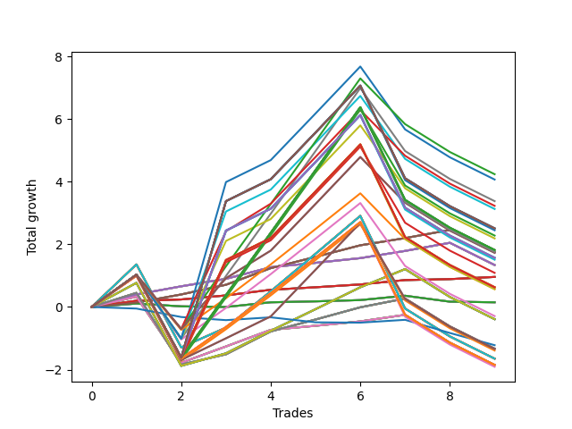

# Long Pointer Eight (0317 1230) 
- Symbol: AAPL_Unlimited
- Date Range: 03/23/2022 - 07/08/2022
- Trading Period: 7:20-12:30
- Number of Trades: 9



| Name | Win Percent | Profit | Avg Profit / Trade | Avg Time / Trade |      | Name | Win Percent | Profit | Avg Profit / Trade | Avg Time / Trade |
| ---- | ----------- | ------ | ------------------ | ---------------- | ---- | ---- | ----------- | ------ | ------------------ | ---------------- |
| Sorted By <br> Profit | | | | | | Sorted By <br> Win Percentage ||||
| Ninety-Seven | 55.56 | 2120.00 | 235.56 | 117:50 |     | Sixty-Five | 100.00 | 480.00 | 53.33 | 07:11 |
| Ninety-Five | 55.56 | 2035.00 | 226.11 | 174:29 |     | Fifty-Seven | 100.00 | 480.00 | 53.33 | 07:11 |
| Ninety-Two | 55.56 | 1690.00 | 187.78 | 121:42 |     | Forty-Nine | 100.00 | 480.00 | 53.33 | 07:11 |
| Ninety-Eight | 55.56 | 1615.00 | 179.44 | 161:30 |     | Forty-One | 100.00 | 480.00 | 53.33 | 07:11 |
| Ninety-Four | 55.56 | 1565.00 | 173.89 | 172:05 |     | One | 100.00 | 480.00 | 53.33 | 07:11 |
| One Hundred Thirty | 55.56 | 1255.00 | 139.44 | 186:06 |     | Sixty-Seven | 88.89 | 875.00 | 97.22 | 13:43 |
| One Hundred Twenty-Five | 55.56 | 1255.00 | 139.44 | 186:06 |     | Fifty-Nine | 88.89 | 875.00 | 97.22 | 13:43 |
| One Hundred Twenty | 55.56 | 1255.00 | 139.44 | 186:06 |     | Fifty-One | 88.89 | 875.00 | 97.22 | 13:43 |
| One Hundred Fifteen | 55.56 | 1255.00 | 139.44 | 186:06 |     | Forty-Three | 88.89 | 875.00 | 97.22 | 13:43 |
| Eighty-Five | 55.56 | 1255.00 | 139.44 | 186:06 |     | Three | 88.89 | 875.00 | 97.22 | 13:43 |
| One Hundred Five | 55.56 | 1225.00 | 136.11 | 185:50 |     | Sixty-Six | 88.89 | 670.00 | 74.44 | 12:56 |
| One Hundred Seven | 55.56 | 1140.00 | 126.67 | 124:33 |     | Fifty-Eight | 88.89 | 670.00 | 74.44 | 12:56 |
| Ninety-Three | 55.56 | 1095.00 | 121.67 | 165:51 |     | Fifty | 88.89 | 670.00 | 74.44 | 12:56 |
| One Hundred Twenty-Seven | 55.56 | 910.00 | 101.11 | 133:18 |     | Forty-Two | 88.89 | 670.00 | 74.44 | 12:56 |
| One Hundred Twenty-Two | 55.56 | 910.00 | 101.11 | 133:18 |     | Two | 88.89 | 670.00 | 74.44 | 12:56 |
| One Hundred Seventeen | 55.56 | 910.00 | 101.11 | 133:18 |     | Seventy | 66.67 | -195.00 | -21.67 | 61:44 |
| One Hundred Twelve | 55.56 | 910.00 | 101.11 | 133:18 |     | Sixty-Two | 66.67 | -195.00 | -21.67 | 61:44 |
| Eighty-Two | 55.56 | 910.00 | 101.11 | 133:18 |     | Fifty-Four | 66.67 | -195.00 | -21.67 | 61:44 |
| One Hundred Two | 55.56 | 880.00 | 97.78 | 133:03 |     | Forty-Six | 66.67 | -195.00 | -21.67 | 61:44 |
| Sixty-Seven | 88.89 | 875.00 | 97.22 | 13:43 |     | Six | 66.67 | -195.00 | -21.67 | 61:44 |
| Fifty-Nine | 88.89 | 875.00 | 97.22 | 13:43 |     | Sixty-Nine | 66.67 | -665.00 | -73.89 | 53:57 |
| Fifty-One | 88.89 | 875.00 | 97.22 | 13:43 |     | Sixty-One | 66.67 | -665.00 | -73.89 | 53:57 |
| Forty-Three | 88.89 | 875.00 | 97.22 | 13:43 |     | Fifty-Three | 66.67 | -665.00 | -73.89 | 53:57 |
| Three | 88.89 | 875.00 | 97.22 | 13:43 |     | Forty-Five | 66.67 | -665.00 | -73.89 | 53:57 |
| One Hundred | 55.56 | 865.00 | 96.11 | 162:20 |     | Five | 66.67 | -665.00 | -73.89 | 53:57 |
| Ninety-Nine | 55.56 | 865.00 | 96.11 | 162:20 |     | Sixty-Eight | 66.67 | -925.00 | -102.78 | 43:20 |
| One Hundred Twenty-Nine | 55.56 | 785.00 | 87.22 | 183:41 |     | Sixty | 66.67 | -925.00 | -102.78 | 43:20 |
| One Hundred Twenty-Four | 55.56 | 785.00 | 87.22 | 183:41 |     | Fifty-Two | 66.67 | -925.00 | -102.78 | 43:20 |
| One Hundred Ninteen | 55.56 | 785.00 | 87.22 | 183:41 |     | Forty-Four | 66.67 | -925.00 | -102.78 | 43:20 |
| One Hundred Fourteen | 55.56 | 785.00 | 87.22 | 183:41 |     | Four | 66.67 | -925.00 | -102.78 | 43:20 |
| Eighty-Four | 55.56 | 785.00 | 87.22 | 183:41 |     | Ninety-Seven | 55.56 | 2120.00 | 235.56 | 117:50 |
| One Hundred Four | 55.56 | 755.00 | 83.89 | 183:26 |     | Ninety-Five | 55.56 | 2035.00 | 226.11 | 174:29 |
| Sixty-Six | 88.89 | 670.00 | 74.44 | 12:56 |     | Ninety-Two | 55.56 | 1690.00 | 187.78 | 121:42 |
| Fifty-Eight | 88.89 | 670.00 | 74.44 | 12:56 |     | Ninety-Eight | 55.56 | 1615.00 | 179.44 | 161:30 |
| Fifty | 88.89 | 670.00 | 74.44 | 12:56 |     | Ninety-Four | 55.56 | 1565.00 | 173.89 | 172:05 |
| Forty-Two | 88.89 | 670.00 | 74.44 | 12:56 |     | One Hundred Thirty | 55.56 | 1255.00 | 139.44 | 186:06 |
| Two | 88.89 | 670.00 | 74.44 | 12:56 |     | One Hundred Twenty-Five | 55.56 | 1255.00 | 139.44 | 186:06 |
| One Hundred Eight | 55.56 | 545.00 | 60.56 | 168:42 |     | One Hundred Twenty | 55.56 | 1255.00 | 139.44 | 186:06 |
| Sixty-Five | 100.00 | 480.00 | 53.33 | 07:11 |     | One Hundred Fifteen | 55.56 | 1255.00 | 139.44 | 186:06 |
| Fifty-Seven | 100.00 | 480.00 | 53.33 | 07:11 |     | Eighty-Five | 55.56 | 1255.00 | 139.44 | 186:06 |
| Forty-Nine | 100.00 | 480.00 | 53.33 | 07:11 |     | One Hundred Five | 55.56 | 1225.00 | 136.11 | 185:50 |
| Forty-One | 100.00 | 480.00 | 53.33 | 07:11 |     | One Hundred Seven | 55.56 | 1140.00 | 126.67 | 124:33 |
| One | 100.00 | 480.00 | 53.33 | 07:11 |     | Ninety-Three | 55.56 | 1095.00 | 121.67 | 165:51 |
| One Hundred Twenty-Eight | 55.56 | 315.00 | 35.00 | 177:27 |     | One Hundred Twenty-Seven | 55.56 | 910.00 | 101.11 | 133:18 |
| One Hundred Twenty-Three | 55.56 | 315.00 | 35.00 | 177:27 |     | One Hundred Twenty-Two | 55.56 | 910.00 | 101.11 | 133:18 |
| One Hundred Eighteen | 55.56 | 315.00 | 35.00 | 177:27 |     | One Hundred Seventeen | 55.56 | 910.00 | 101.11 | 133:18 |
| One Hundred Thirteen | 55.56 | 315.00 | 35.00 | 177:27 |     | One Hundred Twelve | 55.56 | 910.00 | 101.11 | 133:18 |
| Eighty-Three | 55.56 | 315.00 | 35.00 | 177:27 |     | Eighty-Two | 55.56 | 910.00 | 101.11 | 133:18 |
| One Hundred Three | 55.56 | 285.00 | 31.67 | 177:12 |     | One Hundred Two | 55.56 | 880.00 | 97.78 | 133:03 |
| Ninety-Six | 55.56 | 285.00 | 31.67 | 84:48 |     | One Hundred | 55.56 | 865.00 | 96.11 | 162:20 |
| Sixty-Four | 55.56 | 75.00 | 8.33 | 05:27 |     | Ninety-Nine | 55.56 | 865.00 | 96.11 | 162:20 |
| Fifty-Six | 55.56 | 75.00 | 8.33 | 05:27 |     | One Hundred Twenty-Nine | 55.56 | 785.00 | 87.22 | 183:41 |
| Forty-Eight | 55.56 | 75.00 | 8.33 | 05:27 |     | One Hundred Twenty-Four | 55.56 | 785.00 | 87.22 | 183:41 |
| Forty | 55.56 | 75.00 | 8.33 | 05:27 |     | One Hundred Ninteen | 55.56 | 785.00 | 87.22 | 183:41 |
| Zero | 55.56 | 75.00 | 8.33 | 05:27 |     | One Hundred Fourteen | 55.56 | 785.00 | 87.22 | 183:41 |
| Ninety-One | 55.56 | -145.00 | -16.11 | 88:40 |     | Eighty-Four | 55.56 | 785.00 | 87.22 | 183:41 |
| Seventy | 66.67 | -195.00 | -21.67 | 61:44 |     | One Hundred Four | 55.56 | 755.00 | 83.89 | 183:26 |
| Sixty-Two | 66.67 | -195.00 | -21.67 | 61:44 |     | One Hundred Eight | 55.56 | 545.00 | 60.56 | 168:42 |
| Fifty-Four | 66.67 | -195.00 | -21.67 | 61:44 |     | One Hundred Twenty-Eight | 55.56 | 315.00 | 35.00 | 177:27 |
| Forty-Six | 66.67 | -195.00 | -21.67 | 61:44 |     | One Hundred Twenty-Three | 55.56 | 315.00 | 35.00 | 177:27 |
| Six | 66.67 | -195.00 | -21.67 | 61:44 |     | One Hundred Eighteen | 55.56 | 315.00 | 35.00 | 177:27 |
| Seventy-Three | 22.22 | -610.00 | -67.78 | 06:05 |     | One Hundred Thirteen | 55.56 | 315.00 | 35.00 | 177:27 |
| Sixty-Nine | 66.67 | -665.00 | -73.89 | 53:57 |     | Eighty-Three | 55.56 | 315.00 | 35.00 | 177:27 |
| Sixty-One | 66.67 | -665.00 | -73.89 | 53:57 |     | One Hundred Three | 55.56 | 285.00 | 31.67 | 177:12 |
| Fifty-Three | 66.67 | -665.00 | -73.89 | 53:57 |     | Ninety-Six | 55.56 | 285.00 | 31.67 | 84:48 |
| Forty-Five | 66.67 | -665.00 | -73.89 | 53:57 |     | Sixty-Four | 55.56 | 75.00 | 8.33 | 05:27 |
| Five | 66.67 | -665.00 | -73.89 | 53:57 |     | Fifty-Six | 55.56 | 75.00 | 8.33 | 05:27 |
| One Hundred Ten | 55.56 | -670.00 | -74.44 | 172:17 |     | Forty-Eight | 55.56 | 75.00 | 8.33 | 05:27 |
| One Hundred Nine | 55.56 | -670.00 | -74.44 | 172:17 |     | Forty | 55.56 | 75.00 | 8.33 | 05:27 |
| One Hundred Six | 55.56 | -695.00 | -77.22 | 91:32 |     | Zero | 55.56 | 75.00 | 8.33 | 05:27 |
| Seventy-One | 55.56 | -825.00 | -91.67 | 101:12 |     | Ninety-One | 55.56 | -145.00 | -16.11 | 88:40 |
| Sixty-Three | 55.56 | -825.00 | -91.67 | 101:12 |     | One Hundred Ten | 55.56 | -670.00 | -74.44 | 172:17 |
| Fifty-Five | 55.56 | -825.00 | -91.67 | 101:12 |     | One Hundred Nine | 55.56 | -670.00 | -74.44 | 172:17 |
| Forty-Seven | 55.56 | -825.00 | -91.67 | 101:12 |     | One Hundred Six | 55.56 | -695.00 | -77.22 | 91:32 |
| Seven | 55.56 | -825.00 | -91.67 | 101:12 |     | Seventy-One | 55.56 | -825.00 | -91.67 | 101:12 |
| Sixty-Eight | 66.67 | -925.00 | -102.78 | 43:20 |     | Sixty-Three | 55.56 | -825.00 | -91.67 | 101:12 |
| Sixty | 66.67 | -925.00 | -102.78 | 43:20 |     | Fifty-Five | 55.56 | -825.00 | -91.67 | 101:12 |
| Fifty-Two | 66.67 | -925.00 | -102.78 | 43:20 |     | Forty-Seven | 55.56 | -825.00 | -91.67 | 101:12 |
| Forty-Four | 66.67 | -925.00 | -102.78 | 43:20 |     | Seven | 55.56 | -825.00 | -91.67 | 101:12 |
| Four | 66.67 | -925.00 | -102.78 | 43:20 |     | One Hundred Twenty-Six | 55.56 | -925.00 | -102.78 | 100:17 |
| One Hundred Twenty-Six | 55.56 | -925.00 | -102.78 | 100:17 |     | One Hundred Twenty-One | 55.56 | -925.00 | -102.78 | 100:17 |
| One Hundred Twenty-One | 55.56 | -925.00 | -102.78 | 100:17 |     | One Hundred Sixteen | 55.56 | -925.00 | -102.78 | 100:17 |
| One Hundred Sixteen | 55.56 | -925.00 | -102.78 | 100:17 |     | One Hundred Eleven | 55.56 | -925.00 | -102.78 | 100:17 |
| One Hundred Eleven | 55.56 | -925.00 | -102.78 | 100:17 |     | Eighty-One | 55.56 | -925.00 | -102.78 | 100:17 |
| Eighty-One | 55.56 | -925.00 | -102.78 | 100:17 |     | One Hundred One | 55.56 | -955.00 | -106.11 | 100:01 |
| One Hundred One | 55.56 | -955.00 | -106.11 | 100:01 |     | Seventy-Three | 22.22 | -610.00 | -67.78 | 06:05 |

## NO STOPLOSS

### Test Zero
* Sell when price hits the middle line of the 20p bollinger
* No Stoploss
* Results:
```
Total Trades: 9
Percent Up: 55.56
Percent Down: 44.44
Total Points Moved Up: 0.15
Potential Profit: 75.00
Total Points Ups: 0.47 Count Ups: 5
Total Points Downs: -0.32 Count Downs: 4
```

<details><summary>Trades</summary>

<code>In: 2022-03-25 09:00:00		Out: 2022-03-25 09:05:05		Total Position Time: 05:05		Total Move Up: 0.11		Total to Date: 0.11</code> <br />
<code>In: 2022-04-21 10:22:00		Out: 2022-04-21 10:23:10		Total Position Time: 01:10		Total Move Up: -0.09		Total to Date: 0.02</code> <br />
<code>In: 2022-05-04 07:36:00		Out: 2022-05-04 07:39:40		Total Position Time: 03:40		Total Move Up: -0.02		Total to Date: 0.00</code> <br />
<code>In: 2022-05-16 08:02:00		Out: 2022-05-16 08:05:10		Total Position Time: 03:10		Total Move Up: 0.15		Total to Date: 0.15</code> <br />
<code>In: 2022-05-25 09:30:00		Out: 2022-05-25 09:44:25		Total Position Time: 14:25		Total Move Up: 0.03		Total to Date: 0.18</code> <br />
<code>In: 2022-05-25 09:38:00		Out: 2022-05-25 09:44:25		Total Position Time: 06:25		Total Move Up: 0.04		Total to Date: 0.22</code> <br />
<code>In: 2022-06-09 08:10:00		Out: 2022-06-09 08:11:10		Total Position Time: 01:10		Total Move Up: 0.14		Total to Date: 0.36</code> <br />
<code>In: 2022-06-13 12:04:00		Out: 2022-06-13 12:16:50		Total Position Time: 12:50		Total Move Up: -0.19		Total to Date: 0.17</code> <br />
<code>In: 2022-06-13 12:17:00		Out: 2022-06-13 12:18:10		Total Position Time: 01:10		Total Move Up: -0.02		Total to Date: 0.15</code> <br />


</details>

### Test One
* Sell when the price hits the upper line of the 20p 1std bollinger
* No Stoploss
* Results:
```
Total Trades: 9
Percent Up: 100.00
Percent Down: 0.00
Total Points Moved Up: 0.96
Potential Profit: 480.00
Total Points Ups: 0.96 Count Ups: 9
Total Points Downs: 0.00 Count Downs: 0
```

<details><summary>Trades</summary>

<code>In: 2022-03-25 09:00:00		Out: 2022-03-25 09:06:05		Total Position Time: 06:05		Total Move Up: 0.20		Total to Date: 0.20</code> <br />
<code>In: 2022-04-21 10:22:00		Out: 2022-04-21 10:28:50		Total Position Time: 06:50		Total Move Up: 0.04		Total to Date: 0.24</code> <br />
<code>In: 2022-05-04 07:36:00		Out: 2022-05-04 07:40:15		Total Position Time: 04:15		Total Move Up: 0.13		Total to Date: 0.37</code> <br />
<code>In: 2022-05-16 08:02:00		Out: 2022-05-16 08:09:30		Total Position Time: 07:30		Total Move Up: 0.18		Total to Date: 0.55</code> <br />
<code>In: 2022-05-25 09:30:00		Out: 2022-05-25 09:45:15		Total Position Time: 15:15		Total Move Up: 0.08		Total to Date: 0.63</code> <br />
<code>In: 2022-05-25 09:38:00		Out: 2022-05-25 09:45:15		Total Position Time: 07:15		Total Move Up: 0.09		Total to Date: 0.72</code> <br />
<code>In: 2022-06-09 08:10:00		Out: 2022-06-09 08:11:10		Total Position Time: 01:10		Total Move Up: 0.14		Total to Date: 0.86</code> <br />
<code>In: 2022-06-13 12:04:00		Out: 2022-06-13 12:17:10		Total Position Time: 13:10		Total Move Up: 0.03		Total to Date: 0.89</code> <br />
<code>In: 2022-06-13 12:17:00		Out: 2022-06-13 12:20:15		Total Position Time: 03:15		Total Move Up: 0.07		Total to Date: 0.96</code> <br />


</details>

### Test Two
* Sell when the price hits the upper line of the 20p 2std bollinger
* No Stoploss
* Results:
```
Total Trades: 9
Percent Up: 88.89
Percent Down: 11.11
Total Points Moved Up: 1.34
Potential Profit: 670.00
Total Points Ups: 2.05 Count Ups: 8
Total Points Downs: -0.71 Count Downs: 1
```

<details><summary>Trades</summary>

<code>In: 2022-03-25 09:00:00		Out: 2022-03-25 09:11:20		Total Position Time: 11:20		Total Move Up: 0.40		Total to Date: 0.40</code> <br />
<code>In: 2022-04-21 10:22:00		Out: 2022-04-21 10:31:20		Total Position Time: 09:20		Total Move Up: 0.26		Total to Date: 0.66</code> <br />
<code>In: 2022-05-04 07:36:00		Out: 2022-05-04 07:41:00		Total Position Time: 05:00		Total Move Up: 0.24		Total to Date: 0.90</code> <br />
<code>In: 2022-05-16 08:02:00		Out: 2022-05-16 08:09:55		Total Position Time: 07:55		Total Move Up: 0.37		Total to Date: 1.27</code> <br />
<code>In: 2022-05-25 09:30:00		Out: 2022-05-25 09:47:30		Total Position Time: 17:30		Total Move Up: 0.14		Total to Date: 1.41</code> <br />
<code>In: 2022-05-25 09:38:00		Out: 2022-05-25 09:47:30		Total Position Time: 09:30		Total Move Up: 0.15		Total to Date: 1.56</code> <br />
<code>In: 2022-06-09 08:10:00		Out: 2022-06-09 08:22:40		Total Position Time: 12:40		Total Move Up: 0.23		Total to Date: 1.79</code> <br />
<code>In: 2022-06-13 12:04:00		Out: 2022-06-13 12:17:15		Total Position Time: 13:15		Total Move Up: 0.26		Total to Date: 2.05</code> <br />
<code>In: 2022-06-13 12:17:00		Out: 2022-06-13 12:47:00		Total Position Time: 30:00		Total Move Up: -0.71		Total to Date: 1.34</code> <br />


</details>

### Test Three
* Sell when price hits the middle line of the 50p bollinger
* No Stoploss
* Results:
```
Total Trades: 9
Percent Up: 88.89
Percent Down: 11.11
Total Points Moved Up: 1.75
Potential Profit: 875.00
Total Points Ups: 2.46 Count Ups: 8
Total Points Downs: -0.71 Count Downs: 1
```

<details><summary>Trades</summary>

<code>In: 2022-03-25 09:00:00		Out: 2022-03-25 09:05:15		Total Position Time: 05:15		Total Move Up: 0.14		Total to Date: 0.14</code> <br />
<code>In: 2022-04-21 10:22:00		Out: 2022-04-21 10:31:40		Total Position Time: 09:40		Total Move Up: 0.26		Total to Date: 0.40</code> <br />
<code>In: 2022-05-04 07:36:00		Out: 2022-05-04 07:41:55		Total Position Time: 05:55		Total Move Up: 0.31		Total to Date: 0.71</code> <br />
<code>In: 2022-05-16 08:02:00		Out: 2022-05-16 08:16:10		Total Position Time: 14:10		Total Move Up: 0.53		Total to Date: 1.24</code> <br />
<code>In: 2022-05-25 09:30:00		Out: 2022-05-25 09:49:20		Total Position Time: 19:20		Total Move Up: 0.36		Total to Date: 1.60</code> <br />
<code>In: 2022-05-25 09:38:00		Out: 2022-05-25 09:49:20		Total Position Time: 11:20		Total Move Up: 0.37		Total to Date: 1.97</code> <br />
<code>In: 2022-06-09 08:10:00		Out: 2022-06-09 08:24:35		Total Position Time: 14:35		Total Move Up: 0.23		Total to Date: 2.20</code> <br />
<code>In: 2022-06-13 12:04:00		Out: 2022-06-13 12:17:15		Total Position Time: 13:15		Total Move Up: 0.26		Total to Date: 2.46</code> <br />
<code>In: 2022-06-13 12:17:00		Out: 2022-06-13 12:47:00		Total Position Time: 30:00		Total Move Up: -0.71		Total to Date: 1.75</code> <br />


</details>

### Test Four
* Sell when the price hits the upper line of the 50p 1std bollinger
* No Stoploss
* Results:
```
Total Trades: 9
Percent Up: 66.67
Percent Down: 33.33
Total Points Moved Up: -1.85
Potential Profit: -925.00
Total Points Ups: 1.86 Count Ups: 6
Total Points Downs: -3.71 Count Downs: 3
```

<details><summary>Trades</summary>

<code>In: 2022-03-25 09:00:00		Out: 2022-03-25 09:09:05		Total Position Time: 09:05		Total Move Up: 0.33		Total to Date: 0.33</code> <br />
<code>In: 2022-04-21 10:22:00		Out: 2022-04-21 12:29:55		Total Position Time: 127:55		Total Move Up: -2.11		Total to Date: -1.78</code> <br />
<code>In: 2022-05-04 07:36:00		Out: 2022-05-04 07:47:35		Total Position Time: 11:35		Total Move Up: 0.52		Total to Date: -1.26</code> <br />
<code>In: 2022-05-16 08:02:00		Out: 2022-05-16 08:33:25		Total Position Time: 31:25		Total Move Up: 0.53		Total to Date: -0.73</code> <br />
<code>In: 2022-05-25 09:30:00		Out: 2022-05-25 10:29:35		Total Position Time: 59:35		Total Move Up: 0.13		Total to Date: -0.60</code> <br />
<code>In: 2022-05-25 09:38:00		Out: 2022-05-25 10:29:35		Total Position Time: 51:35		Total Move Up: 0.14		Total to Date: -0.46</code> <br />
<code>In: 2022-06-09 08:10:00		Out: 2022-06-09 08:35:55		Total Position Time: 25:55		Total Move Up: 0.21		Total to Date: -0.25</code> <br />
<code>In: 2022-06-13 12:04:00		Out: 2022-06-13 12:47:00		Total Position Time: 43:00		Total Move Up: -0.89		Total to Date: -1.14</code> <br />
<code>In: 2022-06-13 12:17:00		Out: 2022-06-13 12:47:00		Total Position Time: 30:00		Total Move Up: -0.71		Total to Date: -1.85</code> <br />


</details>

### Test Five
* Sell when the price hits the upper line of the 50p 2std bollinger
* No Stoploss
* Results:
```
Total Trades: 9
Percent Up: 66.67
Percent Down: 33.33
Total Points Moved Up: -1.33
Potential Profit: -665.00
Total Points Ups: 2.56 Count Ups: 6
Total Points Downs: -3.89 Count Downs: 3
```

<details><summary>Trades</summary>

<code>In: 2022-03-25 09:00:00		Out: 2022-03-25 09:11:30		Total Position Time: 11:30		Total Move Up: 0.45		Total to Date: 0.45</code> <br />
<code>In: 2022-04-21 10:22:00		Out: 2022-04-21 12:44:20		Total Position Time: 142:20		Total Move Up: -2.29		Total to Date: -1.84</code> <br />
<code>In: 2022-05-04 07:36:00		Out: 2022-05-04 08:47:05		Total Position Time: 71:05		Total Move Up: 0.33		Total to Date: -1.51</code> <br />
<code>In: 2022-05-16 08:02:00		Out: 2022-05-16 08:35:00		Total Position Time: 33:00		Total Move Up: 0.73		Total to Date: -0.78</code> <br />
<code>In: 2022-05-25 09:30:00		Out: 2022-05-25 10:35:30		Total Position Time: 65:30		Total Move Up: 0.38		Total to Date: -0.40</code> <br />
<code>In: 2022-05-25 09:38:00		Out: 2022-05-25 10:35:30		Total Position Time: 57:30		Total Move Up: 0.39		Total to Date: -0.01</code> <br />
<code>In: 2022-06-09 08:10:00		Out: 2022-06-09 08:41:45		Total Position Time: 31:45		Total Move Up: 0.28		Total to Date: 0.27</code> <br />
<code>In: 2022-06-13 12:04:00		Out: 2022-06-13 12:47:00		Total Position Time: 43:00		Total Move Up: -0.89		Total to Date: -0.62</code> <br />
<code>In: 2022-06-13 12:17:00		Out: 2022-06-13 12:47:00		Total Position Time: 30:00		Total Move Up: -0.71		Total to Date: -1.33</code> <br />


</details>

### Test Six
* Sell when the price hits the middle line of the 1std VWAP
* No Stoploss
* Results:
```
Total Trades: 9
Percent Up: 66.67
Percent Down: 33.33
Total Points Moved Up: -0.39
Potential Profit: -195.00
Total Points Ups: 3.86 Count Ups: 6
Total Points Downs: -4.25 Count Downs: 3
```

<details><summary>Trades</summary>

<code>In: 2022-03-25 09:00:00		Out: 2022-03-25 10:49:00		Total Position Time: 109:00		Total Move Up: 0.77		Total to Date: 0.77</code> <br />
<code>In: 2022-04-21 10:22:00		Out: 2022-04-21 12:47:00		Total Position Time: 145:00		Total Move Up: -2.65		Total to Date: -1.88</code> <br />
<code>In: 2022-05-04 07:36:00		Out: 2022-05-04 07:42:10		Total Position Time: 06:10		Total Move Up: 0.40		Total to Date: -1.48</code> <br />
<code>In: 2022-05-16 08:02:00		Out: 2022-05-16 08:17:40		Total Position Time: 15:40		Total Move Up: 0.72		Total to Date: -0.76</code> <br />
<code>In: 2022-05-25 09:30:00		Out: 2022-05-25 11:00:30		Total Position Time: 90:30		Total Move Up: 0.69		Total to Date: -0.07</code> <br />
<code>In: 2022-05-25 09:38:00		Out: 2022-05-25 11:00:30		Total Position Time: 82:30		Total Move Up: 0.70		Total to Date: 0.63</code> <br />
<code>In: 2022-06-09 08:10:00		Out: 2022-06-09 08:43:50		Total Position Time: 33:50		Total Move Up: 0.58		Total to Date: 1.21</code> <br />
<code>In: 2022-06-13 12:04:00		Out: 2022-06-13 12:47:00		Total Position Time: 43:00		Total Move Up: -0.89		Total to Date: 0.32</code> <br />
<code>In: 2022-06-13 12:17:00		Out: 2022-06-13 12:47:00		Total Position Time: 30:00		Total Move Up: -0.71		Total to Date: -0.39</code> <br />


</details>

### Test Seven
* Sell when the price hits the upper line of the 1std VWAP
* No Stoploss
* Results:
```
Total Trades: 9
Percent Up: 55.56
Percent Down: 44.44
Total Points Moved Up: -1.65
Potential Profit: -825.00
Total Points Ups: 5.56 Count Ups: 5
Total Points Downs: -7.21 Count Downs: 4
```

<details><summary>Trades</summary>

<code>In: 2022-03-25 09:00:00		Out: 2022-03-25 11:03:35		Total Position Time: 123:35		Total Move Up: 1.36		Total to Date: 1.36</code> <br />
<code>In: 2022-04-21 10:22:00		Out: 2022-04-21 12:47:00		Total Position Time: 145:00		Total Move Up: -2.65		Total to Date: -1.29</code> <br />
<code>In: 2022-05-04 07:36:00		Out: 2022-05-04 08:48:30		Total Position Time: 72:30		Total Move Up: 0.63		Total to Date: -0.66</code> <br />
<code>In: 2022-05-16 08:02:00		Out: 2022-05-16 08:44:50		Total Position Time: 42:50		Total Move Up: 1.16		Total to Date: 0.50</code> <br />
<code>In: 2022-05-25 09:30:00		Out: 2022-05-25 11:02:30		Total Position Time: 92:30		Total Move Up: 1.20		Total to Date: 1.70</code> <br />
<code>In: 2022-05-25 09:38:00		Out: 2022-05-25 11:02:30		Total Position Time: 84:30		Total Move Up: 1.21		Total to Date: 2.91</code> <br />
<code>In: 2022-06-09 08:10:00		Out: 2022-06-09 12:47:00		Total Position Time: 277:00		Total Move Up: -2.96		Total to Date: -0.05</code> <br />
<code>In: 2022-06-13 12:04:00		Out: 2022-06-13 12:47:00		Total Position Time: 43:00		Total Move Up: -0.89		Total to Date: -0.94</code> <br />
<code>In: 2022-06-13 12:17:00		Out: 2022-06-13 12:47:00		Total Position Time: 30:00		Total Move Up: -0.71		Total to Date: -1.65</code> <br />


</details>

## STOPLOSS OF 5

### Test Forty
* Sell when price hits the middle line of the 20p bollinger
* Stoploss is 5 points
* Results:
```
Total Trades: 9
Percent Up: 55.56
Percent Down: 44.44
Total Points Moved Up: 0.15
Potential Profit: 75.00
Total Points Ups: 0.47 Count Ups: 5
Total Points Downs: -0.32 Count Downs: 4
```

<details><summary>Trades</summary>

<code>In: 2022-03-25 09:00:00		Out: 2022-03-25 09:05:05		Total Position Time: 05:05		Total Move Up: 0.11		Total to Date: 0.11</code> <br />
<code>In: 2022-04-21 10:22:00		Out: 2022-04-21 10:23:10		Total Position Time: 01:10		Total Move Up: -0.09		Total to Date: 0.02</code> <br />
<code>In: 2022-05-04 07:36:00		Out: 2022-05-04 07:39:40		Total Position Time: 03:40		Total Move Up: -0.02		Total to Date: 0.00</code> <br />
<code>In: 2022-05-16 08:02:00		Out: 2022-05-16 08:05:10		Total Position Time: 03:10		Total Move Up: 0.15		Total to Date: 0.15</code> <br />
<code>In: 2022-05-25 09:30:00		Out: 2022-05-25 09:44:25		Total Position Time: 14:25		Total Move Up: 0.03		Total to Date: 0.18</code> <br />
<code>In: 2022-05-25 09:38:00		Out: 2022-05-25 09:44:25		Total Position Time: 06:25		Total Move Up: 0.04		Total to Date: 0.22</code> <br />
<code>In: 2022-06-09 08:10:00		Out: 2022-06-09 08:11:10		Total Position Time: 01:10		Total Move Up: 0.14		Total to Date: 0.36</code> <br />
<code>In: 2022-06-13 12:04:00		Out: 2022-06-13 12:16:50		Total Position Time: 12:50		Total Move Up: -0.19		Total to Date: 0.17</code> <br />
<code>In: 2022-06-13 12:17:00		Out: 2022-06-13 12:18:10		Total Position Time: 01:10		Total Move Up: -0.02		Total to Date: 0.15</code> <br />


</details>

### Test Forty-One
* Sell when the price hits the upper line of the 20p 1std bollinger
* Stoploss is 5 points
* Results:
```
Total Trades: 9
Percent Up: 100.00
Percent Down: 0.00
Total Points Moved Up: 0.96
Potential Profit: 480.00
Total Points Ups: 0.96 Count Ups: 9
Total Points Downs: 0.00 Count Downs: 0
```

<details><summary>Trades</summary>

<code>In: 2022-03-25 09:00:00		Out: 2022-03-25 09:06:05		Total Position Time: 06:05		Total Move Up: 0.20		Total to Date: 0.20</code> <br />
<code>In: 2022-04-21 10:22:00		Out: 2022-04-21 10:28:50		Total Position Time: 06:50		Total Move Up: 0.04		Total to Date: 0.24</code> <br />
<code>In: 2022-05-04 07:36:00		Out: 2022-05-04 07:40:15		Total Position Time: 04:15		Total Move Up: 0.13		Total to Date: 0.37</code> <br />
<code>In: 2022-05-16 08:02:00		Out: 2022-05-16 08:09:30		Total Position Time: 07:30		Total Move Up: 0.18		Total to Date: 0.55</code> <br />
<code>In: 2022-05-25 09:30:00		Out: 2022-05-25 09:45:15		Total Position Time: 15:15		Total Move Up: 0.08		Total to Date: 0.63</code> <br />
<code>In: 2022-05-25 09:38:00		Out: 2022-05-25 09:45:15		Total Position Time: 07:15		Total Move Up: 0.09		Total to Date: 0.72</code> <br />
<code>In: 2022-06-09 08:10:00		Out: 2022-06-09 08:11:10		Total Position Time: 01:10		Total Move Up: 0.14		Total to Date: 0.86</code> <br />
<code>In: 2022-06-13 12:04:00		Out: 2022-06-13 12:17:10		Total Position Time: 13:10		Total Move Up: 0.03		Total to Date: 0.89</code> <br />
<code>In: 2022-06-13 12:17:00		Out: 2022-06-13 12:20:15		Total Position Time: 03:15		Total Move Up: 0.07		Total to Date: 0.96</code> <br />


</details>

### Test Forty-Two
* Sell when the price hits the upper line of the 20p 2std bollinger
* Stoploss is 5 points
* Results:
```
Total Trades: 9
Percent Up: 88.89
Percent Down: 11.11
Total Points Moved Up: 1.34
Potential Profit: 670.00
Total Points Ups: 2.05 Count Ups: 8
Total Points Downs: -0.71 Count Downs: 1
```

<details><summary>Trades</summary>

<code>In: 2022-03-25 09:00:00		Out: 2022-03-25 09:11:20		Total Position Time: 11:20		Total Move Up: 0.40		Total to Date: 0.40</code> <br />
<code>In: 2022-04-21 10:22:00		Out: 2022-04-21 10:31:20		Total Position Time: 09:20		Total Move Up: 0.26		Total to Date: 0.66</code> <br />
<code>In: 2022-05-04 07:36:00		Out: 2022-05-04 07:41:00		Total Position Time: 05:00		Total Move Up: 0.24		Total to Date: 0.90</code> <br />
<code>In: 2022-05-16 08:02:00		Out: 2022-05-16 08:09:55		Total Position Time: 07:55		Total Move Up: 0.37		Total to Date: 1.27</code> <br />
<code>In: 2022-05-25 09:30:00		Out: 2022-05-25 09:47:30		Total Position Time: 17:30		Total Move Up: 0.14		Total to Date: 1.41</code> <br />
<code>In: 2022-05-25 09:38:00		Out: 2022-05-25 09:47:30		Total Position Time: 09:30		Total Move Up: 0.15		Total to Date: 1.56</code> <br />
<code>In: 2022-06-09 08:10:00		Out: 2022-06-09 08:22:40		Total Position Time: 12:40		Total Move Up: 0.23		Total to Date: 1.79</code> <br />
<code>In: 2022-06-13 12:04:00		Out: 2022-06-13 12:17:15		Total Position Time: 13:15		Total Move Up: 0.26		Total to Date: 2.05</code> <br />
<code>In: 2022-06-13 12:17:00		Out: 2022-06-13 12:47:00		Total Position Time: 30:00		Total Move Up: -0.71		Total to Date: 1.34</code> <br />


</details>

### Test Forty-Three
* Sell when price hits the middle line of the 50p bollinger
* Stoploss is 5 points
* Results:
```
Total Trades: 9
Percent Up: 88.89
Percent Down: 11.11
Total Points Moved Up: 1.75
Potential Profit: 875.00
Total Points Ups: 2.46 Count Ups: 8
Total Points Downs: -0.71 Count Downs: 1
```

<details><summary>Trades</summary>

<code>In: 2022-03-25 09:00:00		Out: 2022-03-25 09:05:15		Total Position Time: 05:15		Total Move Up: 0.14		Total to Date: 0.14</code> <br />
<code>In: 2022-04-21 10:22:00		Out: 2022-04-21 10:31:40		Total Position Time: 09:40		Total Move Up: 0.26		Total to Date: 0.40</code> <br />
<code>In: 2022-05-04 07:36:00		Out: 2022-05-04 07:41:55		Total Position Time: 05:55		Total Move Up: 0.31		Total to Date: 0.71</code> <br />
<code>In: 2022-05-16 08:02:00		Out: 2022-05-16 08:16:10		Total Position Time: 14:10		Total Move Up: 0.53		Total to Date: 1.24</code> <br />
<code>In: 2022-05-25 09:30:00		Out: 2022-05-25 09:49:20		Total Position Time: 19:20		Total Move Up: 0.36		Total to Date: 1.60</code> <br />
<code>In: 2022-05-25 09:38:00		Out: 2022-05-25 09:49:20		Total Position Time: 11:20		Total Move Up: 0.37		Total to Date: 1.97</code> <br />
<code>In: 2022-06-09 08:10:00		Out: 2022-06-09 08:24:35		Total Position Time: 14:35		Total Move Up: 0.23		Total to Date: 2.20</code> <br />
<code>In: 2022-06-13 12:04:00		Out: 2022-06-13 12:17:15		Total Position Time: 13:15		Total Move Up: 0.26		Total to Date: 2.46</code> <br />
<code>In: 2022-06-13 12:17:00		Out: 2022-06-13 12:47:00		Total Position Time: 30:00		Total Move Up: -0.71		Total to Date: 1.75</code> <br />


</details>

### Test Forty-Four
* Sell when the price hits the upper line of the 50p 1std bollinger
* Stoploss is 5 points
* Results:
```
Total Trades: 9
Percent Up: 66.67
Percent Down: 33.33
Total Points Moved Up: -1.85
Potential Profit: -925.00
Total Points Ups: 1.86 Count Ups: 6
Total Points Downs: -3.71 Count Downs: 3
```

<details><summary>Trades</summary>

<code>In: 2022-03-25 09:00:00		Out: 2022-03-25 09:09:05		Total Position Time: 09:05		Total Move Up: 0.33		Total to Date: 0.33</code> <br />
<code>In: 2022-04-21 10:22:00		Out: 2022-04-21 12:29:55		Total Position Time: 127:55		Total Move Up: -2.11		Total to Date: -1.78</code> <br />
<code>In: 2022-05-04 07:36:00		Out: 2022-05-04 07:47:35		Total Position Time: 11:35		Total Move Up: 0.52		Total to Date: -1.26</code> <br />
<code>In: 2022-05-16 08:02:00		Out: 2022-05-16 08:33:25		Total Position Time: 31:25		Total Move Up: 0.53		Total to Date: -0.73</code> <br />
<code>In: 2022-05-25 09:30:00		Out: 2022-05-25 10:29:35		Total Position Time: 59:35		Total Move Up: 0.13		Total to Date: -0.60</code> <br />
<code>In: 2022-05-25 09:38:00		Out: 2022-05-25 10:29:35		Total Position Time: 51:35		Total Move Up: 0.14		Total to Date: -0.46</code> <br />
<code>In: 2022-06-09 08:10:00		Out: 2022-06-09 08:35:55		Total Position Time: 25:55		Total Move Up: 0.21		Total to Date: -0.25</code> <br />
<code>In: 2022-06-13 12:04:00		Out: 2022-06-13 12:47:00		Total Position Time: 43:00		Total Move Up: -0.89		Total to Date: -1.14</code> <br />
<code>In: 2022-06-13 12:17:00		Out: 2022-06-13 12:47:00		Total Position Time: 30:00		Total Move Up: -0.71		Total to Date: -1.85</code> <br />


</details>

### Test Forty-Five
* Sell when the price hits the upper line of the 50p 2std bollinger
* Stoploss is 5 points
* Results:
```
Total Trades: 9
Percent Up: 66.67
Percent Down: 33.33
Total Points Moved Up: -1.33
Potential Profit: -665.00
Total Points Ups: 2.56 Count Ups: 6
Total Points Downs: -3.89 Count Downs: 3
```

<details><summary>Trades</summary>

<code>In: 2022-03-25 09:00:00		Out: 2022-03-25 09:11:30		Total Position Time: 11:30		Total Move Up: 0.45		Total to Date: 0.45</code> <br />
<code>In: 2022-04-21 10:22:00		Out: 2022-04-21 12:44:20		Total Position Time: 142:20		Total Move Up: -2.29		Total to Date: -1.84</code> <br />
<code>In: 2022-05-04 07:36:00		Out: 2022-05-04 08:47:05		Total Position Time: 71:05		Total Move Up: 0.33		Total to Date: -1.51</code> <br />
<code>In: 2022-05-16 08:02:00		Out: 2022-05-16 08:35:00		Total Position Time: 33:00		Total Move Up: 0.73		Total to Date: -0.78</code> <br />
<code>In: 2022-05-25 09:30:00		Out: 2022-05-25 10:35:30		Total Position Time: 65:30		Total Move Up: 0.38		Total to Date: -0.40</code> <br />
<code>In: 2022-05-25 09:38:00		Out: 2022-05-25 10:35:30		Total Position Time: 57:30		Total Move Up: 0.39		Total to Date: -0.01</code> <br />
<code>In: 2022-06-09 08:10:00		Out: 2022-06-09 08:41:45		Total Position Time: 31:45		Total Move Up: 0.28		Total to Date: 0.27</code> <br />
<code>In: 2022-06-13 12:04:00		Out: 2022-06-13 12:47:00		Total Position Time: 43:00		Total Move Up: -0.89		Total to Date: -0.62</code> <br />
<code>In: 2022-06-13 12:17:00		Out: 2022-06-13 12:47:00		Total Position Time: 30:00		Total Move Up: -0.71		Total to Date: -1.33</code> <br />


</details>

### Test Forty-Six
* Sell when the price hits the middle line of the 1std VWAP
* Stoploss is 5 points
* Results:
```
Total Trades: 9
Percent Up: 66.67
Percent Down: 33.33
Total Points Moved Up: -0.39
Potential Profit: -195.00
Total Points Ups: 3.86 Count Ups: 6
Total Points Downs: -4.25 Count Downs: 3
```

<details><summary>Trades</summary>

<code>In: 2022-03-25 09:00:00		Out: 2022-03-25 10:49:00		Total Position Time: 109:00		Total Move Up: 0.77		Total to Date: 0.77</code> <br />
<code>In: 2022-04-21 10:22:00		Out: 2022-04-21 12:47:00		Total Position Time: 145:00		Total Move Up: -2.65		Total to Date: -1.88</code> <br />
<code>In: 2022-05-04 07:36:00		Out: 2022-05-04 07:42:10		Total Position Time: 06:10		Total Move Up: 0.40		Total to Date: -1.48</code> <br />
<code>In: 2022-05-16 08:02:00		Out: 2022-05-16 08:17:40		Total Position Time: 15:40		Total Move Up: 0.72		Total to Date: -0.76</code> <br />
<code>In: 2022-05-25 09:30:00		Out: 2022-05-25 11:00:30		Total Position Time: 90:30		Total Move Up: 0.69		Total to Date: -0.07</code> <br />
<code>In: 2022-05-25 09:38:00		Out: 2022-05-25 11:00:30		Total Position Time: 82:30		Total Move Up: 0.70		Total to Date: 0.63</code> <br />
<code>In: 2022-06-09 08:10:00		Out: 2022-06-09 08:43:50		Total Position Time: 33:50		Total Move Up: 0.58		Total to Date: 1.21</code> <br />
<code>In: 2022-06-13 12:04:00		Out: 2022-06-13 12:47:00		Total Position Time: 43:00		Total Move Up: -0.89		Total to Date: 0.32</code> <br />
<code>In: 2022-06-13 12:17:00		Out: 2022-06-13 12:47:00		Total Position Time: 30:00		Total Move Up: -0.71		Total to Date: -0.39</code> <br />


</details>

### Test Forty-Seven
* Sell when the price hits the upper line of the 1std VWAP
* Stoploss is 5 points
* Results:
```
Total Trades: 9
Percent Up: 55.56
Percent Down: 44.44
Total Points Moved Up: -1.65
Potential Profit: -825.00
Total Points Ups: 5.56 Count Ups: 5
Total Points Downs: -7.21 Count Downs: 4
```

<details><summary>Trades</summary>

<code>In: 2022-03-25 09:00:00		Out: 2022-03-25 11:03:35		Total Position Time: 123:35		Total Move Up: 1.36		Total to Date: 1.36</code> <br />
<code>In: 2022-04-21 10:22:00		Out: 2022-04-21 12:47:00		Total Position Time: 145:00		Total Move Up: -2.65		Total to Date: -1.29</code> <br />
<code>In: 2022-05-04 07:36:00		Out: 2022-05-04 08:48:30		Total Position Time: 72:30		Total Move Up: 0.63		Total to Date: -0.66</code> <br />
<code>In: 2022-05-16 08:02:00		Out: 2022-05-16 08:44:50		Total Position Time: 42:50		Total Move Up: 1.16		Total to Date: 0.50</code> <br />
<code>In: 2022-05-25 09:30:00		Out: 2022-05-25 11:02:30		Total Position Time: 92:30		Total Move Up: 1.20		Total to Date: 1.70</code> <br />
<code>In: 2022-05-25 09:38:00		Out: 2022-05-25 11:02:30		Total Position Time: 84:30		Total Move Up: 1.21		Total to Date: 2.91</code> <br />
<code>In: 2022-06-09 08:10:00		Out: 2022-06-09 12:47:00		Total Position Time: 277:00		Total Move Up: -2.96		Total to Date: -0.05</code> <br />
<code>In: 2022-06-13 12:04:00		Out: 2022-06-13 12:47:00		Total Position Time: 43:00		Total Move Up: -0.89		Total to Date: -0.94</code> <br />
<code>In: 2022-06-13 12:17:00		Out: 2022-06-13 12:47:00		Total Position Time: 30:00		Total Move Up: -0.71		Total to Date: -1.65</code> <br />


</details>

## TRAIL STOP OF 5

### Test Forty-Eight
* Sell when price hits the middle line of the 20p bollinger
* Trailing Stop is 5 points
* Results:
```
Total Trades: 9
Percent Up: 55.56
Percent Down: 44.44
Total Points Moved Up: 0.15
Potential Profit: 75.00
Total Points Ups: 0.47 Count Ups: 5
Total Points Downs: -0.32 Count Downs: 4
```

<details><summary>Trades</summary>

<code>In: 2022-03-25 09:00:00		Out: 2022-03-25 09:05:05		Total Position Time: 05:05		Total Move Up: 0.11		Total to Date: 0.11</code> <br />
<code>In: 2022-04-21 10:22:00		Out: 2022-04-21 10:23:10		Total Position Time: 01:10		Total Move Up: -0.09		Total to Date: 0.02</code> <br />
<code>In: 2022-05-04 07:36:00		Out: 2022-05-04 07:39:40		Total Position Time: 03:40		Total Move Up: -0.02		Total to Date: 0.00</code> <br />
<code>In: 2022-05-16 08:02:00		Out: 2022-05-16 08:05:10		Total Position Time: 03:10		Total Move Up: 0.15		Total to Date: 0.15</code> <br />
<code>In: 2022-05-25 09:30:00		Out: 2022-05-25 09:44:25		Total Position Time: 14:25		Total Move Up: 0.03		Total to Date: 0.18</code> <br />
<code>In: 2022-05-25 09:38:00		Out: 2022-05-25 09:44:25		Total Position Time: 06:25		Total Move Up: 0.04		Total to Date: 0.22</code> <br />
<code>In: 2022-06-09 08:10:00		Out: 2022-06-09 08:11:10		Total Position Time: 01:10		Total Move Up: 0.14		Total to Date: 0.36</code> <br />
<code>In: 2022-06-13 12:04:00		Out: 2022-06-13 12:16:50		Total Position Time: 12:50		Total Move Up: -0.19		Total to Date: 0.17</code> <br />
<code>In: 2022-06-13 12:17:00		Out: 2022-06-13 12:18:10		Total Position Time: 01:10		Total Move Up: -0.02		Total to Date: 0.15</code> <br />


</details>

### Test Forty-Nine
* Sell when the price hits the upper line of the 20p 1std bollinger
* Trailing Stop is 5 points
* Results:
```
Total Trades: 9
Percent Up: 100.00
Percent Down: 0.00
Total Points Moved Up: 0.96
Potential Profit: 480.00
Total Points Ups: 0.96 Count Ups: 9
Total Points Downs: 0.00 Count Downs: 0
```

<details><summary>Trades</summary>

<code>In: 2022-03-25 09:00:00		Out: 2022-03-25 09:06:05		Total Position Time: 06:05		Total Move Up: 0.20		Total to Date: 0.20</code> <br />
<code>In: 2022-04-21 10:22:00		Out: 2022-04-21 10:28:50		Total Position Time: 06:50		Total Move Up: 0.04		Total to Date: 0.24</code> <br />
<code>In: 2022-05-04 07:36:00		Out: 2022-05-04 07:40:15		Total Position Time: 04:15		Total Move Up: 0.13		Total to Date: 0.37</code> <br />
<code>In: 2022-05-16 08:02:00		Out: 2022-05-16 08:09:30		Total Position Time: 07:30		Total Move Up: 0.18		Total to Date: 0.55</code> <br />
<code>In: 2022-05-25 09:30:00		Out: 2022-05-25 09:45:15		Total Position Time: 15:15		Total Move Up: 0.08		Total to Date: 0.63</code> <br />
<code>In: 2022-05-25 09:38:00		Out: 2022-05-25 09:45:15		Total Position Time: 07:15		Total Move Up: 0.09		Total to Date: 0.72</code> <br />
<code>In: 2022-06-09 08:10:00		Out: 2022-06-09 08:11:10		Total Position Time: 01:10		Total Move Up: 0.14		Total to Date: 0.86</code> <br />
<code>In: 2022-06-13 12:04:00		Out: 2022-06-13 12:17:10		Total Position Time: 13:10		Total Move Up: 0.03		Total to Date: 0.89</code> <br />
<code>In: 2022-06-13 12:17:00		Out: 2022-06-13 12:20:15		Total Position Time: 03:15		Total Move Up: 0.07		Total to Date: 0.96</code> <br />


</details>

### Test Fifty
* Sell when the price hits the upper line of the 20p 2std bollinger
* Trailing Stop is 5 points
* Results:
```
Total Trades: 9
Percent Up: 88.89
Percent Down: 11.11
Total Points Moved Up: 1.34
Potential Profit: 670.00
Total Points Ups: 2.05 Count Ups: 8
Total Points Downs: -0.71 Count Downs: 1
```

<details><summary>Trades</summary>

<code>In: 2022-03-25 09:00:00		Out: 2022-03-25 09:11:20		Total Position Time: 11:20		Total Move Up: 0.40		Total to Date: 0.40</code> <br />
<code>In: 2022-04-21 10:22:00		Out: 2022-04-21 10:31:20		Total Position Time: 09:20		Total Move Up: 0.26		Total to Date: 0.66</code> <br />
<code>In: 2022-05-04 07:36:00		Out: 2022-05-04 07:41:00		Total Position Time: 05:00		Total Move Up: 0.24		Total to Date: 0.90</code> <br />
<code>In: 2022-05-16 08:02:00		Out: 2022-05-16 08:09:55		Total Position Time: 07:55		Total Move Up: 0.37		Total to Date: 1.27</code> <br />
<code>In: 2022-05-25 09:30:00		Out: 2022-05-25 09:47:30		Total Position Time: 17:30		Total Move Up: 0.14		Total to Date: 1.41</code> <br />
<code>In: 2022-05-25 09:38:00		Out: 2022-05-25 09:47:30		Total Position Time: 09:30		Total Move Up: 0.15		Total to Date: 1.56</code> <br />
<code>In: 2022-06-09 08:10:00		Out: 2022-06-09 08:22:40		Total Position Time: 12:40		Total Move Up: 0.23		Total to Date: 1.79</code> <br />
<code>In: 2022-06-13 12:04:00		Out: 2022-06-13 12:17:15		Total Position Time: 13:15		Total Move Up: 0.26		Total to Date: 2.05</code> <br />
<code>In: 2022-06-13 12:17:00		Out: 2022-06-13 12:47:00		Total Position Time: 30:00		Total Move Up: -0.71		Total to Date: 1.34</code> <br />


</details>

### Test Fifty-One
* Sell when price hits the middle line of the 50p bollinger
* Trailing Stop is 5 points
* Results:
```
Total Trades: 9
Percent Up: 88.89
Percent Down: 11.11
Total Points Moved Up: 1.75
Potential Profit: 875.00
Total Points Ups: 2.46 Count Ups: 8
Total Points Downs: -0.71 Count Downs: 1
```

<details><summary>Trades</summary>

<code>In: 2022-03-25 09:00:00		Out: 2022-03-25 09:05:15		Total Position Time: 05:15		Total Move Up: 0.14		Total to Date: 0.14</code> <br />
<code>In: 2022-04-21 10:22:00		Out: 2022-04-21 10:31:40		Total Position Time: 09:40		Total Move Up: 0.26		Total to Date: 0.40</code> <br />
<code>In: 2022-05-04 07:36:00		Out: 2022-05-04 07:41:55		Total Position Time: 05:55		Total Move Up: 0.31		Total to Date: 0.71</code> <br />
<code>In: 2022-05-16 08:02:00		Out: 2022-05-16 08:16:10		Total Position Time: 14:10		Total Move Up: 0.53		Total to Date: 1.24</code> <br />
<code>In: 2022-05-25 09:30:00		Out: 2022-05-25 09:49:20		Total Position Time: 19:20		Total Move Up: 0.36		Total to Date: 1.60</code> <br />
<code>In: 2022-05-25 09:38:00		Out: 2022-05-25 09:49:20		Total Position Time: 11:20		Total Move Up: 0.37		Total to Date: 1.97</code> <br />
<code>In: 2022-06-09 08:10:00		Out: 2022-06-09 08:24:35		Total Position Time: 14:35		Total Move Up: 0.23		Total to Date: 2.20</code> <br />
<code>In: 2022-06-13 12:04:00		Out: 2022-06-13 12:17:15		Total Position Time: 13:15		Total Move Up: 0.26		Total to Date: 2.46</code> <br />
<code>In: 2022-06-13 12:17:00		Out: 2022-06-13 12:47:00		Total Position Time: 30:00		Total Move Up: -0.71		Total to Date: 1.75</code> <br />


</details>

### Test Fifty-Two
* Sell when the price hits the upper line of the 50p 1std bollinger
* Trailing Stop is 5 points
* Results:
```
Total Trades: 9
Percent Up: 66.67
Percent Down: 33.33
Total Points Moved Up: -1.85
Potential Profit: -925.00
Total Points Ups: 1.86 Count Ups: 6
Total Points Downs: -3.71 Count Downs: 3
```

<details><summary>Trades</summary>

<code>In: 2022-03-25 09:00:00		Out: 2022-03-25 09:09:05		Total Position Time: 09:05		Total Move Up: 0.33		Total to Date: 0.33</code> <br />
<code>In: 2022-04-21 10:22:00		Out: 2022-04-21 12:29:55		Total Position Time: 127:55		Total Move Up: -2.11		Total to Date: -1.78</code> <br />
<code>In: 2022-05-04 07:36:00		Out: 2022-05-04 07:47:35		Total Position Time: 11:35		Total Move Up: 0.52		Total to Date: -1.26</code> <br />
<code>In: 2022-05-16 08:02:00		Out: 2022-05-16 08:33:25		Total Position Time: 31:25		Total Move Up: 0.53		Total to Date: -0.73</code> <br />
<code>In: 2022-05-25 09:30:00		Out: 2022-05-25 10:29:35		Total Position Time: 59:35		Total Move Up: 0.13		Total to Date: -0.60</code> <br />
<code>In: 2022-05-25 09:38:00		Out: 2022-05-25 10:29:35		Total Position Time: 51:35		Total Move Up: 0.14		Total to Date: -0.46</code> <br />
<code>In: 2022-06-09 08:10:00		Out: 2022-06-09 08:35:55		Total Position Time: 25:55		Total Move Up: 0.21		Total to Date: -0.25</code> <br />
<code>In: 2022-06-13 12:04:00		Out: 2022-06-13 12:47:00		Total Position Time: 43:00		Total Move Up: -0.89		Total to Date: -1.14</code> <br />
<code>In: 2022-06-13 12:17:00		Out: 2022-06-13 12:47:00		Total Position Time: 30:00		Total Move Up: -0.71		Total to Date: -1.85</code> <br />


</details>

### Test Fifty-Three
* Sell when the price hits the upper line of the 50p 2std bollinger
* Trailing Stop is 5 points
* Results:
```
Total Trades: 9
Percent Up: 66.67
Percent Down: 33.33
Total Points Moved Up: -1.33
Potential Profit: -665.00
Total Points Ups: 2.56 Count Ups: 6
Total Points Downs: -3.89 Count Downs: 3
```

<details><summary>Trades</summary>

<code>In: 2022-03-25 09:00:00		Out: 2022-03-25 09:11:30		Total Position Time: 11:30		Total Move Up: 0.45		Total to Date: 0.45</code> <br />
<code>In: 2022-04-21 10:22:00		Out: 2022-04-21 12:44:20		Total Position Time: 142:20		Total Move Up: -2.29		Total to Date: -1.84</code> <br />
<code>In: 2022-05-04 07:36:00		Out: 2022-05-04 08:47:05		Total Position Time: 71:05		Total Move Up: 0.33		Total to Date: -1.51</code> <br />
<code>In: 2022-05-16 08:02:00		Out: 2022-05-16 08:35:00		Total Position Time: 33:00		Total Move Up: 0.73		Total to Date: -0.78</code> <br />
<code>In: 2022-05-25 09:30:00		Out: 2022-05-25 10:35:30		Total Position Time: 65:30		Total Move Up: 0.38		Total to Date: -0.40</code> <br />
<code>In: 2022-05-25 09:38:00		Out: 2022-05-25 10:35:30		Total Position Time: 57:30		Total Move Up: 0.39		Total to Date: -0.01</code> <br />
<code>In: 2022-06-09 08:10:00		Out: 2022-06-09 08:41:45		Total Position Time: 31:45		Total Move Up: 0.28		Total to Date: 0.27</code> <br />
<code>In: 2022-06-13 12:04:00		Out: 2022-06-13 12:47:00		Total Position Time: 43:00		Total Move Up: -0.89		Total to Date: -0.62</code> <br />
<code>In: 2022-06-13 12:17:00		Out: 2022-06-13 12:47:00		Total Position Time: 30:00		Total Move Up: -0.71		Total to Date: -1.33</code> <br />


</details>

### Test Fifty-Four
* Sell when the price hits the middle line of the 1std VWAP
* Trailing Stop is 5 points
* Results:
```
Total Trades: 9
Percent Up: 66.67
Percent Down: 33.33
Total Points Moved Up: -0.39
Potential Profit: -195.00
Total Points Ups: 3.86 Count Ups: 6
Total Points Downs: -4.25 Count Downs: 3
```

<details><summary>Trades</summary>

<code>In: 2022-03-25 09:00:00		Out: 2022-03-25 10:49:00		Total Position Time: 109:00		Total Move Up: 0.77		Total to Date: 0.77</code> <br />
<code>In: 2022-04-21 10:22:00		Out: 2022-04-21 12:47:00		Total Position Time: 145:00		Total Move Up: -2.65		Total to Date: -1.88</code> <br />
<code>In: 2022-05-04 07:36:00		Out: 2022-05-04 07:42:10		Total Position Time: 06:10		Total Move Up: 0.40		Total to Date: -1.48</code> <br />
<code>In: 2022-05-16 08:02:00		Out: 2022-05-16 08:17:40		Total Position Time: 15:40		Total Move Up: 0.72		Total to Date: -0.76</code> <br />
<code>In: 2022-05-25 09:30:00		Out: 2022-05-25 11:00:30		Total Position Time: 90:30		Total Move Up: 0.69		Total to Date: -0.07</code> <br />
<code>In: 2022-05-25 09:38:00		Out: 2022-05-25 11:00:30		Total Position Time: 82:30		Total Move Up: 0.70		Total to Date: 0.63</code> <br />
<code>In: 2022-06-09 08:10:00		Out: 2022-06-09 08:43:50		Total Position Time: 33:50		Total Move Up: 0.58		Total to Date: 1.21</code> <br />
<code>In: 2022-06-13 12:04:00		Out: 2022-06-13 12:47:00		Total Position Time: 43:00		Total Move Up: -0.89		Total to Date: 0.32</code> <br />
<code>In: 2022-06-13 12:17:00		Out: 2022-06-13 12:47:00		Total Position Time: 30:00		Total Move Up: -0.71		Total to Date: -0.39</code> <br />


</details>

### Test Fifty-Five
* Sell when the price hits the upper line of the 1std VWAP
* Trailing Stop is 5 points
* Results:
```
Total Trades: 9
Percent Up: 55.56
Percent Down: 44.44
Total Points Moved Up: -1.65
Potential Profit: -825.00
Total Points Ups: 5.56 Count Ups: 5
Total Points Downs: -7.21 Count Downs: 4
```

<details><summary>Trades</summary>

<code>In: 2022-03-25 09:00:00		Out: 2022-03-25 11:03:35		Total Position Time: 123:35		Total Move Up: 1.36		Total to Date: 1.36</code> <br />
<code>In: 2022-04-21 10:22:00		Out: 2022-04-21 12:47:00		Total Position Time: 145:00		Total Move Up: -2.65		Total to Date: -1.29</code> <br />
<code>In: 2022-05-04 07:36:00		Out: 2022-05-04 08:48:30		Total Position Time: 72:30		Total Move Up: 0.63		Total to Date: -0.66</code> <br />
<code>In: 2022-05-16 08:02:00		Out: 2022-05-16 08:44:50		Total Position Time: 42:50		Total Move Up: 1.16		Total to Date: 0.50</code> <br />
<code>In: 2022-05-25 09:30:00		Out: 2022-05-25 11:02:30		Total Position Time: 92:30		Total Move Up: 1.20		Total to Date: 1.70</code> <br />
<code>In: 2022-05-25 09:38:00		Out: 2022-05-25 11:02:30		Total Position Time: 84:30		Total Move Up: 1.21		Total to Date: 2.91</code> <br />
<code>In: 2022-06-09 08:10:00		Out: 2022-06-09 12:47:00		Total Position Time: 277:00		Total Move Up: -2.96		Total to Date: -0.05</code> <br />
<code>In: 2022-06-13 12:04:00		Out: 2022-06-13 12:47:00		Total Position Time: 43:00		Total Move Up: -0.89		Total to Date: -0.94</code> <br />
<code>In: 2022-06-13 12:17:00		Out: 2022-06-13 12:47:00		Total Position Time: 30:00		Total Move Up: -0.71		Total to Date: -1.65</code> <br />


</details>

## STOPLOSS OF 10

### Test Fifty-Six
* Sell when price hits the middle line of the 20p bollinger
* Stoploss is 10 points
* Results:
```
Total Trades: 9
Percent Up: 55.56
Percent Down: 44.44
Total Points Moved Up: 0.15
Potential Profit: 75.00
Total Points Ups: 0.47 Count Ups: 5
Total Points Downs: -0.32 Count Downs: 4
```

<details><summary>Trades</summary>

<code>In: 2022-03-25 09:00:00		Out: 2022-03-25 09:05:05		Total Position Time: 05:05		Total Move Up: 0.11		Total to Date: 0.11</code> <br />
<code>In: 2022-04-21 10:22:00		Out: 2022-04-21 10:23:10		Total Position Time: 01:10		Total Move Up: -0.09		Total to Date: 0.02</code> <br />
<code>In: 2022-05-04 07:36:00		Out: 2022-05-04 07:39:40		Total Position Time: 03:40		Total Move Up: -0.02		Total to Date: 0.00</code> <br />
<code>In: 2022-05-16 08:02:00		Out: 2022-05-16 08:05:10		Total Position Time: 03:10		Total Move Up: 0.15		Total to Date: 0.15</code> <br />
<code>In: 2022-05-25 09:30:00		Out: 2022-05-25 09:44:25		Total Position Time: 14:25		Total Move Up: 0.03		Total to Date: 0.18</code> <br />
<code>In: 2022-05-25 09:38:00		Out: 2022-05-25 09:44:25		Total Position Time: 06:25		Total Move Up: 0.04		Total to Date: 0.22</code> <br />
<code>In: 2022-06-09 08:10:00		Out: 2022-06-09 08:11:10		Total Position Time: 01:10		Total Move Up: 0.14		Total to Date: 0.36</code> <br />
<code>In: 2022-06-13 12:04:00		Out: 2022-06-13 12:16:50		Total Position Time: 12:50		Total Move Up: -0.19		Total to Date: 0.17</code> <br />
<code>In: 2022-06-13 12:17:00		Out: 2022-06-13 12:18:10		Total Position Time: 01:10		Total Move Up: -0.02		Total to Date: 0.15</code> <br />


</details>

### Test Fifty-Seven
* Sell when the price hits the upper line of the 20p 1std bollinger
* Stoploss is 10 points
* Results:
```
Total Trades: 9
Percent Up: 100.00
Percent Down: 0.00
Total Points Moved Up: 0.96
Potential Profit: 480.00
Total Points Ups: 0.96 Count Ups: 9
Total Points Downs: 0.00 Count Downs: 0
```

<details><summary>Trades</summary>

<code>In: 2022-03-25 09:00:00		Out: 2022-03-25 09:06:05		Total Position Time: 06:05		Total Move Up: 0.20		Total to Date: 0.20</code> <br />
<code>In: 2022-04-21 10:22:00		Out: 2022-04-21 10:28:50		Total Position Time: 06:50		Total Move Up: 0.04		Total to Date: 0.24</code> <br />
<code>In: 2022-05-04 07:36:00		Out: 2022-05-04 07:40:15		Total Position Time: 04:15		Total Move Up: 0.13		Total to Date: 0.37</code> <br />
<code>In: 2022-05-16 08:02:00		Out: 2022-05-16 08:09:30		Total Position Time: 07:30		Total Move Up: 0.18		Total to Date: 0.55</code> <br />
<code>In: 2022-05-25 09:30:00		Out: 2022-05-25 09:45:15		Total Position Time: 15:15		Total Move Up: 0.08		Total to Date: 0.63</code> <br />
<code>In: 2022-05-25 09:38:00		Out: 2022-05-25 09:45:15		Total Position Time: 07:15		Total Move Up: 0.09		Total to Date: 0.72</code> <br />
<code>In: 2022-06-09 08:10:00		Out: 2022-06-09 08:11:10		Total Position Time: 01:10		Total Move Up: 0.14		Total to Date: 0.86</code> <br />
<code>In: 2022-06-13 12:04:00		Out: 2022-06-13 12:17:10		Total Position Time: 13:10		Total Move Up: 0.03		Total to Date: 0.89</code> <br />
<code>In: 2022-06-13 12:17:00		Out: 2022-06-13 12:20:15		Total Position Time: 03:15		Total Move Up: 0.07		Total to Date: 0.96</code> <br />


</details>

### Test Fifty-Eight
* Sell when the price hits the upper line of the 20p 2std bollinger
* Stoploss is 10 points
* Results:
```
Total Trades: 9
Percent Up: 88.89
Percent Down: 11.11
Total Points Moved Up: 1.34
Potential Profit: 670.00
Total Points Ups: 2.05 Count Ups: 8
Total Points Downs: -0.71 Count Downs: 1
```

<details><summary>Trades</summary>

<code>In: 2022-03-25 09:00:00		Out: 2022-03-25 09:11:20		Total Position Time: 11:20		Total Move Up: 0.40		Total to Date: 0.40</code> <br />
<code>In: 2022-04-21 10:22:00		Out: 2022-04-21 10:31:20		Total Position Time: 09:20		Total Move Up: 0.26		Total to Date: 0.66</code> <br />
<code>In: 2022-05-04 07:36:00		Out: 2022-05-04 07:41:00		Total Position Time: 05:00		Total Move Up: 0.24		Total to Date: 0.90</code> <br />
<code>In: 2022-05-16 08:02:00		Out: 2022-05-16 08:09:55		Total Position Time: 07:55		Total Move Up: 0.37		Total to Date: 1.27</code> <br />
<code>In: 2022-05-25 09:30:00		Out: 2022-05-25 09:47:30		Total Position Time: 17:30		Total Move Up: 0.14		Total to Date: 1.41</code> <br />
<code>In: 2022-05-25 09:38:00		Out: 2022-05-25 09:47:30		Total Position Time: 09:30		Total Move Up: 0.15		Total to Date: 1.56</code> <br />
<code>In: 2022-06-09 08:10:00		Out: 2022-06-09 08:22:40		Total Position Time: 12:40		Total Move Up: 0.23		Total to Date: 1.79</code> <br />
<code>In: 2022-06-13 12:04:00		Out: 2022-06-13 12:17:15		Total Position Time: 13:15		Total Move Up: 0.26		Total to Date: 2.05</code> <br />
<code>In: 2022-06-13 12:17:00		Out: 2022-06-13 12:47:00		Total Position Time: 30:00		Total Move Up: -0.71		Total to Date: 1.34</code> <br />


</details>

### Test Fifty-Nine
* Sell when price hits the middle line of the 50p bollinger
* Stoploss is 10 points
* Results:
```
Total Trades: 9
Percent Up: 88.89
Percent Down: 11.11
Total Points Moved Up: 1.75
Potential Profit: 875.00
Total Points Ups: 2.46 Count Ups: 8
Total Points Downs: -0.71 Count Downs: 1
```

<details><summary>Trades</summary>

<code>In: 2022-03-25 09:00:00		Out: 2022-03-25 09:05:15		Total Position Time: 05:15		Total Move Up: 0.14		Total to Date: 0.14</code> <br />
<code>In: 2022-04-21 10:22:00		Out: 2022-04-21 10:31:40		Total Position Time: 09:40		Total Move Up: 0.26		Total to Date: 0.40</code> <br />
<code>In: 2022-05-04 07:36:00		Out: 2022-05-04 07:41:55		Total Position Time: 05:55		Total Move Up: 0.31		Total to Date: 0.71</code> <br />
<code>In: 2022-05-16 08:02:00		Out: 2022-05-16 08:16:10		Total Position Time: 14:10		Total Move Up: 0.53		Total to Date: 1.24</code> <br />
<code>In: 2022-05-25 09:30:00		Out: 2022-05-25 09:49:20		Total Position Time: 19:20		Total Move Up: 0.36		Total to Date: 1.60</code> <br />
<code>In: 2022-05-25 09:38:00		Out: 2022-05-25 09:49:20		Total Position Time: 11:20		Total Move Up: 0.37		Total to Date: 1.97</code> <br />
<code>In: 2022-06-09 08:10:00		Out: 2022-06-09 08:24:35		Total Position Time: 14:35		Total Move Up: 0.23		Total to Date: 2.20</code> <br />
<code>In: 2022-06-13 12:04:00		Out: 2022-06-13 12:17:15		Total Position Time: 13:15		Total Move Up: 0.26		Total to Date: 2.46</code> <br />
<code>In: 2022-06-13 12:17:00		Out: 2022-06-13 12:47:00		Total Position Time: 30:00		Total Move Up: -0.71		Total to Date: 1.75</code> <br />


</details>

### Test Sixty
* Sell when the price hits the upper line of the 50p 1std bollinger
* Stoploss is 10 points
* Results:
```
Total Trades: 9
Percent Up: 66.67
Percent Down: 33.33
Total Points Moved Up: -1.85
Potential Profit: -925.00
Total Points Ups: 1.86 Count Ups: 6
Total Points Downs: -3.71 Count Downs: 3
```

<details><summary>Trades</summary>

<code>In: 2022-03-25 09:00:00		Out: 2022-03-25 09:09:05		Total Position Time: 09:05		Total Move Up: 0.33		Total to Date: 0.33</code> <br />
<code>In: 2022-04-21 10:22:00		Out: 2022-04-21 12:29:55		Total Position Time: 127:55		Total Move Up: -2.11		Total to Date: -1.78</code> <br />
<code>In: 2022-05-04 07:36:00		Out: 2022-05-04 07:47:35		Total Position Time: 11:35		Total Move Up: 0.52		Total to Date: -1.26</code> <br />
<code>In: 2022-05-16 08:02:00		Out: 2022-05-16 08:33:25		Total Position Time: 31:25		Total Move Up: 0.53		Total to Date: -0.73</code> <br />
<code>In: 2022-05-25 09:30:00		Out: 2022-05-25 10:29:35		Total Position Time: 59:35		Total Move Up: 0.13		Total to Date: -0.60</code> <br />
<code>In: 2022-05-25 09:38:00		Out: 2022-05-25 10:29:35		Total Position Time: 51:35		Total Move Up: 0.14		Total to Date: -0.46</code> <br />
<code>In: 2022-06-09 08:10:00		Out: 2022-06-09 08:35:55		Total Position Time: 25:55		Total Move Up: 0.21		Total to Date: -0.25</code> <br />
<code>In: 2022-06-13 12:04:00		Out: 2022-06-13 12:47:00		Total Position Time: 43:00		Total Move Up: -0.89		Total to Date: -1.14</code> <br />
<code>In: 2022-06-13 12:17:00		Out: 2022-06-13 12:47:00		Total Position Time: 30:00		Total Move Up: -0.71		Total to Date: -1.85</code> <br />


</details>

### Test Sixty-One
* Sell when the price hits the upper line of the 50p 2std bollinger
* Stoploss is 10 points
* Results:
```
Total Trades: 9
Percent Up: 66.67
Percent Down: 33.33
Total Points Moved Up: -1.33
Potential Profit: -665.00
Total Points Ups: 2.56 Count Ups: 6
Total Points Downs: -3.89 Count Downs: 3
```

<details><summary>Trades</summary>

<code>In: 2022-03-25 09:00:00		Out: 2022-03-25 09:11:30		Total Position Time: 11:30		Total Move Up: 0.45		Total to Date: 0.45</code> <br />
<code>In: 2022-04-21 10:22:00		Out: 2022-04-21 12:44:20		Total Position Time: 142:20		Total Move Up: -2.29		Total to Date: -1.84</code> <br />
<code>In: 2022-05-04 07:36:00		Out: 2022-05-04 08:47:05		Total Position Time: 71:05		Total Move Up: 0.33		Total to Date: -1.51</code> <br />
<code>In: 2022-05-16 08:02:00		Out: 2022-05-16 08:35:00		Total Position Time: 33:00		Total Move Up: 0.73		Total to Date: -0.78</code> <br />
<code>In: 2022-05-25 09:30:00		Out: 2022-05-25 10:35:30		Total Position Time: 65:30		Total Move Up: 0.38		Total to Date: -0.40</code> <br />
<code>In: 2022-05-25 09:38:00		Out: 2022-05-25 10:35:30		Total Position Time: 57:30		Total Move Up: 0.39		Total to Date: -0.01</code> <br />
<code>In: 2022-06-09 08:10:00		Out: 2022-06-09 08:41:45		Total Position Time: 31:45		Total Move Up: 0.28		Total to Date: 0.27</code> <br />
<code>In: 2022-06-13 12:04:00		Out: 2022-06-13 12:47:00		Total Position Time: 43:00		Total Move Up: -0.89		Total to Date: -0.62</code> <br />
<code>In: 2022-06-13 12:17:00		Out: 2022-06-13 12:47:00		Total Position Time: 30:00		Total Move Up: -0.71		Total to Date: -1.33</code> <br />


</details>

### Test Sixty-Two
* Sell when the price hits the middle line of the 1std VWAP
* Stoploss is 10 points
* Results:
```
Total Trades: 9
Percent Up: 66.67
Percent Down: 33.33
Total Points Moved Up: -0.39
Potential Profit: -195.00
Total Points Ups: 3.86 Count Ups: 6
Total Points Downs: -4.25 Count Downs: 3
```

<details><summary>Trades</summary>

<code>In: 2022-03-25 09:00:00		Out: 2022-03-25 10:49:00		Total Position Time: 109:00		Total Move Up: 0.77		Total to Date: 0.77</code> <br />
<code>In: 2022-04-21 10:22:00		Out: 2022-04-21 12:47:00		Total Position Time: 145:00		Total Move Up: -2.65		Total to Date: -1.88</code> <br />
<code>In: 2022-05-04 07:36:00		Out: 2022-05-04 07:42:10		Total Position Time: 06:10		Total Move Up: 0.40		Total to Date: -1.48</code> <br />
<code>In: 2022-05-16 08:02:00		Out: 2022-05-16 08:17:40		Total Position Time: 15:40		Total Move Up: 0.72		Total to Date: -0.76</code> <br />
<code>In: 2022-05-25 09:30:00		Out: 2022-05-25 11:00:30		Total Position Time: 90:30		Total Move Up: 0.69		Total to Date: -0.07</code> <br />
<code>In: 2022-05-25 09:38:00		Out: 2022-05-25 11:00:30		Total Position Time: 82:30		Total Move Up: 0.70		Total to Date: 0.63</code> <br />
<code>In: 2022-06-09 08:10:00		Out: 2022-06-09 08:43:50		Total Position Time: 33:50		Total Move Up: 0.58		Total to Date: 1.21</code> <br />
<code>In: 2022-06-13 12:04:00		Out: 2022-06-13 12:47:00		Total Position Time: 43:00		Total Move Up: -0.89		Total to Date: 0.32</code> <br />
<code>In: 2022-06-13 12:17:00		Out: 2022-06-13 12:47:00		Total Position Time: 30:00		Total Move Up: -0.71		Total to Date: -0.39</code> <br />


</details>

### Test Sixty-Three
* Sell when the price hits the upper line of the 1std VWAP
* Stoploss is 10 points
* Results:
```
Total Trades: 9
Percent Up: 55.56
Percent Down: 44.44
Total Points Moved Up: -1.65
Potential Profit: -825.00
Total Points Ups: 5.56 Count Ups: 5
Total Points Downs: -7.21 Count Downs: 4
```

<details><summary>Trades</summary>

<code>In: 2022-03-25 09:00:00		Out: 2022-03-25 11:03:35		Total Position Time: 123:35		Total Move Up: 1.36		Total to Date: 1.36</code> <br />
<code>In: 2022-04-21 10:22:00		Out: 2022-04-21 12:47:00		Total Position Time: 145:00		Total Move Up: -2.65		Total to Date: -1.29</code> <br />
<code>In: 2022-05-04 07:36:00		Out: 2022-05-04 08:48:30		Total Position Time: 72:30		Total Move Up: 0.63		Total to Date: -0.66</code> <br />
<code>In: 2022-05-16 08:02:00		Out: 2022-05-16 08:44:50		Total Position Time: 42:50		Total Move Up: 1.16		Total to Date: 0.50</code> <br />
<code>In: 2022-05-25 09:30:00		Out: 2022-05-25 11:02:30		Total Position Time: 92:30		Total Move Up: 1.20		Total to Date: 1.70</code> <br />
<code>In: 2022-05-25 09:38:00		Out: 2022-05-25 11:02:30		Total Position Time: 84:30		Total Move Up: 1.21		Total to Date: 2.91</code> <br />
<code>In: 2022-06-09 08:10:00		Out: 2022-06-09 12:47:00		Total Position Time: 277:00		Total Move Up: -2.96		Total to Date: -0.05</code> <br />
<code>In: 2022-06-13 12:04:00		Out: 2022-06-13 12:47:00		Total Position Time: 43:00		Total Move Up: -0.89		Total to Date: -0.94</code> <br />
<code>In: 2022-06-13 12:17:00		Out: 2022-06-13 12:47:00		Total Position Time: 30:00		Total Move Up: -0.71		Total to Date: -1.65</code> <br />


</details>

## TRAIL STOP OF 10

### Test Sixty-Four
* Sell when price hits the middle line of the 20p bollinger
* Trailing Stop is 10 points
* Results:
```
Total Trades: 9
Percent Up: 55.56
Percent Down: 44.44
Total Points Moved Up: 0.15
Potential Profit: 75.00
Total Points Ups: 0.47 Count Ups: 5
Total Points Downs: -0.32 Count Downs: 4
```

<details><summary>Trades</summary>

<code>In: 2022-03-25 09:00:00		Out: 2022-03-25 09:05:05		Total Position Time: 05:05		Total Move Up: 0.11		Total to Date: 0.11</code> <br />
<code>In: 2022-04-21 10:22:00		Out: 2022-04-21 10:23:10		Total Position Time: 01:10		Total Move Up: -0.09		Total to Date: 0.02</code> <br />
<code>In: 2022-05-04 07:36:00		Out: 2022-05-04 07:39:40		Total Position Time: 03:40		Total Move Up: -0.02		Total to Date: 0.00</code> <br />
<code>In: 2022-05-16 08:02:00		Out: 2022-05-16 08:05:10		Total Position Time: 03:10		Total Move Up: 0.15		Total to Date: 0.15</code> <br />
<code>In: 2022-05-25 09:30:00		Out: 2022-05-25 09:44:25		Total Position Time: 14:25		Total Move Up: 0.03		Total to Date: 0.18</code> <br />
<code>In: 2022-05-25 09:38:00		Out: 2022-05-25 09:44:25		Total Position Time: 06:25		Total Move Up: 0.04		Total to Date: 0.22</code> <br />
<code>In: 2022-06-09 08:10:00		Out: 2022-06-09 08:11:10		Total Position Time: 01:10		Total Move Up: 0.14		Total to Date: 0.36</code> <br />
<code>In: 2022-06-13 12:04:00		Out: 2022-06-13 12:16:50		Total Position Time: 12:50		Total Move Up: -0.19		Total to Date: 0.17</code> <br />
<code>In: 2022-06-13 12:17:00		Out: 2022-06-13 12:18:10		Total Position Time: 01:10		Total Move Up: -0.02		Total to Date: 0.15</code> <br />


</details>

### Test Sixty-Five
* Sell when the price hits the upper line of the 20p 1std bollinger
* Trailing Stop is 10 points
* Results:
```
Total Trades: 9
Percent Up: 100.00
Percent Down: 0.00
Total Points Moved Up: 0.96
Potential Profit: 480.00
Total Points Ups: 0.96 Count Ups: 9
Total Points Downs: 0.00 Count Downs: 0
```

<details><summary>Trades</summary>

<code>In: 2022-03-25 09:00:00		Out: 2022-03-25 09:06:05		Total Position Time: 06:05		Total Move Up: 0.20		Total to Date: 0.20</code> <br />
<code>In: 2022-04-21 10:22:00		Out: 2022-04-21 10:28:50		Total Position Time: 06:50		Total Move Up: 0.04		Total to Date: 0.24</code> <br />
<code>In: 2022-05-04 07:36:00		Out: 2022-05-04 07:40:15		Total Position Time: 04:15		Total Move Up: 0.13		Total to Date: 0.37</code> <br />
<code>In: 2022-05-16 08:02:00		Out: 2022-05-16 08:09:30		Total Position Time: 07:30		Total Move Up: 0.18		Total to Date: 0.55</code> <br />
<code>In: 2022-05-25 09:30:00		Out: 2022-05-25 09:45:15		Total Position Time: 15:15		Total Move Up: 0.08		Total to Date: 0.63</code> <br />
<code>In: 2022-05-25 09:38:00		Out: 2022-05-25 09:45:15		Total Position Time: 07:15		Total Move Up: 0.09		Total to Date: 0.72</code> <br />
<code>In: 2022-06-09 08:10:00		Out: 2022-06-09 08:11:10		Total Position Time: 01:10		Total Move Up: 0.14		Total to Date: 0.86</code> <br />
<code>In: 2022-06-13 12:04:00		Out: 2022-06-13 12:17:10		Total Position Time: 13:10		Total Move Up: 0.03		Total to Date: 0.89</code> <br />
<code>In: 2022-06-13 12:17:00		Out: 2022-06-13 12:20:15		Total Position Time: 03:15		Total Move Up: 0.07		Total to Date: 0.96</code> <br />


</details>

### Test Sixty-Six
* Sell when the price hits the upper line of the 20p 2std bollinger
* Trailing Stop is 10 points
* Results:
```
Total Trades: 9
Percent Up: 88.89
Percent Down: 11.11
Total Points Moved Up: 1.34
Potential Profit: 670.00
Total Points Ups: 2.05 Count Ups: 8
Total Points Downs: -0.71 Count Downs: 1
```

<details><summary>Trades</summary>

<code>In: 2022-03-25 09:00:00		Out: 2022-03-25 09:11:20		Total Position Time: 11:20		Total Move Up: 0.40		Total to Date: 0.40</code> <br />
<code>In: 2022-04-21 10:22:00		Out: 2022-04-21 10:31:20		Total Position Time: 09:20		Total Move Up: 0.26		Total to Date: 0.66</code> <br />
<code>In: 2022-05-04 07:36:00		Out: 2022-05-04 07:41:00		Total Position Time: 05:00		Total Move Up: 0.24		Total to Date: 0.90</code> <br />
<code>In: 2022-05-16 08:02:00		Out: 2022-05-16 08:09:55		Total Position Time: 07:55		Total Move Up: 0.37		Total to Date: 1.27</code> <br />
<code>In: 2022-05-25 09:30:00		Out: 2022-05-25 09:47:30		Total Position Time: 17:30		Total Move Up: 0.14		Total to Date: 1.41</code> <br />
<code>In: 2022-05-25 09:38:00		Out: 2022-05-25 09:47:30		Total Position Time: 09:30		Total Move Up: 0.15		Total to Date: 1.56</code> <br />
<code>In: 2022-06-09 08:10:00		Out: 2022-06-09 08:22:40		Total Position Time: 12:40		Total Move Up: 0.23		Total to Date: 1.79</code> <br />
<code>In: 2022-06-13 12:04:00		Out: 2022-06-13 12:17:15		Total Position Time: 13:15		Total Move Up: 0.26		Total to Date: 2.05</code> <br />
<code>In: 2022-06-13 12:17:00		Out: 2022-06-13 12:47:00		Total Position Time: 30:00		Total Move Up: -0.71		Total to Date: 1.34</code> <br />


</details>

### Test Sixty-Seven
* Sell when price hits the middle line of the 50p bollinger
* Trailing Stop is 10 points
* Results:
```
Total Trades: 9
Percent Up: 88.89
Percent Down: 11.11
Total Points Moved Up: 1.75
Potential Profit: 875.00
Total Points Ups: 2.46 Count Ups: 8
Total Points Downs: -0.71 Count Downs: 1
```

<details><summary>Trades</summary>

<code>In: 2022-03-25 09:00:00		Out: 2022-03-25 09:05:15		Total Position Time: 05:15		Total Move Up: 0.14		Total to Date: 0.14</code> <br />
<code>In: 2022-04-21 10:22:00		Out: 2022-04-21 10:31:40		Total Position Time: 09:40		Total Move Up: 0.26		Total to Date: 0.40</code> <br />
<code>In: 2022-05-04 07:36:00		Out: 2022-05-04 07:41:55		Total Position Time: 05:55		Total Move Up: 0.31		Total to Date: 0.71</code> <br />
<code>In: 2022-05-16 08:02:00		Out: 2022-05-16 08:16:10		Total Position Time: 14:10		Total Move Up: 0.53		Total to Date: 1.24</code> <br />
<code>In: 2022-05-25 09:30:00		Out: 2022-05-25 09:49:20		Total Position Time: 19:20		Total Move Up: 0.36		Total to Date: 1.60</code> <br />
<code>In: 2022-05-25 09:38:00		Out: 2022-05-25 09:49:20		Total Position Time: 11:20		Total Move Up: 0.37		Total to Date: 1.97</code> <br />
<code>In: 2022-06-09 08:10:00		Out: 2022-06-09 08:24:35		Total Position Time: 14:35		Total Move Up: 0.23		Total to Date: 2.20</code> <br />
<code>In: 2022-06-13 12:04:00		Out: 2022-06-13 12:17:15		Total Position Time: 13:15		Total Move Up: 0.26		Total to Date: 2.46</code> <br />
<code>In: 2022-06-13 12:17:00		Out: 2022-06-13 12:47:00		Total Position Time: 30:00		Total Move Up: -0.71		Total to Date: 1.75</code> <br />


</details>

### Test Sixty-Eight
* Sell when the price hits the upper line of the 50p 1std bollinger
* Trailing Stop is 10 points
* Results:
```
Total Trades: 9
Percent Up: 66.67
Percent Down: 33.33
Total Points Moved Up: -1.85
Potential Profit: -925.00
Total Points Ups: 1.86 Count Ups: 6
Total Points Downs: -3.71 Count Downs: 3
```

<details><summary>Trades</summary>

<code>In: 2022-03-25 09:00:00		Out: 2022-03-25 09:09:05		Total Position Time: 09:05		Total Move Up: 0.33		Total to Date: 0.33</code> <br />
<code>In: 2022-04-21 10:22:00		Out: 2022-04-21 12:29:55		Total Position Time: 127:55		Total Move Up: -2.11		Total to Date: -1.78</code> <br />
<code>In: 2022-05-04 07:36:00		Out: 2022-05-04 07:47:35		Total Position Time: 11:35		Total Move Up: 0.52		Total to Date: -1.26</code> <br />
<code>In: 2022-05-16 08:02:00		Out: 2022-05-16 08:33:25		Total Position Time: 31:25		Total Move Up: 0.53		Total to Date: -0.73</code> <br />
<code>In: 2022-05-25 09:30:00		Out: 2022-05-25 10:29:35		Total Position Time: 59:35		Total Move Up: 0.13		Total to Date: -0.60</code> <br />
<code>In: 2022-05-25 09:38:00		Out: 2022-05-25 10:29:35		Total Position Time: 51:35		Total Move Up: 0.14		Total to Date: -0.46</code> <br />
<code>In: 2022-06-09 08:10:00		Out: 2022-06-09 08:35:55		Total Position Time: 25:55		Total Move Up: 0.21		Total to Date: -0.25</code> <br />
<code>In: 2022-06-13 12:04:00		Out: 2022-06-13 12:47:00		Total Position Time: 43:00		Total Move Up: -0.89		Total to Date: -1.14</code> <br />
<code>In: 2022-06-13 12:17:00		Out: 2022-06-13 12:47:00		Total Position Time: 30:00		Total Move Up: -0.71		Total to Date: -1.85</code> <br />


</details>

### Test Sixty-Nine
* Sell when the price hits the upper line of the 50p 2std bollinger
* Trailing Stop is 10 points
* Results:
```
Total Trades: 9
Percent Up: 66.67
Percent Down: 33.33
Total Points Moved Up: -1.33
Potential Profit: -665.00
Total Points Ups: 2.56 Count Ups: 6
Total Points Downs: -3.89 Count Downs: 3
```

<details><summary>Trades</summary>

<code>In: 2022-03-25 09:00:00		Out: 2022-03-25 09:11:30		Total Position Time: 11:30		Total Move Up: 0.45		Total to Date: 0.45</code> <br />
<code>In: 2022-04-21 10:22:00		Out: 2022-04-21 12:44:20		Total Position Time: 142:20		Total Move Up: -2.29		Total to Date: -1.84</code> <br />
<code>In: 2022-05-04 07:36:00		Out: 2022-05-04 08:47:05		Total Position Time: 71:05		Total Move Up: 0.33		Total to Date: -1.51</code> <br />
<code>In: 2022-05-16 08:02:00		Out: 2022-05-16 08:35:00		Total Position Time: 33:00		Total Move Up: 0.73		Total to Date: -0.78</code> <br />
<code>In: 2022-05-25 09:30:00		Out: 2022-05-25 10:35:30		Total Position Time: 65:30		Total Move Up: 0.38		Total to Date: -0.40</code> <br />
<code>In: 2022-05-25 09:38:00		Out: 2022-05-25 10:35:30		Total Position Time: 57:30		Total Move Up: 0.39		Total to Date: -0.01</code> <br />
<code>In: 2022-06-09 08:10:00		Out: 2022-06-09 08:41:45		Total Position Time: 31:45		Total Move Up: 0.28		Total to Date: 0.27</code> <br />
<code>In: 2022-06-13 12:04:00		Out: 2022-06-13 12:47:00		Total Position Time: 43:00		Total Move Up: -0.89		Total to Date: -0.62</code> <br />
<code>In: 2022-06-13 12:17:00		Out: 2022-06-13 12:47:00		Total Position Time: 30:00		Total Move Up: -0.71		Total to Date: -1.33</code> <br />


</details>

### Test Seventy
* Sell when the price hits the middle line of the 1std VWAP
* Trailing Stop is 10 points
* Results:
```
Total Trades: 9
Percent Up: 66.67
Percent Down: 33.33
Total Points Moved Up: -0.39
Potential Profit: -195.00
Total Points Ups: 3.86 Count Ups: 6
Total Points Downs: -4.25 Count Downs: 3
```

<details><summary>Trades</summary>

<code>In: 2022-03-25 09:00:00		Out: 2022-03-25 10:49:00		Total Position Time: 109:00		Total Move Up: 0.77		Total to Date: 0.77</code> <br />
<code>In: 2022-04-21 10:22:00		Out: 2022-04-21 12:47:00		Total Position Time: 145:00		Total Move Up: -2.65		Total to Date: -1.88</code> <br />
<code>In: 2022-05-04 07:36:00		Out: 2022-05-04 07:42:10		Total Position Time: 06:10		Total Move Up: 0.40		Total to Date: -1.48</code> <br />
<code>In: 2022-05-16 08:02:00		Out: 2022-05-16 08:17:40		Total Position Time: 15:40		Total Move Up: 0.72		Total to Date: -0.76</code> <br />
<code>In: 2022-05-25 09:30:00		Out: 2022-05-25 11:00:30		Total Position Time: 90:30		Total Move Up: 0.69		Total to Date: -0.07</code> <br />
<code>In: 2022-05-25 09:38:00		Out: 2022-05-25 11:00:30		Total Position Time: 82:30		Total Move Up: 0.70		Total to Date: 0.63</code> <br />
<code>In: 2022-06-09 08:10:00		Out: 2022-06-09 08:43:50		Total Position Time: 33:50		Total Move Up: 0.58		Total to Date: 1.21</code> <br />
<code>In: 2022-06-13 12:04:00		Out: 2022-06-13 12:47:00		Total Position Time: 43:00		Total Move Up: -0.89		Total to Date: 0.32</code> <br />
<code>In: 2022-06-13 12:17:00		Out: 2022-06-13 12:47:00		Total Position Time: 30:00		Total Move Up: -0.71		Total to Date: -0.39</code> <br />


</details>

### Test Seventy-One
* Sell when the price hits the upper line of the 1std VWAP
* Trailing Stop is 10 points
* Results:
```
Total Trades: 9
Percent Up: 55.56
Percent Down: 44.44
Total Points Moved Up: -1.65
Potential Profit: -825.00
Total Points Ups: 5.56 Count Ups: 5
Total Points Downs: -7.21 Count Downs: 4
```

<details><summary>Trades</summary>

<code>In: 2022-03-25 09:00:00		Out: 2022-03-25 11:03:35		Total Position Time: 123:35		Total Move Up: 1.36		Total to Date: 1.36</code> <br />
<code>In: 2022-04-21 10:22:00		Out: 2022-04-21 12:47:00		Total Position Time: 145:00		Total Move Up: -2.65		Total to Date: -1.29</code> <br />
<code>In: 2022-05-04 07:36:00		Out: 2022-05-04 08:48:30		Total Position Time: 72:30		Total Move Up: 0.63		Total to Date: -0.66</code> <br />
<code>In: 2022-05-16 08:02:00		Out: 2022-05-16 08:44:50		Total Position Time: 42:50		Total Move Up: 1.16		Total to Date: 0.50</code> <br />
<code>In: 2022-05-25 09:30:00		Out: 2022-05-25 11:02:30		Total Position Time: 92:30		Total Move Up: 1.20		Total to Date: 1.70</code> <br />
<code>In: 2022-05-25 09:38:00		Out: 2022-05-25 11:02:30		Total Position Time: 84:30		Total Move Up: 1.21		Total to Date: 2.91</code> <br />
<code>In: 2022-06-09 08:10:00		Out: 2022-06-09 12:47:00		Total Position Time: 277:00		Total Move Up: -2.96		Total to Date: -0.05</code> <br />
<code>In: 2022-06-13 12:04:00		Out: 2022-06-13 12:47:00		Total Position Time: 43:00		Total Move Up: -0.89		Total to Date: -0.94</code> <br />
<code>In: 2022-06-13 12:17:00		Out: 2022-06-13 12:47:00		Total Position Time: 30:00		Total Move Up: -0.71		Total to Date: -1.65</code> <br />


</details>

## SPECIAL EXIT CONDITIONS 

### Test Seventy-Three
* Sell when the linear regression slope changes to negative
* No Stoploss
* Results:
```
Total Trades: 9
Percent Up: 22.22
Percent Down: 77.78
Total Points Moved Up: -1.22
Potential Profit: -610.00
Total Points Ups: 0.18 Count Ups: 2
Total Points Downs: -1.40 Count Downs: 7
```

<details><summary>Trades</summary>

<code>In: 2022-03-25 09:00:00		Out: 2022-03-25 09:04:05		Total Position Time: 04:05		Total Move Up: -0.05		Total to Date: -0.05</code> <br />
<code>In: 2022-04-21 10:22:00		Out: 2022-04-21 10:28:05		Total Position Time: 06:05		Total Move Up: -0.27		Total to Date: -0.32</code> <br />
<code>In: 2022-05-04 07:36:00		Out: 2022-05-04 07:39:05		Total Position Time: 03:05		Total Move Up: -0.10		Total to Date: -0.42</code> <br />
<code>In: 2022-05-16 08:02:00		Out: 2022-05-16 08:05:05		Total Position Time: 03:05		Total Move Up: 0.09		Total to Date: -0.33</code> <br />
<code>In: 2022-05-25 09:30:00		Out: 2022-05-25 09:37:05		Total Position Time: 07:05		Total Move Up: -0.16		Total to Date: -0.49</code> <br />
<code>In: 2022-05-25 09:38:00		Out: 2022-05-25 09:42:05		Total Position Time: 04:05		Total Move Up: -0.01		Total to Date: -0.50</code> <br />
<code>In: 2022-06-09 08:10:00		Out: 2022-06-09 08:22:05		Total Position Time: 12:05		Total Move Up: 0.09		Total to Date: -0.41</code> <br />
<code>In: 2022-06-13 12:04:00		Out: 2022-06-13 12:09:05		Total Position Time: 05:05		Total Move Up: -0.42		Total to Date: -0.83</code> <br />
<code>In: 2022-06-13 12:17:00		Out: 2022-06-13 12:27:05		Total Position Time: 10:05		Total Move Up: -0.39		Total to Date: -1.22</code> <br />


</details>

## TAKE PROFIT

### Test Eighty-One
* Take Profit of 1 Point
* No Stoploss
* Results:
```
Total Trades: 9
Percent Up: 55.56
Percent Down: 44.44
Total Points Moved Up: -1.85
Potential Profit: -925.00
Total Points Ups: 5.36 Count Ups: 5
Total Points Downs: -7.21 Count Downs: 4
```

<details><summary>Trades</summary>

<code>In: 2022-03-25 09:00:00		Out: 2022-03-25 10:54:15		Total Position Time: 114:15		Total Move Up: 1.00		Total to Date: 1.00</code> <br />
<code>In: 2022-04-21 10:22:00		Out: 2022-04-21 12:47:00		Total Position Time: 145:00		Total Move Up: -2.65		Total to Date: -1.65</code> <br />
<code>In: 2022-05-04 07:36:00		Out: 2022-05-04 08:55:05		Total Position Time: 79:05		Total Move Up: 1.01		Total to Date: -0.64</code> <br />
<code>In: 2022-05-16 08:02:00		Out: 2022-05-16 08:39:25		Total Position Time: 37:25		Total Move Up: 1.08		Total to Date: 0.44</code> <br />
<code>In: 2022-05-25 09:30:00		Out: 2022-05-25 11:02:25		Total Position Time: 92:25		Total Move Up: 1.13		Total to Date: 1.57</code> <br />
<code>In: 2022-05-25 09:38:00		Out: 2022-05-25 11:02:25		Total Position Time: 84:25		Total Move Up: 1.14		Total to Date: 2.71</code> <br />
<code>In: 2022-06-09 08:10:00		Out: 2022-06-09 12:47:00		Total Position Time: 277:00		Total Move Up: -2.96		Total to Date: -0.25</code> <br />
<code>In: 2022-06-13 12:04:00		Out: 2022-06-13 12:47:00		Total Position Time: 43:00		Total Move Up: -0.89		Total to Date: -1.14</code> <br />
<code>In: 2022-06-13 12:17:00		Out: 2022-06-13 12:47:00		Total Position Time: 30:00		Total Move Up: -0.71		Total to Date: -1.85</code> <br />


</details>

### Test Eighty-Two
* Take Profit of 2 Point
* No Stoploss
* Results:
```
Total Trades: 9
Percent Up: 55.56
Percent Down: 44.44
Total Points Moved Up: 1.82
Potential Profit: 910.00
Total Points Ups: 9.03 Count Ups: 5
Total Points Downs: -7.21 Count Downs: 4
```

<details><summary>Trades</summary>

<code>In: 2022-03-25 09:00:00		Out: 2022-03-25 12:47:00		Total Position Time: 227:00		Total Move Up: 1.03		Total to Date: 1.03</code> <br />
<code>In: 2022-04-21 10:22:00		Out: 2022-04-21 12:47:00		Total Position Time: 145:00		Total Move Up: -2.65		Total to Date: -1.62</code> <br />
<code>In: 2022-05-04 07:36:00		Out: 2022-05-04 10:00:05		Total Position Time: 144:05		Total Move Up: 2.00		Total to Date: 0.38</code> <br />
<code>In: 2022-05-16 08:02:00		Out: 2022-05-16 08:55:05		Total Position Time: 53:05		Total Move Up: 1.99		Total to Date: 2.37</code> <br />
<code>In: 2022-05-25 09:30:00		Out: 2022-05-25 11:54:20		Total Position Time: 144:20		Total Move Up: 2.00		Total to Date: 4.37</code> <br />
<code>In: 2022-05-25 09:38:00		Out: 2022-05-25 11:54:20		Total Position Time: 136:20		Total Move Up: 2.01		Total to Date: 6.38</code> <br />
<code>In: 2022-06-09 08:10:00		Out: 2022-06-09 12:47:00		Total Position Time: 277:00		Total Move Up: -2.96		Total to Date: 3.42</code> <br />
<code>In: 2022-06-13 12:04:00		Out: 2022-06-13 12:47:00		Total Position Time: 43:00		Total Move Up: -0.89		Total to Date: 2.53</code> <br />
<code>In: 2022-06-13 12:17:00		Out: 2022-06-13 12:47:00		Total Position Time: 30:00		Total Move Up: -0.71		Total to Date: 1.82</code> <br />


</details>

### Test Eighty-Three
* Take Profit of 3 Point
* No Stoploss
* Results:
```
Total Trades: 9
Percent Up: 55.56
Percent Down: 44.44
Total Points Moved Up: 0.63
Potential Profit: 315.00
Total Points Ups: 7.84 Count Ups: 5
Total Points Downs: -7.21 Count Downs: 4
```

<details><summary>Trades</summary>

<code>In: 2022-03-25 09:00:00		Out: 2022-03-25 12:47:00		Total Position Time: 227:00		Total Move Up: 1.03		Total to Date: 1.03</code> <br />
<code>In: 2022-04-21 10:22:00		Out: 2022-04-21 12:47:00		Total Position Time: 145:00		Total Move Up: -2.65		Total to Date: -1.62</code> <br />
<code>In: 2022-05-04 07:36:00		Out: 2022-05-04 11:00:10		Total Position Time: 204:10		Total Move Up: 3.12		Total to Date: 1.50</code> <br />
<code>In: 2022-05-16 08:02:00		Out: 2022-05-16 12:47:00		Total Position Time: 285:00		Total Move Up: 0.70		Total to Date: 2.20</code> <br />
<code>In: 2022-05-25 09:30:00		Out: 2022-05-25 12:47:00		Total Position Time: 197:00		Total Move Up: 1.49		Total to Date: 3.69</code> <br />
<code>In: 2022-05-25 09:38:00		Out: 2022-05-25 12:47:00		Total Position Time: 189:00		Total Move Up: 1.50		Total to Date: 5.19</code> <br />
<code>In: 2022-06-09 08:10:00		Out: 2022-06-09 12:47:00		Total Position Time: 277:00		Total Move Up: -2.96		Total to Date: 2.23</code> <br />
<code>In: 2022-06-13 12:04:00		Out: 2022-06-13 12:47:00		Total Position Time: 43:00		Total Move Up: -0.89		Total to Date: 1.34</code> <br />
<code>In: 2022-06-13 12:17:00		Out: 2022-06-13 12:47:00		Total Position Time: 30:00		Total Move Up: -0.71		Total to Date: 0.63</code> <br />


</details>

### Test Eighty-Four
* Take Profit of 4 Point
* No Stoploss
* Results:
```
Total Trades: 9
Percent Up: 55.56
Percent Down: 44.44
Total Points Moved Up: 1.57
Potential Profit: 785.00
Total Points Ups: 8.78 Count Ups: 5
Total Points Downs: -7.21 Count Downs: 4
```

<details><summary>Trades</summary>

<code>In: 2022-03-25 09:00:00		Out: 2022-03-25 12:47:00		Total Position Time: 227:00		Total Move Up: 1.03		Total to Date: 1.03</code> <br />
<code>In: 2022-04-21 10:22:00		Out: 2022-04-21 12:47:00		Total Position Time: 145:00		Total Move Up: -2.65		Total to Date: -1.62</code> <br />
<code>In: 2022-05-04 07:36:00		Out: 2022-05-04 11:56:15		Total Position Time: 260:15		Total Move Up: 4.06		Total to Date: 2.44</code> <br />
<code>In: 2022-05-16 08:02:00		Out: 2022-05-16 12:47:00		Total Position Time: 285:00		Total Move Up: 0.70		Total to Date: 3.14</code> <br />
<code>In: 2022-05-25 09:30:00		Out: 2022-05-25 12:47:00		Total Position Time: 197:00		Total Move Up: 1.49		Total to Date: 4.63</code> <br />
<code>In: 2022-05-25 09:38:00		Out: 2022-05-25 12:47:00		Total Position Time: 189:00		Total Move Up: 1.50		Total to Date: 6.13</code> <br />
<code>In: 2022-06-09 08:10:00		Out: 2022-06-09 12:47:00		Total Position Time: 277:00		Total Move Up: -2.96		Total to Date: 3.17</code> <br />
<code>In: 2022-06-13 12:04:00		Out: 2022-06-13 12:47:00		Total Position Time: 43:00		Total Move Up: -0.89		Total to Date: 2.28</code> <br />
<code>In: 2022-06-13 12:17:00		Out: 2022-06-13 12:47:00		Total Position Time: 30:00		Total Move Up: -0.71		Total to Date: 1.57</code> <br />


</details>

### Test Eighty-Five
* Take Profit of 5 Point
* No Stoploss
* Results:
```
Total Trades: 9
Percent Up: 55.56
Percent Down: 44.44
Total Points Moved Up: 2.51
Potential Profit: 1255.00
Total Points Ups: 9.72 Count Ups: 5
Total Points Downs: -7.21 Count Downs: 4
```

<details><summary>Trades</summary>

<code>In: 2022-03-25 09:00:00		Out: 2022-03-25 12:47:00		Total Position Time: 227:00		Total Move Up: 1.03		Total to Date: 1.03</code> <br />
<code>In: 2022-04-21 10:22:00		Out: 2022-04-21 12:47:00		Total Position Time: 145:00		Total Move Up: -2.65		Total to Date: -1.62</code> <br />
<code>In: 2022-05-04 07:36:00		Out: 2022-05-04 12:17:55		Total Position Time: 281:55		Total Move Up: 5.00		Total to Date: 3.38</code> <br />
<code>In: 2022-05-16 08:02:00		Out: 2022-05-16 12:47:00		Total Position Time: 285:00		Total Move Up: 0.70		Total to Date: 4.08</code> <br />
<code>In: 2022-05-25 09:30:00		Out: 2022-05-25 12:47:00		Total Position Time: 197:00		Total Move Up: 1.49		Total to Date: 5.57</code> <br />
<code>In: 2022-05-25 09:38:00		Out: 2022-05-25 12:47:00		Total Position Time: 189:00		Total Move Up: 1.50		Total to Date: 7.07</code> <br />
<code>In: 2022-06-09 08:10:00		Out: 2022-06-09 12:47:00		Total Position Time: 277:00		Total Move Up: -2.96		Total to Date: 4.11</code> <br />
<code>In: 2022-06-13 12:04:00		Out: 2022-06-13 12:47:00		Total Position Time: 43:00		Total Move Up: -0.89		Total to Date: 3.22</code> <br />
<code>In: 2022-06-13 12:17:00		Out: 2022-06-13 12:47:00		Total Position Time: 30:00		Total Move Up: -0.71		Total to Date: 2.51</code> <br />


</details>

## TAKE PROFIT Stoploss of Two

### Test Ninety-One
* Take Profit of 1 Point
* Stoploss is 2 points
* Results:
```
Total Trades: 9
Percent Up: 55.56
Percent Down: 44.44
Total Points Moved Up: -0.29
Potential Profit: -145.00
Total Points Ups: 5.36 Count Ups: 5
Total Points Downs: -5.65 Count Downs: 4
```

<details><summary>Trades</summary>

<code>In: 2022-03-25 09:00:00		Out: 2022-03-25 10:54:15		Total Position Time: 114:15		Total Move Up: 1.00		Total to Date: 1.00</code> <br />
<code>In: 2022-04-21 10:22:00		Out: 2022-04-21 11:44:45		Total Position Time: 82:45		Total Move Up: -2.04		Total to Date: -1.04</code> <br />
<code>In: 2022-05-04 07:36:00		Out: 2022-05-04 08:55:05		Total Position Time: 79:05		Total Move Up: 1.01		Total to Date: -0.03</code> <br />
<code>In: 2022-05-16 08:02:00		Out: 2022-05-16 08:39:25		Total Position Time: 37:25		Total Move Up: 1.08		Total to Date: 1.05</code> <br />
<code>In: 2022-05-25 09:30:00		Out: 2022-05-25 11:02:25		Total Position Time: 92:25		Total Move Up: 1.13		Total to Date: 2.18</code> <br />
<code>In: 2022-05-25 09:38:00		Out: 2022-05-25 11:02:25		Total Position Time: 84:25		Total Move Up: 1.14		Total to Date: 3.32</code> <br />
<code>In: 2022-06-09 08:10:00		Out: 2022-06-09 12:04:45		Total Position Time: 234:45		Total Move Up: -2.01		Total to Date: 1.31</code> <br />
<code>In: 2022-06-13 12:04:00		Out: 2022-06-13 12:47:00		Total Position Time: 43:00		Total Move Up: -0.89		Total to Date: 0.42</code> <br />
<code>In: 2022-06-13 12:17:00		Out: 2022-06-13 12:47:00		Total Position Time: 30:00		Total Move Up: -0.71		Total to Date: -0.29</code> <br />


</details>

### Test Ninety-Two
* Take Profit of 2 Point
* Stoploss is 2 points
* Results:
```
Total Trades: 9
Percent Up: 55.56
Percent Down: 44.44
Total Points Moved Up: 3.38
Potential Profit: 1690.00
Total Points Ups: 9.03 Count Ups: 5
Total Points Downs: -5.65 Count Downs: 4
```

<details><summary>Trades</summary>

<code>In: 2022-03-25 09:00:00		Out: 2022-03-25 12:47:00		Total Position Time: 227:00		Total Move Up: 1.03		Total to Date: 1.03</code> <br />
<code>In: 2022-04-21 10:22:00		Out: 2022-04-21 11:44:45		Total Position Time: 82:45		Total Move Up: -2.04		Total to Date: -1.01</code> <br />
<code>In: 2022-05-04 07:36:00		Out: 2022-05-04 10:00:05		Total Position Time: 144:05		Total Move Up: 2.00		Total to Date: 0.99</code> <br />
<code>In: 2022-05-16 08:02:00		Out: 2022-05-16 08:55:05		Total Position Time: 53:05		Total Move Up: 1.99		Total to Date: 2.98</code> <br />
<code>In: 2022-05-25 09:30:00		Out: 2022-05-25 11:54:20		Total Position Time: 144:20		Total Move Up: 2.00		Total to Date: 4.98</code> <br />
<code>In: 2022-05-25 09:38:00		Out: 2022-05-25 11:54:20		Total Position Time: 136:20		Total Move Up: 2.01		Total to Date: 6.99</code> <br />
<code>In: 2022-06-09 08:10:00		Out: 2022-06-09 12:04:45		Total Position Time: 234:45		Total Move Up: -2.01		Total to Date: 4.98</code> <br />
<code>In: 2022-06-13 12:04:00		Out: 2022-06-13 12:47:00		Total Position Time: 43:00		Total Move Up: -0.89		Total to Date: 4.09</code> <br />
<code>In: 2022-06-13 12:17:00		Out: 2022-06-13 12:47:00		Total Position Time: 30:00		Total Move Up: -0.71		Total to Date: 3.38</code> <br />


</details>

### Test Ninety-Three
* Take Profit of 3 Point
* Stoploss is 2 points
* Results:
```
Total Trades: 9
Percent Up: 55.56
Percent Down: 44.44
Total Points Moved Up: 2.19
Potential Profit: 1095.00
Total Points Ups: 7.84 Count Ups: 5
Total Points Downs: -5.65 Count Downs: 4
```

<details><summary>Trades</summary>

<code>In: 2022-03-25 09:00:00		Out: 2022-03-25 12:47:00		Total Position Time: 227:00		Total Move Up: 1.03		Total to Date: 1.03</code> <br />
<code>In: 2022-04-21 10:22:00		Out: 2022-04-21 11:44:45		Total Position Time: 82:45		Total Move Up: -2.04		Total to Date: -1.01</code> <br />
<code>In: 2022-05-04 07:36:00		Out: 2022-05-04 11:00:10		Total Position Time: 204:10		Total Move Up: 3.12		Total to Date: 2.11</code> <br />
<code>In: 2022-05-16 08:02:00		Out: 2022-05-16 12:47:00		Total Position Time: 285:00		Total Move Up: 0.70		Total to Date: 2.81</code> <br />
<code>In: 2022-05-25 09:30:00		Out: 2022-05-25 12:47:00		Total Position Time: 197:00		Total Move Up: 1.49		Total to Date: 4.30</code> <br />
<code>In: 2022-05-25 09:38:00		Out: 2022-05-25 12:47:00		Total Position Time: 189:00		Total Move Up: 1.50		Total to Date: 5.80</code> <br />
<code>In: 2022-06-09 08:10:00		Out: 2022-06-09 12:04:45		Total Position Time: 234:45		Total Move Up: -2.01		Total to Date: 3.79</code> <br />
<code>In: 2022-06-13 12:04:00		Out: 2022-06-13 12:47:00		Total Position Time: 43:00		Total Move Up: -0.89		Total to Date: 2.90</code> <br />
<code>In: 2022-06-13 12:17:00		Out: 2022-06-13 12:47:00		Total Position Time: 30:00		Total Move Up: -0.71		Total to Date: 2.19</code> <br />


</details>

### Test Ninety-Four
* Take Profit of 4 Point
* Stoploss is 2 points
* Results:
```
Total Trades: 9
Percent Up: 55.56
Percent Down: 44.44
Total Points Moved Up: 3.13
Potential Profit: 1565.00
Total Points Ups: 8.78 Count Ups: 5
Total Points Downs: -5.65 Count Downs: 4
```

<details><summary>Trades</summary>

<code>In: 2022-03-25 09:00:00		Out: 2022-03-25 12:47:00		Total Position Time: 227:00		Total Move Up: 1.03		Total to Date: 1.03</code> <br />
<code>In: 2022-04-21 10:22:00		Out: 2022-04-21 11:44:45		Total Position Time: 82:45		Total Move Up: -2.04		Total to Date: -1.01</code> <br />
<code>In: 2022-05-04 07:36:00		Out: 2022-05-04 11:56:15		Total Position Time: 260:15		Total Move Up: 4.06		Total to Date: 3.05</code> <br />
<code>In: 2022-05-16 08:02:00		Out: 2022-05-16 12:47:00		Total Position Time: 285:00		Total Move Up: 0.70		Total to Date: 3.75</code> <br />
<code>In: 2022-05-25 09:30:00		Out: 2022-05-25 12:47:00		Total Position Time: 197:00		Total Move Up: 1.49		Total to Date: 5.24</code> <br />
<code>In: 2022-05-25 09:38:00		Out: 2022-05-25 12:47:00		Total Position Time: 189:00		Total Move Up: 1.50		Total to Date: 6.74</code> <br />
<code>In: 2022-06-09 08:10:00		Out: 2022-06-09 12:04:45		Total Position Time: 234:45		Total Move Up: -2.01		Total to Date: 4.73</code> <br />
<code>In: 2022-06-13 12:04:00		Out: 2022-06-13 12:47:00		Total Position Time: 43:00		Total Move Up: -0.89		Total to Date: 3.84</code> <br />
<code>In: 2022-06-13 12:17:00		Out: 2022-06-13 12:47:00		Total Position Time: 30:00		Total Move Up: -0.71		Total to Date: 3.13</code> <br />


</details>

### Test Ninety-Five
* Take Profit of 5 Point
* Stoploss is 2 points
* Results:
```
Total Trades: 9
Percent Up: 55.56
Percent Down: 44.44
Total Points Moved Up: 4.07
Potential Profit: 2035.00
Total Points Ups: 9.72 Count Ups: 5
Total Points Downs: -5.65 Count Downs: 4
```

<details><summary>Trades</summary>

<code>In: 2022-03-25 09:00:00		Out: 2022-03-25 12:47:00		Total Position Time: 227:00		Total Move Up: 1.03		Total to Date: 1.03</code> <br />
<code>In: 2022-04-21 10:22:00		Out: 2022-04-21 11:44:45		Total Position Time: 82:45		Total Move Up: -2.04		Total to Date: -1.01</code> <br />
<code>In: 2022-05-04 07:36:00		Out: 2022-05-04 12:17:55		Total Position Time: 281:55		Total Move Up: 5.00		Total to Date: 3.99</code> <br />
<code>In: 2022-05-16 08:02:00		Out: 2022-05-16 12:47:00		Total Position Time: 285:00		Total Move Up: 0.70		Total to Date: 4.69</code> <br />
<code>In: 2022-05-25 09:30:00		Out: 2022-05-25 12:47:00		Total Position Time: 197:00		Total Move Up: 1.49		Total to Date: 6.18</code> <br />
<code>In: 2022-05-25 09:38:00		Out: 2022-05-25 12:47:00		Total Position Time: 189:00		Total Move Up: 1.50		Total to Date: 7.68</code> <br />
<code>In: 2022-06-09 08:10:00		Out: 2022-06-09 12:04:45		Total Position Time: 234:45		Total Move Up: -2.01		Total to Date: 5.67</code> <br />
<code>In: 2022-06-13 12:04:00		Out: 2022-06-13 12:47:00		Total Position Time: 43:00		Total Move Up: -0.89		Total to Date: 4.78</code> <br />
<code>In: 2022-06-13 12:17:00		Out: 2022-06-13 12:47:00		Total Position Time: 30:00		Total Move Up: -0.71		Total to Date: 4.07</code> <br />


</details>

## TAKE PROFIT Trailstop of Two

### Test Ninety-Six
* Take Profit of 1 Point
* Trailing stop is 2 points
* Results:
```
Total Trades: 9
Percent Up: 55.56
Percent Down: 44.44
Total Points Moved Up: 0.57
Potential Profit: 285.00
Total Points Ups: 5.36 Count Ups: 5
Total Points Downs: -4.79 Count Downs: 4
```

<details><summary>Trades</summary>

<code>In: 2022-03-25 09:00:00		Out: 2022-03-25 10:54:15		Total Position Time: 114:15		Total Move Up: 1.00		Total to Date: 1.00</code> <br />
<code>In: 2022-04-21 10:22:00		Out: 2022-04-21 11:15:25		Total Position Time: 53:25		Total Move Up: -1.73		Total to Date: -0.73</code> <br />
<code>In: 2022-05-04 07:36:00		Out: 2022-05-04 08:55:05		Total Position Time: 79:05		Total Move Up: 1.01		Total to Date: 0.28</code> <br />
<code>In: 2022-05-16 08:02:00		Out: 2022-05-16 08:39:25		Total Position Time: 37:25		Total Move Up: 1.08		Total to Date: 1.36</code> <br />
<code>In: 2022-05-25 09:30:00		Out: 2022-05-25 11:02:25		Total Position Time: 92:25		Total Move Up: 1.13		Total to Date: 2.49</code> <br />
<code>In: 2022-05-25 09:38:00		Out: 2022-05-25 11:02:25		Total Position Time: 84:25		Total Move Up: 1.14		Total to Date: 3.63</code> <br />
<code>In: 2022-06-09 08:10:00		Out: 2022-06-09 11:59:20		Total Position Time: 229:20		Total Move Up: -1.46		Total to Date: 2.17</code> <br />
<code>In: 2022-06-13 12:04:00		Out: 2022-06-13 12:47:00		Total Position Time: 43:00		Total Move Up: -0.89		Total to Date: 1.28</code> <br />
<code>In: 2022-06-13 12:17:00		Out: 2022-06-13 12:47:00		Total Position Time: 30:00		Total Move Up: -0.71		Total to Date: 0.57</code> <br />


</details>

### Test Ninety-Seven
* Take Profit of 2 Point
* Trailing stop is 2 points
* Results:
```
Total Trades: 9
Percent Up: 55.56
Percent Down: 44.44
Total Points Moved Up: 4.24
Potential Profit: 2120.00
Total Points Ups: 9.03 Count Ups: 5
Total Points Downs: -4.79 Count Downs: 4
```

<details><summary>Trades</summary>

<code>In: 2022-03-25 09:00:00		Out: 2022-03-25 12:47:00		Total Position Time: 227:00		Total Move Up: 1.03		Total to Date: 1.03</code> <br />
<code>In: 2022-04-21 10:22:00		Out: 2022-04-21 11:15:25		Total Position Time: 53:25		Total Move Up: -1.73		Total to Date: -0.70</code> <br />
<code>In: 2022-05-04 07:36:00		Out: 2022-05-04 10:00:05		Total Position Time: 144:05		Total Move Up: 2.00		Total to Date: 1.30</code> <br />
<code>In: 2022-05-16 08:02:00		Out: 2022-05-16 08:55:05		Total Position Time: 53:05		Total Move Up: 1.99		Total to Date: 3.29</code> <br />
<code>In: 2022-05-25 09:30:00		Out: 2022-05-25 11:54:20		Total Position Time: 144:20		Total Move Up: 2.00		Total to Date: 5.29</code> <br />
<code>In: 2022-05-25 09:38:00		Out: 2022-05-25 11:54:20		Total Position Time: 136:20		Total Move Up: 2.01		Total to Date: 7.30</code> <br />
<code>In: 2022-06-09 08:10:00		Out: 2022-06-09 11:59:20		Total Position Time: 229:20		Total Move Up: -1.46		Total to Date: 5.84</code> <br />
<code>In: 2022-06-13 12:04:00		Out: 2022-06-13 12:47:00		Total Position Time: 43:00		Total Move Up: -0.89		Total to Date: 4.95</code> <br />
<code>In: 2022-06-13 12:17:00		Out: 2022-06-13 12:47:00		Total Position Time: 30:00		Total Move Up: -0.71		Total to Date: 4.24</code> <br />


</details>

### Test Ninety-Eight
* Take Profit of 3 Point
* Trailing stop is 2 points
* Results:
```
Total Trades: 9
Percent Up: 55.56
Percent Down: 44.44
Total Points Moved Up: 3.23
Potential Profit: 1615.00
Total Points Ups: 8.02 Count Ups: 5
Total Points Downs: -4.79 Count Downs: 4
```

<details><summary>Trades</summary>

<code>In: 2022-03-25 09:00:00		Out: 2022-03-25 12:47:00		Total Position Time: 227:00		Total Move Up: 1.03		Total to Date: 1.03</code> <br />
<code>In: 2022-04-21 10:22:00		Out: 2022-04-21 11:15:25		Total Position Time: 53:25		Total Move Up: -1.73		Total to Date: -0.70</code> <br />
<code>In: 2022-05-04 07:36:00		Out: 2022-05-04 11:00:10		Total Position Time: 204:10		Total Move Up: 3.12		Total to Date: 2.42</code> <br />
<code>In: 2022-05-16 08:02:00		Out: 2022-05-16 12:42:35		Total Position Time: 280:35		Total Move Up: 0.88		Total to Date: 3.30</code> <br />
<code>In: 2022-05-25 09:30:00		Out: 2022-05-25 12:47:00		Total Position Time: 197:00		Total Move Up: 1.49		Total to Date: 4.79</code> <br />
<code>In: 2022-05-25 09:38:00		Out: 2022-05-25 12:47:00		Total Position Time: 189:00		Total Move Up: 1.50		Total to Date: 6.29</code> <br />
<code>In: 2022-06-09 08:10:00		Out: 2022-06-09 11:59:20		Total Position Time: 229:20		Total Move Up: -1.46		Total to Date: 4.83</code> <br />
<code>In: 2022-06-13 12:04:00		Out: 2022-06-13 12:47:00		Total Position Time: 43:00		Total Move Up: -0.89		Total to Date: 3.94</code> <br />
<code>In: 2022-06-13 12:17:00		Out: 2022-06-13 12:47:00		Total Position Time: 30:00		Total Move Up: -0.71		Total to Date: 3.23</code> <br />


</details>

### Test Ninety-Nine
* Take Profit of 4 Point
* Trailing stop is 2 points
* Results:
```
Total Trades: 9
Percent Up: 55.56
Percent Down: 44.44
Total Points Moved Up: 1.73
Potential Profit: 865.00
Total Points Ups: 6.52 Count Ups: 5
Total Points Downs: -4.79 Count Downs: 4
```

<details><summary>Trades</summary>

<code>In: 2022-03-25 09:00:00		Out: 2022-03-25 12:47:00		Total Position Time: 227:00		Total Move Up: 1.03		Total to Date: 1.03</code> <br />
<code>In: 2022-04-21 10:22:00		Out: 2022-04-21 11:15:25		Total Position Time: 53:25		Total Move Up: -1.73		Total to Date: -0.70</code> <br />
<code>In: 2022-05-04 07:36:00		Out: 2022-05-04 11:07:40		Total Position Time: 211:40		Total Move Up: 1.62		Total to Date: 0.92</code> <br />
<code>In: 2022-05-16 08:02:00		Out: 2022-05-16 12:42:35		Total Position Time: 280:35		Total Move Up: 0.88		Total to Date: 1.80</code> <br />
<code>In: 2022-05-25 09:30:00		Out: 2022-05-25 12:47:00		Total Position Time: 197:00		Total Move Up: 1.49		Total to Date: 3.29</code> <br />
<code>In: 2022-05-25 09:38:00		Out: 2022-05-25 12:47:00		Total Position Time: 189:00		Total Move Up: 1.50		Total to Date: 4.79</code> <br />
<code>In: 2022-06-09 08:10:00		Out: 2022-06-09 11:59:20		Total Position Time: 229:20		Total Move Up: -1.46		Total to Date: 3.33</code> <br />
<code>In: 2022-06-13 12:04:00		Out: 2022-06-13 12:47:00		Total Position Time: 43:00		Total Move Up: -0.89		Total to Date: 2.44</code> <br />
<code>In: 2022-06-13 12:17:00		Out: 2022-06-13 12:47:00		Total Position Time: 30:00		Total Move Up: -0.71		Total to Date: 1.73</code> <br />


</details>

### Test One Hundred
* Take Profit of 5 Point
* Trailing stop is 2 points
* Results:
```
Total Trades: 9
Percent Up: 55.56
Percent Down: 44.44
Total Points Moved Up: 1.73
Potential Profit: 865.00
Total Points Ups: 6.52 Count Ups: 5
Total Points Downs: -4.79 Count Downs: 4
```

<details><summary>Trades</summary>

<code>In: 2022-03-25 09:00:00		Out: 2022-03-25 12:47:00		Total Position Time: 227:00		Total Move Up: 1.03		Total to Date: 1.03</code> <br />
<code>In: 2022-04-21 10:22:00		Out: 2022-04-21 11:15:25		Total Position Time: 53:25		Total Move Up: -1.73		Total to Date: -0.70</code> <br />
<code>In: 2022-05-04 07:36:00		Out: 2022-05-04 11:07:40		Total Position Time: 211:40		Total Move Up: 1.62		Total to Date: 0.92</code> <br />
<code>In: 2022-05-16 08:02:00		Out: 2022-05-16 12:42:35		Total Position Time: 280:35		Total Move Up: 0.88		Total to Date: 1.80</code> <br />
<code>In: 2022-05-25 09:30:00		Out: 2022-05-25 12:47:00		Total Position Time: 197:00		Total Move Up: 1.49		Total to Date: 3.29</code> <br />
<code>In: 2022-05-25 09:38:00		Out: 2022-05-25 12:47:00		Total Position Time: 189:00		Total Move Up: 1.50		Total to Date: 4.79</code> <br />
<code>In: 2022-06-09 08:10:00		Out: 2022-06-09 11:59:20		Total Position Time: 229:20		Total Move Up: -1.46		Total to Date: 3.33</code> <br />
<code>In: 2022-06-13 12:04:00		Out: 2022-06-13 12:47:00		Total Position Time: 43:00		Total Move Up: -0.89		Total to Date: 2.44</code> <br />
<code>In: 2022-06-13 12:17:00		Out: 2022-06-13 12:47:00		Total Position Time: 30:00		Total Move Up: -0.71		Total to Date: 1.73</code> <br />


</details>

## TAKE PROFIT Stoploss of Three

### Test One Hundred One
* Take Profit of 1 Point
* Stoploss is 3 points
* Results:
```
Total Trades: 9
Percent Up: 55.56
Percent Down: 44.44
Total Points Moved Up: -1.91
Potential Profit: -955.00
Total Points Ups: 5.36 Count Ups: 5
Total Points Downs: -7.27 Count Downs: 4
```

<details><summary>Trades</summary>

<code>In: 2022-03-25 09:00:00		Out: 2022-03-25 10:54:15		Total Position Time: 114:15		Total Move Up: 1.00		Total to Date: 1.00</code> <br />
<code>In: 2022-04-21 10:22:00		Out: 2022-04-21 12:47:00		Total Position Time: 145:00		Total Move Up: -2.65		Total to Date: -1.65</code> <br />
<code>In: 2022-05-04 07:36:00		Out: 2022-05-04 08:55:05		Total Position Time: 79:05		Total Move Up: 1.01		Total to Date: -0.64</code> <br />
<code>In: 2022-05-16 08:02:00		Out: 2022-05-16 08:39:25		Total Position Time: 37:25		Total Move Up: 1.08		Total to Date: 0.44</code> <br />
<code>In: 2022-05-25 09:30:00		Out: 2022-05-25 11:02:25		Total Position Time: 92:25		Total Move Up: 1.13		Total to Date: 1.57</code> <br />
<code>In: 2022-05-25 09:38:00		Out: 2022-05-25 11:02:25		Total Position Time: 84:25		Total Move Up: 1.14		Total to Date: 2.71</code> <br />
<code>In: 2022-06-09 08:10:00		Out: 2022-06-09 12:44:40		Total Position Time: 274:40		Total Move Up: -3.02		Total to Date: -0.31</code> <br />
<code>In: 2022-06-13 12:04:00		Out: 2022-06-13 12:47:00		Total Position Time: 43:00		Total Move Up: -0.89		Total to Date: -1.20</code> <br />
<code>In: 2022-06-13 12:17:00		Out: 2022-06-13 12:47:00		Total Position Time: 30:00		Total Move Up: -0.71		Total to Date: -1.91</code> <br />


</details>

### Test One Hundred Two
* Take Profit of 2 Point
* Stoploss is 3 points
* Results:
```
Total Trades: 9
Percent Up: 55.56
Percent Down: 44.44
Total Points Moved Up: 1.76
Potential Profit: 880.00
Total Points Ups: 9.03 Count Ups: 5
Total Points Downs: -7.27 Count Downs: 4
```

<details><summary>Trades</summary>

<code>In: 2022-03-25 09:00:00		Out: 2022-03-25 12:47:00		Total Position Time: 227:00		Total Move Up: 1.03		Total to Date: 1.03</code> <br />
<code>In: 2022-04-21 10:22:00		Out: 2022-04-21 12:47:00		Total Position Time: 145:00		Total Move Up: -2.65		Total to Date: -1.62</code> <br />
<code>In: 2022-05-04 07:36:00		Out: 2022-05-04 10:00:05		Total Position Time: 144:05		Total Move Up: 2.00		Total to Date: 0.38</code> <br />
<code>In: 2022-05-16 08:02:00		Out: 2022-05-16 08:55:05		Total Position Time: 53:05		Total Move Up: 1.99		Total to Date: 2.37</code> <br />
<code>In: 2022-05-25 09:30:00		Out: 2022-05-25 11:54:20		Total Position Time: 144:20		Total Move Up: 2.00		Total to Date: 4.37</code> <br />
<code>In: 2022-05-25 09:38:00		Out: 2022-05-25 11:54:20		Total Position Time: 136:20		Total Move Up: 2.01		Total to Date: 6.38</code> <br />
<code>In: 2022-06-09 08:10:00		Out: 2022-06-09 12:44:40		Total Position Time: 274:40		Total Move Up: -3.02		Total to Date: 3.36</code> <br />
<code>In: 2022-06-13 12:04:00		Out: 2022-06-13 12:47:00		Total Position Time: 43:00		Total Move Up: -0.89		Total to Date: 2.47</code> <br />
<code>In: 2022-06-13 12:17:00		Out: 2022-06-13 12:47:00		Total Position Time: 30:00		Total Move Up: -0.71		Total to Date: 1.76</code> <br />


</details>

### Test One Hundred Three
* Take Profit of 3 Point
* Stoploss is 3 points
* Results:
```
Total Trades: 9
Percent Up: 55.56
Percent Down: 44.44
Total Points Moved Up: 0.57
Potential Profit: 285.00
Total Points Ups: 7.84 Count Ups: 5
Total Points Downs: -7.27 Count Downs: 4
```

<details><summary>Trades</summary>

<code>In: 2022-03-25 09:00:00		Out: 2022-03-25 12:47:00		Total Position Time: 227:00		Total Move Up: 1.03		Total to Date: 1.03</code> <br />
<code>In: 2022-04-21 10:22:00		Out: 2022-04-21 12:47:00		Total Position Time: 145:00		Total Move Up: -2.65		Total to Date: -1.62</code> <br />
<code>In: 2022-05-04 07:36:00		Out: 2022-05-04 11:00:10		Total Position Time: 204:10		Total Move Up: 3.12		Total to Date: 1.50</code> <br />
<code>In: 2022-05-16 08:02:00		Out: 2022-05-16 12:47:00		Total Position Time: 285:00		Total Move Up: 0.70		Total to Date: 2.20</code> <br />
<code>In: 2022-05-25 09:30:00		Out: 2022-05-25 12:47:00		Total Position Time: 197:00		Total Move Up: 1.49		Total to Date: 3.69</code> <br />
<code>In: 2022-05-25 09:38:00		Out: 2022-05-25 12:47:00		Total Position Time: 189:00		Total Move Up: 1.50		Total to Date: 5.19</code> <br />
<code>In: 2022-06-09 08:10:00		Out: 2022-06-09 12:44:40		Total Position Time: 274:40		Total Move Up: -3.02		Total to Date: 2.17</code> <br />
<code>In: 2022-06-13 12:04:00		Out: 2022-06-13 12:47:00		Total Position Time: 43:00		Total Move Up: -0.89		Total to Date: 1.28</code> <br />
<code>In: 2022-06-13 12:17:00		Out: 2022-06-13 12:47:00		Total Position Time: 30:00		Total Move Up: -0.71		Total to Date: 0.57</code> <br />


</details>

### Test One Hundred Four
* Take Profit of 4 Point
* Stoploss is 3 points
* Results:
```
Total Trades: 9
Percent Up: 55.56
Percent Down: 44.44
Total Points Moved Up: 1.51
Potential Profit: 755.00
Total Points Ups: 8.78 Count Ups: 5
Total Points Downs: -7.27 Count Downs: 4
```

<details><summary>Trades</summary>

<code>In: 2022-03-25 09:00:00		Out: 2022-03-25 12:47:00		Total Position Time: 227:00		Total Move Up: 1.03		Total to Date: 1.03</code> <br />
<code>In: 2022-04-21 10:22:00		Out: 2022-04-21 12:47:00		Total Position Time: 145:00		Total Move Up: -2.65		Total to Date: -1.62</code> <br />
<code>In: 2022-05-04 07:36:00		Out: 2022-05-04 11:56:15		Total Position Time: 260:15		Total Move Up: 4.06		Total to Date: 2.44</code> <br />
<code>In: 2022-05-16 08:02:00		Out: 2022-05-16 12:47:00		Total Position Time: 285:00		Total Move Up: 0.70		Total to Date: 3.14</code> <br />
<code>In: 2022-05-25 09:30:00		Out: 2022-05-25 12:47:00		Total Position Time: 197:00		Total Move Up: 1.49		Total to Date: 4.63</code> <br />
<code>In: 2022-05-25 09:38:00		Out: 2022-05-25 12:47:00		Total Position Time: 189:00		Total Move Up: 1.50		Total to Date: 6.13</code> <br />
<code>In: 2022-06-09 08:10:00		Out: 2022-06-09 12:44:40		Total Position Time: 274:40		Total Move Up: -3.02		Total to Date: 3.11</code> <br />
<code>In: 2022-06-13 12:04:00		Out: 2022-06-13 12:47:00		Total Position Time: 43:00		Total Move Up: -0.89		Total to Date: 2.22</code> <br />
<code>In: 2022-06-13 12:17:00		Out: 2022-06-13 12:47:00		Total Position Time: 30:00		Total Move Up: -0.71		Total to Date: 1.51</code> <br />


</details>

### Test One Hundred Five
* Take Profit of 5 Point
* Stoploss is 3 points
* Results:
```
Total Trades: 9
Percent Up: 55.56
Percent Down: 44.44
Total Points Moved Up: 2.45
Potential Profit: 1225.00
Total Points Ups: 9.72 Count Ups: 5
Total Points Downs: -7.27 Count Downs: 4
```

<details><summary>Trades</summary>

<code>In: 2022-03-25 09:00:00		Out: 2022-03-25 12:47:00		Total Position Time: 227:00		Total Move Up: 1.03		Total to Date: 1.03</code> <br />
<code>In: 2022-04-21 10:22:00		Out: 2022-04-21 12:47:00		Total Position Time: 145:00		Total Move Up: -2.65		Total to Date: -1.62</code> <br />
<code>In: 2022-05-04 07:36:00		Out: 2022-05-04 12:17:55		Total Position Time: 281:55		Total Move Up: 5.00		Total to Date: 3.38</code> <br />
<code>In: 2022-05-16 08:02:00		Out: 2022-05-16 12:47:00		Total Position Time: 285:00		Total Move Up: 0.70		Total to Date: 4.08</code> <br />
<code>In: 2022-05-25 09:30:00		Out: 2022-05-25 12:47:00		Total Position Time: 197:00		Total Move Up: 1.49		Total to Date: 5.57</code> <br />
<code>In: 2022-05-25 09:38:00		Out: 2022-05-25 12:47:00		Total Position Time: 189:00		Total Move Up: 1.50		Total to Date: 7.07</code> <br />
<code>In: 2022-06-09 08:10:00		Out: 2022-06-09 12:44:40		Total Position Time: 274:40		Total Move Up: -3.02		Total to Date: 4.05</code> <br />
<code>In: 2022-06-13 12:04:00		Out: 2022-06-13 12:47:00		Total Position Time: 43:00		Total Move Up: -0.89		Total to Date: 3.16</code> <br />
<code>In: 2022-06-13 12:17:00		Out: 2022-06-13 12:47:00		Total Position Time: 30:00		Total Move Up: -0.71		Total to Date: 2.45</code> <br />


</details>

## TAKE PROFIT Trailstop of Three

### Test One Hundred Six
* Take Profit of 1 Point
* Trailing stop is 3 points
* Results:
```
Total Trades: 9
Percent Up: 55.56
Percent Down: 44.44
Total Points Moved Up: -1.39
Potential Profit: -695.00
Total Points Ups: 5.36 Count Ups: 5
Total Points Downs: -6.75 Count Downs: 4
```

<details><summary>Trades</summary>

<code>In: 2022-03-25 09:00:00		Out: 2022-03-25 10:54:15		Total Position Time: 114:15		Total Move Up: 1.00		Total to Date: 1.00</code> <br />
<code>In: 2022-04-21 10:22:00		Out: 2022-04-21 11:55:25		Total Position Time: 93:25		Total Move Up: -2.72		Total to Date: -1.72</code> <br />
<code>In: 2022-05-04 07:36:00		Out: 2022-05-04 08:55:05		Total Position Time: 79:05		Total Move Up: 1.01		Total to Date: -0.71</code> <br />
<code>In: 2022-05-16 08:02:00		Out: 2022-05-16 08:39:25		Total Position Time: 37:25		Total Move Up: 1.08		Total to Date: 0.37</code> <br />
<code>In: 2022-05-25 09:30:00		Out: 2022-05-25 11:02:25		Total Position Time: 92:25		Total Move Up: 1.13		Total to Date: 1.50</code> <br />
<code>In: 2022-05-25 09:38:00		Out: 2022-05-25 11:02:25		Total Position Time: 84:25		Total Move Up: 1.14		Total to Date: 2.64</code> <br />
<code>In: 2022-06-09 08:10:00		Out: 2022-06-09 12:19:50		Total Position Time: 249:50		Total Move Up: -2.43		Total to Date: 0.21</code> <br />
<code>In: 2022-06-13 12:04:00		Out: 2022-06-13 12:47:00		Total Position Time: 43:00		Total Move Up: -0.89		Total to Date: -0.68</code> <br />
<code>In: 2022-06-13 12:17:00		Out: 2022-06-13 12:47:00		Total Position Time: 30:00		Total Move Up: -0.71		Total to Date: -1.39</code> <br />


</details>

### Test One Hundred Seven
* Take Profit of 2 Point
* Trailing stop is 3 points
* Results:
```
Total Trades: 9
Percent Up: 55.56
Percent Down: 44.44
Total Points Moved Up: 2.28
Potential Profit: 1140.00
Total Points Ups: 9.03 Count Ups: 5
Total Points Downs: -6.75 Count Downs: 4
```

<details><summary>Trades</summary>

<code>In: 2022-03-25 09:00:00		Out: 2022-03-25 12:47:00		Total Position Time: 227:00		Total Move Up: 1.03		Total to Date: 1.03</code> <br />
<code>In: 2022-04-21 10:22:00		Out: 2022-04-21 11:55:25		Total Position Time: 93:25		Total Move Up: -2.72		Total to Date: -1.69</code> <br />
<code>In: 2022-05-04 07:36:00		Out: 2022-05-04 10:00:05		Total Position Time: 144:05		Total Move Up: 2.00		Total to Date: 0.31</code> <br />
<code>In: 2022-05-16 08:02:00		Out: 2022-05-16 08:55:05		Total Position Time: 53:05		Total Move Up: 1.99		Total to Date: 2.30</code> <br />
<code>In: 2022-05-25 09:30:00		Out: 2022-05-25 11:54:20		Total Position Time: 144:20		Total Move Up: 2.00		Total to Date: 4.30</code> <br />
<code>In: 2022-05-25 09:38:00		Out: 2022-05-25 11:54:20		Total Position Time: 136:20		Total Move Up: 2.01		Total to Date: 6.31</code> <br />
<code>In: 2022-06-09 08:10:00		Out: 2022-06-09 12:19:50		Total Position Time: 249:50		Total Move Up: -2.43		Total to Date: 3.88</code> <br />
<code>In: 2022-06-13 12:04:00		Out: 2022-06-13 12:47:00		Total Position Time: 43:00		Total Move Up: -0.89		Total to Date: 2.99</code> <br />
<code>In: 2022-06-13 12:17:00		Out: 2022-06-13 12:47:00		Total Position Time: 30:00		Total Move Up: -0.71		Total to Date: 2.28</code> <br />


</details>

### Test One Hundred Eight
* Take Profit of 3 Point
* Trailing stop is 3 points
* Results:
```
Total Trades: 9
Percent Up: 55.56
Percent Down: 44.44
Total Points Moved Up: 1.09
Potential Profit: 545.00
Total Points Ups: 7.84 Count Ups: 5
Total Points Downs: -6.75 Count Downs: 4
```

<details><summary>Trades</summary>

<code>In: 2022-03-25 09:00:00		Out: 2022-03-25 12:47:00		Total Position Time: 227:00		Total Move Up: 1.03		Total to Date: 1.03</code> <br />
<code>In: 2022-04-21 10:22:00		Out: 2022-04-21 11:55:25		Total Position Time: 93:25		Total Move Up: -2.72		Total to Date: -1.69</code> <br />
<code>In: 2022-05-04 07:36:00		Out: 2022-05-04 11:00:10		Total Position Time: 204:10		Total Move Up: 3.12		Total to Date: 1.43</code> <br />
<code>In: 2022-05-16 08:02:00		Out: 2022-05-16 12:47:00		Total Position Time: 285:00		Total Move Up: 0.70		Total to Date: 2.13</code> <br />
<code>In: 2022-05-25 09:30:00		Out: 2022-05-25 12:47:00		Total Position Time: 197:00		Total Move Up: 1.49		Total to Date: 3.62</code> <br />
<code>In: 2022-05-25 09:38:00		Out: 2022-05-25 12:47:00		Total Position Time: 189:00		Total Move Up: 1.50		Total to Date: 5.12</code> <br />
<code>In: 2022-06-09 08:10:00		Out: 2022-06-09 12:19:50		Total Position Time: 249:50		Total Move Up: -2.43		Total to Date: 2.69</code> <br />
<code>In: 2022-06-13 12:04:00		Out: 2022-06-13 12:47:00		Total Position Time: 43:00		Total Move Up: -0.89		Total to Date: 1.80</code> <br />
<code>In: 2022-06-13 12:17:00		Out: 2022-06-13 12:47:00		Total Position Time: 30:00		Total Move Up: -0.71		Total to Date: 1.09</code> <br />


</details>

### Test One Hundred Nine
* Take Profit of 4 Point
* Trailing stop is 3 points
* Results:
```
Total Trades: 9
Percent Up: 55.56
Percent Down: 44.44
Total Points Moved Up: -1.34
Potential Profit: -670.00
Total Points Ups: 5.41 Count Ups: 5
Total Points Downs: -6.75 Count Downs: 4
```

<details><summary>Trades</summary>

<code>In: 2022-03-25 09:00:00		Out: 2022-03-25 12:47:00		Total Position Time: 227:00		Total Move Up: 1.03		Total to Date: 1.03</code> <br />
<code>In: 2022-04-21 10:22:00		Out: 2022-04-21 11:55:25		Total Position Time: 93:25		Total Move Up: -2.72		Total to Date: -1.69</code> <br />
<code>In: 2022-05-04 07:36:00		Out: 2022-05-04 11:32:25		Total Position Time: 236:25		Total Move Up: 0.69		Total to Date: -1.00</code> <br />
<code>In: 2022-05-16 08:02:00		Out: 2022-05-16 12:47:00		Total Position Time: 285:00		Total Move Up: 0.70		Total to Date: -0.30</code> <br />
<code>In: 2022-05-25 09:30:00		Out: 2022-05-25 12:47:00		Total Position Time: 197:00		Total Move Up: 1.49		Total to Date: 1.19</code> <br />
<code>In: 2022-05-25 09:38:00		Out: 2022-05-25 12:47:00		Total Position Time: 189:00		Total Move Up: 1.50		Total to Date: 2.69</code> <br />
<code>In: 2022-06-09 08:10:00		Out: 2022-06-09 12:19:50		Total Position Time: 249:50		Total Move Up: -2.43		Total to Date: 0.26</code> <br />
<code>In: 2022-06-13 12:04:00		Out: 2022-06-13 12:47:00		Total Position Time: 43:00		Total Move Up: -0.89		Total to Date: -0.63</code> <br />
<code>In: 2022-06-13 12:17:00		Out: 2022-06-13 12:47:00		Total Position Time: 30:00		Total Move Up: -0.71		Total to Date: -1.34</code> <br />


</details>

### Test One Hundred Ten
* Take Profit of 5 Point
* Trailing stop is 3 points
* Results:
```
Total Trades: 9
Percent Up: 55.56
Percent Down: 44.44
Total Points Moved Up: -1.34
Potential Profit: -670.00
Total Points Ups: 5.41 Count Ups: 5
Total Points Downs: -6.75 Count Downs: 4
```

<details><summary>Trades</summary>

<code>In: 2022-03-25 09:00:00		Out: 2022-03-25 12:47:00		Total Position Time: 227:00		Total Move Up: 1.03		Total to Date: 1.03</code> <br />
<code>In: 2022-04-21 10:22:00		Out: 2022-04-21 11:55:25		Total Position Time: 93:25		Total Move Up: -2.72		Total to Date: -1.69</code> <br />
<code>In: 2022-05-04 07:36:00		Out: 2022-05-04 11:32:25		Total Position Time: 236:25		Total Move Up: 0.69		Total to Date: -1.00</code> <br />
<code>In: 2022-05-16 08:02:00		Out: 2022-05-16 12:47:00		Total Position Time: 285:00		Total Move Up: 0.70		Total to Date: -0.30</code> <br />
<code>In: 2022-05-25 09:30:00		Out: 2022-05-25 12:47:00		Total Position Time: 197:00		Total Move Up: 1.49		Total to Date: 1.19</code> <br />
<code>In: 2022-05-25 09:38:00		Out: 2022-05-25 12:47:00		Total Position Time: 189:00		Total Move Up: 1.50		Total to Date: 2.69</code> <br />
<code>In: 2022-06-09 08:10:00		Out: 2022-06-09 12:19:50		Total Position Time: 249:50		Total Move Up: -2.43		Total to Date: 0.26</code> <br />
<code>In: 2022-06-13 12:04:00		Out: 2022-06-13 12:47:00		Total Position Time: 43:00		Total Move Up: -0.89		Total to Date: -0.63</code> <br />
<code>In: 2022-06-13 12:17:00		Out: 2022-06-13 12:47:00		Total Position Time: 30:00		Total Move Up: -0.71		Total to Date: -1.34</code> <br />


</details>

## TAKE PROFIT Stoploss of Five

### Test One Hundred Eleven
* Take Profit of 1 Point
* Stoploss is 5 points
* Results:
```
Total Trades: 9
Percent Up: 55.56
Percent Down: 44.44
Total Points Moved Up: -1.85
Potential Profit: -925.00
Total Points Ups: 5.36 Count Ups: 5
Total Points Downs: -7.21 Count Downs: 4
```

<details><summary>Trades</summary>

<code>In: 2022-03-25 09:00:00		Out: 2022-03-25 10:54:15		Total Position Time: 114:15		Total Move Up: 1.00		Total to Date: 1.00</code> <br />
<code>In: 2022-04-21 10:22:00		Out: 2022-04-21 12:47:00		Total Position Time: 145:00		Total Move Up: -2.65		Total to Date: -1.65</code> <br />
<code>In: 2022-05-04 07:36:00		Out: 2022-05-04 08:55:05		Total Position Time: 79:05		Total Move Up: 1.01		Total to Date: -0.64</code> <br />
<code>In: 2022-05-16 08:02:00		Out: 2022-05-16 08:39:25		Total Position Time: 37:25		Total Move Up: 1.08		Total to Date: 0.44</code> <br />
<code>In: 2022-05-25 09:30:00		Out: 2022-05-25 11:02:25		Total Position Time: 92:25		Total Move Up: 1.13		Total to Date: 1.57</code> <br />
<code>In: 2022-05-25 09:38:00		Out: 2022-05-25 11:02:25		Total Position Time: 84:25		Total Move Up: 1.14		Total to Date: 2.71</code> <br />
<code>In: 2022-06-09 08:10:00		Out: 2022-06-09 12:47:00		Total Position Time: 277:00		Total Move Up: -2.96		Total to Date: -0.25</code> <br />
<code>In: 2022-06-13 12:04:00		Out: 2022-06-13 12:47:00		Total Position Time: 43:00		Total Move Up: -0.89		Total to Date: -1.14</code> <br />
<code>In: 2022-06-13 12:17:00		Out: 2022-06-13 12:47:00		Total Position Time: 30:00		Total Move Up: -0.71		Total to Date: -1.85</code> <br />


</details>

### Test One Hundred Twelve
* Take Profit of 2 Point
* Stoploss is 5 points
* Results:
```
Total Trades: 9
Percent Up: 55.56
Percent Down: 44.44
Total Points Moved Up: 1.82
Potential Profit: 910.00
Total Points Ups: 9.03 Count Ups: 5
Total Points Downs: -7.21 Count Downs: 4
```

<details><summary>Trades</summary>

<code>In: 2022-03-25 09:00:00		Out: 2022-03-25 12:47:00		Total Position Time: 227:00		Total Move Up: 1.03		Total to Date: 1.03</code> <br />
<code>In: 2022-04-21 10:22:00		Out: 2022-04-21 12:47:00		Total Position Time: 145:00		Total Move Up: -2.65		Total to Date: -1.62</code> <br />
<code>In: 2022-05-04 07:36:00		Out: 2022-05-04 10:00:05		Total Position Time: 144:05		Total Move Up: 2.00		Total to Date: 0.38</code> <br />
<code>In: 2022-05-16 08:02:00		Out: 2022-05-16 08:55:05		Total Position Time: 53:05		Total Move Up: 1.99		Total to Date: 2.37</code> <br />
<code>In: 2022-05-25 09:30:00		Out: 2022-05-25 11:54:20		Total Position Time: 144:20		Total Move Up: 2.00		Total to Date: 4.37</code> <br />
<code>In: 2022-05-25 09:38:00		Out: 2022-05-25 11:54:20		Total Position Time: 136:20		Total Move Up: 2.01		Total to Date: 6.38</code> <br />
<code>In: 2022-06-09 08:10:00		Out: 2022-06-09 12:47:00		Total Position Time: 277:00		Total Move Up: -2.96		Total to Date: 3.42</code> <br />
<code>In: 2022-06-13 12:04:00		Out: 2022-06-13 12:47:00		Total Position Time: 43:00		Total Move Up: -0.89		Total to Date: 2.53</code> <br />
<code>In: 2022-06-13 12:17:00		Out: 2022-06-13 12:47:00		Total Position Time: 30:00		Total Move Up: -0.71		Total to Date: 1.82</code> <br />


</details>

### Test One Hundred Thirteen
* Take Profit of 3 Point
* Stoploss is 5 points
* Results:
```
Total Trades: 9
Percent Up: 55.56
Percent Down: 44.44
Total Points Moved Up: 0.63
Potential Profit: 315.00
Total Points Ups: 7.84 Count Ups: 5
Total Points Downs: -7.21 Count Downs: 4
```

<details><summary>Trades</summary>

<code>In: 2022-03-25 09:00:00		Out: 2022-03-25 12:47:00		Total Position Time: 227:00		Total Move Up: 1.03		Total to Date: 1.03</code> <br />
<code>In: 2022-04-21 10:22:00		Out: 2022-04-21 12:47:00		Total Position Time: 145:00		Total Move Up: -2.65		Total to Date: -1.62</code> <br />
<code>In: 2022-05-04 07:36:00		Out: 2022-05-04 11:00:10		Total Position Time: 204:10		Total Move Up: 3.12		Total to Date: 1.50</code> <br />
<code>In: 2022-05-16 08:02:00		Out: 2022-05-16 12:47:00		Total Position Time: 285:00		Total Move Up: 0.70		Total to Date: 2.20</code> <br />
<code>In: 2022-05-25 09:30:00		Out: 2022-05-25 12:47:00		Total Position Time: 197:00		Total Move Up: 1.49		Total to Date: 3.69</code> <br />
<code>In: 2022-05-25 09:38:00		Out: 2022-05-25 12:47:00		Total Position Time: 189:00		Total Move Up: 1.50		Total to Date: 5.19</code> <br />
<code>In: 2022-06-09 08:10:00		Out: 2022-06-09 12:47:00		Total Position Time: 277:00		Total Move Up: -2.96		Total to Date: 2.23</code> <br />
<code>In: 2022-06-13 12:04:00		Out: 2022-06-13 12:47:00		Total Position Time: 43:00		Total Move Up: -0.89		Total to Date: 1.34</code> <br />
<code>In: 2022-06-13 12:17:00		Out: 2022-06-13 12:47:00		Total Position Time: 30:00		Total Move Up: -0.71		Total to Date: 0.63</code> <br />


</details>

### Test One Hundred Fourteen
* Take Profit of 4 Point
* Stoploss is 5 points
* Results:
```
Total Trades: 9
Percent Up: 55.56
Percent Down: 44.44
Total Points Moved Up: 1.57
Potential Profit: 785.00
Total Points Ups: 8.78 Count Ups: 5
Total Points Downs: -7.21 Count Downs: 4
```

<details><summary>Trades</summary>

<code>In: 2022-03-25 09:00:00		Out: 2022-03-25 12:47:00		Total Position Time: 227:00		Total Move Up: 1.03		Total to Date: 1.03</code> <br />
<code>In: 2022-04-21 10:22:00		Out: 2022-04-21 12:47:00		Total Position Time: 145:00		Total Move Up: -2.65		Total to Date: -1.62</code> <br />
<code>In: 2022-05-04 07:36:00		Out: 2022-05-04 11:56:15		Total Position Time: 260:15		Total Move Up: 4.06		Total to Date: 2.44</code> <br />
<code>In: 2022-05-16 08:02:00		Out: 2022-05-16 12:47:00		Total Position Time: 285:00		Total Move Up: 0.70		Total to Date: 3.14</code> <br />
<code>In: 2022-05-25 09:30:00		Out: 2022-05-25 12:47:00		Total Position Time: 197:00		Total Move Up: 1.49		Total to Date: 4.63</code> <br />
<code>In: 2022-05-25 09:38:00		Out: 2022-05-25 12:47:00		Total Position Time: 189:00		Total Move Up: 1.50		Total to Date: 6.13</code> <br />
<code>In: 2022-06-09 08:10:00		Out: 2022-06-09 12:47:00		Total Position Time: 277:00		Total Move Up: -2.96		Total to Date: 3.17</code> <br />
<code>In: 2022-06-13 12:04:00		Out: 2022-06-13 12:47:00		Total Position Time: 43:00		Total Move Up: -0.89		Total to Date: 2.28</code> <br />
<code>In: 2022-06-13 12:17:00		Out: 2022-06-13 12:47:00		Total Position Time: 30:00		Total Move Up: -0.71		Total to Date: 1.57</code> <br />


</details>

### Test One Hundred Fifteen
* Take Profit of 5 Point
* Stoploss is 5 points
* Results:
```
Total Trades: 9
Percent Up: 55.56
Percent Down: 44.44
Total Points Moved Up: 2.51
Potential Profit: 1255.00
Total Points Ups: 9.72 Count Ups: 5
Total Points Downs: -7.21 Count Downs: 4
```

<details><summary>Trades</summary>

<code>In: 2022-03-25 09:00:00		Out: 2022-03-25 12:47:00		Total Position Time: 227:00		Total Move Up: 1.03		Total to Date: 1.03</code> <br />
<code>In: 2022-04-21 10:22:00		Out: 2022-04-21 12:47:00		Total Position Time: 145:00		Total Move Up: -2.65		Total to Date: -1.62</code> <br />
<code>In: 2022-05-04 07:36:00		Out: 2022-05-04 12:17:55		Total Position Time: 281:55		Total Move Up: 5.00		Total to Date: 3.38</code> <br />
<code>In: 2022-05-16 08:02:00		Out: 2022-05-16 12:47:00		Total Position Time: 285:00		Total Move Up: 0.70		Total to Date: 4.08</code> <br />
<code>In: 2022-05-25 09:30:00		Out: 2022-05-25 12:47:00		Total Position Time: 197:00		Total Move Up: 1.49		Total to Date: 5.57</code> <br />
<code>In: 2022-05-25 09:38:00		Out: 2022-05-25 12:47:00		Total Position Time: 189:00		Total Move Up: 1.50		Total to Date: 7.07</code> <br />
<code>In: 2022-06-09 08:10:00		Out: 2022-06-09 12:47:00		Total Position Time: 277:00		Total Move Up: -2.96		Total to Date: 4.11</code> <br />
<code>In: 2022-06-13 12:04:00		Out: 2022-06-13 12:47:00		Total Position Time: 43:00		Total Move Up: -0.89		Total to Date: 3.22</code> <br />
<code>In: 2022-06-13 12:17:00		Out: 2022-06-13 12:47:00		Total Position Time: 30:00		Total Move Up: -0.71		Total to Date: 2.51</code> <br />


</details>

## TAKE PROFIT Trailstop of Five

### Test One Hundred Sixteen
* Take Profit of 1 Point
* Trailing stop is 5 points
* Results:
```
Total Trades: 9
Percent Up: 55.56
Percent Down: 44.44
Total Points Moved Up: -1.85
Potential Profit: -925.00
Total Points Ups: 5.36 Count Ups: 5
Total Points Downs: -7.21 Count Downs: 4
```

<details><summary>Trades</summary>

<code>In: 2022-03-25 09:00:00		Out: 2022-03-25 10:54:15		Total Position Time: 114:15		Total Move Up: 1.00		Total to Date: 1.00</code> <br />
<code>In: 2022-04-21 10:22:00		Out: 2022-04-21 12:47:00		Total Position Time: 145:00		Total Move Up: -2.65		Total to Date: -1.65</code> <br />
<code>In: 2022-05-04 07:36:00		Out: 2022-05-04 08:55:05		Total Position Time: 79:05		Total Move Up: 1.01		Total to Date: -0.64</code> <br />
<code>In: 2022-05-16 08:02:00		Out: 2022-05-16 08:39:25		Total Position Time: 37:25		Total Move Up: 1.08		Total to Date: 0.44</code> <br />
<code>In: 2022-05-25 09:30:00		Out: 2022-05-25 11:02:25		Total Position Time: 92:25		Total Move Up: 1.13		Total to Date: 1.57</code> <br />
<code>In: 2022-05-25 09:38:00		Out: 2022-05-25 11:02:25		Total Position Time: 84:25		Total Move Up: 1.14		Total to Date: 2.71</code> <br />
<code>In: 2022-06-09 08:10:00		Out: 2022-06-09 12:47:00		Total Position Time: 277:00		Total Move Up: -2.96		Total to Date: -0.25</code> <br />
<code>In: 2022-06-13 12:04:00		Out: 2022-06-13 12:47:00		Total Position Time: 43:00		Total Move Up: -0.89		Total to Date: -1.14</code> <br />
<code>In: 2022-06-13 12:17:00		Out: 2022-06-13 12:47:00		Total Position Time: 30:00		Total Move Up: -0.71		Total to Date: -1.85</code> <br />


</details>

### Test One Hundred Seventeen
* Take Profit of 2 Point
* Trailing stop is 5 points
* Results:
```
Total Trades: 9
Percent Up: 55.56
Percent Down: 44.44
Total Points Moved Up: 1.82
Potential Profit: 910.00
Total Points Ups: 9.03 Count Ups: 5
Total Points Downs: -7.21 Count Downs: 4
```

<details><summary>Trades</summary>

<code>In: 2022-03-25 09:00:00		Out: 2022-03-25 12:47:00		Total Position Time: 227:00		Total Move Up: 1.03		Total to Date: 1.03</code> <br />
<code>In: 2022-04-21 10:22:00		Out: 2022-04-21 12:47:00		Total Position Time: 145:00		Total Move Up: -2.65		Total to Date: -1.62</code> <br />
<code>In: 2022-05-04 07:36:00		Out: 2022-05-04 10:00:05		Total Position Time: 144:05		Total Move Up: 2.00		Total to Date: 0.38</code> <br />
<code>In: 2022-05-16 08:02:00		Out: 2022-05-16 08:55:05		Total Position Time: 53:05		Total Move Up: 1.99		Total to Date: 2.37</code> <br />
<code>In: 2022-05-25 09:30:00		Out: 2022-05-25 11:54:20		Total Position Time: 144:20		Total Move Up: 2.00		Total to Date: 4.37</code> <br />
<code>In: 2022-05-25 09:38:00		Out: 2022-05-25 11:54:20		Total Position Time: 136:20		Total Move Up: 2.01		Total to Date: 6.38</code> <br />
<code>In: 2022-06-09 08:10:00		Out: 2022-06-09 12:47:00		Total Position Time: 277:00		Total Move Up: -2.96		Total to Date: 3.42</code> <br />
<code>In: 2022-06-13 12:04:00		Out: 2022-06-13 12:47:00		Total Position Time: 43:00		Total Move Up: -0.89		Total to Date: 2.53</code> <br />
<code>In: 2022-06-13 12:17:00		Out: 2022-06-13 12:47:00		Total Position Time: 30:00		Total Move Up: -0.71		Total to Date: 1.82</code> <br />


</details>

### Test One Hundred Eighteen
* Take Profit of 3 Point
* Trailing stop is 5 points
* Results:
```
Total Trades: 9
Percent Up: 55.56
Percent Down: 44.44
Total Points Moved Up: 0.63
Potential Profit: 315.00
Total Points Ups: 7.84 Count Ups: 5
Total Points Downs: -7.21 Count Downs: 4
```

<details><summary>Trades</summary>

<code>In: 2022-03-25 09:00:00		Out: 2022-03-25 12:47:00		Total Position Time: 227:00		Total Move Up: 1.03		Total to Date: 1.03</code> <br />
<code>In: 2022-04-21 10:22:00		Out: 2022-04-21 12:47:00		Total Position Time: 145:00		Total Move Up: -2.65		Total to Date: -1.62</code> <br />
<code>In: 2022-05-04 07:36:00		Out: 2022-05-04 11:00:10		Total Position Time: 204:10		Total Move Up: 3.12		Total to Date: 1.50</code> <br />
<code>In: 2022-05-16 08:02:00		Out: 2022-05-16 12:47:00		Total Position Time: 285:00		Total Move Up: 0.70		Total to Date: 2.20</code> <br />
<code>In: 2022-05-25 09:30:00		Out: 2022-05-25 12:47:00		Total Position Time: 197:00		Total Move Up: 1.49		Total to Date: 3.69</code> <br />
<code>In: 2022-05-25 09:38:00		Out: 2022-05-25 12:47:00		Total Position Time: 189:00		Total Move Up: 1.50		Total to Date: 5.19</code> <br />
<code>In: 2022-06-09 08:10:00		Out: 2022-06-09 12:47:00		Total Position Time: 277:00		Total Move Up: -2.96		Total to Date: 2.23</code> <br />
<code>In: 2022-06-13 12:04:00		Out: 2022-06-13 12:47:00		Total Position Time: 43:00		Total Move Up: -0.89		Total to Date: 1.34</code> <br />
<code>In: 2022-06-13 12:17:00		Out: 2022-06-13 12:47:00		Total Position Time: 30:00		Total Move Up: -0.71		Total to Date: 0.63</code> <br />


</details>

### Test One Hundred Ninteen
* Take Profit of 4 Point
* Trailing stop is 5 points
* Results:
```
Total Trades: 9
Percent Up: 55.56
Percent Down: 44.44
Total Points Moved Up: 1.57
Potential Profit: 785.00
Total Points Ups: 8.78 Count Ups: 5
Total Points Downs: -7.21 Count Downs: 4
```

<details><summary>Trades</summary>

<code>In: 2022-03-25 09:00:00		Out: 2022-03-25 12:47:00		Total Position Time: 227:00		Total Move Up: 1.03		Total to Date: 1.03</code> <br />
<code>In: 2022-04-21 10:22:00		Out: 2022-04-21 12:47:00		Total Position Time: 145:00		Total Move Up: -2.65		Total to Date: -1.62</code> <br />
<code>In: 2022-05-04 07:36:00		Out: 2022-05-04 11:56:15		Total Position Time: 260:15		Total Move Up: 4.06		Total to Date: 2.44</code> <br />
<code>In: 2022-05-16 08:02:00		Out: 2022-05-16 12:47:00		Total Position Time: 285:00		Total Move Up: 0.70		Total to Date: 3.14</code> <br />
<code>In: 2022-05-25 09:30:00		Out: 2022-05-25 12:47:00		Total Position Time: 197:00		Total Move Up: 1.49		Total to Date: 4.63</code> <br />
<code>In: 2022-05-25 09:38:00		Out: 2022-05-25 12:47:00		Total Position Time: 189:00		Total Move Up: 1.50		Total to Date: 6.13</code> <br />
<code>In: 2022-06-09 08:10:00		Out: 2022-06-09 12:47:00		Total Position Time: 277:00		Total Move Up: -2.96		Total to Date: 3.17</code> <br />
<code>In: 2022-06-13 12:04:00		Out: 2022-06-13 12:47:00		Total Position Time: 43:00		Total Move Up: -0.89		Total to Date: 2.28</code> <br />
<code>In: 2022-06-13 12:17:00		Out: 2022-06-13 12:47:00		Total Position Time: 30:00		Total Move Up: -0.71		Total to Date: 1.57</code> <br />


</details>

### Test One Hundred Twenty
* Take Profit of 5 Point
* Trailing stop is 5 points
* Results:
```
Total Trades: 9
Percent Up: 55.56
Percent Down: 44.44
Total Points Moved Up: 2.51
Potential Profit: 1255.00
Total Points Ups: 9.72 Count Ups: 5
Total Points Downs: -7.21 Count Downs: 4
```

<details><summary>Trades</summary>

<code>In: 2022-03-25 09:00:00		Out: 2022-03-25 12:47:00		Total Position Time: 227:00		Total Move Up: 1.03		Total to Date: 1.03</code> <br />
<code>In: 2022-04-21 10:22:00		Out: 2022-04-21 12:47:00		Total Position Time: 145:00		Total Move Up: -2.65		Total to Date: -1.62</code> <br />
<code>In: 2022-05-04 07:36:00		Out: 2022-05-04 12:17:55		Total Position Time: 281:55		Total Move Up: 5.00		Total to Date: 3.38</code> <br />
<code>In: 2022-05-16 08:02:00		Out: 2022-05-16 12:47:00		Total Position Time: 285:00		Total Move Up: 0.70		Total to Date: 4.08</code> <br />
<code>In: 2022-05-25 09:30:00		Out: 2022-05-25 12:47:00		Total Position Time: 197:00		Total Move Up: 1.49		Total to Date: 5.57</code> <br />
<code>In: 2022-05-25 09:38:00		Out: 2022-05-25 12:47:00		Total Position Time: 189:00		Total Move Up: 1.50		Total to Date: 7.07</code> <br />
<code>In: 2022-06-09 08:10:00		Out: 2022-06-09 12:47:00		Total Position Time: 277:00		Total Move Up: -2.96		Total to Date: 4.11</code> <br />
<code>In: 2022-06-13 12:04:00		Out: 2022-06-13 12:47:00		Total Position Time: 43:00		Total Move Up: -0.89		Total to Date: 3.22</code> <br />
<code>In: 2022-06-13 12:17:00		Out: 2022-06-13 12:47:00		Total Position Time: 30:00		Total Move Up: -0.71		Total to Date: 2.51</code> <br />


</details>

## TAKE PROFIT Stoploss of Ten

### Test One Hundred Twenty-One
* Take Profit of 1 Point
* Stoploss is 10 points
* Results:
```
Total Trades: 9
Percent Up: 55.56
Percent Down: 44.44
Total Points Moved Up: -1.85
Potential Profit: -925.00
Total Points Ups: 5.36 Count Ups: 5
Total Points Downs: -7.21 Count Downs: 4
```

<details><summary>Trades</summary>

<code>In: 2022-03-25 09:00:00		Out: 2022-03-25 10:54:15		Total Position Time: 114:15		Total Move Up: 1.00		Total to Date: 1.00</code> <br />
<code>In: 2022-04-21 10:22:00		Out: 2022-04-21 12:47:00		Total Position Time: 145:00		Total Move Up: -2.65		Total to Date: -1.65</code> <br />
<code>In: 2022-05-04 07:36:00		Out: 2022-05-04 08:55:05		Total Position Time: 79:05		Total Move Up: 1.01		Total to Date: -0.64</code> <br />
<code>In: 2022-05-16 08:02:00		Out: 2022-05-16 08:39:25		Total Position Time: 37:25		Total Move Up: 1.08		Total to Date: 0.44</code> <br />
<code>In: 2022-05-25 09:30:00		Out: 2022-05-25 11:02:25		Total Position Time: 92:25		Total Move Up: 1.13		Total to Date: 1.57</code> <br />
<code>In: 2022-05-25 09:38:00		Out: 2022-05-25 11:02:25		Total Position Time: 84:25		Total Move Up: 1.14		Total to Date: 2.71</code> <br />
<code>In: 2022-06-09 08:10:00		Out: 2022-06-09 12:47:00		Total Position Time: 277:00		Total Move Up: -2.96		Total to Date: -0.25</code> <br />
<code>In: 2022-06-13 12:04:00		Out: 2022-06-13 12:47:00		Total Position Time: 43:00		Total Move Up: -0.89		Total to Date: -1.14</code> <br />
<code>In: 2022-06-13 12:17:00		Out: 2022-06-13 12:47:00		Total Position Time: 30:00		Total Move Up: -0.71		Total to Date: -1.85</code> <br />


</details>

### Test One Hundred Twenty-Two
* Take Profit of 2 Point
* Stoploss is 10 points
* Results:
```
Total Trades: 9
Percent Up: 55.56
Percent Down: 44.44
Total Points Moved Up: 1.82
Potential Profit: 910.00
Total Points Ups: 9.03 Count Ups: 5
Total Points Downs: -7.21 Count Downs: 4
```

<details><summary>Trades</summary>

<code>In: 2022-03-25 09:00:00		Out: 2022-03-25 12:47:00		Total Position Time: 227:00		Total Move Up: 1.03		Total to Date: 1.03</code> <br />
<code>In: 2022-04-21 10:22:00		Out: 2022-04-21 12:47:00		Total Position Time: 145:00		Total Move Up: -2.65		Total to Date: -1.62</code> <br />
<code>In: 2022-05-04 07:36:00		Out: 2022-05-04 10:00:05		Total Position Time: 144:05		Total Move Up: 2.00		Total to Date: 0.38</code> <br />
<code>In: 2022-05-16 08:02:00		Out: 2022-05-16 08:55:05		Total Position Time: 53:05		Total Move Up: 1.99		Total to Date: 2.37</code> <br />
<code>In: 2022-05-25 09:30:00		Out: 2022-05-25 11:54:20		Total Position Time: 144:20		Total Move Up: 2.00		Total to Date: 4.37</code> <br />
<code>In: 2022-05-25 09:38:00		Out: 2022-05-25 11:54:20		Total Position Time: 136:20		Total Move Up: 2.01		Total to Date: 6.38</code> <br />
<code>In: 2022-06-09 08:10:00		Out: 2022-06-09 12:47:00		Total Position Time: 277:00		Total Move Up: -2.96		Total to Date: 3.42</code> <br />
<code>In: 2022-06-13 12:04:00		Out: 2022-06-13 12:47:00		Total Position Time: 43:00		Total Move Up: -0.89		Total to Date: 2.53</code> <br />
<code>In: 2022-06-13 12:17:00		Out: 2022-06-13 12:47:00		Total Position Time: 30:00		Total Move Up: -0.71		Total to Date: 1.82</code> <br />


</details>

### Test One Hundred Twenty-Three
* Take Profit of 3 Point
* Stoploss is 10 points
* Results:
```
Total Trades: 9
Percent Up: 55.56
Percent Down: 44.44
Total Points Moved Up: 0.63
Potential Profit: 315.00
Total Points Ups: 7.84 Count Ups: 5
Total Points Downs: -7.21 Count Downs: 4
```

<details><summary>Trades</summary>

<code>In: 2022-03-25 09:00:00		Out: 2022-03-25 12:47:00		Total Position Time: 227:00		Total Move Up: 1.03		Total to Date: 1.03</code> <br />
<code>In: 2022-04-21 10:22:00		Out: 2022-04-21 12:47:00		Total Position Time: 145:00		Total Move Up: -2.65		Total to Date: -1.62</code> <br />
<code>In: 2022-05-04 07:36:00		Out: 2022-05-04 11:00:10		Total Position Time: 204:10		Total Move Up: 3.12		Total to Date: 1.50</code> <br />
<code>In: 2022-05-16 08:02:00		Out: 2022-05-16 12:47:00		Total Position Time: 285:00		Total Move Up: 0.70		Total to Date: 2.20</code> <br />
<code>In: 2022-05-25 09:30:00		Out: 2022-05-25 12:47:00		Total Position Time: 197:00		Total Move Up: 1.49		Total to Date: 3.69</code> <br />
<code>In: 2022-05-25 09:38:00		Out: 2022-05-25 12:47:00		Total Position Time: 189:00		Total Move Up: 1.50		Total to Date: 5.19</code> <br />
<code>In: 2022-06-09 08:10:00		Out: 2022-06-09 12:47:00		Total Position Time: 277:00		Total Move Up: -2.96		Total to Date: 2.23</code> <br />
<code>In: 2022-06-13 12:04:00		Out: 2022-06-13 12:47:00		Total Position Time: 43:00		Total Move Up: -0.89		Total to Date: 1.34</code> <br />
<code>In: 2022-06-13 12:17:00		Out: 2022-06-13 12:47:00		Total Position Time: 30:00		Total Move Up: -0.71		Total to Date: 0.63</code> <br />


</details>

### Test One Hundred Twenty-Four
* Take Profit of 4 Point
* Stoploss is 10 points
* Results:
```
Total Trades: 9
Percent Up: 55.56
Percent Down: 44.44
Total Points Moved Up: 1.57
Potential Profit: 785.00
Total Points Ups: 8.78 Count Ups: 5
Total Points Downs: -7.21 Count Downs: 4
```

<details><summary>Trades</summary>

<code>In: 2022-03-25 09:00:00		Out: 2022-03-25 12:47:00		Total Position Time: 227:00		Total Move Up: 1.03		Total to Date: 1.03</code> <br />
<code>In: 2022-04-21 10:22:00		Out: 2022-04-21 12:47:00		Total Position Time: 145:00		Total Move Up: -2.65		Total to Date: -1.62</code> <br />
<code>In: 2022-05-04 07:36:00		Out: 2022-05-04 11:56:15		Total Position Time: 260:15		Total Move Up: 4.06		Total to Date: 2.44</code> <br />
<code>In: 2022-05-16 08:02:00		Out: 2022-05-16 12:47:00		Total Position Time: 285:00		Total Move Up: 0.70		Total to Date: 3.14</code> <br />
<code>In: 2022-05-25 09:30:00		Out: 2022-05-25 12:47:00		Total Position Time: 197:00		Total Move Up: 1.49		Total to Date: 4.63</code> <br />
<code>In: 2022-05-25 09:38:00		Out: 2022-05-25 12:47:00		Total Position Time: 189:00		Total Move Up: 1.50		Total to Date: 6.13</code> <br />
<code>In: 2022-06-09 08:10:00		Out: 2022-06-09 12:47:00		Total Position Time: 277:00		Total Move Up: -2.96		Total to Date: 3.17</code> <br />
<code>In: 2022-06-13 12:04:00		Out: 2022-06-13 12:47:00		Total Position Time: 43:00		Total Move Up: -0.89		Total to Date: 2.28</code> <br />
<code>In: 2022-06-13 12:17:00		Out: 2022-06-13 12:47:00		Total Position Time: 30:00		Total Move Up: -0.71		Total to Date: 1.57</code> <br />


</details>

### Test One Hundred Twenty-Five
* Take Profit of 5 Point
* Stoploss is 10 points
* Results:
```
Total Trades: 9
Percent Up: 55.56
Percent Down: 44.44
Total Points Moved Up: 2.51
Potential Profit: 1255.00
Total Points Ups: 9.72 Count Ups: 5
Total Points Downs: -7.21 Count Downs: 4
```

<details><summary>Trades</summary>

<code>In: 2022-03-25 09:00:00		Out: 2022-03-25 12:47:00		Total Position Time: 227:00		Total Move Up: 1.03		Total to Date: 1.03</code> <br />
<code>In: 2022-04-21 10:22:00		Out: 2022-04-21 12:47:00		Total Position Time: 145:00		Total Move Up: -2.65		Total to Date: -1.62</code> <br />
<code>In: 2022-05-04 07:36:00		Out: 2022-05-04 12:17:55		Total Position Time: 281:55		Total Move Up: 5.00		Total to Date: 3.38</code> <br />
<code>In: 2022-05-16 08:02:00		Out: 2022-05-16 12:47:00		Total Position Time: 285:00		Total Move Up: 0.70		Total to Date: 4.08</code> <br />
<code>In: 2022-05-25 09:30:00		Out: 2022-05-25 12:47:00		Total Position Time: 197:00		Total Move Up: 1.49		Total to Date: 5.57</code> <br />
<code>In: 2022-05-25 09:38:00		Out: 2022-05-25 12:47:00		Total Position Time: 189:00		Total Move Up: 1.50		Total to Date: 7.07</code> <br />
<code>In: 2022-06-09 08:10:00		Out: 2022-06-09 12:47:00		Total Position Time: 277:00		Total Move Up: -2.96		Total to Date: 4.11</code> <br />
<code>In: 2022-06-13 12:04:00		Out: 2022-06-13 12:47:00		Total Position Time: 43:00		Total Move Up: -0.89		Total to Date: 3.22</code> <br />
<code>In: 2022-06-13 12:17:00		Out: 2022-06-13 12:47:00		Total Position Time: 30:00		Total Move Up: -0.71		Total to Date: 2.51</code> <br />


</details>

## TAKE PROFIT Trailstop of Ten

### Test One Hundred Twenty-Six
* Take Profit of 1 Point
* Trailing stop is 10 points
* Results:
```
Total Trades: 9
Percent Up: 55.56
Percent Down: 44.44
Total Points Moved Up: -1.85
Potential Profit: -925.00
Total Points Ups: 5.36 Count Ups: 5
Total Points Downs: -7.21 Count Downs: 4
```

<details><summary>Trades</summary>

<code>In: 2022-03-25 09:00:00		Out: 2022-03-25 10:54:15		Total Position Time: 114:15		Total Move Up: 1.00		Total to Date: 1.00</code> <br />
<code>In: 2022-04-21 10:22:00		Out: 2022-04-21 12:47:00		Total Position Time: 145:00		Total Move Up: -2.65		Total to Date: -1.65</code> <br />
<code>In: 2022-05-04 07:36:00		Out: 2022-05-04 08:55:05		Total Position Time: 79:05		Total Move Up: 1.01		Total to Date: -0.64</code> <br />
<code>In: 2022-05-16 08:02:00		Out: 2022-05-16 08:39:25		Total Position Time: 37:25		Total Move Up: 1.08		Total to Date: 0.44</code> <br />
<code>In: 2022-05-25 09:30:00		Out: 2022-05-25 11:02:25		Total Position Time: 92:25		Total Move Up: 1.13		Total to Date: 1.57</code> <br />
<code>In: 2022-05-25 09:38:00		Out: 2022-05-25 11:02:25		Total Position Time: 84:25		Total Move Up: 1.14		Total to Date: 2.71</code> <br />
<code>In: 2022-06-09 08:10:00		Out: 2022-06-09 12:47:00		Total Position Time: 277:00		Total Move Up: -2.96		Total to Date: -0.25</code> <br />
<code>In: 2022-06-13 12:04:00		Out: 2022-06-13 12:47:00		Total Position Time: 43:00		Total Move Up: -0.89		Total to Date: -1.14</code> <br />
<code>In: 2022-06-13 12:17:00		Out: 2022-06-13 12:47:00		Total Position Time: 30:00		Total Move Up: -0.71		Total to Date: -1.85</code> <br />


</details>

### Test One Hundred Twenty-Seven
* Take Profit of 2 Point
* Trailing stop is 10 points
* Results:
```
Total Trades: 9
Percent Up: 55.56
Percent Down: 44.44
Total Points Moved Up: 1.82
Potential Profit: 910.00
Total Points Ups: 9.03 Count Ups: 5
Total Points Downs: -7.21 Count Downs: 4
```

<details><summary>Trades</summary>

<code>In: 2022-03-25 09:00:00		Out: 2022-03-25 12:47:00		Total Position Time: 227:00		Total Move Up: 1.03		Total to Date: 1.03</code> <br />
<code>In: 2022-04-21 10:22:00		Out: 2022-04-21 12:47:00		Total Position Time: 145:00		Total Move Up: -2.65		Total to Date: -1.62</code> <br />
<code>In: 2022-05-04 07:36:00		Out: 2022-05-04 10:00:05		Total Position Time: 144:05		Total Move Up: 2.00		Total to Date: 0.38</code> <br />
<code>In: 2022-05-16 08:02:00		Out: 2022-05-16 08:55:05		Total Position Time: 53:05		Total Move Up: 1.99		Total to Date: 2.37</code> <br />
<code>In: 2022-05-25 09:30:00		Out: 2022-05-25 11:54:20		Total Position Time: 144:20		Total Move Up: 2.00		Total to Date: 4.37</code> <br />
<code>In: 2022-05-25 09:38:00		Out: 2022-05-25 11:54:20		Total Position Time: 136:20		Total Move Up: 2.01		Total to Date: 6.38</code> <br />
<code>In: 2022-06-09 08:10:00		Out: 2022-06-09 12:47:00		Total Position Time: 277:00		Total Move Up: -2.96		Total to Date: 3.42</code> <br />
<code>In: 2022-06-13 12:04:00		Out: 2022-06-13 12:47:00		Total Position Time: 43:00		Total Move Up: -0.89		Total to Date: 2.53</code> <br />
<code>In: 2022-06-13 12:17:00		Out: 2022-06-13 12:47:00		Total Position Time: 30:00		Total Move Up: -0.71		Total to Date: 1.82</code> <br />


</details>

### Test One Hundred Twenty-Eight
* Take Profit of 3 Point
* Trailing stop is 10 points
* Results:
```
Total Trades: 9
Percent Up: 55.56
Percent Down: 44.44
Total Points Moved Up: 0.63
Potential Profit: 315.00
Total Points Ups: 7.84 Count Ups: 5
Total Points Downs: -7.21 Count Downs: 4
```

<details><summary>Trades</summary>

<code>In: 2022-03-25 09:00:00		Out: 2022-03-25 12:47:00		Total Position Time: 227:00		Total Move Up: 1.03		Total to Date: 1.03</code> <br />
<code>In: 2022-04-21 10:22:00		Out: 2022-04-21 12:47:00		Total Position Time: 145:00		Total Move Up: -2.65		Total to Date: -1.62</code> <br />
<code>In: 2022-05-04 07:36:00		Out: 2022-05-04 11:00:10		Total Position Time: 204:10		Total Move Up: 3.12		Total to Date: 1.50</code> <br />
<code>In: 2022-05-16 08:02:00		Out: 2022-05-16 12:47:00		Total Position Time: 285:00		Total Move Up: 0.70		Total to Date: 2.20</code> <br />
<code>In: 2022-05-25 09:30:00		Out: 2022-05-25 12:47:00		Total Position Time: 197:00		Total Move Up: 1.49		Total to Date: 3.69</code> <br />
<code>In: 2022-05-25 09:38:00		Out: 2022-05-25 12:47:00		Total Position Time: 189:00		Total Move Up: 1.50		Total to Date: 5.19</code> <br />
<code>In: 2022-06-09 08:10:00		Out: 2022-06-09 12:47:00		Total Position Time: 277:00		Total Move Up: -2.96		Total to Date: 2.23</code> <br />
<code>In: 2022-06-13 12:04:00		Out: 2022-06-13 12:47:00		Total Position Time: 43:00		Total Move Up: -0.89		Total to Date: 1.34</code> <br />
<code>In: 2022-06-13 12:17:00		Out: 2022-06-13 12:47:00		Total Position Time: 30:00		Total Move Up: -0.71		Total to Date: 0.63</code> <br />


</details>

### Test One Hundred Twenty-Nine
* Take Profit of 4 Point
* Trailing stop is 10 points
* Results:
```
Total Trades: 9
Percent Up: 55.56
Percent Down: 44.44
Total Points Moved Up: 1.57
Potential Profit: 785.00
Total Points Ups: 8.78 Count Ups: 5
Total Points Downs: -7.21 Count Downs: 4
```

<details><summary>Trades</summary>

<code>In: 2022-03-25 09:00:00		Out: 2022-03-25 12:47:00		Total Position Time: 227:00		Total Move Up: 1.03		Total to Date: 1.03</code> <br />
<code>In: 2022-04-21 10:22:00		Out: 2022-04-21 12:47:00		Total Position Time: 145:00		Total Move Up: -2.65		Total to Date: -1.62</code> <br />
<code>In: 2022-05-04 07:36:00		Out: 2022-05-04 11:56:15		Total Position Time: 260:15		Total Move Up: 4.06		Total to Date: 2.44</code> <br />
<code>In: 2022-05-16 08:02:00		Out: 2022-05-16 12:47:00		Total Position Time: 285:00		Total Move Up: 0.70		Total to Date: 3.14</code> <br />
<code>In: 2022-05-25 09:30:00		Out: 2022-05-25 12:47:00		Total Position Time: 197:00		Total Move Up: 1.49		Total to Date: 4.63</code> <br />
<code>In: 2022-05-25 09:38:00		Out: 2022-05-25 12:47:00		Total Position Time: 189:00		Total Move Up: 1.50		Total to Date: 6.13</code> <br />
<code>In: 2022-06-09 08:10:00		Out: 2022-06-09 12:47:00		Total Position Time: 277:00		Total Move Up: -2.96		Total to Date: 3.17</code> <br />
<code>In: 2022-06-13 12:04:00		Out: 2022-06-13 12:47:00		Total Position Time: 43:00		Total Move Up: -0.89		Total to Date: 2.28</code> <br />
<code>In: 2022-06-13 12:17:00		Out: 2022-06-13 12:47:00		Total Position Time: 30:00		Total Move Up: -0.71		Total to Date: 1.57</code> <br />


</details>

### Test One Hundred Thirty
* Take Profit of 5 Point
* Trailing stop is 10 points
* Results:
```
Total Trades: 9
Percent Up: 55.56
Percent Down: 44.44
Total Points Moved Up: 2.51
Potential Profit: 1255.00
Total Points Ups: 9.72 Count Ups: 5
Total Points Downs: -7.21 Count Downs: 4
```

<details><summary>Trades</summary>

<code>In: 2022-03-25 09:00:00		Out: 2022-03-25 12:47:00		Total Position Time: 227:00		Total Move Up: 1.03		Total to Date: 1.03</code> <br />
<code>In: 2022-04-21 10:22:00		Out: 2022-04-21 12:47:00		Total Position Time: 145:00		Total Move Up: -2.65		Total to Date: -1.62</code> <br />
<code>In: 2022-05-04 07:36:00		Out: 2022-05-04 12:17:55		Total Position Time: 281:55		Total Move Up: 5.00		Total to Date: 3.38</code> <br />
<code>In: 2022-05-16 08:02:00		Out: 2022-05-16 12:47:00		Total Position Time: 285:00		Total Move Up: 0.70		Total to Date: 4.08</code> <br />
<code>In: 2022-05-25 09:30:00		Out: 2022-05-25 12:47:00		Total Position Time: 197:00		Total Move Up: 1.49		Total to Date: 5.57</code> <br />
<code>In: 2022-05-25 09:38:00		Out: 2022-05-25 12:47:00		Total Position Time: 189:00		Total Move Up: 1.50		Total to Date: 7.07</code> <br />
<code>In: 2022-06-09 08:10:00		Out: 2022-06-09 12:47:00		Total Position Time: 277:00		Total Move Up: -2.96		Total to Date: 4.11</code> <br />
<code>In: 2022-06-13 12:04:00		Out: 2022-06-13 12:47:00		Total Position Time: 43:00		Total Move Up: -0.89		Total to Date: 3.22</code> <br />
<code>In: 2022-06-13 12:17:00		Out: 2022-06-13 12:47:00		Total Position Time: 30:00		Total Move Up: -0.71		Total to Date: 2.51</code> <br />


</details>