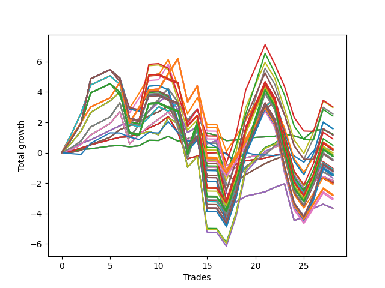

# Long Pointer Nine (1226 1227 1230) 
- Symbol: AAPL_Unlimited
- Date Range: 03/23/2022 - 07/08/2022
- Trading Period: 7:20-12:30
- Number of Trades: 28



| Name | Win Percent | Profit | Avg Profit / Trade | Avg Time / Trade |      | Name | Win Percent | Profit | Avg Profit / Trade | Avg Time / Trade |
| ---- | ----------- | ------ | ------------------ | ---------------- | ---- | ---- | ----------- | ------ | ------------------ | ---------------- |
| Sorted By <br> Profit | | | | | | Sorted By <br> Win Percentage ||||
| Ninety-Eight | 46.43 | 1510.00 | 53.93 | 128:58 |     | Sixty-Five | 78.57 | -995.00 | -35.54 | 15:16 |
| Ninety-Three | 50.00 | 1490.00 | 53.21 | 145:06 |     | Fifty-Seven | 78.57 | -995.00 | -35.54 | 15:16 |
| Ninety-Two | 50.00 | 1280.00 | 45.71 | 124:32 |     | Forty-Nine | 78.57 | -995.00 | -35.54 | 15:16 |
| Ninety-Seven | 46.43 | 1210.00 | 43.21 | 108:34 |     | Forty-One | 78.57 | -995.00 | -35.54 | 15:16 |
| Ninety-Five | 50.00 | 790.00 | 28.21 | 149:59 |     | One | 78.57 | -995.00 | -35.54 | 15:16 |
| Ninety-Four | 50.00 | 790.00 | 28.21 | 149:59 |     | Sixty-Seven | 75.00 | -935.00 | -33.39 | 23:06 |
| Sixty-Four | 71.43 | 610.00 | 21.79 | 06:31 |     | Fifty-Nine | 75.00 | -935.00 | -33.39 | 23:06 |
| Fifty-Six | 71.43 | 610.00 | 21.79 | 06:31 |     | Fifty-One | 75.00 | -935.00 | -33.39 | 23:06 |
| Forty-Eight | 71.43 | 610.00 | 21.79 | 06:31 |     | Forty-Three | 75.00 | -935.00 | -33.39 | 23:06 |
| Forty | 71.43 | 610.00 | 21.79 | 06:31 |     | Three | 75.00 | -935.00 | -33.39 | 23:06 |
| Zero | 71.43 | 610.00 | 21.79 | 06:31 |     | Sixty-Six | 75.00 | -1830.00 | -65.36 | 25:00 |
| One Hundred | 46.43 | 580.00 | 20.71 | 131:27 |     | Fifty-Eight | 75.00 | -1830.00 | -65.36 | 25:00 |
| Ninety-Nine | 46.43 | 580.00 | 20.71 | 131:27 |     | Fifty | 75.00 | -1830.00 | -65.36 | 25:00 |
| One Hundred Eight | 50.00 | 455.00 | 16.25 | 157:35 |     | Forty-Two | 75.00 | -1830.00 | -65.36 | 25:00 |
| One Hundred Seven | 50.00 | 245.00 | 8.75 | 137:01 |     | Two | 75.00 | -1830.00 | -65.36 | 25:00 |
| Ninety-Six | 60.71 | 135.00 | 4.82 | 72:24 |     | Sixty-Four | 71.43 | 610.00 | 21.79 | 06:31 |
| One Hundred Eighteen | 50.00 | 120.00 | 4.29 | 173:22 |     | Fifty-Six | 71.43 | 610.00 | 21.79 | 06:31 |
| Seventy-Three | 35.71 | 105.00 | 3.75 | 08:09 |     | Forty-Eight | 71.43 | 610.00 | 21.79 | 06:31 |
| One Hundred Twenty-Eight | 50.00 | 90.00 | 3.21 | 175:56 |     | Forty | 71.43 | 610.00 | 21.79 | 06:31 |
| One Hundred Twenty-Three | 50.00 | 90.00 | 3.21 | 175:56 |     | Zero | 71.43 | 610.00 | 21.79 | 06:31 |
| Eighty-Three | 50.00 | 90.00 | 3.21 | 175:56 |     | Sixty-Nine | 67.86 | -750.00 | -26.79 | 51:58 |
| One Hundred Thirteen | 50.00 | -5.00 | -0.18 | 173:49 |     | Sixty-One | 67.86 | -750.00 | -26.79 | 51:58 |
| One Hundred Three | 50.00 | -55.00 | -1.96 | 162:07 |     | Fifty-Three | 67.86 | -750.00 | -26.79 | 51:58 |
| One Hundred Seventeen | 50.00 | -90.00 | -3.21 | 152:49 |     | Forty-Five | 67.86 | -750.00 | -26.79 | 51:58 |
| One Hundred Twenty-Seven | 50.00 | -120.00 | -4.29 | 155:23 |     | Five | 67.86 | -750.00 | -26.79 | 51:58 |
| One Hundred Twenty-Two | 50.00 | -120.00 | -4.29 | 155:23 |     | Sixty-Eight | 67.86 | -915.00 | -32.68 | 37:09 |
| Eighty-Two | 50.00 | -120.00 | -4.29 | 155:23 |     | Sixty | 67.86 | -915.00 | -32.68 | 37:09 |
| One Hundred Twelve | 50.00 | -215.00 | -7.68 | 153:16 |     | Fifty-Two | 67.86 | -915.00 | -32.68 | 37:09 |
| One Hundred Ten | 50.00 | -245.00 | -8.75 | 162:28 |     | Forty-Four | 67.86 | -915.00 | -32.68 | 37:09 |
| One Hundred Nine | 50.00 | -245.00 | -8.75 | 162:28 |     | Four | 67.86 | -915.00 | -32.68 | 37:09 |
| One Hundred Two | 50.00 | -265.00 | -9.46 | 141:34 |     | One Hundred Six | 64.29 | -1045.00 | -37.32 | 91:02 |
| Fifty-Five | 57.14 | -515.00 | -18.39 | 112:36 |     | One Hundred Sixteen | 64.29 | -1380.00 | -49.29 | 106:50 |
| Seventy-One | 57.14 | -545.00 | -19.46 | 115:09 |     | One Hundred Twenty-Six | 64.29 | -1410.00 | -50.36 | 109:24 |
| Sixty-Three | 57.14 | -545.00 | -19.46 | 115:09 |     | One Hundred Twenty-One | 64.29 | -1410.00 | -50.36 | 109:24 |
| Seven | 57.14 | -545.00 | -19.46 | 115:09 |     | Eighty-One | 64.29 | -1410.00 | -50.36 | 109:24 |
| One Hundred Twenty | 50.00 | -580.00 | -20.71 | 178:15 |     | One Hundred Eleven | 64.29 | -1505.00 | -53.75 | 107:17 |
| One Hundred Ninteen | 50.00 | -580.00 | -20.71 | 178:15 |     | One Hundred One | 64.29 | -1555.00 | -55.54 | 95:35 |
| One Hundred Thirty | 50.00 | -610.00 | -21.79 | 180:49 |     | Ninety-Six | 60.71 | 135.00 | 4.82 | 72:24 |
| One Hundred Twenty-Nine | 50.00 | -610.00 | -21.79 | 180:49 |     | Ninety-One | 60.71 | -625.00 | -22.32 | 83:02 |
| One Hundred Twenty-Five | 50.00 | -610.00 | -21.79 | 180:49 |     | Fifty-Four | 60.71 | -715.00 | -25.54 | 81:45 |
| One Hundred Twenty-Four | 50.00 | -610.00 | -21.79 | 180:49 |     | Seventy | 60.71 | -745.00 | -26.61 | 84:18 |
| Eighty-Five | 50.00 | -610.00 | -21.79 | 180:49 |     | Sixty-Two | 60.71 | -745.00 | -26.61 | 84:18 |
| Eighty-Four | 50.00 | -610.00 | -21.79 | 180:49 |     | Six | 60.71 | -745.00 | -26.61 | 84:18 |
| Ninety-One | 60.71 | -625.00 | -22.32 | 83:02 |     | Forty-Six | 60.71 | -840.00 | -30.00 | 82:12 |
| Forty-Seven | 57.14 | -640.00 | -22.86 | 113:03 |     | Fifty-Five | 57.14 | -515.00 | -18.39 | 112:36 |
| One Hundred Fifteen | 50.00 | -705.00 | -25.18 | 178:42 |     | Seventy-One | 57.14 | -545.00 | -19.46 | 115:09 |
| One Hundred Fourteen | 50.00 | -705.00 | -25.18 | 178:42 |     | Sixty-Three | 57.14 | -545.00 | -19.46 | 115:09 |
| Fifty-Four | 60.71 | -715.00 | -25.54 | 81:45 |     | Seven | 57.14 | -545.00 | -19.46 | 115:09 |
| Seventy | 60.71 | -745.00 | -26.61 | 84:18 |     | Forty-Seven | 57.14 | -640.00 | -22.86 | 113:03 |
| Sixty-Two | 60.71 | -745.00 | -26.61 | 84:18 |     | Ninety-Three | 50.00 | 1490.00 | 53.21 | 145:06 |
| Six | 60.71 | -745.00 | -26.61 | 84:18 |     | Ninety-Two | 50.00 | 1280.00 | 45.71 | 124:32 |
| Sixty-Nine | 67.86 | -750.00 | -26.79 | 51:58 |     | Ninety-Five | 50.00 | 790.00 | 28.21 | 149:59 |
| Sixty-One | 67.86 | -750.00 | -26.79 | 51:58 |     | Ninety-Four | 50.00 | 790.00 | 28.21 | 149:59 |
| Fifty-Three | 67.86 | -750.00 | -26.79 | 51:58 |     | One Hundred Eight | 50.00 | 455.00 | 16.25 | 157:35 |
| Forty-Five | 67.86 | -750.00 | -26.79 | 51:58 |     | One Hundred Seven | 50.00 | 245.00 | 8.75 | 137:01 |
| Five | 67.86 | -750.00 | -26.79 | 51:58 |     | One Hundred Eighteen | 50.00 | 120.00 | 4.29 | 173:22 |
| One Hundred Five | 50.00 | -755.00 | -26.96 | 167:00 |     | One Hundred Twenty-Eight | 50.00 | 90.00 | 3.21 | 175:56 |
| One Hundred Four | 50.00 | -755.00 | -26.96 | 167:00 |     | One Hundred Twenty-Three | 50.00 | 90.00 | 3.21 | 175:56 |
| Forty-Six | 60.71 | -840.00 | -30.00 | 82:12 |     | Eighty-Three | 50.00 | 90.00 | 3.21 | 175:56 |
| Sixty-Eight | 67.86 | -915.00 | -32.68 | 37:09 |     | One Hundred Thirteen | 50.00 | -5.00 | -0.18 | 173:49 |
| Sixty | 67.86 | -915.00 | -32.68 | 37:09 |     | One Hundred Three | 50.00 | -55.00 | -1.96 | 162:07 |
| Fifty-Two | 67.86 | -915.00 | -32.68 | 37:09 |     | One Hundred Seventeen | 50.00 | -90.00 | -3.21 | 152:49 |
| Forty-Four | 67.86 | -915.00 | -32.68 | 37:09 |     | One Hundred Twenty-Seven | 50.00 | -120.00 | -4.29 | 155:23 |
| Four | 67.86 | -915.00 | -32.68 | 37:09 |     | One Hundred Twenty-Two | 50.00 | -120.00 | -4.29 | 155:23 |
| Sixty-Seven | 75.00 | -935.00 | -33.39 | 23:06 |     | Eighty-Two | 50.00 | -120.00 | -4.29 | 155:23 |
| Fifty-Nine | 75.00 | -935.00 | -33.39 | 23:06 |     | One Hundred Twelve | 50.00 | -215.00 | -7.68 | 153:16 |
| Fifty-One | 75.00 | -935.00 | -33.39 | 23:06 |     | One Hundred Ten | 50.00 | -245.00 | -8.75 | 162:28 |
| Forty-Three | 75.00 | -935.00 | -33.39 | 23:06 |     | One Hundred Nine | 50.00 | -245.00 | -8.75 | 162:28 |
| Three | 75.00 | -935.00 | -33.39 | 23:06 |     | One Hundred Two | 50.00 | -265.00 | -9.46 | 141:34 |
| Sixty-Five | 78.57 | -995.00 | -35.54 | 15:16 |     | One Hundred Twenty | 50.00 | -580.00 | -20.71 | 178:15 |
| Fifty-Seven | 78.57 | -995.00 | -35.54 | 15:16 |     | One Hundred Ninteen | 50.00 | -580.00 | -20.71 | 178:15 |
| Forty-Nine | 78.57 | -995.00 | -35.54 | 15:16 |     | One Hundred Thirty | 50.00 | -610.00 | -21.79 | 180:49 |
| Forty-One | 78.57 | -995.00 | -35.54 | 15:16 |     | One Hundred Twenty-Nine | 50.00 | -610.00 | -21.79 | 180:49 |
| One | 78.57 | -995.00 | -35.54 | 15:16 |     | One Hundred Twenty-Five | 50.00 | -610.00 | -21.79 | 180:49 |
| One Hundred Six | 64.29 | -1045.00 | -37.32 | 91:02 |     | One Hundred Twenty-Four | 50.00 | -610.00 | -21.79 | 180:49 |
| One Hundred Sixteen | 64.29 | -1380.00 | -49.29 | 106:50 |     | Eighty-Five | 50.00 | -610.00 | -21.79 | 180:49 |
| One Hundred Twenty-Six | 64.29 | -1410.00 | -50.36 | 109:24 |     | Eighty-Four | 50.00 | -610.00 | -21.79 | 180:49 |
| One Hundred Twenty-One | 64.29 | -1410.00 | -50.36 | 109:24 |     | One Hundred Fifteen | 50.00 | -705.00 | -25.18 | 178:42 |
| Eighty-One | 64.29 | -1410.00 | -50.36 | 109:24 |     | One Hundred Fourteen | 50.00 | -705.00 | -25.18 | 178:42 |
| One Hundred Eleven | 64.29 | -1505.00 | -53.75 | 107:17 |     | One Hundred Five | 50.00 | -755.00 | -26.96 | 167:00 |
| One Hundred One | 64.29 | -1555.00 | -55.54 | 95:35 |     | One Hundred Four | 50.00 | -755.00 | -26.96 | 167:00 |
| Sixty-Six | 75.00 | -1830.00 | -65.36 | 25:00 |     | Ninety-Eight | 46.43 | 1510.00 | 53.93 | 128:58 |
| Fifty-Eight | 75.00 | -1830.00 | -65.36 | 25:00 |     | Ninety-Seven | 46.43 | 1210.00 | 43.21 | 108:34 |
| Fifty | 75.00 | -1830.00 | -65.36 | 25:00 |     | One Hundred | 46.43 | 580.00 | 20.71 | 131:27 |
| Forty-Two | 75.00 | -1830.00 | -65.36 | 25:00 |     | Ninety-Nine | 46.43 | 580.00 | 20.71 | 131:27 |
| Two | 75.00 | -1830.00 | -65.36 | 25:00 |     | Seventy-Three | 35.71 | 105.00 | 3.75 | 08:09 |

## NO STOPLOSS

### Test Zero
* Sell when price hits the middle line of the 20p bollinger
* No Stoploss
* Results:
```
Total Trades: 28
Percent Up: 71.43
Percent Down: 28.57
Total Points Moved Up: 1.22
Potential Profit: 610.00
Total Points Ups: 2.75 Count Ups: 20
Total Points Downs: -1.53 Count Downs: 8
```

<details><summary>Trades</summary>

<code>In: 2022-03-25 08:30:00		Out: 2022-03-25 08:35:05		Total Position Time: 05:05		Total Move Up: 0.11		Total to Date: 0.11</code> <br />
<code>In: 2022-03-25 09:00:00		Out: 2022-03-25 09:05:05		Total Position Time: 05:05		Total Move Up: 0.11		Total to Date: 0.22</code> <br />
<code>In: 2022-04-07 09:52:00		Out: 2022-04-07 09:58:45		Total Position Time: 06:45		Total Move Up: 0.04		Total to Date: 0.26</code> <br />
<code>In: 2022-04-08 11:08:00		Out: 2022-04-08 11:09:10		Total Position Time: 01:10		Total Move Up: 0.09		Total to Date: 0.35</code> <br />
<code>In: 2022-04-08 11:08:00		Out: 2022-04-08 11:09:10		Total Position Time: 01:10		Total Move Up: 0.09		Total to Date: 0.44</code> <br />
<code>In: 2022-04-12 08:02:00		Out: 2022-04-12 08:13:15		Total Position Time: 11:15		Total Move Up: 0.04		Total to Date: 0.48</code> <br />
<code>In: 2022-04-21 10:22:00		Out: 2022-04-21 10:23:10		Total Position Time: 01:10		Total Move Up: -0.09		Total to Date: 0.39</code> <br />
<code>In: 2022-04-22 11:59:00		Out: 2022-04-22 12:07:30		Total Position Time: 08:30		Total Move Up: 0.07		Total to Date: 0.46</code> <br />
<code>In: 2022-05-03 07:49:00		Out: 2022-05-03 07:54:05		Total Position Time: 05:05		Total Move Up: 0.36		Total to Date: 0.82</code> <br />
<code>In: 2022-05-03 11:45:00		Out: 2022-05-03 11:48:15		Total Position Time: 03:15		Total Move Up: -0.01		Total to Date: 0.81</code> <br />
<code>In: 2022-05-09 11:35:00		Out: 2022-05-09 11:37:40		Total Position Time: 02:40		Total Move Up: 0.27		Total to Date: 1.08</code> <br />
<code>In: 2022-05-10 07:44:00		Out: 2022-05-10 07:58:05		Total Position Time: 14:05		Total Move Up: -0.31		Total to Date: 0.77</code> <br />
<code>In: 2022-05-11 10:25:00		Out: 2022-05-11 10:26:10		Total Position Time: 01:10		Total Move Up: 0.16		Total to Date: 0.93</code> <br />
<code>In: 2022-05-16 08:02:00		Out: 2022-05-16 08:05:10		Total Position Time: 03:10		Total Move Up: 0.15		Total to Date: 1.08</code> <br />
<code>In: 2022-05-18 07:47:00		Out: 2022-05-18 07:48:35		Total Position Time: 01:35		Total Move Up: 0.22		Total to Date: 1.30</code> <br />
<code>In: 2022-05-19 12:31:00		Out: 2022-05-19 12:43:15		Total Position Time: 12:15		Total Move Up: -0.17		Total to Date: 1.13</code> <br />
<code>In: 2022-05-20 08:15:00		Out: 2022-05-20 08:26:20		Total Position Time: 11:20		Total Move Up: -0.33		Total to Date: 0.80</code> <br />
<code>In: 2022-05-20 09:56:00		Out: 2022-05-20 10:00:00		Total Position Time: 04:00		Total Move Up: 0.04		Total to Date: 0.84</code> <br />
<code>In: 2022-05-20 10:32:00		Out: 2022-05-20 10:33:10		Total Position Time: 01:10		Total Move Up: 0.14		Total to Date: 0.98</code> <br />
<code>In: 2022-05-25 09:30:00		Out: 2022-05-25 09:44:25		Total Position Time: 14:25		Total Move Up: 0.03		Total to Date: 1.01</code> <br />
<code>In: 2022-05-25 09:38:00		Out: 2022-05-25 09:44:25		Total Position Time: 06:25		Total Move Up: 0.04		Total to Date: 1.05</code> <br />
<code>In: 2022-06-08 08:06:00		Out: 2022-06-08 08:10:40		Total Position Time: 04:40		Total Move Up: 0.04		Total to Date: 1.09</code> <br />
<code>In: 2022-06-09 08:10:00		Out: 2022-06-09 08:11:10		Total Position Time: 01:10		Total Move Up: 0.14		Total to Date: 1.23</code> <br />
<code>In: 2022-06-09 11:14:00		Out: 2022-06-09 11:28:40		Total Position Time: 14:40		Total Move Up: -0.12		Total to Date: 1.11</code> <br />
<code>In: 2022-06-13 12:04:00		Out: 2022-06-13 12:16:50		Total Position Time: 12:50		Total Move Up: -0.19		Total to Date: 0.92</code> <br />
<code>In: 2022-06-14 07:46:00		Out: 2022-06-14 07:47:10		Total Position Time: 01:10		Total Move Up: 0.55		Total to Date: 1.47</code> <br />
<code>In: 2022-06-23 10:06:00		Out: 2022-06-23 10:07:10		Total Position Time: 01:10		Total Move Up: 0.06		Total to Date: 1.53</code> <br />
<code>In: 2022-06-27 10:37:00		Out: 2022-06-27 11:03:15		Total Position Time: 26:15		Total Move Up: -0.31		Total to Date: 1.22</code> <br />


</details>

### Test One
* Sell when the price hits the upper line of the 20p 1std bollinger
* No Stoploss
* Results:
```
Total Trades: 28
Percent Up: 78.57
Percent Down: 21.43
Total Points Moved Up: -1.99
Potential Profit: -995.00
Total Points Ups: 4.29 Count Ups: 22
Total Points Downs: -6.28 Count Downs: 6
```

<details><summary>Trades</summary>

<code>In: 2022-03-25 08:30:00		Out: 2022-03-25 08:41:25		Total Position Time: 11:25		Total Move Up: 0.11		Total to Date: 0.11</code> <br />
<code>In: 2022-03-25 09:00:00		Out: 2022-03-25 09:06:05		Total Position Time: 06:05		Total Move Up: 0.20		Total to Date: 0.31</code> <br />
<code>In: 2022-04-07 09:52:00		Out: 2022-04-07 10:02:15		Total Position Time: 10:15		Total Move Up: 0.21		Total to Date: 0.52</code> <br />
<code>In: 2022-04-08 11:08:00		Out: 2022-04-08 11:11:10		Total Position Time: 03:10		Total Move Up: 0.17		Total to Date: 0.69</code> <br />
<code>In: 2022-04-08 11:08:00		Out: 2022-04-08 11:11:10		Total Position Time: 03:10		Total Move Up: 0.17		Total to Date: 0.86</code> <br />
<code>In: 2022-04-12 08:02:00		Out: 2022-04-12 08:14:15		Total Position Time: 12:15		Total Move Up: 0.16		Total to Date: 1.02</code> <br />
<code>In: 2022-04-21 10:22:00		Out: 2022-04-21 10:28:50		Total Position Time: 06:50		Total Move Up: 0.04		Total to Date: 1.06</code> <br />
<code>In: 2022-04-22 11:59:00		Out: 2022-04-22 12:11:50		Total Position Time: 12:50		Total Move Up: 0.20		Total to Date: 1.26</code> <br />
<code>In: 2022-05-03 07:49:00		Out: 2022-05-03 07:57:20		Total Position Time: 08:20		Total Move Up: 0.37		Total to Date: 1.63</code> <br />
<code>In: 2022-05-03 11:45:00		Out: 2022-05-03 11:52:05		Total Position Time: 07:05		Total Move Up: 0.28		Total to Date: 1.91</code> <br />
<code>In: 2022-05-09 11:35:00		Out: 2022-05-09 11:38:20		Total Position Time: 03:20		Total Move Up: 0.48		Total to Date: 2.39</code> <br />
<code>In: 2022-05-10 07:44:00		Out: 2022-05-10 08:23:05		Total Position Time: 39:05		Total Move Up: -1.07		Total to Date: 1.32</code> <br />
<code>In: 2022-05-11 10:25:00		Out: 2022-05-11 11:18:35		Total Position Time: 53:35		Total Move Up: -1.72		Total to Date: -0.40</code> <br />
<code>In: 2022-05-16 08:02:00		Out: 2022-05-16 08:09:30		Total Position Time: 07:30		Total Move Up: 0.18		Total to Date: -0.22</code> <br />
<code>In: 2022-05-18 07:47:00		Out: 2022-05-18 08:00:00		Total Position Time: 13:00		Total Move Up: 0.20		Total to Date: -0.02</code> <br />
<code>In: 2022-05-19 12:31:00		Out: 2022-05-19 12:44:30		Total Position Time: 13:30		Total Move Up: 0.03		Total to Date: 0.01</code> <br />
<code>In: 2022-05-20 08:15:00		Out: 2022-05-20 08:27:15		Total Position Time: 12:15		Total Move Up: -0.02		Total to Date: -0.01</code> <br />
<code>In: 2022-05-20 09:56:00		Out: 2022-05-20 10:33:15		Total Position Time: 37:15		Total Move Up: -0.75		Total to Date: -0.76</code> <br />
<code>In: 2022-05-20 10:32:00		Out: 2022-05-20 10:33:15		Total Position Time: 01:15		Total Move Up: 0.23		Total to Date: -0.53</code> <br />
<code>In: 2022-05-25 09:30:00		Out: 2022-05-25 09:45:15		Total Position Time: 15:15		Total Move Up: 0.08		Total to Date: -0.45</code> <br />
<code>In: 2022-05-25 09:38:00		Out: 2022-05-25 09:45:15		Total Position Time: 07:15		Total Move Up: 0.09		Total to Date: -0.36</code> <br />
<code>In: 2022-06-08 08:06:00		Out: 2022-06-08 08:11:05		Total Position Time: 05:05		Total Move Up: 0.19		Total to Date: -0.17</code> <br />
<code>In: 2022-06-09 08:10:00		Out: 2022-06-09 08:11:10		Total Position Time: 01:10		Total Move Up: 0.14		Total to Date: -0.03</code> <br />
<code>In: 2022-06-09 11:14:00		Out: 2022-06-09 12:47:00		Total Position Time: 93:00		Total Move Up: -2.43		Total to Date: -2.46</code> <br />
<code>In: 2022-06-13 12:04:00		Out: 2022-06-13 12:17:10		Total Position Time: 13:10		Total Move Up: 0.03		Total to Date: -2.43</code> <br />
<code>In: 2022-06-14 07:46:00		Out: 2022-06-14 07:47:10		Total Position Time: 01:10		Total Move Up: 0.55		Total to Date: -1.88</code> <br />
<code>In: 2022-06-23 10:06:00		Out: 2022-06-23 10:07:25		Total Position Time: 01:25		Total Move Up: 0.18		Total to Date: -1.70</code> <br />
<code>In: 2022-06-27 10:37:00		Out: 2022-06-27 11:05:00		Total Position Time: 28:00		Total Move Up: -0.29		Total to Date: -1.99</code> <br />


</details>

### Test Two
* Sell when the price hits the upper line of the 20p 2std bollinger
* No Stoploss
* Results:
```
Total Trades: 28
Percent Up: 75.00
Percent Down: 25.00
Total Points Moved Up: -3.66
Potential Profit: -1830.00
Total Points Ups: 6.66 Count Ups: 21
Total Points Downs: -10.32 Count Downs: 7
```

<details><summary>Trades</summary>

<code>In: 2022-03-25 08:30:00		Out: 2022-03-25 08:42:05		Total Position Time: 12:05		Total Move Up: 0.21		Total to Date: 0.21</code> <br />
<code>In: 2022-03-25 09:00:00		Out: 2022-03-25 09:11:20		Total Position Time: 11:20		Total Move Up: 0.40		Total to Date: 0.61</code> <br />
<code>In: 2022-04-07 09:52:00		Out: 2022-04-07 10:03:05		Total Position Time: 11:05		Total Move Up: 0.24		Total to Date: 0.85</code> <br />
<code>In: 2022-04-08 11:08:00		Out: 2022-04-08 11:20:45		Total Position Time: 12:45		Total Move Up: 0.31		Total to Date: 1.16</code> <br />
<code>In: 2022-04-08 11:08:00		Out: 2022-04-08 11:20:45		Total Position Time: 12:45		Total Move Up: 0.31		Total to Date: 1.47</code> <br />
<code>In: 2022-04-12 08:02:00		Out: 2022-04-12 08:15:15		Total Position Time: 13:15		Total Move Up: 0.31		Total to Date: 1.78</code> <br />
<code>In: 2022-04-21 10:22:00		Out: 2022-04-21 10:31:20		Total Position Time: 09:20		Total Move Up: 0.26		Total to Date: 2.04</code> <br />
<code>In: 2022-04-22 11:59:00		Out: 2022-04-22 12:12:45		Total Position Time: 13:45		Total Move Up: 0.19		Total to Date: 2.23</code> <br />
<code>In: 2022-05-03 07:49:00		Out: 2022-05-03 08:02:10		Total Position Time: 13:10		Total Move Up: 0.50		Total to Date: 2.73</code> <br />
<code>In: 2022-05-03 11:45:00		Out: 2022-05-03 11:59:05		Total Position Time: 14:05		Total Move Up: 0.59		Total to Date: 3.32</code> <br />
<code>In: 2022-05-09 11:35:00		Out: 2022-05-09 11:46:50		Total Position Time: 11:50		Total Move Up: 0.48		Total to Date: 3.80</code> <br />
<code>In: 2022-05-10 07:44:00		Out: 2022-05-10 08:37:50		Total Position Time: 53:50		Total Move Up: -0.97		Total to Date: 2.83</code> <br />
<code>In: 2022-05-11 10:25:00		Out: 2022-05-11 11:24:05		Total Position Time: 59:05		Total Move Up: -1.50		Total to Date: 1.33</code> <br />
<code>In: 2022-05-16 08:02:00		Out: 2022-05-16 08:09:55		Total Position Time: 07:55		Total Move Up: 0.37		Total to Date: 1.70</code> <br />
<code>In: 2022-05-18 07:47:00		Out: 2022-05-18 08:43:30		Total Position Time: 56:30		Total Move Up: -1.11		Total to Date: 0.59</code> <br />
<code>In: 2022-05-19 12:31:00		Out: 2022-05-19 12:45:45		Total Position Time: 14:45		Total Move Up: 0.20		Total to Date: 0.79</code> <br />
<code>In: 2022-05-20 08:15:00		Out: 2022-05-20 10:33:45		Total Position Time: 138:45		Total Move Up: -3.46		Total to Date: -2.67</code> <br />
<code>In: 2022-05-20 09:56:00		Out: 2022-05-20 10:33:45		Total Position Time: 37:45		Total Move Up: -0.59		Total to Date: -3.26</code> <br />
<code>In: 2022-05-20 10:32:00		Out: 2022-05-20 10:33:45		Total Position Time: 01:45		Total Move Up: 0.39		Total to Date: -2.87</code> <br />
<code>In: 2022-05-25 09:30:00		Out: 2022-05-25 09:47:30		Total Position Time: 17:30		Total Move Up: 0.14		Total to Date: -2.73</code> <br />
<code>In: 2022-05-25 09:38:00		Out: 2022-05-25 09:47:30		Total Position Time: 09:30		Total Move Up: 0.15		Total to Date: -2.58</code> <br />
<code>In: 2022-06-08 08:06:00		Out: 2022-06-08 08:11:35		Total Position Time: 05:35		Total Move Up: 0.30		Total to Date: -2.28</code> <br />
<code>In: 2022-06-09 08:10:00		Out: 2022-06-09 08:22:40		Total Position Time: 12:40		Total Move Up: 0.23		Total to Date: -2.05</code> <br />
<code>In: 2022-06-09 11:14:00		Out: 2022-06-09 12:47:00		Total Position Time: 93:00		Total Move Up: -2.43		Total to Date: -4.48</code> <br />
<code>In: 2022-06-13 12:04:00		Out: 2022-06-13 12:17:15		Total Position Time: 13:15		Total Move Up: 0.26		Total to Date: -4.22</code> <br />
<code>In: 2022-06-14 07:46:00		Out: 2022-06-14 07:47:10		Total Position Time: 01:10		Total Move Up: 0.55		Total to Date: -3.67</code> <br />
<code>In: 2022-06-23 10:06:00		Out: 2022-06-23 10:07:40		Total Position Time: 01:40		Total Move Up: 0.27		Total to Date: -3.40</code> <br />
<code>In: 2022-06-27 10:37:00		Out: 2022-06-27 11:17:10		Total Position Time: 40:10		Total Move Up: -0.26		Total to Date: -3.66</code> <br />


</details>

### Test Three
* Sell when price hits the middle line of the 50p bollinger
* No Stoploss
* Results:
```
Total Trades: 28
Percent Up: 75.00
Percent Down: 25.00
Total Points Moved Up: -1.87
Potential Profit: -935.00
Total Points Ups: 6.45 Count Ups: 21
Total Points Downs: -8.32 Count Downs: 7
```

<details><summary>Trades</summary>

<code>In: 2022-03-25 08:30:00		Out: 2022-03-25 09:05:15		Total Position Time: 35:15		Total Move Up: 0.02		Total to Date: 0.02</code> <br />
<code>In: 2022-03-25 09:00:00		Out: 2022-03-25 09:05:15		Total Position Time: 05:15		Total Move Up: 0.14		Total to Date: 0.16</code> <br />
<code>In: 2022-04-07 09:52:00		Out: 2022-04-07 10:03:10		Total Position Time: 11:10		Total Move Up: 0.38		Total to Date: 0.54</code> <br />
<code>In: 2022-04-08 11:08:00		Out: 2022-04-08 11:20:30		Total Position Time: 12:30		Total Move Up: 0.24		Total to Date: 0.78</code> <br />
<code>In: 2022-04-08 11:08:00		Out: 2022-04-08 11:20:30		Total Position Time: 12:30		Total Move Up: 0.24		Total to Date: 1.02</code> <br />
<code>In: 2022-04-12 08:02:00		Out: 2022-04-12 08:19:50		Total Position Time: 17:50		Total Move Up: 0.50		Total to Date: 1.52</code> <br />
<code>In: 2022-04-21 10:22:00		Out: 2022-04-21 10:31:40		Total Position Time: 09:40		Total Move Up: 0.26		Total to Date: 1.78</code> <br />
<code>In: 2022-04-22 11:59:00		Out: 2022-04-22 12:13:30		Total Position Time: 14:30		Total Move Up: 0.28		Total to Date: 2.06</code> <br />
<code>In: 2022-05-03 07:49:00		Out: 2022-05-03 07:54:05		Total Position Time: 05:05		Total Move Up: 0.36		Total to Date: 2.42</code> <br />
<code>In: 2022-05-03 11:45:00		Out: 2022-05-03 11:52:05		Total Position Time: 07:05		Total Move Up: 0.28		Total to Date: 2.70</code> <br />
<code>In: 2022-05-09 11:35:00		Out: 2022-05-09 11:38:05		Total Position Time: 03:05		Total Move Up: 0.38		Total to Date: 3.08</code> <br />
<code>In: 2022-05-10 07:44:00		Out: 2022-05-10 08:37:10		Total Position Time: 53:10		Total Move Up: -1.11		Total to Date: 1.97</code> <br />
<code>In: 2022-05-11 10:25:00		Out: 2022-05-11 11:23:35		Total Position Time: 58:35		Total Move Up: -1.59		Total to Date: 0.38</code> <br />
<code>In: 2022-05-16 08:02:00		Out: 2022-05-16 08:16:10		Total Position Time: 14:10		Total Move Up: 0.53		Total to Date: 0.91</code> <br />
<code>In: 2022-05-18 07:47:00		Out: 2022-05-18 09:39:10		Total Position Time: 112:10		Total Move Up: -2.40		Total to Date: -1.49</code> <br />
<code>In: 2022-05-19 12:31:00		Out: 2022-05-19 12:47:00		Total Position Time: 16:00		Total Move Up: -0.01		Total to Date: -1.50</code> <br />
<code>In: 2022-05-20 08:15:00		Out: 2022-05-20 08:34:20		Total Position Time: 19:20		Total Move Up: 0.12		Total to Date: -1.38</code> <br />
<code>In: 2022-05-20 09:56:00		Out: 2022-05-20 10:33:55		Total Position Time: 37:55		Total Move Up: -0.52		Total to Date: -1.90</code> <br />
<code>In: 2022-05-20 10:32:00		Out: 2022-05-20 10:33:55		Total Position Time: 01:55		Total Move Up: 0.46		Total to Date: -1.44</code> <br />
<code>In: 2022-05-25 09:30:00		Out: 2022-05-25 09:49:20		Total Position Time: 19:20		Total Move Up: 0.36		Total to Date: -1.08</code> <br />
<code>In: 2022-05-25 09:38:00		Out: 2022-05-25 09:49:20		Total Position Time: 11:20		Total Move Up: 0.37		Total to Date: -0.71</code> <br />
<code>In: 2022-06-08 08:06:00		Out: 2022-06-08 08:11:30		Total Position Time: 05:30		Total Move Up: 0.27		Total to Date: -0.44</code> <br />
<code>In: 2022-06-09 08:10:00		Out: 2022-06-09 08:24:35		Total Position Time: 14:35		Total Move Up: 0.23		Total to Date: -0.21</code> <br />
<code>In: 2022-06-09 11:14:00		Out: 2022-06-09 12:47:00		Total Position Time: 93:00		Total Move Up: -2.43		Total to Date: -2.64</code> <br />
<code>In: 2022-06-13 12:04:00		Out: 2022-06-13 12:17:15		Total Position Time: 13:15		Total Move Up: 0.26		Total to Date: -2.38</code> <br />
<code>In: 2022-06-14 07:46:00		Out: 2022-06-14 07:47:10		Total Position Time: 01:10		Total Move Up: 0.55		Total to Date: -1.83</code> <br />
<code>In: 2022-06-23 10:06:00		Out: 2022-06-23 10:07:30		Total Position Time: 01:30		Total Move Up: 0.22		Total to Date: -1.61</code> <br />
<code>In: 2022-06-27 10:37:00		Out: 2022-06-27 11:17:10		Total Position Time: 40:10		Total Move Up: -0.26		Total to Date: -1.87</code> <br />


</details>

### Test Four
* Sell when the price hits the upper line of the 50p 1std bollinger
* No Stoploss
* Results:
```
Total Trades: 28
Percent Up: 67.86
Percent Down: 32.14
Total Points Moved Up: -1.83
Potential Profit: -915.00
Total Points Ups: 8.31 Count Ups: 19
Total Points Downs: -10.14 Count Downs: 9
```

<details><summary>Trades</summary>

<code>In: 2022-03-25 08:30:00		Out: 2022-03-25 09:09:05		Total Position Time: 39:05		Total Move Up: 0.21		Total to Date: 0.21</code> <br />
<code>In: 2022-03-25 09:00:00		Out: 2022-03-25 09:09:05		Total Position Time: 09:05		Total Move Up: 0.33		Total to Date: 0.54</code> <br />
<code>In: 2022-04-07 09:52:00		Out: 2022-04-07 10:11:40		Total Position Time: 19:40		Total Move Up: 0.63		Total to Date: 1.17</code> <br />
<code>In: 2022-04-08 11:08:00		Out: 2022-04-08 11:21:10		Total Position Time: 13:10		Total Move Up: 0.38		Total to Date: 1.55</code> <br />
<code>In: 2022-04-08 11:08:00		Out: 2022-04-08 11:21:10		Total Position Time: 13:10		Total Move Up: 0.38		Total to Date: 1.93</code> <br />
<code>In: 2022-04-12 08:02:00		Out: 2022-04-12 08:25:10		Total Position Time: 23:10		Total Move Up: 0.77		Total to Date: 2.70</code> <br />
<code>In: 2022-04-21 10:22:00		Out: 2022-04-21 12:29:55		Total Position Time: 127:55		Total Move Up: -2.11		Total to Date: 0.59</code> <br />
<code>In: 2022-04-22 11:59:00		Out: 2022-04-22 12:14:25		Total Position Time: 15:25		Total Move Up: 0.60		Total to Date: 1.19</code> <br />
<code>In: 2022-05-03 07:49:00		Out: 2022-05-03 08:02:25		Total Position Time: 13:25		Total Move Up: 0.56		Total to Date: 1.75</code> <br />
<code>In: 2022-05-03 11:45:00		Out: 2022-05-03 11:57:05		Total Position Time: 12:05		Total Move Up: 0.46		Total to Date: 2.21</code> <br />
<code>In: 2022-05-09 11:35:00		Out: 2022-05-09 11:46:50		Total Position Time: 11:50		Total Move Up: 0.48		Total to Date: 2.69</code> <br />
<code>In: 2022-05-10 07:44:00		Out: 2022-05-10 08:39:10		Total Position Time: 55:10		Total Move Up: -0.72		Total to Date: 1.97</code> <br />
<code>In: 2022-05-11 10:25:00		Out: 2022-05-11 11:26:00		Total Position Time: 61:00		Total Move Up: -1.14		Total to Date: 0.83</code> <br />
<code>In: 2022-05-16 08:02:00		Out: 2022-05-16 08:33:25		Total Position Time: 31:25		Total Move Up: 0.53		Total to Date: 1.36</code> <br />
<code>In: 2022-05-18 07:47:00		Out: 2022-05-18 09:48:00		Total Position Time: 121:00		Total Move Up: -2.32		Total to Date: -0.96</code> <br />
<code>In: 2022-05-19 12:31:00		Out: 2022-05-19 12:47:00		Total Position Time: 16:00		Total Move Up: -0.01		Total to Date: -0.97</code> <br />
<code>In: 2022-05-20 08:15:00		Out: 2022-05-20 08:52:55		Total Position Time: 37:55		Total Move Up: 0.18		Total to Date: -0.79</code> <br />
<code>In: 2022-05-20 09:56:00		Out: 2022-05-20 10:44:05		Total Position Time: 48:05		Total Move Up: -0.26		Total to Date: -1.05</code> <br />
<code>In: 2022-05-20 10:32:00		Out: 2022-05-20 10:44:05		Total Position Time: 12:05		Total Move Up: 0.72		Total to Date: -0.33</code> <br />
<code>In: 2022-05-25 09:30:00		Out: 2022-05-25 10:29:35		Total Position Time: 59:35		Total Move Up: 0.13		Total to Date: -0.20</code> <br />
<code>In: 2022-05-25 09:38:00		Out: 2022-05-25 10:29:35		Total Position Time: 51:35		Total Move Up: 0.14		Total to Date: -0.06</code> <br />
<code>In: 2022-06-08 08:06:00		Out: 2022-06-08 08:15:05		Total Position Time: 09:05		Total Move Up: 0.44		Total to Date: 0.38</code> <br />
<code>In: 2022-06-09 08:10:00		Out: 2022-06-09 08:35:55		Total Position Time: 25:55		Total Move Up: 0.21		Total to Date: 0.59</code> <br />
<code>In: 2022-06-09 11:14:00		Out: 2022-06-09 12:47:00		Total Position Time: 93:00		Total Move Up: -2.43		Total to Date: -1.84</code> <br />
<code>In: 2022-06-13 12:04:00		Out: 2022-06-13 12:47:00		Total Position Time: 43:00		Total Move Up: -0.89		Total to Date: -2.73</code> <br />
<code>In: 2022-06-14 07:46:00		Out: 2022-06-14 07:50:00		Total Position Time: 04:00		Total Move Up: 0.83		Total to Date: -1.90</code> <br />
<code>In: 2022-06-23 10:06:00		Out: 2022-06-23 10:23:20		Total Position Time: 17:20		Total Move Up: 0.33		Total to Date: -1.57</code> <br />
<code>In: 2022-06-27 10:37:00		Out: 2022-06-27 11:33:25		Total Position Time: 56:25		Total Move Up: -0.26		Total to Date: -1.83</code> <br />


</details>

### Test Five
* Sell when the price hits the upper line of the 50p 2std bollinger
* No Stoploss
* Results:
```
Total Trades: 28
Percent Up: 67.86
Percent Down: 32.14
Total Points Moved Up: -1.50
Potential Profit: -750.00
Total Points Ups: 11.40 Count Ups: 19
Total Points Downs: -12.90 Count Downs: 9
```

<details><summary>Trades</summary>

<code>In: 2022-03-25 08:30:00		Out: 2022-03-25 09:11:30		Total Position Time: 41:30		Total Move Up: 0.33		Total to Date: 0.33</code> <br />
<code>In: 2022-03-25 09:00:00		Out: 2022-03-25 09:11:30		Total Position Time: 11:30		Total Move Up: 0.45		Total to Date: 0.78</code> <br />
<code>In: 2022-04-07 09:52:00		Out: 2022-04-07 10:12:40		Total Position Time: 20:40		Total Move Up: 0.92		Total to Date: 1.70</code> <br />
<code>In: 2022-04-08 11:08:00		Out: 2022-04-08 11:52:15		Total Position Time: 44:15		Total Move Up: 0.33		Total to Date: 2.03</code> <br />
<code>In: 2022-04-08 11:08:00		Out: 2022-04-08 11:52:15		Total Position Time: 44:15		Total Move Up: 0.33		Total to Date: 2.36</code> <br />
<code>In: 2022-04-12 08:02:00		Out: 2022-04-12 08:29:25		Total Position Time: 27:25		Total Move Up: 0.93		Total to Date: 3.29</code> <br />
<code>In: 2022-04-21 10:22:00		Out: 2022-04-21 12:44:20		Total Position Time: 142:20		Total Move Up: -2.29		Total to Date: 1.00</code> <br />
<code>In: 2022-04-22 11:59:00		Out: 2022-04-22 12:16:55		Total Position Time: 17:55		Total Move Up: 0.84		Total to Date: 1.84</code> <br />
<code>In: 2022-05-03 07:49:00		Out: 2022-05-03 08:05:00		Total Position Time: 16:00		Total Move Up: 0.92		Total to Date: 2.76</code> <br />
<code>In: 2022-05-03 11:45:00		Out: 2022-05-03 11:59:45		Total Position Time: 14:45		Total Move Up: 0.76		Total to Date: 3.52</code> <br />
<code>In: 2022-05-09 11:35:00		Out: 2022-05-09 11:47:30		Total Position Time: 12:30		Total Move Up: 0.71		Total to Date: 4.23</code> <br />
<code>In: 2022-05-10 07:44:00		Out: 2022-05-10 10:07:25		Total Position Time: 143:25		Total Move Up: -0.90		Total to Date: 3.33</code> <br />
<code>In: 2022-05-11 10:25:00		Out: 2022-05-11 11:35:00		Total Position Time: 70:00		Total Move Up: -1.18		Total to Date: 2.15</code> <br />
<code>In: 2022-05-16 08:02:00		Out: 2022-05-16 08:35:00		Total Position Time: 33:00		Total Move Up: 0.73		Total to Date: 2.88</code> <br />
<code>In: 2022-05-18 07:47:00		Out: 2022-05-18 09:50:45		Total Position Time: 123:45		Total Move Up: -2.25		Total to Date: 0.63</code> <br />
<code>In: 2022-05-19 12:31:00		Out: 2022-05-19 12:47:00		Total Position Time: 16:00		Total Move Up: -0.01		Total to Date: 0.62</code> <br />
<code>In: 2022-05-20 08:15:00		Out: 2022-05-20 10:54:15		Total Position Time: 159:15		Total Move Up: -2.75		Total to Date: -2.13</code> <br />
<code>In: 2022-05-20 09:56:00		Out: 2022-05-20 10:54:15		Total Position Time: 58:15		Total Move Up: 0.12		Total to Date: -2.01</code> <br />
<code>In: 2022-05-20 10:32:00		Out: 2022-05-20 10:54:15		Total Position Time: 22:15		Total Move Up: 1.10		Total to Date: -0.91</code> <br />
<code>In: 2022-05-25 09:30:00		Out: 2022-05-25 10:35:30		Total Position Time: 65:30		Total Move Up: 0.38		Total to Date: -0.53</code> <br />
<code>In: 2022-05-25 09:38:00		Out: 2022-05-25 10:35:30		Total Position Time: 57:30		Total Move Up: 0.39		Total to Date: -0.14</code> <br />
<code>In: 2022-06-08 08:06:00		Out: 2022-06-08 08:17:55		Total Position Time: 11:55		Total Move Up: 0.60		Total to Date: 0.46</code> <br />
<code>In: 2022-06-09 08:10:00		Out: 2022-06-09 08:41:45		Total Position Time: 31:45		Total Move Up: 0.28		Total to Date: 0.74</code> <br />
<code>In: 2022-06-09 11:14:00		Out: 2022-06-09 12:47:00		Total Position Time: 93:00		Total Move Up: -2.43		Total to Date: -1.69</code> <br />
<code>In: 2022-06-13 12:04:00		Out: 2022-06-13 12:47:00		Total Position Time: 43:00		Total Move Up: -0.89		Total to Date: -2.58</code> <br />
<code>In: 2022-06-14 07:46:00		Out: 2022-06-14 08:45:05		Total Position Time: 59:05		Total Move Up: 0.91		Total to Date: -1.67</code> <br />
<code>In: 2022-06-23 10:06:00		Out: 2022-06-23 10:23:25		Total Position Time: 17:25		Total Move Up: 0.37		Total to Date: -1.30</code> <br />
<code>In: 2022-06-27 10:37:00		Out: 2022-06-27 11:34:15		Total Position Time: 57:15		Total Move Up: -0.20		Total to Date: -1.50</code> <br />


</details>

### Test Six
* Sell when the price hits the middle line of the 1std VWAP
* No Stoploss
* Results:
```
Total Trades: 28
Percent Up: 60.71
Percent Down: 39.29
Total Points Moved Up: -1.49
Potential Profit: -745.00
Total Points Ups: 14.28 Count Ups: 17
Total Points Downs: -15.77 Count Downs: 11
```

<details><summary>Trades</summary>

<code>In: 2022-03-25 08:30:00		Out: 2022-03-25 10:49:00		Total Position Time: 139:00		Total Move Up: 0.65		Total to Date: 0.65</code> <br />
<code>In: 2022-03-25 09:00:00		Out: 2022-03-25 10:49:00		Total Position Time: 109:00		Total Move Up: 0.77		Total to Date: 1.42</code> <br />
<code>In: 2022-04-07 09:52:00		Out: 2022-04-07 10:56:05		Total Position Time: 64:05		Total Move Up: 1.24		Total to Date: 2.66</code> <br />
<code>In: 2022-04-08 11:08:00		Out: 2022-04-08 11:53:00		Total Position Time: 45:00		Total Move Up: 0.38		Total to Date: 3.04</code> <br />
<code>In: 2022-04-08 11:08:00		Out: 2022-04-08 11:53:00		Total Position Time: 45:00		Total Move Up: 0.38		Total to Date: 3.42</code> <br />
<code>In: 2022-04-12 08:02:00		Out: 2022-04-12 08:21:00		Total Position Time: 19:00		Total Move Up: 0.58		Total to Date: 4.00</code> <br />
<code>In: 2022-04-21 10:22:00		Out: 2022-04-21 12:47:00		Total Position Time: 145:00		Total Move Up: -2.65		Total to Date: 1.35</code> <br />
<code>In: 2022-04-22 11:59:00		Out: 2022-04-22 12:47:00		Total Position Time: 48:00		Total Move Up: -0.14		Total to Date: 1.21</code> <br />
<code>In: 2022-05-03 07:49:00		Out: 2022-05-03 07:52:25		Total Position Time: 03:25		Total Move Up: 0.19		Total to Date: 1.40</code> <br />
<code>In: 2022-05-03 11:45:00		Out: 2022-05-03 11:46:10		Total Position Time: 01:10		Total Move Up: -0.22		Total to Date: 1.18</code> <br />
<code>In: 2022-05-09 11:35:00		Out: 2022-05-09 12:00:05		Total Position Time: 25:05		Total Move Up: 1.12		Total to Date: 2.30</code> <br />
<code>In: 2022-05-10 07:44:00		Out: 2022-05-10 10:30:00		Total Position Time: 166:00		Total Move Up: -0.39		Total to Date: 1.91</code> <br />
<code>In: 2022-05-11 10:25:00		Out: 2022-05-11 12:47:00		Total Position Time: 142:00		Total Move Up: -2.87		Total to Date: -0.96</code> <br />
<code>In: 2022-05-16 08:02:00		Out: 2022-05-16 08:17:40		Total Position Time: 15:40		Total Move Up: 0.72		Total to Date: -0.24</code> <br />
<code>In: 2022-05-18 07:47:00		Out: 2022-05-18 12:47:00		Total Position Time: 300:00		Total Move Up: -4.81		Total to Date: -5.05</code> <br />
<code>In: 2022-05-19 12:31:00		Out: 2022-05-19 12:47:00		Total Position Time: 16:00		Total Move Up: -0.01		Total to Date: -5.06</code> <br />
<code>In: 2022-05-20 08:15:00		Out: 2022-05-20 12:37:15		Total Position Time: 262:15		Total Move Up: -0.92		Total to Date: -5.98</code> <br />
<code>In: 2022-05-20 09:56:00		Out: 2022-05-20 12:37:15		Total Position Time: 161:15		Total Move Up: 1.95		Total to Date: -4.03</code> <br />
<code>In: 2022-05-20 10:32:00		Out: 2022-05-20 12:37:15		Total Position Time: 125:15		Total Move Up: 2.93		Total to Date: -1.10</code> <br />
<code>In: 2022-05-25 09:30:00		Out: 2022-05-25 11:00:30		Total Position Time: 90:30		Total Move Up: 0.69		Total to Date: -0.41</code> <br />
<code>In: 2022-05-25 09:38:00		Out: 2022-05-25 11:00:30		Total Position Time: 82:30		Total Move Up: 0.70		Total to Date: 0.29</code> <br />
<code>In: 2022-06-08 08:06:00		Out: 2022-06-08 08:11:30		Total Position Time: 05:30		Total Move Up: 0.27		Total to Date: 0.56</code> <br />
<code>In: 2022-06-09 08:10:00		Out: 2022-06-09 08:43:50		Total Position Time: 33:50		Total Move Up: 0.58		Total to Date: 1.14</code> <br />
<code>In: 2022-06-09 11:14:00		Out: 2022-06-09 12:47:00		Total Position Time: 93:00		Total Move Up: -2.43		Total to Date: -1.29</code> <br />
<code>In: 2022-06-13 12:04:00		Out: 2022-06-13 12:47:00		Total Position Time: 43:00		Total Move Up: -0.89		Total to Date: -2.18</code> <br />
<code>In: 2022-06-14 07:46:00		Out: 2022-06-14 07:47:10		Total Position Time: 01:10		Total Move Up: 0.55		Total to Date: -1.63</code> <br />
<code>In: 2022-06-23 10:06:00		Out: 2022-06-23 10:55:05		Total Position Time: 49:05		Total Move Up: 0.58		Total to Date: -1.05</code> <br />
<code>In: 2022-06-27 10:37:00		Out: 2022-06-27 12:47:00		Total Position Time: 130:00		Total Move Up: -0.44		Total to Date: -1.49</code> <br />


</details>

### Test Seven
* Sell when the price hits the upper line of the 1std VWAP
* No Stoploss
* Results:
```
Total Trades: 28
Percent Up: 57.14
Percent Down: 42.86
Total Points Moved Up: -1.09
Potential Profit: -545.00
Total Points Ups: 17.94 Count Ups: 16
Total Points Downs: -19.03 Count Downs: 12
```

<details><summary>Trades</summary>

<code>In: 2022-03-25 08:30:00		Out: 2022-03-25 11:03:35		Total Position Time: 153:35		Total Move Up: 1.24		Total to Date: 1.24</code> <br />
<code>In: 2022-03-25 09:00:00		Out: 2022-03-25 11:03:35		Total Position Time: 123:35		Total Move Up: 1.36		Total to Date: 2.60</code> <br />
<code>In: 2022-04-07 09:52:00		Out: 2022-04-07 11:26:15		Total Position Time: 94:15		Total Move Up: 1.87		Total to Date: 4.47</code> <br />
<code>In: 2022-04-08 11:08:00		Out: 2022-04-08 12:47:00		Total Position Time: 99:00		Total Move Up: 0.30		Total to Date: 4.77</code> <br />
<code>In: 2022-04-08 11:08:00		Out: 2022-04-08 12:47:00		Total Position Time: 99:00		Total Move Up: 0.30		Total to Date: 5.07</code> <br />
<code>In: 2022-04-12 08:02:00		Out: 2022-04-12 12:47:00		Total Position Time: 285:00		Total Move Up: -0.56		Total to Date: 4.51</code> <br />
<code>In: 2022-04-21 10:22:00		Out: 2022-04-21 12:47:00		Total Position Time: 145:00		Total Move Up: -2.65		Total to Date: 1.86</code> <br />
<code>In: 2022-04-22 11:59:00		Out: 2022-04-22 12:47:00		Total Position Time: 48:00		Total Move Up: -0.14		Total to Date: 1.72</code> <br />
<code>In: 2022-05-03 07:49:00		Out: 2022-05-03 08:04:25		Total Position Time: 15:25		Total Move Up: 0.61		Total to Date: 2.33</code> <br />
<code>In: 2022-05-03 11:45:00		Out: 2022-05-03 11:59:25		Total Position Time: 14:25		Total Move Up: 0.71		Total to Date: 3.04</code> <br />
<code>In: 2022-05-09 11:35:00		Out: 2022-05-09 12:47:00		Total Position Time: 72:00		Total Move Up: -0.30		Total to Date: 2.74</code> <br />
<code>In: 2022-05-10 07:44:00		Out: 2022-05-10 10:36:10		Total Position Time: 172:10		Total Move Up: 0.56		Total to Date: 3.30</code> <br />
<code>In: 2022-05-11 10:25:00		Out: 2022-05-11 12:47:00		Total Position Time: 142:00		Total Move Up: -2.87		Total to Date: 0.43</code> <br />
<code>In: 2022-05-16 08:02:00		Out: 2022-05-16 08:44:50		Total Position Time: 42:50		Total Move Up: 1.16		Total to Date: 1.59</code> <br />
<code>In: 2022-05-18 07:47:00		Out: 2022-05-18 12:47:00		Total Position Time: 300:00		Total Move Up: -4.81		Total to Date: -3.22</code> <br />
<code>In: 2022-05-19 12:31:00		Out: 2022-05-19 12:47:00		Total Position Time: 16:00		Total Move Up: -0.01		Total to Date: -3.23</code> <br />
<code>In: 2022-05-20 08:15:00		Out: 2022-05-20 12:47:00		Total Position Time: 272:00		Total Move Up: -0.97		Total to Date: -4.20</code> <br />
<code>In: 2022-05-20 09:56:00		Out: 2022-05-20 12:47:00		Total Position Time: 171:00		Total Move Up: 1.90		Total to Date: -2.30</code> <br />
<code>In: 2022-05-20 10:32:00		Out: 2022-05-20 12:47:00		Total Position Time: 135:00		Total Move Up: 2.88		Total to Date: 0.58</code> <br />
<code>In: 2022-05-25 09:30:00		Out: 2022-05-25 11:02:30		Total Position Time: 92:30		Total Move Up: 1.20		Total to Date: 1.78</code> <br />
<code>In: 2022-05-25 09:38:00		Out: 2022-05-25 11:02:30		Total Position Time: 84:30		Total Move Up: 1.21		Total to Date: 2.99</code> <br />
<code>In: 2022-06-08 08:06:00		Out: 2022-06-08 08:17:55		Total Position Time: 11:55		Total Move Up: 0.60		Total to Date: 3.59</code> <br />
<code>In: 2022-06-09 08:10:00		Out: 2022-06-09 12:47:00		Total Position Time: 277:00		Total Move Up: -2.96		Total to Date: 0.63</code> <br />
<code>In: 2022-06-09 11:14:00		Out: 2022-06-09 12:47:00		Total Position Time: 93:00		Total Move Up: -2.43		Total to Date: -1.80</code> <br />
<code>In: 2022-06-13 12:04:00		Out: 2022-06-13 12:47:00		Total Position Time: 43:00		Total Move Up: -0.89		Total to Date: -2.69</code> <br />
<code>In: 2022-06-14 07:46:00		Out: 2022-06-14 07:52:50		Total Position Time: 06:50		Total Move Up: 0.89		Total to Date: -1.80</code> <br />
<code>In: 2022-06-23 10:06:00		Out: 2022-06-23 11:31:35		Total Position Time: 85:35		Total Move Up: 1.15		Total to Date: -0.65</code> <br />
<code>In: 2022-06-27 10:37:00		Out: 2022-06-27 12:47:00		Total Position Time: 130:00		Total Move Up: -0.44		Total to Date: -1.09</code> <br />


</details>

## STOPLOSS OF 5

### Test Forty
* Sell when price hits the middle line of the 20p bollinger
* Stoploss is 5 points
* Results:
```
Total Trades: 28
Percent Up: 71.43
Percent Down: 28.57
Total Points Moved Up: 1.22
Potential Profit: 610.00
Total Points Ups: 2.75 Count Ups: 20
Total Points Downs: -1.53 Count Downs: 8
```

<details><summary>Trades</summary>

<code>In: 2022-03-25 08:30:00		Out: 2022-03-25 08:35:05		Total Position Time: 05:05		Total Move Up: 0.11		Total to Date: 0.11</code> <br />
<code>In: 2022-03-25 09:00:00		Out: 2022-03-25 09:05:05		Total Position Time: 05:05		Total Move Up: 0.11		Total to Date: 0.22</code> <br />
<code>In: 2022-04-07 09:52:00		Out: 2022-04-07 09:58:45		Total Position Time: 06:45		Total Move Up: 0.04		Total to Date: 0.26</code> <br />
<code>In: 2022-04-08 11:08:00		Out: 2022-04-08 11:09:10		Total Position Time: 01:10		Total Move Up: 0.09		Total to Date: 0.35</code> <br />
<code>In: 2022-04-08 11:08:00		Out: 2022-04-08 11:09:10		Total Position Time: 01:10		Total Move Up: 0.09		Total to Date: 0.44</code> <br />
<code>In: 2022-04-12 08:02:00		Out: 2022-04-12 08:13:15		Total Position Time: 11:15		Total Move Up: 0.04		Total to Date: 0.48</code> <br />
<code>In: 2022-04-21 10:22:00		Out: 2022-04-21 10:23:10		Total Position Time: 01:10		Total Move Up: -0.09		Total to Date: 0.39</code> <br />
<code>In: 2022-04-22 11:59:00		Out: 2022-04-22 12:07:30		Total Position Time: 08:30		Total Move Up: 0.07		Total to Date: 0.46</code> <br />
<code>In: 2022-05-03 07:49:00		Out: 2022-05-03 07:54:05		Total Position Time: 05:05		Total Move Up: 0.36		Total to Date: 0.82</code> <br />
<code>In: 2022-05-03 11:45:00		Out: 2022-05-03 11:48:15		Total Position Time: 03:15		Total Move Up: -0.01		Total to Date: 0.81</code> <br />
<code>In: 2022-05-09 11:35:00		Out: 2022-05-09 11:37:40		Total Position Time: 02:40		Total Move Up: 0.27		Total to Date: 1.08</code> <br />
<code>In: 2022-05-10 07:44:00		Out: 2022-05-10 07:58:05		Total Position Time: 14:05		Total Move Up: -0.31		Total to Date: 0.77</code> <br />
<code>In: 2022-05-11 10:25:00		Out: 2022-05-11 10:26:10		Total Position Time: 01:10		Total Move Up: 0.16		Total to Date: 0.93</code> <br />
<code>In: 2022-05-16 08:02:00		Out: 2022-05-16 08:05:10		Total Position Time: 03:10		Total Move Up: 0.15		Total to Date: 1.08</code> <br />
<code>In: 2022-05-18 07:47:00		Out: 2022-05-18 07:48:35		Total Position Time: 01:35		Total Move Up: 0.22		Total to Date: 1.30</code> <br />
<code>In: 2022-05-19 12:31:00		Out: 2022-05-19 12:43:15		Total Position Time: 12:15		Total Move Up: -0.17		Total to Date: 1.13</code> <br />
<code>In: 2022-05-20 08:15:00		Out: 2022-05-20 08:26:20		Total Position Time: 11:20		Total Move Up: -0.33		Total to Date: 0.80</code> <br />
<code>In: 2022-05-20 09:56:00		Out: 2022-05-20 10:00:00		Total Position Time: 04:00		Total Move Up: 0.04		Total to Date: 0.84</code> <br />
<code>In: 2022-05-20 10:32:00		Out: 2022-05-20 10:33:10		Total Position Time: 01:10		Total Move Up: 0.14		Total to Date: 0.98</code> <br />
<code>In: 2022-05-25 09:30:00		Out: 2022-05-25 09:44:25		Total Position Time: 14:25		Total Move Up: 0.03		Total to Date: 1.01</code> <br />
<code>In: 2022-05-25 09:38:00		Out: 2022-05-25 09:44:25		Total Position Time: 06:25		Total Move Up: 0.04		Total to Date: 1.05</code> <br />
<code>In: 2022-06-08 08:06:00		Out: 2022-06-08 08:10:40		Total Position Time: 04:40		Total Move Up: 0.04		Total to Date: 1.09</code> <br />
<code>In: 2022-06-09 08:10:00		Out: 2022-06-09 08:11:10		Total Position Time: 01:10		Total Move Up: 0.14		Total to Date: 1.23</code> <br />
<code>In: 2022-06-09 11:14:00		Out: 2022-06-09 11:28:40		Total Position Time: 14:40		Total Move Up: -0.12		Total to Date: 1.11</code> <br />
<code>In: 2022-06-13 12:04:00		Out: 2022-06-13 12:16:50		Total Position Time: 12:50		Total Move Up: -0.19		Total to Date: 0.92</code> <br />
<code>In: 2022-06-14 07:46:00		Out: 2022-06-14 07:47:10		Total Position Time: 01:10		Total Move Up: 0.55		Total to Date: 1.47</code> <br />
<code>In: 2022-06-23 10:06:00		Out: 2022-06-23 10:07:10		Total Position Time: 01:10		Total Move Up: 0.06		Total to Date: 1.53</code> <br />
<code>In: 2022-06-27 10:37:00		Out: 2022-06-27 11:03:15		Total Position Time: 26:15		Total Move Up: -0.31		Total to Date: 1.22</code> <br />


</details>

### Test Forty-One
* Sell when the price hits the upper line of the 20p 1std bollinger
* Stoploss is 5 points
* Results:
```
Total Trades: 28
Percent Up: 78.57
Percent Down: 21.43
Total Points Moved Up: -1.99
Potential Profit: -995.00
Total Points Ups: 4.29 Count Ups: 22
Total Points Downs: -6.28 Count Downs: 6
```

<details><summary>Trades</summary>

<code>In: 2022-03-25 08:30:00		Out: 2022-03-25 08:41:25		Total Position Time: 11:25		Total Move Up: 0.11		Total to Date: 0.11</code> <br />
<code>In: 2022-03-25 09:00:00		Out: 2022-03-25 09:06:05		Total Position Time: 06:05		Total Move Up: 0.20		Total to Date: 0.31</code> <br />
<code>In: 2022-04-07 09:52:00		Out: 2022-04-07 10:02:15		Total Position Time: 10:15		Total Move Up: 0.21		Total to Date: 0.52</code> <br />
<code>In: 2022-04-08 11:08:00		Out: 2022-04-08 11:11:10		Total Position Time: 03:10		Total Move Up: 0.17		Total to Date: 0.69</code> <br />
<code>In: 2022-04-08 11:08:00		Out: 2022-04-08 11:11:10		Total Position Time: 03:10		Total Move Up: 0.17		Total to Date: 0.86</code> <br />
<code>In: 2022-04-12 08:02:00		Out: 2022-04-12 08:14:15		Total Position Time: 12:15		Total Move Up: 0.16		Total to Date: 1.02</code> <br />
<code>In: 2022-04-21 10:22:00		Out: 2022-04-21 10:28:50		Total Position Time: 06:50		Total Move Up: 0.04		Total to Date: 1.06</code> <br />
<code>In: 2022-04-22 11:59:00		Out: 2022-04-22 12:11:50		Total Position Time: 12:50		Total Move Up: 0.20		Total to Date: 1.26</code> <br />
<code>In: 2022-05-03 07:49:00		Out: 2022-05-03 07:57:20		Total Position Time: 08:20		Total Move Up: 0.37		Total to Date: 1.63</code> <br />
<code>In: 2022-05-03 11:45:00		Out: 2022-05-03 11:52:05		Total Position Time: 07:05		Total Move Up: 0.28		Total to Date: 1.91</code> <br />
<code>In: 2022-05-09 11:35:00		Out: 2022-05-09 11:38:20		Total Position Time: 03:20		Total Move Up: 0.48		Total to Date: 2.39</code> <br />
<code>In: 2022-05-10 07:44:00		Out: 2022-05-10 08:23:05		Total Position Time: 39:05		Total Move Up: -1.07		Total to Date: 1.32</code> <br />
<code>In: 2022-05-11 10:25:00		Out: 2022-05-11 11:18:35		Total Position Time: 53:35		Total Move Up: -1.72		Total to Date: -0.40</code> <br />
<code>In: 2022-05-16 08:02:00		Out: 2022-05-16 08:09:30		Total Position Time: 07:30		Total Move Up: 0.18		Total to Date: -0.22</code> <br />
<code>In: 2022-05-18 07:47:00		Out: 2022-05-18 08:00:00		Total Position Time: 13:00		Total Move Up: 0.20		Total to Date: -0.02</code> <br />
<code>In: 2022-05-19 12:31:00		Out: 2022-05-19 12:44:30		Total Position Time: 13:30		Total Move Up: 0.03		Total to Date: 0.01</code> <br />
<code>In: 2022-05-20 08:15:00		Out: 2022-05-20 08:27:15		Total Position Time: 12:15		Total Move Up: -0.02		Total to Date: -0.01</code> <br />
<code>In: 2022-05-20 09:56:00		Out: 2022-05-20 10:33:15		Total Position Time: 37:15		Total Move Up: -0.75		Total to Date: -0.76</code> <br />
<code>In: 2022-05-20 10:32:00		Out: 2022-05-20 10:33:15		Total Position Time: 01:15		Total Move Up: 0.23		Total to Date: -0.53</code> <br />
<code>In: 2022-05-25 09:30:00		Out: 2022-05-25 09:45:15		Total Position Time: 15:15		Total Move Up: 0.08		Total to Date: -0.45</code> <br />
<code>In: 2022-05-25 09:38:00		Out: 2022-05-25 09:45:15		Total Position Time: 07:15		Total Move Up: 0.09		Total to Date: -0.36</code> <br />
<code>In: 2022-06-08 08:06:00		Out: 2022-06-08 08:11:05		Total Position Time: 05:05		Total Move Up: 0.19		Total to Date: -0.17</code> <br />
<code>In: 2022-06-09 08:10:00		Out: 2022-06-09 08:11:10		Total Position Time: 01:10		Total Move Up: 0.14		Total to Date: -0.03</code> <br />
<code>In: 2022-06-09 11:14:00		Out: 2022-06-09 12:47:00		Total Position Time: 93:00		Total Move Up: -2.43		Total to Date: -2.46</code> <br />
<code>In: 2022-06-13 12:04:00		Out: 2022-06-13 12:17:10		Total Position Time: 13:10		Total Move Up: 0.03		Total to Date: -2.43</code> <br />
<code>In: 2022-06-14 07:46:00		Out: 2022-06-14 07:47:10		Total Position Time: 01:10		Total Move Up: 0.55		Total to Date: -1.88</code> <br />
<code>In: 2022-06-23 10:06:00		Out: 2022-06-23 10:07:25		Total Position Time: 01:25		Total Move Up: 0.18		Total to Date: -1.70</code> <br />
<code>In: 2022-06-27 10:37:00		Out: 2022-06-27 11:05:00		Total Position Time: 28:00		Total Move Up: -0.29		Total to Date: -1.99</code> <br />


</details>

### Test Forty-Two
* Sell when the price hits the upper line of the 20p 2std bollinger
* Stoploss is 5 points
* Results:
```
Total Trades: 28
Percent Up: 75.00
Percent Down: 25.00
Total Points Moved Up: -3.66
Potential Profit: -1830.00
Total Points Ups: 6.66 Count Ups: 21
Total Points Downs: -10.32 Count Downs: 7
```

<details><summary>Trades</summary>

<code>In: 2022-03-25 08:30:00		Out: 2022-03-25 08:42:05		Total Position Time: 12:05		Total Move Up: 0.21		Total to Date: 0.21</code> <br />
<code>In: 2022-03-25 09:00:00		Out: 2022-03-25 09:11:20		Total Position Time: 11:20		Total Move Up: 0.40		Total to Date: 0.61</code> <br />
<code>In: 2022-04-07 09:52:00		Out: 2022-04-07 10:03:05		Total Position Time: 11:05		Total Move Up: 0.24		Total to Date: 0.85</code> <br />
<code>In: 2022-04-08 11:08:00		Out: 2022-04-08 11:20:45		Total Position Time: 12:45		Total Move Up: 0.31		Total to Date: 1.16</code> <br />
<code>In: 2022-04-08 11:08:00		Out: 2022-04-08 11:20:45		Total Position Time: 12:45		Total Move Up: 0.31		Total to Date: 1.47</code> <br />
<code>In: 2022-04-12 08:02:00		Out: 2022-04-12 08:15:15		Total Position Time: 13:15		Total Move Up: 0.31		Total to Date: 1.78</code> <br />
<code>In: 2022-04-21 10:22:00		Out: 2022-04-21 10:31:20		Total Position Time: 09:20		Total Move Up: 0.26		Total to Date: 2.04</code> <br />
<code>In: 2022-04-22 11:59:00		Out: 2022-04-22 12:12:45		Total Position Time: 13:45		Total Move Up: 0.19		Total to Date: 2.23</code> <br />
<code>In: 2022-05-03 07:49:00		Out: 2022-05-03 08:02:10		Total Position Time: 13:10		Total Move Up: 0.50		Total to Date: 2.73</code> <br />
<code>In: 2022-05-03 11:45:00		Out: 2022-05-03 11:59:05		Total Position Time: 14:05		Total Move Up: 0.59		Total to Date: 3.32</code> <br />
<code>In: 2022-05-09 11:35:00		Out: 2022-05-09 11:46:50		Total Position Time: 11:50		Total Move Up: 0.48		Total to Date: 3.80</code> <br />
<code>In: 2022-05-10 07:44:00		Out: 2022-05-10 08:37:50		Total Position Time: 53:50		Total Move Up: -0.97		Total to Date: 2.83</code> <br />
<code>In: 2022-05-11 10:25:00		Out: 2022-05-11 11:24:05		Total Position Time: 59:05		Total Move Up: -1.50		Total to Date: 1.33</code> <br />
<code>In: 2022-05-16 08:02:00		Out: 2022-05-16 08:09:55		Total Position Time: 07:55		Total Move Up: 0.37		Total to Date: 1.70</code> <br />
<code>In: 2022-05-18 07:47:00		Out: 2022-05-18 08:43:30		Total Position Time: 56:30		Total Move Up: -1.11		Total to Date: 0.59</code> <br />
<code>In: 2022-05-19 12:31:00		Out: 2022-05-19 12:45:45		Total Position Time: 14:45		Total Move Up: 0.20		Total to Date: 0.79</code> <br />
<code>In: 2022-05-20 08:15:00		Out: 2022-05-20 10:33:45		Total Position Time: 138:45		Total Move Up: -3.46		Total to Date: -2.67</code> <br />
<code>In: 2022-05-20 09:56:00		Out: 2022-05-20 10:33:45		Total Position Time: 37:45		Total Move Up: -0.59		Total to Date: -3.26</code> <br />
<code>In: 2022-05-20 10:32:00		Out: 2022-05-20 10:33:45		Total Position Time: 01:45		Total Move Up: 0.39		Total to Date: -2.87</code> <br />
<code>In: 2022-05-25 09:30:00		Out: 2022-05-25 09:47:30		Total Position Time: 17:30		Total Move Up: 0.14		Total to Date: -2.73</code> <br />
<code>In: 2022-05-25 09:38:00		Out: 2022-05-25 09:47:30		Total Position Time: 09:30		Total Move Up: 0.15		Total to Date: -2.58</code> <br />
<code>In: 2022-06-08 08:06:00		Out: 2022-06-08 08:11:35		Total Position Time: 05:35		Total Move Up: 0.30		Total to Date: -2.28</code> <br />
<code>In: 2022-06-09 08:10:00		Out: 2022-06-09 08:22:40		Total Position Time: 12:40		Total Move Up: 0.23		Total to Date: -2.05</code> <br />
<code>In: 2022-06-09 11:14:00		Out: 2022-06-09 12:47:00		Total Position Time: 93:00		Total Move Up: -2.43		Total to Date: -4.48</code> <br />
<code>In: 2022-06-13 12:04:00		Out: 2022-06-13 12:17:15		Total Position Time: 13:15		Total Move Up: 0.26		Total to Date: -4.22</code> <br />
<code>In: 2022-06-14 07:46:00		Out: 2022-06-14 07:47:10		Total Position Time: 01:10		Total Move Up: 0.55		Total to Date: -3.67</code> <br />
<code>In: 2022-06-23 10:06:00		Out: 2022-06-23 10:07:40		Total Position Time: 01:40		Total Move Up: 0.27		Total to Date: -3.40</code> <br />
<code>In: 2022-06-27 10:37:00		Out: 2022-06-27 11:17:10		Total Position Time: 40:10		Total Move Up: -0.26		Total to Date: -3.66</code> <br />


</details>

### Test Forty-Three
* Sell when price hits the middle line of the 50p bollinger
* Stoploss is 5 points
* Results:
```
Total Trades: 28
Percent Up: 75.00
Percent Down: 25.00
Total Points Moved Up: -1.87
Potential Profit: -935.00
Total Points Ups: 6.45 Count Ups: 21
Total Points Downs: -8.32 Count Downs: 7
```

<details><summary>Trades</summary>

<code>In: 2022-03-25 08:30:00		Out: 2022-03-25 09:05:15		Total Position Time: 35:15		Total Move Up: 0.02		Total to Date: 0.02</code> <br />
<code>In: 2022-03-25 09:00:00		Out: 2022-03-25 09:05:15		Total Position Time: 05:15		Total Move Up: 0.14		Total to Date: 0.16</code> <br />
<code>In: 2022-04-07 09:52:00		Out: 2022-04-07 10:03:10		Total Position Time: 11:10		Total Move Up: 0.38		Total to Date: 0.54</code> <br />
<code>In: 2022-04-08 11:08:00		Out: 2022-04-08 11:20:30		Total Position Time: 12:30		Total Move Up: 0.24		Total to Date: 0.78</code> <br />
<code>In: 2022-04-08 11:08:00		Out: 2022-04-08 11:20:30		Total Position Time: 12:30		Total Move Up: 0.24		Total to Date: 1.02</code> <br />
<code>In: 2022-04-12 08:02:00		Out: 2022-04-12 08:19:50		Total Position Time: 17:50		Total Move Up: 0.50		Total to Date: 1.52</code> <br />
<code>In: 2022-04-21 10:22:00		Out: 2022-04-21 10:31:40		Total Position Time: 09:40		Total Move Up: 0.26		Total to Date: 1.78</code> <br />
<code>In: 2022-04-22 11:59:00		Out: 2022-04-22 12:13:30		Total Position Time: 14:30		Total Move Up: 0.28		Total to Date: 2.06</code> <br />
<code>In: 2022-05-03 07:49:00		Out: 2022-05-03 07:54:05		Total Position Time: 05:05		Total Move Up: 0.36		Total to Date: 2.42</code> <br />
<code>In: 2022-05-03 11:45:00		Out: 2022-05-03 11:52:05		Total Position Time: 07:05		Total Move Up: 0.28		Total to Date: 2.70</code> <br />
<code>In: 2022-05-09 11:35:00		Out: 2022-05-09 11:38:05		Total Position Time: 03:05		Total Move Up: 0.38		Total to Date: 3.08</code> <br />
<code>In: 2022-05-10 07:44:00		Out: 2022-05-10 08:37:10		Total Position Time: 53:10		Total Move Up: -1.11		Total to Date: 1.97</code> <br />
<code>In: 2022-05-11 10:25:00		Out: 2022-05-11 11:23:35		Total Position Time: 58:35		Total Move Up: -1.59		Total to Date: 0.38</code> <br />
<code>In: 2022-05-16 08:02:00		Out: 2022-05-16 08:16:10		Total Position Time: 14:10		Total Move Up: 0.53		Total to Date: 0.91</code> <br />
<code>In: 2022-05-18 07:47:00		Out: 2022-05-18 09:39:10		Total Position Time: 112:10		Total Move Up: -2.40		Total to Date: -1.49</code> <br />
<code>In: 2022-05-19 12:31:00		Out: 2022-05-19 12:47:00		Total Position Time: 16:00		Total Move Up: -0.01		Total to Date: -1.50</code> <br />
<code>In: 2022-05-20 08:15:00		Out: 2022-05-20 08:34:20		Total Position Time: 19:20		Total Move Up: 0.12		Total to Date: -1.38</code> <br />
<code>In: 2022-05-20 09:56:00		Out: 2022-05-20 10:33:55		Total Position Time: 37:55		Total Move Up: -0.52		Total to Date: -1.90</code> <br />
<code>In: 2022-05-20 10:32:00		Out: 2022-05-20 10:33:55		Total Position Time: 01:55		Total Move Up: 0.46		Total to Date: -1.44</code> <br />
<code>In: 2022-05-25 09:30:00		Out: 2022-05-25 09:49:20		Total Position Time: 19:20		Total Move Up: 0.36		Total to Date: -1.08</code> <br />
<code>In: 2022-05-25 09:38:00		Out: 2022-05-25 09:49:20		Total Position Time: 11:20		Total Move Up: 0.37		Total to Date: -0.71</code> <br />
<code>In: 2022-06-08 08:06:00		Out: 2022-06-08 08:11:30		Total Position Time: 05:30		Total Move Up: 0.27		Total to Date: -0.44</code> <br />
<code>In: 2022-06-09 08:10:00		Out: 2022-06-09 08:24:35		Total Position Time: 14:35		Total Move Up: 0.23		Total to Date: -0.21</code> <br />
<code>In: 2022-06-09 11:14:00		Out: 2022-06-09 12:47:00		Total Position Time: 93:00		Total Move Up: -2.43		Total to Date: -2.64</code> <br />
<code>In: 2022-06-13 12:04:00		Out: 2022-06-13 12:17:15		Total Position Time: 13:15		Total Move Up: 0.26		Total to Date: -2.38</code> <br />
<code>In: 2022-06-14 07:46:00		Out: 2022-06-14 07:47:10		Total Position Time: 01:10		Total Move Up: 0.55		Total to Date: -1.83</code> <br />
<code>In: 2022-06-23 10:06:00		Out: 2022-06-23 10:07:30		Total Position Time: 01:30		Total Move Up: 0.22		Total to Date: -1.61</code> <br />
<code>In: 2022-06-27 10:37:00		Out: 2022-06-27 11:17:10		Total Position Time: 40:10		Total Move Up: -0.26		Total to Date: -1.87</code> <br />


</details>

### Test Forty-Four
* Sell when the price hits the upper line of the 50p 1std bollinger
* Stoploss is 5 points
* Results:
```
Total Trades: 28
Percent Up: 67.86
Percent Down: 32.14
Total Points Moved Up: -1.83
Potential Profit: -915.00
Total Points Ups: 8.31 Count Ups: 19
Total Points Downs: -10.14 Count Downs: 9
```

<details><summary>Trades</summary>

<code>In: 2022-03-25 08:30:00		Out: 2022-03-25 09:09:05		Total Position Time: 39:05		Total Move Up: 0.21		Total to Date: 0.21</code> <br />
<code>In: 2022-03-25 09:00:00		Out: 2022-03-25 09:09:05		Total Position Time: 09:05		Total Move Up: 0.33		Total to Date: 0.54</code> <br />
<code>In: 2022-04-07 09:52:00		Out: 2022-04-07 10:11:40		Total Position Time: 19:40		Total Move Up: 0.63		Total to Date: 1.17</code> <br />
<code>In: 2022-04-08 11:08:00		Out: 2022-04-08 11:21:10		Total Position Time: 13:10		Total Move Up: 0.38		Total to Date: 1.55</code> <br />
<code>In: 2022-04-08 11:08:00		Out: 2022-04-08 11:21:10		Total Position Time: 13:10		Total Move Up: 0.38		Total to Date: 1.93</code> <br />
<code>In: 2022-04-12 08:02:00		Out: 2022-04-12 08:25:10		Total Position Time: 23:10		Total Move Up: 0.77		Total to Date: 2.70</code> <br />
<code>In: 2022-04-21 10:22:00		Out: 2022-04-21 12:29:55		Total Position Time: 127:55		Total Move Up: -2.11		Total to Date: 0.59</code> <br />
<code>In: 2022-04-22 11:59:00		Out: 2022-04-22 12:14:25		Total Position Time: 15:25		Total Move Up: 0.60		Total to Date: 1.19</code> <br />
<code>In: 2022-05-03 07:49:00		Out: 2022-05-03 08:02:25		Total Position Time: 13:25		Total Move Up: 0.56		Total to Date: 1.75</code> <br />
<code>In: 2022-05-03 11:45:00		Out: 2022-05-03 11:57:05		Total Position Time: 12:05		Total Move Up: 0.46		Total to Date: 2.21</code> <br />
<code>In: 2022-05-09 11:35:00		Out: 2022-05-09 11:46:50		Total Position Time: 11:50		Total Move Up: 0.48		Total to Date: 2.69</code> <br />
<code>In: 2022-05-10 07:44:00		Out: 2022-05-10 08:39:10		Total Position Time: 55:10		Total Move Up: -0.72		Total to Date: 1.97</code> <br />
<code>In: 2022-05-11 10:25:00		Out: 2022-05-11 11:26:00		Total Position Time: 61:00		Total Move Up: -1.14		Total to Date: 0.83</code> <br />
<code>In: 2022-05-16 08:02:00		Out: 2022-05-16 08:33:25		Total Position Time: 31:25		Total Move Up: 0.53		Total to Date: 1.36</code> <br />
<code>In: 2022-05-18 07:47:00		Out: 2022-05-18 09:48:00		Total Position Time: 121:00		Total Move Up: -2.32		Total to Date: -0.96</code> <br />
<code>In: 2022-05-19 12:31:00		Out: 2022-05-19 12:47:00		Total Position Time: 16:00		Total Move Up: -0.01		Total to Date: -0.97</code> <br />
<code>In: 2022-05-20 08:15:00		Out: 2022-05-20 08:52:55		Total Position Time: 37:55		Total Move Up: 0.18		Total to Date: -0.79</code> <br />
<code>In: 2022-05-20 09:56:00		Out: 2022-05-20 10:44:05		Total Position Time: 48:05		Total Move Up: -0.26		Total to Date: -1.05</code> <br />
<code>In: 2022-05-20 10:32:00		Out: 2022-05-20 10:44:05		Total Position Time: 12:05		Total Move Up: 0.72		Total to Date: -0.33</code> <br />
<code>In: 2022-05-25 09:30:00		Out: 2022-05-25 10:29:35		Total Position Time: 59:35		Total Move Up: 0.13		Total to Date: -0.20</code> <br />
<code>In: 2022-05-25 09:38:00		Out: 2022-05-25 10:29:35		Total Position Time: 51:35		Total Move Up: 0.14		Total to Date: -0.06</code> <br />
<code>In: 2022-06-08 08:06:00		Out: 2022-06-08 08:15:05		Total Position Time: 09:05		Total Move Up: 0.44		Total to Date: 0.38</code> <br />
<code>In: 2022-06-09 08:10:00		Out: 2022-06-09 08:35:55		Total Position Time: 25:55		Total Move Up: 0.21		Total to Date: 0.59</code> <br />
<code>In: 2022-06-09 11:14:00		Out: 2022-06-09 12:47:00		Total Position Time: 93:00		Total Move Up: -2.43		Total to Date: -1.84</code> <br />
<code>In: 2022-06-13 12:04:00		Out: 2022-06-13 12:47:00		Total Position Time: 43:00		Total Move Up: -0.89		Total to Date: -2.73</code> <br />
<code>In: 2022-06-14 07:46:00		Out: 2022-06-14 07:50:00		Total Position Time: 04:00		Total Move Up: 0.83		Total to Date: -1.90</code> <br />
<code>In: 2022-06-23 10:06:00		Out: 2022-06-23 10:23:20		Total Position Time: 17:20		Total Move Up: 0.33		Total to Date: -1.57</code> <br />
<code>In: 2022-06-27 10:37:00		Out: 2022-06-27 11:33:25		Total Position Time: 56:25		Total Move Up: -0.26		Total to Date: -1.83</code> <br />


</details>

### Test Forty-Five
* Sell when the price hits the upper line of the 50p 2std bollinger
* Stoploss is 5 points
* Results:
```
Total Trades: 28
Percent Up: 67.86
Percent Down: 32.14
Total Points Moved Up: -1.50
Potential Profit: -750.00
Total Points Ups: 11.40 Count Ups: 19
Total Points Downs: -12.90 Count Downs: 9
```

<details><summary>Trades</summary>

<code>In: 2022-03-25 08:30:00		Out: 2022-03-25 09:11:30		Total Position Time: 41:30		Total Move Up: 0.33		Total to Date: 0.33</code> <br />
<code>In: 2022-03-25 09:00:00		Out: 2022-03-25 09:11:30		Total Position Time: 11:30		Total Move Up: 0.45		Total to Date: 0.78</code> <br />
<code>In: 2022-04-07 09:52:00		Out: 2022-04-07 10:12:40		Total Position Time: 20:40		Total Move Up: 0.92		Total to Date: 1.70</code> <br />
<code>In: 2022-04-08 11:08:00		Out: 2022-04-08 11:52:15		Total Position Time: 44:15		Total Move Up: 0.33		Total to Date: 2.03</code> <br />
<code>In: 2022-04-08 11:08:00		Out: 2022-04-08 11:52:15		Total Position Time: 44:15		Total Move Up: 0.33		Total to Date: 2.36</code> <br />
<code>In: 2022-04-12 08:02:00		Out: 2022-04-12 08:29:25		Total Position Time: 27:25		Total Move Up: 0.93		Total to Date: 3.29</code> <br />
<code>In: 2022-04-21 10:22:00		Out: 2022-04-21 12:44:20		Total Position Time: 142:20		Total Move Up: -2.29		Total to Date: 1.00</code> <br />
<code>In: 2022-04-22 11:59:00		Out: 2022-04-22 12:16:55		Total Position Time: 17:55		Total Move Up: 0.84		Total to Date: 1.84</code> <br />
<code>In: 2022-05-03 07:49:00		Out: 2022-05-03 08:05:00		Total Position Time: 16:00		Total Move Up: 0.92		Total to Date: 2.76</code> <br />
<code>In: 2022-05-03 11:45:00		Out: 2022-05-03 11:59:45		Total Position Time: 14:45		Total Move Up: 0.76		Total to Date: 3.52</code> <br />
<code>In: 2022-05-09 11:35:00		Out: 2022-05-09 11:47:30		Total Position Time: 12:30		Total Move Up: 0.71		Total to Date: 4.23</code> <br />
<code>In: 2022-05-10 07:44:00		Out: 2022-05-10 10:07:25		Total Position Time: 143:25		Total Move Up: -0.90		Total to Date: 3.33</code> <br />
<code>In: 2022-05-11 10:25:00		Out: 2022-05-11 11:35:00		Total Position Time: 70:00		Total Move Up: -1.18		Total to Date: 2.15</code> <br />
<code>In: 2022-05-16 08:02:00		Out: 2022-05-16 08:35:00		Total Position Time: 33:00		Total Move Up: 0.73		Total to Date: 2.88</code> <br />
<code>In: 2022-05-18 07:47:00		Out: 2022-05-18 09:50:45		Total Position Time: 123:45		Total Move Up: -2.25		Total to Date: 0.63</code> <br />
<code>In: 2022-05-19 12:31:00		Out: 2022-05-19 12:47:00		Total Position Time: 16:00		Total Move Up: -0.01		Total to Date: 0.62</code> <br />
<code>In: 2022-05-20 08:15:00		Out: 2022-05-20 10:54:15		Total Position Time: 159:15		Total Move Up: -2.75		Total to Date: -2.13</code> <br />
<code>In: 2022-05-20 09:56:00		Out: 2022-05-20 10:54:15		Total Position Time: 58:15		Total Move Up: 0.12		Total to Date: -2.01</code> <br />
<code>In: 2022-05-20 10:32:00		Out: 2022-05-20 10:54:15		Total Position Time: 22:15		Total Move Up: 1.10		Total to Date: -0.91</code> <br />
<code>In: 2022-05-25 09:30:00		Out: 2022-05-25 10:35:30		Total Position Time: 65:30		Total Move Up: 0.38		Total to Date: -0.53</code> <br />
<code>In: 2022-05-25 09:38:00		Out: 2022-05-25 10:35:30		Total Position Time: 57:30		Total Move Up: 0.39		Total to Date: -0.14</code> <br />
<code>In: 2022-06-08 08:06:00		Out: 2022-06-08 08:17:55		Total Position Time: 11:55		Total Move Up: 0.60		Total to Date: 0.46</code> <br />
<code>In: 2022-06-09 08:10:00		Out: 2022-06-09 08:41:45		Total Position Time: 31:45		Total Move Up: 0.28		Total to Date: 0.74</code> <br />
<code>In: 2022-06-09 11:14:00		Out: 2022-06-09 12:47:00		Total Position Time: 93:00		Total Move Up: -2.43		Total to Date: -1.69</code> <br />
<code>In: 2022-06-13 12:04:00		Out: 2022-06-13 12:47:00		Total Position Time: 43:00		Total Move Up: -0.89		Total to Date: -2.58</code> <br />
<code>In: 2022-06-14 07:46:00		Out: 2022-06-14 08:45:05		Total Position Time: 59:05		Total Move Up: 0.91		Total to Date: -1.67</code> <br />
<code>In: 2022-06-23 10:06:00		Out: 2022-06-23 10:23:25		Total Position Time: 17:25		Total Move Up: 0.37		Total to Date: -1.30</code> <br />
<code>In: 2022-06-27 10:37:00		Out: 2022-06-27 11:34:15		Total Position Time: 57:15		Total Move Up: -0.20		Total to Date: -1.50</code> <br />


</details>

### Test Forty-Six
* Sell when the price hits the middle line of the 1std VWAP
* Stoploss is 5 points
* Results:
```
Total Trades: 28
Percent Up: 60.71
Percent Down: 39.29
Total Points Moved Up: -1.68
Potential Profit: -840.00
Total Points Ups: 14.28 Count Ups: 17
Total Points Downs: -15.96 Count Downs: 11
```

<details><summary>Trades</summary>

<code>In: 2022-03-25 08:30:00		Out: 2022-03-25 10:49:00		Total Position Time: 139:00		Total Move Up: 0.65		Total to Date: 0.65</code> <br />
<code>In: 2022-03-25 09:00:00		Out: 2022-03-25 10:49:00		Total Position Time: 109:00		Total Move Up: 0.77		Total to Date: 1.42</code> <br />
<code>In: 2022-04-07 09:52:00		Out: 2022-04-07 10:56:05		Total Position Time: 64:05		Total Move Up: 1.24		Total to Date: 2.66</code> <br />
<code>In: 2022-04-08 11:08:00		Out: 2022-04-08 11:53:00		Total Position Time: 45:00		Total Move Up: 0.38		Total to Date: 3.04</code> <br />
<code>In: 2022-04-08 11:08:00		Out: 2022-04-08 11:53:00		Total Position Time: 45:00		Total Move Up: 0.38		Total to Date: 3.42</code> <br />
<code>In: 2022-04-12 08:02:00		Out: 2022-04-12 08:21:00		Total Position Time: 19:00		Total Move Up: 0.58		Total to Date: 4.00</code> <br />
<code>In: 2022-04-21 10:22:00		Out: 2022-04-21 12:47:00		Total Position Time: 145:00		Total Move Up: -2.65		Total to Date: 1.35</code> <br />
<code>In: 2022-04-22 11:59:00		Out: 2022-04-22 12:47:00		Total Position Time: 48:00		Total Move Up: -0.14		Total to Date: 1.21</code> <br />
<code>In: 2022-05-03 07:49:00		Out: 2022-05-03 07:52:25		Total Position Time: 03:25		Total Move Up: 0.19		Total to Date: 1.40</code> <br />
<code>In: 2022-05-03 11:45:00		Out: 2022-05-03 11:46:10		Total Position Time: 01:10		Total Move Up: -0.22		Total to Date: 1.18</code> <br />
<code>In: 2022-05-09 11:35:00		Out: 2022-05-09 12:00:05		Total Position Time: 25:05		Total Move Up: 1.12		Total to Date: 2.30</code> <br />
<code>In: 2022-05-10 07:44:00		Out: 2022-05-10 10:30:00		Total Position Time: 166:00		Total Move Up: -0.39		Total to Date: 1.91</code> <br />
<code>In: 2022-05-11 10:25:00		Out: 2022-05-11 12:47:00		Total Position Time: 142:00		Total Move Up: -2.87		Total to Date: -0.96</code> <br />
<code>In: 2022-05-16 08:02:00		Out: 2022-05-16 08:17:40		Total Position Time: 15:40		Total Move Up: 0.72		Total to Date: -0.24</code> <br />
<code>In: 2022-05-18 07:47:00		Out: 2022-05-18 11:47:55		Total Position Time: 240:55		Total Move Up: -5.00		Total to Date: -5.24</code> <br />
<code>In: 2022-05-19 12:31:00		Out: 2022-05-19 12:47:00		Total Position Time: 16:00		Total Move Up: -0.01		Total to Date: -5.25</code> <br />
<code>In: 2022-05-20 08:15:00		Out: 2022-05-20 12:37:15		Total Position Time: 262:15		Total Move Up: -0.92		Total to Date: -6.17</code> <br />
<code>In: 2022-05-20 09:56:00		Out: 2022-05-20 12:37:15		Total Position Time: 161:15		Total Move Up: 1.95		Total to Date: -4.22</code> <br />
<code>In: 2022-05-20 10:32:00		Out: 2022-05-20 12:37:15		Total Position Time: 125:15		Total Move Up: 2.93		Total to Date: -1.29</code> <br />
<code>In: 2022-05-25 09:30:00		Out: 2022-05-25 11:00:30		Total Position Time: 90:30		Total Move Up: 0.69		Total to Date: -0.60</code> <br />
<code>In: 2022-05-25 09:38:00		Out: 2022-05-25 11:00:30		Total Position Time: 82:30		Total Move Up: 0.70		Total to Date: 0.10</code> <br />
<code>In: 2022-06-08 08:06:00		Out: 2022-06-08 08:11:30		Total Position Time: 05:30		Total Move Up: 0.27		Total to Date: 0.37</code> <br />
<code>In: 2022-06-09 08:10:00		Out: 2022-06-09 08:43:50		Total Position Time: 33:50		Total Move Up: 0.58		Total to Date: 0.95</code> <br />
<code>In: 2022-06-09 11:14:00		Out: 2022-06-09 12:47:00		Total Position Time: 93:00		Total Move Up: -2.43		Total to Date: -1.48</code> <br />
<code>In: 2022-06-13 12:04:00		Out: 2022-06-13 12:47:00		Total Position Time: 43:00		Total Move Up: -0.89		Total to Date: -2.37</code> <br />
<code>In: 2022-06-14 07:46:00		Out: 2022-06-14 07:47:10		Total Position Time: 01:10		Total Move Up: 0.55		Total to Date: -1.82</code> <br />
<code>In: 2022-06-23 10:06:00		Out: 2022-06-23 10:55:05		Total Position Time: 49:05		Total Move Up: 0.58		Total to Date: -1.24</code> <br />
<code>In: 2022-06-27 10:37:00		Out: 2022-06-27 12:47:00		Total Position Time: 130:00		Total Move Up: -0.44		Total to Date: -1.68</code> <br />


</details>

### Test Forty-Seven
* Sell when the price hits the upper line of the 1std VWAP
* Stoploss is 5 points
* Results:
```
Total Trades: 28
Percent Up: 57.14
Percent Down: 42.86
Total Points Moved Up: -1.28
Potential Profit: -640.00
Total Points Ups: 17.94 Count Ups: 16
Total Points Downs: -19.22 Count Downs: 12
```

<details><summary>Trades</summary>

<code>In: 2022-03-25 08:30:00		Out: 2022-03-25 11:03:35		Total Position Time: 153:35		Total Move Up: 1.24		Total to Date: 1.24</code> <br />
<code>In: 2022-03-25 09:00:00		Out: 2022-03-25 11:03:35		Total Position Time: 123:35		Total Move Up: 1.36		Total to Date: 2.60</code> <br />
<code>In: 2022-04-07 09:52:00		Out: 2022-04-07 11:26:15		Total Position Time: 94:15		Total Move Up: 1.87		Total to Date: 4.47</code> <br />
<code>In: 2022-04-08 11:08:00		Out: 2022-04-08 12:47:00		Total Position Time: 99:00		Total Move Up: 0.30		Total to Date: 4.77</code> <br />
<code>In: 2022-04-08 11:08:00		Out: 2022-04-08 12:47:00		Total Position Time: 99:00		Total Move Up: 0.30		Total to Date: 5.07</code> <br />
<code>In: 2022-04-12 08:02:00		Out: 2022-04-12 12:47:00		Total Position Time: 285:00		Total Move Up: -0.56		Total to Date: 4.51</code> <br />
<code>In: 2022-04-21 10:22:00		Out: 2022-04-21 12:47:00		Total Position Time: 145:00		Total Move Up: -2.65		Total to Date: 1.86</code> <br />
<code>In: 2022-04-22 11:59:00		Out: 2022-04-22 12:47:00		Total Position Time: 48:00		Total Move Up: -0.14		Total to Date: 1.72</code> <br />
<code>In: 2022-05-03 07:49:00		Out: 2022-05-03 08:04:25		Total Position Time: 15:25		Total Move Up: 0.61		Total to Date: 2.33</code> <br />
<code>In: 2022-05-03 11:45:00		Out: 2022-05-03 11:59:25		Total Position Time: 14:25		Total Move Up: 0.71		Total to Date: 3.04</code> <br />
<code>In: 2022-05-09 11:35:00		Out: 2022-05-09 12:47:00		Total Position Time: 72:00		Total Move Up: -0.30		Total to Date: 2.74</code> <br />
<code>In: 2022-05-10 07:44:00		Out: 2022-05-10 10:36:10		Total Position Time: 172:10		Total Move Up: 0.56		Total to Date: 3.30</code> <br />
<code>In: 2022-05-11 10:25:00		Out: 2022-05-11 12:47:00		Total Position Time: 142:00		Total Move Up: -2.87		Total to Date: 0.43</code> <br />
<code>In: 2022-05-16 08:02:00		Out: 2022-05-16 08:44:50		Total Position Time: 42:50		Total Move Up: 1.16		Total to Date: 1.59</code> <br />
<code>In: 2022-05-18 07:47:00		Out: 2022-05-18 11:47:55		Total Position Time: 240:55		Total Move Up: -5.00		Total to Date: -3.41</code> <br />
<code>In: 2022-05-19 12:31:00		Out: 2022-05-19 12:47:00		Total Position Time: 16:00		Total Move Up: -0.01		Total to Date: -3.42</code> <br />
<code>In: 2022-05-20 08:15:00		Out: 2022-05-20 12:47:00		Total Position Time: 272:00		Total Move Up: -0.97		Total to Date: -4.39</code> <br />
<code>In: 2022-05-20 09:56:00		Out: 2022-05-20 12:47:00		Total Position Time: 171:00		Total Move Up: 1.90		Total to Date: -2.49</code> <br />
<code>In: 2022-05-20 10:32:00		Out: 2022-05-20 12:47:00		Total Position Time: 135:00		Total Move Up: 2.88		Total to Date: 0.39</code> <br />
<code>In: 2022-05-25 09:30:00		Out: 2022-05-25 11:02:30		Total Position Time: 92:30		Total Move Up: 1.20		Total to Date: 1.59</code> <br />
<code>In: 2022-05-25 09:38:00		Out: 2022-05-25 11:02:30		Total Position Time: 84:30		Total Move Up: 1.21		Total to Date: 2.80</code> <br />
<code>In: 2022-06-08 08:06:00		Out: 2022-06-08 08:17:55		Total Position Time: 11:55		Total Move Up: 0.60		Total to Date: 3.40</code> <br />
<code>In: 2022-06-09 08:10:00		Out: 2022-06-09 12:47:00		Total Position Time: 277:00		Total Move Up: -2.96		Total to Date: 0.44</code> <br />
<code>In: 2022-06-09 11:14:00		Out: 2022-06-09 12:47:00		Total Position Time: 93:00		Total Move Up: -2.43		Total to Date: -1.99</code> <br />
<code>In: 2022-06-13 12:04:00		Out: 2022-06-13 12:47:00		Total Position Time: 43:00		Total Move Up: -0.89		Total to Date: -2.88</code> <br />
<code>In: 2022-06-14 07:46:00		Out: 2022-06-14 07:52:50		Total Position Time: 06:50		Total Move Up: 0.89		Total to Date: -1.99</code> <br />
<code>In: 2022-06-23 10:06:00		Out: 2022-06-23 11:31:35		Total Position Time: 85:35		Total Move Up: 1.15		Total to Date: -0.84</code> <br />
<code>In: 2022-06-27 10:37:00		Out: 2022-06-27 12:47:00		Total Position Time: 130:00		Total Move Up: -0.44		Total to Date: -1.28</code> <br />


</details>

## TRAIL STOP OF 5

### Test Forty-Eight
* Sell when price hits the middle line of the 20p bollinger
* Trailing Stop is 5 points
* Results:
```
Total Trades: 28
Percent Up: 71.43
Percent Down: 28.57
Total Points Moved Up: 1.22
Potential Profit: 610.00
Total Points Ups: 2.75 Count Ups: 20
Total Points Downs: -1.53 Count Downs: 8
```

<details><summary>Trades</summary>

<code>In: 2022-03-25 08:30:00		Out: 2022-03-25 08:35:05		Total Position Time: 05:05		Total Move Up: 0.11		Total to Date: 0.11</code> <br />
<code>In: 2022-03-25 09:00:00		Out: 2022-03-25 09:05:05		Total Position Time: 05:05		Total Move Up: 0.11		Total to Date: 0.22</code> <br />
<code>In: 2022-04-07 09:52:00		Out: 2022-04-07 09:58:45		Total Position Time: 06:45		Total Move Up: 0.04		Total to Date: 0.26</code> <br />
<code>In: 2022-04-08 11:08:00		Out: 2022-04-08 11:09:10		Total Position Time: 01:10		Total Move Up: 0.09		Total to Date: 0.35</code> <br />
<code>In: 2022-04-08 11:08:00		Out: 2022-04-08 11:09:10		Total Position Time: 01:10		Total Move Up: 0.09		Total to Date: 0.44</code> <br />
<code>In: 2022-04-12 08:02:00		Out: 2022-04-12 08:13:15		Total Position Time: 11:15		Total Move Up: 0.04		Total to Date: 0.48</code> <br />
<code>In: 2022-04-21 10:22:00		Out: 2022-04-21 10:23:10		Total Position Time: 01:10		Total Move Up: -0.09		Total to Date: 0.39</code> <br />
<code>In: 2022-04-22 11:59:00		Out: 2022-04-22 12:07:30		Total Position Time: 08:30		Total Move Up: 0.07		Total to Date: 0.46</code> <br />
<code>In: 2022-05-03 07:49:00		Out: 2022-05-03 07:54:05		Total Position Time: 05:05		Total Move Up: 0.36		Total to Date: 0.82</code> <br />
<code>In: 2022-05-03 11:45:00		Out: 2022-05-03 11:48:15		Total Position Time: 03:15		Total Move Up: -0.01		Total to Date: 0.81</code> <br />
<code>In: 2022-05-09 11:35:00		Out: 2022-05-09 11:37:40		Total Position Time: 02:40		Total Move Up: 0.27		Total to Date: 1.08</code> <br />
<code>In: 2022-05-10 07:44:00		Out: 2022-05-10 07:58:05		Total Position Time: 14:05		Total Move Up: -0.31		Total to Date: 0.77</code> <br />
<code>In: 2022-05-11 10:25:00		Out: 2022-05-11 10:26:10		Total Position Time: 01:10		Total Move Up: 0.16		Total to Date: 0.93</code> <br />
<code>In: 2022-05-16 08:02:00		Out: 2022-05-16 08:05:10		Total Position Time: 03:10		Total Move Up: 0.15		Total to Date: 1.08</code> <br />
<code>In: 2022-05-18 07:47:00		Out: 2022-05-18 07:48:35		Total Position Time: 01:35		Total Move Up: 0.22		Total to Date: 1.30</code> <br />
<code>In: 2022-05-19 12:31:00		Out: 2022-05-19 12:43:15		Total Position Time: 12:15		Total Move Up: -0.17		Total to Date: 1.13</code> <br />
<code>In: 2022-05-20 08:15:00		Out: 2022-05-20 08:26:20		Total Position Time: 11:20		Total Move Up: -0.33		Total to Date: 0.80</code> <br />
<code>In: 2022-05-20 09:56:00		Out: 2022-05-20 10:00:00		Total Position Time: 04:00		Total Move Up: 0.04		Total to Date: 0.84</code> <br />
<code>In: 2022-05-20 10:32:00		Out: 2022-05-20 10:33:10		Total Position Time: 01:10		Total Move Up: 0.14		Total to Date: 0.98</code> <br />
<code>In: 2022-05-25 09:30:00		Out: 2022-05-25 09:44:25		Total Position Time: 14:25		Total Move Up: 0.03		Total to Date: 1.01</code> <br />
<code>In: 2022-05-25 09:38:00		Out: 2022-05-25 09:44:25		Total Position Time: 06:25		Total Move Up: 0.04		Total to Date: 1.05</code> <br />
<code>In: 2022-06-08 08:06:00		Out: 2022-06-08 08:10:40		Total Position Time: 04:40		Total Move Up: 0.04		Total to Date: 1.09</code> <br />
<code>In: 2022-06-09 08:10:00		Out: 2022-06-09 08:11:10		Total Position Time: 01:10		Total Move Up: 0.14		Total to Date: 1.23</code> <br />
<code>In: 2022-06-09 11:14:00		Out: 2022-06-09 11:28:40		Total Position Time: 14:40		Total Move Up: -0.12		Total to Date: 1.11</code> <br />
<code>In: 2022-06-13 12:04:00		Out: 2022-06-13 12:16:50		Total Position Time: 12:50		Total Move Up: -0.19		Total to Date: 0.92</code> <br />
<code>In: 2022-06-14 07:46:00		Out: 2022-06-14 07:47:10		Total Position Time: 01:10		Total Move Up: 0.55		Total to Date: 1.47</code> <br />
<code>In: 2022-06-23 10:06:00		Out: 2022-06-23 10:07:10		Total Position Time: 01:10		Total Move Up: 0.06		Total to Date: 1.53</code> <br />
<code>In: 2022-06-27 10:37:00		Out: 2022-06-27 11:03:15		Total Position Time: 26:15		Total Move Up: -0.31		Total to Date: 1.22</code> <br />


</details>

### Test Forty-Nine
* Sell when the price hits the upper line of the 20p 1std bollinger
* Trailing Stop is 5 points
* Results:
```
Total Trades: 28
Percent Up: 78.57
Percent Down: 21.43
Total Points Moved Up: -1.99
Potential Profit: -995.00
Total Points Ups: 4.29 Count Ups: 22
Total Points Downs: -6.28 Count Downs: 6
```

<details><summary>Trades</summary>

<code>In: 2022-03-25 08:30:00		Out: 2022-03-25 08:41:25		Total Position Time: 11:25		Total Move Up: 0.11		Total to Date: 0.11</code> <br />
<code>In: 2022-03-25 09:00:00		Out: 2022-03-25 09:06:05		Total Position Time: 06:05		Total Move Up: 0.20		Total to Date: 0.31</code> <br />
<code>In: 2022-04-07 09:52:00		Out: 2022-04-07 10:02:15		Total Position Time: 10:15		Total Move Up: 0.21		Total to Date: 0.52</code> <br />
<code>In: 2022-04-08 11:08:00		Out: 2022-04-08 11:11:10		Total Position Time: 03:10		Total Move Up: 0.17		Total to Date: 0.69</code> <br />
<code>In: 2022-04-08 11:08:00		Out: 2022-04-08 11:11:10		Total Position Time: 03:10		Total Move Up: 0.17		Total to Date: 0.86</code> <br />
<code>In: 2022-04-12 08:02:00		Out: 2022-04-12 08:14:15		Total Position Time: 12:15		Total Move Up: 0.16		Total to Date: 1.02</code> <br />
<code>In: 2022-04-21 10:22:00		Out: 2022-04-21 10:28:50		Total Position Time: 06:50		Total Move Up: 0.04		Total to Date: 1.06</code> <br />
<code>In: 2022-04-22 11:59:00		Out: 2022-04-22 12:11:50		Total Position Time: 12:50		Total Move Up: 0.20		Total to Date: 1.26</code> <br />
<code>In: 2022-05-03 07:49:00		Out: 2022-05-03 07:57:20		Total Position Time: 08:20		Total Move Up: 0.37		Total to Date: 1.63</code> <br />
<code>In: 2022-05-03 11:45:00		Out: 2022-05-03 11:52:05		Total Position Time: 07:05		Total Move Up: 0.28		Total to Date: 1.91</code> <br />
<code>In: 2022-05-09 11:35:00		Out: 2022-05-09 11:38:20		Total Position Time: 03:20		Total Move Up: 0.48		Total to Date: 2.39</code> <br />
<code>In: 2022-05-10 07:44:00		Out: 2022-05-10 08:23:05		Total Position Time: 39:05		Total Move Up: -1.07		Total to Date: 1.32</code> <br />
<code>In: 2022-05-11 10:25:00		Out: 2022-05-11 11:18:35		Total Position Time: 53:35		Total Move Up: -1.72		Total to Date: -0.40</code> <br />
<code>In: 2022-05-16 08:02:00		Out: 2022-05-16 08:09:30		Total Position Time: 07:30		Total Move Up: 0.18		Total to Date: -0.22</code> <br />
<code>In: 2022-05-18 07:47:00		Out: 2022-05-18 08:00:00		Total Position Time: 13:00		Total Move Up: 0.20		Total to Date: -0.02</code> <br />
<code>In: 2022-05-19 12:31:00		Out: 2022-05-19 12:44:30		Total Position Time: 13:30		Total Move Up: 0.03		Total to Date: 0.01</code> <br />
<code>In: 2022-05-20 08:15:00		Out: 2022-05-20 08:27:15		Total Position Time: 12:15		Total Move Up: -0.02		Total to Date: -0.01</code> <br />
<code>In: 2022-05-20 09:56:00		Out: 2022-05-20 10:33:15		Total Position Time: 37:15		Total Move Up: -0.75		Total to Date: -0.76</code> <br />
<code>In: 2022-05-20 10:32:00		Out: 2022-05-20 10:33:15		Total Position Time: 01:15		Total Move Up: 0.23		Total to Date: -0.53</code> <br />
<code>In: 2022-05-25 09:30:00		Out: 2022-05-25 09:45:15		Total Position Time: 15:15		Total Move Up: 0.08		Total to Date: -0.45</code> <br />
<code>In: 2022-05-25 09:38:00		Out: 2022-05-25 09:45:15		Total Position Time: 07:15		Total Move Up: 0.09		Total to Date: -0.36</code> <br />
<code>In: 2022-06-08 08:06:00		Out: 2022-06-08 08:11:05		Total Position Time: 05:05		Total Move Up: 0.19		Total to Date: -0.17</code> <br />
<code>In: 2022-06-09 08:10:00		Out: 2022-06-09 08:11:10		Total Position Time: 01:10		Total Move Up: 0.14		Total to Date: -0.03</code> <br />
<code>In: 2022-06-09 11:14:00		Out: 2022-06-09 12:47:00		Total Position Time: 93:00		Total Move Up: -2.43		Total to Date: -2.46</code> <br />
<code>In: 2022-06-13 12:04:00		Out: 2022-06-13 12:17:10		Total Position Time: 13:10		Total Move Up: 0.03		Total to Date: -2.43</code> <br />
<code>In: 2022-06-14 07:46:00		Out: 2022-06-14 07:47:10		Total Position Time: 01:10		Total Move Up: 0.55		Total to Date: -1.88</code> <br />
<code>In: 2022-06-23 10:06:00		Out: 2022-06-23 10:07:25		Total Position Time: 01:25		Total Move Up: 0.18		Total to Date: -1.70</code> <br />
<code>In: 2022-06-27 10:37:00		Out: 2022-06-27 11:05:00		Total Position Time: 28:00		Total Move Up: -0.29		Total to Date: -1.99</code> <br />


</details>

### Test Fifty
* Sell when the price hits the upper line of the 20p 2std bollinger
* Trailing Stop is 5 points
* Results:
```
Total Trades: 28
Percent Up: 75.00
Percent Down: 25.00
Total Points Moved Up: -3.66
Potential Profit: -1830.00
Total Points Ups: 6.66 Count Ups: 21
Total Points Downs: -10.32 Count Downs: 7
```

<details><summary>Trades</summary>

<code>In: 2022-03-25 08:30:00		Out: 2022-03-25 08:42:05		Total Position Time: 12:05		Total Move Up: 0.21		Total to Date: 0.21</code> <br />
<code>In: 2022-03-25 09:00:00		Out: 2022-03-25 09:11:20		Total Position Time: 11:20		Total Move Up: 0.40		Total to Date: 0.61</code> <br />
<code>In: 2022-04-07 09:52:00		Out: 2022-04-07 10:03:05		Total Position Time: 11:05		Total Move Up: 0.24		Total to Date: 0.85</code> <br />
<code>In: 2022-04-08 11:08:00		Out: 2022-04-08 11:20:45		Total Position Time: 12:45		Total Move Up: 0.31		Total to Date: 1.16</code> <br />
<code>In: 2022-04-08 11:08:00		Out: 2022-04-08 11:20:45		Total Position Time: 12:45		Total Move Up: 0.31		Total to Date: 1.47</code> <br />
<code>In: 2022-04-12 08:02:00		Out: 2022-04-12 08:15:15		Total Position Time: 13:15		Total Move Up: 0.31		Total to Date: 1.78</code> <br />
<code>In: 2022-04-21 10:22:00		Out: 2022-04-21 10:31:20		Total Position Time: 09:20		Total Move Up: 0.26		Total to Date: 2.04</code> <br />
<code>In: 2022-04-22 11:59:00		Out: 2022-04-22 12:12:45		Total Position Time: 13:45		Total Move Up: 0.19		Total to Date: 2.23</code> <br />
<code>In: 2022-05-03 07:49:00		Out: 2022-05-03 08:02:10		Total Position Time: 13:10		Total Move Up: 0.50		Total to Date: 2.73</code> <br />
<code>In: 2022-05-03 11:45:00		Out: 2022-05-03 11:59:05		Total Position Time: 14:05		Total Move Up: 0.59		Total to Date: 3.32</code> <br />
<code>In: 2022-05-09 11:35:00		Out: 2022-05-09 11:46:50		Total Position Time: 11:50		Total Move Up: 0.48		Total to Date: 3.80</code> <br />
<code>In: 2022-05-10 07:44:00		Out: 2022-05-10 08:37:50		Total Position Time: 53:50		Total Move Up: -0.97		Total to Date: 2.83</code> <br />
<code>In: 2022-05-11 10:25:00		Out: 2022-05-11 11:24:05		Total Position Time: 59:05		Total Move Up: -1.50		Total to Date: 1.33</code> <br />
<code>In: 2022-05-16 08:02:00		Out: 2022-05-16 08:09:55		Total Position Time: 07:55		Total Move Up: 0.37		Total to Date: 1.70</code> <br />
<code>In: 2022-05-18 07:47:00		Out: 2022-05-18 08:43:30		Total Position Time: 56:30		Total Move Up: -1.11		Total to Date: 0.59</code> <br />
<code>In: 2022-05-19 12:31:00		Out: 2022-05-19 12:45:45		Total Position Time: 14:45		Total Move Up: 0.20		Total to Date: 0.79</code> <br />
<code>In: 2022-05-20 08:15:00		Out: 2022-05-20 10:33:45		Total Position Time: 138:45		Total Move Up: -3.46		Total to Date: -2.67</code> <br />
<code>In: 2022-05-20 09:56:00		Out: 2022-05-20 10:33:45		Total Position Time: 37:45		Total Move Up: -0.59		Total to Date: -3.26</code> <br />
<code>In: 2022-05-20 10:32:00		Out: 2022-05-20 10:33:45		Total Position Time: 01:45		Total Move Up: 0.39		Total to Date: -2.87</code> <br />
<code>In: 2022-05-25 09:30:00		Out: 2022-05-25 09:47:30		Total Position Time: 17:30		Total Move Up: 0.14		Total to Date: -2.73</code> <br />
<code>In: 2022-05-25 09:38:00		Out: 2022-05-25 09:47:30		Total Position Time: 09:30		Total Move Up: 0.15		Total to Date: -2.58</code> <br />
<code>In: 2022-06-08 08:06:00		Out: 2022-06-08 08:11:35		Total Position Time: 05:35		Total Move Up: 0.30		Total to Date: -2.28</code> <br />
<code>In: 2022-06-09 08:10:00		Out: 2022-06-09 08:22:40		Total Position Time: 12:40		Total Move Up: 0.23		Total to Date: -2.05</code> <br />
<code>In: 2022-06-09 11:14:00		Out: 2022-06-09 12:47:00		Total Position Time: 93:00		Total Move Up: -2.43		Total to Date: -4.48</code> <br />
<code>In: 2022-06-13 12:04:00		Out: 2022-06-13 12:17:15		Total Position Time: 13:15		Total Move Up: 0.26		Total to Date: -4.22</code> <br />
<code>In: 2022-06-14 07:46:00		Out: 2022-06-14 07:47:10		Total Position Time: 01:10		Total Move Up: 0.55		Total to Date: -3.67</code> <br />
<code>In: 2022-06-23 10:06:00		Out: 2022-06-23 10:07:40		Total Position Time: 01:40		Total Move Up: 0.27		Total to Date: -3.40</code> <br />
<code>In: 2022-06-27 10:37:00		Out: 2022-06-27 11:17:10		Total Position Time: 40:10		Total Move Up: -0.26		Total to Date: -3.66</code> <br />


</details>

### Test Fifty-One
* Sell when price hits the middle line of the 50p bollinger
* Trailing Stop is 5 points
* Results:
```
Total Trades: 28
Percent Up: 75.00
Percent Down: 25.00
Total Points Moved Up: -1.87
Potential Profit: -935.00
Total Points Ups: 6.45 Count Ups: 21
Total Points Downs: -8.32 Count Downs: 7
```

<details><summary>Trades</summary>

<code>In: 2022-03-25 08:30:00		Out: 2022-03-25 09:05:15		Total Position Time: 35:15		Total Move Up: 0.02		Total to Date: 0.02</code> <br />
<code>In: 2022-03-25 09:00:00		Out: 2022-03-25 09:05:15		Total Position Time: 05:15		Total Move Up: 0.14		Total to Date: 0.16</code> <br />
<code>In: 2022-04-07 09:52:00		Out: 2022-04-07 10:03:10		Total Position Time: 11:10		Total Move Up: 0.38		Total to Date: 0.54</code> <br />
<code>In: 2022-04-08 11:08:00		Out: 2022-04-08 11:20:30		Total Position Time: 12:30		Total Move Up: 0.24		Total to Date: 0.78</code> <br />
<code>In: 2022-04-08 11:08:00		Out: 2022-04-08 11:20:30		Total Position Time: 12:30		Total Move Up: 0.24		Total to Date: 1.02</code> <br />
<code>In: 2022-04-12 08:02:00		Out: 2022-04-12 08:19:50		Total Position Time: 17:50		Total Move Up: 0.50		Total to Date: 1.52</code> <br />
<code>In: 2022-04-21 10:22:00		Out: 2022-04-21 10:31:40		Total Position Time: 09:40		Total Move Up: 0.26		Total to Date: 1.78</code> <br />
<code>In: 2022-04-22 11:59:00		Out: 2022-04-22 12:13:30		Total Position Time: 14:30		Total Move Up: 0.28		Total to Date: 2.06</code> <br />
<code>In: 2022-05-03 07:49:00		Out: 2022-05-03 07:54:05		Total Position Time: 05:05		Total Move Up: 0.36		Total to Date: 2.42</code> <br />
<code>In: 2022-05-03 11:45:00		Out: 2022-05-03 11:52:05		Total Position Time: 07:05		Total Move Up: 0.28		Total to Date: 2.70</code> <br />
<code>In: 2022-05-09 11:35:00		Out: 2022-05-09 11:38:05		Total Position Time: 03:05		Total Move Up: 0.38		Total to Date: 3.08</code> <br />
<code>In: 2022-05-10 07:44:00		Out: 2022-05-10 08:37:10		Total Position Time: 53:10		Total Move Up: -1.11		Total to Date: 1.97</code> <br />
<code>In: 2022-05-11 10:25:00		Out: 2022-05-11 11:23:35		Total Position Time: 58:35		Total Move Up: -1.59		Total to Date: 0.38</code> <br />
<code>In: 2022-05-16 08:02:00		Out: 2022-05-16 08:16:10		Total Position Time: 14:10		Total Move Up: 0.53		Total to Date: 0.91</code> <br />
<code>In: 2022-05-18 07:47:00		Out: 2022-05-18 09:39:10		Total Position Time: 112:10		Total Move Up: -2.40		Total to Date: -1.49</code> <br />
<code>In: 2022-05-19 12:31:00		Out: 2022-05-19 12:47:00		Total Position Time: 16:00		Total Move Up: -0.01		Total to Date: -1.50</code> <br />
<code>In: 2022-05-20 08:15:00		Out: 2022-05-20 08:34:20		Total Position Time: 19:20		Total Move Up: 0.12		Total to Date: -1.38</code> <br />
<code>In: 2022-05-20 09:56:00		Out: 2022-05-20 10:33:55		Total Position Time: 37:55		Total Move Up: -0.52		Total to Date: -1.90</code> <br />
<code>In: 2022-05-20 10:32:00		Out: 2022-05-20 10:33:55		Total Position Time: 01:55		Total Move Up: 0.46		Total to Date: -1.44</code> <br />
<code>In: 2022-05-25 09:30:00		Out: 2022-05-25 09:49:20		Total Position Time: 19:20		Total Move Up: 0.36		Total to Date: -1.08</code> <br />
<code>In: 2022-05-25 09:38:00		Out: 2022-05-25 09:49:20		Total Position Time: 11:20		Total Move Up: 0.37		Total to Date: -0.71</code> <br />
<code>In: 2022-06-08 08:06:00		Out: 2022-06-08 08:11:30		Total Position Time: 05:30		Total Move Up: 0.27		Total to Date: -0.44</code> <br />
<code>In: 2022-06-09 08:10:00		Out: 2022-06-09 08:24:35		Total Position Time: 14:35		Total Move Up: 0.23		Total to Date: -0.21</code> <br />
<code>In: 2022-06-09 11:14:00		Out: 2022-06-09 12:47:00		Total Position Time: 93:00		Total Move Up: -2.43		Total to Date: -2.64</code> <br />
<code>In: 2022-06-13 12:04:00		Out: 2022-06-13 12:17:15		Total Position Time: 13:15		Total Move Up: 0.26		Total to Date: -2.38</code> <br />
<code>In: 2022-06-14 07:46:00		Out: 2022-06-14 07:47:10		Total Position Time: 01:10		Total Move Up: 0.55		Total to Date: -1.83</code> <br />
<code>In: 2022-06-23 10:06:00		Out: 2022-06-23 10:07:30		Total Position Time: 01:30		Total Move Up: 0.22		Total to Date: -1.61</code> <br />
<code>In: 2022-06-27 10:37:00		Out: 2022-06-27 11:17:10		Total Position Time: 40:10		Total Move Up: -0.26		Total to Date: -1.87</code> <br />


</details>

### Test Fifty-Two
* Sell when the price hits the upper line of the 50p 1std bollinger
* Trailing Stop is 5 points
* Results:
```
Total Trades: 28
Percent Up: 67.86
Percent Down: 32.14
Total Points Moved Up: -1.83
Potential Profit: -915.00
Total Points Ups: 8.31 Count Ups: 19
Total Points Downs: -10.14 Count Downs: 9
```

<details><summary>Trades</summary>

<code>In: 2022-03-25 08:30:00		Out: 2022-03-25 09:09:05		Total Position Time: 39:05		Total Move Up: 0.21		Total to Date: 0.21</code> <br />
<code>In: 2022-03-25 09:00:00		Out: 2022-03-25 09:09:05		Total Position Time: 09:05		Total Move Up: 0.33		Total to Date: 0.54</code> <br />
<code>In: 2022-04-07 09:52:00		Out: 2022-04-07 10:11:40		Total Position Time: 19:40		Total Move Up: 0.63		Total to Date: 1.17</code> <br />
<code>In: 2022-04-08 11:08:00		Out: 2022-04-08 11:21:10		Total Position Time: 13:10		Total Move Up: 0.38		Total to Date: 1.55</code> <br />
<code>In: 2022-04-08 11:08:00		Out: 2022-04-08 11:21:10		Total Position Time: 13:10		Total Move Up: 0.38		Total to Date: 1.93</code> <br />
<code>In: 2022-04-12 08:02:00		Out: 2022-04-12 08:25:10		Total Position Time: 23:10		Total Move Up: 0.77		Total to Date: 2.70</code> <br />
<code>In: 2022-04-21 10:22:00		Out: 2022-04-21 12:29:55		Total Position Time: 127:55		Total Move Up: -2.11		Total to Date: 0.59</code> <br />
<code>In: 2022-04-22 11:59:00		Out: 2022-04-22 12:14:25		Total Position Time: 15:25		Total Move Up: 0.60		Total to Date: 1.19</code> <br />
<code>In: 2022-05-03 07:49:00		Out: 2022-05-03 08:02:25		Total Position Time: 13:25		Total Move Up: 0.56		Total to Date: 1.75</code> <br />
<code>In: 2022-05-03 11:45:00		Out: 2022-05-03 11:57:05		Total Position Time: 12:05		Total Move Up: 0.46		Total to Date: 2.21</code> <br />
<code>In: 2022-05-09 11:35:00		Out: 2022-05-09 11:46:50		Total Position Time: 11:50		Total Move Up: 0.48		Total to Date: 2.69</code> <br />
<code>In: 2022-05-10 07:44:00		Out: 2022-05-10 08:39:10		Total Position Time: 55:10		Total Move Up: -0.72		Total to Date: 1.97</code> <br />
<code>In: 2022-05-11 10:25:00		Out: 2022-05-11 11:26:00		Total Position Time: 61:00		Total Move Up: -1.14		Total to Date: 0.83</code> <br />
<code>In: 2022-05-16 08:02:00		Out: 2022-05-16 08:33:25		Total Position Time: 31:25		Total Move Up: 0.53		Total to Date: 1.36</code> <br />
<code>In: 2022-05-18 07:47:00		Out: 2022-05-18 09:48:00		Total Position Time: 121:00		Total Move Up: -2.32		Total to Date: -0.96</code> <br />
<code>In: 2022-05-19 12:31:00		Out: 2022-05-19 12:47:00		Total Position Time: 16:00		Total Move Up: -0.01		Total to Date: -0.97</code> <br />
<code>In: 2022-05-20 08:15:00		Out: 2022-05-20 08:52:55		Total Position Time: 37:55		Total Move Up: 0.18		Total to Date: -0.79</code> <br />
<code>In: 2022-05-20 09:56:00		Out: 2022-05-20 10:44:05		Total Position Time: 48:05		Total Move Up: -0.26		Total to Date: -1.05</code> <br />
<code>In: 2022-05-20 10:32:00		Out: 2022-05-20 10:44:05		Total Position Time: 12:05		Total Move Up: 0.72		Total to Date: -0.33</code> <br />
<code>In: 2022-05-25 09:30:00		Out: 2022-05-25 10:29:35		Total Position Time: 59:35		Total Move Up: 0.13		Total to Date: -0.20</code> <br />
<code>In: 2022-05-25 09:38:00		Out: 2022-05-25 10:29:35		Total Position Time: 51:35		Total Move Up: 0.14		Total to Date: -0.06</code> <br />
<code>In: 2022-06-08 08:06:00		Out: 2022-06-08 08:15:05		Total Position Time: 09:05		Total Move Up: 0.44		Total to Date: 0.38</code> <br />
<code>In: 2022-06-09 08:10:00		Out: 2022-06-09 08:35:55		Total Position Time: 25:55		Total Move Up: 0.21		Total to Date: 0.59</code> <br />
<code>In: 2022-06-09 11:14:00		Out: 2022-06-09 12:47:00		Total Position Time: 93:00		Total Move Up: -2.43		Total to Date: -1.84</code> <br />
<code>In: 2022-06-13 12:04:00		Out: 2022-06-13 12:47:00		Total Position Time: 43:00		Total Move Up: -0.89		Total to Date: -2.73</code> <br />
<code>In: 2022-06-14 07:46:00		Out: 2022-06-14 07:50:00		Total Position Time: 04:00		Total Move Up: 0.83		Total to Date: -1.90</code> <br />
<code>In: 2022-06-23 10:06:00		Out: 2022-06-23 10:23:20		Total Position Time: 17:20		Total Move Up: 0.33		Total to Date: -1.57</code> <br />
<code>In: 2022-06-27 10:37:00		Out: 2022-06-27 11:33:25		Total Position Time: 56:25		Total Move Up: -0.26		Total to Date: -1.83</code> <br />


</details>

### Test Fifty-Three
* Sell when the price hits the upper line of the 50p 2std bollinger
* Trailing Stop is 5 points
* Results:
```
Total Trades: 28
Percent Up: 67.86
Percent Down: 32.14
Total Points Moved Up: -1.50
Potential Profit: -750.00
Total Points Ups: 11.40 Count Ups: 19
Total Points Downs: -12.90 Count Downs: 9
```

<details><summary>Trades</summary>

<code>In: 2022-03-25 08:30:00		Out: 2022-03-25 09:11:30		Total Position Time: 41:30		Total Move Up: 0.33		Total to Date: 0.33</code> <br />
<code>In: 2022-03-25 09:00:00		Out: 2022-03-25 09:11:30		Total Position Time: 11:30		Total Move Up: 0.45		Total to Date: 0.78</code> <br />
<code>In: 2022-04-07 09:52:00		Out: 2022-04-07 10:12:40		Total Position Time: 20:40		Total Move Up: 0.92		Total to Date: 1.70</code> <br />
<code>In: 2022-04-08 11:08:00		Out: 2022-04-08 11:52:15		Total Position Time: 44:15		Total Move Up: 0.33		Total to Date: 2.03</code> <br />
<code>In: 2022-04-08 11:08:00		Out: 2022-04-08 11:52:15		Total Position Time: 44:15		Total Move Up: 0.33		Total to Date: 2.36</code> <br />
<code>In: 2022-04-12 08:02:00		Out: 2022-04-12 08:29:25		Total Position Time: 27:25		Total Move Up: 0.93		Total to Date: 3.29</code> <br />
<code>In: 2022-04-21 10:22:00		Out: 2022-04-21 12:44:20		Total Position Time: 142:20		Total Move Up: -2.29		Total to Date: 1.00</code> <br />
<code>In: 2022-04-22 11:59:00		Out: 2022-04-22 12:16:55		Total Position Time: 17:55		Total Move Up: 0.84		Total to Date: 1.84</code> <br />
<code>In: 2022-05-03 07:49:00		Out: 2022-05-03 08:05:00		Total Position Time: 16:00		Total Move Up: 0.92		Total to Date: 2.76</code> <br />
<code>In: 2022-05-03 11:45:00		Out: 2022-05-03 11:59:45		Total Position Time: 14:45		Total Move Up: 0.76		Total to Date: 3.52</code> <br />
<code>In: 2022-05-09 11:35:00		Out: 2022-05-09 11:47:30		Total Position Time: 12:30		Total Move Up: 0.71		Total to Date: 4.23</code> <br />
<code>In: 2022-05-10 07:44:00		Out: 2022-05-10 10:07:25		Total Position Time: 143:25		Total Move Up: -0.90		Total to Date: 3.33</code> <br />
<code>In: 2022-05-11 10:25:00		Out: 2022-05-11 11:35:00		Total Position Time: 70:00		Total Move Up: -1.18		Total to Date: 2.15</code> <br />
<code>In: 2022-05-16 08:02:00		Out: 2022-05-16 08:35:00		Total Position Time: 33:00		Total Move Up: 0.73		Total to Date: 2.88</code> <br />
<code>In: 2022-05-18 07:47:00		Out: 2022-05-18 09:50:45		Total Position Time: 123:45		Total Move Up: -2.25		Total to Date: 0.63</code> <br />
<code>In: 2022-05-19 12:31:00		Out: 2022-05-19 12:47:00		Total Position Time: 16:00		Total Move Up: -0.01		Total to Date: 0.62</code> <br />
<code>In: 2022-05-20 08:15:00		Out: 2022-05-20 10:54:15		Total Position Time: 159:15		Total Move Up: -2.75		Total to Date: -2.13</code> <br />
<code>In: 2022-05-20 09:56:00		Out: 2022-05-20 10:54:15		Total Position Time: 58:15		Total Move Up: 0.12		Total to Date: -2.01</code> <br />
<code>In: 2022-05-20 10:32:00		Out: 2022-05-20 10:54:15		Total Position Time: 22:15		Total Move Up: 1.10		Total to Date: -0.91</code> <br />
<code>In: 2022-05-25 09:30:00		Out: 2022-05-25 10:35:30		Total Position Time: 65:30		Total Move Up: 0.38		Total to Date: -0.53</code> <br />
<code>In: 2022-05-25 09:38:00		Out: 2022-05-25 10:35:30		Total Position Time: 57:30		Total Move Up: 0.39		Total to Date: -0.14</code> <br />
<code>In: 2022-06-08 08:06:00		Out: 2022-06-08 08:17:55		Total Position Time: 11:55		Total Move Up: 0.60		Total to Date: 0.46</code> <br />
<code>In: 2022-06-09 08:10:00		Out: 2022-06-09 08:41:45		Total Position Time: 31:45		Total Move Up: 0.28		Total to Date: 0.74</code> <br />
<code>In: 2022-06-09 11:14:00		Out: 2022-06-09 12:47:00		Total Position Time: 93:00		Total Move Up: -2.43		Total to Date: -1.69</code> <br />
<code>In: 2022-06-13 12:04:00		Out: 2022-06-13 12:47:00		Total Position Time: 43:00		Total Move Up: -0.89		Total to Date: -2.58</code> <br />
<code>In: 2022-06-14 07:46:00		Out: 2022-06-14 08:45:05		Total Position Time: 59:05		Total Move Up: 0.91		Total to Date: -1.67</code> <br />
<code>In: 2022-06-23 10:06:00		Out: 2022-06-23 10:23:25		Total Position Time: 17:25		Total Move Up: 0.37		Total to Date: -1.30</code> <br />
<code>In: 2022-06-27 10:37:00		Out: 2022-06-27 11:34:15		Total Position Time: 57:15		Total Move Up: -0.20		Total to Date: -1.50</code> <br />


</details>

### Test Fifty-Four
* Sell when the price hits the middle line of the 1std VWAP
* Trailing Stop is 5 points
* Results:
```
Total Trades: 28
Percent Up: 60.71
Percent Down: 39.29
Total Points Moved Up: -1.43
Potential Profit: -715.00
Total Points Ups: 14.28 Count Ups: 17
Total Points Downs: -15.71 Count Downs: 11
```

<details><summary>Trades</summary>

<code>In: 2022-03-25 08:30:00		Out: 2022-03-25 10:49:00		Total Position Time: 139:00		Total Move Up: 0.65		Total to Date: 0.65</code> <br />
<code>In: 2022-03-25 09:00:00		Out: 2022-03-25 10:49:00		Total Position Time: 109:00		Total Move Up: 0.77		Total to Date: 1.42</code> <br />
<code>In: 2022-04-07 09:52:00		Out: 2022-04-07 10:56:05		Total Position Time: 64:05		Total Move Up: 1.24		Total to Date: 2.66</code> <br />
<code>In: 2022-04-08 11:08:00		Out: 2022-04-08 11:53:00		Total Position Time: 45:00		Total Move Up: 0.38		Total to Date: 3.04</code> <br />
<code>In: 2022-04-08 11:08:00		Out: 2022-04-08 11:53:00		Total Position Time: 45:00		Total Move Up: 0.38		Total to Date: 3.42</code> <br />
<code>In: 2022-04-12 08:02:00		Out: 2022-04-12 08:21:00		Total Position Time: 19:00		Total Move Up: 0.58		Total to Date: 4.00</code> <br />
<code>In: 2022-04-21 10:22:00		Out: 2022-04-21 12:47:00		Total Position Time: 145:00		Total Move Up: -2.65		Total to Date: 1.35</code> <br />
<code>In: 2022-04-22 11:59:00		Out: 2022-04-22 12:47:00		Total Position Time: 48:00		Total Move Up: -0.14		Total to Date: 1.21</code> <br />
<code>In: 2022-05-03 07:49:00		Out: 2022-05-03 07:52:25		Total Position Time: 03:25		Total Move Up: 0.19		Total to Date: 1.40</code> <br />
<code>In: 2022-05-03 11:45:00		Out: 2022-05-03 11:46:10		Total Position Time: 01:10		Total Move Up: -0.22		Total to Date: 1.18</code> <br />
<code>In: 2022-05-09 11:35:00		Out: 2022-05-09 12:00:05		Total Position Time: 25:05		Total Move Up: 1.12		Total to Date: 2.30</code> <br />
<code>In: 2022-05-10 07:44:00		Out: 2022-05-10 10:30:00		Total Position Time: 166:00		Total Move Up: -0.39		Total to Date: 1.91</code> <br />
<code>In: 2022-05-11 10:25:00		Out: 2022-05-11 12:47:00		Total Position Time: 142:00		Total Move Up: -2.87		Total to Date: -0.96</code> <br />
<code>In: 2022-05-16 08:02:00		Out: 2022-05-16 08:17:40		Total Position Time: 15:40		Total Move Up: 0.72		Total to Date: -0.24</code> <br />
<code>In: 2022-05-18 07:47:00		Out: 2022-05-18 11:35:15		Total Position Time: 228:15		Total Move Up: -4.75		Total to Date: -4.99</code> <br />
<code>In: 2022-05-19 12:31:00		Out: 2022-05-19 12:47:00		Total Position Time: 16:00		Total Move Up: -0.01		Total to Date: -5.00</code> <br />
<code>In: 2022-05-20 08:15:00		Out: 2022-05-20 12:37:15		Total Position Time: 262:15		Total Move Up: -0.92		Total to Date: -5.92</code> <br />
<code>In: 2022-05-20 09:56:00		Out: 2022-05-20 12:37:15		Total Position Time: 161:15		Total Move Up: 1.95		Total to Date: -3.97</code> <br />
<code>In: 2022-05-20 10:32:00		Out: 2022-05-20 12:37:15		Total Position Time: 125:15		Total Move Up: 2.93		Total to Date: -1.04</code> <br />
<code>In: 2022-05-25 09:30:00		Out: 2022-05-25 11:00:30		Total Position Time: 90:30		Total Move Up: 0.69		Total to Date: -0.35</code> <br />
<code>In: 2022-05-25 09:38:00		Out: 2022-05-25 11:00:30		Total Position Time: 82:30		Total Move Up: 0.70		Total to Date: 0.35</code> <br />
<code>In: 2022-06-08 08:06:00		Out: 2022-06-08 08:11:30		Total Position Time: 05:30		Total Move Up: 0.27		Total to Date: 0.62</code> <br />
<code>In: 2022-06-09 08:10:00		Out: 2022-06-09 08:43:50		Total Position Time: 33:50		Total Move Up: 0.58		Total to Date: 1.20</code> <br />
<code>In: 2022-06-09 11:14:00		Out: 2022-06-09 12:47:00		Total Position Time: 93:00		Total Move Up: -2.43		Total to Date: -1.23</code> <br />
<code>In: 2022-06-13 12:04:00		Out: 2022-06-13 12:47:00		Total Position Time: 43:00		Total Move Up: -0.89		Total to Date: -2.12</code> <br />
<code>In: 2022-06-14 07:46:00		Out: 2022-06-14 07:47:10		Total Position Time: 01:10		Total Move Up: 0.55		Total to Date: -1.57</code> <br />
<code>In: 2022-06-23 10:06:00		Out: 2022-06-23 10:55:05		Total Position Time: 49:05		Total Move Up: 0.58		Total to Date: -0.99</code> <br />
<code>In: 2022-06-27 10:37:00		Out: 2022-06-27 12:47:00		Total Position Time: 130:00		Total Move Up: -0.44		Total to Date: -1.43</code> <br />


</details>

### Test Fifty-Five
* Sell when the price hits the upper line of the 1std VWAP
* Trailing Stop is 5 points
* Results:
```
Total Trades: 28
Percent Up: 57.14
Percent Down: 42.86
Total Points Moved Up: -1.03
Potential Profit: -515.00
Total Points Ups: 17.94 Count Ups: 16
Total Points Downs: -18.97 Count Downs: 12
```

<details><summary>Trades</summary>

<code>In: 2022-03-25 08:30:00		Out: 2022-03-25 11:03:35		Total Position Time: 153:35		Total Move Up: 1.24		Total to Date: 1.24</code> <br />
<code>In: 2022-03-25 09:00:00		Out: 2022-03-25 11:03:35		Total Position Time: 123:35		Total Move Up: 1.36		Total to Date: 2.60</code> <br />
<code>In: 2022-04-07 09:52:00		Out: 2022-04-07 11:26:15		Total Position Time: 94:15		Total Move Up: 1.87		Total to Date: 4.47</code> <br />
<code>In: 2022-04-08 11:08:00		Out: 2022-04-08 12:47:00		Total Position Time: 99:00		Total Move Up: 0.30		Total to Date: 4.77</code> <br />
<code>In: 2022-04-08 11:08:00		Out: 2022-04-08 12:47:00		Total Position Time: 99:00		Total Move Up: 0.30		Total to Date: 5.07</code> <br />
<code>In: 2022-04-12 08:02:00		Out: 2022-04-12 12:47:00		Total Position Time: 285:00		Total Move Up: -0.56		Total to Date: 4.51</code> <br />
<code>In: 2022-04-21 10:22:00		Out: 2022-04-21 12:47:00		Total Position Time: 145:00		Total Move Up: -2.65		Total to Date: 1.86</code> <br />
<code>In: 2022-04-22 11:59:00		Out: 2022-04-22 12:47:00		Total Position Time: 48:00		Total Move Up: -0.14		Total to Date: 1.72</code> <br />
<code>In: 2022-05-03 07:49:00		Out: 2022-05-03 08:04:25		Total Position Time: 15:25		Total Move Up: 0.61		Total to Date: 2.33</code> <br />
<code>In: 2022-05-03 11:45:00		Out: 2022-05-03 11:59:25		Total Position Time: 14:25		Total Move Up: 0.71		Total to Date: 3.04</code> <br />
<code>In: 2022-05-09 11:35:00		Out: 2022-05-09 12:47:00		Total Position Time: 72:00		Total Move Up: -0.30		Total to Date: 2.74</code> <br />
<code>In: 2022-05-10 07:44:00		Out: 2022-05-10 10:36:10		Total Position Time: 172:10		Total Move Up: 0.56		Total to Date: 3.30</code> <br />
<code>In: 2022-05-11 10:25:00		Out: 2022-05-11 12:47:00		Total Position Time: 142:00		Total Move Up: -2.87		Total to Date: 0.43</code> <br />
<code>In: 2022-05-16 08:02:00		Out: 2022-05-16 08:44:50		Total Position Time: 42:50		Total Move Up: 1.16		Total to Date: 1.59</code> <br />
<code>In: 2022-05-18 07:47:00		Out: 2022-05-18 11:35:15		Total Position Time: 228:15		Total Move Up: -4.75		Total to Date: -3.16</code> <br />
<code>In: 2022-05-19 12:31:00		Out: 2022-05-19 12:47:00		Total Position Time: 16:00		Total Move Up: -0.01		Total to Date: -3.17</code> <br />
<code>In: 2022-05-20 08:15:00		Out: 2022-05-20 12:47:00		Total Position Time: 272:00		Total Move Up: -0.97		Total to Date: -4.14</code> <br />
<code>In: 2022-05-20 09:56:00		Out: 2022-05-20 12:47:00		Total Position Time: 171:00		Total Move Up: 1.90		Total to Date: -2.24</code> <br />
<code>In: 2022-05-20 10:32:00		Out: 2022-05-20 12:47:00		Total Position Time: 135:00		Total Move Up: 2.88		Total to Date: 0.64</code> <br />
<code>In: 2022-05-25 09:30:00		Out: 2022-05-25 11:02:30		Total Position Time: 92:30		Total Move Up: 1.20		Total to Date: 1.84</code> <br />
<code>In: 2022-05-25 09:38:00		Out: 2022-05-25 11:02:30		Total Position Time: 84:30		Total Move Up: 1.21		Total to Date: 3.05</code> <br />
<code>In: 2022-06-08 08:06:00		Out: 2022-06-08 08:17:55		Total Position Time: 11:55		Total Move Up: 0.60		Total to Date: 3.65</code> <br />
<code>In: 2022-06-09 08:10:00		Out: 2022-06-09 12:47:00		Total Position Time: 277:00		Total Move Up: -2.96		Total to Date: 0.69</code> <br />
<code>In: 2022-06-09 11:14:00		Out: 2022-06-09 12:47:00		Total Position Time: 93:00		Total Move Up: -2.43		Total to Date: -1.74</code> <br />
<code>In: 2022-06-13 12:04:00		Out: 2022-06-13 12:47:00		Total Position Time: 43:00		Total Move Up: -0.89		Total to Date: -2.63</code> <br />
<code>In: 2022-06-14 07:46:00		Out: 2022-06-14 07:52:50		Total Position Time: 06:50		Total Move Up: 0.89		Total to Date: -1.74</code> <br />
<code>In: 2022-06-23 10:06:00		Out: 2022-06-23 11:31:35		Total Position Time: 85:35		Total Move Up: 1.15		Total to Date: -0.59</code> <br />
<code>In: 2022-06-27 10:37:00		Out: 2022-06-27 12:47:00		Total Position Time: 130:00		Total Move Up: -0.44		Total to Date: -1.03</code> <br />


</details>

## STOPLOSS OF 10

### Test Fifty-Six
* Sell when price hits the middle line of the 20p bollinger
* Stoploss is 10 points
* Results:
```
Total Trades: 28
Percent Up: 71.43
Percent Down: 28.57
Total Points Moved Up: 1.22
Potential Profit: 610.00
Total Points Ups: 2.75 Count Ups: 20
Total Points Downs: -1.53 Count Downs: 8
```

<details><summary>Trades</summary>

<code>In: 2022-03-25 08:30:00		Out: 2022-03-25 08:35:05		Total Position Time: 05:05		Total Move Up: 0.11		Total to Date: 0.11</code> <br />
<code>In: 2022-03-25 09:00:00		Out: 2022-03-25 09:05:05		Total Position Time: 05:05		Total Move Up: 0.11		Total to Date: 0.22</code> <br />
<code>In: 2022-04-07 09:52:00		Out: 2022-04-07 09:58:45		Total Position Time: 06:45		Total Move Up: 0.04		Total to Date: 0.26</code> <br />
<code>In: 2022-04-08 11:08:00		Out: 2022-04-08 11:09:10		Total Position Time: 01:10		Total Move Up: 0.09		Total to Date: 0.35</code> <br />
<code>In: 2022-04-08 11:08:00		Out: 2022-04-08 11:09:10		Total Position Time: 01:10		Total Move Up: 0.09		Total to Date: 0.44</code> <br />
<code>In: 2022-04-12 08:02:00		Out: 2022-04-12 08:13:15		Total Position Time: 11:15		Total Move Up: 0.04		Total to Date: 0.48</code> <br />
<code>In: 2022-04-21 10:22:00		Out: 2022-04-21 10:23:10		Total Position Time: 01:10		Total Move Up: -0.09		Total to Date: 0.39</code> <br />
<code>In: 2022-04-22 11:59:00		Out: 2022-04-22 12:07:30		Total Position Time: 08:30		Total Move Up: 0.07		Total to Date: 0.46</code> <br />
<code>In: 2022-05-03 07:49:00		Out: 2022-05-03 07:54:05		Total Position Time: 05:05		Total Move Up: 0.36		Total to Date: 0.82</code> <br />
<code>In: 2022-05-03 11:45:00		Out: 2022-05-03 11:48:15		Total Position Time: 03:15		Total Move Up: -0.01		Total to Date: 0.81</code> <br />
<code>In: 2022-05-09 11:35:00		Out: 2022-05-09 11:37:40		Total Position Time: 02:40		Total Move Up: 0.27		Total to Date: 1.08</code> <br />
<code>In: 2022-05-10 07:44:00		Out: 2022-05-10 07:58:05		Total Position Time: 14:05		Total Move Up: -0.31		Total to Date: 0.77</code> <br />
<code>In: 2022-05-11 10:25:00		Out: 2022-05-11 10:26:10		Total Position Time: 01:10		Total Move Up: 0.16		Total to Date: 0.93</code> <br />
<code>In: 2022-05-16 08:02:00		Out: 2022-05-16 08:05:10		Total Position Time: 03:10		Total Move Up: 0.15		Total to Date: 1.08</code> <br />
<code>In: 2022-05-18 07:47:00		Out: 2022-05-18 07:48:35		Total Position Time: 01:35		Total Move Up: 0.22		Total to Date: 1.30</code> <br />
<code>In: 2022-05-19 12:31:00		Out: 2022-05-19 12:43:15		Total Position Time: 12:15		Total Move Up: -0.17		Total to Date: 1.13</code> <br />
<code>In: 2022-05-20 08:15:00		Out: 2022-05-20 08:26:20		Total Position Time: 11:20		Total Move Up: -0.33		Total to Date: 0.80</code> <br />
<code>In: 2022-05-20 09:56:00		Out: 2022-05-20 10:00:00		Total Position Time: 04:00		Total Move Up: 0.04		Total to Date: 0.84</code> <br />
<code>In: 2022-05-20 10:32:00		Out: 2022-05-20 10:33:10		Total Position Time: 01:10		Total Move Up: 0.14		Total to Date: 0.98</code> <br />
<code>In: 2022-05-25 09:30:00		Out: 2022-05-25 09:44:25		Total Position Time: 14:25		Total Move Up: 0.03		Total to Date: 1.01</code> <br />
<code>In: 2022-05-25 09:38:00		Out: 2022-05-25 09:44:25		Total Position Time: 06:25		Total Move Up: 0.04		Total to Date: 1.05</code> <br />
<code>In: 2022-06-08 08:06:00		Out: 2022-06-08 08:10:40		Total Position Time: 04:40		Total Move Up: 0.04		Total to Date: 1.09</code> <br />
<code>In: 2022-06-09 08:10:00		Out: 2022-06-09 08:11:10		Total Position Time: 01:10		Total Move Up: 0.14		Total to Date: 1.23</code> <br />
<code>In: 2022-06-09 11:14:00		Out: 2022-06-09 11:28:40		Total Position Time: 14:40		Total Move Up: -0.12		Total to Date: 1.11</code> <br />
<code>In: 2022-06-13 12:04:00		Out: 2022-06-13 12:16:50		Total Position Time: 12:50		Total Move Up: -0.19		Total to Date: 0.92</code> <br />
<code>In: 2022-06-14 07:46:00		Out: 2022-06-14 07:47:10		Total Position Time: 01:10		Total Move Up: 0.55		Total to Date: 1.47</code> <br />
<code>In: 2022-06-23 10:06:00		Out: 2022-06-23 10:07:10		Total Position Time: 01:10		Total Move Up: 0.06		Total to Date: 1.53</code> <br />
<code>In: 2022-06-27 10:37:00		Out: 2022-06-27 11:03:15		Total Position Time: 26:15		Total Move Up: -0.31		Total to Date: 1.22</code> <br />


</details>

### Test Fifty-Seven
* Sell when the price hits the upper line of the 20p 1std bollinger
* Stoploss is 10 points
* Results:
```
Total Trades: 28
Percent Up: 78.57
Percent Down: 21.43
Total Points Moved Up: -1.99
Potential Profit: -995.00
Total Points Ups: 4.29 Count Ups: 22
Total Points Downs: -6.28 Count Downs: 6
```

<details><summary>Trades</summary>

<code>In: 2022-03-25 08:30:00		Out: 2022-03-25 08:41:25		Total Position Time: 11:25		Total Move Up: 0.11		Total to Date: 0.11</code> <br />
<code>In: 2022-03-25 09:00:00		Out: 2022-03-25 09:06:05		Total Position Time: 06:05		Total Move Up: 0.20		Total to Date: 0.31</code> <br />
<code>In: 2022-04-07 09:52:00		Out: 2022-04-07 10:02:15		Total Position Time: 10:15		Total Move Up: 0.21		Total to Date: 0.52</code> <br />
<code>In: 2022-04-08 11:08:00		Out: 2022-04-08 11:11:10		Total Position Time: 03:10		Total Move Up: 0.17		Total to Date: 0.69</code> <br />
<code>In: 2022-04-08 11:08:00		Out: 2022-04-08 11:11:10		Total Position Time: 03:10		Total Move Up: 0.17		Total to Date: 0.86</code> <br />
<code>In: 2022-04-12 08:02:00		Out: 2022-04-12 08:14:15		Total Position Time: 12:15		Total Move Up: 0.16		Total to Date: 1.02</code> <br />
<code>In: 2022-04-21 10:22:00		Out: 2022-04-21 10:28:50		Total Position Time: 06:50		Total Move Up: 0.04		Total to Date: 1.06</code> <br />
<code>In: 2022-04-22 11:59:00		Out: 2022-04-22 12:11:50		Total Position Time: 12:50		Total Move Up: 0.20		Total to Date: 1.26</code> <br />
<code>In: 2022-05-03 07:49:00		Out: 2022-05-03 07:57:20		Total Position Time: 08:20		Total Move Up: 0.37		Total to Date: 1.63</code> <br />
<code>In: 2022-05-03 11:45:00		Out: 2022-05-03 11:52:05		Total Position Time: 07:05		Total Move Up: 0.28		Total to Date: 1.91</code> <br />
<code>In: 2022-05-09 11:35:00		Out: 2022-05-09 11:38:20		Total Position Time: 03:20		Total Move Up: 0.48		Total to Date: 2.39</code> <br />
<code>In: 2022-05-10 07:44:00		Out: 2022-05-10 08:23:05		Total Position Time: 39:05		Total Move Up: -1.07		Total to Date: 1.32</code> <br />
<code>In: 2022-05-11 10:25:00		Out: 2022-05-11 11:18:35		Total Position Time: 53:35		Total Move Up: -1.72		Total to Date: -0.40</code> <br />
<code>In: 2022-05-16 08:02:00		Out: 2022-05-16 08:09:30		Total Position Time: 07:30		Total Move Up: 0.18		Total to Date: -0.22</code> <br />
<code>In: 2022-05-18 07:47:00		Out: 2022-05-18 08:00:00		Total Position Time: 13:00		Total Move Up: 0.20		Total to Date: -0.02</code> <br />
<code>In: 2022-05-19 12:31:00		Out: 2022-05-19 12:44:30		Total Position Time: 13:30		Total Move Up: 0.03		Total to Date: 0.01</code> <br />
<code>In: 2022-05-20 08:15:00		Out: 2022-05-20 08:27:15		Total Position Time: 12:15		Total Move Up: -0.02		Total to Date: -0.01</code> <br />
<code>In: 2022-05-20 09:56:00		Out: 2022-05-20 10:33:15		Total Position Time: 37:15		Total Move Up: -0.75		Total to Date: -0.76</code> <br />
<code>In: 2022-05-20 10:32:00		Out: 2022-05-20 10:33:15		Total Position Time: 01:15		Total Move Up: 0.23		Total to Date: -0.53</code> <br />
<code>In: 2022-05-25 09:30:00		Out: 2022-05-25 09:45:15		Total Position Time: 15:15		Total Move Up: 0.08		Total to Date: -0.45</code> <br />
<code>In: 2022-05-25 09:38:00		Out: 2022-05-25 09:45:15		Total Position Time: 07:15		Total Move Up: 0.09		Total to Date: -0.36</code> <br />
<code>In: 2022-06-08 08:06:00		Out: 2022-06-08 08:11:05		Total Position Time: 05:05		Total Move Up: 0.19		Total to Date: -0.17</code> <br />
<code>In: 2022-06-09 08:10:00		Out: 2022-06-09 08:11:10		Total Position Time: 01:10		Total Move Up: 0.14		Total to Date: -0.03</code> <br />
<code>In: 2022-06-09 11:14:00		Out: 2022-06-09 12:47:00		Total Position Time: 93:00		Total Move Up: -2.43		Total to Date: -2.46</code> <br />
<code>In: 2022-06-13 12:04:00		Out: 2022-06-13 12:17:10		Total Position Time: 13:10		Total Move Up: 0.03		Total to Date: -2.43</code> <br />
<code>In: 2022-06-14 07:46:00		Out: 2022-06-14 07:47:10		Total Position Time: 01:10		Total Move Up: 0.55		Total to Date: -1.88</code> <br />
<code>In: 2022-06-23 10:06:00		Out: 2022-06-23 10:07:25		Total Position Time: 01:25		Total Move Up: 0.18		Total to Date: -1.70</code> <br />
<code>In: 2022-06-27 10:37:00		Out: 2022-06-27 11:05:00		Total Position Time: 28:00		Total Move Up: -0.29		Total to Date: -1.99</code> <br />


</details>

### Test Fifty-Eight
* Sell when the price hits the upper line of the 20p 2std bollinger
* Stoploss is 10 points
* Results:
```
Total Trades: 28
Percent Up: 75.00
Percent Down: 25.00
Total Points Moved Up: -3.66
Potential Profit: -1830.00
Total Points Ups: 6.66 Count Ups: 21
Total Points Downs: -10.32 Count Downs: 7
```

<details><summary>Trades</summary>

<code>In: 2022-03-25 08:30:00		Out: 2022-03-25 08:42:05		Total Position Time: 12:05		Total Move Up: 0.21		Total to Date: 0.21</code> <br />
<code>In: 2022-03-25 09:00:00		Out: 2022-03-25 09:11:20		Total Position Time: 11:20		Total Move Up: 0.40		Total to Date: 0.61</code> <br />
<code>In: 2022-04-07 09:52:00		Out: 2022-04-07 10:03:05		Total Position Time: 11:05		Total Move Up: 0.24		Total to Date: 0.85</code> <br />
<code>In: 2022-04-08 11:08:00		Out: 2022-04-08 11:20:45		Total Position Time: 12:45		Total Move Up: 0.31		Total to Date: 1.16</code> <br />
<code>In: 2022-04-08 11:08:00		Out: 2022-04-08 11:20:45		Total Position Time: 12:45		Total Move Up: 0.31		Total to Date: 1.47</code> <br />
<code>In: 2022-04-12 08:02:00		Out: 2022-04-12 08:15:15		Total Position Time: 13:15		Total Move Up: 0.31		Total to Date: 1.78</code> <br />
<code>In: 2022-04-21 10:22:00		Out: 2022-04-21 10:31:20		Total Position Time: 09:20		Total Move Up: 0.26		Total to Date: 2.04</code> <br />
<code>In: 2022-04-22 11:59:00		Out: 2022-04-22 12:12:45		Total Position Time: 13:45		Total Move Up: 0.19		Total to Date: 2.23</code> <br />
<code>In: 2022-05-03 07:49:00		Out: 2022-05-03 08:02:10		Total Position Time: 13:10		Total Move Up: 0.50		Total to Date: 2.73</code> <br />
<code>In: 2022-05-03 11:45:00		Out: 2022-05-03 11:59:05		Total Position Time: 14:05		Total Move Up: 0.59		Total to Date: 3.32</code> <br />
<code>In: 2022-05-09 11:35:00		Out: 2022-05-09 11:46:50		Total Position Time: 11:50		Total Move Up: 0.48		Total to Date: 3.80</code> <br />
<code>In: 2022-05-10 07:44:00		Out: 2022-05-10 08:37:50		Total Position Time: 53:50		Total Move Up: -0.97		Total to Date: 2.83</code> <br />
<code>In: 2022-05-11 10:25:00		Out: 2022-05-11 11:24:05		Total Position Time: 59:05		Total Move Up: -1.50		Total to Date: 1.33</code> <br />
<code>In: 2022-05-16 08:02:00		Out: 2022-05-16 08:09:55		Total Position Time: 07:55		Total Move Up: 0.37		Total to Date: 1.70</code> <br />
<code>In: 2022-05-18 07:47:00		Out: 2022-05-18 08:43:30		Total Position Time: 56:30		Total Move Up: -1.11		Total to Date: 0.59</code> <br />
<code>In: 2022-05-19 12:31:00		Out: 2022-05-19 12:45:45		Total Position Time: 14:45		Total Move Up: 0.20		Total to Date: 0.79</code> <br />
<code>In: 2022-05-20 08:15:00		Out: 2022-05-20 10:33:45		Total Position Time: 138:45		Total Move Up: -3.46		Total to Date: -2.67</code> <br />
<code>In: 2022-05-20 09:56:00		Out: 2022-05-20 10:33:45		Total Position Time: 37:45		Total Move Up: -0.59		Total to Date: -3.26</code> <br />
<code>In: 2022-05-20 10:32:00		Out: 2022-05-20 10:33:45		Total Position Time: 01:45		Total Move Up: 0.39		Total to Date: -2.87</code> <br />
<code>In: 2022-05-25 09:30:00		Out: 2022-05-25 09:47:30		Total Position Time: 17:30		Total Move Up: 0.14		Total to Date: -2.73</code> <br />
<code>In: 2022-05-25 09:38:00		Out: 2022-05-25 09:47:30		Total Position Time: 09:30		Total Move Up: 0.15		Total to Date: -2.58</code> <br />
<code>In: 2022-06-08 08:06:00		Out: 2022-06-08 08:11:35		Total Position Time: 05:35		Total Move Up: 0.30		Total to Date: -2.28</code> <br />
<code>In: 2022-06-09 08:10:00		Out: 2022-06-09 08:22:40		Total Position Time: 12:40		Total Move Up: 0.23		Total to Date: -2.05</code> <br />
<code>In: 2022-06-09 11:14:00		Out: 2022-06-09 12:47:00		Total Position Time: 93:00		Total Move Up: -2.43		Total to Date: -4.48</code> <br />
<code>In: 2022-06-13 12:04:00		Out: 2022-06-13 12:17:15		Total Position Time: 13:15		Total Move Up: 0.26		Total to Date: -4.22</code> <br />
<code>In: 2022-06-14 07:46:00		Out: 2022-06-14 07:47:10		Total Position Time: 01:10		Total Move Up: 0.55		Total to Date: -3.67</code> <br />
<code>In: 2022-06-23 10:06:00		Out: 2022-06-23 10:07:40		Total Position Time: 01:40		Total Move Up: 0.27		Total to Date: -3.40</code> <br />
<code>In: 2022-06-27 10:37:00		Out: 2022-06-27 11:17:10		Total Position Time: 40:10		Total Move Up: -0.26		Total to Date: -3.66</code> <br />


</details>

### Test Fifty-Nine
* Sell when price hits the middle line of the 50p bollinger
* Stoploss is 10 points
* Results:
```
Total Trades: 28
Percent Up: 75.00
Percent Down: 25.00
Total Points Moved Up: -1.87
Potential Profit: -935.00
Total Points Ups: 6.45 Count Ups: 21
Total Points Downs: -8.32 Count Downs: 7
```

<details><summary>Trades</summary>

<code>In: 2022-03-25 08:30:00		Out: 2022-03-25 09:05:15		Total Position Time: 35:15		Total Move Up: 0.02		Total to Date: 0.02</code> <br />
<code>In: 2022-03-25 09:00:00		Out: 2022-03-25 09:05:15		Total Position Time: 05:15		Total Move Up: 0.14		Total to Date: 0.16</code> <br />
<code>In: 2022-04-07 09:52:00		Out: 2022-04-07 10:03:10		Total Position Time: 11:10		Total Move Up: 0.38		Total to Date: 0.54</code> <br />
<code>In: 2022-04-08 11:08:00		Out: 2022-04-08 11:20:30		Total Position Time: 12:30		Total Move Up: 0.24		Total to Date: 0.78</code> <br />
<code>In: 2022-04-08 11:08:00		Out: 2022-04-08 11:20:30		Total Position Time: 12:30		Total Move Up: 0.24		Total to Date: 1.02</code> <br />
<code>In: 2022-04-12 08:02:00		Out: 2022-04-12 08:19:50		Total Position Time: 17:50		Total Move Up: 0.50		Total to Date: 1.52</code> <br />
<code>In: 2022-04-21 10:22:00		Out: 2022-04-21 10:31:40		Total Position Time: 09:40		Total Move Up: 0.26		Total to Date: 1.78</code> <br />
<code>In: 2022-04-22 11:59:00		Out: 2022-04-22 12:13:30		Total Position Time: 14:30		Total Move Up: 0.28		Total to Date: 2.06</code> <br />
<code>In: 2022-05-03 07:49:00		Out: 2022-05-03 07:54:05		Total Position Time: 05:05		Total Move Up: 0.36		Total to Date: 2.42</code> <br />
<code>In: 2022-05-03 11:45:00		Out: 2022-05-03 11:52:05		Total Position Time: 07:05		Total Move Up: 0.28		Total to Date: 2.70</code> <br />
<code>In: 2022-05-09 11:35:00		Out: 2022-05-09 11:38:05		Total Position Time: 03:05		Total Move Up: 0.38		Total to Date: 3.08</code> <br />
<code>In: 2022-05-10 07:44:00		Out: 2022-05-10 08:37:10		Total Position Time: 53:10		Total Move Up: -1.11		Total to Date: 1.97</code> <br />
<code>In: 2022-05-11 10:25:00		Out: 2022-05-11 11:23:35		Total Position Time: 58:35		Total Move Up: -1.59		Total to Date: 0.38</code> <br />
<code>In: 2022-05-16 08:02:00		Out: 2022-05-16 08:16:10		Total Position Time: 14:10		Total Move Up: 0.53		Total to Date: 0.91</code> <br />
<code>In: 2022-05-18 07:47:00		Out: 2022-05-18 09:39:10		Total Position Time: 112:10		Total Move Up: -2.40		Total to Date: -1.49</code> <br />
<code>In: 2022-05-19 12:31:00		Out: 2022-05-19 12:47:00		Total Position Time: 16:00		Total Move Up: -0.01		Total to Date: -1.50</code> <br />
<code>In: 2022-05-20 08:15:00		Out: 2022-05-20 08:34:20		Total Position Time: 19:20		Total Move Up: 0.12		Total to Date: -1.38</code> <br />
<code>In: 2022-05-20 09:56:00		Out: 2022-05-20 10:33:55		Total Position Time: 37:55		Total Move Up: -0.52		Total to Date: -1.90</code> <br />
<code>In: 2022-05-20 10:32:00		Out: 2022-05-20 10:33:55		Total Position Time: 01:55		Total Move Up: 0.46		Total to Date: -1.44</code> <br />
<code>In: 2022-05-25 09:30:00		Out: 2022-05-25 09:49:20		Total Position Time: 19:20		Total Move Up: 0.36		Total to Date: -1.08</code> <br />
<code>In: 2022-05-25 09:38:00		Out: 2022-05-25 09:49:20		Total Position Time: 11:20		Total Move Up: 0.37		Total to Date: -0.71</code> <br />
<code>In: 2022-06-08 08:06:00		Out: 2022-06-08 08:11:30		Total Position Time: 05:30		Total Move Up: 0.27		Total to Date: -0.44</code> <br />
<code>In: 2022-06-09 08:10:00		Out: 2022-06-09 08:24:35		Total Position Time: 14:35		Total Move Up: 0.23		Total to Date: -0.21</code> <br />
<code>In: 2022-06-09 11:14:00		Out: 2022-06-09 12:47:00		Total Position Time: 93:00		Total Move Up: -2.43		Total to Date: -2.64</code> <br />
<code>In: 2022-06-13 12:04:00		Out: 2022-06-13 12:17:15		Total Position Time: 13:15		Total Move Up: 0.26		Total to Date: -2.38</code> <br />
<code>In: 2022-06-14 07:46:00		Out: 2022-06-14 07:47:10		Total Position Time: 01:10		Total Move Up: 0.55		Total to Date: -1.83</code> <br />
<code>In: 2022-06-23 10:06:00		Out: 2022-06-23 10:07:30		Total Position Time: 01:30		Total Move Up: 0.22		Total to Date: -1.61</code> <br />
<code>In: 2022-06-27 10:37:00		Out: 2022-06-27 11:17:10		Total Position Time: 40:10		Total Move Up: -0.26		Total to Date: -1.87</code> <br />


</details>

### Test Sixty
* Sell when the price hits the upper line of the 50p 1std bollinger
* Stoploss is 10 points
* Results:
```
Total Trades: 28
Percent Up: 67.86
Percent Down: 32.14
Total Points Moved Up: -1.83
Potential Profit: -915.00
Total Points Ups: 8.31 Count Ups: 19
Total Points Downs: -10.14 Count Downs: 9
```

<details><summary>Trades</summary>

<code>In: 2022-03-25 08:30:00		Out: 2022-03-25 09:09:05		Total Position Time: 39:05		Total Move Up: 0.21		Total to Date: 0.21</code> <br />
<code>In: 2022-03-25 09:00:00		Out: 2022-03-25 09:09:05		Total Position Time: 09:05		Total Move Up: 0.33		Total to Date: 0.54</code> <br />
<code>In: 2022-04-07 09:52:00		Out: 2022-04-07 10:11:40		Total Position Time: 19:40		Total Move Up: 0.63		Total to Date: 1.17</code> <br />
<code>In: 2022-04-08 11:08:00		Out: 2022-04-08 11:21:10		Total Position Time: 13:10		Total Move Up: 0.38		Total to Date: 1.55</code> <br />
<code>In: 2022-04-08 11:08:00		Out: 2022-04-08 11:21:10		Total Position Time: 13:10		Total Move Up: 0.38		Total to Date: 1.93</code> <br />
<code>In: 2022-04-12 08:02:00		Out: 2022-04-12 08:25:10		Total Position Time: 23:10		Total Move Up: 0.77		Total to Date: 2.70</code> <br />
<code>In: 2022-04-21 10:22:00		Out: 2022-04-21 12:29:55		Total Position Time: 127:55		Total Move Up: -2.11		Total to Date: 0.59</code> <br />
<code>In: 2022-04-22 11:59:00		Out: 2022-04-22 12:14:25		Total Position Time: 15:25		Total Move Up: 0.60		Total to Date: 1.19</code> <br />
<code>In: 2022-05-03 07:49:00		Out: 2022-05-03 08:02:25		Total Position Time: 13:25		Total Move Up: 0.56		Total to Date: 1.75</code> <br />
<code>In: 2022-05-03 11:45:00		Out: 2022-05-03 11:57:05		Total Position Time: 12:05		Total Move Up: 0.46		Total to Date: 2.21</code> <br />
<code>In: 2022-05-09 11:35:00		Out: 2022-05-09 11:46:50		Total Position Time: 11:50		Total Move Up: 0.48		Total to Date: 2.69</code> <br />
<code>In: 2022-05-10 07:44:00		Out: 2022-05-10 08:39:10		Total Position Time: 55:10		Total Move Up: -0.72		Total to Date: 1.97</code> <br />
<code>In: 2022-05-11 10:25:00		Out: 2022-05-11 11:26:00		Total Position Time: 61:00		Total Move Up: -1.14		Total to Date: 0.83</code> <br />
<code>In: 2022-05-16 08:02:00		Out: 2022-05-16 08:33:25		Total Position Time: 31:25		Total Move Up: 0.53		Total to Date: 1.36</code> <br />
<code>In: 2022-05-18 07:47:00		Out: 2022-05-18 09:48:00		Total Position Time: 121:00		Total Move Up: -2.32		Total to Date: -0.96</code> <br />
<code>In: 2022-05-19 12:31:00		Out: 2022-05-19 12:47:00		Total Position Time: 16:00		Total Move Up: -0.01		Total to Date: -0.97</code> <br />
<code>In: 2022-05-20 08:15:00		Out: 2022-05-20 08:52:55		Total Position Time: 37:55		Total Move Up: 0.18		Total to Date: -0.79</code> <br />
<code>In: 2022-05-20 09:56:00		Out: 2022-05-20 10:44:05		Total Position Time: 48:05		Total Move Up: -0.26		Total to Date: -1.05</code> <br />
<code>In: 2022-05-20 10:32:00		Out: 2022-05-20 10:44:05		Total Position Time: 12:05		Total Move Up: 0.72		Total to Date: -0.33</code> <br />
<code>In: 2022-05-25 09:30:00		Out: 2022-05-25 10:29:35		Total Position Time: 59:35		Total Move Up: 0.13		Total to Date: -0.20</code> <br />
<code>In: 2022-05-25 09:38:00		Out: 2022-05-25 10:29:35		Total Position Time: 51:35		Total Move Up: 0.14		Total to Date: -0.06</code> <br />
<code>In: 2022-06-08 08:06:00		Out: 2022-06-08 08:15:05		Total Position Time: 09:05		Total Move Up: 0.44		Total to Date: 0.38</code> <br />
<code>In: 2022-06-09 08:10:00		Out: 2022-06-09 08:35:55		Total Position Time: 25:55		Total Move Up: 0.21		Total to Date: 0.59</code> <br />
<code>In: 2022-06-09 11:14:00		Out: 2022-06-09 12:47:00		Total Position Time: 93:00		Total Move Up: -2.43		Total to Date: -1.84</code> <br />
<code>In: 2022-06-13 12:04:00		Out: 2022-06-13 12:47:00		Total Position Time: 43:00		Total Move Up: -0.89		Total to Date: -2.73</code> <br />
<code>In: 2022-06-14 07:46:00		Out: 2022-06-14 07:50:00		Total Position Time: 04:00		Total Move Up: 0.83		Total to Date: -1.90</code> <br />
<code>In: 2022-06-23 10:06:00		Out: 2022-06-23 10:23:20		Total Position Time: 17:20		Total Move Up: 0.33		Total to Date: -1.57</code> <br />
<code>In: 2022-06-27 10:37:00		Out: 2022-06-27 11:33:25		Total Position Time: 56:25		Total Move Up: -0.26		Total to Date: -1.83</code> <br />


</details>

### Test Sixty-One
* Sell when the price hits the upper line of the 50p 2std bollinger
* Stoploss is 10 points
* Results:
```
Total Trades: 28
Percent Up: 67.86
Percent Down: 32.14
Total Points Moved Up: -1.50
Potential Profit: -750.00
Total Points Ups: 11.40 Count Ups: 19
Total Points Downs: -12.90 Count Downs: 9
```

<details><summary>Trades</summary>

<code>In: 2022-03-25 08:30:00		Out: 2022-03-25 09:11:30		Total Position Time: 41:30		Total Move Up: 0.33		Total to Date: 0.33</code> <br />
<code>In: 2022-03-25 09:00:00		Out: 2022-03-25 09:11:30		Total Position Time: 11:30		Total Move Up: 0.45		Total to Date: 0.78</code> <br />
<code>In: 2022-04-07 09:52:00		Out: 2022-04-07 10:12:40		Total Position Time: 20:40		Total Move Up: 0.92		Total to Date: 1.70</code> <br />
<code>In: 2022-04-08 11:08:00		Out: 2022-04-08 11:52:15		Total Position Time: 44:15		Total Move Up: 0.33		Total to Date: 2.03</code> <br />
<code>In: 2022-04-08 11:08:00		Out: 2022-04-08 11:52:15		Total Position Time: 44:15		Total Move Up: 0.33		Total to Date: 2.36</code> <br />
<code>In: 2022-04-12 08:02:00		Out: 2022-04-12 08:29:25		Total Position Time: 27:25		Total Move Up: 0.93		Total to Date: 3.29</code> <br />
<code>In: 2022-04-21 10:22:00		Out: 2022-04-21 12:44:20		Total Position Time: 142:20		Total Move Up: -2.29		Total to Date: 1.00</code> <br />
<code>In: 2022-04-22 11:59:00		Out: 2022-04-22 12:16:55		Total Position Time: 17:55		Total Move Up: 0.84		Total to Date: 1.84</code> <br />
<code>In: 2022-05-03 07:49:00		Out: 2022-05-03 08:05:00		Total Position Time: 16:00		Total Move Up: 0.92		Total to Date: 2.76</code> <br />
<code>In: 2022-05-03 11:45:00		Out: 2022-05-03 11:59:45		Total Position Time: 14:45		Total Move Up: 0.76		Total to Date: 3.52</code> <br />
<code>In: 2022-05-09 11:35:00		Out: 2022-05-09 11:47:30		Total Position Time: 12:30		Total Move Up: 0.71		Total to Date: 4.23</code> <br />
<code>In: 2022-05-10 07:44:00		Out: 2022-05-10 10:07:25		Total Position Time: 143:25		Total Move Up: -0.90		Total to Date: 3.33</code> <br />
<code>In: 2022-05-11 10:25:00		Out: 2022-05-11 11:35:00		Total Position Time: 70:00		Total Move Up: -1.18		Total to Date: 2.15</code> <br />
<code>In: 2022-05-16 08:02:00		Out: 2022-05-16 08:35:00		Total Position Time: 33:00		Total Move Up: 0.73		Total to Date: 2.88</code> <br />
<code>In: 2022-05-18 07:47:00		Out: 2022-05-18 09:50:45		Total Position Time: 123:45		Total Move Up: -2.25		Total to Date: 0.63</code> <br />
<code>In: 2022-05-19 12:31:00		Out: 2022-05-19 12:47:00		Total Position Time: 16:00		Total Move Up: -0.01		Total to Date: 0.62</code> <br />
<code>In: 2022-05-20 08:15:00		Out: 2022-05-20 10:54:15		Total Position Time: 159:15		Total Move Up: -2.75		Total to Date: -2.13</code> <br />
<code>In: 2022-05-20 09:56:00		Out: 2022-05-20 10:54:15		Total Position Time: 58:15		Total Move Up: 0.12		Total to Date: -2.01</code> <br />
<code>In: 2022-05-20 10:32:00		Out: 2022-05-20 10:54:15		Total Position Time: 22:15		Total Move Up: 1.10		Total to Date: -0.91</code> <br />
<code>In: 2022-05-25 09:30:00		Out: 2022-05-25 10:35:30		Total Position Time: 65:30		Total Move Up: 0.38		Total to Date: -0.53</code> <br />
<code>In: 2022-05-25 09:38:00		Out: 2022-05-25 10:35:30		Total Position Time: 57:30		Total Move Up: 0.39		Total to Date: -0.14</code> <br />
<code>In: 2022-06-08 08:06:00		Out: 2022-06-08 08:17:55		Total Position Time: 11:55		Total Move Up: 0.60		Total to Date: 0.46</code> <br />
<code>In: 2022-06-09 08:10:00		Out: 2022-06-09 08:41:45		Total Position Time: 31:45		Total Move Up: 0.28		Total to Date: 0.74</code> <br />
<code>In: 2022-06-09 11:14:00		Out: 2022-06-09 12:47:00		Total Position Time: 93:00		Total Move Up: -2.43		Total to Date: -1.69</code> <br />
<code>In: 2022-06-13 12:04:00		Out: 2022-06-13 12:47:00		Total Position Time: 43:00		Total Move Up: -0.89		Total to Date: -2.58</code> <br />
<code>In: 2022-06-14 07:46:00		Out: 2022-06-14 08:45:05		Total Position Time: 59:05		Total Move Up: 0.91		Total to Date: -1.67</code> <br />
<code>In: 2022-06-23 10:06:00		Out: 2022-06-23 10:23:25		Total Position Time: 17:25		Total Move Up: 0.37		Total to Date: -1.30</code> <br />
<code>In: 2022-06-27 10:37:00		Out: 2022-06-27 11:34:15		Total Position Time: 57:15		Total Move Up: -0.20		Total to Date: -1.50</code> <br />


</details>

### Test Sixty-Two
* Sell when the price hits the middle line of the 1std VWAP
* Stoploss is 10 points
* Results:
```
Total Trades: 28
Percent Up: 60.71
Percent Down: 39.29
Total Points Moved Up: -1.49
Potential Profit: -745.00
Total Points Ups: 14.28 Count Ups: 17
Total Points Downs: -15.77 Count Downs: 11
```

<details><summary>Trades</summary>

<code>In: 2022-03-25 08:30:00		Out: 2022-03-25 10:49:00		Total Position Time: 139:00		Total Move Up: 0.65		Total to Date: 0.65</code> <br />
<code>In: 2022-03-25 09:00:00		Out: 2022-03-25 10:49:00		Total Position Time: 109:00		Total Move Up: 0.77		Total to Date: 1.42</code> <br />
<code>In: 2022-04-07 09:52:00		Out: 2022-04-07 10:56:05		Total Position Time: 64:05		Total Move Up: 1.24		Total to Date: 2.66</code> <br />
<code>In: 2022-04-08 11:08:00		Out: 2022-04-08 11:53:00		Total Position Time: 45:00		Total Move Up: 0.38		Total to Date: 3.04</code> <br />
<code>In: 2022-04-08 11:08:00		Out: 2022-04-08 11:53:00		Total Position Time: 45:00		Total Move Up: 0.38		Total to Date: 3.42</code> <br />
<code>In: 2022-04-12 08:02:00		Out: 2022-04-12 08:21:00		Total Position Time: 19:00		Total Move Up: 0.58		Total to Date: 4.00</code> <br />
<code>In: 2022-04-21 10:22:00		Out: 2022-04-21 12:47:00		Total Position Time: 145:00		Total Move Up: -2.65		Total to Date: 1.35</code> <br />
<code>In: 2022-04-22 11:59:00		Out: 2022-04-22 12:47:00		Total Position Time: 48:00		Total Move Up: -0.14		Total to Date: 1.21</code> <br />
<code>In: 2022-05-03 07:49:00		Out: 2022-05-03 07:52:25		Total Position Time: 03:25		Total Move Up: 0.19		Total to Date: 1.40</code> <br />
<code>In: 2022-05-03 11:45:00		Out: 2022-05-03 11:46:10		Total Position Time: 01:10		Total Move Up: -0.22		Total to Date: 1.18</code> <br />
<code>In: 2022-05-09 11:35:00		Out: 2022-05-09 12:00:05		Total Position Time: 25:05		Total Move Up: 1.12		Total to Date: 2.30</code> <br />
<code>In: 2022-05-10 07:44:00		Out: 2022-05-10 10:30:00		Total Position Time: 166:00		Total Move Up: -0.39		Total to Date: 1.91</code> <br />
<code>In: 2022-05-11 10:25:00		Out: 2022-05-11 12:47:00		Total Position Time: 142:00		Total Move Up: -2.87		Total to Date: -0.96</code> <br />
<code>In: 2022-05-16 08:02:00		Out: 2022-05-16 08:17:40		Total Position Time: 15:40		Total Move Up: 0.72		Total to Date: -0.24</code> <br />
<code>In: 2022-05-18 07:47:00		Out: 2022-05-18 12:47:00		Total Position Time: 300:00		Total Move Up: -4.81		Total to Date: -5.05</code> <br />
<code>In: 2022-05-19 12:31:00		Out: 2022-05-19 12:47:00		Total Position Time: 16:00		Total Move Up: -0.01		Total to Date: -5.06</code> <br />
<code>In: 2022-05-20 08:15:00		Out: 2022-05-20 12:37:15		Total Position Time: 262:15		Total Move Up: -0.92		Total to Date: -5.98</code> <br />
<code>In: 2022-05-20 09:56:00		Out: 2022-05-20 12:37:15		Total Position Time: 161:15		Total Move Up: 1.95		Total to Date: -4.03</code> <br />
<code>In: 2022-05-20 10:32:00		Out: 2022-05-20 12:37:15		Total Position Time: 125:15		Total Move Up: 2.93		Total to Date: -1.10</code> <br />
<code>In: 2022-05-25 09:30:00		Out: 2022-05-25 11:00:30		Total Position Time: 90:30		Total Move Up: 0.69		Total to Date: -0.41</code> <br />
<code>In: 2022-05-25 09:38:00		Out: 2022-05-25 11:00:30		Total Position Time: 82:30		Total Move Up: 0.70		Total to Date: 0.29</code> <br />
<code>In: 2022-06-08 08:06:00		Out: 2022-06-08 08:11:30		Total Position Time: 05:30		Total Move Up: 0.27		Total to Date: 0.56</code> <br />
<code>In: 2022-06-09 08:10:00		Out: 2022-06-09 08:43:50		Total Position Time: 33:50		Total Move Up: 0.58		Total to Date: 1.14</code> <br />
<code>In: 2022-06-09 11:14:00		Out: 2022-06-09 12:47:00		Total Position Time: 93:00		Total Move Up: -2.43		Total to Date: -1.29</code> <br />
<code>In: 2022-06-13 12:04:00		Out: 2022-06-13 12:47:00		Total Position Time: 43:00		Total Move Up: -0.89		Total to Date: -2.18</code> <br />
<code>In: 2022-06-14 07:46:00		Out: 2022-06-14 07:47:10		Total Position Time: 01:10		Total Move Up: 0.55		Total to Date: -1.63</code> <br />
<code>In: 2022-06-23 10:06:00		Out: 2022-06-23 10:55:05		Total Position Time: 49:05		Total Move Up: 0.58		Total to Date: -1.05</code> <br />
<code>In: 2022-06-27 10:37:00		Out: 2022-06-27 12:47:00		Total Position Time: 130:00		Total Move Up: -0.44		Total to Date: -1.49</code> <br />


</details>

### Test Sixty-Three
* Sell when the price hits the upper line of the 1std VWAP
* Stoploss is 10 points
* Results:
```
Total Trades: 28
Percent Up: 57.14
Percent Down: 42.86
Total Points Moved Up: -1.09
Potential Profit: -545.00
Total Points Ups: 17.94 Count Ups: 16
Total Points Downs: -19.03 Count Downs: 12
```

<details><summary>Trades</summary>

<code>In: 2022-03-25 08:30:00		Out: 2022-03-25 11:03:35		Total Position Time: 153:35		Total Move Up: 1.24		Total to Date: 1.24</code> <br />
<code>In: 2022-03-25 09:00:00		Out: 2022-03-25 11:03:35		Total Position Time: 123:35		Total Move Up: 1.36		Total to Date: 2.60</code> <br />
<code>In: 2022-04-07 09:52:00		Out: 2022-04-07 11:26:15		Total Position Time: 94:15		Total Move Up: 1.87		Total to Date: 4.47</code> <br />
<code>In: 2022-04-08 11:08:00		Out: 2022-04-08 12:47:00		Total Position Time: 99:00		Total Move Up: 0.30		Total to Date: 4.77</code> <br />
<code>In: 2022-04-08 11:08:00		Out: 2022-04-08 12:47:00		Total Position Time: 99:00		Total Move Up: 0.30		Total to Date: 5.07</code> <br />
<code>In: 2022-04-12 08:02:00		Out: 2022-04-12 12:47:00		Total Position Time: 285:00		Total Move Up: -0.56		Total to Date: 4.51</code> <br />
<code>In: 2022-04-21 10:22:00		Out: 2022-04-21 12:47:00		Total Position Time: 145:00		Total Move Up: -2.65		Total to Date: 1.86</code> <br />
<code>In: 2022-04-22 11:59:00		Out: 2022-04-22 12:47:00		Total Position Time: 48:00		Total Move Up: -0.14		Total to Date: 1.72</code> <br />
<code>In: 2022-05-03 07:49:00		Out: 2022-05-03 08:04:25		Total Position Time: 15:25		Total Move Up: 0.61		Total to Date: 2.33</code> <br />
<code>In: 2022-05-03 11:45:00		Out: 2022-05-03 11:59:25		Total Position Time: 14:25		Total Move Up: 0.71		Total to Date: 3.04</code> <br />
<code>In: 2022-05-09 11:35:00		Out: 2022-05-09 12:47:00		Total Position Time: 72:00		Total Move Up: -0.30		Total to Date: 2.74</code> <br />
<code>In: 2022-05-10 07:44:00		Out: 2022-05-10 10:36:10		Total Position Time: 172:10		Total Move Up: 0.56		Total to Date: 3.30</code> <br />
<code>In: 2022-05-11 10:25:00		Out: 2022-05-11 12:47:00		Total Position Time: 142:00		Total Move Up: -2.87		Total to Date: 0.43</code> <br />
<code>In: 2022-05-16 08:02:00		Out: 2022-05-16 08:44:50		Total Position Time: 42:50		Total Move Up: 1.16		Total to Date: 1.59</code> <br />
<code>In: 2022-05-18 07:47:00		Out: 2022-05-18 12:47:00		Total Position Time: 300:00		Total Move Up: -4.81		Total to Date: -3.22</code> <br />
<code>In: 2022-05-19 12:31:00		Out: 2022-05-19 12:47:00		Total Position Time: 16:00		Total Move Up: -0.01		Total to Date: -3.23</code> <br />
<code>In: 2022-05-20 08:15:00		Out: 2022-05-20 12:47:00		Total Position Time: 272:00		Total Move Up: -0.97		Total to Date: -4.20</code> <br />
<code>In: 2022-05-20 09:56:00		Out: 2022-05-20 12:47:00		Total Position Time: 171:00		Total Move Up: 1.90		Total to Date: -2.30</code> <br />
<code>In: 2022-05-20 10:32:00		Out: 2022-05-20 12:47:00		Total Position Time: 135:00		Total Move Up: 2.88		Total to Date: 0.58</code> <br />
<code>In: 2022-05-25 09:30:00		Out: 2022-05-25 11:02:30		Total Position Time: 92:30		Total Move Up: 1.20		Total to Date: 1.78</code> <br />
<code>In: 2022-05-25 09:38:00		Out: 2022-05-25 11:02:30		Total Position Time: 84:30		Total Move Up: 1.21		Total to Date: 2.99</code> <br />
<code>In: 2022-06-08 08:06:00		Out: 2022-06-08 08:17:55		Total Position Time: 11:55		Total Move Up: 0.60		Total to Date: 3.59</code> <br />
<code>In: 2022-06-09 08:10:00		Out: 2022-06-09 12:47:00		Total Position Time: 277:00		Total Move Up: -2.96		Total to Date: 0.63</code> <br />
<code>In: 2022-06-09 11:14:00		Out: 2022-06-09 12:47:00		Total Position Time: 93:00		Total Move Up: -2.43		Total to Date: -1.80</code> <br />
<code>In: 2022-06-13 12:04:00		Out: 2022-06-13 12:47:00		Total Position Time: 43:00		Total Move Up: -0.89		Total to Date: -2.69</code> <br />
<code>In: 2022-06-14 07:46:00		Out: 2022-06-14 07:52:50		Total Position Time: 06:50		Total Move Up: 0.89		Total to Date: -1.80</code> <br />
<code>In: 2022-06-23 10:06:00		Out: 2022-06-23 11:31:35		Total Position Time: 85:35		Total Move Up: 1.15		Total to Date: -0.65</code> <br />
<code>In: 2022-06-27 10:37:00		Out: 2022-06-27 12:47:00		Total Position Time: 130:00		Total Move Up: -0.44		Total to Date: -1.09</code> <br />


</details>

## TRAIL STOP OF 10

### Test Sixty-Four
* Sell when price hits the middle line of the 20p bollinger
* Trailing Stop is 10 points
* Results:
```
Total Trades: 28
Percent Up: 71.43
Percent Down: 28.57
Total Points Moved Up: 1.22
Potential Profit: 610.00
Total Points Ups: 2.75 Count Ups: 20
Total Points Downs: -1.53 Count Downs: 8
```

<details><summary>Trades</summary>

<code>In: 2022-03-25 08:30:00		Out: 2022-03-25 08:35:05		Total Position Time: 05:05		Total Move Up: 0.11		Total to Date: 0.11</code> <br />
<code>In: 2022-03-25 09:00:00		Out: 2022-03-25 09:05:05		Total Position Time: 05:05		Total Move Up: 0.11		Total to Date: 0.22</code> <br />
<code>In: 2022-04-07 09:52:00		Out: 2022-04-07 09:58:45		Total Position Time: 06:45		Total Move Up: 0.04		Total to Date: 0.26</code> <br />
<code>In: 2022-04-08 11:08:00		Out: 2022-04-08 11:09:10		Total Position Time: 01:10		Total Move Up: 0.09		Total to Date: 0.35</code> <br />
<code>In: 2022-04-08 11:08:00		Out: 2022-04-08 11:09:10		Total Position Time: 01:10		Total Move Up: 0.09		Total to Date: 0.44</code> <br />
<code>In: 2022-04-12 08:02:00		Out: 2022-04-12 08:13:15		Total Position Time: 11:15		Total Move Up: 0.04		Total to Date: 0.48</code> <br />
<code>In: 2022-04-21 10:22:00		Out: 2022-04-21 10:23:10		Total Position Time: 01:10		Total Move Up: -0.09		Total to Date: 0.39</code> <br />
<code>In: 2022-04-22 11:59:00		Out: 2022-04-22 12:07:30		Total Position Time: 08:30		Total Move Up: 0.07		Total to Date: 0.46</code> <br />
<code>In: 2022-05-03 07:49:00		Out: 2022-05-03 07:54:05		Total Position Time: 05:05		Total Move Up: 0.36		Total to Date: 0.82</code> <br />
<code>In: 2022-05-03 11:45:00		Out: 2022-05-03 11:48:15		Total Position Time: 03:15		Total Move Up: -0.01		Total to Date: 0.81</code> <br />
<code>In: 2022-05-09 11:35:00		Out: 2022-05-09 11:37:40		Total Position Time: 02:40		Total Move Up: 0.27		Total to Date: 1.08</code> <br />
<code>In: 2022-05-10 07:44:00		Out: 2022-05-10 07:58:05		Total Position Time: 14:05		Total Move Up: -0.31		Total to Date: 0.77</code> <br />
<code>In: 2022-05-11 10:25:00		Out: 2022-05-11 10:26:10		Total Position Time: 01:10		Total Move Up: 0.16		Total to Date: 0.93</code> <br />
<code>In: 2022-05-16 08:02:00		Out: 2022-05-16 08:05:10		Total Position Time: 03:10		Total Move Up: 0.15		Total to Date: 1.08</code> <br />
<code>In: 2022-05-18 07:47:00		Out: 2022-05-18 07:48:35		Total Position Time: 01:35		Total Move Up: 0.22		Total to Date: 1.30</code> <br />
<code>In: 2022-05-19 12:31:00		Out: 2022-05-19 12:43:15		Total Position Time: 12:15		Total Move Up: -0.17		Total to Date: 1.13</code> <br />
<code>In: 2022-05-20 08:15:00		Out: 2022-05-20 08:26:20		Total Position Time: 11:20		Total Move Up: -0.33		Total to Date: 0.80</code> <br />
<code>In: 2022-05-20 09:56:00		Out: 2022-05-20 10:00:00		Total Position Time: 04:00		Total Move Up: 0.04		Total to Date: 0.84</code> <br />
<code>In: 2022-05-20 10:32:00		Out: 2022-05-20 10:33:10		Total Position Time: 01:10		Total Move Up: 0.14		Total to Date: 0.98</code> <br />
<code>In: 2022-05-25 09:30:00		Out: 2022-05-25 09:44:25		Total Position Time: 14:25		Total Move Up: 0.03		Total to Date: 1.01</code> <br />
<code>In: 2022-05-25 09:38:00		Out: 2022-05-25 09:44:25		Total Position Time: 06:25		Total Move Up: 0.04		Total to Date: 1.05</code> <br />
<code>In: 2022-06-08 08:06:00		Out: 2022-06-08 08:10:40		Total Position Time: 04:40		Total Move Up: 0.04		Total to Date: 1.09</code> <br />
<code>In: 2022-06-09 08:10:00		Out: 2022-06-09 08:11:10		Total Position Time: 01:10		Total Move Up: 0.14		Total to Date: 1.23</code> <br />
<code>In: 2022-06-09 11:14:00		Out: 2022-06-09 11:28:40		Total Position Time: 14:40		Total Move Up: -0.12		Total to Date: 1.11</code> <br />
<code>In: 2022-06-13 12:04:00		Out: 2022-06-13 12:16:50		Total Position Time: 12:50		Total Move Up: -0.19		Total to Date: 0.92</code> <br />
<code>In: 2022-06-14 07:46:00		Out: 2022-06-14 07:47:10		Total Position Time: 01:10		Total Move Up: 0.55		Total to Date: 1.47</code> <br />
<code>In: 2022-06-23 10:06:00		Out: 2022-06-23 10:07:10		Total Position Time: 01:10		Total Move Up: 0.06		Total to Date: 1.53</code> <br />
<code>In: 2022-06-27 10:37:00		Out: 2022-06-27 11:03:15		Total Position Time: 26:15		Total Move Up: -0.31		Total to Date: 1.22</code> <br />


</details>

### Test Sixty-Five
* Sell when the price hits the upper line of the 20p 1std bollinger
* Trailing Stop is 10 points
* Results:
```
Total Trades: 28
Percent Up: 78.57
Percent Down: 21.43
Total Points Moved Up: -1.99
Potential Profit: -995.00
Total Points Ups: 4.29 Count Ups: 22
Total Points Downs: -6.28 Count Downs: 6
```

<details><summary>Trades</summary>

<code>In: 2022-03-25 08:30:00		Out: 2022-03-25 08:41:25		Total Position Time: 11:25		Total Move Up: 0.11		Total to Date: 0.11</code> <br />
<code>In: 2022-03-25 09:00:00		Out: 2022-03-25 09:06:05		Total Position Time: 06:05		Total Move Up: 0.20		Total to Date: 0.31</code> <br />
<code>In: 2022-04-07 09:52:00		Out: 2022-04-07 10:02:15		Total Position Time: 10:15		Total Move Up: 0.21		Total to Date: 0.52</code> <br />
<code>In: 2022-04-08 11:08:00		Out: 2022-04-08 11:11:10		Total Position Time: 03:10		Total Move Up: 0.17		Total to Date: 0.69</code> <br />
<code>In: 2022-04-08 11:08:00		Out: 2022-04-08 11:11:10		Total Position Time: 03:10		Total Move Up: 0.17		Total to Date: 0.86</code> <br />
<code>In: 2022-04-12 08:02:00		Out: 2022-04-12 08:14:15		Total Position Time: 12:15		Total Move Up: 0.16		Total to Date: 1.02</code> <br />
<code>In: 2022-04-21 10:22:00		Out: 2022-04-21 10:28:50		Total Position Time: 06:50		Total Move Up: 0.04		Total to Date: 1.06</code> <br />
<code>In: 2022-04-22 11:59:00		Out: 2022-04-22 12:11:50		Total Position Time: 12:50		Total Move Up: 0.20		Total to Date: 1.26</code> <br />
<code>In: 2022-05-03 07:49:00		Out: 2022-05-03 07:57:20		Total Position Time: 08:20		Total Move Up: 0.37		Total to Date: 1.63</code> <br />
<code>In: 2022-05-03 11:45:00		Out: 2022-05-03 11:52:05		Total Position Time: 07:05		Total Move Up: 0.28		Total to Date: 1.91</code> <br />
<code>In: 2022-05-09 11:35:00		Out: 2022-05-09 11:38:20		Total Position Time: 03:20		Total Move Up: 0.48		Total to Date: 2.39</code> <br />
<code>In: 2022-05-10 07:44:00		Out: 2022-05-10 08:23:05		Total Position Time: 39:05		Total Move Up: -1.07		Total to Date: 1.32</code> <br />
<code>In: 2022-05-11 10:25:00		Out: 2022-05-11 11:18:35		Total Position Time: 53:35		Total Move Up: -1.72		Total to Date: -0.40</code> <br />
<code>In: 2022-05-16 08:02:00		Out: 2022-05-16 08:09:30		Total Position Time: 07:30		Total Move Up: 0.18		Total to Date: -0.22</code> <br />
<code>In: 2022-05-18 07:47:00		Out: 2022-05-18 08:00:00		Total Position Time: 13:00		Total Move Up: 0.20		Total to Date: -0.02</code> <br />
<code>In: 2022-05-19 12:31:00		Out: 2022-05-19 12:44:30		Total Position Time: 13:30		Total Move Up: 0.03		Total to Date: 0.01</code> <br />
<code>In: 2022-05-20 08:15:00		Out: 2022-05-20 08:27:15		Total Position Time: 12:15		Total Move Up: -0.02		Total to Date: -0.01</code> <br />
<code>In: 2022-05-20 09:56:00		Out: 2022-05-20 10:33:15		Total Position Time: 37:15		Total Move Up: -0.75		Total to Date: -0.76</code> <br />
<code>In: 2022-05-20 10:32:00		Out: 2022-05-20 10:33:15		Total Position Time: 01:15		Total Move Up: 0.23		Total to Date: -0.53</code> <br />
<code>In: 2022-05-25 09:30:00		Out: 2022-05-25 09:45:15		Total Position Time: 15:15		Total Move Up: 0.08		Total to Date: -0.45</code> <br />
<code>In: 2022-05-25 09:38:00		Out: 2022-05-25 09:45:15		Total Position Time: 07:15		Total Move Up: 0.09		Total to Date: -0.36</code> <br />
<code>In: 2022-06-08 08:06:00		Out: 2022-06-08 08:11:05		Total Position Time: 05:05		Total Move Up: 0.19		Total to Date: -0.17</code> <br />
<code>In: 2022-06-09 08:10:00		Out: 2022-06-09 08:11:10		Total Position Time: 01:10		Total Move Up: 0.14		Total to Date: -0.03</code> <br />
<code>In: 2022-06-09 11:14:00		Out: 2022-06-09 12:47:00		Total Position Time: 93:00		Total Move Up: -2.43		Total to Date: -2.46</code> <br />
<code>In: 2022-06-13 12:04:00		Out: 2022-06-13 12:17:10		Total Position Time: 13:10		Total Move Up: 0.03		Total to Date: -2.43</code> <br />
<code>In: 2022-06-14 07:46:00		Out: 2022-06-14 07:47:10		Total Position Time: 01:10		Total Move Up: 0.55		Total to Date: -1.88</code> <br />
<code>In: 2022-06-23 10:06:00		Out: 2022-06-23 10:07:25		Total Position Time: 01:25		Total Move Up: 0.18		Total to Date: -1.70</code> <br />
<code>In: 2022-06-27 10:37:00		Out: 2022-06-27 11:05:00		Total Position Time: 28:00		Total Move Up: -0.29		Total to Date: -1.99</code> <br />


</details>

### Test Sixty-Six
* Sell when the price hits the upper line of the 20p 2std bollinger
* Trailing Stop is 10 points
* Results:
```
Total Trades: 28
Percent Up: 75.00
Percent Down: 25.00
Total Points Moved Up: -3.66
Potential Profit: -1830.00
Total Points Ups: 6.66 Count Ups: 21
Total Points Downs: -10.32 Count Downs: 7
```

<details><summary>Trades</summary>

<code>In: 2022-03-25 08:30:00		Out: 2022-03-25 08:42:05		Total Position Time: 12:05		Total Move Up: 0.21		Total to Date: 0.21</code> <br />
<code>In: 2022-03-25 09:00:00		Out: 2022-03-25 09:11:20		Total Position Time: 11:20		Total Move Up: 0.40		Total to Date: 0.61</code> <br />
<code>In: 2022-04-07 09:52:00		Out: 2022-04-07 10:03:05		Total Position Time: 11:05		Total Move Up: 0.24		Total to Date: 0.85</code> <br />
<code>In: 2022-04-08 11:08:00		Out: 2022-04-08 11:20:45		Total Position Time: 12:45		Total Move Up: 0.31		Total to Date: 1.16</code> <br />
<code>In: 2022-04-08 11:08:00		Out: 2022-04-08 11:20:45		Total Position Time: 12:45		Total Move Up: 0.31		Total to Date: 1.47</code> <br />
<code>In: 2022-04-12 08:02:00		Out: 2022-04-12 08:15:15		Total Position Time: 13:15		Total Move Up: 0.31		Total to Date: 1.78</code> <br />
<code>In: 2022-04-21 10:22:00		Out: 2022-04-21 10:31:20		Total Position Time: 09:20		Total Move Up: 0.26		Total to Date: 2.04</code> <br />
<code>In: 2022-04-22 11:59:00		Out: 2022-04-22 12:12:45		Total Position Time: 13:45		Total Move Up: 0.19		Total to Date: 2.23</code> <br />
<code>In: 2022-05-03 07:49:00		Out: 2022-05-03 08:02:10		Total Position Time: 13:10		Total Move Up: 0.50		Total to Date: 2.73</code> <br />
<code>In: 2022-05-03 11:45:00		Out: 2022-05-03 11:59:05		Total Position Time: 14:05		Total Move Up: 0.59		Total to Date: 3.32</code> <br />
<code>In: 2022-05-09 11:35:00		Out: 2022-05-09 11:46:50		Total Position Time: 11:50		Total Move Up: 0.48		Total to Date: 3.80</code> <br />
<code>In: 2022-05-10 07:44:00		Out: 2022-05-10 08:37:50		Total Position Time: 53:50		Total Move Up: -0.97		Total to Date: 2.83</code> <br />
<code>In: 2022-05-11 10:25:00		Out: 2022-05-11 11:24:05		Total Position Time: 59:05		Total Move Up: -1.50		Total to Date: 1.33</code> <br />
<code>In: 2022-05-16 08:02:00		Out: 2022-05-16 08:09:55		Total Position Time: 07:55		Total Move Up: 0.37		Total to Date: 1.70</code> <br />
<code>In: 2022-05-18 07:47:00		Out: 2022-05-18 08:43:30		Total Position Time: 56:30		Total Move Up: -1.11		Total to Date: 0.59</code> <br />
<code>In: 2022-05-19 12:31:00		Out: 2022-05-19 12:45:45		Total Position Time: 14:45		Total Move Up: 0.20		Total to Date: 0.79</code> <br />
<code>In: 2022-05-20 08:15:00		Out: 2022-05-20 10:33:45		Total Position Time: 138:45		Total Move Up: -3.46		Total to Date: -2.67</code> <br />
<code>In: 2022-05-20 09:56:00		Out: 2022-05-20 10:33:45		Total Position Time: 37:45		Total Move Up: -0.59		Total to Date: -3.26</code> <br />
<code>In: 2022-05-20 10:32:00		Out: 2022-05-20 10:33:45		Total Position Time: 01:45		Total Move Up: 0.39		Total to Date: -2.87</code> <br />
<code>In: 2022-05-25 09:30:00		Out: 2022-05-25 09:47:30		Total Position Time: 17:30		Total Move Up: 0.14		Total to Date: -2.73</code> <br />
<code>In: 2022-05-25 09:38:00		Out: 2022-05-25 09:47:30		Total Position Time: 09:30		Total Move Up: 0.15		Total to Date: -2.58</code> <br />
<code>In: 2022-06-08 08:06:00		Out: 2022-06-08 08:11:35		Total Position Time: 05:35		Total Move Up: 0.30		Total to Date: -2.28</code> <br />
<code>In: 2022-06-09 08:10:00		Out: 2022-06-09 08:22:40		Total Position Time: 12:40		Total Move Up: 0.23		Total to Date: -2.05</code> <br />
<code>In: 2022-06-09 11:14:00		Out: 2022-06-09 12:47:00		Total Position Time: 93:00		Total Move Up: -2.43		Total to Date: -4.48</code> <br />
<code>In: 2022-06-13 12:04:00		Out: 2022-06-13 12:17:15		Total Position Time: 13:15		Total Move Up: 0.26		Total to Date: -4.22</code> <br />
<code>In: 2022-06-14 07:46:00		Out: 2022-06-14 07:47:10		Total Position Time: 01:10		Total Move Up: 0.55		Total to Date: -3.67</code> <br />
<code>In: 2022-06-23 10:06:00		Out: 2022-06-23 10:07:40		Total Position Time: 01:40		Total Move Up: 0.27		Total to Date: -3.40</code> <br />
<code>In: 2022-06-27 10:37:00		Out: 2022-06-27 11:17:10		Total Position Time: 40:10		Total Move Up: -0.26		Total to Date: -3.66</code> <br />


</details>

### Test Sixty-Seven
* Sell when price hits the middle line of the 50p bollinger
* Trailing Stop is 10 points
* Results:
```
Total Trades: 28
Percent Up: 75.00
Percent Down: 25.00
Total Points Moved Up: -1.87
Potential Profit: -935.00
Total Points Ups: 6.45 Count Ups: 21
Total Points Downs: -8.32 Count Downs: 7
```

<details><summary>Trades</summary>

<code>In: 2022-03-25 08:30:00		Out: 2022-03-25 09:05:15		Total Position Time: 35:15		Total Move Up: 0.02		Total to Date: 0.02</code> <br />
<code>In: 2022-03-25 09:00:00		Out: 2022-03-25 09:05:15		Total Position Time: 05:15		Total Move Up: 0.14		Total to Date: 0.16</code> <br />
<code>In: 2022-04-07 09:52:00		Out: 2022-04-07 10:03:10		Total Position Time: 11:10		Total Move Up: 0.38		Total to Date: 0.54</code> <br />
<code>In: 2022-04-08 11:08:00		Out: 2022-04-08 11:20:30		Total Position Time: 12:30		Total Move Up: 0.24		Total to Date: 0.78</code> <br />
<code>In: 2022-04-08 11:08:00		Out: 2022-04-08 11:20:30		Total Position Time: 12:30		Total Move Up: 0.24		Total to Date: 1.02</code> <br />
<code>In: 2022-04-12 08:02:00		Out: 2022-04-12 08:19:50		Total Position Time: 17:50		Total Move Up: 0.50		Total to Date: 1.52</code> <br />
<code>In: 2022-04-21 10:22:00		Out: 2022-04-21 10:31:40		Total Position Time: 09:40		Total Move Up: 0.26		Total to Date: 1.78</code> <br />
<code>In: 2022-04-22 11:59:00		Out: 2022-04-22 12:13:30		Total Position Time: 14:30		Total Move Up: 0.28		Total to Date: 2.06</code> <br />
<code>In: 2022-05-03 07:49:00		Out: 2022-05-03 07:54:05		Total Position Time: 05:05		Total Move Up: 0.36		Total to Date: 2.42</code> <br />
<code>In: 2022-05-03 11:45:00		Out: 2022-05-03 11:52:05		Total Position Time: 07:05		Total Move Up: 0.28		Total to Date: 2.70</code> <br />
<code>In: 2022-05-09 11:35:00		Out: 2022-05-09 11:38:05		Total Position Time: 03:05		Total Move Up: 0.38		Total to Date: 3.08</code> <br />
<code>In: 2022-05-10 07:44:00		Out: 2022-05-10 08:37:10		Total Position Time: 53:10		Total Move Up: -1.11		Total to Date: 1.97</code> <br />
<code>In: 2022-05-11 10:25:00		Out: 2022-05-11 11:23:35		Total Position Time: 58:35		Total Move Up: -1.59		Total to Date: 0.38</code> <br />
<code>In: 2022-05-16 08:02:00		Out: 2022-05-16 08:16:10		Total Position Time: 14:10		Total Move Up: 0.53		Total to Date: 0.91</code> <br />
<code>In: 2022-05-18 07:47:00		Out: 2022-05-18 09:39:10		Total Position Time: 112:10		Total Move Up: -2.40		Total to Date: -1.49</code> <br />
<code>In: 2022-05-19 12:31:00		Out: 2022-05-19 12:47:00		Total Position Time: 16:00		Total Move Up: -0.01		Total to Date: -1.50</code> <br />
<code>In: 2022-05-20 08:15:00		Out: 2022-05-20 08:34:20		Total Position Time: 19:20		Total Move Up: 0.12		Total to Date: -1.38</code> <br />
<code>In: 2022-05-20 09:56:00		Out: 2022-05-20 10:33:55		Total Position Time: 37:55		Total Move Up: -0.52		Total to Date: -1.90</code> <br />
<code>In: 2022-05-20 10:32:00		Out: 2022-05-20 10:33:55		Total Position Time: 01:55		Total Move Up: 0.46		Total to Date: -1.44</code> <br />
<code>In: 2022-05-25 09:30:00		Out: 2022-05-25 09:49:20		Total Position Time: 19:20		Total Move Up: 0.36		Total to Date: -1.08</code> <br />
<code>In: 2022-05-25 09:38:00		Out: 2022-05-25 09:49:20		Total Position Time: 11:20		Total Move Up: 0.37		Total to Date: -0.71</code> <br />
<code>In: 2022-06-08 08:06:00		Out: 2022-06-08 08:11:30		Total Position Time: 05:30		Total Move Up: 0.27		Total to Date: -0.44</code> <br />
<code>In: 2022-06-09 08:10:00		Out: 2022-06-09 08:24:35		Total Position Time: 14:35		Total Move Up: 0.23		Total to Date: -0.21</code> <br />
<code>In: 2022-06-09 11:14:00		Out: 2022-06-09 12:47:00		Total Position Time: 93:00		Total Move Up: -2.43		Total to Date: -2.64</code> <br />
<code>In: 2022-06-13 12:04:00		Out: 2022-06-13 12:17:15		Total Position Time: 13:15		Total Move Up: 0.26		Total to Date: -2.38</code> <br />
<code>In: 2022-06-14 07:46:00		Out: 2022-06-14 07:47:10		Total Position Time: 01:10		Total Move Up: 0.55		Total to Date: -1.83</code> <br />
<code>In: 2022-06-23 10:06:00		Out: 2022-06-23 10:07:30		Total Position Time: 01:30		Total Move Up: 0.22		Total to Date: -1.61</code> <br />
<code>In: 2022-06-27 10:37:00		Out: 2022-06-27 11:17:10		Total Position Time: 40:10		Total Move Up: -0.26		Total to Date: -1.87</code> <br />


</details>

### Test Sixty-Eight
* Sell when the price hits the upper line of the 50p 1std bollinger
* Trailing Stop is 10 points
* Results:
```
Total Trades: 28
Percent Up: 67.86
Percent Down: 32.14
Total Points Moved Up: -1.83
Potential Profit: -915.00
Total Points Ups: 8.31 Count Ups: 19
Total Points Downs: -10.14 Count Downs: 9
```

<details><summary>Trades</summary>

<code>In: 2022-03-25 08:30:00		Out: 2022-03-25 09:09:05		Total Position Time: 39:05		Total Move Up: 0.21		Total to Date: 0.21</code> <br />
<code>In: 2022-03-25 09:00:00		Out: 2022-03-25 09:09:05		Total Position Time: 09:05		Total Move Up: 0.33		Total to Date: 0.54</code> <br />
<code>In: 2022-04-07 09:52:00		Out: 2022-04-07 10:11:40		Total Position Time: 19:40		Total Move Up: 0.63		Total to Date: 1.17</code> <br />
<code>In: 2022-04-08 11:08:00		Out: 2022-04-08 11:21:10		Total Position Time: 13:10		Total Move Up: 0.38		Total to Date: 1.55</code> <br />
<code>In: 2022-04-08 11:08:00		Out: 2022-04-08 11:21:10		Total Position Time: 13:10		Total Move Up: 0.38		Total to Date: 1.93</code> <br />
<code>In: 2022-04-12 08:02:00		Out: 2022-04-12 08:25:10		Total Position Time: 23:10		Total Move Up: 0.77		Total to Date: 2.70</code> <br />
<code>In: 2022-04-21 10:22:00		Out: 2022-04-21 12:29:55		Total Position Time: 127:55		Total Move Up: -2.11		Total to Date: 0.59</code> <br />
<code>In: 2022-04-22 11:59:00		Out: 2022-04-22 12:14:25		Total Position Time: 15:25		Total Move Up: 0.60		Total to Date: 1.19</code> <br />
<code>In: 2022-05-03 07:49:00		Out: 2022-05-03 08:02:25		Total Position Time: 13:25		Total Move Up: 0.56		Total to Date: 1.75</code> <br />
<code>In: 2022-05-03 11:45:00		Out: 2022-05-03 11:57:05		Total Position Time: 12:05		Total Move Up: 0.46		Total to Date: 2.21</code> <br />
<code>In: 2022-05-09 11:35:00		Out: 2022-05-09 11:46:50		Total Position Time: 11:50		Total Move Up: 0.48		Total to Date: 2.69</code> <br />
<code>In: 2022-05-10 07:44:00		Out: 2022-05-10 08:39:10		Total Position Time: 55:10		Total Move Up: -0.72		Total to Date: 1.97</code> <br />
<code>In: 2022-05-11 10:25:00		Out: 2022-05-11 11:26:00		Total Position Time: 61:00		Total Move Up: -1.14		Total to Date: 0.83</code> <br />
<code>In: 2022-05-16 08:02:00		Out: 2022-05-16 08:33:25		Total Position Time: 31:25		Total Move Up: 0.53		Total to Date: 1.36</code> <br />
<code>In: 2022-05-18 07:47:00		Out: 2022-05-18 09:48:00		Total Position Time: 121:00		Total Move Up: -2.32		Total to Date: -0.96</code> <br />
<code>In: 2022-05-19 12:31:00		Out: 2022-05-19 12:47:00		Total Position Time: 16:00		Total Move Up: -0.01		Total to Date: -0.97</code> <br />
<code>In: 2022-05-20 08:15:00		Out: 2022-05-20 08:52:55		Total Position Time: 37:55		Total Move Up: 0.18		Total to Date: -0.79</code> <br />
<code>In: 2022-05-20 09:56:00		Out: 2022-05-20 10:44:05		Total Position Time: 48:05		Total Move Up: -0.26		Total to Date: -1.05</code> <br />
<code>In: 2022-05-20 10:32:00		Out: 2022-05-20 10:44:05		Total Position Time: 12:05		Total Move Up: 0.72		Total to Date: -0.33</code> <br />
<code>In: 2022-05-25 09:30:00		Out: 2022-05-25 10:29:35		Total Position Time: 59:35		Total Move Up: 0.13		Total to Date: -0.20</code> <br />
<code>In: 2022-05-25 09:38:00		Out: 2022-05-25 10:29:35		Total Position Time: 51:35		Total Move Up: 0.14		Total to Date: -0.06</code> <br />
<code>In: 2022-06-08 08:06:00		Out: 2022-06-08 08:15:05		Total Position Time: 09:05		Total Move Up: 0.44		Total to Date: 0.38</code> <br />
<code>In: 2022-06-09 08:10:00		Out: 2022-06-09 08:35:55		Total Position Time: 25:55		Total Move Up: 0.21		Total to Date: 0.59</code> <br />
<code>In: 2022-06-09 11:14:00		Out: 2022-06-09 12:47:00		Total Position Time: 93:00		Total Move Up: -2.43		Total to Date: -1.84</code> <br />
<code>In: 2022-06-13 12:04:00		Out: 2022-06-13 12:47:00		Total Position Time: 43:00		Total Move Up: -0.89		Total to Date: -2.73</code> <br />
<code>In: 2022-06-14 07:46:00		Out: 2022-06-14 07:50:00		Total Position Time: 04:00		Total Move Up: 0.83		Total to Date: -1.90</code> <br />
<code>In: 2022-06-23 10:06:00		Out: 2022-06-23 10:23:20		Total Position Time: 17:20		Total Move Up: 0.33		Total to Date: -1.57</code> <br />
<code>In: 2022-06-27 10:37:00		Out: 2022-06-27 11:33:25		Total Position Time: 56:25		Total Move Up: -0.26		Total to Date: -1.83</code> <br />


</details>

### Test Sixty-Nine
* Sell when the price hits the upper line of the 50p 2std bollinger
* Trailing Stop is 10 points
* Results:
```
Total Trades: 28
Percent Up: 67.86
Percent Down: 32.14
Total Points Moved Up: -1.50
Potential Profit: -750.00
Total Points Ups: 11.40 Count Ups: 19
Total Points Downs: -12.90 Count Downs: 9
```

<details><summary>Trades</summary>

<code>In: 2022-03-25 08:30:00		Out: 2022-03-25 09:11:30		Total Position Time: 41:30		Total Move Up: 0.33		Total to Date: 0.33</code> <br />
<code>In: 2022-03-25 09:00:00		Out: 2022-03-25 09:11:30		Total Position Time: 11:30		Total Move Up: 0.45		Total to Date: 0.78</code> <br />
<code>In: 2022-04-07 09:52:00		Out: 2022-04-07 10:12:40		Total Position Time: 20:40		Total Move Up: 0.92		Total to Date: 1.70</code> <br />
<code>In: 2022-04-08 11:08:00		Out: 2022-04-08 11:52:15		Total Position Time: 44:15		Total Move Up: 0.33		Total to Date: 2.03</code> <br />
<code>In: 2022-04-08 11:08:00		Out: 2022-04-08 11:52:15		Total Position Time: 44:15		Total Move Up: 0.33		Total to Date: 2.36</code> <br />
<code>In: 2022-04-12 08:02:00		Out: 2022-04-12 08:29:25		Total Position Time: 27:25		Total Move Up: 0.93		Total to Date: 3.29</code> <br />
<code>In: 2022-04-21 10:22:00		Out: 2022-04-21 12:44:20		Total Position Time: 142:20		Total Move Up: -2.29		Total to Date: 1.00</code> <br />
<code>In: 2022-04-22 11:59:00		Out: 2022-04-22 12:16:55		Total Position Time: 17:55		Total Move Up: 0.84		Total to Date: 1.84</code> <br />
<code>In: 2022-05-03 07:49:00		Out: 2022-05-03 08:05:00		Total Position Time: 16:00		Total Move Up: 0.92		Total to Date: 2.76</code> <br />
<code>In: 2022-05-03 11:45:00		Out: 2022-05-03 11:59:45		Total Position Time: 14:45		Total Move Up: 0.76		Total to Date: 3.52</code> <br />
<code>In: 2022-05-09 11:35:00		Out: 2022-05-09 11:47:30		Total Position Time: 12:30		Total Move Up: 0.71		Total to Date: 4.23</code> <br />
<code>In: 2022-05-10 07:44:00		Out: 2022-05-10 10:07:25		Total Position Time: 143:25		Total Move Up: -0.90		Total to Date: 3.33</code> <br />
<code>In: 2022-05-11 10:25:00		Out: 2022-05-11 11:35:00		Total Position Time: 70:00		Total Move Up: -1.18		Total to Date: 2.15</code> <br />
<code>In: 2022-05-16 08:02:00		Out: 2022-05-16 08:35:00		Total Position Time: 33:00		Total Move Up: 0.73		Total to Date: 2.88</code> <br />
<code>In: 2022-05-18 07:47:00		Out: 2022-05-18 09:50:45		Total Position Time: 123:45		Total Move Up: -2.25		Total to Date: 0.63</code> <br />
<code>In: 2022-05-19 12:31:00		Out: 2022-05-19 12:47:00		Total Position Time: 16:00		Total Move Up: -0.01		Total to Date: 0.62</code> <br />
<code>In: 2022-05-20 08:15:00		Out: 2022-05-20 10:54:15		Total Position Time: 159:15		Total Move Up: -2.75		Total to Date: -2.13</code> <br />
<code>In: 2022-05-20 09:56:00		Out: 2022-05-20 10:54:15		Total Position Time: 58:15		Total Move Up: 0.12		Total to Date: -2.01</code> <br />
<code>In: 2022-05-20 10:32:00		Out: 2022-05-20 10:54:15		Total Position Time: 22:15		Total Move Up: 1.10		Total to Date: -0.91</code> <br />
<code>In: 2022-05-25 09:30:00		Out: 2022-05-25 10:35:30		Total Position Time: 65:30		Total Move Up: 0.38		Total to Date: -0.53</code> <br />
<code>In: 2022-05-25 09:38:00		Out: 2022-05-25 10:35:30		Total Position Time: 57:30		Total Move Up: 0.39		Total to Date: -0.14</code> <br />
<code>In: 2022-06-08 08:06:00		Out: 2022-06-08 08:17:55		Total Position Time: 11:55		Total Move Up: 0.60		Total to Date: 0.46</code> <br />
<code>In: 2022-06-09 08:10:00		Out: 2022-06-09 08:41:45		Total Position Time: 31:45		Total Move Up: 0.28		Total to Date: 0.74</code> <br />
<code>In: 2022-06-09 11:14:00		Out: 2022-06-09 12:47:00		Total Position Time: 93:00		Total Move Up: -2.43		Total to Date: -1.69</code> <br />
<code>In: 2022-06-13 12:04:00		Out: 2022-06-13 12:47:00		Total Position Time: 43:00		Total Move Up: -0.89		Total to Date: -2.58</code> <br />
<code>In: 2022-06-14 07:46:00		Out: 2022-06-14 08:45:05		Total Position Time: 59:05		Total Move Up: 0.91		Total to Date: -1.67</code> <br />
<code>In: 2022-06-23 10:06:00		Out: 2022-06-23 10:23:25		Total Position Time: 17:25		Total Move Up: 0.37		Total to Date: -1.30</code> <br />
<code>In: 2022-06-27 10:37:00		Out: 2022-06-27 11:34:15		Total Position Time: 57:15		Total Move Up: -0.20		Total to Date: -1.50</code> <br />


</details>

### Test Seventy
* Sell when the price hits the middle line of the 1std VWAP
* Trailing Stop is 10 points
* Results:
```
Total Trades: 28
Percent Up: 60.71
Percent Down: 39.29
Total Points Moved Up: -1.49
Potential Profit: -745.00
Total Points Ups: 14.28 Count Ups: 17
Total Points Downs: -15.77 Count Downs: 11
```

<details><summary>Trades</summary>

<code>In: 2022-03-25 08:30:00		Out: 2022-03-25 10:49:00		Total Position Time: 139:00		Total Move Up: 0.65		Total to Date: 0.65</code> <br />
<code>In: 2022-03-25 09:00:00		Out: 2022-03-25 10:49:00		Total Position Time: 109:00		Total Move Up: 0.77		Total to Date: 1.42</code> <br />
<code>In: 2022-04-07 09:52:00		Out: 2022-04-07 10:56:05		Total Position Time: 64:05		Total Move Up: 1.24		Total to Date: 2.66</code> <br />
<code>In: 2022-04-08 11:08:00		Out: 2022-04-08 11:53:00		Total Position Time: 45:00		Total Move Up: 0.38		Total to Date: 3.04</code> <br />
<code>In: 2022-04-08 11:08:00		Out: 2022-04-08 11:53:00		Total Position Time: 45:00		Total Move Up: 0.38		Total to Date: 3.42</code> <br />
<code>In: 2022-04-12 08:02:00		Out: 2022-04-12 08:21:00		Total Position Time: 19:00		Total Move Up: 0.58		Total to Date: 4.00</code> <br />
<code>In: 2022-04-21 10:22:00		Out: 2022-04-21 12:47:00		Total Position Time: 145:00		Total Move Up: -2.65		Total to Date: 1.35</code> <br />
<code>In: 2022-04-22 11:59:00		Out: 2022-04-22 12:47:00		Total Position Time: 48:00		Total Move Up: -0.14		Total to Date: 1.21</code> <br />
<code>In: 2022-05-03 07:49:00		Out: 2022-05-03 07:52:25		Total Position Time: 03:25		Total Move Up: 0.19		Total to Date: 1.40</code> <br />
<code>In: 2022-05-03 11:45:00		Out: 2022-05-03 11:46:10		Total Position Time: 01:10		Total Move Up: -0.22		Total to Date: 1.18</code> <br />
<code>In: 2022-05-09 11:35:00		Out: 2022-05-09 12:00:05		Total Position Time: 25:05		Total Move Up: 1.12		Total to Date: 2.30</code> <br />
<code>In: 2022-05-10 07:44:00		Out: 2022-05-10 10:30:00		Total Position Time: 166:00		Total Move Up: -0.39		Total to Date: 1.91</code> <br />
<code>In: 2022-05-11 10:25:00		Out: 2022-05-11 12:47:00		Total Position Time: 142:00		Total Move Up: -2.87		Total to Date: -0.96</code> <br />
<code>In: 2022-05-16 08:02:00		Out: 2022-05-16 08:17:40		Total Position Time: 15:40		Total Move Up: 0.72		Total to Date: -0.24</code> <br />
<code>In: 2022-05-18 07:47:00		Out: 2022-05-18 12:47:00		Total Position Time: 300:00		Total Move Up: -4.81		Total to Date: -5.05</code> <br />
<code>In: 2022-05-19 12:31:00		Out: 2022-05-19 12:47:00		Total Position Time: 16:00		Total Move Up: -0.01		Total to Date: -5.06</code> <br />
<code>In: 2022-05-20 08:15:00		Out: 2022-05-20 12:37:15		Total Position Time: 262:15		Total Move Up: -0.92		Total to Date: -5.98</code> <br />
<code>In: 2022-05-20 09:56:00		Out: 2022-05-20 12:37:15		Total Position Time: 161:15		Total Move Up: 1.95		Total to Date: -4.03</code> <br />
<code>In: 2022-05-20 10:32:00		Out: 2022-05-20 12:37:15		Total Position Time: 125:15		Total Move Up: 2.93		Total to Date: -1.10</code> <br />
<code>In: 2022-05-25 09:30:00		Out: 2022-05-25 11:00:30		Total Position Time: 90:30		Total Move Up: 0.69		Total to Date: -0.41</code> <br />
<code>In: 2022-05-25 09:38:00		Out: 2022-05-25 11:00:30		Total Position Time: 82:30		Total Move Up: 0.70		Total to Date: 0.29</code> <br />
<code>In: 2022-06-08 08:06:00		Out: 2022-06-08 08:11:30		Total Position Time: 05:30		Total Move Up: 0.27		Total to Date: 0.56</code> <br />
<code>In: 2022-06-09 08:10:00		Out: 2022-06-09 08:43:50		Total Position Time: 33:50		Total Move Up: 0.58		Total to Date: 1.14</code> <br />
<code>In: 2022-06-09 11:14:00		Out: 2022-06-09 12:47:00		Total Position Time: 93:00		Total Move Up: -2.43		Total to Date: -1.29</code> <br />
<code>In: 2022-06-13 12:04:00		Out: 2022-06-13 12:47:00		Total Position Time: 43:00		Total Move Up: -0.89		Total to Date: -2.18</code> <br />
<code>In: 2022-06-14 07:46:00		Out: 2022-06-14 07:47:10		Total Position Time: 01:10		Total Move Up: 0.55		Total to Date: -1.63</code> <br />
<code>In: 2022-06-23 10:06:00		Out: 2022-06-23 10:55:05		Total Position Time: 49:05		Total Move Up: 0.58		Total to Date: -1.05</code> <br />
<code>In: 2022-06-27 10:37:00		Out: 2022-06-27 12:47:00		Total Position Time: 130:00		Total Move Up: -0.44		Total to Date: -1.49</code> <br />


</details>

### Test Seventy-One
* Sell when the price hits the upper line of the 1std VWAP
* Trailing Stop is 10 points
* Results:
```
Total Trades: 28
Percent Up: 57.14
Percent Down: 42.86
Total Points Moved Up: -1.09
Potential Profit: -545.00
Total Points Ups: 17.94 Count Ups: 16
Total Points Downs: -19.03 Count Downs: 12
```

<details><summary>Trades</summary>

<code>In: 2022-03-25 08:30:00		Out: 2022-03-25 11:03:35		Total Position Time: 153:35		Total Move Up: 1.24		Total to Date: 1.24</code> <br />
<code>In: 2022-03-25 09:00:00		Out: 2022-03-25 11:03:35		Total Position Time: 123:35		Total Move Up: 1.36		Total to Date: 2.60</code> <br />
<code>In: 2022-04-07 09:52:00		Out: 2022-04-07 11:26:15		Total Position Time: 94:15		Total Move Up: 1.87		Total to Date: 4.47</code> <br />
<code>In: 2022-04-08 11:08:00		Out: 2022-04-08 12:47:00		Total Position Time: 99:00		Total Move Up: 0.30		Total to Date: 4.77</code> <br />
<code>In: 2022-04-08 11:08:00		Out: 2022-04-08 12:47:00		Total Position Time: 99:00		Total Move Up: 0.30		Total to Date: 5.07</code> <br />
<code>In: 2022-04-12 08:02:00		Out: 2022-04-12 12:47:00		Total Position Time: 285:00		Total Move Up: -0.56		Total to Date: 4.51</code> <br />
<code>In: 2022-04-21 10:22:00		Out: 2022-04-21 12:47:00		Total Position Time: 145:00		Total Move Up: -2.65		Total to Date: 1.86</code> <br />
<code>In: 2022-04-22 11:59:00		Out: 2022-04-22 12:47:00		Total Position Time: 48:00		Total Move Up: -0.14		Total to Date: 1.72</code> <br />
<code>In: 2022-05-03 07:49:00		Out: 2022-05-03 08:04:25		Total Position Time: 15:25		Total Move Up: 0.61		Total to Date: 2.33</code> <br />
<code>In: 2022-05-03 11:45:00		Out: 2022-05-03 11:59:25		Total Position Time: 14:25		Total Move Up: 0.71		Total to Date: 3.04</code> <br />
<code>In: 2022-05-09 11:35:00		Out: 2022-05-09 12:47:00		Total Position Time: 72:00		Total Move Up: -0.30		Total to Date: 2.74</code> <br />
<code>In: 2022-05-10 07:44:00		Out: 2022-05-10 10:36:10		Total Position Time: 172:10		Total Move Up: 0.56		Total to Date: 3.30</code> <br />
<code>In: 2022-05-11 10:25:00		Out: 2022-05-11 12:47:00		Total Position Time: 142:00		Total Move Up: -2.87		Total to Date: 0.43</code> <br />
<code>In: 2022-05-16 08:02:00		Out: 2022-05-16 08:44:50		Total Position Time: 42:50		Total Move Up: 1.16		Total to Date: 1.59</code> <br />
<code>In: 2022-05-18 07:47:00		Out: 2022-05-18 12:47:00		Total Position Time: 300:00		Total Move Up: -4.81		Total to Date: -3.22</code> <br />
<code>In: 2022-05-19 12:31:00		Out: 2022-05-19 12:47:00		Total Position Time: 16:00		Total Move Up: -0.01		Total to Date: -3.23</code> <br />
<code>In: 2022-05-20 08:15:00		Out: 2022-05-20 12:47:00		Total Position Time: 272:00		Total Move Up: -0.97		Total to Date: -4.20</code> <br />
<code>In: 2022-05-20 09:56:00		Out: 2022-05-20 12:47:00		Total Position Time: 171:00		Total Move Up: 1.90		Total to Date: -2.30</code> <br />
<code>In: 2022-05-20 10:32:00		Out: 2022-05-20 12:47:00		Total Position Time: 135:00		Total Move Up: 2.88		Total to Date: 0.58</code> <br />
<code>In: 2022-05-25 09:30:00		Out: 2022-05-25 11:02:30		Total Position Time: 92:30		Total Move Up: 1.20		Total to Date: 1.78</code> <br />
<code>In: 2022-05-25 09:38:00		Out: 2022-05-25 11:02:30		Total Position Time: 84:30		Total Move Up: 1.21		Total to Date: 2.99</code> <br />
<code>In: 2022-06-08 08:06:00		Out: 2022-06-08 08:17:55		Total Position Time: 11:55		Total Move Up: 0.60		Total to Date: 3.59</code> <br />
<code>In: 2022-06-09 08:10:00		Out: 2022-06-09 12:47:00		Total Position Time: 277:00		Total Move Up: -2.96		Total to Date: 0.63</code> <br />
<code>In: 2022-06-09 11:14:00		Out: 2022-06-09 12:47:00		Total Position Time: 93:00		Total Move Up: -2.43		Total to Date: -1.80</code> <br />
<code>In: 2022-06-13 12:04:00		Out: 2022-06-13 12:47:00		Total Position Time: 43:00		Total Move Up: -0.89		Total to Date: -2.69</code> <br />
<code>In: 2022-06-14 07:46:00		Out: 2022-06-14 07:52:50		Total Position Time: 06:50		Total Move Up: 0.89		Total to Date: -1.80</code> <br />
<code>In: 2022-06-23 10:06:00		Out: 2022-06-23 11:31:35		Total Position Time: 85:35		Total Move Up: 1.15		Total to Date: -0.65</code> <br />
<code>In: 2022-06-27 10:37:00		Out: 2022-06-27 12:47:00		Total Position Time: 130:00		Total Move Up: -0.44		Total to Date: -1.09</code> <br />


</details>

## SPECIAL EXIT CONDITIONS 

### Test Seventy-Three
* Sell when the linear regression slope changes to negative
* No Stoploss
* Results:
```
Total Trades: 28
Percent Up: 35.71
Percent Down: 64.29
Total Points Moved Up: 0.21
Potential Profit: 105.00
Total Points Ups: 4.25 Count Ups: 10
Total Points Downs: -4.04 Count Downs: 18
```

<details><summary>Trades</summary>

<code>In: 2022-03-25 08:30:00		Out: 2022-03-25 08:38:05		Total Position Time: 08:05		Total Move Up: -0.06		Total to Date: -0.06</code> <br />
<code>In: 2022-03-25 09:00:00		Out: 2022-03-25 09:04:05		Total Position Time: 04:05		Total Move Up: -0.05		Total to Date: -0.11</code> <br />
<code>In: 2022-04-07 09:52:00		Out: 2022-04-07 10:18:05		Total Position Time: 26:05		Total Move Up: 0.74		Total to Date: 0.63</code> <br />
<code>In: 2022-04-08 11:08:00		Out: 2022-04-08 11:21:05		Total Position Time: 13:05		Total Move Up: 0.34		Total to Date: 0.97</code> <br />
<code>In: 2022-04-08 11:08:00		Out: 2022-04-08 11:21:05		Total Position Time: 13:05		Total Move Up: 0.34		Total to Date: 1.31</code> <br />
<code>In: 2022-04-12 08:02:00		Out: 2022-04-12 08:08:05		Total Position Time: 06:05		Total Move Up: -0.01		Total to Date: 1.30</code> <br />
<code>In: 2022-04-21 10:22:00		Out: 2022-04-21 10:28:05		Total Position Time: 06:05		Total Move Up: -0.27		Total to Date: 1.03</code> <br />
<code>In: 2022-04-22 11:59:00		Out: 2022-04-22 12:03:05		Total Position Time: 04:05		Total Move Up: -0.16		Total to Date: 0.87</code> <br />
<code>In: 2022-05-03 07:49:00		Out: 2022-05-03 08:03:05		Total Position Time: 14:05		Total Move Up: 0.47		Total to Date: 1.34</code> <br />
<code>In: 2022-05-03 11:45:00		Out: 2022-05-03 11:48:05		Total Position Time: 03:05		Total Move Up: -0.04		Total to Date: 1.30</code> <br />
<code>In: 2022-05-09 11:35:00		Out: 2022-05-09 11:52:05		Total Position Time: 17:05		Total Move Up: 0.75		Total to Date: 2.05</code> <br />
<code>In: 2022-05-10 07:44:00		Out: 2022-05-10 07:49:05		Total Position Time: 05:05		Total Move Up: -0.73		Total to Date: 1.32</code> <br />
<code>In: 2022-05-11 10:25:00		Out: 2022-05-11 10:31:05		Total Position Time: 06:05		Total Move Up: -0.56		Total to Date: 0.76</code> <br />
<code>In: 2022-05-16 08:02:00		Out: 2022-05-16 08:05:05		Total Position Time: 03:05		Total Move Up: 0.09		Total to Date: 0.85</code> <br />
<code>In: 2022-05-18 07:47:00		Out: 2022-05-18 07:53:05		Total Position Time: 06:05		Total Move Up: -0.12		Total to Date: 0.73</code> <br />
<code>In: 2022-05-19 12:31:00		Out: 2022-05-19 12:37:05		Total Position Time: 06:05		Total Move Up: -0.39		Total to Date: 0.34</code> <br />
<code>In: 2022-05-20 08:15:00		Out: 2022-05-20 08:18:05		Total Position Time: 03:05		Total Move Up: -0.45		Total to Date: -0.11</code> <br />
<code>In: 2022-05-20 09:56:00		Out: 2022-05-20 10:03:05		Total Position Time: 07:05		Total Move Up: -0.41		Total to Date: -0.52</code> <br />
<code>In: 2022-05-20 10:32:00		Out: 2022-05-20 10:43:05		Total Position Time: 11:05		Total Move Up: 0.54		Total to Date: 0.02</code> <br />
<code>In: 2022-05-25 09:30:00		Out: 2022-05-25 09:37:05		Total Position Time: 07:05		Total Move Up: -0.16		Total to Date: -0.14</code> <br />
<code>In: 2022-05-25 09:38:00		Out: 2022-05-25 09:42:05		Total Position Time: 04:05		Total Move Up: -0.01		Total to Date: -0.15</code> <br />
<code>In: 2022-06-08 08:06:00		Out: 2022-06-08 08:10:05		Total Position Time: 04:05		Total Move Up: -0.04		Total to Date: -0.19</code> <br />
<code>In: 2022-06-09 08:10:00		Out: 2022-06-09 08:22:05		Total Position Time: 12:05		Total Move Up: 0.09		Total to Date: -0.10</code> <br />
<code>In: 2022-06-09 11:14:00		Out: 2022-06-09 11:20:05		Total Position Time: 06:05		Total Move Up: -0.11		Total to Date: -0.21</code> <br />
<code>In: 2022-06-13 12:04:00		Out: 2022-06-13 12:09:05		Total Position Time: 05:05		Total Move Up: -0.42		Total to Date: -0.63</code> <br />
<code>In: 2022-06-14 07:46:00		Out: 2022-06-14 07:59:05		Total Position Time: 13:05		Total Move Up: 0.77		Total to Date: 0.14</code> <br />
<code>In: 2022-06-23 10:06:00		Out: 2022-06-23 10:17:05		Total Position Time: 11:05		Total Move Up: 0.12		Total to Date: 0.26</code> <br />
<code>In: 2022-06-27 10:37:00		Out: 2022-06-27 10:40:05		Total Position Time: 03:05		Total Move Up: -0.05		Total to Date: 0.21</code> <br />


</details>

## TAKE PROFIT

### Test Eighty-One
* Take Profit of 1 Point
* No Stoploss
* Results:
```
Total Trades: 28
Percent Up: 64.29
Percent Down: 35.71
Total Points Moved Up: -2.82
Potential Profit: -1410.00
Total Points Ups: 16.28 Count Ups: 18
Total Points Downs: -19.10 Count Downs: 10
```

<details><summary>Trades</summary>

<code>In: 2022-03-25 08:30:00		Out: 2022-03-25 10:57:50		Total Position Time: 147:50		Total Move Up: 1.00		Total to Date: 1.00</code> <br />
<code>In: 2022-03-25 09:00:00		Out: 2022-03-25 10:54:15		Total Position Time: 114:15		Total Move Up: 1.00		Total to Date: 2.00</code> <br />
<code>In: 2022-04-07 09:52:00		Out: 2022-04-07 10:20:30		Total Position Time: 28:30		Total Move Up: 1.02		Total to Date: 3.02</code> <br />
<code>In: 2022-04-08 11:08:00		Out: 2022-04-08 12:47:00		Total Position Time: 99:00		Total Move Up: 0.30		Total to Date: 3.32</code> <br />
<code>In: 2022-04-08 11:08:00		Out: 2022-04-08 12:47:00		Total Position Time: 99:00		Total Move Up: 0.30		Total to Date: 3.62</code> <br />
<code>In: 2022-04-12 08:02:00		Out: 2022-04-12 08:30:15		Total Position Time: 28:15		Total Move Up: 1.04		Total to Date: 4.66</code> <br />
<code>In: 2022-04-21 10:22:00		Out: 2022-04-21 12:47:00		Total Position Time: 145:00		Total Move Up: -2.65		Total to Date: 2.01</code> <br />
<code>In: 2022-04-22 11:59:00		Out: 2022-04-22 12:31:25		Total Position Time: 32:25		Total Move Up: 1.00		Total to Date: 3.01</code> <br />
<code>In: 2022-05-03 07:49:00		Out: 2022-05-03 08:06:05		Total Position Time: 17:05		Total Move Up: 1.14		Total to Date: 4.15</code> <br />
<code>In: 2022-05-03 11:45:00		Out: 2022-05-03 12:47:00		Total Position Time: 62:00		Total Move Up: 0.05		Total to Date: 4.20</code> <br />
<code>In: 2022-05-09 11:35:00		Out: 2022-05-09 11:56:25		Total Position Time: 21:25		Total Move Up: 1.03		Total to Date: 5.23</code> <br />
<code>In: 2022-05-10 07:44:00		Out: 2022-05-10 10:41:50		Total Position Time: 177:50		Total Move Up: 0.99		Total to Date: 6.22</code> <br />
<code>In: 2022-05-11 10:25:00		Out: 2022-05-11 12:47:00		Total Position Time: 142:00		Total Move Up: -2.87		Total to Date: 3.35</code> <br />
<code>In: 2022-05-16 08:02:00		Out: 2022-05-16 08:39:25		Total Position Time: 37:25		Total Move Up: 1.08		Total to Date: 4.43</code> <br />
<code>In: 2022-05-18 07:47:00		Out: 2022-05-18 12:47:00		Total Position Time: 300:00		Total Move Up: -4.81		Total to Date: -0.38</code> <br />
<code>In: 2022-05-19 12:31:00		Out: 2022-05-19 12:47:00		Total Position Time: 16:00		Total Move Up: -0.01		Total to Date: -0.39</code> <br />
<code>In: 2022-05-20 08:15:00		Out: 2022-05-20 12:47:00		Total Position Time: 272:00		Total Move Up: -0.97		Total to Date: -1.36</code> <br />
<code>In: 2022-05-20 09:56:00		Out: 2022-05-20 12:28:50		Total Position Time: 152:50		Total Move Up: 0.99		Total to Date: -0.37</code> <br />
<code>In: 2022-05-20 10:32:00		Out: 2022-05-20 10:46:15		Total Position Time: 14:15		Total Move Up: 1.07		Total to Date: 0.70</code> <br />
<code>In: 2022-05-25 09:30:00		Out: 2022-05-25 11:02:25		Total Position Time: 92:25		Total Move Up: 1.13		Total to Date: 1.83</code> <br />
<code>In: 2022-05-25 09:38:00		Out: 2022-05-25 11:02:25		Total Position Time: 84:25		Total Move Up: 1.14		Total to Date: 2.97</code> <br />
<code>In: 2022-06-08 08:06:00		Out: 2022-06-08 12:47:00		Total Position Time: 281:00		Total Move Up: -1.07		Total to Date: 1.90</code> <br />
<code>In: 2022-06-09 08:10:00		Out: 2022-06-09 12:47:00		Total Position Time: 277:00		Total Move Up: -2.96		Total to Date: -1.06</code> <br />
<code>In: 2022-06-09 11:14:00		Out: 2022-06-09 12:47:00		Total Position Time: 93:00		Total Move Up: -2.43		Total to Date: -3.49</code> <br />
<code>In: 2022-06-13 12:04:00		Out: 2022-06-13 12:47:00		Total Position Time: 43:00		Total Move Up: -0.89		Total to Date: -4.38</code> <br />
<code>In: 2022-06-14 07:46:00		Out: 2022-06-14 08:58:40		Total Position Time: 72:40		Total Move Up: 0.99		Total to Date: -3.39</code> <br />
<code>In: 2022-06-23 10:06:00		Out: 2022-06-23 11:28:40		Total Position Time: 82:40		Total Move Up: 1.01		Total to Date: -2.38</code> <br />
<code>In: 2022-06-27 10:37:00		Out: 2022-06-27 12:47:00		Total Position Time: 130:00		Total Move Up: -0.44		Total to Date: -2.82</code> <br />


</details>

### Test Eighty-Two
* Take Profit of 2 Point
* No Stoploss
* Results:
```
Total Trades: 28
Percent Up: 50.00
Percent Down: 50.00
Total Points Moved Up: -0.24
Potential Profit: -120.00
Total Points Ups: 20.10 Count Ups: 14
Total Points Downs: -20.34 Count Downs: 14
```

<details><summary>Trades</summary>

<code>In: 2022-03-25 08:30:00		Out: 2022-03-25 12:47:00		Total Position Time: 257:00		Total Move Up: 0.91		Total to Date: 0.91</code> <br />
<code>In: 2022-03-25 09:00:00		Out: 2022-03-25 12:47:00		Total Position Time: 227:00		Total Move Up: 1.03		Total to Date: 1.94</code> <br />
<code>In: 2022-04-07 09:52:00		Out: 2022-04-07 11:49:20		Total Position Time: 117:20		Total Move Up: 2.01		Total to Date: 3.95</code> <br />
<code>In: 2022-04-08 11:08:00		Out: 2022-04-08 12:47:00		Total Position Time: 99:00		Total Move Up: 0.30		Total to Date: 4.25</code> <br />
<code>In: 2022-04-08 11:08:00		Out: 2022-04-08 12:47:00		Total Position Time: 99:00		Total Move Up: 0.30		Total to Date: 4.55</code> <br />
<code>In: 2022-04-12 08:02:00		Out: 2022-04-12 12:47:00		Total Position Time: 285:00		Total Move Up: -0.56		Total to Date: 3.99</code> <br />
<code>In: 2022-04-21 10:22:00		Out: 2022-04-21 12:47:00		Total Position Time: 145:00		Total Move Up: -2.65		Total to Date: 1.34</code> <br />
<code>In: 2022-04-22 11:59:00		Out: 2022-04-22 12:47:00		Total Position Time: 48:00		Total Move Up: -0.14		Total to Date: 1.20</code> <br />
<code>In: 2022-05-03 07:49:00		Out: 2022-05-03 08:09:15		Total Position Time: 20:15		Total Move Up: 2.06		Total to Date: 3.26</code> <br />
<code>In: 2022-05-03 11:45:00		Out: 2022-05-03 12:47:00		Total Position Time: 62:00		Total Move Up: 0.05		Total to Date: 3.31</code> <br />
<code>In: 2022-05-09 11:35:00		Out: 2022-05-09 12:47:00		Total Position Time: 72:00		Total Move Up: -0.30		Total to Date: 3.01</code> <br />
<code>In: 2022-05-10 07:44:00		Out: 2022-05-10 12:47:00		Total Position Time: 303:00		Total Move Up: -0.24		Total to Date: 2.77</code> <br />
<code>In: 2022-05-11 10:25:00		Out: 2022-05-11 12:47:00		Total Position Time: 142:00		Total Move Up: -2.87		Total to Date: -0.10</code> <br />
<code>In: 2022-05-16 08:02:00		Out: 2022-05-16 08:55:05		Total Position Time: 53:05		Total Move Up: 1.99		Total to Date: 1.89</code> <br />
<code>In: 2022-05-18 07:47:00		Out: 2022-05-18 12:47:00		Total Position Time: 300:00		Total Move Up: -4.81		Total to Date: -2.92</code> <br />
<code>In: 2022-05-19 12:31:00		Out: 2022-05-19 12:47:00		Total Position Time: 16:00		Total Move Up: -0.01		Total to Date: -2.93</code> <br />
<code>In: 2022-05-20 08:15:00		Out: 2022-05-20 12:47:00		Total Position Time: 272:00		Total Move Up: -0.97		Total to Date: -3.90</code> <br />
<code>In: 2022-05-20 09:56:00		Out: 2022-05-20 12:37:20		Total Position Time: 161:20		Total Move Up: 1.95		Total to Date: -1.95</code> <br />
<code>In: 2022-05-20 10:32:00		Out: 2022-05-20 12:29:20		Total Position Time: 117:20		Total Move Up: 2.05		Total to Date: 0.10</code> <br />
<code>In: 2022-05-25 09:30:00		Out: 2022-05-25 11:54:20		Total Position Time: 144:20		Total Move Up: 2.00		Total to Date: 2.10</code> <br />
<code>In: 2022-05-25 09:38:00		Out: 2022-05-25 11:54:20		Total Position Time: 136:20		Total Move Up: 2.01		Total to Date: 4.11</code> <br />
<code>In: 2022-06-08 08:06:00		Out: 2022-06-08 12:47:00		Total Position Time: 281:00		Total Move Up: -1.07		Total to Date: 3.04</code> <br />
<code>In: 2022-06-09 08:10:00		Out: 2022-06-09 12:47:00		Total Position Time: 277:00		Total Move Up: -2.96		Total to Date: 0.08</code> <br />
<code>In: 2022-06-09 11:14:00		Out: 2022-06-09 12:47:00		Total Position Time: 93:00		Total Move Up: -2.43		Total to Date: -2.35</code> <br />
<code>In: 2022-06-13 12:04:00		Out: 2022-06-13 12:47:00		Total Position Time: 43:00		Total Move Up: -0.89		Total to Date: -3.24</code> <br />
<code>In: 2022-06-14 07:46:00		Out: 2022-06-14 12:47:00		Total Position Time: 301:00		Total Move Up: 1.42		Total to Date: -1.82</code> <br />
<code>In: 2022-06-23 10:06:00		Out: 2022-06-23 12:34:45		Total Position Time: 148:45		Total Move Up: 2.02		Total to Date: 0.20</code> <br />
<code>In: 2022-06-27 10:37:00		Out: 2022-06-27 12:47:00		Total Position Time: 130:00		Total Move Up: -0.44		Total to Date: -0.24</code> <br />


</details>

### Test Eighty-Three
* Take Profit of 3 Point
* No Stoploss
* Results:
```
Total Trades: 28
Percent Up: 50.00
Percent Down: 50.00
Total Points Moved Up: 0.18
Potential Profit: 90.00
Total Points Ups: 20.52 Count Ups: 14
Total Points Downs: -20.34 Count Downs: 14
```

<details><summary>Trades</summary>

<code>In: 2022-03-25 08:30:00		Out: 2022-03-25 12:47:00		Total Position Time: 257:00		Total Move Up: 0.91		Total to Date: 0.91</code> <br />
<code>In: 2022-03-25 09:00:00		Out: 2022-03-25 12:47:00		Total Position Time: 227:00		Total Move Up: 1.03		Total to Date: 1.94</code> <br />
<code>In: 2022-04-07 09:52:00		Out: 2022-04-07 12:47:00		Total Position Time: 175:00		Total Move Up: 2.94		Total to Date: 4.88</code> <br />
<code>In: 2022-04-08 11:08:00		Out: 2022-04-08 12:47:00		Total Position Time: 99:00		Total Move Up: 0.30		Total to Date: 5.18</code> <br />
<code>In: 2022-04-08 11:08:00		Out: 2022-04-08 12:47:00		Total Position Time: 99:00		Total Move Up: 0.30		Total to Date: 5.48</code> <br />
<code>In: 2022-04-12 08:02:00		Out: 2022-04-12 12:47:00		Total Position Time: 285:00		Total Move Up: -0.56		Total to Date: 4.92</code> <br />
<code>In: 2022-04-21 10:22:00		Out: 2022-04-21 12:47:00		Total Position Time: 145:00		Total Move Up: -2.65		Total to Date: 2.27</code> <br />
<code>In: 2022-04-22 11:59:00		Out: 2022-04-22 12:47:00		Total Position Time: 48:00		Total Move Up: -0.14		Total to Date: 2.13</code> <br />
<code>In: 2022-05-03 07:49:00		Out: 2022-05-03 10:40:00		Total Position Time: 171:00		Total Move Up: 3.00		Total to Date: 5.13</code> <br />
<code>In: 2022-05-03 11:45:00		Out: 2022-05-03 12:47:00		Total Position Time: 62:00		Total Move Up: 0.05		Total to Date: 5.18</code> <br />
<code>In: 2022-05-09 11:35:00		Out: 2022-05-09 12:47:00		Total Position Time: 72:00		Total Move Up: -0.30		Total to Date: 4.88</code> <br />
<code>In: 2022-05-10 07:44:00		Out: 2022-05-10 12:47:00		Total Position Time: 303:00		Total Move Up: -0.24		Total to Date: 4.64</code> <br />
<code>In: 2022-05-11 10:25:00		Out: 2022-05-11 12:47:00		Total Position Time: 142:00		Total Move Up: -2.87		Total to Date: 1.77</code> <br />
<code>In: 2022-05-16 08:02:00		Out: 2022-05-16 12:47:00		Total Position Time: 285:00		Total Move Up: 0.70		Total to Date: 2.47</code> <br />
<code>In: 2022-05-18 07:47:00		Out: 2022-05-18 12:47:00		Total Position Time: 300:00		Total Move Up: -4.81		Total to Date: -2.34</code> <br />
<code>In: 2022-05-19 12:31:00		Out: 2022-05-19 12:47:00		Total Position Time: 16:00		Total Move Up: -0.01		Total to Date: -2.35</code> <br />
<code>In: 2022-05-20 08:15:00		Out: 2022-05-20 12:47:00		Total Position Time: 272:00		Total Move Up: -0.97		Total to Date: -3.32</code> <br />
<code>In: 2022-05-20 09:56:00		Out: 2022-05-20 12:47:00		Total Position Time: 171:00		Total Move Up: 1.90		Total to Date: -1.42</code> <br />
<code>In: 2022-05-20 10:32:00		Out: 2022-05-20 12:37:20		Total Position Time: 125:20		Total Move Up: 2.93		Total to Date: 1.51</code> <br />
<code>In: 2022-05-25 09:30:00		Out: 2022-05-25 12:47:00		Total Position Time: 197:00		Total Move Up: 1.49		Total to Date: 3.00</code> <br />
<code>In: 2022-05-25 09:38:00		Out: 2022-05-25 12:47:00		Total Position Time: 189:00		Total Move Up: 1.50		Total to Date: 4.50</code> <br />
<code>In: 2022-06-08 08:06:00		Out: 2022-06-08 12:47:00		Total Position Time: 281:00		Total Move Up: -1.07		Total to Date: 3.43</code> <br />
<code>In: 2022-06-09 08:10:00		Out: 2022-06-09 12:47:00		Total Position Time: 277:00		Total Move Up: -2.96		Total to Date: 0.47</code> <br />
<code>In: 2022-06-09 11:14:00		Out: 2022-06-09 12:47:00		Total Position Time: 93:00		Total Move Up: -2.43		Total to Date: -1.96</code> <br />
<code>In: 2022-06-13 12:04:00		Out: 2022-06-13 12:47:00		Total Position Time: 43:00		Total Move Up: -0.89		Total to Date: -2.85</code> <br />
<code>In: 2022-06-14 07:46:00		Out: 2022-06-14 12:47:00		Total Position Time: 301:00		Total Move Up: 1.42		Total to Date: -1.43</code> <br />
<code>In: 2022-06-23 10:06:00		Out: 2022-06-23 12:47:00		Total Position Time: 161:00		Total Move Up: 2.05		Total to Date: 0.62</code> <br />
<code>In: 2022-06-27 10:37:00		Out: 2022-06-27 12:47:00		Total Position Time: 130:00		Total Move Up: -0.44		Total to Date: 0.18</code> <br />


</details>

### Test Eighty-Four
* Take Profit of 4 Point
* No Stoploss
* Results:
```
Total Trades: 28
Percent Up: 50.00
Percent Down: 50.00
Total Points Moved Up: -1.22
Potential Profit: -610.00
Total Points Ups: 19.12 Count Ups: 14
Total Points Downs: -20.34 Count Downs: 14
```

<details><summary>Trades</summary>

<code>In: 2022-03-25 08:30:00		Out: 2022-03-25 12:47:00		Total Position Time: 257:00		Total Move Up: 0.91		Total to Date: 0.91</code> <br />
<code>In: 2022-03-25 09:00:00		Out: 2022-03-25 12:47:00		Total Position Time: 227:00		Total Move Up: 1.03		Total to Date: 1.94</code> <br />
<code>In: 2022-04-07 09:52:00		Out: 2022-04-07 12:47:00		Total Position Time: 175:00		Total Move Up: 2.94		Total to Date: 4.88</code> <br />
<code>In: 2022-04-08 11:08:00		Out: 2022-04-08 12:47:00		Total Position Time: 99:00		Total Move Up: 0.30		Total to Date: 5.18</code> <br />
<code>In: 2022-04-08 11:08:00		Out: 2022-04-08 12:47:00		Total Position Time: 99:00		Total Move Up: 0.30		Total to Date: 5.48</code> <br />
<code>In: 2022-04-12 08:02:00		Out: 2022-04-12 12:47:00		Total Position Time: 285:00		Total Move Up: -0.56		Total to Date: 4.92</code> <br />
<code>In: 2022-04-21 10:22:00		Out: 2022-04-21 12:47:00		Total Position Time: 145:00		Total Move Up: -2.65		Total to Date: 2.27</code> <br />
<code>In: 2022-04-22 11:59:00		Out: 2022-04-22 12:47:00		Total Position Time: 48:00		Total Move Up: -0.14		Total to Date: 2.13</code> <br />
<code>In: 2022-05-03 07:49:00		Out: 2022-05-03 12:47:00		Total Position Time: 298:00		Total Move Up: 1.65		Total to Date: 3.78</code> <br />
<code>In: 2022-05-03 11:45:00		Out: 2022-05-03 12:47:00		Total Position Time: 62:00		Total Move Up: 0.05		Total to Date: 3.83</code> <br />
<code>In: 2022-05-09 11:35:00		Out: 2022-05-09 12:47:00		Total Position Time: 72:00		Total Move Up: -0.30		Total to Date: 3.53</code> <br />
<code>In: 2022-05-10 07:44:00		Out: 2022-05-10 12:47:00		Total Position Time: 303:00		Total Move Up: -0.24		Total to Date: 3.29</code> <br />
<code>In: 2022-05-11 10:25:00		Out: 2022-05-11 12:47:00		Total Position Time: 142:00		Total Move Up: -2.87		Total to Date: 0.42</code> <br />
<code>In: 2022-05-16 08:02:00		Out: 2022-05-16 12:47:00		Total Position Time: 285:00		Total Move Up: 0.70		Total to Date: 1.12</code> <br />
<code>In: 2022-05-18 07:47:00		Out: 2022-05-18 12:47:00		Total Position Time: 300:00		Total Move Up: -4.81		Total to Date: -3.69</code> <br />
<code>In: 2022-05-19 12:31:00		Out: 2022-05-19 12:47:00		Total Position Time: 16:00		Total Move Up: -0.01		Total to Date: -3.70</code> <br />
<code>In: 2022-05-20 08:15:00		Out: 2022-05-20 12:47:00		Total Position Time: 272:00		Total Move Up: -0.97		Total to Date: -4.67</code> <br />
<code>In: 2022-05-20 09:56:00		Out: 2022-05-20 12:47:00		Total Position Time: 171:00		Total Move Up: 1.90		Total to Date: -2.77</code> <br />
<code>In: 2022-05-20 10:32:00		Out: 2022-05-20 12:47:00		Total Position Time: 135:00		Total Move Up: 2.88		Total to Date: 0.11</code> <br />
<code>In: 2022-05-25 09:30:00		Out: 2022-05-25 12:47:00		Total Position Time: 197:00		Total Move Up: 1.49		Total to Date: 1.60</code> <br />
<code>In: 2022-05-25 09:38:00		Out: 2022-05-25 12:47:00		Total Position Time: 189:00		Total Move Up: 1.50		Total to Date: 3.10</code> <br />
<code>In: 2022-06-08 08:06:00		Out: 2022-06-08 12:47:00		Total Position Time: 281:00		Total Move Up: -1.07		Total to Date: 2.03</code> <br />
<code>In: 2022-06-09 08:10:00		Out: 2022-06-09 12:47:00		Total Position Time: 277:00		Total Move Up: -2.96		Total to Date: -0.93</code> <br />
<code>In: 2022-06-09 11:14:00		Out: 2022-06-09 12:47:00		Total Position Time: 93:00		Total Move Up: -2.43		Total to Date: -3.36</code> <br />
<code>In: 2022-06-13 12:04:00		Out: 2022-06-13 12:47:00		Total Position Time: 43:00		Total Move Up: -0.89		Total to Date: -4.25</code> <br />
<code>In: 2022-06-14 07:46:00		Out: 2022-06-14 12:47:00		Total Position Time: 301:00		Total Move Up: 1.42		Total to Date: -2.83</code> <br />
<code>In: 2022-06-23 10:06:00		Out: 2022-06-23 12:47:00		Total Position Time: 161:00		Total Move Up: 2.05		Total to Date: -0.78</code> <br />
<code>In: 2022-06-27 10:37:00		Out: 2022-06-27 12:47:00		Total Position Time: 130:00		Total Move Up: -0.44		Total to Date: -1.22</code> <br />


</details>

### Test Eighty-Five
* Take Profit of 5 Point
* No Stoploss
* Results:
```
Total Trades: 28
Percent Up: 50.00
Percent Down: 50.00
Total Points Moved Up: -1.22
Potential Profit: -610.00
Total Points Ups: 19.12 Count Ups: 14
Total Points Downs: -20.34 Count Downs: 14
```

<details><summary>Trades</summary>

<code>In: 2022-03-25 08:30:00		Out: 2022-03-25 12:47:00		Total Position Time: 257:00		Total Move Up: 0.91		Total to Date: 0.91</code> <br />
<code>In: 2022-03-25 09:00:00		Out: 2022-03-25 12:47:00		Total Position Time: 227:00		Total Move Up: 1.03		Total to Date: 1.94</code> <br />
<code>In: 2022-04-07 09:52:00		Out: 2022-04-07 12:47:00		Total Position Time: 175:00		Total Move Up: 2.94		Total to Date: 4.88</code> <br />
<code>In: 2022-04-08 11:08:00		Out: 2022-04-08 12:47:00		Total Position Time: 99:00		Total Move Up: 0.30		Total to Date: 5.18</code> <br />
<code>In: 2022-04-08 11:08:00		Out: 2022-04-08 12:47:00		Total Position Time: 99:00		Total Move Up: 0.30		Total to Date: 5.48</code> <br />
<code>In: 2022-04-12 08:02:00		Out: 2022-04-12 12:47:00		Total Position Time: 285:00		Total Move Up: -0.56		Total to Date: 4.92</code> <br />
<code>In: 2022-04-21 10:22:00		Out: 2022-04-21 12:47:00		Total Position Time: 145:00		Total Move Up: -2.65		Total to Date: 2.27</code> <br />
<code>In: 2022-04-22 11:59:00		Out: 2022-04-22 12:47:00		Total Position Time: 48:00		Total Move Up: -0.14		Total to Date: 2.13</code> <br />
<code>In: 2022-05-03 07:49:00		Out: 2022-05-03 12:47:00		Total Position Time: 298:00		Total Move Up: 1.65		Total to Date: 3.78</code> <br />
<code>In: 2022-05-03 11:45:00		Out: 2022-05-03 12:47:00		Total Position Time: 62:00		Total Move Up: 0.05		Total to Date: 3.83</code> <br />
<code>In: 2022-05-09 11:35:00		Out: 2022-05-09 12:47:00		Total Position Time: 72:00		Total Move Up: -0.30		Total to Date: 3.53</code> <br />
<code>In: 2022-05-10 07:44:00		Out: 2022-05-10 12:47:00		Total Position Time: 303:00		Total Move Up: -0.24		Total to Date: 3.29</code> <br />
<code>In: 2022-05-11 10:25:00		Out: 2022-05-11 12:47:00		Total Position Time: 142:00		Total Move Up: -2.87		Total to Date: 0.42</code> <br />
<code>In: 2022-05-16 08:02:00		Out: 2022-05-16 12:47:00		Total Position Time: 285:00		Total Move Up: 0.70		Total to Date: 1.12</code> <br />
<code>In: 2022-05-18 07:47:00		Out: 2022-05-18 12:47:00		Total Position Time: 300:00		Total Move Up: -4.81		Total to Date: -3.69</code> <br />
<code>In: 2022-05-19 12:31:00		Out: 2022-05-19 12:47:00		Total Position Time: 16:00		Total Move Up: -0.01		Total to Date: -3.70</code> <br />
<code>In: 2022-05-20 08:15:00		Out: 2022-05-20 12:47:00		Total Position Time: 272:00		Total Move Up: -0.97		Total to Date: -4.67</code> <br />
<code>In: 2022-05-20 09:56:00		Out: 2022-05-20 12:47:00		Total Position Time: 171:00		Total Move Up: 1.90		Total to Date: -2.77</code> <br />
<code>In: 2022-05-20 10:32:00		Out: 2022-05-20 12:47:00		Total Position Time: 135:00		Total Move Up: 2.88		Total to Date: 0.11</code> <br />
<code>In: 2022-05-25 09:30:00		Out: 2022-05-25 12:47:00		Total Position Time: 197:00		Total Move Up: 1.49		Total to Date: 1.60</code> <br />
<code>In: 2022-05-25 09:38:00		Out: 2022-05-25 12:47:00		Total Position Time: 189:00		Total Move Up: 1.50		Total to Date: 3.10</code> <br />
<code>In: 2022-06-08 08:06:00		Out: 2022-06-08 12:47:00		Total Position Time: 281:00		Total Move Up: -1.07		Total to Date: 2.03</code> <br />
<code>In: 2022-06-09 08:10:00		Out: 2022-06-09 12:47:00		Total Position Time: 277:00		Total Move Up: -2.96		Total to Date: -0.93</code> <br />
<code>In: 2022-06-09 11:14:00		Out: 2022-06-09 12:47:00		Total Position Time: 93:00		Total Move Up: -2.43		Total to Date: -3.36</code> <br />
<code>In: 2022-06-13 12:04:00		Out: 2022-06-13 12:47:00		Total Position Time: 43:00		Total Move Up: -0.89		Total to Date: -4.25</code> <br />
<code>In: 2022-06-14 07:46:00		Out: 2022-06-14 12:47:00		Total Position Time: 301:00		Total Move Up: 1.42		Total to Date: -2.83</code> <br />
<code>In: 2022-06-23 10:06:00		Out: 2022-06-23 12:47:00		Total Position Time: 161:00		Total Move Up: 2.05		Total to Date: -0.78</code> <br />
<code>In: 2022-06-27 10:37:00		Out: 2022-06-27 12:47:00		Total Position Time: 130:00		Total Move Up: -0.44		Total to Date: -1.22</code> <br />


</details>

## TAKE PROFIT Stoploss of Two

### Test Ninety-One
* Take Profit of 1 Point
* Stoploss is 2 points
* Results:
```
Total Trades: 28
Percent Up: 60.71
Percent Down: 39.29
Total Points Moved Up: -1.25
Potential Profit: -625.00
Total Points Ups: 15.29 Count Ups: 17
Total Points Downs: -16.54 Count Downs: 11
```

<details><summary>Trades</summary>

<code>In: 2022-03-25 08:30:00		Out: 2022-03-25 10:57:50		Total Position Time: 147:50		Total Move Up: 1.00		Total to Date: 1.00</code> <br />
<code>In: 2022-03-25 09:00:00		Out: 2022-03-25 10:54:15		Total Position Time: 114:15		Total Move Up: 1.00		Total to Date: 2.00</code> <br />
<code>In: 2022-04-07 09:52:00		Out: 2022-04-07 10:20:30		Total Position Time: 28:30		Total Move Up: 1.02		Total to Date: 3.02</code> <br />
<code>In: 2022-04-08 11:08:00		Out: 2022-04-08 12:47:00		Total Position Time: 99:00		Total Move Up: 0.30		Total to Date: 3.32</code> <br />
<code>In: 2022-04-08 11:08:00		Out: 2022-04-08 12:47:00		Total Position Time: 99:00		Total Move Up: 0.30		Total to Date: 3.62</code> <br />
<code>In: 2022-04-12 08:02:00		Out: 2022-04-12 08:30:15		Total Position Time: 28:15		Total Move Up: 1.04		Total to Date: 4.66</code> <br />
<code>In: 2022-04-21 10:22:00		Out: 2022-04-21 11:44:45		Total Position Time: 82:45		Total Move Up: -2.04		Total to Date: 2.62</code> <br />
<code>In: 2022-04-22 11:59:00		Out: 2022-04-22 12:31:25		Total Position Time: 32:25		Total Move Up: 1.00		Total to Date: 3.62</code> <br />
<code>In: 2022-05-03 07:49:00		Out: 2022-05-03 08:06:05		Total Position Time: 17:05		Total Move Up: 1.14		Total to Date: 4.76</code> <br />
<code>In: 2022-05-03 11:45:00		Out: 2022-05-03 12:47:00		Total Position Time: 62:00		Total Move Up: 0.05		Total to Date: 4.81</code> <br />
<code>In: 2022-05-09 11:35:00		Out: 2022-05-09 11:56:25		Total Position Time: 21:25		Total Move Up: 1.03		Total to Date: 5.84</code> <br />
<code>In: 2022-05-10 07:44:00		Out: 2022-05-10 09:31:55		Total Position Time: 107:55		Total Move Up: -2.00		Total to Date: 3.84</code> <br />
<code>In: 2022-05-11 10:25:00		Out: 2022-05-11 10:46:05		Total Position Time: 21:05		Total Move Up: -2.01		Total to Date: 1.83</code> <br />
<code>In: 2022-05-16 08:02:00		Out: 2022-05-16 08:39:25		Total Position Time: 37:25		Total Move Up: 1.08		Total to Date: 2.91</code> <br />
<code>In: 2022-05-18 07:47:00		Out: 2022-05-18 08:54:50		Total Position Time: 67:50		Total Move Up: -2.00		Total to Date: 0.91</code> <br />
<code>In: 2022-05-19 12:31:00		Out: 2022-05-19 12:47:00		Total Position Time: 16:00		Total Move Up: -0.01		Total to Date: 0.90</code> <br />
<code>In: 2022-05-20 08:15:00		Out: 2022-05-20 09:34:50		Total Position Time: 79:50		Total Move Up: -2.02		Total to Date: -1.12</code> <br />
<code>In: 2022-05-20 09:56:00		Out: 2022-05-20 12:28:50		Total Position Time: 152:50		Total Move Up: 0.99		Total to Date: -0.13</code> <br />
<code>In: 2022-05-20 10:32:00		Out: 2022-05-20 10:46:15		Total Position Time: 14:15		Total Move Up: 1.07		Total to Date: 0.94</code> <br />
<code>In: 2022-05-25 09:30:00		Out: 2022-05-25 11:02:25		Total Position Time: 92:25		Total Move Up: 1.13		Total to Date: 2.07</code> <br />
<code>In: 2022-05-25 09:38:00		Out: 2022-05-25 11:02:25		Total Position Time: 84:25		Total Move Up: 1.14		Total to Date: 3.21</code> <br />
<code>In: 2022-06-08 08:06:00		Out: 2022-06-08 12:47:00		Total Position Time: 281:00		Total Move Up: -1.07		Total to Date: 2.14</code> <br />
<code>In: 2022-06-09 08:10:00		Out: 2022-06-09 12:04:45		Total Position Time: 234:45		Total Move Up: -2.01		Total to Date: 0.13</code> <br />
<code>In: 2022-06-09 11:14:00		Out: 2022-06-09 12:28:25		Total Position Time: 74:25		Total Move Up: -2.05		Total to Date: -1.92</code> <br />
<code>In: 2022-06-13 12:04:00		Out: 2022-06-13 12:47:00		Total Position Time: 43:00		Total Move Up: -0.89		Total to Date: -2.81</code> <br />
<code>In: 2022-06-14 07:46:00		Out: 2022-06-14 08:58:40		Total Position Time: 72:40		Total Move Up: 0.99		Total to Date: -1.82</code> <br />
<code>In: 2022-06-23 10:06:00		Out: 2022-06-23 11:28:40		Total Position Time: 82:40		Total Move Up: 1.01		Total to Date: -0.81</code> <br />
<code>In: 2022-06-27 10:37:00		Out: 2022-06-27 12:47:00		Total Position Time: 130:00		Total Move Up: -0.44		Total to Date: -1.25</code> <br />


</details>

### Test Ninety-Two
* Take Profit of 2 Point
* Stoploss is 2 points
* Results:
```
Total Trades: 28
Percent Up: 50.00
Percent Down: 50.00
Total Points Moved Up: 2.56
Potential Profit: 1280.00
Total Points Ups: 20.10 Count Ups: 14
Total Points Downs: -17.54 Count Downs: 14
```

<details><summary>Trades</summary>

<code>In: 2022-03-25 08:30:00		Out: 2022-03-25 12:47:00		Total Position Time: 257:00		Total Move Up: 0.91		Total to Date: 0.91</code> <br />
<code>In: 2022-03-25 09:00:00		Out: 2022-03-25 12:47:00		Total Position Time: 227:00		Total Move Up: 1.03		Total to Date: 1.94</code> <br />
<code>In: 2022-04-07 09:52:00		Out: 2022-04-07 11:49:20		Total Position Time: 117:20		Total Move Up: 2.01		Total to Date: 3.95</code> <br />
<code>In: 2022-04-08 11:08:00		Out: 2022-04-08 12:47:00		Total Position Time: 99:00		Total Move Up: 0.30		Total to Date: 4.25</code> <br />
<code>In: 2022-04-08 11:08:00		Out: 2022-04-08 12:47:00		Total Position Time: 99:00		Total Move Up: 0.30		Total to Date: 4.55</code> <br />
<code>In: 2022-04-12 08:02:00		Out: 2022-04-12 12:47:00		Total Position Time: 285:00		Total Move Up: -0.56		Total to Date: 3.99</code> <br />
<code>In: 2022-04-21 10:22:00		Out: 2022-04-21 11:44:45		Total Position Time: 82:45		Total Move Up: -2.04		Total to Date: 1.95</code> <br />
<code>In: 2022-04-22 11:59:00		Out: 2022-04-22 12:47:00		Total Position Time: 48:00		Total Move Up: -0.14		Total to Date: 1.81</code> <br />
<code>In: 2022-05-03 07:49:00		Out: 2022-05-03 08:09:15		Total Position Time: 20:15		Total Move Up: 2.06		Total to Date: 3.87</code> <br />
<code>In: 2022-05-03 11:45:00		Out: 2022-05-03 12:47:00		Total Position Time: 62:00		Total Move Up: 0.05		Total to Date: 3.92</code> <br />
<code>In: 2022-05-09 11:35:00		Out: 2022-05-09 12:47:00		Total Position Time: 72:00		Total Move Up: -0.30		Total to Date: 3.62</code> <br />
<code>In: 2022-05-10 07:44:00		Out: 2022-05-10 09:31:55		Total Position Time: 107:55		Total Move Up: -2.00		Total to Date: 1.62</code> <br />
<code>In: 2022-05-11 10:25:00		Out: 2022-05-11 10:46:05		Total Position Time: 21:05		Total Move Up: -2.01		Total to Date: -0.39</code> <br />
<code>In: 2022-05-16 08:02:00		Out: 2022-05-16 08:55:05		Total Position Time: 53:05		Total Move Up: 1.99		Total to Date: 1.60</code> <br />
<code>In: 2022-05-18 07:47:00		Out: 2022-05-18 08:54:50		Total Position Time: 67:50		Total Move Up: -2.00		Total to Date: -0.40</code> <br />
<code>In: 2022-05-19 12:31:00		Out: 2022-05-19 12:47:00		Total Position Time: 16:00		Total Move Up: -0.01		Total to Date: -0.41</code> <br />
<code>In: 2022-05-20 08:15:00		Out: 2022-05-20 09:34:50		Total Position Time: 79:50		Total Move Up: -2.02		Total to Date: -2.43</code> <br />
<code>In: 2022-05-20 09:56:00		Out: 2022-05-20 12:37:20		Total Position Time: 161:20		Total Move Up: 1.95		Total to Date: -0.48</code> <br />
<code>In: 2022-05-20 10:32:00		Out: 2022-05-20 12:29:20		Total Position Time: 117:20		Total Move Up: 2.05		Total to Date: 1.57</code> <br />
<code>In: 2022-05-25 09:30:00		Out: 2022-05-25 11:54:20		Total Position Time: 144:20		Total Move Up: 2.00		Total to Date: 3.57</code> <br />
<code>In: 2022-05-25 09:38:00		Out: 2022-05-25 11:54:20		Total Position Time: 136:20		Total Move Up: 2.01		Total to Date: 5.58</code> <br />
<code>In: 2022-06-08 08:06:00		Out: 2022-06-08 12:47:00		Total Position Time: 281:00		Total Move Up: -1.07		Total to Date: 4.51</code> <br />
<code>In: 2022-06-09 08:10:00		Out: 2022-06-09 12:04:45		Total Position Time: 234:45		Total Move Up: -2.01		Total to Date: 2.50</code> <br />
<code>In: 2022-06-09 11:14:00		Out: 2022-06-09 12:28:25		Total Position Time: 74:25		Total Move Up: -2.05		Total to Date: 0.45</code> <br />
<code>In: 2022-06-13 12:04:00		Out: 2022-06-13 12:47:00		Total Position Time: 43:00		Total Move Up: -0.89		Total to Date: -0.44</code> <br />
<code>In: 2022-06-14 07:46:00		Out: 2022-06-14 12:47:00		Total Position Time: 301:00		Total Move Up: 1.42		Total to Date: 0.98</code> <br />
<code>In: 2022-06-23 10:06:00		Out: 2022-06-23 12:34:45		Total Position Time: 148:45		Total Move Up: 2.02		Total to Date: 3.00</code> <br />
<code>In: 2022-06-27 10:37:00		Out: 2022-06-27 12:47:00		Total Position Time: 130:00		Total Move Up: -0.44		Total to Date: 2.56</code> <br />


</details>

### Test Ninety-Three
* Take Profit of 3 Point
* Stoploss is 2 points
* Results:
```
Total Trades: 28
Percent Up: 50.00
Percent Down: 50.00
Total Points Moved Up: 2.98
Potential Profit: 1490.00
Total Points Ups: 20.52 Count Ups: 14
Total Points Downs: -17.54 Count Downs: 14
```

<details><summary>Trades</summary>

<code>In: 2022-03-25 08:30:00		Out: 2022-03-25 12:47:00		Total Position Time: 257:00		Total Move Up: 0.91		Total to Date: 0.91</code> <br />
<code>In: 2022-03-25 09:00:00		Out: 2022-03-25 12:47:00		Total Position Time: 227:00		Total Move Up: 1.03		Total to Date: 1.94</code> <br />
<code>In: 2022-04-07 09:52:00		Out: 2022-04-07 12:47:00		Total Position Time: 175:00		Total Move Up: 2.94		Total to Date: 4.88</code> <br />
<code>In: 2022-04-08 11:08:00		Out: 2022-04-08 12:47:00		Total Position Time: 99:00		Total Move Up: 0.30		Total to Date: 5.18</code> <br />
<code>In: 2022-04-08 11:08:00		Out: 2022-04-08 12:47:00		Total Position Time: 99:00		Total Move Up: 0.30		Total to Date: 5.48</code> <br />
<code>In: 2022-04-12 08:02:00		Out: 2022-04-12 12:47:00		Total Position Time: 285:00		Total Move Up: -0.56		Total to Date: 4.92</code> <br />
<code>In: 2022-04-21 10:22:00		Out: 2022-04-21 11:44:45		Total Position Time: 82:45		Total Move Up: -2.04		Total to Date: 2.88</code> <br />
<code>In: 2022-04-22 11:59:00		Out: 2022-04-22 12:47:00		Total Position Time: 48:00		Total Move Up: -0.14		Total to Date: 2.74</code> <br />
<code>In: 2022-05-03 07:49:00		Out: 2022-05-03 10:40:00		Total Position Time: 171:00		Total Move Up: 3.00		Total to Date: 5.74</code> <br />
<code>In: 2022-05-03 11:45:00		Out: 2022-05-03 12:47:00		Total Position Time: 62:00		Total Move Up: 0.05		Total to Date: 5.79</code> <br />
<code>In: 2022-05-09 11:35:00		Out: 2022-05-09 12:47:00		Total Position Time: 72:00		Total Move Up: -0.30		Total to Date: 5.49</code> <br />
<code>In: 2022-05-10 07:44:00		Out: 2022-05-10 09:31:55		Total Position Time: 107:55		Total Move Up: -2.00		Total to Date: 3.49</code> <br />
<code>In: 2022-05-11 10:25:00		Out: 2022-05-11 10:46:05		Total Position Time: 21:05		Total Move Up: -2.01		Total to Date: 1.48</code> <br />
<code>In: 2022-05-16 08:02:00		Out: 2022-05-16 12:47:00		Total Position Time: 285:00		Total Move Up: 0.70		Total to Date: 2.18</code> <br />
<code>In: 2022-05-18 07:47:00		Out: 2022-05-18 08:54:50		Total Position Time: 67:50		Total Move Up: -2.00		Total to Date: 0.18</code> <br />
<code>In: 2022-05-19 12:31:00		Out: 2022-05-19 12:47:00		Total Position Time: 16:00		Total Move Up: -0.01		Total to Date: 0.17</code> <br />
<code>In: 2022-05-20 08:15:00		Out: 2022-05-20 09:34:50		Total Position Time: 79:50		Total Move Up: -2.02		Total to Date: -1.85</code> <br />
<code>In: 2022-05-20 09:56:00		Out: 2022-05-20 12:47:00		Total Position Time: 171:00		Total Move Up: 1.90		Total to Date: 0.05</code> <br />
<code>In: 2022-05-20 10:32:00		Out: 2022-05-20 12:37:20		Total Position Time: 125:20		Total Move Up: 2.93		Total to Date: 2.98</code> <br />
<code>In: 2022-05-25 09:30:00		Out: 2022-05-25 12:47:00		Total Position Time: 197:00		Total Move Up: 1.49		Total to Date: 4.47</code> <br />
<code>In: 2022-05-25 09:38:00		Out: 2022-05-25 12:47:00		Total Position Time: 189:00		Total Move Up: 1.50		Total to Date: 5.97</code> <br />
<code>In: 2022-06-08 08:06:00		Out: 2022-06-08 12:47:00		Total Position Time: 281:00		Total Move Up: -1.07		Total to Date: 4.90</code> <br />
<code>In: 2022-06-09 08:10:00		Out: 2022-06-09 12:04:45		Total Position Time: 234:45		Total Move Up: -2.01		Total to Date: 2.89</code> <br />
<code>In: 2022-06-09 11:14:00		Out: 2022-06-09 12:28:25		Total Position Time: 74:25		Total Move Up: -2.05		Total to Date: 0.84</code> <br />
<code>In: 2022-06-13 12:04:00		Out: 2022-06-13 12:47:00		Total Position Time: 43:00		Total Move Up: -0.89		Total to Date: -0.05</code> <br />
<code>In: 2022-06-14 07:46:00		Out: 2022-06-14 12:47:00		Total Position Time: 301:00		Total Move Up: 1.42		Total to Date: 1.37</code> <br />
<code>In: 2022-06-23 10:06:00		Out: 2022-06-23 12:47:00		Total Position Time: 161:00		Total Move Up: 2.05		Total to Date: 3.42</code> <br />
<code>In: 2022-06-27 10:37:00		Out: 2022-06-27 12:47:00		Total Position Time: 130:00		Total Move Up: -0.44		Total to Date: 2.98</code> <br />


</details>

### Test Ninety-Four
* Take Profit of 4 Point
* Stoploss is 2 points
* Results:
```
Total Trades: 28
Percent Up: 50.00
Percent Down: 50.00
Total Points Moved Up: 1.58
Potential Profit: 790.00
Total Points Ups: 19.12 Count Ups: 14
Total Points Downs: -17.54 Count Downs: 14
```

<details><summary>Trades</summary>

<code>In: 2022-03-25 08:30:00		Out: 2022-03-25 12:47:00		Total Position Time: 257:00		Total Move Up: 0.91		Total to Date: 0.91</code> <br />
<code>In: 2022-03-25 09:00:00		Out: 2022-03-25 12:47:00		Total Position Time: 227:00		Total Move Up: 1.03		Total to Date: 1.94</code> <br />
<code>In: 2022-04-07 09:52:00		Out: 2022-04-07 12:47:00		Total Position Time: 175:00		Total Move Up: 2.94		Total to Date: 4.88</code> <br />
<code>In: 2022-04-08 11:08:00		Out: 2022-04-08 12:47:00		Total Position Time: 99:00		Total Move Up: 0.30		Total to Date: 5.18</code> <br />
<code>In: 2022-04-08 11:08:00		Out: 2022-04-08 12:47:00		Total Position Time: 99:00		Total Move Up: 0.30		Total to Date: 5.48</code> <br />
<code>In: 2022-04-12 08:02:00		Out: 2022-04-12 12:47:00		Total Position Time: 285:00		Total Move Up: -0.56		Total to Date: 4.92</code> <br />
<code>In: 2022-04-21 10:22:00		Out: 2022-04-21 11:44:45		Total Position Time: 82:45		Total Move Up: -2.04		Total to Date: 2.88</code> <br />
<code>In: 2022-04-22 11:59:00		Out: 2022-04-22 12:47:00		Total Position Time: 48:00		Total Move Up: -0.14		Total to Date: 2.74</code> <br />
<code>In: 2022-05-03 07:49:00		Out: 2022-05-03 12:47:00		Total Position Time: 298:00		Total Move Up: 1.65		Total to Date: 4.39</code> <br />
<code>In: 2022-05-03 11:45:00		Out: 2022-05-03 12:47:00		Total Position Time: 62:00		Total Move Up: 0.05		Total to Date: 4.44</code> <br />
<code>In: 2022-05-09 11:35:00		Out: 2022-05-09 12:47:00		Total Position Time: 72:00		Total Move Up: -0.30		Total to Date: 4.14</code> <br />
<code>In: 2022-05-10 07:44:00		Out: 2022-05-10 09:31:55		Total Position Time: 107:55		Total Move Up: -2.00		Total to Date: 2.14</code> <br />
<code>In: 2022-05-11 10:25:00		Out: 2022-05-11 10:46:05		Total Position Time: 21:05		Total Move Up: -2.01		Total to Date: 0.13</code> <br />
<code>In: 2022-05-16 08:02:00		Out: 2022-05-16 12:47:00		Total Position Time: 285:00		Total Move Up: 0.70		Total to Date: 0.83</code> <br />
<code>In: 2022-05-18 07:47:00		Out: 2022-05-18 08:54:50		Total Position Time: 67:50		Total Move Up: -2.00		Total to Date: -1.17</code> <br />
<code>In: 2022-05-19 12:31:00		Out: 2022-05-19 12:47:00		Total Position Time: 16:00		Total Move Up: -0.01		Total to Date: -1.18</code> <br />
<code>In: 2022-05-20 08:15:00		Out: 2022-05-20 09:34:50		Total Position Time: 79:50		Total Move Up: -2.02		Total to Date: -3.20</code> <br />
<code>In: 2022-05-20 09:56:00		Out: 2022-05-20 12:47:00		Total Position Time: 171:00		Total Move Up: 1.90		Total to Date: -1.30</code> <br />
<code>In: 2022-05-20 10:32:00		Out: 2022-05-20 12:47:00		Total Position Time: 135:00		Total Move Up: 2.88		Total to Date: 1.58</code> <br />
<code>In: 2022-05-25 09:30:00		Out: 2022-05-25 12:47:00		Total Position Time: 197:00		Total Move Up: 1.49		Total to Date: 3.07</code> <br />
<code>In: 2022-05-25 09:38:00		Out: 2022-05-25 12:47:00		Total Position Time: 189:00		Total Move Up: 1.50		Total to Date: 4.57</code> <br />
<code>In: 2022-06-08 08:06:00		Out: 2022-06-08 12:47:00		Total Position Time: 281:00		Total Move Up: -1.07		Total to Date: 3.50</code> <br />
<code>In: 2022-06-09 08:10:00		Out: 2022-06-09 12:04:45		Total Position Time: 234:45		Total Move Up: -2.01		Total to Date: 1.49</code> <br />
<code>In: 2022-06-09 11:14:00		Out: 2022-06-09 12:28:25		Total Position Time: 74:25		Total Move Up: -2.05		Total to Date: -0.56</code> <br />
<code>In: 2022-06-13 12:04:00		Out: 2022-06-13 12:47:00		Total Position Time: 43:00		Total Move Up: -0.89		Total to Date: -1.45</code> <br />
<code>In: 2022-06-14 07:46:00		Out: 2022-06-14 12:47:00		Total Position Time: 301:00		Total Move Up: 1.42		Total to Date: -0.03</code> <br />
<code>In: 2022-06-23 10:06:00		Out: 2022-06-23 12:47:00		Total Position Time: 161:00		Total Move Up: 2.05		Total to Date: 2.02</code> <br />
<code>In: 2022-06-27 10:37:00		Out: 2022-06-27 12:47:00		Total Position Time: 130:00		Total Move Up: -0.44		Total to Date: 1.58</code> <br />


</details>

### Test Ninety-Five
* Take Profit of 5 Point
* Stoploss is 2 points
* Results:
```
Total Trades: 28
Percent Up: 50.00
Percent Down: 50.00
Total Points Moved Up: 1.58
Potential Profit: 790.00
Total Points Ups: 19.12 Count Ups: 14
Total Points Downs: -17.54 Count Downs: 14
```

<details><summary>Trades</summary>

<code>In: 2022-03-25 08:30:00		Out: 2022-03-25 12:47:00		Total Position Time: 257:00		Total Move Up: 0.91		Total to Date: 0.91</code> <br />
<code>In: 2022-03-25 09:00:00		Out: 2022-03-25 12:47:00		Total Position Time: 227:00		Total Move Up: 1.03		Total to Date: 1.94</code> <br />
<code>In: 2022-04-07 09:52:00		Out: 2022-04-07 12:47:00		Total Position Time: 175:00		Total Move Up: 2.94		Total to Date: 4.88</code> <br />
<code>In: 2022-04-08 11:08:00		Out: 2022-04-08 12:47:00		Total Position Time: 99:00		Total Move Up: 0.30		Total to Date: 5.18</code> <br />
<code>In: 2022-04-08 11:08:00		Out: 2022-04-08 12:47:00		Total Position Time: 99:00		Total Move Up: 0.30		Total to Date: 5.48</code> <br />
<code>In: 2022-04-12 08:02:00		Out: 2022-04-12 12:47:00		Total Position Time: 285:00		Total Move Up: -0.56		Total to Date: 4.92</code> <br />
<code>In: 2022-04-21 10:22:00		Out: 2022-04-21 11:44:45		Total Position Time: 82:45		Total Move Up: -2.04		Total to Date: 2.88</code> <br />
<code>In: 2022-04-22 11:59:00		Out: 2022-04-22 12:47:00		Total Position Time: 48:00		Total Move Up: -0.14		Total to Date: 2.74</code> <br />
<code>In: 2022-05-03 07:49:00		Out: 2022-05-03 12:47:00		Total Position Time: 298:00		Total Move Up: 1.65		Total to Date: 4.39</code> <br />
<code>In: 2022-05-03 11:45:00		Out: 2022-05-03 12:47:00		Total Position Time: 62:00		Total Move Up: 0.05		Total to Date: 4.44</code> <br />
<code>In: 2022-05-09 11:35:00		Out: 2022-05-09 12:47:00		Total Position Time: 72:00		Total Move Up: -0.30		Total to Date: 4.14</code> <br />
<code>In: 2022-05-10 07:44:00		Out: 2022-05-10 09:31:55		Total Position Time: 107:55		Total Move Up: -2.00		Total to Date: 2.14</code> <br />
<code>In: 2022-05-11 10:25:00		Out: 2022-05-11 10:46:05		Total Position Time: 21:05		Total Move Up: -2.01		Total to Date: 0.13</code> <br />
<code>In: 2022-05-16 08:02:00		Out: 2022-05-16 12:47:00		Total Position Time: 285:00		Total Move Up: 0.70		Total to Date: 0.83</code> <br />
<code>In: 2022-05-18 07:47:00		Out: 2022-05-18 08:54:50		Total Position Time: 67:50		Total Move Up: -2.00		Total to Date: -1.17</code> <br />
<code>In: 2022-05-19 12:31:00		Out: 2022-05-19 12:47:00		Total Position Time: 16:00		Total Move Up: -0.01		Total to Date: -1.18</code> <br />
<code>In: 2022-05-20 08:15:00		Out: 2022-05-20 09:34:50		Total Position Time: 79:50		Total Move Up: -2.02		Total to Date: -3.20</code> <br />
<code>In: 2022-05-20 09:56:00		Out: 2022-05-20 12:47:00		Total Position Time: 171:00		Total Move Up: 1.90		Total to Date: -1.30</code> <br />
<code>In: 2022-05-20 10:32:00		Out: 2022-05-20 12:47:00		Total Position Time: 135:00		Total Move Up: 2.88		Total to Date: 1.58</code> <br />
<code>In: 2022-05-25 09:30:00		Out: 2022-05-25 12:47:00		Total Position Time: 197:00		Total Move Up: 1.49		Total to Date: 3.07</code> <br />
<code>In: 2022-05-25 09:38:00		Out: 2022-05-25 12:47:00		Total Position Time: 189:00		Total Move Up: 1.50		Total to Date: 4.57</code> <br />
<code>In: 2022-06-08 08:06:00		Out: 2022-06-08 12:47:00		Total Position Time: 281:00		Total Move Up: -1.07		Total to Date: 3.50</code> <br />
<code>In: 2022-06-09 08:10:00		Out: 2022-06-09 12:04:45		Total Position Time: 234:45		Total Move Up: -2.01		Total to Date: 1.49</code> <br />
<code>In: 2022-06-09 11:14:00		Out: 2022-06-09 12:28:25		Total Position Time: 74:25		Total Move Up: -2.05		Total to Date: -0.56</code> <br />
<code>In: 2022-06-13 12:04:00		Out: 2022-06-13 12:47:00		Total Position Time: 43:00		Total Move Up: -0.89		Total to Date: -1.45</code> <br />
<code>In: 2022-06-14 07:46:00		Out: 2022-06-14 12:47:00		Total Position Time: 301:00		Total Move Up: 1.42		Total to Date: -0.03</code> <br />
<code>In: 2022-06-23 10:06:00		Out: 2022-06-23 12:47:00		Total Position Time: 161:00		Total Move Up: 2.05		Total to Date: 2.02</code> <br />
<code>In: 2022-06-27 10:37:00		Out: 2022-06-27 12:47:00		Total Position Time: 130:00		Total Move Up: -0.44		Total to Date: 1.58</code> <br />


</details>

## TAKE PROFIT Trailstop of Two

### Test Ninety-Six
* Take Profit of 1 Point
* Trailing stop is 2 points
* Results:
```
Total Trades: 28
Percent Up: 60.71
Percent Down: 39.29
Total Points Moved Up: 0.27
Potential Profit: 135.00
Total Points Ups: 15.29 Count Ups: 17
Total Points Downs: -15.02 Count Downs: 11
```

<details><summary>Trades</summary>

<code>In: 2022-03-25 08:30:00		Out: 2022-03-25 10:57:50		Total Position Time: 147:50		Total Move Up: 1.00		Total to Date: 1.00</code> <br />
<code>In: 2022-03-25 09:00:00		Out: 2022-03-25 10:54:15		Total Position Time: 114:15		Total Move Up: 1.00		Total to Date: 2.00</code> <br />
<code>In: 2022-04-07 09:52:00		Out: 2022-04-07 10:20:30		Total Position Time: 28:30		Total Move Up: 1.02		Total to Date: 3.02</code> <br />
<code>In: 2022-04-08 11:08:00		Out: 2022-04-08 12:47:00		Total Position Time: 99:00		Total Move Up: 0.30		Total to Date: 3.32</code> <br />
<code>In: 2022-04-08 11:08:00		Out: 2022-04-08 12:47:00		Total Position Time: 99:00		Total Move Up: 0.30		Total to Date: 3.62</code> <br />
<code>In: 2022-04-12 08:02:00		Out: 2022-04-12 08:30:15		Total Position Time: 28:15		Total Move Up: 1.04		Total to Date: 4.66</code> <br />
<code>In: 2022-04-21 10:22:00		Out: 2022-04-21 11:15:25		Total Position Time: 53:25		Total Move Up: -1.73		Total to Date: 2.93</code> <br />
<code>In: 2022-04-22 11:59:00		Out: 2022-04-22 12:31:25		Total Position Time: 32:25		Total Move Up: 1.00		Total to Date: 3.93</code> <br />
<code>In: 2022-05-03 07:49:00		Out: 2022-05-03 08:06:05		Total Position Time: 17:05		Total Move Up: 1.14		Total to Date: 5.07</code> <br />
<code>In: 2022-05-03 11:45:00		Out: 2022-05-03 12:47:00		Total Position Time: 62:00		Total Move Up: 0.05		Total to Date: 5.12</code> <br />
<code>In: 2022-05-09 11:35:00		Out: 2022-05-09 11:56:25		Total Position Time: 21:25		Total Move Up: 1.03		Total to Date: 6.15</code> <br />
<code>In: 2022-05-10 07:44:00		Out: 2022-05-10 08:09:10		Total Position Time: 25:10		Total Move Up: -1.74		Total to Date: 4.41</code> <br />
<code>In: 2022-05-11 10:25:00		Out: 2022-05-11 10:44:35		Total Position Time: 19:35		Total Move Up: -1.85		Total to Date: 2.56</code> <br />
<code>In: 2022-05-16 08:02:00		Out: 2022-05-16 08:39:25		Total Position Time: 37:25		Total Move Up: 1.08		Total to Date: 3.64</code> <br />
<code>In: 2022-05-18 07:47:00		Out: 2022-05-18 08:29:25		Total Position Time: 42:25		Total Move Up: -1.76		Total to Date: 1.88</code> <br />
<code>In: 2022-05-19 12:31:00		Out: 2022-05-19 12:47:00		Total Position Time: 16:00		Total Move Up: -0.01		Total to Date: 1.87</code> <br />
<code>In: 2022-05-20 08:15:00		Out: 2022-05-20 09:17:35		Total Position Time: 62:35		Total Move Up: -1.79		Total to Date: 0.08</code> <br />
<code>In: 2022-05-20 09:56:00		Out: 2022-05-20 12:28:50		Total Position Time: 152:50		Total Move Up: 0.99		Total to Date: 1.07</code> <br />
<code>In: 2022-05-20 10:32:00		Out: 2022-05-20 10:46:15		Total Position Time: 14:15		Total Move Up: 1.07		Total to Date: 2.14</code> <br />
<code>In: 2022-05-25 09:30:00		Out: 2022-05-25 11:02:25		Total Position Time: 92:25		Total Move Up: 1.13		Total to Date: 3.27</code> <br />
<code>In: 2022-05-25 09:38:00		Out: 2022-05-25 11:02:25		Total Position Time: 84:25		Total Move Up: 1.14		Total to Date: 4.41</code> <br />
<code>In: 2022-06-08 08:06:00		Out: 2022-06-08 10:31:00		Total Position Time: 145:00		Total Move Up: -1.30		Total to Date: 3.11</code> <br />
<code>In: 2022-06-09 08:10:00		Out: 2022-06-09 11:59:20		Total Position Time: 229:20		Total Move Up: -1.46		Total to Date: 1.65</code> <br />
<code>In: 2022-06-09 11:14:00		Out: 2022-06-09 12:28:25		Total Position Time: 74:25		Total Move Up: -2.05		Total to Date: -0.40</code> <br />
<code>In: 2022-06-13 12:04:00		Out: 2022-06-13 12:47:00		Total Position Time: 43:00		Total Move Up: -0.89		Total to Date: -1.29</code> <br />
<code>In: 2022-06-14 07:46:00		Out: 2022-06-14 08:58:40		Total Position Time: 72:40		Total Move Up: 0.99		Total to Date: -0.30</code> <br />
<code>In: 2022-06-23 10:06:00		Out: 2022-06-23 11:28:40		Total Position Time: 82:40		Total Move Up: 1.01		Total to Date: 0.71</code> <br />
<code>In: 2022-06-27 10:37:00		Out: 2022-06-27 12:47:00		Total Position Time: 130:00		Total Move Up: -0.44		Total to Date: 0.27</code> <br />


</details>

### Test Ninety-Seven
* Take Profit of 2 Point
* Trailing stop is 2 points
* Results:
```
Total Trades: 28
Percent Up: 46.43
Percent Down: 53.57
Total Points Moved Up: 2.42
Potential Profit: 1210.00
Total Points Ups: 18.68 Count Ups: 13
Total Points Downs: -16.26 Count Downs: 15
```

<details><summary>Trades</summary>

<code>In: 2022-03-25 08:30:00		Out: 2022-03-25 12:47:00		Total Position Time: 257:00		Total Move Up: 0.91		Total to Date: 0.91</code> <br />
<code>In: 2022-03-25 09:00:00		Out: 2022-03-25 12:47:00		Total Position Time: 227:00		Total Move Up: 1.03		Total to Date: 1.94</code> <br />
<code>In: 2022-04-07 09:52:00		Out: 2022-04-07 11:49:20		Total Position Time: 117:20		Total Move Up: 2.01		Total to Date: 3.95</code> <br />
<code>In: 2022-04-08 11:08:00		Out: 2022-04-08 12:47:00		Total Position Time: 99:00		Total Move Up: 0.30		Total to Date: 4.25</code> <br />
<code>In: 2022-04-08 11:08:00		Out: 2022-04-08 12:47:00		Total Position Time: 99:00		Total Move Up: 0.30		Total to Date: 4.55</code> <br />
<code>In: 2022-04-12 08:02:00		Out: 2022-04-12 10:50:55		Total Position Time: 168:55		Total Move Up: -0.78		Total to Date: 3.77</code> <br />
<code>In: 2022-04-21 10:22:00		Out: 2022-04-21 11:15:25		Total Position Time: 53:25		Total Move Up: -1.73		Total to Date: 2.04</code> <br />
<code>In: 2022-04-22 11:59:00		Out: 2022-04-22 12:47:00		Total Position Time: 48:00		Total Move Up: -0.14		Total to Date: 1.90</code> <br />
<code>In: 2022-05-03 07:49:00		Out: 2022-05-03 08:09:15		Total Position Time: 20:15		Total Move Up: 2.06		Total to Date: 3.96</code> <br />
<code>In: 2022-05-03 11:45:00		Out: 2022-05-03 12:47:00		Total Position Time: 62:00		Total Move Up: 0.05		Total to Date: 4.01</code> <br />
<code>In: 2022-05-09 11:35:00		Out: 2022-05-09 12:47:00		Total Position Time: 72:00		Total Move Up: -0.30		Total to Date: 3.71</code> <br />
<code>In: 2022-05-10 07:44:00		Out: 2022-05-10 08:09:10		Total Position Time: 25:10		Total Move Up: -1.74		Total to Date: 1.97</code> <br />
<code>In: 2022-05-11 10:25:00		Out: 2022-05-11 10:44:35		Total Position Time: 19:35		Total Move Up: -1.85		Total to Date: 0.12</code> <br />
<code>In: 2022-05-16 08:02:00		Out: 2022-05-16 08:55:05		Total Position Time: 53:05		Total Move Up: 1.99		Total to Date: 2.11</code> <br />
<code>In: 2022-05-18 07:47:00		Out: 2022-05-18 08:29:25		Total Position Time: 42:25		Total Move Up: -1.76		Total to Date: 0.35</code> <br />
<code>In: 2022-05-19 12:31:00		Out: 2022-05-19 12:47:00		Total Position Time: 16:00		Total Move Up: -0.01		Total to Date: 0.34</code> <br />
<code>In: 2022-05-20 08:15:00		Out: 2022-05-20 09:17:35		Total Position Time: 62:35		Total Move Up: -1.79		Total to Date: -1.45</code> <br />
<code>In: 2022-05-20 09:56:00		Out: 2022-05-20 12:37:20		Total Position Time: 161:20		Total Move Up: 1.95		Total to Date: 0.50</code> <br />
<code>In: 2022-05-20 10:32:00		Out: 2022-05-20 12:29:20		Total Position Time: 117:20		Total Move Up: 2.05		Total to Date: 2.55</code> <br />
<code>In: 2022-05-25 09:30:00		Out: 2022-05-25 11:54:20		Total Position Time: 144:20		Total Move Up: 2.00		Total to Date: 4.55</code> <br />
<code>In: 2022-05-25 09:38:00		Out: 2022-05-25 11:54:20		Total Position Time: 136:20		Total Move Up: 2.01		Total to Date: 6.56</code> <br />
<code>In: 2022-06-08 08:06:00		Out: 2022-06-08 10:31:00		Total Position Time: 145:00		Total Move Up: -1.30		Total to Date: 5.26</code> <br />
<code>In: 2022-06-09 08:10:00		Out: 2022-06-09 11:59:20		Total Position Time: 229:20		Total Move Up: -1.46		Total to Date: 3.80</code> <br />
<code>In: 2022-06-09 11:14:00		Out: 2022-06-09 12:28:25		Total Position Time: 74:25		Total Move Up: -2.05		Total to Date: 1.75</code> <br />
<code>In: 2022-06-13 12:04:00		Out: 2022-06-13 12:47:00		Total Position Time: 43:00		Total Move Up: -0.89		Total to Date: 0.86</code> <br />
<code>In: 2022-06-14 07:46:00		Out: 2022-06-14 12:13:25		Total Position Time: 267:25		Total Move Up: -0.02		Total to Date: 0.84</code> <br />
<code>In: 2022-06-23 10:06:00		Out: 2022-06-23 12:34:45		Total Position Time: 148:45		Total Move Up: 2.02		Total to Date: 2.86</code> <br />
<code>In: 2022-06-27 10:37:00		Out: 2022-06-27 12:47:00		Total Position Time: 130:00		Total Move Up: -0.44		Total to Date: 2.42</code> <br />


</details>

### Test Ninety-Eight
* Take Profit of 3 Point
* Trailing stop is 2 points
* Results:
```
Total Trades: 28
Percent Up: 46.43
Percent Down: 53.57
Total Points Moved Up: 3.02
Potential Profit: 1510.00
Total Points Ups: 19.28 Count Ups: 13
Total Points Downs: -16.26 Count Downs: 15
```

<details><summary>Trades</summary>

<code>In: 2022-03-25 08:30:00		Out: 2022-03-25 12:47:00		Total Position Time: 257:00		Total Move Up: 0.91		Total to Date: 0.91</code> <br />
<code>In: 2022-03-25 09:00:00		Out: 2022-03-25 12:47:00		Total Position Time: 227:00		Total Move Up: 1.03		Total to Date: 1.94</code> <br />
<code>In: 2022-04-07 09:52:00		Out: 2022-04-07 12:47:00		Total Position Time: 175:00		Total Move Up: 2.94		Total to Date: 4.88</code> <br />
<code>In: 2022-04-08 11:08:00		Out: 2022-04-08 12:47:00		Total Position Time: 99:00		Total Move Up: 0.30		Total to Date: 5.18</code> <br />
<code>In: 2022-04-08 11:08:00		Out: 2022-04-08 12:47:00		Total Position Time: 99:00		Total Move Up: 0.30		Total to Date: 5.48</code> <br />
<code>In: 2022-04-12 08:02:00		Out: 2022-04-12 10:50:55		Total Position Time: 168:55		Total Move Up: -0.78		Total to Date: 4.70</code> <br />
<code>In: 2022-04-21 10:22:00		Out: 2022-04-21 11:15:25		Total Position Time: 53:25		Total Move Up: -1.73		Total to Date: 2.97</code> <br />
<code>In: 2022-04-22 11:59:00		Out: 2022-04-22 12:47:00		Total Position Time: 48:00		Total Move Up: -0.14		Total to Date: 2.83</code> <br />
<code>In: 2022-05-03 07:49:00		Out: 2022-05-03 10:40:00		Total Position Time: 171:00		Total Move Up: 3.00		Total to Date: 5.83</code> <br />
<code>In: 2022-05-03 11:45:00		Out: 2022-05-03 12:47:00		Total Position Time: 62:00		Total Move Up: 0.05		Total to Date: 5.88</code> <br />
<code>In: 2022-05-09 11:35:00		Out: 2022-05-09 12:47:00		Total Position Time: 72:00		Total Move Up: -0.30		Total to Date: 5.58</code> <br />
<code>In: 2022-05-10 07:44:00		Out: 2022-05-10 08:09:10		Total Position Time: 25:10		Total Move Up: -1.74		Total to Date: 3.84</code> <br />
<code>In: 2022-05-11 10:25:00		Out: 2022-05-11 10:44:35		Total Position Time: 19:35		Total Move Up: -1.85		Total to Date: 1.99</code> <br />
<code>In: 2022-05-16 08:02:00		Out: 2022-05-16 12:42:35		Total Position Time: 280:35		Total Move Up: 0.88		Total to Date: 2.87</code> <br />
<code>In: 2022-05-18 07:47:00		Out: 2022-05-18 08:29:25		Total Position Time: 42:25		Total Move Up: -1.76		Total to Date: 1.11</code> <br />
<code>In: 2022-05-19 12:31:00		Out: 2022-05-19 12:47:00		Total Position Time: 16:00		Total Move Up: -0.01		Total to Date: 1.10</code> <br />
<code>In: 2022-05-20 08:15:00		Out: 2022-05-20 09:17:35		Total Position Time: 62:35		Total Move Up: -1.79		Total to Date: -0.69</code> <br />
<code>In: 2022-05-20 09:56:00		Out: 2022-05-20 12:47:00		Total Position Time: 171:00		Total Move Up: 1.90		Total to Date: 1.21</code> <br />
<code>In: 2022-05-20 10:32:00		Out: 2022-05-20 12:37:20		Total Position Time: 125:20		Total Move Up: 2.93		Total to Date: 4.14</code> <br />
<code>In: 2022-05-25 09:30:00		Out: 2022-05-25 12:47:00		Total Position Time: 197:00		Total Move Up: 1.49		Total to Date: 5.63</code> <br />
<code>In: 2022-05-25 09:38:00		Out: 2022-05-25 12:47:00		Total Position Time: 189:00		Total Move Up: 1.50		Total to Date: 7.13</code> <br />
<code>In: 2022-06-08 08:06:00		Out: 2022-06-08 10:31:00		Total Position Time: 145:00		Total Move Up: -1.30		Total to Date: 5.83</code> <br />
<code>In: 2022-06-09 08:10:00		Out: 2022-06-09 11:59:20		Total Position Time: 229:20		Total Move Up: -1.46		Total to Date: 4.37</code> <br />
<code>In: 2022-06-09 11:14:00		Out: 2022-06-09 12:28:25		Total Position Time: 74:25		Total Move Up: -2.05		Total to Date: 2.32</code> <br />
<code>In: 2022-06-13 12:04:00		Out: 2022-06-13 12:47:00		Total Position Time: 43:00		Total Move Up: -0.89		Total to Date: 1.43</code> <br />
<code>In: 2022-06-14 07:46:00		Out: 2022-06-14 12:13:25		Total Position Time: 267:25		Total Move Up: -0.02		Total to Date: 1.41</code> <br />
<code>In: 2022-06-23 10:06:00		Out: 2022-06-23 12:47:00		Total Position Time: 161:00		Total Move Up: 2.05		Total to Date: 3.46</code> <br />
<code>In: 2022-06-27 10:37:00		Out: 2022-06-27 12:47:00		Total Position Time: 130:00		Total Move Up: -0.44		Total to Date: 3.02</code> <br />


</details>

### Test Ninety-Nine
* Take Profit of 4 Point
* Trailing stop is 2 points
* Results:
```
Total Trades: 28
Percent Up: 46.43
Percent Down: 53.57
Total Points Moved Up: 1.16
Potential Profit: 580.00
Total Points Ups: 17.42 Count Ups: 13
Total Points Downs: -16.26 Count Downs: 15
```

<details><summary>Trades</summary>

<code>In: 2022-03-25 08:30:00		Out: 2022-03-25 12:47:00		Total Position Time: 257:00		Total Move Up: 0.91		Total to Date: 0.91</code> <br />
<code>In: 2022-03-25 09:00:00		Out: 2022-03-25 12:47:00		Total Position Time: 227:00		Total Move Up: 1.03		Total to Date: 1.94</code> <br />
<code>In: 2022-04-07 09:52:00		Out: 2022-04-07 12:47:00		Total Position Time: 175:00		Total Move Up: 2.94		Total to Date: 4.88</code> <br />
<code>In: 2022-04-08 11:08:00		Out: 2022-04-08 12:47:00		Total Position Time: 99:00		Total Move Up: 0.30		Total to Date: 5.18</code> <br />
<code>In: 2022-04-08 11:08:00		Out: 2022-04-08 12:47:00		Total Position Time: 99:00		Total Move Up: 0.30		Total to Date: 5.48</code> <br />
<code>In: 2022-04-12 08:02:00		Out: 2022-04-12 10:50:55		Total Position Time: 168:55		Total Move Up: -0.78		Total to Date: 4.70</code> <br />
<code>In: 2022-04-21 10:22:00		Out: 2022-04-21 11:15:25		Total Position Time: 53:25		Total Move Up: -1.73		Total to Date: 2.97</code> <br />
<code>In: 2022-04-22 11:59:00		Out: 2022-04-22 12:47:00		Total Position Time: 48:00		Total Move Up: -0.14		Total to Date: 2.83</code> <br />
<code>In: 2022-05-03 07:49:00		Out: 2022-05-03 11:40:10		Total Position Time: 231:10		Total Move Up: 1.19		Total to Date: 4.02</code> <br />
<code>In: 2022-05-03 11:45:00		Out: 2022-05-03 12:47:00		Total Position Time: 62:00		Total Move Up: 0.05		Total to Date: 4.07</code> <br />
<code>In: 2022-05-09 11:35:00		Out: 2022-05-09 12:47:00		Total Position Time: 72:00		Total Move Up: -0.30		Total to Date: 3.77</code> <br />
<code>In: 2022-05-10 07:44:00		Out: 2022-05-10 08:09:10		Total Position Time: 25:10		Total Move Up: -1.74		Total to Date: 2.03</code> <br />
<code>In: 2022-05-11 10:25:00		Out: 2022-05-11 10:44:35		Total Position Time: 19:35		Total Move Up: -1.85		Total to Date: 0.18</code> <br />
<code>In: 2022-05-16 08:02:00		Out: 2022-05-16 12:42:35		Total Position Time: 280:35		Total Move Up: 0.88		Total to Date: 1.06</code> <br />
<code>In: 2022-05-18 07:47:00		Out: 2022-05-18 08:29:25		Total Position Time: 42:25		Total Move Up: -1.76		Total to Date: -0.70</code> <br />
<code>In: 2022-05-19 12:31:00		Out: 2022-05-19 12:47:00		Total Position Time: 16:00		Total Move Up: -0.01		Total to Date: -0.71</code> <br />
<code>In: 2022-05-20 08:15:00		Out: 2022-05-20 09:17:35		Total Position Time: 62:35		Total Move Up: -1.79		Total to Date: -2.50</code> <br />
<code>In: 2022-05-20 09:56:00		Out: 2022-05-20 12:47:00		Total Position Time: 171:00		Total Move Up: 1.90		Total to Date: -0.60</code> <br />
<code>In: 2022-05-20 10:32:00		Out: 2022-05-20 12:47:00		Total Position Time: 135:00		Total Move Up: 2.88		Total to Date: 2.28</code> <br />
<code>In: 2022-05-25 09:30:00		Out: 2022-05-25 12:47:00		Total Position Time: 197:00		Total Move Up: 1.49		Total to Date: 3.77</code> <br />
<code>In: 2022-05-25 09:38:00		Out: 2022-05-25 12:47:00		Total Position Time: 189:00		Total Move Up: 1.50		Total to Date: 5.27</code> <br />
<code>In: 2022-06-08 08:06:00		Out: 2022-06-08 10:31:00		Total Position Time: 145:00		Total Move Up: -1.30		Total to Date: 3.97</code> <br />
<code>In: 2022-06-09 08:10:00		Out: 2022-06-09 11:59:20		Total Position Time: 229:20		Total Move Up: -1.46		Total to Date: 2.51</code> <br />
<code>In: 2022-06-09 11:14:00		Out: 2022-06-09 12:28:25		Total Position Time: 74:25		Total Move Up: -2.05		Total to Date: 0.46</code> <br />
<code>In: 2022-06-13 12:04:00		Out: 2022-06-13 12:47:00		Total Position Time: 43:00		Total Move Up: -0.89		Total to Date: -0.43</code> <br />
<code>In: 2022-06-14 07:46:00		Out: 2022-06-14 12:13:25		Total Position Time: 267:25		Total Move Up: -0.02		Total to Date: -0.45</code> <br />
<code>In: 2022-06-23 10:06:00		Out: 2022-06-23 12:47:00		Total Position Time: 161:00		Total Move Up: 2.05		Total to Date: 1.60</code> <br />
<code>In: 2022-06-27 10:37:00		Out: 2022-06-27 12:47:00		Total Position Time: 130:00		Total Move Up: -0.44		Total to Date: 1.16</code> <br />


</details>

### Test One Hundred
* Take Profit of 5 Point
* Trailing stop is 2 points
* Results:
```
Total Trades: 28
Percent Up: 46.43
Percent Down: 53.57
Total Points Moved Up: 1.16
Potential Profit: 580.00
Total Points Ups: 17.42 Count Ups: 13
Total Points Downs: -16.26 Count Downs: 15
```

<details><summary>Trades</summary>

<code>In: 2022-03-25 08:30:00		Out: 2022-03-25 12:47:00		Total Position Time: 257:00		Total Move Up: 0.91		Total to Date: 0.91</code> <br />
<code>In: 2022-03-25 09:00:00		Out: 2022-03-25 12:47:00		Total Position Time: 227:00		Total Move Up: 1.03		Total to Date: 1.94</code> <br />
<code>In: 2022-04-07 09:52:00		Out: 2022-04-07 12:47:00		Total Position Time: 175:00		Total Move Up: 2.94		Total to Date: 4.88</code> <br />
<code>In: 2022-04-08 11:08:00		Out: 2022-04-08 12:47:00		Total Position Time: 99:00		Total Move Up: 0.30		Total to Date: 5.18</code> <br />
<code>In: 2022-04-08 11:08:00		Out: 2022-04-08 12:47:00		Total Position Time: 99:00		Total Move Up: 0.30		Total to Date: 5.48</code> <br />
<code>In: 2022-04-12 08:02:00		Out: 2022-04-12 10:50:55		Total Position Time: 168:55		Total Move Up: -0.78		Total to Date: 4.70</code> <br />
<code>In: 2022-04-21 10:22:00		Out: 2022-04-21 11:15:25		Total Position Time: 53:25		Total Move Up: -1.73		Total to Date: 2.97</code> <br />
<code>In: 2022-04-22 11:59:00		Out: 2022-04-22 12:47:00		Total Position Time: 48:00		Total Move Up: -0.14		Total to Date: 2.83</code> <br />
<code>In: 2022-05-03 07:49:00		Out: 2022-05-03 11:40:10		Total Position Time: 231:10		Total Move Up: 1.19		Total to Date: 4.02</code> <br />
<code>In: 2022-05-03 11:45:00		Out: 2022-05-03 12:47:00		Total Position Time: 62:00		Total Move Up: 0.05		Total to Date: 4.07</code> <br />
<code>In: 2022-05-09 11:35:00		Out: 2022-05-09 12:47:00		Total Position Time: 72:00		Total Move Up: -0.30		Total to Date: 3.77</code> <br />
<code>In: 2022-05-10 07:44:00		Out: 2022-05-10 08:09:10		Total Position Time: 25:10		Total Move Up: -1.74		Total to Date: 2.03</code> <br />
<code>In: 2022-05-11 10:25:00		Out: 2022-05-11 10:44:35		Total Position Time: 19:35		Total Move Up: -1.85		Total to Date: 0.18</code> <br />
<code>In: 2022-05-16 08:02:00		Out: 2022-05-16 12:42:35		Total Position Time: 280:35		Total Move Up: 0.88		Total to Date: 1.06</code> <br />
<code>In: 2022-05-18 07:47:00		Out: 2022-05-18 08:29:25		Total Position Time: 42:25		Total Move Up: -1.76		Total to Date: -0.70</code> <br />
<code>In: 2022-05-19 12:31:00		Out: 2022-05-19 12:47:00		Total Position Time: 16:00		Total Move Up: -0.01		Total to Date: -0.71</code> <br />
<code>In: 2022-05-20 08:15:00		Out: 2022-05-20 09:17:35		Total Position Time: 62:35		Total Move Up: -1.79		Total to Date: -2.50</code> <br />
<code>In: 2022-05-20 09:56:00		Out: 2022-05-20 12:47:00		Total Position Time: 171:00		Total Move Up: 1.90		Total to Date: -0.60</code> <br />
<code>In: 2022-05-20 10:32:00		Out: 2022-05-20 12:47:00		Total Position Time: 135:00		Total Move Up: 2.88		Total to Date: 2.28</code> <br />
<code>In: 2022-05-25 09:30:00		Out: 2022-05-25 12:47:00		Total Position Time: 197:00		Total Move Up: 1.49		Total to Date: 3.77</code> <br />
<code>In: 2022-05-25 09:38:00		Out: 2022-05-25 12:47:00		Total Position Time: 189:00		Total Move Up: 1.50		Total to Date: 5.27</code> <br />
<code>In: 2022-06-08 08:06:00		Out: 2022-06-08 10:31:00		Total Position Time: 145:00		Total Move Up: -1.30		Total to Date: 3.97</code> <br />
<code>In: 2022-06-09 08:10:00		Out: 2022-06-09 11:59:20		Total Position Time: 229:20		Total Move Up: -1.46		Total to Date: 2.51</code> <br />
<code>In: 2022-06-09 11:14:00		Out: 2022-06-09 12:28:25		Total Position Time: 74:25		Total Move Up: -2.05		Total to Date: 0.46</code> <br />
<code>In: 2022-06-13 12:04:00		Out: 2022-06-13 12:47:00		Total Position Time: 43:00		Total Move Up: -0.89		Total to Date: -0.43</code> <br />
<code>In: 2022-06-14 07:46:00		Out: 2022-06-14 12:13:25		Total Position Time: 267:25		Total Move Up: -0.02		Total to Date: -0.45</code> <br />
<code>In: 2022-06-23 10:06:00		Out: 2022-06-23 12:47:00		Total Position Time: 161:00		Total Move Up: 2.05		Total to Date: 1.60</code> <br />
<code>In: 2022-06-27 10:37:00		Out: 2022-06-27 12:47:00		Total Position Time: 130:00		Total Move Up: -0.44		Total to Date: 1.16</code> <br />


</details>

## TAKE PROFIT Stoploss of Three

### Test One Hundred One
* Take Profit of 1 Point
* Stoploss is 3 points
* Results:
```
Total Trades: 28
Percent Up: 64.29
Percent Down: 35.71
Total Points Moved Up: -3.11
Potential Profit: -1555.00
Total Points Ups: 16.28 Count Ups: 18
Total Points Downs: -19.39 Count Downs: 10
```

<details><summary>Trades</summary>

<code>In: 2022-03-25 08:30:00		Out: 2022-03-25 10:57:50		Total Position Time: 147:50		Total Move Up: 1.00		Total to Date: 1.00</code> <br />
<code>In: 2022-03-25 09:00:00		Out: 2022-03-25 10:54:15		Total Position Time: 114:15		Total Move Up: 1.00		Total to Date: 2.00</code> <br />
<code>In: 2022-04-07 09:52:00		Out: 2022-04-07 10:20:30		Total Position Time: 28:30		Total Move Up: 1.02		Total to Date: 3.02</code> <br />
<code>In: 2022-04-08 11:08:00		Out: 2022-04-08 12:47:00		Total Position Time: 99:00		Total Move Up: 0.30		Total to Date: 3.32</code> <br />
<code>In: 2022-04-08 11:08:00		Out: 2022-04-08 12:47:00		Total Position Time: 99:00		Total Move Up: 0.30		Total to Date: 3.62</code> <br />
<code>In: 2022-04-12 08:02:00		Out: 2022-04-12 08:30:15		Total Position Time: 28:15		Total Move Up: 1.04		Total to Date: 4.66</code> <br />
<code>In: 2022-04-21 10:22:00		Out: 2022-04-21 12:47:00		Total Position Time: 145:00		Total Move Up: -2.65		Total to Date: 2.01</code> <br />
<code>In: 2022-04-22 11:59:00		Out: 2022-04-22 12:31:25		Total Position Time: 32:25		Total Move Up: 1.00		Total to Date: 3.01</code> <br />
<code>In: 2022-05-03 07:49:00		Out: 2022-05-03 08:06:05		Total Position Time: 17:05		Total Move Up: 1.14		Total to Date: 4.15</code> <br />
<code>In: 2022-05-03 11:45:00		Out: 2022-05-03 12:47:00		Total Position Time: 62:00		Total Move Up: 0.05		Total to Date: 4.20</code> <br />
<code>In: 2022-05-09 11:35:00		Out: 2022-05-09 11:56:25		Total Position Time: 21:25		Total Move Up: 1.03		Total to Date: 5.23</code> <br />
<code>In: 2022-05-10 07:44:00		Out: 2022-05-10 10:41:50		Total Position Time: 177:50		Total Move Up: 0.99		Total to Date: 6.22</code> <br />
<code>In: 2022-05-11 10:25:00		Out: 2022-05-11 12:47:00		Total Position Time: 142:00		Total Move Up: -2.87		Total to Date: 3.35</code> <br />
<code>In: 2022-05-16 08:02:00		Out: 2022-05-16 08:39:25		Total Position Time: 37:25		Total Move Up: 1.08		Total to Date: 4.43</code> <br />
<code>In: 2022-05-18 07:47:00		Out: 2022-05-18 09:23:05		Total Position Time: 96:05		Total Move Up: -3.00		Total to Date: 1.43</code> <br />
<code>In: 2022-05-19 12:31:00		Out: 2022-05-19 12:47:00		Total Position Time: 16:00		Total Move Up: -0.01		Total to Date: 1.42</code> <br />
<code>In: 2022-05-20 08:15:00		Out: 2022-05-20 09:46:30		Total Position Time: 91:30		Total Move Up: -3.01		Total to Date: -1.59</code> <br />
<code>In: 2022-05-20 09:56:00		Out: 2022-05-20 12:28:50		Total Position Time: 152:50		Total Move Up: 0.99		Total to Date: -0.60</code> <br />
<code>In: 2022-05-20 10:32:00		Out: 2022-05-20 10:46:15		Total Position Time: 14:15		Total Move Up: 1.07		Total to Date: 0.47</code> <br />
<code>In: 2022-05-25 09:30:00		Out: 2022-05-25 11:02:25		Total Position Time: 92:25		Total Move Up: 1.13		Total to Date: 1.60</code> <br />
<code>In: 2022-05-25 09:38:00		Out: 2022-05-25 11:02:25		Total Position Time: 84:25		Total Move Up: 1.14		Total to Date: 2.74</code> <br />
<code>In: 2022-06-08 08:06:00		Out: 2022-06-08 12:47:00		Total Position Time: 281:00		Total Move Up: -1.07		Total to Date: 1.67</code> <br />
<code>In: 2022-06-09 08:10:00		Out: 2022-06-09 12:44:40		Total Position Time: 274:40		Total Move Up: -3.02		Total to Date: -1.35</code> <br />
<code>In: 2022-06-09 11:14:00		Out: 2022-06-09 12:47:00		Total Position Time: 93:00		Total Move Up: -2.43		Total to Date: -3.78</code> <br />
<code>In: 2022-06-13 12:04:00		Out: 2022-06-13 12:47:00		Total Position Time: 43:00		Total Move Up: -0.89		Total to Date: -4.67</code> <br />
<code>In: 2022-06-14 07:46:00		Out: 2022-06-14 08:58:40		Total Position Time: 72:40		Total Move Up: 0.99		Total to Date: -3.68</code> <br />
<code>In: 2022-06-23 10:06:00		Out: 2022-06-23 11:28:40		Total Position Time: 82:40		Total Move Up: 1.01		Total to Date: -2.67</code> <br />
<code>In: 2022-06-27 10:37:00		Out: 2022-06-27 12:47:00		Total Position Time: 130:00		Total Move Up: -0.44		Total to Date: -3.11</code> <br />


</details>

### Test One Hundred Two
* Take Profit of 2 Point
* Stoploss is 3 points
* Results:
```
Total Trades: 28
Percent Up: 50.00
Percent Down: 50.00
Total Points Moved Up: -0.53
Potential Profit: -265.00
Total Points Ups: 20.10 Count Ups: 14
Total Points Downs: -20.63 Count Downs: 14
```

<details><summary>Trades</summary>

<code>In: 2022-03-25 08:30:00		Out: 2022-03-25 12:47:00		Total Position Time: 257:00		Total Move Up: 0.91		Total to Date: 0.91</code> <br />
<code>In: 2022-03-25 09:00:00		Out: 2022-03-25 12:47:00		Total Position Time: 227:00		Total Move Up: 1.03		Total to Date: 1.94</code> <br />
<code>In: 2022-04-07 09:52:00		Out: 2022-04-07 11:49:20		Total Position Time: 117:20		Total Move Up: 2.01		Total to Date: 3.95</code> <br />
<code>In: 2022-04-08 11:08:00		Out: 2022-04-08 12:47:00		Total Position Time: 99:00		Total Move Up: 0.30		Total to Date: 4.25</code> <br />
<code>In: 2022-04-08 11:08:00		Out: 2022-04-08 12:47:00		Total Position Time: 99:00		Total Move Up: 0.30		Total to Date: 4.55</code> <br />
<code>In: 2022-04-12 08:02:00		Out: 2022-04-12 12:47:00		Total Position Time: 285:00		Total Move Up: -0.56		Total to Date: 3.99</code> <br />
<code>In: 2022-04-21 10:22:00		Out: 2022-04-21 12:47:00		Total Position Time: 145:00		Total Move Up: -2.65		Total to Date: 1.34</code> <br />
<code>In: 2022-04-22 11:59:00		Out: 2022-04-22 12:47:00		Total Position Time: 48:00		Total Move Up: -0.14		Total to Date: 1.20</code> <br />
<code>In: 2022-05-03 07:49:00		Out: 2022-05-03 08:09:15		Total Position Time: 20:15		Total Move Up: 2.06		Total to Date: 3.26</code> <br />
<code>In: 2022-05-03 11:45:00		Out: 2022-05-03 12:47:00		Total Position Time: 62:00		Total Move Up: 0.05		Total to Date: 3.31</code> <br />
<code>In: 2022-05-09 11:35:00		Out: 2022-05-09 12:47:00		Total Position Time: 72:00		Total Move Up: -0.30		Total to Date: 3.01</code> <br />
<code>In: 2022-05-10 07:44:00		Out: 2022-05-10 12:47:00		Total Position Time: 303:00		Total Move Up: -0.24		Total to Date: 2.77</code> <br />
<code>In: 2022-05-11 10:25:00		Out: 2022-05-11 12:47:00		Total Position Time: 142:00		Total Move Up: -2.87		Total to Date: -0.10</code> <br />
<code>In: 2022-05-16 08:02:00		Out: 2022-05-16 08:55:05		Total Position Time: 53:05		Total Move Up: 1.99		Total to Date: 1.89</code> <br />
<code>In: 2022-05-18 07:47:00		Out: 2022-05-18 09:23:05		Total Position Time: 96:05		Total Move Up: -3.00		Total to Date: -1.11</code> <br />
<code>In: 2022-05-19 12:31:00		Out: 2022-05-19 12:47:00		Total Position Time: 16:00		Total Move Up: -0.01		Total to Date: -1.12</code> <br />
<code>In: 2022-05-20 08:15:00		Out: 2022-05-20 09:46:30		Total Position Time: 91:30		Total Move Up: -3.01		Total to Date: -4.13</code> <br />
<code>In: 2022-05-20 09:56:00		Out: 2022-05-20 12:37:20		Total Position Time: 161:20		Total Move Up: 1.95		Total to Date: -2.18</code> <br />
<code>In: 2022-05-20 10:32:00		Out: 2022-05-20 12:29:20		Total Position Time: 117:20		Total Move Up: 2.05		Total to Date: -0.13</code> <br />
<code>In: 2022-05-25 09:30:00		Out: 2022-05-25 11:54:20		Total Position Time: 144:20		Total Move Up: 2.00		Total to Date: 1.87</code> <br />
<code>In: 2022-05-25 09:38:00		Out: 2022-05-25 11:54:20		Total Position Time: 136:20		Total Move Up: 2.01		Total to Date: 3.88</code> <br />
<code>In: 2022-06-08 08:06:00		Out: 2022-06-08 12:47:00		Total Position Time: 281:00		Total Move Up: -1.07		Total to Date: 2.81</code> <br />
<code>In: 2022-06-09 08:10:00		Out: 2022-06-09 12:44:40		Total Position Time: 274:40		Total Move Up: -3.02		Total to Date: -0.21</code> <br />
<code>In: 2022-06-09 11:14:00		Out: 2022-06-09 12:47:00		Total Position Time: 93:00		Total Move Up: -2.43		Total to Date: -2.64</code> <br />
<code>In: 2022-06-13 12:04:00		Out: 2022-06-13 12:47:00		Total Position Time: 43:00		Total Move Up: -0.89		Total to Date: -3.53</code> <br />
<code>In: 2022-06-14 07:46:00		Out: 2022-06-14 12:47:00		Total Position Time: 301:00		Total Move Up: 1.42		Total to Date: -2.11</code> <br />
<code>In: 2022-06-23 10:06:00		Out: 2022-06-23 12:34:45		Total Position Time: 148:45		Total Move Up: 2.02		Total to Date: -0.09</code> <br />
<code>In: 2022-06-27 10:37:00		Out: 2022-06-27 12:47:00		Total Position Time: 130:00		Total Move Up: -0.44		Total to Date: -0.53</code> <br />


</details>

### Test One Hundred Three
* Take Profit of 3 Point
* Stoploss is 3 points
* Results:
```
Total Trades: 28
Percent Up: 50.00
Percent Down: 50.00
Total Points Moved Up: -0.11
Potential Profit: -55.00
Total Points Ups: 20.52 Count Ups: 14
Total Points Downs: -20.63 Count Downs: 14
```

<details><summary>Trades</summary>

<code>In: 2022-03-25 08:30:00		Out: 2022-03-25 12:47:00		Total Position Time: 257:00		Total Move Up: 0.91		Total to Date: 0.91</code> <br />
<code>In: 2022-03-25 09:00:00		Out: 2022-03-25 12:47:00		Total Position Time: 227:00		Total Move Up: 1.03		Total to Date: 1.94</code> <br />
<code>In: 2022-04-07 09:52:00		Out: 2022-04-07 12:47:00		Total Position Time: 175:00		Total Move Up: 2.94		Total to Date: 4.88</code> <br />
<code>In: 2022-04-08 11:08:00		Out: 2022-04-08 12:47:00		Total Position Time: 99:00		Total Move Up: 0.30		Total to Date: 5.18</code> <br />
<code>In: 2022-04-08 11:08:00		Out: 2022-04-08 12:47:00		Total Position Time: 99:00		Total Move Up: 0.30		Total to Date: 5.48</code> <br />
<code>In: 2022-04-12 08:02:00		Out: 2022-04-12 12:47:00		Total Position Time: 285:00		Total Move Up: -0.56		Total to Date: 4.92</code> <br />
<code>In: 2022-04-21 10:22:00		Out: 2022-04-21 12:47:00		Total Position Time: 145:00		Total Move Up: -2.65		Total to Date: 2.27</code> <br />
<code>In: 2022-04-22 11:59:00		Out: 2022-04-22 12:47:00		Total Position Time: 48:00		Total Move Up: -0.14		Total to Date: 2.13</code> <br />
<code>In: 2022-05-03 07:49:00		Out: 2022-05-03 10:40:00		Total Position Time: 171:00		Total Move Up: 3.00		Total to Date: 5.13</code> <br />
<code>In: 2022-05-03 11:45:00		Out: 2022-05-03 12:47:00		Total Position Time: 62:00		Total Move Up: 0.05		Total to Date: 5.18</code> <br />
<code>In: 2022-05-09 11:35:00		Out: 2022-05-09 12:47:00		Total Position Time: 72:00		Total Move Up: -0.30		Total to Date: 4.88</code> <br />
<code>In: 2022-05-10 07:44:00		Out: 2022-05-10 12:47:00		Total Position Time: 303:00		Total Move Up: -0.24		Total to Date: 4.64</code> <br />
<code>In: 2022-05-11 10:25:00		Out: 2022-05-11 12:47:00		Total Position Time: 142:00		Total Move Up: -2.87		Total to Date: 1.77</code> <br />
<code>In: 2022-05-16 08:02:00		Out: 2022-05-16 12:47:00		Total Position Time: 285:00		Total Move Up: 0.70		Total to Date: 2.47</code> <br />
<code>In: 2022-05-18 07:47:00		Out: 2022-05-18 09:23:05		Total Position Time: 96:05		Total Move Up: -3.00		Total to Date: -0.53</code> <br />
<code>In: 2022-05-19 12:31:00		Out: 2022-05-19 12:47:00		Total Position Time: 16:00		Total Move Up: -0.01		Total to Date: -0.54</code> <br />
<code>In: 2022-05-20 08:15:00		Out: 2022-05-20 09:46:30		Total Position Time: 91:30		Total Move Up: -3.01		Total to Date: -3.55</code> <br />
<code>In: 2022-05-20 09:56:00		Out: 2022-05-20 12:47:00		Total Position Time: 171:00		Total Move Up: 1.90		Total to Date: -1.65</code> <br />
<code>In: 2022-05-20 10:32:00		Out: 2022-05-20 12:37:20		Total Position Time: 125:20		Total Move Up: 2.93		Total to Date: 1.28</code> <br />
<code>In: 2022-05-25 09:30:00		Out: 2022-05-25 12:47:00		Total Position Time: 197:00		Total Move Up: 1.49		Total to Date: 2.77</code> <br />
<code>In: 2022-05-25 09:38:00		Out: 2022-05-25 12:47:00		Total Position Time: 189:00		Total Move Up: 1.50		Total to Date: 4.27</code> <br />
<code>In: 2022-06-08 08:06:00		Out: 2022-06-08 12:47:00		Total Position Time: 281:00		Total Move Up: -1.07		Total to Date: 3.20</code> <br />
<code>In: 2022-06-09 08:10:00		Out: 2022-06-09 12:44:40		Total Position Time: 274:40		Total Move Up: -3.02		Total to Date: 0.18</code> <br />
<code>In: 2022-06-09 11:14:00		Out: 2022-06-09 12:47:00		Total Position Time: 93:00		Total Move Up: -2.43		Total to Date: -2.25</code> <br />
<code>In: 2022-06-13 12:04:00		Out: 2022-06-13 12:47:00		Total Position Time: 43:00		Total Move Up: -0.89		Total to Date: -3.14</code> <br />
<code>In: 2022-06-14 07:46:00		Out: 2022-06-14 12:47:00		Total Position Time: 301:00		Total Move Up: 1.42		Total to Date: -1.72</code> <br />
<code>In: 2022-06-23 10:06:00		Out: 2022-06-23 12:47:00		Total Position Time: 161:00		Total Move Up: 2.05		Total to Date: 0.33</code> <br />
<code>In: 2022-06-27 10:37:00		Out: 2022-06-27 12:47:00		Total Position Time: 130:00		Total Move Up: -0.44		Total to Date: -0.11</code> <br />


</details>

### Test One Hundred Four
* Take Profit of 4 Point
* Stoploss is 3 points
* Results:
```
Total Trades: 28
Percent Up: 50.00
Percent Down: 50.00
Total Points Moved Up: -1.51
Potential Profit: -755.00
Total Points Ups: 19.12 Count Ups: 14
Total Points Downs: -20.63 Count Downs: 14
```

<details><summary>Trades</summary>

<code>In: 2022-03-25 08:30:00		Out: 2022-03-25 12:47:00		Total Position Time: 257:00		Total Move Up: 0.91		Total to Date: 0.91</code> <br />
<code>In: 2022-03-25 09:00:00		Out: 2022-03-25 12:47:00		Total Position Time: 227:00		Total Move Up: 1.03		Total to Date: 1.94</code> <br />
<code>In: 2022-04-07 09:52:00		Out: 2022-04-07 12:47:00		Total Position Time: 175:00		Total Move Up: 2.94		Total to Date: 4.88</code> <br />
<code>In: 2022-04-08 11:08:00		Out: 2022-04-08 12:47:00		Total Position Time: 99:00		Total Move Up: 0.30		Total to Date: 5.18</code> <br />
<code>In: 2022-04-08 11:08:00		Out: 2022-04-08 12:47:00		Total Position Time: 99:00		Total Move Up: 0.30		Total to Date: 5.48</code> <br />
<code>In: 2022-04-12 08:02:00		Out: 2022-04-12 12:47:00		Total Position Time: 285:00		Total Move Up: -0.56		Total to Date: 4.92</code> <br />
<code>In: 2022-04-21 10:22:00		Out: 2022-04-21 12:47:00		Total Position Time: 145:00		Total Move Up: -2.65		Total to Date: 2.27</code> <br />
<code>In: 2022-04-22 11:59:00		Out: 2022-04-22 12:47:00		Total Position Time: 48:00		Total Move Up: -0.14		Total to Date: 2.13</code> <br />
<code>In: 2022-05-03 07:49:00		Out: 2022-05-03 12:47:00		Total Position Time: 298:00		Total Move Up: 1.65		Total to Date: 3.78</code> <br />
<code>In: 2022-05-03 11:45:00		Out: 2022-05-03 12:47:00		Total Position Time: 62:00		Total Move Up: 0.05		Total to Date: 3.83</code> <br />
<code>In: 2022-05-09 11:35:00		Out: 2022-05-09 12:47:00		Total Position Time: 72:00		Total Move Up: -0.30		Total to Date: 3.53</code> <br />
<code>In: 2022-05-10 07:44:00		Out: 2022-05-10 12:47:00		Total Position Time: 303:00		Total Move Up: -0.24		Total to Date: 3.29</code> <br />
<code>In: 2022-05-11 10:25:00		Out: 2022-05-11 12:47:00		Total Position Time: 142:00		Total Move Up: -2.87		Total to Date: 0.42</code> <br />
<code>In: 2022-05-16 08:02:00		Out: 2022-05-16 12:47:00		Total Position Time: 285:00		Total Move Up: 0.70		Total to Date: 1.12</code> <br />
<code>In: 2022-05-18 07:47:00		Out: 2022-05-18 09:23:05		Total Position Time: 96:05		Total Move Up: -3.00		Total to Date: -1.88</code> <br />
<code>In: 2022-05-19 12:31:00		Out: 2022-05-19 12:47:00		Total Position Time: 16:00		Total Move Up: -0.01		Total to Date: -1.89</code> <br />
<code>In: 2022-05-20 08:15:00		Out: 2022-05-20 09:46:30		Total Position Time: 91:30		Total Move Up: -3.01		Total to Date: -4.90</code> <br />
<code>In: 2022-05-20 09:56:00		Out: 2022-05-20 12:47:00		Total Position Time: 171:00		Total Move Up: 1.90		Total to Date: -3.00</code> <br />
<code>In: 2022-05-20 10:32:00		Out: 2022-05-20 12:47:00		Total Position Time: 135:00		Total Move Up: 2.88		Total to Date: -0.12</code> <br />
<code>In: 2022-05-25 09:30:00		Out: 2022-05-25 12:47:00		Total Position Time: 197:00		Total Move Up: 1.49		Total to Date: 1.37</code> <br />
<code>In: 2022-05-25 09:38:00		Out: 2022-05-25 12:47:00		Total Position Time: 189:00		Total Move Up: 1.50		Total to Date: 2.87</code> <br />
<code>In: 2022-06-08 08:06:00		Out: 2022-06-08 12:47:00		Total Position Time: 281:00		Total Move Up: -1.07		Total to Date: 1.80</code> <br />
<code>In: 2022-06-09 08:10:00		Out: 2022-06-09 12:44:40		Total Position Time: 274:40		Total Move Up: -3.02		Total to Date: -1.22</code> <br />
<code>In: 2022-06-09 11:14:00		Out: 2022-06-09 12:47:00		Total Position Time: 93:00		Total Move Up: -2.43		Total to Date: -3.65</code> <br />
<code>In: 2022-06-13 12:04:00		Out: 2022-06-13 12:47:00		Total Position Time: 43:00		Total Move Up: -0.89		Total to Date: -4.54</code> <br />
<code>In: 2022-06-14 07:46:00		Out: 2022-06-14 12:47:00		Total Position Time: 301:00		Total Move Up: 1.42		Total to Date: -3.12</code> <br />
<code>In: 2022-06-23 10:06:00		Out: 2022-06-23 12:47:00		Total Position Time: 161:00		Total Move Up: 2.05		Total to Date: -1.07</code> <br />
<code>In: 2022-06-27 10:37:00		Out: 2022-06-27 12:47:00		Total Position Time: 130:00		Total Move Up: -0.44		Total to Date: -1.51</code> <br />


</details>

### Test One Hundred Five
* Take Profit of 5 Point
* Stoploss is 3 points
* Results:
```
Total Trades: 28
Percent Up: 50.00
Percent Down: 50.00
Total Points Moved Up: -1.51
Potential Profit: -755.00
Total Points Ups: 19.12 Count Ups: 14
Total Points Downs: -20.63 Count Downs: 14
```

<details><summary>Trades</summary>

<code>In: 2022-03-25 08:30:00		Out: 2022-03-25 12:47:00		Total Position Time: 257:00		Total Move Up: 0.91		Total to Date: 0.91</code> <br />
<code>In: 2022-03-25 09:00:00		Out: 2022-03-25 12:47:00		Total Position Time: 227:00		Total Move Up: 1.03		Total to Date: 1.94</code> <br />
<code>In: 2022-04-07 09:52:00		Out: 2022-04-07 12:47:00		Total Position Time: 175:00		Total Move Up: 2.94		Total to Date: 4.88</code> <br />
<code>In: 2022-04-08 11:08:00		Out: 2022-04-08 12:47:00		Total Position Time: 99:00		Total Move Up: 0.30		Total to Date: 5.18</code> <br />
<code>In: 2022-04-08 11:08:00		Out: 2022-04-08 12:47:00		Total Position Time: 99:00		Total Move Up: 0.30		Total to Date: 5.48</code> <br />
<code>In: 2022-04-12 08:02:00		Out: 2022-04-12 12:47:00		Total Position Time: 285:00		Total Move Up: -0.56		Total to Date: 4.92</code> <br />
<code>In: 2022-04-21 10:22:00		Out: 2022-04-21 12:47:00		Total Position Time: 145:00		Total Move Up: -2.65		Total to Date: 2.27</code> <br />
<code>In: 2022-04-22 11:59:00		Out: 2022-04-22 12:47:00		Total Position Time: 48:00		Total Move Up: -0.14		Total to Date: 2.13</code> <br />
<code>In: 2022-05-03 07:49:00		Out: 2022-05-03 12:47:00		Total Position Time: 298:00		Total Move Up: 1.65		Total to Date: 3.78</code> <br />
<code>In: 2022-05-03 11:45:00		Out: 2022-05-03 12:47:00		Total Position Time: 62:00		Total Move Up: 0.05		Total to Date: 3.83</code> <br />
<code>In: 2022-05-09 11:35:00		Out: 2022-05-09 12:47:00		Total Position Time: 72:00		Total Move Up: -0.30		Total to Date: 3.53</code> <br />
<code>In: 2022-05-10 07:44:00		Out: 2022-05-10 12:47:00		Total Position Time: 303:00		Total Move Up: -0.24		Total to Date: 3.29</code> <br />
<code>In: 2022-05-11 10:25:00		Out: 2022-05-11 12:47:00		Total Position Time: 142:00		Total Move Up: -2.87		Total to Date: 0.42</code> <br />
<code>In: 2022-05-16 08:02:00		Out: 2022-05-16 12:47:00		Total Position Time: 285:00		Total Move Up: 0.70		Total to Date: 1.12</code> <br />
<code>In: 2022-05-18 07:47:00		Out: 2022-05-18 09:23:05		Total Position Time: 96:05		Total Move Up: -3.00		Total to Date: -1.88</code> <br />
<code>In: 2022-05-19 12:31:00		Out: 2022-05-19 12:47:00		Total Position Time: 16:00		Total Move Up: -0.01		Total to Date: -1.89</code> <br />
<code>In: 2022-05-20 08:15:00		Out: 2022-05-20 09:46:30		Total Position Time: 91:30		Total Move Up: -3.01		Total to Date: -4.90</code> <br />
<code>In: 2022-05-20 09:56:00		Out: 2022-05-20 12:47:00		Total Position Time: 171:00		Total Move Up: 1.90		Total to Date: -3.00</code> <br />
<code>In: 2022-05-20 10:32:00		Out: 2022-05-20 12:47:00		Total Position Time: 135:00		Total Move Up: 2.88		Total to Date: -0.12</code> <br />
<code>In: 2022-05-25 09:30:00		Out: 2022-05-25 12:47:00		Total Position Time: 197:00		Total Move Up: 1.49		Total to Date: 1.37</code> <br />
<code>In: 2022-05-25 09:38:00		Out: 2022-05-25 12:47:00		Total Position Time: 189:00		Total Move Up: 1.50		Total to Date: 2.87</code> <br />
<code>In: 2022-06-08 08:06:00		Out: 2022-06-08 12:47:00		Total Position Time: 281:00		Total Move Up: -1.07		Total to Date: 1.80</code> <br />
<code>In: 2022-06-09 08:10:00		Out: 2022-06-09 12:44:40		Total Position Time: 274:40		Total Move Up: -3.02		Total to Date: -1.22</code> <br />
<code>In: 2022-06-09 11:14:00		Out: 2022-06-09 12:47:00		Total Position Time: 93:00		Total Move Up: -2.43		Total to Date: -3.65</code> <br />
<code>In: 2022-06-13 12:04:00		Out: 2022-06-13 12:47:00		Total Position Time: 43:00		Total Move Up: -0.89		Total to Date: -4.54</code> <br />
<code>In: 2022-06-14 07:46:00		Out: 2022-06-14 12:47:00		Total Position Time: 301:00		Total Move Up: 1.42		Total to Date: -3.12</code> <br />
<code>In: 2022-06-23 10:06:00		Out: 2022-06-23 12:47:00		Total Position Time: 161:00		Total Move Up: 2.05		Total to Date: -1.07</code> <br />
<code>In: 2022-06-27 10:37:00		Out: 2022-06-27 12:47:00		Total Position Time: 130:00		Total Move Up: -0.44		Total to Date: -1.51</code> <br />


</details>

## TAKE PROFIT Trailstop of Three

### Test One Hundred Six
* Take Profit of 1 Point
* Trailing stop is 3 points
* Results:
```
Total Trades: 28
Percent Up: 64.29
Percent Down: 35.71
Total Points Moved Up: -2.09
Potential Profit: -1045.00
Total Points Ups: 16.28 Count Ups: 18
Total Points Downs: -18.37 Count Downs: 10
```

<details><summary>Trades</summary>

<code>In: 2022-03-25 08:30:00		Out: 2022-03-25 10:57:50		Total Position Time: 147:50		Total Move Up: 1.00		Total to Date: 1.00</code> <br />
<code>In: 2022-03-25 09:00:00		Out: 2022-03-25 10:54:15		Total Position Time: 114:15		Total Move Up: 1.00		Total to Date: 2.00</code> <br />
<code>In: 2022-04-07 09:52:00		Out: 2022-04-07 10:20:30		Total Position Time: 28:30		Total Move Up: 1.02		Total to Date: 3.02</code> <br />
<code>In: 2022-04-08 11:08:00		Out: 2022-04-08 12:47:00		Total Position Time: 99:00		Total Move Up: 0.30		Total to Date: 3.32</code> <br />
<code>In: 2022-04-08 11:08:00		Out: 2022-04-08 12:47:00		Total Position Time: 99:00		Total Move Up: 0.30		Total to Date: 3.62</code> <br />
<code>In: 2022-04-12 08:02:00		Out: 2022-04-12 08:30:15		Total Position Time: 28:15		Total Move Up: 1.04		Total to Date: 4.66</code> <br />
<code>In: 2022-04-21 10:22:00		Out: 2022-04-21 11:55:25		Total Position Time: 93:25		Total Move Up: -2.72		Total to Date: 1.94</code> <br />
<code>In: 2022-04-22 11:59:00		Out: 2022-04-22 12:31:25		Total Position Time: 32:25		Total Move Up: 1.00		Total to Date: 2.94</code> <br />
<code>In: 2022-05-03 07:49:00		Out: 2022-05-03 08:06:05		Total Position Time: 17:05		Total Move Up: 1.14		Total to Date: 4.08</code> <br />
<code>In: 2022-05-03 11:45:00		Out: 2022-05-03 12:47:00		Total Position Time: 62:00		Total Move Up: 0.05		Total to Date: 4.13</code> <br />
<code>In: 2022-05-09 11:35:00		Out: 2022-05-09 11:56:25		Total Position Time: 21:25		Total Move Up: 1.03		Total to Date: 5.16</code> <br />
<code>In: 2022-05-10 07:44:00		Out: 2022-05-10 10:41:50		Total Position Time: 177:50		Total Move Up: 0.99		Total to Date: 6.15</code> <br />
<code>In: 2022-05-11 10:25:00		Out: 2022-05-11 12:15:50		Total Position Time: 110:50		Total Move Up: -2.84		Total to Date: 3.31</code> <br />
<code>In: 2022-05-16 08:02:00		Out: 2022-05-16 08:39:25		Total Position Time: 37:25		Total Move Up: 1.08		Total to Date: 4.39</code> <br />
<code>In: 2022-05-18 07:47:00		Out: 2022-05-18 09:07:10		Total Position Time: 80:10		Total Move Up: -2.72		Total to Date: 1.67</code> <br />
<code>In: 2022-05-19 12:31:00		Out: 2022-05-19 12:47:00		Total Position Time: 16:00		Total Move Up: -0.01		Total to Date: 1.66</code> <br />
<code>In: 2022-05-20 08:15:00		Out: 2022-05-20 09:42:50		Total Position Time: 87:50		Total Move Up: -2.82		Total to Date: -1.16</code> <br />
<code>In: 2022-05-20 09:56:00		Out: 2022-05-20 12:28:50		Total Position Time: 152:50		Total Move Up: 0.99		Total to Date: -0.17</code> <br />
<code>In: 2022-05-20 10:32:00		Out: 2022-05-20 10:46:15		Total Position Time: 14:15		Total Move Up: 1.07		Total to Date: 0.90</code> <br />
<code>In: 2022-05-25 09:30:00		Out: 2022-05-25 11:02:25		Total Position Time: 92:25		Total Move Up: 1.13		Total to Date: 2.03</code> <br />
<code>In: 2022-05-25 09:38:00		Out: 2022-05-25 11:02:25		Total Position Time: 84:25		Total Move Up: 1.14		Total to Date: 3.17</code> <br />
<code>In: 2022-06-08 08:06:00		Out: 2022-06-08 12:47:00		Total Position Time: 281:00		Total Move Up: -1.07		Total to Date: 2.10</code> <br />
<code>In: 2022-06-09 08:10:00		Out: 2022-06-09 12:19:50		Total Position Time: 249:50		Total Move Up: -2.43		Total to Date: -0.33</code> <br />
<code>In: 2022-06-09 11:14:00		Out: 2022-06-09 12:47:00		Total Position Time: 93:00		Total Move Up: -2.43		Total to Date: -2.76</code> <br />
<code>In: 2022-06-13 12:04:00		Out: 2022-06-13 12:47:00		Total Position Time: 43:00		Total Move Up: -0.89		Total to Date: -3.65</code> <br />
<code>In: 2022-06-14 07:46:00		Out: 2022-06-14 08:58:40		Total Position Time: 72:40		Total Move Up: 0.99		Total to Date: -2.66</code> <br />
<code>In: 2022-06-23 10:06:00		Out: 2022-06-23 11:28:40		Total Position Time: 82:40		Total Move Up: 1.01		Total to Date: -1.65</code> <br />
<code>In: 2022-06-27 10:37:00		Out: 2022-06-27 12:47:00		Total Position Time: 130:00		Total Move Up: -0.44		Total to Date: -2.09</code> <br />


</details>

### Test One Hundred Seven
* Take Profit of 2 Point
* Trailing stop is 3 points
* Results:
```
Total Trades: 28
Percent Up: 50.00
Percent Down: 50.00
Total Points Moved Up: 0.49
Potential Profit: 245.00
Total Points Ups: 20.10 Count Ups: 14
Total Points Downs: -19.61 Count Downs: 14
```

<details><summary>Trades</summary>

<code>In: 2022-03-25 08:30:00		Out: 2022-03-25 12:47:00		Total Position Time: 257:00		Total Move Up: 0.91		Total to Date: 0.91</code> <br />
<code>In: 2022-03-25 09:00:00		Out: 2022-03-25 12:47:00		Total Position Time: 227:00		Total Move Up: 1.03		Total to Date: 1.94</code> <br />
<code>In: 2022-04-07 09:52:00		Out: 2022-04-07 11:49:20		Total Position Time: 117:20		Total Move Up: 2.01		Total to Date: 3.95</code> <br />
<code>In: 2022-04-08 11:08:00		Out: 2022-04-08 12:47:00		Total Position Time: 99:00		Total Move Up: 0.30		Total to Date: 4.25</code> <br />
<code>In: 2022-04-08 11:08:00		Out: 2022-04-08 12:47:00		Total Position Time: 99:00		Total Move Up: 0.30		Total to Date: 4.55</code> <br />
<code>In: 2022-04-12 08:02:00		Out: 2022-04-12 12:47:00		Total Position Time: 285:00		Total Move Up: -0.56		Total to Date: 3.99</code> <br />
<code>In: 2022-04-21 10:22:00		Out: 2022-04-21 11:55:25		Total Position Time: 93:25		Total Move Up: -2.72		Total to Date: 1.27</code> <br />
<code>In: 2022-04-22 11:59:00		Out: 2022-04-22 12:47:00		Total Position Time: 48:00		Total Move Up: -0.14		Total to Date: 1.13</code> <br />
<code>In: 2022-05-03 07:49:00		Out: 2022-05-03 08:09:15		Total Position Time: 20:15		Total Move Up: 2.06		Total to Date: 3.19</code> <br />
<code>In: 2022-05-03 11:45:00		Out: 2022-05-03 12:47:00		Total Position Time: 62:00		Total Move Up: 0.05		Total to Date: 3.24</code> <br />
<code>In: 2022-05-09 11:35:00		Out: 2022-05-09 12:47:00		Total Position Time: 72:00		Total Move Up: -0.30		Total to Date: 2.94</code> <br />
<code>In: 2022-05-10 07:44:00		Out: 2022-05-10 12:47:00		Total Position Time: 303:00		Total Move Up: -0.24		Total to Date: 2.70</code> <br />
<code>In: 2022-05-11 10:25:00		Out: 2022-05-11 12:15:50		Total Position Time: 110:50		Total Move Up: -2.84		Total to Date: -0.14</code> <br />
<code>In: 2022-05-16 08:02:00		Out: 2022-05-16 08:55:05		Total Position Time: 53:05		Total Move Up: 1.99		Total to Date: 1.85</code> <br />
<code>In: 2022-05-18 07:47:00		Out: 2022-05-18 09:07:10		Total Position Time: 80:10		Total Move Up: -2.72		Total to Date: -0.87</code> <br />
<code>In: 2022-05-19 12:31:00		Out: 2022-05-19 12:47:00		Total Position Time: 16:00		Total Move Up: -0.01		Total to Date: -0.88</code> <br />
<code>In: 2022-05-20 08:15:00		Out: 2022-05-20 09:42:50		Total Position Time: 87:50		Total Move Up: -2.82		Total to Date: -3.70</code> <br />
<code>In: 2022-05-20 09:56:00		Out: 2022-05-20 12:37:20		Total Position Time: 161:20		Total Move Up: 1.95		Total to Date: -1.75</code> <br />
<code>In: 2022-05-20 10:32:00		Out: 2022-05-20 12:29:20		Total Position Time: 117:20		Total Move Up: 2.05		Total to Date: 0.30</code> <br />
<code>In: 2022-05-25 09:30:00		Out: 2022-05-25 11:54:20		Total Position Time: 144:20		Total Move Up: 2.00		Total to Date: 2.30</code> <br />
<code>In: 2022-05-25 09:38:00		Out: 2022-05-25 11:54:20		Total Position Time: 136:20		Total Move Up: 2.01		Total to Date: 4.31</code> <br />
<code>In: 2022-06-08 08:06:00		Out: 2022-06-08 12:47:00		Total Position Time: 281:00		Total Move Up: -1.07		Total to Date: 3.24</code> <br />
<code>In: 2022-06-09 08:10:00		Out: 2022-06-09 12:19:50		Total Position Time: 249:50		Total Move Up: -2.43		Total to Date: 0.81</code> <br />
<code>In: 2022-06-09 11:14:00		Out: 2022-06-09 12:47:00		Total Position Time: 93:00		Total Move Up: -2.43		Total to Date: -1.62</code> <br />
<code>In: 2022-06-13 12:04:00		Out: 2022-06-13 12:47:00		Total Position Time: 43:00		Total Move Up: -0.89		Total to Date: -2.51</code> <br />
<code>In: 2022-06-14 07:46:00		Out: 2022-06-14 12:47:00		Total Position Time: 301:00		Total Move Up: 1.42		Total to Date: -1.09</code> <br />
<code>In: 2022-06-23 10:06:00		Out: 2022-06-23 12:34:45		Total Position Time: 148:45		Total Move Up: 2.02		Total to Date: 0.93</code> <br />
<code>In: 2022-06-27 10:37:00		Out: 2022-06-27 12:47:00		Total Position Time: 130:00		Total Move Up: -0.44		Total to Date: 0.49</code> <br />


</details>

### Test One Hundred Eight
* Take Profit of 3 Point
* Trailing stop is 3 points
* Results:
```
Total Trades: 28
Percent Up: 50.00
Percent Down: 50.00
Total Points Moved Up: 0.91
Potential Profit: 455.00
Total Points Ups: 20.52 Count Ups: 14
Total Points Downs: -19.61 Count Downs: 14
```

<details><summary>Trades</summary>

<code>In: 2022-03-25 08:30:00		Out: 2022-03-25 12:47:00		Total Position Time: 257:00		Total Move Up: 0.91		Total to Date: 0.91</code> <br />
<code>In: 2022-03-25 09:00:00		Out: 2022-03-25 12:47:00		Total Position Time: 227:00		Total Move Up: 1.03		Total to Date: 1.94</code> <br />
<code>In: 2022-04-07 09:52:00		Out: 2022-04-07 12:47:00		Total Position Time: 175:00		Total Move Up: 2.94		Total to Date: 4.88</code> <br />
<code>In: 2022-04-08 11:08:00		Out: 2022-04-08 12:47:00		Total Position Time: 99:00		Total Move Up: 0.30		Total to Date: 5.18</code> <br />
<code>In: 2022-04-08 11:08:00		Out: 2022-04-08 12:47:00		Total Position Time: 99:00		Total Move Up: 0.30		Total to Date: 5.48</code> <br />
<code>In: 2022-04-12 08:02:00		Out: 2022-04-12 12:47:00		Total Position Time: 285:00		Total Move Up: -0.56		Total to Date: 4.92</code> <br />
<code>In: 2022-04-21 10:22:00		Out: 2022-04-21 11:55:25		Total Position Time: 93:25		Total Move Up: -2.72		Total to Date: 2.20</code> <br />
<code>In: 2022-04-22 11:59:00		Out: 2022-04-22 12:47:00		Total Position Time: 48:00		Total Move Up: -0.14		Total to Date: 2.06</code> <br />
<code>In: 2022-05-03 07:49:00		Out: 2022-05-03 10:40:00		Total Position Time: 171:00		Total Move Up: 3.00		Total to Date: 5.06</code> <br />
<code>In: 2022-05-03 11:45:00		Out: 2022-05-03 12:47:00		Total Position Time: 62:00		Total Move Up: 0.05		Total to Date: 5.11</code> <br />
<code>In: 2022-05-09 11:35:00		Out: 2022-05-09 12:47:00		Total Position Time: 72:00		Total Move Up: -0.30		Total to Date: 4.81</code> <br />
<code>In: 2022-05-10 07:44:00		Out: 2022-05-10 12:47:00		Total Position Time: 303:00		Total Move Up: -0.24		Total to Date: 4.57</code> <br />
<code>In: 2022-05-11 10:25:00		Out: 2022-05-11 12:15:50		Total Position Time: 110:50		Total Move Up: -2.84		Total to Date: 1.73</code> <br />
<code>In: 2022-05-16 08:02:00		Out: 2022-05-16 12:47:00		Total Position Time: 285:00		Total Move Up: 0.70		Total to Date: 2.43</code> <br />
<code>In: 2022-05-18 07:47:00		Out: 2022-05-18 09:07:10		Total Position Time: 80:10		Total Move Up: -2.72		Total to Date: -0.29</code> <br />
<code>In: 2022-05-19 12:31:00		Out: 2022-05-19 12:47:00		Total Position Time: 16:00		Total Move Up: -0.01		Total to Date: -0.30</code> <br />
<code>In: 2022-05-20 08:15:00		Out: 2022-05-20 09:42:50		Total Position Time: 87:50		Total Move Up: -2.82		Total to Date: -3.12</code> <br />
<code>In: 2022-05-20 09:56:00		Out: 2022-05-20 12:47:00		Total Position Time: 171:00		Total Move Up: 1.90		Total to Date: -1.22</code> <br />
<code>In: 2022-05-20 10:32:00		Out: 2022-05-20 12:37:20		Total Position Time: 125:20		Total Move Up: 2.93		Total to Date: 1.71</code> <br />
<code>In: 2022-05-25 09:30:00		Out: 2022-05-25 12:47:00		Total Position Time: 197:00		Total Move Up: 1.49		Total to Date: 3.20</code> <br />
<code>In: 2022-05-25 09:38:00		Out: 2022-05-25 12:47:00		Total Position Time: 189:00		Total Move Up: 1.50		Total to Date: 4.70</code> <br />
<code>In: 2022-06-08 08:06:00		Out: 2022-06-08 12:47:00		Total Position Time: 281:00		Total Move Up: -1.07		Total to Date: 3.63</code> <br />
<code>In: 2022-06-09 08:10:00		Out: 2022-06-09 12:19:50		Total Position Time: 249:50		Total Move Up: -2.43		Total to Date: 1.20</code> <br />
<code>In: 2022-06-09 11:14:00		Out: 2022-06-09 12:47:00		Total Position Time: 93:00		Total Move Up: -2.43		Total to Date: -1.23</code> <br />
<code>In: 2022-06-13 12:04:00		Out: 2022-06-13 12:47:00		Total Position Time: 43:00		Total Move Up: -0.89		Total to Date: -2.12</code> <br />
<code>In: 2022-06-14 07:46:00		Out: 2022-06-14 12:47:00		Total Position Time: 301:00		Total Move Up: 1.42		Total to Date: -0.70</code> <br />
<code>In: 2022-06-23 10:06:00		Out: 2022-06-23 12:47:00		Total Position Time: 161:00		Total Move Up: 2.05		Total to Date: 1.35</code> <br />
<code>In: 2022-06-27 10:37:00		Out: 2022-06-27 12:47:00		Total Position Time: 130:00		Total Move Up: -0.44		Total to Date: 0.91</code> <br />


</details>

### Test One Hundred Nine
* Take Profit of 4 Point
* Trailing stop is 3 points
* Results:
```
Total Trades: 28
Percent Up: 50.00
Percent Down: 50.00
Total Points Moved Up: -0.49
Potential Profit: -245.00
Total Points Ups: 19.12 Count Ups: 14
Total Points Downs: -19.61 Count Downs: 14
```

<details><summary>Trades</summary>

<code>In: 2022-03-25 08:30:00		Out: 2022-03-25 12:47:00		Total Position Time: 257:00		Total Move Up: 0.91		Total to Date: 0.91</code> <br />
<code>In: 2022-03-25 09:00:00		Out: 2022-03-25 12:47:00		Total Position Time: 227:00		Total Move Up: 1.03		Total to Date: 1.94</code> <br />
<code>In: 2022-04-07 09:52:00		Out: 2022-04-07 12:47:00		Total Position Time: 175:00		Total Move Up: 2.94		Total to Date: 4.88</code> <br />
<code>In: 2022-04-08 11:08:00		Out: 2022-04-08 12:47:00		Total Position Time: 99:00		Total Move Up: 0.30		Total to Date: 5.18</code> <br />
<code>In: 2022-04-08 11:08:00		Out: 2022-04-08 12:47:00		Total Position Time: 99:00		Total Move Up: 0.30		Total to Date: 5.48</code> <br />
<code>In: 2022-04-12 08:02:00		Out: 2022-04-12 12:47:00		Total Position Time: 285:00		Total Move Up: -0.56		Total to Date: 4.92</code> <br />
<code>In: 2022-04-21 10:22:00		Out: 2022-04-21 11:55:25		Total Position Time: 93:25		Total Move Up: -2.72		Total to Date: 2.20</code> <br />
<code>In: 2022-04-22 11:59:00		Out: 2022-04-22 12:47:00		Total Position Time: 48:00		Total Move Up: -0.14		Total to Date: 2.06</code> <br />
<code>In: 2022-05-03 07:49:00		Out: 2022-05-03 12:47:00		Total Position Time: 298:00		Total Move Up: 1.65		Total to Date: 3.71</code> <br />
<code>In: 2022-05-03 11:45:00		Out: 2022-05-03 12:47:00		Total Position Time: 62:00		Total Move Up: 0.05		Total to Date: 3.76</code> <br />
<code>In: 2022-05-09 11:35:00		Out: 2022-05-09 12:47:00		Total Position Time: 72:00		Total Move Up: -0.30		Total to Date: 3.46</code> <br />
<code>In: 2022-05-10 07:44:00		Out: 2022-05-10 12:47:00		Total Position Time: 303:00		Total Move Up: -0.24		Total to Date: 3.22</code> <br />
<code>In: 2022-05-11 10:25:00		Out: 2022-05-11 12:15:50		Total Position Time: 110:50		Total Move Up: -2.84		Total to Date: 0.38</code> <br />
<code>In: 2022-05-16 08:02:00		Out: 2022-05-16 12:47:00		Total Position Time: 285:00		Total Move Up: 0.70		Total to Date: 1.08</code> <br />
<code>In: 2022-05-18 07:47:00		Out: 2022-05-18 09:07:10		Total Position Time: 80:10		Total Move Up: -2.72		Total to Date: -1.64</code> <br />
<code>In: 2022-05-19 12:31:00		Out: 2022-05-19 12:47:00		Total Position Time: 16:00		Total Move Up: -0.01		Total to Date: -1.65</code> <br />
<code>In: 2022-05-20 08:15:00		Out: 2022-05-20 09:42:50		Total Position Time: 87:50		Total Move Up: -2.82		Total to Date: -4.47</code> <br />
<code>In: 2022-05-20 09:56:00		Out: 2022-05-20 12:47:00		Total Position Time: 171:00		Total Move Up: 1.90		Total to Date: -2.57</code> <br />
<code>In: 2022-05-20 10:32:00		Out: 2022-05-20 12:47:00		Total Position Time: 135:00		Total Move Up: 2.88		Total to Date: 0.31</code> <br />
<code>In: 2022-05-25 09:30:00		Out: 2022-05-25 12:47:00		Total Position Time: 197:00		Total Move Up: 1.49		Total to Date: 1.80</code> <br />
<code>In: 2022-05-25 09:38:00		Out: 2022-05-25 12:47:00		Total Position Time: 189:00		Total Move Up: 1.50		Total to Date: 3.30</code> <br />
<code>In: 2022-06-08 08:06:00		Out: 2022-06-08 12:47:00		Total Position Time: 281:00		Total Move Up: -1.07		Total to Date: 2.23</code> <br />
<code>In: 2022-06-09 08:10:00		Out: 2022-06-09 12:19:50		Total Position Time: 249:50		Total Move Up: -2.43		Total to Date: -0.20</code> <br />
<code>In: 2022-06-09 11:14:00		Out: 2022-06-09 12:47:00		Total Position Time: 93:00		Total Move Up: -2.43		Total to Date: -2.63</code> <br />
<code>In: 2022-06-13 12:04:00		Out: 2022-06-13 12:47:00		Total Position Time: 43:00		Total Move Up: -0.89		Total to Date: -3.52</code> <br />
<code>In: 2022-06-14 07:46:00		Out: 2022-06-14 12:47:00		Total Position Time: 301:00		Total Move Up: 1.42		Total to Date: -2.10</code> <br />
<code>In: 2022-06-23 10:06:00		Out: 2022-06-23 12:47:00		Total Position Time: 161:00		Total Move Up: 2.05		Total to Date: -0.05</code> <br />
<code>In: 2022-06-27 10:37:00		Out: 2022-06-27 12:47:00		Total Position Time: 130:00		Total Move Up: -0.44		Total to Date: -0.49</code> <br />


</details>

### Test One Hundred Ten
* Take Profit of 5 Point
* Trailing stop is 3 points
* Results:
```
Total Trades: 28
Percent Up: 50.00
Percent Down: 50.00
Total Points Moved Up: -0.49
Potential Profit: -245.00
Total Points Ups: 19.12 Count Ups: 14
Total Points Downs: -19.61 Count Downs: 14
```

<details><summary>Trades</summary>

<code>In: 2022-03-25 08:30:00		Out: 2022-03-25 12:47:00		Total Position Time: 257:00		Total Move Up: 0.91		Total to Date: 0.91</code> <br />
<code>In: 2022-03-25 09:00:00		Out: 2022-03-25 12:47:00		Total Position Time: 227:00		Total Move Up: 1.03		Total to Date: 1.94</code> <br />
<code>In: 2022-04-07 09:52:00		Out: 2022-04-07 12:47:00		Total Position Time: 175:00		Total Move Up: 2.94		Total to Date: 4.88</code> <br />
<code>In: 2022-04-08 11:08:00		Out: 2022-04-08 12:47:00		Total Position Time: 99:00		Total Move Up: 0.30		Total to Date: 5.18</code> <br />
<code>In: 2022-04-08 11:08:00		Out: 2022-04-08 12:47:00		Total Position Time: 99:00		Total Move Up: 0.30		Total to Date: 5.48</code> <br />
<code>In: 2022-04-12 08:02:00		Out: 2022-04-12 12:47:00		Total Position Time: 285:00		Total Move Up: -0.56		Total to Date: 4.92</code> <br />
<code>In: 2022-04-21 10:22:00		Out: 2022-04-21 11:55:25		Total Position Time: 93:25		Total Move Up: -2.72		Total to Date: 2.20</code> <br />
<code>In: 2022-04-22 11:59:00		Out: 2022-04-22 12:47:00		Total Position Time: 48:00		Total Move Up: -0.14		Total to Date: 2.06</code> <br />
<code>In: 2022-05-03 07:49:00		Out: 2022-05-03 12:47:00		Total Position Time: 298:00		Total Move Up: 1.65		Total to Date: 3.71</code> <br />
<code>In: 2022-05-03 11:45:00		Out: 2022-05-03 12:47:00		Total Position Time: 62:00		Total Move Up: 0.05		Total to Date: 3.76</code> <br />
<code>In: 2022-05-09 11:35:00		Out: 2022-05-09 12:47:00		Total Position Time: 72:00		Total Move Up: -0.30		Total to Date: 3.46</code> <br />
<code>In: 2022-05-10 07:44:00		Out: 2022-05-10 12:47:00		Total Position Time: 303:00		Total Move Up: -0.24		Total to Date: 3.22</code> <br />
<code>In: 2022-05-11 10:25:00		Out: 2022-05-11 12:15:50		Total Position Time: 110:50		Total Move Up: -2.84		Total to Date: 0.38</code> <br />
<code>In: 2022-05-16 08:02:00		Out: 2022-05-16 12:47:00		Total Position Time: 285:00		Total Move Up: 0.70		Total to Date: 1.08</code> <br />
<code>In: 2022-05-18 07:47:00		Out: 2022-05-18 09:07:10		Total Position Time: 80:10		Total Move Up: -2.72		Total to Date: -1.64</code> <br />
<code>In: 2022-05-19 12:31:00		Out: 2022-05-19 12:47:00		Total Position Time: 16:00		Total Move Up: -0.01		Total to Date: -1.65</code> <br />
<code>In: 2022-05-20 08:15:00		Out: 2022-05-20 09:42:50		Total Position Time: 87:50		Total Move Up: -2.82		Total to Date: -4.47</code> <br />
<code>In: 2022-05-20 09:56:00		Out: 2022-05-20 12:47:00		Total Position Time: 171:00		Total Move Up: 1.90		Total to Date: -2.57</code> <br />
<code>In: 2022-05-20 10:32:00		Out: 2022-05-20 12:47:00		Total Position Time: 135:00		Total Move Up: 2.88		Total to Date: 0.31</code> <br />
<code>In: 2022-05-25 09:30:00		Out: 2022-05-25 12:47:00		Total Position Time: 197:00		Total Move Up: 1.49		Total to Date: 1.80</code> <br />
<code>In: 2022-05-25 09:38:00		Out: 2022-05-25 12:47:00		Total Position Time: 189:00		Total Move Up: 1.50		Total to Date: 3.30</code> <br />
<code>In: 2022-06-08 08:06:00		Out: 2022-06-08 12:47:00		Total Position Time: 281:00		Total Move Up: -1.07		Total to Date: 2.23</code> <br />
<code>In: 2022-06-09 08:10:00		Out: 2022-06-09 12:19:50		Total Position Time: 249:50		Total Move Up: -2.43		Total to Date: -0.20</code> <br />
<code>In: 2022-06-09 11:14:00		Out: 2022-06-09 12:47:00		Total Position Time: 93:00		Total Move Up: -2.43		Total to Date: -2.63</code> <br />
<code>In: 2022-06-13 12:04:00		Out: 2022-06-13 12:47:00		Total Position Time: 43:00		Total Move Up: -0.89		Total to Date: -3.52</code> <br />
<code>In: 2022-06-14 07:46:00		Out: 2022-06-14 12:47:00		Total Position Time: 301:00		Total Move Up: 1.42		Total to Date: -2.10</code> <br />
<code>In: 2022-06-23 10:06:00		Out: 2022-06-23 12:47:00		Total Position Time: 161:00		Total Move Up: 2.05		Total to Date: -0.05</code> <br />
<code>In: 2022-06-27 10:37:00		Out: 2022-06-27 12:47:00		Total Position Time: 130:00		Total Move Up: -0.44		Total to Date: -0.49</code> <br />


</details>

## TAKE PROFIT Stoploss of Five

### Test One Hundred Eleven
* Take Profit of 1 Point
* Stoploss is 5 points
* Results:
```
Total Trades: 28
Percent Up: 64.29
Percent Down: 35.71
Total Points Moved Up: -3.01
Potential Profit: -1505.00
Total Points Ups: 16.28 Count Ups: 18
Total Points Downs: -19.29 Count Downs: 10
```

<details><summary>Trades</summary>

<code>In: 2022-03-25 08:30:00		Out: 2022-03-25 10:57:50		Total Position Time: 147:50		Total Move Up: 1.00		Total to Date: 1.00</code> <br />
<code>In: 2022-03-25 09:00:00		Out: 2022-03-25 10:54:15		Total Position Time: 114:15		Total Move Up: 1.00		Total to Date: 2.00</code> <br />
<code>In: 2022-04-07 09:52:00		Out: 2022-04-07 10:20:30		Total Position Time: 28:30		Total Move Up: 1.02		Total to Date: 3.02</code> <br />
<code>In: 2022-04-08 11:08:00		Out: 2022-04-08 12:47:00		Total Position Time: 99:00		Total Move Up: 0.30		Total to Date: 3.32</code> <br />
<code>In: 2022-04-08 11:08:00		Out: 2022-04-08 12:47:00		Total Position Time: 99:00		Total Move Up: 0.30		Total to Date: 3.62</code> <br />
<code>In: 2022-04-12 08:02:00		Out: 2022-04-12 08:30:15		Total Position Time: 28:15		Total Move Up: 1.04		Total to Date: 4.66</code> <br />
<code>In: 2022-04-21 10:22:00		Out: 2022-04-21 12:47:00		Total Position Time: 145:00		Total Move Up: -2.65		Total to Date: 2.01</code> <br />
<code>In: 2022-04-22 11:59:00		Out: 2022-04-22 12:31:25		Total Position Time: 32:25		Total Move Up: 1.00		Total to Date: 3.01</code> <br />
<code>In: 2022-05-03 07:49:00		Out: 2022-05-03 08:06:05		Total Position Time: 17:05		Total Move Up: 1.14		Total to Date: 4.15</code> <br />
<code>In: 2022-05-03 11:45:00		Out: 2022-05-03 12:47:00		Total Position Time: 62:00		Total Move Up: 0.05		Total to Date: 4.20</code> <br />
<code>In: 2022-05-09 11:35:00		Out: 2022-05-09 11:56:25		Total Position Time: 21:25		Total Move Up: 1.03		Total to Date: 5.23</code> <br />
<code>In: 2022-05-10 07:44:00		Out: 2022-05-10 10:41:50		Total Position Time: 177:50		Total Move Up: 0.99		Total to Date: 6.22</code> <br />
<code>In: 2022-05-11 10:25:00		Out: 2022-05-11 12:47:00		Total Position Time: 142:00		Total Move Up: -2.87		Total to Date: 3.35</code> <br />
<code>In: 2022-05-16 08:02:00		Out: 2022-05-16 08:39:25		Total Position Time: 37:25		Total Move Up: 1.08		Total to Date: 4.43</code> <br />
<code>In: 2022-05-18 07:47:00		Out: 2022-05-18 11:47:55		Total Position Time: 240:55		Total Move Up: -5.00		Total to Date: -0.57</code> <br />
<code>In: 2022-05-19 12:31:00		Out: 2022-05-19 12:47:00		Total Position Time: 16:00		Total Move Up: -0.01		Total to Date: -0.58</code> <br />
<code>In: 2022-05-20 08:15:00		Out: 2022-05-20 12:47:00		Total Position Time: 272:00		Total Move Up: -0.97		Total to Date: -1.55</code> <br />
<code>In: 2022-05-20 09:56:00		Out: 2022-05-20 12:28:50		Total Position Time: 152:50		Total Move Up: 0.99		Total to Date: -0.56</code> <br />
<code>In: 2022-05-20 10:32:00		Out: 2022-05-20 10:46:15		Total Position Time: 14:15		Total Move Up: 1.07		Total to Date: 0.51</code> <br />
<code>In: 2022-05-25 09:30:00		Out: 2022-05-25 11:02:25		Total Position Time: 92:25		Total Move Up: 1.13		Total to Date: 1.64</code> <br />
<code>In: 2022-05-25 09:38:00		Out: 2022-05-25 11:02:25		Total Position Time: 84:25		Total Move Up: 1.14		Total to Date: 2.78</code> <br />
<code>In: 2022-06-08 08:06:00		Out: 2022-06-08 12:47:00		Total Position Time: 281:00		Total Move Up: -1.07		Total to Date: 1.71</code> <br />
<code>In: 2022-06-09 08:10:00		Out: 2022-06-09 12:47:00		Total Position Time: 277:00		Total Move Up: -2.96		Total to Date: -1.25</code> <br />
<code>In: 2022-06-09 11:14:00		Out: 2022-06-09 12:47:00		Total Position Time: 93:00		Total Move Up: -2.43		Total to Date: -3.68</code> <br />
<code>In: 2022-06-13 12:04:00		Out: 2022-06-13 12:47:00		Total Position Time: 43:00		Total Move Up: -0.89		Total to Date: -4.57</code> <br />
<code>In: 2022-06-14 07:46:00		Out: 2022-06-14 08:58:40		Total Position Time: 72:40		Total Move Up: 0.99		Total to Date: -3.58</code> <br />
<code>In: 2022-06-23 10:06:00		Out: 2022-06-23 11:28:40		Total Position Time: 82:40		Total Move Up: 1.01		Total to Date: -2.57</code> <br />
<code>In: 2022-06-27 10:37:00		Out: 2022-06-27 12:47:00		Total Position Time: 130:00		Total Move Up: -0.44		Total to Date: -3.01</code> <br />


</details>

### Test One Hundred Twelve
* Take Profit of 2 Point
* Stoploss is 5 points
* Results:
```
Total Trades: 28
Percent Up: 50.00
Percent Down: 50.00
Total Points Moved Up: -0.43
Potential Profit: -215.00
Total Points Ups: 20.10 Count Ups: 14
Total Points Downs: -20.53 Count Downs: 14
```

<details><summary>Trades</summary>

<code>In: 2022-03-25 08:30:00		Out: 2022-03-25 12:47:00		Total Position Time: 257:00		Total Move Up: 0.91		Total to Date: 0.91</code> <br />
<code>In: 2022-03-25 09:00:00		Out: 2022-03-25 12:47:00		Total Position Time: 227:00		Total Move Up: 1.03		Total to Date: 1.94</code> <br />
<code>In: 2022-04-07 09:52:00		Out: 2022-04-07 11:49:20		Total Position Time: 117:20		Total Move Up: 2.01		Total to Date: 3.95</code> <br />
<code>In: 2022-04-08 11:08:00		Out: 2022-04-08 12:47:00		Total Position Time: 99:00		Total Move Up: 0.30		Total to Date: 4.25</code> <br />
<code>In: 2022-04-08 11:08:00		Out: 2022-04-08 12:47:00		Total Position Time: 99:00		Total Move Up: 0.30		Total to Date: 4.55</code> <br />
<code>In: 2022-04-12 08:02:00		Out: 2022-04-12 12:47:00		Total Position Time: 285:00		Total Move Up: -0.56		Total to Date: 3.99</code> <br />
<code>In: 2022-04-21 10:22:00		Out: 2022-04-21 12:47:00		Total Position Time: 145:00		Total Move Up: -2.65		Total to Date: 1.34</code> <br />
<code>In: 2022-04-22 11:59:00		Out: 2022-04-22 12:47:00		Total Position Time: 48:00		Total Move Up: -0.14		Total to Date: 1.20</code> <br />
<code>In: 2022-05-03 07:49:00		Out: 2022-05-03 08:09:15		Total Position Time: 20:15		Total Move Up: 2.06		Total to Date: 3.26</code> <br />
<code>In: 2022-05-03 11:45:00		Out: 2022-05-03 12:47:00		Total Position Time: 62:00		Total Move Up: 0.05		Total to Date: 3.31</code> <br />
<code>In: 2022-05-09 11:35:00		Out: 2022-05-09 12:47:00		Total Position Time: 72:00		Total Move Up: -0.30		Total to Date: 3.01</code> <br />
<code>In: 2022-05-10 07:44:00		Out: 2022-05-10 12:47:00		Total Position Time: 303:00		Total Move Up: -0.24		Total to Date: 2.77</code> <br />
<code>In: 2022-05-11 10:25:00		Out: 2022-05-11 12:47:00		Total Position Time: 142:00		Total Move Up: -2.87		Total to Date: -0.10</code> <br />
<code>In: 2022-05-16 08:02:00		Out: 2022-05-16 08:55:05		Total Position Time: 53:05		Total Move Up: 1.99		Total to Date: 1.89</code> <br />
<code>In: 2022-05-18 07:47:00		Out: 2022-05-18 11:47:55		Total Position Time: 240:55		Total Move Up: -5.00		Total to Date: -3.11</code> <br />
<code>In: 2022-05-19 12:31:00		Out: 2022-05-19 12:47:00		Total Position Time: 16:00		Total Move Up: -0.01		Total to Date: -3.12</code> <br />
<code>In: 2022-05-20 08:15:00		Out: 2022-05-20 12:47:00		Total Position Time: 272:00		Total Move Up: -0.97		Total to Date: -4.09</code> <br />
<code>In: 2022-05-20 09:56:00		Out: 2022-05-20 12:37:20		Total Position Time: 161:20		Total Move Up: 1.95		Total to Date: -2.14</code> <br />
<code>In: 2022-05-20 10:32:00		Out: 2022-05-20 12:29:20		Total Position Time: 117:20		Total Move Up: 2.05		Total to Date: -0.09</code> <br />
<code>In: 2022-05-25 09:30:00		Out: 2022-05-25 11:54:20		Total Position Time: 144:20		Total Move Up: 2.00		Total to Date: 1.91</code> <br />
<code>In: 2022-05-25 09:38:00		Out: 2022-05-25 11:54:20		Total Position Time: 136:20		Total Move Up: 2.01		Total to Date: 3.92</code> <br />
<code>In: 2022-06-08 08:06:00		Out: 2022-06-08 12:47:00		Total Position Time: 281:00		Total Move Up: -1.07		Total to Date: 2.85</code> <br />
<code>In: 2022-06-09 08:10:00		Out: 2022-06-09 12:47:00		Total Position Time: 277:00		Total Move Up: -2.96		Total to Date: -0.11</code> <br />
<code>In: 2022-06-09 11:14:00		Out: 2022-06-09 12:47:00		Total Position Time: 93:00		Total Move Up: -2.43		Total to Date: -2.54</code> <br />
<code>In: 2022-06-13 12:04:00		Out: 2022-06-13 12:47:00		Total Position Time: 43:00		Total Move Up: -0.89		Total to Date: -3.43</code> <br />
<code>In: 2022-06-14 07:46:00		Out: 2022-06-14 12:47:00		Total Position Time: 301:00		Total Move Up: 1.42		Total to Date: -2.01</code> <br />
<code>In: 2022-06-23 10:06:00		Out: 2022-06-23 12:34:45		Total Position Time: 148:45		Total Move Up: 2.02		Total to Date: 0.01</code> <br />
<code>In: 2022-06-27 10:37:00		Out: 2022-06-27 12:47:00		Total Position Time: 130:00		Total Move Up: -0.44		Total to Date: -0.43</code> <br />


</details>

### Test One Hundred Thirteen
* Take Profit of 3 Point
* Stoploss is 5 points
* Results:
```
Total Trades: 28
Percent Up: 50.00
Percent Down: 50.00
Total Points Moved Up: -0.01
Potential Profit: -5.00
Total Points Ups: 20.52 Count Ups: 14
Total Points Downs: -20.53 Count Downs: 14
```

<details><summary>Trades</summary>

<code>In: 2022-03-25 08:30:00		Out: 2022-03-25 12:47:00		Total Position Time: 257:00		Total Move Up: 0.91		Total to Date: 0.91</code> <br />
<code>In: 2022-03-25 09:00:00		Out: 2022-03-25 12:47:00		Total Position Time: 227:00		Total Move Up: 1.03		Total to Date: 1.94</code> <br />
<code>In: 2022-04-07 09:52:00		Out: 2022-04-07 12:47:00		Total Position Time: 175:00		Total Move Up: 2.94		Total to Date: 4.88</code> <br />
<code>In: 2022-04-08 11:08:00		Out: 2022-04-08 12:47:00		Total Position Time: 99:00		Total Move Up: 0.30		Total to Date: 5.18</code> <br />
<code>In: 2022-04-08 11:08:00		Out: 2022-04-08 12:47:00		Total Position Time: 99:00		Total Move Up: 0.30		Total to Date: 5.48</code> <br />
<code>In: 2022-04-12 08:02:00		Out: 2022-04-12 12:47:00		Total Position Time: 285:00		Total Move Up: -0.56		Total to Date: 4.92</code> <br />
<code>In: 2022-04-21 10:22:00		Out: 2022-04-21 12:47:00		Total Position Time: 145:00		Total Move Up: -2.65		Total to Date: 2.27</code> <br />
<code>In: 2022-04-22 11:59:00		Out: 2022-04-22 12:47:00		Total Position Time: 48:00		Total Move Up: -0.14		Total to Date: 2.13</code> <br />
<code>In: 2022-05-03 07:49:00		Out: 2022-05-03 10:40:00		Total Position Time: 171:00		Total Move Up: 3.00		Total to Date: 5.13</code> <br />
<code>In: 2022-05-03 11:45:00		Out: 2022-05-03 12:47:00		Total Position Time: 62:00		Total Move Up: 0.05		Total to Date: 5.18</code> <br />
<code>In: 2022-05-09 11:35:00		Out: 2022-05-09 12:47:00		Total Position Time: 72:00		Total Move Up: -0.30		Total to Date: 4.88</code> <br />
<code>In: 2022-05-10 07:44:00		Out: 2022-05-10 12:47:00		Total Position Time: 303:00		Total Move Up: -0.24		Total to Date: 4.64</code> <br />
<code>In: 2022-05-11 10:25:00		Out: 2022-05-11 12:47:00		Total Position Time: 142:00		Total Move Up: -2.87		Total to Date: 1.77</code> <br />
<code>In: 2022-05-16 08:02:00		Out: 2022-05-16 12:47:00		Total Position Time: 285:00		Total Move Up: 0.70		Total to Date: 2.47</code> <br />
<code>In: 2022-05-18 07:47:00		Out: 2022-05-18 11:47:55		Total Position Time: 240:55		Total Move Up: -5.00		Total to Date: -2.53</code> <br />
<code>In: 2022-05-19 12:31:00		Out: 2022-05-19 12:47:00		Total Position Time: 16:00		Total Move Up: -0.01		Total to Date: -2.54</code> <br />
<code>In: 2022-05-20 08:15:00		Out: 2022-05-20 12:47:00		Total Position Time: 272:00		Total Move Up: -0.97		Total to Date: -3.51</code> <br />
<code>In: 2022-05-20 09:56:00		Out: 2022-05-20 12:47:00		Total Position Time: 171:00		Total Move Up: 1.90		Total to Date: -1.61</code> <br />
<code>In: 2022-05-20 10:32:00		Out: 2022-05-20 12:37:20		Total Position Time: 125:20		Total Move Up: 2.93		Total to Date: 1.32</code> <br />
<code>In: 2022-05-25 09:30:00		Out: 2022-05-25 12:47:00		Total Position Time: 197:00		Total Move Up: 1.49		Total to Date: 2.81</code> <br />
<code>In: 2022-05-25 09:38:00		Out: 2022-05-25 12:47:00		Total Position Time: 189:00		Total Move Up: 1.50		Total to Date: 4.31</code> <br />
<code>In: 2022-06-08 08:06:00		Out: 2022-06-08 12:47:00		Total Position Time: 281:00		Total Move Up: -1.07		Total to Date: 3.24</code> <br />
<code>In: 2022-06-09 08:10:00		Out: 2022-06-09 12:47:00		Total Position Time: 277:00		Total Move Up: -2.96		Total to Date: 0.28</code> <br />
<code>In: 2022-06-09 11:14:00		Out: 2022-06-09 12:47:00		Total Position Time: 93:00		Total Move Up: -2.43		Total to Date: -2.15</code> <br />
<code>In: 2022-06-13 12:04:00		Out: 2022-06-13 12:47:00		Total Position Time: 43:00		Total Move Up: -0.89		Total to Date: -3.04</code> <br />
<code>In: 2022-06-14 07:46:00		Out: 2022-06-14 12:47:00		Total Position Time: 301:00		Total Move Up: 1.42		Total to Date: -1.62</code> <br />
<code>In: 2022-06-23 10:06:00		Out: 2022-06-23 12:47:00		Total Position Time: 161:00		Total Move Up: 2.05		Total to Date: 0.43</code> <br />
<code>In: 2022-06-27 10:37:00		Out: 2022-06-27 12:47:00		Total Position Time: 130:00		Total Move Up: -0.44		Total to Date: -0.01</code> <br />


</details>

### Test One Hundred Fourteen
* Take Profit of 4 Point
* Stoploss is 5 points
* Results:
```
Total Trades: 28
Percent Up: 50.00
Percent Down: 50.00
Total Points Moved Up: -1.41
Potential Profit: -705.00
Total Points Ups: 19.12 Count Ups: 14
Total Points Downs: -20.53 Count Downs: 14
```

<details><summary>Trades</summary>

<code>In: 2022-03-25 08:30:00		Out: 2022-03-25 12:47:00		Total Position Time: 257:00		Total Move Up: 0.91		Total to Date: 0.91</code> <br />
<code>In: 2022-03-25 09:00:00		Out: 2022-03-25 12:47:00		Total Position Time: 227:00		Total Move Up: 1.03		Total to Date: 1.94</code> <br />
<code>In: 2022-04-07 09:52:00		Out: 2022-04-07 12:47:00		Total Position Time: 175:00		Total Move Up: 2.94		Total to Date: 4.88</code> <br />
<code>In: 2022-04-08 11:08:00		Out: 2022-04-08 12:47:00		Total Position Time: 99:00		Total Move Up: 0.30		Total to Date: 5.18</code> <br />
<code>In: 2022-04-08 11:08:00		Out: 2022-04-08 12:47:00		Total Position Time: 99:00		Total Move Up: 0.30		Total to Date: 5.48</code> <br />
<code>In: 2022-04-12 08:02:00		Out: 2022-04-12 12:47:00		Total Position Time: 285:00		Total Move Up: -0.56		Total to Date: 4.92</code> <br />
<code>In: 2022-04-21 10:22:00		Out: 2022-04-21 12:47:00		Total Position Time: 145:00		Total Move Up: -2.65		Total to Date: 2.27</code> <br />
<code>In: 2022-04-22 11:59:00		Out: 2022-04-22 12:47:00		Total Position Time: 48:00		Total Move Up: -0.14		Total to Date: 2.13</code> <br />
<code>In: 2022-05-03 07:49:00		Out: 2022-05-03 12:47:00		Total Position Time: 298:00		Total Move Up: 1.65		Total to Date: 3.78</code> <br />
<code>In: 2022-05-03 11:45:00		Out: 2022-05-03 12:47:00		Total Position Time: 62:00		Total Move Up: 0.05		Total to Date: 3.83</code> <br />
<code>In: 2022-05-09 11:35:00		Out: 2022-05-09 12:47:00		Total Position Time: 72:00		Total Move Up: -0.30		Total to Date: 3.53</code> <br />
<code>In: 2022-05-10 07:44:00		Out: 2022-05-10 12:47:00		Total Position Time: 303:00		Total Move Up: -0.24		Total to Date: 3.29</code> <br />
<code>In: 2022-05-11 10:25:00		Out: 2022-05-11 12:47:00		Total Position Time: 142:00		Total Move Up: -2.87		Total to Date: 0.42</code> <br />
<code>In: 2022-05-16 08:02:00		Out: 2022-05-16 12:47:00		Total Position Time: 285:00		Total Move Up: 0.70		Total to Date: 1.12</code> <br />
<code>In: 2022-05-18 07:47:00		Out: 2022-05-18 11:47:55		Total Position Time: 240:55		Total Move Up: -5.00		Total to Date: -3.88</code> <br />
<code>In: 2022-05-19 12:31:00		Out: 2022-05-19 12:47:00		Total Position Time: 16:00		Total Move Up: -0.01		Total to Date: -3.89</code> <br />
<code>In: 2022-05-20 08:15:00		Out: 2022-05-20 12:47:00		Total Position Time: 272:00		Total Move Up: -0.97		Total to Date: -4.86</code> <br />
<code>In: 2022-05-20 09:56:00		Out: 2022-05-20 12:47:00		Total Position Time: 171:00		Total Move Up: 1.90		Total to Date: -2.96</code> <br />
<code>In: 2022-05-20 10:32:00		Out: 2022-05-20 12:47:00		Total Position Time: 135:00		Total Move Up: 2.88		Total to Date: -0.08</code> <br />
<code>In: 2022-05-25 09:30:00		Out: 2022-05-25 12:47:00		Total Position Time: 197:00		Total Move Up: 1.49		Total to Date: 1.41</code> <br />
<code>In: 2022-05-25 09:38:00		Out: 2022-05-25 12:47:00		Total Position Time: 189:00		Total Move Up: 1.50		Total to Date: 2.91</code> <br />
<code>In: 2022-06-08 08:06:00		Out: 2022-06-08 12:47:00		Total Position Time: 281:00		Total Move Up: -1.07		Total to Date: 1.84</code> <br />
<code>In: 2022-06-09 08:10:00		Out: 2022-06-09 12:47:00		Total Position Time: 277:00		Total Move Up: -2.96		Total to Date: -1.12</code> <br />
<code>In: 2022-06-09 11:14:00		Out: 2022-06-09 12:47:00		Total Position Time: 93:00		Total Move Up: -2.43		Total to Date: -3.55</code> <br />
<code>In: 2022-06-13 12:04:00		Out: 2022-06-13 12:47:00		Total Position Time: 43:00		Total Move Up: -0.89		Total to Date: -4.44</code> <br />
<code>In: 2022-06-14 07:46:00		Out: 2022-06-14 12:47:00		Total Position Time: 301:00		Total Move Up: 1.42		Total to Date: -3.02</code> <br />
<code>In: 2022-06-23 10:06:00		Out: 2022-06-23 12:47:00		Total Position Time: 161:00		Total Move Up: 2.05		Total to Date: -0.97</code> <br />
<code>In: 2022-06-27 10:37:00		Out: 2022-06-27 12:47:00		Total Position Time: 130:00		Total Move Up: -0.44		Total to Date: -1.41</code> <br />


</details>

### Test One Hundred Fifteen
* Take Profit of 5 Point
* Stoploss is 5 points
* Results:
```
Total Trades: 28
Percent Up: 50.00
Percent Down: 50.00
Total Points Moved Up: -1.41
Potential Profit: -705.00
Total Points Ups: 19.12 Count Ups: 14
Total Points Downs: -20.53 Count Downs: 14
```

<details><summary>Trades</summary>

<code>In: 2022-03-25 08:30:00		Out: 2022-03-25 12:47:00		Total Position Time: 257:00		Total Move Up: 0.91		Total to Date: 0.91</code> <br />
<code>In: 2022-03-25 09:00:00		Out: 2022-03-25 12:47:00		Total Position Time: 227:00		Total Move Up: 1.03		Total to Date: 1.94</code> <br />
<code>In: 2022-04-07 09:52:00		Out: 2022-04-07 12:47:00		Total Position Time: 175:00		Total Move Up: 2.94		Total to Date: 4.88</code> <br />
<code>In: 2022-04-08 11:08:00		Out: 2022-04-08 12:47:00		Total Position Time: 99:00		Total Move Up: 0.30		Total to Date: 5.18</code> <br />
<code>In: 2022-04-08 11:08:00		Out: 2022-04-08 12:47:00		Total Position Time: 99:00		Total Move Up: 0.30		Total to Date: 5.48</code> <br />
<code>In: 2022-04-12 08:02:00		Out: 2022-04-12 12:47:00		Total Position Time: 285:00		Total Move Up: -0.56		Total to Date: 4.92</code> <br />
<code>In: 2022-04-21 10:22:00		Out: 2022-04-21 12:47:00		Total Position Time: 145:00		Total Move Up: -2.65		Total to Date: 2.27</code> <br />
<code>In: 2022-04-22 11:59:00		Out: 2022-04-22 12:47:00		Total Position Time: 48:00		Total Move Up: -0.14		Total to Date: 2.13</code> <br />
<code>In: 2022-05-03 07:49:00		Out: 2022-05-03 12:47:00		Total Position Time: 298:00		Total Move Up: 1.65		Total to Date: 3.78</code> <br />
<code>In: 2022-05-03 11:45:00		Out: 2022-05-03 12:47:00		Total Position Time: 62:00		Total Move Up: 0.05		Total to Date: 3.83</code> <br />
<code>In: 2022-05-09 11:35:00		Out: 2022-05-09 12:47:00		Total Position Time: 72:00		Total Move Up: -0.30		Total to Date: 3.53</code> <br />
<code>In: 2022-05-10 07:44:00		Out: 2022-05-10 12:47:00		Total Position Time: 303:00		Total Move Up: -0.24		Total to Date: 3.29</code> <br />
<code>In: 2022-05-11 10:25:00		Out: 2022-05-11 12:47:00		Total Position Time: 142:00		Total Move Up: -2.87		Total to Date: 0.42</code> <br />
<code>In: 2022-05-16 08:02:00		Out: 2022-05-16 12:47:00		Total Position Time: 285:00		Total Move Up: 0.70		Total to Date: 1.12</code> <br />
<code>In: 2022-05-18 07:47:00		Out: 2022-05-18 11:47:55		Total Position Time: 240:55		Total Move Up: -5.00		Total to Date: -3.88</code> <br />
<code>In: 2022-05-19 12:31:00		Out: 2022-05-19 12:47:00		Total Position Time: 16:00		Total Move Up: -0.01		Total to Date: -3.89</code> <br />
<code>In: 2022-05-20 08:15:00		Out: 2022-05-20 12:47:00		Total Position Time: 272:00		Total Move Up: -0.97		Total to Date: -4.86</code> <br />
<code>In: 2022-05-20 09:56:00		Out: 2022-05-20 12:47:00		Total Position Time: 171:00		Total Move Up: 1.90		Total to Date: -2.96</code> <br />
<code>In: 2022-05-20 10:32:00		Out: 2022-05-20 12:47:00		Total Position Time: 135:00		Total Move Up: 2.88		Total to Date: -0.08</code> <br />
<code>In: 2022-05-25 09:30:00		Out: 2022-05-25 12:47:00		Total Position Time: 197:00		Total Move Up: 1.49		Total to Date: 1.41</code> <br />
<code>In: 2022-05-25 09:38:00		Out: 2022-05-25 12:47:00		Total Position Time: 189:00		Total Move Up: 1.50		Total to Date: 2.91</code> <br />
<code>In: 2022-06-08 08:06:00		Out: 2022-06-08 12:47:00		Total Position Time: 281:00		Total Move Up: -1.07		Total to Date: 1.84</code> <br />
<code>In: 2022-06-09 08:10:00		Out: 2022-06-09 12:47:00		Total Position Time: 277:00		Total Move Up: -2.96		Total to Date: -1.12</code> <br />
<code>In: 2022-06-09 11:14:00		Out: 2022-06-09 12:47:00		Total Position Time: 93:00		Total Move Up: -2.43		Total to Date: -3.55</code> <br />
<code>In: 2022-06-13 12:04:00		Out: 2022-06-13 12:47:00		Total Position Time: 43:00		Total Move Up: -0.89		Total to Date: -4.44</code> <br />
<code>In: 2022-06-14 07:46:00		Out: 2022-06-14 12:47:00		Total Position Time: 301:00		Total Move Up: 1.42		Total to Date: -3.02</code> <br />
<code>In: 2022-06-23 10:06:00		Out: 2022-06-23 12:47:00		Total Position Time: 161:00		Total Move Up: 2.05		Total to Date: -0.97</code> <br />
<code>In: 2022-06-27 10:37:00		Out: 2022-06-27 12:47:00		Total Position Time: 130:00		Total Move Up: -0.44		Total to Date: -1.41</code> <br />


</details>

## TAKE PROFIT Trailstop of Five

### Test One Hundred Sixteen
* Take Profit of 1 Point
* Trailing stop is 5 points
* Results:
```
Total Trades: 28
Percent Up: 64.29
Percent Down: 35.71
Total Points Moved Up: -2.76
Potential Profit: -1380.00
Total Points Ups: 16.28 Count Ups: 18
Total Points Downs: -19.04 Count Downs: 10
```

<details><summary>Trades</summary>

<code>In: 2022-03-25 08:30:00		Out: 2022-03-25 10:57:50		Total Position Time: 147:50		Total Move Up: 1.00		Total to Date: 1.00</code> <br />
<code>In: 2022-03-25 09:00:00		Out: 2022-03-25 10:54:15		Total Position Time: 114:15		Total Move Up: 1.00		Total to Date: 2.00</code> <br />
<code>In: 2022-04-07 09:52:00		Out: 2022-04-07 10:20:30		Total Position Time: 28:30		Total Move Up: 1.02		Total to Date: 3.02</code> <br />
<code>In: 2022-04-08 11:08:00		Out: 2022-04-08 12:47:00		Total Position Time: 99:00		Total Move Up: 0.30		Total to Date: 3.32</code> <br />
<code>In: 2022-04-08 11:08:00		Out: 2022-04-08 12:47:00		Total Position Time: 99:00		Total Move Up: 0.30		Total to Date: 3.62</code> <br />
<code>In: 2022-04-12 08:02:00		Out: 2022-04-12 08:30:15		Total Position Time: 28:15		Total Move Up: 1.04		Total to Date: 4.66</code> <br />
<code>In: 2022-04-21 10:22:00		Out: 2022-04-21 12:47:00		Total Position Time: 145:00		Total Move Up: -2.65		Total to Date: 2.01</code> <br />
<code>In: 2022-04-22 11:59:00		Out: 2022-04-22 12:31:25		Total Position Time: 32:25		Total Move Up: 1.00		Total to Date: 3.01</code> <br />
<code>In: 2022-05-03 07:49:00		Out: 2022-05-03 08:06:05		Total Position Time: 17:05		Total Move Up: 1.14		Total to Date: 4.15</code> <br />
<code>In: 2022-05-03 11:45:00		Out: 2022-05-03 12:47:00		Total Position Time: 62:00		Total Move Up: 0.05		Total to Date: 4.20</code> <br />
<code>In: 2022-05-09 11:35:00		Out: 2022-05-09 11:56:25		Total Position Time: 21:25		Total Move Up: 1.03		Total to Date: 5.23</code> <br />
<code>In: 2022-05-10 07:44:00		Out: 2022-05-10 10:41:50		Total Position Time: 177:50		Total Move Up: 0.99		Total to Date: 6.22</code> <br />
<code>In: 2022-05-11 10:25:00		Out: 2022-05-11 12:47:00		Total Position Time: 142:00		Total Move Up: -2.87		Total to Date: 3.35</code> <br />
<code>In: 2022-05-16 08:02:00		Out: 2022-05-16 08:39:25		Total Position Time: 37:25		Total Move Up: 1.08		Total to Date: 4.43</code> <br />
<code>In: 2022-05-18 07:47:00		Out: 2022-05-18 11:35:15		Total Position Time: 228:15		Total Move Up: -4.75		Total to Date: -0.32</code> <br />
<code>In: 2022-05-19 12:31:00		Out: 2022-05-19 12:47:00		Total Position Time: 16:00		Total Move Up: -0.01		Total to Date: -0.33</code> <br />
<code>In: 2022-05-20 08:15:00		Out: 2022-05-20 12:47:00		Total Position Time: 272:00		Total Move Up: -0.97		Total to Date: -1.30</code> <br />
<code>In: 2022-05-20 09:56:00		Out: 2022-05-20 12:28:50		Total Position Time: 152:50		Total Move Up: 0.99		Total to Date: -0.31</code> <br />
<code>In: 2022-05-20 10:32:00		Out: 2022-05-20 10:46:15		Total Position Time: 14:15		Total Move Up: 1.07		Total to Date: 0.76</code> <br />
<code>In: 2022-05-25 09:30:00		Out: 2022-05-25 11:02:25		Total Position Time: 92:25		Total Move Up: 1.13		Total to Date: 1.89</code> <br />
<code>In: 2022-05-25 09:38:00		Out: 2022-05-25 11:02:25		Total Position Time: 84:25		Total Move Up: 1.14		Total to Date: 3.03</code> <br />
<code>In: 2022-06-08 08:06:00		Out: 2022-06-08 12:47:00		Total Position Time: 281:00		Total Move Up: -1.07		Total to Date: 1.96</code> <br />
<code>In: 2022-06-09 08:10:00		Out: 2022-06-09 12:47:00		Total Position Time: 277:00		Total Move Up: -2.96		Total to Date: -1.00</code> <br />
<code>In: 2022-06-09 11:14:00		Out: 2022-06-09 12:47:00		Total Position Time: 93:00		Total Move Up: -2.43		Total to Date: -3.43</code> <br />
<code>In: 2022-06-13 12:04:00		Out: 2022-06-13 12:47:00		Total Position Time: 43:00		Total Move Up: -0.89		Total to Date: -4.32</code> <br />
<code>In: 2022-06-14 07:46:00		Out: 2022-06-14 08:58:40		Total Position Time: 72:40		Total Move Up: 0.99		Total to Date: -3.33</code> <br />
<code>In: 2022-06-23 10:06:00		Out: 2022-06-23 11:28:40		Total Position Time: 82:40		Total Move Up: 1.01		Total to Date: -2.32</code> <br />
<code>In: 2022-06-27 10:37:00		Out: 2022-06-27 12:47:00		Total Position Time: 130:00		Total Move Up: -0.44		Total to Date: -2.76</code> <br />


</details>

### Test One Hundred Seventeen
* Take Profit of 2 Point
* Trailing stop is 5 points
* Results:
```
Total Trades: 28
Percent Up: 50.00
Percent Down: 50.00
Total Points Moved Up: -0.18
Potential Profit: -90.00
Total Points Ups: 20.10 Count Ups: 14
Total Points Downs: -20.28 Count Downs: 14
```

<details><summary>Trades</summary>

<code>In: 2022-03-25 08:30:00		Out: 2022-03-25 12:47:00		Total Position Time: 257:00		Total Move Up: 0.91		Total to Date: 0.91</code> <br />
<code>In: 2022-03-25 09:00:00		Out: 2022-03-25 12:47:00		Total Position Time: 227:00		Total Move Up: 1.03		Total to Date: 1.94</code> <br />
<code>In: 2022-04-07 09:52:00		Out: 2022-04-07 11:49:20		Total Position Time: 117:20		Total Move Up: 2.01		Total to Date: 3.95</code> <br />
<code>In: 2022-04-08 11:08:00		Out: 2022-04-08 12:47:00		Total Position Time: 99:00		Total Move Up: 0.30		Total to Date: 4.25</code> <br />
<code>In: 2022-04-08 11:08:00		Out: 2022-04-08 12:47:00		Total Position Time: 99:00		Total Move Up: 0.30		Total to Date: 4.55</code> <br />
<code>In: 2022-04-12 08:02:00		Out: 2022-04-12 12:47:00		Total Position Time: 285:00		Total Move Up: -0.56		Total to Date: 3.99</code> <br />
<code>In: 2022-04-21 10:22:00		Out: 2022-04-21 12:47:00		Total Position Time: 145:00		Total Move Up: -2.65		Total to Date: 1.34</code> <br />
<code>In: 2022-04-22 11:59:00		Out: 2022-04-22 12:47:00		Total Position Time: 48:00		Total Move Up: -0.14		Total to Date: 1.20</code> <br />
<code>In: 2022-05-03 07:49:00		Out: 2022-05-03 08:09:15		Total Position Time: 20:15		Total Move Up: 2.06		Total to Date: 3.26</code> <br />
<code>In: 2022-05-03 11:45:00		Out: 2022-05-03 12:47:00		Total Position Time: 62:00		Total Move Up: 0.05		Total to Date: 3.31</code> <br />
<code>In: 2022-05-09 11:35:00		Out: 2022-05-09 12:47:00		Total Position Time: 72:00		Total Move Up: -0.30		Total to Date: 3.01</code> <br />
<code>In: 2022-05-10 07:44:00		Out: 2022-05-10 12:47:00		Total Position Time: 303:00		Total Move Up: -0.24		Total to Date: 2.77</code> <br />
<code>In: 2022-05-11 10:25:00		Out: 2022-05-11 12:47:00		Total Position Time: 142:00		Total Move Up: -2.87		Total to Date: -0.10</code> <br />
<code>In: 2022-05-16 08:02:00		Out: 2022-05-16 08:55:05		Total Position Time: 53:05		Total Move Up: 1.99		Total to Date: 1.89</code> <br />
<code>In: 2022-05-18 07:47:00		Out: 2022-05-18 11:35:15		Total Position Time: 228:15		Total Move Up: -4.75		Total to Date: -2.86</code> <br />
<code>In: 2022-05-19 12:31:00		Out: 2022-05-19 12:47:00		Total Position Time: 16:00		Total Move Up: -0.01		Total to Date: -2.87</code> <br />
<code>In: 2022-05-20 08:15:00		Out: 2022-05-20 12:47:00		Total Position Time: 272:00		Total Move Up: -0.97		Total to Date: -3.84</code> <br />
<code>In: 2022-05-20 09:56:00		Out: 2022-05-20 12:37:20		Total Position Time: 161:20		Total Move Up: 1.95		Total to Date: -1.89</code> <br />
<code>In: 2022-05-20 10:32:00		Out: 2022-05-20 12:29:20		Total Position Time: 117:20		Total Move Up: 2.05		Total to Date: 0.16</code> <br />
<code>In: 2022-05-25 09:30:00		Out: 2022-05-25 11:54:20		Total Position Time: 144:20		Total Move Up: 2.00		Total to Date: 2.16</code> <br />
<code>In: 2022-05-25 09:38:00		Out: 2022-05-25 11:54:20		Total Position Time: 136:20		Total Move Up: 2.01		Total to Date: 4.17</code> <br />
<code>In: 2022-06-08 08:06:00		Out: 2022-06-08 12:47:00		Total Position Time: 281:00		Total Move Up: -1.07		Total to Date: 3.10</code> <br />
<code>In: 2022-06-09 08:10:00		Out: 2022-06-09 12:47:00		Total Position Time: 277:00		Total Move Up: -2.96		Total to Date: 0.14</code> <br />
<code>In: 2022-06-09 11:14:00		Out: 2022-06-09 12:47:00		Total Position Time: 93:00		Total Move Up: -2.43		Total to Date: -2.29</code> <br />
<code>In: 2022-06-13 12:04:00		Out: 2022-06-13 12:47:00		Total Position Time: 43:00		Total Move Up: -0.89		Total to Date: -3.18</code> <br />
<code>In: 2022-06-14 07:46:00		Out: 2022-06-14 12:47:00		Total Position Time: 301:00		Total Move Up: 1.42		Total to Date: -1.76</code> <br />
<code>In: 2022-06-23 10:06:00		Out: 2022-06-23 12:34:45		Total Position Time: 148:45		Total Move Up: 2.02		Total to Date: 0.26</code> <br />
<code>In: 2022-06-27 10:37:00		Out: 2022-06-27 12:47:00		Total Position Time: 130:00		Total Move Up: -0.44		Total to Date: -0.18</code> <br />


</details>

### Test One Hundred Eighteen
* Take Profit of 3 Point
* Trailing stop is 5 points
* Results:
```
Total Trades: 28
Percent Up: 50.00
Percent Down: 50.00
Total Points Moved Up: 0.24
Potential Profit: 120.00
Total Points Ups: 20.52 Count Ups: 14
Total Points Downs: -20.28 Count Downs: 14
```

<details><summary>Trades</summary>

<code>In: 2022-03-25 08:30:00		Out: 2022-03-25 12:47:00		Total Position Time: 257:00		Total Move Up: 0.91		Total to Date: 0.91</code> <br />
<code>In: 2022-03-25 09:00:00		Out: 2022-03-25 12:47:00		Total Position Time: 227:00		Total Move Up: 1.03		Total to Date: 1.94</code> <br />
<code>In: 2022-04-07 09:52:00		Out: 2022-04-07 12:47:00		Total Position Time: 175:00		Total Move Up: 2.94		Total to Date: 4.88</code> <br />
<code>In: 2022-04-08 11:08:00		Out: 2022-04-08 12:47:00		Total Position Time: 99:00		Total Move Up: 0.30		Total to Date: 5.18</code> <br />
<code>In: 2022-04-08 11:08:00		Out: 2022-04-08 12:47:00		Total Position Time: 99:00		Total Move Up: 0.30		Total to Date: 5.48</code> <br />
<code>In: 2022-04-12 08:02:00		Out: 2022-04-12 12:47:00		Total Position Time: 285:00		Total Move Up: -0.56		Total to Date: 4.92</code> <br />
<code>In: 2022-04-21 10:22:00		Out: 2022-04-21 12:47:00		Total Position Time: 145:00		Total Move Up: -2.65		Total to Date: 2.27</code> <br />
<code>In: 2022-04-22 11:59:00		Out: 2022-04-22 12:47:00		Total Position Time: 48:00		Total Move Up: -0.14		Total to Date: 2.13</code> <br />
<code>In: 2022-05-03 07:49:00		Out: 2022-05-03 10:40:00		Total Position Time: 171:00		Total Move Up: 3.00		Total to Date: 5.13</code> <br />
<code>In: 2022-05-03 11:45:00		Out: 2022-05-03 12:47:00		Total Position Time: 62:00		Total Move Up: 0.05		Total to Date: 5.18</code> <br />
<code>In: 2022-05-09 11:35:00		Out: 2022-05-09 12:47:00		Total Position Time: 72:00		Total Move Up: -0.30		Total to Date: 4.88</code> <br />
<code>In: 2022-05-10 07:44:00		Out: 2022-05-10 12:47:00		Total Position Time: 303:00		Total Move Up: -0.24		Total to Date: 4.64</code> <br />
<code>In: 2022-05-11 10:25:00		Out: 2022-05-11 12:47:00		Total Position Time: 142:00		Total Move Up: -2.87		Total to Date: 1.77</code> <br />
<code>In: 2022-05-16 08:02:00		Out: 2022-05-16 12:47:00		Total Position Time: 285:00		Total Move Up: 0.70		Total to Date: 2.47</code> <br />
<code>In: 2022-05-18 07:47:00		Out: 2022-05-18 11:35:15		Total Position Time: 228:15		Total Move Up: -4.75		Total to Date: -2.28</code> <br />
<code>In: 2022-05-19 12:31:00		Out: 2022-05-19 12:47:00		Total Position Time: 16:00		Total Move Up: -0.01		Total to Date: -2.29</code> <br />
<code>In: 2022-05-20 08:15:00		Out: 2022-05-20 12:47:00		Total Position Time: 272:00		Total Move Up: -0.97		Total to Date: -3.26</code> <br />
<code>In: 2022-05-20 09:56:00		Out: 2022-05-20 12:47:00		Total Position Time: 171:00		Total Move Up: 1.90		Total to Date: -1.36</code> <br />
<code>In: 2022-05-20 10:32:00		Out: 2022-05-20 12:37:20		Total Position Time: 125:20		Total Move Up: 2.93		Total to Date: 1.57</code> <br />
<code>In: 2022-05-25 09:30:00		Out: 2022-05-25 12:47:00		Total Position Time: 197:00		Total Move Up: 1.49		Total to Date: 3.06</code> <br />
<code>In: 2022-05-25 09:38:00		Out: 2022-05-25 12:47:00		Total Position Time: 189:00		Total Move Up: 1.50		Total to Date: 4.56</code> <br />
<code>In: 2022-06-08 08:06:00		Out: 2022-06-08 12:47:00		Total Position Time: 281:00		Total Move Up: -1.07		Total to Date: 3.49</code> <br />
<code>In: 2022-06-09 08:10:00		Out: 2022-06-09 12:47:00		Total Position Time: 277:00		Total Move Up: -2.96		Total to Date: 0.53</code> <br />
<code>In: 2022-06-09 11:14:00		Out: 2022-06-09 12:47:00		Total Position Time: 93:00		Total Move Up: -2.43		Total to Date: -1.90</code> <br />
<code>In: 2022-06-13 12:04:00		Out: 2022-06-13 12:47:00		Total Position Time: 43:00		Total Move Up: -0.89		Total to Date: -2.79</code> <br />
<code>In: 2022-06-14 07:46:00		Out: 2022-06-14 12:47:00		Total Position Time: 301:00		Total Move Up: 1.42		Total to Date: -1.37</code> <br />
<code>In: 2022-06-23 10:06:00		Out: 2022-06-23 12:47:00		Total Position Time: 161:00		Total Move Up: 2.05		Total to Date: 0.68</code> <br />
<code>In: 2022-06-27 10:37:00		Out: 2022-06-27 12:47:00		Total Position Time: 130:00		Total Move Up: -0.44		Total to Date: 0.24</code> <br />


</details>

### Test One Hundred Ninteen
* Take Profit of 4 Point
* Trailing stop is 5 points
* Results:
```
Total Trades: 28
Percent Up: 50.00
Percent Down: 50.00
Total Points Moved Up: -1.16
Potential Profit: -580.00
Total Points Ups: 19.12 Count Ups: 14
Total Points Downs: -20.28 Count Downs: 14
```

<details><summary>Trades</summary>

<code>In: 2022-03-25 08:30:00		Out: 2022-03-25 12:47:00		Total Position Time: 257:00		Total Move Up: 0.91		Total to Date: 0.91</code> <br />
<code>In: 2022-03-25 09:00:00		Out: 2022-03-25 12:47:00		Total Position Time: 227:00		Total Move Up: 1.03		Total to Date: 1.94</code> <br />
<code>In: 2022-04-07 09:52:00		Out: 2022-04-07 12:47:00		Total Position Time: 175:00		Total Move Up: 2.94		Total to Date: 4.88</code> <br />
<code>In: 2022-04-08 11:08:00		Out: 2022-04-08 12:47:00		Total Position Time: 99:00		Total Move Up: 0.30		Total to Date: 5.18</code> <br />
<code>In: 2022-04-08 11:08:00		Out: 2022-04-08 12:47:00		Total Position Time: 99:00		Total Move Up: 0.30		Total to Date: 5.48</code> <br />
<code>In: 2022-04-12 08:02:00		Out: 2022-04-12 12:47:00		Total Position Time: 285:00		Total Move Up: -0.56		Total to Date: 4.92</code> <br />
<code>In: 2022-04-21 10:22:00		Out: 2022-04-21 12:47:00		Total Position Time: 145:00		Total Move Up: -2.65		Total to Date: 2.27</code> <br />
<code>In: 2022-04-22 11:59:00		Out: 2022-04-22 12:47:00		Total Position Time: 48:00		Total Move Up: -0.14		Total to Date: 2.13</code> <br />
<code>In: 2022-05-03 07:49:00		Out: 2022-05-03 12:47:00		Total Position Time: 298:00		Total Move Up: 1.65		Total to Date: 3.78</code> <br />
<code>In: 2022-05-03 11:45:00		Out: 2022-05-03 12:47:00		Total Position Time: 62:00		Total Move Up: 0.05		Total to Date: 3.83</code> <br />
<code>In: 2022-05-09 11:35:00		Out: 2022-05-09 12:47:00		Total Position Time: 72:00		Total Move Up: -0.30		Total to Date: 3.53</code> <br />
<code>In: 2022-05-10 07:44:00		Out: 2022-05-10 12:47:00		Total Position Time: 303:00		Total Move Up: -0.24		Total to Date: 3.29</code> <br />
<code>In: 2022-05-11 10:25:00		Out: 2022-05-11 12:47:00		Total Position Time: 142:00		Total Move Up: -2.87		Total to Date: 0.42</code> <br />
<code>In: 2022-05-16 08:02:00		Out: 2022-05-16 12:47:00		Total Position Time: 285:00		Total Move Up: 0.70		Total to Date: 1.12</code> <br />
<code>In: 2022-05-18 07:47:00		Out: 2022-05-18 11:35:15		Total Position Time: 228:15		Total Move Up: -4.75		Total to Date: -3.63</code> <br />
<code>In: 2022-05-19 12:31:00		Out: 2022-05-19 12:47:00		Total Position Time: 16:00		Total Move Up: -0.01		Total to Date: -3.64</code> <br />
<code>In: 2022-05-20 08:15:00		Out: 2022-05-20 12:47:00		Total Position Time: 272:00		Total Move Up: -0.97		Total to Date: -4.61</code> <br />
<code>In: 2022-05-20 09:56:00		Out: 2022-05-20 12:47:00		Total Position Time: 171:00		Total Move Up: 1.90		Total to Date: -2.71</code> <br />
<code>In: 2022-05-20 10:32:00		Out: 2022-05-20 12:47:00		Total Position Time: 135:00		Total Move Up: 2.88		Total to Date: 0.17</code> <br />
<code>In: 2022-05-25 09:30:00		Out: 2022-05-25 12:47:00		Total Position Time: 197:00		Total Move Up: 1.49		Total to Date: 1.66</code> <br />
<code>In: 2022-05-25 09:38:00		Out: 2022-05-25 12:47:00		Total Position Time: 189:00		Total Move Up: 1.50		Total to Date: 3.16</code> <br />
<code>In: 2022-06-08 08:06:00		Out: 2022-06-08 12:47:00		Total Position Time: 281:00		Total Move Up: -1.07		Total to Date: 2.09</code> <br />
<code>In: 2022-06-09 08:10:00		Out: 2022-06-09 12:47:00		Total Position Time: 277:00		Total Move Up: -2.96		Total to Date: -0.87</code> <br />
<code>In: 2022-06-09 11:14:00		Out: 2022-06-09 12:47:00		Total Position Time: 93:00		Total Move Up: -2.43		Total to Date: -3.30</code> <br />
<code>In: 2022-06-13 12:04:00		Out: 2022-06-13 12:47:00		Total Position Time: 43:00		Total Move Up: -0.89		Total to Date: -4.19</code> <br />
<code>In: 2022-06-14 07:46:00		Out: 2022-06-14 12:47:00		Total Position Time: 301:00		Total Move Up: 1.42		Total to Date: -2.77</code> <br />
<code>In: 2022-06-23 10:06:00		Out: 2022-06-23 12:47:00		Total Position Time: 161:00		Total Move Up: 2.05		Total to Date: -0.72</code> <br />
<code>In: 2022-06-27 10:37:00		Out: 2022-06-27 12:47:00		Total Position Time: 130:00		Total Move Up: -0.44		Total to Date: -1.16</code> <br />


</details>

### Test One Hundred Twenty
* Take Profit of 5 Point
* Trailing stop is 5 points
* Results:
```
Total Trades: 28
Percent Up: 50.00
Percent Down: 50.00
Total Points Moved Up: -1.16
Potential Profit: -580.00
Total Points Ups: 19.12 Count Ups: 14
Total Points Downs: -20.28 Count Downs: 14
```

<details><summary>Trades</summary>

<code>In: 2022-03-25 08:30:00		Out: 2022-03-25 12:47:00		Total Position Time: 257:00		Total Move Up: 0.91		Total to Date: 0.91</code> <br />
<code>In: 2022-03-25 09:00:00		Out: 2022-03-25 12:47:00		Total Position Time: 227:00		Total Move Up: 1.03		Total to Date: 1.94</code> <br />
<code>In: 2022-04-07 09:52:00		Out: 2022-04-07 12:47:00		Total Position Time: 175:00		Total Move Up: 2.94		Total to Date: 4.88</code> <br />
<code>In: 2022-04-08 11:08:00		Out: 2022-04-08 12:47:00		Total Position Time: 99:00		Total Move Up: 0.30		Total to Date: 5.18</code> <br />
<code>In: 2022-04-08 11:08:00		Out: 2022-04-08 12:47:00		Total Position Time: 99:00		Total Move Up: 0.30		Total to Date: 5.48</code> <br />
<code>In: 2022-04-12 08:02:00		Out: 2022-04-12 12:47:00		Total Position Time: 285:00		Total Move Up: -0.56		Total to Date: 4.92</code> <br />
<code>In: 2022-04-21 10:22:00		Out: 2022-04-21 12:47:00		Total Position Time: 145:00		Total Move Up: -2.65		Total to Date: 2.27</code> <br />
<code>In: 2022-04-22 11:59:00		Out: 2022-04-22 12:47:00		Total Position Time: 48:00		Total Move Up: -0.14		Total to Date: 2.13</code> <br />
<code>In: 2022-05-03 07:49:00		Out: 2022-05-03 12:47:00		Total Position Time: 298:00		Total Move Up: 1.65		Total to Date: 3.78</code> <br />
<code>In: 2022-05-03 11:45:00		Out: 2022-05-03 12:47:00		Total Position Time: 62:00		Total Move Up: 0.05		Total to Date: 3.83</code> <br />
<code>In: 2022-05-09 11:35:00		Out: 2022-05-09 12:47:00		Total Position Time: 72:00		Total Move Up: -0.30		Total to Date: 3.53</code> <br />
<code>In: 2022-05-10 07:44:00		Out: 2022-05-10 12:47:00		Total Position Time: 303:00		Total Move Up: -0.24		Total to Date: 3.29</code> <br />
<code>In: 2022-05-11 10:25:00		Out: 2022-05-11 12:47:00		Total Position Time: 142:00		Total Move Up: -2.87		Total to Date: 0.42</code> <br />
<code>In: 2022-05-16 08:02:00		Out: 2022-05-16 12:47:00		Total Position Time: 285:00		Total Move Up: 0.70		Total to Date: 1.12</code> <br />
<code>In: 2022-05-18 07:47:00		Out: 2022-05-18 11:35:15		Total Position Time: 228:15		Total Move Up: -4.75		Total to Date: -3.63</code> <br />
<code>In: 2022-05-19 12:31:00		Out: 2022-05-19 12:47:00		Total Position Time: 16:00		Total Move Up: -0.01		Total to Date: -3.64</code> <br />
<code>In: 2022-05-20 08:15:00		Out: 2022-05-20 12:47:00		Total Position Time: 272:00		Total Move Up: -0.97		Total to Date: -4.61</code> <br />
<code>In: 2022-05-20 09:56:00		Out: 2022-05-20 12:47:00		Total Position Time: 171:00		Total Move Up: 1.90		Total to Date: -2.71</code> <br />
<code>In: 2022-05-20 10:32:00		Out: 2022-05-20 12:47:00		Total Position Time: 135:00		Total Move Up: 2.88		Total to Date: 0.17</code> <br />
<code>In: 2022-05-25 09:30:00		Out: 2022-05-25 12:47:00		Total Position Time: 197:00		Total Move Up: 1.49		Total to Date: 1.66</code> <br />
<code>In: 2022-05-25 09:38:00		Out: 2022-05-25 12:47:00		Total Position Time: 189:00		Total Move Up: 1.50		Total to Date: 3.16</code> <br />
<code>In: 2022-06-08 08:06:00		Out: 2022-06-08 12:47:00		Total Position Time: 281:00		Total Move Up: -1.07		Total to Date: 2.09</code> <br />
<code>In: 2022-06-09 08:10:00		Out: 2022-06-09 12:47:00		Total Position Time: 277:00		Total Move Up: -2.96		Total to Date: -0.87</code> <br />
<code>In: 2022-06-09 11:14:00		Out: 2022-06-09 12:47:00		Total Position Time: 93:00		Total Move Up: -2.43		Total to Date: -3.30</code> <br />
<code>In: 2022-06-13 12:04:00		Out: 2022-06-13 12:47:00		Total Position Time: 43:00		Total Move Up: -0.89		Total to Date: -4.19</code> <br />
<code>In: 2022-06-14 07:46:00		Out: 2022-06-14 12:47:00		Total Position Time: 301:00		Total Move Up: 1.42		Total to Date: -2.77</code> <br />
<code>In: 2022-06-23 10:06:00		Out: 2022-06-23 12:47:00		Total Position Time: 161:00		Total Move Up: 2.05		Total to Date: -0.72</code> <br />
<code>In: 2022-06-27 10:37:00		Out: 2022-06-27 12:47:00		Total Position Time: 130:00		Total Move Up: -0.44		Total to Date: -1.16</code> <br />


</details>

## TAKE PROFIT Stoploss of Ten

### Test One Hundred Twenty-One
* Take Profit of 1 Point
* Stoploss is 10 points
* Results:
```
Total Trades: 28
Percent Up: 64.29
Percent Down: 35.71
Total Points Moved Up: -2.82
Potential Profit: -1410.00
Total Points Ups: 16.28 Count Ups: 18
Total Points Downs: -19.10 Count Downs: 10
```

<details><summary>Trades</summary>

<code>In: 2022-03-25 08:30:00		Out: 2022-03-25 10:57:50		Total Position Time: 147:50		Total Move Up: 1.00		Total to Date: 1.00</code> <br />
<code>In: 2022-03-25 09:00:00		Out: 2022-03-25 10:54:15		Total Position Time: 114:15		Total Move Up: 1.00		Total to Date: 2.00</code> <br />
<code>In: 2022-04-07 09:52:00		Out: 2022-04-07 10:20:30		Total Position Time: 28:30		Total Move Up: 1.02		Total to Date: 3.02</code> <br />
<code>In: 2022-04-08 11:08:00		Out: 2022-04-08 12:47:00		Total Position Time: 99:00		Total Move Up: 0.30		Total to Date: 3.32</code> <br />
<code>In: 2022-04-08 11:08:00		Out: 2022-04-08 12:47:00		Total Position Time: 99:00		Total Move Up: 0.30		Total to Date: 3.62</code> <br />
<code>In: 2022-04-12 08:02:00		Out: 2022-04-12 08:30:15		Total Position Time: 28:15		Total Move Up: 1.04		Total to Date: 4.66</code> <br />
<code>In: 2022-04-21 10:22:00		Out: 2022-04-21 12:47:00		Total Position Time: 145:00		Total Move Up: -2.65		Total to Date: 2.01</code> <br />
<code>In: 2022-04-22 11:59:00		Out: 2022-04-22 12:31:25		Total Position Time: 32:25		Total Move Up: 1.00		Total to Date: 3.01</code> <br />
<code>In: 2022-05-03 07:49:00		Out: 2022-05-03 08:06:05		Total Position Time: 17:05		Total Move Up: 1.14		Total to Date: 4.15</code> <br />
<code>In: 2022-05-03 11:45:00		Out: 2022-05-03 12:47:00		Total Position Time: 62:00		Total Move Up: 0.05		Total to Date: 4.20</code> <br />
<code>In: 2022-05-09 11:35:00		Out: 2022-05-09 11:56:25		Total Position Time: 21:25		Total Move Up: 1.03		Total to Date: 5.23</code> <br />
<code>In: 2022-05-10 07:44:00		Out: 2022-05-10 10:41:50		Total Position Time: 177:50		Total Move Up: 0.99		Total to Date: 6.22</code> <br />
<code>In: 2022-05-11 10:25:00		Out: 2022-05-11 12:47:00		Total Position Time: 142:00		Total Move Up: -2.87		Total to Date: 3.35</code> <br />
<code>In: 2022-05-16 08:02:00		Out: 2022-05-16 08:39:25		Total Position Time: 37:25		Total Move Up: 1.08		Total to Date: 4.43</code> <br />
<code>In: 2022-05-18 07:47:00		Out: 2022-05-18 12:47:00		Total Position Time: 300:00		Total Move Up: -4.81		Total to Date: -0.38</code> <br />
<code>In: 2022-05-19 12:31:00		Out: 2022-05-19 12:47:00		Total Position Time: 16:00		Total Move Up: -0.01		Total to Date: -0.39</code> <br />
<code>In: 2022-05-20 08:15:00		Out: 2022-05-20 12:47:00		Total Position Time: 272:00		Total Move Up: -0.97		Total to Date: -1.36</code> <br />
<code>In: 2022-05-20 09:56:00		Out: 2022-05-20 12:28:50		Total Position Time: 152:50		Total Move Up: 0.99		Total to Date: -0.37</code> <br />
<code>In: 2022-05-20 10:32:00		Out: 2022-05-20 10:46:15		Total Position Time: 14:15		Total Move Up: 1.07		Total to Date: 0.70</code> <br />
<code>In: 2022-05-25 09:30:00		Out: 2022-05-25 11:02:25		Total Position Time: 92:25		Total Move Up: 1.13		Total to Date: 1.83</code> <br />
<code>In: 2022-05-25 09:38:00		Out: 2022-05-25 11:02:25		Total Position Time: 84:25		Total Move Up: 1.14		Total to Date: 2.97</code> <br />
<code>In: 2022-06-08 08:06:00		Out: 2022-06-08 12:47:00		Total Position Time: 281:00		Total Move Up: -1.07		Total to Date: 1.90</code> <br />
<code>In: 2022-06-09 08:10:00		Out: 2022-06-09 12:47:00		Total Position Time: 277:00		Total Move Up: -2.96		Total to Date: -1.06</code> <br />
<code>In: 2022-06-09 11:14:00		Out: 2022-06-09 12:47:00		Total Position Time: 93:00		Total Move Up: -2.43		Total to Date: -3.49</code> <br />
<code>In: 2022-06-13 12:04:00		Out: 2022-06-13 12:47:00		Total Position Time: 43:00		Total Move Up: -0.89		Total to Date: -4.38</code> <br />
<code>In: 2022-06-14 07:46:00		Out: 2022-06-14 08:58:40		Total Position Time: 72:40		Total Move Up: 0.99		Total to Date: -3.39</code> <br />
<code>In: 2022-06-23 10:06:00		Out: 2022-06-23 11:28:40		Total Position Time: 82:40		Total Move Up: 1.01		Total to Date: -2.38</code> <br />
<code>In: 2022-06-27 10:37:00		Out: 2022-06-27 12:47:00		Total Position Time: 130:00		Total Move Up: -0.44		Total to Date: -2.82</code> <br />


</details>

### Test One Hundred Twenty-Two
* Take Profit of 2 Point
* Stoploss is 10 points
* Results:
```
Total Trades: 28
Percent Up: 50.00
Percent Down: 50.00
Total Points Moved Up: -0.24
Potential Profit: -120.00
Total Points Ups: 20.10 Count Ups: 14
Total Points Downs: -20.34 Count Downs: 14
```

<details><summary>Trades</summary>

<code>In: 2022-03-25 08:30:00		Out: 2022-03-25 12:47:00		Total Position Time: 257:00		Total Move Up: 0.91		Total to Date: 0.91</code> <br />
<code>In: 2022-03-25 09:00:00		Out: 2022-03-25 12:47:00		Total Position Time: 227:00		Total Move Up: 1.03		Total to Date: 1.94</code> <br />
<code>In: 2022-04-07 09:52:00		Out: 2022-04-07 11:49:20		Total Position Time: 117:20		Total Move Up: 2.01		Total to Date: 3.95</code> <br />
<code>In: 2022-04-08 11:08:00		Out: 2022-04-08 12:47:00		Total Position Time: 99:00		Total Move Up: 0.30		Total to Date: 4.25</code> <br />
<code>In: 2022-04-08 11:08:00		Out: 2022-04-08 12:47:00		Total Position Time: 99:00		Total Move Up: 0.30		Total to Date: 4.55</code> <br />
<code>In: 2022-04-12 08:02:00		Out: 2022-04-12 12:47:00		Total Position Time: 285:00		Total Move Up: -0.56		Total to Date: 3.99</code> <br />
<code>In: 2022-04-21 10:22:00		Out: 2022-04-21 12:47:00		Total Position Time: 145:00		Total Move Up: -2.65		Total to Date: 1.34</code> <br />
<code>In: 2022-04-22 11:59:00		Out: 2022-04-22 12:47:00		Total Position Time: 48:00		Total Move Up: -0.14		Total to Date: 1.20</code> <br />
<code>In: 2022-05-03 07:49:00		Out: 2022-05-03 08:09:15		Total Position Time: 20:15		Total Move Up: 2.06		Total to Date: 3.26</code> <br />
<code>In: 2022-05-03 11:45:00		Out: 2022-05-03 12:47:00		Total Position Time: 62:00		Total Move Up: 0.05		Total to Date: 3.31</code> <br />
<code>In: 2022-05-09 11:35:00		Out: 2022-05-09 12:47:00		Total Position Time: 72:00		Total Move Up: -0.30		Total to Date: 3.01</code> <br />
<code>In: 2022-05-10 07:44:00		Out: 2022-05-10 12:47:00		Total Position Time: 303:00		Total Move Up: -0.24		Total to Date: 2.77</code> <br />
<code>In: 2022-05-11 10:25:00		Out: 2022-05-11 12:47:00		Total Position Time: 142:00		Total Move Up: -2.87		Total to Date: -0.10</code> <br />
<code>In: 2022-05-16 08:02:00		Out: 2022-05-16 08:55:05		Total Position Time: 53:05		Total Move Up: 1.99		Total to Date: 1.89</code> <br />
<code>In: 2022-05-18 07:47:00		Out: 2022-05-18 12:47:00		Total Position Time: 300:00		Total Move Up: -4.81		Total to Date: -2.92</code> <br />
<code>In: 2022-05-19 12:31:00		Out: 2022-05-19 12:47:00		Total Position Time: 16:00		Total Move Up: -0.01		Total to Date: -2.93</code> <br />
<code>In: 2022-05-20 08:15:00		Out: 2022-05-20 12:47:00		Total Position Time: 272:00		Total Move Up: -0.97		Total to Date: -3.90</code> <br />
<code>In: 2022-05-20 09:56:00		Out: 2022-05-20 12:37:20		Total Position Time: 161:20		Total Move Up: 1.95		Total to Date: -1.95</code> <br />
<code>In: 2022-05-20 10:32:00		Out: 2022-05-20 12:29:20		Total Position Time: 117:20		Total Move Up: 2.05		Total to Date: 0.10</code> <br />
<code>In: 2022-05-25 09:30:00		Out: 2022-05-25 11:54:20		Total Position Time: 144:20		Total Move Up: 2.00		Total to Date: 2.10</code> <br />
<code>In: 2022-05-25 09:38:00		Out: 2022-05-25 11:54:20		Total Position Time: 136:20		Total Move Up: 2.01		Total to Date: 4.11</code> <br />
<code>In: 2022-06-08 08:06:00		Out: 2022-06-08 12:47:00		Total Position Time: 281:00		Total Move Up: -1.07		Total to Date: 3.04</code> <br />
<code>In: 2022-06-09 08:10:00		Out: 2022-06-09 12:47:00		Total Position Time: 277:00		Total Move Up: -2.96		Total to Date: 0.08</code> <br />
<code>In: 2022-06-09 11:14:00		Out: 2022-06-09 12:47:00		Total Position Time: 93:00		Total Move Up: -2.43		Total to Date: -2.35</code> <br />
<code>In: 2022-06-13 12:04:00		Out: 2022-06-13 12:47:00		Total Position Time: 43:00		Total Move Up: -0.89		Total to Date: -3.24</code> <br />
<code>In: 2022-06-14 07:46:00		Out: 2022-06-14 12:47:00		Total Position Time: 301:00		Total Move Up: 1.42		Total to Date: -1.82</code> <br />
<code>In: 2022-06-23 10:06:00		Out: 2022-06-23 12:34:45		Total Position Time: 148:45		Total Move Up: 2.02		Total to Date: 0.20</code> <br />
<code>In: 2022-06-27 10:37:00		Out: 2022-06-27 12:47:00		Total Position Time: 130:00		Total Move Up: -0.44		Total to Date: -0.24</code> <br />


</details>

### Test One Hundred Twenty-Three
* Take Profit of 3 Point
* Stoploss is 10 points
* Results:
```
Total Trades: 28
Percent Up: 50.00
Percent Down: 50.00
Total Points Moved Up: 0.18
Potential Profit: 90.00
Total Points Ups: 20.52 Count Ups: 14
Total Points Downs: -20.34 Count Downs: 14
```

<details><summary>Trades</summary>

<code>In: 2022-03-25 08:30:00		Out: 2022-03-25 12:47:00		Total Position Time: 257:00		Total Move Up: 0.91		Total to Date: 0.91</code> <br />
<code>In: 2022-03-25 09:00:00		Out: 2022-03-25 12:47:00		Total Position Time: 227:00		Total Move Up: 1.03		Total to Date: 1.94</code> <br />
<code>In: 2022-04-07 09:52:00		Out: 2022-04-07 12:47:00		Total Position Time: 175:00		Total Move Up: 2.94		Total to Date: 4.88</code> <br />
<code>In: 2022-04-08 11:08:00		Out: 2022-04-08 12:47:00		Total Position Time: 99:00		Total Move Up: 0.30		Total to Date: 5.18</code> <br />
<code>In: 2022-04-08 11:08:00		Out: 2022-04-08 12:47:00		Total Position Time: 99:00		Total Move Up: 0.30		Total to Date: 5.48</code> <br />
<code>In: 2022-04-12 08:02:00		Out: 2022-04-12 12:47:00		Total Position Time: 285:00		Total Move Up: -0.56		Total to Date: 4.92</code> <br />
<code>In: 2022-04-21 10:22:00		Out: 2022-04-21 12:47:00		Total Position Time: 145:00		Total Move Up: -2.65		Total to Date: 2.27</code> <br />
<code>In: 2022-04-22 11:59:00		Out: 2022-04-22 12:47:00		Total Position Time: 48:00		Total Move Up: -0.14		Total to Date: 2.13</code> <br />
<code>In: 2022-05-03 07:49:00		Out: 2022-05-03 10:40:00		Total Position Time: 171:00		Total Move Up: 3.00		Total to Date: 5.13</code> <br />
<code>In: 2022-05-03 11:45:00		Out: 2022-05-03 12:47:00		Total Position Time: 62:00		Total Move Up: 0.05		Total to Date: 5.18</code> <br />
<code>In: 2022-05-09 11:35:00		Out: 2022-05-09 12:47:00		Total Position Time: 72:00		Total Move Up: -0.30		Total to Date: 4.88</code> <br />
<code>In: 2022-05-10 07:44:00		Out: 2022-05-10 12:47:00		Total Position Time: 303:00		Total Move Up: -0.24		Total to Date: 4.64</code> <br />
<code>In: 2022-05-11 10:25:00		Out: 2022-05-11 12:47:00		Total Position Time: 142:00		Total Move Up: -2.87		Total to Date: 1.77</code> <br />
<code>In: 2022-05-16 08:02:00		Out: 2022-05-16 12:47:00		Total Position Time: 285:00		Total Move Up: 0.70		Total to Date: 2.47</code> <br />
<code>In: 2022-05-18 07:47:00		Out: 2022-05-18 12:47:00		Total Position Time: 300:00		Total Move Up: -4.81		Total to Date: -2.34</code> <br />
<code>In: 2022-05-19 12:31:00		Out: 2022-05-19 12:47:00		Total Position Time: 16:00		Total Move Up: -0.01		Total to Date: -2.35</code> <br />
<code>In: 2022-05-20 08:15:00		Out: 2022-05-20 12:47:00		Total Position Time: 272:00		Total Move Up: -0.97		Total to Date: -3.32</code> <br />
<code>In: 2022-05-20 09:56:00		Out: 2022-05-20 12:47:00		Total Position Time: 171:00		Total Move Up: 1.90		Total to Date: -1.42</code> <br />
<code>In: 2022-05-20 10:32:00		Out: 2022-05-20 12:37:20		Total Position Time: 125:20		Total Move Up: 2.93		Total to Date: 1.51</code> <br />
<code>In: 2022-05-25 09:30:00		Out: 2022-05-25 12:47:00		Total Position Time: 197:00		Total Move Up: 1.49		Total to Date: 3.00</code> <br />
<code>In: 2022-05-25 09:38:00		Out: 2022-05-25 12:47:00		Total Position Time: 189:00		Total Move Up: 1.50		Total to Date: 4.50</code> <br />
<code>In: 2022-06-08 08:06:00		Out: 2022-06-08 12:47:00		Total Position Time: 281:00		Total Move Up: -1.07		Total to Date: 3.43</code> <br />
<code>In: 2022-06-09 08:10:00		Out: 2022-06-09 12:47:00		Total Position Time: 277:00		Total Move Up: -2.96		Total to Date: 0.47</code> <br />
<code>In: 2022-06-09 11:14:00		Out: 2022-06-09 12:47:00		Total Position Time: 93:00		Total Move Up: -2.43		Total to Date: -1.96</code> <br />
<code>In: 2022-06-13 12:04:00		Out: 2022-06-13 12:47:00		Total Position Time: 43:00		Total Move Up: -0.89		Total to Date: -2.85</code> <br />
<code>In: 2022-06-14 07:46:00		Out: 2022-06-14 12:47:00		Total Position Time: 301:00		Total Move Up: 1.42		Total to Date: -1.43</code> <br />
<code>In: 2022-06-23 10:06:00		Out: 2022-06-23 12:47:00		Total Position Time: 161:00		Total Move Up: 2.05		Total to Date: 0.62</code> <br />
<code>In: 2022-06-27 10:37:00		Out: 2022-06-27 12:47:00		Total Position Time: 130:00		Total Move Up: -0.44		Total to Date: 0.18</code> <br />


</details>

### Test One Hundred Twenty-Four
* Take Profit of 4 Point
* Stoploss is 10 points
* Results:
```
Total Trades: 28
Percent Up: 50.00
Percent Down: 50.00
Total Points Moved Up: -1.22
Potential Profit: -610.00
Total Points Ups: 19.12 Count Ups: 14
Total Points Downs: -20.34 Count Downs: 14
```

<details><summary>Trades</summary>

<code>In: 2022-03-25 08:30:00		Out: 2022-03-25 12:47:00		Total Position Time: 257:00		Total Move Up: 0.91		Total to Date: 0.91</code> <br />
<code>In: 2022-03-25 09:00:00		Out: 2022-03-25 12:47:00		Total Position Time: 227:00		Total Move Up: 1.03		Total to Date: 1.94</code> <br />
<code>In: 2022-04-07 09:52:00		Out: 2022-04-07 12:47:00		Total Position Time: 175:00		Total Move Up: 2.94		Total to Date: 4.88</code> <br />
<code>In: 2022-04-08 11:08:00		Out: 2022-04-08 12:47:00		Total Position Time: 99:00		Total Move Up: 0.30		Total to Date: 5.18</code> <br />
<code>In: 2022-04-08 11:08:00		Out: 2022-04-08 12:47:00		Total Position Time: 99:00		Total Move Up: 0.30		Total to Date: 5.48</code> <br />
<code>In: 2022-04-12 08:02:00		Out: 2022-04-12 12:47:00		Total Position Time: 285:00		Total Move Up: -0.56		Total to Date: 4.92</code> <br />
<code>In: 2022-04-21 10:22:00		Out: 2022-04-21 12:47:00		Total Position Time: 145:00		Total Move Up: -2.65		Total to Date: 2.27</code> <br />
<code>In: 2022-04-22 11:59:00		Out: 2022-04-22 12:47:00		Total Position Time: 48:00		Total Move Up: -0.14		Total to Date: 2.13</code> <br />
<code>In: 2022-05-03 07:49:00		Out: 2022-05-03 12:47:00		Total Position Time: 298:00		Total Move Up: 1.65		Total to Date: 3.78</code> <br />
<code>In: 2022-05-03 11:45:00		Out: 2022-05-03 12:47:00		Total Position Time: 62:00		Total Move Up: 0.05		Total to Date: 3.83</code> <br />
<code>In: 2022-05-09 11:35:00		Out: 2022-05-09 12:47:00		Total Position Time: 72:00		Total Move Up: -0.30		Total to Date: 3.53</code> <br />
<code>In: 2022-05-10 07:44:00		Out: 2022-05-10 12:47:00		Total Position Time: 303:00		Total Move Up: -0.24		Total to Date: 3.29</code> <br />
<code>In: 2022-05-11 10:25:00		Out: 2022-05-11 12:47:00		Total Position Time: 142:00		Total Move Up: -2.87		Total to Date: 0.42</code> <br />
<code>In: 2022-05-16 08:02:00		Out: 2022-05-16 12:47:00		Total Position Time: 285:00		Total Move Up: 0.70		Total to Date: 1.12</code> <br />
<code>In: 2022-05-18 07:47:00		Out: 2022-05-18 12:47:00		Total Position Time: 300:00		Total Move Up: -4.81		Total to Date: -3.69</code> <br />
<code>In: 2022-05-19 12:31:00		Out: 2022-05-19 12:47:00		Total Position Time: 16:00		Total Move Up: -0.01		Total to Date: -3.70</code> <br />
<code>In: 2022-05-20 08:15:00		Out: 2022-05-20 12:47:00		Total Position Time: 272:00		Total Move Up: -0.97		Total to Date: -4.67</code> <br />
<code>In: 2022-05-20 09:56:00		Out: 2022-05-20 12:47:00		Total Position Time: 171:00		Total Move Up: 1.90		Total to Date: -2.77</code> <br />
<code>In: 2022-05-20 10:32:00		Out: 2022-05-20 12:47:00		Total Position Time: 135:00		Total Move Up: 2.88		Total to Date: 0.11</code> <br />
<code>In: 2022-05-25 09:30:00		Out: 2022-05-25 12:47:00		Total Position Time: 197:00		Total Move Up: 1.49		Total to Date: 1.60</code> <br />
<code>In: 2022-05-25 09:38:00		Out: 2022-05-25 12:47:00		Total Position Time: 189:00		Total Move Up: 1.50		Total to Date: 3.10</code> <br />
<code>In: 2022-06-08 08:06:00		Out: 2022-06-08 12:47:00		Total Position Time: 281:00		Total Move Up: -1.07		Total to Date: 2.03</code> <br />
<code>In: 2022-06-09 08:10:00		Out: 2022-06-09 12:47:00		Total Position Time: 277:00		Total Move Up: -2.96		Total to Date: -0.93</code> <br />
<code>In: 2022-06-09 11:14:00		Out: 2022-06-09 12:47:00		Total Position Time: 93:00		Total Move Up: -2.43		Total to Date: -3.36</code> <br />
<code>In: 2022-06-13 12:04:00		Out: 2022-06-13 12:47:00		Total Position Time: 43:00		Total Move Up: -0.89		Total to Date: -4.25</code> <br />
<code>In: 2022-06-14 07:46:00		Out: 2022-06-14 12:47:00		Total Position Time: 301:00		Total Move Up: 1.42		Total to Date: -2.83</code> <br />
<code>In: 2022-06-23 10:06:00		Out: 2022-06-23 12:47:00		Total Position Time: 161:00		Total Move Up: 2.05		Total to Date: -0.78</code> <br />
<code>In: 2022-06-27 10:37:00		Out: 2022-06-27 12:47:00		Total Position Time: 130:00		Total Move Up: -0.44		Total to Date: -1.22</code> <br />


</details>

### Test One Hundred Twenty-Five
* Take Profit of 5 Point
* Stoploss is 10 points
* Results:
```
Total Trades: 28
Percent Up: 50.00
Percent Down: 50.00
Total Points Moved Up: -1.22
Potential Profit: -610.00
Total Points Ups: 19.12 Count Ups: 14
Total Points Downs: -20.34 Count Downs: 14
```

<details><summary>Trades</summary>

<code>In: 2022-03-25 08:30:00		Out: 2022-03-25 12:47:00		Total Position Time: 257:00		Total Move Up: 0.91		Total to Date: 0.91</code> <br />
<code>In: 2022-03-25 09:00:00		Out: 2022-03-25 12:47:00		Total Position Time: 227:00		Total Move Up: 1.03		Total to Date: 1.94</code> <br />
<code>In: 2022-04-07 09:52:00		Out: 2022-04-07 12:47:00		Total Position Time: 175:00		Total Move Up: 2.94		Total to Date: 4.88</code> <br />
<code>In: 2022-04-08 11:08:00		Out: 2022-04-08 12:47:00		Total Position Time: 99:00		Total Move Up: 0.30		Total to Date: 5.18</code> <br />
<code>In: 2022-04-08 11:08:00		Out: 2022-04-08 12:47:00		Total Position Time: 99:00		Total Move Up: 0.30		Total to Date: 5.48</code> <br />
<code>In: 2022-04-12 08:02:00		Out: 2022-04-12 12:47:00		Total Position Time: 285:00		Total Move Up: -0.56		Total to Date: 4.92</code> <br />
<code>In: 2022-04-21 10:22:00		Out: 2022-04-21 12:47:00		Total Position Time: 145:00		Total Move Up: -2.65		Total to Date: 2.27</code> <br />
<code>In: 2022-04-22 11:59:00		Out: 2022-04-22 12:47:00		Total Position Time: 48:00		Total Move Up: -0.14		Total to Date: 2.13</code> <br />
<code>In: 2022-05-03 07:49:00		Out: 2022-05-03 12:47:00		Total Position Time: 298:00		Total Move Up: 1.65		Total to Date: 3.78</code> <br />
<code>In: 2022-05-03 11:45:00		Out: 2022-05-03 12:47:00		Total Position Time: 62:00		Total Move Up: 0.05		Total to Date: 3.83</code> <br />
<code>In: 2022-05-09 11:35:00		Out: 2022-05-09 12:47:00		Total Position Time: 72:00		Total Move Up: -0.30		Total to Date: 3.53</code> <br />
<code>In: 2022-05-10 07:44:00		Out: 2022-05-10 12:47:00		Total Position Time: 303:00		Total Move Up: -0.24		Total to Date: 3.29</code> <br />
<code>In: 2022-05-11 10:25:00		Out: 2022-05-11 12:47:00		Total Position Time: 142:00		Total Move Up: -2.87		Total to Date: 0.42</code> <br />
<code>In: 2022-05-16 08:02:00		Out: 2022-05-16 12:47:00		Total Position Time: 285:00		Total Move Up: 0.70		Total to Date: 1.12</code> <br />
<code>In: 2022-05-18 07:47:00		Out: 2022-05-18 12:47:00		Total Position Time: 300:00		Total Move Up: -4.81		Total to Date: -3.69</code> <br />
<code>In: 2022-05-19 12:31:00		Out: 2022-05-19 12:47:00		Total Position Time: 16:00		Total Move Up: -0.01		Total to Date: -3.70</code> <br />
<code>In: 2022-05-20 08:15:00		Out: 2022-05-20 12:47:00		Total Position Time: 272:00		Total Move Up: -0.97		Total to Date: -4.67</code> <br />
<code>In: 2022-05-20 09:56:00		Out: 2022-05-20 12:47:00		Total Position Time: 171:00		Total Move Up: 1.90		Total to Date: -2.77</code> <br />
<code>In: 2022-05-20 10:32:00		Out: 2022-05-20 12:47:00		Total Position Time: 135:00		Total Move Up: 2.88		Total to Date: 0.11</code> <br />
<code>In: 2022-05-25 09:30:00		Out: 2022-05-25 12:47:00		Total Position Time: 197:00		Total Move Up: 1.49		Total to Date: 1.60</code> <br />
<code>In: 2022-05-25 09:38:00		Out: 2022-05-25 12:47:00		Total Position Time: 189:00		Total Move Up: 1.50		Total to Date: 3.10</code> <br />
<code>In: 2022-06-08 08:06:00		Out: 2022-06-08 12:47:00		Total Position Time: 281:00		Total Move Up: -1.07		Total to Date: 2.03</code> <br />
<code>In: 2022-06-09 08:10:00		Out: 2022-06-09 12:47:00		Total Position Time: 277:00		Total Move Up: -2.96		Total to Date: -0.93</code> <br />
<code>In: 2022-06-09 11:14:00		Out: 2022-06-09 12:47:00		Total Position Time: 93:00		Total Move Up: -2.43		Total to Date: -3.36</code> <br />
<code>In: 2022-06-13 12:04:00		Out: 2022-06-13 12:47:00		Total Position Time: 43:00		Total Move Up: -0.89		Total to Date: -4.25</code> <br />
<code>In: 2022-06-14 07:46:00		Out: 2022-06-14 12:47:00		Total Position Time: 301:00		Total Move Up: 1.42		Total to Date: -2.83</code> <br />
<code>In: 2022-06-23 10:06:00		Out: 2022-06-23 12:47:00		Total Position Time: 161:00		Total Move Up: 2.05		Total to Date: -0.78</code> <br />
<code>In: 2022-06-27 10:37:00		Out: 2022-06-27 12:47:00		Total Position Time: 130:00		Total Move Up: -0.44		Total to Date: -1.22</code> <br />


</details>

## TAKE PROFIT Trailstop of Ten

### Test One Hundred Twenty-Six
* Take Profit of 1 Point
* Trailing stop is 10 points
* Results:
```
Total Trades: 28
Percent Up: 64.29
Percent Down: 35.71
Total Points Moved Up: -2.82
Potential Profit: -1410.00
Total Points Ups: 16.28 Count Ups: 18
Total Points Downs: -19.10 Count Downs: 10
```

<details><summary>Trades</summary>

<code>In: 2022-03-25 08:30:00		Out: 2022-03-25 10:57:50		Total Position Time: 147:50		Total Move Up: 1.00		Total to Date: 1.00</code> <br />
<code>In: 2022-03-25 09:00:00		Out: 2022-03-25 10:54:15		Total Position Time: 114:15		Total Move Up: 1.00		Total to Date: 2.00</code> <br />
<code>In: 2022-04-07 09:52:00		Out: 2022-04-07 10:20:30		Total Position Time: 28:30		Total Move Up: 1.02		Total to Date: 3.02</code> <br />
<code>In: 2022-04-08 11:08:00		Out: 2022-04-08 12:47:00		Total Position Time: 99:00		Total Move Up: 0.30		Total to Date: 3.32</code> <br />
<code>In: 2022-04-08 11:08:00		Out: 2022-04-08 12:47:00		Total Position Time: 99:00		Total Move Up: 0.30		Total to Date: 3.62</code> <br />
<code>In: 2022-04-12 08:02:00		Out: 2022-04-12 08:30:15		Total Position Time: 28:15		Total Move Up: 1.04		Total to Date: 4.66</code> <br />
<code>In: 2022-04-21 10:22:00		Out: 2022-04-21 12:47:00		Total Position Time: 145:00		Total Move Up: -2.65		Total to Date: 2.01</code> <br />
<code>In: 2022-04-22 11:59:00		Out: 2022-04-22 12:31:25		Total Position Time: 32:25		Total Move Up: 1.00		Total to Date: 3.01</code> <br />
<code>In: 2022-05-03 07:49:00		Out: 2022-05-03 08:06:05		Total Position Time: 17:05		Total Move Up: 1.14		Total to Date: 4.15</code> <br />
<code>In: 2022-05-03 11:45:00		Out: 2022-05-03 12:47:00		Total Position Time: 62:00		Total Move Up: 0.05		Total to Date: 4.20</code> <br />
<code>In: 2022-05-09 11:35:00		Out: 2022-05-09 11:56:25		Total Position Time: 21:25		Total Move Up: 1.03		Total to Date: 5.23</code> <br />
<code>In: 2022-05-10 07:44:00		Out: 2022-05-10 10:41:50		Total Position Time: 177:50		Total Move Up: 0.99		Total to Date: 6.22</code> <br />
<code>In: 2022-05-11 10:25:00		Out: 2022-05-11 12:47:00		Total Position Time: 142:00		Total Move Up: -2.87		Total to Date: 3.35</code> <br />
<code>In: 2022-05-16 08:02:00		Out: 2022-05-16 08:39:25		Total Position Time: 37:25		Total Move Up: 1.08		Total to Date: 4.43</code> <br />
<code>In: 2022-05-18 07:47:00		Out: 2022-05-18 12:47:00		Total Position Time: 300:00		Total Move Up: -4.81		Total to Date: -0.38</code> <br />
<code>In: 2022-05-19 12:31:00		Out: 2022-05-19 12:47:00		Total Position Time: 16:00		Total Move Up: -0.01		Total to Date: -0.39</code> <br />
<code>In: 2022-05-20 08:15:00		Out: 2022-05-20 12:47:00		Total Position Time: 272:00		Total Move Up: -0.97		Total to Date: -1.36</code> <br />
<code>In: 2022-05-20 09:56:00		Out: 2022-05-20 12:28:50		Total Position Time: 152:50		Total Move Up: 0.99		Total to Date: -0.37</code> <br />
<code>In: 2022-05-20 10:32:00		Out: 2022-05-20 10:46:15		Total Position Time: 14:15		Total Move Up: 1.07		Total to Date: 0.70</code> <br />
<code>In: 2022-05-25 09:30:00		Out: 2022-05-25 11:02:25		Total Position Time: 92:25		Total Move Up: 1.13		Total to Date: 1.83</code> <br />
<code>In: 2022-05-25 09:38:00		Out: 2022-05-25 11:02:25		Total Position Time: 84:25		Total Move Up: 1.14		Total to Date: 2.97</code> <br />
<code>In: 2022-06-08 08:06:00		Out: 2022-06-08 12:47:00		Total Position Time: 281:00		Total Move Up: -1.07		Total to Date: 1.90</code> <br />
<code>In: 2022-06-09 08:10:00		Out: 2022-06-09 12:47:00		Total Position Time: 277:00		Total Move Up: -2.96		Total to Date: -1.06</code> <br />
<code>In: 2022-06-09 11:14:00		Out: 2022-06-09 12:47:00		Total Position Time: 93:00		Total Move Up: -2.43		Total to Date: -3.49</code> <br />
<code>In: 2022-06-13 12:04:00		Out: 2022-06-13 12:47:00		Total Position Time: 43:00		Total Move Up: -0.89		Total to Date: -4.38</code> <br />
<code>In: 2022-06-14 07:46:00		Out: 2022-06-14 08:58:40		Total Position Time: 72:40		Total Move Up: 0.99		Total to Date: -3.39</code> <br />
<code>In: 2022-06-23 10:06:00		Out: 2022-06-23 11:28:40		Total Position Time: 82:40		Total Move Up: 1.01		Total to Date: -2.38</code> <br />
<code>In: 2022-06-27 10:37:00		Out: 2022-06-27 12:47:00		Total Position Time: 130:00		Total Move Up: -0.44		Total to Date: -2.82</code> <br />


</details>

### Test One Hundred Twenty-Seven
* Take Profit of 2 Point
* Trailing stop is 10 points
* Results:
```
Total Trades: 28
Percent Up: 50.00
Percent Down: 50.00
Total Points Moved Up: -0.24
Potential Profit: -120.00
Total Points Ups: 20.10 Count Ups: 14
Total Points Downs: -20.34 Count Downs: 14
```

<details><summary>Trades</summary>

<code>In: 2022-03-25 08:30:00		Out: 2022-03-25 12:47:00		Total Position Time: 257:00		Total Move Up: 0.91		Total to Date: 0.91</code> <br />
<code>In: 2022-03-25 09:00:00		Out: 2022-03-25 12:47:00		Total Position Time: 227:00		Total Move Up: 1.03		Total to Date: 1.94</code> <br />
<code>In: 2022-04-07 09:52:00		Out: 2022-04-07 11:49:20		Total Position Time: 117:20		Total Move Up: 2.01		Total to Date: 3.95</code> <br />
<code>In: 2022-04-08 11:08:00		Out: 2022-04-08 12:47:00		Total Position Time: 99:00		Total Move Up: 0.30		Total to Date: 4.25</code> <br />
<code>In: 2022-04-08 11:08:00		Out: 2022-04-08 12:47:00		Total Position Time: 99:00		Total Move Up: 0.30		Total to Date: 4.55</code> <br />
<code>In: 2022-04-12 08:02:00		Out: 2022-04-12 12:47:00		Total Position Time: 285:00		Total Move Up: -0.56		Total to Date: 3.99</code> <br />
<code>In: 2022-04-21 10:22:00		Out: 2022-04-21 12:47:00		Total Position Time: 145:00		Total Move Up: -2.65		Total to Date: 1.34</code> <br />
<code>In: 2022-04-22 11:59:00		Out: 2022-04-22 12:47:00		Total Position Time: 48:00		Total Move Up: -0.14		Total to Date: 1.20</code> <br />
<code>In: 2022-05-03 07:49:00		Out: 2022-05-03 08:09:15		Total Position Time: 20:15		Total Move Up: 2.06		Total to Date: 3.26</code> <br />
<code>In: 2022-05-03 11:45:00		Out: 2022-05-03 12:47:00		Total Position Time: 62:00		Total Move Up: 0.05		Total to Date: 3.31</code> <br />
<code>In: 2022-05-09 11:35:00		Out: 2022-05-09 12:47:00		Total Position Time: 72:00		Total Move Up: -0.30		Total to Date: 3.01</code> <br />
<code>In: 2022-05-10 07:44:00		Out: 2022-05-10 12:47:00		Total Position Time: 303:00		Total Move Up: -0.24		Total to Date: 2.77</code> <br />
<code>In: 2022-05-11 10:25:00		Out: 2022-05-11 12:47:00		Total Position Time: 142:00		Total Move Up: -2.87		Total to Date: -0.10</code> <br />
<code>In: 2022-05-16 08:02:00		Out: 2022-05-16 08:55:05		Total Position Time: 53:05		Total Move Up: 1.99		Total to Date: 1.89</code> <br />
<code>In: 2022-05-18 07:47:00		Out: 2022-05-18 12:47:00		Total Position Time: 300:00		Total Move Up: -4.81		Total to Date: -2.92</code> <br />
<code>In: 2022-05-19 12:31:00		Out: 2022-05-19 12:47:00		Total Position Time: 16:00		Total Move Up: -0.01		Total to Date: -2.93</code> <br />
<code>In: 2022-05-20 08:15:00		Out: 2022-05-20 12:47:00		Total Position Time: 272:00		Total Move Up: -0.97		Total to Date: -3.90</code> <br />
<code>In: 2022-05-20 09:56:00		Out: 2022-05-20 12:37:20		Total Position Time: 161:20		Total Move Up: 1.95		Total to Date: -1.95</code> <br />
<code>In: 2022-05-20 10:32:00		Out: 2022-05-20 12:29:20		Total Position Time: 117:20		Total Move Up: 2.05		Total to Date: 0.10</code> <br />
<code>In: 2022-05-25 09:30:00		Out: 2022-05-25 11:54:20		Total Position Time: 144:20		Total Move Up: 2.00		Total to Date: 2.10</code> <br />
<code>In: 2022-05-25 09:38:00		Out: 2022-05-25 11:54:20		Total Position Time: 136:20		Total Move Up: 2.01		Total to Date: 4.11</code> <br />
<code>In: 2022-06-08 08:06:00		Out: 2022-06-08 12:47:00		Total Position Time: 281:00		Total Move Up: -1.07		Total to Date: 3.04</code> <br />
<code>In: 2022-06-09 08:10:00		Out: 2022-06-09 12:47:00		Total Position Time: 277:00		Total Move Up: -2.96		Total to Date: 0.08</code> <br />
<code>In: 2022-06-09 11:14:00		Out: 2022-06-09 12:47:00		Total Position Time: 93:00		Total Move Up: -2.43		Total to Date: -2.35</code> <br />
<code>In: 2022-06-13 12:04:00		Out: 2022-06-13 12:47:00		Total Position Time: 43:00		Total Move Up: -0.89		Total to Date: -3.24</code> <br />
<code>In: 2022-06-14 07:46:00		Out: 2022-06-14 12:47:00		Total Position Time: 301:00		Total Move Up: 1.42		Total to Date: -1.82</code> <br />
<code>In: 2022-06-23 10:06:00		Out: 2022-06-23 12:34:45		Total Position Time: 148:45		Total Move Up: 2.02		Total to Date: 0.20</code> <br />
<code>In: 2022-06-27 10:37:00		Out: 2022-06-27 12:47:00		Total Position Time: 130:00		Total Move Up: -0.44		Total to Date: -0.24</code> <br />


</details>

### Test One Hundred Twenty-Eight
* Take Profit of 3 Point
* Trailing stop is 10 points
* Results:
```
Total Trades: 28
Percent Up: 50.00
Percent Down: 50.00
Total Points Moved Up: 0.18
Potential Profit: 90.00
Total Points Ups: 20.52 Count Ups: 14
Total Points Downs: -20.34 Count Downs: 14
```

<details><summary>Trades</summary>

<code>In: 2022-03-25 08:30:00		Out: 2022-03-25 12:47:00		Total Position Time: 257:00		Total Move Up: 0.91		Total to Date: 0.91</code> <br />
<code>In: 2022-03-25 09:00:00		Out: 2022-03-25 12:47:00		Total Position Time: 227:00		Total Move Up: 1.03		Total to Date: 1.94</code> <br />
<code>In: 2022-04-07 09:52:00		Out: 2022-04-07 12:47:00		Total Position Time: 175:00		Total Move Up: 2.94		Total to Date: 4.88</code> <br />
<code>In: 2022-04-08 11:08:00		Out: 2022-04-08 12:47:00		Total Position Time: 99:00		Total Move Up: 0.30		Total to Date: 5.18</code> <br />
<code>In: 2022-04-08 11:08:00		Out: 2022-04-08 12:47:00		Total Position Time: 99:00		Total Move Up: 0.30		Total to Date: 5.48</code> <br />
<code>In: 2022-04-12 08:02:00		Out: 2022-04-12 12:47:00		Total Position Time: 285:00		Total Move Up: -0.56		Total to Date: 4.92</code> <br />
<code>In: 2022-04-21 10:22:00		Out: 2022-04-21 12:47:00		Total Position Time: 145:00		Total Move Up: -2.65		Total to Date: 2.27</code> <br />
<code>In: 2022-04-22 11:59:00		Out: 2022-04-22 12:47:00		Total Position Time: 48:00		Total Move Up: -0.14		Total to Date: 2.13</code> <br />
<code>In: 2022-05-03 07:49:00		Out: 2022-05-03 10:40:00		Total Position Time: 171:00		Total Move Up: 3.00		Total to Date: 5.13</code> <br />
<code>In: 2022-05-03 11:45:00		Out: 2022-05-03 12:47:00		Total Position Time: 62:00		Total Move Up: 0.05		Total to Date: 5.18</code> <br />
<code>In: 2022-05-09 11:35:00		Out: 2022-05-09 12:47:00		Total Position Time: 72:00		Total Move Up: -0.30		Total to Date: 4.88</code> <br />
<code>In: 2022-05-10 07:44:00		Out: 2022-05-10 12:47:00		Total Position Time: 303:00		Total Move Up: -0.24		Total to Date: 4.64</code> <br />
<code>In: 2022-05-11 10:25:00		Out: 2022-05-11 12:47:00		Total Position Time: 142:00		Total Move Up: -2.87		Total to Date: 1.77</code> <br />
<code>In: 2022-05-16 08:02:00		Out: 2022-05-16 12:47:00		Total Position Time: 285:00		Total Move Up: 0.70		Total to Date: 2.47</code> <br />
<code>In: 2022-05-18 07:47:00		Out: 2022-05-18 12:47:00		Total Position Time: 300:00		Total Move Up: -4.81		Total to Date: -2.34</code> <br />
<code>In: 2022-05-19 12:31:00		Out: 2022-05-19 12:47:00		Total Position Time: 16:00		Total Move Up: -0.01		Total to Date: -2.35</code> <br />
<code>In: 2022-05-20 08:15:00		Out: 2022-05-20 12:47:00		Total Position Time: 272:00		Total Move Up: -0.97		Total to Date: -3.32</code> <br />
<code>In: 2022-05-20 09:56:00		Out: 2022-05-20 12:47:00		Total Position Time: 171:00		Total Move Up: 1.90		Total to Date: -1.42</code> <br />
<code>In: 2022-05-20 10:32:00		Out: 2022-05-20 12:37:20		Total Position Time: 125:20		Total Move Up: 2.93		Total to Date: 1.51</code> <br />
<code>In: 2022-05-25 09:30:00		Out: 2022-05-25 12:47:00		Total Position Time: 197:00		Total Move Up: 1.49		Total to Date: 3.00</code> <br />
<code>In: 2022-05-25 09:38:00		Out: 2022-05-25 12:47:00		Total Position Time: 189:00		Total Move Up: 1.50		Total to Date: 4.50</code> <br />
<code>In: 2022-06-08 08:06:00		Out: 2022-06-08 12:47:00		Total Position Time: 281:00		Total Move Up: -1.07		Total to Date: 3.43</code> <br />
<code>In: 2022-06-09 08:10:00		Out: 2022-06-09 12:47:00		Total Position Time: 277:00		Total Move Up: -2.96		Total to Date: 0.47</code> <br />
<code>In: 2022-06-09 11:14:00		Out: 2022-06-09 12:47:00		Total Position Time: 93:00		Total Move Up: -2.43		Total to Date: -1.96</code> <br />
<code>In: 2022-06-13 12:04:00		Out: 2022-06-13 12:47:00		Total Position Time: 43:00		Total Move Up: -0.89		Total to Date: -2.85</code> <br />
<code>In: 2022-06-14 07:46:00		Out: 2022-06-14 12:47:00		Total Position Time: 301:00		Total Move Up: 1.42		Total to Date: -1.43</code> <br />
<code>In: 2022-06-23 10:06:00		Out: 2022-06-23 12:47:00		Total Position Time: 161:00		Total Move Up: 2.05		Total to Date: 0.62</code> <br />
<code>In: 2022-06-27 10:37:00		Out: 2022-06-27 12:47:00		Total Position Time: 130:00		Total Move Up: -0.44		Total to Date: 0.18</code> <br />


</details>

### Test One Hundred Twenty-Nine
* Take Profit of 4 Point
* Trailing stop is 10 points
* Results:
```
Total Trades: 28
Percent Up: 50.00
Percent Down: 50.00
Total Points Moved Up: -1.22
Potential Profit: -610.00
Total Points Ups: 19.12 Count Ups: 14
Total Points Downs: -20.34 Count Downs: 14
```

<details><summary>Trades</summary>

<code>In: 2022-03-25 08:30:00		Out: 2022-03-25 12:47:00		Total Position Time: 257:00		Total Move Up: 0.91		Total to Date: 0.91</code> <br />
<code>In: 2022-03-25 09:00:00		Out: 2022-03-25 12:47:00		Total Position Time: 227:00		Total Move Up: 1.03		Total to Date: 1.94</code> <br />
<code>In: 2022-04-07 09:52:00		Out: 2022-04-07 12:47:00		Total Position Time: 175:00		Total Move Up: 2.94		Total to Date: 4.88</code> <br />
<code>In: 2022-04-08 11:08:00		Out: 2022-04-08 12:47:00		Total Position Time: 99:00		Total Move Up: 0.30		Total to Date: 5.18</code> <br />
<code>In: 2022-04-08 11:08:00		Out: 2022-04-08 12:47:00		Total Position Time: 99:00		Total Move Up: 0.30		Total to Date: 5.48</code> <br />
<code>In: 2022-04-12 08:02:00		Out: 2022-04-12 12:47:00		Total Position Time: 285:00		Total Move Up: -0.56		Total to Date: 4.92</code> <br />
<code>In: 2022-04-21 10:22:00		Out: 2022-04-21 12:47:00		Total Position Time: 145:00		Total Move Up: -2.65		Total to Date: 2.27</code> <br />
<code>In: 2022-04-22 11:59:00		Out: 2022-04-22 12:47:00		Total Position Time: 48:00		Total Move Up: -0.14		Total to Date: 2.13</code> <br />
<code>In: 2022-05-03 07:49:00		Out: 2022-05-03 12:47:00		Total Position Time: 298:00		Total Move Up: 1.65		Total to Date: 3.78</code> <br />
<code>In: 2022-05-03 11:45:00		Out: 2022-05-03 12:47:00		Total Position Time: 62:00		Total Move Up: 0.05		Total to Date: 3.83</code> <br />
<code>In: 2022-05-09 11:35:00		Out: 2022-05-09 12:47:00		Total Position Time: 72:00		Total Move Up: -0.30		Total to Date: 3.53</code> <br />
<code>In: 2022-05-10 07:44:00		Out: 2022-05-10 12:47:00		Total Position Time: 303:00		Total Move Up: -0.24		Total to Date: 3.29</code> <br />
<code>In: 2022-05-11 10:25:00		Out: 2022-05-11 12:47:00		Total Position Time: 142:00		Total Move Up: -2.87		Total to Date: 0.42</code> <br />
<code>In: 2022-05-16 08:02:00		Out: 2022-05-16 12:47:00		Total Position Time: 285:00		Total Move Up: 0.70		Total to Date: 1.12</code> <br />
<code>In: 2022-05-18 07:47:00		Out: 2022-05-18 12:47:00		Total Position Time: 300:00		Total Move Up: -4.81		Total to Date: -3.69</code> <br />
<code>In: 2022-05-19 12:31:00		Out: 2022-05-19 12:47:00		Total Position Time: 16:00		Total Move Up: -0.01		Total to Date: -3.70</code> <br />
<code>In: 2022-05-20 08:15:00		Out: 2022-05-20 12:47:00		Total Position Time: 272:00		Total Move Up: -0.97		Total to Date: -4.67</code> <br />
<code>In: 2022-05-20 09:56:00		Out: 2022-05-20 12:47:00		Total Position Time: 171:00		Total Move Up: 1.90		Total to Date: -2.77</code> <br />
<code>In: 2022-05-20 10:32:00		Out: 2022-05-20 12:47:00		Total Position Time: 135:00		Total Move Up: 2.88		Total to Date: 0.11</code> <br />
<code>In: 2022-05-25 09:30:00		Out: 2022-05-25 12:47:00		Total Position Time: 197:00		Total Move Up: 1.49		Total to Date: 1.60</code> <br />
<code>In: 2022-05-25 09:38:00		Out: 2022-05-25 12:47:00		Total Position Time: 189:00		Total Move Up: 1.50		Total to Date: 3.10</code> <br />
<code>In: 2022-06-08 08:06:00		Out: 2022-06-08 12:47:00		Total Position Time: 281:00		Total Move Up: -1.07		Total to Date: 2.03</code> <br />
<code>In: 2022-06-09 08:10:00		Out: 2022-06-09 12:47:00		Total Position Time: 277:00		Total Move Up: -2.96		Total to Date: -0.93</code> <br />
<code>In: 2022-06-09 11:14:00		Out: 2022-06-09 12:47:00		Total Position Time: 93:00		Total Move Up: -2.43		Total to Date: -3.36</code> <br />
<code>In: 2022-06-13 12:04:00		Out: 2022-06-13 12:47:00		Total Position Time: 43:00		Total Move Up: -0.89		Total to Date: -4.25</code> <br />
<code>In: 2022-06-14 07:46:00		Out: 2022-06-14 12:47:00		Total Position Time: 301:00		Total Move Up: 1.42		Total to Date: -2.83</code> <br />
<code>In: 2022-06-23 10:06:00		Out: 2022-06-23 12:47:00		Total Position Time: 161:00		Total Move Up: 2.05		Total to Date: -0.78</code> <br />
<code>In: 2022-06-27 10:37:00		Out: 2022-06-27 12:47:00		Total Position Time: 130:00		Total Move Up: -0.44		Total to Date: -1.22</code> <br />


</details>

### Test One Hundred Thirty
* Take Profit of 5 Point
* Trailing stop is 10 points
* Results:
```
Total Trades: 28
Percent Up: 50.00
Percent Down: 50.00
Total Points Moved Up: -1.22
Potential Profit: -610.00
Total Points Ups: 19.12 Count Ups: 14
Total Points Downs: -20.34 Count Downs: 14
```

<details><summary>Trades</summary>

<code>In: 2022-03-25 08:30:00		Out: 2022-03-25 12:47:00		Total Position Time: 257:00		Total Move Up: 0.91		Total to Date: 0.91</code> <br />
<code>In: 2022-03-25 09:00:00		Out: 2022-03-25 12:47:00		Total Position Time: 227:00		Total Move Up: 1.03		Total to Date: 1.94</code> <br />
<code>In: 2022-04-07 09:52:00		Out: 2022-04-07 12:47:00		Total Position Time: 175:00		Total Move Up: 2.94		Total to Date: 4.88</code> <br />
<code>In: 2022-04-08 11:08:00		Out: 2022-04-08 12:47:00		Total Position Time: 99:00		Total Move Up: 0.30		Total to Date: 5.18</code> <br />
<code>In: 2022-04-08 11:08:00		Out: 2022-04-08 12:47:00		Total Position Time: 99:00		Total Move Up: 0.30		Total to Date: 5.48</code> <br />
<code>In: 2022-04-12 08:02:00		Out: 2022-04-12 12:47:00		Total Position Time: 285:00		Total Move Up: -0.56		Total to Date: 4.92</code> <br />
<code>In: 2022-04-21 10:22:00		Out: 2022-04-21 12:47:00		Total Position Time: 145:00		Total Move Up: -2.65		Total to Date: 2.27</code> <br />
<code>In: 2022-04-22 11:59:00		Out: 2022-04-22 12:47:00		Total Position Time: 48:00		Total Move Up: -0.14		Total to Date: 2.13</code> <br />
<code>In: 2022-05-03 07:49:00		Out: 2022-05-03 12:47:00		Total Position Time: 298:00		Total Move Up: 1.65		Total to Date: 3.78</code> <br />
<code>In: 2022-05-03 11:45:00		Out: 2022-05-03 12:47:00		Total Position Time: 62:00		Total Move Up: 0.05		Total to Date: 3.83</code> <br />
<code>In: 2022-05-09 11:35:00		Out: 2022-05-09 12:47:00		Total Position Time: 72:00		Total Move Up: -0.30		Total to Date: 3.53</code> <br />
<code>In: 2022-05-10 07:44:00		Out: 2022-05-10 12:47:00		Total Position Time: 303:00		Total Move Up: -0.24		Total to Date: 3.29</code> <br />
<code>In: 2022-05-11 10:25:00		Out: 2022-05-11 12:47:00		Total Position Time: 142:00		Total Move Up: -2.87		Total to Date: 0.42</code> <br />
<code>In: 2022-05-16 08:02:00		Out: 2022-05-16 12:47:00		Total Position Time: 285:00		Total Move Up: 0.70		Total to Date: 1.12</code> <br />
<code>In: 2022-05-18 07:47:00		Out: 2022-05-18 12:47:00		Total Position Time: 300:00		Total Move Up: -4.81		Total to Date: -3.69</code> <br />
<code>In: 2022-05-19 12:31:00		Out: 2022-05-19 12:47:00		Total Position Time: 16:00		Total Move Up: -0.01		Total to Date: -3.70</code> <br />
<code>In: 2022-05-20 08:15:00		Out: 2022-05-20 12:47:00		Total Position Time: 272:00		Total Move Up: -0.97		Total to Date: -4.67</code> <br />
<code>In: 2022-05-20 09:56:00		Out: 2022-05-20 12:47:00		Total Position Time: 171:00		Total Move Up: 1.90		Total to Date: -2.77</code> <br />
<code>In: 2022-05-20 10:32:00		Out: 2022-05-20 12:47:00		Total Position Time: 135:00		Total Move Up: 2.88		Total to Date: 0.11</code> <br />
<code>In: 2022-05-25 09:30:00		Out: 2022-05-25 12:47:00		Total Position Time: 197:00		Total Move Up: 1.49		Total to Date: 1.60</code> <br />
<code>In: 2022-05-25 09:38:00		Out: 2022-05-25 12:47:00		Total Position Time: 189:00		Total Move Up: 1.50		Total to Date: 3.10</code> <br />
<code>In: 2022-06-08 08:06:00		Out: 2022-06-08 12:47:00		Total Position Time: 281:00		Total Move Up: -1.07		Total to Date: 2.03</code> <br />
<code>In: 2022-06-09 08:10:00		Out: 2022-06-09 12:47:00		Total Position Time: 277:00		Total Move Up: -2.96		Total to Date: -0.93</code> <br />
<code>In: 2022-06-09 11:14:00		Out: 2022-06-09 12:47:00		Total Position Time: 93:00		Total Move Up: -2.43		Total to Date: -3.36</code> <br />
<code>In: 2022-06-13 12:04:00		Out: 2022-06-13 12:47:00		Total Position Time: 43:00		Total Move Up: -0.89		Total to Date: -4.25</code> <br />
<code>In: 2022-06-14 07:46:00		Out: 2022-06-14 12:47:00		Total Position Time: 301:00		Total Move Up: 1.42		Total to Date: -2.83</code> <br />
<code>In: 2022-06-23 10:06:00		Out: 2022-06-23 12:47:00		Total Position Time: 161:00		Total Move Up: 2.05		Total to Date: -0.78</code> <br />
<code>In: 2022-06-27 10:37:00		Out: 2022-06-27 12:47:00		Total Position Time: 130:00		Total Move Up: -0.44		Total to Date: -1.22</code> <br />


</details>