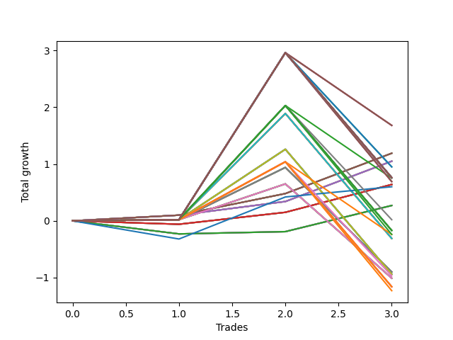

# Long Pointer Ten (1226 REV) 
- Symbol: AAPL_Unlimited
- Date Range: 03/23/2022 - 07/08/2022
- Trading Period: 7:20-12:30
- Number of Trades: 3



| Name | Win Percent | Profit | Avg Profit / Trade | Avg Time / Trade |      | Name | Win Percent | Profit | Avg Profit / Trade | Avg Time / Trade |
| ---- | ----------- | ------ | ------------------ | ---------------- | ---- | ---- | ----------- | ------ | ------------------ | ---------------- |
| Sorted By <br> Profit | | | | | | Sorted By <br> Win Percentage ||||
| One Hundred | 66.67 | 840.00 | 280.00 | 87:28 |     | Sixty-Seven | 100.00 | 595.00 | 198.33 | 14:41 |
| Ninety-Nine | 66.67 | 840.00 | 280.00 | 87:28 |     | Fifty-Nine | 100.00 | 595.00 | 198.33 | 14:41 |
| Ninety-Eight | 66.67 | 840.00 | 280.00 | 87:28 |     | Fifty-One | 100.00 | 595.00 | 198.33 | 14:41 |
| Sixty-Seven | 100.00 | 595.00 | 198.33 | 14:41 |     | Forty-Three | 100.00 | 595.00 | 198.33 | 14:41 |
| Fifty-Nine | 100.00 | 595.00 | 198.33 | 14:41 |     | Three | 100.00 | 595.00 | 198.33 | 14:41 |
| Fifty-One | 100.00 | 595.00 | 198.33 | 14:41 |     | Sixty-Six | 100.00 | 525.00 | 175.00 | 14:33 |
| Forty-Three | 100.00 | 595.00 | 198.33 | 14:41 |     | Fifty-Eight | 100.00 | 525.00 | 175.00 | 14:33 |
| Three | 100.00 | 595.00 | 198.33 | 14:41 |     | Fifty | 100.00 | 525.00 | 175.00 | 14:33 |
| Sixty-Six | 100.00 | 525.00 | 175.00 | 14:33 |     | Forty-Two | 100.00 | 525.00 | 175.00 | 14:33 |
| Fifty-Eight | 100.00 | 525.00 | 175.00 | 14:33 |     | Two | 100.00 | 525.00 | 175.00 | 14:33 |
| Fifty | 100.00 | 525.00 | 175.00 | 14:33 |     | One Hundred | 66.67 | 840.00 | 280.00 | 87:28 |
| Forty-Two | 100.00 | 525.00 | 175.00 | 14:33 |     | Ninety-Nine | 66.67 | 840.00 | 280.00 | 87:28 |
| Two | 100.00 | 525.00 | 175.00 | 14:33 |     | Ninety-Eight | 66.67 | 840.00 | 280.00 | 87:28 |
| Ninety-Five | 66.67 | 475.00 | 158.33 | 98:45 |     | Ninety-Five | 66.67 | 475.00 | 158.33 | 98:45 |
| Ninety-Four | 66.67 | 475.00 | 158.33 | 98:45 |     | Ninety-Four | 66.67 | 475.00 | 158.33 | 98:45 |
| Ninety-Three | 66.67 | 475.00 | 158.33 | 98:45 |     | Ninety-Three | 66.67 | 475.00 | 158.33 | 98:45 |
| One Hundred Thirty | 66.67 | 380.00 | 126.67 | 118:00 |     | One Hundred Thirty | 66.67 | 380.00 | 126.67 | 118:00 |
| One Hundred Twenty-Nine | 66.67 | 380.00 | 126.67 | 118:00 |     | One Hundred Twenty-Nine | 66.67 | 380.00 | 126.67 | 118:00 |
| One Hundred Twenty-Eight | 66.67 | 380.00 | 126.67 | 118:00 |     | One Hundred Twenty-Eight | 66.67 | 380.00 | 126.67 | 118:00 |
| One Hundred Twenty-Five | 66.67 | 380.00 | 126.67 | 118:00 |     | One Hundred Twenty-Five | 66.67 | 380.00 | 126.67 | 118:00 |
| One Hundred Twenty-Four | 66.67 | 380.00 | 126.67 | 118:00 |     | One Hundred Twenty-Four | 66.67 | 380.00 | 126.67 | 118:00 |
| One Hundred Twenty-Three | 66.67 | 380.00 | 126.67 | 118:00 |     | One Hundred Twenty-Three | 66.67 | 380.00 | 126.67 | 118:00 |
| One Hundred Twenty | 66.67 | 380.00 | 126.67 | 118:00 |     | One Hundred Twenty | 66.67 | 380.00 | 126.67 | 118:00 |
| One Hundred Ninteen | 66.67 | 380.00 | 126.67 | 118:00 |     | One Hundred Ninteen | 66.67 | 380.00 | 126.67 | 118:00 |
| One Hundred Eighteen | 66.67 | 380.00 | 126.67 | 118:00 |     | One Hundred Eighteen | 66.67 | 380.00 | 126.67 | 118:00 |
| One Hundred Fifteen | 66.67 | 380.00 | 126.67 | 118:00 |     | One Hundred Fifteen | 66.67 | 380.00 | 126.67 | 118:00 |
| One Hundred Fourteen | 66.67 | 380.00 | 126.67 | 118:00 |     | One Hundred Fourteen | 66.67 | 380.00 | 126.67 | 118:00 |
| One Hundred Thirteen | 66.67 | 380.00 | 126.67 | 118:00 |     | One Hundred Thirteen | 66.67 | 380.00 | 126.67 | 118:00 |
| One Hundred Five | 66.67 | 380.00 | 126.67 | 118:00 |     | One Hundred Five | 66.67 | 380.00 | 126.67 | 118:00 |
| One Hundred Four | 66.67 | 380.00 | 126.67 | 118:00 |     | One Hundred Four | 66.67 | 380.00 | 126.67 | 118:00 |
| One Hundred Three | 66.67 | 380.00 | 126.67 | 118:00 |     | One Hundred Three | 66.67 | 380.00 | 126.67 | 118:00 |
| Eighty-Five | 66.67 | 380.00 | 126.67 | 118:00 |     | Eighty-Five | 66.67 | 380.00 | 126.67 | 118:00 |
| Eighty-Four | 66.67 | 380.00 | 126.67 | 118:00 |     | Eighty-Four | 66.67 | 380.00 | 126.67 | 118:00 |
| Eighty-Three | 66.67 | 380.00 | 126.67 | 118:00 |     | Eighty-Three | 66.67 | 380.00 | 126.67 | 118:00 |
| Ninety-Seven | 66.67 | 375.00 | 125.00 | 68:15 |     | Ninety-Seven | 66.67 | 375.00 | 125.00 | 68:15 |
| One Hundred Ten | 66.67 | 345.00 | 115.00 | 100:48 |     | One Hundred Ten | 66.67 | 345.00 | 115.00 | 100:48 |
| One Hundred Nine | 66.67 | 345.00 | 115.00 | 100:48 |     | One Hundred Nine | 66.67 | 345.00 | 115.00 | 100:48 |
| One Hundred Eight | 66.67 | 345.00 | 115.00 | 100:48 |     | One Hundred Eight | 66.67 | 345.00 | 115.00 | 100:48 |
| Sixty-Five | 66.67 | 320.00 | 106.67 | 11:53 |     | Sixty-Five | 66.67 | 320.00 | 106.67 | 11:53 |
| Fifty-Seven | 66.67 | 320.00 | 106.67 | 11:53 |     | Fifty-Seven | 66.67 | 320.00 | 106.67 | 11:53 |
| Forty-Nine | 66.67 | 320.00 | 106.67 | 11:53 |     | Forty-Nine | 66.67 | 320.00 | 106.67 | 11:53 |
| Forty-One | 66.67 | 320.00 | 106.67 | 11:53 |     | Forty-One | 66.67 | 320.00 | 106.67 | 11:53 |
| One | 66.67 | 320.00 | 106.67 | 11:53 |     | One | 66.67 | 320.00 | 106.67 | 11:53 |
| Seventy-Three | 66.67 | 300.00 | 100.00 | 20:05 |     | Seventy-Three | 66.67 | 300.00 | 100.00 | 20:05 |
| Sixty-Four | 66.67 | 135.00 | 45.00 | 07:21 |     | Sixty-Four | 66.67 | 135.00 | 45.00 | 07:21 |
| Fifty-Six | 66.67 | 135.00 | 45.00 | 07:21 |     | Fifty-Six | 66.67 | 135.00 | 45.00 | 07:21 |
| Forty-Eight | 66.67 | 135.00 | 45.00 | 07:21 |     | Forty-Eight | 66.67 | 135.00 | 45.00 | 07:21 |
| Forty | 66.67 | 135.00 | 45.00 | 07:21 |     | Forty | 66.67 | 135.00 | 45.00 | 07:21 |
| Zero | 66.67 | 135.00 | 45.00 | 07:21 |     | Zero | 66.67 | 135.00 | 45.00 | 07:21 |
| Ninety-Two | 66.67 | 10.00 | 3.33 | 79:31 |     | Ninety-Two | 66.67 | 10.00 | 3.33 | 79:31 |
| One Hundred Twenty-Seven | 66.67 | -85.00 | -28.33 | 98:46 |     | One Hundred Twenty-Seven | 66.67 | -85.00 | -28.33 | 98:46 |
| One Hundred Twenty-Two | 66.67 | -85.00 | -28.33 | 98:46 |     | One Hundred Twenty-Two | 66.67 | -85.00 | -28.33 | 98:46 |
| One Hundred Seventeen | 66.67 | -85.00 | -28.33 | 98:46 |     | One Hundred Seventeen | 66.67 | -85.00 | -28.33 | 98:46 |
| One Hundred Twelve | 66.67 | -85.00 | -28.33 | 98:46 |     | One Hundred Twelve | 66.67 | -85.00 | -28.33 | 98:46 |
| One Hundred Two | 66.67 | -85.00 | -28.33 | 98:46 |     | One Hundred Two | 66.67 | -85.00 | -28.33 | 98:46 |
| Eighty-Two | 66.67 | -85.00 | -28.33 | 98:46 |     | Eighty-Two | 66.67 | -85.00 | -28.33 | 98:46 |
| One Hundred Seven | 66.67 | -120.00 | -40.00 | 81:35 |     | One Hundred Seven | 66.67 | -120.00 | -40.00 | 81:35 |
| Ninety-Six | 66.67 | -120.00 | -40.00 | 38:38 |     | Ninety-Six | 66.67 | -120.00 | -40.00 | 38:38 |
| Seventy-One | 66.67 | -155.00 | -51.67 | 91:05 |     | Seventy-One | 66.67 | -155.00 | -51.67 | 91:05 |
| Sixty-Three | 66.67 | -155.00 | -51.67 | 91:05 |     | Sixty-Three | 66.67 | -155.00 | -51.67 | 91:05 |
| Fifty-Five | 66.67 | -155.00 | -51.67 | 91:05 |     | Fifty-Five | 66.67 | -155.00 | -51.67 | 91:05 |
| Forty-Seven | 66.67 | -155.00 | -51.67 | 91:05 |     | Forty-Seven | 66.67 | -155.00 | -51.67 | 91:05 |
| Seven | 66.67 | -155.00 | -51.67 | 91:05 |     | Seven | 66.67 | -155.00 | -51.67 | 91:05 |
| Sixty-Nine | 66.67 | -450.00 | -150.00 | 65:40 |     | Sixty-Nine | 66.67 | -450.00 | -150.00 | 65:40 |
| Sixty-One | 66.67 | -450.00 | -150.00 | 65:40 |     | Sixty-One | 66.67 | -450.00 | -150.00 | 65:40 |
| Fifty-Three | 66.67 | -450.00 | -150.00 | 65:40 |     | Fifty-Three | 66.67 | -450.00 | -150.00 | 65:40 |
| Forty-Five | 66.67 | -450.00 | -150.00 | 65:40 |     | Forty-Five | 66.67 | -450.00 | -150.00 | 65:40 |
| Five | 66.67 | -450.00 | -150.00 | 65:40 |     | Five | 66.67 | -450.00 | -150.00 | 65:40 |
| Seventy | 66.67 | -470.00 | -156.67 | 81:01 |     | Seventy | 66.67 | -470.00 | -156.67 | 81:01 |
| Sixty-Two | 66.67 | -470.00 | -156.67 | 81:01 |     | Sixty-Two | 66.67 | -470.00 | -156.67 | 81:01 |
| Fifty-Four | 66.67 | -470.00 | -156.67 | 81:01 |     | Fifty-Four | 66.67 | -470.00 | -156.67 | 81:01 |
| Forty-Six | 66.67 | -470.00 | -156.67 | 81:01 |     | Forty-Six | 66.67 | -470.00 | -156.67 | 81:01 |
| Six | 66.67 | -470.00 | -156.67 | 81:01 |     | Six | 66.67 | -470.00 | -156.67 | 81:01 |
| Ninety-One | 66.67 | -485.00 | -161.67 | 49:55 |     | Ninety-One | 66.67 | -485.00 | -161.67 | 49:55 |
| Sixty-Eight | 66.67 | -505.00 | -168.33 | 60:31 |     | Sixty-Eight | 66.67 | -505.00 | -168.33 | 60:31 |
| Sixty | 66.67 | -505.00 | -168.33 | 60:31 |     | Sixty | 66.67 | -505.00 | -168.33 | 60:31 |
| Fifty-Two | 66.67 | -505.00 | -168.33 | 60:31 |     | Fifty-Two | 66.67 | -505.00 | -168.33 | 60:31 |
| Forty-Four | 66.67 | -505.00 | -168.33 | 60:31 |     | Forty-Four | 66.67 | -505.00 | -168.33 | 60:31 |
| Four | 66.67 | -505.00 | -168.33 | 60:31 |     | Four | 66.67 | -505.00 | -168.33 | 60:31 |
| One Hundred Twenty-Six | 66.67 | -580.00 | -193.33 | 69:10 |     | One Hundred Twenty-Six | 66.67 | -580.00 | -193.33 | 69:10 |
| One Hundred Twenty-One | 66.67 | -580.00 | -193.33 | 69:10 |     | One Hundred Twenty-One | 66.67 | -580.00 | -193.33 | 69:10 |
| One Hundred Sixteen | 66.67 | -580.00 | -193.33 | 69:10 |     | One Hundred Sixteen | 66.67 | -580.00 | -193.33 | 69:10 |
| One Hundred Eleven | 66.67 | -580.00 | -193.33 | 69:10 |     | One Hundred Eleven | 66.67 | -580.00 | -193.33 | 69:10 |
| One Hundred One | 66.67 | -580.00 | -193.33 | 69:10 |     | One Hundred One | 66.67 | -580.00 | -193.33 | 69:10 |
| Eighty-One | 66.67 | -580.00 | -193.33 | 69:10 |     | Eighty-One | 66.67 | -580.00 | -193.33 | 69:10 |
| One Hundred Six | 66.67 | -615.00 | -205.00 | 51:58 |     | One Hundred Six | 66.67 | -615.00 | -205.00 | 51:58 |

## NO STOPLOSS

### Test Zero
* Sell when price hits the middle line of the 20p bollinger
* No Stoploss
* Results:
```
Total Trades: 3
Percent Up: 66.67
Percent Down: 33.33
Total Points Moved Up: 0.27
Potential Profit: 135.00
Total Points Ups: 0.50 Count Ups: 2
Total Points Downs: -0.23 Count Downs: 1
```

<details><summary>Trades</summary>

<code>In: 2022-03-30 12:14:00		Out: 2022-03-30 12:28:10		Total Position Time: 14:10		Total Move Up: -0.23		Total to Date: -0.23</code> <br />
<code>In: 2022-04-07 09:52:00		Out: 2022-04-07 09:58:45		Total Position Time: 06:45		Total Move Up: 0.04		Total to Date: -0.19</code> <br />
<code>In: 2022-04-21 10:21:00		Out: 2022-04-21 10:22:10		Total Position Time: 01:10		Total Move Up: 0.46		Total to Date: 0.27</code> <br />


</details>

### Test One
* Sell when the price hits the upper line of the 20p 1std bollinger
* No Stoploss
* Results:
```
Total Trades: 3
Percent Up: 66.67
Percent Down: 33.33
Total Points Moved Up: 0.64
Potential Profit: 320.00
Total Points Ups: 0.70 Count Ups: 2
Total Points Downs: -0.06 Count Downs: 1
```

<details><summary>Trades</summary>

<code>In: 2022-03-30 12:14:00		Out: 2022-03-30 12:31:35		Total Position Time: 17:35		Total Move Up: -0.06		Total to Date: -0.06</code> <br />
<code>In: 2022-04-07 09:52:00		Out: 2022-04-07 10:02:15		Total Position Time: 10:15		Total Move Up: 0.21		Total to Date: 0.15</code> <br />
<code>In: 2022-04-21 10:21:00		Out: 2022-04-21 10:28:50		Total Position Time: 07:50		Total Move Up: 0.49		Total to Date: 0.64</code> <br />


</details>

### Test Two
* Sell when the price hits the upper line of the 20p 2std bollinger
* No Stoploss
* Results:
```
Total Trades: 3
Percent Up: 100.00
Percent Down: 0.00
Total Points Moved Up: 1.05
Potential Profit: 525.00
Total Points Ups: 1.05 Count Ups: 3
Total Points Downs: 0.00 Count Downs: 0
```

<details><summary>Trades</summary>

<code>In: 2022-03-30 12:14:00		Out: 2022-03-30 12:36:15		Total Position Time: 22:15		Total Move Up: 0.10		Total to Date: 0.10</code> <br />
<code>In: 2022-04-07 09:52:00		Out: 2022-04-07 10:03:05		Total Position Time: 11:05		Total Move Up: 0.24		Total to Date: 0.34</code> <br />
<code>In: 2022-04-21 10:21:00		Out: 2022-04-21 10:31:20		Total Position Time: 10:20		Total Move Up: 0.71		Total to Date: 1.05</code> <br />


</details>

### Test Three
* Sell when price hits the middle line of the 50p bollinger
* No Stoploss
* Results:
```
Total Trades: 3
Percent Up: 100.00
Percent Down: 0.00
Total Points Moved Up: 1.19
Potential Profit: 595.00
Total Points Ups: 1.19 Count Ups: 3
Total Points Downs: 0.00 Count Downs: 0
```

<details><summary>Trades</summary>

<code>In: 2022-03-30 12:14:00		Out: 2022-03-30 12:36:15		Total Position Time: 22:15		Total Move Up: 0.10		Total to Date: 0.10</code> <br />
<code>In: 2022-04-07 09:52:00		Out: 2022-04-07 10:03:10		Total Position Time: 11:10		Total Move Up: 0.38		Total to Date: 0.48</code> <br />
<code>In: 2022-04-21 10:21:00		Out: 2022-04-21 10:31:40		Total Position Time: 10:40		Total Move Up: 0.71		Total to Date: 1.19</code> <br />


</details>

### Test Four
* Sell when the price hits the upper line of the 50p 1std bollinger
* No Stoploss
* Results:
```
Total Trades: 3
Percent Up: 66.67
Percent Down: 33.33
Total Points Moved Up: -1.01
Potential Profit: -505.00
Total Points Ups: 0.65 Count Ups: 2
Total Points Downs: -1.66 Count Downs: 1
```

<details><summary>Trades</summary>

<code>In: 2022-03-30 12:14:00		Out: 2022-03-30 12:47:00		Total Position Time: 33:00		Total Move Up: 0.02		Total to Date: 0.02</code> <br />
<code>In: 2022-04-07 09:52:00		Out: 2022-04-07 10:11:40		Total Position Time: 19:40		Total Move Up: 0.63		Total to Date: 0.65</code> <br />
<code>In: 2022-04-21 10:21:00		Out: 2022-04-21 12:29:55		Total Position Time: 128:55		Total Move Up: -1.66		Total to Date: -1.01</code> <br />


</details>

### Test Five
* Sell when the price hits the upper line of the 50p 2std bollinger
* No Stoploss
* Results:
```
Total Trades: 3
Percent Up: 66.67
Percent Down: 33.33
Total Points Moved Up: -0.90
Potential Profit: -450.00
Total Points Ups: 0.94 Count Ups: 2
Total Points Downs: -1.84 Count Downs: 1
```

<details><summary>Trades</summary>

<code>In: 2022-03-30 12:14:00		Out: 2022-03-30 12:47:00		Total Position Time: 33:00		Total Move Up: 0.02		Total to Date: 0.02</code> <br />
<code>In: 2022-04-07 09:52:00		Out: 2022-04-07 10:12:40		Total Position Time: 20:40		Total Move Up: 0.92		Total to Date: 0.94</code> <br />
<code>In: 2022-04-21 10:21:00		Out: 2022-04-21 12:44:20		Total Position Time: 143:20		Total Move Up: -1.84		Total to Date: -0.90</code> <br />


</details>

### Test Six
* Sell when the price hits the middle line of the 1std VWAP
* No Stoploss
* Results:
```
Total Trades: 3
Percent Up: 66.67
Percent Down: 33.33
Total Points Moved Up: -0.94
Potential Profit: -470.00
Total Points Ups: 1.26 Count Ups: 2
Total Points Downs: -2.20 Count Downs: 1
```

<details><summary>Trades</summary>

<code>In: 2022-03-30 12:14:00		Out: 2022-03-30 12:47:00		Total Position Time: 33:00		Total Move Up: 0.02		Total to Date: 0.02</code> <br />
<code>In: 2022-04-07 09:52:00		Out: 2022-04-07 10:56:05		Total Position Time: 64:05		Total Move Up: 1.24		Total to Date: 1.26</code> <br />
<code>In: 2022-04-21 10:21:00		Out: 2022-04-21 12:47:00		Total Position Time: 146:00		Total Move Up: -2.20		Total to Date: -0.94</code> <br />


</details>

### Test Seven
* Sell when the price hits the upper line of the 1std VWAP
* No Stoploss
* Results:
```
Total Trades: 3
Percent Up: 66.67
Percent Down: 33.33
Total Points Moved Up: -0.31
Potential Profit: -155.00
Total Points Ups: 1.89 Count Ups: 2
Total Points Downs: -2.20 Count Downs: 1
```

<details><summary>Trades</summary>

<code>In: 2022-03-30 12:14:00		Out: 2022-03-30 12:47:00		Total Position Time: 33:00		Total Move Up: 0.02		Total to Date: 0.02</code> <br />
<code>In: 2022-04-07 09:52:00		Out: 2022-04-07 11:26:15		Total Position Time: 94:15		Total Move Up: 1.87		Total to Date: 1.89</code> <br />
<code>In: 2022-04-21 10:21:00		Out: 2022-04-21 12:47:00		Total Position Time: 146:00		Total Move Up: -2.20		Total to Date: -0.31</code> <br />


</details>

## STOPLOSS OF 5

### Test Forty
* Sell when price hits the middle line of the 20p bollinger
* Stoploss is 5 points
* Results:
```
Total Trades: 3
Percent Up: 66.67
Percent Down: 33.33
Total Points Moved Up: 0.27
Potential Profit: 135.00
Total Points Ups: 0.50 Count Ups: 2
Total Points Downs: -0.23 Count Downs: 1
```

<details><summary>Trades</summary>

<code>In: 2022-03-30 12:14:00		Out: 2022-03-30 12:28:10		Total Position Time: 14:10		Total Move Up: -0.23		Total to Date: -0.23</code> <br />
<code>In: 2022-04-07 09:52:00		Out: 2022-04-07 09:58:45		Total Position Time: 06:45		Total Move Up: 0.04		Total to Date: -0.19</code> <br />
<code>In: 2022-04-21 10:21:00		Out: 2022-04-21 10:22:10		Total Position Time: 01:10		Total Move Up: 0.46		Total to Date: 0.27</code> <br />


</details>

### Test Forty-One
* Sell when the price hits the upper line of the 20p 1std bollinger
* Stoploss is 5 points
* Results:
```
Total Trades: 3
Percent Up: 66.67
Percent Down: 33.33
Total Points Moved Up: 0.64
Potential Profit: 320.00
Total Points Ups: 0.70 Count Ups: 2
Total Points Downs: -0.06 Count Downs: 1
```

<details><summary>Trades</summary>

<code>In: 2022-03-30 12:14:00		Out: 2022-03-30 12:31:35		Total Position Time: 17:35		Total Move Up: -0.06		Total to Date: -0.06</code> <br />
<code>In: 2022-04-07 09:52:00		Out: 2022-04-07 10:02:15		Total Position Time: 10:15		Total Move Up: 0.21		Total to Date: 0.15</code> <br />
<code>In: 2022-04-21 10:21:00		Out: 2022-04-21 10:28:50		Total Position Time: 07:50		Total Move Up: 0.49		Total to Date: 0.64</code> <br />


</details>

### Test Forty-Two
* Sell when the price hits the upper line of the 20p 2std bollinger
* Stoploss is 5 points
* Results:
```
Total Trades: 3
Percent Up: 100.00
Percent Down: 0.00
Total Points Moved Up: 1.05
Potential Profit: 525.00
Total Points Ups: 1.05 Count Ups: 3
Total Points Downs: 0.00 Count Downs: 0
```

<details><summary>Trades</summary>

<code>In: 2022-03-30 12:14:00		Out: 2022-03-30 12:36:15		Total Position Time: 22:15		Total Move Up: 0.10		Total to Date: 0.10</code> <br />
<code>In: 2022-04-07 09:52:00		Out: 2022-04-07 10:03:05		Total Position Time: 11:05		Total Move Up: 0.24		Total to Date: 0.34</code> <br />
<code>In: 2022-04-21 10:21:00		Out: 2022-04-21 10:31:20		Total Position Time: 10:20		Total Move Up: 0.71		Total to Date: 1.05</code> <br />


</details>

### Test Forty-Three
* Sell when price hits the middle line of the 50p bollinger
* Stoploss is 5 points
* Results:
```
Total Trades: 3
Percent Up: 100.00
Percent Down: 0.00
Total Points Moved Up: 1.19
Potential Profit: 595.00
Total Points Ups: 1.19 Count Ups: 3
Total Points Downs: 0.00 Count Downs: 0
```

<details><summary>Trades</summary>

<code>In: 2022-03-30 12:14:00		Out: 2022-03-30 12:36:15		Total Position Time: 22:15		Total Move Up: 0.10		Total to Date: 0.10</code> <br />
<code>In: 2022-04-07 09:52:00		Out: 2022-04-07 10:03:10		Total Position Time: 11:10		Total Move Up: 0.38		Total to Date: 0.48</code> <br />
<code>In: 2022-04-21 10:21:00		Out: 2022-04-21 10:31:40		Total Position Time: 10:40		Total Move Up: 0.71		Total to Date: 1.19</code> <br />


</details>

### Test Forty-Four
* Sell when the price hits the upper line of the 50p 1std bollinger
* Stoploss is 5 points
* Results:
```
Total Trades: 3
Percent Up: 66.67
Percent Down: 33.33
Total Points Moved Up: -1.01
Potential Profit: -505.00
Total Points Ups: 0.65 Count Ups: 2
Total Points Downs: -1.66 Count Downs: 1
```

<details><summary>Trades</summary>

<code>In: 2022-03-30 12:14:00		Out: 2022-03-30 12:47:00		Total Position Time: 33:00		Total Move Up: 0.02		Total to Date: 0.02</code> <br />
<code>In: 2022-04-07 09:52:00		Out: 2022-04-07 10:11:40		Total Position Time: 19:40		Total Move Up: 0.63		Total to Date: 0.65</code> <br />
<code>In: 2022-04-21 10:21:00		Out: 2022-04-21 12:29:55		Total Position Time: 128:55		Total Move Up: -1.66		Total to Date: -1.01</code> <br />


</details>

### Test Forty-Five
* Sell when the price hits the upper line of the 50p 2std bollinger
* Stoploss is 5 points
* Results:
```
Total Trades: 3
Percent Up: 66.67
Percent Down: 33.33
Total Points Moved Up: -0.90
Potential Profit: -450.00
Total Points Ups: 0.94 Count Ups: 2
Total Points Downs: -1.84 Count Downs: 1
```

<details><summary>Trades</summary>

<code>In: 2022-03-30 12:14:00		Out: 2022-03-30 12:47:00		Total Position Time: 33:00		Total Move Up: 0.02		Total to Date: 0.02</code> <br />
<code>In: 2022-04-07 09:52:00		Out: 2022-04-07 10:12:40		Total Position Time: 20:40		Total Move Up: 0.92		Total to Date: 0.94</code> <br />
<code>In: 2022-04-21 10:21:00		Out: 2022-04-21 12:44:20		Total Position Time: 143:20		Total Move Up: -1.84		Total to Date: -0.90</code> <br />


</details>

### Test Forty-Six
* Sell when the price hits the middle line of the 1std VWAP
* Stoploss is 5 points
* Results:
```
Total Trades: 3
Percent Up: 66.67
Percent Down: 33.33
Total Points Moved Up: -0.94
Potential Profit: -470.00
Total Points Ups: 1.26 Count Ups: 2
Total Points Downs: -2.20 Count Downs: 1
```

<details><summary>Trades</summary>

<code>In: 2022-03-30 12:14:00		Out: 2022-03-30 12:47:00		Total Position Time: 33:00		Total Move Up: 0.02		Total to Date: 0.02</code> <br />
<code>In: 2022-04-07 09:52:00		Out: 2022-04-07 10:56:05		Total Position Time: 64:05		Total Move Up: 1.24		Total to Date: 1.26</code> <br />
<code>In: 2022-04-21 10:21:00		Out: 2022-04-21 12:47:00		Total Position Time: 146:00		Total Move Up: -2.20		Total to Date: -0.94</code> <br />


</details>

### Test Forty-Seven
* Sell when the price hits the upper line of the 1std VWAP
* Stoploss is 5 points
* Results:
```
Total Trades: 3
Percent Up: 66.67
Percent Down: 33.33
Total Points Moved Up: -0.31
Potential Profit: -155.00
Total Points Ups: 1.89 Count Ups: 2
Total Points Downs: -2.20 Count Downs: 1
```

<details><summary>Trades</summary>

<code>In: 2022-03-30 12:14:00		Out: 2022-03-30 12:47:00		Total Position Time: 33:00		Total Move Up: 0.02		Total to Date: 0.02</code> <br />
<code>In: 2022-04-07 09:52:00		Out: 2022-04-07 11:26:15		Total Position Time: 94:15		Total Move Up: 1.87		Total to Date: 1.89</code> <br />
<code>In: 2022-04-21 10:21:00		Out: 2022-04-21 12:47:00		Total Position Time: 146:00		Total Move Up: -2.20		Total to Date: -0.31</code> <br />


</details>

## TRAIL STOP OF 5

### Test Forty-Eight
* Sell when price hits the middle line of the 20p bollinger
* Trailing Stop is 5 points
* Results:
```
Total Trades: 3
Percent Up: 66.67
Percent Down: 33.33
Total Points Moved Up: 0.27
Potential Profit: 135.00
Total Points Ups: 0.50 Count Ups: 2
Total Points Downs: -0.23 Count Downs: 1
```

<details><summary>Trades</summary>

<code>In: 2022-03-30 12:14:00		Out: 2022-03-30 12:28:10		Total Position Time: 14:10		Total Move Up: -0.23		Total to Date: -0.23</code> <br />
<code>In: 2022-04-07 09:52:00		Out: 2022-04-07 09:58:45		Total Position Time: 06:45		Total Move Up: 0.04		Total to Date: -0.19</code> <br />
<code>In: 2022-04-21 10:21:00		Out: 2022-04-21 10:22:10		Total Position Time: 01:10		Total Move Up: 0.46		Total to Date: 0.27</code> <br />


</details>

### Test Forty-Nine
* Sell when the price hits the upper line of the 20p 1std bollinger
* Trailing Stop is 5 points
* Results:
```
Total Trades: 3
Percent Up: 66.67
Percent Down: 33.33
Total Points Moved Up: 0.64
Potential Profit: 320.00
Total Points Ups: 0.70 Count Ups: 2
Total Points Downs: -0.06 Count Downs: 1
```

<details><summary>Trades</summary>

<code>In: 2022-03-30 12:14:00		Out: 2022-03-30 12:31:35		Total Position Time: 17:35		Total Move Up: -0.06		Total to Date: -0.06</code> <br />
<code>In: 2022-04-07 09:52:00		Out: 2022-04-07 10:02:15		Total Position Time: 10:15		Total Move Up: 0.21		Total to Date: 0.15</code> <br />
<code>In: 2022-04-21 10:21:00		Out: 2022-04-21 10:28:50		Total Position Time: 07:50		Total Move Up: 0.49		Total to Date: 0.64</code> <br />


</details>

### Test Fifty
* Sell when the price hits the upper line of the 20p 2std bollinger
* Trailing Stop is 5 points
* Results:
```
Total Trades: 3
Percent Up: 100.00
Percent Down: 0.00
Total Points Moved Up: 1.05
Potential Profit: 525.00
Total Points Ups: 1.05 Count Ups: 3
Total Points Downs: 0.00 Count Downs: 0
```

<details><summary>Trades</summary>

<code>In: 2022-03-30 12:14:00		Out: 2022-03-30 12:36:15		Total Position Time: 22:15		Total Move Up: 0.10		Total to Date: 0.10</code> <br />
<code>In: 2022-04-07 09:52:00		Out: 2022-04-07 10:03:05		Total Position Time: 11:05		Total Move Up: 0.24		Total to Date: 0.34</code> <br />
<code>In: 2022-04-21 10:21:00		Out: 2022-04-21 10:31:20		Total Position Time: 10:20		Total Move Up: 0.71		Total to Date: 1.05</code> <br />


</details>

### Test Fifty-One
* Sell when price hits the middle line of the 50p bollinger
* Trailing Stop is 5 points
* Results:
```
Total Trades: 3
Percent Up: 100.00
Percent Down: 0.00
Total Points Moved Up: 1.19
Potential Profit: 595.00
Total Points Ups: 1.19 Count Ups: 3
Total Points Downs: 0.00 Count Downs: 0
```

<details><summary>Trades</summary>

<code>In: 2022-03-30 12:14:00		Out: 2022-03-30 12:36:15		Total Position Time: 22:15		Total Move Up: 0.10		Total to Date: 0.10</code> <br />
<code>In: 2022-04-07 09:52:00		Out: 2022-04-07 10:03:10		Total Position Time: 11:10		Total Move Up: 0.38		Total to Date: 0.48</code> <br />
<code>In: 2022-04-21 10:21:00		Out: 2022-04-21 10:31:40		Total Position Time: 10:40		Total Move Up: 0.71		Total to Date: 1.19</code> <br />


</details>

### Test Fifty-Two
* Sell when the price hits the upper line of the 50p 1std bollinger
* Trailing Stop is 5 points
* Results:
```
Total Trades: 3
Percent Up: 66.67
Percent Down: 33.33
Total Points Moved Up: -1.01
Potential Profit: -505.00
Total Points Ups: 0.65 Count Ups: 2
Total Points Downs: -1.66 Count Downs: 1
```

<details><summary>Trades</summary>

<code>In: 2022-03-30 12:14:00		Out: 2022-03-30 12:47:00		Total Position Time: 33:00		Total Move Up: 0.02		Total to Date: 0.02</code> <br />
<code>In: 2022-04-07 09:52:00		Out: 2022-04-07 10:11:40		Total Position Time: 19:40		Total Move Up: 0.63		Total to Date: 0.65</code> <br />
<code>In: 2022-04-21 10:21:00		Out: 2022-04-21 12:29:55		Total Position Time: 128:55		Total Move Up: -1.66		Total to Date: -1.01</code> <br />


</details>

### Test Fifty-Three
* Sell when the price hits the upper line of the 50p 2std bollinger
* Trailing Stop is 5 points
* Results:
```
Total Trades: 3
Percent Up: 66.67
Percent Down: 33.33
Total Points Moved Up: -0.90
Potential Profit: -450.00
Total Points Ups: 0.94 Count Ups: 2
Total Points Downs: -1.84 Count Downs: 1
```

<details><summary>Trades</summary>

<code>In: 2022-03-30 12:14:00		Out: 2022-03-30 12:47:00		Total Position Time: 33:00		Total Move Up: 0.02		Total to Date: 0.02</code> <br />
<code>In: 2022-04-07 09:52:00		Out: 2022-04-07 10:12:40		Total Position Time: 20:40		Total Move Up: 0.92		Total to Date: 0.94</code> <br />
<code>In: 2022-04-21 10:21:00		Out: 2022-04-21 12:44:20		Total Position Time: 143:20		Total Move Up: -1.84		Total to Date: -0.90</code> <br />


</details>

### Test Fifty-Four
* Sell when the price hits the middle line of the 1std VWAP
* Trailing Stop is 5 points
* Results:
```
Total Trades: 3
Percent Up: 66.67
Percent Down: 33.33
Total Points Moved Up: -0.94
Potential Profit: -470.00
Total Points Ups: 1.26 Count Ups: 2
Total Points Downs: -2.20 Count Downs: 1
```

<details><summary>Trades</summary>

<code>In: 2022-03-30 12:14:00		Out: 2022-03-30 12:47:00		Total Position Time: 33:00		Total Move Up: 0.02		Total to Date: 0.02</code> <br />
<code>In: 2022-04-07 09:52:00		Out: 2022-04-07 10:56:05		Total Position Time: 64:05		Total Move Up: 1.24		Total to Date: 1.26</code> <br />
<code>In: 2022-04-21 10:21:00		Out: 2022-04-21 12:47:00		Total Position Time: 146:00		Total Move Up: -2.20		Total to Date: -0.94</code> <br />


</details>

### Test Fifty-Five
* Sell when the price hits the upper line of the 1std VWAP
* Trailing Stop is 5 points
* Results:
```
Total Trades: 3
Percent Up: 66.67
Percent Down: 33.33
Total Points Moved Up: -0.31
Potential Profit: -155.00
Total Points Ups: 1.89 Count Ups: 2
Total Points Downs: -2.20 Count Downs: 1
```

<details><summary>Trades</summary>

<code>In: 2022-03-30 12:14:00		Out: 2022-03-30 12:47:00		Total Position Time: 33:00		Total Move Up: 0.02		Total to Date: 0.02</code> <br />
<code>In: 2022-04-07 09:52:00		Out: 2022-04-07 11:26:15		Total Position Time: 94:15		Total Move Up: 1.87		Total to Date: 1.89</code> <br />
<code>In: 2022-04-21 10:21:00		Out: 2022-04-21 12:47:00		Total Position Time: 146:00		Total Move Up: -2.20		Total to Date: -0.31</code> <br />


</details>

## STOPLOSS OF 10

### Test Fifty-Six
* Sell when price hits the middle line of the 20p bollinger
* Stoploss is 10 points
* Results:
```
Total Trades: 3
Percent Up: 66.67
Percent Down: 33.33
Total Points Moved Up: 0.27
Potential Profit: 135.00
Total Points Ups: 0.50 Count Ups: 2
Total Points Downs: -0.23 Count Downs: 1
```

<details><summary>Trades</summary>

<code>In: 2022-03-30 12:14:00		Out: 2022-03-30 12:28:10		Total Position Time: 14:10		Total Move Up: -0.23		Total to Date: -0.23</code> <br />
<code>In: 2022-04-07 09:52:00		Out: 2022-04-07 09:58:45		Total Position Time: 06:45		Total Move Up: 0.04		Total to Date: -0.19</code> <br />
<code>In: 2022-04-21 10:21:00		Out: 2022-04-21 10:22:10		Total Position Time: 01:10		Total Move Up: 0.46		Total to Date: 0.27</code> <br />


</details>

### Test Fifty-Seven
* Sell when the price hits the upper line of the 20p 1std bollinger
* Stoploss is 10 points
* Results:
```
Total Trades: 3
Percent Up: 66.67
Percent Down: 33.33
Total Points Moved Up: 0.64
Potential Profit: 320.00
Total Points Ups: 0.70 Count Ups: 2
Total Points Downs: -0.06 Count Downs: 1
```

<details><summary>Trades</summary>

<code>In: 2022-03-30 12:14:00		Out: 2022-03-30 12:31:35		Total Position Time: 17:35		Total Move Up: -0.06		Total to Date: -0.06</code> <br />
<code>In: 2022-04-07 09:52:00		Out: 2022-04-07 10:02:15		Total Position Time: 10:15		Total Move Up: 0.21		Total to Date: 0.15</code> <br />
<code>In: 2022-04-21 10:21:00		Out: 2022-04-21 10:28:50		Total Position Time: 07:50		Total Move Up: 0.49		Total to Date: 0.64</code> <br />


</details>

### Test Fifty-Eight
* Sell when the price hits the upper line of the 20p 2std bollinger
* Stoploss is 10 points
* Results:
```
Total Trades: 3
Percent Up: 100.00
Percent Down: 0.00
Total Points Moved Up: 1.05
Potential Profit: 525.00
Total Points Ups: 1.05 Count Ups: 3
Total Points Downs: 0.00 Count Downs: 0
```

<details><summary>Trades</summary>

<code>In: 2022-03-30 12:14:00		Out: 2022-03-30 12:36:15		Total Position Time: 22:15		Total Move Up: 0.10		Total to Date: 0.10</code> <br />
<code>In: 2022-04-07 09:52:00		Out: 2022-04-07 10:03:05		Total Position Time: 11:05		Total Move Up: 0.24		Total to Date: 0.34</code> <br />
<code>In: 2022-04-21 10:21:00		Out: 2022-04-21 10:31:20		Total Position Time: 10:20		Total Move Up: 0.71		Total to Date: 1.05</code> <br />


</details>

### Test Fifty-Nine
* Sell when price hits the middle line of the 50p bollinger
* Stoploss is 10 points
* Results:
```
Total Trades: 3
Percent Up: 100.00
Percent Down: 0.00
Total Points Moved Up: 1.19
Potential Profit: 595.00
Total Points Ups: 1.19 Count Ups: 3
Total Points Downs: 0.00 Count Downs: 0
```

<details><summary>Trades</summary>

<code>In: 2022-03-30 12:14:00		Out: 2022-03-30 12:36:15		Total Position Time: 22:15		Total Move Up: 0.10		Total to Date: 0.10</code> <br />
<code>In: 2022-04-07 09:52:00		Out: 2022-04-07 10:03:10		Total Position Time: 11:10		Total Move Up: 0.38		Total to Date: 0.48</code> <br />
<code>In: 2022-04-21 10:21:00		Out: 2022-04-21 10:31:40		Total Position Time: 10:40		Total Move Up: 0.71		Total to Date: 1.19</code> <br />


</details>

### Test Sixty
* Sell when the price hits the upper line of the 50p 1std bollinger
* Stoploss is 10 points
* Results:
```
Total Trades: 3
Percent Up: 66.67
Percent Down: 33.33
Total Points Moved Up: -1.01
Potential Profit: -505.00
Total Points Ups: 0.65 Count Ups: 2
Total Points Downs: -1.66 Count Downs: 1
```

<details><summary>Trades</summary>

<code>In: 2022-03-30 12:14:00		Out: 2022-03-30 12:47:00		Total Position Time: 33:00		Total Move Up: 0.02		Total to Date: 0.02</code> <br />
<code>In: 2022-04-07 09:52:00		Out: 2022-04-07 10:11:40		Total Position Time: 19:40		Total Move Up: 0.63		Total to Date: 0.65</code> <br />
<code>In: 2022-04-21 10:21:00		Out: 2022-04-21 12:29:55		Total Position Time: 128:55		Total Move Up: -1.66		Total to Date: -1.01</code> <br />


</details>

### Test Sixty-One
* Sell when the price hits the upper line of the 50p 2std bollinger
* Stoploss is 10 points
* Results:
```
Total Trades: 3
Percent Up: 66.67
Percent Down: 33.33
Total Points Moved Up: -0.90
Potential Profit: -450.00
Total Points Ups: 0.94 Count Ups: 2
Total Points Downs: -1.84 Count Downs: 1
```

<details><summary>Trades</summary>

<code>In: 2022-03-30 12:14:00		Out: 2022-03-30 12:47:00		Total Position Time: 33:00		Total Move Up: 0.02		Total to Date: 0.02</code> <br />
<code>In: 2022-04-07 09:52:00		Out: 2022-04-07 10:12:40		Total Position Time: 20:40		Total Move Up: 0.92		Total to Date: 0.94</code> <br />
<code>In: 2022-04-21 10:21:00		Out: 2022-04-21 12:44:20		Total Position Time: 143:20		Total Move Up: -1.84		Total to Date: -0.90</code> <br />


</details>

### Test Sixty-Two
* Sell when the price hits the middle line of the 1std VWAP
* Stoploss is 10 points
* Results:
```
Total Trades: 3
Percent Up: 66.67
Percent Down: 33.33
Total Points Moved Up: -0.94
Potential Profit: -470.00
Total Points Ups: 1.26 Count Ups: 2
Total Points Downs: -2.20 Count Downs: 1
```

<details><summary>Trades</summary>

<code>In: 2022-03-30 12:14:00		Out: 2022-03-30 12:47:00		Total Position Time: 33:00		Total Move Up: 0.02		Total to Date: 0.02</code> <br />
<code>In: 2022-04-07 09:52:00		Out: 2022-04-07 10:56:05		Total Position Time: 64:05		Total Move Up: 1.24		Total to Date: 1.26</code> <br />
<code>In: 2022-04-21 10:21:00		Out: 2022-04-21 12:47:00		Total Position Time: 146:00		Total Move Up: -2.20		Total to Date: -0.94</code> <br />


</details>

### Test Sixty-Three
* Sell when the price hits the upper line of the 1std VWAP
* Stoploss is 10 points
* Results:
```
Total Trades: 3
Percent Up: 66.67
Percent Down: 33.33
Total Points Moved Up: -0.31
Potential Profit: -155.00
Total Points Ups: 1.89 Count Ups: 2
Total Points Downs: -2.20 Count Downs: 1
```

<details><summary>Trades</summary>

<code>In: 2022-03-30 12:14:00		Out: 2022-03-30 12:47:00		Total Position Time: 33:00		Total Move Up: 0.02		Total to Date: 0.02</code> <br />
<code>In: 2022-04-07 09:52:00		Out: 2022-04-07 11:26:15		Total Position Time: 94:15		Total Move Up: 1.87		Total to Date: 1.89</code> <br />
<code>In: 2022-04-21 10:21:00		Out: 2022-04-21 12:47:00		Total Position Time: 146:00		Total Move Up: -2.20		Total to Date: -0.31</code> <br />


</details>

## TRAIL STOP OF 10

### Test Sixty-Four
* Sell when price hits the middle line of the 20p bollinger
* Trailing Stop is 10 points
* Results:
```
Total Trades: 3
Percent Up: 66.67
Percent Down: 33.33
Total Points Moved Up: 0.27
Potential Profit: 135.00
Total Points Ups: 0.50 Count Ups: 2
Total Points Downs: -0.23 Count Downs: 1
```

<details><summary>Trades</summary>

<code>In: 2022-03-30 12:14:00		Out: 2022-03-30 12:28:10		Total Position Time: 14:10		Total Move Up: -0.23		Total to Date: -0.23</code> <br />
<code>In: 2022-04-07 09:52:00		Out: 2022-04-07 09:58:45		Total Position Time: 06:45		Total Move Up: 0.04		Total to Date: -0.19</code> <br />
<code>In: 2022-04-21 10:21:00		Out: 2022-04-21 10:22:10		Total Position Time: 01:10		Total Move Up: 0.46		Total to Date: 0.27</code> <br />


</details>

### Test Sixty-Five
* Sell when the price hits the upper line of the 20p 1std bollinger
* Trailing Stop is 10 points
* Results:
```
Total Trades: 3
Percent Up: 66.67
Percent Down: 33.33
Total Points Moved Up: 0.64
Potential Profit: 320.00
Total Points Ups: 0.70 Count Ups: 2
Total Points Downs: -0.06 Count Downs: 1
```

<details><summary>Trades</summary>

<code>In: 2022-03-30 12:14:00		Out: 2022-03-30 12:31:35		Total Position Time: 17:35		Total Move Up: -0.06		Total to Date: -0.06</code> <br />
<code>In: 2022-04-07 09:52:00		Out: 2022-04-07 10:02:15		Total Position Time: 10:15		Total Move Up: 0.21		Total to Date: 0.15</code> <br />
<code>In: 2022-04-21 10:21:00		Out: 2022-04-21 10:28:50		Total Position Time: 07:50		Total Move Up: 0.49		Total to Date: 0.64</code> <br />


</details>

### Test Sixty-Six
* Sell when the price hits the upper line of the 20p 2std bollinger
* Trailing Stop is 10 points
* Results:
```
Total Trades: 3
Percent Up: 100.00
Percent Down: 0.00
Total Points Moved Up: 1.05
Potential Profit: 525.00
Total Points Ups: 1.05 Count Ups: 3
Total Points Downs: 0.00 Count Downs: 0
```

<details><summary>Trades</summary>

<code>In: 2022-03-30 12:14:00		Out: 2022-03-30 12:36:15		Total Position Time: 22:15		Total Move Up: 0.10		Total to Date: 0.10</code> <br />
<code>In: 2022-04-07 09:52:00		Out: 2022-04-07 10:03:05		Total Position Time: 11:05		Total Move Up: 0.24		Total to Date: 0.34</code> <br />
<code>In: 2022-04-21 10:21:00		Out: 2022-04-21 10:31:20		Total Position Time: 10:20		Total Move Up: 0.71		Total to Date: 1.05</code> <br />


</details>

### Test Sixty-Seven
* Sell when price hits the middle line of the 50p bollinger
* Trailing Stop is 10 points
* Results:
```
Total Trades: 3
Percent Up: 100.00
Percent Down: 0.00
Total Points Moved Up: 1.19
Potential Profit: 595.00
Total Points Ups: 1.19 Count Ups: 3
Total Points Downs: 0.00 Count Downs: 0
```

<details><summary>Trades</summary>

<code>In: 2022-03-30 12:14:00		Out: 2022-03-30 12:36:15		Total Position Time: 22:15		Total Move Up: 0.10		Total to Date: 0.10</code> <br />
<code>In: 2022-04-07 09:52:00		Out: 2022-04-07 10:03:10		Total Position Time: 11:10		Total Move Up: 0.38		Total to Date: 0.48</code> <br />
<code>In: 2022-04-21 10:21:00		Out: 2022-04-21 10:31:40		Total Position Time: 10:40		Total Move Up: 0.71		Total to Date: 1.19</code> <br />


</details>

### Test Sixty-Eight
* Sell when the price hits the upper line of the 50p 1std bollinger
* Trailing Stop is 10 points
* Results:
```
Total Trades: 3
Percent Up: 66.67
Percent Down: 33.33
Total Points Moved Up: -1.01
Potential Profit: -505.00
Total Points Ups: 0.65 Count Ups: 2
Total Points Downs: -1.66 Count Downs: 1
```

<details><summary>Trades</summary>

<code>In: 2022-03-30 12:14:00		Out: 2022-03-30 12:47:00		Total Position Time: 33:00		Total Move Up: 0.02		Total to Date: 0.02</code> <br />
<code>In: 2022-04-07 09:52:00		Out: 2022-04-07 10:11:40		Total Position Time: 19:40		Total Move Up: 0.63		Total to Date: 0.65</code> <br />
<code>In: 2022-04-21 10:21:00		Out: 2022-04-21 12:29:55		Total Position Time: 128:55		Total Move Up: -1.66		Total to Date: -1.01</code> <br />


</details>

### Test Sixty-Nine
* Sell when the price hits the upper line of the 50p 2std bollinger
* Trailing Stop is 10 points
* Results:
```
Total Trades: 3
Percent Up: 66.67
Percent Down: 33.33
Total Points Moved Up: -0.90
Potential Profit: -450.00
Total Points Ups: 0.94 Count Ups: 2
Total Points Downs: -1.84 Count Downs: 1
```

<details><summary>Trades</summary>

<code>In: 2022-03-30 12:14:00		Out: 2022-03-30 12:47:00		Total Position Time: 33:00		Total Move Up: 0.02		Total to Date: 0.02</code> <br />
<code>In: 2022-04-07 09:52:00		Out: 2022-04-07 10:12:40		Total Position Time: 20:40		Total Move Up: 0.92		Total to Date: 0.94</code> <br />
<code>In: 2022-04-21 10:21:00		Out: 2022-04-21 12:44:20		Total Position Time: 143:20		Total Move Up: -1.84		Total to Date: -0.90</code> <br />


</details>

### Test Seventy
* Sell when the price hits the middle line of the 1std VWAP
* Trailing Stop is 10 points
* Results:
```
Total Trades: 3
Percent Up: 66.67
Percent Down: 33.33
Total Points Moved Up: -0.94
Potential Profit: -470.00
Total Points Ups: 1.26 Count Ups: 2
Total Points Downs: -2.20 Count Downs: 1
```

<details><summary>Trades</summary>

<code>In: 2022-03-30 12:14:00		Out: 2022-03-30 12:47:00		Total Position Time: 33:00		Total Move Up: 0.02		Total to Date: 0.02</code> <br />
<code>In: 2022-04-07 09:52:00		Out: 2022-04-07 10:56:05		Total Position Time: 64:05		Total Move Up: 1.24		Total to Date: 1.26</code> <br />
<code>In: 2022-04-21 10:21:00		Out: 2022-04-21 12:47:00		Total Position Time: 146:00		Total Move Up: -2.20		Total to Date: -0.94</code> <br />


</details>

### Test Seventy-One
* Sell when the price hits the upper line of the 1std VWAP
* Trailing Stop is 10 points
* Results:
```
Total Trades: 3
Percent Up: 66.67
Percent Down: 33.33
Total Points Moved Up: -0.31
Potential Profit: -155.00
Total Points Ups: 1.89 Count Ups: 2
Total Points Downs: -2.20 Count Downs: 1
```

<details><summary>Trades</summary>

<code>In: 2022-03-30 12:14:00		Out: 2022-03-30 12:47:00		Total Position Time: 33:00		Total Move Up: 0.02		Total to Date: 0.02</code> <br />
<code>In: 2022-04-07 09:52:00		Out: 2022-04-07 11:26:15		Total Position Time: 94:15		Total Move Up: 1.87		Total to Date: 1.89</code> <br />
<code>In: 2022-04-21 10:21:00		Out: 2022-04-21 12:47:00		Total Position Time: 146:00		Total Move Up: -2.20		Total to Date: -0.31</code> <br />


</details>

## SPECIAL EXIT CONDITIONS 

### Test Seventy-Three
* Sell when the linear regression slope changes to negative
* No Stoploss
* Results:
```
Total Trades: 3
Percent Up: 66.67
Percent Down: 33.33
Total Points Moved Up: 0.60
Potential Profit: 300.00
Total Points Ups: 0.92 Count Ups: 2
Total Points Downs: -0.32 Count Downs: 1
```

<details><summary>Trades</summary>

<code>In: 2022-03-30 12:14:00		Out: 2022-03-30 12:41:05		Total Position Time: 27:05		Total Move Up: -0.32		Total to Date: -0.32</code> <br />
<code>In: 2022-04-07 09:52:00		Out: 2022-04-07 10:18:05		Total Position Time: 26:05		Total Move Up: 0.74		Total to Date: 0.42</code> <br />
<code>In: 2022-04-21 10:21:00		Out: 2022-04-21 10:28:05		Total Position Time: 07:05		Total Move Up: 0.18		Total to Date: 0.60</code> <br />


</details>

## TAKE PROFIT

### Test Eighty-One
* Take Profit of 1 Point
* No Stoploss
* Results:
```
Total Trades: 3
Percent Up: 66.67
Percent Down: 33.33
Total Points Moved Up: -1.16
Potential Profit: -580.00
Total Points Ups: 1.04 Count Ups: 2
Total Points Downs: -2.20 Count Downs: 1
```

<details><summary>Trades</summary>

<code>In: 2022-03-30 12:14:00		Out: 2022-03-30 12:47:00		Total Position Time: 33:00		Total Move Up: 0.02		Total to Date: 0.02</code> <br />
<code>In: 2022-04-07 09:52:00		Out: 2022-04-07 10:20:30		Total Position Time: 28:30		Total Move Up: 1.02		Total to Date: 1.04</code> <br />
<code>In: 2022-04-21 10:21:00		Out: 2022-04-21 12:47:00		Total Position Time: 146:00		Total Move Up: -2.20		Total to Date: -1.16</code> <br />


</details>

### Test Eighty-Two
* Take Profit of 2 Point
* No Stoploss
* Results:
```
Total Trades: 3
Percent Up: 66.67
Percent Down: 33.33
Total Points Moved Up: -0.17
Potential Profit: -85.00
Total Points Ups: 2.03 Count Ups: 2
Total Points Downs: -2.20 Count Downs: 1
```

<details><summary>Trades</summary>

<code>In: 2022-03-30 12:14:00		Out: 2022-03-30 12:47:00		Total Position Time: 33:00		Total Move Up: 0.02		Total to Date: 0.02</code> <br />
<code>In: 2022-04-07 09:52:00		Out: 2022-04-07 11:49:20		Total Position Time: 117:20		Total Move Up: 2.01		Total to Date: 2.03</code> <br />
<code>In: 2022-04-21 10:21:00		Out: 2022-04-21 12:47:00		Total Position Time: 146:00		Total Move Up: -2.20		Total to Date: -0.17</code> <br />


</details>

### Test Eighty-Three
* Take Profit of 3 Point
* No Stoploss
* Results:
```
Total Trades: 3
Percent Up: 66.67
Percent Down: 33.33
Total Points Moved Up: 0.76
Potential Profit: 380.00
Total Points Ups: 2.96 Count Ups: 2
Total Points Downs: -2.20 Count Downs: 1
```

<details><summary>Trades</summary>

<code>In: 2022-03-30 12:14:00		Out: 2022-03-30 12:47:00		Total Position Time: 33:00		Total Move Up: 0.02		Total to Date: 0.02</code> <br />
<code>In: 2022-04-07 09:52:00		Out: 2022-04-07 12:47:00		Total Position Time: 175:00		Total Move Up: 2.94		Total to Date: 2.96</code> <br />
<code>In: 2022-04-21 10:21:00		Out: 2022-04-21 12:47:00		Total Position Time: 146:00		Total Move Up: -2.20		Total to Date: 0.76</code> <br />


</details>

### Test Eighty-Four
* Take Profit of 4 Point
* No Stoploss
* Results:
```
Total Trades: 3
Percent Up: 66.67
Percent Down: 33.33
Total Points Moved Up: 0.76
Potential Profit: 380.00
Total Points Ups: 2.96 Count Ups: 2
Total Points Downs: -2.20 Count Downs: 1
```

<details><summary>Trades</summary>

<code>In: 2022-03-30 12:14:00		Out: 2022-03-30 12:47:00		Total Position Time: 33:00		Total Move Up: 0.02		Total to Date: 0.02</code> <br />
<code>In: 2022-04-07 09:52:00		Out: 2022-04-07 12:47:00		Total Position Time: 175:00		Total Move Up: 2.94		Total to Date: 2.96</code> <br />
<code>In: 2022-04-21 10:21:00		Out: 2022-04-21 12:47:00		Total Position Time: 146:00		Total Move Up: -2.20		Total to Date: 0.76</code> <br />


</details>

### Test Eighty-Five
* Take Profit of 5 Point
* No Stoploss
* Results:
```
Total Trades: 3
Percent Up: 66.67
Percent Down: 33.33
Total Points Moved Up: 0.76
Potential Profit: 380.00
Total Points Ups: 2.96 Count Ups: 2
Total Points Downs: -2.20 Count Downs: 1
```

<details><summary>Trades</summary>

<code>In: 2022-03-30 12:14:00		Out: 2022-03-30 12:47:00		Total Position Time: 33:00		Total Move Up: 0.02		Total to Date: 0.02</code> <br />
<code>In: 2022-04-07 09:52:00		Out: 2022-04-07 12:47:00		Total Position Time: 175:00		Total Move Up: 2.94		Total to Date: 2.96</code> <br />
<code>In: 2022-04-21 10:21:00		Out: 2022-04-21 12:47:00		Total Position Time: 146:00		Total Move Up: -2.20		Total to Date: 0.76</code> <br />


</details>

## TAKE PROFIT Stoploss of Two

### Test Ninety-One
* Take Profit of 1 Point
* Stoploss is 2 points
* Results:
```
Total Trades: 3
Percent Up: 66.67
Percent Down: 33.33
Total Points Moved Up: -0.97
Potential Profit: -485.00
Total Points Ups: 1.04 Count Ups: 2
Total Points Downs: -2.01 Count Downs: 1
```

<details><summary>Trades</summary>

<code>In: 2022-03-30 12:14:00		Out: 2022-03-30 12:47:00		Total Position Time: 33:00		Total Move Up: 0.02		Total to Date: 0.02</code> <br />
<code>In: 2022-04-07 09:52:00		Out: 2022-04-07 10:20:30		Total Position Time: 28:30		Total Move Up: 1.02		Total to Date: 1.04</code> <br />
<code>In: 2022-04-21 10:21:00		Out: 2022-04-21 11:49:15		Total Position Time: 88:15		Total Move Up: -2.01		Total to Date: -0.97</code> <br />


</details>

### Test Ninety-Two
* Take Profit of 2 Point
* Stoploss is 2 points
* Results:
```
Total Trades: 3
Percent Up: 66.67
Percent Down: 33.33
Total Points Moved Up: 0.02
Potential Profit: 10.00
Total Points Ups: 2.03 Count Ups: 2
Total Points Downs: -2.01 Count Downs: 1
```

<details><summary>Trades</summary>

<code>In: 2022-03-30 12:14:00		Out: 2022-03-30 12:47:00		Total Position Time: 33:00		Total Move Up: 0.02		Total to Date: 0.02</code> <br />
<code>In: 2022-04-07 09:52:00		Out: 2022-04-07 11:49:20		Total Position Time: 117:20		Total Move Up: 2.01		Total to Date: 2.03</code> <br />
<code>In: 2022-04-21 10:21:00		Out: 2022-04-21 11:49:15		Total Position Time: 88:15		Total Move Up: -2.01		Total to Date: 0.02</code> <br />


</details>

### Test Ninety-Three
* Take Profit of 3 Point
* Stoploss is 2 points
* Results:
```
Total Trades: 3
Percent Up: 66.67
Percent Down: 33.33
Total Points Moved Up: 0.95
Potential Profit: 475.00
Total Points Ups: 2.96 Count Ups: 2
Total Points Downs: -2.01 Count Downs: 1
```

<details><summary>Trades</summary>

<code>In: 2022-03-30 12:14:00		Out: 2022-03-30 12:47:00		Total Position Time: 33:00		Total Move Up: 0.02		Total to Date: 0.02</code> <br />
<code>In: 2022-04-07 09:52:00		Out: 2022-04-07 12:47:00		Total Position Time: 175:00		Total Move Up: 2.94		Total to Date: 2.96</code> <br />
<code>In: 2022-04-21 10:21:00		Out: 2022-04-21 11:49:15		Total Position Time: 88:15		Total Move Up: -2.01		Total to Date: 0.95</code> <br />


</details>

### Test Ninety-Four
* Take Profit of 4 Point
* Stoploss is 2 points
* Results:
```
Total Trades: 3
Percent Up: 66.67
Percent Down: 33.33
Total Points Moved Up: 0.95
Potential Profit: 475.00
Total Points Ups: 2.96 Count Ups: 2
Total Points Downs: -2.01 Count Downs: 1
```

<details><summary>Trades</summary>

<code>In: 2022-03-30 12:14:00		Out: 2022-03-30 12:47:00		Total Position Time: 33:00		Total Move Up: 0.02		Total to Date: 0.02</code> <br />
<code>In: 2022-04-07 09:52:00		Out: 2022-04-07 12:47:00		Total Position Time: 175:00		Total Move Up: 2.94		Total to Date: 2.96</code> <br />
<code>In: 2022-04-21 10:21:00		Out: 2022-04-21 11:49:15		Total Position Time: 88:15		Total Move Up: -2.01		Total to Date: 0.95</code> <br />


</details>

### Test Ninety-Five
* Take Profit of 5 Point
* Stoploss is 2 points
* Results:
```
Total Trades: 3
Percent Up: 66.67
Percent Down: 33.33
Total Points Moved Up: 0.95
Potential Profit: 475.00
Total Points Ups: 2.96 Count Ups: 2
Total Points Downs: -2.01 Count Downs: 1
```

<details><summary>Trades</summary>

<code>In: 2022-03-30 12:14:00		Out: 2022-03-30 12:47:00		Total Position Time: 33:00		Total Move Up: 0.02		Total to Date: 0.02</code> <br />
<code>In: 2022-04-07 09:52:00		Out: 2022-04-07 12:47:00		Total Position Time: 175:00		Total Move Up: 2.94		Total to Date: 2.96</code> <br />
<code>In: 2022-04-21 10:21:00		Out: 2022-04-21 11:49:15		Total Position Time: 88:15		Total Move Up: -2.01		Total to Date: 0.95</code> <br />


</details>

## TAKE PROFIT Trailstop of Two

### Test Ninety-Six
* Take Profit of 1 Point
* Trailing stop is 2 points
* Results:
```
Total Trades: 3
Percent Up: 66.67
Percent Down: 33.33
Total Points Moved Up: -0.24
Potential Profit: -120.00
Total Points Ups: 1.04 Count Ups: 2
Total Points Downs: -1.28 Count Downs: 1
```

<details><summary>Trades</summary>

<code>In: 2022-03-30 12:14:00		Out: 2022-03-30 12:47:00		Total Position Time: 33:00		Total Move Up: 0.02		Total to Date: 0.02</code> <br />
<code>In: 2022-04-07 09:52:00		Out: 2022-04-07 10:20:30		Total Position Time: 28:30		Total Move Up: 1.02		Total to Date: 1.04</code> <br />
<code>In: 2022-04-21 10:21:00		Out: 2022-04-21 11:15:25		Total Position Time: 54:25		Total Move Up: -1.28		Total to Date: -0.24</code> <br />


</details>

### Test Ninety-Seven
* Take Profit of 2 Point
* Trailing stop is 2 points
* Results:
```
Total Trades: 3
Percent Up: 66.67
Percent Down: 33.33
Total Points Moved Up: 0.75
Potential Profit: 375.00
Total Points Ups: 2.03 Count Ups: 2
Total Points Downs: -1.28 Count Downs: 1
```

<details><summary>Trades</summary>

<code>In: 2022-03-30 12:14:00		Out: 2022-03-30 12:47:00		Total Position Time: 33:00		Total Move Up: 0.02		Total to Date: 0.02</code> <br />
<code>In: 2022-04-07 09:52:00		Out: 2022-04-07 11:49:20		Total Position Time: 117:20		Total Move Up: 2.01		Total to Date: 2.03</code> <br />
<code>In: 2022-04-21 10:21:00		Out: 2022-04-21 11:15:25		Total Position Time: 54:25		Total Move Up: -1.28		Total to Date: 0.75</code> <br />


</details>

### Test Ninety-Eight
* Take Profit of 3 Point
* Trailing stop is 2 points
* Results:
```
Total Trades: 3
Percent Up: 66.67
Percent Down: 33.33
Total Points Moved Up: 1.68
Potential Profit: 840.00
Total Points Ups: 2.96 Count Ups: 2
Total Points Downs: -1.28 Count Downs: 1
```

<details><summary>Trades</summary>

<code>In: 2022-03-30 12:14:00		Out: 2022-03-30 12:47:00		Total Position Time: 33:00		Total Move Up: 0.02		Total to Date: 0.02</code> <br />
<code>In: 2022-04-07 09:52:00		Out: 2022-04-07 12:47:00		Total Position Time: 175:00		Total Move Up: 2.94		Total to Date: 2.96</code> <br />
<code>In: 2022-04-21 10:21:00		Out: 2022-04-21 11:15:25		Total Position Time: 54:25		Total Move Up: -1.28		Total to Date: 1.68</code> <br />


</details>

### Test Ninety-Nine
* Take Profit of 4 Point
* Trailing stop is 2 points
* Results:
```
Total Trades: 3
Percent Up: 66.67
Percent Down: 33.33
Total Points Moved Up: 1.68
Potential Profit: 840.00
Total Points Ups: 2.96 Count Ups: 2
Total Points Downs: -1.28 Count Downs: 1
```

<details><summary>Trades</summary>

<code>In: 2022-03-30 12:14:00		Out: 2022-03-30 12:47:00		Total Position Time: 33:00		Total Move Up: 0.02		Total to Date: 0.02</code> <br />
<code>In: 2022-04-07 09:52:00		Out: 2022-04-07 12:47:00		Total Position Time: 175:00		Total Move Up: 2.94		Total to Date: 2.96</code> <br />
<code>In: 2022-04-21 10:21:00		Out: 2022-04-21 11:15:25		Total Position Time: 54:25		Total Move Up: -1.28		Total to Date: 1.68</code> <br />


</details>

### Test One Hundred
* Take Profit of 5 Point
* Trailing stop is 2 points
* Results:
```
Total Trades: 3
Percent Up: 66.67
Percent Down: 33.33
Total Points Moved Up: 1.68
Potential Profit: 840.00
Total Points Ups: 2.96 Count Ups: 2
Total Points Downs: -1.28 Count Downs: 1
```

<details><summary>Trades</summary>

<code>In: 2022-03-30 12:14:00		Out: 2022-03-30 12:47:00		Total Position Time: 33:00		Total Move Up: 0.02		Total to Date: 0.02</code> <br />
<code>In: 2022-04-07 09:52:00		Out: 2022-04-07 12:47:00		Total Position Time: 175:00		Total Move Up: 2.94		Total to Date: 2.96</code> <br />
<code>In: 2022-04-21 10:21:00		Out: 2022-04-21 11:15:25		Total Position Time: 54:25		Total Move Up: -1.28		Total to Date: 1.68</code> <br />


</details>

## TAKE PROFIT Stoploss of Three

### Test One Hundred One
* Take Profit of 1 Point
* Stoploss is 3 points
* Results:
```
Total Trades: 3
Percent Up: 66.67
Percent Down: 33.33
Total Points Moved Up: -1.16
Potential Profit: -580.00
Total Points Ups: 1.04 Count Ups: 2
Total Points Downs: -2.20 Count Downs: 1
```

<details><summary>Trades</summary>

<code>In: 2022-03-30 12:14:00		Out: 2022-03-30 12:47:00		Total Position Time: 33:00		Total Move Up: 0.02		Total to Date: 0.02</code> <br />
<code>In: 2022-04-07 09:52:00		Out: 2022-04-07 10:20:30		Total Position Time: 28:30		Total Move Up: 1.02		Total to Date: 1.04</code> <br />
<code>In: 2022-04-21 10:21:00		Out: 2022-04-21 12:47:00		Total Position Time: 146:00		Total Move Up: -2.20		Total to Date: -1.16</code> <br />


</details>

### Test One Hundred Two
* Take Profit of 2 Point
* Stoploss is 3 points
* Results:
```
Total Trades: 3
Percent Up: 66.67
Percent Down: 33.33
Total Points Moved Up: -0.17
Potential Profit: -85.00
Total Points Ups: 2.03 Count Ups: 2
Total Points Downs: -2.20 Count Downs: 1
```

<details><summary>Trades</summary>

<code>In: 2022-03-30 12:14:00		Out: 2022-03-30 12:47:00		Total Position Time: 33:00		Total Move Up: 0.02		Total to Date: 0.02</code> <br />
<code>In: 2022-04-07 09:52:00		Out: 2022-04-07 11:49:20		Total Position Time: 117:20		Total Move Up: 2.01		Total to Date: 2.03</code> <br />
<code>In: 2022-04-21 10:21:00		Out: 2022-04-21 12:47:00		Total Position Time: 146:00		Total Move Up: -2.20		Total to Date: -0.17</code> <br />


</details>

### Test One Hundred Three
* Take Profit of 3 Point
* Stoploss is 3 points
* Results:
```
Total Trades: 3
Percent Up: 66.67
Percent Down: 33.33
Total Points Moved Up: 0.76
Potential Profit: 380.00
Total Points Ups: 2.96 Count Ups: 2
Total Points Downs: -2.20 Count Downs: 1
```

<details><summary>Trades</summary>

<code>In: 2022-03-30 12:14:00		Out: 2022-03-30 12:47:00		Total Position Time: 33:00		Total Move Up: 0.02		Total to Date: 0.02</code> <br />
<code>In: 2022-04-07 09:52:00		Out: 2022-04-07 12:47:00		Total Position Time: 175:00		Total Move Up: 2.94		Total to Date: 2.96</code> <br />
<code>In: 2022-04-21 10:21:00		Out: 2022-04-21 12:47:00		Total Position Time: 146:00		Total Move Up: -2.20		Total to Date: 0.76</code> <br />


</details>

### Test One Hundred Four
* Take Profit of 4 Point
* Stoploss is 3 points
* Results:
```
Total Trades: 3
Percent Up: 66.67
Percent Down: 33.33
Total Points Moved Up: 0.76
Potential Profit: 380.00
Total Points Ups: 2.96 Count Ups: 2
Total Points Downs: -2.20 Count Downs: 1
```

<details><summary>Trades</summary>

<code>In: 2022-03-30 12:14:00		Out: 2022-03-30 12:47:00		Total Position Time: 33:00		Total Move Up: 0.02		Total to Date: 0.02</code> <br />
<code>In: 2022-04-07 09:52:00		Out: 2022-04-07 12:47:00		Total Position Time: 175:00		Total Move Up: 2.94		Total to Date: 2.96</code> <br />
<code>In: 2022-04-21 10:21:00		Out: 2022-04-21 12:47:00		Total Position Time: 146:00		Total Move Up: -2.20		Total to Date: 0.76</code> <br />


</details>

### Test One Hundred Five
* Take Profit of 5 Point
* Stoploss is 3 points
* Results:
```
Total Trades: 3
Percent Up: 66.67
Percent Down: 33.33
Total Points Moved Up: 0.76
Potential Profit: 380.00
Total Points Ups: 2.96 Count Ups: 2
Total Points Downs: -2.20 Count Downs: 1
```

<details><summary>Trades</summary>

<code>In: 2022-03-30 12:14:00		Out: 2022-03-30 12:47:00		Total Position Time: 33:00		Total Move Up: 0.02		Total to Date: 0.02</code> <br />
<code>In: 2022-04-07 09:52:00		Out: 2022-04-07 12:47:00		Total Position Time: 175:00		Total Move Up: 2.94		Total to Date: 2.96</code> <br />
<code>In: 2022-04-21 10:21:00		Out: 2022-04-21 12:47:00		Total Position Time: 146:00		Total Move Up: -2.20		Total to Date: 0.76</code> <br />


</details>

## TAKE PROFIT Trailstop of Three

### Test One Hundred Six
* Take Profit of 1 Point
* Trailing stop is 3 points
* Results:
```
Total Trades: 3
Percent Up: 66.67
Percent Down: 33.33
Total Points Moved Up: -1.23
Potential Profit: -615.00
Total Points Ups: 1.04 Count Ups: 2
Total Points Downs: -2.27 Count Downs: 1
```

<details><summary>Trades</summary>

<code>In: 2022-03-30 12:14:00		Out: 2022-03-30 12:47:00		Total Position Time: 33:00		Total Move Up: 0.02		Total to Date: 0.02</code> <br />
<code>In: 2022-04-07 09:52:00		Out: 2022-04-07 10:20:30		Total Position Time: 28:30		Total Move Up: 1.02		Total to Date: 1.04</code> <br />
<code>In: 2022-04-21 10:21:00		Out: 2022-04-21 11:55:25		Total Position Time: 94:25		Total Move Up: -2.27		Total to Date: -1.23</code> <br />


</details>

### Test One Hundred Seven
* Take Profit of 2 Point
* Trailing stop is 3 points
* Results:
```
Total Trades: 3
Percent Up: 66.67
Percent Down: 33.33
Total Points Moved Up: -0.24
Potential Profit: -120.00
Total Points Ups: 2.03 Count Ups: 2
Total Points Downs: -2.27 Count Downs: 1
```

<details><summary>Trades</summary>

<code>In: 2022-03-30 12:14:00		Out: 2022-03-30 12:47:00		Total Position Time: 33:00		Total Move Up: 0.02		Total to Date: 0.02</code> <br />
<code>In: 2022-04-07 09:52:00		Out: 2022-04-07 11:49:20		Total Position Time: 117:20		Total Move Up: 2.01		Total to Date: 2.03</code> <br />
<code>In: 2022-04-21 10:21:00		Out: 2022-04-21 11:55:25		Total Position Time: 94:25		Total Move Up: -2.27		Total to Date: -0.24</code> <br />


</details>

### Test One Hundred Eight
* Take Profit of 3 Point
* Trailing stop is 3 points
* Results:
```
Total Trades: 3
Percent Up: 66.67
Percent Down: 33.33
Total Points Moved Up: 0.69
Potential Profit: 345.00
Total Points Ups: 2.96 Count Ups: 2
Total Points Downs: -2.27 Count Downs: 1
```

<details><summary>Trades</summary>

<code>In: 2022-03-30 12:14:00		Out: 2022-03-30 12:47:00		Total Position Time: 33:00		Total Move Up: 0.02		Total to Date: 0.02</code> <br />
<code>In: 2022-04-07 09:52:00		Out: 2022-04-07 12:47:00		Total Position Time: 175:00		Total Move Up: 2.94		Total to Date: 2.96</code> <br />
<code>In: 2022-04-21 10:21:00		Out: 2022-04-21 11:55:25		Total Position Time: 94:25		Total Move Up: -2.27		Total to Date: 0.69</code> <br />


</details>

### Test One Hundred Nine
* Take Profit of 4 Point
* Trailing stop is 3 points
* Results:
```
Total Trades: 3
Percent Up: 66.67
Percent Down: 33.33
Total Points Moved Up: 0.69
Potential Profit: 345.00
Total Points Ups: 2.96 Count Ups: 2
Total Points Downs: -2.27 Count Downs: 1
```

<details><summary>Trades</summary>

<code>In: 2022-03-30 12:14:00		Out: 2022-03-30 12:47:00		Total Position Time: 33:00		Total Move Up: 0.02		Total to Date: 0.02</code> <br />
<code>In: 2022-04-07 09:52:00		Out: 2022-04-07 12:47:00		Total Position Time: 175:00		Total Move Up: 2.94		Total to Date: 2.96</code> <br />
<code>In: 2022-04-21 10:21:00		Out: 2022-04-21 11:55:25		Total Position Time: 94:25		Total Move Up: -2.27		Total to Date: 0.69</code> <br />


</details>

### Test One Hundred Ten
* Take Profit of 5 Point
* Trailing stop is 3 points
* Results:
```
Total Trades: 3
Percent Up: 66.67
Percent Down: 33.33
Total Points Moved Up: 0.69
Potential Profit: 345.00
Total Points Ups: 2.96 Count Ups: 2
Total Points Downs: -2.27 Count Downs: 1
```

<details><summary>Trades</summary>

<code>In: 2022-03-30 12:14:00		Out: 2022-03-30 12:47:00		Total Position Time: 33:00		Total Move Up: 0.02		Total to Date: 0.02</code> <br />
<code>In: 2022-04-07 09:52:00		Out: 2022-04-07 12:47:00		Total Position Time: 175:00		Total Move Up: 2.94		Total to Date: 2.96</code> <br />
<code>In: 2022-04-21 10:21:00		Out: 2022-04-21 11:55:25		Total Position Time: 94:25		Total Move Up: -2.27		Total to Date: 0.69</code> <br />


</details>

## TAKE PROFIT Stoploss of Five

### Test One Hundred Eleven
* Take Profit of 1 Point
* Stoploss is 5 points
* Results:
```
Total Trades: 3
Percent Up: 66.67
Percent Down: 33.33
Total Points Moved Up: -1.16
Potential Profit: -580.00
Total Points Ups: 1.04 Count Ups: 2
Total Points Downs: -2.20 Count Downs: 1
```

<details><summary>Trades</summary>

<code>In: 2022-03-30 12:14:00		Out: 2022-03-30 12:47:00		Total Position Time: 33:00		Total Move Up: 0.02		Total to Date: 0.02</code> <br />
<code>In: 2022-04-07 09:52:00		Out: 2022-04-07 10:20:30		Total Position Time: 28:30		Total Move Up: 1.02		Total to Date: 1.04</code> <br />
<code>In: 2022-04-21 10:21:00		Out: 2022-04-21 12:47:00		Total Position Time: 146:00		Total Move Up: -2.20		Total to Date: -1.16</code> <br />


</details>

### Test One Hundred Twelve
* Take Profit of 2 Point
* Stoploss is 5 points
* Results:
```
Total Trades: 3
Percent Up: 66.67
Percent Down: 33.33
Total Points Moved Up: -0.17
Potential Profit: -85.00
Total Points Ups: 2.03 Count Ups: 2
Total Points Downs: -2.20 Count Downs: 1
```

<details><summary>Trades</summary>

<code>In: 2022-03-30 12:14:00		Out: 2022-03-30 12:47:00		Total Position Time: 33:00		Total Move Up: 0.02		Total to Date: 0.02</code> <br />
<code>In: 2022-04-07 09:52:00		Out: 2022-04-07 11:49:20		Total Position Time: 117:20		Total Move Up: 2.01		Total to Date: 2.03</code> <br />
<code>In: 2022-04-21 10:21:00		Out: 2022-04-21 12:47:00		Total Position Time: 146:00		Total Move Up: -2.20		Total to Date: -0.17</code> <br />


</details>

### Test One Hundred Thirteen
* Take Profit of 3 Point
* Stoploss is 5 points
* Results:
```
Total Trades: 3
Percent Up: 66.67
Percent Down: 33.33
Total Points Moved Up: 0.76
Potential Profit: 380.00
Total Points Ups: 2.96 Count Ups: 2
Total Points Downs: -2.20 Count Downs: 1
```

<details><summary>Trades</summary>

<code>In: 2022-03-30 12:14:00		Out: 2022-03-30 12:47:00		Total Position Time: 33:00		Total Move Up: 0.02		Total to Date: 0.02</code> <br />
<code>In: 2022-04-07 09:52:00		Out: 2022-04-07 12:47:00		Total Position Time: 175:00		Total Move Up: 2.94		Total to Date: 2.96</code> <br />
<code>In: 2022-04-21 10:21:00		Out: 2022-04-21 12:47:00		Total Position Time: 146:00		Total Move Up: -2.20		Total to Date: 0.76</code> <br />


</details>

### Test One Hundred Fourteen
* Take Profit of 4 Point
* Stoploss is 5 points
* Results:
```
Total Trades: 3
Percent Up: 66.67
Percent Down: 33.33
Total Points Moved Up: 0.76
Potential Profit: 380.00
Total Points Ups: 2.96 Count Ups: 2
Total Points Downs: -2.20 Count Downs: 1
```

<details><summary>Trades</summary>

<code>In: 2022-03-30 12:14:00		Out: 2022-03-30 12:47:00		Total Position Time: 33:00		Total Move Up: 0.02		Total to Date: 0.02</code> <br />
<code>In: 2022-04-07 09:52:00		Out: 2022-04-07 12:47:00		Total Position Time: 175:00		Total Move Up: 2.94		Total to Date: 2.96</code> <br />
<code>In: 2022-04-21 10:21:00		Out: 2022-04-21 12:47:00		Total Position Time: 146:00		Total Move Up: -2.20		Total to Date: 0.76</code> <br />


</details>

### Test One Hundred Fifteen
* Take Profit of 5 Point
* Stoploss is 5 points
* Results:
```
Total Trades: 3
Percent Up: 66.67
Percent Down: 33.33
Total Points Moved Up: 0.76
Potential Profit: 380.00
Total Points Ups: 2.96 Count Ups: 2
Total Points Downs: -2.20 Count Downs: 1
```

<details><summary>Trades</summary>

<code>In: 2022-03-30 12:14:00		Out: 2022-03-30 12:47:00		Total Position Time: 33:00		Total Move Up: 0.02		Total to Date: 0.02</code> <br />
<code>In: 2022-04-07 09:52:00		Out: 2022-04-07 12:47:00		Total Position Time: 175:00		Total Move Up: 2.94		Total to Date: 2.96</code> <br />
<code>In: 2022-04-21 10:21:00		Out: 2022-04-21 12:47:00		Total Position Time: 146:00		Total Move Up: -2.20		Total to Date: 0.76</code> <br />


</details>

## TAKE PROFIT Trailstop of Five

### Test One Hundred Sixteen
* Take Profit of 1 Point
* Trailing stop is 5 points
* Results:
```
Total Trades: 3
Percent Up: 66.67
Percent Down: 33.33
Total Points Moved Up: -1.16
Potential Profit: -580.00
Total Points Ups: 1.04 Count Ups: 2
Total Points Downs: -2.20 Count Downs: 1
```

<details><summary>Trades</summary>

<code>In: 2022-03-30 12:14:00		Out: 2022-03-30 12:47:00		Total Position Time: 33:00		Total Move Up: 0.02		Total to Date: 0.02</code> <br />
<code>In: 2022-04-07 09:52:00		Out: 2022-04-07 10:20:30		Total Position Time: 28:30		Total Move Up: 1.02		Total to Date: 1.04</code> <br />
<code>In: 2022-04-21 10:21:00		Out: 2022-04-21 12:47:00		Total Position Time: 146:00		Total Move Up: -2.20		Total to Date: -1.16</code> <br />


</details>

### Test One Hundred Seventeen
* Take Profit of 2 Point
* Trailing stop is 5 points
* Results:
```
Total Trades: 3
Percent Up: 66.67
Percent Down: 33.33
Total Points Moved Up: -0.17
Potential Profit: -85.00
Total Points Ups: 2.03 Count Ups: 2
Total Points Downs: -2.20 Count Downs: 1
```

<details><summary>Trades</summary>

<code>In: 2022-03-30 12:14:00		Out: 2022-03-30 12:47:00		Total Position Time: 33:00		Total Move Up: 0.02		Total to Date: 0.02</code> <br />
<code>In: 2022-04-07 09:52:00		Out: 2022-04-07 11:49:20		Total Position Time: 117:20		Total Move Up: 2.01		Total to Date: 2.03</code> <br />
<code>In: 2022-04-21 10:21:00		Out: 2022-04-21 12:47:00		Total Position Time: 146:00		Total Move Up: -2.20		Total to Date: -0.17</code> <br />


</details>

### Test One Hundred Eighteen
* Take Profit of 3 Point
* Trailing stop is 5 points
* Results:
```
Total Trades: 3
Percent Up: 66.67
Percent Down: 33.33
Total Points Moved Up: 0.76
Potential Profit: 380.00
Total Points Ups: 2.96 Count Ups: 2
Total Points Downs: -2.20 Count Downs: 1
```

<details><summary>Trades</summary>

<code>In: 2022-03-30 12:14:00		Out: 2022-03-30 12:47:00		Total Position Time: 33:00		Total Move Up: 0.02		Total to Date: 0.02</code> <br />
<code>In: 2022-04-07 09:52:00		Out: 2022-04-07 12:47:00		Total Position Time: 175:00		Total Move Up: 2.94		Total to Date: 2.96</code> <br />
<code>In: 2022-04-21 10:21:00		Out: 2022-04-21 12:47:00		Total Position Time: 146:00		Total Move Up: -2.20		Total to Date: 0.76</code> <br />


</details>

### Test One Hundred Ninteen
* Take Profit of 4 Point
* Trailing stop is 5 points
* Results:
```
Total Trades: 3
Percent Up: 66.67
Percent Down: 33.33
Total Points Moved Up: 0.76
Potential Profit: 380.00
Total Points Ups: 2.96 Count Ups: 2
Total Points Downs: -2.20 Count Downs: 1
```

<details><summary>Trades</summary>

<code>In: 2022-03-30 12:14:00		Out: 2022-03-30 12:47:00		Total Position Time: 33:00		Total Move Up: 0.02		Total to Date: 0.02</code> <br />
<code>In: 2022-04-07 09:52:00		Out: 2022-04-07 12:47:00		Total Position Time: 175:00		Total Move Up: 2.94		Total to Date: 2.96</code> <br />
<code>In: 2022-04-21 10:21:00		Out: 2022-04-21 12:47:00		Total Position Time: 146:00		Total Move Up: -2.20		Total to Date: 0.76</code> <br />


</details>

### Test One Hundred Twenty
* Take Profit of 5 Point
* Trailing stop is 5 points
* Results:
```
Total Trades: 3
Percent Up: 66.67
Percent Down: 33.33
Total Points Moved Up: 0.76
Potential Profit: 380.00
Total Points Ups: 2.96 Count Ups: 2
Total Points Downs: -2.20 Count Downs: 1
```

<details><summary>Trades</summary>

<code>In: 2022-03-30 12:14:00		Out: 2022-03-30 12:47:00		Total Position Time: 33:00		Total Move Up: 0.02		Total to Date: 0.02</code> <br />
<code>In: 2022-04-07 09:52:00		Out: 2022-04-07 12:47:00		Total Position Time: 175:00		Total Move Up: 2.94		Total to Date: 2.96</code> <br />
<code>In: 2022-04-21 10:21:00		Out: 2022-04-21 12:47:00		Total Position Time: 146:00		Total Move Up: -2.20		Total to Date: 0.76</code> <br />


</details>

## TAKE PROFIT Stoploss of Ten

### Test One Hundred Twenty-One
* Take Profit of 1 Point
* Stoploss is 10 points
* Results:
```
Total Trades: 3
Percent Up: 66.67
Percent Down: 33.33
Total Points Moved Up: -1.16
Potential Profit: -580.00
Total Points Ups: 1.04 Count Ups: 2
Total Points Downs: -2.20 Count Downs: 1
```

<details><summary>Trades</summary>

<code>In: 2022-03-30 12:14:00		Out: 2022-03-30 12:47:00		Total Position Time: 33:00		Total Move Up: 0.02		Total to Date: 0.02</code> <br />
<code>In: 2022-04-07 09:52:00		Out: 2022-04-07 10:20:30		Total Position Time: 28:30		Total Move Up: 1.02		Total to Date: 1.04</code> <br />
<code>In: 2022-04-21 10:21:00		Out: 2022-04-21 12:47:00		Total Position Time: 146:00		Total Move Up: -2.20		Total to Date: -1.16</code> <br />


</details>

### Test One Hundred Twenty-Two
* Take Profit of 2 Point
* Stoploss is 10 points
* Results:
```
Total Trades: 3
Percent Up: 66.67
Percent Down: 33.33
Total Points Moved Up: -0.17
Potential Profit: -85.00
Total Points Ups: 2.03 Count Ups: 2
Total Points Downs: -2.20 Count Downs: 1
```

<details><summary>Trades</summary>

<code>In: 2022-03-30 12:14:00		Out: 2022-03-30 12:47:00		Total Position Time: 33:00		Total Move Up: 0.02		Total to Date: 0.02</code> <br />
<code>In: 2022-04-07 09:52:00		Out: 2022-04-07 11:49:20		Total Position Time: 117:20		Total Move Up: 2.01		Total to Date: 2.03</code> <br />
<code>In: 2022-04-21 10:21:00		Out: 2022-04-21 12:47:00		Total Position Time: 146:00		Total Move Up: -2.20		Total to Date: -0.17</code> <br />


</details>

### Test One Hundred Twenty-Three
* Take Profit of 3 Point
* Stoploss is 10 points
* Results:
```
Total Trades: 3
Percent Up: 66.67
Percent Down: 33.33
Total Points Moved Up: 0.76
Potential Profit: 380.00
Total Points Ups: 2.96 Count Ups: 2
Total Points Downs: -2.20 Count Downs: 1
```

<details><summary>Trades</summary>

<code>In: 2022-03-30 12:14:00		Out: 2022-03-30 12:47:00		Total Position Time: 33:00		Total Move Up: 0.02		Total to Date: 0.02</code> <br />
<code>In: 2022-04-07 09:52:00		Out: 2022-04-07 12:47:00		Total Position Time: 175:00		Total Move Up: 2.94		Total to Date: 2.96</code> <br />
<code>In: 2022-04-21 10:21:00		Out: 2022-04-21 12:47:00		Total Position Time: 146:00		Total Move Up: -2.20		Total to Date: 0.76</code> <br />


</details>

### Test One Hundred Twenty-Four
* Take Profit of 4 Point
* Stoploss is 10 points
* Results:
```
Total Trades: 3
Percent Up: 66.67
Percent Down: 33.33
Total Points Moved Up: 0.76
Potential Profit: 380.00
Total Points Ups: 2.96 Count Ups: 2
Total Points Downs: -2.20 Count Downs: 1
```

<details><summary>Trades</summary>

<code>In: 2022-03-30 12:14:00		Out: 2022-03-30 12:47:00		Total Position Time: 33:00		Total Move Up: 0.02		Total to Date: 0.02</code> <br />
<code>In: 2022-04-07 09:52:00		Out: 2022-04-07 12:47:00		Total Position Time: 175:00		Total Move Up: 2.94		Total to Date: 2.96</code> <br />
<code>In: 2022-04-21 10:21:00		Out: 2022-04-21 12:47:00		Total Position Time: 146:00		Total Move Up: -2.20		Total to Date: 0.76</code> <br />


</details>

### Test One Hundred Twenty-Five
* Take Profit of 5 Point
* Stoploss is 10 points
* Results:
```
Total Trades: 3
Percent Up: 66.67
Percent Down: 33.33
Total Points Moved Up: 0.76
Potential Profit: 380.00
Total Points Ups: 2.96 Count Ups: 2
Total Points Downs: -2.20 Count Downs: 1
```

<details><summary>Trades</summary>

<code>In: 2022-03-30 12:14:00		Out: 2022-03-30 12:47:00		Total Position Time: 33:00		Total Move Up: 0.02		Total to Date: 0.02</code> <br />
<code>In: 2022-04-07 09:52:00		Out: 2022-04-07 12:47:00		Total Position Time: 175:00		Total Move Up: 2.94		Total to Date: 2.96</code> <br />
<code>In: 2022-04-21 10:21:00		Out: 2022-04-21 12:47:00		Total Position Time: 146:00		Total Move Up: -2.20		Total to Date: 0.76</code> <br />


</details>

## TAKE PROFIT Trailstop of Ten

### Test One Hundred Twenty-Six
* Take Profit of 1 Point
* Trailing stop is 10 points
* Results:
```
Total Trades: 3
Percent Up: 66.67
Percent Down: 33.33
Total Points Moved Up: -1.16
Potential Profit: -580.00
Total Points Ups: 1.04 Count Ups: 2
Total Points Downs: -2.20 Count Downs: 1
```

<details><summary>Trades</summary>

<code>In: 2022-03-30 12:14:00		Out: 2022-03-30 12:47:00		Total Position Time: 33:00		Total Move Up: 0.02		Total to Date: 0.02</code> <br />
<code>In: 2022-04-07 09:52:00		Out: 2022-04-07 10:20:30		Total Position Time: 28:30		Total Move Up: 1.02		Total to Date: 1.04</code> <br />
<code>In: 2022-04-21 10:21:00		Out: 2022-04-21 12:47:00		Total Position Time: 146:00		Total Move Up: -2.20		Total to Date: -1.16</code> <br />


</details>

### Test One Hundred Twenty-Seven
* Take Profit of 2 Point
* Trailing stop is 10 points
* Results:
```
Total Trades: 3
Percent Up: 66.67
Percent Down: 33.33
Total Points Moved Up: -0.17
Potential Profit: -85.00
Total Points Ups: 2.03 Count Ups: 2
Total Points Downs: -2.20 Count Downs: 1
```

<details><summary>Trades</summary>

<code>In: 2022-03-30 12:14:00		Out: 2022-03-30 12:47:00		Total Position Time: 33:00		Total Move Up: 0.02		Total to Date: 0.02</code> <br />
<code>In: 2022-04-07 09:52:00		Out: 2022-04-07 11:49:20		Total Position Time: 117:20		Total Move Up: 2.01		Total to Date: 2.03</code> <br />
<code>In: 2022-04-21 10:21:00		Out: 2022-04-21 12:47:00		Total Position Time: 146:00		Total Move Up: -2.20		Total to Date: -0.17</code> <br />


</details>

### Test One Hundred Twenty-Eight
* Take Profit of 3 Point
* Trailing stop is 10 points
* Results:
```
Total Trades: 3
Percent Up: 66.67
Percent Down: 33.33
Total Points Moved Up: 0.76
Potential Profit: 380.00
Total Points Ups: 2.96 Count Ups: 2
Total Points Downs: -2.20 Count Downs: 1
```

<details><summary>Trades</summary>

<code>In: 2022-03-30 12:14:00		Out: 2022-03-30 12:47:00		Total Position Time: 33:00		Total Move Up: 0.02		Total to Date: 0.02</code> <br />
<code>In: 2022-04-07 09:52:00		Out: 2022-04-07 12:47:00		Total Position Time: 175:00		Total Move Up: 2.94		Total to Date: 2.96</code> <br />
<code>In: 2022-04-21 10:21:00		Out: 2022-04-21 12:47:00		Total Position Time: 146:00		Total Move Up: -2.20		Total to Date: 0.76</code> <br />


</details>

### Test One Hundred Twenty-Nine
* Take Profit of 4 Point
* Trailing stop is 10 points
* Results:
```
Total Trades: 3
Percent Up: 66.67
Percent Down: 33.33
Total Points Moved Up: 0.76
Potential Profit: 380.00
Total Points Ups: 2.96 Count Ups: 2
Total Points Downs: -2.20 Count Downs: 1
```

<details><summary>Trades</summary>

<code>In: 2022-03-30 12:14:00		Out: 2022-03-30 12:47:00		Total Position Time: 33:00		Total Move Up: 0.02		Total to Date: 0.02</code> <br />
<code>In: 2022-04-07 09:52:00		Out: 2022-04-07 12:47:00		Total Position Time: 175:00		Total Move Up: 2.94		Total to Date: 2.96</code> <br />
<code>In: 2022-04-21 10:21:00		Out: 2022-04-21 12:47:00		Total Position Time: 146:00		Total Move Up: -2.20		Total to Date: 0.76</code> <br />


</details>

### Test One Hundred Thirty
* Take Profit of 5 Point
* Trailing stop is 10 points
* Results:
```
Total Trades: 3
Percent Up: 66.67
Percent Down: 33.33
Total Points Moved Up: 0.76
Potential Profit: 380.00
Total Points Ups: 2.96 Count Ups: 2
Total Points Downs: -2.20 Count Downs: 1
```

<details><summary>Trades</summary>

<code>In: 2022-03-30 12:14:00		Out: 2022-03-30 12:47:00		Total Position Time: 33:00		Total Move Up: 0.02		Total to Date: 0.02</code> <br />
<code>In: 2022-04-07 09:52:00		Out: 2022-04-07 12:47:00		Total Position Time: 175:00		Total Move Up: 2.94		Total to Date: 2.96</code> <br />
<code>In: 2022-04-21 10:21:00		Out: 2022-04-21 12:47:00		Total Position Time: 146:00		Total Move Up: -2.20		Total to Date: 0.76</code> <br />


</details>