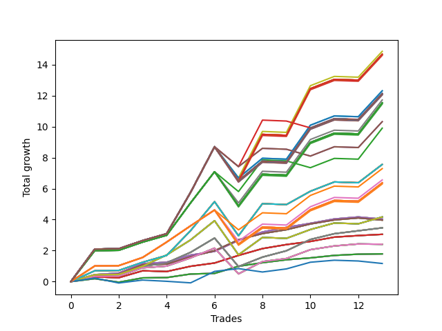

# Long Pointer Eleven (1231 REV) 
- Symbol: AAPL_Unlimited
- Date Range: 03/23/2022 - 07/08/2022
- Trading Period: 7:20-12:30
- Number of Trades: 13



| Name | Win Percent | Profit | Avg Profit / Trade | Avg Time / Trade |      | Name | Win Percent | Profit | Avg Profit / Trade | Avg Time / Trade |
| ---- | ----------- | ------ | ------------------ | ---------------- | ---- | ---- | ----------- | ------ | ------------------ | ---------------- |
| Sorted By <br> Profit | | | | | | Sorted By <br> Win Percentage ||||
| Ninety-Three | 76.92 | 7430.00 | 571.54 | 166:04 |     | Sixty-Six | 92.31 | 2015.00 | 155.00 | 20:00 |
| One Hundred Twenty-Eight | 76.92 | 7335.00 | 564.23 | 170:31 |     | Fifty-Eight | 92.31 | 2015.00 | 155.00 | 20:00 |
| One Hundred Twenty-Three | 76.92 | 7335.00 | 564.23 | 170:31 |     | Fifty | 92.31 | 2015.00 | 155.00 | 20:00 |
| One Hundred Eighteen | 76.92 | 7335.00 | 564.23 | 170:31 |     | Forty-Two | 92.31 | 2015.00 | 155.00 | 20:00 |
| One Hundred Thirteen | 76.92 | 7335.00 | 564.23 | 170:31 |     | Two | 92.31 | 2015.00 | 155.00 | 20:00 |
| One Hundred Three | 76.92 | 7335.00 | 564.23 | 170:31 |     | Sixty-Seven | 92.31 | 1985.00 | 152.69 | 20:27 |
| Eighty-Three | 76.92 | 7335.00 | 564.23 | 170:31 |     | Fifty-Nine | 92.31 | 1985.00 | 152.69 | 20:27 |
| One Hundred Eight | 76.92 | 7300.00 | 561.54 | 166:33 |     | Fifty-One | 92.31 | 1985.00 | 152.69 | 20:27 |
| Ninety-Five | 76.92 | 6155.00 | 473.46 | 176:15 |     | Forty-Three | 92.31 | 1985.00 | 152.69 | 20:27 |
| Ninety-Four | 76.92 | 6155.00 | 473.46 | 176:15 |     | Three | 92.31 | 1985.00 | 152.69 | 20:27 |
| Ninety-Eight | 69.23 | 6070.00 | 466.92 | 156:33 |     | Sixty-Nine | 92.31 | 1735.00 | 133.46 | 57:51 |
| One Hundred Thirty | 76.92 | 6060.00 | 466.15 | 180:41 |     | Sixty-One | 92.31 | 1735.00 | 133.46 | 57:51 |
| One Hundred Twenty-Nine | 76.92 | 6060.00 | 466.15 | 180:41 |     | Fifty-Three | 92.31 | 1735.00 | 133.46 | 57:51 |
| One Hundred Twenty-Five | 76.92 | 6060.00 | 466.15 | 180:41 |     | Forty-Five | 92.31 | 1735.00 | 133.46 | 57:51 |
| One Hundred Twenty-Four | 76.92 | 6060.00 | 466.15 | 180:41 |     | Five | 92.31 | 1735.00 | 133.46 | 57:51 |
| One Hundred Twenty | 76.92 | 6060.00 | 466.15 | 180:41 |     | Sixty-Four | 92.31 | 895.00 | 68.85 | 08:46 |
| One Hundred Ninteen | 76.92 | 6060.00 | 466.15 | 180:41 |     | Fifty-Six | 92.31 | 895.00 | 68.85 | 08:46 |
| One Hundred Fifteen | 76.92 | 6060.00 | 466.15 | 180:41 |     | Forty-Eight | 92.31 | 895.00 | 68.85 | 08:46 |
| One Hundred Fourteen | 76.92 | 6060.00 | 466.15 | 180:41 |     | Forty | 92.31 | 895.00 | 68.85 | 08:46 |
| One Hundred Five | 76.92 | 6060.00 | 466.15 | 180:41 |     | Zero | 92.31 | 895.00 | 68.85 | 08:46 |
| One Hundred Four | 76.92 | 6060.00 | 466.15 | 180:41 |     | Sixty-Five | 84.62 | 1525.00 | 117.31 | 12:51 |
| Eighty-Five | 76.92 | 6060.00 | 466.15 | 180:41 |     | Fifty-Seven | 84.62 | 1525.00 | 117.31 | 12:51 |
| Eighty-Four | 76.92 | 6060.00 | 466.15 | 180:41 |     | Forty-Nine | 84.62 | 1525.00 | 117.31 | 12:51 |
| One Hundred Ten | 76.92 | 6025.00 | 463.46 | 176:43 |     | Forty-One | 84.62 | 1525.00 | 117.31 | 12:51 |
| One Hundred Nine | 76.92 | 6025.00 | 463.46 | 176:43 |     | One | 84.62 | 1525.00 | 117.31 | 12:51 |
| Ninety-Two | 76.92 | 5860.00 | 450.77 | 148:03 |     | Sixty-Eight | 84.62 | 1205.00 | 92.69 | 44:50 |
| One Hundred Twenty-Seven | 76.92 | 5765.00 | 443.46 | 152:29 |     | Sixty | 84.62 | 1205.00 | 92.69 | 44:50 |
| One Hundred Twenty-Two | 76.92 | 5765.00 | 443.46 | 152:29 |     | Fifty-Two | 84.62 | 1205.00 | 92.69 | 44:50 |
| One Hundred Seventeen | 76.92 | 5765.00 | 443.46 | 152:29 |     | Forty-Four | 84.62 | 1205.00 | 92.69 | 44:50 |
| One Hundred Twelve | 76.92 | 5765.00 | 443.46 | 152:29 |     | Four | 84.62 | 1205.00 | 92.69 | 44:50 |
| One Hundred Two | 76.92 | 5765.00 | 443.46 | 152:29 |     | Ninety-Three | 76.92 | 7430.00 | 571.54 | 166:04 |
| Eighty-Two | 76.92 | 5765.00 | 443.46 | 152:29 |     | One Hundred Twenty-Eight | 76.92 | 7335.00 | 564.23 | 170:31 |
| One Hundred Seven | 76.92 | 5730.00 | 440.77 | 148:31 |     | One Hundred Twenty-Three | 76.92 | 7335.00 | 564.23 | 170:31 |
| One Hundred | 69.23 | 5160.00 | 396.92 | 164:50 |     | One Hundred Eighteen | 76.92 | 7335.00 | 564.23 | 170:31 |
| Ninety-Nine | 69.23 | 5160.00 | 396.92 | 164:50 |     | One Hundred Thirteen | 76.92 | 7335.00 | 564.23 | 170:31 |
| Ninety-Seven | 69.23 | 4950.00 | 380.77 | 142:24 |     | One Hundred Three | 76.92 | 7335.00 | 564.23 | 170:31 |
| Seventy-One | 76.92 | 3780.00 | 290.77 | 132:51 |     | Eighty-Three | 76.92 | 7335.00 | 564.23 | 170:31 |
| Sixty-Three | 76.92 | 3780.00 | 290.77 | 132:51 |     | One Hundred Eight | 76.92 | 7300.00 | 561.54 | 166:33 |
| Fifty-Five | 76.92 | 3780.00 | 290.77 | 132:51 |     | Ninety-Five | 76.92 | 6155.00 | 473.46 | 176:15 |
| Forty-Seven | 76.92 | 3780.00 | 290.77 | 132:51 |     | Ninety-Four | 76.92 | 6155.00 | 473.46 | 176:15 |
| Seven | 76.92 | 3780.00 | 290.77 | 132:51 |     | One Hundred Thirty | 76.92 | 6060.00 | 466.15 | 180:41 |
| Ninety-Six | 76.92 | 3645.00 | 280.38 | 112:15 |     | One Hundred Twenty-Nine | 76.92 | 6060.00 | 466.15 | 180:41 |
| Ninety-One | 76.92 | 3280.00 | 252.31 | 114:51 |     | One Hundred Twenty-Five | 76.92 | 6060.00 | 466.15 | 180:41 |
| One Hundred Twenty-Six | 76.92 | 3185.00 | 245.00 | 119:17 |     | One Hundred Twenty-Four | 76.92 | 6060.00 | 466.15 | 180:41 |
| One Hundred Twenty-One | 76.92 | 3185.00 | 245.00 | 119:17 |     | One Hundred Twenty | 76.92 | 6060.00 | 466.15 | 180:41 |
| One Hundred Sixteen | 76.92 | 3185.00 | 245.00 | 119:17 |     | One Hundred Ninteen | 76.92 | 6060.00 | 466.15 | 180:41 |
| One Hundred Eleven | 76.92 | 3185.00 | 245.00 | 119:17 |     | One Hundred Fifteen | 76.92 | 6060.00 | 466.15 | 180:41 |
| One Hundred One | 76.92 | 3185.00 | 245.00 | 119:17 |     | One Hundred Fourteen | 76.92 | 6060.00 | 466.15 | 180:41 |
| Eighty-One | 76.92 | 3185.00 | 245.00 | 119:17 |     | One Hundred Five | 76.92 | 6060.00 | 466.15 | 180:41 |
| One Hundred Six | 76.92 | 3150.00 | 242.31 | 115:19 |     | One Hundred Four | 76.92 | 6060.00 | 466.15 | 180:41 |
| Seventy | 76.92 | 2085.00 | 160.38 | 103:43 |     | Eighty-Five | 76.92 | 6060.00 | 466.15 | 180:41 |
| Sixty-Two | 76.92 | 2085.00 | 160.38 | 103:43 |     | Eighty-Four | 76.92 | 6060.00 | 466.15 | 180:41 |
| Fifty-Four | 76.92 | 2085.00 | 160.38 | 103:43 |     | One Hundred Ten | 76.92 | 6025.00 | 463.46 | 176:43 |
| Forty-Six | 76.92 | 2085.00 | 160.38 | 103:43 |     | One Hundred Nine | 76.92 | 6025.00 | 463.46 | 176:43 |
| Six | 76.92 | 2085.00 | 160.38 | 103:43 |     | Ninety-Two | 76.92 | 5860.00 | 450.77 | 148:03 |
| Sixty-Six | 92.31 | 2015.00 | 155.00 | 20:00 |     | One Hundred Twenty-Seven | 76.92 | 5765.00 | 443.46 | 152:29 |
| Fifty-Eight | 92.31 | 2015.00 | 155.00 | 20:00 |     | One Hundred Twenty-Two | 76.92 | 5765.00 | 443.46 | 152:29 |
| Fifty | 92.31 | 2015.00 | 155.00 | 20:00 |     | One Hundred Seventeen | 76.92 | 5765.00 | 443.46 | 152:29 |
| Forty-Two | 92.31 | 2015.00 | 155.00 | 20:00 |     | One Hundred Twelve | 76.92 | 5765.00 | 443.46 | 152:29 |
| Two | 92.31 | 2015.00 | 155.00 | 20:00 |     | One Hundred Two | 76.92 | 5765.00 | 443.46 | 152:29 |
| Sixty-Seven | 92.31 | 1985.00 | 152.69 | 20:27 |     | Eighty-Two | 76.92 | 5765.00 | 443.46 | 152:29 |
| Fifty-Nine | 92.31 | 1985.00 | 152.69 | 20:27 |     | One Hundred Seven | 76.92 | 5730.00 | 440.77 | 148:31 |
| Fifty-One | 92.31 | 1985.00 | 152.69 | 20:27 |     | Seventy-One | 76.92 | 3780.00 | 290.77 | 132:51 |
| Forty-Three | 92.31 | 1985.00 | 152.69 | 20:27 |     | Sixty-Three | 76.92 | 3780.00 | 290.77 | 132:51 |
| Three | 92.31 | 1985.00 | 152.69 | 20:27 |     | Fifty-Five | 76.92 | 3780.00 | 290.77 | 132:51 |
| Sixty-Nine | 92.31 | 1735.00 | 133.46 | 57:51 |     | Forty-Seven | 76.92 | 3780.00 | 290.77 | 132:51 |
| Sixty-One | 92.31 | 1735.00 | 133.46 | 57:51 |     | Seven | 76.92 | 3780.00 | 290.77 | 132:51 |
| Fifty-Three | 92.31 | 1735.00 | 133.46 | 57:51 |     | Ninety-Six | 76.92 | 3645.00 | 280.38 | 112:15 |
| Forty-Five | 92.31 | 1735.00 | 133.46 | 57:51 |     | Ninety-One | 76.92 | 3280.00 | 252.31 | 114:51 |
| Five | 92.31 | 1735.00 | 133.46 | 57:51 |     | One Hundred Twenty-Six | 76.92 | 3185.00 | 245.00 | 119:17 |
| Sixty-Five | 84.62 | 1525.00 | 117.31 | 12:51 |     | One Hundred Twenty-One | 76.92 | 3185.00 | 245.00 | 119:17 |
| Fifty-Seven | 84.62 | 1525.00 | 117.31 | 12:51 |     | One Hundred Sixteen | 76.92 | 3185.00 | 245.00 | 119:17 |
| Forty-Nine | 84.62 | 1525.00 | 117.31 | 12:51 |     | One Hundred Eleven | 76.92 | 3185.00 | 245.00 | 119:17 |
| Forty-One | 84.62 | 1525.00 | 117.31 | 12:51 |     | One Hundred One | 76.92 | 3185.00 | 245.00 | 119:17 |
| One | 84.62 | 1525.00 | 117.31 | 12:51 |     | Eighty-One | 76.92 | 3185.00 | 245.00 | 119:17 |
| Sixty-Eight | 84.62 | 1205.00 | 92.69 | 44:50 |     | One Hundred Six | 76.92 | 3150.00 | 242.31 | 115:19 |
| Sixty | 84.62 | 1205.00 | 92.69 | 44:50 |     | Seventy | 76.92 | 2085.00 | 160.38 | 103:43 |
| Fifty-Two | 84.62 | 1205.00 | 92.69 | 44:50 |     | Sixty-Two | 76.92 | 2085.00 | 160.38 | 103:43 |
| Forty-Four | 84.62 | 1205.00 | 92.69 | 44:50 |     | Fifty-Four | 76.92 | 2085.00 | 160.38 | 103:43 |
| Four | 84.62 | 1205.00 | 92.69 | 44:50 |     | Forty-Six | 76.92 | 2085.00 | 160.38 | 103:43 |
| Sixty-Four | 92.31 | 895.00 | 68.85 | 08:46 |     | Six | 76.92 | 2085.00 | 160.38 | 103:43 |
| Fifty-Six | 92.31 | 895.00 | 68.85 | 08:46 |     | Ninety-Eight | 69.23 | 6070.00 | 466.92 | 156:33 |
| Forty-Eight | 92.31 | 895.00 | 68.85 | 08:46 |     | One Hundred | 69.23 | 5160.00 | 396.92 | 164:50 |
| Forty | 92.31 | 895.00 | 68.85 | 08:46 |     | Ninety-Nine | 69.23 | 5160.00 | 396.92 | 164:50 |
| Zero | 92.31 | 895.00 | 68.85 | 08:46 |     | Ninety-Seven | 69.23 | 4950.00 | 380.77 | 142:24 |
| Seventy-Three | 53.85 | 585.00 | 45.00 | 16:55 |     | Seventy-Three | 53.85 | 585.00 | 45.00 | 16:55 |

## NO STOPLOSS

### Test Zero
* Sell when price hits the middle line of the 20p bollinger
* No Stoploss
* Results:
```
Total Trades: 13
Percent Up: 92.31
Percent Down: 7.69
Total Points Moved Up: 1.79
Potential Profit: 895.00
Total Points Ups: 2.02 Count Ups: 12
Total Points Downs: -0.23 Count Downs: 1
```

<details><summary>Trades</summary>

<code>In: 2022-03-29 09:37:00		Out: 2022-03-29 09:43:15		Total Position Time: 06:15		Total Move Up: 0.19		Total to Date: 0.19</code> <br />
<code>In: 2022-03-30 12:14:00		Out: 2022-03-30 12:28:10		Total Position Time: 14:10		Total Move Up: -0.23		Total to Date: -0.04</code> <br />
<code>In: 2022-03-30 12:25:00		Out: 2022-03-30 12:28:10		Total Position Time: 03:10		Total Move Up: 0.28		Total to Date: 0.24</code> <br />
<code>In: 2022-04-01 08:40:00		Out: 2022-04-01 08:53:30		Total Position Time: 13:30		Total Move Up: 0.02		Total to Date: 0.26</code> <br />
<code>In: 2022-04-07 08:35:00		Out: 2022-04-07 08:45:45		Total Position Time: 10:45		Total Move Up: 0.23		Total to Date: 0.49</code> <br />
<code>In: 2022-04-07 09:52:00		Out: 2022-04-07 09:58:45		Total Position Time: 06:45		Total Move Up: 0.04		Total to Date: 0.53</code> <br />
<code>In: 2022-04-21 10:21:00		Out: 2022-04-21 10:22:10		Total Position Time: 01:10		Total Move Up: 0.46		Total to Date: 0.99</code> <br />
<code>In: 2022-05-10 08:11:00		Out: 2022-05-10 08:19:40		Total Position Time: 08:40		Total Move Up: 0.23		Total to Date: 1.22</code> <br />
<code>In: 2022-06-08 09:47:00		Out: 2022-06-08 09:56:55		Total Position Time: 09:55		Total Move Up: 0.19		Total to Date: 1.41</code> <br />
<code>In: 2022-06-15 10:02:00		Out: 2022-06-15 10:11:05		Total Position Time: 09:05		Total Move Up: 0.12		Total to Date: 1.53</code> <br />
<code>In: 2022-06-24 08:19:00		Out: 2022-06-24 08:26:15		Total Position Time: 07:15		Total Move Up: 0.16		Total to Date: 1.69</code> <br />
<code>In: 2022-06-27 10:50:00		Out: 2022-06-27 11:03:15		Total Position Time: 13:15		Total Move Up: 0.08		Total to Date: 1.77</code> <br />
<code>In: 2022-07-06 08:09:00		Out: 2022-07-06 08:19:05		Total Position Time: 10:05		Total Move Up: 0.02		Total to Date: 1.79</code> <br />


</details>

### Test One
* Sell when the price hits the upper line of the 20p 1std bollinger
* No Stoploss
* Results:
```
Total Trades: 13
Percent Up: 84.62
Percent Down: 15.38
Total Points Moved Up: 3.05
Potential Profit: 1525.00
Total Points Ups: 3.16 Count Ups: 11
Total Points Downs: -0.11 Count Downs: 2
```

<details><summary>Trades</summary>

<code>In: 2022-03-29 09:37:00		Out: 2022-03-29 09:45:05		Total Position Time: 08:05		Total Move Up: 0.31		Total to Date: 0.31</code> <br />
<code>In: 2022-03-30 12:14:00		Out: 2022-03-30 12:31:35		Total Position Time: 17:35		Total Move Up: -0.06		Total to Date: 0.25</code> <br />
<code>In: 2022-03-30 12:25:00		Out: 2022-03-30 12:31:35		Total Position Time: 06:35		Total Move Up: 0.45		Total to Date: 0.70</code> <br />
<code>In: 2022-04-01 08:40:00		Out: 2022-04-01 09:09:05		Total Position Time: 29:05		Total Move Up: -0.05		Total to Date: 0.65</code> <br />
<code>In: 2022-04-07 08:35:00		Out: 2022-04-07 08:47:05		Total Position Time: 12:05		Total Move Up: 0.34		Total to Date: 0.99</code> <br />
<code>In: 2022-04-07 09:52:00		Out: 2022-04-07 10:02:15		Total Position Time: 10:15		Total Move Up: 0.21		Total to Date: 1.20</code> <br />
<code>In: 2022-04-21 10:21:00		Out: 2022-04-21 10:28:50		Total Position Time: 07:50		Total Move Up: 0.49		Total to Date: 1.69</code> <br />
<code>In: 2022-05-10 08:11:00		Out: 2022-05-10 08:23:05		Total Position Time: 12:05		Total Move Up: 0.44		Total to Date: 2.13</code> <br />
<code>In: 2022-06-08 09:47:00		Out: 2022-06-08 09:59:05		Total Position Time: 12:05		Total Move Up: 0.26		Total to Date: 2.39</code> <br />
<code>In: 2022-06-15 10:02:00		Out: 2022-06-15 10:12:45		Total Position Time: 10:45		Total Move Up: 0.20		Total to Date: 2.59</code> <br />
<code>In: 2022-06-24 08:19:00		Out: 2022-06-24 08:29:40		Total Position Time: 10:40		Total Move Up: 0.28		Total to Date: 2.87</code> <br />
<code>In: 2022-06-27 10:50:00		Out: 2022-06-27 11:05:00		Total Position Time: 15:00		Total Move Up: 0.10		Total to Date: 2.97</code> <br />
<code>In: 2022-07-06 08:09:00		Out: 2022-07-06 08:24:10		Total Position Time: 15:10		Total Move Up: 0.08		Total to Date: 3.05</code> <br />


</details>

### Test Two
* Sell when the price hits the upper line of the 20p 2std bollinger
* No Stoploss
* Results:
```
Total Trades: 13
Percent Up: 92.31
Percent Down: 7.69
Total Points Moved Up: 4.03
Potential Profit: 2015.00
Total Points Ups: 4.17 Count Ups: 12
Total Points Downs: -0.14 Count Downs: 1
```

<details><summary>Trades</summary>

<code>In: 2022-03-29 09:37:00		Out: 2022-03-29 09:45:30		Total Position Time: 08:30		Total Move Up: 0.45		Total to Date: 0.45</code> <br />
<code>In: 2022-03-30 12:14:00		Out: 2022-03-30 12:36:15		Total Position Time: 22:15		Total Move Up: 0.10		Total to Date: 0.55</code> <br />
<code>In: 2022-03-30 12:25:00		Out: 2022-03-30 12:36:15		Total Position Time: 11:15		Total Move Up: 0.61		Total to Date: 1.16</code> <br />
<code>In: 2022-04-01 08:40:00		Out: 2022-04-01 09:09:35		Total Position Time: 29:35		Total Move Up: 0.09		Total to Date: 1.25</code> <br />
<code>In: 2022-04-07 08:35:00		Out: 2022-04-07 08:48:05		Total Position Time: 13:05		Total Move Up: 0.46		Total to Date: 1.71</code> <br />
<code>In: 2022-04-07 09:52:00		Out: 2022-04-07 10:03:05		Total Position Time: 11:05		Total Move Up: 0.24		Total to Date: 1.95</code> <br />
<code>In: 2022-04-21 10:21:00		Out: 2022-04-21 10:31:20		Total Position Time: 10:20		Total Move Up: 0.71		Total to Date: 2.66</code> <br />
<code>In: 2022-05-10 08:11:00		Out: 2022-05-10 08:37:50		Total Position Time: 26:50		Total Move Up: 0.54		Total to Date: 3.20</code> <br />
<code>In: 2022-06-08 09:47:00		Out: 2022-06-08 10:00:10		Total Position Time: 13:10		Total Move Up: 0.30		Total to Date: 3.50</code> <br />
<code>In: 2022-06-15 10:02:00		Out: 2022-06-15 10:13:35		Total Position Time: 11:35		Total Move Up: 0.26		Total to Date: 3.76</code> <br />
<code>In: 2022-06-24 08:19:00		Out: 2022-06-24 08:54:05		Total Position Time: 35:05		Total Move Up: 0.28		Total to Date: 4.04</code> <br />
<code>In: 2022-06-27 10:50:00		Out: 2022-06-27 11:17:10		Total Position Time: 27:10		Total Move Up: 0.13		Total to Date: 4.17</code> <br />
<code>In: 2022-07-06 08:09:00		Out: 2022-07-06 08:49:05		Total Position Time: 40:05		Total Move Up: -0.14		Total to Date: 4.03</code> <br />


</details>

### Test Three
* Sell when price hits the middle line of the 50p bollinger
* No Stoploss
* Results:
```
Total Trades: 13
Percent Up: 92.31
Percent Down: 7.69
Total Points Moved Up: 3.97
Potential Profit: 1985.00
Total Points Ups: 4.11 Count Ups: 12
Total Points Downs: -0.14 Count Downs: 1
```

<details><summary>Trades</summary>

<code>In: 2022-03-29 09:37:00		Out: 2022-03-29 09:45:20		Total Position Time: 08:20		Total Move Up: 0.39		Total to Date: 0.39</code> <br />
<code>In: 2022-03-30 12:14:00		Out: 2022-03-30 12:36:15		Total Position Time: 22:15		Total Move Up: 0.10		Total to Date: 0.49</code> <br />
<code>In: 2022-03-30 12:25:00		Out: 2022-03-30 12:36:15		Total Position Time: 11:15		Total Move Up: 0.61		Total to Date: 1.10</code> <br />
<code>In: 2022-04-01 08:40:00		Out: 2022-04-01 09:14:10		Total Position Time: 34:10		Total Move Up: 0.03		Total to Date: 1.13</code> <br />
<code>In: 2022-04-07 08:35:00		Out: 2022-04-07 08:48:10		Total Position Time: 13:10		Total Move Up: 0.48		Total to Date: 1.61</code> <br />
<code>In: 2022-04-07 09:52:00		Out: 2022-04-07 10:03:10		Total Position Time: 11:10		Total Move Up: 0.38		Total to Date: 1.99</code> <br />
<code>In: 2022-04-21 10:21:00		Out: 2022-04-21 10:31:40		Total Position Time: 10:40		Total Move Up: 0.71		Total to Date: 2.70</code> <br />
<code>In: 2022-05-10 08:11:00		Out: 2022-05-10 08:37:10		Total Position Time: 26:10		Total Move Up: 0.40		Total to Date: 3.10</code> <br />
<code>In: 2022-06-08 09:47:00		Out: 2022-06-08 10:19:15		Total Position Time: 32:15		Total Move Up: 0.25		Total to Date: 3.35</code> <br />
<code>In: 2022-06-15 10:02:00		Out: 2022-06-15 10:20:55		Total Position Time: 18:55		Total Move Up: 0.37		Total to Date: 3.72</code> <br />
<code>In: 2022-06-24 08:19:00		Out: 2022-06-24 08:29:20		Total Position Time: 10:20		Total Move Up: 0.26		Total to Date: 3.98</code> <br />
<code>In: 2022-06-27 10:50:00		Out: 2022-06-27 11:17:10		Total Position Time: 27:10		Total Move Up: 0.13		Total to Date: 4.11</code> <br />
<code>In: 2022-07-06 08:09:00		Out: 2022-07-06 08:49:05		Total Position Time: 40:05		Total Move Up: -0.14		Total to Date: 3.97</code> <br />


</details>

### Test Four
* Sell when the price hits the upper line of the 50p 1std bollinger
* No Stoploss
* Results:
```
Total Trades: 13
Percent Up: 84.62
Percent Down: 15.38
Total Points Moved Up: 2.41
Potential Profit: 1205.00
Total Points Ups: 4.09 Count Ups: 11
Total Points Downs: -1.68 Count Downs: 2
```

<details><summary>Trades</summary>

<code>In: 2022-03-29 09:37:00		Out: 2022-03-29 10:29:15		Total Position Time: 52:15		Total Move Up: 0.34		Total to Date: 0.34</code> <br />
<code>In: 2022-03-30 12:14:00		Out: 2022-03-30 12:47:00		Total Position Time: 33:00		Total Move Up: 0.02		Total to Date: 0.36</code> <br />
<code>In: 2022-03-30 12:25:00		Out: 2022-03-30 12:47:00		Total Position Time: 22:00		Total Move Up: 0.53		Total to Date: 0.89</code> <br />
<code>In: 2022-04-01 08:40:00		Out: 2022-04-01 09:23:00		Total Position Time: 43:00		Total Move Up: 0.11		Total to Date: 1.00</code> <br />
<code>In: 2022-04-07 08:35:00		Out: 2022-04-07 09:05:20		Total Position Time: 30:20		Total Move Up: 0.53		Total to Date: 1.53</code> <br />
<code>In: 2022-04-07 09:52:00		Out: 2022-04-07 10:11:40		Total Position Time: 19:40		Total Move Up: 0.63		Total to Date: 2.16</code> <br />
<code>In: 2022-04-21 10:21:00		Out: 2022-04-21 12:29:55		Total Position Time: 128:55		Total Move Up: -1.66		Total to Date: 0.50</code> <br />
<code>In: 2022-05-10 08:11:00		Out: 2022-05-10 08:39:10		Total Position Time: 28:10		Total Move Up: 0.79		Total to Date: 1.29</code> <br />
<code>In: 2022-06-08 09:47:00		Out: 2022-06-08 10:54:00		Total Position Time: 67:00		Total Move Up: 0.20		Total to Date: 1.49</code> <br />
<code>In: 2022-06-15 10:02:00		Out: 2022-06-15 10:27:25		Total Position Time: 25:25		Total Move Up: 0.57		Total to Date: 2.06</code> <br />
<code>In: 2022-06-24 08:19:00		Out: 2022-06-24 08:59:25		Total Position Time: 40:25		Total Move Up: 0.24		Total to Date: 2.30</code> <br />
<code>In: 2022-06-27 10:50:00		Out: 2022-06-27 11:33:25		Total Position Time: 43:25		Total Move Up: 0.13		Total to Date: 2.43</code> <br />
<code>In: 2022-07-06 08:09:00		Out: 2022-07-06 08:58:15		Total Position Time: 49:15		Total Move Up: -0.02		Total to Date: 2.41</code> <br />


</details>

### Test Five
* Sell when the price hits the upper line of the 50p 2std bollinger
* No Stoploss
* Results:
```
Total Trades: 13
Percent Up: 92.31
Percent Down: 7.69
Total Points Moved Up: 3.47
Potential Profit: 1735.00
Total Points Ups: 5.31 Count Ups: 12
Total Points Downs: -1.84 Count Downs: 1
```

<details><summary>Trades</summary>

<code>In: 2022-03-29 09:37:00		Out: 2022-03-29 10:40:00		Total Position Time: 63:00		Total Move Up: 0.44		Total to Date: 0.44</code> <br />
<code>In: 2022-03-30 12:14:00		Out: 2022-03-30 12:47:00		Total Position Time: 33:00		Total Move Up: 0.02		Total to Date: 0.46</code> <br />
<code>In: 2022-03-30 12:25:00		Out: 2022-03-30 12:47:00		Total Position Time: 22:00		Total Move Up: 0.53		Total to Date: 0.99</code> <br />
<code>In: 2022-04-01 08:40:00		Out: 2022-04-01 09:24:35		Total Position Time: 44:35		Total Move Up: 0.22		Total to Date: 1.21</code> <br />
<code>In: 2022-04-07 08:35:00		Out: 2022-04-07 09:06:30		Total Position Time: 31:30		Total Move Up: 0.68		Total to Date: 1.89</code> <br />
<code>In: 2022-04-07 09:52:00		Out: 2022-04-07 10:12:40		Total Position Time: 20:40		Total Move Up: 0.92		Total to Date: 2.81</code> <br />
<code>In: 2022-04-21 10:21:00		Out: 2022-04-21 12:44:20		Total Position Time: 143:20		Total Move Up: -1.84		Total to Date: 0.97</code> <br />
<code>In: 2022-05-10 08:11:00		Out: 2022-05-10 10:07:25		Total Position Time: 116:25		Total Move Up: 0.61		Total to Date: 1.58</code> <br />
<code>In: 2022-06-08 09:47:00		Out: 2022-06-08 10:56:30		Total Position Time: 69:30		Total Move Up: 0.41		Total to Date: 1.99</code> <br />
<code>In: 2022-06-15 10:02:00		Out: 2022-06-15 10:58:15		Total Position Time: 56:15		Total Move Up: 0.73		Total to Date: 2.72</code> <br />
<code>In: 2022-06-24 08:19:00		Out: 2022-06-24 09:02:10		Total Position Time: 43:10		Total Move Up: 0.37		Total to Date: 3.09</code> <br />
<code>In: 2022-06-27 10:50:00		Out: 2022-06-27 11:34:15		Total Position Time: 44:15		Total Move Up: 0.19		Total to Date: 3.28</code> <br />
<code>In: 2022-07-06 08:09:00		Out: 2022-07-06 09:13:30		Total Position Time: 64:30		Total Move Up: 0.19		Total to Date: 3.47</code> <br />


</details>

### Test Six
* Sell when the price hits the middle line of the 1std VWAP
* No Stoploss
* Results:
```
Total Trades: 13
Percent Up: 76.92
Percent Down: 23.08
Total Points Moved Up: 4.17
Potential Profit: 2085.00
Total Points Ups: 6.48 Count Ups: 10
Total Points Downs: -2.31 Count Downs: 3
```

<details><summary>Trades</summary>

<code>In: 2022-03-29 09:37:00		Out: 2022-03-29 09:45:25		Total Position Time: 08:25		Total Move Up: 0.44		Total to Date: 0.44</code> <br />
<code>In: 2022-03-30 12:14:00		Out: 2022-03-30 12:47:00		Total Position Time: 33:00		Total Move Up: 0.02		Total to Date: 0.46</code> <br />
<code>In: 2022-03-30 12:25:00		Out: 2022-03-30 12:47:00		Total Position Time: 22:00		Total Move Up: 0.53		Total to Date: 0.99</code> <br />
<code>In: 2022-04-01 08:40:00		Out: 2022-04-01 11:05:10		Total Position Time: 145:10		Total Move Up: 0.73		Total to Date: 1.72</code> <br />
<code>In: 2022-04-07 08:35:00		Out: 2022-04-07 10:56:05		Total Position Time: 141:05		Total Move Up: 0.97		Total to Date: 2.69</code> <br />
<code>In: 2022-04-07 09:52:00		Out: 2022-04-07 10:56:05		Total Position Time: 64:05		Total Move Up: 1.24		Total to Date: 3.93</code> <br />
<code>In: 2022-04-21 10:21:00		Out: 2022-04-21 12:47:00		Total Position Time: 146:00		Total Move Up: -2.20		Total to Date: 1.73</code> <br />
<code>In: 2022-05-10 08:11:00		Out: 2022-05-10 10:30:00		Total Position Time: 139:00		Total Move Up: 1.12		Total to Date: 2.85</code> <br />
<code>In: 2022-06-08 09:47:00		Out: 2022-06-08 12:47:00		Total Position Time: 180:00		Total Move Up: -0.06		Total to Date: 2.79</code> <br />
<code>In: 2022-06-15 10:02:00		Out: 2022-06-15 10:27:25		Total Position Time: 25:25		Total Move Up: 0.57		Total to Date: 3.36</code> <br />
<code>In: 2022-06-24 08:19:00		Out: 2022-06-24 11:48:05		Total Position Time: 209:05		Total Move Up: 0.42		Total to Date: 3.78</code> <br />
<code>In: 2022-06-27 10:50:00		Out: 2022-06-27 12:47:00		Total Position Time: 117:00		Total Move Up: -0.05		Total to Date: 3.73</code> <br />
<code>In: 2022-07-06 08:09:00		Out: 2022-07-06 10:07:05		Total Position Time: 118:05		Total Move Up: 0.44		Total to Date: 4.17</code> <br />


</details>

### Test Seven
* Sell when the price hits the upper line of the 1std VWAP
* No Stoploss
* Results:
```
Total Trades: 13
Percent Up: 76.92
Percent Down: 23.08
Total Points Moved Up: 7.56
Potential Profit: 3780.00
Total Points Ups: 9.87 Count Ups: 10
Total Points Downs: -2.31 Count Downs: 3
```

<details><summary>Trades</summary>

<code>In: 2022-03-29 09:37:00		Out: 2022-03-29 10:46:40		Total Position Time: 69:40		Total Move Up: 0.70		Total to Date: 0.70</code> <br />
<code>In: 2022-03-30 12:14:00		Out: 2022-03-30 12:47:00		Total Position Time: 33:00		Total Move Up: 0.02		Total to Date: 0.72</code> <br />
<code>In: 2022-03-30 12:25:00		Out: 2022-03-30 12:47:00		Total Position Time: 22:00		Total Move Up: 0.53		Total to Date: 1.25</code> <br />
<code>In: 2022-04-01 08:40:00		Out: 2022-04-01 12:47:00		Total Position Time: 247:00		Total Move Up: 0.44		Total to Date: 1.69</code> <br />
<code>In: 2022-04-07 08:35:00		Out: 2022-04-07 11:26:15		Total Position Time: 171:15		Total Move Up: 1.60		Total to Date: 3.29</code> <br />
<code>In: 2022-04-07 09:52:00		Out: 2022-04-07 11:26:15		Total Position Time: 94:15		Total Move Up: 1.87		Total to Date: 5.16</code> <br />
<code>In: 2022-04-21 10:21:00		Out: 2022-04-21 12:47:00		Total Position Time: 146:00		Total Move Up: -2.20		Total to Date: 2.96</code> <br />
<code>In: 2022-05-10 08:11:00		Out: 2022-05-10 10:36:10		Total Position Time: 145:10		Total Move Up: 2.07		Total to Date: 5.03</code> <br />
<code>In: 2022-06-08 09:47:00		Out: 2022-06-08 12:47:00		Total Position Time: 180:00		Total Move Up: -0.06		Total to Date: 4.97</code> <br />
<code>In: 2022-06-15 10:02:00		Out: 2022-06-15 10:59:35		Total Position Time: 57:35		Total Move Up: 0.86		Total to Date: 5.83</code> <br />
<code>In: 2022-06-24 08:19:00		Out: 2022-06-24 12:47:00		Total Position Time: 268:00		Total Move Up: 0.60		Total to Date: 6.43</code> <br />
<code>In: 2022-06-27 10:50:00		Out: 2022-06-27 12:47:00		Total Position Time: 117:00		Total Move Up: -0.05		Total to Date: 6.38</code> <br />
<code>In: 2022-07-06 08:09:00		Out: 2022-07-06 11:05:15		Total Position Time: 176:15		Total Move Up: 1.18		Total to Date: 7.56</code> <br />


</details>

## STOPLOSS OF 5

### Test Forty
* Sell when price hits the middle line of the 20p bollinger
* Stoploss is 5 points
* Results:
```
Total Trades: 13
Percent Up: 92.31
Percent Down: 7.69
Total Points Moved Up: 1.79
Potential Profit: 895.00
Total Points Ups: 2.02 Count Ups: 12
Total Points Downs: -0.23 Count Downs: 1
```

<details><summary>Trades</summary>

<code>In: 2022-03-29 09:37:00		Out: 2022-03-29 09:43:15		Total Position Time: 06:15		Total Move Up: 0.19		Total to Date: 0.19</code> <br />
<code>In: 2022-03-30 12:14:00		Out: 2022-03-30 12:28:10		Total Position Time: 14:10		Total Move Up: -0.23		Total to Date: -0.04</code> <br />
<code>In: 2022-03-30 12:25:00		Out: 2022-03-30 12:28:10		Total Position Time: 03:10		Total Move Up: 0.28		Total to Date: 0.24</code> <br />
<code>In: 2022-04-01 08:40:00		Out: 2022-04-01 08:53:30		Total Position Time: 13:30		Total Move Up: 0.02		Total to Date: 0.26</code> <br />
<code>In: 2022-04-07 08:35:00		Out: 2022-04-07 08:45:45		Total Position Time: 10:45		Total Move Up: 0.23		Total to Date: 0.49</code> <br />
<code>In: 2022-04-07 09:52:00		Out: 2022-04-07 09:58:45		Total Position Time: 06:45		Total Move Up: 0.04		Total to Date: 0.53</code> <br />
<code>In: 2022-04-21 10:21:00		Out: 2022-04-21 10:22:10		Total Position Time: 01:10		Total Move Up: 0.46		Total to Date: 0.99</code> <br />
<code>In: 2022-05-10 08:11:00		Out: 2022-05-10 08:19:40		Total Position Time: 08:40		Total Move Up: 0.23		Total to Date: 1.22</code> <br />
<code>In: 2022-06-08 09:47:00		Out: 2022-06-08 09:56:55		Total Position Time: 09:55		Total Move Up: 0.19		Total to Date: 1.41</code> <br />
<code>In: 2022-06-15 10:02:00		Out: 2022-06-15 10:11:05		Total Position Time: 09:05		Total Move Up: 0.12		Total to Date: 1.53</code> <br />
<code>In: 2022-06-24 08:19:00		Out: 2022-06-24 08:26:15		Total Position Time: 07:15		Total Move Up: 0.16		Total to Date: 1.69</code> <br />
<code>In: 2022-06-27 10:50:00		Out: 2022-06-27 11:03:15		Total Position Time: 13:15		Total Move Up: 0.08		Total to Date: 1.77</code> <br />
<code>In: 2022-07-06 08:09:00		Out: 2022-07-06 08:19:05		Total Position Time: 10:05		Total Move Up: 0.02		Total to Date: 1.79</code> <br />


</details>

### Test Forty-One
* Sell when the price hits the upper line of the 20p 1std bollinger
* Stoploss is 5 points
* Results:
```
Total Trades: 13
Percent Up: 84.62
Percent Down: 15.38
Total Points Moved Up: 3.05
Potential Profit: 1525.00
Total Points Ups: 3.16 Count Ups: 11
Total Points Downs: -0.11 Count Downs: 2
```

<details><summary>Trades</summary>

<code>In: 2022-03-29 09:37:00		Out: 2022-03-29 09:45:05		Total Position Time: 08:05		Total Move Up: 0.31		Total to Date: 0.31</code> <br />
<code>In: 2022-03-30 12:14:00		Out: 2022-03-30 12:31:35		Total Position Time: 17:35		Total Move Up: -0.06		Total to Date: 0.25</code> <br />
<code>In: 2022-03-30 12:25:00		Out: 2022-03-30 12:31:35		Total Position Time: 06:35		Total Move Up: 0.45		Total to Date: 0.70</code> <br />
<code>In: 2022-04-01 08:40:00		Out: 2022-04-01 09:09:05		Total Position Time: 29:05		Total Move Up: -0.05		Total to Date: 0.65</code> <br />
<code>In: 2022-04-07 08:35:00		Out: 2022-04-07 08:47:05		Total Position Time: 12:05		Total Move Up: 0.34		Total to Date: 0.99</code> <br />
<code>In: 2022-04-07 09:52:00		Out: 2022-04-07 10:02:15		Total Position Time: 10:15		Total Move Up: 0.21		Total to Date: 1.20</code> <br />
<code>In: 2022-04-21 10:21:00		Out: 2022-04-21 10:28:50		Total Position Time: 07:50		Total Move Up: 0.49		Total to Date: 1.69</code> <br />
<code>In: 2022-05-10 08:11:00		Out: 2022-05-10 08:23:05		Total Position Time: 12:05		Total Move Up: 0.44		Total to Date: 2.13</code> <br />
<code>In: 2022-06-08 09:47:00		Out: 2022-06-08 09:59:05		Total Position Time: 12:05		Total Move Up: 0.26		Total to Date: 2.39</code> <br />
<code>In: 2022-06-15 10:02:00		Out: 2022-06-15 10:12:45		Total Position Time: 10:45		Total Move Up: 0.20		Total to Date: 2.59</code> <br />
<code>In: 2022-06-24 08:19:00		Out: 2022-06-24 08:29:40		Total Position Time: 10:40		Total Move Up: 0.28		Total to Date: 2.87</code> <br />
<code>In: 2022-06-27 10:50:00		Out: 2022-06-27 11:05:00		Total Position Time: 15:00		Total Move Up: 0.10		Total to Date: 2.97</code> <br />
<code>In: 2022-07-06 08:09:00		Out: 2022-07-06 08:24:10		Total Position Time: 15:10		Total Move Up: 0.08		Total to Date: 3.05</code> <br />


</details>

### Test Forty-Two
* Sell when the price hits the upper line of the 20p 2std bollinger
* Stoploss is 5 points
* Results:
```
Total Trades: 13
Percent Up: 92.31
Percent Down: 7.69
Total Points Moved Up: 4.03
Potential Profit: 2015.00
Total Points Ups: 4.17 Count Ups: 12
Total Points Downs: -0.14 Count Downs: 1
```

<details><summary>Trades</summary>

<code>In: 2022-03-29 09:37:00		Out: 2022-03-29 09:45:30		Total Position Time: 08:30		Total Move Up: 0.45		Total to Date: 0.45</code> <br />
<code>In: 2022-03-30 12:14:00		Out: 2022-03-30 12:36:15		Total Position Time: 22:15		Total Move Up: 0.10		Total to Date: 0.55</code> <br />
<code>In: 2022-03-30 12:25:00		Out: 2022-03-30 12:36:15		Total Position Time: 11:15		Total Move Up: 0.61		Total to Date: 1.16</code> <br />
<code>In: 2022-04-01 08:40:00		Out: 2022-04-01 09:09:35		Total Position Time: 29:35		Total Move Up: 0.09		Total to Date: 1.25</code> <br />
<code>In: 2022-04-07 08:35:00		Out: 2022-04-07 08:48:05		Total Position Time: 13:05		Total Move Up: 0.46		Total to Date: 1.71</code> <br />
<code>In: 2022-04-07 09:52:00		Out: 2022-04-07 10:03:05		Total Position Time: 11:05		Total Move Up: 0.24		Total to Date: 1.95</code> <br />
<code>In: 2022-04-21 10:21:00		Out: 2022-04-21 10:31:20		Total Position Time: 10:20		Total Move Up: 0.71		Total to Date: 2.66</code> <br />
<code>In: 2022-05-10 08:11:00		Out: 2022-05-10 08:37:50		Total Position Time: 26:50		Total Move Up: 0.54		Total to Date: 3.20</code> <br />
<code>In: 2022-06-08 09:47:00		Out: 2022-06-08 10:00:10		Total Position Time: 13:10		Total Move Up: 0.30		Total to Date: 3.50</code> <br />
<code>In: 2022-06-15 10:02:00		Out: 2022-06-15 10:13:35		Total Position Time: 11:35		Total Move Up: 0.26		Total to Date: 3.76</code> <br />
<code>In: 2022-06-24 08:19:00		Out: 2022-06-24 08:54:05		Total Position Time: 35:05		Total Move Up: 0.28		Total to Date: 4.04</code> <br />
<code>In: 2022-06-27 10:50:00		Out: 2022-06-27 11:17:10		Total Position Time: 27:10		Total Move Up: 0.13		Total to Date: 4.17</code> <br />
<code>In: 2022-07-06 08:09:00		Out: 2022-07-06 08:49:05		Total Position Time: 40:05		Total Move Up: -0.14		Total to Date: 4.03</code> <br />


</details>

### Test Forty-Three
* Sell when price hits the middle line of the 50p bollinger
* Stoploss is 5 points
* Results:
```
Total Trades: 13
Percent Up: 92.31
Percent Down: 7.69
Total Points Moved Up: 3.97
Potential Profit: 1985.00
Total Points Ups: 4.11 Count Ups: 12
Total Points Downs: -0.14 Count Downs: 1
```

<details><summary>Trades</summary>

<code>In: 2022-03-29 09:37:00		Out: 2022-03-29 09:45:20		Total Position Time: 08:20		Total Move Up: 0.39		Total to Date: 0.39</code> <br />
<code>In: 2022-03-30 12:14:00		Out: 2022-03-30 12:36:15		Total Position Time: 22:15		Total Move Up: 0.10		Total to Date: 0.49</code> <br />
<code>In: 2022-03-30 12:25:00		Out: 2022-03-30 12:36:15		Total Position Time: 11:15		Total Move Up: 0.61		Total to Date: 1.10</code> <br />
<code>In: 2022-04-01 08:40:00		Out: 2022-04-01 09:14:10		Total Position Time: 34:10		Total Move Up: 0.03		Total to Date: 1.13</code> <br />
<code>In: 2022-04-07 08:35:00		Out: 2022-04-07 08:48:10		Total Position Time: 13:10		Total Move Up: 0.48		Total to Date: 1.61</code> <br />
<code>In: 2022-04-07 09:52:00		Out: 2022-04-07 10:03:10		Total Position Time: 11:10		Total Move Up: 0.38		Total to Date: 1.99</code> <br />
<code>In: 2022-04-21 10:21:00		Out: 2022-04-21 10:31:40		Total Position Time: 10:40		Total Move Up: 0.71		Total to Date: 2.70</code> <br />
<code>In: 2022-05-10 08:11:00		Out: 2022-05-10 08:37:10		Total Position Time: 26:10		Total Move Up: 0.40		Total to Date: 3.10</code> <br />
<code>In: 2022-06-08 09:47:00		Out: 2022-06-08 10:19:15		Total Position Time: 32:15		Total Move Up: 0.25		Total to Date: 3.35</code> <br />
<code>In: 2022-06-15 10:02:00		Out: 2022-06-15 10:20:55		Total Position Time: 18:55		Total Move Up: 0.37		Total to Date: 3.72</code> <br />
<code>In: 2022-06-24 08:19:00		Out: 2022-06-24 08:29:20		Total Position Time: 10:20		Total Move Up: 0.26		Total to Date: 3.98</code> <br />
<code>In: 2022-06-27 10:50:00		Out: 2022-06-27 11:17:10		Total Position Time: 27:10		Total Move Up: 0.13		Total to Date: 4.11</code> <br />
<code>In: 2022-07-06 08:09:00		Out: 2022-07-06 08:49:05		Total Position Time: 40:05		Total Move Up: -0.14		Total to Date: 3.97</code> <br />


</details>

### Test Forty-Four
* Sell when the price hits the upper line of the 50p 1std bollinger
* Stoploss is 5 points
* Results:
```
Total Trades: 13
Percent Up: 84.62
Percent Down: 15.38
Total Points Moved Up: 2.41
Potential Profit: 1205.00
Total Points Ups: 4.09 Count Ups: 11
Total Points Downs: -1.68 Count Downs: 2
```

<details><summary>Trades</summary>

<code>In: 2022-03-29 09:37:00		Out: 2022-03-29 10:29:15		Total Position Time: 52:15		Total Move Up: 0.34		Total to Date: 0.34</code> <br />
<code>In: 2022-03-30 12:14:00		Out: 2022-03-30 12:47:00		Total Position Time: 33:00		Total Move Up: 0.02		Total to Date: 0.36</code> <br />
<code>In: 2022-03-30 12:25:00		Out: 2022-03-30 12:47:00		Total Position Time: 22:00		Total Move Up: 0.53		Total to Date: 0.89</code> <br />
<code>In: 2022-04-01 08:40:00		Out: 2022-04-01 09:23:00		Total Position Time: 43:00		Total Move Up: 0.11		Total to Date: 1.00</code> <br />
<code>In: 2022-04-07 08:35:00		Out: 2022-04-07 09:05:20		Total Position Time: 30:20		Total Move Up: 0.53		Total to Date: 1.53</code> <br />
<code>In: 2022-04-07 09:52:00		Out: 2022-04-07 10:11:40		Total Position Time: 19:40		Total Move Up: 0.63		Total to Date: 2.16</code> <br />
<code>In: 2022-04-21 10:21:00		Out: 2022-04-21 12:29:55		Total Position Time: 128:55		Total Move Up: -1.66		Total to Date: 0.50</code> <br />
<code>In: 2022-05-10 08:11:00		Out: 2022-05-10 08:39:10		Total Position Time: 28:10		Total Move Up: 0.79		Total to Date: 1.29</code> <br />
<code>In: 2022-06-08 09:47:00		Out: 2022-06-08 10:54:00		Total Position Time: 67:00		Total Move Up: 0.20		Total to Date: 1.49</code> <br />
<code>In: 2022-06-15 10:02:00		Out: 2022-06-15 10:27:25		Total Position Time: 25:25		Total Move Up: 0.57		Total to Date: 2.06</code> <br />
<code>In: 2022-06-24 08:19:00		Out: 2022-06-24 08:59:25		Total Position Time: 40:25		Total Move Up: 0.24		Total to Date: 2.30</code> <br />
<code>In: 2022-06-27 10:50:00		Out: 2022-06-27 11:33:25		Total Position Time: 43:25		Total Move Up: 0.13		Total to Date: 2.43</code> <br />
<code>In: 2022-07-06 08:09:00		Out: 2022-07-06 08:58:15		Total Position Time: 49:15		Total Move Up: -0.02		Total to Date: 2.41</code> <br />


</details>

### Test Forty-Five
* Sell when the price hits the upper line of the 50p 2std bollinger
* Stoploss is 5 points
* Results:
```
Total Trades: 13
Percent Up: 92.31
Percent Down: 7.69
Total Points Moved Up: 3.47
Potential Profit: 1735.00
Total Points Ups: 5.31 Count Ups: 12
Total Points Downs: -1.84 Count Downs: 1
```

<details><summary>Trades</summary>

<code>In: 2022-03-29 09:37:00		Out: 2022-03-29 10:40:00		Total Position Time: 63:00		Total Move Up: 0.44		Total to Date: 0.44</code> <br />
<code>In: 2022-03-30 12:14:00		Out: 2022-03-30 12:47:00		Total Position Time: 33:00		Total Move Up: 0.02		Total to Date: 0.46</code> <br />
<code>In: 2022-03-30 12:25:00		Out: 2022-03-30 12:47:00		Total Position Time: 22:00		Total Move Up: 0.53		Total to Date: 0.99</code> <br />
<code>In: 2022-04-01 08:40:00		Out: 2022-04-01 09:24:35		Total Position Time: 44:35		Total Move Up: 0.22		Total to Date: 1.21</code> <br />
<code>In: 2022-04-07 08:35:00		Out: 2022-04-07 09:06:30		Total Position Time: 31:30		Total Move Up: 0.68		Total to Date: 1.89</code> <br />
<code>In: 2022-04-07 09:52:00		Out: 2022-04-07 10:12:40		Total Position Time: 20:40		Total Move Up: 0.92		Total to Date: 2.81</code> <br />
<code>In: 2022-04-21 10:21:00		Out: 2022-04-21 12:44:20		Total Position Time: 143:20		Total Move Up: -1.84		Total to Date: 0.97</code> <br />
<code>In: 2022-05-10 08:11:00		Out: 2022-05-10 10:07:25		Total Position Time: 116:25		Total Move Up: 0.61		Total to Date: 1.58</code> <br />
<code>In: 2022-06-08 09:47:00		Out: 2022-06-08 10:56:30		Total Position Time: 69:30		Total Move Up: 0.41		Total to Date: 1.99</code> <br />
<code>In: 2022-06-15 10:02:00		Out: 2022-06-15 10:58:15		Total Position Time: 56:15		Total Move Up: 0.73		Total to Date: 2.72</code> <br />
<code>In: 2022-06-24 08:19:00		Out: 2022-06-24 09:02:10		Total Position Time: 43:10		Total Move Up: 0.37		Total to Date: 3.09</code> <br />
<code>In: 2022-06-27 10:50:00		Out: 2022-06-27 11:34:15		Total Position Time: 44:15		Total Move Up: 0.19		Total to Date: 3.28</code> <br />
<code>In: 2022-07-06 08:09:00		Out: 2022-07-06 09:13:30		Total Position Time: 64:30		Total Move Up: 0.19		Total to Date: 3.47</code> <br />


</details>

### Test Forty-Six
* Sell when the price hits the middle line of the 1std VWAP
* Stoploss is 5 points
* Results:
```
Total Trades: 13
Percent Up: 76.92
Percent Down: 23.08
Total Points Moved Up: 4.17
Potential Profit: 2085.00
Total Points Ups: 6.48 Count Ups: 10
Total Points Downs: -2.31 Count Downs: 3
```

<details><summary>Trades</summary>

<code>In: 2022-03-29 09:37:00		Out: 2022-03-29 09:45:25		Total Position Time: 08:25		Total Move Up: 0.44		Total to Date: 0.44</code> <br />
<code>In: 2022-03-30 12:14:00		Out: 2022-03-30 12:47:00		Total Position Time: 33:00		Total Move Up: 0.02		Total to Date: 0.46</code> <br />
<code>In: 2022-03-30 12:25:00		Out: 2022-03-30 12:47:00		Total Position Time: 22:00		Total Move Up: 0.53		Total to Date: 0.99</code> <br />
<code>In: 2022-04-01 08:40:00		Out: 2022-04-01 11:05:10		Total Position Time: 145:10		Total Move Up: 0.73		Total to Date: 1.72</code> <br />
<code>In: 2022-04-07 08:35:00		Out: 2022-04-07 10:56:05		Total Position Time: 141:05		Total Move Up: 0.97		Total to Date: 2.69</code> <br />
<code>In: 2022-04-07 09:52:00		Out: 2022-04-07 10:56:05		Total Position Time: 64:05		Total Move Up: 1.24		Total to Date: 3.93</code> <br />
<code>In: 2022-04-21 10:21:00		Out: 2022-04-21 12:47:00		Total Position Time: 146:00		Total Move Up: -2.20		Total to Date: 1.73</code> <br />
<code>In: 2022-05-10 08:11:00		Out: 2022-05-10 10:30:00		Total Position Time: 139:00		Total Move Up: 1.12		Total to Date: 2.85</code> <br />
<code>In: 2022-06-08 09:47:00		Out: 2022-06-08 12:47:00		Total Position Time: 180:00		Total Move Up: -0.06		Total to Date: 2.79</code> <br />
<code>In: 2022-06-15 10:02:00		Out: 2022-06-15 10:27:25		Total Position Time: 25:25		Total Move Up: 0.57		Total to Date: 3.36</code> <br />
<code>In: 2022-06-24 08:19:00		Out: 2022-06-24 11:48:05		Total Position Time: 209:05		Total Move Up: 0.42		Total to Date: 3.78</code> <br />
<code>In: 2022-06-27 10:50:00		Out: 2022-06-27 12:47:00		Total Position Time: 117:00		Total Move Up: -0.05		Total to Date: 3.73</code> <br />
<code>In: 2022-07-06 08:09:00		Out: 2022-07-06 10:07:05		Total Position Time: 118:05		Total Move Up: 0.44		Total to Date: 4.17</code> <br />


</details>

### Test Forty-Seven
* Sell when the price hits the upper line of the 1std VWAP
* Stoploss is 5 points
* Results:
```
Total Trades: 13
Percent Up: 76.92
Percent Down: 23.08
Total Points Moved Up: 7.56
Potential Profit: 3780.00
Total Points Ups: 9.87 Count Ups: 10
Total Points Downs: -2.31 Count Downs: 3
```

<details><summary>Trades</summary>

<code>In: 2022-03-29 09:37:00		Out: 2022-03-29 10:46:40		Total Position Time: 69:40		Total Move Up: 0.70		Total to Date: 0.70</code> <br />
<code>In: 2022-03-30 12:14:00		Out: 2022-03-30 12:47:00		Total Position Time: 33:00		Total Move Up: 0.02		Total to Date: 0.72</code> <br />
<code>In: 2022-03-30 12:25:00		Out: 2022-03-30 12:47:00		Total Position Time: 22:00		Total Move Up: 0.53		Total to Date: 1.25</code> <br />
<code>In: 2022-04-01 08:40:00		Out: 2022-04-01 12:47:00		Total Position Time: 247:00		Total Move Up: 0.44		Total to Date: 1.69</code> <br />
<code>In: 2022-04-07 08:35:00		Out: 2022-04-07 11:26:15		Total Position Time: 171:15		Total Move Up: 1.60		Total to Date: 3.29</code> <br />
<code>In: 2022-04-07 09:52:00		Out: 2022-04-07 11:26:15		Total Position Time: 94:15		Total Move Up: 1.87		Total to Date: 5.16</code> <br />
<code>In: 2022-04-21 10:21:00		Out: 2022-04-21 12:47:00		Total Position Time: 146:00		Total Move Up: -2.20		Total to Date: 2.96</code> <br />
<code>In: 2022-05-10 08:11:00		Out: 2022-05-10 10:36:10		Total Position Time: 145:10		Total Move Up: 2.07		Total to Date: 5.03</code> <br />
<code>In: 2022-06-08 09:47:00		Out: 2022-06-08 12:47:00		Total Position Time: 180:00		Total Move Up: -0.06		Total to Date: 4.97</code> <br />
<code>In: 2022-06-15 10:02:00		Out: 2022-06-15 10:59:35		Total Position Time: 57:35		Total Move Up: 0.86		Total to Date: 5.83</code> <br />
<code>In: 2022-06-24 08:19:00		Out: 2022-06-24 12:47:00		Total Position Time: 268:00		Total Move Up: 0.60		Total to Date: 6.43</code> <br />
<code>In: 2022-06-27 10:50:00		Out: 2022-06-27 12:47:00		Total Position Time: 117:00		Total Move Up: -0.05		Total to Date: 6.38</code> <br />
<code>In: 2022-07-06 08:09:00		Out: 2022-07-06 11:05:15		Total Position Time: 176:15		Total Move Up: 1.18		Total to Date: 7.56</code> <br />


</details>

## TRAIL STOP OF 5

### Test Forty-Eight
* Sell when price hits the middle line of the 20p bollinger
* Trailing Stop is 5 points
* Results:
```
Total Trades: 13
Percent Up: 92.31
Percent Down: 7.69
Total Points Moved Up: 1.79
Potential Profit: 895.00
Total Points Ups: 2.02 Count Ups: 12
Total Points Downs: -0.23 Count Downs: 1
```

<details><summary>Trades</summary>

<code>In: 2022-03-29 09:37:00		Out: 2022-03-29 09:43:15		Total Position Time: 06:15		Total Move Up: 0.19		Total to Date: 0.19</code> <br />
<code>In: 2022-03-30 12:14:00		Out: 2022-03-30 12:28:10		Total Position Time: 14:10		Total Move Up: -0.23		Total to Date: -0.04</code> <br />
<code>In: 2022-03-30 12:25:00		Out: 2022-03-30 12:28:10		Total Position Time: 03:10		Total Move Up: 0.28		Total to Date: 0.24</code> <br />
<code>In: 2022-04-01 08:40:00		Out: 2022-04-01 08:53:30		Total Position Time: 13:30		Total Move Up: 0.02		Total to Date: 0.26</code> <br />
<code>In: 2022-04-07 08:35:00		Out: 2022-04-07 08:45:45		Total Position Time: 10:45		Total Move Up: 0.23		Total to Date: 0.49</code> <br />
<code>In: 2022-04-07 09:52:00		Out: 2022-04-07 09:58:45		Total Position Time: 06:45		Total Move Up: 0.04		Total to Date: 0.53</code> <br />
<code>In: 2022-04-21 10:21:00		Out: 2022-04-21 10:22:10		Total Position Time: 01:10		Total Move Up: 0.46		Total to Date: 0.99</code> <br />
<code>In: 2022-05-10 08:11:00		Out: 2022-05-10 08:19:40		Total Position Time: 08:40		Total Move Up: 0.23		Total to Date: 1.22</code> <br />
<code>In: 2022-06-08 09:47:00		Out: 2022-06-08 09:56:55		Total Position Time: 09:55		Total Move Up: 0.19		Total to Date: 1.41</code> <br />
<code>In: 2022-06-15 10:02:00		Out: 2022-06-15 10:11:05		Total Position Time: 09:05		Total Move Up: 0.12		Total to Date: 1.53</code> <br />
<code>In: 2022-06-24 08:19:00		Out: 2022-06-24 08:26:15		Total Position Time: 07:15		Total Move Up: 0.16		Total to Date: 1.69</code> <br />
<code>In: 2022-06-27 10:50:00		Out: 2022-06-27 11:03:15		Total Position Time: 13:15		Total Move Up: 0.08		Total to Date: 1.77</code> <br />
<code>In: 2022-07-06 08:09:00		Out: 2022-07-06 08:19:05		Total Position Time: 10:05		Total Move Up: 0.02		Total to Date: 1.79</code> <br />


</details>

### Test Forty-Nine
* Sell when the price hits the upper line of the 20p 1std bollinger
* Trailing Stop is 5 points
* Results:
```
Total Trades: 13
Percent Up: 84.62
Percent Down: 15.38
Total Points Moved Up: 3.05
Potential Profit: 1525.00
Total Points Ups: 3.16 Count Ups: 11
Total Points Downs: -0.11 Count Downs: 2
```

<details><summary>Trades</summary>

<code>In: 2022-03-29 09:37:00		Out: 2022-03-29 09:45:05		Total Position Time: 08:05		Total Move Up: 0.31		Total to Date: 0.31</code> <br />
<code>In: 2022-03-30 12:14:00		Out: 2022-03-30 12:31:35		Total Position Time: 17:35		Total Move Up: -0.06		Total to Date: 0.25</code> <br />
<code>In: 2022-03-30 12:25:00		Out: 2022-03-30 12:31:35		Total Position Time: 06:35		Total Move Up: 0.45		Total to Date: 0.70</code> <br />
<code>In: 2022-04-01 08:40:00		Out: 2022-04-01 09:09:05		Total Position Time: 29:05		Total Move Up: -0.05		Total to Date: 0.65</code> <br />
<code>In: 2022-04-07 08:35:00		Out: 2022-04-07 08:47:05		Total Position Time: 12:05		Total Move Up: 0.34		Total to Date: 0.99</code> <br />
<code>In: 2022-04-07 09:52:00		Out: 2022-04-07 10:02:15		Total Position Time: 10:15		Total Move Up: 0.21		Total to Date: 1.20</code> <br />
<code>In: 2022-04-21 10:21:00		Out: 2022-04-21 10:28:50		Total Position Time: 07:50		Total Move Up: 0.49		Total to Date: 1.69</code> <br />
<code>In: 2022-05-10 08:11:00		Out: 2022-05-10 08:23:05		Total Position Time: 12:05		Total Move Up: 0.44		Total to Date: 2.13</code> <br />
<code>In: 2022-06-08 09:47:00		Out: 2022-06-08 09:59:05		Total Position Time: 12:05		Total Move Up: 0.26		Total to Date: 2.39</code> <br />
<code>In: 2022-06-15 10:02:00		Out: 2022-06-15 10:12:45		Total Position Time: 10:45		Total Move Up: 0.20		Total to Date: 2.59</code> <br />
<code>In: 2022-06-24 08:19:00		Out: 2022-06-24 08:29:40		Total Position Time: 10:40		Total Move Up: 0.28		Total to Date: 2.87</code> <br />
<code>In: 2022-06-27 10:50:00		Out: 2022-06-27 11:05:00		Total Position Time: 15:00		Total Move Up: 0.10		Total to Date: 2.97</code> <br />
<code>In: 2022-07-06 08:09:00		Out: 2022-07-06 08:24:10		Total Position Time: 15:10		Total Move Up: 0.08		Total to Date: 3.05</code> <br />


</details>

### Test Fifty
* Sell when the price hits the upper line of the 20p 2std bollinger
* Trailing Stop is 5 points
* Results:
```
Total Trades: 13
Percent Up: 92.31
Percent Down: 7.69
Total Points Moved Up: 4.03
Potential Profit: 2015.00
Total Points Ups: 4.17 Count Ups: 12
Total Points Downs: -0.14 Count Downs: 1
```

<details><summary>Trades</summary>

<code>In: 2022-03-29 09:37:00		Out: 2022-03-29 09:45:30		Total Position Time: 08:30		Total Move Up: 0.45		Total to Date: 0.45</code> <br />
<code>In: 2022-03-30 12:14:00		Out: 2022-03-30 12:36:15		Total Position Time: 22:15		Total Move Up: 0.10		Total to Date: 0.55</code> <br />
<code>In: 2022-03-30 12:25:00		Out: 2022-03-30 12:36:15		Total Position Time: 11:15		Total Move Up: 0.61		Total to Date: 1.16</code> <br />
<code>In: 2022-04-01 08:40:00		Out: 2022-04-01 09:09:35		Total Position Time: 29:35		Total Move Up: 0.09		Total to Date: 1.25</code> <br />
<code>In: 2022-04-07 08:35:00		Out: 2022-04-07 08:48:05		Total Position Time: 13:05		Total Move Up: 0.46		Total to Date: 1.71</code> <br />
<code>In: 2022-04-07 09:52:00		Out: 2022-04-07 10:03:05		Total Position Time: 11:05		Total Move Up: 0.24		Total to Date: 1.95</code> <br />
<code>In: 2022-04-21 10:21:00		Out: 2022-04-21 10:31:20		Total Position Time: 10:20		Total Move Up: 0.71		Total to Date: 2.66</code> <br />
<code>In: 2022-05-10 08:11:00		Out: 2022-05-10 08:37:50		Total Position Time: 26:50		Total Move Up: 0.54		Total to Date: 3.20</code> <br />
<code>In: 2022-06-08 09:47:00		Out: 2022-06-08 10:00:10		Total Position Time: 13:10		Total Move Up: 0.30		Total to Date: 3.50</code> <br />
<code>In: 2022-06-15 10:02:00		Out: 2022-06-15 10:13:35		Total Position Time: 11:35		Total Move Up: 0.26		Total to Date: 3.76</code> <br />
<code>In: 2022-06-24 08:19:00		Out: 2022-06-24 08:54:05		Total Position Time: 35:05		Total Move Up: 0.28		Total to Date: 4.04</code> <br />
<code>In: 2022-06-27 10:50:00		Out: 2022-06-27 11:17:10		Total Position Time: 27:10		Total Move Up: 0.13		Total to Date: 4.17</code> <br />
<code>In: 2022-07-06 08:09:00		Out: 2022-07-06 08:49:05		Total Position Time: 40:05		Total Move Up: -0.14		Total to Date: 4.03</code> <br />


</details>

### Test Fifty-One
* Sell when price hits the middle line of the 50p bollinger
* Trailing Stop is 5 points
* Results:
```
Total Trades: 13
Percent Up: 92.31
Percent Down: 7.69
Total Points Moved Up: 3.97
Potential Profit: 1985.00
Total Points Ups: 4.11 Count Ups: 12
Total Points Downs: -0.14 Count Downs: 1
```

<details><summary>Trades</summary>

<code>In: 2022-03-29 09:37:00		Out: 2022-03-29 09:45:20		Total Position Time: 08:20		Total Move Up: 0.39		Total to Date: 0.39</code> <br />
<code>In: 2022-03-30 12:14:00		Out: 2022-03-30 12:36:15		Total Position Time: 22:15		Total Move Up: 0.10		Total to Date: 0.49</code> <br />
<code>In: 2022-03-30 12:25:00		Out: 2022-03-30 12:36:15		Total Position Time: 11:15		Total Move Up: 0.61		Total to Date: 1.10</code> <br />
<code>In: 2022-04-01 08:40:00		Out: 2022-04-01 09:14:10		Total Position Time: 34:10		Total Move Up: 0.03		Total to Date: 1.13</code> <br />
<code>In: 2022-04-07 08:35:00		Out: 2022-04-07 08:48:10		Total Position Time: 13:10		Total Move Up: 0.48		Total to Date: 1.61</code> <br />
<code>In: 2022-04-07 09:52:00		Out: 2022-04-07 10:03:10		Total Position Time: 11:10		Total Move Up: 0.38		Total to Date: 1.99</code> <br />
<code>In: 2022-04-21 10:21:00		Out: 2022-04-21 10:31:40		Total Position Time: 10:40		Total Move Up: 0.71		Total to Date: 2.70</code> <br />
<code>In: 2022-05-10 08:11:00		Out: 2022-05-10 08:37:10		Total Position Time: 26:10		Total Move Up: 0.40		Total to Date: 3.10</code> <br />
<code>In: 2022-06-08 09:47:00		Out: 2022-06-08 10:19:15		Total Position Time: 32:15		Total Move Up: 0.25		Total to Date: 3.35</code> <br />
<code>In: 2022-06-15 10:02:00		Out: 2022-06-15 10:20:55		Total Position Time: 18:55		Total Move Up: 0.37		Total to Date: 3.72</code> <br />
<code>In: 2022-06-24 08:19:00		Out: 2022-06-24 08:29:20		Total Position Time: 10:20		Total Move Up: 0.26		Total to Date: 3.98</code> <br />
<code>In: 2022-06-27 10:50:00		Out: 2022-06-27 11:17:10		Total Position Time: 27:10		Total Move Up: 0.13		Total to Date: 4.11</code> <br />
<code>In: 2022-07-06 08:09:00		Out: 2022-07-06 08:49:05		Total Position Time: 40:05		Total Move Up: -0.14		Total to Date: 3.97</code> <br />


</details>

### Test Fifty-Two
* Sell when the price hits the upper line of the 50p 1std bollinger
* Trailing Stop is 5 points
* Results:
```
Total Trades: 13
Percent Up: 84.62
Percent Down: 15.38
Total Points Moved Up: 2.41
Potential Profit: 1205.00
Total Points Ups: 4.09 Count Ups: 11
Total Points Downs: -1.68 Count Downs: 2
```

<details><summary>Trades</summary>

<code>In: 2022-03-29 09:37:00		Out: 2022-03-29 10:29:15		Total Position Time: 52:15		Total Move Up: 0.34		Total to Date: 0.34</code> <br />
<code>In: 2022-03-30 12:14:00		Out: 2022-03-30 12:47:00		Total Position Time: 33:00		Total Move Up: 0.02		Total to Date: 0.36</code> <br />
<code>In: 2022-03-30 12:25:00		Out: 2022-03-30 12:47:00		Total Position Time: 22:00		Total Move Up: 0.53		Total to Date: 0.89</code> <br />
<code>In: 2022-04-01 08:40:00		Out: 2022-04-01 09:23:00		Total Position Time: 43:00		Total Move Up: 0.11		Total to Date: 1.00</code> <br />
<code>In: 2022-04-07 08:35:00		Out: 2022-04-07 09:05:20		Total Position Time: 30:20		Total Move Up: 0.53		Total to Date: 1.53</code> <br />
<code>In: 2022-04-07 09:52:00		Out: 2022-04-07 10:11:40		Total Position Time: 19:40		Total Move Up: 0.63		Total to Date: 2.16</code> <br />
<code>In: 2022-04-21 10:21:00		Out: 2022-04-21 12:29:55		Total Position Time: 128:55		Total Move Up: -1.66		Total to Date: 0.50</code> <br />
<code>In: 2022-05-10 08:11:00		Out: 2022-05-10 08:39:10		Total Position Time: 28:10		Total Move Up: 0.79		Total to Date: 1.29</code> <br />
<code>In: 2022-06-08 09:47:00		Out: 2022-06-08 10:54:00		Total Position Time: 67:00		Total Move Up: 0.20		Total to Date: 1.49</code> <br />
<code>In: 2022-06-15 10:02:00		Out: 2022-06-15 10:27:25		Total Position Time: 25:25		Total Move Up: 0.57		Total to Date: 2.06</code> <br />
<code>In: 2022-06-24 08:19:00		Out: 2022-06-24 08:59:25		Total Position Time: 40:25		Total Move Up: 0.24		Total to Date: 2.30</code> <br />
<code>In: 2022-06-27 10:50:00		Out: 2022-06-27 11:33:25		Total Position Time: 43:25		Total Move Up: 0.13		Total to Date: 2.43</code> <br />
<code>In: 2022-07-06 08:09:00		Out: 2022-07-06 08:58:15		Total Position Time: 49:15		Total Move Up: -0.02		Total to Date: 2.41</code> <br />


</details>

### Test Fifty-Three
* Sell when the price hits the upper line of the 50p 2std bollinger
* Trailing Stop is 5 points
* Results:
```
Total Trades: 13
Percent Up: 92.31
Percent Down: 7.69
Total Points Moved Up: 3.47
Potential Profit: 1735.00
Total Points Ups: 5.31 Count Ups: 12
Total Points Downs: -1.84 Count Downs: 1
```

<details><summary>Trades</summary>

<code>In: 2022-03-29 09:37:00		Out: 2022-03-29 10:40:00		Total Position Time: 63:00		Total Move Up: 0.44		Total to Date: 0.44</code> <br />
<code>In: 2022-03-30 12:14:00		Out: 2022-03-30 12:47:00		Total Position Time: 33:00		Total Move Up: 0.02		Total to Date: 0.46</code> <br />
<code>In: 2022-03-30 12:25:00		Out: 2022-03-30 12:47:00		Total Position Time: 22:00		Total Move Up: 0.53		Total to Date: 0.99</code> <br />
<code>In: 2022-04-01 08:40:00		Out: 2022-04-01 09:24:35		Total Position Time: 44:35		Total Move Up: 0.22		Total to Date: 1.21</code> <br />
<code>In: 2022-04-07 08:35:00		Out: 2022-04-07 09:06:30		Total Position Time: 31:30		Total Move Up: 0.68		Total to Date: 1.89</code> <br />
<code>In: 2022-04-07 09:52:00		Out: 2022-04-07 10:12:40		Total Position Time: 20:40		Total Move Up: 0.92		Total to Date: 2.81</code> <br />
<code>In: 2022-04-21 10:21:00		Out: 2022-04-21 12:44:20		Total Position Time: 143:20		Total Move Up: -1.84		Total to Date: 0.97</code> <br />
<code>In: 2022-05-10 08:11:00		Out: 2022-05-10 10:07:25		Total Position Time: 116:25		Total Move Up: 0.61		Total to Date: 1.58</code> <br />
<code>In: 2022-06-08 09:47:00		Out: 2022-06-08 10:56:30		Total Position Time: 69:30		Total Move Up: 0.41		Total to Date: 1.99</code> <br />
<code>In: 2022-06-15 10:02:00		Out: 2022-06-15 10:58:15		Total Position Time: 56:15		Total Move Up: 0.73		Total to Date: 2.72</code> <br />
<code>In: 2022-06-24 08:19:00		Out: 2022-06-24 09:02:10		Total Position Time: 43:10		Total Move Up: 0.37		Total to Date: 3.09</code> <br />
<code>In: 2022-06-27 10:50:00		Out: 2022-06-27 11:34:15		Total Position Time: 44:15		Total Move Up: 0.19		Total to Date: 3.28</code> <br />
<code>In: 2022-07-06 08:09:00		Out: 2022-07-06 09:13:30		Total Position Time: 64:30		Total Move Up: 0.19		Total to Date: 3.47</code> <br />


</details>

### Test Fifty-Four
* Sell when the price hits the middle line of the 1std VWAP
* Trailing Stop is 5 points
* Results:
```
Total Trades: 13
Percent Up: 76.92
Percent Down: 23.08
Total Points Moved Up: 4.17
Potential Profit: 2085.00
Total Points Ups: 6.48 Count Ups: 10
Total Points Downs: -2.31 Count Downs: 3
```

<details><summary>Trades</summary>

<code>In: 2022-03-29 09:37:00		Out: 2022-03-29 09:45:25		Total Position Time: 08:25		Total Move Up: 0.44		Total to Date: 0.44</code> <br />
<code>In: 2022-03-30 12:14:00		Out: 2022-03-30 12:47:00		Total Position Time: 33:00		Total Move Up: 0.02		Total to Date: 0.46</code> <br />
<code>In: 2022-03-30 12:25:00		Out: 2022-03-30 12:47:00		Total Position Time: 22:00		Total Move Up: 0.53		Total to Date: 0.99</code> <br />
<code>In: 2022-04-01 08:40:00		Out: 2022-04-01 11:05:10		Total Position Time: 145:10		Total Move Up: 0.73		Total to Date: 1.72</code> <br />
<code>In: 2022-04-07 08:35:00		Out: 2022-04-07 10:56:05		Total Position Time: 141:05		Total Move Up: 0.97		Total to Date: 2.69</code> <br />
<code>In: 2022-04-07 09:52:00		Out: 2022-04-07 10:56:05		Total Position Time: 64:05		Total Move Up: 1.24		Total to Date: 3.93</code> <br />
<code>In: 2022-04-21 10:21:00		Out: 2022-04-21 12:47:00		Total Position Time: 146:00		Total Move Up: -2.20		Total to Date: 1.73</code> <br />
<code>In: 2022-05-10 08:11:00		Out: 2022-05-10 10:30:00		Total Position Time: 139:00		Total Move Up: 1.12		Total to Date: 2.85</code> <br />
<code>In: 2022-06-08 09:47:00		Out: 2022-06-08 12:47:00		Total Position Time: 180:00		Total Move Up: -0.06		Total to Date: 2.79</code> <br />
<code>In: 2022-06-15 10:02:00		Out: 2022-06-15 10:27:25		Total Position Time: 25:25		Total Move Up: 0.57		Total to Date: 3.36</code> <br />
<code>In: 2022-06-24 08:19:00		Out: 2022-06-24 11:48:05		Total Position Time: 209:05		Total Move Up: 0.42		Total to Date: 3.78</code> <br />
<code>In: 2022-06-27 10:50:00		Out: 2022-06-27 12:47:00		Total Position Time: 117:00		Total Move Up: -0.05		Total to Date: 3.73</code> <br />
<code>In: 2022-07-06 08:09:00		Out: 2022-07-06 10:07:05		Total Position Time: 118:05		Total Move Up: 0.44		Total to Date: 4.17</code> <br />


</details>

### Test Fifty-Five
* Sell when the price hits the upper line of the 1std VWAP
* Trailing Stop is 5 points
* Results:
```
Total Trades: 13
Percent Up: 76.92
Percent Down: 23.08
Total Points Moved Up: 7.56
Potential Profit: 3780.00
Total Points Ups: 9.87 Count Ups: 10
Total Points Downs: -2.31 Count Downs: 3
```

<details><summary>Trades</summary>

<code>In: 2022-03-29 09:37:00		Out: 2022-03-29 10:46:40		Total Position Time: 69:40		Total Move Up: 0.70		Total to Date: 0.70</code> <br />
<code>In: 2022-03-30 12:14:00		Out: 2022-03-30 12:47:00		Total Position Time: 33:00		Total Move Up: 0.02		Total to Date: 0.72</code> <br />
<code>In: 2022-03-30 12:25:00		Out: 2022-03-30 12:47:00		Total Position Time: 22:00		Total Move Up: 0.53		Total to Date: 1.25</code> <br />
<code>In: 2022-04-01 08:40:00		Out: 2022-04-01 12:47:00		Total Position Time: 247:00		Total Move Up: 0.44		Total to Date: 1.69</code> <br />
<code>In: 2022-04-07 08:35:00		Out: 2022-04-07 11:26:15		Total Position Time: 171:15		Total Move Up: 1.60		Total to Date: 3.29</code> <br />
<code>In: 2022-04-07 09:52:00		Out: 2022-04-07 11:26:15		Total Position Time: 94:15		Total Move Up: 1.87		Total to Date: 5.16</code> <br />
<code>In: 2022-04-21 10:21:00		Out: 2022-04-21 12:47:00		Total Position Time: 146:00		Total Move Up: -2.20		Total to Date: 2.96</code> <br />
<code>In: 2022-05-10 08:11:00		Out: 2022-05-10 10:36:10		Total Position Time: 145:10		Total Move Up: 2.07		Total to Date: 5.03</code> <br />
<code>In: 2022-06-08 09:47:00		Out: 2022-06-08 12:47:00		Total Position Time: 180:00		Total Move Up: -0.06		Total to Date: 4.97</code> <br />
<code>In: 2022-06-15 10:02:00		Out: 2022-06-15 10:59:35		Total Position Time: 57:35		Total Move Up: 0.86		Total to Date: 5.83</code> <br />
<code>In: 2022-06-24 08:19:00		Out: 2022-06-24 12:47:00		Total Position Time: 268:00		Total Move Up: 0.60		Total to Date: 6.43</code> <br />
<code>In: 2022-06-27 10:50:00		Out: 2022-06-27 12:47:00		Total Position Time: 117:00		Total Move Up: -0.05		Total to Date: 6.38</code> <br />
<code>In: 2022-07-06 08:09:00		Out: 2022-07-06 11:05:15		Total Position Time: 176:15		Total Move Up: 1.18		Total to Date: 7.56</code> <br />


</details>

## STOPLOSS OF 10

### Test Fifty-Six
* Sell when price hits the middle line of the 20p bollinger
* Stoploss is 10 points
* Results:
```
Total Trades: 13
Percent Up: 92.31
Percent Down: 7.69
Total Points Moved Up: 1.79
Potential Profit: 895.00
Total Points Ups: 2.02 Count Ups: 12
Total Points Downs: -0.23 Count Downs: 1
```

<details><summary>Trades</summary>

<code>In: 2022-03-29 09:37:00		Out: 2022-03-29 09:43:15		Total Position Time: 06:15		Total Move Up: 0.19		Total to Date: 0.19</code> <br />
<code>In: 2022-03-30 12:14:00		Out: 2022-03-30 12:28:10		Total Position Time: 14:10		Total Move Up: -0.23		Total to Date: -0.04</code> <br />
<code>In: 2022-03-30 12:25:00		Out: 2022-03-30 12:28:10		Total Position Time: 03:10		Total Move Up: 0.28		Total to Date: 0.24</code> <br />
<code>In: 2022-04-01 08:40:00		Out: 2022-04-01 08:53:30		Total Position Time: 13:30		Total Move Up: 0.02		Total to Date: 0.26</code> <br />
<code>In: 2022-04-07 08:35:00		Out: 2022-04-07 08:45:45		Total Position Time: 10:45		Total Move Up: 0.23		Total to Date: 0.49</code> <br />
<code>In: 2022-04-07 09:52:00		Out: 2022-04-07 09:58:45		Total Position Time: 06:45		Total Move Up: 0.04		Total to Date: 0.53</code> <br />
<code>In: 2022-04-21 10:21:00		Out: 2022-04-21 10:22:10		Total Position Time: 01:10		Total Move Up: 0.46		Total to Date: 0.99</code> <br />
<code>In: 2022-05-10 08:11:00		Out: 2022-05-10 08:19:40		Total Position Time: 08:40		Total Move Up: 0.23		Total to Date: 1.22</code> <br />
<code>In: 2022-06-08 09:47:00		Out: 2022-06-08 09:56:55		Total Position Time: 09:55		Total Move Up: 0.19		Total to Date: 1.41</code> <br />
<code>In: 2022-06-15 10:02:00		Out: 2022-06-15 10:11:05		Total Position Time: 09:05		Total Move Up: 0.12		Total to Date: 1.53</code> <br />
<code>In: 2022-06-24 08:19:00		Out: 2022-06-24 08:26:15		Total Position Time: 07:15		Total Move Up: 0.16		Total to Date: 1.69</code> <br />
<code>In: 2022-06-27 10:50:00		Out: 2022-06-27 11:03:15		Total Position Time: 13:15		Total Move Up: 0.08		Total to Date: 1.77</code> <br />
<code>In: 2022-07-06 08:09:00		Out: 2022-07-06 08:19:05		Total Position Time: 10:05		Total Move Up: 0.02		Total to Date: 1.79</code> <br />


</details>

### Test Fifty-Seven
* Sell when the price hits the upper line of the 20p 1std bollinger
* Stoploss is 10 points
* Results:
```
Total Trades: 13
Percent Up: 84.62
Percent Down: 15.38
Total Points Moved Up: 3.05
Potential Profit: 1525.00
Total Points Ups: 3.16 Count Ups: 11
Total Points Downs: -0.11 Count Downs: 2
```

<details><summary>Trades</summary>

<code>In: 2022-03-29 09:37:00		Out: 2022-03-29 09:45:05		Total Position Time: 08:05		Total Move Up: 0.31		Total to Date: 0.31</code> <br />
<code>In: 2022-03-30 12:14:00		Out: 2022-03-30 12:31:35		Total Position Time: 17:35		Total Move Up: -0.06		Total to Date: 0.25</code> <br />
<code>In: 2022-03-30 12:25:00		Out: 2022-03-30 12:31:35		Total Position Time: 06:35		Total Move Up: 0.45		Total to Date: 0.70</code> <br />
<code>In: 2022-04-01 08:40:00		Out: 2022-04-01 09:09:05		Total Position Time: 29:05		Total Move Up: -0.05		Total to Date: 0.65</code> <br />
<code>In: 2022-04-07 08:35:00		Out: 2022-04-07 08:47:05		Total Position Time: 12:05		Total Move Up: 0.34		Total to Date: 0.99</code> <br />
<code>In: 2022-04-07 09:52:00		Out: 2022-04-07 10:02:15		Total Position Time: 10:15		Total Move Up: 0.21		Total to Date: 1.20</code> <br />
<code>In: 2022-04-21 10:21:00		Out: 2022-04-21 10:28:50		Total Position Time: 07:50		Total Move Up: 0.49		Total to Date: 1.69</code> <br />
<code>In: 2022-05-10 08:11:00		Out: 2022-05-10 08:23:05		Total Position Time: 12:05		Total Move Up: 0.44		Total to Date: 2.13</code> <br />
<code>In: 2022-06-08 09:47:00		Out: 2022-06-08 09:59:05		Total Position Time: 12:05		Total Move Up: 0.26		Total to Date: 2.39</code> <br />
<code>In: 2022-06-15 10:02:00		Out: 2022-06-15 10:12:45		Total Position Time: 10:45		Total Move Up: 0.20		Total to Date: 2.59</code> <br />
<code>In: 2022-06-24 08:19:00		Out: 2022-06-24 08:29:40		Total Position Time: 10:40		Total Move Up: 0.28		Total to Date: 2.87</code> <br />
<code>In: 2022-06-27 10:50:00		Out: 2022-06-27 11:05:00		Total Position Time: 15:00		Total Move Up: 0.10		Total to Date: 2.97</code> <br />
<code>In: 2022-07-06 08:09:00		Out: 2022-07-06 08:24:10		Total Position Time: 15:10		Total Move Up: 0.08		Total to Date: 3.05</code> <br />


</details>

### Test Fifty-Eight
* Sell when the price hits the upper line of the 20p 2std bollinger
* Stoploss is 10 points
* Results:
```
Total Trades: 13
Percent Up: 92.31
Percent Down: 7.69
Total Points Moved Up: 4.03
Potential Profit: 2015.00
Total Points Ups: 4.17 Count Ups: 12
Total Points Downs: -0.14 Count Downs: 1
```

<details><summary>Trades</summary>

<code>In: 2022-03-29 09:37:00		Out: 2022-03-29 09:45:30		Total Position Time: 08:30		Total Move Up: 0.45		Total to Date: 0.45</code> <br />
<code>In: 2022-03-30 12:14:00		Out: 2022-03-30 12:36:15		Total Position Time: 22:15		Total Move Up: 0.10		Total to Date: 0.55</code> <br />
<code>In: 2022-03-30 12:25:00		Out: 2022-03-30 12:36:15		Total Position Time: 11:15		Total Move Up: 0.61		Total to Date: 1.16</code> <br />
<code>In: 2022-04-01 08:40:00		Out: 2022-04-01 09:09:35		Total Position Time: 29:35		Total Move Up: 0.09		Total to Date: 1.25</code> <br />
<code>In: 2022-04-07 08:35:00		Out: 2022-04-07 08:48:05		Total Position Time: 13:05		Total Move Up: 0.46		Total to Date: 1.71</code> <br />
<code>In: 2022-04-07 09:52:00		Out: 2022-04-07 10:03:05		Total Position Time: 11:05		Total Move Up: 0.24		Total to Date: 1.95</code> <br />
<code>In: 2022-04-21 10:21:00		Out: 2022-04-21 10:31:20		Total Position Time: 10:20		Total Move Up: 0.71		Total to Date: 2.66</code> <br />
<code>In: 2022-05-10 08:11:00		Out: 2022-05-10 08:37:50		Total Position Time: 26:50		Total Move Up: 0.54		Total to Date: 3.20</code> <br />
<code>In: 2022-06-08 09:47:00		Out: 2022-06-08 10:00:10		Total Position Time: 13:10		Total Move Up: 0.30		Total to Date: 3.50</code> <br />
<code>In: 2022-06-15 10:02:00		Out: 2022-06-15 10:13:35		Total Position Time: 11:35		Total Move Up: 0.26		Total to Date: 3.76</code> <br />
<code>In: 2022-06-24 08:19:00		Out: 2022-06-24 08:54:05		Total Position Time: 35:05		Total Move Up: 0.28		Total to Date: 4.04</code> <br />
<code>In: 2022-06-27 10:50:00		Out: 2022-06-27 11:17:10		Total Position Time: 27:10		Total Move Up: 0.13		Total to Date: 4.17</code> <br />
<code>In: 2022-07-06 08:09:00		Out: 2022-07-06 08:49:05		Total Position Time: 40:05		Total Move Up: -0.14		Total to Date: 4.03</code> <br />


</details>

### Test Fifty-Nine
* Sell when price hits the middle line of the 50p bollinger
* Stoploss is 10 points
* Results:
```
Total Trades: 13
Percent Up: 92.31
Percent Down: 7.69
Total Points Moved Up: 3.97
Potential Profit: 1985.00
Total Points Ups: 4.11 Count Ups: 12
Total Points Downs: -0.14 Count Downs: 1
```

<details><summary>Trades</summary>

<code>In: 2022-03-29 09:37:00		Out: 2022-03-29 09:45:20		Total Position Time: 08:20		Total Move Up: 0.39		Total to Date: 0.39</code> <br />
<code>In: 2022-03-30 12:14:00		Out: 2022-03-30 12:36:15		Total Position Time: 22:15		Total Move Up: 0.10		Total to Date: 0.49</code> <br />
<code>In: 2022-03-30 12:25:00		Out: 2022-03-30 12:36:15		Total Position Time: 11:15		Total Move Up: 0.61		Total to Date: 1.10</code> <br />
<code>In: 2022-04-01 08:40:00		Out: 2022-04-01 09:14:10		Total Position Time: 34:10		Total Move Up: 0.03		Total to Date: 1.13</code> <br />
<code>In: 2022-04-07 08:35:00		Out: 2022-04-07 08:48:10		Total Position Time: 13:10		Total Move Up: 0.48		Total to Date: 1.61</code> <br />
<code>In: 2022-04-07 09:52:00		Out: 2022-04-07 10:03:10		Total Position Time: 11:10		Total Move Up: 0.38		Total to Date: 1.99</code> <br />
<code>In: 2022-04-21 10:21:00		Out: 2022-04-21 10:31:40		Total Position Time: 10:40		Total Move Up: 0.71		Total to Date: 2.70</code> <br />
<code>In: 2022-05-10 08:11:00		Out: 2022-05-10 08:37:10		Total Position Time: 26:10		Total Move Up: 0.40		Total to Date: 3.10</code> <br />
<code>In: 2022-06-08 09:47:00		Out: 2022-06-08 10:19:15		Total Position Time: 32:15		Total Move Up: 0.25		Total to Date: 3.35</code> <br />
<code>In: 2022-06-15 10:02:00		Out: 2022-06-15 10:20:55		Total Position Time: 18:55		Total Move Up: 0.37		Total to Date: 3.72</code> <br />
<code>In: 2022-06-24 08:19:00		Out: 2022-06-24 08:29:20		Total Position Time: 10:20		Total Move Up: 0.26		Total to Date: 3.98</code> <br />
<code>In: 2022-06-27 10:50:00		Out: 2022-06-27 11:17:10		Total Position Time: 27:10		Total Move Up: 0.13		Total to Date: 4.11</code> <br />
<code>In: 2022-07-06 08:09:00		Out: 2022-07-06 08:49:05		Total Position Time: 40:05		Total Move Up: -0.14		Total to Date: 3.97</code> <br />


</details>

### Test Sixty
* Sell when the price hits the upper line of the 50p 1std bollinger
* Stoploss is 10 points
* Results:
```
Total Trades: 13
Percent Up: 84.62
Percent Down: 15.38
Total Points Moved Up: 2.41
Potential Profit: 1205.00
Total Points Ups: 4.09 Count Ups: 11
Total Points Downs: -1.68 Count Downs: 2
```

<details><summary>Trades</summary>

<code>In: 2022-03-29 09:37:00		Out: 2022-03-29 10:29:15		Total Position Time: 52:15		Total Move Up: 0.34		Total to Date: 0.34</code> <br />
<code>In: 2022-03-30 12:14:00		Out: 2022-03-30 12:47:00		Total Position Time: 33:00		Total Move Up: 0.02		Total to Date: 0.36</code> <br />
<code>In: 2022-03-30 12:25:00		Out: 2022-03-30 12:47:00		Total Position Time: 22:00		Total Move Up: 0.53		Total to Date: 0.89</code> <br />
<code>In: 2022-04-01 08:40:00		Out: 2022-04-01 09:23:00		Total Position Time: 43:00		Total Move Up: 0.11		Total to Date: 1.00</code> <br />
<code>In: 2022-04-07 08:35:00		Out: 2022-04-07 09:05:20		Total Position Time: 30:20		Total Move Up: 0.53		Total to Date: 1.53</code> <br />
<code>In: 2022-04-07 09:52:00		Out: 2022-04-07 10:11:40		Total Position Time: 19:40		Total Move Up: 0.63		Total to Date: 2.16</code> <br />
<code>In: 2022-04-21 10:21:00		Out: 2022-04-21 12:29:55		Total Position Time: 128:55		Total Move Up: -1.66		Total to Date: 0.50</code> <br />
<code>In: 2022-05-10 08:11:00		Out: 2022-05-10 08:39:10		Total Position Time: 28:10		Total Move Up: 0.79		Total to Date: 1.29</code> <br />
<code>In: 2022-06-08 09:47:00		Out: 2022-06-08 10:54:00		Total Position Time: 67:00		Total Move Up: 0.20		Total to Date: 1.49</code> <br />
<code>In: 2022-06-15 10:02:00		Out: 2022-06-15 10:27:25		Total Position Time: 25:25		Total Move Up: 0.57		Total to Date: 2.06</code> <br />
<code>In: 2022-06-24 08:19:00		Out: 2022-06-24 08:59:25		Total Position Time: 40:25		Total Move Up: 0.24		Total to Date: 2.30</code> <br />
<code>In: 2022-06-27 10:50:00		Out: 2022-06-27 11:33:25		Total Position Time: 43:25		Total Move Up: 0.13		Total to Date: 2.43</code> <br />
<code>In: 2022-07-06 08:09:00		Out: 2022-07-06 08:58:15		Total Position Time: 49:15		Total Move Up: -0.02		Total to Date: 2.41</code> <br />


</details>

### Test Sixty-One
* Sell when the price hits the upper line of the 50p 2std bollinger
* Stoploss is 10 points
* Results:
```
Total Trades: 13
Percent Up: 92.31
Percent Down: 7.69
Total Points Moved Up: 3.47
Potential Profit: 1735.00
Total Points Ups: 5.31 Count Ups: 12
Total Points Downs: -1.84 Count Downs: 1
```

<details><summary>Trades</summary>

<code>In: 2022-03-29 09:37:00		Out: 2022-03-29 10:40:00		Total Position Time: 63:00		Total Move Up: 0.44		Total to Date: 0.44</code> <br />
<code>In: 2022-03-30 12:14:00		Out: 2022-03-30 12:47:00		Total Position Time: 33:00		Total Move Up: 0.02		Total to Date: 0.46</code> <br />
<code>In: 2022-03-30 12:25:00		Out: 2022-03-30 12:47:00		Total Position Time: 22:00		Total Move Up: 0.53		Total to Date: 0.99</code> <br />
<code>In: 2022-04-01 08:40:00		Out: 2022-04-01 09:24:35		Total Position Time: 44:35		Total Move Up: 0.22		Total to Date: 1.21</code> <br />
<code>In: 2022-04-07 08:35:00		Out: 2022-04-07 09:06:30		Total Position Time: 31:30		Total Move Up: 0.68		Total to Date: 1.89</code> <br />
<code>In: 2022-04-07 09:52:00		Out: 2022-04-07 10:12:40		Total Position Time: 20:40		Total Move Up: 0.92		Total to Date: 2.81</code> <br />
<code>In: 2022-04-21 10:21:00		Out: 2022-04-21 12:44:20		Total Position Time: 143:20		Total Move Up: -1.84		Total to Date: 0.97</code> <br />
<code>In: 2022-05-10 08:11:00		Out: 2022-05-10 10:07:25		Total Position Time: 116:25		Total Move Up: 0.61		Total to Date: 1.58</code> <br />
<code>In: 2022-06-08 09:47:00		Out: 2022-06-08 10:56:30		Total Position Time: 69:30		Total Move Up: 0.41		Total to Date: 1.99</code> <br />
<code>In: 2022-06-15 10:02:00		Out: 2022-06-15 10:58:15		Total Position Time: 56:15		Total Move Up: 0.73		Total to Date: 2.72</code> <br />
<code>In: 2022-06-24 08:19:00		Out: 2022-06-24 09:02:10		Total Position Time: 43:10		Total Move Up: 0.37		Total to Date: 3.09</code> <br />
<code>In: 2022-06-27 10:50:00		Out: 2022-06-27 11:34:15		Total Position Time: 44:15		Total Move Up: 0.19		Total to Date: 3.28</code> <br />
<code>In: 2022-07-06 08:09:00		Out: 2022-07-06 09:13:30		Total Position Time: 64:30		Total Move Up: 0.19		Total to Date: 3.47</code> <br />


</details>

### Test Sixty-Two
* Sell when the price hits the middle line of the 1std VWAP
* Stoploss is 10 points
* Results:
```
Total Trades: 13
Percent Up: 76.92
Percent Down: 23.08
Total Points Moved Up: 4.17
Potential Profit: 2085.00
Total Points Ups: 6.48 Count Ups: 10
Total Points Downs: -2.31 Count Downs: 3
```

<details><summary>Trades</summary>

<code>In: 2022-03-29 09:37:00		Out: 2022-03-29 09:45:25		Total Position Time: 08:25		Total Move Up: 0.44		Total to Date: 0.44</code> <br />
<code>In: 2022-03-30 12:14:00		Out: 2022-03-30 12:47:00		Total Position Time: 33:00		Total Move Up: 0.02		Total to Date: 0.46</code> <br />
<code>In: 2022-03-30 12:25:00		Out: 2022-03-30 12:47:00		Total Position Time: 22:00		Total Move Up: 0.53		Total to Date: 0.99</code> <br />
<code>In: 2022-04-01 08:40:00		Out: 2022-04-01 11:05:10		Total Position Time: 145:10		Total Move Up: 0.73		Total to Date: 1.72</code> <br />
<code>In: 2022-04-07 08:35:00		Out: 2022-04-07 10:56:05		Total Position Time: 141:05		Total Move Up: 0.97		Total to Date: 2.69</code> <br />
<code>In: 2022-04-07 09:52:00		Out: 2022-04-07 10:56:05		Total Position Time: 64:05		Total Move Up: 1.24		Total to Date: 3.93</code> <br />
<code>In: 2022-04-21 10:21:00		Out: 2022-04-21 12:47:00		Total Position Time: 146:00		Total Move Up: -2.20		Total to Date: 1.73</code> <br />
<code>In: 2022-05-10 08:11:00		Out: 2022-05-10 10:30:00		Total Position Time: 139:00		Total Move Up: 1.12		Total to Date: 2.85</code> <br />
<code>In: 2022-06-08 09:47:00		Out: 2022-06-08 12:47:00		Total Position Time: 180:00		Total Move Up: -0.06		Total to Date: 2.79</code> <br />
<code>In: 2022-06-15 10:02:00		Out: 2022-06-15 10:27:25		Total Position Time: 25:25		Total Move Up: 0.57		Total to Date: 3.36</code> <br />
<code>In: 2022-06-24 08:19:00		Out: 2022-06-24 11:48:05		Total Position Time: 209:05		Total Move Up: 0.42		Total to Date: 3.78</code> <br />
<code>In: 2022-06-27 10:50:00		Out: 2022-06-27 12:47:00		Total Position Time: 117:00		Total Move Up: -0.05		Total to Date: 3.73</code> <br />
<code>In: 2022-07-06 08:09:00		Out: 2022-07-06 10:07:05		Total Position Time: 118:05		Total Move Up: 0.44		Total to Date: 4.17</code> <br />


</details>

### Test Sixty-Three
* Sell when the price hits the upper line of the 1std VWAP
* Stoploss is 10 points
* Results:
```
Total Trades: 13
Percent Up: 76.92
Percent Down: 23.08
Total Points Moved Up: 7.56
Potential Profit: 3780.00
Total Points Ups: 9.87 Count Ups: 10
Total Points Downs: -2.31 Count Downs: 3
```

<details><summary>Trades</summary>

<code>In: 2022-03-29 09:37:00		Out: 2022-03-29 10:46:40		Total Position Time: 69:40		Total Move Up: 0.70		Total to Date: 0.70</code> <br />
<code>In: 2022-03-30 12:14:00		Out: 2022-03-30 12:47:00		Total Position Time: 33:00		Total Move Up: 0.02		Total to Date: 0.72</code> <br />
<code>In: 2022-03-30 12:25:00		Out: 2022-03-30 12:47:00		Total Position Time: 22:00		Total Move Up: 0.53		Total to Date: 1.25</code> <br />
<code>In: 2022-04-01 08:40:00		Out: 2022-04-01 12:47:00		Total Position Time: 247:00		Total Move Up: 0.44		Total to Date: 1.69</code> <br />
<code>In: 2022-04-07 08:35:00		Out: 2022-04-07 11:26:15		Total Position Time: 171:15		Total Move Up: 1.60		Total to Date: 3.29</code> <br />
<code>In: 2022-04-07 09:52:00		Out: 2022-04-07 11:26:15		Total Position Time: 94:15		Total Move Up: 1.87		Total to Date: 5.16</code> <br />
<code>In: 2022-04-21 10:21:00		Out: 2022-04-21 12:47:00		Total Position Time: 146:00		Total Move Up: -2.20		Total to Date: 2.96</code> <br />
<code>In: 2022-05-10 08:11:00		Out: 2022-05-10 10:36:10		Total Position Time: 145:10		Total Move Up: 2.07		Total to Date: 5.03</code> <br />
<code>In: 2022-06-08 09:47:00		Out: 2022-06-08 12:47:00		Total Position Time: 180:00		Total Move Up: -0.06		Total to Date: 4.97</code> <br />
<code>In: 2022-06-15 10:02:00		Out: 2022-06-15 10:59:35		Total Position Time: 57:35		Total Move Up: 0.86		Total to Date: 5.83</code> <br />
<code>In: 2022-06-24 08:19:00		Out: 2022-06-24 12:47:00		Total Position Time: 268:00		Total Move Up: 0.60		Total to Date: 6.43</code> <br />
<code>In: 2022-06-27 10:50:00		Out: 2022-06-27 12:47:00		Total Position Time: 117:00		Total Move Up: -0.05		Total to Date: 6.38</code> <br />
<code>In: 2022-07-06 08:09:00		Out: 2022-07-06 11:05:15		Total Position Time: 176:15		Total Move Up: 1.18		Total to Date: 7.56</code> <br />


</details>

## TRAIL STOP OF 10

### Test Sixty-Four
* Sell when price hits the middle line of the 20p bollinger
* Trailing Stop is 10 points
* Results:
```
Total Trades: 13
Percent Up: 92.31
Percent Down: 7.69
Total Points Moved Up: 1.79
Potential Profit: 895.00
Total Points Ups: 2.02 Count Ups: 12
Total Points Downs: -0.23 Count Downs: 1
```

<details><summary>Trades</summary>

<code>In: 2022-03-29 09:37:00		Out: 2022-03-29 09:43:15		Total Position Time: 06:15		Total Move Up: 0.19		Total to Date: 0.19</code> <br />
<code>In: 2022-03-30 12:14:00		Out: 2022-03-30 12:28:10		Total Position Time: 14:10		Total Move Up: -0.23		Total to Date: -0.04</code> <br />
<code>In: 2022-03-30 12:25:00		Out: 2022-03-30 12:28:10		Total Position Time: 03:10		Total Move Up: 0.28		Total to Date: 0.24</code> <br />
<code>In: 2022-04-01 08:40:00		Out: 2022-04-01 08:53:30		Total Position Time: 13:30		Total Move Up: 0.02		Total to Date: 0.26</code> <br />
<code>In: 2022-04-07 08:35:00		Out: 2022-04-07 08:45:45		Total Position Time: 10:45		Total Move Up: 0.23		Total to Date: 0.49</code> <br />
<code>In: 2022-04-07 09:52:00		Out: 2022-04-07 09:58:45		Total Position Time: 06:45		Total Move Up: 0.04		Total to Date: 0.53</code> <br />
<code>In: 2022-04-21 10:21:00		Out: 2022-04-21 10:22:10		Total Position Time: 01:10		Total Move Up: 0.46		Total to Date: 0.99</code> <br />
<code>In: 2022-05-10 08:11:00		Out: 2022-05-10 08:19:40		Total Position Time: 08:40		Total Move Up: 0.23		Total to Date: 1.22</code> <br />
<code>In: 2022-06-08 09:47:00		Out: 2022-06-08 09:56:55		Total Position Time: 09:55		Total Move Up: 0.19		Total to Date: 1.41</code> <br />
<code>In: 2022-06-15 10:02:00		Out: 2022-06-15 10:11:05		Total Position Time: 09:05		Total Move Up: 0.12		Total to Date: 1.53</code> <br />
<code>In: 2022-06-24 08:19:00		Out: 2022-06-24 08:26:15		Total Position Time: 07:15		Total Move Up: 0.16		Total to Date: 1.69</code> <br />
<code>In: 2022-06-27 10:50:00		Out: 2022-06-27 11:03:15		Total Position Time: 13:15		Total Move Up: 0.08		Total to Date: 1.77</code> <br />
<code>In: 2022-07-06 08:09:00		Out: 2022-07-06 08:19:05		Total Position Time: 10:05		Total Move Up: 0.02		Total to Date: 1.79</code> <br />


</details>

### Test Sixty-Five
* Sell when the price hits the upper line of the 20p 1std bollinger
* Trailing Stop is 10 points
* Results:
```
Total Trades: 13
Percent Up: 84.62
Percent Down: 15.38
Total Points Moved Up: 3.05
Potential Profit: 1525.00
Total Points Ups: 3.16 Count Ups: 11
Total Points Downs: -0.11 Count Downs: 2
```

<details><summary>Trades</summary>

<code>In: 2022-03-29 09:37:00		Out: 2022-03-29 09:45:05		Total Position Time: 08:05		Total Move Up: 0.31		Total to Date: 0.31</code> <br />
<code>In: 2022-03-30 12:14:00		Out: 2022-03-30 12:31:35		Total Position Time: 17:35		Total Move Up: -0.06		Total to Date: 0.25</code> <br />
<code>In: 2022-03-30 12:25:00		Out: 2022-03-30 12:31:35		Total Position Time: 06:35		Total Move Up: 0.45		Total to Date: 0.70</code> <br />
<code>In: 2022-04-01 08:40:00		Out: 2022-04-01 09:09:05		Total Position Time: 29:05		Total Move Up: -0.05		Total to Date: 0.65</code> <br />
<code>In: 2022-04-07 08:35:00		Out: 2022-04-07 08:47:05		Total Position Time: 12:05		Total Move Up: 0.34		Total to Date: 0.99</code> <br />
<code>In: 2022-04-07 09:52:00		Out: 2022-04-07 10:02:15		Total Position Time: 10:15		Total Move Up: 0.21		Total to Date: 1.20</code> <br />
<code>In: 2022-04-21 10:21:00		Out: 2022-04-21 10:28:50		Total Position Time: 07:50		Total Move Up: 0.49		Total to Date: 1.69</code> <br />
<code>In: 2022-05-10 08:11:00		Out: 2022-05-10 08:23:05		Total Position Time: 12:05		Total Move Up: 0.44		Total to Date: 2.13</code> <br />
<code>In: 2022-06-08 09:47:00		Out: 2022-06-08 09:59:05		Total Position Time: 12:05		Total Move Up: 0.26		Total to Date: 2.39</code> <br />
<code>In: 2022-06-15 10:02:00		Out: 2022-06-15 10:12:45		Total Position Time: 10:45		Total Move Up: 0.20		Total to Date: 2.59</code> <br />
<code>In: 2022-06-24 08:19:00		Out: 2022-06-24 08:29:40		Total Position Time: 10:40		Total Move Up: 0.28		Total to Date: 2.87</code> <br />
<code>In: 2022-06-27 10:50:00		Out: 2022-06-27 11:05:00		Total Position Time: 15:00		Total Move Up: 0.10		Total to Date: 2.97</code> <br />
<code>In: 2022-07-06 08:09:00		Out: 2022-07-06 08:24:10		Total Position Time: 15:10		Total Move Up: 0.08		Total to Date: 3.05</code> <br />


</details>

### Test Sixty-Six
* Sell when the price hits the upper line of the 20p 2std bollinger
* Trailing Stop is 10 points
* Results:
```
Total Trades: 13
Percent Up: 92.31
Percent Down: 7.69
Total Points Moved Up: 4.03
Potential Profit: 2015.00
Total Points Ups: 4.17 Count Ups: 12
Total Points Downs: -0.14 Count Downs: 1
```

<details><summary>Trades</summary>

<code>In: 2022-03-29 09:37:00		Out: 2022-03-29 09:45:30		Total Position Time: 08:30		Total Move Up: 0.45		Total to Date: 0.45</code> <br />
<code>In: 2022-03-30 12:14:00		Out: 2022-03-30 12:36:15		Total Position Time: 22:15		Total Move Up: 0.10		Total to Date: 0.55</code> <br />
<code>In: 2022-03-30 12:25:00		Out: 2022-03-30 12:36:15		Total Position Time: 11:15		Total Move Up: 0.61		Total to Date: 1.16</code> <br />
<code>In: 2022-04-01 08:40:00		Out: 2022-04-01 09:09:35		Total Position Time: 29:35		Total Move Up: 0.09		Total to Date: 1.25</code> <br />
<code>In: 2022-04-07 08:35:00		Out: 2022-04-07 08:48:05		Total Position Time: 13:05		Total Move Up: 0.46		Total to Date: 1.71</code> <br />
<code>In: 2022-04-07 09:52:00		Out: 2022-04-07 10:03:05		Total Position Time: 11:05		Total Move Up: 0.24		Total to Date: 1.95</code> <br />
<code>In: 2022-04-21 10:21:00		Out: 2022-04-21 10:31:20		Total Position Time: 10:20		Total Move Up: 0.71		Total to Date: 2.66</code> <br />
<code>In: 2022-05-10 08:11:00		Out: 2022-05-10 08:37:50		Total Position Time: 26:50		Total Move Up: 0.54		Total to Date: 3.20</code> <br />
<code>In: 2022-06-08 09:47:00		Out: 2022-06-08 10:00:10		Total Position Time: 13:10		Total Move Up: 0.30		Total to Date: 3.50</code> <br />
<code>In: 2022-06-15 10:02:00		Out: 2022-06-15 10:13:35		Total Position Time: 11:35		Total Move Up: 0.26		Total to Date: 3.76</code> <br />
<code>In: 2022-06-24 08:19:00		Out: 2022-06-24 08:54:05		Total Position Time: 35:05		Total Move Up: 0.28		Total to Date: 4.04</code> <br />
<code>In: 2022-06-27 10:50:00		Out: 2022-06-27 11:17:10		Total Position Time: 27:10		Total Move Up: 0.13		Total to Date: 4.17</code> <br />
<code>In: 2022-07-06 08:09:00		Out: 2022-07-06 08:49:05		Total Position Time: 40:05		Total Move Up: -0.14		Total to Date: 4.03</code> <br />


</details>

### Test Sixty-Seven
* Sell when price hits the middle line of the 50p bollinger
* Trailing Stop is 10 points
* Results:
```
Total Trades: 13
Percent Up: 92.31
Percent Down: 7.69
Total Points Moved Up: 3.97
Potential Profit: 1985.00
Total Points Ups: 4.11 Count Ups: 12
Total Points Downs: -0.14 Count Downs: 1
```

<details><summary>Trades</summary>

<code>In: 2022-03-29 09:37:00		Out: 2022-03-29 09:45:20		Total Position Time: 08:20		Total Move Up: 0.39		Total to Date: 0.39</code> <br />
<code>In: 2022-03-30 12:14:00		Out: 2022-03-30 12:36:15		Total Position Time: 22:15		Total Move Up: 0.10		Total to Date: 0.49</code> <br />
<code>In: 2022-03-30 12:25:00		Out: 2022-03-30 12:36:15		Total Position Time: 11:15		Total Move Up: 0.61		Total to Date: 1.10</code> <br />
<code>In: 2022-04-01 08:40:00		Out: 2022-04-01 09:14:10		Total Position Time: 34:10		Total Move Up: 0.03		Total to Date: 1.13</code> <br />
<code>In: 2022-04-07 08:35:00		Out: 2022-04-07 08:48:10		Total Position Time: 13:10		Total Move Up: 0.48		Total to Date: 1.61</code> <br />
<code>In: 2022-04-07 09:52:00		Out: 2022-04-07 10:03:10		Total Position Time: 11:10		Total Move Up: 0.38		Total to Date: 1.99</code> <br />
<code>In: 2022-04-21 10:21:00		Out: 2022-04-21 10:31:40		Total Position Time: 10:40		Total Move Up: 0.71		Total to Date: 2.70</code> <br />
<code>In: 2022-05-10 08:11:00		Out: 2022-05-10 08:37:10		Total Position Time: 26:10		Total Move Up: 0.40		Total to Date: 3.10</code> <br />
<code>In: 2022-06-08 09:47:00		Out: 2022-06-08 10:19:15		Total Position Time: 32:15		Total Move Up: 0.25		Total to Date: 3.35</code> <br />
<code>In: 2022-06-15 10:02:00		Out: 2022-06-15 10:20:55		Total Position Time: 18:55		Total Move Up: 0.37		Total to Date: 3.72</code> <br />
<code>In: 2022-06-24 08:19:00		Out: 2022-06-24 08:29:20		Total Position Time: 10:20		Total Move Up: 0.26		Total to Date: 3.98</code> <br />
<code>In: 2022-06-27 10:50:00		Out: 2022-06-27 11:17:10		Total Position Time: 27:10		Total Move Up: 0.13		Total to Date: 4.11</code> <br />
<code>In: 2022-07-06 08:09:00		Out: 2022-07-06 08:49:05		Total Position Time: 40:05		Total Move Up: -0.14		Total to Date: 3.97</code> <br />


</details>

### Test Sixty-Eight
* Sell when the price hits the upper line of the 50p 1std bollinger
* Trailing Stop is 10 points
* Results:
```
Total Trades: 13
Percent Up: 84.62
Percent Down: 15.38
Total Points Moved Up: 2.41
Potential Profit: 1205.00
Total Points Ups: 4.09 Count Ups: 11
Total Points Downs: -1.68 Count Downs: 2
```

<details><summary>Trades</summary>

<code>In: 2022-03-29 09:37:00		Out: 2022-03-29 10:29:15		Total Position Time: 52:15		Total Move Up: 0.34		Total to Date: 0.34</code> <br />
<code>In: 2022-03-30 12:14:00		Out: 2022-03-30 12:47:00		Total Position Time: 33:00		Total Move Up: 0.02		Total to Date: 0.36</code> <br />
<code>In: 2022-03-30 12:25:00		Out: 2022-03-30 12:47:00		Total Position Time: 22:00		Total Move Up: 0.53		Total to Date: 0.89</code> <br />
<code>In: 2022-04-01 08:40:00		Out: 2022-04-01 09:23:00		Total Position Time: 43:00		Total Move Up: 0.11		Total to Date: 1.00</code> <br />
<code>In: 2022-04-07 08:35:00		Out: 2022-04-07 09:05:20		Total Position Time: 30:20		Total Move Up: 0.53		Total to Date: 1.53</code> <br />
<code>In: 2022-04-07 09:52:00		Out: 2022-04-07 10:11:40		Total Position Time: 19:40		Total Move Up: 0.63		Total to Date: 2.16</code> <br />
<code>In: 2022-04-21 10:21:00		Out: 2022-04-21 12:29:55		Total Position Time: 128:55		Total Move Up: -1.66		Total to Date: 0.50</code> <br />
<code>In: 2022-05-10 08:11:00		Out: 2022-05-10 08:39:10		Total Position Time: 28:10		Total Move Up: 0.79		Total to Date: 1.29</code> <br />
<code>In: 2022-06-08 09:47:00		Out: 2022-06-08 10:54:00		Total Position Time: 67:00		Total Move Up: 0.20		Total to Date: 1.49</code> <br />
<code>In: 2022-06-15 10:02:00		Out: 2022-06-15 10:27:25		Total Position Time: 25:25		Total Move Up: 0.57		Total to Date: 2.06</code> <br />
<code>In: 2022-06-24 08:19:00		Out: 2022-06-24 08:59:25		Total Position Time: 40:25		Total Move Up: 0.24		Total to Date: 2.30</code> <br />
<code>In: 2022-06-27 10:50:00		Out: 2022-06-27 11:33:25		Total Position Time: 43:25		Total Move Up: 0.13		Total to Date: 2.43</code> <br />
<code>In: 2022-07-06 08:09:00		Out: 2022-07-06 08:58:15		Total Position Time: 49:15		Total Move Up: -0.02		Total to Date: 2.41</code> <br />


</details>

### Test Sixty-Nine
* Sell when the price hits the upper line of the 50p 2std bollinger
* Trailing Stop is 10 points
* Results:
```
Total Trades: 13
Percent Up: 92.31
Percent Down: 7.69
Total Points Moved Up: 3.47
Potential Profit: 1735.00
Total Points Ups: 5.31 Count Ups: 12
Total Points Downs: -1.84 Count Downs: 1
```

<details><summary>Trades</summary>

<code>In: 2022-03-29 09:37:00		Out: 2022-03-29 10:40:00		Total Position Time: 63:00		Total Move Up: 0.44		Total to Date: 0.44</code> <br />
<code>In: 2022-03-30 12:14:00		Out: 2022-03-30 12:47:00		Total Position Time: 33:00		Total Move Up: 0.02		Total to Date: 0.46</code> <br />
<code>In: 2022-03-30 12:25:00		Out: 2022-03-30 12:47:00		Total Position Time: 22:00		Total Move Up: 0.53		Total to Date: 0.99</code> <br />
<code>In: 2022-04-01 08:40:00		Out: 2022-04-01 09:24:35		Total Position Time: 44:35		Total Move Up: 0.22		Total to Date: 1.21</code> <br />
<code>In: 2022-04-07 08:35:00		Out: 2022-04-07 09:06:30		Total Position Time: 31:30		Total Move Up: 0.68		Total to Date: 1.89</code> <br />
<code>In: 2022-04-07 09:52:00		Out: 2022-04-07 10:12:40		Total Position Time: 20:40		Total Move Up: 0.92		Total to Date: 2.81</code> <br />
<code>In: 2022-04-21 10:21:00		Out: 2022-04-21 12:44:20		Total Position Time: 143:20		Total Move Up: -1.84		Total to Date: 0.97</code> <br />
<code>In: 2022-05-10 08:11:00		Out: 2022-05-10 10:07:25		Total Position Time: 116:25		Total Move Up: 0.61		Total to Date: 1.58</code> <br />
<code>In: 2022-06-08 09:47:00		Out: 2022-06-08 10:56:30		Total Position Time: 69:30		Total Move Up: 0.41		Total to Date: 1.99</code> <br />
<code>In: 2022-06-15 10:02:00		Out: 2022-06-15 10:58:15		Total Position Time: 56:15		Total Move Up: 0.73		Total to Date: 2.72</code> <br />
<code>In: 2022-06-24 08:19:00		Out: 2022-06-24 09:02:10		Total Position Time: 43:10		Total Move Up: 0.37		Total to Date: 3.09</code> <br />
<code>In: 2022-06-27 10:50:00		Out: 2022-06-27 11:34:15		Total Position Time: 44:15		Total Move Up: 0.19		Total to Date: 3.28</code> <br />
<code>In: 2022-07-06 08:09:00		Out: 2022-07-06 09:13:30		Total Position Time: 64:30		Total Move Up: 0.19		Total to Date: 3.47</code> <br />


</details>

### Test Seventy
* Sell when the price hits the middle line of the 1std VWAP
* Trailing Stop is 10 points
* Results:
```
Total Trades: 13
Percent Up: 76.92
Percent Down: 23.08
Total Points Moved Up: 4.17
Potential Profit: 2085.00
Total Points Ups: 6.48 Count Ups: 10
Total Points Downs: -2.31 Count Downs: 3
```

<details><summary>Trades</summary>

<code>In: 2022-03-29 09:37:00		Out: 2022-03-29 09:45:25		Total Position Time: 08:25		Total Move Up: 0.44		Total to Date: 0.44</code> <br />
<code>In: 2022-03-30 12:14:00		Out: 2022-03-30 12:47:00		Total Position Time: 33:00		Total Move Up: 0.02		Total to Date: 0.46</code> <br />
<code>In: 2022-03-30 12:25:00		Out: 2022-03-30 12:47:00		Total Position Time: 22:00		Total Move Up: 0.53		Total to Date: 0.99</code> <br />
<code>In: 2022-04-01 08:40:00		Out: 2022-04-01 11:05:10		Total Position Time: 145:10		Total Move Up: 0.73		Total to Date: 1.72</code> <br />
<code>In: 2022-04-07 08:35:00		Out: 2022-04-07 10:56:05		Total Position Time: 141:05		Total Move Up: 0.97		Total to Date: 2.69</code> <br />
<code>In: 2022-04-07 09:52:00		Out: 2022-04-07 10:56:05		Total Position Time: 64:05		Total Move Up: 1.24		Total to Date: 3.93</code> <br />
<code>In: 2022-04-21 10:21:00		Out: 2022-04-21 12:47:00		Total Position Time: 146:00		Total Move Up: -2.20		Total to Date: 1.73</code> <br />
<code>In: 2022-05-10 08:11:00		Out: 2022-05-10 10:30:00		Total Position Time: 139:00		Total Move Up: 1.12		Total to Date: 2.85</code> <br />
<code>In: 2022-06-08 09:47:00		Out: 2022-06-08 12:47:00		Total Position Time: 180:00		Total Move Up: -0.06		Total to Date: 2.79</code> <br />
<code>In: 2022-06-15 10:02:00		Out: 2022-06-15 10:27:25		Total Position Time: 25:25		Total Move Up: 0.57		Total to Date: 3.36</code> <br />
<code>In: 2022-06-24 08:19:00		Out: 2022-06-24 11:48:05		Total Position Time: 209:05		Total Move Up: 0.42		Total to Date: 3.78</code> <br />
<code>In: 2022-06-27 10:50:00		Out: 2022-06-27 12:47:00		Total Position Time: 117:00		Total Move Up: -0.05		Total to Date: 3.73</code> <br />
<code>In: 2022-07-06 08:09:00		Out: 2022-07-06 10:07:05		Total Position Time: 118:05		Total Move Up: 0.44		Total to Date: 4.17</code> <br />


</details>

### Test Seventy-One
* Sell when the price hits the upper line of the 1std VWAP
* Trailing Stop is 10 points
* Results:
```
Total Trades: 13
Percent Up: 76.92
Percent Down: 23.08
Total Points Moved Up: 7.56
Potential Profit: 3780.00
Total Points Ups: 9.87 Count Ups: 10
Total Points Downs: -2.31 Count Downs: 3
```

<details><summary>Trades</summary>

<code>In: 2022-03-29 09:37:00		Out: 2022-03-29 10:46:40		Total Position Time: 69:40		Total Move Up: 0.70		Total to Date: 0.70</code> <br />
<code>In: 2022-03-30 12:14:00		Out: 2022-03-30 12:47:00		Total Position Time: 33:00		Total Move Up: 0.02		Total to Date: 0.72</code> <br />
<code>In: 2022-03-30 12:25:00		Out: 2022-03-30 12:47:00		Total Position Time: 22:00		Total Move Up: 0.53		Total to Date: 1.25</code> <br />
<code>In: 2022-04-01 08:40:00		Out: 2022-04-01 12:47:00		Total Position Time: 247:00		Total Move Up: 0.44		Total to Date: 1.69</code> <br />
<code>In: 2022-04-07 08:35:00		Out: 2022-04-07 11:26:15		Total Position Time: 171:15		Total Move Up: 1.60		Total to Date: 3.29</code> <br />
<code>In: 2022-04-07 09:52:00		Out: 2022-04-07 11:26:15		Total Position Time: 94:15		Total Move Up: 1.87		Total to Date: 5.16</code> <br />
<code>In: 2022-04-21 10:21:00		Out: 2022-04-21 12:47:00		Total Position Time: 146:00		Total Move Up: -2.20		Total to Date: 2.96</code> <br />
<code>In: 2022-05-10 08:11:00		Out: 2022-05-10 10:36:10		Total Position Time: 145:10		Total Move Up: 2.07		Total to Date: 5.03</code> <br />
<code>In: 2022-06-08 09:47:00		Out: 2022-06-08 12:47:00		Total Position Time: 180:00		Total Move Up: -0.06		Total to Date: 4.97</code> <br />
<code>In: 2022-06-15 10:02:00		Out: 2022-06-15 10:59:35		Total Position Time: 57:35		Total Move Up: 0.86		Total to Date: 5.83</code> <br />
<code>In: 2022-06-24 08:19:00		Out: 2022-06-24 12:47:00		Total Position Time: 268:00		Total Move Up: 0.60		Total to Date: 6.43</code> <br />
<code>In: 2022-06-27 10:50:00		Out: 2022-06-27 12:47:00		Total Position Time: 117:00		Total Move Up: -0.05		Total to Date: 6.38</code> <br />
<code>In: 2022-07-06 08:09:00		Out: 2022-07-06 11:05:15		Total Position Time: 176:15		Total Move Up: 1.18		Total to Date: 7.56</code> <br />


</details>

## SPECIAL EXIT CONDITIONS 

### Test Seventy-Three
* Sell when the linear regression slope changes to negative
* No Stoploss
* Results:
```
Total Trades: 13
Percent Up: 53.85
Percent Down: 46.15
Total Points Moved Up: 1.17
Potential Profit: 585.00
Total Points Ups: 2.10 Count Ups: 7
Total Points Downs: -0.93 Count Downs: 6
```

<details><summary>Trades</summary>

<code>In: 2022-03-29 09:37:00		Out: 2022-03-29 09:55:05		Total Position Time: 18:05		Total Move Up: 0.23		Total to Date: 0.23</code> <br />
<code>In: 2022-03-30 12:14:00		Out: 2022-03-30 12:41:05		Total Position Time: 27:05		Total Move Up: -0.32		Total to Date: -0.09</code> <br />
<code>In: 2022-03-30 12:25:00		Out: 2022-03-30 12:41:05		Total Position Time: 16:05		Total Move Up: 0.19		Total to Date: 0.10</code> <br />
<code>In: 2022-04-01 08:40:00		Out: 2022-04-01 08:53:05		Total Position Time: 13:05		Total Move Up: -0.08		Total to Date: 0.02</code> <br />
<code>In: 2022-04-07 08:35:00		Out: 2022-04-07 08:55:05		Total Position Time: 20:05		Total Move Up: -0.10		Total to Date: -0.08</code> <br />
<code>In: 2022-04-07 09:52:00		Out: 2022-04-07 10:18:05		Total Position Time: 26:05		Total Move Up: 0.74		Total to Date: 0.66</code> <br />
<code>In: 2022-04-21 10:21:00		Out: 2022-04-21 10:28:05		Total Position Time: 07:05		Total Move Up: 0.18		Total to Date: 0.84</code> <br />
<code>In: 2022-05-10 08:11:00		Out: 2022-05-10 08:16:05		Total Position Time: 05:05		Total Move Up: -0.22		Total to Date: 0.62</code> <br />
<code>In: 2022-06-08 09:47:00		Out: 2022-06-08 10:01:05		Total Position Time: 14:05		Total Move Up: 0.20		Total to Date: 0.82</code> <br />
<code>In: 2022-06-15 10:02:00		Out: 2022-06-15 10:26:05		Total Position Time: 24:05		Total Move Up: 0.43		Total to Date: 1.25</code> <br />
<code>In: 2022-06-24 08:19:00		Out: 2022-06-24 08:36:05		Total Position Time: 17:05		Total Move Up: 0.13		Total to Date: 1.38</code> <br />
<code>In: 2022-06-27 10:50:00		Out: 2022-06-27 11:02:05		Total Position Time: 12:05		Total Move Up: -0.05		Total to Date: 1.33</code> <br />
<code>In: 2022-07-06 08:09:00		Out: 2022-07-06 08:29:05		Total Position Time: 20:05		Total Move Up: -0.16		Total to Date: 1.17</code> <br />


</details>

## TAKE PROFIT

### Test Eighty-One
* Take Profit of 1 Point
* No Stoploss
* Results:
```
Total Trades: 13
Percent Up: 76.92
Percent Down: 23.08
Total Points Moved Up: 6.37
Potential Profit: 3185.00
Total Points Ups: 8.68 Count Ups: 10
Total Points Downs: -2.31 Count Downs: 3
```

<details><summary>Trades</summary>

<code>In: 2022-03-29 09:37:00		Out: 2022-03-29 10:48:30		Total Position Time: 71:30		Total Move Up: 1.01		Total to Date: 1.01</code> <br />
<code>In: 2022-03-30 12:14:00		Out: 2022-03-30 12:47:00		Total Position Time: 33:00		Total Move Up: 0.02		Total to Date: 1.03</code> <br />
<code>In: 2022-03-30 12:25:00		Out: 2022-03-30 12:47:00		Total Position Time: 22:00		Total Move Up: 0.53		Total to Date: 1.56</code> <br />
<code>In: 2022-04-01 08:40:00		Out: 2022-04-01 11:30:10		Total Position Time: 170:10		Total Move Up: 0.99		Total to Date: 2.55</code> <br />
<code>In: 2022-04-07 08:35:00		Out: 2022-04-07 10:56:10		Total Position Time: 141:10		Total Move Up: 1.05		Total to Date: 3.60</code> <br />
<code>In: 2022-04-07 09:52:00		Out: 2022-04-07 10:20:30		Total Position Time: 28:30		Total Move Up: 1.02		Total to Date: 4.62</code> <br />
<code>In: 2022-04-21 10:21:00		Out: 2022-04-21 12:47:00		Total Position Time: 146:00		Total Move Up: -2.20		Total to Date: 2.42</code> <br />
<code>In: 2022-05-10 08:11:00		Out: 2022-05-10 10:29:55		Total Position Time: 138:55		Total Move Up: 1.10		Total to Date: 3.52</code> <br />
<code>In: 2022-06-08 09:47:00		Out: 2022-06-08 12:47:00		Total Position Time: 180:00		Total Move Up: -0.06		Total to Date: 3.46</code> <br />
<code>In: 2022-06-15 10:02:00		Out: 2022-06-15 11:00:20		Total Position Time: 58:20		Total Move Up: 1.18		Total to Date: 4.64</code> <br />
<code>In: 2022-06-24 08:19:00		Out: 2022-06-24 12:47:00		Total Position Time: 268:00		Total Move Up: 0.60		Total to Date: 5.24</code> <br />
<code>In: 2022-06-27 10:50:00		Out: 2022-06-27 12:47:00		Total Position Time: 117:00		Total Move Up: -0.05		Total to Date: 5.19</code> <br />
<code>In: 2022-07-06 08:09:00		Out: 2022-07-06 11:05:15		Total Position Time: 176:15		Total Move Up: 1.18		Total to Date: 6.37</code> <br />


</details>

### Test Eighty-Two
* Take Profit of 2 Point
* No Stoploss
* Results:
```
Total Trades: 13
Percent Up: 76.92
Percent Down: 23.08
Total Points Moved Up: 11.53
Potential Profit: 5765.00
Total Points Ups: 13.84 Count Ups: 10
Total Points Downs: -2.31 Count Downs: 3
```

<details><summary>Trades</summary>

<code>In: 2022-03-29 09:37:00		Out: 2022-03-29 12:10:50		Total Position Time: 153:50		Total Move Up: 2.00		Total to Date: 2.00</code> <br />
<code>In: 2022-03-30 12:14:00		Out: 2022-03-30 12:47:00		Total Position Time: 33:00		Total Move Up: 0.02		Total to Date: 2.02</code> <br />
<code>In: 2022-03-30 12:25:00		Out: 2022-03-30 12:47:00		Total Position Time: 22:00		Total Move Up: 0.53		Total to Date: 2.55</code> <br />
<code>In: 2022-04-01 08:40:00		Out: 2022-04-01 12:47:00		Total Position Time: 247:00		Total Move Up: 0.44		Total to Date: 2.99</code> <br />
<code>In: 2022-04-07 08:35:00		Out: 2022-04-07 11:59:55		Total Position Time: 204:55		Total Move Up: 2.09		Total to Date: 5.08</code> <br />
<code>In: 2022-04-07 09:52:00		Out: 2022-04-07 11:49:20		Total Position Time: 117:20		Total Move Up: 2.01		Total to Date: 7.09</code> <br />
<code>In: 2022-04-21 10:21:00		Out: 2022-04-21 12:47:00		Total Position Time: 146:00		Total Move Up: -2.20		Total to Date: 4.89</code> <br />
<code>In: 2022-05-10 08:11:00		Out: 2022-05-10 10:36:05		Total Position Time: 145:05		Total Move Up: 2.04		Total to Date: 6.93</code> <br />
<code>In: 2022-06-08 09:47:00		Out: 2022-06-08 12:47:00		Total Position Time: 180:00		Total Move Up: -0.06		Total to Date: 6.87</code> <br />
<code>In: 2022-06-15 10:02:00		Out: 2022-06-15 11:41:15		Total Position Time: 99:15		Total Move Up: 2.11		Total to Date: 8.98</code> <br />
<code>In: 2022-06-24 08:19:00		Out: 2022-06-24 12:47:00		Total Position Time: 268:00		Total Move Up: 0.60		Total to Date: 9.58</code> <br />
<code>In: 2022-06-27 10:50:00		Out: 2022-06-27 12:47:00		Total Position Time: 117:00		Total Move Up: -0.05		Total to Date: 9.53</code> <br />
<code>In: 2022-07-06 08:09:00		Out: 2022-07-06 12:18:00		Total Position Time: 249:00		Total Move Up: 2.00		Total to Date: 11.53</code> <br />


</details>

### Test Eighty-Three
* Take Profit of 3 Point
* No Stoploss
* Results:
```
Total Trades: 13
Percent Up: 76.92
Percent Down: 23.08
Total Points Moved Up: 14.67
Potential Profit: 7335.00
Total Points Ups: 16.98 Count Ups: 10
Total Points Downs: -2.31 Count Downs: 3
```

<details><summary>Trades</summary>

<code>In: 2022-03-29 09:37:00		Out: 2022-03-29 12:47:00		Total Position Time: 190:00		Total Move Up: 2.10		Total to Date: 2.10</code> <br />
<code>In: 2022-03-30 12:14:00		Out: 2022-03-30 12:47:00		Total Position Time: 33:00		Total Move Up: 0.02		Total to Date: 2.12</code> <br />
<code>In: 2022-03-30 12:25:00		Out: 2022-03-30 12:47:00		Total Position Time: 22:00		Total Move Up: 0.53		Total to Date: 2.65</code> <br />
<code>In: 2022-04-01 08:40:00		Out: 2022-04-01 12:47:00		Total Position Time: 247:00		Total Move Up: 0.44		Total to Date: 3.09</code> <br />
<code>In: 2022-04-07 08:35:00		Out: 2022-04-07 12:47:00		Total Position Time: 252:00		Total Move Up: 2.67		Total to Date: 5.76</code> <br />
<code>In: 2022-04-07 09:52:00		Out: 2022-04-07 12:47:00		Total Position Time: 175:00		Total Move Up: 2.94		Total to Date: 8.70</code> <br />
<code>In: 2022-04-21 10:21:00		Out: 2022-04-21 12:47:00		Total Position Time: 146:00		Total Move Up: -2.20		Total to Date: 6.50</code> <br />
<code>In: 2022-05-10 08:11:00		Out: 2022-05-10 10:50:00		Total Position Time: 159:00		Total Move Up: 3.00		Total to Date: 9.50</code> <br />
<code>In: 2022-06-08 09:47:00		Out: 2022-06-08 12:47:00		Total Position Time: 180:00		Total Move Up: -0.06		Total to Date: 9.44</code> <br />
<code>In: 2022-06-15 10:02:00		Out: 2022-06-15 12:31:45		Total Position Time: 149:45		Total Move Up: 3.01		Total to Date: 12.45</code> <br />
<code>In: 2022-06-24 08:19:00		Out: 2022-06-24 12:47:00		Total Position Time: 268:00		Total Move Up: 0.60		Total to Date: 13.05</code> <br />
<code>In: 2022-06-27 10:50:00		Out: 2022-06-27 12:47:00		Total Position Time: 117:00		Total Move Up: -0.05		Total to Date: 13.00</code> <br />
<code>In: 2022-07-06 08:09:00		Out: 2022-07-06 12:47:00		Total Position Time: 278:00		Total Move Up: 1.67		Total to Date: 14.67</code> <br />


</details>

### Test Eighty-Four
* Take Profit of 4 Point
* No Stoploss
* Results:
```
Total Trades: 13
Percent Up: 76.92
Percent Down: 23.08
Total Points Moved Up: 12.12
Potential Profit: 6060.00
Total Points Ups: 14.43 Count Ups: 10
Total Points Downs: -2.31 Count Downs: 3
```

<details><summary>Trades</summary>

<code>In: 2022-03-29 09:37:00		Out: 2022-03-29 12:47:00		Total Position Time: 190:00		Total Move Up: 2.10		Total to Date: 2.10</code> <br />
<code>In: 2022-03-30 12:14:00		Out: 2022-03-30 12:47:00		Total Position Time: 33:00		Total Move Up: 0.02		Total to Date: 2.12</code> <br />
<code>In: 2022-03-30 12:25:00		Out: 2022-03-30 12:47:00		Total Position Time: 22:00		Total Move Up: 0.53		Total to Date: 2.65</code> <br />
<code>In: 2022-04-01 08:40:00		Out: 2022-04-01 12:47:00		Total Position Time: 247:00		Total Move Up: 0.44		Total to Date: 3.09</code> <br />
<code>In: 2022-04-07 08:35:00		Out: 2022-04-07 12:47:00		Total Position Time: 252:00		Total Move Up: 2.67		Total to Date: 5.76</code> <br />
<code>In: 2022-04-07 09:52:00		Out: 2022-04-07 12:47:00		Total Position Time: 175:00		Total Move Up: 2.94		Total to Date: 8.70</code> <br />
<code>In: 2022-04-21 10:21:00		Out: 2022-04-21 12:47:00		Total Position Time: 146:00		Total Move Up: -2.20		Total to Date: 6.50</code> <br />
<code>In: 2022-05-10 08:11:00		Out: 2022-05-10 12:47:00		Total Position Time: 276:00		Total Move Up: 1.27		Total to Date: 7.77</code> <br />
<code>In: 2022-06-08 09:47:00		Out: 2022-06-08 12:47:00		Total Position Time: 180:00		Total Move Up: -0.06		Total to Date: 7.71</code> <br />
<code>In: 2022-06-15 10:02:00		Out: 2022-06-15 12:47:00		Total Position Time: 165:00		Total Move Up: 2.19		Total to Date: 9.90</code> <br />
<code>In: 2022-06-24 08:19:00		Out: 2022-06-24 12:47:00		Total Position Time: 268:00		Total Move Up: 0.60		Total to Date: 10.50</code> <br />
<code>In: 2022-06-27 10:50:00		Out: 2022-06-27 12:47:00		Total Position Time: 117:00		Total Move Up: -0.05		Total to Date: 10.45</code> <br />
<code>In: 2022-07-06 08:09:00		Out: 2022-07-06 12:47:00		Total Position Time: 278:00		Total Move Up: 1.67		Total to Date: 12.12</code> <br />


</details>

### Test Eighty-Five
* Take Profit of 5 Point
* No Stoploss
* Results:
```
Total Trades: 13
Percent Up: 76.92
Percent Down: 23.08
Total Points Moved Up: 12.12
Potential Profit: 6060.00
Total Points Ups: 14.43 Count Ups: 10
Total Points Downs: -2.31 Count Downs: 3
```

<details><summary>Trades</summary>

<code>In: 2022-03-29 09:37:00		Out: 2022-03-29 12:47:00		Total Position Time: 190:00		Total Move Up: 2.10		Total to Date: 2.10</code> <br />
<code>In: 2022-03-30 12:14:00		Out: 2022-03-30 12:47:00		Total Position Time: 33:00		Total Move Up: 0.02		Total to Date: 2.12</code> <br />
<code>In: 2022-03-30 12:25:00		Out: 2022-03-30 12:47:00		Total Position Time: 22:00		Total Move Up: 0.53		Total to Date: 2.65</code> <br />
<code>In: 2022-04-01 08:40:00		Out: 2022-04-01 12:47:00		Total Position Time: 247:00		Total Move Up: 0.44		Total to Date: 3.09</code> <br />
<code>In: 2022-04-07 08:35:00		Out: 2022-04-07 12:47:00		Total Position Time: 252:00		Total Move Up: 2.67		Total to Date: 5.76</code> <br />
<code>In: 2022-04-07 09:52:00		Out: 2022-04-07 12:47:00		Total Position Time: 175:00		Total Move Up: 2.94		Total to Date: 8.70</code> <br />
<code>In: 2022-04-21 10:21:00		Out: 2022-04-21 12:47:00		Total Position Time: 146:00		Total Move Up: -2.20		Total to Date: 6.50</code> <br />
<code>In: 2022-05-10 08:11:00		Out: 2022-05-10 12:47:00		Total Position Time: 276:00		Total Move Up: 1.27		Total to Date: 7.77</code> <br />
<code>In: 2022-06-08 09:47:00		Out: 2022-06-08 12:47:00		Total Position Time: 180:00		Total Move Up: -0.06		Total to Date: 7.71</code> <br />
<code>In: 2022-06-15 10:02:00		Out: 2022-06-15 12:47:00		Total Position Time: 165:00		Total Move Up: 2.19		Total to Date: 9.90</code> <br />
<code>In: 2022-06-24 08:19:00		Out: 2022-06-24 12:47:00		Total Position Time: 268:00		Total Move Up: 0.60		Total to Date: 10.50</code> <br />
<code>In: 2022-06-27 10:50:00		Out: 2022-06-27 12:47:00		Total Position Time: 117:00		Total Move Up: -0.05		Total to Date: 10.45</code> <br />
<code>In: 2022-07-06 08:09:00		Out: 2022-07-06 12:47:00		Total Position Time: 278:00		Total Move Up: 1.67		Total to Date: 12.12</code> <br />


</details>

## TAKE PROFIT Stoploss of Two

### Test Ninety-One
* Take Profit of 1 Point
* Stoploss is 2 points
* Results:
```
Total Trades: 13
Percent Up: 76.92
Percent Down: 23.08
Total Points Moved Up: 6.56
Potential Profit: 3280.00
Total Points Ups: 8.68 Count Ups: 10
Total Points Downs: -2.12 Count Downs: 3
```

<details><summary>Trades</summary>

<code>In: 2022-03-29 09:37:00		Out: 2022-03-29 10:48:30		Total Position Time: 71:30		Total Move Up: 1.01		Total to Date: 1.01</code> <br />
<code>In: 2022-03-30 12:14:00		Out: 2022-03-30 12:47:00		Total Position Time: 33:00		Total Move Up: 0.02		Total to Date: 1.03</code> <br />
<code>In: 2022-03-30 12:25:00		Out: 2022-03-30 12:47:00		Total Position Time: 22:00		Total Move Up: 0.53		Total to Date: 1.56</code> <br />
<code>In: 2022-04-01 08:40:00		Out: 2022-04-01 11:30:10		Total Position Time: 170:10		Total Move Up: 0.99		Total to Date: 2.55</code> <br />
<code>In: 2022-04-07 08:35:00		Out: 2022-04-07 10:56:10		Total Position Time: 141:10		Total Move Up: 1.05		Total to Date: 3.60</code> <br />
<code>In: 2022-04-07 09:52:00		Out: 2022-04-07 10:20:30		Total Position Time: 28:30		Total Move Up: 1.02		Total to Date: 4.62</code> <br />
<code>In: 2022-04-21 10:21:00		Out: 2022-04-21 11:49:15		Total Position Time: 88:15		Total Move Up: -2.01		Total to Date: 2.61</code> <br />
<code>In: 2022-05-10 08:11:00		Out: 2022-05-10 10:29:55		Total Position Time: 138:55		Total Move Up: 1.10		Total to Date: 3.71</code> <br />
<code>In: 2022-06-08 09:47:00		Out: 2022-06-08 12:47:00		Total Position Time: 180:00		Total Move Up: -0.06		Total to Date: 3.65</code> <br />
<code>In: 2022-06-15 10:02:00		Out: 2022-06-15 11:00:20		Total Position Time: 58:20		Total Move Up: 1.18		Total to Date: 4.83</code> <br />
<code>In: 2022-06-24 08:19:00		Out: 2022-06-24 12:47:00		Total Position Time: 268:00		Total Move Up: 0.60		Total to Date: 5.43</code> <br />
<code>In: 2022-06-27 10:50:00		Out: 2022-06-27 12:47:00		Total Position Time: 117:00		Total Move Up: -0.05		Total to Date: 5.38</code> <br />
<code>In: 2022-07-06 08:09:00		Out: 2022-07-06 11:05:15		Total Position Time: 176:15		Total Move Up: 1.18		Total to Date: 6.56</code> <br />


</details>

### Test Ninety-Two
* Take Profit of 2 Point
* Stoploss is 2 points
* Results:
```
Total Trades: 13
Percent Up: 76.92
Percent Down: 23.08
Total Points Moved Up: 11.72
Potential Profit: 5860.00
Total Points Ups: 13.84 Count Ups: 10
Total Points Downs: -2.12 Count Downs: 3
```

<details><summary>Trades</summary>

<code>In: 2022-03-29 09:37:00		Out: 2022-03-29 12:10:50		Total Position Time: 153:50		Total Move Up: 2.00		Total to Date: 2.00</code> <br />
<code>In: 2022-03-30 12:14:00		Out: 2022-03-30 12:47:00		Total Position Time: 33:00		Total Move Up: 0.02		Total to Date: 2.02</code> <br />
<code>In: 2022-03-30 12:25:00		Out: 2022-03-30 12:47:00		Total Position Time: 22:00		Total Move Up: 0.53		Total to Date: 2.55</code> <br />
<code>In: 2022-04-01 08:40:00		Out: 2022-04-01 12:47:00		Total Position Time: 247:00		Total Move Up: 0.44		Total to Date: 2.99</code> <br />
<code>In: 2022-04-07 08:35:00		Out: 2022-04-07 11:59:55		Total Position Time: 204:55		Total Move Up: 2.09		Total to Date: 5.08</code> <br />
<code>In: 2022-04-07 09:52:00		Out: 2022-04-07 11:49:20		Total Position Time: 117:20		Total Move Up: 2.01		Total to Date: 7.09</code> <br />
<code>In: 2022-04-21 10:21:00		Out: 2022-04-21 11:49:15		Total Position Time: 88:15		Total Move Up: -2.01		Total to Date: 5.08</code> <br />
<code>In: 2022-05-10 08:11:00		Out: 2022-05-10 10:36:05		Total Position Time: 145:05		Total Move Up: 2.04		Total to Date: 7.12</code> <br />
<code>In: 2022-06-08 09:47:00		Out: 2022-06-08 12:47:00		Total Position Time: 180:00		Total Move Up: -0.06		Total to Date: 7.06</code> <br />
<code>In: 2022-06-15 10:02:00		Out: 2022-06-15 11:41:15		Total Position Time: 99:15		Total Move Up: 2.11		Total to Date: 9.17</code> <br />
<code>In: 2022-06-24 08:19:00		Out: 2022-06-24 12:47:00		Total Position Time: 268:00		Total Move Up: 0.60		Total to Date: 9.77</code> <br />
<code>In: 2022-06-27 10:50:00		Out: 2022-06-27 12:47:00		Total Position Time: 117:00		Total Move Up: -0.05		Total to Date: 9.72</code> <br />
<code>In: 2022-07-06 08:09:00		Out: 2022-07-06 12:18:00		Total Position Time: 249:00		Total Move Up: 2.00		Total to Date: 11.72</code> <br />


</details>

### Test Ninety-Three
* Take Profit of 3 Point
* Stoploss is 2 points
* Results:
```
Total Trades: 13
Percent Up: 76.92
Percent Down: 23.08
Total Points Moved Up: 14.86
Potential Profit: 7430.00
Total Points Ups: 16.98 Count Ups: 10
Total Points Downs: -2.12 Count Downs: 3
```

<details><summary>Trades</summary>

<code>In: 2022-03-29 09:37:00		Out: 2022-03-29 12:47:00		Total Position Time: 190:00		Total Move Up: 2.10		Total to Date: 2.10</code> <br />
<code>In: 2022-03-30 12:14:00		Out: 2022-03-30 12:47:00		Total Position Time: 33:00		Total Move Up: 0.02		Total to Date: 2.12</code> <br />
<code>In: 2022-03-30 12:25:00		Out: 2022-03-30 12:47:00		Total Position Time: 22:00		Total Move Up: 0.53		Total to Date: 2.65</code> <br />
<code>In: 2022-04-01 08:40:00		Out: 2022-04-01 12:47:00		Total Position Time: 247:00		Total Move Up: 0.44		Total to Date: 3.09</code> <br />
<code>In: 2022-04-07 08:35:00		Out: 2022-04-07 12:47:00		Total Position Time: 252:00		Total Move Up: 2.67		Total to Date: 5.76</code> <br />
<code>In: 2022-04-07 09:52:00		Out: 2022-04-07 12:47:00		Total Position Time: 175:00		Total Move Up: 2.94		Total to Date: 8.70</code> <br />
<code>In: 2022-04-21 10:21:00		Out: 2022-04-21 11:49:15		Total Position Time: 88:15		Total Move Up: -2.01		Total to Date: 6.69</code> <br />
<code>In: 2022-05-10 08:11:00		Out: 2022-05-10 10:50:00		Total Position Time: 159:00		Total Move Up: 3.00		Total to Date: 9.69</code> <br />
<code>In: 2022-06-08 09:47:00		Out: 2022-06-08 12:47:00		Total Position Time: 180:00		Total Move Up: -0.06		Total to Date: 9.63</code> <br />
<code>In: 2022-06-15 10:02:00		Out: 2022-06-15 12:31:45		Total Position Time: 149:45		Total Move Up: 3.01		Total to Date: 12.64</code> <br />
<code>In: 2022-06-24 08:19:00		Out: 2022-06-24 12:47:00		Total Position Time: 268:00		Total Move Up: 0.60		Total to Date: 13.24</code> <br />
<code>In: 2022-06-27 10:50:00		Out: 2022-06-27 12:47:00		Total Position Time: 117:00		Total Move Up: -0.05		Total to Date: 13.19</code> <br />
<code>In: 2022-07-06 08:09:00		Out: 2022-07-06 12:47:00		Total Position Time: 278:00		Total Move Up: 1.67		Total to Date: 14.86</code> <br />


</details>

### Test Ninety-Four
* Take Profit of 4 Point
* Stoploss is 2 points
* Results:
```
Total Trades: 13
Percent Up: 76.92
Percent Down: 23.08
Total Points Moved Up: 12.31
Potential Profit: 6155.00
Total Points Ups: 14.43 Count Ups: 10
Total Points Downs: -2.12 Count Downs: 3
```

<details><summary>Trades</summary>

<code>In: 2022-03-29 09:37:00		Out: 2022-03-29 12:47:00		Total Position Time: 190:00		Total Move Up: 2.10		Total to Date: 2.10</code> <br />
<code>In: 2022-03-30 12:14:00		Out: 2022-03-30 12:47:00		Total Position Time: 33:00		Total Move Up: 0.02		Total to Date: 2.12</code> <br />
<code>In: 2022-03-30 12:25:00		Out: 2022-03-30 12:47:00		Total Position Time: 22:00		Total Move Up: 0.53		Total to Date: 2.65</code> <br />
<code>In: 2022-04-01 08:40:00		Out: 2022-04-01 12:47:00		Total Position Time: 247:00		Total Move Up: 0.44		Total to Date: 3.09</code> <br />
<code>In: 2022-04-07 08:35:00		Out: 2022-04-07 12:47:00		Total Position Time: 252:00		Total Move Up: 2.67		Total to Date: 5.76</code> <br />
<code>In: 2022-04-07 09:52:00		Out: 2022-04-07 12:47:00		Total Position Time: 175:00		Total Move Up: 2.94		Total to Date: 8.70</code> <br />
<code>In: 2022-04-21 10:21:00		Out: 2022-04-21 11:49:15		Total Position Time: 88:15		Total Move Up: -2.01		Total to Date: 6.69</code> <br />
<code>In: 2022-05-10 08:11:00		Out: 2022-05-10 12:47:00		Total Position Time: 276:00		Total Move Up: 1.27		Total to Date: 7.96</code> <br />
<code>In: 2022-06-08 09:47:00		Out: 2022-06-08 12:47:00		Total Position Time: 180:00		Total Move Up: -0.06		Total to Date: 7.90</code> <br />
<code>In: 2022-06-15 10:02:00		Out: 2022-06-15 12:47:00		Total Position Time: 165:00		Total Move Up: 2.19		Total to Date: 10.09</code> <br />
<code>In: 2022-06-24 08:19:00		Out: 2022-06-24 12:47:00		Total Position Time: 268:00		Total Move Up: 0.60		Total to Date: 10.69</code> <br />
<code>In: 2022-06-27 10:50:00		Out: 2022-06-27 12:47:00		Total Position Time: 117:00		Total Move Up: -0.05		Total to Date: 10.64</code> <br />
<code>In: 2022-07-06 08:09:00		Out: 2022-07-06 12:47:00		Total Position Time: 278:00		Total Move Up: 1.67		Total to Date: 12.31</code> <br />


</details>

### Test Ninety-Five
* Take Profit of 5 Point
* Stoploss is 2 points
* Results:
```
Total Trades: 13
Percent Up: 76.92
Percent Down: 23.08
Total Points Moved Up: 12.31
Potential Profit: 6155.00
Total Points Ups: 14.43 Count Ups: 10
Total Points Downs: -2.12 Count Downs: 3
```

<details><summary>Trades</summary>

<code>In: 2022-03-29 09:37:00		Out: 2022-03-29 12:47:00		Total Position Time: 190:00		Total Move Up: 2.10		Total to Date: 2.10</code> <br />
<code>In: 2022-03-30 12:14:00		Out: 2022-03-30 12:47:00		Total Position Time: 33:00		Total Move Up: 0.02		Total to Date: 2.12</code> <br />
<code>In: 2022-03-30 12:25:00		Out: 2022-03-30 12:47:00		Total Position Time: 22:00		Total Move Up: 0.53		Total to Date: 2.65</code> <br />
<code>In: 2022-04-01 08:40:00		Out: 2022-04-01 12:47:00		Total Position Time: 247:00		Total Move Up: 0.44		Total to Date: 3.09</code> <br />
<code>In: 2022-04-07 08:35:00		Out: 2022-04-07 12:47:00		Total Position Time: 252:00		Total Move Up: 2.67		Total to Date: 5.76</code> <br />
<code>In: 2022-04-07 09:52:00		Out: 2022-04-07 12:47:00		Total Position Time: 175:00		Total Move Up: 2.94		Total to Date: 8.70</code> <br />
<code>In: 2022-04-21 10:21:00		Out: 2022-04-21 11:49:15		Total Position Time: 88:15		Total Move Up: -2.01		Total to Date: 6.69</code> <br />
<code>In: 2022-05-10 08:11:00		Out: 2022-05-10 12:47:00		Total Position Time: 276:00		Total Move Up: 1.27		Total to Date: 7.96</code> <br />
<code>In: 2022-06-08 09:47:00		Out: 2022-06-08 12:47:00		Total Position Time: 180:00		Total Move Up: -0.06		Total to Date: 7.90</code> <br />
<code>In: 2022-06-15 10:02:00		Out: 2022-06-15 12:47:00		Total Position Time: 165:00		Total Move Up: 2.19		Total to Date: 10.09</code> <br />
<code>In: 2022-06-24 08:19:00		Out: 2022-06-24 12:47:00		Total Position Time: 268:00		Total Move Up: 0.60		Total to Date: 10.69</code> <br />
<code>In: 2022-06-27 10:50:00		Out: 2022-06-27 12:47:00		Total Position Time: 117:00		Total Move Up: -0.05		Total to Date: 10.64</code> <br />
<code>In: 2022-07-06 08:09:00		Out: 2022-07-06 12:47:00		Total Position Time: 278:00		Total Move Up: 1.67		Total to Date: 12.31</code> <br />


</details>

## TAKE PROFIT Trailstop of Two

### Test Ninety-Six
* Take Profit of 1 Point
* Trailing stop is 2 points
* Results:
```
Total Trades: 13
Percent Up: 76.92
Percent Down: 23.08
Total Points Moved Up: 7.29
Potential Profit: 3645.00
Total Points Ups: 8.68 Count Ups: 10
Total Points Downs: -1.39 Count Downs: 3
```

<details><summary>Trades</summary>

<code>In: 2022-03-29 09:37:00		Out: 2022-03-29 10:48:30		Total Position Time: 71:30		Total Move Up: 1.01		Total to Date: 1.01</code> <br />
<code>In: 2022-03-30 12:14:00		Out: 2022-03-30 12:47:00		Total Position Time: 33:00		Total Move Up: 0.02		Total to Date: 1.03</code> <br />
<code>In: 2022-03-30 12:25:00		Out: 2022-03-30 12:47:00		Total Position Time: 22:00		Total Move Up: 0.53		Total to Date: 1.56</code> <br />
<code>In: 2022-04-01 08:40:00		Out: 2022-04-01 11:30:10		Total Position Time: 170:10		Total Move Up: 0.99		Total to Date: 2.55</code> <br />
<code>In: 2022-04-07 08:35:00		Out: 2022-04-07 10:56:10		Total Position Time: 141:10		Total Move Up: 1.05		Total to Date: 3.60</code> <br />
<code>In: 2022-04-07 09:52:00		Out: 2022-04-07 10:20:30		Total Position Time: 28:30		Total Move Up: 1.02		Total to Date: 4.62</code> <br />
<code>In: 2022-04-21 10:21:00		Out: 2022-04-21 11:15:25		Total Position Time: 54:25		Total Move Up: -1.28		Total to Date: 3.34</code> <br />
<code>In: 2022-05-10 08:11:00		Out: 2022-05-10 10:29:55		Total Position Time: 138:55		Total Move Up: 1.10		Total to Date: 4.44</code> <br />
<code>In: 2022-06-08 09:47:00		Out: 2022-06-08 12:47:00		Total Position Time: 180:00		Total Move Up: -0.06		Total to Date: 4.38</code> <br />
<code>In: 2022-06-15 10:02:00		Out: 2022-06-15 11:00:20		Total Position Time: 58:20		Total Move Up: 1.18		Total to Date: 5.56</code> <br />
<code>In: 2022-06-24 08:19:00		Out: 2022-06-24 12:47:00		Total Position Time: 268:00		Total Move Up: 0.60		Total to Date: 6.16</code> <br />
<code>In: 2022-06-27 10:50:00		Out: 2022-06-27 12:47:00		Total Position Time: 117:00		Total Move Up: -0.05		Total to Date: 6.11</code> <br />
<code>In: 2022-07-06 08:09:00		Out: 2022-07-06 11:05:15		Total Position Time: 176:15		Total Move Up: 1.18		Total to Date: 7.29</code> <br />


</details>

### Test Ninety-Seven
* Take Profit of 2 Point
* Trailing stop is 2 points
* Results:
```
Total Trades: 13
Percent Up: 69.23
Percent Down: 30.77
Total Points Moved Up: 9.90
Potential Profit: 4950.00
Total Points Ups: 11.73 Count Ups: 9
Total Points Downs: -1.83 Count Downs: 4
```

<details><summary>Trades</summary>

<code>In: 2022-03-29 09:37:00		Out: 2022-03-29 12:10:50		Total Position Time: 153:50		Total Move Up: 2.00		Total to Date: 2.00</code> <br />
<code>In: 2022-03-30 12:14:00		Out: 2022-03-30 12:47:00		Total Position Time: 33:00		Total Move Up: 0.02		Total to Date: 2.02</code> <br />
<code>In: 2022-03-30 12:25:00		Out: 2022-03-30 12:47:00		Total Position Time: 22:00		Total Move Up: 0.53		Total to Date: 2.55</code> <br />
<code>In: 2022-04-01 08:40:00		Out: 2022-04-01 12:47:00		Total Position Time: 247:00		Total Move Up: 0.44		Total to Date: 2.99</code> <br />
<code>In: 2022-04-07 08:35:00		Out: 2022-04-07 11:59:55		Total Position Time: 204:55		Total Move Up: 2.09		Total to Date: 5.08</code> <br />
<code>In: 2022-04-07 09:52:00		Out: 2022-04-07 11:49:20		Total Position Time: 117:20		Total Move Up: 2.01		Total to Date: 7.09</code> <br />
<code>In: 2022-04-21 10:21:00		Out: 2022-04-21 11:15:25		Total Position Time: 54:25		Total Move Up: -1.28		Total to Date: 5.81</code> <br />
<code>In: 2022-05-10 08:11:00		Out: 2022-05-10 10:36:05		Total Position Time: 145:05		Total Move Up: 2.04		Total to Date: 7.85</code> <br />
<code>In: 2022-06-08 09:47:00		Out: 2022-06-08 12:47:00		Total Position Time: 180:00		Total Move Up: -0.06		Total to Date: 7.79</code> <br />
<code>In: 2022-06-15 10:02:00		Out: 2022-06-15 11:01:45		Total Position Time: 59:45		Total Move Up: -0.44		Total to Date: 7.35</code> <br />
<code>In: 2022-06-24 08:19:00		Out: 2022-06-24 12:47:00		Total Position Time: 268:00		Total Move Up: 0.60		Total to Date: 7.95</code> <br />
<code>In: 2022-06-27 10:50:00		Out: 2022-06-27 12:47:00		Total Position Time: 117:00		Total Move Up: -0.05		Total to Date: 7.90</code> <br />
<code>In: 2022-07-06 08:09:00		Out: 2022-07-06 12:18:00		Total Position Time: 249:00		Total Move Up: 2.00		Total to Date: 9.90</code> <br />


</details>

### Test Ninety-Eight
* Take Profit of 3 Point
* Trailing stop is 2 points
* Results:
```
Total Trades: 13
Percent Up: 69.23
Percent Down: 30.77
Total Points Moved Up: 12.14
Potential Profit: 6070.00
Total Points Ups: 13.97 Count Ups: 9
Total Points Downs: -1.83 Count Downs: 4
```

<details><summary>Trades</summary>

<code>In: 2022-03-29 09:37:00		Out: 2022-03-29 12:47:00		Total Position Time: 190:00		Total Move Up: 2.10		Total to Date: 2.10</code> <br />
<code>In: 2022-03-30 12:14:00		Out: 2022-03-30 12:47:00		Total Position Time: 33:00		Total Move Up: 0.02		Total to Date: 2.12</code> <br />
<code>In: 2022-03-30 12:25:00		Out: 2022-03-30 12:47:00		Total Position Time: 22:00		Total Move Up: 0.53		Total to Date: 2.65</code> <br />
<code>In: 2022-04-01 08:40:00		Out: 2022-04-01 12:47:00		Total Position Time: 247:00		Total Move Up: 0.44		Total to Date: 3.09</code> <br />
<code>In: 2022-04-07 08:35:00		Out: 2022-04-07 12:47:00		Total Position Time: 252:00		Total Move Up: 2.67		Total to Date: 5.76</code> <br />
<code>In: 2022-04-07 09:52:00		Out: 2022-04-07 12:47:00		Total Position Time: 175:00		Total Move Up: 2.94		Total to Date: 8.70</code> <br />
<code>In: 2022-04-21 10:21:00		Out: 2022-04-21 11:15:25		Total Position Time: 54:25		Total Move Up: -1.28		Total to Date: 7.42</code> <br />
<code>In: 2022-05-10 08:11:00		Out: 2022-05-10 10:50:00		Total Position Time: 159:00		Total Move Up: 3.00		Total to Date: 10.42</code> <br />
<code>In: 2022-06-08 09:47:00		Out: 2022-06-08 12:47:00		Total Position Time: 180:00		Total Move Up: -0.06		Total to Date: 10.36</code> <br />
<code>In: 2022-06-15 10:02:00		Out: 2022-06-15 11:01:45		Total Position Time: 59:45		Total Move Up: -0.44		Total to Date: 9.92</code> <br />
<code>In: 2022-06-24 08:19:00		Out: 2022-06-24 12:47:00		Total Position Time: 268:00		Total Move Up: 0.60		Total to Date: 10.52</code> <br />
<code>In: 2022-06-27 10:50:00		Out: 2022-06-27 12:47:00		Total Position Time: 117:00		Total Move Up: -0.05		Total to Date: 10.47</code> <br />
<code>In: 2022-07-06 08:09:00		Out: 2022-07-06 12:47:00		Total Position Time: 278:00		Total Move Up: 1.67		Total to Date: 12.14</code> <br />


</details>

### Test Ninety-Nine
* Take Profit of 4 Point
* Trailing stop is 2 points
* Results:
```
Total Trades: 13
Percent Up: 69.23
Percent Down: 30.77
Total Points Moved Up: 10.32
Potential Profit: 5160.00
Total Points Ups: 12.15 Count Ups: 9
Total Points Downs: -1.83 Count Downs: 4
```

<details><summary>Trades</summary>

<code>In: 2022-03-29 09:37:00		Out: 2022-03-29 12:47:00		Total Position Time: 190:00		Total Move Up: 2.10		Total to Date: 2.10</code> <br />
<code>In: 2022-03-30 12:14:00		Out: 2022-03-30 12:47:00		Total Position Time: 33:00		Total Move Up: 0.02		Total to Date: 2.12</code> <br />
<code>In: 2022-03-30 12:25:00		Out: 2022-03-30 12:47:00		Total Position Time: 22:00		Total Move Up: 0.53		Total to Date: 2.65</code> <br />
<code>In: 2022-04-01 08:40:00		Out: 2022-04-01 12:47:00		Total Position Time: 247:00		Total Move Up: 0.44		Total to Date: 3.09</code> <br />
<code>In: 2022-04-07 08:35:00		Out: 2022-04-07 12:47:00		Total Position Time: 252:00		Total Move Up: 2.67		Total to Date: 5.76</code> <br />
<code>In: 2022-04-07 09:52:00		Out: 2022-04-07 12:47:00		Total Position Time: 175:00		Total Move Up: 2.94		Total to Date: 8.70</code> <br />
<code>In: 2022-04-21 10:21:00		Out: 2022-04-21 11:15:25		Total Position Time: 54:25		Total Move Up: -1.28		Total to Date: 7.42</code> <br />
<code>In: 2022-05-10 08:11:00		Out: 2022-05-10 12:37:50		Total Position Time: 266:50		Total Move Up: 1.18		Total to Date: 8.60</code> <br />
<code>In: 2022-06-08 09:47:00		Out: 2022-06-08 12:47:00		Total Position Time: 180:00		Total Move Up: -0.06		Total to Date: 8.54</code> <br />
<code>In: 2022-06-15 10:02:00		Out: 2022-06-15 11:01:45		Total Position Time: 59:45		Total Move Up: -0.44		Total to Date: 8.10</code> <br />
<code>In: 2022-06-24 08:19:00		Out: 2022-06-24 12:47:00		Total Position Time: 268:00		Total Move Up: 0.60		Total to Date: 8.70</code> <br />
<code>In: 2022-06-27 10:50:00		Out: 2022-06-27 12:47:00		Total Position Time: 117:00		Total Move Up: -0.05		Total to Date: 8.65</code> <br />
<code>In: 2022-07-06 08:09:00		Out: 2022-07-06 12:47:00		Total Position Time: 278:00		Total Move Up: 1.67		Total to Date: 10.32</code> <br />


</details>

### Test One Hundred
* Take Profit of 5 Point
* Trailing stop is 2 points
* Results:
```
Total Trades: 13
Percent Up: 69.23
Percent Down: 30.77
Total Points Moved Up: 10.32
Potential Profit: 5160.00
Total Points Ups: 12.15 Count Ups: 9
Total Points Downs: -1.83 Count Downs: 4
```

<details><summary>Trades</summary>

<code>In: 2022-03-29 09:37:00		Out: 2022-03-29 12:47:00		Total Position Time: 190:00		Total Move Up: 2.10		Total to Date: 2.10</code> <br />
<code>In: 2022-03-30 12:14:00		Out: 2022-03-30 12:47:00		Total Position Time: 33:00		Total Move Up: 0.02		Total to Date: 2.12</code> <br />
<code>In: 2022-03-30 12:25:00		Out: 2022-03-30 12:47:00		Total Position Time: 22:00		Total Move Up: 0.53		Total to Date: 2.65</code> <br />
<code>In: 2022-04-01 08:40:00		Out: 2022-04-01 12:47:00		Total Position Time: 247:00		Total Move Up: 0.44		Total to Date: 3.09</code> <br />
<code>In: 2022-04-07 08:35:00		Out: 2022-04-07 12:47:00		Total Position Time: 252:00		Total Move Up: 2.67		Total to Date: 5.76</code> <br />
<code>In: 2022-04-07 09:52:00		Out: 2022-04-07 12:47:00		Total Position Time: 175:00		Total Move Up: 2.94		Total to Date: 8.70</code> <br />
<code>In: 2022-04-21 10:21:00		Out: 2022-04-21 11:15:25		Total Position Time: 54:25		Total Move Up: -1.28		Total to Date: 7.42</code> <br />
<code>In: 2022-05-10 08:11:00		Out: 2022-05-10 12:37:50		Total Position Time: 266:50		Total Move Up: 1.18		Total to Date: 8.60</code> <br />
<code>In: 2022-06-08 09:47:00		Out: 2022-06-08 12:47:00		Total Position Time: 180:00		Total Move Up: -0.06		Total to Date: 8.54</code> <br />
<code>In: 2022-06-15 10:02:00		Out: 2022-06-15 11:01:45		Total Position Time: 59:45		Total Move Up: -0.44		Total to Date: 8.10</code> <br />
<code>In: 2022-06-24 08:19:00		Out: 2022-06-24 12:47:00		Total Position Time: 268:00		Total Move Up: 0.60		Total to Date: 8.70</code> <br />
<code>In: 2022-06-27 10:50:00		Out: 2022-06-27 12:47:00		Total Position Time: 117:00		Total Move Up: -0.05		Total to Date: 8.65</code> <br />
<code>In: 2022-07-06 08:09:00		Out: 2022-07-06 12:47:00		Total Position Time: 278:00		Total Move Up: 1.67		Total to Date: 10.32</code> <br />


</details>

## TAKE PROFIT Stoploss of Three

### Test One Hundred One
* Take Profit of 1 Point
* Stoploss is 3 points
* Results:
```
Total Trades: 13
Percent Up: 76.92
Percent Down: 23.08
Total Points Moved Up: 6.37
Potential Profit: 3185.00
Total Points Ups: 8.68 Count Ups: 10
Total Points Downs: -2.31 Count Downs: 3
```

<details><summary>Trades</summary>

<code>In: 2022-03-29 09:37:00		Out: 2022-03-29 10:48:30		Total Position Time: 71:30		Total Move Up: 1.01		Total to Date: 1.01</code> <br />
<code>In: 2022-03-30 12:14:00		Out: 2022-03-30 12:47:00		Total Position Time: 33:00		Total Move Up: 0.02		Total to Date: 1.03</code> <br />
<code>In: 2022-03-30 12:25:00		Out: 2022-03-30 12:47:00		Total Position Time: 22:00		Total Move Up: 0.53		Total to Date: 1.56</code> <br />
<code>In: 2022-04-01 08:40:00		Out: 2022-04-01 11:30:10		Total Position Time: 170:10		Total Move Up: 0.99		Total to Date: 2.55</code> <br />
<code>In: 2022-04-07 08:35:00		Out: 2022-04-07 10:56:10		Total Position Time: 141:10		Total Move Up: 1.05		Total to Date: 3.60</code> <br />
<code>In: 2022-04-07 09:52:00		Out: 2022-04-07 10:20:30		Total Position Time: 28:30		Total Move Up: 1.02		Total to Date: 4.62</code> <br />
<code>In: 2022-04-21 10:21:00		Out: 2022-04-21 12:47:00		Total Position Time: 146:00		Total Move Up: -2.20		Total to Date: 2.42</code> <br />
<code>In: 2022-05-10 08:11:00		Out: 2022-05-10 10:29:55		Total Position Time: 138:55		Total Move Up: 1.10		Total to Date: 3.52</code> <br />
<code>In: 2022-06-08 09:47:00		Out: 2022-06-08 12:47:00		Total Position Time: 180:00		Total Move Up: -0.06		Total to Date: 3.46</code> <br />
<code>In: 2022-06-15 10:02:00		Out: 2022-06-15 11:00:20		Total Position Time: 58:20		Total Move Up: 1.18		Total to Date: 4.64</code> <br />
<code>In: 2022-06-24 08:19:00		Out: 2022-06-24 12:47:00		Total Position Time: 268:00		Total Move Up: 0.60		Total to Date: 5.24</code> <br />
<code>In: 2022-06-27 10:50:00		Out: 2022-06-27 12:47:00		Total Position Time: 117:00		Total Move Up: -0.05		Total to Date: 5.19</code> <br />
<code>In: 2022-07-06 08:09:00		Out: 2022-07-06 11:05:15		Total Position Time: 176:15		Total Move Up: 1.18		Total to Date: 6.37</code> <br />


</details>

### Test One Hundred Two
* Take Profit of 2 Point
* Stoploss is 3 points
* Results:
```
Total Trades: 13
Percent Up: 76.92
Percent Down: 23.08
Total Points Moved Up: 11.53
Potential Profit: 5765.00
Total Points Ups: 13.84 Count Ups: 10
Total Points Downs: -2.31 Count Downs: 3
```

<details><summary>Trades</summary>

<code>In: 2022-03-29 09:37:00		Out: 2022-03-29 12:10:50		Total Position Time: 153:50		Total Move Up: 2.00		Total to Date: 2.00</code> <br />
<code>In: 2022-03-30 12:14:00		Out: 2022-03-30 12:47:00		Total Position Time: 33:00		Total Move Up: 0.02		Total to Date: 2.02</code> <br />
<code>In: 2022-03-30 12:25:00		Out: 2022-03-30 12:47:00		Total Position Time: 22:00		Total Move Up: 0.53		Total to Date: 2.55</code> <br />
<code>In: 2022-04-01 08:40:00		Out: 2022-04-01 12:47:00		Total Position Time: 247:00		Total Move Up: 0.44		Total to Date: 2.99</code> <br />
<code>In: 2022-04-07 08:35:00		Out: 2022-04-07 11:59:55		Total Position Time: 204:55		Total Move Up: 2.09		Total to Date: 5.08</code> <br />
<code>In: 2022-04-07 09:52:00		Out: 2022-04-07 11:49:20		Total Position Time: 117:20		Total Move Up: 2.01		Total to Date: 7.09</code> <br />
<code>In: 2022-04-21 10:21:00		Out: 2022-04-21 12:47:00		Total Position Time: 146:00		Total Move Up: -2.20		Total to Date: 4.89</code> <br />
<code>In: 2022-05-10 08:11:00		Out: 2022-05-10 10:36:05		Total Position Time: 145:05		Total Move Up: 2.04		Total to Date: 6.93</code> <br />
<code>In: 2022-06-08 09:47:00		Out: 2022-06-08 12:47:00		Total Position Time: 180:00		Total Move Up: -0.06		Total to Date: 6.87</code> <br />
<code>In: 2022-06-15 10:02:00		Out: 2022-06-15 11:41:15		Total Position Time: 99:15		Total Move Up: 2.11		Total to Date: 8.98</code> <br />
<code>In: 2022-06-24 08:19:00		Out: 2022-06-24 12:47:00		Total Position Time: 268:00		Total Move Up: 0.60		Total to Date: 9.58</code> <br />
<code>In: 2022-06-27 10:50:00		Out: 2022-06-27 12:47:00		Total Position Time: 117:00		Total Move Up: -0.05		Total to Date: 9.53</code> <br />
<code>In: 2022-07-06 08:09:00		Out: 2022-07-06 12:18:00		Total Position Time: 249:00		Total Move Up: 2.00		Total to Date: 11.53</code> <br />


</details>

### Test One Hundred Three
* Take Profit of 3 Point
* Stoploss is 3 points
* Results:
```
Total Trades: 13
Percent Up: 76.92
Percent Down: 23.08
Total Points Moved Up: 14.67
Potential Profit: 7335.00
Total Points Ups: 16.98 Count Ups: 10
Total Points Downs: -2.31 Count Downs: 3
```

<details><summary>Trades</summary>

<code>In: 2022-03-29 09:37:00		Out: 2022-03-29 12:47:00		Total Position Time: 190:00		Total Move Up: 2.10		Total to Date: 2.10</code> <br />
<code>In: 2022-03-30 12:14:00		Out: 2022-03-30 12:47:00		Total Position Time: 33:00		Total Move Up: 0.02		Total to Date: 2.12</code> <br />
<code>In: 2022-03-30 12:25:00		Out: 2022-03-30 12:47:00		Total Position Time: 22:00		Total Move Up: 0.53		Total to Date: 2.65</code> <br />
<code>In: 2022-04-01 08:40:00		Out: 2022-04-01 12:47:00		Total Position Time: 247:00		Total Move Up: 0.44		Total to Date: 3.09</code> <br />
<code>In: 2022-04-07 08:35:00		Out: 2022-04-07 12:47:00		Total Position Time: 252:00		Total Move Up: 2.67		Total to Date: 5.76</code> <br />
<code>In: 2022-04-07 09:52:00		Out: 2022-04-07 12:47:00		Total Position Time: 175:00		Total Move Up: 2.94		Total to Date: 8.70</code> <br />
<code>In: 2022-04-21 10:21:00		Out: 2022-04-21 12:47:00		Total Position Time: 146:00		Total Move Up: -2.20		Total to Date: 6.50</code> <br />
<code>In: 2022-05-10 08:11:00		Out: 2022-05-10 10:50:00		Total Position Time: 159:00		Total Move Up: 3.00		Total to Date: 9.50</code> <br />
<code>In: 2022-06-08 09:47:00		Out: 2022-06-08 12:47:00		Total Position Time: 180:00		Total Move Up: -0.06		Total to Date: 9.44</code> <br />
<code>In: 2022-06-15 10:02:00		Out: 2022-06-15 12:31:45		Total Position Time: 149:45		Total Move Up: 3.01		Total to Date: 12.45</code> <br />
<code>In: 2022-06-24 08:19:00		Out: 2022-06-24 12:47:00		Total Position Time: 268:00		Total Move Up: 0.60		Total to Date: 13.05</code> <br />
<code>In: 2022-06-27 10:50:00		Out: 2022-06-27 12:47:00		Total Position Time: 117:00		Total Move Up: -0.05		Total to Date: 13.00</code> <br />
<code>In: 2022-07-06 08:09:00		Out: 2022-07-06 12:47:00		Total Position Time: 278:00		Total Move Up: 1.67		Total to Date: 14.67</code> <br />


</details>

### Test One Hundred Four
* Take Profit of 4 Point
* Stoploss is 3 points
* Results:
```
Total Trades: 13
Percent Up: 76.92
Percent Down: 23.08
Total Points Moved Up: 12.12
Potential Profit: 6060.00
Total Points Ups: 14.43 Count Ups: 10
Total Points Downs: -2.31 Count Downs: 3
```

<details><summary>Trades</summary>

<code>In: 2022-03-29 09:37:00		Out: 2022-03-29 12:47:00		Total Position Time: 190:00		Total Move Up: 2.10		Total to Date: 2.10</code> <br />
<code>In: 2022-03-30 12:14:00		Out: 2022-03-30 12:47:00		Total Position Time: 33:00		Total Move Up: 0.02		Total to Date: 2.12</code> <br />
<code>In: 2022-03-30 12:25:00		Out: 2022-03-30 12:47:00		Total Position Time: 22:00		Total Move Up: 0.53		Total to Date: 2.65</code> <br />
<code>In: 2022-04-01 08:40:00		Out: 2022-04-01 12:47:00		Total Position Time: 247:00		Total Move Up: 0.44		Total to Date: 3.09</code> <br />
<code>In: 2022-04-07 08:35:00		Out: 2022-04-07 12:47:00		Total Position Time: 252:00		Total Move Up: 2.67		Total to Date: 5.76</code> <br />
<code>In: 2022-04-07 09:52:00		Out: 2022-04-07 12:47:00		Total Position Time: 175:00		Total Move Up: 2.94		Total to Date: 8.70</code> <br />
<code>In: 2022-04-21 10:21:00		Out: 2022-04-21 12:47:00		Total Position Time: 146:00		Total Move Up: -2.20		Total to Date: 6.50</code> <br />
<code>In: 2022-05-10 08:11:00		Out: 2022-05-10 12:47:00		Total Position Time: 276:00		Total Move Up: 1.27		Total to Date: 7.77</code> <br />
<code>In: 2022-06-08 09:47:00		Out: 2022-06-08 12:47:00		Total Position Time: 180:00		Total Move Up: -0.06		Total to Date: 7.71</code> <br />
<code>In: 2022-06-15 10:02:00		Out: 2022-06-15 12:47:00		Total Position Time: 165:00		Total Move Up: 2.19		Total to Date: 9.90</code> <br />
<code>In: 2022-06-24 08:19:00		Out: 2022-06-24 12:47:00		Total Position Time: 268:00		Total Move Up: 0.60		Total to Date: 10.50</code> <br />
<code>In: 2022-06-27 10:50:00		Out: 2022-06-27 12:47:00		Total Position Time: 117:00		Total Move Up: -0.05		Total to Date: 10.45</code> <br />
<code>In: 2022-07-06 08:09:00		Out: 2022-07-06 12:47:00		Total Position Time: 278:00		Total Move Up: 1.67		Total to Date: 12.12</code> <br />


</details>

### Test One Hundred Five
* Take Profit of 5 Point
* Stoploss is 3 points
* Results:
```
Total Trades: 13
Percent Up: 76.92
Percent Down: 23.08
Total Points Moved Up: 12.12
Potential Profit: 6060.00
Total Points Ups: 14.43 Count Ups: 10
Total Points Downs: -2.31 Count Downs: 3
```

<details><summary>Trades</summary>

<code>In: 2022-03-29 09:37:00		Out: 2022-03-29 12:47:00		Total Position Time: 190:00		Total Move Up: 2.10		Total to Date: 2.10</code> <br />
<code>In: 2022-03-30 12:14:00		Out: 2022-03-30 12:47:00		Total Position Time: 33:00		Total Move Up: 0.02		Total to Date: 2.12</code> <br />
<code>In: 2022-03-30 12:25:00		Out: 2022-03-30 12:47:00		Total Position Time: 22:00		Total Move Up: 0.53		Total to Date: 2.65</code> <br />
<code>In: 2022-04-01 08:40:00		Out: 2022-04-01 12:47:00		Total Position Time: 247:00		Total Move Up: 0.44		Total to Date: 3.09</code> <br />
<code>In: 2022-04-07 08:35:00		Out: 2022-04-07 12:47:00		Total Position Time: 252:00		Total Move Up: 2.67		Total to Date: 5.76</code> <br />
<code>In: 2022-04-07 09:52:00		Out: 2022-04-07 12:47:00		Total Position Time: 175:00		Total Move Up: 2.94		Total to Date: 8.70</code> <br />
<code>In: 2022-04-21 10:21:00		Out: 2022-04-21 12:47:00		Total Position Time: 146:00		Total Move Up: -2.20		Total to Date: 6.50</code> <br />
<code>In: 2022-05-10 08:11:00		Out: 2022-05-10 12:47:00		Total Position Time: 276:00		Total Move Up: 1.27		Total to Date: 7.77</code> <br />
<code>In: 2022-06-08 09:47:00		Out: 2022-06-08 12:47:00		Total Position Time: 180:00		Total Move Up: -0.06		Total to Date: 7.71</code> <br />
<code>In: 2022-06-15 10:02:00		Out: 2022-06-15 12:47:00		Total Position Time: 165:00		Total Move Up: 2.19		Total to Date: 9.90</code> <br />
<code>In: 2022-06-24 08:19:00		Out: 2022-06-24 12:47:00		Total Position Time: 268:00		Total Move Up: 0.60		Total to Date: 10.50</code> <br />
<code>In: 2022-06-27 10:50:00		Out: 2022-06-27 12:47:00		Total Position Time: 117:00		Total Move Up: -0.05		Total to Date: 10.45</code> <br />
<code>In: 2022-07-06 08:09:00		Out: 2022-07-06 12:47:00		Total Position Time: 278:00		Total Move Up: 1.67		Total to Date: 12.12</code> <br />


</details>

## TAKE PROFIT Trailstop of Three

### Test One Hundred Six
* Take Profit of 1 Point
* Trailing stop is 3 points
* Results:
```
Total Trades: 13
Percent Up: 76.92
Percent Down: 23.08
Total Points Moved Up: 6.30
Potential Profit: 3150.00
Total Points Ups: 8.68 Count Ups: 10
Total Points Downs: -2.38 Count Downs: 3
```

<details><summary>Trades</summary>

<code>In: 2022-03-29 09:37:00		Out: 2022-03-29 10:48:30		Total Position Time: 71:30		Total Move Up: 1.01		Total to Date: 1.01</code> <br />
<code>In: 2022-03-30 12:14:00		Out: 2022-03-30 12:47:00		Total Position Time: 33:00		Total Move Up: 0.02		Total to Date: 1.03</code> <br />
<code>In: 2022-03-30 12:25:00		Out: 2022-03-30 12:47:00		Total Position Time: 22:00		Total Move Up: 0.53		Total to Date: 1.56</code> <br />
<code>In: 2022-04-01 08:40:00		Out: 2022-04-01 11:30:10		Total Position Time: 170:10		Total Move Up: 0.99		Total to Date: 2.55</code> <br />
<code>In: 2022-04-07 08:35:00		Out: 2022-04-07 10:56:10		Total Position Time: 141:10		Total Move Up: 1.05		Total to Date: 3.60</code> <br />
<code>In: 2022-04-07 09:52:00		Out: 2022-04-07 10:20:30		Total Position Time: 28:30		Total Move Up: 1.02		Total to Date: 4.62</code> <br />
<code>In: 2022-04-21 10:21:00		Out: 2022-04-21 11:55:25		Total Position Time: 94:25		Total Move Up: -2.27		Total to Date: 2.35</code> <br />
<code>In: 2022-05-10 08:11:00		Out: 2022-05-10 10:29:55		Total Position Time: 138:55		Total Move Up: 1.10		Total to Date: 3.45</code> <br />
<code>In: 2022-06-08 09:47:00		Out: 2022-06-08 12:47:00		Total Position Time: 180:00		Total Move Up: -0.06		Total to Date: 3.39</code> <br />
<code>In: 2022-06-15 10:02:00		Out: 2022-06-15 11:00:20		Total Position Time: 58:20		Total Move Up: 1.18		Total to Date: 4.57</code> <br />
<code>In: 2022-06-24 08:19:00		Out: 2022-06-24 12:47:00		Total Position Time: 268:00		Total Move Up: 0.60		Total to Date: 5.17</code> <br />
<code>In: 2022-06-27 10:50:00		Out: 2022-06-27 12:47:00		Total Position Time: 117:00		Total Move Up: -0.05		Total to Date: 5.12</code> <br />
<code>In: 2022-07-06 08:09:00		Out: 2022-07-06 11:05:15		Total Position Time: 176:15		Total Move Up: 1.18		Total to Date: 6.30</code> <br />


</details>

### Test One Hundred Seven
* Take Profit of 2 Point
* Trailing stop is 3 points
* Results:
```
Total Trades: 13
Percent Up: 76.92
Percent Down: 23.08
Total Points Moved Up: 11.46
Potential Profit: 5730.00
Total Points Ups: 13.84 Count Ups: 10
Total Points Downs: -2.38 Count Downs: 3
```

<details><summary>Trades</summary>

<code>In: 2022-03-29 09:37:00		Out: 2022-03-29 12:10:50		Total Position Time: 153:50		Total Move Up: 2.00		Total to Date: 2.00</code> <br />
<code>In: 2022-03-30 12:14:00		Out: 2022-03-30 12:47:00		Total Position Time: 33:00		Total Move Up: 0.02		Total to Date: 2.02</code> <br />
<code>In: 2022-03-30 12:25:00		Out: 2022-03-30 12:47:00		Total Position Time: 22:00		Total Move Up: 0.53		Total to Date: 2.55</code> <br />
<code>In: 2022-04-01 08:40:00		Out: 2022-04-01 12:47:00		Total Position Time: 247:00		Total Move Up: 0.44		Total to Date: 2.99</code> <br />
<code>In: 2022-04-07 08:35:00		Out: 2022-04-07 11:59:55		Total Position Time: 204:55		Total Move Up: 2.09		Total to Date: 5.08</code> <br />
<code>In: 2022-04-07 09:52:00		Out: 2022-04-07 11:49:20		Total Position Time: 117:20		Total Move Up: 2.01		Total to Date: 7.09</code> <br />
<code>In: 2022-04-21 10:21:00		Out: 2022-04-21 11:55:25		Total Position Time: 94:25		Total Move Up: -2.27		Total to Date: 4.82</code> <br />
<code>In: 2022-05-10 08:11:00		Out: 2022-05-10 10:36:05		Total Position Time: 145:05		Total Move Up: 2.04		Total to Date: 6.86</code> <br />
<code>In: 2022-06-08 09:47:00		Out: 2022-06-08 12:47:00		Total Position Time: 180:00		Total Move Up: -0.06		Total to Date: 6.80</code> <br />
<code>In: 2022-06-15 10:02:00		Out: 2022-06-15 11:41:15		Total Position Time: 99:15		Total Move Up: 2.11		Total to Date: 8.91</code> <br />
<code>In: 2022-06-24 08:19:00		Out: 2022-06-24 12:47:00		Total Position Time: 268:00		Total Move Up: 0.60		Total to Date: 9.51</code> <br />
<code>In: 2022-06-27 10:50:00		Out: 2022-06-27 12:47:00		Total Position Time: 117:00		Total Move Up: -0.05		Total to Date: 9.46</code> <br />
<code>In: 2022-07-06 08:09:00		Out: 2022-07-06 12:18:00		Total Position Time: 249:00		Total Move Up: 2.00		Total to Date: 11.46</code> <br />


</details>

### Test One Hundred Eight
* Take Profit of 3 Point
* Trailing stop is 3 points
* Results:
```
Total Trades: 13
Percent Up: 76.92
Percent Down: 23.08
Total Points Moved Up: 14.60
Potential Profit: 7300.00
Total Points Ups: 16.98 Count Ups: 10
Total Points Downs: -2.38 Count Downs: 3
```

<details><summary>Trades</summary>

<code>In: 2022-03-29 09:37:00		Out: 2022-03-29 12:47:00		Total Position Time: 190:00		Total Move Up: 2.10		Total to Date: 2.10</code> <br />
<code>In: 2022-03-30 12:14:00		Out: 2022-03-30 12:47:00		Total Position Time: 33:00		Total Move Up: 0.02		Total to Date: 2.12</code> <br />
<code>In: 2022-03-30 12:25:00		Out: 2022-03-30 12:47:00		Total Position Time: 22:00		Total Move Up: 0.53		Total to Date: 2.65</code> <br />
<code>In: 2022-04-01 08:40:00		Out: 2022-04-01 12:47:00		Total Position Time: 247:00		Total Move Up: 0.44		Total to Date: 3.09</code> <br />
<code>In: 2022-04-07 08:35:00		Out: 2022-04-07 12:47:00		Total Position Time: 252:00		Total Move Up: 2.67		Total to Date: 5.76</code> <br />
<code>In: 2022-04-07 09:52:00		Out: 2022-04-07 12:47:00		Total Position Time: 175:00		Total Move Up: 2.94		Total to Date: 8.70</code> <br />
<code>In: 2022-04-21 10:21:00		Out: 2022-04-21 11:55:25		Total Position Time: 94:25		Total Move Up: -2.27		Total to Date: 6.43</code> <br />
<code>In: 2022-05-10 08:11:00		Out: 2022-05-10 10:50:00		Total Position Time: 159:00		Total Move Up: 3.00		Total to Date: 9.43</code> <br />
<code>In: 2022-06-08 09:47:00		Out: 2022-06-08 12:47:00		Total Position Time: 180:00		Total Move Up: -0.06		Total to Date: 9.37</code> <br />
<code>In: 2022-06-15 10:02:00		Out: 2022-06-15 12:31:45		Total Position Time: 149:45		Total Move Up: 3.01		Total to Date: 12.38</code> <br />
<code>In: 2022-06-24 08:19:00		Out: 2022-06-24 12:47:00		Total Position Time: 268:00		Total Move Up: 0.60		Total to Date: 12.98</code> <br />
<code>In: 2022-06-27 10:50:00		Out: 2022-06-27 12:47:00		Total Position Time: 117:00		Total Move Up: -0.05		Total to Date: 12.93</code> <br />
<code>In: 2022-07-06 08:09:00		Out: 2022-07-06 12:47:00		Total Position Time: 278:00		Total Move Up: 1.67		Total to Date: 14.60</code> <br />


</details>

### Test One Hundred Nine
* Take Profit of 4 Point
* Trailing stop is 3 points
* Results:
```
Total Trades: 13
Percent Up: 76.92
Percent Down: 23.08
Total Points Moved Up: 12.05
Potential Profit: 6025.00
Total Points Ups: 14.43 Count Ups: 10
Total Points Downs: -2.38 Count Downs: 3
```

<details><summary>Trades</summary>

<code>In: 2022-03-29 09:37:00		Out: 2022-03-29 12:47:00		Total Position Time: 190:00		Total Move Up: 2.10		Total to Date: 2.10</code> <br />
<code>In: 2022-03-30 12:14:00		Out: 2022-03-30 12:47:00		Total Position Time: 33:00		Total Move Up: 0.02		Total to Date: 2.12</code> <br />
<code>In: 2022-03-30 12:25:00		Out: 2022-03-30 12:47:00		Total Position Time: 22:00		Total Move Up: 0.53		Total to Date: 2.65</code> <br />
<code>In: 2022-04-01 08:40:00		Out: 2022-04-01 12:47:00		Total Position Time: 247:00		Total Move Up: 0.44		Total to Date: 3.09</code> <br />
<code>In: 2022-04-07 08:35:00		Out: 2022-04-07 12:47:00		Total Position Time: 252:00		Total Move Up: 2.67		Total to Date: 5.76</code> <br />
<code>In: 2022-04-07 09:52:00		Out: 2022-04-07 12:47:00		Total Position Time: 175:00		Total Move Up: 2.94		Total to Date: 8.70</code> <br />
<code>In: 2022-04-21 10:21:00		Out: 2022-04-21 11:55:25		Total Position Time: 94:25		Total Move Up: -2.27		Total to Date: 6.43</code> <br />
<code>In: 2022-05-10 08:11:00		Out: 2022-05-10 12:47:00		Total Position Time: 276:00		Total Move Up: 1.27		Total to Date: 7.70</code> <br />
<code>In: 2022-06-08 09:47:00		Out: 2022-06-08 12:47:00		Total Position Time: 180:00		Total Move Up: -0.06		Total to Date: 7.64</code> <br />
<code>In: 2022-06-15 10:02:00		Out: 2022-06-15 12:47:00		Total Position Time: 165:00		Total Move Up: 2.19		Total to Date: 9.83</code> <br />
<code>In: 2022-06-24 08:19:00		Out: 2022-06-24 12:47:00		Total Position Time: 268:00		Total Move Up: 0.60		Total to Date: 10.43</code> <br />
<code>In: 2022-06-27 10:50:00		Out: 2022-06-27 12:47:00		Total Position Time: 117:00		Total Move Up: -0.05		Total to Date: 10.38</code> <br />
<code>In: 2022-07-06 08:09:00		Out: 2022-07-06 12:47:00		Total Position Time: 278:00		Total Move Up: 1.67		Total to Date: 12.05</code> <br />


</details>

### Test One Hundred Ten
* Take Profit of 5 Point
* Trailing stop is 3 points
* Results:
```
Total Trades: 13
Percent Up: 76.92
Percent Down: 23.08
Total Points Moved Up: 12.05
Potential Profit: 6025.00
Total Points Ups: 14.43 Count Ups: 10
Total Points Downs: -2.38 Count Downs: 3
```

<details><summary>Trades</summary>

<code>In: 2022-03-29 09:37:00		Out: 2022-03-29 12:47:00		Total Position Time: 190:00		Total Move Up: 2.10		Total to Date: 2.10</code> <br />
<code>In: 2022-03-30 12:14:00		Out: 2022-03-30 12:47:00		Total Position Time: 33:00		Total Move Up: 0.02		Total to Date: 2.12</code> <br />
<code>In: 2022-03-30 12:25:00		Out: 2022-03-30 12:47:00		Total Position Time: 22:00		Total Move Up: 0.53		Total to Date: 2.65</code> <br />
<code>In: 2022-04-01 08:40:00		Out: 2022-04-01 12:47:00		Total Position Time: 247:00		Total Move Up: 0.44		Total to Date: 3.09</code> <br />
<code>In: 2022-04-07 08:35:00		Out: 2022-04-07 12:47:00		Total Position Time: 252:00		Total Move Up: 2.67		Total to Date: 5.76</code> <br />
<code>In: 2022-04-07 09:52:00		Out: 2022-04-07 12:47:00		Total Position Time: 175:00		Total Move Up: 2.94		Total to Date: 8.70</code> <br />
<code>In: 2022-04-21 10:21:00		Out: 2022-04-21 11:55:25		Total Position Time: 94:25		Total Move Up: -2.27		Total to Date: 6.43</code> <br />
<code>In: 2022-05-10 08:11:00		Out: 2022-05-10 12:47:00		Total Position Time: 276:00		Total Move Up: 1.27		Total to Date: 7.70</code> <br />
<code>In: 2022-06-08 09:47:00		Out: 2022-06-08 12:47:00		Total Position Time: 180:00		Total Move Up: -0.06		Total to Date: 7.64</code> <br />
<code>In: 2022-06-15 10:02:00		Out: 2022-06-15 12:47:00		Total Position Time: 165:00		Total Move Up: 2.19		Total to Date: 9.83</code> <br />
<code>In: 2022-06-24 08:19:00		Out: 2022-06-24 12:47:00		Total Position Time: 268:00		Total Move Up: 0.60		Total to Date: 10.43</code> <br />
<code>In: 2022-06-27 10:50:00		Out: 2022-06-27 12:47:00		Total Position Time: 117:00		Total Move Up: -0.05		Total to Date: 10.38</code> <br />
<code>In: 2022-07-06 08:09:00		Out: 2022-07-06 12:47:00		Total Position Time: 278:00		Total Move Up: 1.67		Total to Date: 12.05</code> <br />


</details>

## TAKE PROFIT Stoploss of Five

### Test One Hundred Eleven
* Take Profit of 1 Point
* Stoploss is 5 points
* Results:
```
Total Trades: 13
Percent Up: 76.92
Percent Down: 23.08
Total Points Moved Up: 6.37
Potential Profit: 3185.00
Total Points Ups: 8.68 Count Ups: 10
Total Points Downs: -2.31 Count Downs: 3
```

<details><summary>Trades</summary>

<code>In: 2022-03-29 09:37:00		Out: 2022-03-29 10:48:30		Total Position Time: 71:30		Total Move Up: 1.01		Total to Date: 1.01</code> <br />
<code>In: 2022-03-30 12:14:00		Out: 2022-03-30 12:47:00		Total Position Time: 33:00		Total Move Up: 0.02		Total to Date: 1.03</code> <br />
<code>In: 2022-03-30 12:25:00		Out: 2022-03-30 12:47:00		Total Position Time: 22:00		Total Move Up: 0.53		Total to Date: 1.56</code> <br />
<code>In: 2022-04-01 08:40:00		Out: 2022-04-01 11:30:10		Total Position Time: 170:10		Total Move Up: 0.99		Total to Date: 2.55</code> <br />
<code>In: 2022-04-07 08:35:00		Out: 2022-04-07 10:56:10		Total Position Time: 141:10		Total Move Up: 1.05		Total to Date: 3.60</code> <br />
<code>In: 2022-04-07 09:52:00		Out: 2022-04-07 10:20:30		Total Position Time: 28:30		Total Move Up: 1.02		Total to Date: 4.62</code> <br />
<code>In: 2022-04-21 10:21:00		Out: 2022-04-21 12:47:00		Total Position Time: 146:00		Total Move Up: -2.20		Total to Date: 2.42</code> <br />
<code>In: 2022-05-10 08:11:00		Out: 2022-05-10 10:29:55		Total Position Time: 138:55		Total Move Up: 1.10		Total to Date: 3.52</code> <br />
<code>In: 2022-06-08 09:47:00		Out: 2022-06-08 12:47:00		Total Position Time: 180:00		Total Move Up: -0.06		Total to Date: 3.46</code> <br />
<code>In: 2022-06-15 10:02:00		Out: 2022-06-15 11:00:20		Total Position Time: 58:20		Total Move Up: 1.18		Total to Date: 4.64</code> <br />
<code>In: 2022-06-24 08:19:00		Out: 2022-06-24 12:47:00		Total Position Time: 268:00		Total Move Up: 0.60		Total to Date: 5.24</code> <br />
<code>In: 2022-06-27 10:50:00		Out: 2022-06-27 12:47:00		Total Position Time: 117:00		Total Move Up: -0.05		Total to Date: 5.19</code> <br />
<code>In: 2022-07-06 08:09:00		Out: 2022-07-06 11:05:15		Total Position Time: 176:15		Total Move Up: 1.18		Total to Date: 6.37</code> <br />


</details>

### Test One Hundred Twelve
* Take Profit of 2 Point
* Stoploss is 5 points
* Results:
```
Total Trades: 13
Percent Up: 76.92
Percent Down: 23.08
Total Points Moved Up: 11.53
Potential Profit: 5765.00
Total Points Ups: 13.84 Count Ups: 10
Total Points Downs: -2.31 Count Downs: 3
```

<details><summary>Trades</summary>

<code>In: 2022-03-29 09:37:00		Out: 2022-03-29 12:10:50		Total Position Time: 153:50		Total Move Up: 2.00		Total to Date: 2.00</code> <br />
<code>In: 2022-03-30 12:14:00		Out: 2022-03-30 12:47:00		Total Position Time: 33:00		Total Move Up: 0.02		Total to Date: 2.02</code> <br />
<code>In: 2022-03-30 12:25:00		Out: 2022-03-30 12:47:00		Total Position Time: 22:00		Total Move Up: 0.53		Total to Date: 2.55</code> <br />
<code>In: 2022-04-01 08:40:00		Out: 2022-04-01 12:47:00		Total Position Time: 247:00		Total Move Up: 0.44		Total to Date: 2.99</code> <br />
<code>In: 2022-04-07 08:35:00		Out: 2022-04-07 11:59:55		Total Position Time: 204:55		Total Move Up: 2.09		Total to Date: 5.08</code> <br />
<code>In: 2022-04-07 09:52:00		Out: 2022-04-07 11:49:20		Total Position Time: 117:20		Total Move Up: 2.01		Total to Date: 7.09</code> <br />
<code>In: 2022-04-21 10:21:00		Out: 2022-04-21 12:47:00		Total Position Time: 146:00		Total Move Up: -2.20		Total to Date: 4.89</code> <br />
<code>In: 2022-05-10 08:11:00		Out: 2022-05-10 10:36:05		Total Position Time: 145:05		Total Move Up: 2.04		Total to Date: 6.93</code> <br />
<code>In: 2022-06-08 09:47:00		Out: 2022-06-08 12:47:00		Total Position Time: 180:00		Total Move Up: -0.06		Total to Date: 6.87</code> <br />
<code>In: 2022-06-15 10:02:00		Out: 2022-06-15 11:41:15		Total Position Time: 99:15		Total Move Up: 2.11		Total to Date: 8.98</code> <br />
<code>In: 2022-06-24 08:19:00		Out: 2022-06-24 12:47:00		Total Position Time: 268:00		Total Move Up: 0.60		Total to Date: 9.58</code> <br />
<code>In: 2022-06-27 10:50:00		Out: 2022-06-27 12:47:00		Total Position Time: 117:00		Total Move Up: -0.05		Total to Date: 9.53</code> <br />
<code>In: 2022-07-06 08:09:00		Out: 2022-07-06 12:18:00		Total Position Time: 249:00		Total Move Up: 2.00		Total to Date: 11.53</code> <br />


</details>

### Test One Hundred Thirteen
* Take Profit of 3 Point
* Stoploss is 5 points
* Results:
```
Total Trades: 13
Percent Up: 76.92
Percent Down: 23.08
Total Points Moved Up: 14.67
Potential Profit: 7335.00
Total Points Ups: 16.98 Count Ups: 10
Total Points Downs: -2.31 Count Downs: 3
```

<details><summary>Trades</summary>

<code>In: 2022-03-29 09:37:00		Out: 2022-03-29 12:47:00		Total Position Time: 190:00		Total Move Up: 2.10		Total to Date: 2.10</code> <br />
<code>In: 2022-03-30 12:14:00		Out: 2022-03-30 12:47:00		Total Position Time: 33:00		Total Move Up: 0.02		Total to Date: 2.12</code> <br />
<code>In: 2022-03-30 12:25:00		Out: 2022-03-30 12:47:00		Total Position Time: 22:00		Total Move Up: 0.53		Total to Date: 2.65</code> <br />
<code>In: 2022-04-01 08:40:00		Out: 2022-04-01 12:47:00		Total Position Time: 247:00		Total Move Up: 0.44		Total to Date: 3.09</code> <br />
<code>In: 2022-04-07 08:35:00		Out: 2022-04-07 12:47:00		Total Position Time: 252:00		Total Move Up: 2.67		Total to Date: 5.76</code> <br />
<code>In: 2022-04-07 09:52:00		Out: 2022-04-07 12:47:00		Total Position Time: 175:00		Total Move Up: 2.94		Total to Date: 8.70</code> <br />
<code>In: 2022-04-21 10:21:00		Out: 2022-04-21 12:47:00		Total Position Time: 146:00		Total Move Up: -2.20		Total to Date: 6.50</code> <br />
<code>In: 2022-05-10 08:11:00		Out: 2022-05-10 10:50:00		Total Position Time: 159:00		Total Move Up: 3.00		Total to Date: 9.50</code> <br />
<code>In: 2022-06-08 09:47:00		Out: 2022-06-08 12:47:00		Total Position Time: 180:00		Total Move Up: -0.06		Total to Date: 9.44</code> <br />
<code>In: 2022-06-15 10:02:00		Out: 2022-06-15 12:31:45		Total Position Time: 149:45		Total Move Up: 3.01		Total to Date: 12.45</code> <br />
<code>In: 2022-06-24 08:19:00		Out: 2022-06-24 12:47:00		Total Position Time: 268:00		Total Move Up: 0.60		Total to Date: 13.05</code> <br />
<code>In: 2022-06-27 10:50:00		Out: 2022-06-27 12:47:00		Total Position Time: 117:00		Total Move Up: -0.05		Total to Date: 13.00</code> <br />
<code>In: 2022-07-06 08:09:00		Out: 2022-07-06 12:47:00		Total Position Time: 278:00		Total Move Up: 1.67		Total to Date: 14.67</code> <br />


</details>

### Test One Hundred Fourteen
* Take Profit of 4 Point
* Stoploss is 5 points
* Results:
```
Total Trades: 13
Percent Up: 76.92
Percent Down: 23.08
Total Points Moved Up: 12.12
Potential Profit: 6060.00
Total Points Ups: 14.43 Count Ups: 10
Total Points Downs: -2.31 Count Downs: 3
```

<details><summary>Trades</summary>

<code>In: 2022-03-29 09:37:00		Out: 2022-03-29 12:47:00		Total Position Time: 190:00		Total Move Up: 2.10		Total to Date: 2.10</code> <br />
<code>In: 2022-03-30 12:14:00		Out: 2022-03-30 12:47:00		Total Position Time: 33:00		Total Move Up: 0.02		Total to Date: 2.12</code> <br />
<code>In: 2022-03-30 12:25:00		Out: 2022-03-30 12:47:00		Total Position Time: 22:00		Total Move Up: 0.53		Total to Date: 2.65</code> <br />
<code>In: 2022-04-01 08:40:00		Out: 2022-04-01 12:47:00		Total Position Time: 247:00		Total Move Up: 0.44		Total to Date: 3.09</code> <br />
<code>In: 2022-04-07 08:35:00		Out: 2022-04-07 12:47:00		Total Position Time: 252:00		Total Move Up: 2.67		Total to Date: 5.76</code> <br />
<code>In: 2022-04-07 09:52:00		Out: 2022-04-07 12:47:00		Total Position Time: 175:00		Total Move Up: 2.94		Total to Date: 8.70</code> <br />
<code>In: 2022-04-21 10:21:00		Out: 2022-04-21 12:47:00		Total Position Time: 146:00		Total Move Up: -2.20		Total to Date: 6.50</code> <br />
<code>In: 2022-05-10 08:11:00		Out: 2022-05-10 12:47:00		Total Position Time: 276:00		Total Move Up: 1.27		Total to Date: 7.77</code> <br />
<code>In: 2022-06-08 09:47:00		Out: 2022-06-08 12:47:00		Total Position Time: 180:00		Total Move Up: -0.06		Total to Date: 7.71</code> <br />
<code>In: 2022-06-15 10:02:00		Out: 2022-06-15 12:47:00		Total Position Time: 165:00		Total Move Up: 2.19		Total to Date: 9.90</code> <br />
<code>In: 2022-06-24 08:19:00		Out: 2022-06-24 12:47:00		Total Position Time: 268:00		Total Move Up: 0.60		Total to Date: 10.50</code> <br />
<code>In: 2022-06-27 10:50:00		Out: 2022-06-27 12:47:00		Total Position Time: 117:00		Total Move Up: -0.05		Total to Date: 10.45</code> <br />
<code>In: 2022-07-06 08:09:00		Out: 2022-07-06 12:47:00		Total Position Time: 278:00		Total Move Up: 1.67		Total to Date: 12.12</code> <br />


</details>

### Test One Hundred Fifteen
* Take Profit of 5 Point
* Stoploss is 5 points
* Results:
```
Total Trades: 13
Percent Up: 76.92
Percent Down: 23.08
Total Points Moved Up: 12.12
Potential Profit: 6060.00
Total Points Ups: 14.43 Count Ups: 10
Total Points Downs: -2.31 Count Downs: 3
```

<details><summary>Trades</summary>

<code>In: 2022-03-29 09:37:00		Out: 2022-03-29 12:47:00		Total Position Time: 190:00		Total Move Up: 2.10		Total to Date: 2.10</code> <br />
<code>In: 2022-03-30 12:14:00		Out: 2022-03-30 12:47:00		Total Position Time: 33:00		Total Move Up: 0.02		Total to Date: 2.12</code> <br />
<code>In: 2022-03-30 12:25:00		Out: 2022-03-30 12:47:00		Total Position Time: 22:00		Total Move Up: 0.53		Total to Date: 2.65</code> <br />
<code>In: 2022-04-01 08:40:00		Out: 2022-04-01 12:47:00		Total Position Time: 247:00		Total Move Up: 0.44		Total to Date: 3.09</code> <br />
<code>In: 2022-04-07 08:35:00		Out: 2022-04-07 12:47:00		Total Position Time: 252:00		Total Move Up: 2.67		Total to Date: 5.76</code> <br />
<code>In: 2022-04-07 09:52:00		Out: 2022-04-07 12:47:00		Total Position Time: 175:00		Total Move Up: 2.94		Total to Date: 8.70</code> <br />
<code>In: 2022-04-21 10:21:00		Out: 2022-04-21 12:47:00		Total Position Time: 146:00		Total Move Up: -2.20		Total to Date: 6.50</code> <br />
<code>In: 2022-05-10 08:11:00		Out: 2022-05-10 12:47:00		Total Position Time: 276:00		Total Move Up: 1.27		Total to Date: 7.77</code> <br />
<code>In: 2022-06-08 09:47:00		Out: 2022-06-08 12:47:00		Total Position Time: 180:00		Total Move Up: -0.06		Total to Date: 7.71</code> <br />
<code>In: 2022-06-15 10:02:00		Out: 2022-06-15 12:47:00		Total Position Time: 165:00		Total Move Up: 2.19		Total to Date: 9.90</code> <br />
<code>In: 2022-06-24 08:19:00		Out: 2022-06-24 12:47:00		Total Position Time: 268:00		Total Move Up: 0.60		Total to Date: 10.50</code> <br />
<code>In: 2022-06-27 10:50:00		Out: 2022-06-27 12:47:00		Total Position Time: 117:00		Total Move Up: -0.05		Total to Date: 10.45</code> <br />
<code>In: 2022-07-06 08:09:00		Out: 2022-07-06 12:47:00		Total Position Time: 278:00		Total Move Up: 1.67		Total to Date: 12.12</code> <br />


</details>

## TAKE PROFIT Trailstop of Five

### Test One Hundred Sixteen
* Take Profit of 1 Point
* Trailing stop is 5 points
* Results:
```
Total Trades: 13
Percent Up: 76.92
Percent Down: 23.08
Total Points Moved Up: 6.37
Potential Profit: 3185.00
Total Points Ups: 8.68 Count Ups: 10
Total Points Downs: -2.31 Count Downs: 3
```

<details><summary>Trades</summary>

<code>In: 2022-03-29 09:37:00		Out: 2022-03-29 10:48:30		Total Position Time: 71:30		Total Move Up: 1.01		Total to Date: 1.01</code> <br />
<code>In: 2022-03-30 12:14:00		Out: 2022-03-30 12:47:00		Total Position Time: 33:00		Total Move Up: 0.02		Total to Date: 1.03</code> <br />
<code>In: 2022-03-30 12:25:00		Out: 2022-03-30 12:47:00		Total Position Time: 22:00		Total Move Up: 0.53		Total to Date: 1.56</code> <br />
<code>In: 2022-04-01 08:40:00		Out: 2022-04-01 11:30:10		Total Position Time: 170:10		Total Move Up: 0.99		Total to Date: 2.55</code> <br />
<code>In: 2022-04-07 08:35:00		Out: 2022-04-07 10:56:10		Total Position Time: 141:10		Total Move Up: 1.05		Total to Date: 3.60</code> <br />
<code>In: 2022-04-07 09:52:00		Out: 2022-04-07 10:20:30		Total Position Time: 28:30		Total Move Up: 1.02		Total to Date: 4.62</code> <br />
<code>In: 2022-04-21 10:21:00		Out: 2022-04-21 12:47:00		Total Position Time: 146:00		Total Move Up: -2.20		Total to Date: 2.42</code> <br />
<code>In: 2022-05-10 08:11:00		Out: 2022-05-10 10:29:55		Total Position Time: 138:55		Total Move Up: 1.10		Total to Date: 3.52</code> <br />
<code>In: 2022-06-08 09:47:00		Out: 2022-06-08 12:47:00		Total Position Time: 180:00		Total Move Up: -0.06		Total to Date: 3.46</code> <br />
<code>In: 2022-06-15 10:02:00		Out: 2022-06-15 11:00:20		Total Position Time: 58:20		Total Move Up: 1.18		Total to Date: 4.64</code> <br />
<code>In: 2022-06-24 08:19:00		Out: 2022-06-24 12:47:00		Total Position Time: 268:00		Total Move Up: 0.60		Total to Date: 5.24</code> <br />
<code>In: 2022-06-27 10:50:00		Out: 2022-06-27 12:47:00		Total Position Time: 117:00		Total Move Up: -0.05		Total to Date: 5.19</code> <br />
<code>In: 2022-07-06 08:09:00		Out: 2022-07-06 11:05:15		Total Position Time: 176:15		Total Move Up: 1.18		Total to Date: 6.37</code> <br />


</details>

### Test One Hundred Seventeen
* Take Profit of 2 Point
* Trailing stop is 5 points
* Results:
```
Total Trades: 13
Percent Up: 76.92
Percent Down: 23.08
Total Points Moved Up: 11.53
Potential Profit: 5765.00
Total Points Ups: 13.84 Count Ups: 10
Total Points Downs: -2.31 Count Downs: 3
```

<details><summary>Trades</summary>

<code>In: 2022-03-29 09:37:00		Out: 2022-03-29 12:10:50		Total Position Time: 153:50		Total Move Up: 2.00		Total to Date: 2.00</code> <br />
<code>In: 2022-03-30 12:14:00		Out: 2022-03-30 12:47:00		Total Position Time: 33:00		Total Move Up: 0.02		Total to Date: 2.02</code> <br />
<code>In: 2022-03-30 12:25:00		Out: 2022-03-30 12:47:00		Total Position Time: 22:00		Total Move Up: 0.53		Total to Date: 2.55</code> <br />
<code>In: 2022-04-01 08:40:00		Out: 2022-04-01 12:47:00		Total Position Time: 247:00		Total Move Up: 0.44		Total to Date: 2.99</code> <br />
<code>In: 2022-04-07 08:35:00		Out: 2022-04-07 11:59:55		Total Position Time: 204:55		Total Move Up: 2.09		Total to Date: 5.08</code> <br />
<code>In: 2022-04-07 09:52:00		Out: 2022-04-07 11:49:20		Total Position Time: 117:20		Total Move Up: 2.01		Total to Date: 7.09</code> <br />
<code>In: 2022-04-21 10:21:00		Out: 2022-04-21 12:47:00		Total Position Time: 146:00		Total Move Up: -2.20		Total to Date: 4.89</code> <br />
<code>In: 2022-05-10 08:11:00		Out: 2022-05-10 10:36:05		Total Position Time: 145:05		Total Move Up: 2.04		Total to Date: 6.93</code> <br />
<code>In: 2022-06-08 09:47:00		Out: 2022-06-08 12:47:00		Total Position Time: 180:00		Total Move Up: -0.06		Total to Date: 6.87</code> <br />
<code>In: 2022-06-15 10:02:00		Out: 2022-06-15 11:41:15		Total Position Time: 99:15		Total Move Up: 2.11		Total to Date: 8.98</code> <br />
<code>In: 2022-06-24 08:19:00		Out: 2022-06-24 12:47:00		Total Position Time: 268:00		Total Move Up: 0.60		Total to Date: 9.58</code> <br />
<code>In: 2022-06-27 10:50:00		Out: 2022-06-27 12:47:00		Total Position Time: 117:00		Total Move Up: -0.05		Total to Date: 9.53</code> <br />
<code>In: 2022-07-06 08:09:00		Out: 2022-07-06 12:18:00		Total Position Time: 249:00		Total Move Up: 2.00		Total to Date: 11.53</code> <br />


</details>

### Test One Hundred Eighteen
* Take Profit of 3 Point
* Trailing stop is 5 points
* Results:
```
Total Trades: 13
Percent Up: 76.92
Percent Down: 23.08
Total Points Moved Up: 14.67
Potential Profit: 7335.00
Total Points Ups: 16.98 Count Ups: 10
Total Points Downs: -2.31 Count Downs: 3
```

<details><summary>Trades</summary>

<code>In: 2022-03-29 09:37:00		Out: 2022-03-29 12:47:00		Total Position Time: 190:00		Total Move Up: 2.10		Total to Date: 2.10</code> <br />
<code>In: 2022-03-30 12:14:00		Out: 2022-03-30 12:47:00		Total Position Time: 33:00		Total Move Up: 0.02		Total to Date: 2.12</code> <br />
<code>In: 2022-03-30 12:25:00		Out: 2022-03-30 12:47:00		Total Position Time: 22:00		Total Move Up: 0.53		Total to Date: 2.65</code> <br />
<code>In: 2022-04-01 08:40:00		Out: 2022-04-01 12:47:00		Total Position Time: 247:00		Total Move Up: 0.44		Total to Date: 3.09</code> <br />
<code>In: 2022-04-07 08:35:00		Out: 2022-04-07 12:47:00		Total Position Time: 252:00		Total Move Up: 2.67		Total to Date: 5.76</code> <br />
<code>In: 2022-04-07 09:52:00		Out: 2022-04-07 12:47:00		Total Position Time: 175:00		Total Move Up: 2.94		Total to Date: 8.70</code> <br />
<code>In: 2022-04-21 10:21:00		Out: 2022-04-21 12:47:00		Total Position Time: 146:00		Total Move Up: -2.20		Total to Date: 6.50</code> <br />
<code>In: 2022-05-10 08:11:00		Out: 2022-05-10 10:50:00		Total Position Time: 159:00		Total Move Up: 3.00		Total to Date: 9.50</code> <br />
<code>In: 2022-06-08 09:47:00		Out: 2022-06-08 12:47:00		Total Position Time: 180:00		Total Move Up: -0.06		Total to Date: 9.44</code> <br />
<code>In: 2022-06-15 10:02:00		Out: 2022-06-15 12:31:45		Total Position Time: 149:45		Total Move Up: 3.01		Total to Date: 12.45</code> <br />
<code>In: 2022-06-24 08:19:00		Out: 2022-06-24 12:47:00		Total Position Time: 268:00		Total Move Up: 0.60		Total to Date: 13.05</code> <br />
<code>In: 2022-06-27 10:50:00		Out: 2022-06-27 12:47:00		Total Position Time: 117:00		Total Move Up: -0.05		Total to Date: 13.00</code> <br />
<code>In: 2022-07-06 08:09:00		Out: 2022-07-06 12:47:00		Total Position Time: 278:00		Total Move Up: 1.67		Total to Date: 14.67</code> <br />


</details>

### Test One Hundred Ninteen
* Take Profit of 4 Point
* Trailing stop is 5 points
* Results:
```
Total Trades: 13
Percent Up: 76.92
Percent Down: 23.08
Total Points Moved Up: 12.12
Potential Profit: 6060.00
Total Points Ups: 14.43 Count Ups: 10
Total Points Downs: -2.31 Count Downs: 3
```

<details><summary>Trades</summary>

<code>In: 2022-03-29 09:37:00		Out: 2022-03-29 12:47:00		Total Position Time: 190:00		Total Move Up: 2.10		Total to Date: 2.10</code> <br />
<code>In: 2022-03-30 12:14:00		Out: 2022-03-30 12:47:00		Total Position Time: 33:00		Total Move Up: 0.02		Total to Date: 2.12</code> <br />
<code>In: 2022-03-30 12:25:00		Out: 2022-03-30 12:47:00		Total Position Time: 22:00		Total Move Up: 0.53		Total to Date: 2.65</code> <br />
<code>In: 2022-04-01 08:40:00		Out: 2022-04-01 12:47:00		Total Position Time: 247:00		Total Move Up: 0.44		Total to Date: 3.09</code> <br />
<code>In: 2022-04-07 08:35:00		Out: 2022-04-07 12:47:00		Total Position Time: 252:00		Total Move Up: 2.67		Total to Date: 5.76</code> <br />
<code>In: 2022-04-07 09:52:00		Out: 2022-04-07 12:47:00		Total Position Time: 175:00		Total Move Up: 2.94		Total to Date: 8.70</code> <br />
<code>In: 2022-04-21 10:21:00		Out: 2022-04-21 12:47:00		Total Position Time: 146:00		Total Move Up: -2.20		Total to Date: 6.50</code> <br />
<code>In: 2022-05-10 08:11:00		Out: 2022-05-10 12:47:00		Total Position Time: 276:00		Total Move Up: 1.27		Total to Date: 7.77</code> <br />
<code>In: 2022-06-08 09:47:00		Out: 2022-06-08 12:47:00		Total Position Time: 180:00		Total Move Up: -0.06		Total to Date: 7.71</code> <br />
<code>In: 2022-06-15 10:02:00		Out: 2022-06-15 12:47:00		Total Position Time: 165:00		Total Move Up: 2.19		Total to Date: 9.90</code> <br />
<code>In: 2022-06-24 08:19:00		Out: 2022-06-24 12:47:00		Total Position Time: 268:00		Total Move Up: 0.60		Total to Date: 10.50</code> <br />
<code>In: 2022-06-27 10:50:00		Out: 2022-06-27 12:47:00		Total Position Time: 117:00		Total Move Up: -0.05		Total to Date: 10.45</code> <br />
<code>In: 2022-07-06 08:09:00		Out: 2022-07-06 12:47:00		Total Position Time: 278:00		Total Move Up: 1.67		Total to Date: 12.12</code> <br />


</details>

### Test One Hundred Twenty
* Take Profit of 5 Point
* Trailing stop is 5 points
* Results:
```
Total Trades: 13
Percent Up: 76.92
Percent Down: 23.08
Total Points Moved Up: 12.12
Potential Profit: 6060.00
Total Points Ups: 14.43 Count Ups: 10
Total Points Downs: -2.31 Count Downs: 3
```

<details><summary>Trades</summary>

<code>In: 2022-03-29 09:37:00		Out: 2022-03-29 12:47:00		Total Position Time: 190:00		Total Move Up: 2.10		Total to Date: 2.10</code> <br />
<code>In: 2022-03-30 12:14:00		Out: 2022-03-30 12:47:00		Total Position Time: 33:00		Total Move Up: 0.02		Total to Date: 2.12</code> <br />
<code>In: 2022-03-30 12:25:00		Out: 2022-03-30 12:47:00		Total Position Time: 22:00		Total Move Up: 0.53		Total to Date: 2.65</code> <br />
<code>In: 2022-04-01 08:40:00		Out: 2022-04-01 12:47:00		Total Position Time: 247:00		Total Move Up: 0.44		Total to Date: 3.09</code> <br />
<code>In: 2022-04-07 08:35:00		Out: 2022-04-07 12:47:00		Total Position Time: 252:00		Total Move Up: 2.67		Total to Date: 5.76</code> <br />
<code>In: 2022-04-07 09:52:00		Out: 2022-04-07 12:47:00		Total Position Time: 175:00		Total Move Up: 2.94		Total to Date: 8.70</code> <br />
<code>In: 2022-04-21 10:21:00		Out: 2022-04-21 12:47:00		Total Position Time: 146:00		Total Move Up: -2.20		Total to Date: 6.50</code> <br />
<code>In: 2022-05-10 08:11:00		Out: 2022-05-10 12:47:00		Total Position Time: 276:00		Total Move Up: 1.27		Total to Date: 7.77</code> <br />
<code>In: 2022-06-08 09:47:00		Out: 2022-06-08 12:47:00		Total Position Time: 180:00		Total Move Up: -0.06		Total to Date: 7.71</code> <br />
<code>In: 2022-06-15 10:02:00		Out: 2022-06-15 12:47:00		Total Position Time: 165:00		Total Move Up: 2.19		Total to Date: 9.90</code> <br />
<code>In: 2022-06-24 08:19:00		Out: 2022-06-24 12:47:00		Total Position Time: 268:00		Total Move Up: 0.60		Total to Date: 10.50</code> <br />
<code>In: 2022-06-27 10:50:00		Out: 2022-06-27 12:47:00		Total Position Time: 117:00		Total Move Up: -0.05		Total to Date: 10.45</code> <br />
<code>In: 2022-07-06 08:09:00		Out: 2022-07-06 12:47:00		Total Position Time: 278:00		Total Move Up: 1.67		Total to Date: 12.12</code> <br />


</details>

## TAKE PROFIT Stoploss of Ten

### Test One Hundred Twenty-One
* Take Profit of 1 Point
* Stoploss is 10 points
* Results:
```
Total Trades: 13
Percent Up: 76.92
Percent Down: 23.08
Total Points Moved Up: 6.37
Potential Profit: 3185.00
Total Points Ups: 8.68 Count Ups: 10
Total Points Downs: -2.31 Count Downs: 3
```

<details><summary>Trades</summary>

<code>In: 2022-03-29 09:37:00		Out: 2022-03-29 10:48:30		Total Position Time: 71:30		Total Move Up: 1.01		Total to Date: 1.01</code> <br />
<code>In: 2022-03-30 12:14:00		Out: 2022-03-30 12:47:00		Total Position Time: 33:00		Total Move Up: 0.02		Total to Date: 1.03</code> <br />
<code>In: 2022-03-30 12:25:00		Out: 2022-03-30 12:47:00		Total Position Time: 22:00		Total Move Up: 0.53		Total to Date: 1.56</code> <br />
<code>In: 2022-04-01 08:40:00		Out: 2022-04-01 11:30:10		Total Position Time: 170:10		Total Move Up: 0.99		Total to Date: 2.55</code> <br />
<code>In: 2022-04-07 08:35:00		Out: 2022-04-07 10:56:10		Total Position Time: 141:10		Total Move Up: 1.05		Total to Date: 3.60</code> <br />
<code>In: 2022-04-07 09:52:00		Out: 2022-04-07 10:20:30		Total Position Time: 28:30		Total Move Up: 1.02		Total to Date: 4.62</code> <br />
<code>In: 2022-04-21 10:21:00		Out: 2022-04-21 12:47:00		Total Position Time: 146:00		Total Move Up: -2.20		Total to Date: 2.42</code> <br />
<code>In: 2022-05-10 08:11:00		Out: 2022-05-10 10:29:55		Total Position Time: 138:55		Total Move Up: 1.10		Total to Date: 3.52</code> <br />
<code>In: 2022-06-08 09:47:00		Out: 2022-06-08 12:47:00		Total Position Time: 180:00		Total Move Up: -0.06		Total to Date: 3.46</code> <br />
<code>In: 2022-06-15 10:02:00		Out: 2022-06-15 11:00:20		Total Position Time: 58:20		Total Move Up: 1.18		Total to Date: 4.64</code> <br />
<code>In: 2022-06-24 08:19:00		Out: 2022-06-24 12:47:00		Total Position Time: 268:00		Total Move Up: 0.60		Total to Date: 5.24</code> <br />
<code>In: 2022-06-27 10:50:00		Out: 2022-06-27 12:47:00		Total Position Time: 117:00		Total Move Up: -0.05		Total to Date: 5.19</code> <br />
<code>In: 2022-07-06 08:09:00		Out: 2022-07-06 11:05:15		Total Position Time: 176:15		Total Move Up: 1.18		Total to Date: 6.37</code> <br />


</details>

### Test One Hundred Twenty-Two
* Take Profit of 2 Point
* Stoploss is 10 points
* Results:
```
Total Trades: 13
Percent Up: 76.92
Percent Down: 23.08
Total Points Moved Up: 11.53
Potential Profit: 5765.00
Total Points Ups: 13.84 Count Ups: 10
Total Points Downs: -2.31 Count Downs: 3
```

<details><summary>Trades</summary>

<code>In: 2022-03-29 09:37:00		Out: 2022-03-29 12:10:50		Total Position Time: 153:50		Total Move Up: 2.00		Total to Date: 2.00</code> <br />
<code>In: 2022-03-30 12:14:00		Out: 2022-03-30 12:47:00		Total Position Time: 33:00		Total Move Up: 0.02		Total to Date: 2.02</code> <br />
<code>In: 2022-03-30 12:25:00		Out: 2022-03-30 12:47:00		Total Position Time: 22:00		Total Move Up: 0.53		Total to Date: 2.55</code> <br />
<code>In: 2022-04-01 08:40:00		Out: 2022-04-01 12:47:00		Total Position Time: 247:00		Total Move Up: 0.44		Total to Date: 2.99</code> <br />
<code>In: 2022-04-07 08:35:00		Out: 2022-04-07 11:59:55		Total Position Time: 204:55		Total Move Up: 2.09		Total to Date: 5.08</code> <br />
<code>In: 2022-04-07 09:52:00		Out: 2022-04-07 11:49:20		Total Position Time: 117:20		Total Move Up: 2.01		Total to Date: 7.09</code> <br />
<code>In: 2022-04-21 10:21:00		Out: 2022-04-21 12:47:00		Total Position Time: 146:00		Total Move Up: -2.20		Total to Date: 4.89</code> <br />
<code>In: 2022-05-10 08:11:00		Out: 2022-05-10 10:36:05		Total Position Time: 145:05		Total Move Up: 2.04		Total to Date: 6.93</code> <br />
<code>In: 2022-06-08 09:47:00		Out: 2022-06-08 12:47:00		Total Position Time: 180:00		Total Move Up: -0.06		Total to Date: 6.87</code> <br />
<code>In: 2022-06-15 10:02:00		Out: 2022-06-15 11:41:15		Total Position Time: 99:15		Total Move Up: 2.11		Total to Date: 8.98</code> <br />
<code>In: 2022-06-24 08:19:00		Out: 2022-06-24 12:47:00		Total Position Time: 268:00		Total Move Up: 0.60		Total to Date: 9.58</code> <br />
<code>In: 2022-06-27 10:50:00		Out: 2022-06-27 12:47:00		Total Position Time: 117:00		Total Move Up: -0.05		Total to Date: 9.53</code> <br />
<code>In: 2022-07-06 08:09:00		Out: 2022-07-06 12:18:00		Total Position Time: 249:00		Total Move Up: 2.00		Total to Date: 11.53</code> <br />


</details>

### Test One Hundred Twenty-Three
* Take Profit of 3 Point
* Stoploss is 10 points
* Results:
```
Total Trades: 13
Percent Up: 76.92
Percent Down: 23.08
Total Points Moved Up: 14.67
Potential Profit: 7335.00
Total Points Ups: 16.98 Count Ups: 10
Total Points Downs: -2.31 Count Downs: 3
```

<details><summary>Trades</summary>

<code>In: 2022-03-29 09:37:00		Out: 2022-03-29 12:47:00		Total Position Time: 190:00		Total Move Up: 2.10		Total to Date: 2.10</code> <br />
<code>In: 2022-03-30 12:14:00		Out: 2022-03-30 12:47:00		Total Position Time: 33:00		Total Move Up: 0.02		Total to Date: 2.12</code> <br />
<code>In: 2022-03-30 12:25:00		Out: 2022-03-30 12:47:00		Total Position Time: 22:00		Total Move Up: 0.53		Total to Date: 2.65</code> <br />
<code>In: 2022-04-01 08:40:00		Out: 2022-04-01 12:47:00		Total Position Time: 247:00		Total Move Up: 0.44		Total to Date: 3.09</code> <br />
<code>In: 2022-04-07 08:35:00		Out: 2022-04-07 12:47:00		Total Position Time: 252:00		Total Move Up: 2.67		Total to Date: 5.76</code> <br />
<code>In: 2022-04-07 09:52:00		Out: 2022-04-07 12:47:00		Total Position Time: 175:00		Total Move Up: 2.94		Total to Date: 8.70</code> <br />
<code>In: 2022-04-21 10:21:00		Out: 2022-04-21 12:47:00		Total Position Time: 146:00		Total Move Up: -2.20		Total to Date: 6.50</code> <br />
<code>In: 2022-05-10 08:11:00		Out: 2022-05-10 10:50:00		Total Position Time: 159:00		Total Move Up: 3.00		Total to Date: 9.50</code> <br />
<code>In: 2022-06-08 09:47:00		Out: 2022-06-08 12:47:00		Total Position Time: 180:00		Total Move Up: -0.06		Total to Date: 9.44</code> <br />
<code>In: 2022-06-15 10:02:00		Out: 2022-06-15 12:31:45		Total Position Time: 149:45		Total Move Up: 3.01		Total to Date: 12.45</code> <br />
<code>In: 2022-06-24 08:19:00		Out: 2022-06-24 12:47:00		Total Position Time: 268:00		Total Move Up: 0.60		Total to Date: 13.05</code> <br />
<code>In: 2022-06-27 10:50:00		Out: 2022-06-27 12:47:00		Total Position Time: 117:00		Total Move Up: -0.05		Total to Date: 13.00</code> <br />
<code>In: 2022-07-06 08:09:00		Out: 2022-07-06 12:47:00		Total Position Time: 278:00		Total Move Up: 1.67		Total to Date: 14.67</code> <br />


</details>

### Test One Hundred Twenty-Four
* Take Profit of 4 Point
* Stoploss is 10 points
* Results:
```
Total Trades: 13
Percent Up: 76.92
Percent Down: 23.08
Total Points Moved Up: 12.12
Potential Profit: 6060.00
Total Points Ups: 14.43 Count Ups: 10
Total Points Downs: -2.31 Count Downs: 3
```

<details><summary>Trades</summary>

<code>In: 2022-03-29 09:37:00		Out: 2022-03-29 12:47:00		Total Position Time: 190:00		Total Move Up: 2.10		Total to Date: 2.10</code> <br />
<code>In: 2022-03-30 12:14:00		Out: 2022-03-30 12:47:00		Total Position Time: 33:00		Total Move Up: 0.02		Total to Date: 2.12</code> <br />
<code>In: 2022-03-30 12:25:00		Out: 2022-03-30 12:47:00		Total Position Time: 22:00		Total Move Up: 0.53		Total to Date: 2.65</code> <br />
<code>In: 2022-04-01 08:40:00		Out: 2022-04-01 12:47:00		Total Position Time: 247:00		Total Move Up: 0.44		Total to Date: 3.09</code> <br />
<code>In: 2022-04-07 08:35:00		Out: 2022-04-07 12:47:00		Total Position Time: 252:00		Total Move Up: 2.67		Total to Date: 5.76</code> <br />
<code>In: 2022-04-07 09:52:00		Out: 2022-04-07 12:47:00		Total Position Time: 175:00		Total Move Up: 2.94		Total to Date: 8.70</code> <br />
<code>In: 2022-04-21 10:21:00		Out: 2022-04-21 12:47:00		Total Position Time: 146:00		Total Move Up: -2.20		Total to Date: 6.50</code> <br />
<code>In: 2022-05-10 08:11:00		Out: 2022-05-10 12:47:00		Total Position Time: 276:00		Total Move Up: 1.27		Total to Date: 7.77</code> <br />
<code>In: 2022-06-08 09:47:00		Out: 2022-06-08 12:47:00		Total Position Time: 180:00		Total Move Up: -0.06		Total to Date: 7.71</code> <br />
<code>In: 2022-06-15 10:02:00		Out: 2022-06-15 12:47:00		Total Position Time: 165:00		Total Move Up: 2.19		Total to Date: 9.90</code> <br />
<code>In: 2022-06-24 08:19:00		Out: 2022-06-24 12:47:00		Total Position Time: 268:00		Total Move Up: 0.60		Total to Date: 10.50</code> <br />
<code>In: 2022-06-27 10:50:00		Out: 2022-06-27 12:47:00		Total Position Time: 117:00		Total Move Up: -0.05		Total to Date: 10.45</code> <br />
<code>In: 2022-07-06 08:09:00		Out: 2022-07-06 12:47:00		Total Position Time: 278:00		Total Move Up: 1.67		Total to Date: 12.12</code> <br />


</details>

### Test One Hundred Twenty-Five
* Take Profit of 5 Point
* Stoploss is 10 points
* Results:
```
Total Trades: 13
Percent Up: 76.92
Percent Down: 23.08
Total Points Moved Up: 12.12
Potential Profit: 6060.00
Total Points Ups: 14.43 Count Ups: 10
Total Points Downs: -2.31 Count Downs: 3
```

<details><summary>Trades</summary>

<code>In: 2022-03-29 09:37:00		Out: 2022-03-29 12:47:00		Total Position Time: 190:00		Total Move Up: 2.10		Total to Date: 2.10</code> <br />
<code>In: 2022-03-30 12:14:00		Out: 2022-03-30 12:47:00		Total Position Time: 33:00		Total Move Up: 0.02		Total to Date: 2.12</code> <br />
<code>In: 2022-03-30 12:25:00		Out: 2022-03-30 12:47:00		Total Position Time: 22:00		Total Move Up: 0.53		Total to Date: 2.65</code> <br />
<code>In: 2022-04-01 08:40:00		Out: 2022-04-01 12:47:00		Total Position Time: 247:00		Total Move Up: 0.44		Total to Date: 3.09</code> <br />
<code>In: 2022-04-07 08:35:00		Out: 2022-04-07 12:47:00		Total Position Time: 252:00		Total Move Up: 2.67		Total to Date: 5.76</code> <br />
<code>In: 2022-04-07 09:52:00		Out: 2022-04-07 12:47:00		Total Position Time: 175:00		Total Move Up: 2.94		Total to Date: 8.70</code> <br />
<code>In: 2022-04-21 10:21:00		Out: 2022-04-21 12:47:00		Total Position Time: 146:00		Total Move Up: -2.20		Total to Date: 6.50</code> <br />
<code>In: 2022-05-10 08:11:00		Out: 2022-05-10 12:47:00		Total Position Time: 276:00		Total Move Up: 1.27		Total to Date: 7.77</code> <br />
<code>In: 2022-06-08 09:47:00		Out: 2022-06-08 12:47:00		Total Position Time: 180:00		Total Move Up: -0.06		Total to Date: 7.71</code> <br />
<code>In: 2022-06-15 10:02:00		Out: 2022-06-15 12:47:00		Total Position Time: 165:00		Total Move Up: 2.19		Total to Date: 9.90</code> <br />
<code>In: 2022-06-24 08:19:00		Out: 2022-06-24 12:47:00		Total Position Time: 268:00		Total Move Up: 0.60		Total to Date: 10.50</code> <br />
<code>In: 2022-06-27 10:50:00		Out: 2022-06-27 12:47:00		Total Position Time: 117:00		Total Move Up: -0.05		Total to Date: 10.45</code> <br />
<code>In: 2022-07-06 08:09:00		Out: 2022-07-06 12:47:00		Total Position Time: 278:00		Total Move Up: 1.67		Total to Date: 12.12</code> <br />


</details>

## TAKE PROFIT Trailstop of Ten

### Test One Hundred Twenty-Six
* Take Profit of 1 Point
* Trailing stop is 10 points
* Results:
```
Total Trades: 13
Percent Up: 76.92
Percent Down: 23.08
Total Points Moved Up: 6.37
Potential Profit: 3185.00
Total Points Ups: 8.68 Count Ups: 10
Total Points Downs: -2.31 Count Downs: 3
```

<details><summary>Trades</summary>

<code>In: 2022-03-29 09:37:00		Out: 2022-03-29 10:48:30		Total Position Time: 71:30		Total Move Up: 1.01		Total to Date: 1.01</code> <br />
<code>In: 2022-03-30 12:14:00		Out: 2022-03-30 12:47:00		Total Position Time: 33:00		Total Move Up: 0.02		Total to Date: 1.03</code> <br />
<code>In: 2022-03-30 12:25:00		Out: 2022-03-30 12:47:00		Total Position Time: 22:00		Total Move Up: 0.53		Total to Date: 1.56</code> <br />
<code>In: 2022-04-01 08:40:00		Out: 2022-04-01 11:30:10		Total Position Time: 170:10		Total Move Up: 0.99		Total to Date: 2.55</code> <br />
<code>In: 2022-04-07 08:35:00		Out: 2022-04-07 10:56:10		Total Position Time: 141:10		Total Move Up: 1.05		Total to Date: 3.60</code> <br />
<code>In: 2022-04-07 09:52:00		Out: 2022-04-07 10:20:30		Total Position Time: 28:30		Total Move Up: 1.02		Total to Date: 4.62</code> <br />
<code>In: 2022-04-21 10:21:00		Out: 2022-04-21 12:47:00		Total Position Time: 146:00		Total Move Up: -2.20		Total to Date: 2.42</code> <br />
<code>In: 2022-05-10 08:11:00		Out: 2022-05-10 10:29:55		Total Position Time: 138:55		Total Move Up: 1.10		Total to Date: 3.52</code> <br />
<code>In: 2022-06-08 09:47:00		Out: 2022-06-08 12:47:00		Total Position Time: 180:00		Total Move Up: -0.06		Total to Date: 3.46</code> <br />
<code>In: 2022-06-15 10:02:00		Out: 2022-06-15 11:00:20		Total Position Time: 58:20		Total Move Up: 1.18		Total to Date: 4.64</code> <br />
<code>In: 2022-06-24 08:19:00		Out: 2022-06-24 12:47:00		Total Position Time: 268:00		Total Move Up: 0.60		Total to Date: 5.24</code> <br />
<code>In: 2022-06-27 10:50:00		Out: 2022-06-27 12:47:00		Total Position Time: 117:00		Total Move Up: -0.05		Total to Date: 5.19</code> <br />
<code>In: 2022-07-06 08:09:00		Out: 2022-07-06 11:05:15		Total Position Time: 176:15		Total Move Up: 1.18		Total to Date: 6.37</code> <br />


</details>

### Test One Hundred Twenty-Seven
* Take Profit of 2 Point
* Trailing stop is 10 points
* Results:
```
Total Trades: 13
Percent Up: 76.92
Percent Down: 23.08
Total Points Moved Up: 11.53
Potential Profit: 5765.00
Total Points Ups: 13.84 Count Ups: 10
Total Points Downs: -2.31 Count Downs: 3
```

<details><summary>Trades</summary>

<code>In: 2022-03-29 09:37:00		Out: 2022-03-29 12:10:50		Total Position Time: 153:50		Total Move Up: 2.00		Total to Date: 2.00</code> <br />
<code>In: 2022-03-30 12:14:00		Out: 2022-03-30 12:47:00		Total Position Time: 33:00		Total Move Up: 0.02		Total to Date: 2.02</code> <br />
<code>In: 2022-03-30 12:25:00		Out: 2022-03-30 12:47:00		Total Position Time: 22:00		Total Move Up: 0.53		Total to Date: 2.55</code> <br />
<code>In: 2022-04-01 08:40:00		Out: 2022-04-01 12:47:00		Total Position Time: 247:00		Total Move Up: 0.44		Total to Date: 2.99</code> <br />
<code>In: 2022-04-07 08:35:00		Out: 2022-04-07 11:59:55		Total Position Time: 204:55		Total Move Up: 2.09		Total to Date: 5.08</code> <br />
<code>In: 2022-04-07 09:52:00		Out: 2022-04-07 11:49:20		Total Position Time: 117:20		Total Move Up: 2.01		Total to Date: 7.09</code> <br />
<code>In: 2022-04-21 10:21:00		Out: 2022-04-21 12:47:00		Total Position Time: 146:00		Total Move Up: -2.20		Total to Date: 4.89</code> <br />
<code>In: 2022-05-10 08:11:00		Out: 2022-05-10 10:36:05		Total Position Time: 145:05		Total Move Up: 2.04		Total to Date: 6.93</code> <br />
<code>In: 2022-06-08 09:47:00		Out: 2022-06-08 12:47:00		Total Position Time: 180:00		Total Move Up: -0.06		Total to Date: 6.87</code> <br />
<code>In: 2022-06-15 10:02:00		Out: 2022-06-15 11:41:15		Total Position Time: 99:15		Total Move Up: 2.11		Total to Date: 8.98</code> <br />
<code>In: 2022-06-24 08:19:00		Out: 2022-06-24 12:47:00		Total Position Time: 268:00		Total Move Up: 0.60		Total to Date: 9.58</code> <br />
<code>In: 2022-06-27 10:50:00		Out: 2022-06-27 12:47:00		Total Position Time: 117:00		Total Move Up: -0.05		Total to Date: 9.53</code> <br />
<code>In: 2022-07-06 08:09:00		Out: 2022-07-06 12:18:00		Total Position Time: 249:00		Total Move Up: 2.00		Total to Date: 11.53</code> <br />


</details>

### Test One Hundred Twenty-Eight
* Take Profit of 3 Point
* Trailing stop is 10 points
* Results:
```
Total Trades: 13
Percent Up: 76.92
Percent Down: 23.08
Total Points Moved Up: 14.67
Potential Profit: 7335.00
Total Points Ups: 16.98 Count Ups: 10
Total Points Downs: -2.31 Count Downs: 3
```

<details><summary>Trades</summary>

<code>In: 2022-03-29 09:37:00		Out: 2022-03-29 12:47:00		Total Position Time: 190:00		Total Move Up: 2.10		Total to Date: 2.10</code> <br />
<code>In: 2022-03-30 12:14:00		Out: 2022-03-30 12:47:00		Total Position Time: 33:00		Total Move Up: 0.02		Total to Date: 2.12</code> <br />
<code>In: 2022-03-30 12:25:00		Out: 2022-03-30 12:47:00		Total Position Time: 22:00		Total Move Up: 0.53		Total to Date: 2.65</code> <br />
<code>In: 2022-04-01 08:40:00		Out: 2022-04-01 12:47:00		Total Position Time: 247:00		Total Move Up: 0.44		Total to Date: 3.09</code> <br />
<code>In: 2022-04-07 08:35:00		Out: 2022-04-07 12:47:00		Total Position Time: 252:00		Total Move Up: 2.67		Total to Date: 5.76</code> <br />
<code>In: 2022-04-07 09:52:00		Out: 2022-04-07 12:47:00		Total Position Time: 175:00		Total Move Up: 2.94		Total to Date: 8.70</code> <br />
<code>In: 2022-04-21 10:21:00		Out: 2022-04-21 12:47:00		Total Position Time: 146:00		Total Move Up: -2.20		Total to Date: 6.50</code> <br />
<code>In: 2022-05-10 08:11:00		Out: 2022-05-10 10:50:00		Total Position Time: 159:00		Total Move Up: 3.00		Total to Date: 9.50</code> <br />
<code>In: 2022-06-08 09:47:00		Out: 2022-06-08 12:47:00		Total Position Time: 180:00		Total Move Up: -0.06		Total to Date: 9.44</code> <br />
<code>In: 2022-06-15 10:02:00		Out: 2022-06-15 12:31:45		Total Position Time: 149:45		Total Move Up: 3.01		Total to Date: 12.45</code> <br />
<code>In: 2022-06-24 08:19:00		Out: 2022-06-24 12:47:00		Total Position Time: 268:00		Total Move Up: 0.60		Total to Date: 13.05</code> <br />
<code>In: 2022-06-27 10:50:00		Out: 2022-06-27 12:47:00		Total Position Time: 117:00		Total Move Up: -0.05		Total to Date: 13.00</code> <br />
<code>In: 2022-07-06 08:09:00		Out: 2022-07-06 12:47:00		Total Position Time: 278:00		Total Move Up: 1.67		Total to Date: 14.67</code> <br />


</details>

### Test One Hundred Twenty-Nine
* Take Profit of 4 Point
* Trailing stop is 10 points
* Results:
```
Total Trades: 13
Percent Up: 76.92
Percent Down: 23.08
Total Points Moved Up: 12.12
Potential Profit: 6060.00
Total Points Ups: 14.43 Count Ups: 10
Total Points Downs: -2.31 Count Downs: 3
```

<details><summary>Trades</summary>

<code>In: 2022-03-29 09:37:00		Out: 2022-03-29 12:47:00		Total Position Time: 190:00		Total Move Up: 2.10		Total to Date: 2.10</code> <br />
<code>In: 2022-03-30 12:14:00		Out: 2022-03-30 12:47:00		Total Position Time: 33:00		Total Move Up: 0.02		Total to Date: 2.12</code> <br />
<code>In: 2022-03-30 12:25:00		Out: 2022-03-30 12:47:00		Total Position Time: 22:00		Total Move Up: 0.53		Total to Date: 2.65</code> <br />
<code>In: 2022-04-01 08:40:00		Out: 2022-04-01 12:47:00		Total Position Time: 247:00		Total Move Up: 0.44		Total to Date: 3.09</code> <br />
<code>In: 2022-04-07 08:35:00		Out: 2022-04-07 12:47:00		Total Position Time: 252:00		Total Move Up: 2.67		Total to Date: 5.76</code> <br />
<code>In: 2022-04-07 09:52:00		Out: 2022-04-07 12:47:00		Total Position Time: 175:00		Total Move Up: 2.94		Total to Date: 8.70</code> <br />
<code>In: 2022-04-21 10:21:00		Out: 2022-04-21 12:47:00		Total Position Time: 146:00		Total Move Up: -2.20		Total to Date: 6.50</code> <br />
<code>In: 2022-05-10 08:11:00		Out: 2022-05-10 12:47:00		Total Position Time: 276:00		Total Move Up: 1.27		Total to Date: 7.77</code> <br />
<code>In: 2022-06-08 09:47:00		Out: 2022-06-08 12:47:00		Total Position Time: 180:00		Total Move Up: -0.06		Total to Date: 7.71</code> <br />
<code>In: 2022-06-15 10:02:00		Out: 2022-06-15 12:47:00		Total Position Time: 165:00		Total Move Up: 2.19		Total to Date: 9.90</code> <br />
<code>In: 2022-06-24 08:19:00		Out: 2022-06-24 12:47:00		Total Position Time: 268:00		Total Move Up: 0.60		Total to Date: 10.50</code> <br />
<code>In: 2022-06-27 10:50:00		Out: 2022-06-27 12:47:00		Total Position Time: 117:00		Total Move Up: -0.05		Total to Date: 10.45</code> <br />
<code>In: 2022-07-06 08:09:00		Out: 2022-07-06 12:47:00		Total Position Time: 278:00		Total Move Up: 1.67		Total to Date: 12.12</code> <br />


</details>

### Test One Hundred Thirty
* Take Profit of 5 Point
* Trailing stop is 10 points
* Results:
```
Total Trades: 13
Percent Up: 76.92
Percent Down: 23.08
Total Points Moved Up: 12.12
Potential Profit: 6060.00
Total Points Ups: 14.43 Count Ups: 10
Total Points Downs: -2.31 Count Downs: 3
```

<details><summary>Trades</summary>

<code>In: 2022-03-29 09:37:00		Out: 2022-03-29 12:47:00		Total Position Time: 190:00		Total Move Up: 2.10		Total to Date: 2.10</code> <br />
<code>In: 2022-03-30 12:14:00		Out: 2022-03-30 12:47:00		Total Position Time: 33:00		Total Move Up: 0.02		Total to Date: 2.12</code> <br />
<code>In: 2022-03-30 12:25:00		Out: 2022-03-30 12:47:00		Total Position Time: 22:00		Total Move Up: 0.53		Total to Date: 2.65</code> <br />
<code>In: 2022-04-01 08:40:00		Out: 2022-04-01 12:47:00		Total Position Time: 247:00		Total Move Up: 0.44		Total to Date: 3.09</code> <br />
<code>In: 2022-04-07 08:35:00		Out: 2022-04-07 12:47:00		Total Position Time: 252:00		Total Move Up: 2.67		Total to Date: 5.76</code> <br />
<code>In: 2022-04-07 09:52:00		Out: 2022-04-07 12:47:00		Total Position Time: 175:00		Total Move Up: 2.94		Total to Date: 8.70</code> <br />
<code>In: 2022-04-21 10:21:00		Out: 2022-04-21 12:47:00		Total Position Time: 146:00		Total Move Up: -2.20		Total to Date: 6.50</code> <br />
<code>In: 2022-05-10 08:11:00		Out: 2022-05-10 12:47:00		Total Position Time: 276:00		Total Move Up: 1.27		Total to Date: 7.77</code> <br />
<code>In: 2022-06-08 09:47:00		Out: 2022-06-08 12:47:00		Total Position Time: 180:00		Total Move Up: -0.06		Total to Date: 7.71</code> <br />
<code>In: 2022-06-15 10:02:00		Out: 2022-06-15 12:47:00		Total Position Time: 165:00		Total Move Up: 2.19		Total to Date: 9.90</code> <br />
<code>In: 2022-06-24 08:19:00		Out: 2022-06-24 12:47:00		Total Position Time: 268:00		Total Move Up: 0.60		Total to Date: 10.50</code> <br />
<code>In: 2022-06-27 10:50:00		Out: 2022-06-27 12:47:00		Total Position Time: 117:00		Total Move Up: -0.05		Total to Date: 10.45</code> <br />
<code>In: 2022-07-06 08:09:00		Out: 2022-07-06 12:47:00		Total Position Time: 278:00		Total Move Up: 1.67		Total to Date: 12.12</code> <br />


</details>