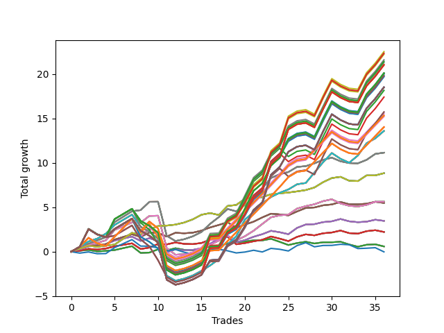

# Long Shepard 002 (1230 Waffles03) 
- Symbol: AAPL_Unlimited
- Date Range: 03/23/2022 - 07/08/2022
- Trading Period: 7:20-12:30
- Number of Trades: 36



| Name | Win Percent | Profit | Avg Profit / Trade | Avg Time / Trade |      | Name | Win Percent | Profit | Avg Profit / Trade | Avg Time / Trade |
| ---- | ----------- | ------ | ------------------ | ---------------- | ---- | ---- | ----------- | ------ | ------------------ | ---------------- |
| Sorted By <br> Profit | | | | | | Sorted By <br> Win Percentage ||||
| Ninety-Three | 69.44 | 11265.00 | 312.92 | 140:01 |     | Seventy | 86.11 | 4420.00 | 122.78 | 23:52 |
| One Hundred Eight | 69.44 | 11175.00 | 310.42 | 143:52 |     | Sixty-Two | 86.11 | 4420.00 | 122.78 | 23:52 |
| One Hundred Three | 69.44 | 11115.00 | 308.75 | 144:04 |     | Fifty-Four | 86.11 | 4420.00 | 122.78 | 23:52 |
| Ninety-Two | 69.44 | 10800.00 | 300.00 | 122:05 |     | Forty-Six | 86.11 | 4420.00 | 122.78 | 23:52 |
| One Hundred Seven | 69.44 | 10710.00 | 297.50 | 125:56 |     | Six | 86.11 | 4420.00 | 122.78 | 23:52 |
| One Hundred Two | 69.44 | 10650.00 | 295.83 | 126:08 |     | Sixty-Nine | 83.33 | 5575.00 | 154.86 | 49:23 |
| One Hundred Twenty-Eight | 69.44 | 10520.00 | 292.22 | 146:43 |     | Sixty-One | 83.33 | 5575.00 | 154.86 | 49:23 |
| One Hundred Twenty-Three | 69.44 | 10520.00 | 292.22 | 146:43 |     | Fifty-Three | 83.33 | 5575.00 | 154.86 | 49:23 |
| One Hundred Eighteen | 69.44 | 10520.00 | 292.22 | 146:43 |     | Forty-Five | 83.33 | 5575.00 | 154.86 | 49:23 |
| One Hundred Thirteen | 69.44 | 10520.00 | 292.22 | 146:43 |     | Five | 83.33 | 5575.00 | 154.86 | 49:23 |
| Eighty-Three | 69.44 | 10520.00 | 292.22 | 146:43 |     | Seventy-One | 80.56 | 6800.00 | 188.89 | 91:13 |
| One Hundred Twenty-Seven | 69.44 | 10055.00 | 279.31 | 128:47 |     | Sixty-Three | 80.56 | 6800.00 | 188.89 | 91:13 |
| One Hundred Twenty-Two | 69.44 | 10055.00 | 279.31 | 128:47 |     | Fifty-Five | 80.56 | 6800.00 | 188.89 | 91:13 |
| One Hundred Seventeen | 69.44 | 10055.00 | 279.31 | 128:47 |     | Forty-Seven | 80.56 | 6800.00 | 188.89 | 91:13 |
| One Hundred Twelve | 69.44 | 10055.00 | 279.31 | 128:47 |     | Seven | 80.56 | 6800.00 | 188.89 | 91:13 |
| Eighty-Two | 69.44 | 10055.00 | 279.31 | 128:47 |     | Sixty-Eight | 80.56 | 2815.00 | 78.19 | 39:35 |
| Ninety-Five | 69.44 | 10005.00 | 277.92 | 148:57 |     | Sixty | 80.56 | 2815.00 | 78.19 | 39:35 |
| Ninety-Four | 69.44 | 10005.00 | 277.92 | 148:57 |     | Fifty-Two | 80.56 | 2815.00 | 78.19 | 39:35 |
| One Hundred Ten | 69.44 | 9915.00 | 275.42 | 152:48 |     | Forty-Four | 80.56 | 2815.00 | 78.19 | 39:35 |
| One Hundred Nine | 69.44 | 9915.00 | 275.42 | 152:48 |     | Four | 80.56 | 2815.00 | 78.19 | 39:35 |
| One Hundred Five | 69.44 | 9855.00 | 273.75 | 153:00 |     | Ninety-One | 75.00 | 7760.00 | 215.56 | 90:01 |
| One Hundred Four | 69.44 | 9855.00 | 273.75 | 153:00 |     | One Hundred Six | 75.00 | 7670.00 | 213.06 | 93:53 |
| One Hundred Thirty | 69.44 | 9260.00 | 257.22 | 155:40 |     | Ninety-Six | 75.00 | 7655.00 | 212.64 | 86:48 |
| One Hundred Twenty-Nine | 69.44 | 9260.00 | 257.22 | 155:40 |     | One Hundred One | 75.00 | 7610.00 | 211.39 | 94:05 |
| One Hundred Twenty-Five | 69.44 | 9260.00 | 257.22 | 155:40 |     | One Hundred Twenty-Six | 75.00 | 7015.00 | 194.86 | 96:44 |
| One Hundred Twenty-Four | 69.44 | 9260.00 | 257.22 | 155:40 |     | One Hundred Twenty-One | 75.00 | 7015.00 | 194.86 | 96:44 |
| One Hundred Twenty | 69.44 | 9260.00 | 257.22 | 155:40 |     | One Hundred Sixteen | 75.00 | 7015.00 | 194.86 | 96:44 |
| One Hundred Ninteen | 69.44 | 9260.00 | 257.22 | 155:40 |     | One Hundred Eleven | 75.00 | 7015.00 | 194.86 | 96:44 |
| One Hundred Fifteen | 69.44 | 9260.00 | 257.22 | 155:40 |     | Eighty-One | 75.00 | 7015.00 | 194.86 | 96:44 |
| One Hundred Fourteen | 69.44 | 9260.00 | 257.22 | 155:40 |     | Sixty-Seven | 75.00 | 2745.00 | 76.25 | 19:43 |
| Eighty-Five | 69.44 | 9260.00 | 257.22 | 155:40 |     | Fifty-Nine | 75.00 | 2745.00 | 76.25 | 19:43 |
| Eighty-Four | 69.44 | 9260.00 | 257.22 | 155:40 |     | Fifty-One | 75.00 | 2745.00 | 76.25 | 19:43 |
| Ninety-Seven | 66.67 | 9080.00 | 252.22 | 114:27 |     | Forty-Three | 75.00 | 2745.00 | 76.25 | 19:43 |
| Ninety-Eight | 66.67 | 8705.00 | 241.81 | 130:33 |     | Three | 75.00 | 2745.00 | 76.25 | 19:43 |
| One Hundred | 66.67 | 7865.00 | 218.47 | 137:15 |     | Sixty-Six | 72.22 | 1735.00 | 48.19 | 20:37 |
| Ninety-Nine | 66.67 | 7865.00 | 218.47 | 137:15 |     | Fifty-Eight | 72.22 | 1735.00 | 48.19 | 20:37 |
| Ninety-One | 75.00 | 7760.00 | 215.56 | 90:01 |     | Fifty | 72.22 | 1735.00 | 48.19 | 20:37 |
| One Hundred Six | 75.00 | 7670.00 | 213.06 | 93:53 |     | Forty-Two | 72.22 | 1735.00 | 48.19 | 20:37 |
| Ninety-Six | 75.00 | 7655.00 | 212.64 | 86:48 |     | Two | 72.22 | 1735.00 | 48.19 | 20:37 |
| One Hundred One | 75.00 | 7610.00 | 211.39 | 94:05 |     | Ninety-Three | 69.44 | 11265.00 | 312.92 | 140:01 |
| One Hundred Twenty-Six | 75.00 | 7015.00 | 194.86 | 96:44 |     | One Hundred Eight | 69.44 | 11175.00 | 310.42 | 143:52 |
| One Hundred Twenty-One | 75.00 | 7015.00 | 194.86 | 96:44 |     | One Hundred Three | 69.44 | 11115.00 | 308.75 | 144:04 |
| One Hundred Sixteen | 75.00 | 7015.00 | 194.86 | 96:44 |     | Ninety-Two | 69.44 | 10800.00 | 300.00 | 122:05 |
| One Hundred Eleven | 75.00 | 7015.00 | 194.86 | 96:44 |     | One Hundred Seven | 69.44 | 10710.00 | 297.50 | 125:56 |
| Eighty-One | 75.00 | 7015.00 | 194.86 | 96:44 |     | One Hundred Two | 69.44 | 10650.00 | 295.83 | 126:08 |
| Seventy-One | 80.56 | 6800.00 | 188.89 | 91:13 |     | One Hundred Twenty-Eight | 69.44 | 10520.00 | 292.22 | 146:43 |
| Sixty-Three | 80.56 | 6800.00 | 188.89 | 91:13 |     | One Hundred Twenty-Three | 69.44 | 10520.00 | 292.22 | 146:43 |
| Fifty-Five | 80.56 | 6800.00 | 188.89 | 91:13 |     | One Hundred Eighteen | 69.44 | 10520.00 | 292.22 | 146:43 |
| Forty-Seven | 80.56 | 6800.00 | 188.89 | 91:13 |     | One Hundred Thirteen | 69.44 | 10520.00 | 292.22 | 146:43 |
| Seven | 80.56 | 6800.00 | 188.89 | 91:13 |     | Eighty-Three | 69.44 | 10520.00 | 292.22 | 146:43 |
| Sixty-Nine | 83.33 | 5575.00 | 154.86 | 49:23 |     | One Hundred Twenty-Seven | 69.44 | 10055.00 | 279.31 | 128:47 |
| Sixty-One | 83.33 | 5575.00 | 154.86 | 49:23 |     | One Hundred Twenty-Two | 69.44 | 10055.00 | 279.31 | 128:47 |
| Fifty-Three | 83.33 | 5575.00 | 154.86 | 49:23 |     | One Hundred Seventeen | 69.44 | 10055.00 | 279.31 | 128:47 |
| Forty-Five | 83.33 | 5575.00 | 154.86 | 49:23 |     | One Hundred Twelve | 69.44 | 10055.00 | 279.31 | 128:47 |
| Five | 83.33 | 5575.00 | 154.86 | 49:23 |     | Eighty-Two | 69.44 | 10055.00 | 279.31 | 128:47 |
| Seventy | 86.11 | 4420.00 | 122.78 | 23:52 |     | Ninety-Five | 69.44 | 10005.00 | 277.92 | 148:57 |
| Sixty-Two | 86.11 | 4420.00 | 122.78 | 23:52 |     | Ninety-Four | 69.44 | 10005.00 | 277.92 | 148:57 |
| Fifty-Four | 86.11 | 4420.00 | 122.78 | 23:52 |     | One Hundred Ten | 69.44 | 9915.00 | 275.42 | 152:48 |
| Forty-Six | 86.11 | 4420.00 | 122.78 | 23:52 |     | One Hundred Nine | 69.44 | 9915.00 | 275.42 | 152:48 |
| Six | 86.11 | 4420.00 | 122.78 | 23:52 |     | One Hundred Five | 69.44 | 9855.00 | 273.75 | 153:00 |
| Sixty-Eight | 80.56 | 2815.00 | 78.19 | 39:35 |     | One Hundred Four | 69.44 | 9855.00 | 273.75 | 153:00 |
| Sixty | 80.56 | 2815.00 | 78.19 | 39:35 |     | One Hundred Thirty | 69.44 | 9260.00 | 257.22 | 155:40 |
| Fifty-Two | 80.56 | 2815.00 | 78.19 | 39:35 |     | One Hundred Twenty-Nine | 69.44 | 9260.00 | 257.22 | 155:40 |
| Forty-Four | 80.56 | 2815.00 | 78.19 | 39:35 |     | One Hundred Twenty-Five | 69.44 | 9260.00 | 257.22 | 155:40 |
| Four | 80.56 | 2815.00 | 78.19 | 39:35 |     | One Hundred Twenty-Four | 69.44 | 9260.00 | 257.22 | 155:40 |
| Sixty-Seven | 75.00 | 2745.00 | 76.25 | 19:43 |     | One Hundred Twenty | 69.44 | 9260.00 | 257.22 | 155:40 |
| Fifty-Nine | 75.00 | 2745.00 | 76.25 | 19:43 |     | One Hundred Ninteen | 69.44 | 9260.00 | 257.22 | 155:40 |
| Fifty-One | 75.00 | 2745.00 | 76.25 | 19:43 |     | One Hundred Fifteen | 69.44 | 9260.00 | 257.22 | 155:40 |
| Forty-Three | 75.00 | 2745.00 | 76.25 | 19:43 |     | One Hundred Fourteen | 69.44 | 9260.00 | 257.22 | 155:40 |
| Three | 75.00 | 2745.00 | 76.25 | 19:43 |     | Eighty-Five | 69.44 | 9260.00 | 257.22 | 155:40 |
| Sixty-Six | 72.22 | 1735.00 | 48.19 | 20:37 |     | Eighty-Four | 69.44 | 9260.00 | 257.22 | 155:40 |
| Fifty-Eight | 72.22 | 1735.00 | 48.19 | 20:37 |     | Ninety-Seven | 66.67 | 9080.00 | 252.22 | 114:27 |
| Fifty | 72.22 | 1735.00 | 48.19 | 20:37 |     | Ninety-Eight | 66.67 | 8705.00 | 241.81 | 130:33 |
| Forty-Two | 72.22 | 1735.00 | 48.19 | 20:37 |     | One Hundred | 66.67 | 7865.00 | 218.47 | 137:15 |
| Two | 72.22 | 1735.00 | 48.19 | 20:37 |     | Ninety-Nine | 66.67 | 7865.00 | 218.47 | 137:15 |
| Sixty-Five | 66.67 | 1110.00 | 30.83 | 13:37 |     | Sixty-Five | 66.67 | 1110.00 | 30.83 | 13:37 |
| Fifty-Seven | 66.67 | 1110.00 | 30.83 | 13:37 |     | Fifty-Seven | 66.67 | 1110.00 | 30.83 | 13:37 |
| Forty-Nine | 66.67 | 1110.00 | 30.83 | 13:37 |     | Forty-Nine | 66.67 | 1110.00 | 30.83 | 13:37 |
| Forty-One | 66.67 | 1110.00 | 30.83 | 13:37 |     | Forty-One | 66.67 | 1110.00 | 30.83 | 13:37 |
| One | 66.67 | 1110.00 | 30.83 | 13:37 |     | One | 66.67 | 1110.00 | 30.83 | 13:37 |
| Sixty-Four | 63.89 | 295.00 | 8.19 | 08:25 |     | Sixty-Four | 63.89 | 295.00 | 8.19 | 08:25 |
| Fifty-Six | 63.89 | 295.00 | 8.19 | 08:25 |     | Fifty-Six | 63.89 | 295.00 | 8.19 | 08:25 |
| Forty-Eight | 63.89 | 295.00 | 8.19 | 08:25 |     | Forty-Eight | 63.89 | 295.00 | 8.19 | 08:25 |
| Forty | 63.89 | 295.00 | 8.19 | 08:25 |     | Forty | 63.89 | 295.00 | 8.19 | 08:25 |
| Zero | 63.89 | 295.00 | 8.19 | 08:25 |     | Zero | 63.89 | 295.00 | 8.19 | 08:25 |
| Seventy-Three | 50.00 | -10.00 | -0.28 | 09:46 |     | Seventy-Three | 50.00 | -10.00 | -0.28 | 09:46 |

## NO STOPLOSS

### Test Zero
* Sell when price hits the middle line of the 20p bollinger
* No Stoploss
* Results:
```
Total Trades: 36
Percent Up: 63.89
Percent Down: 36.11
Total Points Moved Up: 0.59
Potential Profit: 295.00
Total Points Ups: 3.59 Count Ups: 23
Total Points Downs: -3.00 Count Downs: 13
```

<details><summary>Trades</summary>

<code>In: 2022-03-25 12:31:00		Out: 2022-03-25 12:36:40		Total Position Time: 05:40		Total Move Up: 0.11		Total to Date: 0.11</code> <br />
<code>In: 2022-03-29 09:38:00		Out: 2022-03-29 09:43:15		Total Position Time: 05:15		Total Move Up: 0.09		Total to Date: 0.20</code> <br />
<code>In: 2022-03-31 08:23:00		Out: 2022-03-31 08:33:15		Total Position Time: 10:15		Total Move Up: -0.17		Total to Date: 0.03</code> <br />
<code>In: 2022-03-31 10:19:00		Out: 2022-03-31 10:20:40		Total Position Time: 01:40		Total Move Up: 0.06		Total to Date: 0.09</code> <br />
<code>In: 2022-04-06 11:22:00		Out: 2022-04-06 11:29:25		Total Position Time: 07:25		Total Move Up: 0.09		Total to Date: 0.18</code> <br />
<code>In: 2022-04-08 11:36:00		Out: 2022-04-08 11:39:40		Total Position Time: 03:40		Total Move Up: 0.22		Total to Date: 0.40</code> <br />
<code>In: 2022-04-08 11:36:00		Out: 2022-04-08 11:39:40		Total Position Time: 03:40		Total Move Up: 0.22		Total to Date: 0.62</code> <br />
<code>In: 2022-04-12 07:47:00		Out: 2022-04-12 08:13:15		Total Position Time: 26:15		Total Move Up: -0.76		Total to Date: -0.14</code> <br />
<code>In: 2022-04-12 08:02:00		Out: 2022-04-12 08:13:15		Total Position Time: 11:15		Total Move Up: 0.04		Total to Date: -0.10</code> <br />
<code>In: 2022-04-12 09:16:00		Out: 2022-04-12 09:17:45		Total Position Time: 01:45		Total Move Up: 0.36		Total to Date: 0.26</code> <br />
<code>In: 2022-04-21 08:53:00		Out: 2022-04-21 09:06:35		Total Position Time: 13:35		Total Move Up: -0.12		Total to Date: 0.14</code> <br />
<code>In: 2022-04-27 11:32:00		Out: 2022-04-27 11:33:25		Total Position Time: 01:25		Total Move Up: 0.25		Total to Date: 0.39</code> <br />
<code>In: 2022-04-27 12:02:00		Out: 2022-04-27 12:13:50		Total Position Time: 11:50		Total Move Up: -0.18		Total to Date: 0.21</code> <br />
<code>In: 2022-04-27 12:07:00		Out: 2022-04-27 12:13:50		Total Position Time: 06:50		Total Move Up: -0.05		Total to Date: 0.16</code> <br />
<code>In: 2022-04-27 12:11:00		Out: 2022-04-27 12:13:50		Total Position Time: 02:50		Total Move Up: 0.11		Total to Date: 0.27</code> <br />
<code>In: 2022-05-03 07:49:00		Out: 2022-05-03 07:54:05		Total Position Time: 05:05		Total Move Up: 0.36		Total to Date: 0.63</code> <br />
<code>In: 2022-05-03 11:45:00		Out: 2022-05-03 11:48:15		Total Position Time: 03:15		Total Move Up: -0.01		Total to Date: 0.62</code> <br />
<code>In: 2022-05-06 12:11:00		Out: 2022-05-06 12:13:05		Total Position Time: 02:05		Total Move Up: 0.31		Total to Date: 0.93</code> <br />
<code>In: 2022-05-13 10:49:00		Out: 2022-05-13 10:50:25		Total Position Time: 01:25		Total Move Up: 0.14		Total to Date: 1.07</code> <br />
<code>In: 2022-05-13 11:10:00		Out: 2022-05-13 11:19:30		Total Position Time: 09:30		Total Move Up: 0.07		Total to Date: 1.14</code> <br />
<code>In: 2022-05-31 08:22:00		Out: 2022-05-31 08:26:05		Total Position Time: 04:05		Total Move Up: 0.14		Total to Date: 1.28</code> <br />
<code>In: 2022-05-31 11:59:00		Out: 2022-05-31 12:07:05		Total Position Time: 08:05		Total Move Up: -0.01		Total to Date: 1.27</code> <br />
<code>In: 2022-06-02 07:31:00		Out: 2022-06-02 07:38:20		Total Position Time: 07:20		Total Move Up: 0.18		Total to Date: 1.45</code> <br />
<code>In: 2022-06-14 12:02:00		Out: 2022-06-14 12:22:10		Total Position Time: 20:10		Total Move Up: -0.34		Total to Date: 1.11</code> <br />
<code>In: 2022-06-15 09:50:00		Out: 2022-06-15 10:11:05		Total Position Time: 21:05		Total Move Up: -0.36		Total to Date: 0.75</code> <br />
<code>In: 2022-06-17 12:18:00		Out: 2022-06-17 12:20:50		Total Position Time: 02:50		Total Move Up: 0.22		Total to Date: 0.97</code> <br />
<code>In: 2022-06-21 09:13:00		Out: 2022-06-21 09:14:55		Total Position Time: 01:55		Total Move Up: 0.15		Total to Date: 1.12</code> <br />
<code>In: 2022-06-22 09:01:00		Out: 2022-06-22 09:14:25		Total Position Time: 13:25		Total Move Up: -0.20		Total to Date: 0.92</code> <br />
<code>In: 2022-06-23 09:48:00		Out: 2022-06-23 09:53:45		Total Position Time: 05:45		Total Move Up: 0.14		Total to Date: 1.06</code> <br />
<code>In: 2022-06-23 09:49:00		Out: 2022-06-23 09:53:45		Total Position Time: 04:45		Total Move Up: 0.00		Total to Date: 1.06</code> <br />
<code>In: 2022-06-27 09:36:00		Out: 2022-06-27 09:43:35		Total Position Time: 07:35		Total Move Up: 0.06		Total to Date: 1.12</code> <br />
<code>In: 2022-06-27 10:37:00		Out: 2022-06-27 11:03:15		Total Position Time: 26:15		Total Move Up: -0.31		Total to Date: 0.81</code> <br />
<code>In: 2022-06-29 09:17:00		Out: 2022-06-29 09:36:45		Total Position Time: 19:45		Total Move Up: -0.25		Total to Date: 0.56</code> <br />
<code>In: 2022-07-06 08:16:00		Out: 2022-07-06 08:19:05		Total Position Time: 03:05		Total Move Up: 0.22		Total to Date: 0.78</code> <br />
<code>In: 2022-07-07 08:35:00		Out: 2022-07-07 08:43:05		Total Position Time: 08:05		Total Move Up: 0.05		Total to Date: 0.83</code> <br />
<code>In: 2022-07-08 09:35:00		Out: 2022-07-08 09:49:45		Total Position Time: 14:45		Total Move Up: -0.24		Total to Date: 0.59</code> <br />


</details>

### Test One
* Sell when the price hits the upper line of the 20p 1std bollinger
* No Stoploss
* Results:
```
Total Trades: 36
Percent Up: 66.67
Percent Down: 33.33
Total Points Moved Up: 2.22
Potential Profit: 1110.00
Total Points Ups: 5.21 Count Ups: 24
Total Points Downs: -2.99 Count Downs: 12
```

<details><summary>Trades</summary>

<code>In: 2022-03-25 12:31:00		Out: 2022-03-25 12:41:15		Total Position Time: 10:15		Total Move Up: 0.11		Total to Date: 0.11</code> <br />
<code>In: 2022-03-29 09:38:00		Out: 2022-03-29 09:45:05		Total Position Time: 07:05		Total Move Up: 0.21		Total to Date: 0.32</code> <br />
<code>In: 2022-03-31 08:23:00		Out: 2022-03-31 08:36:30		Total Position Time: 13:30		Total Move Up: -0.08		Total to Date: 0.24</code> <br />
<code>In: 2022-03-31 10:19:00		Out: 2022-03-31 10:29:20		Total Position Time: 10:20		Total Move Up: 0.12		Total to Date: 0.36</code> <br />
<code>In: 2022-04-06 11:22:00		Out: 2022-04-06 11:31:35		Total Position Time: 09:35		Total Move Up: 0.24		Total to Date: 0.60</code> <br />
<code>In: 2022-04-08 11:36:00		Out: 2022-04-08 11:45:40		Total Position Time: 09:40		Total Move Up: 0.17		Total to Date: 0.77</code> <br />
<code>In: 2022-04-08 11:36:00		Out: 2022-04-08 11:45:40		Total Position Time: 09:40		Total Move Up: 0.17		Total to Date: 0.94</code> <br />
<code>In: 2022-04-12 07:47:00		Out: 2022-04-12 08:14:15		Total Position Time: 27:15		Total Move Up: -0.64		Total to Date: 0.30</code> <br />
<code>In: 2022-04-12 08:02:00		Out: 2022-04-12 08:14:15		Total Position Time: 12:15		Total Move Up: 0.16		Total to Date: 0.46</code> <br />
<code>In: 2022-04-12 09:16:00		Out: 2022-04-12 09:18:05		Total Position Time: 02:05		Total Move Up: 0.41		Total to Date: 0.87</code> <br />
<code>In: 2022-04-21 08:53:00		Out: 2022-04-21 09:12:05		Total Position Time: 19:05		Total Move Up: -0.05		Total to Date: 0.82</code> <br />
<code>In: 2022-04-27 11:32:00		Out: 2022-04-27 11:40:05		Total Position Time: 08:05		Total Move Up: 0.22		Total to Date: 1.04</code> <br />
<code>In: 2022-04-27 12:02:00		Out: 2022-04-27 12:27:15		Total Position Time: 25:15		Total Move Up: -0.16		Total to Date: 0.88</code> <br />
<code>In: 2022-04-27 12:07:00		Out: 2022-04-27 12:27:15		Total Position Time: 20:15		Total Move Up: -0.03		Total to Date: 0.85</code> <br />
<code>In: 2022-04-27 12:11:00		Out: 2022-04-27 12:27:15		Total Position Time: 16:15		Total Move Up: 0.13		Total to Date: 0.98</code> <br />
<code>In: 2022-05-03 07:49:00		Out: 2022-05-03 07:57:20		Total Position Time: 08:20		Total Move Up: 0.37		Total to Date: 1.35</code> <br />
<code>In: 2022-05-03 11:45:00		Out: 2022-05-03 11:52:05		Total Position Time: 07:05		Total Move Up: 0.28		Total to Date: 1.63</code> <br />
<code>In: 2022-05-06 12:11:00		Out: 2022-05-06 12:28:05		Total Position Time: 17:05		Total Move Up: 0.05		Total to Date: 1.68</code> <br />
<code>In: 2022-05-13 10:49:00		Out: 2022-05-13 11:22:30		Total Position Time: 33:30		Total Move Up: -0.85		Total to Date: 0.83</code> <br />
<code>In: 2022-05-13 11:10:00		Out: 2022-05-13 11:22:30		Total Position Time: 12:30		Total Move Up: 0.14		Total to Date: 0.97</code> <br />
<code>In: 2022-05-31 08:22:00		Out: 2022-05-31 08:33:05		Total Position Time: 11:05		Total Move Up: 0.20		Total to Date: 1.17</code> <br />
<code>In: 2022-05-31 11:59:00		Out: 2022-05-31 12:07:55		Total Position Time: 08:55		Total Move Up: 0.17		Total to Date: 1.34</code> <br />
<code>In: 2022-06-02 07:31:00		Out: 2022-06-02 07:40:05		Total Position Time: 09:05		Total Move Up: 0.37		Total to Date: 1.71</code> <br />
<code>In: 2022-06-14 12:02:00		Out: 2022-06-14 12:26:30		Total Position Time: 24:30		Total Move Up: -0.24		Total to Date: 1.47</code> <br />
<code>In: 2022-06-15 09:50:00		Out: 2022-06-15 10:12:45		Total Position Time: 22:45		Total Move Up: -0.28		Total to Date: 1.19</code> <br />
<code>In: 2022-06-17 12:18:00		Out: 2022-06-17 12:24:00		Total Position Time: 06:00		Total Move Up: 0.48		Total to Date: 1.67</code> <br />
<code>In: 2022-06-21 09:13:00		Out: 2022-06-21 09:17:25		Total Position Time: 04:25		Total Move Up: 0.28		Total to Date: 1.95</code> <br />
<code>In: 2022-06-22 09:01:00		Out: 2022-06-22 09:17:55		Total Position Time: 16:55		Total Move Up: -0.11		Total to Date: 1.84</code> <br />
<code>In: 2022-06-23 09:48:00		Out: 2022-06-23 09:54:05		Total Position Time: 06:05		Total Move Up: 0.23		Total to Date: 2.07</code> <br />
<code>In: 2022-06-23 09:49:00		Out: 2022-06-23 09:54:05		Total Position Time: 05:05		Total Move Up: 0.09		Total to Date: 2.16</code> <br />
<code>In: 2022-06-27 09:36:00		Out: 2022-06-27 09:45:00		Total Position Time: 09:00		Total Move Up: 0.22		Total to Date: 2.38</code> <br />
<code>In: 2022-06-27 10:37:00		Out: 2022-06-27 11:05:00		Total Position Time: 28:00		Total Move Up: -0.29		Total to Date: 2.09</code> <br />
<code>In: 2022-06-29 09:17:00		Out: 2022-06-29 09:38:30		Total Position Time: 21:30		Total Move Up: -0.06		Total to Date: 2.03</code> <br />
<code>In: 2022-07-06 08:16:00		Out: 2022-07-06 08:24:10		Total Position Time: 08:10		Total Move Up: 0.28		Total to Date: 2.31</code> <br />
<code>In: 2022-07-07 08:35:00		Out: 2022-07-07 08:43:30		Total Position Time: 08:30		Total Move Up: 0.11		Total to Date: 2.42</code> <br />
<code>In: 2022-07-08 09:35:00		Out: 2022-07-08 09:56:10		Total Position Time: 21:10		Total Move Up: -0.20		Total to Date: 2.22</code> <br />


</details>

### Test Two
* Sell when the price hits the upper line of the 20p 2std bollinger
* No Stoploss
* Results:
```
Total Trades: 36
Percent Up: 72.22
Percent Down: 27.78
Total Points Moved Up: 3.47
Potential Profit: 1735.00
Total Points Ups: 7.28 Count Ups: 26
Total Points Downs: -3.81 Count Downs: 10
```

<details><summary>Trades</summary>

<code>In: 2022-03-25 12:31:00		Out: 2022-03-25 12:41:30		Total Position Time: 10:30		Total Move Up: 0.26		Total to Date: 0.26</code> <br />
<code>In: 2022-03-29 09:38:00		Out: 2022-03-29 09:45:30		Total Position Time: 07:30		Total Move Up: 0.35		Total to Date: 0.61</code> <br />
<code>In: 2022-03-31 08:23:00		Out: 2022-03-31 08:36:40		Total Position Time: 13:40		Total Move Up: 0.01		Total to Date: 0.62</code> <br />
<code>In: 2022-03-31 10:19:00		Out: 2022-03-31 10:29:40		Total Position Time: 10:40		Total Move Up: 0.20		Total to Date: 0.82</code> <br />
<code>In: 2022-04-06 11:22:00		Out: 2022-04-06 11:32:10		Total Position Time: 10:10		Total Move Up: 0.44		Total to Date: 1.26</code> <br />
<code>In: 2022-04-08 11:36:00		Out: 2022-04-08 11:46:10		Total Position Time: 10:10		Total Move Up: 0.22		Total to Date: 1.48</code> <br />
<code>In: 2022-04-08 11:36:00		Out: 2022-04-08 11:46:10		Total Position Time: 10:10		Total Move Up: 0.22		Total to Date: 1.70</code> <br />
<code>In: 2022-04-12 07:47:00		Out: 2022-04-12 08:15:15		Total Position Time: 28:15		Total Move Up: -0.49		Total to Date: 1.21</code> <br />
<code>In: 2022-04-12 08:02:00		Out: 2022-04-12 08:15:15		Total Position Time: 13:15		Total Move Up: 0.31		Total to Date: 1.52</code> <br />
<code>In: 2022-04-12 09:16:00		Out: 2022-04-12 09:49:40		Total Position Time: 33:40		Total Move Up: -0.32		Total to Date: 1.20</code> <br />
<code>In: 2022-04-21 08:53:00		Out: 2022-04-21 10:31:20		Total Position Time: 98:20		Total Move Up: -1.28		Total to Date: -0.08</code> <br />
<code>In: 2022-04-27 11:32:00		Out: 2022-04-27 11:42:40		Total Position Time: 10:40		Total Move Up: 0.35		Total to Date: 0.27</code> <br />
<code>In: 2022-04-27 12:02:00		Out: 2022-04-27 12:27:30		Total Position Time: 25:30		Total Move Up: -0.10		Total to Date: 0.17</code> <br />
<code>In: 2022-04-27 12:07:00		Out: 2022-04-27 12:27:30		Total Position Time: 20:30		Total Move Up: 0.03		Total to Date: 0.20</code> <br />
<code>In: 2022-04-27 12:11:00		Out: 2022-04-27 12:27:30		Total Position Time: 16:30		Total Move Up: 0.19		Total to Date: 0.39</code> <br />
<code>In: 2022-05-03 07:49:00		Out: 2022-05-03 08:02:10		Total Position Time: 13:10		Total Move Up: 0.50		Total to Date: 0.89</code> <br />
<code>In: 2022-05-03 11:45:00		Out: 2022-05-03 11:59:05		Total Position Time: 14:05		Total Move Up: 0.59		Total to Date: 1.48</code> <br />
<code>In: 2022-05-06 12:11:00		Out: 2022-05-06 12:30:15		Total Position Time: 19:15		Total Move Up: 0.33		Total to Date: 1.81</code> <br />
<code>In: 2022-05-13 10:49:00		Out: 2022-05-13 11:31:00		Total Position Time: 42:00		Total Move Up: -0.75		Total to Date: 1.06</code> <br />
<code>In: 2022-05-13 11:10:00		Out: 2022-05-13 11:31:00		Total Position Time: 21:00		Total Move Up: 0.24		Total to Date: 1.30</code> <br />
<code>In: 2022-05-31 08:22:00		Out: 2022-05-31 08:34:20		Total Position Time: 12:20		Total Move Up: 0.38		Total to Date: 1.68</code> <br />
<code>In: 2022-05-31 11:59:00		Out: 2022-05-31 12:09:55		Total Position Time: 10:55		Total Move Up: 0.29		Total to Date: 1.97</code> <br />
<code>In: 2022-06-02 07:31:00		Out: 2022-06-02 07:42:10		Total Position Time: 11:10		Total Move Up: 0.38		Total to Date: 2.35</code> <br />
<code>In: 2022-06-14 12:02:00		Out: 2022-06-14 12:27:10		Total Position Time: 25:10		Total Move Up: -0.16		Total to Date: 2.19</code> <br />
<code>In: 2022-06-15 09:50:00		Out: 2022-06-15 10:13:35		Total Position Time: 23:35		Total Move Up: -0.22		Total to Date: 1.97</code> <br />
<code>In: 2022-06-17 12:18:00		Out: 2022-06-17 12:27:00		Total Position Time: 09:00		Total Move Up: 0.71		Total to Date: 2.68</code> <br />
<code>In: 2022-06-21 09:13:00		Out: 2022-06-21 09:20:10		Total Position Time: 07:10		Total Move Up: 0.38		Total to Date: 3.06</code> <br />
<code>In: 2022-06-22 09:01:00		Out: 2022-06-22 09:19:25		Total Position Time: 18:25		Total Move Up: 0.04		Total to Date: 3.10</code> <br />
<code>In: 2022-06-23 09:48:00		Out: 2022-06-23 09:56:50		Total Position Time: 08:50		Total Move Up: 0.23		Total to Date: 3.33</code> <br />
<code>In: 2022-06-23 09:49:00		Out: 2022-06-23 09:56:50		Total Position Time: 07:50		Total Move Up: 0.09		Total to Date: 3.42</code> <br />
<code>In: 2022-06-27 09:36:00		Out: 2022-06-27 09:45:20		Total Position Time: 09:20		Total Move Up: 0.26		Total to Date: 3.68</code> <br />
<code>In: 2022-06-27 10:37:00		Out: 2022-06-27 11:17:10		Total Position Time: 40:10		Total Move Up: -0.26		Total to Date: 3.42</code> <br />
<code>In: 2022-06-29 09:17:00		Out: 2022-06-29 10:10:00		Total Position Time: 53:00		Total Move Up: -0.10		Total to Date: 3.32</code> <br />
<code>In: 2022-07-06 08:16:00		Out: 2022-07-06 08:49:05		Total Position Time: 33:05		Total Move Up: 0.06		Total to Date: 3.38</code> <br />
<code>In: 2022-07-07 08:35:00		Out: 2022-07-07 08:44:00		Total Position Time: 09:00		Total Move Up: 0.22		Total to Date: 3.60</code> <br />
<code>In: 2022-07-08 09:35:00		Out: 2022-07-08 10:09:45		Total Position Time: 34:45		Total Move Up: -0.13		Total to Date: 3.47</code> <br />


</details>

### Test Three
* Sell when price hits the middle line of the 50p bollinger
* No Stoploss
* Results:
```
Total Trades: 36
Percent Up: 75.00
Percent Down: 25.00
Total Points Moved Up: 5.49
Potential Profit: 2745.00
Total Points Ups: 7.52 Count Ups: 27
Total Points Downs: -2.03 Count Downs: 9
```

<details><summary>Trades</summary>

<code>In: 2022-03-25 12:31:00		Out: 2022-03-25 12:45:30		Total Position Time: 14:30		Total Move Up: 0.38		Total to Date: 0.38</code> <br />
<code>In: 2022-03-29 09:38:00		Out: 2022-03-29 09:45:20		Total Position Time: 07:20		Total Move Up: 0.29		Total to Date: 0.67</code> <br />
<code>In: 2022-03-31 08:23:00		Out: 2022-03-31 08:36:45		Total Position Time: 13:45		Total Move Up: 0.04		Total to Date: 0.71</code> <br />
<code>In: 2022-03-31 10:19:00		Out: 2022-03-31 10:29:25		Total Position Time: 10:25		Total Move Up: 0.15		Total to Date: 0.86</code> <br />
<code>In: 2022-04-06 11:22:00		Out: 2022-04-06 11:32:20		Total Position Time: 10:20		Total Move Up: 0.50		Total to Date: 1.36</code> <br />
<code>In: 2022-04-08 11:36:00		Out: 2022-04-08 11:40:40		Total Position Time: 04:40		Total Move Up: 0.30		Total to Date: 1.66</code> <br />
<code>In: 2022-04-08 11:36:00		Out: 2022-04-08 11:40:40		Total Position Time: 04:40		Total Move Up: 0.30		Total to Date: 1.96</code> <br />
<code>In: 2022-04-12 07:47:00		Out: 2022-04-12 08:19:50		Total Position Time: 32:50		Total Move Up: -0.30		Total to Date: 1.66</code> <br />
<code>In: 2022-04-12 08:02:00		Out: 2022-04-12 08:19:50		Total Position Time: 17:50		Total Move Up: 0.50		Total to Date: 2.16</code> <br />
<code>In: 2022-04-12 09:16:00		Out: 2022-04-12 09:50:15		Total Position Time: 34:15		Total Move Up: -0.05		Total to Date: 2.11</code> <br />
<code>In: 2022-04-21 08:53:00		Out: 2022-04-21 09:47:05		Total Position Time: 54:05		Total Move Up: -0.41		Total to Date: 1.70</code> <br />
<code>In: 2022-04-27 11:32:00		Out: 2022-04-27 11:45:50		Total Position Time: 13:50		Total Move Up: 0.43		Total to Date: 2.13</code> <br />
<code>In: 2022-04-27 12:02:00		Out: 2022-04-27 12:35:30		Total Position Time: 33:30		Total Move Up: -0.06		Total to Date: 2.07</code> <br />
<code>In: 2022-04-27 12:07:00		Out: 2022-04-27 12:35:30		Total Position Time: 28:30		Total Move Up: 0.07		Total to Date: 2.14</code> <br />
<code>In: 2022-04-27 12:11:00		Out: 2022-04-27 12:35:30		Total Position Time: 24:30		Total Move Up: 0.23		Total to Date: 2.37</code> <br />
<code>In: 2022-05-03 07:49:00		Out: 2022-05-03 07:54:05		Total Position Time: 05:05		Total Move Up: 0.36		Total to Date: 2.73</code> <br />
<code>In: 2022-05-03 11:45:00		Out: 2022-05-03 11:52:05		Total Position Time: 07:05		Total Move Up: 0.28		Total to Date: 3.01</code> <br />
<code>In: 2022-05-06 12:11:00		Out: 2022-05-06 12:13:05		Total Position Time: 02:05		Total Move Up: 0.31		Total to Date: 3.32</code> <br />
<code>In: 2022-05-13 10:49:00		Out: 2022-05-13 11:31:20		Total Position Time: 42:20		Total Move Up: -0.63		Total to Date: 2.69</code> <br />
<code>In: 2022-05-13 11:10:00		Out: 2022-05-13 11:31:20		Total Position Time: 21:20		Total Move Up: 0.36		Total to Date: 3.05</code> <br />
<code>In: 2022-05-31 08:22:00		Out: 2022-05-31 08:26:40		Total Position Time: 04:40		Total Move Up: 0.33		Total to Date: 3.38</code> <br />
<code>In: 2022-05-31 11:59:00		Out: 2022-05-31 12:15:15		Total Position Time: 16:15		Total Move Up: 0.48		Total to Date: 3.86</code> <br />
<code>In: 2022-06-02 07:31:00		Out: 2022-06-02 07:40:10		Total Position Time: 09:10		Total Move Up: 0.42		Total to Date: 4.28</code> <br />
<code>In: 2022-06-14 12:02:00		Out: 2022-06-14 12:27:25		Total Position Time: 25:25		Total Move Up: -0.08		Total to Date: 4.20</code> <br />
<code>In: 2022-06-15 09:50:00		Out: 2022-06-15 10:20:55		Total Position Time: 30:55		Total Move Up: -0.11		Total to Date: 4.09</code> <br />
<code>In: 2022-06-17 12:18:00		Out: 2022-06-17 12:23:00		Total Position Time: 05:00		Total Move Up: 0.44		Total to Date: 4.53</code> <br />
<code>In: 2022-06-21 09:13:00		Out: 2022-06-21 09:23:05		Total Position Time: 10:05		Total Move Up: 0.39		Total to Date: 4.92</code> <br />
<code>In: 2022-06-22 09:01:00		Out: 2022-06-22 09:28:30		Total Position Time: 27:30		Total Move Up: 0.06		Total to Date: 4.98</code> <br />
<code>In: 2022-06-23 09:48:00		Out: 2022-06-23 10:07:30		Total Position Time: 19:30		Total Move Up: 0.24		Total to Date: 5.22</code> <br />
<code>In: 2022-06-23 09:49:00		Out: 2022-06-23 10:07:30		Total Position Time: 18:30		Total Move Up: 0.10		Total to Date: 5.32</code> <br />
<code>In: 2022-06-27 09:36:00		Out: 2022-06-27 09:50:50		Total Position Time: 14:50		Total Move Up: 0.28		Total to Date: 5.60</code> <br />
<code>In: 2022-06-27 10:37:00		Out: 2022-06-27 11:17:10		Total Position Time: 40:10		Total Move Up: -0.26		Total to Date: 5.34</code> <br />
<code>In: 2022-06-29 09:17:00		Out: 2022-06-29 09:45:15		Total Position Time: 28:15		Total Move Up: 0.00		Total to Date: 5.34</code> <br />
<code>In: 2022-07-06 08:16:00		Out: 2022-07-06 08:49:05		Total Position Time: 33:05		Total Move Up: 0.06		Total to Date: 5.40</code> <br />
<code>In: 2022-07-07 08:35:00		Out: 2022-07-07 08:44:00		Total Position Time: 09:00		Total Move Up: 0.22		Total to Date: 5.62</code> <br />
<code>In: 2022-07-08 09:35:00		Out: 2022-07-08 10:09:45		Total Position Time: 34:45		Total Move Up: -0.13		Total to Date: 5.49</code> <br />


</details>

### Test Four
* Sell when the price hits the upper line of the 50p 1std bollinger
* No Stoploss
* Results:
```
Total Trades: 36
Percent Up: 80.56
Percent Down: 19.44
Total Points Moved Up: 5.63
Potential Profit: 2815.00
Total Points Ups: 11.38 Count Ups: 29
Total Points Downs: -5.75 Count Downs: 7
```

<details><summary>Trades</summary>

<code>In: 2022-03-25 12:31:00		Out: 2022-03-25 12:47:00		Total Position Time: 16:00		Total Move Up: 0.55		Total to Date: 0.55</code> <br />
<code>In: 2022-03-29 09:38:00		Out: 2022-03-29 10:29:15		Total Position Time: 51:15		Total Move Up: 0.24		Total to Date: 0.79</code> <br />
<code>In: 2022-03-31 08:23:00		Out: 2022-03-31 08:40:40		Total Position Time: 17:40		Total Move Up: 0.20		Total to Date: 0.99</code> <br />
<code>In: 2022-03-31 10:19:00		Out: 2022-03-31 10:31:15		Total Position Time: 12:15		Total Move Up: 0.29		Total to Date: 1.28</code> <br />
<code>In: 2022-04-06 11:22:00		Out: 2022-04-06 11:32:50		Total Position Time: 10:50		Total Move Up: 1.17		Total to Date: 2.45</code> <br />
<code>In: 2022-04-08 11:36:00		Out: 2022-04-08 11:48:15		Total Position Time: 12:15		Total Move Up: 0.42		Total to Date: 2.87</code> <br />
<code>In: 2022-04-08 11:36:00		Out: 2022-04-08 11:48:15		Total Position Time: 12:15		Total Move Up: 0.42		Total to Date: 3.29</code> <br />
<code>In: 2022-04-12 07:47:00		Out: 2022-04-12 08:25:10		Total Position Time: 38:10		Total Move Up: -0.03		Total to Date: 3.26</code> <br />
<code>In: 2022-04-12 08:02:00		Out: 2022-04-12 08:25:10		Total Position Time: 23:10		Total Move Up: 0.77		Total to Date: 4.03</code> <br />
<code>In: 2022-04-12 09:16:00		Out: 2022-04-12 09:58:15		Total Position Time: 42:15		Total Move Up: 0.02		Total to Date: 4.05</code> <br />
<code>In: 2022-04-21 08:53:00		Out: 2022-04-21 12:29:55		Total Position Time: 216:55		Total Move Up: -3.65		Total to Date: 0.40</code> <br />
<code>In: 2022-04-27 11:32:00		Out: 2022-04-27 12:44:15		Total Position Time: 72:15		Total Move Up: -0.74		Total to Date: -0.34</code> <br />
<code>In: 2022-04-27 12:02:00		Out: 2022-04-27 12:44:15		Total Position Time: 42:15		Total Move Up: 0.05		Total to Date: -0.29</code> <br />
<code>In: 2022-04-27 12:07:00		Out: 2022-04-27 12:44:15		Total Position Time: 37:15		Total Move Up: 0.18		Total to Date: -0.11</code> <br />
<code>In: 2022-04-27 12:11:00		Out: 2022-04-27 12:44:15		Total Position Time: 33:15		Total Move Up: 0.34		Total to Date: 0.23</code> <br />
<code>In: 2022-05-03 07:49:00		Out: 2022-05-03 08:02:25		Total Position Time: 13:25		Total Move Up: 0.56		Total to Date: 0.79</code> <br />
<code>In: 2022-05-03 11:45:00		Out: 2022-05-03 11:57:05		Total Position Time: 12:05		Total Move Up: 0.46		Total to Date: 1.25</code> <br />
<code>In: 2022-05-06 12:11:00		Out: 2022-05-06 12:30:30		Total Position Time: 19:30		Total Move Up: 0.54		Total to Date: 1.79</code> <br />
<code>In: 2022-05-13 10:49:00		Out: 2022-05-13 11:50:25		Total Position Time: 61:25		Total Move Up: -0.52		Total to Date: 1.27</code> <br />
<code>In: 2022-05-13 11:10:00		Out: 2022-05-13 11:50:25		Total Position Time: 40:25		Total Move Up: 0.47		Total to Date: 1.74</code> <br />
<code>In: 2022-05-31 08:22:00		Out: 2022-05-31 08:36:35		Total Position Time: 14:35		Total Move Up: 0.62		Total to Date: 2.36</code> <br />
<code>In: 2022-05-31 11:59:00		Out: 2022-05-31 12:23:40		Total Position Time: 24:40		Total Move Up: 0.76		Total to Date: 3.12</code> <br />
<code>In: 2022-06-02 07:31:00		Out: 2022-06-02 08:00:50		Total Position Time: 29:50		Total Move Up: 0.75		Total to Date: 3.87</code> <br />
<code>In: 2022-06-14 12:02:00		Out: 2022-06-14 12:30:50		Total Position Time: 28:50		Total Move Up: 0.22		Total to Date: 4.09</code> <br />
<code>In: 2022-06-15 09:50:00		Out: 2022-06-15 10:27:25		Total Position Time: 37:25		Total Move Up: 0.09		Total to Date: 4.18</code> <br />
<code>In: 2022-06-17 12:18:00		Out: 2022-06-17 12:35:05		Total Position Time: 17:05		Total Move Up: 0.67		Total to Date: 4.85</code> <br />
<code>In: 2022-06-21 09:13:00		Out: 2022-06-21 10:13:40		Total Position Time: 60:40		Total Move Up: 0.28		Total to Date: 5.13</code> <br />
<code>In: 2022-06-22 09:01:00		Out: 2022-06-22 09:34:05		Total Position Time: 33:05		Total Move Up: 0.21		Total to Date: 5.34</code> <br />
<code>In: 2022-06-23 09:48:00		Out: 2022-06-23 10:23:20		Total Position Time: 35:20		Total Move Up: 0.35		Total to Date: 5.69</code> <br />
<code>In: 2022-06-23 09:49:00		Out: 2022-06-23 10:23:20		Total Position Time: 34:20		Total Move Up: 0.21		Total to Date: 5.90</code> <br />
<code>In: 2022-06-27 09:36:00		Out: 2022-06-27 11:33:25		Total Position Time: 117:25		Total Move Up: -0.47		Total to Date: 5.43</code> <br />
<code>In: 2022-06-27 10:37:00		Out: 2022-06-27 11:33:25		Total Position Time: 56:25		Total Move Up: -0.26		Total to Date: 5.17</code> <br />
<code>In: 2022-06-29 09:17:00		Out: 2022-06-29 10:10:05		Total Position Time: 53:05		Total Move Up: -0.08		Total to Date: 5.09</code> <br />
<code>In: 2022-07-06 08:16:00		Out: 2022-07-06 08:58:15		Total Position Time: 42:15		Total Move Up: 0.18		Total to Date: 5.27</code> <br />
<code>In: 2022-07-07 08:35:00		Out: 2022-07-07 08:50:40		Total Position Time: 15:40		Total Move Up: 0.35		Total to Date: 5.62</code> <br />
<code>In: 2022-07-08 09:35:00		Out: 2022-07-08 10:14:30		Total Position Time: 39:30		Total Move Up: 0.01		Total to Date: 5.63</code> <br />


</details>

### Test Five
* Sell when the price hits the upper line of the 50p 2std bollinger
* No Stoploss
* Results:
```
Total Trades: 36
Percent Up: 83.33
Percent Down: 16.67
Total Points Moved Up: 11.15
Potential Profit: 5575.00
Total Points Ups: 16.48 Count Ups: 30
Total Points Downs: -5.33 Count Downs: 6
```

<details><summary>Trades</summary>

<code>In: 2022-03-25 12:31:00		Out: 2022-03-25 12:47:00		Total Position Time: 16:00		Total Move Up: 0.55		Total to Date: 0.55</code> <br />
<code>In: 2022-03-29 09:38:00		Out: 2022-03-29 10:40:00		Total Position Time: 62:00		Total Move Up: 0.34		Total to Date: 0.89</code> <br />
<code>In: 2022-03-31 08:23:00		Out: 2022-03-31 08:41:35		Total Position Time: 18:35		Total Move Up: 0.38		Total to Date: 1.27</code> <br />
<code>In: 2022-03-31 10:19:00		Out: 2022-03-31 10:50:35		Total Position Time: 31:35		Total Move Up: 0.37		Total to Date: 1.64</code> <br />
<code>In: 2022-04-06 11:22:00		Out: 2022-04-06 11:35:30		Total Position Time: 13:30		Total Move Up: 1.69		Total to Date: 3.33</code> <br />
<code>In: 2022-04-08 11:36:00		Out: 2022-04-08 11:52:15		Total Position Time: 16:15		Total Move Up: 0.61		Total to Date: 3.94</code> <br />
<code>In: 2022-04-08 11:36:00		Out: 2022-04-08 11:52:15		Total Position Time: 16:15		Total Move Up: 0.61		Total to Date: 4.55</code> <br />
<code>In: 2022-04-12 07:47:00		Out: 2022-04-12 08:29:25		Total Position Time: 42:25		Total Move Up: 0.13		Total to Date: 4.68</code> <br />
<code>In: 2022-04-12 08:02:00		Out: 2022-04-12 08:29:25		Total Position Time: 27:25		Total Move Up: 0.93		Total to Date: 5.61</code> <br />
<code>In: 2022-04-12 09:16:00		Out: 2022-04-12 10:13:35		Total Position Time: 57:35		Total Move Up: 0.01		Total to Date: 5.62</code> <br />
<code>In: 2022-04-21 08:53:00		Out: 2022-04-21 12:44:20		Total Position Time: 231:20		Total Move Up: -3.83		Total to Date: 1.79</code> <br />
<code>In: 2022-04-27 11:32:00		Out: 2022-04-27 12:44:20		Total Position Time: 72:20		Total Move Up: -0.59		Total to Date: 1.20</code> <br />
<code>In: 2022-04-27 12:02:00		Out: 2022-04-27 12:44:20		Total Position Time: 42:20		Total Move Up: 0.20		Total to Date: 1.40</code> <br />
<code>In: 2022-04-27 12:07:00		Out: 2022-04-27 12:44:20		Total Position Time: 37:20		Total Move Up: 0.33		Total to Date: 1.73</code> <br />
<code>In: 2022-04-27 12:11:00		Out: 2022-04-27 12:44:20		Total Position Time: 33:20		Total Move Up: 0.49		Total to Date: 2.22</code> <br />
<code>In: 2022-05-03 07:49:00		Out: 2022-05-03 08:05:00		Total Position Time: 16:00		Total Move Up: 0.92		Total to Date: 3.14</code> <br />
<code>In: 2022-05-03 11:45:00		Out: 2022-05-03 11:59:45		Total Position Time: 14:45		Total Move Up: 0.76		Total to Date: 3.90</code> <br />
<code>In: 2022-05-06 12:11:00		Out: 2022-05-06 12:35:55		Total Position Time: 24:55		Total Move Up: 0.91		Total to Date: 4.81</code> <br />
<code>In: 2022-05-13 10:49:00		Out: 2022-05-13 11:51:05		Total Position Time: 62:05		Total Move Up: -0.27		Total to Date: 4.54</code> <br />
<code>In: 2022-05-13 11:10:00		Out: 2022-05-13 11:51:05		Total Position Time: 41:05		Total Move Up: 0.72		Total to Date: 5.26</code> <br />
<code>In: 2022-05-31 08:22:00		Out: 2022-05-31 08:39:45		Total Position Time: 17:45		Total Move Up: 0.83		Total to Date: 6.09</code> <br />
<code>In: 2022-05-31 11:59:00		Out: 2022-05-31 12:30:20		Total Position Time: 31:20		Total Move Up: 1.05		Total to Date: 7.14</code> <br />
<code>In: 2022-06-02 07:31:00		Out: 2022-06-02 08:03:45		Total Position Time: 32:45		Total Move Up: 1.16		Total to Date: 8.30</code> <br />
<code>In: 2022-06-14 12:02:00		Out: 2022-06-14 12:36:25		Total Position Time: 34:25		Total Move Up: 0.42		Total to Date: 8.72</code> <br />
<code>In: 2022-06-15 09:50:00		Out: 2022-06-15 10:58:15		Total Position Time: 68:15		Total Move Up: 0.25		Total to Date: 8.97</code> <br />
<code>In: 2022-06-17 12:18:00		Out: 2022-06-17 12:47:00		Total Position Time: 29:00		Total Move Up: 0.58		Total to Date: 9.55</code> <br />
<code>In: 2022-06-21 09:13:00		Out: 2022-06-21 11:30:10		Total Position Time: 137:10		Total Move Up: 0.08		Total to Date: 9.63</code> <br />
<code>In: 2022-06-22 09:01:00		Out: 2022-06-22 09:59:35		Total Position Time: 58:35		Total Move Up: 0.32		Total to Date: 9.95</code> <br />
<code>In: 2022-06-23 09:48:00		Out: 2022-06-23 10:23:25		Total Position Time: 35:25		Total Move Up: 0.39		Total to Date: 10.34</code> <br />
<code>In: 2022-06-23 09:49:00		Out: 2022-06-23 10:23:25		Total Position Time: 34:25		Total Move Up: 0.25		Total to Date: 10.59</code> <br />
<code>In: 2022-06-27 09:36:00		Out: 2022-06-27 11:34:15		Total Position Time: 118:15		Total Move Up: -0.41		Total to Date: 10.18</code> <br />
<code>In: 2022-06-27 10:37:00		Out: 2022-06-27 11:34:15		Total Position Time: 57:15		Total Move Up: -0.20		Total to Date: 9.98</code> <br />
<code>In: 2022-06-29 09:17:00		Out: 2022-06-29 10:40:40		Total Position Time: 83:40		Total Move Up: -0.03		Total to Date: 9.95</code> <br />
<code>In: 2022-07-06 08:16:00		Out: 2022-07-06 09:13:30		Total Position Time: 57:30		Total Move Up: 0.39		Total to Date: 10.34</code> <br />
<code>In: 2022-07-07 08:35:00		Out: 2022-07-07 09:28:25		Total Position Time: 53:25		Total Move Up: 0.67		Total to Date: 11.01</code> <br />
<code>In: 2022-07-08 09:35:00		Out: 2022-07-08 10:26:40		Total Position Time: 51:40		Total Move Up: 0.14		Total to Date: 11.15</code> <br />


</details>

### Test Six
* Sell when the price hits the middle line of the 1std VWAP
* No Stoploss
* Results:
```
Total Trades: 36
Percent Up: 86.11
Percent Down: 13.89
Total Points Moved Up: 8.84
Potential Profit: 4420.00
Total Points Ups: 9.90 Count Ups: 31
Total Points Downs: -1.06 Count Downs: 5
```

<details><summary>Trades</summary>

<code>In: 2022-03-25 12:31:00		Out: 2022-03-25 12:43:25		Total Position Time: 12:25		Total Move Up: 0.34		Total to Date: 0.34</code> <br />
<code>In: 2022-03-29 09:38:00		Out: 2022-03-29 09:45:25		Total Position Time: 07:25		Total Move Up: 0.34		Total to Date: 0.68</code> <br />
<code>In: 2022-03-31 08:23:00		Out: 2022-03-31 08:24:10		Total Position Time: 01:10		Total Move Up: -0.14		Total to Date: 0.54</code> <br />
<code>In: 2022-03-31 10:19:00		Out: 2022-03-31 10:29:25		Total Position Time: 10:25		Total Move Up: 0.15		Total to Date: 0.69</code> <br />
<code>In: 2022-04-06 11:22:00		Out: 2022-04-06 11:30:35		Total Position Time: 08:35		Total Move Up: 0.11		Total to Date: 0.80</code> <br />
<code>In: 2022-04-08 11:36:00		Out: 2022-04-08 11:53:00		Total Position Time: 17:00		Total Move Up: 0.66		Total to Date: 1.46</code> <br />
<code>In: 2022-04-08 11:36:00		Out: 2022-04-08 11:53:00		Total Position Time: 17:00		Total Move Up: 0.66		Total to Date: 2.12</code> <br />
<code>In: 2022-04-12 07:47:00		Out: 2022-04-12 08:21:00		Total Position Time: 34:00		Total Move Up: -0.22		Total to Date: 1.90</code> <br />
<code>In: 2022-04-12 08:02:00		Out: 2022-04-12 08:21:00		Total Position Time: 19:00		Total Move Up: 0.58		Total to Date: 2.48</code> <br />
<code>In: 2022-04-12 09:16:00		Out: 2022-04-12 09:18:05		Total Position Time: 02:05		Total Move Up: 0.41		Total to Date: 2.89</code> <br />
<code>In: 2022-04-21 08:53:00		Out: 2022-04-21 08:54:10		Total Position Time: 01:10		Total Move Up: 0.05		Total to Date: 2.94</code> <br />
<code>In: 2022-04-27 11:32:00		Out: 2022-04-27 11:33:10		Total Position Time: 01:10		Total Move Up: 0.11		Total to Date: 3.05</code> <br />
<code>In: 2022-04-27 12:02:00		Out: 2022-04-27 12:47:00		Total Position Time: 45:00		Total Move Up: 0.23		Total to Date: 3.28</code> <br />
<code>In: 2022-04-27 12:07:00		Out: 2022-04-27 12:47:00		Total Position Time: 40:00		Total Move Up: 0.36		Total to Date: 3.64</code> <br />
<code>In: 2022-04-27 12:11:00		Out: 2022-04-27 12:47:00		Total Position Time: 36:00		Total Move Up: 0.52		Total to Date: 4.16</code> <br />
<code>In: 2022-05-03 07:49:00		Out: 2022-05-03 07:52:25		Total Position Time: 03:25		Total Move Up: 0.19		Total to Date: 4.35</code> <br />
<code>In: 2022-05-03 11:45:00		Out: 2022-05-03 11:46:10		Total Position Time: 01:10		Total Move Up: -0.22		Total to Date: 4.13</code> <br />
<code>In: 2022-05-06 12:11:00		Out: 2022-05-06 12:37:20		Total Position Time: 26:20		Total Move Up: 1.02		Total to Date: 5.15</code> <br />
<code>In: 2022-05-13 10:49:00		Out: 2022-05-13 10:50:10		Total Position Time: 01:10		Total Move Up: 0.11		Total to Date: 5.26</code> <br />
<code>In: 2022-05-13 11:10:00		Out: 2022-05-13 11:32:00		Total Position Time: 22:00		Total Move Up: 0.69		Total to Date: 5.95</code> <br />
<code>In: 2022-05-31 08:22:00		Out: 2022-05-31 08:23:20		Total Position Time: 01:20		Total Move Up: 0.16		Total to Date: 6.11</code> <br />
<code>In: 2022-05-31 11:59:00		Out: 2022-05-31 12:01:15		Total Position Time: 02:15		Total Move Up: 0.03		Total to Date: 6.14</code> <br />
<code>In: 2022-06-02 07:31:00		Out: 2022-06-02 07:38:35		Total Position Time: 07:35		Total Move Up: 0.33		Total to Date: 6.47</code> <br />
<code>In: 2022-06-14 12:02:00		Out: 2022-06-14 12:30:25		Total Position Time: 28:25		Total Move Up: 0.10		Total to Date: 6.57</code> <br />
<code>In: 2022-06-15 09:50:00		Out: 2022-06-15 10:27:25		Total Position Time: 37:25		Total Move Up: 0.09		Total to Date: 6.66</code> <br />
<code>In: 2022-06-17 12:18:00		Out: 2022-06-17 12:20:25		Total Position Time: 02:25		Total Move Up: 0.13		Total to Date: 6.79</code> <br />
<code>In: 2022-06-21 09:13:00		Out: 2022-06-21 09:14:55		Total Position Time: 01:55		Total Move Up: 0.15		Total to Date: 6.94</code> <br />
<code>In: 2022-06-22 09:01:00		Out: 2022-06-22 09:34:20		Total Position Time: 33:20		Total Move Up: 0.29		Total to Date: 7.23</code> <br />
<code>In: 2022-06-23 09:48:00		Out: 2022-06-23 10:55:05		Total Position Time: 67:05		Total Move Up: 0.60		Total to Date: 7.83</code> <br />
<code>In: 2022-06-23 09:49:00		Out: 2022-06-23 10:55:05		Total Position Time: 66:05		Total Move Up: 0.46		Total to Date: 8.29</code> <br />
<code>In: 2022-06-27 09:36:00		Out: 2022-06-27 09:44:15		Total Position Time: 08:15		Total Move Up: 0.14		Total to Date: 8.43</code> <br />
<code>In: 2022-06-27 10:37:00		Out: 2022-06-27 12:47:00		Total Position Time: 130:00		Total Move Up: -0.44		Total to Date: 7.99</code> <br />
<code>In: 2022-06-29 09:17:00		Out: 2022-06-29 09:18:55		Total Position Time: 01:55		Total Move Up: -0.04		Total to Date: 7.95</code> <br />
<code>In: 2022-07-06 08:16:00		Out: 2022-07-06 10:07:05		Total Position Time: 111:05		Total Move Up: 0.64		Total to Date: 8.59</code> <br />
<code>In: 2022-07-07 08:35:00		Out: 2022-07-07 08:36:10		Total Position Time: 01:10		Total Move Up: 0.00		Total to Date: 8.59</code> <br />
<code>In: 2022-07-08 09:35:00		Out: 2022-07-08 10:27:40		Total Position Time: 52:40		Total Move Up: 0.25		Total to Date: 8.84</code> <br />


</details>

### Test Seven
* Sell when the price hits the upper line of the 1std VWAP
* No Stoploss
* Results:
```
Total Trades: 36
Percent Up: 80.56
Percent Down: 19.44
Total Points Moved Up: 13.60
Potential Profit: 6800.00
Total Points Ups: 22.13 Count Ups: 29
Total Points Downs: -8.53 Count Downs: 7
```

<details><summary>Trades</summary>

<code>In: 2022-03-25 12:31:00		Out: 2022-03-25 12:47:00		Total Position Time: 16:00		Total Move Up: 0.55		Total to Date: 0.55</code> <br />
<code>In: 2022-03-29 09:38:00		Out: 2022-03-29 10:46:40		Total Position Time: 68:40		Total Move Up: 0.60		Total to Date: 1.15</code> <br />
<code>In: 2022-03-31 08:23:00		Out: 2022-03-31 08:41:10		Total Position Time: 18:10		Total Move Up: 0.32		Total to Date: 1.47</code> <br />
<code>In: 2022-03-31 10:19:00		Out: 2022-03-31 12:00:05		Total Position Time: 101:05		Total Move Up: 0.57		Total to Date: 2.04</code> <br />
<code>In: 2022-04-06 11:22:00		Out: 2022-04-06 11:32:40		Total Position Time: 10:40		Total Move Up: 0.97		Total to Date: 3.01</code> <br />
<code>In: 2022-04-08 11:36:00		Out: 2022-04-08 12:47:00		Total Position Time: 71:00		Total Move Up: 0.58		Total to Date: 3.59</code> <br />
<code>In: 2022-04-08 11:36:00		Out: 2022-04-08 12:47:00		Total Position Time: 71:00		Total Move Up: 0.58		Total to Date: 4.17</code> <br />
<code>In: 2022-04-12 07:47:00		Out: 2022-04-12 12:47:00		Total Position Time: 300:00		Total Move Up: -1.36		Total to Date: 2.81</code> <br />
<code>In: 2022-04-12 08:02:00		Out: 2022-04-12 12:47:00		Total Position Time: 285:00		Total Move Up: -0.56		Total to Date: 2.25</code> <br />
<code>In: 2022-04-12 09:16:00		Out: 2022-04-12 12:47:00		Total Position Time: 211:00		Total Move Up: -0.77		Total to Date: 1.48</code> <br />
<code>In: 2022-04-21 08:53:00		Out: 2022-04-21 12:47:00		Total Position Time: 234:00		Total Move Up: -4.19		Total to Date: -2.71</code> <br />
<code>In: 2022-04-27 11:32:00		Out: 2022-04-27 12:47:00		Total Position Time: 75:00		Total Move Up: -0.56		Total to Date: -3.27</code> <br />
<code>In: 2022-04-27 12:02:00		Out: 2022-04-27 12:47:00		Total Position Time: 45:00		Total Move Up: 0.23		Total to Date: -3.04</code> <br />
<code>In: 2022-04-27 12:07:00		Out: 2022-04-27 12:47:00		Total Position Time: 40:00		Total Move Up: 0.36		Total to Date: -2.68</code> <br />
<code>In: 2022-04-27 12:11:00		Out: 2022-04-27 12:47:00		Total Position Time: 36:00		Total Move Up: 0.52		Total to Date: -2.16</code> <br />
<code>In: 2022-05-03 07:49:00		Out: 2022-05-03 08:04:25		Total Position Time: 15:25		Total Move Up: 0.61		Total to Date: -1.55</code> <br />
<code>In: 2022-05-03 11:45:00		Out: 2022-05-03 11:59:25		Total Position Time: 14:25		Total Move Up: 0.71		Total to Date: -0.84</code> <br />
<code>In: 2022-05-06 12:11:00		Out: 2022-05-06 12:47:00		Total Position Time: 36:00		Total Move Up: 1.67		Total to Date: 0.83</code> <br />
<code>In: 2022-05-13 10:49:00		Out: 2022-05-13 12:11:25		Total Position Time: 82:25		Total Move Up: 0.90		Total to Date: 1.73</code> <br />
<code>In: 2022-05-13 11:10:00		Out: 2022-05-13 12:11:25		Total Position Time: 61:25		Total Move Up: 1.89		Total to Date: 3.62</code> <br />
<code>In: 2022-05-31 08:22:00		Out: 2022-05-31 08:39:45		Total Position Time: 17:45		Total Move Up: 0.83		Total to Date: 4.45</code> <br />
<code>In: 2022-05-31 11:59:00		Out: 2022-05-31 12:28:25		Total Position Time: 29:25		Total Move Up: 0.98		Total to Date: 5.43</code> <br />
<code>In: 2022-06-02 07:31:00		Out: 2022-06-02 08:00:45		Total Position Time: 29:45		Total Move Up: 0.73		Total to Date: 6.16</code> <br />
<code>In: 2022-06-14 12:02:00		Out: 2022-06-14 12:37:35		Total Position Time: 35:35		Total Move Up: 0.47		Total to Date: 6.63</code> <br />
<code>In: 2022-06-15 09:50:00		Out: 2022-06-15 10:59:35		Total Position Time: 69:35		Total Move Up: 0.38		Total to Date: 7.01</code> <br />
<code>In: 2022-06-17 12:18:00		Out: 2022-06-17 12:47:00		Total Position Time: 29:00		Total Move Up: 0.58		Total to Date: 7.59</code> <br />
<code>In: 2022-06-21 09:13:00		Out: 2022-06-21 12:47:00		Total Position Time: 214:00		Total Move Up: 0.15		Total to Date: 7.74</code> <br />
<code>In: 2022-06-22 09:01:00		Out: 2022-06-22 11:16:45		Total Position Time: 135:45		Total Move Up: 1.17		Total to Date: 8.91</code> <br />
<code>In: 2022-06-23 09:48:00		Out: 2022-06-23 11:31:35		Total Position Time: 103:35		Total Move Up: 1.17		Total to Date: 10.08</code> <br />
<code>In: 2022-06-23 09:49:00		Out: 2022-06-23 11:31:35		Total Position Time: 102:35		Total Move Up: 1.03		Total to Date: 11.11</code> <br />
<code>In: 2022-06-27 09:36:00		Out: 2022-06-27 12:47:00		Total Position Time: 191:00		Total Move Up: -0.65		Total to Date: 10.46</code> <br />
<code>In: 2022-06-27 10:37:00		Out: 2022-06-27 12:47:00		Total Position Time: 130:00		Total Move Up: -0.44		Total to Date: 10.02</code> <br />
<code>In: 2022-06-29 09:17:00		Out: 2022-06-29 11:06:35		Total Position Time: 109:35		Total Move Up: 0.81		Total to Date: 10.83</code> <br />
<code>In: 2022-07-06 08:16:00		Out: 2022-07-06 11:05:15		Total Position Time: 169:15		Total Move Up: 1.38		Total to Date: 12.21</code> <br />
<code>In: 2022-07-07 08:35:00		Out: 2022-07-07 09:22:25		Total Position Time: 47:25		Total Move Up: 0.55		Total to Date: 12.76</code> <br />
<code>In: 2022-07-08 09:35:00		Out: 2022-07-08 10:52:40		Total Position Time: 77:40		Total Move Up: 0.84		Total to Date: 13.60</code> <br />


</details>

## STOPLOSS OF 5

### Test Forty
* Sell when price hits the middle line of the 20p bollinger
* Stoploss is 5 points
* Results:
```
Total Trades: 36
Percent Up: 63.89
Percent Down: 36.11
Total Points Moved Up: 0.59
Potential Profit: 295.00
Total Points Ups: 3.59 Count Ups: 23
Total Points Downs: -3.00 Count Downs: 13
```

<details><summary>Trades</summary>

<code>In: 2022-03-25 12:31:00		Out: 2022-03-25 12:36:40		Total Position Time: 05:40		Total Move Up: 0.11		Total to Date: 0.11</code> <br />
<code>In: 2022-03-29 09:38:00		Out: 2022-03-29 09:43:15		Total Position Time: 05:15		Total Move Up: 0.09		Total to Date: 0.20</code> <br />
<code>In: 2022-03-31 08:23:00		Out: 2022-03-31 08:33:15		Total Position Time: 10:15		Total Move Up: -0.17		Total to Date: 0.03</code> <br />
<code>In: 2022-03-31 10:19:00		Out: 2022-03-31 10:20:40		Total Position Time: 01:40		Total Move Up: 0.06		Total to Date: 0.09</code> <br />
<code>In: 2022-04-06 11:22:00		Out: 2022-04-06 11:29:25		Total Position Time: 07:25		Total Move Up: 0.09		Total to Date: 0.18</code> <br />
<code>In: 2022-04-08 11:36:00		Out: 2022-04-08 11:39:40		Total Position Time: 03:40		Total Move Up: 0.22		Total to Date: 0.40</code> <br />
<code>In: 2022-04-08 11:36:00		Out: 2022-04-08 11:39:40		Total Position Time: 03:40		Total Move Up: 0.22		Total to Date: 0.62</code> <br />
<code>In: 2022-04-12 07:47:00		Out: 2022-04-12 08:13:15		Total Position Time: 26:15		Total Move Up: -0.76		Total to Date: -0.14</code> <br />
<code>In: 2022-04-12 08:02:00		Out: 2022-04-12 08:13:15		Total Position Time: 11:15		Total Move Up: 0.04		Total to Date: -0.10</code> <br />
<code>In: 2022-04-12 09:16:00		Out: 2022-04-12 09:17:45		Total Position Time: 01:45		Total Move Up: 0.36		Total to Date: 0.26</code> <br />
<code>In: 2022-04-21 08:53:00		Out: 2022-04-21 09:06:35		Total Position Time: 13:35		Total Move Up: -0.12		Total to Date: 0.14</code> <br />
<code>In: 2022-04-27 11:32:00		Out: 2022-04-27 11:33:25		Total Position Time: 01:25		Total Move Up: 0.25		Total to Date: 0.39</code> <br />
<code>In: 2022-04-27 12:02:00		Out: 2022-04-27 12:13:50		Total Position Time: 11:50		Total Move Up: -0.18		Total to Date: 0.21</code> <br />
<code>In: 2022-04-27 12:07:00		Out: 2022-04-27 12:13:50		Total Position Time: 06:50		Total Move Up: -0.05		Total to Date: 0.16</code> <br />
<code>In: 2022-04-27 12:11:00		Out: 2022-04-27 12:13:50		Total Position Time: 02:50		Total Move Up: 0.11		Total to Date: 0.27</code> <br />
<code>In: 2022-05-03 07:49:00		Out: 2022-05-03 07:54:05		Total Position Time: 05:05		Total Move Up: 0.36		Total to Date: 0.63</code> <br />
<code>In: 2022-05-03 11:45:00		Out: 2022-05-03 11:48:15		Total Position Time: 03:15		Total Move Up: -0.01		Total to Date: 0.62</code> <br />
<code>In: 2022-05-06 12:11:00		Out: 2022-05-06 12:13:05		Total Position Time: 02:05		Total Move Up: 0.31		Total to Date: 0.93</code> <br />
<code>In: 2022-05-13 10:49:00		Out: 2022-05-13 10:50:25		Total Position Time: 01:25		Total Move Up: 0.14		Total to Date: 1.07</code> <br />
<code>In: 2022-05-13 11:10:00		Out: 2022-05-13 11:19:30		Total Position Time: 09:30		Total Move Up: 0.07		Total to Date: 1.14</code> <br />
<code>In: 2022-05-31 08:22:00		Out: 2022-05-31 08:26:05		Total Position Time: 04:05		Total Move Up: 0.14		Total to Date: 1.28</code> <br />
<code>In: 2022-05-31 11:59:00		Out: 2022-05-31 12:07:05		Total Position Time: 08:05		Total Move Up: -0.01		Total to Date: 1.27</code> <br />
<code>In: 2022-06-02 07:31:00		Out: 2022-06-02 07:38:20		Total Position Time: 07:20		Total Move Up: 0.18		Total to Date: 1.45</code> <br />
<code>In: 2022-06-14 12:02:00		Out: 2022-06-14 12:22:10		Total Position Time: 20:10		Total Move Up: -0.34		Total to Date: 1.11</code> <br />
<code>In: 2022-06-15 09:50:00		Out: 2022-06-15 10:11:05		Total Position Time: 21:05		Total Move Up: -0.36		Total to Date: 0.75</code> <br />
<code>In: 2022-06-17 12:18:00		Out: 2022-06-17 12:20:50		Total Position Time: 02:50		Total Move Up: 0.22		Total to Date: 0.97</code> <br />
<code>In: 2022-06-21 09:13:00		Out: 2022-06-21 09:14:55		Total Position Time: 01:55		Total Move Up: 0.15		Total to Date: 1.12</code> <br />
<code>In: 2022-06-22 09:01:00		Out: 2022-06-22 09:14:25		Total Position Time: 13:25		Total Move Up: -0.20		Total to Date: 0.92</code> <br />
<code>In: 2022-06-23 09:48:00		Out: 2022-06-23 09:53:45		Total Position Time: 05:45		Total Move Up: 0.14		Total to Date: 1.06</code> <br />
<code>In: 2022-06-23 09:49:00		Out: 2022-06-23 09:53:45		Total Position Time: 04:45		Total Move Up: 0.00		Total to Date: 1.06</code> <br />
<code>In: 2022-06-27 09:36:00		Out: 2022-06-27 09:43:35		Total Position Time: 07:35		Total Move Up: 0.06		Total to Date: 1.12</code> <br />
<code>In: 2022-06-27 10:37:00		Out: 2022-06-27 11:03:15		Total Position Time: 26:15		Total Move Up: -0.31		Total to Date: 0.81</code> <br />
<code>In: 2022-06-29 09:17:00		Out: 2022-06-29 09:36:45		Total Position Time: 19:45		Total Move Up: -0.25		Total to Date: 0.56</code> <br />
<code>In: 2022-07-06 08:16:00		Out: 2022-07-06 08:19:05		Total Position Time: 03:05		Total Move Up: 0.22		Total to Date: 0.78</code> <br />
<code>In: 2022-07-07 08:35:00		Out: 2022-07-07 08:43:05		Total Position Time: 08:05		Total Move Up: 0.05		Total to Date: 0.83</code> <br />
<code>In: 2022-07-08 09:35:00		Out: 2022-07-08 09:49:45		Total Position Time: 14:45		Total Move Up: -0.24		Total to Date: 0.59</code> <br />


</details>

### Test Forty-One
* Sell when the price hits the upper line of the 20p 1std bollinger
* Stoploss is 5 points
* Results:
```
Total Trades: 36
Percent Up: 66.67
Percent Down: 33.33
Total Points Moved Up: 2.22
Potential Profit: 1110.00
Total Points Ups: 5.21 Count Ups: 24
Total Points Downs: -2.99 Count Downs: 12
```

<details><summary>Trades</summary>

<code>In: 2022-03-25 12:31:00		Out: 2022-03-25 12:41:15		Total Position Time: 10:15		Total Move Up: 0.11		Total to Date: 0.11</code> <br />
<code>In: 2022-03-29 09:38:00		Out: 2022-03-29 09:45:05		Total Position Time: 07:05		Total Move Up: 0.21		Total to Date: 0.32</code> <br />
<code>In: 2022-03-31 08:23:00		Out: 2022-03-31 08:36:30		Total Position Time: 13:30		Total Move Up: -0.08		Total to Date: 0.24</code> <br />
<code>In: 2022-03-31 10:19:00		Out: 2022-03-31 10:29:20		Total Position Time: 10:20		Total Move Up: 0.12		Total to Date: 0.36</code> <br />
<code>In: 2022-04-06 11:22:00		Out: 2022-04-06 11:31:35		Total Position Time: 09:35		Total Move Up: 0.24		Total to Date: 0.60</code> <br />
<code>In: 2022-04-08 11:36:00		Out: 2022-04-08 11:45:40		Total Position Time: 09:40		Total Move Up: 0.17		Total to Date: 0.77</code> <br />
<code>In: 2022-04-08 11:36:00		Out: 2022-04-08 11:45:40		Total Position Time: 09:40		Total Move Up: 0.17		Total to Date: 0.94</code> <br />
<code>In: 2022-04-12 07:47:00		Out: 2022-04-12 08:14:15		Total Position Time: 27:15		Total Move Up: -0.64		Total to Date: 0.30</code> <br />
<code>In: 2022-04-12 08:02:00		Out: 2022-04-12 08:14:15		Total Position Time: 12:15		Total Move Up: 0.16		Total to Date: 0.46</code> <br />
<code>In: 2022-04-12 09:16:00		Out: 2022-04-12 09:18:05		Total Position Time: 02:05		Total Move Up: 0.41		Total to Date: 0.87</code> <br />
<code>In: 2022-04-21 08:53:00		Out: 2022-04-21 09:12:05		Total Position Time: 19:05		Total Move Up: -0.05		Total to Date: 0.82</code> <br />
<code>In: 2022-04-27 11:32:00		Out: 2022-04-27 11:40:05		Total Position Time: 08:05		Total Move Up: 0.22		Total to Date: 1.04</code> <br />
<code>In: 2022-04-27 12:02:00		Out: 2022-04-27 12:27:15		Total Position Time: 25:15		Total Move Up: -0.16		Total to Date: 0.88</code> <br />
<code>In: 2022-04-27 12:07:00		Out: 2022-04-27 12:27:15		Total Position Time: 20:15		Total Move Up: -0.03		Total to Date: 0.85</code> <br />
<code>In: 2022-04-27 12:11:00		Out: 2022-04-27 12:27:15		Total Position Time: 16:15		Total Move Up: 0.13		Total to Date: 0.98</code> <br />
<code>In: 2022-05-03 07:49:00		Out: 2022-05-03 07:57:20		Total Position Time: 08:20		Total Move Up: 0.37		Total to Date: 1.35</code> <br />
<code>In: 2022-05-03 11:45:00		Out: 2022-05-03 11:52:05		Total Position Time: 07:05		Total Move Up: 0.28		Total to Date: 1.63</code> <br />
<code>In: 2022-05-06 12:11:00		Out: 2022-05-06 12:28:05		Total Position Time: 17:05		Total Move Up: 0.05		Total to Date: 1.68</code> <br />
<code>In: 2022-05-13 10:49:00		Out: 2022-05-13 11:22:30		Total Position Time: 33:30		Total Move Up: -0.85		Total to Date: 0.83</code> <br />
<code>In: 2022-05-13 11:10:00		Out: 2022-05-13 11:22:30		Total Position Time: 12:30		Total Move Up: 0.14		Total to Date: 0.97</code> <br />
<code>In: 2022-05-31 08:22:00		Out: 2022-05-31 08:33:05		Total Position Time: 11:05		Total Move Up: 0.20		Total to Date: 1.17</code> <br />
<code>In: 2022-05-31 11:59:00		Out: 2022-05-31 12:07:55		Total Position Time: 08:55		Total Move Up: 0.17		Total to Date: 1.34</code> <br />
<code>In: 2022-06-02 07:31:00		Out: 2022-06-02 07:40:05		Total Position Time: 09:05		Total Move Up: 0.37		Total to Date: 1.71</code> <br />
<code>In: 2022-06-14 12:02:00		Out: 2022-06-14 12:26:30		Total Position Time: 24:30		Total Move Up: -0.24		Total to Date: 1.47</code> <br />
<code>In: 2022-06-15 09:50:00		Out: 2022-06-15 10:12:45		Total Position Time: 22:45		Total Move Up: -0.28		Total to Date: 1.19</code> <br />
<code>In: 2022-06-17 12:18:00		Out: 2022-06-17 12:24:00		Total Position Time: 06:00		Total Move Up: 0.48		Total to Date: 1.67</code> <br />
<code>In: 2022-06-21 09:13:00		Out: 2022-06-21 09:17:25		Total Position Time: 04:25		Total Move Up: 0.28		Total to Date: 1.95</code> <br />
<code>In: 2022-06-22 09:01:00		Out: 2022-06-22 09:17:55		Total Position Time: 16:55		Total Move Up: -0.11		Total to Date: 1.84</code> <br />
<code>In: 2022-06-23 09:48:00		Out: 2022-06-23 09:54:05		Total Position Time: 06:05		Total Move Up: 0.23		Total to Date: 2.07</code> <br />
<code>In: 2022-06-23 09:49:00		Out: 2022-06-23 09:54:05		Total Position Time: 05:05		Total Move Up: 0.09		Total to Date: 2.16</code> <br />
<code>In: 2022-06-27 09:36:00		Out: 2022-06-27 09:45:00		Total Position Time: 09:00		Total Move Up: 0.22		Total to Date: 2.38</code> <br />
<code>In: 2022-06-27 10:37:00		Out: 2022-06-27 11:05:00		Total Position Time: 28:00		Total Move Up: -0.29		Total to Date: 2.09</code> <br />
<code>In: 2022-06-29 09:17:00		Out: 2022-06-29 09:38:30		Total Position Time: 21:30		Total Move Up: -0.06		Total to Date: 2.03</code> <br />
<code>In: 2022-07-06 08:16:00		Out: 2022-07-06 08:24:10		Total Position Time: 08:10		Total Move Up: 0.28		Total to Date: 2.31</code> <br />
<code>In: 2022-07-07 08:35:00		Out: 2022-07-07 08:43:30		Total Position Time: 08:30		Total Move Up: 0.11		Total to Date: 2.42</code> <br />
<code>In: 2022-07-08 09:35:00		Out: 2022-07-08 09:56:10		Total Position Time: 21:10		Total Move Up: -0.20		Total to Date: 2.22</code> <br />


</details>

### Test Forty-Two
* Sell when the price hits the upper line of the 20p 2std bollinger
* Stoploss is 5 points
* Results:
```
Total Trades: 36
Percent Up: 72.22
Percent Down: 27.78
Total Points Moved Up: 3.47
Potential Profit: 1735.00
Total Points Ups: 7.28 Count Ups: 26
Total Points Downs: -3.81 Count Downs: 10
```

<details><summary>Trades</summary>

<code>In: 2022-03-25 12:31:00		Out: 2022-03-25 12:41:30		Total Position Time: 10:30		Total Move Up: 0.26		Total to Date: 0.26</code> <br />
<code>In: 2022-03-29 09:38:00		Out: 2022-03-29 09:45:30		Total Position Time: 07:30		Total Move Up: 0.35		Total to Date: 0.61</code> <br />
<code>In: 2022-03-31 08:23:00		Out: 2022-03-31 08:36:40		Total Position Time: 13:40		Total Move Up: 0.01		Total to Date: 0.62</code> <br />
<code>In: 2022-03-31 10:19:00		Out: 2022-03-31 10:29:40		Total Position Time: 10:40		Total Move Up: 0.20		Total to Date: 0.82</code> <br />
<code>In: 2022-04-06 11:22:00		Out: 2022-04-06 11:32:10		Total Position Time: 10:10		Total Move Up: 0.44		Total to Date: 1.26</code> <br />
<code>In: 2022-04-08 11:36:00		Out: 2022-04-08 11:46:10		Total Position Time: 10:10		Total Move Up: 0.22		Total to Date: 1.48</code> <br />
<code>In: 2022-04-08 11:36:00		Out: 2022-04-08 11:46:10		Total Position Time: 10:10		Total Move Up: 0.22		Total to Date: 1.70</code> <br />
<code>In: 2022-04-12 07:47:00		Out: 2022-04-12 08:15:15		Total Position Time: 28:15		Total Move Up: -0.49		Total to Date: 1.21</code> <br />
<code>In: 2022-04-12 08:02:00		Out: 2022-04-12 08:15:15		Total Position Time: 13:15		Total Move Up: 0.31		Total to Date: 1.52</code> <br />
<code>In: 2022-04-12 09:16:00		Out: 2022-04-12 09:49:40		Total Position Time: 33:40		Total Move Up: -0.32		Total to Date: 1.20</code> <br />
<code>In: 2022-04-21 08:53:00		Out: 2022-04-21 10:31:20		Total Position Time: 98:20		Total Move Up: -1.28		Total to Date: -0.08</code> <br />
<code>In: 2022-04-27 11:32:00		Out: 2022-04-27 11:42:40		Total Position Time: 10:40		Total Move Up: 0.35		Total to Date: 0.27</code> <br />
<code>In: 2022-04-27 12:02:00		Out: 2022-04-27 12:27:30		Total Position Time: 25:30		Total Move Up: -0.10		Total to Date: 0.17</code> <br />
<code>In: 2022-04-27 12:07:00		Out: 2022-04-27 12:27:30		Total Position Time: 20:30		Total Move Up: 0.03		Total to Date: 0.20</code> <br />
<code>In: 2022-04-27 12:11:00		Out: 2022-04-27 12:27:30		Total Position Time: 16:30		Total Move Up: 0.19		Total to Date: 0.39</code> <br />
<code>In: 2022-05-03 07:49:00		Out: 2022-05-03 08:02:10		Total Position Time: 13:10		Total Move Up: 0.50		Total to Date: 0.89</code> <br />
<code>In: 2022-05-03 11:45:00		Out: 2022-05-03 11:59:05		Total Position Time: 14:05		Total Move Up: 0.59		Total to Date: 1.48</code> <br />
<code>In: 2022-05-06 12:11:00		Out: 2022-05-06 12:30:15		Total Position Time: 19:15		Total Move Up: 0.33		Total to Date: 1.81</code> <br />
<code>In: 2022-05-13 10:49:00		Out: 2022-05-13 11:31:00		Total Position Time: 42:00		Total Move Up: -0.75		Total to Date: 1.06</code> <br />
<code>In: 2022-05-13 11:10:00		Out: 2022-05-13 11:31:00		Total Position Time: 21:00		Total Move Up: 0.24		Total to Date: 1.30</code> <br />
<code>In: 2022-05-31 08:22:00		Out: 2022-05-31 08:34:20		Total Position Time: 12:20		Total Move Up: 0.38		Total to Date: 1.68</code> <br />
<code>In: 2022-05-31 11:59:00		Out: 2022-05-31 12:09:55		Total Position Time: 10:55		Total Move Up: 0.29		Total to Date: 1.97</code> <br />
<code>In: 2022-06-02 07:31:00		Out: 2022-06-02 07:42:10		Total Position Time: 11:10		Total Move Up: 0.38		Total to Date: 2.35</code> <br />
<code>In: 2022-06-14 12:02:00		Out: 2022-06-14 12:27:10		Total Position Time: 25:10		Total Move Up: -0.16		Total to Date: 2.19</code> <br />
<code>In: 2022-06-15 09:50:00		Out: 2022-06-15 10:13:35		Total Position Time: 23:35		Total Move Up: -0.22		Total to Date: 1.97</code> <br />
<code>In: 2022-06-17 12:18:00		Out: 2022-06-17 12:27:00		Total Position Time: 09:00		Total Move Up: 0.71		Total to Date: 2.68</code> <br />
<code>In: 2022-06-21 09:13:00		Out: 2022-06-21 09:20:10		Total Position Time: 07:10		Total Move Up: 0.38		Total to Date: 3.06</code> <br />
<code>In: 2022-06-22 09:01:00		Out: 2022-06-22 09:19:25		Total Position Time: 18:25		Total Move Up: 0.04		Total to Date: 3.10</code> <br />
<code>In: 2022-06-23 09:48:00		Out: 2022-06-23 09:56:50		Total Position Time: 08:50		Total Move Up: 0.23		Total to Date: 3.33</code> <br />
<code>In: 2022-06-23 09:49:00		Out: 2022-06-23 09:56:50		Total Position Time: 07:50		Total Move Up: 0.09		Total to Date: 3.42</code> <br />
<code>In: 2022-06-27 09:36:00		Out: 2022-06-27 09:45:20		Total Position Time: 09:20		Total Move Up: 0.26		Total to Date: 3.68</code> <br />
<code>In: 2022-06-27 10:37:00		Out: 2022-06-27 11:17:10		Total Position Time: 40:10		Total Move Up: -0.26		Total to Date: 3.42</code> <br />
<code>In: 2022-06-29 09:17:00		Out: 2022-06-29 10:10:00		Total Position Time: 53:00		Total Move Up: -0.10		Total to Date: 3.32</code> <br />
<code>In: 2022-07-06 08:16:00		Out: 2022-07-06 08:49:05		Total Position Time: 33:05		Total Move Up: 0.06		Total to Date: 3.38</code> <br />
<code>In: 2022-07-07 08:35:00		Out: 2022-07-07 08:44:00		Total Position Time: 09:00		Total Move Up: 0.22		Total to Date: 3.60</code> <br />
<code>In: 2022-07-08 09:35:00		Out: 2022-07-08 10:09:45		Total Position Time: 34:45		Total Move Up: -0.13		Total to Date: 3.47</code> <br />


</details>

### Test Forty-Three
* Sell when price hits the middle line of the 50p bollinger
* Stoploss is 5 points
* Results:
```
Total Trades: 36
Percent Up: 75.00
Percent Down: 25.00
Total Points Moved Up: 5.49
Potential Profit: 2745.00
Total Points Ups: 7.52 Count Ups: 27
Total Points Downs: -2.03 Count Downs: 9
```

<details><summary>Trades</summary>

<code>In: 2022-03-25 12:31:00		Out: 2022-03-25 12:45:30		Total Position Time: 14:30		Total Move Up: 0.38		Total to Date: 0.38</code> <br />
<code>In: 2022-03-29 09:38:00		Out: 2022-03-29 09:45:20		Total Position Time: 07:20		Total Move Up: 0.29		Total to Date: 0.67</code> <br />
<code>In: 2022-03-31 08:23:00		Out: 2022-03-31 08:36:45		Total Position Time: 13:45		Total Move Up: 0.04		Total to Date: 0.71</code> <br />
<code>In: 2022-03-31 10:19:00		Out: 2022-03-31 10:29:25		Total Position Time: 10:25		Total Move Up: 0.15		Total to Date: 0.86</code> <br />
<code>In: 2022-04-06 11:22:00		Out: 2022-04-06 11:32:20		Total Position Time: 10:20		Total Move Up: 0.50		Total to Date: 1.36</code> <br />
<code>In: 2022-04-08 11:36:00		Out: 2022-04-08 11:40:40		Total Position Time: 04:40		Total Move Up: 0.30		Total to Date: 1.66</code> <br />
<code>In: 2022-04-08 11:36:00		Out: 2022-04-08 11:40:40		Total Position Time: 04:40		Total Move Up: 0.30		Total to Date: 1.96</code> <br />
<code>In: 2022-04-12 07:47:00		Out: 2022-04-12 08:19:50		Total Position Time: 32:50		Total Move Up: -0.30		Total to Date: 1.66</code> <br />
<code>In: 2022-04-12 08:02:00		Out: 2022-04-12 08:19:50		Total Position Time: 17:50		Total Move Up: 0.50		Total to Date: 2.16</code> <br />
<code>In: 2022-04-12 09:16:00		Out: 2022-04-12 09:50:15		Total Position Time: 34:15		Total Move Up: -0.05		Total to Date: 2.11</code> <br />
<code>In: 2022-04-21 08:53:00		Out: 2022-04-21 09:47:05		Total Position Time: 54:05		Total Move Up: -0.41		Total to Date: 1.70</code> <br />
<code>In: 2022-04-27 11:32:00		Out: 2022-04-27 11:45:50		Total Position Time: 13:50		Total Move Up: 0.43		Total to Date: 2.13</code> <br />
<code>In: 2022-04-27 12:02:00		Out: 2022-04-27 12:35:30		Total Position Time: 33:30		Total Move Up: -0.06		Total to Date: 2.07</code> <br />
<code>In: 2022-04-27 12:07:00		Out: 2022-04-27 12:35:30		Total Position Time: 28:30		Total Move Up: 0.07		Total to Date: 2.14</code> <br />
<code>In: 2022-04-27 12:11:00		Out: 2022-04-27 12:35:30		Total Position Time: 24:30		Total Move Up: 0.23		Total to Date: 2.37</code> <br />
<code>In: 2022-05-03 07:49:00		Out: 2022-05-03 07:54:05		Total Position Time: 05:05		Total Move Up: 0.36		Total to Date: 2.73</code> <br />
<code>In: 2022-05-03 11:45:00		Out: 2022-05-03 11:52:05		Total Position Time: 07:05		Total Move Up: 0.28		Total to Date: 3.01</code> <br />
<code>In: 2022-05-06 12:11:00		Out: 2022-05-06 12:13:05		Total Position Time: 02:05		Total Move Up: 0.31		Total to Date: 3.32</code> <br />
<code>In: 2022-05-13 10:49:00		Out: 2022-05-13 11:31:20		Total Position Time: 42:20		Total Move Up: -0.63		Total to Date: 2.69</code> <br />
<code>In: 2022-05-13 11:10:00		Out: 2022-05-13 11:31:20		Total Position Time: 21:20		Total Move Up: 0.36		Total to Date: 3.05</code> <br />
<code>In: 2022-05-31 08:22:00		Out: 2022-05-31 08:26:40		Total Position Time: 04:40		Total Move Up: 0.33		Total to Date: 3.38</code> <br />
<code>In: 2022-05-31 11:59:00		Out: 2022-05-31 12:15:15		Total Position Time: 16:15		Total Move Up: 0.48		Total to Date: 3.86</code> <br />
<code>In: 2022-06-02 07:31:00		Out: 2022-06-02 07:40:10		Total Position Time: 09:10		Total Move Up: 0.42		Total to Date: 4.28</code> <br />
<code>In: 2022-06-14 12:02:00		Out: 2022-06-14 12:27:25		Total Position Time: 25:25		Total Move Up: -0.08		Total to Date: 4.20</code> <br />
<code>In: 2022-06-15 09:50:00		Out: 2022-06-15 10:20:55		Total Position Time: 30:55		Total Move Up: -0.11		Total to Date: 4.09</code> <br />
<code>In: 2022-06-17 12:18:00		Out: 2022-06-17 12:23:00		Total Position Time: 05:00		Total Move Up: 0.44		Total to Date: 4.53</code> <br />
<code>In: 2022-06-21 09:13:00		Out: 2022-06-21 09:23:05		Total Position Time: 10:05		Total Move Up: 0.39		Total to Date: 4.92</code> <br />
<code>In: 2022-06-22 09:01:00		Out: 2022-06-22 09:28:30		Total Position Time: 27:30		Total Move Up: 0.06		Total to Date: 4.98</code> <br />
<code>In: 2022-06-23 09:48:00		Out: 2022-06-23 10:07:30		Total Position Time: 19:30		Total Move Up: 0.24		Total to Date: 5.22</code> <br />
<code>In: 2022-06-23 09:49:00		Out: 2022-06-23 10:07:30		Total Position Time: 18:30		Total Move Up: 0.10		Total to Date: 5.32</code> <br />
<code>In: 2022-06-27 09:36:00		Out: 2022-06-27 09:50:50		Total Position Time: 14:50		Total Move Up: 0.28		Total to Date: 5.60</code> <br />
<code>In: 2022-06-27 10:37:00		Out: 2022-06-27 11:17:10		Total Position Time: 40:10		Total Move Up: -0.26		Total to Date: 5.34</code> <br />
<code>In: 2022-06-29 09:17:00		Out: 2022-06-29 09:45:15		Total Position Time: 28:15		Total Move Up: 0.00		Total to Date: 5.34</code> <br />
<code>In: 2022-07-06 08:16:00		Out: 2022-07-06 08:49:05		Total Position Time: 33:05		Total Move Up: 0.06		Total to Date: 5.40</code> <br />
<code>In: 2022-07-07 08:35:00		Out: 2022-07-07 08:44:00		Total Position Time: 09:00		Total Move Up: 0.22		Total to Date: 5.62</code> <br />
<code>In: 2022-07-08 09:35:00		Out: 2022-07-08 10:09:45		Total Position Time: 34:45		Total Move Up: -0.13		Total to Date: 5.49</code> <br />


</details>

### Test Forty-Four
* Sell when the price hits the upper line of the 50p 1std bollinger
* Stoploss is 5 points
* Results:
```
Total Trades: 36
Percent Up: 80.56
Percent Down: 19.44
Total Points Moved Up: 5.63
Potential Profit: 2815.00
Total Points Ups: 11.38 Count Ups: 29
Total Points Downs: -5.75 Count Downs: 7
```

<details><summary>Trades</summary>

<code>In: 2022-03-25 12:31:00		Out: 2022-03-25 12:47:00		Total Position Time: 16:00		Total Move Up: 0.55		Total to Date: 0.55</code> <br />
<code>In: 2022-03-29 09:38:00		Out: 2022-03-29 10:29:15		Total Position Time: 51:15		Total Move Up: 0.24		Total to Date: 0.79</code> <br />
<code>In: 2022-03-31 08:23:00		Out: 2022-03-31 08:40:40		Total Position Time: 17:40		Total Move Up: 0.20		Total to Date: 0.99</code> <br />
<code>In: 2022-03-31 10:19:00		Out: 2022-03-31 10:31:15		Total Position Time: 12:15		Total Move Up: 0.29		Total to Date: 1.28</code> <br />
<code>In: 2022-04-06 11:22:00		Out: 2022-04-06 11:32:50		Total Position Time: 10:50		Total Move Up: 1.17		Total to Date: 2.45</code> <br />
<code>In: 2022-04-08 11:36:00		Out: 2022-04-08 11:48:15		Total Position Time: 12:15		Total Move Up: 0.42		Total to Date: 2.87</code> <br />
<code>In: 2022-04-08 11:36:00		Out: 2022-04-08 11:48:15		Total Position Time: 12:15		Total Move Up: 0.42		Total to Date: 3.29</code> <br />
<code>In: 2022-04-12 07:47:00		Out: 2022-04-12 08:25:10		Total Position Time: 38:10		Total Move Up: -0.03		Total to Date: 3.26</code> <br />
<code>In: 2022-04-12 08:02:00		Out: 2022-04-12 08:25:10		Total Position Time: 23:10		Total Move Up: 0.77		Total to Date: 4.03</code> <br />
<code>In: 2022-04-12 09:16:00		Out: 2022-04-12 09:58:15		Total Position Time: 42:15		Total Move Up: 0.02		Total to Date: 4.05</code> <br />
<code>In: 2022-04-21 08:53:00		Out: 2022-04-21 12:29:55		Total Position Time: 216:55		Total Move Up: -3.65		Total to Date: 0.40</code> <br />
<code>In: 2022-04-27 11:32:00		Out: 2022-04-27 12:44:15		Total Position Time: 72:15		Total Move Up: -0.74		Total to Date: -0.34</code> <br />
<code>In: 2022-04-27 12:02:00		Out: 2022-04-27 12:44:15		Total Position Time: 42:15		Total Move Up: 0.05		Total to Date: -0.29</code> <br />
<code>In: 2022-04-27 12:07:00		Out: 2022-04-27 12:44:15		Total Position Time: 37:15		Total Move Up: 0.18		Total to Date: -0.11</code> <br />
<code>In: 2022-04-27 12:11:00		Out: 2022-04-27 12:44:15		Total Position Time: 33:15		Total Move Up: 0.34		Total to Date: 0.23</code> <br />
<code>In: 2022-05-03 07:49:00		Out: 2022-05-03 08:02:25		Total Position Time: 13:25		Total Move Up: 0.56		Total to Date: 0.79</code> <br />
<code>In: 2022-05-03 11:45:00		Out: 2022-05-03 11:57:05		Total Position Time: 12:05		Total Move Up: 0.46		Total to Date: 1.25</code> <br />
<code>In: 2022-05-06 12:11:00		Out: 2022-05-06 12:30:30		Total Position Time: 19:30		Total Move Up: 0.54		Total to Date: 1.79</code> <br />
<code>In: 2022-05-13 10:49:00		Out: 2022-05-13 11:50:25		Total Position Time: 61:25		Total Move Up: -0.52		Total to Date: 1.27</code> <br />
<code>In: 2022-05-13 11:10:00		Out: 2022-05-13 11:50:25		Total Position Time: 40:25		Total Move Up: 0.47		Total to Date: 1.74</code> <br />
<code>In: 2022-05-31 08:22:00		Out: 2022-05-31 08:36:35		Total Position Time: 14:35		Total Move Up: 0.62		Total to Date: 2.36</code> <br />
<code>In: 2022-05-31 11:59:00		Out: 2022-05-31 12:23:40		Total Position Time: 24:40		Total Move Up: 0.76		Total to Date: 3.12</code> <br />
<code>In: 2022-06-02 07:31:00		Out: 2022-06-02 08:00:50		Total Position Time: 29:50		Total Move Up: 0.75		Total to Date: 3.87</code> <br />
<code>In: 2022-06-14 12:02:00		Out: 2022-06-14 12:30:50		Total Position Time: 28:50		Total Move Up: 0.22		Total to Date: 4.09</code> <br />
<code>In: 2022-06-15 09:50:00		Out: 2022-06-15 10:27:25		Total Position Time: 37:25		Total Move Up: 0.09		Total to Date: 4.18</code> <br />
<code>In: 2022-06-17 12:18:00		Out: 2022-06-17 12:35:05		Total Position Time: 17:05		Total Move Up: 0.67		Total to Date: 4.85</code> <br />
<code>In: 2022-06-21 09:13:00		Out: 2022-06-21 10:13:40		Total Position Time: 60:40		Total Move Up: 0.28		Total to Date: 5.13</code> <br />
<code>In: 2022-06-22 09:01:00		Out: 2022-06-22 09:34:05		Total Position Time: 33:05		Total Move Up: 0.21		Total to Date: 5.34</code> <br />
<code>In: 2022-06-23 09:48:00		Out: 2022-06-23 10:23:20		Total Position Time: 35:20		Total Move Up: 0.35		Total to Date: 5.69</code> <br />
<code>In: 2022-06-23 09:49:00		Out: 2022-06-23 10:23:20		Total Position Time: 34:20		Total Move Up: 0.21		Total to Date: 5.90</code> <br />
<code>In: 2022-06-27 09:36:00		Out: 2022-06-27 11:33:25		Total Position Time: 117:25		Total Move Up: -0.47		Total to Date: 5.43</code> <br />
<code>In: 2022-06-27 10:37:00		Out: 2022-06-27 11:33:25		Total Position Time: 56:25		Total Move Up: -0.26		Total to Date: 5.17</code> <br />
<code>In: 2022-06-29 09:17:00		Out: 2022-06-29 10:10:05		Total Position Time: 53:05		Total Move Up: -0.08		Total to Date: 5.09</code> <br />
<code>In: 2022-07-06 08:16:00		Out: 2022-07-06 08:58:15		Total Position Time: 42:15		Total Move Up: 0.18		Total to Date: 5.27</code> <br />
<code>In: 2022-07-07 08:35:00		Out: 2022-07-07 08:50:40		Total Position Time: 15:40		Total Move Up: 0.35		Total to Date: 5.62</code> <br />
<code>In: 2022-07-08 09:35:00		Out: 2022-07-08 10:14:30		Total Position Time: 39:30		Total Move Up: 0.01		Total to Date: 5.63</code> <br />


</details>

### Test Forty-Five
* Sell when the price hits the upper line of the 50p 2std bollinger
* Stoploss is 5 points
* Results:
```
Total Trades: 36
Percent Up: 83.33
Percent Down: 16.67
Total Points Moved Up: 11.15
Potential Profit: 5575.00
Total Points Ups: 16.48 Count Ups: 30
Total Points Downs: -5.33 Count Downs: 6
```

<details><summary>Trades</summary>

<code>In: 2022-03-25 12:31:00		Out: 2022-03-25 12:47:00		Total Position Time: 16:00		Total Move Up: 0.55		Total to Date: 0.55</code> <br />
<code>In: 2022-03-29 09:38:00		Out: 2022-03-29 10:40:00		Total Position Time: 62:00		Total Move Up: 0.34		Total to Date: 0.89</code> <br />
<code>In: 2022-03-31 08:23:00		Out: 2022-03-31 08:41:35		Total Position Time: 18:35		Total Move Up: 0.38		Total to Date: 1.27</code> <br />
<code>In: 2022-03-31 10:19:00		Out: 2022-03-31 10:50:35		Total Position Time: 31:35		Total Move Up: 0.37		Total to Date: 1.64</code> <br />
<code>In: 2022-04-06 11:22:00		Out: 2022-04-06 11:35:30		Total Position Time: 13:30		Total Move Up: 1.69		Total to Date: 3.33</code> <br />
<code>In: 2022-04-08 11:36:00		Out: 2022-04-08 11:52:15		Total Position Time: 16:15		Total Move Up: 0.61		Total to Date: 3.94</code> <br />
<code>In: 2022-04-08 11:36:00		Out: 2022-04-08 11:52:15		Total Position Time: 16:15		Total Move Up: 0.61		Total to Date: 4.55</code> <br />
<code>In: 2022-04-12 07:47:00		Out: 2022-04-12 08:29:25		Total Position Time: 42:25		Total Move Up: 0.13		Total to Date: 4.68</code> <br />
<code>In: 2022-04-12 08:02:00		Out: 2022-04-12 08:29:25		Total Position Time: 27:25		Total Move Up: 0.93		Total to Date: 5.61</code> <br />
<code>In: 2022-04-12 09:16:00		Out: 2022-04-12 10:13:35		Total Position Time: 57:35		Total Move Up: 0.01		Total to Date: 5.62</code> <br />
<code>In: 2022-04-21 08:53:00		Out: 2022-04-21 12:44:20		Total Position Time: 231:20		Total Move Up: -3.83		Total to Date: 1.79</code> <br />
<code>In: 2022-04-27 11:32:00		Out: 2022-04-27 12:44:20		Total Position Time: 72:20		Total Move Up: -0.59		Total to Date: 1.20</code> <br />
<code>In: 2022-04-27 12:02:00		Out: 2022-04-27 12:44:20		Total Position Time: 42:20		Total Move Up: 0.20		Total to Date: 1.40</code> <br />
<code>In: 2022-04-27 12:07:00		Out: 2022-04-27 12:44:20		Total Position Time: 37:20		Total Move Up: 0.33		Total to Date: 1.73</code> <br />
<code>In: 2022-04-27 12:11:00		Out: 2022-04-27 12:44:20		Total Position Time: 33:20		Total Move Up: 0.49		Total to Date: 2.22</code> <br />
<code>In: 2022-05-03 07:49:00		Out: 2022-05-03 08:05:00		Total Position Time: 16:00		Total Move Up: 0.92		Total to Date: 3.14</code> <br />
<code>In: 2022-05-03 11:45:00		Out: 2022-05-03 11:59:45		Total Position Time: 14:45		Total Move Up: 0.76		Total to Date: 3.90</code> <br />
<code>In: 2022-05-06 12:11:00		Out: 2022-05-06 12:35:55		Total Position Time: 24:55		Total Move Up: 0.91		Total to Date: 4.81</code> <br />
<code>In: 2022-05-13 10:49:00		Out: 2022-05-13 11:51:05		Total Position Time: 62:05		Total Move Up: -0.27		Total to Date: 4.54</code> <br />
<code>In: 2022-05-13 11:10:00		Out: 2022-05-13 11:51:05		Total Position Time: 41:05		Total Move Up: 0.72		Total to Date: 5.26</code> <br />
<code>In: 2022-05-31 08:22:00		Out: 2022-05-31 08:39:45		Total Position Time: 17:45		Total Move Up: 0.83		Total to Date: 6.09</code> <br />
<code>In: 2022-05-31 11:59:00		Out: 2022-05-31 12:30:20		Total Position Time: 31:20		Total Move Up: 1.05		Total to Date: 7.14</code> <br />
<code>In: 2022-06-02 07:31:00		Out: 2022-06-02 08:03:45		Total Position Time: 32:45		Total Move Up: 1.16		Total to Date: 8.30</code> <br />
<code>In: 2022-06-14 12:02:00		Out: 2022-06-14 12:36:25		Total Position Time: 34:25		Total Move Up: 0.42		Total to Date: 8.72</code> <br />
<code>In: 2022-06-15 09:50:00		Out: 2022-06-15 10:58:15		Total Position Time: 68:15		Total Move Up: 0.25		Total to Date: 8.97</code> <br />
<code>In: 2022-06-17 12:18:00		Out: 2022-06-17 12:47:00		Total Position Time: 29:00		Total Move Up: 0.58		Total to Date: 9.55</code> <br />
<code>In: 2022-06-21 09:13:00		Out: 2022-06-21 11:30:10		Total Position Time: 137:10		Total Move Up: 0.08		Total to Date: 9.63</code> <br />
<code>In: 2022-06-22 09:01:00		Out: 2022-06-22 09:59:35		Total Position Time: 58:35		Total Move Up: 0.32		Total to Date: 9.95</code> <br />
<code>In: 2022-06-23 09:48:00		Out: 2022-06-23 10:23:25		Total Position Time: 35:25		Total Move Up: 0.39		Total to Date: 10.34</code> <br />
<code>In: 2022-06-23 09:49:00		Out: 2022-06-23 10:23:25		Total Position Time: 34:25		Total Move Up: 0.25		Total to Date: 10.59</code> <br />
<code>In: 2022-06-27 09:36:00		Out: 2022-06-27 11:34:15		Total Position Time: 118:15		Total Move Up: -0.41		Total to Date: 10.18</code> <br />
<code>In: 2022-06-27 10:37:00		Out: 2022-06-27 11:34:15		Total Position Time: 57:15		Total Move Up: -0.20		Total to Date: 9.98</code> <br />
<code>In: 2022-06-29 09:17:00		Out: 2022-06-29 10:40:40		Total Position Time: 83:40		Total Move Up: -0.03		Total to Date: 9.95</code> <br />
<code>In: 2022-07-06 08:16:00		Out: 2022-07-06 09:13:30		Total Position Time: 57:30		Total Move Up: 0.39		Total to Date: 10.34</code> <br />
<code>In: 2022-07-07 08:35:00		Out: 2022-07-07 09:28:25		Total Position Time: 53:25		Total Move Up: 0.67		Total to Date: 11.01</code> <br />
<code>In: 2022-07-08 09:35:00		Out: 2022-07-08 10:26:40		Total Position Time: 51:40		Total Move Up: 0.14		Total to Date: 11.15</code> <br />


</details>

### Test Forty-Six
* Sell when the price hits the middle line of the 1std VWAP
* Stoploss is 5 points
* Results:
```
Total Trades: 36
Percent Up: 86.11
Percent Down: 13.89
Total Points Moved Up: 8.84
Potential Profit: 4420.00
Total Points Ups: 9.90 Count Ups: 31
Total Points Downs: -1.06 Count Downs: 5
```

<details><summary>Trades</summary>

<code>In: 2022-03-25 12:31:00		Out: 2022-03-25 12:43:25		Total Position Time: 12:25		Total Move Up: 0.34		Total to Date: 0.34</code> <br />
<code>In: 2022-03-29 09:38:00		Out: 2022-03-29 09:45:25		Total Position Time: 07:25		Total Move Up: 0.34		Total to Date: 0.68</code> <br />
<code>In: 2022-03-31 08:23:00		Out: 2022-03-31 08:24:10		Total Position Time: 01:10		Total Move Up: -0.14		Total to Date: 0.54</code> <br />
<code>In: 2022-03-31 10:19:00		Out: 2022-03-31 10:29:25		Total Position Time: 10:25		Total Move Up: 0.15		Total to Date: 0.69</code> <br />
<code>In: 2022-04-06 11:22:00		Out: 2022-04-06 11:30:35		Total Position Time: 08:35		Total Move Up: 0.11		Total to Date: 0.80</code> <br />
<code>In: 2022-04-08 11:36:00		Out: 2022-04-08 11:53:00		Total Position Time: 17:00		Total Move Up: 0.66		Total to Date: 1.46</code> <br />
<code>In: 2022-04-08 11:36:00		Out: 2022-04-08 11:53:00		Total Position Time: 17:00		Total Move Up: 0.66		Total to Date: 2.12</code> <br />
<code>In: 2022-04-12 07:47:00		Out: 2022-04-12 08:21:00		Total Position Time: 34:00		Total Move Up: -0.22		Total to Date: 1.90</code> <br />
<code>In: 2022-04-12 08:02:00		Out: 2022-04-12 08:21:00		Total Position Time: 19:00		Total Move Up: 0.58		Total to Date: 2.48</code> <br />
<code>In: 2022-04-12 09:16:00		Out: 2022-04-12 09:18:05		Total Position Time: 02:05		Total Move Up: 0.41		Total to Date: 2.89</code> <br />
<code>In: 2022-04-21 08:53:00		Out: 2022-04-21 08:54:10		Total Position Time: 01:10		Total Move Up: 0.05		Total to Date: 2.94</code> <br />
<code>In: 2022-04-27 11:32:00		Out: 2022-04-27 11:33:10		Total Position Time: 01:10		Total Move Up: 0.11		Total to Date: 3.05</code> <br />
<code>In: 2022-04-27 12:02:00		Out: 2022-04-27 12:47:00		Total Position Time: 45:00		Total Move Up: 0.23		Total to Date: 3.28</code> <br />
<code>In: 2022-04-27 12:07:00		Out: 2022-04-27 12:47:00		Total Position Time: 40:00		Total Move Up: 0.36		Total to Date: 3.64</code> <br />
<code>In: 2022-04-27 12:11:00		Out: 2022-04-27 12:47:00		Total Position Time: 36:00		Total Move Up: 0.52		Total to Date: 4.16</code> <br />
<code>In: 2022-05-03 07:49:00		Out: 2022-05-03 07:52:25		Total Position Time: 03:25		Total Move Up: 0.19		Total to Date: 4.35</code> <br />
<code>In: 2022-05-03 11:45:00		Out: 2022-05-03 11:46:10		Total Position Time: 01:10		Total Move Up: -0.22		Total to Date: 4.13</code> <br />
<code>In: 2022-05-06 12:11:00		Out: 2022-05-06 12:37:20		Total Position Time: 26:20		Total Move Up: 1.02		Total to Date: 5.15</code> <br />
<code>In: 2022-05-13 10:49:00		Out: 2022-05-13 10:50:10		Total Position Time: 01:10		Total Move Up: 0.11		Total to Date: 5.26</code> <br />
<code>In: 2022-05-13 11:10:00		Out: 2022-05-13 11:32:00		Total Position Time: 22:00		Total Move Up: 0.69		Total to Date: 5.95</code> <br />
<code>In: 2022-05-31 08:22:00		Out: 2022-05-31 08:23:20		Total Position Time: 01:20		Total Move Up: 0.16		Total to Date: 6.11</code> <br />
<code>In: 2022-05-31 11:59:00		Out: 2022-05-31 12:01:15		Total Position Time: 02:15		Total Move Up: 0.03		Total to Date: 6.14</code> <br />
<code>In: 2022-06-02 07:31:00		Out: 2022-06-02 07:38:35		Total Position Time: 07:35		Total Move Up: 0.33		Total to Date: 6.47</code> <br />
<code>In: 2022-06-14 12:02:00		Out: 2022-06-14 12:30:25		Total Position Time: 28:25		Total Move Up: 0.10		Total to Date: 6.57</code> <br />
<code>In: 2022-06-15 09:50:00		Out: 2022-06-15 10:27:25		Total Position Time: 37:25		Total Move Up: 0.09		Total to Date: 6.66</code> <br />
<code>In: 2022-06-17 12:18:00		Out: 2022-06-17 12:20:25		Total Position Time: 02:25		Total Move Up: 0.13		Total to Date: 6.79</code> <br />
<code>In: 2022-06-21 09:13:00		Out: 2022-06-21 09:14:55		Total Position Time: 01:55		Total Move Up: 0.15		Total to Date: 6.94</code> <br />
<code>In: 2022-06-22 09:01:00		Out: 2022-06-22 09:34:20		Total Position Time: 33:20		Total Move Up: 0.29		Total to Date: 7.23</code> <br />
<code>In: 2022-06-23 09:48:00		Out: 2022-06-23 10:55:05		Total Position Time: 67:05		Total Move Up: 0.60		Total to Date: 7.83</code> <br />
<code>In: 2022-06-23 09:49:00		Out: 2022-06-23 10:55:05		Total Position Time: 66:05		Total Move Up: 0.46		Total to Date: 8.29</code> <br />
<code>In: 2022-06-27 09:36:00		Out: 2022-06-27 09:44:15		Total Position Time: 08:15		Total Move Up: 0.14		Total to Date: 8.43</code> <br />
<code>In: 2022-06-27 10:37:00		Out: 2022-06-27 12:47:00		Total Position Time: 130:00		Total Move Up: -0.44		Total to Date: 7.99</code> <br />
<code>In: 2022-06-29 09:17:00		Out: 2022-06-29 09:18:55		Total Position Time: 01:55		Total Move Up: -0.04		Total to Date: 7.95</code> <br />
<code>In: 2022-07-06 08:16:00		Out: 2022-07-06 10:07:05		Total Position Time: 111:05		Total Move Up: 0.64		Total to Date: 8.59</code> <br />
<code>In: 2022-07-07 08:35:00		Out: 2022-07-07 08:36:10		Total Position Time: 01:10		Total Move Up: 0.00		Total to Date: 8.59</code> <br />
<code>In: 2022-07-08 09:35:00		Out: 2022-07-08 10:27:40		Total Position Time: 52:40		Total Move Up: 0.25		Total to Date: 8.84</code> <br />


</details>

### Test Forty-Seven
* Sell when the price hits the upper line of the 1std VWAP
* Stoploss is 5 points
* Results:
```
Total Trades: 36
Percent Up: 80.56
Percent Down: 19.44
Total Points Moved Up: 13.60
Potential Profit: 6800.00
Total Points Ups: 22.13 Count Ups: 29
Total Points Downs: -8.53 Count Downs: 7
```

<details><summary>Trades</summary>

<code>In: 2022-03-25 12:31:00		Out: 2022-03-25 12:47:00		Total Position Time: 16:00		Total Move Up: 0.55		Total to Date: 0.55</code> <br />
<code>In: 2022-03-29 09:38:00		Out: 2022-03-29 10:46:40		Total Position Time: 68:40		Total Move Up: 0.60		Total to Date: 1.15</code> <br />
<code>In: 2022-03-31 08:23:00		Out: 2022-03-31 08:41:10		Total Position Time: 18:10		Total Move Up: 0.32		Total to Date: 1.47</code> <br />
<code>In: 2022-03-31 10:19:00		Out: 2022-03-31 12:00:05		Total Position Time: 101:05		Total Move Up: 0.57		Total to Date: 2.04</code> <br />
<code>In: 2022-04-06 11:22:00		Out: 2022-04-06 11:32:40		Total Position Time: 10:40		Total Move Up: 0.97		Total to Date: 3.01</code> <br />
<code>In: 2022-04-08 11:36:00		Out: 2022-04-08 12:47:00		Total Position Time: 71:00		Total Move Up: 0.58		Total to Date: 3.59</code> <br />
<code>In: 2022-04-08 11:36:00		Out: 2022-04-08 12:47:00		Total Position Time: 71:00		Total Move Up: 0.58		Total to Date: 4.17</code> <br />
<code>In: 2022-04-12 07:47:00		Out: 2022-04-12 12:47:00		Total Position Time: 300:00		Total Move Up: -1.36		Total to Date: 2.81</code> <br />
<code>In: 2022-04-12 08:02:00		Out: 2022-04-12 12:47:00		Total Position Time: 285:00		Total Move Up: -0.56		Total to Date: 2.25</code> <br />
<code>In: 2022-04-12 09:16:00		Out: 2022-04-12 12:47:00		Total Position Time: 211:00		Total Move Up: -0.77		Total to Date: 1.48</code> <br />
<code>In: 2022-04-21 08:53:00		Out: 2022-04-21 12:47:00		Total Position Time: 234:00		Total Move Up: -4.19		Total to Date: -2.71</code> <br />
<code>In: 2022-04-27 11:32:00		Out: 2022-04-27 12:47:00		Total Position Time: 75:00		Total Move Up: -0.56		Total to Date: -3.27</code> <br />
<code>In: 2022-04-27 12:02:00		Out: 2022-04-27 12:47:00		Total Position Time: 45:00		Total Move Up: 0.23		Total to Date: -3.04</code> <br />
<code>In: 2022-04-27 12:07:00		Out: 2022-04-27 12:47:00		Total Position Time: 40:00		Total Move Up: 0.36		Total to Date: -2.68</code> <br />
<code>In: 2022-04-27 12:11:00		Out: 2022-04-27 12:47:00		Total Position Time: 36:00		Total Move Up: 0.52		Total to Date: -2.16</code> <br />
<code>In: 2022-05-03 07:49:00		Out: 2022-05-03 08:04:25		Total Position Time: 15:25		Total Move Up: 0.61		Total to Date: -1.55</code> <br />
<code>In: 2022-05-03 11:45:00		Out: 2022-05-03 11:59:25		Total Position Time: 14:25		Total Move Up: 0.71		Total to Date: -0.84</code> <br />
<code>In: 2022-05-06 12:11:00		Out: 2022-05-06 12:47:00		Total Position Time: 36:00		Total Move Up: 1.67		Total to Date: 0.83</code> <br />
<code>In: 2022-05-13 10:49:00		Out: 2022-05-13 12:11:25		Total Position Time: 82:25		Total Move Up: 0.90		Total to Date: 1.73</code> <br />
<code>In: 2022-05-13 11:10:00		Out: 2022-05-13 12:11:25		Total Position Time: 61:25		Total Move Up: 1.89		Total to Date: 3.62</code> <br />
<code>In: 2022-05-31 08:22:00		Out: 2022-05-31 08:39:45		Total Position Time: 17:45		Total Move Up: 0.83		Total to Date: 4.45</code> <br />
<code>In: 2022-05-31 11:59:00		Out: 2022-05-31 12:28:25		Total Position Time: 29:25		Total Move Up: 0.98		Total to Date: 5.43</code> <br />
<code>In: 2022-06-02 07:31:00		Out: 2022-06-02 08:00:45		Total Position Time: 29:45		Total Move Up: 0.73		Total to Date: 6.16</code> <br />
<code>In: 2022-06-14 12:02:00		Out: 2022-06-14 12:37:35		Total Position Time: 35:35		Total Move Up: 0.47		Total to Date: 6.63</code> <br />
<code>In: 2022-06-15 09:50:00		Out: 2022-06-15 10:59:35		Total Position Time: 69:35		Total Move Up: 0.38		Total to Date: 7.01</code> <br />
<code>In: 2022-06-17 12:18:00		Out: 2022-06-17 12:47:00		Total Position Time: 29:00		Total Move Up: 0.58		Total to Date: 7.59</code> <br />
<code>In: 2022-06-21 09:13:00		Out: 2022-06-21 12:47:00		Total Position Time: 214:00		Total Move Up: 0.15		Total to Date: 7.74</code> <br />
<code>In: 2022-06-22 09:01:00		Out: 2022-06-22 11:16:45		Total Position Time: 135:45		Total Move Up: 1.17		Total to Date: 8.91</code> <br />
<code>In: 2022-06-23 09:48:00		Out: 2022-06-23 11:31:35		Total Position Time: 103:35		Total Move Up: 1.17		Total to Date: 10.08</code> <br />
<code>In: 2022-06-23 09:49:00		Out: 2022-06-23 11:31:35		Total Position Time: 102:35		Total Move Up: 1.03		Total to Date: 11.11</code> <br />
<code>In: 2022-06-27 09:36:00		Out: 2022-06-27 12:47:00		Total Position Time: 191:00		Total Move Up: -0.65		Total to Date: 10.46</code> <br />
<code>In: 2022-06-27 10:37:00		Out: 2022-06-27 12:47:00		Total Position Time: 130:00		Total Move Up: -0.44		Total to Date: 10.02</code> <br />
<code>In: 2022-06-29 09:17:00		Out: 2022-06-29 11:06:35		Total Position Time: 109:35		Total Move Up: 0.81		Total to Date: 10.83</code> <br />
<code>In: 2022-07-06 08:16:00		Out: 2022-07-06 11:05:15		Total Position Time: 169:15		Total Move Up: 1.38		Total to Date: 12.21</code> <br />
<code>In: 2022-07-07 08:35:00		Out: 2022-07-07 09:22:25		Total Position Time: 47:25		Total Move Up: 0.55		Total to Date: 12.76</code> <br />
<code>In: 2022-07-08 09:35:00		Out: 2022-07-08 10:52:40		Total Position Time: 77:40		Total Move Up: 0.84		Total to Date: 13.60</code> <br />


</details>

## TRAIL STOP OF 5

### Test Forty-Eight
* Sell when price hits the middle line of the 20p bollinger
* Trailing Stop is 5 points
* Results:
```
Total Trades: 36
Percent Up: 63.89
Percent Down: 36.11
Total Points Moved Up: 0.59
Potential Profit: 295.00
Total Points Ups: 3.59 Count Ups: 23
Total Points Downs: -3.00 Count Downs: 13
```

<details><summary>Trades</summary>

<code>In: 2022-03-25 12:31:00		Out: 2022-03-25 12:36:40		Total Position Time: 05:40		Total Move Up: 0.11		Total to Date: 0.11</code> <br />
<code>In: 2022-03-29 09:38:00		Out: 2022-03-29 09:43:15		Total Position Time: 05:15		Total Move Up: 0.09		Total to Date: 0.20</code> <br />
<code>In: 2022-03-31 08:23:00		Out: 2022-03-31 08:33:15		Total Position Time: 10:15		Total Move Up: -0.17		Total to Date: 0.03</code> <br />
<code>In: 2022-03-31 10:19:00		Out: 2022-03-31 10:20:40		Total Position Time: 01:40		Total Move Up: 0.06		Total to Date: 0.09</code> <br />
<code>In: 2022-04-06 11:22:00		Out: 2022-04-06 11:29:25		Total Position Time: 07:25		Total Move Up: 0.09		Total to Date: 0.18</code> <br />
<code>In: 2022-04-08 11:36:00		Out: 2022-04-08 11:39:40		Total Position Time: 03:40		Total Move Up: 0.22		Total to Date: 0.40</code> <br />
<code>In: 2022-04-08 11:36:00		Out: 2022-04-08 11:39:40		Total Position Time: 03:40		Total Move Up: 0.22		Total to Date: 0.62</code> <br />
<code>In: 2022-04-12 07:47:00		Out: 2022-04-12 08:13:15		Total Position Time: 26:15		Total Move Up: -0.76		Total to Date: -0.14</code> <br />
<code>In: 2022-04-12 08:02:00		Out: 2022-04-12 08:13:15		Total Position Time: 11:15		Total Move Up: 0.04		Total to Date: -0.10</code> <br />
<code>In: 2022-04-12 09:16:00		Out: 2022-04-12 09:17:45		Total Position Time: 01:45		Total Move Up: 0.36		Total to Date: 0.26</code> <br />
<code>In: 2022-04-21 08:53:00		Out: 2022-04-21 09:06:35		Total Position Time: 13:35		Total Move Up: -0.12		Total to Date: 0.14</code> <br />
<code>In: 2022-04-27 11:32:00		Out: 2022-04-27 11:33:25		Total Position Time: 01:25		Total Move Up: 0.25		Total to Date: 0.39</code> <br />
<code>In: 2022-04-27 12:02:00		Out: 2022-04-27 12:13:50		Total Position Time: 11:50		Total Move Up: -0.18		Total to Date: 0.21</code> <br />
<code>In: 2022-04-27 12:07:00		Out: 2022-04-27 12:13:50		Total Position Time: 06:50		Total Move Up: -0.05		Total to Date: 0.16</code> <br />
<code>In: 2022-04-27 12:11:00		Out: 2022-04-27 12:13:50		Total Position Time: 02:50		Total Move Up: 0.11		Total to Date: 0.27</code> <br />
<code>In: 2022-05-03 07:49:00		Out: 2022-05-03 07:54:05		Total Position Time: 05:05		Total Move Up: 0.36		Total to Date: 0.63</code> <br />
<code>In: 2022-05-03 11:45:00		Out: 2022-05-03 11:48:15		Total Position Time: 03:15		Total Move Up: -0.01		Total to Date: 0.62</code> <br />
<code>In: 2022-05-06 12:11:00		Out: 2022-05-06 12:13:05		Total Position Time: 02:05		Total Move Up: 0.31		Total to Date: 0.93</code> <br />
<code>In: 2022-05-13 10:49:00		Out: 2022-05-13 10:50:25		Total Position Time: 01:25		Total Move Up: 0.14		Total to Date: 1.07</code> <br />
<code>In: 2022-05-13 11:10:00		Out: 2022-05-13 11:19:30		Total Position Time: 09:30		Total Move Up: 0.07		Total to Date: 1.14</code> <br />
<code>In: 2022-05-31 08:22:00		Out: 2022-05-31 08:26:05		Total Position Time: 04:05		Total Move Up: 0.14		Total to Date: 1.28</code> <br />
<code>In: 2022-05-31 11:59:00		Out: 2022-05-31 12:07:05		Total Position Time: 08:05		Total Move Up: -0.01		Total to Date: 1.27</code> <br />
<code>In: 2022-06-02 07:31:00		Out: 2022-06-02 07:38:20		Total Position Time: 07:20		Total Move Up: 0.18		Total to Date: 1.45</code> <br />
<code>In: 2022-06-14 12:02:00		Out: 2022-06-14 12:22:10		Total Position Time: 20:10		Total Move Up: -0.34		Total to Date: 1.11</code> <br />
<code>In: 2022-06-15 09:50:00		Out: 2022-06-15 10:11:05		Total Position Time: 21:05		Total Move Up: -0.36		Total to Date: 0.75</code> <br />
<code>In: 2022-06-17 12:18:00		Out: 2022-06-17 12:20:50		Total Position Time: 02:50		Total Move Up: 0.22		Total to Date: 0.97</code> <br />
<code>In: 2022-06-21 09:13:00		Out: 2022-06-21 09:14:55		Total Position Time: 01:55		Total Move Up: 0.15		Total to Date: 1.12</code> <br />
<code>In: 2022-06-22 09:01:00		Out: 2022-06-22 09:14:25		Total Position Time: 13:25		Total Move Up: -0.20		Total to Date: 0.92</code> <br />
<code>In: 2022-06-23 09:48:00		Out: 2022-06-23 09:53:45		Total Position Time: 05:45		Total Move Up: 0.14		Total to Date: 1.06</code> <br />
<code>In: 2022-06-23 09:49:00		Out: 2022-06-23 09:53:45		Total Position Time: 04:45		Total Move Up: 0.00		Total to Date: 1.06</code> <br />
<code>In: 2022-06-27 09:36:00		Out: 2022-06-27 09:43:35		Total Position Time: 07:35		Total Move Up: 0.06		Total to Date: 1.12</code> <br />
<code>In: 2022-06-27 10:37:00		Out: 2022-06-27 11:03:15		Total Position Time: 26:15		Total Move Up: -0.31		Total to Date: 0.81</code> <br />
<code>In: 2022-06-29 09:17:00		Out: 2022-06-29 09:36:45		Total Position Time: 19:45		Total Move Up: -0.25		Total to Date: 0.56</code> <br />
<code>In: 2022-07-06 08:16:00		Out: 2022-07-06 08:19:05		Total Position Time: 03:05		Total Move Up: 0.22		Total to Date: 0.78</code> <br />
<code>In: 2022-07-07 08:35:00		Out: 2022-07-07 08:43:05		Total Position Time: 08:05		Total Move Up: 0.05		Total to Date: 0.83</code> <br />
<code>In: 2022-07-08 09:35:00		Out: 2022-07-08 09:49:45		Total Position Time: 14:45		Total Move Up: -0.24		Total to Date: 0.59</code> <br />


</details>

### Test Forty-Nine
* Sell when the price hits the upper line of the 20p 1std bollinger
* Trailing Stop is 5 points
* Results:
```
Total Trades: 36
Percent Up: 66.67
Percent Down: 33.33
Total Points Moved Up: 2.22
Potential Profit: 1110.00
Total Points Ups: 5.21 Count Ups: 24
Total Points Downs: -2.99 Count Downs: 12
```

<details><summary>Trades</summary>

<code>In: 2022-03-25 12:31:00		Out: 2022-03-25 12:41:15		Total Position Time: 10:15		Total Move Up: 0.11		Total to Date: 0.11</code> <br />
<code>In: 2022-03-29 09:38:00		Out: 2022-03-29 09:45:05		Total Position Time: 07:05		Total Move Up: 0.21		Total to Date: 0.32</code> <br />
<code>In: 2022-03-31 08:23:00		Out: 2022-03-31 08:36:30		Total Position Time: 13:30		Total Move Up: -0.08		Total to Date: 0.24</code> <br />
<code>In: 2022-03-31 10:19:00		Out: 2022-03-31 10:29:20		Total Position Time: 10:20		Total Move Up: 0.12		Total to Date: 0.36</code> <br />
<code>In: 2022-04-06 11:22:00		Out: 2022-04-06 11:31:35		Total Position Time: 09:35		Total Move Up: 0.24		Total to Date: 0.60</code> <br />
<code>In: 2022-04-08 11:36:00		Out: 2022-04-08 11:45:40		Total Position Time: 09:40		Total Move Up: 0.17		Total to Date: 0.77</code> <br />
<code>In: 2022-04-08 11:36:00		Out: 2022-04-08 11:45:40		Total Position Time: 09:40		Total Move Up: 0.17		Total to Date: 0.94</code> <br />
<code>In: 2022-04-12 07:47:00		Out: 2022-04-12 08:14:15		Total Position Time: 27:15		Total Move Up: -0.64		Total to Date: 0.30</code> <br />
<code>In: 2022-04-12 08:02:00		Out: 2022-04-12 08:14:15		Total Position Time: 12:15		Total Move Up: 0.16		Total to Date: 0.46</code> <br />
<code>In: 2022-04-12 09:16:00		Out: 2022-04-12 09:18:05		Total Position Time: 02:05		Total Move Up: 0.41		Total to Date: 0.87</code> <br />
<code>In: 2022-04-21 08:53:00		Out: 2022-04-21 09:12:05		Total Position Time: 19:05		Total Move Up: -0.05		Total to Date: 0.82</code> <br />
<code>In: 2022-04-27 11:32:00		Out: 2022-04-27 11:40:05		Total Position Time: 08:05		Total Move Up: 0.22		Total to Date: 1.04</code> <br />
<code>In: 2022-04-27 12:02:00		Out: 2022-04-27 12:27:15		Total Position Time: 25:15		Total Move Up: -0.16		Total to Date: 0.88</code> <br />
<code>In: 2022-04-27 12:07:00		Out: 2022-04-27 12:27:15		Total Position Time: 20:15		Total Move Up: -0.03		Total to Date: 0.85</code> <br />
<code>In: 2022-04-27 12:11:00		Out: 2022-04-27 12:27:15		Total Position Time: 16:15		Total Move Up: 0.13		Total to Date: 0.98</code> <br />
<code>In: 2022-05-03 07:49:00		Out: 2022-05-03 07:57:20		Total Position Time: 08:20		Total Move Up: 0.37		Total to Date: 1.35</code> <br />
<code>In: 2022-05-03 11:45:00		Out: 2022-05-03 11:52:05		Total Position Time: 07:05		Total Move Up: 0.28		Total to Date: 1.63</code> <br />
<code>In: 2022-05-06 12:11:00		Out: 2022-05-06 12:28:05		Total Position Time: 17:05		Total Move Up: 0.05		Total to Date: 1.68</code> <br />
<code>In: 2022-05-13 10:49:00		Out: 2022-05-13 11:22:30		Total Position Time: 33:30		Total Move Up: -0.85		Total to Date: 0.83</code> <br />
<code>In: 2022-05-13 11:10:00		Out: 2022-05-13 11:22:30		Total Position Time: 12:30		Total Move Up: 0.14		Total to Date: 0.97</code> <br />
<code>In: 2022-05-31 08:22:00		Out: 2022-05-31 08:33:05		Total Position Time: 11:05		Total Move Up: 0.20		Total to Date: 1.17</code> <br />
<code>In: 2022-05-31 11:59:00		Out: 2022-05-31 12:07:55		Total Position Time: 08:55		Total Move Up: 0.17		Total to Date: 1.34</code> <br />
<code>In: 2022-06-02 07:31:00		Out: 2022-06-02 07:40:05		Total Position Time: 09:05		Total Move Up: 0.37		Total to Date: 1.71</code> <br />
<code>In: 2022-06-14 12:02:00		Out: 2022-06-14 12:26:30		Total Position Time: 24:30		Total Move Up: -0.24		Total to Date: 1.47</code> <br />
<code>In: 2022-06-15 09:50:00		Out: 2022-06-15 10:12:45		Total Position Time: 22:45		Total Move Up: -0.28		Total to Date: 1.19</code> <br />
<code>In: 2022-06-17 12:18:00		Out: 2022-06-17 12:24:00		Total Position Time: 06:00		Total Move Up: 0.48		Total to Date: 1.67</code> <br />
<code>In: 2022-06-21 09:13:00		Out: 2022-06-21 09:17:25		Total Position Time: 04:25		Total Move Up: 0.28		Total to Date: 1.95</code> <br />
<code>In: 2022-06-22 09:01:00		Out: 2022-06-22 09:17:55		Total Position Time: 16:55		Total Move Up: -0.11		Total to Date: 1.84</code> <br />
<code>In: 2022-06-23 09:48:00		Out: 2022-06-23 09:54:05		Total Position Time: 06:05		Total Move Up: 0.23		Total to Date: 2.07</code> <br />
<code>In: 2022-06-23 09:49:00		Out: 2022-06-23 09:54:05		Total Position Time: 05:05		Total Move Up: 0.09		Total to Date: 2.16</code> <br />
<code>In: 2022-06-27 09:36:00		Out: 2022-06-27 09:45:00		Total Position Time: 09:00		Total Move Up: 0.22		Total to Date: 2.38</code> <br />
<code>In: 2022-06-27 10:37:00		Out: 2022-06-27 11:05:00		Total Position Time: 28:00		Total Move Up: -0.29		Total to Date: 2.09</code> <br />
<code>In: 2022-06-29 09:17:00		Out: 2022-06-29 09:38:30		Total Position Time: 21:30		Total Move Up: -0.06		Total to Date: 2.03</code> <br />
<code>In: 2022-07-06 08:16:00		Out: 2022-07-06 08:24:10		Total Position Time: 08:10		Total Move Up: 0.28		Total to Date: 2.31</code> <br />
<code>In: 2022-07-07 08:35:00		Out: 2022-07-07 08:43:30		Total Position Time: 08:30		Total Move Up: 0.11		Total to Date: 2.42</code> <br />
<code>In: 2022-07-08 09:35:00		Out: 2022-07-08 09:56:10		Total Position Time: 21:10		Total Move Up: -0.20		Total to Date: 2.22</code> <br />


</details>

### Test Fifty
* Sell when the price hits the upper line of the 20p 2std bollinger
* Trailing Stop is 5 points
* Results:
```
Total Trades: 36
Percent Up: 72.22
Percent Down: 27.78
Total Points Moved Up: 3.47
Potential Profit: 1735.00
Total Points Ups: 7.28 Count Ups: 26
Total Points Downs: -3.81 Count Downs: 10
```

<details><summary>Trades</summary>

<code>In: 2022-03-25 12:31:00		Out: 2022-03-25 12:41:30		Total Position Time: 10:30		Total Move Up: 0.26		Total to Date: 0.26</code> <br />
<code>In: 2022-03-29 09:38:00		Out: 2022-03-29 09:45:30		Total Position Time: 07:30		Total Move Up: 0.35		Total to Date: 0.61</code> <br />
<code>In: 2022-03-31 08:23:00		Out: 2022-03-31 08:36:40		Total Position Time: 13:40		Total Move Up: 0.01		Total to Date: 0.62</code> <br />
<code>In: 2022-03-31 10:19:00		Out: 2022-03-31 10:29:40		Total Position Time: 10:40		Total Move Up: 0.20		Total to Date: 0.82</code> <br />
<code>In: 2022-04-06 11:22:00		Out: 2022-04-06 11:32:10		Total Position Time: 10:10		Total Move Up: 0.44		Total to Date: 1.26</code> <br />
<code>In: 2022-04-08 11:36:00		Out: 2022-04-08 11:46:10		Total Position Time: 10:10		Total Move Up: 0.22		Total to Date: 1.48</code> <br />
<code>In: 2022-04-08 11:36:00		Out: 2022-04-08 11:46:10		Total Position Time: 10:10		Total Move Up: 0.22		Total to Date: 1.70</code> <br />
<code>In: 2022-04-12 07:47:00		Out: 2022-04-12 08:15:15		Total Position Time: 28:15		Total Move Up: -0.49		Total to Date: 1.21</code> <br />
<code>In: 2022-04-12 08:02:00		Out: 2022-04-12 08:15:15		Total Position Time: 13:15		Total Move Up: 0.31		Total to Date: 1.52</code> <br />
<code>In: 2022-04-12 09:16:00		Out: 2022-04-12 09:49:40		Total Position Time: 33:40		Total Move Up: -0.32		Total to Date: 1.20</code> <br />
<code>In: 2022-04-21 08:53:00		Out: 2022-04-21 10:31:20		Total Position Time: 98:20		Total Move Up: -1.28		Total to Date: -0.08</code> <br />
<code>In: 2022-04-27 11:32:00		Out: 2022-04-27 11:42:40		Total Position Time: 10:40		Total Move Up: 0.35		Total to Date: 0.27</code> <br />
<code>In: 2022-04-27 12:02:00		Out: 2022-04-27 12:27:30		Total Position Time: 25:30		Total Move Up: -0.10		Total to Date: 0.17</code> <br />
<code>In: 2022-04-27 12:07:00		Out: 2022-04-27 12:27:30		Total Position Time: 20:30		Total Move Up: 0.03		Total to Date: 0.20</code> <br />
<code>In: 2022-04-27 12:11:00		Out: 2022-04-27 12:27:30		Total Position Time: 16:30		Total Move Up: 0.19		Total to Date: 0.39</code> <br />
<code>In: 2022-05-03 07:49:00		Out: 2022-05-03 08:02:10		Total Position Time: 13:10		Total Move Up: 0.50		Total to Date: 0.89</code> <br />
<code>In: 2022-05-03 11:45:00		Out: 2022-05-03 11:59:05		Total Position Time: 14:05		Total Move Up: 0.59		Total to Date: 1.48</code> <br />
<code>In: 2022-05-06 12:11:00		Out: 2022-05-06 12:30:15		Total Position Time: 19:15		Total Move Up: 0.33		Total to Date: 1.81</code> <br />
<code>In: 2022-05-13 10:49:00		Out: 2022-05-13 11:31:00		Total Position Time: 42:00		Total Move Up: -0.75		Total to Date: 1.06</code> <br />
<code>In: 2022-05-13 11:10:00		Out: 2022-05-13 11:31:00		Total Position Time: 21:00		Total Move Up: 0.24		Total to Date: 1.30</code> <br />
<code>In: 2022-05-31 08:22:00		Out: 2022-05-31 08:34:20		Total Position Time: 12:20		Total Move Up: 0.38		Total to Date: 1.68</code> <br />
<code>In: 2022-05-31 11:59:00		Out: 2022-05-31 12:09:55		Total Position Time: 10:55		Total Move Up: 0.29		Total to Date: 1.97</code> <br />
<code>In: 2022-06-02 07:31:00		Out: 2022-06-02 07:42:10		Total Position Time: 11:10		Total Move Up: 0.38		Total to Date: 2.35</code> <br />
<code>In: 2022-06-14 12:02:00		Out: 2022-06-14 12:27:10		Total Position Time: 25:10		Total Move Up: -0.16		Total to Date: 2.19</code> <br />
<code>In: 2022-06-15 09:50:00		Out: 2022-06-15 10:13:35		Total Position Time: 23:35		Total Move Up: -0.22		Total to Date: 1.97</code> <br />
<code>In: 2022-06-17 12:18:00		Out: 2022-06-17 12:27:00		Total Position Time: 09:00		Total Move Up: 0.71		Total to Date: 2.68</code> <br />
<code>In: 2022-06-21 09:13:00		Out: 2022-06-21 09:20:10		Total Position Time: 07:10		Total Move Up: 0.38		Total to Date: 3.06</code> <br />
<code>In: 2022-06-22 09:01:00		Out: 2022-06-22 09:19:25		Total Position Time: 18:25		Total Move Up: 0.04		Total to Date: 3.10</code> <br />
<code>In: 2022-06-23 09:48:00		Out: 2022-06-23 09:56:50		Total Position Time: 08:50		Total Move Up: 0.23		Total to Date: 3.33</code> <br />
<code>In: 2022-06-23 09:49:00		Out: 2022-06-23 09:56:50		Total Position Time: 07:50		Total Move Up: 0.09		Total to Date: 3.42</code> <br />
<code>In: 2022-06-27 09:36:00		Out: 2022-06-27 09:45:20		Total Position Time: 09:20		Total Move Up: 0.26		Total to Date: 3.68</code> <br />
<code>In: 2022-06-27 10:37:00		Out: 2022-06-27 11:17:10		Total Position Time: 40:10		Total Move Up: -0.26		Total to Date: 3.42</code> <br />
<code>In: 2022-06-29 09:17:00		Out: 2022-06-29 10:10:00		Total Position Time: 53:00		Total Move Up: -0.10		Total to Date: 3.32</code> <br />
<code>In: 2022-07-06 08:16:00		Out: 2022-07-06 08:49:05		Total Position Time: 33:05		Total Move Up: 0.06		Total to Date: 3.38</code> <br />
<code>In: 2022-07-07 08:35:00		Out: 2022-07-07 08:44:00		Total Position Time: 09:00		Total Move Up: 0.22		Total to Date: 3.60</code> <br />
<code>In: 2022-07-08 09:35:00		Out: 2022-07-08 10:09:45		Total Position Time: 34:45		Total Move Up: -0.13		Total to Date: 3.47</code> <br />


</details>

### Test Fifty-One
* Sell when price hits the middle line of the 50p bollinger
* Trailing Stop is 5 points
* Results:
```
Total Trades: 36
Percent Up: 75.00
Percent Down: 25.00
Total Points Moved Up: 5.49
Potential Profit: 2745.00
Total Points Ups: 7.52 Count Ups: 27
Total Points Downs: -2.03 Count Downs: 9
```

<details><summary>Trades</summary>

<code>In: 2022-03-25 12:31:00		Out: 2022-03-25 12:45:30		Total Position Time: 14:30		Total Move Up: 0.38		Total to Date: 0.38</code> <br />
<code>In: 2022-03-29 09:38:00		Out: 2022-03-29 09:45:20		Total Position Time: 07:20		Total Move Up: 0.29		Total to Date: 0.67</code> <br />
<code>In: 2022-03-31 08:23:00		Out: 2022-03-31 08:36:45		Total Position Time: 13:45		Total Move Up: 0.04		Total to Date: 0.71</code> <br />
<code>In: 2022-03-31 10:19:00		Out: 2022-03-31 10:29:25		Total Position Time: 10:25		Total Move Up: 0.15		Total to Date: 0.86</code> <br />
<code>In: 2022-04-06 11:22:00		Out: 2022-04-06 11:32:20		Total Position Time: 10:20		Total Move Up: 0.50		Total to Date: 1.36</code> <br />
<code>In: 2022-04-08 11:36:00		Out: 2022-04-08 11:40:40		Total Position Time: 04:40		Total Move Up: 0.30		Total to Date: 1.66</code> <br />
<code>In: 2022-04-08 11:36:00		Out: 2022-04-08 11:40:40		Total Position Time: 04:40		Total Move Up: 0.30		Total to Date: 1.96</code> <br />
<code>In: 2022-04-12 07:47:00		Out: 2022-04-12 08:19:50		Total Position Time: 32:50		Total Move Up: -0.30		Total to Date: 1.66</code> <br />
<code>In: 2022-04-12 08:02:00		Out: 2022-04-12 08:19:50		Total Position Time: 17:50		Total Move Up: 0.50		Total to Date: 2.16</code> <br />
<code>In: 2022-04-12 09:16:00		Out: 2022-04-12 09:50:15		Total Position Time: 34:15		Total Move Up: -0.05		Total to Date: 2.11</code> <br />
<code>In: 2022-04-21 08:53:00		Out: 2022-04-21 09:47:05		Total Position Time: 54:05		Total Move Up: -0.41		Total to Date: 1.70</code> <br />
<code>In: 2022-04-27 11:32:00		Out: 2022-04-27 11:45:50		Total Position Time: 13:50		Total Move Up: 0.43		Total to Date: 2.13</code> <br />
<code>In: 2022-04-27 12:02:00		Out: 2022-04-27 12:35:30		Total Position Time: 33:30		Total Move Up: -0.06		Total to Date: 2.07</code> <br />
<code>In: 2022-04-27 12:07:00		Out: 2022-04-27 12:35:30		Total Position Time: 28:30		Total Move Up: 0.07		Total to Date: 2.14</code> <br />
<code>In: 2022-04-27 12:11:00		Out: 2022-04-27 12:35:30		Total Position Time: 24:30		Total Move Up: 0.23		Total to Date: 2.37</code> <br />
<code>In: 2022-05-03 07:49:00		Out: 2022-05-03 07:54:05		Total Position Time: 05:05		Total Move Up: 0.36		Total to Date: 2.73</code> <br />
<code>In: 2022-05-03 11:45:00		Out: 2022-05-03 11:52:05		Total Position Time: 07:05		Total Move Up: 0.28		Total to Date: 3.01</code> <br />
<code>In: 2022-05-06 12:11:00		Out: 2022-05-06 12:13:05		Total Position Time: 02:05		Total Move Up: 0.31		Total to Date: 3.32</code> <br />
<code>In: 2022-05-13 10:49:00		Out: 2022-05-13 11:31:20		Total Position Time: 42:20		Total Move Up: -0.63		Total to Date: 2.69</code> <br />
<code>In: 2022-05-13 11:10:00		Out: 2022-05-13 11:31:20		Total Position Time: 21:20		Total Move Up: 0.36		Total to Date: 3.05</code> <br />
<code>In: 2022-05-31 08:22:00		Out: 2022-05-31 08:26:40		Total Position Time: 04:40		Total Move Up: 0.33		Total to Date: 3.38</code> <br />
<code>In: 2022-05-31 11:59:00		Out: 2022-05-31 12:15:15		Total Position Time: 16:15		Total Move Up: 0.48		Total to Date: 3.86</code> <br />
<code>In: 2022-06-02 07:31:00		Out: 2022-06-02 07:40:10		Total Position Time: 09:10		Total Move Up: 0.42		Total to Date: 4.28</code> <br />
<code>In: 2022-06-14 12:02:00		Out: 2022-06-14 12:27:25		Total Position Time: 25:25		Total Move Up: -0.08		Total to Date: 4.20</code> <br />
<code>In: 2022-06-15 09:50:00		Out: 2022-06-15 10:20:55		Total Position Time: 30:55		Total Move Up: -0.11		Total to Date: 4.09</code> <br />
<code>In: 2022-06-17 12:18:00		Out: 2022-06-17 12:23:00		Total Position Time: 05:00		Total Move Up: 0.44		Total to Date: 4.53</code> <br />
<code>In: 2022-06-21 09:13:00		Out: 2022-06-21 09:23:05		Total Position Time: 10:05		Total Move Up: 0.39		Total to Date: 4.92</code> <br />
<code>In: 2022-06-22 09:01:00		Out: 2022-06-22 09:28:30		Total Position Time: 27:30		Total Move Up: 0.06		Total to Date: 4.98</code> <br />
<code>In: 2022-06-23 09:48:00		Out: 2022-06-23 10:07:30		Total Position Time: 19:30		Total Move Up: 0.24		Total to Date: 5.22</code> <br />
<code>In: 2022-06-23 09:49:00		Out: 2022-06-23 10:07:30		Total Position Time: 18:30		Total Move Up: 0.10		Total to Date: 5.32</code> <br />
<code>In: 2022-06-27 09:36:00		Out: 2022-06-27 09:50:50		Total Position Time: 14:50		Total Move Up: 0.28		Total to Date: 5.60</code> <br />
<code>In: 2022-06-27 10:37:00		Out: 2022-06-27 11:17:10		Total Position Time: 40:10		Total Move Up: -0.26		Total to Date: 5.34</code> <br />
<code>In: 2022-06-29 09:17:00		Out: 2022-06-29 09:45:15		Total Position Time: 28:15		Total Move Up: 0.00		Total to Date: 5.34</code> <br />
<code>In: 2022-07-06 08:16:00		Out: 2022-07-06 08:49:05		Total Position Time: 33:05		Total Move Up: 0.06		Total to Date: 5.40</code> <br />
<code>In: 2022-07-07 08:35:00		Out: 2022-07-07 08:44:00		Total Position Time: 09:00		Total Move Up: 0.22		Total to Date: 5.62</code> <br />
<code>In: 2022-07-08 09:35:00		Out: 2022-07-08 10:09:45		Total Position Time: 34:45		Total Move Up: -0.13		Total to Date: 5.49</code> <br />


</details>

### Test Fifty-Two
* Sell when the price hits the upper line of the 50p 1std bollinger
* Trailing Stop is 5 points
* Results:
```
Total Trades: 36
Percent Up: 80.56
Percent Down: 19.44
Total Points Moved Up: 5.63
Potential Profit: 2815.00
Total Points Ups: 11.38 Count Ups: 29
Total Points Downs: -5.75 Count Downs: 7
```

<details><summary>Trades</summary>

<code>In: 2022-03-25 12:31:00		Out: 2022-03-25 12:47:00		Total Position Time: 16:00		Total Move Up: 0.55		Total to Date: 0.55</code> <br />
<code>In: 2022-03-29 09:38:00		Out: 2022-03-29 10:29:15		Total Position Time: 51:15		Total Move Up: 0.24		Total to Date: 0.79</code> <br />
<code>In: 2022-03-31 08:23:00		Out: 2022-03-31 08:40:40		Total Position Time: 17:40		Total Move Up: 0.20		Total to Date: 0.99</code> <br />
<code>In: 2022-03-31 10:19:00		Out: 2022-03-31 10:31:15		Total Position Time: 12:15		Total Move Up: 0.29		Total to Date: 1.28</code> <br />
<code>In: 2022-04-06 11:22:00		Out: 2022-04-06 11:32:50		Total Position Time: 10:50		Total Move Up: 1.17		Total to Date: 2.45</code> <br />
<code>In: 2022-04-08 11:36:00		Out: 2022-04-08 11:48:15		Total Position Time: 12:15		Total Move Up: 0.42		Total to Date: 2.87</code> <br />
<code>In: 2022-04-08 11:36:00		Out: 2022-04-08 11:48:15		Total Position Time: 12:15		Total Move Up: 0.42		Total to Date: 3.29</code> <br />
<code>In: 2022-04-12 07:47:00		Out: 2022-04-12 08:25:10		Total Position Time: 38:10		Total Move Up: -0.03		Total to Date: 3.26</code> <br />
<code>In: 2022-04-12 08:02:00		Out: 2022-04-12 08:25:10		Total Position Time: 23:10		Total Move Up: 0.77		Total to Date: 4.03</code> <br />
<code>In: 2022-04-12 09:16:00		Out: 2022-04-12 09:58:15		Total Position Time: 42:15		Total Move Up: 0.02		Total to Date: 4.05</code> <br />
<code>In: 2022-04-21 08:53:00		Out: 2022-04-21 12:29:55		Total Position Time: 216:55		Total Move Up: -3.65		Total to Date: 0.40</code> <br />
<code>In: 2022-04-27 11:32:00		Out: 2022-04-27 12:44:15		Total Position Time: 72:15		Total Move Up: -0.74		Total to Date: -0.34</code> <br />
<code>In: 2022-04-27 12:02:00		Out: 2022-04-27 12:44:15		Total Position Time: 42:15		Total Move Up: 0.05		Total to Date: -0.29</code> <br />
<code>In: 2022-04-27 12:07:00		Out: 2022-04-27 12:44:15		Total Position Time: 37:15		Total Move Up: 0.18		Total to Date: -0.11</code> <br />
<code>In: 2022-04-27 12:11:00		Out: 2022-04-27 12:44:15		Total Position Time: 33:15		Total Move Up: 0.34		Total to Date: 0.23</code> <br />
<code>In: 2022-05-03 07:49:00		Out: 2022-05-03 08:02:25		Total Position Time: 13:25		Total Move Up: 0.56		Total to Date: 0.79</code> <br />
<code>In: 2022-05-03 11:45:00		Out: 2022-05-03 11:57:05		Total Position Time: 12:05		Total Move Up: 0.46		Total to Date: 1.25</code> <br />
<code>In: 2022-05-06 12:11:00		Out: 2022-05-06 12:30:30		Total Position Time: 19:30		Total Move Up: 0.54		Total to Date: 1.79</code> <br />
<code>In: 2022-05-13 10:49:00		Out: 2022-05-13 11:50:25		Total Position Time: 61:25		Total Move Up: -0.52		Total to Date: 1.27</code> <br />
<code>In: 2022-05-13 11:10:00		Out: 2022-05-13 11:50:25		Total Position Time: 40:25		Total Move Up: 0.47		Total to Date: 1.74</code> <br />
<code>In: 2022-05-31 08:22:00		Out: 2022-05-31 08:36:35		Total Position Time: 14:35		Total Move Up: 0.62		Total to Date: 2.36</code> <br />
<code>In: 2022-05-31 11:59:00		Out: 2022-05-31 12:23:40		Total Position Time: 24:40		Total Move Up: 0.76		Total to Date: 3.12</code> <br />
<code>In: 2022-06-02 07:31:00		Out: 2022-06-02 08:00:50		Total Position Time: 29:50		Total Move Up: 0.75		Total to Date: 3.87</code> <br />
<code>In: 2022-06-14 12:02:00		Out: 2022-06-14 12:30:50		Total Position Time: 28:50		Total Move Up: 0.22		Total to Date: 4.09</code> <br />
<code>In: 2022-06-15 09:50:00		Out: 2022-06-15 10:27:25		Total Position Time: 37:25		Total Move Up: 0.09		Total to Date: 4.18</code> <br />
<code>In: 2022-06-17 12:18:00		Out: 2022-06-17 12:35:05		Total Position Time: 17:05		Total Move Up: 0.67		Total to Date: 4.85</code> <br />
<code>In: 2022-06-21 09:13:00		Out: 2022-06-21 10:13:40		Total Position Time: 60:40		Total Move Up: 0.28		Total to Date: 5.13</code> <br />
<code>In: 2022-06-22 09:01:00		Out: 2022-06-22 09:34:05		Total Position Time: 33:05		Total Move Up: 0.21		Total to Date: 5.34</code> <br />
<code>In: 2022-06-23 09:48:00		Out: 2022-06-23 10:23:20		Total Position Time: 35:20		Total Move Up: 0.35		Total to Date: 5.69</code> <br />
<code>In: 2022-06-23 09:49:00		Out: 2022-06-23 10:23:20		Total Position Time: 34:20		Total Move Up: 0.21		Total to Date: 5.90</code> <br />
<code>In: 2022-06-27 09:36:00		Out: 2022-06-27 11:33:25		Total Position Time: 117:25		Total Move Up: -0.47		Total to Date: 5.43</code> <br />
<code>In: 2022-06-27 10:37:00		Out: 2022-06-27 11:33:25		Total Position Time: 56:25		Total Move Up: -0.26		Total to Date: 5.17</code> <br />
<code>In: 2022-06-29 09:17:00		Out: 2022-06-29 10:10:05		Total Position Time: 53:05		Total Move Up: -0.08		Total to Date: 5.09</code> <br />
<code>In: 2022-07-06 08:16:00		Out: 2022-07-06 08:58:15		Total Position Time: 42:15		Total Move Up: 0.18		Total to Date: 5.27</code> <br />
<code>In: 2022-07-07 08:35:00		Out: 2022-07-07 08:50:40		Total Position Time: 15:40		Total Move Up: 0.35		Total to Date: 5.62</code> <br />
<code>In: 2022-07-08 09:35:00		Out: 2022-07-08 10:14:30		Total Position Time: 39:30		Total Move Up: 0.01		Total to Date: 5.63</code> <br />


</details>

### Test Fifty-Three
* Sell when the price hits the upper line of the 50p 2std bollinger
* Trailing Stop is 5 points
* Results:
```
Total Trades: 36
Percent Up: 83.33
Percent Down: 16.67
Total Points Moved Up: 11.15
Potential Profit: 5575.00
Total Points Ups: 16.48 Count Ups: 30
Total Points Downs: -5.33 Count Downs: 6
```

<details><summary>Trades</summary>

<code>In: 2022-03-25 12:31:00		Out: 2022-03-25 12:47:00		Total Position Time: 16:00		Total Move Up: 0.55		Total to Date: 0.55</code> <br />
<code>In: 2022-03-29 09:38:00		Out: 2022-03-29 10:40:00		Total Position Time: 62:00		Total Move Up: 0.34		Total to Date: 0.89</code> <br />
<code>In: 2022-03-31 08:23:00		Out: 2022-03-31 08:41:35		Total Position Time: 18:35		Total Move Up: 0.38		Total to Date: 1.27</code> <br />
<code>In: 2022-03-31 10:19:00		Out: 2022-03-31 10:50:35		Total Position Time: 31:35		Total Move Up: 0.37		Total to Date: 1.64</code> <br />
<code>In: 2022-04-06 11:22:00		Out: 2022-04-06 11:35:30		Total Position Time: 13:30		Total Move Up: 1.69		Total to Date: 3.33</code> <br />
<code>In: 2022-04-08 11:36:00		Out: 2022-04-08 11:52:15		Total Position Time: 16:15		Total Move Up: 0.61		Total to Date: 3.94</code> <br />
<code>In: 2022-04-08 11:36:00		Out: 2022-04-08 11:52:15		Total Position Time: 16:15		Total Move Up: 0.61		Total to Date: 4.55</code> <br />
<code>In: 2022-04-12 07:47:00		Out: 2022-04-12 08:29:25		Total Position Time: 42:25		Total Move Up: 0.13		Total to Date: 4.68</code> <br />
<code>In: 2022-04-12 08:02:00		Out: 2022-04-12 08:29:25		Total Position Time: 27:25		Total Move Up: 0.93		Total to Date: 5.61</code> <br />
<code>In: 2022-04-12 09:16:00		Out: 2022-04-12 10:13:35		Total Position Time: 57:35		Total Move Up: 0.01		Total to Date: 5.62</code> <br />
<code>In: 2022-04-21 08:53:00		Out: 2022-04-21 12:44:20		Total Position Time: 231:20		Total Move Up: -3.83		Total to Date: 1.79</code> <br />
<code>In: 2022-04-27 11:32:00		Out: 2022-04-27 12:44:20		Total Position Time: 72:20		Total Move Up: -0.59		Total to Date: 1.20</code> <br />
<code>In: 2022-04-27 12:02:00		Out: 2022-04-27 12:44:20		Total Position Time: 42:20		Total Move Up: 0.20		Total to Date: 1.40</code> <br />
<code>In: 2022-04-27 12:07:00		Out: 2022-04-27 12:44:20		Total Position Time: 37:20		Total Move Up: 0.33		Total to Date: 1.73</code> <br />
<code>In: 2022-04-27 12:11:00		Out: 2022-04-27 12:44:20		Total Position Time: 33:20		Total Move Up: 0.49		Total to Date: 2.22</code> <br />
<code>In: 2022-05-03 07:49:00		Out: 2022-05-03 08:05:00		Total Position Time: 16:00		Total Move Up: 0.92		Total to Date: 3.14</code> <br />
<code>In: 2022-05-03 11:45:00		Out: 2022-05-03 11:59:45		Total Position Time: 14:45		Total Move Up: 0.76		Total to Date: 3.90</code> <br />
<code>In: 2022-05-06 12:11:00		Out: 2022-05-06 12:35:55		Total Position Time: 24:55		Total Move Up: 0.91		Total to Date: 4.81</code> <br />
<code>In: 2022-05-13 10:49:00		Out: 2022-05-13 11:51:05		Total Position Time: 62:05		Total Move Up: -0.27		Total to Date: 4.54</code> <br />
<code>In: 2022-05-13 11:10:00		Out: 2022-05-13 11:51:05		Total Position Time: 41:05		Total Move Up: 0.72		Total to Date: 5.26</code> <br />
<code>In: 2022-05-31 08:22:00		Out: 2022-05-31 08:39:45		Total Position Time: 17:45		Total Move Up: 0.83		Total to Date: 6.09</code> <br />
<code>In: 2022-05-31 11:59:00		Out: 2022-05-31 12:30:20		Total Position Time: 31:20		Total Move Up: 1.05		Total to Date: 7.14</code> <br />
<code>In: 2022-06-02 07:31:00		Out: 2022-06-02 08:03:45		Total Position Time: 32:45		Total Move Up: 1.16		Total to Date: 8.30</code> <br />
<code>In: 2022-06-14 12:02:00		Out: 2022-06-14 12:36:25		Total Position Time: 34:25		Total Move Up: 0.42		Total to Date: 8.72</code> <br />
<code>In: 2022-06-15 09:50:00		Out: 2022-06-15 10:58:15		Total Position Time: 68:15		Total Move Up: 0.25		Total to Date: 8.97</code> <br />
<code>In: 2022-06-17 12:18:00		Out: 2022-06-17 12:47:00		Total Position Time: 29:00		Total Move Up: 0.58		Total to Date: 9.55</code> <br />
<code>In: 2022-06-21 09:13:00		Out: 2022-06-21 11:30:10		Total Position Time: 137:10		Total Move Up: 0.08		Total to Date: 9.63</code> <br />
<code>In: 2022-06-22 09:01:00		Out: 2022-06-22 09:59:35		Total Position Time: 58:35		Total Move Up: 0.32		Total to Date: 9.95</code> <br />
<code>In: 2022-06-23 09:48:00		Out: 2022-06-23 10:23:25		Total Position Time: 35:25		Total Move Up: 0.39		Total to Date: 10.34</code> <br />
<code>In: 2022-06-23 09:49:00		Out: 2022-06-23 10:23:25		Total Position Time: 34:25		Total Move Up: 0.25		Total to Date: 10.59</code> <br />
<code>In: 2022-06-27 09:36:00		Out: 2022-06-27 11:34:15		Total Position Time: 118:15		Total Move Up: -0.41		Total to Date: 10.18</code> <br />
<code>In: 2022-06-27 10:37:00		Out: 2022-06-27 11:34:15		Total Position Time: 57:15		Total Move Up: -0.20		Total to Date: 9.98</code> <br />
<code>In: 2022-06-29 09:17:00		Out: 2022-06-29 10:40:40		Total Position Time: 83:40		Total Move Up: -0.03		Total to Date: 9.95</code> <br />
<code>In: 2022-07-06 08:16:00		Out: 2022-07-06 09:13:30		Total Position Time: 57:30		Total Move Up: 0.39		Total to Date: 10.34</code> <br />
<code>In: 2022-07-07 08:35:00		Out: 2022-07-07 09:28:25		Total Position Time: 53:25		Total Move Up: 0.67		Total to Date: 11.01</code> <br />
<code>In: 2022-07-08 09:35:00		Out: 2022-07-08 10:26:40		Total Position Time: 51:40		Total Move Up: 0.14		Total to Date: 11.15</code> <br />


</details>

### Test Fifty-Four
* Sell when the price hits the middle line of the 1std VWAP
* Trailing Stop is 5 points
* Results:
```
Total Trades: 36
Percent Up: 86.11
Percent Down: 13.89
Total Points Moved Up: 8.84
Potential Profit: 4420.00
Total Points Ups: 9.90 Count Ups: 31
Total Points Downs: -1.06 Count Downs: 5
```

<details><summary>Trades</summary>

<code>In: 2022-03-25 12:31:00		Out: 2022-03-25 12:43:25		Total Position Time: 12:25		Total Move Up: 0.34		Total to Date: 0.34</code> <br />
<code>In: 2022-03-29 09:38:00		Out: 2022-03-29 09:45:25		Total Position Time: 07:25		Total Move Up: 0.34		Total to Date: 0.68</code> <br />
<code>In: 2022-03-31 08:23:00		Out: 2022-03-31 08:24:10		Total Position Time: 01:10		Total Move Up: -0.14		Total to Date: 0.54</code> <br />
<code>In: 2022-03-31 10:19:00		Out: 2022-03-31 10:29:25		Total Position Time: 10:25		Total Move Up: 0.15		Total to Date: 0.69</code> <br />
<code>In: 2022-04-06 11:22:00		Out: 2022-04-06 11:30:35		Total Position Time: 08:35		Total Move Up: 0.11		Total to Date: 0.80</code> <br />
<code>In: 2022-04-08 11:36:00		Out: 2022-04-08 11:53:00		Total Position Time: 17:00		Total Move Up: 0.66		Total to Date: 1.46</code> <br />
<code>In: 2022-04-08 11:36:00		Out: 2022-04-08 11:53:00		Total Position Time: 17:00		Total Move Up: 0.66		Total to Date: 2.12</code> <br />
<code>In: 2022-04-12 07:47:00		Out: 2022-04-12 08:21:00		Total Position Time: 34:00		Total Move Up: -0.22		Total to Date: 1.90</code> <br />
<code>In: 2022-04-12 08:02:00		Out: 2022-04-12 08:21:00		Total Position Time: 19:00		Total Move Up: 0.58		Total to Date: 2.48</code> <br />
<code>In: 2022-04-12 09:16:00		Out: 2022-04-12 09:18:05		Total Position Time: 02:05		Total Move Up: 0.41		Total to Date: 2.89</code> <br />
<code>In: 2022-04-21 08:53:00		Out: 2022-04-21 08:54:10		Total Position Time: 01:10		Total Move Up: 0.05		Total to Date: 2.94</code> <br />
<code>In: 2022-04-27 11:32:00		Out: 2022-04-27 11:33:10		Total Position Time: 01:10		Total Move Up: 0.11		Total to Date: 3.05</code> <br />
<code>In: 2022-04-27 12:02:00		Out: 2022-04-27 12:47:00		Total Position Time: 45:00		Total Move Up: 0.23		Total to Date: 3.28</code> <br />
<code>In: 2022-04-27 12:07:00		Out: 2022-04-27 12:47:00		Total Position Time: 40:00		Total Move Up: 0.36		Total to Date: 3.64</code> <br />
<code>In: 2022-04-27 12:11:00		Out: 2022-04-27 12:47:00		Total Position Time: 36:00		Total Move Up: 0.52		Total to Date: 4.16</code> <br />
<code>In: 2022-05-03 07:49:00		Out: 2022-05-03 07:52:25		Total Position Time: 03:25		Total Move Up: 0.19		Total to Date: 4.35</code> <br />
<code>In: 2022-05-03 11:45:00		Out: 2022-05-03 11:46:10		Total Position Time: 01:10		Total Move Up: -0.22		Total to Date: 4.13</code> <br />
<code>In: 2022-05-06 12:11:00		Out: 2022-05-06 12:37:20		Total Position Time: 26:20		Total Move Up: 1.02		Total to Date: 5.15</code> <br />
<code>In: 2022-05-13 10:49:00		Out: 2022-05-13 10:50:10		Total Position Time: 01:10		Total Move Up: 0.11		Total to Date: 5.26</code> <br />
<code>In: 2022-05-13 11:10:00		Out: 2022-05-13 11:32:00		Total Position Time: 22:00		Total Move Up: 0.69		Total to Date: 5.95</code> <br />
<code>In: 2022-05-31 08:22:00		Out: 2022-05-31 08:23:20		Total Position Time: 01:20		Total Move Up: 0.16		Total to Date: 6.11</code> <br />
<code>In: 2022-05-31 11:59:00		Out: 2022-05-31 12:01:15		Total Position Time: 02:15		Total Move Up: 0.03		Total to Date: 6.14</code> <br />
<code>In: 2022-06-02 07:31:00		Out: 2022-06-02 07:38:35		Total Position Time: 07:35		Total Move Up: 0.33		Total to Date: 6.47</code> <br />
<code>In: 2022-06-14 12:02:00		Out: 2022-06-14 12:30:25		Total Position Time: 28:25		Total Move Up: 0.10		Total to Date: 6.57</code> <br />
<code>In: 2022-06-15 09:50:00		Out: 2022-06-15 10:27:25		Total Position Time: 37:25		Total Move Up: 0.09		Total to Date: 6.66</code> <br />
<code>In: 2022-06-17 12:18:00		Out: 2022-06-17 12:20:25		Total Position Time: 02:25		Total Move Up: 0.13		Total to Date: 6.79</code> <br />
<code>In: 2022-06-21 09:13:00		Out: 2022-06-21 09:14:55		Total Position Time: 01:55		Total Move Up: 0.15		Total to Date: 6.94</code> <br />
<code>In: 2022-06-22 09:01:00		Out: 2022-06-22 09:34:20		Total Position Time: 33:20		Total Move Up: 0.29		Total to Date: 7.23</code> <br />
<code>In: 2022-06-23 09:48:00		Out: 2022-06-23 10:55:05		Total Position Time: 67:05		Total Move Up: 0.60		Total to Date: 7.83</code> <br />
<code>In: 2022-06-23 09:49:00		Out: 2022-06-23 10:55:05		Total Position Time: 66:05		Total Move Up: 0.46		Total to Date: 8.29</code> <br />
<code>In: 2022-06-27 09:36:00		Out: 2022-06-27 09:44:15		Total Position Time: 08:15		Total Move Up: 0.14		Total to Date: 8.43</code> <br />
<code>In: 2022-06-27 10:37:00		Out: 2022-06-27 12:47:00		Total Position Time: 130:00		Total Move Up: -0.44		Total to Date: 7.99</code> <br />
<code>In: 2022-06-29 09:17:00		Out: 2022-06-29 09:18:55		Total Position Time: 01:55		Total Move Up: -0.04		Total to Date: 7.95</code> <br />
<code>In: 2022-07-06 08:16:00		Out: 2022-07-06 10:07:05		Total Position Time: 111:05		Total Move Up: 0.64		Total to Date: 8.59</code> <br />
<code>In: 2022-07-07 08:35:00		Out: 2022-07-07 08:36:10		Total Position Time: 01:10		Total Move Up: 0.00		Total to Date: 8.59</code> <br />
<code>In: 2022-07-08 09:35:00		Out: 2022-07-08 10:27:40		Total Position Time: 52:40		Total Move Up: 0.25		Total to Date: 8.84</code> <br />


</details>

### Test Fifty-Five
* Sell when the price hits the upper line of the 1std VWAP
* Trailing Stop is 5 points
* Results:
```
Total Trades: 36
Percent Up: 80.56
Percent Down: 19.44
Total Points Moved Up: 13.60
Potential Profit: 6800.00
Total Points Ups: 22.13 Count Ups: 29
Total Points Downs: -8.53 Count Downs: 7
```

<details><summary>Trades</summary>

<code>In: 2022-03-25 12:31:00		Out: 2022-03-25 12:47:00		Total Position Time: 16:00		Total Move Up: 0.55		Total to Date: 0.55</code> <br />
<code>In: 2022-03-29 09:38:00		Out: 2022-03-29 10:46:40		Total Position Time: 68:40		Total Move Up: 0.60		Total to Date: 1.15</code> <br />
<code>In: 2022-03-31 08:23:00		Out: 2022-03-31 08:41:10		Total Position Time: 18:10		Total Move Up: 0.32		Total to Date: 1.47</code> <br />
<code>In: 2022-03-31 10:19:00		Out: 2022-03-31 12:00:05		Total Position Time: 101:05		Total Move Up: 0.57		Total to Date: 2.04</code> <br />
<code>In: 2022-04-06 11:22:00		Out: 2022-04-06 11:32:40		Total Position Time: 10:40		Total Move Up: 0.97		Total to Date: 3.01</code> <br />
<code>In: 2022-04-08 11:36:00		Out: 2022-04-08 12:47:00		Total Position Time: 71:00		Total Move Up: 0.58		Total to Date: 3.59</code> <br />
<code>In: 2022-04-08 11:36:00		Out: 2022-04-08 12:47:00		Total Position Time: 71:00		Total Move Up: 0.58		Total to Date: 4.17</code> <br />
<code>In: 2022-04-12 07:47:00		Out: 2022-04-12 12:47:00		Total Position Time: 300:00		Total Move Up: -1.36		Total to Date: 2.81</code> <br />
<code>In: 2022-04-12 08:02:00		Out: 2022-04-12 12:47:00		Total Position Time: 285:00		Total Move Up: -0.56		Total to Date: 2.25</code> <br />
<code>In: 2022-04-12 09:16:00		Out: 2022-04-12 12:47:00		Total Position Time: 211:00		Total Move Up: -0.77		Total to Date: 1.48</code> <br />
<code>In: 2022-04-21 08:53:00		Out: 2022-04-21 12:47:00		Total Position Time: 234:00		Total Move Up: -4.19		Total to Date: -2.71</code> <br />
<code>In: 2022-04-27 11:32:00		Out: 2022-04-27 12:47:00		Total Position Time: 75:00		Total Move Up: -0.56		Total to Date: -3.27</code> <br />
<code>In: 2022-04-27 12:02:00		Out: 2022-04-27 12:47:00		Total Position Time: 45:00		Total Move Up: 0.23		Total to Date: -3.04</code> <br />
<code>In: 2022-04-27 12:07:00		Out: 2022-04-27 12:47:00		Total Position Time: 40:00		Total Move Up: 0.36		Total to Date: -2.68</code> <br />
<code>In: 2022-04-27 12:11:00		Out: 2022-04-27 12:47:00		Total Position Time: 36:00		Total Move Up: 0.52		Total to Date: -2.16</code> <br />
<code>In: 2022-05-03 07:49:00		Out: 2022-05-03 08:04:25		Total Position Time: 15:25		Total Move Up: 0.61		Total to Date: -1.55</code> <br />
<code>In: 2022-05-03 11:45:00		Out: 2022-05-03 11:59:25		Total Position Time: 14:25		Total Move Up: 0.71		Total to Date: -0.84</code> <br />
<code>In: 2022-05-06 12:11:00		Out: 2022-05-06 12:47:00		Total Position Time: 36:00		Total Move Up: 1.67		Total to Date: 0.83</code> <br />
<code>In: 2022-05-13 10:49:00		Out: 2022-05-13 12:11:25		Total Position Time: 82:25		Total Move Up: 0.90		Total to Date: 1.73</code> <br />
<code>In: 2022-05-13 11:10:00		Out: 2022-05-13 12:11:25		Total Position Time: 61:25		Total Move Up: 1.89		Total to Date: 3.62</code> <br />
<code>In: 2022-05-31 08:22:00		Out: 2022-05-31 08:39:45		Total Position Time: 17:45		Total Move Up: 0.83		Total to Date: 4.45</code> <br />
<code>In: 2022-05-31 11:59:00		Out: 2022-05-31 12:28:25		Total Position Time: 29:25		Total Move Up: 0.98		Total to Date: 5.43</code> <br />
<code>In: 2022-06-02 07:31:00		Out: 2022-06-02 08:00:45		Total Position Time: 29:45		Total Move Up: 0.73		Total to Date: 6.16</code> <br />
<code>In: 2022-06-14 12:02:00		Out: 2022-06-14 12:37:35		Total Position Time: 35:35		Total Move Up: 0.47		Total to Date: 6.63</code> <br />
<code>In: 2022-06-15 09:50:00		Out: 2022-06-15 10:59:35		Total Position Time: 69:35		Total Move Up: 0.38		Total to Date: 7.01</code> <br />
<code>In: 2022-06-17 12:18:00		Out: 2022-06-17 12:47:00		Total Position Time: 29:00		Total Move Up: 0.58		Total to Date: 7.59</code> <br />
<code>In: 2022-06-21 09:13:00		Out: 2022-06-21 12:47:00		Total Position Time: 214:00		Total Move Up: 0.15		Total to Date: 7.74</code> <br />
<code>In: 2022-06-22 09:01:00		Out: 2022-06-22 11:16:45		Total Position Time: 135:45		Total Move Up: 1.17		Total to Date: 8.91</code> <br />
<code>In: 2022-06-23 09:48:00		Out: 2022-06-23 11:31:35		Total Position Time: 103:35		Total Move Up: 1.17		Total to Date: 10.08</code> <br />
<code>In: 2022-06-23 09:49:00		Out: 2022-06-23 11:31:35		Total Position Time: 102:35		Total Move Up: 1.03		Total to Date: 11.11</code> <br />
<code>In: 2022-06-27 09:36:00		Out: 2022-06-27 12:47:00		Total Position Time: 191:00		Total Move Up: -0.65		Total to Date: 10.46</code> <br />
<code>In: 2022-06-27 10:37:00		Out: 2022-06-27 12:47:00		Total Position Time: 130:00		Total Move Up: -0.44		Total to Date: 10.02</code> <br />
<code>In: 2022-06-29 09:17:00		Out: 2022-06-29 11:06:35		Total Position Time: 109:35		Total Move Up: 0.81		Total to Date: 10.83</code> <br />
<code>In: 2022-07-06 08:16:00		Out: 2022-07-06 11:05:15		Total Position Time: 169:15		Total Move Up: 1.38		Total to Date: 12.21</code> <br />
<code>In: 2022-07-07 08:35:00		Out: 2022-07-07 09:22:25		Total Position Time: 47:25		Total Move Up: 0.55		Total to Date: 12.76</code> <br />
<code>In: 2022-07-08 09:35:00		Out: 2022-07-08 10:52:40		Total Position Time: 77:40		Total Move Up: 0.84		Total to Date: 13.60</code> <br />


</details>

## STOPLOSS OF 10

### Test Fifty-Six
* Sell when price hits the middle line of the 20p bollinger
* Stoploss is 10 points
* Results:
```
Total Trades: 36
Percent Up: 63.89
Percent Down: 36.11
Total Points Moved Up: 0.59
Potential Profit: 295.00
Total Points Ups: 3.59 Count Ups: 23
Total Points Downs: -3.00 Count Downs: 13
```

<details><summary>Trades</summary>

<code>In: 2022-03-25 12:31:00		Out: 2022-03-25 12:36:40		Total Position Time: 05:40		Total Move Up: 0.11		Total to Date: 0.11</code> <br />
<code>In: 2022-03-29 09:38:00		Out: 2022-03-29 09:43:15		Total Position Time: 05:15		Total Move Up: 0.09		Total to Date: 0.20</code> <br />
<code>In: 2022-03-31 08:23:00		Out: 2022-03-31 08:33:15		Total Position Time: 10:15		Total Move Up: -0.17		Total to Date: 0.03</code> <br />
<code>In: 2022-03-31 10:19:00		Out: 2022-03-31 10:20:40		Total Position Time: 01:40		Total Move Up: 0.06		Total to Date: 0.09</code> <br />
<code>In: 2022-04-06 11:22:00		Out: 2022-04-06 11:29:25		Total Position Time: 07:25		Total Move Up: 0.09		Total to Date: 0.18</code> <br />
<code>In: 2022-04-08 11:36:00		Out: 2022-04-08 11:39:40		Total Position Time: 03:40		Total Move Up: 0.22		Total to Date: 0.40</code> <br />
<code>In: 2022-04-08 11:36:00		Out: 2022-04-08 11:39:40		Total Position Time: 03:40		Total Move Up: 0.22		Total to Date: 0.62</code> <br />
<code>In: 2022-04-12 07:47:00		Out: 2022-04-12 08:13:15		Total Position Time: 26:15		Total Move Up: -0.76		Total to Date: -0.14</code> <br />
<code>In: 2022-04-12 08:02:00		Out: 2022-04-12 08:13:15		Total Position Time: 11:15		Total Move Up: 0.04		Total to Date: -0.10</code> <br />
<code>In: 2022-04-12 09:16:00		Out: 2022-04-12 09:17:45		Total Position Time: 01:45		Total Move Up: 0.36		Total to Date: 0.26</code> <br />
<code>In: 2022-04-21 08:53:00		Out: 2022-04-21 09:06:35		Total Position Time: 13:35		Total Move Up: -0.12		Total to Date: 0.14</code> <br />
<code>In: 2022-04-27 11:32:00		Out: 2022-04-27 11:33:25		Total Position Time: 01:25		Total Move Up: 0.25		Total to Date: 0.39</code> <br />
<code>In: 2022-04-27 12:02:00		Out: 2022-04-27 12:13:50		Total Position Time: 11:50		Total Move Up: -0.18		Total to Date: 0.21</code> <br />
<code>In: 2022-04-27 12:07:00		Out: 2022-04-27 12:13:50		Total Position Time: 06:50		Total Move Up: -0.05		Total to Date: 0.16</code> <br />
<code>In: 2022-04-27 12:11:00		Out: 2022-04-27 12:13:50		Total Position Time: 02:50		Total Move Up: 0.11		Total to Date: 0.27</code> <br />
<code>In: 2022-05-03 07:49:00		Out: 2022-05-03 07:54:05		Total Position Time: 05:05		Total Move Up: 0.36		Total to Date: 0.63</code> <br />
<code>In: 2022-05-03 11:45:00		Out: 2022-05-03 11:48:15		Total Position Time: 03:15		Total Move Up: -0.01		Total to Date: 0.62</code> <br />
<code>In: 2022-05-06 12:11:00		Out: 2022-05-06 12:13:05		Total Position Time: 02:05		Total Move Up: 0.31		Total to Date: 0.93</code> <br />
<code>In: 2022-05-13 10:49:00		Out: 2022-05-13 10:50:25		Total Position Time: 01:25		Total Move Up: 0.14		Total to Date: 1.07</code> <br />
<code>In: 2022-05-13 11:10:00		Out: 2022-05-13 11:19:30		Total Position Time: 09:30		Total Move Up: 0.07		Total to Date: 1.14</code> <br />
<code>In: 2022-05-31 08:22:00		Out: 2022-05-31 08:26:05		Total Position Time: 04:05		Total Move Up: 0.14		Total to Date: 1.28</code> <br />
<code>In: 2022-05-31 11:59:00		Out: 2022-05-31 12:07:05		Total Position Time: 08:05		Total Move Up: -0.01		Total to Date: 1.27</code> <br />
<code>In: 2022-06-02 07:31:00		Out: 2022-06-02 07:38:20		Total Position Time: 07:20		Total Move Up: 0.18		Total to Date: 1.45</code> <br />
<code>In: 2022-06-14 12:02:00		Out: 2022-06-14 12:22:10		Total Position Time: 20:10		Total Move Up: -0.34		Total to Date: 1.11</code> <br />
<code>In: 2022-06-15 09:50:00		Out: 2022-06-15 10:11:05		Total Position Time: 21:05		Total Move Up: -0.36		Total to Date: 0.75</code> <br />
<code>In: 2022-06-17 12:18:00		Out: 2022-06-17 12:20:50		Total Position Time: 02:50		Total Move Up: 0.22		Total to Date: 0.97</code> <br />
<code>In: 2022-06-21 09:13:00		Out: 2022-06-21 09:14:55		Total Position Time: 01:55		Total Move Up: 0.15		Total to Date: 1.12</code> <br />
<code>In: 2022-06-22 09:01:00		Out: 2022-06-22 09:14:25		Total Position Time: 13:25		Total Move Up: -0.20		Total to Date: 0.92</code> <br />
<code>In: 2022-06-23 09:48:00		Out: 2022-06-23 09:53:45		Total Position Time: 05:45		Total Move Up: 0.14		Total to Date: 1.06</code> <br />
<code>In: 2022-06-23 09:49:00		Out: 2022-06-23 09:53:45		Total Position Time: 04:45		Total Move Up: 0.00		Total to Date: 1.06</code> <br />
<code>In: 2022-06-27 09:36:00		Out: 2022-06-27 09:43:35		Total Position Time: 07:35		Total Move Up: 0.06		Total to Date: 1.12</code> <br />
<code>In: 2022-06-27 10:37:00		Out: 2022-06-27 11:03:15		Total Position Time: 26:15		Total Move Up: -0.31		Total to Date: 0.81</code> <br />
<code>In: 2022-06-29 09:17:00		Out: 2022-06-29 09:36:45		Total Position Time: 19:45		Total Move Up: -0.25		Total to Date: 0.56</code> <br />
<code>In: 2022-07-06 08:16:00		Out: 2022-07-06 08:19:05		Total Position Time: 03:05		Total Move Up: 0.22		Total to Date: 0.78</code> <br />
<code>In: 2022-07-07 08:35:00		Out: 2022-07-07 08:43:05		Total Position Time: 08:05		Total Move Up: 0.05		Total to Date: 0.83</code> <br />
<code>In: 2022-07-08 09:35:00		Out: 2022-07-08 09:49:45		Total Position Time: 14:45		Total Move Up: -0.24		Total to Date: 0.59</code> <br />


</details>

### Test Fifty-Seven
* Sell when the price hits the upper line of the 20p 1std bollinger
* Stoploss is 10 points
* Results:
```
Total Trades: 36
Percent Up: 66.67
Percent Down: 33.33
Total Points Moved Up: 2.22
Potential Profit: 1110.00
Total Points Ups: 5.21 Count Ups: 24
Total Points Downs: -2.99 Count Downs: 12
```

<details><summary>Trades</summary>

<code>In: 2022-03-25 12:31:00		Out: 2022-03-25 12:41:15		Total Position Time: 10:15		Total Move Up: 0.11		Total to Date: 0.11</code> <br />
<code>In: 2022-03-29 09:38:00		Out: 2022-03-29 09:45:05		Total Position Time: 07:05		Total Move Up: 0.21		Total to Date: 0.32</code> <br />
<code>In: 2022-03-31 08:23:00		Out: 2022-03-31 08:36:30		Total Position Time: 13:30		Total Move Up: -0.08		Total to Date: 0.24</code> <br />
<code>In: 2022-03-31 10:19:00		Out: 2022-03-31 10:29:20		Total Position Time: 10:20		Total Move Up: 0.12		Total to Date: 0.36</code> <br />
<code>In: 2022-04-06 11:22:00		Out: 2022-04-06 11:31:35		Total Position Time: 09:35		Total Move Up: 0.24		Total to Date: 0.60</code> <br />
<code>In: 2022-04-08 11:36:00		Out: 2022-04-08 11:45:40		Total Position Time: 09:40		Total Move Up: 0.17		Total to Date: 0.77</code> <br />
<code>In: 2022-04-08 11:36:00		Out: 2022-04-08 11:45:40		Total Position Time: 09:40		Total Move Up: 0.17		Total to Date: 0.94</code> <br />
<code>In: 2022-04-12 07:47:00		Out: 2022-04-12 08:14:15		Total Position Time: 27:15		Total Move Up: -0.64		Total to Date: 0.30</code> <br />
<code>In: 2022-04-12 08:02:00		Out: 2022-04-12 08:14:15		Total Position Time: 12:15		Total Move Up: 0.16		Total to Date: 0.46</code> <br />
<code>In: 2022-04-12 09:16:00		Out: 2022-04-12 09:18:05		Total Position Time: 02:05		Total Move Up: 0.41		Total to Date: 0.87</code> <br />
<code>In: 2022-04-21 08:53:00		Out: 2022-04-21 09:12:05		Total Position Time: 19:05		Total Move Up: -0.05		Total to Date: 0.82</code> <br />
<code>In: 2022-04-27 11:32:00		Out: 2022-04-27 11:40:05		Total Position Time: 08:05		Total Move Up: 0.22		Total to Date: 1.04</code> <br />
<code>In: 2022-04-27 12:02:00		Out: 2022-04-27 12:27:15		Total Position Time: 25:15		Total Move Up: -0.16		Total to Date: 0.88</code> <br />
<code>In: 2022-04-27 12:07:00		Out: 2022-04-27 12:27:15		Total Position Time: 20:15		Total Move Up: -0.03		Total to Date: 0.85</code> <br />
<code>In: 2022-04-27 12:11:00		Out: 2022-04-27 12:27:15		Total Position Time: 16:15		Total Move Up: 0.13		Total to Date: 0.98</code> <br />
<code>In: 2022-05-03 07:49:00		Out: 2022-05-03 07:57:20		Total Position Time: 08:20		Total Move Up: 0.37		Total to Date: 1.35</code> <br />
<code>In: 2022-05-03 11:45:00		Out: 2022-05-03 11:52:05		Total Position Time: 07:05		Total Move Up: 0.28		Total to Date: 1.63</code> <br />
<code>In: 2022-05-06 12:11:00		Out: 2022-05-06 12:28:05		Total Position Time: 17:05		Total Move Up: 0.05		Total to Date: 1.68</code> <br />
<code>In: 2022-05-13 10:49:00		Out: 2022-05-13 11:22:30		Total Position Time: 33:30		Total Move Up: -0.85		Total to Date: 0.83</code> <br />
<code>In: 2022-05-13 11:10:00		Out: 2022-05-13 11:22:30		Total Position Time: 12:30		Total Move Up: 0.14		Total to Date: 0.97</code> <br />
<code>In: 2022-05-31 08:22:00		Out: 2022-05-31 08:33:05		Total Position Time: 11:05		Total Move Up: 0.20		Total to Date: 1.17</code> <br />
<code>In: 2022-05-31 11:59:00		Out: 2022-05-31 12:07:55		Total Position Time: 08:55		Total Move Up: 0.17		Total to Date: 1.34</code> <br />
<code>In: 2022-06-02 07:31:00		Out: 2022-06-02 07:40:05		Total Position Time: 09:05		Total Move Up: 0.37		Total to Date: 1.71</code> <br />
<code>In: 2022-06-14 12:02:00		Out: 2022-06-14 12:26:30		Total Position Time: 24:30		Total Move Up: -0.24		Total to Date: 1.47</code> <br />
<code>In: 2022-06-15 09:50:00		Out: 2022-06-15 10:12:45		Total Position Time: 22:45		Total Move Up: -0.28		Total to Date: 1.19</code> <br />
<code>In: 2022-06-17 12:18:00		Out: 2022-06-17 12:24:00		Total Position Time: 06:00		Total Move Up: 0.48		Total to Date: 1.67</code> <br />
<code>In: 2022-06-21 09:13:00		Out: 2022-06-21 09:17:25		Total Position Time: 04:25		Total Move Up: 0.28		Total to Date: 1.95</code> <br />
<code>In: 2022-06-22 09:01:00		Out: 2022-06-22 09:17:55		Total Position Time: 16:55		Total Move Up: -0.11		Total to Date: 1.84</code> <br />
<code>In: 2022-06-23 09:48:00		Out: 2022-06-23 09:54:05		Total Position Time: 06:05		Total Move Up: 0.23		Total to Date: 2.07</code> <br />
<code>In: 2022-06-23 09:49:00		Out: 2022-06-23 09:54:05		Total Position Time: 05:05		Total Move Up: 0.09		Total to Date: 2.16</code> <br />
<code>In: 2022-06-27 09:36:00		Out: 2022-06-27 09:45:00		Total Position Time: 09:00		Total Move Up: 0.22		Total to Date: 2.38</code> <br />
<code>In: 2022-06-27 10:37:00		Out: 2022-06-27 11:05:00		Total Position Time: 28:00		Total Move Up: -0.29		Total to Date: 2.09</code> <br />
<code>In: 2022-06-29 09:17:00		Out: 2022-06-29 09:38:30		Total Position Time: 21:30		Total Move Up: -0.06		Total to Date: 2.03</code> <br />
<code>In: 2022-07-06 08:16:00		Out: 2022-07-06 08:24:10		Total Position Time: 08:10		Total Move Up: 0.28		Total to Date: 2.31</code> <br />
<code>In: 2022-07-07 08:35:00		Out: 2022-07-07 08:43:30		Total Position Time: 08:30		Total Move Up: 0.11		Total to Date: 2.42</code> <br />
<code>In: 2022-07-08 09:35:00		Out: 2022-07-08 09:56:10		Total Position Time: 21:10		Total Move Up: -0.20		Total to Date: 2.22</code> <br />


</details>

### Test Fifty-Eight
* Sell when the price hits the upper line of the 20p 2std bollinger
* Stoploss is 10 points
* Results:
```
Total Trades: 36
Percent Up: 72.22
Percent Down: 27.78
Total Points Moved Up: 3.47
Potential Profit: 1735.00
Total Points Ups: 7.28 Count Ups: 26
Total Points Downs: -3.81 Count Downs: 10
```

<details><summary>Trades</summary>

<code>In: 2022-03-25 12:31:00		Out: 2022-03-25 12:41:30		Total Position Time: 10:30		Total Move Up: 0.26		Total to Date: 0.26</code> <br />
<code>In: 2022-03-29 09:38:00		Out: 2022-03-29 09:45:30		Total Position Time: 07:30		Total Move Up: 0.35		Total to Date: 0.61</code> <br />
<code>In: 2022-03-31 08:23:00		Out: 2022-03-31 08:36:40		Total Position Time: 13:40		Total Move Up: 0.01		Total to Date: 0.62</code> <br />
<code>In: 2022-03-31 10:19:00		Out: 2022-03-31 10:29:40		Total Position Time: 10:40		Total Move Up: 0.20		Total to Date: 0.82</code> <br />
<code>In: 2022-04-06 11:22:00		Out: 2022-04-06 11:32:10		Total Position Time: 10:10		Total Move Up: 0.44		Total to Date: 1.26</code> <br />
<code>In: 2022-04-08 11:36:00		Out: 2022-04-08 11:46:10		Total Position Time: 10:10		Total Move Up: 0.22		Total to Date: 1.48</code> <br />
<code>In: 2022-04-08 11:36:00		Out: 2022-04-08 11:46:10		Total Position Time: 10:10		Total Move Up: 0.22		Total to Date: 1.70</code> <br />
<code>In: 2022-04-12 07:47:00		Out: 2022-04-12 08:15:15		Total Position Time: 28:15		Total Move Up: -0.49		Total to Date: 1.21</code> <br />
<code>In: 2022-04-12 08:02:00		Out: 2022-04-12 08:15:15		Total Position Time: 13:15		Total Move Up: 0.31		Total to Date: 1.52</code> <br />
<code>In: 2022-04-12 09:16:00		Out: 2022-04-12 09:49:40		Total Position Time: 33:40		Total Move Up: -0.32		Total to Date: 1.20</code> <br />
<code>In: 2022-04-21 08:53:00		Out: 2022-04-21 10:31:20		Total Position Time: 98:20		Total Move Up: -1.28		Total to Date: -0.08</code> <br />
<code>In: 2022-04-27 11:32:00		Out: 2022-04-27 11:42:40		Total Position Time: 10:40		Total Move Up: 0.35		Total to Date: 0.27</code> <br />
<code>In: 2022-04-27 12:02:00		Out: 2022-04-27 12:27:30		Total Position Time: 25:30		Total Move Up: -0.10		Total to Date: 0.17</code> <br />
<code>In: 2022-04-27 12:07:00		Out: 2022-04-27 12:27:30		Total Position Time: 20:30		Total Move Up: 0.03		Total to Date: 0.20</code> <br />
<code>In: 2022-04-27 12:11:00		Out: 2022-04-27 12:27:30		Total Position Time: 16:30		Total Move Up: 0.19		Total to Date: 0.39</code> <br />
<code>In: 2022-05-03 07:49:00		Out: 2022-05-03 08:02:10		Total Position Time: 13:10		Total Move Up: 0.50		Total to Date: 0.89</code> <br />
<code>In: 2022-05-03 11:45:00		Out: 2022-05-03 11:59:05		Total Position Time: 14:05		Total Move Up: 0.59		Total to Date: 1.48</code> <br />
<code>In: 2022-05-06 12:11:00		Out: 2022-05-06 12:30:15		Total Position Time: 19:15		Total Move Up: 0.33		Total to Date: 1.81</code> <br />
<code>In: 2022-05-13 10:49:00		Out: 2022-05-13 11:31:00		Total Position Time: 42:00		Total Move Up: -0.75		Total to Date: 1.06</code> <br />
<code>In: 2022-05-13 11:10:00		Out: 2022-05-13 11:31:00		Total Position Time: 21:00		Total Move Up: 0.24		Total to Date: 1.30</code> <br />
<code>In: 2022-05-31 08:22:00		Out: 2022-05-31 08:34:20		Total Position Time: 12:20		Total Move Up: 0.38		Total to Date: 1.68</code> <br />
<code>In: 2022-05-31 11:59:00		Out: 2022-05-31 12:09:55		Total Position Time: 10:55		Total Move Up: 0.29		Total to Date: 1.97</code> <br />
<code>In: 2022-06-02 07:31:00		Out: 2022-06-02 07:42:10		Total Position Time: 11:10		Total Move Up: 0.38		Total to Date: 2.35</code> <br />
<code>In: 2022-06-14 12:02:00		Out: 2022-06-14 12:27:10		Total Position Time: 25:10		Total Move Up: -0.16		Total to Date: 2.19</code> <br />
<code>In: 2022-06-15 09:50:00		Out: 2022-06-15 10:13:35		Total Position Time: 23:35		Total Move Up: -0.22		Total to Date: 1.97</code> <br />
<code>In: 2022-06-17 12:18:00		Out: 2022-06-17 12:27:00		Total Position Time: 09:00		Total Move Up: 0.71		Total to Date: 2.68</code> <br />
<code>In: 2022-06-21 09:13:00		Out: 2022-06-21 09:20:10		Total Position Time: 07:10		Total Move Up: 0.38		Total to Date: 3.06</code> <br />
<code>In: 2022-06-22 09:01:00		Out: 2022-06-22 09:19:25		Total Position Time: 18:25		Total Move Up: 0.04		Total to Date: 3.10</code> <br />
<code>In: 2022-06-23 09:48:00		Out: 2022-06-23 09:56:50		Total Position Time: 08:50		Total Move Up: 0.23		Total to Date: 3.33</code> <br />
<code>In: 2022-06-23 09:49:00		Out: 2022-06-23 09:56:50		Total Position Time: 07:50		Total Move Up: 0.09		Total to Date: 3.42</code> <br />
<code>In: 2022-06-27 09:36:00		Out: 2022-06-27 09:45:20		Total Position Time: 09:20		Total Move Up: 0.26		Total to Date: 3.68</code> <br />
<code>In: 2022-06-27 10:37:00		Out: 2022-06-27 11:17:10		Total Position Time: 40:10		Total Move Up: -0.26		Total to Date: 3.42</code> <br />
<code>In: 2022-06-29 09:17:00		Out: 2022-06-29 10:10:00		Total Position Time: 53:00		Total Move Up: -0.10		Total to Date: 3.32</code> <br />
<code>In: 2022-07-06 08:16:00		Out: 2022-07-06 08:49:05		Total Position Time: 33:05		Total Move Up: 0.06		Total to Date: 3.38</code> <br />
<code>In: 2022-07-07 08:35:00		Out: 2022-07-07 08:44:00		Total Position Time: 09:00		Total Move Up: 0.22		Total to Date: 3.60</code> <br />
<code>In: 2022-07-08 09:35:00		Out: 2022-07-08 10:09:45		Total Position Time: 34:45		Total Move Up: -0.13		Total to Date: 3.47</code> <br />


</details>

### Test Fifty-Nine
* Sell when price hits the middle line of the 50p bollinger
* Stoploss is 10 points
* Results:
```
Total Trades: 36
Percent Up: 75.00
Percent Down: 25.00
Total Points Moved Up: 5.49
Potential Profit: 2745.00
Total Points Ups: 7.52 Count Ups: 27
Total Points Downs: -2.03 Count Downs: 9
```

<details><summary>Trades</summary>

<code>In: 2022-03-25 12:31:00		Out: 2022-03-25 12:45:30		Total Position Time: 14:30		Total Move Up: 0.38		Total to Date: 0.38</code> <br />
<code>In: 2022-03-29 09:38:00		Out: 2022-03-29 09:45:20		Total Position Time: 07:20		Total Move Up: 0.29		Total to Date: 0.67</code> <br />
<code>In: 2022-03-31 08:23:00		Out: 2022-03-31 08:36:45		Total Position Time: 13:45		Total Move Up: 0.04		Total to Date: 0.71</code> <br />
<code>In: 2022-03-31 10:19:00		Out: 2022-03-31 10:29:25		Total Position Time: 10:25		Total Move Up: 0.15		Total to Date: 0.86</code> <br />
<code>In: 2022-04-06 11:22:00		Out: 2022-04-06 11:32:20		Total Position Time: 10:20		Total Move Up: 0.50		Total to Date: 1.36</code> <br />
<code>In: 2022-04-08 11:36:00		Out: 2022-04-08 11:40:40		Total Position Time: 04:40		Total Move Up: 0.30		Total to Date: 1.66</code> <br />
<code>In: 2022-04-08 11:36:00		Out: 2022-04-08 11:40:40		Total Position Time: 04:40		Total Move Up: 0.30		Total to Date: 1.96</code> <br />
<code>In: 2022-04-12 07:47:00		Out: 2022-04-12 08:19:50		Total Position Time: 32:50		Total Move Up: -0.30		Total to Date: 1.66</code> <br />
<code>In: 2022-04-12 08:02:00		Out: 2022-04-12 08:19:50		Total Position Time: 17:50		Total Move Up: 0.50		Total to Date: 2.16</code> <br />
<code>In: 2022-04-12 09:16:00		Out: 2022-04-12 09:50:15		Total Position Time: 34:15		Total Move Up: -0.05		Total to Date: 2.11</code> <br />
<code>In: 2022-04-21 08:53:00		Out: 2022-04-21 09:47:05		Total Position Time: 54:05		Total Move Up: -0.41		Total to Date: 1.70</code> <br />
<code>In: 2022-04-27 11:32:00		Out: 2022-04-27 11:45:50		Total Position Time: 13:50		Total Move Up: 0.43		Total to Date: 2.13</code> <br />
<code>In: 2022-04-27 12:02:00		Out: 2022-04-27 12:35:30		Total Position Time: 33:30		Total Move Up: -0.06		Total to Date: 2.07</code> <br />
<code>In: 2022-04-27 12:07:00		Out: 2022-04-27 12:35:30		Total Position Time: 28:30		Total Move Up: 0.07		Total to Date: 2.14</code> <br />
<code>In: 2022-04-27 12:11:00		Out: 2022-04-27 12:35:30		Total Position Time: 24:30		Total Move Up: 0.23		Total to Date: 2.37</code> <br />
<code>In: 2022-05-03 07:49:00		Out: 2022-05-03 07:54:05		Total Position Time: 05:05		Total Move Up: 0.36		Total to Date: 2.73</code> <br />
<code>In: 2022-05-03 11:45:00		Out: 2022-05-03 11:52:05		Total Position Time: 07:05		Total Move Up: 0.28		Total to Date: 3.01</code> <br />
<code>In: 2022-05-06 12:11:00		Out: 2022-05-06 12:13:05		Total Position Time: 02:05		Total Move Up: 0.31		Total to Date: 3.32</code> <br />
<code>In: 2022-05-13 10:49:00		Out: 2022-05-13 11:31:20		Total Position Time: 42:20		Total Move Up: -0.63		Total to Date: 2.69</code> <br />
<code>In: 2022-05-13 11:10:00		Out: 2022-05-13 11:31:20		Total Position Time: 21:20		Total Move Up: 0.36		Total to Date: 3.05</code> <br />
<code>In: 2022-05-31 08:22:00		Out: 2022-05-31 08:26:40		Total Position Time: 04:40		Total Move Up: 0.33		Total to Date: 3.38</code> <br />
<code>In: 2022-05-31 11:59:00		Out: 2022-05-31 12:15:15		Total Position Time: 16:15		Total Move Up: 0.48		Total to Date: 3.86</code> <br />
<code>In: 2022-06-02 07:31:00		Out: 2022-06-02 07:40:10		Total Position Time: 09:10		Total Move Up: 0.42		Total to Date: 4.28</code> <br />
<code>In: 2022-06-14 12:02:00		Out: 2022-06-14 12:27:25		Total Position Time: 25:25		Total Move Up: -0.08		Total to Date: 4.20</code> <br />
<code>In: 2022-06-15 09:50:00		Out: 2022-06-15 10:20:55		Total Position Time: 30:55		Total Move Up: -0.11		Total to Date: 4.09</code> <br />
<code>In: 2022-06-17 12:18:00		Out: 2022-06-17 12:23:00		Total Position Time: 05:00		Total Move Up: 0.44		Total to Date: 4.53</code> <br />
<code>In: 2022-06-21 09:13:00		Out: 2022-06-21 09:23:05		Total Position Time: 10:05		Total Move Up: 0.39		Total to Date: 4.92</code> <br />
<code>In: 2022-06-22 09:01:00		Out: 2022-06-22 09:28:30		Total Position Time: 27:30		Total Move Up: 0.06		Total to Date: 4.98</code> <br />
<code>In: 2022-06-23 09:48:00		Out: 2022-06-23 10:07:30		Total Position Time: 19:30		Total Move Up: 0.24		Total to Date: 5.22</code> <br />
<code>In: 2022-06-23 09:49:00		Out: 2022-06-23 10:07:30		Total Position Time: 18:30		Total Move Up: 0.10		Total to Date: 5.32</code> <br />
<code>In: 2022-06-27 09:36:00		Out: 2022-06-27 09:50:50		Total Position Time: 14:50		Total Move Up: 0.28		Total to Date: 5.60</code> <br />
<code>In: 2022-06-27 10:37:00		Out: 2022-06-27 11:17:10		Total Position Time: 40:10		Total Move Up: -0.26		Total to Date: 5.34</code> <br />
<code>In: 2022-06-29 09:17:00		Out: 2022-06-29 09:45:15		Total Position Time: 28:15		Total Move Up: 0.00		Total to Date: 5.34</code> <br />
<code>In: 2022-07-06 08:16:00		Out: 2022-07-06 08:49:05		Total Position Time: 33:05		Total Move Up: 0.06		Total to Date: 5.40</code> <br />
<code>In: 2022-07-07 08:35:00		Out: 2022-07-07 08:44:00		Total Position Time: 09:00		Total Move Up: 0.22		Total to Date: 5.62</code> <br />
<code>In: 2022-07-08 09:35:00		Out: 2022-07-08 10:09:45		Total Position Time: 34:45		Total Move Up: -0.13		Total to Date: 5.49</code> <br />


</details>

### Test Sixty
* Sell when the price hits the upper line of the 50p 1std bollinger
* Stoploss is 10 points
* Results:
```
Total Trades: 36
Percent Up: 80.56
Percent Down: 19.44
Total Points Moved Up: 5.63
Potential Profit: 2815.00
Total Points Ups: 11.38 Count Ups: 29
Total Points Downs: -5.75 Count Downs: 7
```

<details><summary>Trades</summary>

<code>In: 2022-03-25 12:31:00		Out: 2022-03-25 12:47:00		Total Position Time: 16:00		Total Move Up: 0.55		Total to Date: 0.55</code> <br />
<code>In: 2022-03-29 09:38:00		Out: 2022-03-29 10:29:15		Total Position Time: 51:15		Total Move Up: 0.24		Total to Date: 0.79</code> <br />
<code>In: 2022-03-31 08:23:00		Out: 2022-03-31 08:40:40		Total Position Time: 17:40		Total Move Up: 0.20		Total to Date: 0.99</code> <br />
<code>In: 2022-03-31 10:19:00		Out: 2022-03-31 10:31:15		Total Position Time: 12:15		Total Move Up: 0.29		Total to Date: 1.28</code> <br />
<code>In: 2022-04-06 11:22:00		Out: 2022-04-06 11:32:50		Total Position Time: 10:50		Total Move Up: 1.17		Total to Date: 2.45</code> <br />
<code>In: 2022-04-08 11:36:00		Out: 2022-04-08 11:48:15		Total Position Time: 12:15		Total Move Up: 0.42		Total to Date: 2.87</code> <br />
<code>In: 2022-04-08 11:36:00		Out: 2022-04-08 11:48:15		Total Position Time: 12:15		Total Move Up: 0.42		Total to Date: 3.29</code> <br />
<code>In: 2022-04-12 07:47:00		Out: 2022-04-12 08:25:10		Total Position Time: 38:10		Total Move Up: -0.03		Total to Date: 3.26</code> <br />
<code>In: 2022-04-12 08:02:00		Out: 2022-04-12 08:25:10		Total Position Time: 23:10		Total Move Up: 0.77		Total to Date: 4.03</code> <br />
<code>In: 2022-04-12 09:16:00		Out: 2022-04-12 09:58:15		Total Position Time: 42:15		Total Move Up: 0.02		Total to Date: 4.05</code> <br />
<code>In: 2022-04-21 08:53:00		Out: 2022-04-21 12:29:55		Total Position Time: 216:55		Total Move Up: -3.65		Total to Date: 0.40</code> <br />
<code>In: 2022-04-27 11:32:00		Out: 2022-04-27 12:44:15		Total Position Time: 72:15		Total Move Up: -0.74		Total to Date: -0.34</code> <br />
<code>In: 2022-04-27 12:02:00		Out: 2022-04-27 12:44:15		Total Position Time: 42:15		Total Move Up: 0.05		Total to Date: -0.29</code> <br />
<code>In: 2022-04-27 12:07:00		Out: 2022-04-27 12:44:15		Total Position Time: 37:15		Total Move Up: 0.18		Total to Date: -0.11</code> <br />
<code>In: 2022-04-27 12:11:00		Out: 2022-04-27 12:44:15		Total Position Time: 33:15		Total Move Up: 0.34		Total to Date: 0.23</code> <br />
<code>In: 2022-05-03 07:49:00		Out: 2022-05-03 08:02:25		Total Position Time: 13:25		Total Move Up: 0.56		Total to Date: 0.79</code> <br />
<code>In: 2022-05-03 11:45:00		Out: 2022-05-03 11:57:05		Total Position Time: 12:05		Total Move Up: 0.46		Total to Date: 1.25</code> <br />
<code>In: 2022-05-06 12:11:00		Out: 2022-05-06 12:30:30		Total Position Time: 19:30		Total Move Up: 0.54		Total to Date: 1.79</code> <br />
<code>In: 2022-05-13 10:49:00		Out: 2022-05-13 11:50:25		Total Position Time: 61:25		Total Move Up: -0.52		Total to Date: 1.27</code> <br />
<code>In: 2022-05-13 11:10:00		Out: 2022-05-13 11:50:25		Total Position Time: 40:25		Total Move Up: 0.47		Total to Date: 1.74</code> <br />
<code>In: 2022-05-31 08:22:00		Out: 2022-05-31 08:36:35		Total Position Time: 14:35		Total Move Up: 0.62		Total to Date: 2.36</code> <br />
<code>In: 2022-05-31 11:59:00		Out: 2022-05-31 12:23:40		Total Position Time: 24:40		Total Move Up: 0.76		Total to Date: 3.12</code> <br />
<code>In: 2022-06-02 07:31:00		Out: 2022-06-02 08:00:50		Total Position Time: 29:50		Total Move Up: 0.75		Total to Date: 3.87</code> <br />
<code>In: 2022-06-14 12:02:00		Out: 2022-06-14 12:30:50		Total Position Time: 28:50		Total Move Up: 0.22		Total to Date: 4.09</code> <br />
<code>In: 2022-06-15 09:50:00		Out: 2022-06-15 10:27:25		Total Position Time: 37:25		Total Move Up: 0.09		Total to Date: 4.18</code> <br />
<code>In: 2022-06-17 12:18:00		Out: 2022-06-17 12:35:05		Total Position Time: 17:05		Total Move Up: 0.67		Total to Date: 4.85</code> <br />
<code>In: 2022-06-21 09:13:00		Out: 2022-06-21 10:13:40		Total Position Time: 60:40		Total Move Up: 0.28		Total to Date: 5.13</code> <br />
<code>In: 2022-06-22 09:01:00		Out: 2022-06-22 09:34:05		Total Position Time: 33:05		Total Move Up: 0.21		Total to Date: 5.34</code> <br />
<code>In: 2022-06-23 09:48:00		Out: 2022-06-23 10:23:20		Total Position Time: 35:20		Total Move Up: 0.35		Total to Date: 5.69</code> <br />
<code>In: 2022-06-23 09:49:00		Out: 2022-06-23 10:23:20		Total Position Time: 34:20		Total Move Up: 0.21		Total to Date: 5.90</code> <br />
<code>In: 2022-06-27 09:36:00		Out: 2022-06-27 11:33:25		Total Position Time: 117:25		Total Move Up: -0.47		Total to Date: 5.43</code> <br />
<code>In: 2022-06-27 10:37:00		Out: 2022-06-27 11:33:25		Total Position Time: 56:25		Total Move Up: -0.26		Total to Date: 5.17</code> <br />
<code>In: 2022-06-29 09:17:00		Out: 2022-06-29 10:10:05		Total Position Time: 53:05		Total Move Up: -0.08		Total to Date: 5.09</code> <br />
<code>In: 2022-07-06 08:16:00		Out: 2022-07-06 08:58:15		Total Position Time: 42:15		Total Move Up: 0.18		Total to Date: 5.27</code> <br />
<code>In: 2022-07-07 08:35:00		Out: 2022-07-07 08:50:40		Total Position Time: 15:40		Total Move Up: 0.35		Total to Date: 5.62</code> <br />
<code>In: 2022-07-08 09:35:00		Out: 2022-07-08 10:14:30		Total Position Time: 39:30		Total Move Up: 0.01		Total to Date: 5.63</code> <br />


</details>

### Test Sixty-One
* Sell when the price hits the upper line of the 50p 2std bollinger
* Stoploss is 10 points
* Results:
```
Total Trades: 36
Percent Up: 83.33
Percent Down: 16.67
Total Points Moved Up: 11.15
Potential Profit: 5575.00
Total Points Ups: 16.48 Count Ups: 30
Total Points Downs: -5.33 Count Downs: 6
```

<details><summary>Trades</summary>

<code>In: 2022-03-25 12:31:00		Out: 2022-03-25 12:47:00		Total Position Time: 16:00		Total Move Up: 0.55		Total to Date: 0.55</code> <br />
<code>In: 2022-03-29 09:38:00		Out: 2022-03-29 10:40:00		Total Position Time: 62:00		Total Move Up: 0.34		Total to Date: 0.89</code> <br />
<code>In: 2022-03-31 08:23:00		Out: 2022-03-31 08:41:35		Total Position Time: 18:35		Total Move Up: 0.38		Total to Date: 1.27</code> <br />
<code>In: 2022-03-31 10:19:00		Out: 2022-03-31 10:50:35		Total Position Time: 31:35		Total Move Up: 0.37		Total to Date: 1.64</code> <br />
<code>In: 2022-04-06 11:22:00		Out: 2022-04-06 11:35:30		Total Position Time: 13:30		Total Move Up: 1.69		Total to Date: 3.33</code> <br />
<code>In: 2022-04-08 11:36:00		Out: 2022-04-08 11:52:15		Total Position Time: 16:15		Total Move Up: 0.61		Total to Date: 3.94</code> <br />
<code>In: 2022-04-08 11:36:00		Out: 2022-04-08 11:52:15		Total Position Time: 16:15		Total Move Up: 0.61		Total to Date: 4.55</code> <br />
<code>In: 2022-04-12 07:47:00		Out: 2022-04-12 08:29:25		Total Position Time: 42:25		Total Move Up: 0.13		Total to Date: 4.68</code> <br />
<code>In: 2022-04-12 08:02:00		Out: 2022-04-12 08:29:25		Total Position Time: 27:25		Total Move Up: 0.93		Total to Date: 5.61</code> <br />
<code>In: 2022-04-12 09:16:00		Out: 2022-04-12 10:13:35		Total Position Time: 57:35		Total Move Up: 0.01		Total to Date: 5.62</code> <br />
<code>In: 2022-04-21 08:53:00		Out: 2022-04-21 12:44:20		Total Position Time: 231:20		Total Move Up: -3.83		Total to Date: 1.79</code> <br />
<code>In: 2022-04-27 11:32:00		Out: 2022-04-27 12:44:20		Total Position Time: 72:20		Total Move Up: -0.59		Total to Date: 1.20</code> <br />
<code>In: 2022-04-27 12:02:00		Out: 2022-04-27 12:44:20		Total Position Time: 42:20		Total Move Up: 0.20		Total to Date: 1.40</code> <br />
<code>In: 2022-04-27 12:07:00		Out: 2022-04-27 12:44:20		Total Position Time: 37:20		Total Move Up: 0.33		Total to Date: 1.73</code> <br />
<code>In: 2022-04-27 12:11:00		Out: 2022-04-27 12:44:20		Total Position Time: 33:20		Total Move Up: 0.49		Total to Date: 2.22</code> <br />
<code>In: 2022-05-03 07:49:00		Out: 2022-05-03 08:05:00		Total Position Time: 16:00		Total Move Up: 0.92		Total to Date: 3.14</code> <br />
<code>In: 2022-05-03 11:45:00		Out: 2022-05-03 11:59:45		Total Position Time: 14:45		Total Move Up: 0.76		Total to Date: 3.90</code> <br />
<code>In: 2022-05-06 12:11:00		Out: 2022-05-06 12:35:55		Total Position Time: 24:55		Total Move Up: 0.91		Total to Date: 4.81</code> <br />
<code>In: 2022-05-13 10:49:00		Out: 2022-05-13 11:51:05		Total Position Time: 62:05		Total Move Up: -0.27		Total to Date: 4.54</code> <br />
<code>In: 2022-05-13 11:10:00		Out: 2022-05-13 11:51:05		Total Position Time: 41:05		Total Move Up: 0.72		Total to Date: 5.26</code> <br />
<code>In: 2022-05-31 08:22:00		Out: 2022-05-31 08:39:45		Total Position Time: 17:45		Total Move Up: 0.83		Total to Date: 6.09</code> <br />
<code>In: 2022-05-31 11:59:00		Out: 2022-05-31 12:30:20		Total Position Time: 31:20		Total Move Up: 1.05		Total to Date: 7.14</code> <br />
<code>In: 2022-06-02 07:31:00		Out: 2022-06-02 08:03:45		Total Position Time: 32:45		Total Move Up: 1.16		Total to Date: 8.30</code> <br />
<code>In: 2022-06-14 12:02:00		Out: 2022-06-14 12:36:25		Total Position Time: 34:25		Total Move Up: 0.42		Total to Date: 8.72</code> <br />
<code>In: 2022-06-15 09:50:00		Out: 2022-06-15 10:58:15		Total Position Time: 68:15		Total Move Up: 0.25		Total to Date: 8.97</code> <br />
<code>In: 2022-06-17 12:18:00		Out: 2022-06-17 12:47:00		Total Position Time: 29:00		Total Move Up: 0.58		Total to Date: 9.55</code> <br />
<code>In: 2022-06-21 09:13:00		Out: 2022-06-21 11:30:10		Total Position Time: 137:10		Total Move Up: 0.08		Total to Date: 9.63</code> <br />
<code>In: 2022-06-22 09:01:00		Out: 2022-06-22 09:59:35		Total Position Time: 58:35		Total Move Up: 0.32		Total to Date: 9.95</code> <br />
<code>In: 2022-06-23 09:48:00		Out: 2022-06-23 10:23:25		Total Position Time: 35:25		Total Move Up: 0.39		Total to Date: 10.34</code> <br />
<code>In: 2022-06-23 09:49:00		Out: 2022-06-23 10:23:25		Total Position Time: 34:25		Total Move Up: 0.25		Total to Date: 10.59</code> <br />
<code>In: 2022-06-27 09:36:00		Out: 2022-06-27 11:34:15		Total Position Time: 118:15		Total Move Up: -0.41		Total to Date: 10.18</code> <br />
<code>In: 2022-06-27 10:37:00		Out: 2022-06-27 11:34:15		Total Position Time: 57:15		Total Move Up: -0.20		Total to Date: 9.98</code> <br />
<code>In: 2022-06-29 09:17:00		Out: 2022-06-29 10:40:40		Total Position Time: 83:40		Total Move Up: -0.03		Total to Date: 9.95</code> <br />
<code>In: 2022-07-06 08:16:00		Out: 2022-07-06 09:13:30		Total Position Time: 57:30		Total Move Up: 0.39		Total to Date: 10.34</code> <br />
<code>In: 2022-07-07 08:35:00		Out: 2022-07-07 09:28:25		Total Position Time: 53:25		Total Move Up: 0.67		Total to Date: 11.01</code> <br />
<code>In: 2022-07-08 09:35:00		Out: 2022-07-08 10:26:40		Total Position Time: 51:40		Total Move Up: 0.14		Total to Date: 11.15</code> <br />


</details>

### Test Sixty-Two
* Sell when the price hits the middle line of the 1std VWAP
* Stoploss is 10 points
* Results:
```
Total Trades: 36
Percent Up: 86.11
Percent Down: 13.89
Total Points Moved Up: 8.84
Potential Profit: 4420.00
Total Points Ups: 9.90 Count Ups: 31
Total Points Downs: -1.06 Count Downs: 5
```

<details><summary>Trades</summary>

<code>In: 2022-03-25 12:31:00		Out: 2022-03-25 12:43:25		Total Position Time: 12:25		Total Move Up: 0.34		Total to Date: 0.34</code> <br />
<code>In: 2022-03-29 09:38:00		Out: 2022-03-29 09:45:25		Total Position Time: 07:25		Total Move Up: 0.34		Total to Date: 0.68</code> <br />
<code>In: 2022-03-31 08:23:00		Out: 2022-03-31 08:24:10		Total Position Time: 01:10		Total Move Up: -0.14		Total to Date: 0.54</code> <br />
<code>In: 2022-03-31 10:19:00		Out: 2022-03-31 10:29:25		Total Position Time: 10:25		Total Move Up: 0.15		Total to Date: 0.69</code> <br />
<code>In: 2022-04-06 11:22:00		Out: 2022-04-06 11:30:35		Total Position Time: 08:35		Total Move Up: 0.11		Total to Date: 0.80</code> <br />
<code>In: 2022-04-08 11:36:00		Out: 2022-04-08 11:53:00		Total Position Time: 17:00		Total Move Up: 0.66		Total to Date: 1.46</code> <br />
<code>In: 2022-04-08 11:36:00		Out: 2022-04-08 11:53:00		Total Position Time: 17:00		Total Move Up: 0.66		Total to Date: 2.12</code> <br />
<code>In: 2022-04-12 07:47:00		Out: 2022-04-12 08:21:00		Total Position Time: 34:00		Total Move Up: -0.22		Total to Date: 1.90</code> <br />
<code>In: 2022-04-12 08:02:00		Out: 2022-04-12 08:21:00		Total Position Time: 19:00		Total Move Up: 0.58		Total to Date: 2.48</code> <br />
<code>In: 2022-04-12 09:16:00		Out: 2022-04-12 09:18:05		Total Position Time: 02:05		Total Move Up: 0.41		Total to Date: 2.89</code> <br />
<code>In: 2022-04-21 08:53:00		Out: 2022-04-21 08:54:10		Total Position Time: 01:10		Total Move Up: 0.05		Total to Date: 2.94</code> <br />
<code>In: 2022-04-27 11:32:00		Out: 2022-04-27 11:33:10		Total Position Time: 01:10		Total Move Up: 0.11		Total to Date: 3.05</code> <br />
<code>In: 2022-04-27 12:02:00		Out: 2022-04-27 12:47:00		Total Position Time: 45:00		Total Move Up: 0.23		Total to Date: 3.28</code> <br />
<code>In: 2022-04-27 12:07:00		Out: 2022-04-27 12:47:00		Total Position Time: 40:00		Total Move Up: 0.36		Total to Date: 3.64</code> <br />
<code>In: 2022-04-27 12:11:00		Out: 2022-04-27 12:47:00		Total Position Time: 36:00		Total Move Up: 0.52		Total to Date: 4.16</code> <br />
<code>In: 2022-05-03 07:49:00		Out: 2022-05-03 07:52:25		Total Position Time: 03:25		Total Move Up: 0.19		Total to Date: 4.35</code> <br />
<code>In: 2022-05-03 11:45:00		Out: 2022-05-03 11:46:10		Total Position Time: 01:10		Total Move Up: -0.22		Total to Date: 4.13</code> <br />
<code>In: 2022-05-06 12:11:00		Out: 2022-05-06 12:37:20		Total Position Time: 26:20		Total Move Up: 1.02		Total to Date: 5.15</code> <br />
<code>In: 2022-05-13 10:49:00		Out: 2022-05-13 10:50:10		Total Position Time: 01:10		Total Move Up: 0.11		Total to Date: 5.26</code> <br />
<code>In: 2022-05-13 11:10:00		Out: 2022-05-13 11:32:00		Total Position Time: 22:00		Total Move Up: 0.69		Total to Date: 5.95</code> <br />
<code>In: 2022-05-31 08:22:00		Out: 2022-05-31 08:23:20		Total Position Time: 01:20		Total Move Up: 0.16		Total to Date: 6.11</code> <br />
<code>In: 2022-05-31 11:59:00		Out: 2022-05-31 12:01:15		Total Position Time: 02:15		Total Move Up: 0.03		Total to Date: 6.14</code> <br />
<code>In: 2022-06-02 07:31:00		Out: 2022-06-02 07:38:35		Total Position Time: 07:35		Total Move Up: 0.33		Total to Date: 6.47</code> <br />
<code>In: 2022-06-14 12:02:00		Out: 2022-06-14 12:30:25		Total Position Time: 28:25		Total Move Up: 0.10		Total to Date: 6.57</code> <br />
<code>In: 2022-06-15 09:50:00		Out: 2022-06-15 10:27:25		Total Position Time: 37:25		Total Move Up: 0.09		Total to Date: 6.66</code> <br />
<code>In: 2022-06-17 12:18:00		Out: 2022-06-17 12:20:25		Total Position Time: 02:25		Total Move Up: 0.13		Total to Date: 6.79</code> <br />
<code>In: 2022-06-21 09:13:00		Out: 2022-06-21 09:14:55		Total Position Time: 01:55		Total Move Up: 0.15		Total to Date: 6.94</code> <br />
<code>In: 2022-06-22 09:01:00		Out: 2022-06-22 09:34:20		Total Position Time: 33:20		Total Move Up: 0.29		Total to Date: 7.23</code> <br />
<code>In: 2022-06-23 09:48:00		Out: 2022-06-23 10:55:05		Total Position Time: 67:05		Total Move Up: 0.60		Total to Date: 7.83</code> <br />
<code>In: 2022-06-23 09:49:00		Out: 2022-06-23 10:55:05		Total Position Time: 66:05		Total Move Up: 0.46		Total to Date: 8.29</code> <br />
<code>In: 2022-06-27 09:36:00		Out: 2022-06-27 09:44:15		Total Position Time: 08:15		Total Move Up: 0.14		Total to Date: 8.43</code> <br />
<code>In: 2022-06-27 10:37:00		Out: 2022-06-27 12:47:00		Total Position Time: 130:00		Total Move Up: -0.44		Total to Date: 7.99</code> <br />
<code>In: 2022-06-29 09:17:00		Out: 2022-06-29 09:18:55		Total Position Time: 01:55		Total Move Up: -0.04		Total to Date: 7.95</code> <br />
<code>In: 2022-07-06 08:16:00		Out: 2022-07-06 10:07:05		Total Position Time: 111:05		Total Move Up: 0.64		Total to Date: 8.59</code> <br />
<code>In: 2022-07-07 08:35:00		Out: 2022-07-07 08:36:10		Total Position Time: 01:10		Total Move Up: 0.00		Total to Date: 8.59</code> <br />
<code>In: 2022-07-08 09:35:00		Out: 2022-07-08 10:27:40		Total Position Time: 52:40		Total Move Up: 0.25		Total to Date: 8.84</code> <br />


</details>

### Test Sixty-Three
* Sell when the price hits the upper line of the 1std VWAP
* Stoploss is 10 points
* Results:
```
Total Trades: 36
Percent Up: 80.56
Percent Down: 19.44
Total Points Moved Up: 13.60
Potential Profit: 6800.00
Total Points Ups: 22.13 Count Ups: 29
Total Points Downs: -8.53 Count Downs: 7
```

<details><summary>Trades</summary>

<code>In: 2022-03-25 12:31:00		Out: 2022-03-25 12:47:00		Total Position Time: 16:00		Total Move Up: 0.55		Total to Date: 0.55</code> <br />
<code>In: 2022-03-29 09:38:00		Out: 2022-03-29 10:46:40		Total Position Time: 68:40		Total Move Up: 0.60		Total to Date: 1.15</code> <br />
<code>In: 2022-03-31 08:23:00		Out: 2022-03-31 08:41:10		Total Position Time: 18:10		Total Move Up: 0.32		Total to Date: 1.47</code> <br />
<code>In: 2022-03-31 10:19:00		Out: 2022-03-31 12:00:05		Total Position Time: 101:05		Total Move Up: 0.57		Total to Date: 2.04</code> <br />
<code>In: 2022-04-06 11:22:00		Out: 2022-04-06 11:32:40		Total Position Time: 10:40		Total Move Up: 0.97		Total to Date: 3.01</code> <br />
<code>In: 2022-04-08 11:36:00		Out: 2022-04-08 12:47:00		Total Position Time: 71:00		Total Move Up: 0.58		Total to Date: 3.59</code> <br />
<code>In: 2022-04-08 11:36:00		Out: 2022-04-08 12:47:00		Total Position Time: 71:00		Total Move Up: 0.58		Total to Date: 4.17</code> <br />
<code>In: 2022-04-12 07:47:00		Out: 2022-04-12 12:47:00		Total Position Time: 300:00		Total Move Up: -1.36		Total to Date: 2.81</code> <br />
<code>In: 2022-04-12 08:02:00		Out: 2022-04-12 12:47:00		Total Position Time: 285:00		Total Move Up: -0.56		Total to Date: 2.25</code> <br />
<code>In: 2022-04-12 09:16:00		Out: 2022-04-12 12:47:00		Total Position Time: 211:00		Total Move Up: -0.77		Total to Date: 1.48</code> <br />
<code>In: 2022-04-21 08:53:00		Out: 2022-04-21 12:47:00		Total Position Time: 234:00		Total Move Up: -4.19		Total to Date: -2.71</code> <br />
<code>In: 2022-04-27 11:32:00		Out: 2022-04-27 12:47:00		Total Position Time: 75:00		Total Move Up: -0.56		Total to Date: -3.27</code> <br />
<code>In: 2022-04-27 12:02:00		Out: 2022-04-27 12:47:00		Total Position Time: 45:00		Total Move Up: 0.23		Total to Date: -3.04</code> <br />
<code>In: 2022-04-27 12:07:00		Out: 2022-04-27 12:47:00		Total Position Time: 40:00		Total Move Up: 0.36		Total to Date: -2.68</code> <br />
<code>In: 2022-04-27 12:11:00		Out: 2022-04-27 12:47:00		Total Position Time: 36:00		Total Move Up: 0.52		Total to Date: -2.16</code> <br />
<code>In: 2022-05-03 07:49:00		Out: 2022-05-03 08:04:25		Total Position Time: 15:25		Total Move Up: 0.61		Total to Date: -1.55</code> <br />
<code>In: 2022-05-03 11:45:00		Out: 2022-05-03 11:59:25		Total Position Time: 14:25		Total Move Up: 0.71		Total to Date: -0.84</code> <br />
<code>In: 2022-05-06 12:11:00		Out: 2022-05-06 12:47:00		Total Position Time: 36:00		Total Move Up: 1.67		Total to Date: 0.83</code> <br />
<code>In: 2022-05-13 10:49:00		Out: 2022-05-13 12:11:25		Total Position Time: 82:25		Total Move Up: 0.90		Total to Date: 1.73</code> <br />
<code>In: 2022-05-13 11:10:00		Out: 2022-05-13 12:11:25		Total Position Time: 61:25		Total Move Up: 1.89		Total to Date: 3.62</code> <br />
<code>In: 2022-05-31 08:22:00		Out: 2022-05-31 08:39:45		Total Position Time: 17:45		Total Move Up: 0.83		Total to Date: 4.45</code> <br />
<code>In: 2022-05-31 11:59:00		Out: 2022-05-31 12:28:25		Total Position Time: 29:25		Total Move Up: 0.98		Total to Date: 5.43</code> <br />
<code>In: 2022-06-02 07:31:00		Out: 2022-06-02 08:00:45		Total Position Time: 29:45		Total Move Up: 0.73		Total to Date: 6.16</code> <br />
<code>In: 2022-06-14 12:02:00		Out: 2022-06-14 12:37:35		Total Position Time: 35:35		Total Move Up: 0.47		Total to Date: 6.63</code> <br />
<code>In: 2022-06-15 09:50:00		Out: 2022-06-15 10:59:35		Total Position Time: 69:35		Total Move Up: 0.38		Total to Date: 7.01</code> <br />
<code>In: 2022-06-17 12:18:00		Out: 2022-06-17 12:47:00		Total Position Time: 29:00		Total Move Up: 0.58		Total to Date: 7.59</code> <br />
<code>In: 2022-06-21 09:13:00		Out: 2022-06-21 12:47:00		Total Position Time: 214:00		Total Move Up: 0.15		Total to Date: 7.74</code> <br />
<code>In: 2022-06-22 09:01:00		Out: 2022-06-22 11:16:45		Total Position Time: 135:45		Total Move Up: 1.17		Total to Date: 8.91</code> <br />
<code>In: 2022-06-23 09:48:00		Out: 2022-06-23 11:31:35		Total Position Time: 103:35		Total Move Up: 1.17		Total to Date: 10.08</code> <br />
<code>In: 2022-06-23 09:49:00		Out: 2022-06-23 11:31:35		Total Position Time: 102:35		Total Move Up: 1.03		Total to Date: 11.11</code> <br />
<code>In: 2022-06-27 09:36:00		Out: 2022-06-27 12:47:00		Total Position Time: 191:00		Total Move Up: -0.65		Total to Date: 10.46</code> <br />
<code>In: 2022-06-27 10:37:00		Out: 2022-06-27 12:47:00		Total Position Time: 130:00		Total Move Up: -0.44		Total to Date: 10.02</code> <br />
<code>In: 2022-06-29 09:17:00		Out: 2022-06-29 11:06:35		Total Position Time: 109:35		Total Move Up: 0.81		Total to Date: 10.83</code> <br />
<code>In: 2022-07-06 08:16:00		Out: 2022-07-06 11:05:15		Total Position Time: 169:15		Total Move Up: 1.38		Total to Date: 12.21</code> <br />
<code>In: 2022-07-07 08:35:00		Out: 2022-07-07 09:22:25		Total Position Time: 47:25		Total Move Up: 0.55		Total to Date: 12.76</code> <br />
<code>In: 2022-07-08 09:35:00		Out: 2022-07-08 10:52:40		Total Position Time: 77:40		Total Move Up: 0.84		Total to Date: 13.60</code> <br />


</details>

## TRAIL STOP OF 10

### Test Sixty-Four
* Sell when price hits the middle line of the 20p bollinger
* Trailing Stop is 10 points
* Results:
```
Total Trades: 36
Percent Up: 63.89
Percent Down: 36.11
Total Points Moved Up: 0.59
Potential Profit: 295.00
Total Points Ups: 3.59 Count Ups: 23
Total Points Downs: -3.00 Count Downs: 13
```

<details><summary>Trades</summary>

<code>In: 2022-03-25 12:31:00		Out: 2022-03-25 12:36:40		Total Position Time: 05:40		Total Move Up: 0.11		Total to Date: 0.11</code> <br />
<code>In: 2022-03-29 09:38:00		Out: 2022-03-29 09:43:15		Total Position Time: 05:15		Total Move Up: 0.09		Total to Date: 0.20</code> <br />
<code>In: 2022-03-31 08:23:00		Out: 2022-03-31 08:33:15		Total Position Time: 10:15		Total Move Up: -0.17		Total to Date: 0.03</code> <br />
<code>In: 2022-03-31 10:19:00		Out: 2022-03-31 10:20:40		Total Position Time: 01:40		Total Move Up: 0.06		Total to Date: 0.09</code> <br />
<code>In: 2022-04-06 11:22:00		Out: 2022-04-06 11:29:25		Total Position Time: 07:25		Total Move Up: 0.09		Total to Date: 0.18</code> <br />
<code>In: 2022-04-08 11:36:00		Out: 2022-04-08 11:39:40		Total Position Time: 03:40		Total Move Up: 0.22		Total to Date: 0.40</code> <br />
<code>In: 2022-04-08 11:36:00		Out: 2022-04-08 11:39:40		Total Position Time: 03:40		Total Move Up: 0.22		Total to Date: 0.62</code> <br />
<code>In: 2022-04-12 07:47:00		Out: 2022-04-12 08:13:15		Total Position Time: 26:15		Total Move Up: -0.76		Total to Date: -0.14</code> <br />
<code>In: 2022-04-12 08:02:00		Out: 2022-04-12 08:13:15		Total Position Time: 11:15		Total Move Up: 0.04		Total to Date: -0.10</code> <br />
<code>In: 2022-04-12 09:16:00		Out: 2022-04-12 09:17:45		Total Position Time: 01:45		Total Move Up: 0.36		Total to Date: 0.26</code> <br />
<code>In: 2022-04-21 08:53:00		Out: 2022-04-21 09:06:35		Total Position Time: 13:35		Total Move Up: -0.12		Total to Date: 0.14</code> <br />
<code>In: 2022-04-27 11:32:00		Out: 2022-04-27 11:33:25		Total Position Time: 01:25		Total Move Up: 0.25		Total to Date: 0.39</code> <br />
<code>In: 2022-04-27 12:02:00		Out: 2022-04-27 12:13:50		Total Position Time: 11:50		Total Move Up: -0.18		Total to Date: 0.21</code> <br />
<code>In: 2022-04-27 12:07:00		Out: 2022-04-27 12:13:50		Total Position Time: 06:50		Total Move Up: -0.05		Total to Date: 0.16</code> <br />
<code>In: 2022-04-27 12:11:00		Out: 2022-04-27 12:13:50		Total Position Time: 02:50		Total Move Up: 0.11		Total to Date: 0.27</code> <br />
<code>In: 2022-05-03 07:49:00		Out: 2022-05-03 07:54:05		Total Position Time: 05:05		Total Move Up: 0.36		Total to Date: 0.63</code> <br />
<code>In: 2022-05-03 11:45:00		Out: 2022-05-03 11:48:15		Total Position Time: 03:15		Total Move Up: -0.01		Total to Date: 0.62</code> <br />
<code>In: 2022-05-06 12:11:00		Out: 2022-05-06 12:13:05		Total Position Time: 02:05		Total Move Up: 0.31		Total to Date: 0.93</code> <br />
<code>In: 2022-05-13 10:49:00		Out: 2022-05-13 10:50:25		Total Position Time: 01:25		Total Move Up: 0.14		Total to Date: 1.07</code> <br />
<code>In: 2022-05-13 11:10:00		Out: 2022-05-13 11:19:30		Total Position Time: 09:30		Total Move Up: 0.07		Total to Date: 1.14</code> <br />
<code>In: 2022-05-31 08:22:00		Out: 2022-05-31 08:26:05		Total Position Time: 04:05		Total Move Up: 0.14		Total to Date: 1.28</code> <br />
<code>In: 2022-05-31 11:59:00		Out: 2022-05-31 12:07:05		Total Position Time: 08:05		Total Move Up: -0.01		Total to Date: 1.27</code> <br />
<code>In: 2022-06-02 07:31:00		Out: 2022-06-02 07:38:20		Total Position Time: 07:20		Total Move Up: 0.18		Total to Date: 1.45</code> <br />
<code>In: 2022-06-14 12:02:00		Out: 2022-06-14 12:22:10		Total Position Time: 20:10		Total Move Up: -0.34		Total to Date: 1.11</code> <br />
<code>In: 2022-06-15 09:50:00		Out: 2022-06-15 10:11:05		Total Position Time: 21:05		Total Move Up: -0.36		Total to Date: 0.75</code> <br />
<code>In: 2022-06-17 12:18:00		Out: 2022-06-17 12:20:50		Total Position Time: 02:50		Total Move Up: 0.22		Total to Date: 0.97</code> <br />
<code>In: 2022-06-21 09:13:00		Out: 2022-06-21 09:14:55		Total Position Time: 01:55		Total Move Up: 0.15		Total to Date: 1.12</code> <br />
<code>In: 2022-06-22 09:01:00		Out: 2022-06-22 09:14:25		Total Position Time: 13:25		Total Move Up: -0.20		Total to Date: 0.92</code> <br />
<code>In: 2022-06-23 09:48:00		Out: 2022-06-23 09:53:45		Total Position Time: 05:45		Total Move Up: 0.14		Total to Date: 1.06</code> <br />
<code>In: 2022-06-23 09:49:00		Out: 2022-06-23 09:53:45		Total Position Time: 04:45		Total Move Up: 0.00		Total to Date: 1.06</code> <br />
<code>In: 2022-06-27 09:36:00		Out: 2022-06-27 09:43:35		Total Position Time: 07:35		Total Move Up: 0.06		Total to Date: 1.12</code> <br />
<code>In: 2022-06-27 10:37:00		Out: 2022-06-27 11:03:15		Total Position Time: 26:15		Total Move Up: -0.31		Total to Date: 0.81</code> <br />
<code>In: 2022-06-29 09:17:00		Out: 2022-06-29 09:36:45		Total Position Time: 19:45		Total Move Up: -0.25		Total to Date: 0.56</code> <br />
<code>In: 2022-07-06 08:16:00		Out: 2022-07-06 08:19:05		Total Position Time: 03:05		Total Move Up: 0.22		Total to Date: 0.78</code> <br />
<code>In: 2022-07-07 08:35:00		Out: 2022-07-07 08:43:05		Total Position Time: 08:05		Total Move Up: 0.05		Total to Date: 0.83</code> <br />
<code>In: 2022-07-08 09:35:00		Out: 2022-07-08 09:49:45		Total Position Time: 14:45		Total Move Up: -0.24		Total to Date: 0.59</code> <br />


</details>

### Test Sixty-Five
* Sell when the price hits the upper line of the 20p 1std bollinger
* Trailing Stop is 10 points
* Results:
```
Total Trades: 36
Percent Up: 66.67
Percent Down: 33.33
Total Points Moved Up: 2.22
Potential Profit: 1110.00
Total Points Ups: 5.21 Count Ups: 24
Total Points Downs: -2.99 Count Downs: 12
```

<details><summary>Trades</summary>

<code>In: 2022-03-25 12:31:00		Out: 2022-03-25 12:41:15		Total Position Time: 10:15		Total Move Up: 0.11		Total to Date: 0.11</code> <br />
<code>In: 2022-03-29 09:38:00		Out: 2022-03-29 09:45:05		Total Position Time: 07:05		Total Move Up: 0.21		Total to Date: 0.32</code> <br />
<code>In: 2022-03-31 08:23:00		Out: 2022-03-31 08:36:30		Total Position Time: 13:30		Total Move Up: -0.08		Total to Date: 0.24</code> <br />
<code>In: 2022-03-31 10:19:00		Out: 2022-03-31 10:29:20		Total Position Time: 10:20		Total Move Up: 0.12		Total to Date: 0.36</code> <br />
<code>In: 2022-04-06 11:22:00		Out: 2022-04-06 11:31:35		Total Position Time: 09:35		Total Move Up: 0.24		Total to Date: 0.60</code> <br />
<code>In: 2022-04-08 11:36:00		Out: 2022-04-08 11:45:40		Total Position Time: 09:40		Total Move Up: 0.17		Total to Date: 0.77</code> <br />
<code>In: 2022-04-08 11:36:00		Out: 2022-04-08 11:45:40		Total Position Time: 09:40		Total Move Up: 0.17		Total to Date: 0.94</code> <br />
<code>In: 2022-04-12 07:47:00		Out: 2022-04-12 08:14:15		Total Position Time: 27:15		Total Move Up: -0.64		Total to Date: 0.30</code> <br />
<code>In: 2022-04-12 08:02:00		Out: 2022-04-12 08:14:15		Total Position Time: 12:15		Total Move Up: 0.16		Total to Date: 0.46</code> <br />
<code>In: 2022-04-12 09:16:00		Out: 2022-04-12 09:18:05		Total Position Time: 02:05		Total Move Up: 0.41		Total to Date: 0.87</code> <br />
<code>In: 2022-04-21 08:53:00		Out: 2022-04-21 09:12:05		Total Position Time: 19:05		Total Move Up: -0.05		Total to Date: 0.82</code> <br />
<code>In: 2022-04-27 11:32:00		Out: 2022-04-27 11:40:05		Total Position Time: 08:05		Total Move Up: 0.22		Total to Date: 1.04</code> <br />
<code>In: 2022-04-27 12:02:00		Out: 2022-04-27 12:27:15		Total Position Time: 25:15		Total Move Up: -0.16		Total to Date: 0.88</code> <br />
<code>In: 2022-04-27 12:07:00		Out: 2022-04-27 12:27:15		Total Position Time: 20:15		Total Move Up: -0.03		Total to Date: 0.85</code> <br />
<code>In: 2022-04-27 12:11:00		Out: 2022-04-27 12:27:15		Total Position Time: 16:15		Total Move Up: 0.13		Total to Date: 0.98</code> <br />
<code>In: 2022-05-03 07:49:00		Out: 2022-05-03 07:57:20		Total Position Time: 08:20		Total Move Up: 0.37		Total to Date: 1.35</code> <br />
<code>In: 2022-05-03 11:45:00		Out: 2022-05-03 11:52:05		Total Position Time: 07:05		Total Move Up: 0.28		Total to Date: 1.63</code> <br />
<code>In: 2022-05-06 12:11:00		Out: 2022-05-06 12:28:05		Total Position Time: 17:05		Total Move Up: 0.05		Total to Date: 1.68</code> <br />
<code>In: 2022-05-13 10:49:00		Out: 2022-05-13 11:22:30		Total Position Time: 33:30		Total Move Up: -0.85		Total to Date: 0.83</code> <br />
<code>In: 2022-05-13 11:10:00		Out: 2022-05-13 11:22:30		Total Position Time: 12:30		Total Move Up: 0.14		Total to Date: 0.97</code> <br />
<code>In: 2022-05-31 08:22:00		Out: 2022-05-31 08:33:05		Total Position Time: 11:05		Total Move Up: 0.20		Total to Date: 1.17</code> <br />
<code>In: 2022-05-31 11:59:00		Out: 2022-05-31 12:07:55		Total Position Time: 08:55		Total Move Up: 0.17		Total to Date: 1.34</code> <br />
<code>In: 2022-06-02 07:31:00		Out: 2022-06-02 07:40:05		Total Position Time: 09:05		Total Move Up: 0.37		Total to Date: 1.71</code> <br />
<code>In: 2022-06-14 12:02:00		Out: 2022-06-14 12:26:30		Total Position Time: 24:30		Total Move Up: -0.24		Total to Date: 1.47</code> <br />
<code>In: 2022-06-15 09:50:00		Out: 2022-06-15 10:12:45		Total Position Time: 22:45		Total Move Up: -0.28		Total to Date: 1.19</code> <br />
<code>In: 2022-06-17 12:18:00		Out: 2022-06-17 12:24:00		Total Position Time: 06:00		Total Move Up: 0.48		Total to Date: 1.67</code> <br />
<code>In: 2022-06-21 09:13:00		Out: 2022-06-21 09:17:25		Total Position Time: 04:25		Total Move Up: 0.28		Total to Date: 1.95</code> <br />
<code>In: 2022-06-22 09:01:00		Out: 2022-06-22 09:17:55		Total Position Time: 16:55		Total Move Up: -0.11		Total to Date: 1.84</code> <br />
<code>In: 2022-06-23 09:48:00		Out: 2022-06-23 09:54:05		Total Position Time: 06:05		Total Move Up: 0.23		Total to Date: 2.07</code> <br />
<code>In: 2022-06-23 09:49:00		Out: 2022-06-23 09:54:05		Total Position Time: 05:05		Total Move Up: 0.09		Total to Date: 2.16</code> <br />
<code>In: 2022-06-27 09:36:00		Out: 2022-06-27 09:45:00		Total Position Time: 09:00		Total Move Up: 0.22		Total to Date: 2.38</code> <br />
<code>In: 2022-06-27 10:37:00		Out: 2022-06-27 11:05:00		Total Position Time: 28:00		Total Move Up: -0.29		Total to Date: 2.09</code> <br />
<code>In: 2022-06-29 09:17:00		Out: 2022-06-29 09:38:30		Total Position Time: 21:30		Total Move Up: -0.06		Total to Date: 2.03</code> <br />
<code>In: 2022-07-06 08:16:00		Out: 2022-07-06 08:24:10		Total Position Time: 08:10		Total Move Up: 0.28		Total to Date: 2.31</code> <br />
<code>In: 2022-07-07 08:35:00		Out: 2022-07-07 08:43:30		Total Position Time: 08:30		Total Move Up: 0.11		Total to Date: 2.42</code> <br />
<code>In: 2022-07-08 09:35:00		Out: 2022-07-08 09:56:10		Total Position Time: 21:10		Total Move Up: -0.20		Total to Date: 2.22</code> <br />


</details>

### Test Sixty-Six
* Sell when the price hits the upper line of the 20p 2std bollinger
* Trailing Stop is 10 points
* Results:
```
Total Trades: 36
Percent Up: 72.22
Percent Down: 27.78
Total Points Moved Up: 3.47
Potential Profit: 1735.00
Total Points Ups: 7.28 Count Ups: 26
Total Points Downs: -3.81 Count Downs: 10
```

<details><summary>Trades</summary>

<code>In: 2022-03-25 12:31:00		Out: 2022-03-25 12:41:30		Total Position Time: 10:30		Total Move Up: 0.26		Total to Date: 0.26</code> <br />
<code>In: 2022-03-29 09:38:00		Out: 2022-03-29 09:45:30		Total Position Time: 07:30		Total Move Up: 0.35		Total to Date: 0.61</code> <br />
<code>In: 2022-03-31 08:23:00		Out: 2022-03-31 08:36:40		Total Position Time: 13:40		Total Move Up: 0.01		Total to Date: 0.62</code> <br />
<code>In: 2022-03-31 10:19:00		Out: 2022-03-31 10:29:40		Total Position Time: 10:40		Total Move Up: 0.20		Total to Date: 0.82</code> <br />
<code>In: 2022-04-06 11:22:00		Out: 2022-04-06 11:32:10		Total Position Time: 10:10		Total Move Up: 0.44		Total to Date: 1.26</code> <br />
<code>In: 2022-04-08 11:36:00		Out: 2022-04-08 11:46:10		Total Position Time: 10:10		Total Move Up: 0.22		Total to Date: 1.48</code> <br />
<code>In: 2022-04-08 11:36:00		Out: 2022-04-08 11:46:10		Total Position Time: 10:10		Total Move Up: 0.22		Total to Date: 1.70</code> <br />
<code>In: 2022-04-12 07:47:00		Out: 2022-04-12 08:15:15		Total Position Time: 28:15		Total Move Up: -0.49		Total to Date: 1.21</code> <br />
<code>In: 2022-04-12 08:02:00		Out: 2022-04-12 08:15:15		Total Position Time: 13:15		Total Move Up: 0.31		Total to Date: 1.52</code> <br />
<code>In: 2022-04-12 09:16:00		Out: 2022-04-12 09:49:40		Total Position Time: 33:40		Total Move Up: -0.32		Total to Date: 1.20</code> <br />
<code>In: 2022-04-21 08:53:00		Out: 2022-04-21 10:31:20		Total Position Time: 98:20		Total Move Up: -1.28		Total to Date: -0.08</code> <br />
<code>In: 2022-04-27 11:32:00		Out: 2022-04-27 11:42:40		Total Position Time: 10:40		Total Move Up: 0.35		Total to Date: 0.27</code> <br />
<code>In: 2022-04-27 12:02:00		Out: 2022-04-27 12:27:30		Total Position Time: 25:30		Total Move Up: -0.10		Total to Date: 0.17</code> <br />
<code>In: 2022-04-27 12:07:00		Out: 2022-04-27 12:27:30		Total Position Time: 20:30		Total Move Up: 0.03		Total to Date: 0.20</code> <br />
<code>In: 2022-04-27 12:11:00		Out: 2022-04-27 12:27:30		Total Position Time: 16:30		Total Move Up: 0.19		Total to Date: 0.39</code> <br />
<code>In: 2022-05-03 07:49:00		Out: 2022-05-03 08:02:10		Total Position Time: 13:10		Total Move Up: 0.50		Total to Date: 0.89</code> <br />
<code>In: 2022-05-03 11:45:00		Out: 2022-05-03 11:59:05		Total Position Time: 14:05		Total Move Up: 0.59		Total to Date: 1.48</code> <br />
<code>In: 2022-05-06 12:11:00		Out: 2022-05-06 12:30:15		Total Position Time: 19:15		Total Move Up: 0.33		Total to Date: 1.81</code> <br />
<code>In: 2022-05-13 10:49:00		Out: 2022-05-13 11:31:00		Total Position Time: 42:00		Total Move Up: -0.75		Total to Date: 1.06</code> <br />
<code>In: 2022-05-13 11:10:00		Out: 2022-05-13 11:31:00		Total Position Time: 21:00		Total Move Up: 0.24		Total to Date: 1.30</code> <br />
<code>In: 2022-05-31 08:22:00		Out: 2022-05-31 08:34:20		Total Position Time: 12:20		Total Move Up: 0.38		Total to Date: 1.68</code> <br />
<code>In: 2022-05-31 11:59:00		Out: 2022-05-31 12:09:55		Total Position Time: 10:55		Total Move Up: 0.29		Total to Date: 1.97</code> <br />
<code>In: 2022-06-02 07:31:00		Out: 2022-06-02 07:42:10		Total Position Time: 11:10		Total Move Up: 0.38		Total to Date: 2.35</code> <br />
<code>In: 2022-06-14 12:02:00		Out: 2022-06-14 12:27:10		Total Position Time: 25:10		Total Move Up: -0.16		Total to Date: 2.19</code> <br />
<code>In: 2022-06-15 09:50:00		Out: 2022-06-15 10:13:35		Total Position Time: 23:35		Total Move Up: -0.22		Total to Date: 1.97</code> <br />
<code>In: 2022-06-17 12:18:00		Out: 2022-06-17 12:27:00		Total Position Time: 09:00		Total Move Up: 0.71		Total to Date: 2.68</code> <br />
<code>In: 2022-06-21 09:13:00		Out: 2022-06-21 09:20:10		Total Position Time: 07:10		Total Move Up: 0.38		Total to Date: 3.06</code> <br />
<code>In: 2022-06-22 09:01:00		Out: 2022-06-22 09:19:25		Total Position Time: 18:25		Total Move Up: 0.04		Total to Date: 3.10</code> <br />
<code>In: 2022-06-23 09:48:00		Out: 2022-06-23 09:56:50		Total Position Time: 08:50		Total Move Up: 0.23		Total to Date: 3.33</code> <br />
<code>In: 2022-06-23 09:49:00		Out: 2022-06-23 09:56:50		Total Position Time: 07:50		Total Move Up: 0.09		Total to Date: 3.42</code> <br />
<code>In: 2022-06-27 09:36:00		Out: 2022-06-27 09:45:20		Total Position Time: 09:20		Total Move Up: 0.26		Total to Date: 3.68</code> <br />
<code>In: 2022-06-27 10:37:00		Out: 2022-06-27 11:17:10		Total Position Time: 40:10		Total Move Up: -0.26		Total to Date: 3.42</code> <br />
<code>In: 2022-06-29 09:17:00		Out: 2022-06-29 10:10:00		Total Position Time: 53:00		Total Move Up: -0.10		Total to Date: 3.32</code> <br />
<code>In: 2022-07-06 08:16:00		Out: 2022-07-06 08:49:05		Total Position Time: 33:05		Total Move Up: 0.06		Total to Date: 3.38</code> <br />
<code>In: 2022-07-07 08:35:00		Out: 2022-07-07 08:44:00		Total Position Time: 09:00		Total Move Up: 0.22		Total to Date: 3.60</code> <br />
<code>In: 2022-07-08 09:35:00		Out: 2022-07-08 10:09:45		Total Position Time: 34:45		Total Move Up: -0.13		Total to Date: 3.47</code> <br />


</details>

### Test Sixty-Seven
* Sell when price hits the middle line of the 50p bollinger
* Trailing Stop is 10 points
* Results:
```
Total Trades: 36
Percent Up: 75.00
Percent Down: 25.00
Total Points Moved Up: 5.49
Potential Profit: 2745.00
Total Points Ups: 7.52 Count Ups: 27
Total Points Downs: -2.03 Count Downs: 9
```

<details><summary>Trades</summary>

<code>In: 2022-03-25 12:31:00		Out: 2022-03-25 12:45:30		Total Position Time: 14:30		Total Move Up: 0.38		Total to Date: 0.38</code> <br />
<code>In: 2022-03-29 09:38:00		Out: 2022-03-29 09:45:20		Total Position Time: 07:20		Total Move Up: 0.29		Total to Date: 0.67</code> <br />
<code>In: 2022-03-31 08:23:00		Out: 2022-03-31 08:36:45		Total Position Time: 13:45		Total Move Up: 0.04		Total to Date: 0.71</code> <br />
<code>In: 2022-03-31 10:19:00		Out: 2022-03-31 10:29:25		Total Position Time: 10:25		Total Move Up: 0.15		Total to Date: 0.86</code> <br />
<code>In: 2022-04-06 11:22:00		Out: 2022-04-06 11:32:20		Total Position Time: 10:20		Total Move Up: 0.50		Total to Date: 1.36</code> <br />
<code>In: 2022-04-08 11:36:00		Out: 2022-04-08 11:40:40		Total Position Time: 04:40		Total Move Up: 0.30		Total to Date: 1.66</code> <br />
<code>In: 2022-04-08 11:36:00		Out: 2022-04-08 11:40:40		Total Position Time: 04:40		Total Move Up: 0.30		Total to Date: 1.96</code> <br />
<code>In: 2022-04-12 07:47:00		Out: 2022-04-12 08:19:50		Total Position Time: 32:50		Total Move Up: -0.30		Total to Date: 1.66</code> <br />
<code>In: 2022-04-12 08:02:00		Out: 2022-04-12 08:19:50		Total Position Time: 17:50		Total Move Up: 0.50		Total to Date: 2.16</code> <br />
<code>In: 2022-04-12 09:16:00		Out: 2022-04-12 09:50:15		Total Position Time: 34:15		Total Move Up: -0.05		Total to Date: 2.11</code> <br />
<code>In: 2022-04-21 08:53:00		Out: 2022-04-21 09:47:05		Total Position Time: 54:05		Total Move Up: -0.41		Total to Date: 1.70</code> <br />
<code>In: 2022-04-27 11:32:00		Out: 2022-04-27 11:45:50		Total Position Time: 13:50		Total Move Up: 0.43		Total to Date: 2.13</code> <br />
<code>In: 2022-04-27 12:02:00		Out: 2022-04-27 12:35:30		Total Position Time: 33:30		Total Move Up: -0.06		Total to Date: 2.07</code> <br />
<code>In: 2022-04-27 12:07:00		Out: 2022-04-27 12:35:30		Total Position Time: 28:30		Total Move Up: 0.07		Total to Date: 2.14</code> <br />
<code>In: 2022-04-27 12:11:00		Out: 2022-04-27 12:35:30		Total Position Time: 24:30		Total Move Up: 0.23		Total to Date: 2.37</code> <br />
<code>In: 2022-05-03 07:49:00		Out: 2022-05-03 07:54:05		Total Position Time: 05:05		Total Move Up: 0.36		Total to Date: 2.73</code> <br />
<code>In: 2022-05-03 11:45:00		Out: 2022-05-03 11:52:05		Total Position Time: 07:05		Total Move Up: 0.28		Total to Date: 3.01</code> <br />
<code>In: 2022-05-06 12:11:00		Out: 2022-05-06 12:13:05		Total Position Time: 02:05		Total Move Up: 0.31		Total to Date: 3.32</code> <br />
<code>In: 2022-05-13 10:49:00		Out: 2022-05-13 11:31:20		Total Position Time: 42:20		Total Move Up: -0.63		Total to Date: 2.69</code> <br />
<code>In: 2022-05-13 11:10:00		Out: 2022-05-13 11:31:20		Total Position Time: 21:20		Total Move Up: 0.36		Total to Date: 3.05</code> <br />
<code>In: 2022-05-31 08:22:00		Out: 2022-05-31 08:26:40		Total Position Time: 04:40		Total Move Up: 0.33		Total to Date: 3.38</code> <br />
<code>In: 2022-05-31 11:59:00		Out: 2022-05-31 12:15:15		Total Position Time: 16:15		Total Move Up: 0.48		Total to Date: 3.86</code> <br />
<code>In: 2022-06-02 07:31:00		Out: 2022-06-02 07:40:10		Total Position Time: 09:10		Total Move Up: 0.42		Total to Date: 4.28</code> <br />
<code>In: 2022-06-14 12:02:00		Out: 2022-06-14 12:27:25		Total Position Time: 25:25		Total Move Up: -0.08		Total to Date: 4.20</code> <br />
<code>In: 2022-06-15 09:50:00		Out: 2022-06-15 10:20:55		Total Position Time: 30:55		Total Move Up: -0.11		Total to Date: 4.09</code> <br />
<code>In: 2022-06-17 12:18:00		Out: 2022-06-17 12:23:00		Total Position Time: 05:00		Total Move Up: 0.44		Total to Date: 4.53</code> <br />
<code>In: 2022-06-21 09:13:00		Out: 2022-06-21 09:23:05		Total Position Time: 10:05		Total Move Up: 0.39		Total to Date: 4.92</code> <br />
<code>In: 2022-06-22 09:01:00		Out: 2022-06-22 09:28:30		Total Position Time: 27:30		Total Move Up: 0.06		Total to Date: 4.98</code> <br />
<code>In: 2022-06-23 09:48:00		Out: 2022-06-23 10:07:30		Total Position Time: 19:30		Total Move Up: 0.24		Total to Date: 5.22</code> <br />
<code>In: 2022-06-23 09:49:00		Out: 2022-06-23 10:07:30		Total Position Time: 18:30		Total Move Up: 0.10		Total to Date: 5.32</code> <br />
<code>In: 2022-06-27 09:36:00		Out: 2022-06-27 09:50:50		Total Position Time: 14:50		Total Move Up: 0.28		Total to Date: 5.60</code> <br />
<code>In: 2022-06-27 10:37:00		Out: 2022-06-27 11:17:10		Total Position Time: 40:10		Total Move Up: -0.26		Total to Date: 5.34</code> <br />
<code>In: 2022-06-29 09:17:00		Out: 2022-06-29 09:45:15		Total Position Time: 28:15		Total Move Up: 0.00		Total to Date: 5.34</code> <br />
<code>In: 2022-07-06 08:16:00		Out: 2022-07-06 08:49:05		Total Position Time: 33:05		Total Move Up: 0.06		Total to Date: 5.40</code> <br />
<code>In: 2022-07-07 08:35:00		Out: 2022-07-07 08:44:00		Total Position Time: 09:00		Total Move Up: 0.22		Total to Date: 5.62</code> <br />
<code>In: 2022-07-08 09:35:00		Out: 2022-07-08 10:09:45		Total Position Time: 34:45		Total Move Up: -0.13		Total to Date: 5.49</code> <br />


</details>

### Test Sixty-Eight
* Sell when the price hits the upper line of the 50p 1std bollinger
* Trailing Stop is 10 points
* Results:
```
Total Trades: 36
Percent Up: 80.56
Percent Down: 19.44
Total Points Moved Up: 5.63
Potential Profit: 2815.00
Total Points Ups: 11.38 Count Ups: 29
Total Points Downs: -5.75 Count Downs: 7
```

<details><summary>Trades</summary>

<code>In: 2022-03-25 12:31:00		Out: 2022-03-25 12:47:00		Total Position Time: 16:00		Total Move Up: 0.55		Total to Date: 0.55</code> <br />
<code>In: 2022-03-29 09:38:00		Out: 2022-03-29 10:29:15		Total Position Time: 51:15		Total Move Up: 0.24		Total to Date: 0.79</code> <br />
<code>In: 2022-03-31 08:23:00		Out: 2022-03-31 08:40:40		Total Position Time: 17:40		Total Move Up: 0.20		Total to Date: 0.99</code> <br />
<code>In: 2022-03-31 10:19:00		Out: 2022-03-31 10:31:15		Total Position Time: 12:15		Total Move Up: 0.29		Total to Date: 1.28</code> <br />
<code>In: 2022-04-06 11:22:00		Out: 2022-04-06 11:32:50		Total Position Time: 10:50		Total Move Up: 1.17		Total to Date: 2.45</code> <br />
<code>In: 2022-04-08 11:36:00		Out: 2022-04-08 11:48:15		Total Position Time: 12:15		Total Move Up: 0.42		Total to Date: 2.87</code> <br />
<code>In: 2022-04-08 11:36:00		Out: 2022-04-08 11:48:15		Total Position Time: 12:15		Total Move Up: 0.42		Total to Date: 3.29</code> <br />
<code>In: 2022-04-12 07:47:00		Out: 2022-04-12 08:25:10		Total Position Time: 38:10		Total Move Up: -0.03		Total to Date: 3.26</code> <br />
<code>In: 2022-04-12 08:02:00		Out: 2022-04-12 08:25:10		Total Position Time: 23:10		Total Move Up: 0.77		Total to Date: 4.03</code> <br />
<code>In: 2022-04-12 09:16:00		Out: 2022-04-12 09:58:15		Total Position Time: 42:15		Total Move Up: 0.02		Total to Date: 4.05</code> <br />
<code>In: 2022-04-21 08:53:00		Out: 2022-04-21 12:29:55		Total Position Time: 216:55		Total Move Up: -3.65		Total to Date: 0.40</code> <br />
<code>In: 2022-04-27 11:32:00		Out: 2022-04-27 12:44:15		Total Position Time: 72:15		Total Move Up: -0.74		Total to Date: -0.34</code> <br />
<code>In: 2022-04-27 12:02:00		Out: 2022-04-27 12:44:15		Total Position Time: 42:15		Total Move Up: 0.05		Total to Date: -0.29</code> <br />
<code>In: 2022-04-27 12:07:00		Out: 2022-04-27 12:44:15		Total Position Time: 37:15		Total Move Up: 0.18		Total to Date: -0.11</code> <br />
<code>In: 2022-04-27 12:11:00		Out: 2022-04-27 12:44:15		Total Position Time: 33:15		Total Move Up: 0.34		Total to Date: 0.23</code> <br />
<code>In: 2022-05-03 07:49:00		Out: 2022-05-03 08:02:25		Total Position Time: 13:25		Total Move Up: 0.56		Total to Date: 0.79</code> <br />
<code>In: 2022-05-03 11:45:00		Out: 2022-05-03 11:57:05		Total Position Time: 12:05		Total Move Up: 0.46		Total to Date: 1.25</code> <br />
<code>In: 2022-05-06 12:11:00		Out: 2022-05-06 12:30:30		Total Position Time: 19:30		Total Move Up: 0.54		Total to Date: 1.79</code> <br />
<code>In: 2022-05-13 10:49:00		Out: 2022-05-13 11:50:25		Total Position Time: 61:25		Total Move Up: -0.52		Total to Date: 1.27</code> <br />
<code>In: 2022-05-13 11:10:00		Out: 2022-05-13 11:50:25		Total Position Time: 40:25		Total Move Up: 0.47		Total to Date: 1.74</code> <br />
<code>In: 2022-05-31 08:22:00		Out: 2022-05-31 08:36:35		Total Position Time: 14:35		Total Move Up: 0.62		Total to Date: 2.36</code> <br />
<code>In: 2022-05-31 11:59:00		Out: 2022-05-31 12:23:40		Total Position Time: 24:40		Total Move Up: 0.76		Total to Date: 3.12</code> <br />
<code>In: 2022-06-02 07:31:00		Out: 2022-06-02 08:00:50		Total Position Time: 29:50		Total Move Up: 0.75		Total to Date: 3.87</code> <br />
<code>In: 2022-06-14 12:02:00		Out: 2022-06-14 12:30:50		Total Position Time: 28:50		Total Move Up: 0.22		Total to Date: 4.09</code> <br />
<code>In: 2022-06-15 09:50:00		Out: 2022-06-15 10:27:25		Total Position Time: 37:25		Total Move Up: 0.09		Total to Date: 4.18</code> <br />
<code>In: 2022-06-17 12:18:00		Out: 2022-06-17 12:35:05		Total Position Time: 17:05		Total Move Up: 0.67		Total to Date: 4.85</code> <br />
<code>In: 2022-06-21 09:13:00		Out: 2022-06-21 10:13:40		Total Position Time: 60:40		Total Move Up: 0.28		Total to Date: 5.13</code> <br />
<code>In: 2022-06-22 09:01:00		Out: 2022-06-22 09:34:05		Total Position Time: 33:05		Total Move Up: 0.21		Total to Date: 5.34</code> <br />
<code>In: 2022-06-23 09:48:00		Out: 2022-06-23 10:23:20		Total Position Time: 35:20		Total Move Up: 0.35		Total to Date: 5.69</code> <br />
<code>In: 2022-06-23 09:49:00		Out: 2022-06-23 10:23:20		Total Position Time: 34:20		Total Move Up: 0.21		Total to Date: 5.90</code> <br />
<code>In: 2022-06-27 09:36:00		Out: 2022-06-27 11:33:25		Total Position Time: 117:25		Total Move Up: -0.47		Total to Date: 5.43</code> <br />
<code>In: 2022-06-27 10:37:00		Out: 2022-06-27 11:33:25		Total Position Time: 56:25		Total Move Up: -0.26		Total to Date: 5.17</code> <br />
<code>In: 2022-06-29 09:17:00		Out: 2022-06-29 10:10:05		Total Position Time: 53:05		Total Move Up: -0.08		Total to Date: 5.09</code> <br />
<code>In: 2022-07-06 08:16:00		Out: 2022-07-06 08:58:15		Total Position Time: 42:15		Total Move Up: 0.18		Total to Date: 5.27</code> <br />
<code>In: 2022-07-07 08:35:00		Out: 2022-07-07 08:50:40		Total Position Time: 15:40		Total Move Up: 0.35		Total to Date: 5.62</code> <br />
<code>In: 2022-07-08 09:35:00		Out: 2022-07-08 10:14:30		Total Position Time: 39:30		Total Move Up: 0.01		Total to Date: 5.63</code> <br />


</details>

### Test Sixty-Nine
* Sell when the price hits the upper line of the 50p 2std bollinger
* Trailing Stop is 10 points
* Results:
```
Total Trades: 36
Percent Up: 83.33
Percent Down: 16.67
Total Points Moved Up: 11.15
Potential Profit: 5575.00
Total Points Ups: 16.48 Count Ups: 30
Total Points Downs: -5.33 Count Downs: 6
```

<details><summary>Trades</summary>

<code>In: 2022-03-25 12:31:00		Out: 2022-03-25 12:47:00		Total Position Time: 16:00		Total Move Up: 0.55		Total to Date: 0.55</code> <br />
<code>In: 2022-03-29 09:38:00		Out: 2022-03-29 10:40:00		Total Position Time: 62:00		Total Move Up: 0.34		Total to Date: 0.89</code> <br />
<code>In: 2022-03-31 08:23:00		Out: 2022-03-31 08:41:35		Total Position Time: 18:35		Total Move Up: 0.38		Total to Date: 1.27</code> <br />
<code>In: 2022-03-31 10:19:00		Out: 2022-03-31 10:50:35		Total Position Time: 31:35		Total Move Up: 0.37		Total to Date: 1.64</code> <br />
<code>In: 2022-04-06 11:22:00		Out: 2022-04-06 11:35:30		Total Position Time: 13:30		Total Move Up: 1.69		Total to Date: 3.33</code> <br />
<code>In: 2022-04-08 11:36:00		Out: 2022-04-08 11:52:15		Total Position Time: 16:15		Total Move Up: 0.61		Total to Date: 3.94</code> <br />
<code>In: 2022-04-08 11:36:00		Out: 2022-04-08 11:52:15		Total Position Time: 16:15		Total Move Up: 0.61		Total to Date: 4.55</code> <br />
<code>In: 2022-04-12 07:47:00		Out: 2022-04-12 08:29:25		Total Position Time: 42:25		Total Move Up: 0.13		Total to Date: 4.68</code> <br />
<code>In: 2022-04-12 08:02:00		Out: 2022-04-12 08:29:25		Total Position Time: 27:25		Total Move Up: 0.93		Total to Date: 5.61</code> <br />
<code>In: 2022-04-12 09:16:00		Out: 2022-04-12 10:13:35		Total Position Time: 57:35		Total Move Up: 0.01		Total to Date: 5.62</code> <br />
<code>In: 2022-04-21 08:53:00		Out: 2022-04-21 12:44:20		Total Position Time: 231:20		Total Move Up: -3.83		Total to Date: 1.79</code> <br />
<code>In: 2022-04-27 11:32:00		Out: 2022-04-27 12:44:20		Total Position Time: 72:20		Total Move Up: -0.59		Total to Date: 1.20</code> <br />
<code>In: 2022-04-27 12:02:00		Out: 2022-04-27 12:44:20		Total Position Time: 42:20		Total Move Up: 0.20		Total to Date: 1.40</code> <br />
<code>In: 2022-04-27 12:07:00		Out: 2022-04-27 12:44:20		Total Position Time: 37:20		Total Move Up: 0.33		Total to Date: 1.73</code> <br />
<code>In: 2022-04-27 12:11:00		Out: 2022-04-27 12:44:20		Total Position Time: 33:20		Total Move Up: 0.49		Total to Date: 2.22</code> <br />
<code>In: 2022-05-03 07:49:00		Out: 2022-05-03 08:05:00		Total Position Time: 16:00		Total Move Up: 0.92		Total to Date: 3.14</code> <br />
<code>In: 2022-05-03 11:45:00		Out: 2022-05-03 11:59:45		Total Position Time: 14:45		Total Move Up: 0.76		Total to Date: 3.90</code> <br />
<code>In: 2022-05-06 12:11:00		Out: 2022-05-06 12:35:55		Total Position Time: 24:55		Total Move Up: 0.91		Total to Date: 4.81</code> <br />
<code>In: 2022-05-13 10:49:00		Out: 2022-05-13 11:51:05		Total Position Time: 62:05		Total Move Up: -0.27		Total to Date: 4.54</code> <br />
<code>In: 2022-05-13 11:10:00		Out: 2022-05-13 11:51:05		Total Position Time: 41:05		Total Move Up: 0.72		Total to Date: 5.26</code> <br />
<code>In: 2022-05-31 08:22:00		Out: 2022-05-31 08:39:45		Total Position Time: 17:45		Total Move Up: 0.83		Total to Date: 6.09</code> <br />
<code>In: 2022-05-31 11:59:00		Out: 2022-05-31 12:30:20		Total Position Time: 31:20		Total Move Up: 1.05		Total to Date: 7.14</code> <br />
<code>In: 2022-06-02 07:31:00		Out: 2022-06-02 08:03:45		Total Position Time: 32:45		Total Move Up: 1.16		Total to Date: 8.30</code> <br />
<code>In: 2022-06-14 12:02:00		Out: 2022-06-14 12:36:25		Total Position Time: 34:25		Total Move Up: 0.42		Total to Date: 8.72</code> <br />
<code>In: 2022-06-15 09:50:00		Out: 2022-06-15 10:58:15		Total Position Time: 68:15		Total Move Up: 0.25		Total to Date: 8.97</code> <br />
<code>In: 2022-06-17 12:18:00		Out: 2022-06-17 12:47:00		Total Position Time: 29:00		Total Move Up: 0.58		Total to Date: 9.55</code> <br />
<code>In: 2022-06-21 09:13:00		Out: 2022-06-21 11:30:10		Total Position Time: 137:10		Total Move Up: 0.08		Total to Date: 9.63</code> <br />
<code>In: 2022-06-22 09:01:00		Out: 2022-06-22 09:59:35		Total Position Time: 58:35		Total Move Up: 0.32		Total to Date: 9.95</code> <br />
<code>In: 2022-06-23 09:48:00		Out: 2022-06-23 10:23:25		Total Position Time: 35:25		Total Move Up: 0.39		Total to Date: 10.34</code> <br />
<code>In: 2022-06-23 09:49:00		Out: 2022-06-23 10:23:25		Total Position Time: 34:25		Total Move Up: 0.25		Total to Date: 10.59</code> <br />
<code>In: 2022-06-27 09:36:00		Out: 2022-06-27 11:34:15		Total Position Time: 118:15		Total Move Up: -0.41		Total to Date: 10.18</code> <br />
<code>In: 2022-06-27 10:37:00		Out: 2022-06-27 11:34:15		Total Position Time: 57:15		Total Move Up: -0.20		Total to Date: 9.98</code> <br />
<code>In: 2022-06-29 09:17:00		Out: 2022-06-29 10:40:40		Total Position Time: 83:40		Total Move Up: -0.03		Total to Date: 9.95</code> <br />
<code>In: 2022-07-06 08:16:00		Out: 2022-07-06 09:13:30		Total Position Time: 57:30		Total Move Up: 0.39		Total to Date: 10.34</code> <br />
<code>In: 2022-07-07 08:35:00		Out: 2022-07-07 09:28:25		Total Position Time: 53:25		Total Move Up: 0.67		Total to Date: 11.01</code> <br />
<code>In: 2022-07-08 09:35:00		Out: 2022-07-08 10:26:40		Total Position Time: 51:40		Total Move Up: 0.14		Total to Date: 11.15</code> <br />


</details>

### Test Seventy
* Sell when the price hits the middle line of the 1std VWAP
* Trailing Stop is 10 points
* Results:
```
Total Trades: 36
Percent Up: 86.11
Percent Down: 13.89
Total Points Moved Up: 8.84
Potential Profit: 4420.00
Total Points Ups: 9.90 Count Ups: 31
Total Points Downs: -1.06 Count Downs: 5
```

<details><summary>Trades</summary>

<code>In: 2022-03-25 12:31:00		Out: 2022-03-25 12:43:25		Total Position Time: 12:25		Total Move Up: 0.34		Total to Date: 0.34</code> <br />
<code>In: 2022-03-29 09:38:00		Out: 2022-03-29 09:45:25		Total Position Time: 07:25		Total Move Up: 0.34		Total to Date: 0.68</code> <br />
<code>In: 2022-03-31 08:23:00		Out: 2022-03-31 08:24:10		Total Position Time: 01:10		Total Move Up: -0.14		Total to Date: 0.54</code> <br />
<code>In: 2022-03-31 10:19:00		Out: 2022-03-31 10:29:25		Total Position Time: 10:25		Total Move Up: 0.15		Total to Date: 0.69</code> <br />
<code>In: 2022-04-06 11:22:00		Out: 2022-04-06 11:30:35		Total Position Time: 08:35		Total Move Up: 0.11		Total to Date: 0.80</code> <br />
<code>In: 2022-04-08 11:36:00		Out: 2022-04-08 11:53:00		Total Position Time: 17:00		Total Move Up: 0.66		Total to Date: 1.46</code> <br />
<code>In: 2022-04-08 11:36:00		Out: 2022-04-08 11:53:00		Total Position Time: 17:00		Total Move Up: 0.66		Total to Date: 2.12</code> <br />
<code>In: 2022-04-12 07:47:00		Out: 2022-04-12 08:21:00		Total Position Time: 34:00		Total Move Up: -0.22		Total to Date: 1.90</code> <br />
<code>In: 2022-04-12 08:02:00		Out: 2022-04-12 08:21:00		Total Position Time: 19:00		Total Move Up: 0.58		Total to Date: 2.48</code> <br />
<code>In: 2022-04-12 09:16:00		Out: 2022-04-12 09:18:05		Total Position Time: 02:05		Total Move Up: 0.41		Total to Date: 2.89</code> <br />
<code>In: 2022-04-21 08:53:00		Out: 2022-04-21 08:54:10		Total Position Time: 01:10		Total Move Up: 0.05		Total to Date: 2.94</code> <br />
<code>In: 2022-04-27 11:32:00		Out: 2022-04-27 11:33:10		Total Position Time: 01:10		Total Move Up: 0.11		Total to Date: 3.05</code> <br />
<code>In: 2022-04-27 12:02:00		Out: 2022-04-27 12:47:00		Total Position Time: 45:00		Total Move Up: 0.23		Total to Date: 3.28</code> <br />
<code>In: 2022-04-27 12:07:00		Out: 2022-04-27 12:47:00		Total Position Time: 40:00		Total Move Up: 0.36		Total to Date: 3.64</code> <br />
<code>In: 2022-04-27 12:11:00		Out: 2022-04-27 12:47:00		Total Position Time: 36:00		Total Move Up: 0.52		Total to Date: 4.16</code> <br />
<code>In: 2022-05-03 07:49:00		Out: 2022-05-03 07:52:25		Total Position Time: 03:25		Total Move Up: 0.19		Total to Date: 4.35</code> <br />
<code>In: 2022-05-03 11:45:00		Out: 2022-05-03 11:46:10		Total Position Time: 01:10		Total Move Up: -0.22		Total to Date: 4.13</code> <br />
<code>In: 2022-05-06 12:11:00		Out: 2022-05-06 12:37:20		Total Position Time: 26:20		Total Move Up: 1.02		Total to Date: 5.15</code> <br />
<code>In: 2022-05-13 10:49:00		Out: 2022-05-13 10:50:10		Total Position Time: 01:10		Total Move Up: 0.11		Total to Date: 5.26</code> <br />
<code>In: 2022-05-13 11:10:00		Out: 2022-05-13 11:32:00		Total Position Time: 22:00		Total Move Up: 0.69		Total to Date: 5.95</code> <br />
<code>In: 2022-05-31 08:22:00		Out: 2022-05-31 08:23:20		Total Position Time: 01:20		Total Move Up: 0.16		Total to Date: 6.11</code> <br />
<code>In: 2022-05-31 11:59:00		Out: 2022-05-31 12:01:15		Total Position Time: 02:15		Total Move Up: 0.03		Total to Date: 6.14</code> <br />
<code>In: 2022-06-02 07:31:00		Out: 2022-06-02 07:38:35		Total Position Time: 07:35		Total Move Up: 0.33		Total to Date: 6.47</code> <br />
<code>In: 2022-06-14 12:02:00		Out: 2022-06-14 12:30:25		Total Position Time: 28:25		Total Move Up: 0.10		Total to Date: 6.57</code> <br />
<code>In: 2022-06-15 09:50:00		Out: 2022-06-15 10:27:25		Total Position Time: 37:25		Total Move Up: 0.09		Total to Date: 6.66</code> <br />
<code>In: 2022-06-17 12:18:00		Out: 2022-06-17 12:20:25		Total Position Time: 02:25		Total Move Up: 0.13		Total to Date: 6.79</code> <br />
<code>In: 2022-06-21 09:13:00		Out: 2022-06-21 09:14:55		Total Position Time: 01:55		Total Move Up: 0.15		Total to Date: 6.94</code> <br />
<code>In: 2022-06-22 09:01:00		Out: 2022-06-22 09:34:20		Total Position Time: 33:20		Total Move Up: 0.29		Total to Date: 7.23</code> <br />
<code>In: 2022-06-23 09:48:00		Out: 2022-06-23 10:55:05		Total Position Time: 67:05		Total Move Up: 0.60		Total to Date: 7.83</code> <br />
<code>In: 2022-06-23 09:49:00		Out: 2022-06-23 10:55:05		Total Position Time: 66:05		Total Move Up: 0.46		Total to Date: 8.29</code> <br />
<code>In: 2022-06-27 09:36:00		Out: 2022-06-27 09:44:15		Total Position Time: 08:15		Total Move Up: 0.14		Total to Date: 8.43</code> <br />
<code>In: 2022-06-27 10:37:00		Out: 2022-06-27 12:47:00		Total Position Time: 130:00		Total Move Up: -0.44		Total to Date: 7.99</code> <br />
<code>In: 2022-06-29 09:17:00		Out: 2022-06-29 09:18:55		Total Position Time: 01:55		Total Move Up: -0.04		Total to Date: 7.95</code> <br />
<code>In: 2022-07-06 08:16:00		Out: 2022-07-06 10:07:05		Total Position Time: 111:05		Total Move Up: 0.64		Total to Date: 8.59</code> <br />
<code>In: 2022-07-07 08:35:00		Out: 2022-07-07 08:36:10		Total Position Time: 01:10		Total Move Up: 0.00		Total to Date: 8.59</code> <br />
<code>In: 2022-07-08 09:35:00		Out: 2022-07-08 10:27:40		Total Position Time: 52:40		Total Move Up: 0.25		Total to Date: 8.84</code> <br />


</details>

### Test Seventy-One
* Sell when the price hits the upper line of the 1std VWAP
* Trailing Stop is 10 points
* Results:
```
Total Trades: 36
Percent Up: 80.56
Percent Down: 19.44
Total Points Moved Up: 13.60
Potential Profit: 6800.00
Total Points Ups: 22.13 Count Ups: 29
Total Points Downs: -8.53 Count Downs: 7
```

<details><summary>Trades</summary>

<code>In: 2022-03-25 12:31:00		Out: 2022-03-25 12:47:00		Total Position Time: 16:00		Total Move Up: 0.55		Total to Date: 0.55</code> <br />
<code>In: 2022-03-29 09:38:00		Out: 2022-03-29 10:46:40		Total Position Time: 68:40		Total Move Up: 0.60		Total to Date: 1.15</code> <br />
<code>In: 2022-03-31 08:23:00		Out: 2022-03-31 08:41:10		Total Position Time: 18:10		Total Move Up: 0.32		Total to Date: 1.47</code> <br />
<code>In: 2022-03-31 10:19:00		Out: 2022-03-31 12:00:05		Total Position Time: 101:05		Total Move Up: 0.57		Total to Date: 2.04</code> <br />
<code>In: 2022-04-06 11:22:00		Out: 2022-04-06 11:32:40		Total Position Time: 10:40		Total Move Up: 0.97		Total to Date: 3.01</code> <br />
<code>In: 2022-04-08 11:36:00		Out: 2022-04-08 12:47:00		Total Position Time: 71:00		Total Move Up: 0.58		Total to Date: 3.59</code> <br />
<code>In: 2022-04-08 11:36:00		Out: 2022-04-08 12:47:00		Total Position Time: 71:00		Total Move Up: 0.58		Total to Date: 4.17</code> <br />
<code>In: 2022-04-12 07:47:00		Out: 2022-04-12 12:47:00		Total Position Time: 300:00		Total Move Up: -1.36		Total to Date: 2.81</code> <br />
<code>In: 2022-04-12 08:02:00		Out: 2022-04-12 12:47:00		Total Position Time: 285:00		Total Move Up: -0.56		Total to Date: 2.25</code> <br />
<code>In: 2022-04-12 09:16:00		Out: 2022-04-12 12:47:00		Total Position Time: 211:00		Total Move Up: -0.77		Total to Date: 1.48</code> <br />
<code>In: 2022-04-21 08:53:00		Out: 2022-04-21 12:47:00		Total Position Time: 234:00		Total Move Up: -4.19		Total to Date: -2.71</code> <br />
<code>In: 2022-04-27 11:32:00		Out: 2022-04-27 12:47:00		Total Position Time: 75:00		Total Move Up: -0.56		Total to Date: -3.27</code> <br />
<code>In: 2022-04-27 12:02:00		Out: 2022-04-27 12:47:00		Total Position Time: 45:00		Total Move Up: 0.23		Total to Date: -3.04</code> <br />
<code>In: 2022-04-27 12:07:00		Out: 2022-04-27 12:47:00		Total Position Time: 40:00		Total Move Up: 0.36		Total to Date: -2.68</code> <br />
<code>In: 2022-04-27 12:11:00		Out: 2022-04-27 12:47:00		Total Position Time: 36:00		Total Move Up: 0.52		Total to Date: -2.16</code> <br />
<code>In: 2022-05-03 07:49:00		Out: 2022-05-03 08:04:25		Total Position Time: 15:25		Total Move Up: 0.61		Total to Date: -1.55</code> <br />
<code>In: 2022-05-03 11:45:00		Out: 2022-05-03 11:59:25		Total Position Time: 14:25		Total Move Up: 0.71		Total to Date: -0.84</code> <br />
<code>In: 2022-05-06 12:11:00		Out: 2022-05-06 12:47:00		Total Position Time: 36:00		Total Move Up: 1.67		Total to Date: 0.83</code> <br />
<code>In: 2022-05-13 10:49:00		Out: 2022-05-13 12:11:25		Total Position Time: 82:25		Total Move Up: 0.90		Total to Date: 1.73</code> <br />
<code>In: 2022-05-13 11:10:00		Out: 2022-05-13 12:11:25		Total Position Time: 61:25		Total Move Up: 1.89		Total to Date: 3.62</code> <br />
<code>In: 2022-05-31 08:22:00		Out: 2022-05-31 08:39:45		Total Position Time: 17:45		Total Move Up: 0.83		Total to Date: 4.45</code> <br />
<code>In: 2022-05-31 11:59:00		Out: 2022-05-31 12:28:25		Total Position Time: 29:25		Total Move Up: 0.98		Total to Date: 5.43</code> <br />
<code>In: 2022-06-02 07:31:00		Out: 2022-06-02 08:00:45		Total Position Time: 29:45		Total Move Up: 0.73		Total to Date: 6.16</code> <br />
<code>In: 2022-06-14 12:02:00		Out: 2022-06-14 12:37:35		Total Position Time: 35:35		Total Move Up: 0.47		Total to Date: 6.63</code> <br />
<code>In: 2022-06-15 09:50:00		Out: 2022-06-15 10:59:35		Total Position Time: 69:35		Total Move Up: 0.38		Total to Date: 7.01</code> <br />
<code>In: 2022-06-17 12:18:00		Out: 2022-06-17 12:47:00		Total Position Time: 29:00		Total Move Up: 0.58		Total to Date: 7.59</code> <br />
<code>In: 2022-06-21 09:13:00		Out: 2022-06-21 12:47:00		Total Position Time: 214:00		Total Move Up: 0.15		Total to Date: 7.74</code> <br />
<code>In: 2022-06-22 09:01:00		Out: 2022-06-22 11:16:45		Total Position Time: 135:45		Total Move Up: 1.17		Total to Date: 8.91</code> <br />
<code>In: 2022-06-23 09:48:00		Out: 2022-06-23 11:31:35		Total Position Time: 103:35		Total Move Up: 1.17		Total to Date: 10.08</code> <br />
<code>In: 2022-06-23 09:49:00		Out: 2022-06-23 11:31:35		Total Position Time: 102:35		Total Move Up: 1.03		Total to Date: 11.11</code> <br />
<code>In: 2022-06-27 09:36:00		Out: 2022-06-27 12:47:00		Total Position Time: 191:00		Total Move Up: -0.65		Total to Date: 10.46</code> <br />
<code>In: 2022-06-27 10:37:00		Out: 2022-06-27 12:47:00		Total Position Time: 130:00		Total Move Up: -0.44		Total to Date: 10.02</code> <br />
<code>In: 2022-06-29 09:17:00		Out: 2022-06-29 11:06:35		Total Position Time: 109:35		Total Move Up: 0.81		Total to Date: 10.83</code> <br />
<code>In: 2022-07-06 08:16:00		Out: 2022-07-06 11:05:15		Total Position Time: 169:15		Total Move Up: 1.38		Total to Date: 12.21</code> <br />
<code>In: 2022-07-07 08:35:00		Out: 2022-07-07 09:22:25		Total Position Time: 47:25		Total Move Up: 0.55		Total to Date: 12.76</code> <br />
<code>In: 2022-07-08 09:35:00		Out: 2022-07-08 10:52:40		Total Position Time: 77:40		Total Move Up: 0.84		Total to Date: 13.60</code> <br />


</details>

## SPECIAL EXIT CONDITIONS 

### Test Seventy-Three
* Sell when the linear regression slope changes to negative
* No Stoploss
* Results:
```
Total Trades: 36
Percent Up: 50.00
Percent Down: 50.00
Total Points Moved Up: -0.02
Potential Profit: -10.00
Total Points Ups: 4.52 Count Ups: 18
Total Points Downs: -4.54 Count Downs: 18
```

<details><summary>Trades</summary>

<code>In: 2022-03-25 12:31:00		Out: 2022-03-25 12:34:05		Total Position Time: 03:05		Total Move Up: -0.16		Total to Date: -0.16</code> <br />
<code>In: 2022-03-29 09:38:00		Out: 2022-03-29 09:55:05		Total Position Time: 17:05		Total Move Up: 0.13		Total to Date: -0.03</code> <br />
<code>In: 2022-03-31 08:23:00		Out: 2022-03-31 08:28:05		Total Position Time: 05:05		Total Move Up: -0.20		Total to Date: -0.23</code> <br />
<code>In: 2022-03-31 10:19:00		Out: 2022-03-31 10:38:05		Total Position Time: 19:05		Total Move Up: 0.02		Total to Date: -0.21</code> <br />
<code>In: 2022-04-06 11:22:00		Out: 2022-04-06 11:43:05		Total Position Time: 21:05		Total Move Up: 0.67		Total to Date: 0.46</code> <br />
<code>In: 2022-04-08 11:36:00		Out: 2022-04-08 12:01:05		Total Position Time: 25:05		Total Move Up: 0.45		Total to Date: 0.91</code> <br />
<code>In: 2022-04-08 11:36:00		Out: 2022-04-08 12:01:05		Total Position Time: 25:05		Total Move Up: 0.45		Total to Date: 1.36</code> <br />
<code>In: 2022-04-12 07:47:00		Out: 2022-04-12 07:51:05		Total Position Time: 04:05		Total Move Up: -0.73		Total to Date: 0.63</code> <br />
<code>In: 2022-04-12 08:02:00		Out: 2022-04-12 08:08:05		Total Position Time: 06:05		Total Move Up: -0.01		Total to Date: 0.62</code> <br />
<code>In: 2022-04-12 09:16:00		Out: 2022-04-12 09:24:05		Total Position Time: 08:05		Total Move Up: -0.20		Total to Date: 0.42</code> <br />
<code>In: 2022-04-21 08:53:00		Out: 2022-04-21 08:59:05		Total Position Time: 06:05		Total Move Up: -0.35		Total to Date: 0.07</code> <br />
<code>In: 2022-04-27 11:32:00		Out: 2022-04-27 11:41:05		Total Position Time: 09:05		Total Move Up: 0.18		Total to Date: 0.25</code> <br />
<code>In: 2022-04-27 12:02:00		Out: 2022-04-27 12:05:05		Total Position Time: 03:05		Total Move Up: -0.31		Total to Date: -0.06</code> <br />
<code>In: 2022-04-27 12:07:00		Out: 2022-04-27 12:11:05		Total Position Time: 04:05		Total Move Up: -0.24		Total to Date: -0.30</code> <br />
<code>In: 2022-04-27 12:11:00		Out: 2022-04-27 12:14:05		Total Position Time: 03:05		Total Move Up: 0.14		Total to Date: -0.16</code> <br />
<code>In: 2022-05-03 07:49:00		Out: 2022-05-03 08:03:05		Total Position Time: 14:05		Total Move Up: 0.47		Total to Date: 0.31</code> <br />
<code>In: 2022-05-03 11:45:00		Out: 2022-05-03 11:48:05		Total Position Time: 03:05		Total Move Up: -0.04		Total to Date: 0.27</code> <br />
<code>In: 2022-05-06 12:11:00		Out: 2022-05-06 12:18:05		Total Position Time: 07:05		Total Move Up: -0.17		Total to Date: 0.10</code> <br />
<code>In: 2022-05-13 10:49:00		Out: 2022-05-13 10:56:05		Total Position Time: 07:05		Total Move Up: -0.24		Total to Date: -0.14</code> <br />
<code>In: 2022-05-13 11:10:00		Out: 2022-05-13 11:21:05		Total Position Time: 11:05		Total Move Up: 0.10		Total to Date: -0.04</code> <br />
<code>In: 2022-05-31 08:22:00		Out: 2022-05-31 08:33:05		Total Position Time: 11:05		Total Move Up: 0.20		Total to Date: 0.16</code> <br />
<code>In: 2022-05-31 11:59:00		Out: 2022-05-31 12:03:05		Total Position Time: 04:05		Total Move Up: -0.19		Total to Date: -0.03</code> <br />
<code>In: 2022-06-02 07:31:00		Out: 2022-06-02 07:53:05		Total Position Time: 22:05		Total Move Up: 0.40		Total to Date: 0.37</code> <br />
<code>In: 2022-06-14 12:02:00		Out: 2022-06-14 12:05:05		Total Position Time: 03:05		Total Move Up: -0.10		Total to Date: 0.27</code> <br />
<code>In: 2022-06-15 09:50:00		Out: 2022-06-15 09:53:05		Total Position Time: 03:05		Total Move Up: -0.19		Total to Date: 0.08</code> <br />
<code>In: 2022-06-17 12:18:00		Out: 2022-06-17 12:33:05		Total Position Time: 15:05		Total Move Up: 0.61		Total to Date: 0.69</code> <br />
<code>In: 2022-06-21 09:13:00		Out: 2022-06-21 09:28:05		Total Position Time: 15:05		Total Move Up: 0.32		Total to Date: 1.01</code> <br />
<code>In: 2022-06-22 09:01:00		Out: 2022-06-22 09:07:05		Total Position Time: 06:05		Total Move Up: -0.46		Total to Date: 0.55</code> <br />
<code>In: 2022-06-23 09:48:00		Out: 2022-06-23 09:55:05		Total Position Time: 07:05		Total Move Up: 0.15		Total to Date: 0.70</code> <br />
<code>In: 2022-06-23 09:49:00		Out: 2022-06-23 09:55:05		Total Position Time: 06:05		Total Move Up: 0.01		Total to Date: 0.71</code> <br />
<code>In: 2022-06-27 09:36:00		Out: 2022-06-27 09:58:05		Total Position Time: 22:05		Total Move Up: 0.12		Total to Date: 0.83</code> <br />
<code>In: 2022-06-27 10:37:00		Out: 2022-06-27 10:40:05		Total Position Time: 03:05		Total Move Up: -0.05		Total to Date: 0.78</code> <br />
<code>In: 2022-06-29 09:17:00		Out: 2022-06-29 09:25:05		Total Position Time: 08:05		Total Move Up: -0.43		Total to Date: 0.35</code> <br />
<code>In: 2022-07-06 08:16:00		Out: 2022-07-06 08:29:05		Total Position Time: 13:05		Total Move Up: 0.04		Total to Date: 0.39</code> <br />
<code>In: 2022-07-07 08:35:00		Out: 2022-07-07 08:41:05		Total Position Time: 06:05		Total Move Up: 0.06		Total to Date: 0.45</code> <br />
<code>In: 2022-07-08 09:35:00		Out: 2022-07-08 09:40:05		Total Position Time: 05:05		Total Move Up: -0.47		Total to Date: -0.02</code> <br />


</details>

## TAKE PROFIT

### Test Eighty-One
* Take Profit of 1 Point
* No Stoploss
* Results:
```
Total Trades: 36
Percent Up: 75.00
Percent Down: 25.00
Total Points Moved Up: 14.03
Potential Profit: 7015.00
Total Points Ups: 23.03 Count Ups: 27
Total Points Downs: -9.00 Count Downs: 9
```

<details><summary>Trades</summary>

<code>In: 2022-03-25 12:31:00		Out: 2022-03-25 12:47:00		Total Position Time: 16:00		Total Move Up: 0.55		Total to Date: 0.55</code> <br />
<code>In: 2022-03-29 09:38:00		Out: 2022-03-29 10:53:40		Total Position Time: 75:40		Total Move Up: 1.01		Total to Date: 1.56</code> <br />
<code>In: 2022-03-31 08:23:00		Out: 2022-03-31 12:47:00		Total Position Time: 264:00		Total Move Up: -0.61		Total to Date: 0.95</code> <br />
<code>In: 2022-03-31 10:19:00		Out: 2022-03-31 12:47:00		Total Position Time: 148:00		Total Move Up: -0.31		Total to Date: 0.64</code> <br />
<code>In: 2022-04-06 11:22:00		Out: 2022-04-06 11:32:45		Total Position Time: 10:45		Total Move Up: 1.03		Total to Date: 1.67</code> <br />
<code>In: 2022-04-08 11:36:00		Out: 2022-04-08 12:18:05		Total Position Time: 42:05		Total Move Up: 1.02		Total to Date: 2.69</code> <br />
<code>In: 2022-04-08 11:36:00		Out: 2022-04-08 12:18:05		Total Position Time: 42:05		Total Move Up: 1.02		Total to Date: 3.71</code> <br />
<code>In: 2022-04-12 07:47:00		Out: 2022-04-12 12:47:00		Total Position Time: 300:00		Total Move Up: -1.36		Total to Date: 2.35</code> <br />
<code>In: 2022-04-12 08:02:00		Out: 2022-04-12 08:30:15		Total Position Time: 28:15		Total Move Up: 1.04		Total to Date: 3.39</code> <br />
<code>In: 2022-04-12 09:16:00		Out: 2022-04-12 12:47:00		Total Position Time: 211:00		Total Move Up: -0.77		Total to Date: 2.62</code> <br />
<code>In: 2022-04-21 08:53:00		Out: 2022-04-21 12:47:00		Total Position Time: 234:00		Total Move Up: -4.19		Total to Date: -1.57</code> <br />
<code>In: 2022-04-27 11:32:00		Out: 2022-04-27 12:47:00		Total Position Time: 75:00		Total Move Up: -0.56		Total to Date: -2.13</code> <br />
<code>In: 2022-04-27 12:02:00		Out: 2022-04-27 12:47:00		Total Position Time: 45:00		Total Move Up: 0.23		Total to Date: -1.90</code> <br />
<code>In: 2022-04-27 12:07:00		Out: 2022-04-27 12:47:00		Total Position Time: 40:00		Total Move Up: 0.36		Total to Date: -1.54</code> <br />
<code>In: 2022-04-27 12:11:00		Out: 2022-04-27 12:47:00		Total Position Time: 36:00		Total Move Up: 0.52		Total to Date: -1.02</code> <br />
<code>In: 2022-05-03 07:49:00		Out: 2022-05-03 08:06:05		Total Position Time: 17:05		Total Move Up: 1.14		Total to Date: 0.12</code> <br />
<code>In: 2022-05-03 11:45:00		Out: 2022-05-03 12:47:00		Total Position Time: 62:00		Total Move Up: 0.05		Total to Date: 0.17</code> <br />
<code>In: 2022-05-06 12:11:00		Out: 2022-05-06 12:37:20		Total Position Time: 26:20		Total Move Up: 1.02		Total to Date: 1.19</code> <br />
<code>In: 2022-05-13 10:49:00		Out: 2022-05-13 12:13:40		Total Position Time: 84:40		Total Move Up: 1.00		Total to Date: 2.19</code> <br />
<code>In: 2022-05-13 11:10:00		Out: 2022-05-13 11:52:25		Total Position Time: 42:25		Total Move Up: 1.05		Total to Date: 3.24</code> <br />
<code>In: 2022-05-31 08:22:00		Out: 2022-05-31 08:42:50		Total Position Time: 20:50		Total Move Up: 0.99		Total to Date: 4.23</code> <br />
<code>In: 2022-05-31 11:59:00		Out: 2022-05-31 12:28:40		Total Position Time: 29:40		Total Move Up: 0.99		Total to Date: 5.22</code> <br />
<code>In: 2022-06-02 07:31:00		Out: 2022-06-02 08:02:25		Total Position Time: 31:25		Total Move Up: 1.03		Total to Date: 6.25</code> <br />
<code>In: 2022-06-14 12:02:00		Out: 2022-06-14 12:42:05		Total Position Time: 40:05		Total Move Up: 1.04		Total to Date: 7.29</code> <br />
<code>In: 2022-06-15 09:50:00		Out: 2022-06-15 11:00:35		Total Position Time: 70:35		Total Move Up: 1.11		Total to Date: 8.40</code> <br />
<code>In: 2022-06-17 12:18:00		Out: 2022-06-17 12:47:00		Total Position Time: 29:00		Total Move Up: 0.58		Total to Date: 8.98</code> <br />
<code>In: 2022-06-21 09:13:00		Out: 2022-06-21 12:47:00		Total Position Time: 214:00		Total Move Up: 0.15		Total to Date: 9.13</code> <br />
<code>In: 2022-06-22 09:01:00		Out: 2022-06-22 11:09:00		Total Position Time: 128:00		Total Move Up: 1.01		Total to Date: 10.14</code> <br />
<code>In: 2022-06-23 09:48:00		Out: 2022-06-23 11:28:15		Total Position Time: 100:15		Total Move Up: 1.02		Total to Date: 11.16</code> <br />
<code>In: 2022-06-23 09:49:00		Out: 2022-06-23 11:31:35		Total Position Time: 102:35		Total Move Up: 1.03		Total to Date: 12.19</code> <br />
<code>In: 2022-06-27 09:36:00		Out: 2022-06-27 12:47:00		Total Position Time: 191:00		Total Move Up: -0.65		Total to Date: 11.54</code> <br />
<code>In: 2022-06-27 10:37:00		Out: 2022-06-27 12:47:00		Total Position Time: 130:00		Total Move Up: -0.44		Total to Date: 11.10</code> <br />
<code>In: 2022-06-29 09:17:00		Out: 2022-06-29 12:47:00		Total Position Time: 210:00		Total Move Up: -0.11		Total to Date: 10.99</code> <br />
<code>In: 2022-07-06 08:16:00		Out: 2022-07-06 10:58:05		Total Position Time: 162:05		Total Move Up: 1.00		Total to Date: 11.99</code> <br />
<code>In: 2022-07-07 08:35:00		Out: 2022-07-07 10:44:05		Total Position Time: 129:05		Total Move Up: 1.03		Total to Date: 13.02</code> <br />
<code>In: 2022-07-08 09:35:00		Out: 2022-07-08 11:08:45		Total Position Time: 93:45		Total Move Up: 1.01		Total to Date: 14.03</code> <br />


</details>

### Test Eighty-Two
* Take Profit of 2 Point
* No Stoploss
* Results:
```
Total Trades: 36
Percent Up: 69.44
Percent Down: 30.56
Total Points Moved Up: 20.11
Potential Profit: 10055.00
Total Points Ups: 30.17 Count Ups: 25
Total Points Downs: -10.06 Count Downs: 11
```

<details><summary>Trades</summary>

<code>In: 2022-03-25 12:31:00		Out: 2022-03-25 12:47:00		Total Position Time: 16:00		Total Move Up: 0.55		Total to Date: 0.55</code> <br />
<code>In: 2022-03-29 09:38:00		Out: 2022-03-29 12:46:25		Total Position Time: 188:25		Total Move Up: 2.02		Total to Date: 2.57</code> <br />
<code>In: 2022-03-31 08:23:00		Out: 2022-03-31 12:47:00		Total Position Time: 264:00		Total Move Up: -0.61		Total to Date: 1.96</code> <br />
<code>In: 2022-03-31 10:19:00		Out: 2022-03-31 12:47:00		Total Position Time: 148:00		Total Move Up: -0.31		Total to Date: 1.65</code> <br />
<code>In: 2022-04-06 11:22:00		Out: 2022-04-06 12:02:20		Total Position Time: 40:20		Total Move Up: 2.02		Total to Date: 3.67</code> <br />
<code>In: 2022-04-08 11:36:00		Out: 2022-04-08 12:47:00		Total Position Time: 71:00		Total Move Up: 0.58		Total to Date: 4.25</code> <br />
<code>In: 2022-04-08 11:36:00		Out: 2022-04-08 12:47:00		Total Position Time: 71:00		Total Move Up: 0.58		Total to Date: 4.83</code> <br />
<code>In: 2022-04-12 07:47:00		Out: 2022-04-12 12:47:00		Total Position Time: 300:00		Total Move Up: -1.36		Total to Date: 3.47</code> <br />
<code>In: 2022-04-12 08:02:00		Out: 2022-04-12 12:47:00		Total Position Time: 285:00		Total Move Up: -0.56		Total to Date: 2.91</code> <br />
<code>In: 2022-04-12 09:16:00		Out: 2022-04-12 12:47:00		Total Position Time: 211:00		Total Move Up: -0.77		Total to Date: 2.14</code> <br />
<code>In: 2022-04-21 08:53:00		Out: 2022-04-21 12:47:00		Total Position Time: 234:00		Total Move Up: -4.19		Total to Date: -2.05</code> <br />
<code>In: 2022-04-27 11:32:00		Out: 2022-04-27 12:47:00		Total Position Time: 75:00		Total Move Up: -0.56		Total to Date: -2.61</code> <br />
<code>In: 2022-04-27 12:02:00		Out: 2022-04-27 12:47:00		Total Position Time: 45:00		Total Move Up: 0.23		Total to Date: -2.38</code> <br />
<code>In: 2022-04-27 12:07:00		Out: 2022-04-27 12:47:00		Total Position Time: 40:00		Total Move Up: 0.36		Total to Date: -2.02</code> <br />
<code>In: 2022-04-27 12:11:00		Out: 2022-04-27 12:47:00		Total Position Time: 36:00		Total Move Up: 0.52		Total to Date: -1.50</code> <br />
<code>In: 2022-05-03 07:49:00		Out: 2022-05-03 08:09:15		Total Position Time: 20:15		Total Move Up: 2.06		Total to Date: 0.56</code> <br />
<code>In: 2022-05-03 11:45:00		Out: 2022-05-03 12:47:00		Total Position Time: 62:00		Total Move Up: 0.05		Total to Date: 0.61</code> <br />
<code>In: 2022-05-06 12:11:00		Out: 2022-05-06 12:47:00		Total Position Time: 36:00		Total Move Up: 1.67		Total to Date: 2.28</code> <br />
<code>In: 2022-05-13 10:49:00		Out: 2022-05-13 12:47:00		Total Position Time: 118:00		Total Move Up: 0.56		Total to Date: 2.84</code> <br />
<code>In: 2022-05-13 11:10:00		Out: 2022-05-13 12:13:45		Total Position Time: 63:45		Total Move Up: 2.00		Total to Date: 4.84</code> <br />
<code>In: 2022-05-31 08:22:00		Out: 2022-05-31 08:56:15		Total Position Time: 34:15		Total Move Up: 2.02		Total to Date: 6.86</code> <br />
<code>In: 2022-05-31 11:59:00		Out: 2022-05-31 12:47:00		Total Position Time: 48:00		Total Move Up: 0.84		Total to Date: 7.70</code> <br />
<code>In: 2022-06-02 07:31:00		Out: 2022-06-02 08:46:55		Total Position Time: 75:55		Total Move Up: 2.00		Total to Date: 9.70</code> <br />
<code>In: 2022-06-14 12:02:00		Out: 2022-06-14 12:47:00		Total Position Time: 45:00		Total Move Up: 0.88		Total to Date: 10.58</code> <br />
<code>In: 2022-06-15 09:50:00		Out: 2022-06-15 11:44:20		Total Position Time: 114:20		Total Move Up: 2.09		Total to Date: 12.67</code> <br />
<code>In: 2022-06-17 12:18:00		Out: 2022-06-17 12:47:00		Total Position Time: 29:00		Total Move Up: 0.58		Total to Date: 13.25</code> <br />
<code>In: 2022-06-21 09:13:00		Out: 2022-06-21 12:47:00		Total Position Time: 214:00		Total Move Up: 0.15		Total to Date: 13.40</code> <br />
<code>In: 2022-06-22 09:01:00		Out: 2022-06-22 12:47:00		Total Position Time: 226:00		Total Move Up: -0.50		Total to Date: 12.90</code> <br />
<code>In: 2022-06-23 09:48:00		Out: 2022-06-23 12:34:15		Total Position Time: 166:15		Total Move Up: 2.00		Total to Date: 14.90</code> <br />
<code>In: 2022-06-23 09:49:00		Out: 2022-06-23 12:42:35		Total Position Time: 173:35		Total Move Up: 2.00		Total to Date: 16.90</code> <br />
<code>In: 2022-06-27 09:36:00		Out: 2022-06-27 12:47:00		Total Position Time: 191:00		Total Move Up: -0.65		Total to Date: 16.25</code> <br />
<code>In: 2022-06-27 10:37:00		Out: 2022-06-27 12:47:00		Total Position Time: 130:00		Total Move Up: -0.44		Total to Date: 15.81</code> <br />
<code>In: 2022-06-29 09:17:00		Out: 2022-06-29 12:47:00		Total Position Time: 210:00		Total Move Up: -0.11		Total to Date: 15.70</code> <br />
<code>In: 2022-07-06 08:16:00		Out: 2022-07-06 11:46:30		Total Position Time: 210:30		Total Move Up: 2.04		Total to Date: 17.74</code> <br />
<code>In: 2022-07-07 08:35:00		Out: 2022-07-07 12:47:00		Total Position Time: 252:00		Total Move Up: 1.08		Total to Date: 18.82</code> <br />
<code>In: 2022-07-08 09:35:00		Out: 2022-07-08 12:47:00		Total Position Time: 192:00		Total Move Up: 1.29		Total to Date: 20.11</code> <br />


</details>

### Test Eighty-Three
* Take Profit of 3 Point
* No Stoploss
* Results:
```
Total Trades: 36
Percent Up: 69.44
Percent Down: 30.56
Total Points Moved Up: 21.04
Potential Profit: 10520.00
Total Points Ups: 31.10 Count Ups: 25
Total Points Downs: -10.06 Count Downs: 11
```

<details><summary>Trades</summary>

<code>In: 2022-03-25 12:31:00		Out: 2022-03-25 12:47:00		Total Position Time: 16:00		Total Move Up: 0.55		Total to Date: 0.55</code> <br />
<code>In: 2022-03-29 09:38:00		Out: 2022-03-29 12:47:00		Total Position Time: 189:00		Total Move Up: 2.00		Total to Date: 2.55</code> <br />
<code>In: 2022-03-31 08:23:00		Out: 2022-03-31 12:47:00		Total Position Time: 264:00		Total Move Up: -0.61		Total to Date: 1.94</code> <br />
<code>In: 2022-03-31 10:19:00		Out: 2022-03-31 12:47:00		Total Position Time: 148:00		Total Move Up: -0.31		Total to Date: 1.63</code> <br />
<code>In: 2022-04-06 11:22:00		Out: 2022-04-06 12:47:00		Total Position Time: 85:00		Total Move Up: 0.93		Total to Date: 2.56</code> <br />
<code>In: 2022-04-08 11:36:00		Out: 2022-04-08 12:47:00		Total Position Time: 71:00		Total Move Up: 0.58		Total to Date: 3.14</code> <br />
<code>In: 2022-04-08 11:36:00		Out: 2022-04-08 12:47:00		Total Position Time: 71:00		Total Move Up: 0.58		Total to Date: 3.72</code> <br />
<code>In: 2022-04-12 07:47:00		Out: 2022-04-12 12:47:00		Total Position Time: 300:00		Total Move Up: -1.36		Total to Date: 2.36</code> <br />
<code>In: 2022-04-12 08:02:00		Out: 2022-04-12 12:47:00		Total Position Time: 285:00		Total Move Up: -0.56		Total to Date: 1.80</code> <br />
<code>In: 2022-04-12 09:16:00		Out: 2022-04-12 12:47:00		Total Position Time: 211:00		Total Move Up: -0.77		Total to Date: 1.03</code> <br />
<code>In: 2022-04-21 08:53:00		Out: 2022-04-21 12:47:00		Total Position Time: 234:00		Total Move Up: -4.19		Total to Date: -3.16</code> <br />
<code>In: 2022-04-27 11:32:00		Out: 2022-04-27 12:47:00		Total Position Time: 75:00		Total Move Up: -0.56		Total to Date: -3.72</code> <br />
<code>In: 2022-04-27 12:02:00		Out: 2022-04-27 12:47:00		Total Position Time: 45:00		Total Move Up: 0.23		Total to Date: -3.49</code> <br />
<code>In: 2022-04-27 12:07:00		Out: 2022-04-27 12:47:00		Total Position Time: 40:00		Total Move Up: 0.36		Total to Date: -3.13</code> <br />
<code>In: 2022-04-27 12:11:00		Out: 2022-04-27 12:47:00		Total Position Time: 36:00		Total Move Up: 0.52		Total to Date: -2.61</code> <br />
<code>In: 2022-05-03 07:49:00		Out: 2022-05-03 10:40:00		Total Position Time: 171:00		Total Move Up: 3.00		Total to Date: 0.39</code> <br />
<code>In: 2022-05-03 11:45:00		Out: 2022-05-03 12:47:00		Total Position Time: 62:00		Total Move Up: 0.05		Total to Date: 0.44</code> <br />
<code>In: 2022-05-06 12:11:00		Out: 2022-05-06 12:47:00		Total Position Time: 36:00		Total Move Up: 1.67		Total to Date: 2.11</code> <br />
<code>In: 2022-05-13 10:49:00		Out: 2022-05-13 12:47:00		Total Position Time: 118:00		Total Move Up: 0.56		Total to Date: 2.67</code> <br />
<code>In: 2022-05-13 11:10:00		Out: 2022-05-13 12:47:00		Total Position Time: 97:00		Total Move Up: 1.55		Total to Date: 4.22</code> <br />
<code>In: 2022-05-31 08:22:00		Out: 2022-05-31 12:47:00		Total Position Time: 265:00		Total Move Up: 1.84		Total to Date: 6.06</code> <br />
<code>In: 2022-05-31 11:59:00		Out: 2022-05-31 12:47:00		Total Position Time: 48:00		Total Move Up: 0.84		Total to Date: 6.90</code> <br />
<code>In: 2022-06-02 07:31:00		Out: 2022-06-02 09:46:10		Total Position Time: 135:10		Total Move Up: 2.98		Total to Date: 9.88</code> <br />
<code>In: 2022-06-14 12:02:00		Out: 2022-06-14 12:47:00		Total Position Time: 45:00		Total Move Up: 0.88		Total to Date: 10.76</code> <br />
<code>In: 2022-06-15 09:50:00		Out: 2022-06-15 12:33:10		Total Position Time: 163:10		Total Move Up: 3.01		Total to Date: 13.77</code> <br />
<code>In: 2022-06-17 12:18:00		Out: 2022-06-17 12:47:00		Total Position Time: 29:00		Total Move Up: 0.58		Total to Date: 14.35</code> <br />
<code>In: 2022-06-21 09:13:00		Out: 2022-06-21 12:47:00		Total Position Time: 214:00		Total Move Up: 0.15		Total to Date: 14.50</code> <br />
<code>In: 2022-06-22 09:01:00		Out: 2022-06-22 12:47:00		Total Position Time: 226:00		Total Move Up: -0.50		Total to Date: 14.00</code> <br />
<code>In: 2022-06-23 09:48:00		Out: 2022-06-23 12:47:00		Total Position Time: 179:00		Total Move Up: 2.07		Total to Date: 16.07</code> <br />
<code>In: 2022-06-23 09:49:00		Out: 2022-06-23 12:47:00		Total Position Time: 178:00		Total Move Up: 1.93		Total to Date: 18.00</code> <br />
<code>In: 2022-06-27 09:36:00		Out: 2022-06-27 12:47:00		Total Position Time: 191:00		Total Move Up: -0.65		Total to Date: 17.35</code> <br />
<code>In: 2022-06-27 10:37:00		Out: 2022-06-27 12:47:00		Total Position Time: 130:00		Total Move Up: -0.44		Total to Date: 16.91</code> <br />
<code>In: 2022-06-29 09:17:00		Out: 2022-06-29 12:47:00		Total Position Time: 210:00		Total Move Up: -0.11		Total to Date: 16.80</code> <br />
<code>In: 2022-07-06 08:16:00		Out: 2022-07-06 12:47:00		Total Position Time: 271:00		Total Move Up: 1.87		Total to Date: 18.67</code> <br />
<code>In: 2022-07-07 08:35:00		Out: 2022-07-07 12:47:00		Total Position Time: 252:00		Total Move Up: 1.08		Total to Date: 19.75</code> <br />
<code>In: 2022-07-08 09:35:00		Out: 2022-07-08 12:47:00		Total Position Time: 192:00		Total Move Up: 1.29		Total to Date: 21.04</code> <br />


</details>

### Test Eighty-Four
* Take Profit of 4 Point
* No Stoploss
* Results:
```
Total Trades: 36
Percent Up: 69.44
Percent Down: 30.56
Total Points Moved Up: 18.52
Potential Profit: 9260.00
Total Points Ups: 28.58 Count Ups: 25
Total Points Downs: -10.06 Count Downs: 11
```

<details><summary>Trades</summary>

<code>In: 2022-03-25 12:31:00		Out: 2022-03-25 12:47:00		Total Position Time: 16:00		Total Move Up: 0.55		Total to Date: 0.55</code> <br />
<code>In: 2022-03-29 09:38:00		Out: 2022-03-29 12:47:00		Total Position Time: 189:00		Total Move Up: 2.00		Total to Date: 2.55</code> <br />
<code>In: 2022-03-31 08:23:00		Out: 2022-03-31 12:47:00		Total Position Time: 264:00		Total Move Up: -0.61		Total to Date: 1.94</code> <br />
<code>In: 2022-03-31 10:19:00		Out: 2022-03-31 12:47:00		Total Position Time: 148:00		Total Move Up: -0.31		Total to Date: 1.63</code> <br />
<code>In: 2022-04-06 11:22:00		Out: 2022-04-06 12:47:00		Total Position Time: 85:00		Total Move Up: 0.93		Total to Date: 2.56</code> <br />
<code>In: 2022-04-08 11:36:00		Out: 2022-04-08 12:47:00		Total Position Time: 71:00		Total Move Up: 0.58		Total to Date: 3.14</code> <br />
<code>In: 2022-04-08 11:36:00		Out: 2022-04-08 12:47:00		Total Position Time: 71:00		Total Move Up: 0.58		Total to Date: 3.72</code> <br />
<code>In: 2022-04-12 07:47:00		Out: 2022-04-12 12:47:00		Total Position Time: 300:00		Total Move Up: -1.36		Total to Date: 2.36</code> <br />
<code>In: 2022-04-12 08:02:00		Out: 2022-04-12 12:47:00		Total Position Time: 285:00		Total Move Up: -0.56		Total to Date: 1.80</code> <br />
<code>In: 2022-04-12 09:16:00		Out: 2022-04-12 12:47:00		Total Position Time: 211:00		Total Move Up: -0.77		Total to Date: 1.03</code> <br />
<code>In: 2022-04-21 08:53:00		Out: 2022-04-21 12:47:00		Total Position Time: 234:00		Total Move Up: -4.19		Total to Date: -3.16</code> <br />
<code>In: 2022-04-27 11:32:00		Out: 2022-04-27 12:47:00		Total Position Time: 75:00		Total Move Up: -0.56		Total to Date: -3.72</code> <br />
<code>In: 2022-04-27 12:02:00		Out: 2022-04-27 12:47:00		Total Position Time: 45:00		Total Move Up: 0.23		Total to Date: -3.49</code> <br />
<code>In: 2022-04-27 12:07:00		Out: 2022-04-27 12:47:00		Total Position Time: 40:00		Total Move Up: 0.36		Total to Date: -3.13</code> <br />
<code>In: 2022-04-27 12:11:00		Out: 2022-04-27 12:47:00		Total Position Time: 36:00		Total Move Up: 0.52		Total to Date: -2.61</code> <br />
<code>In: 2022-05-03 07:49:00		Out: 2022-05-03 12:47:00		Total Position Time: 298:00		Total Move Up: 1.65		Total to Date: -0.96</code> <br />
<code>In: 2022-05-03 11:45:00		Out: 2022-05-03 12:47:00		Total Position Time: 62:00		Total Move Up: 0.05		Total to Date: -0.91</code> <br />
<code>In: 2022-05-06 12:11:00		Out: 2022-05-06 12:47:00		Total Position Time: 36:00		Total Move Up: 1.67		Total to Date: 0.76</code> <br />
<code>In: 2022-05-13 10:49:00		Out: 2022-05-13 12:47:00		Total Position Time: 118:00		Total Move Up: 0.56		Total to Date: 1.32</code> <br />
<code>In: 2022-05-13 11:10:00		Out: 2022-05-13 12:47:00		Total Position Time: 97:00		Total Move Up: 1.55		Total to Date: 2.87</code> <br />
<code>In: 2022-05-31 08:22:00		Out: 2022-05-31 12:47:00		Total Position Time: 265:00		Total Move Up: 1.84		Total to Date: 4.71</code> <br />
<code>In: 2022-05-31 11:59:00		Out: 2022-05-31 12:47:00		Total Position Time: 48:00		Total Move Up: 0.84		Total to Date: 5.55</code> <br />
<code>In: 2022-06-02 07:31:00		Out: 2022-06-02 12:47:00		Total Position Time: 316:00		Total Move Up: 3.11		Total to Date: 8.66</code> <br />
<code>In: 2022-06-14 12:02:00		Out: 2022-06-14 12:47:00		Total Position Time: 45:00		Total Move Up: 0.88		Total to Date: 9.54</code> <br />
<code>In: 2022-06-15 09:50:00		Out: 2022-06-15 12:47:00		Total Position Time: 177:00		Total Move Up: 1.71		Total to Date: 11.25</code> <br />
<code>In: 2022-06-17 12:18:00		Out: 2022-06-17 12:47:00		Total Position Time: 29:00		Total Move Up: 0.58		Total to Date: 11.83</code> <br />
<code>In: 2022-06-21 09:13:00		Out: 2022-06-21 12:47:00		Total Position Time: 214:00		Total Move Up: 0.15		Total to Date: 11.98</code> <br />
<code>In: 2022-06-22 09:01:00		Out: 2022-06-22 12:47:00		Total Position Time: 226:00		Total Move Up: -0.50		Total to Date: 11.48</code> <br />
<code>In: 2022-06-23 09:48:00		Out: 2022-06-23 12:47:00		Total Position Time: 179:00		Total Move Up: 2.07		Total to Date: 13.55</code> <br />
<code>In: 2022-06-23 09:49:00		Out: 2022-06-23 12:47:00		Total Position Time: 178:00		Total Move Up: 1.93		Total to Date: 15.48</code> <br />
<code>In: 2022-06-27 09:36:00		Out: 2022-06-27 12:47:00		Total Position Time: 191:00		Total Move Up: -0.65		Total to Date: 14.83</code> <br />
<code>In: 2022-06-27 10:37:00		Out: 2022-06-27 12:47:00		Total Position Time: 130:00		Total Move Up: -0.44		Total to Date: 14.39</code> <br />
<code>In: 2022-06-29 09:17:00		Out: 2022-06-29 12:47:00		Total Position Time: 210:00		Total Move Up: -0.11		Total to Date: 14.28</code> <br />
<code>In: 2022-07-06 08:16:00		Out: 2022-07-06 12:47:00		Total Position Time: 271:00		Total Move Up: 1.87		Total to Date: 16.15</code> <br />
<code>In: 2022-07-07 08:35:00		Out: 2022-07-07 12:47:00		Total Position Time: 252:00		Total Move Up: 1.08		Total to Date: 17.23</code> <br />
<code>In: 2022-07-08 09:35:00		Out: 2022-07-08 12:47:00		Total Position Time: 192:00		Total Move Up: 1.29		Total to Date: 18.52</code> <br />


</details>

### Test Eighty-Five
* Take Profit of 5 Point
* No Stoploss
* Results:
```
Total Trades: 36
Percent Up: 69.44
Percent Down: 30.56
Total Points Moved Up: 18.52
Potential Profit: 9260.00
Total Points Ups: 28.58 Count Ups: 25
Total Points Downs: -10.06 Count Downs: 11
```

<details><summary>Trades</summary>

<code>In: 2022-03-25 12:31:00		Out: 2022-03-25 12:47:00		Total Position Time: 16:00		Total Move Up: 0.55		Total to Date: 0.55</code> <br />
<code>In: 2022-03-29 09:38:00		Out: 2022-03-29 12:47:00		Total Position Time: 189:00		Total Move Up: 2.00		Total to Date: 2.55</code> <br />
<code>In: 2022-03-31 08:23:00		Out: 2022-03-31 12:47:00		Total Position Time: 264:00		Total Move Up: -0.61		Total to Date: 1.94</code> <br />
<code>In: 2022-03-31 10:19:00		Out: 2022-03-31 12:47:00		Total Position Time: 148:00		Total Move Up: -0.31		Total to Date: 1.63</code> <br />
<code>In: 2022-04-06 11:22:00		Out: 2022-04-06 12:47:00		Total Position Time: 85:00		Total Move Up: 0.93		Total to Date: 2.56</code> <br />
<code>In: 2022-04-08 11:36:00		Out: 2022-04-08 12:47:00		Total Position Time: 71:00		Total Move Up: 0.58		Total to Date: 3.14</code> <br />
<code>In: 2022-04-08 11:36:00		Out: 2022-04-08 12:47:00		Total Position Time: 71:00		Total Move Up: 0.58		Total to Date: 3.72</code> <br />
<code>In: 2022-04-12 07:47:00		Out: 2022-04-12 12:47:00		Total Position Time: 300:00		Total Move Up: -1.36		Total to Date: 2.36</code> <br />
<code>In: 2022-04-12 08:02:00		Out: 2022-04-12 12:47:00		Total Position Time: 285:00		Total Move Up: -0.56		Total to Date: 1.80</code> <br />
<code>In: 2022-04-12 09:16:00		Out: 2022-04-12 12:47:00		Total Position Time: 211:00		Total Move Up: -0.77		Total to Date: 1.03</code> <br />
<code>In: 2022-04-21 08:53:00		Out: 2022-04-21 12:47:00		Total Position Time: 234:00		Total Move Up: -4.19		Total to Date: -3.16</code> <br />
<code>In: 2022-04-27 11:32:00		Out: 2022-04-27 12:47:00		Total Position Time: 75:00		Total Move Up: -0.56		Total to Date: -3.72</code> <br />
<code>In: 2022-04-27 12:02:00		Out: 2022-04-27 12:47:00		Total Position Time: 45:00		Total Move Up: 0.23		Total to Date: -3.49</code> <br />
<code>In: 2022-04-27 12:07:00		Out: 2022-04-27 12:47:00		Total Position Time: 40:00		Total Move Up: 0.36		Total to Date: -3.13</code> <br />
<code>In: 2022-04-27 12:11:00		Out: 2022-04-27 12:47:00		Total Position Time: 36:00		Total Move Up: 0.52		Total to Date: -2.61</code> <br />
<code>In: 2022-05-03 07:49:00		Out: 2022-05-03 12:47:00		Total Position Time: 298:00		Total Move Up: 1.65		Total to Date: -0.96</code> <br />
<code>In: 2022-05-03 11:45:00		Out: 2022-05-03 12:47:00		Total Position Time: 62:00		Total Move Up: 0.05		Total to Date: -0.91</code> <br />
<code>In: 2022-05-06 12:11:00		Out: 2022-05-06 12:47:00		Total Position Time: 36:00		Total Move Up: 1.67		Total to Date: 0.76</code> <br />
<code>In: 2022-05-13 10:49:00		Out: 2022-05-13 12:47:00		Total Position Time: 118:00		Total Move Up: 0.56		Total to Date: 1.32</code> <br />
<code>In: 2022-05-13 11:10:00		Out: 2022-05-13 12:47:00		Total Position Time: 97:00		Total Move Up: 1.55		Total to Date: 2.87</code> <br />
<code>In: 2022-05-31 08:22:00		Out: 2022-05-31 12:47:00		Total Position Time: 265:00		Total Move Up: 1.84		Total to Date: 4.71</code> <br />
<code>In: 2022-05-31 11:59:00		Out: 2022-05-31 12:47:00		Total Position Time: 48:00		Total Move Up: 0.84		Total to Date: 5.55</code> <br />
<code>In: 2022-06-02 07:31:00		Out: 2022-06-02 12:47:00		Total Position Time: 316:00		Total Move Up: 3.11		Total to Date: 8.66</code> <br />
<code>In: 2022-06-14 12:02:00		Out: 2022-06-14 12:47:00		Total Position Time: 45:00		Total Move Up: 0.88		Total to Date: 9.54</code> <br />
<code>In: 2022-06-15 09:50:00		Out: 2022-06-15 12:47:00		Total Position Time: 177:00		Total Move Up: 1.71		Total to Date: 11.25</code> <br />
<code>In: 2022-06-17 12:18:00		Out: 2022-06-17 12:47:00		Total Position Time: 29:00		Total Move Up: 0.58		Total to Date: 11.83</code> <br />
<code>In: 2022-06-21 09:13:00		Out: 2022-06-21 12:47:00		Total Position Time: 214:00		Total Move Up: 0.15		Total to Date: 11.98</code> <br />
<code>In: 2022-06-22 09:01:00		Out: 2022-06-22 12:47:00		Total Position Time: 226:00		Total Move Up: -0.50		Total to Date: 11.48</code> <br />
<code>In: 2022-06-23 09:48:00		Out: 2022-06-23 12:47:00		Total Position Time: 179:00		Total Move Up: 2.07		Total to Date: 13.55</code> <br />
<code>In: 2022-06-23 09:49:00		Out: 2022-06-23 12:47:00		Total Position Time: 178:00		Total Move Up: 1.93		Total to Date: 15.48</code> <br />
<code>In: 2022-06-27 09:36:00		Out: 2022-06-27 12:47:00		Total Position Time: 191:00		Total Move Up: -0.65		Total to Date: 14.83</code> <br />
<code>In: 2022-06-27 10:37:00		Out: 2022-06-27 12:47:00		Total Position Time: 130:00		Total Move Up: -0.44		Total to Date: 14.39</code> <br />
<code>In: 2022-06-29 09:17:00		Out: 2022-06-29 12:47:00		Total Position Time: 210:00		Total Move Up: -0.11		Total to Date: 14.28</code> <br />
<code>In: 2022-07-06 08:16:00		Out: 2022-07-06 12:47:00		Total Position Time: 271:00		Total Move Up: 1.87		Total to Date: 16.15</code> <br />
<code>In: 2022-07-07 08:35:00		Out: 2022-07-07 12:47:00		Total Position Time: 252:00		Total Move Up: 1.08		Total to Date: 17.23</code> <br />
<code>In: 2022-07-08 09:35:00		Out: 2022-07-08 12:47:00		Total Position Time: 192:00		Total Move Up: 1.29		Total to Date: 18.52</code> <br />


</details>

## TAKE PROFIT Stoploss of Two

### Test Ninety-One
* Take Profit of 1 Point
* Stoploss is 2 points
* Results:
```
Total Trades: 36
Percent Up: 75.00
Percent Down: 25.00
Total Points Moved Up: 15.52
Potential Profit: 7760.00
Total Points Ups: 23.03 Count Ups: 27
Total Points Downs: -7.51 Count Downs: 9
```

<details><summary>Trades</summary>

<code>In: 2022-03-25 12:31:00		Out: 2022-03-25 12:47:00		Total Position Time: 16:00		Total Move Up: 0.55		Total to Date: 0.55</code> <br />
<code>In: 2022-03-29 09:38:00		Out: 2022-03-29 10:53:40		Total Position Time: 75:40		Total Move Up: 1.01		Total to Date: 1.56</code> <br />
<code>In: 2022-03-31 08:23:00		Out: 2022-03-31 12:47:00		Total Position Time: 264:00		Total Move Up: -0.61		Total to Date: 0.95</code> <br />
<code>In: 2022-03-31 10:19:00		Out: 2022-03-31 12:47:00		Total Position Time: 148:00		Total Move Up: -0.31		Total to Date: 0.64</code> <br />
<code>In: 2022-04-06 11:22:00		Out: 2022-04-06 11:32:45		Total Position Time: 10:45		Total Move Up: 1.03		Total to Date: 1.67</code> <br />
<code>In: 2022-04-08 11:36:00		Out: 2022-04-08 12:18:05		Total Position Time: 42:05		Total Move Up: 1.02		Total to Date: 2.69</code> <br />
<code>In: 2022-04-08 11:36:00		Out: 2022-04-08 12:18:05		Total Position Time: 42:05		Total Move Up: 1.02		Total to Date: 3.71</code> <br />
<code>In: 2022-04-12 07:47:00		Out: 2022-04-12 11:15:10		Total Position Time: 208:10		Total Move Up: -2.05		Total to Date: 1.66</code> <br />
<code>In: 2022-04-12 08:02:00		Out: 2022-04-12 08:30:15		Total Position Time: 28:15		Total Move Up: 1.04		Total to Date: 2.70</code> <br />
<code>In: 2022-04-12 09:16:00		Out: 2022-04-12 12:47:00		Total Position Time: 211:00		Total Move Up: -0.77		Total to Date: 1.93</code> <br />
<code>In: 2022-04-21 08:53:00		Out: 2022-04-21 10:17:15		Total Position Time: 84:15		Total Move Up: -2.01		Total to Date: -0.08</code> <br />
<code>In: 2022-04-27 11:32:00		Out: 2022-04-27 12:47:00		Total Position Time: 75:00		Total Move Up: -0.56		Total to Date: -0.64</code> <br />
<code>In: 2022-04-27 12:02:00		Out: 2022-04-27 12:47:00		Total Position Time: 45:00		Total Move Up: 0.23		Total to Date: -0.41</code> <br />
<code>In: 2022-04-27 12:07:00		Out: 2022-04-27 12:47:00		Total Position Time: 40:00		Total Move Up: 0.36		Total to Date: -0.05</code> <br />
<code>In: 2022-04-27 12:11:00		Out: 2022-04-27 12:47:00		Total Position Time: 36:00		Total Move Up: 0.52		Total to Date: 0.47</code> <br />
<code>In: 2022-05-03 07:49:00		Out: 2022-05-03 08:06:05		Total Position Time: 17:05		Total Move Up: 1.14		Total to Date: 1.61</code> <br />
<code>In: 2022-05-03 11:45:00		Out: 2022-05-03 12:47:00		Total Position Time: 62:00		Total Move Up: 0.05		Total to Date: 1.66</code> <br />
<code>In: 2022-05-06 12:11:00		Out: 2022-05-06 12:37:20		Total Position Time: 26:20		Total Move Up: 1.02		Total to Date: 2.68</code> <br />
<code>In: 2022-05-13 10:49:00		Out: 2022-05-13 12:13:40		Total Position Time: 84:40		Total Move Up: 1.00		Total to Date: 3.68</code> <br />
<code>In: 2022-05-13 11:10:00		Out: 2022-05-13 11:52:25		Total Position Time: 42:25		Total Move Up: 1.05		Total to Date: 4.73</code> <br />
<code>In: 2022-05-31 08:22:00		Out: 2022-05-31 08:42:50		Total Position Time: 20:50		Total Move Up: 0.99		Total to Date: 5.72</code> <br />
<code>In: 2022-05-31 11:59:00		Out: 2022-05-31 12:28:40		Total Position Time: 29:40		Total Move Up: 0.99		Total to Date: 6.71</code> <br />
<code>In: 2022-06-02 07:31:00		Out: 2022-06-02 08:02:25		Total Position Time: 31:25		Total Move Up: 1.03		Total to Date: 7.74</code> <br />
<code>In: 2022-06-14 12:02:00		Out: 2022-06-14 12:42:05		Total Position Time: 40:05		Total Move Up: 1.04		Total to Date: 8.78</code> <br />
<code>In: 2022-06-15 09:50:00		Out: 2022-06-15 11:00:35		Total Position Time: 70:35		Total Move Up: 1.11		Total to Date: 9.89</code> <br />
<code>In: 2022-06-17 12:18:00		Out: 2022-06-17 12:47:00		Total Position Time: 29:00		Total Move Up: 0.58		Total to Date: 10.47</code> <br />
<code>In: 2022-06-21 09:13:00		Out: 2022-06-21 12:47:00		Total Position Time: 214:00		Total Move Up: 0.15		Total to Date: 10.62</code> <br />
<code>In: 2022-06-22 09:01:00		Out: 2022-06-22 11:09:00		Total Position Time: 128:00		Total Move Up: 1.01		Total to Date: 11.63</code> <br />
<code>In: 2022-06-23 09:48:00		Out: 2022-06-23 11:28:15		Total Position Time: 100:15		Total Move Up: 1.02		Total to Date: 12.65</code> <br />
<code>In: 2022-06-23 09:49:00		Out: 2022-06-23 11:31:35		Total Position Time: 102:35		Total Move Up: 1.03		Total to Date: 13.68</code> <br />
<code>In: 2022-06-27 09:36:00		Out: 2022-06-27 12:47:00		Total Position Time: 191:00		Total Move Up: -0.65		Total to Date: 13.03</code> <br />
<code>In: 2022-06-27 10:37:00		Out: 2022-06-27 12:47:00		Total Position Time: 130:00		Total Move Up: -0.44		Total to Date: 12.59</code> <br />
<code>In: 2022-06-29 09:17:00		Out: 2022-06-29 12:47:00		Total Position Time: 210:00		Total Move Up: -0.11		Total to Date: 12.48</code> <br />
<code>In: 2022-07-06 08:16:00		Out: 2022-07-06 10:58:05		Total Position Time: 162:05		Total Move Up: 1.00		Total to Date: 13.48</code> <br />
<code>In: 2022-07-07 08:35:00		Out: 2022-07-07 10:44:05		Total Position Time: 129:05		Total Move Up: 1.03		Total to Date: 14.51</code> <br />
<code>In: 2022-07-08 09:35:00		Out: 2022-07-08 11:08:45		Total Position Time: 93:45		Total Move Up: 1.01		Total to Date: 15.52</code> <br />


</details>

### Test Ninety-Two
* Take Profit of 2 Point
* Stoploss is 2 points
* Results:
```
Total Trades: 36
Percent Up: 69.44
Percent Down: 30.56
Total Points Moved Up: 21.60
Potential Profit: 10800.00
Total Points Ups: 30.17 Count Ups: 25
Total Points Downs: -8.57 Count Downs: 11
```

<details><summary>Trades</summary>

<code>In: 2022-03-25 12:31:00		Out: 2022-03-25 12:47:00		Total Position Time: 16:00		Total Move Up: 0.55		Total to Date: 0.55</code> <br />
<code>In: 2022-03-29 09:38:00		Out: 2022-03-29 12:46:25		Total Position Time: 188:25		Total Move Up: 2.02		Total to Date: 2.57</code> <br />
<code>In: 2022-03-31 08:23:00		Out: 2022-03-31 12:47:00		Total Position Time: 264:00		Total Move Up: -0.61		Total to Date: 1.96</code> <br />
<code>In: 2022-03-31 10:19:00		Out: 2022-03-31 12:47:00		Total Position Time: 148:00		Total Move Up: -0.31		Total to Date: 1.65</code> <br />
<code>In: 2022-04-06 11:22:00		Out: 2022-04-06 12:02:20		Total Position Time: 40:20		Total Move Up: 2.02		Total to Date: 3.67</code> <br />
<code>In: 2022-04-08 11:36:00		Out: 2022-04-08 12:47:00		Total Position Time: 71:00		Total Move Up: 0.58		Total to Date: 4.25</code> <br />
<code>In: 2022-04-08 11:36:00		Out: 2022-04-08 12:47:00		Total Position Time: 71:00		Total Move Up: 0.58		Total to Date: 4.83</code> <br />
<code>In: 2022-04-12 07:47:00		Out: 2022-04-12 11:15:10		Total Position Time: 208:10		Total Move Up: -2.05		Total to Date: 2.78</code> <br />
<code>In: 2022-04-12 08:02:00		Out: 2022-04-12 12:47:00		Total Position Time: 285:00		Total Move Up: -0.56		Total to Date: 2.22</code> <br />
<code>In: 2022-04-12 09:16:00		Out: 2022-04-12 12:47:00		Total Position Time: 211:00		Total Move Up: -0.77		Total to Date: 1.45</code> <br />
<code>In: 2022-04-21 08:53:00		Out: 2022-04-21 10:17:15		Total Position Time: 84:15		Total Move Up: -2.01		Total to Date: -0.56</code> <br />
<code>In: 2022-04-27 11:32:00		Out: 2022-04-27 12:47:00		Total Position Time: 75:00		Total Move Up: -0.56		Total to Date: -1.12</code> <br />
<code>In: 2022-04-27 12:02:00		Out: 2022-04-27 12:47:00		Total Position Time: 45:00		Total Move Up: 0.23		Total to Date: -0.89</code> <br />
<code>In: 2022-04-27 12:07:00		Out: 2022-04-27 12:47:00		Total Position Time: 40:00		Total Move Up: 0.36		Total to Date: -0.53</code> <br />
<code>In: 2022-04-27 12:11:00		Out: 2022-04-27 12:47:00		Total Position Time: 36:00		Total Move Up: 0.52		Total to Date: -0.01</code> <br />
<code>In: 2022-05-03 07:49:00		Out: 2022-05-03 08:09:15		Total Position Time: 20:15		Total Move Up: 2.06		Total to Date: 2.05</code> <br />
<code>In: 2022-05-03 11:45:00		Out: 2022-05-03 12:47:00		Total Position Time: 62:00		Total Move Up: 0.05		Total to Date: 2.10</code> <br />
<code>In: 2022-05-06 12:11:00		Out: 2022-05-06 12:47:00		Total Position Time: 36:00		Total Move Up: 1.67		Total to Date: 3.77</code> <br />
<code>In: 2022-05-13 10:49:00		Out: 2022-05-13 12:47:00		Total Position Time: 118:00		Total Move Up: 0.56		Total to Date: 4.33</code> <br />
<code>In: 2022-05-13 11:10:00		Out: 2022-05-13 12:13:45		Total Position Time: 63:45		Total Move Up: 2.00		Total to Date: 6.33</code> <br />
<code>In: 2022-05-31 08:22:00		Out: 2022-05-31 08:56:15		Total Position Time: 34:15		Total Move Up: 2.02		Total to Date: 8.35</code> <br />
<code>In: 2022-05-31 11:59:00		Out: 2022-05-31 12:47:00		Total Position Time: 48:00		Total Move Up: 0.84		Total to Date: 9.19</code> <br />
<code>In: 2022-06-02 07:31:00		Out: 2022-06-02 08:46:55		Total Position Time: 75:55		Total Move Up: 2.00		Total to Date: 11.19</code> <br />
<code>In: 2022-06-14 12:02:00		Out: 2022-06-14 12:47:00		Total Position Time: 45:00		Total Move Up: 0.88		Total to Date: 12.07</code> <br />
<code>In: 2022-06-15 09:50:00		Out: 2022-06-15 11:44:20		Total Position Time: 114:20		Total Move Up: 2.09		Total to Date: 14.16</code> <br />
<code>In: 2022-06-17 12:18:00		Out: 2022-06-17 12:47:00		Total Position Time: 29:00		Total Move Up: 0.58		Total to Date: 14.74</code> <br />
<code>In: 2022-06-21 09:13:00		Out: 2022-06-21 12:47:00		Total Position Time: 214:00		Total Move Up: 0.15		Total to Date: 14.89</code> <br />
<code>In: 2022-06-22 09:01:00		Out: 2022-06-22 12:47:00		Total Position Time: 226:00		Total Move Up: -0.50		Total to Date: 14.39</code> <br />
<code>In: 2022-06-23 09:48:00		Out: 2022-06-23 12:34:15		Total Position Time: 166:15		Total Move Up: 2.00		Total to Date: 16.39</code> <br />
<code>In: 2022-06-23 09:49:00		Out: 2022-06-23 12:42:35		Total Position Time: 173:35		Total Move Up: 2.00		Total to Date: 18.39</code> <br />
<code>In: 2022-06-27 09:36:00		Out: 2022-06-27 12:47:00		Total Position Time: 191:00		Total Move Up: -0.65		Total to Date: 17.74</code> <br />
<code>In: 2022-06-27 10:37:00		Out: 2022-06-27 12:47:00		Total Position Time: 130:00		Total Move Up: -0.44		Total to Date: 17.30</code> <br />
<code>In: 2022-06-29 09:17:00		Out: 2022-06-29 12:47:00		Total Position Time: 210:00		Total Move Up: -0.11		Total to Date: 17.19</code> <br />
<code>In: 2022-07-06 08:16:00		Out: 2022-07-06 11:46:30		Total Position Time: 210:30		Total Move Up: 2.04		Total to Date: 19.23</code> <br />
<code>In: 2022-07-07 08:35:00		Out: 2022-07-07 12:47:00		Total Position Time: 252:00		Total Move Up: 1.08		Total to Date: 20.31</code> <br />
<code>In: 2022-07-08 09:35:00		Out: 2022-07-08 12:47:00		Total Position Time: 192:00		Total Move Up: 1.29		Total to Date: 21.60</code> <br />


</details>

### Test Ninety-Three
* Take Profit of 3 Point
* Stoploss is 2 points
* Results:
```
Total Trades: 36
Percent Up: 69.44
Percent Down: 30.56
Total Points Moved Up: 22.53
Potential Profit: 11265.00
Total Points Ups: 31.10 Count Ups: 25
Total Points Downs: -8.57 Count Downs: 11
```

<details><summary>Trades</summary>

<code>In: 2022-03-25 12:31:00		Out: 2022-03-25 12:47:00		Total Position Time: 16:00		Total Move Up: 0.55		Total to Date: 0.55</code> <br />
<code>In: 2022-03-29 09:38:00		Out: 2022-03-29 12:47:00		Total Position Time: 189:00		Total Move Up: 2.00		Total to Date: 2.55</code> <br />
<code>In: 2022-03-31 08:23:00		Out: 2022-03-31 12:47:00		Total Position Time: 264:00		Total Move Up: -0.61		Total to Date: 1.94</code> <br />
<code>In: 2022-03-31 10:19:00		Out: 2022-03-31 12:47:00		Total Position Time: 148:00		Total Move Up: -0.31		Total to Date: 1.63</code> <br />
<code>In: 2022-04-06 11:22:00		Out: 2022-04-06 12:47:00		Total Position Time: 85:00		Total Move Up: 0.93		Total to Date: 2.56</code> <br />
<code>In: 2022-04-08 11:36:00		Out: 2022-04-08 12:47:00		Total Position Time: 71:00		Total Move Up: 0.58		Total to Date: 3.14</code> <br />
<code>In: 2022-04-08 11:36:00		Out: 2022-04-08 12:47:00		Total Position Time: 71:00		Total Move Up: 0.58		Total to Date: 3.72</code> <br />
<code>In: 2022-04-12 07:47:00		Out: 2022-04-12 11:15:10		Total Position Time: 208:10		Total Move Up: -2.05		Total to Date: 1.67</code> <br />
<code>In: 2022-04-12 08:02:00		Out: 2022-04-12 12:47:00		Total Position Time: 285:00		Total Move Up: -0.56		Total to Date: 1.11</code> <br />
<code>In: 2022-04-12 09:16:00		Out: 2022-04-12 12:47:00		Total Position Time: 211:00		Total Move Up: -0.77		Total to Date: 0.34</code> <br />
<code>In: 2022-04-21 08:53:00		Out: 2022-04-21 10:17:15		Total Position Time: 84:15		Total Move Up: -2.01		Total to Date: -1.67</code> <br />
<code>In: 2022-04-27 11:32:00		Out: 2022-04-27 12:47:00		Total Position Time: 75:00		Total Move Up: -0.56		Total to Date: -2.23</code> <br />
<code>In: 2022-04-27 12:02:00		Out: 2022-04-27 12:47:00		Total Position Time: 45:00		Total Move Up: 0.23		Total to Date: -2.00</code> <br />
<code>In: 2022-04-27 12:07:00		Out: 2022-04-27 12:47:00		Total Position Time: 40:00		Total Move Up: 0.36		Total to Date: -1.64</code> <br />
<code>In: 2022-04-27 12:11:00		Out: 2022-04-27 12:47:00		Total Position Time: 36:00		Total Move Up: 0.52		Total to Date: -1.12</code> <br />
<code>In: 2022-05-03 07:49:00		Out: 2022-05-03 10:40:00		Total Position Time: 171:00		Total Move Up: 3.00		Total to Date: 1.88</code> <br />
<code>In: 2022-05-03 11:45:00		Out: 2022-05-03 12:47:00		Total Position Time: 62:00		Total Move Up: 0.05		Total to Date: 1.93</code> <br />
<code>In: 2022-05-06 12:11:00		Out: 2022-05-06 12:47:00		Total Position Time: 36:00		Total Move Up: 1.67		Total to Date: 3.60</code> <br />
<code>In: 2022-05-13 10:49:00		Out: 2022-05-13 12:47:00		Total Position Time: 118:00		Total Move Up: 0.56		Total to Date: 4.16</code> <br />
<code>In: 2022-05-13 11:10:00		Out: 2022-05-13 12:47:00		Total Position Time: 97:00		Total Move Up: 1.55		Total to Date: 5.71</code> <br />
<code>In: 2022-05-31 08:22:00		Out: 2022-05-31 12:47:00		Total Position Time: 265:00		Total Move Up: 1.84		Total to Date: 7.55</code> <br />
<code>In: 2022-05-31 11:59:00		Out: 2022-05-31 12:47:00		Total Position Time: 48:00		Total Move Up: 0.84		Total to Date: 8.39</code> <br />
<code>In: 2022-06-02 07:31:00		Out: 2022-06-02 09:46:10		Total Position Time: 135:10		Total Move Up: 2.98		Total to Date: 11.37</code> <br />
<code>In: 2022-06-14 12:02:00		Out: 2022-06-14 12:47:00		Total Position Time: 45:00		Total Move Up: 0.88		Total to Date: 12.25</code> <br />
<code>In: 2022-06-15 09:50:00		Out: 2022-06-15 12:33:10		Total Position Time: 163:10		Total Move Up: 3.01		Total to Date: 15.26</code> <br />
<code>In: 2022-06-17 12:18:00		Out: 2022-06-17 12:47:00		Total Position Time: 29:00		Total Move Up: 0.58		Total to Date: 15.84</code> <br />
<code>In: 2022-06-21 09:13:00		Out: 2022-06-21 12:47:00		Total Position Time: 214:00		Total Move Up: 0.15		Total to Date: 15.99</code> <br />
<code>In: 2022-06-22 09:01:00		Out: 2022-06-22 12:47:00		Total Position Time: 226:00		Total Move Up: -0.50		Total to Date: 15.49</code> <br />
<code>In: 2022-06-23 09:48:00		Out: 2022-06-23 12:47:00		Total Position Time: 179:00		Total Move Up: 2.07		Total to Date: 17.56</code> <br />
<code>In: 2022-06-23 09:49:00		Out: 2022-06-23 12:47:00		Total Position Time: 178:00		Total Move Up: 1.93		Total to Date: 19.49</code> <br />
<code>In: 2022-06-27 09:36:00		Out: 2022-06-27 12:47:00		Total Position Time: 191:00		Total Move Up: -0.65		Total to Date: 18.84</code> <br />
<code>In: 2022-06-27 10:37:00		Out: 2022-06-27 12:47:00		Total Position Time: 130:00		Total Move Up: -0.44		Total to Date: 18.40</code> <br />
<code>In: 2022-06-29 09:17:00		Out: 2022-06-29 12:47:00		Total Position Time: 210:00		Total Move Up: -0.11		Total to Date: 18.29</code> <br />
<code>In: 2022-07-06 08:16:00		Out: 2022-07-06 12:47:00		Total Position Time: 271:00		Total Move Up: 1.87		Total to Date: 20.16</code> <br />
<code>In: 2022-07-07 08:35:00		Out: 2022-07-07 12:47:00		Total Position Time: 252:00		Total Move Up: 1.08		Total to Date: 21.24</code> <br />
<code>In: 2022-07-08 09:35:00		Out: 2022-07-08 12:47:00		Total Position Time: 192:00		Total Move Up: 1.29		Total to Date: 22.53</code> <br />


</details>

### Test Ninety-Four
* Take Profit of 4 Point
* Stoploss is 2 points
* Results:
```
Total Trades: 36
Percent Up: 69.44
Percent Down: 30.56
Total Points Moved Up: 20.01
Potential Profit: 10005.00
Total Points Ups: 28.58 Count Ups: 25
Total Points Downs: -8.57 Count Downs: 11
```

<details><summary>Trades</summary>

<code>In: 2022-03-25 12:31:00		Out: 2022-03-25 12:47:00		Total Position Time: 16:00		Total Move Up: 0.55		Total to Date: 0.55</code> <br />
<code>In: 2022-03-29 09:38:00		Out: 2022-03-29 12:47:00		Total Position Time: 189:00		Total Move Up: 2.00		Total to Date: 2.55</code> <br />
<code>In: 2022-03-31 08:23:00		Out: 2022-03-31 12:47:00		Total Position Time: 264:00		Total Move Up: -0.61		Total to Date: 1.94</code> <br />
<code>In: 2022-03-31 10:19:00		Out: 2022-03-31 12:47:00		Total Position Time: 148:00		Total Move Up: -0.31		Total to Date: 1.63</code> <br />
<code>In: 2022-04-06 11:22:00		Out: 2022-04-06 12:47:00		Total Position Time: 85:00		Total Move Up: 0.93		Total to Date: 2.56</code> <br />
<code>In: 2022-04-08 11:36:00		Out: 2022-04-08 12:47:00		Total Position Time: 71:00		Total Move Up: 0.58		Total to Date: 3.14</code> <br />
<code>In: 2022-04-08 11:36:00		Out: 2022-04-08 12:47:00		Total Position Time: 71:00		Total Move Up: 0.58		Total to Date: 3.72</code> <br />
<code>In: 2022-04-12 07:47:00		Out: 2022-04-12 11:15:10		Total Position Time: 208:10		Total Move Up: -2.05		Total to Date: 1.67</code> <br />
<code>In: 2022-04-12 08:02:00		Out: 2022-04-12 12:47:00		Total Position Time: 285:00		Total Move Up: -0.56		Total to Date: 1.11</code> <br />
<code>In: 2022-04-12 09:16:00		Out: 2022-04-12 12:47:00		Total Position Time: 211:00		Total Move Up: -0.77		Total to Date: 0.34</code> <br />
<code>In: 2022-04-21 08:53:00		Out: 2022-04-21 10:17:15		Total Position Time: 84:15		Total Move Up: -2.01		Total to Date: -1.67</code> <br />
<code>In: 2022-04-27 11:32:00		Out: 2022-04-27 12:47:00		Total Position Time: 75:00		Total Move Up: -0.56		Total to Date: -2.23</code> <br />
<code>In: 2022-04-27 12:02:00		Out: 2022-04-27 12:47:00		Total Position Time: 45:00		Total Move Up: 0.23		Total to Date: -2.00</code> <br />
<code>In: 2022-04-27 12:07:00		Out: 2022-04-27 12:47:00		Total Position Time: 40:00		Total Move Up: 0.36		Total to Date: -1.64</code> <br />
<code>In: 2022-04-27 12:11:00		Out: 2022-04-27 12:47:00		Total Position Time: 36:00		Total Move Up: 0.52		Total to Date: -1.12</code> <br />
<code>In: 2022-05-03 07:49:00		Out: 2022-05-03 12:47:00		Total Position Time: 298:00		Total Move Up: 1.65		Total to Date: 0.53</code> <br />
<code>In: 2022-05-03 11:45:00		Out: 2022-05-03 12:47:00		Total Position Time: 62:00		Total Move Up: 0.05		Total to Date: 0.58</code> <br />
<code>In: 2022-05-06 12:11:00		Out: 2022-05-06 12:47:00		Total Position Time: 36:00		Total Move Up: 1.67		Total to Date: 2.25</code> <br />
<code>In: 2022-05-13 10:49:00		Out: 2022-05-13 12:47:00		Total Position Time: 118:00		Total Move Up: 0.56		Total to Date: 2.81</code> <br />
<code>In: 2022-05-13 11:10:00		Out: 2022-05-13 12:47:00		Total Position Time: 97:00		Total Move Up: 1.55		Total to Date: 4.36</code> <br />
<code>In: 2022-05-31 08:22:00		Out: 2022-05-31 12:47:00		Total Position Time: 265:00		Total Move Up: 1.84		Total to Date: 6.20</code> <br />
<code>In: 2022-05-31 11:59:00		Out: 2022-05-31 12:47:00		Total Position Time: 48:00		Total Move Up: 0.84		Total to Date: 7.04</code> <br />
<code>In: 2022-06-02 07:31:00		Out: 2022-06-02 12:47:00		Total Position Time: 316:00		Total Move Up: 3.11		Total to Date: 10.15</code> <br />
<code>In: 2022-06-14 12:02:00		Out: 2022-06-14 12:47:00		Total Position Time: 45:00		Total Move Up: 0.88		Total to Date: 11.03</code> <br />
<code>In: 2022-06-15 09:50:00		Out: 2022-06-15 12:47:00		Total Position Time: 177:00		Total Move Up: 1.71		Total to Date: 12.74</code> <br />
<code>In: 2022-06-17 12:18:00		Out: 2022-06-17 12:47:00		Total Position Time: 29:00		Total Move Up: 0.58		Total to Date: 13.32</code> <br />
<code>In: 2022-06-21 09:13:00		Out: 2022-06-21 12:47:00		Total Position Time: 214:00		Total Move Up: 0.15		Total to Date: 13.47</code> <br />
<code>In: 2022-06-22 09:01:00		Out: 2022-06-22 12:47:00		Total Position Time: 226:00		Total Move Up: -0.50		Total to Date: 12.97</code> <br />
<code>In: 2022-06-23 09:48:00		Out: 2022-06-23 12:47:00		Total Position Time: 179:00		Total Move Up: 2.07		Total to Date: 15.04</code> <br />
<code>In: 2022-06-23 09:49:00		Out: 2022-06-23 12:47:00		Total Position Time: 178:00		Total Move Up: 1.93		Total to Date: 16.97</code> <br />
<code>In: 2022-06-27 09:36:00		Out: 2022-06-27 12:47:00		Total Position Time: 191:00		Total Move Up: -0.65		Total to Date: 16.32</code> <br />
<code>In: 2022-06-27 10:37:00		Out: 2022-06-27 12:47:00		Total Position Time: 130:00		Total Move Up: -0.44		Total to Date: 15.88</code> <br />
<code>In: 2022-06-29 09:17:00		Out: 2022-06-29 12:47:00		Total Position Time: 210:00		Total Move Up: -0.11		Total to Date: 15.77</code> <br />
<code>In: 2022-07-06 08:16:00		Out: 2022-07-06 12:47:00		Total Position Time: 271:00		Total Move Up: 1.87		Total to Date: 17.64</code> <br />
<code>In: 2022-07-07 08:35:00		Out: 2022-07-07 12:47:00		Total Position Time: 252:00		Total Move Up: 1.08		Total to Date: 18.72</code> <br />
<code>In: 2022-07-08 09:35:00		Out: 2022-07-08 12:47:00		Total Position Time: 192:00		Total Move Up: 1.29		Total to Date: 20.01</code> <br />


</details>

### Test Ninety-Five
* Take Profit of 5 Point
* Stoploss is 2 points
* Results:
```
Total Trades: 36
Percent Up: 69.44
Percent Down: 30.56
Total Points Moved Up: 20.01
Potential Profit: 10005.00
Total Points Ups: 28.58 Count Ups: 25
Total Points Downs: -8.57 Count Downs: 11
```

<details><summary>Trades</summary>

<code>In: 2022-03-25 12:31:00		Out: 2022-03-25 12:47:00		Total Position Time: 16:00		Total Move Up: 0.55		Total to Date: 0.55</code> <br />
<code>In: 2022-03-29 09:38:00		Out: 2022-03-29 12:47:00		Total Position Time: 189:00		Total Move Up: 2.00		Total to Date: 2.55</code> <br />
<code>In: 2022-03-31 08:23:00		Out: 2022-03-31 12:47:00		Total Position Time: 264:00		Total Move Up: -0.61		Total to Date: 1.94</code> <br />
<code>In: 2022-03-31 10:19:00		Out: 2022-03-31 12:47:00		Total Position Time: 148:00		Total Move Up: -0.31		Total to Date: 1.63</code> <br />
<code>In: 2022-04-06 11:22:00		Out: 2022-04-06 12:47:00		Total Position Time: 85:00		Total Move Up: 0.93		Total to Date: 2.56</code> <br />
<code>In: 2022-04-08 11:36:00		Out: 2022-04-08 12:47:00		Total Position Time: 71:00		Total Move Up: 0.58		Total to Date: 3.14</code> <br />
<code>In: 2022-04-08 11:36:00		Out: 2022-04-08 12:47:00		Total Position Time: 71:00		Total Move Up: 0.58		Total to Date: 3.72</code> <br />
<code>In: 2022-04-12 07:47:00		Out: 2022-04-12 11:15:10		Total Position Time: 208:10		Total Move Up: -2.05		Total to Date: 1.67</code> <br />
<code>In: 2022-04-12 08:02:00		Out: 2022-04-12 12:47:00		Total Position Time: 285:00		Total Move Up: -0.56		Total to Date: 1.11</code> <br />
<code>In: 2022-04-12 09:16:00		Out: 2022-04-12 12:47:00		Total Position Time: 211:00		Total Move Up: -0.77		Total to Date: 0.34</code> <br />
<code>In: 2022-04-21 08:53:00		Out: 2022-04-21 10:17:15		Total Position Time: 84:15		Total Move Up: -2.01		Total to Date: -1.67</code> <br />
<code>In: 2022-04-27 11:32:00		Out: 2022-04-27 12:47:00		Total Position Time: 75:00		Total Move Up: -0.56		Total to Date: -2.23</code> <br />
<code>In: 2022-04-27 12:02:00		Out: 2022-04-27 12:47:00		Total Position Time: 45:00		Total Move Up: 0.23		Total to Date: -2.00</code> <br />
<code>In: 2022-04-27 12:07:00		Out: 2022-04-27 12:47:00		Total Position Time: 40:00		Total Move Up: 0.36		Total to Date: -1.64</code> <br />
<code>In: 2022-04-27 12:11:00		Out: 2022-04-27 12:47:00		Total Position Time: 36:00		Total Move Up: 0.52		Total to Date: -1.12</code> <br />
<code>In: 2022-05-03 07:49:00		Out: 2022-05-03 12:47:00		Total Position Time: 298:00		Total Move Up: 1.65		Total to Date: 0.53</code> <br />
<code>In: 2022-05-03 11:45:00		Out: 2022-05-03 12:47:00		Total Position Time: 62:00		Total Move Up: 0.05		Total to Date: 0.58</code> <br />
<code>In: 2022-05-06 12:11:00		Out: 2022-05-06 12:47:00		Total Position Time: 36:00		Total Move Up: 1.67		Total to Date: 2.25</code> <br />
<code>In: 2022-05-13 10:49:00		Out: 2022-05-13 12:47:00		Total Position Time: 118:00		Total Move Up: 0.56		Total to Date: 2.81</code> <br />
<code>In: 2022-05-13 11:10:00		Out: 2022-05-13 12:47:00		Total Position Time: 97:00		Total Move Up: 1.55		Total to Date: 4.36</code> <br />
<code>In: 2022-05-31 08:22:00		Out: 2022-05-31 12:47:00		Total Position Time: 265:00		Total Move Up: 1.84		Total to Date: 6.20</code> <br />
<code>In: 2022-05-31 11:59:00		Out: 2022-05-31 12:47:00		Total Position Time: 48:00		Total Move Up: 0.84		Total to Date: 7.04</code> <br />
<code>In: 2022-06-02 07:31:00		Out: 2022-06-02 12:47:00		Total Position Time: 316:00		Total Move Up: 3.11		Total to Date: 10.15</code> <br />
<code>In: 2022-06-14 12:02:00		Out: 2022-06-14 12:47:00		Total Position Time: 45:00		Total Move Up: 0.88		Total to Date: 11.03</code> <br />
<code>In: 2022-06-15 09:50:00		Out: 2022-06-15 12:47:00		Total Position Time: 177:00		Total Move Up: 1.71		Total to Date: 12.74</code> <br />
<code>In: 2022-06-17 12:18:00		Out: 2022-06-17 12:47:00		Total Position Time: 29:00		Total Move Up: 0.58		Total to Date: 13.32</code> <br />
<code>In: 2022-06-21 09:13:00		Out: 2022-06-21 12:47:00		Total Position Time: 214:00		Total Move Up: 0.15		Total to Date: 13.47</code> <br />
<code>In: 2022-06-22 09:01:00		Out: 2022-06-22 12:47:00		Total Position Time: 226:00		Total Move Up: -0.50		Total to Date: 12.97</code> <br />
<code>In: 2022-06-23 09:48:00		Out: 2022-06-23 12:47:00		Total Position Time: 179:00		Total Move Up: 2.07		Total to Date: 15.04</code> <br />
<code>In: 2022-06-23 09:49:00		Out: 2022-06-23 12:47:00		Total Position Time: 178:00		Total Move Up: 1.93		Total to Date: 16.97</code> <br />
<code>In: 2022-06-27 09:36:00		Out: 2022-06-27 12:47:00		Total Position Time: 191:00		Total Move Up: -0.65		Total to Date: 16.32</code> <br />
<code>In: 2022-06-27 10:37:00		Out: 2022-06-27 12:47:00		Total Position Time: 130:00		Total Move Up: -0.44		Total to Date: 15.88</code> <br />
<code>In: 2022-06-29 09:17:00		Out: 2022-06-29 12:47:00		Total Position Time: 210:00		Total Move Up: -0.11		Total to Date: 15.77</code> <br />
<code>In: 2022-07-06 08:16:00		Out: 2022-07-06 12:47:00		Total Position Time: 271:00		Total Move Up: 1.87		Total to Date: 17.64</code> <br />
<code>In: 2022-07-07 08:35:00		Out: 2022-07-07 12:47:00		Total Position Time: 252:00		Total Move Up: 1.08		Total to Date: 18.72</code> <br />
<code>In: 2022-07-08 09:35:00		Out: 2022-07-08 12:47:00		Total Position Time: 192:00		Total Move Up: 1.29		Total to Date: 20.01</code> <br />


</details>

## TAKE PROFIT Trailstop of Two

### Test Ninety-Six
* Take Profit of 1 Point
* Trailing stop is 2 points
* Results:
```
Total Trades: 36
Percent Up: 75.00
Percent Down: 25.00
Total Points Moved Up: 15.31
Potential Profit: 7655.00
Total Points Ups: 23.03 Count Ups: 27
Total Points Downs: -7.72 Count Downs: 9
```

<details><summary>Trades</summary>

<code>In: 2022-03-25 12:31:00		Out: 2022-03-25 12:47:00		Total Position Time: 16:00		Total Move Up: 0.55		Total to Date: 0.55</code> <br />
<code>In: 2022-03-29 09:38:00		Out: 2022-03-29 10:53:40		Total Position Time: 75:40		Total Move Up: 1.01		Total to Date: 1.56</code> <br />
<code>In: 2022-03-31 08:23:00		Out: 2022-03-31 12:47:00		Total Position Time: 264:00		Total Move Up: -0.61		Total to Date: 0.95</code> <br />
<code>In: 2022-03-31 10:19:00		Out: 2022-03-31 12:47:00		Total Position Time: 148:00		Total Move Up: -0.31		Total to Date: 0.64</code> <br />
<code>In: 2022-04-06 11:22:00		Out: 2022-04-06 11:32:45		Total Position Time: 10:45		Total Move Up: 1.03		Total to Date: 1.67</code> <br />
<code>In: 2022-04-08 11:36:00		Out: 2022-04-08 12:18:05		Total Position Time: 42:05		Total Move Up: 1.02		Total to Date: 2.69</code> <br />
<code>In: 2022-04-08 11:36:00		Out: 2022-04-08 12:18:05		Total Position Time: 42:05		Total Move Up: 1.02		Total to Date: 3.71</code> <br />
<code>In: 2022-04-12 07:47:00		Out: 2022-04-12 10:50:55		Total Position Time: 183:55		Total Move Up: -1.58		Total to Date: 2.13</code> <br />
<code>In: 2022-04-12 08:02:00		Out: 2022-04-12 08:30:15		Total Position Time: 28:15		Total Move Up: 1.04		Total to Date: 3.17</code> <br />
<code>In: 2022-04-12 09:16:00		Out: 2022-04-12 11:15:55		Total Position Time: 119:55		Total Move Up: -1.56		Total to Date: 1.61</code> <br />
<code>In: 2022-04-21 08:53:00		Out: 2022-04-21 10:16:35		Total Position Time: 83:35		Total Move Up: -1.90		Total to Date: -0.29</code> <br />
<code>In: 2022-04-27 11:32:00		Out: 2022-04-27 12:47:00		Total Position Time: 75:00		Total Move Up: -0.56		Total to Date: -0.85</code> <br />
<code>In: 2022-04-27 12:02:00		Out: 2022-04-27 12:47:00		Total Position Time: 45:00		Total Move Up: 0.23		Total to Date: -0.62</code> <br />
<code>In: 2022-04-27 12:07:00		Out: 2022-04-27 12:47:00		Total Position Time: 40:00		Total Move Up: 0.36		Total to Date: -0.26</code> <br />
<code>In: 2022-04-27 12:11:00		Out: 2022-04-27 12:47:00		Total Position Time: 36:00		Total Move Up: 0.52		Total to Date: 0.26</code> <br />
<code>In: 2022-05-03 07:49:00		Out: 2022-05-03 08:06:05		Total Position Time: 17:05		Total Move Up: 1.14		Total to Date: 1.40</code> <br />
<code>In: 2022-05-03 11:45:00		Out: 2022-05-03 12:47:00		Total Position Time: 62:00		Total Move Up: 0.05		Total to Date: 1.45</code> <br />
<code>In: 2022-05-06 12:11:00		Out: 2022-05-06 12:37:20		Total Position Time: 26:20		Total Move Up: 1.02		Total to Date: 2.47</code> <br />
<code>In: 2022-05-13 10:49:00		Out: 2022-05-13 12:13:40		Total Position Time: 84:40		Total Move Up: 1.00		Total to Date: 3.47</code> <br />
<code>In: 2022-05-13 11:10:00		Out: 2022-05-13 11:52:25		Total Position Time: 42:25		Total Move Up: 1.05		Total to Date: 4.52</code> <br />
<code>In: 2022-05-31 08:22:00		Out: 2022-05-31 08:42:50		Total Position Time: 20:50		Total Move Up: 0.99		Total to Date: 5.51</code> <br />
<code>In: 2022-05-31 11:59:00		Out: 2022-05-31 12:28:40		Total Position Time: 29:40		Total Move Up: 0.99		Total to Date: 6.50</code> <br />
<code>In: 2022-06-02 07:31:00		Out: 2022-06-02 08:02:25		Total Position Time: 31:25		Total Move Up: 1.03		Total to Date: 7.53</code> <br />
<code>In: 2022-06-14 12:02:00		Out: 2022-06-14 12:42:05		Total Position Time: 40:05		Total Move Up: 1.04		Total to Date: 8.57</code> <br />
<code>In: 2022-06-15 09:50:00		Out: 2022-06-15 11:00:35		Total Position Time: 70:35		Total Move Up: 1.11		Total to Date: 9.68</code> <br />
<code>In: 2022-06-17 12:18:00		Out: 2022-06-17 12:47:00		Total Position Time: 29:00		Total Move Up: 0.58		Total to Date: 10.26</code> <br />
<code>In: 2022-06-21 09:13:00		Out: 2022-06-21 12:47:00		Total Position Time: 214:00		Total Move Up: 0.15		Total to Date: 10.41</code> <br />
<code>In: 2022-06-22 09:01:00		Out: 2022-06-22 11:09:00		Total Position Time: 128:00		Total Move Up: 1.01		Total to Date: 11.42</code> <br />
<code>In: 2022-06-23 09:48:00		Out: 2022-06-23 11:28:15		Total Position Time: 100:15		Total Move Up: 1.02		Total to Date: 12.44</code> <br />
<code>In: 2022-06-23 09:49:00		Out: 2022-06-23 11:31:35		Total Position Time: 102:35		Total Move Up: 1.03		Total to Date: 13.47</code> <br />
<code>In: 2022-06-27 09:36:00		Out: 2022-06-27 12:47:00		Total Position Time: 191:00		Total Move Up: -0.65		Total to Date: 12.82</code> <br />
<code>In: 2022-06-27 10:37:00		Out: 2022-06-27 12:47:00		Total Position Time: 130:00		Total Move Up: -0.44		Total to Date: 12.38</code> <br />
<code>In: 2022-06-29 09:17:00		Out: 2022-06-29 12:47:00		Total Position Time: 210:00		Total Move Up: -0.11		Total to Date: 12.27</code> <br />
<code>In: 2022-07-06 08:16:00		Out: 2022-07-06 10:58:05		Total Position Time: 162:05		Total Move Up: 1.00		Total to Date: 13.27</code> <br />
<code>In: 2022-07-07 08:35:00		Out: 2022-07-07 10:44:05		Total Position Time: 129:05		Total Move Up: 1.03		Total to Date: 14.30</code> <br />
<code>In: 2022-07-08 09:35:00		Out: 2022-07-08 11:08:45		Total Position Time: 93:45		Total Move Up: 1.01		Total to Date: 15.31</code> <br />


</details>

### Test Ninety-Seven
* Take Profit of 2 Point
* Trailing stop is 2 points
* Results:
```
Total Trades: 36
Percent Up: 66.67
Percent Down: 33.33
Total Points Moved Up: 18.16
Potential Profit: 9080.00
Total Points Ups: 28.08 Count Ups: 24
Total Points Downs: -9.92 Count Downs: 12
```

<details><summary>Trades</summary>

<code>In: 2022-03-25 12:31:00		Out: 2022-03-25 12:47:00		Total Position Time: 16:00		Total Move Up: 0.55		Total to Date: 0.55</code> <br />
<code>In: 2022-03-29 09:38:00		Out: 2022-03-29 12:46:25		Total Position Time: 188:25		Total Move Up: 2.02		Total to Date: 2.57</code> <br />
<code>In: 2022-03-31 08:23:00		Out: 2022-03-31 12:47:00		Total Position Time: 264:00		Total Move Up: -0.61		Total to Date: 1.96</code> <br />
<code>In: 2022-03-31 10:19:00		Out: 2022-03-31 12:47:00		Total Position Time: 148:00		Total Move Up: -0.31		Total to Date: 1.65</code> <br />
<code>In: 2022-04-06 11:22:00		Out: 2022-04-06 12:02:20		Total Position Time: 40:20		Total Move Up: 2.02		Total to Date: 3.67</code> <br />
<code>In: 2022-04-08 11:36:00		Out: 2022-04-08 12:47:00		Total Position Time: 71:00		Total Move Up: 0.58		Total to Date: 4.25</code> <br />
<code>In: 2022-04-08 11:36:00		Out: 2022-04-08 12:47:00		Total Position Time: 71:00		Total Move Up: 0.58		Total to Date: 4.83</code> <br />
<code>In: 2022-04-12 07:47:00		Out: 2022-04-12 10:50:55		Total Position Time: 183:55		Total Move Up: -1.58		Total to Date: 3.25</code> <br />
<code>In: 2022-04-12 08:02:00		Out: 2022-04-12 10:50:55		Total Position Time: 168:55		Total Move Up: -0.78		Total to Date: 2.47</code> <br />
<code>In: 2022-04-12 09:16:00		Out: 2022-04-12 11:15:55		Total Position Time: 119:55		Total Move Up: -1.56		Total to Date: 0.91</code> <br />
<code>In: 2022-04-21 08:53:00		Out: 2022-04-21 10:16:35		Total Position Time: 83:35		Total Move Up: -1.90		Total to Date: -0.99</code> <br />
<code>In: 2022-04-27 11:32:00		Out: 2022-04-27 12:47:00		Total Position Time: 75:00		Total Move Up: -0.56		Total to Date: -1.55</code> <br />
<code>In: 2022-04-27 12:02:00		Out: 2022-04-27 12:47:00		Total Position Time: 45:00		Total Move Up: 0.23		Total to Date: -1.32</code> <br />
<code>In: 2022-04-27 12:07:00		Out: 2022-04-27 12:47:00		Total Position Time: 40:00		Total Move Up: 0.36		Total to Date: -0.96</code> <br />
<code>In: 2022-04-27 12:11:00		Out: 2022-04-27 12:47:00		Total Position Time: 36:00		Total Move Up: 0.52		Total to Date: -0.44</code> <br />
<code>In: 2022-05-03 07:49:00		Out: 2022-05-03 08:09:15		Total Position Time: 20:15		Total Move Up: 2.06		Total to Date: 1.62</code> <br />
<code>In: 2022-05-03 11:45:00		Out: 2022-05-03 12:47:00		Total Position Time: 62:00		Total Move Up: 0.05		Total to Date: 1.67</code> <br />
<code>In: 2022-05-06 12:11:00		Out: 2022-05-06 12:47:00		Total Position Time: 36:00		Total Move Up: 1.67		Total to Date: 3.34</code> <br />
<code>In: 2022-05-13 10:49:00		Out: 2022-05-13 12:47:00		Total Position Time: 118:00		Total Move Up: 0.56		Total to Date: 3.90</code> <br />
<code>In: 2022-05-13 11:10:00		Out: 2022-05-13 12:13:45		Total Position Time: 63:45		Total Move Up: 2.00		Total to Date: 5.90</code> <br />
<code>In: 2022-05-31 08:22:00		Out: 2022-05-31 08:56:15		Total Position Time: 34:15		Total Move Up: 2.02		Total to Date: 7.92</code> <br />
<code>In: 2022-05-31 11:59:00		Out: 2022-05-31 12:47:00		Total Position Time: 48:00		Total Move Up: 0.84		Total to Date: 8.76</code> <br />
<code>In: 2022-06-02 07:31:00		Out: 2022-06-02 08:46:55		Total Position Time: 75:55		Total Move Up: 2.00		Total to Date: 10.76</code> <br />
<code>In: 2022-06-14 12:02:00		Out: 2022-06-14 12:47:00		Total Position Time: 45:00		Total Move Up: 0.88		Total to Date: 11.64</code> <br />
<code>In: 2022-06-15 09:50:00		Out: 2022-06-15 11:01:45		Total Position Time: 71:45		Total Move Up: -0.92		Total to Date: 10.72</code> <br />
<code>In: 2022-06-17 12:18:00		Out: 2022-06-17 12:47:00		Total Position Time: 29:00		Total Move Up: 0.58		Total to Date: 11.30</code> <br />
<code>In: 2022-06-21 09:13:00		Out: 2022-06-21 12:47:00		Total Position Time: 214:00		Total Move Up: 0.15		Total to Date: 11.45</code> <br />
<code>In: 2022-06-22 09:01:00		Out: 2022-06-22 12:47:00		Total Position Time: 226:00		Total Move Up: -0.50		Total to Date: 10.95</code> <br />
<code>In: 2022-06-23 09:48:00		Out: 2022-06-23 12:34:15		Total Position Time: 166:15		Total Move Up: 2.00		Total to Date: 12.95</code> <br />
<code>In: 2022-06-23 09:49:00		Out: 2022-06-23 12:42:35		Total Position Time: 173:35		Total Move Up: 2.00		Total to Date: 14.95</code> <br />
<code>In: 2022-06-27 09:36:00		Out: 2022-06-27 12:47:00		Total Position Time: 191:00		Total Move Up: -0.65		Total to Date: 14.30</code> <br />
<code>In: 2022-06-27 10:37:00		Out: 2022-06-27 12:47:00		Total Position Time: 130:00		Total Move Up: -0.44		Total to Date: 13.86</code> <br />
<code>In: 2022-06-29 09:17:00		Out: 2022-06-29 12:47:00		Total Position Time: 210:00		Total Move Up: -0.11		Total to Date: 13.75</code> <br />
<code>In: 2022-07-06 08:16:00		Out: 2022-07-06 11:46:30		Total Position Time: 210:30		Total Move Up: 2.04		Total to Date: 15.79</code> <br />
<code>In: 2022-07-07 08:35:00		Out: 2022-07-07 12:47:00		Total Position Time: 252:00		Total Move Up: 1.08		Total to Date: 16.87</code> <br />
<code>In: 2022-07-08 09:35:00		Out: 2022-07-08 12:47:00		Total Position Time: 192:00		Total Move Up: 1.29		Total to Date: 18.16</code> <br />


</details>

### Test Ninety-Eight
* Take Profit of 3 Point
* Trailing stop is 2 points
* Results:
```
Total Trades: 36
Percent Up: 66.67
Percent Down: 33.33
Total Points Moved Up: 17.41
Potential Profit: 8705.00
Total Points Ups: 27.33 Count Ups: 24
Total Points Downs: -9.92 Count Downs: 12
```

<details><summary>Trades</summary>

<code>In: 2022-03-25 12:31:00		Out: 2022-03-25 12:47:00		Total Position Time: 16:00		Total Move Up: 0.55		Total to Date: 0.55</code> <br />
<code>In: 2022-03-29 09:38:00		Out: 2022-03-29 12:47:00		Total Position Time: 189:00		Total Move Up: 2.00		Total to Date: 2.55</code> <br />
<code>In: 2022-03-31 08:23:00		Out: 2022-03-31 12:47:00		Total Position Time: 264:00		Total Move Up: -0.61		Total to Date: 1.94</code> <br />
<code>In: 2022-03-31 10:19:00		Out: 2022-03-31 12:47:00		Total Position Time: 148:00		Total Move Up: -0.31		Total to Date: 1.63</code> <br />
<code>In: 2022-04-06 11:22:00		Out: 2022-04-06 12:30:05		Total Position Time: 68:05		Total Move Up: 0.17		Total to Date: 1.80</code> <br />
<code>In: 2022-04-08 11:36:00		Out: 2022-04-08 12:47:00		Total Position Time: 71:00		Total Move Up: 0.58		Total to Date: 2.38</code> <br />
<code>In: 2022-04-08 11:36:00		Out: 2022-04-08 12:47:00		Total Position Time: 71:00		Total Move Up: 0.58		Total to Date: 2.96</code> <br />
<code>In: 2022-04-12 07:47:00		Out: 2022-04-12 10:50:55		Total Position Time: 183:55		Total Move Up: -1.58		Total to Date: 1.38</code> <br />
<code>In: 2022-04-12 08:02:00		Out: 2022-04-12 10:50:55		Total Position Time: 168:55		Total Move Up: -0.78		Total to Date: 0.60</code> <br />
<code>In: 2022-04-12 09:16:00		Out: 2022-04-12 11:15:55		Total Position Time: 119:55		Total Move Up: -1.56		Total to Date: -0.96</code> <br />
<code>In: 2022-04-21 08:53:00		Out: 2022-04-21 10:16:35		Total Position Time: 83:35		Total Move Up: -1.90		Total to Date: -2.86</code> <br />
<code>In: 2022-04-27 11:32:00		Out: 2022-04-27 12:47:00		Total Position Time: 75:00		Total Move Up: -0.56		Total to Date: -3.42</code> <br />
<code>In: 2022-04-27 12:02:00		Out: 2022-04-27 12:47:00		Total Position Time: 45:00		Total Move Up: 0.23		Total to Date: -3.19</code> <br />
<code>In: 2022-04-27 12:07:00		Out: 2022-04-27 12:47:00		Total Position Time: 40:00		Total Move Up: 0.36		Total to Date: -2.83</code> <br />
<code>In: 2022-04-27 12:11:00		Out: 2022-04-27 12:47:00		Total Position Time: 36:00		Total Move Up: 0.52		Total to Date: -2.31</code> <br />
<code>In: 2022-05-03 07:49:00		Out: 2022-05-03 10:40:00		Total Position Time: 171:00		Total Move Up: 3.00		Total to Date: 0.69</code> <br />
<code>In: 2022-05-03 11:45:00		Out: 2022-05-03 12:47:00		Total Position Time: 62:00		Total Move Up: 0.05		Total to Date: 0.74</code> <br />
<code>In: 2022-05-06 12:11:00		Out: 2022-05-06 12:47:00		Total Position Time: 36:00		Total Move Up: 1.67		Total to Date: 2.41</code> <br />
<code>In: 2022-05-13 10:49:00		Out: 2022-05-13 12:47:00		Total Position Time: 118:00		Total Move Up: 0.56		Total to Date: 2.97</code> <br />
<code>In: 2022-05-13 11:10:00		Out: 2022-05-13 12:47:00		Total Position Time: 97:00		Total Move Up: 1.55		Total to Date: 4.52</code> <br />
<code>In: 2022-05-31 08:22:00		Out: 2022-05-31 12:47:00		Total Position Time: 265:00		Total Move Up: 1.84		Total to Date: 6.36</code> <br />
<code>In: 2022-05-31 11:59:00		Out: 2022-05-31 12:47:00		Total Position Time: 48:00		Total Move Up: 0.84		Total to Date: 7.20</code> <br />
<code>In: 2022-06-02 07:31:00		Out: 2022-06-02 09:46:10		Total Position Time: 135:10		Total Move Up: 2.98		Total to Date: 10.18</code> <br />
<code>In: 2022-06-14 12:02:00		Out: 2022-06-14 12:47:00		Total Position Time: 45:00		Total Move Up: 0.88		Total to Date: 11.06</code> <br />
<code>In: 2022-06-15 09:50:00		Out: 2022-06-15 11:01:45		Total Position Time: 71:45		Total Move Up: -0.92		Total to Date: 10.14</code> <br />
<code>In: 2022-06-17 12:18:00		Out: 2022-06-17 12:47:00		Total Position Time: 29:00		Total Move Up: 0.58		Total to Date: 10.72</code> <br />
<code>In: 2022-06-21 09:13:00		Out: 2022-06-21 12:47:00		Total Position Time: 214:00		Total Move Up: 0.15		Total to Date: 10.87</code> <br />
<code>In: 2022-06-22 09:01:00		Out: 2022-06-22 12:47:00		Total Position Time: 226:00		Total Move Up: -0.50		Total to Date: 10.37</code> <br />
<code>In: 2022-06-23 09:48:00		Out: 2022-06-23 12:47:00		Total Position Time: 179:00		Total Move Up: 2.07		Total to Date: 12.44</code> <br />
<code>In: 2022-06-23 09:49:00		Out: 2022-06-23 12:47:00		Total Position Time: 178:00		Total Move Up: 1.93		Total to Date: 14.37</code> <br />
<code>In: 2022-06-27 09:36:00		Out: 2022-06-27 12:47:00		Total Position Time: 191:00		Total Move Up: -0.65		Total to Date: 13.72</code> <br />
<code>In: 2022-06-27 10:37:00		Out: 2022-06-27 12:47:00		Total Position Time: 130:00		Total Move Up: -0.44		Total to Date: 13.28</code> <br />
<code>In: 2022-06-29 09:17:00		Out: 2022-06-29 12:47:00		Total Position Time: 210:00		Total Move Up: -0.11		Total to Date: 13.17</code> <br />
<code>In: 2022-07-06 08:16:00		Out: 2022-07-06 12:47:00		Total Position Time: 271:00		Total Move Up: 1.87		Total to Date: 15.04</code> <br />
<code>In: 2022-07-07 08:35:00		Out: 2022-07-07 12:47:00		Total Position Time: 252:00		Total Move Up: 1.08		Total to Date: 16.12</code> <br />
<code>In: 2022-07-08 09:35:00		Out: 2022-07-08 12:47:00		Total Position Time: 192:00		Total Move Up: 1.29		Total to Date: 17.41</code> <br />


</details>

### Test Ninety-Nine
* Take Profit of 4 Point
* Trailing stop is 2 points
* Results:
```
Total Trades: 36
Percent Up: 66.67
Percent Down: 33.33
Total Points Moved Up: 15.73
Potential Profit: 7865.00
Total Points Ups: 25.65 Count Ups: 24
Total Points Downs: -9.92 Count Downs: 12
```

<details><summary>Trades</summary>

<code>In: 2022-03-25 12:31:00		Out: 2022-03-25 12:47:00		Total Position Time: 16:00		Total Move Up: 0.55		Total to Date: 0.55</code> <br />
<code>In: 2022-03-29 09:38:00		Out: 2022-03-29 12:47:00		Total Position Time: 189:00		Total Move Up: 2.00		Total to Date: 2.55</code> <br />
<code>In: 2022-03-31 08:23:00		Out: 2022-03-31 12:47:00		Total Position Time: 264:00		Total Move Up: -0.61		Total to Date: 1.94</code> <br />
<code>In: 2022-03-31 10:19:00		Out: 2022-03-31 12:47:00		Total Position Time: 148:00		Total Move Up: -0.31		Total to Date: 1.63</code> <br />
<code>In: 2022-04-06 11:22:00		Out: 2022-04-06 12:30:05		Total Position Time: 68:05		Total Move Up: 0.17		Total to Date: 1.80</code> <br />
<code>In: 2022-04-08 11:36:00		Out: 2022-04-08 12:47:00		Total Position Time: 71:00		Total Move Up: 0.58		Total to Date: 2.38</code> <br />
<code>In: 2022-04-08 11:36:00		Out: 2022-04-08 12:47:00		Total Position Time: 71:00		Total Move Up: 0.58		Total to Date: 2.96</code> <br />
<code>In: 2022-04-12 07:47:00		Out: 2022-04-12 10:50:55		Total Position Time: 183:55		Total Move Up: -1.58		Total to Date: 1.38</code> <br />
<code>In: 2022-04-12 08:02:00		Out: 2022-04-12 10:50:55		Total Position Time: 168:55		Total Move Up: -0.78		Total to Date: 0.60</code> <br />
<code>In: 2022-04-12 09:16:00		Out: 2022-04-12 11:15:55		Total Position Time: 119:55		Total Move Up: -1.56		Total to Date: -0.96</code> <br />
<code>In: 2022-04-21 08:53:00		Out: 2022-04-21 10:16:35		Total Position Time: 83:35		Total Move Up: -1.90		Total to Date: -2.86</code> <br />
<code>In: 2022-04-27 11:32:00		Out: 2022-04-27 12:47:00		Total Position Time: 75:00		Total Move Up: -0.56		Total to Date: -3.42</code> <br />
<code>In: 2022-04-27 12:02:00		Out: 2022-04-27 12:47:00		Total Position Time: 45:00		Total Move Up: 0.23		Total to Date: -3.19</code> <br />
<code>In: 2022-04-27 12:07:00		Out: 2022-04-27 12:47:00		Total Position Time: 40:00		Total Move Up: 0.36		Total to Date: -2.83</code> <br />
<code>In: 2022-04-27 12:11:00		Out: 2022-04-27 12:47:00		Total Position Time: 36:00		Total Move Up: 0.52		Total to Date: -2.31</code> <br />
<code>In: 2022-05-03 07:49:00		Out: 2022-05-03 11:40:10		Total Position Time: 231:10		Total Move Up: 1.19		Total to Date: -1.12</code> <br />
<code>In: 2022-05-03 11:45:00		Out: 2022-05-03 12:47:00		Total Position Time: 62:00		Total Move Up: 0.05		Total to Date: -1.07</code> <br />
<code>In: 2022-05-06 12:11:00		Out: 2022-05-06 12:47:00		Total Position Time: 36:00		Total Move Up: 1.67		Total to Date: 0.60</code> <br />
<code>In: 2022-05-13 10:49:00		Out: 2022-05-13 12:47:00		Total Position Time: 118:00		Total Move Up: 0.56		Total to Date: 1.16</code> <br />
<code>In: 2022-05-13 11:10:00		Out: 2022-05-13 12:47:00		Total Position Time: 97:00		Total Move Up: 1.55		Total to Date: 2.71</code> <br />
<code>In: 2022-05-31 08:22:00		Out: 2022-05-31 12:47:00		Total Position Time: 265:00		Total Move Up: 1.84		Total to Date: 4.55</code> <br />
<code>In: 2022-05-31 11:59:00		Out: 2022-05-31 12:47:00		Total Position Time: 48:00		Total Move Up: 0.84		Total to Date: 5.39</code> <br />
<code>In: 2022-06-02 07:31:00		Out: 2022-06-02 12:47:00		Total Position Time: 316:00		Total Move Up: 3.11		Total to Date: 8.50</code> <br />
<code>In: 2022-06-14 12:02:00		Out: 2022-06-14 12:47:00		Total Position Time: 45:00		Total Move Up: 0.88		Total to Date: 9.38</code> <br />
<code>In: 2022-06-15 09:50:00		Out: 2022-06-15 11:01:45		Total Position Time: 71:45		Total Move Up: -0.92		Total to Date: 8.46</code> <br />
<code>In: 2022-06-17 12:18:00		Out: 2022-06-17 12:47:00		Total Position Time: 29:00		Total Move Up: 0.58		Total to Date: 9.04</code> <br />
<code>In: 2022-06-21 09:13:00		Out: 2022-06-21 12:47:00		Total Position Time: 214:00		Total Move Up: 0.15		Total to Date: 9.19</code> <br />
<code>In: 2022-06-22 09:01:00		Out: 2022-06-22 12:47:00		Total Position Time: 226:00		Total Move Up: -0.50		Total to Date: 8.69</code> <br />
<code>In: 2022-06-23 09:48:00		Out: 2022-06-23 12:47:00		Total Position Time: 179:00		Total Move Up: 2.07		Total to Date: 10.76</code> <br />
<code>In: 2022-06-23 09:49:00		Out: 2022-06-23 12:47:00		Total Position Time: 178:00		Total Move Up: 1.93		Total to Date: 12.69</code> <br />
<code>In: 2022-06-27 09:36:00		Out: 2022-06-27 12:47:00		Total Position Time: 191:00		Total Move Up: -0.65		Total to Date: 12.04</code> <br />
<code>In: 2022-06-27 10:37:00		Out: 2022-06-27 12:47:00		Total Position Time: 130:00		Total Move Up: -0.44		Total to Date: 11.60</code> <br />
<code>In: 2022-06-29 09:17:00		Out: 2022-06-29 12:47:00		Total Position Time: 210:00		Total Move Up: -0.11		Total to Date: 11.49</code> <br />
<code>In: 2022-07-06 08:16:00		Out: 2022-07-06 12:47:00		Total Position Time: 271:00		Total Move Up: 1.87		Total to Date: 13.36</code> <br />
<code>In: 2022-07-07 08:35:00		Out: 2022-07-07 12:47:00		Total Position Time: 252:00		Total Move Up: 1.08		Total to Date: 14.44</code> <br />
<code>In: 2022-07-08 09:35:00		Out: 2022-07-08 12:47:00		Total Position Time: 192:00		Total Move Up: 1.29		Total to Date: 15.73</code> <br />


</details>

### Test One Hundred
* Take Profit of 5 Point
* Trailing stop is 2 points
* Results:
```
Total Trades: 36
Percent Up: 66.67
Percent Down: 33.33
Total Points Moved Up: 15.73
Potential Profit: 7865.00
Total Points Ups: 25.65 Count Ups: 24
Total Points Downs: -9.92 Count Downs: 12
```

<details><summary>Trades</summary>

<code>In: 2022-03-25 12:31:00		Out: 2022-03-25 12:47:00		Total Position Time: 16:00		Total Move Up: 0.55		Total to Date: 0.55</code> <br />
<code>In: 2022-03-29 09:38:00		Out: 2022-03-29 12:47:00		Total Position Time: 189:00		Total Move Up: 2.00		Total to Date: 2.55</code> <br />
<code>In: 2022-03-31 08:23:00		Out: 2022-03-31 12:47:00		Total Position Time: 264:00		Total Move Up: -0.61		Total to Date: 1.94</code> <br />
<code>In: 2022-03-31 10:19:00		Out: 2022-03-31 12:47:00		Total Position Time: 148:00		Total Move Up: -0.31		Total to Date: 1.63</code> <br />
<code>In: 2022-04-06 11:22:00		Out: 2022-04-06 12:30:05		Total Position Time: 68:05		Total Move Up: 0.17		Total to Date: 1.80</code> <br />
<code>In: 2022-04-08 11:36:00		Out: 2022-04-08 12:47:00		Total Position Time: 71:00		Total Move Up: 0.58		Total to Date: 2.38</code> <br />
<code>In: 2022-04-08 11:36:00		Out: 2022-04-08 12:47:00		Total Position Time: 71:00		Total Move Up: 0.58		Total to Date: 2.96</code> <br />
<code>In: 2022-04-12 07:47:00		Out: 2022-04-12 10:50:55		Total Position Time: 183:55		Total Move Up: -1.58		Total to Date: 1.38</code> <br />
<code>In: 2022-04-12 08:02:00		Out: 2022-04-12 10:50:55		Total Position Time: 168:55		Total Move Up: -0.78		Total to Date: 0.60</code> <br />
<code>In: 2022-04-12 09:16:00		Out: 2022-04-12 11:15:55		Total Position Time: 119:55		Total Move Up: -1.56		Total to Date: -0.96</code> <br />
<code>In: 2022-04-21 08:53:00		Out: 2022-04-21 10:16:35		Total Position Time: 83:35		Total Move Up: -1.90		Total to Date: -2.86</code> <br />
<code>In: 2022-04-27 11:32:00		Out: 2022-04-27 12:47:00		Total Position Time: 75:00		Total Move Up: -0.56		Total to Date: -3.42</code> <br />
<code>In: 2022-04-27 12:02:00		Out: 2022-04-27 12:47:00		Total Position Time: 45:00		Total Move Up: 0.23		Total to Date: -3.19</code> <br />
<code>In: 2022-04-27 12:07:00		Out: 2022-04-27 12:47:00		Total Position Time: 40:00		Total Move Up: 0.36		Total to Date: -2.83</code> <br />
<code>In: 2022-04-27 12:11:00		Out: 2022-04-27 12:47:00		Total Position Time: 36:00		Total Move Up: 0.52		Total to Date: -2.31</code> <br />
<code>In: 2022-05-03 07:49:00		Out: 2022-05-03 11:40:10		Total Position Time: 231:10		Total Move Up: 1.19		Total to Date: -1.12</code> <br />
<code>In: 2022-05-03 11:45:00		Out: 2022-05-03 12:47:00		Total Position Time: 62:00		Total Move Up: 0.05		Total to Date: -1.07</code> <br />
<code>In: 2022-05-06 12:11:00		Out: 2022-05-06 12:47:00		Total Position Time: 36:00		Total Move Up: 1.67		Total to Date: 0.60</code> <br />
<code>In: 2022-05-13 10:49:00		Out: 2022-05-13 12:47:00		Total Position Time: 118:00		Total Move Up: 0.56		Total to Date: 1.16</code> <br />
<code>In: 2022-05-13 11:10:00		Out: 2022-05-13 12:47:00		Total Position Time: 97:00		Total Move Up: 1.55		Total to Date: 2.71</code> <br />
<code>In: 2022-05-31 08:22:00		Out: 2022-05-31 12:47:00		Total Position Time: 265:00		Total Move Up: 1.84		Total to Date: 4.55</code> <br />
<code>In: 2022-05-31 11:59:00		Out: 2022-05-31 12:47:00		Total Position Time: 48:00		Total Move Up: 0.84		Total to Date: 5.39</code> <br />
<code>In: 2022-06-02 07:31:00		Out: 2022-06-02 12:47:00		Total Position Time: 316:00		Total Move Up: 3.11		Total to Date: 8.50</code> <br />
<code>In: 2022-06-14 12:02:00		Out: 2022-06-14 12:47:00		Total Position Time: 45:00		Total Move Up: 0.88		Total to Date: 9.38</code> <br />
<code>In: 2022-06-15 09:50:00		Out: 2022-06-15 11:01:45		Total Position Time: 71:45		Total Move Up: -0.92		Total to Date: 8.46</code> <br />
<code>In: 2022-06-17 12:18:00		Out: 2022-06-17 12:47:00		Total Position Time: 29:00		Total Move Up: 0.58		Total to Date: 9.04</code> <br />
<code>In: 2022-06-21 09:13:00		Out: 2022-06-21 12:47:00		Total Position Time: 214:00		Total Move Up: 0.15		Total to Date: 9.19</code> <br />
<code>In: 2022-06-22 09:01:00		Out: 2022-06-22 12:47:00		Total Position Time: 226:00		Total Move Up: -0.50		Total to Date: 8.69</code> <br />
<code>In: 2022-06-23 09:48:00		Out: 2022-06-23 12:47:00		Total Position Time: 179:00		Total Move Up: 2.07		Total to Date: 10.76</code> <br />
<code>In: 2022-06-23 09:49:00		Out: 2022-06-23 12:47:00		Total Position Time: 178:00		Total Move Up: 1.93		Total to Date: 12.69</code> <br />
<code>In: 2022-06-27 09:36:00		Out: 2022-06-27 12:47:00		Total Position Time: 191:00		Total Move Up: -0.65		Total to Date: 12.04</code> <br />
<code>In: 2022-06-27 10:37:00		Out: 2022-06-27 12:47:00		Total Position Time: 130:00		Total Move Up: -0.44		Total to Date: 11.60</code> <br />
<code>In: 2022-06-29 09:17:00		Out: 2022-06-29 12:47:00		Total Position Time: 210:00		Total Move Up: -0.11		Total to Date: 11.49</code> <br />
<code>In: 2022-07-06 08:16:00		Out: 2022-07-06 12:47:00		Total Position Time: 271:00		Total Move Up: 1.87		Total to Date: 13.36</code> <br />
<code>In: 2022-07-07 08:35:00		Out: 2022-07-07 12:47:00		Total Position Time: 252:00		Total Move Up: 1.08		Total to Date: 14.44</code> <br />
<code>In: 2022-07-08 09:35:00		Out: 2022-07-08 12:47:00		Total Position Time: 192:00		Total Move Up: 1.29		Total to Date: 15.73</code> <br />


</details>

## TAKE PROFIT Stoploss of Three

### Test One Hundred One
* Take Profit of 1 Point
* Stoploss is 3 points
* Results:
```
Total Trades: 36
Percent Up: 75.00
Percent Down: 25.00
Total Points Moved Up: 15.22
Potential Profit: 7610.00
Total Points Ups: 23.03 Count Ups: 27
Total Points Downs: -7.81 Count Downs: 9
```

<details><summary>Trades</summary>

<code>In: 2022-03-25 12:31:00		Out: 2022-03-25 12:47:00		Total Position Time: 16:00		Total Move Up: 0.55		Total to Date: 0.55</code> <br />
<code>In: 2022-03-29 09:38:00		Out: 2022-03-29 10:53:40		Total Position Time: 75:40		Total Move Up: 1.01		Total to Date: 1.56</code> <br />
<code>In: 2022-03-31 08:23:00		Out: 2022-03-31 12:47:00		Total Position Time: 264:00		Total Move Up: -0.61		Total to Date: 0.95</code> <br />
<code>In: 2022-03-31 10:19:00		Out: 2022-03-31 12:47:00		Total Position Time: 148:00		Total Move Up: -0.31		Total to Date: 0.64</code> <br />
<code>In: 2022-04-06 11:22:00		Out: 2022-04-06 11:32:45		Total Position Time: 10:45		Total Move Up: 1.03		Total to Date: 1.67</code> <br />
<code>In: 2022-04-08 11:36:00		Out: 2022-04-08 12:18:05		Total Position Time: 42:05		Total Move Up: 1.02		Total to Date: 2.69</code> <br />
<code>In: 2022-04-08 11:36:00		Out: 2022-04-08 12:18:05		Total Position Time: 42:05		Total Move Up: 1.02		Total to Date: 3.71</code> <br />
<code>In: 2022-04-12 07:47:00		Out: 2022-04-12 12:47:00		Total Position Time: 300:00		Total Move Up: -1.36		Total to Date: 2.35</code> <br />
<code>In: 2022-04-12 08:02:00		Out: 2022-04-12 08:30:15		Total Position Time: 28:15		Total Move Up: 1.04		Total to Date: 3.39</code> <br />
<code>In: 2022-04-12 09:16:00		Out: 2022-04-12 12:47:00		Total Position Time: 211:00		Total Move Up: -0.77		Total to Date: 2.62</code> <br />
<code>In: 2022-04-21 08:53:00		Out: 2022-04-21 11:11:20		Total Position Time: 138:20		Total Move Up: -3.00		Total to Date: -0.38</code> <br />
<code>In: 2022-04-27 11:32:00		Out: 2022-04-27 12:47:00		Total Position Time: 75:00		Total Move Up: -0.56		Total to Date: -0.94</code> <br />
<code>In: 2022-04-27 12:02:00		Out: 2022-04-27 12:47:00		Total Position Time: 45:00		Total Move Up: 0.23		Total to Date: -0.71</code> <br />
<code>In: 2022-04-27 12:07:00		Out: 2022-04-27 12:47:00		Total Position Time: 40:00		Total Move Up: 0.36		Total to Date: -0.35</code> <br />
<code>In: 2022-04-27 12:11:00		Out: 2022-04-27 12:47:00		Total Position Time: 36:00		Total Move Up: 0.52		Total to Date: 0.17</code> <br />
<code>In: 2022-05-03 07:49:00		Out: 2022-05-03 08:06:05		Total Position Time: 17:05		Total Move Up: 1.14		Total to Date: 1.31</code> <br />
<code>In: 2022-05-03 11:45:00		Out: 2022-05-03 12:47:00		Total Position Time: 62:00		Total Move Up: 0.05		Total to Date: 1.36</code> <br />
<code>In: 2022-05-06 12:11:00		Out: 2022-05-06 12:37:20		Total Position Time: 26:20		Total Move Up: 1.02		Total to Date: 2.38</code> <br />
<code>In: 2022-05-13 10:49:00		Out: 2022-05-13 12:13:40		Total Position Time: 84:40		Total Move Up: 1.00		Total to Date: 3.38</code> <br />
<code>In: 2022-05-13 11:10:00		Out: 2022-05-13 11:52:25		Total Position Time: 42:25		Total Move Up: 1.05		Total to Date: 4.43</code> <br />
<code>In: 2022-05-31 08:22:00		Out: 2022-05-31 08:42:50		Total Position Time: 20:50		Total Move Up: 0.99		Total to Date: 5.42</code> <br />
<code>In: 2022-05-31 11:59:00		Out: 2022-05-31 12:28:40		Total Position Time: 29:40		Total Move Up: 0.99		Total to Date: 6.41</code> <br />
<code>In: 2022-06-02 07:31:00		Out: 2022-06-02 08:02:25		Total Position Time: 31:25		Total Move Up: 1.03		Total to Date: 7.44</code> <br />
<code>In: 2022-06-14 12:02:00		Out: 2022-06-14 12:42:05		Total Position Time: 40:05		Total Move Up: 1.04		Total to Date: 8.48</code> <br />
<code>In: 2022-06-15 09:50:00		Out: 2022-06-15 11:00:35		Total Position Time: 70:35		Total Move Up: 1.11		Total to Date: 9.59</code> <br />
<code>In: 2022-06-17 12:18:00		Out: 2022-06-17 12:47:00		Total Position Time: 29:00		Total Move Up: 0.58		Total to Date: 10.17</code> <br />
<code>In: 2022-06-21 09:13:00		Out: 2022-06-21 12:47:00		Total Position Time: 214:00		Total Move Up: 0.15		Total to Date: 10.32</code> <br />
<code>In: 2022-06-22 09:01:00		Out: 2022-06-22 11:09:00		Total Position Time: 128:00		Total Move Up: 1.01		Total to Date: 11.33</code> <br />
<code>In: 2022-06-23 09:48:00		Out: 2022-06-23 11:28:15		Total Position Time: 100:15		Total Move Up: 1.02		Total to Date: 12.35</code> <br />
<code>In: 2022-06-23 09:49:00		Out: 2022-06-23 11:31:35		Total Position Time: 102:35		Total Move Up: 1.03		Total to Date: 13.38</code> <br />
<code>In: 2022-06-27 09:36:00		Out: 2022-06-27 12:47:00		Total Position Time: 191:00		Total Move Up: -0.65		Total to Date: 12.73</code> <br />
<code>In: 2022-06-27 10:37:00		Out: 2022-06-27 12:47:00		Total Position Time: 130:00		Total Move Up: -0.44		Total to Date: 12.29</code> <br />
<code>In: 2022-06-29 09:17:00		Out: 2022-06-29 12:47:00		Total Position Time: 210:00		Total Move Up: -0.11		Total to Date: 12.18</code> <br />
<code>In: 2022-07-06 08:16:00		Out: 2022-07-06 10:58:05		Total Position Time: 162:05		Total Move Up: 1.00		Total to Date: 13.18</code> <br />
<code>In: 2022-07-07 08:35:00		Out: 2022-07-07 10:44:05		Total Position Time: 129:05		Total Move Up: 1.03		Total to Date: 14.21</code> <br />
<code>In: 2022-07-08 09:35:00		Out: 2022-07-08 11:08:45		Total Position Time: 93:45		Total Move Up: 1.01		Total to Date: 15.22</code> <br />


</details>

### Test One Hundred Two
* Take Profit of 2 Point
* Stoploss is 3 points
* Results:
```
Total Trades: 36
Percent Up: 69.44
Percent Down: 30.56
Total Points Moved Up: 21.30
Potential Profit: 10650.00
Total Points Ups: 30.17 Count Ups: 25
Total Points Downs: -8.87 Count Downs: 11
```

<details><summary>Trades</summary>

<code>In: 2022-03-25 12:31:00		Out: 2022-03-25 12:47:00		Total Position Time: 16:00		Total Move Up: 0.55		Total to Date: 0.55</code> <br />
<code>In: 2022-03-29 09:38:00		Out: 2022-03-29 12:46:25		Total Position Time: 188:25		Total Move Up: 2.02		Total to Date: 2.57</code> <br />
<code>In: 2022-03-31 08:23:00		Out: 2022-03-31 12:47:00		Total Position Time: 264:00		Total Move Up: -0.61		Total to Date: 1.96</code> <br />
<code>In: 2022-03-31 10:19:00		Out: 2022-03-31 12:47:00		Total Position Time: 148:00		Total Move Up: -0.31		Total to Date: 1.65</code> <br />
<code>In: 2022-04-06 11:22:00		Out: 2022-04-06 12:02:20		Total Position Time: 40:20		Total Move Up: 2.02		Total to Date: 3.67</code> <br />
<code>In: 2022-04-08 11:36:00		Out: 2022-04-08 12:47:00		Total Position Time: 71:00		Total Move Up: 0.58		Total to Date: 4.25</code> <br />
<code>In: 2022-04-08 11:36:00		Out: 2022-04-08 12:47:00		Total Position Time: 71:00		Total Move Up: 0.58		Total to Date: 4.83</code> <br />
<code>In: 2022-04-12 07:47:00		Out: 2022-04-12 12:47:00		Total Position Time: 300:00		Total Move Up: -1.36		Total to Date: 3.47</code> <br />
<code>In: 2022-04-12 08:02:00		Out: 2022-04-12 12:47:00		Total Position Time: 285:00		Total Move Up: -0.56		Total to Date: 2.91</code> <br />
<code>In: 2022-04-12 09:16:00		Out: 2022-04-12 12:47:00		Total Position Time: 211:00		Total Move Up: -0.77		Total to Date: 2.14</code> <br />
<code>In: 2022-04-21 08:53:00		Out: 2022-04-21 11:11:20		Total Position Time: 138:20		Total Move Up: -3.00		Total to Date: -0.86</code> <br />
<code>In: 2022-04-27 11:32:00		Out: 2022-04-27 12:47:00		Total Position Time: 75:00		Total Move Up: -0.56		Total to Date: -1.42</code> <br />
<code>In: 2022-04-27 12:02:00		Out: 2022-04-27 12:47:00		Total Position Time: 45:00		Total Move Up: 0.23		Total to Date: -1.19</code> <br />
<code>In: 2022-04-27 12:07:00		Out: 2022-04-27 12:47:00		Total Position Time: 40:00		Total Move Up: 0.36		Total to Date: -0.83</code> <br />
<code>In: 2022-04-27 12:11:00		Out: 2022-04-27 12:47:00		Total Position Time: 36:00		Total Move Up: 0.52		Total to Date: -0.31</code> <br />
<code>In: 2022-05-03 07:49:00		Out: 2022-05-03 08:09:15		Total Position Time: 20:15		Total Move Up: 2.06		Total to Date: 1.75</code> <br />
<code>In: 2022-05-03 11:45:00		Out: 2022-05-03 12:47:00		Total Position Time: 62:00		Total Move Up: 0.05		Total to Date: 1.80</code> <br />
<code>In: 2022-05-06 12:11:00		Out: 2022-05-06 12:47:00		Total Position Time: 36:00		Total Move Up: 1.67		Total to Date: 3.47</code> <br />
<code>In: 2022-05-13 10:49:00		Out: 2022-05-13 12:47:00		Total Position Time: 118:00		Total Move Up: 0.56		Total to Date: 4.03</code> <br />
<code>In: 2022-05-13 11:10:00		Out: 2022-05-13 12:13:45		Total Position Time: 63:45		Total Move Up: 2.00		Total to Date: 6.03</code> <br />
<code>In: 2022-05-31 08:22:00		Out: 2022-05-31 08:56:15		Total Position Time: 34:15		Total Move Up: 2.02		Total to Date: 8.05</code> <br />
<code>In: 2022-05-31 11:59:00		Out: 2022-05-31 12:47:00		Total Position Time: 48:00		Total Move Up: 0.84		Total to Date: 8.89</code> <br />
<code>In: 2022-06-02 07:31:00		Out: 2022-06-02 08:46:55		Total Position Time: 75:55		Total Move Up: 2.00		Total to Date: 10.89</code> <br />
<code>In: 2022-06-14 12:02:00		Out: 2022-06-14 12:47:00		Total Position Time: 45:00		Total Move Up: 0.88		Total to Date: 11.77</code> <br />
<code>In: 2022-06-15 09:50:00		Out: 2022-06-15 11:44:20		Total Position Time: 114:20		Total Move Up: 2.09		Total to Date: 13.86</code> <br />
<code>In: 2022-06-17 12:18:00		Out: 2022-06-17 12:47:00		Total Position Time: 29:00		Total Move Up: 0.58		Total to Date: 14.44</code> <br />
<code>In: 2022-06-21 09:13:00		Out: 2022-06-21 12:47:00		Total Position Time: 214:00		Total Move Up: 0.15		Total to Date: 14.59</code> <br />
<code>In: 2022-06-22 09:01:00		Out: 2022-06-22 12:47:00		Total Position Time: 226:00		Total Move Up: -0.50		Total to Date: 14.09</code> <br />
<code>In: 2022-06-23 09:48:00		Out: 2022-06-23 12:34:15		Total Position Time: 166:15		Total Move Up: 2.00		Total to Date: 16.09</code> <br />
<code>In: 2022-06-23 09:49:00		Out: 2022-06-23 12:42:35		Total Position Time: 173:35		Total Move Up: 2.00		Total to Date: 18.09</code> <br />
<code>In: 2022-06-27 09:36:00		Out: 2022-06-27 12:47:00		Total Position Time: 191:00		Total Move Up: -0.65		Total to Date: 17.44</code> <br />
<code>In: 2022-06-27 10:37:00		Out: 2022-06-27 12:47:00		Total Position Time: 130:00		Total Move Up: -0.44		Total to Date: 17.00</code> <br />
<code>In: 2022-06-29 09:17:00		Out: 2022-06-29 12:47:00		Total Position Time: 210:00		Total Move Up: -0.11		Total to Date: 16.89</code> <br />
<code>In: 2022-07-06 08:16:00		Out: 2022-07-06 11:46:30		Total Position Time: 210:30		Total Move Up: 2.04		Total to Date: 18.93</code> <br />
<code>In: 2022-07-07 08:35:00		Out: 2022-07-07 12:47:00		Total Position Time: 252:00		Total Move Up: 1.08		Total to Date: 20.01</code> <br />
<code>In: 2022-07-08 09:35:00		Out: 2022-07-08 12:47:00		Total Position Time: 192:00		Total Move Up: 1.29		Total to Date: 21.30</code> <br />


</details>

### Test One Hundred Three
* Take Profit of 3 Point
* Stoploss is 3 points
* Results:
```
Total Trades: 36
Percent Up: 69.44
Percent Down: 30.56
Total Points Moved Up: 22.23
Potential Profit: 11115.00
Total Points Ups: 31.10 Count Ups: 25
Total Points Downs: -8.87 Count Downs: 11
```

<details><summary>Trades</summary>

<code>In: 2022-03-25 12:31:00		Out: 2022-03-25 12:47:00		Total Position Time: 16:00		Total Move Up: 0.55		Total to Date: 0.55</code> <br />
<code>In: 2022-03-29 09:38:00		Out: 2022-03-29 12:47:00		Total Position Time: 189:00		Total Move Up: 2.00		Total to Date: 2.55</code> <br />
<code>In: 2022-03-31 08:23:00		Out: 2022-03-31 12:47:00		Total Position Time: 264:00		Total Move Up: -0.61		Total to Date: 1.94</code> <br />
<code>In: 2022-03-31 10:19:00		Out: 2022-03-31 12:47:00		Total Position Time: 148:00		Total Move Up: -0.31		Total to Date: 1.63</code> <br />
<code>In: 2022-04-06 11:22:00		Out: 2022-04-06 12:47:00		Total Position Time: 85:00		Total Move Up: 0.93		Total to Date: 2.56</code> <br />
<code>In: 2022-04-08 11:36:00		Out: 2022-04-08 12:47:00		Total Position Time: 71:00		Total Move Up: 0.58		Total to Date: 3.14</code> <br />
<code>In: 2022-04-08 11:36:00		Out: 2022-04-08 12:47:00		Total Position Time: 71:00		Total Move Up: 0.58		Total to Date: 3.72</code> <br />
<code>In: 2022-04-12 07:47:00		Out: 2022-04-12 12:47:00		Total Position Time: 300:00		Total Move Up: -1.36		Total to Date: 2.36</code> <br />
<code>In: 2022-04-12 08:02:00		Out: 2022-04-12 12:47:00		Total Position Time: 285:00		Total Move Up: -0.56		Total to Date: 1.80</code> <br />
<code>In: 2022-04-12 09:16:00		Out: 2022-04-12 12:47:00		Total Position Time: 211:00		Total Move Up: -0.77		Total to Date: 1.03</code> <br />
<code>In: 2022-04-21 08:53:00		Out: 2022-04-21 11:11:20		Total Position Time: 138:20		Total Move Up: -3.00		Total to Date: -1.97</code> <br />
<code>In: 2022-04-27 11:32:00		Out: 2022-04-27 12:47:00		Total Position Time: 75:00		Total Move Up: -0.56		Total to Date: -2.53</code> <br />
<code>In: 2022-04-27 12:02:00		Out: 2022-04-27 12:47:00		Total Position Time: 45:00		Total Move Up: 0.23		Total to Date: -2.30</code> <br />
<code>In: 2022-04-27 12:07:00		Out: 2022-04-27 12:47:00		Total Position Time: 40:00		Total Move Up: 0.36		Total to Date: -1.94</code> <br />
<code>In: 2022-04-27 12:11:00		Out: 2022-04-27 12:47:00		Total Position Time: 36:00		Total Move Up: 0.52		Total to Date: -1.42</code> <br />
<code>In: 2022-05-03 07:49:00		Out: 2022-05-03 10:40:00		Total Position Time: 171:00		Total Move Up: 3.00		Total to Date: 1.58</code> <br />
<code>In: 2022-05-03 11:45:00		Out: 2022-05-03 12:47:00		Total Position Time: 62:00		Total Move Up: 0.05		Total to Date: 1.63</code> <br />
<code>In: 2022-05-06 12:11:00		Out: 2022-05-06 12:47:00		Total Position Time: 36:00		Total Move Up: 1.67		Total to Date: 3.30</code> <br />
<code>In: 2022-05-13 10:49:00		Out: 2022-05-13 12:47:00		Total Position Time: 118:00		Total Move Up: 0.56		Total to Date: 3.86</code> <br />
<code>In: 2022-05-13 11:10:00		Out: 2022-05-13 12:47:00		Total Position Time: 97:00		Total Move Up: 1.55		Total to Date: 5.41</code> <br />
<code>In: 2022-05-31 08:22:00		Out: 2022-05-31 12:47:00		Total Position Time: 265:00		Total Move Up: 1.84		Total to Date: 7.25</code> <br />
<code>In: 2022-05-31 11:59:00		Out: 2022-05-31 12:47:00		Total Position Time: 48:00		Total Move Up: 0.84		Total to Date: 8.09</code> <br />
<code>In: 2022-06-02 07:31:00		Out: 2022-06-02 09:46:10		Total Position Time: 135:10		Total Move Up: 2.98		Total to Date: 11.07</code> <br />
<code>In: 2022-06-14 12:02:00		Out: 2022-06-14 12:47:00		Total Position Time: 45:00		Total Move Up: 0.88		Total to Date: 11.95</code> <br />
<code>In: 2022-06-15 09:50:00		Out: 2022-06-15 12:33:10		Total Position Time: 163:10		Total Move Up: 3.01		Total to Date: 14.96</code> <br />
<code>In: 2022-06-17 12:18:00		Out: 2022-06-17 12:47:00		Total Position Time: 29:00		Total Move Up: 0.58		Total to Date: 15.54</code> <br />
<code>In: 2022-06-21 09:13:00		Out: 2022-06-21 12:47:00		Total Position Time: 214:00		Total Move Up: 0.15		Total to Date: 15.69</code> <br />
<code>In: 2022-06-22 09:01:00		Out: 2022-06-22 12:47:00		Total Position Time: 226:00		Total Move Up: -0.50		Total to Date: 15.19</code> <br />
<code>In: 2022-06-23 09:48:00		Out: 2022-06-23 12:47:00		Total Position Time: 179:00		Total Move Up: 2.07		Total to Date: 17.26</code> <br />
<code>In: 2022-06-23 09:49:00		Out: 2022-06-23 12:47:00		Total Position Time: 178:00		Total Move Up: 1.93		Total to Date: 19.19</code> <br />
<code>In: 2022-06-27 09:36:00		Out: 2022-06-27 12:47:00		Total Position Time: 191:00		Total Move Up: -0.65		Total to Date: 18.54</code> <br />
<code>In: 2022-06-27 10:37:00		Out: 2022-06-27 12:47:00		Total Position Time: 130:00		Total Move Up: -0.44		Total to Date: 18.10</code> <br />
<code>In: 2022-06-29 09:17:00		Out: 2022-06-29 12:47:00		Total Position Time: 210:00		Total Move Up: -0.11		Total to Date: 17.99</code> <br />
<code>In: 2022-07-06 08:16:00		Out: 2022-07-06 12:47:00		Total Position Time: 271:00		Total Move Up: 1.87		Total to Date: 19.86</code> <br />
<code>In: 2022-07-07 08:35:00		Out: 2022-07-07 12:47:00		Total Position Time: 252:00		Total Move Up: 1.08		Total to Date: 20.94</code> <br />
<code>In: 2022-07-08 09:35:00		Out: 2022-07-08 12:47:00		Total Position Time: 192:00		Total Move Up: 1.29		Total to Date: 22.23</code> <br />


</details>

### Test One Hundred Four
* Take Profit of 4 Point
* Stoploss is 3 points
* Results:
```
Total Trades: 36
Percent Up: 69.44
Percent Down: 30.56
Total Points Moved Up: 19.71
Potential Profit: 9855.00
Total Points Ups: 28.58 Count Ups: 25
Total Points Downs: -8.87 Count Downs: 11
```

<details><summary>Trades</summary>

<code>In: 2022-03-25 12:31:00		Out: 2022-03-25 12:47:00		Total Position Time: 16:00		Total Move Up: 0.55		Total to Date: 0.55</code> <br />
<code>In: 2022-03-29 09:38:00		Out: 2022-03-29 12:47:00		Total Position Time: 189:00		Total Move Up: 2.00		Total to Date: 2.55</code> <br />
<code>In: 2022-03-31 08:23:00		Out: 2022-03-31 12:47:00		Total Position Time: 264:00		Total Move Up: -0.61		Total to Date: 1.94</code> <br />
<code>In: 2022-03-31 10:19:00		Out: 2022-03-31 12:47:00		Total Position Time: 148:00		Total Move Up: -0.31		Total to Date: 1.63</code> <br />
<code>In: 2022-04-06 11:22:00		Out: 2022-04-06 12:47:00		Total Position Time: 85:00		Total Move Up: 0.93		Total to Date: 2.56</code> <br />
<code>In: 2022-04-08 11:36:00		Out: 2022-04-08 12:47:00		Total Position Time: 71:00		Total Move Up: 0.58		Total to Date: 3.14</code> <br />
<code>In: 2022-04-08 11:36:00		Out: 2022-04-08 12:47:00		Total Position Time: 71:00		Total Move Up: 0.58		Total to Date: 3.72</code> <br />
<code>In: 2022-04-12 07:47:00		Out: 2022-04-12 12:47:00		Total Position Time: 300:00		Total Move Up: -1.36		Total to Date: 2.36</code> <br />
<code>In: 2022-04-12 08:02:00		Out: 2022-04-12 12:47:00		Total Position Time: 285:00		Total Move Up: -0.56		Total to Date: 1.80</code> <br />
<code>In: 2022-04-12 09:16:00		Out: 2022-04-12 12:47:00		Total Position Time: 211:00		Total Move Up: -0.77		Total to Date: 1.03</code> <br />
<code>In: 2022-04-21 08:53:00		Out: 2022-04-21 11:11:20		Total Position Time: 138:20		Total Move Up: -3.00		Total to Date: -1.97</code> <br />
<code>In: 2022-04-27 11:32:00		Out: 2022-04-27 12:47:00		Total Position Time: 75:00		Total Move Up: -0.56		Total to Date: -2.53</code> <br />
<code>In: 2022-04-27 12:02:00		Out: 2022-04-27 12:47:00		Total Position Time: 45:00		Total Move Up: 0.23		Total to Date: -2.30</code> <br />
<code>In: 2022-04-27 12:07:00		Out: 2022-04-27 12:47:00		Total Position Time: 40:00		Total Move Up: 0.36		Total to Date: -1.94</code> <br />
<code>In: 2022-04-27 12:11:00		Out: 2022-04-27 12:47:00		Total Position Time: 36:00		Total Move Up: 0.52		Total to Date: -1.42</code> <br />
<code>In: 2022-05-03 07:49:00		Out: 2022-05-03 12:47:00		Total Position Time: 298:00		Total Move Up: 1.65		Total to Date: 0.23</code> <br />
<code>In: 2022-05-03 11:45:00		Out: 2022-05-03 12:47:00		Total Position Time: 62:00		Total Move Up: 0.05		Total to Date: 0.28</code> <br />
<code>In: 2022-05-06 12:11:00		Out: 2022-05-06 12:47:00		Total Position Time: 36:00		Total Move Up: 1.67		Total to Date: 1.95</code> <br />
<code>In: 2022-05-13 10:49:00		Out: 2022-05-13 12:47:00		Total Position Time: 118:00		Total Move Up: 0.56		Total to Date: 2.51</code> <br />
<code>In: 2022-05-13 11:10:00		Out: 2022-05-13 12:47:00		Total Position Time: 97:00		Total Move Up: 1.55		Total to Date: 4.06</code> <br />
<code>In: 2022-05-31 08:22:00		Out: 2022-05-31 12:47:00		Total Position Time: 265:00		Total Move Up: 1.84		Total to Date: 5.90</code> <br />
<code>In: 2022-05-31 11:59:00		Out: 2022-05-31 12:47:00		Total Position Time: 48:00		Total Move Up: 0.84		Total to Date: 6.74</code> <br />
<code>In: 2022-06-02 07:31:00		Out: 2022-06-02 12:47:00		Total Position Time: 316:00		Total Move Up: 3.11		Total to Date: 9.85</code> <br />
<code>In: 2022-06-14 12:02:00		Out: 2022-06-14 12:47:00		Total Position Time: 45:00		Total Move Up: 0.88		Total to Date: 10.73</code> <br />
<code>In: 2022-06-15 09:50:00		Out: 2022-06-15 12:47:00		Total Position Time: 177:00		Total Move Up: 1.71		Total to Date: 12.44</code> <br />
<code>In: 2022-06-17 12:18:00		Out: 2022-06-17 12:47:00		Total Position Time: 29:00		Total Move Up: 0.58		Total to Date: 13.02</code> <br />
<code>In: 2022-06-21 09:13:00		Out: 2022-06-21 12:47:00		Total Position Time: 214:00		Total Move Up: 0.15		Total to Date: 13.17</code> <br />
<code>In: 2022-06-22 09:01:00		Out: 2022-06-22 12:47:00		Total Position Time: 226:00		Total Move Up: -0.50		Total to Date: 12.67</code> <br />
<code>In: 2022-06-23 09:48:00		Out: 2022-06-23 12:47:00		Total Position Time: 179:00		Total Move Up: 2.07		Total to Date: 14.74</code> <br />
<code>In: 2022-06-23 09:49:00		Out: 2022-06-23 12:47:00		Total Position Time: 178:00		Total Move Up: 1.93		Total to Date: 16.67</code> <br />
<code>In: 2022-06-27 09:36:00		Out: 2022-06-27 12:47:00		Total Position Time: 191:00		Total Move Up: -0.65		Total to Date: 16.02</code> <br />
<code>In: 2022-06-27 10:37:00		Out: 2022-06-27 12:47:00		Total Position Time: 130:00		Total Move Up: -0.44		Total to Date: 15.58</code> <br />
<code>In: 2022-06-29 09:17:00		Out: 2022-06-29 12:47:00		Total Position Time: 210:00		Total Move Up: -0.11		Total to Date: 15.47</code> <br />
<code>In: 2022-07-06 08:16:00		Out: 2022-07-06 12:47:00		Total Position Time: 271:00		Total Move Up: 1.87		Total to Date: 17.34</code> <br />
<code>In: 2022-07-07 08:35:00		Out: 2022-07-07 12:47:00		Total Position Time: 252:00		Total Move Up: 1.08		Total to Date: 18.42</code> <br />
<code>In: 2022-07-08 09:35:00		Out: 2022-07-08 12:47:00		Total Position Time: 192:00		Total Move Up: 1.29		Total to Date: 19.71</code> <br />


</details>

### Test One Hundred Five
* Take Profit of 5 Point
* Stoploss is 3 points
* Results:
```
Total Trades: 36
Percent Up: 69.44
Percent Down: 30.56
Total Points Moved Up: 19.71
Potential Profit: 9855.00
Total Points Ups: 28.58 Count Ups: 25
Total Points Downs: -8.87 Count Downs: 11
```

<details><summary>Trades</summary>

<code>In: 2022-03-25 12:31:00		Out: 2022-03-25 12:47:00		Total Position Time: 16:00		Total Move Up: 0.55		Total to Date: 0.55</code> <br />
<code>In: 2022-03-29 09:38:00		Out: 2022-03-29 12:47:00		Total Position Time: 189:00		Total Move Up: 2.00		Total to Date: 2.55</code> <br />
<code>In: 2022-03-31 08:23:00		Out: 2022-03-31 12:47:00		Total Position Time: 264:00		Total Move Up: -0.61		Total to Date: 1.94</code> <br />
<code>In: 2022-03-31 10:19:00		Out: 2022-03-31 12:47:00		Total Position Time: 148:00		Total Move Up: -0.31		Total to Date: 1.63</code> <br />
<code>In: 2022-04-06 11:22:00		Out: 2022-04-06 12:47:00		Total Position Time: 85:00		Total Move Up: 0.93		Total to Date: 2.56</code> <br />
<code>In: 2022-04-08 11:36:00		Out: 2022-04-08 12:47:00		Total Position Time: 71:00		Total Move Up: 0.58		Total to Date: 3.14</code> <br />
<code>In: 2022-04-08 11:36:00		Out: 2022-04-08 12:47:00		Total Position Time: 71:00		Total Move Up: 0.58		Total to Date: 3.72</code> <br />
<code>In: 2022-04-12 07:47:00		Out: 2022-04-12 12:47:00		Total Position Time: 300:00		Total Move Up: -1.36		Total to Date: 2.36</code> <br />
<code>In: 2022-04-12 08:02:00		Out: 2022-04-12 12:47:00		Total Position Time: 285:00		Total Move Up: -0.56		Total to Date: 1.80</code> <br />
<code>In: 2022-04-12 09:16:00		Out: 2022-04-12 12:47:00		Total Position Time: 211:00		Total Move Up: -0.77		Total to Date: 1.03</code> <br />
<code>In: 2022-04-21 08:53:00		Out: 2022-04-21 11:11:20		Total Position Time: 138:20		Total Move Up: -3.00		Total to Date: -1.97</code> <br />
<code>In: 2022-04-27 11:32:00		Out: 2022-04-27 12:47:00		Total Position Time: 75:00		Total Move Up: -0.56		Total to Date: -2.53</code> <br />
<code>In: 2022-04-27 12:02:00		Out: 2022-04-27 12:47:00		Total Position Time: 45:00		Total Move Up: 0.23		Total to Date: -2.30</code> <br />
<code>In: 2022-04-27 12:07:00		Out: 2022-04-27 12:47:00		Total Position Time: 40:00		Total Move Up: 0.36		Total to Date: -1.94</code> <br />
<code>In: 2022-04-27 12:11:00		Out: 2022-04-27 12:47:00		Total Position Time: 36:00		Total Move Up: 0.52		Total to Date: -1.42</code> <br />
<code>In: 2022-05-03 07:49:00		Out: 2022-05-03 12:47:00		Total Position Time: 298:00		Total Move Up: 1.65		Total to Date: 0.23</code> <br />
<code>In: 2022-05-03 11:45:00		Out: 2022-05-03 12:47:00		Total Position Time: 62:00		Total Move Up: 0.05		Total to Date: 0.28</code> <br />
<code>In: 2022-05-06 12:11:00		Out: 2022-05-06 12:47:00		Total Position Time: 36:00		Total Move Up: 1.67		Total to Date: 1.95</code> <br />
<code>In: 2022-05-13 10:49:00		Out: 2022-05-13 12:47:00		Total Position Time: 118:00		Total Move Up: 0.56		Total to Date: 2.51</code> <br />
<code>In: 2022-05-13 11:10:00		Out: 2022-05-13 12:47:00		Total Position Time: 97:00		Total Move Up: 1.55		Total to Date: 4.06</code> <br />
<code>In: 2022-05-31 08:22:00		Out: 2022-05-31 12:47:00		Total Position Time: 265:00		Total Move Up: 1.84		Total to Date: 5.90</code> <br />
<code>In: 2022-05-31 11:59:00		Out: 2022-05-31 12:47:00		Total Position Time: 48:00		Total Move Up: 0.84		Total to Date: 6.74</code> <br />
<code>In: 2022-06-02 07:31:00		Out: 2022-06-02 12:47:00		Total Position Time: 316:00		Total Move Up: 3.11		Total to Date: 9.85</code> <br />
<code>In: 2022-06-14 12:02:00		Out: 2022-06-14 12:47:00		Total Position Time: 45:00		Total Move Up: 0.88		Total to Date: 10.73</code> <br />
<code>In: 2022-06-15 09:50:00		Out: 2022-06-15 12:47:00		Total Position Time: 177:00		Total Move Up: 1.71		Total to Date: 12.44</code> <br />
<code>In: 2022-06-17 12:18:00		Out: 2022-06-17 12:47:00		Total Position Time: 29:00		Total Move Up: 0.58		Total to Date: 13.02</code> <br />
<code>In: 2022-06-21 09:13:00		Out: 2022-06-21 12:47:00		Total Position Time: 214:00		Total Move Up: 0.15		Total to Date: 13.17</code> <br />
<code>In: 2022-06-22 09:01:00		Out: 2022-06-22 12:47:00		Total Position Time: 226:00		Total Move Up: -0.50		Total to Date: 12.67</code> <br />
<code>In: 2022-06-23 09:48:00		Out: 2022-06-23 12:47:00		Total Position Time: 179:00		Total Move Up: 2.07		Total to Date: 14.74</code> <br />
<code>In: 2022-06-23 09:49:00		Out: 2022-06-23 12:47:00		Total Position Time: 178:00		Total Move Up: 1.93		Total to Date: 16.67</code> <br />
<code>In: 2022-06-27 09:36:00		Out: 2022-06-27 12:47:00		Total Position Time: 191:00		Total Move Up: -0.65		Total to Date: 16.02</code> <br />
<code>In: 2022-06-27 10:37:00		Out: 2022-06-27 12:47:00		Total Position Time: 130:00		Total Move Up: -0.44		Total to Date: 15.58</code> <br />
<code>In: 2022-06-29 09:17:00		Out: 2022-06-29 12:47:00		Total Position Time: 210:00		Total Move Up: -0.11		Total to Date: 15.47</code> <br />
<code>In: 2022-07-06 08:16:00		Out: 2022-07-06 12:47:00		Total Position Time: 271:00		Total Move Up: 1.87		Total to Date: 17.34</code> <br />
<code>In: 2022-07-07 08:35:00		Out: 2022-07-07 12:47:00		Total Position Time: 252:00		Total Move Up: 1.08		Total to Date: 18.42</code> <br />
<code>In: 2022-07-08 09:35:00		Out: 2022-07-08 12:47:00		Total Position Time: 192:00		Total Move Up: 1.29		Total to Date: 19.71</code> <br />


</details>

## TAKE PROFIT Trailstop of Three

### Test One Hundred Six
* Take Profit of 1 Point
* Trailing stop is 3 points
* Results:
```
Total Trades: 36
Percent Up: 75.00
Percent Down: 25.00
Total Points Moved Up: 15.34
Potential Profit: 7670.00
Total Points Ups: 23.03 Count Ups: 27
Total Points Downs: -7.69 Count Downs: 9
```

<details><summary>Trades</summary>

<code>In: 2022-03-25 12:31:00		Out: 2022-03-25 12:47:00		Total Position Time: 16:00		Total Move Up: 0.55		Total to Date: 0.55</code> <br />
<code>In: 2022-03-29 09:38:00		Out: 2022-03-29 10:53:40		Total Position Time: 75:40		Total Move Up: 1.01		Total to Date: 1.56</code> <br />
<code>In: 2022-03-31 08:23:00		Out: 2022-03-31 12:47:00		Total Position Time: 264:00		Total Move Up: -0.61		Total to Date: 0.95</code> <br />
<code>In: 2022-03-31 10:19:00		Out: 2022-03-31 12:47:00		Total Position Time: 148:00		Total Move Up: -0.31		Total to Date: 0.64</code> <br />
<code>In: 2022-04-06 11:22:00		Out: 2022-04-06 11:32:45		Total Position Time: 10:45		Total Move Up: 1.03		Total to Date: 1.67</code> <br />
<code>In: 2022-04-08 11:36:00		Out: 2022-04-08 12:18:05		Total Position Time: 42:05		Total Move Up: 1.02		Total to Date: 2.69</code> <br />
<code>In: 2022-04-08 11:36:00		Out: 2022-04-08 12:18:05		Total Position Time: 42:05		Total Move Up: 1.02		Total to Date: 3.71</code> <br />
<code>In: 2022-04-12 07:47:00		Out: 2022-04-12 12:47:00		Total Position Time: 300:00		Total Move Up: -1.36		Total to Date: 2.35</code> <br />
<code>In: 2022-04-12 08:02:00		Out: 2022-04-12 08:30:15		Total Position Time: 28:15		Total Move Up: 1.04		Total to Date: 3.39</code> <br />
<code>In: 2022-04-12 09:16:00		Out: 2022-04-12 12:47:00		Total Position Time: 211:00		Total Move Up: -0.77		Total to Date: 2.62</code> <br />
<code>In: 2022-04-21 08:53:00		Out: 2022-04-21 11:04:15		Total Position Time: 131:15		Total Move Up: -2.88		Total to Date: -0.26</code> <br />
<code>In: 2022-04-27 11:32:00		Out: 2022-04-27 12:47:00		Total Position Time: 75:00		Total Move Up: -0.56		Total to Date: -0.82</code> <br />
<code>In: 2022-04-27 12:02:00		Out: 2022-04-27 12:47:00		Total Position Time: 45:00		Total Move Up: 0.23		Total to Date: -0.59</code> <br />
<code>In: 2022-04-27 12:07:00		Out: 2022-04-27 12:47:00		Total Position Time: 40:00		Total Move Up: 0.36		Total to Date: -0.23</code> <br />
<code>In: 2022-04-27 12:11:00		Out: 2022-04-27 12:47:00		Total Position Time: 36:00		Total Move Up: 0.52		Total to Date: 0.29</code> <br />
<code>In: 2022-05-03 07:49:00		Out: 2022-05-03 08:06:05		Total Position Time: 17:05		Total Move Up: 1.14		Total to Date: 1.43</code> <br />
<code>In: 2022-05-03 11:45:00		Out: 2022-05-03 12:47:00		Total Position Time: 62:00		Total Move Up: 0.05		Total to Date: 1.48</code> <br />
<code>In: 2022-05-06 12:11:00		Out: 2022-05-06 12:37:20		Total Position Time: 26:20		Total Move Up: 1.02		Total to Date: 2.50</code> <br />
<code>In: 2022-05-13 10:49:00		Out: 2022-05-13 12:13:40		Total Position Time: 84:40		Total Move Up: 1.00		Total to Date: 3.50</code> <br />
<code>In: 2022-05-13 11:10:00		Out: 2022-05-13 11:52:25		Total Position Time: 42:25		Total Move Up: 1.05		Total to Date: 4.55</code> <br />
<code>In: 2022-05-31 08:22:00		Out: 2022-05-31 08:42:50		Total Position Time: 20:50		Total Move Up: 0.99		Total to Date: 5.54</code> <br />
<code>In: 2022-05-31 11:59:00		Out: 2022-05-31 12:28:40		Total Position Time: 29:40		Total Move Up: 0.99		Total to Date: 6.53</code> <br />
<code>In: 2022-06-02 07:31:00		Out: 2022-06-02 08:02:25		Total Position Time: 31:25		Total Move Up: 1.03		Total to Date: 7.56</code> <br />
<code>In: 2022-06-14 12:02:00		Out: 2022-06-14 12:42:05		Total Position Time: 40:05		Total Move Up: 1.04		Total to Date: 8.60</code> <br />
<code>In: 2022-06-15 09:50:00		Out: 2022-06-15 11:00:35		Total Position Time: 70:35		Total Move Up: 1.11		Total to Date: 9.71</code> <br />
<code>In: 2022-06-17 12:18:00		Out: 2022-06-17 12:47:00		Total Position Time: 29:00		Total Move Up: 0.58		Total to Date: 10.29</code> <br />
<code>In: 2022-06-21 09:13:00		Out: 2022-06-21 12:47:00		Total Position Time: 214:00		Total Move Up: 0.15		Total to Date: 10.44</code> <br />
<code>In: 2022-06-22 09:01:00		Out: 2022-06-22 11:09:00		Total Position Time: 128:00		Total Move Up: 1.01		Total to Date: 11.45</code> <br />
<code>In: 2022-06-23 09:48:00		Out: 2022-06-23 11:28:15		Total Position Time: 100:15		Total Move Up: 1.02		Total to Date: 12.47</code> <br />
<code>In: 2022-06-23 09:49:00		Out: 2022-06-23 11:31:35		Total Position Time: 102:35		Total Move Up: 1.03		Total to Date: 13.50</code> <br />
<code>In: 2022-06-27 09:36:00		Out: 2022-06-27 12:47:00		Total Position Time: 191:00		Total Move Up: -0.65		Total to Date: 12.85</code> <br />
<code>In: 2022-06-27 10:37:00		Out: 2022-06-27 12:47:00		Total Position Time: 130:00		Total Move Up: -0.44		Total to Date: 12.41</code> <br />
<code>In: 2022-06-29 09:17:00		Out: 2022-06-29 12:47:00		Total Position Time: 210:00		Total Move Up: -0.11		Total to Date: 12.30</code> <br />
<code>In: 2022-07-06 08:16:00		Out: 2022-07-06 10:58:05		Total Position Time: 162:05		Total Move Up: 1.00		Total to Date: 13.30</code> <br />
<code>In: 2022-07-07 08:35:00		Out: 2022-07-07 10:44:05		Total Position Time: 129:05		Total Move Up: 1.03		Total to Date: 14.33</code> <br />
<code>In: 2022-07-08 09:35:00		Out: 2022-07-08 11:08:45		Total Position Time: 93:45		Total Move Up: 1.01		Total to Date: 15.34</code> <br />


</details>

### Test One Hundred Seven
* Take Profit of 2 Point
* Trailing stop is 3 points
* Results:
```
Total Trades: 36
Percent Up: 69.44
Percent Down: 30.56
Total Points Moved Up: 21.42
Potential Profit: 10710.00
Total Points Ups: 30.17 Count Ups: 25
Total Points Downs: -8.75 Count Downs: 11
```

<details><summary>Trades</summary>

<code>In: 2022-03-25 12:31:00		Out: 2022-03-25 12:47:00		Total Position Time: 16:00		Total Move Up: 0.55		Total to Date: 0.55</code> <br />
<code>In: 2022-03-29 09:38:00		Out: 2022-03-29 12:46:25		Total Position Time: 188:25		Total Move Up: 2.02		Total to Date: 2.57</code> <br />
<code>In: 2022-03-31 08:23:00		Out: 2022-03-31 12:47:00		Total Position Time: 264:00		Total Move Up: -0.61		Total to Date: 1.96</code> <br />
<code>In: 2022-03-31 10:19:00		Out: 2022-03-31 12:47:00		Total Position Time: 148:00		Total Move Up: -0.31		Total to Date: 1.65</code> <br />
<code>In: 2022-04-06 11:22:00		Out: 2022-04-06 12:02:20		Total Position Time: 40:20		Total Move Up: 2.02		Total to Date: 3.67</code> <br />
<code>In: 2022-04-08 11:36:00		Out: 2022-04-08 12:47:00		Total Position Time: 71:00		Total Move Up: 0.58		Total to Date: 4.25</code> <br />
<code>In: 2022-04-08 11:36:00		Out: 2022-04-08 12:47:00		Total Position Time: 71:00		Total Move Up: 0.58		Total to Date: 4.83</code> <br />
<code>In: 2022-04-12 07:47:00		Out: 2022-04-12 12:47:00		Total Position Time: 300:00		Total Move Up: -1.36		Total to Date: 3.47</code> <br />
<code>In: 2022-04-12 08:02:00		Out: 2022-04-12 12:47:00		Total Position Time: 285:00		Total Move Up: -0.56		Total to Date: 2.91</code> <br />
<code>In: 2022-04-12 09:16:00		Out: 2022-04-12 12:47:00		Total Position Time: 211:00		Total Move Up: -0.77		Total to Date: 2.14</code> <br />
<code>In: 2022-04-21 08:53:00		Out: 2022-04-21 11:04:15		Total Position Time: 131:15		Total Move Up: -2.88		Total to Date: -0.74</code> <br />
<code>In: 2022-04-27 11:32:00		Out: 2022-04-27 12:47:00		Total Position Time: 75:00		Total Move Up: -0.56		Total to Date: -1.30</code> <br />
<code>In: 2022-04-27 12:02:00		Out: 2022-04-27 12:47:00		Total Position Time: 45:00		Total Move Up: 0.23		Total to Date: -1.07</code> <br />
<code>In: 2022-04-27 12:07:00		Out: 2022-04-27 12:47:00		Total Position Time: 40:00		Total Move Up: 0.36		Total to Date: -0.71</code> <br />
<code>In: 2022-04-27 12:11:00		Out: 2022-04-27 12:47:00		Total Position Time: 36:00		Total Move Up: 0.52		Total to Date: -0.19</code> <br />
<code>In: 2022-05-03 07:49:00		Out: 2022-05-03 08:09:15		Total Position Time: 20:15		Total Move Up: 2.06		Total to Date: 1.87</code> <br />
<code>In: 2022-05-03 11:45:00		Out: 2022-05-03 12:47:00		Total Position Time: 62:00		Total Move Up: 0.05		Total to Date: 1.92</code> <br />
<code>In: 2022-05-06 12:11:00		Out: 2022-05-06 12:47:00		Total Position Time: 36:00		Total Move Up: 1.67		Total to Date: 3.59</code> <br />
<code>In: 2022-05-13 10:49:00		Out: 2022-05-13 12:47:00		Total Position Time: 118:00		Total Move Up: 0.56		Total to Date: 4.15</code> <br />
<code>In: 2022-05-13 11:10:00		Out: 2022-05-13 12:13:45		Total Position Time: 63:45		Total Move Up: 2.00		Total to Date: 6.15</code> <br />
<code>In: 2022-05-31 08:22:00		Out: 2022-05-31 08:56:15		Total Position Time: 34:15		Total Move Up: 2.02		Total to Date: 8.17</code> <br />
<code>In: 2022-05-31 11:59:00		Out: 2022-05-31 12:47:00		Total Position Time: 48:00		Total Move Up: 0.84		Total to Date: 9.01</code> <br />
<code>In: 2022-06-02 07:31:00		Out: 2022-06-02 08:46:55		Total Position Time: 75:55		Total Move Up: 2.00		Total to Date: 11.01</code> <br />
<code>In: 2022-06-14 12:02:00		Out: 2022-06-14 12:47:00		Total Position Time: 45:00		Total Move Up: 0.88		Total to Date: 11.89</code> <br />
<code>In: 2022-06-15 09:50:00		Out: 2022-06-15 11:44:20		Total Position Time: 114:20		Total Move Up: 2.09		Total to Date: 13.98</code> <br />
<code>In: 2022-06-17 12:18:00		Out: 2022-06-17 12:47:00		Total Position Time: 29:00		Total Move Up: 0.58		Total to Date: 14.56</code> <br />
<code>In: 2022-06-21 09:13:00		Out: 2022-06-21 12:47:00		Total Position Time: 214:00		Total Move Up: 0.15		Total to Date: 14.71</code> <br />
<code>In: 2022-06-22 09:01:00		Out: 2022-06-22 12:47:00		Total Position Time: 226:00		Total Move Up: -0.50		Total to Date: 14.21</code> <br />
<code>In: 2022-06-23 09:48:00		Out: 2022-06-23 12:34:15		Total Position Time: 166:15		Total Move Up: 2.00		Total to Date: 16.21</code> <br />
<code>In: 2022-06-23 09:49:00		Out: 2022-06-23 12:42:35		Total Position Time: 173:35		Total Move Up: 2.00		Total to Date: 18.21</code> <br />
<code>In: 2022-06-27 09:36:00		Out: 2022-06-27 12:47:00		Total Position Time: 191:00		Total Move Up: -0.65		Total to Date: 17.56</code> <br />
<code>In: 2022-06-27 10:37:00		Out: 2022-06-27 12:47:00		Total Position Time: 130:00		Total Move Up: -0.44		Total to Date: 17.12</code> <br />
<code>In: 2022-06-29 09:17:00		Out: 2022-06-29 12:47:00		Total Position Time: 210:00		Total Move Up: -0.11		Total to Date: 17.01</code> <br />
<code>In: 2022-07-06 08:16:00		Out: 2022-07-06 11:46:30		Total Position Time: 210:30		Total Move Up: 2.04		Total to Date: 19.05</code> <br />
<code>In: 2022-07-07 08:35:00		Out: 2022-07-07 12:47:00		Total Position Time: 252:00		Total Move Up: 1.08		Total to Date: 20.13</code> <br />
<code>In: 2022-07-08 09:35:00		Out: 2022-07-08 12:47:00		Total Position Time: 192:00		Total Move Up: 1.29		Total to Date: 21.42</code> <br />


</details>

### Test One Hundred Eight
* Take Profit of 3 Point
* Trailing stop is 3 points
* Results:
```
Total Trades: 36
Percent Up: 69.44
Percent Down: 30.56
Total Points Moved Up: 22.35
Potential Profit: 11175.00
Total Points Ups: 31.10 Count Ups: 25
Total Points Downs: -8.75 Count Downs: 11
```

<details><summary>Trades</summary>

<code>In: 2022-03-25 12:31:00		Out: 2022-03-25 12:47:00		Total Position Time: 16:00		Total Move Up: 0.55		Total to Date: 0.55</code> <br />
<code>In: 2022-03-29 09:38:00		Out: 2022-03-29 12:47:00		Total Position Time: 189:00		Total Move Up: 2.00		Total to Date: 2.55</code> <br />
<code>In: 2022-03-31 08:23:00		Out: 2022-03-31 12:47:00		Total Position Time: 264:00		Total Move Up: -0.61		Total to Date: 1.94</code> <br />
<code>In: 2022-03-31 10:19:00		Out: 2022-03-31 12:47:00		Total Position Time: 148:00		Total Move Up: -0.31		Total to Date: 1.63</code> <br />
<code>In: 2022-04-06 11:22:00		Out: 2022-04-06 12:47:00		Total Position Time: 85:00		Total Move Up: 0.93		Total to Date: 2.56</code> <br />
<code>In: 2022-04-08 11:36:00		Out: 2022-04-08 12:47:00		Total Position Time: 71:00		Total Move Up: 0.58		Total to Date: 3.14</code> <br />
<code>In: 2022-04-08 11:36:00		Out: 2022-04-08 12:47:00		Total Position Time: 71:00		Total Move Up: 0.58		Total to Date: 3.72</code> <br />
<code>In: 2022-04-12 07:47:00		Out: 2022-04-12 12:47:00		Total Position Time: 300:00		Total Move Up: -1.36		Total to Date: 2.36</code> <br />
<code>In: 2022-04-12 08:02:00		Out: 2022-04-12 12:47:00		Total Position Time: 285:00		Total Move Up: -0.56		Total to Date: 1.80</code> <br />
<code>In: 2022-04-12 09:16:00		Out: 2022-04-12 12:47:00		Total Position Time: 211:00		Total Move Up: -0.77		Total to Date: 1.03</code> <br />
<code>In: 2022-04-21 08:53:00		Out: 2022-04-21 11:04:15		Total Position Time: 131:15		Total Move Up: -2.88		Total to Date: -1.85</code> <br />
<code>In: 2022-04-27 11:32:00		Out: 2022-04-27 12:47:00		Total Position Time: 75:00		Total Move Up: -0.56		Total to Date: -2.41</code> <br />
<code>In: 2022-04-27 12:02:00		Out: 2022-04-27 12:47:00		Total Position Time: 45:00		Total Move Up: 0.23		Total to Date: -2.18</code> <br />
<code>In: 2022-04-27 12:07:00		Out: 2022-04-27 12:47:00		Total Position Time: 40:00		Total Move Up: 0.36		Total to Date: -1.82</code> <br />
<code>In: 2022-04-27 12:11:00		Out: 2022-04-27 12:47:00		Total Position Time: 36:00		Total Move Up: 0.52		Total to Date: -1.30</code> <br />
<code>In: 2022-05-03 07:49:00		Out: 2022-05-03 10:40:00		Total Position Time: 171:00		Total Move Up: 3.00		Total to Date: 1.70</code> <br />
<code>In: 2022-05-03 11:45:00		Out: 2022-05-03 12:47:00		Total Position Time: 62:00		Total Move Up: 0.05		Total to Date: 1.75</code> <br />
<code>In: 2022-05-06 12:11:00		Out: 2022-05-06 12:47:00		Total Position Time: 36:00		Total Move Up: 1.67		Total to Date: 3.42</code> <br />
<code>In: 2022-05-13 10:49:00		Out: 2022-05-13 12:47:00		Total Position Time: 118:00		Total Move Up: 0.56		Total to Date: 3.98</code> <br />
<code>In: 2022-05-13 11:10:00		Out: 2022-05-13 12:47:00		Total Position Time: 97:00		Total Move Up: 1.55		Total to Date: 5.53</code> <br />
<code>In: 2022-05-31 08:22:00		Out: 2022-05-31 12:47:00		Total Position Time: 265:00		Total Move Up: 1.84		Total to Date: 7.37</code> <br />
<code>In: 2022-05-31 11:59:00		Out: 2022-05-31 12:47:00		Total Position Time: 48:00		Total Move Up: 0.84		Total to Date: 8.21</code> <br />
<code>In: 2022-06-02 07:31:00		Out: 2022-06-02 09:46:10		Total Position Time: 135:10		Total Move Up: 2.98		Total to Date: 11.19</code> <br />
<code>In: 2022-06-14 12:02:00		Out: 2022-06-14 12:47:00		Total Position Time: 45:00		Total Move Up: 0.88		Total to Date: 12.07</code> <br />
<code>In: 2022-06-15 09:50:00		Out: 2022-06-15 12:33:10		Total Position Time: 163:10		Total Move Up: 3.01		Total to Date: 15.08</code> <br />
<code>In: 2022-06-17 12:18:00		Out: 2022-06-17 12:47:00		Total Position Time: 29:00		Total Move Up: 0.58		Total to Date: 15.66</code> <br />
<code>In: 2022-06-21 09:13:00		Out: 2022-06-21 12:47:00		Total Position Time: 214:00		Total Move Up: 0.15		Total to Date: 15.81</code> <br />
<code>In: 2022-06-22 09:01:00		Out: 2022-06-22 12:47:00		Total Position Time: 226:00		Total Move Up: -0.50		Total to Date: 15.31</code> <br />
<code>In: 2022-06-23 09:48:00		Out: 2022-06-23 12:47:00		Total Position Time: 179:00		Total Move Up: 2.07		Total to Date: 17.38</code> <br />
<code>In: 2022-06-23 09:49:00		Out: 2022-06-23 12:47:00		Total Position Time: 178:00		Total Move Up: 1.93		Total to Date: 19.31</code> <br />
<code>In: 2022-06-27 09:36:00		Out: 2022-06-27 12:47:00		Total Position Time: 191:00		Total Move Up: -0.65		Total to Date: 18.66</code> <br />
<code>In: 2022-06-27 10:37:00		Out: 2022-06-27 12:47:00		Total Position Time: 130:00		Total Move Up: -0.44		Total to Date: 18.22</code> <br />
<code>In: 2022-06-29 09:17:00		Out: 2022-06-29 12:47:00		Total Position Time: 210:00		Total Move Up: -0.11		Total to Date: 18.11</code> <br />
<code>In: 2022-07-06 08:16:00		Out: 2022-07-06 12:47:00		Total Position Time: 271:00		Total Move Up: 1.87		Total to Date: 19.98</code> <br />
<code>In: 2022-07-07 08:35:00		Out: 2022-07-07 12:47:00		Total Position Time: 252:00		Total Move Up: 1.08		Total to Date: 21.06</code> <br />
<code>In: 2022-07-08 09:35:00		Out: 2022-07-08 12:47:00		Total Position Time: 192:00		Total Move Up: 1.29		Total to Date: 22.35</code> <br />


</details>

### Test One Hundred Nine
* Take Profit of 4 Point
* Trailing stop is 3 points
* Results:
```
Total Trades: 36
Percent Up: 69.44
Percent Down: 30.56
Total Points Moved Up: 19.83
Potential Profit: 9915.00
Total Points Ups: 28.58 Count Ups: 25
Total Points Downs: -8.75 Count Downs: 11
```

<details><summary>Trades</summary>

<code>In: 2022-03-25 12:31:00		Out: 2022-03-25 12:47:00		Total Position Time: 16:00		Total Move Up: 0.55		Total to Date: 0.55</code> <br />
<code>In: 2022-03-29 09:38:00		Out: 2022-03-29 12:47:00		Total Position Time: 189:00		Total Move Up: 2.00		Total to Date: 2.55</code> <br />
<code>In: 2022-03-31 08:23:00		Out: 2022-03-31 12:47:00		Total Position Time: 264:00		Total Move Up: -0.61		Total to Date: 1.94</code> <br />
<code>In: 2022-03-31 10:19:00		Out: 2022-03-31 12:47:00		Total Position Time: 148:00		Total Move Up: -0.31		Total to Date: 1.63</code> <br />
<code>In: 2022-04-06 11:22:00		Out: 2022-04-06 12:47:00		Total Position Time: 85:00		Total Move Up: 0.93		Total to Date: 2.56</code> <br />
<code>In: 2022-04-08 11:36:00		Out: 2022-04-08 12:47:00		Total Position Time: 71:00		Total Move Up: 0.58		Total to Date: 3.14</code> <br />
<code>In: 2022-04-08 11:36:00		Out: 2022-04-08 12:47:00		Total Position Time: 71:00		Total Move Up: 0.58		Total to Date: 3.72</code> <br />
<code>In: 2022-04-12 07:47:00		Out: 2022-04-12 12:47:00		Total Position Time: 300:00		Total Move Up: -1.36		Total to Date: 2.36</code> <br />
<code>In: 2022-04-12 08:02:00		Out: 2022-04-12 12:47:00		Total Position Time: 285:00		Total Move Up: -0.56		Total to Date: 1.80</code> <br />
<code>In: 2022-04-12 09:16:00		Out: 2022-04-12 12:47:00		Total Position Time: 211:00		Total Move Up: -0.77		Total to Date: 1.03</code> <br />
<code>In: 2022-04-21 08:53:00		Out: 2022-04-21 11:04:15		Total Position Time: 131:15		Total Move Up: -2.88		Total to Date: -1.85</code> <br />
<code>In: 2022-04-27 11:32:00		Out: 2022-04-27 12:47:00		Total Position Time: 75:00		Total Move Up: -0.56		Total to Date: -2.41</code> <br />
<code>In: 2022-04-27 12:02:00		Out: 2022-04-27 12:47:00		Total Position Time: 45:00		Total Move Up: 0.23		Total to Date: -2.18</code> <br />
<code>In: 2022-04-27 12:07:00		Out: 2022-04-27 12:47:00		Total Position Time: 40:00		Total Move Up: 0.36		Total to Date: -1.82</code> <br />
<code>In: 2022-04-27 12:11:00		Out: 2022-04-27 12:47:00		Total Position Time: 36:00		Total Move Up: 0.52		Total to Date: -1.30</code> <br />
<code>In: 2022-05-03 07:49:00		Out: 2022-05-03 12:47:00		Total Position Time: 298:00		Total Move Up: 1.65		Total to Date: 0.35</code> <br />
<code>In: 2022-05-03 11:45:00		Out: 2022-05-03 12:47:00		Total Position Time: 62:00		Total Move Up: 0.05		Total to Date: 0.40</code> <br />
<code>In: 2022-05-06 12:11:00		Out: 2022-05-06 12:47:00		Total Position Time: 36:00		Total Move Up: 1.67		Total to Date: 2.07</code> <br />
<code>In: 2022-05-13 10:49:00		Out: 2022-05-13 12:47:00		Total Position Time: 118:00		Total Move Up: 0.56		Total to Date: 2.63</code> <br />
<code>In: 2022-05-13 11:10:00		Out: 2022-05-13 12:47:00		Total Position Time: 97:00		Total Move Up: 1.55		Total to Date: 4.18</code> <br />
<code>In: 2022-05-31 08:22:00		Out: 2022-05-31 12:47:00		Total Position Time: 265:00		Total Move Up: 1.84		Total to Date: 6.02</code> <br />
<code>In: 2022-05-31 11:59:00		Out: 2022-05-31 12:47:00		Total Position Time: 48:00		Total Move Up: 0.84		Total to Date: 6.86</code> <br />
<code>In: 2022-06-02 07:31:00		Out: 2022-06-02 12:47:00		Total Position Time: 316:00		Total Move Up: 3.11		Total to Date: 9.97</code> <br />
<code>In: 2022-06-14 12:02:00		Out: 2022-06-14 12:47:00		Total Position Time: 45:00		Total Move Up: 0.88		Total to Date: 10.85</code> <br />
<code>In: 2022-06-15 09:50:00		Out: 2022-06-15 12:47:00		Total Position Time: 177:00		Total Move Up: 1.71		Total to Date: 12.56</code> <br />
<code>In: 2022-06-17 12:18:00		Out: 2022-06-17 12:47:00		Total Position Time: 29:00		Total Move Up: 0.58		Total to Date: 13.14</code> <br />
<code>In: 2022-06-21 09:13:00		Out: 2022-06-21 12:47:00		Total Position Time: 214:00		Total Move Up: 0.15		Total to Date: 13.29</code> <br />
<code>In: 2022-06-22 09:01:00		Out: 2022-06-22 12:47:00		Total Position Time: 226:00		Total Move Up: -0.50		Total to Date: 12.79</code> <br />
<code>In: 2022-06-23 09:48:00		Out: 2022-06-23 12:47:00		Total Position Time: 179:00		Total Move Up: 2.07		Total to Date: 14.86</code> <br />
<code>In: 2022-06-23 09:49:00		Out: 2022-06-23 12:47:00		Total Position Time: 178:00		Total Move Up: 1.93		Total to Date: 16.79</code> <br />
<code>In: 2022-06-27 09:36:00		Out: 2022-06-27 12:47:00		Total Position Time: 191:00		Total Move Up: -0.65		Total to Date: 16.14</code> <br />
<code>In: 2022-06-27 10:37:00		Out: 2022-06-27 12:47:00		Total Position Time: 130:00		Total Move Up: -0.44		Total to Date: 15.70</code> <br />
<code>In: 2022-06-29 09:17:00		Out: 2022-06-29 12:47:00		Total Position Time: 210:00		Total Move Up: -0.11		Total to Date: 15.59</code> <br />
<code>In: 2022-07-06 08:16:00		Out: 2022-07-06 12:47:00		Total Position Time: 271:00		Total Move Up: 1.87		Total to Date: 17.46</code> <br />
<code>In: 2022-07-07 08:35:00		Out: 2022-07-07 12:47:00		Total Position Time: 252:00		Total Move Up: 1.08		Total to Date: 18.54</code> <br />
<code>In: 2022-07-08 09:35:00		Out: 2022-07-08 12:47:00		Total Position Time: 192:00		Total Move Up: 1.29		Total to Date: 19.83</code> <br />


</details>

### Test One Hundred Ten
* Take Profit of 5 Point
* Trailing stop is 3 points
* Results:
```
Total Trades: 36
Percent Up: 69.44
Percent Down: 30.56
Total Points Moved Up: 19.83
Potential Profit: 9915.00
Total Points Ups: 28.58 Count Ups: 25
Total Points Downs: -8.75 Count Downs: 11
```

<details><summary>Trades</summary>

<code>In: 2022-03-25 12:31:00		Out: 2022-03-25 12:47:00		Total Position Time: 16:00		Total Move Up: 0.55		Total to Date: 0.55</code> <br />
<code>In: 2022-03-29 09:38:00		Out: 2022-03-29 12:47:00		Total Position Time: 189:00		Total Move Up: 2.00		Total to Date: 2.55</code> <br />
<code>In: 2022-03-31 08:23:00		Out: 2022-03-31 12:47:00		Total Position Time: 264:00		Total Move Up: -0.61		Total to Date: 1.94</code> <br />
<code>In: 2022-03-31 10:19:00		Out: 2022-03-31 12:47:00		Total Position Time: 148:00		Total Move Up: -0.31		Total to Date: 1.63</code> <br />
<code>In: 2022-04-06 11:22:00		Out: 2022-04-06 12:47:00		Total Position Time: 85:00		Total Move Up: 0.93		Total to Date: 2.56</code> <br />
<code>In: 2022-04-08 11:36:00		Out: 2022-04-08 12:47:00		Total Position Time: 71:00		Total Move Up: 0.58		Total to Date: 3.14</code> <br />
<code>In: 2022-04-08 11:36:00		Out: 2022-04-08 12:47:00		Total Position Time: 71:00		Total Move Up: 0.58		Total to Date: 3.72</code> <br />
<code>In: 2022-04-12 07:47:00		Out: 2022-04-12 12:47:00		Total Position Time: 300:00		Total Move Up: -1.36		Total to Date: 2.36</code> <br />
<code>In: 2022-04-12 08:02:00		Out: 2022-04-12 12:47:00		Total Position Time: 285:00		Total Move Up: -0.56		Total to Date: 1.80</code> <br />
<code>In: 2022-04-12 09:16:00		Out: 2022-04-12 12:47:00		Total Position Time: 211:00		Total Move Up: -0.77		Total to Date: 1.03</code> <br />
<code>In: 2022-04-21 08:53:00		Out: 2022-04-21 11:04:15		Total Position Time: 131:15		Total Move Up: -2.88		Total to Date: -1.85</code> <br />
<code>In: 2022-04-27 11:32:00		Out: 2022-04-27 12:47:00		Total Position Time: 75:00		Total Move Up: -0.56		Total to Date: -2.41</code> <br />
<code>In: 2022-04-27 12:02:00		Out: 2022-04-27 12:47:00		Total Position Time: 45:00		Total Move Up: 0.23		Total to Date: -2.18</code> <br />
<code>In: 2022-04-27 12:07:00		Out: 2022-04-27 12:47:00		Total Position Time: 40:00		Total Move Up: 0.36		Total to Date: -1.82</code> <br />
<code>In: 2022-04-27 12:11:00		Out: 2022-04-27 12:47:00		Total Position Time: 36:00		Total Move Up: 0.52		Total to Date: -1.30</code> <br />
<code>In: 2022-05-03 07:49:00		Out: 2022-05-03 12:47:00		Total Position Time: 298:00		Total Move Up: 1.65		Total to Date: 0.35</code> <br />
<code>In: 2022-05-03 11:45:00		Out: 2022-05-03 12:47:00		Total Position Time: 62:00		Total Move Up: 0.05		Total to Date: 0.40</code> <br />
<code>In: 2022-05-06 12:11:00		Out: 2022-05-06 12:47:00		Total Position Time: 36:00		Total Move Up: 1.67		Total to Date: 2.07</code> <br />
<code>In: 2022-05-13 10:49:00		Out: 2022-05-13 12:47:00		Total Position Time: 118:00		Total Move Up: 0.56		Total to Date: 2.63</code> <br />
<code>In: 2022-05-13 11:10:00		Out: 2022-05-13 12:47:00		Total Position Time: 97:00		Total Move Up: 1.55		Total to Date: 4.18</code> <br />
<code>In: 2022-05-31 08:22:00		Out: 2022-05-31 12:47:00		Total Position Time: 265:00		Total Move Up: 1.84		Total to Date: 6.02</code> <br />
<code>In: 2022-05-31 11:59:00		Out: 2022-05-31 12:47:00		Total Position Time: 48:00		Total Move Up: 0.84		Total to Date: 6.86</code> <br />
<code>In: 2022-06-02 07:31:00		Out: 2022-06-02 12:47:00		Total Position Time: 316:00		Total Move Up: 3.11		Total to Date: 9.97</code> <br />
<code>In: 2022-06-14 12:02:00		Out: 2022-06-14 12:47:00		Total Position Time: 45:00		Total Move Up: 0.88		Total to Date: 10.85</code> <br />
<code>In: 2022-06-15 09:50:00		Out: 2022-06-15 12:47:00		Total Position Time: 177:00		Total Move Up: 1.71		Total to Date: 12.56</code> <br />
<code>In: 2022-06-17 12:18:00		Out: 2022-06-17 12:47:00		Total Position Time: 29:00		Total Move Up: 0.58		Total to Date: 13.14</code> <br />
<code>In: 2022-06-21 09:13:00		Out: 2022-06-21 12:47:00		Total Position Time: 214:00		Total Move Up: 0.15		Total to Date: 13.29</code> <br />
<code>In: 2022-06-22 09:01:00		Out: 2022-06-22 12:47:00		Total Position Time: 226:00		Total Move Up: -0.50		Total to Date: 12.79</code> <br />
<code>In: 2022-06-23 09:48:00		Out: 2022-06-23 12:47:00		Total Position Time: 179:00		Total Move Up: 2.07		Total to Date: 14.86</code> <br />
<code>In: 2022-06-23 09:49:00		Out: 2022-06-23 12:47:00		Total Position Time: 178:00		Total Move Up: 1.93		Total to Date: 16.79</code> <br />
<code>In: 2022-06-27 09:36:00		Out: 2022-06-27 12:47:00		Total Position Time: 191:00		Total Move Up: -0.65		Total to Date: 16.14</code> <br />
<code>In: 2022-06-27 10:37:00		Out: 2022-06-27 12:47:00		Total Position Time: 130:00		Total Move Up: -0.44		Total to Date: 15.70</code> <br />
<code>In: 2022-06-29 09:17:00		Out: 2022-06-29 12:47:00		Total Position Time: 210:00		Total Move Up: -0.11		Total to Date: 15.59</code> <br />
<code>In: 2022-07-06 08:16:00		Out: 2022-07-06 12:47:00		Total Position Time: 271:00		Total Move Up: 1.87		Total to Date: 17.46</code> <br />
<code>In: 2022-07-07 08:35:00		Out: 2022-07-07 12:47:00		Total Position Time: 252:00		Total Move Up: 1.08		Total to Date: 18.54</code> <br />
<code>In: 2022-07-08 09:35:00		Out: 2022-07-08 12:47:00		Total Position Time: 192:00		Total Move Up: 1.29		Total to Date: 19.83</code> <br />


</details>

## TAKE PROFIT Stoploss of Five

### Test One Hundred Eleven
* Take Profit of 1 Point
* Stoploss is 5 points
* Results:
```
Total Trades: 36
Percent Up: 75.00
Percent Down: 25.00
Total Points Moved Up: 14.03
Potential Profit: 7015.00
Total Points Ups: 23.03 Count Ups: 27
Total Points Downs: -9.00 Count Downs: 9
```

<details><summary>Trades</summary>

<code>In: 2022-03-25 12:31:00		Out: 2022-03-25 12:47:00		Total Position Time: 16:00		Total Move Up: 0.55		Total to Date: 0.55</code> <br />
<code>In: 2022-03-29 09:38:00		Out: 2022-03-29 10:53:40		Total Position Time: 75:40		Total Move Up: 1.01		Total to Date: 1.56</code> <br />
<code>In: 2022-03-31 08:23:00		Out: 2022-03-31 12:47:00		Total Position Time: 264:00		Total Move Up: -0.61		Total to Date: 0.95</code> <br />
<code>In: 2022-03-31 10:19:00		Out: 2022-03-31 12:47:00		Total Position Time: 148:00		Total Move Up: -0.31		Total to Date: 0.64</code> <br />
<code>In: 2022-04-06 11:22:00		Out: 2022-04-06 11:32:45		Total Position Time: 10:45		Total Move Up: 1.03		Total to Date: 1.67</code> <br />
<code>In: 2022-04-08 11:36:00		Out: 2022-04-08 12:18:05		Total Position Time: 42:05		Total Move Up: 1.02		Total to Date: 2.69</code> <br />
<code>In: 2022-04-08 11:36:00		Out: 2022-04-08 12:18:05		Total Position Time: 42:05		Total Move Up: 1.02		Total to Date: 3.71</code> <br />
<code>In: 2022-04-12 07:47:00		Out: 2022-04-12 12:47:00		Total Position Time: 300:00		Total Move Up: -1.36		Total to Date: 2.35</code> <br />
<code>In: 2022-04-12 08:02:00		Out: 2022-04-12 08:30:15		Total Position Time: 28:15		Total Move Up: 1.04		Total to Date: 3.39</code> <br />
<code>In: 2022-04-12 09:16:00		Out: 2022-04-12 12:47:00		Total Position Time: 211:00		Total Move Up: -0.77		Total to Date: 2.62</code> <br />
<code>In: 2022-04-21 08:53:00		Out: 2022-04-21 12:47:00		Total Position Time: 234:00		Total Move Up: -4.19		Total to Date: -1.57</code> <br />
<code>In: 2022-04-27 11:32:00		Out: 2022-04-27 12:47:00		Total Position Time: 75:00		Total Move Up: -0.56		Total to Date: -2.13</code> <br />
<code>In: 2022-04-27 12:02:00		Out: 2022-04-27 12:47:00		Total Position Time: 45:00		Total Move Up: 0.23		Total to Date: -1.90</code> <br />
<code>In: 2022-04-27 12:07:00		Out: 2022-04-27 12:47:00		Total Position Time: 40:00		Total Move Up: 0.36		Total to Date: -1.54</code> <br />
<code>In: 2022-04-27 12:11:00		Out: 2022-04-27 12:47:00		Total Position Time: 36:00		Total Move Up: 0.52		Total to Date: -1.02</code> <br />
<code>In: 2022-05-03 07:49:00		Out: 2022-05-03 08:06:05		Total Position Time: 17:05		Total Move Up: 1.14		Total to Date: 0.12</code> <br />
<code>In: 2022-05-03 11:45:00		Out: 2022-05-03 12:47:00		Total Position Time: 62:00		Total Move Up: 0.05		Total to Date: 0.17</code> <br />
<code>In: 2022-05-06 12:11:00		Out: 2022-05-06 12:37:20		Total Position Time: 26:20		Total Move Up: 1.02		Total to Date: 1.19</code> <br />
<code>In: 2022-05-13 10:49:00		Out: 2022-05-13 12:13:40		Total Position Time: 84:40		Total Move Up: 1.00		Total to Date: 2.19</code> <br />
<code>In: 2022-05-13 11:10:00		Out: 2022-05-13 11:52:25		Total Position Time: 42:25		Total Move Up: 1.05		Total to Date: 3.24</code> <br />
<code>In: 2022-05-31 08:22:00		Out: 2022-05-31 08:42:50		Total Position Time: 20:50		Total Move Up: 0.99		Total to Date: 4.23</code> <br />
<code>In: 2022-05-31 11:59:00		Out: 2022-05-31 12:28:40		Total Position Time: 29:40		Total Move Up: 0.99		Total to Date: 5.22</code> <br />
<code>In: 2022-06-02 07:31:00		Out: 2022-06-02 08:02:25		Total Position Time: 31:25		Total Move Up: 1.03		Total to Date: 6.25</code> <br />
<code>In: 2022-06-14 12:02:00		Out: 2022-06-14 12:42:05		Total Position Time: 40:05		Total Move Up: 1.04		Total to Date: 7.29</code> <br />
<code>In: 2022-06-15 09:50:00		Out: 2022-06-15 11:00:35		Total Position Time: 70:35		Total Move Up: 1.11		Total to Date: 8.40</code> <br />
<code>In: 2022-06-17 12:18:00		Out: 2022-06-17 12:47:00		Total Position Time: 29:00		Total Move Up: 0.58		Total to Date: 8.98</code> <br />
<code>In: 2022-06-21 09:13:00		Out: 2022-06-21 12:47:00		Total Position Time: 214:00		Total Move Up: 0.15		Total to Date: 9.13</code> <br />
<code>In: 2022-06-22 09:01:00		Out: 2022-06-22 11:09:00		Total Position Time: 128:00		Total Move Up: 1.01		Total to Date: 10.14</code> <br />
<code>In: 2022-06-23 09:48:00		Out: 2022-06-23 11:28:15		Total Position Time: 100:15		Total Move Up: 1.02		Total to Date: 11.16</code> <br />
<code>In: 2022-06-23 09:49:00		Out: 2022-06-23 11:31:35		Total Position Time: 102:35		Total Move Up: 1.03		Total to Date: 12.19</code> <br />
<code>In: 2022-06-27 09:36:00		Out: 2022-06-27 12:47:00		Total Position Time: 191:00		Total Move Up: -0.65		Total to Date: 11.54</code> <br />
<code>In: 2022-06-27 10:37:00		Out: 2022-06-27 12:47:00		Total Position Time: 130:00		Total Move Up: -0.44		Total to Date: 11.10</code> <br />
<code>In: 2022-06-29 09:17:00		Out: 2022-06-29 12:47:00		Total Position Time: 210:00		Total Move Up: -0.11		Total to Date: 10.99</code> <br />
<code>In: 2022-07-06 08:16:00		Out: 2022-07-06 10:58:05		Total Position Time: 162:05		Total Move Up: 1.00		Total to Date: 11.99</code> <br />
<code>In: 2022-07-07 08:35:00		Out: 2022-07-07 10:44:05		Total Position Time: 129:05		Total Move Up: 1.03		Total to Date: 13.02</code> <br />
<code>In: 2022-07-08 09:35:00		Out: 2022-07-08 11:08:45		Total Position Time: 93:45		Total Move Up: 1.01		Total to Date: 14.03</code> <br />


</details>

### Test One Hundred Twelve
* Take Profit of 2 Point
* Stoploss is 5 points
* Results:
```
Total Trades: 36
Percent Up: 69.44
Percent Down: 30.56
Total Points Moved Up: 20.11
Potential Profit: 10055.00
Total Points Ups: 30.17 Count Ups: 25
Total Points Downs: -10.06 Count Downs: 11
```

<details><summary>Trades</summary>

<code>In: 2022-03-25 12:31:00		Out: 2022-03-25 12:47:00		Total Position Time: 16:00		Total Move Up: 0.55		Total to Date: 0.55</code> <br />
<code>In: 2022-03-29 09:38:00		Out: 2022-03-29 12:46:25		Total Position Time: 188:25		Total Move Up: 2.02		Total to Date: 2.57</code> <br />
<code>In: 2022-03-31 08:23:00		Out: 2022-03-31 12:47:00		Total Position Time: 264:00		Total Move Up: -0.61		Total to Date: 1.96</code> <br />
<code>In: 2022-03-31 10:19:00		Out: 2022-03-31 12:47:00		Total Position Time: 148:00		Total Move Up: -0.31		Total to Date: 1.65</code> <br />
<code>In: 2022-04-06 11:22:00		Out: 2022-04-06 12:02:20		Total Position Time: 40:20		Total Move Up: 2.02		Total to Date: 3.67</code> <br />
<code>In: 2022-04-08 11:36:00		Out: 2022-04-08 12:47:00		Total Position Time: 71:00		Total Move Up: 0.58		Total to Date: 4.25</code> <br />
<code>In: 2022-04-08 11:36:00		Out: 2022-04-08 12:47:00		Total Position Time: 71:00		Total Move Up: 0.58		Total to Date: 4.83</code> <br />
<code>In: 2022-04-12 07:47:00		Out: 2022-04-12 12:47:00		Total Position Time: 300:00		Total Move Up: -1.36		Total to Date: 3.47</code> <br />
<code>In: 2022-04-12 08:02:00		Out: 2022-04-12 12:47:00		Total Position Time: 285:00		Total Move Up: -0.56		Total to Date: 2.91</code> <br />
<code>In: 2022-04-12 09:16:00		Out: 2022-04-12 12:47:00		Total Position Time: 211:00		Total Move Up: -0.77		Total to Date: 2.14</code> <br />
<code>In: 2022-04-21 08:53:00		Out: 2022-04-21 12:47:00		Total Position Time: 234:00		Total Move Up: -4.19		Total to Date: -2.05</code> <br />
<code>In: 2022-04-27 11:32:00		Out: 2022-04-27 12:47:00		Total Position Time: 75:00		Total Move Up: -0.56		Total to Date: -2.61</code> <br />
<code>In: 2022-04-27 12:02:00		Out: 2022-04-27 12:47:00		Total Position Time: 45:00		Total Move Up: 0.23		Total to Date: -2.38</code> <br />
<code>In: 2022-04-27 12:07:00		Out: 2022-04-27 12:47:00		Total Position Time: 40:00		Total Move Up: 0.36		Total to Date: -2.02</code> <br />
<code>In: 2022-04-27 12:11:00		Out: 2022-04-27 12:47:00		Total Position Time: 36:00		Total Move Up: 0.52		Total to Date: -1.50</code> <br />
<code>In: 2022-05-03 07:49:00		Out: 2022-05-03 08:09:15		Total Position Time: 20:15		Total Move Up: 2.06		Total to Date: 0.56</code> <br />
<code>In: 2022-05-03 11:45:00		Out: 2022-05-03 12:47:00		Total Position Time: 62:00		Total Move Up: 0.05		Total to Date: 0.61</code> <br />
<code>In: 2022-05-06 12:11:00		Out: 2022-05-06 12:47:00		Total Position Time: 36:00		Total Move Up: 1.67		Total to Date: 2.28</code> <br />
<code>In: 2022-05-13 10:49:00		Out: 2022-05-13 12:47:00		Total Position Time: 118:00		Total Move Up: 0.56		Total to Date: 2.84</code> <br />
<code>In: 2022-05-13 11:10:00		Out: 2022-05-13 12:13:45		Total Position Time: 63:45		Total Move Up: 2.00		Total to Date: 4.84</code> <br />
<code>In: 2022-05-31 08:22:00		Out: 2022-05-31 08:56:15		Total Position Time: 34:15		Total Move Up: 2.02		Total to Date: 6.86</code> <br />
<code>In: 2022-05-31 11:59:00		Out: 2022-05-31 12:47:00		Total Position Time: 48:00		Total Move Up: 0.84		Total to Date: 7.70</code> <br />
<code>In: 2022-06-02 07:31:00		Out: 2022-06-02 08:46:55		Total Position Time: 75:55		Total Move Up: 2.00		Total to Date: 9.70</code> <br />
<code>In: 2022-06-14 12:02:00		Out: 2022-06-14 12:47:00		Total Position Time: 45:00		Total Move Up: 0.88		Total to Date: 10.58</code> <br />
<code>In: 2022-06-15 09:50:00		Out: 2022-06-15 11:44:20		Total Position Time: 114:20		Total Move Up: 2.09		Total to Date: 12.67</code> <br />
<code>In: 2022-06-17 12:18:00		Out: 2022-06-17 12:47:00		Total Position Time: 29:00		Total Move Up: 0.58		Total to Date: 13.25</code> <br />
<code>In: 2022-06-21 09:13:00		Out: 2022-06-21 12:47:00		Total Position Time: 214:00		Total Move Up: 0.15		Total to Date: 13.40</code> <br />
<code>In: 2022-06-22 09:01:00		Out: 2022-06-22 12:47:00		Total Position Time: 226:00		Total Move Up: -0.50		Total to Date: 12.90</code> <br />
<code>In: 2022-06-23 09:48:00		Out: 2022-06-23 12:34:15		Total Position Time: 166:15		Total Move Up: 2.00		Total to Date: 14.90</code> <br />
<code>In: 2022-06-23 09:49:00		Out: 2022-06-23 12:42:35		Total Position Time: 173:35		Total Move Up: 2.00		Total to Date: 16.90</code> <br />
<code>In: 2022-06-27 09:36:00		Out: 2022-06-27 12:47:00		Total Position Time: 191:00		Total Move Up: -0.65		Total to Date: 16.25</code> <br />
<code>In: 2022-06-27 10:37:00		Out: 2022-06-27 12:47:00		Total Position Time: 130:00		Total Move Up: -0.44		Total to Date: 15.81</code> <br />
<code>In: 2022-06-29 09:17:00		Out: 2022-06-29 12:47:00		Total Position Time: 210:00		Total Move Up: -0.11		Total to Date: 15.70</code> <br />
<code>In: 2022-07-06 08:16:00		Out: 2022-07-06 11:46:30		Total Position Time: 210:30		Total Move Up: 2.04		Total to Date: 17.74</code> <br />
<code>In: 2022-07-07 08:35:00		Out: 2022-07-07 12:47:00		Total Position Time: 252:00		Total Move Up: 1.08		Total to Date: 18.82</code> <br />
<code>In: 2022-07-08 09:35:00		Out: 2022-07-08 12:47:00		Total Position Time: 192:00		Total Move Up: 1.29		Total to Date: 20.11</code> <br />


</details>

### Test One Hundred Thirteen
* Take Profit of 3 Point
* Stoploss is 5 points
* Results:
```
Total Trades: 36
Percent Up: 69.44
Percent Down: 30.56
Total Points Moved Up: 21.04
Potential Profit: 10520.00
Total Points Ups: 31.10 Count Ups: 25
Total Points Downs: -10.06 Count Downs: 11
```

<details><summary>Trades</summary>

<code>In: 2022-03-25 12:31:00		Out: 2022-03-25 12:47:00		Total Position Time: 16:00		Total Move Up: 0.55		Total to Date: 0.55</code> <br />
<code>In: 2022-03-29 09:38:00		Out: 2022-03-29 12:47:00		Total Position Time: 189:00		Total Move Up: 2.00		Total to Date: 2.55</code> <br />
<code>In: 2022-03-31 08:23:00		Out: 2022-03-31 12:47:00		Total Position Time: 264:00		Total Move Up: -0.61		Total to Date: 1.94</code> <br />
<code>In: 2022-03-31 10:19:00		Out: 2022-03-31 12:47:00		Total Position Time: 148:00		Total Move Up: -0.31		Total to Date: 1.63</code> <br />
<code>In: 2022-04-06 11:22:00		Out: 2022-04-06 12:47:00		Total Position Time: 85:00		Total Move Up: 0.93		Total to Date: 2.56</code> <br />
<code>In: 2022-04-08 11:36:00		Out: 2022-04-08 12:47:00		Total Position Time: 71:00		Total Move Up: 0.58		Total to Date: 3.14</code> <br />
<code>In: 2022-04-08 11:36:00		Out: 2022-04-08 12:47:00		Total Position Time: 71:00		Total Move Up: 0.58		Total to Date: 3.72</code> <br />
<code>In: 2022-04-12 07:47:00		Out: 2022-04-12 12:47:00		Total Position Time: 300:00		Total Move Up: -1.36		Total to Date: 2.36</code> <br />
<code>In: 2022-04-12 08:02:00		Out: 2022-04-12 12:47:00		Total Position Time: 285:00		Total Move Up: -0.56		Total to Date: 1.80</code> <br />
<code>In: 2022-04-12 09:16:00		Out: 2022-04-12 12:47:00		Total Position Time: 211:00		Total Move Up: -0.77		Total to Date: 1.03</code> <br />
<code>In: 2022-04-21 08:53:00		Out: 2022-04-21 12:47:00		Total Position Time: 234:00		Total Move Up: -4.19		Total to Date: -3.16</code> <br />
<code>In: 2022-04-27 11:32:00		Out: 2022-04-27 12:47:00		Total Position Time: 75:00		Total Move Up: -0.56		Total to Date: -3.72</code> <br />
<code>In: 2022-04-27 12:02:00		Out: 2022-04-27 12:47:00		Total Position Time: 45:00		Total Move Up: 0.23		Total to Date: -3.49</code> <br />
<code>In: 2022-04-27 12:07:00		Out: 2022-04-27 12:47:00		Total Position Time: 40:00		Total Move Up: 0.36		Total to Date: -3.13</code> <br />
<code>In: 2022-04-27 12:11:00		Out: 2022-04-27 12:47:00		Total Position Time: 36:00		Total Move Up: 0.52		Total to Date: -2.61</code> <br />
<code>In: 2022-05-03 07:49:00		Out: 2022-05-03 10:40:00		Total Position Time: 171:00		Total Move Up: 3.00		Total to Date: 0.39</code> <br />
<code>In: 2022-05-03 11:45:00		Out: 2022-05-03 12:47:00		Total Position Time: 62:00		Total Move Up: 0.05		Total to Date: 0.44</code> <br />
<code>In: 2022-05-06 12:11:00		Out: 2022-05-06 12:47:00		Total Position Time: 36:00		Total Move Up: 1.67		Total to Date: 2.11</code> <br />
<code>In: 2022-05-13 10:49:00		Out: 2022-05-13 12:47:00		Total Position Time: 118:00		Total Move Up: 0.56		Total to Date: 2.67</code> <br />
<code>In: 2022-05-13 11:10:00		Out: 2022-05-13 12:47:00		Total Position Time: 97:00		Total Move Up: 1.55		Total to Date: 4.22</code> <br />
<code>In: 2022-05-31 08:22:00		Out: 2022-05-31 12:47:00		Total Position Time: 265:00		Total Move Up: 1.84		Total to Date: 6.06</code> <br />
<code>In: 2022-05-31 11:59:00		Out: 2022-05-31 12:47:00		Total Position Time: 48:00		Total Move Up: 0.84		Total to Date: 6.90</code> <br />
<code>In: 2022-06-02 07:31:00		Out: 2022-06-02 09:46:10		Total Position Time: 135:10		Total Move Up: 2.98		Total to Date: 9.88</code> <br />
<code>In: 2022-06-14 12:02:00		Out: 2022-06-14 12:47:00		Total Position Time: 45:00		Total Move Up: 0.88		Total to Date: 10.76</code> <br />
<code>In: 2022-06-15 09:50:00		Out: 2022-06-15 12:33:10		Total Position Time: 163:10		Total Move Up: 3.01		Total to Date: 13.77</code> <br />
<code>In: 2022-06-17 12:18:00		Out: 2022-06-17 12:47:00		Total Position Time: 29:00		Total Move Up: 0.58		Total to Date: 14.35</code> <br />
<code>In: 2022-06-21 09:13:00		Out: 2022-06-21 12:47:00		Total Position Time: 214:00		Total Move Up: 0.15		Total to Date: 14.50</code> <br />
<code>In: 2022-06-22 09:01:00		Out: 2022-06-22 12:47:00		Total Position Time: 226:00		Total Move Up: -0.50		Total to Date: 14.00</code> <br />
<code>In: 2022-06-23 09:48:00		Out: 2022-06-23 12:47:00		Total Position Time: 179:00		Total Move Up: 2.07		Total to Date: 16.07</code> <br />
<code>In: 2022-06-23 09:49:00		Out: 2022-06-23 12:47:00		Total Position Time: 178:00		Total Move Up: 1.93		Total to Date: 18.00</code> <br />
<code>In: 2022-06-27 09:36:00		Out: 2022-06-27 12:47:00		Total Position Time: 191:00		Total Move Up: -0.65		Total to Date: 17.35</code> <br />
<code>In: 2022-06-27 10:37:00		Out: 2022-06-27 12:47:00		Total Position Time: 130:00		Total Move Up: -0.44		Total to Date: 16.91</code> <br />
<code>In: 2022-06-29 09:17:00		Out: 2022-06-29 12:47:00		Total Position Time: 210:00		Total Move Up: -0.11		Total to Date: 16.80</code> <br />
<code>In: 2022-07-06 08:16:00		Out: 2022-07-06 12:47:00		Total Position Time: 271:00		Total Move Up: 1.87		Total to Date: 18.67</code> <br />
<code>In: 2022-07-07 08:35:00		Out: 2022-07-07 12:47:00		Total Position Time: 252:00		Total Move Up: 1.08		Total to Date: 19.75</code> <br />
<code>In: 2022-07-08 09:35:00		Out: 2022-07-08 12:47:00		Total Position Time: 192:00		Total Move Up: 1.29		Total to Date: 21.04</code> <br />


</details>

### Test One Hundred Fourteen
* Take Profit of 4 Point
* Stoploss is 5 points
* Results:
```
Total Trades: 36
Percent Up: 69.44
Percent Down: 30.56
Total Points Moved Up: 18.52
Potential Profit: 9260.00
Total Points Ups: 28.58 Count Ups: 25
Total Points Downs: -10.06 Count Downs: 11
```

<details><summary>Trades</summary>

<code>In: 2022-03-25 12:31:00		Out: 2022-03-25 12:47:00		Total Position Time: 16:00		Total Move Up: 0.55		Total to Date: 0.55</code> <br />
<code>In: 2022-03-29 09:38:00		Out: 2022-03-29 12:47:00		Total Position Time: 189:00		Total Move Up: 2.00		Total to Date: 2.55</code> <br />
<code>In: 2022-03-31 08:23:00		Out: 2022-03-31 12:47:00		Total Position Time: 264:00		Total Move Up: -0.61		Total to Date: 1.94</code> <br />
<code>In: 2022-03-31 10:19:00		Out: 2022-03-31 12:47:00		Total Position Time: 148:00		Total Move Up: -0.31		Total to Date: 1.63</code> <br />
<code>In: 2022-04-06 11:22:00		Out: 2022-04-06 12:47:00		Total Position Time: 85:00		Total Move Up: 0.93		Total to Date: 2.56</code> <br />
<code>In: 2022-04-08 11:36:00		Out: 2022-04-08 12:47:00		Total Position Time: 71:00		Total Move Up: 0.58		Total to Date: 3.14</code> <br />
<code>In: 2022-04-08 11:36:00		Out: 2022-04-08 12:47:00		Total Position Time: 71:00		Total Move Up: 0.58		Total to Date: 3.72</code> <br />
<code>In: 2022-04-12 07:47:00		Out: 2022-04-12 12:47:00		Total Position Time: 300:00		Total Move Up: -1.36		Total to Date: 2.36</code> <br />
<code>In: 2022-04-12 08:02:00		Out: 2022-04-12 12:47:00		Total Position Time: 285:00		Total Move Up: -0.56		Total to Date: 1.80</code> <br />
<code>In: 2022-04-12 09:16:00		Out: 2022-04-12 12:47:00		Total Position Time: 211:00		Total Move Up: -0.77		Total to Date: 1.03</code> <br />
<code>In: 2022-04-21 08:53:00		Out: 2022-04-21 12:47:00		Total Position Time: 234:00		Total Move Up: -4.19		Total to Date: -3.16</code> <br />
<code>In: 2022-04-27 11:32:00		Out: 2022-04-27 12:47:00		Total Position Time: 75:00		Total Move Up: -0.56		Total to Date: -3.72</code> <br />
<code>In: 2022-04-27 12:02:00		Out: 2022-04-27 12:47:00		Total Position Time: 45:00		Total Move Up: 0.23		Total to Date: -3.49</code> <br />
<code>In: 2022-04-27 12:07:00		Out: 2022-04-27 12:47:00		Total Position Time: 40:00		Total Move Up: 0.36		Total to Date: -3.13</code> <br />
<code>In: 2022-04-27 12:11:00		Out: 2022-04-27 12:47:00		Total Position Time: 36:00		Total Move Up: 0.52		Total to Date: -2.61</code> <br />
<code>In: 2022-05-03 07:49:00		Out: 2022-05-03 12:47:00		Total Position Time: 298:00		Total Move Up: 1.65		Total to Date: -0.96</code> <br />
<code>In: 2022-05-03 11:45:00		Out: 2022-05-03 12:47:00		Total Position Time: 62:00		Total Move Up: 0.05		Total to Date: -0.91</code> <br />
<code>In: 2022-05-06 12:11:00		Out: 2022-05-06 12:47:00		Total Position Time: 36:00		Total Move Up: 1.67		Total to Date: 0.76</code> <br />
<code>In: 2022-05-13 10:49:00		Out: 2022-05-13 12:47:00		Total Position Time: 118:00		Total Move Up: 0.56		Total to Date: 1.32</code> <br />
<code>In: 2022-05-13 11:10:00		Out: 2022-05-13 12:47:00		Total Position Time: 97:00		Total Move Up: 1.55		Total to Date: 2.87</code> <br />
<code>In: 2022-05-31 08:22:00		Out: 2022-05-31 12:47:00		Total Position Time: 265:00		Total Move Up: 1.84		Total to Date: 4.71</code> <br />
<code>In: 2022-05-31 11:59:00		Out: 2022-05-31 12:47:00		Total Position Time: 48:00		Total Move Up: 0.84		Total to Date: 5.55</code> <br />
<code>In: 2022-06-02 07:31:00		Out: 2022-06-02 12:47:00		Total Position Time: 316:00		Total Move Up: 3.11		Total to Date: 8.66</code> <br />
<code>In: 2022-06-14 12:02:00		Out: 2022-06-14 12:47:00		Total Position Time: 45:00		Total Move Up: 0.88		Total to Date: 9.54</code> <br />
<code>In: 2022-06-15 09:50:00		Out: 2022-06-15 12:47:00		Total Position Time: 177:00		Total Move Up: 1.71		Total to Date: 11.25</code> <br />
<code>In: 2022-06-17 12:18:00		Out: 2022-06-17 12:47:00		Total Position Time: 29:00		Total Move Up: 0.58		Total to Date: 11.83</code> <br />
<code>In: 2022-06-21 09:13:00		Out: 2022-06-21 12:47:00		Total Position Time: 214:00		Total Move Up: 0.15		Total to Date: 11.98</code> <br />
<code>In: 2022-06-22 09:01:00		Out: 2022-06-22 12:47:00		Total Position Time: 226:00		Total Move Up: -0.50		Total to Date: 11.48</code> <br />
<code>In: 2022-06-23 09:48:00		Out: 2022-06-23 12:47:00		Total Position Time: 179:00		Total Move Up: 2.07		Total to Date: 13.55</code> <br />
<code>In: 2022-06-23 09:49:00		Out: 2022-06-23 12:47:00		Total Position Time: 178:00		Total Move Up: 1.93		Total to Date: 15.48</code> <br />
<code>In: 2022-06-27 09:36:00		Out: 2022-06-27 12:47:00		Total Position Time: 191:00		Total Move Up: -0.65		Total to Date: 14.83</code> <br />
<code>In: 2022-06-27 10:37:00		Out: 2022-06-27 12:47:00		Total Position Time: 130:00		Total Move Up: -0.44		Total to Date: 14.39</code> <br />
<code>In: 2022-06-29 09:17:00		Out: 2022-06-29 12:47:00		Total Position Time: 210:00		Total Move Up: -0.11		Total to Date: 14.28</code> <br />
<code>In: 2022-07-06 08:16:00		Out: 2022-07-06 12:47:00		Total Position Time: 271:00		Total Move Up: 1.87		Total to Date: 16.15</code> <br />
<code>In: 2022-07-07 08:35:00		Out: 2022-07-07 12:47:00		Total Position Time: 252:00		Total Move Up: 1.08		Total to Date: 17.23</code> <br />
<code>In: 2022-07-08 09:35:00		Out: 2022-07-08 12:47:00		Total Position Time: 192:00		Total Move Up: 1.29		Total to Date: 18.52</code> <br />


</details>

### Test One Hundred Fifteen
* Take Profit of 5 Point
* Stoploss is 5 points
* Results:
```
Total Trades: 36
Percent Up: 69.44
Percent Down: 30.56
Total Points Moved Up: 18.52
Potential Profit: 9260.00
Total Points Ups: 28.58 Count Ups: 25
Total Points Downs: -10.06 Count Downs: 11
```

<details><summary>Trades</summary>

<code>In: 2022-03-25 12:31:00		Out: 2022-03-25 12:47:00		Total Position Time: 16:00		Total Move Up: 0.55		Total to Date: 0.55</code> <br />
<code>In: 2022-03-29 09:38:00		Out: 2022-03-29 12:47:00		Total Position Time: 189:00		Total Move Up: 2.00		Total to Date: 2.55</code> <br />
<code>In: 2022-03-31 08:23:00		Out: 2022-03-31 12:47:00		Total Position Time: 264:00		Total Move Up: -0.61		Total to Date: 1.94</code> <br />
<code>In: 2022-03-31 10:19:00		Out: 2022-03-31 12:47:00		Total Position Time: 148:00		Total Move Up: -0.31		Total to Date: 1.63</code> <br />
<code>In: 2022-04-06 11:22:00		Out: 2022-04-06 12:47:00		Total Position Time: 85:00		Total Move Up: 0.93		Total to Date: 2.56</code> <br />
<code>In: 2022-04-08 11:36:00		Out: 2022-04-08 12:47:00		Total Position Time: 71:00		Total Move Up: 0.58		Total to Date: 3.14</code> <br />
<code>In: 2022-04-08 11:36:00		Out: 2022-04-08 12:47:00		Total Position Time: 71:00		Total Move Up: 0.58		Total to Date: 3.72</code> <br />
<code>In: 2022-04-12 07:47:00		Out: 2022-04-12 12:47:00		Total Position Time: 300:00		Total Move Up: -1.36		Total to Date: 2.36</code> <br />
<code>In: 2022-04-12 08:02:00		Out: 2022-04-12 12:47:00		Total Position Time: 285:00		Total Move Up: -0.56		Total to Date: 1.80</code> <br />
<code>In: 2022-04-12 09:16:00		Out: 2022-04-12 12:47:00		Total Position Time: 211:00		Total Move Up: -0.77		Total to Date: 1.03</code> <br />
<code>In: 2022-04-21 08:53:00		Out: 2022-04-21 12:47:00		Total Position Time: 234:00		Total Move Up: -4.19		Total to Date: -3.16</code> <br />
<code>In: 2022-04-27 11:32:00		Out: 2022-04-27 12:47:00		Total Position Time: 75:00		Total Move Up: -0.56		Total to Date: -3.72</code> <br />
<code>In: 2022-04-27 12:02:00		Out: 2022-04-27 12:47:00		Total Position Time: 45:00		Total Move Up: 0.23		Total to Date: -3.49</code> <br />
<code>In: 2022-04-27 12:07:00		Out: 2022-04-27 12:47:00		Total Position Time: 40:00		Total Move Up: 0.36		Total to Date: -3.13</code> <br />
<code>In: 2022-04-27 12:11:00		Out: 2022-04-27 12:47:00		Total Position Time: 36:00		Total Move Up: 0.52		Total to Date: -2.61</code> <br />
<code>In: 2022-05-03 07:49:00		Out: 2022-05-03 12:47:00		Total Position Time: 298:00		Total Move Up: 1.65		Total to Date: -0.96</code> <br />
<code>In: 2022-05-03 11:45:00		Out: 2022-05-03 12:47:00		Total Position Time: 62:00		Total Move Up: 0.05		Total to Date: -0.91</code> <br />
<code>In: 2022-05-06 12:11:00		Out: 2022-05-06 12:47:00		Total Position Time: 36:00		Total Move Up: 1.67		Total to Date: 0.76</code> <br />
<code>In: 2022-05-13 10:49:00		Out: 2022-05-13 12:47:00		Total Position Time: 118:00		Total Move Up: 0.56		Total to Date: 1.32</code> <br />
<code>In: 2022-05-13 11:10:00		Out: 2022-05-13 12:47:00		Total Position Time: 97:00		Total Move Up: 1.55		Total to Date: 2.87</code> <br />
<code>In: 2022-05-31 08:22:00		Out: 2022-05-31 12:47:00		Total Position Time: 265:00		Total Move Up: 1.84		Total to Date: 4.71</code> <br />
<code>In: 2022-05-31 11:59:00		Out: 2022-05-31 12:47:00		Total Position Time: 48:00		Total Move Up: 0.84		Total to Date: 5.55</code> <br />
<code>In: 2022-06-02 07:31:00		Out: 2022-06-02 12:47:00		Total Position Time: 316:00		Total Move Up: 3.11		Total to Date: 8.66</code> <br />
<code>In: 2022-06-14 12:02:00		Out: 2022-06-14 12:47:00		Total Position Time: 45:00		Total Move Up: 0.88		Total to Date: 9.54</code> <br />
<code>In: 2022-06-15 09:50:00		Out: 2022-06-15 12:47:00		Total Position Time: 177:00		Total Move Up: 1.71		Total to Date: 11.25</code> <br />
<code>In: 2022-06-17 12:18:00		Out: 2022-06-17 12:47:00		Total Position Time: 29:00		Total Move Up: 0.58		Total to Date: 11.83</code> <br />
<code>In: 2022-06-21 09:13:00		Out: 2022-06-21 12:47:00		Total Position Time: 214:00		Total Move Up: 0.15		Total to Date: 11.98</code> <br />
<code>In: 2022-06-22 09:01:00		Out: 2022-06-22 12:47:00		Total Position Time: 226:00		Total Move Up: -0.50		Total to Date: 11.48</code> <br />
<code>In: 2022-06-23 09:48:00		Out: 2022-06-23 12:47:00		Total Position Time: 179:00		Total Move Up: 2.07		Total to Date: 13.55</code> <br />
<code>In: 2022-06-23 09:49:00		Out: 2022-06-23 12:47:00		Total Position Time: 178:00		Total Move Up: 1.93		Total to Date: 15.48</code> <br />
<code>In: 2022-06-27 09:36:00		Out: 2022-06-27 12:47:00		Total Position Time: 191:00		Total Move Up: -0.65		Total to Date: 14.83</code> <br />
<code>In: 2022-06-27 10:37:00		Out: 2022-06-27 12:47:00		Total Position Time: 130:00		Total Move Up: -0.44		Total to Date: 14.39</code> <br />
<code>In: 2022-06-29 09:17:00		Out: 2022-06-29 12:47:00		Total Position Time: 210:00		Total Move Up: -0.11		Total to Date: 14.28</code> <br />
<code>In: 2022-07-06 08:16:00		Out: 2022-07-06 12:47:00		Total Position Time: 271:00		Total Move Up: 1.87		Total to Date: 16.15</code> <br />
<code>In: 2022-07-07 08:35:00		Out: 2022-07-07 12:47:00		Total Position Time: 252:00		Total Move Up: 1.08		Total to Date: 17.23</code> <br />
<code>In: 2022-07-08 09:35:00		Out: 2022-07-08 12:47:00		Total Position Time: 192:00		Total Move Up: 1.29		Total to Date: 18.52</code> <br />


</details>

## TAKE PROFIT Trailstop of Five

### Test One Hundred Sixteen
* Take Profit of 1 Point
* Trailing stop is 5 points
* Results:
```
Total Trades: 36
Percent Up: 75.00
Percent Down: 25.00
Total Points Moved Up: 14.03
Potential Profit: 7015.00
Total Points Ups: 23.03 Count Ups: 27
Total Points Downs: -9.00 Count Downs: 9
```

<details><summary>Trades</summary>

<code>In: 2022-03-25 12:31:00		Out: 2022-03-25 12:47:00		Total Position Time: 16:00		Total Move Up: 0.55		Total to Date: 0.55</code> <br />
<code>In: 2022-03-29 09:38:00		Out: 2022-03-29 10:53:40		Total Position Time: 75:40		Total Move Up: 1.01		Total to Date: 1.56</code> <br />
<code>In: 2022-03-31 08:23:00		Out: 2022-03-31 12:47:00		Total Position Time: 264:00		Total Move Up: -0.61		Total to Date: 0.95</code> <br />
<code>In: 2022-03-31 10:19:00		Out: 2022-03-31 12:47:00		Total Position Time: 148:00		Total Move Up: -0.31		Total to Date: 0.64</code> <br />
<code>In: 2022-04-06 11:22:00		Out: 2022-04-06 11:32:45		Total Position Time: 10:45		Total Move Up: 1.03		Total to Date: 1.67</code> <br />
<code>In: 2022-04-08 11:36:00		Out: 2022-04-08 12:18:05		Total Position Time: 42:05		Total Move Up: 1.02		Total to Date: 2.69</code> <br />
<code>In: 2022-04-08 11:36:00		Out: 2022-04-08 12:18:05		Total Position Time: 42:05		Total Move Up: 1.02		Total to Date: 3.71</code> <br />
<code>In: 2022-04-12 07:47:00		Out: 2022-04-12 12:47:00		Total Position Time: 300:00		Total Move Up: -1.36		Total to Date: 2.35</code> <br />
<code>In: 2022-04-12 08:02:00		Out: 2022-04-12 08:30:15		Total Position Time: 28:15		Total Move Up: 1.04		Total to Date: 3.39</code> <br />
<code>In: 2022-04-12 09:16:00		Out: 2022-04-12 12:47:00		Total Position Time: 211:00		Total Move Up: -0.77		Total to Date: 2.62</code> <br />
<code>In: 2022-04-21 08:53:00		Out: 2022-04-21 12:47:00		Total Position Time: 234:00		Total Move Up: -4.19		Total to Date: -1.57</code> <br />
<code>In: 2022-04-27 11:32:00		Out: 2022-04-27 12:47:00		Total Position Time: 75:00		Total Move Up: -0.56		Total to Date: -2.13</code> <br />
<code>In: 2022-04-27 12:02:00		Out: 2022-04-27 12:47:00		Total Position Time: 45:00		Total Move Up: 0.23		Total to Date: -1.90</code> <br />
<code>In: 2022-04-27 12:07:00		Out: 2022-04-27 12:47:00		Total Position Time: 40:00		Total Move Up: 0.36		Total to Date: -1.54</code> <br />
<code>In: 2022-04-27 12:11:00		Out: 2022-04-27 12:47:00		Total Position Time: 36:00		Total Move Up: 0.52		Total to Date: -1.02</code> <br />
<code>In: 2022-05-03 07:49:00		Out: 2022-05-03 08:06:05		Total Position Time: 17:05		Total Move Up: 1.14		Total to Date: 0.12</code> <br />
<code>In: 2022-05-03 11:45:00		Out: 2022-05-03 12:47:00		Total Position Time: 62:00		Total Move Up: 0.05		Total to Date: 0.17</code> <br />
<code>In: 2022-05-06 12:11:00		Out: 2022-05-06 12:37:20		Total Position Time: 26:20		Total Move Up: 1.02		Total to Date: 1.19</code> <br />
<code>In: 2022-05-13 10:49:00		Out: 2022-05-13 12:13:40		Total Position Time: 84:40		Total Move Up: 1.00		Total to Date: 2.19</code> <br />
<code>In: 2022-05-13 11:10:00		Out: 2022-05-13 11:52:25		Total Position Time: 42:25		Total Move Up: 1.05		Total to Date: 3.24</code> <br />
<code>In: 2022-05-31 08:22:00		Out: 2022-05-31 08:42:50		Total Position Time: 20:50		Total Move Up: 0.99		Total to Date: 4.23</code> <br />
<code>In: 2022-05-31 11:59:00		Out: 2022-05-31 12:28:40		Total Position Time: 29:40		Total Move Up: 0.99		Total to Date: 5.22</code> <br />
<code>In: 2022-06-02 07:31:00		Out: 2022-06-02 08:02:25		Total Position Time: 31:25		Total Move Up: 1.03		Total to Date: 6.25</code> <br />
<code>In: 2022-06-14 12:02:00		Out: 2022-06-14 12:42:05		Total Position Time: 40:05		Total Move Up: 1.04		Total to Date: 7.29</code> <br />
<code>In: 2022-06-15 09:50:00		Out: 2022-06-15 11:00:35		Total Position Time: 70:35		Total Move Up: 1.11		Total to Date: 8.40</code> <br />
<code>In: 2022-06-17 12:18:00		Out: 2022-06-17 12:47:00		Total Position Time: 29:00		Total Move Up: 0.58		Total to Date: 8.98</code> <br />
<code>In: 2022-06-21 09:13:00		Out: 2022-06-21 12:47:00		Total Position Time: 214:00		Total Move Up: 0.15		Total to Date: 9.13</code> <br />
<code>In: 2022-06-22 09:01:00		Out: 2022-06-22 11:09:00		Total Position Time: 128:00		Total Move Up: 1.01		Total to Date: 10.14</code> <br />
<code>In: 2022-06-23 09:48:00		Out: 2022-06-23 11:28:15		Total Position Time: 100:15		Total Move Up: 1.02		Total to Date: 11.16</code> <br />
<code>In: 2022-06-23 09:49:00		Out: 2022-06-23 11:31:35		Total Position Time: 102:35		Total Move Up: 1.03		Total to Date: 12.19</code> <br />
<code>In: 2022-06-27 09:36:00		Out: 2022-06-27 12:47:00		Total Position Time: 191:00		Total Move Up: -0.65		Total to Date: 11.54</code> <br />
<code>In: 2022-06-27 10:37:00		Out: 2022-06-27 12:47:00		Total Position Time: 130:00		Total Move Up: -0.44		Total to Date: 11.10</code> <br />
<code>In: 2022-06-29 09:17:00		Out: 2022-06-29 12:47:00		Total Position Time: 210:00		Total Move Up: -0.11		Total to Date: 10.99</code> <br />
<code>In: 2022-07-06 08:16:00		Out: 2022-07-06 10:58:05		Total Position Time: 162:05		Total Move Up: 1.00		Total to Date: 11.99</code> <br />
<code>In: 2022-07-07 08:35:00		Out: 2022-07-07 10:44:05		Total Position Time: 129:05		Total Move Up: 1.03		Total to Date: 13.02</code> <br />
<code>In: 2022-07-08 09:35:00		Out: 2022-07-08 11:08:45		Total Position Time: 93:45		Total Move Up: 1.01		Total to Date: 14.03</code> <br />


</details>

### Test One Hundred Seventeen
* Take Profit of 2 Point
* Trailing stop is 5 points
* Results:
```
Total Trades: 36
Percent Up: 69.44
Percent Down: 30.56
Total Points Moved Up: 20.11
Potential Profit: 10055.00
Total Points Ups: 30.17 Count Ups: 25
Total Points Downs: -10.06 Count Downs: 11
```

<details><summary>Trades</summary>

<code>In: 2022-03-25 12:31:00		Out: 2022-03-25 12:47:00		Total Position Time: 16:00		Total Move Up: 0.55		Total to Date: 0.55</code> <br />
<code>In: 2022-03-29 09:38:00		Out: 2022-03-29 12:46:25		Total Position Time: 188:25		Total Move Up: 2.02		Total to Date: 2.57</code> <br />
<code>In: 2022-03-31 08:23:00		Out: 2022-03-31 12:47:00		Total Position Time: 264:00		Total Move Up: -0.61		Total to Date: 1.96</code> <br />
<code>In: 2022-03-31 10:19:00		Out: 2022-03-31 12:47:00		Total Position Time: 148:00		Total Move Up: -0.31		Total to Date: 1.65</code> <br />
<code>In: 2022-04-06 11:22:00		Out: 2022-04-06 12:02:20		Total Position Time: 40:20		Total Move Up: 2.02		Total to Date: 3.67</code> <br />
<code>In: 2022-04-08 11:36:00		Out: 2022-04-08 12:47:00		Total Position Time: 71:00		Total Move Up: 0.58		Total to Date: 4.25</code> <br />
<code>In: 2022-04-08 11:36:00		Out: 2022-04-08 12:47:00		Total Position Time: 71:00		Total Move Up: 0.58		Total to Date: 4.83</code> <br />
<code>In: 2022-04-12 07:47:00		Out: 2022-04-12 12:47:00		Total Position Time: 300:00		Total Move Up: -1.36		Total to Date: 3.47</code> <br />
<code>In: 2022-04-12 08:02:00		Out: 2022-04-12 12:47:00		Total Position Time: 285:00		Total Move Up: -0.56		Total to Date: 2.91</code> <br />
<code>In: 2022-04-12 09:16:00		Out: 2022-04-12 12:47:00		Total Position Time: 211:00		Total Move Up: -0.77		Total to Date: 2.14</code> <br />
<code>In: 2022-04-21 08:53:00		Out: 2022-04-21 12:47:00		Total Position Time: 234:00		Total Move Up: -4.19		Total to Date: -2.05</code> <br />
<code>In: 2022-04-27 11:32:00		Out: 2022-04-27 12:47:00		Total Position Time: 75:00		Total Move Up: -0.56		Total to Date: -2.61</code> <br />
<code>In: 2022-04-27 12:02:00		Out: 2022-04-27 12:47:00		Total Position Time: 45:00		Total Move Up: 0.23		Total to Date: -2.38</code> <br />
<code>In: 2022-04-27 12:07:00		Out: 2022-04-27 12:47:00		Total Position Time: 40:00		Total Move Up: 0.36		Total to Date: -2.02</code> <br />
<code>In: 2022-04-27 12:11:00		Out: 2022-04-27 12:47:00		Total Position Time: 36:00		Total Move Up: 0.52		Total to Date: -1.50</code> <br />
<code>In: 2022-05-03 07:49:00		Out: 2022-05-03 08:09:15		Total Position Time: 20:15		Total Move Up: 2.06		Total to Date: 0.56</code> <br />
<code>In: 2022-05-03 11:45:00		Out: 2022-05-03 12:47:00		Total Position Time: 62:00		Total Move Up: 0.05		Total to Date: 0.61</code> <br />
<code>In: 2022-05-06 12:11:00		Out: 2022-05-06 12:47:00		Total Position Time: 36:00		Total Move Up: 1.67		Total to Date: 2.28</code> <br />
<code>In: 2022-05-13 10:49:00		Out: 2022-05-13 12:47:00		Total Position Time: 118:00		Total Move Up: 0.56		Total to Date: 2.84</code> <br />
<code>In: 2022-05-13 11:10:00		Out: 2022-05-13 12:13:45		Total Position Time: 63:45		Total Move Up: 2.00		Total to Date: 4.84</code> <br />
<code>In: 2022-05-31 08:22:00		Out: 2022-05-31 08:56:15		Total Position Time: 34:15		Total Move Up: 2.02		Total to Date: 6.86</code> <br />
<code>In: 2022-05-31 11:59:00		Out: 2022-05-31 12:47:00		Total Position Time: 48:00		Total Move Up: 0.84		Total to Date: 7.70</code> <br />
<code>In: 2022-06-02 07:31:00		Out: 2022-06-02 08:46:55		Total Position Time: 75:55		Total Move Up: 2.00		Total to Date: 9.70</code> <br />
<code>In: 2022-06-14 12:02:00		Out: 2022-06-14 12:47:00		Total Position Time: 45:00		Total Move Up: 0.88		Total to Date: 10.58</code> <br />
<code>In: 2022-06-15 09:50:00		Out: 2022-06-15 11:44:20		Total Position Time: 114:20		Total Move Up: 2.09		Total to Date: 12.67</code> <br />
<code>In: 2022-06-17 12:18:00		Out: 2022-06-17 12:47:00		Total Position Time: 29:00		Total Move Up: 0.58		Total to Date: 13.25</code> <br />
<code>In: 2022-06-21 09:13:00		Out: 2022-06-21 12:47:00		Total Position Time: 214:00		Total Move Up: 0.15		Total to Date: 13.40</code> <br />
<code>In: 2022-06-22 09:01:00		Out: 2022-06-22 12:47:00		Total Position Time: 226:00		Total Move Up: -0.50		Total to Date: 12.90</code> <br />
<code>In: 2022-06-23 09:48:00		Out: 2022-06-23 12:34:15		Total Position Time: 166:15		Total Move Up: 2.00		Total to Date: 14.90</code> <br />
<code>In: 2022-06-23 09:49:00		Out: 2022-06-23 12:42:35		Total Position Time: 173:35		Total Move Up: 2.00		Total to Date: 16.90</code> <br />
<code>In: 2022-06-27 09:36:00		Out: 2022-06-27 12:47:00		Total Position Time: 191:00		Total Move Up: -0.65		Total to Date: 16.25</code> <br />
<code>In: 2022-06-27 10:37:00		Out: 2022-06-27 12:47:00		Total Position Time: 130:00		Total Move Up: -0.44		Total to Date: 15.81</code> <br />
<code>In: 2022-06-29 09:17:00		Out: 2022-06-29 12:47:00		Total Position Time: 210:00		Total Move Up: -0.11		Total to Date: 15.70</code> <br />
<code>In: 2022-07-06 08:16:00		Out: 2022-07-06 11:46:30		Total Position Time: 210:30		Total Move Up: 2.04		Total to Date: 17.74</code> <br />
<code>In: 2022-07-07 08:35:00		Out: 2022-07-07 12:47:00		Total Position Time: 252:00		Total Move Up: 1.08		Total to Date: 18.82</code> <br />
<code>In: 2022-07-08 09:35:00		Out: 2022-07-08 12:47:00		Total Position Time: 192:00		Total Move Up: 1.29		Total to Date: 20.11</code> <br />


</details>

### Test One Hundred Eighteen
* Take Profit of 3 Point
* Trailing stop is 5 points
* Results:
```
Total Trades: 36
Percent Up: 69.44
Percent Down: 30.56
Total Points Moved Up: 21.04
Potential Profit: 10520.00
Total Points Ups: 31.10 Count Ups: 25
Total Points Downs: -10.06 Count Downs: 11
```

<details><summary>Trades</summary>

<code>In: 2022-03-25 12:31:00		Out: 2022-03-25 12:47:00		Total Position Time: 16:00		Total Move Up: 0.55		Total to Date: 0.55</code> <br />
<code>In: 2022-03-29 09:38:00		Out: 2022-03-29 12:47:00		Total Position Time: 189:00		Total Move Up: 2.00		Total to Date: 2.55</code> <br />
<code>In: 2022-03-31 08:23:00		Out: 2022-03-31 12:47:00		Total Position Time: 264:00		Total Move Up: -0.61		Total to Date: 1.94</code> <br />
<code>In: 2022-03-31 10:19:00		Out: 2022-03-31 12:47:00		Total Position Time: 148:00		Total Move Up: -0.31		Total to Date: 1.63</code> <br />
<code>In: 2022-04-06 11:22:00		Out: 2022-04-06 12:47:00		Total Position Time: 85:00		Total Move Up: 0.93		Total to Date: 2.56</code> <br />
<code>In: 2022-04-08 11:36:00		Out: 2022-04-08 12:47:00		Total Position Time: 71:00		Total Move Up: 0.58		Total to Date: 3.14</code> <br />
<code>In: 2022-04-08 11:36:00		Out: 2022-04-08 12:47:00		Total Position Time: 71:00		Total Move Up: 0.58		Total to Date: 3.72</code> <br />
<code>In: 2022-04-12 07:47:00		Out: 2022-04-12 12:47:00		Total Position Time: 300:00		Total Move Up: -1.36		Total to Date: 2.36</code> <br />
<code>In: 2022-04-12 08:02:00		Out: 2022-04-12 12:47:00		Total Position Time: 285:00		Total Move Up: -0.56		Total to Date: 1.80</code> <br />
<code>In: 2022-04-12 09:16:00		Out: 2022-04-12 12:47:00		Total Position Time: 211:00		Total Move Up: -0.77		Total to Date: 1.03</code> <br />
<code>In: 2022-04-21 08:53:00		Out: 2022-04-21 12:47:00		Total Position Time: 234:00		Total Move Up: -4.19		Total to Date: -3.16</code> <br />
<code>In: 2022-04-27 11:32:00		Out: 2022-04-27 12:47:00		Total Position Time: 75:00		Total Move Up: -0.56		Total to Date: -3.72</code> <br />
<code>In: 2022-04-27 12:02:00		Out: 2022-04-27 12:47:00		Total Position Time: 45:00		Total Move Up: 0.23		Total to Date: -3.49</code> <br />
<code>In: 2022-04-27 12:07:00		Out: 2022-04-27 12:47:00		Total Position Time: 40:00		Total Move Up: 0.36		Total to Date: -3.13</code> <br />
<code>In: 2022-04-27 12:11:00		Out: 2022-04-27 12:47:00		Total Position Time: 36:00		Total Move Up: 0.52		Total to Date: -2.61</code> <br />
<code>In: 2022-05-03 07:49:00		Out: 2022-05-03 10:40:00		Total Position Time: 171:00		Total Move Up: 3.00		Total to Date: 0.39</code> <br />
<code>In: 2022-05-03 11:45:00		Out: 2022-05-03 12:47:00		Total Position Time: 62:00		Total Move Up: 0.05		Total to Date: 0.44</code> <br />
<code>In: 2022-05-06 12:11:00		Out: 2022-05-06 12:47:00		Total Position Time: 36:00		Total Move Up: 1.67		Total to Date: 2.11</code> <br />
<code>In: 2022-05-13 10:49:00		Out: 2022-05-13 12:47:00		Total Position Time: 118:00		Total Move Up: 0.56		Total to Date: 2.67</code> <br />
<code>In: 2022-05-13 11:10:00		Out: 2022-05-13 12:47:00		Total Position Time: 97:00		Total Move Up: 1.55		Total to Date: 4.22</code> <br />
<code>In: 2022-05-31 08:22:00		Out: 2022-05-31 12:47:00		Total Position Time: 265:00		Total Move Up: 1.84		Total to Date: 6.06</code> <br />
<code>In: 2022-05-31 11:59:00		Out: 2022-05-31 12:47:00		Total Position Time: 48:00		Total Move Up: 0.84		Total to Date: 6.90</code> <br />
<code>In: 2022-06-02 07:31:00		Out: 2022-06-02 09:46:10		Total Position Time: 135:10		Total Move Up: 2.98		Total to Date: 9.88</code> <br />
<code>In: 2022-06-14 12:02:00		Out: 2022-06-14 12:47:00		Total Position Time: 45:00		Total Move Up: 0.88		Total to Date: 10.76</code> <br />
<code>In: 2022-06-15 09:50:00		Out: 2022-06-15 12:33:10		Total Position Time: 163:10		Total Move Up: 3.01		Total to Date: 13.77</code> <br />
<code>In: 2022-06-17 12:18:00		Out: 2022-06-17 12:47:00		Total Position Time: 29:00		Total Move Up: 0.58		Total to Date: 14.35</code> <br />
<code>In: 2022-06-21 09:13:00		Out: 2022-06-21 12:47:00		Total Position Time: 214:00		Total Move Up: 0.15		Total to Date: 14.50</code> <br />
<code>In: 2022-06-22 09:01:00		Out: 2022-06-22 12:47:00		Total Position Time: 226:00		Total Move Up: -0.50		Total to Date: 14.00</code> <br />
<code>In: 2022-06-23 09:48:00		Out: 2022-06-23 12:47:00		Total Position Time: 179:00		Total Move Up: 2.07		Total to Date: 16.07</code> <br />
<code>In: 2022-06-23 09:49:00		Out: 2022-06-23 12:47:00		Total Position Time: 178:00		Total Move Up: 1.93		Total to Date: 18.00</code> <br />
<code>In: 2022-06-27 09:36:00		Out: 2022-06-27 12:47:00		Total Position Time: 191:00		Total Move Up: -0.65		Total to Date: 17.35</code> <br />
<code>In: 2022-06-27 10:37:00		Out: 2022-06-27 12:47:00		Total Position Time: 130:00		Total Move Up: -0.44		Total to Date: 16.91</code> <br />
<code>In: 2022-06-29 09:17:00		Out: 2022-06-29 12:47:00		Total Position Time: 210:00		Total Move Up: -0.11		Total to Date: 16.80</code> <br />
<code>In: 2022-07-06 08:16:00		Out: 2022-07-06 12:47:00		Total Position Time: 271:00		Total Move Up: 1.87		Total to Date: 18.67</code> <br />
<code>In: 2022-07-07 08:35:00		Out: 2022-07-07 12:47:00		Total Position Time: 252:00		Total Move Up: 1.08		Total to Date: 19.75</code> <br />
<code>In: 2022-07-08 09:35:00		Out: 2022-07-08 12:47:00		Total Position Time: 192:00		Total Move Up: 1.29		Total to Date: 21.04</code> <br />


</details>

### Test One Hundred Ninteen
* Take Profit of 4 Point
* Trailing stop is 5 points
* Results:
```
Total Trades: 36
Percent Up: 69.44
Percent Down: 30.56
Total Points Moved Up: 18.52
Potential Profit: 9260.00
Total Points Ups: 28.58 Count Ups: 25
Total Points Downs: -10.06 Count Downs: 11
```

<details><summary>Trades</summary>

<code>In: 2022-03-25 12:31:00		Out: 2022-03-25 12:47:00		Total Position Time: 16:00		Total Move Up: 0.55		Total to Date: 0.55</code> <br />
<code>In: 2022-03-29 09:38:00		Out: 2022-03-29 12:47:00		Total Position Time: 189:00		Total Move Up: 2.00		Total to Date: 2.55</code> <br />
<code>In: 2022-03-31 08:23:00		Out: 2022-03-31 12:47:00		Total Position Time: 264:00		Total Move Up: -0.61		Total to Date: 1.94</code> <br />
<code>In: 2022-03-31 10:19:00		Out: 2022-03-31 12:47:00		Total Position Time: 148:00		Total Move Up: -0.31		Total to Date: 1.63</code> <br />
<code>In: 2022-04-06 11:22:00		Out: 2022-04-06 12:47:00		Total Position Time: 85:00		Total Move Up: 0.93		Total to Date: 2.56</code> <br />
<code>In: 2022-04-08 11:36:00		Out: 2022-04-08 12:47:00		Total Position Time: 71:00		Total Move Up: 0.58		Total to Date: 3.14</code> <br />
<code>In: 2022-04-08 11:36:00		Out: 2022-04-08 12:47:00		Total Position Time: 71:00		Total Move Up: 0.58		Total to Date: 3.72</code> <br />
<code>In: 2022-04-12 07:47:00		Out: 2022-04-12 12:47:00		Total Position Time: 300:00		Total Move Up: -1.36		Total to Date: 2.36</code> <br />
<code>In: 2022-04-12 08:02:00		Out: 2022-04-12 12:47:00		Total Position Time: 285:00		Total Move Up: -0.56		Total to Date: 1.80</code> <br />
<code>In: 2022-04-12 09:16:00		Out: 2022-04-12 12:47:00		Total Position Time: 211:00		Total Move Up: -0.77		Total to Date: 1.03</code> <br />
<code>In: 2022-04-21 08:53:00		Out: 2022-04-21 12:47:00		Total Position Time: 234:00		Total Move Up: -4.19		Total to Date: -3.16</code> <br />
<code>In: 2022-04-27 11:32:00		Out: 2022-04-27 12:47:00		Total Position Time: 75:00		Total Move Up: -0.56		Total to Date: -3.72</code> <br />
<code>In: 2022-04-27 12:02:00		Out: 2022-04-27 12:47:00		Total Position Time: 45:00		Total Move Up: 0.23		Total to Date: -3.49</code> <br />
<code>In: 2022-04-27 12:07:00		Out: 2022-04-27 12:47:00		Total Position Time: 40:00		Total Move Up: 0.36		Total to Date: -3.13</code> <br />
<code>In: 2022-04-27 12:11:00		Out: 2022-04-27 12:47:00		Total Position Time: 36:00		Total Move Up: 0.52		Total to Date: -2.61</code> <br />
<code>In: 2022-05-03 07:49:00		Out: 2022-05-03 12:47:00		Total Position Time: 298:00		Total Move Up: 1.65		Total to Date: -0.96</code> <br />
<code>In: 2022-05-03 11:45:00		Out: 2022-05-03 12:47:00		Total Position Time: 62:00		Total Move Up: 0.05		Total to Date: -0.91</code> <br />
<code>In: 2022-05-06 12:11:00		Out: 2022-05-06 12:47:00		Total Position Time: 36:00		Total Move Up: 1.67		Total to Date: 0.76</code> <br />
<code>In: 2022-05-13 10:49:00		Out: 2022-05-13 12:47:00		Total Position Time: 118:00		Total Move Up: 0.56		Total to Date: 1.32</code> <br />
<code>In: 2022-05-13 11:10:00		Out: 2022-05-13 12:47:00		Total Position Time: 97:00		Total Move Up: 1.55		Total to Date: 2.87</code> <br />
<code>In: 2022-05-31 08:22:00		Out: 2022-05-31 12:47:00		Total Position Time: 265:00		Total Move Up: 1.84		Total to Date: 4.71</code> <br />
<code>In: 2022-05-31 11:59:00		Out: 2022-05-31 12:47:00		Total Position Time: 48:00		Total Move Up: 0.84		Total to Date: 5.55</code> <br />
<code>In: 2022-06-02 07:31:00		Out: 2022-06-02 12:47:00		Total Position Time: 316:00		Total Move Up: 3.11		Total to Date: 8.66</code> <br />
<code>In: 2022-06-14 12:02:00		Out: 2022-06-14 12:47:00		Total Position Time: 45:00		Total Move Up: 0.88		Total to Date: 9.54</code> <br />
<code>In: 2022-06-15 09:50:00		Out: 2022-06-15 12:47:00		Total Position Time: 177:00		Total Move Up: 1.71		Total to Date: 11.25</code> <br />
<code>In: 2022-06-17 12:18:00		Out: 2022-06-17 12:47:00		Total Position Time: 29:00		Total Move Up: 0.58		Total to Date: 11.83</code> <br />
<code>In: 2022-06-21 09:13:00		Out: 2022-06-21 12:47:00		Total Position Time: 214:00		Total Move Up: 0.15		Total to Date: 11.98</code> <br />
<code>In: 2022-06-22 09:01:00		Out: 2022-06-22 12:47:00		Total Position Time: 226:00		Total Move Up: -0.50		Total to Date: 11.48</code> <br />
<code>In: 2022-06-23 09:48:00		Out: 2022-06-23 12:47:00		Total Position Time: 179:00		Total Move Up: 2.07		Total to Date: 13.55</code> <br />
<code>In: 2022-06-23 09:49:00		Out: 2022-06-23 12:47:00		Total Position Time: 178:00		Total Move Up: 1.93		Total to Date: 15.48</code> <br />
<code>In: 2022-06-27 09:36:00		Out: 2022-06-27 12:47:00		Total Position Time: 191:00		Total Move Up: -0.65		Total to Date: 14.83</code> <br />
<code>In: 2022-06-27 10:37:00		Out: 2022-06-27 12:47:00		Total Position Time: 130:00		Total Move Up: -0.44		Total to Date: 14.39</code> <br />
<code>In: 2022-06-29 09:17:00		Out: 2022-06-29 12:47:00		Total Position Time: 210:00		Total Move Up: -0.11		Total to Date: 14.28</code> <br />
<code>In: 2022-07-06 08:16:00		Out: 2022-07-06 12:47:00		Total Position Time: 271:00		Total Move Up: 1.87		Total to Date: 16.15</code> <br />
<code>In: 2022-07-07 08:35:00		Out: 2022-07-07 12:47:00		Total Position Time: 252:00		Total Move Up: 1.08		Total to Date: 17.23</code> <br />
<code>In: 2022-07-08 09:35:00		Out: 2022-07-08 12:47:00		Total Position Time: 192:00		Total Move Up: 1.29		Total to Date: 18.52</code> <br />


</details>

### Test One Hundred Twenty
* Take Profit of 5 Point
* Trailing stop is 5 points
* Results:
```
Total Trades: 36
Percent Up: 69.44
Percent Down: 30.56
Total Points Moved Up: 18.52
Potential Profit: 9260.00
Total Points Ups: 28.58 Count Ups: 25
Total Points Downs: -10.06 Count Downs: 11
```

<details><summary>Trades</summary>

<code>In: 2022-03-25 12:31:00		Out: 2022-03-25 12:47:00		Total Position Time: 16:00		Total Move Up: 0.55		Total to Date: 0.55</code> <br />
<code>In: 2022-03-29 09:38:00		Out: 2022-03-29 12:47:00		Total Position Time: 189:00		Total Move Up: 2.00		Total to Date: 2.55</code> <br />
<code>In: 2022-03-31 08:23:00		Out: 2022-03-31 12:47:00		Total Position Time: 264:00		Total Move Up: -0.61		Total to Date: 1.94</code> <br />
<code>In: 2022-03-31 10:19:00		Out: 2022-03-31 12:47:00		Total Position Time: 148:00		Total Move Up: -0.31		Total to Date: 1.63</code> <br />
<code>In: 2022-04-06 11:22:00		Out: 2022-04-06 12:47:00		Total Position Time: 85:00		Total Move Up: 0.93		Total to Date: 2.56</code> <br />
<code>In: 2022-04-08 11:36:00		Out: 2022-04-08 12:47:00		Total Position Time: 71:00		Total Move Up: 0.58		Total to Date: 3.14</code> <br />
<code>In: 2022-04-08 11:36:00		Out: 2022-04-08 12:47:00		Total Position Time: 71:00		Total Move Up: 0.58		Total to Date: 3.72</code> <br />
<code>In: 2022-04-12 07:47:00		Out: 2022-04-12 12:47:00		Total Position Time: 300:00		Total Move Up: -1.36		Total to Date: 2.36</code> <br />
<code>In: 2022-04-12 08:02:00		Out: 2022-04-12 12:47:00		Total Position Time: 285:00		Total Move Up: -0.56		Total to Date: 1.80</code> <br />
<code>In: 2022-04-12 09:16:00		Out: 2022-04-12 12:47:00		Total Position Time: 211:00		Total Move Up: -0.77		Total to Date: 1.03</code> <br />
<code>In: 2022-04-21 08:53:00		Out: 2022-04-21 12:47:00		Total Position Time: 234:00		Total Move Up: -4.19		Total to Date: -3.16</code> <br />
<code>In: 2022-04-27 11:32:00		Out: 2022-04-27 12:47:00		Total Position Time: 75:00		Total Move Up: -0.56		Total to Date: -3.72</code> <br />
<code>In: 2022-04-27 12:02:00		Out: 2022-04-27 12:47:00		Total Position Time: 45:00		Total Move Up: 0.23		Total to Date: -3.49</code> <br />
<code>In: 2022-04-27 12:07:00		Out: 2022-04-27 12:47:00		Total Position Time: 40:00		Total Move Up: 0.36		Total to Date: -3.13</code> <br />
<code>In: 2022-04-27 12:11:00		Out: 2022-04-27 12:47:00		Total Position Time: 36:00		Total Move Up: 0.52		Total to Date: -2.61</code> <br />
<code>In: 2022-05-03 07:49:00		Out: 2022-05-03 12:47:00		Total Position Time: 298:00		Total Move Up: 1.65		Total to Date: -0.96</code> <br />
<code>In: 2022-05-03 11:45:00		Out: 2022-05-03 12:47:00		Total Position Time: 62:00		Total Move Up: 0.05		Total to Date: -0.91</code> <br />
<code>In: 2022-05-06 12:11:00		Out: 2022-05-06 12:47:00		Total Position Time: 36:00		Total Move Up: 1.67		Total to Date: 0.76</code> <br />
<code>In: 2022-05-13 10:49:00		Out: 2022-05-13 12:47:00		Total Position Time: 118:00		Total Move Up: 0.56		Total to Date: 1.32</code> <br />
<code>In: 2022-05-13 11:10:00		Out: 2022-05-13 12:47:00		Total Position Time: 97:00		Total Move Up: 1.55		Total to Date: 2.87</code> <br />
<code>In: 2022-05-31 08:22:00		Out: 2022-05-31 12:47:00		Total Position Time: 265:00		Total Move Up: 1.84		Total to Date: 4.71</code> <br />
<code>In: 2022-05-31 11:59:00		Out: 2022-05-31 12:47:00		Total Position Time: 48:00		Total Move Up: 0.84		Total to Date: 5.55</code> <br />
<code>In: 2022-06-02 07:31:00		Out: 2022-06-02 12:47:00		Total Position Time: 316:00		Total Move Up: 3.11		Total to Date: 8.66</code> <br />
<code>In: 2022-06-14 12:02:00		Out: 2022-06-14 12:47:00		Total Position Time: 45:00		Total Move Up: 0.88		Total to Date: 9.54</code> <br />
<code>In: 2022-06-15 09:50:00		Out: 2022-06-15 12:47:00		Total Position Time: 177:00		Total Move Up: 1.71		Total to Date: 11.25</code> <br />
<code>In: 2022-06-17 12:18:00		Out: 2022-06-17 12:47:00		Total Position Time: 29:00		Total Move Up: 0.58		Total to Date: 11.83</code> <br />
<code>In: 2022-06-21 09:13:00		Out: 2022-06-21 12:47:00		Total Position Time: 214:00		Total Move Up: 0.15		Total to Date: 11.98</code> <br />
<code>In: 2022-06-22 09:01:00		Out: 2022-06-22 12:47:00		Total Position Time: 226:00		Total Move Up: -0.50		Total to Date: 11.48</code> <br />
<code>In: 2022-06-23 09:48:00		Out: 2022-06-23 12:47:00		Total Position Time: 179:00		Total Move Up: 2.07		Total to Date: 13.55</code> <br />
<code>In: 2022-06-23 09:49:00		Out: 2022-06-23 12:47:00		Total Position Time: 178:00		Total Move Up: 1.93		Total to Date: 15.48</code> <br />
<code>In: 2022-06-27 09:36:00		Out: 2022-06-27 12:47:00		Total Position Time: 191:00		Total Move Up: -0.65		Total to Date: 14.83</code> <br />
<code>In: 2022-06-27 10:37:00		Out: 2022-06-27 12:47:00		Total Position Time: 130:00		Total Move Up: -0.44		Total to Date: 14.39</code> <br />
<code>In: 2022-06-29 09:17:00		Out: 2022-06-29 12:47:00		Total Position Time: 210:00		Total Move Up: -0.11		Total to Date: 14.28</code> <br />
<code>In: 2022-07-06 08:16:00		Out: 2022-07-06 12:47:00		Total Position Time: 271:00		Total Move Up: 1.87		Total to Date: 16.15</code> <br />
<code>In: 2022-07-07 08:35:00		Out: 2022-07-07 12:47:00		Total Position Time: 252:00		Total Move Up: 1.08		Total to Date: 17.23</code> <br />
<code>In: 2022-07-08 09:35:00		Out: 2022-07-08 12:47:00		Total Position Time: 192:00		Total Move Up: 1.29		Total to Date: 18.52</code> <br />


</details>

## TAKE PROFIT Stoploss of Ten

### Test One Hundred Twenty-One
* Take Profit of 1 Point
* Stoploss is 10 points
* Results:
```
Total Trades: 36
Percent Up: 75.00
Percent Down: 25.00
Total Points Moved Up: 14.03
Potential Profit: 7015.00
Total Points Ups: 23.03 Count Ups: 27
Total Points Downs: -9.00 Count Downs: 9
```

<details><summary>Trades</summary>

<code>In: 2022-03-25 12:31:00		Out: 2022-03-25 12:47:00		Total Position Time: 16:00		Total Move Up: 0.55		Total to Date: 0.55</code> <br />
<code>In: 2022-03-29 09:38:00		Out: 2022-03-29 10:53:40		Total Position Time: 75:40		Total Move Up: 1.01		Total to Date: 1.56</code> <br />
<code>In: 2022-03-31 08:23:00		Out: 2022-03-31 12:47:00		Total Position Time: 264:00		Total Move Up: -0.61		Total to Date: 0.95</code> <br />
<code>In: 2022-03-31 10:19:00		Out: 2022-03-31 12:47:00		Total Position Time: 148:00		Total Move Up: -0.31		Total to Date: 0.64</code> <br />
<code>In: 2022-04-06 11:22:00		Out: 2022-04-06 11:32:45		Total Position Time: 10:45		Total Move Up: 1.03		Total to Date: 1.67</code> <br />
<code>In: 2022-04-08 11:36:00		Out: 2022-04-08 12:18:05		Total Position Time: 42:05		Total Move Up: 1.02		Total to Date: 2.69</code> <br />
<code>In: 2022-04-08 11:36:00		Out: 2022-04-08 12:18:05		Total Position Time: 42:05		Total Move Up: 1.02		Total to Date: 3.71</code> <br />
<code>In: 2022-04-12 07:47:00		Out: 2022-04-12 12:47:00		Total Position Time: 300:00		Total Move Up: -1.36		Total to Date: 2.35</code> <br />
<code>In: 2022-04-12 08:02:00		Out: 2022-04-12 08:30:15		Total Position Time: 28:15		Total Move Up: 1.04		Total to Date: 3.39</code> <br />
<code>In: 2022-04-12 09:16:00		Out: 2022-04-12 12:47:00		Total Position Time: 211:00		Total Move Up: -0.77		Total to Date: 2.62</code> <br />
<code>In: 2022-04-21 08:53:00		Out: 2022-04-21 12:47:00		Total Position Time: 234:00		Total Move Up: -4.19		Total to Date: -1.57</code> <br />
<code>In: 2022-04-27 11:32:00		Out: 2022-04-27 12:47:00		Total Position Time: 75:00		Total Move Up: -0.56		Total to Date: -2.13</code> <br />
<code>In: 2022-04-27 12:02:00		Out: 2022-04-27 12:47:00		Total Position Time: 45:00		Total Move Up: 0.23		Total to Date: -1.90</code> <br />
<code>In: 2022-04-27 12:07:00		Out: 2022-04-27 12:47:00		Total Position Time: 40:00		Total Move Up: 0.36		Total to Date: -1.54</code> <br />
<code>In: 2022-04-27 12:11:00		Out: 2022-04-27 12:47:00		Total Position Time: 36:00		Total Move Up: 0.52		Total to Date: -1.02</code> <br />
<code>In: 2022-05-03 07:49:00		Out: 2022-05-03 08:06:05		Total Position Time: 17:05		Total Move Up: 1.14		Total to Date: 0.12</code> <br />
<code>In: 2022-05-03 11:45:00		Out: 2022-05-03 12:47:00		Total Position Time: 62:00		Total Move Up: 0.05		Total to Date: 0.17</code> <br />
<code>In: 2022-05-06 12:11:00		Out: 2022-05-06 12:37:20		Total Position Time: 26:20		Total Move Up: 1.02		Total to Date: 1.19</code> <br />
<code>In: 2022-05-13 10:49:00		Out: 2022-05-13 12:13:40		Total Position Time: 84:40		Total Move Up: 1.00		Total to Date: 2.19</code> <br />
<code>In: 2022-05-13 11:10:00		Out: 2022-05-13 11:52:25		Total Position Time: 42:25		Total Move Up: 1.05		Total to Date: 3.24</code> <br />
<code>In: 2022-05-31 08:22:00		Out: 2022-05-31 08:42:50		Total Position Time: 20:50		Total Move Up: 0.99		Total to Date: 4.23</code> <br />
<code>In: 2022-05-31 11:59:00		Out: 2022-05-31 12:28:40		Total Position Time: 29:40		Total Move Up: 0.99		Total to Date: 5.22</code> <br />
<code>In: 2022-06-02 07:31:00		Out: 2022-06-02 08:02:25		Total Position Time: 31:25		Total Move Up: 1.03		Total to Date: 6.25</code> <br />
<code>In: 2022-06-14 12:02:00		Out: 2022-06-14 12:42:05		Total Position Time: 40:05		Total Move Up: 1.04		Total to Date: 7.29</code> <br />
<code>In: 2022-06-15 09:50:00		Out: 2022-06-15 11:00:35		Total Position Time: 70:35		Total Move Up: 1.11		Total to Date: 8.40</code> <br />
<code>In: 2022-06-17 12:18:00		Out: 2022-06-17 12:47:00		Total Position Time: 29:00		Total Move Up: 0.58		Total to Date: 8.98</code> <br />
<code>In: 2022-06-21 09:13:00		Out: 2022-06-21 12:47:00		Total Position Time: 214:00		Total Move Up: 0.15		Total to Date: 9.13</code> <br />
<code>In: 2022-06-22 09:01:00		Out: 2022-06-22 11:09:00		Total Position Time: 128:00		Total Move Up: 1.01		Total to Date: 10.14</code> <br />
<code>In: 2022-06-23 09:48:00		Out: 2022-06-23 11:28:15		Total Position Time: 100:15		Total Move Up: 1.02		Total to Date: 11.16</code> <br />
<code>In: 2022-06-23 09:49:00		Out: 2022-06-23 11:31:35		Total Position Time: 102:35		Total Move Up: 1.03		Total to Date: 12.19</code> <br />
<code>In: 2022-06-27 09:36:00		Out: 2022-06-27 12:47:00		Total Position Time: 191:00		Total Move Up: -0.65		Total to Date: 11.54</code> <br />
<code>In: 2022-06-27 10:37:00		Out: 2022-06-27 12:47:00		Total Position Time: 130:00		Total Move Up: -0.44		Total to Date: 11.10</code> <br />
<code>In: 2022-06-29 09:17:00		Out: 2022-06-29 12:47:00		Total Position Time: 210:00		Total Move Up: -0.11		Total to Date: 10.99</code> <br />
<code>In: 2022-07-06 08:16:00		Out: 2022-07-06 10:58:05		Total Position Time: 162:05		Total Move Up: 1.00		Total to Date: 11.99</code> <br />
<code>In: 2022-07-07 08:35:00		Out: 2022-07-07 10:44:05		Total Position Time: 129:05		Total Move Up: 1.03		Total to Date: 13.02</code> <br />
<code>In: 2022-07-08 09:35:00		Out: 2022-07-08 11:08:45		Total Position Time: 93:45		Total Move Up: 1.01		Total to Date: 14.03</code> <br />


</details>

### Test One Hundred Twenty-Two
* Take Profit of 2 Point
* Stoploss is 10 points
* Results:
```
Total Trades: 36
Percent Up: 69.44
Percent Down: 30.56
Total Points Moved Up: 20.11
Potential Profit: 10055.00
Total Points Ups: 30.17 Count Ups: 25
Total Points Downs: -10.06 Count Downs: 11
```

<details><summary>Trades</summary>

<code>In: 2022-03-25 12:31:00		Out: 2022-03-25 12:47:00		Total Position Time: 16:00		Total Move Up: 0.55		Total to Date: 0.55</code> <br />
<code>In: 2022-03-29 09:38:00		Out: 2022-03-29 12:46:25		Total Position Time: 188:25		Total Move Up: 2.02		Total to Date: 2.57</code> <br />
<code>In: 2022-03-31 08:23:00		Out: 2022-03-31 12:47:00		Total Position Time: 264:00		Total Move Up: -0.61		Total to Date: 1.96</code> <br />
<code>In: 2022-03-31 10:19:00		Out: 2022-03-31 12:47:00		Total Position Time: 148:00		Total Move Up: -0.31		Total to Date: 1.65</code> <br />
<code>In: 2022-04-06 11:22:00		Out: 2022-04-06 12:02:20		Total Position Time: 40:20		Total Move Up: 2.02		Total to Date: 3.67</code> <br />
<code>In: 2022-04-08 11:36:00		Out: 2022-04-08 12:47:00		Total Position Time: 71:00		Total Move Up: 0.58		Total to Date: 4.25</code> <br />
<code>In: 2022-04-08 11:36:00		Out: 2022-04-08 12:47:00		Total Position Time: 71:00		Total Move Up: 0.58		Total to Date: 4.83</code> <br />
<code>In: 2022-04-12 07:47:00		Out: 2022-04-12 12:47:00		Total Position Time: 300:00		Total Move Up: -1.36		Total to Date: 3.47</code> <br />
<code>In: 2022-04-12 08:02:00		Out: 2022-04-12 12:47:00		Total Position Time: 285:00		Total Move Up: -0.56		Total to Date: 2.91</code> <br />
<code>In: 2022-04-12 09:16:00		Out: 2022-04-12 12:47:00		Total Position Time: 211:00		Total Move Up: -0.77		Total to Date: 2.14</code> <br />
<code>In: 2022-04-21 08:53:00		Out: 2022-04-21 12:47:00		Total Position Time: 234:00		Total Move Up: -4.19		Total to Date: -2.05</code> <br />
<code>In: 2022-04-27 11:32:00		Out: 2022-04-27 12:47:00		Total Position Time: 75:00		Total Move Up: -0.56		Total to Date: -2.61</code> <br />
<code>In: 2022-04-27 12:02:00		Out: 2022-04-27 12:47:00		Total Position Time: 45:00		Total Move Up: 0.23		Total to Date: -2.38</code> <br />
<code>In: 2022-04-27 12:07:00		Out: 2022-04-27 12:47:00		Total Position Time: 40:00		Total Move Up: 0.36		Total to Date: -2.02</code> <br />
<code>In: 2022-04-27 12:11:00		Out: 2022-04-27 12:47:00		Total Position Time: 36:00		Total Move Up: 0.52		Total to Date: -1.50</code> <br />
<code>In: 2022-05-03 07:49:00		Out: 2022-05-03 08:09:15		Total Position Time: 20:15		Total Move Up: 2.06		Total to Date: 0.56</code> <br />
<code>In: 2022-05-03 11:45:00		Out: 2022-05-03 12:47:00		Total Position Time: 62:00		Total Move Up: 0.05		Total to Date: 0.61</code> <br />
<code>In: 2022-05-06 12:11:00		Out: 2022-05-06 12:47:00		Total Position Time: 36:00		Total Move Up: 1.67		Total to Date: 2.28</code> <br />
<code>In: 2022-05-13 10:49:00		Out: 2022-05-13 12:47:00		Total Position Time: 118:00		Total Move Up: 0.56		Total to Date: 2.84</code> <br />
<code>In: 2022-05-13 11:10:00		Out: 2022-05-13 12:13:45		Total Position Time: 63:45		Total Move Up: 2.00		Total to Date: 4.84</code> <br />
<code>In: 2022-05-31 08:22:00		Out: 2022-05-31 08:56:15		Total Position Time: 34:15		Total Move Up: 2.02		Total to Date: 6.86</code> <br />
<code>In: 2022-05-31 11:59:00		Out: 2022-05-31 12:47:00		Total Position Time: 48:00		Total Move Up: 0.84		Total to Date: 7.70</code> <br />
<code>In: 2022-06-02 07:31:00		Out: 2022-06-02 08:46:55		Total Position Time: 75:55		Total Move Up: 2.00		Total to Date: 9.70</code> <br />
<code>In: 2022-06-14 12:02:00		Out: 2022-06-14 12:47:00		Total Position Time: 45:00		Total Move Up: 0.88		Total to Date: 10.58</code> <br />
<code>In: 2022-06-15 09:50:00		Out: 2022-06-15 11:44:20		Total Position Time: 114:20		Total Move Up: 2.09		Total to Date: 12.67</code> <br />
<code>In: 2022-06-17 12:18:00		Out: 2022-06-17 12:47:00		Total Position Time: 29:00		Total Move Up: 0.58		Total to Date: 13.25</code> <br />
<code>In: 2022-06-21 09:13:00		Out: 2022-06-21 12:47:00		Total Position Time: 214:00		Total Move Up: 0.15		Total to Date: 13.40</code> <br />
<code>In: 2022-06-22 09:01:00		Out: 2022-06-22 12:47:00		Total Position Time: 226:00		Total Move Up: -0.50		Total to Date: 12.90</code> <br />
<code>In: 2022-06-23 09:48:00		Out: 2022-06-23 12:34:15		Total Position Time: 166:15		Total Move Up: 2.00		Total to Date: 14.90</code> <br />
<code>In: 2022-06-23 09:49:00		Out: 2022-06-23 12:42:35		Total Position Time: 173:35		Total Move Up: 2.00		Total to Date: 16.90</code> <br />
<code>In: 2022-06-27 09:36:00		Out: 2022-06-27 12:47:00		Total Position Time: 191:00		Total Move Up: -0.65		Total to Date: 16.25</code> <br />
<code>In: 2022-06-27 10:37:00		Out: 2022-06-27 12:47:00		Total Position Time: 130:00		Total Move Up: -0.44		Total to Date: 15.81</code> <br />
<code>In: 2022-06-29 09:17:00		Out: 2022-06-29 12:47:00		Total Position Time: 210:00		Total Move Up: -0.11		Total to Date: 15.70</code> <br />
<code>In: 2022-07-06 08:16:00		Out: 2022-07-06 11:46:30		Total Position Time: 210:30		Total Move Up: 2.04		Total to Date: 17.74</code> <br />
<code>In: 2022-07-07 08:35:00		Out: 2022-07-07 12:47:00		Total Position Time: 252:00		Total Move Up: 1.08		Total to Date: 18.82</code> <br />
<code>In: 2022-07-08 09:35:00		Out: 2022-07-08 12:47:00		Total Position Time: 192:00		Total Move Up: 1.29		Total to Date: 20.11</code> <br />


</details>

### Test One Hundred Twenty-Three
* Take Profit of 3 Point
* Stoploss is 10 points
* Results:
```
Total Trades: 36
Percent Up: 69.44
Percent Down: 30.56
Total Points Moved Up: 21.04
Potential Profit: 10520.00
Total Points Ups: 31.10 Count Ups: 25
Total Points Downs: -10.06 Count Downs: 11
```

<details><summary>Trades</summary>

<code>In: 2022-03-25 12:31:00		Out: 2022-03-25 12:47:00		Total Position Time: 16:00		Total Move Up: 0.55		Total to Date: 0.55</code> <br />
<code>In: 2022-03-29 09:38:00		Out: 2022-03-29 12:47:00		Total Position Time: 189:00		Total Move Up: 2.00		Total to Date: 2.55</code> <br />
<code>In: 2022-03-31 08:23:00		Out: 2022-03-31 12:47:00		Total Position Time: 264:00		Total Move Up: -0.61		Total to Date: 1.94</code> <br />
<code>In: 2022-03-31 10:19:00		Out: 2022-03-31 12:47:00		Total Position Time: 148:00		Total Move Up: -0.31		Total to Date: 1.63</code> <br />
<code>In: 2022-04-06 11:22:00		Out: 2022-04-06 12:47:00		Total Position Time: 85:00		Total Move Up: 0.93		Total to Date: 2.56</code> <br />
<code>In: 2022-04-08 11:36:00		Out: 2022-04-08 12:47:00		Total Position Time: 71:00		Total Move Up: 0.58		Total to Date: 3.14</code> <br />
<code>In: 2022-04-08 11:36:00		Out: 2022-04-08 12:47:00		Total Position Time: 71:00		Total Move Up: 0.58		Total to Date: 3.72</code> <br />
<code>In: 2022-04-12 07:47:00		Out: 2022-04-12 12:47:00		Total Position Time: 300:00		Total Move Up: -1.36		Total to Date: 2.36</code> <br />
<code>In: 2022-04-12 08:02:00		Out: 2022-04-12 12:47:00		Total Position Time: 285:00		Total Move Up: -0.56		Total to Date: 1.80</code> <br />
<code>In: 2022-04-12 09:16:00		Out: 2022-04-12 12:47:00		Total Position Time: 211:00		Total Move Up: -0.77		Total to Date: 1.03</code> <br />
<code>In: 2022-04-21 08:53:00		Out: 2022-04-21 12:47:00		Total Position Time: 234:00		Total Move Up: -4.19		Total to Date: -3.16</code> <br />
<code>In: 2022-04-27 11:32:00		Out: 2022-04-27 12:47:00		Total Position Time: 75:00		Total Move Up: -0.56		Total to Date: -3.72</code> <br />
<code>In: 2022-04-27 12:02:00		Out: 2022-04-27 12:47:00		Total Position Time: 45:00		Total Move Up: 0.23		Total to Date: -3.49</code> <br />
<code>In: 2022-04-27 12:07:00		Out: 2022-04-27 12:47:00		Total Position Time: 40:00		Total Move Up: 0.36		Total to Date: -3.13</code> <br />
<code>In: 2022-04-27 12:11:00		Out: 2022-04-27 12:47:00		Total Position Time: 36:00		Total Move Up: 0.52		Total to Date: -2.61</code> <br />
<code>In: 2022-05-03 07:49:00		Out: 2022-05-03 10:40:00		Total Position Time: 171:00		Total Move Up: 3.00		Total to Date: 0.39</code> <br />
<code>In: 2022-05-03 11:45:00		Out: 2022-05-03 12:47:00		Total Position Time: 62:00		Total Move Up: 0.05		Total to Date: 0.44</code> <br />
<code>In: 2022-05-06 12:11:00		Out: 2022-05-06 12:47:00		Total Position Time: 36:00		Total Move Up: 1.67		Total to Date: 2.11</code> <br />
<code>In: 2022-05-13 10:49:00		Out: 2022-05-13 12:47:00		Total Position Time: 118:00		Total Move Up: 0.56		Total to Date: 2.67</code> <br />
<code>In: 2022-05-13 11:10:00		Out: 2022-05-13 12:47:00		Total Position Time: 97:00		Total Move Up: 1.55		Total to Date: 4.22</code> <br />
<code>In: 2022-05-31 08:22:00		Out: 2022-05-31 12:47:00		Total Position Time: 265:00		Total Move Up: 1.84		Total to Date: 6.06</code> <br />
<code>In: 2022-05-31 11:59:00		Out: 2022-05-31 12:47:00		Total Position Time: 48:00		Total Move Up: 0.84		Total to Date: 6.90</code> <br />
<code>In: 2022-06-02 07:31:00		Out: 2022-06-02 09:46:10		Total Position Time: 135:10		Total Move Up: 2.98		Total to Date: 9.88</code> <br />
<code>In: 2022-06-14 12:02:00		Out: 2022-06-14 12:47:00		Total Position Time: 45:00		Total Move Up: 0.88		Total to Date: 10.76</code> <br />
<code>In: 2022-06-15 09:50:00		Out: 2022-06-15 12:33:10		Total Position Time: 163:10		Total Move Up: 3.01		Total to Date: 13.77</code> <br />
<code>In: 2022-06-17 12:18:00		Out: 2022-06-17 12:47:00		Total Position Time: 29:00		Total Move Up: 0.58		Total to Date: 14.35</code> <br />
<code>In: 2022-06-21 09:13:00		Out: 2022-06-21 12:47:00		Total Position Time: 214:00		Total Move Up: 0.15		Total to Date: 14.50</code> <br />
<code>In: 2022-06-22 09:01:00		Out: 2022-06-22 12:47:00		Total Position Time: 226:00		Total Move Up: -0.50		Total to Date: 14.00</code> <br />
<code>In: 2022-06-23 09:48:00		Out: 2022-06-23 12:47:00		Total Position Time: 179:00		Total Move Up: 2.07		Total to Date: 16.07</code> <br />
<code>In: 2022-06-23 09:49:00		Out: 2022-06-23 12:47:00		Total Position Time: 178:00		Total Move Up: 1.93		Total to Date: 18.00</code> <br />
<code>In: 2022-06-27 09:36:00		Out: 2022-06-27 12:47:00		Total Position Time: 191:00		Total Move Up: -0.65		Total to Date: 17.35</code> <br />
<code>In: 2022-06-27 10:37:00		Out: 2022-06-27 12:47:00		Total Position Time: 130:00		Total Move Up: -0.44		Total to Date: 16.91</code> <br />
<code>In: 2022-06-29 09:17:00		Out: 2022-06-29 12:47:00		Total Position Time: 210:00		Total Move Up: -0.11		Total to Date: 16.80</code> <br />
<code>In: 2022-07-06 08:16:00		Out: 2022-07-06 12:47:00		Total Position Time: 271:00		Total Move Up: 1.87		Total to Date: 18.67</code> <br />
<code>In: 2022-07-07 08:35:00		Out: 2022-07-07 12:47:00		Total Position Time: 252:00		Total Move Up: 1.08		Total to Date: 19.75</code> <br />
<code>In: 2022-07-08 09:35:00		Out: 2022-07-08 12:47:00		Total Position Time: 192:00		Total Move Up: 1.29		Total to Date: 21.04</code> <br />


</details>

### Test One Hundred Twenty-Four
* Take Profit of 4 Point
* Stoploss is 10 points
* Results:
```
Total Trades: 36
Percent Up: 69.44
Percent Down: 30.56
Total Points Moved Up: 18.52
Potential Profit: 9260.00
Total Points Ups: 28.58 Count Ups: 25
Total Points Downs: -10.06 Count Downs: 11
```

<details><summary>Trades</summary>

<code>In: 2022-03-25 12:31:00		Out: 2022-03-25 12:47:00		Total Position Time: 16:00		Total Move Up: 0.55		Total to Date: 0.55</code> <br />
<code>In: 2022-03-29 09:38:00		Out: 2022-03-29 12:47:00		Total Position Time: 189:00		Total Move Up: 2.00		Total to Date: 2.55</code> <br />
<code>In: 2022-03-31 08:23:00		Out: 2022-03-31 12:47:00		Total Position Time: 264:00		Total Move Up: -0.61		Total to Date: 1.94</code> <br />
<code>In: 2022-03-31 10:19:00		Out: 2022-03-31 12:47:00		Total Position Time: 148:00		Total Move Up: -0.31		Total to Date: 1.63</code> <br />
<code>In: 2022-04-06 11:22:00		Out: 2022-04-06 12:47:00		Total Position Time: 85:00		Total Move Up: 0.93		Total to Date: 2.56</code> <br />
<code>In: 2022-04-08 11:36:00		Out: 2022-04-08 12:47:00		Total Position Time: 71:00		Total Move Up: 0.58		Total to Date: 3.14</code> <br />
<code>In: 2022-04-08 11:36:00		Out: 2022-04-08 12:47:00		Total Position Time: 71:00		Total Move Up: 0.58		Total to Date: 3.72</code> <br />
<code>In: 2022-04-12 07:47:00		Out: 2022-04-12 12:47:00		Total Position Time: 300:00		Total Move Up: -1.36		Total to Date: 2.36</code> <br />
<code>In: 2022-04-12 08:02:00		Out: 2022-04-12 12:47:00		Total Position Time: 285:00		Total Move Up: -0.56		Total to Date: 1.80</code> <br />
<code>In: 2022-04-12 09:16:00		Out: 2022-04-12 12:47:00		Total Position Time: 211:00		Total Move Up: -0.77		Total to Date: 1.03</code> <br />
<code>In: 2022-04-21 08:53:00		Out: 2022-04-21 12:47:00		Total Position Time: 234:00		Total Move Up: -4.19		Total to Date: -3.16</code> <br />
<code>In: 2022-04-27 11:32:00		Out: 2022-04-27 12:47:00		Total Position Time: 75:00		Total Move Up: -0.56		Total to Date: -3.72</code> <br />
<code>In: 2022-04-27 12:02:00		Out: 2022-04-27 12:47:00		Total Position Time: 45:00		Total Move Up: 0.23		Total to Date: -3.49</code> <br />
<code>In: 2022-04-27 12:07:00		Out: 2022-04-27 12:47:00		Total Position Time: 40:00		Total Move Up: 0.36		Total to Date: -3.13</code> <br />
<code>In: 2022-04-27 12:11:00		Out: 2022-04-27 12:47:00		Total Position Time: 36:00		Total Move Up: 0.52		Total to Date: -2.61</code> <br />
<code>In: 2022-05-03 07:49:00		Out: 2022-05-03 12:47:00		Total Position Time: 298:00		Total Move Up: 1.65		Total to Date: -0.96</code> <br />
<code>In: 2022-05-03 11:45:00		Out: 2022-05-03 12:47:00		Total Position Time: 62:00		Total Move Up: 0.05		Total to Date: -0.91</code> <br />
<code>In: 2022-05-06 12:11:00		Out: 2022-05-06 12:47:00		Total Position Time: 36:00		Total Move Up: 1.67		Total to Date: 0.76</code> <br />
<code>In: 2022-05-13 10:49:00		Out: 2022-05-13 12:47:00		Total Position Time: 118:00		Total Move Up: 0.56		Total to Date: 1.32</code> <br />
<code>In: 2022-05-13 11:10:00		Out: 2022-05-13 12:47:00		Total Position Time: 97:00		Total Move Up: 1.55		Total to Date: 2.87</code> <br />
<code>In: 2022-05-31 08:22:00		Out: 2022-05-31 12:47:00		Total Position Time: 265:00		Total Move Up: 1.84		Total to Date: 4.71</code> <br />
<code>In: 2022-05-31 11:59:00		Out: 2022-05-31 12:47:00		Total Position Time: 48:00		Total Move Up: 0.84		Total to Date: 5.55</code> <br />
<code>In: 2022-06-02 07:31:00		Out: 2022-06-02 12:47:00		Total Position Time: 316:00		Total Move Up: 3.11		Total to Date: 8.66</code> <br />
<code>In: 2022-06-14 12:02:00		Out: 2022-06-14 12:47:00		Total Position Time: 45:00		Total Move Up: 0.88		Total to Date: 9.54</code> <br />
<code>In: 2022-06-15 09:50:00		Out: 2022-06-15 12:47:00		Total Position Time: 177:00		Total Move Up: 1.71		Total to Date: 11.25</code> <br />
<code>In: 2022-06-17 12:18:00		Out: 2022-06-17 12:47:00		Total Position Time: 29:00		Total Move Up: 0.58		Total to Date: 11.83</code> <br />
<code>In: 2022-06-21 09:13:00		Out: 2022-06-21 12:47:00		Total Position Time: 214:00		Total Move Up: 0.15		Total to Date: 11.98</code> <br />
<code>In: 2022-06-22 09:01:00		Out: 2022-06-22 12:47:00		Total Position Time: 226:00		Total Move Up: -0.50		Total to Date: 11.48</code> <br />
<code>In: 2022-06-23 09:48:00		Out: 2022-06-23 12:47:00		Total Position Time: 179:00		Total Move Up: 2.07		Total to Date: 13.55</code> <br />
<code>In: 2022-06-23 09:49:00		Out: 2022-06-23 12:47:00		Total Position Time: 178:00		Total Move Up: 1.93		Total to Date: 15.48</code> <br />
<code>In: 2022-06-27 09:36:00		Out: 2022-06-27 12:47:00		Total Position Time: 191:00		Total Move Up: -0.65		Total to Date: 14.83</code> <br />
<code>In: 2022-06-27 10:37:00		Out: 2022-06-27 12:47:00		Total Position Time: 130:00		Total Move Up: -0.44		Total to Date: 14.39</code> <br />
<code>In: 2022-06-29 09:17:00		Out: 2022-06-29 12:47:00		Total Position Time: 210:00		Total Move Up: -0.11		Total to Date: 14.28</code> <br />
<code>In: 2022-07-06 08:16:00		Out: 2022-07-06 12:47:00		Total Position Time: 271:00		Total Move Up: 1.87		Total to Date: 16.15</code> <br />
<code>In: 2022-07-07 08:35:00		Out: 2022-07-07 12:47:00		Total Position Time: 252:00		Total Move Up: 1.08		Total to Date: 17.23</code> <br />
<code>In: 2022-07-08 09:35:00		Out: 2022-07-08 12:47:00		Total Position Time: 192:00		Total Move Up: 1.29		Total to Date: 18.52</code> <br />


</details>

### Test One Hundred Twenty-Five
* Take Profit of 5 Point
* Stoploss is 10 points
* Results:
```
Total Trades: 36
Percent Up: 69.44
Percent Down: 30.56
Total Points Moved Up: 18.52
Potential Profit: 9260.00
Total Points Ups: 28.58 Count Ups: 25
Total Points Downs: -10.06 Count Downs: 11
```

<details><summary>Trades</summary>

<code>In: 2022-03-25 12:31:00		Out: 2022-03-25 12:47:00		Total Position Time: 16:00		Total Move Up: 0.55		Total to Date: 0.55</code> <br />
<code>In: 2022-03-29 09:38:00		Out: 2022-03-29 12:47:00		Total Position Time: 189:00		Total Move Up: 2.00		Total to Date: 2.55</code> <br />
<code>In: 2022-03-31 08:23:00		Out: 2022-03-31 12:47:00		Total Position Time: 264:00		Total Move Up: -0.61		Total to Date: 1.94</code> <br />
<code>In: 2022-03-31 10:19:00		Out: 2022-03-31 12:47:00		Total Position Time: 148:00		Total Move Up: -0.31		Total to Date: 1.63</code> <br />
<code>In: 2022-04-06 11:22:00		Out: 2022-04-06 12:47:00		Total Position Time: 85:00		Total Move Up: 0.93		Total to Date: 2.56</code> <br />
<code>In: 2022-04-08 11:36:00		Out: 2022-04-08 12:47:00		Total Position Time: 71:00		Total Move Up: 0.58		Total to Date: 3.14</code> <br />
<code>In: 2022-04-08 11:36:00		Out: 2022-04-08 12:47:00		Total Position Time: 71:00		Total Move Up: 0.58		Total to Date: 3.72</code> <br />
<code>In: 2022-04-12 07:47:00		Out: 2022-04-12 12:47:00		Total Position Time: 300:00		Total Move Up: -1.36		Total to Date: 2.36</code> <br />
<code>In: 2022-04-12 08:02:00		Out: 2022-04-12 12:47:00		Total Position Time: 285:00		Total Move Up: -0.56		Total to Date: 1.80</code> <br />
<code>In: 2022-04-12 09:16:00		Out: 2022-04-12 12:47:00		Total Position Time: 211:00		Total Move Up: -0.77		Total to Date: 1.03</code> <br />
<code>In: 2022-04-21 08:53:00		Out: 2022-04-21 12:47:00		Total Position Time: 234:00		Total Move Up: -4.19		Total to Date: -3.16</code> <br />
<code>In: 2022-04-27 11:32:00		Out: 2022-04-27 12:47:00		Total Position Time: 75:00		Total Move Up: -0.56		Total to Date: -3.72</code> <br />
<code>In: 2022-04-27 12:02:00		Out: 2022-04-27 12:47:00		Total Position Time: 45:00		Total Move Up: 0.23		Total to Date: -3.49</code> <br />
<code>In: 2022-04-27 12:07:00		Out: 2022-04-27 12:47:00		Total Position Time: 40:00		Total Move Up: 0.36		Total to Date: -3.13</code> <br />
<code>In: 2022-04-27 12:11:00		Out: 2022-04-27 12:47:00		Total Position Time: 36:00		Total Move Up: 0.52		Total to Date: -2.61</code> <br />
<code>In: 2022-05-03 07:49:00		Out: 2022-05-03 12:47:00		Total Position Time: 298:00		Total Move Up: 1.65		Total to Date: -0.96</code> <br />
<code>In: 2022-05-03 11:45:00		Out: 2022-05-03 12:47:00		Total Position Time: 62:00		Total Move Up: 0.05		Total to Date: -0.91</code> <br />
<code>In: 2022-05-06 12:11:00		Out: 2022-05-06 12:47:00		Total Position Time: 36:00		Total Move Up: 1.67		Total to Date: 0.76</code> <br />
<code>In: 2022-05-13 10:49:00		Out: 2022-05-13 12:47:00		Total Position Time: 118:00		Total Move Up: 0.56		Total to Date: 1.32</code> <br />
<code>In: 2022-05-13 11:10:00		Out: 2022-05-13 12:47:00		Total Position Time: 97:00		Total Move Up: 1.55		Total to Date: 2.87</code> <br />
<code>In: 2022-05-31 08:22:00		Out: 2022-05-31 12:47:00		Total Position Time: 265:00		Total Move Up: 1.84		Total to Date: 4.71</code> <br />
<code>In: 2022-05-31 11:59:00		Out: 2022-05-31 12:47:00		Total Position Time: 48:00		Total Move Up: 0.84		Total to Date: 5.55</code> <br />
<code>In: 2022-06-02 07:31:00		Out: 2022-06-02 12:47:00		Total Position Time: 316:00		Total Move Up: 3.11		Total to Date: 8.66</code> <br />
<code>In: 2022-06-14 12:02:00		Out: 2022-06-14 12:47:00		Total Position Time: 45:00		Total Move Up: 0.88		Total to Date: 9.54</code> <br />
<code>In: 2022-06-15 09:50:00		Out: 2022-06-15 12:47:00		Total Position Time: 177:00		Total Move Up: 1.71		Total to Date: 11.25</code> <br />
<code>In: 2022-06-17 12:18:00		Out: 2022-06-17 12:47:00		Total Position Time: 29:00		Total Move Up: 0.58		Total to Date: 11.83</code> <br />
<code>In: 2022-06-21 09:13:00		Out: 2022-06-21 12:47:00		Total Position Time: 214:00		Total Move Up: 0.15		Total to Date: 11.98</code> <br />
<code>In: 2022-06-22 09:01:00		Out: 2022-06-22 12:47:00		Total Position Time: 226:00		Total Move Up: -0.50		Total to Date: 11.48</code> <br />
<code>In: 2022-06-23 09:48:00		Out: 2022-06-23 12:47:00		Total Position Time: 179:00		Total Move Up: 2.07		Total to Date: 13.55</code> <br />
<code>In: 2022-06-23 09:49:00		Out: 2022-06-23 12:47:00		Total Position Time: 178:00		Total Move Up: 1.93		Total to Date: 15.48</code> <br />
<code>In: 2022-06-27 09:36:00		Out: 2022-06-27 12:47:00		Total Position Time: 191:00		Total Move Up: -0.65		Total to Date: 14.83</code> <br />
<code>In: 2022-06-27 10:37:00		Out: 2022-06-27 12:47:00		Total Position Time: 130:00		Total Move Up: -0.44		Total to Date: 14.39</code> <br />
<code>In: 2022-06-29 09:17:00		Out: 2022-06-29 12:47:00		Total Position Time: 210:00		Total Move Up: -0.11		Total to Date: 14.28</code> <br />
<code>In: 2022-07-06 08:16:00		Out: 2022-07-06 12:47:00		Total Position Time: 271:00		Total Move Up: 1.87		Total to Date: 16.15</code> <br />
<code>In: 2022-07-07 08:35:00		Out: 2022-07-07 12:47:00		Total Position Time: 252:00		Total Move Up: 1.08		Total to Date: 17.23</code> <br />
<code>In: 2022-07-08 09:35:00		Out: 2022-07-08 12:47:00		Total Position Time: 192:00		Total Move Up: 1.29		Total to Date: 18.52</code> <br />


</details>

## TAKE PROFIT Trailstop of Ten

### Test One Hundred Twenty-Six
* Take Profit of 1 Point
* Trailing stop is 10 points
* Results:
```
Total Trades: 36
Percent Up: 75.00
Percent Down: 25.00
Total Points Moved Up: 14.03
Potential Profit: 7015.00
Total Points Ups: 23.03 Count Ups: 27
Total Points Downs: -9.00 Count Downs: 9
```

<details><summary>Trades</summary>

<code>In: 2022-03-25 12:31:00		Out: 2022-03-25 12:47:00		Total Position Time: 16:00		Total Move Up: 0.55		Total to Date: 0.55</code> <br />
<code>In: 2022-03-29 09:38:00		Out: 2022-03-29 10:53:40		Total Position Time: 75:40		Total Move Up: 1.01		Total to Date: 1.56</code> <br />
<code>In: 2022-03-31 08:23:00		Out: 2022-03-31 12:47:00		Total Position Time: 264:00		Total Move Up: -0.61		Total to Date: 0.95</code> <br />
<code>In: 2022-03-31 10:19:00		Out: 2022-03-31 12:47:00		Total Position Time: 148:00		Total Move Up: -0.31		Total to Date: 0.64</code> <br />
<code>In: 2022-04-06 11:22:00		Out: 2022-04-06 11:32:45		Total Position Time: 10:45		Total Move Up: 1.03		Total to Date: 1.67</code> <br />
<code>In: 2022-04-08 11:36:00		Out: 2022-04-08 12:18:05		Total Position Time: 42:05		Total Move Up: 1.02		Total to Date: 2.69</code> <br />
<code>In: 2022-04-08 11:36:00		Out: 2022-04-08 12:18:05		Total Position Time: 42:05		Total Move Up: 1.02		Total to Date: 3.71</code> <br />
<code>In: 2022-04-12 07:47:00		Out: 2022-04-12 12:47:00		Total Position Time: 300:00		Total Move Up: -1.36		Total to Date: 2.35</code> <br />
<code>In: 2022-04-12 08:02:00		Out: 2022-04-12 08:30:15		Total Position Time: 28:15		Total Move Up: 1.04		Total to Date: 3.39</code> <br />
<code>In: 2022-04-12 09:16:00		Out: 2022-04-12 12:47:00		Total Position Time: 211:00		Total Move Up: -0.77		Total to Date: 2.62</code> <br />
<code>In: 2022-04-21 08:53:00		Out: 2022-04-21 12:47:00		Total Position Time: 234:00		Total Move Up: -4.19		Total to Date: -1.57</code> <br />
<code>In: 2022-04-27 11:32:00		Out: 2022-04-27 12:47:00		Total Position Time: 75:00		Total Move Up: -0.56		Total to Date: -2.13</code> <br />
<code>In: 2022-04-27 12:02:00		Out: 2022-04-27 12:47:00		Total Position Time: 45:00		Total Move Up: 0.23		Total to Date: -1.90</code> <br />
<code>In: 2022-04-27 12:07:00		Out: 2022-04-27 12:47:00		Total Position Time: 40:00		Total Move Up: 0.36		Total to Date: -1.54</code> <br />
<code>In: 2022-04-27 12:11:00		Out: 2022-04-27 12:47:00		Total Position Time: 36:00		Total Move Up: 0.52		Total to Date: -1.02</code> <br />
<code>In: 2022-05-03 07:49:00		Out: 2022-05-03 08:06:05		Total Position Time: 17:05		Total Move Up: 1.14		Total to Date: 0.12</code> <br />
<code>In: 2022-05-03 11:45:00		Out: 2022-05-03 12:47:00		Total Position Time: 62:00		Total Move Up: 0.05		Total to Date: 0.17</code> <br />
<code>In: 2022-05-06 12:11:00		Out: 2022-05-06 12:37:20		Total Position Time: 26:20		Total Move Up: 1.02		Total to Date: 1.19</code> <br />
<code>In: 2022-05-13 10:49:00		Out: 2022-05-13 12:13:40		Total Position Time: 84:40		Total Move Up: 1.00		Total to Date: 2.19</code> <br />
<code>In: 2022-05-13 11:10:00		Out: 2022-05-13 11:52:25		Total Position Time: 42:25		Total Move Up: 1.05		Total to Date: 3.24</code> <br />
<code>In: 2022-05-31 08:22:00		Out: 2022-05-31 08:42:50		Total Position Time: 20:50		Total Move Up: 0.99		Total to Date: 4.23</code> <br />
<code>In: 2022-05-31 11:59:00		Out: 2022-05-31 12:28:40		Total Position Time: 29:40		Total Move Up: 0.99		Total to Date: 5.22</code> <br />
<code>In: 2022-06-02 07:31:00		Out: 2022-06-02 08:02:25		Total Position Time: 31:25		Total Move Up: 1.03		Total to Date: 6.25</code> <br />
<code>In: 2022-06-14 12:02:00		Out: 2022-06-14 12:42:05		Total Position Time: 40:05		Total Move Up: 1.04		Total to Date: 7.29</code> <br />
<code>In: 2022-06-15 09:50:00		Out: 2022-06-15 11:00:35		Total Position Time: 70:35		Total Move Up: 1.11		Total to Date: 8.40</code> <br />
<code>In: 2022-06-17 12:18:00		Out: 2022-06-17 12:47:00		Total Position Time: 29:00		Total Move Up: 0.58		Total to Date: 8.98</code> <br />
<code>In: 2022-06-21 09:13:00		Out: 2022-06-21 12:47:00		Total Position Time: 214:00		Total Move Up: 0.15		Total to Date: 9.13</code> <br />
<code>In: 2022-06-22 09:01:00		Out: 2022-06-22 11:09:00		Total Position Time: 128:00		Total Move Up: 1.01		Total to Date: 10.14</code> <br />
<code>In: 2022-06-23 09:48:00		Out: 2022-06-23 11:28:15		Total Position Time: 100:15		Total Move Up: 1.02		Total to Date: 11.16</code> <br />
<code>In: 2022-06-23 09:49:00		Out: 2022-06-23 11:31:35		Total Position Time: 102:35		Total Move Up: 1.03		Total to Date: 12.19</code> <br />
<code>In: 2022-06-27 09:36:00		Out: 2022-06-27 12:47:00		Total Position Time: 191:00		Total Move Up: -0.65		Total to Date: 11.54</code> <br />
<code>In: 2022-06-27 10:37:00		Out: 2022-06-27 12:47:00		Total Position Time: 130:00		Total Move Up: -0.44		Total to Date: 11.10</code> <br />
<code>In: 2022-06-29 09:17:00		Out: 2022-06-29 12:47:00		Total Position Time: 210:00		Total Move Up: -0.11		Total to Date: 10.99</code> <br />
<code>In: 2022-07-06 08:16:00		Out: 2022-07-06 10:58:05		Total Position Time: 162:05		Total Move Up: 1.00		Total to Date: 11.99</code> <br />
<code>In: 2022-07-07 08:35:00		Out: 2022-07-07 10:44:05		Total Position Time: 129:05		Total Move Up: 1.03		Total to Date: 13.02</code> <br />
<code>In: 2022-07-08 09:35:00		Out: 2022-07-08 11:08:45		Total Position Time: 93:45		Total Move Up: 1.01		Total to Date: 14.03</code> <br />


</details>

### Test One Hundred Twenty-Seven
* Take Profit of 2 Point
* Trailing stop is 10 points
* Results:
```
Total Trades: 36
Percent Up: 69.44
Percent Down: 30.56
Total Points Moved Up: 20.11
Potential Profit: 10055.00
Total Points Ups: 30.17 Count Ups: 25
Total Points Downs: -10.06 Count Downs: 11
```

<details><summary>Trades</summary>

<code>In: 2022-03-25 12:31:00		Out: 2022-03-25 12:47:00		Total Position Time: 16:00		Total Move Up: 0.55		Total to Date: 0.55</code> <br />
<code>In: 2022-03-29 09:38:00		Out: 2022-03-29 12:46:25		Total Position Time: 188:25		Total Move Up: 2.02		Total to Date: 2.57</code> <br />
<code>In: 2022-03-31 08:23:00		Out: 2022-03-31 12:47:00		Total Position Time: 264:00		Total Move Up: -0.61		Total to Date: 1.96</code> <br />
<code>In: 2022-03-31 10:19:00		Out: 2022-03-31 12:47:00		Total Position Time: 148:00		Total Move Up: -0.31		Total to Date: 1.65</code> <br />
<code>In: 2022-04-06 11:22:00		Out: 2022-04-06 12:02:20		Total Position Time: 40:20		Total Move Up: 2.02		Total to Date: 3.67</code> <br />
<code>In: 2022-04-08 11:36:00		Out: 2022-04-08 12:47:00		Total Position Time: 71:00		Total Move Up: 0.58		Total to Date: 4.25</code> <br />
<code>In: 2022-04-08 11:36:00		Out: 2022-04-08 12:47:00		Total Position Time: 71:00		Total Move Up: 0.58		Total to Date: 4.83</code> <br />
<code>In: 2022-04-12 07:47:00		Out: 2022-04-12 12:47:00		Total Position Time: 300:00		Total Move Up: -1.36		Total to Date: 3.47</code> <br />
<code>In: 2022-04-12 08:02:00		Out: 2022-04-12 12:47:00		Total Position Time: 285:00		Total Move Up: -0.56		Total to Date: 2.91</code> <br />
<code>In: 2022-04-12 09:16:00		Out: 2022-04-12 12:47:00		Total Position Time: 211:00		Total Move Up: -0.77		Total to Date: 2.14</code> <br />
<code>In: 2022-04-21 08:53:00		Out: 2022-04-21 12:47:00		Total Position Time: 234:00		Total Move Up: -4.19		Total to Date: -2.05</code> <br />
<code>In: 2022-04-27 11:32:00		Out: 2022-04-27 12:47:00		Total Position Time: 75:00		Total Move Up: -0.56		Total to Date: -2.61</code> <br />
<code>In: 2022-04-27 12:02:00		Out: 2022-04-27 12:47:00		Total Position Time: 45:00		Total Move Up: 0.23		Total to Date: -2.38</code> <br />
<code>In: 2022-04-27 12:07:00		Out: 2022-04-27 12:47:00		Total Position Time: 40:00		Total Move Up: 0.36		Total to Date: -2.02</code> <br />
<code>In: 2022-04-27 12:11:00		Out: 2022-04-27 12:47:00		Total Position Time: 36:00		Total Move Up: 0.52		Total to Date: -1.50</code> <br />
<code>In: 2022-05-03 07:49:00		Out: 2022-05-03 08:09:15		Total Position Time: 20:15		Total Move Up: 2.06		Total to Date: 0.56</code> <br />
<code>In: 2022-05-03 11:45:00		Out: 2022-05-03 12:47:00		Total Position Time: 62:00		Total Move Up: 0.05		Total to Date: 0.61</code> <br />
<code>In: 2022-05-06 12:11:00		Out: 2022-05-06 12:47:00		Total Position Time: 36:00		Total Move Up: 1.67		Total to Date: 2.28</code> <br />
<code>In: 2022-05-13 10:49:00		Out: 2022-05-13 12:47:00		Total Position Time: 118:00		Total Move Up: 0.56		Total to Date: 2.84</code> <br />
<code>In: 2022-05-13 11:10:00		Out: 2022-05-13 12:13:45		Total Position Time: 63:45		Total Move Up: 2.00		Total to Date: 4.84</code> <br />
<code>In: 2022-05-31 08:22:00		Out: 2022-05-31 08:56:15		Total Position Time: 34:15		Total Move Up: 2.02		Total to Date: 6.86</code> <br />
<code>In: 2022-05-31 11:59:00		Out: 2022-05-31 12:47:00		Total Position Time: 48:00		Total Move Up: 0.84		Total to Date: 7.70</code> <br />
<code>In: 2022-06-02 07:31:00		Out: 2022-06-02 08:46:55		Total Position Time: 75:55		Total Move Up: 2.00		Total to Date: 9.70</code> <br />
<code>In: 2022-06-14 12:02:00		Out: 2022-06-14 12:47:00		Total Position Time: 45:00		Total Move Up: 0.88		Total to Date: 10.58</code> <br />
<code>In: 2022-06-15 09:50:00		Out: 2022-06-15 11:44:20		Total Position Time: 114:20		Total Move Up: 2.09		Total to Date: 12.67</code> <br />
<code>In: 2022-06-17 12:18:00		Out: 2022-06-17 12:47:00		Total Position Time: 29:00		Total Move Up: 0.58		Total to Date: 13.25</code> <br />
<code>In: 2022-06-21 09:13:00		Out: 2022-06-21 12:47:00		Total Position Time: 214:00		Total Move Up: 0.15		Total to Date: 13.40</code> <br />
<code>In: 2022-06-22 09:01:00		Out: 2022-06-22 12:47:00		Total Position Time: 226:00		Total Move Up: -0.50		Total to Date: 12.90</code> <br />
<code>In: 2022-06-23 09:48:00		Out: 2022-06-23 12:34:15		Total Position Time: 166:15		Total Move Up: 2.00		Total to Date: 14.90</code> <br />
<code>In: 2022-06-23 09:49:00		Out: 2022-06-23 12:42:35		Total Position Time: 173:35		Total Move Up: 2.00		Total to Date: 16.90</code> <br />
<code>In: 2022-06-27 09:36:00		Out: 2022-06-27 12:47:00		Total Position Time: 191:00		Total Move Up: -0.65		Total to Date: 16.25</code> <br />
<code>In: 2022-06-27 10:37:00		Out: 2022-06-27 12:47:00		Total Position Time: 130:00		Total Move Up: -0.44		Total to Date: 15.81</code> <br />
<code>In: 2022-06-29 09:17:00		Out: 2022-06-29 12:47:00		Total Position Time: 210:00		Total Move Up: -0.11		Total to Date: 15.70</code> <br />
<code>In: 2022-07-06 08:16:00		Out: 2022-07-06 11:46:30		Total Position Time: 210:30		Total Move Up: 2.04		Total to Date: 17.74</code> <br />
<code>In: 2022-07-07 08:35:00		Out: 2022-07-07 12:47:00		Total Position Time: 252:00		Total Move Up: 1.08		Total to Date: 18.82</code> <br />
<code>In: 2022-07-08 09:35:00		Out: 2022-07-08 12:47:00		Total Position Time: 192:00		Total Move Up: 1.29		Total to Date: 20.11</code> <br />


</details>

### Test One Hundred Twenty-Eight
* Take Profit of 3 Point
* Trailing stop is 10 points
* Results:
```
Total Trades: 36
Percent Up: 69.44
Percent Down: 30.56
Total Points Moved Up: 21.04
Potential Profit: 10520.00
Total Points Ups: 31.10 Count Ups: 25
Total Points Downs: -10.06 Count Downs: 11
```

<details><summary>Trades</summary>

<code>In: 2022-03-25 12:31:00		Out: 2022-03-25 12:47:00		Total Position Time: 16:00		Total Move Up: 0.55		Total to Date: 0.55</code> <br />
<code>In: 2022-03-29 09:38:00		Out: 2022-03-29 12:47:00		Total Position Time: 189:00		Total Move Up: 2.00		Total to Date: 2.55</code> <br />
<code>In: 2022-03-31 08:23:00		Out: 2022-03-31 12:47:00		Total Position Time: 264:00		Total Move Up: -0.61		Total to Date: 1.94</code> <br />
<code>In: 2022-03-31 10:19:00		Out: 2022-03-31 12:47:00		Total Position Time: 148:00		Total Move Up: -0.31		Total to Date: 1.63</code> <br />
<code>In: 2022-04-06 11:22:00		Out: 2022-04-06 12:47:00		Total Position Time: 85:00		Total Move Up: 0.93		Total to Date: 2.56</code> <br />
<code>In: 2022-04-08 11:36:00		Out: 2022-04-08 12:47:00		Total Position Time: 71:00		Total Move Up: 0.58		Total to Date: 3.14</code> <br />
<code>In: 2022-04-08 11:36:00		Out: 2022-04-08 12:47:00		Total Position Time: 71:00		Total Move Up: 0.58		Total to Date: 3.72</code> <br />
<code>In: 2022-04-12 07:47:00		Out: 2022-04-12 12:47:00		Total Position Time: 300:00		Total Move Up: -1.36		Total to Date: 2.36</code> <br />
<code>In: 2022-04-12 08:02:00		Out: 2022-04-12 12:47:00		Total Position Time: 285:00		Total Move Up: -0.56		Total to Date: 1.80</code> <br />
<code>In: 2022-04-12 09:16:00		Out: 2022-04-12 12:47:00		Total Position Time: 211:00		Total Move Up: -0.77		Total to Date: 1.03</code> <br />
<code>In: 2022-04-21 08:53:00		Out: 2022-04-21 12:47:00		Total Position Time: 234:00		Total Move Up: -4.19		Total to Date: -3.16</code> <br />
<code>In: 2022-04-27 11:32:00		Out: 2022-04-27 12:47:00		Total Position Time: 75:00		Total Move Up: -0.56		Total to Date: -3.72</code> <br />
<code>In: 2022-04-27 12:02:00		Out: 2022-04-27 12:47:00		Total Position Time: 45:00		Total Move Up: 0.23		Total to Date: -3.49</code> <br />
<code>In: 2022-04-27 12:07:00		Out: 2022-04-27 12:47:00		Total Position Time: 40:00		Total Move Up: 0.36		Total to Date: -3.13</code> <br />
<code>In: 2022-04-27 12:11:00		Out: 2022-04-27 12:47:00		Total Position Time: 36:00		Total Move Up: 0.52		Total to Date: -2.61</code> <br />
<code>In: 2022-05-03 07:49:00		Out: 2022-05-03 10:40:00		Total Position Time: 171:00		Total Move Up: 3.00		Total to Date: 0.39</code> <br />
<code>In: 2022-05-03 11:45:00		Out: 2022-05-03 12:47:00		Total Position Time: 62:00		Total Move Up: 0.05		Total to Date: 0.44</code> <br />
<code>In: 2022-05-06 12:11:00		Out: 2022-05-06 12:47:00		Total Position Time: 36:00		Total Move Up: 1.67		Total to Date: 2.11</code> <br />
<code>In: 2022-05-13 10:49:00		Out: 2022-05-13 12:47:00		Total Position Time: 118:00		Total Move Up: 0.56		Total to Date: 2.67</code> <br />
<code>In: 2022-05-13 11:10:00		Out: 2022-05-13 12:47:00		Total Position Time: 97:00		Total Move Up: 1.55		Total to Date: 4.22</code> <br />
<code>In: 2022-05-31 08:22:00		Out: 2022-05-31 12:47:00		Total Position Time: 265:00		Total Move Up: 1.84		Total to Date: 6.06</code> <br />
<code>In: 2022-05-31 11:59:00		Out: 2022-05-31 12:47:00		Total Position Time: 48:00		Total Move Up: 0.84		Total to Date: 6.90</code> <br />
<code>In: 2022-06-02 07:31:00		Out: 2022-06-02 09:46:10		Total Position Time: 135:10		Total Move Up: 2.98		Total to Date: 9.88</code> <br />
<code>In: 2022-06-14 12:02:00		Out: 2022-06-14 12:47:00		Total Position Time: 45:00		Total Move Up: 0.88		Total to Date: 10.76</code> <br />
<code>In: 2022-06-15 09:50:00		Out: 2022-06-15 12:33:10		Total Position Time: 163:10		Total Move Up: 3.01		Total to Date: 13.77</code> <br />
<code>In: 2022-06-17 12:18:00		Out: 2022-06-17 12:47:00		Total Position Time: 29:00		Total Move Up: 0.58		Total to Date: 14.35</code> <br />
<code>In: 2022-06-21 09:13:00		Out: 2022-06-21 12:47:00		Total Position Time: 214:00		Total Move Up: 0.15		Total to Date: 14.50</code> <br />
<code>In: 2022-06-22 09:01:00		Out: 2022-06-22 12:47:00		Total Position Time: 226:00		Total Move Up: -0.50		Total to Date: 14.00</code> <br />
<code>In: 2022-06-23 09:48:00		Out: 2022-06-23 12:47:00		Total Position Time: 179:00		Total Move Up: 2.07		Total to Date: 16.07</code> <br />
<code>In: 2022-06-23 09:49:00		Out: 2022-06-23 12:47:00		Total Position Time: 178:00		Total Move Up: 1.93		Total to Date: 18.00</code> <br />
<code>In: 2022-06-27 09:36:00		Out: 2022-06-27 12:47:00		Total Position Time: 191:00		Total Move Up: -0.65		Total to Date: 17.35</code> <br />
<code>In: 2022-06-27 10:37:00		Out: 2022-06-27 12:47:00		Total Position Time: 130:00		Total Move Up: -0.44		Total to Date: 16.91</code> <br />
<code>In: 2022-06-29 09:17:00		Out: 2022-06-29 12:47:00		Total Position Time: 210:00		Total Move Up: -0.11		Total to Date: 16.80</code> <br />
<code>In: 2022-07-06 08:16:00		Out: 2022-07-06 12:47:00		Total Position Time: 271:00		Total Move Up: 1.87		Total to Date: 18.67</code> <br />
<code>In: 2022-07-07 08:35:00		Out: 2022-07-07 12:47:00		Total Position Time: 252:00		Total Move Up: 1.08		Total to Date: 19.75</code> <br />
<code>In: 2022-07-08 09:35:00		Out: 2022-07-08 12:47:00		Total Position Time: 192:00		Total Move Up: 1.29		Total to Date: 21.04</code> <br />


</details>

### Test One Hundred Twenty-Nine
* Take Profit of 4 Point
* Trailing stop is 10 points
* Results:
```
Total Trades: 36
Percent Up: 69.44
Percent Down: 30.56
Total Points Moved Up: 18.52
Potential Profit: 9260.00
Total Points Ups: 28.58 Count Ups: 25
Total Points Downs: -10.06 Count Downs: 11
```

<details><summary>Trades</summary>

<code>In: 2022-03-25 12:31:00		Out: 2022-03-25 12:47:00		Total Position Time: 16:00		Total Move Up: 0.55		Total to Date: 0.55</code> <br />
<code>In: 2022-03-29 09:38:00		Out: 2022-03-29 12:47:00		Total Position Time: 189:00		Total Move Up: 2.00		Total to Date: 2.55</code> <br />
<code>In: 2022-03-31 08:23:00		Out: 2022-03-31 12:47:00		Total Position Time: 264:00		Total Move Up: -0.61		Total to Date: 1.94</code> <br />
<code>In: 2022-03-31 10:19:00		Out: 2022-03-31 12:47:00		Total Position Time: 148:00		Total Move Up: -0.31		Total to Date: 1.63</code> <br />
<code>In: 2022-04-06 11:22:00		Out: 2022-04-06 12:47:00		Total Position Time: 85:00		Total Move Up: 0.93		Total to Date: 2.56</code> <br />
<code>In: 2022-04-08 11:36:00		Out: 2022-04-08 12:47:00		Total Position Time: 71:00		Total Move Up: 0.58		Total to Date: 3.14</code> <br />
<code>In: 2022-04-08 11:36:00		Out: 2022-04-08 12:47:00		Total Position Time: 71:00		Total Move Up: 0.58		Total to Date: 3.72</code> <br />
<code>In: 2022-04-12 07:47:00		Out: 2022-04-12 12:47:00		Total Position Time: 300:00		Total Move Up: -1.36		Total to Date: 2.36</code> <br />
<code>In: 2022-04-12 08:02:00		Out: 2022-04-12 12:47:00		Total Position Time: 285:00		Total Move Up: -0.56		Total to Date: 1.80</code> <br />
<code>In: 2022-04-12 09:16:00		Out: 2022-04-12 12:47:00		Total Position Time: 211:00		Total Move Up: -0.77		Total to Date: 1.03</code> <br />
<code>In: 2022-04-21 08:53:00		Out: 2022-04-21 12:47:00		Total Position Time: 234:00		Total Move Up: -4.19		Total to Date: -3.16</code> <br />
<code>In: 2022-04-27 11:32:00		Out: 2022-04-27 12:47:00		Total Position Time: 75:00		Total Move Up: -0.56		Total to Date: -3.72</code> <br />
<code>In: 2022-04-27 12:02:00		Out: 2022-04-27 12:47:00		Total Position Time: 45:00		Total Move Up: 0.23		Total to Date: -3.49</code> <br />
<code>In: 2022-04-27 12:07:00		Out: 2022-04-27 12:47:00		Total Position Time: 40:00		Total Move Up: 0.36		Total to Date: -3.13</code> <br />
<code>In: 2022-04-27 12:11:00		Out: 2022-04-27 12:47:00		Total Position Time: 36:00		Total Move Up: 0.52		Total to Date: -2.61</code> <br />
<code>In: 2022-05-03 07:49:00		Out: 2022-05-03 12:47:00		Total Position Time: 298:00		Total Move Up: 1.65		Total to Date: -0.96</code> <br />
<code>In: 2022-05-03 11:45:00		Out: 2022-05-03 12:47:00		Total Position Time: 62:00		Total Move Up: 0.05		Total to Date: -0.91</code> <br />
<code>In: 2022-05-06 12:11:00		Out: 2022-05-06 12:47:00		Total Position Time: 36:00		Total Move Up: 1.67		Total to Date: 0.76</code> <br />
<code>In: 2022-05-13 10:49:00		Out: 2022-05-13 12:47:00		Total Position Time: 118:00		Total Move Up: 0.56		Total to Date: 1.32</code> <br />
<code>In: 2022-05-13 11:10:00		Out: 2022-05-13 12:47:00		Total Position Time: 97:00		Total Move Up: 1.55		Total to Date: 2.87</code> <br />
<code>In: 2022-05-31 08:22:00		Out: 2022-05-31 12:47:00		Total Position Time: 265:00		Total Move Up: 1.84		Total to Date: 4.71</code> <br />
<code>In: 2022-05-31 11:59:00		Out: 2022-05-31 12:47:00		Total Position Time: 48:00		Total Move Up: 0.84		Total to Date: 5.55</code> <br />
<code>In: 2022-06-02 07:31:00		Out: 2022-06-02 12:47:00		Total Position Time: 316:00		Total Move Up: 3.11		Total to Date: 8.66</code> <br />
<code>In: 2022-06-14 12:02:00		Out: 2022-06-14 12:47:00		Total Position Time: 45:00		Total Move Up: 0.88		Total to Date: 9.54</code> <br />
<code>In: 2022-06-15 09:50:00		Out: 2022-06-15 12:47:00		Total Position Time: 177:00		Total Move Up: 1.71		Total to Date: 11.25</code> <br />
<code>In: 2022-06-17 12:18:00		Out: 2022-06-17 12:47:00		Total Position Time: 29:00		Total Move Up: 0.58		Total to Date: 11.83</code> <br />
<code>In: 2022-06-21 09:13:00		Out: 2022-06-21 12:47:00		Total Position Time: 214:00		Total Move Up: 0.15		Total to Date: 11.98</code> <br />
<code>In: 2022-06-22 09:01:00		Out: 2022-06-22 12:47:00		Total Position Time: 226:00		Total Move Up: -0.50		Total to Date: 11.48</code> <br />
<code>In: 2022-06-23 09:48:00		Out: 2022-06-23 12:47:00		Total Position Time: 179:00		Total Move Up: 2.07		Total to Date: 13.55</code> <br />
<code>In: 2022-06-23 09:49:00		Out: 2022-06-23 12:47:00		Total Position Time: 178:00		Total Move Up: 1.93		Total to Date: 15.48</code> <br />
<code>In: 2022-06-27 09:36:00		Out: 2022-06-27 12:47:00		Total Position Time: 191:00		Total Move Up: -0.65		Total to Date: 14.83</code> <br />
<code>In: 2022-06-27 10:37:00		Out: 2022-06-27 12:47:00		Total Position Time: 130:00		Total Move Up: -0.44		Total to Date: 14.39</code> <br />
<code>In: 2022-06-29 09:17:00		Out: 2022-06-29 12:47:00		Total Position Time: 210:00		Total Move Up: -0.11		Total to Date: 14.28</code> <br />
<code>In: 2022-07-06 08:16:00		Out: 2022-07-06 12:47:00		Total Position Time: 271:00		Total Move Up: 1.87		Total to Date: 16.15</code> <br />
<code>In: 2022-07-07 08:35:00		Out: 2022-07-07 12:47:00		Total Position Time: 252:00		Total Move Up: 1.08		Total to Date: 17.23</code> <br />
<code>In: 2022-07-08 09:35:00		Out: 2022-07-08 12:47:00		Total Position Time: 192:00		Total Move Up: 1.29		Total to Date: 18.52</code> <br />


</details>

### Test One Hundred Thirty
* Take Profit of 5 Point
* Trailing stop is 10 points
* Results:
```
Total Trades: 36
Percent Up: 69.44
Percent Down: 30.56
Total Points Moved Up: 18.52
Potential Profit: 9260.00
Total Points Ups: 28.58 Count Ups: 25
Total Points Downs: -10.06 Count Downs: 11
```

<details><summary>Trades</summary>

<code>In: 2022-03-25 12:31:00		Out: 2022-03-25 12:47:00		Total Position Time: 16:00		Total Move Up: 0.55		Total to Date: 0.55</code> <br />
<code>In: 2022-03-29 09:38:00		Out: 2022-03-29 12:47:00		Total Position Time: 189:00		Total Move Up: 2.00		Total to Date: 2.55</code> <br />
<code>In: 2022-03-31 08:23:00		Out: 2022-03-31 12:47:00		Total Position Time: 264:00		Total Move Up: -0.61		Total to Date: 1.94</code> <br />
<code>In: 2022-03-31 10:19:00		Out: 2022-03-31 12:47:00		Total Position Time: 148:00		Total Move Up: -0.31		Total to Date: 1.63</code> <br />
<code>In: 2022-04-06 11:22:00		Out: 2022-04-06 12:47:00		Total Position Time: 85:00		Total Move Up: 0.93		Total to Date: 2.56</code> <br />
<code>In: 2022-04-08 11:36:00		Out: 2022-04-08 12:47:00		Total Position Time: 71:00		Total Move Up: 0.58		Total to Date: 3.14</code> <br />
<code>In: 2022-04-08 11:36:00		Out: 2022-04-08 12:47:00		Total Position Time: 71:00		Total Move Up: 0.58		Total to Date: 3.72</code> <br />
<code>In: 2022-04-12 07:47:00		Out: 2022-04-12 12:47:00		Total Position Time: 300:00		Total Move Up: -1.36		Total to Date: 2.36</code> <br />
<code>In: 2022-04-12 08:02:00		Out: 2022-04-12 12:47:00		Total Position Time: 285:00		Total Move Up: -0.56		Total to Date: 1.80</code> <br />
<code>In: 2022-04-12 09:16:00		Out: 2022-04-12 12:47:00		Total Position Time: 211:00		Total Move Up: -0.77		Total to Date: 1.03</code> <br />
<code>In: 2022-04-21 08:53:00		Out: 2022-04-21 12:47:00		Total Position Time: 234:00		Total Move Up: -4.19		Total to Date: -3.16</code> <br />
<code>In: 2022-04-27 11:32:00		Out: 2022-04-27 12:47:00		Total Position Time: 75:00		Total Move Up: -0.56		Total to Date: -3.72</code> <br />
<code>In: 2022-04-27 12:02:00		Out: 2022-04-27 12:47:00		Total Position Time: 45:00		Total Move Up: 0.23		Total to Date: -3.49</code> <br />
<code>In: 2022-04-27 12:07:00		Out: 2022-04-27 12:47:00		Total Position Time: 40:00		Total Move Up: 0.36		Total to Date: -3.13</code> <br />
<code>In: 2022-04-27 12:11:00		Out: 2022-04-27 12:47:00		Total Position Time: 36:00		Total Move Up: 0.52		Total to Date: -2.61</code> <br />
<code>In: 2022-05-03 07:49:00		Out: 2022-05-03 12:47:00		Total Position Time: 298:00		Total Move Up: 1.65		Total to Date: -0.96</code> <br />
<code>In: 2022-05-03 11:45:00		Out: 2022-05-03 12:47:00		Total Position Time: 62:00		Total Move Up: 0.05		Total to Date: -0.91</code> <br />
<code>In: 2022-05-06 12:11:00		Out: 2022-05-06 12:47:00		Total Position Time: 36:00		Total Move Up: 1.67		Total to Date: 0.76</code> <br />
<code>In: 2022-05-13 10:49:00		Out: 2022-05-13 12:47:00		Total Position Time: 118:00		Total Move Up: 0.56		Total to Date: 1.32</code> <br />
<code>In: 2022-05-13 11:10:00		Out: 2022-05-13 12:47:00		Total Position Time: 97:00		Total Move Up: 1.55		Total to Date: 2.87</code> <br />
<code>In: 2022-05-31 08:22:00		Out: 2022-05-31 12:47:00		Total Position Time: 265:00		Total Move Up: 1.84		Total to Date: 4.71</code> <br />
<code>In: 2022-05-31 11:59:00		Out: 2022-05-31 12:47:00		Total Position Time: 48:00		Total Move Up: 0.84		Total to Date: 5.55</code> <br />
<code>In: 2022-06-02 07:31:00		Out: 2022-06-02 12:47:00		Total Position Time: 316:00		Total Move Up: 3.11		Total to Date: 8.66</code> <br />
<code>In: 2022-06-14 12:02:00		Out: 2022-06-14 12:47:00		Total Position Time: 45:00		Total Move Up: 0.88		Total to Date: 9.54</code> <br />
<code>In: 2022-06-15 09:50:00		Out: 2022-06-15 12:47:00		Total Position Time: 177:00		Total Move Up: 1.71		Total to Date: 11.25</code> <br />
<code>In: 2022-06-17 12:18:00		Out: 2022-06-17 12:47:00		Total Position Time: 29:00		Total Move Up: 0.58		Total to Date: 11.83</code> <br />
<code>In: 2022-06-21 09:13:00		Out: 2022-06-21 12:47:00		Total Position Time: 214:00		Total Move Up: 0.15		Total to Date: 11.98</code> <br />
<code>In: 2022-06-22 09:01:00		Out: 2022-06-22 12:47:00		Total Position Time: 226:00		Total Move Up: -0.50		Total to Date: 11.48</code> <br />
<code>In: 2022-06-23 09:48:00		Out: 2022-06-23 12:47:00		Total Position Time: 179:00		Total Move Up: 2.07		Total to Date: 13.55</code> <br />
<code>In: 2022-06-23 09:49:00		Out: 2022-06-23 12:47:00		Total Position Time: 178:00		Total Move Up: 1.93		Total to Date: 15.48</code> <br />
<code>In: 2022-06-27 09:36:00		Out: 2022-06-27 12:47:00		Total Position Time: 191:00		Total Move Up: -0.65		Total to Date: 14.83</code> <br />
<code>In: 2022-06-27 10:37:00		Out: 2022-06-27 12:47:00		Total Position Time: 130:00		Total Move Up: -0.44		Total to Date: 14.39</code> <br />
<code>In: 2022-06-29 09:17:00		Out: 2022-06-29 12:47:00		Total Position Time: 210:00		Total Move Up: -0.11		Total to Date: 14.28</code> <br />
<code>In: 2022-07-06 08:16:00		Out: 2022-07-06 12:47:00		Total Position Time: 271:00		Total Move Up: 1.87		Total to Date: 16.15</code> <br />
<code>In: 2022-07-07 08:35:00		Out: 2022-07-07 12:47:00		Total Position Time: 252:00		Total Move Up: 1.08		Total to Date: 17.23</code> <br />
<code>In: 2022-07-08 09:35:00		Out: 2022-07-08 12:47:00		Total Position Time: 192:00		Total Move Up: 1.29		Total to Date: 18.52</code> <br />


</details>