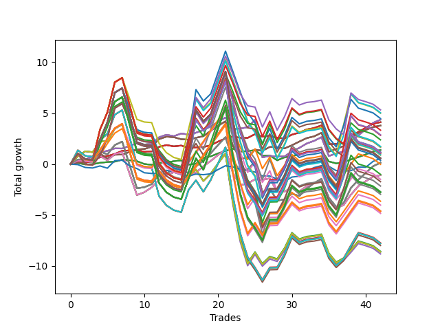

# Long Shepard 004 (1230 Waffles01) 
- Symbol: AAPL_Unlimited
- Date Range: 03/23/2022 - 07/08/2022
- Trading Period: 7:20-12:30
- Number of Trades: 42



| Name | Win Percent | Profit | Avg Profit / Trade | Avg Time / Trade |      | Name | Win Percent | Profit | Avg Profit / Trade | Avg Time / Trade |
| ---- | ----------- | ------ | ------------------ | ---------------- | ---- | ---- | ----------- | ------ | ------------------ | ---------------- |
| Sorted By <br> Profit | | | | | | Sorted By <br> Win Percentage ||||
| Ninety-Nine | 40.48 | 2660.00 | 63.33 | 132:19 |     | Sixty-Six | 80.95 | 2180.00 | 51.90 | 21:30 |
| Ninety-Four | 42.86 | 2515.00 | 59.88 | 151:17 |     | Fifty-Eight | 80.95 | 2180.00 | 51.90 | 21:30 |
| Ninety-Three | 42.86 | 2495.00 | 59.40 | 147:58 |     | Fifty | 80.95 | 2180.00 | 51.90 | 21:30 |
| Ninety-Five | 42.86 | 2235.00 | 53.21 | 153:21 |     | Forty-Two | 80.95 | 2180.00 | 51.90 | 21:30 |
| Sixty-Six | 80.95 | 2180.00 | 51.90 | 21:30 |     | Two | 80.95 | 2180.00 | 51.90 | 21:30 |
| Fifty-Eight | 80.95 | 2180.00 | 51.90 | 21:30 |     | Sixty-Five | 78.57 | 2055.00 | 48.93 | 13:37 |
| Fifty | 80.95 | 2180.00 | 51.90 | 21:30 |     | Fifty-Seven | 78.57 | 2055.00 | 48.93 | 13:37 |
| Forty-Two | 80.95 | 2180.00 | 51.90 | 21:30 |     | Forty-Nine | 78.57 | 2055.00 | 48.93 | 13:37 |
| Two | 80.95 | 2180.00 | 51.90 | 21:30 |     | Forty-One | 78.57 | 2055.00 | 48.93 | 13:37 |
| Sixty-Five | 78.57 | 2055.00 | 48.93 | 13:37 |     | One | 78.57 | 2055.00 | 48.93 | 13:37 |
| Fifty-Seven | 78.57 | 2055.00 | 48.93 | 13:37 |     | Sixty-Seven | 76.19 | 1890.00 | 45.00 | 22:49 |
| Forty-Nine | 78.57 | 2055.00 | 48.93 | 13:37 |     | Fifty-Nine | 76.19 | 1890.00 | 45.00 | 22:49 |
| Forty-One | 78.57 | 2055.00 | 48.93 | 13:37 |     | Fifty-One | 76.19 | 1890.00 | 45.00 | 22:49 |
| One | 78.57 | 2055.00 | 48.93 | 13:37 |     | Forty-Three | 76.19 | 1890.00 | 45.00 | 22:49 |
| Sixty-Seven | 76.19 | 1890.00 | 45.00 | 22:49 |     | Three | 76.19 | 1890.00 | 45.00 | 22:49 |
| Fifty-Nine | 76.19 | 1890.00 | 45.00 | 22:49 |     | Sixty-Four | 73.81 | 690.00 | 16.43 | 08:05 |
| Fifty-One | 76.19 | 1890.00 | 45.00 | 22:49 |     | Fifty-Six | 73.81 | 690.00 | 16.43 | 08:05 |
| Forty-Three | 76.19 | 1890.00 | 45.00 | 22:49 |     | Forty-Eight | 73.81 | 690.00 | 16.43 | 08:05 |
| Three | 76.19 | 1890.00 | 45.00 | 22:49 |     | Forty | 73.81 | 690.00 | 16.43 | 08:05 |
| Ninety-Eight | 40.48 | 1665.00 | 39.64 | 130:27 |     | Zero | 73.81 | 690.00 | 16.43 | 08:05 |
| One Hundred Nine | 45.24 | 1435.00 | 34.17 | 155:43 |     | Sixty-Nine | 69.05 | 70.00 | 1.67 | 55:55 |
| One Hundred Eight | 45.24 | 1415.00 | 33.69 | 152:24 |     | Sixty-One | 69.05 | 70.00 | 1.67 | 55:55 |
| Ninety-Seven | 40.48 | 1190.00 | 28.33 | 115:17 |     | Fifty-Three | 69.05 | 70.00 | 1.67 | 55:55 |
| One Hundred Four | 45.24 | 865.00 | 20.60 | 166:27 |     | Forty-Five | 69.05 | 70.00 | 1.67 | 55:55 |
| One Hundred Three | 45.24 | 845.00 | 20.12 | 163:07 |     | Five | 69.05 | 70.00 | 1.67 | 55:55 |
| One Hundred | 40.48 | 830.00 | 19.76 | 132:45 |     | Sixty-Eight | 66.67 | -540.00 | -12.86 | 43:19 |
| Sixty-Four | 73.81 | 690.00 | 16.43 | 08:05 |     | Sixty | 66.67 | -540.00 | -12.86 | 43:19 |
| Fifty-Six | 73.81 | 690.00 | 16.43 | 08:05 |     | Fifty-Two | 66.67 | -540.00 | -12.86 | 43:19 |
| Forty-Eight | 73.81 | 690.00 | 16.43 | 08:05 |     | Forty-Four | 66.67 | -540.00 | -12.86 | 43:19 |
| Forty | 73.81 | 690.00 | 16.43 | 08:05 |     | Four | 66.67 | -540.00 | -12.86 | 43:19 |
| Zero | 73.81 | 690.00 | 16.43 | 08:05 |     | One Hundred Six | 54.76 | -1820.00 | -43.33 | 92:51 |
| One Hundred Ninteen | 45.24 | 585.00 | 13.93 | 175:47 |     | One Hundred One | 54.76 | -2010.00 | -47.86 | 97:27 |
| One Hundred Five | 45.24 | 585.00 | 13.93 | 168:30 |     | One Hundred Sixteen | 54.76 | -2290.00 | -54.52 | 106:48 |
| Ninety-Two | 42.86 | 575.00 | 13.69 | 130:24 |     | One Hundred Twenty-Six | 54.76 | -2320.00 | -55.24 | 108:30 |
| One Hundred Eighteen | 45.24 | 565.00 | 13.45 | 172:27 |     | One Hundred Twenty-One | 54.76 | -2320.00 | -55.24 | 108:30 |
| One Hundred Twenty-Nine | 45.24 | 555.00 | 13.21 | 177:29 |     | Eighty-One | 54.76 | -2320.00 | -55.24 | 108:30 |
| One Hundred Twenty-Four | 45.24 | 555.00 | 13.21 | 177:29 |     | One Hundred Eleven | 54.76 | -2415.00 | -57.50 | 107:06 |
| Eighty-Four | 45.24 | 555.00 | 13.21 | 177:29 |     | Ninety-Six | 52.38 | -10.00 | -0.24 | 80:20 |
| One Hundred Twenty-Eight | 45.24 | 535.00 | 12.74 | 174:10 |     | Ninety-One | 52.38 | -745.00 | -17.74 | 84:45 |
| One Hundred Twenty-Three | 45.24 | 535.00 | 12.74 | 174:10 |     | Fifty-Four | 52.38 | -4280.00 | -101.90 | 99:46 |
| Eighty-Three | 45.24 | 535.00 | 12.74 | 174:10 |     | Seventy | 52.38 | -4310.00 | -102.62 | 101:29 |
| One Hundred Fourteen | 45.24 | 460.00 | 10.95 | 176:05 |     | Sixty-Two | 52.38 | -4310.00 | -102.62 | 101:29 |
| One Hundred Thirteen | 45.24 | 440.00 | 10.48 | 172:46 |     | Six | 52.38 | -4310.00 | -102.62 | 101:29 |
| One Hundred Twenty | 45.24 | 305.00 | 7.26 | 177:50 |     | Forty-Six | 52.38 | -4405.00 | -104.88 | 100:05 |
| One Hundred Thirty | 45.24 | 275.00 | 6.55 | 179:33 |     | Fifty-Five | 47.62 | -3865.00 | -92.02 | 131:34 |
| One Hundred Twenty-Five | 45.24 | 275.00 | 6.55 | 179:33 |     | Seventy-One | 47.62 | -3895.00 | -92.74 | 133:16 |
| Eighty-Five | 45.24 | 275.00 | 6.55 | 179:33 |     | Sixty-Three | 47.62 | -3895.00 | -92.74 | 133:16 |
| Seventy-Three | 42.86 | 275.00 | 6.55 | 07:26 |     | Seven | 47.62 | -3895.00 | -92.74 | 133:16 |
| One Hundred Fifteen | 45.24 | 180.00 | 4.29 | 178:08 |     | Forty-Seven | 47.62 | -3990.00 | -95.00 | 131:52 |
| Sixty-Nine | 69.05 | 70.00 | 1.67 | 55:55 |     | One Hundred Nine | 45.24 | 1435.00 | 34.17 | 155:43 |
| Sixty-One | 69.05 | 70.00 | 1.67 | 55:55 |     | One Hundred Eight | 45.24 | 1415.00 | 33.69 | 152:24 |
| Fifty-Three | 69.05 | 70.00 | 1.67 | 55:55 |     | One Hundred Four | 45.24 | 865.00 | 20.60 | 166:27 |
| Forty-Five | 69.05 | 70.00 | 1.67 | 55:55 |     | One Hundred Three | 45.24 | 845.00 | 20.12 | 163:07 |
| Five | 69.05 | 70.00 | 1.67 | 55:55 |     | One Hundred Ninteen | 45.24 | 585.00 | 13.93 | 175:47 |
| Ninety-Six | 52.38 | -10.00 | -0.24 | 80:20 |     | One Hundred Five | 45.24 | 585.00 | 13.93 | 168:30 |
| One Hundred Seven | 45.24 | -505.00 | -12.02 | 134:50 |     | One Hundred Eighteen | 45.24 | 565.00 | 13.45 | 172:27 |
| Sixty-Eight | 66.67 | -540.00 | -12.86 | 43:19 |     | One Hundred Twenty-Nine | 45.24 | 555.00 | 13.21 | 177:29 |
| Sixty | 66.67 | -540.00 | -12.86 | 43:19 |     | One Hundred Twenty-Four | 45.24 | 555.00 | 13.21 | 177:29 |
| Fifty-Two | 66.67 | -540.00 | -12.86 | 43:19 |     | Eighty-Four | 45.24 | 555.00 | 13.21 | 177:29 |
| Forty-Four | 66.67 | -540.00 | -12.86 | 43:19 |     | One Hundred Twenty-Eight | 45.24 | 535.00 | 12.74 | 174:10 |
| Four | 66.67 | -540.00 | -12.86 | 43:19 |     | One Hundred Twenty-Three | 45.24 | 535.00 | 12.74 | 174:10 |
| Ninety-One | 52.38 | -745.00 | -17.74 | 84:45 |     | Eighty-Three | 45.24 | 535.00 | 12.74 | 174:10 |
| One Hundred Ten | 45.24 | -860.00 | -20.48 | 156:44 |     | One Hundred Fourteen | 45.24 | 460.00 | 10.95 | 176:05 |
| One Hundred Two | 45.24 | -1075.00 | -25.60 | 145:33 |     | One Hundred Thirteen | 45.24 | 440.00 | 10.48 | 172:46 |
| One Hundred Seventeen | 45.24 | -1355.00 | -32.26 | 154:53 |     | One Hundred Twenty | 45.24 | 305.00 | 7.26 | 177:50 |
| One Hundred Twenty-Seven | 45.24 | -1385.00 | -32.98 | 156:36 |     | One Hundred Thirty | 45.24 | 275.00 | 6.55 | 179:33 |
| One Hundred Twenty-Two | 45.24 | -1385.00 | -32.98 | 156:36 |     | One Hundred Twenty-Five | 45.24 | 275.00 | 6.55 | 179:33 |
| Eighty-Two | 45.24 | -1385.00 | -32.98 | 156:36 |     | Eighty-Five | 45.24 | 275.00 | 6.55 | 179:33 |
| One Hundred Twelve | 45.24 | -1480.00 | -35.24 | 155:11 |     | One Hundred Fifteen | 45.24 | 180.00 | 4.29 | 178:08 |
| One Hundred Six | 54.76 | -1820.00 | -43.33 | 92:51 |     | One Hundred Seven | 45.24 | -505.00 | -12.02 | 134:50 |
| One Hundred One | 54.76 | -2010.00 | -47.86 | 97:27 |     | One Hundred Ten | 45.24 | -860.00 | -20.48 | 156:44 |
| One Hundred Sixteen | 54.76 | -2290.00 | -54.52 | 106:48 |     | One Hundred Two | 45.24 | -1075.00 | -25.60 | 145:33 |
| One Hundred Twenty-Six | 54.76 | -2320.00 | -55.24 | 108:30 |     | One Hundred Seventeen | 45.24 | -1355.00 | -32.26 | 154:53 |
| One Hundred Twenty-One | 54.76 | -2320.00 | -55.24 | 108:30 |     | One Hundred Twenty-Seven | 45.24 | -1385.00 | -32.98 | 156:36 |
| Eighty-One | 54.76 | -2320.00 | -55.24 | 108:30 |     | One Hundred Twenty-Two | 45.24 | -1385.00 | -32.98 | 156:36 |
| One Hundred Eleven | 54.76 | -2415.00 | -57.50 | 107:06 |     | Eighty-Two | 45.24 | -1385.00 | -32.98 | 156:36 |
| Fifty-Five | 47.62 | -3865.00 | -92.02 | 131:34 |     | One Hundred Twelve | 45.24 | -1480.00 | -35.24 | 155:11 |
| Seventy-One | 47.62 | -3895.00 | -92.74 | 133:16 |     | Ninety-Four | 42.86 | 2515.00 | 59.88 | 151:17 |
| Sixty-Three | 47.62 | -3895.00 | -92.74 | 133:16 |     | Ninety-Three | 42.86 | 2495.00 | 59.40 | 147:58 |
| Seven | 47.62 | -3895.00 | -92.74 | 133:16 |     | Ninety-Five | 42.86 | 2235.00 | 53.21 | 153:21 |
| Forty-Seven | 47.62 | -3990.00 | -95.00 | 131:52 |     | Ninety-Two | 42.86 | 575.00 | 13.69 | 130:24 |
| Fifty-Four | 52.38 | -4280.00 | -101.90 | 99:46 |     | Seventy-Three | 42.86 | 275.00 | 6.55 | 07:26 |
| Seventy | 52.38 | -4310.00 | -102.62 | 101:29 |     | Ninety-Nine | 40.48 | 2660.00 | 63.33 | 132:19 |
| Sixty-Two | 52.38 | -4310.00 | -102.62 | 101:29 |     | Ninety-Eight | 40.48 | 1665.00 | 39.64 | 130:27 |
| Six | 52.38 | -4310.00 | -102.62 | 101:29 |     | Ninety-Seven | 40.48 | 1190.00 | 28.33 | 115:17 |
| Forty-Six | 52.38 | -4405.00 | -104.88 | 100:05 |     | One Hundred | 40.48 | 830.00 | 19.76 | 132:45 |

## NO STOPLOSS

### Test Zero
* Sell when price hits the middle line of the 20p bollinger
* No Stoploss
* Results:
```
Total Trades: 42
Percent Up: 73.81
Percent Down: 26.19
Total Points Moved Up: 1.38
Potential Profit: 690.00
Total Points Ups: 5.05 Count Ups: 31
Total Points Downs: -3.67 Count Downs: 11
```

<details><summary>Trades</summary>

<code>In: 2022-03-25 09:00:00		Out: 2022-03-25 09:05:05		Total Position Time: 05:05		Total Move Up: 0.11		Total to Date: 0.11</code> <br />
<code>In: 2022-03-30 08:02:00		Out: 2022-03-30 08:15:55		Total Position Time: 13:55		Total Move Up: -0.14		Total to Date: -0.03</code> <br />
<code>In: 2022-04-05 12:17:00		Out: 2022-04-05 12:23:20		Total Position Time: 06:20		Total Move Up: 0.02		Total to Date: -0.01</code> <br />
<code>In: 2022-04-06 08:21:00		Out: 2022-04-06 08:22:35		Total Position Time: 01:35		Total Move Up: 0.14		Total to Date: 0.13</code> <br />
<code>In: 2022-04-07 07:51:00		Out: 2022-04-07 07:54:30		Total Position Time: 03:30		Total Move Up: 0.07		Total to Date: 0.20</code> <br />
<code>In: 2022-04-07 09:52:00		Out: 2022-04-07 09:58:45		Total Position Time: 06:45		Total Move Up: 0.04		Total to Date: 0.24</code> <br />
<code>In: 2022-04-12 11:00:00		Out: 2022-04-12 11:04:05		Total Position Time: 04:05		Total Move Up: 0.19		Total to Date: 0.43</code> <br />
<code>In: 2022-04-21 10:13:00		Out: 2022-04-21 10:21:40		Total Position Time: 08:40		Total Move Up: -0.05		Total to Date: 0.38</code> <br />
<code>In: 2022-04-21 10:22:00		Out: 2022-04-21 10:23:10		Total Position Time: 01:10		Total Move Up: -0.09		Total to Date: 0.29</code> <br />
<code>In: 2022-04-21 11:54:00		Out: 2022-04-21 12:13:55		Total Position Time: 19:55		Total Move Up: -0.28		Total to Date: 0.01</code> <br />
<code>In: 2022-04-21 11:58:00		Out: 2022-04-21 12:13:55		Total Position Time: 15:55		Total Move Up: -0.08		Total to Date: -0.07</code> <br />
<code>In: 2022-04-22 07:25:00		Out: 2022-04-22 07:32:10		Total Position Time: 07:10		Total Move Up: 0.19		Total to Date: 0.12</code> <br />
<code>In: 2022-04-22 11:11:00		Out: 2022-04-22 11:17:15		Total Position Time: 06:15		Total Move Up: 0.01		Total to Date: 0.13</code> <br />
<code>In: 2022-04-22 11:41:00		Out: 2022-04-22 11:45:05		Total Position Time: 04:05		Total Move Up: 0.16		Total to Date: 0.29</code> <br />
<code>In: 2022-04-26 12:21:00		Out: 2022-04-26 12:30:15		Total Position Time: 09:15		Total Move Up: 0.07		Total to Date: 0.36</code> <br />
<code>In: 2022-05-02 10:37:00		Out: 2022-05-02 10:59:55		Total Position Time: 22:55		Total Move Up: -0.41		Total to Date: -0.05</code> <br />
<code>In: 2022-05-04 08:19:00		Out: 2022-05-04 08:23:05		Total Position Time: 04:05		Total Move Up: 0.09		Total to Date: 0.04</code> <br />
<code>In: 2022-05-11 10:49:00		Out: 2022-05-11 10:53:15		Total Position Time: 04:15		Total Move Up: 0.57		Total to Date: 0.61</code> <br />
<code>In: 2022-05-16 08:02:00		Out: 2022-05-16 08:05:10		Total Position Time: 03:10		Total Move Up: 0.15		Total to Date: 0.76</code> <br />
<code>In: 2022-05-17 07:47:00		Out: 2022-05-17 07:52:30		Total Position Time: 05:30		Total Move Up: 0.29		Total to Date: 1.05</code> <br />
<code>In: 2022-05-17 07:48:00		Out: 2022-05-17 07:52:30		Total Position Time: 04:30		Total Move Up: 0.24		Total to Date: 1.29</code> <br />
<code>In: 2022-05-18 07:47:00		Out: 2022-05-18 07:48:35		Total Position Time: 01:35		Total Move Up: 0.22		Total to Date: 1.51</code> <br />
<code>In: 2022-05-18 08:20:00		Out: 2022-05-18 08:36:55		Total Position Time: 16:55		Total Move Up: -0.28		Total to Date: 1.23</code> <br />
<code>In: 2022-05-18 09:10:00		Out: 2022-05-18 09:16:30		Total Position Time: 06:30		Total Move Up: 0.05		Total to Date: 1.28</code> <br />
<code>In: 2022-05-19 07:47:00		Out: 2022-05-19 07:54:45		Total Position Time: 07:45		Total Move Up: 0.09		Total to Date: 1.37</code> <br />
<code>In: 2022-05-20 08:01:00		Out: 2022-05-20 08:26:20		Total Position Time: 25:20		Total Move Up: -0.56		Total to Date: 0.81</code> <br />
<code>In: 2022-05-25 09:38:00		Out: 2022-05-25 09:44:25		Total Position Time: 06:25		Total Move Up: 0.04		Total to Date: 0.85</code> <br />
<code>In: 2022-06-01 07:21:00		Out: 2022-06-01 07:40:05		Total Position Time: 19:05		Total Move Up: -0.48		Total to Date: 0.37</code> <br />
<code>In: 2022-06-01 08:28:00		Out: 2022-06-01 08:31:45		Total Position Time: 03:45		Total Move Up: 0.29		Total to Date: 0.66</code> <br />
<code>In: 2022-06-01 09:14:00		Out: 2022-06-01 09:15:20		Total Position Time: 01:20		Total Move Up: 0.16		Total to Date: 0.82</code> <br />
<code>In: 2022-06-06 08:26:00		Out: 2022-06-06 08:38:50		Total Position Time: 12:50		Total Move Up: 0.11		Total to Date: 0.93</code> <br />
<code>In: 2022-06-08 10:41:00		Out: 2022-06-08 10:42:10		Total Position Time: 01:10		Total Move Up: 0.23		Total to Date: 1.16</code> <br />
<code>In: 2022-06-08 10:42:00		Out: 2022-06-08 10:43:10		Total Position Time: 01:10		Total Move Up: 0.06		Total to Date: 1.22</code> <br />
<code>In: 2022-06-08 11:41:00		Out: 2022-06-08 11:43:20		Total Position Time: 02:20		Total Move Up: 0.15		Total to Date: 1.37</code> <br />
<code>In: 2022-06-09 11:42:00		Out: 2022-06-09 12:24:30		Total Position Time: 42:30		Total Move Up: -1.11		Total to Date: 0.26</code> <br />
<code>In: 2022-06-13 12:04:00		Out: 2022-06-13 12:16:50		Total Position Time: 12:50		Total Move Up: -0.19		Total to Date: 0.07</code> <br />
<code>In: 2022-06-15 07:48:00		Out: 2022-06-15 07:50:15		Total Position Time: 02:15		Total Move Up: 0.11		Total to Date: 0.18</code> <br />
<code>In: 2022-06-15 11:10:00		Out: 2022-06-15 11:16:00		Total Position Time: 06:00		Total Move Up: 0.28		Total to Date: 0.46</code> <br />
<code>In: 2022-06-16 07:54:00		Out: 2022-06-16 08:00:25		Total Position Time: 06:25		Total Move Up: 0.23		Total to Date: 0.69</code> <br />
<code>In: 2022-06-16 11:57:00		Out: 2022-06-16 12:00:25		Total Position Time: 03:25		Total Move Up: 0.26		Total to Date: 0.95</code> <br />
<code>In: 2022-06-16 12:00:00		Out: 2022-06-16 12:01:10		Total Position Time: 01:10		Total Move Up: 0.28		Total to Date: 1.23</code> <br />
<code>In: 2022-06-16 12:01:00		Out: 2022-06-16 12:02:10		Total Position Time: 01:10		Total Move Up: 0.15		Total to Date: 1.38</code> <br />


</details>

### Test One
* Sell when the price hits the upper line of the 20p 1std bollinger
* No Stoploss
* Results:
```
Total Trades: 42
Percent Up: 78.57
Percent Down: 21.43
Total Points Moved Up: 4.11
Potential Profit: 2055.00
Total Points Ups: 7.23 Count Ups: 33
Total Points Downs: -3.12 Count Downs: 9
```

<details><summary>Trades</summary>

<code>In: 2022-03-25 09:00:00		Out: 2022-03-25 09:06:05		Total Position Time: 06:05		Total Move Up: 0.20		Total to Date: 0.20</code> <br />
<code>In: 2022-03-30 08:02:00		Out: 2022-03-30 08:19:15		Total Position Time: 17:15		Total Move Up: -0.07		Total to Date: 0.13</code> <br />
<code>In: 2022-04-05 12:17:00		Out: 2022-04-05 12:23:35		Total Position Time: 06:35		Total Move Up: 0.17		Total to Date: 0.30</code> <br />
<code>In: 2022-04-06 08:21:00		Out: 2022-04-06 08:23:05		Total Position Time: 02:05		Total Move Up: 0.38		Total to Date: 0.68</code> <br />
<code>In: 2022-04-07 07:51:00		Out: 2022-04-07 08:00:05		Total Position Time: 09:05		Total Move Up: 0.11		Total to Date: 0.79</code> <br />
<code>In: 2022-04-07 09:52:00		Out: 2022-04-07 10:02:15		Total Position Time: 10:15		Total Move Up: 0.21		Total to Date: 1.00</code> <br />
<code>In: 2022-04-12 11:00:00		Out: 2022-04-12 11:06:20		Total Position Time: 06:20		Total Move Up: 0.30		Total to Date: 1.30</code> <br />
<code>In: 2022-04-21 10:13:00		Out: 2022-04-21 10:28:50		Total Position Time: 15:50		Total Move Up: 0.04		Total to Date: 1.34</code> <br />
<code>In: 2022-04-21 10:22:00		Out: 2022-04-21 10:28:50		Total Position Time: 06:50		Total Move Up: 0.04		Total to Date: 1.38</code> <br />
<code>In: 2022-04-21 11:54:00		Out: 2022-04-21 12:15:05		Total Position Time: 21:05		Total Move Up: -0.17		Total to Date: 1.21</code> <br />
<code>In: 2022-04-21 11:58:00		Out: 2022-04-21 12:15:05		Total Position Time: 17:05		Total Move Up: 0.03		Total to Date: 1.24</code> <br />
<code>In: 2022-04-22 07:25:00		Out: 2022-04-22 07:33:50		Total Position Time: 08:50		Total Move Up: 0.45		Total to Date: 1.69</code> <br />
<code>In: 2022-04-22 11:11:00		Out: 2022-04-22 11:17:45		Total Position Time: 06:45		Total Move Up: 0.18		Total to Date: 1.87</code> <br />
<code>In: 2022-04-22 11:41:00		Out: 2022-04-22 12:11:50		Total Position Time: 30:50		Total Move Up: -0.13		Total to Date: 1.74</code> <br />
<code>In: 2022-04-26 12:21:00		Out: 2022-04-26 12:37:50		Total Position Time: 16:50		Total Move Up: 0.08		Total to Date: 1.82</code> <br />
<code>In: 2022-05-02 10:37:00		Out: 2022-05-02 11:02:15		Total Position Time: 25:15		Total Move Up: -0.24		Total to Date: 1.58</code> <br />
<code>In: 2022-05-04 08:19:00		Out: 2022-05-04 08:34:55		Total Position Time: 15:55		Total Move Up: 0.06		Total to Date: 1.64</code> <br />
<code>In: 2022-05-11 10:49:00		Out: 2022-05-11 11:18:35		Total Position Time: 29:35		Total Move Up: 0.03		Total to Date: 1.67</code> <br />
<code>In: 2022-05-16 08:02:00		Out: 2022-05-16 08:09:30		Total Position Time: 07:30		Total Move Up: 0.18		Total to Date: 1.85</code> <br />
<code>In: 2022-05-17 07:47:00		Out: 2022-05-17 07:55:10		Total Position Time: 08:10		Total Move Up: 0.36		Total to Date: 2.21</code> <br />
<code>In: 2022-05-17 07:48:00		Out: 2022-05-17 07:55:10		Total Position Time: 07:10		Total Move Up: 0.31		Total to Date: 2.52</code> <br />
<code>In: 2022-05-18 07:47:00		Out: 2022-05-18 08:00:00		Total Position Time: 13:00		Total Move Up: 0.20		Total to Date: 2.72</code> <br />
<code>In: 2022-05-18 08:20:00		Out: 2022-05-18 08:41:40		Total Position Time: 21:40		Total Move Up: -0.15		Total to Date: 2.57</code> <br />
<code>In: 2022-05-18 09:10:00		Out: 2022-05-18 09:35:50		Total Position Time: 25:50		Total Move Up: 0.00		Total to Date: 2.57</code> <br />
<code>In: 2022-05-19 07:47:00		Out: 2022-05-19 07:55:35		Total Position Time: 08:35		Total Move Up: 0.37		Total to Date: 2.94</code> <br />
<code>In: 2022-05-20 08:01:00		Out: 2022-05-20 08:27:15		Total Position Time: 26:15		Total Move Up: -0.25		Total to Date: 2.69</code> <br />
<code>In: 2022-05-25 09:38:00		Out: 2022-05-25 09:45:15		Total Position Time: 07:15		Total Move Up: 0.09		Total to Date: 2.78</code> <br />
<code>In: 2022-06-01 07:21:00		Out: 2022-06-01 07:42:50		Total Position Time: 21:50		Total Move Up: -0.20		Total to Date: 2.58</code> <br />
<code>In: 2022-06-01 08:28:00		Out: 2022-06-01 08:54:40		Total Position Time: 26:40		Total Move Up: -0.06		Total to Date: 2.52</code> <br />
<code>In: 2022-06-01 09:14:00		Out: 2022-06-01 09:15:55		Total Position Time: 01:55		Total Move Up: 0.37		Total to Date: 2.89</code> <br />
<code>In: 2022-06-06 08:26:00		Out: 2022-06-06 08:44:05		Total Position Time: 18:05		Total Move Up: 0.20		Total to Date: 3.09</code> <br />
<code>In: 2022-06-08 10:41:00		Out: 2022-06-08 10:45:05		Total Position Time: 04:05		Total Move Up: 0.31		Total to Date: 3.40</code> <br />
<code>In: 2022-06-08 10:42:00		Out: 2022-06-08 10:45:05		Total Position Time: 03:05		Total Move Up: 0.14		Total to Date: 3.54</code> <br />
<code>In: 2022-06-08 11:41:00		Out: 2022-06-08 11:45:10		Total Position Time: 04:10		Total Move Up: 0.26		Total to Date: 3.80</code> <br />
<code>In: 2022-06-09 11:42:00		Out: 2022-06-09 12:47:00		Total Position Time: 65:00		Total Move Up: -1.85		Total to Date: 1.95</code> <br />
<code>In: 2022-06-13 12:04:00		Out: 2022-06-13 12:17:10		Total Position Time: 13:10		Total Move Up: 0.03		Total to Date: 1.98</code> <br />
<code>In: 2022-06-15 07:48:00		Out: 2022-06-15 07:58:55		Total Position Time: 10:55		Total Move Up: 0.09		Total to Date: 2.07</code> <br />
<code>In: 2022-06-15 11:10:00		Out: 2022-06-15 11:20:30		Total Position Time: 10:30		Total Move Up: 0.75		Total to Date: 2.82</code> <br />
<code>In: 2022-06-16 07:54:00		Out: 2022-06-16 08:01:30		Total Position Time: 07:30		Total Move Up: 0.33		Total to Date: 3.15</code> <br />
<code>In: 2022-06-16 11:57:00		Out: 2022-06-16 12:01:35		Total Position Time: 04:35		Total Move Up: 0.42		Total to Date: 3.57</code> <br />
<code>In: 2022-06-16 12:00:00		Out: 2022-06-16 12:01:35		Total Position Time: 01:35		Total Move Up: 0.39		Total to Date: 3.96</code> <br />
<code>In: 2022-06-16 12:01:00		Out: 2022-06-16 12:02:10		Total Position Time: 01:10		Total Move Up: 0.15		Total to Date: 4.11</code> <br />


</details>

### Test Two
* Sell when the price hits the upper line of the 20p 2std bollinger
* No Stoploss
* Results:
```
Total Trades: 42
Percent Up: 80.95
Percent Down: 19.05
Total Points Moved Up: 4.36
Potential Profit: 2180.00
Total Points Ups: 11.46 Count Ups: 34
Total Points Downs: -7.10 Count Downs: 8
```

<details><summary>Trades</summary>

<code>In: 2022-03-25 09:00:00		Out: 2022-03-25 09:11:20		Total Position Time: 11:20		Total Move Up: 0.40		Total to Date: 0.40</code> <br />
<code>In: 2022-03-30 08:02:00		Out: 2022-03-30 08:34:40		Total Position Time: 32:40		Total Move Up: 0.04		Total to Date: 0.44</code> <br />
<code>In: 2022-04-05 12:17:00		Out: 2022-04-05 12:23:50		Total Position Time: 06:50		Total Move Up: 0.30		Total to Date: 0.74</code> <br />
<code>In: 2022-04-06 08:21:00		Out: 2022-04-06 08:27:05		Total Position Time: 06:05		Total Move Up: 0.41		Total to Date: 1.15</code> <br />
<code>In: 2022-04-07 07:51:00		Out: 2022-04-07 08:01:05		Total Position Time: 10:05		Total Move Up: 0.15		Total to Date: 1.30</code> <br />
<code>In: 2022-04-07 09:52:00		Out: 2022-04-07 10:03:05		Total Position Time: 11:05		Total Move Up: 0.24		Total to Date: 1.54</code> <br />
<code>In: 2022-04-12 11:00:00		Out: 2022-04-12 11:35:45		Total Position Time: 35:45		Total Move Up: -0.01		Total to Date: 1.53</code> <br />
<code>In: 2022-04-21 10:13:00		Out: 2022-04-21 10:31:20		Total Position Time: 18:20		Total Move Up: 0.26		Total to Date: 1.79</code> <br />
<code>In: 2022-04-21 10:22:00		Out: 2022-04-21 10:31:20		Total Position Time: 09:20		Total Move Up: 0.26		Total to Date: 2.05</code> <br />
<code>In: 2022-04-21 11:54:00		Out: 2022-04-21 12:18:15		Total Position Time: 24:15		Total Move Up: -0.13		Total to Date: 1.92</code> <br />
<code>In: 2022-04-21 11:58:00		Out: 2022-04-21 12:18:15		Total Position Time: 20:15		Total Move Up: 0.07		Total to Date: 1.99</code> <br />
<code>In: 2022-04-22 07:25:00		Out: 2022-04-22 07:34:25		Total Position Time: 09:25		Total Move Up: 0.64		Total to Date: 2.63</code> <br />
<code>In: 2022-04-22 11:11:00		Out: 2022-04-22 11:18:00		Total Position Time: 07:00		Total Move Up: 0.25		Total to Date: 2.88</code> <br />
<code>In: 2022-04-22 11:41:00		Out: 2022-04-22 12:12:45		Total Position Time: 31:45		Total Move Up: -0.14		Total to Date: 2.74</code> <br />
<code>In: 2022-04-26 12:21:00		Out: 2022-04-26 12:40:10		Total Position Time: 19:10		Total Move Up: 0.26		Total to Date: 3.00</code> <br />
<code>In: 2022-05-02 10:37:00		Out: 2022-05-02 11:03:05		Total Position Time: 26:05		Total Move Up: -0.10		Total to Date: 2.90</code> <br />
<code>In: 2022-05-04 08:19:00		Out: 2022-05-04 08:36:20		Total Position Time: 17:20		Total Move Up: 0.18		Total to Date: 3.08</code> <br />
<code>In: 2022-05-11 10:49:00		Out: 2022-05-11 11:24:05		Total Position Time: 35:05		Total Move Up: 0.25		Total to Date: 3.33</code> <br />
<code>In: 2022-05-16 08:02:00		Out: 2022-05-16 08:09:55		Total Position Time: 07:55		Total Move Up: 0.37		Total to Date: 3.70</code> <br />
<code>In: 2022-05-17 07:47:00		Out: 2022-05-17 07:59:15		Total Position Time: 12:15		Total Move Up: 0.46		Total to Date: 4.16</code> <br />
<code>In: 2022-05-17 07:48:00		Out: 2022-05-17 07:59:15		Total Position Time: 11:15		Total Move Up: 0.41		Total to Date: 4.57</code> <br />
<code>In: 2022-05-18 07:47:00		Out: 2022-05-18 08:43:30		Total Position Time: 56:30		Total Move Up: -1.11		Total to Date: 3.46</code> <br />
<code>In: 2022-05-18 08:20:00		Out: 2022-05-18 08:43:30		Total Position Time: 23:30		Total Move Up: 0.03		Total to Date: 3.49</code> <br />
<code>In: 2022-05-18 09:10:00		Out: 2022-05-18 09:39:15		Total Position Time: 29:15		Total Move Up: 0.12		Total to Date: 3.61</code> <br />
<code>In: 2022-05-19 07:47:00		Out: 2022-05-19 07:55:45		Total Position Time: 08:45		Total Move Up: 0.74		Total to Date: 4.35</code> <br />
<code>In: 2022-05-20 08:01:00		Out: 2022-05-20 10:33:45		Total Position Time: 152:45		Total Move Up: -3.69		Total to Date: 0.66</code> <br />
<code>In: 2022-05-25 09:38:00		Out: 2022-05-25 09:47:30		Total Position Time: 09:30		Total Move Up: 0.15		Total to Date: 0.81</code> <br />
<code>In: 2022-06-01 07:21:00		Out: 2022-06-01 07:43:45		Total Position Time: 22:45		Total Move Up: -0.07		Total to Date: 0.74</code> <br />
<code>In: 2022-06-01 08:28:00		Out: 2022-06-01 08:55:20		Total Position Time: 27:20		Total Move Up: 0.01		Total to Date: 0.75</code> <br />
<code>In: 2022-06-01 09:14:00		Out: 2022-06-01 09:20:55		Total Position Time: 06:55		Total Move Up: 0.51		Total to Date: 1.26</code> <br />
<code>In: 2022-06-06 08:26:00		Out: 2022-06-06 08:44:30		Total Position Time: 18:30		Total Move Up: 0.33		Total to Date: 1.59</code> <br />
<code>In: 2022-06-08 10:41:00		Out: 2022-06-08 10:47:15		Total Position Time: 06:15		Total Move Up: 0.43		Total to Date: 2.02</code> <br />
<code>In: 2022-06-08 10:42:00		Out: 2022-06-08 10:47:15		Total Position Time: 05:15		Total Move Up: 0.26		Total to Date: 2.28</code> <br />
<code>In: 2022-06-08 11:41:00		Out: 2022-06-08 11:47:50		Total Position Time: 06:50		Total Move Up: 0.36		Total to Date: 2.64</code> <br />
<code>In: 2022-06-09 11:42:00		Out: 2022-06-09 12:47:00		Total Position Time: 65:00		Total Move Up: -1.85		Total to Date: 0.79</code> <br />
<code>In: 2022-06-13 12:04:00		Out: 2022-06-13 12:17:15		Total Position Time: 13:15		Total Move Up: 0.26		Total to Date: 1.05</code> <br />
<code>In: 2022-06-15 07:48:00		Out: 2022-06-15 07:59:05		Total Position Time: 11:05		Total Move Up: 0.19		Total to Date: 1.24</code> <br />
<code>In: 2022-06-15 11:10:00		Out: 2022-06-15 11:38:10		Total Position Time: 28:10		Total Move Up: 1.04		Total to Date: 2.28</code> <br />
<code>In: 2022-06-16 07:54:00		Out: 2022-06-16 08:09:50		Total Position Time: 15:50		Total Move Up: 0.52		Total to Date: 2.80</code> <br />
<code>In: 2022-06-16 11:57:00		Out: 2022-06-16 12:10:10		Total Position Time: 13:10		Total Move Up: 0.64		Total to Date: 3.44</code> <br />
<code>In: 2022-06-16 12:00:00		Out: 2022-06-16 12:10:10		Total Position Time: 10:10		Total Move Up: 0.61		Total to Date: 4.05</code> <br />
<code>In: 2022-06-16 12:01:00		Out: 2022-06-16 12:10:10		Total Position Time: 09:10		Total Move Up: 0.31		Total to Date: 4.36</code> <br />


</details>

### Test Three
* Sell when price hits the middle line of the 50p bollinger
* No Stoploss
* Results:
```
Total Trades: 42
Percent Up: 76.19
Percent Down: 23.81
Total Points Moved Up: 3.78
Potential Profit: 1890.00
Total Points Ups: 10.32 Count Ups: 32
Total Points Downs: -6.54 Count Downs: 10
```

<details><summary>Trades</summary>

<code>In: 2022-03-25 09:00:00		Out: 2022-03-25 09:05:15		Total Position Time: 05:15		Total Move Up: 0.14		Total to Date: 0.14</code> <br />
<code>In: 2022-03-30 08:02:00		Out: 2022-03-30 08:34:40		Total Position Time: 32:40		Total Move Up: 0.04		Total to Date: 0.18</code> <br />
<code>In: 2022-04-05 12:17:00		Out: 2022-04-05 12:24:45		Total Position Time: 07:45		Total Move Up: 0.35		Total to Date: 0.53</code> <br />
<code>In: 2022-04-06 08:21:00		Out: 2022-04-06 08:23:45		Total Position Time: 02:45		Total Move Up: 0.50		Total to Date: 1.03</code> <br />
<code>In: 2022-04-07 07:51:00		Out: 2022-04-07 08:48:10		Total Position Time: 57:10		Total Move Up: -0.49		Total to Date: 0.54</code> <br />
<code>In: 2022-04-07 09:52:00		Out: 2022-04-07 10:03:10		Total Position Time: 11:10		Total Move Up: 0.38		Total to Date: 0.92</code> <br />
<code>In: 2022-04-12 11:00:00		Out: 2022-04-12 11:35:50		Total Position Time: 35:50		Total Move Up: 0.01		Total to Date: 0.93</code> <br />
<code>In: 2022-04-21 10:13:00		Out: 2022-04-21 10:31:40		Total Position Time: 18:40		Total Move Up: 0.26		Total to Date: 1.19</code> <br />
<code>In: 2022-04-21 10:22:00		Out: 2022-04-21 10:31:40		Total Position Time: 09:40		Total Move Up: 0.26		Total to Date: 1.45</code> <br />
<code>In: 2022-04-21 11:54:00		Out: 2022-04-21 12:25:05		Total Position Time: 31:05		Total Move Up: 0.03		Total to Date: 1.48</code> <br />
<code>In: 2022-04-21 11:58:00		Out: 2022-04-21 12:25:05		Total Position Time: 27:05		Total Move Up: 0.23		Total to Date: 1.71</code> <br />
<code>In: 2022-04-22 07:25:00		Out: 2022-04-22 07:36:25		Total Position Time: 11:25		Total Move Up: 0.74		Total to Date: 2.45</code> <br />
<code>In: 2022-04-22 11:11:00		Out: 2022-04-22 11:17:50		Total Position Time: 06:50		Total Move Up: 0.24		Total to Date: 2.69</code> <br />
<code>In: 2022-04-22 11:41:00		Out: 2022-04-22 12:13:30		Total Position Time: 32:30		Total Move Up: -0.05		Total to Date: 2.64</code> <br />
<code>In: 2022-04-26 12:21:00		Out: 2022-04-26 12:47:00		Total Position Time: 26:00		Total Move Up: -0.20		Total to Date: 2.44</code> <br />
<code>In: 2022-05-02 10:37:00		Out: 2022-05-02 11:03:55		Total Position Time: 26:55		Total Move Up: -0.04		Total to Date: 2.40</code> <br />
<code>In: 2022-05-04 08:19:00		Out: 2022-05-04 08:36:20		Total Position Time: 17:20		Total Move Up: 0.18		Total to Date: 2.58</code> <br />
<code>In: 2022-05-11 10:49:00		Out: 2022-05-11 11:23:35		Total Position Time: 34:35		Total Move Up: 0.16		Total to Date: 2.74</code> <br />
<code>In: 2022-05-16 08:02:00		Out: 2022-05-16 08:16:10		Total Position Time: 14:10		Total Move Up: 0.53		Total to Date: 3.27</code> <br />
<code>In: 2022-05-17 07:47:00		Out: 2022-05-17 08:03:40		Total Position Time: 16:40		Total Move Up: 0.49		Total to Date: 3.76</code> <br />
<code>In: 2022-05-17 07:48:00		Out: 2022-05-17 08:03:40		Total Position Time: 15:40		Total Move Up: 0.44		Total to Date: 4.20</code> <br />
<code>In: 2022-05-18 07:47:00		Out: 2022-05-18 09:39:10		Total Position Time: 112:10		Total Move Up: -2.40		Total to Date: 1.80</code> <br />
<code>In: 2022-05-18 08:20:00		Out: 2022-05-18 09:39:10		Total Position Time: 79:10		Total Move Up: -1.26		Total to Date: 0.54</code> <br />
<code>In: 2022-05-18 09:10:00		Out: 2022-05-18 09:39:10		Total Position Time: 29:10		Total Move Up: 0.08		Total to Date: 0.62</code> <br />
<code>In: 2022-05-19 07:47:00		Out: 2022-05-19 08:01:35		Total Position Time: 14:35		Total Move Up: 0.80		Total to Date: 1.42</code> <br />
<code>In: 2022-05-20 08:01:00		Out: 2022-05-20 08:34:20		Total Position Time: 33:20		Total Move Up: -0.11		Total to Date: 1.31</code> <br />
<code>In: 2022-05-25 09:38:00		Out: 2022-05-25 09:49:20		Total Position Time: 11:20		Total Move Up: 0.37		Total to Date: 1.68</code> <br />
<code>In: 2022-06-01 07:21:00		Out: 2022-06-01 07:53:55		Total Position Time: 32:55		Total Move Up: -0.02		Total to Date: 1.66</code> <br />
<code>In: 2022-06-01 08:28:00		Out: 2022-06-01 09:08:05		Total Position Time: 40:05		Total Move Up: -0.12		Total to Date: 1.54</code> <br />
<code>In: 2022-06-01 09:14:00		Out: 2022-06-01 09:15:40		Total Position Time: 01:40		Total Move Up: 0.31		Total to Date: 1.85</code> <br />
<code>In: 2022-06-06 08:26:00		Out: 2022-06-06 08:57:50		Total Position Time: 31:50		Total Move Up: 0.36		Total to Date: 2.21</code> <br />
<code>In: 2022-06-08 10:41:00		Out: 2022-06-08 10:45:15		Total Position Time: 04:15		Total Move Up: 0.34		Total to Date: 2.55</code> <br />
<code>In: 2022-06-08 10:42:00		Out: 2022-06-08 10:45:15		Total Position Time: 03:15		Total Move Up: 0.17		Total to Date: 2.72</code> <br />
<code>In: 2022-06-08 11:41:00		Out: 2022-06-08 11:45:25		Total Position Time: 04:25		Total Move Up: 0.35		Total to Date: 3.07</code> <br />
<code>In: 2022-06-09 11:42:00		Out: 2022-06-09 12:47:00		Total Position Time: 65:00		Total Move Up: -1.85		Total to Date: 1.22</code> <br />
<code>In: 2022-06-13 12:04:00		Out: 2022-06-13 12:17:15		Total Position Time: 13:15		Total Move Up: 0.26		Total to Date: 1.48</code> <br />
<code>In: 2022-06-15 07:48:00		Out: 2022-06-15 08:00:30		Total Position Time: 12:30		Total Move Up: 0.29		Total to Date: 1.77</code> <br />
<code>In: 2022-06-15 11:10:00		Out: 2022-06-15 11:17:05		Total Position Time: 07:05		Total Move Up: 0.77		Total to Date: 2.54</code> <br />
<code>In: 2022-06-16 07:54:00		Out: 2022-06-16 08:09:50		Total Position Time: 15:50		Total Move Up: 0.52		Total to Date: 3.06</code> <br />
<code>In: 2022-06-16 11:57:00		Out: 2022-06-16 12:00:35		Total Position Time: 03:35		Total Move Up: 0.29		Total to Date: 3.35</code> <br />
<code>In: 2022-06-16 12:00:00		Out: 2022-06-16 12:01:10		Total Position Time: 01:10		Total Move Up: 0.28		Total to Date: 3.63</code> <br />
<code>In: 2022-06-16 12:01:00		Out: 2022-06-16 12:02:10		Total Position Time: 01:10		Total Move Up: 0.15		Total to Date: 3.78</code> <br />


</details>

### Test Four
* Sell when the price hits the upper line of the 50p 1std bollinger
* No Stoploss
* Results:
```
Total Trades: 42
Percent Up: 66.67
Percent Down: 33.33
Total Points Moved Up: -1.08
Potential Profit: -540.00
Total Points Ups: 12.16 Count Ups: 28
Total Points Downs: -13.24 Count Downs: 14
```

<details><summary>Trades</summary>

<code>In: 2022-03-25 09:00:00		Out: 2022-03-25 09:09:05		Total Position Time: 09:05		Total Move Up: 0.33		Total to Date: 0.33</code> <br />
<code>In: 2022-03-30 08:02:00		Out: 2022-03-30 09:01:50		Total Position Time: 59:50		Total Move Up: -0.04		Total to Date: 0.29</code> <br />
<code>In: 2022-04-05 12:17:00		Out: 2022-04-05 12:47:00		Total Position Time: 30:00		Total Move Up: -0.09		Total to Date: 0.20</code> <br />
<code>In: 2022-04-06 08:21:00		Out: 2022-04-06 08:41:05		Total Position Time: 20:05		Total Move Up: 0.60		Total to Date: 0.80</code> <br />
<code>In: 2022-04-07 07:51:00		Out: 2022-04-07 09:05:20		Total Position Time: 74:20		Total Move Up: -0.44		Total to Date: 0.36</code> <br />
<code>In: 2022-04-07 09:52:00		Out: 2022-04-07 10:11:40		Total Position Time: 19:40		Total Move Up: 0.63		Total to Date: 0.99</code> <br />
<code>In: 2022-04-12 11:00:00		Out: 2022-04-12 11:37:30		Total Position Time: 37:30		Total Move Up: 0.19		Total to Date: 1.18</code> <br />
<code>In: 2022-04-21 10:13:00		Out: 2022-04-21 12:29:55		Total Position Time: 136:55		Total Move Up: -2.11		Total to Date: -0.93</code> <br />
<code>In: 2022-04-21 10:22:00		Out: 2022-04-21 12:29:55		Total Position Time: 127:55		Total Move Up: -2.11		Total to Date: -3.04</code> <br />
<code>In: 2022-04-21 11:54:00		Out: 2022-04-21 12:29:55		Total Position Time: 35:55		Total Move Up: 0.28		Total to Date: -2.76</code> <br />
<code>In: 2022-04-21 11:58:00		Out: 2022-04-21 12:29:55		Total Position Time: 31:55		Total Move Up: 0.48		Total to Date: -2.28</code> <br />
<code>In: 2022-04-22 07:25:00		Out: 2022-04-22 08:01:15		Total Position Time: 36:15		Total Move Up: 0.74		Total to Date: -1.54</code> <br />
<code>In: 2022-04-22 11:11:00		Out: 2022-04-22 11:19:15		Total Position Time: 08:15		Total Move Up: 0.47		Total to Date: -1.07</code> <br />
<code>In: 2022-04-22 11:41:00		Out: 2022-04-22 12:14:25		Total Position Time: 33:25		Total Move Up: 0.27		Total to Date: -0.80</code> <br />
<code>In: 2022-04-26 12:21:00		Out: 2022-04-26 12:47:00		Total Position Time: 26:00		Total Move Up: -0.20		Total to Date: -1.00</code> <br />
<code>In: 2022-05-02 10:37:00		Out: 2022-05-02 11:53:35		Total Position Time: 76:35		Total Move Up: -0.24		Total to Date: -1.24</code> <br />
<code>In: 2022-05-04 08:19:00		Out: 2022-05-04 08:39:25		Total Position Time: 20:25		Total Move Up: 0.41		Total to Date: -0.83</code> <br />
<code>In: 2022-05-11 10:49:00		Out: 2022-05-11 11:26:00		Total Position Time: 37:00		Total Move Up: 0.61		Total to Date: -0.22</code> <br />
<code>In: 2022-05-16 08:02:00		Out: 2022-05-16 08:33:25		Total Position Time: 31:25		Total Move Up: 0.53		Total to Date: 0.31</code> <br />
<code>In: 2022-05-17 07:47:00		Out: 2022-05-17 08:20:50		Total Position Time: 33:50		Total Move Up: 0.59		Total to Date: 0.90</code> <br />
<code>In: 2022-05-17 07:48:00		Out: 2022-05-17 08:20:50		Total Position Time: 32:50		Total Move Up: 0.54		Total to Date: 1.44</code> <br />
<code>In: 2022-05-18 07:47:00		Out: 2022-05-18 09:48:00		Total Position Time: 121:00		Total Move Up: -2.32		Total to Date: -0.88</code> <br />
<code>In: 2022-05-18 08:20:00		Out: 2022-05-18 09:48:00		Total Position Time: 88:00		Total Move Up: -1.18		Total to Date: -2.06</code> <br />
<code>In: 2022-05-18 09:10:00		Out: 2022-05-18 09:48:00		Total Position Time: 38:00		Total Move Up: 0.16		Total to Date: -1.90</code> <br />
<code>In: 2022-05-19 07:47:00		Out: 2022-05-19 08:34:00		Total Position Time: 47:00		Total Move Up: 0.41		Total to Date: -1.49</code> <br />
<code>In: 2022-05-20 08:01:00		Out: 2022-05-20 08:52:55		Total Position Time: 51:55		Total Move Up: -0.05		Total to Date: -1.54</code> <br />
<code>In: 2022-05-25 09:38:00		Out: 2022-05-25 10:29:35		Total Position Time: 51:35		Total Move Up: 0.14		Total to Date: -1.40</code> <br />
<code>In: 2022-06-01 07:21:00		Out: 2022-06-01 09:16:05		Total Position Time: 115:05		Total Move Up: -1.31		Total to Date: -2.71</code> <br />
<code>In: 2022-06-01 08:28:00		Out: 2022-06-01 09:16:05		Total Position Time: 48:05		Total Move Up: 0.00		Total to Date: -2.71</code> <br />
<code>In: 2022-06-01 09:14:00		Out: 2022-06-01 09:16:05		Total Position Time: 02:05		Total Move Up: 0.44		Total to Date: -2.27</code> <br />
<code>In: 2022-06-06 08:26:00		Out: 2022-06-06 09:53:35		Total Position Time: 87:35		Total Move Up: -0.41		Total to Date: -2.68</code> <br />
<code>In: 2022-06-08 10:41:00		Out: 2022-06-08 10:54:00		Total Position Time: 13:00		Total Move Up: 0.51		Total to Date: -2.17</code> <br />
<code>In: 2022-06-08 10:42:00		Out: 2022-06-08 10:54:00		Total Position Time: 12:00		Total Move Up: 0.34		Total to Date: -1.83</code> <br />
<code>In: 2022-06-08 11:41:00		Out: 2022-06-08 12:12:20		Total Position Time: 31:20		Total Move Up: 0.28		Total to Date: -1.55</code> <br />
<code>In: 2022-06-09 11:42:00		Out: 2022-06-09 12:47:00		Total Position Time: 65:00		Total Move Up: -1.85		Total to Date: -3.40</code> <br />
<code>In: 2022-06-13 12:04:00		Out: 2022-06-13 12:47:00		Total Position Time: 43:00		Total Move Up: -0.89		Total to Date: -4.29</code> <br />
<code>In: 2022-06-15 07:48:00		Out: 2022-06-15 08:18:30		Total Position Time: 30:30		Total Move Up: 0.26		Total to Date: -4.03</code> <br />
<code>In: 2022-06-15 11:10:00		Out: 2022-06-15 11:38:10		Total Position Time: 28:10		Total Move Up: 1.04		Total to Date: -2.99</code> <br />
<code>In: 2022-06-16 07:54:00		Out: 2022-06-16 08:13:25		Total Position Time: 19:25		Total Move Up: 0.83		Total to Date: -2.16</code> <br />
<code>In: 2022-06-16 11:57:00		Out: 2022-06-16 12:01:45		Total Position Time: 04:45		Total Move Up: 0.48		Total to Date: -1.68</code> <br />
<code>In: 2022-06-16 12:00:00		Out: 2022-06-16 12:01:45		Total Position Time: 01:45		Total Move Up: 0.45		Total to Date: -1.23</code> <br />
<code>In: 2022-06-16 12:01:00		Out: 2022-06-16 12:02:10		Total Position Time: 01:10		Total Move Up: 0.15		Total to Date: -1.08</code> <br />


</details>

### Test Five
* Sell when the price hits the upper line of the 50p 2std bollinger
* No Stoploss
* Results:
```
Total Trades: 42
Percent Up: 69.05
Percent Down: 30.95
Total Points Moved Up: 0.14
Potential Profit: 70.00
Total Points Ups: 16.04 Count Ups: 29
Total Points Downs: -15.90 Count Downs: 13
```

<details><summary>Trades</summary>

<code>In: 2022-03-25 09:00:00		Out: 2022-03-25 09:11:30		Total Position Time: 11:30		Total Move Up: 0.45		Total to Date: 0.45</code> <br />
<code>In: 2022-03-30 08:02:00		Out: 2022-03-30 09:37:20		Total Position Time: 95:20		Total Move Up: 0.01		Total to Date: 0.46</code> <br />
<code>In: 2022-04-05 12:17:00		Out: 2022-04-05 12:47:00		Total Position Time: 30:00		Total Move Up: -0.09		Total to Date: 0.37</code> <br />
<code>In: 2022-04-06 08:21:00		Out: 2022-04-06 08:45:15		Total Position Time: 24:15		Total Move Up: 0.87		Total to Date: 1.24</code> <br />
<code>In: 2022-04-07 07:51:00		Out: 2022-04-07 09:06:30		Total Position Time: 75:30		Total Move Up: -0.29		Total to Date: 0.95</code> <br />
<code>In: 2022-04-07 09:52:00		Out: 2022-04-07 10:12:40		Total Position Time: 20:40		Total Move Up: 0.92		Total to Date: 1.87</code> <br />
<code>In: 2022-04-12 11:00:00		Out: 2022-04-12 11:45:15		Total Position Time: 45:15		Total Move Up: 0.34		Total to Date: 2.21</code> <br />
<code>In: 2022-04-21 10:13:00		Out: 2022-04-21 12:44:20		Total Position Time: 151:20		Total Move Up: -2.29		Total to Date: -0.08</code> <br />
<code>In: 2022-04-21 10:22:00		Out: 2022-04-21 12:44:20		Total Position Time: 142:20		Total Move Up: -2.29		Total to Date: -2.37</code> <br />
<code>In: 2022-04-21 11:54:00		Out: 2022-04-21 12:44:20		Total Position Time: 50:20		Total Move Up: 0.10		Total to Date: -2.27</code> <br />
<code>In: 2022-04-21 11:58:00		Out: 2022-04-21 12:44:20		Total Position Time: 46:20		Total Move Up: 0.30		Total to Date: -1.97</code> <br />
<code>In: 2022-04-22 07:25:00		Out: 2022-04-22 08:09:15		Total Position Time: 44:15		Total Move Up: 0.96		Total to Date: -1.01</code> <br />
<code>In: 2022-04-22 11:11:00		Out: 2022-04-22 12:16:55		Total Position Time: 65:55		Total Move Up: 0.07		Total to Date: -0.94</code> <br />
<code>In: 2022-04-22 11:41:00		Out: 2022-04-22 12:16:55		Total Position Time: 35:55		Total Move Up: 0.51		Total to Date: -0.43</code> <br />
<code>In: 2022-04-26 12:21:00		Out: 2022-04-26 12:47:00		Total Position Time: 26:00		Total Move Up: -0.20		Total to Date: -0.63</code> <br />
<code>In: 2022-05-02 10:37:00		Out: 2022-05-02 12:03:30		Total Position Time: 86:30		Total Move Up: -0.24		Total to Date: -0.87</code> <br />
<code>In: 2022-05-04 08:19:00		Out: 2022-05-04 08:47:05		Total Position Time: 28:05		Total Move Up: 0.64		Total to Date: -0.23</code> <br />
<code>In: 2022-05-11 10:49:00		Out: 2022-05-11 11:35:00		Total Position Time: 46:00		Total Move Up: 0.57		Total to Date: 0.34</code> <br />
<code>In: 2022-05-16 08:02:00		Out: 2022-05-16 08:35:00		Total Position Time: 33:00		Total Move Up: 0.73		Total to Date: 1.07</code> <br />
<code>In: 2022-05-17 07:47:00		Out: 2022-05-17 08:28:30		Total Position Time: 41:30		Total Move Up: 0.81		Total to Date: 1.88</code> <br />
<code>In: 2022-05-17 07:48:00		Out: 2022-05-17 08:28:30		Total Position Time: 40:30		Total Move Up: 0.76		Total to Date: 2.64</code> <br />
<code>In: 2022-05-18 07:47:00		Out: 2022-05-18 09:50:45		Total Position Time: 123:45		Total Move Up: -2.25		Total to Date: 0.39</code> <br />
<code>In: 2022-05-18 08:20:00		Out: 2022-05-18 09:50:45		Total Position Time: 90:45		Total Move Up: -1.11		Total to Date: -0.72</code> <br />
<code>In: 2022-05-18 09:10:00		Out: 2022-05-18 09:50:45		Total Position Time: 40:45		Total Move Up: 0.23		Total to Date: -0.49</code> <br />
<code>In: 2022-05-19 07:47:00		Out: 2022-05-19 08:35:55		Total Position Time: 48:55		Total Move Up: 0.69		Total to Date: 0.20</code> <br />
<code>In: 2022-05-20 08:01:00		Out: 2022-05-20 10:54:15		Total Position Time: 173:15		Total Move Up: -2.98		Total to Date: -2.78</code> <br />
<code>In: 2022-05-25 09:38:00		Out: 2022-05-25 10:35:30		Total Position Time: 57:30		Total Move Up: 0.39		Total to Date: -2.39</code> <br />
<code>In: 2022-06-01 07:21:00		Out: 2022-06-01 09:33:05		Total Position Time: 132:05		Total Move Up: -1.19		Total to Date: -3.58</code> <br />
<code>In: 2022-06-01 08:28:00		Out: 2022-06-01 09:33:05		Total Position Time: 65:05		Total Move Up: 0.12		Total to Date: -3.46</code> <br />
<code>In: 2022-06-01 09:14:00		Out: 2022-06-01 09:33:05		Total Position Time: 19:05		Total Move Up: 0.56		Total to Date: -2.90</code> <br />
<code>In: 2022-06-06 08:26:00		Out: 2022-06-06 09:56:10		Total Position Time: 90:10		Total Move Up: -0.23		Total to Date: -3.13</code> <br />
<code>In: 2022-06-08 10:41:00		Out: 2022-06-08 10:56:30		Total Position Time: 15:30		Total Move Up: 0.72		Total to Date: -2.41</code> <br />
<code>In: 2022-06-08 10:42:00		Out: 2022-06-08 10:56:30		Total Position Time: 14:30		Total Move Up: 0.55		Total to Date: -1.86</code> <br />
<code>In: 2022-06-08 11:41:00		Out: 2022-06-08 12:15:50		Total Position Time: 34:50		Total Move Up: 0.41		Total to Date: -1.45</code> <br />
<code>In: 2022-06-09 11:42:00		Out: 2022-06-09 12:47:00		Total Position Time: 65:00		Total Move Up: -1.85		Total to Date: -3.30</code> <br />
<code>In: 2022-06-13 12:04:00		Out: 2022-06-13 12:47:00		Total Position Time: 43:00		Total Move Up: -0.89		Total to Date: -4.19</code> <br />
<code>In: 2022-06-15 07:48:00		Out: 2022-06-15 08:24:25		Total Position Time: 36:25		Total Move Up: 0.37		Total to Date: -3.82</code> <br />
<code>In: 2022-06-15 11:10:00		Out: 2022-06-15 11:38:55		Total Position Time: 28:55		Total Move Up: 1.49		Total to Date: -2.33</code> <br />
<code>In: 2022-06-16 07:54:00		Out: 2022-06-16 09:29:40		Total Position Time: 95:40		Total Move Up: 0.79		Total to Date: -1.54</code> <br />
<code>In: 2022-06-16 11:57:00		Out: 2022-06-16 12:10:20		Total Position Time: 13:20		Total Move Up: 0.68		Total to Date: -0.86</code> <br />
<code>In: 2022-06-16 12:00:00		Out: 2022-06-16 12:10:20		Total Position Time: 10:20		Total Move Up: 0.65		Total to Date: -0.21</code> <br />
<code>In: 2022-06-16 12:01:00		Out: 2022-06-16 12:10:20		Total Position Time: 09:20		Total Move Up: 0.35		Total to Date: 0.14</code> <br />


</details>

### Test Six
* Sell when the price hits the middle line of the 1std VWAP
* No Stoploss
* Results:
```
Total Trades: 42
Percent Up: 52.38
Percent Down: 47.62
Total Points Moved Up: -8.62
Potential Profit: -4310.00
Total Points Ups: 16.38 Count Ups: 22
Total Points Downs: -25.00 Count Downs: 20
```

<details><summary>Trades</summary>

<code>In: 2022-03-25 09:00:00		Out: 2022-03-25 10:49:00		Total Position Time: 109:00		Total Move Up: 0.77		Total to Date: 0.77</code> <br />
<code>In: 2022-03-30 08:02:00		Out: 2022-03-30 10:38:20		Total Position Time: 156:20		Total Move Up: 0.49		Total to Date: 1.26</code> <br />
<code>In: 2022-04-05 12:17:00		Out: 2022-04-05 12:47:00		Total Position Time: 30:00		Total Move Up: -0.09		Total to Date: 1.17</code> <br />
<code>In: 2022-04-06 08:21:00		Out: 2022-04-06 08:49:00		Total Position Time: 28:00		Total Move Up: 1.06		Total to Date: 2.23</code> <br />
<code>In: 2022-04-07 07:51:00		Out: 2022-04-07 10:56:05		Total Position Time: 185:05		Total Move Up: 0.00		Total to Date: 2.23</code> <br />
<code>In: 2022-04-07 09:52:00		Out: 2022-04-07 10:56:05		Total Position Time: 64:05		Total Move Up: 1.24		Total to Date: 3.47</code> <br />
<code>In: 2022-04-12 11:00:00		Out: 2022-04-12 12:47:00		Total Position Time: 107:00		Total Move Up: 0.44		Total to Date: 3.91</code> <br />
<code>In: 2022-04-21 10:13:00		Out: 2022-04-21 12:47:00		Total Position Time: 154:00		Total Move Up: -2.65		Total to Date: 1.26</code> <br />
<code>In: 2022-04-21 10:22:00		Out: 2022-04-21 12:47:00		Total Position Time: 145:00		Total Move Up: -2.65		Total to Date: -1.39</code> <br />
<code>In: 2022-04-21 11:54:00		Out: 2022-04-21 12:47:00		Total Position Time: 53:00		Total Move Up: -0.26		Total to Date: -1.65</code> <br />
<code>In: 2022-04-21 11:58:00		Out: 2022-04-21 12:47:00		Total Position Time: 49:00		Total Move Up: -0.06		Total to Date: -1.71</code> <br />
<code>In: 2022-04-22 07:25:00		Out: 2022-04-22 07:36:40		Total Position Time: 11:40		Total Move Up: 0.98		Total to Date: -0.73</code> <br />
<code>In: 2022-04-22 11:11:00		Out: 2022-04-22 12:47:00		Total Position Time: 96:00		Total Move Up: -0.91		Total to Date: -1.64</code> <br />
<code>In: 2022-04-22 11:41:00		Out: 2022-04-22 12:47:00		Total Position Time: 66:00		Total Move Up: -0.47		Total to Date: -2.11</code> <br />
<code>In: 2022-04-26 12:21:00		Out: 2022-04-26 12:47:00		Total Position Time: 26:00		Total Move Up: -0.20		Total to Date: -2.31</code> <br />
<code>In: 2022-05-02 10:37:00		Out: 2022-05-02 12:13:20		Total Position Time: 96:20		Total Move Up: 1.13		Total to Date: -1.18</code> <br />
<code>In: 2022-05-04 08:19:00		Out: 2022-05-04 08:47:05		Total Position Time: 28:05		Total Move Up: 0.64		Total to Date: -0.54</code> <br />
<code>In: 2022-05-11 10:49:00		Out: 2022-05-11 12:47:00		Total Position Time: 118:00		Total Move Up: -1.12		Total to Date: -1.66</code> <br />
<code>In: 2022-05-16 08:02:00		Out: 2022-05-16 08:17:40		Total Position Time: 15:40		Total Move Up: 0.72		Total to Date: -0.94</code> <br />
<code>In: 2022-05-17 07:47:00		Out: 2022-05-17 08:30:35		Total Position Time: 43:35		Total Move Up: 1.01		Total to Date: 0.07</code> <br />
<code>In: 2022-05-17 07:48:00		Out: 2022-05-17 08:30:35		Total Position Time: 42:35		Total Move Up: 0.96		Total to Date: 1.03</code> <br />
<code>In: 2022-05-18 07:47:00		Out: 2022-05-18 12:47:00		Total Position Time: 300:00		Total Move Up: -4.81		Total to Date: -3.78</code> <br />
<code>In: 2022-05-18 08:20:00		Out: 2022-05-18 12:47:00		Total Position Time: 267:00		Total Move Up: -3.67		Total to Date: -7.45</code> <br />
<code>In: 2022-05-18 09:10:00		Out: 2022-05-18 12:47:00		Total Position Time: 217:00		Total Move Up: -2.33		Total to Date: -9.78</code> <br />
<code>In: 2022-05-19 07:47:00		Out: 2022-05-19 08:37:40		Total Position Time: 50:40		Total Move Up: 1.11		Total to Date: -8.67</code> <br />
<code>In: 2022-05-20 08:01:00		Out: 2022-05-20 12:37:15		Total Position Time: 276:15		Total Move Up: -1.15		Total to Date: -9.82</code> <br />
<code>In: 2022-05-25 09:38:00		Out: 2022-05-25 11:00:30		Total Position Time: 82:30		Total Move Up: 0.70		Total to Date: -9.12</code> <br />
<code>In: 2022-06-01 07:21:00		Out: 2022-06-01 11:23:30		Total Position Time: 242:30		Total Move Up: -0.24		Total to Date: -9.36</code> <br />
<code>In: 2022-06-01 08:28:00		Out: 2022-06-01 11:23:30		Total Position Time: 175:30		Total Move Up: 1.07		Total to Date: -8.29</code> <br />
<code>In: 2022-06-01 09:14:00		Out: 2022-06-01 11:23:30		Total Position Time: 129:30		Total Move Up: 1.51		Total to Date: -6.78</code> <br />
<code>In: 2022-06-06 08:26:00		Out: 2022-06-06 12:47:00		Total Position Time: 261:00		Total Move Up: -0.63		Total to Date: -7.41</code> <br />
<code>In: 2022-06-08 10:41:00		Out: 2022-06-08 12:47:00		Total Position Time: 126:00		Total Move Up: 0.25		Total to Date: -7.16</code> <br />
<code>In: 2022-06-08 10:42:00		Out: 2022-06-08 12:47:00		Total Position Time: 125:00		Total Move Up: 0.08		Total to Date: -7.08</code> <br />
<code>In: 2022-06-08 11:41:00		Out: 2022-06-08 12:47:00		Total Position Time: 66:00		Total Move Up: 0.15		Total to Date: -6.93</code> <br />
<code>In: 2022-06-09 11:42:00		Out: 2022-06-09 12:47:00		Total Position Time: 65:00		Total Move Up: -1.85		Total to Date: -8.78</code> <br />
<code>In: 2022-06-13 12:04:00		Out: 2022-06-13 12:47:00		Total Position Time: 43:00		Total Move Up: -0.89		Total to Date: -9.67</code> <br />
<code>In: 2022-06-15 07:48:00		Out: 2022-06-15 08:24:35		Total Position Time: 36:35		Total Move Up: 0.40		Total to Date: -9.27</code> <br />
<code>In: 2022-06-15 11:10:00		Out: 2022-06-15 11:20:40		Total Position Time: 10:40		Total Move Up: 0.81		Total to Date: -8.46</code> <br />
<code>In: 2022-06-16 07:54:00		Out: 2022-06-16 08:15:00		Total Position Time: 21:00		Total Move Up: 0.86		Total to Date: -7.60</code> <br />
<code>In: 2022-06-16 11:57:00		Out: 2022-06-16 12:47:00		Total Position Time: 50:00		Total Move Up: -0.22		Total to Date: -7.82</code> <br />
<code>In: 2022-06-16 12:00:00		Out: 2022-06-16 12:47:00		Total Position Time: 47:00		Total Move Up: -0.25		Total to Date: -8.07</code> <br />
<code>In: 2022-06-16 12:01:00		Out: 2022-06-16 12:47:00		Total Position Time: 46:00		Total Move Up: -0.55		Total to Date: -8.62</code> <br />


</details>

### Test Seven
* Sell when the price hits the upper line of the 1std VWAP
* No Stoploss
* Results:
```
Total Trades: 42
Percent Up: 47.62
Percent Down: 52.38
Total Points Moved Up: -7.79
Potential Profit: -3895.00
Total Points Ups: 21.42 Count Ups: 20
Total Points Downs: -29.21 Count Downs: 22
```

<details><summary>Trades</summary>

<code>In: 2022-03-25 09:00:00		Out: 2022-03-25 11:03:35		Total Position Time: 123:35		Total Move Up: 1.36		Total to Date: 1.36</code> <br />
<code>In: 2022-03-30 08:02:00		Out: 2022-03-30 12:47:00		Total Position Time: 285:00		Total Move Up: -0.55		Total to Date: 0.81</code> <br />
<code>In: 2022-04-05 12:17:00		Out: 2022-04-05 12:47:00		Total Position Time: 30:00		Total Move Up: -0.09		Total to Date: 0.72</code> <br />
<code>In: 2022-04-06 08:21:00		Out: 2022-04-06 10:37:35		Total Position Time: 136:35		Total Move Up: 1.63		Total to Date: 2.35</code> <br />
<code>In: 2022-04-07 07:51:00		Out: 2022-04-07 11:26:15		Total Position Time: 215:15		Total Move Up: 0.63		Total to Date: 2.98</code> <br />
<code>In: 2022-04-07 09:52:00		Out: 2022-04-07 11:26:15		Total Position Time: 94:15		Total Move Up: 1.87		Total to Date: 4.85</code> <br />
<code>In: 2022-04-12 11:00:00		Out: 2022-04-12 12:47:00		Total Position Time: 107:00		Total Move Up: 0.44		Total to Date: 5.29</code> <br />
<code>In: 2022-04-21 10:13:00		Out: 2022-04-21 12:47:00		Total Position Time: 154:00		Total Move Up: -2.65		Total to Date: 2.64</code> <br />
<code>In: 2022-04-21 10:22:00		Out: 2022-04-21 12:47:00		Total Position Time: 145:00		Total Move Up: -2.65		Total to Date: -0.01</code> <br />
<code>In: 2022-04-21 11:54:00		Out: 2022-04-21 12:47:00		Total Position Time: 53:00		Total Move Up: -0.26		Total to Date: -0.27</code> <br />
<code>In: 2022-04-21 11:58:00		Out: 2022-04-21 12:47:00		Total Position Time: 49:00		Total Move Up: -0.06		Total to Date: -0.33</code> <br />
<code>In: 2022-04-22 07:25:00		Out: 2022-04-22 12:47:00		Total Position Time: 322:00		Total Move Up: -2.81		Total to Date: -3.14</code> <br />
<code>In: 2022-04-22 11:11:00		Out: 2022-04-22 12:47:00		Total Position Time: 96:00		Total Move Up: -0.91		Total to Date: -4.05</code> <br />
<code>In: 2022-04-22 11:41:00		Out: 2022-04-22 12:47:00		Total Position Time: 66:00		Total Move Up: -0.47		Total to Date: -4.52</code> <br />
<code>In: 2022-04-26 12:21:00		Out: 2022-04-26 12:47:00		Total Position Time: 26:00		Total Move Up: -0.20		Total to Date: -4.72</code> <br />
<code>In: 2022-05-02 10:37:00		Out: 2022-05-02 12:24:55		Total Position Time: 107:55		Total Move Up: 2.19		Total to Date: -2.53</code> <br />
<code>In: 2022-05-04 08:19:00		Out: 2022-05-04 08:48:30		Total Position Time: 29:30		Total Move Up: 0.94		Total to Date: -1.59</code> <br />
<code>In: 2022-05-11 10:49:00		Out: 2022-05-11 12:47:00		Total Position Time: 118:00		Total Move Up: -1.12		Total to Date: -2.71</code> <br />
<code>In: 2022-05-16 08:02:00		Out: 2022-05-16 08:44:50		Total Position Time: 42:50		Total Move Up: 1.16		Total to Date: -1.55</code> <br />
<code>In: 2022-05-17 07:47:00		Out: 2022-05-17 08:34:30		Total Position Time: 47:30		Total Move Up: 1.63		Total to Date: 0.08</code> <br />
<code>In: 2022-05-17 07:48:00		Out: 2022-05-17 08:34:30		Total Position Time: 46:30		Total Move Up: 1.58		Total to Date: 1.66</code> <br />
<code>In: 2022-05-18 07:47:00		Out: 2022-05-18 12:47:00		Total Position Time: 300:00		Total Move Up: -4.81		Total to Date: -3.15</code> <br />
<code>In: 2022-05-18 08:20:00		Out: 2022-05-18 12:47:00		Total Position Time: 267:00		Total Move Up: -3.67		Total to Date: -6.82</code> <br />
<code>In: 2022-05-18 09:10:00		Out: 2022-05-18 12:47:00		Total Position Time: 217:00		Total Move Up: -2.33		Total to Date: -9.15</code> <br />
<code>In: 2022-05-19 07:47:00		Out: 2022-05-19 12:47:00		Total Position Time: 300:00		Total Move Up: -1.04		Total to Date: -10.19</code> <br />
<code>In: 2022-05-20 08:01:00		Out: 2022-05-20 12:47:00		Total Position Time: 286:00		Total Move Up: -1.20		Total to Date: -11.39</code> <br />
<code>In: 2022-05-25 09:38:00		Out: 2022-05-25 11:02:30		Total Position Time: 84:30		Total Move Up: 1.21		Total to Date: -10.18</code> <br />
<code>In: 2022-06-01 07:21:00		Out: 2022-06-01 12:47:00		Total Position Time: 326:00		Total Move Up: 0.02		Total to Date: -10.16</code> <br />
<code>In: 2022-06-01 08:28:00		Out: 2022-06-01 12:47:00		Total Position Time: 259:00		Total Move Up: 1.33		Total to Date: -8.83</code> <br />
<code>In: 2022-06-01 09:14:00		Out: 2022-06-01 12:47:00		Total Position Time: 213:00		Total Move Up: 1.77		Total to Date: -7.06</code> <br />
<code>In: 2022-06-06 08:26:00		Out: 2022-06-06 12:47:00		Total Position Time: 261:00		Total Move Up: -0.63		Total to Date: -7.69</code> <br />
<code>In: 2022-06-08 10:41:00		Out: 2022-06-08 12:47:00		Total Position Time: 126:00		Total Move Up: 0.25		Total to Date: -7.44</code> <br />
<code>In: 2022-06-08 10:42:00		Out: 2022-06-08 12:47:00		Total Position Time: 125:00		Total Move Up: 0.08		Total to Date: -7.36</code> <br />
<code>In: 2022-06-08 11:41:00		Out: 2022-06-08 12:47:00		Total Position Time: 66:00		Total Move Up: 0.15		Total to Date: -7.21</code> <br />
<code>In: 2022-06-09 11:42:00		Out: 2022-06-09 12:47:00		Total Position Time: 65:00		Total Move Up: -1.85		Total to Date: -9.06</code> <br />
<code>In: 2022-06-13 12:04:00		Out: 2022-06-13 12:47:00		Total Position Time: 43:00		Total Move Up: -0.89		Total to Date: -9.95</code> <br />
<code>In: 2022-06-15 07:48:00		Out: 2022-06-15 08:45:50		Total Position Time: 57:50		Total Move Up: 0.66		Total to Date: -9.29</code> <br />
<code>In: 2022-06-15 11:10:00		Out: 2022-06-15 11:38:50		Total Position Time: 28:50		Total Move Up: 1.29		Total to Date: -8.00</code> <br />
<code>In: 2022-06-16 07:54:00		Out: 2022-06-16 10:08:30		Total Position Time: 134:30		Total Move Up: 1.23		Total to Date: -6.77</code> <br />
<code>In: 2022-06-16 11:57:00		Out: 2022-06-16 12:47:00		Total Position Time: 50:00		Total Move Up: -0.22		Total to Date: -6.99</code> <br />
<code>In: 2022-06-16 12:00:00		Out: 2022-06-16 12:47:00		Total Position Time: 47:00		Total Move Up: -0.25		Total to Date: -7.24</code> <br />
<code>In: 2022-06-16 12:01:00		Out: 2022-06-16 12:47:00		Total Position Time: 46:00		Total Move Up: -0.55		Total to Date: -7.79</code> <br />


</details>

## STOPLOSS OF 5

### Test Forty
* Sell when price hits the middle line of the 20p bollinger
* Stoploss is 5 points
* Results:
```
Total Trades: 42
Percent Up: 73.81
Percent Down: 26.19
Total Points Moved Up: 1.38
Potential Profit: 690.00
Total Points Ups: 5.05 Count Ups: 31
Total Points Downs: -3.67 Count Downs: 11
```

<details><summary>Trades</summary>

<code>In: 2022-03-25 09:00:00		Out: 2022-03-25 09:05:05		Total Position Time: 05:05		Total Move Up: 0.11		Total to Date: 0.11</code> <br />
<code>In: 2022-03-30 08:02:00		Out: 2022-03-30 08:15:55		Total Position Time: 13:55		Total Move Up: -0.14		Total to Date: -0.03</code> <br />
<code>In: 2022-04-05 12:17:00		Out: 2022-04-05 12:23:20		Total Position Time: 06:20		Total Move Up: 0.02		Total to Date: -0.01</code> <br />
<code>In: 2022-04-06 08:21:00		Out: 2022-04-06 08:22:35		Total Position Time: 01:35		Total Move Up: 0.14		Total to Date: 0.13</code> <br />
<code>In: 2022-04-07 07:51:00		Out: 2022-04-07 07:54:30		Total Position Time: 03:30		Total Move Up: 0.07		Total to Date: 0.20</code> <br />
<code>In: 2022-04-07 09:52:00		Out: 2022-04-07 09:58:45		Total Position Time: 06:45		Total Move Up: 0.04		Total to Date: 0.24</code> <br />
<code>In: 2022-04-12 11:00:00		Out: 2022-04-12 11:04:05		Total Position Time: 04:05		Total Move Up: 0.19		Total to Date: 0.43</code> <br />
<code>In: 2022-04-21 10:13:00		Out: 2022-04-21 10:21:40		Total Position Time: 08:40		Total Move Up: -0.05		Total to Date: 0.38</code> <br />
<code>In: 2022-04-21 10:22:00		Out: 2022-04-21 10:23:10		Total Position Time: 01:10		Total Move Up: -0.09		Total to Date: 0.29</code> <br />
<code>In: 2022-04-21 11:54:00		Out: 2022-04-21 12:13:55		Total Position Time: 19:55		Total Move Up: -0.28		Total to Date: 0.01</code> <br />
<code>In: 2022-04-21 11:58:00		Out: 2022-04-21 12:13:55		Total Position Time: 15:55		Total Move Up: -0.08		Total to Date: -0.07</code> <br />
<code>In: 2022-04-22 07:25:00		Out: 2022-04-22 07:32:10		Total Position Time: 07:10		Total Move Up: 0.19		Total to Date: 0.12</code> <br />
<code>In: 2022-04-22 11:11:00		Out: 2022-04-22 11:17:15		Total Position Time: 06:15		Total Move Up: 0.01		Total to Date: 0.13</code> <br />
<code>In: 2022-04-22 11:41:00		Out: 2022-04-22 11:45:05		Total Position Time: 04:05		Total Move Up: 0.16		Total to Date: 0.29</code> <br />
<code>In: 2022-04-26 12:21:00		Out: 2022-04-26 12:30:15		Total Position Time: 09:15		Total Move Up: 0.07		Total to Date: 0.36</code> <br />
<code>In: 2022-05-02 10:37:00		Out: 2022-05-02 10:59:55		Total Position Time: 22:55		Total Move Up: -0.41		Total to Date: -0.05</code> <br />
<code>In: 2022-05-04 08:19:00		Out: 2022-05-04 08:23:05		Total Position Time: 04:05		Total Move Up: 0.09		Total to Date: 0.04</code> <br />
<code>In: 2022-05-11 10:49:00		Out: 2022-05-11 10:53:15		Total Position Time: 04:15		Total Move Up: 0.57		Total to Date: 0.61</code> <br />
<code>In: 2022-05-16 08:02:00		Out: 2022-05-16 08:05:10		Total Position Time: 03:10		Total Move Up: 0.15		Total to Date: 0.76</code> <br />
<code>In: 2022-05-17 07:47:00		Out: 2022-05-17 07:52:30		Total Position Time: 05:30		Total Move Up: 0.29		Total to Date: 1.05</code> <br />
<code>In: 2022-05-17 07:48:00		Out: 2022-05-17 07:52:30		Total Position Time: 04:30		Total Move Up: 0.24		Total to Date: 1.29</code> <br />
<code>In: 2022-05-18 07:47:00		Out: 2022-05-18 07:48:35		Total Position Time: 01:35		Total Move Up: 0.22		Total to Date: 1.51</code> <br />
<code>In: 2022-05-18 08:20:00		Out: 2022-05-18 08:36:55		Total Position Time: 16:55		Total Move Up: -0.28		Total to Date: 1.23</code> <br />
<code>In: 2022-05-18 09:10:00		Out: 2022-05-18 09:16:30		Total Position Time: 06:30		Total Move Up: 0.05		Total to Date: 1.28</code> <br />
<code>In: 2022-05-19 07:47:00		Out: 2022-05-19 07:54:45		Total Position Time: 07:45		Total Move Up: 0.09		Total to Date: 1.37</code> <br />
<code>In: 2022-05-20 08:01:00		Out: 2022-05-20 08:26:20		Total Position Time: 25:20		Total Move Up: -0.56		Total to Date: 0.81</code> <br />
<code>In: 2022-05-25 09:38:00		Out: 2022-05-25 09:44:25		Total Position Time: 06:25		Total Move Up: 0.04		Total to Date: 0.85</code> <br />
<code>In: 2022-06-01 07:21:00		Out: 2022-06-01 07:40:05		Total Position Time: 19:05		Total Move Up: -0.48		Total to Date: 0.37</code> <br />
<code>In: 2022-06-01 08:28:00		Out: 2022-06-01 08:31:45		Total Position Time: 03:45		Total Move Up: 0.29		Total to Date: 0.66</code> <br />
<code>In: 2022-06-01 09:14:00		Out: 2022-06-01 09:15:20		Total Position Time: 01:20		Total Move Up: 0.16		Total to Date: 0.82</code> <br />
<code>In: 2022-06-06 08:26:00		Out: 2022-06-06 08:38:50		Total Position Time: 12:50		Total Move Up: 0.11		Total to Date: 0.93</code> <br />
<code>In: 2022-06-08 10:41:00		Out: 2022-06-08 10:42:10		Total Position Time: 01:10		Total Move Up: 0.23		Total to Date: 1.16</code> <br />
<code>In: 2022-06-08 10:42:00		Out: 2022-06-08 10:43:10		Total Position Time: 01:10		Total Move Up: 0.06		Total to Date: 1.22</code> <br />
<code>In: 2022-06-08 11:41:00		Out: 2022-06-08 11:43:20		Total Position Time: 02:20		Total Move Up: 0.15		Total to Date: 1.37</code> <br />
<code>In: 2022-06-09 11:42:00		Out: 2022-06-09 12:24:30		Total Position Time: 42:30		Total Move Up: -1.11		Total to Date: 0.26</code> <br />
<code>In: 2022-06-13 12:04:00		Out: 2022-06-13 12:16:50		Total Position Time: 12:50		Total Move Up: -0.19		Total to Date: 0.07</code> <br />
<code>In: 2022-06-15 07:48:00		Out: 2022-06-15 07:50:15		Total Position Time: 02:15		Total Move Up: 0.11		Total to Date: 0.18</code> <br />
<code>In: 2022-06-15 11:10:00		Out: 2022-06-15 11:16:00		Total Position Time: 06:00		Total Move Up: 0.28		Total to Date: 0.46</code> <br />
<code>In: 2022-06-16 07:54:00		Out: 2022-06-16 08:00:25		Total Position Time: 06:25		Total Move Up: 0.23		Total to Date: 0.69</code> <br />
<code>In: 2022-06-16 11:57:00		Out: 2022-06-16 12:00:25		Total Position Time: 03:25		Total Move Up: 0.26		Total to Date: 0.95</code> <br />
<code>In: 2022-06-16 12:00:00		Out: 2022-06-16 12:01:10		Total Position Time: 01:10		Total Move Up: 0.28		Total to Date: 1.23</code> <br />
<code>In: 2022-06-16 12:01:00		Out: 2022-06-16 12:02:10		Total Position Time: 01:10		Total Move Up: 0.15		Total to Date: 1.38</code> <br />


</details>

### Test Forty-One
* Sell when the price hits the upper line of the 20p 1std bollinger
* Stoploss is 5 points
* Results:
```
Total Trades: 42
Percent Up: 78.57
Percent Down: 21.43
Total Points Moved Up: 4.11
Potential Profit: 2055.00
Total Points Ups: 7.23 Count Ups: 33
Total Points Downs: -3.12 Count Downs: 9
```

<details><summary>Trades</summary>

<code>In: 2022-03-25 09:00:00		Out: 2022-03-25 09:06:05		Total Position Time: 06:05		Total Move Up: 0.20		Total to Date: 0.20</code> <br />
<code>In: 2022-03-30 08:02:00		Out: 2022-03-30 08:19:15		Total Position Time: 17:15		Total Move Up: -0.07		Total to Date: 0.13</code> <br />
<code>In: 2022-04-05 12:17:00		Out: 2022-04-05 12:23:35		Total Position Time: 06:35		Total Move Up: 0.17		Total to Date: 0.30</code> <br />
<code>In: 2022-04-06 08:21:00		Out: 2022-04-06 08:23:05		Total Position Time: 02:05		Total Move Up: 0.38		Total to Date: 0.68</code> <br />
<code>In: 2022-04-07 07:51:00		Out: 2022-04-07 08:00:05		Total Position Time: 09:05		Total Move Up: 0.11		Total to Date: 0.79</code> <br />
<code>In: 2022-04-07 09:52:00		Out: 2022-04-07 10:02:15		Total Position Time: 10:15		Total Move Up: 0.21		Total to Date: 1.00</code> <br />
<code>In: 2022-04-12 11:00:00		Out: 2022-04-12 11:06:20		Total Position Time: 06:20		Total Move Up: 0.30		Total to Date: 1.30</code> <br />
<code>In: 2022-04-21 10:13:00		Out: 2022-04-21 10:28:50		Total Position Time: 15:50		Total Move Up: 0.04		Total to Date: 1.34</code> <br />
<code>In: 2022-04-21 10:22:00		Out: 2022-04-21 10:28:50		Total Position Time: 06:50		Total Move Up: 0.04		Total to Date: 1.38</code> <br />
<code>In: 2022-04-21 11:54:00		Out: 2022-04-21 12:15:05		Total Position Time: 21:05		Total Move Up: -0.17		Total to Date: 1.21</code> <br />
<code>In: 2022-04-21 11:58:00		Out: 2022-04-21 12:15:05		Total Position Time: 17:05		Total Move Up: 0.03		Total to Date: 1.24</code> <br />
<code>In: 2022-04-22 07:25:00		Out: 2022-04-22 07:33:50		Total Position Time: 08:50		Total Move Up: 0.45		Total to Date: 1.69</code> <br />
<code>In: 2022-04-22 11:11:00		Out: 2022-04-22 11:17:45		Total Position Time: 06:45		Total Move Up: 0.18		Total to Date: 1.87</code> <br />
<code>In: 2022-04-22 11:41:00		Out: 2022-04-22 12:11:50		Total Position Time: 30:50		Total Move Up: -0.13		Total to Date: 1.74</code> <br />
<code>In: 2022-04-26 12:21:00		Out: 2022-04-26 12:37:50		Total Position Time: 16:50		Total Move Up: 0.08		Total to Date: 1.82</code> <br />
<code>In: 2022-05-02 10:37:00		Out: 2022-05-02 11:02:15		Total Position Time: 25:15		Total Move Up: -0.24		Total to Date: 1.58</code> <br />
<code>In: 2022-05-04 08:19:00		Out: 2022-05-04 08:34:55		Total Position Time: 15:55		Total Move Up: 0.06		Total to Date: 1.64</code> <br />
<code>In: 2022-05-11 10:49:00		Out: 2022-05-11 11:18:35		Total Position Time: 29:35		Total Move Up: 0.03		Total to Date: 1.67</code> <br />
<code>In: 2022-05-16 08:02:00		Out: 2022-05-16 08:09:30		Total Position Time: 07:30		Total Move Up: 0.18		Total to Date: 1.85</code> <br />
<code>In: 2022-05-17 07:47:00		Out: 2022-05-17 07:55:10		Total Position Time: 08:10		Total Move Up: 0.36		Total to Date: 2.21</code> <br />
<code>In: 2022-05-17 07:48:00		Out: 2022-05-17 07:55:10		Total Position Time: 07:10		Total Move Up: 0.31		Total to Date: 2.52</code> <br />
<code>In: 2022-05-18 07:47:00		Out: 2022-05-18 08:00:00		Total Position Time: 13:00		Total Move Up: 0.20		Total to Date: 2.72</code> <br />
<code>In: 2022-05-18 08:20:00		Out: 2022-05-18 08:41:40		Total Position Time: 21:40		Total Move Up: -0.15		Total to Date: 2.57</code> <br />
<code>In: 2022-05-18 09:10:00		Out: 2022-05-18 09:35:50		Total Position Time: 25:50		Total Move Up: 0.00		Total to Date: 2.57</code> <br />
<code>In: 2022-05-19 07:47:00		Out: 2022-05-19 07:55:35		Total Position Time: 08:35		Total Move Up: 0.37		Total to Date: 2.94</code> <br />
<code>In: 2022-05-20 08:01:00		Out: 2022-05-20 08:27:15		Total Position Time: 26:15		Total Move Up: -0.25		Total to Date: 2.69</code> <br />
<code>In: 2022-05-25 09:38:00		Out: 2022-05-25 09:45:15		Total Position Time: 07:15		Total Move Up: 0.09		Total to Date: 2.78</code> <br />
<code>In: 2022-06-01 07:21:00		Out: 2022-06-01 07:42:50		Total Position Time: 21:50		Total Move Up: -0.20		Total to Date: 2.58</code> <br />
<code>In: 2022-06-01 08:28:00		Out: 2022-06-01 08:54:40		Total Position Time: 26:40		Total Move Up: -0.06		Total to Date: 2.52</code> <br />
<code>In: 2022-06-01 09:14:00		Out: 2022-06-01 09:15:55		Total Position Time: 01:55		Total Move Up: 0.37		Total to Date: 2.89</code> <br />
<code>In: 2022-06-06 08:26:00		Out: 2022-06-06 08:44:05		Total Position Time: 18:05		Total Move Up: 0.20		Total to Date: 3.09</code> <br />
<code>In: 2022-06-08 10:41:00		Out: 2022-06-08 10:45:05		Total Position Time: 04:05		Total Move Up: 0.31		Total to Date: 3.40</code> <br />
<code>In: 2022-06-08 10:42:00		Out: 2022-06-08 10:45:05		Total Position Time: 03:05		Total Move Up: 0.14		Total to Date: 3.54</code> <br />
<code>In: 2022-06-08 11:41:00		Out: 2022-06-08 11:45:10		Total Position Time: 04:10		Total Move Up: 0.26		Total to Date: 3.80</code> <br />
<code>In: 2022-06-09 11:42:00		Out: 2022-06-09 12:47:00		Total Position Time: 65:00		Total Move Up: -1.85		Total to Date: 1.95</code> <br />
<code>In: 2022-06-13 12:04:00		Out: 2022-06-13 12:17:10		Total Position Time: 13:10		Total Move Up: 0.03		Total to Date: 1.98</code> <br />
<code>In: 2022-06-15 07:48:00		Out: 2022-06-15 07:58:55		Total Position Time: 10:55		Total Move Up: 0.09		Total to Date: 2.07</code> <br />
<code>In: 2022-06-15 11:10:00		Out: 2022-06-15 11:20:30		Total Position Time: 10:30		Total Move Up: 0.75		Total to Date: 2.82</code> <br />
<code>In: 2022-06-16 07:54:00		Out: 2022-06-16 08:01:30		Total Position Time: 07:30		Total Move Up: 0.33		Total to Date: 3.15</code> <br />
<code>In: 2022-06-16 11:57:00		Out: 2022-06-16 12:01:35		Total Position Time: 04:35		Total Move Up: 0.42		Total to Date: 3.57</code> <br />
<code>In: 2022-06-16 12:00:00		Out: 2022-06-16 12:01:35		Total Position Time: 01:35		Total Move Up: 0.39		Total to Date: 3.96</code> <br />
<code>In: 2022-06-16 12:01:00		Out: 2022-06-16 12:02:10		Total Position Time: 01:10		Total Move Up: 0.15		Total to Date: 4.11</code> <br />


</details>

### Test Forty-Two
* Sell when the price hits the upper line of the 20p 2std bollinger
* Stoploss is 5 points
* Results:
```
Total Trades: 42
Percent Up: 80.95
Percent Down: 19.05
Total Points Moved Up: 4.36
Potential Profit: 2180.00
Total Points Ups: 11.46 Count Ups: 34
Total Points Downs: -7.10 Count Downs: 8
```

<details><summary>Trades</summary>

<code>In: 2022-03-25 09:00:00		Out: 2022-03-25 09:11:20		Total Position Time: 11:20		Total Move Up: 0.40		Total to Date: 0.40</code> <br />
<code>In: 2022-03-30 08:02:00		Out: 2022-03-30 08:34:40		Total Position Time: 32:40		Total Move Up: 0.04		Total to Date: 0.44</code> <br />
<code>In: 2022-04-05 12:17:00		Out: 2022-04-05 12:23:50		Total Position Time: 06:50		Total Move Up: 0.30		Total to Date: 0.74</code> <br />
<code>In: 2022-04-06 08:21:00		Out: 2022-04-06 08:27:05		Total Position Time: 06:05		Total Move Up: 0.41		Total to Date: 1.15</code> <br />
<code>In: 2022-04-07 07:51:00		Out: 2022-04-07 08:01:05		Total Position Time: 10:05		Total Move Up: 0.15		Total to Date: 1.30</code> <br />
<code>In: 2022-04-07 09:52:00		Out: 2022-04-07 10:03:05		Total Position Time: 11:05		Total Move Up: 0.24		Total to Date: 1.54</code> <br />
<code>In: 2022-04-12 11:00:00		Out: 2022-04-12 11:35:45		Total Position Time: 35:45		Total Move Up: -0.01		Total to Date: 1.53</code> <br />
<code>In: 2022-04-21 10:13:00		Out: 2022-04-21 10:31:20		Total Position Time: 18:20		Total Move Up: 0.26		Total to Date: 1.79</code> <br />
<code>In: 2022-04-21 10:22:00		Out: 2022-04-21 10:31:20		Total Position Time: 09:20		Total Move Up: 0.26		Total to Date: 2.05</code> <br />
<code>In: 2022-04-21 11:54:00		Out: 2022-04-21 12:18:15		Total Position Time: 24:15		Total Move Up: -0.13		Total to Date: 1.92</code> <br />
<code>In: 2022-04-21 11:58:00		Out: 2022-04-21 12:18:15		Total Position Time: 20:15		Total Move Up: 0.07		Total to Date: 1.99</code> <br />
<code>In: 2022-04-22 07:25:00		Out: 2022-04-22 07:34:25		Total Position Time: 09:25		Total Move Up: 0.64		Total to Date: 2.63</code> <br />
<code>In: 2022-04-22 11:11:00		Out: 2022-04-22 11:18:00		Total Position Time: 07:00		Total Move Up: 0.25		Total to Date: 2.88</code> <br />
<code>In: 2022-04-22 11:41:00		Out: 2022-04-22 12:12:45		Total Position Time: 31:45		Total Move Up: -0.14		Total to Date: 2.74</code> <br />
<code>In: 2022-04-26 12:21:00		Out: 2022-04-26 12:40:10		Total Position Time: 19:10		Total Move Up: 0.26		Total to Date: 3.00</code> <br />
<code>In: 2022-05-02 10:37:00		Out: 2022-05-02 11:03:05		Total Position Time: 26:05		Total Move Up: -0.10		Total to Date: 2.90</code> <br />
<code>In: 2022-05-04 08:19:00		Out: 2022-05-04 08:36:20		Total Position Time: 17:20		Total Move Up: 0.18		Total to Date: 3.08</code> <br />
<code>In: 2022-05-11 10:49:00		Out: 2022-05-11 11:24:05		Total Position Time: 35:05		Total Move Up: 0.25		Total to Date: 3.33</code> <br />
<code>In: 2022-05-16 08:02:00		Out: 2022-05-16 08:09:55		Total Position Time: 07:55		Total Move Up: 0.37		Total to Date: 3.70</code> <br />
<code>In: 2022-05-17 07:47:00		Out: 2022-05-17 07:59:15		Total Position Time: 12:15		Total Move Up: 0.46		Total to Date: 4.16</code> <br />
<code>In: 2022-05-17 07:48:00		Out: 2022-05-17 07:59:15		Total Position Time: 11:15		Total Move Up: 0.41		Total to Date: 4.57</code> <br />
<code>In: 2022-05-18 07:47:00		Out: 2022-05-18 08:43:30		Total Position Time: 56:30		Total Move Up: -1.11		Total to Date: 3.46</code> <br />
<code>In: 2022-05-18 08:20:00		Out: 2022-05-18 08:43:30		Total Position Time: 23:30		Total Move Up: 0.03		Total to Date: 3.49</code> <br />
<code>In: 2022-05-18 09:10:00		Out: 2022-05-18 09:39:15		Total Position Time: 29:15		Total Move Up: 0.12		Total to Date: 3.61</code> <br />
<code>In: 2022-05-19 07:47:00		Out: 2022-05-19 07:55:45		Total Position Time: 08:45		Total Move Up: 0.74		Total to Date: 4.35</code> <br />
<code>In: 2022-05-20 08:01:00		Out: 2022-05-20 10:33:45		Total Position Time: 152:45		Total Move Up: -3.69		Total to Date: 0.66</code> <br />
<code>In: 2022-05-25 09:38:00		Out: 2022-05-25 09:47:30		Total Position Time: 09:30		Total Move Up: 0.15		Total to Date: 0.81</code> <br />
<code>In: 2022-06-01 07:21:00		Out: 2022-06-01 07:43:45		Total Position Time: 22:45		Total Move Up: -0.07		Total to Date: 0.74</code> <br />
<code>In: 2022-06-01 08:28:00		Out: 2022-06-01 08:55:20		Total Position Time: 27:20		Total Move Up: 0.01		Total to Date: 0.75</code> <br />
<code>In: 2022-06-01 09:14:00		Out: 2022-06-01 09:20:55		Total Position Time: 06:55		Total Move Up: 0.51		Total to Date: 1.26</code> <br />
<code>In: 2022-06-06 08:26:00		Out: 2022-06-06 08:44:30		Total Position Time: 18:30		Total Move Up: 0.33		Total to Date: 1.59</code> <br />
<code>In: 2022-06-08 10:41:00		Out: 2022-06-08 10:47:15		Total Position Time: 06:15		Total Move Up: 0.43		Total to Date: 2.02</code> <br />
<code>In: 2022-06-08 10:42:00		Out: 2022-06-08 10:47:15		Total Position Time: 05:15		Total Move Up: 0.26		Total to Date: 2.28</code> <br />
<code>In: 2022-06-08 11:41:00		Out: 2022-06-08 11:47:50		Total Position Time: 06:50		Total Move Up: 0.36		Total to Date: 2.64</code> <br />
<code>In: 2022-06-09 11:42:00		Out: 2022-06-09 12:47:00		Total Position Time: 65:00		Total Move Up: -1.85		Total to Date: 0.79</code> <br />
<code>In: 2022-06-13 12:04:00		Out: 2022-06-13 12:17:15		Total Position Time: 13:15		Total Move Up: 0.26		Total to Date: 1.05</code> <br />
<code>In: 2022-06-15 07:48:00		Out: 2022-06-15 07:59:05		Total Position Time: 11:05		Total Move Up: 0.19		Total to Date: 1.24</code> <br />
<code>In: 2022-06-15 11:10:00		Out: 2022-06-15 11:38:10		Total Position Time: 28:10		Total Move Up: 1.04		Total to Date: 2.28</code> <br />
<code>In: 2022-06-16 07:54:00		Out: 2022-06-16 08:09:50		Total Position Time: 15:50		Total Move Up: 0.52		Total to Date: 2.80</code> <br />
<code>In: 2022-06-16 11:57:00		Out: 2022-06-16 12:10:10		Total Position Time: 13:10		Total Move Up: 0.64		Total to Date: 3.44</code> <br />
<code>In: 2022-06-16 12:00:00		Out: 2022-06-16 12:10:10		Total Position Time: 10:10		Total Move Up: 0.61		Total to Date: 4.05</code> <br />
<code>In: 2022-06-16 12:01:00		Out: 2022-06-16 12:10:10		Total Position Time: 09:10		Total Move Up: 0.31		Total to Date: 4.36</code> <br />


</details>

### Test Forty-Three
* Sell when price hits the middle line of the 50p bollinger
* Stoploss is 5 points
* Results:
```
Total Trades: 42
Percent Up: 76.19
Percent Down: 23.81
Total Points Moved Up: 3.78
Potential Profit: 1890.00
Total Points Ups: 10.32 Count Ups: 32
Total Points Downs: -6.54 Count Downs: 10
```

<details><summary>Trades</summary>

<code>In: 2022-03-25 09:00:00		Out: 2022-03-25 09:05:15		Total Position Time: 05:15		Total Move Up: 0.14		Total to Date: 0.14</code> <br />
<code>In: 2022-03-30 08:02:00		Out: 2022-03-30 08:34:40		Total Position Time: 32:40		Total Move Up: 0.04		Total to Date: 0.18</code> <br />
<code>In: 2022-04-05 12:17:00		Out: 2022-04-05 12:24:45		Total Position Time: 07:45		Total Move Up: 0.35		Total to Date: 0.53</code> <br />
<code>In: 2022-04-06 08:21:00		Out: 2022-04-06 08:23:45		Total Position Time: 02:45		Total Move Up: 0.50		Total to Date: 1.03</code> <br />
<code>In: 2022-04-07 07:51:00		Out: 2022-04-07 08:48:10		Total Position Time: 57:10		Total Move Up: -0.49		Total to Date: 0.54</code> <br />
<code>In: 2022-04-07 09:52:00		Out: 2022-04-07 10:03:10		Total Position Time: 11:10		Total Move Up: 0.38		Total to Date: 0.92</code> <br />
<code>In: 2022-04-12 11:00:00		Out: 2022-04-12 11:35:50		Total Position Time: 35:50		Total Move Up: 0.01		Total to Date: 0.93</code> <br />
<code>In: 2022-04-21 10:13:00		Out: 2022-04-21 10:31:40		Total Position Time: 18:40		Total Move Up: 0.26		Total to Date: 1.19</code> <br />
<code>In: 2022-04-21 10:22:00		Out: 2022-04-21 10:31:40		Total Position Time: 09:40		Total Move Up: 0.26		Total to Date: 1.45</code> <br />
<code>In: 2022-04-21 11:54:00		Out: 2022-04-21 12:25:05		Total Position Time: 31:05		Total Move Up: 0.03		Total to Date: 1.48</code> <br />
<code>In: 2022-04-21 11:58:00		Out: 2022-04-21 12:25:05		Total Position Time: 27:05		Total Move Up: 0.23		Total to Date: 1.71</code> <br />
<code>In: 2022-04-22 07:25:00		Out: 2022-04-22 07:36:25		Total Position Time: 11:25		Total Move Up: 0.74		Total to Date: 2.45</code> <br />
<code>In: 2022-04-22 11:11:00		Out: 2022-04-22 11:17:50		Total Position Time: 06:50		Total Move Up: 0.24		Total to Date: 2.69</code> <br />
<code>In: 2022-04-22 11:41:00		Out: 2022-04-22 12:13:30		Total Position Time: 32:30		Total Move Up: -0.05		Total to Date: 2.64</code> <br />
<code>In: 2022-04-26 12:21:00		Out: 2022-04-26 12:47:00		Total Position Time: 26:00		Total Move Up: -0.20		Total to Date: 2.44</code> <br />
<code>In: 2022-05-02 10:37:00		Out: 2022-05-02 11:03:55		Total Position Time: 26:55		Total Move Up: -0.04		Total to Date: 2.40</code> <br />
<code>In: 2022-05-04 08:19:00		Out: 2022-05-04 08:36:20		Total Position Time: 17:20		Total Move Up: 0.18		Total to Date: 2.58</code> <br />
<code>In: 2022-05-11 10:49:00		Out: 2022-05-11 11:23:35		Total Position Time: 34:35		Total Move Up: 0.16		Total to Date: 2.74</code> <br />
<code>In: 2022-05-16 08:02:00		Out: 2022-05-16 08:16:10		Total Position Time: 14:10		Total Move Up: 0.53		Total to Date: 3.27</code> <br />
<code>In: 2022-05-17 07:47:00		Out: 2022-05-17 08:03:40		Total Position Time: 16:40		Total Move Up: 0.49		Total to Date: 3.76</code> <br />
<code>In: 2022-05-17 07:48:00		Out: 2022-05-17 08:03:40		Total Position Time: 15:40		Total Move Up: 0.44		Total to Date: 4.20</code> <br />
<code>In: 2022-05-18 07:47:00		Out: 2022-05-18 09:39:10		Total Position Time: 112:10		Total Move Up: -2.40		Total to Date: 1.80</code> <br />
<code>In: 2022-05-18 08:20:00		Out: 2022-05-18 09:39:10		Total Position Time: 79:10		Total Move Up: -1.26		Total to Date: 0.54</code> <br />
<code>In: 2022-05-18 09:10:00		Out: 2022-05-18 09:39:10		Total Position Time: 29:10		Total Move Up: 0.08		Total to Date: 0.62</code> <br />
<code>In: 2022-05-19 07:47:00		Out: 2022-05-19 08:01:35		Total Position Time: 14:35		Total Move Up: 0.80		Total to Date: 1.42</code> <br />
<code>In: 2022-05-20 08:01:00		Out: 2022-05-20 08:34:20		Total Position Time: 33:20		Total Move Up: -0.11		Total to Date: 1.31</code> <br />
<code>In: 2022-05-25 09:38:00		Out: 2022-05-25 09:49:20		Total Position Time: 11:20		Total Move Up: 0.37		Total to Date: 1.68</code> <br />
<code>In: 2022-06-01 07:21:00		Out: 2022-06-01 07:53:55		Total Position Time: 32:55		Total Move Up: -0.02		Total to Date: 1.66</code> <br />
<code>In: 2022-06-01 08:28:00		Out: 2022-06-01 09:08:05		Total Position Time: 40:05		Total Move Up: -0.12		Total to Date: 1.54</code> <br />
<code>In: 2022-06-01 09:14:00		Out: 2022-06-01 09:15:40		Total Position Time: 01:40		Total Move Up: 0.31		Total to Date: 1.85</code> <br />
<code>In: 2022-06-06 08:26:00		Out: 2022-06-06 08:57:50		Total Position Time: 31:50		Total Move Up: 0.36		Total to Date: 2.21</code> <br />
<code>In: 2022-06-08 10:41:00		Out: 2022-06-08 10:45:15		Total Position Time: 04:15		Total Move Up: 0.34		Total to Date: 2.55</code> <br />
<code>In: 2022-06-08 10:42:00		Out: 2022-06-08 10:45:15		Total Position Time: 03:15		Total Move Up: 0.17		Total to Date: 2.72</code> <br />
<code>In: 2022-06-08 11:41:00		Out: 2022-06-08 11:45:25		Total Position Time: 04:25		Total Move Up: 0.35		Total to Date: 3.07</code> <br />
<code>In: 2022-06-09 11:42:00		Out: 2022-06-09 12:47:00		Total Position Time: 65:00		Total Move Up: -1.85		Total to Date: 1.22</code> <br />
<code>In: 2022-06-13 12:04:00		Out: 2022-06-13 12:17:15		Total Position Time: 13:15		Total Move Up: 0.26		Total to Date: 1.48</code> <br />
<code>In: 2022-06-15 07:48:00		Out: 2022-06-15 08:00:30		Total Position Time: 12:30		Total Move Up: 0.29		Total to Date: 1.77</code> <br />
<code>In: 2022-06-15 11:10:00		Out: 2022-06-15 11:17:05		Total Position Time: 07:05		Total Move Up: 0.77		Total to Date: 2.54</code> <br />
<code>In: 2022-06-16 07:54:00		Out: 2022-06-16 08:09:50		Total Position Time: 15:50		Total Move Up: 0.52		Total to Date: 3.06</code> <br />
<code>In: 2022-06-16 11:57:00		Out: 2022-06-16 12:00:35		Total Position Time: 03:35		Total Move Up: 0.29		Total to Date: 3.35</code> <br />
<code>In: 2022-06-16 12:00:00		Out: 2022-06-16 12:01:10		Total Position Time: 01:10		Total Move Up: 0.28		Total to Date: 3.63</code> <br />
<code>In: 2022-06-16 12:01:00		Out: 2022-06-16 12:02:10		Total Position Time: 01:10		Total Move Up: 0.15		Total to Date: 3.78</code> <br />


</details>

### Test Forty-Four
* Sell when the price hits the upper line of the 50p 1std bollinger
* Stoploss is 5 points
* Results:
```
Total Trades: 42
Percent Up: 66.67
Percent Down: 33.33
Total Points Moved Up: -1.08
Potential Profit: -540.00
Total Points Ups: 12.16 Count Ups: 28
Total Points Downs: -13.24 Count Downs: 14
```

<details><summary>Trades</summary>

<code>In: 2022-03-25 09:00:00		Out: 2022-03-25 09:09:05		Total Position Time: 09:05		Total Move Up: 0.33		Total to Date: 0.33</code> <br />
<code>In: 2022-03-30 08:02:00		Out: 2022-03-30 09:01:50		Total Position Time: 59:50		Total Move Up: -0.04		Total to Date: 0.29</code> <br />
<code>In: 2022-04-05 12:17:00		Out: 2022-04-05 12:47:00		Total Position Time: 30:00		Total Move Up: -0.09		Total to Date: 0.20</code> <br />
<code>In: 2022-04-06 08:21:00		Out: 2022-04-06 08:41:05		Total Position Time: 20:05		Total Move Up: 0.60		Total to Date: 0.80</code> <br />
<code>In: 2022-04-07 07:51:00		Out: 2022-04-07 09:05:20		Total Position Time: 74:20		Total Move Up: -0.44		Total to Date: 0.36</code> <br />
<code>In: 2022-04-07 09:52:00		Out: 2022-04-07 10:11:40		Total Position Time: 19:40		Total Move Up: 0.63		Total to Date: 0.99</code> <br />
<code>In: 2022-04-12 11:00:00		Out: 2022-04-12 11:37:30		Total Position Time: 37:30		Total Move Up: 0.19		Total to Date: 1.18</code> <br />
<code>In: 2022-04-21 10:13:00		Out: 2022-04-21 12:29:55		Total Position Time: 136:55		Total Move Up: -2.11		Total to Date: -0.93</code> <br />
<code>In: 2022-04-21 10:22:00		Out: 2022-04-21 12:29:55		Total Position Time: 127:55		Total Move Up: -2.11		Total to Date: -3.04</code> <br />
<code>In: 2022-04-21 11:54:00		Out: 2022-04-21 12:29:55		Total Position Time: 35:55		Total Move Up: 0.28		Total to Date: -2.76</code> <br />
<code>In: 2022-04-21 11:58:00		Out: 2022-04-21 12:29:55		Total Position Time: 31:55		Total Move Up: 0.48		Total to Date: -2.28</code> <br />
<code>In: 2022-04-22 07:25:00		Out: 2022-04-22 08:01:15		Total Position Time: 36:15		Total Move Up: 0.74		Total to Date: -1.54</code> <br />
<code>In: 2022-04-22 11:11:00		Out: 2022-04-22 11:19:15		Total Position Time: 08:15		Total Move Up: 0.47		Total to Date: -1.07</code> <br />
<code>In: 2022-04-22 11:41:00		Out: 2022-04-22 12:14:25		Total Position Time: 33:25		Total Move Up: 0.27		Total to Date: -0.80</code> <br />
<code>In: 2022-04-26 12:21:00		Out: 2022-04-26 12:47:00		Total Position Time: 26:00		Total Move Up: -0.20		Total to Date: -1.00</code> <br />
<code>In: 2022-05-02 10:37:00		Out: 2022-05-02 11:53:35		Total Position Time: 76:35		Total Move Up: -0.24		Total to Date: -1.24</code> <br />
<code>In: 2022-05-04 08:19:00		Out: 2022-05-04 08:39:25		Total Position Time: 20:25		Total Move Up: 0.41		Total to Date: -0.83</code> <br />
<code>In: 2022-05-11 10:49:00		Out: 2022-05-11 11:26:00		Total Position Time: 37:00		Total Move Up: 0.61		Total to Date: -0.22</code> <br />
<code>In: 2022-05-16 08:02:00		Out: 2022-05-16 08:33:25		Total Position Time: 31:25		Total Move Up: 0.53		Total to Date: 0.31</code> <br />
<code>In: 2022-05-17 07:47:00		Out: 2022-05-17 08:20:50		Total Position Time: 33:50		Total Move Up: 0.59		Total to Date: 0.90</code> <br />
<code>In: 2022-05-17 07:48:00		Out: 2022-05-17 08:20:50		Total Position Time: 32:50		Total Move Up: 0.54		Total to Date: 1.44</code> <br />
<code>In: 2022-05-18 07:47:00		Out: 2022-05-18 09:48:00		Total Position Time: 121:00		Total Move Up: -2.32		Total to Date: -0.88</code> <br />
<code>In: 2022-05-18 08:20:00		Out: 2022-05-18 09:48:00		Total Position Time: 88:00		Total Move Up: -1.18		Total to Date: -2.06</code> <br />
<code>In: 2022-05-18 09:10:00		Out: 2022-05-18 09:48:00		Total Position Time: 38:00		Total Move Up: 0.16		Total to Date: -1.90</code> <br />
<code>In: 2022-05-19 07:47:00		Out: 2022-05-19 08:34:00		Total Position Time: 47:00		Total Move Up: 0.41		Total to Date: -1.49</code> <br />
<code>In: 2022-05-20 08:01:00		Out: 2022-05-20 08:52:55		Total Position Time: 51:55		Total Move Up: -0.05		Total to Date: -1.54</code> <br />
<code>In: 2022-05-25 09:38:00		Out: 2022-05-25 10:29:35		Total Position Time: 51:35		Total Move Up: 0.14		Total to Date: -1.40</code> <br />
<code>In: 2022-06-01 07:21:00		Out: 2022-06-01 09:16:05		Total Position Time: 115:05		Total Move Up: -1.31		Total to Date: -2.71</code> <br />
<code>In: 2022-06-01 08:28:00		Out: 2022-06-01 09:16:05		Total Position Time: 48:05		Total Move Up: 0.00		Total to Date: -2.71</code> <br />
<code>In: 2022-06-01 09:14:00		Out: 2022-06-01 09:16:05		Total Position Time: 02:05		Total Move Up: 0.44		Total to Date: -2.27</code> <br />
<code>In: 2022-06-06 08:26:00		Out: 2022-06-06 09:53:35		Total Position Time: 87:35		Total Move Up: -0.41		Total to Date: -2.68</code> <br />
<code>In: 2022-06-08 10:41:00		Out: 2022-06-08 10:54:00		Total Position Time: 13:00		Total Move Up: 0.51		Total to Date: -2.17</code> <br />
<code>In: 2022-06-08 10:42:00		Out: 2022-06-08 10:54:00		Total Position Time: 12:00		Total Move Up: 0.34		Total to Date: -1.83</code> <br />
<code>In: 2022-06-08 11:41:00		Out: 2022-06-08 12:12:20		Total Position Time: 31:20		Total Move Up: 0.28		Total to Date: -1.55</code> <br />
<code>In: 2022-06-09 11:42:00		Out: 2022-06-09 12:47:00		Total Position Time: 65:00		Total Move Up: -1.85		Total to Date: -3.40</code> <br />
<code>In: 2022-06-13 12:04:00		Out: 2022-06-13 12:47:00		Total Position Time: 43:00		Total Move Up: -0.89		Total to Date: -4.29</code> <br />
<code>In: 2022-06-15 07:48:00		Out: 2022-06-15 08:18:30		Total Position Time: 30:30		Total Move Up: 0.26		Total to Date: -4.03</code> <br />
<code>In: 2022-06-15 11:10:00		Out: 2022-06-15 11:38:10		Total Position Time: 28:10		Total Move Up: 1.04		Total to Date: -2.99</code> <br />
<code>In: 2022-06-16 07:54:00		Out: 2022-06-16 08:13:25		Total Position Time: 19:25		Total Move Up: 0.83		Total to Date: -2.16</code> <br />
<code>In: 2022-06-16 11:57:00		Out: 2022-06-16 12:01:45		Total Position Time: 04:45		Total Move Up: 0.48		Total to Date: -1.68</code> <br />
<code>In: 2022-06-16 12:00:00		Out: 2022-06-16 12:01:45		Total Position Time: 01:45		Total Move Up: 0.45		Total to Date: -1.23</code> <br />
<code>In: 2022-06-16 12:01:00		Out: 2022-06-16 12:02:10		Total Position Time: 01:10		Total Move Up: 0.15		Total to Date: -1.08</code> <br />


</details>

### Test Forty-Five
* Sell when the price hits the upper line of the 50p 2std bollinger
* Stoploss is 5 points
* Results:
```
Total Trades: 42
Percent Up: 69.05
Percent Down: 30.95
Total Points Moved Up: 0.14
Potential Profit: 70.00
Total Points Ups: 16.04 Count Ups: 29
Total Points Downs: -15.90 Count Downs: 13
```

<details><summary>Trades</summary>

<code>In: 2022-03-25 09:00:00		Out: 2022-03-25 09:11:30		Total Position Time: 11:30		Total Move Up: 0.45		Total to Date: 0.45</code> <br />
<code>In: 2022-03-30 08:02:00		Out: 2022-03-30 09:37:20		Total Position Time: 95:20		Total Move Up: 0.01		Total to Date: 0.46</code> <br />
<code>In: 2022-04-05 12:17:00		Out: 2022-04-05 12:47:00		Total Position Time: 30:00		Total Move Up: -0.09		Total to Date: 0.37</code> <br />
<code>In: 2022-04-06 08:21:00		Out: 2022-04-06 08:45:15		Total Position Time: 24:15		Total Move Up: 0.87		Total to Date: 1.24</code> <br />
<code>In: 2022-04-07 07:51:00		Out: 2022-04-07 09:06:30		Total Position Time: 75:30		Total Move Up: -0.29		Total to Date: 0.95</code> <br />
<code>In: 2022-04-07 09:52:00		Out: 2022-04-07 10:12:40		Total Position Time: 20:40		Total Move Up: 0.92		Total to Date: 1.87</code> <br />
<code>In: 2022-04-12 11:00:00		Out: 2022-04-12 11:45:15		Total Position Time: 45:15		Total Move Up: 0.34		Total to Date: 2.21</code> <br />
<code>In: 2022-04-21 10:13:00		Out: 2022-04-21 12:44:20		Total Position Time: 151:20		Total Move Up: -2.29		Total to Date: -0.08</code> <br />
<code>In: 2022-04-21 10:22:00		Out: 2022-04-21 12:44:20		Total Position Time: 142:20		Total Move Up: -2.29		Total to Date: -2.37</code> <br />
<code>In: 2022-04-21 11:54:00		Out: 2022-04-21 12:44:20		Total Position Time: 50:20		Total Move Up: 0.10		Total to Date: -2.27</code> <br />
<code>In: 2022-04-21 11:58:00		Out: 2022-04-21 12:44:20		Total Position Time: 46:20		Total Move Up: 0.30		Total to Date: -1.97</code> <br />
<code>In: 2022-04-22 07:25:00		Out: 2022-04-22 08:09:15		Total Position Time: 44:15		Total Move Up: 0.96		Total to Date: -1.01</code> <br />
<code>In: 2022-04-22 11:11:00		Out: 2022-04-22 12:16:55		Total Position Time: 65:55		Total Move Up: 0.07		Total to Date: -0.94</code> <br />
<code>In: 2022-04-22 11:41:00		Out: 2022-04-22 12:16:55		Total Position Time: 35:55		Total Move Up: 0.51		Total to Date: -0.43</code> <br />
<code>In: 2022-04-26 12:21:00		Out: 2022-04-26 12:47:00		Total Position Time: 26:00		Total Move Up: -0.20		Total to Date: -0.63</code> <br />
<code>In: 2022-05-02 10:37:00		Out: 2022-05-02 12:03:30		Total Position Time: 86:30		Total Move Up: -0.24		Total to Date: -0.87</code> <br />
<code>In: 2022-05-04 08:19:00		Out: 2022-05-04 08:47:05		Total Position Time: 28:05		Total Move Up: 0.64		Total to Date: -0.23</code> <br />
<code>In: 2022-05-11 10:49:00		Out: 2022-05-11 11:35:00		Total Position Time: 46:00		Total Move Up: 0.57		Total to Date: 0.34</code> <br />
<code>In: 2022-05-16 08:02:00		Out: 2022-05-16 08:35:00		Total Position Time: 33:00		Total Move Up: 0.73		Total to Date: 1.07</code> <br />
<code>In: 2022-05-17 07:47:00		Out: 2022-05-17 08:28:30		Total Position Time: 41:30		Total Move Up: 0.81		Total to Date: 1.88</code> <br />
<code>In: 2022-05-17 07:48:00		Out: 2022-05-17 08:28:30		Total Position Time: 40:30		Total Move Up: 0.76		Total to Date: 2.64</code> <br />
<code>In: 2022-05-18 07:47:00		Out: 2022-05-18 09:50:45		Total Position Time: 123:45		Total Move Up: -2.25		Total to Date: 0.39</code> <br />
<code>In: 2022-05-18 08:20:00		Out: 2022-05-18 09:50:45		Total Position Time: 90:45		Total Move Up: -1.11		Total to Date: -0.72</code> <br />
<code>In: 2022-05-18 09:10:00		Out: 2022-05-18 09:50:45		Total Position Time: 40:45		Total Move Up: 0.23		Total to Date: -0.49</code> <br />
<code>In: 2022-05-19 07:47:00		Out: 2022-05-19 08:35:55		Total Position Time: 48:55		Total Move Up: 0.69		Total to Date: 0.20</code> <br />
<code>In: 2022-05-20 08:01:00		Out: 2022-05-20 10:54:15		Total Position Time: 173:15		Total Move Up: -2.98		Total to Date: -2.78</code> <br />
<code>In: 2022-05-25 09:38:00		Out: 2022-05-25 10:35:30		Total Position Time: 57:30		Total Move Up: 0.39		Total to Date: -2.39</code> <br />
<code>In: 2022-06-01 07:21:00		Out: 2022-06-01 09:33:05		Total Position Time: 132:05		Total Move Up: -1.19		Total to Date: -3.58</code> <br />
<code>In: 2022-06-01 08:28:00		Out: 2022-06-01 09:33:05		Total Position Time: 65:05		Total Move Up: 0.12		Total to Date: -3.46</code> <br />
<code>In: 2022-06-01 09:14:00		Out: 2022-06-01 09:33:05		Total Position Time: 19:05		Total Move Up: 0.56		Total to Date: -2.90</code> <br />
<code>In: 2022-06-06 08:26:00		Out: 2022-06-06 09:56:10		Total Position Time: 90:10		Total Move Up: -0.23		Total to Date: -3.13</code> <br />
<code>In: 2022-06-08 10:41:00		Out: 2022-06-08 10:56:30		Total Position Time: 15:30		Total Move Up: 0.72		Total to Date: -2.41</code> <br />
<code>In: 2022-06-08 10:42:00		Out: 2022-06-08 10:56:30		Total Position Time: 14:30		Total Move Up: 0.55		Total to Date: -1.86</code> <br />
<code>In: 2022-06-08 11:41:00		Out: 2022-06-08 12:15:50		Total Position Time: 34:50		Total Move Up: 0.41		Total to Date: -1.45</code> <br />
<code>In: 2022-06-09 11:42:00		Out: 2022-06-09 12:47:00		Total Position Time: 65:00		Total Move Up: -1.85		Total to Date: -3.30</code> <br />
<code>In: 2022-06-13 12:04:00		Out: 2022-06-13 12:47:00		Total Position Time: 43:00		Total Move Up: -0.89		Total to Date: -4.19</code> <br />
<code>In: 2022-06-15 07:48:00		Out: 2022-06-15 08:24:25		Total Position Time: 36:25		Total Move Up: 0.37		Total to Date: -3.82</code> <br />
<code>In: 2022-06-15 11:10:00		Out: 2022-06-15 11:38:55		Total Position Time: 28:55		Total Move Up: 1.49		Total to Date: -2.33</code> <br />
<code>In: 2022-06-16 07:54:00		Out: 2022-06-16 09:29:40		Total Position Time: 95:40		Total Move Up: 0.79		Total to Date: -1.54</code> <br />
<code>In: 2022-06-16 11:57:00		Out: 2022-06-16 12:10:20		Total Position Time: 13:20		Total Move Up: 0.68		Total to Date: -0.86</code> <br />
<code>In: 2022-06-16 12:00:00		Out: 2022-06-16 12:10:20		Total Position Time: 10:20		Total Move Up: 0.65		Total to Date: -0.21</code> <br />
<code>In: 2022-06-16 12:01:00		Out: 2022-06-16 12:10:20		Total Position Time: 09:20		Total Move Up: 0.35		Total to Date: 0.14</code> <br />


</details>

### Test Forty-Six
* Sell when the price hits the middle line of the 1std VWAP
* Stoploss is 5 points
* Results:
```
Total Trades: 42
Percent Up: 52.38
Percent Down: 47.62
Total Points Moved Up: -8.81
Potential Profit: -4405.00
Total Points Ups: 16.38 Count Ups: 22
Total Points Downs: -25.19 Count Downs: 20
```

<details><summary>Trades</summary>

<code>In: 2022-03-25 09:00:00		Out: 2022-03-25 10:49:00		Total Position Time: 109:00		Total Move Up: 0.77		Total to Date: 0.77</code> <br />
<code>In: 2022-03-30 08:02:00		Out: 2022-03-30 10:38:20		Total Position Time: 156:20		Total Move Up: 0.49		Total to Date: 1.26</code> <br />
<code>In: 2022-04-05 12:17:00		Out: 2022-04-05 12:47:00		Total Position Time: 30:00		Total Move Up: -0.09		Total to Date: 1.17</code> <br />
<code>In: 2022-04-06 08:21:00		Out: 2022-04-06 08:49:00		Total Position Time: 28:00		Total Move Up: 1.06		Total to Date: 2.23</code> <br />
<code>In: 2022-04-07 07:51:00		Out: 2022-04-07 10:56:05		Total Position Time: 185:05		Total Move Up: 0.00		Total to Date: 2.23</code> <br />
<code>In: 2022-04-07 09:52:00		Out: 2022-04-07 10:56:05		Total Position Time: 64:05		Total Move Up: 1.24		Total to Date: 3.47</code> <br />
<code>In: 2022-04-12 11:00:00		Out: 2022-04-12 12:47:00		Total Position Time: 107:00		Total Move Up: 0.44		Total to Date: 3.91</code> <br />
<code>In: 2022-04-21 10:13:00		Out: 2022-04-21 12:47:00		Total Position Time: 154:00		Total Move Up: -2.65		Total to Date: 1.26</code> <br />
<code>In: 2022-04-21 10:22:00		Out: 2022-04-21 12:47:00		Total Position Time: 145:00		Total Move Up: -2.65		Total to Date: -1.39</code> <br />
<code>In: 2022-04-21 11:54:00		Out: 2022-04-21 12:47:00		Total Position Time: 53:00		Total Move Up: -0.26		Total to Date: -1.65</code> <br />
<code>In: 2022-04-21 11:58:00		Out: 2022-04-21 12:47:00		Total Position Time: 49:00		Total Move Up: -0.06		Total to Date: -1.71</code> <br />
<code>In: 2022-04-22 07:25:00		Out: 2022-04-22 07:36:40		Total Position Time: 11:40		Total Move Up: 0.98		Total to Date: -0.73</code> <br />
<code>In: 2022-04-22 11:11:00		Out: 2022-04-22 12:47:00		Total Position Time: 96:00		Total Move Up: -0.91		Total to Date: -1.64</code> <br />
<code>In: 2022-04-22 11:41:00		Out: 2022-04-22 12:47:00		Total Position Time: 66:00		Total Move Up: -0.47		Total to Date: -2.11</code> <br />
<code>In: 2022-04-26 12:21:00		Out: 2022-04-26 12:47:00		Total Position Time: 26:00		Total Move Up: -0.20		Total to Date: -2.31</code> <br />
<code>In: 2022-05-02 10:37:00		Out: 2022-05-02 12:13:20		Total Position Time: 96:20		Total Move Up: 1.13		Total to Date: -1.18</code> <br />
<code>In: 2022-05-04 08:19:00		Out: 2022-05-04 08:47:05		Total Position Time: 28:05		Total Move Up: 0.64		Total to Date: -0.54</code> <br />
<code>In: 2022-05-11 10:49:00		Out: 2022-05-11 12:47:00		Total Position Time: 118:00		Total Move Up: -1.12		Total to Date: -1.66</code> <br />
<code>In: 2022-05-16 08:02:00		Out: 2022-05-16 08:17:40		Total Position Time: 15:40		Total Move Up: 0.72		Total to Date: -0.94</code> <br />
<code>In: 2022-05-17 07:47:00		Out: 2022-05-17 08:30:35		Total Position Time: 43:35		Total Move Up: 1.01		Total to Date: 0.07</code> <br />
<code>In: 2022-05-17 07:48:00		Out: 2022-05-17 08:30:35		Total Position Time: 42:35		Total Move Up: 0.96		Total to Date: 1.03</code> <br />
<code>In: 2022-05-18 07:47:00		Out: 2022-05-18 11:47:55		Total Position Time: 240:55		Total Move Up: -5.00		Total to Date: -3.97</code> <br />
<code>In: 2022-05-18 08:20:00		Out: 2022-05-18 12:47:00		Total Position Time: 267:00		Total Move Up: -3.67		Total to Date: -7.64</code> <br />
<code>In: 2022-05-18 09:10:00		Out: 2022-05-18 12:47:00		Total Position Time: 217:00		Total Move Up: -2.33		Total to Date: -9.97</code> <br />
<code>In: 2022-05-19 07:47:00		Out: 2022-05-19 08:37:40		Total Position Time: 50:40		Total Move Up: 1.11		Total to Date: -8.86</code> <br />
<code>In: 2022-05-20 08:01:00		Out: 2022-05-20 12:37:15		Total Position Time: 276:15		Total Move Up: -1.15		Total to Date: -10.01</code> <br />
<code>In: 2022-05-25 09:38:00		Out: 2022-05-25 11:00:30		Total Position Time: 82:30		Total Move Up: 0.70		Total to Date: -9.31</code> <br />
<code>In: 2022-06-01 07:21:00		Out: 2022-06-01 11:23:30		Total Position Time: 242:30		Total Move Up: -0.24		Total to Date: -9.55</code> <br />
<code>In: 2022-06-01 08:28:00		Out: 2022-06-01 11:23:30		Total Position Time: 175:30		Total Move Up: 1.07		Total to Date: -8.48</code> <br />
<code>In: 2022-06-01 09:14:00		Out: 2022-06-01 11:23:30		Total Position Time: 129:30		Total Move Up: 1.51		Total to Date: -6.97</code> <br />
<code>In: 2022-06-06 08:26:00		Out: 2022-06-06 12:47:00		Total Position Time: 261:00		Total Move Up: -0.63		Total to Date: -7.60</code> <br />
<code>In: 2022-06-08 10:41:00		Out: 2022-06-08 12:47:00		Total Position Time: 126:00		Total Move Up: 0.25		Total to Date: -7.35</code> <br />
<code>In: 2022-06-08 10:42:00		Out: 2022-06-08 12:47:00		Total Position Time: 125:00		Total Move Up: 0.08		Total to Date: -7.27</code> <br />
<code>In: 2022-06-08 11:41:00		Out: 2022-06-08 12:47:00		Total Position Time: 66:00		Total Move Up: 0.15		Total to Date: -7.12</code> <br />
<code>In: 2022-06-09 11:42:00		Out: 2022-06-09 12:47:00		Total Position Time: 65:00		Total Move Up: -1.85		Total to Date: -8.97</code> <br />
<code>In: 2022-06-13 12:04:00		Out: 2022-06-13 12:47:00		Total Position Time: 43:00		Total Move Up: -0.89		Total to Date: -9.86</code> <br />
<code>In: 2022-06-15 07:48:00		Out: 2022-06-15 08:24:35		Total Position Time: 36:35		Total Move Up: 0.40		Total to Date: -9.46</code> <br />
<code>In: 2022-06-15 11:10:00		Out: 2022-06-15 11:20:40		Total Position Time: 10:40		Total Move Up: 0.81		Total to Date: -8.65</code> <br />
<code>In: 2022-06-16 07:54:00		Out: 2022-06-16 08:15:00		Total Position Time: 21:00		Total Move Up: 0.86		Total to Date: -7.79</code> <br />
<code>In: 2022-06-16 11:57:00		Out: 2022-06-16 12:47:00		Total Position Time: 50:00		Total Move Up: -0.22		Total to Date: -8.01</code> <br />
<code>In: 2022-06-16 12:00:00		Out: 2022-06-16 12:47:00		Total Position Time: 47:00		Total Move Up: -0.25		Total to Date: -8.26</code> <br />
<code>In: 2022-06-16 12:01:00		Out: 2022-06-16 12:47:00		Total Position Time: 46:00		Total Move Up: -0.55		Total to Date: -8.81</code> <br />


</details>

### Test Forty-Seven
* Sell when the price hits the upper line of the 1std VWAP
* Stoploss is 5 points
* Results:
```
Total Trades: 42
Percent Up: 47.62
Percent Down: 52.38
Total Points Moved Up: -7.98
Potential Profit: -3990.00
Total Points Ups: 21.42 Count Ups: 20
Total Points Downs: -29.40 Count Downs: 22
```

<details><summary>Trades</summary>

<code>In: 2022-03-25 09:00:00		Out: 2022-03-25 11:03:35		Total Position Time: 123:35		Total Move Up: 1.36		Total to Date: 1.36</code> <br />
<code>In: 2022-03-30 08:02:00		Out: 2022-03-30 12:47:00		Total Position Time: 285:00		Total Move Up: -0.55		Total to Date: 0.81</code> <br />
<code>In: 2022-04-05 12:17:00		Out: 2022-04-05 12:47:00		Total Position Time: 30:00		Total Move Up: -0.09		Total to Date: 0.72</code> <br />
<code>In: 2022-04-06 08:21:00		Out: 2022-04-06 10:37:35		Total Position Time: 136:35		Total Move Up: 1.63		Total to Date: 2.35</code> <br />
<code>In: 2022-04-07 07:51:00		Out: 2022-04-07 11:26:15		Total Position Time: 215:15		Total Move Up: 0.63		Total to Date: 2.98</code> <br />
<code>In: 2022-04-07 09:52:00		Out: 2022-04-07 11:26:15		Total Position Time: 94:15		Total Move Up: 1.87		Total to Date: 4.85</code> <br />
<code>In: 2022-04-12 11:00:00		Out: 2022-04-12 12:47:00		Total Position Time: 107:00		Total Move Up: 0.44		Total to Date: 5.29</code> <br />
<code>In: 2022-04-21 10:13:00		Out: 2022-04-21 12:47:00		Total Position Time: 154:00		Total Move Up: -2.65		Total to Date: 2.64</code> <br />
<code>In: 2022-04-21 10:22:00		Out: 2022-04-21 12:47:00		Total Position Time: 145:00		Total Move Up: -2.65		Total to Date: -0.01</code> <br />
<code>In: 2022-04-21 11:54:00		Out: 2022-04-21 12:47:00		Total Position Time: 53:00		Total Move Up: -0.26		Total to Date: -0.27</code> <br />
<code>In: 2022-04-21 11:58:00		Out: 2022-04-21 12:47:00		Total Position Time: 49:00		Total Move Up: -0.06		Total to Date: -0.33</code> <br />
<code>In: 2022-04-22 07:25:00		Out: 2022-04-22 12:47:00		Total Position Time: 322:00		Total Move Up: -2.81		Total to Date: -3.14</code> <br />
<code>In: 2022-04-22 11:11:00		Out: 2022-04-22 12:47:00		Total Position Time: 96:00		Total Move Up: -0.91		Total to Date: -4.05</code> <br />
<code>In: 2022-04-22 11:41:00		Out: 2022-04-22 12:47:00		Total Position Time: 66:00		Total Move Up: -0.47		Total to Date: -4.52</code> <br />
<code>In: 2022-04-26 12:21:00		Out: 2022-04-26 12:47:00		Total Position Time: 26:00		Total Move Up: -0.20		Total to Date: -4.72</code> <br />
<code>In: 2022-05-02 10:37:00		Out: 2022-05-02 12:24:55		Total Position Time: 107:55		Total Move Up: 2.19		Total to Date: -2.53</code> <br />
<code>In: 2022-05-04 08:19:00		Out: 2022-05-04 08:48:30		Total Position Time: 29:30		Total Move Up: 0.94		Total to Date: -1.59</code> <br />
<code>In: 2022-05-11 10:49:00		Out: 2022-05-11 12:47:00		Total Position Time: 118:00		Total Move Up: -1.12		Total to Date: -2.71</code> <br />
<code>In: 2022-05-16 08:02:00		Out: 2022-05-16 08:44:50		Total Position Time: 42:50		Total Move Up: 1.16		Total to Date: -1.55</code> <br />
<code>In: 2022-05-17 07:47:00		Out: 2022-05-17 08:34:30		Total Position Time: 47:30		Total Move Up: 1.63		Total to Date: 0.08</code> <br />
<code>In: 2022-05-17 07:48:00		Out: 2022-05-17 08:34:30		Total Position Time: 46:30		Total Move Up: 1.58		Total to Date: 1.66</code> <br />
<code>In: 2022-05-18 07:47:00		Out: 2022-05-18 11:47:55		Total Position Time: 240:55		Total Move Up: -5.00		Total to Date: -3.34</code> <br />
<code>In: 2022-05-18 08:20:00		Out: 2022-05-18 12:47:00		Total Position Time: 267:00		Total Move Up: -3.67		Total to Date: -7.01</code> <br />
<code>In: 2022-05-18 09:10:00		Out: 2022-05-18 12:47:00		Total Position Time: 217:00		Total Move Up: -2.33		Total to Date: -9.34</code> <br />
<code>In: 2022-05-19 07:47:00		Out: 2022-05-19 12:47:00		Total Position Time: 300:00		Total Move Up: -1.04		Total to Date: -10.38</code> <br />
<code>In: 2022-05-20 08:01:00		Out: 2022-05-20 12:47:00		Total Position Time: 286:00		Total Move Up: -1.20		Total to Date: -11.58</code> <br />
<code>In: 2022-05-25 09:38:00		Out: 2022-05-25 11:02:30		Total Position Time: 84:30		Total Move Up: 1.21		Total to Date: -10.37</code> <br />
<code>In: 2022-06-01 07:21:00		Out: 2022-06-01 12:47:00		Total Position Time: 326:00		Total Move Up: 0.02		Total to Date: -10.35</code> <br />
<code>In: 2022-06-01 08:28:00		Out: 2022-06-01 12:47:00		Total Position Time: 259:00		Total Move Up: 1.33		Total to Date: -9.02</code> <br />
<code>In: 2022-06-01 09:14:00		Out: 2022-06-01 12:47:00		Total Position Time: 213:00		Total Move Up: 1.77		Total to Date: -7.25</code> <br />
<code>In: 2022-06-06 08:26:00		Out: 2022-06-06 12:47:00		Total Position Time: 261:00		Total Move Up: -0.63		Total to Date: -7.88</code> <br />
<code>In: 2022-06-08 10:41:00		Out: 2022-06-08 12:47:00		Total Position Time: 126:00		Total Move Up: 0.25		Total to Date: -7.63</code> <br />
<code>In: 2022-06-08 10:42:00		Out: 2022-06-08 12:47:00		Total Position Time: 125:00		Total Move Up: 0.08		Total to Date: -7.55</code> <br />
<code>In: 2022-06-08 11:41:00		Out: 2022-06-08 12:47:00		Total Position Time: 66:00		Total Move Up: 0.15		Total to Date: -7.40</code> <br />
<code>In: 2022-06-09 11:42:00		Out: 2022-06-09 12:47:00		Total Position Time: 65:00		Total Move Up: -1.85		Total to Date: -9.25</code> <br />
<code>In: 2022-06-13 12:04:00		Out: 2022-06-13 12:47:00		Total Position Time: 43:00		Total Move Up: -0.89		Total to Date: -10.14</code> <br />
<code>In: 2022-06-15 07:48:00		Out: 2022-06-15 08:45:50		Total Position Time: 57:50		Total Move Up: 0.66		Total to Date: -9.48</code> <br />
<code>In: 2022-06-15 11:10:00		Out: 2022-06-15 11:38:50		Total Position Time: 28:50		Total Move Up: 1.29		Total to Date: -8.19</code> <br />
<code>In: 2022-06-16 07:54:00		Out: 2022-06-16 10:08:30		Total Position Time: 134:30		Total Move Up: 1.23		Total to Date: -6.96</code> <br />
<code>In: 2022-06-16 11:57:00		Out: 2022-06-16 12:47:00		Total Position Time: 50:00		Total Move Up: -0.22		Total to Date: -7.18</code> <br />
<code>In: 2022-06-16 12:00:00		Out: 2022-06-16 12:47:00		Total Position Time: 47:00		Total Move Up: -0.25		Total to Date: -7.43</code> <br />
<code>In: 2022-06-16 12:01:00		Out: 2022-06-16 12:47:00		Total Position Time: 46:00		Total Move Up: -0.55		Total to Date: -7.98</code> <br />


</details>

## TRAIL STOP OF 5

### Test Forty-Eight
* Sell when price hits the middle line of the 20p bollinger
* Trailing Stop is 5 points
* Results:
```
Total Trades: 42
Percent Up: 73.81
Percent Down: 26.19
Total Points Moved Up: 1.38
Potential Profit: 690.00
Total Points Ups: 5.05 Count Ups: 31
Total Points Downs: -3.67 Count Downs: 11
```

<details><summary>Trades</summary>

<code>In: 2022-03-25 09:00:00		Out: 2022-03-25 09:05:05		Total Position Time: 05:05		Total Move Up: 0.11		Total to Date: 0.11</code> <br />
<code>In: 2022-03-30 08:02:00		Out: 2022-03-30 08:15:55		Total Position Time: 13:55		Total Move Up: -0.14		Total to Date: -0.03</code> <br />
<code>In: 2022-04-05 12:17:00		Out: 2022-04-05 12:23:20		Total Position Time: 06:20		Total Move Up: 0.02		Total to Date: -0.01</code> <br />
<code>In: 2022-04-06 08:21:00		Out: 2022-04-06 08:22:35		Total Position Time: 01:35		Total Move Up: 0.14		Total to Date: 0.13</code> <br />
<code>In: 2022-04-07 07:51:00		Out: 2022-04-07 07:54:30		Total Position Time: 03:30		Total Move Up: 0.07		Total to Date: 0.20</code> <br />
<code>In: 2022-04-07 09:52:00		Out: 2022-04-07 09:58:45		Total Position Time: 06:45		Total Move Up: 0.04		Total to Date: 0.24</code> <br />
<code>In: 2022-04-12 11:00:00		Out: 2022-04-12 11:04:05		Total Position Time: 04:05		Total Move Up: 0.19		Total to Date: 0.43</code> <br />
<code>In: 2022-04-21 10:13:00		Out: 2022-04-21 10:21:40		Total Position Time: 08:40		Total Move Up: -0.05		Total to Date: 0.38</code> <br />
<code>In: 2022-04-21 10:22:00		Out: 2022-04-21 10:23:10		Total Position Time: 01:10		Total Move Up: -0.09		Total to Date: 0.29</code> <br />
<code>In: 2022-04-21 11:54:00		Out: 2022-04-21 12:13:55		Total Position Time: 19:55		Total Move Up: -0.28		Total to Date: 0.01</code> <br />
<code>In: 2022-04-21 11:58:00		Out: 2022-04-21 12:13:55		Total Position Time: 15:55		Total Move Up: -0.08		Total to Date: -0.07</code> <br />
<code>In: 2022-04-22 07:25:00		Out: 2022-04-22 07:32:10		Total Position Time: 07:10		Total Move Up: 0.19		Total to Date: 0.12</code> <br />
<code>In: 2022-04-22 11:11:00		Out: 2022-04-22 11:17:15		Total Position Time: 06:15		Total Move Up: 0.01		Total to Date: 0.13</code> <br />
<code>In: 2022-04-22 11:41:00		Out: 2022-04-22 11:45:05		Total Position Time: 04:05		Total Move Up: 0.16		Total to Date: 0.29</code> <br />
<code>In: 2022-04-26 12:21:00		Out: 2022-04-26 12:30:15		Total Position Time: 09:15		Total Move Up: 0.07		Total to Date: 0.36</code> <br />
<code>In: 2022-05-02 10:37:00		Out: 2022-05-02 10:59:55		Total Position Time: 22:55		Total Move Up: -0.41		Total to Date: -0.05</code> <br />
<code>In: 2022-05-04 08:19:00		Out: 2022-05-04 08:23:05		Total Position Time: 04:05		Total Move Up: 0.09		Total to Date: 0.04</code> <br />
<code>In: 2022-05-11 10:49:00		Out: 2022-05-11 10:53:15		Total Position Time: 04:15		Total Move Up: 0.57		Total to Date: 0.61</code> <br />
<code>In: 2022-05-16 08:02:00		Out: 2022-05-16 08:05:10		Total Position Time: 03:10		Total Move Up: 0.15		Total to Date: 0.76</code> <br />
<code>In: 2022-05-17 07:47:00		Out: 2022-05-17 07:52:30		Total Position Time: 05:30		Total Move Up: 0.29		Total to Date: 1.05</code> <br />
<code>In: 2022-05-17 07:48:00		Out: 2022-05-17 07:52:30		Total Position Time: 04:30		Total Move Up: 0.24		Total to Date: 1.29</code> <br />
<code>In: 2022-05-18 07:47:00		Out: 2022-05-18 07:48:35		Total Position Time: 01:35		Total Move Up: 0.22		Total to Date: 1.51</code> <br />
<code>In: 2022-05-18 08:20:00		Out: 2022-05-18 08:36:55		Total Position Time: 16:55		Total Move Up: -0.28		Total to Date: 1.23</code> <br />
<code>In: 2022-05-18 09:10:00		Out: 2022-05-18 09:16:30		Total Position Time: 06:30		Total Move Up: 0.05		Total to Date: 1.28</code> <br />
<code>In: 2022-05-19 07:47:00		Out: 2022-05-19 07:54:45		Total Position Time: 07:45		Total Move Up: 0.09		Total to Date: 1.37</code> <br />
<code>In: 2022-05-20 08:01:00		Out: 2022-05-20 08:26:20		Total Position Time: 25:20		Total Move Up: -0.56		Total to Date: 0.81</code> <br />
<code>In: 2022-05-25 09:38:00		Out: 2022-05-25 09:44:25		Total Position Time: 06:25		Total Move Up: 0.04		Total to Date: 0.85</code> <br />
<code>In: 2022-06-01 07:21:00		Out: 2022-06-01 07:40:05		Total Position Time: 19:05		Total Move Up: -0.48		Total to Date: 0.37</code> <br />
<code>In: 2022-06-01 08:28:00		Out: 2022-06-01 08:31:45		Total Position Time: 03:45		Total Move Up: 0.29		Total to Date: 0.66</code> <br />
<code>In: 2022-06-01 09:14:00		Out: 2022-06-01 09:15:20		Total Position Time: 01:20		Total Move Up: 0.16		Total to Date: 0.82</code> <br />
<code>In: 2022-06-06 08:26:00		Out: 2022-06-06 08:38:50		Total Position Time: 12:50		Total Move Up: 0.11		Total to Date: 0.93</code> <br />
<code>In: 2022-06-08 10:41:00		Out: 2022-06-08 10:42:10		Total Position Time: 01:10		Total Move Up: 0.23		Total to Date: 1.16</code> <br />
<code>In: 2022-06-08 10:42:00		Out: 2022-06-08 10:43:10		Total Position Time: 01:10		Total Move Up: 0.06		Total to Date: 1.22</code> <br />
<code>In: 2022-06-08 11:41:00		Out: 2022-06-08 11:43:20		Total Position Time: 02:20		Total Move Up: 0.15		Total to Date: 1.37</code> <br />
<code>In: 2022-06-09 11:42:00		Out: 2022-06-09 12:24:30		Total Position Time: 42:30		Total Move Up: -1.11		Total to Date: 0.26</code> <br />
<code>In: 2022-06-13 12:04:00		Out: 2022-06-13 12:16:50		Total Position Time: 12:50		Total Move Up: -0.19		Total to Date: 0.07</code> <br />
<code>In: 2022-06-15 07:48:00		Out: 2022-06-15 07:50:15		Total Position Time: 02:15		Total Move Up: 0.11		Total to Date: 0.18</code> <br />
<code>In: 2022-06-15 11:10:00		Out: 2022-06-15 11:16:00		Total Position Time: 06:00		Total Move Up: 0.28		Total to Date: 0.46</code> <br />
<code>In: 2022-06-16 07:54:00		Out: 2022-06-16 08:00:25		Total Position Time: 06:25		Total Move Up: 0.23		Total to Date: 0.69</code> <br />
<code>In: 2022-06-16 11:57:00		Out: 2022-06-16 12:00:25		Total Position Time: 03:25		Total Move Up: 0.26		Total to Date: 0.95</code> <br />
<code>In: 2022-06-16 12:00:00		Out: 2022-06-16 12:01:10		Total Position Time: 01:10		Total Move Up: 0.28		Total to Date: 1.23</code> <br />
<code>In: 2022-06-16 12:01:00		Out: 2022-06-16 12:02:10		Total Position Time: 01:10		Total Move Up: 0.15		Total to Date: 1.38</code> <br />


</details>

### Test Forty-Nine
* Sell when the price hits the upper line of the 20p 1std bollinger
* Trailing Stop is 5 points
* Results:
```
Total Trades: 42
Percent Up: 78.57
Percent Down: 21.43
Total Points Moved Up: 4.11
Potential Profit: 2055.00
Total Points Ups: 7.23 Count Ups: 33
Total Points Downs: -3.12 Count Downs: 9
```

<details><summary>Trades</summary>

<code>In: 2022-03-25 09:00:00		Out: 2022-03-25 09:06:05		Total Position Time: 06:05		Total Move Up: 0.20		Total to Date: 0.20</code> <br />
<code>In: 2022-03-30 08:02:00		Out: 2022-03-30 08:19:15		Total Position Time: 17:15		Total Move Up: -0.07		Total to Date: 0.13</code> <br />
<code>In: 2022-04-05 12:17:00		Out: 2022-04-05 12:23:35		Total Position Time: 06:35		Total Move Up: 0.17		Total to Date: 0.30</code> <br />
<code>In: 2022-04-06 08:21:00		Out: 2022-04-06 08:23:05		Total Position Time: 02:05		Total Move Up: 0.38		Total to Date: 0.68</code> <br />
<code>In: 2022-04-07 07:51:00		Out: 2022-04-07 08:00:05		Total Position Time: 09:05		Total Move Up: 0.11		Total to Date: 0.79</code> <br />
<code>In: 2022-04-07 09:52:00		Out: 2022-04-07 10:02:15		Total Position Time: 10:15		Total Move Up: 0.21		Total to Date: 1.00</code> <br />
<code>In: 2022-04-12 11:00:00		Out: 2022-04-12 11:06:20		Total Position Time: 06:20		Total Move Up: 0.30		Total to Date: 1.30</code> <br />
<code>In: 2022-04-21 10:13:00		Out: 2022-04-21 10:28:50		Total Position Time: 15:50		Total Move Up: 0.04		Total to Date: 1.34</code> <br />
<code>In: 2022-04-21 10:22:00		Out: 2022-04-21 10:28:50		Total Position Time: 06:50		Total Move Up: 0.04		Total to Date: 1.38</code> <br />
<code>In: 2022-04-21 11:54:00		Out: 2022-04-21 12:15:05		Total Position Time: 21:05		Total Move Up: -0.17		Total to Date: 1.21</code> <br />
<code>In: 2022-04-21 11:58:00		Out: 2022-04-21 12:15:05		Total Position Time: 17:05		Total Move Up: 0.03		Total to Date: 1.24</code> <br />
<code>In: 2022-04-22 07:25:00		Out: 2022-04-22 07:33:50		Total Position Time: 08:50		Total Move Up: 0.45		Total to Date: 1.69</code> <br />
<code>In: 2022-04-22 11:11:00		Out: 2022-04-22 11:17:45		Total Position Time: 06:45		Total Move Up: 0.18		Total to Date: 1.87</code> <br />
<code>In: 2022-04-22 11:41:00		Out: 2022-04-22 12:11:50		Total Position Time: 30:50		Total Move Up: -0.13		Total to Date: 1.74</code> <br />
<code>In: 2022-04-26 12:21:00		Out: 2022-04-26 12:37:50		Total Position Time: 16:50		Total Move Up: 0.08		Total to Date: 1.82</code> <br />
<code>In: 2022-05-02 10:37:00		Out: 2022-05-02 11:02:15		Total Position Time: 25:15		Total Move Up: -0.24		Total to Date: 1.58</code> <br />
<code>In: 2022-05-04 08:19:00		Out: 2022-05-04 08:34:55		Total Position Time: 15:55		Total Move Up: 0.06		Total to Date: 1.64</code> <br />
<code>In: 2022-05-11 10:49:00		Out: 2022-05-11 11:18:35		Total Position Time: 29:35		Total Move Up: 0.03		Total to Date: 1.67</code> <br />
<code>In: 2022-05-16 08:02:00		Out: 2022-05-16 08:09:30		Total Position Time: 07:30		Total Move Up: 0.18		Total to Date: 1.85</code> <br />
<code>In: 2022-05-17 07:47:00		Out: 2022-05-17 07:55:10		Total Position Time: 08:10		Total Move Up: 0.36		Total to Date: 2.21</code> <br />
<code>In: 2022-05-17 07:48:00		Out: 2022-05-17 07:55:10		Total Position Time: 07:10		Total Move Up: 0.31		Total to Date: 2.52</code> <br />
<code>In: 2022-05-18 07:47:00		Out: 2022-05-18 08:00:00		Total Position Time: 13:00		Total Move Up: 0.20		Total to Date: 2.72</code> <br />
<code>In: 2022-05-18 08:20:00		Out: 2022-05-18 08:41:40		Total Position Time: 21:40		Total Move Up: -0.15		Total to Date: 2.57</code> <br />
<code>In: 2022-05-18 09:10:00		Out: 2022-05-18 09:35:50		Total Position Time: 25:50		Total Move Up: 0.00		Total to Date: 2.57</code> <br />
<code>In: 2022-05-19 07:47:00		Out: 2022-05-19 07:55:35		Total Position Time: 08:35		Total Move Up: 0.37		Total to Date: 2.94</code> <br />
<code>In: 2022-05-20 08:01:00		Out: 2022-05-20 08:27:15		Total Position Time: 26:15		Total Move Up: -0.25		Total to Date: 2.69</code> <br />
<code>In: 2022-05-25 09:38:00		Out: 2022-05-25 09:45:15		Total Position Time: 07:15		Total Move Up: 0.09		Total to Date: 2.78</code> <br />
<code>In: 2022-06-01 07:21:00		Out: 2022-06-01 07:42:50		Total Position Time: 21:50		Total Move Up: -0.20		Total to Date: 2.58</code> <br />
<code>In: 2022-06-01 08:28:00		Out: 2022-06-01 08:54:40		Total Position Time: 26:40		Total Move Up: -0.06		Total to Date: 2.52</code> <br />
<code>In: 2022-06-01 09:14:00		Out: 2022-06-01 09:15:55		Total Position Time: 01:55		Total Move Up: 0.37		Total to Date: 2.89</code> <br />
<code>In: 2022-06-06 08:26:00		Out: 2022-06-06 08:44:05		Total Position Time: 18:05		Total Move Up: 0.20		Total to Date: 3.09</code> <br />
<code>In: 2022-06-08 10:41:00		Out: 2022-06-08 10:45:05		Total Position Time: 04:05		Total Move Up: 0.31		Total to Date: 3.40</code> <br />
<code>In: 2022-06-08 10:42:00		Out: 2022-06-08 10:45:05		Total Position Time: 03:05		Total Move Up: 0.14		Total to Date: 3.54</code> <br />
<code>In: 2022-06-08 11:41:00		Out: 2022-06-08 11:45:10		Total Position Time: 04:10		Total Move Up: 0.26		Total to Date: 3.80</code> <br />
<code>In: 2022-06-09 11:42:00		Out: 2022-06-09 12:47:00		Total Position Time: 65:00		Total Move Up: -1.85		Total to Date: 1.95</code> <br />
<code>In: 2022-06-13 12:04:00		Out: 2022-06-13 12:17:10		Total Position Time: 13:10		Total Move Up: 0.03		Total to Date: 1.98</code> <br />
<code>In: 2022-06-15 07:48:00		Out: 2022-06-15 07:58:55		Total Position Time: 10:55		Total Move Up: 0.09		Total to Date: 2.07</code> <br />
<code>In: 2022-06-15 11:10:00		Out: 2022-06-15 11:20:30		Total Position Time: 10:30		Total Move Up: 0.75		Total to Date: 2.82</code> <br />
<code>In: 2022-06-16 07:54:00		Out: 2022-06-16 08:01:30		Total Position Time: 07:30		Total Move Up: 0.33		Total to Date: 3.15</code> <br />
<code>In: 2022-06-16 11:57:00		Out: 2022-06-16 12:01:35		Total Position Time: 04:35		Total Move Up: 0.42		Total to Date: 3.57</code> <br />
<code>In: 2022-06-16 12:00:00		Out: 2022-06-16 12:01:35		Total Position Time: 01:35		Total Move Up: 0.39		Total to Date: 3.96</code> <br />
<code>In: 2022-06-16 12:01:00		Out: 2022-06-16 12:02:10		Total Position Time: 01:10		Total Move Up: 0.15		Total to Date: 4.11</code> <br />


</details>

### Test Fifty
* Sell when the price hits the upper line of the 20p 2std bollinger
* Trailing Stop is 5 points
* Results:
```
Total Trades: 42
Percent Up: 80.95
Percent Down: 19.05
Total Points Moved Up: 4.36
Potential Profit: 2180.00
Total Points Ups: 11.46 Count Ups: 34
Total Points Downs: -7.10 Count Downs: 8
```

<details><summary>Trades</summary>

<code>In: 2022-03-25 09:00:00		Out: 2022-03-25 09:11:20		Total Position Time: 11:20		Total Move Up: 0.40		Total to Date: 0.40</code> <br />
<code>In: 2022-03-30 08:02:00		Out: 2022-03-30 08:34:40		Total Position Time: 32:40		Total Move Up: 0.04		Total to Date: 0.44</code> <br />
<code>In: 2022-04-05 12:17:00		Out: 2022-04-05 12:23:50		Total Position Time: 06:50		Total Move Up: 0.30		Total to Date: 0.74</code> <br />
<code>In: 2022-04-06 08:21:00		Out: 2022-04-06 08:27:05		Total Position Time: 06:05		Total Move Up: 0.41		Total to Date: 1.15</code> <br />
<code>In: 2022-04-07 07:51:00		Out: 2022-04-07 08:01:05		Total Position Time: 10:05		Total Move Up: 0.15		Total to Date: 1.30</code> <br />
<code>In: 2022-04-07 09:52:00		Out: 2022-04-07 10:03:05		Total Position Time: 11:05		Total Move Up: 0.24		Total to Date: 1.54</code> <br />
<code>In: 2022-04-12 11:00:00		Out: 2022-04-12 11:35:45		Total Position Time: 35:45		Total Move Up: -0.01		Total to Date: 1.53</code> <br />
<code>In: 2022-04-21 10:13:00		Out: 2022-04-21 10:31:20		Total Position Time: 18:20		Total Move Up: 0.26		Total to Date: 1.79</code> <br />
<code>In: 2022-04-21 10:22:00		Out: 2022-04-21 10:31:20		Total Position Time: 09:20		Total Move Up: 0.26		Total to Date: 2.05</code> <br />
<code>In: 2022-04-21 11:54:00		Out: 2022-04-21 12:18:15		Total Position Time: 24:15		Total Move Up: -0.13		Total to Date: 1.92</code> <br />
<code>In: 2022-04-21 11:58:00		Out: 2022-04-21 12:18:15		Total Position Time: 20:15		Total Move Up: 0.07		Total to Date: 1.99</code> <br />
<code>In: 2022-04-22 07:25:00		Out: 2022-04-22 07:34:25		Total Position Time: 09:25		Total Move Up: 0.64		Total to Date: 2.63</code> <br />
<code>In: 2022-04-22 11:11:00		Out: 2022-04-22 11:18:00		Total Position Time: 07:00		Total Move Up: 0.25		Total to Date: 2.88</code> <br />
<code>In: 2022-04-22 11:41:00		Out: 2022-04-22 12:12:45		Total Position Time: 31:45		Total Move Up: -0.14		Total to Date: 2.74</code> <br />
<code>In: 2022-04-26 12:21:00		Out: 2022-04-26 12:40:10		Total Position Time: 19:10		Total Move Up: 0.26		Total to Date: 3.00</code> <br />
<code>In: 2022-05-02 10:37:00		Out: 2022-05-02 11:03:05		Total Position Time: 26:05		Total Move Up: -0.10		Total to Date: 2.90</code> <br />
<code>In: 2022-05-04 08:19:00		Out: 2022-05-04 08:36:20		Total Position Time: 17:20		Total Move Up: 0.18		Total to Date: 3.08</code> <br />
<code>In: 2022-05-11 10:49:00		Out: 2022-05-11 11:24:05		Total Position Time: 35:05		Total Move Up: 0.25		Total to Date: 3.33</code> <br />
<code>In: 2022-05-16 08:02:00		Out: 2022-05-16 08:09:55		Total Position Time: 07:55		Total Move Up: 0.37		Total to Date: 3.70</code> <br />
<code>In: 2022-05-17 07:47:00		Out: 2022-05-17 07:59:15		Total Position Time: 12:15		Total Move Up: 0.46		Total to Date: 4.16</code> <br />
<code>In: 2022-05-17 07:48:00		Out: 2022-05-17 07:59:15		Total Position Time: 11:15		Total Move Up: 0.41		Total to Date: 4.57</code> <br />
<code>In: 2022-05-18 07:47:00		Out: 2022-05-18 08:43:30		Total Position Time: 56:30		Total Move Up: -1.11		Total to Date: 3.46</code> <br />
<code>In: 2022-05-18 08:20:00		Out: 2022-05-18 08:43:30		Total Position Time: 23:30		Total Move Up: 0.03		Total to Date: 3.49</code> <br />
<code>In: 2022-05-18 09:10:00		Out: 2022-05-18 09:39:15		Total Position Time: 29:15		Total Move Up: 0.12		Total to Date: 3.61</code> <br />
<code>In: 2022-05-19 07:47:00		Out: 2022-05-19 07:55:45		Total Position Time: 08:45		Total Move Up: 0.74		Total to Date: 4.35</code> <br />
<code>In: 2022-05-20 08:01:00		Out: 2022-05-20 10:33:45		Total Position Time: 152:45		Total Move Up: -3.69		Total to Date: 0.66</code> <br />
<code>In: 2022-05-25 09:38:00		Out: 2022-05-25 09:47:30		Total Position Time: 09:30		Total Move Up: 0.15		Total to Date: 0.81</code> <br />
<code>In: 2022-06-01 07:21:00		Out: 2022-06-01 07:43:45		Total Position Time: 22:45		Total Move Up: -0.07		Total to Date: 0.74</code> <br />
<code>In: 2022-06-01 08:28:00		Out: 2022-06-01 08:55:20		Total Position Time: 27:20		Total Move Up: 0.01		Total to Date: 0.75</code> <br />
<code>In: 2022-06-01 09:14:00		Out: 2022-06-01 09:20:55		Total Position Time: 06:55		Total Move Up: 0.51		Total to Date: 1.26</code> <br />
<code>In: 2022-06-06 08:26:00		Out: 2022-06-06 08:44:30		Total Position Time: 18:30		Total Move Up: 0.33		Total to Date: 1.59</code> <br />
<code>In: 2022-06-08 10:41:00		Out: 2022-06-08 10:47:15		Total Position Time: 06:15		Total Move Up: 0.43		Total to Date: 2.02</code> <br />
<code>In: 2022-06-08 10:42:00		Out: 2022-06-08 10:47:15		Total Position Time: 05:15		Total Move Up: 0.26		Total to Date: 2.28</code> <br />
<code>In: 2022-06-08 11:41:00		Out: 2022-06-08 11:47:50		Total Position Time: 06:50		Total Move Up: 0.36		Total to Date: 2.64</code> <br />
<code>In: 2022-06-09 11:42:00		Out: 2022-06-09 12:47:00		Total Position Time: 65:00		Total Move Up: -1.85		Total to Date: 0.79</code> <br />
<code>In: 2022-06-13 12:04:00		Out: 2022-06-13 12:17:15		Total Position Time: 13:15		Total Move Up: 0.26		Total to Date: 1.05</code> <br />
<code>In: 2022-06-15 07:48:00		Out: 2022-06-15 07:59:05		Total Position Time: 11:05		Total Move Up: 0.19		Total to Date: 1.24</code> <br />
<code>In: 2022-06-15 11:10:00		Out: 2022-06-15 11:38:10		Total Position Time: 28:10		Total Move Up: 1.04		Total to Date: 2.28</code> <br />
<code>In: 2022-06-16 07:54:00		Out: 2022-06-16 08:09:50		Total Position Time: 15:50		Total Move Up: 0.52		Total to Date: 2.80</code> <br />
<code>In: 2022-06-16 11:57:00		Out: 2022-06-16 12:10:10		Total Position Time: 13:10		Total Move Up: 0.64		Total to Date: 3.44</code> <br />
<code>In: 2022-06-16 12:00:00		Out: 2022-06-16 12:10:10		Total Position Time: 10:10		Total Move Up: 0.61		Total to Date: 4.05</code> <br />
<code>In: 2022-06-16 12:01:00		Out: 2022-06-16 12:10:10		Total Position Time: 09:10		Total Move Up: 0.31		Total to Date: 4.36</code> <br />


</details>

### Test Fifty-One
* Sell when price hits the middle line of the 50p bollinger
* Trailing Stop is 5 points
* Results:
```
Total Trades: 42
Percent Up: 76.19
Percent Down: 23.81
Total Points Moved Up: 3.78
Potential Profit: 1890.00
Total Points Ups: 10.32 Count Ups: 32
Total Points Downs: -6.54 Count Downs: 10
```

<details><summary>Trades</summary>

<code>In: 2022-03-25 09:00:00		Out: 2022-03-25 09:05:15		Total Position Time: 05:15		Total Move Up: 0.14		Total to Date: 0.14</code> <br />
<code>In: 2022-03-30 08:02:00		Out: 2022-03-30 08:34:40		Total Position Time: 32:40		Total Move Up: 0.04		Total to Date: 0.18</code> <br />
<code>In: 2022-04-05 12:17:00		Out: 2022-04-05 12:24:45		Total Position Time: 07:45		Total Move Up: 0.35		Total to Date: 0.53</code> <br />
<code>In: 2022-04-06 08:21:00		Out: 2022-04-06 08:23:45		Total Position Time: 02:45		Total Move Up: 0.50		Total to Date: 1.03</code> <br />
<code>In: 2022-04-07 07:51:00		Out: 2022-04-07 08:48:10		Total Position Time: 57:10		Total Move Up: -0.49		Total to Date: 0.54</code> <br />
<code>In: 2022-04-07 09:52:00		Out: 2022-04-07 10:03:10		Total Position Time: 11:10		Total Move Up: 0.38		Total to Date: 0.92</code> <br />
<code>In: 2022-04-12 11:00:00		Out: 2022-04-12 11:35:50		Total Position Time: 35:50		Total Move Up: 0.01		Total to Date: 0.93</code> <br />
<code>In: 2022-04-21 10:13:00		Out: 2022-04-21 10:31:40		Total Position Time: 18:40		Total Move Up: 0.26		Total to Date: 1.19</code> <br />
<code>In: 2022-04-21 10:22:00		Out: 2022-04-21 10:31:40		Total Position Time: 09:40		Total Move Up: 0.26		Total to Date: 1.45</code> <br />
<code>In: 2022-04-21 11:54:00		Out: 2022-04-21 12:25:05		Total Position Time: 31:05		Total Move Up: 0.03		Total to Date: 1.48</code> <br />
<code>In: 2022-04-21 11:58:00		Out: 2022-04-21 12:25:05		Total Position Time: 27:05		Total Move Up: 0.23		Total to Date: 1.71</code> <br />
<code>In: 2022-04-22 07:25:00		Out: 2022-04-22 07:36:25		Total Position Time: 11:25		Total Move Up: 0.74		Total to Date: 2.45</code> <br />
<code>In: 2022-04-22 11:11:00		Out: 2022-04-22 11:17:50		Total Position Time: 06:50		Total Move Up: 0.24		Total to Date: 2.69</code> <br />
<code>In: 2022-04-22 11:41:00		Out: 2022-04-22 12:13:30		Total Position Time: 32:30		Total Move Up: -0.05		Total to Date: 2.64</code> <br />
<code>In: 2022-04-26 12:21:00		Out: 2022-04-26 12:47:00		Total Position Time: 26:00		Total Move Up: -0.20		Total to Date: 2.44</code> <br />
<code>In: 2022-05-02 10:37:00		Out: 2022-05-02 11:03:55		Total Position Time: 26:55		Total Move Up: -0.04		Total to Date: 2.40</code> <br />
<code>In: 2022-05-04 08:19:00		Out: 2022-05-04 08:36:20		Total Position Time: 17:20		Total Move Up: 0.18		Total to Date: 2.58</code> <br />
<code>In: 2022-05-11 10:49:00		Out: 2022-05-11 11:23:35		Total Position Time: 34:35		Total Move Up: 0.16		Total to Date: 2.74</code> <br />
<code>In: 2022-05-16 08:02:00		Out: 2022-05-16 08:16:10		Total Position Time: 14:10		Total Move Up: 0.53		Total to Date: 3.27</code> <br />
<code>In: 2022-05-17 07:47:00		Out: 2022-05-17 08:03:40		Total Position Time: 16:40		Total Move Up: 0.49		Total to Date: 3.76</code> <br />
<code>In: 2022-05-17 07:48:00		Out: 2022-05-17 08:03:40		Total Position Time: 15:40		Total Move Up: 0.44		Total to Date: 4.20</code> <br />
<code>In: 2022-05-18 07:47:00		Out: 2022-05-18 09:39:10		Total Position Time: 112:10		Total Move Up: -2.40		Total to Date: 1.80</code> <br />
<code>In: 2022-05-18 08:20:00		Out: 2022-05-18 09:39:10		Total Position Time: 79:10		Total Move Up: -1.26		Total to Date: 0.54</code> <br />
<code>In: 2022-05-18 09:10:00		Out: 2022-05-18 09:39:10		Total Position Time: 29:10		Total Move Up: 0.08		Total to Date: 0.62</code> <br />
<code>In: 2022-05-19 07:47:00		Out: 2022-05-19 08:01:35		Total Position Time: 14:35		Total Move Up: 0.80		Total to Date: 1.42</code> <br />
<code>In: 2022-05-20 08:01:00		Out: 2022-05-20 08:34:20		Total Position Time: 33:20		Total Move Up: -0.11		Total to Date: 1.31</code> <br />
<code>In: 2022-05-25 09:38:00		Out: 2022-05-25 09:49:20		Total Position Time: 11:20		Total Move Up: 0.37		Total to Date: 1.68</code> <br />
<code>In: 2022-06-01 07:21:00		Out: 2022-06-01 07:53:55		Total Position Time: 32:55		Total Move Up: -0.02		Total to Date: 1.66</code> <br />
<code>In: 2022-06-01 08:28:00		Out: 2022-06-01 09:08:05		Total Position Time: 40:05		Total Move Up: -0.12		Total to Date: 1.54</code> <br />
<code>In: 2022-06-01 09:14:00		Out: 2022-06-01 09:15:40		Total Position Time: 01:40		Total Move Up: 0.31		Total to Date: 1.85</code> <br />
<code>In: 2022-06-06 08:26:00		Out: 2022-06-06 08:57:50		Total Position Time: 31:50		Total Move Up: 0.36		Total to Date: 2.21</code> <br />
<code>In: 2022-06-08 10:41:00		Out: 2022-06-08 10:45:15		Total Position Time: 04:15		Total Move Up: 0.34		Total to Date: 2.55</code> <br />
<code>In: 2022-06-08 10:42:00		Out: 2022-06-08 10:45:15		Total Position Time: 03:15		Total Move Up: 0.17		Total to Date: 2.72</code> <br />
<code>In: 2022-06-08 11:41:00		Out: 2022-06-08 11:45:25		Total Position Time: 04:25		Total Move Up: 0.35		Total to Date: 3.07</code> <br />
<code>In: 2022-06-09 11:42:00		Out: 2022-06-09 12:47:00		Total Position Time: 65:00		Total Move Up: -1.85		Total to Date: 1.22</code> <br />
<code>In: 2022-06-13 12:04:00		Out: 2022-06-13 12:17:15		Total Position Time: 13:15		Total Move Up: 0.26		Total to Date: 1.48</code> <br />
<code>In: 2022-06-15 07:48:00		Out: 2022-06-15 08:00:30		Total Position Time: 12:30		Total Move Up: 0.29		Total to Date: 1.77</code> <br />
<code>In: 2022-06-15 11:10:00		Out: 2022-06-15 11:17:05		Total Position Time: 07:05		Total Move Up: 0.77		Total to Date: 2.54</code> <br />
<code>In: 2022-06-16 07:54:00		Out: 2022-06-16 08:09:50		Total Position Time: 15:50		Total Move Up: 0.52		Total to Date: 3.06</code> <br />
<code>In: 2022-06-16 11:57:00		Out: 2022-06-16 12:00:35		Total Position Time: 03:35		Total Move Up: 0.29		Total to Date: 3.35</code> <br />
<code>In: 2022-06-16 12:00:00		Out: 2022-06-16 12:01:10		Total Position Time: 01:10		Total Move Up: 0.28		Total to Date: 3.63</code> <br />
<code>In: 2022-06-16 12:01:00		Out: 2022-06-16 12:02:10		Total Position Time: 01:10		Total Move Up: 0.15		Total to Date: 3.78</code> <br />


</details>

### Test Fifty-Two
* Sell when the price hits the upper line of the 50p 1std bollinger
* Trailing Stop is 5 points
* Results:
```
Total Trades: 42
Percent Up: 66.67
Percent Down: 33.33
Total Points Moved Up: -1.08
Potential Profit: -540.00
Total Points Ups: 12.16 Count Ups: 28
Total Points Downs: -13.24 Count Downs: 14
```

<details><summary>Trades</summary>

<code>In: 2022-03-25 09:00:00		Out: 2022-03-25 09:09:05		Total Position Time: 09:05		Total Move Up: 0.33		Total to Date: 0.33</code> <br />
<code>In: 2022-03-30 08:02:00		Out: 2022-03-30 09:01:50		Total Position Time: 59:50		Total Move Up: -0.04		Total to Date: 0.29</code> <br />
<code>In: 2022-04-05 12:17:00		Out: 2022-04-05 12:47:00		Total Position Time: 30:00		Total Move Up: -0.09		Total to Date: 0.20</code> <br />
<code>In: 2022-04-06 08:21:00		Out: 2022-04-06 08:41:05		Total Position Time: 20:05		Total Move Up: 0.60		Total to Date: 0.80</code> <br />
<code>In: 2022-04-07 07:51:00		Out: 2022-04-07 09:05:20		Total Position Time: 74:20		Total Move Up: -0.44		Total to Date: 0.36</code> <br />
<code>In: 2022-04-07 09:52:00		Out: 2022-04-07 10:11:40		Total Position Time: 19:40		Total Move Up: 0.63		Total to Date: 0.99</code> <br />
<code>In: 2022-04-12 11:00:00		Out: 2022-04-12 11:37:30		Total Position Time: 37:30		Total Move Up: 0.19		Total to Date: 1.18</code> <br />
<code>In: 2022-04-21 10:13:00		Out: 2022-04-21 12:29:55		Total Position Time: 136:55		Total Move Up: -2.11		Total to Date: -0.93</code> <br />
<code>In: 2022-04-21 10:22:00		Out: 2022-04-21 12:29:55		Total Position Time: 127:55		Total Move Up: -2.11		Total to Date: -3.04</code> <br />
<code>In: 2022-04-21 11:54:00		Out: 2022-04-21 12:29:55		Total Position Time: 35:55		Total Move Up: 0.28		Total to Date: -2.76</code> <br />
<code>In: 2022-04-21 11:58:00		Out: 2022-04-21 12:29:55		Total Position Time: 31:55		Total Move Up: 0.48		Total to Date: -2.28</code> <br />
<code>In: 2022-04-22 07:25:00		Out: 2022-04-22 08:01:15		Total Position Time: 36:15		Total Move Up: 0.74		Total to Date: -1.54</code> <br />
<code>In: 2022-04-22 11:11:00		Out: 2022-04-22 11:19:15		Total Position Time: 08:15		Total Move Up: 0.47		Total to Date: -1.07</code> <br />
<code>In: 2022-04-22 11:41:00		Out: 2022-04-22 12:14:25		Total Position Time: 33:25		Total Move Up: 0.27		Total to Date: -0.80</code> <br />
<code>In: 2022-04-26 12:21:00		Out: 2022-04-26 12:47:00		Total Position Time: 26:00		Total Move Up: -0.20		Total to Date: -1.00</code> <br />
<code>In: 2022-05-02 10:37:00		Out: 2022-05-02 11:53:35		Total Position Time: 76:35		Total Move Up: -0.24		Total to Date: -1.24</code> <br />
<code>In: 2022-05-04 08:19:00		Out: 2022-05-04 08:39:25		Total Position Time: 20:25		Total Move Up: 0.41		Total to Date: -0.83</code> <br />
<code>In: 2022-05-11 10:49:00		Out: 2022-05-11 11:26:00		Total Position Time: 37:00		Total Move Up: 0.61		Total to Date: -0.22</code> <br />
<code>In: 2022-05-16 08:02:00		Out: 2022-05-16 08:33:25		Total Position Time: 31:25		Total Move Up: 0.53		Total to Date: 0.31</code> <br />
<code>In: 2022-05-17 07:47:00		Out: 2022-05-17 08:20:50		Total Position Time: 33:50		Total Move Up: 0.59		Total to Date: 0.90</code> <br />
<code>In: 2022-05-17 07:48:00		Out: 2022-05-17 08:20:50		Total Position Time: 32:50		Total Move Up: 0.54		Total to Date: 1.44</code> <br />
<code>In: 2022-05-18 07:47:00		Out: 2022-05-18 09:48:00		Total Position Time: 121:00		Total Move Up: -2.32		Total to Date: -0.88</code> <br />
<code>In: 2022-05-18 08:20:00		Out: 2022-05-18 09:48:00		Total Position Time: 88:00		Total Move Up: -1.18		Total to Date: -2.06</code> <br />
<code>In: 2022-05-18 09:10:00		Out: 2022-05-18 09:48:00		Total Position Time: 38:00		Total Move Up: 0.16		Total to Date: -1.90</code> <br />
<code>In: 2022-05-19 07:47:00		Out: 2022-05-19 08:34:00		Total Position Time: 47:00		Total Move Up: 0.41		Total to Date: -1.49</code> <br />
<code>In: 2022-05-20 08:01:00		Out: 2022-05-20 08:52:55		Total Position Time: 51:55		Total Move Up: -0.05		Total to Date: -1.54</code> <br />
<code>In: 2022-05-25 09:38:00		Out: 2022-05-25 10:29:35		Total Position Time: 51:35		Total Move Up: 0.14		Total to Date: -1.40</code> <br />
<code>In: 2022-06-01 07:21:00		Out: 2022-06-01 09:16:05		Total Position Time: 115:05		Total Move Up: -1.31		Total to Date: -2.71</code> <br />
<code>In: 2022-06-01 08:28:00		Out: 2022-06-01 09:16:05		Total Position Time: 48:05		Total Move Up: 0.00		Total to Date: -2.71</code> <br />
<code>In: 2022-06-01 09:14:00		Out: 2022-06-01 09:16:05		Total Position Time: 02:05		Total Move Up: 0.44		Total to Date: -2.27</code> <br />
<code>In: 2022-06-06 08:26:00		Out: 2022-06-06 09:53:35		Total Position Time: 87:35		Total Move Up: -0.41		Total to Date: -2.68</code> <br />
<code>In: 2022-06-08 10:41:00		Out: 2022-06-08 10:54:00		Total Position Time: 13:00		Total Move Up: 0.51		Total to Date: -2.17</code> <br />
<code>In: 2022-06-08 10:42:00		Out: 2022-06-08 10:54:00		Total Position Time: 12:00		Total Move Up: 0.34		Total to Date: -1.83</code> <br />
<code>In: 2022-06-08 11:41:00		Out: 2022-06-08 12:12:20		Total Position Time: 31:20		Total Move Up: 0.28		Total to Date: -1.55</code> <br />
<code>In: 2022-06-09 11:42:00		Out: 2022-06-09 12:47:00		Total Position Time: 65:00		Total Move Up: -1.85		Total to Date: -3.40</code> <br />
<code>In: 2022-06-13 12:04:00		Out: 2022-06-13 12:47:00		Total Position Time: 43:00		Total Move Up: -0.89		Total to Date: -4.29</code> <br />
<code>In: 2022-06-15 07:48:00		Out: 2022-06-15 08:18:30		Total Position Time: 30:30		Total Move Up: 0.26		Total to Date: -4.03</code> <br />
<code>In: 2022-06-15 11:10:00		Out: 2022-06-15 11:38:10		Total Position Time: 28:10		Total Move Up: 1.04		Total to Date: -2.99</code> <br />
<code>In: 2022-06-16 07:54:00		Out: 2022-06-16 08:13:25		Total Position Time: 19:25		Total Move Up: 0.83		Total to Date: -2.16</code> <br />
<code>In: 2022-06-16 11:57:00		Out: 2022-06-16 12:01:45		Total Position Time: 04:45		Total Move Up: 0.48		Total to Date: -1.68</code> <br />
<code>In: 2022-06-16 12:00:00		Out: 2022-06-16 12:01:45		Total Position Time: 01:45		Total Move Up: 0.45		Total to Date: -1.23</code> <br />
<code>In: 2022-06-16 12:01:00		Out: 2022-06-16 12:02:10		Total Position Time: 01:10		Total Move Up: 0.15		Total to Date: -1.08</code> <br />


</details>

### Test Fifty-Three
* Sell when the price hits the upper line of the 50p 2std bollinger
* Trailing Stop is 5 points
* Results:
```
Total Trades: 42
Percent Up: 69.05
Percent Down: 30.95
Total Points Moved Up: 0.14
Potential Profit: 70.00
Total Points Ups: 16.04 Count Ups: 29
Total Points Downs: -15.90 Count Downs: 13
```

<details><summary>Trades</summary>

<code>In: 2022-03-25 09:00:00		Out: 2022-03-25 09:11:30		Total Position Time: 11:30		Total Move Up: 0.45		Total to Date: 0.45</code> <br />
<code>In: 2022-03-30 08:02:00		Out: 2022-03-30 09:37:20		Total Position Time: 95:20		Total Move Up: 0.01		Total to Date: 0.46</code> <br />
<code>In: 2022-04-05 12:17:00		Out: 2022-04-05 12:47:00		Total Position Time: 30:00		Total Move Up: -0.09		Total to Date: 0.37</code> <br />
<code>In: 2022-04-06 08:21:00		Out: 2022-04-06 08:45:15		Total Position Time: 24:15		Total Move Up: 0.87		Total to Date: 1.24</code> <br />
<code>In: 2022-04-07 07:51:00		Out: 2022-04-07 09:06:30		Total Position Time: 75:30		Total Move Up: -0.29		Total to Date: 0.95</code> <br />
<code>In: 2022-04-07 09:52:00		Out: 2022-04-07 10:12:40		Total Position Time: 20:40		Total Move Up: 0.92		Total to Date: 1.87</code> <br />
<code>In: 2022-04-12 11:00:00		Out: 2022-04-12 11:45:15		Total Position Time: 45:15		Total Move Up: 0.34		Total to Date: 2.21</code> <br />
<code>In: 2022-04-21 10:13:00		Out: 2022-04-21 12:44:20		Total Position Time: 151:20		Total Move Up: -2.29		Total to Date: -0.08</code> <br />
<code>In: 2022-04-21 10:22:00		Out: 2022-04-21 12:44:20		Total Position Time: 142:20		Total Move Up: -2.29		Total to Date: -2.37</code> <br />
<code>In: 2022-04-21 11:54:00		Out: 2022-04-21 12:44:20		Total Position Time: 50:20		Total Move Up: 0.10		Total to Date: -2.27</code> <br />
<code>In: 2022-04-21 11:58:00		Out: 2022-04-21 12:44:20		Total Position Time: 46:20		Total Move Up: 0.30		Total to Date: -1.97</code> <br />
<code>In: 2022-04-22 07:25:00		Out: 2022-04-22 08:09:15		Total Position Time: 44:15		Total Move Up: 0.96		Total to Date: -1.01</code> <br />
<code>In: 2022-04-22 11:11:00		Out: 2022-04-22 12:16:55		Total Position Time: 65:55		Total Move Up: 0.07		Total to Date: -0.94</code> <br />
<code>In: 2022-04-22 11:41:00		Out: 2022-04-22 12:16:55		Total Position Time: 35:55		Total Move Up: 0.51		Total to Date: -0.43</code> <br />
<code>In: 2022-04-26 12:21:00		Out: 2022-04-26 12:47:00		Total Position Time: 26:00		Total Move Up: -0.20		Total to Date: -0.63</code> <br />
<code>In: 2022-05-02 10:37:00		Out: 2022-05-02 12:03:30		Total Position Time: 86:30		Total Move Up: -0.24		Total to Date: -0.87</code> <br />
<code>In: 2022-05-04 08:19:00		Out: 2022-05-04 08:47:05		Total Position Time: 28:05		Total Move Up: 0.64		Total to Date: -0.23</code> <br />
<code>In: 2022-05-11 10:49:00		Out: 2022-05-11 11:35:00		Total Position Time: 46:00		Total Move Up: 0.57		Total to Date: 0.34</code> <br />
<code>In: 2022-05-16 08:02:00		Out: 2022-05-16 08:35:00		Total Position Time: 33:00		Total Move Up: 0.73		Total to Date: 1.07</code> <br />
<code>In: 2022-05-17 07:47:00		Out: 2022-05-17 08:28:30		Total Position Time: 41:30		Total Move Up: 0.81		Total to Date: 1.88</code> <br />
<code>In: 2022-05-17 07:48:00		Out: 2022-05-17 08:28:30		Total Position Time: 40:30		Total Move Up: 0.76		Total to Date: 2.64</code> <br />
<code>In: 2022-05-18 07:47:00		Out: 2022-05-18 09:50:45		Total Position Time: 123:45		Total Move Up: -2.25		Total to Date: 0.39</code> <br />
<code>In: 2022-05-18 08:20:00		Out: 2022-05-18 09:50:45		Total Position Time: 90:45		Total Move Up: -1.11		Total to Date: -0.72</code> <br />
<code>In: 2022-05-18 09:10:00		Out: 2022-05-18 09:50:45		Total Position Time: 40:45		Total Move Up: 0.23		Total to Date: -0.49</code> <br />
<code>In: 2022-05-19 07:47:00		Out: 2022-05-19 08:35:55		Total Position Time: 48:55		Total Move Up: 0.69		Total to Date: 0.20</code> <br />
<code>In: 2022-05-20 08:01:00		Out: 2022-05-20 10:54:15		Total Position Time: 173:15		Total Move Up: -2.98		Total to Date: -2.78</code> <br />
<code>In: 2022-05-25 09:38:00		Out: 2022-05-25 10:35:30		Total Position Time: 57:30		Total Move Up: 0.39		Total to Date: -2.39</code> <br />
<code>In: 2022-06-01 07:21:00		Out: 2022-06-01 09:33:05		Total Position Time: 132:05		Total Move Up: -1.19		Total to Date: -3.58</code> <br />
<code>In: 2022-06-01 08:28:00		Out: 2022-06-01 09:33:05		Total Position Time: 65:05		Total Move Up: 0.12		Total to Date: -3.46</code> <br />
<code>In: 2022-06-01 09:14:00		Out: 2022-06-01 09:33:05		Total Position Time: 19:05		Total Move Up: 0.56		Total to Date: -2.90</code> <br />
<code>In: 2022-06-06 08:26:00		Out: 2022-06-06 09:56:10		Total Position Time: 90:10		Total Move Up: -0.23		Total to Date: -3.13</code> <br />
<code>In: 2022-06-08 10:41:00		Out: 2022-06-08 10:56:30		Total Position Time: 15:30		Total Move Up: 0.72		Total to Date: -2.41</code> <br />
<code>In: 2022-06-08 10:42:00		Out: 2022-06-08 10:56:30		Total Position Time: 14:30		Total Move Up: 0.55		Total to Date: -1.86</code> <br />
<code>In: 2022-06-08 11:41:00		Out: 2022-06-08 12:15:50		Total Position Time: 34:50		Total Move Up: 0.41		Total to Date: -1.45</code> <br />
<code>In: 2022-06-09 11:42:00		Out: 2022-06-09 12:47:00		Total Position Time: 65:00		Total Move Up: -1.85		Total to Date: -3.30</code> <br />
<code>In: 2022-06-13 12:04:00		Out: 2022-06-13 12:47:00		Total Position Time: 43:00		Total Move Up: -0.89		Total to Date: -4.19</code> <br />
<code>In: 2022-06-15 07:48:00		Out: 2022-06-15 08:24:25		Total Position Time: 36:25		Total Move Up: 0.37		Total to Date: -3.82</code> <br />
<code>In: 2022-06-15 11:10:00		Out: 2022-06-15 11:38:55		Total Position Time: 28:55		Total Move Up: 1.49		Total to Date: -2.33</code> <br />
<code>In: 2022-06-16 07:54:00		Out: 2022-06-16 09:29:40		Total Position Time: 95:40		Total Move Up: 0.79		Total to Date: -1.54</code> <br />
<code>In: 2022-06-16 11:57:00		Out: 2022-06-16 12:10:20		Total Position Time: 13:20		Total Move Up: 0.68		Total to Date: -0.86</code> <br />
<code>In: 2022-06-16 12:00:00		Out: 2022-06-16 12:10:20		Total Position Time: 10:20		Total Move Up: 0.65		Total to Date: -0.21</code> <br />
<code>In: 2022-06-16 12:01:00		Out: 2022-06-16 12:10:20		Total Position Time: 09:20		Total Move Up: 0.35		Total to Date: 0.14</code> <br />


</details>

### Test Fifty-Four
* Sell when the price hits the middle line of the 1std VWAP
* Trailing Stop is 5 points
* Results:
```
Total Trades: 42
Percent Up: 52.38
Percent Down: 47.62
Total Points Moved Up: -8.56
Potential Profit: -4280.00
Total Points Ups: 16.38 Count Ups: 22
Total Points Downs: -24.94 Count Downs: 20
```

<details><summary>Trades</summary>

<code>In: 2022-03-25 09:00:00		Out: 2022-03-25 10:49:00		Total Position Time: 109:00		Total Move Up: 0.77		Total to Date: 0.77</code> <br />
<code>In: 2022-03-30 08:02:00		Out: 2022-03-30 10:38:20		Total Position Time: 156:20		Total Move Up: 0.49		Total to Date: 1.26</code> <br />
<code>In: 2022-04-05 12:17:00		Out: 2022-04-05 12:47:00		Total Position Time: 30:00		Total Move Up: -0.09		Total to Date: 1.17</code> <br />
<code>In: 2022-04-06 08:21:00		Out: 2022-04-06 08:49:00		Total Position Time: 28:00		Total Move Up: 1.06		Total to Date: 2.23</code> <br />
<code>In: 2022-04-07 07:51:00		Out: 2022-04-07 10:56:05		Total Position Time: 185:05		Total Move Up: 0.00		Total to Date: 2.23</code> <br />
<code>In: 2022-04-07 09:52:00		Out: 2022-04-07 10:56:05		Total Position Time: 64:05		Total Move Up: 1.24		Total to Date: 3.47</code> <br />
<code>In: 2022-04-12 11:00:00		Out: 2022-04-12 12:47:00		Total Position Time: 107:00		Total Move Up: 0.44		Total to Date: 3.91</code> <br />
<code>In: 2022-04-21 10:13:00		Out: 2022-04-21 12:47:00		Total Position Time: 154:00		Total Move Up: -2.65		Total to Date: 1.26</code> <br />
<code>In: 2022-04-21 10:22:00		Out: 2022-04-21 12:47:00		Total Position Time: 145:00		Total Move Up: -2.65		Total to Date: -1.39</code> <br />
<code>In: 2022-04-21 11:54:00		Out: 2022-04-21 12:47:00		Total Position Time: 53:00		Total Move Up: -0.26		Total to Date: -1.65</code> <br />
<code>In: 2022-04-21 11:58:00		Out: 2022-04-21 12:47:00		Total Position Time: 49:00		Total Move Up: -0.06		Total to Date: -1.71</code> <br />
<code>In: 2022-04-22 07:25:00		Out: 2022-04-22 07:36:40		Total Position Time: 11:40		Total Move Up: 0.98		Total to Date: -0.73</code> <br />
<code>In: 2022-04-22 11:11:00		Out: 2022-04-22 12:47:00		Total Position Time: 96:00		Total Move Up: -0.91		Total to Date: -1.64</code> <br />
<code>In: 2022-04-22 11:41:00		Out: 2022-04-22 12:47:00		Total Position Time: 66:00		Total Move Up: -0.47		Total to Date: -2.11</code> <br />
<code>In: 2022-04-26 12:21:00		Out: 2022-04-26 12:47:00		Total Position Time: 26:00		Total Move Up: -0.20		Total to Date: -2.31</code> <br />
<code>In: 2022-05-02 10:37:00		Out: 2022-05-02 12:13:20		Total Position Time: 96:20		Total Move Up: 1.13		Total to Date: -1.18</code> <br />
<code>In: 2022-05-04 08:19:00		Out: 2022-05-04 08:47:05		Total Position Time: 28:05		Total Move Up: 0.64		Total to Date: -0.54</code> <br />
<code>In: 2022-05-11 10:49:00		Out: 2022-05-11 12:47:00		Total Position Time: 118:00		Total Move Up: -1.12		Total to Date: -1.66</code> <br />
<code>In: 2022-05-16 08:02:00		Out: 2022-05-16 08:17:40		Total Position Time: 15:40		Total Move Up: 0.72		Total to Date: -0.94</code> <br />
<code>In: 2022-05-17 07:47:00		Out: 2022-05-17 08:30:35		Total Position Time: 43:35		Total Move Up: 1.01		Total to Date: 0.07</code> <br />
<code>In: 2022-05-17 07:48:00		Out: 2022-05-17 08:30:35		Total Position Time: 42:35		Total Move Up: 0.96		Total to Date: 1.03</code> <br />
<code>In: 2022-05-18 07:47:00		Out: 2022-05-18 11:35:15		Total Position Time: 228:15		Total Move Up: -4.75		Total to Date: -3.72</code> <br />
<code>In: 2022-05-18 08:20:00		Out: 2022-05-18 12:47:00		Total Position Time: 267:00		Total Move Up: -3.67		Total to Date: -7.39</code> <br />
<code>In: 2022-05-18 09:10:00		Out: 2022-05-18 12:47:00		Total Position Time: 217:00		Total Move Up: -2.33		Total to Date: -9.72</code> <br />
<code>In: 2022-05-19 07:47:00		Out: 2022-05-19 08:37:40		Total Position Time: 50:40		Total Move Up: 1.11		Total to Date: -8.61</code> <br />
<code>In: 2022-05-20 08:01:00		Out: 2022-05-20 12:37:15		Total Position Time: 276:15		Total Move Up: -1.15		Total to Date: -9.76</code> <br />
<code>In: 2022-05-25 09:38:00		Out: 2022-05-25 11:00:30		Total Position Time: 82:30		Total Move Up: 0.70		Total to Date: -9.06</code> <br />
<code>In: 2022-06-01 07:21:00		Out: 2022-06-01 11:23:30		Total Position Time: 242:30		Total Move Up: -0.24		Total to Date: -9.30</code> <br />
<code>In: 2022-06-01 08:28:00		Out: 2022-06-01 11:23:30		Total Position Time: 175:30		Total Move Up: 1.07		Total to Date: -8.23</code> <br />
<code>In: 2022-06-01 09:14:00		Out: 2022-06-01 11:23:30		Total Position Time: 129:30		Total Move Up: 1.51		Total to Date: -6.72</code> <br />
<code>In: 2022-06-06 08:26:00		Out: 2022-06-06 12:47:00		Total Position Time: 261:00		Total Move Up: -0.63		Total to Date: -7.35</code> <br />
<code>In: 2022-06-08 10:41:00		Out: 2022-06-08 12:47:00		Total Position Time: 126:00		Total Move Up: 0.25		Total to Date: -7.10</code> <br />
<code>In: 2022-06-08 10:42:00		Out: 2022-06-08 12:47:00		Total Position Time: 125:00		Total Move Up: 0.08		Total to Date: -7.02</code> <br />
<code>In: 2022-06-08 11:41:00		Out: 2022-06-08 12:47:00		Total Position Time: 66:00		Total Move Up: 0.15		Total to Date: -6.87</code> <br />
<code>In: 2022-06-09 11:42:00		Out: 2022-06-09 12:47:00		Total Position Time: 65:00		Total Move Up: -1.85		Total to Date: -8.72</code> <br />
<code>In: 2022-06-13 12:04:00		Out: 2022-06-13 12:47:00		Total Position Time: 43:00		Total Move Up: -0.89		Total to Date: -9.61</code> <br />
<code>In: 2022-06-15 07:48:00		Out: 2022-06-15 08:24:35		Total Position Time: 36:35		Total Move Up: 0.40		Total to Date: -9.21</code> <br />
<code>In: 2022-06-15 11:10:00		Out: 2022-06-15 11:20:40		Total Position Time: 10:40		Total Move Up: 0.81		Total to Date: -8.40</code> <br />
<code>In: 2022-06-16 07:54:00		Out: 2022-06-16 08:15:00		Total Position Time: 21:00		Total Move Up: 0.86		Total to Date: -7.54</code> <br />
<code>In: 2022-06-16 11:57:00		Out: 2022-06-16 12:47:00		Total Position Time: 50:00		Total Move Up: -0.22		Total to Date: -7.76</code> <br />
<code>In: 2022-06-16 12:00:00		Out: 2022-06-16 12:47:00		Total Position Time: 47:00		Total Move Up: -0.25		Total to Date: -8.01</code> <br />
<code>In: 2022-06-16 12:01:00		Out: 2022-06-16 12:47:00		Total Position Time: 46:00		Total Move Up: -0.55		Total to Date: -8.56</code> <br />


</details>

### Test Fifty-Five
* Sell when the price hits the upper line of the 1std VWAP
* Trailing Stop is 5 points
* Results:
```
Total Trades: 42
Percent Up: 47.62
Percent Down: 52.38
Total Points Moved Up: -7.73
Potential Profit: -3865.00
Total Points Ups: 21.42 Count Ups: 20
Total Points Downs: -29.15 Count Downs: 22
```

<details><summary>Trades</summary>

<code>In: 2022-03-25 09:00:00		Out: 2022-03-25 11:03:35		Total Position Time: 123:35		Total Move Up: 1.36		Total to Date: 1.36</code> <br />
<code>In: 2022-03-30 08:02:00		Out: 2022-03-30 12:47:00		Total Position Time: 285:00		Total Move Up: -0.55		Total to Date: 0.81</code> <br />
<code>In: 2022-04-05 12:17:00		Out: 2022-04-05 12:47:00		Total Position Time: 30:00		Total Move Up: -0.09		Total to Date: 0.72</code> <br />
<code>In: 2022-04-06 08:21:00		Out: 2022-04-06 10:37:35		Total Position Time: 136:35		Total Move Up: 1.63		Total to Date: 2.35</code> <br />
<code>In: 2022-04-07 07:51:00		Out: 2022-04-07 11:26:15		Total Position Time: 215:15		Total Move Up: 0.63		Total to Date: 2.98</code> <br />
<code>In: 2022-04-07 09:52:00		Out: 2022-04-07 11:26:15		Total Position Time: 94:15		Total Move Up: 1.87		Total to Date: 4.85</code> <br />
<code>In: 2022-04-12 11:00:00		Out: 2022-04-12 12:47:00		Total Position Time: 107:00		Total Move Up: 0.44		Total to Date: 5.29</code> <br />
<code>In: 2022-04-21 10:13:00		Out: 2022-04-21 12:47:00		Total Position Time: 154:00		Total Move Up: -2.65		Total to Date: 2.64</code> <br />
<code>In: 2022-04-21 10:22:00		Out: 2022-04-21 12:47:00		Total Position Time: 145:00		Total Move Up: -2.65		Total to Date: -0.01</code> <br />
<code>In: 2022-04-21 11:54:00		Out: 2022-04-21 12:47:00		Total Position Time: 53:00		Total Move Up: -0.26		Total to Date: -0.27</code> <br />
<code>In: 2022-04-21 11:58:00		Out: 2022-04-21 12:47:00		Total Position Time: 49:00		Total Move Up: -0.06		Total to Date: -0.33</code> <br />
<code>In: 2022-04-22 07:25:00		Out: 2022-04-22 12:47:00		Total Position Time: 322:00		Total Move Up: -2.81		Total to Date: -3.14</code> <br />
<code>In: 2022-04-22 11:11:00		Out: 2022-04-22 12:47:00		Total Position Time: 96:00		Total Move Up: -0.91		Total to Date: -4.05</code> <br />
<code>In: 2022-04-22 11:41:00		Out: 2022-04-22 12:47:00		Total Position Time: 66:00		Total Move Up: -0.47		Total to Date: -4.52</code> <br />
<code>In: 2022-04-26 12:21:00		Out: 2022-04-26 12:47:00		Total Position Time: 26:00		Total Move Up: -0.20		Total to Date: -4.72</code> <br />
<code>In: 2022-05-02 10:37:00		Out: 2022-05-02 12:24:55		Total Position Time: 107:55		Total Move Up: 2.19		Total to Date: -2.53</code> <br />
<code>In: 2022-05-04 08:19:00		Out: 2022-05-04 08:48:30		Total Position Time: 29:30		Total Move Up: 0.94		Total to Date: -1.59</code> <br />
<code>In: 2022-05-11 10:49:00		Out: 2022-05-11 12:47:00		Total Position Time: 118:00		Total Move Up: -1.12		Total to Date: -2.71</code> <br />
<code>In: 2022-05-16 08:02:00		Out: 2022-05-16 08:44:50		Total Position Time: 42:50		Total Move Up: 1.16		Total to Date: -1.55</code> <br />
<code>In: 2022-05-17 07:47:00		Out: 2022-05-17 08:34:30		Total Position Time: 47:30		Total Move Up: 1.63		Total to Date: 0.08</code> <br />
<code>In: 2022-05-17 07:48:00		Out: 2022-05-17 08:34:30		Total Position Time: 46:30		Total Move Up: 1.58		Total to Date: 1.66</code> <br />
<code>In: 2022-05-18 07:47:00		Out: 2022-05-18 11:35:15		Total Position Time: 228:15		Total Move Up: -4.75		Total to Date: -3.09</code> <br />
<code>In: 2022-05-18 08:20:00		Out: 2022-05-18 12:47:00		Total Position Time: 267:00		Total Move Up: -3.67		Total to Date: -6.76</code> <br />
<code>In: 2022-05-18 09:10:00		Out: 2022-05-18 12:47:00		Total Position Time: 217:00		Total Move Up: -2.33		Total to Date: -9.09</code> <br />
<code>In: 2022-05-19 07:47:00		Out: 2022-05-19 12:47:00		Total Position Time: 300:00		Total Move Up: -1.04		Total to Date: -10.13</code> <br />
<code>In: 2022-05-20 08:01:00		Out: 2022-05-20 12:47:00		Total Position Time: 286:00		Total Move Up: -1.20		Total to Date: -11.33</code> <br />
<code>In: 2022-05-25 09:38:00		Out: 2022-05-25 11:02:30		Total Position Time: 84:30		Total Move Up: 1.21		Total to Date: -10.12</code> <br />
<code>In: 2022-06-01 07:21:00		Out: 2022-06-01 12:47:00		Total Position Time: 326:00		Total Move Up: 0.02		Total to Date: -10.10</code> <br />
<code>In: 2022-06-01 08:28:00		Out: 2022-06-01 12:47:00		Total Position Time: 259:00		Total Move Up: 1.33		Total to Date: -8.77</code> <br />
<code>In: 2022-06-01 09:14:00		Out: 2022-06-01 12:47:00		Total Position Time: 213:00		Total Move Up: 1.77		Total to Date: -7.00</code> <br />
<code>In: 2022-06-06 08:26:00		Out: 2022-06-06 12:47:00		Total Position Time: 261:00		Total Move Up: -0.63		Total to Date: -7.63</code> <br />
<code>In: 2022-06-08 10:41:00		Out: 2022-06-08 12:47:00		Total Position Time: 126:00		Total Move Up: 0.25		Total to Date: -7.38</code> <br />
<code>In: 2022-06-08 10:42:00		Out: 2022-06-08 12:47:00		Total Position Time: 125:00		Total Move Up: 0.08		Total to Date: -7.30</code> <br />
<code>In: 2022-06-08 11:41:00		Out: 2022-06-08 12:47:00		Total Position Time: 66:00		Total Move Up: 0.15		Total to Date: -7.15</code> <br />
<code>In: 2022-06-09 11:42:00		Out: 2022-06-09 12:47:00		Total Position Time: 65:00		Total Move Up: -1.85		Total to Date: -9.00</code> <br />
<code>In: 2022-06-13 12:04:00		Out: 2022-06-13 12:47:00		Total Position Time: 43:00		Total Move Up: -0.89		Total to Date: -9.89</code> <br />
<code>In: 2022-06-15 07:48:00		Out: 2022-06-15 08:45:50		Total Position Time: 57:50		Total Move Up: 0.66		Total to Date: -9.23</code> <br />
<code>In: 2022-06-15 11:10:00		Out: 2022-06-15 11:38:50		Total Position Time: 28:50		Total Move Up: 1.29		Total to Date: -7.94</code> <br />
<code>In: 2022-06-16 07:54:00		Out: 2022-06-16 10:08:30		Total Position Time: 134:30		Total Move Up: 1.23		Total to Date: -6.71</code> <br />
<code>In: 2022-06-16 11:57:00		Out: 2022-06-16 12:47:00		Total Position Time: 50:00		Total Move Up: -0.22		Total to Date: -6.93</code> <br />
<code>In: 2022-06-16 12:00:00		Out: 2022-06-16 12:47:00		Total Position Time: 47:00		Total Move Up: -0.25		Total to Date: -7.18</code> <br />
<code>In: 2022-06-16 12:01:00		Out: 2022-06-16 12:47:00		Total Position Time: 46:00		Total Move Up: -0.55		Total to Date: -7.73</code> <br />


</details>

## STOPLOSS OF 10

### Test Fifty-Six
* Sell when price hits the middle line of the 20p bollinger
* Stoploss is 10 points
* Results:
```
Total Trades: 42
Percent Up: 73.81
Percent Down: 26.19
Total Points Moved Up: 1.38
Potential Profit: 690.00
Total Points Ups: 5.05 Count Ups: 31
Total Points Downs: -3.67 Count Downs: 11
```

<details><summary>Trades</summary>

<code>In: 2022-03-25 09:00:00		Out: 2022-03-25 09:05:05		Total Position Time: 05:05		Total Move Up: 0.11		Total to Date: 0.11</code> <br />
<code>In: 2022-03-30 08:02:00		Out: 2022-03-30 08:15:55		Total Position Time: 13:55		Total Move Up: -0.14		Total to Date: -0.03</code> <br />
<code>In: 2022-04-05 12:17:00		Out: 2022-04-05 12:23:20		Total Position Time: 06:20		Total Move Up: 0.02		Total to Date: -0.01</code> <br />
<code>In: 2022-04-06 08:21:00		Out: 2022-04-06 08:22:35		Total Position Time: 01:35		Total Move Up: 0.14		Total to Date: 0.13</code> <br />
<code>In: 2022-04-07 07:51:00		Out: 2022-04-07 07:54:30		Total Position Time: 03:30		Total Move Up: 0.07		Total to Date: 0.20</code> <br />
<code>In: 2022-04-07 09:52:00		Out: 2022-04-07 09:58:45		Total Position Time: 06:45		Total Move Up: 0.04		Total to Date: 0.24</code> <br />
<code>In: 2022-04-12 11:00:00		Out: 2022-04-12 11:04:05		Total Position Time: 04:05		Total Move Up: 0.19		Total to Date: 0.43</code> <br />
<code>In: 2022-04-21 10:13:00		Out: 2022-04-21 10:21:40		Total Position Time: 08:40		Total Move Up: -0.05		Total to Date: 0.38</code> <br />
<code>In: 2022-04-21 10:22:00		Out: 2022-04-21 10:23:10		Total Position Time: 01:10		Total Move Up: -0.09		Total to Date: 0.29</code> <br />
<code>In: 2022-04-21 11:54:00		Out: 2022-04-21 12:13:55		Total Position Time: 19:55		Total Move Up: -0.28		Total to Date: 0.01</code> <br />
<code>In: 2022-04-21 11:58:00		Out: 2022-04-21 12:13:55		Total Position Time: 15:55		Total Move Up: -0.08		Total to Date: -0.07</code> <br />
<code>In: 2022-04-22 07:25:00		Out: 2022-04-22 07:32:10		Total Position Time: 07:10		Total Move Up: 0.19		Total to Date: 0.12</code> <br />
<code>In: 2022-04-22 11:11:00		Out: 2022-04-22 11:17:15		Total Position Time: 06:15		Total Move Up: 0.01		Total to Date: 0.13</code> <br />
<code>In: 2022-04-22 11:41:00		Out: 2022-04-22 11:45:05		Total Position Time: 04:05		Total Move Up: 0.16		Total to Date: 0.29</code> <br />
<code>In: 2022-04-26 12:21:00		Out: 2022-04-26 12:30:15		Total Position Time: 09:15		Total Move Up: 0.07		Total to Date: 0.36</code> <br />
<code>In: 2022-05-02 10:37:00		Out: 2022-05-02 10:59:55		Total Position Time: 22:55		Total Move Up: -0.41		Total to Date: -0.05</code> <br />
<code>In: 2022-05-04 08:19:00		Out: 2022-05-04 08:23:05		Total Position Time: 04:05		Total Move Up: 0.09		Total to Date: 0.04</code> <br />
<code>In: 2022-05-11 10:49:00		Out: 2022-05-11 10:53:15		Total Position Time: 04:15		Total Move Up: 0.57		Total to Date: 0.61</code> <br />
<code>In: 2022-05-16 08:02:00		Out: 2022-05-16 08:05:10		Total Position Time: 03:10		Total Move Up: 0.15		Total to Date: 0.76</code> <br />
<code>In: 2022-05-17 07:47:00		Out: 2022-05-17 07:52:30		Total Position Time: 05:30		Total Move Up: 0.29		Total to Date: 1.05</code> <br />
<code>In: 2022-05-17 07:48:00		Out: 2022-05-17 07:52:30		Total Position Time: 04:30		Total Move Up: 0.24		Total to Date: 1.29</code> <br />
<code>In: 2022-05-18 07:47:00		Out: 2022-05-18 07:48:35		Total Position Time: 01:35		Total Move Up: 0.22		Total to Date: 1.51</code> <br />
<code>In: 2022-05-18 08:20:00		Out: 2022-05-18 08:36:55		Total Position Time: 16:55		Total Move Up: -0.28		Total to Date: 1.23</code> <br />
<code>In: 2022-05-18 09:10:00		Out: 2022-05-18 09:16:30		Total Position Time: 06:30		Total Move Up: 0.05		Total to Date: 1.28</code> <br />
<code>In: 2022-05-19 07:47:00		Out: 2022-05-19 07:54:45		Total Position Time: 07:45		Total Move Up: 0.09		Total to Date: 1.37</code> <br />
<code>In: 2022-05-20 08:01:00		Out: 2022-05-20 08:26:20		Total Position Time: 25:20		Total Move Up: -0.56		Total to Date: 0.81</code> <br />
<code>In: 2022-05-25 09:38:00		Out: 2022-05-25 09:44:25		Total Position Time: 06:25		Total Move Up: 0.04		Total to Date: 0.85</code> <br />
<code>In: 2022-06-01 07:21:00		Out: 2022-06-01 07:40:05		Total Position Time: 19:05		Total Move Up: -0.48		Total to Date: 0.37</code> <br />
<code>In: 2022-06-01 08:28:00		Out: 2022-06-01 08:31:45		Total Position Time: 03:45		Total Move Up: 0.29		Total to Date: 0.66</code> <br />
<code>In: 2022-06-01 09:14:00		Out: 2022-06-01 09:15:20		Total Position Time: 01:20		Total Move Up: 0.16		Total to Date: 0.82</code> <br />
<code>In: 2022-06-06 08:26:00		Out: 2022-06-06 08:38:50		Total Position Time: 12:50		Total Move Up: 0.11		Total to Date: 0.93</code> <br />
<code>In: 2022-06-08 10:41:00		Out: 2022-06-08 10:42:10		Total Position Time: 01:10		Total Move Up: 0.23		Total to Date: 1.16</code> <br />
<code>In: 2022-06-08 10:42:00		Out: 2022-06-08 10:43:10		Total Position Time: 01:10		Total Move Up: 0.06		Total to Date: 1.22</code> <br />
<code>In: 2022-06-08 11:41:00		Out: 2022-06-08 11:43:20		Total Position Time: 02:20		Total Move Up: 0.15		Total to Date: 1.37</code> <br />
<code>In: 2022-06-09 11:42:00		Out: 2022-06-09 12:24:30		Total Position Time: 42:30		Total Move Up: -1.11		Total to Date: 0.26</code> <br />
<code>In: 2022-06-13 12:04:00		Out: 2022-06-13 12:16:50		Total Position Time: 12:50		Total Move Up: -0.19		Total to Date: 0.07</code> <br />
<code>In: 2022-06-15 07:48:00		Out: 2022-06-15 07:50:15		Total Position Time: 02:15		Total Move Up: 0.11		Total to Date: 0.18</code> <br />
<code>In: 2022-06-15 11:10:00		Out: 2022-06-15 11:16:00		Total Position Time: 06:00		Total Move Up: 0.28		Total to Date: 0.46</code> <br />
<code>In: 2022-06-16 07:54:00		Out: 2022-06-16 08:00:25		Total Position Time: 06:25		Total Move Up: 0.23		Total to Date: 0.69</code> <br />
<code>In: 2022-06-16 11:57:00		Out: 2022-06-16 12:00:25		Total Position Time: 03:25		Total Move Up: 0.26		Total to Date: 0.95</code> <br />
<code>In: 2022-06-16 12:00:00		Out: 2022-06-16 12:01:10		Total Position Time: 01:10		Total Move Up: 0.28		Total to Date: 1.23</code> <br />
<code>In: 2022-06-16 12:01:00		Out: 2022-06-16 12:02:10		Total Position Time: 01:10		Total Move Up: 0.15		Total to Date: 1.38</code> <br />


</details>

### Test Fifty-Seven
* Sell when the price hits the upper line of the 20p 1std bollinger
* Stoploss is 10 points
* Results:
```
Total Trades: 42
Percent Up: 78.57
Percent Down: 21.43
Total Points Moved Up: 4.11
Potential Profit: 2055.00
Total Points Ups: 7.23 Count Ups: 33
Total Points Downs: -3.12 Count Downs: 9
```

<details><summary>Trades</summary>

<code>In: 2022-03-25 09:00:00		Out: 2022-03-25 09:06:05		Total Position Time: 06:05		Total Move Up: 0.20		Total to Date: 0.20</code> <br />
<code>In: 2022-03-30 08:02:00		Out: 2022-03-30 08:19:15		Total Position Time: 17:15		Total Move Up: -0.07		Total to Date: 0.13</code> <br />
<code>In: 2022-04-05 12:17:00		Out: 2022-04-05 12:23:35		Total Position Time: 06:35		Total Move Up: 0.17		Total to Date: 0.30</code> <br />
<code>In: 2022-04-06 08:21:00		Out: 2022-04-06 08:23:05		Total Position Time: 02:05		Total Move Up: 0.38		Total to Date: 0.68</code> <br />
<code>In: 2022-04-07 07:51:00		Out: 2022-04-07 08:00:05		Total Position Time: 09:05		Total Move Up: 0.11		Total to Date: 0.79</code> <br />
<code>In: 2022-04-07 09:52:00		Out: 2022-04-07 10:02:15		Total Position Time: 10:15		Total Move Up: 0.21		Total to Date: 1.00</code> <br />
<code>In: 2022-04-12 11:00:00		Out: 2022-04-12 11:06:20		Total Position Time: 06:20		Total Move Up: 0.30		Total to Date: 1.30</code> <br />
<code>In: 2022-04-21 10:13:00		Out: 2022-04-21 10:28:50		Total Position Time: 15:50		Total Move Up: 0.04		Total to Date: 1.34</code> <br />
<code>In: 2022-04-21 10:22:00		Out: 2022-04-21 10:28:50		Total Position Time: 06:50		Total Move Up: 0.04		Total to Date: 1.38</code> <br />
<code>In: 2022-04-21 11:54:00		Out: 2022-04-21 12:15:05		Total Position Time: 21:05		Total Move Up: -0.17		Total to Date: 1.21</code> <br />
<code>In: 2022-04-21 11:58:00		Out: 2022-04-21 12:15:05		Total Position Time: 17:05		Total Move Up: 0.03		Total to Date: 1.24</code> <br />
<code>In: 2022-04-22 07:25:00		Out: 2022-04-22 07:33:50		Total Position Time: 08:50		Total Move Up: 0.45		Total to Date: 1.69</code> <br />
<code>In: 2022-04-22 11:11:00		Out: 2022-04-22 11:17:45		Total Position Time: 06:45		Total Move Up: 0.18		Total to Date: 1.87</code> <br />
<code>In: 2022-04-22 11:41:00		Out: 2022-04-22 12:11:50		Total Position Time: 30:50		Total Move Up: -0.13		Total to Date: 1.74</code> <br />
<code>In: 2022-04-26 12:21:00		Out: 2022-04-26 12:37:50		Total Position Time: 16:50		Total Move Up: 0.08		Total to Date: 1.82</code> <br />
<code>In: 2022-05-02 10:37:00		Out: 2022-05-02 11:02:15		Total Position Time: 25:15		Total Move Up: -0.24		Total to Date: 1.58</code> <br />
<code>In: 2022-05-04 08:19:00		Out: 2022-05-04 08:34:55		Total Position Time: 15:55		Total Move Up: 0.06		Total to Date: 1.64</code> <br />
<code>In: 2022-05-11 10:49:00		Out: 2022-05-11 11:18:35		Total Position Time: 29:35		Total Move Up: 0.03		Total to Date: 1.67</code> <br />
<code>In: 2022-05-16 08:02:00		Out: 2022-05-16 08:09:30		Total Position Time: 07:30		Total Move Up: 0.18		Total to Date: 1.85</code> <br />
<code>In: 2022-05-17 07:47:00		Out: 2022-05-17 07:55:10		Total Position Time: 08:10		Total Move Up: 0.36		Total to Date: 2.21</code> <br />
<code>In: 2022-05-17 07:48:00		Out: 2022-05-17 07:55:10		Total Position Time: 07:10		Total Move Up: 0.31		Total to Date: 2.52</code> <br />
<code>In: 2022-05-18 07:47:00		Out: 2022-05-18 08:00:00		Total Position Time: 13:00		Total Move Up: 0.20		Total to Date: 2.72</code> <br />
<code>In: 2022-05-18 08:20:00		Out: 2022-05-18 08:41:40		Total Position Time: 21:40		Total Move Up: -0.15		Total to Date: 2.57</code> <br />
<code>In: 2022-05-18 09:10:00		Out: 2022-05-18 09:35:50		Total Position Time: 25:50		Total Move Up: 0.00		Total to Date: 2.57</code> <br />
<code>In: 2022-05-19 07:47:00		Out: 2022-05-19 07:55:35		Total Position Time: 08:35		Total Move Up: 0.37		Total to Date: 2.94</code> <br />
<code>In: 2022-05-20 08:01:00		Out: 2022-05-20 08:27:15		Total Position Time: 26:15		Total Move Up: -0.25		Total to Date: 2.69</code> <br />
<code>In: 2022-05-25 09:38:00		Out: 2022-05-25 09:45:15		Total Position Time: 07:15		Total Move Up: 0.09		Total to Date: 2.78</code> <br />
<code>In: 2022-06-01 07:21:00		Out: 2022-06-01 07:42:50		Total Position Time: 21:50		Total Move Up: -0.20		Total to Date: 2.58</code> <br />
<code>In: 2022-06-01 08:28:00		Out: 2022-06-01 08:54:40		Total Position Time: 26:40		Total Move Up: -0.06		Total to Date: 2.52</code> <br />
<code>In: 2022-06-01 09:14:00		Out: 2022-06-01 09:15:55		Total Position Time: 01:55		Total Move Up: 0.37		Total to Date: 2.89</code> <br />
<code>In: 2022-06-06 08:26:00		Out: 2022-06-06 08:44:05		Total Position Time: 18:05		Total Move Up: 0.20		Total to Date: 3.09</code> <br />
<code>In: 2022-06-08 10:41:00		Out: 2022-06-08 10:45:05		Total Position Time: 04:05		Total Move Up: 0.31		Total to Date: 3.40</code> <br />
<code>In: 2022-06-08 10:42:00		Out: 2022-06-08 10:45:05		Total Position Time: 03:05		Total Move Up: 0.14		Total to Date: 3.54</code> <br />
<code>In: 2022-06-08 11:41:00		Out: 2022-06-08 11:45:10		Total Position Time: 04:10		Total Move Up: 0.26		Total to Date: 3.80</code> <br />
<code>In: 2022-06-09 11:42:00		Out: 2022-06-09 12:47:00		Total Position Time: 65:00		Total Move Up: -1.85		Total to Date: 1.95</code> <br />
<code>In: 2022-06-13 12:04:00		Out: 2022-06-13 12:17:10		Total Position Time: 13:10		Total Move Up: 0.03		Total to Date: 1.98</code> <br />
<code>In: 2022-06-15 07:48:00		Out: 2022-06-15 07:58:55		Total Position Time: 10:55		Total Move Up: 0.09		Total to Date: 2.07</code> <br />
<code>In: 2022-06-15 11:10:00		Out: 2022-06-15 11:20:30		Total Position Time: 10:30		Total Move Up: 0.75		Total to Date: 2.82</code> <br />
<code>In: 2022-06-16 07:54:00		Out: 2022-06-16 08:01:30		Total Position Time: 07:30		Total Move Up: 0.33		Total to Date: 3.15</code> <br />
<code>In: 2022-06-16 11:57:00		Out: 2022-06-16 12:01:35		Total Position Time: 04:35		Total Move Up: 0.42		Total to Date: 3.57</code> <br />
<code>In: 2022-06-16 12:00:00		Out: 2022-06-16 12:01:35		Total Position Time: 01:35		Total Move Up: 0.39		Total to Date: 3.96</code> <br />
<code>In: 2022-06-16 12:01:00		Out: 2022-06-16 12:02:10		Total Position Time: 01:10		Total Move Up: 0.15		Total to Date: 4.11</code> <br />


</details>

### Test Fifty-Eight
* Sell when the price hits the upper line of the 20p 2std bollinger
* Stoploss is 10 points
* Results:
```
Total Trades: 42
Percent Up: 80.95
Percent Down: 19.05
Total Points Moved Up: 4.36
Potential Profit: 2180.00
Total Points Ups: 11.46 Count Ups: 34
Total Points Downs: -7.10 Count Downs: 8
```

<details><summary>Trades</summary>

<code>In: 2022-03-25 09:00:00		Out: 2022-03-25 09:11:20		Total Position Time: 11:20		Total Move Up: 0.40		Total to Date: 0.40</code> <br />
<code>In: 2022-03-30 08:02:00		Out: 2022-03-30 08:34:40		Total Position Time: 32:40		Total Move Up: 0.04		Total to Date: 0.44</code> <br />
<code>In: 2022-04-05 12:17:00		Out: 2022-04-05 12:23:50		Total Position Time: 06:50		Total Move Up: 0.30		Total to Date: 0.74</code> <br />
<code>In: 2022-04-06 08:21:00		Out: 2022-04-06 08:27:05		Total Position Time: 06:05		Total Move Up: 0.41		Total to Date: 1.15</code> <br />
<code>In: 2022-04-07 07:51:00		Out: 2022-04-07 08:01:05		Total Position Time: 10:05		Total Move Up: 0.15		Total to Date: 1.30</code> <br />
<code>In: 2022-04-07 09:52:00		Out: 2022-04-07 10:03:05		Total Position Time: 11:05		Total Move Up: 0.24		Total to Date: 1.54</code> <br />
<code>In: 2022-04-12 11:00:00		Out: 2022-04-12 11:35:45		Total Position Time: 35:45		Total Move Up: -0.01		Total to Date: 1.53</code> <br />
<code>In: 2022-04-21 10:13:00		Out: 2022-04-21 10:31:20		Total Position Time: 18:20		Total Move Up: 0.26		Total to Date: 1.79</code> <br />
<code>In: 2022-04-21 10:22:00		Out: 2022-04-21 10:31:20		Total Position Time: 09:20		Total Move Up: 0.26		Total to Date: 2.05</code> <br />
<code>In: 2022-04-21 11:54:00		Out: 2022-04-21 12:18:15		Total Position Time: 24:15		Total Move Up: -0.13		Total to Date: 1.92</code> <br />
<code>In: 2022-04-21 11:58:00		Out: 2022-04-21 12:18:15		Total Position Time: 20:15		Total Move Up: 0.07		Total to Date: 1.99</code> <br />
<code>In: 2022-04-22 07:25:00		Out: 2022-04-22 07:34:25		Total Position Time: 09:25		Total Move Up: 0.64		Total to Date: 2.63</code> <br />
<code>In: 2022-04-22 11:11:00		Out: 2022-04-22 11:18:00		Total Position Time: 07:00		Total Move Up: 0.25		Total to Date: 2.88</code> <br />
<code>In: 2022-04-22 11:41:00		Out: 2022-04-22 12:12:45		Total Position Time: 31:45		Total Move Up: -0.14		Total to Date: 2.74</code> <br />
<code>In: 2022-04-26 12:21:00		Out: 2022-04-26 12:40:10		Total Position Time: 19:10		Total Move Up: 0.26		Total to Date: 3.00</code> <br />
<code>In: 2022-05-02 10:37:00		Out: 2022-05-02 11:03:05		Total Position Time: 26:05		Total Move Up: -0.10		Total to Date: 2.90</code> <br />
<code>In: 2022-05-04 08:19:00		Out: 2022-05-04 08:36:20		Total Position Time: 17:20		Total Move Up: 0.18		Total to Date: 3.08</code> <br />
<code>In: 2022-05-11 10:49:00		Out: 2022-05-11 11:24:05		Total Position Time: 35:05		Total Move Up: 0.25		Total to Date: 3.33</code> <br />
<code>In: 2022-05-16 08:02:00		Out: 2022-05-16 08:09:55		Total Position Time: 07:55		Total Move Up: 0.37		Total to Date: 3.70</code> <br />
<code>In: 2022-05-17 07:47:00		Out: 2022-05-17 07:59:15		Total Position Time: 12:15		Total Move Up: 0.46		Total to Date: 4.16</code> <br />
<code>In: 2022-05-17 07:48:00		Out: 2022-05-17 07:59:15		Total Position Time: 11:15		Total Move Up: 0.41		Total to Date: 4.57</code> <br />
<code>In: 2022-05-18 07:47:00		Out: 2022-05-18 08:43:30		Total Position Time: 56:30		Total Move Up: -1.11		Total to Date: 3.46</code> <br />
<code>In: 2022-05-18 08:20:00		Out: 2022-05-18 08:43:30		Total Position Time: 23:30		Total Move Up: 0.03		Total to Date: 3.49</code> <br />
<code>In: 2022-05-18 09:10:00		Out: 2022-05-18 09:39:15		Total Position Time: 29:15		Total Move Up: 0.12		Total to Date: 3.61</code> <br />
<code>In: 2022-05-19 07:47:00		Out: 2022-05-19 07:55:45		Total Position Time: 08:45		Total Move Up: 0.74		Total to Date: 4.35</code> <br />
<code>In: 2022-05-20 08:01:00		Out: 2022-05-20 10:33:45		Total Position Time: 152:45		Total Move Up: -3.69		Total to Date: 0.66</code> <br />
<code>In: 2022-05-25 09:38:00		Out: 2022-05-25 09:47:30		Total Position Time: 09:30		Total Move Up: 0.15		Total to Date: 0.81</code> <br />
<code>In: 2022-06-01 07:21:00		Out: 2022-06-01 07:43:45		Total Position Time: 22:45		Total Move Up: -0.07		Total to Date: 0.74</code> <br />
<code>In: 2022-06-01 08:28:00		Out: 2022-06-01 08:55:20		Total Position Time: 27:20		Total Move Up: 0.01		Total to Date: 0.75</code> <br />
<code>In: 2022-06-01 09:14:00		Out: 2022-06-01 09:20:55		Total Position Time: 06:55		Total Move Up: 0.51		Total to Date: 1.26</code> <br />
<code>In: 2022-06-06 08:26:00		Out: 2022-06-06 08:44:30		Total Position Time: 18:30		Total Move Up: 0.33		Total to Date: 1.59</code> <br />
<code>In: 2022-06-08 10:41:00		Out: 2022-06-08 10:47:15		Total Position Time: 06:15		Total Move Up: 0.43		Total to Date: 2.02</code> <br />
<code>In: 2022-06-08 10:42:00		Out: 2022-06-08 10:47:15		Total Position Time: 05:15		Total Move Up: 0.26		Total to Date: 2.28</code> <br />
<code>In: 2022-06-08 11:41:00		Out: 2022-06-08 11:47:50		Total Position Time: 06:50		Total Move Up: 0.36		Total to Date: 2.64</code> <br />
<code>In: 2022-06-09 11:42:00		Out: 2022-06-09 12:47:00		Total Position Time: 65:00		Total Move Up: -1.85		Total to Date: 0.79</code> <br />
<code>In: 2022-06-13 12:04:00		Out: 2022-06-13 12:17:15		Total Position Time: 13:15		Total Move Up: 0.26		Total to Date: 1.05</code> <br />
<code>In: 2022-06-15 07:48:00		Out: 2022-06-15 07:59:05		Total Position Time: 11:05		Total Move Up: 0.19		Total to Date: 1.24</code> <br />
<code>In: 2022-06-15 11:10:00		Out: 2022-06-15 11:38:10		Total Position Time: 28:10		Total Move Up: 1.04		Total to Date: 2.28</code> <br />
<code>In: 2022-06-16 07:54:00		Out: 2022-06-16 08:09:50		Total Position Time: 15:50		Total Move Up: 0.52		Total to Date: 2.80</code> <br />
<code>In: 2022-06-16 11:57:00		Out: 2022-06-16 12:10:10		Total Position Time: 13:10		Total Move Up: 0.64		Total to Date: 3.44</code> <br />
<code>In: 2022-06-16 12:00:00		Out: 2022-06-16 12:10:10		Total Position Time: 10:10		Total Move Up: 0.61		Total to Date: 4.05</code> <br />
<code>In: 2022-06-16 12:01:00		Out: 2022-06-16 12:10:10		Total Position Time: 09:10		Total Move Up: 0.31		Total to Date: 4.36</code> <br />


</details>

### Test Fifty-Nine
* Sell when price hits the middle line of the 50p bollinger
* Stoploss is 10 points
* Results:
```
Total Trades: 42
Percent Up: 76.19
Percent Down: 23.81
Total Points Moved Up: 3.78
Potential Profit: 1890.00
Total Points Ups: 10.32 Count Ups: 32
Total Points Downs: -6.54 Count Downs: 10
```

<details><summary>Trades</summary>

<code>In: 2022-03-25 09:00:00		Out: 2022-03-25 09:05:15		Total Position Time: 05:15		Total Move Up: 0.14		Total to Date: 0.14</code> <br />
<code>In: 2022-03-30 08:02:00		Out: 2022-03-30 08:34:40		Total Position Time: 32:40		Total Move Up: 0.04		Total to Date: 0.18</code> <br />
<code>In: 2022-04-05 12:17:00		Out: 2022-04-05 12:24:45		Total Position Time: 07:45		Total Move Up: 0.35		Total to Date: 0.53</code> <br />
<code>In: 2022-04-06 08:21:00		Out: 2022-04-06 08:23:45		Total Position Time: 02:45		Total Move Up: 0.50		Total to Date: 1.03</code> <br />
<code>In: 2022-04-07 07:51:00		Out: 2022-04-07 08:48:10		Total Position Time: 57:10		Total Move Up: -0.49		Total to Date: 0.54</code> <br />
<code>In: 2022-04-07 09:52:00		Out: 2022-04-07 10:03:10		Total Position Time: 11:10		Total Move Up: 0.38		Total to Date: 0.92</code> <br />
<code>In: 2022-04-12 11:00:00		Out: 2022-04-12 11:35:50		Total Position Time: 35:50		Total Move Up: 0.01		Total to Date: 0.93</code> <br />
<code>In: 2022-04-21 10:13:00		Out: 2022-04-21 10:31:40		Total Position Time: 18:40		Total Move Up: 0.26		Total to Date: 1.19</code> <br />
<code>In: 2022-04-21 10:22:00		Out: 2022-04-21 10:31:40		Total Position Time: 09:40		Total Move Up: 0.26		Total to Date: 1.45</code> <br />
<code>In: 2022-04-21 11:54:00		Out: 2022-04-21 12:25:05		Total Position Time: 31:05		Total Move Up: 0.03		Total to Date: 1.48</code> <br />
<code>In: 2022-04-21 11:58:00		Out: 2022-04-21 12:25:05		Total Position Time: 27:05		Total Move Up: 0.23		Total to Date: 1.71</code> <br />
<code>In: 2022-04-22 07:25:00		Out: 2022-04-22 07:36:25		Total Position Time: 11:25		Total Move Up: 0.74		Total to Date: 2.45</code> <br />
<code>In: 2022-04-22 11:11:00		Out: 2022-04-22 11:17:50		Total Position Time: 06:50		Total Move Up: 0.24		Total to Date: 2.69</code> <br />
<code>In: 2022-04-22 11:41:00		Out: 2022-04-22 12:13:30		Total Position Time: 32:30		Total Move Up: -0.05		Total to Date: 2.64</code> <br />
<code>In: 2022-04-26 12:21:00		Out: 2022-04-26 12:47:00		Total Position Time: 26:00		Total Move Up: -0.20		Total to Date: 2.44</code> <br />
<code>In: 2022-05-02 10:37:00		Out: 2022-05-02 11:03:55		Total Position Time: 26:55		Total Move Up: -0.04		Total to Date: 2.40</code> <br />
<code>In: 2022-05-04 08:19:00		Out: 2022-05-04 08:36:20		Total Position Time: 17:20		Total Move Up: 0.18		Total to Date: 2.58</code> <br />
<code>In: 2022-05-11 10:49:00		Out: 2022-05-11 11:23:35		Total Position Time: 34:35		Total Move Up: 0.16		Total to Date: 2.74</code> <br />
<code>In: 2022-05-16 08:02:00		Out: 2022-05-16 08:16:10		Total Position Time: 14:10		Total Move Up: 0.53		Total to Date: 3.27</code> <br />
<code>In: 2022-05-17 07:47:00		Out: 2022-05-17 08:03:40		Total Position Time: 16:40		Total Move Up: 0.49		Total to Date: 3.76</code> <br />
<code>In: 2022-05-17 07:48:00		Out: 2022-05-17 08:03:40		Total Position Time: 15:40		Total Move Up: 0.44		Total to Date: 4.20</code> <br />
<code>In: 2022-05-18 07:47:00		Out: 2022-05-18 09:39:10		Total Position Time: 112:10		Total Move Up: -2.40		Total to Date: 1.80</code> <br />
<code>In: 2022-05-18 08:20:00		Out: 2022-05-18 09:39:10		Total Position Time: 79:10		Total Move Up: -1.26		Total to Date: 0.54</code> <br />
<code>In: 2022-05-18 09:10:00		Out: 2022-05-18 09:39:10		Total Position Time: 29:10		Total Move Up: 0.08		Total to Date: 0.62</code> <br />
<code>In: 2022-05-19 07:47:00		Out: 2022-05-19 08:01:35		Total Position Time: 14:35		Total Move Up: 0.80		Total to Date: 1.42</code> <br />
<code>In: 2022-05-20 08:01:00		Out: 2022-05-20 08:34:20		Total Position Time: 33:20		Total Move Up: -0.11		Total to Date: 1.31</code> <br />
<code>In: 2022-05-25 09:38:00		Out: 2022-05-25 09:49:20		Total Position Time: 11:20		Total Move Up: 0.37		Total to Date: 1.68</code> <br />
<code>In: 2022-06-01 07:21:00		Out: 2022-06-01 07:53:55		Total Position Time: 32:55		Total Move Up: -0.02		Total to Date: 1.66</code> <br />
<code>In: 2022-06-01 08:28:00		Out: 2022-06-01 09:08:05		Total Position Time: 40:05		Total Move Up: -0.12		Total to Date: 1.54</code> <br />
<code>In: 2022-06-01 09:14:00		Out: 2022-06-01 09:15:40		Total Position Time: 01:40		Total Move Up: 0.31		Total to Date: 1.85</code> <br />
<code>In: 2022-06-06 08:26:00		Out: 2022-06-06 08:57:50		Total Position Time: 31:50		Total Move Up: 0.36		Total to Date: 2.21</code> <br />
<code>In: 2022-06-08 10:41:00		Out: 2022-06-08 10:45:15		Total Position Time: 04:15		Total Move Up: 0.34		Total to Date: 2.55</code> <br />
<code>In: 2022-06-08 10:42:00		Out: 2022-06-08 10:45:15		Total Position Time: 03:15		Total Move Up: 0.17		Total to Date: 2.72</code> <br />
<code>In: 2022-06-08 11:41:00		Out: 2022-06-08 11:45:25		Total Position Time: 04:25		Total Move Up: 0.35		Total to Date: 3.07</code> <br />
<code>In: 2022-06-09 11:42:00		Out: 2022-06-09 12:47:00		Total Position Time: 65:00		Total Move Up: -1.85		Total to Date: 1.22</code> <br />
<code>In: 2022-06-13 12:04:00		Out: 2022-06-13 12:17:15		Total Position Time: 13:15		Total Move Up: 0.26		Total to Date: 1.48</code> <br />
<code>In: 2022-06-15 07:48:00		Out: 2022-06-15 08:00:30		Total Position Time: 12:30		Total Move Up: 0.29		Total to Date: 1.77</code> <br />
<code>In: 2022-06-15 11:10:00		Out: 2022-06-15 11:17:05		Total Position Time: 07:05		Total Move Up: 0.77		Total to Date: 2.54</code> <br />
<code>In: 2022-06-16 07:54:00		Out: 2022-06-16 08:09:50		Total Position Time: 15:50		Total Move Up: 0.52		Total to Date: 3.06</code> <br />
<code>In: 2022-06-16 11:57:00		Out: 2022-06-16 12:00:35		Total Position Time: 03:35		Total Move Up: 0.29		Total to Date: 3.35</code> <br />
<code>In: 2022-06-16 12:00:00		Out: 2022-06-16 12:01:10		Total Position Time: 01:10		Total Move Up: 0.28		Total to Date: 3.63</code> <br />
<code>In: 2022-06-16 12:01:00		Out: 2022-06-16 12:02:10		Total Position Time: 01:10		Total Move Up: 0.15		Total to Date: 3.78</code> <br />


</details>

### Test Sixty
* Sell when the price hits the upper line of the 50p 1std bollinger
* Stoploss is 10 points
* Results:
```
Total Trades: 42
Percent Up: 66.67
Percent Down: 33.33
Total Points Moved Up: -1.08
Potential Profit: -540.00
Total Points Ups: 12.16 Count Ups: 28
Total Points Downs: -13.24 Count Downs: 14
```

<details><summary>Trades</summary>

<code>In: 2022-03-25 09:00:00		Out: 2022-03-25 09:09:05		Total Position Time: 09:05		Total Move Up: 0.33		Total to Date: 0.33</code> <br />
<code>In: 2022-03-30 08:02:00		Out: 2022-03-30 09:01:50		Total Position Time: 59:50		Total Move Up: -0.04		Total to Date: 0.29</code> <br />
<code>In: 2022-04-05 12:17:00		Out: 2022-04-05 12:47:00		Total Position Time: 30:00		Total Move Up: -0.09		Total to Date: 0.20</code> <br />
<code>In: 2022-04-06 08:21:00		Out: 2022-04-06 08:41:05		Total Position Time: 20:05		Total Move Up: 0.60		Total to Date: 0.80</code> <br />
<code>In: 2022-04-07 07:51:00		Out: 2022-04-07 09:05:20		Total Position Time: 74:20		Total Move Up: -0.44		Total to Date: 0.36</code> <br />
<code>In: 2022-04-07 09:52:00		Out: 2022-04-07 10:11:40		Total Position Time: 19:40		Total Move Up: 0.63		Total to Date: 0.99</code> <br />
<code>In: 2022-04-12 11:00:00		Out: 2022-04-12 11:37:30		Total Position Time: 37:30		Total Move Up: 0.19		Total to Date: 1.18</code> <br />
<code>In: 2022-04-21 10:13:00		Out: 2022-04-21 12:29:55		Total Position Time: 136:55		Total Move Up: -2.11		Total to Date: -0.93</code> <br />
<code>In: 2022-04-21 10:22:00		Out: 2022-04-21 12:29:55		Total Position Time: 127:55		Total Move Up: -2.11		Total to Date: -3.04</code> <br />
<code>In: 2022-04-21 11:54:00		Out: 2022-04-21 12:29:55		Total Position Time: 35:55		Total Move Up: 0.28		Total to Date: -2.76</code> <br />
<code>In: 2022-04-21 11:58:00		Out: 2022-04-21 12:29:55		Total Position Time: 31:55		Total Move Up: 0.48		Total to Date: -2.28</code> <br />
<code>In: 2022-04-22 07:25:00		Out: 2022-04-22 08:01:15		Total Position Time: 36:15		Total Move Up: 0.74		Total to Date: -1.54</code> <br />
<code>In: 2022-04-22 11:11:00		Out: 2022-04-22 11:19:15		Total Position Time: 08:15		Total Move Up: 0.47		Total to Date: -1.07</code> <br />
<code>In: 2022-04-22 11:41:00		Out: 2022-04-22 12:14:25		Total Position Time: 33:25		Total Move Up: 0.27		Total to Date: -0.80</code> <br />
<code>In: 2022-04-26 12:21:00		Out: 2022-04-26 12:47:00		Total Position Time: 26:00		Total Move Up: -0.20		Total to Date: -1.00</code> <br />
<code>In: 2022-05-02 10:37:00		Out: 2022-05-02 11:53:35		Total Position Time: 76:35		Total Move Up: -0.24		Total to Date: -1.24</code> <br />
<code>In: 2022-05-04 08:19:00		Out: 2022-05-04 08:39:25		Total Position Time: 20:25		Total Move Up: 0.41		Total to Date: -0.83</code> <br />
<code>In: 2022-05-11 10:49:00		Out: 2022-05-11 11:26:00		Total Position Time: 37:00		Total Move Up: 0.61		Total to Date: -0.22</code> <br />
<code>In: 2022-05-16 08:02:00		Out: 2022-05-16 08:33:25		Total Position Time: 31:25		Total Move Up: 0.53		Total to Date: 0.31</code> <br />
<code>In: 2022-05-17 07:47:00		Out: 2022-05-17 08:20:50		Total Position Time: 33:50		Total Move Up: 0.59		Total to Date: 0.90</code> <br />
<code>In: 2022-05-17 07:48:00		Out: 2022-05-17 08:20:50		Total Position Time: 32:50		Total Move Up: 0.54		Total to Date: 1.44</code> <br />
<code>In: 2022-05-18 07:47:00		Out: 2022-05-18 09:48:00		Total Position Time: 121:00		Total Move Up: -2.32		Total to Date: -0.88</code> <br />
<code>In: 2022-05-18 08:20:00		Out: 2022-05-18 09:48:00		Total Position Time: 88:00		Total Move Up: -1.18		Total to Date: -2.06</code> <br />
<code>In: 2022-05-18 09:10:00		Out: 2022-05-18 09:48:00		Total Position Time: 38:00		Total Move Up: 0.16		Total to Date: -1.90</code> <br />
<code>In: 2022-05-19 07:47:00		Out: 2022-05-19 08:34:00		Total Position Time: 47:00		Total Move Up: 0.41		Total to Date: -1.49</code> <br />
<code>In: 2022-05-20 08:01:00		Out: 2022-05-20 08:52:55		Total Position Time: 51:55		Total Move Up: -0.05		Total to Date: -1.54</code> <br />
<code>In: 2022-05-25 09:38:00		Out: 2022-05-25 10:29:35		Total Position Time: 51:35		Total Move Up: 0.14		Total to Date: -1.40</code> <br />
<code>In: 2022-06-01 07:21:00		Out: 2022-06-01 09:16:05		Total Position Time: 115:05		Total Move Up: -1.31		Total to Date: -2.71</code> <br />
<code>In: 2022-06-01 08:28:00		Out: 2022-06-01 09:16:05		Total Position Time: 48:05		Total Move Up: 0.00		Total to Date: -2.71</code> <br />
<code>In: 2022-06-01 09:14:00		Out: 2022-06-01 09:16:05		Total Position Time: 02:05		Total Move Up: 0.44		Total to Date: -2.27</code> <br />
<code>In: 2022-06-06 08:26:00		Out: 2022-06-06 09:53:35		Total Position Time: 87:35		Total Move Up: -0.41		Total to Date: -2.68</code> <br />
<code>In: 2022-06-08 10:41:00		Out: 2022-06-08 10:54:00		Total Position Time: 13:00		Total Move Up: 0.51		Total to Date: -2.17</code> <br />
<code>In: 2022-06-08 10:42:00		Out: 2022-06-08 10:54:00		Total Position Time: 12:00		Total Move Up: 0.34		Total to Date: -1.83</code> <br />
<code>In: 2022-06-08 11:41:00		Out: 2022-06-08 12:12:20		Total Position Time: 31:20		Total Move Up: 0.28		Total to Date: -1.55</code> <br />
<code>In: 2022-06-09 11:42:00		Out: 2022-06-09 12:47:00		Total Position Time: 65:00		Total Move Up: -1.85		Total to Date: -3.40</code> <br />
<code>In: 2022-06-13 12:04:00		Out: 2022-06-13 12:47:00		Total Position Time: 43:00		Total Move Up: -0.89		Total to Date: -4.29</code> <br />
<code>In: 2022-06-15 07:48:00		Out: 2022-06-15 08:18:30		Total Position Time: 30:30		Total Move Up: 0.26		Total to Date: -4.03</code> <br />
<code>In: 2022-06-15 11:10:00		Out: 2022-06-15 11:38:10		Total Position Time: 28:10		Total Move Up: 1.04		Total to Date: -2.99</code> <br />
<code>In: 2022-06-16 07:54:00		Out: 2022-06-16 08:13:25		Total Position Time: 19:25		Total Move Up: 0.83		Total to Date: -2.16</code> <br />
<code>In: 2022-06-16 11:57:00		Out: 2022-06-16 12:01:45		Total Position Time: 04:45		Total Move Up: 0.48		Total to Date: -1.68</code> <br />
<code>In: 2022-06-16 12:00:00		Out: 2022-06-16 12:01:45		Total Position Time: 01:45		Total Move Up: 0.45		Total to Date: -1.23</code> <br />
<code>In: 2022-06-16 12:01:00		Out: 2022-06-16 12:02:10		Total Position Time: 01:10		Total Move Up: 0.15		Total to Date: -1.08</code> <br />


</details>

### Test Sixty-One
* Sell when the price hits the upper line of the 50p 2std bollinger
* Stoploss is 10 points
* Results:
```
Total Trades: 42
Percent Up: 69.05
Percent Down: 30.95
Total Points Moved Up: 0.14
Potential Profit: 70.00
Total Points Ups: 16.04 Count Ups: 29
Total Points Downs: -15.90 Count Downs: 13
```

<details><summary>Trades</summary>

<code>In: 2022-03-25 09:00:00		Out: 2022-03-25 09:11:30		Total Position Time: 11:30		Total Move Up: 0.45		Total to Date: 0.45</code> <br />
<code>In: 2022-03-30 08:02:00		Out: 2022-03-30 09:37:20		Total Position Time: 95:20		Total Move Up: 0.01		Total to Date: 0.46</code> <br />
<code>In: 2022-04-05 12:17:00		Out: 2022-04-05 12:47:00		Total Position Time: 30:00		Total Move Up: -0.09		Total to Date: 0.37</code> <br />
<code>In: 2022-04-06 08:21:00		Out: 2022-04-06 08:45:15		Total Position Time: 24:15		Total Move Up: 0.87		Total to Date: 1.24</code> <br />
<code>In: 2022-04-07 07:51:00		Out: 2022-04-07 09:06:30		Total Position Time: 75:30		Total Move Up: -0.29		Total to Date: 0.95</code> <br />
<code>In: 2022-04-07 09:52:00		Out: 2022-04-07 10:12:40		Total Position Time: 20:40		Total Move Up: 0.92		Total to Date: 1.87</code> <br />
<code>In: 2022-04-12 11:00:00		Out: 2022-04-12 11:45:15		Total Position Time: 45:15		Total Move Up: 0.34		Total to Date: 2.21</code> <br />
<code>In: 2022-04-21 10:13:00		Out: 2022-04-21 12:44:20		Total Position Time: 151:20		Total Move Up: -2.29		Total to Date: -0.08</code> <br />
<code>In: 2022-04-21 10:22:00		Out: 2022-04-21 12:44:20		Total Position Time: 142:20		Total Move Up: -2.29		Total to Date: -2.37</code> <br />
<code>In: 2022-04-21 11:54:00		Out: 2022-04-21 12:44:20		Total Position Time: 50:20		Total Move Up: 0.10		Total to Date: -2.27</code> <br />
<code>In: 2022-04-21 11:58:00		Out: 2022-04-21 12:44:20		Total Position Time: 46:20		Total Move Up: 0.30		Total to Date: -1.97</code> <br />
<code>In: 2022-04-22 07:25:00		Out: 2022-04-22 08:09:15		Total Position Time: 44:15		Total Move Up: 0.96		Total to Date: -1.01</code> <br />
<code>In: 2022-04-22 11:11:00		Out: 2022-04-22 12:16:55		Total Position Time: 65:55		Total Move Up: 0.07		Total to Date: -0.94</code> <br />
<code>In: 2022-04-22 11:41:00		Out: 2022-04-22 12:16:55		Total Position Time: 35:55		Total Move Up: 0.51		Total to Date: -0.43</code> <br />
<code>In: 2022-04-26 12:21:00		Out: 2022-04-26 12:47:00		Total Position Time: 26:00		Total Move Up: -0.20		Total to Date: -0.63</code> <br />
<code>In: 2022-05-02 10:37:00		Out: 2022-05-02 12:03:30		Total Position Time: 86:30		Total Move Up: -0.24		Total to Date: -0.87</code> <br />
<code>In: 2022-05-04 08:19:00		Out: 2022-05-04 08:47:05		Total Position Time: 28:05		Total Move Up: 0.64		Total to Date: -0.23</code> <br />
<code>In: 2022-05-11 10:49:00		Out: 2022-05-11 11:35:00		Total Position Time: 46:00		Total Move Up: 0.57		Total to Date: 0.34</code> <br />
<code>In: 2022-05-16 08:02:00		Out: 2022-05-16 08:35:00		Total Position Time: 33:00		Total Move Up: 0.73		Total to Date: 1.07</code> <br />
<code>In: 2022-05-17 07:47:00		Out: 2022-05-17 08:28:30		Total Position Time: 41:30		Total Move Up: 0.81		Total to Date: 1.88</code> <br />
<code>In: 2022-05-17 07:48:00		Out: 2022-05-17 08:28:30		Total Position Time: 40:30		Total Move Up: 0.76		Total to Date: 2.64</code> <br />
<code>In: 2022-05-18 07:47:00		Out: 2022-05-18 09:50:45		Total Position Time: 123:45		Total Move Up: -2.25		Total to Date: 0.39</code> <br />
<code>In: 2022-05-18 08:20:00		Out: 2022-05-18 09:50:45		Total Position Time: 90:45		Total Move Up: -1.11		Total to Date: -0.72</code> <br />
<code>In: 2022-05-18 09:10:00		Out: 2022-05-18 09:50:45		Total Position Time: 40:45		Total Move Up: 0.23		Total to Date: -0.49</code> <br />
<code>In: 2022-05-19 07:47:00		Out: 2022-05-19 08:35:55		Total Position Time: 48:55		Total Move Up: 0.69		Total to Date: 0.20</code> <br />
<code>In: 2022-05-20 08:01:00		Out: 2022-05-20 10:54:15		Total Position Time: 173:15		Total Move Up: -2.98		Total to Date: -2.78</code> <br />
<code>In: 2022-05-25 09:38:00		Out: 2022-05-25 10:35:30		Total Position Time: 57:30		Total Move Up: 0.39		Total to Date: -2.39</code> <br />
<code>In: 2022-06-01 07:21:00		Out: 2022-06-01 09:33:05		Total Position Time: 132:05		Total Move Up: -1.19		Total to Date: -3.58</code> <br />
<code>In: 2022-06-01 08:28:00		Out: 2022-06-01 09:33:05		Total Position Time: 65:05		Total Move Up: 0.12		Total to Date: -3.46</code> <br />
<code>In: 2022-06-01 09:14:00		Out: 2022-06-01 09:33:05		Total Position Time: 19:05		Total Move Up: 0.56		Total to Date: -2.90</code> <br />
<code>In: 2022-06-06 08:26:00		Out: 2022-06-06 09:56:10		Total Position Time: 90:10		Total Move Up: -0.23		Total to Date: -3.13</code> <br />
<code>In: 2022-06-08 10:41:00		Out: 2022-06-08 10:56:30		Total Position Time: 15:30		Total Move Up: 0.72		Total to Date: -2.41</code> <br />
<code>In: 2022-06-08 10:42:00		Out: 2022-06-08 10:56:30		Total Position Time: 14:30		Total Move Up: 0.55		Total to Date: -1.86</code> <br />
<code>In: 2022-06-08 11:41:00		Out: 2022-06-08 12:15:50		Total Position Time: 34:50		Total Move Up: 0.41		Total to Date: -1.45</code> <br />
<code>In: 2022-06-09 11:42:00		Out: 2022-06-09 12:47:00		Total Position Time: 65:00		Total Move Up: -1.85		Total to Date: -3.30</code> <br />
<code>In: 2022-06-13 12:04:00		Out: 2022-06-13 12:47:00		Total Position Time: 43:00		Total Move Up: -0.89		Total to Date: -4.19</code> <br />
<code>In: 2022-06-15 07:48:00		Out: 2022-06-15 08:24:25		Total Position Time: 36:25		Total Move Up: 0.37		Total to Date: -3.82</code> <br />
<code>In: 2022-06-15 11:10:00		Out: 2022-06-15 11:38:55		Total Position Time: 28:55		Total Move Up: 1.49		Total to Date: -2.33</code> <br />
<code>In: 2022-06-16 07:54:00		Out: 2022-06-16 09:29:40		Total Position Time: 95:40		Total Move Up: 0.79		Total to Date: -1.54</code> <br />
<code>In: 2022-06-16 11:57:00		Out: 2022-06-16 12:10:20		Total Position Time: 13:20		Total Move Up: 0.68		Total to Date: -0.86</code> <br />
<code>In: 2022-06-16 12:00:00		Out: 2022-06-16 12:10:20		Total Position Time: 10:20		Total Move Up: 0.65		Total to Date: -0.21</code> <br />
<code>In: 2022-06-16 12:01:00		Out: 2022-06-16 12:10:20		Total Position Time: 09:20		Total Move Up: 0.35		Total to Date: 0.14</code> <br />


</details>

### Test Sixty-Two
* Sell when the price hits the middle line of the 1std VWAP
* Stoploss is 10 points
* Results:
```
Total Trades: 42
Percent Up: 52.38
Percent Down: 47.62
Total Points Moved Up: -8.62
Potential Profit: -4310.00
Total Points Ups: 16.38 Count Ups: 22
Total Points Downs: -25.00 Count Downs: 20
```

<details><summary>Trades</summary>

<code>In: 2022-03-25 09:00:00		Out: 2022-03-25 10:49:00		Total Position Time: 109:00		Total Move Up: 0.77		Total to Date: 0.77</code> <br />
<code>In: 2022-03-30 08:02:00		Out: 2022-03-30 10:38:20		Total Position Time: 156:20		Total Move Up: 0.49		Total to Date: 1.26</code> <br />
<code>In: 2022-04-05 12:17:00		Out: 2022-04-05 12:47:00		Total Position Time: 30:00		Total Move Up: -0.09		Total to Date: 1.17</code> <br />
<code>In: 2022-04-06 08:21:00		Out: 2022-04-06 08:49:00		Total Position Time: 28:00		Total Move Up: 1.06		Total to Date: 2.23</code> <br />
<code>In: 2022-04-07 07:51:00		Out: 2022-04-07 10:56:05		Total Position Time: 185:05		Total Move Up: 0.00		Total to Date: 2.23</code> <br />
<code>In: 2022-04-07 09:52:00		Out: 2022-04-07 10:56:05		Total Position Time: 64:05		Total Move Up: 1.24		Total to Date: 3.47</code> <br />
<code>In: 2022-04-12 11:00:00		Out: 2022-04-12 12:47:00		Total Position Time: 107:00		Total Move Up: 0.44		Total to Date: 3.91</code> <br />
<code>In: 2022-04-21 10:13:00		Out: 2022-04-21 12:47:00		Total Position Time: 154:00		Total Move Up: -2.65		Total to Date: 1.26</code> <br />
<code>In: 2022-04-21 10:22:00		Out: 2022-04-21 12:47:00		Total Position Time: 145:00		Total Move Up: -2.65		Total to Date: -1.39</code> <br />
<code>In: 2022-04-21 11:54:00		Out: 2022-04-21 12:47:00		Total Position Time: 53:00		Total Move Up: -0.26		Total to Date: -1.65</code> <br />
<code>In: 2022-04-21 11:58:00		Out: 2022-04-21 12:47:00		Total Position Time: 49:00		Total Move Up: -0.06		Total to Date: -1.71</code> <br />
<code>In: 2022-04-22 07:25:00		Out: 2022-04-22 07:36:40		Total Position Time: 11:40		Total Move Up: 0.98		Total to Date: -0.73</code> <br />
<code>In: 2022-04-22 11:11:00		Out: 2022-04-22 12:47:00		Total Position Time: 96:00		Total Move Up: -0.91		Total to Date: -1.64</code> <br />
<code>In: 2022-04-22 11:41:00		Out: 2022-04-22 12:47:00		Total Position Time: 66:00		Total Move Up: -0.47		Total to Date: -2.11</code> <br />
<code>In: 2022-04-26 12:21:00		Out: 2022-04-26 12:47:00		Total Position Time: 26:00		Total Move Up: -0.20		Total to Date: -2.31</code> <br />
<code>In: 2022-05-02 10:37:00		Out: 2022-05-02 12:13:20		Total Position Time: 96:20		Total Move Up: 1.13		Total to Date: -1.18</code> <br />
<code>In: 2022-05-04 08:19:00		Out: 2022-05-04 08:47:05		Total Position Time: 28:05		Total Move Up: 0.64		Total to Date: -0.54</code> <br />
<code>In: 2022-05-11 10:49:00		Out: 2022-05-11 12:47:00		Total Position Time: 118:00		Total Move Up: -1.12		Total to Date: -1.66</code> <br />
<code>In: 2022-05-16 08:02:00		Out: 2022-05-16 08:17:40		Total Position Time: 15:40		Total Move Up: 0.72		Total to Date: -0.94</code> <br />
<code>In: 2022-05-17 07:47:00		Out: 2022-05-17 08:30:35		Total Position Time: 43:35		Total Move Up: 1.01		Total to Date: 0.07</code> <br />
<code>In: 2022-05-17 07:48:00		Out: 2022-05-17 08:30:35		Total Position Time: 42:35		Total Move Up: 0.96		Total to Date: 1.03</code> <br />
<code>In: 2022-05-18 07:47:00		Out: 2022-05-18 12:47:00		Total Position Time: 300:00		Total Move Up: -4.81		Total to Date: -3.78</code> <br />
<code>In: 2022-05-18 08:20:00		Out: 2022-05-18 12:47:00		Total Position Time: 267:00		Total Move Up: -3.67		Total to Date: -7.45</code> <br />
<code>In: 2022-05-18 09:10:00		Out: 2022-05-18 12:47:00		Total Position Time: 217:00		Total Move Up: -2.33		Total to Date: -9.78</code> <br />
<code>In: 2022-05-19 07:47:00		Out: 2022-05-19 08:37:40		Total Position Time: 50:40		Total Move Up: 1.11		Total to Date: -8.67</code> <br />
<code>In: 2022-05-20 08:01:00		Out: 2022-05-20 12:37:15		Total Position Time: 276:15		Total Move Up: -1.15		Total to Date: -9.82</code> <br />
<code>In: 2022-05-25 09:38:00		Out: 2022-05-25 11:00:30		Total Position Time: 82:30		Total Move Up: 0.70		Total to Date: -9.12</code> <br />
<code>In: 2022-06-01 07:21:00		Out: 2022-06-01 11:23:30		Total Position Time: 242:30		Total Move Up: -0.24		Total to Date: -9.36</code> <br />
<code>In: 2022-06-01 08:28:00		Out: 2022-06-01 11:23:30		Total Position Time: 175:30		Total Move Up: 1.07		Total to Date: -8.29</code> <br />
<code>In: 2022-06-01 09:14:00		Out: 2022-06-01 11:23:30		Total Position Time: 129:30		Total Move Up: 1.51		Total to Date: -6.78</code> <br />
<code>In: 2022-06-06 08:26:00		Out: 2022-06-06 12:47:00		Total Position Time: 261:00		Total Move Up: -0.63		Total to Date: -7.41</code> <br />
<code>In: 2022-06-08 10:41:00		Out: 2022-06-08 12:47:00		Total Position Time: 126:00		Total Move Up: 0.25		Total to Date: -7.16</code> <br />
<code>In: 2022-06-08 10:42:00		Out: 2022-06-08 12:47:00		Total Position Time: 125:00		Total Move Up: 0.08		Total to Date: -7.08</code> <br />
<code>In: 2022-06-08 11:41:00		Out: 2022-06-08 12:47:00		Total Position Time: 66:00		Total Move Up: 0.15		Total to Date: -6.93</code> <br />
<code>In: 2022-06-09 11:42:00		Out: 2022-06-09 12:47:00		Total Position Time: 65:00		Total Move Up: -1.85		Total to Date: -8.78</code> <br />
<code>In: 2022-06-13 12:04:00		Out: 2022-06-13 12:47:00		Total Position Time: 43:00		Total Move Up: -0.89		Total to Date: -9.67</code> <br />
<code>In: 2022-06-15 07:48:00		Out: 2022-06-15 08:24:35		Total Position Time: 36:35		Total Move Up: 0.40		Total to Date: -9.27</code> <br />
<code>In: 2022-06-15 11:10:00		Out: 2022-06-15 11:20:40		Total Position Time: 10:40		Total Move Up: 0.81		Total to Date: -8.46</code> <br />
<code>In: 2022-06-16 07:54:00		Out: 2022-06-16 08:15:00		Total Position Time: 21:00		Total Move Up: 0.86		Total to Date: -7.60</code> <br />
<code>In: 2022-06-16 11:57:00		Out: 2022-06-16 12:47:00		Total Position Time: 50:00		Total Move Up: -0.22		Total to Date: -7.82</code> <br />
<code>In: 2022-06-16 12:00:00		Out: 2022-06-16 12:47:00		Total Position Time: 47:00		Total Move Up: -0.25		Total to Date: -8.07</code> <br />
<code>In: 2022-06-16 12:01:00		Out: 2022-06-16 12:47:00		Total Position Time: 46:00		Total Move Up: -0.55		Total to Date: -8.62</code> <br />


</details>

### Test Sixty-Three
* Sell when the price hits the upper line of the 1std VWAP
* Stoploss is 10 points
* Results:
```
Total Trades: 42
Percent Up: 47.62
Percent Down: 52.38
Total Points Moved Up: -7.79
Potential Profit: -3895.00
Total Points Ups: 21.42 Count Ups: 20
Total Points Downs: -29.21 Count Downs: 22
```

<details><summary>Trades</summary>

<code>In: 2022-03-25 09:00:00		Out: 2022-03-25 11:03:35		Total Position Time: 123:35		Total Move Up: 1.36		Total to Date: 1.36</code> <br />
<code>In: 2022-03-30 08:02:00		Out: 2022-03-30 12:47:00		Total Position Time: 285:00		Total Move Up: -0.55		Total to Date: 0.81</code> <br />
<code>In: 2022-04-05 12:17:00		Out: 2022-04-05 12:47:00		Total Position Time: 30:00		Total Move Up: -0.09		Total to Date: 0.72</code> <br />
<code>In: 2022-04-06 08:21:00		Out: 2022-04-06 10:37:35		Total Position Time: 136:35		Total Move Up: 1.63		Total to Date: 2.35</code> <br />
<code>In: 2022-04-07 07:51:00		Out: 2022-04-07 11:26:15		Total Position Time: 215:15		Total Move Up: 0.63		Total to Date: 2.98</code> <br />
<code>In: 2022-04-07 09:52:00		Out: 2022-04-07 11:26:15		Total Position Time: 94:15		Total Move Up: 1.87		Total to Date: 4.85</code> <br />
<code>In: 2022-04-12 11:00:00		Out: 2022-04-12 12:47:00		Total Position Time: 107:00		Total Move Up: 0.44		Total to Date: 5.29</code> <br />
<code>In: 2022-04-21 10:13:00		Out: 2022-04-21 12:47:00		Total Position Time: 154:00		Total Move Up: -2.65		Total to Date: 2.64</code> <br />
<code>In: 2022-04-21 10:22:00		Out: 2022-04-21 12:47:00		Total Position Time: 145:00		Total Move Up: -2.65		Total to Date: -0.01</code> <br />
<code>In: 2022-04-21 11:54:00		Out: 2022-04-21 12:47:00		Total Position Time: 53:00		Total Move Up: -0.26		Total to Date: -0.27</code> <br />
<code>In: 2022-04-21 11:58:00		Out: 2022-04-21 12:47:00		Total Position Time: 49:00		Total Move Up: -0.06		Total to Date: -0.33</code> <br />
<code>In: 2022-04-22 07:25:00		Out: 2022-04-22 12:47:00		Total Position Time: 322:00		Total Move Up: -2.81		Total to Date: -3.14</code> <br />
<code>In: 2022-04-22 11:11:00		Out: 2022-04-22 12:47:00		Total Position Time: 96:00		Total Move Up: -0.91		Total to Date: -4.05</code> <br />
<code>In: 2022-04-22 11:41:00		Out: 2022-04-22 12:47:00		Total Position Time: 66:00		Total Move Up: -0.47		Total to Date: -4.52</code> <br />
<code>In: 2022-04-26 12:21:00		Out: 2022-04-26 12:47:00		Total Position Time: 26:00		Total Move Up: -0.20		Total to Date: -4.72</code> <br />
<code>In: 2022-05-02 10:37:00		Out: 2022-05-02 12:24:55		Total Position Time: 107:55		Total Move Up: 2.19		Total to Date: -2.53</code> <br />
<code>In: 2022-05-04 08:19:00		Out: 2022-05-04 08:48:30		Total Position Time: 29:30		Total Move Up: 0.94		Total to Date: -1.59</code> <br />
<code>In: 2022-05-11 10:49:00		Out: 2022-05-11 12:47:00		Total Position Time: 118:00		Total Move Up: -1.12		Total to Date: -2.71</code> <br />
<code>In: 2022-05-16 08:02:00		Out: 2022-05-16 08:44:50		Total Position Time: 42:50		Total Move Up: 1.16		Total to Date: -1.55</code> <br />
<code>In: 2022-05-17 07:47:00		Out: 2022-05-17 08:34:30		Total Position Time: 47:30		Total Move Up: 1.63		Total to Date: 0.08</code> <br />
<code>In: 2022-05-17 07:48:00		Out: 2022-05-17 08:34:30		Total Position Time: 46:30		Total Move Up: 1.58		Total to Date: 1.66</code> <br />
<code>In: 2022-05-18 07:47:00		Out: 2022-05-18 12:47:00		Total Position Time: 300:00		Total Move Up: -4.81		Total to Date: -3.15</code> <br />
<code>In: 2022-05-18 08:20:00		Out: 2022-05-18 12:47:00		Total Position Time: 267:00		Total Move Up: -3.67		Total to Date: -6.82</code> <br />
<code>In: 2022-05-18 09:10:00		Out: 2022-05-18 12:47:00		Total Position Time: 217:00		Total Move Up: -2.33		Total to Date: -9.15</code> <br />
<code>In: 2022-05-19 07:47:00		Out: 2022-05-19 12:47:00		Total Position Time: 300:00		Total Move Up: -1.04		Total to Date: -10.19</code> <br />
<code>In: 2022-05-20 08:01:00		Out: 2022-05-20 12:47:00		Total Position Time: 286:00		Total Move Up: -1.20		Total to Date: -11.39</code> <br />
<code>In: 2022-05-25 09:38:00		Out: 2022-05-25 11:02:30		Total Position Time: 84:30		Total Move Up: 1.21		Total to Date: -10.18</code> <br />
<code>In: 2022-06-01 07:21:00		Out: 2022-06-01 12:47:00		Total Position Time: 326:00		Total Move Up: 0.02		Total to Date: -10.16</code> <br />
<code>In: 2022-06-01 08:28:00		Out: 2022-06-01 12:47:00		Total Position Time: 259:00		Total Move Up: 1.33		Total to Date: -8.83</code> <br />
<code>In: 2022-06-01 09:14:00		Out: 2022-06-01 12:47:00		Total Position Time: 213:00		Total Move Up: 1.77		Total to Date: -7.06</code> <br />
<code>In: 2022-06-06 08:26:00		Out: 2022-06-06 12:47:00		Total Position Time: 261:00		Total Move Up: -0.63		Total to Date: -7.69</code> <br />
<code>In: 2022-06-08 10:41:00		Out: 2022-06-08 12:47:00		Total Position Time: 126:00		Total Move Up: 0.25		Total to Date: -7.44</code> <br />
<code>In: 2022-06-08 10:42:00		Out: 2022-06-08 12:47:00		Total Position Time: 125:00		Total Move Up: 0.08		Total to Date: -7.36</code> <br />
<code>In: 2022-06-08 11:41:00		Out: 2022-06-08 12:47:00		Total Position Time: 66:00		Total Move Up: 0.15		Total to Date: -7.21</code> <br />
<code>In: 2022-06-09 11:42:00		Out: 2022-06-09 12:47:00		Total Position Time: 65:00		Total Move Up: -1.85		Total to Date: -9.06</code> <br />
<code>In: 2022-06-13 12:04:00		Out: 2022-06-13 12:47:00		Total Position Time: 43:00		Total Move Up: -0.89		Total to Date: -9.95</code> <br />
<code>In: 2022-06-15 07:48:00		Out: 2022-06-15 08:45:50		Total Position Time: 57:50		Total Move Up: 0.66		Total to Date: -9.29</code> <br />
<code>In: 2022-06-15 11:10:00		Out: 2022-06-15 11:38:50		Total Position Time: 28:50		Total Move Up: 1.29		Total to Date: -8.00</code> <br />
<code>In: 2022-06-16 07:54:00		Out: 2022-06-16 10:08:30		Total Position Time: 134:30		Total Move Up: 1.23		Total to Date: -6.77</code> <br />
<code>In: 2022-06-16 11:57:00		Out: 2022-06-16 12:47:00		Total Position Time: 50:00		Total Move Up: -0.22		Total to Date: -6.99</code> <br />
<code>In: 2022-06-16 12:00:00		Out: 2022-06-16 12:47:00		Total Position Time: 47:00		Total Move Up: -0.25		Total to Date: -7.24</code> <br />
<code>In: 2022-06-16 12:01:00		Out: 2022-06-16 12:47:00		Total Position Time: 46:00		Total Move Up: -0.55		Total to Date: -7.79</code> <br />


</details>

## TRAIL STOP OF 10

### Test Sixty-Four
* Sell when price hits the middle line of the 20p bollinger
* Trailing Stop is 10 points
* Results:
```
Total Trades: 42
Percent Up: 73.81
Percent Down: 26.19
Total Points Moved Up: 1.38
Potential Profit: 690.00
Total Points Ups: 5.05 Count Ups: 31
Total Points Downs: -3.67 Count Downs: 11
```

<details><summary>Trades</summary>

<code>In: 2022-03-25 09:00:00		Out: 2022-03-25 09:05:05		Total Position Time: 05:05		Total Move Up: 0.11		Total to Date: 0.11</code> <br />
<code>In: 2022-03-30 08:02:00		Out: 2022-03-30 08:15:55		Total Position Time: 13:55		Total Move Up: -0.14		Total to Date: -0.03</code> <br />
<code>In: 2022-04-05 12:17:00		Out: 2022-04-05 12:23:20		Total Position Time: 06:20		Total Move Up: 0.02		Total to Date: -0.01</code> <br />
<code>In: 2022-04-06 08:21:00		Out: 2022-04-06 08:22:35		Total Position Time: 01:35		Total Move Up: 0.14		Total to Date: 0.13</code> <br />
<code>In: 2022-04-07 07:51:00		Out: 2022-04-07 07:54:30		Total Position Time: 03:30		Total Move Up: 0.07		Total to Date: 0.20</code> <br />
<code>In: 2022-04-07 09:52:00		Out: 2022-04-07 09:58:45		Total Position Time: 06:45		Total Move Up: 0.04		Total to Date: 0.24</code> <br />
<code>In: 2022-04-12 11:00:00		Out: 2022-04-12 11:04:05		Total Position Time: 04:05		Total Move Up: 0.19		Total to Date: 0.43</code> <br />
<code>In: 2022-04-21 10:13:00		Out: 2022-04-21 10:21:40		Total Position Time: 08:40		Total Move Up: -0.05		Total to Date: 0.38</code> <br />
<code>In: 2022-04-21 10:22:00		Out: 2022-04-21 10:23:10		Total Position Time: 01:10		Total Move Up: -0.09		Total to Date: 0.29</code> <br />
<code>In: 2022-04-21 11:54:00		Out: 2022-04-21 12:13:55		Total Position Time: 19:55		Total Move Up: -0.28		Total to Date: 0.01</code> <br />
<code>In: 2022-04-21 11:58:00		Out: 2022-04-21 12:13:55		Total Position Time: 15:55		Total Move Up: -0.08		Total to Date: -0.07</code> <br />
<code>In: 2022-04-22 07:25:00		Out: 2022-04-22 07:32:10		Total Position Time: 07:10		Total Move Up: 0.19		Total to Date: 0.12</code> <br />
<code>In: 2022-04-22 11:11:00		Out: 2022-04-22 11:17:15		Total Position Time: 06:15		Total Move Up: 0.01		Total to Date: 0.13</code> <br />
<code>In: 2022-04-22 11:41:00		Out: 2022-04-22 11:45:05		Total Position Time: 04:05		Total Move Up: 0.16		Total to Date: 0.29</code> <br />
<code>In: 2022-04-26 12:21:00		Out: 2022-04-26 12:30:15		Total Position Time: 09:15		Total Move Up: 0.07		Total to Date: 0.36</code> <br />
<code>In: 2022-05-02 10:37:00		Out: 2022-05-02 10:59:55		Total Position Time: 22:55		Total Move Up: -0.41		Total to Date: -0.05</code> <br />
<code>In: 2022-05-04 08:19:00		Out: 2022-05-04 08:23:05		Total Position Time: 04:05		Total Move Up: 0.09		Total to Date: 0.04</code> <br />
<code>In: 2022-05-11 10:49:00		Out: 2022-05-11 10:53:15		Total Position Time: 04:15		Total Move Up: 0.57		Total to Date: 0.61</code> <br />
<code>In: 2022-05-16 08:02:00		Out: 2022-05-16 08:05:10		Total Position Time: 03:10		Total Move Up: 0.15		Total to Date: 0.76</code> <br />
<code>In: 2022-05-17 07:47:00		Out: 2022-05-17 07:52:30		Total Position Time: 05:30		Total Move Up: 0.29		Total to Date: 1.05</code> <br />
<code>In: 2022-05-17 07:48:00		Out: 2022-05-17 07:52:30		Total Position Time: 04:30		Total Move Up: 0.24		Total to Date: 1.29</code> <br />
<code>In: 2022-05-18 07:47:00		Out: 2022-05-18 07:48:35		Total Position Time: 01:35		Total Move Up: 0.22		Total to Date: 1.51</code> <br />
<code>In: 2022-05-18 08:20:00		Out: 2022-05-18 08:36:55		Total Position Time: 16:55		Total Move Up: -0.28		Total to Date: 1.23</code> <br />
<code>In: 2022-05-18 09:10:00		Out: 2022-05-18 09:16:30		Total Position Time: 06:30		Total Move Up: 0.05		Total to Date: 1.28</code> <br />
<code>In: 2022-05-19 07:47:00		Out: 2022-05-19 07:54:45		Total Position Time: 07:45		Total Move Up: 0.09		Total to Date: 1.37</code> <br />
<code>In: 2022-05-20 08:01:00		Out: 2022-05-20 08:26:20		Total Position Time: 25:20		Total Move Up: -0.56		Total to Date: 0.81</code> <br />
<code>In: 2022-05-25 09:38:00		Out: 2022-05-25 09:44:25		Total Position Time: 06:25		Total Move Up: 0.04		Total to Date: 0.85</code> <br />
<code>In: 2022-06-01 07:21:00		Out: 2022-06-01 07:40:05		Total Position Time: 19:05		Total Move Up: -0.48		Total to Date: 0.37</code> <br />
<code>In: 2022-06-01 08:28:00		Out: 2022-06-01 08:31:45		Total Position Time: 03:45		Total Move Up: 0.29		Total to Date: 0.66</code> <br />
<code>In: 2022-06-01 09:14:00		Out: 2022-06-01 09:15:20		Total Position Time: 01:20		Total Move Up: 0.16		Total to Date: 0.82</code> <br />
<code>In: 2022-06-06 08:26:00		Out: 2022-06-06 08:38:50		Total Position Time: 12:50		Total Move Up: 0.11		Total to Date: 0.93</code> <br />
<code>In: 2022-06-08 10:41:00		Out: 2022-06-08 10:42:10		Total Position Time: 01:10		Total Move Up: 0.23		Total to Date: 1.16</code> <br />
<code>In: 2022-06-08 10:42:00		Out: 2022-06-08 10:43:10		Total Position Time: 01:10		Total Move Up: 0.06		Total to Date: 1.22</code> <br />
<code>In: 2022-06-08 11:41:00		Out: 2022-06-08 11:43:20		Total Position Time: 02:20		Total Move Up: 0.15		Total to Date: 1.37</code> <br />
<code>In: 2022-06-09 11:42:00		Out: 2022-06-09 12:24:30		Total Position Time: 42:30		Total Move Up: -1.11		Total to Date: 0.26</code> <br />
<code>In: 2022-06-13 12:04:00		Out: 2022-06-13 12:16:50		Total Position Time: 12:50		Total Move Up: -0.19		Total to Date: 0.07</code> <br />
<code>In: 2022-06-15 07:48:00		Out: 2022-06-15 07:50:15		Total Position Time: 02:15		Total Move Up: 0.11		Total to Date: 0.18</code> <br />
<code>In: 2022-06-15 11:10:00		Out: 2022-06-15 11:16:00		Total Position Time: 06:00		Total Move Up: 0.28		Total to Date: 0.46</code> <br />
<code>In: 2022-06-16 07:54:00		Out: 2022-06-16 08:00:25		Total Position Time: 06:25		Total Move Up: 0.23		Total to Date: 0.69</code> <br />
<code>In: 2022-06-16 11:57:00		Out: 2022-06-16 12:00:25		Total Position Time: 03:25		Total Move Up: 0.26		Total to Date: 0.95</code> <br />
<code>In: 2022-06-16 12:00:00		Out: 2022-06-16 12:01:10		Total Position Time: 01:10		Total Move Up: 0.28		Total to Date: 1.23</code> <br />
<code>In: 2022-06-16 12:01:00		Out: 2022-06-16 12:02:10		Total Position Time: 01:10		Total Move Up: 0.15		Total to Date: 1.38</code> <br />


</details>

### Test Sixty-Five
* Sell when the price hits the upper line of the 20p 1std bollinger
* Trailing Stop is 10 points
* Results:
```
Total Trades: 42
Percent Up: 78.57
Percent Down: 21.43
Total Points Moved Up: 4.11
Potential Profit: 2055.00
Total Points Ups: 7.23 Count Ups: 33
Total Points Downs: -3.12 Count Downs: 9
```

<details><summary>Trades</summary>

<code>In: 2022-03-25 09:00:00		Out: 2022-03-25 09:06:05		Total Position Time: 06:05		Total Move Up: 0.20		Total to Date: 0.20</code> <br />
<code>In: 2022-03-30 08:02:00		Out: 2022-03-30 08:19:15		Total Position Time: 17:15		Total Move Up: -0.07		Total to Date: 0.13</code> <br />
<code>In: 2022-04-05 12:17:00		Out: 2022-04-05 12:23:35		Total Position Time: 06:35		Total Move Up: 0.17		Total to Date: 0.30</code> <br />
<code>In: 2022-04-06 08:21:00		Out: 2022-04-06 08:23:05		Total Position Time: 02:05		Total Move Up: 0.38		Total to Date: 0.68</code> <br />
<code>In: 2022-04-07 07:51:00		Out: 2022-04-07 08:00:05		Total Position Time: 09:05		Total Move Up: 0.11		Total to Date: 0.79</code> <br />
<code>In: 2022-04-07 09:52:00		Out: 2022-04-07 10:02:15		Total Position Time: 10:15		Total Move Up: 0.21		Total to Date: 1.00</code> <br />
<code>In: 2022-04-12 11:00:00		Out: 2022-04-12 11:06:20		Total Position Time: 06:20		Total Move Up: 0.30		Total to Date: 1.30</code> <br />
<code>In: 2022-04-21 10:13:00		Out: 2022-04-21 10:28:50		Total Position Time: 15:50		Total Move Up: 0.04		Total to Date: 1.34</code> <br />
<code>In: 2022-04-21 10:22:00		Out: 2022-04-21 10:28:50		Total Position Time: 06:50		Total Move Up: 0.04		Total to Date: 1.38</code> <br />
<code>In: 2022-04-21 11:54:00		Out: 2022-04-21 12:15:05		Total Position Time: 21:05		Total Move Up: -0.17		Total to Date: 1.21</code> <br />
<code>In: 2022-04-21 11:58:00		Out: 2022-04-21 12:15:05		Total Position Time: 17:05		Total Move Up: 0.03		Total to Date: 1.24</code> <br />
<code>In: 2022-04-22 07:25:00		Out: 2022-04-22 07:33:50		Total Position Time: 08:50		Total Move Up: 0.45		Total to Date: 1.69</code> <br />
<code>In: 2022-04-22 11:11:00		Out: 2022-04-22 11:17:45		Total Position Time: 06:45		Total Move Up: 0.18		Total to Date: 1.87</code> <br />
<code>In: 2022-04-22 11:41:00		Out: 2022-04-22 12:11:50		Total Position Time: 30:50		Total Move Up: -0.13		Total to Date: 1.74</code> <br />
<code>In: 2022-04-26 12:21:00		Out: 2022-04-26 12:37:50		Total Position Time: 16:50		Total Move Up: 0.08		Total to Date: 1.82</code> <br />
<code>In: 2022-05-02 10:37:00		Out: 2022-05-02 11:02:15		Total Position Time: 25:15		Total Move Up: -0.24		Total to Date: 1.58</code> <br />
<code>In: 2022-05-04 08:19:00		Out: 2022-05-04 08:34:55		Total Position Time: 15:55		Total Move Up: 0.06		Total to Date: 1.64</code> <br />
<code>In: 2022-05-11 10:49:00		Out: 2022-05-11 11:18:35		Total Position Time: 29:35		Total Move Up: 0.03		Total to Date: 1.67</code> <br />
<code>In: 2022-05-16 08:02:00		Out: 2022-05-16 08:09:30		Total Position Time: 07:30		Total Move Up: 0.18		Total to Date: 1.85</code> <br />
<code>In: 2022-05-17 07:47:00		Out: 2022-05-17 07:55:10		Total Position Time: 08:10		Total Move Up: 0.36		Total to Date: 2.21</code> <br />
<code>In: 2022-05-17 07:48:00		Out: 2022-05-17 07:55:10		Total Position Time: 07:10		Total Move Up: 0.31		Total to Date: 2.52</code> <br />
<code>In: 2022-05-18 07:47:00		Out: 2022-05-18 08:00:00		Total Position Time: 13:00		Total Move Up: 0.20		Total to Date: 2.72</code> <br />
<code>In: 2022-05-18 08:20:00		Out: 2022-05-18 08:41:40		Total Position Time: 21:40		Total Move Up: -0.15		Total to Date: 2.57</code> <br />
<code>In: 2022-05-18 09:10:00		Out: 2022-05-18 09:35:50		Total Position Time: 25:50		Total Move Up: 0.00		Total to Date: 2.57</code> <br />
<code>In: 2022-05-19 07:47:00		Out: 2022-05-19 07:55:35		Total Position Time: 08:35		Total Move Up: 0.37		Total to Date: 2.94</code> <br />
<code>In: 2022-05-20 08:01:00		Out: 2022-05-20 08:27:15		Total Position Time: 26:15		Total Move Up: -0.25		Total to Date: 2.69</code> <br />
<code>In: 2022-05-25 09:38:00		Out: 2022-05-25 09:45:15		Total Position Time: 07:15		Total Move Up: 0.09		Total to Date: 2.78</code> <br />
<code>In: 2022-06-01 07:21:00		Out: 2022-06-01 07:42:50		Total Position Time: 21:50		Total Move Up: -0.20		Total to Date: 2.58</code> <br />
<code>In: 2022-06-01 08:28:00		Out: 2022-06-01 08:54:40		Total Position Time: 26:40		Total Move Up: -0.06		Total to Date: 2.52</code> <br />
<code>In: 2022-06-01 09:14:00		Out: 2022-06-01 09:15:55		Total Position Time: 01:55		Total Move Up: 0.37		Total to Date: 2.89</code> <br />
<code>In: 2022-06-06 08:26:00		Out: 2022-06-06 08:44:05		Total Position Time: 18:05		Total Move Up: 0.20		Total to Date: 3.09</code> <br />
<code>In: 2022-06-08 10:41:00		Out: 2022-06-08 10:45:05		Total Position Time: 04:05		Total Move Up: 0.31		Total to Date: 3.40</code> <br />
<code>In: 2022-06-08 10:42:00		Out: 2022-06-08 10:45:05		Total Position Time: 03:05		Total Move Up: 0.14		Total to Date: 3.54</code> <br />
<code>In: 2022-06-08 11:41:00		Out: 2022-06-08 11:45:10		Total Position Time: 04:10		Total Move Up: 0.26		Total to Date: 3.80</code> <br />
<code>In: 2022-06-09 11:42:00		Out: 2022-06-09 12:47:00		Total Position Time: 65:00		Total Move Up: -1.85		Total to Date: 1.95</code> <br />
<code>In: 2022-06-13 12:04:00		Out: 2022-06-13 12:17:10		Total Position Time: 13:10		Total Move Up: 0.03		Total to Date: 1.98</code> <br />
<code>In: 2022-06-15 07:48:00		Out: 2022-06-15 07:58:55		Total Position Time: 10:55		Total Move Up: 0.09		Total to Date: 2.07</code> <br />
<code>In: 2022-06-15 11:10:00		Out: 2022-06-15 11:20:30		Total Position Time: 10:30		Total Move Up: 0.75		Total to Date: 2.82</code> <br />
<code>In: 2022-06-16 07:54:00		Out: 2022-06-16 08:01:30		Total Position Time: 07:30		Total Move Up: 0.33		Total to Date: 3.15</code> <br />
<code>In: 2022-06-16 11:57:00		Out: 2022-06-16 12:01:35		Total Position Time: 04:35		Total Move Up: 0.42		Total to Date: 3.57</code> <br />
<code>In: 2022-06-16 12:00:00		Out: 2022-06-16 12:01:35		Total Position Time: 01:35		Total Move Up: 0.39		Total to Date: 3.96</code> <br />
<code>In: 2022-06-16 12:01:00		Out: 2022-06-16 12:02:10		Total Position Time: 01:10		Total Move Up: 0.15		Total to Date: 4.11</code> <br />


</details>

### Test Sixty-Six
* Sell when the price hits the upper line of the 20p 2std bollinger
* Trailing Stop is 10 points
* Results:
```
Total Trades: 42
Percent Up: 80.95
Percent Down: 19.05
Total Points Moved Up: 4.36
Potential Profit: 2180.00
Total Points Ups: 11.46 Count Ups: 34
Total Points Downs: -7.10 Count Downs: 8
```

<details><summary>Trades</summary>

<code>In: 2022-03-25 09:00:00		Out: 2022-03-25 09:11:20		Total Position Time: 11:20		Total Move Up: 0.40		Total to Date: 0.40</code> <br />
<code>In: 2022-03-30 08:02:00		Out: 2022-03-30 08:34:40		Total Position Time: 32:40		Total Move Up: 0.04		Total to Date: 0.44</code> <br />
<code>In: 2022-04-05 12:17:00		Out: 2022-04-05 12:23:50		Total Position Time: 06:50		Total Move Up: 0.30		Total to Date: 0.74</code> <br />
<code>In: 2022-04-06 08:21:00		Out: 2022-04-06 08:27:05		Total Position Time: 06:05		Total Move Up: 0.41		Total to Date: 1.15</code> <br />
<code>In: 2022-04-07 07:51:00		Out: 2022-04-07 08:01:05		Total Position Time: 10:05		Total Move Up: 0.15		Total to Date: 1.30</code> <br />
<code>In: 2022-04-07 09:52:00		Out: 2022-04-07 10:03:05		Total Position Time: 11:05		Total Move Up: 0.24		Total to Date: 1.54</code> <br />
<code>In: 2022-04-12 11:00:00		Out: 2022-04-12 11:35:45		Total Position Time: 35:45		Total Move Up: -0.01		Total to Date: 1.53</code> <br />
<code>In: 2022-04-21 10:13:00		Out: 2022-04-21 10:31:20		Total Position Time: 18:20		Total Move Up: 0.26		Total to Date: 1.79</code> <br />
<code>In: 2022-04-21 10:22:00		Out: 2022-04-21 10:31:20		Total Position Time: 09:20		Total Move Up: 0.26		Total to Date: 2.05</code> <br />
<code>In: 2022-04-21 11:54:00		Out: 2022-04-21 12:18:15		Total Position Time: 24:15		Total Move Up: -0.13		Total to Date: 1.92</code> <br />
<code>In: 2022-04-21 11:58:00		Out: 2022-04-21 12:18:15		Total Position Time: 20:15		Total Move Up: 0.07		Total to Date: 1.99</code> <br />
<code>In: 2022-04-22 07:25:00		Out: 2022-04-22 07:34:25		Total Position Time: 09:25		Total Move Up: 0.64		Total to Date: 2.63</code> <br />
<code>In: 2022-04-22 11:11:00		Out: 2022-04-22 11:18:00		Total Position Time: 07:00		Total Move Up: 0.25		Total to Date: 2.88</code> <br />
<code>In: 2022-04-22 11:41:00		Out: 2022-04-22 12:12:45		Total Position Time: 31:45		Total Move Up: -0.14		Total to Date: 2.74</code> <br />
<code>In: 2022-04-26 12:21:00		Out: 2022-04-26 12:40:10		Total Position Time: 19:10		Total Move Up: 0.26		Total to Date: 3.00</code> <br />
<code>In: 2022-05-02 10:37:00		Out: 2022-05-02 11:03:05		Total Position Time: 26:05		Total Move Up: -0.10		Total to Date: 2.90</code> <br />
<code>In: 2022-05-04 08:19:00		Out: 2022-05-04 08:36:20		Total Position Time: 17:20		Total Move Up: 0.18		Total to Date: 3.08</code> <br />
<code>In: 2022-05-11 10:49:00		Out: 2022-05-11 11:24:05		Total Position Time: 35:05		Total Move Up: 0.25		Total to Date: 3.33</code> <br />
<code>In: 2022-05-16 08:02:00		Out: 2022-05-16 08:09:55		Total Position Time: 07:55		Total Move Up: 0.37		Total to Date: 3.70</code> <br />
<code>In: 2022-05-17 07:47:00		Out: 2022-05-17 07:59:15		Total Position Time: 12:15		Total Move Up: 0.46		Total to Date: 4.16</code> <br />
<code>In: 2022-05-17 07:48:00		Out: 2022-05-17 07:59:15		Total Position Time: 11:15		Total Move Up: 0.41		Total to Date: 4.57</code> <br />
<code>In: 2022-05-18 07:47:00		Out: 2022-05-18 08:43:30		Total Position Time: 56:30		Total Move Up: -1.11		Total to Date: 3.46</code> <br />
<code>In: 2022-05-18 08:20:00		Out: 2022-05-18 08:43:30		Total Position Time: 23:30		Total Move Up: 0.03		Total to Date: 3.49</code> <br />
<code>In: 2022-05-18 09:10:00		Out: 2022-05-18 09:39:15		Total Position Time: 29:15		Total Move Up: 0.12		Total to Date: 3.61</code> <br />
<code>In: 2022-05-19 07:47:00		Out: 2022-05-19 07:55:45		Total Position Time: 08:45		Total Move Up: 0.74		Total to Date: 4.35</code> <br />
<code>In: 2022-05-20 08:01:00		Out: 2022-05-20 10:33:45		Total Position Time: 152:45		Total Move Up: -3.69		Total to Date: 0.66</code> <br />
<code>In: 2022-05-25 09:38:00		Out: 2022-05-25 09:47:30		Total Position Time: 09:30		Total Move Up: 0.15		Total to Date: 0.81</code> <br />
<code>In: 2022-06-01 07:21:00		Out: 2022-06-01 07:43:45		Total Position Time: 22:45		Total Move Up: -0.07		Total to Date: 0.74</code> <br />
<code>In: 2022-06-01 08:28:00		Out: 2022-06-01 08:55:20		Total Position Time: 27:20		Total Move Up: 0.01		Total to Date: 0.75</code> <br />
<code>In: 2022-06-01 09:14:00		Out: 2022-06-01 09:20:55		Total Position Time: 06:55		Total Move Up: 0.51		Total to Date: 1.26</code> <br />
<code>In: 2022-06-06 08:26:00		Out: 2022-06-06 08:44:30		Total Position Time: 18:30		Total Move Up: 0.33		Total to Date: 1.59</code> <br />
<code>In: 2022-06-08 10:41:00		Out: 2022-06-08 10:47:15		Total Position Time: 06:15		Total Move Up: 0.43		Total to Date: 2.02</code> <br />
<code>In: 2022-06-08 10:42:00		Out: 2022-06-08 10:47:15		Total Position Time: 05:15		Total Move Up: 0.26		Total to Date: 2.28</code> <br />
<code>In: 2022-06-08 11:41:00		Out: 2022-06-08 11:47:50		Total Position Time: 06:50		Total Move Up: 0.36		Total to Date: 2.64</code> <br />
<code>In: 2022-06-09 11:42:00		Out: 2022-06-09 12:47:00		Total Position Time: 65:00		Total Move Up: -1.85		Total to Date: 0.79</code> <br />
<code>In: 2022-06-13 12:04:00		Out: 2022-06-13 12:17:15		Total Position Time: 13:15		Total Move Up: 0.26		Total to Date: 1.05</code> <br />
<code>In: 2022-06-15 07:48:00		Out: 2022-06-15 07:59:05		Total Position Time: 11:05		Total Move Up: 0.19		Total to Date: 1.24</code> <br />
<code>In: 2022-06-15 11:10:00		Out: 2022-06-15 11:38:10		Total Position Time: 28:10		Total Move Up: 1.04		Total to Date: 2.28</code> <br />
<code>In: 2022-06-16 07:54:00		Out: 2022-06-16 08:09:50		Total Position Time: 15:50		Total Move Up: 0.52		Total to Date: 2.80</code> <br />
<code>In: 2022-06-16 11:57:00		Out: 2022-06-16 12:10:10		Total Position Time: 13:10		Total Move Up: 0.64		Total to Date: 3.44</code> <br />
<code>In: 2022-06-16 12:00:00		Out: 2022-06-16 12:10:10		Total Position Time: 10:10		Total Move Up: 0.61		Total to Date: 4.05</code> <br />
<code>In: 2022-06-16 12:01:00		Out: 2022-06-16 12:10:10		Total Position Time: 09:10		Total Move Up: 0.31		Total to Date: 4.36</code> <br />


</details>

### Test Sixty-Seven
* Sell when price hits the middle line of the 50p bollinger
* Trailing Stop is 10 points
* Results:
```
Total Trades: 42
Percent Up: 76.19
Percent Down: 23.81
Total Points Moved Up: 3.78
Potential Profit: 1890.00
Total Points Ups: 10.32 Count Ups: 32
Total Points Downs: -6.54 Count Downs: 10
```

<details><summary>Trades</summary>

<code>In: 2022-03-25 09:00:00		Out: 2022-03-25 09:05:15		Total Position Time: 05:15		Total Move Up: 0.14		Total to Date: 0.14</code> <br />
<code>In: 2022-03-30 08:02:00		Out: 2022-03-30 08:34:40		Total Position Time: 32:40		Total Move Up: 0.04		Total to Date: 0.18</code> <br />
<code>In: 2022-04-05 12:17:00		Out: 2022-04-05 12:24:45		Total Position Time: 07:45		Total Move Up: 0.35		Total to Date: 0.53</code> <br />
<code>In: 2022-04-06 08:21:00		Out: 2022-04-06 08:23:45		Total Position Time: 02:45		Total Move Up: 0.50		Total to Date: 1.03</code> <br />
<code>In: 2022-04-07 07:51:00		Out: 2022-04-07 08:48:10		Total Position Time: 57:10		Total Move Up: -0.49		Total to Date: 0.54</code> <br />
<code>In: 2022-04-07 09:52:00		Out: 2022-04-07 10:03:10		Total Position Time: 11:10		Total Move Up: 0.38		Total to Date: 0.92</code> <br />
<code>In: 2022-04-12 11:00:00		Out: 2022-04-12 11:35:50		Total Position Time: 35:50		Total Move Up: 0.01		Total to Date: 0.93</code> <br />
<code>In: 2022-04-21 10:13:00		Out: 2022-04-21 10:31:40		Total Position Time: 18:40		Total Move Up: 0.26		Total to Date: 1.19</code> <br />
<code>In: 2022-04-21 10:22:00		Out: 2022-04-21 10:31:40		Total Position Time: 09:40		Total Move Up: 0.26		Total to Date: 1.45</code> <br />
<code>In: 2022-04-21 11:54:00		Out: 2022-04-21 12:25:05		Total Position Time: 31:05		Total Move Up: 0.03		Total to Date: 1.48</code> <br />
<code>In: 2022-04-21 11:58:00		Out: 2022-04-21 12:25:05		Total Position Time: 27:05		Total Move Up: 0.23		Total to Date: 1.71</code> <br />
<code>In: 2022-04-22 07:25:00		Out: 2022-04-22 07:36:25		Total Position Time: 11:25		Total Move Up: 0.74		Total to Date: 2.45</code> <br />
<code>In: 2022-04-22 11:11:00		Out: 2022-04-22 11:17:50		Total Position Time: 06:50		Total Move Up: 0.24		Total to Date: 2.69</code> <br />
<code>In: 2022-04-22 11:41:00		Out: 2022-04-22 12:13:30		Total Position Time: 32:30		Total Move Up: -0.05		Total to Date: 2.64</code> <br />
<code>In: 2022-04-26 12:21:00		Out: 2022-04-26 12:47:00		Total Position Time: 26:00		Total Move Up: -0.20		Total to Date: 2.44</code> <br />
<code>In: 2022-05-02 10:37:00		Out: 2022-05-02 11:03:55		Total Position Time: 26:55		Total Move Up: -0.04		Total to Date: 2.40</code> <br />
<code>In: 2022-05-04 08:19:00		Out: 2022-05-04 08:36:20		Total Position Time: 17:20		Total Move Up: 0.18		Total to Date: 2.58</code> <br />
<code>In: 2022-05-11 10:49:00		Out: 2022-05-11 11:23:35		Total Position Time: 34:35		Total Move Up: 0.16		Total to Date: 2.74</code> <br />
<code>In: 2022-05-16 08:02:00		Out: 2022-05-16 08:16:10		Total Position Time: 14:10		Total Move Up: 0.53		Total to Date: 3.27</code> <br />
<code>In: 2022-05-17 07:47:00		Out: 2022-05-17 08:03:40		Total Position Time: 16:40		Total Move Up: 0.49		Total to Date: 3.76</code> <br />
<code>In: 2022-05-17 07:48:00		Out: 2022-05-17 08:03:40		Total Position Time: 15:40		Total Move Up: 0.44		Total to Date: 4.20</code> <br />
<code>In: 2022-05-18 07:47:00		Out: 2022-05-18 09:39:10		Total Position Time: 112:10		Total Move Up: -2.40		Total to Date: 1.80</code> <br />
<code>In: 2022-05-18 08:20:00		Out: 2022-05-18 09:39:10		Total Position Time: 79:10		Total Move Up: -1.26		Total to Date: 0.54</code> <br />
<code>In: 2022-05-18 09:10:00		Out: 2022-05-18 09:39:10		Total Position Time: 29:10		Total Move Up: 0.08		Total to Date: 0.62</code> <br />
<code>In: 2022-05-19 07:47:00		Out: 2022-05-19 08:01:35		Total Position Time: 14:35		Total Move Up: 0.80		Total to Date: 1.42</code> <br />
<code>In: 2022-05-20 08:01:00		Out: 2022-05-20 08:34:20		Total Position Time: 33:20		Total Move Up: -0.11		Total to Date: 1.31</code> <br />
<code>In: 2022-05-25 09:38:00		Out: 2022-05-25 09:49:20		Total Position Time: 11:20		Total Move Up: 0.37		Total to Date: 1.68</code> <br />
<code>In: 2022-06-01 07:21:00		Out: 2022-06-01 07:53:55		Total Position Time: 32:55		Total Move Up: -0.02		Total to Date: 1.66</code> <br />
<code>In: 2022-06-01 08:28:00		Out: 2022-06-01 09:08:05		Total Position Time: 40:05		Total Move Up: -0.12		Total to Date: 1.54</code> <br />
<code>In: 2022-06-01 09:14:00		Out: 2022-06-01 09:15:40		Total Position Time: 01:40		Total Move Up: 0.31		Total to Date: 1.85</code> <br />
<code>In: 2022-06-06 08:26:00		Out: 2022-06-06 08:57:50		Total Position Time: 31:50		Total Move Up: 0.36		Total to Date: 2.21</code> <br />
<code>In: 2022-06-08 10:41:00		Out: 2022-06-08 10:45:15		Total Position Time: 04:15		Total Move Up: 0.34		Total to Date: 2.55</code> <br />
<code>In: 2022-06-08 10:42:00		Out: 2022-06-08 10:45:15		Total Position Time: 03:15		Total Move Up: 0.17		Total to Date: 2.72</code> <br />
<code>In: 2022-06-08 11:41:00		Out: 2022-06-08 11:45:25		Total Position Time: 04:25		Total Move Up: 0.35		Total to Date: 3.07</code> <br />
<code>In: 2022-06-09 11:42:00		Out: 2022-06-09 12:47:00		Total Position Time: 65:00		Total Move Up: -1.85		Total to Date: 1.22</code> <br />
<code>In: 2022-06-13 12:04:00		Out: 2022-06-13 12:17:15		Total Position Time: 13:15		Total Move Up: 0.26		Total to Date: 1.48</code> <br />
<code>In: 2022-06-15 07:48:00		Out: 2022-06-15 08:00:30		Total Position Time: 12:30		Total Move Up: 0.29		Total to Date: 1.77</code> <br />
<code>In: 2022-06-15 11:10:00		Out: 2022-06-15 11:17:05		Total Position Time: 07:05		Total Move Up: 0.77		Total to Date: 2.54</code> <br />
<code>In: 2022-06-16 07:54:00		Out: 2022-06-16 08:09:50		Total Position Time: 15:50		Total Move Up: 0.52		Total to Date: 3.06</code> <br />
<code>In: 2022-06-16 11:57:00		Out: 2022-06-16 12:00:35		Total Position Time: 03:35		Total Move Up: 0.29		Total to Date: 3.35</code> <br />
<code>In: 2022-06-16 12:00:00		Out: 2022-06-16 12:01:10		Total Position Time: 01:10		Total Move Up: 0.28		Total to Date: 3.63</code> <br />
<code>In: 2022-06-16 12:01:00		Out: 2022-06-16 12:02:10		Total Position Time: 01:10		Total Move Up: 0.15		Total to Date: 3.78</code> <br />


</details>

### Test Sixty-Eight
* Sell when the price hits the upper line of the 50p 1std bollinger
* Trailing Stop is 10 points
* Results:
```
Total Trades: 42
Percent Up: 66.67
Percent Down: 33.33
Total Points Moved Up: -1.08
Potential Profit: -540.00
Total Points Ups: 12.16 Count Ups: 28
Total Points Downs: -13.24 Count Downs: 14
```

<details><summary>Trades</summary>

<code>In: 2022-03-25 09:00:00		Out: 2022-03-25 09:09:05		Total Position Time: 09:05		Total Move Up: 0.33		Total to Date: 0.33</code> <br />
<code>In: 2022-03-30 08:02:00		Out: 2022-03-30 09:01:50		Total Position Time: 59:50		Total Move Up: -0.04		Total to Date: 0.29</code> <br />
<code>In: 2022-04-05 12:17:00		Out: 2022-04-05 12:47:00		Total Position Time: 30:00		Total Move Up: -0.09		Total to Date: 0.20</code> <br />
<code>In: 2022-04-06 08:21:00		Out: 2022-04-06 08:41:05		Total Position Time: 20:05		Total Move Up: 0.60		Total to Date: 0.80</code> <br />
<code>In: 2022-04-07 07:51:00		Out: 2022-04-07 09:05:20		Total Position Time: 74:20		Total Move Up: -0.44		Total to Date: 0.36</code> <br />
<code>In: 2022-04-07 09:52:00		Out: 2022-04-07 10:11:40		Total Position Time: 19:40		Total Move Up: 0.63		Total to Date: 0.99</code> <br />
<code>In: 2022-04-12 11:00:00		Out: 2022-04-12 11:37:30		Total Position Time: 37:30		Total Move Up: 0.19		Total to Date: 1.18</code> <br />
<code>In: 2022-04-21 10:13:00		Out: 2022-04-21 12:29:55		Total Position Time: 136:55		Total Move Up: -2.11		Total to Date: -0.93</code> <br />
<code>In: 2022-04-21 10:22:00		Out: 2022-04-21 12:29:55		Total Position Time: 127:55		Total Move Up: -2.11		Total to Date: -3.04</code> <br />
<code>In: 2022-04-21 11:54:00		Out: 2022-04-21 12:29:55		Total Position Time: 35:55		Total Move Up: 0.28		Total to Date: -2.76</code> <br />
<code>In: 2022-04-21 11:58:00		Out: 2022-04-21 12:29:55		Total Position Time: 31:55		Total Move Up: 0.48		Total to Date: -2.28</code> <br />
<code>In: 2022-04-22 07:25:00		Out: 2022-04-22 08:01:15		Total Position Time: 36:15		Total Move Up: 0.74		Total to Date: -1.54</code> <br />
<code>In: 2022-04-22 11:11:00		Out: 2022-04-22 11:19:15		Total Position Time: 08:15		Total Move Up: 0.47		Total to Date: -1.07</code> <br />
<code>In: 2022-04-22 11:41:00		Out: 2022-04-22 12:14:25		Total Position Time: 33:25		Total Move Up: 0.27		Total to Date: -0.80</code> <br />
<code>In: 2022-04-26 12:21:00		Out: 2022-04-26 12:47:00		Total Position Time: 26:00		Total Move Up: -0.20		Total to Date: -1.00</code> <br />
<code>In: 2022-05-02 10:37:00		Out: 2022-05-02 11:53:35		Total Position Time: 76:35		Total Move Up: -0.24		Total to Date: -1.24</code> <br />
<code>In: 2022-05-04 08:19:00		Out: 2022-05-04 08:39:25		Total Position Time: 20:25		Total Move Up: 0.41		Total to Date: -0.83</code> <br />
<code>In: 2022-05-11 10:49:00		Out: 2022-05-11 11:26:00		Total Position Time: 37:00		Total Move Up: 0.61		Total to Date: -0.22</code> <br />
<code>In: 2022-05-16 08:02:00		Out: 2022-05-16 08:33:25		Total Position Time: 31:25		Total Move Up: 0.53		Total to Date: 0.31</code> <br />
<code>In: 2022-05-17 07:47:00		Out: 2022-05-17 08:20:50		Total Position Time: 33:50		Total Move Up: 0.59		Total to Date: 0.90</code> <br />
<code>In: 2022-05-17 07:48:00		Out: 2022-05-17 08:20:50		Total Position Time: 32:50		Total Move Up: 0.54		Total to Date: 1.44</code> <br />
<code>In: 2022-05-18 07:47:00		Out: 2022-05-18 09:48:00		Total Position Time: 121:00		Total Move Up: -2.32		Total to Date: -0.88</code> <br />
<code>In: 2022-05-18 08:20:00		Out: 2022-05-18 09:48:00		Total Position Time: 88:00		Total Move Up: -1.18		Total to Date: -2.06</code> <br />
<code>In: 2022-05-18 09:10:00		Out: 2022-05-18 09:48:00		Total Position Time: 38:00		Total Move Up: 0.16		Total to Date: -1.90</code> <br />
<code>In: 2022-05-19 07:47:00		Out: 2022-05-19 08:34:00		Total Position Time: 47:00		Total Move Up: 0.41		Total to Date: -1.49</code> <br />
<code>In: 2022-05-20 08:01:00		Out: 2022-05-20 08:52:55		Total Position Time: 51:55		Total Move Up: -0.05		Total to Date: -1.54</code> <br />
<code>In: 2022-05-25 09:38:00		Out: 2022-05-25 10:29:35		Total Position Time: 51:35		Total Move Up: 0.14		Total to Date: -1.40</code> <br />
<code>In: 2022-06-01 07:21:00		Out: 2022-06-01 09:16:05		Total Position Time: 115:05		Total Move Up: -1.31		Total to Date: -2.71</code> <br />
<code>In: 2022-06-01 08:28:00		Out: 2022-06-01 09:16:05		Total Position Time: 48:05		Total Move Up: 0.00		Total to Date: -2.71</code> <br />
<code>In: 2022-06-01 09:14:00		Out: 2022-06-01 09:16:05		Total Position Time: 02:05		Total Move Up: 0.44		Total to Date: -2.27</code> <br />
<code>In: 2022-06-06 08:26:00		Out: 2022-06-06 09:53:35		Total Position Time: 87:35		Total Move Up: -0.41		Total to Date: -2.68</code> <br />
<code>In: 2022-06-08 10:41:00		Out: 2022-06-08 10:54:00		Total Position Time: 13:00		Total Move Up: 0.51		Total to Date: -2.17</code> <br />
<code>In: 2022-06-08 10:42:00		Out: 2022-06-08 10:54:00		Total Position Time: 12:00		Total Move Up: 0.34		Total to Date: -1.83</code> <br />
<code>In: 2022-06-08 11:41:00		Out: 2022-06-08 12:12:20		Total Position Time: 31:20		Total Move Up: 0.28		Total to Date: -1.55</code> <br />
<code>In: 2022-06-09 11:42:00		Out: 2022-06-09 12:47:00		Total Position Time: 65:00		Total Move Up: -1.85		Total to Date: -3.40</code> <br />
<code>In: 2022-06-13 12:04:00		Out: 2022-06-13 12:47:00		Total Position Time: 43:00		Total Move Up: -0.89		Total to Date: -4.29</code> <br />
<code>In: 2022-06-15 07:48:00		Out: 2022-06-15 08:18:30		Total Position Time: 30:30		Total Move Up: 0.26		Total to Date: -4.03</code> <br />
<code>In: 2022-06-15 11:10:00		Out: 2022-06-15 11:38:10		Total Position Time: 28:10		Total Move Up: 1.04		Total to Date: -2.99</code> <br />
<code>In: 2022-06-16 07:54:00		Out: 2022-06-16 08:13:25		Total Position Time: 19:25		Total Move Up: 0.83		Total to Date: -2.16</code> <br />
<code>In: 2022-06-16 11:57:00		Out: 2022-06-16 12:01:45		Total Position Time: 04:45		Total Move Up: 0.48		Total to Date: -1.68</code> <br />
<code>In: 2022-06-16 12:00:00		Out: 2022-06-16 12:01:45		Total Position Time: 01:45		Total Move Up: 0.45		Total to Date: -1.23</code> <br />
<code>In: 2022-06-16 12:01:00		Out: 2022-06-16 12:02:10		Total Position Time: 01:10		Total Move Up: 0.15		Total to Date: -1.08</code> <br />


</details>

### Test Sixty-Nine
* Sell when the price hits the upper line of the 50p 2std bollinger
* Trailing Stop is 10 points
* Results:
```
Total Trades: 42
Percent Up: 69.05
Percent Down: 30.95
Total Points Moved Up: 0.14
Potential Profit: 70.00
Total Points Ups: 16.04 Count Ups: 29
Total Points Downs: -15.90 Count Downs: 13
```

<details><summary>Trades</summary>

<code>In: 2022-03-25 09:00:00		Out: 2022-03-25 09:11:30		Total Position Time: 11:30		Total Move Up: 0.45		Total to Date: 0.45</code> <br />
<code>In: 2022-03-30 08:02:00		Out: 2022-03-30 09:37:20		Total Position Time: 95:20		Total Move Up: 0.01		Total to Date: 0.46</code> <br />
<code>In: 2022-04-05 12:17:00		Out: 2022-04-05 12:47:00		Total Position Time: 30:00		Total Move Up: -0.09		Total to Date: 0.37</code> <br />
<code>In: 2022-04-06 08:21:00		Out: 2022-04-06 08:45:15		Total Position Time: 24:15		Total Move Up: 0.87		Total to Date: 1.24</code> <br />
<code>In: 2022-04-07 07:51:00		Out: 2022-04-07 09:06:30		Total Position Time: 75:30		Total Move Up: -0.29		Total to Date: 0.95</code> <br />
<code>In: 2022-04-07 09:52:00		Out: 2022-04-07 10:12:40		Total Position Time: 20:40		Total Move Up: 0.92		Total to Date: 1.87</code> <br />
<code>In: 2022-04-12 11:00:00		Out: 2022-04-12 11:45:15		Total Position Time: 45:15		Total Move Up: 0.34		Total to Date: 2.21</code> <br />
<code>In: 2022-04-21 10:13:00		Out: 2022-04-21 12:44:20		Total Position Time: 151:20		Total Move Up: -2.29		Total to Date: -0.08</code> <br />
<code>In: 2022-04-21 10:22:00		Out: 2022-04-21 12:44:20		Total Position Time: 142:20		Total Move Up: -2.29		Total to Date: -2.37</code> <br />
<code>In: 2022-04-21 11:54:00		Out: 2022-04-21 12:44:20		Total Position Time: 50:20		Total Move Up: 0.10		Total to Date: -2.27</code> <br />
<code>In: 2022-04-21 11:58:00		Out: 2022-04-21 12:44:20		Total Position Time: 46:20		Total Move Up: 0.30		Total to Date: -1.97</code> <br />
<code>In: 2022-04-22 07:25:00		Out: 2022-04-22 08:09:15		Total Position Time: 44:15		Total Move Up: 0.96		Total to Date: -1.01</code> <br />
<code>In: 2022-04-22 11:11:00		Out: 2022-04-22 12:16:55		Total Position Time: 65:55		Total Move Up: 0.07		Total to Date: -0.94</code> <br />
<code>In: 2022-04-22 11:41:00		Out: 2022-04-22 12:16:55		Total Position Time: 35:55		Total Move Up: 0.51		Total to Date: -0.43</code> <br />
<code>In: 2022-04-26 12:21:00		Out: 2022-04-26 12:47:00		Total Position Time: 26:00		Total Move Up: -0.20		Total to Date: -0.63</code> <br />
<code>In: 2022-05-02 10:37:00		Out: 2022-05-02 12:03:30		Total Position Time: 86:30		Total Move Up: -0.24		Total to Date: -0.87</code> <br />
<code>In: 2022-05-04 08:19:00		Out: 2022-05-04 08:47:05		Total Position Time: 28:05		Total Move Up: 0.64		Total to Date: -0.23</code> <br />
<code>In: 2022-05-11 10:49:00		Out: 2022-05-11 11:35:00		Total Position Time: 46:00		Total Move Up: 0.57		Total to Date: 0.34</code> <br />
<code>In: 2022-05-16 08:02:00		Out: 2022-05-16 08:35:00		Total Position Time: 33:00		Total Move Up: 0.73		Total to Date: 1.07</code> <br />
<code>In: 2022-05-17 07:47:00		Out: 2022-05-17 08:28:30		Total Position Time: 41:30		Total Move Up: 0.81		Total to Date: 1.88</code> <br />
<code>In: 2022-05-17 07:48:00		Out: 2022-05-17 08:28:30		Total Position Time: 40:30		Total Move Up: 0.76		Total to Date: 2.64</code> <br />
<code>In: 2022-05-18 07:47:00		Out: 2022-05-18 09:50:45		Total Position Time: 123:45		Total Move Up: -2.25		Total to Date: 0.39</code> <br />
<code>In: 2022-05-18 08:20:00		Out: 2022-05-18 09:50:45		Total Position Time: 90:45		Total Move Up: -1.11		Total to Date: -0.72</code> <br />
<code>In: 2022-05-18 09:10:00		Out: 2022-05-18 09:50:45		Total Position Time: 40:45		Total Move Up: 0.23		Total to Date: -0.49</code> <br />
<code>In: 2022-05-19 07:47:00		Out: 2022-05-19 08:35:55		Total Position Time: 48:55		Total Move Up: 0.69		Total to Date: 0.20</code> <br />
<code>In: 2022-05-20 08:01:00		Out: 2022-05-20 10:54:15		Total Position Time: 173:15		Total Move Up: -2.98		Total to Date: -2.78</code> <br />
<code>In: 2022-05-25 09:38:00		Out: 2022-05-25 10:35:30		Total Position Time: 57:30		Total Move Up: 0.39		Total to Date: -2.39</code> <br />
<code>In: 2022-06-01 07:21:00		Out: 2022-06-01 09:33:05		Total Position Time: 132:05		Total Move Up: -1.19		Total to Date: -3.58</code> <br />
<code>In: 2022-06-01 08:28:00		Out: 2022-06-01 09:33:05		Total Position Time: 65:05		Total Move Up: 0.12		Total to Date: -3.46</code> <br />
<code>In: 2022-06-01 09:14:00		Out: 2022-06-01 09:33:05		Total Position Time: 19:05		Total Move Up: 0.56		Total to Date: -2.90</code> <br />
<code>In: 2022-06-06 08:26:00		Out: 2022-06-06 09:56:10		Total Position Time: 90:10		Total Move Up: -0.23		Total to Date: -3.13</code> <br />
<code>In: 2022-06-08 10:41:00		Out: 2022-06-08 10:56:30		Total Position Time: 15:30		Total Move Up: 0.72		Total to Date: -2.41</code> <br />
<code>In: 2022-06-08 10:42:00		Out: 2022-06-08 10:56:30		Total Position Time: 14:30		Total Move Up: 0.55		Total to Date: -1.86</code> <br />
<code>In: 2022-06-08 11:41:00		Out: 2022-06-08 12:15:50		Total Position Time: 34:50		Total Move Up: 0.41		Total to Date: -1.45</code> <br />
<code>In: 2022-06-09 11:42:00		Out: 2022-06-09 12:47:00		Total Position Time: 65:00		Total Move Up: -1.85		Total to Date: -3.30</code> <br />
<code>In: 2022-06-13 12:04:00		Out: 2022-06-13 12:47:00		Total Position Time: 43:00		Total Move Up: -0.89		Total to Date: -4.19</code> <br />
<code>In: 2022-06-15 07:48:00		Out: 2022-06-15 08:24:25		Total Position Time: 36:25		Total Move Up: 0.37		Total to Date: -3.82</code> <br />
<code>In: 2022-06-15 11:10:00		Out: 2022-06-15 11:38:55		Total Position Time: 28:55		Total Move Up: 1.49		Total to Date: -2.33</code> <br />
<code>In: 2022-06-16 07:54:00		Out: 2022-06-16 09:29:40		Total Position Time: 95:40		Total Move Up: 0.79		Total to Date: -1.54</code> <br />
<code>In: 2022-06-16 11:57:00		Out: 2022-06-16 12:10:20		Total Position Time: 13:20		Total Move Up: 0.68		Total to Date: -0.86</code> <br />
<code>In: 2022-06-16 12:00:00		Out: 2022-06-16 12:10:20		Total Position Time: 10:20		Total Move Up: 0.65		Total to Date: -0.21</code> <br />
<code>In: 2022-06-16 12:01:00		Out: 2022-06-16 12:10:20		Total Position Time: 09:20		Total Move Up: 0.35		Total to Date: 0.14</code> <br />


</details>

### Test Seventy
* Sell when the price hits the middle line of the 1std VWAP
* Trailing Stop is 10 points
* Results:
```
Total Trades: 42
Percent Up: 52.38
Percent Down: 47.62
Total Points Moved Up: -8.62
Potential Profit: -4310.00
Total Points Ups: 16.38 Count Ups: 22
Total Points Downs: -25.00 Count Downs: 20
```

<details><summary>Trades</summary>

<code>In: 2022-03-25 09:00:00		Out: 2022-03-25 10:49:00		Total Position Time: 109:00		Total Move Up: 0.77		Total to Date: 0.77</code> <br />
<code>In: 2022-03-30 08:02:00		Out: 2022-03-30 10:38:20		Total Position Time: 156:20		Total Move Up: 0.49		Total to Date: 1.26</code> <br />
<code>In: 2022-04-05 12:17:00		Out: 2022-04-05 12:47:00		Total Position Time: 30:00		Total Move Up: -0.09		Total to Date: 1.17</code> <br />
<code>In: 2022-04-06 08:21:00		Out: 2022-04-06 08:49:00		Total Position Time: 28:00		Total Move Up: 1.06		Total to Date: 2.23</code> <br />
<code>In: 2022-04-07 07:51:00		Out: 2022-04-07 10:56:05		Total Position Time: 185:05		Total Move Up: 0.00		Total to Date: 2.23</code> <br />
<code>In: 2022-04-07 09:52:00		Out: 2022-04-07 10:56:05		Total Position Time: 64:05		Total Move Up: 1.24		Total to Date: 3.47</code> <br />
<code>In: 2022-04-12 11:00:00		Out: 2022-04-12 12:47:00		Total Position Time: 107:00		Total Move Up: 0.44		Total to Date: 3.91</code> <br />
<code>In: 2022-04-21 10:13:00		Out: 2022-04-21 12:47:00		Total Position Time: 154:00		Total Move Up: -2.65		Total to Date: 1.26</code> <br />
<code>In: 2022-04-21 10:22:00		Out: 2022-04-21 12:47:00		Total Position Time: 145:00		Total Move Up: -2.65		Total to Date: -1.39</code> <br />
<code>In: 2022-04-21 11:54:00		Out: 2022-04-21 12:47:00		Total Position Time: 53:00		Total Move Up: -0.26		Total to Date: -1.65</code> <br />
<code>In: 2022-04-21 11:58:00		Out: 2022-04-21 12:47:00		Total Position Time: 49:00		Total Move Up: -0.06		Total to Date: -1.71</code> <br />
<code>In: 2022-04-22 07:25:00		Out: 2022-04-22 07:36:40		Total Position Time: 11:40		Total Move Up: 0.98		Total to Date: -0.73</code> <br />
<code>In: 2022-04-22 11:11:00		Out: 2022-04-22 12:47:00		Total Position Time: 96:00		Total Move Up: -0.91		Total to Date: -1.64</code> <br />
<code>In: 2022-04-22 11:41:00		Out: 2022-04-22 12:47:00		Total Position Time: 66:00		Total Move Up: -0.47		Total to Date: -2.11</code> <br />
<code>In: 2022-04-26 12:21:00		Out: 2022-04-26 12:47:00		Total Position Time: 26:00		Total Move Up: -0.20		Total to Date: -2.31</code> <br />
<code>In: 2022-05-02 10:37:00		Out: 2022-05-02 12:13:20		Total Position Time: 96:20		Total Move Up: 1.13		Total to Date: -1.18</code> <br />
<code>In: 2022-05-04 08:19:00		Out: 2022-05-04 08:47:05		Total Position Time: 28:05		Total Move Up: 0.64		Total to Date: -0.54</code> <br />
<code>In: 2022-05-11 10:49:00		Out: 2022-05-11 12:47:00		Total Position Time: 118:00		Total Move Up: -1.12		Total to Date: -1.66</code> <br />
<code>In: 2022-05-16 08:02:00		Out: 2022-05-16 08:17:40		Total Position Time: 15:40		Total Move Up: 0.72		Total to Date: -0.94</code> <br />
<code>In: 2022-05-17 07:47:00		Out: 2022-05-17 08:30:35		Total Position Time: 43:35		Total Move Up: 1.01		Total to Date: 0.07</code> <br />
<code>In: 2022-05-17 07:48:00		Out: 2022-05-17 08:30:35		Total Position Time: 42:35		Total Move Up: 0.96		Total to Date: 1.03</code> <br />
<code>In: 2022-05-18 07:47:00		Out: 2022-05-18 12:47:00		Total Position Time: 300:00		Total Move Up: -4.81		Total to Date: -3.78</code> <br />
<code>In: 2022-05-18 08:20:00		Out: 2022-05-18 12:47:00		Total Position Time: 267:00		Total Move Up: -3.67		Total to Date: -7.45</code> <br />
<code>In: 2022-05-18 09:10:00		Out: 2022-05-18 12:47:00		Total Position Time: 217:00		Total Move Up: -2.33		Total to Date: -9.78</code> <br />
<code>In: 2022-05-19 07:47:00		Out: 2022-05-19 08:37:40		Total Position Time: 50:40		Total Move Up: 1.11		Total to Date: -8.67</code> <br />
<code>In: 2022-05-20 08:01:00		Out: 2022-05-20 12:37:15		Total Position Time: 276:15		Total Move Up: -1.15		Total to Date: -9.82</code> <br />
<code>In: 2022-05-25 09:38:00		Out: 2022-05-25 11:00:30		Total Position Time: 82:30		Total Move Up: 0.70		Total to Date: -9.12</code> <br />
<code>In: 2022-06-01 07:21:00		Out: 2022-06-01 11:23:30		Total Position Time: 242:30		Total Move Up: -0.24		Total to Date: -9.36</code> <br />
<code>In: 2022-06-01 08:28:00		Out: 2022-06-01 11:23:30		Total Position Time: 175:30		Total Move Up: 1.07		Total to Date: -8.29</code> <br />
<code>In: 2022-06-01 09:14:00		Out: 2022-06-01 11:23:30		Total Position Time: 129:30		Total Move Up: 1.51		Total to Date: -6.78</code> <br />
<code>In: 2022-06-06 08:26:00		Out: 2022-06-06 12:47:00		Total Position Time: 261:00		Total Move Up: -0.63		Total to Date: -7.41</code> <br />
<code>In: 2022-06-08 10:41:00		Out: 2022-06-08 12:47:00		Total Position Time: 126:00		Total Move Up: 0.25		Total to Date: -7.16</code> <br />
<code>In: 2022-06-08 10:42:00		Out: 2022-06-08 12:47:00		Total Position Time: 125:00		Total Move Up: 0.08		Total to Date: -7.08</code> <br />
<code>In: 2022-06-08 11:41:00		Out: 2022-06-08 12:47:00		Total Position Time: 66:00		Total Move Up: 0.15		Total to Date: -6.93</code> <br />
<code>In: 2022-06-09 11:42:00		Out: 2022-06-09 12:47:00		Total Position Time: 65:00		Total Move Up: -1.85		Total to Date: -8.78</code> <br />
<code>In: 2022-06-13 12:04:00		Out: 2022-06-13 12:47:00		Total Position Time: 43:00		Total Move Up: -0.89		Total to Date: -9.67</code> <br />
<code>In: 2022-06-15 07:48:00		Out: 2022-06-15 08:24:35		Total Position Time: 36:35		Total Move Up: 0.40		Total to Date: -9.27</code> <br />
<code>In: 2022-06-15 11:10:00		Out: 2022-06-15 11:20:40		Total Position Time: 10:40		Total Move Up: 0.81		Total to Date: -8.46</code> <br />
<code>In: 2022-06-16 07:54:00		Out: 2022-06-16 08:15:00		Total Position Time: 21:00		Total Move Up: 0.86		Total to Date: -7.60</code> <br />
<code>In: 2022-06-16 11:57:00		Out: 2022-06-16 12:47:00		Total Position Time: 50:00		Total Move Up: -0.22		Total to Date: -7.82</code> <br />
<code>In: 2022-06-16 12:00:00		Out: 2022-06-16 12:47:00		Total Position Time: 47:00		Total Move Up: -0.25		Total to Date: -8.07</code> <br />
<code>In: 2022-06-16 12:01:00		Out: 2022-06-16 12:47:00		Total Position Time: 46:00		Total Move Up: -0.55		Total to Date: -8.62</code> <br />


</details>

### Test Seventy-One
* Sell when the price hits the upper line of the 1std VWAP
* Trailing Stop is 10 points
* Results:
```
Total Trades: 42
Percent Up: 47.62
Percent Down: 52.38
Total Points Moved Up: -7.79
Potential Profit: -3895.00
Total Points Ups: 21.42 Count Ups: 20
Total Points Downs: -29.21 Count Downs: 22
```

<details><summary>Trades</summary>

<code>In: 2022-03-25 09:00:00		Out: 2022-03-25 11:03:35		Total Position Time: 123:35		Total Move Up: 1.36		Total to Date: 1.36</code> <br />
<code>In: 2022-03-30 08:02:00		Out: 2022-03-30 12:47:00		Total Position Time: 285:00		Total Move Up: -0.55		Total to Date: 0.81</code> <br />
<code>In: 2022-04-05 12:17:00		Out: 2022-04-05 12:47:00		Total Position Time: 30:00		Total Move Up: -0.09		Total to Date: 0.72</code> <br />
<code>In: 2022-04-06 08:21:00		Out: 2022-04-06 10:37:35		Total Position Time: 136:35		Total Move Up: 1.63		Total to Date: 2.35</code> <br />
<code>In: 2022-04-07 07:51:00		Out: 2022-04-07 11:26:15		Total Position Time: 215:15		Total Move Up: 0.63		Total to Date: 2.98</code> <br />
<code>In: 2022-04-07 09:52:00		Out: 2022-04-07 11:26:15		Total Position Time: 94:15		Total Move Up: 1.87		Total to Date: 4.85</code> <br />
<code>In: 2022-04-12 11:00:00		Out: 2022-04-12 12:47:00		Total Position Time: 107:00		Total Move Up: 0.44		Total to Date: 5.29</code> <br />
<code>In: 2022-04-21 10:13:00		Out: 2022-04-21 12:47:00		Total Position Time: 154:00		Total Move Up: -2.65		Total to Date: 2.64</code> <br />
<code>In: 2022-04-21 10:22:00		Out: 2022-04-21 12:47:00		Total Position Time: 145:00		Total Move Up: -2.65		Total to Date: -0.01</code> <br />
<code>In: 2022-04-21 11:54:00		Out: 2022-04-21 12:47:00		Total Position Time: 53:00		Total Move Up: -0.26		Total to Date: -0.27</code> <br />
<code>In: 2022-04-21 11:58:00		Out: 2022-04-21 12:47:00		Total Position Time: 49:00		Total Move Up: -0.06		Total to Date: -0.33</code> <br />
<code>In: 2022-04-22 07:25:00		Out: 2022-04-22 12:47:00		Total Position Time: 322:00		Total Move Up: -2.81		Total to Date: -3.14</code> <br />
<code>In: 2022-04-22 11:11:00		Out: 2022-04-22 12:47:00		Total Position Time: 96:00		Total Move Up: -0.91		Total to Date: -4.05</code> <br />
<code>In: 2022-04-22 11:41:00		Out: 2022-04-22 12:47:00		Total Position Time: 66:00		Total Move Up: -0.47		Total to Date: -4.52</code> <br />
<code>In: 2022-04-26 12:21:00		Out: 2022-04-26 12:47:00		Total Position Time: 26:00		Total Move Up: -0.20		Total to Date: -4.72</code> <br />
<code>In: 2022-05-02 10:37:00		Out: 2022-05-02 12:24:55		Total Position Time: 107:55		Total Move Up: 2.19		Total to Date: -2.53</code> <br />
<code>In: 2022-05-04 08:19:00		Out: 2022-05-04 08:48:30		Total Position Time: 29:30		Total Move Up: 0.94		Total to Date: -1.59</code> <br />
<code>In: 2022-05-11 10:49:00		Out: 2022-05-11 12:47:00		Total Position Time: 118:00		Total Move Up: -1.12		Total to Date: -2.71</code> <br />
<code>In: 2022-05-16 08:02:00		Out: 2022-05-16 08:44:50		Total Position Time: 42:50		Total Move Up: 1.16		Total to Date: -1.55</code> <br />
<code>In: 2022-05-17 07:47:00		Out: 2022-05-17 08:34:30		Total Position Time: 47:30		Total Move Up: 1.63		Total to Date: 0.08</code> <br />
<code>In: 2022-05-17 07:48:00		Out: 2022-05-17 08:34:30		Total Position Time: 46:30		Total Move Up: 1.58		Total to Date: 1.66</code> <br />
<code>In: 2022-05-18 07:47:00		Out: 2022-05-18 12:47:00		Total Position Time: 300:00		Total Move Up: -4.81		Total to Date: -3.15</code> <br />
<code>In: 2022-05-18 08:20:00		Out: 2022-05-18 12:47:00		Total Position Time: 267:00		Total Move Up: -3.67		Total to Date: -6.82</code> <br />
<code>In: 2022-05-18 09:10:00		Out: 2022-05-18 12:47:00		Total Position Time: 217:00		Total Move Up: -2.33		Total to Date: -9.15</code> <br />
<code>In: 2022-05-19 07:47:00		Out: 2022-05-19 12:47:00		Total Position Time: 300:00		Total Move Up: -1.04		Total to Date: -10.19</code> <br />
<code>In: 2022-05-20 08:01:00		Out: 2022-05-20 12:47:00		Total Position Time: 286:00		Total Move Up: -1.20		Total to Date: -11.39</code> <br />
<code>In: 2022-05-25 09:38:00		Out: 2022-05-25 11:02:30		Total Position Time: 84:30		Total Move Up: 1.21		Total to Date: -10.18</code> <br />
<code>In: 2022-06-01 07:21:00		Out: 2022-06-01 12:47:00		Total Position Time: 326:00		Total Move Up: 0.02		Total to Date: -10.16</code> <br />
<code>In: 2022-06-01 08:28:00		Out: 2022-06-01 12:47:00		Total Position Time: 259:00		Total Move Up: 1.33		Total to Date: -8.83</code> <br />
<code>In: 2022-06-01 09:14:00		Out: 2022-06-01 12:47:00		Total Position Time: 213:00		Total Move Up: 1.77		Total to Date: -7.06</code> <br />
<code>In: 2022-06-06 08:26:00		Out: 2022-06-06 12:47:00		Total Position Time: 261:00		Total Move Up: -0.63		Total to Date: -7.69</code> <br />
<code>In: 2022-06-08 10:41:00		Out: 2022-06-08 12:47:00		Total Position Time: 126:00		Total Move Up: 0.25		Total to Date: -7.44</code> <br />
<code>In: 2022-06-08 10:42:00		Out: 2022-06-08 12:47:00		Total Position Time: 125:00		Total Move Up: 0.08		Total to Date: -7.36</code> <br />
<code>In: 2022-06-08 11:41:00		Out: 2022-06-08 12:47:00		Total Position Time: 66:00		Total Move Up: 0.15		Total to Date: -7.21</code> <br />
<code>In: 2022-06-09 11:42:00		Out: 2022-06-09 12:47:00		Total Position Time: 65:00		Total Move Up: -1.85		Total to Date: -9.06</code> <br />
<code>In: 2022-06-13 12:04:00		Out: 2022-06-13 12:47:00		Total Position Time: 43:00		Total Move Up: -0.89		Total to Date: -9.95</code> <br />
<code>In: 2022-06-15 07:48:00		Out: 2022-06-15 08:45:50		Total Position Time: 57:50		Total Move Up: 0.66		Total to Date: -9.29</code> <br />
<code>In: 2022-06-15 11:10:00		Out: 2022-06-15 11:38:50		Total Position Time: 28:50		Total Move Up: 1.29		Total to Date: -8.00</code> <br />
<code>In: 2022-06-16 07:54:00		Out: 2022-06-16 10:08:30		Total Position Time: 134:30		Total Move Up: 1.23		Total to Date: -6.77</code> <br />
<code>In: 2022-06-16 11:57:00		Out: 2022-06-16 12:47:00		Total Position Time: 50:00		Total Move Up: -0.22		Total to Date: -6.99</code> <br />
<code>In: 2022-06-16 12:00:00		Out: 2022-06-16 12:47:00		Total Position Time: 47:00		Total Move Up: -0.25		Total to Date: -7.24</code> <br />
<code>In: 2022-06-16 12:01:00		Out: 2022-06-16 12:47:00		Total Position Time: 46:00		Total Move Up: -0.55		Total to Date: -7.79</code> <br />


</details>

## SPECIAL EXIT CONDITIONS 

### Test Seventy-Three
* Sell when the linear regression slope changes to negative
* No Stoploss
* Results:
```
Total Trades: 42
Percent Up: 42.86
Percent Down: 57.14
Total Points Moved Up: 0.55
Potential Profit: 275.00
Total Points Ups: 5.16 Count Ups: 18
Total Points Downs: -4.61 Count Downs: 24
```

<details><summary>Trades</summary>

<code>In: 2022-03-25 09:00:00		Out: 2022-03-25 09:04:05		Total Position Time: 04:05		Total Move Up: -0.05		Total to Date: -0.05</code> <br />
<code>In: 2022-03-30 08:02:00		Out: 2022-03-30 08:06:05		Total Position Time: 04:05		Total Move Up: -0.28		Total to Date: -0.33</code> <br />
<code>In: 2022-04-05 12:17:00		Out: 2022-04-05 12:22:05		Total Position Time: 05:05		Total Move Up: -0.05		Total to Date: -0.38</code> <br />
<code>In: 2022-04-06 08:21:00		Out: 2022-04-06 08:34:05		Total Position Time: 13:05		Total Move Up: 0.20		Total to Date: -0.18</code> <br />
<code>In: 2022-04-07 07:51:00		Out: 2022-04-07 07:59:05		Total Position Time: 08:05		Total Move Up: -0.22		Total to Date: -0.40</code> <br />
<code>In: 2022-04-07 09:52:00		Out: 2022-04-07 10:18:05		Total Position Time: 26:05		Total Move Up: 0.74		Total to Date: 0.34</code> <br />
<code>In: 2022-04-12 11:00:00		Out: 2022-04-12 11:03:05		Total Position Time: 03:05		Total Move Up: 0.04		Total to Date: 0.38</code> <br />
<code>In: 2022-04-21 10:13:00		Out: 2022-04-21 10:18:05		Total Position Time: 05:05		Total Move Up: -0.55		Total to Date: -0.17</code> <br />
<code>In: 2022-04-21 10:22:00		Out: 2022-04-21 10:28:05		Total Position Time: 06:05		Total Move Up: -0.27		Total to Date: -0.44</code> <br />
<code>In: 2022-04-21 11:54:00		Out: 2022-04-21 11:57:05		Total Position Time: 03:05		Total Move Up: -0.41		Total to Date: -0.85</code> <br />
<code>In: 2022-04-21 11:58:00		Out: 2022-04-21 12:01:05		Total Position Time: 03:05		Total Move Up: -0.07		Total to Date: -0.92</code> <br />
<code>In: 2022-04-22 07:25:00		Out: 2022-04-22 07:28:05		Total Position Time: 03:05		Total Move Up: 0.02		Total to Date: -0.90</code> <br />
<code>In: 2022-04-22 11:11:00		Out: 2022-04-22 11:18:05		Total Position Time: 07:05		Total Move Up: 0.29		Total to Date: -0.61</code> <br />
<code>In: 2022-04-22 11:41:00		Out: 2022-04-22 11:51:05		Total Position Time: 10:05		Total Move Up: -0.15		Total to Date: -0.76</code> <br />
<code>In: 2022-04-26 12:21:00		Out: 2022-04-26 12:32:05		Total Position Time: 11:05		Total Move Up: -0.30		Total to Date: -1.06</code> <br />
<code>In: 2022-05-02 10:37:00		Out: 2022-05-02 10:41:05		Total Position Time: 04:05		Total Move Up: -0.10		Total to Date: -1.16</code> <br />
<code>In: 2022-05-04 08:19:00		Out: 2022-05-04 08:24:05		Total Position Time: 05:05		Total Move Up: 0.18		Total to Date: -0.98</code> <br />
<code>In: 2022-05-11 10:49:00		Out: 2022-05-11 10:58:05		Total Position Time: 09:05		Total Move Up: -0.06		Total to Date: -1.04</code> <br />
<code>In: 2022-05-16 08:02:00		Out: 2022-05-16 08:05:05		Total Position Time: 03:05		Total Move Up: 0.09		Total to Date: -0.95</code> <br />
<code>In: 2022-05-17 07:47:00		Out: 2022-05-17 08:03:05		Total Position Time: 16:05		Total Move Up: 0.42		Total to Date: -0.53</code> <br />
<code>In: 2022-05-17 07:48:00		Out: 2022-05-17 08:03:05		Total Position Time: 15:05		Total Move Up: 0.37		Total to Date: -0.16</code> <br />
<code>In: 2022-05-18 07:47:00		Out: 2022-05-18 07:53:05		Total Position Time: 06:05		Total Move Up: -0.12		Total to Date: -0.28</code> <br />
<code>In: 2022-05-18 08:20:00		Out: 2022-05-18 08:23:05		Total Position Time: 03:05		Total Move Up: -0.22		Total to Date: -0.50</code> <br />
<code>In: 2022-05-18 09:10:00		Out: 2022-05-18 09:13:05		Total Position Time: 03:05		Total Move Up: -0.13		Total to Date: -0.63</code> <br />
<code>In: 2022-05-19 07:47:00		Out: 2022-05-19 07:51:05		Total Position Time: 04:05		Total Move Up: -0.15		Total to Date: -0.78</code> <br />
<code>In: 2022-05-20 08:01:00		Out: 2022-05-20 08:08:05		Total Position Time: 07:05		Total Move Up: -0.38		Total to Date: -1.16</code> <br />
<code>In: 2022-05-25 09:38:00		Out: 2022-05-25 09:42:05		Total Position Time: 04:05		Total Move Up: -0.01		Total to Date: -1.17</code> <br />
<code>In: 2022-06-01 07:21:00		Out: 2022-06-01 07:25:05		Total Position Time: 04:05		Total Move Up: -0.30		Total to Date: -1.47</code> <br />
<code>In: 2022-06-01 08:28:00		Out: 2022-06-01 08:38:05		Total Position Time: 10:05		Total Move Up: -0.23		Total to Date: -1.70</code> <br />
<code>In: 2022-06-01 09:14:00		Out: 2022-06-01 09:21:05		Total Position Time: 07:05		Total Move Up: 0.43		Total to Date: -1.27</code> <br />
<code>In: 2022-06-06 08:26:00		Out: 2022-06-06 08:36:05		Total Position Time: 10:05		Total Move Up: 0.08		Total to Date: -1.19</code> <br />
<code>In: 2022-06-08 10:41:00		Out: 2022-06-08 10:54:05		Total Position Time: 13:05		Total Move Up: 0.51		Total to Date: -0.68</code> <br />
<code>In: 2022-06-08 10:42:00		Out: 2022-06-08 10:54:05		Total Position Time: 12:05		Total Move Up: 0.34		Total to Date: -0.34</code> <br />
<code>In: 2022-06-08 11:41:00		Out: 2022-06-08 11:53:05		Total Position Time: 12:05		Total Move Up: 0.19		Total to Date: -0.15</code> <br />
<code>In: 2022-06-09 11:42:00		Out: 2022-06-09 11:52:05		Total Position Time: 10:05		Total Move Up: -0.07		Total to Date: -0.22</code> <br />
<code>In: 2022-06-13 12:04:00		Out: 2022-06-13 12:09:05		Total Position Time: 05:05		Total Move Up: -0.42		Total to Date: -0.64</code> <br />
<code>In: 2022-06-15 07:48:00		Out: 2022-06-15 07:51:05		Total Position Time: 03:05		Total Move Up: -0.05		Total to Date: -0.69</code> <br />
<code>In: 2022-06-15 11:10:00		Out: 2022-06-15 11:13:05		Total Position Time: 03:05		Total Move Up: 0.05		Total to Date: -0.64</code> <br />
<code>In: 2022-06-16 07:54:00		Out: 2022-06-16 08:02:05		Total Position Time: 08:05		Total Move Up: 0.35		Total to Date: -0.29</code> <br />
<code>In: 2022-06-16 11:57:00		Out: 2022-06-16 12:00:05		Total Position Time: 03:05		Total Move Up: -0.02		Total to Date: -0.31</code> <br />
<code>In: 2022-06-16 12:00:00		Out: 2022-06-16 12:10:05		Total Position Time: 10:05		Total Move Up: 0.58		Total to Date: 0.27</code> <br />
<code>In: 2022-06-16 12:01:00		Out: 2022-06-16 12:10:05		Total Position Time: 09:05		Total Move Up: 0.28		Total to Date: 0.55</code> <br />


</details>

## TAKE PROFIT

### Test Eighty-One
* Take Profit of 1 Point
* No Stoploss
* Results:
```
Total Trades: 42
Percent Up: 54.76
Percent Down: 45.24
Total Points Moved Up: -4.64
Potential Profit: -2320.00
Total Points Ups: 19.60 Count Ups: 23
Total Points Downs: -24.24 Count Downs: 19
```

<details><summary>Trades</summary>

<code>In: 2022-03-25 09:00:00		Out: 2022-03-25 10:54:15		Total Position Time: 114:15		Total Move Up: 1.00		Total to Date: 1.00</code> <br />
<code>In: 2022-03-30 08:02:00		Out: 2022-03-30 12:47:00		Total Position Time: 285:00		Total Move Up: -0.55		Total to Date: 0.45</code> <br />
<code>In: 2022-04-05 12:17:00		Out: 2022-04-05 12:47:00		Total Position Time: 30:00		Total Move Up: -0.09		Total to Date: 0.36</code> <br />
<code>In: 2022-04-06 08:21:00		Out: 2022-04-06 08:48:50		Total Position Time: 27:50		Total Move Up: 1.02		Total to Date: 1.38</code> <br />
<code>In: 2022-04-07 07:51:00		Out: 2022-04-07 11:59:55		Total Position Time: 248:55		Total Move Up: 1.12		Total to Date: 2.50</code> <br />
<code>In: 2022-04-07 09:52:00		Out: 2022-04-07 10:20:30		Total Position Time: 28:30		Total Move Up: 1.02		Total to Date: 3.52</code> <br />
<code>In: 2022-04-12 11:00:00		Out: 2022-04-12 12:47:00		Total Position Time: 107:00		Total Move Up: 0.44		Total to Date: 3.96</code> <br />
<code>In: 2022-04-21 10:13:00		Out: 2022-04-21 12:47:00		Total Position Time: 154:00		Total Move Up: -2.65		Total to Date: 1.31</code> <br />
<code>In: 2022-04-21 10:22:00		Out: 2022-04-21 12:47:00		Total Position Time: 145:00		Total Move Up: -2.65		Total to Date: -1.34</code> <br />
<code>In: 2022-04-21 11:54:00		Out: 2022-04-21 12:47:00		Total Position Time: 53:00		Total Move Up: -0.26		Total to Date: -1.60</code> <br />
<code>In: 2022-04-21 11:58:00		Out: 2022-04-21 12:47:00		Total Position Time: 49:00		Total Move Up: -0.06		Total to Date: -1.66</code> <br />
<code>In: 2022-04-22 07:25:00		Out: 2022-04-22 07:36:50		Total Position Time: 11:50		Total Move Up: 1.02		Total to Date: -0.64</code> <br />
<code>In: 2022-04-22 11:11:00		Out: 2022-04-22 12:47:00		Total Position Time: 96:00		Total Move Up: -0.91		Total to Date: -1.55</code> <br />
<code>In: 2022-04-22 11:41:00		Out: 2022-04-22 12:47:00		Total Position Time: 66:00		Total Move Up: -0.47		Total to Date: -2.02</code> <br />
<code>In: 2022-04-26 12:21:00		Out: 2022-04-26 12:47:00		Total Position Time: 26:00		Total Move Up: -0.20		Total to Date: -2.22</code> <br />
<code>In: 2022-05-02 10:37:00		Out: 2022-05-02 12:12:30		Total Position Time: 95:30		Total Move Up: 1.08		Total to Date: -1.14</code> <br />
<code>In: 2022-05-04 08:19:00		Out: 2022-05-04 08:51:10		Total Position Time: 32:10		Total Move Up: 1.00		Total to Date: -0.14</code> <br />
<code>In: 2022-05-11 10:49:00		Out: 2022-05-11 11:45:25		Total Position Time: 56:25		Total Move Up: 1.01		Total to Date: 0.87</code> <br />
<code>In: 2022-05-16 08:02:00		Out: 2022-05-16 08:39:25		Total Position Time: 37:25		Total Move Up: 1.08		Total to Date: 1.95</code> <br />
<code>In: 2022-05-17 07:47:00		Out: 2022-05-17 08:30:35		Total Position Time: 43:35		Total Move Up: 1.01		Total to Date: 2.96</code> <br />
<code>In: 2022-05-17 07:48:00		Out: 2022-05-17 08:30:40		Total Position Time: 42:40		Total Move Up: 1.01		Total to Date: 3.97</code> <br />
<code>In: 2022-05-18 07:47:00		Out: 2022-05-18 12:47:00		Total Position Time: 300:00		Total Move Up: -4.81		Total to Date: -0.84</code> <br />
<code>In: 2022-05-18 08:20:00		Out: 2022-05-18 12:47:00		Total Position Time: 267:00		Total Move Up: -3.67		Total to Date: -4.51</code> <br />
<code>In: 2022-05-18 09:10:00		Out: 2022-05-18 12:47:00		Total Position Time: 217:00		Total Move Up: -2.33		Total to Date: -6.84</code> <br />
<code>In: 2022-05-19 07:47:00		Out: 2022-05-19 08:37:30		Total Position Time: 50:30		Total Move Up: 1.05		Total to Date: -5.79</code> <br />
<code>In: 2022-05-20 08:01:00		Out: 2022-05-20 12:47:00		Total Position Time: 286:00		Total Move Up: -1.20		Total to Date: -6.99</code> <br />
<code>In: 2022-05-25 09:38:00		Out: 2022-05-25 11:02:25		Total Position Time: 84:25		Total Move Up: 1.14		Total to Date: -5.85</code> <br />
<code>In: 2022-06-01 07:21:00		Out: 2022-06-01 12:47:00		Total Position Time: 326:00		Total Move Up: 0.02		Total to Date: -5.83</code> <br />
<code>In: 2022-06-01 08:28:00		Out: 2022-06-01 11:23:10		Total Position Time: 175:10		Total Move Up: 1.01		Total to Date: -4.82</code> <br />
<code>In: 2022-06-01 09:14:00		Out: 2022-06-01 11:15:55		Total Position Time: 121:55		Total Move Up: 1.05		Total to Date: -3.77</code> <br />
<code>In: 2022-06-06 08:26:00		Out: 2022-06-06 12:47:00		Total Position Time: 261:00		Total Move Up: -0.63		Total to Date: -4.40</code> <br />
<code>In: 2022-06-08 10:41:00		Out: 2022-06-08 12:47:00		Total Position Time: 126:00		Total Move Up: 0.25		Total to Date: -4.15</code> <br />
<code>In: 2022-06-08 10:42:00		Out: 2022-06-08 12:47:00		Total Position Time: 125:00		Total Move Up: 0.08		Total to Date: -4.07</code> <br />
<code>In: 2022-06-08 11:41:00		Out: 2022-06-08 12:47:00		Total Position Time: 66:00		Total Move Up: 0.15		Total to Date: -3.92</code> <br />
<code>In: 2022-06-09 11:42:00		Out: 2022-06-09 12:47:00		Total Position Time: 65:00		Total Move Up: -1.85		Total to Date: -5.77</code> <br />
<code>In: 2022-06-13 12:04:00		Out: 2022-06-13 12:47:00		Total Position Time: 43:00		Total Move Up: -0.89		Total to Date: -6.66</code> <br />
<code>In: 2022-06-15 07:48:00		Out: 2022-06-15 09:16:05		Total Position Time: 88:05		Total Move Up: 1.00		Total to Date: -5.66</code> <br />
<code>In: 2022-06-15 11:10:00		Out: 2022-06-15 11:38:10		Total Position Time: 28:10		Total Move Up: 1.04		Total to Date: -4.62</code> <br />
<code>In: 2022-06-16 07:54:00		Out: 2022-06-16 08:28:05		Total Position Time: 34:05		Total Move Up: 1.00		Total to Date: -3.62</code> <br />
<code>In: 2022-06-16 11:57:00		Out: 2022-06-16 12:47:00		Total Position Time: 50:00		Total Move Up: -0.22		Total to Date: -3.84</code> <br />
<code>In: 2022-06-16 12:00:00		Out: 2022-06-16 12:47:00		Total Position Time: 47:00		Total Move Up: -0.25		Total to Date: -4.09</code> <br />
<code>In: 2022-06-16 12:01:00		Out: 2022-06-16 12:47:00		Total Position Time: 46:00		Total Move Up: -0.55		Total to Date: -4.64</code> <br />


</details>

### Test Eighty-Two
* Take Profit of 2 Point
* No Stoploss
* Results:
```
Total Trades: 42
Percent Up: 45.24
Percent Down: 54.76
Total Points Moved Up: -2.77
Potential Profit: -1385.00
Total Points Ups: 27.30 Count Ups: 19
Total Points Downs: -30.07 Count Downs: 23
```

<details><summary>Trades</summary>

<code>In: 2022-03-25 09:00:00		Out: 2022-03-25 12:47:00		Total Position Time: 227:00		Total Move Up: 1.03		Total to Date: 1.03</code> <br />
<code>In: 2022-03-30 08:02:00		Out: 2022-03-30 12:47:00		Total Position Time: 285:00		Total Move Up: -0.55		Total to Date: 0.48</code> <br />
<code>In: 2022-04-05 12:17:00		Out: 2022-04-05 12:47:00		Total Position Time: 30:00		Total Move Up: -0.09		Total to Date: 0.39</code> <br />
<code>In: 2022-04-06 08:21:00		Out: 2022-04-06 11:00:55		Total Position Time: 159:55		Total Move Up: 2.03		Total to Date: 2.42</code> <br />
<code>In: 2022-04-07 07:51:00		Out: 2022-04-07 12:47:00		Total Position Time: 296:00		Total Move Up: 1.70		Total to Date: 4.12</code> <br />
<code>In: 2022-04-07 09:52:00		Out: 2022-04-07 11:49:20		Total Position Time: 117:20		Total Move Up: 2.01		Total to Date: 6.13</code> <br />
<code>In: 2022-04-12 11:00:00		Out: 2022-04-12 12:47:00		Total Position Time: 107:00		Total Move Up: 0.44		Total to Date: 6.57</code> <br />
<code>In: 2022-04-21 10:13:00		Out: 2022-04-21 12:47:00		Total Position Time: 154:00		Total Move Up: -2.65		Total to Date: 3.92</code> <br />
<code>In: 2022-04-21 10:22:00		Out: 2022-04-21 12:47:00		Total Position Time: 145:00		Total Move Up: -2.65		Total to Date: 1.27</code> <br />
<code>In: 2022-04-21 11:54:00		Out: 2022-04-21 12:47:00		Total Position Time: 53:00		Total Move Up: -0.26		Total to Date: 1.01</code> <br />
<code>In: 2022-04-21 11:58:00		Out: 2022-04-21 12:47:00		Total Position Time: 49:00		Total Move Up: -0.06		Total to Date: 0.95</code> <br />
<code>In: 2022-04-22 07:25:00		Out: 2022-04-22 12:47:00		Total Position Time: 322:00		Total Move Up: -2.81		Total to Date: -1.86</code> <br />
<code>In: 2022-04-22 11:11:00		Out: 2022-04-22 12:47:00		Total Position Time: 96:00		Total Move Up: -0.91		Total to Date: -2.77</code> <br />
<code>In: 2022-04-22 11:41:00		Out: 2022-04-22 12:47:00		Total Position Time: 66:00		Total Move Up: -0.47		Total to Date: -3.24</code> <br />
<code>In: 2022-04-26 12:21:00		Out: 2022-04-26 12:47:00		Total Position Time: 26:00		Total Move Up: -0.20		Total to Date: -3.44</code> <br />
<code>In: 2022-05-02 10:37:00		Out: 2022-05-02 12:22:45		Total Position Time: 105:45		Total Move Up: 2.01		Total to Date: -1.43</code> <br />
<code>In: 2022-05-04 08:19:00		Out: 2022-05-04 09:39:20		Total Position Time: 80:20		Total Move Up: 1.99		Total to Date: 0.56</code> <br />
<code>In: 2022-05-11 10:49:00		Out: 2022-05-11 12:47:00		Total Position Time: 118:00		Total Move Up: -1.12		Total to Date: -0.56</code> <br />
<code>In: 2022-05-16 08:02:00		Out: 2022-05-16 08:55:05		Total Position Time: 53:05		Total Move Up: 1.99		Total to Date: 1.43</code> <br />
<code>In: 2022-05-17 07:47:00		Out: 2022-05-17 11:08:20		Total Position Time: 201:20		Total Move Up: 2.09		Total to Date: 3.52</code> <br />
<code>In: 2022-05-17 07:48:00		Out: 2022-05-17 11:08:20		Total Position Time: 200:20		Total Move Up: 2.04		Total to Date: 5.56</code> <br />
<code>In: 2022-05-18 07:47:00		Out: 2022-05-18 12:47:00		Total Position Time: 300:00		Total Move Up: -4.81		Total to Date: 0.75</code> <br />
<code>In: 2022-05-18 08:20:00		Out: 2022-05-18 12:47:00		Total Position Time: 267:00		Total Move Up: -3.67		Total to Date: -2.92</code> <br />
<code>In: 2022-05-18 09:10:00		Out: 2022-05-18 12:47:00		Total Position Time: 217:00		Total Move Up: -2.33		Total to Date: -5.25</code> <br />
<code>In: 2022-05-19 07:47:00		Out: 2022-05-19 12:47:00		Total Position Time: 300:00		Total Move Up: -1.04		Total to Date: -6.29</code> <br />
<code>In: 2022-05-20 08:01:00		Out: 2022-05-20 12:47:00		Total Position Time: 286:00		Total Move Up: -1.20		Total to Date: -7.49</code> <br />
<code>In: 2022-05-25 09:38:00		Out: 2022-05-25 11:54:20		Total Position Time: 136:20		Total Move Up: 2.01		Total to Date: -5.48</code> <br />
<code>In: 2022-06-01 07:21:00		Out: 2022-06-01 12:47:00		Total Position Time: 326:00		Total Move Up: 0.02		Total to Date: -5.46</code> <br />
<code>In: 2022-06-01 08:28:00		Out: 2022-06-01 12:47:00		Total Position Time: 259:00		Total Move Up: 1.33		Total to Date: -4.13</code> <br />
<code>In: 2022-06-01 09:14:00		Out: 2022-06-01 12:41:35		Total Position Time: 207:35		Total Move Up: 2.00		Total to Date: -2.13</code> <br />
<code>In: 2022-06-06 08:26:00		Out: 2022-06-06 12:47:00		Total Position Time: 261:00		Total Move Up: -0.63		Total to Date: -2.76</code> <br />
<code>In: 2022-06-08 10:41:00		Out: 2022-06-08 12:47:00		Total Position Time: 126:00		Total Move Up: 0.25		Total to Date: -2.51</code> <br />
<code>In: 2022-06-08 10:42:00		Out: 2022-06-08 12:47:00		Total Position Time: 125:00		Total Move Up: 0.08		Total to Date: -2.43</code> <br />
<code>In: 2022-06-08 11:41:00		Out: 2022-06-08 12:47:00		Total Position Time: 66:00		Total Move Up: 0.15		Total to Date: -2.28</code> <br />
<code>In: 2022-06-09 11:42:00		Out: 2022-06-09 12:47:00		Total Position Time: 65:00		Total Move Up: -1.85		Total to Date: -4.13</code> <br />
<code>In: 2022-06-13 12:04:00		Out: 2022-06-13 12:47:00		Total Position Time: 43:00		Total Move Up: -0.89		Total to Date: -5.02</code> <br />
<code>In: 2022-06-15 07:48:00		Out: 2022-06-15 11:41:15		Total Position Time: 233:15		Total Move Up: 2.00		Total to Date: -3.02</code> <br />
<code>In: 2022-06-15 11:10:00		Out: 2022-06-15 11:41:05		Total Position Time: 31:05		Total Move Up: 2.13		Total to Date: -0.89</code> <br />
<code>In: 2022-06-16 07:54:00		Out: 2022-06-16 12:47:00		Total Position Time: 293:00		Total Move Up: -0.86		Total to Date: -1.75</code> <br />
<code>In: 2022-06-16 11:57:00		Out: 2022-06-16 12:47:00		Total Position Time: 50:00		Total Move Up: -0.22		Total to Date: -1.97</code> <br />
<code>In: 2022-06-16 12:00:00		Out: 2022-06-16 12:47:00		Total Position Time: 47:00		Total Move Up: -0.25		Total to Date: -2.22</code> <br />
<code>In: 2022-06-16 12:01:00		Out: 2022-06-16 12:47:00		Total Position Time: 46:00		Total Move Up: -0.55		Total to Date: -2.77</code> <br />


</details>

### Test Eighty-Three
* Take Profit of 3 Point
* No Stoploss
* Results:
```
Total Trades: 42
Percent Up: 45.24
Percent Down: 54.76
Total Points Moved Up: 1.07
Potential Profit: 535.00
Total Points Ups: 31.14 Count Ups: 19
Total Points Downs: -30.07 Count Downs: 23
```

<details><summary>Trades</summary>

<code>In: 2022-03-25 09:00:00		Out: 2022-03-25 12:47:00		Total Position Time: 227:00		Total Move Up: 1.03		Total to Date: 1.03</code> <br />
<code>In: 2022-03-30 08:02:00		Out: 2022-03-30 12:47:00		Total Position Time: 285:00		Total Move Up: -0.55		Total to Date: 0.48</code> <br />
<code>In: 2022-04-05 12:17:00		Out: 2022-04-05 12:47:00		Total Position Time: 30:00		Total Move Up: -0.09		Total to Date: 0.39</code> <br />
<code>In: 2022-04-06 08:21:00		Out: 2022-04-06 12:00:55		Total Position Time: 219:55		Total Move Up: 3.00		Total to Date: 3.39</code> <br />
<code>In: 2022-04-07 07:51:00		Out: 2022-04-07 12:47:00		Total Position Time: 296:00		Total Move Up: 1.70		Total to Date: 5.09</code> <br />
<code>In: 2022-04-07 09:52:00		Out: 2022-04-07 12:47:00		Total Position Time: 175:00		Total Move Up: 2.94		Total to Date: 8.03</code> <br />
<code>In: 2022-04-12 11:00:00		Out: 2022-04-12 12:47:00		Total Position Time: 107:00		Total Move Up: 0.44		Total to Date: 8.47</code> <br />
<code>In: 2022-04-21 10:13:00		Out: 2022-04-21 12:47:00		Total Position Time: 154:00		Total Move Up: -2.65		Total to Date: 5.82</code> <br />
<code>In: 2022-04-21 10:22:00		Out: 2022-04-21 12:47:00		Total Position Time: 145:00		Total Move Up: -2.65		Total to Date: 3.17</code> <br />
<code>In: 2022-04-21 11:54:00		Out: 2022-04-21 12:47:00		Total Position Time: 53:00		Total Move Up: -0.26		Total to Date: 2.91</code> <br />
<code>In: 2022-04-21 11:58:00		Out: 2022-04-21 12:47:00		Total Position Time: 49:00		Total Move Up: -0.06		Total to Date: 2.85</code> <br />
<code>In: 2022-04-22 07:25:00		Out: 2022-04-22 12:47:00		Total Position Time: 322:00		Total Move Up: -2.81		Total to Date: 0.04</code> <br />
<code>In: 2022-04-22 11:11:00		Out: 2022-04-22 12:47:00		Total Position Time: 96:00		Total Move Up: -0.91		Total to Date: -0.87</code> <br />
<code>In: 2022-04-22 11:41:00		Out: 2022-04-22 12:47:00		Total Position Time: 66:00		Total Move Up: -0.47		Total to Date: -1.34</code> <br />
<code>In: 2022-04-26 12:21:00		Out: 2022-04-26 12:47:00		Total Position Time: 26:00		Total Move Up: -0.20		Total to Date: -1.54</code> <br />
<code>In: 2022-05-02 10:37:00		Out: 2022-05-02 12:35:20		Total Position Time: 118:20		Total Move Up: 3.00		Total to Date: 1.46</code> <br />
<code>In: 2022-05-04 08:19:00		Out: 2022-05-04 10:45:15		Total Position Time: 146:15		Total Move Up: 3.02		Total to Date: 4.48</code> <br />
<code>In: 2022-05-11 10:49:00		Out: 2022-05-11 12:47:00		Total Position Time: 118:00		Total Move Up: -1.12		Total to Date: 3.36</code> <br />
<code>In: 2022-05-16 08:02:00		Out: 2022-05-16 12:47:00		Total Position Time: 285:00		Total Move Up: 0.70		Total to Date: 4.06</code> <br />
<code>In: 2022-05-17 07:47:00		Out: 2022-05-17 12:47:00		Total Position Time: 300:00		Total Move Up: 2.12		Total to Date: 6.18</code> <br />
<code>In: 2022-05-17 07:48:00		Out: 2022-05-17 12:47:00		Total Position Time: 299:00		Total Move Up: 2.07		Total to Date: 8.25</code> <br />
<code>In: 2022-05-18 07:47:00		Out: 2022-05-18 12:47:00		Total Position Time: 300:00		Total Move Up: -4.81		Total to Date: 3.44</code> <br />
<code>In: 2022-05-18 08:20:00		Out: 2022-05-18 12:47:00		Total Position Time: 267:00		Total Move Up: -3.67		Total to Date: -0.23</code> <br />
<code>In: 2022-05-18 09:10:00		Out: 2022-05-18 12:47:00		Total Position Time: 217:00		Total Move Up: -2.33		Total to Date: -2.56</code> <br />
<code>In: 2022-05-19 07:47:00		Out: 2022-05-19 12:47:00		Total Position Time: 300:00		Total Move Up: -1.04		Total to Date: -3.60</code> <br />
<code>In: 2022-05-20 08:01:00		Out: 2022-05-20 12:47:00		Total Position Time: 286:00		Total Move Up: -1.20		Total to Date: -4.80</code> <br />
<code>In: 2022-05-25 09:38:00		Out: 2022-05-25 12:47:00		Total Position Time: 189:00		Total Move Up: 1.50		Total to Date: -3.30</code> <br />
<code>In: 2022-06-01 07:21:00		Out: 2022-06-01 12:47:00		Total Position Time: 326:00		Total Move Up: 0.02		Total to Date: -3.28</code> <br />
<code>In: 2022-06-01 08:28:00		Out: 2022-06-01 12:47:00		Total Position Time: 259:00		Total Move Up: 1.33		Total to Date: -1.95</code> <br />
<code>In: 2022-06-01 09:14:00		Out: 2022-06-01 12:47:00		Total Position Time: 213:00		Total Move Up: 1.77		Total to Date: -0.18</code> <br />
<code>In: 2022-06-06 08:26:00		Out: 2022-06-06 12:47:00		Total Position Time: 261:00		Total Move Up: -0.63		Total to Date: -0.81</code> <br />
<code>In: 2022-06-08 10:41:00		Out: 2022-06-08 12:47:00		Total Position Time: 126:00		Total Move Up: 0.25		Total to Date: -0.56</code> <br />
<code>In: 2022-06-08 10:42:00		Out: 2022-06-08 12:47:00		Total Position Time: 125:00		Total Move Up: 0.08		Total to Date: -0.48</code> <br />
<code>In: 2022-06-08 11:41:00		Out: 2022-06-08 12:47:00		Total Position Time: 66:00		Total Move Up: 0.15		Total to Date: -0.33</code> <br />
<code>In: 2022-06-09 11:42:00		Out: 2022-06-09 12:47:00		Total Position Time: 65:00		Total Move Up: -1.85		Total to Date: -2.18</code> <br />
<code>In: 2022-06-13 12:04:00		Out: 2022-06-13 12:47:00		Total Position Time: 43:00		Total Move Up: -0.89		Total to Date: -3.07</code> <br />
<code>In: 2022-06-15 07:48:00		Out: 2022-06-15 12:32:10		Total Position Time: 284:10		Total Move Up: 3.01		Total to Date: -0.06</code> <br />
<code>In: 2022-06-15 11:10:00		Out: 2022-06-15 11:44:40		Total Position Time: 34:40		Total Move Up: 3.01		Total to Date: 2.95</code> <br />
<code>In: 2022-06-16 07:54:00		Out: 2022-06-16 12:47:00		Total Position Time: 293:00		Total Move Up: -0.86		Total to Date: 2.09</code> <br />
<code>In: 2022-06-16 11:57:00		Out: 2022-06-16 12:47:00		Total Position Time: 50:00		Total Move Up: -0.22		Total to Date: 1.87</code> <br />
<code>In: 2022-06-16 12:00:00		Out: 2022-06-16 12:47:00		Total Position Time: 47:00		Total Move Up: -0.25		Total to Date: 1.62</code> <br />
<code>In: 2022-06-16 12:01:00		Out: 2022-06-16 12:47:00		Total Position Time: 46:00		Total Move Up: -0.55		Total to Date: 1.07</code> <br />


</details>

### Test Eighty-Four
* Take Profit of 4 Point
* No Stoploss
* Results:
```
Total Trades: 42
Percent Up: 45.24
Percent Down: 54.76
Total Points Moved Up: 1.11
Potential Profit: 555.00
Total Points Ups: 31.18 Count Ups: 19
Total Points Downs: -30.07 Count Downs: 23
```

<details><summary>Trades</summary>

<code>In: 2022-03-25 09:00:00		Out: 2022-03-25 12:47:00		Total Position Time: 227:00		Total Move Up: 1.03		Total to Date: 1.03</code> <br />
<code>In: 2022-03-30 08:02:00		Out: 2022-03-30 12:47:00		Total Position Time: 285:00		Total Move Up: -0.55		Total to Date: 0.48</code> <br />
<code>In: 2022-04-05 12:17:00		Out: 2022-04-05 12:47:00		Total Position Time: 30:00		Total Move Up: -0.09		Total to Date: 0.39</code> <br />
<code>In: 2022-04-06 08:21:00		Out: 2022-04-06 12:47:00		Total Position Time: 266:00		Total Move Up: 1.98		Total to Date: 2.37</code> <br />
<code>In: 2022-04-07 07:51:00		Out: 2022-04-07 12:47:00		Total Position Time: 296:00		Total Move Up: 1.70		Total to Date: 4.07</code> <br />
<code>In: 2022-04-07 09:52:00		Out: 2022-04-07 12:47:00		Total Position Time: 175:00		Total Move Up: 2.94		Total to Date: 7.01</code> <br />
<code>In: 2022-04-12 11:00:00		Out: 2022-04-12 12:47:00		Total Position Time: 107:00		Total Move Up: 0.44		Total to Date: 7.45</code> <br />
<code>In: 2022-04-21 10:13:00		Out: 2022-04-21 12:47:00		Total Position Time: 154:00		Total Move Up: -2.65		Total to Date: 4.80</code> <br />
<code>In: 2022-04-21 10:22:00		Out: 2022-04-21 12:47:00		Total Position Time: 145:00		Total Move Up: -2.65		Total to Date: 2.15</code> <br />
<code>In: 2022-04-21 11:54:00		Out: 2022-04-21 12:47:00		Total Position Time: 53:00		Total Move Up: -0.26		Total to Date: 1.89</code> <br />
<code>In: 2022-04-21 11:58:00		Out: 2022-04-21 12:47:00		Total Position Time: 49:00		Total Move Up: -0.06		Total to Date: 1.83</code> <br />
<code>In: 2022-04-22 07:25:00		Out: 2022-04-22 12:47:00		Total Position Time: 322:00		Total Move Up: -2.81		Total to Date: -0.98</code> <br />
<code>In: 2022-04-22 11:11:00		Out: 2022-04-22 12:47:00		Total Position Time: 96:00		Total Move Up: -0.91		Total to Date: -1.89</code> <br />
<code>In: 2022-04-22 11:41:00		Out: 2022-04-22 12:47:00		Total Position Time: 66:00		Total Move Up: -0.47		Total to Date: -2.36</code> <br />
<code>In: 2022-04-26 12:21:00		Out: 2022-04-26 12:47:00		Total Position Time: 26:00		Total Move Up: -0.20		Total to Date: -2.56</code> <br />
<code>In: 2022-05-02 10:37:00		Out: 2022-05-02 12:47:00		Total Position Time: 130:00		Total Move Up: 2.85		Total to Date: 0.29</code> <br />
<code>In: 2022-05-04 08:19:00		Out: 2022-05-04 11:01:30		Total Position Time: 162:30		Total Move Up: 4.09		Total to Date: 4.38</code> <br />
<code>In: 2022-05-11 10:49:00		Out: 2022-05-11 12:47:00		Total Position Time: 118:00		Total Move Up: -1.12		Total to Date: 3.26</code> <br />
<code>In: 2022-05-16 08:02:00		Out: 2022-05-16 12:47:00		Total Position Time: 285:00		Total Move Up: 0.70		Total to Date: 3.96</code> <br />
<code>In: 2022-05-17 07:47:00		Out: 2022-05-17 12:47:00		Total Position Time: 300:00		Total Move Up: 2.12		Total to Date: 6.08</code> <br />
<code>In: 2022-05-17 07:48:00		Out: 2022-05-17 12:47:00		Total Position Time: 299:00		Total Move Up: 2.07		Total to Date: 8.15</code> <br />
<code>In: 2022-05-18 07:47:00		Out: 2022-05-18 12:47:00		Total Position Time: 300:00		Total Move Up: -4.81		Total to Date: 3.34</code> <br />
<code>In: 2022-05-18 08:20:00		Out: 2022-05-18 12:47:00		Total Position Time: 267:00		Total Move Up: -3.67		Total to Date: -0.33</code> <br />
<code>In: 2022-05-18 09:10:00		Out: 2022-05-18 12:47:00		Total Position Time: 217:00		Total Move Up: -2.33		Total to Date: -2.66</code> <br />
<code>In: 2022-05-19 07:47:00		Out: 2022-05-19 12:47:00		Total Position Time: 300:00		Total Move Up: -1.04		Total to Date: -3.70</code> <br />
<code>In: 2022-05-20 08:01:00		Out: 2022-05-20 12:47:00		Total Position Time: 286:00		Total Move Up: -1.20		Total to Date: -4.90</code> <br />
<code>In: 2022-05-25 09:38:00		Out: 2022-05-25 12:47:00		Total Position Time: 189:00		Total Move Up: 1.50		Total to Date: -3.40</code> <br />
<code>In: 2022-06-01 07:21:00		Out: 2022-06-01 12:47:00		Total Position Time: 326:00		Total Move Up: 0.02		Total to Date: -3.38</code> <br />
<code>In: 2022-06-01 08:28:00		Out: 2022-06-01 12:47:00		Total Position Time: 259:00		Total Move Up: 1.33		Total to Date: -2.05</code> <br />
<code>In: 2022-06-01 09:14:00		Out: 2022-06-01 12:47:00		Total Position Time: 213:00		Total Move Up: 1.77		Total to Date: -0.28</code> <br />
<code>In: 2022-06-06 08:26:00		Out: 2022-06-06 12:47:00		Total Position Time: 261:00		Total Move Up: -0.63		Total to Date: -0.91</code> <br />
<code>In: 2022-06-08 10:41:00		Out: 2022-06-08 12:47:00		Total Position Time: 126:00		Total Move Up: 0.25		Total to Date: -0.66</code> <br />
<code>In: 2022-06-08 10:42:00		Out: 2022-06-08 12:47:00		Total Position Time: 125:00		Total Move Up: 0.08		Total to Date: -0.58</code> <br />
<code>In: 2022-06-08 11:41:00		Out: 2022-06-08 12:47:00		Total Position Time: 66:00		Total Move Up: 0.15		Total to Date: -0.43</code> <br />
<code>In: 2022-06-09 11:42:00		Out: 2022-06-09 12:47:00		Total Position Time: 65:00		Total Move Up: -1.85		Total to Date: -2.28</code> <br />
<code>In: 2022-06-13 12:04:00		Out: 2022-06-13 12:47:00		Total Position Time: 43:00		Total Move Up: -0.89		Total to Date: -3.17</code> <br />
<code>In: 2022-06-15 07:48:00		Out: 2022-06-15 12:47:00		Total Position Time: 299:00		Total Move Up: 2.08		Total to Date: -1.09</code> <br />
<code>In: 2022-06-15 11:10:00		Out: 2022-06-15 12:35:20		Total Position Time: 85:20		Total Move Up: 4.08		Total to Date: 2.99</code> <br />
<code>In: 2022-06-16 07:54:00		Out: 2022-06-16 12:47:00		Total Position Time: 293:00		Total Move Up: -0.86		Total to Date: 2.13</code> <br />
<code>In: 2022-06-16 11:57:00		Out: 2022-06-16 12:47:00		Total Position Time: 50:00		Total Move Up: -0.22		Total to Date: 1.91</code> <br />
<code>In: 2022-06-16 12:00:00		Out: 2022-06-16 12:47:00		Total Position Time: 47:00		Total Move Up: -0.25		Total to Date: 1.66</code> <br />
<code>In: 2022-06-16 12:01:00		Out: 2022-06-16 12:47:00		Total Position Time: 46:00		Total Move Up: -0.55		Total to Date: 1.11</code> <br />


</details>

### Test Eighty-Five
* Take Profit of 5 Point
* No Stoploss
* Results:
```
Total Trades: 42
Percent Up: 45.24
Percent Down: 54.76
Total Points Moved Up: 0.55
Potential Profit: 275.00
Total Points Ups: 30.62 Count Ups: 19
Total Points Downs: -30.07 Count Downs: 23
```

<details><summary>Trades</summary>

<code>In: 2022-03-25 09:00:00		Out: 2022-03-25 12:47:00		Total Position Time: 227:00		Total Move Up: 1.03		Total to Date: 1.03</code> <br />
<code>In: 2022-03-30 08:02:00		Out: 2022-03-30 12:47:00		Total Position Time: 285:00		Total Move Up: -0.55		Total to Date: 0.48</code> <br />
<code>In: 2022-04-05 12:17:00		Out: 2022-04-05 12:47:00		Total Position Time: 30:00		Total Move Up: -0.09		Total to Date: 0.39</code> <br />
<code>In: 2022-04-06 08:21:00		Out: 2022-04-06 12:47:00		Total Position Time: 266:00		Total Move Up: 1.98		Total to Date: 2.37</code> <br />
<code>In: 2022-04-07 07:51:00		Out: 2022-04-07 12:47:00		Total Position Time: 296:00		Total Move Up: 1.70		Total to Date: 4.07</code> <br />
<code>In: 2022-04-07 09:52:00		Out: 2022-04-07 12:47:00		Total Position Time: 175:00		Total Move Up: 2.94		Total to Date: 7.01</code> <br />
<code>In: 2022-04-12 11:00:00		Out: 2022-04-12 12:47:00		Total Position Time: 107:00		Total Move Up: 0.44		Total to Date: 7.45</code> <br />
<code>In: 2022-04-21 10:13:00		Out: 2022-04-21 12:47:00		Total Position Time: 154:00		Total Move Up: -2.65		Total to Date: 4.80</code> <br />
<code>In: 2022-04-21 10:22:00		Out: 2022-04-21 12:47:00		Total Position Time: 145:00		Total Move Up: -2.65		Total to Date: 2.15</code> <br />
<code>In: 2022-04-21 11:54:00		Out: 2022-04-21 12:47:00		Total Position Time: 53:00		Total Move Up: -0.26		Total to Date: 1.89</code> <br />
<code>In: 2022-04-21 11:58:00		Out: 2022-04-21 12:47:00		Total Position Time: 49:00		Total Move Up: -0.06		Total to Date: 1.83</code> <br />
<code>In: 2022-04-22 07:25:00		Out: 2022-04-22 12:47:00		Total Position Time: 322:00		Total Move Up: -2.81		Total to Date: -0.98</code> <br />
<code>In: 2022-04-22 11:11:00		Out: 2022-04-22 12:47:00		Total Position Time: 96:00		Total Move Up: -0.91		Total to Date: -1.89</code> <br />
<code>In: 2022-04-22 11:41:00		Out: 2022-04-22 12:47:00		Total Position Time: 66:00		Total Move Up: -0.47		Total to Date: -2.36</code> <br />
<code>In: 2022-04-26 12:21:00		Out: 2022-04-26 12:47:00		Total Position Time: 26:00		Total Move Up: -0.20		Total to Date: -2.56</code> <br />
<code>In: 2022-05-02 10:37:00		Out: 2022-05-02 12:47:00		Total Position Time: 130:00		Total Move Up: 2.85		Total to Date: 0.29</code> <br />
<code>In: 2022-05-04 08:19:00		Out: 2022-05-04 12:16:10		Total Position Time: 237:10		Total Move Up: 5.03		Total to Date: 5.32</code> <br />
<code>In: 2022-05-11 10:49:00		Out: 2022-05-11 12:47:00		Total Position Time: 118:00		Total Move Up: -1.12		Total to Date: 4.20</code> <br />
<code>In: 2022-05-16 08:02:00		Out: 2022-05-16 12:47:00		Total Position Time: 285:00		Total Move Up: 0.70		Total to Date: 4.90</code> <br />
<code>In: 2022-05-17 07:47:00		Out: 2022-05-17 12:47:00		Total Position Time: 300:00		Total Move Up: 2.12		Total to Date: 7.02</code> <br />
<code>In: 2022-05-17 07:48:00		Out: 2022-05-17 12:47:00		Total Position Time: 299:00		Total Move Up: 2.07		Total to Date: 9.09</code> <br />
<code>In: 2022-05-18 07:47:00		Out: 2022-05-18 12:47:00		Total Position Time: 300:00		Total Move Up: -4.81		Total to Date: 4.28</code> <br />
<code>In: 2022-05-18 08:20:00		Out: 2022-05-18 12:47:00		Total Position Time: 267:00		Total Move Up: -3.67		Total to Date: 0.61</code> <br />
<code>In: 2022-05-18 09:10:00		Out: 2022-05-18 12:47:00		Total Position Time: 217:00		Total Move Up: -2.33		Total to Date: -1.72</code> <br />
<code>In: 2022-05-19 07:47:00		Out: 2022-05-19 12:47:00		Total Position Time: 300:00		Total Move Up: -1.04		Total to Date: -2.76</code> <br />
<code>In: 2022-05-20 08:01:00		Out: 2022-05-20 12:47:00		Total Position Time: 286:00		Total Move Up: -1.20		Total to Date: -3.96</code> <br />
<code>In: 2022-05-25 09:38:00		Out: 2022-05-25 12:47:00		Total Position Time: 189:00		Total Move Up: 1.50		Total to Date: -2.46</code> <br />
<code>In: 2022-06-01 07:21:00		Out: 2022-06-01 12:47:00		Total Position Time: 326:00		Total Move Up: 0.02		Total to Date: -2.44</code> <br />
<code>In: 2022-06-01 08:28:00		Out: 2022-06-01 12:47:00		Total Position Time: 259:00		Total Move Up: 1.33		Total to Date: -1.11</code> <br />
<code>In: 2022-06-01 09:14:00		Out: 2022-06-01 12:47:00		Total Position Time: 213:00		Total Move Up: 1.77		Total to Date: 0.66</code> <br />
<code>In: 2022-06-06 08:26:00		Out: 2022-06-06 12:47:00		Total Position Time: 261:00		Total Move Up: -0.63		Total to Date: 0.03</code> <br />
<code>In: 2022-06-08 10:41:00		Out: 2022-06-08 12:47:00		Total Position Time: 126:00		Total Move Up: 0.25		Total to Date: 0.28</code> <br />
<code>In: 2022-06-08 10:42:00		Out: 2022-06-08 12:47:00		Total Position Time: 125:00		Total Move Up: 0.08		Total to Date: 0.36</code> <br />
<code>In: 2022-06-08 11:41:00		Out: 2022-06-08 12:47:00		Total Position Time: 66:00		Total Move Up: 0.15		Total to Date: 0.51</code> <br />
<code>In: 2022-06-09 11:42:00		Out: 2022-06-09 12:47:00		Total Position Time: 65:00		Total Move Up: -1.85		Total to Date: -1.34</code> <br />
<code>In: 2022-06-13 12:04:00		Out: 2022-06-13 12:47:00		Total Position Time: 43:00		Total Move Up: -0.89		Total to Date: -2.23</code> <br />
<code>In: 2022-06-15 07:48:00		Out: 2022-06-15 12:47:00		Total Position Time: 299:00		Total Move Up: 2.08		Total to Date: -0.15</code> <br />
<code>In: 2022-06-15 11:10:00		Out: 2022-06-15 12:47:00		Total Position Time: 97:00		Total Move Up: 2.58		Total to Date: 2.43</code> <br />
<code>In: 2022-06-16 07:54:00		Out: 2022-06-16 12:47:00		Total Position Time: 293:00		Total Move Up: -0.86		Total to Date: 1.57</code> <br />
<code>In: 2022-06-16 11:57:00		Out: 2022-06-16 12:47:00		Total Position Time: 50:00		Total Move Up: -0.22		Total to Date: 1.35</code> <br />
<code>In: 2022-06-16 12:00:00		Out: 2022-06-16 12:47:00		Total Position Time: 47:00		Total Move Up: -0.25		Total to Date: 1.10</code> <br />
<code>In: 2022-06-16 12:01:00		Out: 2022-06-16 12:47:00		Total Position Time: 46:00		Total Move Up: -0.55		Total to Date: 0.55</code> <br />


</details>

## TAKE PROFIT Stoploss of Two

### Test Ninety-One
* Take Profit of 1 Point
* Stoploss is 2 points
* Results:
```
Total Trades: 42
Percent Up: 52.38
Percent Down: 47.62
Total Points Moved Up: -1.49
Potential Profit: -745.00
Total Points Ups: 19.58 Count Ups: 22
Total Points Downs: -21.07 Count Downs: 20
```

<details><summary>Trades</summary>

<code>In: 2022-03-25 09:00:00		Out: 2022-03-25 10:54:15		Total Position Time: 114:15		Total Move Up: 1.00		Total to Date: 1.00</code> <br />
<code>In: 2022-03-30 08:02:00		Out: 2022-03-30 12:47:00		Total Position Time: 285:00		Total Move Up: -0.55		Total to Date: 0.45</code> <br />
<code>In: 2022-04-05 12:17:00		Out: 2022-04-05 12:47:00		Total Position Time: 30:00		Total Move Up: -0.09		Total to Date: 0.36</code> <br />
<code>In: 2022-04-06 08:21:00		Out: 2022-04-06 08:48:50		Total Position Time: 27:50		Total Move Up: 1.02		Total to Date: 1.38</code> <br />
<code>In: 2022-04-07 07:51:00		Out: 2022-04-07 11:59:55		Total Position Time: 248:55		Total Move Up: 1.12		Total to Date: 2.50</code> <br />
<code>In: 2022-04-07 09:52:00		Out: 2022-04-07 10:20:30		Total Position Time: 28:30		Total Move Up: 1.02		Total to Date: 3.52</code> <br />
<code>In: 2022-04-12 11:00:00		Out: 2022-04-12 12:47:00		Total Position Time: 107:00		Total Move Up: 0.44		Total to Date: 3.96</code> <br />
<code>In: 2022-04-21 10:13:00		Out: 2022-04-21 11:44:45		Total Position Time: 91:45		Total Move Up: -2.04		Total to Date: 1.92</code> <br />
<code>In: 2022-04-21 10:22:00		Out: 2022-04-21 11:44:45		Total Position Time: 82:45		Total Move Up: -2.04		Total to Date: -0.12</code> <br />
<code>In: 2022-04-21 11:54:00		Out: 2022-04-21 12:47:00		Total Position Time: 53:00		Total Move Up: -0.26		Total to Date: -0.38</code> <br />
<code>In: 2022-04-21 11:58:00		Out: 2022-04-21 12:47:00		Total Position Time: 49:00		Total Move Up: -0.06		Total to Date: -0.44</code> <br />
<code>In: 2022-04-22 07:25:00		Out: 2022-04-22 07:36:50		Total Position Time: 11:50		Total Move Up: 1.02		Total to Date: 0.58</code> <br />
<code>In: 2022-04-22 11:11:00		Out: 2022-04-22 12:47:00		Total Position Time: 96:00		Total Move Up: -0.91		Total to Date: -0.33</code> <br />
<code>In: 2022-04-22 11:41:00		Out: 2022-04-22 12:47:00		Total Position Time: 66:00		Total Move Up: -0.47		Total to Date: -0.80</code> <br />
<code>In: 2022-04-26 12:21:00		Out: 2022-04-26 12:47:00		Total Position Time: 26:00		Total Move Up: -0.20		Total to Date: -1.00</code> <br />
<code>In: 2022-05-02 10:37:00		Out: 2022-05-02 12:12:30		Total Position Time: 95:30		Total Move Up: 1.08		Total to Date: 0.08</code> <br />
<code>In: 2022-05-04 08:19:00		Out: 2022-05-04 08:51:10		Total Position Time: 32:10		Total Move Up: 1.00		Total to Date: 1.08</code> <br />
<code>In: 2022-05-11 10:49:00		Out: 2022-05-11 11:45:25		Total Position Time: 56:25		Total Move Up: 1.01		Total to Date: 2.09</code> <br />
<code>In: 2022-05-16 08:02:00		Out: 2022-05-16 08:39:25		Total Position Time: 37:25		Total Move Up: 1.08		Total to Date: 3.17</code> <br />
<code>In: 2022-05-17 07:47:00		Out: 2022-05-17 08:30:35		Total Position Time: 43:35		Total Move Up: 1.01		Total to Date: 4.18</code> <br />
<code>In: 2022-05-17 07:48:00		Out: 2022-05-17 08:30:40		Total Position Time: 42:40		Total Move Up: 1.01		Total to Date: 5.19</code> <br />
<code>In: 2022-05-18 07:47:00		Out: 2022-05-18 08:54:50		Total Position Time: 67:50		Total Move Up: -2.00		Total to Date: 3.19</code> <br />
<code>In: 2022-05-18 08:20:00		Out: 2022-05-18 10:25:25		Total Position Time: 125:25		Total Move Up: -2.00		Total to Date: 1.19</code> <br />
<code>In: 2022-05-18 09:10:00		Out: 2022-05-18 11:32:55		Total Position Time: 142:55		Total Move Up: -2.01		Total to Date: -0.82</code> <br />
<code>In: 2022-05-19 07:47:00		Out: 2022-05-19 08:37:30		Total Position Time: 50:30		Total Move Up: 1.05		Total to Date: 0.23</code> <br />
<code>In: 2022-05-20 08:01:00		Out: 2022-05-20 09:15:30		Total Position Time: 74:30		Total Move Up: -2.02		Total to Date: -1.79</code> <br />
<code>In: 2022-05-25 09:38:00		Out: 2022-05-25 11:02:25		Total Position Time: 84:25		Total Move Up: 1.14		Total to Date: -0.65</code> <br />
<code>In: 2022-06-01 07:21:00		Out: 2022-06-01 09:12:55		Total Position Time: 111:55		Total Move Up: -2.03		Total to Date: -2.68</code> <br />
<code>In: 2022-06-01 08:28:00		Out: 2022-06-01 11:23:10		Total Position Time: 175:10		Total Move Up: 1.01		Total to Date: -1.67</code> <br />
<code>In: 2022-06-01 09:14:00		Out: 2022-06-01 11:15:55		Total Position Time: 121:55		Total Move Up: 1.05		Total to Date: -0.62</code> <br />
<code>In: 2022-06-06 08:26:00		Out: 2022-06-06 12:47:00		Total Position Time: 261:00		Total Move Up: -0.63		Total to Date: -1.25</code> <br />
<code>In: 2022-06-08 10:41:00		Out: 2022-06-08 12:47:00		Total Position Time: 126:00		Total Move Up: 0.25		Total to Date: -1.00</code> <br />
<code>In: 2022-06-08 10:42:00		Out: 2022-06-08 12:47:00		Total Position Time: 125:00		Total Move Up: 0.08		Total to Date: -0.92</code> <br />
<code>In: 2022-06-08 11:41:00		Out: 2022-06-08 12:47:00		Total Position Time: 66:00		Total Move Up: 0.15		Total to Date: -0.77</code> <br />
<code>In: 2022-06-09 11:42:00		Out: 2022-06-09 12:47:00		Total Position Time: 65:00		Total Move Up: -1.85		Total to Date: -2.62</code> <br />
<code>In: 2022-06-13 12:04:00		Out: 2022-06-13 12:47:00		Total Position Time: 43:00		Total Move Up: -0.89		Total to Date: -3.51</code> <br />
<code>In: 2022-06-15 07:48:00		Out: 2022-06-15 09:16:05		Total Position Time: 88:05		Total Move Up: 1.00		Total to Date: -2.51</code> <br />
<code>In: 2022-06-15 11:10:00		Out: 2022-06-15 11:38:10		Total Position Time: 28:10		Total Move Up: 1.04		Total to Date: -1.47</code> <br />
<code>In: 2022-06-16 07:54:00		Out: 2022-06-16 08:28:05		Total Position Time: 34:05		Total Move Up: 1.00		Total to Date: -0.47</code> <br />
<code>In: 2022-06-16 11:57:00		Out: 2022-06-16 12:47:00		Total Position Time: 50:00		Total Move Up: -0.22		Total to Date: -0.69</code> <br />
<code>In: 2022-06-16 12:00:00		Out: 2022-06-16 12:47:00		Total Position Time: 47:00		Total Move Up: -0.25		Total to Date: -0.94</code> <br />
<code>In: 2022-06-16 12:01:00		Out: 2022-06-16 12:47:00		Total Position Time: 46:00		Total Move Up: -0.55		Total to Date: -1.49</code> <br />


</details>

### Test Ninety-Two
* Take Profit of 2 Point
* Stoploss is 2 points
* Results:
```
Total Trades: 42
Percent Up: 42.86
Percent Down: 57.14
Total Points Moved Up: 1.15
Potential Profit: 575.00
Total Points Ups: 27.28 Count Ups: 18
Total Points Downs: -26.13 Count Downs: 24
```

<details><summary>Trades</summary>

<code>In: 2022-03-25 09:00:00		Out: 2022-03-25 12:47:00		Total Position Time: 227:00		Total Move Up: 1.03		Total to Date: 1.03</code> <br />
<code>In: 2022-03-30 08:02:00		Out: 2022-03-30 12:47:00		Total Position Time: 285:00		Total Move Up: -0.55		Total to Date: 0.48</code> <br />
<code>In: 2022-04-05 12:17:00		Out: 2022-04-05 12:47:00		Total Position Time: 30:00		Total Move Up: -0.09		Total to Date: 0.39</code> <br />
<code>In: 2022-04-06 08:21:00		Out: 2022-04-06 11:00:55		Total Position Time: 159:55		Total Move Up: 2.03		Total to Date: 2.42</code> <br />
<code>In: 2022-04-07 07:51:00		Out: 2022-04-07 12:47:00		Total Position Time: 296:00		Total Move Up: 1.70		Total to Date: 4.12</code> <br />
<code>In: 2022-04-07 09:52:00		Out: 2022-04-07 11:49:20		Total Position Time: 117:20		Total Move Up: 2.01		Total to Date: 6.13</code> <br />
<code>In: 2022-04-12 11:00:00		Out: 2022-04-12 12:47:00		Total Position Time: 107:00		Total Move Up: 0.44		Total to Date: 6.57</code> <br />
<code>In: 2022-04-21 10:13:00		Out: 2022-04-21 11:44:45		Total Position Time: 91:45		Total Move Up: -2.04		Total to Date: 4.53</code> <br />
<code>In: 2022-04-21 10:22:00		Out: 2022-04-21 11:44:45		Total Position Time: 82:45		Total Move Up: -2.04		Total to Date: 2.49</code> <br />
<code>In: 2022-04-21 11:54:00		Out: 2022-04-21 12:47:00		Total Position Time: 53:00		Total Move Up: -0.26		Total to Date: 2.23</code> <br />
<code>In: 2022-04-21 11:58:00		Out: 2022-04-21 12:47:00		Total Position Time: 49:00		Total Move Up: -0.06		Total to Date: 2.17</code> <br />
<code>In: 2022-04-22 07:25:00		Out: 2022-04-22 11:04:35		Total Position Time: 219:35		Total Move Up: -2.04		Total to Date: 0.13</code> <br />
<code>In: 2022-04-22 11:11:00		Out: 2022-04-22 12:47:00		Total Position Time: 96:00		Total Move Up: -0.91		Total to Date: -0.78</code> <br />
<code>In: 2022-04-22 11:41:00		Out: 2022-04-22 12:47:00		Total Position Time: 66:00		Total Move Up: -0.47		Total to Date: -1.25</code> <br />
<code>In: 2022-04-26 12:21:00		Out: 2022-04-26 12:47:00		Total Position Time: 26:00		Total Move Up: -0.20		Total to Date: -1.45</code> <br />
<code>In: 2022-05-02 10:37:00		Out: 2022-05-02 12:22:45		Total Position Time: 105:45		Total Move Up: 2.01		Total to Date: 0.56</code> <br />
<code>In: 2022-05-04 08:19:00		Out: 2022-05-04 09:39:20		Total Position Time: 80:20		Total Move Up: 1.99		Total to Date: 2.55</code> <br />
<code>In: 2022-05-11 10:49:00		Out: 2022-05-11 12:47:00		Total Position Time: 118:00		Total Move Up: -1.12		Total to Date: 1.43</code> <br />
<code>In: 2022-05-16 08:02:00		Out: 2022-05-16 08:55:05		Total Position Time: 53:05		Total Move Up: 1.99		Total to Date: 3.42</code> <br />
<code>In: 2022-05-17 07:47:00		Out: 2022-05-17 11:08:20		Total Position Time: 201:20		Total Move Up: 2.09		Total to Date: 5.51</code> <br />
<code>In: 2022-05-17 07:48:00		Out: 2022-05-17 11:08:20		Total Position Time: 200:20		Total Move Up: 2.04		Total to Date: 7.55</code> <br />
<code>In: 2022-05-18 07:47:00		Out: 2022-05-18 08:54:50		Total Position Time: 67:50		Total Move Up: -2.00		Total to Date: 5.55</code> <br />
<code>In: 2022-05-18 08:20:00		Out: 2022-05-18 10:25:25		Total Position Time: 125:25		Total Move Up: -2.00		Total to Date: 3.55</code> <br />
<code>In: 2022-05-18 09:10:00		Out: 2022-05-18 11:32:55		Total Position Time: 142:55		Total Move Up: -2.01		Total to Date: 1.54</code> <br />
<code>In: 2022-05-19 07:47:00		Out: 2022-05-19 12:47:00		Total Position Time: 300:00		Total Move Up: -1.04		Total to Date: 0.50</code> <br />
<code>In: 2022-05-20 08:01:00		Out: 2022-05-20 09:15:30		Total Position Time: 74:30		Total Move Up: -2.02		Total to Date: -1.52</code> <br />
<code>In: 2022-05-25 09:38:00		Out: 2022-05-25 11:54:20		Total Position Time: 136:20		Total Move Up: 2.01		Total to Date: 0.49</code> <br />
<code>In: 2022-06-01 07:21:00		Out: 2022-06-01 09:12:55		Total Position Time: 111:55		Total Move Up: -2.03		Total to Date: -1.54</code> <br />
<code>In: 2022-06-01 08:28:00		Out: 2022-06-01 12:47:00		Total Position Time: 259:00		Total Move Up: 1.33		Total to Date: -0.21</code> <br />
<code>In: 2022-06-01 09:14:00		Out: 2022-06-01 12:41:35		Total Position Time: 207:35		Total Move Up: 2.00		Total to Date: 1.79</code> <br />
<code>In: 2022-06-06 08:26:00		Out: 2022-06-06 12:47:00		Total Position Time: 261:00		Total Move Up: -0.63		Total to Date: 1.16</code> <br />
<code>In: 2022-06-08 10:41:00		Out: 2022-06-08 12:47:00		Total Position Time: 126:00		Total Move Up: 0.25		Total to Date: 1.41</code> <br />
<code>In: 2022-06-08 10:42:00		Out: 2022-06-08 12:47:00		Total Position Time: 125:00		Total Move Up: 0.08		Total to Date: 1.49</code> <br />
<code>In: 2022-06-08 11:41:00		Out: 2022-06-08 12:47:00		Total Position Time: 66:00		Total Move Up: 0.15		Total to Date: 1.64</code> <br />
<code>In: 2022-06-09 11:42:00		Out: 2022-06-09 12:47:00		Total Position Time: 65:00		Total Move Up: -1.85		Total to Date: -0.21</code> <br />
<code>In: 2022-06-13 12:04:00		Out: 2022-06-13 12:47:00		Total Position Time: 43:00		Total Move Up: -0.89		Total to Date: -1.10</code> <br />
<code>In: 2022-06-15 07:48:00		Out: 2022-06-15 11:41:15		Total Position Time: 233:15		Total Move Up: 2.00		Total to Date: 0.90</code> <br />
<code>In: 2022-06-15 11:10:00		Out: 2022-06-15 11:41:05		Total Position Time: 31:05		Total Move Up: 2.13		Total to Date: 3.03</code> <br />
<code>In: 2022-06-16 07:54:00		Out: 2022-06-16 12:47:00		Total Position Time: 293:00		Total Move Up: -0.86		Total to Date: 2.17</code> <br />
<code>In: 2022-06-16 11:57:00		Out: 2022-06-16 12:47:00		Total Position Time: 50:00		Total Move Up: -0.22		Total to Date: 1.95</code> <br />
<code>In: 2022-06-16 12:00:00		Out: 2022-06-16 12:47:00		Total Position Time: 47:00		Total Move Up: -0.25		Total to Date: 1.70</code> <br />
<code>In: 2022-06-16 12:01:00		Out: 2022-06-16 12:47:00		Total Position Time: 46:00		Total Move Up: -0.55		Total to Date: 1.15</code> <br />


</details>

### Test Ninety-Three
* Take Profit of 3 Point
* Stoploss is 2 points
* Results:
```
Total Trades: 42
Percent Up: 42.86
Percent Down: 57.14
Total Points Moved Up: 4.99
Potential Profit: 2495.00
Total Points Ups: 31.12 Count Ups: 18
Total Points Downs: -26.13 Count Downs: 24
```

<details><summary>Trades</summary>

<code>In: 2022-03-25 09:00:00		Out: 2022-03-25 12:47:00		Total Position Time: 227:00		Total Move Up: 1.03		Total to Date: 1.03</code> <br />
<code>In: 2022-03-30 08:02:00		Out: 2022-03-30 12:47:00		Total Position Time: 285:00		Total Move Up: -0.55		Total to Date: 0.48</code> <br />
<code>In: 2022-04-05 12:17:00		Out: 2022-04-05 12:47:00		Total Position Time: 30:00		Total Move Up: -0.09		Total to Date: 0.39</code> <br />
<code>In: 2022-04-06 08:21:00		Out: 2022-04-06 12:00:55		Total Position Time: 219:55		Total Move Up: 3.00		Total to Date: 3.39</code> <br />
<code>In: 2022-04-07 07:51:00		Out: 2022-04-07 12:47:00		Total Position Time: 296:00		Total Move Up: 1.70		Total to Date: 5.09</code> <br />
<code>In: 2022-04-07 09:52:00		Out: 2022-04-07 12:47:00		Total Position Time: 175:00		Total Move Up: 2.94		Total to Date: 8.03</code> <br />
<code>In: 2022-04-12 11:00:00		Out: 2022-04-12 12:47:00		Total Position Time: 107:00		Total Move Up: 0.44		Total to Date: 8.47</code> <br />
<code>In: 2022-04-21 10:13:00		Out: 2022-04-21 11:44:45		Total Position Time: 91:45		Total Move Up: -2.04		Total to Date: 6.43</code> <br />
<code>In: 2022-04-21 10:22:00		Out: 2022-04-21 11:44:45		Total Position Time: 82:45		Total Move Up: -2.04		Total to Date: 4.39</code> <br />
<code>In: 2022-04-21 11:54:00		Out: 2022-04-21 12:47:00		Total Position Time: 53:00		Total Move Up: -0.26		Total to Date: 4.13</code> <br />
<code>In: 2022-04-21 11:58:00		Out: 2022-04-21 12:47:00		Total Position Time: 49:00		Total Move Up: -0.06		Total to Date: 4.07</code> <br />
<code>In: 2022-04-22 07:25:00		Out: 2022-04-22 11:04:35		Total Position Time: 219:35		Total Move Up: -2.04		Total to Date: 2.03</code> <br />
<code>In: 2022-04-22 11:11:00		Out: 2022-04-22 12:47:00		Total Position Time: 96:00		Total Move Up: -0.91		Total to Date: 1.12</code> <br />
<code>In: 2022-04-22 11:41:00		Out: 2022-04-22 12:47:00		Total Position Time: 66:00		Total Move Up: -0.47		Total to Date: 0.65</code> <br />
<code>In: 2022-04-26 12:21:00		Out: 2022-04-26 12:47:00		Total Position Time: 26:00		Total Move Up: -0.20		Total to Date: 0.45</code> <br />
<code>In: 2022-05-02 10:37:00		Out: 2022-05-02 12:35:20		Total Position Time: 118:20		Total Move Up: 3.00		Total to Date: 3.45</code> <br />
<code>In: 2022-05-04 08:19:00		Out: 2022-05-04 10:45:15		Total Position Time: 146:15		Total Move Up: 3.02		Total to Date: 6.47</code> <br />
<code>In: 2022-05-11 10:49:00		Out: 2022-05-11 12:47:00		Total Position Time: 118:00		Total Move Up: -1.12		Total to Date: 5.35</code> <br />
<code>In: 2022-05-16 08:02:00		Out: 2022-05-16 12:47:00		Total Position Time: 285:00		Total Move Up: 0.70		Total to Date: 6.05</code> <br />
<code>In: 2022-05-17 07:47:00		Out: 2022-05-17 12:47:00		Total Position Time: 300:00		Total Move Up: 2.12		Total to Date: 8.17</code> <br />
<code>In: 2022-05-17 07:48:00		Out: 2022-05-17 12:47:00		Total Position Time: 299:00		Total Move Up: 2.07		Total to Date: 10.24</code> <br />
<code>In: 2022-05-18 07:47:00		Out: 2022-05-18 08:54:50		Total Position Time: 67:50		Total Move Up: -2.00		Total to Date: 8.24</code> <br />
<code>In: 2022-05-18 08:20:00		Out: 2022-05-18 10:25:25		Total Position Time: 125:25		Total Move Up: -2.00		Total to Date: 6.24</code> <br />
<code>In: 2022-05-18 09:10:00		Out: 2022-05-18 11:32:55		Total Position Time: 142:55		Total Move Up: -2.01		Total to Date: 4.23</code> <br />
<code>In: 2022-05-19 07:47:00		Out: 2022-05-19 12:47:00		Total Position Time: 300:00		Total Move Up: -1.04		Total to Date: 3.19</code> <br />
<code>In: 2022-05-20 08:01:00		Out: 2022-05-20 09:15:30		Total Position Time: 74:30		Total Move Up: -2.02		Total to Date: 1.17</code> <br />
<code>In: 2022-05-25 09:38:00		Out: 2022-05-25 12:47:00		Total Position Time: 189:00		Total Move Up: 1.50		Total to Date: 2.67</code> <br />
<code>In: 2022-06-01 07:21:00		Out: 2022-06-01 09:12:55		Total Position Time: 111:55		Total Move Up: -2.03		Total to Date: 0.64</code> <br />
<code>In: 2022-06-01 08:28:00		Out: 2022-06-01 12:47:00		Total Position Time: 259:00		Total Move Up: 1.33		Total to Date: 1.97</code> <br />
<code>In: 2022-06-01 09:14:00		Out: 2022-06-01 12:47:00		Total Position Time: 213:00		Total Move Up: 1.77		Total to Date: 3.74</code> <br />
<code>In: 2022-06-06 08:26:00		Out: 2022-06-06 12:47:00		Total Position Time: 261:00		Total Move Up: -0.63		Total to Date: 3.11</code> <br />
<code>In: 2022-06-08 10:41:00		Out: 2022-06-08 12:47:00		Total Position Time: 126:00		Total Move Up: 0.25		Total to Date: 3.36</code> <br />
<code>In: 2022-06-08 10:42:00		Out: 2022-06-08 12:47:00		Total Position Time: 125:00		Total Move Up: 0.08		Total to Date: 3.44</code> <br />
<code>In: 2022-06-08 11:41:00		Out: 2022-06-08 12:47:00		Total Position Time: 66:00		Total Move Up: 0.15		Total to Date: 3.59</code> <br />
<code>In: 2022-06-09 11:42:00		Out: 2022-06-09 12:47:00		Total Position Time: 65:00		Total Move Up: -1.85		Total to Date: 1.74</code> <br />
<code>In: 2022-06-13 12:04:00		Out: 2022-06-13 12:47:00		Total Position Time: 43:00		Total Move Up: -0.89		Total to Date: 0.85</code> <br />
<code>In: 2022-06-15 07:48:00		Out: 2022-06-15 12:32:10		Total Position Time: 284:10		Total Move Up: 3.01		Total to Date: 3.86</code> <br />
<code>In: 2022-06-15 11:10:00		Out: 2022-06-15 11:44:40		Total Position Time: 34:40		Total Move Up: 3.01		Total to Date: 6.87</code> <br />
<code>In: 2022-06-16 07:54:00		Out: 2022-06-16 12:47:00		Total Position Time: 293:00		Total Move Up: -0.86		Total to Date: 6.01</code> <br />
<code>In: 2022-06-16 11:57:00		Out: 2022-06-16 12:47:00		Total Position Time: 50:00		Total Move Up: -0.22		Total to Date: 5.79</code> <br />
<code>In: 2022-06-16 12:00:00		Out: 2022-06-16 12:47:00		Total Position Time: 47:00		Total Move Up: -0.25		Total to Date: 5.54</code> <br />
<code>In: 2022-06-16 12:01:00		Out: 2022-06-16 12:47:00		Total Position Time: 46:00		Total Move Up: -0.55		Total to Date: 4.99</code> <br />


</details>

### Test Ninety-Four
* Take Profit of 4 Point
* Stoploss is 2 points
* Results:
```
Total Trades: 42
Percent Up: 42.86
Percent Down: 57.14
Total Points Moved Up: 5.03
Potential Profit: 2515.00
Total Points Ups: 31.16 Count Ups: 18
Total Points Downs: -26.13 Count Downs: 24
```

<details><summary>Trades</summary>

<code>In: 2022-03-25 09:00:00		Out: 2022-03-25 12:47:00		Total Position Time: 227:00		Total Move Up: 1.03		Total to Date: 1.03</code> <br />
<code>In: 2022-03-30 08:02:00		Out: 2022-03-30 12:47:00		Total Position Time: 285:00		Total Move Up: -0.55		Total to Date: 0.48</code> <br />
<code>In: 2022-04-05 12:17:00		Out: 2022-04-05 12:47:00		Total Position Time: 30:00		Total Move Up: -0.09		Total to Date: 0.39</code> <br />
<code>In: 2022-04-06 08:21:00		Out: 2022-04-06 12:47:00		Total Position Time: 266:00		Total Move Up: 1.98		Total to Date: 2.37</code> <br />
<code>In: 2022-04-07 07:51:00		Out: 2022-04-07 12:47:00		Total Position Time: 296:00		Total Move Up: 1.70		Total to Date: 4.07</code> <br />
<code>In: 2022-04-07 09:52:00		Out: 2022-04-07 12:47:00		Total Position Time: 175:00		Total Move Up: 2.94		Total to Date: 7.01</code> <br />
<code>In: 2022-04-12 11:00:00		Out: 2022-04-12 12:47:00		Total Position Time: 107:00		Total Move Up: 0.44		Total to Date: 7.45</code> <br />
<code>In: 2022-04-21 10:13:00		Out: 2022-04-21 11:44:45		Total Position Time: 91:45		Total Move Up: -2.04		Total to Date: 5.41</code> <br />
<code>In: 2022-04-21 10:22:00		Out: 2022-04-21 11:44:45		Total Position Time: 82:45		Total Move Up: -2.04		Total to Date: 3.37</code> <br />
<code>In: 2022-04-21 11:54:00		Out: 2022-04-21 12:47:00		Total Position Time: 53:00		Total Move Up: -0.26		Total to Date: 3.11</code> <br />
<code>In: 2022-04-21 11:58:00		Out: 2022-04-21 12:47:00		Total Position Time: 49:00		Total Move Up: -0.06		Total to Date: 3.05</code> <br />
<code>In: 2022-04-22 07:25:00		Out: 2022-04-22 11:04:35		Total Position Time: 219:35		Total Move Up: -2.04		Total to Date: 1.01</code> <br />
<code>In: 2022-04-22 11:11:00		Out: 2022-04-22 12:47:00		Total Position Time: 96:00		Total Move Up: -0.91		Total to Date: 0.10</code> <br />
<code>In: 2022-04-22 11:41:00		Out: 2022-04-22 12:47:00		Total Position Time: 66:00		Total Move Up: -0.47		Total to Date: -0.37</code> <br />
<code>In: 2022-04-26 12:21:00		Out: 2022-04-26 12:47:00		Total Position Time: 26:00		Total Move Up: -0.20		Total to Date: -0.57</code> <br />
<code>In: 2022-05-02 10:37:00		Out: 2022-05-02 12:47:00		Total Position Time: 130:00		Total Move Up: 2.85		Total to Date: 2.28</code> <br />
<code>In: 2022-05-04 08:19:00		Out: 2022-05-04 11:01:30		Total Position Time: 162:30		Total Move Up: 4.09		Total to Date: 6.37</code> <br />
<code>In: 2022-05-11 10:49:00		Out: 2022-05-11 12:47:00		Total Position Time: 118:00		Total Move Up: -1.12		Total to Date: 5.25</code> <br />
<code>In: 2022-05-16 08:02:00		Out: 2022-05-16 12:47:00		Total Position Time: 285:00		Total Move Up: 0.70		Total to Date: 5.95</code> <br />
<code>In: 2022-05-17 07:47:00		Out: 2022-05-17 12:47:00		Total Position Time: 300:00		Total Move Up: 2.12		Total to Date: 8.07</code> <br />
<code>In: 2022-05-17 07:48:00		Out: 2022-05-17 12:47:00		Total Position Time: 299:00		Total Move Up: 2.07		Total to Date: 10.14</code> <br />
<code>In: 2022-05-18 07:47:00		Out: 2022-05-18 08:54:50		Total Position Time: 67:50		Total Move Up: -2.00		Total to Date: 8.14</code> <br />
<code>In: 2022-05-18 08:20:00		Out: 2022-05-18 10:25:25		Total Position Time: 125:25		Total Move Up: -2.00		Total to Date: 6.14</code> <br />
<code>In: 2022-05-18 09:10:00		Out: 2022-05-18 11:32:55		Total Position Time: 142:55		Total Move Up: -2.01		Total to Date: 4.13</code> <br />
<code>In: 2022-05-19 07:47:00		Out: 2022-05-19 12:47:00		Total Position Time: 300:00		Total Move Up: -1.04		Total to Date: 3.09</code> <br />
<code>In: 2022-05-20 08:01:00		Out: 2022-05-20 09:15:30		Total Position Time: 74:30		Total Move Up: -2.02		Total to Date: 1.07</code> <br />
<code>In: 2022-05-25 09:38:00		Out: 2022-05-25 12:47:00		Total Position Time: 189:00		Total Move Up: 1.50		Total to Date: 2.57</code> <br />
<code>In: 2022-06-01 07:21:00		Out: 2022-06-01 09:12:55		Total Position Time: 111:55		Total Move Up: -2.03		Total to Date: 0.54</code> <br />
<code>In: 2022-06-01 08:28:00		Out: 2022-06-01 12:47:00		Total Position Time: 259:00		Total Move Up: 1.33		Total to Date: 1.87</code> <br />
<code>In: 2022-06-01 09:14:00		Out: 2022-06-01 12:47:00		Total Position Time: 213:00		Total Move Up: 1.77		Total to Date: 3.64</code> <br />
<code>In: 2022-06-06 08:26:00		Out: 2022-06-06 12:47:00		Total Position Time: 261:00		Total Move Up: -0.63		Total to Date: 3.01</code> <br />
<code>In: 2022-06-08 10:41:00		Out: 2022-06-08 12:47:00		Total Position Time: 126:00		Total Move Up: 0.25		Total to Date: 3.26</code> <br />
<code>In: 2022-06-08 10:42:00		Out: 2022-06-08 12:47:00		Total Position Time: 125:00		Total Move Up: 0.08		Total to Date: 3.34</code> <br />
<code>In: 2022-06-08 11:41:00		Out: 2022-06-08 12:47:00		Total Position Time: 66:00		Total Move Up: 0.15		Total to Date: 3.49</code> <br />
<code>In: 2022-06-09 11:42:00		Out: 2022-06-09 12:47:00		Total Position Time: 65:00		Total Move Up: -1.85		Total to Date: 1.64</code> <br />
<code>In: 2022-06-13 12:04:00		Out: 2022-06-13 12:47:00		Total Position Time: 43:00		Total Move Up: -0.89		Total to Date: 0.75</code> <br />
<code>In: 2022-06-15 07:48:00		Out: 2022-06-15 12:47:00		Total Position Time: 299:00		Total Move Up: 2.08		Total to Date: 2.83</code> <br />
<code>In: 2022-06-15 11:10:00		Out: 2022-06-15 12:35:20		Total Position Time: 85:20		Total Move Up: 4.08		Total to Date: 6.91</code> <br />
<code>In: 2022-06-16 07:54:00		Out: 2022-06-16 12:47:00		Total Position Time: 293:00		Total Move Up: -0.86		Total to Date: 6.05</code> <br />
<code>In: 2022-06-16 11:57:00		Out: 2022-06-16 12:47:00		Total Position Time: 50:00		Total Move Up: -0.22		Total to Date: 5.83</code> <br />
<code>In: 2022-06-16 12:00:00		Out: 2022-06-16 12:47:00		Total Position Time: 47:00		Total Move Up: -0.25		Total to Date: 5.58</code> <br />
<code>In: 2022-06-16 12:01:00		Out: 2022-06-16 12:47:00		Total Position Time: 46:00		Total Move Up: -0.55		Total to Date: 5.03</code> <br />


</details>

### Test Ninety-Five
* Take Profit of 5 Point
* Stoploss is 2 points
* Results:
```
Total Trades: 42
Percent Up: 42.86
Percent Down: 57.14
Total Points Moved Up: 4.47
Potential Profit: 2235.00
Total Points Ups: 30.60 Count Ups: 18
Total Points Downs: -26.13 Count Downs: 24
```

<details><summary>Trades</summary>

<code>In: 2022-03-25 09:00:00		Out: 2022-03-25 12:47:00		Total Position Time: 227:00		Total Move Up: 1.03		Total to Date: 1.03</code> <br />
<code>In: 2022-03-30 08:02:00		Out: 2022-03-30 12:47:00		Total Position Time: 285:00		Total Move Up: -0.55		Total to Date: 0.48</code> <br />
<code>In: 2022-04-05 12:17:00		Out: 2022-04-05 12:47:00		Total Position Time: 30:00		Total Move Up: -0.09		Total to Date: 0.39</code> <br />
<code>In: 2022-04-06 08:21:00		Out: 2022-04-06 12:47:00		Total Position Time: 266:00		Total Move Up: 1.98		Total to Date: 2.37</code> <br />
<code>In: 2022-04-07 07:51:00		Out: 2022-04-07 12:47:00		Total Position Time: 296:00		Total Move Up: 1.70		Total to Date: 4.07</code> <br />
<code>In: 2022-04-07 09:52:00		Out: 2022-04-07 12:47:00		Total Position Time: 175:00		Total Move Up: 2.94		Total to Date: 7.01</code> <br />
<code>In: 2022-04-12 11:00:00		Out: 2022-04-12 12:47:00		Total Position Time: 107:00		Total Move Up: 0.44		Total to Date: 7.45</code> <br />
<code>In: 2022-04-21 10:13:00		Out: 2022-04-21 11:44:45		Total Position Time: 91:45		Total Move Up: -2.04		Total to Date: 5.41</code> <br />
<code>In: 2022-04-21 10:22:00		Out: 2022-04-21 11:44:45		Total Position Time: 82:45		Total Move Up: -2.04		Total to Date: 3.37</code> <br />
<code>In: 2022-04-21 11:54:00		Out: 2022-04-21 12:47:00		Total Position Time: 53:00		Total Move Up: -0.26		Total to Date: 3.11</code> <br />
<code>In: 2022-04-21 11:58:00		Out: 2022-04-21 12:47:00		Total Position Time: 49:00		Total Move Up: -0.06		Total to Date: 3.05</code> <br />
<code>In: 2022-04-22 07:25:00		Out: 2022-04-22 11:04:35		Total Position Time: 219:35		Total Move Up: -2.04		Total to Date: 1.01</code> <br />
<code>In: 2022-04-22 11:11:00		Out: 2022-04-22 12:47:00		Total Position Time: 96:00		Total Move Up: -0.91		Total to Date: 0.10</code> <br />
<code>In: 2022-04-22 11:41:00		Out: 2022-04-22 12:47:00		Total Position Time: 66:00		Total Move Up: -0.47		Total to Date: -0.37</code> <br />
<code>In: 2022-04-26 12:21:00		Out: 2022-04-26 12:47:00		Total Position Time: 26:00		Total Move Up: -0.20		Total to Date: -0.57</code> <br />
<code>In: 2022-05-02 10:37:00		Out: 2022-05-02 12:47:00		Total Position Time: 130:00		Total Move Up: 2.85		Total to Date: 2.28</code> <br />
<code>In: 2022-05-04 08:19:00		Out: 2022-05-04 12:16:10		Total Position Time: 237:10		Total Move Up: 5.03		Total to Date: 7.31</code> <br />
<code>In: 2022-05-11 10:49:00		Out: 2022-05-11 12:47:00		Total Position Time: 118:00		Total Move Up: -1.12		Total to Date: 6.19</code> <br />
<code>In: 2022-05-16 08:02:00		Out: 2022-05-16 12:47:00		Total Position Time: 285:00		Total Move Up: 0.70		Total to Date: 6.89</code> <br />
<code>In: 2022-05-17 07:47:00		Out: 2022-05-17 12:47:00		Total Position Time: 300:00		Total Move Up: 2.12		Total to Date: 9.01</code> <br />
<code>In: 2022-05-17 07:48:00		Out: 2022-05-17 12:47:00		Total Position Time: 299:00		Total Move Up: 2.07		Total to Date: 11.08</code> <br />
<code>In: 2022-05-18 07:47:00		Out: 2022-05-18 08:54:50		Total Position Time: 67:50		Total Move Up: -2.00		Total to Date: 9.08</code> <br />
<code>In: 2022-05-18 08:20:00		Out: 2022-05-18 10:25:25		Total Position Time: 125:25		Total Move Up: -2.00		Total to Date: 7.08</code> <br />
<code>In: 2022-05-18 09:10:00		Out: 2022-05-18 11:32:55		Total Position Time: 142:55		Total Move Up: -2.01		Total to Date: 5.07</code> <br />
<code>In: 2022-05-19 07:47:00		Out: 2022-05-19 12:47:00		Total Position Time: 300:00		Total Move Up: -1.04		Total to Date: 4.03</code> <br />
<code>In: 2022-05-20 08:01:00		Out: 2022-05-20 09:15:30		Total Position Time: 74:30		Total Move Up: -2.02		Total to Date: 2.01</code> <br />
<code>In: 2022-05-25 09:38:00		Out: 2022-05-25 12:47:00		Total Position Time: 189:00		Total Move Up: 1.50		Total to Date: 3.51</code> <br />
<code>In: 2022-06-01 07:21:00		Out: 2022-06-01 09:12:55		Total Position Time: 111:55		Total Move Up: -2.03		Total to Date: 1.48</code> <br />
<code>In: 2022-06-01 08:28:00		Out: 2022-06-01 12:47:00		Total Position Time: 259:00		Total Move Up: 1.33		Total to Date: 2.81</code> <br />
<code>In: 2022-06-01 09:14:00		Out: 2022-06-01 12:47:00		Total Position Time: 213:00		Total Move Up: 1.77		Total to Date: 4.58</code> <br />
<code>In: 2022-06-06 08:26:00		Out: 2022-06-06 12:47:00		Total Position Time: 261:00		Total Move Up: -0.63		Total to Date: 3.95</code> <br />
<code>In: 2022-06-08 10:41:00		Out: 2022-06-08 12:47:00		Total Position Time: 126:00		Total Move Up: 0.25		Total to Date: 4.20</code> <br />
<code>In: 2022-06-08 10:42:00		Out: 2022-06-08 12:47:00		Total Position Time: 125:00		Total Move Up: 0.08		Total to Date: 4.28</code> <br />
<code>In: 2022-06-08 11:41:00		Out: 2022-06-08 12:47:00		Total Position Time: 66:00		Total Move Up: 0.15		Total to Date: 4.43</code> <br />
<code>In: 2022-06-09 11:42:00		Out: 2022-06-09 12:47:00		Total Position Time: 65:00		Total Move Up: -1.85		Total to Date: 2.58</code> <br />
<code>In: 2022-06-13 12:04:00		Out: 2022-06-13 12:47:00		Total Position Time: 43:00		Total Move Up: -0.89		Total to Date: 1.69</code> <br />
<code>In: 2022-06-15 07:48:00		Out: 2022-06-15 12:47:00		Total Position Time: 299:00		Total Move Up: 2.08		Total to Date: 3.77</code> <br />
<code>In: 2022-06-15 11:10:00		Out: 2022-06-15 12:47:00		Total Position Time: 97:00		Total Move Up: 2.58		Total to Date: 6.35</code> <br />
<code>In: 2022-06-16 07:54:00		Out: 2022-06-16 12:47:00		Total Position Time: 293:00		Total Move Up: -0.86		Total to Date: 5.49</code> <br />
<code>In: 2022-06-16 11:57:00		Out: 2022-06-16 12:47:00		Total Position Time: 50:00		Total Move Up: -0.22		Total to Date: 5.27</code> <br />
<code>In: 2022-06-16 12:00:00		Out: 2022-06-16 12:47:00		Total Position Time: 47:00		Total Move Up: -0.25		Total to Date: 5.02</code> <br />
<code>In: 2022-06-16 12:01:00		Out: 2022-06-16 12:47:00		Total Position Time: 46:00		Total Move Up: -0.55		Total to Date: 4.47</code> <br />


</details>

## TAKE PROFIT Trailstop of Two

### Test Ninety-Six
* Take Profit of 1 Point
* Trailing stop is 2 points
* Results:
```
Total Trades: 42
Percent Up: 52.38
Percent Down: 47.62
Total Points Moved Up: -0.02
Potential Profit: -10.00
Total Points Ups: 19.58 Count Ups: 22
Total Points Downs: -19.60 Count Downs: 20
```

<details><summary>Trades</summary>

<code>In: 2022-03-25 09:00:00		Out: 2022-03-25 10:54:15		Total Position Time: 114:15		Total Move Up: 1.00		Total to Date: 1.00</code> <br />
<code>In: 2022-03-30 08:02:00		Out: 2022-03-30 12:21:00		Total Position Time: 259:00		Total Move Up: -1.03		Total to Date: -0.03</code> <br />
<code>In: 2022-04-05 12:17:00		Out: 2022-04-05 12:47:00		Total Position Time: 30:00		Total Move Up: -0.09		Total to Date: -0.12</code> <br />
<code>In: 2022-04-06 08:21:00		Out: 2022-04-06 08:48:50		Total Position Time: 27:50		Total Move Up: 1.02		Total to Date: 0.90</code> <br />
<code>In: 2022-04-07 07:51:00		Out: 2022-04-07 11:59:55		Total Position Time: 248:55		Total Move Up: 1.12		Total to Date: 2.02</code> <br />
<code>In: 2022-04-07 09:52:00		Out: 2022-04-07 10:20:30		Total Position Time: 28:30		Total Move Up: 1.02		Total to Date: 3.04</code> <br />
<code>In: 2022-04-12 11:00:00		Out: 2022-04-12 12:47:00		Total Position Time: 107:00		Total Move Up: 0.44		Total to Date: 3.48</code> <br />
<code>In: 2022-04-21 10:13:00		Out: 2022-04-21 11:15:25		Total Position Time: 62:25		Total Move Up: -1.73		Total to Date: 1.75</code> <br />
<code>In: 2022-04-21 10:22:00		Out: 2022-04-21 11:15:25		Total Position Time: 53:25		Total Move Up: -1.73		Total to Date: 0.02</code> <br />
<code>In: 2022-04-21 11:54:00		Out: 2022-04-21 12:47:00		Total Position Time: 53:00		Total Move Up: -0.26		Total to Date: -0.24</code> <br />
<code>In: 2022-04-21 11:58:00		Out: 2022-04-21 12:47:00		Total Position Time: 49:00		Total Move Up: -0.06		Total to Date: -0.30</code> <br />
<code>In: 2022-04-22 07:25:00		Out: 2022-04-22 07:36:50		Total Position Time: 11:50		Total Move Up: 1.02		Total to Date: 0.72</code> <br />
<code>In: 2022-04-22 11:11:00		Out: 2022-04-22 12:47:00		Total Position Time: 96:00		Total Move Up: -0.91		Total to Date: -0.19</code> <br />
<code>In: 2022-04-22 11:41:00		Out: 2022-04-22 12:47:00		Total Position Time: 66:00		Total Move Up: -0.47		Total to Date: -0.66</code> <br />
<code>In: 2022-04-26 12:21:00		Out: 2022-04-26 12:47:00		Total Position Time: 26:00		Total Move Up: -0.20		Total to Date: -0.86</code> <br />
<code>In: 2022-05-02 10:37:00		Out: 2022-05-02 12:12:30		Total Position Time: 95:30		Total Move Up: 1.08		Total to Date: 0.22</code> <br />
<code>In: 2022-05-04 08:19:00		Out: 2022-05-04 08:51:10		Total Position Time: 32:10		Total Move Up: 1.00		Total to Date: 1.22</code> <br />
<code>In: 2022-05-11 10:49:00		Out: 2022-05-11 11:45:25		Total Position Time: 56:25		Total Move Up: 1.01		Total to Date: 2.23</code> <br />
<code>In: 2022-05-16 08:02:00		Out: 2022-05-16 08:39:25		Total Position Time: 37:25		Total Move Up: 1.08		Total to Date: 3.31</code> <br />
<code>In: 2022-05-17 07:47:00		Out: 2022-05-17 08:30:35		Total Position Time: 43:35		Total Move Up: 1.01		Total to Date: 4.32</code> <br />
<code>In: 2022-05-17 07:48:00		Out: 2022-05-17 08:30:40		Total Position Time: 42:40		Total Move Up: 1.01		Total to Date: 5.33</code> <br />
<code>In: 2022-05-18 07:47:00		Out: 2022-05-18 08:29:25		Total Position Time: 42:25		Total Move Up: -1.76		Total to Date: 3.57</code> <br />
<code>In: 2022-05-18 08:20:00		Out: 2022-05-18 10:24:20		Total Position Time: 124:20		Total Move Up: -1.96		Total to Date: 1.61</code> <br />
<code>In: 2022-05-18 09:10:00		Out: 2022-05-18 10:48:10		Total Position Time: 98:10		Total Move Up: -1.16		Total to Date: 0.45</code> <br />
<code>In: 2022-05-19 07:47:00		Out: 2022-05-19 08:37:30		Total Position Time: 50:30		Total Move Up: 1.05		Total to Date: 1.50</code> <br />
<code>In: 2022-05-20 08:01:00		Out: 2022-05-20 09:15:20		Total Position Time: 74:20		Total Move Up: -1.95		Total to Date: -0.45</code> <br />
<code>In: 2022-05-25 09:38:00		Out: 2022-05-25 11:02:25		Total Position Time: 84:25		Total Move Up: 1.14		Total to Date: 0.69</code> <br />
<code>In: 2022-06-01 07:21:00		Out: 2022-06-01 08:45:10		Total Position Time: 84:10		Total Move Up: -1.81		Total to Date: -1.12</code> <br />
<code>In: 2022-06-01 08:28:00		Out: 2022-06-01 11:23:10		Total Position Time: 175:10		Total Move Up: 1.01		Total to Date: -0.11</code> <br />
<code>In: 2022-06-01 09:14:00		Out: 2022-06-01 11:15:55		Total Position Time: 121:55		Total Move Up: 1.05		Total to Date: 0.94</code> <br />
<code>In: 2022-06-06 08:26:00		Out: 2022-06-06 12:47:00		Total Position Time: 261:00		Total Move Up: -0.63		Total to Date: 0.31</code> <br />
<code>In: 2022-06-08 10:41:00		Out: 2022-06-08 12:47:00		Total Position Time: 126:00		Total Move Up: 0.25		Total to Date: 0.56</code> <br />
<code>In: 2022-06-08 10:42:00		Out: 2022-06-08 12:47:00		Total Position Time: 125:00		Total Move Up: 0.08		Total to Date: 0.64</code> <br />
<code>In: 2022-06-08 11:41:00		Out: 2022-06-08 12:47:00		Total Position Time: 66:00		Total Move Up: 0.15		Total to Date: 0.79</code> <br />
<code>In: 2022-06-09 11:42:00		Out: 2022-06-09 12:46:00		Total Position Time: 64:00		Total Move Up: -1.94		Total to Date: -1.15</code> <br />
<code>In: 2022-06-13 12:04:00		Out: 2022-06-13 12:47:00		Total Position Time: 43:00		Total Move Up: -0.89		Total to Date: -2.04</code> <br />
<code>In: 2022-06-15 07:48:00		Out: 2022-06-15 09:16:05		Total Position Time: 88:05		Total Move Up: 1.00		Total to Date: -1.04</code> <br />
<code>In: 2022-06-15 11:10:00		Out: 2022-06-15 11:38:10		Total Position Time: 28:10		Total Move Up: 1.04		Total to Date: -0.00</code> <br />
<code>In: 2022-06-16 07:54:00		Out: 2022-06-16 08:28:05		Total Position Time: 34:05		Total Move Up: 1.00		Total to Date: 1.00</code> <br />
<code>In: 2022-06-16 11:57:00		Out: 2022-06-16 12:47:00		Total Position Time: 50:00		Total Move Up: -0.22		Total to Date: 0.78</code> <br />
<code>In: 2022-06-16 12:00:00		Out: 2022-06-16 12:47:00		Total Position Time: 47:00		Total Move Up: -0.25		Total to Date: 0.53</code> <br />
<code>In: 2022-06-16 12:01:00		Out: 2022-06-16 12:47:00		Total Position Time: 46:00		Total Move Up: -0.55		Total to Date: -0.02</code> <br />


</details>

### Test Ninety-Seven
* Take Profit of 2 Point
* Trailing stop is 2 points
* Results:
```
Total Trades: 42
Percent Up: 40.48
Percent Down: 59.52
Total Points Moved Up: 2.38
Potential Profit: 1190.00
Total Points Ups: 25.28 Count Ups: 17
Total Points Downs: -22.90 Count Downs: 25
```

<details><summary>Trades</summary>

<code>In: 2022-03-25 09:00:00		Out: 2022-03-25 12:47:00		Total Position Time: 227:00		Total Move Up: 1.03		Total to Date: 1.03</code> <br />
<code>In: 2022-03-30 08:02:00		Out: 2022-03-30 12:21:00		Total Position Time: 259:00		Total Move Up: -1.03		Total to Date: 0.00</code> <br />
<code>In: 2022-04-05 12:17:00		Out: 2022-04-05 12:47:00		Total Position Time: 30:00		Total Move Up: -0.09		Total to Date: -0.09</code> <br />
<code>In: 2022-04-06 08:21:00		Out: 2022-04-06 11:00:55		Total Position Time: 159:55		Total Move Up: 2.03		Total to Date: 1.94</code> <br />
<code>In: 2022-04-07 07:51:00		Out: 2022-04-07 12:47:00		Total Position Time: 296:00		Total Move Up: 1.70		Total to Date: 3.64</code> <br />
<code>In: 2022-04-07 09:52:00		Out: 2022-04-07 11:49:20		Total Position Time: 117:20		Total Move Up: 2.01		Total to Date: 5.65</code> <br />
<code>In: 2022-04-12 11:00:00		Out: 2022-04-12 12:47:00		Total Position Time: 107:00		Total Move Up: 0.44		Total to Date: 6.09</code> <br />
<code>In: 2022-04-21 10:13:00		Out: 2022-04-21 11:15:25		Total Position Time: 62:25		Total Move Up: -1.73		Total to Date: 4.36</code> <br />
<code>In: 2022-04-21 10:22:00		Out: 2022-04-21 11:15:25		Total Position Time: 53:25		Total Move Up: -1.73		Total to Date: 2.63</code> <br />
<code>In: 2022-04-21 11:54:00		Out: 2022-04-21 12:47:00		Total Position Time: 53:00		Total Move Up: -0.26		Total to Date: 2.37</code> <br />
<code>In: 2022-04-21 11:58:00		Out: 2022-04-21 12:47:00		Total Position Time: 49:00		Total Move Up: -0.06		Total to Date: 2.31</code> <br />
<code>In: 2022-04-22 07:25:00		Out: 2022-04-22 08:54:10		Total Position Time: 89:10		Total Move Up: -0.96		Total to Date: 1.35</code> <br />
<code>In: 2022-04-22 11:11:00		Out: 2022-04-22 12:47:00		Total Position Time: 96:00		Total Move Up: -0.91		Total to Date: 0.44</code> <br />
<code>In: 2022-04-22 11:41:00		Out: 2022-04-22 12:47:00		Total Position Time: 66:00		Total Move Up: -0.47		Total to Date: -0.03</code> <br />
<code>In: 2022-04-26 12:21:00		Out: 2022-04-26 12:47:00		Total Position Time: 26:00		Total Move Up: -0.20		Total to Date: -0.23</code> <br />
<code>In: 2022-05-02 10:37:00		Out: 2022-05-02 12:22:45		Total Position Time: 105:45		Total Move Up: 2.01		Total to Date: 1.78</code> <br />
<code>In: 2022-05-04 08:19:00		Out: 2022-05-04 09:39:20		Total Position Time: 80:20		Total Move Up: 1.99		Total to Date: 3.77</code> <br />
<code>In: 2022-05-11 10:49:00		Out: 2022-05-11 12:05:30		Total Position Time: 76:30		Total Move Up: -1.02		Total to Date: 2.75</code> <br />
<code>In: 2022-05-16 08:02:00		Out: 2022-05-16 08:55:05		Total Position Time: 53:05		Total Move Up: 1.99		Total to Date: 4.74</code> <br />
<code>In: 2022-05-17 07:47:00		Out: 2022-05-17 11:08:20		Total Position Time: 201:20		Total Move Up: 2.09		Total to Date: 6.83</code> <br />
<code>In: 2022-05-17 07:48:00		Out: 2022-05-17 11:08:20		Total Position Time: 200:20		Total Move Up: 2.04		Total to Date: 8.87</code> <br />
<code>In: 2022-05-18 07:47:00		Out: 2022-05-18 08:29:25		Total Position Time: 42:25		Total Move Up: -1.76		Total to Date: 7.11</code> <br />
<code>In: 2022-05-18 08:20:00		Out: 2022-05-18 10:24:20		Total Position Time: 124:20		Total Move Up: -1.96		Total to Date: 5.15</code> <br />
<code>In: 2022-05-18 09:10:00		Out: 2022-05-18 10:48:10		Total Position Time: 98:10		Total Move Up: -1.16		Total to Date: 3.99</code> <br />
<code>In: 2022-05-19 07:47:00		Out: 2022-05-19 09:41:50		Total Position Time: 114:50		Total Move Up: -0.13		Total to Date: 3.86</code> <br />
<code>In: 2022-05-20 08:01:00		Out: 2022-05-20 09:15:20		Total Position Time: 74:20		Total Move Up: -1.95		Total to Date: 1.91</code> <br />
<code>In: 2022-05-25 09:38:00		Out: 2022-05-25 11:54:20		Total Position Time: 136:20		Total Move Up: 2.01		Total to Date: 3.92</code> <br />
<code>In: 2022-06-01 07:21:00		Out: 2022-06-01 08:45:10		Total Position Time: 84:10		Total Move Up: -1.81		Total to Date: 2.11</code> <br />
<code>In: 2022-06-01 08:28:00		Out: 2022-06-01 12:47:00		Total Position Time: 259:00		Total Move Up: 1.33		Total to Date: 3.44</code> <br />
<code>In: 2022-06-01 09:14:00		Out: 2022-06-01 12:41:35		Total Position Time: 207:35		Total Move Up: 2.00		Total to Date: 5.44</code> <br />
<code>In: 2022-06-06 08:26:00		Out: 2022-06-06 12:47:00		Total Position Time: 261:00		Total Move Up: -0.63		Total to Date: 4.81</code> <br />
<code>In: 2022-06-08 10:41:00		Out: 2022-06-08 12:47:00		Total Position Time: 126:00		Total Move Up: 0.25		Total to Date: 5.06</code> <br />
<code>In: 2022-06-08 10:42:00		Out: 2022-06-08 12:47:00		Total Position Time: 125:00		Total Move Up: 0.08		Total to Date: 5.14</code> <br />
<code>In: 2022-06-08 11:41:00		Out: 2022-06-08 12:47:00		Total Position Time: 66:00		Total Move Up: 0.15		Total to Date: 5.29</code> <br />
<code>In: 2022-06-09 11:42:00		Out: 2022-06-09 12:46:00		Total Position Time: 64:00		Total Move Up: -1.94		Total to Date: 3.35</code> <br />
<code>In: 2022-06-13 12:04:00		Out: 2022-06-13 12:47:00		Total Position Time: 43:00		Total Move Up: -0.89		Total to Date: 2.46</code> <br />
<code>In: 2022-06-15 07:48:00		Out: 2022-06-15 11:01:45		Total Position Time: 193:45		Total Move Up: -0.55		Total to Date: 1.91</code> <br />
<code>In: 2022-06-15 11:10:00		Out: 2022-06-15 11:41:05		Total Position Time: 31:05		Total Move Up: 2.13		Total to Date: 4.04</code> <br />
<code>In: 2022-06-16 07:54:00		Out: 2022-06-16 11:53:25		Total Position Time: 239:25		Total Move Up: -0.64		Total to Date: 3.40</code> <br />
<code>In: 2022-06-16 11:57:00		Out: 2022-06-16 12:47:00		Total Position Time: 50:00		Total Move Up: -0.22		Total to Date: 3.18</code> <br />
<code>In: 2022-06-16 12:00:00		Out: 2022-06-16 12:47:00		Total Position Time: 47:00		Total Move Up: -0.25		Total to Date: 2.93</code> <br />
<code>In: 2022-06-16 12:01:00		Out: 2022-06-16 12:47:00		Total Position Time: 46:00		Total Move Up: -0.55		Total to Date: 2.38</code> <br />


</details>

### Test Ninety-Eight
* Take Profit of 3 Point
* Trailing stop is 2 points
* Results:
```
Total Trades: 42
Percent Up: 40.48
Percent Down: 59.52
Total Points Moved Up: 3.33
Potential Profit: 1665.00
Total Points Ups: 26.23 Count Ups: 17
Total Points Downs: -22.90 Count Downs: 25
```

<details><summary>Trades</summary>

<code>In: 2022-03-25 09:00:00		Out: 2022-03-25 12:47:00		Total Position Time: 227:00		Total Move Up: 1.03		Total to Date: 1.03</code> <br />
<code>In: 2022-03-30 08:02:00		Out: 2022-03-30 12:21:00		Total Position Time: 259:00		Total Move Up: -1.03		Total to Date: 0.00</code> <br />
<code>In: 2022-04-05 12:17:00		Out: 2022-04-05 12:47:00		Total Position Time: 30:00		Total Move Up: -0.09		Total to Date: -0.09</code> <br />
<code>In: 2022-04-06 08:21:00		Out: 2022-04-06 11:15:20		Total Position Time: 174:20		Total Move Up: 0.94		Total to Date: 0.85</code> <br />
<code>In: 2022-04-07 07:51:00		Out: 2022-04-07 12:47:00		Total Position Time: 296:00		Total Move Up: 1.70		Total to Date: 2.55</code> <br />
<code>In: 2022-04-07 09:52:00		Out: 2022-04-07 12:47:00		Total Position Time: 175:00		Total Move Up: 2.94		Total to Date: 5.49</code> <br />
<code>In: 2022-04-12 11:00:00		Out: 2022-04-12 12:47:00		Total Position Time: 107:00		Total Move Up: 0.44		Total to Date: 5.93</code> <br />
<code>In: 2022-04-21 10:13:00		Out: 2022-04-21 11:15:25		Total Position Time: 62:25		Total Move Up: -1.73		Total to Date: 4.20</code> <br />
<code>In: 2022-04-21 10:22:00		Out: 2022-04-21 11:15:25		Total Position Time: 53:25		Total Move Up: -1.73		Total to Date: 2.47</code> <br />
<code>In: 2022-04-21 11:54:00		Out: 2022-04-21 12:47:00		Total Position Time: 53:00		Total Move Up: -0.26		Total to Date: 2.21</code> <br />
<code>In: 2022-04-21 11:58:00		Out: 2022-04-21 12:47:00		Total Position Time: 49:00		Total Move Up: -0.06		Total to Date: 2.15</code> <br />
<code>In: 2022-04-22 07:25:00		Out: 2022-04-22 08:54:10		Total Position Time: 89:10		Total Move Up: -0.96		Total to Date: 1.19</code> <br />
<code>In: 2022-04-22 11:11:00		Out: 2022-04-22 12:47:00		Total Position Time: 96:00		Total Move Up: -0.91		Total to Date: 0.28</code> <br />
<code>In: 2022-04-22 11:41:00		Out: 2022-04-22 12:47:00		Total Position Time: 66:00		Total Move Up: -0.47		Total to Date: -0.19</code> <br />
<code>In: 2022-04-26 12:21:00		Out: 2022-04-26 12:47:00		Total Position Time: 26:00		Total Move Up: -0.20		Total to Date: -0.39</code> <br />
<code>In: 2022-05-02 10:37:00		Out: 2022-05-02 12:35:20		Total Position Time: 118:20		Total Move Up: 3.00		Total to Date: 2.61</code> <br />
<code>In: 2022-05-04 08:19:00		Out: 2022-05-04 10:45:15		Total Position Time: 146:15		Total Move Up: 3.02		Total to Date: 5.63</code> <br />
<code>In: 2022-05-11 10:49:00		Out: 2022-05-11 12:05:30		Total Position Time: 76:30		Total Move Up: -1.02		Total to Date: 4.61</code> <br />
<code>In: 2022-05-16 08:02:00		Out: 2022-05-16 12:42:35		Total Position Time: 280:35		Total Move Up: 0.88		Total to Date: 5.49</code> <br />
<code>In: 2022-05-17 07:47:00		Out: 2022-05-17 12:47:00		Total Position Time: 300:00		Total Move Up: 2.12		Total to Date: 7.61</code> <br />
<code>In: 2022-05-17 07:48:00		Out: 2022-05-17 12:47:00		Total Position Time: 299:00		Total Move Up: 2.07		Total to Date: 9.68</code> <br />
<code>In: 2022-05-18 07:47:00		Out: 2022-05-18 08:29:25		Total Position Time: 42:25		Total Move Up: -1.76		Total to Date: 7.92</code> <br />
<code>In: 2022-05-18 08:20:00		Out: 2022-05-18 10:24:20		Total Position Time: 124:20		Total Move Up: -1.96		Total to Date: 5.96</code> <br />
<code>In: 2022-05-18 09:10:00		Out: 2022-05-18 10:48:10		Total Position Time: 98:10		Total Move Up: -1.16		Total to Date: 4.80</code> <br />
<code>In: 2022-05-19 07:47:00		Out: 2022-05-19 09:41:50		Total Position Time: 114:50		Total Move Up: -0.13		Total to Date: 4.67</code> <br />
<code>In: 2022-05-20 08:01:00		Out: 2022-05-20 09:15:20		Total Position Time: 74:20		Total Move Up: -1.95		Total to Date: 2.72</code> <br />
<code>In: 2022-05-25 09:38:00		Out: 2022-05-25 12:47:00		Total Position Time: 189:00		Total Move Up: 1.50		Total to Date: 4.22</code> <br />
<code>In: 2022-06-01 07:21:00		Out: 2022-06-01 08:45:10		Total Position Time: 84:10		Total Move Up: -1.81		Total to Date: 2.41</code> <br />
<code>In: 2022-06-01 08:28:00		Out: 2022-06-01 12:47:00		Total Position Time: 259:00		Total Move Up: 1.33		Total to Date: 3.74</code> <br />
<code>In: 2022-06-01 09:14:00		Out: 2022-06-01 12:47:00		Total Position Time: 213:00		Total Move Up: 1.77		Total to Date: 5.51</code> <br />
<code>In: 2022-06-06 08:26:00		Out: 2022-06-06 12:47:00		Total Position Time: 261:00		Total Move Up: -0.63		Total to Date: 4.88</code> <br />
<code>In: 2022-06-08 10:41:00		Out: 2022-06-08 12:47:00		Total Position Time: 126:00		Total Move Up: 0.25		Total to Date: 5.13</code> <br />
<code>In: 2022-06-08 10:42:00		Out: 2022-06-08 12:47:00		Total Position Time: 125:00		Total Move Up: 0.08		Total to Date: 5.21</code> <br />
<code>In: 2022-06-08 11:41:00		Out: 2022-06-08 12:47:00		Total Position Time: 66:00		Total Move Up: 0.15		Total to Date: 5.36</code> <br />
<code>In: 2022-06-09 11:42:00		Out: 2022-06-09 12:46:00		Total Position Time: 64:00		Total Move Up: -1.94		Total to Date: 3.42</code> <br />
<code>In: 2022-06-13 12:04:00		Out: 2022-06-13 12:47:00		Total Position Time: 43:00		Total Move Up: -0.89		Total to Date: 2.53</code> <br />
<code>In: 2022-06-15 07:48:00		Out: 2022-06-15 11:01:45		Total Position Time: 193:45		Total Move Up: -0.55		Total to Date: 1.98</code> <br />
<code>In: 2022-06-15 11:10:00		Out: 2022-06-15 11:44:40		Total Position Time: 34:40		Total Move Up: 3.01		Total to Date: 4.99</code> <br />
<code>In: 2022-06-16 07:54:00		Out: 2022-06-16 11:53:25		Total Position Time: 239:25		Total Move Up: -0.64		Total to Date: 4.35</code> <br />
<code>In: 2022-06-16 11:57:00		Out: 2022-06-16 12:47:00		Total Position Time: 50:00		Total Move Up: -0.22		Total to Date: 4.13</code> <br />
<code>In: 2022-06-16 12:00:00		Out: 2022-06-16 12:47:00		Total Position Time: 47:00		Total Move Up: -0.25		Total to Date: 3.88</code> <br />
<code>In: 2022-06-16 12:01:00		Out: 2022-06-16 12:47:00		Total Position Time: 46:00		Total Move Up: -0.55		Total to Date: 3.33</code> <br />


</details>

### Test Ninety-Nine
* Take Profit of 4 Point
* Trailing stop is 2 points
* Results:
```
Total Trades: 42
Percent Up: 40.48
Percent Down: 59.52
Total Points Moved Up: 5.32
Potential Profit: 2660.00
Total Points Ups: 28.22 Count Ups: 17
Total Points Downs: -22.90 Count Downs: 25
```

<details><summary>Trades</summary>

<code>In: 2022-03-25 09:00:00		Out: 2022-03-25 12:47:00		Total Position Time: 227:00		Total Move Up: 1.03		Total to Date: 1.03</code> <br />
<code>In: 2022-03-30 08:02:00		Out: 2022-03-30 12:21:00		Total Position Time: 259:00		Total Move Up: -1.03		Total to Date: 0.00</code> <br />
<code>In: 2022-04-05 12:17:00		Out: 2022-04-05 12:47:00		Total Position Time: 30:00		Total Move Up: -0.09		Total to Date: -0.09</code> <br />
<code>In: 2022-04-06 08:21:00		Out: 2022-04-06 11:15:20		Total Position Time: 174:20		Total Move Up: 0.94		Total to Date: 0.85</code> <br />
<code>In: 2022-04-07 07:51:00		Out: 2022-04-07 12:47:00		Total Position Time: 296:00		Total Move Up: 1.70		Total to Date: 2.55</code> <br />
<code>In: 2022-04-07 09:52:00		Out: 2022-04-07 12:47:00		Total Position Time: 175:00		Total Move Up: 2.94		Total to Date: 5.49</code> <br />
<code>In: 2022-04-12 11:00:00		Out: 2022-04-12 12:47:00		Total Position Time: 107:00		Total Move Up: 0.44		Total to Date: 5.93</code> <br />
<code>In: 2022-04-21 10:13:00		Out: 2022-04-21 11:15:25		Total Position Time: 62:25		Total Move Up: -1.73		Total to Date: 4.20</code> <br />
<code>In: 2022-04-21 10:22:00		Out: 2022-04-21 11:15:25		Total Position Time: 53:25		Total Move Up: -1.73		Total to Date: 2.47</code> <br />
<code>In: 2022-04-21 11:54:00		Out: 2022-04-21 12:47:00		Total Position Time: 53:00		Total Move Up: -0.26		Total to Date: 2.21</code> <br />
<code>In: 2022-04-21 11:58:00		Out: 2022-04-21 12:47:00		Total Position Time: 49:00		Total Move Up: -0.06		Total to Date: 2.15</code> <br />
<code>In: 2022-04-22 07:25:00		Out: 2022-04-22 08:54:10		Total Position Time: 89:10		Total Move Up: -0.96		Total to Date: 1.19</code> <br />
<code>In: 2022-04-22 11:11:00		Out: 2022-04-22 12:47:00		Total Position Time: 96:00		Total Move Up: -0.91		Total to Date: 0.28</code> <br />
<code>In: 2022-04-22 11:41:00		Out: 2022-04-22 12:47:00		Total Position Time: 66:00		Total Move Up: -0.47		Total to Date: -0.19</code> <br />
<code>In: 2022-04-26 12:21:00		Out: 2022-04-26 12:47:00		Total Position Time: 26:00		Total Move Up: -0.20		Total to Date: -0.39</code> <br />
<code>In: 2022-05-02 10:37:00		Out: 2022-05-02 12:47:00		Total Position Time: 130:00		Total Move Up: 2.85		Total to Date: 2.46</code> <br />
<code>In: 2022-05-04 08:19:00		Out: 2022-05-04 11:01:30		Total Position Time: 162:30		Total Move Up: 4.09		Total to Date: 6.55</code> <br />
<code>In: 2022-05-11 10:49:00		Out: 2022-05-11 12:05:30		Total Position Time: 76:30		Total Move Up: -1.02		Total to Date: 5.53</code> <br />
<code>In: 2022-05-16 08:02:00		Out: 2022-05-16 12:42:35		Total Position Time: 280:35		Total Move Up: 0.88		Total to Date: 6.41</code> <br />
<code>In: 2022-05-17 07:47:00		Out: 2022-05-17 12:47:00		Total Position Time: 300:00		Total Move Up: 2.12		Total to Date: 8.53</code> <br />
<code>In: 2022-05-17 07:48:00		Out: 2022-05-17 12:47:00		Total Position Time: 299:00		Total Move Up: 2.07		Total to Date: 10.60</code> <br />
<code>In: 2022-05-18 07:47:00		Out: 2022-05-18 08:29:25		Total Position Time: 42:25		Total Move Up: -1.76		Total to Date: 8.84</code> <br />
<code>In: 2022-05-18 08:20:00		Out: 2022-05-18 10:24:20		Total Position Time: 124:20		Total Move Up: -1.96		Total to Date: 6.88</code> <br />
<code>In: 2022-05-18 09:10:00		Out: 2022-05-18 10:48:10		Total Position Time: 98:10		Total Move Up: -1.16		Total to Date: 5.72</code> <br />
<code>In: 2022-05-19 07:47:00		Out: 2022-05-19 09:41:50		Total Position Time: 114:50		Total Move Up: -0.13		Total to Date: 5.59</code> <br />
<code>In: 2022-05-20 08:01:00		Out: 2022-05-20 09:15:20		Total Position Time: 74:20		Total Move Up: -1.95		Total to Date: 3.64</code> <br />
<code>In: 2022-05-25 09:38:00		Out: 2022-05-25 12:47:00		Total Position Time: 189:00		Total Move Up: 1.50		Total to Date: 5.14</code> <br />
<code>In: 2022-06-01 07:21:00		Out: 2022-06-01 08:45:10		Total Position Time: 84:10		Total Move Up: -1.81		Total to Date: 3.33</code> <br />
<code>In: 2022-06-01 08:28:00		Out: 2022-06-01 12:47:00		Total Position Time: 259:00		Total Move Up: 1.33		Total to Date: 4.66</code> <br />
<code>In: 2022-06-01 09:14:00		Out: 2022-06-01 12:47:00		Total Position Time: 213:00		Total Move Up: 1.77		Total to Date: 6.43</code> <br />
<code>In: 2022-06-06 08:26:00		Out: 2022-06-06 12:47:00		Total Position Time: 261:00		Total Move Up: -0.63		Total to Date: 5.80</code> <br />
<code>In: 2022-06-08 10:41:00		Out: 2022-06-08 12:47:00		Total Position Time: 126:00		Total Move Up: 0.25		Total to Date: 6.05</code> <br />
<code>In: 2022-06-08 10:42:00		Out: 2022-06-08 12:47:00		Total Position Time: 125:00		Total Move Up: 0.08		Total to Date: 6.13</code> <br />
<code>In: 2022-06-08 11:41:00		Out: 2022-06-08 12:47:00		Total Position Time: 66:00		Total Move Up: 0.15		Total to Date: 6.28</code> <br />
<code>In: 2022-06-09 11:42:00		Out: 2022-06-09 12:46:00		Total Position Time: 64:00		Total Move Up: -1.94		Total to Date: 4.34</code> <br />
<code>In: 2022-06-13 12:04:00		Out: 2022-06-13 12:47:00		Total Position Time: 43:00		Total Move Up: -0.89		Total to Date: 3.45</code> <br />
<code>In: 2022-06-15 07:48:00		Out: 2022-06-15 11:01:45		Total Position Time: 193:45		Total Move Up: -0.55		Total to Date: 2.90</code> <br />
<code>In: 2022-06-15 11:10:00		Out: 2022-06-15 12:35:20		Total Position Time: 85:20		Total Move Up: 4.08		Total to Date: 6.98</code> <br />
<code>In: 2022-06-16 07:54:00		Out: 2022-06-16 11:53:25		Total Position Time: 239:25		Total Move Up: -0.64		Total to Date: 6.34</code> <br />
<code>In: 2022-06-16 11:57:00		Out: 2022-06-16 12:47:00		Total Position Time: 50:00		Total Move Up: -0.22		Total to Date: 6.12</code> <br />
<code>In: 2022-06-16 12:00:00		Out: 2022-06-16 12:47:00		Total Position Time: 47:00		Total Move Up: -0.25		Total to Date: 5.87</code> <br />
<code>In: 2022-06-16 12:01:00		Out: 2022-06-16 12:47:00		Total Position Time: 46:00		Total Move Up: -0.55		Total to Date: 5.32</code> <br />


</details>

### Test One Hundred
* Take Profit of 5 Point
* Trailing stop is 2 points
* Results:
```
Total Trades: 42
Percent Up: 40.48
Percent Down: 59.52
Total Points Moved Up: 1.66
Potential Profit: 830.00
Total Points Ups: 24.56 Count Ups: 17
Total Points Downs: -22.90 Count Downs: 25
```

<details><summary>Trades</summary>

<code>In: 2022-03-25 09:00:00		Out: 2022-03-25 12:47:00		Total Position Time: 227:00		Total Move Up: 1.03		Total to Date: 1.03</code> <br />
<code>In: 2022-03-30 08:02:00		Out: 2022-03-30 12:21:00		Total Position Time: 259:00		Total Move Up: -1.03		Total to Date: 0.00</code> <br />
<code>In: 2022-04-05 12:17:00		Out: 2022-04-05 12:47:00		Total Position Time: 30:00		Total Move Up: -0.09		Total to Date: -0.09</code> <br />
<code>In: 2022-04-06 08:21:00		Out: 2022-04-06 11:15:20		Total Position Time: 174:20		Total Move Up: 0.94		Total to Date: 0.85</code> <br />
<code>In: 2022-04-07 07:51:00		Out: 2022-04-07 12:47:00		Total Position Time: 296:00		Total Move Up: 1.70		Total to Date: 2.55</code> <br />
<code>In: 2022-04-07 09:52:00		Out: 2022-04-07 12:47:00		Total Position Time: 175:00		Total Move Up: 2.94		Total to Date: 5.49</code> <br />
<code>In: 2022-04-12 11:00:00		Out: 2022-04-12 12:47:00		Total Position Time: 107:00		Total Move Up: 0.44		Total to Date: 5.93</code> <br />
<code>In: 2022-04-21 10:13:00		Out: 2022-04-21 11:15:25		Total Position Time: 62:25		Total Move Up: -1.73		Total to Date: 4.20</code> <br />
<code>In: 2022-04-21 10:22:00		Out: 2022-04-21 11:15:25		Total Position Time: 53:25		Total Move Up: -1.73		Total to Date: 2.47</code> <br />
<code>In: 2022-04-21 11:54:00		Out: 2022-04-21 12:47:00		Total Position Time: 53:00		Total Move Up: -0.26		Total to Date: 2.21</code> <br />
<code>In: 2022-04-21 11:58:00		Out: 2022-04-21 12:47:00		Total Position Time: 49:00		Total Move Up: -0.06		Total to Date: 2.15</code> <br />
<code>In: 2022-04-22 07:25:00		Out: 2022-04-22 08:54:10		Total Position Time: 89:10		Total Move Up: -0.96		Total to Date: 1.19</code> <br />
<code>In: 2022-04-22 11:11:00		Out: 2022-04-22 12:47:00		Total Position Time: 96:00		Total Move Up: -0.91		Total to Date: 0.28</code> <br />
<code>In: 2022-04-22 11:41:00		Out: 2022-04-22 12:47:00		Total Position Time: 66:00		Total Move Up: -0.47		Total to Date: -0.19</code> <br />
<code>In: 2022-04-26 12:21:00		Out: 2022-04-26 12:47:00		Total Position Time: 26:00		Total Move Up: -0.20		Total to Date: -0.39</code> <br />
<code>In: 2022-05-02 10:37:00		Out: 2022-05-02 12:47:00		Total Position Time: 130:00		Total Move Up: 2.85		Total to Date: 2.46</code> <br />
<code>In: 2022-05-04 08:19:00		Out: 2022-05-04 11:07:40		Total Position Time: 168:40		Total Move Up: 1.93		Total to Date: 4.39</code> <br />
<code>In: 2022-05-11 10:49:00		Out: 2022-05-11 12:05:30		Total Position Time: 76:30		Total Move Up: -1.02		Total to Date: 3.37</code> <br />
<code>In: 2022-05-16 08:02:00		Out: 2022-05-16 12:42:35		Total Position Time: 280:35		Total Move Up: 0.88		Total to Date: 4.25</code> <br />
<code>In: 2022-05-17 07:47:00		Out: 2022-05-17 12:47:00		Total Position Time: 300:00		Total Move Up: 2.12		Total to Date: 6.37</code> <br />
<code>In: 2022-05-17 07:48:00		Out: 2022-05-17 12:47:00		Total Position Time: 299:00		Total Move Up: 2.07		Total to Date: 8.44</code> <br />
<code>In: 2022-05-18 07:47:00		Out: 2022-05-18 08:29:25		Total Position Time: 42:25		Total Move Up: -1.76		Total to Date: 6.68</code> <br />
<code>In: 2022-05-18 08:20:00		Out: 2022-05-18 10:24:20		Total Position Time: 124:20		Total Move Up: -1.96		Total to Date: 4.72</code> <br />
<code>In: 2022-05-18 09:10:00		Out: 2022-05-18 10:48:10		Total Position Time: 98:10		Total Move Up: -1.16		Total to Date: 3.56</code> <br />
<code>In: 2022-05-19 07:47:00		Out: 2022-05-19 09:41:50		Total Position Time: 114:50		Total Move Up: -0.13		Total to Date: 3.43</code> <br />
<code>In: 2022-05-20 08:01:00		Out: 2022-05-20 09:15:20		Total Position Time: 74:20		Total Move Up: -1.95		Total to Date: 1.48</code> <br />
<code>In: 2022-05-25 09:38:00		Out: 2022-05-25 12:47:00		Total Position Time: 189:00		Total Move Up: 1.50		Total to Date: 2.98</code> <br />
<code>In: 2022-06-01 07:21:00		Out: 2022-06-01 08:45:10		Total Position Time: 84:10		Total Move Up: -1.81		Total to Date: 1.17</code> <br />
<code>In: 2022-06-01 08:28:00		Out: 2022-06-01 12:47:00		Total Position Time: 259:00		Total Move Up: 1.33		Total to Date: 2.50</code> <br />
<code>In: 2022-06-01 09:14:00		Out: 2022-06-01 12:47:00		Total Position Time: 213:00		Total Move Up: 1.77		Total to Date: 4.27</code> <br />
<code>In: 2022-06-06 08:26:00		Out: 2022-06-06 12:47:00		Total Position Time: 261:00		Total Move Up: -0.63		Total to Date: 3.64</code> <br />
<code>In: 2022-06-08 10:41:00		Out: 2022-06-08 12:47:00		Total Position Time: 126:00		Total Move Up: 0.25		Total to Date: 3.89</code> <br />
<code>In: 2022-06-08 10:42:00		Out: 2022-06-08 12:47:00		Total Position Time: 125:00		Total Move Up: 0.08		Total to Date: 3.97</code> <br />
<code>In: 2022-06-08 11:41:00		Out: 2022-06-08 12:47:00		Total Position Time: 66:00		Total Move Up: 0.15		Total to Date: 4.12</code> <br />
<code>In: 2022-06-09 11:42:00		Out: 2022-06-09 12:46:00		Total Position Time: 64:00		Total Move Up: -1.94		Total to Date: 2.18</code> <br />
<code>In: 2022-06-13 12:04:00		Out: 2022-06-13 12:47:00		Total Position Time: 43:00		Total Move Up: -0.89		Total to Date: 1.29</code> <br />
<code>In: 2022-06-15 07:48:00		Out: 2022-06-15 11:01:45		Total Position Time: 193:45		Total Move Up: -0.55		Total to Date: 0.74</code> <br />
<code>In: 2022-06-15 11:10:00		Out: 2022-06-15 12:47:00		Total Position Time: 97:00		Total Move Up: 2.58		Total to Date: 3.32</code> <br />
<code>In: 2022-06-16 07:54:00		Out: 2022-06-16 11:53:25		Total Position Time: 239:25		Total Move Up: -0.64		Total to Date: 2.68</code> <br />
<code>In: 2022-06-16 11:57:00		Out: 2022-06-16 12:47:00		Total Position Time: 50:00		Total Move Up: -0.22		Total to Date: 2.46</code> <br />
<code>In: 2022-06-16 12:00:00		Out: 2022-06-16 12:47:00		Total Position Time: 47:00		Total Move Up: -0.25		Total to Date: 2.21</code> <br />
<code>In: 2022-06-16 12:01:00		Out: 2022-06-16 12:47:00		Total Position Time: 46:00		Total Move Up: -0.55		Total to Date: 1.66</code> <br />


</details>

## TAKE PROFIT Stoploss of Three

### Test One Hundred One
* Take Profit of 1 Point
* Stoploss is 3 points
* Results:
```
Total Trades: 42
Percent Up: 54.76
Percent Down: 45.24
Total Points Moved Up: -4.02
Potential Profit: -2010.00
Total Points Ups: 19.60 Count Ups: 23
Total Points Downs: -23.62 Count Downs: 19
```

<details><summary>Trades</summary>

<code>In: 2022-03-25 09:00:00		Out: 2022-03-25 10:54:15		Total Position Time: 114:15		Total Move Up: 1.00		Total to Date: 1.00</code> <br />
<code>In: 2022-03-30 08:02:00		Out: 2022-03-30 12:47:00		Total Position Time: 285:00		Total Move Up: -0.55		Total to Date: 0.45</code> <br />
<code>In: 2022-04-05 12:17:00		Out: 2022-04-05 12:47:00		Total Position Time: 30:00		Total Move Up: -0.09		Total to Date: 0.36</code> <br />
<code>In: 2022-04-06 08:21:00		Out: 2022-04-06 08:48:50		Total Position Time: 27:50		Total Move Up: 1.02		Total to Date: 1.38</code> <br />
<code>In: 2022-04-07 07:51:00		Out: 2022-04-07 11:59:55		Total Position Time: 248:55		Total Move Up: 1.12		Total to Date: 2.50</code> <br />
<code>In: 2022-04-07 09:52:00		Out: 2022-04-07 10:20:30		Total Position Time: 28:30		Total Move Up: 1.02		Total to Date: 3.52</code> <br />
<code>In: 2022-04-12 11:00:00		Out: 2022-04-12 12:47:00		Total Position Time: 107:00		Total Move Up: 0.44		Total to Date: 3.96</code> <br />
<code>In: 2022-04-21 10:13:00		Out: 2022-04-21 12:47:00		Total Position Time: 154:00		Total Move Up: -2.65		Total to Date: 1.31</code> <br />
<code>In: 2022-04-21 10:22:00		Out: 2022-04-21 12:47:00		Total Position Time: 145:00		Total Move Up: -2.65		Total to Date: -1.34</code> <br />
<code>In: 2022-04-21 11:54:00		Out: 2022-04-21 12:47:00		Total Position Time: 53:00		Total Move Up: -0.26		Total to Date: -1.60</code> <br />
<code>In: 2022-04-21 11:58:00		Out: 2022-04-21 12:47:00		Total Position Time: 49:00		Total Move Up: -0.06		Total to Date: -1.66</code> <br />
<code>In: 2022-04-22 07:25:00		Out: 2022-04-22 07:36:50		Total Position Time: 11:50		Total Move Up: 1.02		Total to Date: -0.64</code> <br />
<code>In: 2022-04-22 11:11:00		Out: 2022-04-22 12:47:00		Total Position Time: 96:00		Total Move Up: -0.91		Total to Date: -1.55</code> <br />
<code>In: 2022-04-22 11:41:00		Out: 2022-04-22 12:47:00		Total Position Time: 66:00		Total Move Up: -0.47		Total to Date: -2.02</code> <br />
<code>In: 2022-04-26 12:21:00		Out: 2022-04-26 12:47:00		Total Position Time: 26:00		Total Move Up: -0.20		Total to Date: -2.22</code> <br />
<code>In: 2022-05-02 10:37:00		Out: 2022-05-02 12:12:30		Total Position Time: 95:30		Total Move Up: 1.08		Total to Date: -1.14</code> <br />
<code>In: 2022-05-04 08:19:00		Out: 2022-05-04 08:51:10		Total Position Time: 32:10		Total Move Up: 1.00		Total to Date: -0.14</code> <br />
<code>In: 2022-05-11 10:49:00		Out: 2022-05-11 11:45:25		Total Position Time: 56:25		Total Move Up: 1.01		Total to Date: 0.87</code> <br />
<code>In: 2022-05-16 08:02:00		Out: 2022-05-16 08:39:25		Total Position Time: 37:25		Total Move Up: 1.08		Total to Date: 1.95</code> <br />
<code>In: 2022-05-17 07:47:00		Out: 2022-05-17 08:30:35		Total Position Time: 43:35		Total Move Up: 1.01		Total to Date: 2.96</code> <br />
<code>In: 2022-05-17 07:48:00		Out: 2022-05-17 08:30:40		Total Position Time: 42:40		Total Move Up: 1.01		Total to Date: 3.97</code> <br />
<code>In: 2022-05-18 07:47:00		Out: 2022-05-18 09:23:05		Total Position Time: 96:05		Total Move Up: -3.00		Total to Date: 0.97</code> <br />
<code>In: 2022-05-18 08:20:00		Out: 2022-05-18 11:31:15		Total Position Time: 191:15		Total Move Up: -3.01		Total to Date: -2.04</code> <br />
<code>In: 2022-05-18 09:10:00		Out: 2022-05-18 12:47:00		Total Position Time: 217:00		Total Move Up: -2.33		Total to Date: -4.37</code> <br />
<code>In: 2022-05-19 07:47:00		Out: 2022-05-19 08:37:30		Total Position Time: 50:30		Total Move Up: 1.05		Total to Date: -3.32</code> <br />
<code>In: 2022-05-20 08:01:00		Out: 2022-05-20 09:42:50		Total Position Time: 101:50		Total Move Up: -3.05		Total to Date: -6.37</code> <br />
<code>In: 2022-05-25 09:38:00		Out: 2022-05-25 11:02:25		Total Position Time: 84:25		Total Move Up: 1.14		Total to Date: -5.23</code> <br />
<code>In: 2022-06-01 07:21:00		Out: 2022-06-01 12:47:00		Total Position Time: 326:00		Total Move Up: 0.02		Total to Date: -5.21</code> <br />
<code>In: 2022-06-01 08:28:00		Out: 2022-06-01 11:23:10		Total Position Time: 175:10		Total Move Up: 1.01		Total to Date: -4.20</code> <br />
<code>In: 2022-06-01 09:14:00		Out: 2022-06-01 11:15:55		Total Position Time: 121:55		Total Move Up: 1.05		Total to Date: -3.15</code> <br />
<code>In: 2022-06-06 08:26:00		Out: 2022-06-06 12:47:00		Total Position Time: 261:00		Total Move Up: -0.63		Total to Date: -3.78</code> <br />
<code>In: 2022-06-08 10:41:00		Out: 2022-06-08 12:47:00		Total Position Time: 126:00		Total Move Up: 0.25		Total to Date: -3.53</code> <br />
<code>In: 2022-06-08 10:42:00		Out: 2022-06-08 12:47:00		Total Position Time: 125:00		Total Move Up: 0.08		Total to Date: -3.45</code> <br />
<code>In: 2022-06-08 11:41:00		Out: 2022-06-08 12:47:00		Total Position Time: 66:00		Total Move Up: 0.15		Total to Date: -3.30</code> <br />
<code>In: 2022-06-09 11:42:00		Out: 2022-06-09 12:47:00		Total Position Time: 65:00		Total Move Up: -1.85		Total to Date: -5.15</code> <br />
<code>In: 2022-06-13 12:04:00		Out: 2022-06-13 12:47:00		Total Position Time: 43:00		Total Move Up: -0.89		Total to Date: -6.04</code> <br />
<code>In: 2022-06-15 07:48:00		Out: 2022-06-15 09:16:05		Total Position Time: 88:05		Total Move Up: 1.00		Total to Date: -5.04</code> <br />
<code>In: 2022-06-15 11:10:00		Out: 2022-06-15 11:38:10		Total Position Time: 28:10		Total Move Up: 1.04		Total to Date: -4.00</code> <br />
<code>In: 2022-06-16 07:54:00		Out: 2022-06-16 08:28:05		Total Position Time: 34:05		Total Move Up: 1.00		Total to Date: -3.00</code> <br />
<code>In: 2022-06-16 11:57:00		Out: 2022-06-16 12:47:00		Total Position Time: 50:00		Total Move Up: -0.22		Total to Date: -3.22</code> <br />
<code>In: 2022-06-16 12:00:00		Out: 2022-06-16 12:47:00		Total Position Time: 47:00		Total Move Up: -0.25		Total to Date: -3.47</code> <br />
<code>In: 2022-06-16 12:01:00		Out: 2022-06-16 12:47:00		Total Position Time: 46:00		Total Move Up: -0.55		Total to Date: -4.02</code> <br />


</details>

### Test One Hundred Two
* Take Profit of 2 Point
* Stoploss is 3 points
* Results:
```
Total Trades: 42
Percent Up: 45.24
Percent Down: 54.76
Total Points Moved Up: -2.15
Potential Profit: -1075.00
Total Points Ups: 27.30 Count Ups: 19
Total Points Downs: -29.45 Count Downs: 23
```

<details><summary>Trades</summary>

<code>In: 2022-03-25 09:00:00		Out: 2022-03-25 12:47:00		Total Position Time: 227:00		Total Move Up: 1.03		Total to Date: 1.03</code> <br />
<code>In: 2022-03-30 08:02:00		Out: 2022-03-30 12:47:00		Total Position Time: 285:00		Total Move Up: -0.55		Total to Date: 0.48</code> <br />
<code>In: 2022-04-05 12:17:00		Out: 2022-04-05 12:47:00		Total Position Time: 30:00		Total Move Up: -0.09		Total to Date: 0.39</code> <br />
<code>In: 2022-04-06 08:21:00		Out: 2022-04-06 11:00:55		Total Position Time: 159:55		Total Move Up: 2.03		Total to Date: 2.42</code> <br />
<code>In: 2022-04-07 07:51:00		Out: 2022-04-07 12:47:00		Total Position Time: 296:00		Total Move Up: 1.70		Total to Date: 4.12</code> <br />
<code>In: 2022-04-07 09:52:00		Out: 2022-04-07 11:49:20		Total Position Time: 117:20		Total Move Up: 2.01		Total to Date: 6.13</code> <br />
<code>In: 2022-04-12 11:00:00		Out: 2022-04-12 12:47:00		Total Position Time: 107:00		Total Move Up: 0.44		Total to Date: 6.57</code> <br />
<code>In: 2022-04-21 10:13:00		Out: 2022-04-21 12:47:00		Total Position Time: 154:00		Total Move Up: -2.65		Total to Date: 3.92</code> <br />
<code>In: 2022-04-21 10:22:00		Out: 2022-04-21 12:47:00		Total Position Time: 145:00		Total Move Up: -2.65		Total to Date: 1.27</code> <br />
<code>In: 2022-04-21 11:54:00		Out: 2022-04-21 12:47:00		Total Position Time: 53:00		Total Move Up: -0.26		Total to Date: 1.01</code> <br />
<code>In: 2022-04-21 11:58:00		Out: 2022-04-21 12:47:00		Total Position Time: 49:00		Total Move Up: -0.06		Total to Date: 0.95</code> <br />
<code>In: 2022-04-22 07:25:00		Out: 2022-04-22 12:47:00		Total Position Time: 322:00		Total Move Up: -2.81		Total to Date: -1.86</code> <br />
<code>In: 2022-04-22 11:11:00		Out: 2022-04-22 12:47:00		Total Position Time: 96:00		Total Move Up: -0.91		Total to Date: -2.77</code> <br />
<code>In: 2022-04-22 11:41:00		Out: 2022-04-22 12:47:00		Total Position Time: 66:00		Total Move Up: -0.47		Total to Date: -3.24</code> <br />
<code>In: 2022-04-26 12:21:00		Out: 2022-04-26 12:47:00		Total Position Time: 26:00		Total Move Up: -0.20		Total to Date: -3.44</code> <br />
<code>In: 2022-05-02 10:37:00		Out: 2022-05-02 12:22:45		Total Position Time: 105:45		Total Move Up: 2.01		Total to Date: -1.43</code> <br />
<code>In: 2022-05-04 08:19:00		Out: 2022-05-04 09:39:20		Total Position Time: 80:20		Total Move Up: 1.99		Total to Date: 0.56</code> <br />
<code>In: 2022-05-11 10:49:00		Out: 2022-05-11 12:47:00		Total Position Time: 118:00		Total Move Up: -1.12		Total to Date: -0.56</code> <br />
<code>In: 2022-05-16 08:02:00		Out: 2022-05-16 08:55:05		Total Position Time: 53:05		Total Move Up: 1.99		Total to Date: 1.43</code> <br />
<code>In: 2022-05-17 07:47:00		Out: 2022-05-17 11:08:20		Total Position Time: 201:20		Total Move Up: 2.09		Total to Date: 3.52</code> <br />
<code>In: 2022-05-17 07:48:00		Out: 2022-05-17 11:08:20		Total Position Time: 200:20		Total Move Up: 2.04		Total to Date: 5.56</code> <br />
<code>In: 2022-05-18 07:47:00		Out: 2022-05-18 09:23:05		Total Position Time: 96:05		Total Move Up: -3.00		Total to Date: 2.56</code> <br />
<code>In: 2022-05-18 08:20:00		Out: 2022-05-18 11:31:15		Total Position Time: 191:15		Total Move Up: -3.01		Total to Date: -0.45</code> <br />
<code>In: 2022-05-18 09:10:00		Out: 2022-05-18 12:47:00		Total Position Time: 217:00		Total Move Up: -2.33		Total to Date: -2.78</code> <br />
<code>In: 2022-05-19 07:47:00		Out: 2022-05-19 12:47:00		Total Position Time: 300:00		Total Move Up: -1.04		Total to Date: -3.82</code> <br />
<code>In: 2022-05-20 08:01:00		Out: 2022-05-20 09:42:50		Total Position Time: 101:50		Total Move Up: -3.05		Total to Date: -6.87</code> <br />
<code>In: 2022-05-25 09:38:00		Out: 2022-05-25 11:54:20		Total Position Time: 136:20		Total Move Up: 2.01		Total to Date: -4.86</code> <br />
<code>In: 2022-06-01 07:21:00		Out: 2022-06-01 12:47:00		Total Position Time: 326:00		Total Move Up: 0.02		Total to Date: -4.84</code> <br />
<code>In: 2022-06-01 08:28:00		Out: 2022-06-01 12:47:00		Total Position Time: 259:00		Total Move Up: 1.33		Total to Date: -3.51</code> <br />
<code>In: 2022-06-01 09:14:00		Out: 2022-06-01 12:41:35		Total Position Time: 207:35		Total Move Up: 2.00		Total to Date: -1.51</code> <br />
<code>In: 2022-06-06 08:26:00		Out: 2022-06-06 12:47:00		Total Position Time: 261:00		Total Move Up: -0.63		Total to Date: -2.14</code> <br />
<code>In: 2022-06-08 10:41:00		Out: 2022-06-08 12:47:00		Total Position Time: 126:00		Total Move Up: 0.25		Total to Date: -1.89</code> <br />
<code>In: 2022-06-08 10:42:00		Out: 2022-06-08 12:47:00		Total Position Time: 125:00		Total Move Up: 0.08		Total to Date: -1.81</code> <br />
<code>In: 2022-06-08 11:41:00		Out: 2022-06-08 12:47:00		Total Position Time: 66:00		Total Move Up: 0.15		Total to Date: -1.66</code> <br />
<code>In: 2022-06-09 11:42:00		Out: 2022-06-09 12:47:00		Total Position Time: 65:00		Total Move Up: -1.85		Total to Date: -3.51</code> <br />
<code>In: 2022-06-13 12:04:00		Out: 2022-06-13 12:47:00		Total Position Time: 43:00		Total Move Up: -0.89		Total to Date: -4.40</code> <br />
<code>In: 2022-06-15 07:48:00		Out: 2022-06-15 11:41:15		Total Position Time: 233:15		Total Move Up: 2.00		Total to Date: -2.40</code> <br />
<code>In: 2022-06-15 11:10:00		Out: 2022-06-15 11:41:05		Total Position Time: 31:05		Total Move Up: 2.13		Total to Date: -0.27</code> <br />
<code>In: 2022-06-16 07:54:00		Out: 2022-06-16 12:47:00		Total Position Time: 293:00		Total Move Up: -0.86		Total to Date: -1.13</code> <br />
<code>In: 2022-06-16 11:57:00		Out: 2022-06-16 12:47:00		Total Position Time: 50:00		Total Move Up: -0.22		Total to Date: -1.35</code> <br />
<code>In: 2022-06-16 12:00:00		Out: 2022-06-16 12:47:00		Total Position Time: 47:00		Total Move Up: -0.25		Total to Date: -1.60</code> <br />
<code>In: 2022-06-16 12:01:00		Out: 2022-06-16 12:47:00		Total Position Time: 46:00		Total Move Up: -0.55		Total to Date: -2.15</code> <br />


</details>

### Test One Hundred Three
* Take Profit of 3 Point
* Stoploss is 3 points
* Results:
```
Total Trades: 42
Percent Up: 45.24
Percent Down: 54.76
Total Points Moved Up: 1.69
Potential Profit: 845.00
Total Points Ups: 31.14 Count Ups: 19
Total Points Downs: -29.45 Count Downs: 23
```

<details><summary>Trades</summary>

<code>In: 2022-03-25 09:00:00		Out: 2022-03-25 12:47:00		Total Position Time: 227:00		Total Move Up: 1.03		Total to Date: 1.03</code> <br />
<code>In: 2022-03-30 08:02:00		Out: 2022-03-30 12:47:00		Total Position Time: 285:00		Total Move Up: -0.55		Total to Date: 0.48</code> <br />
<code>In: 2022-04-05 12:17:00		Out: 2022-04-05 12:47:00		Total Position Time: 30:00		Total Move Up: -0.09		Total to Date: 0.39</code> <br />
<code>In: 2022-04-06 08:21:00		Out: 2022-04-06 12:00:55		Total Position Time: 219:55		Total Move Up: 3.00		Total to Date: 3.39</code> <br />
<code>In: 2022-04-07 07:51:00		Out: 2022-04-07 12:47:00		Total Position Time: 296:00		Total Move Up: 1.70		Total to Date: 5.09</code> <br />
<code>In: 2022-04-07 09:52:00		Out: 2022-04-07 12:47:00		Total Position Time: 175:00		Total Move Up: 2.94		Total to Date: 8.03</code> <br />
<code>In: 2022-04-12 11:00:00		Out: 2022-04-12 12:47:00		Total Position Time: 107:00		Total Move Up: 0.44		Total to Date: 8.47</code> <br />
<code>In: 2022-04-21 10:13:00		Out: 2022-04-21 12:47:00		Total Position Time: 154:00		Total Move Up: -2.65		Total to Date: 5.82</code> <br />
<code>In: 2022-04-21 10:22:00		Out: 2022-04-21 12:47:00		Total Position Time: 145:00		Total Move Up: -2.65		Total to Date: 3.17</code> <br />
<code>In: 2022-04-21 11:54:00		Out: 2022-04-21 12:47:00		Total Position Time: 53:00		Total Move Up: -0.26		Total to Date: 2.91</code> <br />
<code>In: 2022-04-21 11:58:00		Out: 2022-04-21 12:47:00		Total Position Time: 49:00		Total Move Up: -0.06		Total to Date: 2.85</code> <br />
<code>In: 2022-04-22 07:25:00		Out: 2022-04-22 12:47:00		Total Position Time: 322:00		Total Move Up: -2.81		Total to Date: 0.04</code> <br />
<code>In: 2022-04-22 11:11:00		Out: 2022-04-22 12:47:00		Total Position Time: 96:00		Total Move Up: -0.91		Total to Date: -0.87</code> <br />
<code>In: 2022-04-22 11:41:00		Out: 2022-04-22 12:47:00		Total Position Time: 66:00		Total Move Up: -0.47		Total to Date: -1.34</code> <br />
<code>In: 2022-04-26 12:21:00		Out: 2022-04-26 12:47:00		Total Position Time: 26:00		Total Move Up: -0.20		Total to Date: -1.54</code> <br />
<code>In: 2022-05-02 10:37:00		Out: 2022-05-02 12:35:20		Total Position Time: 118:20		Total Move Up: 3.00		Total to Date: 1.46</code> <br />
<code>In: 2022-05-04 08:19:00		Out: 2022-05-04 10:45:15		Total Position Time: 146:15		Total Move Up: 3.02		Total to Date: 4.48</code> <br />
<code>In: 2022-05-11 10:49:00		Out: 2022-05-11 12:47:00		Total Position Time: 118:00		Total Move Up: -1.12		Total to Date: 3.36</code> <br />
<code>In: 2022-05-16 08:02:00		Out: 2022-05-16 12:47:00		Total Position Time: 285:00		Total Move Up: 0.70		Total to Date: 4.06</code> <br />
<code>In: 2022-05-17 07:47:00		Out: 2022-05-17 12:47:00		Total Position Time: 300:00		Total Move Up: 2.12		Total to Date: 6.18</code> <br />
<code>In: 2022-05-17 07:48:00		Out: 2022-05-17 12:47:00		Total Position Time: 299:00		Total Move Up: 2.07		Total to Date: 8.25</code> <br />
<code>In: 2022-05-18 07:47:00		Out: 2022-05-18 09:23:05		Total Position Time: 96:05		Total Move Up: -3.00		Total to Date: 5.25</code> <br />
<code>In: 2022-05-18 08:20:00		Out: 2022-05-18 11:31:15		Total Position Time: 191:15		Total Move Up: -3.01		Total to Date: 2.24</code> <br />
<code>In: 2022-05-18 09:10:00		Out: 2022-05-18 12:47:00		Total Position Time: 217:00		Total Move Up: -2.33		Total to Date: -0.09</code> <br />
<code>In: 2022-05-19 07:47:00		Out: 2022-05-19 12:47:00		Total Position Time: 300:00		Total Move Up: -1.04		Total to Date: -1.13</code> <br />
<code>In: 2022-05-20 08:01:00		Out: 2022-05-20 09:42:50		Total Position Time: 101:50		Total Move Up: -3.05		Total to Date: -4.18</code> <br />
<code>In: 2022-05-25 09:38:00		Out: 2022-05-25 12:47:00		Total Position Time: 189:00		Total Move Up: 1.50		Total to Date: -2.68</code> <br />
<code>In: 2022-06-01 07:21:00		Out: 2022-06-01 12:47:00		Total Position Time: 326:00		Total Move Up: 0.02		Total to Date: -2.66</code> <br />
<code>In: 2022-06-01 08:28:00		Out: 2022-06-01 12:47:00		Total Position Time: 259:00		Total Move Up: 1.33		Total to Date: -1.33</code> <br />
<code>In: 2022-06-01 09:14:00		Out: 2022-06-01 12:47:00		Total Position Time: 213:00		Total Move Up: 1.77		Total to Date: 0.44</code> <br />
<code>In: 2022-06-06 08:26:00		Out: 2022-06-06 12:47:00		Total Position Time: 261:00		Total Move Up: -0.63		Total to Date: -0.19</code> <br />
<code>In: 2022-06-08 10:41:00		Out: 2022-06-08 12:47:00		Total Position Time: 126:00		Total Move Up: 0.25		Total to Date: 0.06</code> <br />
<code>In: 2022-06-08 10:42:00		Out: 2022-06-08 12:47:00		Total Position Time: 125:00		Total Move Up: 0.08		Total to Date: 0.14</code> <br />
<code>In: 2022-06-08 11:41:00		Out: 2022-06-08 12:47:00		Total Position Time: 66:00		Total Move Up: 0.15		Total to Date: 0.29</code> <br />
<code>In: 2022-06-09 11:42:00		Out: 2022-06-09 12:47:00		Total Position Time: 65:00		Total Move Up: -1.85		Total to Date: -1.56</code> <br />
<code>In: 2022-06-13 12:04:00		Out: 2022-06-13 12:47:00		Total Position Time: 43:00		Total Move Up: -0.89		Total to Date: -2.45</code> <br />
<code>In: 2022-06-15 07:48:00		Out: 2022-06-15 12:32:10		Total Position Time: 284:10		Total Move Up: 3.01		Total to Date: 0.56</code> <br />
<code>In: 2022-06-15 11:10:00		Out: 2022-06-15 11:44:40		Total Position Time: 34:40		Total Move Up: 3.01		Total to Date: 3.57</code> <br />
<code>In: 2022-06-16 07:54:00		Out: 2022-06-16 12:47:00		Total Position Time: 293:00		Total Move Up: -0.86		Total to Date: 2.71</code> <br />
<code>In: 2022-06-16 11:57:00		Out: 2022-06-16 12:47:00		Total Position Time: 50:00		Total Move Up: -0.22		Total to Date: 2.49</code> <br />
<code>In: 2022-06-16 12:00:00		Out: 2022-06-16 12:47:00		Total Position Time: 47:00		Total Move Up: -0.25		Total to Date: 2.24</code> <br />
<code>In: 2022-06-16 12:01:00		Out: 2022-06-16 12:47:00		Total Position Time: 46:00		Total Move Up: -0.55		Total to Date: 1.69</code> <br />


</details>

### Test One Hundred Four
* Take Profit of 4 Point
* Stoploss is 3 points
* Results:
```
Total Trades: 42
Percent Up: 45.24
Percent Down: 54.76
Total Points Moved Up: 1.73
Potential Profit: 865.00
Total Points Ups: 31.18 Count Ups: 19
Total Points Downs: -29.45 Count Downs: 23
```

<details><summary>Trades</summary>

<code>In: 2022-03-25 09:00:00		Out: 2022-03-25 12:47:00		Total Position Time: 227:00		Total Move Up: 1.03		Total to Date: 1.03</code> <br />
<code>In: 2022-03-30 08:02:00		Out: 2022-03-30 12:47:00		Total Position Time: 285:00		Total Move Up: -0.55		Total to Date: 0.48</code> <br />
<code>In: 2022-04-05 12:17:00		Out: 2022-04-05 12:47:00		Total Position Time: 30:00		Total Move Up: -0.09		Total to Date: 0.39</code> <br />
<code>In: 2022-04-06 08:21:00		Out: 2022-04-06 12:47:00		Total Position Time: 266:00		Total Move Up: 1.98		Total to Date: 2.37</code> <br />
<code>In: 2022-04-07 07:51:00		Out: 2022-04-07 12:47:00		Total Position Time: 296:00		Total Move Up: 1.70		Total to Date: 4.07</code> <br />
<code>In: 2022-04-07 09:52:00		Out: 2022-04-07 12:47:00		Total Position Time: 175:00		Total Move Up: 2.94		Total to Date: 7.01</code> <br />
<code>In: 2022-04-12 11:00:00		Out: 2022-04-12 12:47:00		Total Position Time: 107:00		Total Move Up: 0.44		Total to Date: 7.45</code> <br />
<code>In: 2022-04-21 10:13:00		Out: 2022-04-21 12:47:00		Total Position Time: 154:00		Total Move Up: -2.65		Total to Date: 4.80</code> <br />
<code>In: 2022-04-21 10:22:00		Out: 2022-04-21 12:47:00		Total Position Time: 145:00		Total Move Up: -2.65		Total to Date: 2.15</code> <br />
<code>In: 2022-04-21 11:54:00		Out: 2022-04-21 12:47:00		Total Position Time: 53:00		Total Move Up: -0.26		Total to Date: 1.89</code> <br />
<code>In: 2022-04-21 11:58:00		Out: 2022-04-21 12:47:00		Total Position Time: 49:00		Total Move Up: -0.06		Total to Date: 1.83</code> <br />
<code>In: 2022-04-22 07:25:00		Out: 2022-04-22 12:47:00		Total Position Time: 322:00		Total Move Up: -2.81		Total to Date: -0.98</code> <br />
<code>In: 2022-04-22 11:11:00		Out: 2022-04-22 12:47:00		Total Position Time: 96:00		Total Move Up: -0.91		Total to Date: -1.89</code> <br />
<code>In: 2022-04-22 11:41:00		Out: 2022-04-22 12:47:00		Total Position Time: 66:00		Total Move Up: -0.47		Total to Date: -2.36</code> <br />
<code>In: 2022-04-26 12:21:00		Out: 2022-04-26 12:47:00		Total Position Time: 26:00		Total Move Up: -0.20		Total to Date: -2.56</code> <br />
<code>In: 2022-05-02 10:37:00		Out: 2022-05-02 12:47:00		Total Position Time: 130:00		Total Move Up: 2.85		Total to Date: 0.29</code> <br />
<code>In: 2022-05-04 08:19:00		Out: 2022-05-04 11:01:30		Total Position Time: 162:30		Total Move Up: 4.09		Total to Date: 4.38</code> <br />
<code>In: 2022-05-11 10:49:00		Out: 2022-05-11 12:47:00		Total Position Time: 118:00		Total Move Up: -1.12		Total to Date: 3.26</code> <br />
<code>In: 2022-05-16 08:02:00		Out: 2022-05-16 12:47:00		Total Position Time: 285:00		Total Move Up: 0.70		Total to Date: 3.96</code> <br />
<code>In: 2022-05-17 07:47:00		Out: 2022-05-17 12:47:00		Total Position Time: 300:00		Total Move Up: 2.12		Total to Date: 6.08</code> <br />
<code>In: 2022-05-17 07:48:00		Out: 2022-05-17 12:47:00		Total Position Time: 299:00		Total Move Up: 2.07		Total to Date: 8.15</code> <br />
<code>In: 2022-05-18 07:47:00		Out: 2022-05-18 09:23:05		Total Position Time: 96:05		Total Move Up: -3.00		Total to Date: 5.15</code> <br />
<code>In: 2022-05-18 08:20:00		Out: 2022-05-18 11:31:15		Total Position Time: 191:15		Total Move Up: -3.01		Total to Date: 2.14</code> <br />
<code>In: 2022-05-18 09:10:00		Out: 2022-05-18 12:47:00		Total Position Time: 217:00		Total Move Up: -2.33		Total to Date: -0.19</code> <br />
<code>In: 2022-05-19 07:47:00		Out: 2022-05-19 12:47:00		Total Position Time: 300:00		Total Move Up: -1.04		Total to Date: -1.23</code> <br />
<code>In: 2022-05-20 08:01:00		Out: 2022-05-20 09:42:50		Total Position Time: 101:50		Total Move Up: -3.05		Total to Date: -4.28</code> <br />
<code>In: 2022-05-25 09:38:00		Out: 2022-05-25 12:47:00		Total Position Time: 189:00		Total Move Up: 1.50		Total to Date: -2.78</code> <br />
<code>In: 2022-06-01 07:21:00		Out: 2022-06-01 12:47:00		Total Position Time: 326:00		Total Move Up: 0.02		Total to Date: -2.76</code> <br />
<code>In: 2022-06-01 08:28:00		Out: 2022-06-01 12:47:00		Total Position Time: 259:00		Total Move Up: 1.33		Total to Date: -1.43</code> <br />
<code>In: 2022-06-01 09:14:00		Out: 2022-06-01 12:47:00		Total Position Time: 213:00		Total Move Up: 1.77		Total to Date: 0.34</code> <br />
<code>In: 2022-06-06 08:26:00		Out: 2022-06-06 12:47:00		Total Position Time: 261:00		Total Move Up: -0.63		Total to Date: -0.29</code> <br />
<code>In: 2022-06-08 10:41:00		Out: 2022-06-08 12:47:00		Total Position Time: 126:00		Total Move Up: 0.25		Total to Date: -0.04</code> <br />
<code>In: 2022-06-08 10:42:00		Out: 2022-06-08 12:47:00		Total Position Time: 125:00		Total Move Up: 0.08		Total to Date: 0.04</code> <br />
<code>In: 2022-06-08 11:41:00		Out: 2022-06-08 12:47:00		Total Position Time: 66:00		Total Move Up: 0.15		Total to Date: 0.19</code> <br />
<code>In: 2022-06-09 11:42:00		Out: 2022-06-09 12:47:00		Total Position Time: 65:00		Total Move Up: -1.85		Total to Date: -1.66</code> <br />
<code>In: 2022-06-13 12:04:00		Out: 2022-06-13 12:47:00		Total Position Time: 43:00		Total Move Up: -0.89		Total to Date: -2.55</code> <br />
<code>In: 2022-06-15 07:48:00		Out: 2022-06-15 12:47:00		Total Position Time: 299:00		Total Move Up: 2.08		Total to Date: -0.47</code> <br />
<code>In: 2022-06-15 11:10:00		Out: 2022-06-15 12:35:20		Total Position Time: 85:20		Total Move Up: 4.08		Total to Date: 3.61</code> <br />
<code>In: 2022-06-16 07:54:00		Out: 2022-06-16 12:47:00		Total Position Time: 293:00		Total Move Up: -0.86		Total to Date: 2.75</code> <br />
<code>In: 2022-06-16 11:57:00		Out: 2022-06-16 12:47:00		Total Position Time: 50:00		Total Move Up: -0.22		Total to Date: 2.53</code> <br />
<code>In: 2022-06-16 12:00:00		Out: 2022-06-16 12:47:00		Total Position Time: 47:00		Total Move Up: -0.25		Total to Date: 2.28</code> <br />
<code>In: 2022-06-16 12:01:00		Out: 2022-06-16 12:47:00		Total Position Time: 46:00		Total Move Up: -0.55		Total to Date: 1.73</code> <br />


</details>

### Test One Hundred Five
* Take Profit of 5 Point
* Stoploss is 3 points
* Results:
```
Total Trades: 42
Percent Up: 45.24
Percent Down: 54.76
Total Points Moved Up: 1.17
Potential Profit: 585.00
Total Points Ups: 30.62 Count Ups: 19
Total Points Downs: -29.45 Count Downs: 23
```

<details><summary>Trades</summary>

<code>In: 2022-03-25 09:00:00		Out: 2022-03-25 12:47:00		Total Position Time: 227:00		Total Move Up: 1.03		Total to Date: 1.03</code> <br />
<code>In: 2022-03-30 08:02:00		Out: 2022-03-30 12:47:00		Total Position Time: 285:00		Total Move Up: -0.55		Total to Date: 0.48</code> <br />
<code>In: 2022-04-05 12:17:00		Out: 2022-04-05 12:47:00		Total Position Time: 30:00		Total Move Up: -0.09		Total to Date: 0.39</code> <br />
<code>In: 2022-04-06 08:21:00		Out: 2022-04-06 12:47:00		Total Position Time: 266:00		Total Move Up: 1.98		Total to Date: 2.37</code> <br />
<code>In: 2022-04-07 07:51:00		Out: 2022-04-07 12:47:00		Total Position Time: 296:00		Total Move Up: 1.70		Total to Date: 4.07</code> <br />
<code>In: 2022-04-07 09:52:00		Out: 2022-04-07 12:47:00		Total Position Time: 175:00		Total Move Up: 2.94		Total to Date: 7.01</code> <br />
<code>In: 2022-04-12 11:00:00		Out: 2022-04-12 12:47:00		Total Position Time: 107:00		Total Move Up: 0.44		Total to Date: 7.45</code> <br />
<code>In: 2022-04-21 10:13:00		Out: 2022-04-21 12:47:00		Total Position Time: 154:00		Total Move Up: -2.65		Total to Date: 4.80</code> <br />
<code>In: 2022-04-21 10:22:00		Out: 2022-04-21 12:47:00		Total Position Time: 145:00		Total Move Up: -2.65		Total to Date: 2.15</code> <br />
<code>In: 2022-04-21 11:54:00		Out: 2022-04-21 12:47:00		Total Position Time: 53:00		Total Move Up: -0.26		Total to Date: 1.89</code> <br />
<code>In: 2022-04-21 11:58:00		Out: 2022-04-21 12:47:00		Total Position Time: 49:00		Total Move Up: -0.06		Total to Date: 1.83</code> <br />
<code>In: 2022-04-22 07:25:00		Out: 2022-04-22 12:47:00		Total Position Time: 322:00		Total Move Up: -2.81		Total to Date: -0.98</code> <br />
<code>In: 2022-04-22 11:11:00		Out: 2022-04-22 12:47:00		Total Position Time: 96:00		Total Move Up: -0.91		Total to Date: -1.89</code> <br />
<code>In: 2022-04-22 11:41:00		Out: 2022-04-22 12:47:00		Total Position Time: 66:00		Total Move Up: -0.47		Total to Date: -2.36</code> <br />
<code>In: 2022-04-26 12:21:00		Out: 2022-04-26 12:47:00		Total Position Time: 26:00		Total Move Up: -0.20		Total to Date: -2.56</code> <br />
<code>In: 2022-05-02 10:37:00		Out: 2022-05-02 12:47:00		Total Position Time: 130:00		Total Move Up: 2.85		Total to Date: 0.29</code> <br />
<code>In: 2022-05-04 08:19:00		Out: 2022-05-04 12:16:10		Total Position Time: 237:10		Total Move Up: 5.03		Total to Date: 5.32</code> <br />
<code>In: 2022-05-11 10:49:00		Out: 2022-05-11 12:47:00		Total Position Time: 118:00		Total Move Up: -1.12		Total to Date: 4.20</code> <br />
<code>In: 2022-05-16 08:02:00		Out: 2022-05-16 12:47:00		Total Position Time: 285:00		Total Move Up: 0.70		Total to Date: 4.90</code> <br />
<code>In: 2022-05-17 07:47:00		Out: 2022-05-17 12:47:00		Total Position Time: 300:00		Total Move Up: 2.12		Total to Date: 7.02</code> <br />
<code>In: 2022-05-17 07:48:00		Out: 2022-05-17 12:47:00		Total Position Time: 299:00		Total Move Up: 2.07		Total to Date: 9.09</code> <br />
<code>In: 2022-05-18 07:47:00		Out: 2022-05-18 09:23:05		Total Position Time: 96:05		Total Move Up: -3.00		Total to Date: 6.09</code> <br />
<code>In: 2022-05-18 08:20:00		Out: 2022-05-18 11:31:15		Total Position Time: 191:15		Total Move Up: -3.01		Total to Date: 3.08</code> <br />
<code>In: 2022-05-18 09:10:00		Out: 2022-05-18 12:47:00		Total Position Time: 217:00		Total Move Up: -2.33		Total to Date: 0.75</code> <br />
<code>In: 2022-05-19 07:47:00		Out: 2022-05-19 12:47:00		Total Position Time: 300:00		Total Move Up: -1.04		Total to Date: -0.29</code> <br />
<code>In: 2022-05-20 08:01:00		Out: 2022-05-20 09:42:50		Total Position Time: 101:50		Total Move Up: -3.05		Total to Date: -3.34</code> <br />
<code>In: 2022-05-25 09:38:00		Out: 2022-05-25 12:47:00		Total Position Time: 189:00		Total Move Up: 1.50		Total to Date: -1.84</code> <br />
<code>In: 2022-06-01 07:21:00		Out: 2022-06-01 12:47:00		Total Position Time: 326:00		Total Move Up: 0.02		Total to Date: -1.82</code> <br />
<code>In: 2022-06-01 08:28:00		Out: 2022-06-01 12:47:00		Total Position Time: 259:00		Total Move Up: 1.33		Total to Date: -0.49</code> <br />
<code>In: 2022-06-01 09:14:00		Out: 2022-06-01 12:47:00		Total Position Time: 213:00		Total Move Up: 1.77		Total to Date: 1.28</code> <br />
<code>In: 2022-06-06 08:26:00		Out: 2022-06-06 12:47:00		Total Position Time: 261:00		Total Move Up: -0.63		Total to Date: 0.65</code> <br />
<code>In: 2022-06-08 10:41:00		Out: 2022-06-08 12:47:00		Total Position Time: 126:00		Total Move Up: 0.25		Total to Date: 0.90</code> <br />
<code>In: 2022-06-08 10:42:00		Out: 2022-06-08 12:47:00		Total Position Time: 125:00		Total Move Up: 0.08		Total to Date: 0.98</code> <br />
<code>In: 2022-06-08 11:41:00		Out: 2022-06-08 12:47:00		Total Position Time: 66:00		Total Move Up: 0.15		Total to Date: 1.13</code> <br />
<code>In: 2022-06-09 11:42:00		Out: 2022-06-09 12:47:00		Total Position Time: 65:00		Total Move Up: -1.85		Total to Date: -0.72</code> <br />
<code>In: 2022-06-13 12:04:00		Out: 2022-06-13 12:47:00		Total Position Time: 43:00		Total Move Up: -0.89		Total to Date: -1.61</code> <br />
<code>In: 2022-06-15 07:48:00		Out: 2022-06-15 12:47:00		Total Position Time: 299:00		Total Move Up: 2.08		Total to Date: 0.47</code> <br />
<code>In: 2022-06-15 11:10:00		Out: 2022-06-15 12:47:00		Total Position Time: 97:00		Total Move Up: 2.58		Total to Date: 3.05</code> <br />
<code>In: 2022-06-16 07:54:00		Out: 2022-06-16 12:47:00		Total Position Time: 293:00		Total Move Up: -0.86		Total to Date: 2.19</code> <br />
<code>In: 2022-06-16 11:57:00		Out: 2022-06-16 12:47:00		Total Position Time: 50:00		Total Move Up: -0.22		Total to Date: 1.97</code> <br />
<code>In: 2022-06-16 12:00:00		Out: 2022-06-16 12:47:00		Total Position Time: 47:00		Total Move Up: -0.25		Total to Date: 1.72</code> <br />
<code>In: 2022-06-16 12:01:00		Out: 2022-06-16 12:47:00		Total Position Time: 46:00		Total Move Up: -0.55		Total to Date: 1.17</code> <br />


</details>

## TAKE PROFIT Trailstop of Three

### Test One Hundred Six
* Take Profit of 1 Point
* Trailing stop is 3 points
* Results:
```
Total Trades: 42
Percent Up: 54.76
Percent Down: 45.24
Total Points Moved Up: -3.64
Potential Profit: -1820.00
Total Points Ups: 19.60 Count Ups: 23
Total Points Downs: -23.24 Count Downs: 19
```

<details><summary>Trades</summary>

<code>In: 2022-03-25 09:00:00		Out: 2022-03-25 10:54:15		Total Position Time: 114:15		Total Move Up: 1.00		Total to Date: 1.00</code> <br />
<code>In: 2022-03-30 08:02:00		Out: 2022-03-30 12:47:00		Total Position Time: 285:00		Total Move Up: -0.55		Total to Date: 0.45</code> <br />
<code>In: 2022-04-05 12:17:00		Out: 2022-04-05 12:47:00		Total Position Time: 30:00		Total Move Up: -0.09		Total to Date: 0.36</code> <br />
<code>In: 2022-04-06 08:21:00		Out: 2022-04-06 08:48:50		Total Position Time: 27:50		Total Move Up: 1.02		Total to Date: 1.38</code> <br />
<code>In: 2022-04-07 07:51:00		Out: 2022-04-07 11:59:55		Total Position Time: 248:55		Total Move Up: 1.12		Total to Date: 2.50</code> <br />
<code>In: 2022-04-07 09:52:00		Out: 2022-04-07 10:20:30		Total Position Time: 28:30		Total Move Up: 1.02		Total to Date: 3.52</code> <br />
<code>In: 2022-04-12 11:00:00		Out: 2022-04-12 12:47:00		Total Position Time: 107:00		Total Move Up: 0.44		Total to Date: 3.96</code> <br />
<code>In: 2022-04-21 10:13:00		Out: 2022-04-21 11:55:25		Total Position Time: 102:25		Total Move Up: -2.72		Total to Date: 1.24</code> <br />
<code>In: 2022-04-21 10:22:00		Out: 2022-04-21 11:55:25		Total Position Time: 93:25		Total Move Up: -2.72		Total to Date: -1.48</code> <br />
<code>In: 2022-04-21 11:54:00		Out: 2022-04-21 12:47:00		Total Position Time: 53:00		Total Move Up: -0.26		Total to Date: -1.74</code> <br />
<code>In: 2022-04-21 11:58:00		Out: 2022-04-21 12:47:00		Total Position Time: 49:00		Total Move Up: -0.06		Total to Date: -1.80</code> <br />
<code>In: 2022-04-22 07:25:00		Out: 2022-04-22 07:36:50		Total Position Time: 11:50		Total Move Up: 1.02		Total to Date: -0.78</code> <br />
<code>In: 2022-04-22 11:11:00		Out: 2022-04-22 12:47:00		Total Position Time: 96:00		Total Move Up: -0.91		Total to Date: -1.69</code> <br />
<code>In: 2022-04-22 11:41:00		Out: 2022-04-22 12:47:00		Total Position Time: 66:00		Total Move Up: -0.47		Total to Date: -2.16</code> <br />
<code>In: 2022-04-26 12:21:00		Out: 2022-04-26 12:47:00		Total Position Time: 26:00		Total Move Up: -0.20		Total to Date: -2.36</code> <br />
<code>In: 2022-05-02 10:37:00		Out: 2022-05-02 12:12:30		Total Position Time: 95:30		Total Move Up: 1.08		Total to Date: -1.28</code> <br />
<code>In: 2022-05-04 08:19:00		Out: 2022-05-04 08:51:10		Total Position Time: 32:10		Total Move Up: 1.00		Total to Date: -0.28</code> <br />
<code>In: 2022-05-11 10:49:00		Out: 2022-05-11 11:45:25		Total Position Time: 56:25		Total Move Up: 1.01		Total to Date: 0.73</code> <br />
<code>In: 2022-05-16 08:02:00		Out: 2022-05-16 08:39:25		Total Position Time: 37:25		Total Move Up: 1.08		Total to Date: 1.81</code> <br />
<code>In: 2022-05-17 07:47:00		Out: 2022-05-17 08:30:35		Total Position Time: 43:35		Total Move Up: 1.01		Total to Date: 2.82</code> <br />
<code>In: 2022-05-17 07:48:00		Out: 2022-05-17 08:30:40		Total Position Time: 42:40		Total Move Up: 1.01		Total to Date: 3.83</code> <br />
<code>In: 2022-05-18 07:47:00		Out: 2022-05-18 09:07:10		Total Position Time: 80:10		Total Move Up: -2.72		Total to Date: 1.11</code> <br />
<code>In: 2022-05-18 08:20:00		Out: 2022-05-18 11:29:05		Total Position Time: 189:05		Total Move Up: -2.97		Total to Date: -1.86</code> <br />
<code>In: 2022-05-18 09:10:00		Out: 2022-05-18 11:34:40		Total Position Time: 144:40		Total Move Up: -2.13		Total to Date: -3.99</code> <br />
<code>In: 2022-05-19 07:47:00		Out: 2022-05-19 08:37:30		Total Position Time: 50:30		Total Move Up: 1.05		Total to Date: -2.94</code> <br />
<code>In: 2022-05-20 08:01:00		Out: 2022-05-20 09:42:50		Total Position Time: 101:50		Total Move Up: -3.05		Total to Date: -5.99</code> <br />
<code>In: 2022-05-25 09:38:00		Out: 2022-05-25 11:02:25		Total Position Time: 84:25		Total Move Up: 1.14		Total to Date: -4.85</code> <br />
<code>In: 2022-06-01 07:21:00		Out: 2022-06-01 12:47:00		Total Position Time: 326:00		Total Move Up: 0.02		Total to Date: -4.83</code> <br />
<code>In: 2022-06-01 08:28:00		Out: 2022-06-01 11:23:10		Total Position Time: 175:10		Total Move Up: 1.01		Total to Date: -3.82</code> <br />
<code>In: 2022-06-01 09:14:00		Out: 2022-06-01 11:15:55		Total Position Time: 121:55		Total Move Up: 1.05		Total to Date: -2.77</code> <br />
<code>In: 2022-06-06 08:26:00		Out: 2022-06-06 12:47:00		Total Position Time: 261:00		Total Move Up: -0.63		Total to Date: -3.40</code> <br />
<code>In: 2022-06-08 10:41:00		Out: 2022-06-08 12:47:00		Total Position Time: 126:00		Total Move Up: 0.25		Total to Date: -3.15</code> <br />
<code>In: 2022-06-08 10:42:00		Out: 2022-06-08 12:47:00		Total Position Time: 125:00		Total Move Up: 0.08		Total to Date: -3.07</code> <br />
<code>In: 2022-06-08 11:41:00		Out: 2022-06-08 12:47:00		Total Position Time: 66:00		Total Move Up: 0.15		Total to Date: -2.92</code> <br />
<code>In: 2022-06-09 11:42:00		Out: 2022-06-09 12:47:00		Total Position Time: 65:00		Total Move Up: -1.85		Total to Date: -4.77</code> <br />
<code>In: 2022-06-13 12:04:00		Out: 2022-06-13 12:47:00		Total Position Time: 43:00		Total Move Up: -0.89		Total to Date: -5.66</code> <br />
<code>In: 2022-06-15 07:48:00		Out: 2022-06-15 09:16:05		Total Position Time: 88:05		Total Move Up: 1.00		Total to Date: -4.66</code> <br />
<code>In: 2022-06-15 11:10:00		Out: 2022-06-15 11:38:10		Total Position Time: 28:10		Total Move Up: 1.04		Total to Date: -3.62</code> <br />
<code>In: 2022-06-16 07:54:00		Out: 2022-06-16 08:28:05		Total Position Time: 34:05		Total Move Up: 1.00		Total to Date: -2.62</code> <br />
<code>In: 2022-06-16 11:57:00		Out: 2022-06-16 12:47:00		Total Position Time: 50:00		Total Move Up: -0.22		Total to Date: -2.84</code> <br />
<code>In: 2022-06-16 12:00:00		Out: 2022-06-16 12:47:00		Total Position Time: 47:00		Total Move Up: -0.25		Total to Date: -3.09</code> <br />
<code>In: 2022-06-16 12:01:00		Out: 2022-06-16 12:47:00		Total Position Time: 46:00		Total Move Up: -0.55		Total to Date: -3.64</code> <br />


</details>

### Test One Hundred Seven
* Take Profit of 2 Point
* Trailing stop is 3 points
* Results:
```
Total Trades: 42
Percent Up: 45.24
Percent Down: 54.76
Total Points Moved Up: -1.01
Potential Profit: -505.00
Total Points Ups: 27.30 Count Ups: 19
Total Points Downs: -28.31 Count Downs: 23
```

<details><summary>Trades</summary>

<code>In: 2022-03-25 09:00:00		Out: 2022-03-25 12:47:00		Total Position Time: 227:00		Total Move Up: 1.03		Total to Date: 1.03</code> <br />
<code>In: 2022-03-30 08:02:00		Out: 2022-03-30 12:47:00		Total Position Time: 285:00		Total Move Up: -0.55		Total to Date: 0.48</code> <br />
<code>In: 2022-04-05 12:17:00		Out: 2022-04-05 12:47:00		Total Position Time: 30:00		Total Move Up: -0.09		Total to Date: 0.39</code> <br />
<code>In: 2022-04-06 08:21:00		Out: 2022-04-06 11:00:55		Total Position Time: 159:55		Total Move Up: 2.03		Total to Date: 2.42</code> <br />
<code>In: 2022-04-07 07:51:00		Out: 2022-04-07 12:47:00		Total Position Time: 296:00		Total Move Up: 1.70		Total to Date: 4.12</code> <br />
<code>In: 2022-04-07 09:52:00		Out: 2022-04-07 11:49:20		Total Position Time: 117:20		Total Move Up: 2.01		Total to Date: 6.13</code> <br />
<code>In: 2022-04-12 11:00:00		Out: 2022-04-12 12:47:00		Total Position Time: 107:00		Total Move Up: 0.44		Total to Date: 6.57</code> <br />
<code>In: 2022-04-21 10:13:00		Out: 2022-04-21 11:55:25		Total Position Time: 102:25		Total Move Up: -2.72		Total to Date: 3.85</code> <br />
<code>In: 2022-04-21 10:22:00		Out: 2022-04-21 11:55:25		Total Position Time: 93:25		Total Move Up: -2.72		Total to Date: 1.13</code> <br />
<code>In: 2022-04-21 11:54:00		Out: 2022-04-21 12:47:00		Total Position Time: 53:00		Total Move Up: -0.26		Total to Date: 0.87</code> <br />
<code>In: 2022-04-21 11:58:00		Out: 2022-04-21 12:47:00		Total Position Time: 49:00		Total Move Up: -0.06		Total to Date: 0.81</code> <br />
<code>In: 2022-04-22 07:25:00		Out: 2022-04-22 11:04:10		Total Position Time: 219:10		Total Move Up: -1.95		Total to Date: -1.14</code> <br />
<code>In: 2022-04-22 11:11:00		Out: 2022-04-22 12:47:00		Total Position Time: 96:00		Total Move Up: -0.91		Total to Date: -2.05</code> <br />
<code>In: 2022-04-22 11:41:00		Out: 2022-04-22 12:47:00		Total Position Time: 66:00		Total Move Up: -0.47		Total to Date: -2.52</code> <br />
<code>In: 2022-04-26 12:21:00		Out: 2022-04-26 12:47:00		Total Position Time: 26:00		Total Move Up: -0.20		Total to Date: -2.72</code> <br />
<code>In: 2022-05-02 10:37:00		Out: 2022-05-02 12:22:45		Total Position Time: 105:45		Total Move Up: 2.01		Total to Date: -0.71</code> <br />
<code>In: 2022-05-04 08:19:00		Out: 2022-05-04 09:39:20		Total Position Time: 80:20		Total Move Up: 1.99		Total to Date: 1.28</code> <br />
<code>In: 2022-05-11 10:49:00		Out: 2022-05-11 12:47:00		Total Position Time: 118:00		Total Move Up: -1.12		Total to Date: 0.16</code> <br />
<code>In: 2022-05-16 08:02:00		Out: 2022-05-16 08:55:05		Total Position Time: 53:05		Total Move Up: 1.99		Total to Date: 2.15</code> <br />
<code>In: 2022-05-17 07:47:00		Out: 2022-05-17 11:08:20		Total Position Time: 201:20		Total Move Up: 2.09		Total to Date: 4.24</code> <br />
<code>In: 2022-05-17 07:48:00		Out: 2022-05-17 11:08:20		Total Position Time: 200:20		Total Move Up: 2.04		Total to Date: 6.28</code> <br />
<code>In: 2022-05-18 07:47:00		Out: 2022-05-18 09:07:10		Total Position Time: 80:10		Total Move Up: -2.72		Total to Date: 3.56</code> <br />
<code>In: 2022-05-18 08:20:00		Out: 2022-05-18 11:29:05		Total Position Time: 189:05		Total Move Up: -2.97		Total to Date: 0.59</code> <br />
<code>In: 2022-05-18 09:10:00		Out: 2022-05-18 11:34:40		Total Position Time: 144:40		Total Move Up: -2.13		Total to Date: -1.54</code> <br />
<code>In: 2022-05-19 07:47:00		Out: 2022-05-19 10:13:00		Total Position Time: 146:00		Total Move Up: -1.14		Total to Date: -2.68</code> <br />
<code>In: 2022-05-20 08:01:00		Out: 2022-05-20 09:42:50		Total Position Time: 101:50		Total Move Up: -3.05		Total to Date: -5.73</code> <br />
<code>In: 2022-05-25 09:38:00		Out: 2022-05-25 11:54:20		Total Position Time: 136:20		Total Move Up: 2.01		Total to Date: -3.72</code> <br />
<code>In: 2022-06-01 07:21:00		Out: 2022-06-01 12:47:00		Total Position Time: 326:00		Total Move Up: 0.02		Total to Date: -3.70</code> <br />
<code>In: 2022-06-01 08:28:00		Out: 2022-06-01 12:47:00		Total Position Time: 259:00		Total Move Up: 1.33		Total to Date: -2.37</code> <br />
<code>In: 2022-06-01 09:14:00		Out: 2022-06-01 12:41:35		Total Position Time: 207:35		Total Move Up: 2.00		Total to Date: -0.37</code> <br />
<code>In: 2022-06-06 08:26:00		Out: 2022-06-06 12:47:00		Total Position Time: 261:00		Total Move Up: -0.63		Total to Date: -1.00</code> <br />
<code>In: 2022-06-08 10:41:00		Out: 2022-06-08 12:47:00		Total Position Time: 126:00		Total Move Up: 0.25		Total to Date: -0.75</code> <br />
<code>In: 2022-06-08 10:42:00		Out: 2022-06-08 12:47:00		Total Position Time: 125:00		Total Move Up: 0.08		Total to Date: -0.67</code> <br />
<code>In: 2022-06-08 11:41:00		Out: 2022-06-08 12:47:00		Total Position Time: 66:00		Total Move Up: 0.15		Total to Date: -0.52</code> <br />
<code>In: 2022-06-09 11:42:00		Out: 2022-06-09 12:47:00		Total Position Time: 65:00		Total Move Up: -1.85		Total to Date: -2.37</code> <br />
<code>In: 2022-06-13 12:04:00		Out: 2022-06-13 12:47:00		Total Position Time: 43:00		Total Move Up: -0.89		Total to Date: -3.26</code> <br />
<code>In: 2022-06-15 07:48:00		Out: 2022-06-15 11:41:15		Total Position Time: 233:15		Total Move Up: 2.00		Total to Date: -1.26</code> <br />
<code>In: 2022-06-15 11:10:00		Out: 2022-06-15 11:41:05		Total Position Time: 31:05		Total Move Up: 2.13		Total to Date: 0.87</code> <br />
<code>In: 2022-06-16 07:54:00		Out: 2022-06-16 12:47:00		Total Position Time: 293:00		Total Move Up: -0.86		Total to Date: 0.01</code> <br />
<code>In: 2022-06-16 11:57:00		Out: 2022-06-16 12:47:00		Total Position Time: 50:00		Total Move Up: -0.22		Total to Date: -0.21</code> <br />
<code>In: 2022-06-16 12:00:00		Out: 2022-06-16 12:47:00		Total Position Time: 47:00		Total Move Up: -0.25		Total to Date: -0.46</code> <br />
<code>In: 2022-06-16 12:01:00		Out: 2022-06-16 12:47:00		Total Position Time: 46:00		Total Move Up: -0.55		Total to Date: -1.01</code> <br />


</details>

### Test One Hundred Eight
* Take Profit of 3 Point
* Trailing stop is 3 points
* Results:
```
Total Trades: 42
Percent Up: 45.24
Percent Down: 54.76
Total Points Moved Up: 2.83
Potential Profit: 1415.00
Total Points Ups: 31.14 Count Ups: 19
Total Points Downs: -28.31 Count Downs: 23
```

<details><summary>Trades</summary>

<code>In: 2022-03-25 09:00:00		Out: 2022-03-25 12:47:00		Total Position Time: 227:00		Total Move Up: 1.03		Total to Date: 1.03</code> <br />
<code>In: 2022-03-30 08:02:00		Out: 2022-03-30 12:47:00		Total Position Time: 285:00		Total Move Up: -0.55		Total to Date: 0.48</code> <br />
<code>In: 2022-04-05 12:17:00		Out: 2022-04-05 12:47:00		Total Position Time: 30:00		Total Move Up: -0.09		Total to Date: 0.39</code> <br />
<code>In: 2022-04-06 08:21:00		Out: 2022-04-06 12:00:55		Total Position Time: 219:55		Total Move Up: 3.00		Total to Date: 3.39</code> <br />
<code>In: 2022-04-07 07:51:00		Out: 2022-04-07 12:47:00		Total Position Time: 296:00		Total Move Up: 1.70		Total to Date: 5.09</code> <br />
<code>In: 2022-04-07 09:52:00		Out: 2022-04-07 12:47:00		Total Position Time: 175:00		Total Move Up: 2.94		Total to Date: 8.03</code> <br />
<code>In: 2022-04-12 11:00:00		Out: 2022-04-12 12:47:00		Total Position Time: 107:00		Total Move Up: 0.44		Total to Date: 8.47</code> <br />
<code>In: 2022-04-21 10:13:00		Out: 2022-04-21 11:55:25		Total Position Time: 102:25		Total Move Up: -2.72		Total to Date: 5.75</code> <br />
<code>In: 2022-04-21 10:22:00		Out: 2022-04-21 11:55:25		Total Position Time: 93:25		Total Move Up: -2.72		Total to Date: 3.03</code> <br />
<code>In: 2022-04-21 11:54:00		Out: 2022-04-21 12:47:00		Total Position Time: 53:00		Total Move Up: -0.26		Total to Date: 2.77</code> <br />
<code>In: 2022-04-21 11:58:00		Out: 2022-04-21 12:47:00		Total Position Time: 49:00		Total Move Up: -0.06		Total to Date: 2.71</code> <br />
<code>In: 2022-04-22 07:25:00		Out: 2022-04-22 11:04:10		Total Position Time: 219:10		Total Move Up: -1.95		Total to Date: 0.76</code> <br />
<code>In: 2022-04-22 11:11:00		Out: 2022-04-22 12:47:00		Total Position Time: 96:00		Total Move Up: -0.91		Total to Date: -0.15</code> <br />
<code>In: 2022-04-22 11:41:00		Out: 2022-04-22 12:47:00		Total Position Time: 66:00		Total Move Up: -0.47		Total to Date: -0.62</code> <br />
<code>In: 2022-04-26 12:21:00		Out: 2022-04-26 12:47:00		Total Position Time: 26:00		Total Move Up: -0.20		Total to Date: -0.82</code> <br />
<code>In: 2022-05-02 10:37:00		Out: 2022-05-02 12:35:20		Total Position Time: 118:20		Total Move Up: 3.00		Total to Date: 2.18</code> <br />
<code>In: 2022-05-04 08:19:00		Out: 2022-05-04 10:45:15		Total Position Time: 146:15		Total Move Up: 3.02		Total to Date: 5.20</code> <br />
<code>In: 2022-05-11 10:49:00		Out: 2022-05-11 12:47:00		Total Position Time: 118:00		Total Move Up: -1.12		Total to Date: 4.08</code> <br />
<code>In: 2022-05-16 08:02:00		Out: 2022-05-16 12:47:00		Total Position Time: 285:00		Total Move Up: 0.70		Total to Date: 4.78</code> <br />
<code>In: 2022-05-17 07:47:00		Out: 2022-05-17 12:47:00		Total Position Time: 300:00		Total Move Up: 2.12		Total to Date: 6.90</code> <br />
<code>In: 2022-05-17 07:48:00		Out: 2022-05-17 12:47:00		Total Position Time: 299:00		Total Move Up: 2.07		Total to Date: 8.97</code> <br />
<code>In: 2022-05-18 07:47:00		Out: 2022-05-18 09:07:10		Total Position Time: 80:10		Total Move Up: -2.72		Total to Date: 6.25</code> <br />
<code>In: 2022-05-18 08:20:00		Out: 2022-05-18 11:29:05		Total Position Time: 189:05		Total Move Up: -2.97		Total to Date: 3.28</code> <br />
<code>In: 2022-05-18 09:10:00		Out: 2022-05-18 11:34:40		Total Position Time: 144:40		Total Move Up: -2.13		Total to Date: 1.15</code> <br />
<code>In: 2022-05-19 07:47:00		Out: 2022-05-19 10:13:00		Total Position Time: 146:00		Total Move Up: -1.14		Total to Date: 0.01</code> <br />
<code>In: 2022-05-20 08:01:00		Out: 2022-05-20 09:42:50		Total Position Time: 101:50		Total Move Up: -3.05		Total to Date: -3.04</code> <br />
<code>In: 2022-05-25 09:38:00		Out: 2022-05-25 12:47:00		Total Position Time: 189:00		Total Move Up: 1.50		Total to Date: -1.54</code> <br />
<code>In: 2022-06-01 07:21:00		Out: 2022-06-01 12:47:00		Total Position Time: 326:00		Total Move Up: 0.02		Total to Date: -1.52</code> <br />
<code>In: 2022-06-01 08:28:00		Out: 2022-06-01 12:47:00		Total Position Time: 259:00		Total Move Up: 1.33		Total to Date: -0.19</code> <br />
<code>In: 2022-06-01 09:14:00		Out: 2022-06-01 12:47:00		Total Position Time: 213:00		Total Move Up: 1.77		Total to Date: 1.58</code> <br />
<code>In: 2022-06-06 08:26:00		Out: 2022-06-06 12:47:00		Total Position Time: 261:00		Total Move Up: -0.63		Total to Date: 0.95</code> <br />
<code>In: 2022-06-08 10:41:00		Out: 2022-06-08 12:47:00		Total Position Time: 126:00		Total Move Up: 0.25		Total to Date: 1.20</code> <br />
<code>In: 2022-06-08 10:42:00		Out: 2022-06-08 12:47:00		Total Position Time: 125:00		Total Move Up: 0.08		Total to Date: 1.28</code> <br />
<code>In: 2022-06-08 11:41:00		Out: 2022-06-08 12:47:00		Total Position Time: 66:00		Total Move Up: 0.15		Total to Date: 1.43</code> <br />
<code>In: 2022-06-09 11:42:00		Out: 2022-06-09 12:47:00		Total Position Time: 65:00		Total Move Up: -1.85		Total to Date: -0.42</code> <br />
<code>In: 2022-06-13 12:04:00		Out: 2022-06-13 12:47:00		Total Position Time: 43:00		Total Move Up: -0.89		Total to Date: -1.31</code> <br />
<code>In: 2022-06-15 07:48:00		Out: 2022-06-15 12:32:10		Total Position Time: 284:10		Total Move Up: 3.01		Total to Date: 1.70</code> <br />
<code>In: 2022-06-15 11:10:00		Out: 2022-06-15 11:44:40		Total Position Time: 34:40		Total Move Up: 3.01		Total to Date: 4.71</code> <br />
<code>In: 2022-06-16 07:54:00		Out: 2022-06-16 12:47:00		Total Position Time: 293:00		Total Move Up: -0.86		Total to Date: 3.85</code> <br />
<code>In: 2022-06-16 11:57:00		Out: 2022-06-16 12:47:00		Total Position Time: 50:00		Total Move Up: -0.22		Total to Date: 3.63</code> <br />
<code>In: 2022-06-16 12:00:00		Out: 2022-06-16 12:47:00		Total Position Time: 47:00		Total Move Up: -0.25		Total to Date: 3.38</code> <br />
<code>In: 2022-06-16 12:01:00		Out: 2022-06-16 12:47:00		Total Position Time: 46:00		Total Move Up: -0.55		Total to Date: 2.83</code> <br />


</details>

### Test One Hundred Nine
* Take Profit of 4 Point
* Trailing stop is 3 points
* Results:
```
Total Trades: 42
Percent Up: 45.24
Percent Down: 54.76
Total Points Moved Up: 2.87
Potential Profit: 1435.00
Total Points Ups: 31.18 Count Ups: 19
Total Points Downs: -28.31 Count Downs: 23
```

<details><summary>Trades</summary>

<code>In: 2022-03-25 09:00:00		Out: 2022-03-25 12:47:00		Total Position Time: 227:00		Total Move Up: 1.03		Total to Date: 1.03</code> <br />
<code>In: 2022-03-30 08:02:00		Out: 2022-03-30 12:47:00		Total Position Time: 285:00		Total Move Up: -0.55		Total to Date: 0.48</code> <br />
<code>In: 2022-04-05 12:17:00		Out: 2022-04-05 12:47:00		Total Position Time: 30:00		Total Move Up: -0.09		Total to Date: 0.39</code> <br />
<code>In: 2022-04-06 08:21:00		Out: 2022-04-06 12:47:00		Total Position Time: 266:00		Total Move Up: 1.98		Total to Date: 2.37</code> <br />
<code>In: 2022-04-07 07:51:00		Out: 2022-04-07 12:47:00		Total Position Time: 296:00		Total Move Up: 1.70		Total to Date: 4.07</code> <br />
<code>In: 2022-04-07 09:52:00		Out: 2022-04-07 12:47:00		Total Position Time: 175:00		Total Move Up: 2.94		Total to Date: 7.01</code> <br />
<code>In: 2022-04-12 11:00:00		Out: 2022-04-12 12:47:00		Total Position Time: 107:00		Total Move Up: 0.44		Total to Date: 7.45</code> <br />
<code>In: 2022-04-21 10:13:00		Out: 2022-04-21 11:55:25		Total Position Time: 102:25		Total Move Up: -2.72		Total to Date: 4.73</code> <br />
<code>In: 2022-04-21 10:22:00		Out: 2022-04-21 11:55:25		Total Position Time: 93:25		Total Move Up: -2.72		Total to Date: 2.01</code> <br />
<code>In: 2022-04-21 11:54:00		Out: 2022-04-21 12:47:00		Total Position Time: 53:00		Total Move Up: -0.26		Total to Date: 1.75</code> <br />
<code>In: 2022-04-21 11:58:00		Out: 2022-04-21 12:47:00		Total Position Time: 49:00		Total Move Up: -0.06		Total to Date: 1.69</code> <br />
<code>In: 2022-04-22 07:25:00		Out: 2022-04-22 11:04:10		Total Position Time: 219:10		Total Move Up: -1.95		Total to Date: -0.26</code> <br />
<code>In: 2022-04-22 11:11:00		Out: 2022-04-22 12:47:00		Total Position Time: 96:00		Total Move Up: -0.91		Total to Date: -1.17</code> <br />
<code>In: 2022-04-22 11:41:00		Out: 2022-04-22 12:47:00		Total Position Time: 66:00		Total Move Up: -0.47		Total to Date: -1.64</code> <br />
<code>In: 2022-04-26 12:21:00		Out: 2022-04-26 12:47:00		Total Position Time: 26:00		Total Move Up: -0.20		Total to Date: -1.84</code> <br />
<code>In: 2022-05-02 10:37:00		Out: 2022-05-02 12:47:00		Total Position Time: 130:00		Total Move Up: 2.85		Total to Date: 1.01</code> <br />
<code>In: 2022-05-04 08:19:00		Out: 2022-05-04 11:01:30		Total Position Time: 162:30		Total Move Up: 4.09		Total to Date: 5.10</code> <br />
<code>In: 2022-05-11 10:49:00		Out: 2022-05-11 12:47:00		Total Position Time: 118:00		Total Move Up: -1.12		Total to Date: 3.98</code> <br />
<code>In: 2022-05-16 08:02:00		Out: 2022-05-16 12:47:00		Total Position Time: 285:00		Total Move Up: 0.70		Total to Date: 4.68</code> <br />
<code>In: 2022-05-17 07:47:00		Out: 2022-05-17 12:47:00		Total Position Time: 300:00		Total Move Up: 2.12		Total to Date: 6.80</code> <br />
<code>In: 2022-05-17 07:48:00		Out: 2022-05-17 12:47:00		Total Position Time: 299:00		Total Move Up: 2.07		Total to Date: 8.87</code> <br />
<code>In: 2022-05-18 07:47:00		Out: 2022-05-18 09:07:10		Total Position Time: 80:10		Total Move Up: -2.72		Total to Date: 6.15</code> <br />
<code>In: 2022-05-18 08:20:00		Out: 2022-05-18 11:29:05		Total Position Time: 189:05		Total Move Up: -2.97		Total to Date: 3.18</code> <br />
<code>In: 2022-05-18 09:10:00		Out: 2022-05-18 11:34:40		Total Position Time: 144:40		Total Move Up: -2.13		Total to Date: 1.05</code> <br />
<code>In: 2022-05-19 07:47:00		Out: 2022-05-19 10:13:00		Total Position Time: 146:00		Total Move Up: -1.14		Total to Date: -0.09</code> <br />
<code>In: 2022-05-20 08:01:00		Out: 2022-05-20 09:42:50		Total Position Time: 101:50		Total Move Up: -3.05		Total to Date: -3.14</code> <br />
<code>In: 2022-05-25 09:38:00		Out: 2022-05-25 12:47:00		Total Position Time: 189:00		Total Move Up: 1.50		Total to Date: -1.64</code> <br />
<code>In: 2022-06-01 07:21:00		Out: 2022-06-01 12:47:00		Total Position Time: 326:00		Total Move Up: 0.02		Total to Date: -1.62</code> <br />
<code>In: 2022-06-01 08:28:00		Out: 2022-06-01 12:47:00		Total Position Time: 259:00		Total Move Up: 1.33		Total to Date: -0.29</code> <br />
<code>In: 2022-06-01 09:14:00		Out: 2022-06-01 12:47:00		Total Position Time: 213:00		Total Move Up: 1.77		Total to Date: 1.48</code> <br />
<code>In: 2022-06-06 08:26:00		Out: 2022-06-06 12:47:00		Total Position Time: 261:00		Total Move Up: -0.63		Total to Date: 0.85</code> <br />
<code>In: 2022-06-08 10:41:00		Out: 2022-06-08 12:47:00		Total Position Time: 126:00		Total Move Up: 0.25		Total to Date: 1.10</code> <br />
<code>In: 2022-06-08 10:42:00		Out: 2022-06-08 12:47:00		Total Position Time: 125:00		Total Move Up: 0.08		Total to Date: 1.18</code> <br />
<code>In: 2022-06-08 11:41:00		Out: 2022-06-08 12:47:00		Total Position Time: 66:00		Total Move Up: 0.15		Total to Date: 1.33</code> <br />
<code>In: 2022-06-09 11:42:00		Out: 2022-06-09 12:47:00		Total Position Time: 65:00		Total Move Up: -1.85		Total to Date: -0.52</code> <br />
<code>In: 2022-06-13 12:04:00		Out: 2022-06-13 12:47:00		Total Position Time: 43:00		Total Move Up: -0.89		Total to Date: -1.41</code> <br />
<code>In: 2022-06-15 07:48:00		Out: 2022-06-15 12:47:00		Total Position Time: 299:00		Total Move Up: 2.08		Total to Date: 0.67</code> <br />
<code>In: 2022-06-15 11:10:00		Out: 2022-06-15 12:35:20		Total Position Time: 85:20		Total Move Up: 4.08		Total to Date: 4.75</code> <br />
<code>In: 2022-06-16 07:54:00		Out: 2022-06-16 12:47:00		Total Position Time: 293:00		Total Move Up: -0.86		Total to Date: 3.89</code> <br />
<code>In: 2022-06-16 11:57:00		Out: 2022-06-16 12:47:00		Total Position Time: 50:00		Total Move Up: -0.22		Total to Date: 3.67</code> <br />
<code>In: 2022-06-16 12:00:00		Out: 2022-06-16 12:47:00		Total Position Time: 47:00		Total Move Up: -0.25		Total to Date: 3.42</code> <br />
<code>In: 2022-06-16 12:01:00		Out: 2022-06-16 12:47:00		Total Position Time: 46:00		Total Move Up: -0.55		Total to Date: 2.87</code> <br />


</details>

### Test One Hundred Ten
* Take Profit of 5 Point
* Trailing stop is 3 points
* Results:
```
Total Trades: 42
Percent Up: 45.24
Percent Down: 54.76
Total Points Moved Up: -1.72
Potential Profit: -860.00
Total Points Ups: 26.59 Count Ups: 19
Total Points Downs: -28.31 Count Downs: 23
```

<details><summary>Trades</summary>

<code>In: 2022-03-25 09:00:00		Out: 2022-03-25 12:47:00		Total Position Time: 227:00		Total Move Up: 1.03		Total to Date: 1.03</code> <br />
<code>In: 2022-03-30 08:02:00		Out: 2022-03-30 12:47:00		Total Position Time: 285:00		Total Move Up: -0.55		Total to Date: 0.48</code> <br />
<code>In: 2022-04-05 12:17:00		Out: 2022-04-05 12:47:00		Total Position Time: 30:00		Total Move Up: -0.09		Total to Date: 0.39</code> <br />
<code>In: 2022-04-06 08:21:00		Out: 2022-04-06 12:47:00		Total Position Time: 266:00		Total Move Up: 1.98		Total to Date: 2.37</code> <br />
<code>In: 2022-04-07 07:51:00		Out: 2022-04-07 12:47:00		Total Position Time: 296:00		Total Move Up: 1.70		Total to Date: 4.07</code> <br />
<code>In: 2022-04-07 09:52:00		Out: 2022-04-07 12:47:00		Total Position Time: 175:00		Total Move Up: 2.94		Total to Date: 7.01</code> <br />
<code>In: 2022-04-12 11:00:00		Out: 2022-04-12 12:47:00		Total Position Time: 107:00		Total Move Up: 0.44		Total to Date: 7.45</code> <br />
<code>In: 2022-04-21 10:13:00		Out: 2022-04-21 11:55:25		Total Position Time: 102:25		Total Move Up: -2.72		Total to Date: 4.73</code> <br />
<code>In: 2022-04-21 10:22:00		Out: 2022-04-21 11:55:25		Total Position Time: 93:25		Total Move Up: -2.72		Total to Date: 2.01</code> <br />
<code>In: 2022-04-21 11:54:00		Out: 2022-04-21 12:47:00		Total Position Time: 53:00		Total Move Up: -0.26		Total to Date: 1.75</code> <br />
<code>In: 2022-04-21 11:58:00		Out: 2022-04-21 12:47:00		Total Position Time: 49:00		Total Move Up: -0.06		Total to Date: 1.69</code> <br />
<code>In: 2022-04-22 07:25:00		Out: 2022-04-22 11:04:10		Total Position Time: 219:10		Total Move Up: -1.95		Total to Date: -0.26</code> <br />
<code>In: 2022-04-22 11:11:00		Out: 2022-04-22 12:47:00		Total Position Time: 96:00		Total Move Up: -0.91		Total to Date: -1.17</code> <br />
<code>In: 2022-04-22 11:41:00		Out: 2022-04-22 12:47:00		Total Position Time: 66:00		Total Move Up: -0.47		Total to Date: -1.64</code> <br />
<code>In: 2022-04-26 12:21:00		Out: 2022-04-26 12:47:00		Total Position Time: 26:00		Total Move Up: -0.20		Total to Date: -1.84</code> <br />
<code>In: 2022-05-02 10:37:00		Out: 2022-05-02 12:47:00		Total Position Time: 130:00		Total Move Up: 2.85		Total to Date: 1.01</code> <br />
<code>In: 2022-05-04 08:19:00		Out: 2022-05-04 11:32:25		Total Position Time: 193:25		Total Move Up: 1.00		Total to Date: 2.01</code> <br />
<code>In: 2022-05-11 10:49:00		Out: 2022-05-11 12:47:00		Total Position Time: 118:00		Total Move Up: -1.12		Total to Date: 0.89</code> <br />
<code>In: 2022-05-16 08:02:00		Out: 2022-05-16 12:47:00		Total Position Time: 285:00		Total Move Up: 0.70		Total to Date: 1.59</code> <br />
<code>In: 2022-05-17 07:47:00		Out: 2022-05-17 12:47:00		Total Position Time: 300:00		Total Move Up: 2.12		Total to Date: 3.71</code> <br />
<code>In: 2022-05-17 07:48:00		Out: 2022-05-17 12:47:00		Total Position Time: 299:00		Total Move Up: 2.07		Total to Date: 5.78</code> <br />
<code>In: 2022-05-18 07:47:00		Out: 2022-05-18 09:07:10		Total Position Time: 80:10		Total Move Up: -2.72		Total to Date: 3.06</code> <br />
<code>In: 2022-05-18 08:20:00		Out: 2022-05-18 11:29:05		Total Position Time: 189:05		Total Move Up: -2.97		Total to Date: 0.09</code> <br />
<code>In: 2022-05-18 09:10:00		Out: 2022-05-18 11:34:40		Total Position Time: 144:40		Total Move Up: -2.13		Total to Date: -2.04</code> <br />
<code>In: 2022-05-19 07:47:00		Out: 2022-05-19 10:13:00		Total Position Time: 146:00		Total Move Up: -1.14		Total to Date: -3.18</code> <br />
<code>In: 2022-05-20 08:01:00		Out: 2022-05-20 09:42:50		Total Position Time: 101:50		Total Move Up: -3.05		Total to Date: -6.23</code> <br />
<code>In: 2022-05-25 09:38:00		Out: 2022-05-25 12:47:00		Total Position Time: 189:00		Total Move Up: 1.50		Total to Date: -4.73</code> <br />
<code>In: 2022-06-01 07:21:00		Out: 2022-06-01 12:47:00		Total Position Time: 326:00		Total Move Up: 0.02		Total to Date: -4.71</code> <br />
<code>In: 2022-06-01 08:28:00		Out: 2022-06-01 12:47:00		Total Position Time: 259:00		Total Move Up: 1.33		Total to Date: -3.38</code> <br />
<code>In: 2022-06-01 09:14:00		Out: 2022-06-01 12:47:00		Total Position Time: 213:00		Total Move Up: 1.77		Total to Date: -1.61</code> <br />
<code>In: 2022-06-06 08:26:00		Out: 2022-06-06 12:47:00		Total Position Time: 261:00		Total Move Up: -0.63		Total to Date: -2.24</code> <br />
<code>In: 2022-06-08 10:41:00		Out: 2022-06-08 12:47:00		Total Position Time: 126:00		Total Move Up: 0.25		Total to Date: -1.99</code> <br />
<code>In: 2022-06-08 10:42:00		Out: 2022-06-08 12:47:00		Total Position Time: 125:00		Total Move Up: 0.08		Total to Date: -1.91</code> <br />
<code>In: 2022-06-08 11:41:00		Out: 2022-06-08 12:47:00		Total Position Time: 66:00		Total Move Up: 0.15		Total to Date: -1.76</code> <br />
<code>In: 2022-06-09 11:42:00		Out: 2022-06-09 12:47:00		Total Position Time: 65:00		Total Move Up: -1.85		Total to Date: -3.61</code> <br />
<code>In: 2022-06-13 12:04:00		Out: 2022-06-13 12:47:00		Total Position Time: 43:00		Total Move Up: -0.89		Total to Date: -4.50</code> <br />
<code>In: 2022-06-15 07:48:00		Out: 2022-06-15 12:47:00		Total Position Time: 299:00		Total Move Up: 2.08		Total to Date: -2.42</code> <br />
<code>In: 2022-06-15 11:10:00		Out: 2022-06-15 12:47:00		Total Position Time: 97:00		Total Move Up: 2.58		Total to Date: 0.16</code> <br />
<code>In: 2022-06-16 07:54:00		Out: 2022-06-16 12:47:00		Total Position Time: 293:00		Total Move Up: -0.86		Total to Date: -0.70</code> <br />
<code>In: 2022-06-16 11:57:00		Out: 2022-06-16 12:47:00		Total Position Time: 50:00		Total Move Up: -0.22		Total to Date: -0.92</code> <br />
<code>In: 2022-06-16 12:00:00		Out: 2022-06-16 12:47:00		Total Position Time: 47:00		Total Move Up: -0.25		Total to Date: -1.17</code> <br />
<code>In: 2022-06-16 12:01:00		Out: 2022-06-16 12:47:00		Total Position Time: 46:00		Total Move Up: -0.55		Total to Date: -1.72</code> <br />


</details>

## TAKE PROFIT Stoploss of Five

### Test One Hundred Eleven
* Take Profit of 1 Point
* Stoploss is 5 points
* Results:
```
Total Trades: 42
Percent Up: 54.76
Percent Down: 45.24
Total Points Moved Up: -4.83
Potential Profit: -2415.00
Total Points Ups: 19.60 Count Ups: 23
Total Points Downs: -24.43 Count Downs: 19
```

<details><summary>Trades</summary>

<code>In: 2022-03-25 09:00:00		Out: 2022-03-25 10:54:15		Total Position Time: 114:15		Total Move Up: 1.00		Total to Date: 1.00</code> <br />
<code>In: 2022-03-30 08:02:00		Out: 2022-03-30 12:47:00		Total Position Time: 285:00		Total Move Up: -0.55		Total to Date: 0.45</code> <br />
<code>In: 2022-04-05 12:17:00		Out: 2022-04-05 12:47:00		Total Position Time: 30:00		Total Move Up: -0.09		Total to Date: 0.36</code> <br />
<code>In: 2022-04-06 08:21:00		Out: 2022-04-06 08:48:50		Total Position Time: 27:50		Total Move Up: 1.02		Total to Date: 1.38</code> <br />
<code>In: 2022-04-07 07:51:00		Out: 2022-04-07 11:59:55		Total Position Time: 248:55		Total Move Up: 1.12		Total to Date: 2.50</code> <br />
<code>In: 2022-04-07 09:52:00		Out: 2022-04-07 10:20:30		Total Position Time: 28:30		Total Move Up: 1.02		Total to Date: 3.52</code> <br />
<code>In: 2022-04-12 11:00:00		Out: 2022-04-12 12:47:00		Total Position Time: 107:00		Total Move Up: 0.44		Total to Date: 3.96</code> <br />
<code>In: 2022-04-21 10:13:00		Out: 2022-04-21 12:47:00		Total Position Time: 154:00		Total Move Up: -2.65		Total to Date: 1.31</code> <br />
<code>In: 2022-04-21 10:22:00		Out: 2022-04-21 12:47:00		Total Position Time: 145:00		Total Move Up: -2.65		Total to Date: -1.34</code> <br />
<code>In: 2022-04-21 11:54:00		Out: 2022-04-21 12:47:00		Total Position Time: 53:00		Total Move Up: -0.26		Total to Date: -1.60</code> <br />
<code>In: 2022-04-21 11:58:00		Out: 2022-04-21 12:47:00		Total Position Time: 49:00		Total Move Up: -0.06		Total to Date: -1.66</code> <br />
<code>In: 2022-04-22 07:25:00		Out: 2022-04-22 07:36:50		Total Position Time: 11:50		Total Move Up: 1.02		Total to Date: -0.64</code> <br />
<code>In: 2022-04-22 11:11:00		Out: 2022-04-22 12:47:00		Total Position Time: 96:00		Total Move Up: -0.91		Total to Date: -1.55</code> <br />
<code>In: 2022-04-22 11:41:00		Out: 2022-04-22 12:47:00		Total Position Time: 66:00		Total Move Up: -0.47		Total to Date: -2.02</code> <br />
<code>In: 2022-04-26 12:21:00		Out: 2022-04-26 12:47:00		Total Position Time: 26:00		Total Move Up: -0.20		Total to Date: -2.22</code> <br />
<code>In: 2022-05-02 10:37:00		Out: 2022-05-02 12:12:30		Total Position Time: 95:30		Total Move Up: 1.08		Total to Date: -1.14</code> <br />
<code>In: 2022-05-04 08:19:00		Out: 2022-05-04 08:51:10		Total Position Time: 32:10		Total Move Up: 1.00		Total to Date: -0.14</code> <br />
<code>In: 2022-05-11 10:49:00		Out: 2022-05-11 11:45:25		Total Position Time: 56:25		Total Move Up: 1.01		Total to Date: 0.87</code> <br />
<code>In: 2022-05-16 08:02:00		Out: 2022-05-16 08:39:25		Total Position Time: 37:25		Total Move Up: 1.08		Total to Date: 1.95</code> <br />
<code>In: 2022-05-17 07:47:00		Out: 2022-05-17 08:30:35		Total Position Time: 43:35		Total Move Up: 1.01		Total to Date: 2.96</code> <br />
<code>In: 2022-05-17 07:48:00		Out: 2022-05-17 08:30:40		Total Position Time: 42:40		Total Move Up: 1.01		Total to Date: 3.97</code> <br />
<code>In: 2022-05-18 07:47:00		Out: 2022-05-18 11:47:55		Total Position Time: 240:55		Total Move Up: -5.00		Total to Date: -1.03</code> <br />
<code>In: 2022-05-18 08:20:00		Out: 2022-05-18 12:47:00		Total Position Time: 267:00		Total Move Up: -3.67		Total to Date: -4.70</code> <br />
<code>In: 2022-05-18 09:10:00		Out: 2022-05-18 12:47:00		Total Position Time: 217:00		Total Move Up: -2.33		Total to Date: -7.03</code> <br />
<code>In: 2022-05-19 07:47:00		Out: 2022-05-19 08:37:30		Total Position Time: 50:30		Total Move Up: 1.05		Total to Date: -5.98</code> <br />
<code>In: 2022-05-20 08:01:00		Out: 2022-05-20 12:47:00		Total Position Time: 286:00		Total Move Up: -1.20		Total to Date: -7.18</code> <br />
<code>In: 2022-05-25 09:38:00		Out: 2022-05-25 11:02:25		Total Position Time: 84:25		Total Move Up: 1.14		Total to Date: -6.04</code> <br />
<code>In: 2022-06-01 07:21:00		Out: 2022-06-01 12:47:00		Total Position Time: 326:00		Total Move Up: 0.02		Total to Date: -6.02</code> <br />
<code>In: 2022-06-01 08:28:00		Out: 2022-06-01 11:23:10		Total Position Time: 175:10		Total Move Up: 1.01		Total to Date: -5.01</code> <br />
<code>In: 2022-06-01 09:14:00		Out: 2022-06-01 11:15:55		Total Position Time: 121:55		Total Move Up: 1.05		Total to Date: -3.96</code> <br />
<code>In: 2022-06-06 08:26:00		Out: 2022-06-06 12:47:00		Total Position Time: 261:00		Total Move Up: -0.63		Total to Date: -4.59</code> <br />
<code>In: 2022-06-08 10:41:00		Out: 2022-06-08 12:47:00		Total Position Time: 126:00		Total Move Up: 0.25		Total to Date: -4.34</code> <br />
<code>In: 2022-06-08 10:42:00		Out: 2022-06-08 12:47:00		Total Position Time: 125:00		Total Move Up: 0.08		Total to Date: -4.26</code> <br />
<code>In: 2022-06-08 11:41:00		Out: 2022-06-08 12:47:00		Total Position Time: 66:00		Total Move Up: 0.15		Total to Date: -4.11</code> <br />
<code>In: 2022-06-09 11:42:00		Out: 2022-06-09 12:47:00		Total Position Time: 65:00		Total Move Up: -1.85		Total to Date: -5.96</code> <br />
<code>In: 2022-06-13 12:04:00		Out: 2022-06-13 12:47:00		Total Position Time: 43:00		Total Move Up: -0.89		Total to Date: -6.85</code> <br />
<code>In: 2022-06-15 07:48:00		Out: 2022-06-15 09:16:05		Total Position Time: 88:05		Total Move Up: 1.00		Total to Date: -5.85</code> <br />
<code>In: 2022-06-15 11:10:00		Out: 2022-06-15 11:38:10		Total Position Time: 28:10		Total Move Up: 1.04		Total to Date: -4.81</code> <br />
<code>In: 2022-06-16 07:54:00		Out: 2022-06-16 08:28:05		Total Position Time: 34:05		Total Move Up: 1.00		Total to Date: -3.81</code> <br />
<code>In: 2022-06-16 11:57:00		Out: 2022-06-16 12:47:00		Total Position Time: 50:00		Total Move Up: -0.22		Total to Date: -4.03</code> <br />
<code>In: 2022-06-16 12:00:00		Out: 2022-06-16 12:47:00		Total Position Time: 47:00		Total Move Up: -0.25		Total to Date: -4.28</code> <br />
<code>In: 2022-06-16 12:01:00		Out: 2022-06-16 12:47:00		Total Position Time: 46:00		Total Move Up: -0.55		Total to Date: -4.83</code> <br />


</details>

### Test One Hundred Twelve
* Take Profit of 2 Point
* Stoploss is 5 points
* Results:
```
Total Trades: 42
Percent Up: 45.24
Percent Down: 54.76
Total Points Moved Up: -2.96
Potential Profit: -1480.00
Total Points Ups: 27.30 Count Ups: 19
Total Points Downs: -30.26 Count Downs: 23
```

<details><summary>Trades</summary>

<code>In: 2022-03-25 09:00:00		Out: 2022-03-25 12:47:00		Total Position Time: 227:00		Total Move Up: 1.03		Total to Date: 1.03</code> <br />
<code>In: 2022-03-30 08:02:00		Out: 2022-03-30 12:47:00		Total Position Time: 285:00		Total Move Up: -0.55		Total to Date: 0.48</code> <br />
<code>In: 2022-04-05 12:17:00		Out: 2022-04-05 12:47:00		Total Position Time: 30:00		Total Move Up: -0.09		Total to Date: 0.39</code> <br />
<code>In: 2022-04-06 08:21:00		Out: 2022-04-06 11:00:55		Total Position Time: 159:55		Total Move Up: 2.03		Total to Date: 2.42</code> <br />
<code>In: 2022-04-07 07:51:00		Out: 2022-04-07 12:47:00		Total Position Time: 296:00		Total Move Up: 1.70		Total to Date: 4.12</code> <br />
<code>In: 2022-04-07 09:52:00		Out: 2022-04-07 11:49:20		Total Position Time: 117:20		Total Move Up: 2.01		Total to Date: 6.13</code> <br />
<code>In: 2022-04-12 11:00:00		Out: 2022-04-12 12:47:00		Total Position Time: 107:00		Total Move Up: 0.44		Total to Date: 6.57</code> <br />
<code>In: 2022-04-21 10:13:00		Out: 2022-04-21 12:47:00		Total Position Time: 154:00		Total Move Up: -2.65		Total to Date: 3.92</code> <br />
<code>In: 2022-04-21 10:22:00		Out: 2022-04-21 12:47:00		Total Position Time: 145:00		Total Move Up: -2.65		Total to Date: 1.27</code> <br />
<code>In: 2022-04-21 11:54:00		Out: 2022-04-21 12:47:00		Total Position Time: 53:00		Total Move Up: -0.26		Total to Date: 1.01</code> <br />
<code>In: 2022-04-21 11:58:00		Out: 2022-04-21 12:47:00		Total Position Time: 49:00		Total Move Up: -0.06		Total to Date: 0.95</code> <br />
<code>In: 2022-04-22 07:25:00		Out: 2022-04-22 12:47:00		Total Position Time: 322:00		Total Move Up: -2.81		Total to Date: -1.86</code> <br />
<code>In: 2022-04-22 11:11:00		Out: 2022-04-22 12:47:00		Total Position Time: 96:00		Total Move Up: -0.91		Total to Date: -2.77</code> <br />
<code>In: 2022-04-22 11:41:00		Out: 2022-04-22 12:47:00		Total Position Time: 66:00		Total Move Up: -0.47		Total to Date: -3.24</code> <br />
<code>In: 2022-04-26 12:21:00		Out: 2022-04-26 12:47:00		Total Position Time: 26:00		Total Move Up: -0.20		Total to Date: -3.44</code> <br />
<code>In: 2022-05-02 10:37:00		Out: 2022-05-02 12:22:45		Total Position Time: 105:45		Total Move Up: 2.01		Total to Date: -1.43</code> <br />
<code>In: 2022-05-04 08:19:00		Out: 2022-05-04 09:39:20		Total Position Time: 80:20		Total Move Up: 1.99		Total to Date: 0.56</code> <br />
<code>In: 2022-05-11 10:49:00		Out: 2022-05-11 12:47:00		Total Position Time: 118:00		Total Move Up: -1.12		Total to Date: -0.56</code> <br />
<code>In: 2022-05-16 08:02:00		Out: 2022-05-16 08:55:05		Total Position Time: 53:05		Total Move Up: 1.99		Total to Date: 1.43</code> <br />
<code>In: 2022-05-17 07:47:00		Out: 2022-05-17 11:08:20		Total Position Time: 201:20		Total Move Up: 2.09		Total to Date: 3.52</code> <br />
<code>In: 2022-05-17 07:48:00		Out: 2022-05-17 11:08:20		Total Position Time: 200:20		Total Move Up: 2.04		Total to Date: 5.56</code> <br />
<code>In: 2022-05-18 07:47:00		Out: 2022-05-18 11:47:55		Total Position Time: 240:55		Total Move Up: -5.00		Total to Date: 0.56</code> <br />
<code>In: 2022-05-18 08:20:00		Out: 2022-05-18 12:47:00		Total Position Time: 267:00		Total Move Up: -3.67		Total to Date: -3.11</code> <br />
<code>In: 2022-05-18 09:10:00		Out: 2022-05-18 12:47:00		Total Position Time: 217:00		Total Move Up: -2.33		Total to Date: -5.44</code> <br />
<code>In: 2022-05-19 07:47:00		Out: 2022-05-19 12:47:00		Total Position Time: 300:00		Total Move Up: -1.04		Total to Date: -6.48</code> <br />
<code>In: 2022-05-20 08:01:00		Out: 2022-05-20 12:47:00		Total Position Time: 286:00		Total Move Up: -1.20		Total to Date: -7.68</code> <br />
<code>In: 2022-05-25 09:38:00		Out: 2022-05-25 11:54:20		Total Position Time: 136:20		Total Move Up: 2.01		Total to Date: -5.67</code> <br />
<code>In: 2022-06-01 07:21:00		Out: 2022-06-01 12:47:00		Total Position Time: 326:00		Total Move Up: 0.02		Total to Date: -5.65</code> <br />
<code>In: 2022-06-01 08:28:00		Out: 2022-06-01 12:47:00		Total Position Time: 259:00		Total Move Up: 1.33		Total to Date: -4.32</code> <br />
<code>In: 2022-06-01 09:14:00		Out: 2022-06-01 12:41:35		Total Position Time: 207:35		Total Move Up: 2.00		Total to Date: -2.32</code> <br />
<code>In: 2022-06-06 08:26:00		Out: 2022-06-06 12:47:00		Total Position Time: 261:00		Total Move Up: -0.63		Total to Date: -2.95</code> <br />
<code>In: 2022-06-08 10:41:00		Out: 2022-06-08 12:47:00		Total Position Time: 126:00		Total Move Up: 0.25		Total to Date: -2.70</code> <br />
<code>In: 2022-06-08 10:42:00		Out: 2022-06-08 12:47:00		Total Position Time: 125:00		Total Move Up: 0.08		Total to Date: -2.62</code> <br />
<code>In: 2022-06-08 11:41:00		Out: 2022-06-08 12:47:00		Total Position Time: 66:00		Total Move Up: 0.15		Total to Date: -2.47</code> <br />
<code>In: 2022-06-09 11:42:00		Out: 2022-06-09 12:47:00		Total Position Time: 65:00		Total Move Up: -1.85		Total to Date: -4.32</code> <br />
<code>In: 2022-06-13 12:04:00		Out: 2022-06-13 12:47:00		Total Position Time: 43:00		Total Move Up: -0.89		Total to Date: -5.21</code> <br />
<code>In: 2022-06-15 07:48:00		Out: 2022-06-15 11:41:15		Total Position Time: 233:15		Total Move Up: 2.00		Total to Date: -3.21</code> <br />
<code>In: 2022-06-15 11:10:00		Out: 2022-06-15 11:41:05		Total Position Time: 31:05		Total Move Up: 2.13		Total to Date: -1.08</code> <br />
<code>In: 2022-06-16 07:54:00		Out: 2022-06-16 12:47:00		Total Position Time: 293:00		Total Move Up: -0.86		Total to Date: -1.94</code> <br />
<code>In: 2022-06-16 11:57:00		Out: 2022-06-16 12:47:00		Total Position Time: 50:00		Total Move Up: -0.22		Total to Date: -2.16</code> <br />
<code>In: 2022-06-16 12:00:00		Out: 2022-06-16 12:47:00		Total Position Time: 47:00		Total Move Up: -0.25		Total to Date: -2.41</code> <br />
<code>In: 2022-06-16 12:01:00		Out: 2022-06-16 12:47:00		Total Position Time: 46:00		Total Move Up: -0.55		Total to Date: -2.96</code> <br />


</details>

### Test One Hundred Thirteen
* Take Profit of 3 Point
* Stoploss is 5 points
* Results:
```
Total Trades: 42
Percent Up: 45.24
Percent Down: 54.76
Total Points Moved Up: 0.88
Potential Profit: 440.00
Total Points Ups: 31.14 Count Ups: 19
Total Points Downs: -30.26 Count Downs: 23
```

<details><summary>Trades</summary>

<code>In: 2022-03-25 09:00:00		Out: 2022-03-25 12:47:00		Total Position Time: 227:00		Total Move Up: 1.03		Total to Date: 1.03</code> <br />
<code>In: 2022-03-30 08:02:00		Out: 2022-03-30 12:47:00		Total Position Time: 285:00		Total Move Up: -0.55		Total to Date: 0.48</code> <br />
<code>In: 2022-04-05 12:17:00		Out: 2022-04-05 12:47:00		Total Position Time: 30:00		Total Move Up: -0.09		Total to Date: 0.39</code> <br />
<code>In: 2022-04-06 08:21:00		Out: 2022-04-06 12:00:55		Total Position Time: 219:55		Total Move Up: 3.00		Total to Date: 3.39</code> <br />
<code>In: 2022-04-07 07:51:00		Out: 2022-04-07 12:47:00		Total Position Time: 296:00		Total Move Up: 1.70		Total to Date: 5.09</code> <br />
<code>In: 2022-04-07 09:52:00		Out: 2022-04-07 12:47:00		Total Position Time: 175:00		Total Move Up: 2.94		Total to Date: 8.03</code> <br />
<code>In: 2022-04-12 11:00:00		Out: 2022-04-12 12:47:00		Total Position Time: 107:00		Total Move Up: 0.44		Total to Date: 8.47</code> <br />
<code>In: 2022-04-21 10:13:00		Out: 2022-04-21 12:47:00		Total Position Time: 154:00		Total Move Up: -2.65		Total to Date: 5.82</code> <br />
<code>In: 2022-04-21 10:22:00		Out: 2022-04-21 12:47:00		Total Position Time: 145:00		Total Move Up: -2.65		Total to Date: 3.17</code> <br />
<code>In: 2022-04-21 11:54:00		Out: 2022-04-21 12:47:00		Total Position Time: 53:00		Total Move Up: -0.26		Total to Date: 2.91</code> <br />
<code>In: 2022-04-21 11:58:00		Out: 2022-04-21 12:47:00		Total Position Time: 49:00		Total Move Up: -0.06		Total to Date: 2.85</code> <br />
<code>In: 2022-04-22 07:25:00		Out: 2022-04-22 12:47:00		Total Position Time: 322:00		Total Move Up: -2.81		Total to Date: 0.04</code> <br />
<code>In: 2022-04-22 11:11:00		Out: 2022-04-22 12:47:00		Total Position Time: 96:00		Total Move Up: -0.91		Total to Date: -0.87</code> <br />
<code>In: 2022-04-22 11:41:00		Out: 2022-04-22 12:47:00		Total Position Time: 66:00		Total Move Up: -0.47		Total to Date: -1.34</code> <br />
<code>In: 2022-04-26 12:21:00		Out: 2022-04-26 12:47:00		Total Position Time: 26:00		Total Move Up: -0.20		Total to Date: -1.54</code> <br />
<code>In: 2022-05-02 10:37:00		Out: 2022-05-02 12:35:20		Total Position Time: 118:20		Total Move Up: 3.00		Total to Date: 1.46</code> <br />
<code>In: 2022-05-04 08:19:00		Out: 2022-05-04 10:45:15		Total Position Time: 146:15		Total Move Up: 3.02		Total to Date: 4.48</code> <br />
<code>In: 2022-05-11 10:49:00		Out: 2022-05-11 12:47:00		Total Position Time: 118:00		Total Move Up: -1.12		Total to Date: 3.36</code> <br />
<code>In: 2022-05-16 08:02:00		Out: 2022-05-16 12:47:00		Total Position Time: 285:00		Total Move Up: 0.70		Total to Date: 4.06</code> <br />
<code>In: 2022-05-17 07:47:00		Out: 2022-05-17 12:47:00		Total Position Time: 300:00		Total Move Up: 2.12		Total to Date: 6.18</code> <br />
<code>In: 2022-05-17 07:48:00		Out: 2022-05-17 12:47:00		Total Position Time: 299:00		Total Move Up: 2.07		Total to Date: 8.25</code> <br />
<code>In: 2022-05-18 07:47:00		Out: 2022-05-18 11:47:55		Total Position Time: 240:55		Total Move Up: -5.00		Total to Date: 3.25</code> <br />
<code>In: 2022-05-18 08:20:00		Out: 2022-05-18 12:47:00		Total Position Time: 267:00		Total Move Up: -3.67		Total to Date: -0.42</code> <br />
<code>In: 2022-05-18 09:10:00		Out: 2022-05-18 12:47:00		Total Position Time: 217:00		Total Move Up: -2.33		Total to Date: -2.75</code> <br />
<code>In: 2022-05-19 07:47:00		Out: 2022-05-19 12:47:00		Total Position Time: 300:00		Total Move Up: -1.04		Total to Date: -3.79</code> <br />
<code>In: 2022-05-20 08:01:00		Out: 2022-05-20 12:47:00		Total Position Time: 286:00		Total Move Up: -1.20		Total to Date: -4.99</code> <br />
<code>In: 2022-05-25 09:38:00		Out: 2022-05-25 12:47:00		Total Position Time: 189:00		Total Move Up: 1.50		Total to Date: -3.49</code> <br />
<code>In: 2022-06-01 07:21:00		Out: 2022-06-01 12:47:00		Total Position Time: 326:00		Total Move Up: 0.02		Total to Date: -3.47</code> <br />
<code>In: 2022-06-01 08:28:00		Out: 2022-06-01 12:47:00		Total Position Time: 259:00		Total Move Up: 1.33		Total to Date: -2.14</code> <br />
<code>In: 2022-06-01 09:14:00		Out: 2022-06-01 12:47:00		Total Position Time: 213:00		Total Move Up: 1.77		Total to Date: -0.37</code> <br />
<code>In: 2022-06-06 08:26:00		Out: 2022-06-06 12:47:00		Total Position Time: 261:00		Total Move Up: -0.63		Total to Date: -1.00</code> <br />
<code>In: 2022-06-08 10:41:00		Out: 2022-06-08 12:47:00		Total Position Time: 126:00		Total Move Up: 0.25		Total to Date: -0.75</code> <br />
<code>In: 2022-06-08 10:42:00		Out: 2022-06-08 12:47:00		Total Position Time: 125:00		Total Move Up: 0.08		Total to Date: -0.67</code> <br />
<code>In: 2022-06-08 11:41:00		Out: 2022-06-08 12:47:00		Total Position Time: 66:00		Total Move Up: 0.15		Total to Date: -0.52</code> <br />
<code>In: 2022-06-09 11:42:00		Out: 2022-06-09 12:47:00		Total Position Time: 65:00		Total Move Up: -1.85		Total to Date: -2.37</code> <br />
<code>In: 2022-06-13 12:04:00		Out: 2022-06-13 12:47:00		Total Position Time: 43:00		Total Move Up: -0.89		Total to Date: -3.26</code> <br />
<code>In: 2022-06-15 07:48:00		Out: 2022-06-15 12:32:10		Total Position Time: 284:10		Total Move Up: 3.01		Total to Date: -0.25</code> <br />
<code>In: 2022-06-15 11:10:00		Out: 2022-06-15 11:44:40		Total Position Time: 34:40		Total Move Up: 3.01		Total to Date: 2.76</code> <br />
<code>In: 2022-06-16 07:54:00		Out: 2022-06-16 12:47:00		Total Position Time: 293:00		Total Move Up: -0.86		Total to Date: 1.90</code> <br />
<code>In: 2022-06-16 11:57:00		Out: 2022-06-16 12:47:00		Total Position Time: 50:00		Total Move Up: -0.22		Total to Date: 1.68</code> <br />
<code>In: 2022-06-16 12:00:00		Out: 2022-06-16 12:47:00		Total Position Time: 47:00		Total Move Up: -0.25		Total to Date: 1.43</code> <br />
<code>In: 2022-06-16 12:01:00		Out: 2022-06-16 12:47:00		Total Position Time: 46:00		Total Move Up: -0.55		Total to Date: 0.88</code> <br />


</details>

### Test One Hundred Fourteen
* Take Profit of 4 Point
* Stoploss is 5 points
* Results:
```
Total Trades: 42
Percent Up: 45.24
Percent Down: 54.76
Total Points Moved Up: 0.92
Potential Profit: 460.00
Total Points Ups: 31.18 Count Ups: 19
Total Points Downs: -30.26 Count Downs: 23
```

<details><summary>Trades</summary>

<code>In: 2022-03-25 09:00:00		Out: 2022-03-25 12:47:00		Total Position Time: 227:00		Total Move Up: 1.03		Total to Date: 1.03</code> <br />
<code>In: 2022-03-30 08:02:00		Out: 2022-03-30 12:47:00		Total Position Time: 285:00		Total Move Up: -0.55		Total to Date: 0.48</code> <br />
<code>In: 2022-04-05 12:17:00		Out: 2022-04-05 12:47:00		Total Position Time: 30:00		Total Move Up: -0.09		Total to Date: 0.39</code> <br />
<code>In: 2022-04-06 08:21:00		Out: 2022-04-06 12:47:00		Total Position Time: 266:00		Total Move Up: 1.98		Total to Date: 2.37</code> <br />
<code>In: 2022-04-07 07:51:00		Out: 2022-04-07 12:47:00		Total Position Time: 296:00		Total Move Up: 1.70		Total to Date: 4.07</code> <br />
<code>In: 2022-04-07 09:52:00		Out: 2022-04-07 12:47:00		Total Position Time: 175:00		Total Move Up: 2.94		Total to Date: 7.01</code> <br />
<code>In: 2022-04-12 11:00:00		Out: 2022-04-12 12:47:00		Total Position Time: 107:00		Total Move Up: 0.44		Total to Date: 7.45</code> <br />
<code>In: 2022-04-21 10:13:00		Out: 2022-04-21 12:47:00		Total Position Time: 154:00		Total Move Up: -2.65		Total to Date: 4.80</code> <br />
<code>In: 2022-04-21 10:22:00		Out: 2022-04-21 12:47:00		Total Position Time: 145:00		Total Move Up: -2.65		Total to Date: 2.15</code> <br />
<code>In: 2022-04-21 11:54:00		Out: 2022-04-21 12:47:00		Total Position Time: 53:00		Total Move Up: -0.26		Total to Date: 1.89</code> <br />
<code>In: 2022-04-21 11:58:00		Out: 2022-04-21 12:47:00		Total Position Time: 49:00		Total Move Up: -0.06		Total to Date: 1.83</code> <br />
<code>In: 2022-04-22 07:25:00		Out: 2022-04-22 12:47:00		Total Position Time: 322:00		Total Move Up: -2.81		Total to Date: -0.98</code> <br />
<code>In: 2022-04-22 11:11:00		Out: 2022-04-22 12:47:00		Total Position Time: 96:00		Total Move Up: -0.91		Total to Date: -1.89</code> <br />
<code>In: 2022-04-22 11:41:00		Out: 2022-04-22 12:47:00		Total Position Time: 66:00		Total Move Up: -0.47		Total to Date: -2.36</code> <br />
<code>In: 2022-04-26 12:21:00		Out: 2022-04-26 12:47:00		Total Position Time: 26:00		Total Move Up: -0.20		Total to Date: -2.56</code> <br />
<code>In: 2022-05-02 10:37:00		Out: 2022-05-02 12:47:00		Total Position Time: 130:00		Total Move Up: 2.85		Total to Date: 0.29</code> <br />
<code>In: 2022-05-04 08:19:00		Out: 2022-05-04 11:01:30		Total Position Time: 162:30		Total Move Up: 4.09		Total to Date: 4.38</code> <br />
<code>In: 2022-05-11 10:49:00		Out: 2022-05-11 12:47:00		Total Position Time: 118:00		Total Move Up: -1.12		Total to Date: 3.26</code> <br />
<code>In: 2022-05-16 08:02:00		Out: 2022-05-16 12:47:00		Total Position Time: 285:00		Total Move Up: 0.70		Total to Date: 3.96</code> <br />
<code>In: 2022-05-17 07:47:00		Out: 2022-05-17 12:47:00		Total Position Time: 300:00		Total Move Up: 2.12		Total to Date: 6.08</code> <br />
<code>In: 2022-05-17 07:48:00		Out: 2022-05-17 12:47:00		Total Position Time: 299:00		Total Move Up: 2.07		Total to Date: 8.15</code> <br />
<code>In: 2022-05-18 07:47:00		Out: 2022-05-18 11:47:55		Total Position Time: 240:55		Total Move Up: -5.00		Total to Date: 3.15</code> <br />
<code>In: 2022-05-18 08:20:00		Out: 2022-05-18 12:47:00		Total Position Time: 267:00		Total Move Up: -3.67		Total to Date: -0.52</code> <br />
<code>In: 2022-05-18 09:10:00		Out: 2022-05-18 12:47:00		Total Position Time: 217:00		Total Move Up: -2.33		Total to Date: -2.85</code> <br />
<code>In: 2022-05-19 07:47:00		Out: 2022-05-19 12:47:00		Total Position Time: 300:00		Total Move Up: -1.04		Total to Date: -3.89</code> <br />
<code>In: 2022-05-20 08:01:00		Out: 2022-05-20 12:47:00		Total Position Time: 286:00		Total Move Up: -1.20		Total to Date: -5.09</code> <br />
<code>In: 2022-05-25 09:38:00		Out: 2022-05-25 12:47:00		Total Position Time: 189:00		Total Move Up: 1.50		Total to Date: -3.59</code> <br />
<code>In: 2022-06-01 07:21:00		Out: 2022-06-01 12:47:00		Total Position Time: 326:00		Total Move Up: 0.02		Total to Date: -3.57</code> <br />
<code>In: 2022-06-01 08:28:00		Out: 2022-06-01 12:47:00		Total Position Time: 259:00		Total Move Up: 1.33		Total to Date: -2.24</code> <br />
<code>In: 2022-06-01 09:14:00		Out: 2022-06-01 12:47:00		Total Position Time: 213:00		Total Move Up: 1.77		Total to Date: -0.47</code> <br />
<code>In: 2022-06-06 08:26:00		Out: 2022-06-06 12:47:00		Total Position Time: 261:00		Total Move Up: -0.63		Total to Date: -1.10</code> <br />
<code>In: 2022-06-08 10:41:00		Out: 2022-06-08 12:47:00		Total Position Time: 126:00		Total Move Up: 0.25		Total to Date: -0.85</code> <br />
<code>In: 2022-06-08 10:42:00		Out: 2022-06-08 12:47:00		Total Position Time: 125:00		Total Move Up: 0.08		Total to Date: -0.77</code> <br />
<code>In: 2022-06-08 11:41:00		Out: 2022-06-08 12:47:00		Total Position Time: 66:00		Total Move Up: 0.15		Total to Date: -0.62</code> <br />
<code>In: 2022-06-09 11:42:00		Out: 2022-06-09 12:47:00		Total Position Time: 65:00		Total Move Up: -1.85		Total to Date: -2.47</code> <br />
<code>In: 2022-06-13 12:04:00		Out: 2022-06-13 12:47:00		Total Position Time: 43:00		Total Move Up: -0.89		Total to Date: -3.36</code> <br />
<code>In: 2022-06-15 07:48:00		Out: 2022-06-15 12:47:00		Total Position Time: 299:00		Total Move Up: 2.08		Total to Date: -1.28</code> <br />
<code>In: 2022-06-15 11:10:00		Out: 2022-06-15 12:35:20		Total Position Time: 85:20		Total Move Up: 4.08		Total to Date: 2.80</code> <br />
<code>In: 2022-06-16 07:54:00		Out: 2022-06-16 12:47:00		Total Position Time: 293:00		Total Move Up: -0.86		Total to Date: 1.94</code> <br />
<code>In: 2022-06-16 11:57:00		Out: 2022-06-16 12:47:00		Total Position Time: 50:00		Total Move Up: -0.22		Total to Date: 1.72</code> <br />
<code>In: 2022-06-16 12:00:00		Out: 2022-06-16 12:47:00		Total Position Time: 47:00		Total Move Up: -0.25		Total to Date: 1.47</code> <br />
<code>In: 2022-06-16 12:01:00		Out: 2022-06-16 12:47:00		Total Position Time: 46:00		Total Move Up: -0.55		Total to Date: 0.92</code> <br />


</details>

### Test One Hundred Fifteen
* Take Profit of 5 Point
* Stoploss is 5 points
* Results:
```
Total Trades: 42
Percent Up: 45.24
Percent Down: 54.76
Total Points Moved Up: 0.36
Potential Profit: 180.00
Total Points Ups: 30.62 Count Ups: 19
Total Points Downs: -30.26 Count Downs: 23
```

<details><summary>Trades</summary>

<code>In: 2022-03-25 09:00:00		Out: 2022-03-25 12:47:00		Total Position Time: 227:00		Total Move Up: 1.03		Total to Date: 1.03</code> <br />
<code>In: 2022-03-30 08:02:00		Out: 2022-03-30 12:47:00		Total Position Time: 285:00		Total Move Up: -0.55		Total to Date: 0.48</code> <br />
<code>In: 2022-04-05 12:17:00		Out: 2022-04-05 12:47:00		Total Position Time: 30:00		Total Move Up: -0.09		Total to Date: 0.39</code> <br />
<code>In: 2022-04-06 08:21:00		Out: 2022-04-06 12:47:00		Total Position Time: 266:00		Total Move Up: 1.98		Total to Date: 2.37</code> <br />
<code>In: 2022-04-07 07:51:00		Out: 2022-04-07 12:47:00		Total Position Time: 296:00		Total Move Up: 1.70		Total to Date: 4.07</code> <br />
<code>In: 2022-04-07 09:52:00		Out: 2022-04-07 12:47:00		Total Position Time: 175:00		Total Move Up: 2.94		Total to Date: 7.01</code> <br />
<code>In: 2022-04-12 11:00:00		Out: 2022-04-12 12:47:00		Total Position Time: 107:00		Total Move Up: 0.44		Total to Date: 7.45</code> <br />
<code>In: 2022-04-21 10:13:00		Out: 2022-04-21 12:47:00		Total Position Time: 154:00		Total Move Up: -2.65		Total to Date: 4.80</code> <br />
<code>In: 2022-04-21 10:22:00		Out: 2022-04-21 12:47:00		Total Position Time: 145:00		Total Move Up: -2.65		Total to Date: 2.15</code> <br />
<code>In: 2022-04-21 11:54:00		Out: 2022-04-21 12:47:00		Total Position Time: 53:00		Total Move Up: -0.26		Total to Date: 1.89</code> <br />
<code>In: 2022-04-21 11:58:00		Out: 2022-04-21 12:47:00		Total Position Time: 49:00		Total Move Up: -0.06		Total to Date: 1.83</code> <br />
<code>In: 2022-04-22 07:25:00		Out: 2022-04-22 12:47:00		Total Position Time: 322:00		Total Move Up: -2.81		Total to Date: -0.98</code> <br />
<code>In: 2022-04-22 11:11:00		Out: 2022-04-22 12:47:00		Total Position Time: 96:00		Total Move Up: -0.91		Total to Date: -1.89</code> <br />
<code>In: 2022-04-22 11:41:00		Out: 2022-04-22 12:47:00		Total Position Time: 66:00		Total Move Up: -0.47		Total to Date: -2.36</code> <br />
<code>In: 2022-04-26 12:21:00		Out: 2022-04-26 12:47:00		Total Position Time: 26:00		Total Move Up: -0.20		Total to Date: -2.56</code> <br />
<code>In: 2022-05-02 10:37:00		Out: 2022-05-02 12:47:00		Total Position Time: 130:00		Total Move Up: 2.85		Total to Date: 0.29</code> <br />
<code>In: 2022-05-04 08:19:00		Out: 2022-05-04 12:16:10		Total Position Time: 237:10		Total Move Up: 5.03		Total to Date: 5.32</code> <br />
<code>In: 2022-05-11 10:49:00		Out: 2022-05-11 12:47:00		Total Position Time: 118:00		Total Move Up: -1.12		Total to Date: 4.20</code> <br />
<code>In: 2022-05-16 08:02:00		Out: 2022-05-16 12:47:00		Total Position Time: 285:00		Total Move Up: 0.70		Total to Date: 4.90</code> <br />
<code>In: 2022-05-17 07:47:00		Out: 2022-05-17 12:47:00		Total Position Time: 300:00		Total Move Up: 2.12		Total to Date: 7.02</code> <br />
<code>In: 2022-05-17 07:48:00		Out: 2022-05-17 12:47:00		Total Position Time: 299:00		Total Move Up: 2.07		Total to Date: 9.09</code> <br />
<code>In: 2022-05-18 07:47:00		Out: 2022-05-18 11:47:55		Total Position Time: 240:55		Total Move Up: -5.00		Total to Date: 4.09</code> <br />
<code>In: 2022-05-18 08:20:00		Out: 2022-05-18 12:47:00		Total Position Time: 267:00		Total Move Up: -3.67		Total to Date: 0.42</code> <br />
<code>In: 2022-05-18 09:10:00		Out: 2022-05-18 12:47:00		Total Position Time: 217:00		Total Move Up: -2.33		Total to Date: -1.91</code> <br />
<code>In: 2022-05-19 07:47:00		Out: 2022-05-19 12:47:00		Total Position Time: 300:00		Total Move Up: -1.04		Total to Date: -2.95</code> <br />
<code>In: 2022-05-20 08:01:00		Out: 2022-05-20 12:47:00		Total Position Time: 286:00		Total Move Up: -1.20		Total to Date: -4.15</code> <br />
<code>In: 2022-05-25 09:38:00		Out: 2022-05-25 12:47:00		Total Position Time: 189:00		Total Move Up: 1.50		Total to Date: -2.65</code> <br />
<code>In: 2022-06-01 07:21:00		Out: 2022-06-01 12:47:00		Total Position Time: 326:00		Total Move Up: 0.02		Total to Date: -2.63</code> <br />
<code>In: 2022-06-01 08:28:00		Out: 2022-06-01 12:47:00		Total Position Time: 259:00		Total Move Up: 1.33		Total to Date: -1.30</code> <br />
<code>In: 2022-06-01 09:14:00		Out: 2022-06-01 12:47:00		Total Position Time: 213:00		Total Move Up: 1.77		Total to Date: 0.47</code> <br />
<code>In: 2022-06-06 08:26:00		Out: 2022-06-06 12:47:00		Total Position Time: 261:00		Total Move Up: -0.63		Total to Date: -0.16</code> <br />
<code>In: 2022-06-08 10:41:00		Out: 2022-06-08 12:47:00		Total Position Time: 126:00		Total Move Up: 0.25		Total to Date: 0.09</code> <br />
<code>In: 2022-06-08 10:42:00		Out: 2022-06-08 12:47:00		Total Position Time: 125:00		Total Move Up: 0.08		Total to Date: 0.17</code> <br />
<code>In: 2022-06-08 11:41:00		Out: 2022-06-08 12:47:00		Total Position Time: 66:00		Total Move Up: 0.15		Total to Date: 0.32</code> <br />
<code>In: 2022-06-09 11:42:00		Out: 2022-06-09 12:47:00		Total Position Time: 65:00		Total Move Up: -1.85		Total to Date: -1.53</code> <br />
<code>In: 2022-06-13 12:04:00		Out: 2022-06-13 12:47:00		Total Position Time: 43:00		Total Move Up: -0.89		Total to Date: -2.42</code> <br />
<code>In: 2022-06-15 07:48:00		Out: 2022-06-15 12:47:00		Total Position Time: 299:00		Total Move Up: 2.08		Total to Date: -0.34</code> <br />
<code>In: 2022-06-15 11:10:00		Out: 2022-06-15 12:47:00		Total Position Time: 97:00		Total Move Up: 2.58		Total to Date: 2.24</code> <br />
<code>In: 2022-06-16 07:54:00		Out: 2022-06-16 12:47:00		Total Position Time: 293:00		Total Move Up: -0.86		Total to Date: 1.38</code> <br />
<code>In: 2022-06-16 11:57:00		Out: 2022-06-16 12:47:00		Total Position Time: 50:00		Total Move Up: -0.22		Total to Date: 1.16</code> <br />
<code>In: 2022-06-16 12:00:00		Out: 2022-06-16 12:47:00		Total Position Time: 47:00		Total Move Up: -0.25		Total to Date: 0.91</code> <br />
<code>In: 2022-06-16 12:01:00		Out: 2022-06-16 12:47:00		Total Position Time: 46:00		Total Move Up: -0.55		Total to Date: 0.36</code> <br />


</details>

## TAKE PROFIT Trailstop of Five

### Test One Hundred Sixteen
* Take Profit of 1 Point
* Trailing stop is 5 points
* Results:
```
Total Trades: 42
Percent Up: 54.76
Percent Down: 45.24
Total Points Moved Up: -4.58
Potential Profit: -2290.00
Total Points Ups: 19.60 Count Ups: 23
Total Points Downs: -24.18 Count Downs: 19
```

<details><summary>Trades</summary>

<code>In: 2022-03-25 09:00:00		Out: 2022-03-25 10:54:15		Total Position Time: 114:15		Total Move Up: 1.00		Total to Date: 1.00</code> <br />
<code>In: 2022-03-30 08:02:00		Out: 2022-03-30 12:47:00		Total Position Time: 285:00		Total Move Up: -0.55		Total to Date: 0.45</code> <br />
<code>In: 2022-04-05 12:17:00		Out: 2022-04-05 12:47:00		Total Position Time: 30:00		Total Move Up: -0.09		Total to Date: 0.36</code> <br />
<code>In: 2022-04-06 08:21:00		Out: 2022-04-06 08:48:50		Total Position Time: 27:50		Total Move Up: 1.02		Total to Date: 1.38</code> <br />
<code>In: 2022-04-07 07:51:00		Out: 2022-04-07 11:59:55		Total Position Time: 248:55		Total Move Up: 1.12		Total to Date: 2.50</code> <br />
<code>In: 2022-04-07 09:52:00		Out: 2022-04-07 10:20:30		Total Position Time: 28:30		Total Move Up: 1.02		Total to Date: 3.52</code> <br />
<code>In: 2022-04-12 11:00:00		Out: 2022-04-12 12:47:00		Total Position Time: 107:00		Total Move Up: 0.44		Total to Date: 3.96</code> <br />
<code>In: 2022-04-21 10:13:00		Out: 2022-04-21 12:47:00		Total Position Time: 154:00		Total Move Up: -2.65		Total to Date: 1.31</code> <br />
<code>In: 2022-04-21 10:22:00		Out: 2022-04-21 12:47:00		Total Position Time: 145:00		Total Move Up: -2.65		Total to Date: -1.34</code> <br />
<code>In: 2022-04-21 11:54:00		Out: 2022-04-21 12:47:00		Total Position Time: 53:00		Total Move Up: -0.26		Total to Date: -1.60</code> <br />
<code>In: 2022-04-21 11:58:00		Out: 2022-04-21 12:47:00		Total Position Time: 49:00		Total Move Up: -0.06		Total to Date: -1.66</code> <br />
<code>In: 2022-04-22 07:25:00		Out: 2022-04-22 07:36:50		Total Position Time: 11:50		Total Move Up: 1.02		Total to Date: -0.64</code> <br />
<code>In: 2022-04-22 11:11:00		Out: 2022-04-22 12:47:00		Total Position Time: 96:00		Total Move Up: -0.91		Total to Date: -1.55</code> <br />
<code>In: 2022-04-22 11:41:00		Out: 2022-04-22 12:47:00		Total Position Time: 66:00		Total Move Up: -0.47		Total to Date: -2.02</code> <br />
<code>In: 2022-04-26 12:21:00		Out: 2022-04-26 12:47:00		Total Position Time: 26:00		Total Move Up: -0.20		Total to Date: -2.22</code> <br />
<code>In: 2022-05-02 10:37:00		Out: 2022-05-02 12:12:30		Total Position Time: 95:30		Total Move Up: 1.08		Total to Date: -1.14</code> <br />
<code>In: 2022-05-04 08:19:00		Out: 2022-05-04 08:51:10		Total Position Time: 32:10		Total Move Up: 1.00		Total to Date: -0.14</code> <br />
<code>In: 2022-05-11 10:49:00		Out: 2022-05-11 11:45:25		Total Position Time: 56:25		Total Move Up: 1.01		Total to Date: 0.87</code> <br />
<code>In: 2022-05-16 08:02:00		Out: 2022-05-16 08:39:25		Total Position Time: 37:25		Total Move Up: 1.08		Total to Date: 1.95</code> <br />
<code>In: 2022-05-17 07:47:00		Out: 2022-05-17 08:30:35		Total Position Time: 43:35		Total Move Up: 1.01		Total to Date: 2.96</code> <br />
<code>In: 2022-05-17 07:48:00		Out: 2022-05-17 08:30:40		Total Position Time: 42:40		Total Move Up: 1.01		Total to Date: 3.97</code> <br />
<code>In: 2022-05-18 07:47:00		Out: 2022-05-18 11:35:15		Total Position Time: 228:15		Total Move Up: -4.75		Total to Date: -0.78</code> <br />
<code>In: 2022-05-18 08:20:00		Out: 2022-05-18 12:47:00		Total Position Time: 267:00		Total Move Up: -3.67		Total to Date: -4.45</code> <br />
<code>In: 2022-05-18 09:10:00		Out: 2022-05-18 12:47:00		Total Position Time: 217:00		Total Move Up: -2.33		Total to Date: -6.78</code> <br />
<code>In: 2022-05-19 07:47:00		Out: 2022-05-19 08:37:30		Total Position Time: 50:30		Total Move Up: 1.05		Total to Date: -5.73</code> <br />
<code>In: 2022-05-20 08:01:00		Out: 2022-05-20 12:47:00		Total Position Time: 286:00		Total Move Up: -1.20		Total to Date: -6.93</code> <br />
<code>In: 2022-05-25 09:38:00		Out: 2022-05-25 11:02:25		Total Position Time: 84:25		Total Move Up: 1.14		Total to Date: -5.79</code> <br />
<code>In: 2022-06-01 07:21:00		Out: 2022-06-01 12:47:00		Total Position Time: 326:00		Total Move Up: 0.02		Total to Date: -5.77</code> <br />
<code>In: 2022-06-01 08:28:00		Out: 2022-06-01 11:23:10		Total Position Time: 175:10		Total Move Up: 1.01		Total to Date: -4.76</code> <br />
<code>In: 2022-06-01 09:14:00		Out: 2022-06-01 11:15:55		Total Position Time: 121:55		Total Move Up: 1.05		Total to Date: -3.71</code> <br />
<code>In: 2022-06-06 08:26:00		Out: 2022-06-06 12:47:00		Total Position Time: 261:00		Total Move Up: -0.63		Total to Date: -4.34</code> <br />
<code>In: 2022-06-08 10:41:00		Out: 2022-06-08 12:47:00		Total Position Time: 126:00		Total Move Up: 0.25		Total to Date: -4.09</code> <br />
<code>In: 2022-06-08 10:42:00		Out: 2022-06-08 12:47:00		Total Position Time: 125:00		Total Move Up: 0.08		Total to Date: -4.01</code> <br />
<code>In: 2022-06-08 11:41:00		Out: 2022-06-08 12:47:00		Total Position Time: 66:00		Total Move Up: 0.15		Total to Date: -3.86</code> <br />
<code>In: 2022-06-09 11:42:00		Out: 2022-06-09 12:47:00		Total Position Time: 65:00		Total Move Up: -1.85		Total to Date: -5.71</code> <br />
<code>In: 2022-06-13 12:04:00		Out: 2022-06-13 12:47:00		Total Position Time: 43:00		Total Move Up: -0.89		Total to Date: -6.60</code> <br />
<code>In: 2022-06-15 07:48:00		Out: 2022-06-15 09:16:05		Total Position Time: 88:05		Total Move Up: 1.00		Total to Date: -5.60</code> <br />
<code>In: 2022-06-15 11:10:00		Out: 2022-06-15 11:38:10		Total Position Time: 28:10		Total Move Up: 1.04		Total to Date: -4.56</code> <br />
<code>In: 2022-06-16 07:54:00		Out: 2022-06-16 08:28:05		Total Position Time: 34:05		Total Move Up: 1.00		Total to Date: -3.56</code> <br />
<code>In: 2022-06-16 11:57:00		Out: 2022-06-16 12:47:00		Total Position Time: 50:00		Total Move Up: -0.22		Total to Date: -3.78</code> <br />
<code>In: 2022-06-16 12:00:00		Out: 2022-06-16 12:47:00		Total Position Time: 47:00		Total Move Up: -0.25		Total to Date: -4.03</code> <br />
<code>In: 2022-06-16 12:01:00		Out: 2022-06-16 12:47:00		Total Position Time: 46:00		Total Move Up: -0.55		Total to Date: -4.58</code> <br />


</details>

### Test One Hundred Seventeen
* Take Profit of 2 Point
* Trailing stop is 5 points
* Results:
```
Total Trades: 42
Percent Up: 45.24
Percent Down: 54.76
Total Points Moved Up: -2.71
Potential Profit: -1355.00
Total Points Ups: 27.30 Count Ups: 19
Total Points Downs: -30.01 Count Downs: 23
```

<details><summary>Trades</summary>

<code>In: 2022-03-25 09:00:00		Out: 2022-03-25 12:47:00		Total Position Time: 227:00		Total Move Up: 1.03		Total to Date: 1.03</code> <br />
<code>In: 2022-03-30 08:02:00		Out: 2022-03-30 12:47:00		Total Position Time: 285:00		Total Move Up: -0.55		Total to Date: 0.48</code> <br />
<code>In: 2022-04-05 12:17:00		Out: 2022-04-05 12:47:00		Total Position Time: 30:00		Total Move Up: -0.09		Total to Date: 0.39</code> <br />
<code>In: 2022-04-06 08:21:00		Out: 2022-04-06 11:00:55		Total Position Time: 159:55		Total Move Up: 2.03		Total to Date: 2.42</code> <br />
<code>In: 2022-04-07 07:51:00		Out: 2022-04-07 12:47:00		Total Position Time: 296:00		Total Move Up: 1.70		Total to Date: 4.12</code> <br />
<code>In: 2022-04-07 09:52:00		Out: 2022-04-07 11:49:20		Total Position Time: 117:20		Total Move Up: 2.01		Total to Date: 6.13</code> <br />
<code>In: 2022-04-12 11:00:00		Out: 2022-04-12 12:47:00		Total Position Time: 107:00		Total Move Up: 0.44		Total to Date: 6.57</code> <br />
<code>In: 2022-04-21 10:13:00		Out: 2022-04-21 12:47:00		Total Position Time: 154:00		Total Move Up: -2.65		Total to Date: 3.92</code> <br />
<code>In: 2022-04-21 10:22:00		Out: 2022-04-21 12:47:00		Total Position Time: 145:00		Total Move Up: -2.65		Total to Date: 1.27</code> <br />
<code>In: 2022-04-21 11:54:00		Out: 2022-04-21 12:47:00		Total Position Time: 53:00		Total Move Up: -0.26		Total to Date: 1.01</code> <br />
<code>In: 2022-04-21 11:58:00		Out: 2022-04-21 12:47:00		Total Position Time: 49:00		Total Move Up: -0.06		Total to Date: 0.95</code> <br />
<code>In: 2022-04-22 07:25:00		Out: 2022-04-22 12:47:00		Total Position Time: 322:00		Total Move Up: -2.81		Total to Date: -1.86</code> <br />
<code>In: 2022-04-22 11:11:00		Out: 2022-04-22 12:47:00		Total Position Time: 96:00		Total Move Up: -0.91		Total to Date: -2.77</code> <br />
<code>In: 2022-04-22 11:41:00		Out: 2022-04-22 12:47:00		Total Position Time: 66:00		Total Move Up: -0.47		Total to Date: -3.24</code> <br />
<code>In: 2022-04-26 12:21:00		Out: 2022-04-26 12:47:00		Total Position Time: 26:00		Total Move Up: -0.20		Total to Date: -3.44</code> <br />
<code>In: 2022-05-02 10:37:00		Out: 2022-05-02 12:22:45		Total Position Time: 105:45		Total Move Up: 2.01		Total to Date: -1.43</code> <br />
<code>In: 2022-05-04 08:19:00		Out: 2022-05-04 09:39:20		Total Position Time: 80:20		Total Move Up: 1.99		Total to Date: 0.56</code> <br />
<code>In: 2022-05-11 10:49:00		Out: 2022-05-11 12:47:00		Total Position Time: 118:00		Total Move Up: -1.12		Total to Date: -0.56</code> <br />
<code>In: 2022-05-16 08:02:00		Out: 2022-05-16 08:55:05		Total Position Time: 53:05		Total Move Up: 1.99		Total to Date: 1.43</code> <br />
<code>In: 2022-05-17 07:47:00		Out: 2022-05-17 11:08:20		Total Position Time: 201:20		Total Move Up: 2.09		Total to Date: 3.52</code> <br />
<code>In: 2022-05-17 07:48:00		Out: 2022-05-17 11:08:20		Total Position Time: 200:20		Total Move Up: 2.04		Total to Date: 5.56</code> <br />
<code>In: 2022-05-18 07:47:00		Out: 2022-05-18 11:35:15		Total Position Time: 228:15		Total Move Up: -4.75		Total to Date: 0.81</code> <br />
<code>In: 2022-05-18 08:20:00		Out: 2022-05-18 12:47:00		Total Position Time: 267:00		Total Move Up: -3.67		Total to Date: -2.86</code> <br />
<code>In: 2022-05-18 09:10:00		Out: 2022-05-18 12:47:00		Total Position Time: 217:00		Total Move Up: -2.33		Total to Date: -5.19</code> <br />
<code>In: 2022-05-19 07:47:00		Out: 2022-05-19 12:47:00		Total Position Time: 300:00		Total Move Up: -1.04		Total to Date: -6.23</code> <br />
<code>In: 2022-05-20 08:01:00		Out: 2022-05-20 12:47:00		Total Position Time: 286:00		Total Move Up: -1.20		Total to Date: -7.43</code> <br />
<code>In: 2022-05-25 09:38:00		Out: 2022-05-25 11:54:20		Total Position Time: 136:20		Total Move Up: 2.01		Total to Date: -5.42</code> <br />
<code>In: 2022-06-01 07:21:00		Out: 2022-06-01 12:47:00		Total Position Time: 326:00		Total Move Up: 0.02		Total to Date: -5.40</code> <br />
<code>In: 2022-06-01 08:28:00		Out: 2022-06-01 12:47:00		Total Position Time: 259:00		Total Move Up: 1.33		Total to Date: -4.07</code> <br />
<code>In: 2022-06-01 09:14:00		Out: 2022-06-01 12:41:35		Total Position Time: 207:35		Total Move Up: 2.00		Total to Date: -2.07</code> <br />
<code>In: 2022-06-06 08:26:00		Out: 2022-06-06 12:47:00		Total Position Time: 261:00		Total Move Up: -0.63		Total to Date: -2.70</code> <br />
<code>In: 2022-06-08 10:41:00		Out: 2022-06-08 12:47:00		Total Position Time: 126:00		Total Move Up: 0.25		Total to Date: -2.45</code> <br />
<code>In: 2022-06-08 10:42:00		Out: 2022-06-08 12:47:00		Total Position Time: 125:00		Total Move Up: 0.08		Total to Date: -2.37</code> <br />
<code>In: 2022-06-08 11:41:00		Out: 2022-06-08 12:47:00		Total Position Time: 66:00		Total Move Up: 0.15		Total to Date: -2.22</code> <br />
<code>In: 2022-06-09 11:42:00		Out: 2022-06-09 12:47:00		Total Position Time: 65:00		Total Move Up: -1.85		Total to Date: -4.07</code> <br />
<code>In: 2022-06-13 12:04:00		Out: 2022-06-13 12:47:00		Total Position Time: 43:00		Total Move Up: -0.89		Total to Date: -4.96</code> <br />
<code>In: 2022-06-15 07:48:00		Out: 2022-06-15 11:41:15		Total Position Time: 233:15		Total Move Up: 2.00		Total to Date: -2.96</code> <br />
<code>In: 2022-06-15 11:10:00		Out: 2022-06-15 11:41:05		Total Position Time: 31:05		Total Move Up: 2.13		Total to Date: -0.83</code> <br />
<code>In: 2022-06-16 07:54:00		Out: 2022-06-16 12:47:00		Total Position Time: 293:00		Total Move Up: -0.86		Total to Date: -1.69</code> <br />
<code>In: 2022-06-16 11:57:00		Out: 2022-06-16 12:47:00		Total Position Time: 50:00		Total Move Up: -0.22		Total to Date: -1.91</code> <br />
<code>In: 2022-06-16 12:00:00		Out: 2022-06-16 12:47:00		Total Position Time: 47:00		Total Move Up: -0.25		Total to Date: -2.16</code> <br />
<code>In: 2022-06-16 12:01:00		Out: 2022-06-16 12:47:00		Total Position Time: 46:00		Total Move Up: -0.55		Total to Date: -2.71</code> <br />


</details>

### Test One Hundred Eighteen
* Take Profit of 3 Point
* Trailing stop is 5 points
* Results:
```
Total Trades: 42
Percent Up: 45.24
Percent Down: 54.76
Total Points Moved Up: 1.13
Potential Profit: 565.00
Total Points Ups: 31.14 Count Ups: 19
Total Points Downs: -30.01 Count Downs: 23
```

<details><summary>Trades</summary>

<code>In: 2022-03-25 09:00:00		Out: 2022-03-25 12:47:00		Total Position Time: 227:00		Total Move Up: 1.03		Total to Date: 1.03</code> <br />
<code>In: 2022-03-30 08:02:00		Out: 2022-03-30 12:47:00		Total Position Time: 285:00		Total Move Up: -0.55		Total to Date: 0.48</code> <br />
<code>In: 2022-04-05 12:17:00		Out: 2022-04-05 12:47:00		Total Position Time: 30:00		Total Move Up: -0.09		Total to Date: 0.39</code> <br />
<code>In: 2022-04-06 08:21:00		Out: 2022-04-06 12:00:55		Total Position Time: 219:55		Total Move Up: 3.00		Total to Date: 3.39</code> <br />
<code>In: 2022-04-07 07:51:00		Out: 2022-04-07 12:47:00		Total Position Time: 296:00		Total Move Up: 1.70		Total to Date: 5.09</code> <br />
<code>In: 2022-04-07 09:52:00		Out: 2022-04-07 12:47:00		Total Position Time: 175:00		Total Move Up: 2.94		Total to Date: 8.03</code> <br />
<code>In: 2022-04-12 11:00:00		Out: 2022-04-12 12:47:00		Total Position Time: 107:00		Total Move Up: 0.44		Total to Date: 8.47</code> <br />
<code>In: 2022-04-21 10:13:00		Out: 2022-04-21 12:47:00		Total Position Time: 154:00		Total Move Up: -2.65		Total to Date: 5.82</code> <br />
<code>In: 2022-04-21 10:22:00		Out: 2022-04-21 12:47:00		Total Position Time: 145:00		Total Move Up: -2.65		Total to Date: 3.17</code> <br />
<code>In: 2022-04-21 11:54:00		Out: 2022-04-21 12:47:00		Total Position Time: 53:00		Total Move Up: -0.26		Total to Date: 2.91</code> <br />
<code>In: 2022-04-21 11:58:00		Out: 2022-04-21 12:47:00		Total Position Time: 49:00		Total Move Up: -0.06		Total to Date: 2.85</code> <br />
<code>In: 2022-04-22 07:25:00		Out: 2022-04-22 12:47:00		Total Position Time: 322:00		Total Move Up: -2.81		Total to Date: 0.04</code> <br />
<code>In: 2022-04-22 11:11:00		Out: 2022-04-22 12:47:00		Total Position Time: 96:00		Total Move Up: -0.91		Total to Date: -0.87</code> <br />
<code>In: 2022-04-22 11:41:00		Out: 2022-04-22 12:47:00		Total Position Time: 66:00		Total Move Up: -0.47		Total to Date: -1.34</code> <br />
<code>In: 2022-04-26 12:21:00		Out: 2022-04-26 12:47:00		Total Position Time: 26:00		Total Move Up: -0.20		Total to Date: -1.54</code> <br />
<code>In: 2022-05-02 10:37:00		Out: 2022-05-02 12:35:20		Total Position Time: 118:20		Total Move Up: 3.00		Total to Date: 1.46</code> <br />
<code>In: 2022-05-04 08:19:00		Out: 2022-05-04 10:45:15		Total Position Time: 146:15		Total Move Up: 3.02		Total to Date: 4.48</code> <br />
<code>In: 2022-05-11 10:49:00		Out: 2022-05-11 12:47:00		Total Position Time: 118:00		Total Move Up: -1.12		Total to Date: 3.36</code> <br />
<code>In: 2022-05-16 08:02:00		Out: 2022-05-16 12:47:00		Total Position Time: 285:00		Total Move Up: 0.70		Total to Date: 4.06</code> <br />
<code>In: 2022-05-17 07:47:00		Out: 2022-05-17 12:47:00		Total Position Time: 300:00		Total Move Up: 2.12		Total to Date: 6.18</code> <br />
<code>In: 2022-05-17 07:48:00		Out: 2022-05-17 12:47:00		Total Position Time: 299:00		Total Move Up: 2.07		Total to Date: 8.25</code> <br />
<code>In: 2022-05-18 07:47:00		Out: 2022-05-18 11:35:15		Total Position Time: 228:15		Total Move Up: -4.75		Total to Date: 3.50</code> <br />
<code>In: 2022-05-18 08:20:00		Out: 2022-05-18 12:47:00		Total Position Time: 267:00		Total Move Up: -3.67		Total to Date: -0.17</code> <br />
<code>In: 2022-05-18 09:10:00		Out: 2022-05-18 12:47:00		Total Position Time: 217:00		Total Move Up: -2.33		Total to Date: -2.50</code> <br />
<code>In: 2022-05-19 07:47:00		Out: 2022-05-19 12:47:00		Total Position Time: 300:00		Total Move Up: -1.04		Total to Date: -3.54</code> <br />
<code>In: 2022-05-20 08:01:00		Out: 2022-05-20 12:47:00		Total Position Time: 286:00		Total Move Up: -1.20		Total to Date: -4.74</code> <br />
<code>In: 2022-05-25 09:38:00		Out: 2022-05-25 12:47:00		Total Position Time: 189:00		Total Move Up: 1.50		Total to Date: -3.24</code> <br />
<code>In: 2022-06-01 07:21:00		Out: 2022-06-01 12:47:00		Total Position Time: 326:00		Total Move Up: 0.02		Total to Date: -3.22</code> <br />
<code>In: 2022-06-01 08:28:00		Out: 2022-06-01 12:47:00		Total Position Time: 259:00		Total Move Up: 1.33		Total to Date: -1.89</code> <br />
<code>In: 2022-06-01 09:14:00		Out: 2022-06-01 12:47:00		Total Position Time: 213:00		Total Move Up: 1.77		Total to Date: -0.12</code> <br />
<code>In: 2022-06-06 08:26:00		Out: 2022-06-06 12:47:00		Total Position Time: 261:00		Total Move Up: -0.63		Total to Date: -0.75</code> <br />
<code>In: 2022-06-08 10:41:00		Out: 2022-06-08 12:47:00		Total Position Time: 126:00		Total Move Up: 0.25		Total to Date: -0.50</code> <br />
<code>In: 2022-06-08 10:42:00		Out: 2022-06-08 12:47:00		Total Position Time: 125:00		Total Move Up: 0.08		Total to Date: -0.42</code> <br />
<code>In: 2022-06-08 11:41:00		Out: 2022-06-08 12:47:00		Total Position Time: 66:00		Total Move Up: 0.15		Total to Date: -0.27</code> <br />
<code>In: 2022-06-09 11:42:00		Out: 2022-06-09 12:47:00		Total Position Time: 65:00		Total Move Up: -1.85		Total to Date: -2.12</code> <br />
<code>In: 2022-06-13 12:04:00		Out: 2022-06-13 12:47:00		Total Position Time: 43:00		Total Move Up: -0.89		Total to Date: -3.01</code> <br />
<code>In: 2022-06-15 07:48:00		Out: 2022-06-15 12:32:10		Total Position Time: 284:10		Total Move Up: 3.01		Total to Date: -0.00</code> <br />
<code>In: 2022-06-15 11:10:00		Out: 2022-06-15 11:44:40		Total Position Time: 34:40		Total Move Up: 3.01		Total to Date: 3.01</code> <br />
<code>In: 2022-06-16 07:54:00		Out: 2022-06-16 12:47:00		Total Position Time: 293:00		Total Move Up: -0.86		Total to Date: 2.15</code> <br />
<code>In: 2022-06-16 11:57:00		Out: 2022-06-16 12:47:00		Total Position Time: 50:00		Total Move Up: -0.22		Total to Date: 1.93</code> <br />
<code>In: 2022-06-16 12:00:00		Out: 2022-06-16 12:47:00		Total Position Time: 47:00		Total Move Up: -0.25		Total to Date: 1.68</code> <br />
<code>In: 2022-06-16 12:01:00		Out: 2022-06-16 12:47:00		Total Position Time: 46:00		Total Move Up: -0.55		Total to Date: 1.13</code> <br />


</details>

### Test One Hundred Ninteen
* Take Profit of 4 Point
* Trailing stop is 5 points
* Results:
```
Total Trades: 42
Percent Up: 45.24
Percent Down: 54.76
Total Points Moved Up: 1.17
Potential Profit: 585.00
Total Points Ups: 31.18 Count Ups: 19
Total Points Downs: -30.01 Count Downs: 23
```

<details><summary>Trades</summary>

<code>In: 2022-03-25 09:00:00		Out: 2022-03-25 12:47:00		Total Position Time: 227:00		Total Move Up: 1.03		Total to Date: 1.03</code> <br />
<code>In: 2022-03-30 08:02:00		Out: 2022-03-30 12:47:00		Total Position Time: 285:00		Total Move Up: -0.55		Total to Date: 0.48</code> <br />
<code>In: 2022-04-05 12:17:00		Out: 2022-04-05 12:47:00		Total Position Time: 30:00		Total Move Up: -0.09		Total to Date: 0.39</code> <br />
<code>In: 2022-04-06 08:21:00		Out: 2022-04-06 12:47:00		Total Position Time: 266:00		Total Move Up: 1.98		Total to Date: 2.37</code> <br />
<code>In: 2022-04-07 07:51:00		Out: 2022-04-07 12:47:00		Total Position Time: 296:00		Total Move Up: 1.70		Total to Date: 4.07</code> <br />
<code>In: 2022-04-07 09:52:00		Out: 2022-04-07 12:47:00		Total Position Time: 175:00		Total Move Up: 2.94		Total to Date: 7.01</code> <br />
<code>In: 2022-04-12 11:00:00		Out: 2022-04-12 12:47:00		Total Position Time: 107:00		Total Move Up: 0.44		Total to Date: 7.45</code> <br />
<code>In: 2022-04-21 10:13:00		Out: 2022-04-21 12:47:00		Total Position Time: 154:00		Total Move Up: -2.65		Total to Date: 4.80</code> <br />
<code>In: 2022-04-21 10:22:00		Out: 2022-04-21 12:47:00		Total Position Time: 145:00		Total Move Up: -2.65		Total to Date: 2.15</code> <br />
<code>In: 2022-04-21 11:54:00		Out: 2022-04-21 12:47:00		Total Position Time: 53:00		Total Move Up: -0.26		Total to Date: 1.89</code> <br />
<code>In: 2022-04-21 11:58:00		Out: 2022-04-21 12:47:00		Total Position Time: 49:00		Total Move Up: -0.06		Total to Date: 1.83</code> <br />
<code>In: 2022-04-22 07:25:00		Out: 2022-04-22 12:47:00		Total Position Time: 322:00		Total Move Up: -2.81		Total to Date: -0.98</code> <br />
<code>In: 2022-04-22 11:11:00		Out: 2022-04-22 12:47:00		Total Position Time: 96:00		Total Move Up: -0.91		Total to Date: -1.89</code> <br />
<code>In: 2022-04-22 11:41:00		Out: 2022-04-22 12:47:00		Total Position Time: 66:00		Total Move Up: -0.47		Total to Date: -2.36</code> <br />
<code>In: 2022-04-26 12:21:00		Out: 2022-04-26 12:47:00		Total Position Time: 26:00		Total Move Up: -0.20		Total to Date: -2.56</code> <br />
<code>In: 2022-05-02 10:37:00		Out: 2022-05-02 12:47:00		Total Position Time: 130:00		Total Move Up: 2.85		Total to Date: 0.29</code> <br />
<code>In: 2022-05-04 08:19:00		Out: 2022-05-04 11:01:30		Total Position Time: 162:30		Total Move Up: 4.09		Total to Date: 4.38</code> <br />
<code>In: 2022-05-11 10:49:00		Out: 2022-05-11 12:47:00		Total Position Time: 118:00		Total Move Up: -1.12		Total to Date: 3.26</code> <br />
<code>In: 2022-05-16 08:02:00		Out: 2022-05-16 12:47:00		Total Position Time: 285:00		Total Move Up: 0.70		Total to Date: 3.96</code> <br />
<code>In: 2022-05-17 07:47:00		Out: 2022-05-17 12:47:00		Total Position Time: 300:00		Total Move Up: 2.12		Total to Date: 6.08</code> <br />
<code>In: 2022-05-17 07:48:00		Out: 2022-05-17 12:47:00		Total Position Time: 299:00		Total Move Up: 2.07		Total to Date: 8.15</code> <br />
<code>In: 2022-05-18 07:47:00		Out: 2022-05-18 11:35:15		Total Position Time: 228:15		Total Move Up: -4.75		Total to Date: 3.40</code> <br />
<code>In: 2022-05-18 08:20:00		Out: 2022-05-18 12:47:00		Total Position Time: 267:00		Total Move Up: -3.67		Total to Date: -0.27</code> <br />
<code>In: 2022-05-18 09:10:00		Out: 2022-05-18 12:47:00		Total Position Time: 217:00		Total Move Up: -2.33		Total to Date: -2.60</code> <br />
<code>In: 2022-05-19 07:47:00		Out: 2022-05-19 12:47:00		Total Position Time: 300:00		Total Move Up: -1.04		Total to Date: -3.64</code> <br />
<code>In: 2022-05-20 08:01:00		Out: 2022-05-20 12:47:00		Total Position Time: 286:00		Total Move Up: -1.20		Total to Date: -4.84</code> <br />
<code>In: 2022-05-25 09:38:00		Out: 2022-05-25 12:47:00		Total Position Time: 189:00		Total Move Up: 1.50		Total to Date: -3.34</code> <br />
<code>In: 2022-06-01 07:21:00		Out: 2022-06-01 12:47:00		Total Position Time: 326:00		Total Move Up: 0.02		Total to Date: -3.32</code> <br />
<code>In: 2022-06-01 08:28:00		Out: 2022-06-01 12:47:00		Total Position Time: 259:00		Total Move Up: 1.33		Total to Date: -1.99</code> <br />
<code>In: 2022-06-01 09:14:00		Out: 2022-06-01 12:47:00		Total Position Time: 213:00		Total Move Up: 1.77		Total to Date: -0.22</code> <br />
<code>In: 2022-06-06 08:26:00		Out: 2022-06-06 12:47:00		Total Position Time: 261:00		Total Move Up: -0.63		Total to Date: -0.85</code> <br />
<code>In: 2022-06-08 10:41:00		Out: 2022-06-08 12:47:00		Total Position Time: 126:00		Total Move Up: 0.25		Total to Date: -0.60</code> <br />
<code>In: 2022-06-08 10:42:00		Out: 2022-06-08 12:47:00		Total Position Time: 125:00		Total Move Up: 0.08		Total to Date: -0.52</code> <br />
<code>In: 2022-06-08 11:41:00		Out: 2022-06-08 12:47:00		Total Position Time: 66:00		Total Move Up: 0.15		Total to Date: -0.37</code> <br />
<code>In: 2022-06-09 11:42:00		Out: 2022-06-09 12:47:00		Total Position Time: 65:00		Total Move Up: -1.85		Total to Date: -2.22</code> <br />
<code>In: 2022-06-13 12:04:00		Out: 2022-06-13 12:47:00		Total Position Time: 43:00		Total Move Up: -0.89		Total to Date: -3.11</code> <br />
<code>In: 2022-06-15 07:48:00		Out: 2022-06-15 12:47:00		Total Position Time: 299:00		Total Move Up: 2.08		Total to Date: -1.03</code> <br />
<code>In: 2022-06-15 11:10:00		Out: 2022-06-15 12:35:20		Total Position Time: 85:20		Total Move Up: 4.08		Total to Date: 3.05</code> <br />
<code>In: 2022-06-16 07:54:00		Out: 2022-06-16 12:47:00		Total Position Time: 293:00		Total Move Up: -0.86		Total to Date: 2.19</code> <br />
<code>In: 2022-06-16 11:57:00		Out: 2022-06-16 12:47:00		Total Position Time: 50:00		Total Move Up: -0.22		Total to Date: 1.97</code> <br />
<code>In: 2022-06-16 12:00:00		Out: 2022-06-16 12:47:00		Total Position Time: 47:00		Total Move Up: -0.25		Total to Date: 1.72</code> <br />
<code>In: 2022-06-16 12:01:00		Out: 2022-06-16 12:47:00		Total Position Time: 46:00		Total Move Up: -0.55		Total to Date: 1.17</code> <br />


</details>

### Test One Hundred Twenty
* Take Profit of 5 Point
* Trailing stop is 5 points
* Results:
```
Total Trades: 42
Percent Up: 45.24
Percent Down: 54.76
Total Points Moved Up: 0.61
Potential Profit: 305.00
Total Points Ups: 30.62 Count Ups: 19
Total Points Downs: -30.01 Count Downs: 23
```

<details><summary>Trades</summary>

<code>In: 2022-03-25 09:00:00		Out: 2022-03-25 12:47:00		Total Position Time: 227:00		Total Move Up: 1.03		Total to Date: 1.03</code> <br />
<code>In: 2022-03-30 08:02:00		Out: 2022-03-30 12:47:00		Total Position Time: 285:00		Total Move Up: -0.55		Total to Date: 0.48</code> <br />
<code>In: 2022-04-05 12:17:00		Out: 2022-04-05 12:47:00		Total Position Time: 30:00		Total Move Up: -0.09		Total to Date: 0.39</code> <br />
<code>In: 2022-04-06 08:21:00		Out: 2022-04-06 12:47:00		Total Position Time: 266:00		Total Move Up: 1.98		Total to Date: 2.37</code> <br />
<code>In: 2022-04-07 07:51:00		Out: 2022-04-07 12:47:00		Total Position Time: 296:00		Total Move Up: 1.70		Total to Date: 4.07</code> <br />
<code>In: 2022-04-07 09:52:00		Out: 2022-04-07 12:47:00		Total Position Time: 175:00		Total Move Up: 2.94		Total to Date: 7.01</code> <br />
<code>In: 2022-04-12 11:00:00		Out: 2022-04-12 12:47:00		Total Position Time: 107:00		Total Move Up: 0.44		Total to Date: 7.45</code> <br />
<code>In: 2022-04-21 10:13:00		Out: 2022-04-21 12:47:00		Total Position Time: 154:00		Total Move Up: -2.65		Total to Date: 4.80</code> <br />
<code>In: 2022-04-21 10:22:00		Out: 2022-04-21 12:47:00		Total Position Time: 145:00		Total Move Up: -2.65		Total to Date: 2.15</code> <br />
<code>In: 2022-04-21 11:54:00		Out: 2022-04-21 12:47:00		Total Position Time: 53:00		Total Move Up: -0.26		Total to Date: 1.89</code> <br />
<code>In: 2022-04-21 11:58:00		Out: 2022-04-21 12:47:00		Total Position Time: 49:00		Total Move Up: -0.06		Total to Date: 1.83</code> <br />
<code>In: 2022-04-22 07:25:00		Out: 2022-04-22 12:47:00		Total Position Time: 322:00		Total Move Up: -2.81		Total to Date: -0.98</code> <br />
<code>In: 2022-04-22 11:11:00		Out: 2022-04-22 12:47:00		Total Position Time: 96:00		Total Move Up: -0.91		Total to Date: -1.89</code> <br />
<code>In: 2022-04-22 11:41:00		Out: 2022-04-22 12:47:00		Total Position Time: 66:00		Total Move Up: -0.47		Total to Date: -2.36</code> <br />
<code>In: 2022-04-26 12:21:00		Out: 2022-04-26 12:47:00		Total Position Time: 26:00		Total Move Up: -0.20		Total to Date: -2.56</code> <br />
<code>In: 2022-05-02 10:37:00		Out: 2022-05-02 12:47:00		Total Position Time: 130:00		Total Move Up: 2.85		Total to Date: 0.29</code> <br />
<code>In: 2022-05-04 08:19:00		Out: 2022-05-04 12:16:10		Total Position Time: 237:10		Total Move Up: 5.03		Total to Date: 5.32</code> <br />
<code>In: 2022-05-11 10:49:00		Out: 2022-05-11 12:47:00		Total Position Time: 118:00		Total Move Up: -1.12		Total to Date: 4.20</code> <br />
<code>In: 2022-05-16 08:02:00		Out: 2022-05-16 12:47:00		Total Position Time: 285:00		Total Move Up: 0.70		Total to Date: 4.90</code> <br />
<code>In: 2022-05-17 07:47:00		Out: 2022-05-17 12:47:00		Total Position Time: 300:00		Total Move Up: 2.12		Total to Date: 7.02</code> <br />
<code>In: 2022-05-17 07:48:00		Out: 2022-05-17 12:47:00		Total Position Time: 299:00		Total Move Up: 2.07		Total to Date: 9.09</code> <br />
<code>In: 2022-05-18 07:47:00		Out: 2022-05-18 11:35:15		Total Position Time: 228:15		Total Move Up: -4.75		Total to Date: 4.34</code> <br />
<code>In: 2022-05-18 08:20:00		Out: 2022-05-18 12:47:00		Total Position Time: 267:00		Total Move Up: -3.67		Total to Date: 0.67</code> <br />
<code>In: 2022-05-18 09:10:00		Out: 2022-05-18 12:47:00		Total Position Time: 217:00		Total Move Up: -2.33		Total to Date: -1.66</code> <br />
<code>In: 2022-05-19 07:47:00		Out: 2022-05-19 12:47:00		Total Position Time: 300:00		Total Move Up: -1.04		Total to Date: -2.70</code> <br />
<code>In: 2022-05-20 08:01:00		Out: 2022-05-20 12:47:00		Total Position Time: 286:00		Total Move Up: -1.20		Total to Date: -3.90</code> <br />
<code>In: 2022-05-25 09:38:00		Out: 2022-05-25 12:47:00		Total Position Time: 189:00		Total Move Up: 1.50		Total to Date: -2.40</code> <br />
<code>In: 2022-06-01 07:21:00		Out: 2022-06-01 12:47:00		Total Position Time: 326:00		Total Move Up: 0.02		Total to Date: -2.38</code> <br />
<code>In: 2022-06-01 08:28:00		Out: 2022-06-01 12:47:00		Total Position Time: 259:00		Total Move Up: 1.33		Total to Date: -1.05</code> <br />
<code>In: 2022-06-01 09:14:00		Out: 2022-06-01 12:47:00		Total Position Time: 213:00		Total Move Up: 1.77		Total to Date: 0.72</code> <br />
<code>In: 2022-06-06 08:26:00		Out: 2022-06-06 12:47:00		Total Position Time: 261:00		Total Move Up: -0.63		Total to Date: 0.09</code> <br />
<code>In: 2022-06-08 10:41:00		Out: 2022-06-08 12:47:00		Total Position Time: 126:00		Total Move Up: 0.25		Total to Date: 0.34</code> <br />
<code>In: 2022-06-08 10:42:00		Out: 2022-06-08 12:47:00		Total Position Time: 125:00		Total Move Up: 0.08		Total to Date: 0.42</code> <br />
<code>In: 2022-06-08 11:41:00		Out: 2022-06-08 12:47:00		Total Position Time: 66:00		Total Move Up: 0.15		Total to Date: 0.57</code> <br />
<code>In: 2022-06-09 11:42:00		Out: 2022-06-09 12:47:00		Total Position Time: 65:00		Total Move Up: -1.85		Total to Date: -1.28</code> <br />
<code>In: 2022-06-13 12:04:00		Out: 2022-06-13 12:47:00		Total Position Time: 43:00		Total Move Up: -0.89		Total to Date: -2.17</code> <br />
<code>In: 2022-06-15 07:48:00		Out: 2022-06-15 12:47:00		Total Position Time: 299:00		Total Move Up: 2.08		Total to Date: -0.09</code> <br />
<code>In: 2022-06-15 11:10:00		Out: 2022-06-15 12:47:00		Total Position Time: 97:00		Total Move Up: 2.58		Total to Date: 2.49</code> <br />
<code>In: 2022-06-16 07:54:00		Out: 2022-06-16 12:47:00		Total Position Time: 293:00		Total Move Up: -0.86		Total to Date: 1.63</code> <br />
<code>In: 2022-06-16 11:57:00		Out: 2022-06-16 12:47:00		Total Position Time: 50:00		Total Move Up: -0.22		Total to Date: 1.41</code> <br />
<code>In: 2022-06-16 12:00:00		Out: 2022-06-16 12:47:00		Total Position Time: 47:00		Total Move Up: -0.25		Total to Date: 1.16</code> <br />
<code>In: 2022-06-16 12:01:00		Out: 2022-06-16 12:47:00		Total Position Time: 46:00		Total Move Up: -0.55		Total to Date: 0.61</code> <br />


</details>

## TAKE PROFIT Stoploss of Ten

### Test One Hundred Twenty-One
* Take Profit of 1 Point
* Stoploss is 10 points
* Results:
```
Total Trades: 42
Percent Up: 54.76
Percent Down: 45.24
Total Points Moved Up: -4.64
Potential Profit: -2320.00
Total Points Ups: 19.60 Count Ups: 23
Total Points Downs: -24.24 Count Downs: 19
```

<details><summary>Trades</summary>

<code>In: 2022-03-25 09:00:00		Out: 2022-03-25 10:54:15		Total Position Time: 114:15		Total Move Up: 1.00		Total to Date: 1.00</code> <br />
<code>In: 2022-03-30 08:02:00		Out: 2022-03-30 12:47:00		Total Position Time: 285:00		Total Move Up: -0.55		Total to Date: 0.45</code> <br />
<code>In: 2022-04-05 12:17:00		Out: 2022-04-05 12:47:00		Total Position Time: 30:00		Total Move Up: -0.09		Total to Date: 0.36</code> <br />
<code>In: 2022-04-06 08:21:00		Out: 2022-04-06 08:48:50		Total Position Time: 27:50		Total Move Up: 1.02		Total to Date: 1.38</code> <br />
<code>In: 2022-04-07 07:51:00		Out: 2022-04-07 11:59:55		Total Position Time: 248:55		Total Move Up: 1.12		Total to Date: 2.50</code> <br />
<code>In: 2022-04-07 09:52:00		Out: 2022-04-07 10:20:30		Total Position Time: 28:30		Total Move Up: 1.02		Total to Date: 3.52</code> <br />
<code>In: 2022-04-12 11:00:00		Out: 2022-04-12 12:47:00		Total Position Time: 107:00		Total Move Up: 0.44		Total to Date: 3.96</code> <br />
<code>In: 2022-04-21 10:13:00		Out: 2022-04-21 12:47:00		Total Position Time: 154:00		Total Move Up: -2.65		Total to Date: 1.31</code> <br />
<code>In: 2022-04-21 10:22:00		Out: 2022-04-21 12:47:00		Total Position Time: 145:00		Total Move Up: -2.65		Total to Date: -1.34</code> <br />
<code>In: 2022-04-21 11:54:00		Out: 2022-04-21 12:47:00		Total Position Time: 53:00		Total Move Up: -0.26		Total to Date: -1.60</code> <br />
<code>In: 2022-04-21 11:58:00		Out: 2022-04-21 12:47:00		Total Position Time: 49:00		Total Move Up: -0.06		Total to Date: -1.66</code> <br />
<code>In: 2022-04-22 07:25:00		Out: 2022-04-22 07:36:50		Total Position Time: 11:50		Total Move Up: 1.02		Total to Date: -0.64</code> <br />
<code>In: 2022-04-22 11:11:00		Out: 2022-04-22 12:47:00		Total Position Time: 96:00		Total Move Up: -0.91		Total to Date: -1.55</code> <br />
<code>In: 2022-04-22 11:41:00		Out: 2022-04-22 12:47:00		Total Position Time: 66:00		Total Move Up: -0.47		Total to Date: -2.02</code> <br />
<code>In: 2022-04-26 12:21:00		Out: 2022-04-26 12:47:00		Total Position Time: 26:00		Total Move Up: -0.20		Total to Date: -2.22</code> <br />
<code>In: 2022-05-02 10:37:00		Out: 2022-05-02 12:12:30		Total Position Time: 95:30		Total Move Up: 1.08		Total to Date: -1.14</code> <br />
<code>In: 2022-05-04 08:19:00		Out: 2022-05-04 08:51:10		Total Position Time: 32:10		Total Move Up: 1.00		Total to Date: -0.14</code> <br />
<code>In: 2022-05-11 10:49:00		Out: 2022-05-11 11:45:25		Total Position Time: 56:25		Total Move Up: 1.01		Total to Date: 0.87</code> <br />
<code>In: 2022-05-16 08:02:00		Out: 2022-05-16 08:39:25		Total Position Time: 37:25		Total Move Up: 1.08		Total to Date: 1.95</code> <br />
<code>In: 2022-05-17 07:47:00		Out: 2022-05-17 08:30:35		Total Position Time: 43:35		Total Move Up: 1.01		Total to Date: 2.96</code> <br />
<code>In: 2022-05-17 07:48:00		Out: 2022-05-17 08:30:40		Total Position Time: 42:40		Total Move Up: 1.01		Total to Date: 3.97</code> <br />
<code>In: 2022-05-18 07:47:00		Out: 2022-05-18 12:47:00		Total Position Time: 300:00		Total Move Up: -4.81		Total to Date: -0.84</code> <br />
<code>In: 2022-05-18 08:20:00		Out: 2022-05-18 12:47:00		Total Position Time: 267:00		Total Move Up: -3.67		Total to Date: -4.51</code> <br />
<code>In: 2022-05-18 09:10:00		Out: 2022-05-18 12:47:00		Total Position Time: 217:00		Total Move Up: -2.33		Total to Date: -6.84</code> <br />
<code>In: 2022-05-19 07:47:00		Out: 2022-05-19 08:37:30		Total Position Time: 50:30		Total Move Up: 1.05		Total to Date: -5.79</code> <br />
<code>In: 2022-05-20 08:01:00		Out: 2022-05-20 12:47:00		Total Position Time: 286:00		Total Move Up: -1.20		Total to Date: -6.99</code> <br />
<code>In: 2022-05-25 09:38:00		Out: 2022-05-25 11:02:25		Total Position Time: 84:25		Total Move Up: 1.14		Total to Date: -5.85</code> <br />
<code>In: 2022-06-01 07:21:00		Out: 2022-06-01 12:47:00		Total Position Time: 326:00		Total Move Up: 0.02		Total to Date: -5.83</code> <br />
<code>In: 2022-06-01 08:28:00		Out: 2022-06-01 11:23:10		Total Position Time: 175:10		Total Move Up: 1.01		Total to Date: -4.82</code> <br />
<code>In: 2022-06-01 09:14:00		Out: 2022-06-01 11:15:55		Total Position Time: 121:55		Total Move Up: 1.05		Total to Date: -3.77</code> <br />
<code>In: 2022-06-06 08:26:00		Out: 2022-06-06 12:47:00		Total Position Time: 261:00		Total Move Up: -0.63		Total to Date: -4.40</code> <br />
<code>In: 2022-06-08 10:41:00		Out: 2022-06-08 12:47:00		Total Position Time: 126:00		Total Move Up: 0.25		Total to Date: -4.15</code> <br />
<code>In: 2022-06-08 10:42:00		Out: 2022-06-08 12:47:00		Total Position Time: 125:00		Total Move Up: 0.08		Total to Date: -4.07</code> <br />
<code>In: 2022-06-08 11:41:00		Out: 2022-06-08 12:47:00		Total Position Time: 66:00		Total Move Up: 0.15		Total to Date: -3.92</code> <br />
<code>In: 2022-06-09 11:42:00		Out: 2022-06-09 12:47:00		Total Position Time: 65:00		Total Move Up: -1.85		Total to Date: -5.77</code> <br />
<code>In: 2022-06-13 12:04:00		Out: 2022-06-13 12:47:00		Total Position Time: 43:00		Total Move Up: -0.89		Total to Date: -6.66</code> <br />
<code>In: 2022-06-15 07:48:00		Out: 2022-06-15 09:16:05		Total Position Time: 88:05		Total Move Up: 1.00		Total to Date: -5.66</code> <br />
<code>In: 2022-06-15 11:10:00		Out: 2022-06-15 11:38:10		Total Position Time: 28:10		Total Move Up: 1.04		Total to Date: -4.62</code> <br />
<code>In: 2022-06-16 07:54:00		Out: 2022-06-16 08:28:05		Total Position Time: 34:05		Total Move Up: 1.00		Total to Date: -3.62</code> <br />
<code>In: 2022-06-16 11:57:00		Out: 2022-06-16 12:47:00		Total Position Time: 50:00		Total Move Up: -0.22		Total to Date: -3.84</code> <br />
<code>In: 2022-06-16 12:00:00		Out: 2022-06-16 12:47:00		Total Position Time: 47:00		Total Move Up: -0.25		Total to Date: -4.09</code> <br />
<code>In: 2022-06-16 12:01:00		Out: 2022-06-16 12:47:00		Total Position Time: 46:00		Total Move Up: -0.55		Total to Date: -4.64</code> <br />


</details>

### Test One Hundred Twenty-Two
* Take Profit of 2 Point
* Stoploss is 10 points
* Results:
```
Total Trades: 42
Percent Up: 45.24
Percent Down: 54.76
Total Points Moved Up: -2.77
Potential Profit: -1385.00
Total Points Ups: 27.30 Count Ups: 19
Total Points Downs: -30.07 Count Downs: 23
```

<details><summary>Trades</summary>

<code>In: 2022-03-25 09:00:00		Out: 2022-03-25 12:47:00		Total Position Time: 227:00		Total Move Up: 1.03		Total to Date: 1.03</code> <br />
<code>In: 2022-03-30 08:02:00		Out: 2022-03-30 12:47:00		Total Position Time: 285:00		Total Move Up: -0.55		Total to Date: 0.48</code> <br />
<code>In: 2022-04-05 12:17:00		Out: 2022-04-05 12:47:00		Total Position Time: 30:00		Total Move Up: -0.09		Total to Date: 0.39</code> <br />
<code>In: 2022-04-06 08:21:00		Out: 2022-04-06 11:00:55		Total Position Time: 159:55		Total Move Up: 2.03		Total to Date: 2.42</code> <br />
<code>In: 2022-04-07 07:51:00		Out: 2022-04-07 12:47:00		Total Position Time: 296:00		Total Move Up: 1.70		Total to Date: 4.12</code> <br />
<code>In: 2022-04-07 09:52:00		Out: 2022-04-07 11:49:20		Total Position Time: 117:20		Total Move Up: 2.01		Total to Date: 6.13</code> <br />
<code>In: 2022-04-12 11:00:00		Out: 2022-04-12 12:47:00		Total Position Time: 107:00		Total Move Up: 0.44		Total to Date: 6.57</code> <br />
<code>In: 2022-04-21 10:13:00		Out: 2022-04-21 12:47:00		Total Position Time: 154:00		Total Move Up: -2.65		Total to Date: 3.92</code> <br />
<code>In: 2022-04-21 10:22:00		Out: 2022-04-21 12:47:00		Total Position Time: 145:00		Total Move Up: -2.65		Total to Date: 1.27</code> <br />
<code>In: 2022-04-21 11:54:00		Out: 2022-04-21 12:47:00		Total Position Time: 53:00		Total Move Up: -0.26		Total to Date: 1.01</code> <br />
<code>In: 2022-04-21 11:58:00		Out: 2022-04-21 12:47:00		Total Position Time: 49:00		Total Move Up: -0.06		Total to Date: 0.95</code> <br />
<code>In: 2022-04-22 07:25:00		Out: 2022-04-22 12:47:00		Total Position Time: 322:00		Total Move Up: -2.81		Total to Date: -1.86</code> <br />
<code>In: 2022-04-22 11:11:00		Out: 2022-04-22 12:47:00		Total Position Time: 96:00		Total Move Up: -0.91		Total to Date: -2.77</code> <br />
<code>In: 2022-04-22 11:41:00		Out: 2022-04-22 12:47:00		Total Position Time: 66:00		Total Move Up: -0.47		Total to Date: -3.24</code> <br />
<code>In: 2022-04-26 12:21:00		Out: 2022-04-26 12:47:00		Total Position Time: 26:00		Total Move Up: -0.20		Total to Date: -3.44</code> <br />
<code>In: 2022-05-02 10:37:00		Out: 2022-05-02 12:22:45		Total Position Time: 105:45		Total Move Up: 2.01		Total to Date: -1.43</code> <br />
<code>In: 2022-05-04 08:19:00		Out: 2022-05-04 09:39:20		Total Position Time: 80:20		Total Move Up: 1.99		Total to Date: 0.56</code> <br />
<code>In: 2022-05-11 10:49:00		Out: 2022-05-11 12:47:00		Total Position Time: 118:00		Total Move Up: -1.12		Total to Date: -0.56</code> <br />
<code>In: 2022-05-16 08:02:00		Out: 2022-05-16 08:55:05		Total Position Time: 53:05		Total Move Up: 1.99		Total to Date: 1.43</code> <br />
<code>In: 2022-05-17 07:47:00		Out: 2022-05-17 11:08:20		Total Position Time: 201:20		Total Move Up: 2.09		Total to Date: 3.52</code> <br />
<code>In: 2022-05-17 07:48:00		Out: 2022-05-17 11:08:20		Total Position Time: 200:20		Total Move Up: 2.04		Total to Date: 5.56</code> <br />
<code>In: 2022-05-18 07:47:00		Out: 2022-05-18 12:47:00		Total Position Time: 300:00		Total Move Up: -4.81		Total to Date: 0.75</code> <br />
<code>In: 2022-05-18 08:20:00		Out: 2022-05-18 12:47:00		Total Position Time: 267:00		Total Move Up: -3.67		Total to Date: -2.92</code> <br />
<code>In: 2022-05-18 09:10:00		Out: 2022-05-18 12:47:00		Total Position Time: 217:00		Total Move Up: -2.33		Total to Date: -5.25</code> <br />
<code>In: 2022-05-19 07:47:00		Out: 2022-05-19 12:47:00		Total Position Time: 300:00		Total Move Up: -1.04		Total to Date: -6.29</code> <br />
<code>In: 2022-05-20 08:01:00		Out: 2022-05-20 12:47:00		Total Position Time: 286:00		Total Move Up: -1.20		Total to Date: -7.49</code> <br />
<code>In: 2022-05-25 09:38:00		Out: 2022-05-25 11:54:20		Total Position Time: 136:20		Total Move Up: 2.01		Total to Date: -5.48</code> <br />
<code>In: 2022-06-01 07:21:00		Out: 2022-06-01 12:47:00		Total Position Time: 326:00		Total Move Up: 0.02		Total to Date: -5.46</code> <br />
<code>In: 2022-06-01 08:28:00		Out: 2022-06-01 12:47:00		Total Position Time: 259:00		Total Move Up: 1.33		Total to Date: -4.13</code> <br />
<code>In: 2022-06-01 09:14:00		Out: 2022-06-01 12:41:35		Total Position Time: 207:35		Total Move Up: 2.00		Total to Date: -2.13</code> <br />
<code>In: 2022-06-06 08:26:00		Out: 2022-06-06 12:47:00		Total Position Time: 261:00		Total Move Up: -0.63		Total to Date: -2.76</code> <br />
<code>In: 2022-06-08 10:41:00		Out: 2022-06-08 12:47:00		Total Position Time: 126:00		Total Move Up: 0.25		Total to Date: -2.51</code> <br />
<code>In: 2022-06-08 10:42:00		Out: 2022-06-08 12:47:00		Total Position Time: 125:00		Total Move Up: 0.08		Total to Date: -2.43</code> <br />
<code>In: 2022-06-08 11:41:00		Out: 2022-06-08 12:47:00		Total Position Time: 66:00		Total Move Up: 0.15		Total to Date: -2.28</code> <br />
<code>In: 2022-06-09 11:42:00		Out: 2022-06-09 12:47:00		Total Position Time: 65:00		Total Move Up: -1.85		Total to Date: -4.13</code> <br />
<code>In: 2022-06-13 12:04:00		Out: 2022-06-13 12:47:00		Total Position Time: 43:00		Total Move Up: -0.89		Total to Date: -5.02</code> <br />
<code>In: 2022-06-15 07:48:00		Out: 2022-06-15 11:41:15		Total Position Time: 233:15		Total Move Up: 2.00		Total to Date: -3.02</code> <br />
<code>In: 2022-06-15 11:10:00		Out: 2022-06-15 11:41:05		Total Position Time: 31:05		Total Move Up: 2.13		Total to Date: -0.89</code> <br />
<code>In: 2022-06-16 07:54:00		Out: 2022-06-16 12:47:00		Total Position Time: 293:00		Total Move Up: -0.86		Total to Date: -1.75</code> <br />
<code>In: 2022-06-16 11:57:00		Out: 2022-06-16 12:47:00		Total Position Time: 50:00		Total Move Up: -0.22		Total to Date: -1.97</code> <br />
<code>In: 2022-06-16 12:00:00		Out: 2022-06-16 12:47:00		Total Position Time: 47:00		Total Move Up: -0.25		Total to Date: -2.22</code> <br />
<code>In: 2022-06-16 12:01:00		Out: 2022-06-16 12:47:00		Total Position Time: 46:00		Total Move Up: -0.55		Total to Date: -2.77</code> <br />


</details>

### Test One Hundred Twenty-Three
* Take Profit of 3 Point
* Stoploss is 10 points
* Results:
```
Total Trades: 42
Percent Up: 45.24
Percent Down: 54.76
Total Points Moved Up: 1.07
Potential Profit: 535.00
Total Points Ups: 31.14 Count Ups: 19
Total Points Downs: -30.07 Count Downs: 23
```

<details><summary>Trades</summary>

<code>In: 2022-03-25 09:00:00		Out: 2022-03-25 12:47:00		Total Position Time: 227:00		Total Move Up: 1.03		Total to Date: 1.03</code> <br />
<code>In: 2022-03-30 08:02:00		Out: 2022-03-30 12:47:00		Total Position Time: 285:00		Total Move Up: -0.55		Total to Date: 0.48</code> <br />
<code>In: 2022-04-05 12:17:00		Out: 2022-04-05 12:47:00		Total Position Time: 30:00		Total Move Up: -0.09		Total to Date: 0.39</code> <br />
<code>In: 2022-04-06 08:21:00		Out: 2022-04-06 12:00:55		Total Position Time: 219:55		Total Move Up: 3.00		Total to Date: 3.39</code> <br />
<code>In: 2022-04-07 07:51:00		Out: 2022-04-07 12:47:00		Total Position Time: 296:00		Total Move Up: 1.70		Total to Date: 5.09</code> <br />
<code>In: 2022-04-07 09:52:00		Out: 2022-04-07 12:47:00		Total Position Time: 175:00		Total Move Up: 2.94		Total to Date: 8.03</code> <br />
<code>In: 2022-04-12 11:00:00		Out: 2022-04-12 12:47:00		Total Position Time: 107:00		Total Move Up: 0.44		Total to Date: 8.47</code> <br />
<code>In: 2022-04-21 10:13:00		Out: 2022-04-21 12:47:00		Total Position Time: 154:00		Total Move Up: -2.65		Total to Date: 5.82</code> <br />
<code>In: 2022-04-21 10:22:00		Out: 2022-04-21 12:47:00		Total Position Time: 145:00		Total Move Up: -2.65		Total to Date: 3.17</code> <br />
<code>In: 2022-04-21 11:54:00		Out: 2022-04-21 12:47:00		Total Position Time: 53:00		Total Move Up: -0.26		Total to Date: 2.91</code> <br />
<code>In: 2022-04-21 11:58:00		Out: 2022-04-21 12:47:00		Total Position Time: 49:00		Total Move Up: -0.06		Total to Date: 2.85</code> <br />
<code>In: 2022-04-22 07:25:00		Out: 2022-04-22 12:47:00		Total Position Time: 322:00		Total Move Up: -2.81		Total to Date: 0.04</code> <br />
<code>In: 2022-04-22 11:11:00		Out: 2022-04-22 12:47:00		Total Position Time: 96:00		Total Move Up: -0.91		Total to Date: -0.87</code> <br />
<code>In: 2022-04-22 11:41:00		Out: 2022-04-22 12:47:00		Total Position Time: 66:00		Total Move Up: -0.47		Total to Date: -1.34</code> <br />
<code>In: 2022-04-26 12:21:00		Out: 2022-04-26 12:47:00		Total Position Time: 26:00		Total Move Up: -0.20		Total to Date: -1.54</code> <br />
<code>In: 2022-05-02 10:37:00		Out: 2022-05-02 12:35:20		Total Position Time: 118:20		Total Move Up: 3.00		Total to Date: 1.46</code> <br />
<code>In: 2022-05-04 08:19:00		Out: 2022-05-04 10:45:15		Total Position Time: 146:15		Total Move Up: 3.02		Total to Date: 4.48</code> <br />
<code>In: 2022-05-11 10:49:00		Out: 2022-05-11 12:47:00		Total Position Time: 118:00		Total Move Up: -1.12		Total to Date: 3.36</code> <br />
<code>In: 2022-05-16 08:02:00		Out: 2022-05-16 12:47:00		Total Position Time: 285:00		Total Move Up: 0.70		Total to Date: 4.06</code> <br />
<code>In: 2022-05-17 07:47:00		Out: 2022-05-17 12:47:00		Total Position Time: 300:00		Total Move Up: 2.12		Total to Date: 6.18</code> <br />
<code>In: 2022-05-17 07:48:00		Out: 2022-05-17 12:47:00		Total Position Time: 299:00		Total Move Up: 2.07		Total to Date: 8.25</code> <br />
<code>In: 2022-05-18 07:47:00		Out: 2022-05-18 12:47:00		Total Position Time: 300:00		Total Move Up: -4.81		Total to Date: 3.44</code> <br />
<code>In: 2022-05-18 08:20:00		Out: 2022-05-18 12:47:00		Total Position Time: 267:00		Total Move Up: -3.67		Total to Date: -0.23</code> <br />
<code>In: 2022-05-18 09:10:00		Out: 2022-05-18 12:47:00		Total Position Time: 217:00		Total Move Up: -2.33		Total to Date: -2.56</code> <br />
<code>In: 2022-05-19 07:47:00		Out: 2022-05-19 12:47:00		Total Position Time: 300:00		Total Move Up: -1.04		Total to Date: -3.60</code> <br />
<code>In: 2022-05-20 08:01:00		Out: 2022-05-20 12:47:00		Total Position Time: 286:00		Total Move Up: -1.20		Total to Date: -4.80</code> <br />
<code>In: 2022-05-25 09:38:00		Out: 2022-05-25 12:47:00		Total Position Time: 189:00		Total Move Up: 1.50		Total to Date: -3.30</code> <br />
<code>In: 2022-06-01 07:21:00		Out: 2022-06-01 12:47:00		Total Position Time: 326:00		Total Move Up: 0.02		Total to Date: -3.28</code> <br />
<code>In: 2022-06-01 08:28:00		Out: 2022-06-01 12:47:00		Total Position Time: 259:00		Total Move Up: 1.33		Total to Date: -1.95</code> <br />
<code>In: 2022-06-01 09:14:00		Out: 2022-06-01 12:47:00		Total Position Time: 213:00		Total Move Up: 1.77		Total to Date: -0.18</code> <br />
<code>In: 2022-06-06 08:26:00		Out: 2022-06-06 12:47:00		Total Position Time: 261:00		Total Move Up: -0.63		Total to Date: -0.81</code> <br />
<code>In: 2022-06-08 10:41:00		Out: 2022-06-08 12:47:00		Total Position Time: 126:00		Total Move Up: 0.25		Total to Date: -0.56</code> <br />
<code>In: 2022-06-08 10:42:00		Out: 2022-06-08 12:47:00		Total Position Time: 125:00		Total Move Up: 0.08		Total to Date: -0.48</code> <br />
<code>In: 2022-06-08 11:41:00		Out: 2022-06-08 12:47:00		Total Position Time: 66:00		Total Move Up: 0.15		Total to Date: -0.33</code> <br />
<code>In: 2022-06-09 11:42:00		Out: 2022-06-09 12:47:00		Total Position Time: 65:00		Total Move Up: -1.85		Total to Date: -2.18</code> <br />
<code>In: 2022-06-13 12:04:00		Out: 2022-06-13 12:47:00		Total Position Time: 43:00		Total Move Up: -0.89		Total to Date: -3.07</code> <br />
<code>In: 2022-06-15 07:48:00		Out: 2022-06-15 12:32:10		Total Position Time: 284:10		Total Move Up: 3.01		Total to Date: -0.06</code> <br />
<code>In: 2022-06-15 11:10:00		Out: 2022-06-15 11:44:40		Total Position Time: 34:40		Total Move Up: 3.01		Total to Date: 2.95</code> <br />
<code>In: 2022-06-16 07:54:00		Out: 2022-06-16 12:47:00		Total Position Time: 293:00		Total Move Up: -0.86		Total to Date: 2.09</code> <br />
<code>In: 2022-06-16 11:57:00		Out: 2022-06-16 12:47:00		Total Position Time: 50:00		Total Move Up: -0.22		Total to Date: 1.87</code> <br />
<code>In: 2022-06-16 12:00:00		Out: 2022-06-16 12:47:00		Total Position Time: 47:00		Total Move Up: -0.25		Total to Date: 1.62</code> <br />
<code>In: 2022-06-16 12:01:00		Out: 2022-06-16 12:47:00		Total Position Time: 46:00		Total Move Up: -0.55		Total to Date: 1.07</code> <br />


</details>

### Test One Hundred Twenty-Four
* Take Profit of 4 Point
* Stoploss is 10 points
* Results:
```
Total Trades: 42
Percent Up: 45.24
Percent Down: 54.76
Total Points Moved Up: 1.11
Potential Profit: 555.00
Total Points Ups: 31.18 Count Ups: 19
Total Points Downs: -30.07 Count Downs: 23
```

<details><summary>Trades</summary>

<code>In: 2022-03-25 09:00:00		Out: 2022-03-25 12:47:00		Total Position Time: 227:00		Total Move Up: 1.03		Total to Date: 1.03</code> <br />
<code>In: 2022-03-30 08:02:00		Out: 2022-03-30 12:47:00		Total Position Time: 285:00		Total Move Up: -0.55		Total to Date: 0.48</code> <br />
<code>In: 2022-04-05 12:17:00		Out: 2022-04-05 12:47:00		Total Position Time: 30:00		Total Move Up: -0.09		Total to Date: 0.39</code> <br />
<code>In: 2022-04-06 08:21:00		Out: 2022-04-06 12:47:00		Total Position Time: 266:00		Total Move Up: 1.98		Total to Date: 2.37</code> <br />
<code>In: 2022-04-07 07:51:00		Out: 2022-04-07 12:47:00		Total Position Time: 296:00		Total Move Up: 1.70		Total to Date: 4.07</code> <br />
<code>In: 2022-04-07 09:52:00		Out: 2022-04-07 12:47:00		Total Position Time: 175:00		Total Move Up: 2.94		Total to Date: 7.01</code> <br />
<code>In: 2022-04-12 11:00:00		Out: 2022-04-12 12:47:00		Total Position Time: 107:00		Total Move Up: 0.44		Total to Date: 7.45</code> <br />
<code>In: 2022-04-21 10:13:00		Out: 2022-04-21 12:47:00		Total Position Time: 154:00		Total Move Up: -2.65		Total to Date: 4.80</code> <br />
<code>In: 2022-04-21 10:22:00		Out: 2022-04-21 12:47:00		Total Position Time: 145:00		Total Move Up: -2.65		Total to Date: 2.15</code> <br />
<code>In: 2022-04-21 11:54:00		Out: 2022-04-21 12:47:00		Total Position Time: 53:00		Total Move Up: -0.26		Total to Date: 1.89</code> <br />
<code>In: 2022-04-21 11:58:00		Out: 2022-04-21 12:47:00		Total Position Time: 49:00		Total Move Up: -0.06		Total to Date: 1.83</code> <br />
<code>In: 2022-04-22 07:25:00		Out: 2022-04-22 12:47:00		Total Position Time: 322:00		Total Move Up: -2.81		Total to Date: -0.98</code> <br />
<code>In: 2022-04-22 11:11:00		Out: 2022-04-22 12:47:00		Total Position Time: 96:00		Total Move Up: -0.91		Total to Date: -1.89</code> <br />
<code>In: 2022-04-22 11:41:00		Out: 2022-04-22 12:47:00		Total Position Time: 66:00		Total Move Up: -0.47		Total to Date: -2.36</code> <br />
<code>In: 2022-04-26 12:21:00		Out: 2022-04-26 12:47:00		Total Position Time: 26:00		Total Move Up: -0.20		Total to Date: -2.56</code> <br />
<code>In: 2022-05-02 10:37:00		Out: 2022-05-02 12:47:00		Total Position Time: 130:00		Total Move Up: 2.85		Total to Date: 0.29</code> <br />
<code>In: 2022-05-04 08:19:00		Out: 2022-05-04 11:01:30		Total Position Time: 162:30		Total Move Up: 4.09		Total to Date: 4.38</code> <br />
<code>In: 2022-05-11 10:49:00		Out: 2022-05-11 12:47:00		Total Position Time: 118:00		Total Move Up: -1.12		Total to Date: 3.26</code> <br />
<code>In: 2022-05-16 08:02:00		Out: 2022-05-16 12:47:00		Total Position Time: 285:00		Total Move Up: 0.70		Total to Date: 3.96</code> <br />
<code>In: 2022-05-17 07:47:00		Out: 2022-05-17 12:47:00		Total Position Time: 300:00		Total Move Up: 2.12		Total to Date: 6.08</code> <br />
<code>In: 2022-05-17 07:48:00		Out: 2022-05-17 12:47:00		Total Position Time: 299:00		Total Move Up: 2.07		Total to Date: 8.15</code> <br />
<code>In: 2022-05-18 07:47:00		Out: 2022-05-18 12:47:00		Total Position Time: 300:00		Total Move Up: -4.81		Total to Date: 3.34</code> <br />
<code>In: 2022-05-18 08:20:00		Out: 2022-05-18 12:47:00		Total Position Time: 267:00		Total Move Up: -3.67		Total to Date: -0.33</code> <br />
<code>In: 2022-05-18 09:10:00		Out: 2022-05-18 12:47:00		Total Position Time: 217:00		Total Move Up: -2.33		Total to Date: -2.66</code> <br />
<code>In: 2022-05-19 07:47:00		Out: 2022-05-19 12:47:00		Total Position Time: 300:00		Total Move Up: -1.04		Total to Date: -3.70</code> <br />
<code>In: 2022-05-20 08:01:00		Out: 2022-05-20 12:47:00		Total Position Time: 286:00		Total Move Up: -1.20		Total to Date: -4.90</code> <br />
<code>In: 2022-05-25 09:38:00		Out: 2022-05-25 12:47:00		Total Position Time: 189:00		Total Move Up: 1.50		Total to Date: -3.40</code> <br />
<code>In: 2022-06-01 07:21:00		Out: 2022-06-01 12:47:00		Total Position Time: 326:00		Total Move Up: 0.02		Total to Date: -3.38</code> <br />
<code>In: 2022-06-01 08:28:00		Out: 2022-06-01 12:47:00		Total Position Time: 259:00		Total Move Up: 1.33		Total to Date: -2.05</code> <br />
<code>In: 2022-06-01 09:14:00		Out: 2022-06-01 12:47:00		Total Position Time: 213:00		Total Move Up: 1.77		Total to Date: -0.28</code> <br />
<code>In: 2022-06-06 08:26:00		Out: 2022-06-06 12:47:00		Total Position Time: 261:00		Total Move Up: -0.63		Total to Date: -0.91</code> <br />
<code>In: 2022-06-08 10:41:00		Out: 2022-06-08 12:47:00		Total Position Time: 126:00		Total Move Up: 0.25		Total to Date: -0.66</code> <br />
<code>In: 2022-06-08 10:42:00		Out: 2022-06-08 12:47:00		Total Position Time: 125:00		Total Move Up: 0.08		Total to Date: -0.58</code> <br />
<code>In: 2022-06-08 11:41:00		Out: 2022-06-08 12:47:00		Total Position Time: 66:00		Total Move Up: 0.15		Total to Date: -0.43</code> <br />
<code>In: 2022-06-09 11:42:00		Out: 2022-06-09 12:47:00		Total Position Time: 65:00		Total Move Up: -1.85		Total to Date: -2.28</code> <br />
<code>In: 2022-06-13 12:04:00		Out: 2022-06-13 12:47:00		Total Position Time: 43:00		Total Move Up: -0.89		Total to Date: -3.17</code> <br />
<code>In: 2022-06-15 07:48:00		Out: 2022-06-15 12:47:00		Total Position Time: 299:00		Total Move Up: 2.08		Total to Date: -1.09</code> <br />
<code>In: 2022-06-15 11:10:00		Out: 2022-06-15 12:35:20		Total Position Time: 85:20		Total Move Up: 4.08		Total to Date: 2.99</code> <br />
<code>In: 2022-06-16 07:54:00		Out: 2022-06-16 12:47:00		Total Position Time: 293:00		Total Move Up: -0.86		Total to Date: 2.13</code> <br />
<code>In: 2022-06-16 11:57:00		Out: 2022-06-16 12:47:00		Total Position Time: 50:00		Total Move Up: -0.22		Total to Date: 1.91</code> <br />
<code>In: 2022-06-16 12:00:00		Out: 2022-06-16 12:47:00		Total Position Time: 47:00		Total Move Up: -0.25		Total to Date: 1.66</code> <br />
<code>In: 2022-06-16 12:01:00		Out: 2022-06-16 12:47:00		Total Position Time: 46:00		Total Move Up: -0.55		Total to Date: 1.11</code> <br />


</details>

### Test One Hundred Twenty-Five
* Take Profit of 5 Point
* Stoploss is 10 points
* Results:
```
Total Trades: 42
Percent Up: 45.24
Percent Down: 54.76
Total Points Moved Up: 0.55
Potential Profit: 275.00
Total Points Ups: 30.62 Count Ups: 19
Total Points Downs: -30.07 Count Downs: 23
```

<details><summary>Trades</summary>

<code>In: 2022-03-25 09:00:00		Out: 2022-03-25 12:47:00		Total Position Time: 227:00		Total Move Up: 1.03		Total to Date: 1.03</code> <br />
<code>In: 2022-03-30 08:02:00		Out: 2022-03-30 12:47:00		Total Position Time: 285:00		Total Move Up: -0.55		Total to Date: 0.48</code> <br />
<code>In: 2022-04-05 12:17:00		Out: 2022-04-05 12:47:00		Total Position Time: 30:00		Total Move Up: -0.09		Total to Date: 0.39</code> <br />
<code>In: 2022-04-06 08:21:00		Out: 2022-04-06 12:47:00		Total Position Time: 266:00		Total Move Up: 1.98		Total to Date: 2.37</code> <br />
<code>In: 2022-04-07 07:51:00		Out: 2022-04-07 12:47:00		Total Position Time: 296:00		Total Move Up: 1.70		Total to Date: 4.07</code> <br />
<code>In: 2022-04-07 09:52:00		Out: 2022-04-07 12:47:00		Total Position Time: 175:00		Total Move Up: 2.94		Total to Date: 7.01</code> <br />
<code>In: 2022-04-12 11:00:00		Out: 2022-04-12 12:47:00		Total Position Time: 107:00		Total Move Up: 0.44		Total to Date: 7.45</code> <br />
<code>In: 2022-04-21 10:13:00		Out: 2022-04-21 12:47:00		Total Position Time: 154:00		Total Move Up: -2.65		Total to Date: 4.80</code> <br />
<code>In: 2022-04-21 10:22:00		Out: 2022-04-21 12:47:00		Total Position Time: 145:00		Total Move Up: -2.65		Total to Date: 2.15</code> <br />
<code>In: 2022-04-21 11:54:00		Out: 2022-04-21 12:47:00		Total Position Time: 53:00		Total Move Up: -0.26		Total to Date: 1.89</code> <br />
<code>In: 2022-04-21 11:58:00		Out: 2022-04-21 12:47:00		Total Position Time: 49:00		Total Move Up: -0.06		Total to Date: 1.83</code> <br />
<code>In: 2022-04-22 07:25:00		Out: 2022-04-22 12:47:00		Total Position Time: 322:00		Total Move Up: -2.81		Total to Date: -0.98</code> <br />
<code>In: 2022-04-22 11:11:00		Out: 2022-04-22 12:47:00		Total Position Time: 96:00		Total Move Up: -0.91		Total to Date: -1.89</code> <br />
<code>In: 2022-04-22 11:41:00		Out: 2022-04-22 12:47:00		Total Position Time: 66:00		Total Move Up: -0.47		Total to Date: -2.36</code> <br />
<code>In: 2022-04-26 12:21:00		Out: 2022-04-26 12:47:00		Total Position Time: 26:00		Total Move Up: -0.20		Total to Date: -2.56</code> <br />
<code>In: 2022-05-02 10:37:00		Out: 2022-05-02 12:47:00		Total Position Time: 130:00		Total Move Up: 2.85		Total to Date: 0.29</code> <br />
<code>In: 2022-05-04 08:19:00		Out: 2022-05-04 12:16:10		Total Position Time: 237:10		Total Move Up: 5.03		Total to Date: 5.32</code> <br />
<code>In: 2022-05-11 10:49:00		Out: 2022-05-11 12:47:00		Total Position Time: 118:00		Total Move Up: -1.12		Total to Date: 4.20</code> <br />
<code>In: 2022-05-16 08:02:00		Out: 2022-05-16 12:47:00		Total Position Time: 285:00		Total Move Up: 0.70		Total to Date: 4.90</code> <br />
<code>In: 2022-05-17 07:47:00		Out: 2022-05-17 12:47:00		Total Position Time: 300:00		Total Move Up: 2.12		Total to Date: 7.02</code> <br />
<code>In: 2022-05-17 07:48:00		Out: 2022-05-17 12:47:00		Total Position Time: 299:00		Total Move Up: 2.07		Total to Date: 9.09</code> <br />
<code>In: 2022-05-18 07:47:00		Out: 2022-05-18 12:47:00		Total Position Time: 300:00		Total Move Up: -4.81		Total to Date: 4.28</code> <br />
<code>In: 2022-05-18 08:20:00		Out: 2022-05-18 12:47:00		Total Position Time: 267:00		Total Move Up: -3.67		Total to Date: 0.61</code> <br />
<code>In: 2022-05-18 09:10:00		Out: 2022-05-18 12:47:00		Total Position Time: 217:00		Total Move Up: -2.33		Total to Date: -1.72</code> <br />
<code>In: 2022-05-19 07:47:00		Out: 2022-05-19 12:47:00		Total Position Time: 300:00		Total Move Up: -1.04		Total to Date: -2.76</code> <br />
<code>In: 2022-05-20 08:01:00		Out: 2022-05-20 12:47:00		Total Position Time: 286:00		Total Move Up: -1.20		Total to Date: -3.96</code> <br />
<code>In: 2022-05-25 09:38:00		Out: 2022-05-25 12:47:00		Total Position Time: 189:00		Total Move Up: 1.50		Total to Date: -2.46</code> <br />
<code>In: 2022-06-01 07:21:00		Out: 2022-06-01 12:47:00		Total Position Time: 326:00		Total Move Up: 0.02		Total to Date: -2.44</code> <br />
<code>In: 2022-06-01 08:28:00		Out: 2022-06-01 12:47:00		Total Position Time: 259:00		Total Move Up: 1.33		Total to Date: -1.11</code> <br />
<code>In: 2022-06-01 09:14:00		Out: 2022-06-01 12:47:00		Total Position Time: 213:00		Total Move Up: 1.77		Total to Date: 0.66</code> <br />
<code>In: 2022-06-06 08:26:00		Out: 2022-06-06 12:47:00		Total Position Time: 261:00		Total Move Up: -0.63		Total to Date: 0.03</code> <br />
<code>In: 2022-06-08 10:41:00		Out: 2022-06-08 12:47:00		Total Position Time: 126:00		Total Move Up: 0.25		Total to Date: 0.28</code> <br />
<code>In: 2022-06-08 10:42:00		Out: 2022-06-08 12:47:00		Total Position Time: 125:00		Total Move Up: 0.08		Total to Date: 0.36</code> <br />
<code>In: 2022-06-08 11:41:00		Out: 2022-06-08 12:47:00		Total Position Time: 66:00		Total Move Up: 0.15		Total to Date: 0.51</code> <br />
<code>In: 2022-06-09 11:42:00		Out: 2022-06-09 12:47:00		Total Position Time: 65:00		Total Move Up: -1.85		Total to Date: -1.34</code> <br />
<code>In: 2022-06-13 12:04:00		Out: 2022-06-13 12:47:00		Total Position Time: 43:00		Total Move Up: -0.89		Total to Date: -2.23</code> <br />
<code>In: 2022-06-15 07:48:00		Out: 2022-06-15 12:47:00		Total Position Time: 299:00		Total Move Up: 2.08		Total to Date: -0.15</code> <br />
<code>In: 2022-06-15 11:10:00		Out: 2022-06-15 12:47:00		Total Position Time: 97:00		Total Move Up: 2.58		Total to Date: 2.43</code> <br />
<code>In: 2022-06-16 07:54:00		Out: 2022-06-16 12:47:00		Total Position Time: 293:00		Total Move Up: -0.86		Total to Date: 1.57</code> <br />
<code>In: 2022-06-16 11:57:00		Out: 2022-06-16 12:47:00		Total Position Time: 50:00		Total Move Up: -0.22		Total to Date: 1.35</code> <br />
<code>In: 2022-06-16 12:00:00		Out: 2022-06-16 12:47:00		Total Position Time: 47:00		Total Move Up: -0.25		Total to Date: 1.10</code> <br />
<code>In: 2022-06-16 12:01:00		Out: 2022-06-16 12:47:00		Total Position Time: 46:00		Total Move Up: -0.55		Total to Date: 0.55</code> <br />


</details>

## TAKE PROFIT Trailstop of Ten

### Test One Hundred Twenty-Six
* Take Profit of 1 Point
* Trailing stop is 10 points
* Results:
```
Total Trades: 42
Percent Up: 54.76
Percent Down: 45.24
Total Points Moved Up: -4.64
Potential Profit: -2320.00
Total Points Ups: 19.60 Count Ups: 23
Total Points Downs: -24.24 Count Downs: 19
```

<details><summary>Trades</summary>

<code>In: 2022-03-25 09:00:00		Out: 2022-03-25 10:54:15		Total Position Time: 114:15		Total Move Up: 1.00		Total to Date: 1.00</code> <br />
<code>In: 2022-03-30 08:02:00		Out: 2022-03-30 12:47:00		Total Position Time: 285:00		Total Move Up: -0.55		Total to Date: 0.45</code> <br />
<code>In: 2022-04-05 12:17:00		Out: 2022-04-05 12:47:00		Total Position Time: 30:00		Total Move Up: -0.09		Total to Date: 0.36</code> <br />
<code>In: 2022-04-06 08:21:00		Out: 2022-04-06 08:48:50		Total Position Time: 27:50		Total Move Up: 1.02		Total to Date: 1.38</code> <br />
<code>In: 2022-04-07 07:51:00		Out: 2022-04-07 11:59:55		Total Position Time: 248:55		Total Move Up: 1.12		Total to Date: 2.50</code> <br />
<code>In: 2022-04-07 09:52:00		Out: 2022-04-07 10:20:30		Total Position Time: 28:30		Total Move Up: 1.02		Total to Date: 3.52</code> <br />
<code>In: 2022-04-12 11:00:00		Out: 2022-04-12 12:47:00		Total Position Time: 107:00		Total Move Up: 0.44		Total to Date: 3.96</code> <br />
<code>In: 2022-04-21 10:13:00		Out: 2022-04-21 12:47:00		Total Position Time: 154:00		Total Move Up: -2.65		Total to Date: 1.31</code> <br />
<code>In: 2022-04-21 10:22:00		Out: 2022-04-21 12:47:00		Total Position Time: 145:00		Total Move Up: -2.65		Total to Date: -1.34</code> <br />
<code>In: 2022-04-21 11:54:00		Out: 2022-04-21 12:47:00		Total Position Time: 53:00		Total Move Up: -0.26		Total to Date: -1.60</code> <br />
<code>In: 2022-04-21 11:58:00		Out: 2022-04-21 12:47:00		Total Position Time: 49:00		Total Move Up: -0.06		Total to Date: -1.66</code> <br />
<code>In: 2022-04-22 07:25:00		Out: 2022-04-22 07:36:50		Total Position Time: 11:50		Total Move Up: 1.02		Total to Date: -0.64</code> <br />
<code>In: 2022-04-22 11:11:00		Out: 2022-04-22 12:47:00		Total Position Time: 96:00		Total Move Up: -0.91		Total to Date: -1.55</code> <br />
<code>In: 2022-04-22 11:41:00		Out: 2022-04-22 12:47:00		Total Position Time: 66:00		Total Move Up: -0.47		Total to Date: -2.02</code> <br />
<code>In: 2022-04-26 12:21:00		Out: 2022-04-26 12:47:00		Total Position Time: 26:00		Total Move Up: -0.20		Total to Date: -2.22</code> <br />
<code>In: 2022-05-02 10:37:00		Out: 2022-05-02 12:12:30		Total Position Time: 95:30		Total Move Up: 1.08		Total to Date: -1.14</code> <br />
<code>In: 2022-05-04 08:19:00		Out: 2022-05-04 08:51:10		Total Position Time: 32:10		Total Move Up: 1.00		Total to Date: -0.14</code> <br />
<code>In: 2022-05-11 10:49:00		Out: 2022-05-11 11:45:25		Total Position Time: 56:25		Total Move Up: 1.01		Total to Date: 0.87</code> <br />
<code>In: 2022-05-16 08:02:00		Out: 2022-05-16 08:39:25		Total Position Time: 37:25		Total Move Up: 1.08		Total to Date: 1.95</code> <br />
<code>In: 2022-05-17 07:47:00		Out: 2022-05-17 08:30:35		Total Position Time: 43:35		Total Move Up: 1.01		Total to Date: 2.96</code> <br />
<code>In: 2022-05-17 07:48:00		Out: 2022-05-17 08:30:40		Total Position Time: 42:40		Total Move Up: 1.01		Total to Date: 3.97</code> <br />
<code>In: 2022-05-18 07:47:00		Out: 2022-05-18 12:47:00		Total Position Time: 300:00		Total Move Up: -4.81		Total to Date: -0.84</code> <br />
<code>In: 2022-05-18 08:20:00		Out: 2022-05-18 12:47:00		Total Position Time: 267:00		Total Move Up: -3.67		Total to Date: -4.51</code> <br />
<code>In: 2022-05-18 09:10:00		Out: 2022-05-18 12:47:00		Total Position Time: 217:00		Total Move Up: -2.33		Total to Date: -6.84</code> <br />
<code>In: 2022-05-19 07:47:00		Out: 2022-05-19 08:37:30		Total Position Time: 50:30		Total Move Up: 1.05		Total to Date: -5.79</code> <br />
<code>In: 2022-05-20 08:01:00		Out: 2022-05-20 12:47:00		Total Position Time: 286:00		Total Move Up: -1.20		Total to Date: -6.99</code> <br />
<code>In: 2022-05-25 09:38:00		Out: 2022-05-25 11:02:25		Total Position Time: 84:25		Total Move Up: 1.14		Total to Date: -5.85</code> <br />
<code>In: 2022-06-01 07:21:00		Out: 2022-06-01 12:47:00		Total Position Time: 326:00		Total Move Up: 0.02		Total to Date: -5.83</code> <br />
<code>In: 2022-06-01 08:28:00		Out: 2022-06-01 11:23:10		Total Position Time: 175:10		Total Move Up: 1.01		Total to Date: -4.82</code> <br />
<code>In: 2022-06-01 09:14:00		Out: 2022-06-01 11:15:55		Total Position Time: 121:55		Total Move Up: 1.05		Total to Date: -3.77</code> <br />
<code>In: 2022-06-06 08:26:00		Out: 2022-06-06 12:47:00		Total Position Time: 261:00		Total Move Up: -0.63		Total to Date: -4.40</code> <br />
<code>In: 2022-06-08 10:41:00		Out: 2022-06-08 12:47:00		Total Position Time: 126:00		Total Move Up: 0.25		Total to Date: -4.15</code> <br />
<code>In: 2022-06-08 10:42:00		Out: 2022-06-08 12:47:00		Total Position Time: 125:00		Total Move Up: 0.08		Total to Date: -4.07</code> <br />
<code>In: 2022-06-08 11:41:00		Out: 2022-06-08 12:47:00		Total Position Time: 66:00		Total Move Up: 0.15		Total to Date: -3.92</code> <br />
<code>In: 2022-06-09 11:42:00		Out: 2022-06-09 12:47:00		Total Position Time: 65:00		Total Move Up: -1.85		Total to Date: -5.77</code> <br />
<code>In: 2022-06-13 12:04:00		Out: 2022-06-13 12:47:00		Total Position Time: 43:00		Total Move Up: -0.89		Total to Date: -6.66</code> <br />
<code>In: 2022-06-15 07:48:00		Out: 2022-06-15 09:16:05		Total Position Time: 88:05		Total Move Up: 1.00		Total to Date: -5.66</code> <br />
<code>In: 2022-06-15 11:10:00		Out: 2022-06-15 11:38:10		Total Position Time: 28:10		Total Move Up: 1.04		Total to Date: -4.62</code> <br />
<code>In: 2022-06-16 07:54:00		Out: 2022-06-16 08:28:05		Total Position Time: 34:05		Total Move Up: 1.00		Total to Date: -3.62</code> <br />
<code>In: 2022-06-16 11:57:00		Out: 2022-06-16 12:47:00		Total Position Time: 50:00		Total Move Up: -0.22		Total to Date: -3.84</code> <br />
<code>In: 2022-06-16 12:00:00		Out: 2022-06-16 12:47:00		Total Position Time: 47:00		Total Move Up: -0.25		Total to Date: -4.09</code> <br />
<code>In: 2022-06-16 12:01:00		Out: 2022-06-16 12:47:00		Total Position Time: 46:00		Total Move Up: -0.55		Total to Date: -4.64</code> <br />


</details>

### Test One Hundred Twenty-Seven
* Take Profit of 2 Point
* Trailing stop is 10 points
* Results:
```
Total Trades: 42
Percent Up: 45.24
Percent Down: 54.76
Total Points Moved Up: -2.77
Potential Profit: -1385.00
Total Points Ups: 27.30 Count Ups: 19
Total Points Downs: -30.07 Count Downs: 23
```

<details><summary>Trades</summary>

<code>In: 2022-03-25 09:00:00		Out: 2022-03-25 12:47:00		Total Position Time: 227:00		Total Move Up: 1.03		Total to Date: 1.03</code> <br />
<code>In: 2022-03-30 08:02:00		Out: 2022-03-30 12:47:00		Total Position Time: 285:00		Total Move Up: -0.55		Total to Date: 0.48</code> <br />
<code>In: 2022-04-05 12:17:00		Out: 2022-04-05 12:47:00		Total Position Time: 30:00		Total Move Up: -0.09		Total to Date: 0.39</code> <br />
<code>In: 2022-04-06 08:21:00		Out: 2022-04-06 11:00:55		Total Position Time: 159:55		Total Move Up: 2.03		Total to Date: 2.42</code> <br />
<code>In: 2022-04-07 07:51:00		Out: 2022-04-07 12:47:00		Total Position Time: 296:00		Total Move Up: 1.70		Total to Date: 4.12</code> <br />
<code>In: 2022-04-07 09:52:00		Out: 2022-04-07 11:49:20		Total Position Time: 117:20		Total Move Up: 2.01		Total to Date: 6.13</code> <br />
<code>In: 2022-04-12 11:00:00		Out: 2022-04-12 12:47:00		Total Position Time: 107:00		Total Move Up: 0.44		Total to Date: 6.57</code> <br />
<code>In: 2022-04-21 10:13:00		Out: 2022-04-21 12:47:00		Total Position Time: 154:00		Total Move Up: -2.65		Total to Date: 3.92</code> <br />
<code>In: 2022-04-21 10:22:00		Out: 2022-04-21 12:47:00		Total Position Time: 145:00		Total Move Up: -2.65		Total to Date: 1.27</code> <br />
<code>In: 2022-04-21 11:54:00		Out: 2022-04-21 12:47:00		Total Position Time: 53:00		Total Move Up: -0.26		Total to Date: 1.01</code> <br />
<code>In: 2022-04-21 11:58:00		Out: 2022-04-21 12:47:00		Total Position Time: 49:00		Total Move Up: -0.06		Total to Date: 0.95</code> <br />
<code>In: 2022-04-22 07:25:00		Out: 2022-04-22 12:47:00		Total Position Time: 322:00		Total Move Up: -2.81		Total to Date: -1.86</code> <br />
<code>In: 2022-04-22 11:11:00		Out: 2022-04-22 12:47:00		Total Position Time: 96:00		Total Move Up: -0.91		Total to Date: -2.77</code> <br />
<code>In: 2022-04-22 11:41:00		Out: 2022-04-22 12:47:00		Total Position Time: 66:00		Total Move Up: -0.47		Total to Date: -3.24</code> <br />
<code>In: 2022-04-26 12:21:00		Out: 2022-04-26 12:47:00		Total Position Time: 26:00		Total Move Up: -0.20		Total to Date: -3.44</code> <br />
<code>In: 2022-05-02 10:37:00		Out: 2022-05-02 12:22:45		Total Position Time: 105:45		Total Move Up: 2.01		Total to Date: -1.43</code> <br />
<code>In: 2022-05-04 08:19:00		Out: 2022-05-04 09:39:20		Total Position Time: 80:20		Total Move Up: 1.99		Total to Date: 0.56</code> <br />
<code>In: 2022-05-11 10:49:00		Out: 2022-05-11 12:47:00		Total Position Time: 118:00		Total Move Up: -1.12		Total to Date: -0.56</code> <br />
<code>In: 2022-05-16 08:02:00		Out: 2022-05-16 08:55:05		Total Position Time: 53:05		Total Move Up: 1.99		Total to Date: 1.43</code> <br />
<code>In: 2022-05-17 07:47:00		Out: 2022-05-17 11:08:20		Total Position Time: 201:20		Total Move Up: 2.09		Total to Date: 3.52</code> <br />
<code>In: 2022-05-17 07:48:00		Out: 2022-05-17 11:08:20		Total Position Time: 200:20		Total Move Up: 2.04		Total to Date: 5.56</code> <br />
<code>In: 2022-05-18 07:47:00		Out: 2022-05-18 12:47:00		Total Position Time: 300:00		Total Move Up: -4.81		Total to Date: 0.75</code> <br />
<code>In: 2022-05-18 08:20:00		Out: 2022-05-18 12:47:00		Total Position Time: 267:00		Total Move Up: -3.67		Total to Date: -2.92</code> <br />
<code>In: 2022-05-18 09:10:00		Out: 2022-05-18 12:47:00		Total Position Time: 217:00		Total Move Up: -2.33		Total to Date: -5.25</code> <br />
<code>In: 2022-05-19 07:47:00		Out: 2022-05-19 12:47:00		Total Position Time: 300:00		Total Move Up: -1.04		Total to Date: -6.29</code> <br />
<code>In: 2022-05-20 08:01:00		Out: 2022-05-20 12:47:00		Total Position Time: 286:00		Total Move Up: -1.20		Total to Date: -7.49</code> <br />
<code>In: 2022-05-25 09:38:00		Out: 2022-05-25 11:54:20		Total Position Time: 136:20		Total Move Up: 2.01		Total to Date: -5.48</code> <br />
<code>In: 2022-06-01 07:21:00		Out: 2022-06-01 12:47:00		Total Position Time: 326:00		Total Move Up: 0.02		Total to Date: -5.46</code> <br />
<code>In: 2022-06-01 08:28:00		Out: 2022-06-01 12:47:00		Total Position Time: 259:00		Total Move Up: 1.33		Total to Date: -4.13</code> <br />
<code>In: 2022-06-01 09:14:00		Out: 2022-06-01 12:41:35		Total Position Time: 207:35		Total Move Up: 2.00		Total to Date: -2.13</code> <br />
<code>In: 2022-06-06 08:26:00		Out: 2022-06-06 12:47:00		Total Position Time: 261:00		Total Move Up: -0.63		Total to Date: -2.76</code> <br />
<code>In: 2022-06-08 10:41:00		Out: 2022-06-08 12:47:00		Total Position Time: 126:00		Total Move Up: 0.25		Total to Date: -2.51</code> <br />
<code>In: 2022-06-08 10:42:00		Out: 2022-06-08 12:47:00		Total Position Time: 125:00		Total Move Up: 0.08		Total to Date: -2.43</code> <br />
<code>In: 2022-06-08 11:41:00		Out: 2022-06-08 12:47:00		Total Position Time: 66:00		Total Move Up: 0.15		Total to Date: -2.28</code> <br />
<code>In: 2022-06-09 11:42:00		Out: 2022-06-09 12:47:00		Total Position Time: 65:00		Total Move Up: -1.85		Total to Date: -4.13</code> <br />
<code>In: 2022-06-13 12:04:00		Out: 2022-06-13 12:47:00		Total Position Time: 43:00		Total Move Up: -0.89		Total to Date: -5.02</code> <br />
<code>In: 2022-06-15 07:48:00		Out: 2022-06-15 11:41:15		Total Position Time: 233:15		Total Move Up: 2.00		Total to Date: -3.02</code> <br />
<code>In: 2022-06-15 11:10:00		Out: 2022-06-15 11:41:05		Total Position Time: 31:05		Total Move Up: 2.13		Total to Date: -0.89</code> <br />
<code>In: 2022-06-16 07:54:00		Out: 2022-06-16 12:47:00		Total Position Time: 293:00		Total Move Up: -0.86		Total to Date: -1.75</code> <br />
<code>In: 2022-06-16 11:57:00		Out: 2022-06-16 12:47:00		Total Position Time: 50:00		Total Move Up: -0.22		Total to Date: -1.97</code> <br />
<code>In: 2022-06-16 12:00:00		Out: 2022-06-16 12:47:00		Total Position Time: 47:00		Total Move Up: -0.25		Total to Date: -2.22</code> <br />
<code>In: 2022-06-16 12:01:00		Out: 2022-06-16 12:47:00		Total Position Time: 46:00		Total Move Up: -0.55		Total to Date: -2.77</code> <br />


</details>

### Test One Hundred Twenty-Eight
* Take Profit of 3 Point
* Trailing stop is 10 points
* Results:
```
Total Trades: 42
Percent Up: 45.24
Percent Down: 54.76
Total Points Moved Up: 1.07
Potential Profit: 535.00
Total Points Ups: 31.14 Count Ups: 19
Total Points Downs: -30.07 Count Downs: 23
```

<details><summary>Trades</summary>

<code>In: 2022-03-25 09:00:00		Out: 2022-03-25 12:47:00		Total Position Time: 227:00		Total Move Up: 1.03		Total to Date: 1.03</code> <br />
<code>In: 2022-03-30 08:02:00		Out: 2022-03-30 12:47:00		Total Position Time: 285:00		Total Move Up: -0.55		Total to Date: 0.48</code> <br />
<code>In: 2022-04-05 12:17:00		Out: 2022-04-05 12:47:00		Total Position Time: 30:00		Total Move Up: -0.09		Total to Date: 0.39</code> <br />
<code>In: 2022-04-06 08:21:00		Out: 2022-04-06 12:00:55		Total Position Time: 219:55		Total Move Up: 3.00		Total to Date: 3.39</code> <br />
<code>In: 2022-04-07 07:51:00		Out: 2022-04-07 12:47:00		Total Position Time: 296:00		Total Move Up: 1.70		Total to Date: 5.09</code> <br />
<code>In: 2022-04-07 09:52:00		Out: 2022-04-07 12:47:00		Total Position Time: 175:00		Total Move Up: 2.94		Total to Date: 8.03</code> <br />
<code>In: 2022-04-12 11:00:00		Out: 2022-04-12 12:47:00		Total Position Time: 107:00		Total Move Up: 0.44		Total to Date: 8.47</code> <br />
<code>In: 2022-04-21 10:13:00		Out: 2022-04-21 12:47:00		Total Position Time: 154:00		Total Move Up: -2.65		Total to Date: 5.82</code> <br />
<code>In: 2022-04-21 10:22:00		Out: 2022-04-21 12:47:00		Total Position Time: 145:00		Total Move Up: -2.65		Total to Date: 3.17</code> <br />
<code>In: 2022-04-21 11:54:00		Out: 2022-04-21 12:47:00		Total Position Time: 53:00		Total Move Up: -0.26		Total to Date: 2.91</code> <br />
<code>In: 2022-04-21 11:58:00		Out: 2022-04-21 12:47:00		Total Position Time: 49:00		Total Move Up: -0.06		Total to Date: 2.85</code> <br />
<code>In: 2022-04-22 07:25:00		Out: 2022-04-22 12:47:00		Total Position Time: 322:00		Total Move Up: -2.81		Total to Date: 0.04</code> <br />
<code>In: 2022-04-22 11:11:00		Out: 2022-04-22 12:47:00		Total Position Time: 96:00		Total Move Up: -0.91		Total to Date: -0.87</code> <br />
<code>In: 2022-04-22 11:41:00		Out: 2022-04-22 12:47:00		Total Position Time: 66:00		Total Move Up: -0.47		Total to Date: -1.34</code> <br />
<code>In: 2022-04-26 12:21:00		Out: 2022-04-26 12:47:00		Total Position Time: 26:00		Total Move Up: -0.20		Total to Date: -1.54</code> <br />
<code>In: 2022-05-02 10:37:00		Out: 2022-05-02 12:35:20		Total Position Time: 118:20		Total Move Up: 3.00		Total to Date: 1.46</code> <br />
<code>In: 2022-05-04 08:19:00		Out: 2022-05-04 10:45:15		Total Position Time: 146:15		Total Move Up: 3.02		Total to Date: 4.48</code> <br />
<code>In: 2022-05-11 10:49:00		Out: 2022-05-11 12:47:00		Total Position Time: 118:00		Total Move Up: -1.12		Total to Date: 3.36</code> <br />
<code>In: 2022-05-16 08:02:00		Out: 2022-05-16 12:47:00		Total Position Time: 285:00		Total Move Up: 0.70		Total to Date: 4.06</code> <br />
<code>In: 2022-05-17 07:47:00		Out: 2022-05-17 12:47:00		Total Position Time: 300:00		Total Move Up: 2.12		Total to Date: 6.18</code> <br />
<code>In: 2022-05-17 07:48:00		Out: 2022-05-17 12:47:00		Total Position Time: 299:00		Total Move Up: 2.07		Total to Date: 8.25</code> <br />
<code>In: 2022-05-18 07:47:00		Out: 2022-05-18 12:47:00		Total Position Time: 300:00		Total Move Up: -4.81		Total to Date: 3.44</code> <br />
<code>In: 2022-05-18 08:20:00		Out: 2022-05-18 12:47:00		Total Position Time: 267:00		Total Move Up: -3.67		Total to Date: -0.23</code> <br />
<code>In: 2022-05-18 09:10:00		Out: 2022-05-18 12:47:00		Total Position Time: 217:00		Total Move Up: -2.33		Total to Date: -2.56</code> <br />
<code>In: 2022-05-19 07:47:00		Out: 2022-05-19 12:47:00		Total Position Time: 300:00		Total Move Up: -1.04		Total to Date: -3.60</code> <br />
<code>In: 2022-05-20 08:01:00		Out: 2022-05-20 12:47:00		Total Position Time: 286:00		Total Move Up: -1.20		Total to Date: -4.80</code> <br />
<code>In: 2022-05-25 09:38:00		Out: 2022-05-25 12:47:00		Total Position Time: 189:00		Total Move Up: 1.50		Total to Date: -3.30</code> <br />
<code>In: 2022-06-01 07:21:00		Out: 2022-06-01 12:47:00		Total Position Time: 326:00		Total Move Up: 0.02		Total to Date: -3.28</code> <br />
<code>In: 2022-06-01 08:28:00		Out: 2022-06-01 12:47:00		Total Position Time: 259:00		Total Move Up: 1.33		Total to Date: -1.95</code> <br />
<code>In: 2022-06-01 09:14:00		Out: 2022-06-01 12:47:00		Total Position Time: 213:00		Total Move Up: 1.77		Total to Date: -0.18</code> <br />
<code>In: 2022-06-06 08:26:00		Out: 2022-06-06 12:47:00		Total Position Time: 261:00		Total Move Up: -0.63		Total to Date: -0.81</code> <br />
<code>In: 2022-06-08 10:41:00		Out: 2022-06-08 12:47:00		Total Position Time: 126:00		Total Move Up: 0.25		Total to Date: -0.56</code> <br />
<code>In: 2022-06-08 10:42:00		Out: 2022-06-08 12:47:00		Total Position Time: 125:00		Total Move Up: 0.08		Total to Date: -0.48</code> <br />
<code>In: 2022-06-08 11:41:00		Out: 2022-06-08 12:47:00		Total Position Time: 66:00		Total Move Up: 0.15		Total to Date: -0.33</code> <br />
<code>In: 2022-06-09 11:42:00		Out: 2022-06-09 12:47:00		Total Position Time: 65:00		Total Move Up: -1.85		Total to Date: -2.18</code> <br />
<code>In: 2022-06-13 12:04:00		Out: 2022-06-13 12:47:00		Total Position Time: 43:00		Total Move Up: -0.89		Total to Date: -3.07</code> <br />
<code>In: 2022-06-15 07:48:00		Out: 2022-06-15 12:32:10		Total Position Time: 284:10		Total Move Up: 3.01		Total to Date: -0.06</code> <br />
<code>In: 2022-06-15 11:10:00		Out: 2022-06-15 11:44:40		Total Position Time: 34:40		Total Move Up: 3.01		Total to Date: 2.95</code> <br />
<code>In: 2022-06-16 07:54:00		Out: 2022-06-16 12:47:00		Total Position Time: 293:00		Total Move Up: -0.86		Total to Date: 2.09</code> <br />
<code>In: 2022-06-16 11:57:00		Out: 2022-06-16 12:47:00		Total Position Time: 50:00		Total Move Up: -0.22		Total to Date: 1.87</code> <br />
<code>In: 2022-06-16 12:00:00		Out: 2022-06-16 12:47:00		Total Position Time: 47:00		Total Move Up: -0.25		Total to Date: 1.62</code> <br />
<code>In: 2022-06-16 12:01:00		Out: 2022-06-16 12:47:00		Total Position Time: 46:00		Total Move Up: -0.55		Total to Date: 1.07</code> <br />


</details>

### Test One Hundred Twenty-Nine
* Take Profit of 4 Point
* Trailing stop is 10 points
* Results:
```
Total Trades: 42
Percent Up: 45.24
Percent Down: 54.76
Total Points Moved Up: 1.11
Potential Profit: 555.00
Total Points Ups: 31.18 Count Ups: 19
Total Points Downs: -30.07 Count Downs: 23
```

<details><summary>Trades</summary>

<code>In: 2022-03-25 09:00:00		Out: 2022-03-25 12:47:00		Total Position Time: 227:00		Total Move Up: 1.03		Total to Date: 1.03</code> <br />
<code>In: 2022-03-30 08:02:00		Out: 2022-03-30 12:47:00		Total Position Time: 285:00		Total Move Up: -0.55		Total to Date: 0.48</code> <br />
<code>In: 2022-04-05 12:17:00		Out: 2022-04-05 12:47:00		Total Position Time: 30:00		Total Move Up: -0.09		Total to Date: 0.39</code> <br />
<code>In: 2022-04-06 08:21:00		Out: 2022-04-06 12:47:00		Total Position Time: 266:00		Total Move Up: 1.98		Total to Date: 2.37</code> <br />
<code>In: 2022-04-07 07:51:00		Out: 2022-04-07 12:47:00		Total Position Time: 296:00		Total Move Up: 1.70		Total to Date: 4.07</code> <br />
<code>In: 2022-04-07 09:52:00		Out: 2022-04-07 12:47:00		Total Position Time: 175:00		Total Move Up: 2.94		Total to Date: 7.01</code> <br />
<code>In: 2022-04-12 11:00:00		Out: 2022-04-12 12:47:00		Total Position Time: 107:00		Total Move Up: 0.44		Total to Date: 7.45</code> <br />
<code>In: 2022-04-21 10:13:00		Out: 2022-04-21 12:47:00		Total Position Time: 154:00		Total Move Up: -2.65		Total to Date: 4.80</code> <br />
<code>In: 2022-04-21 10:22:00		Out: 2022-04-21 12:47:00		Total Position Time: 145:00		Total Move Up: -2.65		Total to Date: 2.15</code> <br />
<code>In: 2022-04-21 11:54:00		Out: 2022-04-21 12:47:00		Total Position Time: 53:00		Total Move Up: -0.26		Total to Date: 1.89</code> <br />
<code>In: 2022-04-21 11:58:00		Out: 2022-04-21 12:47:00		Total Position Time: 49:00		Total Move Up: -0.06		Total to Date: 1.83</code> <br />
<code>In: 2022-04-22 07:25:00		Out: 2022-04-22 12:47:00		Total Position Time: 322:00		Total Move Up: -2.81		Total to Date: -0.98</code> <br />
<code>In: 2022-04-22 11:11:00		Out: 2022-04-22 12:47:00		Total Position Time: 96:00		Total Move Up: -0.91		Total to Date: -1.89</code> <br />
<code>In: 2022-04-22 11:41:00		Out: 2022-04-22 12:47:00		Total Position Time: 66:00		Total Move Up: -0.47		Total to Date: -2.36</code> <br />
<code>In: 2022-04-26 12:21:00		Out: 2022-04-26 12:47:00		Total Position Time: 26:00		Total Move Up: -0.20		Total to Date: -2.56</code> <br />
<code>In: 2022-05-02 10:37:00		Out: 2022-05-02 12:47:00		Total Position Time: 130:00		Total Move Up: 2.85		Total to Date: 0.29</code> <br />
<code>In: 2022-05-04 08:19:00		Out: 2022-05-04 11:01:30		Total Position Time: 162:30		Total Move Up: 4.09		Total to Date: 4.38</code> <br />
<code>In: 2022-05-11 10:49:00		Out: 2022-05-11 12:47:00		Total Position Time: 118:00		Total Move Up: -1.12		Total to Date: 3.26</code> <br />
<code>In: 2022-05-16 08:02:00		Out: 2022-05-16 12:47:00		Total Position Time: 285:00		Total Move Up: 0.70		Total to Date: 3.96</code> <br />
<code>In: 2022-05-17 07:47:00		Out: 2022-05-17 12:47:00		Total Position Time: 300:00		Total Move Up: 2.12		Total to Date: 6.08</code> <br />
<code>In: 2022-05-17 07:48:00		Out: 2022-05-17 12:47:00		Total Position Time: 299:00		Total Move Up: 2.07		Total to Date: 8.15</code> <br />
<code>In: 2022-05-18 07:47:00		Out: 2022-05-18 12:47:00		Total Position Time: 300:00		Total Move Up: -4.81		Total to Date: 3.34</code> <br />
<code>In: 2022-05-18 08:20:00		Out: 2022-05-18 12:47:00		Total Position Time: 267:00		Total Move Up: -3.67		Total to Date: -0.33</code> <br />
<code>In: 2022-05-18 09:10:00		Out: 2022-05-18 12:47:00		Total Position Time: 217:00		Total Move Up: -2.33		Total to Date: -2.66</code> <br />
<code>In: 2022-05-19 07:47:00		Out: 2022-05-19 12:47:00		Total Position Time: 300:00		Total Move Up: -1.04		Total to Date: -3.70</code> <br />
<code>In: 2022-05-20 08:01:00		Out: 2022-05-20 12:47:00		Total Position Time: 286:00		Total Move Up: -1.20		Total to Date: -4.90</code> <br />
<code>In: 2022-05-25 09:38:00		Out: 2022-05-25 12:47:00		Total Position Time: 189:00		Total Move Up: 1.50		Total to Date: -3.40</code> <br />
<code>In: 2022-06-01 07:21:00		Out: 2022-06-01 12:47:00		Total Position Time: 326:00		Total Move Up: 0.02		Total to Date: -3.38</code> <br />
<code>In: 2022-06-01 08:28:00		Out: 2022-06-01 12:47:00		Total Position Time: 259:00		Total Move Up: 1.33		Total to Date: -2.05</code> <br />
<code>In: 2022-06-01 09:14:00		Out: 2022-06-01 12:47:00		Total Position Time: 213:00		Total Move Up: 1.77		Total to Date: -0.28</code> <br />
<code>In: 2022-06-06 08:26:00		Out: 2022-06-06 12:47:00		Total Position Time: 261:00		Total Move Up: -0.63		Total to Date: -0.91</code> <br />
<code>In: 2022-06-08 10:41:00		Out: 2022-06-08 12:47:00		Total Position Time: 126:00		Total Move Up: 0.25		Total to Date: -0.66</code> <br />
<code>In: 2022-06-08 10:42:00		Out: 2022-06-08 12:47:00		Total Position Time: 125:00		Total Move Up: 0.08		Total to Date: -0.58</code> <br />
<code>In: 2022-06-08 11:41:00		Out: 2022-06-08 12:47:00		Total Position Time: 66:00		Total Move Up: 0.15		Total to Date: -0.43</code> <br />
<code>In: 2022-06-09 11:42:00		Out: 2022-06-09 12:47:00		Total Position Time: 65:00		Total Move Up: -1.85		Total to Date: -2.28</code> <br />
<code>In: 2022-06-13 12:04:00		Out: 2022-06-13 12:47:00		Total Position Time: 43:00		Total Move Up: -0.89		Total to Date: -3.17</code> <br />
<code>In: 2022-06-15 07:48:00		Out: 2022-06-15 12:47:00		Total Position Time: 299:00		Total Move Up: 2.08		Total to Date: -1.09</code> <br />
<code>In: 2022-06-15 11:10:00		Out: 2022-06-15 12:35:20		Total Position Time: 85:20		Total Move Up: 4.08		Total to Date: 2.99</code> <br />
<code>In: 2022-06-16 07:54:00		Out: 2022-06-16 12:47:00		Total Position Time: 293:00		Total Move Up: -0.86		Total to Date: 2.13</code> <br />
<code>In: 2022-06-16 11:57:00		Out: 2022-06-16 12:47:00		Total Position Time: 50:00		Total Move Up: -0.22		Total to Date: 1.91</code> <br />
<code>In: 2022-06-16 12:00:00		Out: 2022-06-16 12:47:00		Total Position Time: 47:00		Total Move Up: -0.25		Total to Date: 1.66</code> <br />
<code>In: 2022-06-16 12:01:00		Out: 2022-06-16 12:47:00		Total Position Time: 46:00		Total Move Up: -0.55		Total to Date: 1.11</code> <br />


</details>

### Test One Hundred Thirty
* Take Profit of 5 Point
* Trailing stop is 10 points
* Results:
```
Total Trades: 42
Percent Up: 45.24
Percent Down: 54.76
Total Points Moved Up: 0.55
Potential Profit: 275.00
Total Points Ups: 30.62 Count Ups: 19
Total Points Downs: -30.07 Count Downs: 23
```

<details><summary>Trades</summary>

<code>In: 2022-03-25 09:00:00		Out: 2022-03-25 12:47:00		Total Position Time: 227:00		Total Move Up: 1.03		Total to Date: 1.03</code> <br />
<code>In: 2022-03-30 08:02:00		Out: 2022-03-30 12:47:00		Total Position Time: 285:00		Total Move Up: -0.55		Total to Date: 0.48</code> <br />
<code>In: 2022-04-05 12:17:00		Out: 2022-04-05 12:47:00		Total Position Time: 30:00		Total Move Up: -0.09		Total to Date: 0.39</code> <br />
<code>In: 2022-04-06 08:21:00		Out: 2022-04-06 12:47:00		Total Position Time: 266:00		Total Move Up: 1.98		Total to Date: 2.37</code> <br />
<code>In: 2022-04-07 07:51:00		Out: 2022-04-07 12:47:00		Total Position Time: 296:00		Total Move Up: 1.70		Total to Date: 4.07</code> <br />
<code>In: 2022-04-07 09:52:00		Out: 2022-04-07 12:47:00		Total Position Time: 175:00		Total Move Up: 2.94		Total to Date: 7.01</code> <br />
<code>In: 2022-04-12 11:00:00		Out: 2022-04-12 12:47:00		Total Position Time: 107:00		Total Move Up: 0.44		Total to Date: 7.45</code> <br />
<code>In: 2022-04-21 10:13:00		Out: 2022-04-21 12:47:00		Total Position Time: 154:00		Total Move Up: -2.65		Total to Date: 4.80</code> <br />
<code>In: 2022-04-21 10:22:00		Out: 2022-04-21 12:47:00		Total Position Time: 145:00		Total Move Up: -2.65		Total to Date: 2.15</code> <br />
<code>In: 2022-04-21 11:54:00		Out: 2022-04-21 12:47:00		Total Position Time: 53:00		Total Move Up: -0.26		Total to Date: 1.89</code> <br />
<code>In: 2022-04-21 11:58:00		Out: 2022-04-21 12:47:00		Total Position Time: 49:00		Total Move Up: -0.06		Total to Date: 1.83</code> <br />
<code>In: 2022-04-22 07:25:00		Out: 2022-04-22 12:47:00		Total Position Time: 322:00		Total Move Up: -2.81		Total to Date: -0.98</code> <br />
<code>In: 2022-04-22 11:11:00		Out: 2022-04-22 12:47:00		Total Position Time: 96:00		Total Move Up: -0.91		Total to Date: -1.89</code> <br />
<code>In: 2022-04-22 11:41:00		Out: 2022-04-22 12:47:00		Total Position Time: 66:00		Total Move Up: -0.47		Total to Date: -2.36</code> <br />
<code>In: 2022-04-26 12:21:00		Out: 2022-04-26 12:47:00		Total Position Time: 26:00		Total Move Up: -0.20		Total to Date: -2.56</code> <br />
<code>In: 2022-05-02 10:37:00		Out: 2022-05-02 12:47:00		Total Position Time: 130:00		Total Move Up: 2.85		Total to Date: 0.29</code> <br />
<code>In: 2022-05-04 08:19:00		Out: 2022-05-04 12:16:10		Total Position Time: 237:10		Total Move Up: 5.03		Total to Date: 5.32</code> <br />
<code>In: 2022-05-11 10:49:00		Out: 2022-05-11 12:47:00		Total Position Time: 118:00		Total Move Up: -1.12		Total to Date: 4.20</code> <br />
<code>In: 2022-05-16 08:02:00		Out: 2022-05-16 12:47:00		Total Position Time: 285:00		Total Move Up: 0.70		Total to Date: 4.90</code> <br />
<code>In: 2022-05-17 07:47:00		Out: 2022-05-17 12:47:00		Total Position Time: 300:00		Total Move Up: 2.12		Total to Date: 7.02</code> <br />
<code>In: 2022-05-17 07:48:00		Out: 2022-05-17 12:47:00		Total Position Time: 299:00		Total Move Up: 2.07		Total to Date: 9.09</code> <br />
<code>In: 2022-05-18 07:47:00		Out: 2022-05-18 12:47:00		Total Position Time: 300:00		Total Move Up: -4.81		Total to Date: 4.28</code> <br />
<code>In: 2022-05-18 08:20:00		Out: 2022-05-18 12:47:00		Total Position Time: 267:00		Total Move Up: -3.67		Total to Date: 0.61</code> <br />
<code>In: 2022-05-18 09:10:00		Out: 2022-05-18 12:47:00		Total Position Time: 217:00		Total Move Up: -2.33		Total to Date: -1.72</code> <br />
<code>In: 2022-05-19 07:47:00		Out: 2022-05-19 12:47:00		Total Position Time: 300:00		Total Move Up: -1.04		Total to Date: -2.76</code> <br />
<code>In: 2022-05-20 08:01:00		Out: 2022-05-20 12:47:00		Total Position Time: 286:00		Total Move Up: -1.20		Total to Date: -3.96</code> <br />
<code>In: 2022-05-25 09:38:00		Out: 2022-05-25 12:47:00		Total Position Time: 189:00		Total Move Up: 1.50		Total to Date: -2.46</code> <br />
<code>In: 2022-06-01 07:21:00		Out: 2022-06-01 12:47:00		Total Position Time: 326:00		Total Move Up: 0.02		Total to Date: -2.44</code> <br />
<code>In: 2022-06-01 08:28:00		Out: 2022-06-01 12:47:00		Total Position Time: 259:00		Total Move Up: 1.33		Total to Date: -1.11</code> <br />
<code>In: 2022-06-01 09:14:00		Out: 2022-06-01 12:47:00		Total Position Time: 213:00		Total Move Up: 1.77		Total to Date: 0.66</code> <br />
<code>In: 2022-06-06 08:26:00		Out: 2022-06-06 12:47:00		Total Position Time: 261:00		Total Move Up: -0.63		Total to Date: 0.03</code> <br />
<code>In: 2022-06-08 10:41:00		Out: 2022-06-08 12:47:00		Total Position Time: 126:00		Total Move Up: 0.25		Total to Date: 0.28</code> <br />
<code>In: 2022-06-08 10:42:00		Out: 2022-06-08 12:47:00		Total Position Time: 125:00		Total Move Up: 0.08		Total to Date: 0.36</code> <br />
<code>In: 2022-06-08 11:41:00		Out: 2022-06-08 12:47:00		Total Position Time: 66:00		Total Move Up: 0.15		Total to Date: 0.51</code> <br />
<code>In: 2022-06-09 11:42:00		Out: 2022-06-09 12:47:00		Total Position Time: 65:00		Total Move Up: -1.85		Total to Date: -1.34</code> <br />
<code>In: 2022-06-13 12:04:00		Out: 2022-06-13 12:47:00		Total Position Time: 43:00		Total Move Up: -0.89		Total to Date: -2.23</code> <br />
<code>In: 2022-06-15 07:48:00		Out: 2022-06-15 12:47:00		Total Position Time: 299:00		Total Move Up: 2.08		Total to Date: -0.15</code> <br />
<code>In: 2022-06-15 11:10:00		Out: 2022-06-15 12:47:00		Total Position Time: 97:00		Total Move Up: 2.58		Total to Date: 2.43</code> <br />
<code>In: 2022-06-16 07:54:00		Out: 2022-06-16 12:47:00		Total Position Time: 293:00		Total Move Up: -0.86		Total to Date: 1.57</code> <br />
<code>In: 2022-06-16 11:57:00		Out: 2022-06-16 12:47:00		Total Position Time: 50:00		Total Move Up: -0.22		Total to Date: 1.35</code> <br />
<code>In: 2022-06-16 12:00:00		Out: 2022-06-16 12:47:00		Total Position Time: 47:00		Total Move Up: -0.25		Total to Date: 1.10</code> <br />
<code>In: 2022-06-16 12:01:00		Out: 2022-06-16 12:47:00		Total Position Time: 46:00		Total Move Up: -0.55		Total to Date: 0.55</code> <br />


</details>