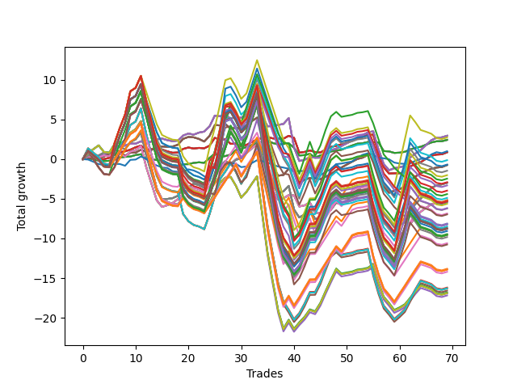

# Long Shepard 007 (1225 Waffles01) 
- Symbol: AAPL_Unlimited
- Date Range: 03/23/2022 - 07/08/2022
- Trading Period: 7:20-12:30
- Number of Trades: 69



| Name | Win Percent | Profit | Avg Profit / Trade | Avg Time / Trade |      | Name | Win Percent | Profit | Avg Profit / Trade | Avg Time / Trade |
| ---- | ----------- | ------ | ------------------ | ---------------- | ---- | ---- | ----------- | ------ | ------------------ | ---------------- |
| Sorted By <br> Profit | | | | | | Sorted By <br> Win Percentage ||||
| Sixty-Six | 76.81 | 1475.00 | 21.38 | 23:33 |     | Sixty-Six | 76.81 | 1475.00 | 21.38 | 23:33 |
| Fifty-Eight | 76.81 | 1475.00 | 21.38 | 23:33 |     | Fifty-Eight | 76.81 | 1475.00 | 21.38 | 23:33 |
| Fifty | 76.81 | 1475.00 | 21.38 | 23:33 |     | Fifty | 76.81 | 1475.00 | 21.38 | 23:33 |
| Forty-Two | 76.81 | 1475.00 | 21.38 | 23:33 |     | Forty-Two | 76.81 | 1475.00 | 21.38 | 23:33 |
| Two | 76.81 | 1475.00 | 21.38 | 23:33 |     | Two | 76.81 | 1475.00 | 21.38 | 23:33 |
| Ninety-Three | 43.48 | 1370.00 | 19.86 | 154:16 |     | Sixty-Four | 69.57 | 1215.00 | 17.61 | 08:07 |
| Sixty-Four | 69.57 | 1215.00 | 17.61 | 08:07 |     | Fifty-Six | 69.57 | 1215.00 | 17.61 | 08:07 |
| Fifty-Six | 69.57 | 1215.00 | 17.61 | 08:07 |     | Forty-Eight | 69.57 | 1215.00 | 17.61 | 08:07 |
| Forty-Eight | 69.57 | 1215.00 | 17.61 | 08:07 |     | Forty | 69.57 | 1215.00 | 17.61 | 08:07 |
| Forty | 69.57 | 1215.00 | 17.61 | 08:07 |     | Zero | 69.57 | 1215.00 | 17.61 | 08:07 |
| Zero | 69.57 | 1215.00 | 17.61 | 08:07 |     | Sixty-Five | 69.57 | 435.00 | 6.30 | 15:50 |
| Seventy-Three | 43.48 | 500.00 | 7.25 | 07:42 |     | Fifty-Seven | 69.57 | 435.00 | 6.30 | 15:50 |
| Sixty-Five | 69.57 | 435.00 | 6.30 | 15:50 |     | Forty-Nine | 69.57 | 435.00 | 6.30 | 15:50 |
| Fifty-Seven | 69.57 | 435.00 | 6.30 | 15:50 |     | Forty-One | 69.57 | 435.00 | 6.30 | 15:50 |
| Forty-Nine | 69.57 | 435.00 | 6.30 | 15:50 |     | One | 69.57 | 435.00 | 6.30 | 15:50 |
| Forty-One | 69.57 | 435.00 | 6.30 | 15:50 |     | Sixty-Seven | 69.57 | -370.00 | -5.36 | 26:23 |
| One | 69.57 | 435.00 | 6.30 | 15:50 |     | Fifty-Nine | 69.57 | -370.00 | -5.36 | 26:23 |
| Ninety-Four | 43.48 | -65.00 | -0.94 | 159:26 |     | Fifty-One | 69.57 | -370.00 | -5.36 | 26:23 |
| Ninety-Five | 43.48 | -345.00 | -5.00 | 160:41 |     | Forty-Three | 69.57 | -370.00 | -5.36 | 26:23 |
| Sixty-Seven | 69.57 | -370.00 | -5.36 | 26:23 |     | Three | 69.57 | -370.00 | -5.36 | 26:23 |
| Fifty-Nine | 69.57 | -370.00 | -5.36 | 26:23 |     | Sixty-Nine | 66.67 | -1490.00 | -21.59 | 59:10 |
| Fifty-One | 69.57 | -370.00 | -5.36 | 26:23 |     | Sixty-One | 66.67 | -1490.00 | -21.59 | 59:10 |
| Forty-Three | 69.57 | -370.00 | -5.36 | 26:23 |     | Fifty-Three | 66.67 | -1490.00 | -21.59 | 59:10 |
| Three | 69.57 | -370.00 | -5.36 | 26:23 |     | Forty-Five | 66.67 | -1490.00 | -21.59 | 59:10 |
| Ninety-Two | 43.48 | -730.00 | -10.58 | 134:35 |     | Five | 66.67 | -1490.00 | -21.59 | 59:10 |
| One Hundred Three | 46.38 | -1010.00 | -14.64 | 168:44 |     | Sixty-Eight | 63.77 | -2595.00 | -37.61 | 45:02 |
| Ninety-Seven | 40.58 | -1230.00 | -17.83 | 122:12 |     | Sixty | 63.77 | -2595.00 | -37.61 | 45:02 |
| One Hundred Eight | 44.93 | -1455.00 | -21.09 | 159:42 |     | Fifty-Two | 63.77 | -2595.00 | -37.61 | 45:02 |
| Sixty-Nine | 66.67 | -1490.00 | -21.59 | 59:10 |     | Forty-Four | 63.77 | -2595.00 | -37.61 | 45:02 |
| Sixty-One | 66.67 | -1490.00 | -21.59 | 59:10 |     | Four | 63.77 | -2595.00 | -37.61 | 45:02 |
| Fifty-Three | 66.67 | -1490.00 | -21.59 | 59:10 |     | Fifty-Four | 55.07 | -8405.00 | -121.81 | 103:48 |
| Forty-Five | 66.67 | -1490.00 | -21.59 | 59:10 |     | Seventy | 55.07 | -8450.00 | -122.46 | 105:53 |
| Five | 66.67 | -1490.00 | -21.59 | 59:10 |     | Sixty-Two | 55.07 | -8450.00 | -122.46 | 105:53 |
| Ninety-Nine | 40.58 | -1655.00 | -23.99 | 138:35 |     | Six | 55.07 | -8450.00 | -122.46 | 105:53 |
| Ninety-Eight | 40.58 | -1985.00 | -28.77 | 135:42 |     | Forty-Six | 55.07 | -8595.00 | -124.57 | 104:00 |
| One Hundred Seven | 46.38 | -2205.00 | -31.96 | 142:01 |     | One Hundred Six | 53.62 | -4775.00 | -69.20 | 99:20 |
| One Hundred Four | 46.38 | -2445.00 | -35.43 | 173:55 |     | One Hundred One | 53.62 | -5300.00 | -76.81 | 102:38 |
| Sixty-Eight | 63.77 | -2595.00 | -37.61 | 45:02 |     | One Hundred Sixteen | 53.62 | -6915.00 | -100.22 | 112:13 |
| Sixty | 63.77 | -2595.00 | -37.61 | 45:02 |     | One Hundred Twenty-Six | 53.62 | -6960.00 | -100.87 | 114:18 |
| Fifty-Two | 63.77 | -2595.00 | -37.61 | 45:02 |     | One Hundred Twenty-One | 53.62 | -6960.00 | -100.87 | 114:18 |
| Forty-Four | 63.77 | -2595.00 | -37.61 | 45:02 |     | Eighty-One | 53.62 | -6960.00 | -100.87 | 114:18 |
| Four | 63.77 | -2595.00 | -37.61 | 45:02 |     | One Hundred Eleven | 53.62 | -7105.00 | -102.97 | 112:25 |
| Ninety-Six | 50.72 | -2600.00 | -37.68 | 85:17 |     | Ninety-Six | 50.72 | -2600.00 | -37.68 | 85:17 |
| One Hundred Eighteen | 46.38 | -2625.00 | -38.04 | 178:19 |     | Ninety-One | 50.72 | -3425.00 | -49.64 | 89:47 |
| One Hundred Twenty-Eight | 46.38 | -2670.00 | -38.70 | 180:24 |     | Fifty-Five | 49.28 | -8100.00 | -117.39 | 135:41 |
| One Hundred Twenty-Three | 46.38 | -2670.00 | -38.70 | 180:24 |     | Seventy-One | 49.28 | -8145.00 | -118.04 | 137:46 |
| Eighty-Three | 46.38 | -2670.00 | -38.70 | 180:24 |     | Sixty-Three | 49.28 | -8145.00 | -118.04 | 137:46 |
| One Hundred Five | 46.38 | -2725.00 | -39.49 | 175:10 |     | Seven | 49.28 | -8145.00 | -118.04 | 137:46 |
| One Hundred Thirteen | 46.38 | -2815.00 | -40.80 | 178:31 |     | Forty-Seven | 49.28 | -8290.00 | -120.14 | 135:53 |
| One Hundred Nine | 44.93 | -3090.00 | -44.78 | 164:10 |     | One Hundred Three | 46.38 | -1010.00 | -14.64 | 168:44 |
| One Hundred Two | 46.38 | -3110.00 | -45.07 | 149:03 |     | One Hundred Seven | 46.38 | -2205.00 | -31.96 | 142:01 |
| Ninety-One | 50.72 | -3425.00 | -49.64 | 89:47 |     | One Hundred Four | 46.38 | -2445.00 | -35.43 | 173:55 |
| One Hundred | 40.58 | -3485.00 | -50.51 | 138:51 |     | One Hundred Eighteen | 46.38 | -2625.00 | -38.04 | 178:19 |
| One Hundred Ninteen | 46.38 | -4060.00 | -58.84 | 183:29 |     | One Hundred Twenty-Eight | 46.38 | -2670.00 | -38.70 | 180:24 |
| One Hundred Twenty-Nine | 46.38 | -4105.00 | -59.49 | 185:34 |     | One Hundred Twenty-Three | 46.38 | -2670.00 | -38.70 | 180:24 |
| One Hundred Twenty-Four | 46.38 | -4105.00 | -59.49 | 185:34 |     | Eighty-Three | 46.38 | -2670.00 | -38.70 | 180:24 |
| Eighty-Four | 46.38 | -4105.00 | -59.49 | 185:34 |     | One Hundred Five | 46.38 | -2725.00 | -39.49 | 175:10 |
| One Hundred Fourteen | 46.38 | -4250.00 | -61.59 | 183:42 |     | One Hundred Thirteen | 46.38 | -2815.00 | -40.80 | 178:31 |
| One Hundred Twenty | 46.38 | -4340.00 | -62.90 | 184:45 |     | One Hundred Two | 46.38 | -3110.00 | -45.07 | 149:03 |
| One Hundred Thirty | 46.38 | -4385.00 | -63.55 | 186:49 |     | One Hundred Ninteen | 46.38 | -4060.00 | -58.84 | 183:29 |
| One Hundred Twenty-Five | 46.38 | -4385.00 | -63.55 | 186:49 |     | One Hundred Twenty-Nine | 46.38 | -4105.00 | -59.49 | 185:34 |
| Eighty-Five | 46.38 | -4385.00 | -63.55 | 186:49 |     | One Hundred Twenty-Four | 46.38 | -4105.00 | -59.49 | 185:34 |
| One Hundred Fifteen | 46.38 | -4530.00 | -65.65 | 184:57 |     | Eighty-Four | 46.38 | -4105.00 | -59.49 | 185:34 |
| One Hundred Seventeen | 46.38 | -4725.00 | -68.48 | 158:38 |     | One Hundred Fourteen | 46.38 | -4250.00 | -61.59 | 183:42 |
| One Hundred Twenty-Seven | 46.38 | -4770.00 | -69.13 | 160:43 |     | One Hundred Twenty | 46.38 | -4340.00 | -62.90 | 184:45 |
| One Hundred Twenty-Two | 46.38 | -4770.00 | -69.13 | 160:43 |     | One Hundred Thirty | 46.38 | -4385.00 | -63.55 | 186:49 |
| Eighty-Two | 46.38 | -4770.00 | -69.13 | 160:43 |     | One Hundred Twenty-Five | 46.38 | -4385.00 | -63.55 | 186:49 |
| One Hundred Six | 53.62 | -4775.00 | -69.20 | 99:20 |     | Eighty-Five | 46.38 | -4385.00 | -63.55 | 186:49 |
| One Hundred Twelve | 46.38 | -4915.00 | -71.23 | 158:50 |     | One Hundred Fifteen | 46.38 | -4530.00 | -65.65 | 184:57 |
| One Hundred One | 53.62 | -5300.00 | -76.81 | 102:38 |     | One Hundred Seventeen | 46.38 | -4725.00 | -68.48 | 158:38 |
| One Hundred Ten | 44.93 | -5385.00 | -78.04 | 164:47 |     | One Hundred Twenty-Seven | 46.38 | -4770.00 | -69.13 | 160:43 |
| One Hundred Sixteen | 53.62 | -6915.00 | -100.22 | 112:13 |     | One Hundred Twenty-Two | 46.38 | -4770.00 | -69.13 | 160:43 |
| One Hundred Twenty-Six | 53.62 | -6960.00 | -100.87 | 114:18 |     | Eighty-Two | 46.38 | -4770.00 | -69.13 | 160:43 |
| One Hundred Twenty-One | 53.62 | -6960.00 | -100.87 | 114:18 |     | One Hundred Twelve | 46.38 | -4915.00 | -71.23 | 158:50 |
| Eighty-One | 53.62 | -6960.00 | -100.87 | 114:18 |     | One Hundred Eight | 44.93 | -1455.00 | -21.09 | 159:42 |
| One Hundred Eleven | 53.62 | -7105.00 | -102.97 | 112:25 |     | One Hundred Nine | 44.93 | -3090.00 | -44.78 | 164:10 |
| Fifty-Five | 49.28 | -8100.00 | -117.39 | 135:41 |     | One Hundred Ten | 44.93 | -5385.00 | -78.04 | 164:47 |
| Seventy-One | 49.28 | -8145.00 | -118.04 | 137:46 |     | Ninety-Three | 43.48 | 1370.00 | 19.86 | 154:16 |
| Sixty-Three | 49.28 | -8145.00 | -118.04 | 137:46 |     | Seventy-Three | 43.48 | 500.00 | 7.25 | 07:42 |
| Seven | 49.28 | -8145.00 | -118.04 | 137:46 |     | Ninety-Four | 43.48 | -65.00 | -0.94 | 159:26 |
| Forty-Seven | 49.28 | -8290.00 | -120.14 | 135:53 |     | Ninety-Five | 43.48 | -345.00 | -5.00 | 160:41 |
| Fifty-Four | 55.07 | -8405.00 | -121.81 | 103:48 |     | Ninety-Two | 43.48 | -730.00 | -10.58 | 134:35 |
| Seventy | 55.07 | -8450.00 | -122.46 | 105:53 |     | Ninety-Seven | 40.58 | -1230.00 | -17.83 | 122:12 |
| Sixty-Two | 55.07 | -8450.00 | -122.46 | 105:53 |     | Ninety-Nine | 40.58 | -1655.00 | -23.99 | 138:35 |
| Six | 55.07 | -8450.00 | -122.46 | 105:53 |     | Ninety-Eight | 40.58 | -1985.00 | -28.77 | 135:42 |
| Forty-Six | 55.07 | -8595.00 | -124.57 | 104:00 |     | One Hundred | 40.58 | -3485.00 | -50.51 | 138:51 |

## NO STOPLOSS

### Test Zero
* Sell when price hits the middle line of the 20p bollinger
* No Stoploss
* Results:
```
Total Trades: 69
Percent Up: 69.57
Percent Down: 30.43
Total Points Moved Up: 2.43
Potential Profit: 1215.00
Total Points Ups: 8.52 Count Ups: 48
Total Points Downs: -6.09 Count Downs: 21
```

<details><summary>Trades</summary>

<code>In: 2022-03-25 09:00:00		Out: 2022-03-25 09:05:05		Total Position Time: 05:05		Total Move Up: 0.11		Total to Date: 0.11</code> <br />
<code>In: 2022-03-30 08:02:00		Out: 2022-03-30 08:15:55		Total Position Time: 13:55		Total Move Up: -0.14		Total to Date: -0.03</code> <br />
<code>In: 2022-03-30 08:03:00		Out: 2022-03-30 08:15:55		Total Position Time: 12:55		Total Move Up: -0.15		Total to Date: -0.18</code> <br />
<code>In: 2022-04-05 09:38:00		Out: 2022-04-05 09:43:20		Total Position Time: 05:20		Total Move Up: -0.05		Total to Date: -0.23</code> <br />
<code>In: 2022-04-05 12:17:00		Out: 2022-04-05 12:23:20		Total Position Time: 06:20		Total Move Up: 0.02		Total to Date: -0.21</code> <br />
<code>In: 2022-04-06 08:21:00		Out: 2022-04-06 08:22:35		Total Position Time: 01:35		Total Move Up: 0.14		Total to Date: -0.07</code> <br />
<code>In: 2022-04-07 07:50:00		Out: 2022-04-07 07:54:30		Total Position Time: 04:30		Total Move Up: 0.29		Total to Date: 0.22</code> <br />
<code>In: 2022-04-07 07:51:00		Out: 2022-04-07 07:54:30		Total Position Time: 03:30		Total Move Up: 0.07		Total to Date: 0.29</code> <br />
<code>In: 2022-04-07 09:52:00		Out: 2022-04-07 09:58:45		Total Position Time: 06:45		Total Move Up: 0.04		Total to Date: 0.33</code> <br />
<code>In: 2022-04-12 11:00:00		Out: 2022-04-12 11:04:05		Total Position Time: 04:05		Total Move Up: 0.19		Total to Date: 0.52</code> <br />
<code>In: 2022-04-20 09:26:00		Out: 2022-04-20 09:27:10		Total Position Time: 01:10		Total Move Up: 0.10		Total to Date: 0.62</code> <br />
<code>In: 2022-04-21 10:01:00		Out: 2022-04-21 10:21:40		Total Position Time: 20:40		Total Move Up: -0.59		Total to Date: 0.03</code> <br />
<code>In: 2022-04-21 10:13:00		Out: 2022-04-21 10:21:40		Total Position Time: 08:40		Total Move Up: -0.05		Total to Date: -0.02</code> <br />
<code>In: 2022-04-21 10:22:00		Out: 2022-04-21 10:23:10		Total Position Time: 01:10		Total Move Up: -0.09		Total to Date: -0.11</code> <br />
<code>In: 2022-04-21 11:11:00		Out: 2022-04-21 11:21:05		Total Position Time: 10:05		Total Move Up: -0.01		Total to Date: -0.12</code> <br />
<code>In: 2022-04-21 11:51:00		Out: 2022-04-21 12:13:55		Total Position Time: 22:55		Total Move Up: -0.35		Total to Date: -0.47</code> <br />
<code>In: 2022-04-21 11:54:00		Out: 2022-04-21 12:13:55		Total Position Time: 19:55		Total Move Up: -0.28		Total to Date: -0.75</code> <br />
<code>In: 2022-04-21 11:58:00		Out: 2022-04-21 12:13:55		Total Position Time: 15:55		Total Move Up: -0.08		Total to Date: -0.83</code> <br />
<code>In: 2022-04-22 07:25:00		Out: 2022-04-22 07:32:10		Total Position Time: 07:10		Total Move Up: 0.19		Total to Date: -0.64</code> <br />
<code>In: 2022-04-22 11:11:00		Out: 2022-04-22 11:17:15		Total Position Time: 06:15		Total Move Up: 0.01		Total to Date: -0.63</code> <br />
<code>In: 2022-04-22 11:41:00		Out: 2022-04-22 11:45:05		Total Position Time: 04:05		Total Move Up: 0.16		Total to Date: -0.47</code> <br />
<code>In: 2022-04-26 12:21:00		Out: 2022-04-26 12:30:15		Total Position Time: 09:15		Total Move Up: 0.07		Total to Date: -0.40</code> <br />
<code>In: 2022-04-26 12:22:00		Out: 2022-04-26 12:30:15		Total Position Time: 08:15		Total Move Up: -0.06		Total to Date: -0.46</code> <br />
<code>In: 2022-04-27 07:21:00		Out: 2022-04-27 07:24:05		Total Position Time: 03:05		Total Move Up: 0.61		Total to Date: 0.15</code> <br />
<code>In: 2022-05-02 07:23:00		Out: 2022-05-02 07:26:05		Total Position Time: 03:05		Total Move Up: 0.56		Total to Date: 0.71</code> <br />
<code>In: 2022-05-02 10:37:00		Out: 2022-05-02 10:59:55		Total Position Time: 22:55		Total Move Up: -0.41		Total to Date: 0.30</code> <br />
<code>In: 2022-05-04 08:19:00		Out: 2022-05-04 08:23:05		Total Position Time: 04:05		Total Move Up: 0.09		Total to Date: 0.39</code> <br />
<code>In: 2022-05-10 07:55:00		Out: 2022-05-10 07:58:05		Total Position Time: 03:05		Total Move Up: 0.18		Total to Date: 0.57</code> <br />
<code>In: 2022-05-11 10:49:00		Out: 2022-05-11 10:53:15		Total Position Time: 04:15		Total Move Up: 0.57		Total to Date: 1.14</code> <br />
<code>In: 2022-05-11 10:50:00		Out: 2022-05-11 10:53:15		Total Position Time: 03:15		Total Move Up: 0.20		Total to Date: 1.34</code> <br />
<code>In: 2022-05-16 08:02:00		Out: 2022-05-16 08:05:10		Total Position Time: 03:10		Total Move Up: 0.15		Total to Date: 1.49</code> <br />
<code>In: 2022-05-17 07:47:00		Out: 2022-05-17 07:52:30		Total Position Time: 05:30		Total Move Up: 0.29		Total to Date: 1.78</code> <br />
<code>In: 2022-05-17 07:48:00		Out: 2022-05-17 07:52:30		Total Position Time: 04:30		Total Move Up: 0.24		Total to Date: 2.02</code> <br />
<code>In: 2022-05-18 07:47:00		Out: 2022-05-18 07:48:35		Total Position Time: 01:35		Total Move Up: 0.22		Total to Date: 2.24</code> <br />
<code>In: 2022-05-18 07:48:00		Out: 2022-05-18 07:49:20		Total Position Time: 01:20		Total Move Up: 0.07		Total to Date: 2.31</code> <br />
<code>In: 2022-05-18 08:20:00		Out: 2022-05-18 08:36:55		Total Position Time: 16:55		Total Move Up: -0.28		Total to Date: 2.03</code> <br />
<code>In: 2022-05-18 08:24:00		Out: 2022-05-18 08:36:55		Total Position Time: 12:55		Total Move Up: -0.17		Total to Date: 1.86</code> <br />
<code>In: 2022-05-18 09:10:00		Out: 2022-05-18 09:16:30		Total Position Time: 06:30		Total Move Up: 0.05		Total to Date: 1.91</code> <br />
<code>In: 2022-05-19 07:47:00		Out: 2022-05-19 07:54:45		Total Position Time: 07:45		Total Move Up: 0.09		Total to Date: 2.00</code> <br />
<code>In: 2022-05-20 08:01:00		Out: 2022-05-20 08:26:20		Total Position Time: 25:20		Total Move Up: -0.56		Total to Date: 1.44</code> <br />
<code>In: 2022-05-20 09:21:00		Out: 2022-05-20 09:56:10		Total Position Time: 35:10		Total Move Up: -0.97		Total to Date: 0.47</code> <br />
<code>In: 2022-05-25 09:38:00		Out: 2022-05-25 09:44:25		Total Position Time: 06:25		Total Move Up: 0.04		Total to Date: 0.51</code> <br />
<code>In: 2022-05-25 10:15:00		Out: 2022-05-25 10:16:20		Total Position Time: 01:20		Total Move Up: 0.16		Total to Date: 0.67</code> <br />
<code>In: 2022-06-01 07:21:00		Out: 2022-06-01 07:40:05		Total Position Time: 19:05		Total Move Up: -0.48		Total to Date: 0.19</code> <br />
<code>In: 2022-06-01 08:28:00		Out: 2022-06-01 08:31:45		Total Position Time: 03:45		Total Move Up: 0.29		Total to Date: 0.48</code> <br />
<code>In: 2022-06-01 09:14:00		Out: 2022-06-01 09:15:20		Total Position Time: 01:20		Total Move Up: 0.16		Total to Date: 0.64</code> <br />
<code>In: 2022-06-01 09:15:00		Out: 2022-06-01 09:16:10		Total Position Time: 01:10		Total Move Up: 0.33		Total to Date: 0.97</code> <br />
<code>In: 2022-06-03 08:20:00		Out: 2022-06-03 08:26:25		Total Position Time: 06:25		Total Move Up: 0.11		Total to Date: 1.08</code> <br />
<code>In: 2022-06-06 08:26:00		Out: 2022-06-06 08:38:50		Total Position Time: 12:50		Total Move Up: 0.11		Total to Date: 1.19</code> <br />
<code>In: 2022-06-06 09:14:00		Out: 2022-06-06 09:19:45		Total Position Time: 05:45		Total Move Up: 0.27		Total to Date: 1.46</code> <br />
<code>In: 2022-06-06 09:15:00		Out: 2022-06-06 09:19:45		Total Position Time: 04:45		Total Move Up: 0.26		Total to Date: 1.72</code> <br />
<code>In: 2022-06-08 10:41:00		Out: 2022-06-08 10:42:10		Total Position Time: 01:10		Total Move Up: 0.23		Total to Date: 1.95</code> <br />
<code>In: 2022-06-08 10:42:00		Out: 2022-06-08 10:43:10		Total Position Time: 01:10		Total Move Up: 0.06		Total to Date: 2.01</code> <br />
<code>In: 2022-06-08 11:41:00		Out: 2022-06-08 11:43:20		Total Position Time: 02:20		Total Move Up: 0.15		Total to Date: 2.16</code> <br />
<code>In: 2022-06-09 07:57:00		Out: 2022-06-09 08:10:35		Total Position Time: 13:35		Total Move Up: -0.03		Total to Date: 2.13</code> <br />
<code>In: 2022-06-09 11:28:00		Out: 2022-06-09 11:29:15		Total Position Time: 01:15		Total Move Up: 0.00		Total to Date: 2.13</code> <br />
<code>In: 2022-06-09 11:42:00		Out: 2022-06-09 12:24:30		Total Position Time: 42:30		Total Move Up: -1.11		Total to Date: 1.02</code> <br />
<code>In: 2022-06-09 12:12:00		Out: 2022-06-09 12:24:30		Total Position Time: 12:30		Total Move Up: -0.04		Total to Date: 0.98</code> <br />
<code>In: 2022-06-13 12:04:00		Out: 2022-06-13 12:16:50		Total Position Time: 12:50		Total Move Up: -0.19		Total to Date: 0.79</code> <br />
<code>In: 2022-06-15 07:43:00		Out: 2022-06-15 07:50:15		Total Position Time: 07:15		Total Move Up: 0.03		Total to Date: 0.82</code> <br />
<code>In: 2022-06-15 07:48:00		Out: 2022-06-15 07:50:15		Total Position Time: 02:15		Total Move Up: 0.11		Total to Date: 0.93</code> <br />
<code>In: 2022-06-15 11:10:00		Out: 2022-06-15 11:16:00		Total Position Time: 06:00		Total Move Up: 0.28		Total to Date: 1.21</code> <br />
<code>In: 2022-06-16 07:54:00		Out: 2022-06-16 08:00:25		Total Position Time: 06:25		Total Move Up: 0.23		Total to Date: 1.44</code> <br />
<code>In: 2022-06-16 07:55:00		Out: 2022-06-16 08:00:25		Total Position Time: 05:25		Total Move Up: 0.12		Total to Date: 1.56</code> <br />
<code>In: 2022-06-16 11:57:00		Out: 2022-06-16 12:00:25		Total Position Time: 03:25		Total Move Up: 0.26		Total to Date: 1.82</code> <br />
<code>In: 2022-06-16 12:00:00		Out: 2022-06-16 12:01:10		Total Position Time: 01:10		Total Move Up: 0.28		Total to Date: 2.10</code> <br />
<code>In: 2022-06-16 12:01:00		Out: 2022-06-16 12:02:10		Total Position Time: 01:10		Total Move Up: 0.15		Total to Date: 2.25</code> <br />
<code>In: 2022-06-27 10:51:00		Out: 2022-06-27 11:03:15		Total Position Time: 12:15		Total Move Up: 0.01		Total to Date: 2.26</code> <br />
<code>In: 2022-06-27 12:10:00		Out: 2022-06-27 12:11:10		Total Position Time: 01:10		Total Move Up: 0.17		Total to Date: 2.43</code> <br />


</details>

### Test One
* Sell when the price hits the upper line of the 20p 1std bollinger
* No Stoploss
* Results:
```
Total Trades: 69
Percent Up: 69.57
Percent Down: 30.43
Total Points Moved Up: 0.87
Potential Profit: 435.00
Total Points Ups: 10.88 Count Ups: 48
Total Points Downs: -10.01 Count Downs: 21
```

<details><summary>Trades</summary>

<code>In: 2022-03-25 09:00:00		Out: 2022-03-25 09:06:05		Total Position Time: 06:05		Total Move Up: 0.20		Total to Date: 0.20</code> <br />
<code>In: 2022-03-30 08:02:00		Out: 2022-03-30 08:19:15		Total Position Time: 17:15		Total Move Up: -0.07		Total to Date: 0.13</code> <br />
<code>In: 2022-03-30 08:03:00		Out: 2022-03-30 08:19:15		Total Position Time: 16:15		Total Move Up: -0.08		Total to Date: 0.05</code> <br />
<code>In: 2022-04-05 09:38:00		Out: 2022-04-05 09:51:35		Total Position Time: 13:35		Total Move Up: -0.05		Total to Date: 0.00</code> <br />
<code>In: 2022-04-05 12:17:00		Out: 2022-04-05 12:23:35		Total Position Time: 06:35		Total Move Up: 0.17		Total to Date: 0.17</code> <br />
<code>In: 2022-04-06 08:21:00		Out: 2022-04-06 08:23:05		Total Position Time: 02:05		Total Move Up: 0.38		Total to Date: 0.55</code> <br />
<code>In: 2022-04-07 07:50:00		Out: 2022-04-07 08:00:05		Total Position Time: 10:05		Total Move Up: 0.33		Total to Date: 0.88</code> <br />
<code>In: 2022-04-07 07:51:00		Out: 2022-04-07 08:00:05		Total Position Time: 09:05		Total Move Up: 0.11		Total to Date: 0.99</code> <br />
<code>In: 2022-04-07 09:52:00		Out: 2022-04-07 10:02:15		Total Position Time: 10:15		Total Move Up: 0.21		Total to Date: 1.20</code> <br />
<code>In: 2022-04-12 11:00:00		Out: 2022-04-12 11:06:20		Total Position Time: 06:20		Total Move Up: 0.30		Total to Date: 1.50</code> <br />
<code>In: 2022-04-20 09:26:00		Out: 2022-04-20 09:28:45		Total Position Time: 02:45		Total Move Up: 0.21		Total to Date: 1.71</code> <br />
<code>In: 2022-04-21 10:01:00		Out: 2022-04-21 10:28:50		Total Position Time: 27:50		Total Move Up: -0.50		Total to Date: 1.21</code> <br />
<code>In: 2022-04-21 10:13:00		Out: 2022-04-21 10:28:50		Total Position Time: 15:50		Total Move Up: 0.04		Total to Date: 1.25</code> <br />
<code>In: 2022-04-21 10:22:00		Out: 2022-04-21 10:28:50		Total Position Time: 06:50		Total Move Up: 0.04		Total to Date: 1.29</code> <br />
<code>In: 2022-04-21 11:11:00		Out: 2022-04-21 11:31:10		Total Position Time: 20:10		Total Move Up: -0.07		Total to Date: 1.22</code> <br />
<code>In: 2022-04-21 11:51:00		Out: 2022-04-21 12:15:05		Total Position Time: 24:05		Total Move Up: -0.24		Total to Date: 0.98</code> <br />
<code>In: 2022-04-21 11:54:00		Out: 2022-04-21 12:15:05		Total Position Time: 21:05		Total Move Up: -0.17		Total to Date: 0.81</code> <br />
<code>In: 2022-04-21 11:58:00		Out: 2022-04-21 12:15:05		Total Position Time: 17:05		Total Move Up: 0.03		Total to Date: 0.84</code> <br />
<code>In: 2022-04-22 07:25:00		Out: 2022-04-22 07:33:50		Total Position Time: 08:50		Total Move Up: 0.45		Total to Date: 1.29</code> <br />
<code>In: 2022-04-22 11:11:00		Out: 2022-04-22 11:17:45		Total Position Time: 06:45		Total Move Up: 0.18		Total to Date: 1.47</code> <br />
<code>In: 2022-04-22 11:41:00		Out: 2022-04-22 12:11:50		Total Position Time: 30:50		Total Move Up: -0.13		Total to Date: 1.34</code> <br />
<code>In: 2022-04-26 12:21:00		Out: 2022-04-26 12:37:50		Total Position Time: 16:50		Total Move Up: 0.08		Total to Date: 1.42</code> <br />
<code>In: 2022-04-26 12:22:00		Out: 2022-04-26 12:37:50		Total Position Time: 15:50		Total Move Up: -0.05		Total to Date: 1.37</code> <br />
<code>In: 2022-04-27 07:21:00		Out: 2022-04-27 07:38:15		Total Position Time: 17:15		Total Move Up: 0.33		Total to Date: 1.70</code> <br />
<code>In: 2022-05-02 07:23:00		Out: 2022-05-02 07:26:45		Total Position Time: 03:45		Total Move Up: 0.99		Total to Date: 2.69</code> <br />
<code>In: 2022-05-02 10:37:00		Out: 2022-05-02 11:02:15		Total Position Time: 25:15		Total Move Up: -0.24		Total to Date: 2.45</code> <br />
<code>In: 2022-05-04 08:19:00		Out: 2022-05-04 08:34:55		Total Position Time: 15:55		Total Move Up: 0.06		Total to Date: 2.51</code> <br />
<code>In: 2022-05-10 07:55:00		Out: 2022-05-10 08:23:05		Total Position Time: 28:05		Total Move Up: -0.58		Total to Date: 1.93</code> <br />
<code>In: 2022-05-11 10:49:00		Out: 2022-05-11 11:18:35		Total Position Time: 29:35		Total Move Up: 0.03		Total to Date: 1.96</code> <br />
<code>In: 2022-05-11 10:50:00		Out: 2022-05-11 11:18:35		Total Position Time: 28:35		Total Move Up: -0.34		Total to Date: 1.62</code> <br />
<code>In: 2022-05-16 08:02:00		Out: 2022-05-16 08:09:30		Total Position Time: 07:30		Total Move Up: 0.18		Total to Date: 1.80</code> <br />
<code>In: 2022-05-17 07:47:00		Out: 2022-05-17 07:55:10		Total Position Time: 08:10		Total Move Up: 0.36		Total to Date: 2.16</code> <br />
<code>In: 2022-05-17 07:48:00		Out: 2022-05-17 07:55:10		Total Position Time: 07:10		Total Move Up: 0.31		Total to Date: 2.47</code> <br />
<code>In: 2022-05-18 07:47:00		Out: 2022-05-18 08:00:00		Total Position Time: 13:00		Total Move Up: 0.20		Total to Date: 2.67</code> <br />
<code>In: 2022-05-18 07:48:00		Out: 2022-05-18 08:00:00		Total Position Time: 12:00		Total Move Up: 0.10		Total to Date: 2.77</code> <br />
<code>In: 2022-05-18 08:20:00		Out: 2022-05-18 08:41:40		Total Position Time: 21:40		Total Move Up: -0.15		Total to Date: 2.62</code> <br />
<code>In: 2022-05-18 08:24:00		Out: 2022-05-18 08:41:40		Total Position Time: 17:40		Total Move Up: -0.04		Total to Date: 2.58</code> <br />
<code>In: 2022-05-18 09:10:00		Out: 2022-05-18 09:35:50		Total Position Time: 25:50		Total Move Up: 0.00		Total to Date: 2.58</code> <br />
<code>In: 2022-05-19 07:47:00		Out: 2022-05-19 07:55:35		Total Position Time: 08:35		Total Move Up: 0.37		Total to Date: 2.95</code> <br />
<code>In: 2022-05-20 08:01:00		Out: 2022-05-20 08:27:15		Total Position Time: 26:15		Total Move Up: -0.25		Total to Date: 2.70</code> <br />
<code>In: 2022-05-20 09:21:00		Out: 2022-05-20 10:33:15		Total Position Time: 72:15		Total Move Up: -1.88		Total to Date: 0.82</code> <br />
<code>In: 2022-05-25 09:38:00		Out: 2022-05-25 09:45:15		Total Position Time: 07:15		Total Move Up: 0.09		Total to Date: 0.91</code> <br />
<code>In: 2022-05-25 10:15:00		Out: 2022-05-25 10:27:00		Total Position Time: 12:00		Total Move Up: 0.19		Total to Date: 1.10</code> <br />
<code>In: 2022-06-01 07:21:00		Out: 2022-06-01 07:42:50		Total Position Time: 21:50		Total Move Up: -0.20		Total to Date: 0.90</code> <br />
<code>In: 2022-06-01 08:28:00		Out: 2022-06-01 08:54:40		Total Position Time: 26:40		Total Move Up: -0.06		Total to Date: 0.84</code> <br />
<code>In: 2022-06-01 09:14:00		Out: 2022-06-01 09:15:55		Total Position Time: 01:55		Total Move Up: 0.37		Total to Date: 1.21</code> <br />
<code>In: 2022-06-01 09:15:00		Out: 2022-06-01 09:16:10		Total Position Time: 01:10		Total Move Up: 0.33		Total to Date: 1.54</code> <br />
<code>In: 2022-06-03 08:20:00		Out: 2022-06-03 08:30:25		Total Position Time: 10:25		Total Move Up: 0.14		Total to Date: 1.68</code> <br />
<code>In: 2022-06-06 08:26:00		Out: 2022-06-06 08:44:05		Total Position Time: 18:05		Total Move Up: 0.20		Total to Date: 1.88</code> <br />
<code>In: 2022-06-06 09:14:00		Out: 2022-06-06 09:24:10		Total Position Time: 10:10		Total Move Up: 0.24		Total to Date: 2.12</code> <br />
<code>In: 2022-06-06 09:15:00		Out: 2022-06-06 09:24:10		Total Position Time: 09:10		Total Move Up: 0.23		Total to Date: 2.35</code> <br />
<code>In: 2022-06-08 10:41:00		Out: 2022-06-08 10:45:05		Total Position Time: 04:05		Total Move Up: 0.31		Total to Date: 2.66</code> <br />
<code>In: 2022-06-08 10:42:00		Out: 2022-06-08 10:45:05		Total Position Time: 03:05		Total Move Up: 0.14		Total to Date: 2.80</code> <br />
<code>In: 2022-06-08 11:41:00		Out: 2022-06-08 11:45:10		Total Position Time: 04:10		Total Move Up: 0.26		Total to Date: 3.06</code> <br />
<code>In: 2022-06-09 07:57:00		Out: 2022-06-09 08:11:10		Total Position Time: 14:10		Total Move Up: 0.04		Total to Date: 3.10</code> <br />
<code>In: 2022-06-09 11:28:00		Out: 2022-06-09 12:47:00		Total Position Time: 79:00		Total Move Up: -2.28		Total to Date: 0.82</code> <br />
<code>In: 2022-06-09 11:42:00		Out: 2022-06-09 12:47:00		Total Position Time: 65:00		Total Move Up: -1.85		Total to Date: -1.03</code> <br />
<code>In: 2022-06-09 12:12:00		Out: 2022-06-09 12:47:00		Total Position Time: 35:00		Total Move Up: -0.78		Total to Date: -1.81</code> <br />
<code>In: 2022-06-13 12:04:00		Out: 2022-06-13 12:17:10		Total Position Time: 13:10		Total Move Up: 0.03		Total to Date: -1.78</code> <br />
<code>In: 2022-06-15 07:43:00		Out: 2022-06-15 07:58:55		Total Position Time: 15:55		Total Move Up: 0.01		Total to Date: -1.77</code> <br />
<code>In: 2022-06-15 07:48:00		Out: 2022-06-15 07:58:55		Total Position Time: 10:55		Total Move Up: 0.09		Total to Date: -1.68</code> <br />
<code>In: 2022-06-15 11:10:00		Out: 2022-06-15 11:20:30		Total Position Time: 10:30		Total Move Up: 0.75		Total to Date: -0.93</code> <br />
<code>In: 2022-06-16 07:54:00		Out: 2022-06-16 08:01:30		Total Position Time: 07:30		Total Move Up: 0.33		Total to Date: -0.60</code> <br />
<code>In: 2022-06-16 07:55:00		Out: 2022-06-16 08:01:30		Total Position Time: 06:30		Total Move Up: 0.22		Total to Date: -0.38</code> <br />
<code>In: 2022-06-16 11:57:00		Out: 2022-06-16 12:01:35		Total Position Time: 04:35		Total Move Up: 0.42		Total to Date: 0.04</code> <br />
<code>In: 2022-06-16 12:00:00		Out: 2022-06-16 12:01:35		Total Position Time: 01:35		Total Move Up: 0.39		Total to Date: 0.43</code> <br />
<code>In: 2022-06-16 12:01:00		Out: 2022-06-16 12:02:10		Total Position Time: 01:10		Total Move Up: 0.15		Total to Date: 0.58</code> <br />
<code>In: 2022-06-27 10:51:00		Out: 2022-06-27 11:05:00		Total Position Time: 14:00		Total Move Up: 0.03		Total to Date: 0.61</code> <br />
<code>In: 2022-06-27 12:10:00		Out: 2022-06-27 12:13:05		Total Position Time: 03:05		Total Move Up: 0.26		Total to Date: 0.87</code> <br />


</details>

### Test Two
* Sell when the price hits the upper line of the 20p 2std bollinger
* No Stoploss
* Results:
```
Total Trades: 69
Percent Up: 76.81
Percent Down: 23.19
Total Points Moved Up: 2.95
Potential Profit: 1475.00
Total Points Ups: 17.12 Count Ups: 53
Total Points Downs: -14.17 Count Downs: 16
```

<details><summary>Trades</summary>

<code>In: 2022-03-25 09:00:00		Out: 2022-03-25 09:11:20		Total Position Time: 11:20		Total Move Up: 0.40		Total to Date: 0.40</code> <br />
<code>In: 2022-03-30 08:02:00		Out: 2022-03-30 08:34:40		Total Position Time: 32:40		Total Move Up: 0.04		Total to Date: 0.44</code> <br />
<code>In: 2022-03-30 08:03:00		Out: 2022-03-30 08:34:40		Total Position Time: 31:40		Total Move Up: 0.03		Total to Date: 0.47</code> <br />
<code>In: 2022-04-05 09:38:00		Out: 2022-04-05 09:52:20		Total Position Time: 14:20		Total Move Up: 0.02		Total to Date: 0.49</code> <br />
<code>In: 2022-04-05 12:17:00		Out: 2022-04-05 12:23:50		Total Position Time: 06:50		Total Move Up: 0.30		Total to Date: 0.79</code> <br />
<code>In: 2022-04-06 08:21:00		Out: 2022-04-06 08:27:05		Total Position Time: 06:05		Total Move Up: 0.41		Total to Date: 1.20</code> <br />
<code>In: 2022-04-07 07:50:00		Out: 2022-04-07 08:01:05		Total Position Time: 11:05		Total Move Up: 0.37		Total to Date: 1.57</code> <br />
<code>In: 2022-04-07 07:51:00		Out: 2022-04-07 08:01:05		Total Position Time: 10:05		Total Move Up: 0.15		Total to Date: 1.72</code> <br />
<code>In: 2022-04-07 09:52:00		Out: 2022-04-07 10:03:05		Total Position Time: 11:05		Total Move Up: 0.24		Total to Date: 1.96</code> <br />
<code>In: 2022-04-12 11:00:00		Out: 2022-04-12 11:35:45		Total Position Time: 35:45		Total Move Up: -0.01		Total to Date: 1.95</code> <br />
<code>In: 2022-04-20 09:26:00		Out: 2022-04-20 09:30:55		Total Position Time: 04:55		Total Move Up: 0.30		Total to Date: 2.25</code> <br />
<code>In: 2022-04-21 10:01:00		Out: 2022-04-21 10:31:20		Total Position Time: 30:20		Total Move Up: -0.28		Total to Date: 1.97</code> <br />
<code>In: 2022-04-21 10:13:00		Out: 2022-04-21 10:31:20		Total Position Time: 18:20		Total Move Up: 0.26		Total to Date: 2.23</code> <br />
<code>In: 2022-04-21 10:22:00		Out: 2022-04-21 10:31:20		Total Position Time: 09:20		Total Move Up: 0.26		Total to Date: 2.49</code> <br />
<code>In: 2022-04-21 11:11:00		Out: 2022-04-21 11:31:50		Total Position Time: 20:50		Total Move Up: 0.11		Total to Date: 2.60</code> <br />
<code>In: 2022-04-21 11:51:00		Out: 2022-04-21 12:18:15		Total Position Time: 27:15		Total Move Up: -0.20		Total to Date: 2.40</code> <br />
<code>In: 2022-04-21 11:54:00		Out: 2022-04-21 12:18:15		Total Position Time: 24:15		Total Move Up: -0.13		Total to Date: 2.27</code> <br />
<code>In: 2022-04-21 11:58:00		Out: 2022-04-21 12:18:15		Total Position Time: 20:15		Total Move Up: 0.07		Total to Date: 2.34</code> <br />
<code>In: 2022-04-22 07:25:00		Out: 2022-04-22 07:34:25		Total Position Time: 09:25		Total Move Up: 0.64		Total to Date: 2.98</code> <br />
<code>In: 2022-04-22 11:11:00		Out: 2022-04-22 11:18:00		Total Position Time: 07:00		Total Move Up: 0.25		Total to Date: 3.23</code> <br />
<code>In: 2022-04-22 11:41:00		Out: 2022-04-22 12:12:45		Total Position Time: 31:45		Total Move Up: -0.14		Total to Date: 3.09</code> <br />
<code>In: 2022-04-26 12:21:00		Out: 2022-04-26 12:40:10		Total Position Time: 19:10		Total Move Up: 0.26		Total to Date: 3.35</code> <br />
<code>In: 2022-04-26 12:22:00		Out: 2022-04-26 12:40:10		Total Position Time: 18:10		Total Move Up: 0.13		Total to Date: 3.48</code> <br />
<code>In: 2022-04-27 07:21:00		Out: 2022-04-27 07:39:10		Total Position Time: 18:10		Total Move Up: 0.65		Total to Date: 4.13</code> <br />
<code>In: 2022-05-02 07:23:00		Out: 2022-05-02 07:28:50		Total Position Time: 05:50		Total Move Up: 1.37		Total to Date: 5.50</code> <br />
<code>In: 2022-05-02 10:37:00		Out: 2022-05-02 11:03:05		Total Position Time: 26:05		Total Move Up: -0.10		Total to Date: 5.40</code> <br />
<code>In: 2022-05-04 08:19:00		Out: 2022-05-04 08:36:20		Total Position Time: 17:20		Total Move Up: 0.18		Total to Date: 5.58</code> <br />
<code>In: 2022-05-10 07:55:00		Out: 2022-05-10 08:37:50		Total Position Time: 42:50		Total Move Up: -0.48		Total to Date: 5.10</code> <br />
<code>In: 2022-05-11 10:49:00		Out: 2022-05-11 11:24:05		Total Position Time: 35:05		Total Move Up: 0.25		Total to Date: 5.35</code> <br />
<code>In: 2022-05-11 10:50:00		Out: 2022-05-11 11:24:05		Total Position Time: 34:05		Total Move Up: -0.12		Total to Date: 5.23</code> <br />
<code>In: 2022-05-16 08:02:00		Out: 2022-05-16 08:09:55		Total Position Time: 07:55		Total Move Up: 0.37		Total to Date: 5.60</code> <br />
<code>In: 2022-05-17 07:47:00		Out: 2022-05-17 07:59:15		Total Position Time: 12:15		Total Move Up: 0.46		Total to Date: 6.06</code> <br />
<code>In: 2022-05-17 07:48:00		Out: 2022-05-17 07:59:15		Total Position Time: 11:15		Total Move Up: 0.41		Total to Date: 6.47</code> <br />
<code>In: 2022-05-18 07:47:00		Out: 2022-05-18 08:43:30		Total Position Time: 56:30		Total Move Up: -1.11		Total to Date: 5.36</code> <br />
<code>In: 2022-05-18 07:48:00		Out: 2022-05-18 08:43:30		Total Position Time: 55:30		Total Move Up: -1.21		Total to Date: 4.15</code> <br />
<code>In: 2022-05-18 08:20:00		Out: 2022-05-18 08:43:30		Total Position Time: 23:30		Total Move Up: 0.03		Total to Date: 4.18</code> <br />
<code>In: 2022-05-18 08:24:00		Out: 2022-05-18 08:43:30		Total Position Time: 19:30		Total Move Up: 0.14		Total to Date: 4.32</code> <br />
<code>In: 2022-05-18 09:10:00		Out: 2022-05-18 09:39:15		Total Position Time: 29:15		Total Move Up: 0.12		Total to Date: 4.44</code> <br />
<code>In: 2022-05-19 07:47:00		Out: 2022-05-19 07:55:45		Total Position Time: 08:45		Total Move Up: 0.74		Total to Date: 5.18</code> <br />
<code>In: 2022-05-20 08:01:00		Out: 2022-05-20 10:33:45		Total Position Time: 152:45		Total Move Up: -3.69		Total to Date: 1.49</code> <br />
<code>In: 2022-05-20 09:21:00		Out: 2022-05-20 10:33:45		Total Position Time: 72:45		Total Move Up: -1.72		Total to Date: -0.23</code> <br />
<code>In: 2022-05-25 09:38:00		Out: 2022-05-25 09:47:30		Total Position Time: 09:30		Total Move Up: 0.15		Total to Date: -0.08</code> <br />
<code>In: 2022-05-25 10:15:00		Out: 2022-05-25 10:29:20		Total Position Time: 14:20		Total Move Up: 0.33		Total to Date: 0.25</code> <br />
<code>In: 2022-06-01 07:21:00		Out: 2022-06-01 07:43:45		Total Position Time: 22:45		Total Move Up: -0.07		Total to Date: 0.18</code> <br />
<code>In: 2022-06-01 08:28:00		Out: 2022-06-01 08:55:20		Total Position Time: 27:20		Total Move Up: 0.01		Total to Date: 0.19</code> <br />
<code>In: 2022-06-01 09:14:00		Out: 2022-06-01 09:20:55		Total Position Time: 06:55		Total Move Up: 0.51		Total to Date: 0.70</code> <br />
<code>In: 2022-06-01 09:15:00		Out: 2022-06-01 09:20:55		Total Position Time: 05:55		Total Move Up: 0.43		Total to Date: 1.13</code> <br />
<code>In: 2022-06-03 08:20:00		Out: 2022-06-03 08:31:40		Total Position Time: 11:40		Total Move Up: 0.20		Total to Date: 1.33</code> <br />
<code>In: 2022-06-06 08:26:00		Out: 2022-06-06 08:44:30		Total Position Time: 18:30		Total Move Up: 0.33		Total to Date: 1.66</code> <br />
<code>In: 2022-06-06 09:14:00		Out: 2022-06-06 09:39:30		Total Position Time: 25:30		Total Move Up: 0.34		Total to Date: 2.00</code> <br />
<code>In: 2022-06-06 09:15:00		Out: 2022-06-06 09:39:30		Total Position Time: 24:30		Total Move Up: 0.33		Total to Date: 2.33</code> <br />
<code>In: 2022-06-08 10:41:00		Out: 2022-06-08 10:47:15		Total Position Time: 06:15		Total Move Up: 0.43		Total to Date: 2.76</code> <br />
<code>In: 2022-06-08 10:42:00		Out: 2022-06-08 10:47:15		Total Position Time: 05:15		Total Move Up: 0.26		Total to Date: 3.02</code> <br />
<code>In: 2022-06-08 11:41:00		Out: 2022-06-08 11:47:50		Total Position Time: 06:50		Total Move Up: 0.36		Total to Date: 3.38</code> <br />
<code>In: 2022-06-09 07:57:00		Out: 2022-06-09 08:22:40		Total Position Time: 25:40		Total Move Up: 0.13		Total to Date: 3.51</code> <br />
<code>In: 2022-06-09 11:28:00		Out: 2022-06-09 12:47:00		Total Position Time: 79:00		Total Move Up: -2.28		Total to Date: 1.23</code> <br />
<code>In: 2022-06-09 11:42:00		Out: 2022-06-09 12:47:00		Total Position Time: 65:00		Total Move Up: -1.85		Total to Date: -0.62</code> <br />
<code>In: 2022-06-09 12:12:00		Out: 2022-06-09 12:47:00		Total Position Time: 35:00		Total Move Up: -0.78		Total to Date: -1.40</code> <br />
<code>In: 2022-06-13 12:04:00		Out: 2022-06-13 12:17:15		Total Position Time: 13:15		Total Move Up: 0.26		Total to Date: -1.14</code> <br />
<code>In: 2022-06-15 07:43:00		Out: 2022-06-15 07:59:05		Total Position Time: 16:05		Total Move Up: 0.11		Total to Date: -1.03</code> <br />
<code>In: 2022-06-15 07:48:00		Out: 2022-06-15 07:59:05		Total Position Time: 11:05		Total Move Up: 0.19		Total to Date: -0.84</code> <br />
<code>In: 2022-06-15 11:10:00		Out: 2022-06-15 11:38:10		Total Position Time: 28:10		Total Move Up: 1.04		Total to Date: 0.20</code> <br />
<code>In: 2022-06-16 07:54:00		Out: 2022-06-16 08:09:50		Total Position Time: 15:50		Total Move Up: 0.52		Total to Date: 0.72</code> <br />
<code>In: 2022-06-16 07:55:00		Out: 2022-06-16 08:09:50		Total Position Time: 14:50		Total Move Up: 0.41		Total to Date: 1.13</code> <br />
<code>In: 2022-06-16 11:57:00		Out: 2022-06-16 12:10:10		Total Position Time: 13:10		Total Move Up: 0.64		Total to Date: 1.77</code> <br />
<code>In: 2022-06-16 12:00:00		Out: 2022-06-16 12:10:10		Total Position Time: 10:10		Total Move Up: 0.61		Total to Date: 2.38</code> <br />
<code>In: 2022-06-16 12:01:00		Out: 2022-06-16 12:10:10		Total Position Time: 09:10		Total Move Up: 0.31		Total to Date: 2.69</code> <br />
<code>In: 2022-06-27 10:51:00		Out: 2022-06-27 11:17:10		Total Position Time: 26:10		Total Move Up: 0.06		Total to Date: 2.75</code> <br />
<code>In: 2022-06-27 12:10:00		Out: 2022-06-27 12:47:00		Total Position Time: 37:00		Total Move Up: 0.20		Total to Date: 2.95</code> <br />


</details>

### Test Three
* Sell when price hits the middle line of the 50p bollinger
* No Stoploss
* Results:
```
Total Trades: 69
Percent Up: 69.57
Percent Down: 30.43
Total Points Moved Up: -0.74
Potential Profit: -370.00
Total Points Ups: 15.91 Count Ups: 48
Total Points Downs: -16.65 Count Downs: 21
```

<details><summary>Trades</summary>

<code>In: 2022-03-25 09:00:00		Out: 2022-03-25 09:05:15		Total Position Time: 05:15		Total Move Up: 0.14		Total to Date: 0.14</code> <br />
<code>In: 2022-03-30 08:02:00		Out: 2022-03-30 08:34:40		Total Position Time: 32:40		Total Move Up: 0.04		Total to Date: 0.18</code> <br />
<code>In: 2022-03-30 08:03:00		Out: 2022-03-30 08:34:40		Total Position Time: 31:40		Total Move Up: 0.03		Total to Date: 0.21</code> <br />
<code>In: 2022-04-05 09:38:00		Out: 2022-04-05 09:56:10		Total Position Time: 18:10		Total Move Up: 0.13		Total to Date: 0.34</code> <br />
<code>In: 2022-04-05 12:17:00		Out: 2022-04-05 12:24:45		Total Position Time: 07:45		Total Move Up: 0.35		Total to Date: 0.69</code> <br />
<code>In: 2022-04-06 08:21:00		Out: 2022-04-06 08:23:45		Total Position Time: 02:45		Total Move Up: 0.50		Total to Date: 1.19</code> <br />
<code>In: 2022-04-07 07:50:00		Out: 2022-04-07 08:48:10		Total Position Time: 58:10		Total Move Up: -0.27		Total to Date: 0.92</code> <br />
<code>In: 2022-04-07 07:51:00		Out: 2022-04-07 08:48:10		Total Position Time: 57:10		Total Move Up: -0.49		Total to Date: 0.43</code> <br />
<code>In: 2022-04-07 09:52:00		Out: 2022-04-07 10:03:10		Total Position Time: 11:10		Total Move Up: 0.38		Total to Date: 0.81</code> <br />
<code>In: 2022-04-12 11:00:00		Out: 2022-04-12 11:35:50		Total Position Time: 35:50		Total Move Up: 0.01		Total to Date: 0.82</code> <br />
<code>In: 2022-04-20 09:26:00		Out: 2022-04-20 09:32:40		Total Position Time: 06:40		Total Move Up: 0.37		Total to Date: 1.19</code> <br />
<code>In: 2022-04-21 10:01:00		Out: 2022-04-21 10:31:40		Total Position Time: 30:40		Total Move Up: -0.28		Total to Date: 0.91</code> <br />
<code>In: 2022-04-21 10:13:00		Out: 2022-04-21 10:31:40		Total Position Time: 18:40		Total Move Up: 0.26		Total to Date: 1.17</code> <br />
<code>In: 2022-04-21 10:22:00		Out: 2022-04-21 10:31:40		Total Position Time: 09:40		Total Move Up: 0.26		Total to Date: 1.43</code> <br />
<code>In: 2022-04-21 11:11:00		Out: 2022-04-21 11:35:45		Total Position Time: 24:45		Total Move Up: 0.17		Total to Date: 1.60</code> <br />
<code>In: 2022-04-21 11:51:00		Out: 2022-04-21 12:25:05		Total Position Time: 34:05		Total Move Up: -0.04		Total to Date: 1.56</code> <br />
<code>In: 2022-04-21 11:54:00		Out: 2022-04-21 12:25:05		Total Position Time: 31:05		Total Move Up: 0.03		Total to Date: 1.59</code> <br />
<code>In: 2022-04-21 11:58:00		Out: 2022-04-21 12:25:05		Total Position Time: 27:05		Total Move Up: 0.23		Total to Date: 1.82</code> <br />
<code>In: 2022-04-22 07:25:00		Out: 2022-04-22 07:36:25		Total Position Time: 11:25		Total Move Up: 0.74		Total to Date: 2.56</code> <br />
<code>In: 2022-04-22 11:11:00		Out: 2022-04-22 11:17:50		Total Position Time: 06:50		Total Move Up: 0.24		Total to Date: 2.80</code> <br />
<code>In: 2022-04-22 11:41:00		Out: 2022-04-22 12:13:30		Total Position Time: 32:30		Total Move Up: -0.05		Total to Date: 2.75</code> <br />
<code>In: 2022-04-26 12:21:00		Out: 2022-04-26 12:47:00		Total Position Time: 26:00		Total Move Up: -0.20		Total to Date: 2.55</code> <br />
<code>In: 2022-04-26 12:22:00		Out: 2022-04-26 12:47:00		Total Position Time: 25:00		Total Move Up: -0.33		Total to Date: 2.22</code> <br />
<code>In: 2022-04-27 07:21:00		Out: 2022-04-27 07:43:20		Total Position Time: 22:20		Total Move Up: 0.71		Total to Date: 2.93</code> <br />
<code>In: 2022-05-02 07:23:00		Out: 2022-05-02 07:28:50		Total Position Time: 05:50		Total Move Up: 1.37		Total to Date: 4.30</code> <br />
<code>In: 2022-05-02 10:37:00		Out: 2022-05-02 11:03:55		Total Position Time: 26:55		Total Move Up: -0.04		Total to Date: 4.26</code> <br />
<code>In: 2022-05-04 08:19:00		Out: 2022-05-04 08:36:20		Total Position Time: 17:20		Total Move Up: 0.18		Total to Date: 4.44</code> <br />
<code>In: 2022-05-10 07:55:00		Out: 2022-05-10 08:37:10		Total Position Time: 42:10		Total Move Up: -0.62		Total to Date: 3.82</code> <br />
<code>In: 2022-05-11 10:49:00		Out: 2022-05-11 11:23:35		Total Position Time: 34:35		Total Move Up: 0.16		Total to Date: 3.98</code> <br />
<code>In: 2022-05-11 10:50:00		Out: 2022-05-11 11:23:35		Total Position Time: 33:35		Total Move Up: -0.21		Total to Date: 3.77</code> <br />
<code>In: 2022-05-16 08:02:00		Out: 2022-05-16 08:16:10		Total Position Time: 14:10		Total Move Up: 0.53		Total to Date: 4.30</code> <br />
<code>In: 2022-05-17 07:47:00		Out: 2022-05-17 08:03:40		Total Position Time: 16:40		Total Move Up: 0.49		Total to Date: 4.79</code> <br />
<code>In: 2022-05-17 07:48:00		Out: 2022-05-17 08:03:40		Total Position Time: 15:40		Total Move Up: 0.44		Total to Date: 5.23</code> <br />
<code>In: 2022-05-18 07:47:00		Out: 2022-05-18 09:39:10		Total Position Time: 112:10		Total Move Up: -2.40		Total to Date: 2.83</code> <br />
<code>In: 2022-05-18 07:48:00		Out: 2022-05-18 09:39:10		Total Position Time: 111:10		Total Move Up: -2.50		Total to Date: 0.33</code> <br />
<code>In: 2022-05-18 08:20:00		Out: 2022-05-18 09:39:10		Total Position Time: 79:10		Total Move Up: -1.26		Total to Date: -0.93</code> <br />
<code>In: 2022-05-18 08:24:00		Out: 2022-05-18 09:39:10		Total Position Time: 75:10		Total Move Up: -1.15		Total to Date: -2.08</code> <br />
<code>In: 2022-05-18 09:10:00		Out: 2022-05-18 09:39:10		Total Position Time: 29:10		Total Move Up: 0.08		Total to Date: -2.00</code> <br />
<code>In: 2022-05-19 07:47:00		Out: 2022-05-19 08:01:35		Total Position Time: 14:35		Total Move Up: 0.80		Total to Date: -1.20</code> <br />
<code>In: 2022-05-20 08:01:00		Out: 2022-05-20 08:34:20		Total Position Time: 33:20		Total Move Up: -0.11		Total to Date: -1.31</code> <br />
<code>In: 2022-05-20 09:21:00		Out: 2022-05-20 10:33:55		Total Position Time: 72:55		Total Move Up: -1.65		Total to Date: -2.96</code> <br />
<code>In: 2022-05-25 09:38:00		Out: 2022-05-25 09:49:20		Total Position Time: 11:20		Total Move Up: 0.37		Total to Date: -2.59</code> <br />
<code>In: 2022-05-25 10:15:00		Out: 2022-05-25 10:16:30		Total Position Time: 01:30		Total Move Up: 0.21		Total to Date: -2.38</code> <br />
<code>In: 2022-06-01 07:21:00		Out: 2022-06-01 07:53:55		Total Position Time: 32:55		Total Move Up: -0.02		Total to Date: -2.40</code> <br />
<code>In: 2022-06-01 08:28:00		Out: 2022-06-01 09:08:05		Total Position Time: 40:05		Total Move Up: -0.12		Total to Date: -2.52</code> <br />
<code>In: 2022-06-01 09:14:00		Out: 2022-06-01 09:15:40		Total Position Time: 01:40		Total Move Up: 0.31		Total to Date: -2.21</code> <br />
<code>In: 2022-06-01 09:15:00		Out: 2022-06-01 09:16:10		Total Position Time: 01:10		Total Move Up: 0.33		Total to Date: -1.88</code> <br />
<code>In: 2022-06-03 08:20:00		Out: 2022-06-03 08:33:30		Total Position Time: 13:30		Total Move Up: 0.47		Total to Date: -1.41</code> <br />
<code>In: 2022-06-06 08:26:00		Out: 2022-06-06 08:57:50		Total Position Time: 31:50		Total Move Up: 0.36		Total to Date: -1.05</code> <br />
<code>In: 2022-06-06 09:14:00		Out: 2022-06-06 09:40:00		Total Position Time: 26:00		Total Move Up: 0.37		Total to Date: -0.68</code> <br />
<code>In: 2022-06-06 09:15:00		Out: 2022-06-06 09:40:00		Total Position Time: 25:00		Total Move Up: 0.36		Total to Date: -0.32</code> <br />
<code>In: 2022-06-08 10:41:00		Out: 2022-06-08 10:45:15		Total Position Time: 04:15		Total Move Up: 0.34		Total to Date: 0.02</code> <br />
<code>In: 2022-06-08 10:42:00		Out: 2022-06-08 10:45:15		Total Position Time: 03:15		Total Move Up: 0.17		Total to Date: 0.19</code> <br />
<code>In: 2022-06-08 11:41:00		Out: 2022-06-08 11:45:25		Total Position Time: 04:25		Total Move Up: 0.35		Total to Date: 0.54</code> <br />
<code>In: 2022-06-09 07:57:00		Out: 2022-06-09 08:24:35		Total Position Time: 27:35		Total Move Up: 0.13		Total to Date: 0.67</code> <br />
<code>In: 2022-06-09 11:28:00		Out: 2022-06-09 12:47:00		Total Position Time: 79:00		Total Move Up: -2.28		Total to Date: -1.61</code> <br />
<code>In: 2022-06-09 11:42:00		Out: 2022-06-09 12:47:00		Total Position Time: 65:00		Total Move Up: -1.85		Total to Date: -3.46</code> <br />
<code>In: 2022-06-09 12:12:00		Out: 2022-06-09 12:47:00		Total Position Time: 35:00		Total Move Up: -0.78		Total to Date: -4.24</code> <br />
<code>In: 2022-06-13 12:04:00		Out: 2022-06-13 12:17:15		Total Position Time: 13:15		Total Move Up: 0.26		Total to Date: -3.98</code> <br />
<code>In: 2022-06-15 07:43:00		Out: 2022-06-15 08:00:30		Total Position Time: 17:30		Total Move Up: 0.21		Total to Date: -3.77</code> <br />
<code>In: 2022-06-15 07:48:00		Out: 2022-06-15 08:00:30		Total Position Time: 12:30		Total Move Up: 0.29		Total to Date: -3.48</code> <br />
<code>In: 2022-06-15 11:10:00		Out: 2022-06-15 11:17:05		Total Position Time: 07:05		Total Move Up: 0.77		Total to Date: -2.71</code> <br />
<code>In: 2022-06-16 07:54:00		Out: 2022-06-16 08:09:50		Total Position Time: 15:50		Total Move Up: 0.52		Total to Date: -2.19</code> <br />
<code>In: 2022-06-16 07:55:00		Out: 2022-06-16 08:09:50		Total Position Time: 14:50		Total Move Up: 0.41		Total to Date: -1.78</code> <br />
<code>In: 2022-06-16 11:57:00		Out: 2022-06-16 12:00:35		Total Position Time: 03:35		Total Move Up: 0.29		Total to Date: -1.49</code> <br />
<code>In: 2022-06-16 12:00:00		Out: 2022-06-16 12:01:10		Total Position Time: 01:10		Total Move Up: 0.28		Total to Date: -1.21</code> <br />
<code>In: 2022-06-16 12:01:00		Out: 2022-06-16 12:02:10		Total Position Time: 01:10		Total Move Up: 0.15		Total to Date: -1.06</code> <br />
<code>In: 2022-06-27 10:51:00		Out: 2022-06-27 11:17:10		Total Position Time: 26:10		Total Move Up: 0.06		Total to Date: -1.00</code> <br />
<code>In: 2022-06-27 12:10:00		Out: 2022-06-27 12:13:05		Total Position Time: 03:05		Total Move Up: 0.26		Total to Date: -0.74</code> <br />


</details>

### Test Four
* Sell when the price hits the upper line of the 50p 1std bollinger
* No Stoploss
* Results:
```
Total Trades: 69
Percent Up: 63.77
Percent Down: 36.23
Total Points Moved Up: -5.19
Potential Profit: -2595.00
Total Points Ups: 20.30 Count Ups: 44
Total Points Downs: -25.49 Count Downs: 25
```

<details><summary>Trades</summary>

<code>In: 2022-03-25 09:00:00		Out: 2022-03-25 09:09:05		Total Position Time: 09:05		Total Move Up: 0.33		Total to Date: 0.33</code> <br />
<code>In: 2022-03-30 08:02:00		Out: 2022-03-30 09:01:50		Total Position Time: 59:50		Total Move Up: -0.04		Total to Date: 0.29</code> <br />
<code>In: 2022-03-30 08:03:00		Out: 2022-03-30 09:01:50		Total Position Time: 58:50		Total Move Up: -0.05		Total to Date: 0.24</code> <br />
<code>In: 2022-04-05 09:38:00		Out: 2022-04-05 10:04:20		Total Position Time: 26:20		Total Move Up: 0.22		Total to Date: 0.46</code> <br />
<code>In: 2022-04-05 12:17:00		Out: 2022-04-05 12:47:00		Total Position Time: 30:00		Total Move Up: -0.09		Total to Date: 0.37</code> <br />
<code>In: 2022-04-06 08:21:00		Out: 2022-04-06 08:41:05		Total Position Time: 20:05		Total Move Up: 0.60		Total to Date: 0.97</code> <br />
<code>In: 2022-04-07 07:50:00		Out: 2022-04-07 09:05:20		Total Position Time: 75:20		Total Move Up: -0.22		Total to Date: 0.75</code> <br />
<code>In: 2022-04-07 07:51:00		Out: 2022-04-07 09:05:20		Total Position Time: 74:20		Total Move Up: -0.44		Total to Date: 0.31</code> <br />
<code>In: 2022-04-07 09:52:00		Out: 2022-04-07 10:11:40		Total Position Time: 19:40		Total Move Up: 0.63		Total to Date: 0.94</code> <br />
<code>In: 2022-04-12 11:00:00		Out: 2022-04-12 11:37:30		Total Position Time: 37:30		Total Move Up: 0.19		Total to Date: 1.13</code> <br />
<code>In: 2022-04-20 09:26:00		Out: 2022-04-20 09:36:55		Total Position Time: 10:55		Total Move Up: 0.55		Total to Date: 1.68</code> <br />
<code>In: 2022-04-21 10:01:00		Out: 2022-04-21 12:29:55		Total Position Time: 148:55		Total Move Up: -2.65		Total to Date: -0.97</code> <br />
<code>In: 2022-04-21 10:13:00		Out: 2022-04-21 12:29:55		Total Position Time: 136:55		Total Move Up: -2.11		Total to Date: -3.08</code> <br />
<code>In: 2022-04-21 10:22:00		Out: 2022-04-21 12:29:55		Total Position Time: 127:55		Total Move Up: -2.11		Total to Date: -5.19</code> <br />
<code>In: 2022-04-21 11:11:00		Out: 2022-04-21 12:29:55		Total Position Time: 78:55		Total Move Up: -0.83		Total to Date: -6.02</code> <br />
<code>In: 2022-04-21 11:51:00		Out: 2022-04-21 12:29:55		Total Position Time: 38:55		Total Move Up: 0.21		Total to Date: -5.81</code> <br />
<code>In: 2022-04-21 11:54:00		Out: 2022-04-21 12:29:55		Total Position Time: 35:55		Total Move Up: 0.28		Total to Date: -5.53</code> <br />
<code>In: 2022-04-21 11:58:00		Out: 2022-04-21 12:29:55		Total Position Time: 31:55		Total Move Up: 0.48		Total to Date: -5.05</code> <br />
<code>In: 2022-04-22 07:25:00		Out: 2022-04-22 08:01:15		Total Position Time: 36:15		Total Move Up: 0.74		Total to Date: -4.31</code> <br />
<code>In: 2022-04-22 11:11:00		Out: 2022-04-22 11:19:15		Total Position Time: 08:15		Total Move Up: 0.47		Total to Date: -3.84</code> <br />
<code>In: 2022-04-22 11:41:00		Out: 2022-04-22 12:14:25		Total Position Time: 33:25		Total Move Up: 0.27		Total to Date: -3.57</code> <br />
<code>In: 2022-04-26 12:21:00		Out: 2022-04-26 12:47:00		Total Position Time: 26:00		Total Move Up: -0.20		Total to Date: -3.77</code> <br />
<code>In: 2022-04-26 12:22:00		Out: 2022-04-26 12:47:00		Total Position Time: 25:00		Total Move Up: -0.33		Total to Date: -4.10</code> <br />
<code>In: 2022-04-27 07:21:00		Out: 2022-04-27 07:48:00		Total Position Time: 27:00		Total Move Up: 1.37		Total to Date: -2.73</code> <br />
<code>In: 2022-05-02 07:23:00		Out: 2022-05-02 07:30:40		Total Position Time: 07:40		Total Move Up: 2.17		Total to Date: -0.56</code> <br />
<code>In: 2022-05-02 10:37:00		Out: 2022-05-02 11:53:35		Total Position Time: 76:35		Total Move Up: -0.24		Total to Date: -0.80</code> <br />
<code>In: 2022-05-04 08:19:00		Out: 2022-05-04 08:39:25		Total Position Time: 20:25		Total Move Up: 0.41		Total to Date: -0.39</code> <br />
<code>In: 2022-05-10 07:55:00		Out: 2022-05-10 08:39:10		Total Position Time: 44:10		Total Move Up: -0.23		Total to Date: -0.62</code> <br />
<code>In: 2022-05-11 10:49:00		Out: 2022-05-11 11:26:00		Total Position Time: 37:00		Total Move Up: 0.61		Total to Date: -0.01</code> <br />
<code>In: 2022-05-11 10:50:00		Out: 2022-05-11 11:26:00		Total Position Time: 36:00		Total Move Up: 0.24		Total to Date: 0.23</code> <br />
<code>In: 2022-05-16 08:02:00		Out: 2022-05-16 08:33:25		Total Position Time: 31:25		Total Move Up: 0.53		Total to Date: 0.76</code> <br />
<code>In: 2022-05-17 07:47:00		Out: 2022-05-17 08:20:50		Total Position Time: 33:50		Total Move Up: 0.59		Total to Date: 1.35</code> <br />
<code>In: 2022-05-17 07:48:00		Out: 2022-05-17 08:20:50		Total Position Time: 32:50		Total Move Up: 0.54		Total to Date: 1.89</code> <br />
<code>In: 2022-05-18 07:47:00		Out: 2022-05-18 09:48:00		Total Position Time: 121:00		Total Move Up: -2.32		Total to Date: -0.43</code> <br />
<code>In: 2022-05-18 07:48:00		Out: 2022-05-18 09:48:00		Total Position Time: 120:00		Total Move Up: -2.42		Total to Date: -2.85</code> <br />
<code>In: 2022-05-18 08:20:00		Out: 2022-05-18 09:48:00		Total Position Time: 88:00		Total Move Up: -1.18		Total to Date: -4.03</code> <br />
<code>In: 2022-05-18 08:24:00		Out: 2022-05-18 09:48:00		Total Position Time: 84:00		Total Move Up: -1.07		Total to Date: -5.10</code> <br />
<code>In: 2022-05-18 09:10:00		Out: 2022-05-18 09:48:00		Total Position Time: 38:00		Total Move Up: 0.16		Total to Date: -4.94</code> <br />
<code>In: 2022-05-19 07:47:00		Out: 2022-05-19 08:34:00		Total Position Time: 47:00		Total Move Up: 0.41		Total to Date: -4.53</code> <br />
<code>In: 2022-05-20 08:01:00		Out: 2022-05-20 08:52:55		Total Position Time: 51:55		Total Move Up: -0.05		Total to Date: -4.58</code> <br />
<code>In: 2022-05-20 09:21:00		Out: 2022-05-20 10:44:05		Total Position Time: 83:05		Total Move Up: -1.39		Total to Date: -5.97</code> <br />
<code>In: 2022-05-25 09:38:00		Out: 2022-05-25 10:29:35		Total Position Time: 51:35		Total Move Up: 0.14		Total to Date: -5.83</code> <br />
<code>In: 2022-05-25 10:15:00		Out: 2022-05-25 10:29:35		Total Position Time: 14:35		Total Move Up: 0.37		Total to Date: -5.46</code> <br />
<code>In: 2022-06-01 07:21:00		Out: 2022-06-01 09:16:05		Total Position Time: 115:05		Total Move Up: -1.31		Total to Date: -6.77</code> <br />
<code>In: 2022-06-01 08:28:00		Out: 2022-06-01 09:16:05		Total Position Time: 48:05		Total Move Up: 0.00		Total to Date: -6.77</code> <br />
<code>In: 2022-06-01 09:14:00		Out: 2022-06-01 09:16:05		Total Position Time: 02:05		Total Move Up: 0.44		Total to Date: -6.33</code> <br />
<code>In: 2022-06-01 09:15:00		Out: 2022-06-01 09:20:40		Total Position Time: 05:40		Total Move Up: 0.35		Total to Date: -5.98</code> <br />
<code>In: 2022-06-03 08:20:00		Out: 2022-06-03 09:00:25		Total Position Time: 40:25		Total Move Up: 0.60		Total to Date: -5.38</code> <br />
<code>In: 2022-06-06 08:26:00		Out: 2022-06-06 09:53:35		Total Position Time: 87:35		Total Move Up: -0.41		Total to Date: -5.79</code> <br />
<code>In: 2022-06-06 09:14:00		Out: 2022-06-06 09:53:35		Total Position Time: 39:35		Total Move Up: 0.35		Total to Date: -5.44</code> <br />
<code>In: 2022-06-06 09:15:00		Out: 2022-06-06 09:53:35		Total Position Time: 38:35		Total Move Up: 0.34		Total to Date: -5.10</code> <br />
<code>In: 2022-06-08 10:41:00		Out: 2022-06-08 10:54:00		Total Position Time: 13:00		Total Move Up: 0.51		Total to Date: -4.59</code> <br />
<code>In: 2022-06-08 10:42:00		Out: 2022-06-08 10:54:00		Total Position Time: 12:00		Total Move Up: 0.34		Total to Date: -4.25</code> <br />
<code>In: 2022-06-08 11:41:00		Out: 2022-06-08 12:12:20		Total Position Time: 31:20		Total Move Up: 0.28		Total to Date: -3.97</code> <br />
<code>In: 2022-06-09 07:57:00		Out: 2022-06-09 08:35:55		Total Position Time: 38:55		Total Move Up: 0.11		Total to Date: -3.86</code> <br />
<code>In: 2022-06-09 11:28:00		Out: 2022-06-09 12:47:00		Total Position Time: 79:00		Total Move Up: -2.28		Total to Date: -6.14</code> <br />
<code>In: 2022-06-09 11:42:00		Out: 2022-06-09 12:47:00		Total Position Time: 65:00		Total Move Up: -1.85		Total to Date: -7.99</code> <br />
<code>In: 2022-06-09 12:12:00		Out: 2022-06-09 12:47:00		Total Position Time: 35:00		Total Move Up: -0.78		Total to Date: -8.77</code> <br />
<code>In: 2022-06-13 12:04:00		Out: 2022-06-13 12:47:00		Total Position Time: 43:00		Total Move Up: -0.89		Total to Date: -9.66</code> <br />
<code>In: 2022-06-15 07:43:00		Out: 2022-06-15 08:18:30		Total Position Time: 35:30		Total Move Up: 0.18		Total to Date: -9.48</code> <br />
<code>In: 2022-06-15 07:48:00		Out: 2022-06-15 08:18:30		Total Position Time: 30:30		Total Move Up: 0.26		Total to Date: -9.22</code> <br />
<code>In: 2022-06-15 11:10:00		Out: 2022-06-15 11:38:10		Total Position Time: 28:10		Total Move Up: 1.04		Total to Date: -8.18</code> <br />
<code>In: 2022-06-16 07:54:00		Out: 2022-06-16 08:13:25		Total Position Time: 19:25		Total Move Up: 0.83		Total to Date: -7.35</code> <br />
<code>In: 2022-06-16 07:55:00		Out: 2022-06-16 08:13:25		Total Position Time: 18:25		Total Move Up: 0.72		Total to Date: -6.63</code> <br />
<code>In: 2022-06-16 11:57:00		Out: 2022-06-16 12:01:45		Total Position Time: 04:45		Total Move Up: 0.48		Total to Date: -6.15</code> <br />
<code>In: 2022-06-16 12:00:00		Out: 2022-06-16 12:01:45		Total Position Time: 01:45		Total Move Up: 0.45		Total to Date: -5.70</code> <br />
<code>In: 2022-06-16 12:01:00		Out: 2022-06-16 12:02:10		Total Position Time: 01:10		Total Move Up: 0.15		Total to Date: -5.55</code> <br />
<code>In: 2022-06-27 10:51:00		Out: 2022-06-27 11:33:25		Total Position Time: 42:25		Total Move Up: 0.06		Total to Date: -5.49</code> <br />
<code>In: 2022-06-27 12:10:00		Out: 2022-06-27 12:45:40		Total Position Time: 35:40		Total Move Up: 0.30		Total to Date: -5.19</code> <br />


</details>

### Test Five
* Sell when the price hits the upper line of the 50p 2std bollinger
* No Stoploss
* Results:
```
Total Trades: 69
Percent Up: 66.67
Percent Down: 33.33
Total Points Moved Up: -2.98
Potential Profit: -1490.00
Total Points Ups: 24.99 Count Ups: 46
Total Points Downs: -27.97 Count Downs: 23
```

<details><summary>Trades</summary>

<code>In: 2022-03-25 09:00:00		Out: 2022-03-25 09:11:30		Total Position Time: 11:30		Total Move Up: 0.45		Total to Date: 0.45</code> <br />
<code>In: 2022-03-30 08:02:00		Out: 2022-03-30 09:37:20		Total Position Time: 95:20		Total Move Up: 0.01		Total to Date: 0.46</code> <br />
<code>In: 2022-03-30 08:03:00		Out: 2022-03-30 09:37:20		Total Position Time: 94:20		Total Move Up: 0.00		Total to Date: 0.46</code> <br />
<code>In: 2022-04-05 09:38:00		Out: 2022-04-05 10:07:05		Total Position Time: 29:05		Total Move Up: 0.36		Total to Date: 0.82</code> <br />
<code>In: 2022-04-05 12:17:00		Out: 2022-04-05 12:47:00		Total Position Time: 30:00		Total Move Up: -0.09		Total to Date: 0.73</code> <br />
<code>In: 2022-04-06 08:21:00		Out: 2022-04-06 08:45:15		Total Position Time: 24:15		Total Move Up: 0.87		Total to Date: 1.60</code> <br />
<code>In: 2022-04-07 07:50:00		Out: 2022-04-07 09:06:30		Total Position Time: 76:30		Total Move Up: -0.07		Total to Date: 1.53</code> <br />
<code>In: 2022-04-07 07:51:00		Out: 2022-04-07 09:06:30		Total Position Time: 75:30		Total Move Up: -0.29		Total to Date: 1.24</code> <br />
<code>In: 2022-04-07 09:52:00		Out: 2022-04-07 10:12:40		Total Position Time: 20:40		Total Move Up: 0.92		Total to Date: 2.16</code> <br />
<code>In: 2022-04-12 11:00:00		Out: 2022-04-12 11:45:15		Total Position Time: 45:15		Total Move Up: 0.34		Total to Date: 2.50</code> <br />
<code>In: 2022-04-20 09:26:00		Out: 2022-04-20 09:50:25		Total Position Time: 24:25		Total Move Up: 0.87		Total to Date: 3.37</code> <br />
<code>In: 2022-04-21 10:01:00		Out: 2022-04-21 12:44:20		Total Position Time: 163:20		Total Move Up: -2.83		Total to Date: 0.54</code> <br />
<code>In: 2022-04-21 10:13:00		Out: 2022-04-21 12:44:20		Total Position Time: 151:20		Total Move Up: -2.29		Total to Date: -1.75</code> <br />
<code>In: 2022-04-21 10:22:00		Out: 2022-04-21 12:44:20		Total Position Time: 142:20		Total Move Up: -2.29		Total to Date: -4.04</code> <br />
<code>In: 2022-04-21 11:11:00		Out: 2022-04-21 12:44:20		Total Position Time: 93:20		Total Move Up: -1.01		Total to Date: -5.05</code> <br />
<code>In: 2022-04-21 11:51:00		Out: 2022-04-21 12:44:20		Total Position Time: 53:20		Total Move Up: 0.03		Total to Date: -5.02</code> <br />
<code>In: 2022-04-21 11:54:00		Out: 2022-04-21 12:44:20		Total Position Time: 50:20		Total Move Up: 0.10		Total to Date: -4.92</code> <br />
<code>In: 2022-04-21 11:58:00		Out: 2022-04-21 12:44:20		Total Position Time: 46:20		Total Move Up: 0.30		Total to Date: -4.62</code> <br />
<code>In: 2022-04-22 07:25:00		Out: 2022-04-22 08:09:15		Total Position Time: 44:15		Total Move Up: 0.96		Total to Date: -3.66</code> <br />
<code>In: 2022-04-22 11:11:00		Out: 2022-04-22 12:16:55		Total Position Time: 65:55		Total Move Up: 0.07		Total to Date: -3.59</code> <br />
<code>In: 2022-04-22 11:41:00		Out: 2022-04-22 12:16:55		Total Position Time: 35:55		Total Move Up: 0.51		Total to Date: -3.08</code> <br />
<code>In: 2022-04-26 12:21:00		Out: 2022-04-26 12:47:00		Total Position Time: 26:00		Total Move Up: -0.20		Total to Date: -3.28</code> <br />
<code>In: 2022-04-26 12:22:00		Out: 2022-04-26 12:47:00		Total Position Time: 25:00		Total Move Up: -0.33		Total to Date: -3.61</code> <br />
<code>In: 2022-04-27 07:21:00		Out: 2022-04-27 08:00:30		Total Position Time: 39:30		Total Move Up: 1.76		Total to Date: -1.85</code> <br />
<code>In: 2022-05-02 07:23:00		Out: 2022-05-02 09:19:55		Total Position Time: 116:55		Total Move Up: 1.21		Total to Date: -0.64</code> <br />
<code>In: 2022-05-02 10:37:00		Out: 2022-05-02 12:03:30		Total Position Time: 86:30		Total Move Up: -0.24		Total to Date: -0.88</code> <br />
<code>In: 2022-05-04 08:19:00		Out: 2022-05-04 08:47:05		Total Position Time: 28:05		Total Move Up: 0.64		Total to Date: -0.24</code> <br />
<code>In: 2022-05-10 07:55:00		Out: 2022-05-10 10:07:25		Total Position Time: 132:25		Total Move Up: -0.41		Total to Date: -0.65</code> <br />
<code>In: 2022-05-11 10:49:00		Out: 2022-05-11 11:35:00		Total Position Time: 46:00		Total Move Up: 0.57		Total to Date: -0.08</code> <br />
<code>In: 2022-05-11 10:50:00		Out: 2022-05-11 11:35:00		Total Position Time: 45:00		Total Move Up: 0.20		Total to Date: 0.12</code> <br />
<code>In: 2022-05-16 08:02:00		Out: 2022-05-16 08:35:00		Total Position Time: 33:00		Total Move Up: 0.73		Total to Date: 0.85</code> <br />
<code>In: 2022-05-17 07:47:00		Out: 2022-05-17 08:28:30		Total Position Time: 41:30		Total Move Up: 0.81		Total to Date: 1.66</code> <br />
<code>In: 2022-05-17 07:48:00		Out: 2022-05-17 08:28:30		Total Position Time: 40:30		Total Move Up: 0.76		Total to Date: 2.42</code> <br />
<code>In: 2022-05-18 07:47:00		Out: 2022-05-18 09:50:45		Total Position Time: 123:45		Total Move Up: -2.25		Total to Date: 0.17</code> <br />
<code>In: 2022-05-18 07:48:00		Out: 2022-05-18 09:50:45		Total Position Time: 122:45		Total Move Up: -2.35		Total to Date: -2.18</code> <br />
<code>In: 2022-05-18 08:20:00		Out: 2022-05-18 09:50:45		Total Position Time: 90:45		Total Move Up: -1.11		Total to Date: -3.29</code> <br />
<code>In: 2022-05-18 08:24:00		Out: 2022-05-18 09:50:45		Total Position Time: 86:45		Total Move Up: -1.00		Total to Date: -4.29</code> <br />
<code>In: 2022-05-18 09:10:00		Out: 2022-05-18 09:50:45		Total Position Time: 40:45		Total Move Up: 0.23		Total to Date: -4.06</code> <br />
<code>In: 2022-05-19 07:47:00		Out: 2022-05-19 08:35:55		Total Position Time: 48:55		Total Move Up: 0.69		Total to Date: -3.37</code> <br />
<code>In: 2022-05-20 08:01:00		Out: 2022-05-20 10:54:15		Total Position Time: 173:15		Total Move Up: -2.98		Total to Date: -6.35</code> <br />
<code>In: 2022-05-20 09:21:00		Out: 2022-05-20 10:54:15		Total Position Time: 93:15		Total Move Up: -1.01		Total to Date: -7.36</code> <br />
<code>In: 2022-05-25 09:38:00		Out: 2022-05-25 10:35:30		Total Position Time: 57:30		Total Move Up: 0.39		Total to Date: -6.97</code> <br />
<code>In: 2022-05-25 10:15:00		Out: 2022-05-25 10:35:30		Total Position Time: 20:30		Total Move Up: 0.62		Total to Date: -6.35</code> <br />
<code>In: 2022-06-01 07:21:00		Out: 2022-06-01 09:33:05		Total Position Time: 132:05		Total Move Up: -1.19		Total to Date: -7.54</code> <br />
<code>In: 2022-06-01 08:28:00		Out: 2022-06-01 09:33:05		Total Position Time: 65:05		Total Move Up: 0.12		Total to Date: -7.42</code> <br />
<code>In: 2022-06-01 09:14:00		Out: 2022-06-01 09:33:05		Total Position Time: 19:05		Total Move Up: 0.56		Total to Date: -6.86</code> <br />
<code>In: 2022-06-01 09:15:00		Out: 2022-06-01 09:33:05		Total Position Time: 18:05		Total Move Up: 0.48		Total to Date: -6.38</code> <br />
<code>In: 2022-06-03 08:20:00		Out: 2022-06-03 09:01:50		Total Position Time: 41:50		Total Move Up: 0.90		Total to Date: -5.48</code> <br />
<code>In: 2022-06-06 08:26:00		Out: 2022-06-06 09:56:10		Total Position Time: 90:10		Total Move Up: -0.23		Total to Date: -5.71</code> <br />
<code>In: 2022-06-06 09:14:00		Out: 2022-06-06 09:56:10		Total Position Time: 42:10		Total Move Up: 0.53		Total to Date: -5.18</code> <br />
<code>In: 2022-06-06 09:15:00		Out: 2022-06-06 09:56:10		Total Position Time: 41:10		Total Move Up: 0.52		Total to Date: -4.66</code> <br />
<code>In: 2022-06-08 10:41:00		Out: 2022-06-08 10:56:30		Total Position Time: 15:30		Total Move Up: 0.72		Total to Date: -3.94</code> <br />
<code>In: 2022-06-08 10:42:00		Out: 2022-06-08 10:56:30		Total Position Time: 14:30		Total Move Up: 0.55		Total to Date: -3.39</code> <br />
<code>In: 2022-06-08 11:41:00		Out: 2022-06-08 12:15:50		Total Position Time: 34:50		Total Move Up: 0.41		Total to Date: -2.98</code> <br />
<code>In: 2022-06-09 07:57:00		Out: 2022-06-09 08:41:45		Total Position Time: 44:45		Total Move Up: 0.18		Total to Date: -2.80</code> <br />
<code>In: 2022-06-09 11:28:00		Out: 2022-06-09 12:47:00		Total Position Time: 79:00		Total Move Up: -2.28		Total to Date: -5.08</code> <br />
<code>In: 2022-06-09 11:42:00		Out: 2022-06-09 12:47:00		Total Position Time: 65:00		Total Move Up: -1.85		Total to Date: -6.93</code> <br />
<code>In: 2022-06-09 12:12:00		Out: 2022-06-09 12:47:00		Total Position Time: 35:00		Total Move Up: -0.78		Total to Date: -7.71</code> <br />
<code>In: 2022-06-13 12:04:00		Out: 2022-06-13 12:47:00		Total Position Time: 43:00		Total Move Up: -0.89		Total to Date: -8.60</code> <br />
<code>In: 2022-06-15 07:43:00		Out: 2022-06-15 08:24:25		Total Position Time: 41:25		Total Move Up: 0.29		Total to Date: -8.31</code> <br />
<code>In: 2022-06-15 07:48:00		Out: 2022-06-15 08:24:25		Total Position Time: 36:25		Total Move Up: 0.37		Total to Date: -7.94</code> <br />
<code>In: 2022-06-15 11:10:00		Out: 2022-06-15 11:38:55		Total Position Time: 28:55		Total Move Up: 1.49		Total to Date: -6.45</code> <br />
<code>In: 2022-06-16 07:54:00		Out: 2022-06-16 09:29:40		Total Position Time: 95:40		Total Move Up: 0.79		Total to Date: -5.66</code> <br />
<code>In: 2022-06-16 07:55:00		Out: 2022-06-16 09:29:40		Total Position Time: 94:40		Total Move Up: 0.68		Total to Date: -4.98</code> <br />
<code>In: 2022-06-16 11:57:00		Out: 2022-06-16 12:10:20		Total Position Time: 13:20		Total Move Up: 0.68		Total to Date: -4.30</code> <br />
<code>In: 2022-06-16 12:00:00		Out: 2022-06-16 12:10:20		Total Position Time: 10:20		Total Move Up: 0.65		Total to Date: -3.65</code> <br />
<code>In: 2022-06-16 12:01:00		Out: 2022-06-16 12:10:20		Total Position Time: 09:20		Total Move Up: 0.35		Total to Date: -3.30</code> <br />
<code>In: 2022-06-27 10:51:00		Out: 2022-06-27 11:34:15		Total Position Time: 43:15		Total Move Up: 0.12		Total to Date: -3.18</code> <br />
<code>In: 2022-06-27 12:10:00		Out: 2022-06-27 12:47:00		Total Position Time: 37:00		Total Move Up: 0.20		Total to Date: -2.98</code> <br />


</details>

### Test Six
* Sell when the price hits the middle line of the 1std VWAP
* No Stoploss
* Results:
```
Total Trades: 69
Percent Up: 55.07
Percent Down: 44.93
Total Points Moved Up: -16.90
Potential Profit: -8450.00
Total Points Ups: 27.29 Count Ups: 38
Total Points Downs: -44.19 Count Downs: 31
```

<details><summary>Trades</summary>

<code>In: 2022-03-25 09:00:00		Out: 2022-03-25 10:49:00		Total Position Time: 109:00		Total Move Up: 0.77		Total to Date: 0.77</code> <br />
<code>In: 2022-03-30 08:02:00		Out: 2022-03-30 10:38:20		Total Position Time: 156:20		Total Move Up: 0.49		Total to Date: 1.26</code> <br />
<code>In: 2022-03-30 08:03:00		Out: 2022-03-30 10:38:20		Total Position Time: 155:20		Total Move Up: 0.48		Total to Date: 1.74</code> <br />
<code>In: 2022-04-05 09:38:00		Out: 2022-04-05 12:47:00		Total Position Time: 189:00		Total Move Up: -0.83		Total to Date: 0.91</code> <br />
<code>In: 2022-04-05 12:17:00		Out: 2022-04-05 12:47:00		Total Position Time: 30:00		Total Move Up: -0.09		Total to Date: 0.82</code> <br />
<code>In: 2022-04-06 08:21:00		Out: 2022-04-06 08:49:00		Total Position Time: 28:00		Total Move Up: 1.06		Total to Date: 1.88</code> <br />
<code>In: 2022-04-07 07:50:00		Out: 2022-04-07 10:56:05		Total Position Time: 186:05		Total Move Up: 0.22		Total to Date: 2.10</code> <br />
<code>In: 2022-04-07 07:51:00		Out: 2022-04-07 10:56:05		Total Position Time: 185:05		Total Move Up: 0.00		Total to Date: 2.10</code> <br />
<code>In: 2022-04-07 09:52:00		Out: 2022-04-07 10:56:05		Total Position Time: 64:05		Total Move Up: 1.24		Total to Date: 3.34</code> <br />
<code>In: 2022-04-12 11:00:00		Out: 2022-04-12 12:47:00		Total Position Time: 107:00		Total Move Up: 0.44		Total to Date: 3.78</code> <br />
<code>In: 2022-04-20 09:26:00		Out: 2022-04-20 10:04:05		Total Position Time: 38:05		Total Move Up: 1.02		Total to Date: 4.80</code> <br />
<code>In: 2022-04-21 10:01:00		Out: 2022-04-21 12:47:00		Total Position Time: 166:00		Total Move Up: -3.19		Total to Date: 1.61</code> <br />
<code>In: 2022-04-21 10:13:00		Out: 2022-04-21 12:47:00		Total Position Time: 154:00		Total Move Up: -2.65		Total to Date: -1.04</code> <br />
<code>In: 2022-04-21 10:22:00		Out: 2022-04-21 12:47:00		Total Position Time: 145:00		Total Move Up: -2.65		Total to Date: -3.69</code> <br />
<code>In: 2022-04-21 11:11:00		Out: 2022-04-21 12:47:00		Total Position Time: 96:00		Total Move Up: -1.37		Total to Date: -5.06</code> <br />
<code>In: 2022-04-21 11:51:00		Out: 2022-04-21 12:47:00		Total Position Time: 56:00		Total Move Up: -0.33		Total to Date: -5.39</code> <br />
<code>In: 2022-04-21 11:54:00		Out: 2022-04-21 12:47:00		Total Position Time: 53:00		Total Move Up: -0.26		Total to Date: -5.65</code> <br />
<code>In: 2022-04-21 11:58:00		Out: 2022-04-21 12:47:00		Total Position Time: 49:00		Total Move Up: -0.06		Total to Date: -5.71</code> <br />
<code>In: 2022-04-22 07:25:00		Out: 2022-04-22 07:36:40		Total Position Time: 11:40		Total Move Up: 0.98		Total to Date: -4.73</code> <br />
<code>In: 2022-04-22 11:11:00		Out: 2022-04-22 12:47:00		Total Position Time: 96:00		Total Move Up: -0.91		Total to Date: -5.64</code> <br />
<code>In: 2022-04-22 11:41:00		Out: 2022-04-22 12:47:00		Total Position Time: 66:00		Total Move Up: -0.47		Total to Date: -6.11</code> <br />
<code>In: 2022-04-26 12:21:00		Out: 2022-04-26 12:47:00		Total Position Time: 26:00		Total Move Up: -0.20		Total to Date: -6.31</code> <br />
<code>In: 2022-04-26 12:22:00		Out: 2022-04-26 12:47:00		Total Position Time: 25:00		Total Move Up: -0.33		Total to Date: -6.64</code> <br />
<code>In: 2022-04-27 07:21:00		Out: 2022-04-27 07:46:20		Total Position Time: 25:20		Total Move Up: 1.08		Total to Date: -5.56</code> <br />
<code>In: 2022-05-02 07:23:00		Out: 2022-05-02 07:29:05		Total Position Time: 06:05		Total Move Up: 1.45		Total to Date: -4.11</code> <br />
<code>In: 2022-05-02 10:37:00		Out: 2022-05-02 12:13:20		Total Position Time: 96:20		Total Move Up: 1.13		Total to Date: -2.98</code> <br />
<code>In: 2022-05-04 08:19:00		Out: 2022-05-04 08:47:05		Total Position Time: 28:05		Total Move Up: 0.64		Total to Date: -2.34</code> <br />
<code>In: 2022-05-10 07:55:00		Out: 2022-05-10 10:30:00		Total Position Time: 155:00		Total Move Up: 0.10		Total to Date: -2.24</code> <br />
<code>In: 2022-05-11 10:49:00		Out: 2022-05-11 12:47:00		Total Position Time: 118:00		Total Move Up: -1.12		Total to Date: -3.36</code> <br />
<code>In: 2022-05-11 10:50:00		Out: 2022-05-11 12:47:00		Total Position Time: 117:00		Total Move Up: -1.49		Total to Date: -4.85</code> <br />
<code>In: 2022-05-16 08:02:00		Out: 2022-05-16 08:17:40		Total Position Time: 15:40		Total Move Up: 0.72		Total to Date: -4.13</code> <br />
<code>In: 2022-05-17 07:47:00		Out: 2022-05-17 08:30:35		Total Position Time: 43:35		Total Move Up: 1.01		Total to Date: -3.12</code> <br />
<code>In: 2022-05-17 07:48:00		Out: 2022-05-17 08:30:35		Total Position Time: 42:35		Total Move Up: 0.96		Total to Date: -2.16</code> <br />
<code>In: 2022-05-18 07:47:00		Out: 2022-05-18 12:47:00		Total Position Time: 300:00		Total Move Up: -4.81		Total to Date: -6.97</code> <br />
<code>In: 2022-05-18 07:48:00		Out: 2022-05-18 12:47:00		Total Position Time: 299:00		Total Move Up: -4.91		Total to Date: -11.88</code> <br />
<code>In: 2022-05-18 08:20:00		Out: 2022-05-18 12:47:00		Total Position Time: 267:00		Total Move Up: -3.67		Total to Date: -15.55</code> <br />
<code>In: 2022-05-18 08:24:00		Out: 2022-05-18 12:47:00		Total Position Time: 263:00		Total Move Up: -3.56		Total to Date: -19.11</code> <br />
<code>In: 2022-05-18 09:10:00		Out: 2022-05-18 12:47:00		Total Position Time: 217:00		Total Move Up: -2.33		Total to Date: -21.44</code> <br />
<code>In: 2022-05-19 07:47:00		Out: 2022-05-19 08:37:40		Total Position Time: 50:40		Total Move Up: 1.11		Total to Date: -20.33</code> <br />
<code>In: 2022-05-20 08:01:00		Out: 2022-05-20 12:37:15		Total Position Time: 276:15		Total Move Up: -1.15		Total to Date: -21.48</code> <br />
<code>In: 2022-05-20 09:21:00		Out: 2022-05-20 12:37:15		Total Position Time: 196:15		Total Move Up: 0.82		Total to Date: -20.66</code> <br />
<code>In: 2022-05-25 09:38:00		Out: 2022-05-25 11:00:30		Total Position Time: 82:30		Total Move Up: 0.70		Total to Date: -19.96</code> <br />
<code>In: 2022-05-25 10:15:00		Out: 2022-05-25 11:00:30		Total Position Time: 45:30		Total Move Up: 0.93		Total to Date: -19.03</code> <br />
<code>In: 2022-06-01 07:21:00		Out: 2022-06-01 11:23:30		Total Position Time: 242:30		Total Move Up: -0.24		Total to Date: -19.27</code> <br />
<code>In: 2022-06-01 08:28:00		Out: 2022-06-01 11:23:30		Total Position Time: 175:30		Total Move Up: 1.07		Total to Date: -18.20</code> <br />
<code>In: 2022-06-01 09:14:00		Out: 2022-06-01 11:23:30		Total Position Time: 129:30		Total Move Up: 1.51		Total to Date: -16.69</code> <br />
<code>In: 2022-06-01 09:15:00		Out: 2022-06-01 11:23:30		Total Position Time: 128:30		Total Move Up: 1.43		Total to Date: -15.26</code> <br />
<code>In: 2022-06-03 08:20:00		Out: 2022-06-03 09:56:10		Total Position Time: 96:10		Total Move Up: 1.38		Total to Date: -13.88</code> <br />
<code>In: 2022-06-06 08:26:00		Out: 2022-06-06 12:47:00		Total Position Time: 261:00		Total Move Up: -0.63		Total to Date: -14.51</code> <br />
<code>In: 2022-06-06 09:14:00		Out: 2022-06-06 12:47:00		Total Position Time: 213:00		Total Move Up: 0.13		Total to Date: -14.38</code> <br />
<code>In: 2022-06-06 09:15:00		Out: 2022-06-06 12:47:00		Total Position Time: 212:00		Total Move Up: 0.12		Total to Date: -14.26</code> <br />
<code>In: 2022-06-08 10:41:00		Out: 2022-06-08 12:47:00		Total Position Time: 126:00		Total Move Up: 0.25		Total to Date: -14.01</code> <br />
<code>In: 2022-06-08 10:42:00		Out: 2022-06-08 12:47:00		Total Position Time: 125:00		Total Move Up: 0.08		Total to Date: -13.93</code> <br />
<code>In: 2022-06-08 11:41:00		Out: 2022-06-08 12:47:00		Total Position Time: 66:00		Total Move Up: 0.15		Total to Date: -13.78</code> <br />
<code>In: 2022-06-09 07:57:00		Out: 2022-06-09 08:43:50		Total Position Time: 46:50		Total Move Up: 0.48		Total to Date: -13.30</code> <br />
<code>In: 2022-06-09 11:28:00		Out: 2022-06-09 12:47:00		Total Position Time: 79:00		Total Move Up: -2.28		Total to Date: -15.58</code> <br />
<code>In: 2022-06-09 11:42:00		Out: 2022-06-09 12:47:00		Total Position Time: 65:00		Total Move Up: -1.85		Total to Date: -17.43</code> <br />
<code>In: 2022-06-09 12:12:00		Out: 2022-06-09 12:47:00		Total Position Time: 35:00		Total Move Up: -0.78		Total to Date: -18.21</code> <br />
<code>In: 2022-06-13 12:04:00		Out: 2022-06-13 12:47:00		Total Position Time: 43:00		Total Move Up: -0.89		Total to Date: -19.10</code> <br />
<code>In: 2022-06-15 07:43:00		Out: 2022-06-15 08:24:35		Total Position Time: 41:35		Total Move Up: 0.32		Total to Date: -18.78</code> <br />
<code>In: 2022-06-15 07:48:00		Out: 2022-06-15 08:24:35		Total Position Time: 36:35		Total Move Up: 0.40		Total to Date: -18.38</code> <br />
<code>In: 2022-06-15 11:10:00		Out: 2022-06-15 11:20:40		Total Position Time: 10:40		Total Move Up: 0.81		Total to Date: -17.57</code> <br />
<code>In: 2022-06-16 07:54:00		Out: 2022-06-16 08:15:00		Total Position Time: 21:00		Total Move Up: 0.86		Total to Date: -16.71</code> <br />
<code>In: 2022-06-16 07:55:00		Out: 2022-06-16 08:15:00		Total Position Time: 20:00		Total Move Up: 0.75		Total to Date: -15.96</code> <br />
<code>In: 2022-06-16 11:57:00		Out: 2022-06-16 12:47:00		Total Position Time: 50:00		Total Move Up: -0.22		Total to Date: -16.18</code> <br />
<code>In: 2022-06-16 12:00:00		Out: 2022-06-16 12:47:00		Total Position Time: 47:00		Total Move Up: -0.25		Total to Date: -16.43</code> <br />
<code>In: 2022-06-16 12:01:00		Out: 2022-06-16 12:47:00		Total Position Time: 46:00		Total Move Up: -0.55		Total to Date: -16.98</code> <br />
<code>In: 2022-06-27 10:51:00		Out: 2022-06-27 12:47:00		Total Position Time: 116:00		Total Move Up: -0.12		Total to Date: -17.10</code> <br />
<code>In: 2022-06-27 12:10:00		Out: 2022-06-27 12:47:00		Total Position Time: 37:00		Total Move Up: 0.20		Total to Date: -16.90</code> <br />


</details>

### Test Seven
* Sell when the price hits the upper line of the 1std VWAP
* No Stoploss
* Results:
```
Total Trades: 69
Percent Up: 49.28
Percent Down: 50.72
Total Points Moved Up: -16.29
Potential Profit: -8145.00
Total Points Ups: 35.73 Count Ups: 34
Total Points Downs: -52.02 Count Downs: 35
```

<details><summary>Trades</summary>

<code>In: 2022-03-25 09:00:00		Out: 2022-03-25 11:03:35		Total Position Time: 123:35		Total Move Up: 1.36		Total to Date: 1.36</code> <br />
<code>In: 2022-03-30 08:02:00		Out: 2022-03-30 12:47:00		Total Position Time: 285:00		Total Move Up: -0.55		Total to Date: 0.81</code> <br />
<code>In: 2022-03-30 08:03:00		Out: 2022-03-30 12:47:00		Total Position Time: 284:00		Total Move Up: -0.56		Total to Date: 0.25</code> <br />
<code>In: 2022-04-05 09:38:00		Out: 2022-04-05 12:47:00		Total Position Time: 189:00		Total Move Up: -0.83		Total to Date: -0.58</code> <br />
<code>In: 2022-04-05 12:17:00		Out: 2022-04-05 12:47:00		Total Position Time: 30:00		Total Move Up: -0.09		Total to Date: -0.67</code> <br />
<code>In: 2022-04-06 08:21:00		Out: 2022-04-06 10:37:35		Total Position Time: 136:35		Total Move Up: 1.63		Total to Date: 0.96</code> <br />
<code>In: 2022-04-07 07:50:00		Out: 2022-04-07 11:26:15		Total Position Time: 216:15		Total Move Up: 0.85		Total to Date: 1.81</code> <br />
<code>In: 2022-04-07 07:51:00		Out: 2022-04-07 11:26:15		Total Position Time: 215:15		Total Move Up: 0.63		Total to Date: 2.44</code> <br />
<code>In: 2022-04-07 09:52:00		Out: 2022-04-07 11:26:15		Total Position Time: 94:15		Total Move Up: 1.87		Total to Date: 4.31</code> <br />
<code>In: 2022-04-12 11:00:00		Out: 2022-04-12 12:47:00		Total Position Time: 107:00		Total Move Up: 0.44		Total to Date: 4.75</code> <br />
<code>In: 2022-04-20 09:26:00		Out: 2022-04-20 10:43:35		Total Position Time: 77:35		Total Move Up: 1.65		Total to Date: 6.40</code> <br />
<code>In: 2022-04-21 10:01:00		Out: 2022-04-21 12:47:00		Total Position Time: 166:00		Total Move Up: -3.19		Total to Date: 3.21</code> <br />
<code>In: 2022-04-21 10:13:00		Out: 2022-04-21 12:47:00		Total Position Time: 154:00		Total Move Up: -2.65		Total to Date: 0.56</code> <br />
<code>In: 2022-04-21 10:22:00		Out: 2022-04-21 12:47:00		Total Position Time: 145:00		Total Move Up: -2.65		Total to Date: -2.09</code> <br />
<code>In: 2022-04-21 11:11:00		Out: 2022-04-21 12:47:00		Total Position Time: 96:00		Total Move Up: -1.37		Total to Date: -3.46</code> <br />
<code>In: 2022-04-21 11:51:00		Out: 2022-04-21 12:47:00		Total Position Time: 56:00		Total Move Up: -0.33		Total to Date: -3.79</code> <br />
<code>In: 2022-04-21 11:54:00		Out: 2022-04-21 12:47:00		Total Position Time: 53:00		Total Move Up: -0.26		Total to Date: -4.05</code> <br />
<code>In: 2022-04-21 11:58:00		Out: 2022-04-21 12:47:00		Total Position Time: 49:00		Total Move Up: -0.06		Total to Date: -4.11</code> <br />
<code>In: 2022-04-22 07:25:00		Out: 2022-04-22 12:47:00		Total Position Time: 322:00		Total Move Up: -2.81		Total to Date: -6.92</code> <br />
<code>In: 2022-04-22 11:11:00		Out: 2022-04-22 12:47:00		Total Position Time: 96:00		Total Move Up: -0.91		Total to Date: -7.83</code> <br />
<code>In: 2022-04-22 11:41:00		Out: 2022-04-22 12:47:00		Total Position Time: 66:00		Total Move Up: -0.47		Total to Date: -8.30</code> <br />
<code>In: 2022-04-26 12:21:00		Out: 2022-04-26 12:47:00		Total Position Time: 26:00		Total Move Up: -0.20		Total to Date: -8.50</code> <br />
<code>In: 2022-04-26 12:22:00		Out: 2022-04-26 12:47:00		Total Position Time: 25:00		Total Move Up: -0.33		Total to Date: -8.83</code> <br />
<code>In: 2022-04-27 07:21:00		Out: 2022-04-27 08:00:55		Total Position Time: 39:55		Total Move Up: 1.89		Total to Date: -6.94</code> <br />
<code>In: 2022-05-02 07:23:00		Out: 2022-05-02 07:30:55		Total Position Time: 07:55		Total Move Up: 2.26		Total to Date: -4.68</code> <br />
<code>In: 2022-05-02 10:37:00		Out: 2022-05-02 12:24:55		Total Position Time: 107:55		Total Move Up: 2.19		Total to Date: -2.49</code> <br />
<code>In: 2022-05-04 08:19:00		Out: 2022-05-04 08:48:30		Total Position Time: 29:30		Total Move Up: 0.94		Total to Date: -1.55</code> <br />
<code>In: 2022-05-10 07:55:00		Out: 2022-05-10 10:36:10		Total Position Time: 161:10		Total Move Up: 1.05		Total to Date: -0.50</code> <br />
<code>In: 2022-05-11 10:49:00		Out: 2022-05-11 12:47:00		Total Position Time: 118:00		Total Move Up: -1.12		Total to Date: -1.62</code> <br />
<code>In: 2022-05-11 10:50:00		Out: 2022-05-11 12:47:00		Total Position Time: 117:00		Total Move Up: -1.49		Total to Date: -3.11</code> <br />
<code>In: 2022-05-16 08:02:00		Out: 2022-05-16 08:44:50		Total Position Time: 42:50		Total Move Up: 1.16		Total to Date: -1.95</code> <br />
<code>In: 2022-05-17 07:47:00		Out: 2022-05-17 08:34:30		Total Position Time: 47:30		Total Move Up: 1.63		Total to Date: -0.32</code> <br />
<code>In: 2022-05-17 07:48:00		Out: 2022-05-17 08:34:30		Total Position Time: 46:30		Total Move Up: 1.58		Total to Date: 1.26</code> <br />
<code>In: 2022-05-18 07:47:00		Out: 2022-05-18 12:47:00		Total Position Time: 300:00		Total Move Up: -4.81		Total to Date: -3.55</code> <br />
<code>In: 2022-05-18 07:48:00		Out: 2022-05-18 12:47:00		Total Position Time: 299:00		Total Move Up: -4.91		Total to Date: -8.46</code> <br />
<code>In: 2022-05-18 08:20:00		Out: 2022-05-18 12:47:00		Total Position Time: 267:00		Total Move Up: -3.67		Total to Date: -12.13</code> <br />
<code>In: 2022-05-18 08:24:00		Out: 2022-05-18 12:47:00		Total Position Time: 263:00		Total Move Up: -3.56		Total to Date: -15.69</code> <br />
<code>In: 2022-05-18 09:10:00		Out: 2022-05-18 12:47:00		Total Position Time: 217:00		Total Move Up: -2.33		Total to Date: -18.02</code> <br />
<code>In: 2022-05-19 07:47:00		Out: 2022-05-19 12:47:00		Total Position Time: 300:00		Total Move Up: -1.04		Total to Date: -19.06</code> <br />
<code>In: 2022-05-20 08:01:00		Out: 2022-05-20 12:47:00		Total Position Time: 286:00		Total Move Up: -1.20		Total to Date: -20.26</code> <br />
<code>In: 2022-05-20 09:21:00		Out: 2022-05-20 12:47:00		Total Position Time: 206:00		Total Move Up: 0.77		Total to Date: -19.49</code> <br />
<code>In: 2022-05-25 09:38:00		Out: 2022-05-25 11:02:30		Total Position Time: 84:30		Total Move Up: 1.21		Total to Date: -18.28</code> <br />
<code>In: 2022-05-25 10:15:00		Out: 2022-05-25 11:02:30		Total Position Time: 47:30		Total Move Up: 1.44		Total to Date: -16.84</code> <br />
<code>In: 2022-06-01 07:21:00		Out: 2022-06-01 12:47:00		Total Position Time: 326:00		Total Move Up: 0.02		Total to Date: -16.82</code> <br />
<code>In: 2022-06-01 08:28:00		Out: 2022-06-01 12:47:00		Total Position Time: 259:00		Total Move Up: 1.33		Total to Date: -15.49</code> <br />
<code>In: 2022-06-01 09:14:00		Out: 2022-06-01 12:47:00		Total Position Time: 213:00		Total Move Up: 1.77		Total to Date: -13.72</code> <br />
<code>In: 2022-06-01 09:15:00		Out: 2022-06-01 12:47:00		Total Position Time: 212:00		Total Move Up: 1.69		Total to Date: -12.03</code> <br />
<code>In: 2022-06-03 08:20:00		Out: 2022-06-03 12:47:00		Total Position Time: 267:00		Total Move Up: 0.56		Total to Date: -11.47</code> <br />
<code>In: 2022-06-06 08:26:00		Out: 2022-06-06 12:47:00		Total Position Time: 261:00		Total Move Up: -0.63		Total to Date: -12.10</code> <br />
<code>In: 2022-06-06 09:14:00		Out: 2022-06-06 12:47:00		Total Position Time: 213:00		Total Move Up: 0.13		Total to Date: -11.97</code> <br />
<code>In: 2022-06-06 09:15:00		Out: 2022-06-06 12:47:00		Total Position Time: 212:00		Total Move Up: 0.12		Total to Date: -11.85</code> <br />
<code>In: 2022-06-08 10:41:00		Out: 2022-06-08 12:47:00		Total Position Time: 126:00		Total Move Up: 0.25		Total to Date: -11.60</code> <br />
<code>In: 2022-06-08 10:42:00		Out: 2022-06-08 12:47:00		Total Position Time: 125:00		Total Move Up: 0.08		Total to Date: -11.52</code> <br />
<code>In: 2022-06-08 11:41:00		Out: 2022-06-08 12:47:00		Total Position Time: 66:00		Total Move Up: 0.15		Total to Date: -11.37</code> <br />
<code>In: 2022-06-09 07:57:00		Out: 2022-06-09 12:47:00		Total Position Time: 290:00		Total Move Up: -3.06		Total to Date: -14.43</code> <br />
<code>In: 2022-06-09 11:28:00		Out: 2022-06-09 12:47:00		Total Position Time: 79:00		Total Move Up: -2.28		Total to Date: -16.71</code> <br />
<code>In: 2022-06-09 11:42:00		Out: 2022-06-09 12:47:00		Total Position Time: 65:00		Total Move Up: -1.85		Total to Date: -18.56</code> <br />
<code>In: 2022-06-09 12:12:00		Out: 2022-06-09 12:47:00		Total Position Time: 35:00		Total Move Up: -0.78		Total to Date: -19.34</code> <br />
<code>In: 2022-06-13 12:04:00		Out: 2022-06-13 12:47:00		Total Position Time: 43:00		Total Move Up: -0.89		Total to Date: -20.23</code> <br />
<code>In: 2022-06-15 07:43:00		Out: 2022-06-15 08:45:50		Total Position Time: 62:50		Total Move Up: 0.58		Total to Date: -19.65</code> <br />
<code>In: 2022-06-15 07:48:00		Out: 2022-06-15 08:45:50		Total Position Time: 57:50		Total Move Up: 0.66		Total to Date: -18.99</code> <br />
<code>In: 2022-06-15 11:10:00		Out: 2022-06-15 11:38:50		Total Position Time: 28:50		Total Move Up: 1.29		Total to Date: -17.70</code> <br />
<code>In: 2022-06-16 07:54:00		Out: 2022-06-16 10:08:30		Total Position Time: 134:30		Total Move Up: 1.23		Total to Date: -16.47</code> <br />
<code>In: 2022-06-16 07:55:00		Out: 2022-06-16 10:08:30		Total Position Time: 133:30		Total Move Up: 1.12		Total to Date: -15.35</code> <br />
<code>In: 2022-06-16 11:57:00		Out: 2022-06-16 12:47:00		Total Position Time: 50:00		Total Move Up: -0.22		Total to Date: -15.57</code> <br />
<code>In: 2022-06-16 12:00:00		Out: 2022-06-16 12:47:00		Total Position Time: 47:00		Total Move Up: -0.25		Total to Date: -15.82</code> <br />
<code>In: 2022-06-16 12:01:00		Out: 2022-06-16 12:47:00		Total Position Time: 46:00		Total Move Up: -0.55		Total to Date: -16.37</code> <br />
<code>In: 2022-06-27 10:51:00		Out: 2022-06-27 12:47:00		Total Position Time: 116:00		Total Move Up: -0.12		Total to Date: -16.49</code> <br />
<code>In: 2022-06-27 12:10:00		Out: 2022-06-27 12:47:00		Total Position Time: 37:00		Total Move Up: 0.20		Total to Date: -16.29</code> <br />


</details>

## STOPLOSS OF 5

### Test Forty
* Sell when price hits the middle line of the 20p bollinger
* Stoploss is 5 points
* Results:
```
Total Trades: 69
Percent Up: 69.57
Percent Down: 30.43
Total Points Moved Up: 2.43
Potential Profit: 1215.00
Total Points Ups: 8.52 Count Ups: 48
Total Points Downs: -6.09 Count Downs: 21
```

<details><summary>Trades</summary>

<code>In: 2022-03-25 09:00:00		Out: 2022-03-25 09:05:05		Total Position Time: 05:05		Total Move Up: 0.11		Total to Date: 0.11</code> <br />
<code>In: 2022-03-30 08:02:00		Out: 2022-03-30 08:15:55		Total Position Time: 13:55		Total Move Up: -0.14		Total to Date: -0.03</code> <br />
<code>In: 2022-03-30 08:03:00		Out: 2022-03-30 08:15:55		Total Position Time: 12:55		Total Move Up: -0.15		Total to Date: -0.18</code> <br />
<code>In: 2022-04-05 09:38:00		Out: 2022-04-05 09:43:20		Total Position Time: 05:20		Total Move Up: -0.05		Total to Date: -0.23</code> <br />
<code>In: 2022-04-05 12:17:00		Out: 2022-04-05 12:23:20		Total Position Time: 06:20		Total Move Up: 0.02		Total to Date: -0.21</code> <br />
<code>In: 2022-04-06 08:21:00		Out: 2022-04-06 08:22:35		Total Position Time: 01:35		Total Move Up: 0.14		Total to Date: -0.07</code> <br />
<code>In: 2022-04-07 07:50:00		Out: 2022-04-07 07:54:30		Total Position Time: 04:30		Total Move Up: 0.29		Total to Date: 0.22</code> <br />
<code>In: 2022-04-07 07:51:00		Out: 2022-04-07 07:54:30		Total Position Time: 03:30		Total Move Up: 0.07		Total to Date: 0.29</code> <br />
<code>In: 2022-04-07 09:52:00		Out: 2022-04-07 09:58:45		Total Position Time: 06:45		Total Move Up: 0.04		Total to Date: 0.33</code> <br />
<code>In: 2022-04-12 11:00:00		Out: 2022-04-12 11:04:05		Total Position Time: 04:05		Total Move Up: 0.19		Total to Date: 0.52</code> <br />
<code>In: 2022-04-20 09:26:00		Out: 2022-04-20 09:27:10		Total Position Time: 01:10		Total Move Up: 0.10		Total to Date: 0.62</code> <br />
<code>In: 2022-04-21 10:01:00		Out: 2022-04-21 10:21:40		Total Position Time: 20:40		Total Move Up: -0.59		Total to Date: 0.03</code> <br />
<code>In: 2022-04-21 10:13:00		Out: 2022-04-21 10:21:40		Total Position Time: 08:40		Total Move Up: -0.05		Total to Date: -0.02</code> <br />
<code>In: 2022-04-21 10:22:00		Out: 2022-04-21 10:23:10		Total Position Time: 01:10		Total Move Up: -0.09		Total to Date: -0.11</code> <br />
<code>In: 2022-04-21 11:11:00		Out: 2022-04-21 11:21:05		Total Position Time: 10:05		Total Move Up: -0.01		Total to Date: -0.12</code> <br />
<code>In: 2022-04-21 11:51:00		Out: 2022-04-21 12:13:55		Total Position Time: 22:55		Total Move Up: -0.35		Total to Date: -0.47</code> <br />
<code>In: 2022-04-21 11:54:00		Out: 2022-04-21 12:13:55		Total Position Time: 19:55		Total Move Up: -0.28		Total to Date: -0.75</code> <br />
<code>In: 2022-04-21 11:58:00		Out: 2022-04-21 12:13:55		Total Position Time: 15:55		Total Move Up: -0.08		Total to Date: -0.83</code> <br />
<code>In: 2022-04-22 07:25:00		Out: 2022-04-22 07:32:10		Total Position Time: 07:10		Total Move Up: 0.19		Total to Date: -0.64</code> <br />
<code>In: 2022-04-22 11:11:00		Out: 2022-04-22 11:17:15		Total Position Time: 06:15		Total Move Up: 0.01		Total to Date: -0.63</code> <br />
<code>In: 2022-04-22 11:41:00		Out: 2022-04-22 11:45:05		Total Position Time: 04:05		Total Move Up: 0.16		Total to Date: -0.47</code> <br />
<code>In: 2022-04-26 12:21:00		Out: 2022-04-26 12:30:15		Total Position Time: 09:15		Total Move Up: 0.07		Total to Date: -0.40</code> <br />
<code>In: 2022-04-26 12:22:00		Out: 2022-04-26 12:30:15		Total Position Time: 08:15		Total Move Up: -0.06		Total to Date: -0.46</code> <br />
<code>In: 2022-04-27 07:21:00		Out: 2022-04-27 07:24:05		Total Position Time: 03:05		Total Move Up: 0.61		Total to Date: 0.15</code> <br />
<code>In: 2022-05-02 07:23:00		Out: 2022-05-02 07:26:05		Total Position Time: 03:05		Total Move Up: 0.56		Total to Date: 0.71</code> <br />
<code>In: 2022-05-02 10:37:00		Out: 2022-05-02 10:59:55		Total Position Time: 22:55		Total Move Up: -0.41		Total to Date: 0.30</code> <br />
<code>In: 2022-05-04 08:19:00		Out: 2022-05-04 08:23:05		Total Position Time: 04:05		Total Move Up: 0.09		Total to Date: 0.39</code> <br />
<code>In: 2022-05-10 07:55:00		Out: 2022-05-10 07:58:05		Total Position Time: 03:05		Total Move Up: 0.18		Total to Date: 0.57</code> <br />
<code>In: 2022-05-11 10:49:00		Out: 2022-05-11 10:53:15		Total Position Time: 04:15		Total Move Up: 0.57		Total to Date: 1.14</code> <br />
<code>In: 2022-05-11 10:50:00		Out: 2022-05-11 10:53:15		Total Position Time: 03:15		Total Move Up: 0.20		Total to Date: 1.34</code> <br />
<code>In: 2022-05-16 08:02:00		Out: 2022-05-16 08:05:10		Total Position Time: 03:10		Total Move Up: 0.15		Total to Date: 1.49</code> <br />
<code>In: 2022-05-17 07:47:00		Out: 2022-05-17 07:52:30		Total Position Time: 05:30		Total Move Up: 0.29		Total to Date: 1.78</code> <br />
<code>In: 2022-05-17 07:48:00		Out: 2022-05-17 07:52:30		Total Position Time: 04:30		Total Move Up: 0.24		Total to Date: 2.02</code> <br />
<code>In: 2022-05-18 07:47:00		Out: 2022-05-18 07:48:35		Total Position Time: 01:35		Total Move Up: 0.22		Total to Date: 2.24</code> <br />
<code>In: 2022-05-18 07:48:00		Out: 2022-05-18 07:49:20		Total Position Time: 01:20		Total Move Up: 0.07		Total to Date: 2.31</code> <br />
<code>In: 2022-05-18 08:20:00		Out: 2022-05-18 08:36:55		Total Position Time: 16:55		Total Move Up: -0.28		Total to Date: 2.03</code> <br />
<code>In: 2022-05-18 08:24:00		Out: 2022-05-18 08:36:55		Total Position Time: 12:55		Total Move Up: -0.17		Total to Date: 1.86</code> <br />
<code>In: 2022-05-18 09:10:00		Out: 2022-05-18 09:16:30		Total Position Time: 06:30		Total Move Up: 0.05		Total to Date: 1.91</code> <br />
<code>In: 2022-05-19 07:47:00		Out: 2022-05-19 07:54:45		Total Position Time: 07:45		Total Move Up: 0.09		Total to Date: 2.00</code> <br />
<code>In: 2022-05-20 08:01:00		Out: 2022-05-20 08:26:20		Total Position Time: 25:20		Total Move Up: -0.56		Total to Date: 1.44</code> <br />
<code>In: 2022-05-20 09:21:00		Out: 2022-05-20 09:56:10		Total Position Time: 35:10		Total Move Up: -0.97		Total to Date: 0.47</code> <br />
<code>In: 2022-05-25 09:38:00		Out: 2022-05-25 09:44:25		Total Position Time: 06:25		Total Move Up: 0.04		Total to Date: 0.51</code> <br />
<code>In: 2022-05-25 10:15:00		Out: 2022-05-25 10:16:20		Total Position Time: 01:20		Total Move Up: 0.16		Total to Date: 0.67</code> <br />
<code>In: 2022-06-01 07:21:00		Out: 2022-06-01 07:40:05		Total Position Time: 19:05		Total Move Up: -0.48		Total to Date: 0.19</code> <br />
<code>In: 2022-06-01 08:28:00		Out: 2022-06-01 08:31:45		Total Position Time: 03:45		Total Move Up: 0.29		Total to Date: 0.48</code> <br />
<code>In: 2022-06-01 09:14:00		Out: 2022-06-01 09:15:20		Total Position Time: 01:20		Total Move Up: 0.16		Total to Date: 0.64</code> <br />
<code>In: 2022-06-01 09:15:00		Out: 2022-06-01 09:16:10		Total Position Time: 01:10		Total Move Up: 0.33		Total to Date: 0.97</code> <br />
<code>In: 2022-06-03 08:20:00		Out: 2022-06-03 08:26:25		Total Position Time: 06:25		Total Move Up: 0.11		Total to Date: 1.08</code> <br />
<code>In: 2022-06-06 08:26:00		Out: 2022-06-06 08:38:50		Total Position Time: 12:50		Total Move Up: 0.11		Total to Date: 1.19</code> <br />
<code>In: 2022-06-06 09:14:00		Out: 2022-06-06 09:19:45		Total Position Time: 05:45		Total Move Up: 0.27		Total to Date: 1.46</code> <br />
<code>In: 2022-06-06 09:15:00		Out: 2022-06-06 09:19:45		Total Position Time: 04:45		Total Move Up: 0.26		Total to Date: 1.72</code> <br />
<code>In: 2022-06-08 10:41:00		Out: 2022-06-08 10:42:10		Total Position Time: 01:10		Total Move Up: 0.23		Total to Date: 1.95</code> <br />
<code>In: 2022-06-08 10:42:00		Out: 2022-06-08 10:43:10		Total Position Time: 01:10		Total Move Up: 0.06		Total to Date: 2.01</code> <br />
<code>In: 2022-06-08 11:41:00		Out: 2022-06-08 11:43:20		Total Position Time: 02:20		Total Move Up: 0.15		Total to Date: 2.16</code> <br />
<code>In: 2022-06-09 07:57:00		Out: 2022-06-09 08:10:35		Total Position Time: 13:35		Total Move Up: -0.03		Total to Date: 2.13</code> <br />
<code>In: 2022-06-09 11:28:00		Out: 2022-06-09 11:29:15		Total Position Time: 01:15		Total Move Up: 0.00		Total to Date: 2.13</code> <br />
<code>In: 2022-06-09 11:42:00		Out: 2022-06-09 12:24:30		Total Position Time: 42:30		Total Move Up: -1.11		Total to Date: 1.02</code> <br />
<code>In: 2022-06-09 12:12:00		Out: 2022-06-09 12:24:30		Total Position Time: 12:30		Total Move Up: -0.04		Total to Date: 0.98</code> <br />
<code>In: 2022-06-13 12:04:00		Out: 2022-06-13 12:16:50		Total Position Time: 12:50		Total Move Up: -0.19		Total to Date: 0.79</code> <br />
<code>In: 2022-06-15 07:43:00		Out: 2022-06-15 07:50:15		Total Position Time: 07:15		Total Move Up: 0.03		Total to Date: 0.82</code> <br />
<code>In: 2022-06-15 07:48:00		Out: 2022-06-15 07:50:15		Total Position Time: 02:15		Total Move Up: 0.11		Total to Date: 0.93</code> <br />
<code>In: 2022-06-15 11:10:00		Out: 2022-06-15 11:16:00		Total Position Time: 06:00		Total Move Up: 0.28		Total to Date: 1.21</code> <br />
<code>In: 2022-06-16 07:54:00		Out: 2022-06-16 08:00:25		Total Position Time: 06:25		Total Move Up: 0.23		Total to Date: 1.44</code> <br />
<code>In: 2022-06-16 07:55:00		Out: 2022-06-16 08:00:25		Total Position Time: 05:25		Total Move Up: 0.12		Total to Date: 1.56</code> <br />
<code>In: 2022-06-16 11:57:00		Out: 2022-06-16 12:00:25		Total Position Time: 03:25		Total Move Up: 0.26		Total to Date: 1.82</code> <br />
<code>In: 2022-06-16 12:00:00		Out: 2022-06-16 12:01:10		Total Position Time: 01:10		Total Move Up: 0.28		Total to Date: 2.10</code> <br />
<code>In: 2022-06-16 12:01:00		Out: 2022-06-16 12:02:10		Total Position Time: 01:10		Total Move Up: 0.15		Total to Date: 2.25</code> <br />
<code>In: 2022-06-27 10:51:00		Out: 2022-06-27 11:03:15		Total Position Time: 12:15		Total Move Up: 0.01		Total to Date: 2.26</code> <br />
<code>In: 2022-06-27 12:10:00		Out: 2022-06-27 12:11:10		Total Position Time: 01:10		Total Move Up: 0.17		Total to Date: 2.43</code> <br />


</details>

### Test Forty-One
* Sell when the price hits the upper line of the 20p 1std bollinger
* Stoploss is 5 points
* Results:
```
Total Trades: 69
Percent Up: 69.57
Percent Down: 30.43
Total Points Moved Up: 0.87
Potential Profit: 435.00
Total Points Ups: 10.88 Count Ups: 48
Total Points Downs: -10.01 Count Downs: 21
```

<details><summary>Trades</summary>

<code>In: 2022-03-25 09:00:00		Out: 2022-03-25 09:06:05		Total Position Time: 06:05		Total Move Up: 0.20		Total to Date: 0.20</code> <br />
<code>In: 2022-03-30 08:02:00		Out: 2022-03-30 08:19:15		Total Position Time: 17:15		Total Move Up: -0.07		Total to Date: 0.13</code> <br />
<code>In: 2022-03-30 08:03:00		Out: 2022-03-30 08:19:15		Total Position Time: 16:15		Total Move Up: -0.08		Total to Date: 0.05</code> <br />
<code>In: 2022-04-05 09:38:00		Out: 2022-04-05 09:51:35		Total Position Time: 13:35		Total Move Up: -0.05		Total to Date: 0.00</code> <br />
<code>In: 2022-04-05 12:17:00		Out: 2022-04-05 12:23:35		Total Position Time: 06:35		Total Move Up: 0.17		Total to Date: 0.17</code> <br />
<code>In: 2022-04-06 08:21:00		Out: 2022-04-06 08:23:05		Total Position Time: 02:05		Total Move Up: 0.38		Total to Date: 0.55</code> <br />
<code>In: 2022-04-07 07:50:00		Out: 2022-04-07 08:00:05		Total Position Time: 10:05		Total Move Up: 0.33		Total to Date: 0.88</code> <br />
<code>In: 2022-04-07 07:51:00		Out: 2022-04-07 08:00:05		Total Position Time: 09:05		Total Move Up: 0.11		Total to Date: 0.99</code> <br />
<code>In: 2022-04-07 09:52:00		Out: 2022-04-07 10:02:15		Total Position Time: 10:15		Total Move Up: 0.21		Total to Date: 1.20</code> <br />
<code>In: 2022-04-12 11:00:00		Out: 2022-04-12 11:06:20		Total Position Time: 06:20		Total Move Up: 0.30		Total to Date: 1.50</code> <br />
<code>In: 2022-04-20 09:26:00		Out: 2022-04-20 09:28:45		Total Position Time: 02:45		Total Move Up: 0.21		Total to Date: 1.71</code> <br />
<code>In: 2022-04-21 10:01:00		Out: 2022-04-21 10:28:50		Total Position Time: 27:50		Total Move Up: -0.50		Total to Date: 1.21</code> <br />
<code>In: 2022-04-21 10:13:00		Out: 2022-04-21 10:28:50		Total Position Time: 15:50		Total Move Up: 0.04		Total to Date: 1.25</code> <br />
<code>In: 2022-04-21 10:22:00		Out: 2022-04-21 10:28:50		Total Position Time: 06:50		Total Move Up: 0.04		Total to Date: 1.29</code> <br />
<code>In: 2022-04-21 11:11:00		Out: 2022-04-21 11:31:10		Total Position Time: 20:10		Total Move Up: -0.07		Total to Date: 1.22</code> <br />
<code>In: 2022-04-21 11:51:00		Out: 2022-04-21 12:15:05		Total Position Time: 24:05		Total Move Up: -0.24		Total to Date: 0.98</code> <br />
<code>In: 2022-04-21 11:54:00		Out: 2022-04-21 12:15:05		Total Position Time: 21:05		Total Move Up: -0.17		Total to Date: 0.81</code> <br />
<code>In: 2022-04-21 11:58:00		Out: 2022-04-21 12:15:05		Total Position Time: 17:05		Total Move Up: 0.03		Total to Date: 0.84</code> <br />
<code>In: 2022-04-22 07:25:00		Out: 2022-04-22 07:33:50		Total Position Time: 08:50		Total Move Up: 0.45		Total to Date: 1.29</code> <br />
<code>In: 2022-04-22 11:11:00		Out: 2022-04-22 11:17:45		Total Position Time: 06:45		Total Move Up: 0.18		Total to Date: 1.47</code> <br />
<code>In: 2022-04-22 11:41:00		Out: 2022-04-22 12:11:50		Total Position Time: 30:50		Total Move Up: -0.13		Total to Date: 1.34</code> <br />
<code>In: 2022-04-26 12:21:00		Out: 2022-04-26 12:37:50		Total Position Time: 16:50		Total Move Up: 0.08		Total to Date: 1.42</code> <br />
<code>In: 2022-04-26 12:22:00		Out: 2022-04-26 12:37:50		Total Position Time: 15:50		Total Move Up: -0.05		Total to Date: 1.37</code> <br />
<code>In: 2022-04-27 07:21:00		Out: 2022-04-27 07:38:15		Total Position Time: 17:15		Total Move Up: 0.33		Total to Date: 1.70</code> <br />
<code>In: 2022-05-02 07:23:00		Out: 2022-05-02 07:26:45		Total Position Time: 03:45		Total Move Up: 0.99		Total to Date: 2.69</code> <br />
<code>In: 2022-05-02 10:37:00		Out: 2022-05-02 11:02:15		Total Position Time: 25:15		Total Move Up: -0.24		Total to Date: 2.45</code> <br />
<code>In: 2022-05-04 08:19:00		Out: 2022-05-04 08:34:55		Total Position Time: 15:55		Total Move Up: 0.06		Total to Date: 2.51</code> <br />
<code>In: 2022-05-10 07:55:00		Out: 2022-05-10 08:23:05		Total Position Time: 28:05		Total Move Up: -0.58		Total to Date: 1.93</code> <br />
<code>In: 2022-05-11 10:49:00		Out: 2022-05-11 11:18:35		Total Position Time: 29:35		Total Move Up: 0.03		Total to Date: 1.96</code> <br />
<code>In: 2022-05-11 10:50:00		Out: 2022-05-11 11:18:35		Total Position Time: 28:35		Total Move Up: -0.34		Total to Date: 1.62</code> <br />
<code>In: 2022-05-16 08:02:00		Out: 2022-05-16 08:09:30		Total Position Time: 07:30		Total Move Up: 0.18		Total to Date: 1.80</code> <br />
<code>In: 2022-05-17 07:47:00		Out: 2022-05-17 07:55:10		Total Position Time: 08:10		Total Move Up: 0.36		Total to Date: 2.16</code> <br />
<code>In: 2022-05-17 07:48:00		Out: 2022-05-17 07:55:10		Total Position Time: 07:10		Total Move Up: 0.31		Total to Date: 2.47</code> <br />
<code>In: 2022-05-18 07:47:00		Out: 2022-05-18 08:00:00		Total Position Time: 13:00		Total Move Up: 0.20		Total to Date: 2.67</code> <br />
<code>In: 2022-05-18 07:48:00		Out: 2022-05-18 08:00:00		Total Position Time: 12:00		Total Move Up: 0.10		Total to Date: 2.77</code> <br />
<code>In: 2022-05-18 08:20:00		Out: 2022-05-18 08:41:40		Total Position Time: 21:40		Total Move Up: -0.15		Total to Date: 2.62</code> <br />
<code>In: 2022-05-18 08:24:00		Out: 2022-05-18 08:41:40		Total Position Time: 17:40		Total Move Up: -0.04		Total to Date: 2.58</code> <br />
<code>In: 2022-05-18 09:10:00		Out: 2022-05-18 09:35:50		Total Position Time: 25:50		Total Move Up: 0.00		Total to Date: 2.58</code> <br />
<code>In: 2022-05-19 07:47:00		Out: 2022-05-19 07:55:35		Total Position Time: 08:35		Total Move Up: 0.37		Total to Date: 2.95</code> <br />
<code>In: 2022-05-20 08:01:00		Out: 2022-05-20 08:27:15		Total Position Time: 26:15		Total Move Up: -0.25		Total to Date: 2.70</code> <br />
<code>In: 2022-05-20 09:21:00		Out: 2022-05-20 10:33:15		Total Position Time: 72:15		Total Move Up: -1.88		Total to Date: 0.82</code> <br />
<code>In: 2022-05-25 09:38:00		Out: 2022-05-25 09:45:15		Total Position Time: 07:15		Total Move Up: 0.09		Total to Date: 0.91</code> <br />
<code>In: 2022-05-25 10:15:00		Out: 2022-05-25 10:27:00		Total Position Time: 12:00		Total Move Up: 0.19		Total to Date: 1.10</code> <br />
<code>In: 2022-06-01 07:21:00		Out: 2022-06-01 07:42:50		Total Position Time: 21:50		Total Move Up: -0.20		Total to Date: 0.90</code> <br />
<code>In: 2022-06-01 08:28:00		Out: 2022-06-01 08:54:40		Total Position Time: 26:40		Total Move Up: -0.06		Total to Date: 0.84</code> <br />
<code>In: 2022-06-01 09:14:00		Out: 2022-06-01 09:15:55		Total Position Time: 01:55		Total Move Up: 0.37		Total to Date: 1.21</code> <br />
<code>In: 2022-06-01 09:15:00		Out: 2022-06-01 09:16:10		Total Position Time: 01:10		Total Move Up: 0.33		Total to Date: 1.54</code> <br />
<code>In: 2022-06-03 08:20:00		Out: 2022-06-03 08:30:25		Total Position Time: 10:25		Total Move Up: 0.14		Total to Date: 1.68</code> <br />
<code>In: 2022-06-06 08:26:00		Out: 2022-06-06 08:44:05		Total Position Time: 18:05		Total Move Up: 0.20		Total to Date: 1.88</code> <br />
<code>In: 2022-06-06 09:14:00		Out: 2022-06-06 09:24:10		Total Position Time: 10:10		Total Move Up: 0.24		Total to Date: 2.12</code> <br />
<code>In: 2022-06-06 09:15:00		Out: 2022-06-06 09:24:10		Total Position Time: 09:10		Total Move Up: 0.23		Total to Date: 2.35</code> <br />
<code>In: 2022-06-08 10:41:00		Out: 2022-06-08 10:45:05		Total Position Time: 04:05		Total Move Up: 0.31		Total to Date: 2.66</code> <br />
<code>In: 2022-06-08 10:42:00		Out: 2022-06-08 10:45:05		Total Position Time: 03:05		Total Move Up: 0.14		Total to Date: 2.80</code> <br />
<code>In: 2022-06-08 11:41:00		Out: 2022-06-08 11:45:10		Total Position Time: 04:10		Total Move Up: 0.26		Total to Date: 3.06</code> <br />
<code>In: 2022-06-09 07:57:00		Out: 2022-06-09 08:11:10		Total Position Time: 14:10		Total Move Up: 0.04		Total to Date: 3.10</code> <br />
<code>In: 2022-06-09 11:28:00		Out: 2022-06-09 12:47:00		Total Position Time: 79:00		Total Move Up: -2.28		Total to Date: 0.82</code> <br />
<code>In: 2022-06-09 11:42:00		Out: 2022-06-09 12:47:00		Total Position Time: 65:00		Total Move Up: -1.85		Total to Date: -1.03</code> <br />
<code>In: 2022-06-09 12:12:00		Out: 2022-06-09 12:47:00		Total Position Time: 35:00		Total Move Up: -0.78		Total to Date: -1.81</code> <br />
<code>In: 2022-06-13 12:04:00		Out: 2022-06-13 12:17:10		Total Position Time: 13:10		Total Move Up: 0.03		Total to Date: -1.78</code> <br />
<code>In: 2022-06-15 07:43:00		Out: 2022-06-15 07:58:55		Total Position Time: 15:55		Total Move Up: 0.01		Total to Date: -1.77</code> <br />
<code>In: 2022-06-15 07:48:00		Out: 2022-06-15 07:58:55		Total Position Time: 10:55		Total Move Up: 0.09		Total to Date: -1.68</code> <br />
<code>In: 2022-06-15 11:10:00		Out: 2022-06-15 11:20:30		Total Position Time: 10:30		Total Move Up: 0.75		Total to Date: -0.93</code> <br />
<code>In: 2022-06-16 07:54:00		Out: 2022-06-16 08:01:30		Total Position Time: 07:30		Total Move Up: 0.33		Total to Date: -0.60</code> <br />
<code>In: 2022-06-16 07:55:00		Out: 2022-06-16 08:01:30		Total Position Time: 06:30		Total Move Up: 0.22		Total to Date: -0.38</code> <br />
<code>In: 2022-06-16 11:57:00		Out: 2022-06-16 12:01:35		Total Position Time: 04:35		Total Move Up: 0.42		Total to Date: 0.04</code> <br />
<code>In: 2022-06-16 12:00:00		Out: 2022-06-16 12:01:35		Total Position Time: 01:35		Total Move Up: 0.39		Total to Date: 0.43</code> <br />
<code>In: 2022-06-16 12:01:00		Out: 2022-06-16 12:02:10		Total Position Time: 01:10		Total Move Up: 0.15		Total to Date: 0.58</code> <br />
<code>In: 2022-06-27 10:51:00		Out: 2022-06-27 11:05:00		Total Position Time: 14:00		Total Move Up: 0.03		Total to Date: 0.61</code> <br />
<code>In: 2022-06-27 12:10:00		Out: 2022-06-27 12:13:05		Total Position Time: 03:05		Total Move Up: 0.26		Total to Date: 0.87</code> <br />


</details>

### Test Forty-Two
* Sell when the price hits the upper line of the 20p 2std bollinger
* Stoploss is 5 points
* Results:
```
Total Trades: 69
Percent Up: 76.81
Percent Down: 23.19
Total Points Moved Up: 2.95
Potential Profit: 1475.00
Total Points Ups: 17.12 Count Ups: 53
Total Points Downs: -14.17 Count Downs: 16
```

<details><summary>Trades</summary>

<code>In: 2022-03-25 09:00:00		Out: 2022-03-25 09:11:20		Total Position Time: 11:20		Total Move Up: 0.40		Total to Date: 0.40</code> <br />
<code>In: 2022-03-30 08:02:00		Out: 2022-03-30 08:34:40		Total Position Time: 32:40		Total Move Up: 0.04		Total to Date: 0.44</code> <br />
<code>In: 2022-03-30 08:03:00		Out: 2022-03-30 08:34:40		Total Position Time: 31:40		Total Move Up: 0.03		Total to Date: 0.47</code> <br />
<code>In: 2022-04-05 09:38:00		Out: 2022-04-05 09:52:20		Total Position Time: 14:20		Total Move Up: 0.02		Total to Date: 0.49</code> <br />
<code>In: 2022-04-05 12:17:00		Out: 2022-04-05 12:23:50		Total Position Time: 06:50		Total Move Up: 0.30		Total to Date: 0.79</code> <br />
<code>In: 2022-04-06 08:21:00		Out: 2022-04-06 08:27:05		Total Position Time: 06:05		Total Move Up: 0.41		Total to Date: 1.20</code> <br />
<code>In: 2022-04-07 07:50:00		Out: 2022-04-07 08:01:05		Total Position Time: 11:05		Total Move Up: 0.37		Total to Date: 1.57</code> <br />
<code>In: 2022-04-07 07:51:00		Out: 2022-04-07 08:01:05		Total Position Time: 10:05		Total Move Up: 0.15		Total to Date: 1.72</code> <br />
<code>In: 2022-04-07 09:52:00		Out: 2022-04-07 10:03:05		Total Position Time: 11:05		Total Move Up: 0.24		Total to Date: 1.96</code> <br />
<code>In: 2022-04-12 11:00:00		Out: 2022-04-12 11:35:45		Total Position Time: 35:45		Total Move Up: -0.01		Total to Date: 1.95</code> <br />
<code>In: 2022-04-20 09:26:00		Out: 2022-04-20 09:30:55		Total Position Time: 04:55		Total Move Up: 0.30		Total to Date: 2.25</code> <br />
<code>In: 2022-04-21 10:01:00		Out: 2022-04-21 10:31:20		Total Position Time: 30:20		Total Move Up: -0.28		Total to Date: 1.97</code> <br />
<code>In: 2022-04-21 10:13:00		Out: 2022-04-21 10:31:20		Total Position Time: 18:20		Total Move Up: 0.26		Total to Date: 2.23</code> <br />
<code>In: 2022-04-21 10:22:00		Out: 2022-04-21 10:31:20		Total Position Time: 09:20		Total Move Up: 0.26		Total to Date: 2.49</code> <br />
<code>In: 2022-04-21 11:11:00		Out: 2022-04-21 11:31:50		Total Position Time: 20:50		Total Move Up: 0.11		Total to Date: 2.60</code> <br />
<code>In: 2022-04-21 11:51:00		Out: 2022-04-21 12:18:15		Total Position Time: 27:15		Total Move Up: -0.20		Total to Date: 2.40</code> <br />
<code>In: 2022-04-21 11:54:00		Out: 2022-04-21 12:18:15		Total Position Time: 24:15		Total Move Up: -0.13		Total to Date: 2.27</code> <br />
<code>In: 2022-04-21 11:58:00		Out: 2022-04-21 12:18:15		Total Position Time: 20:15		Total Move Up: 0.07		Total to Date: 2.34</code> <br />
<code>In: 2022-04-22 07:25:00		Out: 2022-04-22 07:34:25		Total Position Time: 09:25		Total Move Up: 0.64		Total to Date: 2.98</code> <br />
<code>In: 2022-04-22 11:11:00		Out: 2022-04-22 11:18:00		Total Position Time: 07:00		Total Move Up: 0.25		Total to Date: 3.23</code> <br />
<code>In: 2022-04-22 11:41:00		Out: 2022-04-22 12:12:45		Total Position Time: 31:45		Total Move Up: -0.14		Total to Date: 3.09</code> <br />
<code>In: 2022-04-26 12:21:00		Out: 2022-04-26 12:40:10		Total Position Time: 19:10		Total Move Up: 0.26		Total to Date: 3.35</code> <br />
<code>In: 2022-04-26 12:22:00		Out: 2022-04-26 12:40:10		Total Position Time: 18:10		Total Move Up: 0.13		Total to Date: 3.48</code> <br />
<code>In: 2022-04-27 07:21:00		Out: 2022-04-27 07:39:10		Total Position Time: 18:10		Total Move Up: 0.65		Total to Date: 4.13</code> <br />
<code>In: 2022-05-02 07:23:00		Out: 2022-05-02 07:28:50		Total Position Time: 05:50		Total Move Up: 1.37		Total to Date: 5.50</code> <br />
<code>In: 2022-05-02 10:37:00		Out: 2022-05-02 11:03:05		Total Position Time: 26:05		Total Move Up: -0.10		Total to Date: 5.40</code> <br />
<code>In: 2022-05-04 08:19:00		Out: 2022-05-04 08:36:20		Total Position Time: 17:20		Total Move Up: 0.18		Total to Date: 5.58</code> <br />
<code>In: 2022-05-10 07:55:00		Out: 2022-05-10 08:37:50		Total Position Time: 42:50		Total Move Up: -0.48		Total to Date: 5.10</code> <br />
<code>In: 2022-05-11 10:49:00		Out: 2022-05-11 11:24:05		Total Position Time: 35:05		Total Move Up: 0.25		Total to Date: 5.35</code> <br />
<code>In: 2022-05-11 10:50:00		Out: 2022-05-11 11:24:05		Total Position Time: 34:05		Total Move Up: -0.12		Total to Date: 5.23</code> <br />
<code>In: 2022-05-16 08:02:00		Out: 2022-05-16 08:09:55		Total Position Time: 07:55		Total Move Up: 0.37		Total to Date: 5.60</code> <br />
<code>In: 2022-05-17 07:47:00		Out: 2022-05-17 07:59:15		Total Position Time: 12:15		Total Move Up: 0.46		Total to Date: 6.06</code> <br />
<code>In: 2022-05-17 07:48:00		Out: 2022-05-17 07:59:15		Total Position Time: 11:15		Total Move Up: 0.41		Total to Date: 6.47</code> <br />
<code>In: 2022-05-18 07:47:00		Out: 2022-05-18 08:43:30		Total Position Time: 56:30		Total Move Up: -1.11		Total to Date: 5.36</code> <br />
<code>In: 2022-05-18 07:48:00		Out: 2022-05-18 08:43:30		Total Position Time: 55:30		Total Move Up: -1.21		Total to Date: 4.15</code> <br />
<code>In: 2022-05-18 08:20:00		Out: 2022-05-18 08:43:30		Total Position Time: 23:30		Total Move Up: 0.03		Total to Date: 4.18</code> <br />
<code>In: 2022-05-18 08:24:00		Out: 2022-05-18 08:43:30		Total Position Time: 19:30		Total Move Up: 0.14		Total to Date: 4.32</code> <br />
<code>In: 2022-05-18 09:10:00		Out: 2022-05-18 09:39:15		Total Position Time: 29:15		Total Move Up: 0.12		Total to Date: 4.44</code> <br />
<code>In: 2022-05-19 07:47:00		Out: 2022-05-19 07:55:45		Total Position Time: 08:45		Total Move Up: 0.74		Total to Date: 5.18</code> <br />
<code>In: 2022-05-20 08:01:00		Out: 2022-05-20 10:33:45		Total Position Time: 152:45		Total Move Up: -3.69		Total to Date: 1.49</code> <br />
<code>In: 2022-05-20 09:21:00		Out: 2022-05-20 10:33:45		Total Position Time: 72:45		Total Move Up: -1.72		Total to Date: -0.23</code> <br />
<code>In: 2022-05-25 09:38:00		Out: 2022-05-25 09:47:30		Total Position Time: 09:30		Total Move Up: 0.15		Total to Date: -0.08</code> <br />
<code>In: 2022-05-25 10:15:00		Out: 2022-05-25 10:29:20		Total Position Time: 14:20		Total Move Up: 0.33		Total to Date: 0.25</code> <br />
<code>In: 2022-06-01 07:21:00		Out: 2022-06-01 07:43:45		Total Position Time: 22:45		Total Move Up: -0.07		Total to Date: 0.18</code> <br />
<code>In: 2022-06-01 08:28:00		Out: 2022-06-01 08:55:20		Total Position Time: 27:20		Total Move Up: 0.01		Total to Date: 0.19</code> <br />
<code>In: 2022-06-01 09:14:00		Out: 2022-06-01 09:20:55		Total Position Time: 06:55		Total Move Up: 0.51		Total to Date: 0.70</code> <br />
<code>In: 2022-06-01 09:15:00		Out: 2022-06-01 09:20:55		Total Position Time: 05:55		Total Move Up: 0.43		Total to Date: 1.13</code> <br />
<code>In: 2022-06-03 08:20:00		Out: 2022-06-03 08:31:40		Total Position Time: 11:40		Total Move Up: 0.20		Total to Date: 1.33</code> <br />
<code>In: 2022-06-06 08:26:00		Out: 2022-06-06 08:44:30		Total Position Time: 18:30		Total Move Up: 0.33		Total to Date: 1.66</code> <br />
<code>In: 2022-06-06 09:14:00		Out: 2022-06-06 09:39:30		Total Position Time: 25:30		Total Move Up: 0.34		Total to Date: 2.00</code> <br />
<code>In: 2022-06-06 09:15:00		Out: 2022-06-06 09:39:30		Total Position Time: 24:30		Total Move Up: 0.33		Total to Date: 2.33</code> <br />
<code>In: 2022-06-08 10:41:00		Out: 2022-06-08 10:47:15		Total Position Time: 06:15		Total Move Up: 0.43		Total to Date: 2.76</code> <br />
<code>In: 2022-06-08 10:42:00		Out: 2022-06-08 10:47:15		Total Position Time: 05:15		Total Move Up: 0.26		Total to Date: 3.02</code> <br />
<code>In: 2022-06-08 11:41:00		Out: 2022-06-08 11:47:50		Total Position Time: 06:50		Total Move Up: 0.36		Total to Date: 3.38</code> <br />
<code>In: 2022-06-09 07:57:00		Out: 2022-06-09 08:22:40		Total Position Time: 25:40		Total Move Up: 0.13		Total to Date: 3.51</code> <br />
<code>In: 2022-06-09 11:28:00		Out: 2022-06-09 12:47:00		Total Position Time: 79:00		Total Move Up: -2.28		Total to Date: 1.23</code> <br />
<code>In: 2022-06-09 11:42:00		Out: 2022-06-09 12:47:00		Total Position Time: 65:00		Total Move Up: -1.85		Total to Date: -0.62</code> <br />
<code>In: 2022-06-09 12:12:00		Out: 2022-06-09 12:47:00		Total Position Time: 35:00		Total Move Up: -0.78		Total to Date: -1.40</code> <br />
<code>In: 2022-06-13 12:04:00		Out: 2022-06-13 12:17:15		Total Position Time: 13:15		Total Move Up: 0.26		Total to Date: -1.14</code> <br />
<code>In: 2022-06-15 07:43:00		Out: 2022-06-15 07:59:05		Total Position Time: 16:05		Total Move Up: 0.11		Total to Date: -1.03</code> <br />
<code>In: 2022-06-15 07:48:00		Out: 2022-06-15 07:59:05		Total Position Time: 11:05		Total Move Up: 0.19		Total to Date: -0.84</code> <br />
<code>In: 2022-06-15 11:10:00		Out: 2022-06-15 11:38:10		Total Position Time: 28:10		Total Move Up: 1.04		Total to Date: 0.20</code> <br />
<code>In: 2022-06-16 07:54:00		Out: 2022-06-16 08:09:50		Total Position Time: 15:50		Total Move Up: 0.52		Total to Date: 0.72</code> <br />
<code>In: 2022-06-16 07:55:00		Out: 2022-06-16 08:09:50		Total Position Time: 14:50		Total Move Up: 0.41		Total to Date: 1.13</code> <br />
<code>In: 2022-06-16 11:57:00		Out: 2022-06-16 12:10:10		Total Position Time: 13:10		Total Move Up: 0.64		Total to Date: 1.77</code> <br />
<code>In: 2022-06-16 12:00:00		Out: 2022-06-16 12:10:10		Total Position Time: 10:10		Total Move Up: 0.61		Total to Date: 2.38</code> <br />
<code>In: 2022-06-16 12:01:00		Out: 2022-06-16 12:10:10		Total Position Time: 09:10		Total Move Up: 0.31		Total to Date: 2.69</code> <br />
<code>In: 2022-06-27 10:51:00		Out: 2022-06-27 11:17:10		Total Position Time: 26:10		Total Move Up: 0.06		Total to Date: 2.75</code> <br />
<code>In: 2022-06-27 12:10:00		Out: 2022-06-27 12:47:00		Total Position Time: 37:00		Total Move Up: 0.20		Total to Date: 2.95</code> <br />


</details>

### Test Forty-Three
* Sell when price hits the middle line of the 50p bollinger
* Stoploss is 5 points
* Results:
```
Total Trades: 69
Percent Up: 69.57
Percent Down: 30.43
Total Points Moved Up: -0.74
Potential Profit: -370.00
Total Points Ups: 15.91 Count Ups: 48
Total Points Downs: -16.65 Count Downs: 21
```

<details><summary>Trades</summary>

<code>In: 2022-03-25 09:00:00		Out: 2022-03-25 09:05:15		Total Position Time: 05:15		Total Move Up: 0.14		Total to Date: 0.14</code> <br />
<code>In: 2022-03-30 08:02:00		Out: 2022-03-30 08:34:40		Total Position Time: 32:40		Total Move Up: 0.04		Total to Date: 0.18</code> <br />
<code>In: 2022-03-30 08:03:00		Out: 2022-03-30 08:34:40		Total Position Time: 31:40		Total Move Up: 0.03		Total to Date: 0.21</code> <br />
<code>In: 2022-04-05 09:38:00		Out: 2022-04-05 09:56:10		Total Position Time: 18:10		Total Move Up: 0.13		Total to Date: 0.34</code> <br />
<code>In: 2022-04-05 12:17:00		Out: 2022-04-05 12:24:45		Total Position Time: 07:45		Total Move Up: 0.35		Total to Date: 0.69</code> <br />
<code>In: 2022-04-06 08:21:00		Out: 2022-04-06 08:23:45		Total Position Time: 02:45		Total Move Up: 0.50		Total to Date: 1.19</code> <br />
<code>In: 2022-04-07 07:50:00		Out: 2022-04-07 08:48:10		Total Position Time: 58:10		Total Move Up: -0.27		Total to Date: 0.92</code> <br />
<code>In: 2022-04-07 07:51:00		Out: 2022-04-07 08:48:10		Total Position Time: 57:10		Total Move Up: -0.49		Total to Date: 0.43</code> <br />
<code>In: 2022-04-07 09:52:00		Out: 2022-04-07 10:03:10		Total Position Time: 11:10		Total Move Up: 0.38		Total to Date: 0.81</code> <br />
<code>In: 2022-04-12 11:00:00		Out: 2022-04-12 11:35:50		Total Position Time: 35:50		Total Move Up: 0.01		Total to Date: 0.82</code> <br />
<code>In: 2022-04-20 09:26:00		Out: 2022-04-20 09:32:40		Total Position Time: 06:40		Total Move Up: 0.37		Total to Date: 1.19</code> <br />
<code>In: 2022-04-21 10:01:00		Out: 2022-04-21 10:31:40		Total Position Time: 30:40		Total Move Up: -0.28		Total to Date: 0.91</code> <br />
<code>In: 2022-04-21 10:13:00		Out: 2022-04-21 10:31:40		Total Position Time: 18:40		Total Move Up: 0.26		Total to Date: 1.17</code> <br />
<code>In: 2022-04-21 10:22:00		Out: 2022-04-21 10:31:40		Total Position Time: 09:40		Total Move Up: 0.26		Total to Date: 1.43</code> <br />
<code>In: 2022-04-21 11:11:00		Out: 2022-04-21 11:35:45		Total Position Time: 24:45		Total Move Up: 0.17		Total to Date: 1.60</code> <br />
<code>In: 2022-04-21 11:51:00		Out: 2022-04-21 12:25:05		Total Position Time: 34:05		Total Move Up: -0.04		Total to Date: 1.56</code> <br />
<code>In: 2022-04-21 11:54:00		Out: 2022-04-21 12:25:05		Total Position Time: 31:05		Total Move Up: 0.03		Total to Date: 1.59</code> <br />
<code>In: 2022-04-21 11:58:00		Out: 2022-04-21 12:25:05		Total Position Time: 27:05		Total Move Up: 0.23		Total to Date: 1.82</code> <br />
<code>In: 2022-04-22 07:25:00		Out: 2022-04-22 07:36:25		Total Position Time: 11:25		Total Move Up: 0.74		Total to Date: 2.56</code> <br />
<code>In: 2022-04-22 11:11:00		Out: 2022-04-22 11:17:50		Total Position Time: 06:50		Total Move Up: 0.24		Total to Date: 2.80</code> <br />
<code>In: 2022-04-22 11:41:00		Out: 2022-04-22 12:13:30		Total Position Time: 32:30		Total Move Up: -0.05		Total to Date: 2.75</code> <br />
<code>In: 2022-04-26 12:21:00		Out: 2022-04-26 12:47:00		Total Position Time: 26:00		Total Move Up: -0.20		Total to Date: 2.55</code> <br />
<code>In: 2022-04-26 12:22:00		Out: 2022-04-26 12:47:00		Total Position Time: 25:00		Total Move Up: -0.33		Total to Date: 2.22</code> <br />
<code>In: 2022-04-27 07:21:00		Out: 2022-04-27 07:43:20		Total Position Time: 22:20		Total Move Up: 0.71		Total to Date: 2.93</code> <br />
<code>In: 2022-05-02 07:23:00		Out: 2022-05-02 07:28:50		Total Position Time: 05:50		Total Move Up: 1.37		Total to Date: 4.30</code> <br />
<code>In: 2022-05-02 10:37:00		Out: 2022-05-02 11:03:55		Total Position Time: 26:55		Total Move Up: -0.04		Total to Date: 4.26</code> <br />
<code>In: 2022-05-04 08:19:00		Out: 2022-05-04 08:36:20		Total Position Time: 17:20		Total Move Up: 0.18		Total to Date: 4.44</code> <br />
<code>In: 2022-05-10 07:55:00		Out: 2022-05-10 08:37:10		Total Position Time: 42:10		Total Move Up: -0.62		Total to Date: 3.82</code> <br />
<code>In: 2022-05-11 10:49:00		Out: 2022-05-11 11:23:35		Total Position Time: 34:35		Total Move Up: 0.16		Total to Date: 3.98</code> <br />
<code>In: 2022-05-11 10:50:00		Out: 2022-05-11 11:23:35		Total Position Time: 33:35		Total Move Up: -0.21		Total to Date: 3.77</code> <br />
<code>In: 2022-05-16 08:02:00		Out: 2022-05-16 08:16:10		Total Position Time: 14:10		Total Move Up: 0.53		Total to Date: 4.30</code> <br />
<code>In: 2022-05-17 07:47:00		Out: 2022-05-17 08:03:40		Total Position Time: 16:40		Total Move Up: 0.49		Total to Date: 4.79</code> <br />
<code>In: 2022-05-17 07:48:00		Out: 2022-05-17 08:03:40		Total Position Time: 15:40		Total Move Up: 0.44		Total to Date: 5.23</code> <br />
<code>In: 2022-05-18 07:47:00		Out: 2022-05-18 09:39:10		Total Position Time: 112:10		Total Move Up: -2.40		Total to Date: 2.83</code> <br />
<code>In: 2022-05-18 07:48:00		Out: 2022-05-18 09:39:10		Total Position Time: 111:10		Total Move Up: -2.50		Total to Date: 0.33</code> <br />
<code>In: 2022-05-18 08:20:00		Out: 2022-05-18 09:39:10		Total Position Time: 79:10		Total Move Up: -1.26		Total to Date: -0.93</code> <br />
<code>In: 2022-05-18 08:24:00		Out: 2022-05-18 09:39:10		Total Position Time: 75:10		Total Move Up: -1.15		Total to Date: -2.08</code> <br />
<code>In: 2022-05-18 09:10:00		Out: 2022-05-18 09:39:10		Total Position Time: 29:10		Total Move Up: 0.08		Total to Date: -2.00</code> <br />
<code>In: 2022-05-19 07:47:00		Out: 2022-05-19 08:01:35		Total Position Time: 14:35		Total Move Up: 0.80		Total to Date: -1.20</code> <br />
<code>In: 2022-05-20 08:01:00		Out: 2022-05-20 08:34:20		Total Position Time: 33:20		Total Move Up: -0.11		Total to Date: -1.31</code> <br />
<code>In: 2022-05-20 09:21:00		Out: 2022-05-20 10:33:55		Total Position Time: 72:55		Total Move Up: -1.65		Total to Date: -2.96</code> <br />
<code>In: 2022-05-25 09:38:00		Out: 2022-05-25 09:49:20		Total Position Time: 11:20		Total Move Up: 0.37		Total to Date: -2.59</code> <br />
<code>In: 2022-05-25 10:15:00		Out: 2022-05-25 10:16:30		Total Position Time: 01:30		Total Move Up: 0.21		Total to Date: -2.38</code> <br />
<code>In: 2022-06-01 07:21:00		Out: 2022-06-01 07:53:55		Total Position Time: 32:55		Total Move Up: -0.02		Total to Date: -2.40</code> <br />
<code>In: 2022-06-01 08:28:00		Out: 2022-06-01 09:08:05		Total Position Time: 40:05		Total Move Up: -0.12		Total to Date: -2.52</code> <br />
<code>In: 2022-06-01 09:14:00		Out: 2022-06-01 09:15:40		Total Position Time: 01:40		Total Move Up: 0.31		Total to Date: -2.21</code> <br />
<code>In: 2022-06-01 09:15:00		Out: 2022-06-01 09:16:10		Total Position Time: 01:10		Total Move Up: 0.33		Total to Date: -1.88</code> <br />
<code>In: 2022-06-03 08:20:00		Out: 2022-06-03 08:33:30		Total Position Time: 13:30		Total Move Up: 0.47		Total to Date: -1.41</code> <br />
<code>In: 2022-06-06 08:26:00		Out: 2022-06-06 08:57:50		Total Position Time: 31:50		Total Move Up: 0.36		Total to Date: -1.05</code> <br />
<code>In: 2022-06-06 09:14:00		Out: 2022-06-06 09:40:00		Total Position Time: 26:00		Total Move Up: 0.37		Total to Date: -0.68</code> <br />
<code>In: 2022-06-06 09:15:00		Out: 2022-06-06 09:40:00		Total Position Time: 25:00		Total Move Up: 0.36		Total to Date: -0.32</code> <br />
<code>In: 2022-06-08 10:41:00		Out: 2022-06-08 10:45:15		Total Position Time: 04:15		Total Move Up: 0.34		Total to Date: 0.02</code> <br />
<code>In: 2022-06-08 10:42:00		Out: 2022-06-08 10:45:15		Total Position Time: 03:15		Total Move Up: 0.17		Total to Date: 0.19</code> <br />
<code>In: 2022-06-08 11:41:00		Out: 2022-06-08 11:45:25		Total Position Time: 04:25		Total Move Up: 0.35		Total to Date: 0.54</code> <br />
<code>In: 2022-06-09 07:57:00		Out: 2022-06-09 08:24:35		Total Position Time: 27:35		Total Move Up: 0.13		Total to Date: 0.67</code> <br />
<code>In: 2022-06-09 11:28:00		Out: 2022-06-09 12:47:00		Total Position Time: 79:00		Total Move Up: -2.28		Total to Date: -1.61</code> <br />
<code>In: 2022-06-09 11:42:00		Out: 2022-06-09 12:47:00		Total Position Time: 65:00		Total Move Up: -1.85		Total to Date: -3.46</code> <br />
<code>In: 2022-06-09 12:12:00		Out: 2022-06-09 12:47:00		Total Position Time: 35:00		Total Move Up: -0.78		Total to Date: -4.24</code> <br />
<code>In: 2022-06-13 12:04:00		Out: 2022-06-13 12:17:15		Total Position Time: 13:15		Total Move Up: 0.26		Total to Date: -3.98</code> <br />
<code>In: 2022-06-15 07:43:00		Out: 2022-06-15 08:00:30		Total Position Time: 17:30		Total Move Up: 0.21		Total to Date: -3.77</code> <br />
<code>In: 2022-06-15 07:48:00		Out: 2022-06-15 08:00:30		Total Position Time: 12:30		Total Move Up: 0.29		Total to Date: -3.48</code> <br />
<code>In: 2022-06-15 11:10:00		Out: 2022-06-15 11:17:05		Total Position Time: 07:05		Total Move Up: 0.77		Total to Date: -2.71</code> <br />
<code>In: 2022-06-16 07:54:00		Out: 2022-06-16 08:09:50		Total Position Time: 15:50		Total Move Up: 0.52		Total to Date: -2.19</code> <br />
<code>In: 2022-06-16 07:55:00		Out: 2022-06-16 08:09:50		Total Position Time: 14:50		Total Move Up: 0.41		Total to Date: -1.78</code> <br />
<code>In: 2022-06-16 11:57:00		Out: 2022-06-16 12:00:35		Total Position Time: 03:35		Total Move Up: 0.29		Total to Date: -1.49</code> <br />
<code>In: 2022-06-16 12:00:00		Out: 2022-06-16 12:01:10		Total Position Time: 01:10		Total Move Up: 0.28		Total to Date: -1.21</code> <br />
<code>In: 2022-06-16 12:01:00		Out: 2022-06-16 12:02:10		Total Position Time: 01:10		Total Move Up: 0.15		Total to Date: -1.06</code> <br />
<code>In: 2022-06-27 10:51:00		Out: 2022-06-27 11:17:10		Total Position Time: 26:10		Total Move Up: 0.06		Total to Date: -1.00</code> <br />
<code>In: 2022-06-27 12:10:00		Out: 2022-06-27 12:13:05		Total Position Time: 03:05		Total Move Up: 0.26		Total to Date: -0.74</code> <br />


</details>

### Test Forty-Four
* Sell when the price hits the upper line of the 50p 1std bollinger
* Stoploss is 5 points
* Results:
```
Total Trades: 69
Percent Up: 63.77
Percent Down: 36.23
Total Points Moved Up: -5.19
Potential Profit: -2595.00
Total Points Ups: 20.30 Count Ups: 44
Total Points Downs: -25.49 Count Downs: 25
```

<details><summary>Trades</summary>

<code>In: 2022-03-25 09:00:00		Out: 2022-03-25 09:09:05		Total Position Time: 09:05		Total Move Up: 0.33		Total to Date: 0.33</code> <br />
<code>In: 2022-03-30 08:02:00		Out: 2022-03-30 09:01:50		Total Position Time: 59:50		Total Move Up: -0.04		Total to Date: 0.29</code> <br />
<code>In: 2022-03-30 08:03:00		Out: 2022-03-30 09:01:50		Total Position Time: 58:50		Total Move Up: -0.05		Total to Date: 0.24</code> <br />
<code>In: 2022-04-05 09:38:00		Out: 2022-04-05 10:04:20		Total Position Time: 26:20		Total Move Up: 0.22		Total to Date: 0.46</code> <br />
<code>In: 2022-04-05 12:17:00		Out: 2022-04-05 12:47:00		Total Position Time: 30:00		Total Move Up: -0.09		Total to Date: 0.37</code> <br />
<code>In: 2022-04-06 08:21:00		Out: 2022-04-06 08:41:05		Total Position Time: 20:05		Total Move Up: 0.60		Total to Date: 0.97</code> <br />
<code>In: 2022-04-07 07:50:00		Out: 2022-04-07 09:05:20		Total Position Time: 75:20		Total Move Up: -0.22		Total to Date: 0.75</code> <br />
<code>In: 2022-04-07 07:51:00		Out: 2022-04-07 09:05:20		Total Position Time: 74:20		Total Move Up: -0.44		Total to Date: 0.31</code> <br />
<code>In: 2022-04-07 09:52:00		Out: 2022-04-07 10:11:40		Total Position Time: 19:40		Total Move Up: 0.63		Total to Date: 0.94</code> <br />
<code>In: 2022-04-12 11:00:00		Out: 2022-04-12 11:37:30		Total Position Time: 37:30		Total Move Up: 0.19		Total to Date: 1.13</code> <br />
<code>In: 2022-04-20 09:26:00		Out: 2022-04-20 09:36:55		Total Position Time: 10:55		Total Move Up: 0.55		Total to Date: 1.68</code> <br />
<code>In: 2022-04-21 10:01:00		Out: 2022-04-21 12:29:55		Total Position Time: 148:55		Total Move Up: -2.65		Total to Date: -0.97</code> <br />
<code>In: 2022-04-21 10:13:00		Out: 2022-04-21 12:29:55		Total Position Time: 136:55		Total Move Up: -2.11		Total to Date: -3.08</code> <br />
<code>In: 2022-04-21 10:22:00		Out: 2022-04-21 12:29:55		Total Position Time: 127:55		Total Move Up: -2.11		Total to Date: -5.19</code> <br />
<code>In: 2022-04-21 11:11:00		Out: 2022-04-21 12:29:55		Total Position Time: 78:55		Total Move Up: -0.83		Total to Date: -6.02</code> <br />
<code>In: 2022-04-21 11:51:00		Out: 2022-04-21 12:29:55		Total Position Time: 38:55		Total Move Up: 0.21		Total to Date: -5.81</code> <br />
<code>In: 2022-04-21 11:54:00		Out: 2022-04-21 12:29:55		Total Position Time: 35:55		Total Move Up: 0.28		Total to Date: -5.53</code> <br />
<code>In: 2022-04-21 11:58:00		Out: 2022-04-21 12:29:55		Total Position Time: 31:55		Total Move Up: 0.48		Total to Date: -5.05</code> <br />
<code>In: 2022-04-22 07:25:00		Out: 2022-04-22 08:01:15		Total Position Time: 36:15		Total Move Up: 0.74		Total to Date: -4.31</code> <br />
<code>In: 2022-04-22 11:11:00		Out: 2022-04-22 11:19:15		Total Position Time: 08:15		Total Move Up: 0.47		Total to Date: -3.84</code> <br />
<code>In: 2022-04-22 11:41:00		Out: 2022-04-22 12:14:25		Total Position Time: 33:25		Total Move Up: 0.27		Total to Date: -3.57</code> <br />
<code>In: 2022-04-26 12:21:00		Out: 2022-04-26 12:47:00		Total Position Time: 26:00		Total Move Up: -0.20		Total to Date: -3.77</code> <br />
<code>In: 2022-04-26 12:22:00		Out: 2022-04-26 12:47:00		Total Position Time: 25:00		Total Move Up: -0.33		Total to Date: -4.10</code> <br />
<code>In: 2022-04-27 07:21:00		Out: 2022-04-27 07:48:00		Total Position Time: 27:00		Total Move Up: 1.37		Total to Date: -2.73</code> <br />
<code>In: 2022-05-02 07:23:00		Out: 2022-05-02 07:30:40		Total Position Time: 07:40		Total Move Up: 2.17		Total to Date: -0.56</code> <br />
<code>In: 2022-05-02 10:37:00		Out: 2022-05-02 11:53:35		Total Position Time: 76:35		Total Move Up: -0.24		Total to Date: -0.80</code> <br />
<code>In: 2022-05-04 08:19:00		Out: 2022-05-04 08:39:25		Total Position Time: 20:25		Total Move Up: 0.41		Total to Date: -0.39</code> <br />
<code>In: 2022-05-10 07:55:00		Out: 2022-05-10 08:39:10		Total Position Time: 44:10		Total Move Up: -0.23		Total to Date: -0.62</code> <br />
<code>In: 2022-05-11 10:49:00		Out: 2022-05-11 11:26:00		Total Position Time: 37:00		Total Move Up: 0.61		Total to Date: -0.01</code> <br />
<code>In: 2022-05-11 10:50:00		Out: 2022-05-11 11:26:00		Total Position Time: 36:00		Total Move Up: 0.24		Total to Date: 0.23</code> <br />
<code>In: 2022-05-16 08:02:00		Out: 2022-05-16 08:33:25		Total Position Time: 31:25		Total Move Up: 0.53		Total to Date: 0.76</code> <br />
<code>In: 2022-05-17 07:47:00		Out: 2022-05-17 08:20:50		Total Position Time: 33:50		Total Move Up: 0.59		Total to Date: 1.35</code> <br />
<code>In: 2022-05-17 07:48:00		Out: 2022-05-17 08:20:50		Total Position Time: 32:50		Total Move Up: 0.54		Total to Date: 1.89</code> <br />
<code>In: 2022-05-18 07:47:00		Out: 2022-05-18 09:48:00		Total Position Time: 121:00		Total Move Up: -2.32		Total to Date: -0.43</code> <br />
<code>In: 2022-05-18 07:48:00		Out: 2022-05-18 09:48:00		Total Position Time: 120:00		Total Move Up: -2.42		Total to Date: -2.85</code> <br />
<code>In: 2022-05-18 08:20:00		Out: 2022-05-18 09:48:00		Total Position Time: 88:00		Total Move Up: -1.18		Total to Date: -4.03</code> <br />
<code>In: 2022-05-18 08:24:00		Out: 2022-05-18 09:48:00		Total Position Time: 84:00		Total Move Up: -1.07		Total to Date: -5.10</code> <br />
<code>In: 2022-05-18 09:10:00		Out: 2022-05-18 09:48:00		Total Position Time: 38:00		Total Move Up: 0.16		Total to Date: -4.94</code> <br />
<code>In: 2022-05-19 07:47:00		Out: 2022-05-19 08:34:00		Total Position Time: 47:00		Total Move Up: 0.41		Total to Date: -4.53</code> <br />
<code>In: 2022-05-20 08:01:00		Out: 2022-05-20 08:52:55		Total Position Time: 51:55		Total Move Up: -0.05		Total to Date: -4.58</code> <br />
<code>In: 2022-05-20 09:21:00		Out: 2022-05-20 10:44:05		Total Position Time: 83:05		Total Move Up: -1.39		Total to Date: -5.97</code> <br />
<code>In: 2022-05-25 09:38:00		Out: 2022-05-25 10:29:35		Total Position Time: 51:35		Total Move Up: 0.14		Total to Date: -5.83</code> <br />
<code>In: 2022-05-25 10:15:00		Out: 2022-05-25 10:29:35		Total Position Time: 14:35		Total Move Up: 0.37		Total to Date: -5.46</code> <br />
<code>In: 2022-06-01 07:21:00		Out: 2022-06-01 09:16:05		Total Position Time: 115:05		Total Move Up: -1.31		Total to Date: -6.77</code> <br />
<code>In: 2022-06-01 08:28:00		Out: 2022-06-01 09:16:05		Total Position Time: 48:05		Total Move Up: 0.00		Total to Date: -6.77</code> <br />
<code>In: 2022-06-01 09:14:00		Out: 2022-06-01 09:16:05		Total Position Time: 02:05		Total Move Up: 0.44		Total to Date: -6.33</code> <br />
<code>In: 2022-06-01 09:15:00		Out: 2022-06-01 09:20:40		Total Position Time: 05:40		Total Move Up: 0.35		Total to Date: -5.98</code> <br />
<code>In: 2022-06-03 08:20:00		Out: 2022-06-03 09:00:25		Total Position Time: 40:25		Total Move Up: 0.60		Total to Date: -5.38</code> <br />
<code>In: 2022-06-06 08:26:00		Out: 2022-06-06 09:53:35		Total Position Time: 87:35		Total Move Up: -0.41		Total to Date: -5.79</code> <br />
<code>In: 2022-06-06 09:14:00		Out: 2022-06-06 09:53:35		Total Position Time: 39:35		Total Move Up: 0.35		Total to Date: -5.44</code> <br />
<code>In: 2022-06-06 09:15:00		Out: 2022-06-06 09:53:35		Total Position Time: 38:35		Total Move Up: 0.34		Total to Date: -5.10</code> <br />
<code>In: 2022-06-08 10:41:00		Out: 2022-06-08 10:54:00		Total Position Time: 13:00		Total Move Up: 0.51		Total to Date: -4.59</code> <br />
<code>In: 2022-06-08 10:42:00		Out: 2022-06-08 10:54:00		Total Position Time: 12:00		Total Move Up: 0.34		Total to Date: -4.25</code> <br />
<code>In: 2022-06-08 11:41:00		Out: 2022-06-08 12:12:20		Total Position Time: 31:20		Total Move Up: 0.28		Total to Date: -3.97</code> <br />
<code>In: 2022-06-09 07:57:00		Out: 2022-06-09 08:35:55		Total Position Time: 38:55		Total Move Up: 0.11		Total to Date: -3.86</code> <br />
<code>In: 2022-06-09 11:28:00		Out: 2022-06-09 12:47:00		Total Position Time: 79:00		Total Move Up: -2.28		Total to Date: -6.14</code> <br />
<code>In: 2022-06-09 11:42:00		Out: 2022-06-09 12:47:00		Total Position Time: 65:00		Total Move Up: -1.85		Total to Date: -7.99</code> <br />
<code>In: 2022-06-09 12:12:00		Out: 2022-06-09 12:47:00		Total Position Time: 35:00		Total Move Up: -0.78		Total to Date: -8.77</code> <br />
<code>In: 2022-06-13 12:04:00		Out: 2022-06-13 12:47:00		Total Position Time: 43:00		Total Move Up: -0.89		Total to Date: -9.66</code> <br />
<code>In: 2022-06-15 07:43:00		Out: 2022-06-15 08:18:30		Total Position Time: 35:30		Total Move Up: 0.18		Total to Date: -9.48</code> <br />
<code>In: 2022-06-15 07:48:00		Out: 2022-06-15 08:18:30		Total Position Time: 30:30		Total Move Up: 0.26		Total to Date: -9.22</code> <br />
<code>In: 2022-06-15 11:10:00		Out: 2022-06-15 11:38:10		Total Position Time: 28:10		Total Move Up: 1.04		Total to Date: -8.18</code> <br />
<code>In: 2022-06-16 07:54:00		Out: 2022-06-16 08:13:25		Total Position Time: 19:25		Total Move Up: 0.83		Total to Date: -7.35</code> <br />
<code>In: 2022-06-16 07:55:00		Out: 2022-06-16 08:13:25		Total Position Time: 18:25		Total Move Up: 0.72		Total to Date: -6.63</code> <br />
<code>In: 2022-06-16 11:57:00		Out: 2022-06-16 12:01:45		Total Position Time: 04:45		Total Move Up: 0.48		Total to Date: -6.15</code> <br />
<code>In: 2022-06-16 12:00:00		Out: 2022-06-16 12:01:45		Total Position Time: 01:45		Total Move Up: 0.45		Total to Date: -5.70</code> <br />
<code>In: 2022-06-16 12:01:00		Out: 2022-06-16 12:02:10		Total Position Time: 01:10		Total Move Up: 0.15		Total to Date: -5.55</code> <br />
<code>In: 2022-06-27 10:51:00		Out: 2022-06-27 11:33:25		Total Position Time: 42:25		Total Move Up: 0.06		Total to Date: -5.49</code> <br />
<code>In: 2022-06-27 12:10:00		Out: 2022-06-27 12:45:40		Total Position Time: 35:40		Total Move Up: 0.30		Total to Date: -5.19</code> <br />


</details>

### Test Forty-Five
* Sell when the price hits the upper line of the 50p 2std bollinger
* Stoploss is 5 points
* Results:
```
Total Trades: 69
Percent Up: 66.67
Percent Down: 33.33
Total Points Moved Up: -2.98
Potential Profit: -1490.00
Total Points Ups: 24.99 Count Ups: 46
Total Points Downs: -27.97 Count Downs: 23
```

<details><summary>Trades</summary>

<code>In: 2022-03-25 09:00:00		Out: 2022-03-25 09:11:30		Total Position Time: 11:30		Total Move Up: 0.45		Total to Date: 0.45</code> <br />
<code>In: 2022-03-30 08:02:00		Out: 2022-03-30 09:37:20		Total Position Time: 95:20		Total Move Up: 0.01		Total to Date: 0.46</code> <br />
<code>In: 2022-03-30 08:03:00		Out: 2022-03-30 09:37:20		Total Position Time: 94:20		Total Move Up: 0.00		Total to Date: 0.46</code> <br />
<code>In: 2022-04-05 09:38:00		Out: 2022-04-05 10:07:05		Total Position Time: 29:05		Total Move Up: 0.36		Total to Date: 0.82</code> <br />
<code>In: 2022-04-05 12:17:00		Out: 2022-04-05 12:47:00		Total Position Time: 30:00		Total Move Up: -0.09		Total to Date: 0.73</code> <br />
<code>In: 2022-04-06 08:21:00		Out: 2022-04-06 08:45:15		Total Position Time: 24:15		Total Move Up: 0.87		Total to Date: 1.60</code> <br />
<code>In: 2022-04-07 07:50:00		Out: 2022-04-07 09:06:30		Total Position Time: 76:30		Total Move Up: -0.07		Total to Date: 1.53</code> <br />
<code>In: 2022-04-07 07:51:00		Out: 2022-04-07 09:06:30		Total Position Time: 75:30		Total Move Up: -0.29		Total to Date: 1.24</code> <br />
<code>In: 2022-04-07 09:52:00		Out: 2022-04-07 10:12:40		Total Position Time: 20:40		Total Move Up: 0.92		Total to Date: 2.16</code> <br />
<code>In: 2022-04-12 11:00:00		Out: 2022-04-12 11:45:15		Total Position Time: 45:15		Total Move Up: 0.34		Total to Date: 2.50</code> <br />
<code>In: 2022-04-20 09:26:00		Out: 2022-04-20 09:50:25		Total Position Time: 24:25		Total Move Up: 0.87		Total to Date: 3.37</code> <br />
<code>In: 2022-04-21 10:01:00		Out: 2022-04-21 12:44:20		Total Position Time: 163:20		Total Move Up: -2.83		Total to Date: 0.54</code> <br />
<code>In: 2022-04-21 10:13:00		Out: 2022-04-21 12:44:20		Total Position Time: 151:20		Total Move Up: -2.29		Total to Date: -1.75</code> <br />
<code>In: 2022-04-21 10:22:00		Out: 2022-04-21 12:44:20		Total Position Time: 142:20		Total Move Up: -2.29		Total to Date: -4.04</code> <br />
<code>In: 2022-04-21 11:11:00		Out: 2022-04-21 12:44:20		Total Position Time: 93:20		Total Move Up: -1.01		Total to Date: -5.05</code> <br />
<code>In: 2022-04-21 11:51:00		Out: 2022-04-21 12:44:20		Total Position Time: 53:20		Total Move Up: 0.03		Total to Date: -5.02</code> <br />
<code>In: 2022-04-21 11:54:00		Out: 2022-04-21 12:44:20		Total Position Time: 50:20		Total Move Up: 0.10		Total to Date: -4.92</code> <br />
<code>In: 2022-04-21 11:58:00		Out: 2022-04-21 12:44:20		Total Position Time: 46:20		Total Move Up: 0.30		Total to Date: -4.62</code> <br />
<code>In: 2022-04-22 07:25:00		Out: 2022-04-22 08:09:15		Total Position Time: 44:15		Total Move Up: 0.96		Total to Date: -3.66</code> <br />
<code>In: 2022-04-22 11:11:00		Out: 2022-04-22 12:16:55		Total Position Time: 65:55		Total Move Up: 0.07		Total to Date: -3.59</code> <br />
<code>In: 2022-04-22 11:41:00		Out: 2022-04-22 12:16:55		Total Position Time: 35:55		Total Move Up: 0.51		Total to Date: -3.08</code> <br />
<code>In: 2022-04-26 12:21:00		Out: 2022-04-26 12:47:00		Total Position Time: 26:00		Total Move Up: -0.20		Total to Date: -3.28</code> <br />
<code>In: 2022-04-26 12:22:00		Out: 2022-04-26 12:47:00		Total Position Time: 25:00		Total Move Up: -0.33		Total to Date: -3.61</code> <br />
<code>In: 2022-04-27 07:21:00		Out: 2022-04-27 08:00:30		Total Position Time: 39:30		Total Move Up: 1.76		Total to Date: -1.85</code> <br />
<code>In: 2022-05-02 07:23:00		Out: 2022-05-02 09:19:55		Total Position Time: 116:55		Total Move Up: 1.21		Total to Date: -0.64</code> <br />
<code>In: 2022-05-02 10:37:00		Out: 2022-05-02 12:03:30		Total Position Time: 86:30		Total Move Up: -0.24		Total to Date: -0.88</code> <br />
<code>In: 2022-05-04 08:19:00		Out: 2022-05-04 08:47:05		Total Position Time: 28:05		Total Move Up: 0.64		Total to Date: -0.24</code> <br />
<code>In: 2022-05-10 07:55:00		Out: 2022-05-10 10:07:25		Total Position Time: 132:25		Total Move Up: -0.41		Total to Date: -0.65</code> <br />
<code>In: 2022-05-11 10:49:00		Out: 2022-05-11 11:35:00		Total Position Time: 46:00		Total Move Up: 0.57		Total to Date: -0.08</code> <br />
<code>In: 2022-05-11 10:50:00		Out: 2022-05-11 11:35:00		Total Position Time: 45:00		Total Move Up: 0.20		Total to Date: 0.12</code> <br />
<code>In: 2022-05-16 08:02:00		Out: 2022-05-16 08:35:00		Total Position Time: 33:00		Total Move Up: 0.73		Total to Date: 0.85</code> <br />
<code>In: 2022-05-17 07:47:00		Out: 2022-05-17 08:28:30		Total Position Time: 41:30		Total Move Up: 0.81		Total to Date: 1.66</code> <br />
<code>In: 2022-05-17 07:48:00		Out: 2022-05-17 08:28:30		Total Position Time: 40:30		Total Move Up: 0.76		Total to Date: 2.42</code> <br />
<code>In: 2022-05-18 07:47:00		Out: 2022-05-18 09:50:45		Total Position Time: 123:45		Total Move Up: -2.25		Total to Date: 0.17</code> <br />
<code>In: 2022-05-18 07:48:00		Out: 2022-05-18 09:50:45		Total Position Time: 122:45		Total Move Up: -2.35		Total to Date: -2.18</code> <br />
<code>In: 2022-05-18 08:20:00		Out: 2022-05-18 09:50:45		Total Position Time: 90:45		Total Move Up: -1.11		Total to Date: -3.29</code> <br />
<code>In: 2022-05-18 08:24:00		Out: 2022-05-18 09:50:45		Total Position Time: 86:45		Total Move Up: -1.00		Total to Date: -4.29</code> <br />
<code>In: 2022-05-18 09:10:00		Out: 2022-05-18 09:50:45		Total Position Time: 40:45		Total Move Up: 0.23		Total to Date: -4.06</code> <br />
<code>In: 2022-05-19 07:47:00		Out: 2022-05-19 08:35:55		Total Position Time: 48:55		Total Move Up: 0.69		Total to Date: -3.37</code> <br />
<code>In: 2022-05-20 08:01:00		Out: 2022-05-20 10:54:15		Total Position Time: 173:15		Total Move Up: -2.98		Total to Date: -6.35</code> <br />
<code>In: 2022-05-20 09:21:00		Out: 2022-05-20 10:54:15		Total Position Time: 93:15		Total Move Up: -1.01		Total to Date: -7.36</code> <br />
<code>In: 2022-05-25 09:38:00		Out: 2022-05-25 10:35:30		Total Position Time: 57:30		Total Move Up: 0.39		Total to Date: -6.97</code> <br />
<code>In: 2022-05-25 10:15:00		Out: 2022-05-25 10:35:30		Total Position Time: 20:30		Total Move Up: 0.62		Total to Date: -6.35</code> <br />
<code>In: 2022-06-01 07:21:00		Out: 2022-06-01 09:33:05		Total Position Time: 132:05		Total Move Up: -1.19		Total to Date: -7.54</code> <br />
<code>In: 2022-06-01 08:28:00		Out: 2022-06-01 09:33:05		Total Position Time: 65:05		Total Move Up: 0.12		Total to Date: -7.42</code> <br />
<code>In: 2022-06-01 09:14:00		Out: 2022-06-01 09:33:05		Total Position Time: 19:05		Total Move Up: 0.56		Total to Date: -6.86</code> <br />
<code>In: 2022-06-01 09:15:00		Out: 2022-06-01 09:33:05		Total Position Time: 18:05		Total Move Up: 0.48		Total to Date: -6.38</code> <br />
<code>In: 2022-06-03 08:20:00		Out: 2022-06-03 09:01:50		Total Position Time: 41:50		Total Move Up: 0.90		Total to Date: -5.48</code> <br />
<code>In: 2022-06-06 08:26:00		Out: 2022-06-06 09:56:10		Total Position Time: 90:10		Total Move Up: -0.23		Total to Date: -5.71</code> <br />
<code>In: 2022-06-06 09:14:00		Out: 2022-06-06 09:56:10		Total Position Time: 42:10		Total Move Up: 0.53		Total to Date: -5.18</code> <br />
<code>In: 2022-06-06 09:15:00		Out: 2022-06-06 09:56:10		Total Position Time: 41:10		Total Move Up: 0.52		Total to Date: -4.66</code> <br />
<code>In: 2022-06-08 10:41:00		Out: 2022-06-08 10:56:30		Total Position Time: 15:30		Total Move Up: 0.72		Total to Date: -3.94</code> <br />
<code>In: 2022-06-08 10:42:00		Out: 2022-06-08 10:56:30		Total Position Time: 14:30		Total Move Up: 0.55		Total to Date: -3.39</code> <br />
<code>In: 2022-06-08 11:41:00		Out: 2022-06-08 12:15:50		Total Position Time: 34:50		Total Move Up: 0.41		Total to Date: -2.98</code> <br />
<code>In: 2022-06-09 07:57:00		Out: 2022-06-09 08:41:45		Total Position Time: 44:45		Total Move Up: 0.18		Total to Date: -2.80</code> <br />
<code>In: 2022-06-09 11:28:00		Out: 2022-06-09 12:47:00		Total Position Time: 79:00		Total Move Up: -2.28		Total to Date: -5.08</code> <br />
<code>In: 2022-06-09 11:42:00		Out: 2022-06-09 12:47:00		Total Position Time: 65:00		Total Move Up: -1.85		Total to Date: -6.93</code> <br />
<code>In: 2022-06-09 12:12:00		Out: 2022-06-09 12:47:00		Total Position Time: 35:00		Total Move Up: -0.78		Total to Date: -7.71</code> <br />
<code>In: 2022-06-13 12:04:00		Out: 2022-06-13 12:47:00		Total Position Time: 43:00		Total Move Up: -0.89		Total to Date: -8.60</code> <br />
<code>In: 2022-06-15 07:43:00		Out: 2022-06-15 08:24:25		Total Position Time: 41:25		Total Move Up: 0.29		Total to Date: -8.31</code> <br />
<code>In: 2022-06-15 07:48:00		Out: 2022-06-15 08:24:25		Total Position Time: 36:25		Total Move Up: 0.37		Total to Date: -7.94</code> <br />
<code>In: 2022-06-15 11:10:00		Out: 2022-06-15 11:38:55		Total Position Time: 28:55		Total Move Up: 1.49		Total to Date: -6.45</code> <br />
<code>In: 2022-06-16 07:54:00		Out: 2022-06-16 09:29:40		Total Position Time: 95:40		Total Move Up: 0.79		Total to Date: -5.66</code> <br />
<code>In: 2022-06-16 07:55:00		Out: 2022-06-16 09:29:40		Total Position Time: 94:40		Total Move Up: 0.68		Total to Date: -4.98</code> <br />
<code>In: 2022-06-16 11:57:00		Out: 2022-06-16 12:10:20		Total Position Time: 13:20		Total Move Up: 0.68		Total to Date: -4.30</code> <br />
<code>In: 2022-06-16 12:00:00		Out: 2022-06-16 12:10:20		Total Position Time: 10:20		Total Move Up: 0.65		Total to Date: -3.65</code> <br />
<code>In: 2022-06-16 12:01:00		Out: 2022-06-16 12:10:20		Total Position Time: 09:20		Total Move Up: 0.35		Total to Date: -3.30</code> <br />
<code>In: 2022-06-27 10:51:00		Out: 2022-06-27 11:34:15		Total Position Time: 43:15		Total Move Up: 0.12		Total to Date: -3.18</code> <br />
<code>In: 2022-06-27 12:10:00		Out: 2022-06-27 12:47:00		Total Position Time: 37:00		Total Move Up: 0.20		Total to Date: -2.98</code> <br />


</details>

### Test Forty-Six
* Sell when the price hits the middle line of the 1std VWAP
* Stoploss is 5 points
* Results:
```
Total Trades: 69
Percent Up: 55.07
Percent Down: 44.93
Total Points Moved Up: -17.19
Potential Profit: -8595.00
Total Points Ups: 27.29 Count Ups: 38
Total Points Downs: -44.48 Count Downs: 31
```

<details><summary>Trades</summary>

<code>In: 2022-03-25 09:00:00		Out: 2022-03-25 10:49:00		Total Position Time: 109:00		Total Move Up: 0.77		Total to Date: 0.77</code> <br />
<code>In: 2022-03-30 08:02:00		Out: 2022-03-30 10:38:20		Total Position Time: 156:20		Total Move Up: 0.49		Total to Date: 1.26</code> <br />
<code>In: 2022-03-30 08:03:00		Out: 2022-03-30 10:38:20		Total Position Time: 155:20		Total Move Up: 0.48		Total to Date: 1.74</code> <br />
<code>In: 2022-04-05 09:38:00		Out: 2022-04-05 12:47:00		Total Position Time: 189:00		Total Move Up: -0.83		Total to Date: 0.91</code> <br />
<code>In: 2022-04-05 12:17:00		Out: 2022-04-05 12:47:00		Total Position Time: 30:00		Total Move Up: -0.09		Total to Date: 0.82</code> <br />
<code>In: 2022-04-06 08:21:00		Out: 2022-04-06 08:49:00		Total Position Time: 28:00		Total Move Up: 1.06		Total to Date: 1.88</code> <br />
<code>In: 2022-04-07 07:50:00		Out: 2022-04-07 10:56:05		Total Position Time: 186:05		Total Move Up: 0.22		Total to Date: 2.10</code> <br />
<code>In: 2022-04-07 07:51:00		Out: 2022-04-07 10:56:05		Total Position Time: 185:05		Total Move Up: 0.00		Total to Date: 2.10</code> <br />
<code>In: 2022-04-07 09:52:00		Out: 2022-04-07 10:56:05		Total Position Time: 64:05		Total Move Up: 1.24		Total to Date: 3.34</code> <br />
<code>In: 2022-04-12 11:00:00		Out: 2022-04-12 12:47:00		Total Position Time: 107:00		Total Move Up: 0.44		Total to Date: 3.78</code> <br />
<code>In: 2022-04-20 09:26:00		Out: 2022-04-20 10:04:05		Total Position Time: 38:05		Total Move Up: 1.02		Total to Date: 4.80</code> <br />
<code>In: 2022-04-21 10:01:00		Out: 2022-04-21 12:47:00		Total Position Time: 166:00		Total Move Up: -3.19		Total to Date: 1.61</code> <br />
<code>In: 2022-04-21 10:13:00		Out: 2022-04-21 12:47:00		Total Position Time: 154:00		Total Move Up: -2.65		Total to Date: -1.04</code> <br />
<code>In: 2022-04-21 10:22:00		Out: 2022-04-21 12:47:00		Total Position Time: 145:00		Total Move Up: -2.65		Total to Date: -3.69</code> <br />
<code>In: 2022-04-21 11:11:00		Out: 2022-04-21 12:47:00		Total Position Time: 96:00		Total Move Up: -1.37		Total to Date: -5.06</code> <br />
<code>In: 2022-04-21 11:51:00		Out: 2022-04-21 12:47:00		Total Position Time: 56:00		Total Move Up: -0.33		Total to Date: -5.39</code> <br />
<code>In: 2022-04-21 11:54:00		Out: 2022-04-21 12:47:00		Total Position Time: 53:00		Total Move Up: -0.26		Total to Date: -5.65</code> <br />
<code>In: 2022-04-21 11:58:00		Out: 2022-04-21 12:47:00		Total Position Time: 49:00		Total Move Up: -0.06		Total to Date: -5.71</code> <br />
<code>In: 2022-04-22 07:25:00		Out: 2022-04-22 07:36:40		Total Position Time: 11:40		Total Move Up: 0.98		Total to Date: -4.73</code> <br />
<code>In: 2022-04-22 11:11:00		Out: 2022-04-22 12:47:00		Total Position Time: 96:00		Total Move Up: -0.91		Total to Date: -5.64</code> <br />
<code>In: 2022-04-22 11:41:00		Out: 2022-04-22 12:47:00		Total Position Time: 66:00		Total Move Up: -0.47		Total to Date: -6.11</code> <br />
<code>In: 2022-04-26 12:21:00		Out: 2022-04-26 12:47:00		Total Position Time: 26:00		Total Move Up: -0.20		Total to Date: -6.31</code> <br />
<code>In: 2022-04-26 12:22:00		Out: 2022-04-26 12:47:00		Total Position Time: 25:00		Total Move Up: -0.33		Total to Date: -6.64</code> <br />
<code>In: 2022-04-27 07:21:00		Out: 2022-04-27 07:46:20		Total Position Time: 25:20		Total Move Up: 1.08		Total to Date: -5.56</code> <br />
<code>In: 2022-05-02 07:23:00		Out: 2022-05-02 07:29:05		Total Position Time: 06:05		Total Move Up: 1.45		Total to Date: -4.11</code> <br />
<code>In: 2022-05-02 10:37:00		Out: 2022-05-02 12:13:20		Total Position Time: 96:20		Total Move Up: 1.13		Total to Date: -2.98</code> <br />
<code>In: 2022-05-04 08:19:00		Out: 2022-05-04 08:47:05		Total Position Time: 28:05		Total Move Up: 0.64		Total to Date: -2.34</code> <br />
<code>In: 2022-05-10 07:55:00		Out: 2022-05-10 10:30:00		Total Position Time: 155:00		Total Move Up: 0.10		Total to Date: -2.24</code> <br />
<code>In: 2022-05-11 10:49:00		Out: 2022-05-11 12:47:00		Total Position Time: 118:00		Total Move Up: -1.12		Total to Date: -3.36</code> <br />
<code>In: 2022-05-11 10:50:00		Out: 2022-05-11 12:47:00		Total Position Time: 117:00		Total Move Up: -1.49		Total to Date: -4.85</code> <br />
<code>In: 2022-05-16 08:02:00		Out: 2022-05-16 08:17:40		Total Position Time: 15:40		Total Move Up: 0.72		Total to Date: -4.13</code> <br />
<code>In: 2022-05-17 07:47:00		Out: 2022-05-17 08:30:35		Total Position Time: 43:35		Total Move Up: 1.01		Total to Date: -3.12</code> <br />
<code>In: 2022-05-17 07:48:00		Out: 2022-05-17 08:30:35		Total Position Time: 42:35		Total Move Up: 0.96		Total to Date: -2.16</code> <br />
<code>In: 2022-05-18 07:47:00		Out: 2022-05-18 11:47:55		Total Position Time: 240:55		Total Move Up: -5.00		Total to Date: -7.16</code> <br />
<code>In: 2022-05-18 07:48:00		Out: 2022-05-18 11:36:50		Total Position Time: 228:50		Total Move Up: -5.01		Total to Date: -12.17</code> <br />
<code>In: 2022-05-18 08:20:00		Out: 2022-05-18 12:47:00		Total Position Time: 267:00		Total Move Up: -3.67		Total to Date: -15.84</code> <br />
<code>In: 2022-05-18 08:24:00		Out: 2022-05-18 12:47:00		Total Position Time: 263:00		Total Move Up: -3.56		Total to Date: -19.40</code> <br />
<code>In: 2022-05-18 09:10:00		Out: 2022-05-18 12:47:00		Total Position Time: 217:00		Total Move Up: -2.33		Total to Date: -21.73</code> <br />
<code>In: 2022-05-19 07:47:00		Out: 2022-05-19 08:37:40		Total Position Time: 50:40		Total Move Up: 1.11		Total to Date: -20.62</code> <br />
<code>In: 2022-05-20 08:01:00		Out: 2022-05-20 12:37:15		Total Position Time: 276:15		Total Move Up: -1.15		Total to Date: -21.77</code> <br />
<code>In: 2022-05-20 09:21:00		Out: 2022-05-20 12:37:15		Total Position Time: 196:15		Total Move Up: 0.82		Total to Date: -20.95</code> <br />
<code>In: 2022-05-25 09:38:00		Out: 2022-05-25 11:00:30		Total Position Time: 82:30		Total Move Up: 0.70		Total to Date: -20.25</code> <br />
<code>In: 2022-05-25 10:15:00		Out: 2022-05-25 11:00:30		Total Position Time: 45:30		Total Move Up: 0.93		Total to Date: -19.32</code> <br />
<code>In: 2022-06-01 07:21:00		Out: 2022-06-01 11:23:30		Total Position Time: 242:30		Total Move Up: -0.24		Total to Date: -19.56</code> <br />
<code>In: 2022-06-01 08:28:00		Out: 2022-06-01 11:23:30		Total Position Time: 175:30		Total Move Up: 1.07		Total to Date: -18.49</code> <br />
<code>In: 2022-06-01 09:14:00		Out: 2022-06-01 11:23:30		Total Position Time: 129:30		Total Move Up: 1.51		Total to Date: -16.98</code> <br />
<code>In: 2022-06-01 09:15:00		Out: 2022-06-01 11:23:30		Total Position Time: 128:30		Total Move Up: 1.43		Total to Date: -15.55</code> <br />
<code>In: 2022-06-03 08:20:00		Out: 2022-06-03 09:56:10		Total Position Time: 96:10		Total Move Up: 1.38		Total to Date: -14.17</code> <br />
<code>In: 2022-06-06 08:26:00		Out: 2022-06-06 12:47:00		Total Position Time: 261:00		Total Move Up: -0.63		Total to Date: -14.80</code> <br />
<code>In: 2022-06-06 09:14:00		Out: 2022-06-06 12:47:00		Total Position Time: 213:00		Total Move Up: 0.13		Total to Date: -14.67</code> <br />
<code>In: 2022-06-06 09:15:00		Out: 2022-06-06 12:47:00		Total Position Time: 212:00		Total Move Up: 0.12		Total to Date: -14.55</code> <br />
<code>In: 2022-06-08 10:41:00		Out: 2022-06-08 12:47:00		Total Position Time: 126:00		Total Move Up: 0.25		Total to Date: -14.30</code> <br />
<code>In: 2022-06-08 10:42:00		Out: 2022-06-08 12:47:00		Total Position Time: 125:00		Total Move Up: 0.08		Total to Date: -14.22</code> <br />
<code>In: 2022-06-08 11:41:00		Out: 2022-06-08 12:47:00		Total Position Time: 66:00		Total Move Up: 0.15		Total to Date: -14.07</code> <br />
<code>In: 2022-06-09 07:57:00		Out: 2022-06-09 08:43:50		Total Position Time: 46:50		Total Move Up: 0.48		Total to Date: -13.59</code> <br />
<code>In: 2022-06-09 11:28:00		Out: 2022-06-09 12:47:00		Total Position Time: 79:00		Total Move Up: -2.28		Total to Date: -15.87</code> <br />
<code>In: 2022-06-09 11:42:00		Out: 2022-06-09 12:47:00		Total Position Time: 65:00		Total Move Up: -1.85		Total to Date: -17.72</code> <br />
<code>In: 2022-06-09 12:12:00		Out: 2022-06-09 12:47:00		Total Position Time: 35:00		Total Move Up: -0.78		Total to Date: -18.50</code> <br />
<code>In: 2022-06-13 12:04:00		Out: 2022-06-13 12:47:00		Total Position Time: 43:00		Total Move Up: -0.89		Total to Date: -19.39</code> <br />
<code>In: 2022-06-15 07:43:00		Out: 2022-06-15 08:24:35		Total Position Time: 41:35		Total Move Up: 0.32		Total to Date: -19.07</code> <br />
<code>In: 2022-06-15 07:48:00		Out: 2022-06-15 08:24:35		Total Position Time: 36:35		Total Move Up: 0.40		Total to Date: -18.67</code> <br />
<code>In: 2022-06-15 11:10:00		Out: 2022-06-15 11:20:40		Total Position Time: 10:40		Total Move Up: 0.81		Total to Date: -17.86</code> <br />
<code>In: 2022-06-16 07:54:00		Out: 2022-06-16 08:15:00		Total Position Time: 21:00		Total Move Up: 0.86		Total to Date: -17.00</code> <br />
<code>In: 2022-06-16 07:55:00		Out: 2022-06-16 08:15:00		Total Position Time: 20:00		Total Move Up: 0.75		Total to Date: -16.25</code> <br />
<code>In: 2022-06-16 11:57:00		Out: 2022-06-16 12:47:00		Total Position Time: 50:00		Total Move Up: -0.22		Total to Date: -16.47</code> <br />
<code>In: 2022-06-16 12:00:00		Out: 2022-06-16 12:47:00		Total Position Time: 47:00		Total Move Up: -0.25		Total to Date: -16.72</code> <br />
<code>In: 2022-06-16 12:01:00		Out: 2022-06-16 12:47:00		Total Position Time: 46:00		Total Move Up: -0.55		Total to Date: -17.27</code> <br />
<code>In: 2022-06-27 10:51:00		Out: 2022-06-27 12:47:00		Total Position Time: 116:00		Total Move Up: -0.12		Total to Date: -17.39</code> <br />
<code>In: 2022-06-27 12:10:00		Out: 2022-06-27 12:47:00		Total Position Time: 37:00		Total Move Up: 0.20		Total to Date: -17.19</code> <br />


</details>

### Test Forty-Seven
* Sell when the price hits the upper line of the 1std VWAP
* Stoploss is 5 points
* Results:
```
Total Trades: 69
Percent Up: 49.28
Percent Down: 50.72
Total Points Moved Up: -16.58
Potential Profit: -8290.00
Total Points Ups: 35.73 Count Ups: 34
Total Points Downs: -52.31 Count Downs: 35
```

<details><summary>Trades</summary>

<code>In: 2022-03-25 09:00:00		Out: 2022-03-25 11:03:35		Total Position Time: 123:35		Total Move Up: 1.36		Total to Date: 1.36</code> <br />
<code>In: 2022-03-30 08:02:00		Out: 2022-03-30 12:47:00		Total Position Time: 285:00		Total Move Up: -0.55		Total to Date: 0.81</code> <br />
<code>In: 2022-03-30 08:03:00		Out: 2022-03-30 12:47:00		Total Position Time: 284:00		Total Move Up: -0.56		Total to Date: 0.25</code> <br />
<code>In: 2022-04-05 09:38:00		Out: 2022-04-05 12:47:00		Total Position Time: 189:00		Total Move Up: -0.83		Total to Date: -0.58</code> <br />
<code>In: 2022-04-05 12:17:00		Out: 2022-04-05 12:47:00		Total Position Time: 30:00		Total Move Up: -0.09		Total to Date: -0.67</code> <br />
<code>In: 2022-04-06 08:21:00		Out: 2022-04-06 10:37:35		Total Position Time: 136:35		Total Move Up: 1.63		Total to Date: 0.96</code> <br />
<code>In: 2022-04-07 07:50:00		Out: 2022-04-07 11:26:15		Total Position Time: 216:15		Total Move Up: 0.85		Total to Date: 1.81</code> <br />
<code>In: 2022-04-07 07:51:00		Out: 2022-04-07 11:26:15		Total Position Time: 215:15		Total Move Up: 0.63		Total to Date: 2.44</code> <br />
<code>In: 2022-04-07 09:52:00		Out: 2022-04-07 11:26:15		Total Position Time: 94:15		Total Move Up: 1.87		Total to Date: 4.31</code> <br />
<code>In: 2022-04-12 11:00:00		Out: 2022-04-12 12:47:00		Total Position Time: 107:00		Total Move Up: 0.44		Total to Date: 4.75</code> <br />
<code>In: 2022-04-20 09:26:00		Out: 2022-04-20 10:43:35		Total Position Time: 77:35		Total Move Up: 1.65		Total to Date: 6.40</code> <br />
<code>In: 2022-04-21 10:01:00		Out: 2022-04-21 12:47:00		Total Position Time: 166:00		Total Move Up: -3.19		Total to Date: 3.21</code> <br />
<code>In: 2022-04-21 10:13:00		Out: 2022-04-21 12:47:00		Total Position Time: 154:00		Total Move Up: -2.65		Total to Date: 0.56</code> <br />
<code>In: 2022-04-21 10:22:00		Out: 2022-04-21 12:47:00		Total Position Time: 145:00		Total Move Up: -2.65		Total to Date: -2.09</code> <br />
<code>In: 2022-04-21 11:11:00		Out: 2022-04-21 12:47:00		Total Position Time: 96:00		Total Move Up: -1.37		Total to Date: -3.46</code> <br />
<code>In: 2022-04-21 11:51:00		Out: 2022-04-21 12:47:00		Total Position Time: 56:00		Total Move Up: -0.33		Total to Date: -3.79</code> <br />
<code>In: 2022-04-21 11:54:00		Out: 2022-04-21 12:47:00		Total Position Time: 53:00		Total Move Up: -0.26		Total to Date: -4.05</code> <br />
<code>In: 2022-04-21 11:58:00		Out: 2022-04-21 12:47:00		Total Position Time: 49:00		Total Move Up: -0.06		Total to Date: -4.11</code> <br />
<code>In: 2022-04-22 07:25:00		Out: 2022-04-22 12:47:00		Total Position Time: 322:00		Total Move Up: -2.81		Total to Date: -6.92</code> <br />
<code>In: 2022-04-22 11:11:00		Out: 2022-04-22 12:47:00		Total Position Time: 96:00		Total Move Up: -0.91		Total to Date: -7.83</code> <br />
<code>In: 2022-04-22 11:41:00		Out: 2022-04-22 12:47:00		Total Position Time: 66:00		Total Move Up: -0.47		Total to Date: -8.30</code> <br />
<code>In: 2022-04-26 12:21:00		Out: 2022-04-26 12:47:00		Total Position Time: 26:00		Total Move Up: -0.20		Total to Date: -8.50</code> <br />
<code>In: 2022-04-26 12:22:00		Out: 2022-04-26 12:47:00		Total Position Time: 25:00		Total Move Up: -0.33		Total to Date: -8.83</code> <br />
<code>In: 2022-04-27 07:21:00		Out: 2022-04-27 08:00:55		Total Position Time: 39:55		Total Move Up: 1.89		Total to Date: -6.94</code> <br />
<code>In: 2022-05-02 07:23:00		Out: 2022-05-02 07:30:55		Total Position Time: 07:55		Total Move Up: 2.26		Total to Date: -4.68</code> <br />
<code>In: 2022-05-02 10:37:00		Out: 2022-05-02 12:24:55		Total Position Time: 107:55		Total Move Up: 2.19		Total to Date: -2.49</code> <br />
<code>In: 2022-05-04 08:19:00		Out: 2022-05-04 08:48:30		Total Position Time: 29:30		Total Move Up: 0.94		Total to Date: -1.55</code> <br />
<code>In: 2022-05-10 07:55:00		Out: 2022-05-10 10:36:10		Total Position Time: 161:10		Total Move Up: 1.05		Total to Date: -0.50</code> <br />
<code>In: 2022-05-11 10:49:00		Out: 2022-05-11 12:47:00		Total Position Time: 118:00		Total Move Up: -1.12		Total to Date: -1.62</code> <br />
<code>In: 2022-05-11 10:50:00		Out: 2022-05-11 12:47:00		Total Position Time: 117:00		Total Move Up: -1.49		Total to Date: -3.11</code> <br />
<code>In: 2022-05-16 08:02:00		Out: 2022-05-16 08:44:50		Total Position Time: 42:50		Total Move Up: 1.16		Total to Date: -1.95</code> <br />
<code>In: 2022-05-17 07:47:00		Out: 2022-05-17 08:34:30		Total Position Time: 47:30		Total Move Up: 1.63		Total to Date: -0.32</code> <br />
<code>In: 2022-05-17 07:48:00		Out: 2022-05-17 08:34:30		Total Position Time: 46:30		Total Move Up: 1.58		Total to Date: 1.26</code> <br />
<code>In: 2022-05-18 07:47:00		Out: 2022-05-18 11:47:55		Total Position Time: 240:55		Total Move Up: -5.00		Total to Date: -3.74</code> <br />
<code>In: 2022-05-18 07:48:00		Out: 2022-05-18 11:36:50		Total Position Time: 228:50		Total Move Up: -5.01		Total to Date: -8.75</code> <br />
<code>In: 2022-05-18 08:20:00		Out: 2022-05-18 12:47:00		Total Position Time: 267:00		Total Move Up: -3.67		Total to Date: -12.42</code> <br />
<code>In: 2022-05-18 08:24:00		Out: 2022-05-18 12:47:00		Total Position Time: 263:00		Total Move Up: -3.56		Total to Date: -15.98</code> <br />
<code>In: 2022-05-18 09:10:00		Out: 2022-05-18 12:47:00		Total Position Time: 217:00		Total Move Up: -2.33		Total to Date: -18.31</code> <br />
<code>In: 2022-05-19 07:47:00		Out: 2022-05-19 12:47:00		Total Position Time: 300:00		Total Move Up: -1.04		Total to Date: -19.35</code> <br />
<code>In: 2022-05-20 08:01:00		Out: 2022-05-20 12:47:00		Total Position Time: 286:00		Total Move Up: -1.20		Total to Date: -20.55</code> <br />
<code>In: 2022-05-20 09:21:00		Out: 2022-05-20 12:47:00		Total Position Time: 206:00		Total Move Up: 0.77		Total to Date: -19.78</code> <br />
<code>In: 2022-05-25 09:38:00		Out: 2022-05-25 11:02:30		Total Position Time: 84:30		Total Move Up: 1.21		Total to Date: -18.57</code> <br />
<code>In: 2022-05-25 10:15:00		Out: 2022-05-25 11:02:30		Total Position Time: 47:30		Total Move Up: 1.44		Total to Date: -17.13</code> <br />
<code>In: 2022-06-01 07:21:00		Out: 2022-06-01 12:47:00		Total Position Time: 326:00		Total Move Up: 0.02		Total to Date: -17.11</code> <br />
<code>In: 2022-06-01 08:28:00		Out: 2022-06-01 12:47:00		Total Position Time: 259:00		Total Move Up: 1.33		Total to Date: -15.78</code> <br />
<code>In: 2022-06-01 09:14:00		Out: 2022-06-01 12:47:00		Total Position Time: 213:00		Total Move Up: 1.77		Total to Date: -14.01</code> <br />
<code>In: 2022-06-01 09:15:00		Out: 2022-06-01 12:47:00		Total Position Time: 212:00		Total Move Up: 1.69		Total to Date: -12.32</code> <br />
<code>In: 2022-06-03 08:20:00		Out: 2022-06-03 12:47:00		Total Position Time: 267:00		Total Move Up: 0.56		Total to Date: -11.76</code> <br />
<code>In: 2022-06-06 08:26:00		Out: 2022-06-06 12:47:00		Total Position Time: 261:00		Total Move Up: -0.63		Total to Date: -12.39</code> <br />
<code>In: 2022-06-06 09:14:00		Out: 2022-06-06 12:47:00		Total Position Time: 213:00		Total Move Up: 0.13		Total to Date: -12.26</code> <br />
<code>In: 2022-06-06 09:15:00		Out: 2022-06-06 12:47:00		Total Position Time: 212:00		Total Move Up: 0.12		Total to Date: -12.14</code> <br />
<code>In: 2022-06-08 10:41:00		Out: 2022-06-08 12:47:00		Total Position Time: 126:00		Total Move Up: 0.25		Total to Date: -11.89</code> <br />
<code>In: 2022-06-08 10:42:00		Out: 2022-06-08 12:47:00		Total Position Time: 125:00		Total Move Up: 0.08		Total to Date: -11.81</code> <br />
<code>In: 2022-06-08 11:41:00		Out: 2022-06-08 12:47:00		Total Position Time: 66:00		Total Move Up: 0.15		Total to Date: -11.66</code> <br />
<code>In: 2022-06-09 07:57:00		Out: 2022-06-09 12:47:00		Total Position Time: 290:00		Total Move Up: -3.06		Total to Date: -14.72</code> <br />
<code>In: 2022-06-09 11:28:00		Out: 2022-06-09 12:47:00		Total Position Time: 79:00		Total Move Up: -2.28		Total to Date: -17.00</code> <br />
<code>In: 2022-06-09 11:42:00		Out: 2022-06-09 12:47:00		Total Position Time: 65:00		Total Move Up: -1.85		Total to Date: -18.85</code> <br />
<code>In: 2022-06-09 12:12:00		Out: 2022-06-09 12:47:00		Total Position Time: 35:00		Total Move Up: -0.78		Total to Date: -19.63</code> <br />
<code>In: 2022-06-13 12:04:00		Out: 2022-06-13 12:47:00		Total Position Time: 43:00		Total Move Up: -0.89		Total to Date: -20.52</code> <br />
<code>In: 2022-06-15 07:43:00		Out: 2022-06-15 08:45:50		Total Position Time: 62:50		Total Move Up: 0.58		Total to Date: -19.94</code> <br />
<code>In: 2022-06-15 07:48:00		Out: 2022-06-15 08:45:50		Total Position Time: 57:50		Total Move Up: 0.66		Total to Date: -19.28</code> <br />
<code>In: 2022-06-15 11:10:00		Out: 2022-06-15 11:38:50		Total Position Time: 28:50		Total Move Up: 1.29		Total to Date: -17.99</code> <br />
<code>In: 2022-06-16 07:54:00		Out: 2022-06-16 10:08:30		Total Position Time: 134:30		Total Move Up: 1.23		Total to Date: -16.76</code> <br />
<code>In: 2022-06-16 07:55:00		Out: 2022-06-16 10:08:30		Total Position Time: 133:30		Total Move Up: 1.12		Total to Date: -15.64</code> <br />
<code>In: 2022-06-16 11:57:00		Out: 2022-06-16 12:47:00		Total Position Time: 50:00		Total Move Up: -0.22		Total to Date: -15.86</code> <br />
<code>In: 2022-06-16 12:00:00		Out: 2022-06-16 12:47:00		Total Position Time: 47:00		Total Move Up: -0.25		Total to Date: -16.11</code> <br />
<code>In: 2022-06-16 12:01:00		Out: 2022-06-16 12:47:00		Total Position Time: 46:00		Total Move Up: -0.55		Total to Date: -16.66</code> <br />
<code>In: 2022-06-27 10:51:00		Out: 2022-06-27 12:47:00		Total Position Time: 116:00		Total Move Up: -0.12		Total to Date: -16.78</code> <br />
<code>In: 2022-06-27 12:10:00		Out: 2022-06-27 12:47:00		Total Position Time: 37:00		Total Move Up: 0.20		Total to Date: -16.58</code> <br />


</details>

## TRAIL STOP OF 5

### Test Forty-Eight
* Sell when price hits the middle line of the 20p bollinger
* Trailing Stop is 5 points
* Results:
```
Total Trades: 69
Percent Up: 69.57
Percent Down: 30.43
Total Points Moved Up: 2.43
Potential Profit: 1215.00
Total Points Ups: 8.52 Count Ups: 48
Total Points Downs: -6.09 Count Downs: 21
```

<details><summary>Trades</summary>

<code>In: 2022-03-25 09:00:00		Out: 2022-03-25 09:05:05		Total Position Time: 05:05		Total Move Up: 0.11		Total to Date: 0.11</code> <br />
<code>In: 2022-03-30 08:02:00		Out: 2022-03-30 08:15:55		Total Position Time: 13:55		Total Move Up: -0.14		Total to Date: -0.03</code> <br />
<code>In: 2022-03-30 08:03:00		Out: 2022-03-30 08:15:55		Total Position Time: 12:55		Total Move Up: -0.15		Total to Date: -0.18</code> <br />
<code>In: 2022-04-05 09:38:00		Out: 2022-04-05 09:43:20		Total Position Time: 05:20		Total Move Up: -0.05		Total to Date: -0.23</code> <br />
<code>In: 2022-04-05 12:17:00		Out: 2022-04-05 12:23:20		Total Position Time: 06:20		Total Move Up: 0.02		Total to Date: -0.21</code> <br />
<code>In: 2022-04-06 08:21:00		Out: 2022-04-06 08:22:35		Total Position Time: 01:35		Total Move Up: 0.14		Total to Date: -0.07</code> <br />
<code>In: 2022-04-07 07:50:00		Out: 2022-04-07 07:54:30		Total Position Time: 04:30		Total Move Up: 0.29		Total to Date: 0.22</code> <br />
<code>In: 2022-04-07 07:51:00		Out: 2022-04-07 07:54:30		Total Position Time: 03:30		Total Move Up: 0.07		Total to Date: 0.29</code> <br />
<code>In: 2022-04-07 09:52:00		Out: 2022-04-07 09:58:45		Total Position Time: 06:45		Total Move Up: 0.04		Total to Date: 0.33</code> <br />
<code>In: 2022-04-12 11:00:00		Out: 2022-04-12 11:04:05		Total Position Time: 04:05		Total Move Up: 0.19		Total to Date: 0.52</code> <br />
<code>In: 2022-04-20 09:26:00		Out: 2022-04-20 09:27:10		Total Position Time: 01:10		Total Move Up: 0.10		Total to Date: 0.62</code> <br />
<code>In: 2022-04-21 10:01:00		Out: 2022-04-21 10:21:40		Total Position Time: 20:40		Total Move Up: -0.59		Total to Date: 0.03</code> <br />
<code>In: 2022-04-21 10:13:00		Out: 2022-04-21 10:21:40		Total Position Time: 08:40		Total Move Up: -0.05		Total to Date: -0.02</code> <br />
<code>In: 2022-04-21 10:22:00		Out: 2022-04-21 10:23:10		Total Position Time: 01:10		Total Move Up: -0.09		Total to Date: -0.11</code> <br />
<code>In: 2022-04-21 11:11:00		Out: 2022-04-21 11:21:05		Total Position Time: 10:05		Total Move Up: -0.01		Total to Date: -0.12</code> <br />
<code>In: 2022-04-21 11:51:00		Out: 2022-04-21 12:13:55		Total Position Time: 22:55		Total Move Up: -0.35		Total to Date: -0.47</code> <br />
<code>In: 2022-04-21 11:54:00		Out: 2022-04-21 12:13:55		Total Position Time: 19:55		Total Move Up: -0.28		Total to Date: -0.75</code> <br />
<code>In: 2022-04-21 11:58:00		Out: 2022-04-21 12:13:55		Total Position Time: 15:55		Total Move Up: -0.08		Total to Date: -0.83</code> <br />
<code>In: 2022-04-22 07:25:00		Out: 2022-04-22 07:32:10		Total Position Time: 07:10		Total Move Up: 0.19		Total to Date: -0.64</code> <br />
<code>In: 2022-04-22 11:11:00		Out: 2022-04-22 11:17:15		Total Position Time: 06:15		Total Move Up: 0.01		Total to Date: -0.63</code> <br />
<code>In: 2022-04-22 11:41:00		Out: 2022-04-22 11:45:05		Total Position Time: 04:05		Total Move Up: 0.16		Total to Date: -0.47</code> <br />
<code>In: 2022-04-26 12:21:00		Out: 2022-04-26 12:30:15		Total Position Time: 09:15		Total Move Up: 0.07		Total to Date: -0.40</code> <br />
<code>In: 2022-04-26 12:22:00		Out: 2022-04-26 12:30:15		Total Position Time: 08:15		Total Move Up: -0.06		Total to Date: -0.46</code> <br />
<code>In: 2022-04-27 07:21:00		Out: 2022-04-27 07:24:05		Total Position Time: 03:05		Total Move Up: 0.61		Total to Date: 0.15</code> <br />
<code>In: 2022-05-02 07:23:00		Out: 2022-05-02 07:26:05		Total Position Time: 03:05		Total Move Up: 0.56		Total to Date: 0.71</code> <br />
<code>In: 2022-05-02 10:37:00		Out: 2022-05-02 10:59:55		Total Position Time: 22:55		Total Move Up: -0.41		Total to Date: 0.30</code> <br />
<code>In: 2022-05-04 08:19:00		Out: 2022-05-04 08:23:05		Total Position Time: 04:05		Total Move Up: 0.09		Total to Date: 0.39</code> <br />
<code>In: 2022-05-10 07:55:00		Out: 2022-05-10 07:58:05		Total Position Time: 03:05		Total Move Up: 0.18		Total to Date: 0.57</code> <br />
<code>In: 2022-05-11 10:49:00		Out: 2022-05-11 10:53:15		Total Position Time: 04:15		Total Move Up: 0.57		Total to Date: 1.14</code> <br />
<code>In: 2022-05-11 10:50:00		Out: 2022-05-11 10:53:15		Total Position Time: 03:15		Total Move Up: 0.20		Total to Date: 1.34</code> <br />
<code>In: 2022-05-16 08:02:00		Out: 2022-05-16 08:05:10		Total Position Time: 03:10		Total Move Up: 0.15		Total to Date: 1.49</code> <br />
<code>In: 2022-05-17 07:47:00		Out: 2022-05-17 07:52:30		Total Position Time: 05:30		Total Move Up: 0.29		Total to Date: 1.78</code> <br />
<code>In: 2022-05-17 07:48:00		Out: 2022-05-17 07:52:30		Total Position Time: 04:30		Total Move Up: 0.24		Total to Date: 2.02</code> <br />
<code>In: 2022-05-18 07:47:00		Out: 2022-05-18 07:48:35		Total Position Time: 01:35		Total Move Up: 0.22		Total to Date: 2.24</code> <br />
<code>In: 2022-05-18 07:48:00		Out: 2022-05-18 07:49:20		Total Position Time: 01:20		Total Move Up: 0.07		Total to Date: 2.31</code> <br />
<code>In: 2022-05-18 08:20:00		Out: 2022-05-18 08:36:55		Total Position Time: 16:55		Total Move Up: -0.28		Total to Date: 2.03</code> <br />
<code>In: 2022-05-18 08:24:00		Out: 2022-05-18 08:36:55		Total Position Time: 12:55		Total Move Up: -0.17		Total to Date: 1.86</code> <br />
<code>In: 2022-05-18 09:10:00		Out: 2022-05-18 09:16:30		Total Position Time: 06:30		Total Move Up: 0.05		Total to Date: 1.91</code> <br />
<code>In: 2022-05-19 07:47:00		Out: 2022-05-19 07:54:45		Total Position Time: 07:45		Total Move Up: 0.09		Total to Date: 2.00</code> <br />
<code>In: 2022-05-20 08:01:00		Out: 2022-05-20 08:26:20		Total Position Time: 25:20		Total Move Up: -0.56		Total to Date: 1.44</code> <br />
<code>In: 2022-05-20 09:21:00		Out: 2022-05-20 09:56:10		Total Position Time: 35:10		Total Move Up: -0.97		Total to Date: 0.47</code> <br />
<code>In: 2022-05-25 09:38:00		Out: 2022-05-25 09:44:25		Total Position Time: 06:25		Total Move Up: 0.04		Total to Date: 0.51</code> <br />
<code>In: 2022-05-25 10:15:00		Out: 2022-05-25 10:16:20		Total Position Time: 01:20		Total Move Up: 0.16		Total to Date: 0.67</code> <br />
<code>In: 2022-06-01 07:21:00		Out: 2022-06-01 07:40:05		Total Position Time: 19:05		Total Move Up: -0.48		Total to Date: 0.19</code> <br />
<code>In: 2022-06-01 08:28:00		Out: 2022-06-01 08:31:45		Total Position Time: 03:45		Total Move Up: 0.29		Total to Date: 0.48</code> <br />
<code>In: 2022-06-01 09:14:00		Out: 2022-06-01 09:15:20		Total Position Time: 01:20		Total Move Up: 0.16		Total to Date: 0.64</code> <br />
<code>In: 2022-06-01 09:15:00		Out: 2022-06-01 09:16:10		Total Position Time: 01:10		Total Move Up: 0.33		Total to Date: 0.97</code> <br />
<code>In: 2022-06-03 08:20:00		Out: 2022-06-03 08:26:25		Total Position Time: 06:25		Total Move Up: 0.11		Total to Date: 1.08</code> <br />
<code>In: 2022-06-06 08:26:00		Out: 2022-06-06 08:38:50		Total Position Time: 12:50		Total Move Up: 0.11		Total to Date: 1.19</code> <br />
<code>In: 2022-06-06 09:14:00		Out: 2022-06-06 09:19:45		Total Position Time: 05:45		Total Move Up: 0.27		Total to Date: 1.46</code> <br />
<code>In: 2022-06-06 09:15:00		Out: 2022-06-06 09:19:45		Total Position Time: 04:45		Total Move Up: 0.26		Total to Date: 1.72</code> <br />
<code>In: 2022-06-08 10:41:00		Out: 2022-06-08 10:42:10		Total Position Time: 01:10		Total Move Up: 0.23		Total to Date: 1.95</code> <br />
<code>In: 2022-06-08 10:42:00		Out: 2022-06-08 10:43:10		Total Position Time: 01:10		Total Move Up: 0.06		Total to Date: 2.01</code> <br />
<code>In: 2022-06-08 11:41:00		Out: 2022-06-08 11:43:20		Total Position Time: 02:20		Total Move Up: 0.15		Total to Date: 2.16</code> <br />
<code>In: 2022-06-09 07:57:00		Out: 2022-06-09 08:10:35		Total Position Time: 13:35		Total Move Up: -0.03		Total to Date: 2.13</code> <br />
<code>In: 2022-06-09 11:28:00		Out: 2022-06-09 11:29:15		Total Position Time: 01:15		Total Move Up: 0.00		Total to Date: 2.13</code> <br />
<code>In: 2022-06-09 11:42:00		Out: 2022-06-09 12:24:30		Total Position Time: 42:30		Total Move Up: -1.11		Total to Date: 1.02</code> <br />
<code>In: 2022-06-09 12:12:00		Out: 2022-06-09 12:24:30		Total Position Time: 12:30		Total Move Up: -0.04		Total to Date: 0.98</code> <br />
<code>In: 2022-06-13 12:04:00		Out: 2022-06-13 12:16:50		Total Position Time: 12:50		Total Move Up: -0.19		Total to Date: 0.79</code> <br />
<code>In: 2022-06-15 07:43:00		Out: 2022-06-15 07:50:15		Total Position Time: 07:15		Total Move Up: 0.03		Total to Date: 0.82</code> <br />
<code>In: 2022-06-15 07:48:00		Out: 2022-06-15 07:50:15		Total Position Time: 02:15		Total Move Up: 0.11		Total to Date: 0.93</code> <br />
<code>In: 2022-06-15 11:10:00		Out: 2022-06-15 11:16:00		Total Position Time: 06:00		Total Move Up: 0.28		Total to Date: 1.21</code> <br />
<code>In: 2022-06-16 07:54:00		Out: 2022-06-16 08:00:25		Total Position Time: 06:25		Total Move Up: 0.23		Total to Date: 1.44</code> <br />
<code>In: 2022-06-16 07:55:00		Out: 2022-06-16 08:00:25		Total Position Time: 05:25		Total Move Up: 0.12		Total to Date: 1.56</code> <br />
<code>In: 2022-06-16 11:57:00		Out: 2022-06-16 12:00:25		Total Position Time: 03:25		Total Move Up: 0.26		Total to Date: 1.82</code> <br />
<code>In: 2022-06-16 12:00:00		Out: 2022-06-16 12:01:10		Total Position Time: 01:10		Total Move Up: 0.28		Total to Date: 2.10</code> <br />
<code>In: 2022-06-16 12:01:00		Out: 2022-06-16 12:02:10		Total Position Time: 01:10		Total Move Up: 0.15		Total to Date: 2.25</code> <br />
<code>In: 2022-06-27 10:51:00		Out: 2022-06-27 11:03:15		Total Position Time: 12:15		Total Move Up: 0.01		Total to Date: 2.26</code> <br />
<code>In: 2022-06-27 12:10:00		Out: 2022-06-27 12:11:10		Total Position Time: 01:10		Total Move Up: 0.17		Total to Date: 2.43</code> <br />


</details>

### Test Forty-Nine
* Sell when the price hits the upper line of the 20p 1std bollinger
* Trailing Stop is 5 points
* Results:
```
Total Trades: 69
Percent Up: 69.57
Percent Down: 30.43
Total Points Moved Up: 0.87
Potential Profit: 435.00
Total Points Ups: 10.88 Count Ups: 48
Total Points Downs: -10.01 Count Downs: 21
```

<details><summary>Trades</summary>

<code>In: 2022-03-25 09:00:00		Out: 2022-03-25 09:06:05		Total Position Time: 06:05		Total Move Up: 0.20		Total to Date: 0.20</code> <br />
<code>In: 2022-03-30 08:02:00		Out: 2022-03-30 08:19:15		Total Position Time: 17:15		Total Move Up: -0.07		Total to Date: 0.13</code> <br />
<code>In: 2022-03-30 08:03:00		Out: 2022-03-30 08:19:15		Total Position Time: 16:15		Total Move Up: -0.08		Total to Date: 0.05</code> <br />
<code>In: 2022-04-05 09:38:00		Out: 2022-04-05 09:51:35		Total Position Time: 13:35		Total Move Up: -0.05		Total to Date: 0.00</code> <br />
<code>In: 2022-04-05 12:17:00		Out: 2022-04-05 12:23:35		Total Position Time: 06:35		Total Move Up: 0.17		Total to Date: 0.17</code> <br />
<code>In: 2022-04-06 08:21:00		Out: 2022-04-06 08:23:05		Total Position Time: 02:05		Total Move Up: 0.38		Total to Date: 0.55</code> <br />
<code>In: 2022-04-07 07:50:00		Out: 2022-04-07 08:00:05		Total Position Time: 10:05		Total Move Up: 0.33		Total to Date: 0.88</code> <br />
<code>In: 2022-04-07 07:51:00		Out: 2022-04-07 08:00:05		Total Position Time: 09:05		Total Move Up: 0.11		Total to Date: 0.99</code> <br />
<code>In: 2022-04-07 09:52:00		Out: 2022-04-07 10:02:15		Total Position Time: 10:15		Total Move Up: 0.21		Total to Date: 1.20</code> <br />
<code>In: 2022-04-12 11:00:00		Out: 2022-04-12 11:06:20		Total Position Time: 06:20		Total Move Up: 0.30		Total to Date: 1.50</code> <br />
<code>In: 2022-04-20 09:26:00		Out: 2022-04-20 09:28:45		Total Position Time: 02:45		Total Move Up: 0.21		Total to Date: 1.71</code> <br />
<code>In: 2022-04-21 10:01:00		Out: 2022-04-21 10:28:50		Total Position Time: 27:50		Total Move Up: -0.50		Total to Date: 1.21</code> <br />
<code>In: 2022-04-21 10:13:00		Out: 2022-04-21 10:28:50		Total Position Time: 15:50		Total Move Up: 0.04		Total to Date: 1.25</code> <br />
<code>In: 2022-04-21 10:22:00		Out: 2022-04-21 10:28:50		Total Position Time: 06:50		Total Move Up: 0.04		Total to Date: 1.29</code> <br />
<code>In: 2022-04-21 11:11:00		Out: 2022-04-21 11:31:10		Total Position Time: 20:10		Total Move Up: -0.07		Total to Date: 1.22</code> <br />
<code>In: 2022-04-21 11:51:00		Out: 2022-04-21 12:15:05		Total Position Time: 24:05		Total Move Up: -0.24		Total to Date: 0.98</code> <br />
<code>In: 2022-04-21 11:54:00		Out: 2022-04-21 12:15:05		Total Position Time: 21:05		Total Move Up: -0.17		Total to Date: 0.81</code> <br />
<code>In: 2022-04-21 11:58:00		Out: 2022-04-21 12:15:05		Total Position Time: 17:05		Total Move Up: 0.03		Total to Date: 0.84</code> <br />
<code>In: 2022-04-22 07:25:00		Out: 2022-04-22 07:33:50		Total Position Time: 08:50		Total Move Up: 0.45		Total to Date: 1.29</code> <br />
<code>In: 2022-04-22 11:11:00		Out: 2022-04-22 11:17:45		Total Position Time: 06:45		Total Move Up: 0.18		Total to Date: 1.47</code> <br />
<code>In: 2022-04-22 11:41:00		Out: 2022-04-22 12:11:50		Total Position Time: 30:50		Total Move Up: -0.13		Total to Date: 1.34</code> <br />
<code>In: 2022-04-26 12:21:00		Out: 2022-04-26 12:37:50		Total Position Time: 16:50		Total Move Up: 0.08		Total to Date: 1.42</code> <br />
<code>In: 2022-04-26 12:22:00		Out: 2022-04-26 12:37:50		Total Position Time: 15:50		Total Move Up: -0.05		Total to Date: 1.37</code> <br />
<code>In: 2022-04-27 07:21:00		Out: 2022-04-27 07:38:15		Total Position Time: 17:15		Total Move Up: 0.33		Total to Date: 1.70</code> <br />
<code>In: 2022-05-02 07:23:00		Out: 2022-05-02 07:26:45		Total Position Time: 03:45		Total Move Up: 0.99		Total to Date: 2.69</code> <br />
<code>In: 2022-05-02 10:37:00		Out: 2022-05-02 11:02:15		Total Position Time: 25:15		Total Move Up: -0.24		Total to Date: 2.45</code> <br />
<code>In: 2022-05-04 08:19:00		Out: 2022-05-04 08:34:55		Total Position Time: 15:55		Total Move Up: 0.06		Total to Date: 2.51</code> <br />
<code>In: 2022-05-10 07:55:00		Out: 2022-05-10 08:23:05		Total Position Time: 28:05		Total Move Up: -0.58		Total to Date: 1.93</code> <br />
<code>In: 2022-05-11 10:49:00		Out: 2022-05-11 11:18:35		Total Position Time: 29:35		Total Move Up: 0.03		Total to Date: 1.96</code> <br />
<code>In: 2022-05-11 10:50:00		Out: 2022-05-11 11:18:35		Total Position Time: 28:35		Total Move Up: -0.34		Total to Date: 1.62</code> <br />
<code>In: 2022-05-16 08:02:00		Out: 2022-05-16 08:09:30		Total Position Time: 07:30		Total Move Up: 0.18		Total to Date: 1.80</code> <br />
<code>In: 2022-05-17 07:47:00		Out: 2022-05-17 07:55:10		Total Position Time: 08:10		Total Move Up: 0.36		Total to Date: 2.16</code> <br />
<code>In: 2022-05-17 07:48:00		Out: 2022-05-17 07:55:10		Total Position Time: 07:10		Total Move Up: 0.31		Total to Date: 2.47</code> <br />
<code>In: 2022-05-18 07:47:00		Out: 2022-05-18 08:00:00		Total Position Time: 13:00		Total Move Up: 0.20		Total to Date: 2.67</code> <br />
<code>In: 2022-05-18 07:48:00		Out: 2022-05-18 08:00:00		Total Position Time: 12:00		Total Move Up: 0.10		Total to Date: 2.77</code> <br />
<code>In: 2022-05-18 08:20:00		Out: 2022-05-18 08:41:40		Total Position Time: 21:40		Total Move Up: -0.15		Total to Date: 2.62</code> <br />
<code>In: 2022-05-18 08:24:00		Out: 2022-05-18 08:41:40		Total Position Time: 17:40		Total Move Up: -0.04		Total to Date: 2.58</code> <br />
<code>In: 2022-05-18 09:10:00		Out: 2022-05-18 09:35:50		Total Position Time: 25:50		Total Move Up: 0.00		Total to Date: 2.58</code> <br />
<code>In: 2022-05-19 07:47:00		Out: 2022-05-19 07:55:35		Total Position Time: 08:35		Total Move Up: 0.37		Total to Date: 2.95</code> <br />
<code>In: 2022-05-20 08:01:00		Out: 2022-05-20 08:27:15		Total Position Time: 26:15		Total Move Up: -0.25		Total to Date: 2.70</code> <br />
<code>In: 2022-05-20 09:21:00		Out: 2022-05-20 10:33:15		Total Position Time: 72:15		Total Move Up: -1.88		Total to Date: 0.82</code> <br />
<code>In: 2022-05-25 09:38:00		Out: 2022-05-25 09:45:15		Total Position Time: 07:15		Total Move Up: 0.09		Total to Date: 0.91</code> <br />
<code>In: 2022-05-25 10:15:00		Out: 2022-05-25 10:27:00		Total Position Time: 12:00		Total Move Up: 0.19		Total to Date: 1.10</code> <br />
<code>In: 2022-06-01 07:21:00		Out: 2022-06-01 07:42:50		Total Position Time: 21:50		Total Move Up: -0.20		Total to Date: 0.90</code> <br />
<code>In: 2022-06-01 08:28:00		Out: 2022-06-01 08:54:40		Total Position Time: 26:40		Total Move Up: -0.06		Total to Date: 0.84</code> <br />
<code>In: 2022-06-01 09:14:00		Out: 2022-06-01 09:15:55		Total Position Time: 01:55		Total Move Up: 0.37		Total to Date: 1.21</code> <br />
<code>In: 2022-06-01 09:15:00		Out: 2022-06-01 09:16:10		Total Position Time: 01:10		Total Move Up: 0.33		Total to Date: 1.54</code> <br />
<code>In: 2022-06-03 08:20:00		Out: 2022-06-03 08:30:25		Total Position Time: 10:25		Total Move Up: 0.14		Total to Date: 1.68</code> <br />
<code>In: 2022-06-06 08:26:00		Out: 2022-06-06 08:44:05		Total Position Time: 18:05		Total Move Up: 0.20		Total to Date: 1.88</code> <br />
<code>In: 2022-06-06 09:14:00		Out: 2022-06-06 09:24:10		Total Position Time: 10:10		Total Move Up: 0.24		Total to Date: 2.12</code> <br />
<code>In: 2022-06-06 09:15:00		Out: 2022-06-06 09:24:10		Total Position Time: 09:10		Total Move Up: 0.23		Total to Date: 2.35</code> <br />
<code>In: 2022-06-08 10:41:00		Out: 2022-06-08 10:45:05		Total Position Time: 04:05		Total Move Up: 0.31		Total to Date: 2.66</code> <br />
<code>In: 2022-06-08 10:42:00		Out: 2022-06-08 10:45:05		Total Position Time: 03:05		Total Move Up: 0.14		Total to Date: 2.80</code> <br />
<code>In: 2022-06-08 11:41:00		Out: 2022-06-08 11:45:10		Total Position Time: 04:10		Total Move Up: 0.26		Total to Date: 3.06</code> <br />
<code>In: 2022-06-09 07:57:00		Out: 2022-06-09 08:11:10		Total Position Time: 14:10		Total Move Up: 0.04		Total to Date: 3.10</code> <br />
<code>In: 2022-06-09 11:28:00		Out: 2022-06-09 12:47:00		Total Position Time: 79:00		Total Move Up: -2.28		Total to Date: 0.82</code> <br />
<code>In: 2022-06-09 11:42:00		Out: 2022-06-09 12:47:00		Total Position Time: 65:00		Total Move Up: -1.85		Total to Date: -1.03</code> <br />
<code>In: 2022-06-09 12:12:00		Out: 2022-06-09 12:47:00		Total Position Time: 35:00		Total Move Up: -0.78		Total to Date: -1.81</code> <br />
<code>In: 2022-06-13 12:04:00		Out: 2022-06-13 12:17:10		Total Position Time: 13:10		Total Move Up: 0.03		Total to Date: -1.78</code> <br />
<code>In: 2022-06-15 07:43:00		Out: 2022-06-15 07:58:55		Total Position Time: 15:55		Total Move Up: 0.01		Total to Date: -1.77</code> <br />
<code>In: 2022-06-15 07:48:00		Out: 2022-06-15 07:58:55		Total Position Time: 10:55		Total Move Up: 0.09		Total to Date: -1.68</code> <br />
<code>In: 2022-06-15 11:10:00		Out: 2022-06-15 11:20:30		Total Position Time: 10:30		Total Move Up: 0.75		Total to Date: -0.93</code> <br />
<code>In: 2022-06-16 07:54:00		Out: 2022-06-16 08:01:30		Total Position Time: 07:30		Total Move Up: 0.33		Total to Date: -0.60</code> <br />
<code>In: 2022-06-16 07:55:00		Out: 2022-06-16 08:01:30		Total Position Time: 06:30		Total Move Up: 0.22		Total to Date: -0.38</code> <br />
<code>In: 2022-06-16 11:57:00		Out: 2022-06-16 12:01:35		Total Position Time: 04:35		Total Move Up: 0.42		Total to Date: 0.04</code> <br />
<code>In: 2022-06-16 12:00:00		Out: 2022-06-16 12:01:35		Total Position Time: 01:35		Total Move Up: 0.39		Total to Date: 0.43</code> <br />
<code>In: 2022-06-16 12:01:00		Out: 2022-06-16 12:02:10		Total Position Time: 01:10		Total Move Up: 0.15		Total to Date: 0.58</code> <br />
<code>In: 2022-06-27 10:51:00		Out: 2022-06-27 11:05:00		Total Position Time: 14:00		Total Move Up: 0.03		Total to Date: 0.61</code> <br />
<code>In: 2022-06-27 12:10:00		Out: 2022-06-27 12:13:05		Total Position Time: 03:05		Total Move Up: 0.26		Total to Date: 0.87</code> <br />


</details>

### Test Fifty
* Sell when the price hits the upper line of the 20p 2std bollinger
* Trailing Stop is 5 points
* Results:
```
Total Trades: 69
Percent Up: 76.81
Percent Down: 23.19
Total Points Moved Up: 2.95
Potential Profit: 1475.00
Total Points Ups: 17.12 Count Ups: 53
Total Points Downs: -14.17 Count Downs: 16
```

<details><summary>Trades</summary>

<code>In: 2022-03-25 09:00:00		Out: 2022-03-25 09:11:20		Total Position Time: 11:20		Total Move Up: 0.40		Total to Date: 0.40</code> <br />
<code>In: 2022-03-30 08:02:00		Out: 2022-03-30 08:34:40		Total Position Time: 32:40		Total Move Up: 0.04		Total to Date: 0.44</code> <br />
<code>In: 2022-03-30 08:03:00		Out: 2022-03-30 08:34:40		Total Position Time: 31:40		Total Move Up: 0.03		Total to Date: 0.47</code> <br />
<code>In: 2022-04-05 09:38:00		Out: 2022-04-05 09:52:20		Total Position Time: 14:20		Total Move Up: 0.02		Total to Date: 0.49</code> <br />
<code>In: 2022-04-05 12:17:00		Out: 2022-04-05 12:23:50		Total Position Time: 06:50		Total Move Up: 0.30		Total to Date: 0.79</code> <br />
<code>In: 2022-04-06 08:21:00		Out: 2022-04-06 08:27:05		Total Position Time: 06:05		Total Move Up: 0.41		Total to Date: 1.20</code> <br />
<code>In: 2022-04-07 07:50:00		Out: 2022-04-07 08:01:05		Total Position Time: 11:05		Total Move Up: 0.37		Total to Date: 1.57</code> <br />
<code>In: 2022-04-07 07:51:00		Out: 2022-04-07 08:01:05		Total Position Time: 10:05		Total Move Up: 0.15		Total to Date: 1.72</code> <br />
<code>In: 2022-04-07 09:52:00		Out: 2022-04-07 10:03:05		Total Position Time: 11:05		Total Move Up: 0.24		Total to Date: 1.96</code> <br />
<code>In: 2022-04-12 11:00:00		Out: 2022-04-12 11:35:45		Total Position Time: 35:45		Total Move Up: -0.01		Total to Date: 1.95</code> <br />
<code>In: 2022-04-20 09:26:00		Out: 2022-04-20 09:30:55		Total Position Time: 04:55		Total Move Up: 0.30		Total to Date: 2.25</code> <br />
<code>In: 2022-04-21 10:01:00		Out: 2022-04-21 10:31:20		Total Position Time: 30:20		Total Move Up: -0.28		Total to Date: 1.97</code> <br />
<code>In: 2022-04-21 10:13:00		Out: 2022-04-21 10:31:20		Total Position Time: 18:20		Total Move Up: 0.26		Total to Date: 2.23</code> <br />
<code>In: 2022-04-21 10:22:00		Out: 2022-04-21 10:31:20		Total Position Time: 09:20		Total Move Up: 0.26		Total to Date: 2.49</code> <br />
<code>In: 2022-04-21 11:11:00		Out: 2022-04-21 11:31:50		Total Position Time: 20:50		Total Move Up: 0.11		Total to Date: 2.60</code> <br />
<code>In: 2022-04-21 11:51:00		Out: 2022-04-21 12:18:15		Total Position Time: 27:15		Total Move Up: -0.20		Total to Date: 2.40</code> <br />
<code>In: 2022-04-21 11:54:00		Out: 2022-04-21 12:18:15		Total Position Time: 24:15		Total Move Up: -0.13		Total to Date: 2.27</code> <br />
<code>In: 2022-04-21 11:58:00		Out: 2022-04-21 12:18:15		Total Position Time: 20:15		Total Move Up: 0.07		Total to Date: 2.34</code> <br />
<code>In: 2022-04-22 07:25:00		Out: 2022-04-22 07:34:25		Total Position Time: 09:25		Total Move Up: 0.64		Total to Date: 2.98</code> <br />
<code>In: 2022-04-22 11:11:00		Out: 2022-04-22 11:18:00		Total Position Time: 07:00		Total Move Up: 0.25		Total to Date: 3.23</code> <br />
<code>In: 2022-04-22 11:41:00		Out: 2022-04-22 12:12:45		Total Position Time: 31:45		Total Move Up: -0.14		Total to Date: 3.09</code> <br />
<code>In: 2022-04-26 12:21:00		Out: 2022-04-26 12:40:10		Total Position Time: 19:10		Total Move Up: 0.26		Total to Date: 3.35</code> <br />
<code>In: 2022-04-26 12:22:00		Out: 2022-04-26 12:40:10		Total Position Time: 18:10		Total Move Up: 0.13		Total to Date: 3.48</code> <br />
<code>In: 2022-04-27 07:21:00		Out: 2022-04-27 07:39:10		Total Position Time: 18:10		Total Move Up: 0.65		Total to Date: 4.13</code> <br />
<code>In: 2022-05-02 07:23:00		Out: 2022-05-02 07:28:50		Total Position Time: 05:50		Total Move Up: 1.37		Total to Date: 5.50</code> <br />
<code>In: 2022-05-02 10:37:00		Out: 2022-05-02 11:03:05		Total Position Time: 26:05		Total Move Up: -0.10		Total to Date: 5.40</code> <br />
<code>In: 2022-05-04 08:19:00		Out: 2022-05-04 08:36:20		Total Position Time: 17:20		Total Move Up: 0.18		Total to Date: 5.58</code> <br />
<code>In: 2022-05-10 07:55:00		Out: 2022-05-10 08:37:50		Total Position Time: 42:50		Total Move Up: -0.48		Total to Date: 5.10</code> <br />
<code>In: 2022-05-11 10:49:00		Out: 2022-05-11 11:24:05		Total Position Time: 35:05		Total Move Up: 0.25		Total to Date: 5.35</code> <br />
<code>In: 2022-05-11 10:50:00		Out: 2022-05-11 11:24:05		Total Position Time: 34:05		Total Move Up: -0.12		Total to Date: 5.23</code> <br />
<code>In: 2022-05-16 08:02:00		Out: 2022-05-16 08:09:55		Total Position Time: 07:55		Total Move Up: 0.37		Total to Date: 5.60</code> <br />
<code>In: 2022-05-17 07:47:00		Out: 2022-05-17 07:59:15		Total Position Time: 12:15		Total Move Up: 0.46		Total to Date: 6.06</code> <br />
<code>In: 2022-05-17 07:48:00		Out: 2022-05-17 07:59:15		Total Position Time: 11:15		Total Move Up: 0.41		Total to Date: 6.47</code> <br />
<code>In: 2022-05-18 07:47:00		Out: 2022-05-18 08:43:30		Total Position Time: 56:30		Total Move Up: -1.11		Total to Date: 5.36</code> <br />
<code>In: 2022-05-18 07:48:00		Out: 2022-05-18 08:43:30		Total Position Time: 55:30		Total Move Up: -1.21		Total to Date: 4.15</code> <br />
<code>In: 2022-05-18 08:20:00		Out: 2022-05-18 08:43:30		Total Position Time: 23:30		Total Move Up: 0.03		Total to Date: 4.18</code> <br />
<code>In: 2022-05-18 08:24:00		Out: 2022-05-18 08:43:30		Total Position Time: 19:30		Total Move Up: 0.14		Total to Date: 4.32</code> <br />
<code>In: 2022-05-18 09:10:00		Out: 2022-05-18 09:39:15		Total Position Time: 29:15		Total Move Up: 0.12		Total to Date: 4.44</code> <br />
<code>In: 2022-05-19 07:47:00		Out: 2022-05-19 07:55:45		Total Position Time: 08:45		Total Move Up: 0.74		Total to Date: 5.18</code> <br />
<code>In: 2022-05-20 08:01:00		Out: 2022-05-20 10:33:45		Total Position Time: 152:45		Total Move Up: -3.69		Total to Date: 1.49</code> <br />
<code>In: 2022-05-20 09:21:00		Out: 2022-05-20 10:33:45		Total Position Time: 72:45		Total Move Up: -1.72		Total to Date: -0.23</code> <br />
<code>In: 2022-05-25 09:38:00		Out: 2022-05-25 09:47:30		Total Position Time: 09:30		Total Move Up: 0.15		Total to Date: -0.08</code> <br />
<code>In: 2022-05-25 10:15:00		Out: 2022-05-25 10:29:20		Total Position Time: 14:20		Total Move Up: 0.33		Total to Date: 0.25</code> <br />
<code>In: 2022-06-01 07:21:00		Out: 2022-06-01 07:43:45		Total Position Time: 22:45		Total Move Up: -0.07		Total to Date: 0.18</code> <br />
<code>In: 2022-06-01 08:28:00		Out: 2022-06-01 08:55:20		Total Position Time: 27:20		Total Move Up: 0.01		Total to Date: 0.19</code> <br />
<code>In: 2022-06-01 09:14:00		Out: 2022-06-01 09:20:55		Total Position Time: 06:55		Total Move Up: 0.51		Total to Date: 0.70</code> <br />
<code>In: 2022-06-01 09:15:00		Out: 2022-06-01 09:20:55		Total Position Time: 05:55		Total Move Up: 0.43		Total to Date: 1.13</code> <br />
<code>In: 2022-06-03 08:20:00		Out: 2022-06-03 08:31:40		Total Position Time: 11:40		Total Move Up: 0.20		Total to Date: 1.33</code> <br />
<code>In: 2022-06-06 08:26:00		Out: 2022-06-06 08:44:30		Total Position Time: 18:30		Total Move Up: 0.33		Total to Date: 1.66</code> <br />
<code>In: 2022-06-06 09:14:00		Out: 2022-06-06 09:39:30		Total Position Time: 25:30		Total Move Up: 0.34		Total to Date: 2.00</code> <br />
<code>In: 2022-06-06 09:15:00		Out: 2022-06-06 09:39:30		Total Position Time: 24:30		Total Move Up: 0.33		Total to Date: 2.33</code> <br />
<code>In: 2022-06-08 10:41:00		Out: 2022-06-08 10:47:15		Total Position Time: 06:15		Total Move Up: 0.43		Total to Date: 2.76</code> <br />
<code>In: 2022-06-08 10:42:00		Out: 2022-06-08 10:47:15		Total Position Time: 05:15		Total Move Up: 0.26		Total to Date: 3.02</code> <br />
<code>In: 2022-06-08 11:41:00		Out: 2022-06-08 11:47:50		Total Position Time: 06:50		Total Move Up: 0.36		Total to Date: 3.38</code> <br />
<code>In: 2022-06-09 07:57:00		Out: 2022-06-09 08:22:40		Total Position Time: 25:40		Total Move Up: 0.13		Total to Date: 3.51</code> <br />
<code>In: 2022-06-09 11:28:00		Out: 2022-06-09 12:47:00		Total Position Time: 79:00		Total Move Up: -2.28		Total to Date: 1.23</code> <br />
<code>In: 2022-06-09 11:42:00		Out: 2022-06-09 12:47:00		Total Position Time: 65:00		Total Move Up: -1.85		Total to Date: -0.62</code> <br />
<code>In: 2022-06-09 12:12:00		Out: 2022-06-09 12:47:00		Total Position Time: 35:00		Total Move Up: -0.78		Total to Date: -1.40</code> <br />
<code>In: 2022-06-13 12:04:00		Out: 2022-06-13 12:17:15		Total Position Time: 13:15		Total Move Up: 0.26		Total to Date: -1.14</code> <br />
<code>In: 2022-06-15 07:43:00		Out: 2022-06-15 07:59:05		Total Position Time: 16:05		Total Move Up: 0.11		Total to Date: -1.03</code> <br />
<code>In: 2022-06-15 07:48:00		Out: 2022-06-15 07:59:05		Total Position Time: 11:05		Total Move Up: 0.19		Total to Date: -0.84</code> <br />
<code>In: 2022-06-15 11:10:00		Out: 2022-06-15 11:38:10		Total Position Time: 28:10		Total Move Up: 1.04		Total to Date: 0.20</code> <br />
<code>In: 2022-06-16 07:54:00		Out: 2022-06-16 08:09:50		Total Position Time: 15:50		Total Move Up: 0.52		Total to Date: 0.72</code> <br />
<code>In: 2022-06-16 07:55:00		Out: 2022-06-16 08:09:50		Total Position Time: 14:50		Total Move Up: 0.41		Total to Date: 1.13</code> <br />
<code>In: 2022-06-16 11:57:00		Out: 2022-06-16 12:10:10		Total Position Time: 13:10		Total Move Up: 0.64		Total to Date: 1.77</code> <br />
<code>In: 2022-06-16 12:00:00		Out: 2022-06-16 12:10:10		Total Position Time: 10:10		Total Move Up: 0.61		Total to Date: 2.38</code> <br />
<code>In: 2022-06-16 12:01:00		Out: 2022-06-16 12:10:10		Total Position Time: 09:10		Total Move Up: 0.31		Total to Date: 2.69</code> <br />
<code>In: 2022-06-27 10:51:00		Out: 2022-06-27 11:17:10		Total Position Time: 26:10		Total Move Up: 0.06		Total to Date: 2.75</code> <br />
<code>In: 2022-06-27 12:10:00		Out: 2022-06-27 12:47:00		Total Position Time: 37:00		Total Move Up: 0.20		Total to Date: 2.95</code> <br />


</details>

### Test Fifty-One
* Sell when price hits the middle line of the 50p bollinger
* Trailing Stop is 5 points
* Results:
```
Total Trades: 69
Percent Up: 69.57
Percent Down: 30.43
Total Points Moved Up: -0.74
Potential Profit: -370.00
Total Points Ups: 15.91 Count Ups: 48
Total Points Downs: -16.65 Count Downs: 21
```

<details><summary>Trades</summary>

<code>In: 2022-03-25 09:00:00		Out: 2022-03-25 09:05:15		Total Position Time: 05:15		Total Move Up: 0.14		Total to Date: 0.14</code> <br />
<code>In: 2022-03-30 08:02:00		Out: 2022-03-30 08:34:40		Total Position Time: 32:40		Total Move Up: 0.04		Total to Date: 0.18</code> <br />
<code>In: 2022-03-30 08:03:00		Out: 2022-03-30 08:34:40		Total Position Time: 31:40		Total Move Up: 0.03		Total to Date: 0.21</code> <br />
<code>In: 2022-04-05 09:38:00		Out: 2022-04-05 09:56:10		Total Position Time: 18:10		Total Move Up: 0.13		Total to Date: 0.34</code> <br />
<code>In: 2022-04-05 12:17:00		Out: 2022-04-05 12:24:45		Total Position Time: 07:45		Total Move Up: 0.35		Total to Date: 0.69</code> <br />
<code>In: 2022-04-06 08:21:00		Out: 2022-04-06 08:23:45		Total Position Time: 02:45		Total Move Up: 0.50		Total to Date: 1.19</code> <br />
<code>In: 2022-04-07 07:50:00		Out: 2022-04-07 08:48:10		Total Position Time: 58:10		Total Move Up: -0.27		Total to Date: 0.92</code> <br />
<code>In: 2022-04-07 07:51:00		Out: 2022-04-07 08:48:10		Total Position Time: 57:10		Total Move Up: -0.49		Total to Date: 0.43</code> <br />
<code>In: 2022-04-07 09:52:00		Out: 2022-04-07 10:03:10		Total Position Time: 11:10		Total Move Up: 0.38		Total to Date: 0.81</code> <br />
<code>In: 2022-04-12 11:00:00		Out: 2022-04-12 11:35:50		Total Position Time: 35:50		Total Move Up: 0.01		Total to Date: 0.82</code> <br />
<code>In: 2022-04-20 09:26:00		Out: 2022-04-20 09:32:40		Total Position Time: 06:40		Total Move Up: 0.37		Total to Date: 1.19</code> <br />
<code>In: 2022-04-21 10:01:00		Out: 2022-04-21 10:31:40		Total Position Time: 30:40		Total Move Up: -0.28		Total to Date: 0.91</code> <br />
<code>In: 2022-04-21 10:13:00		Out: 2022-04-21 10:31:40		Total Position Time: 18:40		Total Move Up: 0.26		Total to Date: 1.17</code> <br />
<code>In: 2022-04-21 10:22:00		Out: 2022-04-21 10:31:40		Total Position Time: 09:40		Total Move Up: 0.26		Total to Date: 1.43</code> <br />
<code>In: 2022-04-21 11:11:00		Out: 2022-04-21 11:35:45		Total Position Time: 24:45		Total Move Up: 0.17		Total to Date: 1.60</code> <br />
<code>In: 2022-04-21 11:51:00		Out: 2022-04-21 12:25:05		Total Position Time: 34:05		Total Move Up: -0.04		Total to Date: 1.56</code> <br />
<code>In: 2022-04-21 11:54:00		Out: 2022-04-21 12:25:05		Total Position Time: 31:05		Total Move Up: 0.03		Total to Date: 1.59</code> <br />
<code>In: 2022-04-21 11:58:00		Out: 2022-04-21 12:25:05		Total Position Time: 27:05		Total Move Up: 0.23		Total to Date: 1.82</code> <br />
<code>In: 2022-04-22 07:25:00		Out: 2022-04-22 07:36:25		Total Position Time: 11:25		Total Move Up: 0.74		Total to Date: 2.56</code> <br />
<code>In: 2022-04-22 11:11:00		Out: 2022-04-22 11:17:50		Total Position Time: 06:50		Total Move Up: 0.24		Total to Date: 2.80</code> <br />
<code>In: 2022-04-22 11:41:00		Out: 2022-04-22 12:13:30		Total Position Time: 32:30		Total Move Up: -0.05		Total to Date: 2.75</code> <br />
<code>In: 2022-04-26 12:21:00		Out: 2022-04-26 12:47:00		Total Position Time: 26:00		Total Move Up: -0.20		Total to Date: 2.55</code> <br />
<code>In: 2022-04-26 12:22:00		Out: 2022-04-26 12:47:00		Total Position Time: 25:00		Total Move Up: -0.33		Total to Date: 2.22</code> <br />
<code>In: 2022-04-27 07:21:00		Out: 2022-04-27 07:43:20		Total Position Time: 22:20		Total Move Up: 0.71		Total to Date: 2.93</code> <br />
<code>In: 2022-05-02 07:23:00		Out: 2022-05-02 07:28:50		Total Position Time: 05:50		Total Move Up: 1.37		Total to Date: 4.30</code> <br />
<code>In: 2022-05-02 10:37:00		Out: 2022-05-02 11:03:55		Total Position Time: 26:55		Total Move Up: -0.04		Total to Date: 4.26</code> <br />
<code>In: 2022-05-04 08:19:00		Out: 2022-05-04 08:36:20		Total Position Time: 17:20		Total Move Up: 0.18		Total to Date: 4.44</code> <br />
<code>In: 2022-05-10 07:55:00		Out: 2022-05-10 08:37:10		Total Position Time: 42:10		Total Move Up: -0.62		Total to Date: 3.82</code> <br />
<code>In: 2022-05-11 10:49:00		Out: 2022-05-11 11:23:35		Total Position Time: 34:35		Total Move Up: 0.16		Total to Date: 3.98</code> <br />
<code>In: 2022-05-11 10:50:00		Out: 2022-05-11 11:23:35		Total Position Time: 33:35		Total Move Up: -0.21		Total to Date: 3.77</code> <br />
<code>In: 2022-05-16 08:02:00		Out: 2022-05-16 08:16:10		Total Position Time: 14:10		Total Move Up: 0.53		Total to Date: 4.30</code> <br />
<code>In: 2022-05-17 07:47:00		Out: 2022-05-17 08:03:40		Total Position Time: 16:40		Total Move Up: 0.49		Total to Date: 4.79</code> <br />
<code>In: 2022-05-17 07:48:00		Out: 2022-05-17 08:03:40		Total Position Time: 15:40		Total Move Up: 0.44		Total to Date: 5.23</code> <br />
<code>In: 2022-05-18 07:47:00		Out: 2022-05-18 09:39:10		Total Position Time: 112:10		Total Move Up: -2.40		Total to Date: 2.83</code> <br />
<code>In: 2022-05-18 07:48:00		Out: 2022-05-18 09:39:10		Total Position Time: 111:10		Total Move Up: -2.50		Total to Date: 0.33</code> <br />
<code>In: 2022-05-18 08:20:00		Out: 2022-05-18 09:39:10		Total Position Time: 79:10		Total Move Up: -1.26		Total to Date: -0.93</code> <br />
<code>In: 2022-05-18 08:24:00		Out: 2022-05-18 09:39:10		Total Position Time: 75:10		Total Move Up: -1.15		Total to Date: -2.08</code> <br />
<code>In: 2022-05-18 09:10:00		Out: 2022-05-18 09:39:10		Total Position Time: 29:10		Total Move Up: 0.08		Total to Date: -2.00</code> <br />
<code>In: 2022-05-19 07:47:00		Out: 2022-05-19 08:01:35		Total Position Time: 14:35		Total Move Up: 0.80		Total to Date: -1.20</code> <br />
<code>In: 2022-05-20 08:01:00		Out: 2022-05-20 08:34:20		Total Position Time: 33:20		Total Move Up: -0.11		Total to Date: -1.31</code> <br />
<code>In: 2022-05-20 09:21:00		Out: 2022-05-20 10:33:55		Total Position Time: 72:55		Total Move Up: -1.65		Total to Date: -2.96</code> <br />
<code>In: 2022-05-25 09:38:00		Out: 2022-05-25 09:49:20		Total Position Time: 11:20		Total Move Up: 0.37		Total to Date: -2.59</code> <br />
<code>In: 2022-05-25 10:15:00		Out: 2022-05-25 10:16:30		Total Position Time: 01:30		Total Move Up: 0.21		Total to Date: -2.38</code> <br />
<code>In: 2022-06-01 07:21:00		Out: 2022-06-01 07:53:55		Total Position Time: 32:55		Total Move Up: -0.02		Total to Date: -2.40</code> <br />
<code>In: 2022-06-01 08:28:00		Out: 2022-06-01 09:08:05		Total Position Time: 40:05		Total Move Up: -0.12		Total to Date: -2.52</code> <br />
<code>In: 2022-06-01 09:14:00		Out: 2022-06-01 09:15:40		Total Position Time: 01:40		Total Move Up: 0.31		Total to Date: -2.21</code> <br />
<code>In: 2022-06-01 09:15:00		Out: 2022-06-01 09:16:10		Total Position Time: 01:10		Total Move Up: 0.33		Total to Date: -1.88</code> <br />
<code>In: 2022-06-03 08:20:00		Out: 2022-06-03 08:33:30		Total Position Time: 13:30		Total Move Up: 0.47		Total to Date: -1.41</code> <br />
<code>In: 2022-06-06 08:26:00		Out: 2022-06-06 08:57:50		Total Position Time: 31:50		Total Move Up: 0.36		Total to Date: -1.05</code> <br />
<code>In: 2022-06-06 09:14:00		Out: 2022-06-06 09:40:00		Total Position Time: 26:00		Total Move Up: 0.37		Total to Date: -0.68</code> <br />
<code>In: 2022-06-06 09:15:00		Out: 2022-06-06 09:40:00		Total Position Time: 25:00		Total Move Up: 0.36		Total to Date: -0.32</code> <br />
<code>In: 2022-06-08 10:41:00		Out: 2022-06-08 10:45:15		Total Position Time: 04:15		Total Move Up: 0.34		Total to Date: 0.02</code> <br />
<code>In: 2022-06-08 10:42:00		Out: 2022-06-08 10:45:15		Total Position Time: 03:15		Total Move Up: 0.17		Total to Date: 0.19</code> <br />
<code>In: 2022-06-08 11:41:00		Out: 2022-06-08 11:45:25		Total Position Time: 04:25		Total Move Up: 0.35		Total to Date: 0.54</code> <br />
<code>In: 2022-06-09 07:57:00		Out: 2022-06-09 08:24:35		Total Position Time: 27:35		Total Move Up: 0.13		Total to Date: 0.67</code> <br />
<code>In: 2022-06-09 11:28:00		Out: 2022-06-09 12:47:00		Total Position Time: 79:00		Total Move Up: -2.28		Total to Date: -1.61</code> <br />
<code>In: 2022-06-09 11:42:00		Out: 2022-06-09 12:47:00		Total Position Time: 65:00		Total Move Up: -1.85		Total to Date: -3.46</code> <br />
<code>In: 2022-06-09 12:12:00		Out: 2022-06-09 12:47:00		Total Position Time: 35:00		Total Move Up: -0.78		Total to Date: -4.24</code> <br />
<code>In: 2022-06-13 12:04:00		Out: 2022-06-13 12:17:15		Total Position Time: 13:15		Total Move Up: 0.26		Total to Date: -3.98</code> <br />
<code>In: 2022-06-15 07:43:00		Out: 2022-06-15 08:00:30		Total Position Time: 17:30		Total Move Up: 0.21		Total to Date: -3.77</code> <br />
<code>In: 2022-06-15 07:48:00		Out: 2022-06-15 08:00:30		Total Position Time: 12:30		Total Move Up: 0.29		Total to Date: -3.48</code> <br />
<code>In: 2022-06-15 11:10:00		Out: 2022-06-15 11:17:05		Total Position Time: 07:05		Total Move Up: 0.77		Total to Date: -2.71</code> <br />
<code>In: 2022-06-16 07:54:00		Out: 2022-06-16 08:09:50		Total Position Time: 15:50		Total Move Up: 0.52		Total to Date: -2.19</code> <br />
<code>In: 2022-06-16 07:55:00		Out: 2022-06-16 08:09:50		Total Position Time: 14:50		Total Move Up: 0.41		Total to Date: -1.78</code> <br />
<code>In: 2022-06-16 11:57:00		Out: 2022-06-16 12:00:35		Total Position Time: 03:35		Total Move Up: 0.29		Total to Date: -1.49</code> <br />
<code>In: 2022-06-16 12:00:00		Out: 2022-06-16 12:01:10		Total Position Time: 01:10		Total Move Up: 0.28		Total to Date: -1.21</code> <br />
<code>In: 2022-06-16 12:01:00		Out: 2022-06-16 12:02:10		Total Position Time: 01:10		Total Move Up: 0.15		Total to Date: -1.06</code> <br />
<code>In: 2022-06-27 10:51:00		Out: 2022-06-27 11:17:10		Total Position Time: 26:10		Total Move Up: 0.06		Total to Date: -1.00</code> <br />
<code>In: 2022-06-27 12:10:00		Out: 2022-06-27 12:13:05		Total Position Time: 03:05		Total Move Up: 0.26		Total to Date: -0.74</code> <br />


</details>

### Test Fifty-Two
* Sell when the price hits the upper line of the 50p 1std bollinger
* Trailing Stop is 5 points
* Results:
```
Total Trades: 69
Percent Up: 63.77
Percent Down: 36.23
Total Points Moved Up: -5.19
Potential Profit: -2595.00
Total Points Ups: 20.30 Count Ups: 44
Total Points Downs: -25.49 Count Downs: 25
```

<details><summary>Trades</summary>

<code>In: 2022-03-25 09:00:00		Out: 2022-03-25 09:09:05		Total Position Time: 09:05		Total Move Up: 0.33		Total to Date: 0.33</code> <br />
<code>In: 2022-03-30 08:02:00		Out: 2022-03-30 09:01:50		Total Position Time: 59:50		Total Move Up: -0.04		Total to Date: 0.29</code> <br />
<code>In: 2022-03-30 08:03:00		Out: 2022-03-30 09:01:50		Total Position Time: 58:50		Total Move Up: -0.05		Total to Date: 0.24</code> <br />
<code>In: 2022-04-05 09:38:00		Out: 2022-04-05 10:04:20		Total Position Time: 26:20		Total Move Up: 0.22		Total to Date: 0.46</code> <br />
<code>In: 2022-04-05 12:17:00		Out: 2022-04-05 12:47:00		Total Position Time: 30:00		Total Move Up: -0.09		Total to Date: 0.37</code> <br />
<code>In: 2022-04-06 08:21:00		Out: 2022-04-06 08:41:05		Total Position Time: 20:05		Total Move Up: 0.60		Total to Date: 0.97</code> <br />
<code>In: 2022-04-07 07:50:00		Out: 2022-04-07 09:05:20		Total Position Time: 75:20		Total Move Up: -0.22		Total to Date: 0.75</code> <br />
<code>In: 2022-04-07 07:51:00		Out: 2022-04-07 09:05:20		Total Position Time: 74:20		Total Move Up: -0.44		Total to Date: 0.31</code> <br />
<code>In: 2022-04-07 09:52:00		Out: 2022-04-07 10:11:40		Total Position Time: 19:40		Total Move Up: 0.63		Total to Date: 0.94</code> <br />
<code>In: 2022-04-12 11:00:00		Out: 2022-04-12 11:37:30		Total Position Time: 37:30		Total Move Up: 0.19		Total to Date: 1.13</code> <br />
<code>In: 2022-04-20 09:26:00		Out: 2022-04-20 09:36:55		Total Position Time: 10:55		Total Move Up: 0.55		Total to Date: 1.68</code> <br />
<code>In: 2022-04-21 10:01:00		Out: 2022-04-21 12:29:55		Total Position Time: 148:55		Total Move Up: -2.65		Total to Date: -0.97</code> <br />
<code>In: 2022-04-21 10:13:00		Out: 2022-04-21 12:29:55		Total Position Time: 136:55		Total Move Up: -2.11		Total to Date: -3.08</code> <br />
<code>In: 2022-04-21 10:22:00		Out: 2022-04-21 12:29:55		Total Position Time: 127:55		Total Move Up: -2.11		Total to Date: -5.19</code> <br />
<code>In: 2022-04-21 11:11:00		Out: 2022-04-21 12:29:55		Total Position Time: 78:55		Total Move Up: -0.83		Total to Date: -6.02</code> <br />
<code>In: 2022-04-21 11:51:00		Out: 2022-04-21 12:29:55		Total Position Time: 38:55		Total Move Up: 0.21		Total to Date: -5.81</code> <br />
<code>In: 2022-04-21 11:54:00		Out: 2022-04-21 12:29:55		Total Position Time: 35:55		Total Move Up: 0.28		Total to Date: -5.53</code> <br />
<code>In: 2022-04-21 11:58:00		Out: 2022-04-21 12:29:55		Total Position Time: 31:55		Total Move Up: 0.48		Total to Date: -5.05</code> <br />
<code>In: 2022-04-22 07:25:00		Out: 2022-04-22 08:01:15		Total Position Time: 36:15		Total Move Up: 0.74		Total to Date: -4.31</code> <br />
<code>In: 2022-04-22 11:11:00		Out: 2022-04-22 11:19:15		Total Position Time: 08:15		Total Move Up: 0.47		Total to Date: -3.84</code> <br />
<code>In: 2022-04-22 11:41:00		Out: 2022-04-22 12:14:25		Total Position Time: 33:25		Total Move Up: 0.27		Total to Date: -3.57</code> <br />
<code>In: 2022-04-26 12:21:00		Out: 2022-04-26 12:47:00		Total Position Time: 26:00		Total Move Up: -0.20		Total to Date: -3.77</code> <br />
<code>In: 2022-04-26 12:22:00		Out: 2022-04-26 12:47:00		Total Position Time: 25:00		Total Move Up: -0.33		Total to Date: -4.10</code> <br />
<code>In: 2022-04-27 07:21:00		Out: 2022-04-27 07:48:00		Total Position Time: 27:00		Total Move Up: 1.37		Total to Date: -2.73</code> <br />
<code>In: 2022-05-02 07:23:00		Out: 2022-05-02 07:30:40		Total Position Time: 07:40		Total Move Up: 2.17		Total to Date: -0.56</code> <br />
<code>In: 2022-05-02 10:37:00		Out: 2022-05-02 11:53:35		Total Position Time: 76:35		Total Move Up: -0.24		Total to Date: -0.80</code> <br />
<code>In: 2022-05-04 08:19:00		Out: 2022-05-04 08:39:25		Total Position Time: 20:25		Total Move Up: 0.41		Total to Date: -0.39</code> <br />
<code>In: 2022-05-10 07:55:00		Out: 2022-05-10 08:39:10		Total Position Time: 44:10		Total Move Up: -0.23		Total to Date: -0.62</code> <br />
<code>In: 2022-05-11 10:49:00		Out: 2022-05-11 11:26:00		Total Position Time: 37:00		Total Move Up: 0.61		Total to Date: -0.01</code> <br />
<code>In: 2022-05-11 10:50:00		Out: 2022-05-11 11:26:00		Total Position Time: 36:00		Total Move Up: 0.24		Total to Date: 0.23</code> <br />
<code>In: 2022-05-16 08:02:00		Out: 2022-05-16 08:33:25		Total Position Time: 31:25		Total Move Up: 0.53		Total to Date: 0.76</code> <br />
<code>In: 2022-05-17 07:47:00		Out: 2022-05-17 08:20:50		Total Position Time: 33:50		Total Move Up: 0.59		Total to Date: 1.35</code> <br />
<code>In: 2022-05-17 07:48:00		Out: 2022-05-17 08:20:50		Total Position Time: 32:50		Total Move Up: 0.54		Total to Date: 1.89</code> <br />
<code>In: 2022-05-18 07:47:00		Out: 2022-05-18 09:48:00		Total Position Time: 121:00		Total Move Up: -2.32		Total to Date: -0.43</code> <br />
<code>In: 2022-05-18 07:48:00		Out: 2022-05-18 09:48:00		Total Position Time: 120:00		Total Move Up: -2.42		Total to Date: -2.85</code> <br />
<code>In: 2022-05-18 08:20:00		Out: 2022-05-18 09:48:00		Total Position Time: 88:00		Total Move Up: -1.18		Total to Date: -4.03</code> <br />
<code>In: 2022-05-18 08:24:00		Out: 2022-05-18 09:48:00		Total Position Time: 84:00		Total Move Up: -1.07		Total to Date: -5.10</code> <br />
<code>In: 2022-05-18 09:10:00		Out: 2022-05-18 09:48:00		Total Position Time: 38:00		Total Move Up: 0.16		Total to Date: -4.94</code> <br />
<code>In: 2022-05-19 07:47:00		Out: 2022-05-19 08:34:00		Total Position Time: 47:00		Total Move Up: 0.41		Total to Date: -4.53</code> <br />
<code>In: 2022-05-20 08:01:00		Out: 2022-05-20 08:52:55		Total Position Time: 51:55		Total Move Up: -0.05		Total to Date: -4.58</code> <br />
<code>In: 2022-05-20 09:21:00		Out: 2022-05-20 10:44:05		Total Position Time: 83:05		Total Move Up: -1.39		Total to Date: -5.97</code> <br />
<code>In: 2022-05-25 09:38:00		Out: 2022-05-25 10:29:35		Total Position Time: 51:35		Total Move Up: 0.14		Total to Date: -5.83</code> <br />
<code>In: 2022-05-25 10:15:00		Out: 2022-05-25 10:29:35		Total Position Time: 14:35		Total Move Up: 0.37		Total to Date: -5.46</code> <br />
<code>In: 2022-06-01 07:21:00		Out: 2022-06-01 09:16:05		Total Position Time: 115:05		Total Move Up: -1.31		Total to Date: -6.77</code> <br />
<code>In: 2022-06-01 08:28:00		Out: 2022-06-01 09:16:05		Total Position Time: 48:05		Total Move Up: 0.00		Total to Date: -6.77</code> <br />
<code>In: 2022-06-01 09:14:00		Out: 2022-06-01 09:16:05		Total Position Time: 02:05		Total Move Up: 0.44		Total to Date: -6.33</code> <br />
<code>In: 2022-06-01 09:15:00		Out: 2022-06-01 09:20:40		Total Position Time: 05:40		Total Move Up: 0.35		Total to Date: -5.98</code> <br />
<code>In: 2022-06-03 08:20:00		Out: 2022-06-03 09:00:25		Total Position Time: 40:25		Total Move Up: 0.60		Total to Date: -5.38</code> <br />
<code>In: 2022-06-06 08:26:00		Out: 2022-06-06 09:53:35		Total Position Time: 87:35		Total Move Up: -0.41		Total to Date: -5.79</code> <br />
<code>In: 2022-06-06 09:14:00		Out: 2022-06-06 09:53:35		Total Position Time: 39:35		Total Move Up: 0.35		Total to Date: -5.44</code> <br />
<code>In: 2022-06-06 09:15:00		Out: 2022-06-06 09:53:35		Total Position Time: 38:35		Total Move Up: 0.34		Total to Date: -5.10</code> <br />
<code>In: 2022-06-08 10:41:00		Out: 2022-06-08 10:54:00		Total Position Time: 13:00		Total Move Up: 0.51		Total to Date: -4.59</code> <br />
<code>In: 2022-06-08 10:42:00		Out: 2022-06-08 10:54:00		Total Position Time: 12:00		Total Move Up: 0.34		Total to Date: -4.25</code> <br />
<code>In: 2022-06-08 11:41:00		Out: 2022-06-08 12:12:20		Total Position Time: 31:20		Total Move Up: 0.28		Total to Date: -3.97</code> <br />
<code>In: 2022-06-09 07:57:00		Out: 2022-06-09 08:35:55		Total Position Time: 38:55		Total Move Up: 0.11		Total to Date: -3.86</code> <br />
<code>In: 2022-06-09 11:28:00		Out: 2022-06-09 12:47:00		Total Position Time: 79:00		Total Move Up: -2.28		Total to Date: -6.14</code> <br />
<code>In: 2022-06-09 11:42:00		Out: 2022-06-09 12:47:00		Total Position Time: 65:00		Total Move Up: -1.85		Total to Date: -7.99</code> <br />
<code>In: 2022-06-09 12:12:00		Out: 2022-06-09 12:47:00		Total Position Time: 35:00		Total Move Up: -0.78		Total to Date: -8.77</code> <br />
<code>In: 2022-06-13 12:04:00		Out: 2022-06-13 12:47:00		Total Position Time: 43:00		Total Move Up: -0.89		Total to Date: -9.66</code> <br />
<code>In: 2022-06-15 07:43:00		Out: 2022-06-15 08:18:30		Total Position Time: 35:30		Total Move Up: 0.18		Total to Date: -9.48</code> <br />
<code>In: 2022-06-15 07:48:00		Out: 2022-06-15 08:18:30		Total Position Time: 30:30		Total Move Up: 0.26		Total to Date: -9.22</code> <br />
<code>In: 2022-06-15 11:10:00		Out: 2022-06-15 11:38:10		Total Position Time: 28:10		Total Move Up: 1.04		Total to Date: -8.18</code> <br />
<code>In: 2022-06-16 07:54:00		Out: 2022-06-16 08:13:25		Total Position Time: 19:25		Total Move Up: 0.83		Total to Date: -7.35</code> <br />
<code>In: 2022-06-16 07:55:00		Out: 2022-06-16 08:13:25		Total Position Time: 18:25		Total Move Up: 0.72		Total to Date: -6.63</code> <br />
<code>In: 2022-06-16 11:57:00		Out: 2022-06-16 12:01:45		Total Position Time: 04:45		Total Move Up: 0.48		Total to Date: -6.15</code> <br />
<code>In: 2022-06-16 12:00:00		Out: 2022-06-16 12:01:45		Total Position Time: 01:45		Total Move Up: 0.45		Total to Date: -5.70</code> <br />
<code>In: 2022-06-16 12:01:00		Out: 2022-06-16 12:02:10		Total Position Time: 01:10		Total Move Up: 0.15		Total to Date: -5.55</code> <br />
<code>In: 2022-06-27 10:51:00		Out: 2022-06-27 11:33:25		Total Position Time: 42:25		Total Move Up: 0.06		Total to Date: -5.49</code> <br />
<code>In: 2022-06-27 12:10:00		Out: 2022-06-27 12:45:40		Total Position Time: 35:40		Total Move Up: 0.30		Total to Date: -5.19</code> <br />


</details>

### Test Fifty-Three
* Sell when the price hits the upper line of the 50p 2std bollinger
* Trailing Stop is 5 points
* Results:
```
Total Trades: 69
Percent Up: 66.67
Percent Down: 33.33
Total Points Moved Up: -2.98
Potential Profit: -1490.00
Total Points Ups: 24.99 Count Ups: 46
Total Points Downs: -27.97 Count Downs: 23
```

<details><summary>Trades</summary>

<code>In: 2022-03-25 09:00:00		Out: 2022-03-25 09:11:30		Total Position Time: 11:30		Total Move Up: 0.45		Total to Date: 0.45</code> <br />
<code>In: 2022-03-30 08:02:00		Out: 2022-03-30 09:37:20		Total Position Time: 95:20		Total Move Up: 0.01		Total to Date: 0.46</code> <br />
<code>In: 2022-03-30 08:03:00		Out: 2022-03-30 09:37:20		Total Position Time: 94:20		Total Move Up: 0.00		Total to Date: 0.46</code> <br />
<code>In: 2022-04-05 09:38:00		Out: 2022-04-05 10:07:05		Total Position Time: 29:05		Total Move Up: 0.36		Total to Date: 0.82</code> <br />
<code>In: 2022-04-05 12:17:00		Out: 2022-04-05 12:47:00		Total Position Time: 30:00		Total Move Up: -0.09		Total to Date: 0.73</code> <br />
<code>In: 2022-04-06 08:21:00		Out: 2022-04-06 08:45:15		Total Position Time: 24:15		Total Move Up: 0.87		Total to Date: 1.60</code> <br />
<code>In: 2022-04-07 07:50:00		Out: 2022-04-07 09:06:30		Total Position Time: 76:30		Total Move Up: -0.07		Total to Date: 1.53</code> <br />
<code>In: 2022-04-07 07:51:00		Out: 2022-04-07 09:06:30		Total Position Time: 75:30		Total Move Up: -0.29		Total to Date: 1.24</code> <br />
<code>In: 2022-04-07 09:52:00		Out: 2022-04-07 10:12:40		Total Position Time: 20:40		Total Move Up: 0.92		Total to Date: 2.16</code> <br />
<code>In: 2022-04-12 11:00:00		Out: 2022-04-12 11:45:15		Total Position Time: 45:15		Total Move Up: 0.34		Total to Date: 2.50</code> <br />
<code>In: 2022-04-20 09:26:00		Out: 2022-04-20 09:50:25		Total Position Time: 24:25		Total Move Up: 0.87		Total to Date: 3.37</code> <br />
<code>In: 2022-04-21 10:01:00		Out: 2022-04-21 12:44:20		Total Position Time: 163:20		Total Move Up: -2.83		Total to Date: 0.54</code> <br />
<code>In: 2022-04-21 10:13:00		Out: 2022-04-21 12:44:20		Total Position Time: 151:20		Total Move Up: -2.29		Total to Date: -1.75</code> <br />
<code>In: 2022-04-21 10:22:00		Out: 2022-04-21 12:44:20		Total Position Time: 142:20		Total Move Up: -2.29		Total to Date: -4.04</code> <br />
<code>In: 2022-04-21 11:11:00		Out: 2022-04-21 12:44:20		Total Position Time: 93:20		Total Move Up: -1.01		Total to Date: -5.05</code> <br />
<code>In: 2022-04-21 11:51:00		Out: 2022-04-21 12:44:20		Total Position Time: 53:20		Total Move Up: 0.03		Total to Date: -5.02</code> <br />
<code>In: 2022-04-21 11:54:00		Out: 2022-04-21 12:44:20		Total Position Time: 50:20		Total Move Up: 0.10		Total to Date: -4.92</code> <br />
<code>In: 2022-04-21 11:58:00		Out: 2022-04-21 12:44:20		Total Position Time: 46:20		Total Move Up: 0.30		Total to Date: -4.62</code> <br />
<code>In: 2022-04-22 07:25:00		Out: 2022-04-22 08:09:15		Total Position Time: 44:15		Total Move Up: 0.96		Total to Date: -3.66</code> <br />
<code>In: 2022-04-22 11:11:00		Out: 2022-04-22 12:16:55		Total Position Time: 65:55		Total Move Up: 0.07		Total to Date: -3.59</code> <br />
<code>In: 2022-04-22 11:41:00		Out: 2022-04-22 12:16:55		Total Position Time: 35:55		Total Move Up: 0.51		Total to Date: -3.08</code> <br />
<code>In: 2022-04-26 12:21:00		Out: 2022-04-26 12:47:00		Total Position Time: 26:00		Total Move Up: -0.20		Total to Date: -3.28</code> <br />
<code>In: 2022-04-26 12:22:00		Out: 2022-04-26 12:47:00		Total Position Time: 25:00		Total Move Up: -0.33		Total to Date: -3.61</code> <br />
<code>In: 2022-04-27 07:21:00		Out: 2022-04-27 08:00:30		Total Position Time: 39:30		Total Move Up: 1.76		Total to Date: -1.85</code> <br />
<code>In: 2022-05-02 07:23:00		Out: 2022-05-02 09:19:55		Total Position Time: 116:55		Total Move Up: 1.21		Total to Date: -0.64</code> <br />
<code>In: 2022-05-02 10:37:00		Out: 2022-05-02 12:03:30		Total Position Time: 86:30		Total Move Up: -0.24		Total to Date: -0.88</code> <br />
<code>In: 2022-05-04 08:19:00		Out: 2022-05-04 08:47:05		Total Position Time: 28:05		Total Move Up: 0.64		Total to Date: -0.24</code> <br />
<code>In: 2022-05-10 07:55:00		Out: 2022-05-10 10:07:25		Total Position Time: 132:25		Total Move Up: -0.41		Total to Date: -0.65</code> <br />
<code>In: 2022-05-11 10:49:00		Out: 2022-05-11 11:35:00		Total Position Time: 46:00		Total Move Up: 0.57		Total to Date: -0.08</code> <br />
<code>In: 2022-05-11 10:50:00		Out: 2022-05-11 11:35:00		Total Position Time: 45:00		Total Move Up: 0.20		Total to Date: 0.12</code> <br />
<code>In: 2022-05-16 08:02:00		Out: 2022-05-16 08:35:00		Total Position Time: 33:00		Total Move Up: 0.73		Total to Date: 0.85</code> <br />
<code>In: 2022-05-17 07:47:00		Out: 2022-05-17 08:28:30		Total Position Time: 41:30		Total Move Up: 0.81		Total to Date: 1.66</code> <br />
<code>In: 2022-05-17 07:48:00		Out: 2022-05-17 08:28:30		Total Position Time: 40:30		Total Move Up: 0.76		Total to Date: 2.42</code> <br />
<code>In: 2022-05-18 07:47:00		Out: 2022-05-18 09:50:45		Total Position Time: 123:45		Total Move Up: -2.25		Total to Date: 0.17</code> <br />
<code>In: 2022-05-18 07:48:00		Out: 2022-05-18 09:50:45		Total Position Time: 122:45		Total Move Up: -2.35		Total to Date: -2.18</code> <br />
<code>In: 2022-05-18 08:20:00		Out: 2022-05-18 09:50:45		Total Position Time: 90:45		Total Move Up: -1.11		Total to Date: -3.29</code> <br />
<code>In: 2022-05-18 08:24:00		Out: 2022-05-18 09:50:45		Total Position Time: 86:45		Total Move Up: -1.00		Total to Date: -4.29</code> <br />
<code>In: 2022-05-18 09:10:00		Out: 2022-05-18 09:50:45		Total Position Time: 40:45		Total Move Up: 0.23		Total to Date: -4.06</code> <br />
<code>In: 2022-05-19 07:47:00		Out: 2022-05-19 08:35:55		Total Position Time: 48:55		Total Move Up: 0.69		Total to Date: -3.37</code> <br />
<code>In: 2022-05-20 08:01:00		Out: 2022-05-20 10:54:15		Total Position Time: 173:15		Total Move Up: -2.98		Total to Date: -6.35</code> <br />
<code>In: 2022-05-20 09:21:00		Out: 2022-05-20 10:54:15		Total Position Time: 93:15		Total Move Up: -1.01		Total to Date: -7.36</code> <br />
<code>In: 2022-05-25 09:38:00		Out: 2022-05-25 10:35:30		Total Position Time: 57:30		Total Move Up: 0.39		Total to Date: -6.97</code> <br />
<code>In: 2022-05-25 10:15:00		Out: 2022-05-25 10:35:30		Total Position Time: 20:30		Total Move Up: 0.62		Total to Date: -6.35</code> <br />
<code>In: 2022-06-01 07:21:00		Out: 2022-06-01 09:33:05		Total Position Time: 132:05		Total Move Up: -1.19		Total to Date: -7.54</code> <br />
<code>In: 2022-06-01 08:28:00		Out: 2022-06-01 09:33:05		Total Position Time: 65:05		Total Move Up: 0.12		Total to Date: -7.42</code> <br />
<code>In: 2022-06-01 09:14:00		Out: 2022-06-01 09:33:05		Total Position Time: 19:05		Total Move Up: 0.56		Total to Date: -6.86</code> <br />
<code>In: 2022-06-01 09:15:00		Out: 2022-06-01 09:33:05		Total Position Time: 18:05		Total Move Up: 0.48		Total to Date: -6.38</code> <br />
<code>In: 2022-06-03 08:20:00		Out: 2022-06-03 09:01:50		Total Position Time: 41:50		Total Move Up: 0.90		Total to Date: -5.48</code> <br />
<code>In: 2022-06-06 08:26:00		Out: 2022-06-06 09:56:10		Total Position Time: 90:10		Total Move Up: -0.23		Total to Date: -5.71</code> <br />
<code>In: 2022-06-06 09:14:00		Out: 2022-06-06 09:56:10		Total Position Time: 42:10		Total Move Up: 0.53		Total to Date: -5.18</code> <br />
<code>In: 2022-06-06 09:15:00		Out: 2022-06-06 09:56:10		Total Position Time: 41:10		Total Move Up: 0.52		Total to Date: -4.66</code> <br />
<code>In: 2022-06-08 10:41:00		Out: 2022-06-08 10:56:30		Total Position Time: 15:30		Total Move Up: 0.72		Total to Date: -3.94</code> <br />
<code>In: 2022-06-08 10:42:00		Out: 2022-06-08 10:56:30		Total Position Time: 14:30		Total Move Up: 0.55		Total to Date: -3.39</code> <br />
<code>In: 2022-06-08 11:41:00		Out: 2022-06-08 12:15:50		Total Position Time: 34:50		Total Move Up: 0.41		Total to Date: -2.98</code> <br />
<code>In: 2022-06-09 07:57:00		Out: 2022-06-09 08:41:45		Total Position Time: 44:45		Total Move Up: 0.18		Total to Date: -2.80</code> <br />
<code>In: 2022-06-09 11:28:00		Out: 2022-06-09 12:47:00		Total Position Time: 79:00		Total Move Up: -2.28		Total to Date: -5.08</code> <br />
<code>In: 2022-06-09 11:42:00		Out: 2022-06-09 12:47:00		Total Position Time: 65:00		Total Move Up: -1.85		Total to Date: -6.93</code> <br />
<code>In: 2022-06-09 12:12:00		Out: 2022-06-09 12:47:00		Total Position Time: 35:00		Total Move Up: -0.78		Total to Date: -7.71</code> <br />
<code>In: 2022-06-13 12:04:00		Out: 2022-06-13 12:47:00		Total Position Time: 43:00		Total Move Up: -0.89		Total to Date: -8.60</code> <br />
<code>In: 2022-06-15 07:43:00		Out: 2022-06-15 08:24:25		Total Position Time: 41:25		Total Move Up: 0.29		Total to Date: -8.31</code> <br />
<code>In: 2022-06-15 07:48:00		Out: 2022-06-15 08:24:25		Total Position Time: 36:25		Total Move Up: 0.37		Total to Date: -7.94</code> <br />
<code>In: 2022-06-15 11:10:00		Out: 2022-06-15 11:38:55		Total Position Time: 28:55		Total Move Up: 1.49		Total to Date: -6.45</code> <br />
<code>In: 2022-06-16 07:54:00		Out: 2022-06-16 09:29:40		Total Position Time: 95:40		Total Move Up: 0.79		Total to Date: -5.66</code> <br />
<code>In: 2022-06-16 07:55:00		Out: 2022-06-16 09:29:40		Total Position Time: 94:40		Total Move Up: 0.68		Total to Date: -4.98</code> <br />
<code>In: 2022-06-16 11:57:00		Out: 2022-06-16 12:10:20		Total Position Time: 13:20		Total Move Up: 0.68		Total to Date: -4.30</code> <br />
<code>In: 2022-06-16 12:00:00		Out: 2022-06-16 12:10:20		Total Position Time: 10:20		Total Move Up: 0.65		Total to Date: -3.65</code> <br />
<code>In: 2022-06-16 12:01:00		Out: 2022-06-16 12:10:20		Total Position Time: 09:20		Total Move Up: 0.35		Total to Date: -3.30</code> <br />
<code>In: 2022-06-27 10:51:00		Out: 2022-06-27 11:34:15		Total Position Time: 43:15		Total Move Up: 0.12		Total to Date: -3.18</code> <br />
<code>In: 2022-06-27 12:10:00		Out: 2022-06-27 12:47:00		Total Position Time: 37:00		Total Move Up: 0.20		Total to Date: -2.98</code> <br />


</details>

### Test Fifty-Four
* Sell when the price hits the middle line of the 1std VWAP
* Trailing Stop is 5 points
* Results:
```
Total Trades: 69
Percent Up: 55.07
Percent Down: 44.93
Total Points Moved Up: -16.81
Potential Profit: -8405.00
Total Points Ups: 27.29 Count Ups: 38
Total Points Downs: -44.10 Count Downs: 31
```

<details><summary>Trades</summary>

<code>In: 2022-03-25 09:00:00		Out: 2022-03-25 10:49:00		Total Position Time: 109:00		Total Move Up: 0.77		Total to Date: 0.77</code> <br />
<code>In: 2022-03-30 08:02:00		Out: 2022-03-30 10:38:20		Total Position Time: 156:20		Total Move Up: 0.49		Total to Date: 1.26</code> <br />
<code>In: 2022-03-30 08:03:00		Out: 2022-03-30 10:38:20		Total Position Time: 155:20		Total Move Up: 0.48		Total to Date: 1.74</code> <br />
<code>In: 2022-04-05 09:38:00		Out: 2022-04-05 12:47:00		Total Position Time: 189:00		Total Move Up: -0.83		Total to Date: 0.91</code> <br />
<code>In: 2022-04-05 12:17:00		Out: 2022-04-05 12:47:00		Total Position Time: 30:00		Total Move Up: -0.09		Total to Date: 0.82</code> <br />
<code>In: 2022-04-06 08:21:00		Out: 2022-04-06 08:49:00		Total Position Time: 28:00		Total Move Up: 1.06		Total to Date: 1.88</code> <br />
<code>In: 2022-04-07 07:50:00		Out: 2022-04-07 10:56:05		Total Position Time: 186:05		Total Move Up: 0.22		Total to Date: 2.10</code> <br />
<code>In: 2022-04-07 07:51:00		Out: 2022-04-07 10:56:05		Total Position Time: 185:05		Total Move Up: 0.00		Total to Date: 2.10</code> <br />
<code>In: 2022-04-07 09:52:00		Out: 2022-04-07 10:56:05		Total Position Time: 64:05		Total Move Up: 1.24		Total to Date: 3.34</code> <br />
<code>In: 2022-04-12 11:00:00		Out: 2022-04-12 12:47:00		Total Position Time: 107:00		Total Move Up: 0.44		Total to Date: 3.78</code> <br />
<code>In: 2022-04-20 09:26:00		Out: 2022-04-20 10:04:05		Total Position Time: 38:05		Total Move Up: 1.02		Total to Date: 4.80</code> <br />
<code>In: 2022-04-21 10:01:00		Out: 2022-04-21 12:47:00		Total Position Time: 166:00		Total Move Up: -3.19		Total to Date: 1.61</code> <br />
<code>In: 2022-04-21 10:13:00		Out: 2022-04-21 12:47:00		Total Position Time: 154:00		Total Move Up: -2.65		Total to Date: -1.04</code> <br />
<code>In: 2022-04-21 10:22:00		Out: 2022-04-21 12:47:00		Total Position Time: 145:00		Total Move Up: -2.65		Total to Date: -3.69</code> <br />
<code>In: 2022-04-21 11:11:00		Out: 2022-04-21 12:47:00		Total Position Time: 96:00		Total Move Up: -1.37		Total to Date: -5.06</code> <br />
<code>In: 2022-04-21 11:51:00		Out: 2022-04-21 12:47:00		Total Position Time: 56:00		Total Move Up: -0.33		Total to Date: -5.39</code> <br />
<code>In: 2022-04-21 11:54:00		Out: 2022-04-21 12:47:00		Total Position Time: 53:00		Total Move Up: -0.26		Total to Date: -5.65</code> <br />
<code>In: 2022-04-21 11:58:00		Out: 2022-04-21 12:47:00		Total Position Time: 49:00		Total Move Up: -0.06		Total to Date: -5.71</code> <br />
<code>In: 2022-04-22 07:25:00		Out: 2022-04-22 07:36:40		Total Position Time: 11:40		Total Move Up: 0.98		Total to Date: -4.73</code> <br />
<code>In: 2022-04-22 11:11:00		Out: 2022-04-22 12:47:00		Total Position Time: 96:00		Total Move Up: -0.91		Total to Date: -5.64</code> <br />
<code>In: 2022-04-22 11:41:00		Out: 2022-04-22 12:47:00		Total Position Time: 66:00		Total Move Up: -0.47		Total to Date: -6.11</code> <br />
<code>In: 2022-04-26 12:21:00		Out: 2022-04-26 12:47:00		Total Position Time: 26:00		Total Move Up: -0.20		Total to Date: -6.31</code> <br />
<code>In: 2022-04-26 12:22:00		Out: 2022-04-26 12:47:00		Total Position Time: 25:00		Total Move Up: -0.33		Total to Date: -6.64</code> <br />
<code>In: 2022-04-27 07:21:00		Out: 2022-04-27 07:46:20		Total Position Time: 25:20		Total Move Up: 1.08		Total to Date: -5.56</code> <br />
<code>In: 2022-05-02 07:23:00		Out: 2022-05-02 07:29:05		Total Position Time: 06:05		Total Move Up: 1.45		Total to Date: -4.11</code> <br />
<code>In: 2022-05-02 10:37:00		Out: 2022-05-02 12:13:20		Total Position Time: 96:20		Total Move Up: 1.13		Total to Date: -2.98</code> <br />
<code>In: 2022-05-04 08:19:00		Out: 2022-05-04 08:47:05		Total Position Time: 28:05		Total Move Up: 0.64		Total to Date: -2.34</code> <br />
<code>In: 2022-05-10 07:55:00		Out: 2022-05-10 10:30:00		Total Position Time: 155:00		Total Move Up: 0.10		Total to Date: -2.24</code> <br />
<code>In: 2022-05-11 10:49:00		Out: 2022-05-11 12:47:00		Total Position Time: 118:00		Total Move Up: -1.12		Total to Date: -3.36</code> <br />
<code>In: 2022-05-11 10:50:00		Out: 2022-05-11 12:47:00		Total Position Time: 117:00		Total Move Up: -1.49		Total to Date: -4.85</code> <br />
<code>In: 2022-05-16 08:02:00		Out: 2022-05-16 08:17:40		Total Position Time: 15:40		Total Move Up: 0.72		Total to Date: -4.13</code> <br />
<code>In: 2022-05-17 07:47:00		Out: 2022-05-17 08:30:35		Total Position Time: 43:35		Total Move Up: 1.01		Total to Date: -3.12</code> <br />
<code>In: 2022-05-17 07:48:00		Out: 2022-05-17 08:30:35		Total Position Time: 42:35		Total Move Up: 0.96		Total to Date: -2.16</code> <br />
<code>In: 2022-05-18 07:47:00		Out: 2022-05-18 11:35:15		Total Position Time: 228:15		Total Move Up: -4.75		Total to Date: -6.91</code> <br />
<code>In: 2022-05-18 07:48:00		Out: 2022-05-18 11:35:20		Total Position Time: 227:20		Total Move Up: -4.88		Total to Date: -11.79</code> <br />
<code>In: 2022-05-18 08:20:00		Out: 2022-05-18 12:47:00		Total Position Time: 267:00		Total Move Up: -3.67		Total to Date: -15.46</code> <br />
<code>In: 2022-05-18 08:24:00		Out: 2022-05-18 12:47:00		Total Position Time: 263:00		Total Move Up: -3.56		Total to Date: -19.02</code> <br />
<code>In: 2022-05-18 09:10:00		Out: 2022-05-18 12:47:00		Total Position Time: 217:00		Total Move Up: -2.33		Total to Date: -21.35</code> <br />
<code>In: 2022-05-19 07:47:00		Out: 2022-05-19 08:37:40		Total Position Time: 50:40		Total Move Up: 1.11		Total to Date: -20.24</code> <br />
<code>In: 2022-05-20 08:01:00		Out: 2022-05-20 12:37:15		Total Position Time: 276:15		Total Move Up: -1.15		Total to Date: -21.39</code> <br />
<code>In: 2022-05-20 09:21:00		Out: 2022-05-20 12:37:15		Total Position Time: 196:15		Total Move Up: 0.82		Total to Date: -20.57</code> <br />
<code>In: 2022-05-25 09:38:00		Out: 2022-05-25 11:00:30		Total Position Time: 82:30		Total Move Up: 0.70		Total to Date: -19.87</code> <br />
<code>In: 2022-05-25 10:15:00		Out: 2022-05-25 11:00:30		Total Position Time: 45:30		Total Move Up: 0.93		Total to Date: -18.94</code> <br />
<code>In: 2022-06-01 07:21:00		Out: 2022-06-01 11:23:30		Total Position Time: 242:30		Total Move Up: -0.24		Total to Date: -19.18</code> <br />
<code>In: 2022-06-01 08:28:00		Out: 2022-06-01 11:23:30		Total Position Time: 175:30		Total Move Up: 1.07		Total to Date: -18.11</code> <br />
<code>In: 2022-06-01 09:14:00		Out: 2022-06-01 11:23:30		Total Position Time: 129:30		Total Move Up: 1.51		Total to Date: -16.60</code> <br />
<code>In: 2022-06-01 09:15:00		Out: 2022-06-01 11:23:30		Total Position Time: 128:30		Total Move Up: 1.43		Total to Date: -15.17</code> <br />
<code>In: 2022-06-03 08:20:00		Out: 2022-06-03 09:56:10		Total Position Time: 96:10		Total Move Up: 1.38		Total to Date: -13.79</code> <br />
<code>In: 2022-06-06 08:26:00		Out: 2022-06-06 12:47:00		Total Position Time: 261:00		Total Move Up: -0.63		Total to Date: -14.42</code> <br />
<code>In: 2022-06-06 09:14:00		Out: 2022-06-06 12:47:00		Total Position Time: 213:00		Total Move Up: 0.13		Total to Date: -14.29</code> <br />
<code>In: 2022-06-06 09:15:00		Out: 2022-06-06 12:47:00		Total Position Time: 212:00		Total Move Up: 0.12		Total to Date: -14.17</code> <br />
<code>In: 2022-06-08 10:41:00		Out: 2022-06-08 12:47:00		Total Position Time: 126:00		Total Move Up: 0.25		Total to Date: -13.92</code> <br />
<code>In: 2022-06-08 10:42:00		Out: 2022-06-08 12:47:00		Total Position Time: 125:00		Total Move Up: 0.08		Total to Date: -13.84</code> <br />
<code>In: 2022-06-08 11:41:00		Out: 2022-06-08 12:47:00		Total Position Time: 66:00		Total Move Up: 0.15		Total to Date: -13.69</code> <br />
<code>In: 2022-06-09 07:57:00		Out: 2022-06-09 08:43:50		Total Position Time: 46:50		Total Move Up: 0.48		Total to Date: -13.21</code> <br />
<code>In: 2022-06-09 11:28:00		Out: 2022-06-09 12:47:00		Total Position Time: 79:00		Total Move Up: -2.28		Total to Date: -15.49</code> <br />
<code>In: 2022-06-09 11:42:00		Out: 2022-06-09 12:47:00		Total Position Time: 65:00		Total Move Up: -1.85		Total to Date: -17.34</code> <br />
<code>In: 2022-06-09 12:12:00		Out: 2022-06-09 12:47:00		Total Position Time: 35:00		Total Move Up: -0.78		Total to Date: -18.12</code> <br />
<code>In: 2022-06-13 12:04:00		Out: 2022-06-13 12:47:00		Total Position Time: 43:00		Total Move Up: -0.89		Total to Date: -19.01</code> <br />
<code>In: 2022-06-15 07:43:00		Out: 2022-06-15 08:24:35		Total Position Time: 41:35		Total Move Up: 0.32		Total to Date: -18.69</code> <br />
<code>In: 2022-06-15 07:48:00		Out: 2022-06-15 08:24:35		Total Position Time: 36:35		Total Move Up: 0.40		Total to Date: -18.29</code> <br />
<code>In: 2022-06-15 11:10:00		Out: 2022-06-15 11:20:40		Total Position Time: 10:40		Total Move Up: 0.81		Total to Date: -17.48</code> <br />
<code>In: 2022-06-16 07:54:00		Out: 2022-06-16 08:15:00		Total Position Time: 21:00		Total Move Up: 0.86		Total to Date: -16.62</code> <br />
<code>In: 2022-06-16 07:55:00		Out: 2022-06-16 08:15:00		Total Position Time: 20:00		Total Move Up: 0.75		Total to Date: -15.87</code> <br />
<code>In: 2022-06-16 11:57:00		Out: 2022-06-16 12:47:00		Total Position Time: 50:00		Total Move Up: -0.22		Total to Date: -16.09</code> <br />
<code>In: 2022-06-16 12:00:00		Out: 2022-06-16 12:47:00		Total Position Time: 47:00		Total Move Up: -0.25		Total to Date: -16.34</code> <br />
<code>In: 2022-06-16 12:01:00		Out: 2022-06-16 12:47:00		Total Position Time: 46:00		Total Move Up: -0.55		Total to Date: -16.89</code> <br />
<code>In: 2022-06-27 10:51:00		Out: 2022-06-27 12:47:00		Total Position Time: 116:00		Total Move Up: -0.12		Total to Date: -17.01</code> <br />
<code>In: 2022-06-27 12:10:00		Out: 2022-06-27 12:47:00		Total Position Time: 37:00		Total Move Up: 0.20		Total to Date: -16.81</code> <br />


</details>

### Test Fifty-Five
* Sell when the price hits the upper line of the 1std VWAP
* Trailing Stop is 5 points
* Results:
```
Total Trades: 69
Percent Up: 49.28
Percent Down: 50.72
Total Points Moved Up: -16.20
Potential Profit: -8100.00
Total Points Ups: 35.73 Count Ups: 34
Total Points Downs: -51.93 Count Downs: 35
```

<details><summary>Trades</summary>

<code>In: 2022-03-25 09:00:00		Out: 2022-03-25 11:03:35		Total Position Time: 123:35		Total Move Up: 1.36		Total to Date: 1.36</code> <br />
<code>In: 2022-03-30 08:02:00		Out: 2022-03-30 12:47:00		Total Position Time: 285:00		Total Move Up: -0.55		Total to Date: 0.81</code> <br />
<code>In: 2022-03-30 08:03:00		Out: 2022-03-30 12:47:00		Total Position Time: 284:00		Total Move Up: -0.56		Total to Date: 0.25</code> <br />
<code>In: 2022-04-05 09:38:00		Out: 2022-04-05 12:47:00		Total Position Time: 189:00		Total Move Up: -0.83		Total to Date: -0.58</code> <br />
<code>In: 2022-04-05 12:17:00		Out: 2022-04-05 12:47:00		Total Position Time: 30:00		Total Move Up: -0.09		Total to Date: -0.67</code> <br />
<code>In: 2022-04-06 08:21:00		Out: 2022-04-06 10:37:35		Total Position Time: 136:35		Total Move Up: 1.63		Total to Date: 0.96</code> <br />
<code>In: 2022-04-07 07:50:00		Out: 2022-04-07 11:26:15		Total Position Time: 216:15		Total Move Up: 0.85		Total to Date: 1.81</code> <br />
<code>In: 2022-04-07 07:51:00		Out: 2022-04-07 11:26:15		Total Position Time: 215:15		Total Move Up: 0.63		Total to Date: 2.44</code> <br />
<code>In: 2022-04-07 09:52:00		Out: 2022-04-07 11:26:15		Total Position Time: 94:15		Total Move Up: 1.87		Total to Date: 4.31</code> <br />
<code>In: 2022-04-12 11:00:00		Out: 2022-04-12 12:47:00		Total Position Time: 107:00		Total Move Up: 0.44		Total to Date: 4.75</code> <br />
<code>In: 2022-04-20 09:26:00		Out: 2022-04-20 10:43:35		Total Position Time: 77:35		Total Move Up: 1.65		Total to Date: 6.40</code> <br />
<code>In: 2022-04-21 10:01:00		Out: 2022-04-21 12:47:00		Total Position Time: 166:00		Total Move Up: -3.19		Total to Date: 3.21</code> <br />
<code>In: 2022-04-21 10:13:00		Out: 2022-04-21 12:47:00		Total Position Time: 154:00		Total Move Up: -2.65		Total to Date: 0.56</code> <br />
<code>In: 2022-04-21 10:22:00		Out: 2022-04-21 12:47:00		Total Position Time: 145:00		Total Move Up: -2.65		Total to Date: -2.09</code> <br />
<code>In: 2022-04-21 11:11:00		Out: 2022-04-21 12:47:00		Total Position Time: 96:00		Total Move Up: -1.37		Total to Date: -3.46</code> <br />
<code>In: 2022-04-21 11:51:00		Out: 2022-04-21 12:47:00		Total Position Time: 56:00		Total Move Up: -0.33		Total to Date: -3.79</code> <br />
<code>In: 2022-04-21 11:54:00		Out: 2022-04-21 12:47:00		Total Position Time: 53:00		Total Move Up: -0.26		Total to Date: -4.05</code> <br />
<code>In: 2022-04-21 11:58:00		Out: 2022-04-21 12:47:00		Total Position Time: 49:00		Total Move Up: -0.06		Total to Date: -4.11</code> <br />
<code>In: 2022-04-22 07:25:00		Out: 2022-04-22 12:47:00		Total Position Time: 322:00		Total Move Up: -2.81		Total to Date: -6.92</code> <br />
<code>In: 2022-04-22 11:11:00		Out: 2022-04-22 12:47:00		Total Position Time: 96:00		Total Move Up: -0.91		Total to Date: -7.83</code> <br />
<code>In: 2022-04-22 11:41:00		Out: 2022-04-22 12:47:00		Total Position Time: 66:00		Total Move Up: -0.47		Total to Date: -8.30</code> <br />
<code>In: 2022-04-26 12:21:00		Out: 2022-04-26 12:47:00		Total Position Time: 26:00		Total Move Up: -0.20		Total to Date: -8.50</code> <br />
<code>In: 2022-04-26 12:22:00		Out: 2022-04-26 12:47:00		Total Position Time: 25:00		Total Move Up: -0.33		Total to Date: -8.83</code> <br />
<code>In: 2022-04-27 07:21:00		Out: 2022-04-27 08:00:55		Total Position Time: 39:55		Total Move Up: 1.89		Total to Date: -6.94</code> <br />
<code>In: 2022-05-02 07:23:00		Out: 2022-05-02 07:30:55		Total Position Time: 07:55		Total Move Up: 2.26		Total to Date: -4.68</code> <br />
<code>In: 2022-05-02 10:37:00		Out: 2022-05-02 12:24:55		Total Position Time: 107:55		Total Move Up: 2.19		Total to Date: -2.49</code> <br />
<code>In: 2022-05-04 08:19:00		Out: 2022-05-04 08:48:30		Total Position Time: 29:30		Total Move Up: 0.94		Total to Date: -1.55</code> <br />
<code>In: 2022-05-10 07:55:00		Out: 2022-05-10 10:36:10		Total Position Time: 161:10		Total Move Up: 1.05		Total to Date: -0.50</code> <br />
<code>In: 2022-05-11 10:49:00		Out: 2022-05-11 12:47:00		Total Position Time: 118:00		Total Move Up: -1.12		Total to Date: -1.62</code> <br />
<code>In: 2022-05-11 10:50:00		Out: 2022-05-11 12:47:00		Total Position Time: 117:00		Total Move Up: -1.49		Total to Date: -3.11</code> <br />
<code>In: 2022-05-16 08:02:00		Out: 2022-05-16 08:44:50		Total Position Time: 42:50		Total Move Up: 1.16		Total to Date: -1.95</code> <br />
<code>In: 2022-05-17 07:47:00		Out: 2022-05-17 08:34:30		Total Position Time: 47:30		Total Move Up: 1.63		Total to Date: -0.32</code> <br />
<code>In: 2022-05-17 07:48:00		Out: 2022-05-17 08:34:30		Total Position Time: 46:30		Total Move Up: 1.58		Total to Date: 1.26</code> <br />
<code>In: 2022-05-18 07:47:00		Out: 2022-05-18 11:35:15		Total Position Time: 228:15		Total Move Up: -4.75		Total to Date: -3.49</code> <br />
<code>In: 2022-05-18 07:48:00		Out: 2022-05-18 11:35:20		Total Position Time: 227:20		Total Move Up: -4.88		Total to Date: -8.37</code> <br />
<code>In: 2022-05-18 08:20:00		Out: 2022-05-18 12:47:00		Total Position Time: 267:00		Total Move Up: -3.67		Total to Date: -12.04</code> <br />
<code>In: 2022-05-18 08:24:00		Out: 2022-05-18 12:47:00		Total Position Time: 263:00		Total Move Up: -3.56		Total to Date: -15.60</code> <br />
<code>In: 2022-05-18 09:10:00		Out: 2022-05-18 12:47:00		Total Position Time: 217:00		Total Move Up: -2.33		Total to Date: -17.93</code> <br />
<code>In: 2022-05-19 07:47:00		Out: 2022-05-19 12:47:00		Total Position Time: 300:00		Total Move Up: -1.04		Total to Date: -18.97</code> <br />
<code>In: 2022-05-20 08:01:00		Out: 2022-05-20 12:47:00		Total Position Time: 286:00		Total Move Up: -1.20		Total to Date: -20.17</code> <br />
<code>In: 2022-05-20 09:21:00		Out: 2022-05-20 12:47:00		Total Position Time: 206:00		Total Move Up: 0.77		Total to Date: -19.40</code> <br />
<code>In: 2022-05-25 09:38:00		Out: 2022-05-25 11:02:30		Total Position Time: 84:30		Total Move Up: 1.21		Total to Date: -18.19</code> <br />
<code>In: 2022-05-25 10:15:00		Out: 2022-05-25 11:02:30		Total Position Time: 47:30		Total Move Up: 1.44		Total to Date: -16.75</code> <br />
<code>In: 2022-06-01 07:21:00		Out: 2022-06-01 12:47:00		Total Position Time: 326:00		Total Move Up: 0.02		Total to Date: -16.73</code> <br />
<code>In: 2022-06-01 08:28:00		Out: 2022-06-01 12:47:00		Total Position Time: 259:00		Total Move Up: 1.33		Total to Date: -15.40</code> <br />
<code>In: 2022-06-01 09:14:00		Out: 2022-06-01 12:47:00		Total Position Time: 213:00		Total Move Up: 1.77		Total to Date: -13.63</code> <br />
<code>In: 2022-06-01 09:15:00		Out: 2022-06-01 12:47:00		Total Position Time: 212:00		Total Move Up: 1.69		Total to Date: -11.94</code> <br />
<code>In: 2022-06-03 08:20:00		Out: 2022-06-03 12:47:00		Total Position Time: 267:00		Total Move Up: 0.56		Total to Date: -11.38</code> <br />
<code>In: 2022-06-06 08:26:00		Out: 2022-06-06 12:47:00		Total Position Time: 261:00		Total Move Up: -0.63		Total to Date: -12.01</code> <br />
<code>In: 2022-06-06 09:14:00		Out: 2022-06-06 12:47:00		Total Position Time: 213:00		Total Move Up: 0.13		Total to Date: -11.88</code> <br />
<code>In: 2022-06-06 09:15:00		Out: 2022-06-06 12:47:00		Total Position Time: 212:00		Total Move Up: 0.12		Total to Date: -11.76</code> <br />
<code>In: 2022-06-08 10:41:00		Out: 2022-06-08 12:47:00		Total Position Time: 126:00		Total Move Up: 0.25		Total to Date: -11.51</code> <br />
<code>In: 2022-06-08 10:42:00		Out: 2022-06-08 12:47:00		Total Position Time: 125:00		Total Move Up: 0.08		Total to Date: -11.43</code> <br />
<code>In: 2022-06-08 11:41:00		Out: 2022-06-08 12:47:00		Total Position Time: 66:00		Total Move Up: 0.15		Total to Date: -11.28</code> <br />
<code>In: 2022-06-09 07:57:00		Out: 2022-06-09 12:47:00		Total Position Time: 290:00		Total Move Up: -3.06		Total to Date: -14.34</code> <br />
<code>In: 2022-06-09 11:28:00		Out: 2022-06-09 12:47:00		Total Position Time: 79:00		Total Move Up: -2.28		Total to Date: -16.62</code> <br />
<code>In: 2022-06-09 11:42:00		Out: 2022-06-09 12:47:00		Total Position Time: 65:00		Total Move Up: -1.85		Total to Date: -18.47</code> <br />
<code>In: 2022-06-09 12:12:00		Out: 2022-06-09 12:47:00		Total Position Time: 35:00		Total Move Up: -0.78		Total to Date: -19.25</code> <br />
<code>In: 2022-06-13 12:04:00		Out: 2022-06-13 12:47:00		Total Position Time: 43:00		Total Move Up: -0.89		Total to Date: -20.14</code> <br />
<code>In: 2022-06-15 07:43:00		Out: 2022-06-15 08:45:50		Total Position Time: 62:50		Total Move Up: 0.58		Total to Date: -19.56</code> <br />
<code>In: 2022-06-15 07:48:00		Out: 2022-06-15 08:45:50		Total Position Time: 57:50		Total Move Up: 0.66		Total to Date: -18.90</code> <br />
<code>In: 2022-06-15 11:10:00		Out: 2022-06-15 11:38:50		Total Position Time: 28:50		Total Move Up: 1.29		Total to Date: -17.61</code> <br />
<code>In: 2022-06-16 07:54:00		Out: 2022-06-16 10:08:30		Total Position Time: 134:30		Total Move Up: 1.23		Total to Date: -16.38</code> <br />
<code>In: 2022-06-16 07:55:00		Out: 2022-06-16 10:08:30		Total Position Time: 133:30		Total Move Up: 1.12		Total to Date: -15.26</code> <br />
<code>In: 2022-06-16 11:57:00		Out: 2022-06-16 12:47:00		Total Position Time: 50:00		Total Move Up: -0.22		Total to Date: -15.48</code> <br />
<code>In: 2022-06-16 12:00:00		Out: 2022-06-16 12:47:00		Total Position Time: 47:00		Total Move Up: -0.25		Total to Date: -15.73</code> <br />
<code>In: 2022-06-16 12:01:00		Out: 2022-06-16 12:47:00		Total Position Time: 46:00		Total Move Up: -0.55		Total to Date: -16.28</code> <br />
<code>In: 2022-06-27 10:51:00		Out: 2022-06-27 12:47:00		Total Position Time: 116:00		Total Move Up: -0.12		Total to Date: -16.40</code> <br />
<code>In: 2022-06-27 12:10:00		Out: 2022-06-27 12:47:00		Total Position Time: 37:00		Total Move Up: 0.20		Total to Date: -16.20</code> <br />


</details>

## STOPLOSS OF 10

### Test Fifty-Six
* Sell when price hits the middle line of the 20p bollinger
* Stoploss is 10 points
* Results:
```
Total Trades: 69
Percent Up: 69.57
Percent Down: 30.43
Total Points Moved Up: 2.43
Potential Profit: 1215.00
Total Points Ups: 8.52 Count Ups: 48
Total Points Downs: -6.09 Count Downs: 21
```

<details><summary>Trades</summary>

<code>In: 2022-03-25 09:00:00		Out: 2022-03-25 09:05:05		Total Position Time: 05:05		Total Move Up: 0.11		Total to Date: 0.11</code> <br />
<code>In: 2022-03-30 08:02:00		Out: 2022-03-30 08:15:55		Total Position Time: 13:55		Total Move Up: -0.14		Total to Date: -0.03</code> <br />
<code>In: 2022-03-30 08:03:00		Out: 2022-03-30 08:15:55		Total Position Time: 12:55		Total Move Up: -0.15		Total to Date: -0.18</code> <br />
<code>In: 2022-04-05 09:38:00		Out: 2022-04-05 09:43:20		Total Position Time: 05:20		Total Move Up: -0.05		Total to Date: -0.23</code> <br />
<code>In: 2022-04-05 12:17:00		Out: 2022-04-05 12:23:20		Total Position Time: 06:20		Total Move Up: 0.02		Total to Date: -0.21</code> <br />
<code>In: 2022-04-06 08:21:00		Out: 2022-04-06 08:22:35		Total Position Time: 01:35		Total Move Up: 0.14		Total to Date: -0.07</code> <br />
<code>In: 2022-04-07 07:50:00		Out: 2022-04-07 07:54:30		Total Position Time: 04:30		Total Move Up: 0.29		Total to Date: 0.22</code> <br />
<code>In: 2022-04-07 07:51:00		Out: 2022-04-07 07:54:30		Total Position Time: 03:30		Total Move Up: 0.07		Total to Date: 0.29</code> <br />
<code>In: 2022-04-07 09:52:00		Out: 2022-04-07 09:58:45		Total Position Time: 06:45		Total Move Up: 0.04		Total to Date: 0.33</code> <br />
<code>In: 2022-04-12 11:00:00		Out: 2022-04-12 11:04:05		Total Position Time: 04:05		Total Move Up: 0.19		Total to Date: 0.52</code> <br />
<code>In: 2022-04-20 09:26:00		Out: 2022-04-20 09:27:10		Total Position Time: 01:10		Total Move Up: 0.10		Total to Date: 0.62</code> <br />
<code>In: 2022-04-21 10:01:00		Out: 2022-04-21 10:21:40		Total Position Time: 20:40		Total Move Up: -0.59		Total to Date: 0.03</code> <br />
<code>In: 2022-04-21 10:13:00		Out: 2022-04-21 10:21:40		Total Position Time: 08:40		Total Move Up: -0.05		Total to Date: -0.02</code> <br />
<code>In: 2022-04-21 10:22:00		Out: 2022-04-21 10:23:10		Total Position Time: 01:10		Total Move Up: -0.09		Total to Date: -0.11</code> <br />
<code>In: 2022-04-21 11:11:00		Out: 2022-04-21 11:21:05		Total Position Time: 10:05		Total Move Up: -0.01		Total to Date: -0.12</code> <br />
<code>In: 2022-04-21 11:51:00		Out: 2022-04-21 12:13:55		Total Position Time: 22:55		Total Move Up: -0.35		Total to Date: -0.47</code> <br />
<code>In: 2022-04-21 11:54:00		Out: 2022-04-21 12:13:55		Total Position Time: 19:55		Total Move Up: -0.28		Total to Date: -0.75</code> <br />
<code>In: 2022-04-21 11:58:00		Out: 2022-04-21 12:13:55		Total Position Time: 15:55		Total Move Up: -0.08		Total to Date: -0.83</code> <br />
<code>In: 2022-04-22 07:25:00		Out: 2022-04-22 07:32:10		Total Position Time: 07:10		Total Move Up: 0.19		Total to Date: -0.64</code> <br />
<code>In: 2022-04-22 11:11:00		Out: 2022-04-22 11:17:15		Total Position Time: 06:15		Total Move Up: 0.01		Total to Date: -0.63</code> <br />
<code>In: 2022-04-22 11:41:00		Out: 2022-04-22 11:45:05		Total Position Time: 04:05		Total Move Up: 0.16		Total to Date: -0.47</code> <br />
<code>In: 2022-04-26 12:21:00		Out: 2022-04-26 12:30:15		Total Position Time: 09:15		Total Move Up: 0.07		Total to Date: -0.40</code> <br />
<code>In: 2022-04-26 12:22:00		Out: 2022-04-26 12:30:15		Total Position Time: 08:15		Total Move Up: -0.06		Total to Date: -0.46</code> <br />
<code>In: 2022-04-27 07:21:00		Out: 2022-04-27 07:24:05		Total Position Time: 03:05		Total Move Up: 0.61		Total to Date: 0.15</code> <br />
<code>In: 2022-05-02 07:23:00		Out: 2022-05-02 07:26:05		Total Position Time: 03:05		Total Move Up: 0.56		Total to Date: 0.71</code> <br />
<code>In: 2022-05-02 10:37:00		Out: 2022-05-02 10:59:55		Total Position Time: 22:55		Total Move Up: -0.41		Total to Date: 0.30</code> <br />
<code>In: 2022-05-04 08:19:00		Out: 2022-05-04 08:23:05		Total Position Time: 04:05		Total Move Up: 0.09		Total to Date: 0.39</code> <br />
<code>In: 2022-05-10 07:55:00		Out: 2022-05-10 07:58:05		Total Position Time: 03:05		Total Move Up: 0.18		Total to Date: 0.57</code> <br />
<code>In: 2022-05-11 10:49:00		Out: 2022-05-11 10:53:15		Total Position Time: 04:15		Total Move Up: 0.57		Total to Date: 1.14</code> <br />
<code>In: 2022-05-11 10:50:00		Out: 2022-05-11 10:53:15		Total Position Time: 03:15		Total Move Up: 0.20		Total to Date: 1.34</code> <br />
<code>In: 2022-05-16 08:02:00		Out: 2022-05-16 08:05:10		Total Position Time: 03:10		Total Move Up: 0.15		Total to Date: 1.49</code> <br />
<code>In: 2022-05-17 07:47:00		Out: 2022-05-17 07:52:30		Total Position Time: 05:30		Total Move Up: 0.29		Total to Date: 1.78</code> <br />
<code>In: 2022-05-17 07:48:00		Out: 2022-05-17 07:52:30		Total Position Time: 04:30		Total Move Up: 0.24		Total to Date: 2.02</code> <br />
<code>In: 2022-05-18 07:47:00		Out: 2022-05-18 07:48:35		Total Position Time: 01:35		Total Move Up: 0.22		Total to Date: 2.24</code> <br />
<code>In: 2022-05-18 07:48:00		Out: 2022-05-18 07:49:20		Total Position Time: 01:20		Total Move Up: 0.07		Total to Date: 2.31</code> <br />
<code>In: 2022-05-18 08:20:00		Out: 2022-05-18 08:36:55		Total Position Time: 16:55		Total Move Up: -0.28		Total to Date: 2.03</code> <br />
<code>In: 2022-05-18 08:24:00		Out: 2022-05-18 08:36:55		Total Position Time: 12:55		Total Move Up: -0.17		Total to Date: 1.86</code> <br />
<code>In: 2022-05-18 09:10:00		Out: 2022-05-18 09:16:30		Total Position Time: 06:30		Total Move Up: 0.05		Total to Date: 1.91</code> <br />
<code>In: 2022-05-19 07:47:00		Out: 2022-05-19 07:54:45		Total Position Time: 07:45		Total Move Up: 0.09		Total to Date: 2.00</code> <br />
<code>In: 2022-05-20 08:01:00		Out: 2022-05-20 08:26:20		Total Position Time: 25:20		Total Move Up: -0.56		Total to Date: 1.44</code> <br />
<code>In: 2022-05-20 09:21:00		Out: 2022-05-20 09:56:10		Total Position Time: 35:10		Total Move Up: -0.97		Total to Date: 0.47</code> <br />
<code>In: 2022-05-25 09:38:00		Out: 2022-05-25 09:44:25		Total Position Time: 06:25		Total Move Up: 0.04		Total to Date: 0.51</code> <br />
<code>In: 2022-05-25 10:15:00		Out: 2022-05-25 10:16:20		Total Position Time: 01:20		Total Move Up: 0.16		Total to Date: 0.67</code> <br />
<code>In: 2022-06-01 07:21:00		Out: 2022-06-01 07:40:05		Total Position Time: 19:05		Total Move Up: -0.48		Total to Date: 0.19</code> <br />
<code>In: 2022-06-01 08:28:00		Out: 2022-06-01 08:31:45		Total Position Time: 03:45		Total Move Up: 0.29		Total to Date: 0.48</code> <br />
<code>In: 2022-06-01 09:14:00		Out: 2022-06-01 09:15:20		Total Position Time: 01:20		Total Move Up: 0.16		Total to Date: 0.64</code> <br />
<code>In: 2022-06-01 09:15:00		Out: 2022-06-01 09:16:10		Total Position Time: 01:10		Total Move Up: 0.33		Total to Date: 0.97</code> <br />
<code>In: 2022-06-03 08:20:00		Out: 2022-06-03 08:26:25		Total Position Time: 06:25		Total Move Up: 0.11		Total to Date: 1.08</code> <br />
<code>In: 2022-06-06 08:26:00		Out: 2022-06-06 08:38:50		Total Position Time: 12:50		Total Move Up: 0.11		Total to Date: 1.19</code> <br />
<code>In: 2022-06-06 09:14:00		Out: 2022-06-06 09:19:45		Total Position Time: 05:45		Total Move Up: 0.27		Total to Date: 1.46</code> <br />
<code>In: 2022-06-06 09:15:00		Out: 2022-06-06 09:19:45		Total Position Time: 04:45		Total Move Up: 0.26		Total to Date: 1.72</code> <br />
<code>In: 2022-06-08 10:41:00		Out: 2022-06-08 10:42:10		Total Position Time: 01:10		Total Move Up: 0.23		Total to Date: 1.95</code> <br />
<code>In: 2022-06-08 10:42:00		Out: 2022-06-08 10:43:10		Total Position Time: 01:10		Total Move Up: 0.06		Total to Date: 2.01</code> <br />
<code>In: 2022-06-08 11:41:00		Out: 2022-06-08 11:43:20		Total Position Time: 02:20		Total Move Up: 0.15		Total to Date: 2.16</code> <br />
<code>In: 2022-06-09 07:57:00		Out: 2022-06-09 08:10:35		Total Position Time: 13:35		Total Move Up: -0.03		Total to Date: 2.13</code> <br />
<code>In: 2022-06-09 11:28:00		Out: 2022-06-09 11:29:15		Total Position Time: 01:15		Total Move Up: 0.00		Total to Date: 2.13</code> <br />
<code>In: 2022-06-09 11:42:00		Out: 2022-06-09 12:24:30		Total Position Time: 42:30		Total Move Up: -1.11		Total to Date: 1.02</code> <br />
<code>In: 2022-06-09 12:12:00		Out: 2022-06-09 12:24:30		Total Position Time: 12:30		Total Move Up: -0.04		Total to Date: 0.98</code> <br />
<code>In: 2022-06-13 12:04:00		Out: 2022-06-13 12:16:50		Total Position Time: 12:50		Total Move Up: -0.19		Total to Date: 0.79</code> <br />
<code>In: 2022-06-15 07:43:00		Out: 2022-06-15 07:50:15		Total Position Time: 07:15		Total Move Up: 0.03		Total to Date: 0.82</code> <br />
<code>In: 2022-06-15 07:48:00		Out: 2022-06-15 07:50:15		Total Position Time: 02:15		Total Move Up: 0.11		Total to Date: 0.93</code> <br />
<code>In: 2022-06-15 11:10:00		Out: 2022-06-15 11:16:00		Total Position Time: 06:00		Total Move Up: 0.28		Total to Date: 1.21</code> <br />
<code>In: 2022-06-16 07:54:00		Out: 2022-06-16 08:00:25		Total Position Time: 06:25		Total Move Up: 0.23		Total to Date: 1.44</code> <br />
<code>In: 2022-06-16 07:55:00		Out: 2022-06-16 08:00:25		Total Position Time: 05:25		Total Move Up: 0.12		Total to Date: 1.56</code> <br />
<code>In: 2022-06-16 11:57:00		Out: 2022-06-16 12:00:25		Total Position Time: 03:25		Total Move Up: 0.26		Total to Date: 1.82</code> <br />
<code>In: 2022-06-16 12:00:00		Out: 2022-06-16 12:01:10		Total Position Time: 01:10		Total Move Up: 0.28		Total to Date: 2.10</code> <br />
<code>In: 2022-06-16 12:01:00		Out: 2022-06-16 12:02:10		Total Position Time: 01:10		Total Move Up: 0.15		Total to Date: 2.25</code> <br />
<code>In: 2022-06-27 10:51:00		Out: 2022-06-27 11:03:15		Total Position Time: 12:15		Total Move Up: 0.01		Total to Date: 2.26</code> <br />
<code>In: 2022-06-27 12:10:00		Out: 2022-06-27 12:11:10		Total Position Time: 01:10		Total Move Up: 0.17		Total to Date: 2.43</code> <br />


</details>

### Test Fifty-Seven
* Sell when the price hits the upper line of the 20p 1std bollinger
* Stoploss is 10 points
* Results:
```
Total Trades: 69
Percent Up: 69.57
Percent Down: 30.43
Total Points Moved Up: 0.87
Potential Profit: 435.00
Total Points Ups: 10.88 Count Ups: 48
Total Points Downs: -10.01 Count Downs: 21
```

<details><summary>Trades</summary>

<code>In: 2022-03-25 09:00:00		Out: 2022-03-25 09:06:05		Total Position Time: 06:05		Total Move Up: 0.20		Total to Date: 0.20</code> <br />
<code>In: 2022-03-30 08:02:00		Out: 2022-03-30 08:19:15		Total Position Time: 17:15		Total Move Up: -0.07		Total to Date: 0.13</code> <br />
<code>In: 2022-03-30 08:03:00		Out: 2022-03-30 08:19:15		Total Position Time: 16:15		Total Move Up: -0.08		Total to Date: 0.05</code> <br />
<code>In: 2022-04-05 09:38:00		Out: 2022-04-05 09:51:35		Total Position Time: 13:35		Total Move Up: -0.05		Total to Date: 0.00</code> <br />
<code>In: 2022-04-05 12:17:00		Out: 2022-04-05 12:23:35		Total Position Time: 06:35		Total Move Up: 0.17		Total to Date: 0.17</code> <br />
<code>In: 2022-04-06 08:21:00		Out: 2022-04-06 08:23:05		Total Position Time: 02:05		Total Move Up: 0.38		Total to Date: 0.55</code> <br />
<code>In: 2022-04-07 07:50:00		Out: 2022-04-07 08:00:05		Total Position Time: 10:05		Total Move Up: 0.33		Total to Date: 0.88</code> <br />
<code>In: 2022-04-07 07:51:00		Out: 2022-04-07 08:00:05		Total Position Time: 09:05		Total Move Up: 0.11		Total to Date: 0.99</code> <br />
<code>In: 2022-04-07 09:52:00		Out: 2022-04-07 10:02:15		Total Position Time: 10:15		Total Move Up: 0.21		Total to Date: 1.20</code> <br />
<code>In: 2022-04-12 11:00:00		Out: 2022-04-12 11:06:20		Total Position Time: 06:20		Total Move Up: 0.30		Total to Date: 1.50</code> <br />
<code>In: 2022-04-20 09:26:00		Out: 2022-04-20 09:28:45		Total Position Time: 02:45		Total Move Up: 0.21		Total to Date: 1.71</code> <br />
<code>In: 2022-04-21 10:01:00		Out: 2022-04-21 10:28:50		Total Position Time: 27:50		Total Move Up: -0.50		Total to Date: 1.21</code> <br />
<code>In: 2022-04-21 10:13:00		Out: 2022-04-21 10:28:50		Total Position Time: 15:50		Total Move Up: 0.04		Total to Date: 1.25</code> <br />
<code>In: 2022-04-21 10:22:00		Out: 2022-04-21 10:28:50		Total Position Time: 06:50		Total Move Up: 0.04		Total to Date: 1.29</code> <br />
<code>In: 2022-04-21 11:11:00		Out: 2022-04-21 11:31:10		Total Position Time: 20:10		Total Move Up: -0.07		Total to Date: 1.22</code> <br />
<code>In: 2022-04-21 11:51:00		Out: 2022-04-21 12:15:05		Total Position Time: 24:05		Total Move Up: -0.24		Total to Date: 0.98</code> <br />
<code>In: 2022-04-21 11:54:00		Out: 2022-04-21 12:15:05		Total Position Time: 21:05		Total Move Up: -0.17		Total to Date: 0.81</code> <br />
<code>In: 2022-04-21 11:58:00		Out: 2022-04-21 12:15:05		Total Position Time: 17:05		Total Move Up: 0.03		Total to Date: 0.84</code> <br />
<code>In: 2022-04-22 07:25:00		Out: 2022-04-22 07:33:50		Total Position Time: 08:50		Total Move Up: 0.45		Total to Date: 1.29</code> <br />
<code>In: 2022-04-22 11:11:00		Out: 2022-04-22 11:17:45		Total Position Time: 06:45		Total Move Up: 0.18		Total to Date: 1.47</code> <br />
<code>In: 2022-04-22 11:41:00		Out: 2022-04-22 12:11:50		Total Position Time: 30:50		Total Move Up: -0.13		Total to Date: 1.34</code> <br />
<code>In: 2022-04-26 12:21:00		Out: 2022-04-26 12:37:50		Total Position Time: 16:50		Total Move Up: 0.08		Total to Date: 1.42</code> <br />
<code>In: 2022-04-26 12:22:00		Out: 2022-04-26 12:37:50		Total Position Time: 15:50		Total Move Up: -0.05		Total to Date: 1.37</code> <br />
<code>In: 2022-04-27 07:21:00		Out: 2022-04-27 07:38:15		Total Position Time: 17:15		Total Move Up: 0.33		Total to Date: 1.70</code> <br />
<code>In: 2022-05-02 07:23:00		Out: 2022-05-02 07:26:45		Total Position Time: 03:45		Total Move Up: 0.99		Total to Date: 2.69</code> <br />
<code>In: 2022-05-02 10:37:00		Out: 2022-05-02 11:02:15		Total Position Time: 25:15		Total Move Up: -0.24		Total to Date: 2.45</code> <br />
<code>In: 2022-05-04 08:19:00		Out: 2022-05-04 08:34:55		Total Position Time: 15:55		Total Move Up: 0.06		Total to Date: 2.51</code> <br />
<code>In: 2022-05-10 07:55:00		Out: 2022-05-10 08:23:05		Total Position Time: 28:05		Total Move Up: -0.58		Total to Date: 1.93</code> <br />
<code>In: 2022-05-11 10:49:00		Out: 2022-05-11 11:18:35		Total Position Time: 29:35		Total Move Up: 0.03		Total to Date: 1.96</code> <br />
<code>In: 2022-05-11 10:50:00		Out: 2022-05-11 11:18:35		Total Position Time: 28:35		Total Move Up: -0.34		Total to Date: 1.62</code> <br />
<code>In: 2022-05-16 08:02:00		Out: 2022-05-16 08:09:30		Total Position Time: 07:30		Total Move Up: 0.18		Total to Date: 1.80</code> <br />
<code>In: 2022-05-17 07:47:00		Out: 2022-05-17 07:55:10		Total Position Time: 08:10		Total Move Up: 0.36		Total to Date: 2.16</code> <br />
<code>In: 2022-05-17 07:48:00		Out: 2022-05-17 07:55:10		Total Position Time: 07:10		Total Move Up: 0.31		Total to Date: 2.47</code> <br />
<code>In: 2022-05-18 07:47:00		Out: 2022-05-18 08:00:00		Total Position Time: 13:00		Total Move Up: 0.20		Total to Date: 2.67</code> <br />
<code>In: 2022-05-18 07:48:00		Out: 2022-05-18 08:00:00		Total Position Time: 12:00		Total Move Up: 0.10		Total to Date: 2.77</code> <br />
<code>In: 2022-05-18 08:20:00		Out: 2022-05-18 08:41:40		Total Position Time: 21:40		Total Move Up: -0.15		Total to Date: 2.62</code> <br />
<code>In: 2022-05-18 08:24:00		Out: 2022-05-18 08:41:40		Total Position Time: 17:40		Total Move Up: -0.04		Total to Date: 2.58</code> <br />
<code>In: 2022-05-18 09:10:00		Out: 2022-05-18 09:35:50		Total Position Time: 25:50		Total Move Up: 0.00		Total to Date: 2.58</code> <br />
<code>In: 2022-05-19 07:47:00		Out: 2022-05-19 07:55:35		Total Position Time: 08:35		Total Move Up: 0.37		Total to Date: 2.95</code> <br />
<code>In: 2022-05-20 08:01:00		Out: 2022-05-20 08:27:15		Total Position Time: 26:15		Total Move Up: -0.25		Total to Date: 2.70</code> <br />
<code>In: 2022-05-20 09:21:00		Out: 2022-05-20 10:33:15		Total Position Time: 72:15		Total Move Up: -1.88		Total to Date: 0.82</code> <br />
<code>In: 2022-05-25 09:38:00		Out: 2022-05-25 09:45:15		Total Position Time: 07:15		Total Move Up: 0.09		Total to Date: 0.91</code> <br />
<code>In: 2022-05-25 10:15:00		Out: 2022-05-25 10:27:00		Total Position Time: 12:00		Total Move Up: 0.19		Total to Date: 1.10</code> <br />
<code>In: 2022-06-01 07:21:00		Out: 2022-06-01 07:42:50		Total Position Time: 21:50		Total Move Up: -0.20		Total to Date: 0.90</code> <br />
<code>In: 2022-06-01 08:28:00		Out: 2022-06-01 08:54:40		Total Position Time: 26:40		Total Move Up: -0.06		Total to Date: 0.84</code> <br />
<code>In: 2022-06-01 09:14:00		Out: 2022-06-01 09:15:55		Total Position Time: 01:55		Total Move Up: 0.37		Total to Date: 1.21</code> <br />
<code>In: 2022-06-01 09:15:00		Out: 2022-06-01 09:16:10		Total Position Time: 01:10		Total Move Up: 0.33		Total to Date: 1.54</code> <br />
<code>In: 2022-06-03 08:20:00		Out: 2022-06-03 08:30:25		Total Position Time: 10:25		Total Move Up: 0.14		Total to Date: 1.68</code> <br />
<code>In: 2022-06-06 08:26:00		Out: 2022-06-06 08:44:05		Total Position Time: 18:05		Total Move Up: 0.20		Total to Date: 1.88</code> <br />
<code>In: 2022-06-06 09:14:00		Out: 2022-06-06 09:24:10		Total Position Time: 10:10		Total Move Up: 0.24		Total to Date: 2.12</code> <br />
<code>In: 2022-06-06 09:15:00		Out: 2022-06-06 09:24:10		Total Position Time: 09:10		Total Move Up: 0.23		Total to Date: 2.35</code> <br />
<code>In: 2022-06-08 10:41:00		Out: 2022-06-08 10:45:05		Total Position Time: 04:05		Total Move Up: 0.31		Total to Date: 2.66</code> <br />
<code>In: 2022-06-08 10:42:00		Out: 2022-06-08 10:45:05		Total Position Time: 03:05		Total Move Up: 0.14		Total to Date: 2.80</code> <br />
<code>In: 2022-06-08 11:41:00		Out: 2022-06-08 11:45:10		Total Position Time: 04:10		Total Move Up: 0.26		Total to Date: 3.06</code> <br />
<code>In: 2022-06-09 07:57:00		Out: 2022-06-09 08:11:10		Total Position Time: 14:10		Total Move Up: 0.04		Total to Date: 3.10</code> <br />
<code>In: 2022-06-09 11:28:00		Out: 2022-06-09 12:47:00		Total Position Time: 79:00		Total Move Up: -2.28		Total to Date: 0.82</code> <br />
<code>In: 2022-06-09 11:42:00		Out: 2022-06-09 12:47:00		Total Position Time: 65:00		Total Move Up: -1.85		Total to Date: -1.03</code> <br />
<code>In: 2022-06-09 12:12:00		Out: 2022-06-09 12:47:00		Total Position Time: 35:00		Total Move Up: -0.78		Total to Date: -1.81</code> <br />
<code>In: 2022-06-13 12:04:00		Out: 2022-06-13 12:17:10		Total Position Time: 13:10		Total Move Up: 0.03		Total to Date: -1.78</code> <br />
<code>In: 2022-06-15 07:43:00		Out: 2022-06-15 07:58:55		Total Position Time: 15:55		Total Move Up: 0.01		Total to Date: -1.77</code> <br />
<code>In: 2022-06-15 07:48:00		Out: 2022-06-15 07:58:55		Total Position Time: 10:55		Total Move Up: 0.09		Total to Date: -1.68</code> <br />
<code>In: 2022-06-15 11:10:00		Out: 2022-06-15 11:20:30		Total Position Time: 10:30		Total Move Up: 0.75		Total to Date: -0.93</code> <br />
<code>In: 2022-06-16 07:54:00		Out: 2022-06-16 08:01:30		Total Position Time: 07:30		Total Move Up: 0.33		Total to Date: -0.60</code> <br />
<code>In: 2022-06-16 07:55:00		Out: 2022-06-16 08:01:30		Total Position Time: 06:30		Total Move Up: 0.22		Total to Date: -0.38</code> <br />
<code>In: 2022-06-16 11:57:00		Out: 2022-06-16 12:01:35		Total Position Time: 04:35		Total Move Up: 0.42		Total to Date: 0.04</code> <br />
<code>In: 2022-06-16 12:00:00		Out: 2022-06-16 12:01:35		Total Position Time: 01:35		Total Move Up: 0.39		Total to Date: 0.43</code> <br />
<code>In: 2022-06-16 12:01:00		Out: 2022-06-16 12:02:10		Total Position Time: 01:10		Total Move Up: 0.15		Total to Date: 0.58</code> <br />
<code>In: 2022-06-27 10:51:00		Out: 2022-06-27 11:05:00		Total Position Time: 14:00		Total Move Up: 0.03		Total to Date: 0.61</code> <br />
<code>In: 2022-06-27 12:10:00		Out: 2022-06-27 12:13:05		Total Position Time: 03:05		Total Move Up: 0.26		Total to Date: 0.87</code> <br />


</details>

### Test Fifty-Eight
* Sell when the price hits the upper line of the 20p 2std bollinger
* Stoploss is 10 points
* Results:
```
Total Trades: 69
Percent Up: 76.81
Percent Down: 23.19
Total Points Moved Up: 2.95
Potential Profit: 1475.00
Total Points Ups: 17.12 Count Ups: 53
Total Points Downs: -14.17 Count Downs: 16
```

<details><summary>Trades</summary>

<code>In: 2022-03-25 09:00:00		Out: 2022-03-25 09:11:20		Total Position Time: 11:20		Total Move Up: 0.40		Total to Date: 0.40</code> <br />
<code>In: 2022-03-30 08:02:00		Out: 2022-03-30 08:34:40		Total Position Time: 32:40		Total Move Up: 0.04		Total to Date: 0.44</code> <br />
<code>In: 2022-03-30 08:03:00		Out: 2022-03-30 08:34:40		Total Position Time: 31:40		Total Move Up: 0.03		Total to Date: 0.47</code> <br />
<code>In: 2022-04-05 09:38:00		Out: 2022-04-05 09:52:20		Total Position Time: 14:20		Total Move Up: 0.02		Total to Date: 0.49</code> <br />
<code>In: 2022-04-05 12:17:00		Out: 2022-04-05 12:23:50		Total Position Time: 06:50		Total Move Up: 0.30		Total to Date: 0.79</code> <br />
<code>In: 2022-04-06 08:21:00		Out: 2022-04-06 08:27:05		Total Position Time: 06:05		Total Move Up: 0.41		Total to Date: 1.20</code> <br />
<code>In: 2022-04-07 07:50:00		Out: 2022-04-07 08:01:05		Total Position Time: 11:05		Total Move Up: 0.37		Total to Date: 1.57</code> <br />
<code>In: 2022-04-07 07:51:00		Out: 2022-04-07 08:01:05		Total Position Time: 10:05		Total Move Up: 0.15		Total to Date: 1.72</code> <br />
<code>In: 2022-04-07 09:52:00		Out: 2022-04-07 10:03:05		Total Position Time: 11:05		Total Move Up: 0.24		Total to Date: 1.96</code> <br />
<code>In: 2022-04-12 11:00:00		Out: 2022-04-12 11:35:45		Total Position Time: 35:45		Total Move Up: -0.01		Total to Date: 1.95</code> <br />
<code>In: 2022-04-20 09:26:00		Out: 2022-04-20 09:30:55		Total Position Time: 04:55		Total Move Up: 0.30		Total to Date: 2.25</code> <br />
<code>In: 2022-04-21 10:01:00		Out: 2022-04-21 10:31:20		Total Position Time: 30:20		Total Move Up: -0.28		Total to Date: 1.97</code> <br />
<code>In: 2022-04-21 10:13:00		Out: 2022-04-21 10:31:20		Total Position Time: 18:20		Total Move Up: 0.26		Total to Date: 2.23</code> <br />
<code>In: 2022-04-21 10:22:00		Out: 2022-04-21 10:31:20		Total Position Time: 09:20		Total Move Up: 0.26		Total to Date: 2.49</code> <br />
<code>In: 2022-04-21 11:11:00		Out: 2022-04-21 11:31:50		Total Position Time: 20:50		Total Move Up: 0.11		Total to Date: 2.60</code> <br />
<code>In: 2022-04-21 11:51:00		Out: 2022-04-21 12:18:15		Total Position Time: 27:15		Total Move Up: -0.20		Total to Date: 2.40</code> <br />
<code>In: 2022-04-21 11:54:00		Out: 2022-04-21 12:18:15		Total Position Time: 24:15		Total Move Up: -0.13		Total to Date: 2.27</code> <br />
<code>In: 2022-04-21 11:58:00		Out: 2022-04-21 12:18:15		Total Position Time: 20:15		Total Move Up: 0.07		Total to Date: 2.34</code> <br />
<code>In: 2022-04-22 07:25:00		Out: 2022-04-22 07:34:25		Total Position Time: 09:25		Total Move Up: 0.64		Total to Date: 2.98</code> <br />
<code>In: 2022-04-22 11:11:00		Out: 2022-04-22 11:18:00		Total Position Time: 07:00		Total Move Up: 0.25		Total to Date: 3.23</code> <br />
<code>In: 2022-04-22 11:41:00		Out: 2022-04-22 12:12:45		Total Position Time: 31:45		Total Move Up: -0.14		Total to Date: 3.09</code> <br />
<code>In: 2022-04-26 12:21:00		Out: 2022-04-26 12:40:10		Total Position Time: 19:10		Total Move Up: 0.26		Total to Date: 3.35</code> <br />
<code>In: 2022-04-26 12:22:00		Out: 2022-04-26 12:40:10		Total Position Time: 18:10		Total Move Up: 0.13		Total to Date: 3.48</code> <br />
<code>In: 2022-04-27 07:21:00		Out: 2022-04-27 07:39:10		Total Position Time: 18:10		Total Move Up: 0.65		Total to Date: 4.13</code> <br />
<code>In: 2022-05-02 07:23:00		Out: 2022-05-02 07:28:50		Total Position Time: 05:50		Total Move Up: 1.37		Total to Date: 5.50</code> <br />
<code>In: 2022-05-02 10:37:00		Out: 2022-05-02 11:03:05		Total Position Time: 26:05		Total Move Up: -0.10		Total to Date: 5.40</code> <br />
<code>In: 2022-05-04 08:19:00		Out: 2022-05-04 08:36:20		Total Position Time: 17:20		Total Move Up: 0.18		Total to Date: 5.58</code> <br />
<code>In: 2022-05-10 07:55:00		Out: 2022-05-10 08:37:50		Total Position Time: 42:50		Total Move Up: -0.48		Total to Date: 5.10</code> <br />
<code>In: 2022-05-11 10:49:00		Out: 2022-05-11 11:24:05		Total Position Time: 35:05		Total Move Up: 0.25		Total to Date: 5.35</code> <br />
<code>In: 2022-05-11 10:50:00		Out: 2022-05-11 11:24:05		Total Position Time: 34:05		Total Move Up: -0.12		Total to Date: 5.23</code> <br />
<code>In: 2022-05-16 08:02:00		Out: 2022-05-16 08:09:55		Total Position Time: 07:55		Total Move Up: 0.37		Total to Date: 5.60</code> <br />
<code>In: 2022-05-17 07:47:00		Out: 2022-05-17 07:59:15		Total Position Time: 12:15		Total Move Up: 0.46		Total to Date: 6.06</code> <br />
<code>In: 2022-05-17 07:48:00		Out: 2022-05-17 07:59:15		Total Position Time: 11:15		Total Move Up: 0.41		Total to Date: 6.47</code> <br />
<code>In: 2022-05-18 07:47:00		Out: 2022-05-18 08:43:30		Total Position Time: 56:30		Total Move Up: -1.11		Total to Date: 5.36</code> <br />
<code>In: 2022-05-18 07:48:00		Out: 2022-05-18 08:43:30		Total Position Time: 55:30		Total Move Up: -1.21		Total to Date: 4.15</code> <br />
<code>In: 2022-05-18 08:20:00		Out: 2022-05-18 08:43:30		Total Position Time: 23:30		Total Move Up: 0.03		Total to Date: 4.18</code> <br />
<code>In: 2022-05-18 08:24:00		Out: 2022-05-18 08:43:30		Total Position Time: 19:30		Total Move Up: 0.14		Total to Date: 4.32</code> <br />
<code>In: 2022-05-18 09:10:00		Out: 2022-05-18 09:39:15		Total Position Time: 29:15		Total Move Up: 0.12		Total to Date: 4.44</code> <br />
<code>In: 2022-05-19 07:47:00		Out: 2022-05-19 07:55:45		Total Position Time: 08:45		Total Move Up: 0.74		Total to Date: 5.18</code> <br />
<code>In: 2022-05-20 08:01:00		Out: 2022-05-20 10:33:45		Total Position Time: 152:45		Total Move Up: -3.69		Total to Date: 1.49</code> <br />
<code>In: 2022-05-20 09:21:00		Out: 2022-05-20 10:33:45		Total Position Time: 72:45		Total Move Up: -1.72		Total to Date: -0.23</code> <br />
<code>In: 2022-05-25 09:38:00		Out: 2022-05-25 09:47:30		Total Position Time: 09:30		Total Move Up: 0.15		Total to Date: -0.08</code> <br />
<code>In: 2022-05-25 10:15:00		Out: 2022-05-25 10:29:20		Total Position Time: 14:20		Total Move Up: 0.33		Total to Date: 0.25</code> <br />
<code>In: 2022-06-01 07:21:00		Out: 2022-06-01 07:43:45		Total Position Time: 22:45		Total Move Up: -0.07		Total to Date: 0.18</code> <br />
<code>In: 2022-06-01 08:28:00		Out: 2022-06-01 08:55:20		Total Position Time: 27:20		Total Move Up: 0.01		Total to Date: 0.19</code> <br />
<code>In: 2022-06-01 09:14:00		Out: 2022-06-01 09:20:55		Total Position Time: 06:55		Total Move Up: 0.51		Total to Date: 0.70</code> <br />
<code>In: 2022-06-01 09:15:00		Out: 2022-06-01 09:20:55		Total Position Time: 05:55		Total Move Up: 0.43		Total to Date: 1.13</code> <br />
<code>In: 2022-06-03 08:20:00		Out: 2022-06-03 08:31:40		Total Position Time: 11:40		Total Move Up: 0.20		Total to Date: 1.33</code> <br />
<code>In: 2022-06-06 08:26:00		Out: 2022-06-06 08:44:30		Total Position Time: 18:30		Total Move Up: 0.33		Total to Date: 1.66</code> <br />
<code>In: 2022-06-06 09:14:00		Out: 2022-06-06 09:39:30		Total Position Time: 25:30		Total Move Up: 0.34		Total to Date: 2.00</code> <br />
<code>In: 2022-06-06 09:15:00		Out: 2022-06-06 09:39:30		Total Position Time: 24:30		Total Move Up: 0.33		Total to Date: 2.33</code> <br />
<code>In: 2022-06-08 10:41:00		Out: 2022-06-08 10:47:15		Total Position Time: 06:15		Total Move Up: 0.43		Total to Date: 2.76</code> <br />
<code>In: 2022-06-08 10:42:00		Out: 2022-06-08 10:47:15		Total Position Time: 05:15		Total Move Up: 0.26		Total to Date: 3.02</code> <br />
<code>In: 2022-06-08 11:41:00		Out: 2022-06-08 11:47:50		Total Position Time: 06:50		Total Move Up: 0.36		Total to Date: 3.38</code> <br />
<code>In: 2022-06-09 07:57:00		Out: 2022-06-09 08:22:40		Total Position Time: 25:40		Total Move Up: 0.13		Total to Date: 3.51</code> <br />
<code>In: 2022-06-09 11:28:00		Out: 2022-06-09 12:47:00		Total Position Time: 79:00		Total Move Up: -2.28		Total to Date: 1.23</code> <br />
<code>In: 2022-06-09 11:42:00		Out: 2022-06-09 12:47:00		Total Position Time: 65:00		Total Move Up: -1.85		Total to Date: -0.62</code> <br />
<code>In: 2022-06-09 12:12:00		Out: 2022-06-09 12:47:00		Total Position Time: 35:00		Total Move Up: -0.78		Total to Date: -1.40</code> <br />
<code>In: 2022-06-13 12:04:00		Out: 2022-06-13 12:17:15		Total Position Time: 13:15		Total Move Up: 0.26		Total to Date: -1.14</code> <br />
<code>In: 2022-06-15 07:43:00		Out: 2022-06-15 07:59:05		Total Position Time: 16:05		Total Move Up: 0.11		Total to Date: -1.03</code> <br />
<code>In: 2022-06-15 07:48:00		Out: 2022-06-15 07:59:05		Total Position Time: 11:05		Total Move Up: 0.19		Total to Date: -0.84</code> <br />
<code>In: 2022-06-15 11:10:00		Out: 2022-06-15 11:38:10		Total Position Time: 28:10		Total Move Up: 1.04		Total to Date: 0.20</code> <br />
<code>In: 2022-06-16 07:54:00		Out: 2022-06-16 08:09:50		Total Position Time: 15:50		Total Move Up: 0.52		Total to Date: 0.72</code> <br />
<code>In: 2022-06-16 07:55:00		Out: 2022-06-16 08:09:50		Total Position Time: 14:50		Total Move Up: 0.41		Total to Date: 1.13</code> <br />
<code>In: 2022-06-16 11:57:00		Out: 2022-06-16 12:10:10		Total Position Time: 13:10		Total Move Up: 0.64		Total to Date: 1.77</code> <br />
<code>In: 2022-06-16 12:00:00		Out: 2022-06-16 12:10:10		Total Position Time: 10:10		Total Move Up: 0.61		Total to Date: 2.38</code> <br />
<code>In: 2022-06-16 12:01:00		Out: 2022-06-16 12:10:10		Total Position Time: 09:10		Total Move Up: 0.31		Total to Date: 2.69</code> <br />
<code>In: 2022-06-27 10:51:00		Out: 2022-06-27 11:17:10		Total Position Time: 26:10		Total Move Up: 0.06		Total to Date: 2.75</code> <br />
<code>In: 2022-06-27 12:10:00		Out: 2022-06-27 12:47:00		Total Position Time: 37:00		Total Move Up: 0.20		Total to Date: 2.95</code> <br />


</details>

### Test Fifty-Nine
* Sell when price hits the middle line of the 50p bollinger
* Stoploss is 10 points
* Results:
```
Total Trades: 69
Percent Up: 69.57
Percent Down: 30.43
Total Points Moved Up: -0.74
Potential Profit: -370.00
Total Points Ups: 15.91 Count Ups: 48
Total Points Downs: -16.65 Count Downs: 21
```

<details><summary>Trades</summary>

<code>In: 2022-03-25 09:00:00		Out: 2022-03-25 09:05:15		Total Position Time: 05:15		Total Move Up: 0.14		Total to Date: 0.14</code> <br />
<code>In: 2022-03-30 08:02:00		Out: 2022-03-30 08:34:40		Total Position Time: 32:40		Total Move Up: 0.04		Total to Date: 0.18</code> <br />
<code>In: 2022-03-30 08:03:00		Out: 2022-03-30 08:34:40		Total Position Time: 31:40		Total Move Up: 0.03		Total to Date: 0.21</code> <br />
<code>In: 2022-04-05 09:38:00		Out: 2022-04-05 09:56:10		Total Position Time: 18:10		Total Move Up: 0.13		Total to Date: 0.34</code> <br />
<code>In: 2022-04-05 12:17:00		Out: 2022-04-05 12:24:45		Total Position Time: 07:45		Total Move Up: 0.35		Total to Date: 0.69</code> <br />
<code>In: 2022-04-06 08:21:00		Out: 2022-04-06 08:23:45		Total Position Time: 02:45		Total Move Up: 0.50		Total to Date: 1.19</code> <br />
<code>In: 2022-04-07 07:50:00		Out: 2022-04-07 08:48:10		Total Position Time: 58:10		Total Move Up: -0.27		Total to Date: 0.92</code> <br />
<code>In: 2022-04-07 07:51:00		Out: 2022-04-07 08:48:10		Total Position Time: 57:10		Total Move Up: -0.49		Total to Date: 0.43</code> <br />
<code>In: 2022-04-07 09:52:00		Out: 2022-04-07 10:03:10		Total Position Time: 11:10		Total Move Up: 0.38		Total to Date: 0.81</code> <br />
<code>In: 2022-04-12 11:00:00		Out: 2022-04-12 11:35:50		Total Position Time: 35:50		Total Move Up: 0.01		Total to Date: 0.82</code> <br />
<code>In: 2022-04-20 09:26:00		Out: 2022-04-20 09:32:40		Total Position Time: 06:40		Total Move Up: 0.37		Total to Date: 1.19</code> <br />
<code>In: 2022-04-21 10:01:00		Out: 2022-04-21 10:31:40		Total Position Time: 30:40		Total Move Up: -0.28		Total to Date: 0.91</code> <br />
<code>In: 2022-04-21 10:13:00		Out: 2022-04-21 10:31:40		Total Position Time: 18:40		Total Move Up: 0.26		Total to Date: 1.17</code> <br />
<code>In: 2022-04-21 10:22:00		Out: 2022-04-21 10:31:40		Total Position Time: 09:40		Total Move Up: 0.26		Total to Date: 1.43</code> <br />
<code>In: 2022-04-21 11:11:00		Out: 2022-04-21 11:35:45		Total Position Time: 24:45		Total Move Up: 0.17		Total to Date: 1.60</code> <br />
<code>In: 2022-04-21 11:51:00		Out: 2022-04-21 12:25:05		Total Position Time: 34:05		Total Move Up: -0.04		Total to Date: 1.56</code> <br />
<code>In: 2022-04-21 11:54:00		Out: 2022-04-21 12:25:05		Total Position Time: 31:05		Total Move Up: 0.03		Total to Date: 1.59</code> <br />
<code>In: 2022-04-21 11:58:00		Out: 2022-04-21 12:25:05		Total Position Time: 27:05		Total Move Up: 0.23		Total to Date: 1.82</code> <br />
<code>In: 2022-04-22 07:25:00		Out: 2022-04-22 07:36:25		Total Position Time: 11:25		Total Move Up: 0.74		Total to Date: 2.56</code> <br />
<code>In: 2022-04-22 11:11:00		Out: 2022-04-22 11:17:50		Total Position Time: 06:50		Total Move Up: 0.24		Total to Date: 2.80</code> <br />
<code>In: 2022-04-22 11:41:00		Out: 2022-04-22 12:13:30		Total Position Time: 32:30		Total Move Up: -0.05		Total to Date: 2.75</code> <br />
<code>In: 2022-04-26 12:21:00		Out: 2022-04-26 12:47:00		Total Position Time: 26:00		Total Move Up: -0.20		Total to Date: 2.55</code> <br />
<code>In: 2022-04-26 12:22:00		Out: 2022-04-26 12:47:00		Total Position Time: 25:00		Total Move Up: -0.33		Total to Date: 2.22</code> <br />
<code>In: 2022-04-27 07:21:00		Out: 2022-04-27 07:43:20		Total Position Time: 22:20		Total Move Up: 0.71		Total to Date: 2.93</code> <br />
<code>In: 2022-05-02 07:23:00		Out: 2022-05-02 07:28:50		Total Position Time: 05:50		Total Move Up: 1.37		Total to Date: 4.30</code> <br />
<code>In: 2022-05-02 10:37:00		Out: 2022-05-02 11:03:55		Total Position Time: 26:55		Total Move Up: -0.04		Total to Date: 4.26</code> <br />
<code>In: 2022-05-04 08:19:00		Out: 2022-05-04 08:36:20		Total Position Time: 17:20		Total Move Up: 0.18		Total to Date: 4.44</code> <br />
<code>In: 2022-05-10 07:55:00		Out: 2022-05-10 08:37:10		Total Position Time: 42:10		Total Move Up: -0.62		Total to Date: 3.82</code> <br />
<code>In: 2022-05-11 10:49:00		Out: 2022-05-11 11:23:35		Total Position Time: 34:35		Total Move Up: 0.16		Total to Date: 3.98</code> <br />
<code>In: 2022-05-11 10:50:00		Out: 2022-05-11 11:23:35		Total Position Time: 33:35		Total Move Up: -0.21		Total to Date: 3.77</code> <br />
<code>In: 2022-05-16 08:02:00		Out: 2022-05-16 08:16:10		Total Position Time: 14:10		Total Move Up: 0.53		Total to Date: 4.30</code> <br />
<code>In: 2022-05-17 07:47:00		Out: 2022-05-17 08:03:40		Total Position Time: 16:40		Total Move Up: 0.49		Total to Date: 4.79</code> <br />
<code>In: 2022-05-17 07:48:00		Out: 2022-05-17 08:03:40		Total Position Time: 15:40		Total Move Up: 0.44		Total to Date: 5.23</code> <br />
<code>In: 2022-05-18 07:47:00		Out: 2022-05-18 09:39:10		Total Position Time: 112:10		Total Move Up: -2.40		Total to Date: 2.83</code> <br />
<code>In: 2022-05-18 07:48:00		Out: 2022-05-18 09:39:10		Total Position Time: 111:10		Total Move Up: -2.50		Total to Date: 0.33</code> <br />
<code>In: 2022-05-18 08:20:00		Out: 2022-05-18 09:39:10		Total Position Time: 79:10		Total Move Up: -1.26		Total to Date: -0.93</code> <br />
<code>In: 2022-05-18 08:24:00		Out: 2022-05-18 09:39:10		Total Position Time: 75:10		Total Move Up: -1.15		Total to Date: -2.08</code> <br />
<code>In: 2022-05-18 09:10:00		Out: 2022-05-18 09:39:10		Total Position Time: 29:10		Total Move Up: 0.08		Total to Date: -2.00</code> <br />
<code>In: 2022-05-19 07:47:00		Out: 2022-05-19 08:01:35		Total Position Time: 14:35		Total Move Up: 0.80		Total to Date: -1.20</code> <br />
<code>In: 2022-05-20 08:01:00		Out: 2022-05-20 08:34:20		Total Position Time: 33:20		Total Move Up: -0.11		Total to Date: -1.31</code> <br />
<code>In: 2022-05-20 09:21:00		Out: 2022-05-20 10:33:55		Total Position Time: 72:55		Total Move Up: -1.65		Total to Date: -2.96</code> <br />
<code>In: 2022-05-25 09:38:00		Out: 2022-05-25 09:49:20		Total Position Time: 11:20		Total Move Up: 0.37		Total to Date: -2.59</code> <br />
<code>In: 2022-05-25 10:15:00		Out: 2022-05-25 10:16:30		Total Position Time: 01:30		Total Move Up: 0.21		Total to Date: -2.38</code> <br />
<code>In: 2022-06-01 07:21:00		Out: 2022-06-01 07:53:55		Total Position Time: 32:55		Total Move Up: -0.02		Total to Date: -2.40</code> <br />
<code>In: 2022-06-01 08:28:00		Out: 2022-06-01 09:08:05		Total Position Time: 40:05		Total Move Up: -0.12		Total to Date: -2.52</code> <br />
<code>In: 2022-06-01 09:14:00		Out: 2022-06-01 09:15:40		Total Position Time: 01:40		Total Move Up: 0.31		Total to Date: -2.21</code> <br />
<code>In: 2022-06-01 09:15:00		Out: 2022-06-01 09:16:10		Total Position Time: 01:10		Total Move Up: 0.33		Total to Date: -1.88</code> <br />
<code>In: 2022-06-03 08:20:00		Out: 2022-06-03 08:33:30		Total Position Time: 13:30		Total Move Up: 0.47		Total to Date: -1.41</code> <br />
<code>In: 2022-06-06 08:26:00		Out: 2022-06-06 08:57:50		Total Position Time: 31:50		Total Move Up: 0.36		Total to Date: -1.05</code> <br />
<code>In: 2022-06-06 09:14:00		Out: 2022-06-06 09:40:00		Total Position Time: 26:00		Total Move Up: 0.37		Total to Date: -0.68</code> <br />
<code>In: 2022-06-06 09:15:00		Out: 2022-06-06 09:40:00		Total Position Time: 25:00		Total Move Up: 0.36		Total to Date: -0.32</code> <br />
<code>In: 2022-06-08 10:41:00		Out: 2022-06-08 10:45:15		Total Position Time: 04:15		Total Move Up: 0.34		Total to Date: 0.02</code> <br />
<code>In: 2022-06-08 10:42:00		Out: 2022-06-08 10:45:15		Total Position Time: 03:15		Total Move Up: 0.17		Total to Date: 0.19</code> <br />
<code>In: 2022-06-08 11:41:00		Out: 2022-06-08 11:45:25		Total Position Time: 04:25		Total Move Up: 0.35		Total to Date: 0.54</code> <br />
<code>In: 2022-06-09 07:57:00		Out: 2022-06-09 08:24:35		Total Position Time: 27:35		Total Move Up: 0.13		Total to Date: 0.67</code> <br />
<code>In: 2022-06-09 11:28:00		Out: 2022-06-09 12:47:00		Total Position Time: 79:00		Total Move Up: -2.28		Total to Date: -1.61</code> <br />
<code>In: 2022-06-09 11:42:00		Out: 2022-06-09 12:47:00		Total Position Time: 65:00		Total Move Up: -1.85		Total to Date: -3.46</code> <br />
<code>In: 2022-06-09 12:12:00		Out: 2022-06-09 12:47:00		Total Position Time: 35:00		Total Move Up: -0.78		Total to Date: -4.24</code> <br />
<code>In: 2022-06-13 12:04:00		Out: 2022-06-13 12:17:15		Total Position Time: 13:15		Total Move Up: 0.26		Total to Date: -3.98</code> <br />
<code>In: 2022-06-15 07:43:00		Out: 2022-06-15 08:00:30		Total Position Time: 17:30		Total Move Up: 0.21		Total to Date: -3.77</code> <br />
<code>In: 2022-06-15 07:48:00		Out: 2022-06-15 08:00:30		Total Position Time: 12:30		Total Move Up: 0.29		Total to Date: -3.48</code> <br />
<code>In: 2022-06-15 11:10:00		Out: 2022-06-15 11:17:05		Total Position Time: 07:05		Total Move Up: 0.77		Total to Date: -2.71</code> <br />
<code>In: 2022-06-16 07:54:00		Out: 2022-06-16 08:09:50		Total Position Time: 15:50		Total Move Up: 0.52		Total to Date: -2.19</code> <br />
<code>In: 2022-06-16 07:55:00		Out: 2022-06-16 08:09:50		Total Position Time: 14:50		Total Move Up: 0.41		Total to Date: -1.78</code> <br />
<code>In: 2022-06-16 11:57:00		Out: 2022-06-16 12:00:35		Total Position Time: 03:35		Total Move Up: 0.29		Total to Date: -1.49</code> <br />
<code>In: 2022-06-16 12:00:00		Out: 2022-06-16 12:01:10		Total Position Time: 01:10		Total Move Up: 0.28		Total to Date: -1.21</code> <br />
<code>In: 2022-06-16 12:01:00		Out: 2022-06-16 12:02:10		Total Position Time: 01:10		Total Move Up: 0.15		Total to Date: -1.06</code> <br />
<code>In: 2022-06-27 10:51:00		Out: 2022-06-27 11:17:10		Total Position Time: 26:10		Total Move Up: 0.06		Total to Date: -1.00</code> <br />
<code>In: 2022-06-27 12:10:00		Out: 2022-06-27 12:13:05		Total Position Time: 03:05		Total Move Up: 0.26		Total to Date: -0.74</code> <br />


</details>

### Test Sixty
* Sell when the price hits the upper line of the 50p 1std bollinger
* Stoploss is 10 points
* Results:
```
Total Trades: 69
Percent Up: 63.77
Percent Down: 36.23
Total Points Moved Up: -5.19
Potential Profit: -2595.00
Total Points Ups: 20.30 Count Ups: 44
Total Points Downs: -25.49 Count Downs: 25
```

<details><summary>Trades</summary>

<code>In: 2022-03-25 09:00:00		Out: 2022-03-25 09:09:05		Total Position Time: 09:05		Total Move Up: 0.33		Total to Date: 0.33</code> <br />
<code>In: 2022-03-30 08:02:00		Out: 2022-03-30 09:01:50		Total Position Time: 59:50		Total Move Up: -0.04		Total to Date: 0.29</code> <br />
<code>In: 2022-03-30 08:03:00		Out: 2022-03-30 09:01:50		Total Position Time: 58:50		Total Move Up: -0.05		Total to Date: 0.24</code> <br />
<code>In: 2022-04-05 09:38:00		Out: 2022-04-05 10:04:20		Total Position Time: 26:20		Total Move Up: 0.22		Total to Date: 0.46</code> <br />
<code>In: 2022-04-05 12:17:00		Out: 2022-04-05 12:47:00		Total Position Time: 30:00		Total Move Up: -0.09		Total to Date: 0.37</code> <br />
<code>In: 2022-04-06 08:21:00		Out: 2022-04-06 08:41:05		Total Position Time: 20:05		Total Move Up: 0.60		Total to Date: 0.97</code> <br />
<code>In: 2022-04-07 07:50:00		Out: 2022-04-07 09:05:20		Total Position Time: 75:20		Total Move Up: -0.22		Total to Date: 0.75</code> <br />
<code>In: 2022-04-07 07:51:00		Out: 2022-04-07 09:05:20		Total Position Time: 74:20		Total Move Up: -0.44		Total to Date: 0.31</code> <br />
<code>In: 2022-04-07 09:52:00		Out: 2022-04-07 10:11:40		Total Position Time: 19:40		Total Move Up: 0.63		Total to Date: 0.94</code> <br />
<code>In: 2022-04-12 11:00:00		Out: 2022-04-12 11:37:30		Total Position Time: 37:30		Total Move Up: 0.19		Total to Date: 1.13</code> <br />
<code>In: 2022-04-20 09:26:00		Out: 2022-04-20 09:36:55		Total Position Time: 10:55		Total Move Up: 0.55		Total to Date: 1.68</code> <br />
<code>In: 2022-04-21 10:01:00		Out: 2022-04-21 12:29:55		Total Position Time: 148:55		Total Move Up: -2.65		Total to Date: -0.97</code> <br />
<code>In: 2022-04-21 10:13:00		Out: 2022-04-21 12:29:55		Total Position Time: 136:55		Total Move Up: -2.11		Total to Date: -3.08</code> <br />
<code>In: 2022-04-21 10:22:00		Out: 2022-04-21 12:29:55		Total Position Time: 127:55		Total Move Up: -2.11		Total to Date: -5.19</code> <br />
<code>In: 2022-04-21 11:11:00		Out: 2022-04-21 12:29:55		Total Position Time: 78:55		Total Move Up: -0.83		Total to Date: -6.02</code> <br />
<code>In: 2022-04-21 11:51:00		Out: 2022-04-21 12:29:55		Total Position Time: 38:55		Total Move Up: 0.21		Total to Date: -5.81</code> <br />
<code>In: 2022-04-21 11:54:00		Out: 2022-04-21 12:29:55		Total Position Time: 35:55		Total Move Up: 0.28		Total to Date: -5.53</code> <br />
<code>In: 2022-04-21 11:58:00		Out: 2022-04-21 12:29:55		Total Position Time: 31:55		Total Move Up: 0.48		Total to Date: -5.05</code> <br />
<code>In: 2022-04-22 07:25:00		Out: 2022-04-22 08:01:15		Total Position Time: 36:15		Total Move Up: 0.74		Total to Date: -4.31</code> <br />
<code>In: 2022-04-22 11:11:00		Out: 2022-04-22 11:19:15		Total Position Time: 08:15		Total Move Up: 0.47		Total to Date: -3.84</code> <br />
<code>In: 2022-04-22 11:41:00		Out: 2022-04-22 12:14:25		Total Position Time: 33:25		Total Move Up: 0.27		Total to Date: -3.57</code> <br />
<code>In: 2022-04-26 12:21:00		Out: 2022-04-26 12:47:00		Total Position Time: 26:00		Total Move Up: -0.20		Total to Date: -3.77</code> <br />
<code>In: 2022-04-26 12:22:00		Out: 2022-04-26 12:47:00		Total Position Time: 25:00		Total Move Up: -0.33		Total to Date: -4.10</code> <br />
<code>In: 2022-04-27 07:21:00		Out: 2022-04-27 07:48:00		Total Position Time: 27:00		Total Move Up: 1.37		Total to Date: -2.73</code> <br />
<code>In: 2022-05-02 07:23:00		Out: 2022-05-02 07:30:40		Total Position Time: 07:40		Total Move Up: 2.17		Total to Date: -0.56</code> <br />
<code>In: 2022-05-02 10:37:00		Out: 2022-05-02 11:53:35		Total Position Time: 76:35		Total Move Up: -0.24		Total to Date: -0.80</code> <br />
<code>In: 2022-05-04 08:19:00		Out: 2022-05-04 08:39:25		Total Position Time: 20:25		Total Move Up: 0.41		Total to Date: -0.39</code> <br />
<code>In: 2022-05-10 07:55:00		Out: 2022-05-10 08:39:10		Total Position Time: 44:10		Total Move Up: -0.23		Total to Date: -0.62</code> <br />
<code>In: 2022-05-11 10:49:00		Out: 2022-05-11 11:26:00		Total Position Time: 37:00		Total Move Up: 0.61		Total to Date: -0.01</code> <br />
<code>In: 2022-05-11 10:50:00		Out: 2022-05-11 11:26:00		Total Position Time: 36:00		Total Move Up: 0.24		Total to Date: 0.23</code> <br />
<code>In: 2022-05-16 08:02:00		Out: 2022-05-16 08:33:25		Total Position Time: 31:25		Total Move Up: 0.53		Total to Date: 0.76</code> <br />
<code>In: 2022-05-17 07:47:00		Out: 2022-05-17 08:20:50		Total Position Time: 33:50		Total Move Up: 0.59		Total to Date: 1.35</code> <br />
<code>In: 2022-05-17 07:48:00		Out: 2022-05-17 08:20:50		Total Position Time: 32:50		Total Move Up: 0.54		Total to Date: 1.89</code> <br />
<code>In: 2022-05-18 07:47:00		Out: 2022-05-18 09:48:00		Total Position Time: 121:00		Total Move Up: -2.32		Total to Date: -0.43</code> <br />
<code>In: 2022-05-18 07:48:00		Out: 2022-05-18 09:48:00		Total Position Time: 120:00		Total Move Up: -2.42		Total to Date: -2.85</code> <br />
<code>In: 2022-05-18 08:20:00		Out: 2022-05-18 09:48:00		Total Position Time: 88:00		Total Move Up: -1.18		Total to Date: -4.03</code> <br />
<code>In: 2022-05-18 08:24:00		Out: 2022-05-18 09:48:00		Total Position Time: 84:00		Total Move Up: -1.07		Total to Date: -5.10</code> <br />
<code>In: 2022-05-18 09:10:00		Out: 2022-05-18 09:48:00		Total Position Time: 38:00		Total Move Up: 0.16		Total to Date: -4.94</code> <br />
<code>In: 2022-05-19 07:47:00		Out: 2022-05-19 08:34:00		Total Position Time: 47:00		Total Move Up: 0.41		Total to Date: -4.53</code> <br />
<code>In: 2022-05-20 08:01:00		Out: 2022-05-20 08:52:55		Total Position Time: 51:55		Total Move Up: -0.05		Total to Date: -4.58</code> <br />
<code>In: 2022-05-20 09:21:00		Out: 2022-05-20 10:44:05		Total Position Time: 83:05		Total Move Up: -1.39		Total to Date: -5.97</code> <br />
<code>In: 2022-05-25 09:38:00		Out: 2022-05-25 10:29:35		Total Position Time: 51:35		Total Move Up: 0.14		Total to Date: -5.83</code> <br />
<code>In: 2022-05-25 10:15:00		Out: 2022-05-25 10:29:35		Total Position Time: 14:35		Total Move Up: 0.37		Total to Date: -5.46</code> <br />
<code>In: 2022-06-01 07:21:00		Out: 2022-06-01 09:16:05		Total Position Time: 115:05		Total Move Up: -1.31		Total to Date: -6.77</code> <br />
<code>In: 2022-06-01 08:28:00		Out: 2022-06-01 09:16:05		Total Position Time: 48:05		Total Move Up: 0.00		Total to Date: -6.77</code> <br />
<code>In: 2022-06-01 09:14:00		Out: 2022-06-01 09:16:05		Total Position Time: 02:05		Total Move Up: 0.44		Total to Date: -6.33</code> <br />
<code>In: 2022-06-01 09:15:00		Out: 2022-06-01 09:20:40		Total Position Time: 05:40		Total Move Up: 0.35		Total to Date: -5.98</code> <br />
<code>In: 2022-06-03 08:20:00		Out: 2022-06-03 09:00:25		Total Position Time: 40:25		Total Move Up: 0.60		Total to Date: -5.38</code> <br />
<code>In: 2022-06-06 08:26:00		Out: 2022-06-06 09:53:35		Total Position Time: 87:35		Total Move Up: -0.41		Total to Date: -5.79</code> <br />
<code>In: 2022-06-06 09:14:00		Out: 2022-06-06 09:53:35		Total Position Time: 39:35		Total Move Up: 0.35		Total to Date: -5.44</code> <br />
<code>In: 2022-06-06 09:15:00		Out: 2022-06-06 09:53:35		Total Position Time: 38:35		Total Move Up: 0.34		Total to Date: -5.10</code> <br />
<code>In: 2022-06-08 10:41:00		Out: 2022-06-08 10:54:00		Total Position Time: 13:00		Total Move Up: 0.51		Total to Date: -4.59</code> <br />
<code>In: 2022-06-08 10:42:00		Out: 2022-06-08 10:54:00		Total Position Time: 12:00		Total Move Up: 0.34		Total to Date: -4.25</code> <br />
<code>In: 2022-06-08 11:41:00		Out: 2022-06-08 12:12:20		Total Position Time: 31:20		Total Move Up: 0.28		Total to Date: -3.97</code> <br />
<code>In: 2022-06-09 07:57:00		Out: 2022-06-09 08:35:55		Total Position Time: 38:55		Total Move Up: 0.11		Total to Date: -3.86</code> <br />
<code>In: 2022-06-09 11:28:00		Out: 2022-06-09 12:47:00		Total Position Time: 79:00		Total Move Up: -2.28		Total to Date: -6.14</code> <br />
<code>In: 2022-06-09 11:42:00		Out: 2022-06-09 12:47:00		Total Position Time: 65:00		Total Move Up: -1.85		Total to Date: -7.99</code> <br />
<code>In: 2022-06-09 12:12:00		Out: 2022-06-09 12:47:00		Total Position Time: 35:00		Total Move Up: -0.78		Total to Date: -8.77</code> <br />
<code>In: 2022-06-13 12:04:00		Out: 2022-06-13 12:47:00		Total Position Time: 43:00		Total Move Up: -0.89		Total to Date: -9.66</code> <br />
<code>In: 2022-06-15 07:43:00		Out: 2022-06-15 08:18:30		Total Position Time: 35:30		Total Move Up: 0.18		Total to Date: -9.48</code> <br />
<code>In: 2022-06-15 07:48:00		Out: 2022-06-15 08:18:30		Total Position Time: 30:30		Total Move Up: 0.26		Total to Date: -9.22</code> <br />
<code>In: 2022-06-15 11:10:00		Out: 2022-06-15 11:38:10		Total Position Time: 28:10		Total Move Up: 1.04		Total to Date: -8.18</code> <br />
<code>In: 2022-06-16 07:54:00		Out: 2022-06-16 08:13:25		Total Position Time: 19:25		Total Move Up: 0.83		Total to Date: -7.35</code> <br />
<code>In: 2022-06-16 07:55:00		Out: 2022-06-16 08:13:25		Total Position Time: 18:25		Total Move Up: 0.72		Total to Date: -6.63</code> <br />
<code>In: 2022-06-16 11:57:00		Out: 2022-06-16 12:01:45		Total Position Time: 04:45		Total Move Up: 0.48		Total to Date: -6.15</code> <br />
<code>In: 2022-06-16 12:00:00		Out: 2022-06-16 12:01:45		Total Position Time: 01:45		Total Move Up: 0.45		Total to Date: -5.70</code> <br />
<code>In: 2022-06-16 12:01:00		Out: 2022-06-16 12:02:10		Total Position Time: 01:10		Total Move Up: 0.15		Total to Date: -5.55</code> <br />
<code>In: 2022-06-27 10:51:00		Out: 2022-06-27 11:33:25		Total Position Time: 42:25		Total Move Up: 0.06		Total to Date: -5.49</code> <br />
<code>In: 2022-06-27 12:10:00		Out: 2022-06-27 12:45:40		Total Position Time: 35:40		Total Move Up: 0.30		Total to Date: -5.19</code> <br />


</details>

### Test Sixty-One
* Sell when the price hits the upper line of the 50p 2std bollinger
* Stoploss is 10 points
* Results:
```
Total Trades: 69
Percent Up: 66.67
Percent Down: 33.33
Total Points Moved Up: -2.98
Potential Profit: -1490.00
Total Points Ups: 24.99 Count Ups: 46
Total Points Downs: -27.97 Count Downs: 23
```

<details><summary>Trades</summary>

<code>In: 2022-03-25 09:00:00		Out: 2022-03-25 09:11:30		Total Position Time: 11:30		Total Move Up: 0.45		Total to Date: 0.45</code> <br />
<code>In: 2022-03-30 08:02:00		Out: 2022-03-30 09:37:20		Total Position Time: 95:20		Total Move Up: 0.01		Total to Date: 0.46</code> <br />
<code>In: 2022-03-30 08:03:00		Out: 2022-03-30 09:37:20		Total Position Time: 94:20		Total Move Up: 0.00		Total to Date: 0.46</code> <br />
<code>In: 2022-04-05 09:38:00		Out: 2022-04-05 10:07:05		Total Position Time: 29:05		Total Move Up: 0.36		Total to Date: 0.82</code> <br />
<code>In: 2022-04-05 12:17:00		Out: 2022-04-05 12:47:00		Total Position Time: 30:00		Total Move Up: -0.09		Total to Date: 0.73</code> <br />
<code>In: 2022-04-06 08:21:00		Out: 2022-04-06 08:45:15		Total Position Time: 24:15		Total Move Up: 0.87		Total to Date: 1.60</code> <br />
<code>In: 2022-04-07 07:50:00		Out: 2022-04-07 09:06:30		Total Position Time: 76:30		Total Move Up: -0.07		Total to Date: 1.53</code> <br />
<code>In: 2022-04-07 07:51:00		Out: 2022-04-07 09:06:30		Total Position Time: 75:30		Total Move Up: -0.29		Total to Date: 1.24</code> <br />
<code>In: 2022-04-07 09:52:00		Out: 2022-04-07 10:12:40		Total Position Time: 20:40		Total Move Up: 0.92		Total to Date: 2.16</code> <br />
<code>In: 2022-04-12 11:00:00		Out: 2022-04-12 11:45:15		Total Position Time: 45:15		Total Move Up: 0.34		Total to Date: 2.50</code> <br />
<code>In: 2022-04-20 09:26:00		Out: 2022-04-20 09:50:25		Total Position Time: 24:25		Total Move Up: 0.87		Total to Date: 3.37</code> <br />
<code>In: 2022-04-21 10:01:00		Out: 2022-04-21 12:44:20		Total Position Time: 163:20		Total Move Up: -2.83		Total to Date: 0.54</code> <br />
<code>In: 2022-04-21 10:13:00		Out: 2022-04-21 12:44:20		Total Position Time: 151:20		Total Move Up: -2.29		Total to Date: -1.75</code> <br />
<code>In: 2022-04-21 10:22:00		Out: 2022-04-21 12:44:20		Total Position Time: 142:20		Total Move Up: -2.29		Total to Date: -4.04</code> <br />
<code>In: 2022-04-21 11:11:00		Out: 2022-04-21 12:44:20		Total Position Time: 93:20		Total Move Up: -1.01		Total to Date: -5.05</code> <br />
<code>In: 2022-04-21 11:51:00		Out: 2022-04-21 12:44:20		Total Position Time: 53:20		Total Move Up: 0.03		Total to Date: -5.02</code> <br />
<code>In: 2022-04-21 11:54:00		Out: 2022-04-21 12:44:20		Total Position Time: 50:20		Total Move Up: 0.10		Total to Date: -4.92</code> <br />
<code>In: 2022-04-21 11:58:00		Out: 2022-04-21 12:44:20		Total Position Time: 46:20		Total Move Up: 0.30		Total to Date: -4.62</code> <br />
<code>In: 2022-04-22 07:25:00		Out: 2022-04-22 08:09:15		Total Position Time: 44:15		Total Move Up: 0.96		Total to Date: -3.66</code> <br />
<code>In: 2022-04-22 11:11:00		Out: 2022-04-22 12:16:55		Total Position Time: 65:55		Total Move Up: 0.07		Total to Date: -3.59</code> <br />
<code>In: 2022-04-22 11:41:00		Out: 2022-04-22 12:16:55		Total Position Time: 35:55		Total Move Up: 0.51		Total to Date: -3.08</code> <br />
<code>In: 2022-04-26 12:21:00		Out: 2022-04-26 12:47:00		Total Position Time: 26:00		Total Move Up: -0.20		Total to Date: -3.28</code> <br />
<code>In: 2022-04-26 12:22:00		Out: 2022-04-26 12:47:00		Total Position Time: 25:00		Total Move Up: -0.33		Total to Date: -3.61</code> <br />
<code>In: 2022-04-27 07:21:00		Out: 2022-04-27 08:00:30		Total Position Time: 39:30		Total Move Up: 1.76		Total to Date: -1.85</code> <br />
<code>In: 2022-05-02 07:23:00		Out: 2022-05-02 09:19:55		Total Position Time: 116:55		Total Move Up: 1.21		Total to Date: -0.64</code> <br />
<code>In: 2022-05-02 10:37:00		Out: 2022-05-02 12:03:30		Total Position Time: 86:30		Total Move Up: -0.24		Total to Date: -0.88</code> <br />
<code>In: 2022-05-04 08:19:00		Out: 2022-05-04 08:47:05		Total Position Time: 28:05		Total Move Up: 0.64		Total to Date: -0.24</code> <br />
<code>In: 2022-05-10 07:55:00		Out: 2022-05-10 10:07:25		Total Position Time: 132:25		Total Move Up: -0.41		Total to Date: -0.65</code> <br />
<code>In: 2022-05-11 10:49:00		Out: 2022-05-11 11:35:00		Total Position Time: 46:00		Total Move Up: 0.57		Total to Date: -0.08</code> <br />
<code>In: 2022-05-11 10:50:00		Out: 2022-05-11 11:35:00		Total Position Time: 45:00		Total Move Up: 0.20		Total to Date: 0.12</code> <br />
<code>In: 2022-05-16 08:02:00		Out: 2022-05-16 08:35:00		Total Position Time: 33:00		Total Move Up: 0.73		Total to Date: 0.85</code> <br />
<code>In: 2022-05-17 07:47:00		Out: 2022-05-17 08:28:30		Total Position Time: 41:30		Total Move Up: 0.81		Total to Date: 1.66</code> <br />
<code>In: 2022-05-17 07:48:00		Out: 2022-05-17 08:28:30		Total Position Time: 40:30		Total Move Up: 0.76		Total to Date: 2.42</code> <br />
<code>In: 2022-05-18 07:47:00		Out: 2022-05-18 09:50:45		Total Position Time: 123:45		Total Move Up: -2.25		Total to Date: 0.17</code> <br />
<code>In: 2022-05-18 07:48:00		Out: 2022-05-18 09:50:45		Total Position Time: 122:45		Total Move Up: -2.35		Total to Date: -2.18</code> <br />
<code>In: 2022-05-18 08:20:00		Out: 2022-05-18 09:50:45		Total Position Time: 90:45		Total Move Up: -1.11		Total to Date: -3.29</code> <br />
<code>In: 2022-05-18 08:24:00		Out: 2022-05-18 09:50:45		Total Position Time: 86:45		Total Move Up: -1.00		Total to Date: -4.29</code> <br />
<code>In: 2022-05-18 09:10:00		Out: 2022-05-18 09:50:45		Total Position Time: 40:45		Total Move Up: 0.23		Total to Date: -4.06</code> <br />
<code>In: 2022-05-19 07:47:00		Out: 2022-05-19 08:35:55		Total Position Time: 48:55		Total Move Up: 0.69		Total to Date: -3.37</code> <br />
<code>In: 2022-05-20 08:01:00		Out: 2022-05-20 10:54:15		Total Position Time: 173:15		Total Move Up: -2.98		Total to Date: -6.35</code> <br />
<code>In: 2022-05-20 09:21:00		Out: 2022-05-20 10:54:15		Total Position Time: 93:15		Total Move Up: -1.01		Total to Date: -7.36</code> <br />
<code>In: 2022-05-25 09:38:00		Out: 2022-05-25 10:35:30		Total Position Time: 57:30		Total Move Up: 0.39		Total to Date: -6.97</code> <br />
<code>In: 2022-05-25 10:15:00		Out: 2022-05-25 10:35:30		Total Position Time: 20:30		Total Move Up: 0.62		Total to Date: -6.35</code> <br />
<code>In: 2022-06-01 07:21:00		Out: 2022-06-01 09:33:05		Total Position Time: 132:05		Total Move Up: -1.19		Total to Date: -7.54</code> <br />
<code>In: 2022-06-01 08:28:00		Out: 2022-06-01 09:33:05		Total Position Time: 65:05		Total Move Up: 0.12		Total to Date: -7.42</code> <br />
<code>In: 2022-06-01 09:14:00		Out: 2022-06-01 09:33:05		Total Position Time: 19:05		Total Move Up: 0.56		Total to Date: -6.86</code> <br />
<code>In: 2022-06-01 09:15:00		Out: 2022-06-01 09:33:05		Total Position Time: 18:05		Total Move Up: 0.48		Total to Date: -6.38</code> <br />
<code>In: 2022-06-03 08:20:00		Out: 2022-06-03 09:01:50		Total Position Time: 41:50		Total Move Up: 0.90		Total to Date: -5.48</code> <br />
<code>In: 2022-06-06 08:26:00		Out: 2022-06-06 09:56:10		Total Position Time: 90:10		Total Move Up: -0.23		Total to Date: -5.71</code> <br />
<code>In: 2022-06-06 09:14:00		Out: 2022-06-06 09:56:10		Total Position Time: 42:10		Total Move Up: 0.53		Total to Date: -5.18</code> <br />
<code>In: 2022-06-06 09:15:00		Out: 2022-06-06 09:56:10		Total Position Time: 41:10		Total Move Up: 0.52		Total to Date: -4.66</code> <br />
<code>In: 2022-06-08 10:41:00		Out: 2022-06-08 10:56:30		Total Position Time: 15:30		Total Move Up: 0.72		Total to Date: -3.94</code> <br />
<code>In: 2022-06-08 10:42:00		Out: 2022-06-08 10:56:30		Total Position Time: 14:30		Total Move Up: 0.55		Total to Date: -3.39</code> <br />
<code>In: 2022-06-08 11:41:00		Out: 2022-06-08 12:15:50		Total Position Time: 34:50		Total Move Up: 0.41		Total to Date: -2.98</code> <br />
<code>In: 2022-06-09 07:57:00		Out: 2022-06-09 08:41:45		Total Position Time: 44:45		Total Move Up: 0.18		Total to Date: -2.80</code> <br />
<code>In: 2022-06-09 11:28:00		Out: 2022-06-09 12:47:00		Total Position Time: 79:00		Total Move Up: -2.28		Total to Date: -5.08</code> <br />
<code>In: 2022-06-09 11:42:00		Out: 2022-06-09 12:47:00		Total Position Time: 65:00		Total Move Up: -1.85		Total to Date: -6.93</code> <br />
<code>In: 2022-06-09 12:12:00		Out: 2022-06-09 12:47:00		Total Position Time: 35:00		Total Move Up: -0.78		Total to Date: -7.71</code> <br />
<code>In: 2022-06-13 12:04:00		Out: 2022-06-13 12:47:00		Total Position Time: 43:00		Total Move Up: -0.89		Total to Date: -8.60</code> <br />
<code>In: 2022-06-15 07:43:00		Out: 2022-06-15 08:24:25		Total Position Time: 41:25		Total Move Up: 0.29		Total to Date: -8.31</code> <br />
<code>In: 2022-06-15 07:48:00		Out: 2022-06-15 08:24:25		Total Position Time: 36:25		Total Move Up: 0.37		Total to Date: -7.94</code> <br />
<code>In: 2022-06-15 11:10:00		Out: 2022-06-15 11:38:55		Total Position Time: 28:55		Total Move Up: 1.49		Total to Date: -6.45</code> <br />
<code>In: 2022-06-16 07:54:00		Out: 2022-06-16 09:29:40		Total Position Time: 95:40		Total Move Up: 0.79		Total to Date: -5.66</code> <br />
<code>In: 2022-06-16 07:55:00		Out: 2022-06-16 09:29:40		Total Position Time: 94:40		Total Move Up: 0.68		Total to Date: -4.98</code> <br />
<code>In: 2022-06-16 11:57:00		Out: 2022-06-16 12:10:20		Total Position Time: 13:20		Total Move Up: 0.68		Total to Date: -4.30</code> <br />
<code>In: 2022-06-16 12:00:00		Out: 2022-06-16 12:10:20		Total Position Time: 10:20		Total Move Up: 0.65		Total to Date: -3.65</code> <br />
<code>In: 2022-06-16 12:01:00		Out: 2022-06-16 12:10:20		Total Position Time: 09:20		Total Move Up: 0.35		Total to Date: -3.30</code> <br />
<code>In: 2022-06-27 10:51:00		Out: 2022-06-27 11:34:15		Total Position Time: 43:15		Total Move Up: 0.12		Total to Date: -3.18</code> <br />
<code>In: 2022-06-27 12:10:00		Out: 2022-06-27 12:47:00		Total Position Time: 37:00		Total Move Up: 0.20		Total to Date: -2.98</code> <br />


</details>

### Test Sixty-Two
* Sell when the price hits the middle line of the 1std VWAP
* Stoploss is 10 points
* Results:
```
Total Trades: 69
Percent Up: 55.07
Percent Down: 44.93
Total Points Moved Up: -16.90
Potential Profit: -8450.00
Total Points Ups: 27.29 Count Ups: 38
Total Points Downs: -44.19 Count Downs: 31
```

<details><summary>Trades</summary>

<code>In: 2022-03-25 09:00:00		Out: 2022-03-25 10:49:00		Total Position Time: 109:00		Total Move Up: 0.77		Total to Date: 0.77</code> <br />
<code>In: 2022-03-30 08:02:00		Out: 2022-03-30 10:38:20		Total Position Time: 156:20		Total Move Up: 0.49		Total to Date: 1.26</code> <br />
<code>In: 2022-03-30 08:03:00		Out: 2022-03-30 10:38:20		Total Position Time: 155:20		Total Move Up: 0.48		Total to Date: 1.74</code> <br />
<code>In: 2022-04-05 09:38:00		Out: 2022-04-05 12:47:00		Total Position Time: 189:00		Total Move Up: -0.83		Total to Date: 0.91</code> <br />
<code>In: 2022-04-05 12:17:00		Out: 2022-04-05 12:47:00		Total Position Time: 30:00		Total Move Up: -0.09		Total to Date: 0.82</code> <br />
<code>In: 2022-04-06 08:21:00		Out: 2022-04-06 08:49:00		Total Position Time: 28:00		Total Move Up: 1.06		Total to Date: 1.88</code> <br />
<code>In: 2022-04-07 07:50:00		Out: 2022-04-07 10:56:05		Total Position Time: 186:05		Total Move Up: 0.22		Total to Date: 2.10</code> <br />
<code>In: 2022-04-07 07:51:00		Out: 2022-04-07 10:56:05		Total Position Time: 185:05		Total Move Up: 0.00		Total to Date: 2.10</code> <br />
<code>In: 2022-04-07 09:52:00		Out: 2022-04-07 10:56:05		Total Position Time: 64:05		Total Move Up: 1.24		Total to Date: 3.34</code> <br />
<code>In: 2022-04-12 11:00:00		Out: 2022-04-12 12:47:00		Total Position Time: 107:00		Total Move Up: 0.44		Total to Date: 3.78</code> <br />
<code>In: 2022-04-20 09:26:00		Out: 2022-04-20 10:04:05		Total Position Time: 38:05		Total Move Up: 1.02		Total to Date: 4.80</code> <br />
<code>In: 2022-04-21 10:01:00		Out: 2022-04-21 12:47:00		Total Position Time: 166:00		Total Move Up: -3.19		Total to Date: 1.61</code> <br />
<code>In: 2022-04-21 10:13:00		Out: 2022-04-21 12:47:00		Total Position Time: 154:00		Total Move Up: -2.65		Total to Date: -1.04</code> <br />
<code>In: 2022-04-21 10:22:00		Out: 2022-04-21 12:47:00		Total Position Time: 145:00		Total Move Up: -2.65		Total to Date: -3.69</code> <br />
<code>In: 2022-04-21 11:11:00		Out: 2022-04-21 12:47:00		Total Position Time: 96:00		Total Move Up: -1.37		Total to Date: -5.06</code> <br />
<code>In: 2022-04-21 11:51:00		Out: 2022-04-21 12:47:00		Total Position Time: 56:00		Total Move Up: -0.33		Total to Date: -5.39</code> <br />
<code>In: 2022-04-21 11:54:00		Out: 2022-04-21 12:47:00		Total Position Time: 53:00		Total Move Up: -0.26		Total to Date: -5.65</code> <br />
<code>In: 2022-04-21 11:58:00		Out: 2022-04-21 12:47:00		Total Position Time: 49:00		Total Move Up: -0.06		Total to Date: -5.71</code> <br />
<code>In: 2022-04-22 07:25:00		Out: 2022-04-22 07:36:40		Total Position Time: 11:40		Total Move Up: 0.98		Total to Date: -4.73</code> <br />
<code>In: 2022-04-22 11:11:00		Out: 2022-04-22 12:47:00		Total Position Time: 96:00		Total Move Up: -0.91		Total to Date: -5.64</code> <br />
<code>In: 2022-04-22 11:41:00		Out: 2022-04-22 12:47:00		Total Position Time: 66:00		Total Move Up: -0.47		Total to Date: -6.11</code> <br />
<code>In: 2022-04-26 12:21:00		Out: 2022-04-26 12:47:00		Total Position Time: 26:00		Total Move Up: -0.20		Total to Date: -6.31</code> <br />
<code>In: 2022-04-26 12:22:00		Out: 2022-04-26 12:47:00		Total Position Time: 25:00		Total Move Up: -0.33		Total to Date: -6.64</code> <br />
<code>In: 2022-04-27 07:21:00		Out: 2022-04-27 07:46:20		Total Position Time: 25:20		Total Move Up: 1.08		Total to Date: -5.56</code> <br />
<code>In: 2022-05-02 07:23:00		Out: 2022-05-02 07:29:05		Total Position Time: 06:05		Total Move Up: 1.45		Total to Date: -4.11</code> <br />
<code>In: 2022-05-02 10:37:00		Out: 2022-05-02 12:13:20		Total Position Time: 96:20		Total Move Up: 1.13		Total to Date: -2.98</code> <br />
<code>In: 2022-05-04 08:19:00		Out: 2022-05-04 08:47:05		Total Position Time: 28:05		Total Move Up: 0.64		Total to Date: -2.34</code> <br />
<code>In: 2022-05-10 07:55:00		Out: 2022-05-10 10:30:00		Total Position Time: 155:00		Total Move Up: 0.10		Total to Date: -2.24</code> <br />
<code>In: 2022-05-11 10:49:00		Out: 2022-05-11 12:47:00		Total Position Time: 118:00		Total Move Up: -1.12		Total to Date: -3.36</code> <br />
<code>In: 2022-05-11 10:50:00		Out: 2022-05-11 12:47:00		Total Position Time: 117:00		Total Move Up: -1.49		Total to Date: -4.85</code> <br />
<code>In: 2022-05-16 08:02:00		Out: 2022-05-16 08:17:40		Total Position Time: 15:40		Total Move Up: 0.72		Total to Date: -4.13</code> <br />
<code>In: 2022-05-17 07:47:00		Out: 2022-05-17 08:30:35		Total Position Time: 43:35		Total Move Up: 1.01		Total to Date: -3.12</code> <br />
<code>In: 2022-05-17 07:48:00		Out: 2022-05-17 08:30:35		Total Position Time: 42:35		Total Move Up: 0.96		Total to Date: -2.16</code> <br />
<code>In: 2022-05-18 07:47:00		Out: 2022-05-18 12:47:00		Total Position Time: 300:00		Total Move Up: -4.81		Total to Date: -6.97</code> <br />
<code>In: 2022-05-18 07:48:00		Out: 2022-05-18 12:47:00		Total Position Time: 299:00		Total Move Up: -4.91		Total to Date: -11.88</code> <br />
<code>In: 2022-05-18 08:20:00		Out: 2022-05-18 12:47:00		Total Position Time: 267:00		Total Move Up: -3.67		Total to Date: -15.55</code> <br />
<code>In: 2022-05-18 08:24:00		Out: 2022-05-18 12:47:00		Total Position Time: 263:00		Total Move Up: -3.56		Total to Date: -19.11</code> <br />
<code>In: 2022-05-18 09:10:00		Out: 2022-05-18 12:47:00		Total Position Time: 217:00		Total Move Up: -2.33		Total to Date: -21.44</code> <br />
<code>In: 2022-05-19 07:47:00		Out: 2022-05-19 08:37:40		Total Position Time: 50:40		Total Move Up: 1.11		Total to Date: -20.33</code> <br />
<code>In: 2022-05-20 08:01:00		Out: 2022-05-20 12:37:15		Total Position Time: 276:15		Total Move Up: -1.15		Total to Date: -21.48</code> <br />
<code>In: 2022-05-20 09:21:00		Out: 2022-05-20 12:37:15		Total Position Time: 196:15		Total Move Up: 0.82		Total to Date: -20.66</code> <br />
<code>In: 2022-05-25 09:38:00		Out: 2022-05-25 11:00:30		Total Position Time: 82:30		Total Move Up: 0.70		Total to Date: -19.96</code> <br />
<code>In: 2022-05-25 10:15:00		Out: 2022-05-25 11:00:30		Total Position Time: 45:30		Total Move Up: 0.93		Total to Date: -19.03</code> <br />
<code>In: 2022-06-01 07:21:00		Out: 2022-06-01 11:23:30		Total Position Time: 242:30		Total Move Up: -0.24		Total to Date: -19.27</code> <br />
<code>In: 2022-06-01 08:28:00		Out: 2022-06-01 11:23:30		Total Position Time: 175:30		Total Move Up: 1.07		Total to Date: -18.20</code> <br />
<code>In: 2022-06-01 09:14:00		Out: 2022-06-01 11:23:30		Total Position Time: 129:30		Total Move Up: 1.51		Total to Date: -16.69</code> <br />
<code>In: 2022-06-01 09:15:00		Out: 2022-06-01 11:23:30		Total Position Time: 128:30		Total Move Up: 1.43		Total to Date: -15.26</code> <br />
<code>In: 2022-06-03 08:20:00		Out: 2022-06-03 09:56:10		Total Position Time: 96:10		Total Move Up: 1.38		Total to Date: -13.88</code> <br />
<code>In: 2022-06-06 08:26:00		Out: 2022-06-06 12:47:00		Total Position Time: 261:00		Total Move Up: -0.63		Total to Date: -14.51</code> <br />
<code>In: 2022-06-06 09:14:00		Out: 2022-06-06 12:47:00		Total Position Time: 213:00		Total Move Up: 0.13		Total to Date: -14.38</code> <br />
<code>In: 2022-06-06 09:15:00		Out: 2022-06-06 12:47:00		Total Position Time: 212:00		Total Move Up: 0.12		Total to Date: -14.26</code> <br />
<code>In: 2022-06-08 10:41:00		Out: 2022-06-08 12:47:00		Total Position Time: 126:00		Total Move Up: 0.25		Total to Date: -14.01</code> <br />
<code>In: 2022-06-08 10:42:00		Out: 2022-06-08 12:47:00		Total Position Time: 125:00		Total Move Up: 0.08		Total to Date: -13.93</code> <br />
<code>In: 2022-06-08 11:41:00		Out: 2022-06-08 12:47:00		Total Position Time: 66:00		Total Move Up: 0.15		Total to Date: -13.78</code> <br />
<code>In: 2022-06-09 07:57:00		Out: 2022-06-09 08:43:50		Total Position Time: 46:50		Total Move Up: 0.48		Total to Date: -13.30</code> <br />
<code>In: 2022-06-09 11:28:00		Out: 2022-06-09 12:47:00		Total Position Time: 79:00		Total Move Up: -2.28		Total to Date: -15.58</code> <br />
<code>In: 2022-06-09 11:42:00		Out: 2022-06-09 12:47:00		Total Position Time: 65:00		Total Move Up: -1.85		Total to Date: -17.43</code> <br />
<code>In: 2022-06-09 12:12:00		Out: 2022-06-09 12:47:00		Total Position Time: 35:00		Total Move Up: -0.78		Total to Date: -18.21</code> <br />
<code>In: 2022-06-13 12:04:00		Out: 2022-06-13 12:47:00		Total Position Time: 43:00		Total Move Up: -0.89		Total to Date: -19.10</code> <br />
<code>In: 2022-06-15 07:43:00		Out: 2022-06-15 08:24:35		Total Position Time: 41:35		Total Move Up: 0.32		Total to Date: -18.78</code> <br />
<code>In: 2022-06-15 07:48:00		Out: 2022-06-15 08:24:35		Total Position Time: 36:35		Total Move Up: 0.40		Total to Date: -18.38</code> <br />
<code>In: 2022-06-15 11:10:00		Out: 2022-06-15 11:20:40		Total Position Time: 10:40		Total Move Up: 0.81		Total to Date: -17.57</code> <br />
<code>In: 2022-06-16 07:54:00		Out: 2022-06-16 08:15:00		Total Position Time: 21:00		Total Move Up: 0.86		Total to Date: -16.71</code> <br />
<code>In: 2022-06-16 07:55:00		Out: 2022-06-16 08:15:00		Total Position Time: 20:00		Total Move Up: 0.75		Total to Date: -15.96</code> <br />
<code>In: 2022-06-16 11:57:00		Out: 2022-06-16 12:47:00		Total Position Time: 50:00		Total Move Up: -0.22		Total to Date: -16.18</code> <br />
<code>In: 2022-06-16 12:00:00		Out: 2022-06-16 12:47:00		Total Position Time: 47:00		Total Move Up: -0.25		Total to Date: -16.43</code> <br />
<code>In: 2022-06-16 12:01:00		Out: 2022-06-16 12:47:00		Total Position Time: 46:00		Total Move Up: -0.55		Total to Date: -16.98</code> <br />
<code>In: 2022-06-27 10:51:00		Out: 2022-06-27 12:47:00		Total Position Time: 116:00		Total Move Up: -0.12		Total to Date: -17.10</code> <br />
<code>In: 2022-06-27 12:10:00		Out: 2022-06-27 12:47:00		Total Position Time: 37:00		Total Move Up: 0.20		Total to Date: -16.90</code> <br />


</details>

### Test Sixty-Three
* Sell when the price hits the upper line of the 1std VWAP
* Stoploss is 10 points
* Results:
```
Total Trades: 69
Percent Up: 49.28
Percent Down: 50.72
Total Points Moved Up: -16.29
Potential Profit: -8145.00
Total Points Ups: 35.73 Count Ups: 34
Total Points Downs: -52.02 Count Downs: 35
```

<details><summary>Trades</summary>

<code>In: 2022-03-25 09:00:00		Out: 2022-03-25 11:03:35		Total Position Time: 123:35		Total Move Up: 1.36		Total to Date: 1.36</code> <br />
<code>In: 2022-03-30 08:02:00		Out: 2022-03-30 12:47:00		Total Position Time: 285:00		Total Move Up: -0.55		Total to Date: 0.81</code> <br />
<code>In: 2022-03-30 08:03:00		Out: 2022-03-30 12:47:00		Total Position Time: 284:00		Total Move Up: -0.56		Total to Date: 0.25</code> <br />
<code>In: 2022-04-05 09:38:00		Out: 2022-04-05 12:47:00		Total Position Time: 189:00		Total Move Up: -0.83		Total to Date: -0.58</code> <br />
<code>In: 2022-04-05 12:17:00		Out: 2022-04-05 12:47:00		Total Position Time: 30:00		Total Move Up: -0.09		Total to Date: -0.67</code> <br />
<code>In: 2022-04-06 08:21:00		Out: 2022-04-06 10:37:35		Total Position Time: 136:35		Total Move Up: 1.63		Total to Date: 0.96</code> <br />
<code>In: 2022-04-07 07:50:00		Out: 2022-04-07 11:26:15		Total Position Time: 216:15		Total Move Up: 0.85		Total to Date: 1.81</code> <br />
<code>In: 2022-04-07 07:51:00		Out: 2022-04-07 11:26:15		Total Position Time: 215:15		Total Move Up: 0.63		Total to Date: 2.44</code> <br />
<code>In: 2022-04-07 09:52:00		Out: 2022-04-07 11:26:15		Total Position Time: 94:15		Total Move Up: 1.87		Total to Date: 4.31</code> <br />
<code>In: 2022-04-12 11:00:00		Out: 2022-04-12 12:47:00		Total Position Time: 107:00		Total Move Up: 0.44		Total to Date: 4.75</code> <br />
<code>In: 2022-04-20 09:26:00		Out: 2022-04-20 10:43:35		Total Position Time: 77:35		Total Move Up: 1.65		Total to Date: 6.40</code> <br />
<code>In: 2022-04-21 10:01:00		Out: 2022-04-21 12:47:00		Total Position Time: 166:00		Total Move Up: -3.19		Total to Date: 3.21</code> <br />
<code>In: 2022-04-21 10:13:00		Out: 2022-04-21 12:47:00		Total Position Time: 154:00		Total Move Up: -2.65		Total to Date: 0.56</code> <br />
<code>In: 2022-04-21 10:22:00		Out: 2022-04-21 12:47:00		Total Position Time: 145:00		Total Move Up: -2.65		Total to Date: -2.09</code> <br />
<code>In: 2022-04-21 11:11:00		Out: 2022-04-21 12:47:00		Total Position Time: 96:00		Total Move Up: -1.37		Total to Date: -3.46</code> <br />
<code>In: 2022-04-21 11:51:00		Out: 2022-04-21 12:47:00		Total Position Time: 56:00		Total Move Up: -0.33		Total to Date: -3.79</code> <br />
<code>In: 2022-04-21 11:54:00		Out: 2022-04-21 12:47:00		Total Position Time: 53:00		Total Move Up: -0.26		Total to Date: -4.05</code> <br />
<code>In: 2022-04-21 11:58:00		Out: 2022-04-21 12:47:00		Total Position Time: 49:00		Total Move Up: -0.06		Total to Date: -4.11</code> <br />
<code>In: 2022-04-22 07:25:00		Out: 2022-04-22 12:47:00		Total Position Time: 322:00		Total Move Up: -2.81		Total to Date: -6.92</code> <br />
<code>In: 2022-04-22 11:11:00		Out: 2022-04-22 12:47:00		Total Position Time: 96:00		Total Move Up: -0.91		Total to Date: -7.83</code> <br />
<code>In: 2022-04-22 11:41:00		Out: 2022-04-22 12:47:00		Total Position Time: 66:00		Total Move Up: -0.47		Total to Date: -8.30</code> <br />
<code>In: 2022-04-26 12:21:00		Out: 2022-04-26 12:47:00		Total Position Time: 26:00		Total Move Up: -0.20		Total to Date: -8.50</code> <br />
<code>In: 2022-04-26 12:22:00		Out: 2022-04-26 12:47:00		Total Position Time: 25:00		Total Move Up: -0.33		Total to Date: -8.83</code> <br />
<code>In: 2022-04-27 07:21:00		Out: 2022-04-27 08:00:55		Total Position Time: 39:55		Total Move Up: 1.89		Total to Date: -6.94</code> <br />
<code>In: 2022-05-02 07:23:00		Out: 2022-05-02 07:30:55		Total Position Time: 07:55		Total Move Up: 2.26		Total to Date: -4.68</code> <br />
<code>In: 2022-05-02 10:37:00		Out: 2022-05-02 12:24:55		Total Position Time: 107:55		Total Move Up: 2.19		Total to Date: -2.49</code> <br />
<code>In: 2022-05-04 08:19:00		Out: 2022-05-04 08:48:30		Total Position Time: 29:30		Total Move Up: 0.94		Total to Date: -1.55</code> <br />
<code>In: 2022-05-10 07:55:00		Out: 2022-05-10 10:36:10		Total Position Time: 161:10		Total Move Up: 1.05		Total to Date: -0.50</code> <br />
<code>In: 2022-05-11 10:49:00		Out: 2022-05-11 12:47:00		Total Position Time: 118:00		Total Move Up: -1.12		Total to Date: -1.62</code> <br />
<code>In: 2022-05-11 10:50:00		Out: 2022-05-11 12:47:00		Total Position Time: 117:00		Total Move Up: -1.49		Total to Date: -3.11</code> <br />
<code>In: 2022-05-16 08:02:00		Out: 2022-05-16 08:44:50		Total Position Time: 42:50		Total Move Up: 1.16		Total to Date: -1.95</code> <br />
<code>In: 2022-05-17 07:47:00		Out: 2022-05-17 08:34:30		Total Position Time: 47:30		Total Move Up: 1.63		Total to Date: -0.32</code> <br />
<code>In: 2022-05-17 07:48:00		Out: 2022-05-17 08:34:30		Total Position Time: 46:30		Total Move Up: 1.58		Total to Date: 1.26</code> <br />
<code>In: 2022-05-18 07:47:00		Out: 2022-05-18 12:47:00		Total Position Time: 300:00		Total Move Up: -4.81		Total to Date: -3.55</code> <br />
<code>In: 2022-05-18 07:48:00		Out: 2022-05-18 12:47:00		Total Position Time: 299:00		Total Move Up: -4.91		Total to Date: -8.46</code> <br />
<code>In: 2022-05-18 08:20:00		Out: 2022-05-18 12:47:00		Total Position Time: 267:00		Total Move Up: -3.67		Total to Date: -12.13</code> <br />
<code>In: 2022-05-18 08:24:00		Out: 2022-05-18 12:47:00		Total Position Time: 263:00		Total Move Up: -3.56		Total to Date: -15.69</code> <br />
<code>In: 2022-05-18 09:10:00		Out: 2022-05-18 12:47:00		Total Position Time: 217:00		Total Move Up: -2.33		Total to Date: -18.02</code> <br />
<code>In: 2022-05-19 07:47:00		Out: 2022-05-19 12:47:00		Total Position Time: 300:00		Total Move Up: -1.04		Total to Date: -19.06</code> <br />
<code>In: 2022-05-20 08:01:00		Out: 2022-05-20 12:47:00		Total Position Time: 286:00		Total Move Up: -1.20		Total to Date: -20.26</code> <br />
<code>In: 2022-05-20 09:21:00		Out: 2022-05-20 12:47:00		Total Position Time: 206:00		Total Move Up: 0.77		Total to Date: -19.49</code> <br />
<code>In: 2022-05-25 09:38:00		Out: 2022-05-25 11:02:30		Total Position Time: 84:30		Total Move Up: 1.21		Total to Date: -18.28</code> <br />
<code>In: 2022-05-25 10:15:00		Out: 2022-05-25 11:02:30		Total Position Time: 47:30		Total Move Up: 1.44		Total to Date: -16.84</code> <br />
<code>In: 2022-06-01 07:21:00		Out: 2022-06-01 12:47:00		Total Position Time: 326:00		Total Move Up: 0.02		Total to Date: -16.82</code> <br />
<code>In: 2022-06-01 08:28:00		Out: 2022-06-01 12:47:00		Total Position Time: 259:00		Total Move Up: 1.33		Total to Date: -15.49</code> <br />
<code>In: 2022-06-01 09:14:00		Out: 2022-06-01 12:47:00		Total Position Time: 213:00		Total Move Up: 1.77		Total to Date: -13.72</code> <br />
<code>In: 2022-06-01 09:15:00		Out: 2022-06-01 12:47:00		Total Position Time: 212:00		Total Move Up: 1.69		Total to Date: -12.03</code> <br />
<code>In: 2022-06-03 08:20:00		Out: 2022-06-03 12:47:00		Total Position Time: 267:00		Total Move Up: 0.56		Total to Date: -11.47</code> <br />
<code>In: 2022-06-06 08:26:00		Out: 2022-06-06 12:47:00		Total Position Time: 261:00		Total Move Up: -0.63		Total to Date: -12.10</code> <br />
<code>In: 2022-06-06 09:14:00		Out: 2022-06-06 12:47:00		Total Position Time: 213:00		Total Move Up: 0.13		Total to Date: -11.97</code> <br />
<code>In: 2022-06-06 09:15:00		Out: 2022-06-06 12:47:00		Total Position Time: 212:00		Total Move Up: 0.12		Total to Date: -11.85</code> <br />
<code>In: 2022-06-08 10:41:00		Out: 2022-06-08 12:47:00		Total Position Time: 126:00		Total Move Up: 0.25		Total to Date: -11.60</code> <br />
<code>In: 2022-06-08 10:42:00		Out: 2022-06-08 12:47:00		Total Position Time: 125:00		Total Move Up: 0.08		Total to Date: -11.52</code> <br />
<code>In: 2022-06-08 11:41:00		Out: 2022-06-08 12:47:00		Total Position Time: 66:00		Total Move Up: 0.15		Total to Date: -11.37</code> <br />
<code>In: 2022-06-09 07:57:00		Out: 2022-06-09 12:47:00		Total Position Time: 290:00		Total Move Up: -3.06		Total to Date: -14.43</code> <br />
<code>In: 2022-06-09 11:28:00		Out: 2022-06-09 12:47:00		Total Position Time: 79:00		Total Move Up: -2.28		Total to Date: -16.71</code> <br />
<code>In: 2022-06-09 11:42:00		Out: 2022-06-09 12:47:00		Total Position Time: 65:00		Total Move Up: -1.85		Total to Date: -18.56</code> <br />
<code>In: 2022-06-09 12:12:00		Out: 2022-06-09 12:47:00		Total Position Time: 35:00		Total Move Up: -0.78		Total to Date: -19.34</code> <br />
<code>In: 2022-06-13 12:04:00		Out: 2022-06-13 12:47:00		Total Position Time: 43:00		Total Move Up: -0.89		Total to Date: -20.23</code> <br />
<code>In: 2022-06-15 07:43:00		Out: 2022-06-15 08:45:50		Total Position Time: 62:50		Total Move Up: 0.58		Total to Date: -19.65</code> <br />
<code>In: 2022-06-15 07:48:00		Out: 2022-06-15 08:45:50		Total Position Time: 57:50		Total Move Up: 0.66		Total to Date: -18.99</code> <br />
<code>In: 2022-06-15 11:10:00		Out: 2022-06-15 11:38:50		Total Position Time: 28:50		Total Move Up: 1.29		Total to Date: -17.70</code> <br />
<code>In: 2022-06-16 07:54:00		Out: 2022-06-16 10:08:30		Total Position Time: 134:30		Total Move Up: 1.23		Total to Date: -16.47</code> <br />
<code>In: 2022-06-16 07:55:00		Out: 2022-06-16 10:08:30		Total Position Time: 133:30		Total Move Up: 1.12		Total to Date: -15.35</code> <br />
<code>In: 2022-06-16 11:57:00		Out: 2022-06-16 12:47:00		Total Position Time: 50:00		Total Move Up: -0.22		Total to Date: -15.57</code> <br />
<code>In: 2022-06-16 12:00:00		Out: 2022-06-16 12:47:00		Total Position Time: 47:00		Total Move Up: -0.25		Total to Date: -15.82</code> <br />
<code>In: 2022-06-16 12:01:00		Out: 2022-06-16 12:47:00		Total Position Time: 46:00		Total Move Up: -0.55		Total to Date: -16.37</code> <br />
<code>In: 2022-06-27 10:51:00		Out: 2022-06-27 12:47:00		Total Position Time: 116:00		Total Move Up: -0.12		Total to Date: -16.49</code> <br />
<code>In: 2022-06-27 12:10:00		Out: 2022-06-27 12:47:00		Total Position Time: 37:00		Total Move Up: 0.20		Total to Date: -16.29</code> <br />


</details>

## TRAIL STOP OF 10

### Test Sixty-Four
* Sell when price hits the middle line of the 20p bollinger
* Trailing Stop is 10 points
* Results:
```
Total Trades: 69
Percent Up: 69.57
Percent Down: 30.43
Total Points Moved Up: 2.43
Potential Profit: 1215.00
Total Points Ups: 8.52 Count Ups: 48
Total Points Downs: -6.09 Count Downs: 21
```

<details><summary>Trades</summary>

<code>In: 2022-03-25 09:00:00		Out: 2022-03-25 09:05:05		Total Position Time: 05:05		Total Move Up: 0.11		Total to Date: 0.11</code> <br />
<code>In: 2022-03-30 08:02:00		Out: 2022-03-30 08:15:55		Total Position Time: 13:55		Total Move Up: -0.14		Total to Date: -0.03</code> <br />
<code>In: 2022-03-30 08:03:00		Out: 2022-03-30 08:15:55		Total Position Time: 12:55		Total Move Up: -0.15		Total to Date: -0.18</code> <br />
<code>In: 2022-04-05 09:38:00		Out: 2022-04-05 09:43:20		Total Position Time: 05:20		Total Move Up: -0.05		Total to Date: -0.23</code> <br />
<code>In: 2022-04-05 12:17:00		Out: 2022-04-05 12:23:20		Total Position Time: 06:20		Total Move Up: 0.02		Total to Date: -0.21</code> <br />
<code>In: 2022-04-06 08:21:00		Out: 2022-04-06 08:22:35		Total Position Time: 01:35		Total Move Up: 0.14		Total to Date: -0.07</code> <br />
<code>In: 2022-04-07 07:50:00		Out: 2022-04-07 07:54:30		Total Position Time: 04:30		Total Move Up: 0.29		Total to Date: 0.22</code> <br />
<code>In: 2022-04-07 07:51:00		Out: 2022-04-07 07:54:30		Total Position Time: 03:30		Total Move Up: 0.07		Total to Date: 0.29</code> <br />
<code>In: 2022-04-07 09:52:00		Out: 2022-04-07 09:58:45		Total Position Time: 06:45		Total Move Up: 0.04		Total to Date: 0.33</code> <br />
<code>In: 2022-04-12 11:00:00		Out: 2022-04-12 11:04:05		Total Position Time: 04:05		Total Move Up: 0.19		Total to Date: 0.52</code> <br />
<code>In: 2022-04-20 09:26:00		Out: 2022-04-20 09:27:10		Total Position Time: 01:10		Total Move Up: 0.10		Total to Date: 0.62</code> <br />
<code>In: 2022-04-21 10:01:00		Out: 2022-04-21 10:21:40		Total Position Time: 20:40		Total Move Up: -0.59		Total to Date: 0.03</code> <br />
<code>In: 2022-04-21 10:13:00		Out: 2022-04-21 10:21:40		Total Position Time: 08:40		Total Move Up: -0.05		Total to Date: -0.02</code> <br />
<code>In: 2022-04-21 10:22:00		Out: 2022-04-21 10:23:10		Total Position Time: 01:10		Total Move Up: -0.09		Total to Date: -0.11</code> <br />
<code>In: 2022-04-21 11:11:00		Out: 2022-04-21 11:21:05		Total Position Time: 10:05		Total Move Up: -0.01		Total to Date: -0.12</code> <br />
<code>In: 2022-04-21 11:51:00		Out: 2022-04-21 12:13:55		Total Position Time: 22:55		Total Move Up: -0.35		Total to Date: -0.47</code> <br />
<code>In: 2022-04-21 11:54:00		Out: 2022-04-21 12:13:55		Total Position Time: 19:55		Total Move Up: -0.28		Total to Date: -0.75</code> <br />
<code>In: 2022-04-21 11:58:00		Out: 2022-04-21 12:13:55		Total Position Time: 15:55		Total Move Up: -0.08		Total to Date: -0.83</code> <br />
<code>In: 2022-04-22 07:25:00		Out: 2022-04-22 07:32:10		Total Position Time: 07:10		Total Move Up: 0.19		Total to Date: -0.64</code> <br />
<code>In: 2022-04-22 11:11:00		Out: 2022-04-22 11:17:15		Total Position Time: 06:15		Total Move Up: 0.01		Total to Date: -0.63</code> <br />
<code>In: 2022-04-22 11:41:00		Out: 2022-04-22 11:45:05		Total Position Time: 04:05		Total Move Up: 0.16		Total to Date: -0.47</code> <br />
<code>In: 2022-04-26 12:21:00		Out: 2022-04-26 12:30:15		Total Position Time: 09:15		Total Move Up: 0.07		Total to Date: -0.40</code> <br />
<code>In: 2022-04-26 12:22:00		Out: 2022-04-26 12:30:15		Total Position Time: 08:15		Total Move Up: -0.06		Total to Date: -0.46</code> <br />
<code>In: 2022-04-27 07:21:00		Out: 2022-04-27 07:24:05		Total Position Time: 03:05		Total Move Up: 0.61		Total to Date: 0.15</code> <br />
<code>In: 2022-05-02 07:23:00		Out: 2022-05-02 07:26:05		Total Position Time: 03:05		Total Move Up: 0.56		Total to Date: 0.71</code> <br />
<code>In: 2022-05-02 10:37:00		Out: 2022-05-02 10:59:55		Total Position Time: 22:55		Total Move Up: -0.41		Total to Date: 0.30</code> <br />
<code>In: 2022-05-04 08:19:00		Out: 2022-05-04 08:23:05		Total Position Time: 04:05		Total Move Up: 0.09		Total to Date: 0.39</code> <br />
<code>In: 2022-05-10 07:55:00		Out: 2022-05-10 07:58:05		Total Position Time: 03:05		Total Move Up: 0.18		Total to Date: 0.57</code> <br />
<code>In: 2022-05-11 10:49:00		Out: 2022-05-11 10:53:15		Total Position Time: 04:15		Total Move Up: 0.57		Total to Date: 1.14</code> <br />
<code>In: 2022-05-11 10:50:00		Out: 2022-05-11 10:53:15		Total Position Time: 03:15		Total Move Up: 0.20		Total to Date: 1.34</code> <br />
<code>In: 2022-05-16 08:02:00		Out: 2022-05-16 08:05:10		Total Position Time: 03:10		Total Move Up: 0.15		Total to Date: 1.49</code> <br />
<code>In: 2022-05-17 07:47:00		Out: 2022-05-17 07:52:30		Total Position Time: 05:30		Total Move Up: 0.29		Total to Date: 1.78</code> <br />
<code>In: 2022-05-17 07:48:00		Out: 2022-05-17 07:52:30		Total Position Time: 04:30		Total Move Up: 0.24		Total to Date: 2.02</code> <br />
<code>In: 2022-05-18 07:47:00		Out: 2022-05-18 07:48:35		Total Position Time: 01:35		Total Move Up: 0.22		Total to Date: 2.24</code> <br />
<code>In: 2022-05-18 07:48:00		Out: 2022-05-18 07:49:20		Total Position Time: 01:20		Total Move Up: 0.07		Total to Date: 2.31</code> <br />
<code>In: 2022-05-18 08:20:00		Out: 2022-05-18 08:36:55		Total Position Time: 16:55		Total Move Up: -0.28		Total to Date: 2.03</code> <br />
<code>In: 2022-05-18 08:24:00		Out: 2022-05-18 08:36:55		Total Position Time: 12:55		Total Move Up: -0.17		Total to Date: 1.86</code> <br />
<code>In: 2022-05-18 09:10:00		Out: 2022-05-18 09:16:30		Total Position Time: 06:30		Total Move Up: 0.05		Total to Date: 1.91</code> <br />
<code>In: 2022-05-19 07:47:00		Out: 2022-05-19 07:54:45		Total Position Time: 07:45		Total Move Up: 0.09		Total to Date: 2.00</code> <br />
<code>In: 2022-05-20 08:01:00		Out: 2022-05-20 08:26:20		Total Position Time: 25:20		Total Move Up: -0.56		Total to Date: 1.44</code> <br />
<code>In: 2022-05-20 09:21:00		Out: 2022-05-20 09:56:10		Total Position Time: 35:10		Total Move Up: -0.97		Total to Date: 0.47</code> <br />
<code>In: 2022-05-25 09:38:00		Out: 2022-05-25 09:44:25		Total Position Time: 06:25		Total Move Up: 0.04		Total to Date: 0.51</code> <br />
<code>In: 2022-05-25 10:15:00		Out: 2022-05-25 10:16:20		Total Position Time: 01:20		Total Move Up: 0.16		Total to Date: 0.67</code> <br />
<code>In: 2022-06-01 07:21:00		Out: 2022-06-01 07:40:05		Total Position Time: 19:05		Total Move Up: -0.48		Total to Date: 0.19</code> <br />
<code>In: 2022-06-01 08:28:00		Out: 2022-06-01 08:31:45		Total Position Time: 03:45		Total Move Up: 0.29		Total to Date: 0.48</code> <br />
<code>In: 2022-06-01 09:14:00		Out: 2022-06-01 09:15:20		Total Position Time: 01:20		Total Move Up: 0.16		Total to Date: 0.64</code> <br />
<code>In: 2022-06-01 09:15:00		Out: 2022-06-01 09:16:10		Total Position Time: 01:10		Total Move Up: 0.33		Total to Date: 0.97</code> <br />
<code>In: 2022-06-03 08:20:00		Out: 2022-06-03 08:26:25		Total Position Time: 06:25		Total Move Up: 0.11		Total to Date: 1.08</code> <br />
<code>In: 2022-06-06 08:26:00		Out: 2022-06-06 08:38:50		Total Position Time: 12:50		Total Move Up: 0.11		Total to Date: 1.19</code> <br />
<code>In: 2022-06-06 09:14:00		Out: 2022-06-06 09:19:45		Total Position Time: 05:45		Total Move Up: 0.27		Total to Date: 1.46</code> <br />
<code>In: 2022-06-06 09:15:00		Out: 2022-06-06 09:19:45		Total Position Time: 04:45		Total Move Up: 0.26		Total to Date: 1.72</code> <br />
<code>In: 2022-06-08 10:41:00		Out: 2022-06-08 10:42:10		Total Position Time: 01:10		Total Move Up: 0.23		Total to Date: 1.95</code> <br />
<code>In: 2022-06-08 10:42:00		Out: 2022-06-08 10:43:10		Total Position Time: 01:10		Total Move Up: 0.06		Total to Date: 2.01</code> <br />
<code>In: 2022-06-08 11:41:00		Out: 2022-06-08 11:43:20		Total Position Time: 02:20		Total Move Up: 0.15		Total to Date: 2.16</code> <br />
<code>In: 2022-06-09 07:57:00		Out: 2022-06-09 08:10:35		Total Position Time: 13:35		Total Move Up: -0.03		Total to Date: 2.13</code> <br />
<code>In: 2022-06-09 11:28:00		Out: 2022-06-09 11:29:15		Total Position Time: 01:15		Total Move Up: 0.00		Total to Date: 2.13</code> <br />
<code>In: 2022-06-09 11:42:00		Out: 2022-06-09 12:24:30		Total Position Time: 42:30		Total Move Up: -1.11		Total to Date: 1.02</code> <br />
<code>In: 2022-06-09 12:12:00		Out: 2022-06-09 12:24:30		Total Position Time: 12:30		Total Move Up: -0.04		Total to Date: 0.98</code> <br />
<code>In: 2022-06-13 12:04:00		Out: 2022-06-13 12:16:50		Total Position Time: 12:50		Total Move Up: -0.19		Total to Date: 0.79</code> <br />
<code>In: 2022-06-15 07:43:00		Out: 2022-06-15 07:50:15		Total Position Time: 07:15		Total Move Up: 0.03		Total to Date: 0.82</code> <br />
<code>In: 2022-06-15 07:48:00		Out: 2022-06-15 07:50:15		Total Position Time: 02:15		Total Move Up: 0.11		Total to Date: 0.93</code> <br />
<code>In: 2022-06-15 11:10:00		Out: 2022-06-15 11:16:00		Total Position Time: 06:00		Total Move Up: 0.28		Total to Date: 1.21</code> <br />
<code>In: 2022-06-16 07:54:00		Out: 2022-06-16 08:00:25		Total Position Time: 06:25		Total Move Up: 0.23		Total to Date: 1.44</code> <br />
<code>In: 2022-06-16 07:55:00		Out: 2022-06-16 08:00:25		Total Position Time: 05:25		Total Move Up: 0.12		Total to Date: 1.56</code> <br />
<code>In: 2022-06-16 11:57:00		Out: 2022-06-16 12:00:25		Total Position Time: 03:25		Total Move Up: 0.26		Total to Date: 1.82</code> <br />
<code>In: 2022-06-16 12:00:00		Out: 2022-06-16 12:01:10		Total Position Time: 01:10		Total Move Up: 0.28		Total to Date: 2.10</code> <br />
<code>In: 2022-06-16 12:01:00		Out: 2022-06-16 12:02:10		Total Position Time: 01:10		Total Move Up: 0.15		Total to Date: 2.25</code> <br />
<code>In: 2022-06-27 10:51:00		Out: 2022-06-27 11:03:15		Total Position Time: 12:15		Total Move Up: 0.01		Total to Date: 2.26</code> <br />
<code>In: 2022-06-27 12:10:00		Out: 2022-06-27 12:11:10		Total Position Time: 01:10		Total Move Up: 0.17		Total to Date: 2.43</code> <br />


</details>

### Test Sixty-Five
* Sell when the price hits the upper line of the 20p 1std bollinger
* Trailing Stop is 10 points
* Results:
```
Total Trades: 69
Percent Up: 69.57
Percent Down: 30.43
Total Points Moved Up: 0.87
Potential Profit: 435.00
Total Points Ups: 10.88 Count Ups: 48
Total Points Downs: -10.01 Count Downs: 21
```

<details><summary>Trades</summary>

<code>In: 2022-03-25 09:00:00		Out: 2022-03-25 09:06:05		Total Position Time: 06:05		Total Move Up: 0.20		Total to Date: 0.20</code> <br />
<code>In: 2022-03-30 08:02:00		Out: 2022-03-30 08:19:15		Total Position Time: 17:15		Total Move Up: -0.07		Total to Date: 0.13</code> <br />
<code>In: 2022-03-30 08:03:00		Out: 2022-03-30 08:19:15		Total Position Time: 16:15		Total Move Up: -0.08		Total to Date: 0.05</code> <br />
<code>In: 2022-04-05 09:38:00		Out: 2022-04-05 09:51:35		Total Position Time: 13:35		Total Move Up: -0.05		Total to Date: 0.00</code> <br />
<code>In: 2022-04-05 12:17:00		Out: 2022-04-05 12:23:35		Total Position Time: 06:35		Total Move Up: 0.17		Total to Date: 0.17</code> <br />
<code>In: 2022-04-06 08:21:00		Out: 2022-04-06 08:23:05		Total Position Time: 02:05		Total Move Up: 0.38		Total to Date: 0.55</code> <br />
<code>In: 2022-04-07 07:50:00		Out: 2022-04-07 08:00:05		Total Position Time: 10:05		Total Move Up: 0.33		Total to Date: 0.88</code> <br />
<code>In: 2022-04-07 07:51:00		Out: 2022-04-07 08:00:05		Total Position Time: 09:05		Total Move Up: 0.11		Total to Date: 0.99</code> <br />
<code>In: 2022-04-07 09:52:00		Out: 2022-04-07 10:02:15		Total Position Time: 10:15		Total Move Up: 0.21		Total to Date: 1.20</code> <br />
<code>In: 2022-04-12 11:00:00		Out: 2022-04-12 11:06:20		Total Position Time: 06:20		Total Move Up: 0.30		Total to Date: 1.50</code> <br />
<code>In: 2022-04-20 09:26:00		Out: 2022-04-20 09:28:45		Total Position Time: 02:45		Total Move Up: 0.21		Total to Date: 1.71</code> <br />
<code>In: 2022-04-21 10:01:00		Out: 2022-04-21 10:28:50		Total Position Time: 27:50		Total Move Up: -0.50		Total to Date: 1.21</code> <br />
<code>In: 2022-04-21 10:13:00		Out: 2022-04-21 10:28:50		Total Position Time: 15:50		Total Move Up: 0.04		Total to Date: 1.25</code> <br />
<code>In: 2022-04-21 10:22:00		Out: 2022-04-21 10:28:50		Total Position Time: 06:50		Total Move Up: 0.04		Total to Date: 1.29</code> <br />
<code>In: 2022-04-21 11:11:00		Out: 2022-04-21 11:31:10		Total Position Time: 20:10		Total Move Up: -0.07		Total to Date: 1.22</code> <br />
<code>In: 2022-04-21 11:51:00		Out: 2022-04-21 12:15:05		Total Position Time: 24:05		Total Move Up: -0.24		Total to Date: 0.98</code> <br />
<code>In: 2022-04-21 11:54:00		Out: 2022-04-21 12:15:05		Total Position Time: 21:05		Total Move Up: -0.17		Total to Date: 0.81</code> <br />
<code>In: 2022-04-21 11:58:00		Out: 2022-04-21 12:15:05		Total Position Time: 17:05		Total Move Up: 0.03		Total to Date: 0.84</code> <br />
<code>In: 2022-04-22 07:25:00		Out: 2022-04-22 07:33:50		Total Position Time: 08:50		Total Move Up: 0.45		Total to Date: 1.29</code> <br />
<code>In: 2022-04-22 11:11:00		Out: 2022-04-22 11:17:45		Total Position Time: 06:45		Total Move Up: 0.18		Total to Date: 1.47</code> <br />
<code>In: 2022-04-22 11:41:00		Out: 2022-04-22 12:11:50		Total Position Time: 30:50		Total Move Up: -0.13		Total to Date: 1.34</code> <br />
<code>In: 2022-04-26 12:21:00		Out: 2022-04-26 12:37:50		Total Position Time: 16:50		Total Move Up: 0.08		Total to Date: 1.42</code> <br />
<code>In: 2022-04-26 12:22:00		Out: 2022-04-26 12:37:50		Total Position Time: 15:50		Total Move Up: -0.05		Total to Date: 1.37</code> <br />
<code>In: 2022-04-27 07:21:00		Out: 2022-04-27 07:38:15		Total Position Time: 17:15		Total Move Up: 0.33		Total to Date: 1.70</code> <br />
<code>In: 2022-05-02 07:23:00		Out: 2022-05-02 07:26:45		Total Position Time: 03:45		Total Move Up: 0.99		Total to Date: 2.69</code> <br />
<code>In: 2022-05-02 10:37:00		Out: 2022-05-02 11:02:15		Total Position Time: 25:15		Total Move Up: -0.24		Total to Date: 2.45</code> <br />
<code>In: 2022-05-04 08:19:00		Out: 2022-05-04 08:34:55		Total Position Time: 15:55		Total Move Up: 0.06		Total to Date: 2.51</code> <br />
<code>In: 2022-05-10 07:55:00		Out: 2022-05-10 08:23:05		Total Position Time: 28:05		Total Move Up: -0.58		Total to Date: 1.93</code> <br />
<code>In: 2022-05-11 10:49:00		Out: 2022-05-11 11:18:35		Total Position Time: 29:35		Total Move Up: 0.03		Total to Date: 1.96</code> <br />
<code>In: 2022-05-11 10:50:00		Out: 2022-05-11 11:18:35		Total Position Time: 28:35		Total Move Up: -0.34		Total to Date: 1.62</code> <br />
<code>In: 2022-05-16 08:02:00		Out: 2022-05-16 08:09:30		Total Position Time: 07:30		Total Move Up: 0.18		Total to Date: 1.80</code> <br />
<code>In: 2022-05-17 07:47:00		Out: 2022-05-17 07:55:10		Total Position Time: 08:10		Total Move Up: 0.36		Total to Date: 2.16</code> <br />
<code>In: 2022-05-17 07:48:00		Out: 2022-05-17 07:55:10		Total Position Time: 07:10		Total Move Up: 0.31		Total to Date: 2.47</code> <br />
<code>In: 2022-05-18 07:47:00		Out: 2022-05-18 08:00:00		Total Position Time: 13:00		Total Move Up: 0.20		Total to Date: 2.67</code> <br />
<code>In: 2022-05-18 07:48:00		Out: 2022-05-18 08:00:00		Total Position Time: 12:00		Total Move Up: 0.10		Total to Date: 2.77</code> <br />
<code>In: 2022-05-18 08:20:00		Out: 2022-05-18 08:41:40		Total Position Time: 21:40		Total Move Up: -0.15		Total to Date: 2.62</code> <br />
<code>In: 2022-05-18 08:24:00		Out: 2022-05-18 08:41:40		Total Position Time: 17:40		Total Move Up: -0.04		Total to Date: 2.58</code> <br />
<code>In: 2022-05-18 09:10:00		Out: 2022-05-18 09:35:50		Total Position Time: 25:50		Total Move Up: 0.00		Total to Date: 2.58</code> <br />
<code>In: 2022-05-19 07:47:00		Out: 2022-05-19 07:55:35		Total Position Time: 08:35		Total Move Up: 0.37		Total to Date: 2.95</code> <br />
<code>In: 2022-05-20 08:01:00		Out: 2022-05-20 08:27:15		Total Position Time: 26:15		Total Move Up: -0.25		Total to Date: 2.70</code> <br />
<code>In: 2022-05-20 09:21:00		Out: 2022-05-20 10:33:15		Total Position Time: 72:15		Total Move Up: -1.88		Total to Date: 0.82</code> <br />
<code>In: 2022-05-25 09:38:00		Out: 2022-05-25 09:45:15		Total Position Time: 07:15		Total Move Up: 0.09		Total to Date: 0.91</code> <br />
<code>In: 2022-05-25 10:15:00		Out: 2022-05-25 10:27:00		Total Position Time: 12:00		Total Move Up: 0.19		Total to Date: 1.10</code> <br />
<code>In: 2022-06-01 07:21:00		Out: 2022-06-01 07:42:50		Total Position Time: 21:50		Total Move Up: -0.20		Total to Date: 0.90</code> <br />
<code>In: 2022-06-01 08:28:00		Out: 2022-06-01 08:54:40		Total Position Time: 26:40		Total Move Up: -0.06		Total to Date: 0.84</code> <br />
<code>In: 2022-06-01 09:14:00		Out: 2022-06-01 09:15:55		Total Position Time: 01:55		Total Move Up: 0.37		Total to Date: 1.21</code> <br />
<code>In: 2022-06-01 09:15:00		Out: 2022-06-01 09:16:10		Total Position Time: 01:10		Total Move Up: 0.33		Total to Date: 1.54</code> <br />
<code>In: 2022-06-03 08:20:00		Out: 2022-06-03 08:30:25		Total Position Time: 10:25		Total Move Up: 0.14		Total to Date: 1.68</code> <br />
<code>In: 2022-06-06 08:26:00		Out: 2022-06-06 08:44:05		Total Position Time: 18:05		Total Move Up: 0.20		Total to Date: 1.88</code> <br />
<code>In: 2022-06-06 09:14:00		Out: 2022-06-06 09:24:10		Total Position Time: 10:10		Total Move Up: 0.24		Total to Date: 2.12</code> <br />
<code>In: 2022-06-06 09:15:00		Out: 2022-06-06 09:24:10		Total Position Time: 09:10		Total Move Up: 0.23		Total to Date: 2.35</code> <br />
<code>In: 2022-06-08 10:41:00		Out: 2022-06-08 10:45:05		Total Position Time: 04:05		Total Move Up: 0.31		Total to Date: 2.66</code> <br />
<code>In: 2022-06-08 10:42:00		Out: 2022-06-08 10:45:05		Total Position Time: 03:05		Total Move Up: 0.14		Total to Date: 2.80</code> <br />
<code>In: 2022-06-08 11:41:00		Out: 2022-06-08 11:45:10		Total Position Time: 04:10		Total Move Up: 0.26		Total to Date: 3.06</code> <br />
<code>In: 2022-06-09 07:57:00		Out: 2022-06-09 08:11:10		Total Position Time: 14:10		Total Move Up: 0.04		Total to Date: 3.10</code> <br />
<code>In: 2022-06-09 11:28:00		Out: 2022-06-09 12:47:00		Total Position Time: 79:00		Total Move Up: -2.28		Total to Date: 0.82</code> <br />
<code>In: 2022-06-09 11:42:00		Out: 2022-06-09 12:47:00		Total Position Time: 65:00		Total Move Up: -1.85		Total to Date: -1.03</code> <br />
<code>In: 2022-06-09 12:12:00		Out: 2022-06-09 12:47:00		Total Position Time: 35:00		Total Move Up: -0.78		Total to Date: -1.81</code> <br />
<code>In: 2022-06-13 12:04:00		Out: 2022-06-13 12:17:10		Total Position Time: 13:10		Total Move Up: 0.03		Total to Date: -1.78</code> <br />
<code>In: 2022-06-15 07:43:00		Out: 2022-06-15 07:58:55		Total Position Time: 15:55		Total Move Up: 0.01		Total to Date: -1.77</code> <br />
<code>In: 2022-06-15 07:48:00		Out: 2022-06-15 07:58:55		Total Position Time: 10:55		Total Move Up: 0.09		Total to Date: -1.68</code> <br />
<code>In: 2022-06-15 11:10:00		Out: 2022-06-15 11:20:30		Total Position Time: 10:30		Total Move Up: 0.75		Total to Date: -0.93</code> <br />
<code>In: 2022-06-16 07:54:00		Out: 2022-06-16 08:01:30		Total Position Time: 07:30		Total Move Up: 0.33		Total to Date: -0.60</code> <br />
<code>In: 2022-06-16 07:55:00		Out: 2022-06-16 08:01:30		Total Position Time: 06:30		Total Move Up: 0.22		Total to Date: -0.38</code> <br />
<code>In: 2022-06-16 11:57:00		Out: 2022-06-16 12:01:35		Total Position Time: 04:35		Total Move Up: 0.42		Total to Date: 0.04</code> <br />
<code>In: 2022-06-16 12:00:00		Out: 2022-06-16 12:01:35		Total Position Time: 01:35		Total Move Up: 0.39		Total to Date: 0.43</code> <br />
<code>In: 2022-06-16 12:01:00		Out: 2022-06-16 12:02:10		Total Position Time: 01:10		Total Move Up: 0.15		Total to Date: 0.58</code> <br />
<code>In: 2022-06-27 10:51:00		Out: 2022-06-27 11:05:00		Total Position Time: 14:00		Total Move Up: 0.03		Total to Date: 0.61</code> <br />
<code>In: 2022-06-27 12:10:00		Out: 2022-06-27 12:13:05		Total Position Time: 03:05		Total Move Up: 0.26		Total to Date: 0.87</code> <br />


</details>

### Test Sixty-Six
* Sell when the price hits the upper line of the 20p 2std bollinger
* Trailing Stop is 10 points
* Results:
```
Total Trades: 69
Percent Up: 76.81
Percent Down: 23.19
Total Points Moved Up: 2.95
Potential Profit: 1475.00
Total Points Ups: 17.12 Count Ups: 53
Total Points Downs: -14.17 Count Downs: 16
```

<details><summary>Trades</summary>

<code>In: 2022-03-25 09:00:00		Out: 2022-03-25 09:11:20		Total Position Time: 11:20		Total Move Up: 0.40		Total to Date: 0.40</code> <br />
<code>In: 2022-03-30 08:02:00		Out: 2022-03-30 08:34:40		Total Position Time: 32:40		Total Move Up: 0.04		Total to Date: 0.44</code> <br />
<code>In: 2022-03-30 08:03:00		Out: 2022-03-30 08:34:40		Total Position Time: 31:40		Total Move Up: 0.03		Total to Date: 0.47</code> <br />
<code>In: 2022-04-05 09:38:00		Out: 2022-04-05 09:52:20		Total Position Time: 14:20		Total Move Up: 0.02		Total to Date: 0.49</code> <br />
<code>In: 2022-04-05 12:17:00		Out: 2022-04-05 12:23:50		Total Position Time: 06:50		Total Move Up: 0.30		Total to Date: 0.79</code> <br />
<code>In: 2022-04-06 08:21:00		Out: 2022-04-06 08:27:05		Total Position Time: 06:05		Total Move Up: 0.41		Total to Date: 1.20</code> <br />
<code>In: 2022-04-07 07:50:00		Out: 2022-04-07 08:01:05		Total Position Time: 11:05		Total Move Up: 0.37		Total to Date: 1.57</code> <br />
<code>In: 2022-04-07 07:51:00		Out: 2022-04-07 08:01:05		Total Position Time: 10:05		Total Move Up: 0.15		Total to Date: 1.72</code> <br />
<code>In: 2022-04-07 09:52:00		Out: 2022-04-07 10:03:05		Total Position Time: 11:05		Total Move Up: 0.24		Total to Date: 1.96</code> <br />
<code>In: 2022-04-12 11:00:00		Out: 2022-04-12 11:35:45		Total Position Time: 35:45		Total Move Up: -0.01		Total to Date: 1.95</code> <br />
<code>In: 2022-04-20 09:26:00		Out: 2022-04-20 09:30:55		Total Position Time: 04:55		Total Move Up: 0.30		Total to Date: 2.25</code> <br />
<code>In: 2022-04-21 10:01:00		Out: 2022-04-21 10:31:20		Total Position Time: 30:20		Total Move Up: -0.28		Total to Date: 1.97</code> <br />
<code>In: 2022-04-21 10:13:00		Out: 2022-04-21 10:31:20		Total Position Time: 18:20		Total Move Up: 0.26		Total to Date: 2.23</code> <br />
<code>In: 2022-04-21 10:22:00		Out: 2022-04-21 10:31:20		Total Position Time: 09:20		Total Move Up: 0.26		Total to Date: 2.49</code> <br />
<code>In: 2022-04-21 11:11:00		Out: 2022-04-21 11:31:50		Total Position Time: 20:50		Total Move Up: 0.11		Total to Date: 2.60</code> <br />
<code>In: 2022-04-21 11:51:00		Out: 2022-04-21 12:18:15		Total Position Time: 27:15		Total Move Up: -0.20		Total to Date: 2.40</code> <br />
<code>In: 2022-04-21 11:54:00		Out: 2022-04-21 12:18:15		Total Position Time: 24:15		Total Move Up: -0.13		Total to Date: 2.27</code> <br />
<code>In: 2022-04-21 11:58:00		Out: 2022-04-21 12:18:15		Total Position Time: 20:15		Total Move Up: 0.07		Total to Date: 2.34</code> <br />
<code>In: 2022-04-22 07:25:00		Out: 2022-04-22 07:34:25		Total Position Time: 09:25		Total Move Up: 0.64		Total to Date: 2.98</code> <br />
<code>In: 2022-04-22 11:11:00		Out: 2022-04-22 11:18:00		Total Position Time: 07:00		Total Move Up: 0.25		Total to Date: 3.23</code> <br />
<code>In: 2022-04-22 11:41:00		Out: 2022-04-22 12:12:45		Total Position Time: 31:45		Total Move Up: -0.14		Total to Date: 3.09</code> <br />
<code>In: 2022-04-26 12:21:00		Out: 2022-04-26 12:40:10		Total Position Time: 19:10		Total Move Up: 0.26		Total to Date: 3.35</code> <br />
<code>In: 2022-04-26 12:22:00		Out: 2022-04-26 12:40:10		Total Position Time: 18:10		Total Move Up: 0.13		Total to Date: 3.48</code> <br />
<code>In: 2022-04-27 07:21:00		Out: 2022-04-27 07:39:10		Total Position Time: 18:10		Total Move Up: 0.65		Total to Date: 4.13</code> <br />
<code>In: 2022-05-02 07:23:00		Out: 2022-05-02 07:28:50		Total Position Time: 05:50		Total Move Up: 1.37		Total to Date: 5.50</code> <br />
<code>In: 2022-05-02 10:37:00		Out: 2022-05-02 11:03:05		Total Position Time: 26:05		Total Move Up: -0.10		Total to Date: 5.40</code> <br />
<code>In: 2022-05-04 08:19:00		Out: 2022-05-04 08:36:20		Total Position Time: 17:20		Total Move Up: 0.18		Total to Date: 5.58</code> <br />
<code>In: 2022-05-10 07:55:00		Out: 2022-05-10 08:37:50		Total Position Time: 42:50		Total Move Up: -0.48		Total to Date: 5.10</code> <br />
<code>In: 2022-05-11 10:49:00		Out: 2022-05-11 11:24:05		Total Position Time: 35:05		Total Move Up: 0.25		Total to Date: 5.35</code> <br />
<code>In: 2022-05-11 10:50:00		Out: 2022-05-11 11:24:05		Total Position Time: 34:05		Total Move Up: -0.12		Total to Date: 5.23</code> <br />
<code>In: 2022-05-16 08:02:00		Out: 2022-05-16 08:09:55		Total Position Time: 07:55		Total Move Up: 0.37		Total to Date: 5.60</code> <br />
<code>In: 2022-05-17 07:47:00		Out: 2022-05-17 07:59:15		Total Position Time: 12:15		Total Move Up: 0.46		Total to Date: 6.06</code> <br />
<code>In: 2022-05-17 07:48:00		Out: 2022-05-17 07:59:15		Total Position Time: 11:15		Total Move Up: 0.41		Total to Date: 6.47</code> <br />
<code>In: 2022-05-18 07:47:00		Out: 2022-05-18 08:43:30		Total Position Time: 56:30		Total Move Up: -1.11		Total to Date: 5.36</code> <br />
<code>In: 2022-05-18 07:48:00		Out: 2022-05-18 08:43:30		Total Position Time: 55:30		Total Move Up: -1.21		Total to Date: 4.15</code> <br />
<code>In: 2022-05-18 08:20:00		Out: 2022-05-18 08:43:30		Total Position Time: 23:30		Total Move Up: 0.03		Total to Date: 4.18</code> <br />
<code>In: 2022-05-18 08:24:00		Out: 2022-05-18 08:43:30		Total Position Time: 19:30		Total Move Up: 0.14		Total to Date: 4.32</code> <br />
<code>In: 2022-05-18 09:10:00		Out: 2022-05-18 09:39:15		Total Position Time: 29:15		Total Move Up: 0.12		Total to Date: 4.44</code> <br />
<code>In: 2022-05-19 07:47:00		Out: 2022-05-19 07:55:45		Total Position Time: 08:45		Total Move Up: 0.74		Total to Date: 5.18</code> <br />
<code>In: 2022-05-20 08:01:00		Out: 2022-05-20 10:33:45		Total Position Time: 152:45		Total Move Up: -3.69		Total to Date: 1.49</code> <br />
<code>In: 2022-05-20 09:21:00		Out: 2022-05-20 10:33:45		Total Position Time: 72:45		Total Move Up: -1.72		Total to Date: -0.23</code> <br />
<code>In: 2022-05-25 09:38:00		Out: 2022-05-25 09:47:30		Total Position Time: 09:30		Total Move Up: 0.15		Total to Date: -0.08</code> <br />
<code>In: 2022-05-25 10:15:00		Out: 2022-05-25 10:29:20		Total Position Time: 14:20		Total Move Up: 0.33		Total to Date: 0.25</code> <br />
<code>In: 2022-06-01 07:21:00		Out: 2022-06-01 07:43:45		Total Position Time: 22:45		Total Move Up: -0.07		Total to Date: 0.18</code> <br />
<code>In: 2022-06-01 08:28:00		Out: 2022-06-01 08:55:20		Total Position Time: 27:20		Total Move Up: 0.01		Total to Date: 0.19</code> <br />
<code>In: 2022-06-01 09:14:00		Out: 2022-06-01 09:20:55		Total Position Time: 06:55		Total Move Up: 0.51		Total to Date: 0.70</code> <br />
<code>In: 2022-06-01 09:15:00		Out: 2022-06-01 09:20:55		Total Position Time: 05:55		Total Move Up: 0.43		Total to Date: 1.13</code> <br />
<code>In: 2022-06-03 08:20:00		Out: 2022-06-03 08:31:40		Total Position Time: 11:40		Total Move Up: 0.20		Total to Date: 1.33</code> <br />
<code>In: 2022-06-06 08:26:00		Out: 2022-06-06 08:44:30		Total Position Time: 18:30		Total Move Up: 0.33		Total to Date: 1.66</code> <br />
<code>In: 2022-06-06 09:14:00		Out: 2022-06-06 09:39:30		Total Position Time: 25:30		Total Move Up: 0.34		Total to Date: 2.00</code> <br />
<code>In: 2022-06-06 09:15:00		Out: 2022-06-06 09:39:30		Total Position Time: 24:30		Total Move Up: 0.33		Total to Date: 2.33</code> <br />
<code>In: 2022-06-08 10:41:00		Out: 2022-06-08 10:47:15		Total Position Time: 06:15		Total Move Up: 0.43		Total to Date: 2.76</code> <br />
<code>In: 2022-06-08 10:42:00		Out: 2022-06-08 10:47:15		Total Position Time: 05:15		Total Move Up: 0.26		Total to Date: 3.02</code> <br />
<code>In: 2022-06-08 11:41:00		Out: 2022-06-08 11:47:50		Total Position Time: 06:50		Total Move Up: 0.36		Total to Date: 3.38</code> <br />
<code>In: 2022-06-09 07:57:00		Out: 2022-06-09 08:22:40		Total Position Time: 25:40		Total Move Up: 0.13		Total to Date: 3.51</code> <br />
<code>In: 2022-06-09 11:28:00		Out: 2022-06-09 12:47:00		Total Position Time: 79:00		Total Move Up: -2.28		Total to Date: 1.23</code> <br />
<code>In: 2022-06-09 11:42:00		Out: 2022-06-09 12:47:00		Total Position Time: 65:00		Total Move Up: -1.85		Total to Date: -0.62</code> <br />
<code>In: 2022-06-09 12:12:00		Out: 2022-06-09 12:47:00		Total Position Time: 35:00		Total Move Up: -0.78		Total to Date: -1.40</code> <br />
<code>In: 2022-06-13 12:04:00		Out: 2022-06-13 12:17:15		Total Position Time: 13:15		Total Move Up: 0.26		Total to Date: -1.14</code> <br />
<code>In: 2022-06-15 07:43:00		Out: 2022-06-15 07:59:05		Total Position Time: 16:05		Total Move Up: 0.11		Total to Date: -1.03</code> <br />
<code>In: 2022-06-15 07:48:00		Out: 2022-06-15 07:59:05		Total Position Time: 11:05		Total Move Up: 0.19		Total to Date: -0.84</code> <br />
<code>In: 2022-06-15 11:10:00		Out: 2022-06-15 11:38:10		Total Position Time: 28:10		Total Move Up: 1.04		Total to Date: 0.20</code> <br />
<code>In: 2022-06-16 07:54:00		Out: 2022-06-16 08:09:50		Total Position Time: 15:50		Total Move Up: 0.52		Total to Date: 0.72</code> <br />
<code>In: 2022-06-16 07:55:00		Out: 2022-06-16 08:09:50		Total Position Time: 14:50		Total Move Up: 0.41		Total to Date: 1.13</code> <br />
<code>In: 2022-06-16 11:57:00		Out: 2022-06-16 12:10:10		Total Position Time: 13:10		Total Move Up: 0.64		Total to Date: 1.77</code> <br />
<code>In: 2022-06-16 12:00:00		Out: 2022-06-16 12:10:10		Total Position Time: 10:10		Total Move Up: 0.61		Total to Date: 2.38</code> <br />
<code>In: 2022-06-16 12:01:00		Out: 2022-06-16 12:10:10		Total Position Time: 09:10		Total Move Up: 0.31		Total to Date: 2.69</code> <br />
<code>In: 2022-06-27 10:51:00		Out: 2022-06-27 11:17:10		Total Position Time: 26:10		Total Move Up: 0.06		Total to Date: 2.75</code> <br />
<code>In: 2022-06-27 12:10:00		Out: 2022-06-27 12:47:00		Total Position Time: 37:00		Total Move Up: 0.20		Total to Date: 2.95</code> <br />


</details>

### Test Sixty-Seven
* Sell when price hits the middle line of the 50p bollinger
* Trailing Stop is 10 points
* Results:
```
Total Trades: 69
Percent Up: 69.57
Percent Down: 30.43
Total Points Moved Up: -0.74
Potential Profit: -370.00
Total Points Ups: 15.91 Count Ups: 48
Total Points Downs: -16.65 Count Downs: 21
```

<details><summary>Trades</summary>

<code>In: 2022-03-25 09:00:00		Out: 2022-03-25 09:05:15		Total Position Time: 05:15		Total Move Up: 0.14		Total to Date: 0.14</code> <br />
<code>In: 2022-03-30 08:02:00		Out: 2022-03-30 08:34:40		Total Position Time: 32:40		Total Move Up: 0.04		Total to Date: 0.18</code> <br />
<code>In: 2022-03-30 08:03:00		Out: 2022-03-30 08:34:40		Total Position Time: 31:40		Total Move Up: 0.03		Total to Date: 0.21</code> <br />
<code>In: 2022-04-05 09:38:00		Out: 2022-04-05 09:56:10		Total Position Time: 18:10		Total Move Up: 0.13		Total to Date: 0.34</code> <br />
<code>In: 2022-04-05 12:17:00		Out: 2022-04-05 12:24:45		Total Position Time: 07:45		Total Move Up: 0.35		Total to Date: 0.69</code> <br />
<code>In: 2022-04-06 08:21:00		Out: 2022-04-06 08:23:45		Total Position Time: 02:45		Total Move Up: 0.50		Total to Date: 1.19</code> <br />
<code>In: 2022-04-07 07:50:00		Out: 2022-04-07 08:48:10		Total Position Time: 58:10		Total Move Up: -0.27		Total to Date: 0.92</code> <br />
<code>In: 2022-04-07 07:51:00		Out: 2022-04-07 08:48:10		Total Position Time: 57:10		Total Move Up: -0.49		Total to Date: 0.43</code> <br />
<code>In: 2022-04-07 09:52:00		Out: 2022-04-07 10:03:10		Total Position Time: 11:10		Total Move Up: 0.38		Total to Date: 0.81</code> <br />
<code>In: 2022-04-12 11:00:00		Out: 2022-04-12 11:35:50		Total Position Time: 35:50		Total Move Up: 0.01		Total to Date: 0.82</code> <br />
<code>In: 2022-04-20 09:26:00		Out: 2022-04-20 09:32:40		Total Position Time: 06:40		Total Move Up: 0.37		Total to Date: 1.19</code> <br />
<code>In: 2022-04-21 10:01:00		Out: 2022-04-21 10:31:40		Total Position Time: 30:40		Total Move Up: -0.28		Total to Date: 0.91</code> <br />
<code>In: 2022-04-21 10:13:00		Out: 2022-04-21 10:31:40		Total Position Time: 18:40		Total Move Up: 0.26		Total to Date: 1.17</code> <br />
<code>In: 2022-04-21 10:22:00		Out: 2022-04-21 10:31:40		Total Position Time: 09:40		Total Move Up: 0.26		Total to Date: 1.43</code> <br />
<code>In: 2022-04-21 11:11:00		Out: 2022-04-21 11:35:45		Total Position Time: 24:45		Total Move Up: 0.17		Total to Date: 1.60</code> <br />
<code>In: 2022-04-21 11:51:00		Out: 2022-04-21 12:25:05		Total Position Time: 34:05		Total Move Up: -0.04		Total to Date: 1.56</code> <br />
<code>In: 2022-04-21 11:54:00		Out: 2022-04-21 12:25:05		Total Position Time: 31:05		Total Move Up: 0.03		Total to Date: 1.59</code> <br />
<code>In: 2022-04-21 11:58:00		Out: 2022-04-21 12:25:05		Total Position Time: 27:05		Total Move Up: 0.23		Total to Date: 1.82</code> <br />
<code>In: 2022-04-22 07:25:00		Out: 2022-04-22 07:36:25		Total Position Time: 11:25		Total Move Up: 0.74		Total to Date: 2.56</code> <br />
<code>In: 2022-04-22 11:11:00		Out: 2022-04-22 11:17:50		Total Position Time: 06:50		Total Move Up: 0.24		Total to Date: 2.80</code> <br />
<code>In: 2022-04-22 11:41:00		Out: 2022-04-22 12:13:30		Total Position Time: 32:30		Total Move Up: -0.05		Total to Date: 2.75</code> <br />
<code>In: 2022-04-26 12:21:00		Out: 2022-04-26 12:47:00		Total Position Time: 26:00		Total Move Up: -0.20		Total to Date: 2.55</code> <br />
<code>In: 2022-04-26 12:22:00		Out: 2022-04-26 12:47:00		Total Position Time: 25:00		Total Move Up: -0.33		Total to Date: 2.22</code> <br />
<code>In: 2022-04-27 07:21:00		Out: 2022-04-27 07:43:20		Total Position Time: 22:20		Total Move Up: 0.71		Total to Date: 2.93</code> <br />
<code>In: 2022-05-02 07:23:00		Out: 2022-05-02 07:28:50		Total Position Time: 05:50		Total Move Up: 1.37		Total to Date: 4.30</code> <br />
<code>In: 2022-05-02 10:37:00		Out: 2022-05-02 11:03:55		Total Position Time: 26:55		Total Move Up: -0.04		Total to Date: 4.26</code> <br />
<code>In: 2022-05-04 08:19:00		Out: 2022-05-04 08:36:20		Total Position Time: 17:20		Total Move Up: 0.18		Total to Date: 4.44</code> <br />
<code>In: 2022-05-10 07:55:00		Out: 2022-05-10 08:37:10		Total Position Time: 42:10		Total Move Up: -0.62		Total to Date: 3.82</code> <br />
<code>In: 2022-05-11 10:49:00		Out: 2022-05-11 11:23:35		Total Position Time: 34:35		Total Move Up: 0.16		Total to Date: 3.98</code> <br />
<code>In: 2022-05-11 10:50:00		Out: 2022-05-11 11:23:35		Total Position Time: 33:35		Total Move Up: -0.21		Total to Date: 3.77</code> <br />
<code>In: 2022-05-16 08:02:00		Out: 2022-05-16 08:16:10		Total Position Time: 14:10		Total Move Up: 0.53		Total to Date: 4.30</code> <br />
<code>In: 2022-05-17 07:47:00		Out: 2022-05-17 08:03:40		Total Position Time: 16:40		Total Move Up: 0.49		Total to Date: 4.79</code> <br />
<code>In: 2022-05-17 07:48:00		Out: 2022-05-17 08:03:40		Total Position Time: 15:40		Total Move Up: 0.44		Total to Date: 5.23</code> <br />
<code>In: 2022-05-18 07:47:00		Out: 2022-05-18 09:39:10		Total Position Time: 112:10		Total Move Up: -2.40		Total to Date: 2.83</code> <br />
<code>In: 2022-05-18 07:48:00		Out: 2022-05-18 09:39:10		Total Position Time: 111:10		Total Move Up: -2.50		Total to Date: 0.33</code> <br />
<code>In: 2022-05-18 08:20:00		Out: 2022-05-18 09:39:10		Total Position Time: 79:10		Total Move Up: -1.26		Total to Date: -0.93</code> <br />
<code>In: 2022-05-18 08:24:00		Out: 2022-05-18 09:39:10		Total Position Time: 75:10		Total Move Up: -1.15		Total to Date: -2.08</code> <br />
<code>In: 2022-05-18 09:10:00		Out: 2022-05-18 09:39:10		Total Position Time: 29:10		Total Move Up: 0.08		Total to Date: -2.00</code> <br />
<code>In: 2022-05-19 07:47:00		Out: 2022-05-19 08:01:35		Total Position Time: 14:35		Total Move Up: 0.80		Total to Date: -1.20</code> <br />
<code>In: 2022-05-20 08:01:00		Out: 2022-05-20 08:34:20		Total Position Time: 33:20		Total Move Up: -0.11		Total to Date: -1.31</code> <br />
<code>In: 2022-05-20 09:21:00		Out: 2022-05-20 10:33:55		Total Position Time: 72:55		Total Move Up: -1.65		Total to Date: -2.96</code> <br />
<code>In: 2022-05-25 09:38:00		Out: 2022-05-25 09:49:20		Total Position Time: 11:20		Total Move Up: 0.37		Total to Date: -2.59</code> <br />
<code>In: 2022-05-25 10:15:00		Out: 2022-05-25 10:16:30		Total Position Time: 01:30		Total Move Up: 0.21		Total to Date: -2.38</code> <br />
<code>In: 2022-06-01 07:21:00		Out: 2022-06-01 07:53:55		Total Position Time: 32:55		Total Move Up: -0.02		Total to Date: -2.40</code> <br />
<code>In: 2022-06-01 08:28:00		Out: 2022-06-01 09:08:05		Total Position Time: 40:05		Total Move Up: -0.12		Total to Date: -2.52</code> <br />
<code>In: 2022-06-01 09:14:00		Out: 2022-06-01 09:15:40		Total Position Time: 01:40		Total Move Up: 0.31		Total to Date: -2.21</code> <br />
<code>In: 2022-06-01 09:15:00		Out: 2022-06-01 09:16:10		Total Position Time: 01:10		Total Move Up: 0.33		Total to Date: -1.88</code> <br />
<code>In: 2022-06-03 08:20:00		Out: 2022-06-03 08:33:30		Total Position Time: 13:30		Total Move Up: 0.47		Total to Date: -1.41</code> <br />
<code>In: 2022-06-06 08:26:00		Out: 2022-06-06 08:57:50		Total Position Time: 31:50		Total Move Up: 0.36		Total to Date: -1.05</code> <br />
<code>In: 2022-06-06 09:14:00		Out: 2022-06-06 09:40:00		Total Position Time: 26:00		Total Move Up: 0.37		Total to Date: -0.68</code> <br />
<code>In: 2022-06-06 09:15:00		Out: 2022-06-06 09:40:00		Total Position Time: 25:00		Total Move Up: 0.36		Total to Date: -0.32</code> <br />
<code>In: 2022-06-08 10:41:00		Out: 2022-06-08 10:45:15		Total Position Time: 04:15		Total Move Up: 0.34		Total to Date: 0.02</code> <br />
<code>In: 2022-06-08 10:42:00		Out: 2022-06-08 10:45:15		Total Position Time: 03:15		Total Move Up: 0.17		Total to Date: 0.19</code> <br />
<code>In: 2022-06-08 11:41:00		Out: 2022-06-08 11:45:25		Total Position Time: 04:25		Total Move Up: 0.35		Total to Date: 0.54</code> <br />
<code>In: 2022-06-09 07:57:00		Out: 2022-06-09 08:24:35		Total Position Time: 27:35		Total Move Up: 0.13		Total to Date: 0.67</code> <br />
<code>In: 2022-06-09 11:28:00		Out: 2022-06-09 12:47:00		Total Position Time: 79:00		Total Move Up: -2.28		Total to Date: -1.61</code> <br />
<code>In: 2022-06-09 11:42:00		Out: 2022-06-09 12:47:00		Total Position Time: 65:00		Total Move Up: -1.85		Total to Date: -3.46</code> <br />
<code>In: 2022-06-09 12:12:00		Out: 2022-06-09 12:47:00		Total Position Time: 35:00		Total Move Up: -0.78		Total to Date: -4.24</code> <br />
<code>In: 2022-06-13 12:04:00		Out: 2022-06-13 12:17:15		Total Position Time: 13:15		Total Move Up: 0.26		Total to Date: -3.98</code> <br />
<code>In: 2022-06-15 07:43:00		Out: 2022-06-15 08:00:30		Total Position Time: 17:30		Total Move Up: 0.21		Total to Date: -3.77</code> <br />
<code>In: 2022-06-15 07:48:00		Out: 2022-06-15 08:00:30		Total Position Time: 12:30		Total Move Up: 0.29		Total to Date: -3.48</code> <br />
<code>In: 2022-06-15 11:10:00		Out: 2022-06-15 11:17:05		Total Position Time: 07:05		Total Move Up: 0.77		Total to Date: -2.71</code> <br />
<code>In: 2022-06-16 07:54:00		Out: 2022-06-16 08:09:50		Total Position Time: 15:50		Total Move Up: 0.52		Total to Date: -2.19</code> <br />
<code>In: 2022-06-16 07:55:00		Out: 2022-06-16 08:09:50		Total Position Time: 14:50		Total Move Up: 0.41		Total to Date: -1.78</code> <br />
<code>In: 2022-06-16 11:57:00		Out: 2022-06-16 12:00:35		Total Position Time: 03:35		Total Move Up: 0.29		Total to Date: -1.49</code> <br />
<code>In: 2022-06-16 12:00:00		Out: 2022-06-16 12:01:10		Total Position Time: 01:10		Total Move Up: 0.28		Total to Date: -1.21</code> <br />
<code>In: 2022-06-16 12:01:00		Out: 2022-06-16 12:02:10		Total Position Time: 01:10		Total Move Up: 0.15		Total to Date: -1.06</code> <br />
<code>In: 2022-06-27 10:51:00		Out: 2022-06-27 11:17:10		Total Position Time: 26:10		Total Move Up: 0.06		Total to Date: -1.00</code> <br />
<code>In: 2022-06-27 12:10:00		Out: 2022-06-27 12:13:05		Total Position Time: 03:05		Total Move Up: 0.26		Total to Date: -0.74</code> <br />


</details>

### Test Sixty-Eight
* Sell when the price hits the upper line of the 50p 1std bollinger
* Trailing Stop is 10 points
* Results:
```
Total Trades: 69
Percent Up: 63.77
Percent Down: 36.23
Total Points Moved Up: -5.19
Potential Profit: -2595.00
Total Points Ups: 20.30 Count Ups: 44
Total Points Downs: -25.49 Count Downs: 25
```

<details><summary>Trades</summary>

<code>In: 2022-03-25 09:00:00		Out: 2022-03-25 09:09:05		Total Position Time: 09:05		Total Move Up: 0.33		Total to Date: 0.33</code> <br />
<code>In: 2022-03-30 08:02:00		Out: 2022-03-30 09:01:50		Total Position Time: 59:50		Total Move Up: -0.04		Total to Date: 0.29</code> <br />
<code>In: 2022-03-30 08:03:00		Out: 2022-03-30 09:01:50		Total Position Time: 58:50		Total Move Up: -0.05		Total to Date: 0.24</code> <br />
<code>In: 2022-04-05 09:38:00		Out: 2022-04-05 10:04:20		Total Position Time: 26:20		Total Move Up: 0.22		Total to Date: 0.46</code> <br />
<code>In: 2022-04-05 12:17:00		Out: 2022-04-05 12:47:00		Total Position Time: 30:00		Total Move Up: -0.09		Total to Date: 0.37</code> <br />
<code>In: 2022-04-06 08:21:00		Out: 2022-04-06 08:41:05		Total Position Time: 20:05		Total Move Up: 0.60		Total to Date: 0.97</code> <br />
<code>In: 2022-04-07 07:50:00		Out: 2022-04-07 09:05:20		Total Position Time: 75:20		Total Move Up: -0.22		Total to Date: 0.75</code> <br />
<code>In: 2022-04-07 07:51:00		Out: 2022-04-07 09:05:20		Total Position Time: 74:20		Total Move Up: -0.44		Total to Date: 0.31</code> <br />
<code>In: 2022-04-07 09:52:00		Out: 2022-04-07 10:11:40		Total Position Time: 19:40		Total Move Up: 0.63		Total to Date: 0.94</code> <br />
<code>In: 2022-04-12 11:00:00		Out: 2022-04-12 11:37:30		Total Position Time: 37:30		Total Move Up: 0.19		Total to Date: 1.13</code> <br />
<code>In: 2022-04-20 09:26:00		Out: 2022-04-20 09:36:55		Total Position Time: 10:55		Total Move Up: 0.55		Total to Date: 1.68</code> <br />
<code>In: 2022-04-21 10:01:00		Out: 2022-04-21 12:29:55		Total Position Time: 148:55		Total Move Up: -2.65		Total to Date: -0.97</code> <br />
<code>In: 2022-04-21 10:13:00		Out: 2022-04-21 12:29:55		Total Position Time: 136:55		Total Move Up: -2.11		Total to Date: -3.08</code> <br />
<code>In: 2022-04-21 10:22:00		Out: 2022-04-21 12:29:55		Total Position Time: 127:55		Total Move Up: -2.11		Total to Date: -5.19</code> <br />
<code>In: 2022-04-21 11:11:00		Out: 2022-04-21 12:29:55		Total Position Time: 78:55		Total Move Up: -0.83		Total to Date: -6.02</code> <br />
<code>In: 2022-04-21 11:51:00		Out: 2022-04-21 12:29:55		Total Position Time: 38:55		Total Move Up: 0.21		Total to Date: -5.81</code> <br />
<code>In: 2022-04-21 11:54:00		Out: 2022-04-21 12:29:55		Total Position Time: 35:55		Total Move Up: 0.28		Total to Date: -5.53</code> <br />
<code>In: 2022-04-21 11:58:00		Out: 2022-04-21 12:29:55		Total Position Time: 31:55		Total Move Up: 0.48		Total to Date: -5.05</code> <br />
<code>In: 2022-04-22 07:25:00		Out: 2022-04-22 08:01:15		Total Position Time: 36:15		Total Move Up: 0.74		Total to Date: -4.31</code> <br />
<code>In: 2022-04-22 11:11:00		Out: 2022-04-22 11:19:15		Total Position Time: 08:15		Total Move Up: 0.47		Total to Date: -3.84</code> <br />
<code>In: 2022-04-22 11:41:00		Out: 2022-04-22 12:14:25		Total Position Time: 33:25		Total Move Up: 0.27		Total to Date: -3.57</code> <br />
<code>In: 2022-04-26 12:21:00		Out: 2022-04-26 12:47:00		Total Position Time: 26:00		Total Move Up: -0.20		Total to Date: -3.77</code> <br />
<code>In: 2022-04-26 12:22:00		Out: 2022-04-26 12:47:00		Total Position Time: 25:00		Total Move Up: -0.33		Total to Date: -4.10</code> <br />
<code>In: 2022-04-27 07:21:00		Out: 2022-04-27 07:48:00		Total Position Time: 27:00		Total Move Up: 1.37		Total to Date: -2.73</code> <br />
<code>In: 2022-05-02 07:23:00		Out: 2022-05-02 07:30:40		Total Position Time: 07:40		Total Move Up: 2.17		Total to Date: -0.56</code> <br />
<code>In: 2022-05-02 10:37:00		Out: 2022-05-02 11:53:35		Total Position Time: 76:35		Total Move Up: -0.24		Total to Date: -0.80</code> <br />
<code>In: 2022-05-04 08:19:00		Out: 2022-05-04 08:39:25		Total Position Time: 20:25		Total Move Up: 0.41		Total to Date: -0.39</code> <br />
<code>In: 2022-05-10 07:55:00		Out: 2022-05-10 08:39:10		Total Position Time: 44:10		Total Move Up: -0.23		Total to Date: -0.62</code> <br />
<code>In: 2022-05-11 10:49:00		Out: 2022-05-11 11:26:00		Total Position Time: 37:00		Total Move Up: 0.61		Total to Date: -0.01</code> <br />
<code>In: 2022-05-11 10:50:00		Out: 2022-05-11 11:26:00		Total Position Time: 36:00		Total Move Up: 0.24		Total to Date: 0.23</code> <br />
<code>In: 2022-05-16 08:02:00		Out: 2022-05-16 08:33:25		Total Position Time: 31:25		Total Move Up: 0.53		Total to Date: 0.76</code> <br />
<code>In: 2022-05-17 07:47:00		Out: 2022-05-17 08:20:50		Total Position Time: 33:50		Total Move Up: 0.59		Total to Date: 1.35</code> <br />
<code>In: 2022-05-17 07:48:00		Out: 2022-05-17 08:20:50		Total Position Time: 32:50		Total Move Up: 0.54		Total to Date: 1.89</code> <br />
<code>In: 2022-05-18 07:47:00		Out: 2022-05-18 09:48:00		Total Position Time: 121:00		Total Move Up: -2.32		Total to Date: -0.43</code> <br />
<code>In: 2022-05-18 07:48:00		Out: 2022-05-18 09:48:00		Total Position Time: 120:00		Total Move Up: -2.42		Total to Date: -2.85</code> <br />
<code>In: 2022-05-18 08:20:00		Out: 2022-05-18 09:48:00		Total Position Time: 88:00		Total Move Up: -1.18		Total to Date: -4.03</code> <br />
<code>In: 2022-05-18 08:24:00		Out: 2022-05-18 09:48:00		Total Position Time: 84:00		Total Move Up: -1.07		Total to Date: -5.10</code> <br />
<code>In: 2022-05-18 09:10:00		Out: 2022-05-18 09:48:00		Total Position Time: 38:00		Total Move Up: 0.16		Total to Date: -4.94</code> <br />
<code>In: 2022-05-19 07:47:00		Out: 2022-05-19 08:34:00		Total Position Time: 47:00		Total Move Up: 0.41		Total to Date: -4.53</code> <br />
<code>In: 2022-05-20 08:01:00		Out: 2022-05-20 08:52:55		Total Position Time: 51:55		Total Move Up: -0.05		Total to Date: -4.58</code> <br />
<code>In: 2022-05-20 09:21:00		Out: 2022-05-20 10:44:05		Total Position Time: 83:05		Total Move Up: -1.39		Total to Date: -5.97</code> <br />
<code>In: 2022-05-25 09:38:00		Out: 2022-05-25 10:29:35		Total Position Time: 51:35		Total Move Up: 0.14		Total to Date: -5.83</code> <br />
<code>In: 2022-05-25 10:15:00		Out: 2022-05-25 10:29:35		Total Position Time: 14:35		Total Move Up: 0.37		Total to Date: -5.46</code> <br />
<code>In: 2022-06-01 07:21:00		Out: 2022-06-01 09:16:05		Total Position Time: 115:05		Total Move Up: -1.31		Total to Date: -6.77</code> <br />
<code>In: 2022-06-01 08:28:00		Out: 2022-06-01 09:16:05		Total Position Time: 48:05		Total Move Up: 0.00		Total to Date: -6.77</code> <br />
<code>In: 2022-06-01 09:14:00		Out: 2022-06-01 09:16:05		Total Position Time: 02:05		Total Move Up: 0.44		Total to Date: -6.33</code> <br />
<code>In: 2022-06-01 09:15:00		Out: 2022-06-01 09:20:40		Total Position Time: 05:40		Total Move Up: 0.35		Total to Date: -5.98</code> <br />
<code>In: 2022-06-03 08:20:00		Out: 2022-06-03 09:00:25		Total Position Time: 40:25		Total Move Up: 0.60		Total to Date: -5.38</code> <br />
<code>In: 2022-06-06 08:26:00		Out: 2022-06-06 09:53:35		Total Position Time: 87:35		Total Move Up: -0.41		Total to Date: -5.79</code> <br />
<code>In: 2022-06-06 09:14:00		Out: 2022-06-06 09:53:35		Total Position Time: 39:35		Total Move Up: 0.35		Total to Date: -5.44</code> <br />
<code>In: 2022-06-06 09:15:00		Out: 2022-06-06 09:53:35		Total Position Time: 38:35		Total Move Up: 0.34		Total to Date: -5.10</code> <br />
<code>In: 2022-06-08 10:41:00		Out: 2022-06-08 10:54:00		Total Position Time: 13:00		Total Move Up: 0.51		Total to Date: -4.59</code> <br />
<code>In: 2022-06-08 10:42:00		Out: 2022-06-08 10:54:00		Total Position Time: 12:00		Total Move Up: 0.34		Total to Date: -4.25</code> <br />
<code>In: 2022-06-08 11:41:00		Out: 2022-06-08 12:12:20		Total Position Time: 31:20		Total Move Up: 0.28		Total to Date: -3.97</code> <br />
<code>In: 2022-06-09 07:57:00		Out: 2022-06-09 08:35:55		Total Position Time: 38:55		Total Move Up: 0.11		Total to Date: -3.86</code> <br />
<code>In: 2022-06-09 11:28:00		Out: 2022-06-09 12:47:00		Total Position Time: 79:00		Total Move Up: -2.28		Total to Date: -6.14</code> <br />
<code>In: 2022-06-09 11:42:00		Out: 2022-06-09 12:47:00		Total Position Time: 65:00		Total Move Up: -1.85		Total to Date: -7.99</code> <br />
<code>In: 2022-06-09 12:12:00		Out: 2022-06-09 12:47:00		Total Position Time: 35:00		Total Move Up: -0.78		Total to Date: -8.77</code> <br />
<code>In: 2022-06-13 12:04:00		Out: 2022-06-13 12:47:00		Total Position Time: 43:00		Total Move Up: -0.89		Total to Date: -9.66</code> <br />
<code>In: 2022-06-15 07:43:00		Out: 2022-06-15 08:18:30		Total Position Time: 35:30		Total Move Up: 0.18		Total to Date: -9.48</code> <br />
<code>In: 2022-06-15 07:48:00		Out: 2022-06-15 08:18:30		Total Position Time: 30:30		Total Move Up: 0.26		Total to Date: -9.22</code> <br />
<code>In: 2022-06-15 11:10:00		Out: 2022-06-15 11:38:10		Total Position Time: 28:10		Total Move Up: 1.04		Total to Date: -8.18</code> <br />
<code>In: 2022-06-16 07:54:00		Out: 2022-06-16 08:13:25		Total Position Time: 19:25		Total Move Up: 0.83		Total to Date: -7.35</code> <br />
<code>In: 2022-06-16 07:55:00		Out: 2022-06-16 08:13:25		Total Position Time: 18:25		Total Move Up: 0.72		Total to Date: -6.63</code> <br />
<code>In: 2022-06-16 11:57:00		Out: 2022-06-16 12:01:45		Total Position Time: 04:45		Total Move Up: 0.48		Total to Date: -6.15</code> <br />
<code>In: 2022-06-16 12:00:00		Out: 2022-06-16 12:01:45		Total Position Time: 01:45		Total Move Up: 0.45		Total to Date: -5.70</code> <br />
<code>In: 2022-06-16 12:01:00		Out: 2022-06-16 12:02:10		Total Position Time: 01:10		Total Move Up: 0.15		Total to Date: -5.55</code> <br />
<code>In: 2022-06-27 10:51:00		Out: 2022-06-27 11:33:25		Total Position Time: 42:25		Total Move Up: 0.06		Total to Date: -5.49</code> <br />
<code>In: 2022-06-27 12:10:00		Out: 2022-06-27 12:45:40		Total Position Time: 35:40		Total Move Up: 0.30		Total to Date: -5.19</code> <br />


</details>

### Test Sixty-Nine
* Sell when the price hits the upper line of the 50p 2std bollinger
* Trailing Stop is 10 points
* Results:
```
Total Trades: 69
Percent Up: 66.67
Percent Down: 33.33
Total Points Moved Up: -2.98
Potential Profit: -1490.00
Total Points Ups: 24.99 Count Ups: 46
Total Points Downs: -27.97 Count Downs: 23
```

<details><summary>Trades</summary>

<code>In: 2022-03-25 09:00:00		Out: 2022-03-25 09:11:30		Total Position Time: 11:30		Total Move Up: 0.45		Total to Date: 0.45</code> <br />
<code>In: 2022-03-30 08:02:00		Out: 2022-03-30 09:37:20		Total Position Time: 95:20		Total Move Up: 0.01		Total to Date: 0.46</code> <br />
<code>In: 2022-03-30 08:03:00		Out: 2022-03-30 09:37:20		Total Position Time: 94:20		Total Move Up: 0.00		Total to Date: 0.46</code> <br />
<code>In: 2022-04-05 09:38:00		Out: 2022-04-05 10:07:05		Total Position Time: 29:05		Total Move Up: 0.36		Total to Date: 0.82</code> <br />
<code>In: 2022-04-05 12:17:00		Out: 2022-04-05 12:47:00		Total Position Time: 30:00		Total Move Up: -0.09		Total to Date: 0.73</code> <br />
<code>In: 2022-04-06 08:21:00		Out: 2022-04-06 08:45:15		Total Position Time: 24:15		Total Move Up: 0.87		Total to Date: 1.60</code> <br />
<code>In: 2022-04-07 07:50:00		Out: 2022-04-07 09:06:30		Total Position Time: 76:30		Total Move Up: -0.07		Total to Date: 1.53</code> <br />
<code>In: 2022-04-07 07:51:00		Out: 2022-04-07 09:06:30		Total Position Time: 75:30		Total Move Up: -0.29		Total to Date: 1.24</code> <br />
<code>In: 2022-04-07 09:52:00		Out: 2022-04-07 10:12:40		Total Position Time: 20:40		Total Move Up: 0.92		Total to Date: 2.16</code> <br />
<code>In: 2022-04-12 11:00:00		Out: 2022-04-12 11:45:15		Total Position Time: 45:15		Total Move Up: 0.34		Total to Date: 2.50</code> <br />
<code>In: 2022-04-20 09:26:00		Out: 2022-04-20 09:50:25		Total Position Time: 24:25		Total Move Up: 0.87		Total to Date: 3.37</code> <br />
<code>In: 2022-04-21 10:01:00		Out: 2022-04-21 12:44:20		Total Position Time: 163:20		Total Move Up: -2.83		Total to Date: 0.54</code> <br />
<code>In: 2022-04-21 10:13:00		Out: 2022-04-21 12:44:20		Total Position Time: 151:20		Total Move Up: -2.29		Total to Date: -1.75</code> <br />
<code>In: 2022-04-21 10:22:00		Out: 2022-04-21 12:44:20		Total Position Time: 142:20		Total Move Up: -2.29		Total to Date: -4.04</code> <br />
<code>In: 2022-04-21 11:11:00		Out: 2022-04-21 12:44:20		Total Position Time: 93:20		Total Move Up: -1.01		Total to Date: -5.05</code> <br />
<code>In: 2022-04-21 11:51:00		Out: 2022-04-21 12:44:20		Total Position Time: 53:20		Total Move Up: 0.03		Total to Date: -5.02</code> <br />
<code>In: 2022-04-21 11:54:00		Out: 2022-04-21 12:44:20		Total Position Time: 50:20		Total Move Up: 0.10		Total to Date: -4.92</code> <br />
<code>In: 2022-04-21 11:58:00		Out: 2022-04-21 12:44:20		Total Position Time: 46:20		Total Move Up: 0.30		Total to Date: -4.62</code> <br />
<code>In: 2022-04-22 07:25:00		Out: 2022-04-22 08:09:15		Total Position Time: 44:15		Total Move Up: 0.96		Total to Date: -3.66</code> <br />
<code>In: 2022-04-22 11:11:00		Out: 2022-04-22 12:16:55		Total Position Time: 65:55		Total Move Up: 0.07		Total to Date: -3.59</code> <br />
<code>In: 2022-04-22 11:41:00		Out: 2022-04-22 12:16:55		Total Position Time: 35:55		Total Move Up: 0.51		Total to Date: -3.08</code> <br />
<code>In: 2022-04-26 12:21:00		Out: 2022-04-26 12:47:00		Total Position Time: 26:00		Total Move Up: -0.20		Total to Date: -3.28</code> <br />
<code>In: 2022-04-26 12:22:00		Out: 2022-04-26 12:47:00		Total Position Time: 25:00		Total Move Up: -0.33		Total to Date: -3.61</code> <br />
<code>In: 2022-04-27 07:21:00		Out: 2022-04-27 08:00:30		Total Position Time: 39:30		Total Move Up: 1.76		Total to Date: -1.85</code> <br />
<code>In: 2022-05-02 07:23:00		Out: 2022-05-02 09:19:55		Total Position Time: 116:55		Total Move Up: 1.21		Total to Date: -0.64</code> <br />
<code>In: 2022-05-02 10:37:00		Out: 2022-05-02 12:03:30		Total Position Time: 86:30		Total Move Up: -0.24		Total to Date: -0.88</code> <br />
<code>In: 2022-05-04 08:19:00		Out: 2022-05-04 08:47:05		Total Position Time: 28:05		Total Move Up: 0.64		Total to Date: -0.24</code> <br />
<code>In: 2022-05-10 07:55:00		Out: 2022-05-10 10:07:25		Total Position Time: 132:25		Total Move Up: -0.41		Total to Date: -0.65</code> <br />
<code>In: 2022-05-11 10:49:00		Out: 2022-05-11 11:35:00		Total Position Time: 46:00		Total Move Up: 0.57		Total to Date: -0.08</code> <br />
<code>In: 2022-05-11 10:50:00		Out: 2022-05-11 11:35:00		Total Position Time: 45:00		Total Move Up: 0.20		Total to Date: 0.12</code> <br />
<code>In: 2022-05-16 08:02:00		Out: 2022-05-16 08:35:00		Total Position Time: 33:00		Total Move Up: 0.73		Total to Date: 0.85</code> <br />
<code>In: 2022-05-17 07:47:00		Out: 2022-05-17 08:28:30		Total Position Time: 41:30		Total Move Up: 0.81		Total to Date: 1.66</code> <br />
<code>In: 2022-05-17 07:48:00		Out: 2022-05-17 08:28:30		Total Position Time: 40:30		Total Move Up: 0.76		Total to Date: 2.42</code> <br />
<code>In: 2022-05-18 07:47:00		Out: 2022-05-18 09:50:45		Total Position Time: 123:45		Total Move Up: -2.25		Total to Date: 0.17</code> <br />
<code>In: 2022-05-18 07:48:00		Out: 2022-05-18 09:50:45		Total Position Time: 122:45		Total Move Up: -2.35		Total to Date: -2.18</code> <br />
<code>In: 2022-05-18 08:20:00		Out: 2022-05-18 09:50:45		Total Position Time: 90:45		Total Move Up: -1.11		Total to Date: -3.29</code> <br />
<code>In: 2022-05-18 08:24:00		Out: 2022-05-18 09:50:45		Total Position Time: 86:45		Total Move Up: -1.00		Total to Date: -4.29</code> <br />
<code>In: 2022-05-18 09:10:00		Out: 2022-05-18 09:50:45		Total Position Time: 40:45		Total Move Up: 0.23		Total to Date: -4.06</code> <br />
<code>In: 2022-05-19 07:47:00		Out: 2022-05-19 08:35:55		Total Position Time: 48:55		Total Move Up: 0.69		Total to Date: -3.37</code> <br />
<code>In: 2022-05-20 08:01:00		Out: 2022-05-20 10:54:15		Total Position Time: 173:15		Total Move Up: -2.98		Total to Date: -6.35</code> <br />
<code>In: 2022-05-20 09:21:00		Out: 2022-05-20 10:54:15		Total Position Time: 93:15		Total Move Up: -1.01		Total to Date: -7.36</code> <br />
<code>In: 2022-05-25 09:38:00		Out: 2022-05-25 10:35:30		Total Position Time: 57:30		Total Move Up: 0.39		Total to Date: -6.97</code> <br />
<code>In: 2022-05-25 10:15:00		Out: 2022-05-25 10:35:30		Total Position Time: 20:30		Total Move Up: 0.62		Total to Date: -6.35</code> <br />
<code>In: 2022-06-01 07:21:00		Out: 2022-06-01 09:33:05		Total Position Time: 132:05		Total Move Up: -1.19		Total to Date: -7.54</code> <br />
<code>In: 2022-06-01 08:28:00		Out: 2022-06-01 09:33:05		Total Position Time: 65:05		Total Move Up: 0.12		Total to Date: -7.42</code> <br />
<code>In: 2022-06-01 09:14:00		Out: 2022-06-01 09:33:05		Total Position Time: 19:05		Total Move Up: 0.56		Total to Date: -6.86</code> <br />
<code>In: 2022-06-01 09:15:00		Out: 2022-06-01 09:33:05		Total Position Time: 18:05		Total Move Up: 0.48		Total to Date: -6.38</code> <br />
<code>In: 2022-06-03 08:20:00		Out: 2022-06-03 09:01:50		Total Position Time: 41:50		Total Move Up: 0.90		Total to Date: -5.48</code> <br />
<code>In: 2022-06-06 08:26:00		Out: 2022-06-06 09:56:10		Total Position Time: 90:10		Total Move Up: -0.23		Total to Date: -5.71</code> <br />
<code>In: 2022-06-06 09:14:00		Out: 2022-06-06 09:56:10		Total Position Time: 42:10		Total Move Up: 0.53		Total to Date: -5.18</code> <br />
<code>In: 2022-06-06 09:15:00		Out: 2022-06-06 09:56:10		Total Position Time: 41:10		Total Move Up: 0.52		Total to Date: -4.66</code> <br />
<code>In: 2022-06-08 10:41:00		Out: 2022-06-08 10:56:30		Total Position Time: 15:30		Total Move Up: 0.72		Total to Date: -3.94</code> <br />
<code>In: 2022-06-08 10:42:00		Out: 2022-06-08 10:56:30		Total Position Time: 14:30		Total Move Up: 0.55		Total to Date: -3.39</code> <br />
<code>In: 2022-06-08 11:41:00		Out: 2022-06-08 12:15:50		Total Position Time: 34:50		Total Move Up: 0.41		Total to Date: -2.98</code> <br />
<code>In: 2022-06-09 07:57:00		Out: 2022-06-09 08:41:45		Total Position Time: 44:45		Total Move Up: 0.18		Total to Date: -2.80</code> <br />
<code>In: 2022-06-09 11:28:00		Out: 2022-06-09 12:47:00		Total Position Time: 79:00		Total Move Up: -2.28		Total to Date: -5.08</code> <br />
<code>In: 2022-06-09 11:42:00		Out: 2022-06-09 12:47:00		Total Position Time: 65:00		Total Move Up: -1.85		Total to Date: -6.93</code> <br />
<code>In: 2022-06-09 12:12:00		Out: 2022-06-09 12:47:00		Total Position Time: 35:00		Total Move Up: -0.78		Total to Date: -7.71</code> <br />
<code>In: 2022-06-13 12:04:00		Out: 2022-06-13 12:47:00		Total Position Time: 43:00		Total Move Up: -0.89		Total to Date: -8.60</code> <br />
<code>In: 2022-06-15 07:43:00		Out: 2022-06-15 08:24:25		Total Position Time: 41:25		Total Move Up: 0.29		Total to Date: -8.31</code> <br />
<code>In: 2022-06-15 07:48:00		Out: 2022-06-15 08:24:25		Total Position Time: 36:25		Total Move Up: 0.37		Total to Date: -7.94</code> <br />
<code>In: 2022-06-15 11:10:00		Out: 2022-06-15 11:38:55		Total Position Time: 28:55		Total Move Up: 1.49		Total to Date: -6.45</code> <br />
<code>In: 2022-06-16 07:54:00		Out: 2022-06-16 09:29:40		Total Position Time: 95:40		Total Move Up: 0.79		Total to Date: -5.66</code> <br />
<code>In: 2022-06-16 07:55:00		Out: 2022-06-16 09:29:40		Total Position Time: 94:40		Total Move Up: 0.68		Total to Date: -4.98</code> <br />
<code>In: 2022-06-16 11:57:00		Out: 2022-06-16 12:10:20		Total Position Time: 13:20		Total Move Up: 0.68		Total to Date: -4.30</code> <br />
<code>In: 2022-06-16 12:00:00		Out: 2022-06-16 12:10:20		Total Position Time: 10:20		Total Move Up: 0.65		Total to Date: -3.65</code> <br />
<code>In: 2022-06-16 12:01:00		Out: 2022-06-16 12:10:20		Total Position Time: 09:20		Total Move Up: 0.35		Total to Date: -3.30</code> <br />
<code>In: 2022-06-27 10:51:00		Out: 2022-06-27 11:34:15		Total Position Time: 43:15		Total Move Up: 0.12		Total to Date: -3.18</code> <br />
<code>In: 2022-06-27 12:10:00		Out: 2022-06-27 12:47:00		Total Position Time: 37:00		Total Move Up: 0.20		Total to Date: -2.98</code> <br />


</details>

### Test Seventy
* Sell when the price hits the middle line of the 1std VWAP
* Trailing Stop is 10 points
* Results:
```
Total Trades: 69
Percent Up: 55.07
Percent Down: 44.93
Total Points Moved Up: -16.90
Potential Profit: -8450.00
Total Points Ups: 27.29 Count Ups: 38
Total Points Downs: -44.19 Count Downs: 31
```

<details><summary>Trades</summary>

<code>In: 2022-03-25 09:00:00		Out: 2022-03-25 10:49:00		Total Position Time: 109:00		Total Move Up: 0.77		Total to Date: 0.77</code> <br />
<code>In: 2022-03-30 08:02:00		Out: 2022-03-30 10:38:20		Total Position Time: 156:20		Total Move Up: 0.49		Total to Date: 1.26</code> <br />
<code>In: 2022-03-30 08:03:00		Out: 2022-03-30 10:38:20		Total Position Time: 155:20		Total Move Up: 0.48		Total to Date: 1.74</code> <br />
<code>In: 2022-04-05 09:38:00		Out: 2022-04-05 12:47:00		Total Position Time: 189:00		Total Move Up: -0.83		Total to Date: 0.91</code> <br />
<code>In: 2022-04-05 12:17:00		Out: 2022-04-05 12:47:00		Total Position Time: 30:00		Total Move Up: -0.09		Total to Date: 0.82</code> <br />
<code>In: 2022-04-06 08:21:00		Out: 2022-04-06 08:49:00		Total Position Time: 28:00		Total Move Up: 1.06		Total to Date: 1.88</code> <br />
<code>In: 2022-04-07 07:50:00		Out: 2022-04-07 10:56:05		Total Position Time: 186:05		Total Move Up: 0.22		Total to Date: 2.10</code> <br />
<code>In: 2022-04-07 07:51:00		Out: 2022-04-07 10:56:05		Total Position Time: 185:05		Total Move Up: 0.00		Total to Date: 2.10</code> <br />
<code>In: 2022-04-07 09:52:00		Out: 2022-04-07 10:56:05		Total Position Time: 64:05		Total Move Up: 1.24		Total to Date: 3.34</code> <br />
<code>In: 2022-04-12 11:00:00		Out: 2022-04-12 12:47:00		Total Position Time: 107:00		Total Move Up: 0.44		Total to Date: 3.78</code> <br />
<code>In: 2022-04-20 09:26:00		Out: 2022-04-20 10:04:05		Total Position Time: 38:05		Total Move Up: 1.02		Total to Date: 4.80</code> <br />
<code>In: 2022-04-21 10:01:00		Out: 2022-04-21 12:47:00		Total Position Time: 166:00		Total Move Up: -3.19		Total to Date: 1.61</code> <br />
<code>In: 2022-04-21 10:13:00		Out: 2022-04-21 12:47:00		Total Position Time: 154:00		Total Move Up: -2.65		Total to Date: -1.04</code> <br />
<code>In: 2022-04-21 10:22:00		Out: 2022-04-21 12:47:00		Total Position Time: 145:00		Total Move Up: -2.65		Total to Date: -3.69</code> <br />
<code>In: 2022-04-21 11:11:00		Out: 2022-04-21 12:47:00		Total Position Time: 96:00		Total Move Up: -1.37		Total to Date: -5.06</code> <br />
<code>In: 2022-04-21 11:51:00		Out: 2022-04-21 12:47:00		Total Position Time: 56:00		Total Move Up: -0.33		Total to Date: -5.39</code> <br />
<code>In: 2022-04-21 11:54:00		Out: 2022-04-21 12:47:00		Total Position Time: 53:00		Total Move Up: -0.26		Total to Date: -5.65</code> <br />
<code>In: 2022-04-21 11:58:00		Out: 2022-04-21 12:47:00		Total Position Time: 49:00		Total Move Up: -0.06		Total to Date: -5.71</code> <br />
<code>In: 2022-04-22 07:25:00		Out: 2022-04-22 07:36:40		Total Position Time: 11:40		Total Move Up: 0.98		Total to Date: -4.73</code> <br />
<code>In: 2022-04-22 11:11:00		Out: 2022-04-22 12:47:00		Total Position Time: 96:00		Total Move Up: -0.91		Total to Date: -5.64</code> <br />
<code>In: 2022-04-22 11:41:00		Out: 2022-04-22 12:47:00		Total Position Time: 66:00		Total Move Up: -0.47		Total to Date: -6.11</code> <br />
<code>In: 2022-04-26 12:21:00		Out: 2022-04-26 12:47:00		Total Position Time: 26:00		Total Move Up: -0.20		Total to Date: -6.31</code> <br />
<code>In: 2022-04-26 12:22:00		Out: 2022-04-26 12:47:00		Total Position Time: 25:00		Total Move Up: -0.33		Total to Date: -6.64</code> <br />
<code>In: 2022-04-27 07:21:00		Out: 2022-04-27 07:46:20		Total Position Time: 25:20		Total Move Up: 1.08		Total to Date: -5.56</code> <br />
<code>In: 2022-05-02 07:23:00		Out: 2022-05-02 07:29:05		Total Position Time: 06:05		Total Move Up: 1.45		Total to Date: -4.11</code> <br />
<code>In: 2022-05-02 10:37:00		Out: 2022-05-02 12:13:20		Total Position Time: 96:20		Total Move Up: 1.13		Total to Date: -2.98</code> <br />
<code>In: 2022-05-04 08:19:00		Out: 2022-05-04 08:47:05		Total Position Time: 28:05		Total Move Up: 0.64		Total to Date: -2.34</code> <br />
<code>In: 2022-05-10 07:55:00		Out: 2022-05-10 10:30:00		Total Position Time: 155:00		Total Move Up: 0.10		Total to Date: -2.24</code> <br />
<code>In: 2022-05-11 10:49:00		Out: 2022-05-11 12:47:00		Total Position Time: 118:00		Total Move Up: -1.12		Total to Date: -3.36</code> <br />
<code>In: 2022-05-11 10:50:00		Out: 2022-05-11 12:47:00		Total Position Time: 117:00		Total Move Up: -1.49		Total to Date: -4.85</code> <br />
<code>In: 2022-05-16 08:02:00		Out: 2022-05-16 08:17:40		Total Position Time: 15:40		Total Move Up: 0.72		Total to Date: -4.13</code> <br />
<code>In: 2022-05-17 07:47:00		Out: 2022-05-17 08:30:35		Total Position Time: 43:35		Total Move Up: 1.01		Total to Date: -3.12</code> <br />
<code>In: 2022-05-17 07:48:00		Out: 2022-05-17 08:30:35		Total Position Time: 42:35		Total Move Up: 0.96		Total to Date: -2.16</code> <br />
<code>In: 2022-05-18 07:47:00		Out: 2022-05-18 12:47:00		Total Position Time: 300:00		Total Move Up: -4.81		Total to Date: -6.97</code> <br />
<code>In: 2022-05-18 07:48:00		Out: 2022-05-18 12:47:00		Total Position Time: 299:00		Total Move Up: -4.91		Total to Date: -11.88</code> <br />
<code>In: 2022-05-18 08:20:00		Out: 2022-05-18 12:47:00		Total Position Time: 267:00		Total Move Up: -3.67		Total to Date: -15.55</code> <br />
<code>In: 2022-05-18 08:24:00		Out: 2022-05-18 12:47:00		Total Position Time: 263:00		Total Move Up: -3.56		Total to Date: -19.11</code> <br />
<code>In: 2022-05-18 09:10:00		Out: 2022-05-18 12:47:00		Total Position Time: 217:00		Total Move Up: -2.33		Total to Date: -21.44</code> <br />
<code>In: 2022-05-19 07:47:00		Out: 2022-05-19 08:37:40		Total Position Time: 50:40		Total Move Up: 1.11		Total to Date: -20.33</code> <br />
<code>In: 2022-05-20 08:01:00		Out: 2022-05-20 12:37:15		Total Position Time: 276:15		Total Move Up: -1.15		Total to Date: -21.48</code> <br />
<code>In: 2022-05-20 09:21:00		Out: 2022-05-20 12:37:15		Total Position Time: 196:15		Total Move Up: 0.82		Total to Date: -20.66</code> <br />
<code>In: 2022-05-25 09:38:00		Out: 2022-05-25 11:00:30		Total Position Time: 82:30		Total Move Up: 0.70		Total to Date: -19.96</code> <br />
<code>In: 2022-05-25 10:15:00		Out: 2022-05-25 11:00:30		Total Position Time: 45:30		Total Move Up: 0.93		Total to Date: -19.03</code> <br />
<code>In: 2022-06-01 07:21:00		Out: 2022-06-01 11:23:30		Total Position Time: 242:30		Total Move Up: -0.24		Total to Date: -19.27</code> <br />
<code>In: 2022-06-01 08:28:00		Out: 2022-06-01 11:23:30		Total Position Time: 175:30		Total Move Up: 1.07		Total to Date: -18.20</code> <br />
<code>In: 2022-06-01 09:14:00		Out: 2022-06-01 11:23:30		Total Position Time: 129:30		Total Move Up: 1.51		Total to Date: -16.69</code> <br />
<code>In: 2022-06-01 09:15:00		Out: 2022-06-01 11:23:30		Total Position Time: 128:30		Total Move Up: 1.43		Total to Date: -15.26</code> <br />
<code>In: 2022-06-03 08:20:00		Out: 2022-06-03 09:56:10		Total Position Time: 96:10		Total Move Up: 1.38		Total to Date: -13.88</code> <br />
<code>In: 2022-06-06 08:26:00		Out: 2022-06-06 12:47:00		Total Position Time: 261:00		Total Move Up: -0.63		Total to Date: -14.51</code> <br />
<code>In: 2022-06-06 09:14:00		Out: 2022-06-06 12:47:00		Total Position Time: 213:00		Total Move Up: 0.13		Total to Date: -14.38</code> <br />
<code>In: 2022-06-06 09:15:00		Out: 2022-06-06 12:47:00		Total Position Time: 212:00		Total Move Up: 0.12		Total to Date: -14.26</code> <br />
<code>In: 2022-06-08 10:41:00		Out: 2022-06-08 12:47:00		Total Position Time: 126:00		Total Move Up: 0.25		Total to Date: -14.01</code> <br />
<code>In: 2022-06-08 10:42:00		Out: 2022-06-08 12:47:00		Total Position Time: 125:00		Total Move Up: 0.08		Total to Date: -13.93</code> <br />
<code>In: 2022-06-08 11:41:00		Out: 2022-06-08 12:47:00		Total Position Time: 66:00		Total Move Up: 0.15		Total to Date: -13.78</code> <br />
<code>In: 2022-06-09 07:57:00		Out: 2022-06-09 08:43:50		Total Position Time: 46:50		Total Move Up: 0.48		Total to Date: -13.30</code> <br />
<code>In: 2022-06-09 11:28:00		Out: 2022-06-09 12:47:00		Total Position Time: 79:00		Total Move Up: -2.28		Total to Date: -15.58</code> <br />
<code>In: 2022-06-09 11:42:00		Out: 2022-06-09 12:47:00		Total Position Time: 65:00		Total Move Up: -1.85		Total to Date: -17.43</code> <br />
<code>In: 2022-06-09 12:12:00		Out: 2022-06-09 12:47:00		Total Position Time: 35:00		Total Move Up: -0.78		Total to Date: -18.21</code> <br />
<code>In: 2022-06-13 12:04:00		Out: 2022-06-13 12:47:00		Total Position Time: 43:00		Total Move Up: -0.89		Total to Date: -19.10</code> <br />
<code>In: 2022-06-15 07:43:00		Out: 2022-06-15 08:24:35		Total Position Time: 41:35		Total Move Up: 0.32		Total to Date: -18.78</code> <br />
<code>In: 2022-06-15 07:48:00		Out: 2022-06-15 08:24:35		Total Position Time: 36:35		Total Move Up: 0.40		Total to Date: -18.38</code> <br />
<code>In: 2022-06-15 11:10:00		Out: 2022-06-15 11:20:40		Total Position Time: 10:40		Total Move Up: 0.81		Total to Date: -17.57</code> <br />
<code>In: 2022-06-16 07:54:00		Out: 2022-06-16 08:15:00		Total Position Time: 21:00		Total Move Up: 0.86		Total to Date: -16.71</code> <br />
<code>In: 2022-06-16 07:55:00		Out: 2022-06-16 08:15:00		Total Position Time: 20:00		Total Move Up: 0.75		Total to Date: -15.96</code> <br />
<code>In: 2022-06-16 11:57:00		Out: 2022-06-16 12:47:00		Total Position Time: 50:00		Total Move Up: -0.22		Total to Date: -16.18</code> <br />
<code>In: 2022-06-16 12:00:00		Out: 2022-06-16 12:47:00		Total Position Time: 47:00		Total Move Up: -0.25		Total to Date: -16.43</code> <br />
<code>In: 2022-06-16 12:01:00		Out: 2022-06-16 12:47:00		Total Position Time: 46:00		Total Move Up: -0.55		Total to Date: -16.98</code> <br />
<code>In: 2022-06-27 10:51:00		Out: 2022-06-27 12:47:00		Total Position Time: 116:00		Total Move Up: -0.12		Total to Date: -17.10</code> <br />
<code>In: 2022-06-27 12:10:00		Out: 2022-06-27 12:47:00		Total Position Time: 37:00		Total Move Up: 0.20		Total to Date: -16.90</code> <br />


</details>

### Test Seventy-One
* Sell when the price hits the upper line of the 1std VWAP
* Trailing Stop is 10 points
* Results:
```
Total Trades: 69
Percent Up: 49.28
Percent Down: 50.72
Total Points Moved Up: -16.29
Potential Profit: -8145.00
Total Points Ups: 35.73 Count Ups: 34
Total Points Downs: -52.02 Count Downs: 35
```

<details><summary>Trades</summary>

<code>In: 2022-03-25 09:00:00		Out: 2022-03-25 11:03:35		Total Position Time: 123:35		Total Move Up: 1.36		Total to Date: 1.36</code> <br />
<code>In: 2022-03-30 08:02:00		Out: 2022-03-30 12:47:00		Total Position Time: 285:00		Total Move Up: -0.55		Total to Date: 0.81</code> <br />
<code>In: 2022-03-30 08:03:00		Out: 2022-03-30 12:47:00		Total Position Time: 284:00		Total Move Up: -0.56		Total to Date: 0.25</code> <br />
<code>In: 2022-04-05 09:38:00		Out: 2022-04-05 12:47:00		Total Position Time: 189:00		Total Move Up: -0.83		Total to Date: -0.58</code> <br />
<code>In: 2022-04-05 12:17:00		Out: 2022-04-05 12:47:00		Total Position Time: 30:00		Total Move Up: -0.09		Total to Date: -0.67</code> <br />
<code>In: 2022-04-06 08:21:00		Out: 2022-04-06 10:37:35		Total Position Time: 136:35		Total Move Up: 1.63		Total to Date: 0.96</code> <br />
<code>In: 2022-04-07 07:50:00		Out: 2022-04-07 11:26:15		Total Position Time: 216:15		Total Move Up: 0.85		Total to Date: 1.81</code> <br />
<code>In: 2022-04-07 07:51:00		Out: 2022-04-07 11:26:15		Total Position Time: 215:15		Total Move Up: 0.63		Total to Date: 2.44</code> <br />
<code>In: 2022-04-07 09:52:00		Out: 2022-04-07 11:26:15		Total Position Time: 94:15		Total Move Up: 1.87		Total to Date: 4.31</code> <br />
<code>In: 2022-04-12 11:00:00		Out: 2022-04-12 12:47:00		Total Position Time: 107:00		Total Move Up: 0.44		Total to Date: 4.75</code> <br />
<code>In: 2022-04-20 09:26:00		Out: 2022-04-20 10:43:35		Total Position Time: 77:35		Total Move Up: 1.65		Total to Date: 6.40</code> <br />
<code>In: 2022-04-21 10:01:00		Out: 2022-04-21 12:47:00		Total Position Time: 166:00		Total Move Up: -3.19		Total to Date: 3.21</code> <br />
<code>In: 2022-04-21 10:13:00		Out: 2022-04-21 12:47:00		Total Position Time: 154:00		Total Move Up: -2.65		Total to Date: 0.56</code> <br />
<code>In: 2022-04-21 10:22:00		Out: 2022-04-21 12:47:00		Total Position Time: 145:00		Total Move Up: -2.65		Total to Date: -2.09</code> <br />
<code>In: 2022-04-21 11:11:00		Out: 2022-04-21 12:47:00		Total Position Time: 96:00		Total Move Up: -1.37		Total to Date: -3.46</code> <br />
<code>In: 2022-04-21 11:51:00		Out: 2022-04-21 12:47:00		Total Position Time: 56:00		Total Move Up: -0.33		Total to Date: -3.79</code> <br />
<code>In: 2022-04-21 11:54:00		Out: 2022-04-21 12:47:00		Total Position Time: 53:00		Total Move Up: -0.26		Total to Date: -4.05</code> <br />
<code>In: 2022-04-21 11:58:00		Out: 2022-04-21 12:47:00		Total Position Time: 49:00		Total Move Up: -0.06		Total to Date: -4.11</code> <br />
<code>In: 2022-04-22 07:25:00		Out: 2022-04-22 12:47:00		Total Position Time: 322:00		Total Move Up: -2.81		Total to Date: -6.92</code> <br />
<code>In: 2022-04-22 11:11:00		Out: 2022-04-22 12:47:00		Total Position Time: 96:00		Total Move Up: -0.91		Total to Date: -7.83</code> <br />
<code>In: 2022-04-22 11:41:00		Out: 2022-04-22 12:47:00		Total Position Time: 66:00		Total Move Up: -0.47		Total to Date: -8.30</code> <br />
<code>In: 2022-04-26 12:21:00		Out: 2022-04-26 12:47:00		Total Position Time: 26:00		Total Move Up: -0.20		Total to Date: -8.50</code> <br />
<code>In: 2022-04-26 12:22:00		Out: 2022-04-26 12:47:00		Total Position Time: 25:00		Total Move Up: -0.33		Total to Date: -8.83</code> <br />
<code>In: 2022-04-27 07:21:00		Out: 2022-04-27 08:00:55		Total Position Time: 39:55		Total Move Up: 1.89		Total to Date: -6.94</code> <br />
<code>In: 2022-05-02 07:23:00		Out: 2022-05-02 07:30:55		Total Position Time: 07:55		Total Move Up: 2.26		Total to Date: -4.68</code> <br />
<code>In: 2022-05-02 10:37:00		Out: 2022-05-02 12:24:55		Total Position Time: 107:55		Total Move Up: 2.19		Total to Date: -2.49</code> <br />
<code>In: 2022-05-04 08:19:00		Out: 2022-05-04 08:48:30		Total Position Time: 29:30		Total Move Up: 0.94		Total to Date: -1.55</code> <br />
<code>In: 2022-05-10 07:55:00		Out: 2022-05-10 10:36:10		Total Position Time: 161:10		Total Move Up: 1.05		Total to Date: -0.50</code> <br />
<code>In: 2022-05-11 10:49:00		Out: 2022-05-11 12:47:00		Total Position Time: 118:00		Total Move Up: -1.12		Total to Date: -1.62</code> <br />
<code>In: 2022-05-11 10:50:00		Out: 2022-05-11 12:47:00		Total Position Time: 117:00		Total Move Up: -1.49		Total to Date: -3.11</code> <br />
<code>In: 2022-05-16 08:02:00		Out: 2022-05-16 08:44:50		Total Position Time: 42:50		Total Move Up: 1.16		Total to Date: -1.95</code> <br />
<code>In: 2022-05-17 07:47:00		Out: 2022-05-17 08:34:30		Total Position Time: 47:30		Total Move Up: 1.63		Total to Date: -0.32</code> <br />
<code>In: 2022-05-17 07:48:00		Out: 2022-05-17 08:34:30		Total Position Time: 46:30		Total Move Up: 1.58		Total to Date: 1.26</code> <br />
<code>In: 2022-05-18 07:47:00		Out: 2022-05-18 12:47:00		Total Position Time: 300:00		Total Move Up: -4.81		Total to Date: -3.55</code> <br />
<code>In: 2022-05-18 07:48:00		Out: 2022-05-18 12:47:00		Total Position Time: 299:00		Total Move Up: -4.91		Total to Date: -8.46</code> <br />
<code>In: 2022-05-18 08:20:00		Out: 2022-05-18 12:47:00		Total Position Time: 267:00		Total Move Up: -3.67		Total to Date: -12.13</code> <br />
<code>In: 2022-05-18 08:24:00		Out: 2022-05-18 12:47:00		Total Position Time: 263:00		Total Move Up: -3.56		Total to Date: -15.69</code> <br />
<code>In: 2022-05-18 09:10:00		Out: 2022-05-18 12:47:00		Total Position Time: 217:00		Total Move Up: -2.33		Total to Date: -18.02</code> <br />
<code>In: 2022-05-19 07:47:00		Out: 2022-05-19 12:47:00		Total Position Time: 300:00		Total Move Up: -1.04		Total to Date: -19.06</code> <br />
<code>In: 2022-05-20 08:01:00		Out: 2022-05-20 12:47:00		Total Position Time: 286:00		Total Move Up: -1.20		Total to Date: -20.26</code> <br />
<code>In: 2022-05-20 09:21:00		Out: 2022-05-20 12:47:00		Total Position Time: 206:00		Total Move Up: 0.77		Total to Date: -19.49</code> <br />
<code>In: 2022-05-25 09:38:00		Out: 2022-05-25 11:02:30		Total Position Time: 84:30		Total Move Up: 1.21		Total to Date: -18.28</code> <br />
<code>In: 2022-05-25 10:15:00		Out: 2022-05-25 11:02:30		Total Position Time: 47:30		Total Move Up: 1.44		Total to Date: -16.84</code> <br />
<code>In: 2022-06-01 07:21:00		Out: 2022-06-01 12:47:00		Total Position Time: 326:00		Total Move Up: 0.02		Total to Date: -16.82</code> <br />
<code>In: 2022-06-01 08:28:00		Out: 2022-06-01 12:47:00		Total Position Time: 259:00		Total Move Up: 1.33		Total to Date: -15.49</code> <br />
<code>In: 2022-06-01 09:14:00		Out: 2022-06-01 12:47:00		Total Position Time: 213:00		Total Move Up: 1.77		Total to Date: -13.72</code> <br />
<code>In: 2022-06-01 09:15:00		Out: 2022-06-01 12:47:00		Total Position Time: 212:00		Total Move Up: 1.69		Total to Date: -12.03</code> <br />
<code>In: 2022-06-03 08:20:00		Out: 2022-06-03 12:47:00		Total Position Time: 267:00		Total Move Up: 0.56		Total to Date: -11.47</code> <br />
<code>In: 2022-06-06 08:26:00		Out: 2022-06-06 12:47:00		Total Position Time: 261:00		Total Move Up: -0.63		Total to Date: -12.10</code> <br />
<code>In: 2022-06-06 09:14:00		Out: 2022-06-06 12:47:00		Total Position Time: 213:00		Total Move Up: 0.13		Total to Date: -11.97</code> <br />
<code>In: 2022-06-06 09:15:00		Out: 2022-06-06 12:47:00		Total Position Time: 212:00		Total Move Up: 0.12		Total to Date: -11.85</code> <br />
<code>In: 2022-06-08 10:41:00		Out: 2022-06-08 12:47:00		Total Position Time: 126:00		Total Move Up: 0.25		Total to Date: -11.60</code> <br />
<code>In: 2022-06-08 10:42:00		Out: 2022-06-08 12:47:00		Total Position Time: 125:00		Total Move Up: 0.08		Total to Date: -11.52</code> <br />
<code>In: 2022-06-08 11:41:00		Out: 2022-06-08 12:47:00		Total Position Time: 66:00		Total Move Up: 0.15		Total to Date: -11.37</code> <br />
<code>In: 2022-06-09 07:57:00		Out: 2022-06-09 12:47:00		Total Position Time: 290:00		Total Move Up: -3.06		Total to Date: -14.43</code> <br />
<code>In: 2022-06-09 11:28:00		Out: 2022-06-09 12:47:00		Total Position Time: 79:00		Total Move Up: -2.28		Total to Date: -16.71</code> <br />
<code>In: 2022-06-09 11:42:00		Out: 2022-06-09 12:47:00		Total Position Time: 65:00		Total Move Up: -1.85		Total to Date: -18.56</code> <br />
<code>In: 2022-06-09 12:12:00		Out: 2022-06-09 12:47:00		Total Position Time: 35:00		Total Move Up: -0.78		Total to Date: -19.34</code> <br />
<code>In: 2022-06-13 12:04:00		Out: 2022-06-13 12:47:00		Total Position Time: 43:00		Total Move Up: -0.89		Total to Date: -20.23</code> <br />
<code>In: 2022-06-15 07:43:00		Out: 2022-06-15 08:45:50		Total Position Time: 62:50		Total Move Up: 0.58		Total to Date: -19.65</code> <br />
<code>In: 2022-06-15 07:48:00		Out: 2022-06-15 08:45:50		Total Position Time: 57:50		Total Move Up: 0.66		Total to Date: -18.99</code> <br />
<code>In: 2022-06-15 11:10:00		Out: 2022-06-15 11:38:50		Total Position Time: 28:50		Total Move Up: 1.29		Total to Date: -17.70</code> <br />
<code>In: 2022-06-16 07:54:00		Out: 2022-06-16 10:08:30		Total Position Time: 134:30		Total Move Up: 1.23		Total to Date: -16.47</code> <br />
<code>In: 2022-06-16 07:55:00		Out: 2022-06-16 10:08:30		Total Position Time: 133:30		Total Move Up: 1.12		Total to Date: -15.35</code> <br />
<code>In: 2022-06-16 11:57:00		Out: 2022-06-16 12:47:00		Total Position Time: 50:00		Total Move Up: -0.22		Total to Date: -15.57</code> <br />
<code>In: 2022-06-16 12:00:00		Out: 2022-06-16 12:47:00		Total Position Time: 47:00		Total Move Up: -0.25		Total to Date: -15.82</code> <br />
<code>In: 2022-06-16 12:01:00		Out: 2022-06-16 12:47:00		Total Position Time: 46:00		Total Move Up: -0.55		Total to Date: -16.37</code> <br />
<code>In: 2022-06-27 10:51:00		Out: 2022-06-27 12:47:00		Total Position Time: 116:00		Total Move Up: -0.12		Total to Date: -16.49</code> <br />
<code>In: 2022-06-27 12:10:00		Out: 2022-06-27 12:47:00		Total Position Time: 37:00		Total Move Up: 0.20		Total to Date: -16.29</code> <br />


</details>

## SPECIAL EXIT CONDITIONS 

### Test Seventy-Three
* Sell when the linear regression slope changes to negative
* No Stoploss
* Results:
```
Total Trades: 69
Percent Up: 43.48
Percent Down: 56.52
Total Points Moved Up: 1.00
Potential Profit: 500.00
Total Points Ups: 9.45 Count Ups: 30
Total Points Downs: -8.45 Count Downs: 39
```

<details><summary>Trades</summary>

<code>In: 2022-03-25 09:00:00		Out: 2022-03-25 09:04:05		Total Position Time: 04:05		Total Move Up: -0.05		Total to Date: -0.05</code> <br />
<code>In: 2022-03-30 08:02:00		Out: 2022-03-30 08:06:05		Total Position Time: 04:05		Total Move Up: -0.28		Total to Date: -0.33</code> <br />
<code>In: 2022-03-30 08:03:00		Out: 2022-03-30 08:06:05		Total Position Time: 03:05		Total Move Up: -0.29		Total to Date: -0.62</code> <br />
<code>In: 2022-04-05 09:38:00		Out: 2022-04-05 09:45:05		Total Position Time: 07:05		Total Move Up: -0.14		Total to Date: -0.76</code> <br />
<code>In: 2022-04-05 12:17:00		Out: 2022-04-05 12:22:05		Total Position Time: 05:05		Total Move Up: -0.05		Total to Date: -0.81</code> <br />
<code>In: 2022-04-06 08:21:00		Out: 2022-04-06 08:34:05		Total Position Time: 13:05		Total Move Up: 0.20		Total to Date: -0.61</code> <br />
<code>In: 2022-04-07 07:50:00		Out: 2022-04-07 07:59:05		Total Position Time: 09:05		Total Move Up: 0.00		Total to Date: -0.61</code> <br />
<code>In: 2022-04-07 07:51:00		Out: 2022-04-07 07:59:05		Total Position Time: 08:05		Total Move Up: -0.22		Total to Date: -0.83</code> <br />
<code>In: 2022-04-07 09:52:00		Out: 2022-04-07 10:18:05		Total Position Time: 26:05		Total Move Up: 0.74		Total to Date: -0.09</code> <br />
<code>In: 2022-04-12 11:00:00		Out: 2022-04-12 11:03:05		Total Position Time: 03:05		Total Move Up: 0.04		Total to Date: -0.05</code> <br />
<code>In: 2022-04-20 09:26:00		Out: 2022-04-20 09:42:05		Total Position Time: 16:05		Total Move Up: 0.38		Total to Date: 0.33</code> <br />
<code>In: 2022-04-21 10:01:00		Out: 2022-04-21 10:04:05		Total Position Time: 03:05		Total Move Up: -0.30		Total to Date: 0.03</code> <br />
<code>In: 2022-04-21 10:13:00		Out: 2022-04-21 10:18:05		Total Position Time: 05:05		Total Move Up: -0.55		Total to Date: -0.52</code> <br />
<code>In: 2022-04-21 10:22:00		Out: 2022-04-21 10:28:05		Total Position Time: 06:05		Total Move Up: -0.27		Total to Date: -0.79</code> <br />
<code>In: 2022-04-21 11:11:00		Out: 2022-04-21 11:14:05		Total Position Time: 03:05		Total Move Up: -0.26		Total to Date: -1.05</code> <br />
<code>In: 2022-04-21 11:51:00		Out: 2022-04-21 11:54:05		Total Position Time: 03:05		Total Move Up: -0.06		Total to Date: -1.11</code> <br />
<code>In: 2022-04-21 11:54:00		Out: 2022-04-21 11:57:05		Total Position Time: 03:05		Total Move Up: -0.41		Total to Date: -1.52</code> <br />
<code>In: 2022-04-21 11:58:00		Out: 2022-04-21 12:01:05		Total Position Time: 03:05		Total Move Up: -0.07		Total to Date: -1.59</code> <br />
<code>In: 2022-04-22 07:25:00		Out: 2022-04-22 07:28:05		Total Position Time: 03:05		Total Move Up: 0.02		Total to Date: -1.57</code> <br />
<code>In: 2022-04-22 11:11:00		Out: 2022-04-22 11:18:05		Total Position Time: 07:05		Total Move Up: 0.29		Total to Date: -1.28</code> <br />
<code>In: 2022-04-22 11:41:00		Out: 2022-04-22 11:51:05		Total Position Time: 10:05		Total Move Up: -0.15		Total to Date: -1.43</code> <br />
<code>In: 2022-04-26 12:21:00		Out: 2022-04-26 12:32:05		Total Position Time: 11:05		Total Move Up: -0.30		Total to Date: -1.73</code> <br />
<code>In: 2022-04-26 12:22:00		Out: 2022-04-26 12:32:05		Total Position Time: 10:05		Total Move Up: -0.43		Total to Date: -2.16</code> <br />
<code>In: 2022-04-27 07:21:00		Out: 2022-04-27 07:32:05		Total Position Time: 11:05		Total Move Up: -0.55		Total to Date: -2.71</code> <br />
<code>In: 2022-05-02 07:23:00		Out: 2022-05-02 07:38:05		Total Position Time: 15:05		Total Move Up: 1.93		Total to Date: -0.78</code> <br />
<code>In: 2022-05-02 10:37:00		Out: 2022-05-02 10:41:05		Total Position Time: 04:05		Total Move Up: -0.10		Total to Date: -0.88</code> <br />
<code>In: 2022-05-04 08:19:00		Out: 2022-05-04 08:24:05		Total Position Time: 05:05		Total Move Up: 0.18		Total to Date: -0.70</code> <br />
<code>In: 2022-05-10 07:55:00		Out: 2022-05-10 07:58:05		Total Position Time: 03:05		Total Move Up: 0.18		Total to Date: -0.52</code> <br />
<code>In: 2022-05-11 10:49:00		Out: 2022-05-11 10:58:05		Total Position Time: 09:05		Total Move Up: -0.06		Total to Date: -0.58</code> <br />
<code>In: 2022-05-11 10:50:00		Out: 2022-05-11 10:58:05		Total Position Time: 08:05		Total Move Up: -0.43		Total to Date: -1.01</code> <br />
<code>In: 2022-05-16 08:02:00		Out: 2022-05-16 08:05:05		Total Position Time: 03:05		Total Move Up: 0.09		Total to Date: -0.92</code> <br />
<code>In: 2022-05-17 07:47:00		Out: 2022-05-17 08:03:05		Total Position Time: 16:05		Total Move Up: 0.42		Total to Date: -0.50</code> <br />
<code>In: 2022-05-17 07:48:00		Out: 2022-05-17 08:03:05		Total Position Time: 15:05		Total Move Up: 0.37		Total to Date: -0.13</code> <br />
<code>In: 2022-05-18 07:47:00		Out: 2022-05-18 07:53:05		Total Position Time: 06:05		Total Move Up: -0.12		Total to Date: -0.25</code> <br />
<code>In: 2022-05-18 07:48:00		Out: 2022-05-18 07:53:05		Total Position Time: 05:05		Total Move Up: -0.22		Total to Date: -0.47</code> <br />
<code>In: 2022-05-18 08:20:00		Out: 2022-05-18 08:23:05		Total Position Time: 03:05		Total Move Up: -0.22		Total to Date: -0.69</code> <br />
<code>In: 2022-05-18 08:24:00		Out: 2022-05-18 08:27:05		Total Position Time: 03:05		Total Move Up: -0.24		Total to Date: -0.93</code> <br />
<code>In: 2022-05-18 09:10:00		Out: 2022-05-18 09:13:05		Total Position Time: 03:05		Total Move Up: -0.13		Total to Date: -1.06</code> <br />
<code>In: 2022-05-19 07:47:00		Out: 2022-05-19 07:51:05		Total Position Time: 04:05		Total Move Up: -0.15		Total to Date: -1.21</code> <br />
<code>In: 2022-05-20 08:01:00		Out: 2022-05-20 08:08:05		Total Position Time: 07:05		Total Move Up: -0.38		Total to Date: -1.59</code> <br />
<code>In: 2022-05-20 09:21:00		Out: 2022-05-20 09:25:05		Total Position Time: 04:05		Total Move Up: 0.10		Total to Date: -1.49</code> <br />
<code>In: 2022-05-25 09:38:00		Out: 2022-05-25 09:42:05		Total Position Time: 04:05		Total Move Up: -0.01		Total to Date: -1.50</code> <br />
<code>In: 2022-05-25 10:15:00		Out: 2022-05-25 10:23:05		Total Position Time: 08:05		Total Move Up: 0.00		Total to Date: -1.50</code> <br />
<code>In: 2022-06-01 07:21:00		Out: 2022-06-01 07:25:05		Total Position Time: 04:05		Total Move Up: -0.30		Total to Date: -1.80</code> <br />
<code>In: 2022-06-01 08:28:00		Out: 2022-06-01 08:38:05		Total Position Time: 10:05		Total Move Up: -0.23		Total to Date: -2.03</code> <br />
<code>In: 2022-06-01 09:14:00		Out: 2022-06-01 09:21:05		Total Position Time: 07:05		Total Move Up: 0.43		Total to Date: -1.60</code> <br />
<code>In: 2022-06-01 09:15:00		Out: 2022-06-01 09:21:05		Total Position Time: 06:05		Total Move Up: 0.35		Total to Date: -1.25</code> <br />
<code>In: 2022-06-03 08:20:00		Out: 2022-06-03 08:44:05		Total Position Time: 24:05		Total Move Up: 0.62		Total to Date: -0.63</code> <br />
<code>In: 2022-06-06 08:26:00		Out: 2022-06-06 08:36:05		Total Position Time: 10:05		Total Move Up: 0.08		Total to Date: -0.55</code> <br />
<code>In: 2022-06-06 09:14:00		Out: 2022-06-06 09:27:05		Total Position Time: 13:05		Total Move Up: 0.13		Total to Date: -0.42</code> <br />
<code>In: 2022-06-06 09:15:00		Out: 2022-06-06 09:27:05		Total Position Time: 12:05		Total Move Up: 0.12		Total to Date: -0.30</code> <br />
<code>In: 2022-06-08 10:41:00		Out: 2022-06-08 10:54:05		Total Position Time: 13:05		Total Move Up: 0.51		Total to Date: 0.21</code> <br />
<code>In: 2022-06-08 10:42:00		Out: 2022-06-08 10:54:05		Total Position Time: 12:05		Total Move Up: 0.34		Total to Date: 0.55</code> <br />
<code>In: 2022-06-08 11:41:00		Out: 2022-06-08 11:53:05		Total Position Time: 12:05		Total Move Up: 0.19		Total to Date: 0.74</code> <br />
<code>In: 2022-06-09 07:57:00		Out: 2022-06-09 08:04:05		Total Position Time: 07:05		Total Move Up: -0.19		Total to Date: 0.55</code> <br />
<code>In: 2022-06-09 11:28:00		Out: 2022-06-09 11:33:05		Total Position Time: 05:05		Total Move Up: -0.37		Total to Date: 0.18</code> <br />
<code>In: 2022-06-09 11:42:00		Out: 2022-06-09 11:52:05		Total Position Time: 10:05		Total Move Up: -0.07		Total to Date: 0.11</code> <br />
<code>In: 2022-06-09 12:12:00		Out: 2022-06-09 12:16:05		Total Position Time: 04:05		Total Move Up: -0.12		Total to Date: -0.01</code> <br />
<code>In: 2022-06-13 12:04:00		Out: 2022-06-13 12:09:05		Total Position Time: 05:05		Total Move Up: -0.42		Total to Date: -0.43</code> <br />
<code>In: 2022-06-15 07:43:00		Out: 2022-06-15 07:48:05		Total Position Time: 05:05		Total Move Up: -0.12		Total to Date: -0.55</code> <br />
<code>In: 2022-06-15 07:48:00		Out: 2022-06-15 07:51:05		Total Position Time: 03:05		Total Move Up: -0.05		Total to Date: -0.60</code> <br />
<code>In: 2022-06-15 11:10:00		Out: 2022-06-15 11:13:05		Total Position Time: 03:05		Total Move Up: 0.05		Total to Date: -0.55</code> <br />
<code>In: 2022-06-16 07:54:00		Out: 2022-06-16 08:02:05		Total Position Time: 08:05		Total Move Up: 0.35		Total to Date: -0.20</code> <br />
<code>In: 2022-06-16 07:55:00		Out: 2022-06-16 08:02:05		Total Position Time: 07:05		Total Move Up: 0.24		Total to Date: 0.04</code> <br />
<code>In: 2022-06-16 11:57:00		Out: 2022-06-16 12:00:05		Total Position Time: 03:05		Total Move Up: -0.02		Total to Date: 0.02</code> <br />
<code>In: 2022-06-16 12:00:00		Out: 2022-06-16 12:10:05		Total Position Time: 10:05		Total Move Up: 0.58		Total to Date: 0.60</code> <br />
<code>In: 2022-06-16 12:01:00		Out: 2022-06-16 12:10:05		Total Position Time: 09:05		Total Move Up: 0.28		Total to Date: 0.88</code> <br />
<code>In: 2022-06-27 10:51:00		Out: 2022-06-27 11:02:05		Total Position Time: 11:05		Total Move Up: -0.12		Total to Date: 0.76</code> <br />
<code>In: 2022-06-27 12:10:00		Out: 2022-06-27 12:22:05		Total Position Time: 12:05		Total Move Up: 0.24		Total to Date: 1.00</code> <br />


</details>

## TAKE PROFIT

### Test Eighty-One
* Take Profit of 1 Point
* No Stoploss
* Results:
```
Total Trades: 69
Percent Up: 53.62
Percent Down: 46.38
Total Points Moved Up: -13.92
Potential Profit: -6960.00
Total Points Ups: 33.13 Count Ups: 37
Total Points Downs: -47.05 Count Downs: 32
```

<details><summary>Trades</summary>

<code>In: 2022-03-25 09:00:00		Out: 2022-03-25 10:54:15		Total Position Time: 114:15		Total Move Up: 1.00		Total to Date: 1.00</code> <br />
<code>In: 2022-03-30 08:02:00		Out: 2022-03-30 12:47:00		Total Position Time: 285:00		Total Move Up: -0.55		Total to Date: 0.45</code> <br />
<code>In: 2022-03-30 08:03:00		Out: 2022-03-30 12:47:00		Total Position Time: 284:00		Total Move Up: -0.56		Total to Date: -0.11</code> <br />
<code>In: 2022-04-05 09:38:00		Out: 2022-04-05 12:47:00		Total Position Time: 189:00		Total Move Up: -0.83		Total to Date: -0.94</code> <br />
<code>In: 2022-04-05 12:17:00		Out: 2022-04-05 12:47:00		Total Position Time: 30:00		Total Move Up: -0.09		Total to Date: -1.03</code> <br />
<code>In: 2022-04-06 08:21:00		Out: 2022-04-06 08:48:50		Total Position Time: 27:50		Total Move Up: 1.02		Total to Date: -0.01</code> <br />
<code>In: 2022-04-07 07:50:00		Out: 2022-04-07 11:55:10		Total Position Time: 245:10		Total Move Up: 1.03		Total to Date: 1.02</code> <br />
<code>In: 2022-04-07 07:51:00		Out: 2022-04-07 11:59:55		Total Position Time: 248:55		Total Move Up: 1.12		Total to Date: 2.14</code> <br />
<code>In: 2022-04-07 09:52:00		Out: 2022-04-07 10:20:30		Total Position Time: 28:30		Total Move Up: 1.02		Total to Date: 3.16</code> <br />
<code>In: 2022-04-12 11:00:00		Out: 2022-04-12 12:47:00		Total Position Time: 107:00		Total Move Up: 0.44		Total to Date: 3.60</code> <br />
<code>In: 2022-04-20 09:26:00		Out: 2022-04-20 10:04:00		Total Position Time: 38:00		Total Move Up: 1.01		Total to Date: 4.61</code> <br />
<code>In: 2022-04-21 10:01:00		Out: 2022-04-21 12:47:00		Total Position Time: 166:00		Total Move Up: -3.19		Total to Date: 1.42</code> <br />
<code>In: 2022-04-21 10:13:00		Out: 2022-04-21 12:47:00		Total Position Time: 154:00		Total Move Up: -2.65		Total to Date: -1.23</code> <br />
<code>In: 2022-04-21 10:22:00		Out: 2022-04-21 12:47:00		Total Position Time: 145:00		Total Move Up: -2.65		Total to Date: -3.88</code> <br />
<code>In: 2022-04-21 11:11:00		Out: 2022-04-21 12:47:00		Total Position Time: 96:00		Total Move Up: -1.37		Total to Date: -5.25</code> <br />
<code>In: 2022-04-21 11:51:00		Out: 2022-04-21 12:47:00		Total Position Time: 56:00		Total Move Up: -0.33		Total to Date: -5.58</code> <br />
<code>In: 2022-04-21 11:54:00		Out: 2022-04-21 12:47:00		Total Position Time: 53:00		Total Move Up: -0.26		Total to Date: -5.84</code> <br />
<code>In: 2022-04-21 11:58:00		Out: 2022-04-21 12:47:00		Total Position Time: 49:00		Total Move Up: -0.06		Total to Date: -5.90</code> <br />
<code>In: 2022-04-22 07:25:00		Out: 2022-04-22 07:36:50		Total Position Time: 11:50		Total Move Up: 1.02		Total to Date: -4.88</code> <br />
<code>In: 2022-04-22 11:11:00		Out: 2022-04-22 12:47:00		Total Position Time: 96:00		Total Move Up: -0.91		Total to Date: -5.79</code> <br />
<code>In: 2022-04-22 11:41:00		Out: 2022-04-22 12:47:00		Total Position Time: 66:00		Total Move Up: -0.47		Total to Date: -6.26</code> <br />
<code>In: 2022-04-26 12:21:00		Out: 2022-04-26 12:47:00		Total Position Time: 26:00		Total Move Up: -0.20		Total to Date: -6.46</code> <br />
<code>In: 2022-04-26 12:22:00		Out: 2022-04-26 12:47:00		Total Position Time: 25:00		Total Move Up: -0.33		Total to Date: -6.79</code> <br />
<code>In: 2022-04-27 07:21:00		Out: 2022-04-27 07:46:15		Total Position Time: 25:15		Total Move Up: 1.01		Total to Date: -5.78</code> <br />
<code>In: 2022-05-02 07:23:00		Out: 2022-05-02 07:26:45		Total Position Time: 03:45		Total Move Up: 0.99		Total to Date: -4.79</code> <br />
<code>In: 2022-05-02 10:37:00		Out: 2022-05-02 12:12:30		Total Position Time: 95:30		Total Move Up: 1.08		Total to Date: -3.71</code> <br />
<code>In: 2022-05-04 08:19:00		Out: 2022-05-04 08:51:10		Total Position Time: 32:10		Total Move Up: 1.00		Total to Date: -2.71</code> <br />
<code>In: 2022-05-10 07:55:00		Out: 2022-05-10 10:36:05		Total Position Time: 161:05		Total Move Up: 1.02		Total to Date: -1.69</code> <br />
<code>In: 2022-05-11 10:49:00		Out: 2022-05-11 11:45:25		Total Position Time: 56:25		Total Move Up: 1.01		Total to Date: -0.68</code> <br />
<code>In: 2022-05-11 10:50:00		Out: 2022-05-11 12:47:00		Total Position Time: 117:00		Total Move Up: -1.49		Total to Date: -2.17</code> <br />
<code>In: 2022-05-16 08:02:00		Out: 2022-05-16 08:39:25		Total Position Time: 37:25		Total Move Up: 1.08		Total to Date: -1.09</code> <br />
<code>In: 2022-05-17 07:47:00		Out: 2022-05-17 08:30:35		Total Position Time: 43:35		Total Move Up: 1.01		Total to Date: -0.08</code> <br />
<code>In: 2022-05-17 07:48:00		Out: 2022-05-17 08:30:40		Total Position Time: 42:40		Total Move Up: 1.01		Total to Date: 0.93</code> <br />
<code>In: 2022-05-18 07:47:00		Out: 2022-05-18 12:47:00		Total Position Time: 300:00		Total Move Up: -4.81		Total to Date: -3.88</code> <br />
<code>In: 2022-05-18 07:48:00		Out: 2022-05-18 12:47:00		Total Position Time: 299:00		Total Move Up: -4.91		Total to Date: -8.79</code> <br />
<code>In: 2022-05-18 08:20:00		Out: 2022-05-18 12:47:00		Total Position Time: 267:00		Total Move Up: -3.67		Total to Date: -12.46</code> <br />
<code>In: 2022-05-18 08:24:00		Out: 2022-05-18 12:47:00		Total Position Time: 263:00		Total Move Up: -3.56		Total to Date: -16.02</code> <br />
<code>In: 2022-05-18 09:10:00		Out: 2022-05-18 12:47:00		Total Position Time: 217:00		Total Move Up: -2.33		Total to Date: -18.35</code> <br />
<code>In: 2022-05-19 07:47:00		Out: 2022-05-19 08:37:30		Total Position Time: 50:30		Total Move Up: 1.05		Total to Date: -17.30</code> <br />
<code>In: 2022-05-20 08:01:00		Out: 2022-05-20 12:47:00		Total Position Time: 286:00		Total Move Up: -1.20		Total to Date: -18.50</code> <br />
<code>In: 2022-05-20 09:21:00		Out: 2022-05-20 12:37:25		Total Position Time: 196:25		Total Move Up: 1.01		Total to Date: -17.49</code> <br />
<code>In: 2022-05-25 09:38:00		Out: 2022-05-25 11:02:25		Total Position Time: 84:25		Total Move Up: 1.14		Total to Date: -16.35</code> <br />
<code>In: 2022-05-25 10:15:00		Out: 2022-05-25 11:00:35		Total Position Time: 45:35		Total Move Up: 1.11		Total to Date: -15.24</code> <br />
<code>In: 2022-06-01 07:21:00		Out: 2022-06-01 12:47:00		Total Position Time: 326:00		Total Move Up: 0.02		Total to Date: -15.22</code> <br />
<code>In: 2022-06-01 08:28:00		Out: 2022-06-01 11:23:10		Total Position Time: 175:10		Total Move Up: 1.01		Total to Date: -14.21</code> <br />
<code>In: 2022-06-01 09:14:00		Out: 2022-06-01 11:15:55		Total Position Time: 121:55		Total Move Up: 1.05		Total to Date: -13.16</code> <br />
<code>In: 2022-06-01 09:15:00		Out: 2022-06-01 11:22:40		Total Position Time: 127:40		Total Move Up: 1.06		Total to Date: -12.10</code> <br />
<code>In: 2022-06-03 08:20:00		Out: 2022-06-03 09:03:30		Total Position Time: 43:30		Total Move Up: 1.05		Total to Date: -11.05</code> <br />
<code>In: 2022-06-06 08:26:00		Out: 2022-06-06 12:47:00		Total Position Time: 261:00		Total Move Up: -0.63		Total to Date: -11.68</code> <br />
<code>In: 2022-06-06 09:14:00		Out: 2022-06-06 10:39:05		Total Position Time: 85:05		Total Move Up: 1.00		Total to Date: -10.68</code> <br />
<code>In: 2022-06-06 09:15:00		Out: 2022-06-06 10:39:10		Total Position Time: 84:10		Total Move Up: 1.02		Total to Date: -9.66</code> <br />
<code>In: 2022-06-08 10:41:00		Out: 2022-06-08 12:47:00		Total Position Time: 126:00		Total Move Up: 0.25		Total to Date: -9.41</code> <br />
<code>In: 2022-06-08 10:42:00		Out: 2022-06-08 12:47:00		Total Position Time: 125:00		Total Move Up: 0.08		Total to Date: -9.33</code> <br />
<code>In: 2022-06-08 11:41:00		Out: 2022-06-08 12:47:00		Total Position Time: 66:00		Total Move Up: 0.15		Total to Date: -9.18</code> <br />
<code>In: 2022-06-09 07:57:00		Out: 2022-06-09 12:47:00		Total Position Time: 290:00		Total Move Up: -3.06		Total to Date: -12.24</code> <br />
<code>In: 2022-06-09 11:28:00		Out: 2022-06-09 12:47:00		Total Position Time: 79:00		Total Move Up: -2.28		Total to Date: -14.52</code> <br />
<code>In: 2022-06-09 11:42:00		Out: 2022-06-09 12:47:00		Total Position Time: 65:00		Total Move Up: -1.85		Total to Date: -16.37</code> <br />
<code>In: 2022-06-09 12:12:00		Out: 2022-06-09 12:47:00		Total Position Time: 35:00		Total Move Up: -0.78		Total to Date: -17.15</code> <br />
<code>In: 2022-06-13 12:04:00		Out: 2022-06-13 12:47:00		Total Position Time: 43:00		Total Move Up: -0.89		Total to Date: -18.04</code> <br />
<code>In: 2022-06-15 07:43:00		Out: 2022-06-15 09:18:15		Total Position Time: 95:15		Total Move Up: 1.02		Total to Date: -17.02</code> <br />
<code>In: 2022-06-15 07:48:00		Out: 2022-06-15 09:16:05		Total Position Time: 88:05		Total Move Up: 1.00		Total to Date: -16.02</code> <br />
<code>In: 2022-06-15 11:10:00		Out: 2022-06-15 11:38:10		Total Position Time: 28:10		Total Move Up: 1.04		Total to Date: -14.98</code> <br />
<code>In: 2022-06-16 07:54:00		Out: 2022-06-16 08:28:05		Total Position Time: 34:05		Total Move Up: 1.00		Total to Date: -13.98</code> <br />
<code>In: 2022-06-16 07:55:00		Out: 2022-06-16 10:01:45		Total Position Time: 126:45		Total Move Up: 1.00		Total to Date: -12.98</code> <br />
<code>In: 2022-06-16 11:57:00		Out: 2022-06-16 12:47:00		Total Position Time: 50:00		Total Move Up: -0.22		Total to Date: -13.20</code> <br />
<code>In: 2022-06-16 12:00:00		Out: 2022-06-16 12:47:00		Total Position Time: 47:00		Total Move Up: -0.25		Total to Date: -13.45</code> <br />
<code>In: 2022-06-16 12:01:00		Out: 2022-06-16 12:47:00		Total Position Time: 46:00		Total Move Up: -0.55		Total to Date: -14.00</code> <br />
<code>In: 2022-06-27 10:51:00		Out: 2022-06-27 12:47:00		Total Position Time: 116:00		Total Move Up: -0.12		Total to Date: -14.12</code> <br />
<code>In: 2022-06-27 12:10:00		Out: 2022-06-27 12:47:00		Total Position Time: 37:00		Total Move Up: 0.20		Total to Date: -13.92</code> <br />


</details>

### Test Eighty-Two
* Take Profit of 2 Point
* No Stoploss
* Results:
```
Total Trades: 69
Percent Up: 46.38
Percent Down: 53.62
Total Points Moved Up: -9.54
Potential Profit: -4770.00
Total Points Ups: 44.31 Count Ups: 32
Total Points Downs: -53.85 Count Downs: 37
```

<details><summary>Trades</summary>

<code>In: 2022-03-25 09:00:00		Out: 2022-03-25 12:47:00		Total Position Time: 227:00		Total Move Up: 1.03		Total to Date: 1.03</code> <br />
<code>In: 2022-03-30 08:02:00		Out: 2022-03-30 12:47:00		Total Position Time: 285:00		Total Move Up: -0.55		Total to Date: 0.48</code> <br />
<code>In: 2022-03-30 08:03:00		Out: 2022-03-30 12:47:00		Total Position Time: 284:00		Total Move Up: -0.56		Total to Date: -0.08</code> <br />
<code>In: 2022-04-05 09:38:00		Out: 2022-04-05 12:47:00		Total Position Time: 189:00		Total Move Up: -0.83		Total to Date: -0.91</code> <br />
<code>In: 2022-04-05 12:17:00		Out: 2022-04-05 12:47:00		Total Position Time: 30:00		Total Move Up: -0.09		Total to Date: -1.00</code> <br />
<code>In: 2022-04-06 08:21:00		Out: 2022-04-06 11:00:55		Total Position Time: 159:55		Total Move Up: 2.03		Total to Date: 1.03</code> <br />
<code>In: 2022-04-07 07:50:00		Out: 2022-04-07 12:47:00		Total Position Time: 297:00		Total Move Up: 1.92		Total to Date: 2.95</code> <br />
<code>In: 2022-04-07 07:51:00		Out: 2022-04-07 12:47:00		Total Position Time: 296:00		Total Move Up: 1.70		Total to Date: 4.65</code> <br />
<code>In: 2022-04-07 09:52:00		Out: 2022-04-07 11:49:20		Total Position Time: 117:20		Total Move Up: 2.01		Total to Date: 6.66</code> <br />
<code>In: 2022-04-12 11:00:00		Out: 2022-04-12 12:47:00		Total Position Time: 107:00		Total Move Up: 0.44		Total to Date: 7.10</code> <br />
<code>In: 2022-04-20 09:26:00		Out: 2022-04-20 12:47:00		Total Position Time: 201:00		Total Move Up: 1.50		Total to Date: 8.60</code> <br />
<code>In: 2022-04-21 10:01:00		Out: 2022-04-21 12:47:00		Total Position Time: 166:00		Total Move Up: -3.19		Total to Date: 5.41</code> <br />
<code>In: 2022-04-21 10:13:00		Out: 2022-04-21 12:47:00		Total Position Time: 154:00		Total Move Up: -2.65		Total to Date: 2.76</code> <br />
<code>In: 2022-04-21 10:22:00		Out: 2022-04-21 12:47:00		Total Position Time: 145:00		Total Move Up: -2.65		Total to Date: 0.11</code> <br />
<code>In: 2022-04-21 11:11:00		Out: 2022-04-21 12:47:00		Total Position Time: 96:00		Total Move Up: -1.37		Total to Date: -1.26</code> <br />
<code>In: 2022-04-21 11:51:00		Out: 2022-04-21 12:47:00		Total Position Time: 56:00		Total Move Up: -0.33		Total to Date: -1.59</code> <br />
<code>In: 2022-04-21 11:54:00		Out: 2022-04-21 12:47:00		Total Position Time: 53:00		Total Move Up: -0.26		Total to Date: -1.85</code> <br />
<code>In: 2022-04-21 11:58:00		Out: 2022-04-21 12:47:00		Total Position Time: 49:00		Total Move Up: -0.06		Total to Date: -1.91</code> <br />
<code>In: 2022-04-22 07:25:00		Out: 2022-04-22 12:47:00		Total Position Time: 322:00		Total Move Up: -2.81		Total to Date: -4.72</code> <br />
<code>In: 2022-04-22 11:11:00		Out: 2022-04-22 12:47:00		Total Position Time: 96:00		Total Move Up: -0.91		Total to Date: -5.63</code> <br />
<code>In: 2022-04-22 11:41:00		Out: 2022-04-22 12:47:00		Total Position Time: 66:00		Total Move Up: -0.47		Total to Date: -6.10</code> <br />
<code>In: 2022-04-26 12:21:00		Out: 2022-04-26 12:47:00		Total Position Time: 26:00		Total Move Up: -0.20		Total to Date: -6.30</code> <br />
<code>In: 2022-04-26 12:22:00		Out: 2022-04-26 12:47:00		Total Position Time: 25:00		Total Move Up: -0.33		Total to Date: -6.63</code> <br />
<code>In: 2022-04-27 07:21:00		Out: 2022-04-27 08:01:10		Total Position Time: 40:10		Total Move Up: 1.99		Total to Date: -4.64</code> <br />
<code>In: 2022-05-02 07:23:00		Out: 2022-05-02 07:30:25		Total Position Time: 07:25		Total Move Up: 2.06		Total to Date: -2.58</code> <br />
<code>In: 2022-05-02 10:37:00		Out: 2022-05-02 12:22:45		Total Position Time: 105:45		Total Move Up: 2.01		Total to Date: -0.57</code> <br />
<code>In: 2022-05-04 08:19:00		Out: 2022-05-04 09:39:20		Total Position Time: 80:20		Total Move Up: 1.99		Total to Date: 1.42</code> <br />
<code>In: 2022-05-10 07:55:00		Out: 2022-05-10 10:50:15		Total Position Time: 175:15		Total Move Up: 2.02		Total to Date: 3.44</code> <br />
<code>In: 2022-05-11 10:49:00		Out: 2022-05-11 12:47:00		Total Position Time: 118:00		Total Move Up: -1.12		Total to Date: 2.32</code> <br />
<code>In: 2022-05-11 10:50:00		Out: 2022-05-11 12:47:00		Total Position Time: 117:00		Total Move Up: -1.49		Total to Date: 0.83</code> <br />
<code>In: 2022-05-16 08:02:00		Out: 2022-05-16 08:55:05		Total Position Time: 53:05		Total Move Up: 1.99		Total to Date: 2.82</code> <br />
<code>In: 2022-05-17 07:47:00		Out: 2022-05-17 11:08:20		Total Position Time: 201:20		Total Move Up: 2.09		Total to Date: 4.91</code> <br />
<code>In: 2022-05-17 07:48:00		Out: 2022-05-17 11:08:20		Total Position Time: 200:20		Total Move Up: 2.04		Total to Date: 6.95</code> <br />
<code>In: 2022-05-18 07:47:00		Out: 2022-05-18 12:47:00		Total Position Time: 300:00		Total Move Up: -4.81		Total to Date: 2.14</code> <br />
<code>In: 2022-05-18 07:48:00		Out: 2022-05-18 12:47:00		Total Position Time: 299:00		Total Move Up: -4.91		Total to Date: -2.77</code> <br />
<code>In: 2022-05-18 08:20:00		Out: 2022-05-18 12:47:00		Total Position Time: 267:00		Total Move Up: -3.67		Total to Date: -6.44</code> <br />
<code>In: 2022-05-18 08:24:00		Out: 2022-05-18 12:47:00		Total Position Time: 263:00		Total Move Up: -3.56		Total to Date: -10.00</code> <br />
<code>In: 2022-05-18 09:10:00		Out: 2022-05-18 12:47:00		Total Position Time: 217:00		Total Move Up: -2.33		Total to Date: -12.33</code> <br />
<code>In: 2022-05-19 07:47:00		Out: 2022-05-19 12:47:00		Total Position Time: 300:00		Total Move Up: -1.04		Total to Date: -13.37</code> <br />
<code>In: 2022-05-20 08:01:00		Out: 2022-05-20 12:47:00		Total Position Time: 286:00		Total Move Up: -1.20		Total to Date: -14.57</code> <br />
<code>In: 2022-05-20 09:21:00		Out: 2022-05-20 12:47:00		Total Position Time: 206:00		Total Move Up: 0.77		Total to Date: -13.80</code> <br />
<code>In: 2022-05-25 09:38:00		Out: 2022-05-25 11:54:20		Total Position Time: 136:20		Total Move Up: 2.01		Total to Date: -11.79</code> <br />
<code>In: 2022-05-25 10:15:00		Out: 2022-05-25 11:54:05		Total Position Time: 99:05		Total Move Up: 2.05		Total to Date: -9.74</code> <br />
<code>In: 2022-06-01 07:21:00		Out: 2022-06-01 12:47:00		Total Position Time: 326:00		Total Move Up: 0.02		Total to Date: -9.72</code> <br />
<code>In: 2022-06-01 08:28:00		Out: 2022-06-01 12:47:00		Total Position Time: 259:00		Total Move Up: 1.33		Total to Date: -8.39</code> <br />
<code>In: 2022-06-01 09:14:00		Out: 2022-06-01 12:41:35		Total Position Time: 207:35		Total Move Up: 2.00		Total to Date: -6.39</code> <br />
<code>In: 2022-06-01 09:15:00		Out: 2022-06-01 12:47:00		Total Position Time: 212:00		Total Move Up: 1.69		Total to Date: -4.70</code> <br />
<code>In: 2022-06-03 08:20:00		Out: 2022-06-03 12:47:00		Total Position Time: 267:00		Total Move Up: 0.56		Total to Date: -4.14</code> <br />
<code>In: 2022-06-06 08:26:00		Out: 2022-06-06 12:47:00		Total Position Time: 261:00		Total Move Up: -0.63		Total to Date: -4.77</code> <br />
<code>In: 2022-06-06 09:14:00		Out: 2022-06-06 12:47:00		Total Position Time: 213:00		Total Move Up: 0.13		Total to Date: -4.64</code> <br />
<code>In: 2022-06-06 09:15:00		Out: 2022-06-06 12:47:00		Total Position Time: 212:00		Total Move Up: 0.12		Total to Date: -4.52</code> <br />
<code>In: 2022-06-08 10:41:00		Out: 2022-06-08 12:47:00		Total Position Time: 126:00		Total Move Up: 0.25		Total to Date: -4.27</code> <br />
<code>In: 2022-06-08 10:42:00		Out: 2022-06-08 12:47:00		Total Position Time: 125:00		Total Move Up: 0.08		Total to Date: -4.19</code> <br />
<code>In: 2022-06-08 11:41:00		Out: 2022-06-08 12:47:00		Total Position Time: 66:00		Total Move Up: 0.15		Total to Date: -4.04</code> <br />
<code>In: 2022-06-09 07:57:00		Out: 2022-06-09 12:47:00		Total Position Time: 290:00		Total Move Up: -3.06		Total to Date: -7.10</code> <br />
<code>In: 2022-06-09 11:28:00		Out: 2022-06-09 12:47:00		Total Position Time: 79:00		Total Move Up: -2.28		Total to Date: -9.38</code> <br />
<code>In: 2022-06-09 11:42:00		Out: 2022-06-09 12:47:00		Total Position Time: 65:00		Total Move Up: -1.85		Total to Date: -11.23</code> <br />
<code>In: 2022-06-09 12:12:00		Out: 2022-06-09 12:47:00		Total Position Time: 35:00		Total Move Up: -0.78		Total to Date: -12.01</code> <br />
<code>In: 2022-06-13 12:04:00		Out: 2022-06-13 12:47:00		Total Position Time: 43:00		Total Move Up: -0.89		Total to Date: -12.90</code> <br />
<code>In: 2022-06-15 07:43:00		Out: 2022-06-15 11:41:30		Total Position Time: 238:30		Total Move Up: 2.00		Total to Date: -10.90</code> <br />
<code>In: 2022-06-15 07:48:00		Out: 2022-06-15 11:41:15		Total Position Time: 233:15		Total Move Up: 2.00		Total to Date: -8.90</code> <br />
<code>In: 2022-06-15 11:10:00		Out: 2022-06-15 11:41:05		Total Position Time: 31:05		Total Move Up: 2.13		Total to Date: -6.77</code> <br />
<code>In: 2022-06-16 07:54:00		Out: 2022-06-16 12:47:00		Total Position Time: 293:00		Total Move Up: -0.86		Total to Date: -7.63</code> <br />
<code>In: 2022-06-16 07:55:00		Out: 2022-06-16 12:47:00		Total Position Time: 292:00		Total Move Up: -0.97		Total to Date: -8.60</code> <br />
<code>In: 2022-06-16 11:57:00		Out: 2022-06-16 12:47:00		Total Position Time: 50:00		Total Move Up: -0.22		Total to Date: -8.82</code> <br />
<code>In: 2022-06-16 12:00:00		Out: 2022-06-16 12:47:00		Total Position Time: 47:00		Total Move Up: -0.25		Total to Date: -9.07</code> <br />
<code>In: 2022-06-16 12:01:00		Out: 2022-06-16 12:47:00		Total Position Time: 46:00		Total Move Up: -0.55		Total to Date: -9.62</code> <br />
<code>In: 2022-06-27 10:51:00		Out: 2022-06-27 12:47:00		Total Position Time: 116:00		Total Move Up: -0.12		Total to Date: -9.74</code> <br />
<code>In: 2022-06-27 12:10:00		Out: 2022-06-27 12:47:00		Total Position Time: 37:00		Total Move Up: 0.20		Total to Date: -9.54</code> <br />


</details>

### Test Eighty-Three
* Take Profit of 3 Point
* No Stoploss
* Results:
```
Total Trades: 69
Percent Up: 46.38
Percent Down: 53.62
Total Points Moved Up: -5.34
Potential Profit: -2670.00
Total Points Ups: 48.51 Count Ups: 32
Total Points Downs: -53.85 Count Downs: 37
```

<details><summary>Trades</summary>

<code>In: 2022-03-25 09:00:00		Out: 2022-03-25 12:47:00		Total Position Time: 227:00		Total Move Up: 1.03		Total to Date: 1.03</code> <br />
<code>In: 2022-03-30 08:02:00		Out: 2022-03-30 12:47:00		Total Position Time: 285:00		Total Move Up: -0.55		Total to Date: 0.48</code> <br />
<code>In: 2022-03-30 08:03:00		Out: 2022-03-30 12:47:00		Total Position Time: 284:00		Total Move Up: -0.56		Total to Date: -0.08</code> <br />
<code>In: 2022-04-05 09:38:00		Out: 2022-04-05 12:47:00		Total Position Time: 189:00		Total Move Up: -0.83		Total to Date: -0.91</code> <br />
<code>In: 2022-04-05 12:17:00		Out: 2022-04-05 12:47:00		Total Position Time: 30:00		Total Move Up: -0.09		Total to Date: -1.00</code> <br />
<code>In: 2022-04-06 08:21:00		Out: 2022-04-06 12:00:55		Total Position Time: 219:55		Total Move Up: 3.00		Total to Date: 2.00</code> <br />
<code>In: 2022-04-07 07:50:00		Out: 2022-04-07 12:47:00		Total Position Time: 297:00		Total Move Up: 1.92		Total to Date: 3.92</code> <br />
<code>In: 2022-04-07 07:51:00		Out: 2022-04-07 12:47:00		Total Position Time: 296:00		Total Move Up: 1.70		Total to Date: 5.62</code> <br />
<code>In: 2022-04-07 09:52:00		Out: 2022-04-07 12:47:00		Total Position Time: 175:00		Total Move Up: 2.94		Total to Date: 8.56</code> <br />
<code>In: 2022-04-12 11:00:00		Out: 2022-04-12 12:47:00		Total Position Time: 107:00		Total Move Up: 0.44		Total to Date: 9.00</code> <br />
<code>In: 2022-04-20 09:26:00		Out: 2022-04-20 12:47:00		Total Position Time: 201:00		Total Move Up: 1.50		Total to Date: 10.50</code> <br />
<code>In: 2022-04-21 10:01:00		Out: 2022-04-21 12:47:00		Total Position Time: 166:00		Total Move Up: -3.19		Total to Date: 7.31</code> <br />
<code>In: 2022-04-21 10:13:00		Out: 2022-04-21 12:47:00		Total Position Time: 154:00		Total Move Up: -2.65		Total to Date: 4.66</code> <br />
<code>In: 2022-04-21 10:22:00		Out: 2022-04-21 12:47:00		Total Position Time: 145:00		Total Move Up: -2.65		Total to Date: 2.01</code> <br />
<code>In: 2022-04-21 11:11:00		Out: 2022-04-21 12:47:00		Total Position Time: 96:00		Total Move Up: -1.37		Total to Date: 0.64</code> <br />
<code>In: 2022-04-21 11:51:00		Out: 2022-04-21 12:47:00		Total Position Time: 56:00		Total Move Up: -0.33		Total to Date: 0.31</code> <br />
<code>In: 2022-04-21 11:54:00		Out: 2022-04-21 12:47:00		Total Position Time: 53:00		Total Move Up: -0.26		Total to Date: 0.05</code> <br />
<code>In: 2022-04-21 11:58:00		Out: 2022-04-21 12:47:00		Total Position Time: 49:00		Total Move Up: -0.06		Total to Date: -0.01</code> <br />
<code>In: 2022-04-22 07:25:00		Out: 2022-04-22 12:47:00		Total Position Time: 322:00		Total Move Up: -2.81		Total to Date: -2.82</code> <br />
<code>In: 2022-04-22 11:11:00		Out: 2022-04-22 12:47:00		Total Position Time: 96:00		Total Move Up: -0.91		Total to Date: -3.73</code> <br />
<code>In: 2022-04-22 11:41:00		Out: 2022-04-22 12:47:00		Total Position Time: 66:00		Total Move Up: -0.47		Total to Date: -4.20</code> <br />
<code>In: 2022-04-26 12:21:00		Out: 2022-04-26 12:47:00		Total Position Time: 26:00		Total Move Up: -0.20		Total to Date: -4.40</code> <br />
<code>In: 2022-04-26 12:22:00		Out: 2022-04-26 12:47:00		Total Position Time: 25:00		Total Move Up: -0.33		Total to Date: -4.73</code> <br />
<code>In: 2022-04-27 07:21:00		Out: 2022-04-27 09:23:55		Total Position Time: 122:55		Total Move Up: 3.02		Total to Date: -1.71</code> <br />
<code>In: 2022-05-02 07:23:00		Out: 2022-05-02 12:47:00		Total Position Time: 324:00		Total Move Up: 2.47		Total to Date: 0.76</code> <br />
<code>In: 2022-05-02 10:37:00		Out: 2022-05-02 12:35:20		Total Position Time: 118:20		Total Move Up: 3.00		Total to Date: 3.76</code> <br />
<code>In: 2022-05-04 08:19:00		Out: 2022-05-04 10:45:15		Total Position Time: 146:15		Total Move Up: 3.02		Total to Date: 6.78</code> <br />
<code>In: 2022-05-10 07:55:00		Out: 2022-05-10 12:47:00		Total Position Time: 292:00		Total Move Up: 0.25		Total to Date: 7.03</code> <br />
<code>In: 2022-05-11 10:49:00		Out: 2022-05-11 12:47:00		Total Position Time: 118:00		Total Move Up: -1.12		Total to Date: 5.91</code> <br />
<code>In: 2022-05-11 10:50:00		Out: 2022-05-11 12:47:00		Total Position Time: 117:00		Total Move Up: -1.49		Total to Date: 4.42</code> <br />
<code>In: 2022-05-16 08:02:00		Out: 2022-05-16 12:47:00		Total Position Time: 285:00		Total Move Up: 0.70		Total to Date: 5.12</code> <br />
<code>In: 2022-05-17 07:47:00		Out: 2022-05-17 12:47:00		Total Position Time: 300:00		Total Move Up: 2.12		Total to Date: 7.24</code> <br />
<code>In: 2022-05-17 07:48:00		Out: 2022-05-17 12:47:00		Total Position Time: 299:00		Total Move Up: 2.07		Total to Date: 9.31</code> <br />
<code>In: 2022-05-18 07:47:00		Out: 2022-05-18 12:47:00		Total Position Time: 300:00		Total Move Up: -4.81		Total to Date: 4.50</code> <br />
<code>In: 2022-05-18 07:48:00		Out: 2022-05-18 12:47:00		Total Position Time: 299:00		Total Move Up: -4.91		Total to Date: -0.41</code> <br />
<code>In: 2022-05-18 08:20:00		Out: 2022-05-18 12:47:00		Total Position Time: 267:00		Total Move Up: -3.67		Total to Date: -4.08</code> <br />
<code>In: 2022-05-18 08:24:00		Out: 2022-05-18 12:47:00		Total Position Time: 263:00		Total Move Up: -3.56		Total to Date: -7.64</code> <br />
<code>In: 2022-05-18 09:10:00		Out: 2022-05-18 12:47:00		Total Position Time: 217:00		Total Move Up: -2.33		Total to Date: -9.97</code> <br />
<code>In: 2022-05-19 07:47:00		Out: 2022-05-19 12:47:00		Total Position Time: 300:00		Total Move Up: -1.04		Total to Date: -11.01</code> <br />
<code>In: 2022-05-20 08:01:00		Out: 2022-05-20 12:47:00		Total Position Time: 286:00		Total Move Up: -1.20		Total to Date: -12.21</code> <br />
<code>In: 2022-05-20 09:21:00		Out: 2022-05-20 12:47:00		Total Position Time: 206:00		Total Move Up: 0.77		Total to Date: -11.44</code> <br />
<code>In: 2022-05-25 09:38:00		Out: 2022-05-25 12:47:00		Total Position Time: 189:00		Total Move Up: 1.50		Total to Date: -9.94</code> <br />
<code>In: 2022-05-25 10:15:00		Out: 2022-05-25 12:47:00		Total Position Time: 152:00		Total Move Up: 1.73		Total to Date: -8.21</code> <br />
<code>In: 2022-06-01 07:21:00		Out: 2022-06-01 12:47:00		Total Position Time: 326:00		Total Move Up: 0.02		Total to Date: -8.19</code> <br />
<code>In: 2022-06-01 08:28:00		Out: 2022-06-01 12:47:00		Total Position Time: 259:00		Total Move Up: 1.33		Total to Date: -6.86</code> <br />
<code>In: 2022-06-01 09:14:00		Out: 2022-06-01 12:47:00		Total Position Time: 213:00		Total Move Up: 1.77		Total to Date: -5.09</code> <br />
<code>In: 2022-06-01 09:15:00		Out: 2022-06-01 12:47:00		Total Position Time: 212:00		Total Move Up: 1.69		Total to Date: -3.40</code> <br />
<code>In: 2022-06-03 08:20:00		Out: 2022-06-03 12:47:00		Total Position Time: 267:00		Total Move Up: 0.56		Total to Date: -2.84</code> <br />
<code>In: 2022-06-06 08:26:00		Out: 2022-06-06 12:47:00		Total Position Time: 261:00		Total Move Up: -0.63		Total to Date: -3.47</code> <br />
<code>In: 2022-06-06 09:14:00		Out: 2022-06-06 12:47:00		Total Position Time: 213:00		Total Move Up: 0.13		Total to Date: -3.34</code> <br />
<code>In: 2022-06-06 09:15:00		Out: 2022-06-06 12:47:00		Total Position Time: 212:00		Total Move Up: 0.12		Total to Date: -3.22</code> <br />
<code>In: 2022-06-08 10:41:00		Out: 2022-06-08 12:47:00		Total Position Time: 126:00		Total Move Up: 0.25		Total to Date: -2.97</code> <br />
<code>In: 2022-06-08 10:42:00		Out: 2022-06-08 12:47:00		Total Position Time: 125:00		Total Move Up: 0.08		Total to Date: -2.89</code> <br />
<code>In: 2022-06-08 11:41:00		Out: 2022-06-08 12:47:00		Total Position Time: 66:00		Total Move Up: 0.15		Total to Date: -2.74</code> <br />
<code>In: 2022-06-09 07:57:00		Out: 2022-06-09 12:47:00		Total Position Time: 290:00		Total Move Up: -3.06		Total to Date: -5.80</code> <br />
<code>In: 2022-06-09 11:28:00		Out: 2022-06-09 12:47:00		Total Position Time: 79:00		Total Move Up: -2.28		Total to Date: -8.08</code> <br />
<code>In: 2022-06-09 11:42:00		Out: 2022-06-09 12:47:00		Total Position Time: 65:00		Total Move Up: -1.85		Total to Date: -9.93</code> <br />
<code>In: 2022-06-09 12:12:00		Out: 2022-06-09 12:47:00		Total Position Time: 35:00		Total Move Up: -0.78		Total to Date: -10.71</code> <br />
<code>In: 2022-06-13 12:04:00		Out: 2022-06-13 12:47:00		Total Position Time: 43:00		Total Move Up: -0.89		Total to Date: -11.60</code> <br />
<code>In: 2022-06-15 07:43:00		Out: 2022-06-15 12:32:35		Total Position Time: 289:35		Total Move Up: 3.01		Total to Date: -8.59</code> <br />
<code>In: 2022-06-15 07:48:00		Out: 2022-06-15 12:32:10		Total Position Time: 284:10		Total Move Up: 3.01		Total to Date: -5.58</code> <br />
<code>In: 2022-06-15 11:10:00		Out: 2022-06-15 11:44:40		Total Position Time: 34:40		Total Move Up: 3.01		Total to Date: -2.57</code> <br />
<code>In: 2022-06-16 07:54:00		Out: 2022-06-16 12:47:00		Total Position Time: 293:00		Total Move Up: -0.86		Total to Date: -3.43</code> <br />
<code>In: 2022-06-16 07:55:00		Out: 2022-06-16 12:47:00		Total Position Time: 292:00		Total Move Up: -0.97		Total to Date: -4.40</code> <br />
<code>In: 2022-06-16 11:57:00		Out: 2022-06-16 12:47:00		Total Position Time: 50:00		Total Move Up: -0.22		Total to Date: -4.62</code> <br />
<code>In: 2022-06-16 12:00:00		Out: 2022-06-16 12:47:00		Total Position Time: 47:00		Total Move Up: -0.25		Total to Date: -4.87</code> <br />
<code>In: 2022-06-16 12:01:00		Out: 2022-06-16 12:47:00		Total Position Time: 46:00		Total Move Up: -0.55		Total to Date: -5.42</code> <br />
<code>In: 2022-06-27 10:51:00		Out: 2022-06-27 12:47:00		Total Position Time: 116:00		Total Move Up: -0.12		Total to Date: -5.54</code> <br />
<code>In: 2022-06-27 12:10:00		Out: 2022-06-27 12:47:00		Total Position Time: 37:00		Total Move Up: 0.20		Total to Date: -5.34</code> <br />


</details>

### Test Eighty-Four
* Take Profit of 4 Point
* No Stoploss
* Results:
```
Total Trades: 69
Percent Up: 46.38
Percent Down: 53.62
Total Points Moved Up: -8.21
Potential Profit: -4105.00
Total Points Ups: 45.64 Count Ups: 32
Total Points Downs: -53.85 Count Downs: 37
```

<details><summary>Trades</summary>

<code>In: 2022-03-25 09:00:00		Out: 2022-03-25 12:47:00		Total Position Time: 227:00		Total Move Up: 1.03		Total to Date: 1.03</code> <br />
<code>In: 2022-03-30 08:02:00		Out: 2022-03-30 12:47:00		Total Position Time: 285:00		Total Move Up: -0.55		Total to Date: 0.48</code> <br />
<code>In: 2022-03-30 08:03:00		Out: 2022-03-30 12:47:00		Total Position Time: 284:00		Total Move Up: -0.56		Total to Date: -0.08</code> <br />
<code>In: 2022-04-05 09:38:00		Out: 2022-04-05 12:47:00		Total Position Time: 189:00		Total Move Up: -0.83		Total to Date: -0.91</code> <br />
<code>In: 2022-04-05 12:17:00		Out: 2022-04-05 12:47:00		Total Position Time: 30:00		Total Move Up: -0.09		Total to Date: -1.00</code> <br />
<code>In: 2022-04-06 08:21:00		Out: 2022-04-06 12:47:00		Total Position Time: 266:00		Total Move Up: 1.98		Total to Date: 0.98</code> <br />
<code>In: 2022-04-07 07:50:00		Out: 2022-04-07 12:47:00		Total Position Time: 297:00		Total Move Up: 1.92		Total to Date: 2.90</code> <br />
<code>In: 2022-04-07 07:51:00		Out: 2022-04-07 12:47:00		Total Position Time: 296:00		Total Move Up: 1.70		Total to Date: 4.60</code> <br />
<code>In: 2022-04-07 09:52:00		Out: 2022-04-07 12:47:00		Total Position Time: 175:00		Total Move Up: 2.94		Total to Date: 7.54</code> <br />
<code>In: 2022-04-12 11:00:00		Out: 2022-04-12 12:47:00		Total Position Time: 107:00		Total Move Up: 0.44		Total to Date: 7.98</code> <br />
<code>In: 2022-04-20 09:26:00		Out: 2022-04-20 12:47:00		Total Position Time: 201:00		Total Move Up: 1.50		Total to Date: 9.48</code> <br />
<code>In: 2022-04-21 10:01:00		Out: 2022-04-21 12:47:00		Total Position Time: 166:00		Total Move Up: -3.19		Total to Date: 6.29</code> <br />
<code>In: 2022-04-21 10:13:00		Out: 2022-04-21 12:47:00		Total Position Time: 154:00		Total Move Up: -2.65		Total to Date: 3.64</code> <br />
<code>In: 2022-04-21 10:22:00		Out: 2022-04-21 12:47:00		Total Position Time: 145:00		Total Move Up: -2.65		Total to Date: 0.99</code> <br />
<code>In: 2022-04-21 11:11:00		Out: 2022-04-21 12:47:00		Total Position Time: 96:00		Total Move Up: -1.37		Total to Date: -0.38</code> <br />
<code>In: 2022-04-21 11:51:00		Out: 2022-04-21 12:47:00		Total Position Time: 56:00		Total Move Up: -0.33		Total to Date: -0.71</code> <br />
<code>In: 2022-04-21 11:54:00		Out: 2022-04-21 12:47:00		Total Position Time: 53:00		Total Move Up: -0.26		Total to Date: -0.97</code> <br />
<code>In: 2022-04-21 11:58:00		Out: 2022-04-21 12:47:00		Total Position Time: 49:00		Total Move Up: -0.06		Total to Date: -1.03</code> <br />
<code>In: 2022-04-22 07:25:00		Out: 2022-04-22 12:47:00		Total Position Time: 322:00		Total Move Up: -2.81		Total to Date: -3.84</code> <br />
<code>In: 2022-04-22 11:11:00		Out: 2022-04-22 12:47:00		Total Position Time: 96:00		Total Move Up: -0.91		Total to Date: -4.75</code> <br />
<code>In: 2022-04-22 11:41:00		Out: 2022-04-22 12:47:00		Total Position Time: 66:00		Total Move Up: -0.47		Total to Date: -5.22</code> <br />
<code>In: 2022-04-26 12:21:00		Out: 2022-04-26 12:47:00		Total Position Time: 26:00		Total Move Up: -0.20		Total to Date: -5.42</code> <br />
<code>In: 2022-04-26 12:22:00		Out: 2022-04-26 12:47:00		Total Position Time: 25:00		Total Move Up: -0.33		Total to Date: -5.75</code> <br />
<code>In: 2022-04-27 07:21:00		Out: 2022-04-27 12:47:00		Total Position Time: 326:00		Total Move Up: 1.12		Total to Date: -4.63</code> <br />
<code>In: 2022-05-02 07:23:00		Out: 2022-05-02 12:47:00		Total Position Time: 324:00		Total Move Up: 2.47		Total to Date: -2.16</code> <br />
<code>In: 2022-05-02 10:37:00		Out: 2022-05-02 12:47:00		Total Position Time: 130:00		Total Move Up: 2.85		Total to Date: 0.69</code> <br />
<code>In: 2022-05-04 08:19:00		Out: 2022-05-04 11:01:30		Total Position Time: 162:30		Total Move Up: 4.09		Total to Date: 4.78</code> <br />
<code>In: 2022-05-10 07:55:00		Out: 2022-05-10 12:47:00		Total Position Time: 292:00		Total Move Up: 0.25		Total to Date: 5.03</code> <br />
<code>In: 2022-05-11 10:49:00		Out: 2022-05-11 12:47:00		Total Position Time: 118:00		Total Move Up: -1.12		Total to Date: 3.91</code> <br />
<code>In: 2022-05-11 10:50:00		Out: 2022-05-11 12:47:00		Total Position Time: 117:00		Total Move Up: -1.49		Total to Date: 2.42</code> <br />
<code>In: 2022-05-16 08:02:00		Out: 2022-05-16 12:47:00		Total Position Time: 285:00		Total Move Up: 0.70		Total to Date: 3.12</code> <br />
<code>In: 2022-05-17 07:47:00		Out: 2022-05-17 12:47:00		Total Position Time: 300:00		Total Move Up: 2.12		Total to Date: 5.24</code> <br />
<code>In: 2022-05-17 07:48:00		Out: 2022-05-17 12:47:00		Total Position Time: 299:00		Total Move Up: 2.07		Total to Date: 7.31</code> <br />
<code>In: 2022-05-18 07:47:00		Out: 2022-05-18 12:47:00		Total Position Time: 300:00		Total Move Up: -4.81		Total to Date: 2.50</code> <br />
<code>In: 2022-05-18 07:48:00		Out: 2022-05-18 12:47:00		Total Position Time: 299:00		Total Move Up: -4.91		Total to Date: -2.41</code> <br />
<code>In: 2022-05-18 08:20:00		Out: 2022-05-18 12:47:00		Total Position Time: 267:00		Total Move Up: -3.67		Total to Date: -6.08</code> <br />
<code>In: 2022-05-18 08:24:00		Out: 2022-05-18 12:47:00		Total Position Time: 263:00		Total Move Up: -3.56		Total to Date: -9.64</code> <br />
<code>In: 2022-05-18 09:10:00		Out: 2022-05-18 12:47:00		Total Position Time: 217:00		Total Move Up: -2.33		Total to Date: -11.97</code> <br />
<code>In: 2022-05-19 07:47:00		Out: 2022-05-19 12:47:00		Total Position Time: 300:00		Total Move Up: -1.04		Total to Date: -13.01</code> <br />
<code>In: 2022-05-20 08:01:00		Out: 2022-05-20 12:47:00		Total Position Time: 286:00		Total Move Up: -1.20		Total to Date: -14.21</code> <br />
<code>In: 2022-05-20 09:21:00		Out: 2022-05-20 12:47:00		Total Position Time: 206:00		Total Move Up: 0.77		Total to Date: -13.44</code> <br />
<code>In: 2022-05-25 09:38:00		Out: 2022-05-25 12:47:00		Total Position Time: 189:00		Total Move Up: 1.50		Total to Date: -11.94</code> <br />
<code>In: 2022-05-25 10:15:00		Out: 2022-05-25 12:47:00		Total Position Time: 152:00		Total Move Up: 1.73		Total to Date: -10.21</code> <br />
<code>In: 2022-06-01 07:21:00		Out: 2022-06-01 12:47:00		Total Position Time: 326:00		Total Move Up: 0.02		Total to Date: -10.19</code> <br />
<code>In: 2022-06-01 08:28:00		Out: 2022-06-01 12:47:00		Total Position Time: 259:00		Total Move Up: 1.33		Total to Date: -8.86</code> <br />
<code>In: 2022-06-01 09:14:00		Out: 2022-06-01 12:47:00		Total Position Time: 213:00		Total Move Up: 1.77		Total to Date: -7.09</code> <br />
<code>In: 2022-06-01 09:15:00		Out: 2022-06-01 12:47:00		Total Position Time: 212:00		Total Move Up: 1.69		Total to Date: -5.40</code> <br />
<code>In: 2022-06-03 08:20:00		Out: 2022-06-03 12:47:00		Total Position Time: 267:00		Total Move Up: 0.56		Total to Date: -4.84</code> <br />
<code>In: 2022-06-06 08:26:00		Out: 2022-06-06 12:47:00		Total Position Time: 261:00		Total Move Up: -0.63		Total to Date: -5.47</code> <br />
<code>In: 2022-06-06 09:14:00		Out: 2022-06-06 12:47:00		Total Position Time: 213:00		Total Move Up: 0.13		Total to Date: -5.34</code> <br />
<code>In: 2022-06-06 09:15:00		Out: 2022-06-06 12:47:00		Total Position Time: 212:00		Total Move Up: 0.12		Total to Date: -5.22</code> <br />
<code>In: 2022-06-08 10:41:00		Out: 2022-06-08 12:47:00		Total Position Time: 126:00		Total Move Up: 0.25		Total to Date: -4.97</code> <br />
<code>In: 2022-06-08 10:42:00		Out: 2022-06-08 12:47:00		Total Position Time: 125:00		Total Move Up: 0.08		Total to Date: -4.89</code> <br />
<code>In: 2022-06-08 11:41:00		Out: 2022-06-08 12:47:00		Total Position Time: 66:00		Total Move Up: 0.15		Total to Date: -4.74</code> <br />
<code>In: 2022-06-09 07:57:00		Out: 2022-06-09 12:47:00		Total Position Time: 290:00		Total Move Up: -3.06		Total to Date: -7.80</code> <br />
<code>In: 2022-06-09 11:28:00		Out: 2022-06-09 12:47:00		Total Position Time: 79:00		Total Move Up: -2.28		Total to Date: -10.08</code> <br />
<code>In: 2022-06-09 11:42:00		Out: 2022-06-09 12:47:00		Total Position Time: 65:00		Total Move Up: -1.85		Total to Date: -11.93</code> <br />
<code>In: 2022-06-09 12:12:00		Out: 2022-06-09 12:47:00		Total Position Time: 35:00		Total Move Up: -0.78		Total to Date: -12.71</code> <br />
<code>In: 2022-06-13 12:04:00		Out: 2022-06-13 12:47:00		Total Position Time: 43:00		Total Move Up: -0.89		Total to Date: -13.60</code> <br />
<code>In: 2022-06-15 07:43:00		Out: 2022-06-15 12:47:00		Total Position Time: 304:00		Total Move Up: 2.00		Total to Date: -11.60</code> <br />
<code>In: 2022-06-15 07:48:00		Out: 2022-06-15 12:47:00		Total Position Time: 299:00		Total Move Up: 2.08		Total to Date: -9.52</code> <br />
<code>In: 2022-06-15 11:10:00		Out: 2022-06-15 12:35:20		Total Position Time: 85:20		Total Move Up: 4.08		Total to Date: -5.44</code> <br />
<code>In: 2022-06-16 07:54:00		Out: 2022-06-16 12:47:00		Total Position Time: 293:00		Total Move Up: -0.86		Total to Date: -6.30</code> <br />
<code>In: 2022-06-16 07:55:00		Out: 2022-06-16 12:47:00		Total Position Time: 292:00		Total Move Up: -0.97		Total to Date: -7.27</code> <br />
<code>In: 2022-06-16 11:57:00		Out: 2022-06-16 12:47:00		Total Position Time: 50:00		Total Move Up: -0.22		Total to Date: -7.49</code> <br />
<code>In: 2022-06-16 12:00:00		Out: 2022-06-16 12:47:00		Total Position Time: 47:00		Total Move Up: -0.25		Total to Date: -7.74</code> <br />
<code>In: 2022-06-16 12:01:00		Out: 2022-06-16 12:47:00		Total Position Time: 46:00		Total Move Up: -0.55		Total to Date: -8.29</code> <br />
<code>In: 2022-06-27 10:51:00		Out: 2022-06-27 12:47:00		Total Position Time: 116:00		Total Move Up: -0.12		Total to Date: -8.41</code> <br />
<code>In: 2022-06-27 12:10:00		Out: 2022-06-27 12:47:00		Total Position Time: 37:00		Total Move Up: 0.20		Total to Date: -8.21</code> <br />


</details>

### Test Eighty-Five
* Take Profit of 5 Point
* No Stoploss
* Results:
```
Total Trades: 69
Percent Up: 46.38
Percent Down: 53.62
Total Points Moved Up: -8.77
Potential Profit: -4385.00
Total Points Ups: 45.08 Count Ups: 32
Total Points Downs: -53.85 Count Downs: 37
```

<details><summary>Trades</summary>

<code>In: 2022-03-25 09:00:00		Out: 2022-03-25 12:47:00		Total Position Time: 227:00		Total Move Up: 1.03		Total to Date: 1.03</code> <br />
<code>In: 2022-03-30 08:02:00		Out: 2022-03-30 12:47:00		Total Position Time: 285:00		Total Move Up: -0.55		Total to Date: 0.48</code> <br />
<code>In: 2022-03-30 08:03:00		Out: 2022-03-30 12:47:00		Total Position Time: 284:00		Total Move Up: -0.56		Total to Date: -0.08</code> <br />
<code>In: 2022-04-05 09:38:00		Out: 2022-04-05 12:47:00		Total Position Time: 189:00		Total Move Up: -0.83		Total to Date: -0.91</code> <br />
<code>In: 2022-04-05 12:17:00		Out: 2022-04-05 12:47:00		Total Position Time: 30:00		Total Move Up: -0.09		Total to Date: -1.00</code> <br />
<code>In: 2022-04-06 08:21:00		Out: 2022-04-06 12:47:00		Total Position Time: 266:00		Total Move Up: 1.98		Total to Date: 0.98</code> <br />
<code>In: 2022-04-07 07:50:00		Out: 2022-04-07 12:47:00		Total Position Time: 297:00		Total Move Up: 1.92		Total to Date: 2.90</code> <br />
<code>In: 2022-04-07 07:51:00		Out: 2022-04-07 12:47:00		Total Position Time: 296:00		Total Move Up: 1.70		Total to Date: 4.60</code> <br />
<code>In: 2022-04-07 09:52:00		Out: 2022-04-07 12:47:00		Total Position Time: 175:00		Total Move Up: 2.94		Total to Date: 7.54</code> <br />
<code>In: 2022-04-12 11:00:00		Out: 2022-04-12 12:47:00		Total Position Time: 107:00		Total Move Up: 0.44		Total to Date: 7.98</code> <br />
<code>In: 2022-04-20 09:26:00		Out: 2022-04-20 12:47:00		Total Position Time: 201:00		Total Move Up: 1.50		Total to Date: 9.48</code> <br />
<code>In: 2022-04-21 10:01:00		Out: 2022-04-21 12:47:00		Total Position Time: 166:00		Total Move Up: -3.19		Total to Date: 6.29</code> <br />
<code>In: 2022-04-21 10:13:00		Out: 2022-04-21 12:47:00		Total Position Time: 154:00		Total Move Up: -2.65		Total to Date: 3.64</code> <br />
<code>In: 2022-04-21 10:22:00		Out: 2022-04-21 12:47:00		Total Position Time: 145:00		Total Move Up: -2.65		Total to Date: 0.99</code> <br />
<code>In: 2022-04-21 11:11:00		Out: 2022-04-21 12:47:00		Total Position Time: 96:00		Total Move Up: -1.37		Total to Date: -0.38</code> <br />
<code>In: 2022-04-21 11:51:00		Out: 2022-04-21 12:47:00		Total Position Time: 56:00		Total Move Up: -0.33		Total to Date: -0.71</code> <br />
<code>In: 2022-04-21 11:54:00		Out: 2022-04-21 12:47:00		Total Position Time: 53:00		Total Move Up: -0.26		Total to Date: -0.97</code> <br />
<code>In: 2022-04-21 11:58:00		Out: 2022-04-21 12:47:00		Total Position Time: 49:00		Total Move Up: -0.06		Total to Date: -1.03</code> <br />
<code>In: 2022-04-22 07:25:00		Out: 2022-04-22 12:47:00		Total Position Time: 322:00		Total Move Up: -2.81		Total to Date: -3.84</code> <br />
<code>In: 2022-04-22 11:11:00		Out: 2022-04-22 12:47:00		Total Position Time: 96:00		Total Move Up: -0.91		Total to Date: -4.75</code> <br />
<code>In: 2022-04-22 11:41:00		Out: 2022-04-22 12:47:00		Total Position Time: 66:00		Total Move Up: -0.47		Total to Date: -5.22</code> <br />
<code>In: 2022-04-26 12:21:00		Out: 2022-04-26 12:47:00		Total Position Time: 26:00		Total Move Up: -0.20		Total to Date: -5.42</code> <br />
<code>In: 2022-04-26 12:22:00		Out: 2022-04-26 12:47:00		Total Position Time: 25:00		Total Move Up: -0.33		Total to Date: -5.75</code> <br />
<code>In: 2022-04-27 07:21:00		Out: 2022-04-27 12:47:00		Total Position Time: 326:00		Total Move Up: 1.12		Total to Date: -4.63</code> <br />
<code>In: 2022-05-02 07:23:00		Out: 2022-05-02 12:47:00		Total Position Time: 324:00		Total Move Up: 2.47		Total to Date: -2.16</code> <br />
<code>In: 2022-05-02 10:37:00		Out: 2022-05-02 12:47:00		Total Position Time: 130:00		Total Move Up: 2.85		Total to Date: 0.69</code> <br />
<code>In: 2022-05-04 08:19:00		Out: 2022-05-04 12:16:10		Total Position Time: 237:10		Total Move Up: 5.03		Total to Date: 5.72</code> <br />
<code>In: 2022-05-10 07:55:00		Out: 2022-05-10 12:47:00		Total Position Time: 292:00		Total Move Up: 0.25		Total to Date: 5.97</code> <br />
<code>In: 2022-05-11 10:49:00		Out: 2022-05-11 12:47:00		Total Position Time: 118:00		Total Move Up: -1.12		Total to Date: 4.85</code> <br />
<code>In: 2022-05-11 10:50:00		Out: 2022-05-11 12:47:00		Total Position Time: 117:00		Total Move Up: -1.49		Total to Date: 3.36</code> <br />
<code>In: 2022-05-16 08:02:00		Out: 2022-05-16 12:47:00		Total Position Time: 285:00		Total Move Up: 0.70		Total to Date: 4.06</code> <br />
<code>In: 2022-05-17 07:47:00		Out: 2022-05-17 12:47:00		Total Position Time: 300:00		Total Move Up: 2.12		Total to Date: 6.18</code> <br />
<code>In: 2022-05-17 07:48:00		Out: 2022-05-17 12:47:00		Total Position Time: 299:00		Total Move Up: 2.07		Total to Date: 8.25</code> <br />
<code>In: 2022-05-18 07:47:00		Out: 2022-05-18 12:47:00		Total Position Time: 300:00		Total Move Up: -4.81		Total to Date: 3.44</code> <br />
<code>In: 2022-05-18 07:48:00		Out: 2022-05-18 12:47:00		Total Position Time: 299:00		Total Move Up: -4.91		Total to Date: -1.47</code> <br />
<code>In: 2022-05-18 08:20:00		Out: 2022-05-18 12:47:00		Total Position Time: 267:00		Total Move Up: -3.67		Total to Date: -5.14</code> <br />
<code>In: 2022-05-18 08:24:00		Out: 2022-05-18 12:47:00		Total Position Time: 263:00		Total Move Up: -3.56		Total to Date: -8.70</code> <br />
<code>In: 2022-05-18 09:10:00		Out: 2022-05-18 12:47:00		Total Position Time: 217:00		Total Move Up: -2.33		Total to Date: -11.03</code> <br />
<code>In: 2022-05-19 07:47:00		Out: 2022-05-19 12:47:00		Total Position Time: 300:00		Total Move Up: -1.04		Total to Date: -12.07</code> <br />
<code>In: 2022-05-20 08:01:00		Out: 2022-05-20 12:47:00		Total Position Time: 286:00		Total Move Up: -1.20		Total to Date: -13.27</code> <br />
<code>In: 2022-05-20 09:21:00		Out: 2022-05-20 12:47:00		Total Position Time: 206:00		Total Move Up: 0.77		Total to Date: -12.50</code> <br />
<code>In: 2022-05-25 09:38:00		Out: 2022-05-25 12:47:00		Total Position Time: 189:00		Total Move Up: 1.50		Total to Date: -11.00</code> <br />
<code>In: 2022-05-25 10:15:00		Out: 2022-05-25 12:47:00		Total Position Time: 152:00		Total Move Up: 1.73		Total to Date: -9.27</code> <br />
<code>In: 2022-06-01 07:21:00		Out: 2022-06-01 12:47:00		Total Position Time: 326:00		Total Move Up: 0.02		Total to Date: -9.25</code> <br />
<code>In: 2022-06-01 08:28:00		Out: 2022-06-01 12:47:00		Total Position Time: 259:00		Total Move Up: 1.33		Total to Date: -7.92</code> <br />
<code>In: 2022-06-01 09:14:00		Out: 2022-06-01 12:47:00		Total Position Time: 213:00		Total Move Up: 1.77		Total to Date: -6.15</code> <br />
<code>In: 2022-06-01 09:15:00		Out: 2022-06-01 12:47:00		Total Position Time: 212:00		Total Move Up: 1.69		Total to Date: -4.46</code> <br />
<code>In: 2022-06-03 08:20:00		Out: 2022-06-03 12:47:00		Total Position Time: 267:00		Total Move Up: 0.56		Total to Date: -3.90</code> <br />
<code>In: 2022-06-06 08:26:00		Out: 2022-06-06 12:47:00		Total Position Time: 261:00		Total Move Up: -0.63		Total to Date: -4.53</code> <br />
<code>In: 2022-06-06 09:14:00		Out: 2022-06-06 12:47:00		Total Position Time: 213:00		Total Move Up: 0.13		Total to Date: -4.40</code> <br />
<code>In: 2022-06-06 09:15:00		Out: 2022-06-06 12:47:00		Total Position Time: 212:00		Total Move Up: 0.12		Total to Date: -4.28</code> <br />
<code>In: 2022-06-08 10:41:00		Out: 2022-06-08 12:47:00		Total Position Time: 126:00		Total Move Up: 0.25		Total to Date: -4.03</code> <br />
<code>In: 2022-06-08 10:42:00		Out: 2022-06-08 12:47:00		Total Position Time: 125:00		Total Move Up: 0.08		Total to Date: -3.95</code> <br />
<code>In: 2022-06-08 11:41:00		Out: 2022-06-08 12:47:00		Total Position Time: 66:00		Total Move Up: 0.15		Total to Date: -3.80</code> <br />
<code>In: 2022-06-09 07:57:00		Out: 2022-06-09 12:47:00		Total Position Time: 290:00		Total Move Up: -3.06		Total to Date: -6.86</code> <br />
<code>In: 2022-06-09 11:28:00		Out: 2022-06-09 12:47:00		Total Position Time: 79:00		Total Move Up: -2.28		Total to Date: -9.14</code> <br />
<code>In: 2022-06-09 11:42:00		Out: 2022-06-09 12:47:00		Total Position Time: 65:00		Total Move Up: -1.85		Total to Date: -10.99</code> <br />
<code>In: 2022-06-09 12:12:00		Out: 2022-06-09 12:47:00		Total Position Time: 35:00		Total Move Up: -0.78		Total to Date: -11.77</code> <br />
<code>In: 2022-06-13 12:04:00		Out: 2022-06-13 12:47:00		Total Position Time: 43:00		Total Move Up: -0.89		Total to Date: -12.66</code> <br />
<code>In: 2022-06-15 07:43:00		Out: 2022-06-15 12:47:00		Total Position Time: 304:00		Total Move Up: 2.00		Total to Date: -10.66</code> <br />
<code>In: 2022-06-15 07:48:00		Out: 2022-06-15 12:47:00		Total Position Time: 299:00		Total Move Up: 2.08		Total to Date: -8.58</code> <br />
<code>In: 2022-06-15 11:10:00		Out: 2022-06-15 12:47:00		Total Position Time: 97:00		Total Move Up: 2.58		Total to Date: -6.00</code> <br />
<code>In: 2022-06-16 07:54:00		Out: 2022-06-16 12:47:00		Total Position Time: 293:00		Total Move Up: -0.86		Total to Date: -6.86</code> <br />
<code>In: 2022-06-16 07:55:00		Out: 2022-06-16 12:47:00		Total Position Time: 292:00		Total Move Up: -0.97		Total to Date: -7.83</code> <br />
<code>In: 2022-06-16 11:57:00		Out: 2022-06-16 12:47:00		Total Position Time: 50:00		Total Move Up: -0.22		Total to Date: -8.05</code> <br />
<code>In: 2022-06-16 12:00:00		Out: 2022-06-16 12:47:00		Total Position Time: 47:00		Total Move Up: -0.25		Total to Date: -8.30</code> <br />
<code>In: 2022-06-16 12:01:00		Out: 2022-06-16 12:47:00		Total Position Time: 46:00		Total Move Up: -0.55		Total to Date: -8.85</code> <br />
<code>In: 2022-06-27 10:51:00		Out: 2022-06-27 12:47:00		Total Position Time: 116:00		Total Move Up: -0.12		Total to Date: -8.97</code> <br />
<code>In: 2022-06-27 12:10:00		Out: 2022-06-27 12:47:00		Total Position Time: 37:00		Total Move Up: 0.20		Total to Date: -8.77</code> <br />


</details>

## TAKE PROFIT Stoploss of Two

### Test Ninety-One
* Take Profit of 1 Point
* Stoploss is 2 points
* Results:
```
Total Trades: 69
Percent Up: 50.72
Percent Down: 49.28
Total Points Moved Up: -6.85
Potential Profit: -3425.00
Total Points Ups: 32.10 Count Ups: 35
Total Points Downs: -38.95 Count Downs: 34
```

<details><summary>Trades</summary>

<code>In: 2022-03-25 09:00:00		Out: 2022-03-25 10:54:15		Total Position Time: 114:15		Total Move Up: 1.00		Total to Date: 1.00</code> <br />
<code>In: 2022-03-30 08:02:00		Out: 2022-03-30 12:47:00		Total Position Time: 285:00		Total Move Up: -0.55		Total to Date: 0.45</code> <br />
<code>In: 2022-03-30 08:03:00		Out: 2022-03-30 12:47:00		Total Position Time: 284:00		Total Move Up: -0.56		Total to Date: -0.11</code> <br />
<code>In: 2022-04-05 09:38:00		Out: 2022-04-05 12:47:00		Total Position Time: 189:00		Total Move Up: -0.83		Total to Date: -0.94</code> <br />
<code>In: 2022-04-05 12:17:00		Out: 2022-04-05 12:47:00		Total Position Time: 30:00		Total Move Up: -0.09		Total to Date: -1.03</code> <br />
<code>In: 2022-04-06 08:21:00		Out: 2022-04-06 08:48:50		Total Position Time: 27:50		Total Move Up: 1.02		Total to Date: -0.01</code> <br />
<code>In: 2022-04-07 07:50:00		Out: 2022-04-07 11:55:10		Total Position Time: 245:10		Total Move Up: 1.03		Total to Date: 1.02</code> <br />
<code>In: 2022-04-07 07:51:00		Out: 2022-04-07 11:59:55		Total Position Time: 248:55		Total Move Up: 1.12		Total to Date: 2.14</code> <br />
<code>In: 2022-04-07 09:52:00		Out: 2022-04-07 10:20:30		Total Position Time: 28:30		Total Move Up: 1.02		Total to Date: 3.16</code> <br />
<code>In: 2022-04-12 11:00:00		Out: 2022-04-12 12:47:00		Total Position Time: 107:00		Total Move Up: 0.44		Total to Date: 3.60</code> <br />
<code>In: 2022-04-20 09:26:00		Out: 2022-04-20 10:04:00		Total Position Time: 38:00		Total Move Up: 1.01		Total to Date: 4.61</code> <br />
<code>In: 2022-04-21 10:01:00		Out: 2022-04-21 11:11:20		Total Position Time: 70:20		Total Move Up: -2.00		Total to Date: 2.61</code> <br />
<code>In: 2022-04-21 10:13:00		Out: 2022-04-21 11:44:45		Total Position Time: 91:45		Total Move Up: -2.04		Total to Date: 0.57</code> <br />
<code>In: 2022-04-21 10:22:00		Out: 2022-04-21 11:44:45		Total Position Time: 82:45		Total Move Up: -2.04		Total to Date: -1.47</code> <br />
<code>In: 2022-04-21 11:11:00		Out: 2022-04-21 12:47:00		Total Position Time: 96:00		Total Move Up: -1.37		Total to Date: -2.84</code> <br />
<code>In: 2022-04-21 11:51:00		Out: 2022-04-21 12:47:00		Total Position Time: 56:00		Total Move Up: -0.33		Total to Date: -3.17</code> <br />
<code>In: 2022-04-21 11:54:00		Out: 2022-04-21 12:47:00		Total Position Time: 53:00		Total Move Up: -0.26		Total to Date: -3.43</code> <br />
<code>In: 2022-04-21 11:58:00		Out: 2022-04-21 12:47:00		Total Position Time: 49:00		Total Move Up: -0.06		Total to Date: -3.49</code> <br />
<code>In: 2022-04-22 07:25:00		Out: 2022-04-22 07:36:50		Total Position Time: 11:50		Total Move Up: 1.02		Total to Date: -2.47</code> <br />
<code>In: 2022-04-22 11:11:00		Out: 2022-04-22 12:47:00		Total Position Time: 96:00		Total Move Up: -0.91		Total to Date: -3.38</code> <br />
<code>In: 2022-04-22 11:41:00		Out: 2022-04-22 12:47:00		Total Position Time: 66:00		Total Move Up: -0.47		Total to Date: -3.85</code> <br />
<code>In: 2022-04-26 12:21:00		Out: 2022-04-26 12:47:00		Total Position Time: 26:00		Total Move Up: -0.20		Total to Date: -4.05</code> <br />
<code>In: 2022-04-26 12:22:00		Out: 2022-04-26 12:47:00		Total Position Time: 25:00		Total Move Up: -0.33		Total to Date: -4.38</code> <br />
<code>In: 2022-04-27 07:21:00		Out: 2022-04-27 07:46:15		Total Position Time: 25:15		Total Move Up: 1.01		Total to Date: -3.37</code> <br />
<code>In: 2022-05-02 07:23:00		Out: 2022-05-02 07:26:45		Total Position Time: 03:45		Total Move Up: 0.99		Total to Date: -2.38</code> <br />
<code>In: 2022-05-02 10:37:00		Out: 2022-05-02 12:12:30		Total Position Time: 95:30		Total Move Up: 1.08		Total to Date: -1.30</code> <br />
<code>In: 2022-05-04 08:19:00		Out: 2022-05-04 08:51:10		Total Position Time: 32:10		Total Move Up: 1.00		Total to Date: -0.30</code> <br />
<code>In: 2022-05-10 07:55:00		Out: 2022-05-10 10:36:05		Total Position Time: 161:05		Total Move Up: 1.02		Total to Date: 0.72</code> <br />
<code>In: 2022-05-11 10:49:00		Out: 2022-05-11 11:45:25		Total Position Time: 56:25		Total Move Up: 1.01		Total to Date: 1.73</code> <br />
<code>In: 2022-05-11 10:50:00		Out: 2022-05-11 12:47:00		Total Position Time: 117:00		Total Move Up: -1.49		Total to Date: 0.24</code> <br />
<code>In: 2022-05-16 08:02:00		Out: 2022-05-16 08:39:25		Total Position Time: 37:25		Total Move Up: 1.08		Total to Date: 1.32</code> <br />
<code>In: 2022-05-17 07:47:00		Out: 2022-05-17 08:30:35		Total Position Time: 43:35		Total Move Up: 1.01		Total to Date: 2.33</code> <br />
<code>In: 2022-05-17 07:48:00		Out: 2022-05-17 08:30:40		Total Position Time: 42:40		Total Move Up: 1.01		Total to Date: 3.34</code> <br />
<code>In: 2022-05-18 07:47:00		Out: 2022-05-18 08:54:50		Total Position Time: 67:50		Total Move Up: -2.00		Total to Date: 1.34</code> <br />
<code>In: 2022-05-18 07:48:00		Out: 2022-05-18 08:30:55		Total Position Time: 42:55		Total Move Up: -2.02		Total to Date: -0.68</code> <br />
<code>In: 2022-05-18 08:20:00		Out: 2022-05-18 10:25:25		Total Position Time: 125:25		Total Move Up: -2.00		Total to Date: -2.68</code> <br />
<code>In: 2022-05-18 08:24:00		Out: 2022-05-18 10:30:30		Total Position Time: 126:30		Total Move Up: -2.03		Total to Date: -4.71</code> <br />
<code>In: 2022-05-18 09:10:00		Out: 2022-05-18 11:32:55		Total Position Time: 142:55		Total Move Up: -2.01		Total to Date: -6.72</code> <br />
<code>In: 2022-05-19 07:47:00		Out: 2022-05-19 08:37:30		Total Position Time: 50:30		Total Move Up: 1.05		Total to Date: -5.67</code> <br />
<code>In: 2022-05-20 08:01:00		Out: 2022-05-20 09:15:30		Total Position Time: 74:30		Total Move Up: -2.02		Total to Date: -7.69</code> <br />
<code>In: 2022-05-20 09:21:00		Out: 2022-05-20 10:12:00		Total Position Time: 51:00		Total Move Up: -2.00		Total to Date: -9.69</code> <br />
<code>In: 2022-05-25 09:38:00		Out: 2022-05-25 11:02:25		Total Position Time: 84:25		Total Move Up: 1.14		Total to Date: -8.55</code> <br />
<code>In: 2022-05-25 10:15:00		Out: 2022-05-25 11:00:35		Total Position Time: 45:35		Total Move Up: 1.11		Total to Date: -7.44</code> <br />
<code>In: 2022-06-01 07:21:00		Out: 2022-06-01 09:12:55		Total Position Time: 111:55		Total Move Up: -2.03		Total to Date: -9.47</code> <br />
<code>In: 2022-06-01 08:28:00		Out: 2022-06-01 11:23:10		Total Position Time: 175:10		Total Move Up: 1.01		Total to Date: -8.46</code> <br />
<code>In: 2022-06-01 09:14:00		Out: 2022-06-01 11:15:55		Total Position Time: 121:55		Total Move Up: 1.05		Total to Date: -7.41</code> <br />
<code>In: 2022-06-01 09:15:00		Out: 2022-06-01 11:22:40		Total Position Time: 127:40		Total Move Up: 1.06		Total to Date: -6.35</code> <br />
<code>In: 2022-06-03 08:20:00		Out: 2022-06-03 09:03:30		Total Position Time: 43:30		Total Move Up: 1.05		Total to Date: -5.30</code> <br />
<code>In: 2022-06-06 08:26:00		Out: 2022-06-06 12:47:00		Total Position Time: 261:00		Total Move Up: -0.63		Total to Date: -5.93</code> <br />
<code>In: 2022-06-06 09:14:00		Out: 2022-06-06 10:39:05		Total Position Time: 85:05		Total Move Up: 1.00		Total to Date: -4.93</code> <br />
<code>In: 2022-06-06 09:15:00		Out: 2022-06-06 10:39:10		Total Position Time: 84:10		Total Move Up: 1.02		Total to Date: -3.91</code> <br />
<code>In: 2022-06-08 10:41:00		Out: 2022-06-08 12:47:00		Total Position Time: 126:00		Total Move Up: 0.25		Total to Date: -3.66</code> <br />
<code>In: 2022-06-08 10:42:00		Out: 2022-06-08 12:47:00		Total Position Time: 125:00		Total Move Up: 0.08		Total to Date: -3.58</code> <br />
<code>In: 2022-06-08 11:41:00		Out: 2022-06-08 12:47:00		Total Position Time: 66:00		Total Move Up: 0.15		Total to Date: -3.43</code> <br />
<code>In: 2022-06-09 07:57:00		Out: 2022-06-09 12:04:25		Total Position Time: 247:25		Total Move Up: -2.02		Total to Date: -5.45</code> <br />
<code>In: 2022-06-09 11:28:00		Out: 2022-06-09 12:30:00		Total Position Time: 62:00		Total Move Up: -2.00		Total to Date: -7.45</code> <br />
<code>In: 2022-06-09 11:42:00		Out: 2022-06-09 12:47:00		Total Position Time: 65:00		Total Move Up: -1.85		Total to Date: -9.30</code> <br />
<code>In: 2022-06-09 12:12:00		Out: 2022-06-09 12:47:00		Total Position Time: 35:00		Total Move Up: -0.78		Total to Date: -10.08</code> <br />
<code>In: 2022-06-13 12:04:00		Out: 2022-06-13 12:47:00		Total Position Time: 43:00		Total Move Up: -0.89		Total to Date: -10.97</code> <br />
<code>In: 2022-06-15 07:43:00		Out: 2022-06-15 09:18:15		Total Position Time: 95:15		Total Move Up: 1.02		Total to Date: -9.95</code> <br />
<code>In: 2022-06-15 07:48:00		Out: 2022-06-15 09:16:05		Total Position Time: 88:05		Total Move Up: 1.00		Total to Date: -8.95</code> <br />
<code>In: 2022-06-15 11:10:00		Out: 2022-06-15 11:38:10		Total Position Time: 28:10		Total Move Up: 1.04		Total to Date: -7.91</code> <br />
<code>In: 2022-06-16 07:54:00		Out: 2022-06-16 08:28:05		Total Position Time: 34:05		Total Move Up: 1.00		Total to Date: -6.91</code> <br />
<code>In: 2022-06-16 07:55:00		Out: 2022-06-16 10:01:45		Total Position Time: 126:45		Total Move Up: 1.00		Total to Date: -5.91</code> <br />
<code>In: 2022-06-16 11:57:00		Out: 2022-06-16 12:47:00		Total Position Time: 50:00		Total Move Up: -0.22		Total to Date: -6.13</code> <br />
<code>In: 2022-06-16 12:00:00		Out: 2022-06-16 12:47:00		Total Position Time: 47:00		Total Move Up: -0.25		Total to Date: -6.38</code> <br />
<code>In: 2022-06-16 12:01:00		Out: 2022-06-16 12:47:00		Total Position Time: 46:00		Total Move Up: -0.55		Total to Date: -6.93</code> <br />
<code>In: 2022-06-27 10:51:00		Out: 2022-06-27 12:47:00		Total Position Time: 116:00		Total Move Up: -0.12		Total to Date: -7.05</code> <br />
<code>In: 2022-06-27 12:10:00		Out: 2022-06-27 12:47:00		Total Position Time: 37:00		Total Move Up: 0.20		Total to Date: -6.85</code> <br />


</details>

### Test Ninety-Two
* Take Profit of 2 Point
* Stoploss is 2 points
* Results:
```
Total Trades: 69
Percent Up: 43.48
Percent Down: 56.52
Total Points Moved Up: -1.46
Potential Profit: -730.00
Total Points Ups: 43.52 Count Ups: 30
Total Points Downs: -44.98 Count Downs: 39
```

<details><summary>Trades</summary>

<code>In: 2022-03-25 09:00:00		Out: 2022-03-25 12:47:00		Total Position Time: 227:00		Total Move Up: 1.03		Total to Date: 1.03</code> <br />
<code>In: 2022-03-30 08:02:00		Out: 2022-03-30 12:47:00		Total Position Time: 285:00		Total Move Up: -0.55		Total to Date: 0.48</code> <br />
<code>In: 2022-03-30 08:03:00		Out: 2022-03-30 12:47:00		Total Position Time: 284:00		Total Move Up: -0.56		Total to Date: -0.08</code> <br />
<code>In: 2022-04-05 09:38:00		Out: 2022-04-05 12:47:00		Total Position Time: 189:00		Total Move Up: -0.83		Total to Date: -0.91</code> <br />
<code>In: 2022-04-05 12:17:00		Out: 2022-04-05 12:47:00		Total Position Time: 30:00		Total Move Up: -0.09		Total to Date: -1.00</code> <br />
<code>In: 2022-04-06 08:21:00		Out: 2022-04-06 11:00:55		Total Position Time: 159:55		Total Move Up: 2.03		Total to Date: 1.03</code> <br />
<code>In: 2022-04-07 07:50:00		Out: 2022-04-07 12:47:00		Total Position Time: 297:00		Total Move Up: 1.92		Total to Date: 2.95</code> <br />
<code>In: 2022-04-07 07:51:00		Out: 2022-04-07 12:47:00		Total Position Time: 296:00		Total Move Up: 1.70		Total to Date: 4.65</code> <br />
<code>In: 2022-04-07 09:52:00		Out: 2022-04-07 11:49:20		Total Position Time: 117:20		Total Move Up: 2.01		Total to Date: 6.66</code> <br />
<code>In: 2022-04-12 11:00:00		Out: 2022-04-12 12:47:00		Total Position Time: 107:00		Total Move Up: 0.44		Total to Date: 7.10</code> <br />
<code>In: 2022-04-20 09:26:00		Out: 2022-04-20 12:47:00		Total Position Time: 201:00		Total Move Up: 1.50		Total to Date: 8.60</code> <br />
<code>In: 2022-04-21 10:01:00		Out: 2022-04-21 11:11:20		Total Position Time: 70:20		Total Move Up: -2.00		Total to Date: 6.60</code> <br />
<code>In: 2022-04-21 10:13:00		Out: 2022-04-21 11:44:45		Total Position Time: 91:45		Total Move Up: -2.04		Total to Date: 4.56</code> <br />
<code>In: 2022-04-21 10:22:00		Out: 2022-04-21 11:44:45		Total Position Time: 82:45		Total Move Up: -2.04		Total to Date: 2.52</code> <br />
<code>In: 2022-04-21 11:11:00		Out: 2022-04-21 12:47:00		Total Position Time: 96:00		Total Move Up: -1.37		Total to Date: 1.15</code> <br />
<code>In: 2022-04-21 11:51:00		Out: 2022-04-21 12:47:00		Total Position Time: 56:00		Total Move Up: -0.33		Total to Date: 0.82</code> <br />
<code>In: 2022-04-21 11:54:00		Out: 2022-04-21 12:47:00		Total Position Time: 53:00		Total Move Up: -0.26		Total to Date: 0.56</code> <br />
<code>In: 2022-04-21 11:58:00		Out: 2022-04-21 12:47:00		Total Position Time: 49:00		Total Move Up: -0.06		Total to Date: 0.50</code> <br />
<code>In: 2022-04-22 07:25:00		Out: 2022-04-22 11:04:35		Total Position Time: 219:35		Total Move Up: -2.04		Total to Date: -1.54</code> <br />
<code>In: 2022-04-22 11:11:00		Out: 2022-04-22 12:47:00		Total Position Time: 96:00		Total Move Up: -0.91		Total to Date: -2.45</code> <br />
<code>In: 2022-04-22 11:41:00		Out: 2022-04-22 12:47:00		Total Position Time: 66:00		Total Move Up: -0.47		Total to Date: -2.92</code> <br />
<code>In: 2022-04-26 12:21:00		Out: 2022-04-26 12:47:00		Total Position Time: 26:00		Total Move Up: -0.20		Total to Date: -3.12</code> <br />
<code>In: 2022-04-26 12:22:00		Out: 2022-04-26 12:47:00		Total Position Time: 25:00		Total Move Up: -0.33		Total to Date: -3.45</code> <br />
<code>In: 2022-04-27 07:21:00		Out: 2022-04-27 08:01:10		Total Position Time: 40:10		Total Move Up: 1.99		Total to Date: -1.46</code> <br />
<code>In: 2022-05-02 07:23:00		Out: 2022-05-02 07:30:25		Total Position Time: 07:25		Total Move Up: 2.06		Total to Date: 0.60</code> <br />
<code>In: 2022-05-02 10:37:00		Out: 2022-05-02 12:22:45		Total Position Time: 105:45		Total Move Up: 2.01		Total to Date: 2.61</code> <br />
<code>In: 2022-05-04 08:19:00		Out: 2022-05-04 09:39:20		Total Position Time: 80:20		Total Move Up: 1.99		Total to Date: 4.60</code> <br />
<code>In: 2022-05-10 07:55:00		Out: 2022-05-10 10:50:15		Total Position Time: 175:15		Total Move Up: 2.02		Total to Date: 6.62</code> <br />
<code>In: 2022-05-11 10:49:00		Out: 2022-05-11 12:47:00		Total Position Time: 118:00		Total Move Up: -1.12		Total to Date: 5.50</code> <br />
<code>In: 2022-05-11 10:50:00		Out: 2022-05-11 12:47:00		Total Position Time: 117:00		Total Move Up: -1.49		Total to Date: 4.01</code> <br />
<code>In: 2022-05-16 08:02:00		Out: 2022-05-16 08:55:05		Total Position Time: 53:05		Total Move Up: 1.99		Total to Date: 6.00</code> <br />
<code>In: 2022-05-17 07:47:00		Out: 2022-05-17 11:08:20		Total Position Time: 201:20		Total Move Up: 2.09		Total to Date: 8.09</code> <br />
<code>In: 2022-05-17 07:48:00		Out: 2022-05-17 11:08:20		Total Position Time: 200:20		Total Move Up: 2.04		Total to Date: 10.13</code> <br />
<code>In: 2022-05-18 07:47:00		Out: 2022-05-18 08:54:50		Total Position Time: 67:50		Total Move Up: -2.00		Total to Date: 8.13</code> <br />
<code>In: 2022-05-18 07:48:00		Out: 2022-05-18 08:30:55		Total Position Time: 42:55		Total Move Up: -2.02		Total to Date: 6.11</code> <br />
<code>In: 2022-05-18 08:20:00		Out: 2022-05-18 10:25:25		Total Position Time: 125:25		Total Move Up: -2.00		Total to Date: 4.11</code> <br />
<code>In: 2022-05-18 08:24:00		Out: 2022-05-18 10:30:30		Total Position Time: 126:30		Total Move Up: -2.03		Total to Date: 2.08</code> <br />
<code>In: 2022-05-18 09:10:00		Out: 2022-05-18 11:32:55		Total Position Time: 142:55		Total Move Up: -2.01		Total to Date: 0.07</code> <br />
<code>In: 2022-05-19 07:47:00		Out: 2022-05-19 12:47:00		Total Position Time: 300:00		Total Move Up: -1.04		Total to Date: -0.97</code> <br />
<code>In: 2022-05-20 08:01:00		Out: 2022-05-20 09:15:30		Total Position Time: 74:30		Total Move Up: -2.02		Total to Date: -2.99</code> <br />
<code>In: 2022-05-20 09:21:00		Out: 2022-05-20 10:12:00		Total Position Time: 51:00		Total Move Up: -2.00		Total to Date: -4.99</code> <br />
<code>In: 2022-05-25 09:38:00		Out: 2022-05-25 11:54:20		Total Position Time: 136:20		Total Move Up: 2.01		Total to Date: -2.98</code> <br />
<code>In: 2022-05-25 10:15:00		Out: 2022-05-25 11:54:05		Total Position Time: 99:05		Total Move Up: 2.05		Total to Date: -0.93</code> <br />
<code>In: 2022-06-01 07:21:00		Out: 2022-06-01 09:12:55		Total Position Time: 111:55		Total Move Up: -2.03		Total to Date: -2.96</code> <br />
<code>In: 2022-06-01 08:28:00		Out: 2022-06-01 12:47:00		Total Position Time: 259:00		Total Move Up: 1.33		Total to Date: -1.63</code> <br />
<code>In: 2022-06-01 09:14:00		Out: 2022-06-01 12:41:35		Total Position Time: 207:35		Total Move Up: 2.00		Total to Date: 0.37</code> <br />
<code>In: 2022-06-01 09:15:00		Out: 2022-06-01 12:47:00		Total Position Time: 212:00		Total Move Up: 1.69		Total to Date: 2.06</code> <br />
<code>In: 2022-06-03 08:20:00		Out: 2022-06-03 12:47:00		Total Position Time: 267:00		Total Move Up: 0.56		Total to Date: 2.62</code> <br />
<code>In: 2022-06-06 08:26:00		Out: 2022-06-06 12:47:00		Total Position Time: 261:00		Total Move Up: -0.63		Total to Date: 1.99</code> <br />
<code>In: 2022-06-06 09:14:00		Out: 2022-06-06 12:47:00		Total Position Time: 213:00		Total Move Up: 0.13		Total to Date: 2.12</code> <br />
<code>In: 2022-06-06 09:15:00		Out: 2022-06-06 12:47:00		Total Position Time: 212:00		Total Move Up: 0.12		Total to Date: 2.24</code> <br />
<code>In: 2022-06-08 10:41:00		Out: 2022-06-08 12:47:00		Total Position Time: 126:00		Total Move Up: 0.25		Total to Date: 2.49</code> <br />
<code>In: 2022-06-08 10:42:00		Out: 2022-06-08 12:47:00		Total Position Time: 125:00		Total Move Up: 0.08		Total to Date: 2.57</code> <br />
<code>In: 2022-06-08 11:41:00		Out: 2022-06-08 12:47:00		Total Position Time: 66:00		Total Move Up: 0.15		Total to Date: 2.72</code> <br />
<code>In: 2022-06-09 07:57:00		Out: 2022-06-09 12:04:25		Total Position Time: 247:25		Total Move Up: -2.02		Total to Date: 0.70</code> <br />
<code>In: 2022-06-09 11:28:00		Out: 2022-06-09 12:30:00		Total Position Time: 62:00		Total Move Up: -2.00		Total to Date: -1.30</code> <br />
<code>In: 2022-06-09 11:42:00		Out: 2022-06-09 12:47:00		Total Position Time: 65:00		Total Move Up: -1.85		Total to Date: -3.15</code> <br />
<code>In: 2022-06-09 12:12:00		Out: 2022-06-09 12:47:00		Total Position Time: 35:00		Total Move Up: -0.78		Total to Date: -3.93</code> <br />
<code>In: 2022-06-13 12:04:00		Out: 2022-06-13 12:47:00		Total Position Time: 43:00		Total Move Up: -0.89		Total to Date: -4.82</code> <br />
<code>In: 2022-06-15 07:43:00		Out: 2022-06-15 11:41:30		Total Position Time: 238:30		Total Move Up: 2.00		Total to Date: -2.82</code> <br />
<code>In: 2022-06-15 07:48:00		Out: 2022-06-15 11:41:15		Total Position Time: 233:15		Total Move Up: 2.00		Total to Date: -0.82</code> <br />
<code>In: 2022-06-15 11:10:00		Out: 2022-06-15 11:41:05		Total Position Time: 31:05		Total Move Up: 2.13		Total to Date: 1.31</code> <br />
<code>In: 2022-06-16 07:54:00		Out: 2022-06-16 12:47:00		Total Position Time: 293:00		Total Move Up: -0.86		Total to Date: 0.45</code> <br />
<code>In: 2022-06-16 07:55:00		Out: 2022-06-16 12:47:00		Total Position Time: 292:00		Total Move Up: -0.97		Total to Date: -0.52</code> <br />
<code>In: 2022-06-16 11:57:00		Out: 2022-06-16 12:47:00		Total Position Time: 50:00		Total Move Up: -0.22		Total to Date: -0.74</code> <br />
<code>In: 2022-06-16 12:00:00		Out: 2022-06-16 12:47:00		Total Position Time: 47:00		Total Move Up: -0.25		Total to Date: -0.99</code> <br />
<code>In: 2022-06-16 12:01:00		Out: 2022-06-16 12:47:00		Total Position Time: 46:00		Total Move Up: -0.55		Total to Date: -1.54</code> <br />
<code>In: 2022-06-27 10:51:00		Out: 2022-06-27 12:47:00		Total Position Time: 116:00		Total Move Up: -0.12		Total to Date: -1.66</code> <br />
<code>In: 2022-06-27 12:10:00		Out: 2022-06-27 12:47:00		Total Position Time: 37:00		Total Move Up: 0.20		Total to Date: -1.46</code> <br />


</details>

### Test Ninety-Three
* Take Profit of 3 Point
* Stoploss is 2 points
* Results:
```
Total Trades: 69
Percent Up: 43.48
Percent Down: 56.52
Total Points Moved Up: 2.74
Potential Profit: 1370.00
Total Points Ups: 47.72 Count Ups: 30
Total Points Downs: -44.98 Count Downs: 39
```

<details><summary>Trades</summary>

<code>In: 2022-03-25 09:00:00		Out: 2022-03-25 12:47:00		Total Position Time: 227:00		Total Move Up: 1.03		Total to Date: 1.03</code> <br />
<code>In: 2022-03-30 08:02:00		Out: 2022-03-30 12:47:00		Total Position Time: 285:00		Total Move Up: -0.55		Total to Date: 0.48</code> <br />
<code>In: 2022-03-30 08:03:00		Out: 2022-03-30 12:47:00		Total Position Time: 284:00		Total Move Up: -0.56		Total to Date: -0.08</code> <br />
<code>In: 2022-04-05 09:38:00		Out: 2022-04-05 12:47:00		Total Position Time: 189:00		Total Move Up: -0.83		Total to Date: -0.91</code> <br />
<code>In: 2022-04-05 12:17:00		Out: 2022-04-05 12:47:00		Total Position Time: 30:00		Total Move Up: -0.09		Total to Date: -1.00</code> <br />
<code>In: 2022-04-06 08:21:00		Out: 2022-04-06 12:00:55		Total Position Time: 219:55		Total Move Up: 3.00		Total to Date: 2.00</code> <br />
<code>In: 2022-04-07 07:50:00		Out: 2022-04-07 12:47:00		Total Position Time: 297:00		Total Move Up: 1.92		Total to Date: 3.92</code> <br />
<code>In: 2022-04-07 07:51:00		Out: 2022-04-07 12:47:00		Total Position Time: 296:00		Total Move Up: 1.70		Total to Date: 5.62</code> <br />
<code>In: 2022-04-07 09:52:00		Out: 2022-04-07 12:47:00		Total Position Time: 175:00		Total Move Up: 2.94		Total to Date: 8.56</code> <br />
<code>In: 2022-04-12 11:00:00		Out: 2022-04-12 12:47:00		Total Position Time: 107:00		Total Move Up: 0.44		Total to Date: 9.00</code> <br />
<code>In: 2022-04-20 09:26:00		Out: 2022-04-20 12:47:00		Total Position Time: 201:00		Total Move Up: 1.50		Total to Date: 10.50</code> <br />
<code>In: 2022-04-21 10:01:00		Out: 2022-04-21 11:11:20		Total Position Time: 70:20		Total Move Up: -2.00		Total to Date: 8.50</code> <br />
<code>In: 2022-04-21 10:13:00		Out: 2022-04-21 11:44:45		Total Position Time: 91:45		Total Move Up: -2.04		Total to Date: 6.46</code> <br />
<code>In: 2022-04-21 10:22:00		Out: 2022-04-21 11:44:45		Total Position Time: 82:45		Total Move Up: -2.04		Total to Date: 4.42</code> <br />
<code>In: 2022-04-21 11:11:00		Out: 2022-04-21 12:47:00		Total Position Time: 96:00		Total Move Up: -1.37		Total to Date: 3.05</code> <br />
<code>In: 2022-04-21 11:51:00		Out: 2022-04-21 12:47:00		Total Position Time: 56:00		Total Move Up: -0.33		Total to Date: 2.72</code> <br />
<code>In: 2022-04-21 11:54:00		Out: 2022-04-21 12:47:00		Total Position Time: 53:00		Total Move Up: -0.26		Total to Date: 2.46</code> <br />
<code>In: 2022-04-21 11:58:00		Out: 2022-04-21 12:47:00		Total Position Time: 49:00		Total Move Up: -0.06		Total to Date: 2.40</code> <br />
<code>In: 2022-04-22 07:25:00		Out: 2022-04-22 11:04:35		Total Position Time: 219:35		Total Move Up: -2.04		Total to Date: 0.36</code> <br />
<code>In: 2022-04-22 11:11:00		Out: 2022-04-22 12:47:00		Total Position Time: 96:00		Total Move Up: -0.91		Total to Date: -0.55</code> <br />
<code>In: 2022-04-22 11:41:00		Out: 2022-04-22 12:47:00		Total Position Time: 66:00		Total Move Up: -0.47		Total to Date: -1.02</code> <br />
<code>In: 2022-04-26 12:21:00		Out: 2022-04-26 12:47:00		Total Position Time: 26:00		Total Move Up: -0.20		Total to Date: -1.22</code> <br />
<code>In: 2022-04-26 12:22:00		Out: 2022-04-26 12:47:00		Total Position Time: 25:00		Total Move Up: -0.33		Total to Date: -1.55</code> <br />
<code>In: 2022-04-27 07:21:00		Out: 2022-04-27 09:23:55		Total Position Time: 122:55		Total Move Up: 3.02		Total to Date: 1.47</code> <br />
<code>In: 2022-05-02 07:23:00		Out: 2022-05-02 12:47:00		Total Position Time: 324:00		Total Move Up: 2.47		Total to Date: 3.94</code> <br />
<code>In: 2022-05-02 10:37:00		Out: 2022-05-02 12:35:20		Total Position Time: 118:20		Total Move Up: 3.00		Total to Date: 6.94</code> <br />
<code>In: 2022-05-04 08:19:00		Out: 2022-05-04 10:45:15		Total Position Time: 146:15		Total Move Up: 3.02		Total to Date: 9.96</code> <br />
<code>In: 2022-05-10 07:55:00		Out: 2022-05-10 12:47:00		Total Position Time: 292:00		Total Move Up: 0.25		Total to Date: 10.21</code> <br />
<code>In: 2022-05-11 10:49:00		Out: 2022-05-11 12:47:00		Total Position Time: 118:00		Total Move Up: -1.12		Total to Date: 9.09</code> <br />
<code>In: 2022-05-11 10:50:00		Out: 2022-05-11 12:47:00		Total Position Time: 117:00		Total Move Up: -1.49		Total to Date: 7.60</code> <br />
<code>In: 2022-05-16 08:02:00		Out: 2022-05-16 12:47:00		Total Position Time: 285:00		Total Move Up: 0.70		Total to Date: 8.30</code> <br />
<code>In: 2022-05-17 07:47:00		Out: 2022-05-17 12:47:00		Total Position Time: 300:00		Total Move Up: 2.12		Total to Date: 10.42</code> <br />
<code>In: 2022-05-17 07:48:00		Out: 2022-05-17 12:47:00		Total Position Time: 299:00		Total Move Up: 2.07		Total to Date: 12.49</code> <br />
<code>In: 2022-05-18 07:47:00		Out: 2022-05-18 08:54:50		Total Position Time: 67:50		Total Move Up: -2.00		Total to Date: 10.49</code> <br />
<code>In: 2022-05-18 07:48:00		Out: 2022-05-18 08:30:55		Total Position Time: 42:55		Total Move Up: -2.02		Total to Date: 8.47</code> <br />
<code>In: 2022-05-18 08:20:00		Out: 2022-05-18 10:25:25		Total Position Time: 125:25		Total Move Up: -2.00		Total to Date: 6.47</code> <br />
<code>In: 2022-05-18 08:24:00		Out: 2022-05-18 10:30:30		Total Position Time: 126:30		Total Move Up: -2.03		Total to Date: 4.44</code> <br />
<code>In: 2022-05-18 09:10:00		Out: 2022-05-18 11:32:55		Total Position Time: 142:55		Total Move Up: -2.01		Total to Date: 2.43</code> <br />
<code>In: 2022-05-19 07:47:00		Out: 2022-05-19 12:47:00		Total Position Time: 300:00		Total Move Up: -1.04		Total to Date: 1.39</code> <br />
<code>In: 2022-05-20 08:01:00		Out: 2022-05-20 09:15:30		Total Position Time: 74:30		Total Move Up: -2.02		Total to Date: -0.63</code> <br />
<code>In: 2022-05-20 09:21:00		Out: 2022-05-20 10:12:00		Total Position Time: 51:00		Total Move Up: -2.00		Total to Date: -2.63</code> <br />
<code>In: 2022-05-25 09:38:00		Out: 2022-05-25 12:47:00		Total Position Time: 189:00		Total Move Up: 1.50		Total to Date: -1.13</code> <br />
<code>In: 2022-05-25 10:15:00		Out: 2022-05-25 12:47:00		Total Position Time: 152:00		Total Move Up: 1.73		Total to Date: 0.60</code> <br />
<code>In: 2022-06-01 07:21:00		Out: 2022-06-01 09:12:55		Total Position Time: 111:55		Total Move Up: -2.03		Total to Date: -1.43</code> <br />
<code>In: 2022-06-01 08:28:00		Out: 2022-06-01 12:47:00		Total Position Time: 259:00		Total Move Up: 1.33		Total to Date: -0.10</code> <br />
<code>In: 2022-06-01 09:14:00		Out: 2022-06-01 12:47:00		Total Position Time: 213:00		Total Move Up: 1.77		Total to Date: 1.67</code> <br />
<code>In: 2022-06-01 09:15:00		Out: 2022-06-01 12:47:00		Total Position Time: 212:00		Total Move Up: 1.69		Total to Date: 3.36</code> <br />
<code>In: 2022-06-03 08:20:00		Out: 2022-06-03 12:47:00		Total Position Time: 267:00		Total Move Up: 0.56		Total to Date: 3.92</code> <br />
<code>In: 2022-06-06 08:26:00		Out: 2022-06-06 12:47:00		Total Position Time: 261:00		Total Move Up: -0.63		Total to Date: 3.29</code> <br />
<code>In: 2022-06-06 09:14:00		Out: 2022-06-06 12:47:00		Total Position Time: 213:00		Total Move Up: 0.13		Total to Date: 3.42</code> <br />
<code>In: 2022-06-06 09:15:00		Out: 2022-06-06 12:47:00		Total Position Time: 212:00		Total Move Up: 0.12		Total to Date: 3.54</code> <br />
<code>In: 2022-06-08 10:41:00		Out: 2022-06-08 12:47:00		Total Position Time: 126:00		Total Move Up: 0.25		Total to Date: 3.79</code> <br />
<code>In: 2022-06-08 10:42:00		Out: 2022-06-08 12:47:00		Total Position Time: 125:00		Total Move Up: 0.08		Total to Date: 3.87</code> <br />
<code>In: 2022-06-08 11:41:00		Out: 2022-06-08 12:47:00		Total Position Time: 66:00		Total Move Up: 0.15		Total to Date: 4.02</code> <br />
<code>In: 2022-06-09 07:57:00		Out: 2022-06-09 12:04:25		Total Position Time: 247:25		Total Move Up: -2.02		Total to Date: 2.00</code> <br />
<code>In: 2022-06-09 11:28:00		Out: 2022-06-09 12:30:00		Total Position Time: 62:00		Total Move Up: -2.00		Total to Date: 0.00</code> <br />
<code>In: 2022-06-09 11:42:00		Out: 2022-06-09 12:47:00		Total Position Time: 65:00		Total Move Up: -1.85		Total to Date: -1.85</code> <br />
<code>In: 2022-06-09 12:12:00		Out: 2022-06-09 12:47:00		Total Position Time: 35:00		Total Move Up: -0.78		Total to Date: -2.63</code> <br />
<code>In: 2022-06-13 12:04:00		Out: 2022-06-13 12:47:00		Total Position Time: 43:00		Total Move Up: -0.89		Total to Date: -3.52</code> <br />
<code>In: 2022-06-15 07:43:00		Out: 2022-06-15 12:32:35		Total Position Time: 289:35		Total Move Up: 3.01		Total to Date: -0.51</code> <br />
<code>In: 2022-06-15 07:48:00		Out: 2022-06-15 12:32:10		Total Position Time: 284:10		Total Move Up: 3.01		Total to Date: 2.50</code> <br />
<code>In: 2022-06-15 11:10:00		Out: 2022-06-15 11:44:40		Total Position Time: 34:40		Total Move Up: 3.01		Total to Date: 5.51</code> <br />
<code>In: 2022-06-16 07:54:00		Out: 2022-06-16 12:47:00		Total Position Time: 293:00		Total Move Up: -0.86		Total to Date: 4.65</code> <br />
<code>In: 2022-06-16 07:55:00		Out: 2022-06-16 12:47:00		Total Position Time: 292:00		Total Move Up: -0.97		Total to Date: 3.68</code> <br />
<code>In: 2022-06-16 11:57:00		Out: 2022-06-16 12:47:00		Total Position Time: 50:00		Total Move Up: -0.22		Total to Date: 3.46</code> <br />
<code>In: 2022-06-16 12:00:00		Out: 2022-06-16 12:47:00		Total Position Time: 47:00		Total Move Up: -0.25		Total to Date: 3.21</code> <br />
<code>In: 2022-06-16 12:01:00		Out: 2022-06-16 12:47:00		Total Position Time: 46:00		Total Move Up: -0.55		Total to Date: 2.66</code> <br />
<code>In: 2022-06-27 10:51:00		Out: 2022-06-27 12:47:00		Total Position Time: 116:00		Total Move Up: -0.12		Total to Date: 2.54</code> <br />
<code>In: 2022-06-27 12:10:00		Out: 2022-06-27 12:47:00		Total Position Time: 37:00		Total Move Up: 0.20		Total to Date: 2.74</code> <br />


</details>

### Test Ninety-Four
* Take Profit of 4 Point
* Stoploss is 2 points
* Results:
```
Total Trades: 69
Percent Up: 43.48
Percent Down: 56.52
Total Points Moved Up: -0.13
Potential Profit: -65.00
Total Points Ups: 44.85 Count Ups: 30
Total Points Downs: -44.98 Count Downs: 39
```

<details><summary>Trades</summary>

<code>In: 2022-03-25 09:00:00		Out: 2022-03-25 12:47:00		Total Position Time: 227:00		Total Move Up: 1.03		Total to Date: 1.03</code> <br />
<code>In: 2022-03-30 08:02:00		Out: 2022-03-30 12:47:00		Total Position Time: 285:00		Total Move Up: -0.55		Total to Date: 0.48</code> <br />
<code>In: 2022-03-30 08:03:00		Out: 2022-03-30 12:47:00		Total Position Time: 284:00		Total Move Up: -0.56		Total to Date: -0.08</code> <br />
<code>In: 2022-04-05 09:38:00		Out: 2022-04-05 12:47:00		Total Position Time: 189:00		Total Move Up: -0.83		Total to Date: -0.91</code> <br />
<code>In: 2022-04-05 12:17:00		Out: 2022-04-05 12:47:00		Total Position Time: 30:00		Total Move Up: -0.09		Total to Date: -1.00</code> <br />
<code>In: 2022-04-06 08:21:00		Out: 2022-04-06 12:47:00		Total Position Time: 266:00		Total Move Up: 1.98		Total to Date: 0.98</code> <br />
<code>In: 2022-04-07 07:50:00		Out: 2022-04-07 12:47:00		Total Position Time: 297:00		Total Move Up: 1.92		Total to Date: 2.90</code> <br />
<code>In: 2022-04-07 07:51:00		Out: 2022-04-07 12:47:00		Total Position Time: 296:00		Total Move Up: 1.70		Total to Date: 4.60</code> <br />
<code>In: 2022-04-07 09:52:00		Out: 2022-04-07 12:47:00		Total Position Time: 175:00		Total Move Up: 2.94		Total to Date: 7.54</code> <br />
<code>In: 2022-04-12 11:00:00		Out: 2022-04-12 12:47:00		Total Position Time: 107:00		Total Move Up: 0.44		Total to Date: 7.98</code> <br />
<code>In: 2022-04-20 09:26:00		Out: 2022-04-20 12:47:00		Total Position Time: 201:00		Total Move Up: 1.50		Total to Date: 9.48</code> <br />
<code>In: 2022-04-21 10:01:00		Out: 2022-04-21 11:11:20		Total Position Time: 70:20		Total Move Up: -2.00		Total to Date: 7.48</code> <br />
<code>In: 2022-04-21 10:13:00		Out: 2022-04-21 11:44:45		Total Position Time: 91:45		Total Move Up: -2.04		Total to Date: 5.44</code> <br />
<code>In: 2022-04-21 10:22:00		Out: 2022-04-21 11:44:45		Total Position Time: 82:45		Total Move Up: -2.04		Total to Date: 3.40</code> <br />
<code>In: 2022-04-21 11:11:00		Out: 2022-04-21 12:47:00		Total Position Time: 96:00		Total Move Up: -1.37		Total to Date: 2.03</code> <br />
<code>In: 2022-04-21 11:51:00		Out: 2022-04-21 12:47:00		Total Position Time: 56:00		Total Move Up: -0.33		Total to Date: 1.70</code> <br />
<code>In: 2022-04-21 11:54:00		Out: 2022-04-21 12:47:00		Total Position Time: 53:00		Total Move Up: -0.26		Total to Date: 1.44</code> <br />
<code>In: 2022-04-21 11:58:00		Out: 2022-04-21 12:47:00		Total Position Time: 49:00		Total Move Up: -0.06		Total to Date: 1.38</code> <br />
<code>In: 2022-04-22 07:25:00		Out: 2022-04-22 11:04:35		Total Position Time: 219:35		Total Move Up: -2.04		Total to Date: -0.66</code> <br />
<code>In: 2022-04-22 11:11:00		Out: 2022-04-22 12:47:00		Total Position Time: 96:00		Total Move Up: -0.91		Total to Date: -1.57</code> <br />
<code>In: 2022-04-22 11:41:00		Out: 2022-04-22 12:47:00		Total Position Time: 66:00		Total Move Up: -0.47		Total to Date: -2.04</code> <br />
<code>In: 2022-04-26 12:21:00		Out: 2022-04-26 12:47:00		Total Position Time: 26:00		Total Move Up: -0.20		Total to Date: -2.24</code> <br />
<code>In: 2022-04-26 12:22:00		Out: 2022-04-26 12:47:00		Total Position Time: 25:00		Total Move Up: -0.33		Total to Date: -2.57</code> <br />
<code>In: 2022-04-27 07:21:00		Out: 2022-04-27 12:47:00		Total Position Time: 326:00		Total Move Up: 1.12		Total to Date: -1.45</code> <br />
<code>In: 2022-05-02 07:23:00		Out: 2022-05-02 12:47:00		Total Position Time: 324:00		Total Move Up: 2.47		Total to Date: 1.02</code> <br />
<code>In: 2022-05-02 10:37:00		Out: 2022-05-02 12:47:00		Total Position Time: 130:00		Total Move Up: 2.85		Total to Date: 3.87</code> <br />
<code>In: 2022-05-04 08:19:00		Out: 2022-05-04 11:01:30		Total Position Time: 162:30		Total Move Up: 4.09		Total to Date: 7.96</code> <br />
<code>In: 2022-05-10 07:55:00		Out: 2022-05-10 12:47:00		Total Position Time: 292:00		Total Move Up: 0.25		Total to Date: 8.21</code> <br />
<code>In: 2022-05-11 10:49:00		Out: 2022-05-11 12:47:00		Total Position Time: 118:00		Total Move Up: -1.12		Total to Date: 7.09</code> <br />
<code>In: 2022-05-11 10:50:00		Out: 2022-05-11 12:47:00		Total Position Time: 117:00		Total Move Up: -1.49		Total to Date: 5.60</code> <br />
<code>In: 2022-05-16 08:02:00		Out: 2022-05-16 12:47:00		Total Position Time: 285:00		Total Move Up: 0.70		Total to Date: 6.30</code> <br />
<code>In: 2022-05-17 07:47:00		Out: 2022-05-17 12:47:00		Total Position Time: 300:00		Total Move Up: 2.12		Total to Date: 8.42</code> <br />
<code>In: 2022-05-17 07:48:00		Out: 2022-05-17 12:47:00		Total Position Time: 299:00		Total Move Up: 2.07		Total to Date: 10.49</code> <br />
<code>In: 2022-05-18 07:47:00		Out: 2022-05-18 08:54:50		Total Position Time: 67:50		Total Move Up: -2.00		Total to Date: 8.49</code> <br />
<code>In: 2022-05-18 07:48:00		Out: 2022-05-18 08:30:55		Total Position Time: 42:55		Total Move Up: -2.02		Total to Date: 6.47</code> <br />
<code>In: 2022-05-18 08:20:00		Out: 2022-05-18 10:25:25		Total Position Time: 125:25		Total Move Up: -2.00		Total to Date: 4.47</code> <br />
<code>In: 2022-05-18 08:24:00		Out: 2022-05-18 10:30:30		Total Position Time: 126:30		Total Move Up: -2.03		Total to Date: 2.44</code> <br />
<code>In: 2022-05-18 09:10:00		Out: 2022-05-18 11:32:55		Total Position Time: 142:55		Total Move Up: -2.01		Total to Date: 0.43</code> <br />
<code>In: 2022-05-19 07:47:00		Out: 2022-05-19 12:47:00		Total Position Time: 300:00		Total Move Up: -1.04		Total to Date: -0.61</code> <br />
<code>In: 2022-05-20 08:01:00		Out: 2022-05-20 09:15:30		Total Position Time: 74:30		Total Move Up: -2.02		Total to Date: -2.63</code> <br />
<code>In: 2022-05-20 09:21:00		Out: 2022-05-20 10:12:00		Total Position Time: 51:00		Total Move Up: -2.00		Total to Date: -4.63</code> <br />
<code>In: 2022-05-25 09:38:00		Out: 2022-05-25 12:47:00		Total Position Time: 189:00		Total Move Up: 1.50		Total to Date: -3.13</code> <br />
<code>In: 2022-05-25 10:15:00		Out: 2022-05-25 12:47:00		Total Position Time: 152:00		Total Move Up: 1.73		Total to Date: -1.40</code> <br />
<code>In: 2022-06-01 07:21:00		Out: 2022-06-01 09:12:55		Total Position Time: 111:55		Total Move Up: -2.03		Total to Date: -3.43</code> <br />
<code>In: 2022-06-01 08:28:00		Out: 2022-06-01 12:47:00		Total Position Time: 259:00		Total Move Up: 1.33		Total to Date: -2.10</code> <br />
<code>In: 2022-06-01 09:14:00		Out: 2022-06-01 12:47:00		Total Position Time: 213:00		Total Move Up: 1.77		Total to Date: -0.33</code> <br />
<code>In: 2022-06-01 09:15:00		Out: 2022-06-01 12:47:00		Total Position Time: 212:00		Total Move Up: 1.69		Total to Date: 1.36</code> <br />
<code>In: 2022-06-03 08:20:00		Out: 2022-06-03 12:47:00		Total Position Time: 267:00		Total Move Up: 0.56		Total to Date: 1.92</code> <br />
<code>In: 2022-06-06 08:26:00		Out: 2022-06-06 12:47:00		Total Position Time: 261:00		Total Move Up: -0.63		Total to Date: 1.29</code> <br />
<code>In: 2022-06-06 09:14:00		Out: 2022-06-06 12:47:00		Total Position Time: 213:00		Total Move Up: 0.13		Total to Date: 1.42</code> <br />
<code>In: 2022-06-06 09:15:00		Out: 2022-06-06 12:47:00		Total Position Time: 212:00		Total Move Up: 0.12		Total to Date: 1.54</code> <br />
<code>In: 2022-06-08 10:41:00		Out: 2022-06-08 12:47:00		Total Position Time: 126:00		Total Move Up: 0.25		Total to Date: 1.79</code> <br />
<code>In: 2022-06-08 10:42:00		Out: 2022-06-08 12:47:00		Total Position Time: 125:00		Total Move Up: 0.08		Total to Date: 1.87</code> <br />
<code>In: 2022-06-08 11:41:00		Out: 2022-06-08 12:47:00		Total Position Time: 66:00		Total Move Up: 0.15		Total to Date: 2.02</code> <br />
<code>In: 2022-06-09 07:57:00		Out: 2022-06-09 12:04:25		Total Position Time: 247:25		Total Move Up: -2.02		Total to Date: 0.00</code> <br />
<code>In: 2022-06-09 11:28:00		Out: 2022-06-09 12:30:00		Total Position Time: 62:00		Total Move Up: -2.00		Total to Date: -2.00</code> <br />
<code>In: 2022-06-09 11:42:00		Out: 2022-06-09 12:47:00		Total Position Time: 65:00		Total Move Up: -1.85		Total to Date: -3.85</code> <br />
<code>In: 2022-06-09 12:12:00		Out: 2022-06-09 12:47:00		Total Position Time: 35:00		Total Move Up: -0.78		Total to Date: -4.63</code> <br />
<code>In: 2022-06-13 12:04:00		Out: 2022-06-13 12:47:00		Total Position Time: 43:00		Total Move Up: -0.89		Total to Date: -5.52</code> <br />
<code>In: 2022-06-15 07:43:00		Out: 2022-06-15 12:47:00		Total Position Time: 304:00		Total Move Up: 2.00		Total to Date: -3.52</code> <br />
<code>In: 2022-06-15 07:48:00		Out: 2022-06-15 12:47:00		Total Position Time: 299:00		Total Move Up: 2.08		Total to Date: -1.44</code> <br />
<code>In: 2022-06-15 11:10:00		Out: 2022-06-15 12:35:20		Total Position Time: 85:20		Total Move Up: 4.08		Total to Date: 2.64</code> <br />
<code>In: 2022-06-16 07:54:00		Out: 2022-06-16 12:47:00		Total Position Time: 293:00		Total Move Up: -0.86		Total to Date: 1.78</code> <br />
<code>In: 2022-06-16 07:55:00		Out: 2022-06-16 12:47:00		Total Position Time: 292:00		Total Move Up: -0.97		Total to Date: 0.81</code> <br />
<code>In: 2022-06-16 11:57:00		Out: 2022-06-16 12:47:00		Total Position Time: 50:00		Total Move Up: -0.22		Total to Date: 0.59</code> <br />
<code>In: 2022-06-16 12:00:00		Out: 2022-06-16 12:47:00		Total Position Time: 47:00		Total Move Up: -0.25		Total to Date: 0.34</code> <br />
<code>In: 2022-06-16 12:01:00		Out: 2022-06-16 12:47:00		Total Position Time: 46:00		Total Move Up: -0.55		Total to Date: -0.21</code> <br />
<code>In: 2022-06-27 10:51:00		Out: 2022-06-27 12:47:00		Total Position Time: 116:00		Total Move Up: -0.12		Total to Date: -0.33</code> <br />
<code>In: 2022-06-27 12:10:00		Out: 2022-06-27 12:47:00		Total Position Time: 37:00		Total Move Up: 0.20		Total to Date: -0.13</code> <br />


</details>

### Test Ninety-Five
* Take Profit of 5 Point
* Stoploss is 2 points
* Results:
```
Total Trades: 69
Percent Up: 43.48
Percent Down: 56.52
Total Points Moved Up: -0.69
Potential Profit: -345.00
Total Points Ups: 44.29 Count Ups: 30
Total Points Downs: -44.98 Count Downs: 39
```

<details><summary>Trades</summary>

<code>In: 2022-03-25 09:00:00		Out: 2022-03-25 12:47:00		Total Position Time: 227:00		Total Move Up: 1.03		Total to Date: 1.03</code> <br />
<code>In: 2022-03-30 08:02:00		Out: 2022-03-30 12:47:00		Total Position Time: 285:00		Total Move Up: -0.55		Total to Date: 0.48</code> <br />
<code>In: 2022-03-30 08:03:00		Out: 2022-03-30 12:47:00		Total Position Time: 284:00		Total Move Up: -0.56		Total to Date: -0.08</code> <br />
<code>In: 2022-04-05 09:38:00		Out: 2022-04-05 12:47:00		Total Position Time: 189:00		Total Move Up: -0.83		Total to Date: -0.91</code> <br />
<code>In: 2022-04-05 12:17:00		Out: 2022-04-05 12:47:00		Total Position Time: 30:00		Total Move Up: -0.09		Total to Date: -1.00</code> <br />
<code>In: 2022-04-06 08:21:00		Out: 2022-04-06 12:47:00		Total Position Time: 266:00		Total Move Up: 1.98		Total to Date: 0.98</code> <br />
<code>In: 2022-04-07 07:50:00		Out: 2022-04-07 12:47:00		Total Position Time: 297:00		Total Move Up: 1.92		Total to Date: 2.90</code> <br />
<code>In: 2022-04-07 07:51:00		Out: 2022-04-07 12:47:00		Total Position Time: 296:00		Total Move Up: 1.70		Total to Date: 4.60</code> <br />
<code>In: 2022-04-07 09:52:00		Out: 2022-04-07 12:47:00		Total Position Time: 175:00		Total Move Up: 2.94		Total to Date: 7.54</code> <br />
<code>In: 2022-04-12 11:00:00		Out: 2022-04-12 12:47:00		Total Position Time: 107:00		Total Move Up: 0.44		Total to Date: 7.98</code> <br />
<code>In: 2022-04-20 09:26:00		Out: 2022-04-20 12:47:00		Total Position Time: 201:00		Total Move Up: 1.50		Total to Date: 9.48</code> <br />
<code>In: 2022-04-21 10:01:00		Out: 2022-04-21 11:11:20		Total Position Time: 70:20		Total Move Up: -2.00		Total to Date: 7.48</code> <br />
<code>In: 2022-04-21 10:13:00		Out: 2022-04-21 11:44:45		Total Position Time: 91:45		Total Move Up: -2.04		Total to Date: 5.44</code> <br />
<code>In: 2022-04-21 10:22:00		Out: 2022-04-21 11:44:45		Total Position Time: 82:45		Total Move Up: -2.04		Total to Date: 3.40</code> <br />
<code>In: 2022-04-21 11:11:00		Out: 2022-04-21 12:47:00		Total Position Time: 96:00		Total Move Up: -1.37		Total to Date: 2.03</code> <br />
<code>In: 2022-04-21 11:51:00		Out: 2022-04-21 12:47:00		Total Position Time: 56:00		Total Move Up: -0.33		Total to Date: 1.70</code> <br />
<code>In: 2022-04-21 11:54:00		Out: 2022-04-21 12:47:00		Total Position Time: 53:00		Total Move Up: -0.26		Total to Date: 1.44</code> <br />
<code>In: 2022-04-21 11:58:00		Out: 2022-04-21 12:47:00		Total Position Time: 49:00		Total Move Up: -0.06		Total to Date: 1.38</code> <br />
<code>In: 2022-04-22 07:25:00		Out: 2022-04-22 11:04:35		Total Position Time: 219:35		Total Move Up: -2.04		Total to Date: -0.66</code> <br />
<code>In: 2022-04-22 11:11:00		Out: 2022-04-22 12:47:00		Total Position Time: 96:00		Total Move Up: -0.91		Total to Date: -1.57</code> <br />
<code>In: 2022-04-22 11:41:00		Out: 2022-04-22 12:47:00		Total Position Time: 66:00		Total Move Up: -0.47		Total to Date: -2.04</code> <br />
<code>In: 2022-04-26 12:21:00		Out: 2022-04-26 12:47:00		Total Position Time: 26:00		Total Move Up: -0.20		Total to Date: -2.24</code> <br />
<code>In: 2022-04-26 12:22:00		Out: 2022-04-26 12:47:00		Total Position Time: 25:00		Total Move Up: -0.33		Total to Date: -2.57</code> <br />
<code>In: 2022-04-27 07:21:00		Out: 2022-04-27 12:47:00		Total Position Time: 326:00		Total Move Up: 1.12		Total to Date: -1.45</code> <br />
<code>In: 2022-05-02 07:23:00		Out: 2022-05-02 12:47:00		Total Position Time: 324:00		Total Move Up: 2.47		Total to Date: 1.02</code> <br />
<code>In: 2022-05-02 10:37:00		Out: 2022-05-02 12:47:00		Total Position Time: 130:00		Total Move Up: 2.85		Total to Date: 3.87</code> <br />
<code>In: 2022-05-04 08:19:00		Out: 2022-05-04 12:16:10		Total Position Time: 237:10		Total Move Up: 5.03		Total to Date: 8.90</code> <br />
<code>In: 2022-05-10 07:55:00		Out: 2022-05-10 12:47:00		Total Position Time: 292:00		Total Move Up: 0.25		Total to Date: 9.15</code> <br />
<code>In: 2022-05-11 10:49:00		Out: 2022-05-11 12:47:00		Total Position Time: 118:00		Total Move Up: -1.12		Total to Date: 8.03</code> <br />
<code>In: 2022-05-11 10:50:00		Out: 2022-05-11 12:47:00		Total Position Time: 117:00		Total Move Up: -1.49		Total to Date: 6.54</code> <br />
<code>In: 2022-05-16 08:02:00		Out: 2022-05-16 12:47:00		Total Position Time: 285:00		Total Move Up: 0.70		Total to Date: 7.24</code> <br />
<code>In: 2022-05-17 07:47:00		Out: 2022-05-17 12:47:00		Total Position Time: 300:00		Total Move Up: 2.12		Total to Date: 9.36</code> <br />
<code>In: 2022-05-17 07:48:00		Out: 2022-05-17 12:47:00		Total Position Time: 299:00		Total Move Up: 2.07		Total to Date: 11.43</code> <br />
<code>In: 2022-05-18 07:47:00		Out: 2022-05-18 08:54:50		Total Position Time: 67:50		Total Move Up: -2.00		Total to Date: 9.43</code> <br />
<code>In: 2022-05-18 07:48:00		Out: 2022-05-18 08:30:55		Total Position Time: 42:55		Total Move Up: -2.02		Total to Date: 7.41</code> <br />
<code>In: 2022-05-18 08:20:00		Out: 2022-05-18 10:25:25		Total Position Time: 125:25		Total Move Up: -2.00		Total to Date: 5.41</code> <br />
<code>In: 2022-05-18 08:24:00		Out: 2022-05-18 10:30:30		Total Position Time: 126:30		Total Move Up: -2.03		Total to Date: 3.38</code> <br />
<code>In: 2022-05-18 09:10:00		Out: 2022-05-18 11:32:55		Total Position Time: 142:55		Total Move Up: -2.01		Total to Date: 1.37</code> <br />
<code>In: 2022-05-19 07:47:00		Out: 2022-05-19 12:47:00		Total Position Time: 300:00		Total Move Up: -1.04		Total to Date: 0.33</code> <br />
<code>In: 2022-05-20 08:01:00		Out: 2022-05-20 09:15:30		Total Position Time: 74:30		Total Move Up: -2.02		Total to Date: -1.69</code> <br />
<code>In: 2022-05-20 09:21:00		Out: 2022-05-20 10:12:00		Total Position Time: 51:00		Total Move Up: -2.00		Total to Date: -3.69</code> <br />
<code>In: 2022-05-25 09:38:00		Out: 2022-05-25 12:47:00		Total Position Time: 189:00		Total Move Up: 1.50		Total to Date: -2.19</code> <br />
<code>In: 2022-05-25 10:15:00		Out: 2022-05-25 12:47:00		Total Position Time: 152:00		Total Move Up: 1.73		Total to Date: -0.46</code> <br />
<code>In: 2022-06-01 07:21:00		Out: 2022-06-01 09:12:55		Total Position Time: 111:55		Total Move Up: -2.03		Total to Date: -2.49</code> <br />
<code>In: 2022-06-01 08:28:00		Out: 2022-06-01 12:47:00		Total Position Time: 259:00		Total Move Up: 1.33		Total to Date: -1.16</code> <br />
<code>In: 2022-06-01 09:14:00		Out: 2022-06-01 12:47:00		Total Position Time: 213:00		Total Move Up: 1.77		Total to Date: 0.61</code> <br />
<code>In: 2022-06-01 09:15:00		Out: 2022-06-01 12:47:00		Total Position Time: 212:00		Total Move Up: 1.69		Total to Date: 2.30</code> <br />
<code>In: 2022-06-03 08:20:00		Out: 2022-06-03 12:47:00		Total Position Time: 267:00		Total Move Up: 0.56		Total to Date: 2.86</code> <br />
<code>In: 2022-06-06 08:26:00		Out: 2022-06-06 12:47:00		Total Position Time: 261:00		Total Move Up: -0.63		Total to Date: 2.23</code> <br />
<code>In: 2022-06-06 09:14:00		Out: 2022-06-06 12:47:00		Total Position Time: 213:00		Total Move Up: 0.13		Total to Date: 2.36</code> <br />
<code>In: 2022-06-06 09:15:00		Out: 2022-06-06 12:47:00		Total Position Time: 212:00		Total Move Up: 0.12		Total to Date: 2.48</code> <br />
<code>In: 2022-06-08 10:41:00		Out: 2022-06-08 12:47:00		Total Position Time: 126:00		Total Move Up: 0.25		Total to Date: 2.73</code> <br />
<code>In: 2022-06-08 10:42:00		Out: 2022-06-08 12:47:00		Total Position Time: 125:00		Total Move Up: 0.08		Total to Date: 2.81</code> <br />
<code>In: 2022-06-08 11:41:00		Out: 2022-06-08 12:47:00		Total Position Time: 66:00		Total Move Up: 0.15		Total to Date: 2.96</code> <br />
<code>In: 2022-06-09 07:57:00		Out: 2022-06-09 12:04:25		Total Position Time: 247:25		Total Move Up: -2.02		Total to Date: 0.94</code> <br />
<code>In: 2022-06-09 11:28:00		Out: 2022-06-09 12:30:00		Total Position Time: 62:00		Total Move Up: -2.00		Total to Date: -1.06</code> <br />
<code>In: 2022-06-09 11:42:00		Out: 2022-06-09 12:47:00		Total Position Time: 65:00		Total Move Up: -1.85		Total to Date: -2.91</code> <br />
<code>In: 2022-06-09 12:12:00		Out: 2022-06-09 12:47:00		Total Position Time: 35:00		Total Move Up: -0.78		Total to Date: -3.69</code> <br />
<code>In: 2022-06-13 12:04:00		Out: 2022-06-13 12:47:00		Total Position Time: 43:00		Total Move Up: -0.89		Total to Date: -4.58</code> <br />
<code>In: 2022-06-15 07:43:00		Out: 2022-06-15 12:47:00		Total Position Time: 304:00		Total Move Up: 2.00		Total to Date: -2.58</code> <br />
<code>In: 2022-06-15 07:48:00		Out: 2022-06-15 12:47:00		Total Position Time: 299:00		Total Move Up: 2.08		Total to Date: -0.50</code> <br />
<code>In: 2022-06-15 11:10:00		Out: 2022-06-15 12:47:00		Total Position Time: 97:00		Total Move Up: 2.58		Total to Date: 2.08</code> <br />
<code>In: 2022-06-16 07:54:00		Out: 2022-06-16 12:47:00		Total Position Time: 293:00		Total Move Up: -0.86		Total to Date: 1.22</code> <br />
<code>In: 2022-06-16 07:55:00		Out: 2022-06-16 12:47:00		Total Position Time: 292:00		Total Move Up: -0.97		Total to Date: 0.25</code> <br />
<code>In: 2022-06-16 11:57:00		Out: 2022-06-16 12:47:00		Total Position Time: 50:00		Total Move Up: -0.22		Total to Date: 0.03</code> <br />
<code>In: 2022-06-16 12:00:00		Out: 2022-06-16 12:47:00		Total Position Time: 47:00		Total Move Up: -0.25		Total to Date: -0.22</code> <br />
<code>In: 2022-06-16 12:01:00		Out: 2022-06-16 12:47:00		Total Position Time: 46:00		Total Move Up: -0.55		Total to Date: -0.77</code> <br />
<code>In: 2022-06-27 10:51:00		Out: 2022-06-27 12:47:00		Total Position Time: 116:00		Total Move Up: -0.12		Total to Date: -0.89</code> <br />
<code>In: 2022-06-27 12:10:00		Out: 2022-06-27 12:47:00		Total Position Time: 37:00		Total Move Up: 0.20		Total to Date: -0.69</code> <br />


</details>

## TAKE PROFIT Trailstop of Two

### Test Ninety-Six
* Take Profit of 1 Point
* Trailing stop is 2 points
* Results:
```
Total Trades: 69
Percent Up: 50.72
Percent Down: 49.28
Total Points Moved Up: -5.20
Potential Profit: -2600.00
Total Points Ups: 32.10 Count Ups: 35
Total Points Downs: -37.30 Count Downs: 34
```

<details><summary>Trades</summary>

<code>In: 2022-03-25 09:00:00		Out: 2022-03-25 10:54:15		Total Position Time: 114:15		Total Move Up: 1.00		Total to Date: 1.00</code> <br />
<code>In: 2022-03-30 08:02:00		Out: 2022-03-30 12:21:00		Total Position Time: 259:00		Total Move Up: -1.03		Total to Date: -0.03</code> <br />
<code>In: 2022-03-30 08:03:00		Out: 2022-03-30 12:21:00		Total Position Time: 258:00		Total Move Up: -1.04		Total to Date: -1.07</code> <br />
<code>In: 2022-04-05 09:38:00		Out: 2022-04-05 12:47:00		Total Position Time: 189:00		Total Move Up: -0.83		Total to Date: -1.90</code> <br />
<code>In: 2022-04-05 12:17:00		Out: 2022-04-05 12:47:00		Total Position Time: 30:00		Total Move Up: -0.09		Total to Date: -1.99</code> <br />
<code>In: 2022-04-06 08:21:00		Out: 2022-04-06 08:48:50		Total Position Time: 27:50		Total Move Up: 1.02		Total to Date: -0.97</code> <br />
<code>In: 2022-04-07 07:50:00		Out: 2022-04-07 11:55:10		Total Position Time: 245:10		Total Move Up: 1.03		Total to Date: 0.06</code> <br />
<code>In: 2022-04-07 07:51:00		Out: 2022-04-07 11:59:55		Total Position Time: 248:55		Total Move Up: 1.12		Total to Date: 1.18</code> <br />
<code>In: 2022-04-07 09:52:00		Out: 2022-04-07 10:20:30		Total Position Time: 28:30		Total Move Up: 1.02		Total to Date: 2.20</code> <br />
<code>In: 2022-04-12 11:00:00		Out: 2022-04-12 12:47:00		Total Position Time: 107:00		Total Move Up: 0.44		Total to Date: 2.64</code> <br />
<code>In: 2022-04-20 09:26:00		Out: 2022-04-20 10:04:00		Total Position Time: 38:00		Total Move Up: 1.01		Total to Date: 3.65</code> <br />
<code>In: 2022-04-21 10:01:00		Out: 2022-04-21 11:12:05		Total Position Time: 71:05		Total Move Up: -2.12		Total to Date: 1.53</code> <br />
<code>In: 2022-04-21 10:13:00		Out: 2022-04-21 11:15:25		Total Position Time: 62:25		Total Move Up: -1.73		Total to Date: -0.20</code> <br />
<code>In: 2022-04-21 10:22:00		Out: 2022-04-21 11:15:25		Total Position Time: 53:25		Total Move Up: -1.73		Total to Date: -1.93</code> <br />
<code>In: 2022-04-21 11:11:00		Out: 2022-04-21 12:04:40		Total Position Time: 53:40		Total Move Up: -1.61		Total to Date: -3.54</code> <br />
<code>In: 2022-04-21 11:51:00		Out: 2022-04-21 12:47:00		Total Position Time: 56:00		Total Move Up: -0.33		Total to Date: -3.87</code> <br />
<code>In: 2022-04-21 11:54:00		Out: 2022-04-21 12:47:00		Total Position Time: 53:00		Total Move Up: -0.26		Total to Date: -4.13</code> <br />
<code>In: 2022-04-21 11:58:00		Out: 2022-04-21 12:47:00		Total Position Time: 49:00		Total Move Up: -0.06		Total to Date: -4.19</code> <br />
<code>In: 2022-04-22 07:25:00		Out: 2022-04-22 07:36:50		Total Position Time: 11:50		Total Move Up: 1.02		Total to Date: -3.17</code> <br />
<code>In: 2022-04-22 11:11:00		Out: 2022-04-22 12:47:00		Total Position Time: 96:00		Total Move Up: -0.91		Total to Date: -4.08</code> <br />
<code>In: 2022-04-22 11:41:00		Out: 2022-04-22 12:47:00		Total Position Time: 66:00		Total Move Up: -0.47		Total to Date: -4.55</code> <br />
<code>In: 2022-04-26 12:21:00		Out: 2022-04-26 12:47:00		Total Position Time: 26:00		Total Move Up: -0.20		Total to Date: -4.75</code> <br />
<code>In: 2022-04-26 12:22:00		Out: 2022-04-26 12:47:00		Total Position Time: 25:00		Total Move Up: -0.33		Total to Date: -5.08</code> <br />
<code>In: 2022-04-27 07:21:00		Out: 2022-04-27 07:46:15		Total Position Time: 25:15		Total Move Up: 1.01		Total to Date: -4.07</code> <br />
<code>In: 2022-05-02 07:23:00		Out: 2022-05-02 07:26:45		Total Position Time: 03:45		Total Move Up: 0.99		Total to Date: -3.08</code> <br />
<code>In: 2022-05-02 10:37:00		Out: 2022-05-02 12:12:30		Total Position Time: 95:30		Total Move Up: 1.08		Total to Date: -2.00</code> <br />
<code>In: 2022-05-04 08:19:00		Out: 2022-05-04 08:51:10		Total Position Time: 32:10		Total Move Up: 1.00		Total to Date: -1.00</code> <br />
<code>In: 2022-05-10 07:55:00		Out: 2022-05-10 10:36:05		Total Position Time: 161:05		Total Move Up: 1.02		Total to Date: 0.02</code> <br />
<code>In: 2022-05-11 10:49:00		Out: 2022-05-11 11:45:25		Total Position Time: 56:25		Total Move Up: 1.01		Total to Date: 1.03</code> <br />
<code>In: 2022-05-11 10:50:00		Out: 2022-05-11 12:05:30		Total Position Time: 75:30		Total Move Up: -1.39		Total to Date: -0.36</code> <br />
<code>In: 2022-05-16 08:02:00		Out: 2022-05-16 08:39:25		Total Position Time: 37:25		Total Move Up: 1.08		Total to Date: 0.72</code> <br />
<code>In: 2022-05-17 07:47:00		Out: 2022-05-17 08:30:35		Total Position Time: 43:35		Total Move Up: 1.01		Total to Date: 1.73</code> <br />
<code>In: 2022-05-17 07:48:00		Out: 2022-05-17 08:30:40		Total Position Time: 42:40		Total Move Up: 1.01		Total to Date: 2.74</code> <br />
<code>In: 2022-05-18 07:47:00		Out: 2022-05-18 08:29:25		Total Position Time: 42:25		Total Move Up: -1.76		Total to Date: 0.98</code> <br />
<code>In: 2022-05-18 07:48:00		Out: 2022-05-18 08:29:30		Total Position Time: 41:30		Total Move Up: -1.89		Total to Date: -0.91</code> <br />
<code>In: 2022-05-18 08:20:00		Out: 2022-05-18 10:24:20		Total Position Time: 124:20		Total Move Up: -1.96		Total to Date: -2.87</code> <br />
<code>In: 2022-05-18 08:24:00		Out: 2022-05-18 10:24:20		Total Position Time: 120:20		Total Move Up: -1.85		Total to Date: -4.72</code> <br />
<code>In: 2022-05-18 09:10:00		Out: 2022-05-18 10:48:10		Total Position Time: 98:10		Total Move Up: -1.16		Total to Date: -5.88</code> <br />
<code>In: 2022-05-19 07:47:00		Out: 2022-05-19 08:37:30		Total Position Time: 50:30		Total Move Up: 1.05		Total to Date: -4.83</code> <br />
<code>In: 2022-05-20 08:01:00		Out: 2022-05-20 09:15:20		Total Position Time: 74:20		Total Move Up: -1.95		Total to Date: -6.78</code> <br />
<code>In: 2022-05-20 09:21:00		Out: 2022-05-20 10:08:35		Total Position Time: 47:35		Total Move Up: -1.87		Total to Date: -8.65</code> <br />
<code>In: 2022-05-25 09:38:00		Out: 2022-05-25 11:02:25		Total Position Time: 84:25		Total Move Up: 1.14		Total to Date: -7.51</code> <br />
<code>In: 2022-05-25 10:15:00		Out: 2022-05-25 11:00:35		Total Position Time: 45:35		Total Move Up: 1.11		Total to Date: -6.40</code> <br />
<code>In: 2022-06-01 07:21:00		Out: 2022-06-01 08:45:10		Total Position Time: 84:10		Total Move Up: -1.81		Total to Date: -8.21</code> <br />
<code>In: 2022-06-01 08:28:00		Out: 2022-06-01 11:23:10		Total Position Time: 175:10		Total Move Up: 1.01		Total to Date: -7.20</code> <br />
<code>In: 2022-06-01 09:14:00		Out: 2022-06-01 11:15:55		Total Position Time: 121:55		Total Move Up: 1.05		Total to Date: -6.15</code> <br />
<code>In: 2022-06-01 09:15:00		Out: 2022-06-01 11:22:40		Total Position Time: 127:40		Total Move Up: 1.06		Total to Date: -5.09</code> <br />
<code>In: 2022-06-03 08:20:00		Out: 2022-06-03 09:03:30		Total Position Time: 43:30		Total Move Up: 1.05		Total to Date: -4.04</code> <br />
<code>In: 2022-06-06 08:26:00		Out: 2022-06-06 12:47:00		Total Position Time: 261:00		Total Move Up: -0.63		Total to Date: -4.67</code> <br />
<code>In: 2022-06-06 09:14:00		Out: 2022-06-06 10:39:05		Total Position Time: 85:05		Total Move Up: 1.00		Total to Date: -3.67</code> <br />
<code>In: 2022-06-06 09:15:00		Out: 2022-06-06 10:39:10		Total Position Time: 84:10		Total Move Up: 1.02		Total to Date: -2.65</code> <br />
<code>In: 2022-06-08 10:41:00		Out: 2022-06-08 12:47:00		Total Position Time: 126:00		Total Move Up: 0.25		Total to Date: -2.40</code> <br />
<code>In: 2022-06-08 10:42:00		Out: 2022-06-08 12:47:00		Total Position Time: 125:00		Total Move Up: 0.08		Total to Date: -2.32</code> <br />
<code>In: 2022-06-08 11:41:00		Out: 2022-06-08 12:47:00		Total Position Time: 66:00		Total Move Up: 0.15		Total to Date: -2.17</code> <br />
<code>In: 2022-06-09 07:57:00		Out: 2022-06-09 11:59:20		Total Position Time: 242:20		Total Move Up: -1.56		Total to Date: -3.73</code> <br />
<code>In: 2022-06-09 11:28:00		Out: 2022-06-09 12:29:25		Total Position Time: 61:25		Total Move Up: -1.98		Total to Date: -5.71</code> <br />
<code>In: 2022-06-09 11:42:00		Out: 2022-06-09 12:46:00		Total Position Time: 64:00		Total Move Up: -1.94		Total to Date: -7.65</code> <br />
<code>In: 2022-06-09 12:12:00		Out: 2022-06-09 12:47:00		Total Position Time: 35:00		Total Move Up: -0.78		Total to Date: -8.43</code> <br />
<code>In: 2022-06-13 12:04:00		Out: 2022-06-13 12:47:00		Total Position Time: 43:00		Total Move Up: -0.89		Total to Date: -9.32</code> <br />
<code>In: 2022-06-15 07:43:00		Out: 2022-06-15 09:18:15		Total Position Time: 95:15		Total Move Up: 1.02		Total to Date: -8.30</code> <br />
<code>In: 2022-06-15 07:48:00		Out: 2022-06-15 09:16:05		Total Position Time: 88:05		Total Move Up: 1.00		Total to Date: -7.30</code> <br />
<code>In: 2022-06-15 11:10:00		Out: 2022-06-15 11:38:10		Total Position Time: 28:10		Total Move Up: 1.04		Total to Date: -6.26</code> <br />
<code>In: 2022-06-16 07:54:00		Out: 2022-06-16 08:28:05		Total Position Time: 34:05		Total Move Up: 1.00		Total to Date: -5.26</code> <br />
<code>In: 2022-06-16 07:55:00		Out: 2022-06-16 10:01:45		Total Position Time: 126:45		Total Move Up: 1.00		Total to Date: -4.26</code> <br />
<code>In: 2022-06-16 11:57:00		Out: 2022-06-16 12:47:00		Total Position Time: 50:00		Total Move Up: -0.22		Total to Date: -4.48</code> <br />
<code>In: 2022-06-16 12:00:00		Out: 2022-06-16 12:47:00		Total Position Time: 47:00		Total Move Up: -0.25		Total to Date: -4.73</code> <br />
<code>In: 2022-06-16 12:01:00		Out: 2022-06-16 12:47:00		Total Position Time: 46:00		Total Move Up: -0.55		Total to Date: -5.28</code> <br />
<code>In: 2022-06-27 10:51:00		Out: 2022-06-27 12:47:00		Total Position Time: 116:00		Total Move Up: -0.12		Total to Date: -5.40</code> <br />
<code>In: 2022-06-27 12:10:00		Out: 2022-06-27 12:47:00		Total Position Time: 37:00		Total Move Up: 0.20		Total to Date: -5.20</code> <br />


</details>

### Test Ninety-Seven
* Take Profit of 2 Point
* Trailing stop is 2 points
* Results:
```
Total Trades: 69
Percent Up: 40.58
Percent Down: 59.42
Total Points Moved Up: -2.46
Potential Profit: -1230.00
Total Points Ups: 39.52 Count Ups: 28
Total Points Downs: -41.98 Count Downs: 41
```

<details><summary>Trades</summary>

<code>In: 2022-03-25 09:00:00		Out: 2022-03-25 12:47:00		Total Position Time: 227:00		Total Move Up: 1.03		Total to Date: 1.03</code> <br />
<code>In: 2022-03-30 08:02:00		Out: 2022-03-30 12:21:00		Total Position Time: 259:00		Total Move Up: -1.03		Total to Date: 0.00</code> <br />
<code>In: 2022-03-30 08:03:00		Out: 2022-03-30 12:21:00		Total Position Time: 258:00		Total Move Up: -1.04		Total to Date: -1.04</code> <br />
<code>In: 2022-04-05 09:38:00		Out: 2022-04-05 12:47:00		Total Position Time: 189:00		Total Move Up: -0.83		Total to Date: -1.87</code> <br />
<code>In: 2022-04-05 12:17:00		Out: 2022-04-05 12:47:00		Total Position Time: 30:00		Total Move Up: -0.09		Total to Date: -1.96</code> <br />
<code>In: 2022-04-06 08:21:00		Out: 2022-04-06 11:00:55		Total Position Time: 159:55		Total Move Up: 2.03		Total to Date: 0.07</code> <br />
<code>In: 2022-04-07 07:50:00		Out: 2022-04-07 12:47:00		Total Position Time: 297:00		Total Move Up: 1.92		Total to Date: 1.99</code> <br />
<code>In: 2022-04-07 07:51:00		Out: 2022-04-07 12:47:00		Total Position Time: 296:00		Total Move Up: 1.70		Total to Date: 3.69</code> <br />
<code>In: 2022-04-07 09:52:00		Out: 2022-04-07 11:49:20		Total Position Time: 117:20		Total Move Up: 2.01		Total to Date: 5.70</code> <br />
<code>In: 2022-04-12 11:00:00		Out: 2022-04-12 12:47:00		Total Position Time: 107:00		Total Move Up: 0.44		Total to Date: 6.14</code> <br />
<code>In: 2022-04-20 09:26:00		Out: 2022-04-20 12:47:00		Total Position Time: 201:00		Total Move Up: 1.50		Total to Date: 7.64</code> <br />
<code>In: 2022-04-21 10:01:00		Out: 2022-04-21 11:12:05		Total Position Time: 71:05		Total Move Up: -2.12		Total to Date: 5.52</code> <br />
<code>In: 2022-04-21 10:13:00		Out: 2022-04-21 11:15:25		Total Position Time: 62:25		Total Move Up: -1.73		Total to Date: 3.79</code> <br />
<code>In: 2022-04-21 10:22:00		Out: 2022-04-21 11:15:25		Total Position Time: 53:25		Total Move Up: -1.73		Total to Date: 2.06</code> <br />
<code>In: 2022-04-21 11:11:00		Out: 2022-04-21 12:04:40		Total Position Time: 53:40		Total Move Up: -1.61		Total to Date: 0.45</code> <br />
<code>In: 2022-04-21 11:51:00		Out: 2022-04-21 12:47:00		Total Position Time: 56:00		Total Move Up: -0.33		Total to Date: 0.12</code> <br />
<code>In: 2022-04-21 11:54:00		Out: 2022-04-21 12:47:00		Total Position Time: 53:00		Total Move Up: -0.26		Total to Date: -0.14</code> <br />
<code>In: 2022-04-21 11:58:00		Out: 2022-04-21 12:47:00		Total Position Time: 49:00		Total Move Up: -0.06		Total to Date: -0.20</code> <br />
<code>In: 2022-04-22 07:25:00		Out: 2022-04-22 08:54:10		Total Position Time: 89:10		Total Move Up: -0.96		Total to Date: -1.16</code> <br />
<code>In: 2022-04-22 11:11:00		Out: 2022-04-22 12:47:00		Total Position Time: 96:00		Total Move Up: -0.91		Total to Date: -2.07</code> <br />
<code>In: 2022-04-22 11:41:00		Out: 2022-04-22 12:47:00		Total Position Time: 66:00		Total Move Up: -0.47		Total to Date: -2.54</code> <br />
<code>In: 2022-04-26 12:21:00		Out: 2022-04-26 12:47:00		Total Position Time: 26:00		Total Move Up: -0.20		Total to Date: -2.74</code> <br />
<code>In: 2022-04-26 12:22:00		Out: 2022-04-26 12:47:00		Total Position Time: 25:00		Total Move Up: -0.33		Total to Date: -3.07</code> <br />
<code>In: 2022-04-27 07:21:00		Out: 2022-04-27 08:01:10		Total Position Time: 40:10		Total Move Up: 1.99		Total to Date: -1.08</code> <br />
<code>In: 2022-05-02 07:23:00		Out: 2022-05-02 07:30:25		Total Position Time: 07:25		Total Move Up: 2.06		Total to Date: 0.98</code> <br />
<code>In: 2022-05-02 10:37:00		Out: 2022-05-02 12:22:45		Total Position Time: 105:45		Total Move Up: 2.01		Total to Date: 2.99</code> <br />
<code>In: 2022-05-04 08:19:00		Out: 2022-05-04 09:39:20		Total Position Time: 80:20		Total Move Up: 1.99		Total to Date: 4.98</code> <br />
<code>In: 2022-05-10 07:55:00		Out: 2022-05-10 10:50:15		Total Position Time: 175:15		Total Move Up: 2.02		Total to Date: 7.00</code> <br />
<code>In: 2022-05-11 10:49:00		Out: 2022-05-11 12:05:30		Total Position Time: 76:30		Total Move Up: -1.02		Total to Date: 5.98</code> <br />
<code>In: 2022-05-11 10:50:00		Out: 2022-05-11 12:05:30		Total Position Time: 75:30		Total Move Up: -1.39		Total to Date: 4.59</code> <br />
<code>In: 2022-05-16 08:02:00		Out: 2022-05-16 08:55:05		Total Position Time: 53:05		Total Move Up: 1.99		Total to Date: 6.58</code> <br />
<code>In: 2022-05-17 07:47:00		Out: 2022-05-17 11:08:20		Total Position Time: 201:20		Total Move Up: 2.09		Total to Date: 8.67</code> <br />
<code>In: 2022-05-17 07:48:00		Out: 2022-05-17 11:08:20		Total Position Time: 200:20		Total Move Up: 2.04		Total to Date: 10.71</code> <br />
<code>In: 2022-05-18 07:47:00		Out: 2022-05-18 08:29:25		Total Position Time: 42:25		Total Move Up: -1.76		Total to Date: 8.95</code> <br />
<code>In: 2022-05-18 07:48:00		Out: 2022-05-18 08:29:30		Total Position Time: 41:30		Total Move Up: -1.89		Total to Date: 7.06</code> <br />
<code>In: 2022-05-18 08:20:00		Out: 2022-05-18 10:24:20		Total Position Time: 124:20		Total Move Up: -1.96		Total to Date: 5.10</code> <br />
<code>In: 2022-05-18 08:24:00		Out: 2022-05-18 10:24:20		Total Position Time: 120:20		Total Move Up: -1.85		Total to Date: 3.25</code> <br />
<code>In: 2022-05-18 09:10:00		Out: 2022-05-18 10:48:10		Total Position Time: 98:10		Total Move Up: -1.16		Total to Date: 2.09</code> <br />
<code>In: 2022-05-19 07:47:00		Out: 2022-05-19 09:41:50		Total Position Time: 114:50		Total Move Up: -0.13		Total to Date: 1.96</code> <br />
<code>In: 2022-05-20 08:01:00		Out: 2022-05-20 09:15:20		Total Position Time: 74:20		Total Move Up: -1.95		Total to Date: 0.01</code> <br />
<code>In: 2022-05-20 09:21:00		Out: 2022-05-20 10:08:35		Total Position Time: 47:35		Total Move Up: -1.87		Total to Date: -1.86</code> <br />
<code>In: 2022-05-25 09:38:00		Out: 2022-05-25 11:54:20		Total Position Time: 136:20		Total Move Up: 2.01		Total to Date: 0.15</code> <br />
<code>In: 2022-05-25 10:15:00		Out: 2022-05-25 11:54:05		Total Position Time: 99:05		Total Move Up: 2.05		Total to Date: 2.20</code> <br />
<code>In: 2022-06-01 07:21:00		Out: 2022-06-01 08:45:10		Total Position Time: 84:10		Total Move Up: -1.81		Total to Date: 0.39</code> <br />
<code>In: 2022-06-01 08:28:00		Out: 2022-06-01 12:47:00		Total Position Time: 259:00		Total Move Up: 1.33		Total to Date: 1.72</code> <br />
<code>In: 2022-06-01 09:14:00		Out: 2022-06-01 12:41:35		Total Position Time: 207:35		Total Move Up: 2.00		Total to Date: 3.72</code> <br />
<code>In: 2022-06-01 09:15:00		Out: 2022-06-01 12:47:00		Total Position Time: 212:00		Total Move Up: 1.69		Total to Date: 5.41</code> <br />
<code>In: 2022-06-03 08:20:00		Out: 2022-06-03 12:47:00		Total Position Time: 267:00		Total Move Up: 0.56		Total to Date: 5.97</code> <br />
<code>In: 2022-06-06 08:26:00		Out: 2022-06-06 12:47:00		Total Position Time: 261:00		Total Move Up: -0.63		Total to Date: 5.34</code> <br />
<code>In: 2022-06-06 09:14:00		Out: 2022-06-06 12:47:00		Total Position Time: 213:00		Total Move Up: 0.13		Total to Date: 5.47</code> <br />
<code>In: 2022-06-06 09:15:00		Out: 2022-06-06 12:47:00		Total Position Time: 212:00		Total Move Up: 0.12		Total to Date: 5.59</code> <br />
<code>In: 2022-06-08 10:41:00		Out: 2022-06-08 12:47:00		Total Position Time: 126:00		Total Move Up: 0.25		Total to Date: 5.84</code> <br />
<code>In: 2022-06-08 10:42:00		Out: 2022-06-08 12:47:00		Total Position Time: 125:00		Total Move Up: 0.08		Total to Date: 5.92</code> <br />
<code>In: 2022-06-08 11:41:00		Out: 2022-06-08 12:47:00		Total Position Time: 66:00		Total Move Up: 0.15		Total to Date: 6.07</code> <br />
<code>In: 2022-06-09 07:57:00		Out: 2022-06-09 11:59:20		Total Position Time: 242:20		Total Move Up: -1.56		Total to Date: 4.51</code> <br />
<code>In: 2022-06-09 11:28:00		Out: 2022-06-09 12:29:25		Total Position Time: 61:25		Total Move Up: -1.98		Total to Date: 2.53</code> <br />
<code>In: 2022-06-09 11:42:00		Out: 2022-06-09 12:46:00		Total Position Time: 64:00		Total Move Up: -1.94		Total to Date: 0.59</code> <br />
<code>In: 2022-06-09 12:12:00		Out: 2022-06-09 12:47:00		Total Position Time: 35:00		Total Move Up: -0.78		Total to Date: -0.19</code> <br />
<code>In: 2022-06-13 12:04:00		Out: 2022-06-13 12:47:00		Total Position Time: 43:00		Total Move Up: -0.89		Total to Date: -1.08</code> <br />
<code>In: 2022-06-15 07:43:00		Out: 2022-06-15 11:01:45		Total Position Time: 198:45		Total Move Up: -0.63		Total to Date: -1.71</code> <br />
<code>In: 2022-06-15 07:48:00		Out: 2022-06-15 11:01:45		Total Position Time: 193:45		Total Move Up: -0.55		Total to Date: -2.26</code> <br />
<code>In: 2022-06-15 11:10:00		Out: 2022-06-15 11:41:05		Total Position Time: 31:05		Total Move Up: 2.13		Total to Date: -0.13</code> <br />
<code>In: 2022-06-16 07:54:00		Out: 2022-06-16 11:53:25		Total Position Time: 239:25		Total Move Up: -0.64		Total to Date: -0.77</code> <br />
<code>In: 2022-06-16 07:55:00		Out: 2022-06-16 11:53:25		Total Position Time: 238:25		Total Move Up: -0.75		Total to Date: -1.52</code> <br />
<code>In: 2022-06-16 11:57:00		Out: 2022-06-16 12:47:00		Total Position Time: 50:00		Total Move Up: -0.22		Total to Date: -1.74</code> <br />
<code>In: 2022-06-16 12:00:00		Out: 2022-06-16 12:47:00		Total Position Time: 47:00		Total Move Up: -0.25		Total to Date: -1.99</code> <br />
<code>In: 2022-06-16 12:01:00		Out: 2022-06-16 12:47:00		Total Position Time: 46:00		Total Move Up: -0.55		Total to Date: -2.54</code> <br />
<code>In: 2022-06-27 10:51:00		Out: 2022-06-27 12:47:00		Total Position Time: 116:00		Total Move Up: -0.12		Total to Date: -2.66</code> <br />
<code>In: 2022-06-27 12:10:00		Out: 2022-06-27 12:47:00		Total Position Time: 37:00		Total Move Up: 0.20		Total to Date: -2.46</code> <br />


</details>

### Test Ninety-Eight
* Take Profit of 3 Point
* Trailing stop is 2 points
* Results:
```
Total Trades: 69
Percent Up: 40.58
Percent Down: 59.42
Total Points Moved Up: -3.97
Potential Profit: -1985.00
Total Points Ups: 38.01 Count Ups: 28
Total Points Downs: -41.98 Count Downs: 41
```

<details><summary>Trades</summary>

<code>In: 2022-03-25 09:00:00		Out: 2022-03-25 12:47:00		Total Position Time: 227:00		Total Move Up: 1.03		Total to Date: 1.03</code> <br />
<code>In: 2022-03-30 08:02:00		Out: 2022-03-30 12:21:00		Total Position Time: 259:00		Total Move Up: -1.03		Total to Date: 0.00</code> <br />
<code>In: 2022-03-30 08:03:00		Out: 2022-03-30 12:21:00		Total Position Time: 258:00		Total Move Up: -1.04		Total to Date: -1.04</code> <br />
<code>In: 2022-04-05 09:38:00		Out: 2022-04-05 12:47:00		Total Position Time: 189:00		Total Move Up: -0.83		Total to Date: -1.87</code> <br />
<code>In: 2022-04-05 12:17:00		Out: 2022-04-05 12:47:00		Total Position Time: 30:00		Total Move Up: -0.09		Total to Date: -1.96</code> <br />
<code>In: 2022-04-06 08:21:00		Out: 2022-04-06 11:15:20		Total Position Time: 174:20		Total Move Up: 0.94		Total to Date: -1.02</code> <br />
<code>In: 2022-04-07 07:50:00		Out: 2022-04-07 12:47:00		Total Position Time: 297:00		Total Move Up: 1.92		Total to Date: 0.90</code> <br />
<code>In: 2022-04-07 07:51:00		Out: 2022-04-07 12:47:00		Total Position Time: 296:00		Total Move Up: 1.70		Total to Date: 2.60</code> <br />
<code>In: 2022-04-07 09:52:00		Out: 2022-04-07 12:47:00		Total Position Time: 175:00		Total Move Up: 2.94		Total to Date: 5.54</code> <br />
<code>In: 2022-04-12 11:00:00		Out: 2022-04-12 12:47:00		Total Position Time: 107:00		Total Move Up: 0.44		Total to Date: 5.98</code> <br />
<code>In: 2022-04-20 09:26:00		Out: 2022-04-20 12:47:00		Total Position Time: 201:00		Total Move Up: 1.50		Total to Date: 7.48</code> <br />
<code>In: 2022-04-21 10:01:00		Out: 2022-04-21 11:12:05		Total Position Time: 71:05		Total Move Up: -2.12		Total to Date: 5.36</code> <br />
<code>In: 2022-04-21 10:13:00		Out: 2022-04-21 11:15:25		Total Position Time: 62:25		Total Move Up: -1.73		Total to Date: 3.63</code> <br />
<code>In: 2022-04-21 10:22:00		Out: 2022-04-21 11:15:25		Total Position Time: 53:25		Total Move Up: -1.73		Total to Date: 1.90</code> <br />
<code>In: 2022-04-21 11:11:00		Out: 2022-04-21 12:04:40		Total Position Time: 53:40		Total Move Up: -1.61		Total to Date: 0.29</code> <br />
<code>In: 2022-04-21 11:51:00		Out: 2022-04-21 12:47:00		Total Position Time: 56:00		Total Move Up: -0.33		Total to Date: -0.04</code> <br />
<code>In: 2022-04-21 11:54:00		Out: 2022-04-21 12:47:00		Total Position Time: 53:00		Total Move Up: -0.26		Total to Date: -0.30</code> <br />
<code>In: 2022-04-21 11:58:00		Out: 2022-04-21 12:47:00		Total Position Time: 49:00		Total Move Up: -0.06		Total to Date: -0.36</code> <br />
<code>In: 2022-04-22 07:25:00		Out: 2022-04-22 08:54:10		Total Position Time: 89:10		Total Move Up: -0.96		Total to Date: -1.32</code> <br />
<code>In: 2022-04-22 11:11:00		Out: 2022-04-22 12:47:00		Total Position Time: 96:00		Total Move Up: -0.91		Total to Date: -2.23</code> <br />
<code>In: 2022-04-22 11:41:00		Out: 2022-04-22 12:47:00		Total Position Time: 66:00		Total Move Up: -0.47		Total to Date: -2.70</code> <br />
<code>In: 2022-04-26 12:21:00		Out: 2022-04-26 12:47:00		Total Position Time: 26:00		Total Move Up: -0.20		Total to Date: -2.90</code> <br />
<code>In: 2022-04-26 12:22:00		Out: 2022-04-26 12:47:00		Total Position Time: 25:00		Total Move Up: -0.33		Total to Date: -3.23</code> <br />
<code>In: 2022-04-27 07:21:00		Out: 2022-04-27 09:23:55		Total Position Time: 122:55		Total Move Up: 3.02		Total to Date: -0.21</code> <br />
<code>In: 2022-05-02 07:23:00		Out: 2022-05-02 08:21:15		Total Position Time: 58:15		Total Move Up: 0.75		Total to Date: 0.54</code> <br />
<code>In: 2022-05-02 10:37:00		Out: 2022-05-02 12:35:20		Total Position Time: 118:20		Total Move Up: 3.00		Total to Date: 3.54</code> <br />
<code>In: 2022-05-04 08:19:00		Out: 2022-05-04 10:45:15		Total Position Time: 146:15		Total Move Up: 3.02		Total to Date: 6.56</code> <br />
<code>In: 2022-05-10 07:55:00		Out: 2022-05-10 12:37:50		Total Position Time: 282:50		Total Move Up: 0.16		Total to Date: 6.72</code> <br />
<code>In: 2022-05-11 10:49:00		Out: 2022-05-11 12:05:30		Total Position Time: 76:30		Total Move Up: -1.02		Total to Date: 5.70</code> <br />
<code>In: 2022-05-11 10:50:00		Out: 2022-05-11 12:05:30		Total Position Time: 75:30		Total Move Up: -1.39		Total to Date: 4.31</code> <br />
<code>In: 2022-05-16 08:02:00		Out: 2022-05-16 12:42:35		Total Position Time: 280:35		Total Move Up: 0.88		Total to Date: 5.19</code> <br />
<code>In: 2022-05-17 07:47:00		Out: 2022-05-17 12:47:00		Total Position Time: 300:00		Total Move Up: 2.12		Total to Date: 7.31</code> <br />
<code>In: 2022-05-17 07:48:00		Out: 2022-05-17 12:47:00		Total Position Time: 299:00		Total Move Up: 2.07		Total to Date: 9.38</code> <br />
<code>In: 2022-05-18 07:47:00		Out: 2022-05-18 08:29:25		Total Position Time: 42:25		Total Move Up: -1.76		Total to Date: 7.62</code> <br />
<code>In: 2022-05-18 07:48:00		Out: 2022-05-18 08:29:30		Total Position Time: 41:30		Total Move Up: -1.89		Total to Date: 5.73</code> <br />
<code>In: 2022-05-18 08:20:00		Out: 2022-05-18 10:24:20		Total Position Time: 124:20		Total Move Up: -1.96		Total to Date: 3.77</code> <br />
<code>In: 2022-05-18 08:24:00		Out: 2022-05-18 10:24:20		Total Position Time: 120:20		Total Move Up: -1.85		Total to Date: 1.92</code> <br />
<code>In: 2022-05-18 09:10:00		Out: 2022-05-18 10:48:10		Total Position Time: 98:10		Total Move Up: -1.16		Total to Date: 0.76</code> <br />
<code>In: 2022-05-19 07:47:00		Out: 2022-05-19 09:41:50		Total Position Time: 114:50		Total Move Up: -0.13		Total to Date: 0.63</code> <br />
<code>In: 2022-05-20 08:01:00		Out: 2022-05-20 09:15:20		Total Position Time: 74:20		Total Move Up: -1.95		Total to Date: -1.32</code> <br />
<code>In: 2022-05-20 09:21:00		Out: 2022-05-20 10:08:35		Total Position Time: 47:35		Total Move Up: -1.87		Total to Date: -3.19</code> <br />
<code>In: 2022-05-25 09:38:00		Out: 2022-05-25 12:47:00		Total Position Time: 189:00		Total Move Up: 1.50		Total to Date: -1.69</code> <br />
<code>In: 2022-05-25 10:15:00		Out: 2022-05-25 12:47:00		Total Position Time: 152:00		Total Move Up: 1.73		Total to Date: 0.04</code> <br />
<code>In: 2022-06-01 07:21:00		Out: 2022-06-01 08:45:10		Total Position Time: 84:10		Total Move Up: -1.81		Total to Date: -1.77</code> <br />
<code>In: 2022-06-01 08:28:00		Out: 2022-06-01 12:47:00		Total Position Time: 259:00		Total Move Up: 1.33		Total to Date: -0.44</code> <br />
<code>In: 2022-06-01 09:14:00		Out: 2022-06-01 12:47:00		Total Position Time: 213:00		Total Move Up: 1.77		Total to Date: 1.33</code> <br />
<code>In: 2022-06-01 09:15:00		Out: 2022-06-01 12:47:00		Total Position Time: 212:00		Total Move Up: 1.69		Total to Date: 3.02</code> <br />
<code>In: 2022-06-03 08:20:00		Out: 2022-06-03 12:47:00		Total Position Time: 267:00		Total Move Up: 0.56		Total to Date: 3.58</code> <br />
<code>In: 2022-06-06 08:26:00		Out: 2022-06-06 12:47:00		Total Position Time: 261:00		Total Move Up: -0.63		Total to Date: 2.95</code> <br />
<code>In: 2022-06-06 09:14:00		Out: 2022-06-06 12:47:00		Total Position Time: 213:00		Total Move Up: 0.13		Total to Date: 3.08</code> <br />
<code>In: 2022-06-06 09:15:00		Out: 2022-06-06 12:47:00		Total Position Time: 212:00		Total Move Up: 0.12		Total to Date: 3.20</code> <br />
<code>In: 2022-06-08 10:41:00		Out: 2022-06-08 12:47:00		Total Position Time: 126:00		Total Move Up: 0.25		Total to Date: 3.45</code> <br />
<code>In: 2022-06-08 10:42:00		Out: 2022-06-08 12:47:00		Total Position Time: 125:00		Total Move Up: 0.08		Total to Date: 3.53</code> <br />
<code>In: 2022-06-08 11:41:00		Out: 2022-06-08 12:47:00		Total Position Time: 66:00		Total Move Up: 0.15		Total to Date: 3.68</code> <br />
<code>In: 2022-06-09 07:57:00		Out: 2022-06-09 11:59:20		Total Position Time: 242:20		Total Move Up: -1.56		Total to Date: 2.12</code> <br />
<code>In: 2022-06-09 11:28:00		Out: 2022-06-09 12:29:25		Total Position Time: 61:25		Total Move Up: -1.98		Total to Date: 0.14</code> <br />
<code>In: 2022-06-09 11:42:00		Out: 2022-06-09 12:46:00		Total Position Time: 64:00		Total Move Up: -1.94		Total to Date: -1.80</code> <br />
<code>In: 2022-06-09 12:12:00		Out: 2022-06-09 12:47:00		Total Position Time: 35:00		Total Move Up: -0.78		Total to Date: -2.58</code> <br />
<code>In: 2022-06-13 12:04:00		Out: 2022-06-13 12:47:00		Total Position Time: 43:00		Total Move Up: -0.89		Total to Date: -3.47</code> <br />
<code>In: 2022-06-15 07:43:00		Out: 2022-06-15 11:01:45		Total Position Time: 198:45		Total Move Up: -0.63		Total to Date: -4.10</code> <br />
<code>In: 2022-06-15 07:48:00		Out: 2022-06-15 11:01:45		Total Position Time: 193:45		Total Move Up: -0.55		Total to Date: -4.65</code> <br />
<code>In: 2022-06-15 11:10:00		Out: 2022-06-15 11:44:40		Total Position Time: 34:40		Total Move Up: 3.01		Total to Date: -1.64</code> <br />
<code>In: 2022-06-16 07:54:00		Out: 2022-06-16 11:53:25		Total Position Time: 239:25		Total Move Up: -0.64		Total to Date: -2.28</code> <br />
<code>In: 2022-06-16 07:55:00		Out: 2022-06-16 11:53:25		Total Position Time: 238:25		Total Move Up: -0.75		Total to Date: -3.03</code> <br />
<code>In: 2022-06-16 11:57:00		Out: 2022-06-16 12:47:00		Total Position Time: 50:00		Total Move Up: -0.22		Total to Date: -3.25</code> <br />
<code>In: 2022-06-16 12:00:00		Out: 2022-06-16 12:47:00		Total Position Time: 47:00		Total Move Up: -0.25		Total to Date: -3.50</code> <br />
<code>In: 2022-06-16 12:01:00		Out: 2022-06-16 12:47:00		Total Position Time: 46:00		Total Move Up: -0.55		Total to Date: -4.05</code> <br />
<code>In: 2022-06-27 10:51:00		Out: 2022-06-27 12:47:00		Total Position Time: 116:00		Total Move Up: -0.12		Total to Date: -4.17</code> <br />
<code>In: 2022-06-27 12:10:00		Out: 2022-06-27 12:47:00		Total Position Time: 37:00		Total Move Up: 0.20		Total to Date: -3.97</code> <br />


</details>

### Test Ninety-Nine
* Take Profit of 4 Point
* Trailing stop is 2 points
* Results:
```
Total Trades: 69
Percent Up: 40.58
Percent Down: 59.42
Total Points Moved Up: -3.31
Potential Profit: -1655.00
Total Points Ups: 38.67 Count Ups: 28
Total Points Downs: -41.98 Count Downs: 41
```

<details><summary>Trades</summary>

<code>In: 2022-03-25 09:00:00		Out: 2022-03-25 12:47:00		Total Position Time: 227:00		Total Move Up: 1.03		Total to Date: 1.03</code> <br />
<code>In: 2022-03-30 08:02:00		Out: 2022-03-30 12:21:00		Total Position Time: 259:00		Total Move Up: -1.03		Total to Date: 0.00</code> <br />
<code>In: 2022-03-30 08:03:00		Out: 2022-03-30 12:21:00		Total Position Time: 258:00		Total Move Up: -1.04		Total to Date: -1.04</code> <br />
<code>In: 2022-04-05 09:38:00		Out: 2022-04-05 12:47:00		Total Position Time: 189:00		Total Move Up: -0.83		Total to Date: -1.87</code> <br />
<code>In: 2022-04-05 12:17:00		Out: 2022-04-05 12:47:00		Total Position Time: 30:00		Total Move Up: -0.09		Total to Date: -1.96</code> <br />
<code>In: 2022-04-06 08:21:00		Out: 2022-04-06 11:15:20		Total Position Time: 174:20		Total Move Up: 0.94		Total to Date: -1.02</code> <br />
<code>In: 2022-04-07 07:50:00		Out: 2022-04-07 12:47:00		Total Position Time: 297:00		Total Move Up: 1.92		Total to Date: 0.90</code> <br />
<code>In: 2022-04-07 07:51:00		Out: 2022-04-07 12:47:00		Total Position Time: 296:00		Total Move Up: 1.70		Total to Date: 2.60</code> <br />
<code>In: 2022-04-07 09:52:00		Out: 2022-04-07 12:47:00		Total Position Time: 175:00		Total Move Up: 2.94		Total to Date: 5.54</code> <br />
<code>In: 2022-04-12 11:00:00		Out: 2022-04-12 12:47:00		Total Position Time: 107:00		Total Move Up: 0.44		Total to Date: 5.98</code> <br />
<code>In: 2022-04-20 09:26:00		Out: 2022-04-20 12:47:00		Total Position Time: 201:00		Total Move Up: 1.50		Total to Date: 7.48</code> <br />
<code>In: 2022-04-21 10:01:00		Out: 2022-04-21 11:12:05		Total Position Time: 71:05		Total Move Up: -2.12		Total to Date: 5.36</code> <br />
<code>In: 2022-04-21 10:13:00		Out: 2022-04-21 11:15:25		Total Position Time: 62:25		Total Move Up: -1.73		Total to Date: 3.63</code> <br />
<code>In: 2022-04-21 10:22:00		Out: 2022-04-21 11:15:25		Total Position Time: 53:25		Total Move Up: -1.73		Total to Date: 1.90</code> <br />
<code>In: 2022-04-21 11:11:00		Out: 2022-04-21 12:04:40		Total Position Time: 53:40		Total Move Up: -1.61		Total to Date: 0.29</code> <br />
<code>In: 2022-04-21 11:51:00		Out: 2022-04-21 12:47:00		Total Position Time: 56:00		Total Move Up: -0.33		Total to Date: -0.04</code> <br />
<code>In: 2022-04-21 11:54:00		Out: 2022-04-21 12:47:00		Total Position Time: 53:00		Total Move Up: -0.26		Total to Date: -0.30</code> <br />
<code>In: 2022-04-21 11:58:00		Out: 2022-04-21 12:47:00		Total Position Time: 49:00		Total Move Up: -0.06		Total to Date: -0.36</code> <br />
<code>In: 2022-04-22 07:25:00		Out: 2022-04-22 08:54:10		Total Position Time: 89:10		Total Move Up: -0.96		Total to Date: -1.32</code> <br />
<code>In: 2022-04-22 11:11:00		Out: 2022-04-22 12:47:00		Total Position Time: 96:00		Total Move Up: -0.91		Total to Date: -2.23</code> <br />
<code>In: 2022-04-22 11:41:00		Out: 2022-04-22 12:47:00		Total Position Time: 66:00		Total Move Up: -0.47		Total to Date: -2.70</code> <br />
<code>In: 2022-04-26 12:21:00		Out: 2022-04-26 12:47:00		Total Position Time: 26:00		Total Move Up: -0.20		Total to Date: -2.90</code> <br />
<code>In: 2022-04-26 12:22:00		Out: 2022-04-26 12:47:00		Total Position Time: 25:00		Total Move Up: -0.33		Total to Date: -3.23</code> <br />
<code>In: 2022-04-27 07:21:00		Out: 2022-04-27 11:24:45		Total Position Time: 243:45		Total Move Up: 1.69		Total to Date: -1.54</code> <br />
<code>In: 2022-05-02 07:23:00		Out: 2022-05-02 08:21:15		Total Position Time: 58:15		Total Move Up: 0.75		Total to Date: -0.79</code> <br />
<code>In: 2022-05-02 10:37:00		Out: 2022-05-02 12:47:00		Total Position Time: 130:00		Total Move Up: 2.85		Total to Date: 2.06</code> <br />
<code>In: 2022-05-04 08:19:00		Out: 2022-05-04 11:01:30		Total Position Time: 162:30		Total Move Up: 4.09		Total to Date: 6.15</code> <br />
<code>In: 2022-05-10 07:55:00		Out: 2022-05-10 12:37:50		Total Position Time: 282:50		Total Move Up: 0.16		Total to Date: 6.31</code> <br />
<code>In: 2022-05-11 10:49:00		Out: 2022-05-11 12:05:30		Total Position Time: 76:30		Total Move Up: -1.02		Total to Date: 5.29</code> <br />
<code>In: 2022-05-11 10:50:00		Out: 2022-05-11 12:05:30		Total Position Time: 75:30		Total Move Up: -1.39		Total to Date: 3.90</code> <br />
<code>In: 2022-05-16 08:02:00		Out: 2022-05-16 12:42:35		Total Position Time: 280:35		Total Move Up: 0.88		Total to Date: 4.78</code> <br />
<code>In: 2022-05-17 07:47:00		Out: 2022-05-17 12:47:00		Total Position Time: 300:00		Total Move Up: 2.12		Total to Date: 6.90</code> <br />
<code>In: 2022-05-17 07:48:00		Out: 2022-05-17 12:47:00		Total Position Time: 299:00		Total Move Up: 2.07		Total to Date: 8.97</code> <br />
<code>In: 2022-05-18 07:47:00		Out: 2022-05-18 08:29:25		Total Position Time: 42:25		Total Move Up: -1.76		Total to Date: 7.21</code> <br />
<code>In: 2022-05-18 07:48:00		Out: 2022-05-18 08:29:30		Total Position Time: 41:30		Total Move Up: -1.89		Total to Date: 5.32</code> <br />
<code>In: 2022-05-18 08:20:00		Out: 2022-05-18 10:24:20		Total Position Time: 124:20		Total Move Up: -1.96		Total to Date: 3.36</code> <br />
<code>In: 2022-05-18 08:24:00		Out: 2022-05-18 10:24:20		Total Position Time: 120:20		Total Move Up: -1.85		Total to Date: 1.51</code> <br />
<code>In: 2022-05-18 09:10:00		Out: 2022-05-18 10:48:10		Total Position Time: 98:10		Total Move Up: -1.16		Total to Date: 0.35</code> <br />
<code>In: 2022-05-19 07:47:00		Out: 2022-05-19 09:41:50		Total Position Time: 114:50		Total Move Up: -0.13		Total to Date: 0.22</code> <br />
<code>In: 2022-05-20 08:01:00		Out: 2022-05-20 09:15:20		Total Position Time: 74:20		Total Move Up: -1.95		Total to Date: -1.73</code> <br />
<code>In: 2022-05-20 09:21:00		Out: 2022-05-20 10:08:35		Total Position Time: 47:35		Total Move Up: -1.87		Total to Date: -3.60</code> <br />
<code>In: 2022-05-25 09:38:00		Out: 2022-05-25 12:47:00		Total Position Time: 189:00		Total Move Up: 1.50		Total to Date: -2.10</code> <br />
<code>In: 2022-05-25 10:15:00		Out: 2022-05-25 12:47:00		Total Position Time: 152:00		Total Move Up: 1.73		Total to Date: -0.37</code> <br />
<code>In: 2022-06-01 07:21:00		Out: 2022-06-01 08:45:10		Total Position Time: 84:10		Total Move Up: -1.81		Total to Date: -2.18</code> <br />
<code>In: 2022-06-01 08:28:00		Out: 2022-06-01 12:47:00		Total Position Time: 259:00		Total Move Up: 1.33		Total to Date: -0.85</code> <br />
<code>In: 2022-06-01 09:14:00		Out: 2022-06-01 12:47:00		Total Position Time: 213:00		Total Move Up: 1.77		Total to Date: 0.92</code> <br />
<code>In: 2022-06-01 09:15:00		Out: 2022-06-01 12:47:00		Total Position Time: 212:00		Total Move Up: 1.69		Total to Date: 2.61</code> <br />
<code>In: 2022-06-03 08:20:00		Out: 2022-06-03 12:47:00		Total Position Time: 267:00		Total Move Up: 0.56		Total to Date: 3.17</code> <br />
<code>In: 2022-06-06 08:26:00		Out: 2022-06-06 12:47:00		Total Position Time: 261:00		Total Move Up: -0.63		Total to Date: 2.54</code> <br />
<code>In: 2022-06-06 09:14:00		Out: 2022-06-06 12:47:00		Total Position Time: 213:00		Total Move Up: 0.13		Total to Date: 2.67</code> <br />
<code>In: 2022-06-06 09:15:00		Out: 2022-06-06 12:47:00		Total Position Time: 212:00		Total Move Up: 0.12		Total to Date: 2.79</code> <br />
<code>In: 2022-06-08 10:41:00		Out: 2022-06-08 12:47:00		Total Position Time: 126:00		Total Move Up: 0.25		Total to Date: 3.04</code> <br />
<code>In: 2022-06-08 10:42:00		Out: 2022-06-08 12:47:00		Total Position Time: 125:00		Total Move Up: 0.08		Total to Date: 3.12</code> <br />
<code>In: 2022-06-08 11:41:00		Out: 2022-06-08 12:47:00		Total Position Time: 66:00		Total Move Up: 0.15		Total to Date: 3.27</code> <br />
<code>In: 2022-06-09 07:57:00		Out: 2022-06-09 11:59:20		Total Position Time: 242:20		Total Move Up: -1.56		Total to Date: 1.71</code> <br />
<code>In: 2022-06-09 11:28:00		Out: 2022-06-09 12:29:25		Total Position Time: 61:25		Total Move Up: -1.98		Total to Date: -0.27</code> <br />
<code>In: 2022-06-09 11:42:00		Out: 2022-06-09 12:46:00		Total Position Time: 64:00		Total Move Up: -1.94		Total to Date: -2.21</code> <br />
<code>In: 2022-06-09 12:12:00		Out: 2022-06-09 12:47:00		Total Position Time: 35:00		Total Move Up: -0.78		Total to Date: -2.99</code> <br />
<code>In: 2022-06-13 12:04:00		Out: 2022-06-13 12:47:00		Total Position Time: 43:00		Total Move Up: -0.89		Total to Date: -3.88</code> <br />
<code>In: 2022-06-15 07:43:00		Out: 2022-06-15 11:01:45		Total Position Time: 198:45		Total Move Up: -0.63		Total to Date: -4.51</code> <br />
<code>In: 2022-06-15 07:48:00		Out: 2022-06-15 11:01:45		Total Position Time: 193:45		Total Move Up: -0.55		Total to Date: -5.06</code> <br />
<code>In: 2022-06-15 11:10:00		Out: 2022-06-15 12:35:20		Total Position Time: 85:20		Total Move Up: 4.08		Total to Date: -0.98</code> <br />
<code>In: 2022-06-16 07:54:00		Out: 2022-06-16 11:53:25		Total Position Time: 239:25		Total Move Up: -0.64		Total to Date: -1.62</code> <br />
<code>In: 2022-06-16 07:55:00		Out: 2022-06-16 11:53:25		Total Position Time: 238:25		Total Move Up: -0.75		Total to Date: -2.37</code> <br />
<code>In: 2022-06-16 11:57:00		Out: 2022-06-16 12:47:00		Total Position Time: 50:00		Total Move Up: -0.22		Total to Date: -2.59</code> <br />
<code>In: 2022-06-16 12:00:00		Out: 2022-06-16 12:47:00		Total Position Time: 47:00		Total Move Up: -0.25		Total to Date: -2.84</code> <br />
<code>In: 2022-06-16 12:01:00		Out: 2022-06-16 12:47:00		Total Position Time: 46:00		Total Move Up: -0.55		Total to Date: -3.39</code> <br />
<code>In: 2022-06-27 10:51:00		Out: 2022-06-27 12:47:00		Total Position Time: 116:00		Total Move Up: -0.12		Total to Date: -3.51</code> <br />
<code>In: 2022-06-27 12:10:00		Out: 2022-06-27 12:47:00		Total Position Time: 37:00		Total Move Up: 0.20		Total to Date: -3.31</code> <br />


</details>

### Test One Hundred
* Take Profit of 5 Point
* Trailing stop is 2 points
* Results:
```
Total Trades: 69
Percent Up: 40.58
Percent Down: 59.42
Total Points Moved Up: -6.97
Potential Profit: -3485.00
Total Points Ups: 35.01 Count Ups: 28
Total Points Downs: -41.98 Count Downs: 41
```

<details><summary>Trades</summary>

<code>In: 2022-03-25 09:00:00		Out: 2022-03-25 12:47:00		Total Position Time: 227:00		Total Move Up: 1.03		Total to Date: 1.03</code> <br />
<code>In: 2022-03-30 08:02:00		Out: 2022-03-30 12:21:00		Total Position Time: 259:00		Total Move Up: -1.03		Total to Date: 0.00</code> <br />
<code>In: 2022-03-30 08:03:00		Out: 2022-03-30 12:21:00		Total Position Time: 258:00		Total Move Up: -1.04		Total to Date: -1.04</code> <br />
<code>In: 2022-04-05 09:38:00		Out: 2022-04-05 12:47:00		Total Position Time: 189:00		Total Move Up: -0.83		Total to Date: -1.87</code> <br />
<code>In: 2022-04-05 12:17:00		Out: 2022-04-05 12:47:00		Total Position Time: 30:00		Total Move Up: -0.09		Total to Date: -1.96</code> <br />
<code>In: 2022-04-06 08:21:00		Out: 2022-04-06 11:15:20		Total Position Time: 174:20		Total Move Up: 0.94		Total to Date: -1.02</code> <br />
<code>In: 2022-04-07 07:50:00		Out: 2022-04-07 12:47:00		Total Position Time: 297:00		Total Move Up: 1.92		Total to Date: 0.90</code> <br />
<code>In: 2022-04-07 07:51:00		Out: 2022-04-07 12:47:00		Total Position Time: 296:00		Total Move Up: 1.70		Total to Date: 2.60</code> <br />
<code>In: 2022-04-07 09:52:00		Out: 2022-04-07 12:47:00		Total Position Time: 175:00		Total Move Up: 2.94		Total to Date: 5.54</code> <br />
<code>In: 2022-04-12 11:00:00		Out: 2022-04-12 12:47:00		Total Position Time: 107:00		Total Move Up: 0.44		Total to Date: 5.98</code> <br />
<code>In: 2022-04-20 09:26:00		Out: 2022-04-20 12:47:00		Total Position Time: 201:00		Total Move Up: 1.50		Total to Date: 7.48</code> <br />
<code>In: 2022-04-21 10:01:00		Out: 2022-04-21 11:12:05		Total Position Time: 71:05		Total Move Up: -2.12		Total to Date: 5.36</code> <br />
<code>In: 2022-04-21 10:13:00		Out: 2022-04-21 11:15:25		Total Position Time: 62:25		Total Move Up: -1.73		Total to Date: 3.63</code> <br />
<code>In: 2022-04-21 10:22:00		Out: 2022-04-21 11:15:25		Total Position Time: 53:25		Total Move Up: -1.73		Total to Date: 1.90</code> <br />
<code>In: 2022-04-21 11:11:00		Out: 2022-04-21 12:04:40		Total Position Time: 53:40		Total Move Up: -1.61		Total to Date: 0.29</code> <br />
<code>In: 2022-04-21 11:51:00		Out: 2022-04-21 12:47:00		Total Position Time: 56:00		Total Move Up: -0.33		Total to Date: -0.04</code> <br />
<code>In: 2022-04-21 11:54:00		Out: 2022-04-21 12:47:00		Total Position Time: 53:00		Total Move Up: -0.26		Total to Date: -0.30</code> <br />
<code>In: 2022-04-21 11:58:00		Out: 2022-04-21 12:47:00		Total Position Time: 49:00		Total Move Up: -0.06		Total to Date: -0.36</code> <br />
<code>In: 2022-04-22 07:25:00		Out: 2022-04-22 08:54:10		Total Position Time: 89:10		Total Move Up: -0.96		Total to Date: -1.32</code> <br />
<code>In: 2022-04-22 11:11:00		Out: 2022-04-22 12:47:00		Total Position Time: 96:00		Total Move Up: -0.91		Total to Date: -2.23</code> <br />
<code>In: 2022-04-22 11:41:00		Out: 2022-04-22 12:47:00		Total Position Time: 66:00		Total Move Up: -0.47		Total to Date: -2.70</code> <br />
<code>In: 2022-04-26 12:21:00		Out: 2022-04-26 12:47:00		Total Position Time: 26:00		Total Move Up: -0.20		Total to Date: -2.90</code> <br />
<code>In: 2022-04-26 12:22:00		Out: 2022-04-26 12:47:00		Total Position Time: 25:00		Total Move Up: -0.33		Total to Date: -3.23</code> <br />
<code>In: 2022-04-27 07:21:00		Out: 2022-04-27 11:24:45		Total Position Time: 243:45		Total Move Up: 1.69		Total to Date: -1.54</code> <br />
<code>In: 2022-05-02 07:23:00		Out: 2022-05-02 08:21:15		Total Position Time: 58:15		Total Move Up: 0.75		Total to Date: -0.79</code> <br />
<code>In: 2022-05-02 10:37:00		Out: 2022-05-02 12:47:00		Total Position Time: 130:00		Total Move Up: 2.85		Total to Date: 2.06</code> <br />
<code>In: 2022-05-04 08:19:00		Out: 2022-05-04 11:07:40		Total Position Time: 168:40		Total Move Up: 1.93		Total to Date: 3.99</code> <br />
<code>In: 2022-05-10 07:55:00		Out: 2022-05-10 12:37:50		Total Position Time: 282:50		Total Move Up: 0.16		Total to Date: 4.15</code> <br />
<code>In: 2022-05-11 10:49:00		Out: 2022-05-11 12:05:30		Total Position Time: 76:30		Total Move Up: -1.02		Total to Date: 3.13</code> <br />
<code>In: 2022-05-11 10:50:00		Out: 2022-05-11 12:05:30		Total Position Time: 75:30		Total Move Up: -1.39		Total to Date: 1.74</code> <br />
<code>In: 2022-05-16 08:02:00		Out: 2022-05-16 12:42:35		Total Position Time: 280:35		Total Move Up: 0.88		Total to Date: 2.62</code> <br />
<code>In: 2022-05-17 07:47:00		Out: 2022-05-17 12:47:00		Total Position Time: 300:00		Total Move Up: 2.12		Total to Date: 4.74</code> <br />
<code>In: 2022-05-17 07:48:00		Out: 2022-05-17 12:47:00		Total Position Time: 299:00		Total Move Up: 2.07		Total to Date: 6.81</code> <br />
<code>In: 2022-05-18 07:47:00		Out: 2022-05-18 08:29:25		Total Position Time: 42:25		Total Move Up: -1.76		Total to Date: 5.05</code> <br />
<code>In: 2022-05-18 07:48:00		Out: 2022-05-18 08:29:30		Total Position Time: 41:30		Total Move Up: -1.89		Total to Date: 3.16</code> <br />
<code>In: 2022-05-18 08:20:00		Out: 2022-05-18 10:24:20		Total Position Time: 124:20		Total Move Up: -1.96		Total to Date: 1.20</code> <br />
<code>In: 2022-05-18 08:24:00		Out: 2022-05-18 10:24:20		Total Position Time: 120:20		Total Move Up: -1.85		Total to Date: -0.65</code> <br />
<code>In: 2022-05-18 09:10:00		Out: 2022-05-18 10:48:10		Total Position Time: 98:10		Total Move Up: -1.16		Total to Date: -1.81</code> <br />
<code>In: 2022-05-19 07:47:00		Out: 2022-05-19 09:41:50		Total Position Time: 114:50		Total Move Up: -0.13		Total to Date: -1.94</code> <br />
<code>In: 2022-05-20 08:01:00		Out: 2022-05-20 09:15:20		Total Position Time: 74:20		Total Move Up: -1.95		Total to Date: -3.89</code> <br />
<code>In: 2022-05-20 09:21:00		Out: 2022-05-20 10:08:35		Total Position Time: 47:35		Total Move Up: -1.87		Total to Date: -5.76</code> <br />
<code>In: 2022-05-25 09:38:00		Out: 2022-05-25 12:47:00		Total Position Time: 189:00		Total Move Up: 1.50		Total to Date: -4.26</code> <br />
<code>In: 2022-05-25 10:15:00		Out: 2022-05-25 12:47:00		Total Position Time: 152:00		Total Move Up: 1.73		Total to Date: -2.53</code> <br />
<code>In: 2022-06-01 07:21:00		Out: 2022-06-01 08:45:10		Total Position Time: 84:10		Total Move Up: -1.81		Total to Date: -4.34</code> <br />
<code>In: 2022-06-01 08:28:00		Out: 2022-06-01 12:47:00		Total Position Time: 259:00		Total Move Up: 1.33		Total to Date: -3.01</code> <br />
<code>In: 2022-06-01 09:14:00		Out: 2022-06-01 12:47:00		Total Position Time: 213:00		Total Move Up: 1.77		Total to Date: -1.24</code> <br />
<code>In: 2022-06-01 09:15:00		Out: 2022-06-01 12:47:00		Total Position Time: 212:00		Total Move Up: 1.69		Total to Date: 0.45</code> <br />
<code>In: 2022-06-03 08:20:00		Out: 2022-06-03 12:47:00		Total Position Time: 267:00		Total Move Up: 0.56		Total to Date: 1.01</code> <br />
<code>In: 2022-06-06 08:26:00		Out: 2022-06-06 12:47:00		Total Position Time: 261:00		Total Move Up: -0.63		Total to Date: 0.38</code> <br />
<code>In: 2022-06-06 09:14:00		Out: 2022-06-06 12:47:00		Total Position Time: 213:00		Total Move Up: 0.13		Total to Date: 0.51</code> <br />
<code>In: 2022-06-06 09:15:00		Out: 2022-06-06 12:47:00		Total Position Time: 212:00		Total Move Up: 0.12		Total to Date: 0.63</code> <br />
<code>In: 2022-06-08 10:41:00		Out: 2022-06-08 12:47:00		Total Position Time: 126:00		Total Move Up: 0.25		Total to Date: 0.88</code> <br />
<code>In: 2022-06-08 10:42:00		Out: 2022-06-08 12:47:00		Total Position Time: 125:00		Total Move Up: 0.08		Total to Date: 0.96</code> <br />
<code>In: 2022-06-08 11:41:00		Out: 2022-06-08 12:47:00		Total Position Time: 66:00		Total Move Up: 0.15		Total to Date: 1.11</code> <br />
<code>In: 2022-06-09 07:57:00		Out: 2022-06-09 11:59:20		Total Position Time: 242:20		Total Move Up: -1.56		Total to Date: -0.45</code> <br />
<code>In: 2022-06-09 11:28:00		Out: 2022-06-09 12:29:25		Total Position Time: 61:25		Total Move Up: -1.98		Total to Date: -2.43</code> <br />
<code>In: 2022-06-09 11:42:00		Out: 2022-06-09 12:46:00		Total Position Time: 64:00		Total Move Up: -1.94		Total to Date: -4.37</code> <br />
<code>In: 2022-06-09 12:12:00		Out: 2022-06-09 12:47:00		Total Position Time: 35:00		Total Move Up: -0.78		Total to Date: -5.15</code> <br />
<code>In: 2022-06-13 12:04:00		Out: 2022-06-13 12:47:00		Total Position Time: 43:00		Total Move Up: -0.89		Total to Date: -6.04</code> <br />
<code>In: 2022-06-15 07:43:00		Out: 2022-06-15 11:01:45		Total Position Time: 198:45		Total Move Up: -0.63		Total to Date: -6.67</code> <br />
<code>In: 2022-06-15 07:48:00		Out: 2022-06-15 11:01:45		Total Position Time: 193:45		Total Move Up: -0.55		Total to Date: -7.22</code> <br />
<code>In: 2022-06-15 11:10:00		Out: 2022-06-15 12:47:00		Total Position Time: 97:00		Total Move Up: 2.58		Total to Date: -4.64</code> <br />
<code>In: 2022-06-16 07:54:00		Out: 2022-06-16 11:53:25		Total Position Time: 239:25		Total Move Up: -0.64		Total to Date: -5.28</code> <br />
<code>In: 2022-06-16 07:55:00		Out: 2022-06-16 11:53:25		Total Position Time: 238:25		Total Move Up: -0.75		Total to Date: -6.03</code> <br />
<code>In: 2022-06-16 11:57:00		Out: 2022-06-16 12:47:00		Total Position Time: 50:00		Total Move Up: -0.22		Total to Date: -6.25</code> <br />
<code>In: 2022-06-16 12:00:00		Out: 2022-06-16 12:47:00		Total Position Time: 47:00		Total Move Up: -0.25		Total to Date: -6.50</code> <br />
<code>In: 2022-06-16 12:01:00		Out: 2022-06-16 12:47:00		Total Position Time: 46:00		Total Move Up: -0.55		Total to Date: -7.05</code> <br />
<code>In: 2022-06-27 10:51:00		Out: 2022-06-27 12:47:00		Total Position Time: 116:00		Total Move Up: -0.12		Total to Date: -7.17</code> <br />
<code>In: 2022-06-27 12:10:00		Out: 2022-06-27 12:47:00		Total Position Time: 37:00		Total Move Up: 0.20		Total to Date: -6.97</code> <br />


</details>

## TAKE PROFIT Stoploss of Three

### Test One Hundred One
* Take Profit of 1 Point
* Stoploss is 3 points
* Results:
```
Total Trades: 69
Percent Up: 53.62
Percent Down: 46.38
Total Points Moved Up: -10.60
Potential Profit: -5300.00
Total Points Ups: 33.13 Count Ups: 37
Total Points Downs: -43.73 Count Downs: 32
```

<details><summary>Trades</summary>

<code>In: 2022-03-25 09:00:00		Out: 2022-03-25 10:54:15		Total Position Time: 114:15		Total Move Up: 1.00		Total to Date: 1.00</code> <br />
<code>In: 2022-03-30 08:02:00		Out: 2022-03-30 12:47:00		Total Position Time: 285:00		Total Move Up: -0.55		Total to Date: 0.45</code> <br />
<code>In: 2022-03-30 08:03:00		Out: 2022-03-30 12:47:00		Total Position Time: 284:00		Total Move Up: -0.56		Total to Date: -0.11</code> <br />
<code>In: 2022-04-05 09:38:00		Out: 2022-04-05 12:47:00		Total Position Time: 189:00		Total Move Up: -0.83		Total to Date: -0.94</code> <br />
<code>In: 2022-04-05 12:17:00		Out: 2022-04-05 12:47:00		Total Position Time: 30:00		Total Move Up: -0.09		Total to Date: -1.03</code> <br />
<code>In: 2022-04-06 08:21:00		Out: 2022-04-06 08:48:50		Total Position Time: 27:50		Total Move Up: 1.02		Total to Date: -0.01</code> <br />
<code>In: 2022-04-07 07:50:00		Out: 2022-04-07 11:55:10		Total Position Time: 245:10		Total Move Up: 1.03		Total to Date: 1.02</code> <br />
<code>In: 2022-04-07 07:51:00		Out: 2022-04-07 11:59:55		Total Position Time: 248:55		Total Move Up: 1.12		Total to Date: 2.14</code> <br />
<code>In: 2022-04-07 09:52:00		Out: 2022-04-07 10:20:30		Total Position Time: 28:30		Total Move Up: 1.02		Total to Date: 3.16</code> <br />
<code>In: 2022-04-12 11:00:00		Out: 2022-04-12 12:47:00		Total Position Time: 107:00		Total Move Up: 0.44		Total to Date: 3.60</code> <br />
<code>In: 2022-04-20 09:26:00		Out: 2022-04-20 10:04:00		Total Position Time: 38:00		Total Move Up: 1.01		Total to Date: 4.61</code> <br />
<code>In: 2022-04-21 10:01:00		Out: 2022-04-21 11:49:15		Total Position Time: 108:15		Total Move Up: -3.00		Total to Date: 1.61</code> <br />
<code>In: 2022-04-21 10:13:00		Out: 2022-04-21 12:47:00		Total Position Time: 154:00		Total Move Up: -2.65		Total to Date: -1.04</code> <br />
<code>In: 2022-04-21 10:22:00		Out: 2022-04-21 12:47:00		Total Position Time: 145:00		Total Move Up: -2.65		Total to Date: -3.69</code> <br />
<code>In: 2022-04-21 11:11:00		Out: 2022-04-21 12:47:00		Total Position Time: 96:00		Total Move Up: -1.37		Total to Date: -5.06</code> <br />
<code>In: 2022-04-21 11:51:00		Out: 2022-04-21 12:47:00		Total Position Time: 56:00		Total Move Up: -0.33		Total to Date: -5.39</code> <br />
<code>In: 2022-04-21 11:54:00		Out: 2022-04-21 12:47:00		Total Position Time: 53:00		Total Move Up: -0.26		Total to Date: -5.65</code> <br />
<code>In: 2022-04-21 11:58:00		Out: 2022-04-21 12:47:00		Total Position Time: 49:00		Total Move Up: -0.06		Total to Date: -5.71</code> <br />
<code>In: 2022-04-22 07:25:00		Out: 2022-04-22 07:36:50		Total Position Time: 11:50		Total Move Up: 1.02		Total to Date: -4.69</code> <br />
<code>In: 2022-04-22 11:11:00		Out: 2022-04-22 12:47:00		Total Position Time: 96:00		Total Move Up: -0.91		Total to Date: -5.60</code> <br />
<code>In: 2022-04-22 11:41:00		Out: 2022-04-22 12:47:00		Total Position Time: 66:00		Total Move Up: -0.47		Total to Date: -6.07</code> <br />
<code>In: 2022-04-26 12:21:00		Out: 2022-04-26 12:47:00		Total Position Time: 26:00		Total Move Up: -0.20		Total to Date: -6.27</code> <br />
<code>In: 2022-04-26 12:22:00		Out: 2022-04-26 12:47:00		Total Position Time: 25:00		Total Move Up: -0.33		Total to Date: -6.60</code> <br />
<code>In: 2022-04-27 07:21:00		Out: 2022-04-27 07:46:15		Total Position Time: 25:15		Total Move Up: 1.01		Total to Date: -5.59</code> <br />
<code>In: 2022-05-02 07:23:00		Out: 2022-05-02 07:26:45		Total Position Time: 03:45		Total Move Up: 0.99		Total to Date: -4.60</code> <br />
<code>In: 2022-05-02 10:37:00		Out: 2022-05-02 12:12:30		Total Position Time: 95:30		Total Move Up: 1.08		Total to Date: -3.52</code> <br />
<code>In: 2022-05-04 08:19:00		Out: 2022-05-04 08:51:10		Total Position Time: 32:10		Total Move Up: 1.00		Total to Date: -2.52</code> <br />
<code>In: 2022-05-10 07:55:00		Out: 2022-05-10 10:36:05		Total Position Time: 161:05		Total Move Up: 1.02		Total to Date: -1.50</code> <br />
<code>In: 2022-05-11 10:49:00		Out: 2022-05-11 11:45:25		Total Position Time: 56:25		Total Move Up: 1.01		Total to Date: -0.49</code> <br />
<code>In: 2022-05-11 10:50:00		Out: 2022-05-11 12:47:00		Total Position Time: 117:00		Total Move Up: -1.49		Total to Date: -1.98</code> <br />
<code>In: 2022-05-16 08:02:00		Out: 2022-05-16 08:39:25		Total Position Time: 37:25		Total Move Up: 1.08		Total to Date: -0.90</code> <br />
<code>In: 2022-05-17 07:47:00		Out: 2022-05-17 08:30:35		Total Position Time: 43:35		Total Move Up: 1.01		Total to Date: 0.11</code> <br />
<code>In: 2022-05-17 07:48:00		Out: 2022-05-17 08:30:40		Total Position Time: 42:40		Total Move Up: 1.01		Total to Date: 1.12</code> <br />
<code>In: 2022-05-18 07:47:00		Out: 2022-05-18 09:23:05		Total Position Time: 96:05		Total Move Up: -3.00		Total to Date: -1.88</code> <br />
<code>In: 2022-05-18 07:48:00		Out: 2022-05-18 09:22:40		Total Position Time: 94:40		Total Move Up: -3.01		Total to Date: -4.89</code> <br />
<code>In: 2022-05-18 08:20:00		Out: 2022-05-18 11:31:15		Total Position Time: 191:15		Total Move Up: -3.01		Total to Date: -7.90</code> <br />
<code>In: 2022-05-18 08:24:00		Out: 2022-05-18 11:31:40		Total Position Time: 187:40		Total Move Up: -3.01		Total to Date: -10.91</code> <br />
<code>In: 2022-05-18 09:10:00		Out: 2022-05-18 12:47:00		Total Position Time: 217:00		Total Move Up: -2.33		Total to Date: -13.24</code> <br />
<code>In: 2022-05-19 07:47:00		Out: 2022-05-19 08:37:30		Total Position Time: 50:30		Total Move Up: 1.05		Total to Date: -12.19</code> <br />
<code>In: 2022-05-20 08:01:00		Out: 2022-05-20 09:42:50		Total Position Time: 101:50		Total Move Up: -3.05		Total to Date: -15.24</code> <br />
<code>In: 2022-05-20 09:21:00		Out: 2022-05-20 12:37:25		Total Position Time: 196:25		Total Move Up: 1.01		Total to Date: -14.23</code> <br />
<code>In: 2022-05-25 09:38:00		Out: 2022-05-25 11:02:25		Total Position Time: 84:25		Total Move Up: 1.14		Total to Date: -13.09</code> <br />
<code>In: 2022-05-25 10:15:00		Out: 2022-05-25 11:00:35		Total Position Time: 45:35		Total Move Up: 1.11		Total to Date: -11.98</code> <br />
<code>In: 2022-06-01 07:21:00		Out: 2022-06-01 12:47:00		Total Position Time: 326:00		Total Move Up: 0.02		Total to Date: -11.96</code> <br />
<code>In: 2022-06-01 08:28:00		Out: 2022-06-01 11:23:10		Total Position Time: 175:10		Total Move Up: 1.01		Total to Date: -10.95</code> <br />
<code>In: 2022-06-01 09:14:00		Out: 2022-06-01 11:15:55		Total Position Time: 121:55		Total Move Up: 1.05		Total to Date: -9.90</code> <br />
<code>In: 2022-06-01 09:15:00		Out: 2022-06-01 11:22:40		Total Position Time: 127:40		Total Move Up: 1.06		Total to Date: -8.84</code> <br />
<code>In: 2022-06-03 08:20:00		Out: 2022-06-03 09:03:30		Total Position Time: 43:30		Total Move Up: 1.05		Total to Date: -7.79</code> <br />
<code>In: 2022-06-06 08:26:00		Out: 2022-06-06 12:47:00		Total Position Time: 261:00		Total Move Up: -0.63		Total to Date: -8.42</code> <br />
<code>In: 2022-06-06 09:14:00		Out: 2022-06-06 10:39:05		Total Position Time: 85:05		Total Move Up: 1.00		Total to Date: -7.42</code> <br />
<code>In: 2022-06-06 09:15:00		Out: 2022-06-06 10:39:10		Total Position Time: 84:10		Total Move Up: 1.02		Total to Date: -6.40</code> <br />
<code>In: 2022-06-08 10:41:00		Out: 2022-06-08 12:47:00		Total Position Time: 126:00		Total Move Up: 0.25		Total to Date: -6.15</code> <br />
<code>In: 2022-06-08 10:42:00		Out: 2022-06-08 12:47:00		Total Position Time: 125:00		Total Move Up: 0.08		Total to Date: -6.07</code> <br />
<code>In: 2022-06-08 11:41:00		Out: 2022-06-08 12:47:00		Total Position Time: 66:00		Total Move Up: 0.15		Total to Date: -5.92</code> <br />
<code>In: 2022-06-09 07:57:00		Out: 2022-06-09 12:43:50		Total Position Time: 286:50		Total Move Up: -3.00		Total to Date: -8.92</code> <br />
<code>In: 2022-06-09 11:28:00		Out: 2022-06-09 12:47:00		Total Position Time: 79:00		Total Move Up: -2.28		Total to Date: -11.20</code> <br />
<code>In: 2022-06-09 11:42:00		Out: 2022-06-09 12:47:00		Total Position Time: 65:00		Total Move Up: -1.85		Total to Date: -13.05</code> <br />
<code>In: 2022-06-09 12:12:00		Out: 2022-06-09 12:47:00		Total Position Time: 35:00		Total Move Up: -0.78		Total to Date: -13.83</code> <br />
<code>In: 2022-06-13 12:04:00		Out: 2022-06-13 12:47:00		Total Position Time: 43:00		Total Move Up: -0.89		Total to Date: -14.72</code> <br />
<code>In: 2022-06-15 07:43:00		Out: 2022-06-15 09:18:15		Total Position Time: 95:15		Total Move Up: 1.02		Total to Date: -13.70</code> <br />
<code>In: 2022-06-15 07:48:00		Out: 2022-06-15 09:16:05		Total Position Time: 88:05		Total Move Up: 1.00		Total to Date: -12.70</code> <br />
<code>In: 2022-06-15 11:10:00		Out: 2022-06-15 11:38:10		Total Position Time: 28:10		Total Move Up: 1.04		Total to Date: -11.66</code> <br />
<code>In: 2022-06-16 07:54:00		Out: 2022-06-16 08:28:05		Total Position Time: 34:05		Total Move Up: 1.00		Total to Date: -10.66</code> <br />
<code>In: 2022-06-16 07:55:00		Out: 2022-06-16 10:01:45		Total Position Time: 126:45		Total Move Up: 1.00		Total to Date: -9.66</code> <br />
<code>In: 2022-06-16 11:57:00		Out: 2022-06-16 12:47:00		Total Position Time: 50:00		Total Move Up: -0.22		Total to Date: -9.88</code> <br />
<code>In: 2022-06-16 12:00:00		Out: 2022-06-16 12:47:00		Total Position Time: 47:00		Total Move Up: -0.25		Total to Date: -10.13</code> <br />
<code>In: 2022-06-16 12:01:00		Out: 2022-06-16 12:47:00		Total Position Time: 46:00		Total Move Up: -0.55		Total to Date: -10.68</code> <br />
<code>In: 2022-06-27 10:51:00		Out: 2022-06-27 12:47:00		Total Position Time: 116:00		Total Move Up: -0.12		Total to Date: -10.80</code> <br />
<code>In: 2022-06-27 12:10:00		Out: 2022-06-27 12:47:00		Total Position Time: 37:00		Total Move Up: 0.20		Total to Date: -10.60</code> <br />


</details>

### Test One Hundred Two
* Take Profit of 2 Point
* Stoploss is 3 points
* Results:
```
Total Trades: 69
Percent Up: 46.38
Percent Down: 53.62
Total Points Moved Up: -6.22
Potential Profit: -3110.00
Total Points Ups: 44.31 Count Ups: 32
Total Points Downs: -50.53 Count Downs: 37
```

<details><summary>Trades</summary>

<code>In: 2022-03-25 09:00:00		Out: 2022-03-25 12:47:00		Total Position Time: 227:00		Total Move Up: 1.03		Total to Date: 1.03</code> <br />
<code>In: 2022-03-30 08:02:00		Out: 2022-03-30 12:47:00		Total Position Time: 285:00		Total Move Up: -0.55		Total to Date: 0.48</code> <br />
<code>In: 2022-03-30 08:03:00		Out: 2022-03-30 12:47:00		Total Position Time: 284:00		Total Move Up: -0.56		Total to Date: -0.08</code> <br />
<code>In: 2022-04-05 09:38:00		Out: 2022-04-05 12:47:00		Total Position Time: 189:00		Total Move Up: -0.83		Total to Date: -0.91</code> <br />
<code>In: 2022-04-05 12:17:00		Out: 2022-04-05 12:47:00		Total Position Time: 30:00		Total Move Up: -0.09		Total to Date: -1.00</code> <br />
<code>In: 2022-04-06 08:21:00		Out: 2022-04-06 11:00:55		Total Position Time: 159:55		Total Move Up: 2.03		Total to Date: 1.03</code> <br />
<code>In: 2022-04-07 07:50:00		Out: 2022-04-07 12:47:00		Total Position Time: 297:00		Total Move Up: 1.92		Total to Date: 2.95</code> <br />
<code>In: 2022-04-07 07:51:00		Out: 2022-04-07 12:47:00		Total Position Time: 296:00		Total Move Up: 1.70		Total to Date: 4.65</code> <br />
<code>In: 2022-04-07 09:52:00		Out: 2022-04-07 11:49:20		Total Position Time: 117:20		Total Move Up: 2.01		Total to Date: 6.66</code> <br />
<code>In: 2022-04-12 11:00:00		Out: 2022-04-12 12:47:00		Total Position Time: 107:00		Total Move Up: 0.44		Total to Date: 7.10</code> <br />
<code>In: 2022-04-20 09:26:00		Out: 2022-04-20 12:47:00		Total Position Time: 201:00		Total Move Up: 1.50		Total to Date: 8.60</code> <br />
<code>In: 2022-04-21 10:01:00		Out: 2022-04-21 11:49:15		Total Position Time: 108:15		Total Move Up: -3.00		Total to Date: 5.60</code> <br />
<code>In: 2022-04-21 10:13:00		Out: 2022-04-21 12:47:00		Total Position Time: 154:00		Total Move Up: -2.65		Total to Date: 2.95</code> <br />
<code>In: 2022-04-21 10:22:00		Out: 2022-04-21 12:47:00		Total Position Time: 145:00		Total Move Up: -2.65		Total to Date: 0.30</code> <br />
<code>In: 2022-04-21 11:11:00		Out: 2022-04-21 12:47:00		Total Position Time: 96:00		Total Move Up: -1.37		Total to Date: -1.07</code> <br />
<code>In: 2022-04-21 11:51:00		Out: 2022-04-21 12:47:00		Total Position Time: 56:00		Total Move Up: -0.33		Total to Date: -1.40</code> <br />
<code>In: 2022-04-21 11:54:00		Out: 2022-04-21 12:47:00		Total Position Time: 53:00		Total Move Up: -0.26		Total to Date: -1.66</code> <br />
<code>In: 2022-04-21 11:58:00		Out: 2022-04-21 12:47:00		Total Position Time: 49:00		Total Move Up: -0.06		Total to Date: -1.72</code> <br />
<code>In: 2022-04-22 07:25:00		Out: 2022-04-22 12:47:00		Total Position Time: 322:00		Total Move Up: -2.81		Total to Date: -4.53</code> <br />
<code>In: 2022-04-22 11:11:00		Out: 2022-04-22 12:47:00		Total Position Time: 96:00		Total Move Up: -0.91		Total to Date: -5.44</code> <br />
<code>In: 2022-04-22 11:41:00		Out: 2022-04-22 12:47:00		Total Position Time: 66:00		Total Move Up: -0.47		Total to Date: -5.91</code> <br />
<code>In: 2022-04-26 12:21:00		Out: 2022-04-26 12:47:00		Total Position Time: 26:00		Total Move Up: -0.20		Total to Date: -6.11</code> <br />
<code>In: 2022-04-26 12:22:00		Out: 2022-04-26 12:47:00		Total Position Time: 25:00		Total Move Up: -0.33		Total to Date: -6.44</code> <br />
<code>In: 2022-04-27 07:21:00		Out: 2022-04-27 08:01:10		Total Position Time: 40:10		Total Move Up: 1.99		Total to Date: -4.45</code> <br />
<code>In: 2022-05-02 07:23:00		Out: 2022-05-02 07:30:25		Total Position Time: 07:25		Total Move Up: 2.06		Total to Date: -2.39</code> <br />
<code>In: 2022-05-02 10:37:00		Out: 2022-05-02 12:22:45		Total Position Time: 105:45		Total Move Up: 2.01		Total to Date: -0.38</code> <br />
<code>In: 2022-05-04 08:19:00		Out: 2022-05-04 09:39:20		Total Position Time: 80:20		Total Move Up: 1.99		Total to Date: 1.61</code> <br />
<code>In: 2022-05-10 07:55:00		Out: 2022-05-10 10:50:15		Total Position Time: 175:15		Total Move Up: 2.02		Total to Date: 3.63</code> <br />
<code>In: 2022-05-11 10:49:00		Out: 2022-05-11 12:47:00		Total Position Time: 118:00		Total Move Up: -1.12		Total to Date: 2.51</code> <br />
<code>In: 2022-05-11 10:50:00		Out: 2022-05-11 12:47:00		Total Position Time: 117:00		Total Move Up: -1.49		Total to Date: 1.02</code> <br />
<code>In: 2022-05-16 08:02:00		Out: 2022-05-16 08:55:05		Total Position Time: 53:05		Total Move Up: 1.99		Total to Date: 3.01</code> <br />
<code>In: 2022-05-17 07:47:00		Out: 2022-05-17 11:08:20		Total Position Time: 201:20		Total Move Up: 2.09		Total to Date: 5.10</code> <br />
<code>In: 2022-05-17 07:48:00		Out: 2022-05-17 11:08:20		Total Position Time: 200:20		Total Move Up: 2.04		Total to Date: 7.14</code> <br />
<code>In: 2022-05-18 07:47:00		Out: 2022-05-18 09:23:05		Total Position Time: 96:05		Total Move Up: -3.00		Total to Date: 4.14</code> <br />
<code>In: 2022-05-18 07:48:00		Out: 2022-05-18 09:22:40		Total Position Time: 94:40		Total Move Up: -3.01		Total to Date: 1.13</code> <br />
<code>In: 2022-05-18 08:20:00		Out: 2022-05-18 11:31:15		Total Position Time: 191:15		Total Move Up: -3.01		Total to Date: -1.88</code> <br />
<code>In: 2022-05-18 08:24:00		Out: 2022-05-18 11:31:40		Total Position Time: 187:40		Total Move Up: -3.01		Total to Date: -4.89</code> <br />
<code>In: 2022-05-18 09:10:00		Out: 2022-05-18 12:47:00		Total Position Time: 217:00		Total Move Up: -2.33		Total to Date: -7.22</code> <br />
<code>In: 2022-05-19 07:47:00		Out: 2022-05-19 12:47:00		Total Position Time: 300:00		Total Move Up: -1.04		Total to Date: -8.26</code> <br />
<code>In: 2022-05-20 08:01:00		Out: 2022-05-20 09:42:50		Total Position Time: 101:50		Total Move Up: -3.05		Total to Date: -11.31</code> <br />
<code>In: 2022-05-20 09:21:00		Out: 2022-05-20 12:47:00		Total Position Time: 206:00		Total Move Up: 0.77		Total to Date: -10.54</code> <br />
<code>In: 2022-05-25 09:38:00		Out: 2022-05-25 11:54:20		Total Position Time: 136:20		Total Move Up: 2.01		Total to Date: -8.53</code> <br />
<code>In: 2022-05-25 10:15:00		Out: 2022-05-25 11:54:05		Total Position Time: 99:05		Total Move Up: 2.05		Total to Date: -6.48</code> <br />
<code>In: 2022-06-01 07:21:00		Out: 2022-06-01 12:47:00		Total Position Time: 326:00		Total Move Up: 0.02		Total to Date: -6.46</code> <br />
<code>In: 2022-06-01 08:28:00		Out: 2022-06-01 12:47:00		Total Position Time: 259:00		Total Move Up: 1.33		Total to Date: -5.13</code> <br />
<code>In: 2022-06-01 09:14:00		Out: 2022-06-01 12:41:35		Total Position Time: 207:35		Total Move Up: 2.00		Total to Date: -3.13</code> <br />
<code>In: 2022-06-01 09:15:00		Out: 2022-06-01 12:47:00		Total Position Time: 212:00		Total Move Up: 1.69		Total to Date: -1.44</code> <br />
<code>In: 2022-06-03 08:20:00		Out: 2022-06-03 12:47:00		Total Position Time: 267:00		Total Move Up: 0.56		Total to Date: -0.88</code> <br />
<code>In: 2022-06-06 08:26:00		Out: 2022-06-06 12:47:00		Total Position Time: 261:00		Total Move Up: -0.63		Total to Date: -1.51</code> <br />
<code>In: 2022-06-06 09:14:00		Out: 2022-06-06 12:47:00		Total Position Time: 213:00		Total Move Up: 0.13		Total to Date: -1.38</code> <br />
<code>In: 2022-06-06 09:15:00		Out: 2022-06-06 12:47:00		Total Position Time: 212:00		Total Move Up: 0.12		Total to Date: -1.26</code> <br />
<code>In: 2022-06-08 10:41:00		Out: 2022-06-08 12:47:00		Total Position Time: 126:00		Total Move Up: 0.25		Total to Date: -1.01</code> <br />
<code>In: 2022-06-08 10:42:00		Out: 2022-06-08 12:47:00		Total Position Time: 125:00		Total Move Up: 0.08		Total to Date: -0.93</code> <br />
<code>In: 2022-06-08 11:41:00		Out: 2022-06-08 12:47:00		Total Position Time: 66:00		Total Move Up: 0.15		Total to Date: -0.78</code> <br />
<code>In: 2022-06-09 07:57:00		Out: 2022-06-09 12:43:50		Total Position Time: 286:50		Total Move Up: -3.00		Total to Date: -3.78</code> <br />
<code>In: 2022-06-09 11:28:00		Out: 2022-06-09 12:47:00		Total Position Time: 79:00		Total Move Up: -2.28		Total to Date: -6.06</code> <br />
<code>In: 2022-06-09 11:42:00		Out: 2022-06-09 12:47:00		Total Position Time: 65:00		Total Move Up: -1.85		Total to Date: -7.91</code> <br />
<code>In: 2022-06-09 12:12:00		Out: 2022-06-09 12:47:00		Total Position Time: 35:00		Total Move Up: -0.78		Total to Date: -8.69</code> <br />
<code>In: 2022-06-13 12:04:00		Out: 2022-06-13 12:47:00		Total Position Time: 43:00		Total Move Up: -0.89		Total to Date: -9.58</code> <br />
<code>In: 2022-06-15 07:43:00		Out: 2022-06-15 11:41:30		Total Position Time: 238:30		Total Move Up: 2.00		Total to Date: -7.58</code> <br />
<code>In: 2022-06-15 07:48:00		Out: 2022-06-15 11:41:15		Total Position Time: 233:15		Total Move Up: 2.00		Total to Date: -5.58</code> <br />
<code>In: 2022-06-15 11:10:00		Out: 2022-06-15 11:41:05		Total Position Time: 31:05		Total Move Up: 2.13		Total to Date: -3.45</code> <br />
<code>In: 2022-06-16 07:54:00		Out: 2022-06-16 12:47:00		Total Position Time: 293:00		Total Move Up: -0.86		Total to Date: -4.31</code> <br />
<code>In: 2022-06-16 07:55:00		Out: 2022-06-16 12:47:00		Total Position Time: 292:00		Total Move Up: -0.97		Total to Date: -5.28</code> <br />
<code>In: 2022-06-16 11:57:00		Out: 2022-06-16 12:47:00		Total Position Time: 50:00		Total Move Up: -0.22		Total to Date: -5.50</code> <br />
<code>In: 2022-06-16 12:00:00		Out: 2022-06-16 12:47:00		Total Position Time: 47:00		Total Move Up: -0.25		Total to Date: -5.75</code> <br />
<code>In: 2022-06-16 12:01:00		Out: 2022-06-16 12:47:00		Total Position Time: 46:00		Total Move Up: -0.55		Total to Date: -6.30</code> <br />
<code>In: 2022-06-27 10:51:00		Out: 2022-06-27 12:47:00		Total Position Time: 116:00		Total Move Up: -0.12		Total to Date: -6.42</code> <br />
<code>In: 2022-06-27 12:10:00		Out: 2022-06-27 12:47:00		Total Position Time: 37:00		Total Move Up: 0.20		Total to Date: -6.22</code> <br />


</details>

### Test One Hundred Three
* Take Profit of 3 Point
* Stoploss is 3 points
* Results:
```
Total Trades: 69
Percent Up: 46.38
Percent Down: 53.62
Total Points Moved Up: -2.02
Potential Profit: -1010.00
Total Points Ups: 48.51 Count Ups: 32
Total Points Downs: -50.53 Count Downs: 37
```

<details><summary>Trades</summary>

<code>In: 2022-03-25 09:00:00		Out: 2022-03-25 12:47:00		Total Position Time: 227:00		Total Move Up: 1.03		Total to Date: 1.03</code> <br />
<code>In: 2022-03-30 08:02:00		Out: 2022-03-30 12:47:00		Total Position Time: 285:00		Total Move Up: -0.55		Total to Date: 0.48</code> <br />
<code>In: 2022-03-30 08:03:00		Out: 2022-03-30 12:47:00		Total Position Time: 284:00		Total Move Up: -0.56		Total to Date: -0.08</code> <br />
<code>In: 2022-04-05 09:38:00		Out: 2022-04-05 12:47:00		Total Position Time: 189:00		Total Move Up: -0.83		Total to Date: -0.91</code> <br />
<code>In: 2022-04-05 12:17:00		Out: 2022-04-05 12:47:00		Total Position Time: 30:00		Total Move Up: -0.09		Total to Date: -1.00</code> <br />
<code>In: 2022-04-06 08:21:00		Out: 2022-04-06 12:00:55		Total Position Time: 219:55		Total Move Up: 3.00		Total to Date: 2.00</code> <br />
<code>In: 2022-04-07 07:50:00		Out: 2022-04-07 12:47:00		Total Position Time: 297:00		Total Move Up: 1.92		Total to Date: 3.92</code> <br />
<code>In: 2022-04-07 07:51:00		Out: 2022-04-07 12:47:00		Total Position Time: 296:00		Total Move Up: 1.70		Total to Date: 5.62</code> <br />
<code>In: 2022-04-07 09:52:00		Out: 2022-04-07 12:47:00		Total Position Time: 175:00		Total Move Up: 2.94		Total to Date: 8.56</code> <br />
<code>In: 2022-04-12 11:00:00		Out: 2022-04-12 12:47:00		Total Position Time: 107:00		Total Move Up: 0.44		Total to Date: 9.00</code> <br />
<code>In: 2022-04-20 09:26:00		Out: 2022-04-20 12:47:00		Total Position Time: 201:00		Total Move Up: 1.50		Total to Date: 10.50</code> <br />
<code>In: 2022-04-21 10:01:00		Out: 2022-04-21 11:49:15		Total Position Time: 108:15		Total Move Up: -3.00		Total to Date: 7.50</code> <br />
<code>In: 2022-04-21 10:13:00		Out: 2022-04-21 12:47:00		Total Position Time: 154:00		Total Move Up: -2.65		Total to Date: 4.85</code> <br />
<code>In: 2022-04-21 10:22:00		Out: 2022-04-21 12:47:00		Total Position Time: 145:00		Total Move Up: -2.65		Total to Date: 2.20</code> <br />
<code>In: 2022-04-21 11:11:00		Out: 2022-04-21 12:47:00		Total Position Time: 96:00		Total Move Up: -1.37		Total to Date: 0.83</code> <br />
<code>In: 2022-04-21 11:51:00		Out: 2022-04-21 12:47:00		Total Position Time: 56:00		Total Move Up: -0.33		Total to Date: 0.50</code> <br />
<code>In: 2022-04-21 11:54:00		Out: 2022-04-21 12:47:00		Total Position Time: 53:00		Total Move Up: -0.26		Total to Date: 0.24</code> <br />
<code>In: 2022-04-21 11:58:00		Out: 2022-04-21 12:47:00		Total Position Time: 49:00		Total Move Up: -0.06		Total to Date: 0.18</code> <br />
<code>In: 2022-04-22 07:25:00		Out: 2022-04-22 12:47:00		Total Position Time: 322:00		Total Move Up: -2.81		Total to Date: -2.63</code> <br />
<code>In: 2022-04-22 11:11:00		Out: 2022-04-22 12:47:00		Total Position Time: 96:00		Total Move Up: -0.91		Total to Date: -3.54</code> <br />
<code>In: 2022-04-22 11:41:00		Out: 2022-04-22 12:47:00		Total Position Time: 66:00		Total Move Up: -0.47		Total to Date: -4.01</code> <br />
<code>In: 2022-04-26 12:21:00		Out: 2022-04-26 12:47:00		Total Position Time: 26:00		Total Move Up: -0.20		Total to Date: -4.21</code> <br />
<code>In: 2022-04-26 12:22:00		Out: 2022-04-26 12:47:00		Total Position Time: 25:00		Total Move Up: -0.33		Total to Date: -4.54</code> <br />
<code>In: 2022-04-27 07:21:00		Out: 2022-04-27 09:23:55		Total Position Time: 122:55		Total Move Up: 3.02		Total to Date: -1.52</code> <br />
<code>In: 2022-05-02 07:23:00		Out: 2022-05-02 12:47:00		Total Position Time: 324:00		Total Move Up: 2.47		Total to Date: 0.95</code> <br />
<code>In: 2022-05-02 10:37:00		Out: 2022-05-02 12:35:20		Total Position Time: 118:20		Total Move Up: 3.00		Total to Date: 3.95</code> <br />
<code>In: 2022-05-04 08:19:00		Out: 2022-05-04 10:45:15		Total Position Time: 146:15		Total Move Up: 3.02		Total to Date: 6.97</code> <br />
<code>In: 2022-05-10 07:55:00		Out: 2022-05-10 12:47:00		Total Position Time: 292:00		Total Move Up: 0.25		Total to Date: 7.22</code> <br />
<code>In: 2022-05-11 10:49:00		Out: 2022-05-11 12:47:00		Total Position Time: 118:00		Total Move Up: -1.12		Total to Date: 6.10</code> <br />
<code>In: 2022-05-11 10:50:00		Out: 2022-05-11 12:47:00		Total Position Time: 117:00		Total Move Up: -1.49		Total to Date: 4.61</code> <br />
<code>In: 2022-05-16 08:02:00		Out: 2022-05-16 12:47:00		Total Position Time: 285:00		Total Move Up: 0.70		Total to Date: 5.31</code> <br />
<code>In: 2022-05-17 07:47:00		Out: 2022-05-17 12:47:00		Total Position Time: 300:00		Total Move Up: 2.12		Total to Date: 7.43</code> <br />
<code>In: 2022-05-17 07:48:00		Out: 2022-05-17 12:47:00		Total Position Time: 299:00		Total Move Up: 2.07		Total to Date: 9.50</code> <br />
<code>In: 2022-05-18 07:47:00		Out: 2022-05-18 09:23:05		Total Position Time: 96:05		Total Move Up: -3.00		Total to Date: 6.50</code> <br />
<code>In: 2022-05-18 07:48:00		Out: 2022-05-18 09:22:40		Total Position Time: 94:40		Total Move Up: -3.01		Total to Date: 3.49</code> <br />
<code>In: 2022-05-18 08:20:00		Out: 2022-05-18 11:31:15		Total Position Time: 191:15		Total Move Up: -3.01		Total to Date: 0.48</code> <br />
<code>In: 2022-05-18 08:24:00		Out: 2022-05-18 11:31:40		Total Position Time: 187:40		Total Move Up: -3.01		Total to Date: -2.53</code> <br />
<code>In: 2022-05-18 09:10:00		Out: 2022-05-18 12:47:00		Total Position Time: 217:00		Total Move Up: -2.33		Total to Date: -4.86</code> <br />
<code>In: 2022-05-19 07:47:00		Out: 2022-05-19 12:47:00		Total Position Time: 300:00		Total Move Up: -1.04		Total to Date: -5.90</code> <br />
<code>In: 2022-05-20 08:01:00		Out: 2022-05-20 09:42:50		Total Position Time: 101:50		Total Move Up: -3.05		Total to Date: -8.95</code> <br />
<code>In: 2022-05-20 09:21:00		Out: 2022-05-20 12:47:00		Total Position Time: 206:00		Total Move Up: 0.77		Total to Date: -8.18</code> <br />
<code>In: 2022-05-25 09:38:00		Out: 2022-05-25 12:47:00		Total Position Time: 189:00		Total Move Up: 1.50		Total to Date: -6.68</code> <br />
<code>In: 2022-05-25 10:15:00		Out: 2022-05-25 12:47:00		Total Position Time: 152:00		Total Move Up: 1.73		Total to Date: -4.95</code> <br />
<code>In: 2022-06-01 07:21:00		Out: 2022-06-01 12:47:00		Total Position Time: 326:00		Total Move Up: 0.02		Total to Date: -4.93</code> <br />
<code>In: 2022-06-01 08:28:00		Out: 2022-06-01 12:47:00		Total Position Time: 259:00		Total Move Up: 1.33		Total to Date: -3.60</code> <br />
<code>In: 2022-06-01 09:14:00		Out: 2022-06-01 12:47:00		Total Position Time: 213:00		Total Move Up: 1.77		Total to Date: -1.83</code> <br />
<code>In: 2022-06-01 09:15:00		Out: 2022-06-01 12:47:00		Total Position Time: 212:00		Total Move Up: 1.69		Total to Date: -0.14</code> <br />
<code>In: 2022-06-03 08:20:00		Out: 2022-06-03 12:47:00		Total Position Time: 267:00		Total Move Up: 0.56		Total to Date: 0.42</code> <br />
<code>In: 2022-06-06 08:26:00		Out: 2022-06-06 12:47:00		Total Position Time: 261:00		Total Move Up: -0.63		Total to Date: -0.21</code> <br />
<code>In: 2022-06-06 09:14:00		Out: 2022-06-06 12:47:00		Total Position Time: 213:00		Total Move Up: 0.13		Total to Date: -0.08</code> <br />
<code>In: 2022-06-06 09:15:00		Out: 2022-06-06 12:47:00		Total Position Time: 212:00		Total Move Up: 0.12		Total to Date: 0.04</code> <br />
<code>In: 2022-06-08 10:41:00		Out: 2022-06-08 12:47:00		Total Position Time: 126:00		Total Move Up: 0.25		Total to Date: 0.29</code> <br />
<code>In: 2022-06-08 10:42:00		Out: 2022-06-08 12:47:00		Total Position Time: 125:00		Total Move Up: 0.08		Total to Date: 0.37</code> <br />
<code>In: 2022-06-08 11:41:00		Out: 2022-06-08 12:47:00		Total Position Time: 66:00		Total Move Up: 0.15		Total to Date: 0.52</code> <br />
<code>In: 2022-06-09 07:57:00		Out: 2022-06-09 12:43:50		Total Position Time: 286:50		Total Move Up: -3.00		Total to Date: -2.48</code> <br />
<code>In: 2022-06-09 11:28:00		Out: 2022-06-09 12:47:00		Total Position Time: 79:00		Total Move Up: -2.28		Total to Date: -4.76</code> <br />
<code>In: 2022-06-09 11:42:00		Out: 2022-06-09 12:47:00		Total Position Time: 65:00		Total Move Up: -1.85		Total to Date: -6.61</code> <br />
<code>In: 2022-06-09 12:12:00		Out: 2022-06-09 12:47:00		Total Position Time: 35:00		Total Move Up: -0.78		Total to Date: -7.39</code> <br />
<code>In: 2022-06-13 12:04:00		Out: 2022-06-13 12:47:00		Total Position Time: 43:00		Total Move Up: -0.89		Total to Date: -8.28</code> <br />
<code>In: 2022-06-15 07:43:00		Out: 2022-06-15 12:32:35		Total Position Time: 289:35		Total Move Up: 3.01		Total to Date: -5.27</code> <br />
<code>In: 2022-06-15 07:48:00		Out: 2022-06-15 12:32:10		Total Position Time: 284:10		Total Move Up: 3.01		Total to Date: -2.26</code> <br />
<code>In: 2022-06-15 11:10:00		Out: 2022-06-15 11:44:40		Total Position Time: 34:40		Total Move Up: 3.01		Total to Date: 0.75</code> <br />
<code>In: 2022-06-16 07:54:00		Out: 2022-06-16 12:47:00		Total Position Time: 293:00		Total Move Up: -0.86		Total to Date: -0.11</code> <br />
<code>In: 2022-06-16 07:55:00		Out: 2022-06-16 12:47:00		Total Position Time: 292:00		Total Move Up: -0.97		Total to Date: -1.08</code> <br />
<code>In: 2022-06-16 11:57:00		Out: 2022-06-16 12:47:00		Total Position Time: 50:00		Total Move Up: -0.22		Total to Date: -1.30</code> <br />
<code>In: 2022-06-16 12:00:00		Out: 2022-06-16 12:47:00		Total Position Time: 47:00		Total Move Up: -0.25		Total to Date: -1.55</code> <br />
<code>In: 2022-06-16 12:01:00		Out: 2022-06-16 12:47:00		Total Position Time: 46:00		Total Move Up: -0.55		Total to Date: -2.10</code> <br />
<code>In: 2022-06-27 10:51:00		Out: 2022-06-27 12:47:00		Total Position Time: 116:00		Total Move Up: -0.12		Total to Date: -2.22</code> <br />
<code>In: 2022-06-27 12:10:00		Out: 2022-06-27 12:47:00		Total Position Time: 37:00		Total Move Up: 0.20		Total to Date: -2.02</code> <br />


</details>

### Test One Hundred Four
* Take Profit of 4 Point
* Stoploss is 3 points
* Results:
```
Total Trades: 69
Percent Up: 46.38
Percent Down: 53.62
Total Points Moved Up: -4.89
Potential Profit: -2445.00
Total Points Ups: 45.64 Count Ups: 32
Total Points Downs: -50.53 Count Downs: 37
```

<details><summary>Trades</summary>

<code>In: 2022-03-25 09:00:00		Out: 2022-03-25 12:47:00		Total Position Time: 227:00		Total Move Up: 1.03		Total to Date: 1.03</code> <br />
<code>In: 2022-03-30 08:02:00		Out: 2022-03-30 12:47:00		Total Position Time: 285:00		Total Move Up: -0.55		Total to Date: 0.48</code> <br />
<code>In: 2022-03-30 08:03:00		Out: 2022-03-30 12:47:00		Total Position Time: 284:00		Total Move Up: -0.56		Total to Date: -0.08</code> <br />
<code>In: 2022-04-05 09:38:00		Out: 2022-04-05 12:47:00		Total Position Time: 189:00		Total Move Up: -0.83		Total to Date: -0.91</code> <br />
<code>In: 2022-04-05 12:17:00		Out: 2022-04-05 12:47:00		Total Position Time: 30:00		Total Move Up: -0.09		Total to Date: -1.00</code> <br />
<code>In: 2022-04-06 08:21:00		Out: 2022-04-06 12:47:00		Total Position Time: 266:00		Total Move Up: 1.98		Total to Date: 0.98</code> <br />
<code>In: 2022-04-07 07:50:00		Out: 2022-04-07 12:47:00		Total Position Time: 297:00		Total Move Up: 1.92		Total to Date: 2.90</code> <br />
<code>In: 2022-04-07 07:51:00		Out: 2022-04-07 12:47:00		Total Position Time: 296:00		Total Move Up: 1.70		Total to Date: 4.60</code> <br />
<code>In: 2022-04-07 09:52:00		Out: 2022-04-07 12:47:00		Total Position Time: 175:00		Total Move Up: 2.94		Total to Date: 7.54</code> <br />
<code>In: 2022-04-12 11:00:00		Out: 2022-04-12 12:47:00		Total Position Time: 107:00		Total Move Up: 0.44		Total to Date: 7.98</code> <br />
<code>In: 2022-04-20 09:26:00		Out: 2022-04-20 12:47:00		Total Position Time: 201:00		Total Move Up: 1.50		Total to Date: 9.48</code> <br />
<code>In: 2022-04-21 10:01:00		Out: 2022-04-21 11:49:15		Total Position Time: 108:15		Total Move Up: -3.00		Total to Date: 6.48</code> <br />
<code>In: 2022-04-21 10:13:00		Out: 2022-04-21 12:47:00		Total Position Time: 154:00		Total Move Up: -2.65		Total to Date: 3.83</code> <br />
<code>In: 2022-04-21 10:22:00		Out: 2022-04-21 12:47:00		Total Position Time: 145:00		Total Move Up: -2.65		Total to Date: 1.18</code> <br />
<code>In: 2022-04-21 11:11:00		Out: 2022-04-21 12:47:00		Total Position Time: 96:00		Total Move Up: -1.37		Total to Date: -0.19</code> <br />
<code>In: 2022-04-21 11:51:00		Out: 2022-04-21 12:47:00		Total Position Time: 56:00		Total Move Up: -0.33		Total to Date: -0.52</code> <br />
<code>In: 2022-04-21 11:54:00		Out: 2022-04-21 12:47:00		Total Position Time: 53:00		Total Move Up: -0.26		Total to Date: -0.78</code> <br />
<code>In: 2022-04-21 11:58:00		Out: 2022-04-21 12:47:00		Total Position Time: 49:00		Total Move Up: -0.06		Total to Date: -0.84</code> <br />
<code>In: 2022-04-22 07:25:00		Out: 2022-04-22 12:47:00		Total Position Time: 322:00		Total Move Up: -2.81		Total to Date: -3.65</code> <br />
<code>In: 2022-04-22 11:11:00		Out: 2022-04-22 12:47:00		Total Position Time: 96:00		Total Move Up: -0.91		Total to Date: -4.56</code> <br />
<code>In: 2022-04-22 11:41:00		Out: 2022-04-22 12:47:00		Total Position Time: 66:00		Total Move Up: -0.47		Total to Date: -5.03</code> <br />
<code>In: 2022-04-26 12:21:00		Out: 2022-04-26 12:47:00		Total Position Time: 26:00		Total Move Up: -0.20		Total to Date: -5.23</code> <br />
<code>In: 2022-04-26 12:22:00		Out: 2022-04-26 12:47:00		Total Position Time: 25:00		Total Move Up: -0.33		Total to Date: -5.56</code> <br />
<code>In: 2022-04-27 07:21:00		Out: 2022-04-27 12:47:00		Total Position Time: 326:00		Total Move Up: 1.12		Total to Date: -4.44</code> <br />
<code>In: 2022-05-02 07:23:00		Out: 2022-05-02 12:47:00		Total Position Time: 324:00		Total Move Up: 2.47		Total to Date: -1.97</code> <br />
<code>In: 2022-05-02 10:37:00		Out: 2022-05-02 12:47:00		Total Position Time: 130:00		Total Move Up: 2.85		Total to Date: 0.88</code> <br />
<code>In: 2022-05-04 08:19:00		Out: 2022-05-04 11:01:30		Total Position Time: 162:30		Total Move Up: 4.09		Total to Date: 4.97</code> <br />
<code>In: 2022-05-10 07:55:00		Out: 2022-05-10 12:47:00		Total Position Time: 292:00		Total Move Up: 0.25		Total to Date: 5.22</code> <br />
<code>In: 2022-05-11 10:49:00		Out: 2022-05-11 12:47:00		Total Position Time: 118:00		Total Move Up: -1.12		Total to Date: 4.10</code> <br />
<code>In: 2022-05-11 10:50:00		Out: 2022-05-11 12:47:00		Total Position Time: 117:00		Total Move Up: -1.49		Total to Date: 2.61</code> <br />
<code>In: 2022-05-16 08:02:00		Out: 2022-05-16 12:47:00		Total Position Time: 285:00		Total Move Up: 0.70		Total to Date: 3.31</code> <br />
<code>In: 2022-05-17 07:47:00		Out: 2022-05-17 12:47:00		Total Position Time: 300:00		Total Move Up: 2.12		Total to Date: 5.43</code> <br />
<code>In: 2022-05-17 07:48:00		Out: 2022-05-17 12:47:00		Total Position Time: 299:00		Total Move Up: 2.07		Total to Date: 7.50</code> <br />
<code>In: 2022-05-18 07:47:00		Out: 2022-05-18 09:23:05		Total Position Time: 96:05		Total Move Up: -3.00		Total to Date: 4.50</code> <br />
<code>In: 2022-05-18 07:48:00		Out: 2022-05-18 09:22:40		Total Position Time: 94:40		Total Move Up: -3.01		Total to Date: 1.49</code> <br />
<code>In: 2022-05-18 08:20:00		Out: 2022-05-18 11:31:15		Total Position Time: 191:15		Total Move Up: -3.01		Total to Date: -1.52</code> <br />
<code>In: 2022-05-18 08:24:00		Out: 2022-05-18 11:31:40		Total Position Time: 187:40		Total Move Up: -3.01		Total to Date: -4.53</code> <br />
<code>In: 2022-05-18 09:10:00		Out: 2022-05-18 12:47:00		Total Position Time: 217:00		Total Move Up: -2.33		Total to Date: -6.86</code> <br />
<code>In: 2022-05-19 07:47:00		Out: 2022-05-19 12:47:00		Total Position Time: 300:00		Total Move Up: -1.04		Total to Date: -7.90</code> <br />
<code>In: 2022-05-20 08:01:00		Out: 2022-05-20 09:42:50		Total Position Time: 101:50		Total Move Up: -3.05		Total to Date: -10.95</code> <br />
<code>In: 2022-05-20 09:21:00		Out: 2022-05-20 12:47:00		Total Position Time: 206:00		Total Move Up: 0.77		Total to Date: -10.18</code> <br />
<code>In: 2022-05-25 09:38:00		Out: 2022-05-25 12:47:00		Total Position Time: 189:00		Total Move Up: 1.50		Total to Date: -8.68</code> <br />
<code>In: 2022-05-25 10:15:00		Out: 2022-05-25 12:47:00		Total Position Time: 152:00		Total Move Up: 1.73		Total to Date: -6.95</code> <br />
<code>In: 2022-06-01 07:21:00		Out: 2022-06-01 12:47:00		Total Position Time: 326:00		Total Move Up: 0.02		Total to Date: -6.93</code> <br />
<code>In: 2022-06-01 08:28:00		Out: 2022-06-01 12:47:00		Total Position Time: 259:00		Total Move Up: 1.33		Total to Date: -5.60</code> <br />
<code>In: 2022-06-01 09:14:00		Out: 2022-06-01 12:47:00		Total Position Time: 213:00		Total Move Up: 1.77		Total to Date: -3.83</code> <br />
<code>In: 2022-06-01 09:15:00		Out: 2022-06-01 12:47:00		Total Position Time: 212:00		Total Move Up: 1.69		Total to Date: -2.14</code> <br />
<code>In: 2022-06-03 08:20:00		Out: 2022-06-03 12:47:00		Total Position Time: 267:00		Total Move Up: 0.56		Total to Date: -1.58</code> <br />
<code>In: 2022-06-06 08:26:00		Out: 2022-06-06 12:47:00		Total Position Time: 261:00		Total Move Up: -0.63		Total to Date: -2.21</code> <br />
<code>In: 2022-06-06 09:14:00		Out: 2022-06-06 12:47:00		Total Position Time: 213:00		Total Move Up: 0.13		Total to Date: -2.08</code> <br />
<code>In: 2022-06-06 09:15:00		Out: 2022-06-06 12:47:00		Total Position Time: 212:00		Total Move Up: 0.12		Total to Date: -1.96</code> <br />
<code>In: 2022-06-08 10:41:00		Out: 2022-06-08 12:47:00		Total Position Time: 126:00		Total Move Up: 0.25		Total to Date: -1.71</code> <br />
<code>In: 2022-06-08 10:42:00		Out: 2022-06-08 12:47:00		Total Position Time: 125:00		Total Move Up: 0.08		Total to Date: -1.63</code> <br />
<code>In: 2022-06-08 11:41:00		Out: 2022-06-08 12:47:00		Total Position Time: 66:00		Total Move Up: 0.15		Total to Date: -1.48</code> <br />
<code>In: 2022-06-09 07:57:00		Out: 2022-06-09 12:43:50		Total Position Time: 286:50		Total Move Up: -3.00		Total to Date: -4.48</code> <br />
<code>In: 2022-06-09 11:28:00		Out: 2022-06-09 12:47:00		Total Position Time: 79:00		Total Move Up: -2.28		Total to Date: -6.76</code> <br />
<code>In: 2022-06-09 11:42:00		Out: 2022-06-09 12:47:00		Total Position Time: 65:00		Total Move Up: -1.85		Total to Date: -8.61</code> <br />
<code>In: 2022-06-09 12:12:00		Out: 2022-06-09 12:47:00		Total Position Time: 35:00		Total Move Up: -0.78		Total to Date: -9.39</code> <br />
<code>In: 2022-06-13 12:04:00		Out: 2022-06-13 12:47:00		Total Position Time: 43:00		Total Move Up: -0.89		Total to Date: -10.28</code> <br />
<code>In: 2022-06-15 07:43:00		Out: 2022-06-15 12:47:00		Total Position Time: 304:00		Total Move Up: 2.00		Total to Date: -8.28</code> <br />
<code>In: 2022-06-15 07:48:00		Out: 2022-06-15 12:47:00		Total Position Time: 299:00		Total Move Up: 2.08		Total to Date: -6.20</code> <br />
<code>In: 2022-06-15 11:10:00		Out: 2022-06-15 12:35:20		Total Position Time: 85:20		Total Move Up: 4.08		Total to Date: -2.12</code> <br />
<code>In: 2022-06-16 07:54:00		Out: 2022-06-16 12:47:00		Total Position Time: 293:00		Total Move Up: -0.86		Total to Date: -2.98</code> <br />
<code>In: 2022-06-16 07:55:00		Out: 2022-06-16 12:47:00		Total Position Time: 292:00		Total Move Up: -0.97		Total to Date: -3.95</code> <br />
<code>In: 2022-06-16 11:57:00		Out: 2022-06-16 12:47:00		Total Position Time: 50:00		Total Move Up: -0.22		Total to Date: -4.17</code> <br />
<code>In: 2022-06-16 12:00:00		Out: 2022-06-16 12:47:00		Total Position Time: 47:00		Total Move Up: -0.25		Total to Date: -4.42</code> <br />
<code>In: 2022-06-16 12:01:00		Out: 2022-06-16 12:47:00		Total Position Time: 46:00		Total Move Up: -0.55		Total to Date: -4.97</code> <br />
<code>In: 2022-06-27 10:51:00		Out: 2022-06-27 12:47:00		Total Position Time: 116:00		Total Move Up: -0.12		Total to Date: -5.09</code> <br />
<code>In: 2022-06-27 12:10:00		Out: 2022-06-27 12:47:00		Total Position Time: 37:00		Total Move Up: 0.20		Total to Date: -4.89</code> <br />


</details>

### Test One Hundred Five
* Take Profit of 5 Point
* Stoploss is 3 points
* Results:
```
Total Trades: 69
Percent Up: 46.38
Percent Down: 53.62
Total Points Moved Up: -5.45
Potential Profit: -2725.00
Total Points Ups: 45.08 Count Ups: 32
Total Points Downs: -50.53 Count Downs: 37
```

<details><summary>Trades</summary>

<code>In: 2022-03-25 09:00:00		Out: 2022-03-25 12:47:00		Total Position Time: 227:00		Total Move Up: 1.03		Total to Date: 1.03</code> <br />
<code>In: 2022-03-30 08:02:00		Out: 2022-03-30 12:47:00		Total Position Time: 285:00		Total Move Up: -0.55		Total to Date: 0.48</code> <br />
<code>In: 2022-03-30 08:03:00		Out: 2022-03-30 12:47:00		Total Position Time: 284:00		Total Move Up: -0.56		Total to Date: -0.08</code> <br />
<code>In: 2022-04-05 09:38:00		Out: 2022-04-05 12:47:00		Total Position Time: 189:00		Total Move Up: -0.83		Total to Date: -0.91</code> <br />
<code>In: 2022-04-05 12:17:00		Out: 2022-04-05 12:47:00		Total Position Time: 30:00		Total Move Up: -0.09		Total to Date: -1.00</code> <br />
<code>In: 2022-04-06 08:21:00		Out: 2022-04-06 12:47:00		Total Position Time: 266:00		Total Move Up: 1.98		Total to Date: 0.98</code> <br />
<code>In: 2022-04-07 07:50:00		Out: 2022-04-07 12:47:00		Total Position Time: 297:00		Total Move Up: 1.92		Total to Date: 2.90</code> <br />
<code>In: 2022-04-07 07:51:00		Out: 2022-04-07 12:47:00		Total Position Time: 296:00		Total Move Up: 1.70		Total to Date: 4.60</code> <br />
<code>In: 2022-04-07 09:52:00		Out: 2022-04-07 12:47:00		Total Position Time: 175:00		Total Move Up: 2.94		Total to Date: 7.54</code> <br />
<code>In: 2022-04-12 11:00:00		Out: 2022-04-12 12:47:00		Total Position Time: 107:00		Total Move Up: 0.44		Total to Date: 7.98</code> <br />
<code>In: 2022-04-20 09:26:00		Out: 2022-04-20 12:47:00		Total Position Time: 201:00		Total Move Up: 1.50		Total to Date: 9.48</code> <br />
<code>In: 2022-04-21 10:01:00		Out: 2022-04-21 11:49:15		Total Position Time: 108:15		Total Move Up: -3.00		Total to Date: 6.48</code> <br />
<code>In: 2022-04-21 10:13:00		Out: 2022-04-21 12:47:00		Total Position Time: 154:00		Total Move Up: -2.65		Total to Date: 3.83</code> <br />
<code>In: 2022-04-21 10:22:00		Out: 2022-04-21 12:47:00		Total Position Time: 145:00		Total Move Up: -2.65		Total to Date: 1.18</code> <br />
<code>In: 2022-04-21 11:11:00		Out: 2022-04-21 12:47:00		Total Position Time: 96:00		Total Move Up: -1.37		Total to Date: -0.19</code> <br />
<code>In: 2022-04-21 11:51:00		Out: 2022-04-21 12:47:00		Total Position Time: 56:00		Total Move Up: -0.33		Total to Date: -0.52</code> <br />
<code>In: 2022-04-21 11:54:00		Out: 2022-04-21 12:47:00		Total Position Time: 53:00		Total Move Up: -0.26		Total to Date: -0.78</code> <br />
<code>In: 2022-04-21 11:58:00		Out: 2022-04-21 12:47:00		Total Position Time: 49:00		Total Move Up: -0.06		Total to Date: -0.84</code> <br />
<code>In: 2022-04-22 07:25:00		Out: 2022-04-22 12:47:00		Total Position Time: 322:00		Total Move Up: -2.81		Total to Date: -3.65</code> <br />
<code>In: 2022-04-22 11:11:00		Out: 2022-04-22 12:47:00		Total Position Time: 96:00		Total Move Up: -0.91		Total to Date: -4.56</code> <br />
<code>In: 2022-04-22 11:41:00		Out: 2022-04-22 12:47:00		Total Position Time: 66:00		Total Move Up: -0.47		Total to Date: -5.03</code> <br />
<code>In: 2022-04-26 12:21:00		Out: 2022-04-26 12:47:00		Total Position Time: 26:00		Total Move Up: -0.20		Total to Date: -5.23</code> <br />
<code>In: 2022-04-26 12:22:00		Out: 2022-04-26 12:47:00		Total Position Time: 25:00		Total Move Up: -0.33		Total to Date: -5.56</code> <br />
<code>In: 2022-04-27 07:21:00		Out: 2022-04-27 12:47:00		Total Position Time: 326:00		Total Move Up: 1.12		Total to Date: -4.44</code> <br />
<code>In: 2022-05-02 07:23:00		Out: 2022-05-02 12:47:00		Total Position Time: 324:00		Total Move Up: 2.47		Total to Date: -1.97</code> <br />
<code>In: 2022-05-02 10:37:00		Out: 2022-05-02 12:47:00		Total Position Time: 130:00		Total Move Up: 2.85		Total to Date: 0.88</code> <br />
<code>In: 2022-05-04 08:19:00		Out: 2022-05-04 12:16:10		Total Position Time: 237:10		Total Move Up: 5.03		Total to Date: 5.91</code> <br />
<code>In: 2022-05-10 07:55:00		Out: 2022-05-10 12:47:00		Total Position Time: 292:00		Total Move Up: 0.25		Total to Date: 6.16</code> <br />
<code>In: 2022-05-11 10:49:00		Out: 2022-05-11 12:47:00		Total Position Time: 118:00		Total Move Up: -1.12		Total to Date: 5.04</code> <br />
<code>In: 2022-05-11 10:50:00		Out: 2022-05-11 12:47:00		Total Position Time: 117:00		Total Move Up: -1.49		Total to Date: 3.55</code> <br />
<code>In: 2022-05-16 08:02:00		Out: 2022-05-16 12:47:00		Total Position Time: 285:00		Total Move Up: 0.70		Total to Date: 4.25</code> <br />
<code>In: 2022-05-17 07:47:00		Out: 2022-05-17 12:47:00		Total Position Time: 300:00		Total Move Up: 2.12		Total to Date: 6.37</code> <br />
<code>In: 2022-05-17 07:48:00		Out: 2022-05-17 12:47:00		Total Position Time: 299:00		Total Move Up: 2.07		Total to Date: 8.44</code> <br />
<code>In: 2022-05-18 07:47:00		Out: 2022-05-18 09:23:05		Total Position Time: 96:05		Total Move Up: -3.00		Total to Date: 5.44</code> <br />
<code>In: 2022-05-18 07:48:00		Out: 2022-05-18 09:22:40		Total Position Time: 94:40		Total Move Up: -3.01		Total to Date: 2.43</code> <br />
<code>In: 2022-05-18 08:20:00		Out: 2022-05-18 11:31:15		Total Position Time: 191:15		Total Move Up: -3.01		Total to Date: -0.58</code> <br />
<code>In: 2022-05-18 08:24:00		Out: 2022-05-18 11:31:40		Total Position Time: 187:40		Total Move Up: -3.01		Total to Date: -3.59</code> <br />
<code>In: 2022-05-18 09:10:00		Out: 2022-05-18 12:47:00		Total Position Time: 217:00		Total Move Up: -2.33		Total to Date: -5.92</code> <br />
<code>In: 2022-05-19 07:47:00		Out: 2022-05-19 12:47:00		Total Position Time: 300:00		Total Move Up: -1.04		Total to Date: -6.96</code> <br />
<code>In: 2022-05-20 08:01:00		Out: 2022-05-20 09:42:50		Total Position Time: 101:50		Total Move Up: -3.05		Total to Date: -10.01</code> <br />
<code>In: 2022-05-20 09:21:00		Out: 2022-05-20 12:47:00		Total Position Time: 206:00		Total Move Up: 0.77		Total to Date: -9.24</code> <br />
<code>In: 2022-05-25 09:38:00		Out: 2022-05-25 12:47:00		Total Position Time: 189:00		Total Move Up: 1.50		Total to Date: -7.74</code> <br />
<code>In: 2022-05-25 10:15:00		Out: 2022-05-25 12:47:00		Total Position Time: 152:00		Total Move Up: 1.73		Total to Date: -6.01</code> <br />
<code>In: 2022-06-01 07:21:00		Out: 2022-06-01 12:47:00		Total Position Time: 326:00		Total Move Up: 0.02		Total to Date: -5.99</code> <br />
<code>In: 2022-06-01 08:28:00		Out: 2022-06-01 12:47:00		Total Position Time: 259:00		Total Move Up: 1.33		Total to Date: -4.66</code> <br />
<code>In: 2022-06-01 09:14:00		Out: 2022-06-01 12:47:00		Total Position Time: 213:00		Total Move Up: 1.77		Total to Date: -2.89</code> <br />
<code>In: 2022-06-01 09:15:00		Out: 2022-06-01 12:47:00		Total Position Time: 212:00		Total Move Up: 1.69		Total to Date: -1.20</code> <br />
<code>In: 2022-06-03 08:20:00		Out: 2022-06-03 12:47:00		Total Position Time: 267:00		Total Move Up: 0.56		Total to Date: -0.64</code> <br />
<code>In: 2022-06-06 08:26:00		Out: 2022-06-06 12:47:00		Total Position Time: 261:00		Total Move Up: -0.63		Total to Date: -1.27</code> <br />
<code>In: 2022-06-06 09:14:00		Out: 2022-06-06 12:47:00		Total Position Time: 213:00		Total Move Up: 0.13		Total to Date: -1.14</code> <br />
<code>In: 2022-06-06 09:15:00		Out: 2022-06-06 12:47:00		Total Position Time: 212:00		Total Move Up: 0.12		Total to Date: -1.02</code> <br />
<code>In: 2022-06-08 10:41:00		Out: 2022-06-08 12:47:00		Total Position Time: 126:00		Total Move Up: 0.25		Total to Date: -0.77</code> <br />
<code>In: 2022-06-08 10:42:00		Out: 2022-06-08 12:47:00		Total Position Time: 125:00		Total Move Up: 0.08		Total to Date: -0.69</code> <br />
<code>In: 2022-06-08 11:41:00		Out: 2022-06-08 12:47:00		Total Position Time: 66:00		Total Move Up: 0.15		Total to Date: -0.54</code> <br />
<code>In: 2022-06-09 07:57:00		Out: 2022-06-09 12:43:50		Total Position Time: 286:50		Total Move Up: -3.00		Total to Date: -3.54</code> <br />
<code>In: 2022-06-09 11:28:00		Out: 2022-06-09 12:47:00		Total Position Time: 79:00		Total Move Up: -2.28		Total to Date: -5.82</code> <br />
<code>In: 2022-06-09 11:42:00		Out: 2022-06-09 12:47:00		Total Position Time: 65:00		Total Move Up: -1.85		Total to Date: -7.67</code> <br />
<code>In: 2022-06-09 12:12:00		Out: 2022-06-09 12:47:00		Total Position Time: 35:00		Total Move Up: -0.78		Total to Date: -8.45</code> <br />
<code>In: 2022-06-13 12:04:00		Out: 2022-06-13 12:47:00		Total Position Time: 43:00		Total Move Up: -0.89		Total to Date: -9.34</code> <br />
<code>In: 2022-06-15 07:43:00		Out: 2022-06-15 12:47:00		Total Position Time: 304:00		Total Move Up: 2.00		Total to Date: -7.34</code> <br />
<code>In: 2022-06-15 07:48:00		Out: 2022-06-15 12:47:00		Total Position Time: 299:00		Total Move Up: 2.08		Total to Date: -5.26</code> <br />
<code>In: 2022-06-15 11:10:00		Out: 2022-06-15 12:47:00		Total Position Time: 97:00		Total Move Up: 2.58		Total to Date: -2.68</code> <br />
<code>In: 2022-06-16 07:54:00		Out: 2022-06-16 12:47:00		Total Position Time: 293:00		Total Move Up: -0.86		Total to Date: -3.54</code> <br />
<code>In: 2022-06-16 07:55:00		Out: 2022-06-16 12:47:00		Total Position Time: 292:00		Total Move Up: -0.97		Total to Date: -4.51</code> <br />
<code>In: 2022-06-16 11:57:00		Out: 2022-06-16 12:47:00		Total Position Time: 50:00		Total Move Up: -0.22		Total to Date: -4.73</code> <br />
<code>In: 2022-06-16 12:00:00		Out: 2022-06-16 12:47:00		Total Position Time: 47:00		Total Move Up: -0.25		Total to Date: -4.98</code> <br />
<code>In: 2022-06-16 12:01:00		Out: 2022-06-16 12:47:00		Total Position Time: 46:00		Total Move Up: -0.55		Total to Date: -5.53</code> <br />
<code>In: 2022-06-27 10:51:00		Out: 2022-06-27 12:47:00		Total Position Time: 116:00		Total Move Up: -0.12		Total to Date: -5.65</code> <br />
<code>In: 2022-06-27 12:10:00		Out: 2022-06-27 12:47:00		Total Position Time: 37:00		Total Move Up: 0.20		Total to Date: -5.45</code> <br />


</details>

## TAKE PROFIT Trailstop of Three

### Test One Hundred Six
* Take Profit of 1 Point
* Trailing stop is 3 points
* Results:
```
Total Trades: 69
Percent Up: 53.62
Percent Down: 46.38
Total Points Moved Up: -9.55
Potential Profit: -4775.00
Total Points Ups: 33.13 Count Ups: 37
Total Points Downs: -42.68 Count Downs: 32
```

<details><summary>Trades</summary>

<code>In: 2022-03-25 09:00:00		Out: 2022-03-25 10:54:15		Total Position Time: 114:15		Total Move Up: 1.00		Total to Date: 1.00</code> <br />
<code>In: 2022-03-30 08:02:00		Out: 2022-03-30 12:47:00		Total Position Time: 285:00		Total Move Up: -0.55		Total to Date: 0.45</code> <br />
<code>In: 2022-03-30 08:03:00		Out: 2022-03-30 12:47:00		Total Position Time: 284:00		Total Move Up: -0.56		Total to Date: -0.11</code> <br />
<code>In: 2022-04-05 09:38:00		Out: 2022-04-05 12:47:00		Total Position Time: 189:00		Total Move Up: -0.83		Total to Date: -0.94</code> <br />
<code>In: 2022-04-05 12:17:00		Out: 2022-04-05 12:47:00		Total Position Time: 30:00		Total Move Up: -0.09		Total to Date: -1.03</code> <br />
<code>In: 2022-04-06 08:21:00		Out: 2022-04-06 08:48:50		Total Position Time: 27:50		Total Move Up: 1.02		Total to Date: -0.01</code> <br />
<code>In: 2022-04-07 07:50:00		Out: 2022-04-07 11:55:10		Total Position Time: 245:10		Total Move Up: 1.03		Total to Date: 1.02</code> <br />
<code>In: 2022-04-07 07:51:00		Out: 2022-04-07 11:59:55		Total Position Time: 248:55		Total Move Up: 1.12		Total to Date: 2.14</code> <br />
<code>In: 2022-04-07 09:52:00		Out: 2022-04-07 10:20:30		Total Position Time: 28:30		Total Move Up: 1.02		Total to Date: 3.16</code> <br />
<code>In: 2022-04-12 11:00:00		Out: 2022-04-12 12:47:00		Total Position Time: 107:00		Total Move Up: 0.44		Total to Date: 3.60</code> <br />
<code>In: 2022-04-20 09:26:00		Out: 2022-04-20 10:04:00		Total Position Time: 38:00		Total Move Up: 1.01		Total to Date: 4.61</code> <br />
<code>In: 2022-04-21 10:01:00		Out: 2022-04-21 11:55:00		Total Position Time: 114:00		Total Move Up: -3.11		Total to Date: 1.50</code> <br />
<code>In: 2022-04-21 10:13:00		Out: 2022-04-21 11:55:25		Total Position Time: 102:25		Total Move Up: -2.72		Total to Date: -1.22</code> <br />
<code>In: 2022-04-21 10:22:00		Out: 2022-04-21 11:55:25		Total Position Time: 93:25		Total Move Up: -2.72		Total to Date: -3.94</code> <br />
<code>In: 2022-04-21 11:11:00		Out: 2022-04-21 12:47:00		Total Position Time: 96:00		Total Move Up: -1.37		Total to Date: -5.31</code> <br />
<code>In: 2022-04-21 11:51:00		Out: 2022-04-21 12:47:00		Total Position Time: 56:00		Total Move Up: -0.33		Total to Date: -5.64</code> <br />
<code>In: 2022-04-21 11:54:00		Out: 2022-04-21 12:47:00		Total Position Time: 53:00		Total Move Up: -0.26		Total to Date: -5.90</code> <br />
<code>In: 2022-04-21 11:58:00		Out: 2022-04-21 12:47:00		Total Position Time: 49:00		Total Move Up: -0.06		Total to Date: -5.96</code> <br />
<code>In: 2022-04-22 07:25:00		Out: 2022-04-22 07:36:50		Total Position Time: 11:50		Total Move Up: 1.02		Total to Date: -4.94</code> <br />
<code>In: 2022-04-22 11:11:00		Out: 2022-04-22 12:47:00		Total Position Time: 96:00		Total Move Up: -0.91		Total to Date: -5.85</code> <br />
<code>In: 2022-04-22 11:41:00		Out: 2022-04-22 12:47:00		Total Position Time: 66:00		Total Move Up: -0.47		Total to Date: -6.32</code> <br />
<code>In: 2022-04-26 12:21:00		Out: 2022-04-26 12:47:00		Total Position Time: 26:00		Total Move Up: -0.20		Total to Date: -6.52</code> <br />
<code>In: 2022-04-26 12:22:00		Out: 2022-04-26 12:47:00		Total Position Time: 25:00		Total Move Up: -0.33		Total to Date: -6.85</code> <br />
<code>In: 2022-04-27 07:21:00		Out: 2022-04-27 07:46:15		Total Position Time: 25:15		Total Move Up: 1.01		Total to Date: -5.84</code> <br />
<code>In: 2022-05-02 07:23:00		Out: 2022-05-02 07:26:45		Total Position Time: 03:45		Total Move Up: 0.99		Total to Date: -4.85</code> <br />
<code>In: 2022-05-02 10:37:00		Out: 2022-05-02 12:12:30		Total Position Time: 95:30		Total Move Up: 1.08		Total to Date: -3.77</code> <br />
<code>In: 2022-05-04 08:19:00		Out: 2022-05-04 08:51:10		Total Position Time: 32:10		Total Move Up: 1.00		Total to Date: -2.77</code> <br />
<code>In: 2022-05-10 07:55:00		Out: 2022-05-10 10:36:05		Total Position Time: 161:05		Total Move Up: 1.02		Total to Date: -1.75</code> <br />
<code>In: 2022-05-11 10:49:00		Out: 2022-05-11 11:45:25		Total Position Time: 56:25		Total Move Up: 1.01		Total to Date: -0.74</code> <br />
<code>In: 2022-05-11 10:50:00		Out: 2022-05-11 12:47:00		Total Position Time: 117:00		Total Move Up: -1.49		Total to Date: -2.23</code> <br />
<code>In: 2022-05-16 08:02:00		Out: 2022-05-16 08:39:25		Total Position Time: 37:25		Total Move Up: 1.08		Total to Date: -1.15</code> <br />
<code>In: 2022-05-17 07:47:00		Out: 2022-05-17 08:30:35		Total Position Time: 43:35		Total Move Up: 1.01		Total to Date: -0.14</code> <br />
<code>In: 2022-05-17 07:48:00		Out: 2022-05-17 08:30:40		Total Position Time: 42:40		Total Move Up: 1.01		Total to Date: 0.87</code> <br />
<code>In: 2022-05-18 07:47:00		Out: 2022-05-18 09:07:10		Total Position Time: 80:10		Total Move Up: -2.72		Total to Date: -1.85</code> <br />
<code>In: 2022-05-18 07:48:00		Out: 2022-05-18 09:08:40		Total Position Time: 80:40		Total Move Up: -2.85		Total to Date: -4.70</code> <br />
<code>In: 2022-05-18 08:20:00		Out: 2022-05-18 11:29:05		Total Position Time: 189:05		Total Move Up: -2.97		Total to Date: -7.67</code> <br />
<code>In: 2022-05-18 08:24:00		Out: 2022-05-18 11:29:05		Total Position Time: 185:05		Total Move Up: -2.86		Total to Date: -10.53</code> <br />
<code>In: 2022-05-18 09:10:00		Out: 2022-05-18 11:34:40		Total Position Time: 144:40		Total Move Up: -2.13		Total to Date: -12.66</code> <br />
<code>In: 2022-05-19 07:47:00		Out: 2022-05-19 08:37:30		Total Position Time: 50:30		Total Move Up: 1.05		Total to Date: -11.61</code> <br />
<code>In: 2022-05-20 08:01:00		Out: 2022-05-20 09:42:50		Total Position Time: 101:50		Total Move Up: -3.05		Total to Date: -14.66</code> <br />
<code>In: 2022-05-20 09:21:00		Out: 2022-05-20 12:37:25		Total Position Time: 196:25		Total Move Up: 1.01		Total to Date: -13.65</code> <br />
<code>In: 2022-05-25 09:38:00		Out: 2022-05-25 11:02:25		Total Position Time: 84:25		Total Move Up: 1.14		Total to Date: -12.51</code> <br />
<code>In: 2022-05-25 10:15:00		Out: 2022-05-25 11:00:35		Total Position Time: 45:35		Total Move Up: 1.11		Total to Date: -11.40</code> <br />
<code>In: 2022-06-01 07:21:00		Out: 2022-06-01 12:47:00		Total Position Time: 326:00		Total Move Up: 0.02		Total to Date: -11.38</code> <br />
<code>In: 2022-06-01 08:28:00		Out: 2022-06-01 11:23:10		Total Position Time: 175:10		Total Move Up: 1.01		Total to Date: -10.37</code> <br />
<code>In: 2022-06-01 09:14:00		Out: 2022-06-01 11:15:55		Total Position Time: 121:55		Total Move Up: 1.05		Total to Date: -9.32</code> <br />
<code>In: 2022-06-01 09:15:00		Out: 2022-06-01 11:22:40		Total Position Time: 127:40		Total Move Up: 1.06		Total to Date: -8.26</code> <br />
<code>In: 2022-06-03 08:20:00		Out: 2022-06-03 09:03:30		Total Position Time: 43:30		Total Move Up: 1.05		Total to Date: -7.21</code> <br />
<code>In: 2022-06-06 08:26:00		Out: 2022-06-06 12:47:00		Total Position Time: 261:00		Total Move Up: -0.63		Total to Date: -7.84</code> <br />
<code>In: 2022-06-06 09:14:00		Out: 2022-06-06 10:39:05		Total Position Time: 85:05		Total Move Up: 1.00		Total to Date: -6.84</code> <br />
<code>In: 2022-06-06 09:15:00		Out: 2022-06-06 10:39:10		Total Position Time: 84:10		Total Move Up: 1.02		Total to Date: -5.82</code> <br />
<code>In: 2022-06-08 10:41:00		Out: 2022-06-08 12:47:00		Total Position Time: 126:00		Total Move Up: 0.25		Total to Date: -5.57</code> <br />
<code>In: 2022-06-08 10:42:00		Out: 2022-06-08 12:47:00		Total Position Time: 125:00		Total Move Up: 0.08		Total to Date: -5.49</code> <br />
<code>In: 2022-06-08 11:41:00		Out: 2022-06-08 12:47:00		Total Position Time: 66:00		Total Move Up: 0.15		Total to Date: -5.34</code> <br />
<code>In: 2022-06-09 07:57:00		Out: 2022-06-09 12:19:50		Total Position Time: 262:50		Total Move Up: -2.53		Total to Date: -7.87</code> <br />
<code>In: 2022-06-09 11:28:00		Out: 2022-06-09 12:47:00		Total Position Time: 79:00		Total Move Up: -2.28		Total to Date: -10.15</code> <br />
<code>In: 2022-06-09 11:42:00		Out: 2022-06-09 12:47:00		Total Position Time: 65:00		Total Move Up: -1.85		Total to Date: -12.00</code> <br />
<code>In: 2022-06-09 12:12:00		Out: 2022-06-09 12:47:00		Total Position Time: 35:00		Total Move Up: -0.78		Total to Date: -12.78</code> <br />
<code>In: 2022-06-13 12:04:00		Out: 2022-06-13 12:47:00		Total Position Time: 43:00		Total Move Up: -0.89		Total to Date: -13.67</code> <br />
<code>In: 2022-06-15 07:43:00		Out: 2022-06-15 09:18:15		Total Position Time: 95:15		Total Move Up: 1.02		Total to Date: -12.65</code> <br />
<code>In: 2022-06-15 07:48:00		Out: 2022-06-15 09:16:05		Total Position Time: 88:05		Total Move Up: 1.00		Total to Date: -11.65</code> <br />
<code>In: 2022-06-15 11:10:00		Out: 2022-06-15 11:38:10		Total Position Time: 28:10		Total Move Up: 1.04		Total to Date: -10.61</code> <br />
<code>In: 2022-06-16 07:54:00		Out: 2022-06-16 08:28:05		Total Position Time: 34:05		Total Move Up: 1.00		Total to Date: -9.61</code> <br />
<code>In: 2022-06-16 07:55:00		Out: 2022-06-16 10:01:45		Total Position Time: 126:45		Total Move Up: 1.00		Total to Date: -8.61</code> <br />
<code>In: 2022-06-16 11:57:00		Out: 2022-06-16 12:47:00		Total Position Time: 50:00		Total Move Up: -0.22		Total to Date: -8.83</code> <br />
<code>In: 2022-06-16 12:00:00		Out: 2022-06-16 12:47:00		Total Position Time: 47:00		Total Move Up: -0.25		Total to Date: -9.08</code> <br />
<code>In: 2022-06-16 12:01:00		Out: 2022-06-16 12:47:00		Total Position Time: 46:00		Total Move Up: -0.55		Total to Date: -9.63</code> <br />
<code>In: 2022-06-27 10:51:00		Out: 2022-06-27 12:47:00		Total Position Time: 116:00		Total Move Up: -0.12		Total to Date: -9.75</code> <br />
<code>In: 2022-06-27 12:10:00		Out: 2022-06-27 12:47:00		Total Position Time: 37:00		Total Move Up: 0.20		Total to Date: -9.55</code> <br />


</details>

### Test One Hundred Seven
* Take Profit of 2 Point
* Trailing stop is 3 points
* Results:
```
Total Trades: 69
Percent Up: 46.38
Percent Down: 53.62
Total Points Moved Up: -4.41
Potential Profit: -2205.00
Total Points Ups: 44.31 Count Ups: 32
Total Points Downs: -48.72 Count Downs: 37
```

<details><summary>Trades</summary>

<code>In: 2022-03-25 09:00:00		Out: 2022-03-25 12:47:00		Total Position Time: 227:00		Total Move Up: 1.03		Total to Date: 1.03</code> <br />
<code>In: 2022-03-30 08:02:00		Out: 2022-03-30 12:47:00		Total Position Time: 285:00		Total Move Up: -0.55		Total to Date: 0.48</code> <br />
<code>In: 2022-03-30 08:03:00		Out: 2022-03-30 12:47:00		Total Position Time: 284:00		Total Move Up: -0.56		Total to Date: -0.08</code> <br />
<code>In: 2022-04-05 09:38:00		Out: 2022-04-05 12:47:00		Total Position Time: 189:00		Total Move Up: -0.83		Total to Date: -0.91</code> <br />
<code>In: 2022-04-05 12:17:00		Out: 2022-04-05 12:47:00		Total Position Time: 30:00		Total Move Up: -0.09		Total to Date: -1.00</code> <br />
<code>In: 2022-04-06 08:21:00		Out: 2022-04-06 11:00:55		Total Position Time: 159:55		Total Move Up: 2.03		Total to Date: 1.03</code> <br />
<code>In: 2022-04-07 07:50:00		Out: 2022-04-07 12:47:00		Total Position Time: 297:00		Total Move Up: 1.92		Total to Date: 2.95</code> <br />
<code>In: 2022-04-07 07:51:00		Out: 2022-04-07 12:47:00		Total Position Time: 296:00		Total Move Up: 1.70		Total to Date: 4.65</code> <br />
<code>In: 2022-04-07 09:52:00		Out: 2022-04-07 11:49:20		Total Position Time: 117:20		Total Move Up: 2.01		Total to Date: 6.66</code> <br />
<code>In: 2022-04-12 11:00:00		Out: 2022-04-12 12:47:00		Total Position Time: 107:00		Total Move Up: 0.44		Total to Date: 7.10</code> <br />
<code>In: 2022-04-20 09:26:00		Out: 2022-04-20 12:47:00		Total Position Time: 201:00		Total Move Up: 1.50		Total to Date: 8.60</code> <br />
<code>In: 2022-04-21 10:01:00		Out: 2022-04-21 11:55:00		Total Position Time: 114:00		Total Move Up: -3.11		Total to Date: 5.49</code> <br />
<code>In: 2022-04-21 10:13:00		Out: 2022-04-21 11:55:25		Total Position Time: 102:25		Total Move Up: -2.72		Total to Date: 2.77</code> <br />
<code>In: 2022-04-21 10:22:00		Out: 2022-04-21 11:55:25		Total Position Time: 93:25		Total Move Up: -2.72		Total to Date: 0.05</code> <br />
<code>In: 2022-04-21 11:11:00		Out: 2022-04-21 12:47:00		Total Position Time: 96:00		Total Move Up: -1.37		Total to Date: -1.32</code> <br />
<code>In: 2022-04-21 11:51:00		Out: 2022-04-21 12:47:00		Total Position Time: 56:00		Total Move Up: -0.33		Total to Date: -1.65</code> <br />
<code>In: 2022-04-21 11:54:00		Out: 2022-04-21 12:47:00		Total Position Time: 53:00		Total Move Up: -0.26		Total to Date: -1.91</code> <br />
<code>In: 2022-04-21 11:58:00		Out: 2022-04-21 12:47:00		Total Position Time: 49:00		Total Move Up: -0.06		Total to Date: -1.97</code> <br />
<code>In: 2022-04-22 07:25:00		Out: 2022-04-22 11:04:10		Total Position Time: 219:10		Total Move Up: -1.95		Total to Date: -3.92</code> <br />
<code>In: 2022-04-22 11:11:00		Out: 2022-04-22 12:47:00		Total Position Time: 96:00		Total Move Up: -0.91		Total to Date: -4.83</code> <br />
<code>In: 2022-04-22 11:41:00		Out: 2022-04-22 12:47:00		Total Position Time: 66:00		Total Move Up: -0.47		Total to Date: -5.30</code> <br />
<code>In: 2022-04-26 12:21:00		Out: 2022-04-26 12:47:00		Total Position Time: 26:00		Total Move Up: -0.20		Total to Date: -5.50</code> <br />
<code>In: 2022-04-26 12:22:00		Out: 2022-04-26 12:47:00		Total Position Time: 25:00		Total Move Up: -0.33		Total to Date: -5.83</code> <br />
<code>In: 2022-04-27 07:21:00		Out: 2022-04-27 08:01:10		Total Position Time: 40:10		Total Move Up: 1.99		Total to Date: -3.84</code> <br />
<code>In: 2022-05-02 07:23:00		Out: 2022-05-02 07:30:25		Total Position Time: 07:25		Total Move Up: 2.06		Total to Date: -1.78</code> <br />
<code>In: 2022-05-02 10:37:00		Out: 2022-05-02 12:22:45		Total Position Time: 105:45		Total Move Up: 2.01		Total to Date: 0.23</code> <br />
<code>In: 2022-05-04 08:19:00		Out: 2022-05-04 09:39:20		Total Position Time: 80:20		Total Move Up: 1.99		Total to Date: 2.22</code> <br />
<code>In: 2022-05-10 07:55:00		Out: 2022-05-10 10:50:15		Total Position Time: 175:15		Total Move Up: 2.02		Total to Date: 4.24</code> <br />
<code>In: 2022-05-11 10:49:00		Out: 2022-05-11 12:47:00		Total Position Time: 118:00		Total Move Up: -1.12		Total to Date: 3.12</code> <br />
<code>In: 2022-05-11 10:50:00		Out: 2022-05-11 12:47:00		Total Position Time: 117:00		Total Move Up: -1.49		Total to Date: 1.63</code> <br />
<code>In: 2022-05-16 08:02:00		Out: 2022-05-16 08:55:05		Total Position Time: 53:05		Total Move Up: 1.99		Total to Date: 3.62</code> <br />
<code>In: 2022-05-17 07:47:00		Out: 2022-05-17 11:08:20		Total Position Time: 201:20		Total Move Up: 2.09		Total to Date: 5.71</code> <br />
<code>In: 2022-05-17 07:48:00		Out: 2022-05-17 11:08:20		Total Position Time: 200:20		Total Move Up: 2.04		Total to Date: 7.75</code> <br />
<code>In: 2022-05-18 07:47:00		Out: 2022-05-18 09:07:10		Total Position Time: 80:10		Total Move Up: -2.72		Total to Date: 5.03</code> <br />
<code>In: 2022-05-18 07:48:00		Out: 2022-05-18 09:08:40		Total Position Time: 80:40		Total Move Up: -2.85		Total to Date: 2.18</code> <br />
<code>In: 2022-05-18 08:20:00		Out: 2022-05-18 11:29:05		Total Position Time: 189:05		Total Move Up: -2.97		Total to Date: -0.79</code> <br />
<code>In: 2022-05-18 08:24:00		Out: 2022-05-18 11:29:05		Total Position Time: 185:05		Total Move Up: -2.86		Total to Date: -3.65</code> <br />
<code>In: 2022-05-18 09:10:00		Out: 2022-05-18 11:34:40		Total Position Time: 144:40		Total Move Up: -2.13		Total to Date: -5.78</code> <br />
<code>In: 2022-05-19 07:47:00		Out: 2022-05-19 10:13:00		Total Position Time: 146:00		Total Move Up: -1.14		Total to Date: -6.92</code> <br />
<code>In: 2022-05-20 08:01:00		Out: 2022-05-20 09:42:50		Total Position Time: 101:50		Total Move Up: -3.05		Total to Date: -9.97</code> <br />
<code>In: 2022-05-20 09:21:00		Out: 2022-05-20 12:47:00		Total Position Time: 206:00		Total Move Up: 0.77		Total to Date: -9.20</code> <br />
<code>In: 2022-05-25 09:38:00		Out: 2022-05-25 11:54:20		Total Position Time: 136:20		Total Move Up: 2.01		Total to Date: -7.19</code> <br />
<code>In: 2022-05-25 10:15:00		Out: 2022-05-25 11:54:05		Total Position Time: 99:05		Total Move Up: 2.05		Total to Date: -5.14</code> <br />
<code>In: 2022-06-01 07:21:00		Out: 2022-06-01 12:47:00		Total Position Time: 326:00		Total Move Up: 0.02		Total to Date: -5.12</code> <br />
<code>In: 2022-06-01 08:28:00		Out: 2022-06-01 12:47:00		Total Position Time: 259:00		Total Move Up: 1.33		Total to Date: -3.79</code> <br />
<code>In: 2022-06-01 09:14:00		Out: 2022-06-01 12:41:35		Total Position Time: 207:35		Total Move Up: 2.00		Total to Date: -1.79</code> <br />
<code>In: 2022-06-01 09:15:00		Out: 2022-06-01 12:47:00		Total Position Time: 212:00		Total Move Up: 1.69		Total to Date: -0.10</code> <br />
<code>In: 2022-06-03 08:20:00		Out: 2022-06-03 12:47:00		Total Position Time: 267:00		Total Move Up: 0.56		Total to Date: 0.46</code> <br />
<code>In: 2022-06-06 08:26:00		Out: 2022-06-06 12:47:00		Total Position Time: 261:00		Total Move Up: -0.63		Total to Date: -0.17</code> <br />
<code>In: 2022-06-06 09:14:00		Out: 2022-06-06 12:47:00		Total Position Time: 213:00		Total Move Up: 0.13		Total to Date: -0.04</code> <br />
<code>In: 2022-06-06 09:15:00		Out: 2022-06-06 12:47:00		Total Position Time: 212:00		Total Move Up: 0.12		Total to Date: 0.08</code> <br />
<code>In: 2022-06-08 10:41:00		Out: 2022-06-08 12:47:00		Total Position Time: 126:00		Total Move Up: 0.25		Total to Date: 0.33</code> <br />
<code>In: 2022-06-08 10:42:00		Out: 2022-06-08 12:47:00		Total Position Time: 125:00		Total Move Up: 0.08		Total to Date: 0.41</code> <br />
<code>In: 2022-06-08 11:41:00		Out: 2022-06-08 12:47:00		Total Position Time: 66:00		Total Move Up: 0.15		Total to Date: 0.56</code> <br />
<code>In: 2022-06-09 07:57:00		Out: 2022-06-09 12:19:50		Total Position Time: 262:50		Total Move Up: -2.53		Total to Date: -1.97</code> <br />
<code>In: 2022-06-09 11:28:00		Out: 2022-06-09 12:47:00		Total Position Time: 79:00		Total Move Up: -2.28		Total to Date: -4.25</code> <br />
<code>In: 2022-06-09 11:42:00		Out: 2022-06-09 12:47:00		Total Position Time: 65:00		Total Move Up: -1.85		Total to Date: -6.10</code> <br />
<code>In: 2022-06-09 12:12:00		Out: 2022-06-09 12:47:00		Total Position Time: 35:00		Total Move Up: -0.78		Total to Date: -6.88</code> <br />
<code>In: 2022-06-13 12:04:00		Out: 2022-06-13 12:47:00		Total Position Time: 43:00		Total Move Up: -0.89		Total to Date: -7.77</code> <br />
<code>In: 2022-06-15 07:43:00		Out: 2022-06-15 11:41:30		Total Position Time: 238:30		Total Move Up: 2.00		Total to Date: -5.77</code> <br />
<code>In: 2022-06-15 07:48:00		Out: 2022-06-15 11:41:15		Total Position Time: 233:15		Total Move Up: 2.00		Total to Date: -3.77</code> <br />
<code>In: 2022-06-15 11:10:00		Out: 2022-06-15 11:41:05		Total Position Time: 31:05		Total Move Up: 2.13		Total to Date: -1.64</code> <br />
<code>In: 2022-06-16 07:54:00		Out: 2022-06-16 12:47:00		Total Position Time: 293:00		Total Move Up: -0.86		Total to Date: -2.50</code> <br />
<code>In: 2022-06-16 07:55:00		Out: 2022-06-16 12:47:00		Total Position Time: 292:00		Total Move Up: -0.97		Total to Date: -3.47</code> <br />
<code>In: 2022-06-16 11:57:00		Out: 2022-06-16 12:47:00		Total Position Time: 50:00		Total Move Up: -0.22		Total to Date: -3.69</code> <br />
<code>In: 2022-06-16 12:00:00		Out: 2022-06-16 12:47:00		Total Position Time: 47:00		Total Move Up: -0.25		Total to Date: -3.94</code> <br />
<code>In: 2022-06-16 12:01:00		Out: 2022-06-16 12:47:00		Total Position Time: 46:00		Total Move Up: -0.55		Total to Date: -4.49</code> <br />
<code>In: 2022-06-27 10:51:00		Out: 2022-06-27 12:47:00		Total Position Time: 116:00		Total Move Up: -0.12		Total to Date: -4.61</code> <br />
<code>In: 2022-06-27 12:10:00		Out: 2022-06-27 12:47:00		Total Position Time: 37:00		Total Move Up: 0.20		Total to Date: -4.41</code> <br />


</details>

### Test One Hundred Eight
* Take Profit of 3 Point
* Trailing stop is 3 points
* Results:
```
Total Trades: 69
Percent Up: 44.93
Percent Down: 55.07
Total Points Moved Up: -2.91
Potential Profit: -1455.00
Total Points Ups: 46.04 Count Ups: 31
Total Points Downs: -48.95 Count Downs: 38
```

<details><summary>Trades</summary>

<code>In: 2022-03-25 09:00:00		Out: 2022-03-25 12:47:00		Total Position Time: 227:00		Total Move Up: 1.03		Total to Date: 1.03</code> <br />
<code>In: 2022-03-30 08:02:00		Out: 2022-03-30 12:47:00		Total Position Time: 285:00		Total Move Up: -0.55		Total to Date: 0.48</code> <br />
<code>In: 2022-03-30 08:03:00		Out: 2022-03-30 12:47:00		Total Position Time: 284:00		Total Move Up: -0.56		Total to Date: -0.08</code> <br />
<code>In: 2022-04-05 09:38:00		Out: 2022-04-05 12:47:00		Total Position Time: 189:00		Total Move Up: -0.83		Total to Date: -0.91</code> <br />
<code>In: 2022-04-05 12:17:00		Out: 2022-04-05 12:47:00		Total Position Time: 30:00		Total Move Up: -0.09		Total to Date: -1.00</code> <br />
<code>In: 2022-04-06 08:21:00		Out: 2022-04-06 12:00:55		Total Position Time: 219:55		Total Move Up: 3.00		Total to Date: 2.00</code> <br />
<code>In: 2022-04-07 07:50:00		Out: 2022-04-07 12:47:00		Total Position Time: 297:00		Total Move Up: 1.92		Total to Date: 3.92</code> <br />
<code>In: 2022-04-07 07:51:00		Out: 2022-04-07 12:47:00		Total Position Time: 296:00		Total Move Up: 1.70		Total to Date: 5.62</code> <br />
<code>In: 2022-04-07 09:52:00		Out: 2022-04-07 12:47:00		Total Position Time: 175:00		Total Move Up: 2.94		Total to Date: 8.56</code> <br />
<code>In: 2022-04-12 11:00:00		Out: 2022-04-12 12:47:00		Total Position Time: 107:00		Total Move Up: 0.44		Total to Date: 9.00</code> <br />
<code>In: 2022-04-20 09:26:00		Out: 2022-04-20 12:47:00		Total Position Time: 201:00		Total Move Up: 1.50		Total to Date: 10.50</code> <br />
<code>In: 2022-04-21 10:01:00		Out: 2022-04-21 11:55:00		Total Position Time: 114:00		Total Move Up: -3.11		Total to Date: 7.39</code> <br />
<code>In: 2022-04-21 10:13:00		Out: 2022-04-21 11:55:25		Total Position Time: 102:25		Total Move Up: -2.72		Total to Date: 4.67</code> <br />
<code>In: 2022-04-21 10:22:00		Out: 2022-04-21 11:55:25		Total Position Time: 93:25		Total Move Up: -2.72		Total to Date: 1.95</code> <br />
<code>In: 2022-04-21 11:11:00		Out: 2022-04-21 12:47:00		Total Position Time: 96:00		Total Move Up: -1.37		Total to Date: 0.58</code> <br />
<code>In: 2022-04-21 11:51:00		Out: 2022-04-21 12:47:00		Total Position Time: 56:00		Total Move Up: -0.33		Total to Date: 0.25</code> <br />
<code>In: 2022-04-21 11:54:00		Out: 2022-04-21 12:47:00		Total Position Time: 53:00		Total Move Up: -0.26		Total to Date: -0.01</code> <br />
<code>In: 2022-04-21 11:58:00		Out: 2022-04-21 12:47:00		Total Position Time: 49:00		Total Move Up: -0.06		Total to Date: -0.07</code> <br />
<code>In: 2022-04-22 07:25:00		Out: 2022-04-22 11:04:10		Total Position Time: 219:10		Total Move Up: -1.95		Total to Date: -2.02</code> <br />
<code>In: 2022-04-22 11:11:00		Out: 2022-04-22 12:47:00		Total Position Time: 96:00		Total Move Up: -0.91		Total to Date: -2.93</code> <br />
<code>In: 2022-04-22 11:41:00		Out: 2022-04-22 12:47:00		Total Position Time: 66:00		Total Move Up: -0.47		Total to Date: -3.40</code> <br />
<code>In: 2022-04-26 12:21:00		Out: 2022-04-26 12:47:00		Total Position Time: 26:00		Total Move Up: -0.20		Total to Date: -3.60</code> <br />
<code>In: 2022-04-26 12:22:00		Out: 2022-04-26 12:47:00		Total Position Time: 25:00		Total Move Up: -0.33		Total to Date: -3.93</code> <br />
<code>In: 2022-04-27 07:21:00		Out: 2022-04-27 09:23:55		Total Position Time: 122:55		Total Move Up: 3.02		Total to Date: -0.91</code> <br />
<code>In: 2022-05-02 07:23:00		Out: 2022-05-02 10:28:40		Total Position Time: 185:40		Total Move Up: -0.23		Total to Date: -1.14</code> <br />
<code>In: 2022-05-02 10:37:00		Out: 2022-05-02 12:35:20		Total Position Time: 118:20		Total Move Up: 3.00		Total to Date: 1.86</code> <br />
<code>In: 2022-05-04 08:19:00		Out: 2022-05-04 10:45:15		Total Position Time: 146:15		Total Move Up: 3.02		Total to Date: 4.88</code> <br />
<code>In: 2022-05-10 07:55:00		Out: 2022-05-10 12:47:00		Total Position Time: 292:00		Total Move Up: 0.25		Total to Date: 5.13</code> <br />
<code>In: 2022-05-11 10:49:00		Out: 2022-05-11 12:47:00		Total Position Time: 118:00		Total Move Up: -1.12		Total to Date: 4.01</code> <br />
<code>In: 2022-05-11 10:50:00		Out: 2022-05-11 12:47:00		Total Position Time: 117:00		Total Move Up: -1.49		Total to Date: 2.52</code> <br />
<code>In: 2022-05-16 08:02:00		Out: 2022-05-16 12:47:00		Total Position Time: 285:00		Total Move Up: 0.70		Total to Date: 3.22</code> <br />
<code>In: 2022-05-17 07:47:00		Out: 2022-05-17 12:47:00		Total Position Time: 300:00		Total Move Up: 2.12		Total to Date: 5.34</code> <br />
<code>In: 2022-05-17 07:48:00		Out: 2022-05-17 12:47:00		Total Position Time: 299:00		Total Move Up: 2.07		Total to Date: 7.41</code> <br />
<code>In: 2022-05-18 07:47:00		Out: 2022-05-18 09:07:10		Total Position Time: 80:10		Total Move Up: -2.72		Total to Date: 4.69</code> <br />
<code>In: 2022-05-18 07:48:00		Out: 2022-05-18 09:08:40		Total Position Time: 80:40		Total Move Up: -2.85		Total to Date: 1.84</code> <br />
<code>In: 2022-05-18 08:20:00		Out: 2022-05-18 11:29:05		Total Position Time: 189:05		Total Move Up: -2.97		Total to Date: -1.13</code> <br />
<code>In: 2022-05-18 08:24:00		Out: 2022-05-18 11:29:05		Total Position Time: 185:05		Total Move Up: -2.86		Total to Date: -3.99</code> <br />
<code>In: 2022-05-18 09:10:00		Out: 2022-05-18 11:34:40		Total Position Time: 144:40		Total Move Up: -2.13		Total to Date: -6.12</code> <br />
<code>In: 2022-05-19 07:47:00		Out: 2022-05-19 10:13:00		Total Position Time: 146:00		Total Move Up: -1.14		Total to Date: -7.26</code> <br />
<code>In: 2022-05-20 08:01:00		Out: 2022-05-20 09:42:50		Total Position Time: 101:50		Total Move Up: -3.05		Total to Date: -10.31</code> <br />
<code>In: 2022-05-20 09:21:00		Out: 2022-05-20 12:47:00		Total Position Time: 206:00		Total Move Up: 0.77		Total to Date: -9.54</code> <br />
<code>In: 2022-05-25 09:38:00		Out: 2022-05-25 12:47:00		Total Position Time: 189:00		Total Move Up: 1.50		Total to Date: -8.04</code> <br />
<code>In: 2022-05-25 10:15:00		Out: 2022-05-25 12:47:00		Total Position Time: 152:00		Total Move Up: 1.73		Total to Date: -6.31</code> <br />
<code>In: 2022-06-01 07:21:00		Out: 2022-06-01 12:47:00		Total Position Time: 326:00		Total Move Up: 0.02		Total to Date: -6.29</code> <br />
<code>In: 2022-06-01 08:28:00		Out: 2022-06-01 12:47:00		Total Position Time: 259:00		Total Move Up: 1.33		Total to Date: -4.96</code> <br />
<code>In: 2022-06-01 09:14:00		Out: 2022-06-01 12:47:00		Total Position Time: 213:00		Total Move Up: 1.77		Total to Date: -3.19</code> <br />
<code>In: 2022-06-01 09:15:00		Out: 2022-06-01 12:47:00		Total Position Time: 212:00		Total Move Up: 1.69		Total to Date: -1.50</code> <br />
<code>In: 2022-06-03 08:20:00		Out: 2022-06-03 12:47:00		Total Position Time: 267:00		Total Move Up: 0.56		Total to Date: -0.94</code> <br />
<code>In: 2022-06-06 08:26:00		Out: 2022-06-06 12:47:00		Total Position Time: 261:00		Total Move Up: -0.63		Total to Date: -1.57</code> <br />
<code>In: 2022-06-06 09:14:00		Out: 2022-06-06 12:47:00		Total Position Time: 213:00		Total Move Up: 0.13		Total to Date: -1.44</code> <br />
<code>In: 2022-06-06 09:15:00		Out: 2022-06-06 12:47:00		Total Position Time: 212:00		Total Move Up: 0.12		Total to Date: -1.32</code> <br />
<code>In: 2022-06-08 10:41:00		Out: 2022-06-08 12:47:00		Total Position Time: 126:00		Total Move Up: 0.25		Total to Date: -1.07</code> <br />
<code>In: 2022-06-08 10:42:00		Out: 2022-06-08 12:47:00		Total Position Time: 125:00		Total Move Up: 0.08		Total to Date: -0.99</code> <br />
<code>In: 2022-06-08 11:41:00		Out: 2022-06-08 12:47:00		Total Position Time: 66:00		Total Move Up: 0.15		Total to Date: -0.84</code> <br />
<code>In: 2022-06-09 07:57:00		Out: 2022-06-09 12:19:50		Total Position Time: 262:50		Total Move Up: -2.53		Total to Date: -3.37</code> <br />
<code>In: 2022-06-09 11:28:00		Out: 2022-06-09 12:47:00		Total Position Time: 79:00		Total Move Up: -2.28		Total to Date: -5.65</code> <br />
<code>In: 2022-06-09 11:42:00		Out: 2022-06-09 12:47:00		Total Position Time: 65:00		Total Move Up: -1.85		Total to Date: -7.50</code> <br />
<code>In: 2022-06-09 12:12:00		Out: 2022-06-09 12:47:00		Total Position Time: 35:00		Total Move Up: -0.78		Total to Date: -8.28</code> <br />
<code>In: 2022-06-13 12:04:00		Out: 2022-06-13 12:47:00		Total Position Time: 43:00		Total Move Up: -0.89		Total to Date: -9.17</code> <br />
<code>In: 2022-06-15 07:43:00		Out: 2022-06-15 12:32:35		Total Position Time: 289:35		Total Move Up: 3.01		Total to Date: -6.16</code> <br />
<code>In: 2022-06-15 07:48:00		Out: 2022-06-15 12:32:10		Total Position Time: 284:10		Total Move Up: 3.01		Total to Date: -3.15</code> <br />
<code>In: 2022-06-15 11:10:00		Out: 2022-06-15 11:44:40		Total Position Time: 34:40		Total Move Up: 3.01		Total to Date: -0.14</code> <br />
<code>In: 2022-06-16 07:54:00		Out: 2022-06-16 12:47:00		Total Position Time: 293:00		Total Move Up: -0.86		Total to Date: -1.00</code> <br />
<code>In: 2022-06-16 07:55:00		Out: 2022-06-16 12:47:00		Total Position Time: 292:00		Total Move Up: -0.97		Total to Date: -1.97</code> <br />
<code>In: 2022-06-16 11:57:00		Out: 2022-06-16 12:47:00		Total Position Time: 50:00		Total Move Up: -0.22		Total to Date: -2.19</code> <br />
<code>In: 2022-06-16 12:00:00		Out: 2022-06-16 12:47:00		Total Position Time: 47:00		Total Move Up: -0.25		Total to Date: -2.44</code> <br />
<code>In: 2022-06-16 12:01:00		Out: 2022-06-16 12:47:00		Total Position Time: 46:00		Total Move Up: -0.55		Total to Date: -2.99</code> <br />
<code>In: 2022-06-27 10:51:00		Out: 2022-06-27 12:47:00		Total Position Time: 116:00		Total Move Up: -0.12		Total to Date: -3.11</code> <br />
<code>In: 2022-06-27 12:10:00		Out: 2022-06-27 12:47:00		Total Position Time: 37:00		Total Move Up: 0.20		Total to Date: -2.91</code> <br />


</details>

### Test One Hundred Nine
* Take Profit of 4 Point
* Trailing stop is 3 points
* Results:
```
Total Trades: 69
Percent Up: 44.93
Percent Down: 55.07
Total Points Moved Up: -6.18
Potential Profit: -3090.00
Total Points Ups: 42.77 Count Ups: 31
Total Points Downs: -48.95 Count Downs: 38
```

<details><summary>Trades</summary>

<code>In: 2022-03-25 09:00:00		Out: 2022-03-25 12:47:00		Total Position Time: 227:00		Total Move Up: 1.03		Total to Date: 1.03</code> <br />
<code>In: 2022-03-30 08:02:00		Out: 2022-03-30 12:47:00		Total Position Time: 285:00		Total Move Up: -0.55		Total to Date: 0.48</code> <br />
<code>In: 2022-03-30 08:03:00		Out: 2022-03-30 12:47:00		Total Position Time: 284:00		Total Move Up: -0.56		Total to Date: -0.08</code> <br />
<code>In: 2022-04-05 09:38:00		Out: 2022-04-05 12:47:00		Total Position Time: 189:00		Total Move Up: -0.83		Total to Date: -0.91</code> <br />
<code>In: 2022-04-05 12:17:00		Out: 2022-04-05 12:47:00		Total Position Time: 30:00		Total Move Up: -0.09		Total to Date: -1.00</code> <br />
<code>In: 2022-04-06 08:21:00		Out: 2022-04-06 12:47:00		Total Position Time: 266:00		Total Move Up: 1.98		Total to Date: 0.98</code> <br />
<code>In: 2022-04-07 07:50:00		Out: 2022-04-07 12:47:00		Total Position Time: 297:00		Total Move Up: 1.92		Total to Date: 2.90</code> <br />
<code>In: 2022-04-07 07:51:00		Out: 2022-04-07 12:47:00		Total Position Time: 296:00		Total Move Up: 1.70		Total to Date: 4.60</code> <br />
<code>In: 2022-04-07 09:52:00		Out: 2022-04-07 12:47:00		Total Position Time: 175:00		Total Move Up: 2.94		Total to Date: 7.54</code> <br />
<code>In: 2022-04-12 11:00:00		Out: 2022-04-12 12:47:00		Total Position Time: 107:00		Total Move Up: 0.44		Total to Date: 7.98</code> <br />
<code>In: 2022-04-20 09:26:00		Out: 2022-04-20 12:47:00		Total Position Time: 201:00		Total Move Up: 1.50		Total to Date: 9.48</code> <br />
<code>In: 2022-04-21 10:01:00		Out: 2022-04-21 11:55:00		Total Position Time: 114:00		Total Move Up: -3.11		Total to Date: 6.37</code> <br />
<code>In: 2022-04-21 10:13:00		Out: 2022-04-21 11:55:25		Total Position Time: 102:25		Total Move Up: -2.72		Total to Date: 3.65</code> <br />
<code>In: 2022-04-21 10:22:00		Out: 2022-04-21 11:55:25		Total Position Time: 93:25		Total Move Up: -2.72		Total to Date: 0.93</code> <br />
<code>In: 2022-04-21 11:11:00		Out: 2022-04-21 12:47:00		Total Position Time: 96:00		Total Move Up: -1.37		Total to Date: -0.44</code> <br />
<code>In: 2022-04-21 11:51:00		Out: 2022-04-21 12:47:00		Total Position Time: 56:00		Total Move Up: -0.33		Total to Date: -0.77</code> <br />
<code>In: 2022-04-21 11:54:00		Out: 2022-04-21 12:47:00		Total Position Time: 53:00		Total Move Up: -0.26		Total to Date: -1.03</code> <br />
<code>In: 2022-04-21 11:58:00		Out: 2022-04-21 12:47:00		Total Position Time: 49:00		Total Move Up: -0.06		Total to Date: -1.09</code> <br />
<code>In: 2022-04-22 07:25:00		Out: 2022-04-22 11:04:10		Total Position Time: 219:10		Total Move Up: -1.95		Total to Date: -3.04</code> <br />
<code>In: 2022-04-22 11:11:00		Out: 2022-04-22 12:47:00		Total Position Time: 96:00		Total Move Up: -0.91		Total to Date: -3.95</code> <br />
<code>In: 2022-04-22 11:41:00		Out: 2022-04-22 12:47:00		Total Position Time: 66:00		Total Move Up: -0.47		Total to Date: -4.42</code> <br />
<code>In: 2022-04-26 12:21:00		Out: 2022-04-26 12:47:00		Total Position Time: 26:00		Total Move Up: -0.20		Total to Date: -4.62</code> <br />
<code>In: 2022-04-26 12:22:00		Out: 2022-04-26 12:47:00		Total Position Time: 25:00		Total Move Up: -0.33		Total to Date: -4.95</code> <br />
<code>In: 2022-04-27 07:21:00		Out: 2022-04-27 11:58:10		Total Position Time: 277:10		Total Move Up: 0.72		Total to Date: -4.23</code> <br />
<code>In: 2022-05-02 07:23:00		Out: 2022-05-02 10:28:40		Total Position Time: 185:40		Total Move Up: -0.23		Total to Date: -4.46</code> <br />
<code>In: 2022-05-02 10:37:00		Out: 2022-05-02 12:47:00		Total Position Time: 130:00		Total Move Up: 2.85		Total to Date: -1.61</code> <br />
<code>In: 2022-05-04 08:19:00		Out: 2022-05-04 11:01:30		Total Position Time: 162:30		Total Move Up: 4.09		Total to Date: 2.48</code> <br />
<code>In: 2022-05-10 07:55:00		Out: 2022-05-10 12:47:00		Total Position Time: 292:00		Total Move Up: 0.25		Total to Date: 2.73</code> <br />
<code>In: 2022-05-11 10:49:00		Out: 2022-05-11 12:47:00		Total Position Time: 118:00		Total Move Up: -1.12		Total to Date: 1.61</code> <br />
<code>In: 2022-05-11 10:50:00		Out: 2022-05-11 12:47:00		Total Position Time: 117:00		Total Move Up: -1.49		Total to Date: 0.12</code> <br />
<code>In: 2022-05-16 08:02:00		Out: 2022-05-16 12:47:00		Total Position Time: 285:00		Total Move Up: 0.70		Total to Date: 0.82</code> <br />
<code>In: 2022-05-17 07:47:00		Out: 2022-05-17 12:47:00		Total Position Time: 300:00		Total Move Up: 2.12		Total to Date: 2.94</code> <br />
<code>In: 2022-05-17 07:48:00		Out: 2022-05-17 12:47:00		Total Position Time: 299:00		Total Move Up: 2.07		Total to Date: 5.01</code> <br />
<code>In: 2022-05-18 07:47:00		Out: 2022-05-18 09:07:10		Total Position Time: 80:10		Total Move Up: -2.72		Total to Date: 2.29</code> <br />
<code>In: 2022-05-18 07:48:00		Out: 2022-05-18 09:08:40		Total Position Time: 80:40		Total Move Up: -2.85		Total to Date: -0.56</code> <br />
<code>In: 2022-05-18 08:20:00		Out: 2022-05-18 11:29:05		Total Position Time: 189:05		Total Move Up: -2.97		Total to Date: -3.53</code> <br />
<code>In: 2022-05-18 08:24:00		Out: 2022-05-18 11:29:05		Total Position Time: 185:05		Total Move Up: -2.86		Total to Date: -6.39</code> <br />
<code>In: 2022-05-18 09:10:00		Out: 2022-05-18 11:34:40		Total Position Time: 144:40		Total Move Up: -2.13		Total to Date: -8.52</code> <br />
<code>In: 2022-05-19 07:47:00		Out: 2022-05-19 10:13:00		Total Position Time: 146:00		Total Move Up: -1.14		Total to Date: -9.66</code> <br />
<code>In: 2022-05-20 08:01:00		Out: 2022-05-20 09:42:50		Total Position Time: 101:50		Total Move Up: -3.05		Total to Date: -12.71</code> <br />
<code>In: 2022-05-20 09:21:00		Out: 2022-05-20 12:47:00		Total Position Time: 206:00		Total Move Up: 0.77		Total to Date: -11.94</code> <br />
<code>In: 2022-05-25 09:38:00		Out: 2022-05-25 12:47:00		Total Position Time: 189:00		Total Move Up: 1.50		Total to Date: -10.44</code> <br />
<code>In: 2022-05-25 10:15:00		Out: 2022-05-25 12:47:00		Total Position Time: 152:00		Total Move Up: 1.73		Total to Date: -8.71</code> <br />
<code>In: 2022-06-01 07:21:00		Out: 2022-06-01 12:47:00		Total Position Time: 326:00		Total Move Up: 0.02		Total to Date: -8.69</code> <br />
<code>In: 2022-06-01 08:28:00		Out: 2022-06-01 12:47:00		Total Position Time: 259:00		Total Move Up: 1.33		Total to Date: -7.36</code> <br />
<code>In: 2022-06-01 09:14:00		Out: 2022-06-01 12:47:00		Total Position Time: 213:00		Total Move Up: 1.77		Total to Date: -5.59</code> <br />
<code>In: 2022-06-01 09:15:00		Out: 2022-06-01 12:47:00		Total Position Time: 212:00		Total Move Up: 1.69		Total to Date: -3.90</code> <br />
<code>In: 2022-06-03 08:20:00		Out: 2022-06-03 12:47:00		Total Position Time: 267:00		Total Move Up: 0.56		Total to Date: -3.34</code> <br />
<code>In: 2022-06-06 08:26:00		Out: 2022-06-06 12:47:00		Total Position Time: 261:00		Total Move Up: -0.63		Total to Date: -3.97</code> <br />
<code>In: 2022-06-06 09:14:00		Out: 2022-06-06 12:47:00		Total Position Time: 213:00		Total Move Up: 0.13		Total to Date: -3.84</code> <br />
<code>In: 2022-06-06 09:15:00		Out: 2022-06-06 12:47:00		Total Position Time: 212:00		Total Move Up: 0.12		Total to Date: -3.72</code> <br />
<code>In: 2022-06-08 10:41:00		Out: 2022-06-08 12:47:00		Total Position Time: 126:00		Total Move Up: 0.25		Total to Date: -3.47</code> <br />
<code>In: 2022-06-08 10:42:00		Out: 2022-06-08 12:47:00		Total Position Time: 125:00		Total Move Up: 0.08		Total to Date: -3.39</code> <br />
<code>In: 2022-06-08 11:41:00		Out: 2022-06-08 12:47:00		Total Position Time: 66:00		Total Move Up: 0.15		Total to Date: -3.24</code> <br />
<code>In: 2022-06-09 07:57:00		Out: 2022-06-09 12:19:50		Total Position Time: 262:50		Total Move Up: -2.53		Total to Date: -5.77</code> <br />
<code>In: 2022-06-09 11:28:00		Out: 2022-06-09 12:47:00		Total Position Time: 79:00		Total Move Up: -2.28		Total to Date: -8.05</code> <br />
<code>In: 2022-06-09 11:42:00		Out: 2022-06-09 12:47:00		Total Position Time: 65:00		Total Move Up: -1.85		Total to Date: -9.90</code> <br />
<code>In: 2022-06-09 12:12:00		Out: 2022-06-09 12:47:00		Total Position Time: 35:00		Total Move Up: -0.78		Total to Date: -10.68</code> <br />
<code>In: 2022-06-13 12:04:00		Out: 2022-06-13 12:47:00		Total Position Time: 43:00		Total Move Up: -0.89		Total to Date: -11.57</code> <br />
<code>In: 2022-06-15 07:43:00		Out: 2022-06-15 12:47:00		Total Position Time: 304:00		Total Move Up: 2.00		Total to Date: -9.57</code> <br />
<code>In: 2022-06-15 07:48:00		Out: 2022-06-15 12:47:00		Total Position Time: 299:00		Total Move Up: 2.08		Total to Date: -7.49</code> <br />
<code>In: 2022-06-15 11:10:00		Out: 2022-06-15 12:35:20		Total Position Time: 85:20		Total Move Up: 4.08		Total to Date: -3.41</code> <br />
<code>In: 2022-06-16 07:54:00		Out: 2022-06-16 12:47:00		Total Position Time: 293:00		Total Move Up: -0.86		Total to Date: -4.27</code> <br />
<code>In: 2022-06-16 07:55:00		Out: 2022-06-16 12:47:00		Total Position Time: 292:00		Total Move Up: -0.97		Total to Date: -5.24</code> <br />
<code>In: 2022-06-16 11:57:00		Out: 2022-06-16 12:47:00		Total Position Time: 50:00		Total Move Up: -0.22		Total to Date: -5.46</code> <br />
<code>In: 2022-06-16 12:00:00		Out: 2022-06-16 12:47:00		Total Position Time: 47:00		Total Move Up: -0.25		Total to Date: -5.71</code> <br />
<code>In: 2022-06-16 12:01:00		Out: 2022-06-16 12:47:00		Total Position Time: 46:00		Total Move Up: -0.55		Total to Date: -6.26</code> <br />
<code>In: 2022-06-27 10:51:00		Out: 2022-06-27 12:47:00		Total Position Time: 116:00		Total Move Up: -0.12		Total to Date: -6.38</code> <br />
<code>In: 2022-06-27 12:10:00		Out: 2022-06-27 12:47:00		Total Position Time: 37:00		Total Move Up: 0.20		Total to Date: -6.18</code> <br />


</details>

### Test One Hundred Ten
* Take Profit of 5 Point
* Trailing stop is 3 points
* Results:
```
Total Trades: 69
Percent Up: 44.93
Percent Down: 55.07
Total Points Moved Up: -10.77
Potential Profit: -5385.00
Total Points Ups: 38.18 Count Ups: 31
Total Points Downs: -48.95 Count Downs: 38
```

<details><summary>Trades</summary>

<code>In: 2022-03-25 09:00:00		Out: 2022-03-25 12:47:00		Total Position Time: 227:00		Total Move Up: 1.03		Total to Date: 1.03</code> <br />
<code>In: 2022-03-30 08:02:00		Out: 2022-03-30 12:47:00		Total Position Time: 285:00		Total Move Up: -0.55		Total to Date: 0.48</code> <br />
<code>In: 2022-03-30 08:03:00		Out: 2022-03-30 12:47:00		Total Position Time: 284:00		Total Move Up: -0.56		Total to Date: -0.08</code> <br />
<code>In: 2022-04-05 09:38:00		Out: 2022-04-05 12:47:00		Total Position Time: 189:00		Total Move Up: -0.83		Total to Date: -0.91</code> <br />
<code>In: 2022-04-05 12:17:00		Out: 2022-04-05 12:47:00		Total Position Time: 30:00		Total Move Up: -0.09		Total to Date: -1.00</code> <br />
<code>In: 2022-04-06 08:21:00		Out: 2022-04-06 12:47:00		Total Position Time: 266:00		Total Move Up: 1.98		Total to Date: 0.98</code> <br />
<code>In: 2022-04-07 07:50:00		Out: 2022-04-07 12:47:00		Total Position Time: 297:00		Total Move Up: 1.92		Total to Date: 2.90</code> <br />
<code>In: 2022-04-07 07:51:00		Out: 2022-04-07 12:47:00		Total Position Time: 296:00		Total Move Up: 1.70		Total to Date: 4.60</code> <br />
<code>In: 2022-04-07 09:52:00		Out: 2022-04-07 12:47:00		Total Position Time: 175:00		Total Move Up: 2.94		Total to Date: 7.54</code> <br />
<code>In: 2022-04-12 11:00:00		Out: 2022-04-12 12:47:00		Total Position Time: 107:00		Total Move Up: 0.44		Total to Date: 7.98</code> <br />
<code>In: 2022-04-20 09:26:00		Out: 2022-04-20 12:47:00		Total Position Time: 201:00		Total Move Up: 1.50		Total to Date: 9.48</code> <br />
<code>In: 2022-04-21 10:01:00		Out: 2022-04-21 11:55:00		Total Position Time: 114:00		Total Move Up: -3.11		Total to Date: 6.37</code> <br />
<code>In: 2022-04-21 10:13:00		Out: 2022-04-21 11:55:25		Total Position Time: 102:25		Total Move Up: -2.72		Total to Date: 3.65</code> <br />
<code>In: 2022-04-21 10:22:00		Out: 2022-04-21 11:55:25		Total Position Time: 93:25		Total Move Up: -2.72		Total to Date: 0.93</code> <br />
<code>In: 2022-04-21 11:11:00		Out: 2022-04-21 12:47:00		Total Position Time: 96:00		Total Move Up: -1.37		Total to Date: -0.44</code> <br />
<code>In: 2022-04-21 11:51:00		Out: 2022-04-21 12:47:00		Total Position Time: 56:00		Total Move Up: -0.33		Total to Date: -0.77</code> <br />
<code>In: 2022-04-21 11:54:00		Out: 2022-04-21 12:47:00		Total Position Time: 53:00		Total Move Up: -0.26		Total to Date: -1.03</code> <br />
<code>In: 2022-04-21 11:58:00		Out: 2022-04-21 12:47:00		Total Position Time: 49:00		Total Move Up: -0.06		Total to Date: -1.09</code> <br />
<code>In: 2022-04-22 07:25:00		Out: 2022-04-22 11:04:10		Total Position Time: 219:10		Total Move Up: -1.95		Total to Date: -3.04</code> <br />
<code>In: 2022-04-22 11:11:00		Out: 2022-04-22 12:47:00		Total Position Time: 96:00		Total Move Up: -0.91		Total to Date: -3.95</code> <br />
<code>In: 2022-04-22 11:41:00		Out: 2022-04-22 12:47:00		Total Position Time: 66:00		Total Move Up: -0.47		Total to Date: -4.42</code> <br />
<code>In: 2022-04-26 12:21:00		Out: 2022-04-26 12:47:00		Total Position Time: 26:00		Total Move Up: -0.20		Total to Date: -4.62</code> <br />
<code>In: 2022-04-26 12:22:00		Out: 2022-04-26 12:47:00		Total Position Time: 25:00		Total Move Up: -0.33		Total to Date: -4.95</code> <br />
<code>In: 2022-04-27 07:21:00		Out: 2022-04-27 11:58:10		Total Position Time: 277:10		Total Move Up: 0.72		Total to Date: -4.23</code> <br />
<code>In: 2022-05-02 07:23:00		Out: 2022-05-02 10:28:40		Total Position Time: 185:40		Total Move Up: -0.23		Total to Date: -4.46</code> <br />
<code>In: 2022-05-02 10:37:00		Out: 2022-05-02 12:47:00		Total Position Time: 130:00		Total Move Up: 2.85		Total to Date: -1.61</code> <br />
<code>In: 2022-05-04 08:19:00		Out: 2022-05-04 11:32:25		Total Position Time: 193:25		Total Move Up: 1.00		Total to Date: -0.61</code> <br />
<code>In: 2022-05-10 07:55:00		Out: 2022-05-10 12:47:00		Total Position Time: 292:00		Total Move Up: 0.25		Total to Date: -0.36</code> <br />
<code>In: 2022-05-11 10:49:00		Out: 2022-05-11 12:47:00		Total Position Time: 118:00		Total Move Up: -1.12		Total to Date: -1.48</code> <br />
<code>In: 2022-05-11 10:50:00		Out: 2022-05-11 12:47:00		Total Position Time: 117:00		Total Move Up: -1.49		Total to Date: -2.97</code> <br />
<code>In: 2022-05-16 08:02:00		Out: 2022-05-16 12:47:00		Total Position Time: 285:00		Total Move Up: 0.70		Total to Date: -2.27</code> <br />
<code>In: 2022-05-17 07:47:00		Out: 2022-05-17 12:47:00		Total Position Time: 300:00		Total Move Up: 2.12		Total to Date: -0.15</code> <br />
<code>In: 2022-05-17 07:48:00		Out: 2022-05-17 12:47:00		Total Position Time: 299:00		Total Move Up: 2.07		Total to Date: 1.92</code> <br />
<code>In: 2022-05-18 07:47:00		Out: 2022-05-18 09:07:10		Total Position Time: 80:10		Total Move Up: -2.72		Total to Date: -0.80</code> <br />
<code>In: 2022-05-18 07:48:00		Out: 2022-05-18 09:08:40		Total Position Time: 80:40		Total Move Up: -2.85		Total to Date: -3.65</code> <br />
<code>In: 2022-05-18 08:20:00		Out: 2022-05-18 11:29:05		Total Position Time: 189:05		Total Move Up: -2.97		Total to Date: -6.62</code> <br />
<code>In: 2022-05-18 08:24:00		Out: 2022-05-18 11:29:05		Total Position Time: 185:05		Total Move Up: -2.86		Total to Date: -9.48</code> <br />
<code>In: 2022-05-18 09:10:00		Out: 2022-05-18 11:34:40		Total Position Time: 144:40		Total Move Up: -2.13		Total to Date: -11.61</code> <br />
<code>In: 2022-05-19 07:47:00		Out: 2022-05-19 10:13:00		Total Position Time: 146:00		Total Move Up: -1.14		Total to Date: -12.75</code> <br />
<code>In: 2022-05-20 08:01:00		Out: 2022-05-20 09:42:50		Total Position Time: 101:50		Total Move Up: -3.05		Total to Date: -15.80</code> <br />
<code>In: 2022-05-20 09:21:00		Out: 2022-05-20 12:47:00		Total Position Time: 206:00		Total Move Up: 0.77		Total to Date: -15.03</code> <br />
<code>In: 2022-05-25 09:38:00		Out: 2022-05-25 12:47:00		Total Position Time: 189:00		Total Move Up: 1.50		Total to Date: -13.53</code> <br />
<code>In: 2022-05-25 10:15:00		Out: 2022-05-25 12:47:00		Total Position Time: 152:00		Total Move Up: 1.73		Total to Date: -11.80</code> <br />
<code>In: 2022-06-01 07:21:00		Out: 2022-06-01 12:47:00		Total Position Time: 326:00		Total Move Up: 0.02		Total to Date: -11.78</code> <br />
<code>In: 2022-06-01 08:28:00		Out: 2022-06-01 12:47:00		Total Position Time: 259:00		Total Move Up: 1.33		Total to Date: -10.45</code> <br />
<code>In: 2022-06-01 09:14:00		Out: 2022-06-01 12:47:00		Total Position Time: 213:00		Total Move Up: 1.77		Total to Date: -8.68</code> <br />
<code>In: 2022-06-01 09:15:00		Out: 2022-06-01 12:47:00		Total Position Time: 212:00		Total Move Up: 1.69		Total to Date: -6.99</code> <br />
<code>In: 2022-06-03 08:20:00		Out: 2022-06-03 12:47:00		Total Position Time: 267:00		Total Move Up: 0.56		Total to Date: -6.43</code> <br />
<code>In: 2022-06-06 08:26:00		Out: 2022-06-06 12:47:00		Total Position Time: 261:00		Total Move Up: -0.63		Total to Date: -7.06</code> <br />
<code>In: 2022-06-06 09:14:00		Out: 2022-06-06 12:47:00		Total Position Time: 213:00		Total Move Up: 0.13		Total to Date: -6.93</code> <br />
<code>In: 2022-06-06 09:15:00		Out: 2022-06-06 12:47:00		Total Position Time: 212:00		Total Move Up: 0.12		Total to Date: -6.81</code> <br />
<code>In: 2022-06-08 10:41:00		Out: 2022-06-08 12:47:00		Total Position Time: 126:00		Total Move Up: 0.25		Total to Date: -6.56</code> <br />
<code>In: 2022-06-08 10:42:00		Out: 2022-06-08 12:47:00		Total Position Time: 125:00		Total Move Up: 0.08		Total to Date: -6.48</code> <br />
<code>In: 2022-06-08 11:41:00		Out: 2022-06-08 12:47:00		Total Position Time: 66:00		Total Move Up: 0.15		Total to Date: -6.33</code> <br />
<code>In: 2022-06-09 07:57:00		Out: 2022-06-09 12:19:50		Total Position Time: 262:50		Total Move Up: -2.53		Total to Date: -8.86</code> <br />
<code>In: 2022-06-09 11:28:00		Out: 2022-06-09 12:47:00		Total Position Time: 79:00		Total Move Up: -2.28		Total to Date: -11.14</code> <br />
<code>In: 2022-06-09 11:42:00		Out: 2022-06-09 12:47:00		Total Position Time: 65:00		Total Move Up: -1.85		Total to Date: -12.99</code> <br />
<code>In: 2022-06-09 12:12:00		Out: 2022-06-09 12:47:00		Total Position Time: 35:00		Total Move Up: -0.78		Total to Date: -13.77</code> <br />
<code>In: 2022-06-13 12:04:00		Out: 2022-06-13 12:47:00		Total Position Time: 43:00		Total Move Up: -0.89		Total to Date: -14.66</code> <br />
<code>In: 2022-06-15 07:43:00		Out: 2022-06-15 12:47:00		Total Position Time: 304:00		Total Move Up: 2.00		Total to Date: -12.66</code> <br />
<code>In: 2022-06-15 07:48:00		Out: 2022-06-15 12:47:00		Total Position Time: 299:00		Total Move Up: 2.08		Total to Date: -10.58</code> <br />
<code>In: 2022-06-15 11:10:00		Out: 2022-06-15 12:47:00		Total Position Time: 97:00		Total Move Up: 2.58		Total to Date: -8.00</code> <br />
<code>In: 2022-06-16 07:54:00		Out: 2022-06-16 12:47:00		Total Position Time: 293:00		Total Move Up: -0.86		Total to Date: -8.86</code> <br />
<code>In: 2022-06-16 07:55:00		Out: 2022-06-16 12:47:00		Total Position Time: 292:00		Total Move Up: -0.97		Total to Date: -9.83</code> <br />
<code>In: 2022-06-16 11:57:00		Out: 2022-06-16 12:47:00		Total Position Time: 50:00		Total Move Up: -0.22		Total to Date: -10.05</code> <br />
<code>In: 2022-06-16 12:00:00		Out: 2022-06-16 12:47:00		Total Position Time: 47:00		Total Move Up: -0.25		Total to Date: -10.30</code> <br />
<code>In: 2022-06-16 12:01:00		Out: 2022-06-16 12:47:00		Total Position Time: 46:00		Total Move Up: -0.55		Total to Date: -10.85</code> <br />
<code>In: 2022-06-27 10:51:00		Out: 2022-06-27 12:47:00		Total Position Time: 116:00		Total Move Up: -0.12		Total to Date: -10.97</code> <br />
<code>In: 2022-06-27 12:10:00		Out: 2022-06-27 12:47:00		Total Position Time: 37:00		Total Move Up: 0.20		Total to Date: -10.77</code> <br />


</details>

## TAKE PROFIT Stoploss of Five

### Test One Hundred Eleven
* Take Profit of 1 Point
* Stoploss is 5 points
* Results:
```
Total Trades: 69
Percent Up: 53.62
Percent Down: 46.38
Total Points Moved Up: -14.21
Potential Profit: -7105.00
Total Points Ups: 33.13 Count Ups: 37
Total Points Downs: -47.34 Count Downs: 32
```

<details><summary>Trades</summary>

<code>In: 2022-03-25 09:00:00		Out: 2022-03-25 10:54:15		Total Position Time: 114:15		Total Move Up: 1.00		Total to Date: 1.00</code> <br />
<code>In: 2022-03-30 08:02:00		Out: 2022-03-30 12:47:00		Total Position Time: 285:00		Total Move Up: -0.55		Total to Date: 0.45</code> <br />
<code>In: 2022-03-30 08:03:00		Out: 2022-03-30 12:47:00		Total Position Time: 284:00		Total Move Up: -0.56		Total to Date: -0.11</code> <br />
<code>In: 2022-04-05 09:38:00		Out: 2022-04-05 12:47:00		Total Position Time: 189:00		Total Move Up: -0.83		Total to Date: -0.94</code> <br />
<code>In: 2022-04-05 12:17:00		Out: 2022-04-05 12:47:00		Total Position Time: 30:00		Total Move Up: -0.09		Total to Date: -1.03</code> <br />
<code>In: 2022-04-06 08:21:00		Out: 2022-04-06 08:48:50		Total Position Time: 27:50		Total Move Up: 1.02		Total to Date: -0.01</code> <br />
<code>In: 2022-04-07 07:50:00		Out: 2022-04-07 11:55:10		Total Position Time: 245:10		Total Move Up: 1.03		Total to Date: 1.02</code> <br />
<code>In: 2022-04-07 07:51:00		Out: 2022-04-07 11:59:55		Total Position Time: 248:55		Total Move Up: 1.12		Total to Date: 2.14</code> <br />
<code>In: 2022-04-07 09:52:00		Out: 2022-04-07 10:20:30		Total Position Time: 28:30		Total Move Up: 1.02		Total to Date: 3.16</code> <br />
<code>In: 2022-04-12 11:00:00		Out: 2022-04-12 12:47:00		Total Position Time: 107:00		Total Move Up: 0.44		Total to Date: 3.60</code> <br />
<code>In: 2022-04-20 09:26:00		Out: 2022-04-20 10:04:00		Total Position Time: 38:00		Total Move Up: 1.01		Total to Date: 4.61</code> <br />
<code>In: 2022-04-21 10:01:00		Out: 2022-04-21 12:47:00		Total Position Time: 166:00		Total Move Up: -3.19		Total to Date: 1.42</code> <br />
<code>In: 2022-04-21 10:13:00		Out: 2022-04-21 12:47:00		Total Position Time: 154:00		Total Move Up: -2.65		Total to Date: -1.23</code> <br />
<code>In: 2022-04-21 10:22:00		Out: 2022-04-21 12:47:00		Total Position Time: 145:00		Total Move Up: -2.65		Total to Date: -3.88</code> <br />
<code>In: 2022-04-21 11:11:00		Out: 2022-04-21 12:47:00		Total Position Time: 96:00		Total Move Up: -1.37		Total to Date: -5.25</code> <br />
<code>In: 2022-04-21 11:51:00		Out: 2022-04-21 12:47:00		Total Position Time: 56:00		Total Move Up: -0.33		Total to Date: -5.58</code> <br />
<code>In: 2022-04-21 11:54:00		Out: 2022-04-21 12:47:00		Total Position Time: 53:00		Total Move Up: -0.26		Total to Date: -5.84</code> <br />
<code>In: 2022-04-21 11:58:00		Out: 2022-04-21 12:47:00		Total Position Time: 49:00		Total Move Up: -0.06		Total to Date: -5.90</code> <br />
<code>In: 2022-04-22 07:25:00		Out: 2022-04-22 07:36:50		Total Position Time: 11:50		Total Move Up: 1.02		Total to Date: -4.88</code> <br />
<code>In: 2022-04-22 11:11:00		Out: 2022-04-22 12:47:00		Total Position Time: 96:00		Total Move Up: -0.91		Total to Date: -5.79</code> <br />
<code>In: 2022-04-22 11:41:00		Out: 2022-04-22 12:47:00		Total Position Time: 66:00		Total Move Up: -0.47		Total to Date: -6.26</code> <br />
<code>In: 2022-04-26 12:21:00		Out: 2022-04-26 12:47:00		Total Position Time: 26:00		Total Move Up: -0.20		Total to Date: -6.46</code> <br />
<code>In: 2022-04-26 12:22:00		Out: 2022-04-26 12:47:00		Total Position Time: 25:00		Total Move Up: -0.33		Total to Date: -6.79</code> <br />
<code>In: 2022-04-27 07:21:00		Out: 2022-04-27 07:46:15		Total Position Time: 25:15		Total Move Up: 1.01		Total to Date: -5.78</code> <br />
<code>In: 2022-05-02 07:23:00		Out: 2022-05-02 07:26:45		Total Position Time: 03:45		Total Move Up: 0.99		Total to Date: -4.79</code> <br />
<code>In: 2022-05-02 10:37:00		Out: 2022-05-02 12:12:30		Total Position Time: 95:30		Total Move Up: 1.08		Total to Date: -3.71</code> <br />
<code>In: 2022-05-04 08:19:00		Out: 2022-05-04 08:51:10		Total Position Time: 32:10		Total Move Up: 1.00		Total to Date: -2.71</code> <br />
<code>In: 2022-05-10 07:55:00		Out: 2022-05-10 10:36:05		Total Position Time: 161:05		Total Move Up: 1.02		Total to Date: -1.69</code> <br />
<code>In: 2022-05-11 10:49:00		Out: 2022-05-11 11:45:25		Total Position Time: 56:25		Total Move Up: 1.01		Total to Date: -0.68</code> <br />
<code>In: 2022-05-11 10:50:00		Out: 2022-05-11 12:47:00		Total Position Time: 117:00		Total Move Up: -1.49		Total to Date: -2.17</code> <br />
<code>In: 2022-05-16 08:02:00		Out: 2022-05-16 08:39:25		Total Position Time: 37:25		Total Move Up: 1.08		Total to Date: -1.09</code> <br />
<code>In: 2022-05-17 07:47:00		Out: 2022-05-17 08:30:35		Total Position Time: 43:35		Total Move Up: 1.01		Total to Date: -0.08</code> <br />
<code>In: 2022-05-17 07:48:00		Out: 2022-05-17 08:30:40		Total Position Time: 42:40		Total Move Up: 1.01		Total to Date: 0.93</code> <br />
<code>In: 2022-05-18 07:47:00		Out: 2022-05-18 11:47:55		Total Position Time: 240:55		Total Move Up: -5.00		Total to Date: -4.07</code> <br />
<code>In: 2022-05-18 07:48:00		Out: 2022-05-18 11:36:50		Total Position Time: 228:50		Total Move Up: -5.01		Total to Date: -9.08</code> <br />
<code>In: 2022-05-18 08:20:00		Out: 2022-05-18 12:47:00		Total Position Time: 267:00		Total Move Up: -3.67		Total to Date: -12.75</code> <br />
<code>In: 2022-05-18 08:24:00		Out: 2022-05-18 12:47:00		Total Position Time: 263:00		Total Move Up: -3.56		Total to Date: -16.31</code> <br />
<code>In: 2022-05-18 09:10:00		Out: 2022-05-18 12:47:00		Total Position Time: 217:00		Total Move Up: -2.33		Total to Date: -18.64</code> <br />
<code>In: 2022-05-19 07:47:00		Out: 2022-05-19 08:37:30		Total Position Time: 50:30		Total Move Up: 1.05		Total to Date: -17.59</code> <br />
<code>In: 2022-05-20 08:01:00		Out: 2022-05-20 12:47:00		Total Position Time: 286:00		Total Move Up: -1.20		Total to Date: -18.79</code> <br />
<code>In: 2022-05-20 09:21:00		Out: 2022-05-20 12:37:25		Total Position Time: 196:25		Total Move Up: 1.01		Total to Date: -17.78</code> <br />
<code>In: 2022-05-25 09:38:00		Out: 2022-05-25 11:02:25		Total Position Time: 84:25		Total Move Up: 1.14		Total to Date: -16.64</code> <br />
<code>In: 2022-05-25 10:15:00		Out: 2022-05-25 11:00:35		Total Position Time: 45:35		Total Move Up: 1.11		Total to Date: -15.53</code> <br />
<code>In: 2022-06-01 07:21:00		Out: 2022-06-01 12:47:00		Total Position Time: 326:00		Total Move Up: 0.02		Total to Date: -15.51</code> <br />
<code>In: 2022-06-01 08:28:00		Out: 2022-06-01 11:23:10		Total Position Time: 175:10		Total Move Up: 1.01		Total to Date: -14.50</code> <br />
<code>In: 2022-06-01 09:14:00		Out: 2022-06-01 11:15:55		Total Position Time: 121:55		Total Move Up: 1.05		Total to Date: -13.45</code> <br />
<code>In: 2022-06-01 09:15:00		Out: 2022-06-01 11:22:40		Total Position Time: 127:40		Total Move Up: 1.06		Total to Date: -12.39</code> <br />
<code>In: 2022-06-03 08:20:00		Out: 2022-06-03 09:03:30		Total Position Time: 43:30		Total Move Up: 1.05		Total to Date: -11.34</code> <br />
<code>In: 2022-06-06 08:26:00		Out: 2022-06-06 12:47:00		Total Position Time: 261:00		Total Move Up: -0.63		Total to Date: -11.97</code> <br />
<code>In: 2022-06-06 09:14:00		Out: 2022-06-06 10:39:05		Total Position Time: 85:05		Total Move Up: 1.00		Total to Date: -10.97</code> <br />
<code>In: 2022-06-06 09:15:00		Out: 2022-06-06 10:39:10		Total Position Time: 84:10		Total Move Up: 1.02		Total to Date: -9.95</code> <br />
<code>In: 2022-06-08 10:41:00		Out: 2022-06-08 12:47:00		Total Position Time: 126:00		Total Move Up: 0.25		Total to Date: -9.70</code> <br />
<code>In: 2022-06-08 10:42:00		Out: 2022-06-08 12:47:00		Total Position Time: 125:00		Total Move Up: 0.08		Total to Date: -9.62</code> <br />
<code>In: 2022-06-08 11:41:00		Out: 2022-06-08 12:47:00		Total Position Time: 66:00		Total Move Up: 0.15		Total to Date: -9.47</code> <br />
<code>In: 2022-06-09 07:57:00		Out: 2022-06-09 12:47:00		Total Position Time: 290:00		Total Move Up: -3.06		Total to Date: -12.53</code> <br />
<code>In: 2022-06-09 11:28:00		Out: 2022-06-09 12:47:00		Total Position Time: 79:00		Total Move Up: -2.28		Total to Date: -14.81</code> <br />
<code>In: 2022-06-09 11:42:00		Out: 2022-06-09 12:47:00		Total Position Time: 65:00		Total Move Up: -1.85		Total to Date: -16.66</code> <br />
<code>In: 2022-06-09 12:12:00		Out: 2022-06-09 12:47:00		Total Position Time: 35:00		Total Move Up: -0.78		Total to Date: -17.44</code> <br />
<code>In: 2022-06-13 12:04:00		Out: 2022-06-13 12:47:00		Total Position Time: 43:00		Total Move Up: -0.89		Total to Date: -18.33</code> <br />
<code>In: 2022-06-15 07:43:00		Out: 2022-06-15 09:18:15		Total Position Time: 95:15		Total Move Up: 1.02		Total to Date: -17.31</code> <br />
<code>In: 2022-06-15 07:48:00		Out: 2022-06-15 09:16:05		Total Position Time: 88:05		Total Move Up: 1.00		Total to Date: -16.31</code> <br />
<code>In: 2022-06-15 11:10:00		Out: 2022-06-15 11:38:10		Total Position Time: 28:10		Total Move Up: 1.04		Total to Date: -15.27</code> <br />
<code>In: 2022-06-16 07:54:00		Out: 2022-06-16 08:28:05		Total Position Time: 34:05		Total Move Up: 1.00		Total to Date: -14.27</code> <br />
<code>In: 2022-06-16 07:55:00		Out: 2022-06-16 10:01:45		Total Position Time: 126:45		Total Move Up: 1.00		Total to Date: -13.27</code> <br />
<code>In: 2022-06-16 11:57:00		Out: 2022-06-16 12:47:00		Total Position Time: 50:00		Total Move Up: -0.22		Total to Date: -13.49</code> <br />
<code>In: 2022-06-16 12:00:00		Out: 2022-06-16 12:47:00		Total Position Time: 47:00		Total Move Up: -0.25		Total to Date: -13.74</code> <br />
<code>In: 2022-06-16 12:01:00		Out: 2022-06-16 12:47:00		Total Position Time: 46:00		Total Move Up: -0.55		Total to Date: -14.29</code> <br />
<code>In: 2022-06-27 10:51:00		Out: 2022-06-27 12:47:00		Total Position Time: 116:00		Total Move Up: -0.12		Total to Date: -14.41</code> <br />
<code>In: 2022-06-27 12:10:00		Out: 2022-06-27 12:47:00		Total Position Time: 37:00		Total Move Up: 0.20		Total to Date: -14.21</code> <br />


</details>

### Test One Hundred Twelve
* Take Profit of 2 Point
* Stoploss is 5 points
* Results:
```
Total Trades: 69
Percent Up: 46.38
Percent Down: 53.62
Total Points Moved Up: -9.83
Potential Profit: -4915.00
Total Points Ups: 44.31 Count Ups: 32
Total Points Downs: -54.14 Count Downs: 37
```

<details><summary>Trades</summary>

<code>In: 2022-03-25 09:00:00		Out: 2022-03-25 12:47:00		Total Position Time: 227:00		Total Move Up: 1.03		Total to Date: 1.03</code> <br />
<code>In: 2022-03-30 08:02:00		Out: 2022-03-30 12:47:00		Total Position Time: 285:00		Total Move Up: -0.55		Total to Date: 0.48</code> <br />
<code>In: 2022-03-30 08:03:00		Out: 2022-03-30 12:47:00		Total Position Time: 284:00		Total Move Up: -0.56		Total to Date: -0.08</code> <br />
<code>In: 2022-04-05 09:38:00		Out: 2022-04-05 12:47:00		Total Position Time: 189:00		Total Move Up: -0.83		Total to Date: -0.91</code> <br />
<code>In: 2022-04-05 12:17:00		Out: 2022-04-05 12:47:00		Total Position Time: 30:00		Total Move Up: -0.09		Total to Date: -1.00</code> <br />
<code>In: 2022-04-06 08:21:00		Out: 2022-04-06 11:00:55		Total Position Time: 159:55		Total Move Up: 2.03		Total to Date: 1.03</code> <br />
<code>In: 2022-04-07 07:50:00		Out: 2022-04-07 12:47:00		Total Position Time: 297:00		Total Move Up: 1.92		Total to Date: 2.95</code> <br />
<code>In: 2022-04-07 07:51:00		Out: 2022-04-07 12:47:00		Total Position Time: 296:00		Total Move Up: 1.70		Total to Date: 4.65</code> <br />
<code>In: 2022-04-07 09:52:00		Out: 2022-04-07 11:49:20		Total Position Time: 117:20		Total Move Up: 2.01		Total to Date: 6.66</code> <br />
<code>In: 2022-04-12 11:00:00		Out: 2022-04-12 12:47:00		Total Position Time: 107:00		Total Move Up: 0.44		Total to Date: 7.10</code> <br />
<code>In: 2022-04-20 09:26:00		Out: 2022-04-20 12:47:00		Total Position Time: 201:00		Total Move Up: 1.50		Total to Date: 8.60</code> <br />
<code>In: 2022-04-21 10:01:00		Out: 2022-04-21 12:47:00		Total Position Time: 166:00		Total Move Up: -3.19		Total to Date: 5.41</code> <br />
<code>In: 2022-04-21 10:13:00		Out: 2022-04-21 12:47:00		Total Position Time: 154:00		Total Move Up: -2.65		Total to Date: 2.76</code> <br />
<code>In: 2022-04-21 10:22:00		Out: 2022-04-21 12:47:00		Total Position Time: 145:00		Total Move Up: -2.65		Total to Date: 0.11</code> <br />
<code>In: 2022-04-21 11:11:00		Out: 2022-04-21 12:47:00		Total Position Time: 96:00		Total Move Up: -1.37		Total to Date: -1.26</code> <br />
<code>In: 2022-04-21 11:51:00		Out: 2022-04-21 12:47:00		Total Position Time: 56:00		Total Move Up: -0.33		Total to Date: -1.59</code> <br />
<code>In: 2022-04-21 11:54:00		Out: 2022-04-21 12:47:00		Total Position Time: 53:00		Total Move Up: -0.26		Total to Date: -1.85</code> <br />
<code>In: 2022-04-21 11:58:00		Out: 2022-04-21 12:47:00		Total Position Time: 49:00		Total Move Up: -0.06		Total to Date: -1.91</code> <br />
<code>In: 2022-04-22 07:25:00		Out: 2022-04-22 12:47:00		Total Position Time: 322:00		Total Move Up: -2.81		Total to Date: -4.72</code> <br />
<code>In: 2022-04-22 11:11:00		Out: 2022-04-22 12:47:00		Total Position Time: 96:00		Total Move Up: -0.91		Total to Date: -5.63</code> <br />
<code>In: 2022-04-22 11:41:00		Out: 2022-04-22 12:47:00		Total Position Time: 66:00		Total Move Up: -0.47		Total to Date: -6.10</code> <br />
<code>In: 2022-04-26 12:21:00		Out: 2022-04-26 12:47:00		Total Position Time: 26:00		Total Move Up: -0.20		Total to Date: -6.30</code> <br />
<code>In: 2022-04-26 12:22:00		Out: 2022-04-26 12:47:00		Total Position Time: 25:00		Total Move Up: -0.33		Total to Date: -6.63</code> <br />
<code>In: 2022-04-27 07:21:00		Out: 2022-04-27 08:01:10		Total Position Time: 40:10		Total Move Up: 1.99		Total to Date: -4.64</code> <br />
<code>In: 2022-05-02 07:23:00		Out: 2022-05-02 07:30:25		Total Position Time: 07:25		Total Move Up: 2.06		Total to Date: -2.58</code> <br />
<code>In: 2022-05-02 10:37:00		Out: 2022-05-02 12:22:45		Total Position Time: 105:45		Total Move Up: 2.01		Total to Date: -0.57</code> <br />
<code>In: 2022-05-04 08:19:00		Out: 2022-05-04 09:39:20		Total Position Time: 80:20		Total Move Up: 1.99		Total to Date: 1.42</code> <br />
<code>In: 2022-05-10 07:55:00		Out: 2022-05-10 10:50:15		Total Position Time: 175:15		Total Move Up: 2.02		Total to Date: 3.44</code> <br />
<code>In: 2022-05-11 10:49:00		Out: 2022-05-11 12:47:00		Total Position Time: 118:00		Total Move Up: -1.12		Total to Date: 2.32</code> <br />
<code>In: 2022-05-11 10:50:00		Out: 2022-05-11 12:47:00		Total Position Time: 117:00		Total Move Up: -1.49		Total to Date: 0.83</code> <br />
<code>In: 2022-05-16 08:02:00		Out: 2022-05-16 08:55:05		Total Position Time: 53:05		Total Move Up: 1.99		Total to Date: 2.82</code> <br />
<code>In: 2022-05-17 07:47:00		Out: 2022-05-17 11:08:20		Total Position Time: 201:20		Total Move Up: 2.09		Total to Date: 4.91</code> <br />
<code>In: 2022-05-17 07:48:00		Out: 2022-05-17 11:08:20		Total Position Time: 200:20		Total Move Up: 2.04		Total to Date: 6.95</code> <br />
<code>In: 2022-05-18 07:47:00		Out: 2022-05-18 11:47:55		Total Position Time: 240:55		Total Move Up: -5.00		Total to Date: 1.95</code> <br />
<code>In: 2022-05-18 07:48:00		Out: 2022-05-18 11:36:50		Total Position Time: 228:50		Total Move Up: -5.01		Total to Date: -3.06</code> <br />
<code>In: 2022-05-18 08:20:00		Out: 2022-05-18 12:47:00		Total Position Time: 267:00		Total Move Up: -3.67		Total to Date: -6.73</code> <br />
<code>In: 2022-05-18 08:24:00		Out: 2022-05-18 12:47:00		Total Position Time: 263:00		Total Move Up: -3.56		Total to Date: -10.29</code> <br />
<code>In: 2022-05-18 09:10:00		Out: 2022-05-18 12:47:00		Total Position Time: 217:00		Total Move Up: -2.33		Total to Date: -12.62</code> <br />
<code>In: 2022-05-19 07:47:00		Out: 2022-05-19 12:47:00		Total Position Time: 300:00		Total Move Up: -1.04		Total to Date: -13.66</code> <br />
<code>In: 2022-05-20 08:01:00		Out: 2022-05-20 12:47:00		Total Position Time: 286:00		Total Move Up: -1.20		Total to Date: -14.86</code> <br />
<code>In: 2022-05-20 09:21:00		Out: 2022-05-20 12:47:00		Total Position Time: 206:00		Total Move Up: 0.77		Total to Date: -14.09</code> <br />
<code>In: 2022-05-25 09:38:00		Out: 2022-05-25 11:54:20		Total Position Time: 136:20		Total Move Up: 2.01		Total to Date: -12.08</code> <br />
<code>In: 2022-05-25 10:15:00		Out: 2022-05-25 11:54:05		Total Position Time: 99:05		Total Move Up: 2.05		Total to Date: -10.03</code> <br />
<code>In: 2022-06-01 07:21:00		Out: 2022-06-01 12:47:00		Total Position Time: 326:00		Total Move Up: 0.02		Total to Date: -10.01</code> <br />
<code>In: 2022-06-01 08:28:00		Out: 2022-06-01 12:47:00		Total Position Time: 259:00		Total Move Up: 1.33		Total to Date: -8.68</code> <br />
<code>In: 2022-06-01 09:14:00		Out: 2022-06-01 12:41:35		Total Position Time: 207:35		Total Move Up: 2.00		Total to Date: -6.68</code> <br />
<code>In: 2022-06-01 09:15:00		Out: 2022-06-01 12:47:00		Total Position Time: 212:00		Total Move Up: 1.69		Total to Date: -4.99</code> <br />
<code>In: 2022-06-03 08:20:00		Out: 2022-06-03 12:47:00		Total Position Time: 267:00		Total Move Up: 0.56		Total to Date: -4.43</code> <br />
<code>In: 2022-06-06 08:26:00		Out: 2022-06-06 12:47:00		Total Position Time: 261:00		Total Move Up: -0.63		Total to Date: -5.06</code> <br />
<code>In: 2022-06-06 09:14:00		Out: 2022-06-06 12:47:00		Total Position Time: 213:00		Total Move Up: 0.13		Total to Date: -4.93</code> <br />
<code>In: 2022-06-06 09:15:00		Out: 2022-06-06 12:47:00		Total Position Time: 212:00		Total Move Up: 0.12		Total to Date: -4.81</code> <br />
<code>In: 2022-06-08 10:41:00		Out: 2022-06-08 12:47:00		Total Position Time: 126:00		Total Move Up: 0.25		Total to Date: -4.56</code> <br />
<code>In: 2022-06-08 10:42:00		Out: 2022-06-08 12:47:00		Total Position Time: 125:00		Total Move Up: 0.08		Total to Date: -4.48</code> <br />
<code>In: 2022-06-08 11:41:00		Out: 2022-06-08 12:47:00		Total Position Time: 66:00		Total Move Up: 0.15		Total to Date: -4.33</code> <br />
<code>In: 2022-06-09 07:57:00		Out: 2022-06-09 12:47:00		Total Position Time: 290:00		Total Move Up: -3.06		Total to Date: -7.39</code> <br />
<code>In: 2022-06-09 11:28:00		Out: 2022-06-09 12:47:00		Total Position Time: 79:00		Total Move Up: -2.28		Total to Date: -9.67</code> <br />
<code>In: 2022-06-09 11:42:00		Out: 2022-06-09 12:47:00		Total Position Time: 65:00		Total Move Up: -1.85		Total to Date: -11.52</code> <br />
<code>In: 2022-06-09 12:12:00		Out: 2022-06-09 12:47:00		Total Position Time: 35:00		Total Move Up: -0.78		Total to Date: -12.30</code> <br />
<code>In: 2022-06-13 12:04:00		Out: 2022-06-13 12:47:00		Total Position Time: 43:00		Total Move Up: -0.89		Total to Date: -13.19</code> <br />
<code>In: 2022-06-15 07:43:00		Out: 2022-06-15 11:41:30		Total Position Time: 238:30		Total Move Up: 2.00		Total to Date: -11.19</code> <br />
<code>In: 2022-06-15 07:48:00		Out: 2022-06-15 11:41:15		Total Position Time: 233:15		Total Move Up: 2.00		Total to Date: -9.19</code> <br />
<code>In: 2022-06-15 11:10:00		Out: 2022-06-15 11:41:05		Total Position Time: 31:05		Total Move Up: 2.13		Total to Date: -7.06</code> <br />
<code>In: 2022-06-16 07:54:00		Out: 2022-06-16 12:47:00		Total Position Time: 293:00		Total Move Up: -0.86		Total to Date: -7.92</code> <br />
<code>In: 2022-06-16 07:55:00		Out: 2022-06-16 12:47:00		Total Position Time: 292:00		Total Move Up: -0.97		Total to Date: -8.89</code> <br />
<code>In: 2022-06-16 11:57:00		Out: 2022-06-16 12:47:00		Total Position Time: 50:00		Total Move Up: -0.22		Total to Date: -9.11</code> <br />
<code>In: 2022-06-16 12:00:00		Out: 2022-06-16 12:47:00		Total Position Time: 47:00		Total Move Up: -0.25		Total to Date: -9.36</code> <br />
<code>In: 2022-06-16 12:01:00		Out: 2022-06-16 12:47:00		Total Position Time: 46:00		Total Move Up: -0.55		Total to Date: -9.91</code> <br />
<code>In: 2022-06-27 10:51:00		Out: 2022-06-27 12:47:00		Total Position Time: 116:00		Total Move Up: -0.12		Total to Date: -10.03</code> <br />
<code>In: 2022-06-27 12:10:00		Out: 2022-06-27 12:47:00		Total Position Time: 37:00		Total Move Up: 0.20		Total to Date: -9.83</code> <br />


</details>

### Test One Hundred Thirteen
* Take Profit of 3 Point
* Stoploss is 5 points
* Results:
```
Total Trades: 69
Percent Up: 46.38
Percent Down: 53.62
Total Points Moved Up: -5.63
Potential Profit: -2815.00
Total Points Ups: 48.51 Count Ups: 32
Total Points Downs: -54.14 Count Downs: 37
```

<details><summary>Trades</summary>

<code>In: 2022-03-25 09:00:00		Out: 2022-03-25 12:47:00		Total Position Time: 227:00		Total Move Up: 1.03		Total to Date: 1.03</code> <br />
<code>In: 2022-03-30 08:02:00		Out: 2022-03-30 12:47:00		Total Position Time: 285:00		Total Move Up: -0.55		Total to Date: 0.48</code> <br />
<code>In: 2022-03-30 08:03:00		Out: 2022-03-30 12:47:00		Total Position Time: 284:00		Total Move Up: -0.56		Total to Date: -0.08</code> <br />
<code>In: 2022-04-05 09:38:00		Out: 2022-04-05 12:47:00		Total Position Time: 189:00		Total Move Up: -0.83		Total to Date: -0.91</code> <br />
<code>In: 2022-04-05 12:17:00		Out: 2022-04-05 12:47:00		Total Position Time: 30:00		Total Move Up: -0.09		Total to Date: -1.00</code> <br />
<code>In: 2022-04-06 08:21:00		Out: 2022-04-06 12:00:55		Total Position Time: 219:55		Total Move Up: 3.00		Total to Date: 2.00</code> <br />
<code>In: 2022-04-07 07:50:00		Out: 2022-04-07 12:47:00		Total Position Time: 297:00		Total Move Up: 1.92		Total to Date: 3.92</code> <br />
<code>In: 2022-04-07 07:51:00		Out: 2022-04-07 12:47:00		Total Position Time: 296:00		Total Move Up: 1.70		Total to Date: 5.62</code> <br />
<code>In: 2022-04-07 09:52:00		Out: 2022-04-07 12:47:00		Total Position Time: 175:00		Total Move Up: 2.94		Total to Date: 8.56</code> <br />
<code>In: 2022-04-12 11:00:00		Out: 2022-04-12 12:47:00		Total Position Time: 107:00		Total Move Up: 0.44		Total to Date: 9.00</code> <br />
<code>In: 2022-04-20 09:26:00		Out: 2022-04-20 12:47:00		Total Position Time: 201:00		Total Move Up: 1.50		Total to Date: 10.50</code> <br />
<code>In: 2022-04-21 10:01:00		Out: 2022-04-21 12:47:00		Total Position Time: 166:00		Total Move Up: -3.19		Total to Date: 7.31</code> <br />
<code>In: 2022-04-21 10:13:00		Out: 2022-04-21 12:47:00		Total Position Time: 154:00		Total Move Up: -2.65		Total to Date: 4.66</code> <br />
<code>In: 2022-04-21 10:22:00		Out: 2022-04-21 12:47:00		Total Position Time: 145:00		Total Move Up: -2.65		Total to Date: 2.01</code> <br />
<code>In: 2022-04-21 11:11:00		Out: 2022-04-21 12:47:00		Total Position Time: 96:00		Total Move Up: -1.37		Total to Date: 0.64</code> <br />
<code>In: 2022-04-21 11:51:00		Out: 2022-04-21 12:47:00		Total Position Time: 56:00		Total Move Up: -0.33		Total to Date: 0.31</code> <br />
<code>In: 2022-04-21 11:54:00		Out: 2022-04-21 12:47:00		Total Position Time: 53:00		Total Move Up: -0.26		Total to Date: 0.05</code> <br />
<code>In: 2022-04-21 11:58:00		Out: 2022-04-21 12:47:00		Total Position Time: 49:00		Total Move Up: -0.06		Total to Date: -0.01</code> <br />
<code>In: 2022-04-22 07:25:00		Out: 2022-04-22 12:47:00		Total Position Time: 322:00		Total Move Up: -2.81		Total to Date: -2.82</code> <br />
<code>In: 2022-04-22 11:11:00		Out: 2022-04-22 12:47:00		Total Position Time: 96:00		Total Move Up: -0.91		Total to Date: -3.73</code> <br />
<code>In: 2022-04-22 11:41:00		Out: 2022-04-22 12:47:00		Total Position Time: 66:00		Total Move Up: -0.47		Total to Date: -4.20</code> <br />
<code>In: 2022-04-26 12:21:00		Out: 2022-04-26 12:47:00		Total Position Time: 26:00		Total Move Up: -0.20		Total to Date: -4.40</code> <br />
<code>In: 2022-04-26 12:22:00		Out: 2022-04-26 12:47:00		Total Position Time: 25:00		Total Move Up: -0.33		Total to Date: -4.73</code> <br />
<code>In: 2022-04-27 07:21:00		Out: 2022-04-27 09:23:55		Total Position Time: 122:55		Total Move Up: 3.02		Total to Date: -1.71</code> <br />
<code>In: 2022-05-02 07:23:00		Out: 2022-05-02 12:47:00		Total Position Time: 324:00		Total Move Up: 2.47		Total to Date: 0.76</code> <br />
<code>In: 2022-05-02 10:37:00		Out: 2022-05-02 12:35:20		Total Position Time: 118:20		Total Move Up: 3.00		Total to Date: 3.76</code> <br />
<code>In: 2022-05-04 08:19:00		Out: 2022-05-04 10:45:15		Total Position Time: 146:15		Total Move Up: 3.02		Total to Date: 6.78</code> <br />
<code>In: 2022-05-10 07:55:00		Out: 2022-05-10 12:47:00		Total Position Time: 292:00		Total Move Up: 0.25		Total to Date: 7.03</code> <br />
<code>In: 2022-05-11 10:49:00		Out: 2022-05-11 12:47:00		Total Position Time: 118:00		Total Move Up: -1.12		Total to Date: 5.91</code> <br />
<code>In: 2022-05-11 10:50:00		Out: 2022-05-11 12:47:00		Total Position Time: 117:00		Total Move Up: -1.49		Total to Date: 4.42</code> <br />
<code>In: 2022-05-16 08:02:00		Out: 2022-05-16 12:47:00		Total Position Time: 285:00		Total Move Up: 0.70		Total to Date: 5.12</code> <br />
<code>In: 2022-05-17 07:47:00		Out: 2022-05-17 12:47:00		Total Position Time: 300:00		Total Move Up: 2.12		Total to Date: 7.24</code> <br />
<code>In: 2022-05-17 07:48:00		Out: 2022-05-17 12:47:00		Total Position Time: 299:00		Total Move Up: 2.07		Total to Date: 9.31</code> <br />
<code>In: 2022-05-18 07:47:00		Out: 2022-05-18 11:47:55		Total Position Time: 240:55		Total Move Up: -5.00		Total to Date: 4.31</code> <br />
<code>In: 2022-05-18 07:48:00		Out: 2022-05-18 11:36:50		Total Position Time: 228:50		Total Move Up: -5.01		Total to Date: -0.70</code> <br />
<code>In: 2022-05-18 08:20:00		Out: 2022-05-18 12:47:00		Total Position Time: 267:00		Total Move Up: -3.67		Total to Date: -4.37</code> <br />
<code>In: 2022-05-18 08:24:00		Out: 2022-05-18 12:47:00		Total Position Time: 263:00		Total Move Up: -3.56		Total to Date: -7.93</code> <br />
<code>In: 2022-05-18 09:10:00		Out: 2022-05-18 12:47:00		Total Position Time: 217:00		Total Move Up: -2.33		Total to Date: -10.26</code> <br />
<code>In: 2022-05-19 07:47:00		Out: 2022-05-19 12:47:00		Total Position Time: 300:00		Total Move Up: -1.04		Total to Date: -11.30</code> <br />
<code>In: 2022-05-20 08:01:00		Out: 2022-05-20 12:47:00		Total Position Time: 286:00		Total Move Up: -1.20		Total to Date: -12.50</code> <br />
<code>In: 2022-05-20 09:21:00		Out: 2022-05-20 12:47:00		Total Position Time: 206:00		Total Move Up: 0.77		Total to Date: -11.73</code> <br />
<code>In: 2022-05-25 09:38:00		Out: 2022-05-25 12:47:00		Total Position Time: 189:00		Total Move Up: 1.50		Total to Date: -10.23</code> <br />
<code>In: 2022-05-25 10:15:00		Out: 2022-05-25 12:47:00		Total Position Time: 152:00		Total Move Up: 1.73		Total to Date: -8.50</code> <br />
<code>In: 2022-06-01 07:21:00		Out: 2022-06-01 12:47:00		Total Position Time: 326:00		Total Move Up: 0.02		Total to Date: -8.48</code> <br />
<code>In: 2022-06-01 08:28:00		Out: 2022-06-01 12:47:00		Total Position Time: 259:00		Total Move Up: 1.33		Total to Date: -7.15</code> <br />
<code>In: 2022-06-01 09:14:00		Out: 2022-06-01 12:47:00		Total Position Time: 213:00		Total Move Up: 1.77		Total to Date: -5.38</code> <br />
<code>In: 2022-06-01 09:15:00		Out: 2022-06-01 12:47:00		Total Position Time: 212:00		Total Move Up: 1.69		Total to Date: -3.69</code> <br />
<code>In: 2022-06-03 08:20:00		Out: 2022-06-03 12:47:00		Total Position Time: 267:00		Total Move Up: 0.56		Total to Date: -3.13</code> <br />
<code>In: 2022-06-06 08:26:00		Out: 2022-06-06 12:47:00		Total Position Time: 261:00		Total Move Up: -0.63		Total to Date: -3.76</code> <br />
<code>In: 2022-06-06 09:14:00		Out: 2022-06-06 12:47:00		Total Position Time: 213:00		Total Move Up: 0.13		Total to Date: -3.63</code> <br />
<code>In: 2022-06-06 09:15:00		Out: 2022-06-06 12:47:00		Total Position Time: 212:00		Total Move Up: 0.12		Total to Date: -3.51</code> <br />
<code>In: 2022-06-08 10:41:00		Out: 2022-06-08 12:47:00		Total Position Time: 126:00		Total Move Up: 0.25		Total to Date: -3.26</code> <br />
<code>In: 2022-06-08 10:42:00		Out: 2022-06-08 12:47:00		Total Position Time: 125:00		Total Move Up: 0.08		Total to Date: -3.18</code> <br />
<code>In: 2022-06-08 11:41:00		Out: 2022-06-08 12:47:00		Total Position Time: 66:00		Total Move Up: 0.15		Total to Date: -3.03</code> <br />
<code>In: 2022-06-09 07:57:00		Out: 2022-06-09 12:47:00		Total Position Time: 290:00		Total Move Up: -3.06		Total to Date: -6.09</code> <br />
<code>In: 2022-06-09 11:28:00		Out: 2022-06-09 12:47:00		Total Position Time: 79:00		Total Move Up: -2.28		Total to Date: -8.37</code> <br />
<code>In: 2022-06-09 11:42:00		Out: 2022-06-09 12:47:00		Total Position Time: 65:00		Total Move Up: -1.85		Total to Date: -10.22</code> <br />
<code>In: 2022-06-09 12:12:00		Out: 2022-06-09 12:47:00		Total Position Time: 35:00		Total Move Up: -0.78		Total to Date: -11.00</code> <br />
<code>In: 2022-06-13 12:04:00		Out: 2022-06-13 12:47:00		Total Position Time: 43:00		Total Move Up: -0.89		Total to Date: -11.89</code> <br />
<code>In: 2022-06-15 07:43:00		Out: 2022-06-15 12:32:35		Total Position Time: 289:35		Total Move Up: 3.01		Total to Date: -8.88</code> <br />
<code>In: 2022-06-15 07:48:00		Out: 2022-06-15 12:32:10		Total Position Time: 284:10		Total Move Up: 3.01		Total to Date: -5.87</code> <br />
<code>In: 2022-06-15 11:10:00		Out: 2022-06-15 11:44:40		Total Position Time: 34:40		Total Move Up: 3.01		Total to Date: -2.86</code> <br />
<code>In: 2022-06-16 07:54:00		Out: 2022-06-16 12:47:00		Total Position Time: 293:00		Total Move Up: -0.86		Total to Date: -3.72</code> <br />
<code>In: 2022-06-16 07:55:00		Out: 2022-06-16 12:47:00		Total Position Time: 292:00		Total Move Up: -0.97		Total to Date: -4.69</code> <br />
<code>In: 2022-06-16 11:57:00		Out: 2022-06-16 12:47:00		Total Position Time: 50:00		Total Move Up: -0.22		Total to Date: -4.91</code> <br />
<code>In: 2022-06-16 12:00:00		Out: 2022-06-16 12:47:00		Total Position Time: 47:00		Total Move Up: -0.25		Total to Date: -5.16</code> <br />
<code>In: 2022-06-16 12:01:00		Out: 2022-06-16 12:47:00		Total Position Time: 46:00		Total Move Up: -0.55		Total to Date: -5.71</code> <br />
<code>In: 2022-06-27 10:51:00		Out: 2022-06-27 12:47:00		Total Position Time: 116:00		Total Move Up: -0.12		Total to Date: -5.83</code> <br />
<code>In: 2022-06-27 12:10:00		Out: 2022-06-27 12:47:00		Total Position Time: 37:00		Total Move Up: 0.20		Total to Date: -5.63</code> <br />


</details>

### Test One Hundred Fourteen
* Take Profit of 4 Point
* Stoploss is 5 points
* Results:
```
Total Trades: 69
Percent Up: 46.38
Percent Down: 53.62
Total Points Moved Up: -8.50
Potential Profit: -4250.00
Total Points Ups: 45.64 Count Ups: 32
Total Points Downs: -54.14 Count Downs: 37
```

<details><summary>Trades</summary>

<code>In: 2022-03-25 09:00:00		Out: 2022-03-25 12:47:00		Total Position Time: 227:00		Total Move Up: 1.03		Total to Date: 1.03</code> <br />
<code>In: 2022-03-30 08:02:00		Out: 2022-03-30 12:47:00		Total Position Time: 285:00		Total Move Up: -0.55		Total to Date: 0.48</code> <br />
<code>In: 2022-03-30 08:03:00		Out: 2022-03-30 12:47:00		Total Position Time: 284:00		Total Move Up: -0.56		Total to Date: -0.08</code> <br />
<code>In: 2022-04-05 09:38:00		Out: 2022-04-05 12:47:00		Total Position Time: 189:00		Total Move Up: -0.83		Total to Date: -0.91</code> <br />
<code>In: 2022-04-05 12:17:00		Out: 2022-04-05 12:47:00		Total Position Time: 30:00		Total Move Up: -0.09		Total to Date: -1.00</code> <br />
<code>In: 2022-04-06 08:21:00		Out: 2022-04-06 12:47:00		Total Position Time: 266:00		Total Move Up: 1.98		Total to Date: 0.98</code> <br />
<code>In: 2022-04-07 07:50:00		Out: 2022-04-07 12:47:00		Total Position Time: 297:00		Total Move Up: 1.92		Total to Date: 2.90</code> <br />
<code>In: 2022-04-07 07:51:00		Out: 2022-04-07 12:47:00		Total Position Time: 296:00		Total Move Up: 1.70		Total to Date: 4.60</code> <br />
<code>In: 2022-04-07 09:52:00		Out: 2022-04-07 12:47:00		Total Position Time: 175:00		Total Move Up: 2.94		Total to Date: 7.54</code> <br />
<code>In: 2022-04-12 11:00:00		Out: 2022-04-12 12:47:00		Total Position Time: 107:00		Total Move Up: 0.44		Total to Date: 7.98</code> <br />
<code>In: 2022-04-20 09:26:00		Out: 2022-04-20 12:47:00		Total Position Time: 201:00		Total Move Up: 1.50		Total to Date: 9.48</code> <br />
<code>In: 2022-04-21 10:01:00		Out: 2022-04-21 12:47:00		Total Position Time: 166:00		Total Move Up: -3.19		Total to Date: 6.29</code> <br />
<code>In: 2022-04-21 10:13:00		Out: 2022-04-21 12:47:00		Total Position Time: 154:00		Total Move Up: -2.65		Total to Date: 3.64</code> <br />
<code>In: 2022-04-21 10:22:00		Out: 2022-04-21 12:47:00		Total Position Time: 145:00		Total Move Up: -2.65		Total to Date: 0.99</code> <br />
<code>In: 2022-04-21 11:11:00		Out: 2022-04-21 12:47:00		Total Position Time: 96:00		Total Move Up: -1.37		Total to Date: -0.38</code> <br />
<code>In: 2022-04-21 11:51:00		Out: 2022-04-21 12:47:00		Total Position Time: 56:00		Total Move Up: -0.33		Total to Date: -0.71</code> <br />
<code>In: 2022-04-21 11:54:00		Out: 2022-04-21 12:47:00		Total Position Time: 53:00		Total Move Up: -0.26		Total to Date: -0.97</code> <br />
<code>In: 2022-04-21 11:58:00		Out: 2022-04-21 12:47:00		Total Position Time: 49:00		Total Move Up: -0.06		Total to Date: -1.03</code> <br />
<code>In: 2022-04-22 07:25:00		Out: 2022-04-22 12:47:00		Total Position Time: 322:00		Total Move Up: -2.81		Total to Date: -3.84</code> <br />
<code>In: 2022-04-22 11:11:00		Out: 2022-04-22 12:47:00		Total Position Time: 96:00		Total Move Up: -0.91		Total to Date: -4.75</code> <br />
<code>In: 2022-04-22 11:41:00		Out: 2022-04-22 12:47:00		Total Position Time: 66:00		Total Move Up: -0.47		Total to Date: -5.22</code> <br />
<code>In: 2022-04-26 12:21:00		Out: 2022-04-26 12:47:00		Total Position Time: 26:00		Total Move Up: -0.20		Total to Date: -5.42</code> <br />
<code>In: 2022-04-26 12:22:00		Out: 2022-04-26 12:47:00		Total Position Time: 25:00		Total Move Up: -0.33		Total to Date: -5.75</code> <br />
<code>In: 2022-04-27 07:21:00		Out: 2022-04-27 12:47:00		Total Position Time: 326:00		Total Move Up: 1.12		Total to Date: -4.63</code> <br />
<code>In: 2022-05-02 07:23:00		Out: 2022-05-02 12:47:00		Total Position Time: 324:00		Total Move Up: 2.47		Total to Date: -2.16</code> <br />
<code>In: 2022-05-02 10:37:00		Out: 2022-05-02 12:47:00		Total Position Time: 130:00		Total Move Up: 2.85		Total to Date: 0.69</code> <br />
<code>In: 2022-05-04 08:19:00		Out: 2022-05-04 11:01:30		Total Position Time: 162:30		Total Move Up: 4.09		Total to Date: 4.78</code> <br />
<code>In: 2022-05-10 07:55:00		Out: 2022-05-10 12:47:00		Total Position Time: 292:00		Total Move Up: 0.25		Total to Date: 5.03</code> <br />
<code>In: 2022-05-11 10:49:00		Out: 2022-05-11 12:47:00		Total Position Time: 118:00		Total Move Up: -1.12		Total to Date: 3.91</code> <br />
<code>In: 2022-05-11 10:50:00		Out: 2022-05-11 12:47:00		Total Position Time: 117:00		Total Move Up: -1.49		Total to Date: 2.42</code> <br />
<code>In: 2022-05-16 08:02:00		Out: 2022-05-16 12:47:00		Total Position Time: 285:00		Total Move Up: 0.70		Total to Date: 3.12</code> <br />
<code>In: 2022-05-17 07:47:00		Out: 2022-05-17 12:47:00		Total Position Time: 300:00		Total Move Up: 2.12		Total to Date: 5.24</code> <br />
<code>In: 2022-05-17 07:48:00		Out: 2022-05-17 12:47:00		Total Position Time: 299:00		Total Move Up: 2.07		Total to Date: 7.31</code> <br />
<code>In: 2022-05-18 07:47:00		Out: 2022-05-18 11:47:55		Total Position Time: 240:55		Total Move Up: -5.00		Total to Date: 2.31</code> <br />
<code>In: 2022-05-18 07:48:00		Out: 2022-05-18 11:36:50		Total Position Time: 228:50		Total Move Up: -5.01		Total to Date: -2.70</code> <br />
<code>In: 2022-05-18 08:20:00		Out: 2022-05-18 12:47:00		Total Position Time: 267:00		Total Move Up: -3.67		Total to Date: -6.37</code> <br />
<code>In: 2022-05-18 08:24:00		Out: 2022-05-18 12:47:00		Total Position Time: 263:00		Total Move Up: -3.56		Total to Date: -9.93</code> <br />
<code>In: 2022-05-18 09:10:00		Out: 2022-05-18 12:47:00		Total Position Time: 217:00		Total Move Up: -2.33		Total to Date: -12.26</code> <br />
<code>In: 2022-05-19 07:47:00		Out: 2022-05-19 12:47:00		Total Position Time: 300:00		Total Move Up: -1.04		Total to Date: -13.30</code> <br />
<code>In: 2022-05-20 08:01:00		Out: 2022-05-20 12:47:00		Total Position Time: 286:00		Total Move Up: -1.20		Total to Date: -14.50</code> <br />
<code>In: 2022-05-20 09:21:00		Out: 2022-05-20 12:47:00		Total Position Time: 206:00		Total Move Up: 0.77		Total to Date: -13.73</code> <br />
<code>In: 2022-05-25 09:38:00		Out: 2022-05-25 12:47:00		Total Position Time: 189:00		Total Move Up: 1.50		Total to Date: -12.23</code> <br />
<code>In: 2022-05-25 10:15:00		Out: 2022-05-25 12:47:00		Total Position Time: 152:00		Total Move Up: 1.73		Total to Date: -10.50</code> <br />
<code>In: 2022-06-01 07:21:00		Out: 2022-06-01 12:47:00		Total Position Time: 326:00		Total Move Up: 0.02		Total to Date: -10.48</code> <br />
<code>In: 2022-06-01 08:28:00		Out: 2022-06-01 12:47:00		Total Position Time: 259:00		Total Move Up: 1.33		Total to Date: -9.15</code> <br />
<code>In: 2022-06-01 09:14:00		Out: 2022-06-01 12:47:00		Total Position Time: 213:00		Total Move Up: 1.77		Total to Date: -7.38</code> <br />
<code>In: 2022-06-01 09:15:00		Out: 2022-06-01 12:47:00		Total Position Time: 212:00		Total Move Up: 1.69		Total to Date: -5.69</code> <br />
<code>In: 2022-06-03 08:20:00		Out: 2022-06-03 12:47:00		Total Position Time: 267:00		Total Move Up: 0.56		Total to Date: -5.13</code> <br />
<code>In: 2022-06-06 08:26:00		Out: 2022-06-06 12:47:00		Total Position Time: 261:00		Total Move Up: -0.63		Total to Date: -5.76</code> <br />
<code>In: 2022-06-06 09:14:00		Out: 2022-06-06 12:47:00		Total Position Time: 213:00		Total Move Up: 0.13		Total to Date: -5.63</code> <br />
<code>In: 2022-06-06 09:15:00		Out: 2022-06-06 12:47:00		Total Position Time: 212:00		Total Move Up: 0.12		Total to Date: -5.51</code> <br />
<code>In: 2022-06-08 10:41:00		Out: 2022-06-08 12:47:00		Total Position Time: 126:00		Total Move Up: 0.25		Total to Date: -5.26</code> <br />
<code>In: 2022-06-08 10:42:00		Out: 2022-06-08 12:47:00		Total Position Time: 125:00		Total Move Up: 0.08		Total to Date: -5.18</code> <br />
<code>In: 2022-06-08 11:41:00		Out: 2022-06-08 12:47:00		Total Position Time: 66:00		Total Move Up: 0.15		Total to Date: -5.03</code> <br />
<code>In: 2022-06-09 07:57:00		Out: 2022-06-09 12:47:00		Total Position Time: 290:00		Total Move Up: -3.06		Total to Date: -8.09</code> <br />
<code>In: 2022-06-09 11:28:00		Out: 2022-06-09 12:47:00		Total Position Time: 79:00		Total Move Up: -2.28		Total to Date: -10.37</code> <br />
<code>In: 2022-06-09 11:42:00		Out: 2022-06-09 12:47:00		Total Position Time: 65:00		Total Move Up: -1.85		Total to Date: -12.22</code> <br />
<code>In: 2022-06-09 12:12:00		Out: 2022-06-09 12:47:00		Total Position Time: 35:00		Total Move Up: -0.78		Total to Date: -13.00</code> <br />
<code>In: 2022-06-13 12:04:00		Out: 2022-06-13 12:47:00		Total Position Time: 43:00		Total Move Up: -0.89		Total to Date: -13.89</code> <br />
<code>In: 2022-06-15 07:43:00		Out: 2022-06-15 12:47:00		Total Position Time: 304:00		Total Move Up: 2.00		Total to Date: -11.89</code> <br />
<code>In: 2022-06-15 07:48:00		Out: 2022-06-15 12:47:00		Total Position Time: 299:00		Total Move Up: 2.08		Total to Date: -9.81</code> <br />
<code>In: 2022-06-15 11:10:00		Out: 2022-06-15 12:35:20		Total Position Time: 85:20		Total Move Up: 4.08		Total to Date: -5.73</code> <br />
<code>In: 2022-06-16 07:54:00		Out: 2022-06-16 12:47:00		Total Position Time: 293:00		Total Move Up: -0.86		Total to Date: -6.59</code> <br />
<code>In: 2022-06-16 07:55:00		Out: 2022-06-16 12:47:00		Total Position Time: 292:00		Total Move Up: -0.97		Total to Date: -7.56</code> <br />
<code>In: 2022-06-16 11:57:00		Out: 2022-06-16 12:47:00		Total Position Time: 50:00		Total Move Up: -0.22		Total to Date: -7.78</code> <br />
<code>In: 2022-06-16 12:00:00		Out: 2022-06-16 12:47:00		Total Position Time: 47:00		Total Move Up: -0.25		Total to Date: -8.03</code> <br />
<code>In: 2022-06-16 12:01:00		Out: 2022-06-16 12:47:00		Total Position Time: 46:00		Total Move Up: -0.55		Total to Date: -8.58</code> <br />
<code>In: 2022-06-27 10:51:00		Out: 2022-06-27 12:47:00		Total Position Time: 116:00		Total Move Up: -0.12		Total to Date: -8.70</code> <br />
<code>In: 2022-06-27 12:10:00		Out: 2022-06-27 12:47:00		Total Position Time: 37:00		Total Move Up: 0.20		Total to Date: -8.50</code> <br />


</details>

### Test One Hundred Fifteen
* Take Profit of 5 Point
* Stoploss is 5 points
* Results:
```
Total Trades: 69
Percent Up: 46.38
Percent Down: 53.62
Total Points Moved Up: -9.06
Potential Profit: -4530.00
Total Points Ups: 45.08 Count Ups: 32
Total Points Downs: -54.14 Count Downs: 37
```

<details><summary>Trades</summary>

<code>In: 2022-03-25 09:00:00		Out: 2022-03-25 12:47:00		Total Position Time: 227:00		Total Move Up: 1.03		Total to Date: 1.03</code> <br />
<code>In: 2022-03-30 08:02:00		Out: 2022-03-30 12:47:00		Total Position Time: 285:00		Total Move Up: -0.55		Total to Date: 0.48</code> <br />
<code>In: 2022-03-30 08:03:00		Out: 2022-03-30 12:47:00		Total Position Time: 284:00		Total Move Up: -0.56		Total to Date: -0.08</code> <br />
<code>In: 2022-04-05 09:38:00		Out: 2022-04-05 12:47:00		Total Position Time: 189:00		Total Move Up: -0.83		Total to Date: -0.91</code> <br />
<code>In: 2022-04-05 12:17:00		Out: 2022-04-05 12:47:00		Total Position Time: 30:00		Total Move Up: -0.09		Total to Date: -1.00</code> <br />
<code>In: 2022-04-06 08:21:00		Out: 2022-04-06 12:47:00		Total Position Time: 266:00		Total Move Up: 1.98		Total to Date: 0.98</code> <br />
<code>In: 2022-04-07 07:50:00		Out: 2022-04-07 12:47:00		Total Position Time: 297:00		Total Move Up: 1.92		Total to Date: 2.90</code> <br />
<code>In: 2022-04-07 07:51:00		Out: 2022-04-07 12:47:00		Total Position Time: 296:00		Total Move Up: 1.70		Total to Date: 4.60</code> <br />
<code>In: 2022-04-07 09:52:00		Out: 2022-04-07 12:47:00		Total Position Time: 175:00		Total Move Up: 2.94		Total to Date: 7.54</code> <br />
<code>In: 2022-04-12 11:00:00		Out: 2022-04-12 12:47:00		Total Position Time: 107:00		Total Move Up: 0.44		Total to Date: 7.98</code> <br />
<code>In: 2022-04-20 09:26:00		Out: 2022-04-20 12:47:00		Total Position Time: 201:00		Total Move Up: 1.50		Total to Date: 9.48</code> <br />
<code>In: 2022-04-21 10:01:00		Out: 2022-04-21 12:47:00		Total Position Time: 166:00		Total Move Up: -3.19		Total to Date: 6.29</code> <br />
<code>In: 2022-04-21 10:13:00		Out: 2022-04-21 12:47:00		Total Position Time: 154:00		Total Move Up: -2.65		Total to Date: 3.64</code> <br />
<code>In: 2022-04-21 10:22:00		Out: 2022-04-21 12:47:00		Total Position Time: 145:00		Total Move Up: -2.65		Total to Date: 0.99</code> <br />
<code>In: 2022-04-21 11:11:00		Out: 2022-04-21 12:47:00		Total Position Time: 96:00		Total Move Up: -1.37		Total to Date: -0.38</code> <br />
<code>In: 2022-04-21 11:51:00		Out: 2022-04-21 12:47:00		Total Position Time: 56:00		Total Move Up: -0.33		Total to Date: -0.71</code> <br />
<code>In: 2022-04-21 11:54:00		Out: 2022-04-21 12:47:00		Total Position Time: 53:00		Total Move Up: -0.26		Total to Date: -0.97</code> <br />
<code>In: 2022-04-21 11:58:00		Out: 2022-04-21 12:47:00		Total Position Time: 49:00		Total Move Up: -0.06		Total to Date: -1.03</code> <br />
<code>In: 2022-04-22 07:25:00		Out: 2022-04-22 12:47:00		Total Position Time: 322:00		Total Move Up: -2.81		Total to Date: -3.84</code> <br />
<code>In: 2022-04-22 11:11:00		Out: 2022-04-22 12:47:00		Total Position Time: 96:00		Total Move Up: -0.91		Total to Date: -4.75</code> <br />
<code>In: 2022-04-22 11:41:00		Out: 2022-04-22 12:47:00		Total Position Time: 66:00		Total Move Up: -0.47		Total to Date: -5.22</code> <br />
<code>In: 2022-04-26 12:21:00		Out: 2022-04-26 12:47:00		Total Position Time: 26:00		Total Move Up: -0.20		Total to Date: -5.42</code> <br />
<code>In: 2022-04-26 12:22:00		Out: 2022-04-26 12:47:00		Total Position Time: 25:00		Total Move Up: -0.33		Total to Date: -5.75</code> <br />
<code>In: 2022-04-27 07:21:00		Out: 2022-04-27 12:47:00		Total Position Time: 326:00		Total Move Up: 1.12		Total to Date: -4.63</code> <br />
<code>In: 2022-05-02 07:23:00		Out: 2022-05-02 12:47:00		Total Position Time: 324:00		Total Move Up: 2.47		Total to Date: -2.16</code> <br />
<code>In: 2022-05-02 10:37:00		Out: 2022-05-02 12:47:00		Total Position Time: 130:00		Total Move Up: 2.85		Total to Date: 0.69</code> <br />
<code>In: 2022-05-04 08:19:00		Out: 2022-05-04 12:16:10		Total Position Time: 237:10		Total Move Up: 5.03		Total to Date: 5.72</code> <br />
<code>In: 2022-05-10 07:55:00		Out: 2022-05-10 12:47:00		Total Position Time: 292:00		Total Move Up: 0.25		Total to Date: 5.97</code> <br />
<code>In: 2022-05-11 10:49:00		Out: 2022-05-11 12:47:00		Total Position Time: 118:00		Total Move Up: -1.12		Total to Date: 4.85</code> <br />
<code>In: 2022-05-11 10:50:00		Out: 2022-05-11 12:47:00		Total Position Time: 117:00		Total Move Up: -1.49		Total to Date: 3.36</code> <br />
<code>In: 2022-05-16 08:02:00		Out: 2022-05-16 12:47:00		Total Position Time: 285:00		Total Move Up: 0.70		Total to Date: 4.06</code> <br />
<code>In: 2022-05-17 07:47:00		Out: 2022-05-17 12:47:00		Total Position Time: 300:00		Total Move Up: 2.12		Total to Date: 6.18</code> <br />
<code>In: 2022-05-17 07:48:00		Out: 2022-05-17 12:47:00		Total Position Time: 299:00		Total Move Up: 2.07		Total to Date: 8.25</code> <br />
<code>In: 2022-05-18 07:47:00		Out: 2022-05-18 11:47:55		Total Position Time: 240:55		Total Move Up: -5.00		Total to Date: 3.25</code> <br />
<code>In: 2022-05-18 07:48:00		Out: 2022-05-18 11:36:50		Total Position Time: 228:50		Total Move Up: -5.01		Total to Date: -1.76</code> <br />
<code>In: 2022-05-18 08:20:00		Out: 2022-05-18 12:47:00		Total Position Time: 267:00		Total Move Up: -3.67		Total to Date: -5.43</code> <br />
<code>In: 2022-05-18 08:24:00		Out: 2022-05-18 12:47:00		Total Position Time: 263:00		Total Move Up: -3.56		Total to Date: -8.99</code> <br />
<code>In: 2022-05-18 09:10:00		Out: 2022-05-18 12:47:00		Total Position Time: 217:00		Total Move Up: -2.33		Total to Date: -11.32</code> <br />
<code>In: 2022-05-19 07:47:00		Out: 2022-05-19 12:47:00		Total Position Time: 300:00		Total Move Up: -1.04		Total to Date: -12.36</code> <br />
<code>In: 2022-05-20 08:01:00		Out: 2022-05-20 12:47:00		Total Position Time: 286:00		Total Move Up: -1.20		Total to Date: -13.56</code> <br />
<code>In: 2022-05-20 09:21:00		Out: 2022-05-20 12:47:00		Total Position Time: 206:00		Total Move Up: 0.77		Total to Date: -12.79</code> <br />
<code>In: 2022-05-25 09:38:00		Out: 2022-05-25 12:47:00		Total Position Time: 189:00		Total Move Up: 1.50		Total to Date: -11.29</code> <br />
<code>In: 2022-05-25 10:15:00		Out: 2022-05-25 12:47:00		Total Position Time: 152:00		Total Move Up: 1.73		Total to Date: -9.56</code> <br />
<code>In: 2022-06-01 07:21:00		Out: 2022-06-01 12:47:00		Total Position Time: 326:00		Total Move Up: 0.02		Total to Date: -9.54</code> <br />
<code>In: 2022-06-01 08:28:00		Out: 2022-06-01 12:47:00		Total Position Time: 259:00		Total Move Up: 1.33		Total to Date: -8.21</code> <br />
<code>In: 2022-06-01 09:14:00		Out: 2022-06-01 12:47:00		Total Position Time: 213:00		Total Move Up: 1.77		Total to Date: -6.44</code> <br />
<code>In: 2022-06-01 09:15:00		Out: 2022-06-01 12:47:00		Total Position Time: 212:00		Total Move Up: 1.69		Total to Date: -4.75</code> <br />
<code>In: 2022-06-03 08:20:00		Out: 2022-06-03 12:47:00		Total Position Time: 267:00		Total Move Up: 0.56		Total to Date: -4.19</code> <br />
<code>In: 2022-06-06 08:26:00		Out: 2022-06-06 12:47:00		Total Position Time: 261:00		Total Move Up: -0.63		Total to Date: -4.82</code> <br />
<code>In: 2022-06-06 09:14:00		Out: 2022-06-06 12:47:00		Total Position Time: 213:00		Total Move Up: 0.13		Total to Date: -4.69</code> <br />
<code>In: 2022-06-06 09:15:00		Out: 2022-06-06 12:47:00		Total Position Time: 212:00		Total Move Up: 0.12		Total to Date: -4.57</code> <br />
<code>In: 2022-06-08 10:41:00		Out: 2022-06-08 12:47:00		Total Position Time: 126:00		Total Move Up: 0.25		Total to Date: -4.32</code> <br />
<code>In: 2022-06-08 10:42:00		Out: 2022-06-08 12:47:00		Total Position Time: 125:00		Total Move Up: 0.08		Total to Date: -4.24</code> <br />
<code>In: 2022-06-08 11:41:00		Out: 2022-06-08 12:47:00		Total Position Time: 66:00		Total Move Up: 0.15		Total to Date: -4.09</code> <br />
<code>In: 2022-06-09 07:57:00		Out: 2022-06-09 12:47:00		Total Position Time: 290:00		Total Move Up: -3.06		Total to Date: -7.15</code> <br />
<code>In: 2022-06-09 11:28:00		Out: 2022-06-09 12:47:00		Total Position Time: 79:00		Total Move Up: -2.28		Total to Date: -9.43</code> <br />
<code>In: 2022-06-09 11:42:00		Out: 2022-06-09 12:47:00		Total Position Time: 65:00		Total Move Up: -1.85		Total to Date: -11.28</code> <br />
<code>In: 2022-06-09 12:12:00		Out: 2022-06-09 12:47:00		Total Position Time: 35:00		Total Move Up: -0.78		Total to Date: -12.06</code> <br />
<code>In: 2022-06-13 12:04:00		Out: 2022-06-13 12:47:00		Total Position Time: 43:00		Total Move Up: -0.89		Total to Date: -12.95</code> <br />
<code>In: 2022-06-15 07:43:00		Out: 2022-06-15 12:47:00		Total Position Time: 304:00		Total Move Up: 2.00		Total to Date: -10.95</code> <br />
<code>In: 2022-06-15 07:48:00		Out: 2022-06-15 12:47:00		Total Position Time: 299:00		Total Move Up: 2.08		Total to Date: -8.87</code> <br />
<code>In: 2022-06-15 11:10:00		Out: 2022-06-15 12:47:00		Total Position Time: 97:00		Total Move Up: 2.58		Total to Date: -6.29</code> <br />
<code>In: 2022-06-16 07:54:00		Out: 2022-06-16 12:47:00		Total Position Time: 293:00		Total Move Up: -0.86		Total to Date: -7.15</code> <br />
<code>In: 2022-06-16 07:55:00		Out: 2022-06-16 12:47:00		Total Position Time: 292:00		Total Move Up: -0.97		Total to Date: -8.12</code> <br />
<code>In: 2022-06-16 11:57:00		Out: 2022-06-16 12:47:00		Total Position Time: 50:00		Total Move Up: -0.22		Total to Date: -8.34</code> <br />
<code>In: 2022-06-16 12:00:00		Out: 2022-06-16 12:47:00		Total Position Time: 47:00		Total Move Up: -0.25		Total to Date: -8.59</code> <br />
<code>In: 2022-06-16 12:01:00		Out: 2022-06-16 12:47:00		Total Position Time: 46:00		Total Move Up: -0.55		Total to Date: -9.14</code> <br />
<code>In: 2022-06-27 10:51:00		Out: 2022-06-27 12:47:00		Total Position Time: 116:00		Total Move Up: -0.12		Total to Date: -9.26</code> <br />
<code>In: 2022-06-27 12:10:00		Out: 2022-06-27 12:47:00		Total Position Time: 37:00		Total Move Up: 0.20		Total to Date: -9.06</code> <br />


</details>

## TAKE PROFIT Trailstop of Five

### Test One Hundred Sixteen
* Take Profit of 1 Point
* Trailing stop is 5 points
* Results:
```
Total Trades: 69
Percent Up: 53.62
Percent Down: 46.38
Total Points Moved Up: -13.83
Potential Profit: -6915.00
Total Points Ups: 33.13 Count Ups: 37
Total Points Downs: -46.96 Count Downs: 32
```

<details><summary>Trades</summary>

<code>In: 2022-03-25 09:00:00		Out: 2022-03-25 10:54:15		Total Position Time: 114:15		Total Move Up: 1.00		Total to Date: 1.00</code> <br />
<code>In: 2022-03-30 08:02:00		Out: 2022-03-30 12:47:00		Total Position Time: 285:00		Total Move Up: -0.55		Total to Date: 0.45</code> <br />
<code>In: 2022-03-30 08:03:00		Out: 2022-03-30 12:47:00		Total Position Time: 284:00		Total Move Up: -0.56		Total to Date: -0.11</code> <br />
<code>In: 2022-04-05 09:38:00		Out: 2022-04-05 12:47:00		Total Position Time: 189:00		Total Move Up: -0.83		Total to Date: -0.94</code> <br />
<code>In: 2022-04-05 12:17:00		Out: 2022-04-05 12:47:00		Total Position Time: 30:00		Total Move Up: -0.09		Total to Date: -1.03</code> <br />
<code>In: 2022-04-06 08:21:00		Out: 2022-04-06 08:48:50		Total Position Time: 27:50		Total Move Up: 1.02		Total to Date: -0.01</code> <br />
<code>In: 2022-04-07 07:50:00		Out: 2022-04-07 11:55:10		Total Position Time: 245:10		Total Move Up: 1.03		Total to Date: 1.02</code> <br />
<code>In: 2022-04-07 07:51:00		Out: 2022-04-07 11:59:55		Total Position Time: 248:55		Total Move Up: 1.12		Total to Date: 2.14</code> <br />
<code>In: 2022-04-07 09:52:00		Out: 2022-04-07 10:20:30		Total Position Time: 28:30		Total Move Up: 1.02		Total to Date: 3.16</code> <br />
<code>In: 2022-04-12 11:00:00		Out: 2022-04-12 12:47:00		Total Position Time: 107:00		Total Move Up: 0.44		Total to Date: 3.60</code> <br />
<code>In: 2022-04-20 09:26:00		Out: 2022-04-20 10:04:00		Total Position Time: 38:00		Total Move Up: 1.01		Total to Date: 4.61</code> <br />
<code>In: 2022-04-21 10:01:00		Out: 2022-04-21 12:47:00		Total Position Time: 166:00		Total Move Up: -3.19		Total to Date: 1.42</code> <br />
<code>In: 2022-04-21 10:13:00		Out: 2022-04-21 12:47:00		Total Position Time: 154:00		Total Move Up: -2.65		Total to Date: -1.23</code> <br />
<code>In: 2022-04-21 10:22:00		Out: 2022-04-21 12:47:00		Total Position Time: 145:00		Total Move Up: -2.65		Total to Date: -3.88</code> <br />
<code>In: 2022-04-21 11:11:00		Out: 2022-04-21 12:47:00		Total Position Time: 96:00		Total Move Up: -1.37		Total to Date: -5.25</code> <br />
<code>In: 2022-04-21 11:51:00		Out: 2022-04-21 12:47:00		Total Position Time: 56:00		Total Move Up: -0.33		Total to Date: -5.58</code> <br />
<code>In: 2022-04-21 11:54:00		Out: 2022-04-21 12:47:00		Total Position Time: 53:00		Total Move Up: -0.26		Total to Date: -5.84</code> <br />
<code>In: 2022-04-21 11:58:00		Out: 2022-04-21 12:47:00		Total Position Time: 49:00		Total Move Up: -0.06		Total to Date: -5.90</code> <br />
<code>In: 2022-04-22 07:25:00		Out: 2022-04-22 07:36:50		Total Position Time: 11:50		Total Move Up: 1.02		Total to Date: -4.88</code> <br />
<code>In: 2022-04-22 11:11:00		Out: 2022-04-22 12:47:00		Total Position Time: 96:00		Total Move Up: -0.91		Total to Date: -5.79</code> <br />
<code>In: 2022-04-22 11:41:00		Out: 2022-04-22 12:47:00		Total Position Time: 66:00		Total Move Up: -0.47		Total to Date: -6.26</code> <br />
<code>In: 2022-04-26 12:21:00		Out: 2022-04-26 12:47:00		Total Position Time: 26:00		Total Move Up: -0.20		Total to Date: -6.46</code> <br />
<code>In: 2022-04-26 12:22:00		Out: 2022-04-26 12:47:00		Total Position Time: 25:00		Total Move Up: -0.33		Total to Date: -6.79</code> <br />
<code>In: 2022-04-27 07:21:00		Out: 2022-04-27 07:46:15		Total Position Time: 25:15		Total Move Up: 1.01		Total to Date: -5.78</code> <br />
<code>In: 2022-05-02 07:23:00		Out: 2022-05-02 07:26:45		Total Position Time: 03:45		Total Move Up: 0.99		Total to Date: -4.79</code> <br />
<code>In: 2022-05-02 10:37:00		Out: 2022-05-02 12:12:30		Total Position Time: 95:30		Total Move Up: 1.08		Total to Date: -3.71</code> <br />
<code>In: 2022-05-04 08:19:00		Out: 2022-05-04 08:51:10		Total Position Time: 32:10		Total Move Up: 1.00		Total to Date: -2.71</code> <br />
<code>In: 2022-05-10 07:55:00		Out: 2022-05-10 10:36:05		Total Position Time: 161:05		Total Move Up: 1.02		Total to Date: -1.69</code> <br />
<code>In: 2022-05-11 10:49:00		Out: 2022-05-11 11:45:25		Total Position Time: 56:25		Total Move Up: 1.01		Total to Date: -0.68</code> <br />
<code>In: 2022-05-11 10:50:00		Out: 2022-05-11 12:47:00		Total Position Time: 117:00		Total Move Up: -1.49		Total to Date: -2.17</code> <br />
<code>In: 2022-05-16 08:02:00		Out: 2022-05-16 08:39:25		Total Position Time: 37:25		Total Move Up: 1.08		Total to Date: -1.09</code> <br />
<code>In: 2022-05-17 07:47:00		Out: 2022-05-17 08:30:35		Total Position Time: 43:35		Total Move Up: 1.01		Total to Date: -0.08</code> <br />
<code>In: 2022-05-17 07:48:00		Out: 2022-05-17 08:30:40		Total Position Time: 42:40		Total Move Up: 1.01		Total to Date: 0.93</code> <br />
<code>In: 2022-05-18 07:47:00		Out: 2022-05-18 11:35:15		Total Position Time: 228:15		Total Move Up: -4.75		Total to Date: -3.82</code> <br />
<code>In: 2022-05-18 07:48:00		Out: 2022-05-18 11:35:20		Total Position Time: 227:20		Total Move Up: -4.88		Total to Date: -8.70</code> <br />
<code>In: 2022-05-18 08:20:00		Out: 2022-05-18 12:47:00		Total Position Time: 267:00		Total Move Up: -3.67		Total to Date: -12.37</code> <br />
<code>In: 2022-05-18 08:24:00		Out: 2022-05-18 12:47:00		Total Position Time: 263:00		Total Move Up: -3.56		Total to Date: -15.93</code> <br />
<code>In: 2022-05-18 09:10:00		Out: 2022-05-18 12:47:00		Total Position Time: 217:00		Total Move Up: -2.33		Total to Date: -18.26</code> <br />
<code>In: 2022-05-19 07:47:00		Out: 2022-05-19 08:37:30		Total Position Time: 50:30		Total Move Up: 1.05		Total to Date: -17.21</code> <br />
<code>In: 2022-05-20 08:01:00		Out: 2022-05-20 12:47:00		Total Position Time: 286:00		Total Move Up: -1.20		Total to Date: -18.41</code> <br />
<code>In: 2022-05-20 09:21:00		Out: 2022-05-20 12:37:25		Total Position Time: 196:25		Total Move Up: 1.01		Total to Date: -17.40</code> <br />
<code>In: 2022-05-25 09:38:00		Out: 2022-05-25 11:02:25		Total Position Time: 84:25		Total Move Up: 1.14		Total to Date: -16.26</code> <br />
<code>In: 2022-05-25 10:15:00		Out: 2022-05-25 11:00:35		Total Position Time: 45:35		Total Move Up: 1.11		Total to Date: -15.15</code> <br />
<code>In: 2022-06-01 07:21:00		Out: 2022-06-01 12:47:00		Total Position Time: 326:00		Total Move Up: 0.02		Total to Date: -15.13</code> <br />
<code>In: 2022-06-01 08:28:00		Out: 2022-06-01 11:23:10		Total Position Time: 175:10		Total Move Up: 1.01		Total to Date: -14.12</code> <br />
<code>In: 2022-06-01 09:14:00		Out: 2022-06-01 11:15:55		Total Position Time: 121:55		Total Move Up: 1.05		Total to Date: -13.07</code> <br />
<code>In: 2022-06-01 09:15:00		Out: 2022-06-01 11:22:40		Total Position Time: 127:40		Total Move Up: 1.06		Total to Date: -12.01</code> <br />
<code>In: 2022-06-03 08:20:00		Out: 2022-06-03 09:03:30		Total Position Time: 43:30		Total Move Up: 1.05		Total to Date: -10.96</code> <br />
<code>In: 2022-06-06 08:26:00		Out: 2022-06-06 12:47:00		Total Position Time: 261:00		Total Move Up: -0.63		Total to Date: -11.59</code> <br />
<code>In: 2022-06-06 09:14:00		Out: 2022-06-06 10:39:05		Total Position Time: 85:05		Total Move Up: 1.00		Total to Date: -10.59</code> <br />
<code>In: 2022-06-06 09:15:00		Out: 2022-06-06 10:39:10		Total Position Time: 84:10		Total Move Up: 1.02		Total to Date: -9.57</code> <br />
<code>In: 2022-06-08 10:41:00		Out: 2022-06-08 12:47:00		Total Position Time: 126:00		Total Move Up: 0.25		Total to Date: -9.32</code> <br />
<code>In: 2022-06-08 10:42:00		Out: 2022-06-08 12:47:00		Total Position Time: 125:00		Total Move Up: 0.08		Total to Date: -9.24</code> <br />
<code>In: 2022-06-08 11:41:00		Out: 2022-06-08 12:47:00		Total Position Time: 66:00		Total Move Up: 0.15		Total to Date: -9.09</code> <br />
<code>In: 2022-06-09 07:57:00		Out: 2022-06-09 12:47:00		Total Position Time: 290:00		Total Move Up: -3.06		Total to Date: -12.15</code> <br />
<code>In: 2022-06-09 11:28:00		Out: 2022-06-09 12:47:00		Total Position Time: 79:00		Total Move Up: -2.28		Total to Date: -14.43</code> <br />
<code>In: 2022-06-09 11:42:00		Out: 2022-06-09 12:47:00		Total Position Time: 65:00		Total Move Up: -1.85		Total to Date: -16.28</code> <br />
<code>In: 2022-06-09 12:12:00		Out: 2022-06-09 12:47:00		Total Position Time: 35:00		Total Move Up: -0.78		Total to Date: -17.06</code> <br />
<code>In: 2022-06-13 12:04:00		Out: 2022-06-13 12:47:00		Total Position Time: 43:00		Total Move Up: -0.89		Total to Date: -17.95</code> <br />
<code>In: 2022-06-15 07:43:00		Out: 2022-06-15 09:18:15		Total Position Time: 95:15		Total Move Up: 1.02		Total to Date: -16.93</code> <br />
<code>In: 2022-06-15 07:48:00		Out: 2022-06-15 09:16:05		Total Position Time: 88:05		Total Move Up: 1.00		Total to Date: -15.93</code> <br />
<code>In: 2022-06-15 11:10:00		Out: 2022-06-15 11:38:10		Total Position Time: 28:10		Total Move Up: 1.04		Total to Date: -14.89</code> <br />
<code>In: 2022-06-16 07:54:00		Out: 2022-06-16 08:28:05		Total Position Time: 34:05		Total Move Up: 1.00		Total to Date: -13.89</code> <br />
<code>In: 2022-06-16 07:55:00		Out: 2022-06-16 10:01:45		Total Position Time: 126:45		Total Move Up: 1.00		Total to Date: -12.89</code> <br />
<code>In: 2022-06-16 11:57:00		Out: 2022-06-16 12:47:00		Total Position Time: 50:00		Total Move Up: -0.22		Total to Date: -13.11</code> <br />
<code>In: 2022-06-16 12:00:00		Out: 2022-06-16 12:47:00		Total Position Time: 47:00		Total Move Up: -0.25		Total to Date: -13.36</code> <br />
<code>In: 2022-06-16 12:01:00		Out: 2022-06-16 12:47:00		Total Position Time: 46:00		Total Move Up: -0.55		Total to Date: -13.91</code> <br />
<code>In: 2022-06-27 10:51:00		Out: 2022-06-27 12:47:00		Total Position Time: 116:00		Total Move Up: -0.12		Total to Date: -14.03</code> <br />
<code>In: 2022-06-27 12:10:00		Out: 2022-06-27 12:47:00		Total Position Time: 37:00		Total Move Up: 0.20		Total to Date: -13.83</code> <br />


</details>

### Test One Hundred Seventeen
* Take Profit of 2 Point
* Trailing stop is 5 points
* Results:
```
Total Trades: 69
Percent Up: 46.38
Percent Down: 53.62
Total Points Moved Up: -9.45
Potential Profit: -4725.00
Total Points Ups: 44.31 Count Ups: 32
Total Points Downs: -53.76 Count Downs: 37
```

<details><summary>Trades</summary>

<code>In: 2022-03-25 09:00:00		Out: 2022-03-25 12:47:00		Total Position Time: 227:00		Total Move Up: 1.03		Total to Date: 1.03</code> <br />
<code>In: 2022-03-30 08:02:00		Out: 2022-03-30 12:47:00		Total Position Time: 285:00		Total Move Up: -0.55		Total to Date: 0.48</code> <br />
<code>In: 2022-03-30 08:03:00		Out: 2022-03-30 12:47:00		Total Position Time: 284:00		Total Move Up: -0.56		Total to Date: -0.08</code> <br />
<code>In: 2022-04-05 09:38:00		Out: 2022-04-05 12:47:00		Total Position Time: 189:00		Total Move Up: -0.83		Total to Date: -0.91</code> <br />
<code>In: 2022-04-05 12:17:00		Out: 2022-04-05 12:47:00		Total Position Time: 30:00		Total Move Up: -0.09		Total to Date: -1.00</code> <br />
<code>In: 2022-04-06 08:21:00		Out: 2022-04-06 11:00:55		Total Position Time: 159:55		Total Move Up: 2.03		Total to Date: 1.03</code> <br />
<code>In: 2022-04-07 07:50:00		Out: 2022-04-07 12:47:00		Total Position Time: 297:00		Total Move Up: 1.92		Total to Date: 2.95</code> <br />
<code>In: 2022-04-07 07:51:00		Out: 2022-04-07 12:47:00		Total Position Time: 296:00		Total Move Up: 1.70		Total to Date: 4.65</code> <br />
<code>In: 2022-04-07 09:52:00		Out: 2022-04-07 11:49:20		Total Position Time: 117:20		Total Move Up: 2.01		Total to Date: 6.66</code> <br />
<code>In: 2022-04-12 11:00:00		Out: 2022-04-12 12:47:00		Total Position Time: 107:00		Total Move Up: 0.44		Total to Date: 7.10</code> <br />
<code>In: 2022-04-20 09:26:00		Out: 2022-04-20 12:47:00		Total Position Time: 201:00		Total Move Up: 1.50		Total to Date: 8.60</code> <br />
<code>In: 2022-04-21 10:01:00		Out: 2022-04-21 12:47:00		Total Position Time: 166:00		Total Move Up: -3.19		Total to Date: 5.41</code> <br />
<code>In: 2022-04-21 10:13:00		Out: 2022-04-21 12:47:00		Total Position Time: 154:00		Total Move Up: -2.65		Total to Date: 2.76</code> <br />
<code>In: 2022-04-21 10:22:00		Out: 2022-04-21 12:47:00		Total Position Time: 145:00		Total Move Up: -2.65		Total to Date: 0.11</code> <br />
<code>In: 2022-04-21 11:11:00		Out: 2022-04-21 12:47:00		Total Position Time: 96:00		Total Move Up: -1.37		Total to Date: -1.26</code> <br />
<code>In: 2022-04-21 11:51:00		Out: 2022-04-21 12:47:00		Total Position Time: 56:00		Total Move Up: -0.33		Total to Date: -1.59</code> <br />
<code>In: 2022-04-21 11:54:00		Out: 2022-04-21 12:47:00		Total Position Time: 53:00		Total Move Up: -0.26		Total to Date: -1.85</code> <br />
<code>In: 2022-04-21 11:58:00		Out: 2022-04-21 12:47:00		Total Position Time: 49:00		Total Move Up: -0.06		Total to Date: -1.91</code> <br />
<code>In: 2022-04-22 07:25:00		Out: 2022-04-22 12:47:00		Total Position Time: 322:00		Total Move Up: -2.81		Total to Date: -4.72</code> <br />
<code>In: 2022-04-22 11:11:00		Out: 2022-04-22 12:47:00		Total Position Time: 96:00		Total Move Up: -0.91		Total to Date: -5.63</code> <br />
<code>In: 2022-04-22 11:41:00		Out: 2022-04-22 12:47:00		Total Position Time: 66:00		Total Move Up: -0.47		Total to Date: -6.10</code> <br />
<code>In: 2022-04-26 12:21:00		Out: 2022-04-26 12:47:00		Total Position Time: 26:00		Total Move Up: -0.20		Total to Date: -6.30</code> <br />
<code>In: 2022-04-26 12:22:00		Out: 2022-04-26 12:47:00		Total Position Time: 25:00		Total Move Up: -0.33		Total to Date: -6.63</code> <br />
<code>In: 2022-04-27 07:21:00		Out: 2022-04-27 08:01:10		Total Position Time: 40:10		Total Move Up: 1.99		Total to Date: -4.64</code> <br />
<code>In: 2022-05-02 07:23:00		Out: 2022-05-02 07:30:25		Total Position Time: 07:25		Total Move Up: 2.06		Total to Date: -2.58</code> <br />
<code>In: 2022-05-02 10:37:00		Out: 2022-05-02 12:22:45		Total Position Time: 105:45		Total Move Up: 2.01		Total to Date: -0.57</code> <br />
<code>In: 2022-05-04 08:19:00		Out: 2022-05-04 09:39:20		Total Position Time: 80:20		Total Move Up: 1.99		Total to Date: 1.42</code> <br />
<code>In: 2022-05-10 07:55:00		Out: 2022-05-10 10:50:15		Total Position Time: 175:15		Total Move Up: 2.02		Total to Date: 3.44</code> <br />
<code>In: 2022-05-11 10:49:00		Out: 2022-05-11 12:47:00		Total Position Time: 118:00		Total Move Up: -1.12		Total to Date: 2.32</code> <br />
<code>In: 2022-05-11 10:50:00		Out: 2022-05-11 12:47:00		Total Position Time: 117:00		Total Move Up: -1.49		Total to Date: 0.83</code> <br />
<code>In: 2022-05-16 08:02:00		Out: 2022-05-16 08:55:05		Total Position Time: 53:05		Total Move Up: 1.99		Total to Date: 2.82</code> <br />
<code>In: 2022-05-17 07:47:00		Out: 2022-05-17 11:08:20		Total Position Time: 201:20		Total Move Up: 2.09		Total to Date: 4.91</code> <br />
<code>In: 2022-05-17 07:48:00		Out: 2022-05-17 11:08:20		Total Position Time: 200:20		Total Move Up: 2.04		Total to Date: 6.95</code> <br />
<code>In: 2022-05-18 07:47:00		Out: 2022-05-18 11:35:15		Total Position Time: 228:15		Total Move Up: -4.75		Total to Date: 2.20</code> <br />
<code>In: 2022-05-18 07:48:00		Out: 2022-05-18 11:35:20		Total Position Time: 227:20		Total Move Up: -4.88		Total to Date: -2.68</code> <br />
<code>In: 2022-05-18 08:20:00		Out: 2022-05-18 12:47:00		Total Position Time: 267:00		Total Move Up: -3.67		Total to Date: -6.35</code> <br />
<code>In: 2022-05-18 08:24:00		Out: 2022-05-18 12:47:00		Total Position Time: 263:00		Total Move Up: -3.56		Total to Date: -9.91</code> <br />
<code>In: 2022-05-18 09:10:00		Out: 2022-05-18 12:47:00		Total Position Time: 217:00		Total Move Up: -2.33		Total to Date: -12.24</code> <br />
<code>In: 2022-05-19 07:47:00		Out: 2022-05-19 12:47:00		Total Position Time: 300:00		Total Move Up: -1.04		Total to Date: -13.28</code> <br />
<code>In: 2022-05-20 08:01:00		Out: 2022-05-20 12:47:00		Total Position Time: 286:00		Total Move Up: -1.20		Total to Date: -14.48</code> <br />
<code>In: 2022-05-20 09:21:00		Out: 2022-05-20 12:47:00		Total Position Time: 206:00		Total Move Up: 0.77		Total to Date: -13.71</code> <br />
<code>In: 2022-05-25 09:38:00		Out: 2022-05-25 11:54:20		Total Position Time: 136:20		Total Move Up: 2.01		Total to Date: -11.70</code> <br />
<code>In: 2022-05-25 10:15:00		Out: 2022-05-25 11:54:05		Total Position Time: 99:05		Total Move Up: 2.05		Total to Date: -9.65</code> <br />
<code>In: 2022-06-01 07:21:00		Out: 2022-06-01 12:47:00		Total Position Time: 326:00		Total Move Up: 0.02		Total to Date: -9.63</code> <br />
<code>In: 2022-06-01 08:28:00		Out: 2022-06-01 12:47:00		Total Position Time: 259:00		Total Move Up: 1.33		Total to Date: -8.30</code> <br />
<code>In: 2022-06-01 09:14:00		Out: 2022-06-01 12:41:35		Total Position Time: 207:35		Total Move Up: 2.00		Total to Date: -6.30</code> <br />
<code>In: 2022-06-01 09:15:00		Out: 2022-06-01 12:47:00		Total Position Time: 212:00		Total Move Up: 1.69		Total to Date: -4.61</code> <br />
<code>In: 2022-06-03 08:20:00		Out: 2022-06-03 12:47:00		Total Position Time: 267:00		Total Move Up: 0.56		Total to Date: -4.05</code> <br />
<code>In: 2022-06-06 08:26:00		Out: 2022-06-06 12:47:00		Total Position Time: 261:00		Total Move Up: -0.63		Total to Date: -4.68</code> <br />
<code>In: 2022-06-06 09:14:00		Out: 2022-06-06 12:47:00		Total Position Time: 213:00		Total Move Up: 0.13		Total to Date: -4.55</code> <br />
<code>In: 2022-06-06 09:15:00		Out: 2022-06-06 12:47:00		Total Position Time: 212:00		Total Move Up: 0.12		Total to Date: -4.43</code> <br />
<code>In: 2022-06-08 10:41:00		Out: 2022-06-08 12:47:00		Total Position Time: 126:00		Total Move Up: 0.25		Total to Date: -4.18</code> <br />
<code>In: 2022-06-08 10:42:00		Out: 2022-06-08 12:47:00		Total Position Time: 125:00		Total Move Up: 0.08		Total to Date: -4.10</code> <br />
<code>In: 2022-06-08 11:41:00		Out: 2022-06-08 12:47:00		Total Position Time: 66:00		Total Move Up: 0.15		Total to Date: -3.95</code> <br />
<code>In: 2022-06-09 07:57:00		Out: 2022-06-09 12:47:00		Total Position Time: 290:00		Total Move Up: -3.06		Total to Date: -7.01</code> <br />
<code>In: 2022-06-09 11:28:00		Out: 2022-06-09 12:47:00		Total Position Time: 79:00		Total Move Up: -2.28		Total to Date: -9.29</code> <br />
<code>In: 2022-06-09 11:42:00		Out: 2022-06-09 12:47:00		Total Position Time: 65:00		Total Move Up: -1.85		Total to Date: -11.14</code> <br />
<code>In: 2022-06-09 12:12:00		Out: 2022-06-09 12:47:00		Total Position Time: 35:00		Total Move Up: -0.78		Total to Date: -11.92</code> <br />
<code>In: 2022-06-13 12:04:00		Out: 2022-06-13 12:47:00		Total Position Time: 43:00		Total Move Up: -0.89		Total to Date: -12.81</code> <br />
<code>In: 2022-06-15 07:43:00		Out: 2022-06-15 11:41:30		Total Position Time: 238:30		Total Move Up: 2.00		Total to Date: -10.81</code> <br />
<code>In: 2022-06-15 07:48:00		Out: 2022-06-15 11:41:15		Total Position Time: 233:15		Total Move Up: 2.00		Total to Date: -8.81</code> <br />
<code>In: 2022-06-15 11:10:00		Out: 2022-06-15 11:41:05		Total Position Time: 31:05		Total Move Up: 2.13		Total to Date: -6.68</code> <br />
<code>In: 2022-06-16 07:54:00		Out: 2022-06-16 12:47:00		Total Position Time: 293:00		Total Move Up: -0.86		Total to Date: -7.54</code> <br />
<code>In: 2022-06-16 07:55:00		Out: 2022-06-16 12:47:00		Total Position Time: 292:00		Total Move Up: -0.97		Total to Date: -8.51</code> <br />
<code>In: 2022-06-16 11:57:00		Out: 2022-06-16 12:47:00		Total Position Time: 50:00		Total Move Up: -0.22		Total to Date: -8.73</code> <br />
<code>In: 2022-06-16 12:00:00		Out: 2022-06-16 12:47:00		Total Position Time: 47:00		Total Move Up: -0.25		Total to Date: -8.98</code> <br />
<code>In: 2022-06-16 12:01:00		Out: 2022-06-16 12:47:00		Total Position Time: 46:00		Total Move Up: -0.55		Total to Date: -9.53</code> <br />
<code>In: 2022-06-27 10:51:00		Out: 2022-06-27 12:47:00		Total Position Time: 116:00		Total Move Up: -0.12		Total to Date: -9.65</code> <br />
<code>In: 2022-06-27 12:10:00		Out: 2022-06-27 12:47:00		Total Position Time: 37:00		Total Move Up: 0.20		Total to Date: -9.45</code> <br />


</details>

### Test One Hundred Eighteen
* Take Profit of 3 Point
* Trailing stop is 5 points
* Results:
```
Total Trades: 69
Percent Up: 46.38
Percent Down: 53.62
Total Points Moved Up: -5.25
Potential Profit: -2625.00
Total Points Ups: 48.51 Count Ups: 32
Total Points Downs: -53.76 Count Downs: 37
```

<details><summary>Trades</summary>

<code>In: 2022-03-25 09:00:00		Out: 2022-03-25 12:47:00		Total Position Time: 227:00		Total Move Up: 1.03		Total to Date: 1.03</code> <br />
<code>In: 2022-03-30 08:02:00		Out: 2022-03-30 12:47:00		Total Position Time: 285:00		Total Move Up: -0.55		Total to Date: 0.48</code> <br />
<code>In: 2022-03-30 08:03:00		Out: 2022-03-30 12:47:00		Total Position Time: 284:00		Total Move Up: -0.56		Total to Date: -0.08</code> <br />
<code>In: 2022-04-05 09:38:00		Out: 2022-04-05 12:47:00		Total Position Time: 189:00		Total Move Up: -0.83		Total to Date: -0.91</code> <br />
<code>In: 2022-04-05 12:17:00		Out: 2022-04-05 12:47:00		Total Position Time: 30:00		Total Move Up: -0.09		Total to Date: -1.00</code> <br />
<code>In: 2022-04-06 08:21:00		Out: 2022-04-06 12:00:55		Total Position Time: 219:55		Total Move Up: 3.00		Total to Date: 2.00</code> <br />
<code>In: 2022-04-07 07:50:00		Out: 2022-04-07 12:47:00		Total Position Time: 297:00		Total Move Up: 1.92		Total to Date: 3.92</code> <br />
<code>In: 2022-04-07 07:51:00		Out: 2022-04-07 12:47:00		Total Position Time: 296:00		Total Move Up: 1.70		Total to Date: 5.62</code> <br />
<code>In: 2022-04-07 09:52:00		Out: 2022-04-07 12:47:00		Total Position Time: 175:00		Total Move Up: 2.94		Total to Date: 8.56</code> <br />
<code>In: 2022-04-12 11:00:00		Out: 2022-04-12 12:47:00		Total Position Time: 107:00		Total Move Up: 0.44		Total to Date: 9.00</code> <br />
<code>In: 2022-04-20 09:26:00		Out: 2022-04-20 12:47:00		Total Position Time: 201:00		Total Move Up: 1.50		Total to Date: 10.50</code> <br />
<code>In: 2022-04-21 10:01:00		Out: 2022-04-21 12:47:00		Total Position Time: 166:00		Total Move Up: -3.19		Total to Date: 7.31</code> <br />
<code>In: 2022-04-21 10:13:00		Out: 2022-04-21 12:47:00		Total Position Time: 154:00		Total Move Up: -2.65		Total to Date: 4.66</code> <br />
<code>In: 2022-04-21 10:22:00		Out: 2022-04-21 12:47:00		Total Position Time: 145:00		Total Move Up: -2.65		Total to Date: 2.01</code> <br />
<code>In: 2022-04-21 11:11:00		Out: 2022-04-21 12:47:00		Total Position Time: 96:00		Total Move Up: -1.37		Total to Date: 0.64</code> <br />
<code>In: 2022-04-21 11:51:00		Out: 2022-04-21 12:47:00		Total Position Time: 56:00		Total Move Up: -0.33		Total to Date: 0.31</code> <br />
<code>In: 2022-04-21 11:54:00		Out: 2022-04-21 12:47:00		Total Position Time: 53:00		Total Move Up: -0.26		Total to Date: 0.05</code> <br />
<code>In: 2022-04-21 11:58:00		Out: 2022-04-21 12:47:00		Total Position Time: 49:00		Total Move Up: -0.06		Total to Date: -0.01</code> <br />
<code>In: 2022-04-22 07:25:00		Out: 2022-04-22 12:47:00		Total Position Time: 322:00		Total Move Up: -2.81		Total to Date: -2.82</code> <br />
<code>In: 2022-04-22 11:11:00		Out: 2022-04-22 12:47:00		Total Position Time: 96:00		Total Move Up: -0.91		Total to Date: -3.73</code> <br />
<code>In: 2022-04-22 11:41:00		Out: 2022-04-22 12:47:00		Total Position Time: 66:00		Total Move Up: -0.47		Total to Date: -4.20</code> <br />
<code>In: 2022-04-26 12:21:00		Out: 2022-04-26 12:47:00		Total Position Time: 26:00		Total Move Up: -0.20		Total to Date: -4.40</code> <br />
<code>In: 2022-04-26 12:22:00		Out: 2022-04-26 12:47:00		Total Position Time: 25:00		Total Move Up: -0.33		Total to Date: -4.73</code> <br />
<code>In: 2022-04-27 07:21:00		Out: 2022-04-27 09:23:55		Total Position Time: 122:55		Total Move Up: 3.02		Total to Date: -1.71</code> <br />
<code>In: 2022-05-02 07:23:00		Out: 2022-05-02 12:47:00		Total Position Time: 324:00		Total Move Up: 2.47		Total to Date: 0.76</code> <br />
<code>In: 2022-05-02 10:37:00		Out: 2022-05-02 12:35:20		Total Position Time: 118:20		Total Move Up: 3.00		Total to Date: 3.76</code> <br />
<code>In: 2022-05-04 08:19:00		Out: 2022-05-04 10:45:15		Total Position Time: 146:15		Total Move Up: 3.02		Total to Date: 6.78</code> <br />
<code>In: 2022-05-10 07:55:00		Out: 2022-05-10 12:47:00		Total Position Time: 292:00		Total Move Up: 0.25		Total to Date: 7.03</code> <br />
<code>In: 2022-05-11 10:49:00		Out: 2022-05-11 12:47:00		Total Position Time: 118:00		Total Move Up: -1.12		Total to Date: 5.91</code> <br />
<code>In: 2022-05-11 10:50:00		Out: 2022-05-11 12:47:00		Total Position Time: 117:00		Total Move Up: -1.49		Total to Date: 4.42</code> <br />
<code>In: 2022-05-16 08:02:00		Out: 2022-05-16 12:47:00		Total Position Time: 285:00		Total Move Up: 0.70		Total to Date: 5.12</code> <br />
<code>In: 2022-05-17 07:47:00		Out: 2022-05-17 12:47:00		Total Position Time: 300:00		Total Move Up: 2.12		Total to Date: 7.24</code> <br />
<code>In: 2022-05-17 07:48:00		Out: 2022-05-17 12:47:00		Total Position Time: 299:00		Total Move Up: 2.07		Total to Date: 9.31</code> <br />
<code>In: 2022-05-18 07:47:00		Out: 2022-05-18 11:35:15		Total Position Time: 228:15		Total Move Up: -4.75		Total to Date: 4.56</code> <br />
<code>In: 2022-05-18 07:48:00		Out: 2022-05-18 11:35:20		Total Position Time: 227:20		Total Move Up: -4.88		Total to Date: -0.32</code> <br />
<code>In: 2022-05-18 08:20:00		Out: 2022-05-18 12:47:00		Total Position Time: 267:00		Total Move Up: -3.67		Total to Date: -3.99</code> <br />
<code>In: 2022-05-18 08:24:00		Out: 2022-05-18 12:47:00		Total Position Time: 263:00		Total Move Up: -3.56		Total to Date: -7.55</code> <br />
<code>In: 2022-05-18 09:10:00		Out: 2022-05-18 12:47:00		Total Position Time: 217:00		Total Move Up: -2.33		Total to Date: -9.88</code> <br />
<code>In: 2022-05-19 07:47:00		Out: 2022-05-19 12:47:00		Total Position Time: 300:00		Total Move Up: -1.04		Total to Date: -10.92</code> <br />
<code>In: 2022-05-20 08:01:00		Out: 2022-05-20 12:47:00		Total Position Time: 286:00		Total Move Up: -1.20		Total to Date: -12.12</code> <br />
<code>In: 2022-05-20 09:21:00		Out: 2022-05-20 12:47:00		Total Position Time: 206:00		Total Move Up: 0.77		Total to Date: -11.35</code> <br />
<code>In: 2022-05-25 09:38:00		Out: 2022-05-25 12:47:00		Total Position Time: 189:00		Total Move Up: 1.50		Total to Date: -9.85</code> <br />
<code>In: 2022-05-25 10:15:00		Out: 2022-05-25 12:47:00		Total Position Time: 152:00		Total Move Up: 1.73		Total to Date: -8.12</code> <br />
<code>In: 2022-06-01 07:21:00		Out: 2022-06-01 12:47:00		Total Position Time: 326:00		Total Move Up: 0.02		Total to Date: -8.10</code> <br />
<code>In: 2022-06-01 08:28:00		Out: 2022-06-01 12:47:00		Total Position Time: 259:00		Total Move Up: 1.33		Total to Date: -6.77</code> <br />
<code>In: 2022-06-01 09:14:00		Out: 2022-06-01 12:47:00		Total Position Time: 213:00		Total Move Up: 1.77		Total to Date: -5.00</code> <br />
<code>In: 2022-06-01 09:15:00		Out: 2022-06-01 12:47:00		Total Position Time: 212:00		Total Move Up: 1.69		Total to Date: -3.31</code> <br />
<code>In: 2022-06-03 08:20:00		Out: 2022-06-03 12:47:00		Total Position Time: 267:00		Total Move Up: 0.56		Total to Date: -2.75</code> <br />
<code>In: 2022-06-06 08:26:00		Out: 2022-06-06 12:47:00		Total Position Time: 261:00		Total Move Up: -0.63		Total to Date: -3.38</code> <br />
<code>In: 2022-06-06 09:14:00		Out: 2022-06-06 12:47:00		Total Position Time: 213:00		Total Move Up: 0.13		Total to Date: -3.25</code> <br />
<code>In: 2022-06-06 09:15:00		Out: 2022-06-06 12:47:00		Total Position Time: 212:00		Total Move Up: 0.12		Total to Date: -3.13</code> <br />
<code>In: 2022-06-08 10:41:00		Out: 2022-06-08 12:47:00		Total Position Time: 126:00		Total Move Up: 0.25		Total to Date: -2.88</code> <br />
<code>In: 2022-06-08 10:42:00		Out: 2022-06-08 12:47:00		Total Position Time: 125:00		Total Move Up: 0.08		Total to Date: -2.80</code> <br />
<code>In: 2022-06-08 11:41:00		Out: 2022-06-08 12:47:00		Total Position Time: 66:00		Total Move Up: 0.15		Total to Date: -2.65</code> <br />
<code>In: 2022-06-09 07:57:00		Out: 2022-06-09 12:47:00		Total Position Time: 290:00		Total Move Up: -3.06		Total to Date: -5.71</code> <br />
<code>In: 2022-06-09 11:28:00		Out: 2022-06-09 12:47:00		Total Position Time: 79:00		Total Move Up: -2.28		Total to Date: -7.99</code> <br />
<code>In: 2022-06-09 11:42:00		Out: 2022-06-09 12:47:00		Total Position Time: 65:00		Total Move Up: -1.85		Total to Date: -9.84</code> <br />
<code>In: 2022-06-09 12:12:00		Out: 2022-06-09 12:47:00		Total Position Time: 35:00		Total Move Up: -0.78		Total to Date: -10.62</code> <br />
<code>In: 2022-06-13 12:04:00		Out: 2022-06-13 12:47:00		Total Position Time: 43:00		Total Move Up: -0.89		Total to Date: -11.51</code> <br />
<code>In: 2022-06-15 07:43:00		Out: 2022-06-15 12:32:35		Total Position Time: 289:35		Total Move Up: 3.01		Total to Date: -8.50</code> <br />
<code>In: 2022-06-15 07:48:00		Out: 2022-06-15 12:32:10		Total Position Time: 284:10		Total Move Up: 3.01		Total to Date: -5.49</code> <br />
<code>In: 2022-06-15 11:10:00		Out: 2022-06-15 11:44:40		Total Position Time: 34:40		Total Move Up: 3.01		Total to Date: -2.48</code> <br />
<code>In: 2022-06-16 07:54:00		Out: 2022-06-16 12:47:00		Total Position Time: 293:00		Total Move Up: -0.86		Total to Date: -3.34</code> <br />
<code>In: 2022-06-16 07:55:00		Out: 2022-06-16 12:47:00		Total Position Time: 292:00		Total Move Up: -0.97		Total to Date: -4.31</code> <br />
<code>In: 2022-06-16 11:57:00		Out: 2022-06-16 12:47:00		Total Position Time: 50:00		Total Move Up: -0.22		Total to Date: -4.53</code> <br />
<code>In: 2022-06-16 12:00:00		Out: 2022-06-16 12:47:00		Total Position Time: 47:00		Total Move Up: -0.25		Total to Date: -4.78</code> <br />
<code>In: 2022-06-16 12:01:00		Out: 2022-06-16 12:47:00		Total Position Time: 46:00		Total Move Up: -0.55		Total to Date: -5.33</code> <br />
<code>In: 2022-06-27 10:51:00		Out: 2022-06-27 12:47:00		Total Position Time: 116:00		Total Move Up: -0.12		Total to Date: -5.45</code> <br />
<code>In: 2022-06-27 12:10:00		Out: 2022-06-27 12:47:00		Total Position Time: 37:00		Total Move Up: 0.20		Total to Date: -5.25</code> <br />


</details>

### Test One Hundred Ninteen
* Take Profit of 4 Point
* Trailing stop is 5 points
* Results:
```
Total Trades: 69
Percent Up: 46.38
Percent Down: 53.62
Total Points Moved Up: -8.12
Potential Profit: -4060.00
Total Points Ups: 45.64 Count Ups: 32
Total Points Downs: -53.76 Count Downs: 37
```

<details><summary>Trades</summary>

<code>In: 2022-03-25 09:00:00		Out: 2022-03-25 12:47:00		Total Position Time: 227:00		Total Move Up: 1.03		Total to Date: 1.03</code> <br />
<code>In: 2022-03-30 08:02:00		Out: 2022-03-30 12:47:00		Total Position Time: 285:00		Total Move Up: -0.55		Total to Date: 0.48</code> <br />
<code>In: 2022-03-30 08:03:00		Out: 2022-03-30 12:47:00		Total Position Time: 284:00		Total Move Up: -0.56		Total to Date: -0.08</code> <br />
<code>In: 2022-04-05 09:38:00		Out: 2022-04-05 12:47:00		Total Position Time: 189:00		Total Move Up: -0.83		Total to Date: -0.91</code> <br />
<code>In: 2022-04-05 12:17:00		Out: 2022-04-05 12:47:00		Total Position Time: 30:00		Total Move Up: -0.09		Total to Date: -1.00</code> <br />
<code>In: 2022-04-06 08:21:00		Out: 2022-04-06 12:47:00		Total Position Time: 266:00		Total Move Up: 1.98		Total to Date: 0.98</code> <br />
<code>In: 2022-04-07 07:50:00		Out: 2022-04-07 12:47:00		Total Position Time: 297:00		Total Move Up: 1.92		Total to Date: 2.90</code> <br />
<code>In: 2022-04-07 07:51:00		Out: 2022-04-07 12:47:00		Total Position Time: 296:00		Total Move Up: 1.70		Total to Date: 4.60</code> <br />
<code>In: 2022-04-07 09:52:00		Out: 2022-04-07 12:47:00		Total Position Time: 175:00		Total Move Up: 2.94		Total to Date: 7.54</code> <br />
<code>In: 2022-04-12 11:00:00		Out: 2022-04-12 12:47:00		Total Position Time: 107:00		Total Move Up: 0.44		Total to Date: 7.98</code> <br />
<code>In: 2022-04-20 09:26:00		Out: 2022-04-20 12:47:00		Total Position Time: 201:00		Total Move Up: 1.50		Total to Date: 9.48</code> <br />
<code>In: 2022-04-21 10:01:00		Out: 2022-04-21 12:47:00		Total Position Time: 166:00		Total Move Up: -3.19		Total to Date: 6.29</code> <br />
<code>In: 2022-04-21 10:13:00		Out: 2022-04-21 12:47:00		Total Position Time: 154:00		Total Move Up: -2.65		Total to Date: 3.64</code> <br />
<code>In: 2022-04-21 10:22:00		Out: 2022-04-21 12:47:00		Total Position Time: 145:00		Total Move Up: -2.65		Total to Date: 0.99</code> <br />
<code>In: 2022-04-21 11:11:00		Out: 2022-04-21 12:47:00		Total Position Time: 96:00		Total Move Up: -1.37		Total to Date: -0.38</code> <br />
<code>In: 2022-04-21 11:51:00		Out: 2022-04-21 12:47:00		Total Position Time: 56:00		Total Move Up: -0.33		Total to Date: -0.71</code> <br />
<code>In: 2022-04-21 11:54:00		Out: 2022-04-21 12:47:00		Total Position Time: 53:00		Total Move Up: -0.26		Total to Date: -0.97</code> <br />
<code>In: 2022-04-21 11:58:00		Out: 2022-04-21 12:47:00		Total Position Time: 49:00		Total Move Up: -0.06		Total to Date: -1.03</code> <br />
<code>In: 2022-04-22 07:25:00		Out: 2022-04-22 12:47:00		Total Position Time: 322:00		Total Move Up: -2.81		Total to Date: -3.84</code> <br />
<code>In: 2022-04-22 11:11:00		Out: 2022-04-22 12:47:00		Total Position Time: 96:00		Total Move Up: -0.91		Total to Date: -4.75</code> <br />
<code>In: 2022-04-22 11:41:00		Out: 2022-04-22 12:47:00		Total Position Time: 66:00		Total Move Up: -0.47		Total to Date: -5.22</code> <br />
<code>In: 2022-04-26 12:21:00		Out: 2022-04-26 12:47:00		Total Position Time: 26:00		Total Move Up: -0.20		Total to Date: -5.42</code> <br />
<code>In: 2022-04-26 12:22:00		Out: 2022-04-26 12:47:00		Total Position Time: 25:00		Total Move Up: -0.33		Total to Date: -5.75</code> <br />
<code>In: 2022-04-27 07:21:00		Out: 2022-04-27 12:47:00		Total Position Time: 326:00		Total Move Up: 1.12		Total to Date: -4.63</code> <br />
<code>In: 2022-05-02 07:23:00		Out: 2022-05-02 12:47:00		Total Position Time: 324:00		Total Move Up: 2.47		Total to Date: -2.16</code> <br />
<code>In: 2022-05-02 10:37:00		Out: 2022-05-02 12:47:00		Total Position Time: 130:00		Total Move Up: 2.85		Total to Date: 0.69</code> <br />
<code>In: 2022-05-04 08:19:00		Out: 2022-05-04 11:01:30		Total Position Time: 162:30		Total Move Up: 4.09		Total to Date: 4.78</code> <br />
<code>In: 2022-05-10 07:55:00		Out: 2022-05-10 12:47:00		Total Position Time: 292:00		Total Move Up: 0.25		Total to Date: 5.03</code> <br />
<code>In: 2022-05-11 10:49:00		Out: 2022-05-11 12:47:00		Total Position Time: 118:00		Total Move Up: -1.12		Total to Date: 3.91</code> <br />
<code>In: 2022-05-11 10:50:00		Out: 2022-05-11 12:47:00		Total Position Time: 117:00		Total Move Up: -1.49		Total to Date: 2.42</code> <br />
<code>In: 2022-05-16 08:02:00		Out: 2022-05-16 12:47:00		Total Position Time: 285:00		Total Move Up: 0.70		Total to Date: 3.12</code> <br />
<code>In: 2022-05-17 07:47:00		Out: 2022-05-17 12:47:00		Total Position Time: 300:00		Total Move Up: 2.12		Total to Date: 5.24</code> <br />
<code>In: 2022-05-17 07:48:00		Out: 2022-05-17 12:47:00		Total Position Time: 299:00		Total Move Up: 2.07		Total to Date: 7.31</code> <br />
<code>In: 2022-05-18 07:47:00		Out: 2022-05-18 11:35:15		Total Position Time: 228:15		Total Move Up: -4.75		Total to Date: 2.56</code> <br />
<code>In: 2022-05-18 07:48:00		Out: 2022-05-18 11:35:20		Total Position Time: 227:20		Total Move Up: -4.88		Total to Date: -2.32</code> <br />
<code>In: 2022-05-18 08:20:00		Out: 2022-05-18 12:47:00		Total Position Time: 267:00		Total Move Up: -3.67		Total to Date: -5.99</code> <br />
<code>In: 2022-05-18 08:24:00		Out: 2022-05-18 12:47:00		Total Position Time: 263:00		Total Move Up: -3.56		Total to Date: -9.55</code> <br />
<code>In: 2022-05-18 09:10:00		Out: 2022-05-18 12:47:00		Total Position Time: 217:00		Total Move Up: -2.33		Total to Date: -11.88</code> <br />
<code>In: 2022-05-19 07:47:00		Out: 2022-05-19 12:47:00		Total Position Time: 300:00		Total Move Up: -1.04		Total to Date: -12.92</code> <br />
<code>In: 2022-05-20 08:01:00		Out: 2022-05-20 12:47:00		Total Position Time: 286:00		Total Move Up: -1.20		Total to Date: -14.12</code> <br />
<code>In: 2022-05-20 09:21:00		Out: 2022-05-20 12:47:00		Total Position Time: 206:00		Total Move Up: 0.77		Total to Date: -13.35</code> <br />
<code>In: 2022-05-25 09:38:00		Out: 2022-05-25 12:47:00		Total Position Time: 189:00		Total Move Up: 1.50		Total to Date: -11.85</code> <br />
<code>In: 2022-05-25 10:15:00		Out: 2022-05-25 12:47:00		Total Position Time: 152:00		Total Move Up: 1.73		Total to Date: -10.12</code> <br />
<code>In: 2022-06-01 07:21:00		Out: 2022-06-01 12:47:00		Total Position Time: 326:00		Total Move Up: 0.02		Total to Date: -10.10</code> <br />
<code>In: 2022-06-01 08:28:00		Out: 2022-06-01 12:47:00		Total Position Time: 259:00		Total Move Up: 1.33		Total to Date: -8.77</code> <br />
<code>In: 2022-06-01 09:14:00		Out: 2022-06-01 12:47:00		Total Position Time: 213:00		Total Move Up: 1.77		Total to Date: -7.00</code> <br />
<code>In: 2022-06-01 09:15:00		Out: 2022-06-01 12:47:00		Total Position Time: 212:00		Total Move Up: 1.69		Total to Date: -5.31</code> <br />
<code>In: 2022-06-03 08:20:00		Out: 2022-06-03 12:47:00		Total Position Time: 267:00		Total Move Up: 0.56		Total to Date: -4.75</code> <br />
<code>In: 2022-06-06 08:26:00		Out: 2022-06-06 12:47:00		Total Position Time: 261:00		Total Move Up: -0.63		Total to Date: -5.38</code> <br />
<code>In: 2022-06-06 09:14:00		Out: 2022-06-06 12:47:00		Total Position Time: 213:00		Total Move Up: 0.13		Total to Date: -5.25</code> <br />
<code>In: 2022-06-06 09:15:00		Out: 2022-06-06 12:47:00		Total Position Time: 212:00		Total Move Up: 0.12		Total to Date: -5.13</code> <br />
<code>In: 2022-06-08 10:41:00		Out: 2022-06-08 12:47:00		Total Position Time: 126:00		Total Move Up: 0.25		Total to Date: -4.88</code> <br />
<code>In: 2022-06-08 10:42:00		Out: 2022-06-08 12:47:00		Total Position Time: 125:00		Total Move Up: 0.08		Total to Date: -4.80</code> <br />
<code>In: 2022-06-08 11:41:00		Out: 2022-06-08 12:47:00		Total Position Time: 66:00		Total Move Up: 0.15		Total to Date: -4.65</code> <br />
<code>In: 2022-06-09 07:57:00		Out: 2022-06-09 12:47:00		Total Position Time: 290:00		Total Move Up: -3.06		Total to Date: -7.71</code> <br />
<code>In: 2022-06-09 11:28:00		Out: 2022-06-09 12:47:00		Total Position Time: 79:00		Total Move Up: -2.28		Total to Date: -9.99</code> <br />
<code>In: 2022-06-09 11:42:00		Out: 2022-06-09 12:47:00		Total Position Time: 65:00		Total Move Up: -1.85		Total to Date: -11.84</code> <br />
<code>In: 2022-06-09 12:12:00		Out: 2022-06-09 12:47:00		Total Position Time: 35:00		Total Move Up: -0.78		Total to Date: -12.62</code> <br />
<code>In: 2022-06-13 12:04:00		Out: 2022-06-13 12:47:00		Total Position Time: 43:00		Total Move Up: -0.89		Total to Date: -13.51</code> <br />
<code>In: 2022-06-15 07:43:00		Out: 2022-06-15 12:47:00		Total Position Time: 304:00		Total Move Up: 2.00		Total to Date: -11.51</code> <br />
<code>In: 2022-06-15 07:48:00		Out: 2022-06-15 12:47:00		Total Position Time: 299:00		Total Move Up: 2.08		Total to Date: -9.43</code> <br />
<code>In: 2022-06-15 11:10:00		Out: 2022-06-15 12:35:20		Total Position Time: 85:20		Total Move Up: 4.08		Total to Date: -5.35</code> <br />
<code>In: 2022-06-16 07:54:00		Out: 2022-06-16 12:47:00		Total Position Time: 293:00		Total Move Up: -0.86		Total to Date: -6.21</code> <br />
<code>In: 2022-06-16 07:55:00		Out: 2022-06-16 12:47:00		Total Position Time: 292:00		Total Move Up: -0.97		Total to Date: -7.18</code> <br />
<code>In: 2022-06-16 11:57:00		Out: 2022-06-16 12:47:00		Total Position Time: 50:00		Total Move Up: -0.22		Total to Date: -7.40</code> <br />
<code>In: 2022-06-16 12:00:00		Out: 2022-06-16 12:47:00		Total Position Time: 47:00		Total Move Up: -0.25		Total to Date: -7.65</code> <br />
<code>In: 2022-06-16 12:01:00		Out: 2022-06-16 12:47:00		Total Position Time: 46:00		Total Move Up: -0.55		Total to Date: -8.20</code> <br />
<code>In: 2022-06-27 10:51:00		Out: 2022-06-27 12:47:00		Total Position Time: 116:00		Total Move Up: -0.12		Total to Date: -8.32</code> <br />
<code>In: 2022-06-27 12:10:00		Out: 2022-06-27 12:47:00		Total Position Time: 37:00		Total Move Up: 0.20		Total to Date: -8.12</code> <br />


</details>

### Test One Hundred Twenty
* Take Profit of 5 Point
* Trailing stop is 5 points
* Results:
```
Total Trades: 69
Percent Up: 46.38
Percent Down: 53.62
Total Points Moved Up: -8.68
Potential Profit: -4340.00
Total Points Ups: 45.08 Count Ups: 32
Total Points Downs: -53.76 Count Downs: 37
```

<details><summary>Trades</summary>

<code>In: 2022-03-25 09:00:00		Out: 2022-03-25 12:47:00		Total Position Time: 227:00		Total Move Up: 1.03		Total to Date: 1.03</code> <br />
<code>In: 2022-03-30 08:02:00		Out: 2022-03-30 12:47:00		Total Position Time: 285:00		Total Move Up: -0.55		Total to Date: 0.48</code> <br />
<code>In: 2022-03-30 08:03:00		Out: 2022-03-30 12:47:00		Total Position Time: 284:00		Total Move Up: -0.56		Total to Date: -0.08</code> <br />
<code>In: 2022-04-05 09:38:00		Out: 2022-04-05 12:47:00		Total Position Time: 189:00		Total Move Up: -0.83		Total to Date: -0.91</code> <br />
<code>In: 2022-04-05 12:17:00		Out: 2022-04-05 12:47:00		Total Position Time: 30:00		Total Move Up: -0.09		Total to Date: -1.00</code> <br />
<code>In: 2022-04-06 08:21:00		Out: 2022-04-06 12:47:00		Total Position Time: 266:00		Total Move Up: 1.98		Total to Date: 0.98</code> <br />
<code>In: 2022-04-07 07:50:00		Out: 2022-04-07 12:47:00		Total Position Time: 297:00		Total Move Up: 1.92		Total to Date: 2.90</code> <br />
<code>In: 2022-04-07 07:51:00		Out: 2022-04-07 12:47:00		Total Position Time: 296:00		Total Move Up: 1.70		Total to Date: 4.60</code> <br />
<code>In: 2022-04-07 09:52:00		Out: 2022-04-07 12:47:00		Total Position Time: 175:00		Total Move Up: 2.94		Total to Date: 7.54</code> <br />
<code>In: 2022-04-12 11:00:00		Out: 2022-04-12 12:47:00		Total Position Time: 107:00		Total Move Up: 0.44		Total to Date: 7.98</code> <br />
<code>In: 2022-04-20 09:26:00		Out: 2022-04-20 12:47:00		Total Position Time: 201:00		Total Move Up: 1.50		Total to Date: 9.48</code> <br />
<code>In: 2022-04-21 10:01:00		Out: 2022-04-21 12:47:00		Total Position Time: 166:00		Total Move Up: -3.19		Total to Date: 6.29</code> <br />
<code>In: 2022-04-21 10:13:00		Out: 2022-04-21 12:47:00		Total Position Time: 154:00		Total Move Up: -2.65		Total to Date: 3.64</code> <br />
<code>In: 2022-04-21 10:22:00		Out: 2022-04-21 12:47:00		Total Position Time: 145:00		Total Move Up: -2.65		Total to Date: 0.99</code> <br />
<code>In: 2022-04-21 11:11:00		Out: 2022-04-21 12:47:00		Total Position Time: 96:00		Total Move Up: -1.37		Total to Date: -0.38</code> <br />
<code>In: 2022-04-21 11:51:00		Out: 2022-04-21 12:47:00		Total Position Time: 56:00		Total Move Up: -0.33		Total to Date: -0.71</code> <br />
<code>In: 2022-04-21 11:54:00		Out: 2022-04-21 12:47:00		Total Position Time: 53:00		Total Move Up: -0.26		Total to Date: -0.97</code> <br />
<code>In: 2022-04-21 11:58:00		Out: 2022-04-21 12:47:00		Total Position Time: 49:00		Total Move Up: -0.06		Total to Date: -1.03</code> <br />
<code>In: 2022-04-22 07:25:00		Out: 2022-04-22 12:47:00		Total Position Time: 322:00		Total Move Up: -2.81		Total to Date: -3.84</code> <br />
<code>In: 2022-04-22 11:11:00		Out: 2022-04-22 12:47:00		Total Position Time: 96:00		Total Move Up: -0.91		Total to Date: -4.75</code> <br />
<code>In: 2022-04-22 11:41:00		Out: 2022-04-22 12:47:00		Total Position Time: 66:00		Total Move Up: -0.47		Total to Date: -5.22</code> <br />
<code>In: 2022-04-26 12:21:00		Out: 2022-04-26 12:47:00		Total Position Time: 26:00		Total Move Up: -0.20		Total to Date: -5.42</code> <br />
<code>In: 2022-04-26 12:22:00		Out: 2022-04-26 12:47:00		Total Position Time: 25:00		Total Move Up: -0.33		Total to Date: -5.75</code> <br />
<code>In: 2022-04-27 07:21:00		Out: 2022-04-27 12:47:00		Total Position Time: 326:00		Total Move Up: 1.12		Total to Date: -4.63</code> <br />
<code>In: 2022-05-02 07:23:00		Out: 2022-05-02 12:47:00		Total Position Time: 324:00		Total Move Up: 2.47		Total to Date: -2.16</code> <br />
<code>In: 2022-05-02 10:37:00		Out: 2022-05-02 12:47:00		Total Position Time: 130:00		Total Move Up: 2.85		Total to Date: 0.69</code> <br />
<code>In: 2022-05-04 08:19:00		Out: 2022-05-04 12:16:10		Total Position Time: 237:10		Total Move Up: 5.03		Total to Date: 5.72</code> <br />
<code>In: 2022-05-10 07:55:00		Out: 2022-05-10 12:47:00		Total Position Time: 292:00		Total Move Up: 0.25		Total to Date: 5.97</code> <br />
<code>In: 2022-05-11 10:49:00		Out: 2022-05-11 12:47:00		Total Position Time: 118:00		Total Move Up: -1.12		Total to Date: 4.85</code> <br />
<code>In: 2022-05-11 10:50:00		Out: 2022-05-11 12:47:00		Total Position Time: 117:00		Total Move Up: -1.49		Total to Date: 3.36</code> <br />
<code>In: 2022-05-16 08:02:00		Out: 2022-05-16 12:47:00		Total Position Time: 285:00		Total Move Up: 0.70		Total to Date: 4.06</code> <br />
<code>In: 2022-05-17 07:47:00		Out: 2022-05-17 12:47:00		Total Position Time: 300:00		Total Move Up: 2.12		Total to Date: 6.18</code> <br />
<code>In: 2022-05-17 07:48:00		Out: 2022-05-17 12:47:00		Total Position Time: 299:00		Total Move Up: 2.07		Total to Date: 8.25</code> <br />
<code>In: 2022-05-18 07:47:00		Out: 2022-05-18 11:35:15		Total Position Time: 228:15		Total Move Up: -4.75		Total to Date: 3.50</code> <br />
<code>In: 2022-05-18 07:48:00		Out: 2022-05-18 11:35:20		Total Position Time: 227:20		Total Move Up: -4.88		Total to Date: -1.38</code> <br />
<code>In: 2022-05-18 08:20:00		Out: 2022-05-18 12:47:00		Total Position Time: 267:00		Total Move Up: -3.67		Total to Date: -5.05</code> <br />
<code>In: 2022-05-18 08:24:00		Out: 2022-05-18 12:47:00		Total Position Time: 263:00		Total Move Up: -3.56		Total to Date: -8.61</code> <br />
<code>In: 2022-05-18 09:10:00		Out: 2022-05-18 12:47:00		Total Position Time: 217:00		Total Move Up: -2.33		Total to Date: -10.94</code> <br />
<code>In: 2022-05-19 07:47:00		Out: 2022-05-19 12:47:00		Total Position Time: 300:00		Total Move Up: -1.04		Total to Date: -11.98</code> <br />
<code>In: 2022-05-20 08:01:00		Out: 2022-05-20 12:47:00		Total Position Time: 286:00		Total Move Up: -1.20		Total to Date: -13.18</code> <br />
<code>In: 2022-05-20 09:21:00		Out: 2022-05-20 12:47:00		Total Position Time: 206:00		Total Move Up: 0.77		Total to Date: -12.41</code> <br />
<code>In: 2022-05-25 09:38:00		Out: 2022-05-25 12:47:00		Total Position Time: 189:00		Total Move Up: 1.50		Total to Date: -10.91</code> <br />
<code>In: 2022-05-25 10:15:00		Out: 2022-05-25 12:47:00		Total Position Time: 152:00		Total Move Up: 1.73		Total to Date: -9.18</code> <br />
<code>In: 2022-06-01 07:21:00		Out: 2022-06-01 12:47:00		Total Position Time: 326:00		Total Move Up: 0.02		Total to Date: -9.16</code> <br />
<code>In: 2022-06-01 08:28:00		Out: 2022-06-01 12:47:00		Total Position Time: 259:00		Total Move Up: 1.33		Total to Date: -7.83</code> <br />
<code>In: 2022-06-01 09:14:00		Out: 2022-06-01 12:47:00		Total Position Time: 213:00		Total Move Up: 1.77		Total to Date: -6.06</code> <br />
<code>In: 2022-06-01 09:15:00		Out: 2022-06-01 12:47:00		Total Position Time: 212:00		Total Move Up: 1.69		Total to Date: -4.37</code> <br />
<code>In: 2022-06-03 08:20:00		Out: 2022-06-03 12:47:00		Total Position Time: 267:00		Total Move Up: 0.56		Total to Date: -3.81</code> <br />
<code>In: 2022-06-06 08:26:00		Out: 2022-06-06 12:47:00		Total Position Time: 261:00		Total Move Up: -0.63		Total to Date: -4.44</code> <br />
<code>In: 2022-06-06 09:14:00		Out: 2022-06-06 12:47:00		Total Position Time: 213:00		Total Move Up: 0.13		Total to Date: -4.31</code> <br />
<code>In: 2022-06-06 09:15:00		Out: 2022-06-06 12:47:00		Total Position Time: 212:00		Total Move Up: 0.12		Total to Date: -4.19</code> <br />
<code>In: 2022-06-08 10:41:00		Out: 2022-06-08 12:47:00		Total Position Time: 126:00		Total Move Up: 0.25		Total to Date: -3.94</code> <br />
<code>In: 2022-06-08 10:42:00		Out: 2022-06-08 12:47:00		Total Position Time: 125:00		Total Move Up: 0.08		Total to Date: -3.86</code> <br />
<code>In: 2022-06-08 11:41:00		Out: 2022-06-08 12:47:00		Total Position Time: 66:00		Total Move Up: 0.15		Total to Date: -3.71</code> <br />
<code>In: 2022-06-09 07:57:00		Out: 2022-06-09 12:47:00		Total Position Time: 290:00		Total Move Up: -3.06		Total to Date: -6.77</code> <br />
<code>In: 2022-06-09 11:28:00		Out: 2022-06-09 12:47:00		Total Position Time: 79:00		Total Move Up: -2.28		Total to Date: -9.05</code> <br />
<code>In: 2022-06-09 11:42:00		Out: 2022-06-09 12:47:00		Total Position Time: 65:00		Total Move Up: -1.85		Total to Date: -10.90</code> <br />
<code>In: 2022-06-09 12:12:00		Out: 2022-06-09 12:47:00		Total Position Time: 35:00		Total Move Up: -0.78		Total to Date: -11.68</code> <br />
<code>In: 2022-06-13 12:04:00		Out: 2022-06-13 12:47:00		Total Position Time: 43:00		Total Move Up: -0.89		Total to Date: -12.57</code> <br />
<code>In: 2022-06-15 07:43:00		Out: 2022-06-15 12:47:00		Total Position Time: 304:00		Total Move Up: 2.00		Total to Date: -10.57</code> <br />
<code>In: 2022-06-15 07:48:00		Out: 2022-06-15 12:47:00		Total Position Time: 299:00		Total Move Up: 2.08		Total to Date: -8.49</code> <br />
<code>In: 2022-06-15 11:10:00		Out: 2022-06-15 12:47:00		Total Position Time: 97:00		Total Move Up: 2.58		Total to Date: -5.91</code> <br />
<code>In: 2022-06-16 07:54:00		Out: 2022-06-16 12:47:00		Total Position Time: 293:00		Total Move Up: -0.86		Total to Date: -6.77</code> <br />
<code>In: 2022-06-16 07:55:00		Out: 2022-06-16 12:47:00		Total Position Time: 292:00		Total Move Up: -0.97		Total to Date: -7.74</code> <br />
<code>In: 2022-06-16 11:57:00		Out: 2022-06-16 12:47:00		Total Position Time: 50:00		Total Move Up: -0.22		Total to Date: -7.96</code> <br />
<code>In: 2022-06-16 12:00:00		Out: 2022-06-16 12:47:00		Total Position Time: 47:00		Total Move Up: -0.25		Total to Date: -8.21</code> <br />
<code>In: 2022-06-16 12:01:00		Out: 2022-06-16 12:47:00		Total Position Time: 46:00		Total Move Up: -0.55		Total to Date: -8.76</code> <br />
<code>In: 2022-06-27 10:51:00		Out: 2022-06-27 12:47:00		Total Position Time: 116:00		Total Move Up: -0.12		Total to Date: -8.88</code> <br />
<code>In: 2022-06-27 12:10:00		Out: 2022-06-27 12:47:00		Total Position Time: 37:00		Total Move Up: 0.20		Total to Date: -8.68</code> <br />


</details>

## TAKE PROFIT Stoploss of Ten

### Test One Hundred Twenty-One
* Take Profit of 1 Point
* Stoploss is 10 points
* Results:
```
Total Trades: 69
Percent Up: 53.62
Percent Down: 46.38
Total Points Moved Up: -13.92
Potential Profit: -6960.00
Total Points Ups: 33.13 Count Ups: 37
Total Points Downs: -47.05 Count Downs: 32
```

<details><summary>Trades</summary>

<code>In: 2022-03-25 09:00:00		Out: 2022-03-25 10:54:15		Total Position Time: 114:15		Total Move Up: 1.00		Total to Date: 1.00</code> <br />
<code>In: 2022-03-30 08:02:00		Out: 2022-03-30 12:47:00		Total Position Time: 285:00		Total Move Up: -0.55		Total to Date: 0.45</code> <br />
<code>In: 2022-03-30 08:03:00		Out: 2022-03-30 12:47:00		Total Position Time: 284:00		Total Move Up: -0.56		Total to Date: -0.11</code> <br />
<code>In: 2022-04-05 09:38:00		Out: 2022-04-05 12:47:00		Total Position Time: 189:00		Total Move Up: -0.83		Total to Date: -0.94</code> <br />
<code>In: 2022-04-05 12:17:00		Out: 2022-04-05 12:47:00		Total Position Time: 30:00		Total Move Up: -0.09		Total to Date: -1.03</code> <br />
<code>In: 2022-04-06 08:21:00		Out: 2022-04-06 08:48:50		Total Position Time: 27:50		Total Move Up: 1.02		Total to Date: -0.01</code> <br />
<code>In: 2022-04-07 07:50:00		Out: 2022-04-07 11:55:10		Total Position Time: 245:10		Total Move Up: 1.03		Total to Date: 1.02</code> <br />
<code>In: 2022-04-07 07:51:00		Out: 2022-04-07 11:59:55		Total Position Time: 248:55		Total Move Up: 1.12		Total to Date: 2.14</code> <br />
<code>In: 2022-04-07 09:52:00		Out: 2022-04-07 10:20:30		Total Position Time: 28:30		Total Move Up: 1.02		Total to Date: 3.16</code> <br />
<code>In: 2022-04-12 11:00:00		Out: 2022-04-12 12:47:00		Total Position Time: 107:00		Total Move Up: 0.44		Total to Date: 3.60</code> <br />
<code>In: 2022-04-20 09:26:00		Out: 2022-04-20 10:04:00		Total Position Time: 38:00		Total Move Up: 1.01		Total to Date: 4.61</code> <br />
<code>In: 2022-04-21 10:01:00		Out: 2022-04-21 12:47:00		Total Position Time: 166:00		Total Move Up: -3.19		Total to Date: 1.42</code> <br />
<code>In: 2022-04-21 10:13:00		Out: 2022-04-21 12:47:00		Total Position Time: 154:00		Total Move Up: -2.65		Total to Date: -1.23</code> <br />
<code>In: 2022-04-21 10:22:00		Out: 2022-04-21 12:47:00		Total Position Time: 145:00		Total Move Up: -2.65		Total to Date: -3.88</code> <br />
<code>In: 2022-04-21 11:11:00		Out: 2022-04-21 12:47:00		Total Position Time: 96:00		Total Move Up: -1.37		Total to Date: -5.25</code> <br />
<code>In: 2022-04-21 11:51:00		Out: 2022-04-21 12:47:00		Total Position Time: 56:00		Total Move Up: -0.33		Total to Date: -5.58</code> <br />
<code>In: 2022-04-21 11:54:00		Out: 2022-04-21 12:47:00		Total Position Time: 53:00		Total Move Up: -0.26		Total to Date: -5.84</code> <br />
<code>In: 2022-04-21 11:58:00		Out: 2022-04-21 12:47:00		Total Position Time: 49:00		Total Move Up: -0.06		Total to Date: -5.90</code> <br />
<code>In: 2022-04-22 07:25:00		Out: 2022-04-22 07:36:50		Total Position Time: 11:50		Total Move Up: 1.02		Total to Date: -4.88</code> <br />
<code>In: 2022-04-22 11:11:00		Out: 2022-04-22 12:47:00		Total Position Time: 96:00		Total Move Up: -0.91		Total to Date: -5.79</code> <br />
<code>In: 2022-04-22 11:41:00		Out: 2022-04-22 12:47:00		Total Position Time: 66:00		Total Move Up: -0.47		Total to Date: -6.26</code> <br />
<code>In: 2022-04-26 12:21:00		Out: 2022-04-26 12:47:00		Total Position Time: 26:00		Total Move Up: -0.20		Total to Date: -6.46</code> <br />
<code>In: 2022-04-26 12:22:00		Out: 2022-04-26 12:47:00		Total Position Time: 25:00		Total Move Up: -0.33		Total to Date: -6.79</code> <br />
<code>In: 2022-04-27 07:21:00		Out: 2022-04-27 07:46:15		Total Position Time: 25:15		Total Move Up: 1.01		Total to Date: -5.78</code> <br />
<code>In: 2022-05-02 07:23:00		Out: 2022-05-02 07:26:45		Total Position Time: 03:45		Total Move Up: 0.99		Total to Date: -4.79</code> <br />
<code>In: 2022-05-02 10:37:00		Out: 2022-05-02 12:12:30		Total Position Time: 95:30		Total Move Up: 1.08		Total to Date: -3.71</code> <br />
<code>In: 2022-05-04 08:19:00		Out: 2022-05-04 08:51:10		Total Position Time: 32:10		Total Move Up: 1.00		Total to Date: -2.71</code> <br />
<code>In: 2022-05-10 07:55:00		Out: 2022-05-10 10:36:05		Total Position Time: 161:05		Total Move Up: 1.02		Total to Date: -1.69</code> <br />
<code>In: 2022-05-11 10:49:00		Out: 2022-05-11 11:45:25		Total Position Time: 56:25		Total Move Up: 1.01		Total to Date: -0.68</code> <br />
<code>In: 2022-05-11 10:50:00		Out: 2022-05-11 12:47:00		Total Position Time: 117:00		Total Move Up: -1.49		Total to Date: -2.17</code> <br />
<code>In: 2022-05-16 08:02:00		Out: 2022-05-16 08:39:25		Total Position Time: 37:25		Total Move Up: 1.08		Total to Date: -1.09</code> <br />
<code>In: 2022-05-17 07:47:00		Out: 2022-05-17 08:30:35		Total Position Time: 43:35		Total Move Up: 1.01		Total to Date: -0.08</code> <br />
<code>In: 2022-05-17 07:48:00		Out: 2022-05-17 08:30:40		Total Position Time: 42:40		Total Move Up: 1.01		Total to Date: 0.93</code> <br />
<code>In: 2022-05-18 07:47:00		Out: 2022-05-18 12:47:00		Total Position Time: 300:00		Total Move Up: -4.81		Total to Date: -3.88</code> <br />
<code>In: 2022-05-18 07:48:00		Out: 2022-05-18 12:47:00		Total Position Time: 299:00		Total Move Up: -4.91		Total to Date: -8.79</code> <br />
<code>In: 2022-05-18 08:20:00		Out: 2022-05-18 12:47:00		Total Position Time: 267:00		Total Move Up: -3.67		Total to Date: -12.46</code> <br />
<code>In: 2022-05-18 08:24:00		Out: 2022-05-18 12:47:00		Total Position Time: 263:00		Total Move Up: -3.56		Total to Date: -16.02</code> <br />
<code>In: 2022-05-18 09:10:00		Out: 2022-05-18 12:47:00		Total Position Time: 217:00		Total Move Up: -2.33		Total to Date: -18.35</code> <br />
<code>In: 2022-05-19 07:47:00		Out: 2022-05-19 08:37:30		Total Position Time: 50:30		Total Move Up: 1.05		Total to Date: -17.30</code> <br />
<code>In: 2022-05-20 08:01:00		Out: 2022-05-20 12:47:00		Total Position Time: 286:00		Total Move Up: -1.20		Total to Date: -18.50</code> <br />
<code>In: 2022-05-20 09:21:00		Out: 2022-05-20 12:37:25		Total Position Time: 196:25		Total Move Up: 1.01		Total to Date: -17.49</code> <br />
<code>In: 2022-05-25 09:38:00		Out: 2022-05-25 11:02:25		Total Position Time: 84:25		Total Move Up: 1.14		Total to Date: -16.35</code> <br />
<code>In: 2022-05-25 10:15:00		Out: 2022-05-25 11:00:35		Total Position Time: 45:35		Total Move Up: 1.11		Total to Date: -15.24</code> <br />
<code>In: 2022-06-01 07:21:00		Out: 2022-06-01 12:47:00		Total Position Time: 326:00		Total Move Up: 0.02		Total to Date: -15.22</code> <br />
<code>In: 2022-06-01 08:28:00		Out: 2022-06-01 11:23:10		Total Position Time: 175:10		Total Move Up: 1.01		Total to Date: -14.21</code> <br />
<code>In: 2022-06-01 09:14:00		Out: 2022-06-01 11:15:55		Total Position Time: 121:55		Total Move Up: 1.05		Total to Date: -13.16</code> <br />
<code>In: 2022-06-01 09:15:00		Out: 2022-06-01 11:22:40		Total Position Time: 127:40		Total Move Up: 1.06		Total to Date: -12.10</code> <br />
<code>In: 2022-06-03 08:20:00		Out: 2022-06-03 09:03:30		Total Position Time: 43:30		Total Move Up: 1.05		Total to Date: -11.05</code> <br />
<code>In: 2022-06-06 08:26:00		Out: 2022-06-06 12:47:00		Total Position Time: 261:00		Total Move Up: -0.63		Total to Date: -11.68</code> <br />
<code>In: 2022-06-06 09:14:00		Out: 2022-06-06 10:39:05		Total Position Time: 85:05		Total Move Up: 1.00		Total to Date: -10.68</code> <br />
<code>In: 2022-06-06 09:15:00		Out: 2022-06-06 10:39:10		Total Position Time: 84:10		Total Move Up: 1.02		Total to Date: -9.66</code> <br />
<code>In: 2022-06-08 10:41:00		Out: 2022-06-08 12:47:00		Total Position Time: 126:00		Total Move Up: 0.25		Total to Date: -9.41</code> <br />
<code>In: 2022-06-08 10:42:00		Out: 2022-06-08 12:47:00		Total Position Time: 125:00		Total Move Up: 0.08		Total to Date: -9.33</code> <br />
<code>In: 2022-06-08 11:41:00		Out: 2022-06-08 12:47:00		Total Position Time: 66:00		Total Move Up: 0.15		Total to Date: -9.18</code> <br />
<code>In: 2022-06-09 07:57:00		Out: 2022-06-09 12:47:00		Total Position Time: 290:00		Total Move Up: -3.06		Total to Date: -12.24</code> <br />
<code>In: 2022-06-09 11:28:00		Out: 2022-06-09 12:47:00		Total Position Time: 79:00		Total Move Up: -2.28		Total to Date: -14.52</code> <br />
<code>In: 2022-06-09 11:42:00		Out: 2022-06-09 12:47:00		Total Position Time: 65:00		Total Move Up: -1.85		Total to Date: -16.37</code> <br />
<code>In: 2022-06-09 12:12:00		Out: 2022-06-09 12:47:00		Total Position Time: 35:00		Total Move Up: -0.78		Total to Date: -17.15</code> <br />
<code>In: 2022-06-13 12:04:00		Out: 2022-06-13 12:47:00		Total Position Time: 43:00		Total Move Up: -0.89		Total to Date: -18.04</code> <br />
<code>In: 2022-06-15 07:43:00		Out: 2022-06-15 09:18:15		Total Position Time: 95:15		Total Move Up: 1.02		Total to Date: -17.02</code> <br />
<code>In: 2022-06-15 07:48:00		Out: 2022-06-15 09:16:05		Total Position Time: 88:05		Total Move Up: 1.00		Total to Date: -16.02</code> <br />
<code>In: 2022-06-15 11:10:00		Out: 2022-06-15 11:38:10		Total Position Time: 28:10		Total Move Up: 1.04		Total to Date: -14.98</code> <br />
<code>In: 2022-06-16 07:54:00		Out: 2022-06-16 08:28:05		Total Position Time: 34:05		Total Move Up: 1.00		Total to Date: -13.98</code> <br />
<code>In: 2022-06-16 07:55:00		Out: 2022-06-16 10:01:45		Total Position Time: 126:45		Total Move Up: 1.00		Total to Date: -12.98</code> <br />
<code>In: 2022-06-16 11:57:00		Out: 2022-06-16 12:47:00		Total Position Time: 50:00		Total Move Up: -0.22		Total to Date: -13.20</code> <br />
<code>In: 2022-06-16 12:00:00		Out: 2022-06-16 12:47:00		Total Position Time: 47:00		Total Move Up: -0.25		Total to Date: -13.45</code> <br />
<code>In: 2022-06-16 12:01:00		Out: 2022-06-16 12:47:00		Total Position Time: 46:00		Total Move Up: -0.55		Total to Date: -14.00</code> <br />
<code>In: 2022-06-27 10:51:00		Out: 2022-06-27 12:47:00		Total Position Time: 116:00		Total Move Up: -0.12		Total to Date: -14.12</code> <br />
<code>In: 2022-06-27 12:10:00		Out: 2022-06-27 12:47:00		Total Position Time: 37:00		Total Move Up: 0.20		Total to Date: -13.92</code> <br />


</details>

### Test One Hundred Twenty-Two
* Take Profit of 2 Point
* Stoploss is 10 points
* Results:
```
Total Trades: 69
Percent Up: 46.38
Percent Down: 53.62
Total Points Moved Up: -9.54
Potential Profit: -4770.00
Total Points Ups: 44.31 Count Ups: 32
Total Points Downs: -53.85 Count Downs: 37
```

<details><summary>Trades</summary>

<code>In: 2022-03-25 09:00:00		Out: 2022-03-25 12:47:00		Total Position Time: 227:00		Total Move Up: 1.03		Total to Date: 1.03</code> <br />
<code>In: 2022-03-30 08:02:00		Out: 2022-03-30 12:47:00		Total Position Time: 285:00		Total Move Up: -0.55		Total to Date: 0.48</code> <br />
<code>In: 2022-03-30 08:03:00		Out: 2022-03-30 12:47:00		Total Position Time: 284:00		Total Move Up: -0.56		Total to Date: -0.08</code> <br />
<code>In: 2022-04-05 09:38:00		Out: 2022-04-05 12:47:00		Total Position Time: 189:00		Total Move Up: -0.83		Total to Date: -0.91</code> <br />
<code>In: 2022-04-05 12:17:00		Out: 2022-04-05 12:47:00		Total Position Time: 30:00		Total Move Up: -0.09		Total to Date: -1.00</code> <br />
<code>In: 2022-04-06 08:21:00		Out: 2022-04-06 11:00:55		Total Position Time: 159:55		Total Move Up: 2.03		Total to Date: 1.03</code> <br />
<code>In: 2022-04-07 07:50:00		Out: 2022-04-07 12:47:00		Total Position Time: 297:00		Total Move Up: 1.92		Total to Date: 2.95</code> <br />
<code>In: 2022-04-07 07:51:00		Out: 2022-04-07 12:47:00		Total Position Time: 296:00		Total Move Up: 1.70		Total to Date: 4.65</code> <br />
<code>In: 2022-04-07 09:52:00		Out: 2022-04-07 11:49:20		Total Position Time: 117:20		Total Move Up: 2.01		Total to Date: 6.66</code> <br />
<code>In: 2022-04-12 11:00:00		Out: 2022-04-12 12:47:00		Total Position Time: 107:00		Total Move Up: 0.44		Total to Date: 7.10</code> <br />
<code>In: 2022-04-20 09:26:00		Out: 2022-04-20 12:47:00		Total Position Time: 201:00		Total Move Up: 1.50		Total to Date: 8.60</code> <br />
<code>In: 2022-04-21 10:01:00		Out: 2022-04-21 12:47:00		Total Position Time: 166:00		Total Move Up: -3.19		Total to Date: 5.41</code> <br />
<code>In: 2022-04-21 10:13:00		Out: 2022-04-21 12:47:00		Total Position Time: 154:00		Total Move Up: -2.65		Total to Date: 2.76</code> <br />
<code>In: 2022-04-21 10:22:00		Out: 2022-04-21 12:47:00		Total Position Time: 145:00		Total Move Up: -2.65		Total to Date: 0.11</code> <br />
<code>In: 2022-04-21 11:11:00		Out: 2022-04-21 12:47:00		Total Position Time: 96:00		Total Move Up: -1.37		Total to Date: -1.26</code> <br />
<code>In: 2022-04-21 11:51:00		Out: 2022-04-21 12:47:00		Total Position Time: 56:00		Total Move Up: -0.33		Total to Date: -1.59</code> <br />
<code>In: 2022-04-21 11:54:00		Out: 2022-04-21 12:47:00		Total Position Time: 53:00		Total Move Up: -0.26		Total to Date: -1.85</code> <br />
<code>In: 2022-04-21 11:58:00		Out: 2022-04-21 12:47:00		Total Position Time: 49:00		Total Move Up: -0.06		Total to Date: -1.91</code> <br />
<code>In: 2022-04-22 07:25:00		Out: 2022-04-22 12:47:00		Total Position Time: 322:00		Total Move Up: -2.81		Total to Date: -4.72</code> <br />
<code>In: 2022-04-22 11:11:00		Out: 2022-04-22 12:47:00		Total Position Time: 96:00		Total Move Up: -0.91		Total to Date: -5.63</code> <br />
<code>In: 2022-04-22 11:41:00		Out: 2022-04-22 12:47:00		Total Position Time: 66:00		Total Move Up: -0.47		Total to Date: -6.10</code> <br />
<code>In: 2022-04-26 12:21:00		Out: 2022-04-26 12:47:00		Total Position Time: 26:00		Total Move Up: -0.20		Total to Date: -6.30</code> <br />
<code>In: 2022-04-26 12:22:00		Out: 2022-04-26 12:47:00		Total Position Time: 25:00		Total Move Up: -0.33		Total to Date: -6.63</code> <br />
<code>In: 2022-04-27 07:21:00		Out: 2022-04-27 08:01:10		Total Position Time: 40:10		Total Move Up: 1.99		Total to Date: -4.64</code> <br />
<code>In: 2022-05-02 07:23:00		Out: 2022-05-02 07:30:25		Total Position Time: 07:25		Total Move Up: 2.06		Total to Date: -2.58</code> <br />
<code>In: 2022-05-02 10:37:00		Out: 2022-05-02 12:22:45		Total Position Time: 105:45		Total Move Up: 2.01		Total to Date: -0.57</code> <br />
<code>In: 2022-05-04 08:19:00		Out: 2022-05-04 09:39:20		Total Position Time: 80:20		Total Move Up: 1.99		Total to Date: 1.42</code> <br />
<code>In: 2022-05-10 07:55:00		Out: 2022-05-10 10:50:15		Total Position Time: 175:15		Total Move Up: 2.02		Total to Date: 3.44</code> <br />
<code>In: 2022-05-11 10:49:00		Out: 2022-05-11 12:47:00		Total Position Time: 118:00		Total Move Up: -1.12		Total to Date: 2.32</code> <br />
<code>In: 2022-05-11 10:50:00		Out: 2022-05-11 12:47:00		Total Position Time: 117:00		Total Move Up: -1.49		Total to Date: 0.83</code> <br />
<code>In: 2022-05-16 08:02:00		Out: 2022-05-16 08:55:05		Total Position Time: 53:05		Total Move Up: 1.99		Total to Date: 2.82</code> <br />
<code>In: 2022-05-17 07:47:00		Out: 2022-05-17 11:08:20		Total Position Time: 201:20		Total Move Up: 2.09		Total to Date: 4.91</code> <br />
<code>In: 2022-05-17 07:48:00		Out: 2022-05-17 11:08:20		Total Position Time: 200:20		Total Move Up: 2.04		Total to Date: 6.95</code> <br />
<code>In: 2022-05-18 07:47:00		Out: 2022-05-18 12:47:00		Total Position Time: 300:00		Total Move Up: -4.81		Total to Date: 2.14</code> <br />
<code>In: 2022-05-18 07:48:00		Out: 2022-05-18 12:47:00		Total Position Time: 299:00		Total Move Up: -4.91		Total to Date: -2.77</code> <br />
<code>In: 2022-05-18 08:20:00		Out: 2022-05-18 12:47:00		Total Position Time: 267:00		Total Move Up: -3.67		Total to Date: -6.44</code> <br />
<code>In: 2022-05-18 08:24:00		Out: 2022-05-18 12:47:00		Total Position Time: 263:00		Total Move Up: -3.56		Total to Date: -10.00</code> <br />
<code>In: 2022-05-18 09:10:00		Out: 2022-05-18 12:47:00		Total Position Time: 217:00		Total Move Up: -2.33		Total to Date: -12.33</code> <br />
<code>In: 2022-05-19 07:47:00		Out: 2022-05-19 12:47:00		Total Position Time: 300:00		Total Move Up: -1.04		Total to Date: -13.37</code> <br />
<code>In: 2022-05-20 08:01:00		Out: 2022-05-20 12:47:00		Total Position Time: 286:00		Total Move Up: -1.20		Total to Date: -14.57</code> <br />
<code>In: 2022-05-20 09:21:00		Out: 2022-05-20 12:47:00		Total Position Time: 206:00		Total Move Up: 0.77		Total to Date: -13.80</code> <br />
<code>In: 2022-05-25 09:38:00		Out: 2022-05-25 11:54:20		Total Position Time: 136:20		Total Move Up: 2.01		Total to Date: -11.79</code> <br />
<code>In: 2022-05-25 10:15:00		Out: 2022-05-25 11:54:05		Total Position Time: 99:05		Total Move Up: 2.05		Total to Date: -9.74</code> <br />
<code>In: 2022-06-01 07:21:00		Out: 2022-06-01 12:47:00		Total Position Time: 326:00		Total Move Up: 0.02		Total to Date: -9.72</code> <br />
<code>In: 2022-06-01 08:28:00		Out: 2022-06-01 12:47:00		Total Position Time: 259:00		Total Move Up: 1.33		Total to Date: -8.39</code> <br />
<code>In: 2022-06-01 09:14:00		Out: 2022-06-01 12:41:35		Total Position Time: 207:35		Total Move Up: 2.00		Total to Date: -6.39</code> <br />
<code>In: 2022-06-01 09:15:00		Out: 2022-06-01 12:47:00		Total Position Time: 212:00		Total Move Up: 1.69		Total to Date: -4.70</code> <br />
<code>In: 2022-06-03 08:20:00		Out: 2022-06-03 12:47:00		Total Position Time: 267:00		Total Move Up: 0.56		Total to Date: -4.14</code> <br />
<code>In: 2022-06-06 08:26:00		Out: 2022-06-06 12:47:00		Total Position Time: 261:00		Total Move Up: -0.63		Total to Date: -4.77</code> <br />
<code>In: 2022-06-06 09:14:00		Out: 2022-06-06 12:47:00		Total Position Time: 213:00		Total Move Up: 0.13		Total to Date: -4.64</code> <br />
<code>In: 2022-06-06 09:15:00		Out: 2022-06-06 12:47:00		Total Position Time: 212:00		Total Move Up: 0.12		Total to Date: -4.52</code> <br />
<code>In: 2022-06-08 10:41:00		Out: 2022-06-08 12:47:00		Total Position Time: 126:00		Total Move Up: 0.25		Total to Date: -4.27</code> <br />
<code>In: 2022-06-08 10:42:00		Out: 2022-06-08 12:47:00		Total Position Time: 125:00		Total Move Up: 0.08		Total to Date: -4.19</code> <br />
<code>In: 2022-06-08 11:41:00		Out: 2022-06-08 12:47:00		Total Position Time: 66:00		Total Move Up: 0.15		Total to Date: -4.04</code> <br />
<code>In: 2022-06-09 07:57:00		Out: 2022-06-09 12:47:00		Total Position Time: 290:00		Total Move Up: -3.06		Total to Date: -7.10</code> <br />
<code>In: 2022-06-09 11:28:00		Out: 2022-06-09 12:47:00		Total Position Time: 79:00		Total Move Up: -2.28		Total to Date: -9.38</code> <br />
<code>In: 2022-06-09 11:42:00		Out: 2022-06-09 12:47:00		Total Position Time: 65:00		Total Move Up: -1.85		Total to Date: -11.23</code> <br />
<code>In: 2022-06-09 12:12:00		Out: 2022-06-09 12:47:00		Total Position Time: 35:00		Total Move Up: -0.78		Total to Date: -12.01</code> <br />
<code>In: 2022-06-13 12:04:00		Out: 2022-06-13 12:47:00		Total Position Time: 43:00		Total Move Up: -0.89		Total to Date: -12.90</code> <br />
<code>In: 2022-06-15 07:43:00		Out: 2022-06-15 11:41:30		Total Position Time: 238:30		Total Move Up: 2.00		Total to Date: -10.90</code> <br />
<code>In: 2022-06-15 07:48:00		Out: 2022-06-15 11:41:15		Total Position Time: 233:15		Total Move Up: 2.00		Total to Date: -8.90</code> <br />
<code>In: 2022-06-15 11:10:00		Out: 2022-06-15 11:41:05		Total Position Time: 31:05		Total Move Up: 2.13		Total to Date: -6.77</code> <br />
<code>In: 2022-06-16 07:54:00		Out: 2022-06-16 12:47:00		Total Position Time: 293:00		Total Move Up: -0.86		Total to Date: -7.63</code> <br />
<code>In: 2022-06-16 07:55:00		Out: 2022-06-16 12:47:00		Total Position Time: 292:00		Total Move Up: -0.97		Total to Date: -8.60</code> <br />
<code>In: 2022-06-16 11:57:00		Out: 2022-06-16 12:47:00		Total Position Time: 50:00		Total Move Up: -0.22		Total to Date: -8.82</code> <br />
<code>In: 2022-06-16 12:00:00		Out: 2022-06-16 12:47:00		Total Position Time: 47:00		Total Move Up: -0.25		Total to Date: -9.07</code> <br />
<code>In: 2022-06-16 12:01:00		Out: 2022-06-16 12:47:00		Total Position Time: 46:00		Total Move Up: -0.55		Total to Date: -9.62</code> <br />
<code>In: 2022-06-27 10:51:00		Out: 2022-06-27 12:47:00		Total Position Time: 116:00		Total Move Up: -0.12		Total to Date: -9.74</code> <br />
<code>In: 2022-06-27 12:10:00		Out: 2022-06-27 12:47:00		Total Position Time: 37:00		Total Move Up: 0.20		Total to Date: -9.54</code> <br />


</details>

### Test One Hundred Twenty-Three
* Take Profit of 3 Point
* Stoploss is 10 points
* Results:
```
Total Trades: 69
Percent Up: 46.38
Percent Down: 53.62
Total Points Moved Up: -5.34
Potential Profit: -2670.00
Total Points Ups: 48.51 Count Ups: 32
Total Points Downs: -53.85 Count Downs: 37
```

<details><summary>Trades</summary>

<code>In: 2022-03-25 09:00:00		Out: 2022-03-25 12:47:00		Total Position Time: 227:00		Total Move Up: 1.03		Total to Date: 1.03</code> <br />
<code>In: 2022-03-30 08:02:00		Out: 2022-03-30 12:47:00		Total Position Time: 285:00		Total Move Up: -0.55		Total to Date: 0.48</code> <br />
<code>In: 2022-03-30 08:03:00		Out: 2022-03-30 12:47:00		Total Position Time: 284:00		Total Move Up: -0.56		Total to Date: -0.08</code> <br />
<code>In: 2022-04-05 09:38:00		Out: 2022-04-05 12:47:00		Total Position Time: 189:00		Total Move Up: -0.83		Total to Date: -0.91</code> <br />
<code>In: 2022-04-05 12:17:00		Out: 2022-04-05 12:47:00		Total Position Time: 30:00		Total Move Up: -0.09		Total to Date: -1.00</code> <br />
<code>In: 2022-04-06 08:21:00		Out: 2022-04-06 12:00:55		Total Position Time: 219:55		Total Move Up: 3.00		Total to Date: 2.00</code> <br />
<code>In: 2022-04-07 07:50:00		Out: 2022-04-07 12:47:00		Total Position Time: 297:00		Total Move Up: 1.92		Total to Date: 3.92</code> <br />
<code>In: 2022-04-07 07:51:00		Out: 2022-04-07 12:47:00		Total Position Time: 296:00		Total Move Up: 1.70		Total to Date: 5.62</code> <br />
<code>In: 2022-04-07 09:52:00		Out: 2022-04-07 12:47:00		Total Position Time: 175:00		Total Move Up: 2.94		Total to Date: 8.56</code> <br />
<code>In: 2022-04-12 11:00:00		Out: 2022-04-12 12:47:00		Total Position Time: 107:00		Total Move Up: 0.44		Total to Date: 9.00</code> <br />
<code>In: 2022-04-20 09:26:00		Out: 2022-04-20 12:47:00		Total Position Time: 201:00		Total Move Up: 1.50		Total to Date: 10.50</code> <br />
<code>In: 2022-04-21 10:01:00		Out: 2022-04-21 12:47:00		Total Position Time: 166:00		Total Move Up: -3.19		Total to Date: 7.31</code> <br />
<code>In: 2022-04-21 10:13:00		Out: 2022-04-21 12:47:00		Total Position Time: 154:00		Total Move Up: -2.65		Total to Date: 4.66</code> <br />
<code>In: 2022-04-21 10:22:00		Out: 2022-04-21 12:47:00		Total Position Time: 145:00		Total Move Up: -2.65		Total to Date: 2.01</code> <br />
<code>In: 2022-04-21 11:11:00		Out: 2022-04-21 12:47:00		Total Position Time: 96:00		Total Move Up: -1.37		Total to Date: 0.64</code> <br />
<code>In: 2022-04-21 11:51:00		Out: 2022-04-21 12:47:00		Total Position Time: 56:00		Total Move Up: -0.33		Total to Date: 0.31</code> <br />
<code>In: 2022-04-21 11:54:00		Out: 2022-04-21 12:47:00		Total Position Time: 53:00		Total Move Up: -0.26		Total to Date: 0.05</code> <br />
<code>In: 2022-04-21 11:58:00		Out: 2022-04-21 12:47:00		Total Position Time: 49:00		Total Move Up: -0.06		Total to Date: -0.01</code> <br />
<code>In: 2022-04-22 07:25:00		Out: 2022-04-22 12:47:00		Total Position Time: 322:00		Total Move Up: -2.81		Total to Date: -2.82</code> <br />
<code>In: 2022-04-22 11:11:00		Out: 2022-04-22 12:47:00		Total Position Time: 96:00		Total Move Up: -0.91		Total to Date: -3.73</code> <br />
<code>In: 2022-04-22 11:41:00		Out: 2022-04-22 12:47:00		Total Position Time: 66:00		Total Move Up: -0.47		Total to Date: -4.20</code> <br />
<code>In: 2022-04-26 12:21:00		Out: 2022-04-26 12:47:00		Total Position Time: 26:00		Total Move Up: -0.20		Total to Date: -4.40</code> <br />
<code>In: 2022-04-26 12:22:00		Out: 2022-04-26 12:47:00		Total Position Time: 25:00		Total Move Up: -0.33		Total to Date: -4.73</code> <br />
<code>In: 2022-04-27 07:21:00		Out: 2022-04-27 09:23:55		Total Position Time: 122:55		Total Move Up: 3.02		Total to Date: -1.71</code> <br />
<code>In: 2022-05-02 07:23:00		Out: 2022-05-02 12:47:00		Total Position Time: 324:00		Total Move Up: 2.47		Total to Date: 0.76</code> <br />
<code>In: 2022-05-02 10:37:00		Out: 2022-05-02 12:35:20		Total Position Time: 118:20		Total Move Up: 3.00		Total to Date: 3.76</code> <br />
<code>In: 2022-05-04 08:19:00		Out: 2022-05-04 10:45:15		Total Position Time: 146:15		Total Move Up: 3.02		Total to Date: 6.78</code> <br />
<code>In: 2022-05-10 07:55:00		Out: 2022-05-10 12:47:00		Total Position Time: 292:00		Total Move Up: 0.25		Total to Date: 7.03</code> <br />
<code>In: 2022-05-11 10:49:00		Out: 2022-05-11 12:47:00		Total Position Time: 118:00		Total Move Up: -1.12		Total to Date: 5.91</code> <br />
<code>In: 2022-05-11 10:50:00		Out: 2022-05-11 12:47:00		Total Position Time: 117:00		Total Move Up: -1.49		Total to Date: 4.42</code> <br />
<code>In: 2022-05-16 08:02:00		Out: 2022-05-16 12:47:00		Total Position Time: 285:00		Total Move Up: 0.70		Total to Date: 5.12</code> <br />
<code>In: 2022-05-17 07:47:00		Out: 2022-05-17 12:47:00		Total Position Time: 300:00		Total Move Up: 2.12		Total to Date: 7.24</code> <br />
<code>In: 2022-05-17 07:48:00		Out: 2022-05-17 12:47:00		Total Position Time: 299:00		Total Move Up: 2.07		Total to Date: 9.31</code> <br />
<code>In: 2022-05-18 07:47:00		Out: 2022-05-18 12:47:00		Total Position Time: 300:00		Total Move Up: -4.81		Total to Date: 4.50</code> <br />
<code>In: 2022-05-18 07:48:00		Out: 2022-05-18 12:47:00		Total Position Time: 299:00		Total Move Up: -4.91		Total to Date: -0.41</code> <br />
<code>In: 2022-05-18 08:20:00		Out: 2022-05-18 12:47:00		Total Position Time: 267:00		Total Move Up: -3.67		Total to Date: -4.08</code> <br />
<code>In: 2022-05-18 08:24:00		Out: 2022-05-18 12:47:00		Total Position Time: 263:00		Total Move Up: -3.56		Total to Date: -7.64</code> <br />
<code>In: 2022-05-18 09:10:00		Out: 2022-05-18 12:47:00		Total Position Time: 217:00		Total Move Up: -2.33		Total to Date: -9.97</code> <br />
<code>In: 2022-05-19 07:47:00		Out: 2022-05-19 12:47:00		Total Position Time: 300:00		Total Move Up: -1.04		Total to Date: -11.01</code> <br />
<code>In: 2022-05-20 08:01:00		Out: 2022-05-20 12:47:00		Total Position Time: 286:00		Total Move Up: -1.20		Total to Date: -12.21</code> <br />
<code>In: 2022-05-20 09:21:00		Out: 2022-05-20 12:47:00		Total Position Time: 206:00		Total Move Up: 0.77		Total to Date: -11.44</code> <br />
<code>In: 2022-05-25 09:38:00		Out: 2022-05-25 12:47:00		Total Position Time: 189:00		Total Move Up: 1.50		Total to Date: -9.94</code> <br />
<code>In: 2022-05-25 10:15:00		Out: 2022-05-25 12:47:00		Total Position Time: 152:00		Total Move Up: 1.73		Total to Date: -8.21</code> <br />
<code>In: 2022-06-01 07:21:00		Out: 2022-06-01 12:47:00		Total Position Time: 326:00		Total Move Up: 0.02		Total to Date: -8.19</code> <br />
<code>In: 2022-06-01 08:28:00		Out: 2022-06-01 12:47:00		Total Position Time: 259:00		Total Move Up: 1.33		Total to Date: -6.86</code> <br />
<code>In: 2022-06-01 09:14:00		Out: 2022-06-01 12:47:00		Total Position Time: 213:00		Total Move Up: 1.77		Total to Date: -5.09</code> <br />
<code>In: 2022-06-01 09:15:00		Out: 2022-06-01 12:47:00		Total Position Time: 212:00		Total Move Up: 1.69		Total to Date: -3.40</code> <br />
<code>In: 2022-06-03 08:20:00		Out: 2022-06-03 12:47:00		Total Position Time: 267:00		Total Move Up: 0.56		Total to Date: -2.84</code> <br />
<code>In: 2022-06-06 08:26:00		Out: 2022-06-06 12:47:00		Total Position Time: 261:00		Total Move Up: -0.63		Total to Date: -3.47</code> <br />
<code>In: 2022-06-06 09:14:00		Out: 2022-06-06 12:47:00		Total Position Time: 213:00		Total Move Up: 0.13		Total to Date: -3.34</code> <br />
<code>In: 2022-06-06 09:15:00		Out: 2022-06-06 12:47:00		Total Position Time: 212:00		Total Move Up: 0.12		Total to Date: -3.22</code> <br />
<code>In: 2022-06-08 10:41:00		Out: 2022-06-08 12:47:00		Total Position Time: 126:00		Total Move Up: 0.25		Total to Date: -2.97</code> <br />
<code>In: 2022-06-08 10:42:00		Out: 2022-06-08 12:47:00		Total Position Time: 125:00		Total Move Up: 0.08		Total to Date: -2.89</code> <br />
<code>In: 2022-06-08 11:41:00		Out: 2022-06-08 12:47:00		Total Position Time: 66:00		Total Move Up: 0.15		Total to Date: -2.74</code> <br />
<code>In: 2022-06-09 07:57:00		Out: 2022-06-09 12:47:00		Total Position Time: 290:00		Total Move Up: -3.06		Total to Date: -5.80</code> <br />
<code>In: 2022-06-09 11:28:00		Out: 2022-06-09 12:47:00		Total Position Time: 79:00		Total Move Up: -2.28		Total to Date: -8.08</code> <br />
<code>In: 2022-06-09 11:42:00		Out: 2022-06-09 12:47:00		Total Position Time: 65:00		Total Move Up: -1.85		Total to Date: -9.93</code> <br />
<code>In: 2022-06-09 12:12:00		Out: 2022-06-09 12:47:00		Total Position Time: 35:00		Total Move Up: -0.78		Total to Date: -10.71</code> <br />
<code>In: 2022-06-13 12:04:00		Out: 2022-06-13 12:47:00		Total Position Time: 43:00		Total Move Up: -0.89		Total to Date: -11.60</code> <br />
<code>In: 2022-06-15 07:43:00		Out: 2022-06-15 12:32:35		Total Position Time: 289:35		Total Move Up: 3.01		Total to Date: -8.59</code> <br />
<code>In: 2022-06-15 07:48:00		Out: 2022-06-15 12:32:10		Total Position Time: 284:10		Total Move Up: 3.01		Total to Date: -5.58</code> <br />
<code>In: 2022-06-15 11:10:00		Out: 2022-06-15 11:44:40		Total Position Time: 34:40		Total Move Up: 3.01		Total to Date: -2.57</code> <br />
<code>In: 2022-06-16 07:54:00		Out: 2022-06-16 12:47:00		Total Position Time: 293:00		Total Move Up: -0.86		Total to Date: -3.43</code> <br />
<code>In: 2022-06-16 07:55:00		Out: 2022-06-16 12:47:00		Total Position Time: 292:00		Total Move Up: -0.97		Total to Date: -4.40</code> <br />
<code>In: 2022-06-16 11:57:00		Out: 2022-06-16 12:47:00		Total Position Time: 50:00		Total Move Up: -0.22		Total to Date: -4.62</code> <br />
<code>In: 2022-06-16 12:00:00		Out: 2022-06-16 12:47:00		Total Position Time: 47:00		Total Move Up: -0.25		Total to Date: -4.87</code> <br />
<code>In: 2022-06-16 12:01:00		Out: 2022-06-16 12:47:00		Total Position Time: 46:00		Total Move Up: -0.55		Total to Date: -5.42</code> <br />
<code>In: 2022-06-27 10:51:00		Out: 2022-06-27 12:47:00		Total Position Time: 116:00		Total Move Up: -0.12		Total to Date: -5.54</code> <br />
<code>In: 2022-06-27 12:10:00		Out: 2022-06-27 12:47:00		Total Position Time: 37:00		Total Move Up: 0.20		Total to Date: -5.34</code> <br />


</details>

### Test One Hundred Twenty-Four
* Take Profit of 4 Point
* Stoploss is 10 points
* Results:
```
Total Trades: 69
Percent Up: 46.38
Percent Down: 53.62
Total Points Moved Up: -8.21
Potential Profit: -4105.00
Total Points Ups: 45.64 Count Ups: 32
Total Points Downs: -53.85 Count Downs: 37
```

<details><summary>Trades</summary>

<code>In: 2022-03-25 09:00:00		Out: 2022-03-25 12:47:00		Total Position Time: 227:00		Total Move Up: 1.03		Total to Date: 1.03</code> <br />
<code>In: 2022-03-30 08:02:00		Out: 2022-03-30 12:47:00		Total Position Time: 285:00		Total Move Up: -0.55		Total to Date: 0.48</code> <br />
<code>In: 2022-03-30 08:03:00		Out: 2022-03-30 12:47:00		Total Position Time: 284:00		Total Move Up: -0.56		Total to Date: -0.08</code> <br />
<code>In: 2022-04-05 09:38:00		Out: 2022-04-05 12:47:00		Total Position Time: 189:00		Total Move Up: -0.83		Total to Date: -0.91</code> <br />
<code>In: 2022-04-05 12:17:00		Out: 2022-04-05 12:47:00		Total Position Time: 30:00		Total Move Up: -0.09		Total to Date: -1.00</code> <br />
<code>In: 2022-04-06 08:21:00		Out: 2022-04-06 12:47:00		Total Position Time: 266:00		Total Move Up: 1.98		Total to Date: 0.98</code> <br />
<code>In: 2022-04-07 07:50:00		Out: 2022-04-07 12:47:00		Total Position Time: 297:00		Total Move Up: 1.92		Total to Date: 2.90</code> <br />
<code>In: 2022-04-07 07:51:00		Out: 2022-04-07 12:47:00		Total Position Time: 296:00		Total Move Up: 1.70		Total to Date: 4.60</code> <br />
<code>In: 2022-04-07 09:52:00		Out: 2022-04-07 12:47:00		Total Position Time: 175:00		Total Move Up: 2.94		Total to Date: 7.54</code> <br />
<code>In: 2022-04-12 11:00:00		Out: 2022-04-12 12:47:00		Total Position Time: 107:00		Total Move Up: 0.44		Total to Date: 7.98</code> <br />
<code>In: 2022-04-20 09:26:00		Out: 2022-04-20 12:47:00		Total Position Time: 201:00		Total Move Up: 1.50		Total to Date: 9.48</code> <br />
<code>In: 2022-04-21 10:01:00		Out: 2022-04-21 12:47:00		Total Position Time: 166:00		Total Move Up: -3.19		Total to Date: 6.29</code> <br />
<code>In: 2022-04-21 10:13:00		Out: 2022-04-21 12:47:00		Total Position Time: 154:00		Total Move Up: -2.65		Total to Date: 3.64</code> <br />
<code>In: 2022-04-21 10:22:00		Out: 2022-04-21 12:47:00		Total Position Time: 145:00		Total Move Up: -2.65		Total to Date: 0.99</code> <br />
<code>In: 2022-04-21 11:11:00		Out: 2022-04-21 12:47:00		Total Position Time: 96:00		Total Move Up: -1.37		Total to Date: -0.38</code> <br />
<code>In: 2022-04-21 11:51:00		Out: 2022-04-21 12:47:00		Total Position Time: 56:00		Total Move Up: -0.33		Total to Date: -0.71</code> <br />
<code>In: 2022-04-21 11:54:00		Out: 2022-04-21 12:47:00		Total Position Time: 53:00		Total Move Up: -0.26		Total to Date: -0.97</code> <br />
<code>In: 2022-04-21 11:58:00		Out: 2022-04-21 12:47:00		Total Position Time: 49:00		Total Move Up: -0.06		Total to Date: -1.03</code> <br />
<code>In: 2022-04-22 07:25:00		Out: 2022-04-22 12:47:00		Total Position Time: 322:00		Total Move Up: -2.81		Total to Date: -3.84</code> <br />
<code>In: 2022-04-22 11:11:00		Out: 2022-04-22 12:47:00		Total Position Time: 96:00		Total Move Up: -0.91		Total to Date: -4.75</code> <br />
<code>In: 2022-04-22 11:41:00		Out: 2022-04-22 12:47:00		Total Position Time: 66:00		Total Move Up: -0.47		Total to Date: -5.22</code> <br />
<code>In: 2022-04-26 12:21:00		Out: 2022-04-26 12:47:00		Total Position Time: 26:00		Total Move Up: -0.20		Total to Date: -5.42</code> <br />
<code>In: 2022-04-26 12:22:00		Out: 2022-04-26 12:47:00		Total Position Time: 25:00		Total Move Up: -0.33		Total to Date: -5.75</code> <br />
<code>In: 2022-04-27 07:21:00		Out: 2022-04-27 12:47:00		Total Position Time: 326:00		Total Move Up: 1.12		Total to Date: -4.63</code> <br />
<code>In: 2022-05-02 07:23:00		Out: 2022-05-02 12:47:00		Total Position Time: 324:00		Total Move Up: 2.47		Total to Date: -2.16</code> <br />
<code>In: 2022-05-02 10:37:00		Out: 2022-05-02 12:47:00		Total Position Time: 130:00		Total Move Up: 2.85		Total to Date: 0.69</code> <br />
<code>In: 2022-05-04 08:19:00		Out: 2022-05-04 11:01:30		Total Position Time: 162:30		Total Move Up: 4.09		Total to Date: 4.78</code> <br />
<code>In: 2022-05-10 07:55:00		Out: 2022-05-10 12:47:00		Total Position Time: 292:00		Total Move Up: 0.25		Total to Date: 5.03</code> <br />
<code>In: 2022-05-11 10:49:00		Out: 2022-05-11 12:47:00		Total Position Time: 118:00		Total Move Up: -1.12		Total to Date: 3.91</code> <br />
<code>In: 2022-05-11 10:50:00		Out: 2022-05-11 12:47:00		Total Position Time: 117:00		Total Move Up: -1.49		Total to Date: 2.42</code> <br />
<code>In: 2022-05-16 08:02:00		Out: 2022-05-16 12:47:00		Total Position Time: 285:00		Total Move Up: 0.70		Total to Date: 3.12</code> <br />
<code>In: 2022-05-17 07:47:00		Out: 2022-05-17 12:47:00		Total Position Time: 300:00		Total Move Up: 2.12		Total to Date: 5.24</code> <br />
<code>In: 2022-05-17 07:48:00		Out: 2022-05-17 12:47:00		Total Position Time: 299:00		Total Move Up: 2.07		Total to Date: 7.31</code> <br />
<code>In: 2022-05-18 07:47:00		Out: 2022-05-18 12:47:00		Total Position Time: 300:00		Total Move Up: -4.81		Total to Date: 2.50</code> <br />
<code>In: 2022-05-18 07:48:00		Out: 2022-05-18 12:47:00		Total Position Time: 299:00		Total Move Up: -4.91		Total to Date: -2.41</code> <br />
<code>In: 2022-05-18 08:20:00		Out: 2022-05-18 12:47:00		Total Position Time: 267:00		Total Move Up: -3.67		Total to Date: -6.08</code> <br />
<code>In: 2022-05-18 08:24:00		Out: 2022-05-18 12:47:00		Total Position Time: 263:00		Total Move Up: -3.56		Total to Date: -9.64</code> <br />
<code>In: 2022-05-18 09:10:00		Out: 2022-05-18 12:47:00		Total Position Time: 217:00		Total Move Up: -2.33		Total to Date: -11.97</code> <br />
<code>In: 2022-05-19 07:47:00		Out: 2022-05-19 12:47:00		Total Position Time: 300:00		Total Move Up: -1.04		Total to Date: -13.01</code> <br />
<code>In: 2022-05-20 08:01:00		Out: 2022-05-20 12:47:00		Total Position Time: 286:00		Total Move Up: -1.20		Total to Date: -14.21</code> <br />
<code>In: 2022-05-20 09:21:00		Out: 2022-05-20 12:47:00		Total Position Time: 206:00		Total Move Up: 0.77		Total to Date: -13.44</code> <br />
<code>In: 2022-05-25 09:38:00		Out: 2022-05-25 12:47:00		Total Position Time: 189:00		Total Move Up: 1.50		Total to Date: -11.94</code> <br />
<code>In: 2022-05-25 10:15:00		Out: 2022-05-25 12:47:00		Total Position Time: 152:00		Total Move Up: 1.73		Total to Date: -10.21</code> <br />
<code>In: 2022-06-01 07:21:00		Out: 2022-06-01 12:47:00		Total Position Time: 326:00		Total Move Up: 0.02		Total to Date: -10.19</code> <br />
<code>In: 2022-06-01 08:28:00		Out: 2022-06-01 12:47:00		Total Position Time: 259:00		Total Move Up: 1.33		Total to Date: -8.86</code> <br />
<code>In: 2022-06-01 09:14:00		Out: 2022-06-01 12:47:00		Total Position Time: 213:00		Total Move Up: 1.77		Total to Date: -7.09</code> <br />
<code>In: 2022-06-01 09:15:00		Out: 2022-06-01 12:47:00		Total Position Time: 212:00		Total Move Up: 1.69		Total to Date: -5.40</code> <br />
<code>In: 2022-06-03 08:20:00		Out: 2022-06-03 12:47:00		Total Position Time: 267:00		Total Move Up: 0.56		Total to Date: -4.84</code> <br />
<code>In: 2022-06-06 08:26:00		Out: 2022-06-06 12:47:00		Total Position Time: 261:00		Total Move Up: -0.63		Total to Date: -5.47</code> <br />
<code>In: 2022-06-06 09:14:00		Out: 2022-06-06 12:47:00		Total Position Time: 213:00		Total Move Up: 0.13		Total to Date: -5.34</code> <br />
<code>In: 2022-06-06 09:15:00		Out: 2022-06-06 12:47:00		Total Position Time: 212:00		Total Move Up: 0.12		Total to Date: -5.22</code> <br />
<code>In: 2022-06-08 10:41:00		Out: 2022-06-08 12:47:00		Total Position Time: 126:00		Total Move Up: 0.25		Total to Date: -4.97</code> <br />
<code>In: 2022-06-08 10:42:00		Out: 2022-06-08 12:47:00		Total Position Time: 125:00		Total Move Up: 0.08		Total to Date: -4.89</code> <br />
<code>In: 2022-06-08 11:41:00		Out: 2022-06-08 12:47:00		Total Position Time: 66:00		Total Move Up: 0.15		Total to Date: -4.74</code> <br />
<code>In: 2022-06-09 07:57:00		Out: 2022-06-09 12:47:00		Total Position Time: 290:00		Total Move Up: -3.06		Total to Date: -7.80</code> <br />
<code>In: 2022-06-09 11:28:00		Out: 2022-06-09 12:47:00		Total Position Time: 79:00		Total Move Up: -2.28		Total to Date: -10.08</code> <br />
<code>In: 2022-06-09 11:42:00		Out: 2022-06-09 12:47:00		Total Position Time: 65:00		Total Move Up: -1.85		Total to Date: -11.93</code> <br />
<code>In: 2022-06-09 12:12:00		Out: 2022-06-09 12:47:00		Total Position Time: 35:00		Total Move Up: -0.78		Total to Date: -12.71</code> <br />
<code>In: 2022-06-13 12:04:00		Out: 2022-06-13 12:47:00		Total Position Time: 43:00		Total Move Up: -0.89		Total to Date: -13.60</code> <br />
<code>In: 2022-06-15 07:43:00		Out: 2022-06-15 12:47:00		Total Position Time: 304:00		Total Move Up: 2.00		Total to Date: -11.60</code> <br />
<code>In: 2022-06-15 07:48:00		Out: 2022-06-15 12:47:00		Total Position Time: 299:00		Total Move Up: 2.08		Total to Date: -9.52</code> <br />
<code>In: 2022-06-15 11:10:00		Out: 2022-06-15 12:35:20		Total Position Time: 85:20		Total Move Up: 4.08		Total to Date: -5.44</code> <br />
<code>In: 2022-06-16 07:54:00		Out: 2022-06-16 12:47:00		Total Position Time: 293:00		Total Move Up: -0.86		Total to Date: -6.30</code> <br />
<code>In: 2022-06-16 07:55:00		Out: 2022-06-16 12:47:00		Total Position Time: 292:00		Total Move Up: -0.97		Total to Date: -7.27</code> <br />
<code>In: 2022-06-16 11:57:00		Out: 2022-06-16 12:47:00		Total Position Time: 50:00		Total Move Up: -0.22		Total to Date: -7.49</code> <br />
<code>In: 2022-06-16 12:00:00		Out: 2022-06-16 12:47:00		Total Position Time: 47:00		Total Move Up: -0.25		Total to Date: -7.74</code> <br />
<code>In: 2022-06-16 12:01:00		Out: 2022-06-16 12:47:00		Total Position Time: 46:00		Total Move Up: -0.55		Total to Date: -8.29</code> <br />
<code>In: 2022-06-27 10:51:00		Out: 2022-06-27 12:47:00		Total Position Time: 116:00		Total Move Up: -0.12		Total to Date: -8.41</code> <br />
<code>In: 2022-06-27 12:10:00		Out: 2022-06-27 12:47:00		Total Position Time: 37:00		Total Move Up: 0.20		Total to Date: -8.21</code> <br />


</details>

### Test One Hundred Twenty-Five
* Take Profit of 5 Point
* Stoploss is 10 points
* Results:
```
Total Trades: 69
Percent Up: 46.38
Percent Down: 53.62
Total Points Moved Up: -8.77
Potential Profit: -4385.00
Total Points Ups: 45.08 Count Ups: 32
Total Points Downs: -53.85 Count Downs: 37
```

<details><summary>Trades</summary>

<code>In: 2022-03-25 09:00:00		Out: 2022-03-25 12:47:00		Total Position Time: 227:00		Total Move Up: 1.03		Total to Date: 1.03</code> <br />
<code>In: 2022-03-30 08:02:00		Out: 2022-03-30 12:47:00		Total Position Time: 285:00		Total Move Up: -0.55		Total to Date: 0.48</code> <br />
<code>In: 2022-03-30 08:03:00		Out: 2022-03-30 12:47:00		Total Position Time: 284:00		Total Move Up: -0.56		Total to Date: -0.08</code> <br />
<code>In: 2022-04-05 09:38:00		Out: 2022-04-05 12:47:00		Total Position Time: 189:00		Total Move Up: -0.83		Total to Date: -0.91</code> <br />
<code>In: 2022-04-05 12:17:00		Out: 2022-04-05 12:47:00		Total Position Time: 30:00		Total Move Up: -0.09		Total to Date: -1.00</code> <br />
<code>In: 2022-04-06 08:21:00		Out: 2022-04-06 12:47:00		Total Position Time: 266:00		Total Move Up: 1.98		Total to Date: 0.98</code> <br />
<code>In: 2022-04-07 07:50:00		Out: 2022-04-07 12:47:00		Total Position Time: 297:00		Total Move Up: 1.92		Total to Date: 2.90</code> <br />
<code>In: 2022-04-07 07:51:00		Out: 2022-04-07 12:47:00		Total Position Time: 296:00		Total Move Up: 1.70		Total to Date: 4.60</code> <br />
<code>In: 2022-04-07 09:52:00		Out: 2022-04-07 12:47:00		Total Position Time: 175:00		Total Move Up: 2.94		Total to Date: 7.54</code> <br />
<code>In: 2022-04-12 11:00:00		Out: 2022-04-12 12:47:00		Total Position Time: 107:00		Total Move Up: 0.44		Total to Date: 7.98</code> <br />
<code>In: 2022-04-20 09:26:00		Out: 2022-04-20 12:47:00		Total Position Time: 201:00		Total Move Up: 1.50		Total to Date: 9.48</code> <br />
<code>In: 2022-04-21 10:01:00		Out: 2022-04-21 12:47:00		Total Position Time: 166:00		Total Move Up: -3.19		Total to Date: 6.29</code> <br />
<code>In: 2022-04-21 10:13:00		Out: 2022-04-21 12:47:00		Total Position Time: 154:00		Total Move Up: -2.65		Total to Date: 3.64</code> <br />
<code>In: 2022-04-21 10:22:00		Out: 2022-04-21 12:47:00		Total Position Time: 145:00		Total Move Up: -2.65		Total to Date: 0.99</code> <br />
<code>In: 2022-04-21 11:11:00		Out: 2022-04-21 12:47:00		Total Position Time: 96:00		Total Move Up: -1.37		Total to Date: -0.38</code> <br />
<code>In: 2022-04-21 11:51:00		Out: 2022-04-21 12:47:00		Total Position Time: 56:00		Total Move Up: -0.33		Total to Date: -0.71</code> <br />
<code>In: 2022-04-21 11:54:00		Out: 2022-04-21 12:47:00		Total Position Time: 53:00		Total Move Up: -0.26		Total to Date: -0.97</code> <br />
<code>In: 2022-04-21 11:58:00		Out: 2022-04-21 12:47:00		Total Position Time: 49:00		Total Move Up: -0.06		Total to Date: -1.03</code> <br />
<code>In: 2022-04-22 07:25:00		Out: 2022-04-22 12:47:00		Total Position Time: 322:00		Total Move Up: -2.81		Total to Date: -3.84</code> <br />
<code>In: 2022-04-22 11:11:00		Out: 2022-04-22 12:47:00		Total Position Time: 96:00		Total Move Up: -0.91		Total to Date: -4.75</code> <br />
<code>In: 2022-04-22 11:41:00		Out: 2022-04-22 12:47:00		Total Position Time: 66:00		Total Move Up: -0.47		Total to Date: -5.22</code> <br />
<code>In: 2022-04-26 12:21:00		Out: 2022-04-26 12:47:00		Total Position Time: 26:00		Total Move Up: -0.20		Total to Date: -5.42</code> <br />
<code>In: 2022-04-26 12:22:00		Out: 2022-04-26 12:47:00		Total Position Time: 25:00		Total Move Up: -0.33		Total to Date: -5.75</code> <br />
<code>In: 2022-04-27 07:21:00		Out: 2022-04-27 12:47:00		Total Position Time: 326:00		Total Move Up: 1.12		Total to Date: -4.63</code> <br />
<code>In: 2022-05-02 07:23:00		Out: 2022-05-02 12:47:00		Total Position Time: 324:00		Total Move Up: 2.47		Total to Date: -2.16</code> <br />
<code>In: 2022-05-02 10:37:00		Out: 2022-05-02 12:47:00		Total Position Time: 130:00		Total Move Up: 2.85		Total to Date: 0.69</code> <br />
<code>In: 2022-05-04 08:19:00		Out: 2022-05-04 12:16:10		Total Position Time: 237:10		Total Move Up: 5.03		Total to Date: 5.72</code> <br />
<code>In: 2022-05-10 07:55:00		Out: 2022-05-10 12:47:00		Total Position Time: 292:00		Total Move Up: 0.25		Total to Date: 5.97</code> <br />
<code>In: 2022-05-11 10:49:00		Out: 2022-05-11 12:47:00		Total Position Time: 118:00		Total Move Up: -1.12		Total to Date: 4.85</code> <br />
<code>In: 2022-05-11 10:50:00		Out: 2022-05-11 12:47:00		Total Position Time: 117:00		Total Move Up: -1.49		Total to Date: 3.36</code> <br />
<code>In: 2022-05-16 08:02:00		Out: 2022-05-16 12:47:00		Total Position Time: 285:00		Total Move Up: 0.70		Total to Date: 4.06</code> <br />
<code>In: 2022-05-17 07:47:00		Out: 2022-05-17 12:47:00		Total Position Time: 300:00		Total Move Up: 2.12		Total to Date: 6.18</code> <br />
<code>In: 2022-05-17 07:48:00		Out: 2022-05-17 12:47:00		Total Position Time: 299:00		Total Move Up: 2.07		Total to Date: 8.25</code> <br />
<code>In: 2022-05-18 07:47:00		Out: 2022-05-18 12:47:00		Total Position Time: 300:00		Total Move Up: -4.81		Total to Date: 3.44</code> <br />
<code>In: 2022-05-18 07:48:00		Out: 2022-05-18 12:47:00		Total Position Time: 299:00		Total Move Up: -4.91		Total to Date: -1.47</code> <br />
<code>In: 2022-05-18 08:20:00		Out: 2022-05-18 12:47:00		Total Position Time: 267:00		Total Move Up: -3.67		Total to Date: -5.14</code> <br />
<code>In: 2022-05-18 08:24:00		Out: 2022-05-18 12:47:00		Total Position Time: 263:00		Total Move Up: -3.56		Total to Date: -8.70</code> <br />
<code>In: 2022-05-18 09:10:00		Out: 2022-05-18 12:47:00		Total Position Time: 217:00		Total Move Up: -2.33		Total to Date: -11.03</code> <br />
<code>In: 2022-05-19 07:47:00		Out: 2022-05-19 12:47:00		Total Position Time: 300:00		Total Move Up: -1.04		Total to Date: -12.07</code> <br />
<code>In: 2022-05-20 08:01:00		Out: 2022-05-20 12:47:00		Total Position Time: 286:00		Total Move Up: -1.20		Total to Date: -13.27</code> <br />
<code>In: 2022-05-20 09:21:00		Out: 2022-05-20 12:47:00		Total Position Time: 206:00		Total Move Up: 0.77		Total to Date: -12.50</code> <br />
<code>In: 2022-05-25 09:38:00		Out: 2022-05-25 12:47:00		Total Position Time: 189:00		Total Move Up: 1.50		Total to Date: -11.00</code> <br />
<code>In: 2022-05-25 10:15:00		Out: 2022-05-25 12:47:00		Total Position Time: 152:00		Total Move Up: 1.73		Total to Date: -9.27</code> <br />
<code>In: 2022-06-01 07:21:00		Out: 2022-06-01 12:47:00		Total Position Time: 326:00		Total Move Up: 0.02		Total to Date: -9.25</code> <br />
<code>In: 2022-06-01 08:28:00		Out: 2022-06-01 12:47:00		Total Position Time: 259:00		Total Move Up: 1.33		Total to Date: -7.92</code> <br />
<code>In: 2022-06-01 09:14:00		Out: 2022-06-01 12:47:00		Total Position Time: 213:00		Total Move Up: 1.77		Total to Date: -6.15</code> <br />
<code>In: 2022-06-01 09:15:00		Out: 2022-06-01 12:47:00		Total Position Time: 212:00		Total Move Up: 1.69		Total to Date: -4.46</code> <br />
<code>In: 2022-06-03 08:20:00		Out: 2022-06-03 12:47:00		Total Position Time: 267:00		Total Move Up: 0.56		Total to Date: -3.90</code> <br />
<code>In: 2022-06-06 08:26:00		Out: 2022-06-06 12:47:00		Total Position Time: 261:00		Total Move Up: -0.63		Total to Date: -4.53</code> <br />
<code>In: 2022-06-06 09:14:00		Out: 2022-06-06 12:47:00		Total Position Time: 213:00		Total Move Up: 0.13		Total to Date: -4.40</code> <br />
<code>In: 2022-06-06 09:15:00		Out: 2022-06-06 12:47:00		Total Position Time: 212:00		Total Move Up: 0.12		Total to Date: -4.28</code> <br />
<code>In: 2022-06-08 10:41:00		Out: 2022-06-08 12:47:00		Total Position Time: 126:00		Total Move Up: 0.25		Total to Date: -4.03</code> <br />
<code>In: 2022-06-08 10:42:00		Out: 2022-06-08 12:47:00		Total Position Time: 125:00		Total Move Up: 0.08		Total to Date: -3.95</code> <br />
<code>In: 2022-06-08 11:41:00		Out: 2022-06-08 12:47:00		Total Position Time: 66:00		Total Move Up: 0.15		Total to Date: -3.80</code> <br />
<code>In: 2022-06-09 07:57:00		Out: 2022-06-09 12:47:00		Total Position Time: 290:00		Total Move Up: -3.06		Total to Date: -6.86</code> <br />
<code>In: 2022-06-09 11:28:00		Out: 2022-06-09 12:47:00		Total Position Time: 79:00		Total Move Up: -2.28		Total to Date: -9.14</code> <br />
<code>In: 2022-06-09 11:42:00		Out: 2022-06-09 12:47:00		Total Position Time: 65:00		Total Move Up: -1.85		Total to Date: -10.99</code> <br />
<code>In: 2022-06-09 12:12:00		Out: 2022-06-09 12:47:00		Total Position Time: 35:00		Total Move Up: -0.78		Total to Date: -11.77</code> <br />
<code>In: 2022-06-13 12:04:00		Out: 2022-06-13 12:47:00		Total Position Time: 43:00		Total Move Up: -0.89		Total to Date: -12.66</code> <br />
<code>In: 2022-06-15 07:43:00		Out: 2022-06-15 12:47:00		Total Position Time: 304:00		Total Move Up: 2.00		Total to Date: -10.66</code> <br />
<code>In: 2022-06-15 07:48:00		Out: 2022-06-15 12:47:00		Total Position Time: 299:00		Total Move Up: 2.08		Total to Date: -8.58</code> <br />
<code>In: 2022-06-15 11:10:00		Out: 2022-06-15 12:47:00		Total Position Time: 97:00		Total Move Up: 2.58		Total to Date: -6.00</code> <br />
<code>In: 2022-06-16 07:54:00		Out: 2022-06-16 12:47:00		Total Position Time: 293:00		Total Move Up: -0.86		Total to Date: -6.86</code> <br />
<code>In: 2022-06-16 07:55:00		Out: 2022-06-16 12:47:00		Total Position Time: 292:00		Total Move Up: -0.97		Total to Date: -7.83</code> <br />
<code>In: 2022-06-16 11:57:00		Out: 2022-06-16 12:47:00		Total Position Time: 50:00		Total Move Up: -0.22		Total to Date: -8.05</code> <br />
<code>In: 2022-06-16 12:00:00		Out: 2022-06-16 12:47:00		Total Position Time: 47:00		Total Move Up: -0.25		Total to Date: -8.30</code> <br />
<code>In: 2022-06-16 12:01:00		Out: 2022-06-16 12:47:00		Total Position Time: 46:00		Total Move Up: -0.55		Total to Date: -8.85</code> <br />
<code>In: 2022-06-27 10:51:00		Out: 2022-06-27 12:47:00		Total Position Time: 116:00		Total Move Up: -0.12		Total to Date: -8.97</code> <br />
<code>In: 2022-06-27 12:10:00		Out: 2022-06-27 12:47:00		Total Position Time: 37:00		Total Move Up: 0.20		Total to Date: -8.77</code> <br />


</details>

## TAKE PROFIT Trailstop of Ten

### Test One Hundred Twenty-Six
* Take Profit of 1 Point
* Trailing stop is 10 points
* Results:
```
Total Trades: 69
Percent Up: 53.62
Percent Down: 46.38
Total Points Moved Up: -13.92
Potential Profit: -6960.00
Total Points Ups: 33.13 Count Ups: 37
Total Points Downs: -47.05 Count Downs: 32
```

<details><summary>Trades</summary>

<code>In: 2022-03-25 09:00:00		Out: 2022-03-25 10:54:15		Total Position Time: 114:15		Total Move Up: 1.00		Total to Date: 1.00</code> <br />
<code>In: 2022-03-30 08:02:00		Out: 2022-03-30 12:47:00		Total Position Time: 285:00		Total Move Up: -0.55		Total to Date: 0.45</code> <br />
<code>In: 2022-03-30 08:03:00		Out: 2022-03-30 12:47:00		Total Position Time: 284:00		Total Move Up: -0.56		Total to Date: -0.11</code> <br />
<code>In: 2022-04-05 09:38:00		Out: 2022-04-05 12:47:00		Total Position Time: 189:00		Total Move Up: -0.83		Total to Date: -0.94</code> <br />
<code>In: 2022-04-05 12:17:00		Out: 2022-04-05 12:47:00		Total Position Time: 30:00		Total Move Up: -0.09		Total to Date: -1.03</code> <br />
<code>In: 2022-04-06 08:21:00		Out: 2022-04-06 08:48:50		Total Position Time: 27:50		Total Move Up: 1.02		Total to Date: -0.01</code> <br />
<code>In: 2022-04-07 07:50:00		Out: 2022-04-07 11:55:10		Total Position Time: 245:10		Total Move Up: 1.03		Total to Date: 1.02</code> <br />
<code>In: 2022-04-07 07:51:00		Out: 2022-04-07 11:59:55		Total Position Time: 248:55		Total Move Up: 1.12		Total to Date: 2.14</code> <br />
<code>In: 2022-04-07 09:52:00		Out: 2022-04-07 10:20:30		Total Position Time: 28:30		Total Move Up: 1.02		Total to Date: 3.16</code> <br />
<code>In: 2022-04-12 11:00:00		Out: 2022-04-12 12:47:00		Total Position Time: 107:00		Total Move Up: 0.44		Total to Date: 3.60</code> <br />
<code>In: 2022-04-20 09:26:00		Out: 2022-04-20 10:04:00		Total Position Time: 38:00		Total Move Up: 1.01		Total to Date: 4.61</code> <br />
<code>In: 2022-04-21 10:01:00		Out: 2022-04-21 12:47:00		Total Position Time: 166:00		Total Move Up: -3.19		Total to Date: 1.42</code> <br />
<code>In: 2022-04-21 10:13:00		Out: 2022-04-21 12:47:00		Total Position Time: 154:00		Total Move Up: -2.65		Total to Date: -1.23</code> <br />
<code>In: 2022-04-21 10:22:00		Out: 2022-04-21 12:47:00		Total Position Time: 145:00		Total Move Up: -2.65		Total to Date: -3.88</code> <br />
<code>In: 2022-04-21 11:11:00		Out: 2022-04-21 12:47:00		Total Position Time: 96:00		Total Move Up: -1.37		Total to Date: -5.25</code> <br />
<code>In: 2022-04-21 11:51:00		Out: 2022-04-21 12:47:00		Total Position Time: 56:00		Total Move Up: -0.33		Total to Date: -5.58</code> <br />
<code>In: 2022-04-21 11:54:00		Out: 2022-04-21 12:47:00		Total Position Time: 53:00		Total Move Up: -0.26		Total to Date: -5.84</code> <br />
<code>In: 2022-04-21 11:58:00		Out: 2022-04-21 12:47:00		Total Position Time: 49:00		Total Move Up: -0.06		Total to Date: -5.90</code> <br />
<code>In: 2022-04-22 07:25:00		Out: 2022-04-22 07:36:50		Total Position Time: 11:50		Total Move Up: 1.02		Total to Date: -4.88</code> <br />
<code>In: 2022-04-22 11:11:00		Out: 2022-04-22 12:47:00		Total Position Time: 96:00		Total Move Up: -0.91		Total to Date: -5.79</code> <br />
<code>In: 2022-04-22 11:41:00		Out: 2022-04-22 12:47:00		Total Position Time: 66:00		Total Move Up: -0.47		Total to Date: -6.26</code> <br />
<code>In: 2022-04-26 12:21:00		Out: 2022-04-26 12:47:00		Total Position Time: 26:00		Total Move Up: -0.20		Total to Date: -6.46</code> <br />
<code>In: 2022-04-26 12:22:00		Out: 2022-04-26 12:47:00		Total Position Time: 25:00		Total Move Up: -0.33		Total to Date: -6.79</code> <br />
<code>In: 2022-04-27 07:21:00		Out: 2022-04-27 07:46:15		Total Position Time: 25:15		Total Move Up: 1.01		Total to Date: -5.78</code> <br />
<code>In: 2022-05-02 07:23:00		Out: 2022-05-02 07:26:45		Total Position Time: 03:45		Total Move Up: 0.99		Total to Date: -4.79</code> <br />
<code>In: 2022-05-02 10:37:00		Out: 2022-05-02 12:12:30		Total Position Time: 95:30		Total Move Up: 1.08		Total to Date: -3.71</code> <br />
<code>In: 2022-05-04 08:19:00		Out: 2022-05-04 08:51:10		Total Position Time: 32:10		Total Move Up: 1.00		Total to Date: -2.71</code> <br />
<code>In: 2022-05-10 07:55:00		Out: 2022-05-10 10:36:05		Total Position Time: 161:05		Total Move Up: 1.02		Total to Date: -1.69</code> <br />
<code>In: 2022-05-11 10:49:00		Out: 2022-05-11 11:45:25		Total Position Time: 56:25		Total Move Up: 1.01		Total to Date: -0.68</code> <br />
<code>In: 2022-05-11 10:50:00		Out: 2022-05-11 12:47:00		Total Position Time: 117:00		Total Move Up: -1.49		Total to Date: -2.17</code> <br />
<code>In: 2022-05-16 08:02:00		Out: 2022-05-16 08:39:25		Total Position Time: 37:25		Total Move Up: 1.08		Total to Date: -1.09</code> <br />
<code>In: 2022-05-17 07:47:00		Out: 2022-05-17 08:30:35		Total Position Time: 43:35		Total Move Up: 1.01		Total to Date: -0.08</code> <br />
<code>In: 2022-05-17 07:48:00		Out: 2022-05-17 08:30:40		Total Position Time: 42:40		Total Move Up: 1.01		Total to Date: 0.93</code> <br />
<code>In: 2022-05-18 07:47:00		Out: 2022-05-18 12:47:00		Total Position Time: 300:00		Total Move Up: -4.81		Total to Date: -3.88</code> <br />
<code>In: 2022-05-18 07:48:00		Out: 2022-05-18 12:47:00		Total Position Time: 299:00		Total Move Up: -4.91		Total to Date: -8.79</code> <br />
<code>In: 2022-05-18 08:20:00		Out: 2022-05-18 12:47:00		Total Position Time: 267:00		Total Move Up: -3.67		Total to Date: -12.46</code> <br />
<code>In: 2022-05-18 08:24:00		Out: 2022-05-18 12:47:00		Total Position Time: 263:00		Total Move Up: -3.56		Total to Date: -16.02</code> <br />
<code>In: 2022-05-18 09:10:00		Out: 2022-05-18 12:47:00		Total Position Time: 217:00		Total Move Up: -2.33		Total to Date: -18.35</code> <br />
<code>In: 2022-05-19 07:47:00		Out: 2022-05-19 08:37:30		Total Position Time: 50:30		Total Move Up: 1.05		Total to Date: -17.30</code> <br />
<code>In: 2022-05-20 08:01:00		Out: 2022-05-20 12:47:00		Total Position Time: 286:00		Total Move Up: -1.20		Total to Date: -18.50</code> <br />
<code>In: 2022-05-20 09:21:00		Out: 2022-05-20 12:37:25		Total Position Time: 196:25		Total Move Up: 1.01		Total to Date: -17.49</code> <br />
<code>In: 2022-05-25 09:38:00		Out: 2022-05-25 11:02:25		Total Position Time: 84:25		Total Move Up: 1.14		Total to Date: -16.35</code> <br />
<code>In: 2022-05-25 10:15:00		Out: 2022-05-25 11:00:35		Total Position Time: 45:35		Total Move Up: 1.11		Total to Date: -15.24</code> <br />
<code>In: 2022-06-01 07:21:00		Out: 2022-06-01 12:47:00		Total Position Time: 326:00		Total Move Up: 0.02		Total to Date: -15.22</code> <br />
<code>In: 2022-06-01 08:28:00		Out: 2022-06-01 11:23:10		Total Position Time: 175:10		Total Move Up: 1.01		Total to Date: -14.21</code> <br />
<code>In: 2022-06-01 09:14:00		Out: 2022-06-01 11:15:55		Total Position Time: 121:55		Total Move Up: 1.05		Total to Date: -13.16</code> <br />
<code>In: 2022-06-01 09:15:00		Out: 2022-06-01 11:22:40		Total Position Time: 127:40		Total Move Up: 1.06		Total to Date: -12.10</code> <br />
<code>In: 2022-06-03 08:20:00		Out: 2022-06-03 09:03:30		Total Position Time: 43:30		Total Move Up: 1.05		Total to Date: -11.05</code> <br />
<code>In: 2022-06-06 08:26:00		Out: 2022-06-06 12:47:00		Total Position Time: 261:00		Total Move Up: -0.63		Total to Date: -11.68</code> <br />
<code>In: 2022-06-06 09:14:00		Out: 2022-06-06 10:39:05		Total Position Time: 85:05		Total Move Up: 1.00		Total to Date: -10.68</code> <br />
<code>In: 2022-06-06 09:15:00		Out: 2022-06-06 10:39:10		Total Position Time: 84:10		Total Move Up: 1.02		Total to Date: -9.66</code> <br />
<code>In: 2022-06-08 10:41:00		Out: 2022-06-08 12:47:00		Total Position Time: 126:00		Total Move Up: 0.25		Total to Date: -9.41</code> <br />
<code>In: 2022-06-08 10:42:00		Out: 2022-06-08 12:47:00		Total Position Time: 125:00		Total Move Up: 0.08		Total to Date: -9.33</code> <br />
<code>In: 2022-06-08 11:41:00		Out: 2022-06-08 12:47:00		Total Position Time: 66:00		Total Move Up: 0.15		Total to Date: -9.18</code> <br />
<code>In: 2022-06-09 07:57:00		Out: 2022-06-09 12:47:00		Total Position Time: 290:00		Total Move Up: -3.06		Total to Date: -12.24</code> <br />
<code>In: 2022-06-09 11:28:00		Out: 2022-06-09 12:47:00		Total Position Time: 79:00		Total Move Up: -2.28		Total to Date: -14.52</code> <br />
<code>In: 2022-06-09 11:42:00		Out: 2022-06-09 12:47:00		Total Position Time: 65:00		Total Move Up: -1.85		Total to Date: -16.37</code> <br />
<code>In: 2022-06-09 12:12:00		Out: 2022-06-09 12:47:00		Total Position Time: 35:00		Total Move Up: -0.78		Total to Date: -17.15</code> <br />
<code>In: 2022-06-13 12:04:00		Out: 2022-06-13 12:47:00		Total Position Time: 43:00		Total Move Up: -0.89		Total to Date: -18.04</code> <br />
<code>In: 2022-06-15 07:43:00		Out: 2022-06-15 09:18:15		Total Position Time: 95:15		Total Move Up: 1.02		Total to Date: -17.02</code> <br />
<code>In: 2022-06-15 07:48:00		Out: 2022-06-15 09:16:05		Total Position Time: 88:05		Total Move Up: 1.00		Total to Date: -16.02</code> <br />
<code>In: 2022-06-15 11:10:00		Out: 2022-06-15 11:38:10		Total Position Time: 28:10		Total Move Up: 1.04		Total to Date: -14.98</code> <br />
<code>In: 2022-06-16 07:54:00		Out: 2022-06-16 08:28:05		Total Position Time: 34:05		Total Move Up: 1.00		Total to Date: -13.98</code> <br />
<code>In: 2022-06-16 07:55:00		Out: 2022-06-16 10:01:45		Total Position Time: 126:45		Total Move Up: 1.00		Total to Date: -12.98</code> <br />
<code>In: 2022-06-16 11:57:00		Out: 2022-06-16 12:47:00		Total Position Time: 50:00		Total Move Up: -0.22		Total to Date: -13.20</code> <br />
<code>In: 2022-06-16 12:00:00		Out: 2022-06-16 12:47:00		Total Position Time: 47:00		Total Move Up: -0.25		Total to Date: -13.45</code> <br />
<code>In: 2022-06-16 12:01:00		Out: 2022-06-16 12:47:00		Total Position Time: 46:00		Total Move Up: -0.55		Total to Date: -14.00</code> <br />
<code>In: 2022-06-27 10:51:00		Out: 2022-06-27 12:47:00		Total Position Time: 116:00		Total Move Up: -0.12		Total to Date: -14.12</code> <br />
<code>In: 2022-06-27 12:10:00		Out: 2022-06-27 12:47:00		Total Position Time: 37:00		Total Move Up: 0.20		Total to Date: -13.92</code> <br />


</details>

### Test One Hundred Twenty-Seven
* Take Profit of 2 Point
* Trailing stop is 10 points
* Results:
```
Total Trades: 69
Percent Up: 46.38
Percent Down: 53.62
Total Points Moved Up: -9.54
Potential Profit: -4770.00
Total Points Ups: 44.31 Count Ups: 32
Total Points Downs: -53.85 Count Downs: 37
```

<details><summary>Trades</summary>

<code>In: 2022-03-25 09:00:00		Out: 2022-03-25 12:47:00		Total Position Time: 227:00		Total Move Up: 1.03		Total to Date: 1.03</code> <br />
<code>In: 2022-03-30 08:02:00		Out: 2022-03-30 12:47:00		Total Position Time: 285:00		Total Move Up: -0.55		Total to Date: 0.48</code> <br />
<code>In: 2022-03-30 08:03:00		Out: 2022-03-30 12:47:00		Total Position Time: 284:00		Total Move Up: -0.56		Total to Date: -0.08</code> <br />
<code>In: 2022-04-05 09:38:00		Out: 2022-04-05 12:47:00		Total Position Time: 189:00		Total Move Up: -0.83		Total to Date: -0.91</code> <br />
<code>In: 2022-04-05 12:17:00		Out: 2022-04-05 12:47:00		Total Position Time: 30:00		Total Move Up: -0.09		Total to Date: -1.00</code> <br />
<code>In: 2022-04-06 08:21:00		Out: 2022-04-06 11:00:55		Total Position Time: 159:55		Total Move Up: 2.03		Total to Date: 1.03</code> <br />
<code>In: 2022-04-07 07:50:00		Out: 2022-04-07 12:47:00		Total Position Time: 297:00		Total Move Up: 1.92		Total to Date: 2.95</code> <br />
<code>In: 2022-04-07 07:51:00		Out: 2022-04-07 12:47:00		Total Position Time: 296:00		Total Move Up: 1.70		Total to Date: 4.65</code> <br />
<code>In: 2022-04-07 09:52:00		Out: 2022-04-07 11:49:20		Total Position Time: 117:20		Total Move Up: 2.01		Total to Date: 6.66</code> <br />
<code>In: 2022-04-12 11:00:00		Out: 2022-04-12 12:47:00		Total Position Time: 107:00		Total Move Up: 0.44		Total to Date: 7.10</code> <br />
<code>In: 2022-04-20 09:26:00		Out: 2022-04-20 12:47:00		Total Position Time: 201:00		Total Move Up: 1.50		Total to Date: 8.60</code> <br />
<code>In: 2022-04-21 10:01:00		Out: 2022-04-21 12:47:00		Total Position Time: 166:00		Total Move Up: -3.19		Total to Date: 5.41</code> <br />
<code>In: 2022-04-21 10:13:00		Out: 2022-04-21 12:47:00		Total Position Time: 154:00		Total Move Up: -2.65		Total to Date: 2.76</code> <br />
<code>In: 2022-04-21 10:22:00		Out: 2022-04-21 12:47:00		Total Position Time: 145:00		Total Move Up: -2.65		Total to Date: 0.11</code> <br />
<code>In: 2022-04-21 11:11:00		Out: 2022-04-21 12:47:00		Total Position Time: 96:00		Total Move Up: -1.37		Total to Date: -1.26</code> <br />
<code>In: 2022-04-21 11:51:00		Out: 2022-04-21 12:47:00		Total Position Time: 56:00		Total Move Up: -0.33		Total to Date: -1.59</code> <br />
<code>In: 2022-04-21 11:54:00		Out: 2022-04-21 12:47:00		Total Position Time: 53:00		Total Move Up: -0.26		Total to Date: -1.85</code> <br />
<code>In: 2022-04-21 11:58:00		Out: 2022-04-21 12:47:00		Total Position Time: 49:00		Total Move Up: -0.06		Total to Date: -1.91</code> <br />
<code>In: 2022-04-22 07:25:00		Out: 2022-04-22 12:47:00		Total Position Time: 322:00		Total Move Up: -2.81		Total to Date: -4.72</code> <br />
<code>In: 2022-04-22 11:11:00		Out: 2022-04-22 12:47:00		Total Position Time: 96:00		Total Move Up: -0.91		Total to Date: -5.63</code> <br />
<code>In: 2022-04-22 11:41:00		Out: 2022-04-22 12:47:00		Total Position Time: 66:00		Total Move Up: -0.47		Total to Date: -6.10</code> <br />
<code>In: 2022-04-26 12:21:00		Out: 2022-04-26 12:47:00		Total Position Time: 26:00		Total Move Up: -0.20		Total to Date: -6.30</code> <br />
<code>In: 2022-04-26 12:22:00		Out: 2022-04-26 12:47:00		Total Position Time: 25:00		Total Move Up: -0.33		Total to Date: -6.63</code> <br />
<code>In: 2022-04-27 07:21:00		Out: 2022-04-27 08:01:10		Total Position Time: 40:10		Total Move Up: 1.99		Total to Date: -4.64</code> <br />
<code>In: 2022-05-02 07:23:00		Out: 2022-05-02 07:30:25		Total Position Time: 07:25		Total Move Up: 2.06		Total to Date: -2.58</code> <br />
<code>In: 2022-05-02 10:37:00		Out: 2022-05-02 12:22:45		Total Position Time: 105:45		Total Move Up: 2.01		Total to Date: -0.57</code> <br />
<code>In: 2022-05-04 08:19:00		Out: 2022-05-04 09:39:20		Total Position Time: 80:20		Total Move Up: 1.99		Total to Date: 1.42</code> <br />
<code>In: 2022-05-10 07:55:00		Out: 2022-05-10 10:50:15		Total Position Time: 175:15		Total Move Up: 2.02		Total to Date: 3.44</code> <br />
<code>In: 2022-05-11 10:49:00		Out: 2022-05-11 12:47:00		Total Position Time: 118:00		Total Move Up: -1.12		Total to Date: 2.32</code> <br />
<code>In: 2022-05-11 10:50:00		Out: 2022-05-11 12:47:00		Total Position Time: 117:00		Total Move Up: -1.49		Total to Date: 0.83</code> <br />
<code>In: 2022-05-16 08:02:00		Out: 2022-05-16 08:55:05		Total Position Time: 53:05		Total Move Up: 1.99		Total to Date: 2.82</code> <br />
<code>In: 2022-05-17 07:47:00		Out: 2022-05-17 11:08:20		Total Position Time: 201:20		Total Move Up: 2.09		Total to Date: 4.91</code> <br />
<code>In: 2022-05-17 07:48:00		Out: 2022-05-17 11:08:20		Total Position Time: 200:20		Total Move Up: 2.04		Total to Date: 6.95</code> <br />
<code>In: 2022-05-18 07:47:00		Out: 2022-05-18 12:47:00		Total Position Time: 300:00		Total Move Up: -4.81		Total to Date: 2.14</code> <br />
<code>In: 2022-05-18 07:48:00		Out: 2022-05-18 12:47:00		Total Position Time: 299:00		Total Move Up: -4.91		Total to Date: -2.77</code> <br />
<code>In: 2022-05-18 08:20:00		Out: 2022-05-18 12:47:00		Total Position Time: 267:00		Total Move Up: -3.67		Total to Date: -6.44</code> <br />
<code>In: 2022-05-18 08:24:00		Out: 2022-05-18 12:47:00		Total Position Time: 263:00		Total Move Up: -3.56		Total to Date: -10.00</code> <br />
<code>In: 2022-05-18 09:10:00		Out: 2022-05-18 12:47:00		Total Position Time: 217:00		Total Move Up: -2.33		Total to Date: -12.33</code> <br />
<code>In: 2022-05-19 07:47:00		Out: 2022-05-19 12:47:00		Total Position Time: 300:00		Total Move Up: -1.04		Total to Date: -13.37</code> <br />
<code>In: 2022-05-20 08:01:00		Out: 2022-05-20 12:47:00		Total Position Time: 286:00		Total Move Up: -1.20		Total to Date: -14.57</code> <br />
<code>In: 2022-05-20 09:21:00		Out: 2022-05-20 12:47:00		Total Position Time: 206:00		Total Move Up: 0.77		Total to Date: -13.80</code> <br />
<code>In: 2022-05-25 09:38:00		Out: 2022-05-25 11:54:20		Total Position Time: 136:20		Total Move Up: 2.01		Total to Date: -11.79</code> <br />
<code>In: 2022-05-25 10:15:00		Out: 2022-05-25 11:54:05		Total Position Time: 99:05		Total Move Up: 2.05		Total to Date: -9.74</code> <br />
<code>In: 2022-06-01 07:21:00		Out: 2022-06-01 12:47:00		Total Position Time: 326:00		Total Move Up: 0.02		Total to Date: -9.72</code> <br />
<code>In: 2022-06-01 08:28:00		Out: 2022-06-01 12:47:00		Total Position Time: 259:00		Total Move Up: 1.33		Total to Date: -8.39</code> <br />
<code>In: 2022-06-01 09:14:00		Out: 2022-06-01 12:41:35		Total Position Time: 207:35		Total Move Up: 2.00		Total to Date: -6.39</code> <br />
<code>In: 2022-06-01 09:15:00		Out: 2022-06-01 12:47:00		Total Position Time: 212:00		Total Move Up: 1.69		Total to Date: -4.70</code> <br />
<code>In: 2022-06-03 08:20:00		Out: 2022-06-03 12:47:00		Total Position Time: 267:00		Total Move Up: 0.56		Total to Date: -4.14</code> <br />
<code>In: 2022-06-06 08:26:00		Out: 2022-06-06 12:47:00		Total Position Time: 261:00		Total Move Up: -0.63		Total to Date: -4.77</code> <br />
<code>In: 2022-06-06 09:14:00		Out: 2022-06-06 12:47:00		Total Position Time: 213:00		Total Move Up: 0.13		Total to Date: -4.64</code> <br />
<code>In: 2022-06-06 09:15:00		Out: 2022-06-06 12:47:00		Total Position Time: 212:00		Total Move Up: 0.12		Total to Date: -4.52</code> <br />
<code>In: 2022-06-08 10:41:00		Out: 2022-06-08 12:47:00		Total Position Time: 126:00		Total Move Up: 0.25		Total to Date: -4.27</code> <br />
<code>In: 2022-06-08 10:42:00		Out: 2022-06-08 12:47:00		Total Position Time: 125:00		Total Move Up: 0.08		Total to Date: -4.19</code> <br />
<code>In: 2022-06-08 11:41:00		Out: 2022-06-08 12:47:00		Total Position Time: 66:00		Total Move Up: 0.15		Total to Date: -4.04</code> <br />
<code>In: 2022-06-09 07:57:00		Out: 2022-06-09 12:47:00		Total Position Time: 290:00		Total Move Up: -3.06		Total to Date: -7.10</code> <br />
<code>In: 2022-06-09 11:28:00		Out: 2022-06-09 12:47:00		Total Position Time: 79:00		Total Move Up: -2.28		Total to Date: -9.38</code> <br />
<code>In: 2022-06-09 11:42:00		Out: 2022-06-09 12:47:00		Total Position Time: 65:00		Total Move Up: -1.85		Total to Date: -11.23</code> <br />
<code>In: 2022-06-09 12:12:00		Out: 2022-06-09 12:47:00		Total Position Time: 35:00		Total Move Up: -0.78		Total to Date: -12.01</code> <br />
<code>In: 2022-06-13 12:04:00		Out: 2022-06-13 12:47:00		Total Position Time: 43:00		Total Move Up: -0.89		Total to Date: -12.90</code> <br />
<code>In: 2022-06-15 07:43:00		Out: 2022-06-15 11:41:30		Total Position Time: 238:30		Total Move Up: 2.00		Total to Date: -10.90</code> <br />
<code>In: 2022-06-15 07:48:00		Out: 2022-06-15 11:41:15		Total Position Time: 233:15		Total Move Up: 2.00		Total to Date: -8.90</code> <br />
<code>In: 2022-06-15 11:10:00		Out: 2022-06-15 11:41:05		Total Position Time: 31:05		Total Move Up: 2.13		Total to Date: -6.77</code> <br />
<code>In: 2022-06-16 07:54:00		Out: 2022-06-16 12:47:00		Total Position Time: 293:00		Total Move Up: -0.86		Total to Date: -7.63</code> <br />
<code>In: 2022-06-16 07:55:00		Out: 2022-06-16 12:47:00		Total Position Time: 292:00		Total Move Up: -0.97		Total to Date: -8.60</code> <br />
<code>In: 2022-06-16 11:57:00		Out: 2022-06-16 12:47:00		Total Position Time: 50:00		Total Move Up: -0.22		Total to Date: -8.82</code> <br />
<code>In: 2022-06-16 12:00:00		Out: 2022-06-16 12:47:00		Total Position Time: 47:00		Total Move Up: -0.25		Total to Date: -9.07</code> <br />
<code>In: 2022-06-16 12:01:00		Out: 2022-06-16 12:47:00		Total Position Time: 46:00		Total Move Up: -0.55		Total to Date: -9.62</code> <br />
<code>In: 2022-06-27 10:51:00		Out: 2022-06-27 12:47:00		Total Position Time: 116:00		Total Move Up: -0.12		Total to Date: -9.74</code> <br />
<code>In: 2022-06-27 12:10:00		Out: 2022-06-27 12:47:00		Total Position Time: 37:00		Total Move Up: 0.20		Total to Date: -9.54</code> <br />


</details>

### Test One Hundred Twenty-Eight
* Take Profit of 3 Point
* Trailing stop is 10 points
* Results:
```
Total Trades: 69
Percent Up: 46.38
Percent Down: 53.62
Total Points Moved Up: -5.34
Potential Profit: -2670.00
Total Points Ups: 48.51 Count Ups: 32
Total Points Downs: -53.85 Count Downs: 37
```

<details><summary>Trades</summary>

<code>In: 2022-03-25 09:00:00		Out: 2022-03-25 12:47:00		Total Position Time: 227:00		Total Move Up: 1.03		Total to Date: 1.03</code> <br />
<code>In: 2022-03-30 08:02:00		Out: 2022-03-30 12:47:00		Total Position Time: 285:00		Total Move Up: -0.55		Total to Date: 0.48</code> <br />
<code>In: 2022-03-30 08:03:00		Out: 2022-03-30 12:47:00		Total Position Time: 284:00		Total Move Up: -0.56		Total to Date: -0.08</code> <br />
<code>In: 2022-04-05 09:38:00		Out: 2022-04-05 12:47:00		Total Position Time: 189:00		Total Move Up: -0.83		Total to Date: -0.91</code> <br />
<code>In: 2022-04-05 12:17:00		Out: 2022-04-05 12:47:00		Total Position Time: 30:00		Total Move Up: -0.09		Total to Date: -1.00</code> <br />
<code>In: 2022-04-06 08:21:00		Out: 2022-04-06 12:00:55		Total Position Time: 219:55		Total Move Up: 3.00		Total to Date: 2.00</code> <br />
<code>In: 2022-04-07 07:50:00		Out: 2022-04-07 12:47:00		Total Position Time: 297:00		Total Move Up: 1.92		Total to Date: 3.92</code> <br />
<code>In: 2022-04-07 07:51:00		Out: 2022-04-07 12:47:00		Total Position Time: 296:00		Total Move Up: 1.70		Total to Date: 5.62</code> <br />
<code>In: 2022-04-07 09:52:00		Out: 2022-04-07 12:47:00		Total Position Time: 175:00		Total Move Up: 2.94		Total to Date: 8.56</code> <br />
<code>In: 2022-04-12 11:00:00		Out: 2022-04-12 12:47:00		Total Position Time: 107:00		Total Move Up: 0.44		Total to Date: 9.00</code> <br />
<code>In: 2022-04-20 09:26:00		Out: 2022-04-20 12:47:00		Total Position Time: 201:00		Total Move Up: 1.50		Total to Date: 10.50</code> <br />
<code>In: 2022-04-21 10:01:00		Out: 2022-04-21 12:47:00		Total Position Time: 166:00		Total Move Up: -3.19		Total to Date: 7.31</code> <br />
<code>In: 2022-04-21 10:13:00		Out: 2022-04-21 12:47:00		Total Position Time: 154:00		Total Move Up: -2.65		Total to Date: 4.66</code> <br />
<code>In: 2022-04-21 10:22:00		Out: 2022-04-21 12:47:00		Total Position Time: 145:00		Total Move Up: -2.65		Total to Date: 2.01</code> <br />
<code>In: 2022-04-21 11:11:00		Out: 2022-04-21 12:47:00		Total Position Time: 96:00		Total Move Up: -1.37		Total to Date: 0.64</code> <br />
<code>In: 2022-04-21 11:51:00		Out: 2022-04-21 12:47:00		Total Position Time: 56:00		Total Move Up: -0.33		Total to Date: 0.31</code> <br />
<code>In: 2022-04-21 11:54:00		Out: 2022-04-21 12:47:00		Total Position Time: 53:00		Total Move Up: -0.26		Total to Date: 0.05</code> <br />
<code>In: 2022-04-21 11:58:00		Out: 2022-04-21 12:47:00		Total Position Time: 49:00		Total Move Up: -0.06		Total to Date: -0.01</code> <br />
<code>In: 2022-04-22 07:25:00		Out: 2022-04-22 12:47:00		Total Position Time: 322:00		Total Move Up: -2.81		Total to Date: -2.82</code> <br />
<code>In: 2022-04-22 11:11:00		Out: 2022-04-22 12:47:00		Total Position Time: 96:00		Total Move Up: -0.91		Total to Date: -3.73</code> <br />
<code>In: 2022-04-22 11:41:00		Out: 2022-04-22 12:47:00		Total Position Time: 66:00		Total Move Up: -0.47		Total to Date: -4.20</code> <br />
<code>In: 2022-04-26 12:21:00		Out: 2022-04-26 12:47:00		Total Position Time: 26:00		Total Move Up: -0.20		Total to Date: -4.40</code> <br />
<code>In: 2022-04-26 12:22:00		Out: 2022-04-26 12:47:00		Total Position Time: 25:00		Total Move Up: -0.33		Total to Date: -4.73</code> <br />
<code>In: 2022-04-27 07:21:00		Out: 2022-04-27 09:23:55		Total Position Time: 122:55		Total Move Up: 3.02		Total to Date: -1.71</code> <br />
<code>In: 2022-05-02 07:23:00		Out: 2022-05-02 12:47:00		Total Position Time: 324:00		Total Move Up: 2.47		Total to Date: 0.76</code> <br />
<code>In: 2022-05-02 10:37:00		Out: 2022-05-02 12:35:20		Total Position Time: 118:20		Total Move Up: 3.00		Total to Date: 3.76</code> <br />
<code>In: 2022-05-04 08:19:00		Out: 2022-05-04 10:45:15		Total Position Time: 146:15		Total Move Up: 3.02		Total to Date: 6.78</code> <br />
<code>In: 2022-05-10 07:55:00		Out: 2022-05-10 12:47:00		Total Position Time: 292:00		Total Move Up: 0.25		Total to Date: 7.03</code> <br />
<code>In: 2022-05-11 10:49:00		Out: 2022-05-11 12:47:00		Total Position Time: 118:00		Total Move Up: -1.12		Total to Date: 5.91</code> <br />
<code>In: 2022-05-11 10:50:00		Out: 2022-05-11 12:47:00		Total Position Time: 117:00		Total Move Up: -1.49		Total to Date: 4.42</code> <br />
<code>In: 2022-05-16 08:02:00		Out: 2022-05-16 12:47:00		Total Position Time: 285:00		Total Move Up: 0.70		Total to Date: 5.12</code> <br />
<code>In: 2022-05-17 07:47:00		Out: 2022-05-17 12:47:00		Total Position Time: 300:00		Total Move Up: 2.12		Total to Date: 7.24</code> <br />
<code>In: 2022-05-17 07:48:00		Out: 2022-05-17 12:47:00		Total Position Time: 299:00		Total Move Up: 2.07		Total to Date: 9.31</code> <br />
<code>In: 2022-05-18 07:47:00		Out: 2022-05-18 12:47:00		Total Position Time: 300:00		Total Move Up: -4.81		Total to Date: 4.50</code> <br />
<code>In: 2022-05-18 07:48:00		Out: 2022-05-18 12:47:00		Total Position Time: 299:00		Total Move Up: -4.91		Total to Date: -0.41</code> <br />
<code>In: 2022-05-18 08:20:00		Out: 2022-05-18 12:47:00		Total Position Time: 267:00		Total Move Up: -3.67		Total to Date: -4.08</code> <br />
<code>In: 2022-05-18 08:24:00		Out: 2022-05-18 12:47:00		Total Position Time: 263:00		Total Move Up: -3.56		Total to Date: -7.64</code> <br />
<code>In: 2022-05-18 09:10:00		Out: 2022-05-18 12:47:00		Total Position Time: 217:00		Total Move Up: -2.33		Total to Date: -9.97</code> <br />
<code>In: 2022-05-19 07:47:00		Out: 2022-05-19 12:47:00		Total Position Time: 300:00		Total Move Up: -1.04		Total to Date: -11.01</code> <br />
<code>In: 2022-05-20 08:01:00		Out: 2022-05-20 12:47:00		Total Position Time: 286:00		Total Move Up: -1.20		Total to Date: -12.21</code> <br />
<code>In: 2022-05-20 09:21:00		Out: 2022-05-20 12:47:00		Total Position Time: 206:00		Total Move Up: 0.77		Total to Date: -11.44</code> <br />
<code>In: 2022-05-25 09:38:00		Out: 2022-05-25 12:47:00		Total Position Time: 189:00		Total Move Up: 1.50		Total to Date: -9.94</code> <br />
<code>In: 2022-05-25 10:15:00		Out: 2022-05-25 12:47:00		Total Position Time: 152:00		Total Move Up: 1.73		Total to Date: -8.21</code> <br />
<code>In: 2022-06-01 07:21:00		Out: 2022-06-01 12:47:00		Total Position Time: 326:00		Total Move Up: 0.02		Total to Date: -8.19</code> <br />
<code>In: 2022-06-01 08:28:00		Out: 2022-06-01 12:47:00		Total Position Time: 259:00		Total Move Up: 1.33		Total to Date: -6.86</code> <br />
<code>In: 2022-06-01 09:14:00		Out: 2022-06-01 12:47:00		Total Position Time: 213:00		Total Move Up: 1.77		Total to Date: -5.09</code> <br />
<code>In: 2022-06-01 09:15:00		Out: 2022-06-01 12:47:00		Total Position Time: 212:00		Total Move Up: 1.69		Total to Date: -3.40</code> <br />
<code>In: 2022-06-03 08:20:00		Out: 2022-06-03 12:47:00		Total Position Time: 267:00		Total Move Up: 0.56		Total to Date: -2.84</code> <br />
<code>In: 2022-06-06 08:26:00		Out: 2022-06-06 12:47:00		Total Position Time: 261:00		Total Move Up: -0.63		Total to Date: -3.47</code> <br />
<code>In: 2022-06-06 09:14:00		Out: 2022-06-06 12:47:00		Total Position Time: 213:00		Total Move Up: 0.13		Total to Date: -3.34</code> <br />
<code>In: 2022-06-06 09:15:00		Out: 2022-06-06 12:47:00		Total Position Time: 212:00		Total Move Up: 0.12		Total to Date: -3.22</code> <br />
<code>In: 2022-06-08 10:41:00		Out: 2022-06-08 12:47:00		Total Position Time: 126:00		Total Move Up: 0.25		Total to Date: -2.97</code> <br />
<code>In: 2022-06-08 10:42:00		Out: 2022-06-08 12:47:00		Total Position Time: 125:00		Total Move Up: 0.08		Total to Date: -2.89</code> <br />
<code>In: 2022-06-08 11:41:00		Out: 2022-06-08 12:47:00		Total Position Time: 66:00		Total Move Up: 0.15		Total to Date: -2.74</code> <br />
<code>In: 2022-06-09 07:57:00		Out: 2022-06-09 12:47:00		Total Position Time: 290:00		Total Move Up: -3.06		Total to Date: -5.80</code> <br />
<code>In: 2022-06-09 11:28:00		Out: 2022-06-09 12:47:00		Total Position Time: 79:00		Total Move Up: -2.28		Total to Date: -8.08</code> <br />
<code>In: 2022-06-09 11:42:00		Out: 2022-06-09 12:47:00		Total Position Time: 65:00		Total Move Up: -1.85		Total to Date: -9.93</code> <br />
<code>In: 2022-06-09 12:12:00		Out: 2022-06-09 12:47:00		Total Position Time: 35:00		Total Move Up: -0.78		Total to Date: -10.71</code> <br />
<code>In: 2022-06-13 12:04:00		Out: 2022-06-13 12:47:00		Total Position Time: 43:00		Total Move Up: -0.89		Total to Date: -11.60</code> <br />
<code>In: 2022-06-15 07:43:00		Out: 2022-06-15 12:32:35		Total Position Time: 289:35		Total Move Up: 3.01		Total to Date: -8.59</code> <br />
<code>In: 2022-06-15 07:48:00		Out: 2022-06-15 12:32:10		Total Position Time: 284:10		Total Move Up: 3.01		Total to Date: -5.58</code> <br />
<code>In: 2022-06-15 11:10:00		Out: 2022-06-15 11:44:40		Total Position Time: 34:40		Total Move Up: 3.01		Total to Date: -2.57</code> <br />
<code>In: 2022-06-16 07:54:00		Out: 2022-06-16 12:47:00		Total Position Time: 293:00		Total Move Up: -0.86		Total to Date: -3.43</code> <br />
<code>In: 2022-06-16 07:55:00		Out: 2022-06-16 12:47:00		Total Position Time: 292:00		Total Move Up: -0.97		Total to Date: -4.40</code> <br />
<code>In: 2022-06-16 11:57:00		Out: 2022-06-16 12:47:00		Total Position Time: 50:00		Total Move Up: -0.22		Total to Date: -4.62</code> <br />
<code>In: 2022-06-16 12:00:00		Out: 2022-06-16 12:47:00		Total Position Time: 47:00		Total Move Up: -0.25		Total to Date: -4.87</code> <br />
<code>In: 2022-06-16 12:01:00		Out: 2022-06-16 12:47:00		Total Position Time: 46:00		Total Move Up: -0.55		Total to Date: -5.42</code> <br />
<code>In: 2022-06-27 10:51:00		Out: 2022-06-27 12:47:00		Total Position Time: 116:00		Total Move Up: -0.12		Total to Date: -5.54</code> <br />
<code>In: 2022-06-27 12:10:00		Out: 2022-06-27 12:47:00		Total Position Time: 37:00		Total Move Up: 0.20		Total to Date: -5.34</code> <br />


</details>

### Test One Hundred Twenty-Nine
* Take Profit of 4 Point
* Trailing stop is 10 points
* Results:
```
Total Trades: 69
Percent Up: 46.38
Percent Down: 53.62
Total Points Moved Up: -8.21
Potential Profit: -4105.00
Total Points Ups: 45.64 Count Ups: 32
Total Points Downs: -53.85 Count Downs: 37
```

<details><summary>Trades</summary>

<code>In: 2022-03-25 09:00:00		Out: 2022-03-25 12:47:00		Total Position Time: 227:00		Total Move Up: 1.03		Total to Date: 1.03</code> <br />
<code>In: 2022-03-30 08:02:00		Out: 2022-03-30 12:47:00		Total Position Time: 285:00		Total Move Up: -0.55		Total to Date: 0.48</code> <br />
<code>In: 2022-03-30 08:03:00		Out: 2022-03-30 12:47:00		Total Position Time: 284:00		Total Move Up: -0.56		Total to Date: -0.08</code> <br />
<code>In: 2022-04-05 09:38:00		Out: 2022-04-05 12:47:00		Total Position Time: 189:00		Total Move Up: -0.83		Total to Date: -0.91</code> <br />
<code>In: 2022-04-05 12:17:00		Out: 2022-04-05 12:47:00		Total Position Time: 30:00		Total Move Up: -0.09		Total to Date: -1.00</code> <br />
<code>In: 2022-04-06 08:21:00		Out: 2022-04-06 12:47:00		Total Position Time: 266:00		Total Move Up: 1.98		Total to Date: 0.98</code> <br />
<code>In: 2022-04-07 07:50:00		Out: 2022-04-07 12:47:00		Total Position Time: 297:00		Total Move Up: 1.92		Total to Date: 2.90</code> <br />
<code>In: 2022-04-07 07:51:00		Out: 2022-04-07 12:47:00		Total Position Time: 296:00		Total Move Up: 1.70		Total to Date: 4.60</code> <br />
<code>In: 2022-04-07 09:52:00		Out: 2022-04-07 12:47:00		Total Position Time: 175:00		Total Move Up: 2.94		Total to Date: 7.54</code> <br />
<code>In: 2022-04-12 11:00:00		Out: 2022-04-12 12:47:00		Total Position Time: 107:00		Total Move Up: 0.44		Total to Date: 7.98</code> <br />
<code>In: 2022-04-20 09:26:00		Out: 2022-04-20 12:47:00		Total Position Time: 201:00		Total Move Up: 1.50		Total to Date: 9.48</code> <br />
<code>In: 2022-04-21 10:01:00		Out: 2022-04-21 12:47:00		Total Position Time: 166:00		Total Move Up: -3.19		Total to Date: 6.29</code> <br />
<code>In: 2022-04-21 10:13:00		Out: 2022-04-21 12:47:00		Total Position Time: 154:00		Total Move Up: -2.65		Total to Date: 3.64</code> <br />
<code>In: 2022-04-21 10:22:00		Out: 2022-04-21 12:47:00		Total Position Time: 145:00		Total Move Up: -2.65		Total to Date: 0.99</code> <br />
<code>In: 2022-04-21 11:11:00		Out: 2022-04-21 12:47:00		Total Position Time: 96:00		Total Move Up: -1.37		Total to Date: -0.38</code> <br />
<code>In: 2022-04-21 11:51:00		Out: 2022-04-21 12:47:00		Total Position Time: 56:00		Total Move Up: -0.33		Total to Date: -0.71</code> <br />
<code>In: 2022-04-21 11:54:00		Out: 2022-04-21 12:47:00		Total Position Time: 53:00		Total Move Up: -0.26		Total to Date: -0.97</code> <br />
<code>In: 2022-04-21 11:58:00		Out: 2022-04-21 12:47:00		Total Position Time: 49:00		Total Move Up: -0.06		Total to Date: -1.03</code> <br />
<code>In: 2022-04-22 07:25:00		Out: 2022-04-22 12:47:00		Total Position Time: 322:00		Total Move Up: -2.81		Total to Date: -3.84</code> <br />
<code>In: 2022-04-22 11:11:00		Out: 2022-04-22 12:47:00		Total Position Time: 96:00		Total Move Up: -0.91		Total to Date: -4.75</code> <br />
<code>In: 2022-04-22 11:41:00		Out: 2022-04-22 12:47:00		Total Position Time: 66:00		Total Move Up: -0.47		Total to Date: -5.22</code> <br />
<code>In: 2022-04-26 12:21:00		Out: 2022-04-26 12:47:00		Total Position Time: 26:00		Total Move Up: -0.20		Total to Date: -5.42</code> <br />
<code>In: 2022-04-26 12:22:00		Out: 2022-04-26 12:47:00		Total Position Time: 25:00		Total Move Up: -0.33		Total to Date: -5.75</code> <br />
<code>In: 2022-04-27 07:21:00		Out: 2022-04-27 12:47:00		Total Position Time: 326:00		Total Move Up: 1.12		Total to Date: -4.63</code> <br />
<code>In: 2022-05-02 07:23:00		Out: 2022-05-02 12:47:00		Total Position Time: 324:00		Total Move Up: 2.47		Total to Date: -2.16</code> <br />
<code>In: 2022-05-02 10:37:00		Out: 2022-05-02 12:47:00		Total Position Time: 130:00		Total Move Up: 2.85		Total to Date: 0.69</code> <br />
<code>In: 2022-05-04 08:19:00		Out: 2022-05-04 11:01:30		Total Position Time: 162:30		Total Move Up: 4.09		Total to Date: 4.78</code> <br />
<code>In: 2022-05-10 07:55:00		Out: 2022-05-10 12:47:00		Total Position Time: 292:00		Total Move Up: 0.25		Total to Date: 5.03</code> <br />
<code>In: 2022-05-11 10:49:00		Out: 2022-05-11 12:47:00		Total Position Time: 118:00		Total Move Up: -1.12		Total to Date: 3.91</code> <br />
<code>In: 2022-05-11 10:50:00		Out: 2022-05-11 12:47:00		Total Position Time: 117:00		Total Move Up: -1.49		Total to Date: 2.42</code> <br />
<code>In: 2022-05-16 08:02:00		Out: 2022-05-16 12:47:00		Total Position Time: 285:00		Total Move Up: 0.70		Total to Date: 3.12</code> <br />
<code>In: 2022-05-17 07:47:00		Out: 2022-05-17 12:47:00		Total Position Time: 300:00		Total Move Up: 2.12		Total to Date: 5.24</code> <br />
<code>In: 2022-05-17 07:48:00		Out: 2022-05-17 12:47:00		Total Position Time: 299:00		Total Move Up: 2.07		Total to Date: 7.31</code> <br />
<code>In: 2022-05-18 07:47:00		Out: 2022-05-18 12:47:00		Total Position Time: 300:00		Total Move Up: -4.81		Total to Date: 2.50</code> <br />
<code>In: 2022-05-18 07:48:00		Out: 2022-05-18 12:47:00		Total Position Time: 299:00		Total Move Up: -4.91		Total to Date: -2.41</code> <br />
<code>In: 2022-05-18 08:20:00		Out: 2022-05-18 12:47:00		Total Position Time: 267:00		Total Move Up: -3.67		Total to Date: -6.08</code> <br />
<code>In: 2022-05-18 08:24:00		Out: 2022-05-18 12:47:00		Total Position Time: 263:00		Total Move Up: -3.56		Total to Date: -9.64</code> <br />
<code>In: 2022-05-18 09:10:00		Out: 2022-05-18 12:47:00		Total Position Time: 217:00		Total Move Up: -2.33		Total to Date: -11.97</code> <br />
<code>In: 2022-05-19 07:47:00		Out: 2022-05-19 12:47:00		Total Position Time: 300:00		Total Move Up: -1.04		Total to Date: -13.01</code> <br />
<code>In: 2022-05-20 08:01:00		Out: 2022-05-20 12:47:00		Total Position Time: 286:00		Total Move Up: -1.20		Total to Date: -14.21</code> <br />
<code>In: 2022-05-20 09:21:00		Out: 2022-05-20 12:47:00		Total Position Time: 206:00		Total Move Up: 0.77		Total to Date: -13.44</code> <br />
<code>In: 2022-05-25 09:38:00		Out: 2022-05-25 12:47:00		Total Position Time: 189:00		Total Move Up: 1.50		Total to Date: -11.94</code> <br />
<code>In: 2022-05-25 10:15:00		Out: 2022-05-25 12:47:00		Total Position Time: 152:00		Total Move Up: 1.73		Total to Date: -10.21</code> <br />
<code>In: 2022-06-01 07:21:00		Out: 2022-06-01 12:47:00		Total Position Time: 326:00		Total Move Up: 0.02		Total to Date: -10.19</code> <br />
<code>In: 2022-06-01 08:28:00		Out: 2022-06-01 12:47:00		Total Position Time: 259:00		Total Move Up: 1.33		Total to Date: -8.86</code> <br />
<code>In: 2022-06-01 09:14:00		Out: 2022-06-01 12:47:00		Total Position Time: 213:00		Total Move Up: 1.77		Total to Date: -7.09</code> <br />
<code>In: 2022-06-01 09:15:00		Out: 2022-06-01 12:47:00		Total Position Time: 212:00		Total Move Up: 1.69		Total to Date: -5.40</code> <br />
<code>In: 2022-06-03 08:20:00		Out: 2022-06-03 12:47:00		Total Position Time: 267:00		Total Move Up: 0.56		Total to Date: -4.84</code> <br />
<code>In: 2022-06-06 08:26:00		Out: 2022-06-06 12:47:00		Total Position Time: 261:00		Total Move Up: -0.63		Total to Date: -5.47</code> <br />
<code>In: 2022-06-06 09:14:00		Out: 2022-06-06 12:47:00		Total Position Time: 213:00		Total Move Up: 0.13		Total to Date: -5.34</code> <br />
<code>In: 2022-06-06 09:15:00		Out: 2022-06-06 12:47:00		Total Position Time: 212:00		Total Move Up: 0.12		Total to Date: -5.22</code> <br />
<code>In: 2022-06-08 10:41:00		Out: 2022-06-08 12:47:00		Total Position Time: 126:00		Total Move Up: 0.25		Total to Date: -4.97</code> <br />
<code>In: 2022-06-08 10:42:00		Out: 2022-06-08 12:47:00		Total Position Time: 125:00		Total Move Up: 0.08		Total to Date: -4.89</code> <br />
<code>In: 2022-06-08 11:41:00		Out: 2022-06-08 12:47:00		Total Position Time: 66:00		Total Move Up: 0.15		Total to Date: -4.74</code> <br />
<code>In: 2022-06-09 07:57:00		Out: 2022-06-09 12:47:00		Total Position Time: 290:00		Total Move Up: -3.06		Total to Date: -7.80</code> <br />
<code>In: 2022-06-09 11:28:00		Out: 2022-06-09 12:47:00		Total Position Time: 79:00		Total Move Up: -2.28		Total to Date: -10.08</code> <br />
<code>In: 2022-06-09 11:42:00		Out: 2022-06-09 12:47:00		Total Position Time: 65:00		Total Move Up: -1.85		Total to Date: -11.93</code> <br />
<code>In: 2022-06-09 12:12:00		Out: 2022-06-09 12:47:00		Total Position Time: 35:00		Total Move Up: -0.78		Total to Date: -12.71</code> <br />
<code>In: 2022-06-13 12:04:00		Out: 2022-06-13 12:47:00		Total Position Time: 43:00		Total Move Up: -0.89		Total to Date: -13.60</code> <br />
<code>In: 2022-06-15 07:43:00		Out: 2022-06-15 12:47:00		Total Position Time: 304:00		Total Move Up: 2.00		Total to Date: -11.60</code> <br />
<code>In: 2022-06-15 07:48:00		Out: 2022-06-15 12:47:00		Total Position Time: 299:00		Total Move Up: 2.08		Total to Date: -9.52</code> <br />
<code>In: 2022-06-15 11:10:00		Out: 2022-06-15 12:35:20		Total Position Time: 85:20		Total Move Up: 4.08		Total to Date: -5.44</code> <br />
<code>In: 2022-06-16 07:54:00		Out: 2022-06-16 12:47:00		Total Position Time: 293:00		Total Move Up: -0.86		Total to Date: -6.30</code> <br />
<code>In: 2022-06-16 07:55:00		Out: 2022-06-16 12:47:00		Total Position Time: 292:00		Total Move Up: -0.97		Total to Date: -7.27</code> <br />
<code>In: 2022-06-16 11:57:00		Out: 2022-06-16 12:47:00		Total Position Time: 50:00		Total Move Up: -0.22		Total to Date: -7.49</code> <br />
<code>In: 2022-06-16 12:00:00		Out: 2022-06-16 12:47:00		Total Position Time: 47:00		Total Move Up: -0.25		Total to Date: -7.74</code> <br />
<code>In: 2022-06-16 12:01:00		Out: 2022-06-16 12:47:00		Total Position Time: 46:00		Total Move Up: -0.55		Total to Date: -8.29</code> <br />
<code>In: 2022-06-27 10:51:00		Out: 2022-06-27 12:47:00		Total Position Time: 116:00		Total Move Up: -0.12		Total to Date: -8.41</code> <br />
<code>In: 2022-06-27 12:10:00		Out: 2022-06-27 12:47:00		Total Position Time: 37:00		Total Move Up: 0.20		Total to Date: -8.21</code> <br />


</details>

### Test One Hundred Thirty
* Take Profit of 5 Point
* Trailing stop is 10 points
* Results:
```
Total Trades: 69
Percent Up: 46.38
Percent Down: 53.62
Total Points Moved Up: -8.77
Potential Profit: -4385.00
Total Points Ups: 45.08 Count Ups: 32
Total Points Downs: -53.85 Count Downs: 37
```

<details><summary>Trades</summary>

<code>In: 2022-03-25 09:00:00		Out: 2022-03-25 12:47:00		Total Position Time: 227:00		Total Move Up: 1.03		Total to Date: 1.03</code> <br />
<code>In: 2022-03-30 08:02:00		Out: 2022-03-30 12:47:00		Total Position Time: 285:00		Total Move Up: -0.55		Total to Date: 0.48</code> <br />
<code>In: 2022-03-30 08:03:00		Out: 2022-03-30 12:47:00		Total Position Time: 284:00		Total Move Up: -0.56		Total to Date: -0.08</code> <br />
<code>In: 2022-04-05 09:38:00		Out: 2022-04-05 12:47:00		Total Position Time: 189:00		Total Move Up: -0.83		Total to Date: -0.91</code> <br />
<code>In: 2022-04-05 12:17:00		Out: 2022-04-05 12:47:00		Total Position Time: 30:00		Total Move Up: -0.09		Total to Date: -1.00</code> <br />
<code>In: 2022-04-06 08:21:00		Out: 2022-04-06 12:47:00		Total Position Time: 266:00		Total Move Up: 1.98		Total to Date: 0.98</code> <br />
<code>In: 2022-04-07 07:50:00		Out: 2022-04-07 12:47:00		Total Position Time: 297:00		Total Move Up: 1.92		Total to Date: 2.90</code> <br />
<code>In: 2022-04-07 07:51:00		Out: 2022-04-07 12:47:00		Total Position Time: 296:00		Total Move Up: 1.70		Total to Date: 4.60</code> <br />
<code>In: 2022-04-07 09:52:00		Out: 2022-04-07 12:47:00		Total Position Time: 175:00		Total Move Up: 2.94		Total to Date: 7.54</code> <br />
<code>In: 2022-04-12 11:00:00		Out: 2022-04-12 12:47:00		Total Position Time: 107:00		Total Move Up: 0.44		Total to Date: 7.98</code> <br />
<code>In: 2022-04-20 09:26:00		Out: 2022-04-20 12:47:00		Total Position Time: 201:00		Total Move Up: 1.50		Total to Date: 9.48</code> <br />
<code>In: 2022-04-21 10:01:00		Out: 2022-04-21 12:47:00		Total Position Time: 166:00		Total Move Up: -3.19		Total to Date: 6.29</code> <br />
<code>In: 2022-04-21 10:13:00		Out: 2022-04-21 12:47:00		Total Position Time: 154:00		Total Move Up: -2.65		Total to Date: 3.64</code> <br />
<code>In: 2022-04-21 10:22:00		Out: 2022-04-21 12:47:00		Total Position Time: 145:00		Total Move Up: -2.65		Total to Date: 0.99</code> <br />
<code>In: 2022-04-21 11:11:00		Out: 2022-04-21 12:47:00		Total Position Time: 96:00		Total Move Up: -1.37		Total to Date: -0.38</code> <br />
<code>In: 2022-04-21 11:51:00		Out: 2022-04-21 12:47:00		Total Position Time: 56:00		Total Move Up: -0.33		Total to Date: -0.71</code> <br />
<code>In: 2022-04-21 11:54:00		Out: 2022-04-21 12:47:00		Total Position Time: 53:00		Total Move Up: -0.26		Total to Date: -0.97</code> <br />
<code>In: 2022-04-21 11:58:00		Out: 2022-04-21 12:47:00		Total Position Time: 49:00		Total Move Up: -0.06		Total to Date: -1.03</code> <br />
<code>In: 2022-04-22 07:25:00		Out: 2022-04-22 12:47:00		Total Position Time: 322:00		Total Move Up: -2.81		Total to Date: -3.84</code> <br />
<code>In: 2022-04-22 11:11:00		Out: 2022-04-22 12:47:00		Total Position Time: 96:00		Total Move Up: -0.91		Total to Date: -4.75</code> <br />
<code>In: 2022-04-22 11:41:00		Out: 2022-04-22 12:47:00		Total Position Time: 66:00		Total Move Up: -0.47		Total to Date: -5.22</code> <br />
<code>In: 2022-04-26 12:21:00		Out: 2022-04-26 12:47:00		Total Position Time: 26:00		Total Move Up: -0.20		Total to Date: -5.42</code> <br />
<code>In: 2022-04-26 12:22:00		Out: 2022-04-26 12:47:00		Total Position Time: 25:00		Total Move Up: -0.33		Total to Date: -5.75</code> <br />
<code>In: 2022-04-27 07:21:00		Out: 2022-04-27 12:47:00		Total Position Time: 326:00		Total Move Up: 1.12		Total to Date: -4.63</code> <br />
<code>In: 2022-05-02 07:23:00		Out: 2022-05-02 12:47:00		Total Position Time: 324:00		Total Move Up: 2.47		Total to Date: -2.16</code> <br />
<code>In: 2022-05-02 10:37:00		Out: 2022-05-02 12:47:00		Total Position Time: 130:00		Total Move Up: 2.85		Total to Date: 0.69</code> <br />
<code>In: 2022-05-04 08:19:00		Out: 2022-05-04 12:16:10		Total Position Time: 237:10		Total Move Up: 5.03		Total to Date: 5.72</code> <br />
<code>In: 2022-05-10 07:55:00		Out: 2022-05-10 12:47:00		Total Position Time: 292:00		Total Move Up: 0.25		Total to Date: 5.97</code> <br />
<code>In: 2022-05-11 10:49:00		Out: 2022-05-11 12:47:00		Total Position Time: 118:00		Total Move Up: -1.12		Total to Date: 4.85</code> <br />
<code>In: 2022-05-11 10:50:00		Out: 2022-05-11 12:47:00		Total Position Time: 117:00		Total Move Up: -1.49		Total to Date: 3.36</code> <br />
<code>In: 2022-05-16 08:02:00		Out: 2022-05-16 12:47:00		Total Position Time: 285:00		Total Move Up: 0.70		Total to Date: 4.06</code> <br />
<code>In: 2022-05-17 07:47:00		Out: 2022-05-17 12:47:00		Total Position Time: 300:00		Total Move Up: 2.12		Total to Date: 6.18</code> <br />
<code>In: 2022-05-17 07:48:00		Out: 2022-05-17 12:47:00		Total Position Time: 299:00		Total Move Up: 2.07		Total to Date: 8.25</code> <br />
<code>In: 2022-05-18 07:47:00		Out: 2022-05-18 12:47:00		Total Position Time: 300:00		Total Move Up: -4.81		Total to Date: 3.44</code> <br />
<code>In: 2022-05-18 07:48:00		Out: 2022-05-18 12:47:00		Total Position Time: 299:00		Total Move Up: -4.91		Total to Date: -1.47</code> <br />
<code>In: 2022-05-18 08:20:00		Out: 2022-05-18 12:47:00		Total Position Time: 267:00		Total Move Up: -3.67		Total to Date: -5.14</code> <br />
<code>In: 2022-05-18 08:24:00		Out: 2022-05-18 12:47:00		Total Position Time: 263:00		Total Move Up: -3.56		Total to Date: -8.70</code> <br />
<code>In: 2022-05-18 09:10:00		Out: 2022-05-18 12:47:00		Total Position Time: 217:00		Total Move Up: -2.33		Total to Date: -11.03</code> <br />
<code>In: 2022-05-19 07:47:00		Out: 2022-05-19 12:47:00		Total Position Time: 300:00		Total Move Up: -1.04		Total to Date: -12.07</code> <br />
<code>In: 2022-05-20 08:01:00		Out: 2022-05-20 12:47:00		Total Position Time: 286:00		Total Move Up: -1.20		Total to Date: -13.27</code> <br />
<code>In: 2022-05-20 09:21:00		Out: 2022-05-20 12:47:00		Total Position Time: 206:00		Total Move Up: 0.77		Total to Date: -12.50</code> <br />
<code>In: 2022-05-25 09:38:00		Out: 2022-05-25 12:47:00		Total Position Time: 189:00		Total Move Up: 1.50		Total to Date: -11.00</code> <br />
<code>In: 2022-05-25 10:15:00		Out: 2022-05-25 12:47:00		Total Position Time: 152:00		Total Move Up: 1.73		Total to Date: -9.27</code> <br />
<code>In: 2022-06-01 07:21:00		Out: 2022-06-01 12:47:00		Total Position Time: 326:00		Total Move Up: 0.02		Total to Date: -9.25</code> <br />
<code>In: 2022-06-01 08:28:00		Out: 2022-06-01 12:47:00		Total Position Time: 259:00		Total Move Up: 1.33		Total to Date: -7.92</code> <br />
<code>In: 2022-06-01 09:14:00		Out: 2022-06-01 12:47:00		Total Position Time: 213:00		Total Move Up: 1.77		Total to Date: -6.15</code> <br />
<code>In: 2022-06-01 09:15:00		Out: 2022-06-01 12:47:00		Total Position Time: 212:00		Total Move Up: 1.69		Total to Date: -4.46</code> <br />
<code>In: 2022-06-03 08:20:00		Out: 2022-06-03 12:47:00		Total Position Time: 267:00		Total Move Up: 0.56		Total to Date: -3.90</code> <br />
<code>In: 2022-06-06 08:26:00		Out: 2022-06-06 12:47:00		Total Position Time: 261:00		Total Move Up: -0.63		Total to Date: -4.53</code> <br />
<code>In: 2022-06-06 09:14:00		Out: 2022-06-06 12:47:00		Total Position Time: 213:00		Total Move Up: 0.13		Total to Date: -4.40</code> <br />
<code>In: 2022-06-06 09:15:00		Out: 2022-06-06 12:47:00		Total Position Time: 212:00		Total Move Up: 0.12		Total to Date: -4.28</code> <br />
<code>In: 2022-06-08 10:41:00		Out: 2022-06-08 12:47:00		Total Position Time: 126:00		Total Move Up: 0.25		Total to Date: -4.03</code> <br />
<code>In: 2022-06-08 10:42:00		Out: 2022-06-08 12:47:00		Total Position Time: 125:00		Total Move Up: 0.08		Total to Date: -3.95</code> <br />
<code>In: 2022-06-08 11:41:00		Out: 2022-06-08 12:47:00		Total Position Time: 66:00		Total Move Up: 0.15		Total to Date: -3.80</code> <br />
<code>In: 2022-06-09 07:57:00		Out: 2022-06-09 12:47:00		Total Position Time: 290:00		Total Move Up: -3.06		Total to Date: -6.86</code> <br />
<code>In: 2022-06-09 11:28:00		Out: 2022-06-09 12:47:00		Total Position Time: 79:00		Total Move Up: -2.28		Total to Date: -9.14</code> <br />
<code>In: 2022-06-09 11:42:00		Out: 2022-06-09 12:47:00		Total Position Time: 65:00		Total Move Up: -1.85		Total to Date: -10.99</code> <br />
<code>In: 2022-06-09 12:12:00		Out: 2022-06-09 12:47:00		Total Position Time: 35:00		Total Move Up: -0.78		Total to Date: -11.77</code> <br />
<code>In: 2022-06-13 12:04:00		Out: 2022-06-13 12:47:00		Total Position Time: 43:00		Total Move Up: -0.89		Total to Date: -12.66</code> <br />
<code>In: 2022-06-15 07:43:00		Out: 2022-06-15 12:47:00		Total Position Time: 304:00		Total Move Up: 2.00		Total to Date: -10.66</code> <br />
<code>In: 2022-06-15 07:48:00		Out: 2022-06-15 12:47:00		Total Position Time: 299:00		Total Move Up: 2.08		Total to Date: -8.58</code> <br />
<code>In: 2022-06-15 11:10:00		Out: 2022-06-15 12:47:00		Total Position Time: 97:00		Total Move Up: 2.58		Total to Date: -6.00</code> <br />
<code>In: 2022-06-16 07:54:00		Out: 2022-06-16 12:47:00		Total Position Time: 293:00		Total Move Up: -0.86		Total to Date: -6.86</code> <br />
<code>In: 2022-06-16 07:55:00		Out: 2022-06-16 12:47:00		Total Position Time: 292:00		Total Move Up: -0.97		Total to Date: -7.83</code> <br />
<code>In: 2022-06-16 11:57:00		Out: 2022-06-16 12:47:00		Total Position Time: 50:00		Total Move Up: -0.22		Total to Date: -8.05</code> <br />
<code>In: 2022-06-16 12:00:00		Out: 2022-06-16 12:47:00		Total Position Time: 47:00		Total Move Up: -0.25		Total to Date: -8.30</code> <br />
<code>In: 2022-06-16 12:01:00		Out: 2022-06-16 12:47:00		Total Position Time: 46:00		Total Move Up: -0.55		Total to Date: -8.85</code> <br />
<code>In: 2022-06-27 10:51:00		Out: 2022-06-27 12:47:00		Total Position Time: 116:00		Total Move Up: -0.12		Total to Date: -8.97</code> <br />
<code>In: 2022-06-27 12:10:00		Out: 2022-06-27 12:47:00		Total Position Time: 37:00		Total Move Up: 0.20		Total to Date: -8.77</code> <br />


</details>