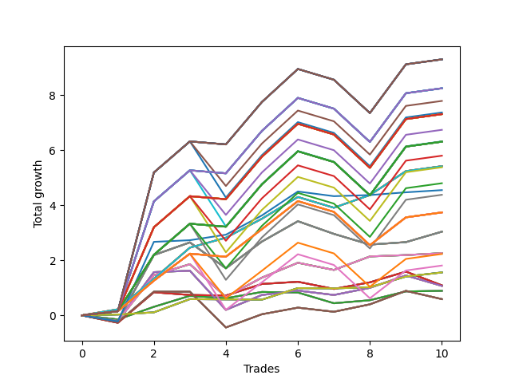

# Long Wallace Doodle 0225_009 
- Symbol: AAPL_Unlimited
- Date Range: 03/23/2022 - 07/08/2022
- Trading Period: 7:20-12:30
- Number of Trades: 10



| Name | Win Percent | Profit | Avg Profit / Trade | Avg Time / Trade |      | Name | Win Percent | Profit | Avg Profit / Trade | Avg Time / Trade |
| ---- | ----------- | ------ | ------------------ | ---------------- | ---- | ---- | ----------- | ------ | ------------------ | ---------------- |
| Sorted By <br> Profit | | | | | | Sorted By <br> Win Percentage ||||
| One Hundred Thirty | 70.00 | 4650.00 | 465.00 | 167:58 |     | Seventy-One | 90.00 | 2710.00 | 271.00 | 97:28 |
| One Hundred Twenty-Five | 70.00 | 4650.00 | 465.00 | 167:58 |     | Sixty-Three | 90.00 | 2710.00 | 271.00 | 97:28 |
| One Hundred Twenty | 70.00 | 4650.00 | 465.00 | 167:58 |     | Fifty-Five | 90.00 | 2710.00 | 271.00 | 97:28 |
| One Hundred Fifteen | 70.00 | 4650.00 | 465.00 | 167:58 |     | Forty-Seven | 90.00 | 2710.00 | 271.00 | 97:28 |
| One Hundred Ten | 70.00 | 4650.00 | 465.00 | 167:58 |     | Seven | 90.00 | 2710.00 | 271.00 | 97:28 |
| One Hundred Five | 70.00 | 4650.00 | 465.00 | 167:58 |     | Seventy-Three | 80.00 | 2275.00 | 227.50 | 12:47 |
| Eighty-Five | 70.00 | 4650.00 | 465.00 | 167:58 |     | One Hundred Thirty | 70.00 | 4650.00 | 465.00 | 167:58 |
| One Hundred Twenty-Nine | 70.00 | 4125.00 | 412.50 | 166:19 |     | One Hundred Twenty-Five | 70.00 | 4650.00 | 465.00 | 167:58 |
| One Hundred Twenty-Four | 70.00 | 4125.00 | 412.50 | 166:19 |     | One Hundred Twenty | 70.00 | 4650.00 | 465.00 | 167:58 |
| One Hundred Ninteen | 70.00 | 4125.00 | 412.50 | 166:19 |     | One Hundred Fifteen | 70.00 | 4650.00 | 465.00 | 167:58 |
| One Hundred Fourteen | 70.00 | 4125.00 | 412.50 | 166:19 |     | One Hundred Ten | 70.00 | 4650.00 | 465.00 | 167:58 |
| One Hundred Nine | 70.00 | 4125.00 | 412.50 | 166:19 |     | One Hundred Five | 70.00 | 4650.00 | 465.00 | 167:58 |
| One Hundred Four | 70.00 | 4125.00 | 412.50 | 166:19 |     | Eighty-Five | 70.00 | 4650.00 | 465.00 | 167:58 |
| Eighty-Four | 70.00 | 4125.00 | 412.50 | 166:19 |     | One Hundred Twenty-Nine | 70.00 | 4125.00 | 412.50 | 166:19 |
| One Hundred | 70.00 | 3895.00 | 389.50 | 157:34 |     | One Hundred Twenty-Four | 70.00 | 4125.00 | 412.50 | 166:19 |
| Ninety-Five | 70.00 | 3685.00 | 368.50 | 157:42 |     | One Hundred Ninteen | 70.00 | 4125.00 | 412.50 | 166:19 |
| One Hundred Twenty-Eight | 70.00 | 3655.00 | 365.50 | 163:19 |     | One Hundred Fourteen | 70.00 | 4125.00 | 412.50 | 166:19 |
| One Hundred Twenty-Three | 70.00 | 3655.00 | 365.50 | 163:19 |     | One Hundred Nine | 70.00 | 4125.00 | 412.50 | 166:19 |
| One Hundred Eighteen | 70.00 | 3655.00 | 365.50 | 163:19 |     | One Hundred Four | 70.00 | 4125.00 | 412.50 | 166:19 |
| One Hundred Thirteen | 70.00 | 3655.00 | 365.50 | 163:19 |     | Eighty-Four | 70.00 | 4125.00 | 412.50 | 166:19 |
| One Hundred Eight | 70.00 | 3655.00 | 365.50 | 163:19 |     | One Hundred | 70.00 | 3895.00 | 389.50 | 157:34 |
| One Hundred Three | 70.00 | 3655.00 | 365.50 | 163:19 |     | Ninety-Five | 70.00 | 3685.00 | 368.50 | 157:42 |
| Eighty-Three | 70.00 | 3655.00 | 365.50 | 163:19 |     | One Hundred Twenty-Eight | 70.00 | 3655.00 | 365.50 | 163:19 |
| Ninety-Nine | 70.00 | 3370.00 | 337.00 | 155:55 |     | One Hundred Twenty-Three | 70.00 | 3655.00 | 365.50 | 163:19 |
| Ninety-Four | 70.00 | 3160.00 | 316.00 | 156:03 |     | One Hundred Eighteen | 70.00 | 3655.00 | 365.50 | 163:19 |
| One Hundred Twenty-Seven | 70.00 | 3155.00 | 315.50 | 162:24 |     | One Hundred Thirteen | 70.00 | 3655.00 | 365.50 | 163:19 |
| One Hundred Twenty-Two | 70.00 | 3155.00 | 315.50 | 162:24 |     | One Hundred Eight | 70.00 | 3655.00 | 365.50 | 163:19 |
| One Hundred Seventeen | 70.00 | 3155.00 | 315.50 | 162:24 |     | One Hundred Three | 70.00 | 3655.00 | 365.50 | 163:19 |
| One Hundred Twelve | 70.00 | 3155.00 | 315.50 | 162:24 |     | Eighty-Three | 70.00 | 3655.00 | 365.50 | 163:19 |
| One Hundred Seven | 70.00 | 3155.00 | 315.50 | 162:24 |     | Ninety-Nine | 70.00 | 3370.00 | 337.00 | 155:55 |
| One Hundred Two | 70.00 | 3155.00 | 315.50 | 162:24 |     | Ninety-Four | 70.00 | 3160.00 | 316.00 | 156:03 |
| Eighty-Two | 70.00 | 3155.00 | 315.50 | 162:24 |     | One Hundred Twenty-Seven | 70.00 | 3155.00 | 315.50 | 162:24 |
| Ninety-Eight | 70.00 | 2900.00 | 290.00 | 152:55 |     | One Hundred Twenty-Two | 70.00 | 3155.00 | 315.50 | 162:24 |
| Seventy-One | 90.00 | 2710.00 | 271.00 | 97:28 |     | One Hundred Seventeen | 70.00 | 3155.00 | 315.50 | 162:24 |
| Sixty-Three | 90.00 | 2710.00 | 271.00 | 97:28 |     | One Hundred Twelve | 70.00 | 3155.00 | 315.50 | 162:24 |
| Fifty-Five | 90.00 | 2710.00 | 271.00 | 97:28 |     | One Hundred Seven | 70.00 | 3155.00 | 315.50 | 162:24 |
| Forty-Seven | 90.00 | 2710.00 | 271.00 | 97:28 |     | One Hundred Two | 70.00 | 3155.00 | 315.50 | 162:24 |
| Seven | 90.00 | 2710.00 | 271.00 | 97:28 |     | Eighty-Two | 70.00 | 3155.00 | 315.50 | 162:24 |
| Ninety-Three | 70.00 | 2690.00 | 269.00 | 153:04 |     | Ninety-Eight | 70.00 | 2900.00 | 290.00 | 152:55 |
| Ninety-Seven | 70.00 | 2400.00 | 240.00 | 152:00 |     | Ninety-Three | 70.00 | 2690.00 | 269.00 | 153:04 |
| Seventy-Three | 80.00 | 2275.00 | 227.50 | 12:47 |     | Ninety-Seven | 70.00 | 2400.00 | 240.00 | 152:00 |
| Ninety-Two | 70.00 | 2190.00 | 219.00 | 152:09 |     | Ninety-Two | 70.00 | 2190.00 | 219.00 | 152:09 |
| One Hundred Twenty-Six | 70.00 | 1870.00 | 187.00 | 127:32 |     | One Hundred Twenty-Six | 70.00 | 1870.00 | 187.00 | 127:32 |
| One Hundred Twenty-One | 70.00 | 1870.00 | 187.00 | 127:32 |     | One Hundred Twenty-One | 70.00 | 1870.00 | 187.00 | 127:32 |
| One Hundred Sixteen | 70.00 | 1870.00 | 187.00 | 127:32 |     | One Hundred Sixteen | 70.00 | 1870.00 | 187.00 | 127:32 |
| One Hundred Eleven | 70.00 | 1870.00 | 187.00 | 127:32 |     | One Hundred Eleven | 70.00 | 1870.00 | 187.00 | 127:32 |
| One Hundred Six | 70.00 | 1870.00 | 187.00 | 127:32 |     | One Hundred Six | 70.00 | 1870.00 | 187.00 | 127:32 |
| One Hundred One | 70.00 | 1870.00 | 187.00 | 127:32 |     | One Hundred One | 70.00 | 1870.00 | 187.00 | 127:32 |
| Eighty-One | 70.00 | 1870.00 | 187.00 | 127:32 |     | Eighty-One | 70.00 | 1870.00 | 187.00 | 127:32 |
| Sixty-Nine | 60.00 | 1520.00 | 152.00 | 73:44 |     | Sixty-Eight | 70.00 | 1130.00 | 113.00 | 49:17 |
| Sixty-One | 60.00 | 1520.00 | 152.00 | 73:44 |     | Sixty | 70.00 | 1130.00 | 113.00 | 49:17 |
| Fifty-Three | 60.00 | 1520.00 | 152.00 | 73:44 |     | Fifty-Two | 70.00 | 1130.00 | 113.00 | 49:17 |
| Forty-Five | 60.00 | 1520.00 | 152.00 | 73:44 |     | Forty-Four | 70.00 | 1130.00 | 113.00 | 49:17 |
| Five | 60.00 | 1520.00 | 152.00 | 73:44 |     | Four | 70.00 | 1130.00 | 113.00 | 49:17 |
| Sixty-Eight | 70.00 | 1130.00 | 113.00 | 49:17 |     | Ninety-Six | 70.00 | 1115.00 | 111.50 | 117:08 |
| Sixty | 70.00 | 1130.00 | 113.00 | 49:17 |     | Ninety-One | 70.00 | 905.00 | 90.50 | 117:16 |
| Fifty-Two | 70.00 | 1130.00 | 113.00 | 49:17 |     | Seventy | 70.00 | 780.00 | 78.00 | 12:40 |
| Forty-Four | 70.00 | 1130.00 | 113.00 | 49:17 |     | Sixty-Two | 70.00 | 780.00 | 78.00 | 12:40 |
| Four | 70.00 | 1130.00 | 113.00 | 49:17 |     | Fifty-Four | 70.00 | 780.00 | 78.00 | 12:40 |
| Ninety-Six | 70.00 | 1115.00 | 111.50 | 117:08 |     | Forty-Six | 70.00 | 780.00 | 78.00 | 12:40 |
| Ninety-One | 70.00 | 905.00 | 90.50 | 117:16 |     | Six | 70.00 | 780.00 | 78.00 | 12:40 |
| Seventy | 70.00 | 780.00 | 78.00 | 12:40 |     | Sixty-Nine | 60.00 | 1520.00 | 152.00 | 73:44 |
| Sixty-Two | 70.00 | 780.00 | 78.00 | 12:40 |     | Sixty-One | 60.00 | 1520.00 | 152.00 | 73:44 |
| Fifty-Four | 70.00 | 780.00 | 78.00 | 12:40 |     | Fifty-Three | 60.00 | 1520.00 | 152.00 | 73:44 |
| Forty-Six | 70.00 | 780.00 | 78.00 | 12:40 |     | Forty-Five | 60.00 | 1520.00 | 152.00 | 73:44 |
| Six | 70.00 | 780.00 | 78.00 | 12:40 |     | Five | 60.00 | 1520.00 | 152.00 | 73:44 |
| Sixty-Five | 50.00 | 545.00 | 54.50 | 24:24 |     | Sixty-Six | 60.00 | 535.00 | 53.50 | 33:33 |
| Fifty-Seven | 50.00 | 545.00 | 54.50 | 24:24 |     | Fifty-Eight | 60.00 | 535.00 | 53.50 | 33:33 |
| Forty-Nine | 50.00 | 545.00 | 54.50 | 24:24 |     | Fifty | 60.00 | 535.00 | 53.50 | 33:33 |
| Forty-One | 50.00 | 545.00 | 54.50 | 24:24 |     | Forty-Two | 60.00 | 535.00 | 53.50 | 33:33 |
| One | 50.00 | 545.00 | 54.50 | 24:24 |     | Two | 60.00 | 535.00 | 53.50 | 33:33 |
| Sixty-Six | 60.00 | 535.00 | 53.50 | 33:33 |     | Sixty-Four | 60.00 | 445.00 | 44.50 | 13:30 |
| Fifty-Eight | 60.00 | 535.00 | 53.50 | 33:33 |     | Fifty-Six | 60.00 | 445.00 | 44.50 | 13:30 |
| Fifty | 60.00 | 535.00 | 53.50 | 33:33 |     | Forty-Eight | 60.00 | 445.00 | 44.50 | 13:30 |
| Forty-Two | 60.00 | 535.00 | 53.50 | 33:33 |     | Forty | 60.00 | 445.00 | 44.50 | 13:30 |
| Two | 60.00 | 535.00 | 53.50 | 33:33 |     | Zero | 60.00 | 445.00 | 44.50 | 13:30 |
| Sixty-Four | 60.00 | 445.00 | 44.50 | 13:30 |     | Sixty-Seven | 60.00 | 295.00 | 29.50 | 33:22 |
| Fifty-Six | 60.00 | 445.00 | 44.50 | 13:30 |     | Fifty-Nine | 60.00 | 295.00 | 29.50 | 33:22 |
| Forty-Eight | 60.00 | 445.00 | 44.50 | 13:30 |     | Fifty-One | 60.00 | 295.00 | 29.50 | 33:22 |
| Forty | 60.00 | 445.00 | 44.50 | 13:30 |     | Forty-Three | 60.00 | 295.00 | 29.50 | 33:22 |
| Zero | 60.00 | 445.00 | 44.50 | 13:30 |     | Three | 60.00 | 295.00 | 29.50 | 33:22 |
| Sixty-Seven | 60.00 | 295.00 | 29.50 | 33:22 |     | Sixty-Five | 50.00 | 545.00 | 54.50 | 24:24 |
| Fifty-Nine | 60.00 | 295.00 | 29.50 | 33:22 |     | Fifty-Seven | 50.00 | 545.00 | 54.50 | 24:24 |
| Fifty-One | 60.00 | 295.00 | 29.50 | 33:22 |     | Forty-Nine | 50.00 | 545.00 | 54.50 | 24:24 |
| Forty-Three | 60.00 | 295.00 | 29.50 | 33:22 |     | Forty-One | 50.00 | 545.00 | 54.50 | 24:24 |
| Three | 60.00 | 295.00 | 29.50 | 33:22 |     | One | 50.00 | 545.00 | 54.50 | 24:24 |

## NO STOPLOSS

### Test Zero
* Sell when price hits the middle line of the 20p bollinger
* No Stoploss
* Results:
```
Total Trades: 10
Percent Up: 60.00
Percent Down: 40.00
Total Points Moved Up: 0.89
Potential Profit: 445.00
Total Points Ups: 1.54 Count Ups: 6
Total Points Downs: -0.65 Count Downs: 4
```

<details><summary>Trades</summary>

<code>In: 2022-04-19 09:04:00		Out: 2022-04-19 09:21:55		Total Position Time: 17:55		Total Move Up: -0.15		Total to Date: -0.15</code> <br />
<code>In: 2022-05-04 11:36:00		Out: 2022-05-04 11:41:35		Total Position Time: 05:35		Total Move Up: 0.46		Total to Date: 0.31</code> <br />
<code>In: 2022-05-06 11:11:00		Out: 2022-05-06 11:15:50		Total Position Time: 04:50		Total Move Up: 0.40		Total to Date: 0.71</code> <br />
<code>In: 2022-05-13 09:54:00		Out: 2022-05-13 10:24:20		Total Position Time: 30:20		Total Move Up: -0.09		Total to Date: 0.62</code> <br />
<code>In: 2022-05-27 08:04:00		Out: 2022-05-27 08:07:00		Total Position Time: 03:00		Total Move Up: 0.23		Total to Date: 0.85</code> <br />
<code>In: 2022-06-14 12:11:00		Out: 2022-06-14 12:22:10		Total Position Time: 11:10		Total Move Up: -0.02		Total to Date: 0.83</code> <br />
<code>In: 2022-06-21 08:47:00		Out: 2022-06-21 09:14:55		Total Position Time: 27:55		Total Move Up: -0.39		Total to Date: 0.44</code> <br />
<code>In: 2022-06-22 08:07:00		Out: 2022-06-22 08:17:10		Total Position Time: 10:10		Total Move Up: 0.11		Total to Date: 0.55</code> <br />
<code>In: 2022-06-23 09:06:00		Out: 2022-06-23 09:13:50		Total Position Time: 07:50		Total Move Up: 0.32		Total to Date: 0.87</code> <br />
<code>In: 2022-06-30 11:46:00		Out: 2022-06-30 12:02:20		Total Position Time: 16:20		Total Move Up: 0.02		Total to Date: 0.89</code> <br />


</details>

### Test One
* Sell when the price hits the upper line of the 20p 1std bollinger
* No Stoploss
* Results:
```
Total Trades: 10
Percent Up: 50.00
Percent Down: 50.00
Total Points Moved Up: 1.09
Potential Profit: 545.00
Total Points Ups: 2.24 Count Ups: 5
Total Points Downs: -1.15 Count Downs: 5
```

<details><summary>Trades</summary>

<code>In: 2022-04-19 09:04:00		Out: 2022-04-19 09:51:05		Total Position Time: 47:05		Total Move Up: -0.27		Total to Date: -0.27</code> <br />
<code>In: 2022-05-04 11:36:00		Out: 2022-05-04 11:43:55		Total Position Time: 07:55		Total Move Up: 1.11		Total to Date: 0.84</code> <br />
<code>In: 2022-05-06 11:11:00		Out: 2022-05-06 11:49:20		Total Position Time: 38:20		Total Move Up: -0.10		Total to Date: 0.74</code> <br />
<code>In: 2022-05-13 09:54:00		Out: 2022-05-13 10:26:05		Total Position Time: 32:05		Total Move Up: -0.02		Total to Date: 0.72</code> <br />
<code>In: 2022-05-27 08:04:00		Out: 2022-05-27 08:11:10		Total Position Time: 07:10		Total Move Up: 0.42		Total to Date: 1.14</code> <br />
<code>In: 2022-06-14 12:11:00		Out: 2022-06-14 12:26:30		Total Position Time: 15:30		Total Move Up: 0.08		Total to Date: 1.22</code> <br />
<code>In: 2022-06-21 08:47:00		Out: 2022-06-21 09:17:25		Total Position Time: 30:25		Total Move Up: -0.26		Total to Date: 0.96</code> <br />
<code>In: 2022-06-22 08:07:00		Out: 2022-06-22 08:20:05		Total Position Time: 13:05		Total Move Up: 0.24		Total to Date: 1.20</code> <br />
<code>In: 2022-06-23 09:06:00		Out: 2022-06-23 09:18:50		Total Position Time: 12:50		Total Move Up: 0.39		Total to Date: 1.59</code> <br />
<code>In: 2022-06-30 11:46:00		Out: 2022-06-30 12:25:40		Total Position Time: 39:40		Total Move Up: -0.50		Total to Date: 1.09</code> <br />


</details>

### Test Two
* Sell when the price hits the upper line of the 20p 2std bollinger
* No Stoploss
* Results:
```
Total Trades: 10
Percent Up: 60.00
Percent Down: 40.00
Total Points Moved Up: 1.07
Potential Profit: 535.00
Total Points Ups: 3.23 Count Ups: 6
Total Points Downs: -2.16 Count Downs: 4
```

<details><summary>Trades</summary>

<code>In: 2022-04-19 09:04:00		Out: 2022-04-19 10:03:05		Total Position Time: 59:05		Total Move Up: -0.20		Total to Date: -0.20</code> <br />
<code>In: 2022-05-04 11:36:00		Out: 2022-05-04 11:46:55		Total Position Time: 10:55		Total Move Up: 1.77		Total to Date: 1.57</code> <br />
<code>In: 2022-05-06 11:11:00		Out: 2022-05-06 11:50:05		Total Position Time: 39:05		Total Move Up: 0.05		Total to Date: 1.62</code> <br />
<code>In: 2022-05-13 09:54:00		Out: 2022-05-13 11:31:00		Total Position Time: 97:00		Total Move Up: -1.42		Total to Date: 0.20</code> <br />
<code>In: 2022-05-27 08:04:00		Out: 2022-05-27 08:12:05		Total Position Time: 08:05		Total Move Up: 0.54		Total to Date: 0.74</code> <br />
<code>In: 2022-06-14 12:11:00		Out: 2022-06-14 12:27:10		Total Position Time: 16:10		Total Move Up: 0.16		Total to Date: 0.90</code> <br />
<code>In: 2022-06-21 08:47:00		Out: 2022-06-21 09:20:10		Total Position Time: 33:10		Total Move Up: -0.16		Total to Date: 0.74</code> <br />
<code>In: 2022-06-22 08:07:00		Out: 2022-06-22 08:23:50		Total Position Time: 16:50		Total Move Up: 0.26		Total to Date: 1.00</code> <br />
<code>In: 2022-06-23 09:06:00		Out: 2022-06-23 09:21:05		Total Position Time: 15:05		Total Move Up: 0.45		Total to Date: 1.45</code> <br />
<code>In: 2022-06-30 11:46:00		Out: 2022-06-30 12:26:05		Total Position Time: 40:05		Total Move Up: -0.38		Total to Date: 1.07</code> <br />


</details>

### Test Three
* Sell when price hits the middle line of the 50p bollinger
* No Stoploss
* Results:
```
Total Trades: 10
Percent Up: 60.00
Percent Down: 40.00
Total Points Moved Up: 0.59
Potential Profit: 295.00
Total Points Ups: 2.59 Count Ups: 6
Total Points Downs: -2.00 Count Downs: 4
```

<details><summary>Trades</summary>

<code>In: 2022-04-19 09:04:00		Out: 2022-04-19 09:51:20		Total Position Time: 47:20		Total Move Up: -0.25		Total to Date: -0.25</code> <br />
<code>In: 2022-05-04 11:36:00		Out: 2022-05-04 11:43:55		Total Position Time: 07:55		Total Move Up: 1.11		Total to Date: 0.86</code> <br />
<code>In: 2022-05-06 11:11:00		Out: 2022-05-06 11:49:25		Total Position Time: 38:25		Total Move Up: 0.00		Total to Date: 0.86</code> <br />
<code>In: 2022-05-13 09:54:00		Out: 2022-05-13 11:31:20		Total Position Time: 97:20		Total Move Up: -1.30		Total to Date: -0.44</code> <br />
<code>In: 2022-05-27 08:04:00		Out: 2022-05-27 08:11:35		Total Position Time: 07:35		Total Move Up: 0.48		Total to Date: 0.04</code> <br />
<code>In: 2022-06-14 12:11:00		Out: 2022-06-14 12:27:25		Total Position Time: 16:25		Total Move Up: 0.24		Total to Date: 0.28</code> <br />
<code>In: 2022-06-21 08:47:00		Out: 2022-06-21 09:23:05		Total Position Time: 36:05		Total Move Up: -0.15		Total to Date: 0.13</code> <br />
<code>In: 2022-06-22 08:07:00		Out: 2022-06-22 08:31:50		Total Position Time: 24:50		Total Move Up: 0.27		Total to Date: 0.40</code> <br />
<code>In: 2022-06-23 09:06:00		Out: 2022-06-23 09:22:00		Total Position Time: 16:00		Total Move Up: 0.49		Total to Date: 0.89</code> <br />
<code>In: 2022-06-30 11:46:00		Out: 2022-06-30 12:27:45		Total Position Time: 41:45		Total Move Up: -0.30		Total to Date: 0.59</code> <br />


</details>

### Test Four
* Sell when the price hits the upper line of the 50p 1std bollinger
* No Stoploss
* Results:
```
Total Trades: 10
Percent Up: 70.00
Percent Down: 30.00
Total Points Moved Up: 2.26
Potential Profit: 1130.00
Total Points Ups: 3.91 Count Ups: 7
Total Points Downs: -1.65 Count Downs: 3
```

<details><summary>Trades</summary>

<code>In: 2022-04-19 09:04:00		Out: 2022-04-19 10:03:05		Total Position Time: 59:05		Total Move Up: -0.20		Total to Date: -0.20</code> <br />
<code>In: 2022-05-04 11:36:00		Out: 2022-05-04 11:46:50		Total Position Time: 10:50		Total Move Up: 1.66		Total to Date: 1.46</code> <br />
<code>In: 2022-05-06 11:11:00		Out: 2022-05-06 11:50:20		Total Position Time: 39:20		Total Move Up: 0.40		Total to Date: 1.86</code> <br />
<code>In: 2022-05-13 09:54:00		Out: 2022-05-13 11:50:25		Total Position Time: 116:25		Total Move Up: -1.19		Total to Date: 0.67</code> <br />
<code>In: 2022-05-27 08:04:00		Out: 2022-05-27 08:17:15		Total Position Time: 13:15		Total Move Up: 0.70		Total to Date: 1.37</code> <br />
<code>In: 2022-06-14 12:11:00		Out: 2022-06-14 12:30:50		Total Position Time: 19:50		Total Move Up: 0.54		Total to Date: 1.91</code> <br />
<code>In: 2022-06-21 08:47:00		Out: 2022-06-21 10:13:40		Total Position Time: 86:40		Total Move Up: -0.26		Total to Date: 1.65</code> <br />
<code>In: 2022-06-22 08:07:00		Out: 2022-06-22 08:33:05		Total Position Time: 26:05		Total Move Up: 0.49		Total to Date: 2.14</code> <br />
<code>In: 2022-06-23 09:06:00		Out: 2022-06-23 10:23:20		Total Position Time: 77:20		Total Move Up: 0.05		Total to Date: 2.19</code> <br />
<code>In: 2022-06-30 11:46:00		Out: 2022-06-30 12:30:05		Total Position Time: 44:05		Total Move Up: 0.07		Total to Date: 2.26</code> <br />


</details>

### Test Five
* Sell when the price hits the upper line of the 50p 2std bollinger
* No Stoploss
* Results:
```
Total Trades: 10
Percent Up: 60.00
Percent Down: 40.00
Total Points Moved Up: 3.04
Potential Profit: 1520.00
Total Points Ups: 5.03 Count Ups: 6
Total Points Downs: -1.99 Count Downs: 4
```

<details><summary>Trades</summary>

<code>In: 2022-04-19 09:04:00		Out: 2022-04-19 10:55:05		Total Position Time: 111:05		Total Move Up: -0.20		Total to Date: -0.20</code> <br />
<code>In: 2022-05-04 11:36:00		Out: 2022-05-04 11:47:10		Total Position Time: 11:10		Total Move Up: 2.39		Total to Date: 2.19</code> <br />
<code>In: 2022-05-06 11:11:00		Out: 2022-05-06 11:55:05		Total Position Time: 44:05		Total Move Up: 0.46		Total to Date: 2.65</code> <br />
<code>In: 2022-05-13 09:54:00		Out: 2022-05-13 11:51:05		Total Position Time: 117:05		Total Move Up: -0.94		Total to Date: 1.71</code> <br />
<code>In: 2022-05-27 08:04:00		Out: 2022-05-27 08:31:00		Total Position Time: 27:00		Total Move Up: 0.97		Total to Date: 2.68</code> <br />
<code>In: 2022-06-14 12:11:00		Out: 2022-06-14 12:36:25		Total Position Time: 25:25		Total Move Up: 0.74		Total to Date: 3.42</code> <br />
<code>In: 2022-06-21 08:47:00		Out: 2022-06-21 11:30:10		Total Position Time: 163:10		Total Move Up: -0.46		Total to Date: 2.96</code> <br />
<code>In: 2022-06-22 08:07:00		Out: 2022-06-22 09:59:35		Total Position Time: 112:35		Total Move Up: -0.39		Total to Date: 2.57</code> <br />
<code>In: 2022-06-23 09:06:00		Out: 2022-06-23 10:23:25		Total Position Time: 77:25		Total Move Up: 0.09		Total to Date: 2.66</code> <br />
<code>In: 2022-06-30 11:46:00		Out: 2022-06-30 12:34:25		Total Position Time: 48:25		Total Move Up: 0.38		Total to Date: 3.04</code> <br />


</details>

### Test Six
* Sell when the price hits the middle line of the 1std VWAP
* No Stoploss
* Results:
```
Total Trades: 10
Percent Up: 70.00
Percent Down: 30.00
Total Points Moved Up: 1.56
Potential Profit: 780.00
Total Points Ups: 1.59 Count Ups: 7
Total Points Downs: -0.03 Count Downs: 3
```

<details><summary>Trades</summary>

<code>In: 2022-04-19 09:04:00		Out: 2022-04-19 09:05:10		Total Position Time: 01:10		Total Move Up: 0.03		Total to Date: 0.03</code> <br />
<code>In: 2022-05-04 11:36:00		Out: 2022-05-04 11:37:10		Total Position Time: 01:10		Total Move Up: 0.08		Total to Date: 0.11</code> <br />
<code>In: 2022-05-06 11:11:00		Out: 2022-05-06 12:37:20		Total Position Time: 86:20		Total Move Up: 0.48		Total to Date: 0.59</code> <br />
<code>In: 2022-05-13 09:54:00		Out: 2022-05-13 09:55:10		Total Position Time: 01:10		Total Move Up: -0.01		Total to Date: 0.58</code> <br />
<code>In: 2022-05-27 08:04:00		Out: 2022-05-27 08:05:10		Total Position Time: 01:10		Total Move Up: -0.01		Total to Date: 0.57</code> <br />
<code>In: 2022-06-14 12:11:00		Out: 2022-06-14 12:30:25		Total Position Time: 19:25		Total Move Up: 0.42		Total to Date: 0.99</code> <br />
<code>In: 2022-06-21 08:47:00		Out: 2022-06-21 08:48:10		Total Position Time: 01:10		Total Move Up: -0.01		Total to Date: 0.98</code> <br />
<code>In: 2022-06-22 08:07:00		Out: 2022-06-22 08:08:10		Total Position Time: 01:10		Total Move Up: 0.04		Total to Date: 1.02</code> <br />
<code>In: 2022-06-23 09:06:00		Out: 2022-06-23 09:18:50		Total Position Time: 12:50		Total Move Up: 0.39		Total to Date: 1.41</code> <br />
<code>In: 2022-06-30 11:46:00		Out: 2022-06-30 11:47:10		Total Position Time: 01:10		Total Move Up: 0.15		Total to Date: 1.56</code> <br />


</details>

### Test Seven
* Sell when the price hits the upper line of the 1std VWAP
* No Stoploss
* Results:
```
Total Trades: 10
Percent Up: 90.00
Percent Down: 10.00
Total Points Moved Up: 5.42
Potential Profit: 2710.00
Total Points Ups: 5.81 Count Ups: 9
Total Points Downs: -0.39 Count Downs: 1
```

<details><summary>Trades</summary>

<code>In: 2022-04-19 09:04:00		Out: 2022-04-19 12:11:40		Total Position Time: 187:40		Total Move Up: 0.22		Total to Date: 0.22</code> <br />
<code>In: 2022-05-04 11:36:00		Out: 2022-05-04 11:43:55		Total Position Time: 07:55		Total Move Up: 1.11		Total to Date: 1.33</code> <br />
<code>In: 2022-05-06 11:11:00		Out: 2022-05-06 12:47:00		Total Position Time: 96:00		Total Move Up: 1.13		Total to Date: 2.46</code> <br />
<code>In: 2022-05-13 09:54:00		Out: 2022-05-13 10:01:05		Total Position Time: 07:05		Total Move Up: 0.36		Total to Date: 2.82</code> <br />
<code>In: 2022-05-27 08:04:00		Out: 2022-05-27 08:17:10		Total Position Time: 13:10		Total Move Up: 0.69		Total to Date: 3.51</code> <br />
<code>In: 2022-06-14 12:11:00		Out: 2022-06-14 12:37:35		Total Position Time: 26:35		Total Move Up: 0.79		Total to Date: 4.30</code> <br />
<code>In: 2022-06-21 08:47:00		Out: 2022-06-21 12:47:00		Total Position Time: 240:00		Total Move Up: -0.39		Total to Date: 3.91</code> <br />
<code>In: 2022-06-22 08:07:00		Out: 2022-06-22 11:16:45		Total Position Time: 189:45		Total Move Up: 0.46		Total to Date: 4.37</code> <br />
<code>In: 2022-06-23 09:06:00		Out: 2022-06-23 11:31:35		Total Position Time: 145:35		Total Move Up: 0.87		Total to Date: 5.24</code> <br />
<code>In: 2022-06-30 11:46:00		Out: 2022-06-30 12:47:00		Total Position Time: 61:00		Total Move Up: 0.18		Total to Date: 5.42</code> <br />


</details>

## STOPLOSS OF 5

### Test Forty
* Sell when price hits the middle line of the 20p bollinger
* Stoploss is 5 points
* Results:
```
Total Trades: 10
Percent Up: 60.00
Percent Down: 40.00
Total Points Moved Up: 0.89
Potential Profit: 445.00
Total Points Ups: 1.54 Count Ups: 6
Total Points Downs: -0.65 Count Downs: 4
```

<details><summary>Trades</summary>

<code>In: 2022-04-19 09:04:00		Out: 2022-04-19 09:21:55		Total Position Time: 17:55		Total Move Up: -0.15		Total to Date: -0.15</code> <br />
<code>In: 2022-05-04 11:36:00		Out: 2022-05-04 11:41:35		Total Position Time: 05:35		Total Move Up: 0.46		Total to Date: 0.31</code> <br />
<code>In: 2022-05-06 11:11:00		Out: 2022-05-06 11:15:50		Total Position Time: 04:50		Total Move Up: 0.40		Total to Date: 0.71</code> <br />
<code>In: 2022-05-13 09:54:00		Out: 2022-05-13 10:24:20		Total Position Time: 30:20		Total Move Up: -0.09		Total to Date: 0.62</code> <br />
<code>In: 2022-05-27 08:04:00		Out: 2022-05-27 08:07:00		Total Position Time: 03:00		Total Move Up: 0.23		Total to Date: 0.85</code> <br />
<code>In: 2022-06-14 12:11:00		Out: 2022-06-14 12:22:10		Total Position Time: 11:10		Total Move Up: -0.02		Total to Date: 0.83</code> <br />
<code>In: 2022-06-21 08:47:00		Out: 2022-06-21 09:14:55		Total Position Time: 27:55		Total Move Up: -0.39		Total to Date: 0.44</code> <br />
<code>In: 2022-06-22 08:07:00		Out: 2022-06-22 08:17:10		Total Position Time: 10:10		Total Move Up: 0.11		Total to Date: 0.55</code> <br />
<code>In: 2022-06-23 09:06:00		Out: 2022-06-23 09:13:50		Total Position Time: 07:50		Total Move Up: 0.32		Total to Date: 0.87</code> <br />
<code>In: 2022-06-30 11:46:00		Out: 2022-06-30 12:02:20		Total Position Time: 16:20		Total Move Up: 0.02		Total to Date: 0.89</code> <br />


</details>

### Test Forty-One
* Sell when the price hits the upper line of the 20p 1std bollinger
* Stoploss is 5 points
* Results:
```
Total Trades: 10
Percent Up: 50.00
Percent Down: 50.00
Total Points Moved Up: 1.09
Potential Profit: 545.00
Total Points Ups: 2.24 Count Ups: 5
Total Points Downs: -1.15 Count Downs: 5
```

<details><summary>Trades</summary>

<code>In: 2022-04-19 09:04:00		Out: 2022-04-19 09:51:05		Total Position Time: 47:05		Total Move Up: -0.27		Total to Date: -0.27</code> <br />
<code>In: 2022-05-04 11:36:00		Out: 2022-05-04 11:43:55		Total Position Time: 07:55		Total Move Up: 1.11		Total to Date: 0.84</code> <br />
<code>In: 2022-05-06 11:11:00		Out: 2022-05-06 11:49:20		Total Position Time: 38:20		Total Move Up: -0.10		Total to Date: 0.74</code> <br />
<code>In: 2022-05-13 09:54:00		Out: 2022-05-13 10:26:05		Total Position Time: 32:05		Total Move Up: -0.02		Total to Date: 0.72</code> <br />
<code>In: 2022-05-27 08:04:00		Out: 2022-05-27 08:11:10		Total Position Time: 07:10		Total Move Up: 0.42		Total to Date: 1.14</code> <br />
<code>In: 2022-06-14 12:11:00		Out: 2022-06-14 12:26:30		Total Position Time: 15:30		Total Move Up: 0.08		Total to Date: 1.22</code> <br />
<code>In: 2022-06-21 08:47:00		Out: 2022-06-21 09:17:25		Total Position Time: 30:25		Total Move Up: -0.26		Total to Date: 0.96</code> <br />
<code>In: 2022-06-22 08:07:00		Out: 2022-06-22 08:20:05		Total Position Time: 13:05		Total Move Up: 0.24		Total to Date: 1.20</code> <br />
<code>In: 2022-06-23 09:06:00		Out: 2022-06-23 09:18:50		Total Position Time: 12:50		Total Move Up: 0.39		Total to Date: 1.59</code> <br />
<code>In: 2022-06-30 11:46:00		Out: 2022-06-30 12:25:40		Total Position Time: 39:40		Total Move Up: -0.50		Total to Date: 1.09</code> <br />


</details>

### Test Forty-Two
* Sell when the price hits the upper line of the 20p 2std bollinger
* Stoploss is 5 points
* Results:
```
Total Trades: 10
Percent Up: 60.00
Percent Down: 40.00
Total Points Moved Up: 1.07
Potential Profit: 535.00
Total Points Ups: 3.23 Count Ups: 6
Total Points Downs: -2.16 Count Downs: 4
```

<details><summary>Trades</summary>

<code>In: 2022-04-19 09:04:00		Out: 2022-04-19 10:03:05		Total Position Time: 59:05		Total Move Up: -0.20		Total to Date: -0.20</code> <br />
<code>In: 2022-05-04 11:36:00		Out: 2022-05-04 11:46:55		Total Position Time: 10:55		Total Move Up: 1.77		Total to Date: 1.57</code> <br />
<code>In: 2022-05-06 11:11:00		Out: 2022-05-06 11:50:05		Total Position Time: 39:05		Total Move Up: 0.05		Total to Date: 1.62</code> <br />
<code>In: 2022-05-13 09:54:00		Out: 2022-05-13 11:31:00		Total Position Time: 97:00		Total Move Up: -1.42		Total to Date: 0.20</code> <br />
<code>In: 2022-05-27 08:04:00		Out: 2022-05-27 08:12:05		Total Position Time: 08:05		Total Move Up: 0.54		Total to Date: 0.74</code> <br />
<code>In: 2022-06-14 12:11:00		Out: 2022-06-14 12:27:10		Total Position Time: 16:10		Total Move Up: 0.16		Total to Date: 0.90</code> <br />
<code>In: 2022-06-21 08:47:00		Out: 2022-06-21 09:20:10		Total Position Time: 33:10		Total Move Up: -0.16		Total to Date: 0.74</code> <br />
<code>In: 2022-06-22 08:07:00		Out: 2022-06-22 08:23:50		Total Position Time: 16:50		Total Move Up: 0.26		Total to Date: 1.00</code> <br />
<code>In: 2022-06-23 09:06:00		Out: 2022-06-23 09:21:05		Total Position Time: 15:05		Total Move Up: 0.45		Total to Date: 1.45</code> <br />
<code>In: 2022-06-30 11:46:00		Out: 2022-06-30 12:26:05		Total Position Time: 40:05		Total Move Up: -0.38		Total to Date: 1.07</code> <br />


</details>

### Test Forty-Three
* Sell when price hits the middle line of the 50p bollinger
* Stoploss is 5 points
* Results:
```
Total Trades: 10
Percent Up: 60.00
Percent Down: 40.00
Total Points Moved Up: 0.59
Potential Profit: 295.00
Total Points Ups: 2.59 Count Ups: 6
Total Points Downs: -2.00 Count Downs: 4
```

<details><summary>Trades</summary>

<code>In: 2022-04-19 09:04:00		Out: 2022-04-19 09:51:20		Total Position Time: 47:20		Total Move Up: -0.25		Total to Date: -0.25</code> <br />
<code>In: 2022-05-04 11:36:00		Out: 2022-05-04 11:43:55		Total Position Time: 07:55		Total Move Up: 1.11		Total to Date: 0.86</code> <br />
<code>In: 2022-05-06 11:11:00		Out: 2022-05-06 11:49:25		Total Position Time: 38:25		Total Move Up: 0.00		Total to Date: 0.86</code> <br />
<code>In: 2022-05-13 09:54:00		Out: 2022-05-13 11:31:20		Total Position Time: 97:20		Total Move Up: -1.30		Total to Date: -0.44</code> <br />
<code>In: 2022-05-27 08:04:00		Out: 2022-05-27 08:11:35		Total Position Time: 07:35		Total Move Up: 0.48		Total to Date: 0.04</code> <br />
<code>In: 2022-06-14 12:11:00		Out: 2022-06-14 12:27:25		Total Position Time: 16:25		Total Move Up: 0.24		Total to Date: 0.28</code> <br />
<code>In: 2022-06-21 08:47:00		Out: 2022-06-21 09:23:05		Total Position Time: 36:05		Total Move Up: -0.15		Total to Date: 0.13</code> <br />
<code>In: 2022-06-22 08:07:00		Out: 2022-06-22 08:31:50		Total Position Time: 24:50		Total Move Up: 0.27		Total to Date: 0.40</code> <br />
<code>In: 2022-06-23 09:06:00		Out: 2022-06-23 09:22:00		Total Position Time: 16:00		Total Move Up: 0.49		Total to Date: 0.89</code> <br />
<code>In: 2022-06-30 11:46:00		Out: 2022-06-30 12:27:45		Total Position Time: 41:45		Total Move Up: -0.30		Total to Date: 0.59</code> <br />


</details>

### Test Forty-Four
* Sell when the price hits the upper line of the 50p 1std bollinger
* Stoploss is 5 points
* Results:
```
Total Trades: 10
Percent Up: 70.00
Percent Down: 30.00
Total Points Moved Up: 2.26
Potential Profit: 1130.00
Total Points Ups: 3.91 Count Ups: 7
Total Points Downs: -1.65 Count Downs: 3
```

<details><summary>Trades</summary>

<code>In: 2022-04-19 09:04:00		Out: 2022-04-19 10:03:05		Total Position Time: 59:05		Total Move Up: -0.20		Total to Date: -0.20</code> <br />
<code>In: 2022-05-04 11:36:00		Out: 2022-05-04 11:46:50		Total Position Time: 10:50		Total Move Up: 1.66		Total to Date: 1.46</code> <br />
<code>In: 2022-05-06 11:11:00		Out: 2022-05-06 11:50:20		Total Position Time: 39:20		Total Move Up: 0.40		Total to Date: 1.86</code> <br />
<code>In: 2022-05-13 09:54:00		Out: 2022-05-13 11:50:25		Total Position Time: 116:25		Total Move Up: -1.19		Total to Date: 0.67</code> <br />
<code>In: 2022-05-27 08:04:00		Out: 2022-05-27 08:17:15		Total Position Time: 13:15		Total Move Up: 0.70		Total to Date: 1.37</code> <br />
<code>In: 2022-06-14 12:11:00		Out: 2022-06-14 12:30:50		Total Position Time: 19:50		Total Move Up: 0.54		Total to Date: 1.91</code> <br />
<code>In: 2022-06-21 08:47:00		Out: 2022-06-21 10:13:40		Total Position Time: 86:40		Total Move Up: -0.26		Total to Date: 1.65</code> <br />
<code>In: 2022-06-22 08:07:00		Out: 2022-06-22 08:33:05		Total Position Time: 26:05		Total Move Up: 0.49		Total to Date: 2.14</code> <br />
<code>In: 2022-06-23 09:06:00		Out: 2022-06-23 10:23:20		Total Position Time: 77:20		Total Move Up: 0.05		Total to Date: 2.19</code> <br />
<code>In: 2022-06-30 11:46:00		Out: 2022-06-30 12:30:05		Total Position Time: 44:05		Total Move Up: 0.07		Total to Date: 2.26</code> <br />


</details>

### Test Forty-Five
* Sell when the price hits the upper line of the 50p 2std bollinger
* Stoploss is 5 points
* Results:
```
Total Trades: 10
Percent Up: 60.00
Percent Down: 40.00
Total Points Moved Up: 3.04
Potential Profit: 1520.00
Total Points Ups: 5.03 Count Ups: 6
Total Points Downs: -1.99 Count Downs: 4
```

<details><summary>Trades</summary>

<code>In: 2022-04-19 09:04:00		Out: 2022-04-19 10:55:05		Total Position Time: 111:05		Total Move Up: -0.20		Total to Date: -0.20</code> <br />
<code>In: 2022-05-04 11:36:00		Out: 2022-05-04 11:47:10		Total Position Time: 11:10		Total Move Up: 2.39		Total to Date: 2.19</code> <br />
<code>In: 2022-05-06 11:11:00		Out: 2022-05-06 11:55:05		Total Position Time: 44:05		Total Move Up: 0.46		Total to Date: 2.65</code> <br />
<code>In: 2022-05-13 09:54:00		Out: 2022-05-13 11:51:05		Total Position Time: 117:05		Total Move Up: -0.94		Total to Date: 1.71</code> <br />
<code>In: 2022-05-27 08:04:00		Out: 2022-05-27 08:31:00		Total Position Time: 27:00		Total Move Up: 0.97		Total to Date: 2.68</code> <br />
<code>In: 2022-06-14 12:11:00		Out: 2022-06-14 12:36:25		Total Position Time: 25:25		Total Move Up: 0.74		Total to Date: 3.42</code> <br />
<code>In: 2022-06-21 08:47:00		Out: 2022-06-21 11:30:10		Total Position Time: 163:10		Total Move Up: -0.46		Total to Date: 2.96</code> <br />
<code>In: 2022-06-22 08:07:00		Out: 2022-06-22 09:59:35		Total Position Time: 112:35		Total Move Up: -0.39		Total to Date: 2.57</code> <br />
<code>In: 2022-06-23 09:06:00		Out: 2022-06-23 10:23:25		Total Position Time: 77:25		Total Move Up: 0.09		Total to Date: 2.66</code> <br />
<code>In: 2022-06-30 11:46:00		Out: 2022-06-30 12:34:25		Total Position Time: 48:25		Total Move Up: 0.38		Total to Date: 3.04</code> <br />


</details>

### Test Forty-Six
* Sell when the price hits the middle line of the 1std VWAP
* Stoploss is 5 points
* Results:
```
Total Trades: 10
Percent Up: 70.00
Percent Down: 30.00
Total Points Moved Up: 1.56
Potential Profit: 780.00
Total Points Ups: 1.59 Count Ups: 7
Total Points Downs: -0.03 Count Downs: 3
```

<details><summary>Trades</summary>

<code>In: 2022-04-19 09:04:00		Out: 2022-04-19 09:05:10		Total Position Time: 01:10		Total Move Up: 0.03		Total to Date: 0.03</code> <br />
<code>In: 2022-05-04 11:36:00		Out: 2022-05-04 11:37:10		Total Position Time: 01:10		Total Move Up: 0.08		Total to Date: 0.11</code> <br />
<code>In: 2022-05-06 11:11:00		Out: 2022-05-06 12:37:20		Total Position Time: 86:20		Total Move Up: 0.48		Total to Date: 0.59</code> <br />
<code>In: 2022-05-13 09:54:00		Out: 2022-05-13 09:55:10		Total Position Time: 01:10		Total Move Up: -0.01		Total to Date: 0.58</code> <br />
<code>In: 2022-05-27 08:04:00		Out: 2022-05-27 08:05:10		Total Position Time: 01:10		Total Move Up: -0.01		Total to Date: 0.57</code> <br />
<code>In: 2022-06-14 12:11:00		Out: 2022-06-14 12:30:25		Total Position Time: 19:25		Total Move Up: 0.42		Total to Date: 0.99</code> <br />
<code>In: 2022-06-21 08:47:00		Out: 2022-06-21 08:48:10		Total Position Time: 01:10		Total Move Up: -0.01		Total to Date: 0.98</code> <br />
<code>In: 2022-06-22 08:07:00		Out: 2022-06-22 08:08:10		Total Position Time: 01:10		Total Move Up: 0.04		Total to Date: 1.02</code> <br />
<code>In: 2022-06-23 09:06:00		Out: 2022-06-23 09:18:50		Total Position Time: 12:50		Total Move Up: 0.39		Total to Date: 1.41</code> <br />
<code>In: 2022-06-30 11:46:00		Out: 2022-06-30 11:47:10		Total Position Time: 01:10		Total Move Up: 0.15		Total to Date: 1.56</code> <br />


</details>

### Test Forty-Seven
* Sell when the price hits the upper line of the 1std VWAP
* Stoploss is 5 points
* Results:
```
Total Trades: 10
Percent Up: 90.00
Percent Down: 10.00
Total Points Moved Up: 5.42
Potential Profit: 2710.00
Total Points Ups: 5.81 Count Ups: 9
Total Points Downs: -0.39 Count Downs: 1
```

<details><summary>Trades</summary>

<code>In: 2022-04-19 09:04:00		Out: 2022-04-19 12:11:40		Total Position Time: 187:40		Total Move Up: 0.22		Total to Date: 0.22</code> <br />
<code>In: 2022-05-04 11:36:00		Out: 2022-05-04 11:43:55		Total Position Time: 07:55		Total Move Up: 1.11		Total to Date: 1.33</code> <br />
<code>In: 2022-05-06 11:11:00		Out: 2022-05-06 12:47:00		Total Position Time: 96:00		Total Move Up: 1.13		Total to Date: 2.46</code> <br />
<code>In: 2022-05-13 09:54:00		Out: 2022-05-13 10:01:05		Total Position Time: 07:05		Total Move Up: 0.36		Total to Date: 2.82</code> <br />
<code>In: 2022-05-27 08:04:00		Out: 2022-05-27 08:17:10		Total Position Time: 13:10		Total Move Up: 0.69		Total to Date: 3.51</code> <br />
<code>In: 2022-06-14 12:11:00		Out: 2022-06-14 12:37:35		Total Position Time: 26:35		Total Move Up: 0.79		Total to Date: 4.30</code> <br />
<code>In: 2022-06-21 08:47:00		Out: 2022-06-21 12:47:00		Total Position Time: 240:00		Total Move Up: -0.39		Total to Date: 3.91</code> <br />
<code>In: 2022-06-22 08:07:00		Out: 2022-06-22 11:16:45		Total Position Time: 189:45		Total Move Up: 0.46		Total to Date: 4.37</code> <br />
<code>In: 2022-06-23 09:06:00		Out: 2022-06-23 11:31:35		Total Position Time: 145:35		Total Move Up: 0.87		Total to Date: 5.24</code> <br />
<code>In: 2022-06-30 11:46:00		Out: 2022-06-30 12:47:00		Total Position Time: 61:00		Total Move Up: 0.18		Total to Date: 5.42</code> <br />


</details>

## TRAIL STOP OF 5

### Test Forty-Eight
* Sell when price hits the middle line of the 20p bollinger
* Trailing Stop is 5 points
* Results:
```
Total Trades: 10
Percent Up: 60.00
Percent Down: 40.00
Total Points Moved Up: 0.89
Potential Profit: 445.00
Total Points Ups: 1.54 Count Ups: 6
Total Points Downs: -0.65 Count Downs: 4
```

<details><summary>Trades</summary>

<code>In: 2022-04-19 09:04:00		Out: 2022-04-19 09:21:55		Total Position Time: 17:55		Total Move Up: -0.15		Total to Date: -0.15</code> <br />
<code>In: 2022-05-04 11:36:00		Out: 2022-05-04 11:41:35		Total Position Time: 05:35		Total Move Up: 0.46		Total to Date: 0.31</code> <br />
<code>In: 2022-05-06 11:11:00		Out: 2022-05-06 11:15:50		Total Position Time: 04:50		Total Move Up: 0.40		Total to Date: 0.71</code> <br />
<code>In: 2022-05-13 09:54:00		Out: 2022-05-13 10:24:20		Total Position Time: 30:20		Total Move Up: -0.09		Total to Date: 0.62</code> <br />
<code>In: 2022-05-27 08:04:00		Out: 2022-05-27 08:07:00		Total Position Time: 03:00		Total Move Up: 0.23		Total to Date: 0.85</code> <br />
<code>In: 2022-06-14 12:11:00		Out: 2022-06-14 12:22:10		Total Position Time: 11:10		Total Move Up: -0.02		Total to Date: 0.83</code> <br />
<code>In: 2022-06-21 08:47:00		Out: 2022-06-21 09:14:55		Total Position Time: 27:55		Total Move Up: -0.39		Total to Date: 0.44</code> <br />
<code>In: 2022-06-22 08:07:00		Out: 2022-06-22 08:17:10		Total Position Time: 10:10		Total Move Up: 0.11		Total to Date: 0.55</code> <br />
<code>In: 2022-06-23 09:06:00		Out: 2022-06-23 09:13:50		Total Position Time: 07:50		Total Move Up: 0.32		Total to Date: 0.87</code> <br />
<code>In: 2022-06-30 11:46:00		Out: 2022-06-30 12:02:20		Total Position Time: 16:20		Total Move Up: 0.02		Total to Date: 0.89</code> <br />


</details>

### Test Forty-Nine
* Sell when the price hits the upper line of the 20p 1std bollinger
* Trailing Stop is 5 points
* Results:
```
Total Trades: 10
Percent Up: 50.00
Percent Down: 50.00
Total Points Moved Up: 1.09
Potential Profit: 545.00
Total Points Ups: 2.24 Count Ups: 5
Total Points Downs: -1.15 Count Downs: 5
```

<details><summary>Trades</summary>

<code>In: 2022-04-19 09:04:00		Out: 2022-04-19 09:51:05		Total Position Time: 47:05		Total Move Up: -0.27		Total to Date: -0.27</code> <br />
<code>In: 2022-05-04 11:36:00		Out: 2022-05-04 11:43:55		Total Position Time: 07:55		Total Move Up: 1.11		Total to Date: 0.84</code> <br />
<code>In: 2022-05-06 11:11:00		Out: 2022-05-06 11:49:20		Total Position Time: 38:20		Total Move Up: -0.10		Total to Date: 0.74</code> <br />
<code>In: 2022-05-13 09:54:00		Out: 2022-05-13 10:26:05		Total Position Time: 32:05		Total Move Up: -0.02		Total to Date: 0.72</code> <br />
<code>In: 2022-05-27 08:04:00		Out: 2022-05-27 08:11:10		Total Position Time: 07:10		Total Move Up: 0.42		Total to Date: 1.14</code> <br />
<code>In: 2022-06-14 12:11:00		Out: 2022-06-14 12:26:30		Total Position Time: 15:30		Total Move Up: 0.08		Total to Date: 1.22</code> <br />
<code>In: 2022-06-21 08:47:00		Out: 2022-06-21 09:17:25		Total Position Time: 30:25		Total Move Up: -0.26		Total to Date: 0.96</code> <br />
<code>In: 2022-06-22 08:07:00		Out: 2022-06-22 08:20:05		Total Position Time: 13:05		Total Move Up: 0.24		Total to Date: 1.20</code> <br />
<code>In: 2022-06-23 09:06:00		Out: 2022-06-23 09:18:50		Total Position Time: 12:50		Total Move Up: 0.39		Total to Date: 1.59</code> <br />
<code>In: 2022-06-30 11:46:00		Out: 2022-06-30 12:25:40		Total Position Time: 39:40		Total Move Up: -0.50		Total to Date: 1.09</code> <br />


</details>

### Test Fifty
* Sell when the price hits the upper line of the 20p 2std bollinger
* Trailing Stop is 5 points
* Results:
```
Total Trades: 10
Percent Up: 60.00
Percent Down: 40.00
Total Points Moved Up: 1.07
Potential Profit: 535.00
Total Points Ups: 3.23 Count Ups: 6
Total Points Downs: -2.16 Count Downs: 4
```

<details><summary>Trades</summary>

<code>In: 2022-04-19 09:04:00		Out: 2022-04-19 10:03:05		Total Position Time: 59:05		Total Move Up: -0.20		Total to Date: -0.20</code> <br />
<code>In: 2022-05-04 11:36:00		Out: 2022-05-04 11:46:55		Total Position Time: 10:55		Total Move Up: 1.77		Total to Date: 1.57</code> <br />
<code>In: 2022-05-06 11:11:00		Out: 2022-05-06 11:50:05		Total Position Time: 39:05		Total Move Up: 0.05		Total to Date: 1.62</code> <br />
<code>In: 2022-05-13 09:54:00		Out: 2022-05-13 11:31:00		Total Position Time: 97:00		Total Move Up: -1.42		Total to Date: 0.20</code> <br />
<code>In: 2022-05-27 08:04:00		Out: 2022-05-27 08:12:05		Total Position Time: 08:05		Total Move Up: 0.54		Total to Date: 0.74</code> <br />
<code>In: 2022-06-14 12:11:00		Out: 2022-06-14 12:27:10		Total Position Time: 16:10		Total Move Up: 0.16		Total to Date: 0.90</code> <br />
<code>In: 2022-06-21 08:47:00		Out: 2022-06-21 09:20:10		Total Position Time: 33:10		Total Move Up: -0.16		Total to Date: 0.74</code> <br />
<code>In: 2022-06-22 08:07:00		Out: 2022-06-22 08:23:50		Total Position Time: 16:50		Total Move Up: 0.26		Total to Date: 1.00</code> <br />
<code>In: 2022-06-23 09:06:00		Out: 2022-06-23 09:21:05		Total Position Time: 15:05		Total Move Up: 0.45		Total to Date: 1.45</code> <br />
<code>In: 2022-06-30 11:46:00		Out: 2022-06-30 12:26:05		Total Position Time: 40:05		Total Move Up: -0.38		Total to Date: 1.07</code> <br />


</details>

### Test Fifty-One
* Sell when price hits the middle line of the 50p bollinger
* Trailing Stop is 5 points
* Results:
```
Total Trades: 10
Percent Up: 60.00
Percent Down: 40.00
Total Points Moved Up: 0.59
Potential Profit: 295.00
Total Points Ups: 2.59 Count Ups: 6
Total Points Downs: -2.00 Count Downs: 4
```

<details><summary>Trades</summary>

<code>In: 2022-04-19 09:04:00		Out: 2022-04-19 09:51:20		Total Position Time: 47:20		Total Move Up: -0.25		Total to Date: -0.25</code> <br />
<code>In: 2022-05-04 11:36:00		Out: 2022-05-04 11:43:55		Total Position Time: 07:55		Total Move Up: 1.11		Total to Date: 0.86</code> <br />
<code>In: 2022-05-06 11:11:00		Out: 2022-05-06 11:49:25		Total Position Time: 38:25		Total Move Up: 0.00		Total to Date: 0.86</code> <br />
<code>In: 2022-05-13 09:54:00		Out: 2022-05-13 11:31:20		Total Position Time: 97:20		Total Move Up: -1.30		Total to Date: -0.44</code> <br />
<code>In: 2022-05-27 08:04:00		Out: 2022-05-27 08:11:35		Total Position Time: 07:35		Total Move Up: 0.48		Total to Date: 0.04</code> <br />
<code>In: 2022-06-14 12:11:00		Out: 2022-06-14 12:27:25		Total Position Time: 16:25		Total Move Up: 0.24		Total to Date: 0.28</code> <br />
<code>In: 2022-06-21 08:47:00		Out: 2022-06-21 09:23:05		Total Position Time: 36:05		Total Move Up: -0.15		Total to Date: 0.13</code> <br />
<code>In: 2022-06-22 08:07:00		Out: 2022-06-22 08:31:50		Total Position Time: 24:50		Total Move Up: 0.27		Total to Date: 0.40</code> <br />
<code>In: 2022-06-23 09:06:00		Out: 2022-06-23 09:22:00		Total Position Time: 16:00		Total Move Up: 0.49		Total to Date: 0.89</code> <br />
<code>In: 2022-06-30 11:46:00		Out: 2022-06-30 12:27:45		Total Position Time: 41:45		Total Move Up: -0.30		Total to Date: 0.59</code> <br />


</details>

### Test Fifty-Two
* Sell when the price hits the upper line of the 50p 1std bollinger
* Trailing Stop is 5 points
* Results:
```
Total Trades: 10
Percent Up: 70.00
Percent Down: 30.00
Total Points Moved Up: 2.26
Potential Profit: 1130.00
Total Points Ups: 3.91 Count Ups: 7
Total Points Downs: -1.65 Count Downs: 3
```

<details><summary>Trades</summary>

<code>In: 2022-04-19 09:04:00		Out: 2022-04-19 10:03:05		Total Position Time: 59:05		Total Move Up: -0.20		Total to Date: -0.20</code> <br />
<code>In: 2022-05-04 11:36:00		Out: 2022-05-04 11:46:50		Total Position Time: 10:50		Total Move Up: 1.66		Total to Date: 1.46</code> <br />
<code>In: 2022-05-06 11:11:00		Out: 2022-05-06 11:50:20		Total Position Time: 39:20		Total Move Up: 0.40		Total to Date: 1.86</code> <br />
<code>In: 2022-05-13 09:54:00		Out: 2022-05-13 11:50:25		Total Position Time: 116:25		Total Move Up: -1.19		Total to Date: 0.67</code> <br />
<code>In: 2022-05-27 08:04:00		Out: 2022-05-27 08:17:15		Total Position Time: 13:15		Total Move Up: 0.70		Total to Date: 1.37</code> <br />
<code>In: 2022-06-14 12:11:00		Out: 2022-06-14 12:30:50		Total Position Time: 19:50		Total Move Up: 0.54		Total to Date: 1.91</code> <br />
<code>In: 2022-06-21 08:47:00		Out: 2022-06-21 10:13:40		Total Position Time: 86:40		Total Move Up: -0.26		Total to Date: 1.65</code> <br />
<code>In: 2022-06-22 08:07:00		Out: 2022-06-22 08:33:05		Total Position Time: 26:05		Total Move Up: 0.49		Total to Date: 2.14</code> <br />
<code>In: 2022-06-23 09:06:00		Out: 2022-06-23 10:23:20		Total Position Time: 77:20		Total Move Up: 0.05		Total to Date: 2.19</code> <br />
<code>In: 2022-06-30 11:46:00		Out: 2022-06-30 12:30:05		Total Position Time: 44:05		Total Move Up: 0.07		Total to Date: 2.26</code> <br />


</details>

### Test Fifty-Three
* Sell when the price hits the upper line of the 50p 2std bollinger
* Trailing Stop is 5 points
* Results:
```
Total Trades: 10
Percent Up: 60.00
Percent Down: 40.00
Total Points Moved Up: 3.04
Potential Profit: 1520.00
Total Points Ups: 5.03 Count Ups: 6
Total Points Downs: -1.99 Count Downs: 4
```

<details><summary>Trades</summary>

<code>In: 2022-04-19 09:04:00		Out: 2022-04-19 10:55:05		Total Position Time: 111:05		Total Move Up: -0.20		Total to Date: -0.20</code> <br />
<code>In: 2022-05-04 11:36:00		Out: 2022-05-04 11:47:10		Total Position Time: 11:10		Total Move Up: 2.39		Total to Date: 2.19</code> <br />
<code>In: 2022-05-06 11:11:00		Out: 2022-05-06 11:55:05		Total Position Time: 44:05		Total Move Up: 0.46		Total to Date: 2.65</code> <br />
<code>In: 2022-05-13 09:54:00		Out: 2022-05-13 11:51:05		Total Position Time: 117:05		Total Move Up: -0.94		Total to Date: 1.71</code> <br />
<code>In: 2022-05-27 08:04:00		Out: 2022-05-27 08:31:00		Total Position Time: 27:00		Total Move Up: 0.97		Total to Date: 2.68</code> <br />
<code>In: 2022-06-14 12:11:00		Out: 2022-06-14 12:36:25		Total Position Time: 25:25		Total Move Up: 0.74		Total to Date: 3.42</code> <br />
<code>In: 2022-06-21 08:47:00		Out: 2022-06-21 11:30:10		Total Position Time: 163:10		Total Move Up: -0.46		Total to Date: 2.96</code> <br />
<code>In: 2022-06-22 08:07:00		Out: 2022-06-22 09:59:35		Total Position Time: 112:35		Total Move Up: -0.39		Total to Date: 2.57</code> <br />
<code>In: 2022-06-23 09:06:00		Out: 2022-06-23 10:23:25		Total Position Time: 77:25		Total Move Up: 0.09		Total to Date: 2.66</code> <br />
<code>In: 2022-06-30 11:46:00		Out: 2022-06-30 12:34:25		Total Position Time: 48:25		Total Move Up: 0.38		Total to Date: 3.04</code> <br />


</details>

### Test Fifty-Four
* Sell when the price hits the middle line of the 1std VWAP
* Trailing Stop is 5 points
* Results:
```
Total Trades: 10
Percent Up: 70.00
Percent Down: 30.00
Total Points Moved Up: 1.56
Potential Profit: 780.00
Total Points Ups: 1.59 Count Ups: 7
Total Points Downs: -0.03 Count Downs: 3
```

<details><summary>Trades</summary>

<code>In: 2022-04-19 09:04:00		Out: 2022-04-19 09:05:10		Total Position Time: 01:10		Total Move Up: 0.03		Total to Date: 0.03</code> <br />
<code>In: 2022-05-04 11:36:00		Out: 2022-05-04 11:37:10		Total Position Time: 01:10		Total Move Up: 0.08		Total to Date: 0.11</code> <br />
<code>In: 2022-05-06 11:11:00		Out: 2022-05-06 12:37:20		Total Position Time: 86:20		Total Move Up: 0.48		Total to Date: 0.59</code> <br />
<code>In: 2022-05-13 09:54:00		Out: 2022-05-13 09:55:10		Total Position Time: 01:10		Total Move Up: -0.01		Total to Date: 0.58</code> <br />
<code>In: 2022-05-27 08:04:00		Out: 2022-05-27 08:05:10		Total Position Time: 01:10		Total Move Up: -0.01		Total to Date: 0.57</code> <br />
<code>In: 2022-06-14 12:11:00		Out: 2022-06-14 12:30:25		Total Position Time: 19:25		Total Move Up: 0.42		Total to Date: 0.99</code> <br />
<code>In: 2022-06-21 08:47:00		Out: 2022-06-21 08:48:10		Total Position Time: 01:10		Total Move Up: -0.01		Total to Date: 0.98</code> <br />
<code>In: 2022-06-22 08:07:00		Out: 2022-06-22 08:08:10		Total Position Time: 01:10		Total Move Up: 0.04		Total to Date: 1.02</code> <br />
<code>In: 2022-06-23 09:06:00		Out: 2022-06-23 09:18:50		Total Position Time: 12:50		Total Move Up: 0.39		Total to Date: 1.41</code> <br />
<code>In: 2022-06-30 11:46:00		Out: 2022-06-30 11:47:10		Total Position Time: 01:10		Total Move Up: 0.15		Total to Date: 1.56</code> <br />


</details>

### Test Fifty-Five
* Sell when the price hits the upper line of the 1std VWAP
* Trailing Stop is 5 points
* Results:
```
Total Trades: 10
Percent Up: 90.00
Percent Down: 10.00
Total Points Moved Up: 5.42
Potential Profit: 2710.00
Total Points Ups: 5.81 Count Ups: 9
Total Points Downs: -0.39 Count Downs: 1
```

<details><summary>Trades</summary>

<code>In: 2022-04-19 09:04:00		Out: 2022-04-19 12:11:40		Total Position Time: 187:40		Total Move Up: 0.22		Total to Date: 0.22</code> <br />
<code>In: 2022-05-04 11:36:00		Out: 2022-05-04 11:43:55		Total Position Time: 07:55		Total Move Up: 1.11		Total to Date: 1.33</code> <br />
<code>In: 2022-05-06 11:11:00		Out: 2022-05-06 12:47:00		Total Position Time: 96:00		Total Move Up: 1.13		Total to Date: 2.46</code> <br />
<code>In: 2022-05-13 09:54:00		Out: 2022-05-13 10:01:05		Total Position Time: 07:05		Total Move Up: 0.36		Total to Date: 2.82</code> <br />
<code>In: 2022-05-27 08:04:00		Out: 2022-05-27 08:17:10		Total Position Time: 13:10		Total Move Up: 0.69		Total to Date: 3.51</code> <br />
<code>In: 2022-06-14 12:11:00		Out: 2022-06-14 12:37:35		Total Position Time: 26:35		Total Move Up: 0.79		Total to Date: 4.30</code> <br />
<code>In: 2022-06-21 08:47:00		Out: 2022-06-21 12:47:00		Total Position Time: 240:00		Total Move Up: -0.39		Total to Date: 3.91</code> <br />
<code>In: 2022-06-22 08:07:00		Out: 2022-06-22 11:16:45		Total Position Time: 189:45		Total Move Up: 0.46		Total to Date: 4.37</code> <br />
<code>In: 2022-06-23 09:06:00		Out: 2022-06-23 11:31:35		Total Position Time: 145:35		Total Move Up: 0.87		Total to Date: 5.24</code> <br />
<code>In: 2022-06-30 11:46:00		Out: 2022-06-30 12:47:00		Total Position Time: 61:00		Total Move Up: 0.18		Total to Date: 5.42</code> <br />


</details>

## STOPLOSS OF 10

### Test Fifty-Six
* Sell when price hits the middle line of the 20p bollinger
* Stoploss is 10 points
* Results:
```
Total Trades: 10
Percent Up: 60.00
Percent Down: 40.00
Total Points Moved Up: 0.89
Potential Profit: 445.00
Total Points Ups: 1.54 Count Ups: 6
Total Points Downs: -0.65 Count Downs: 4
```

<details><summary>Trades</summary>

<code>In: 2022-04-19 09:04:00		Out: 2022-04-19 09:21:55		Total Position Time: 17:55		Total Move Up: -0.15		Total to Date: -0.15</code> <br />
<code>In: 2022-05-04 11:36:00		Out: 2022-05-04 11:41:35		Total Position Time: 05:35		Total Move Up: 0.46		Total to Date: 0.31</code> <br />
<code>In: 2022-05-06 11:11:00		Out: 2022-05-06 11:15:50		Total Position Time: 04:50		Total Move Up: 0.40		Total to Date: 0.71</code> <br />
<code>In: 2022-05-13 09:54:00		Out: 2022-05-13 10:24:20		Total Position Time: 30:20		Total Move Up: -0.09		Total to Date: 0.62</code> <br />
<code>In: 2022-05-27 08:04:00		Out: 2022-05-27 08:07:00		Total Position Time: 03:00		Total Move Up: 0.23		Total to Date: 0.85</code> <br />
<code>In: 2022-06-14 12:11:00		Out: 2022-06-14 12:22:10		Total Position Time: 11:10		Total Move Up: -0.02		Total to Date: 0.83</code> <br />
<code>In: 2022-06-21 08:47:00		Out: 2022-06-21 09:14:55		Total Position Time: 27:55		Total Move Up: -0.39		Total to Date: 0.44</code> <br />
<code>In: 2022-06-22 08:07:00		Out: 2022-06-22 08:17:10		Total Position Time: 10:10		Total Move Up: 0.11		Total to Date: 0.55</code> <br />
<code>In: 2022-06-23 09:06:00		Out: 2022-06-23 09:13:50		Total Position Time: 07:50		Total Move Up: 0.32		Total to Date: 0.87</code> <br />
<code>In: 2022-06-30 11:46:00		Out: 2022-06-30 12:02:20		Total Position Time: 16:20		Total Move Up: 0.02		Total to Date: 0.89</code> <br />


</details>

### Test Fifty-Seven
* Sell when the price hits the upper line of the 20p 1std bollinger
* Stoploss is 10 points
* Results:
```
Total Trades: 10
Percent Up: 50.00
Percent Down: 50.00
Total Points Moved Up: 1.09
Potential Profit: 545.00
Total Points Ups: 2.24 Count Ups: 5
Total Points Downs: -1.15 Count Downs: 5
```

<details><summary>Trades</summary>

<code>In: 2022-04-19 09:04:00		Out: 2022-04-19 09:51:05		Total Position Time: 47:05		Total Move Up: -0.27		Total to Date: -0.27</code> <br />
<code>In: 2022-05-04 11:36:00		Out: 2022-05-04 11:43:55		Total Position Time: 07:55		Total Move Up: 1.11		Total to Date: 0.84</code> <br />
<code>In: 2022-05-06 11:11:00		Out: 2022-05-06 11:49:20		Total Position Time: 38:20		Total Move Up: -0.10		Total to Date: 0.74</code> <br />
<code>In: 2022-05-13 09:54:00		Out: 2022-05-13 10:26:05		Total Position Time: 32:05		Total Move Up: -0.02		Total to Date: 0.72</code> <br />
<code>In: 2022-05-27 08:04:00		Out: 2022-05-27 08:11:10		Total Position Time: 07:10		Total Move Up: 0.42		Total to Date: 1.14</code> <br />
<code>In: 2022-06-14 12:11:00		Out: 2022-06-14 12:26:30		Total Position Time: 15:30		Total Move Up: 0.08		Total to Date: 1.22</code> <br />
<code>In: 2022-06-21 08:47:00		Out: 2022-06-21 09:17:25		Total Position Time: 30:25		Total Move Up: -0.26		Total to Date: 0.96</code> <br />
<code>In: 2022-06-22 08:07:00		Out: 2022-06-22 08:20:05		Total Position Time: 13:05		Total Move Up: 0.24		Total to Date: 1.20</code> <br />
<code>In: 2022-06-23 09:06:00		Out: 2022-06-23 09:18:50		Total Position Time: 12:50		Total Move Up: 0.39		Total to Date: 1.59</code> <br />
<code>In: 2022-06-30 11:46:00		Out: 2022-06-30 12:25:40		Total Position Time: 39:40		Total Move Up: -0.50		Total to Date: 1.09</code> <br />


</details>

### Test Fifty-Eight
* Sell when the price hits the upper line of the 20p 2std bollinger
* Stoploss is 10 points
* Results:
```
Total Trades: 10
Percent Up: 60.00
Percent Down: 40.00
Total Points Moved Up: 1.07
Potential Profit: 535.00
Total Points Ups: 3.23 Count Ups: 6
Total Points Downs: -2.16 Count Downs: 4
```

<details><summary>Trades</summary>

<code>In: 2022-04-19 09:04:00		Out: 2022-04-19 10:03:05		Total Position Time: 59:05		Total Move Up: -0.20		Total to Date: -0.20</code> <br />
<code>In: 2022-05-04 11:36:00		Out: 2022-05-04 11:46:55		Total Position Time: 10:55		Total Move Up: 1.77		Total to Date: 1.57</code> <br />
<code>In: 2022-05-06 11:11:00		Out: 2022-05-06 11:50:05		Total Position Time: 39:05		Total Move Up: 0.05		Total to Date: 1.62</code> <br />
<code>In: 2022-05-13 09:54:00		Out: 2022-05-13 11:31:00		Total Position Time: 97:00		Total Move Up: -1.42		Total to Date: 0.20</code> <br />
<code>In: 2022-05-27 08:04:00		Out: 2022-05-27 08:12:05		Total Position Time: 08:05		Total Move Up: 0.54		Total to Date: 0.74</code> <br />
<code>In: 2022-06-14 12:11:00		Out: 2022-06-14 12:27:10		Total Position Time: 16:10		Total Move Up: 0.16		Total to Date: 0.90</code> <br />
<code>In: 2022-06-21 08:47:00		Out: 2022-06-21 09:20:10		Total Position Time: 33:10		Total Move Up: -0.16		Total to Date: 0.74</code> <br />
<code>In: 2022-06-22 08:07:00		Out: 2022-06-22 08:23:50		Total Position Time: 16:50		Total Move Up: 0.26		Total to Date: 1.00</code> <br />
<code>In: 2022-06-23 09:06:00		Out: 2022-06-23 09:21:05		Total Position Time: 15:05		Total Move Up: 0.45		Total to Date: 1.45</code> <br />
<code>In: 2022-06-30 11:46:00		Out: 2022-06-30 12:26:05		Total Position Time: 40:05		Total Move Up: -0.38		Total to Date: 1.07</code> <br />


</details>

### Test Fifty-Nine
* Sell when price hits the middle line of the 50p bollinger
* Stoploss is 10 points
* Results:
```
Total Trades: 10
Percent Up: 60.00
Percent Down: 40.00
Total Points Moved Up: 0.59
Potential Profit: 295.00
Total Points Ups: 2.59 Count Ups: 6
Total Points Downs: -2.00 Count Downs: 4
```

<details><summary>Trades</summary>

<code>In: 2022-04-19 09:04:00		Out: 2022-04-19 09:51:20		Total Position Time: 47:20		Total Move Up: -0.25		Total to Date: -0.25</code> <br />
<code>In: 2022-05-04 11:36:00		Out: 2022-05-04 11:43:55		Total Position Time: 07:55		Total Move Up: 1.11		Total to Date: 0.86</code> <br />
<code>In: 2022-05-06 11:11:00		Out: 2022-05-06 11:49:25		Total Position Time: 38:25		Total Move Up: 0.00		Total to Date: 0.86</code> <br />
<code>In: 2022-05-13 09:54:00		Out: 2022-05-13 11:31:20		Total Position Time: 97:20		Total Move Up: -1.30		Total to Date: -0.44</code> <br />
<code>In: 2022-05-27 08:04:00		Out: 2022-05-27 08:11:35		Total Position Time: 07:35		Total Move Up: 0.48		Total to Date: 0.04</code> <br />
<code>In: 2022-06-14 12:11:00		Out: 2022-06-14 12:27:25		Total Position Time: 16:25		Total Move Up: 0.24		Total to Date: 0.28</code> <br />
<code>In: 2022-06-21 08:47:00		Out: 2022-06-21 09:23:05		Total Position Time: 36:05		Total Move Up: -0.15		Total to Date: 0.13</code> <br />
<code>In: 2022-06-22 08:07:00		Out: 2022-06-22 08:31:50		Total Position Time: 24:50		Total Move Up: 0.27		Total to Date: 0.40</code> <br />
<code>In: 2022-06-23 09:06:00		Out: 2022-06-23 09:22:00		Total Position Time: 16:00		Total Move Up: 0.49		Total to Date: 0.89</code> <br />
<code>In: 2022-06-30 11:46:00		Out: 2022-06-30 12:27:45		Total Position Time: 41:45		Total Move Up: -0.30		Total to Date: 0.59</code> <br />


</details>

### Test Sixty
* Sell when the price hits the upper line of the 50p 1std bollinger
* Stoploss is 10 points
* Results:
```
Total Trades: 10
Percent Up: 70.00
Percent Down: 30.00
Total Points Moved Up: 2.26
Potential Profit: 1130.00
Total Points Ups: 3.91 Count Ups: 7
Total Points Downs: -1.65 Count Downs: 3
```

<details><summary>Trades</summary>

<code>In: 2022-04-19 09:04:00		Out: 2022-04-19 10:03:05		Total Position Time: 59:05		Total Move Up: -0.20		Total to Date: -0.20</code> <br />
<code>In: 2022-05-04 11:36:00		Out: 2022-05-04 11:46:50		Total Position Time: 10:50		Total Move Up: 1.66		Total to Date: 1.46</code> <br />
<code>In: 2022-05-06 11:11:00		Out: 2022-05-06 11:50:20		Total Position Time: 39:20		Total Move Up: 0.40		Total to Date: 1.86</code> <br />
<code>In: 2022-05-13 09:54:00		Out: 2022-05-13 11:50:25		Total Position Time: 116:25		Total Move Up: -1.19		Total to Date: 0.67</code> <br />
<code>In: 2022-05-27 08:04:00		Out: 2022-05-27 08:17:15		Total Position Time: 13:15		Total Move Up: 0.70		Total to Date: 1.37</code> <br />
<code>In: 2022-06-14 12:11:00		Out: 2022-06-14 12:30:50		Total Position Time: 19:50		Total Move Up: 0.54		Total to Date: 1.91</code> <br />
<code>In: 2022-06-21 08:47:00		Out: 2022-06-21 10:13:40		Total Position Time: 86:40		Total Move Up: -0.26		Total to Date: 1.65</code> <br />
<code>In: 2022-06-22 08:07:00		Out: 2022-06-22 08:33:05		Total Position Time: 26:05		Total Move Up: 0.49		Total to Date: 2.14</code> <br />
<code>In: 2022-06-23 09:06:00		Out: 2022-06-23 10:23:20		Total Position Time: 77:20		Total Move Up: 0.05		Total to Date: 2.19</code> <br />
<code>In: 2022-06-30 11:46:00		Out: 2022-06-30 12:30:05		Total Position Time: 44:05		Total Move Up: 0.07		Total to Date: 2.26</code> <br />


</details>

### Test Sixty-One
* Sell when the price hits the upper line of the 50p 2std bollinger
* Stoploss is 10 points
* Results:
```
Total Trades: 10
Percent Up: 60.00
Percent Down: 40.00
Total Points Moved Up: 3.04
Potential Profit: 1520.00
Total Points Ups: 5.03 Count Ups: 6
Total Points Downs: -1.99 Count Downs: 4
```

<details><summary>Trades</summary>

<code>In: 2022-04-19 09:04:00		Out: 2022-04-19 10:55:05		Total Position Time: 111:05		Total Move Up: -0.20		Total to Date: -0.20</code> <br />
<code>In: 2022-05-04 11:36:00		Out: 2022-05-04 11:47:10		Total Position Time: 11:10		Total Move Up: 2.39		Total to Date: 2.19</code> <br />
<code>In: 2022-05-06 11:11:00		Out: 2022-05-06 11:55:05		Total Position Time: 44:05		Total Move Up: 0.46		Total to Date: 2.65</code> <br />
<code>In: 2022-05-13 09:54:00		Out: 2022-05-13 11:51:05		Total Position Time: 117:05		Total Move Up: -0.94		Total to Date: 1.71</code> <br />
<code>In: 2022-05-27 08:04:00		Out: 2022-05-27 08:31:00		Total Position Time: 27:00		Total Move Up: 0.97		Total to Date: 2.68</code> <br />
<code>In: 2022-06-14 12:11:00		Out: 2022-06-14 12:36:25		Total Position Time: 25:25		Total Move Up: 0.74		Total to Date: 3.42</code> <br />
<code>In: 2022-06-21 08:47:00		Out: 2022-06-21 11:30:10		Total Position Time: 163:10		Total Move Up: -0.46		Total to Date: 2.96</code> <br />
<code>In: 2022-06-22 08:07:00		Out: 2022-06-22 09:59:35		Total Position Time: 112:35		Total Move Up: -0.39		Total to Date: 2.57</code> <br />
<code>In: 2022-06-23 09:06:00		Out: 2022-06-23 10:23:25		Total Position Time: 77:25		Total Move Up: 0.09		Total to Date: 2.66</code> <br />
<code>In: 2022-06-30 11:46:00		Out: 2022-06-30 12:34:25		Total Position Time: 48:25		Total Move Up: 0.38		Total to Date: 3.04</code> <br />


</details>

### Test Sixty-Two
* Sell when the price hits the middle line of the 1std VWAP
* Stoploss is 10 points
* Results:
```
Total Trades: 10
Percent Up: 70.00
Percent Down: 30.00
Total Points Moved Up: 1.56
Potential Profit: 780.00
Total Points Ups: 1.59 Count Ups: 7
Total Points Downs: -0.03 Count Downs: 3
```

<details><summary>Trades</summary>

<code>In: 2022-04-19 09:04:00		Out: 2022-04-19 09:05:10		Total Position Time: 01:10		Total Move Up: 0.03		Total to Date: 0.03</code> <br />
<code>In: 2022-05-04 11:36:00		Out: 2022-05-04 11:37:10		Total Position Time: 01:10		Total Move Up: 0.08		Total to Date: 0.11</code> <br />
<code>In: 2022-05-06 11:11:00		Out: 2022-05-06 12:37:20		Total Position Time: 86:20		Total Move Up: 0.48		Total to Date: 0.59</code> <br />
<code>In: 2022-05-13 09:54:00		Out: 2022-05-13 09:55:10		Total Position Time: 01:10		Total Move Up: -0.01		Total to Date: 0.58</code> <br />
<code>In: 2022-05-27 08:04:00		Out: 2022-05-27 08:05:10		Total Position Time: 01:10		Total Move Up: -0.01		Total to Date: 0.57</code> <br />
<code>In: 2022-06-14 12:11:00		Out: 2022-06-14 12:30:25		Total Position Time: 19:25		Total Move Up: 0.42		Total to Date: 0.99</code> <br />
<code>In: 2022-06-21 08:47:00		Out: 2022-06-21 08:48:10		Total Position Time: 01:10		Total Move Up: -0.01		Total to Date: 0.98</code> <br />
<code>In: 2022-06-22 08:07:00		Out: 2022-06-22 08:08:10		Total Position Time: 01:10		Total Move Up: 0.04		Total to Date: 1.02</code> <br />
<code>In: 2022-06-23 09:06:00		Out: 2022-06-23 09:18:50		Total Position Time: 12:50		Total Move Up: 0.39		Total to Date: 1.41</code> <br />
<code>In: 2022-06-30 11:46:00		Out: 2022-06-30 11:47:10		Total Position Time: 01:10		Total Move Up: 0.15		Total to Date: 1.56</code> <br />


</details>

### Test Sixty-Three
* Sell when the price hits the upper line of the 1std VWAP
* Stoploss is 10 points
* Results:
```
Total Trades: 10
Percent Up: 90.00
Percent Down: 10.00
Total Points Moved Up: 5.42
Potential Profit: 2710.00
Total Points Ups: 5.81 Count Ups: 9
Total Points Downs: -0.39 Count Downs: 1
```

<details><summary>Trades</summary>

<code>In: 2022-04-19 09:04:00		Out: 2022-04-19 12:11:40		Total Position Time: 187:40		Total Move Up: 0.22		Total to Date: 0.22</code> <br />
<code>In: 2022-05-04 11:36:00		Out: 2022-05-04 11:43:55		Total Position Time: 07:55		Total Move Up: 1.11		Total to Date: 1.33</code> <br />
<code>In: 2022-05-06 11:11:00		Out: 2022-05-06 12:47:00		Total Position Time: 96:00		Total Move Up: 1.13		Total to Date: 2.46</code> <br />
<code>In: 2022-05-13 09:54:00		Out: 2022-05-13 10:01:05		Total Position Time: 07:05		Total Move Up: 0.36		Total to Date: 2.82</code> <br />
<code>In: 2022-05-27 08:04:00		Out: 2022-05-27 08:17:10		Total Position Time: 13:10		Total Move Up: 0.69		Total to Date: 3.51</code> <br />
<code>In: 2022-06-14 12:11:00		Out: 2022-06-14 12:37:35		Total Position Time: 26:35		Total Move Up: 0.79		Total to Date: 4.30</code> <br />
<code>In: 2022-06-21 08:47:00		Out: 2022-06-21 12:47:00		Total Position Time: 240:00		Total Move Up: -0.39		Total to Date: 3.91</code> <br />
<code>In: 2022-06-22 08:07:00		Out: 2022-06-22 11:16:45		Total Position Time: 189:45		Total Move Up: 0.46		Total to Date: 4.37</code> <br />
<code>In: 2022-06-23 09:06:00		Out: 2022-06-23 11:31:35		Total Position Time: 145:35		Total Move Up: 0.87		Total to Date: 5.24</code> <br />
<code>In: 2022-06-30 11:46:00		Out: 2022-06-30 12:47:00		Total Position Time: 61:00		Total Move Up: 0.18		Total to Date: 5.42</code> <br />


</details>

## TRAIL STOP OF 10

### Test Sixty-Four
* Sell when price hits the middle line of the 20p bollinger
* Trailing Stop is 10 points
* Results:
```
Total Trades: 10
Percent Up: 60.00
Percent Down: 40.00
Total Points Moved Up: 0.89
Potential Profit: 445.00
Total Points Ups: 1.54 Count Ups: 6
Total Points Downs: -0.65 Count Downs: 4
```

<details><summary>Trades</summary>

<code>In: 2022-04-19 09:04:00		Out: 2022-04-19 09:21:55		Total Position Time: 17:55		Total Move Up: -0.15		Total to Date: -0.15</code> <br />
<code>In: 2022-05-04 11:36:00		Out: 2022-05-04 11:41:35		Total Position Time: 05:35		Total Move Up: 0.46		Total to Date: 0.31</code> <br />
<code>In: 2022-05-06 11:11:00		Out: 2022-05-06 11:15:50		Total Position Time: 04:50		Total Move Up: 0.40		Total to Date: 0.71</code> <br />
<code>In: 2022-05-13 09:54:00		Out: 2022-05-13 10:24:20		Total Position Time: 30:20		Total Move Up: -0.09		Total to Date: 0.62</code> <br />
<code>In: 2022-05-27 08:04:00		Out: 2022-05-27 08:07:00		Total Position Time: 03:00		Total Move Up: 0.23		Total to Date: 0.85</code> <br />
<code>In: 2022-06-14 12:11:00		Out: 2022-06-14 12:22:10		Total Position Time: 11:10		Total Move Up: -0.02		Total to Date: 0.83</code> <br />
<code>In: 2022-06-21 08:47:00		Out: 2022-06-21 09:14:55		Total Position Time: 27:55		Total Move Up: -0.39		Total to Date: 0.44</code> <br />
<code>In: 2022-06-22 08:07:00		Out: 2022-06-22 08:17:10		Total Position Time: 10:10		Total Move Up: 0.11		Total to Date: 0.55</code> <br />
<code>In: 2022-06-23 09:06:00		Out: 2022-06-23 09:13:50		Total Position Time: 07:50		Total Move Up: 0.32		Total to Date: 0.87</code> <br />
<code>In: 2022-06-30 11:46:00		Out: 2022-06-30 12:02:20		Total Position Time: 16:20		Total Move Up: 0.02		Total to Date: 0.89</code> <br />


</details>

### Test Sixty-Five
* Sell when the price hits the upper line of the 20p 1std bollinger
* Trailing Stop is 10 points
* Results:
```
Total Trades: 10
Percent Up: 50.00
Percent Down: 50.00
Total Points Moved Up: 1.09
Potential Profit: 545.00
Total Points Ups: 2.24 Count Ups: 5
Total Points Downs: -1.15 Count Downs: 5
```

<details><summary>Trades</summary>

<code>In: 2022-04-19 09:04:00		Out: 2022-04-19 09:51:05		Total Position Time: 47:05		Total Move Up: -0.27		Total to Date: -0.27</code> <br />
<code>In: 2022-05-04 11:36:00		Out: 2022-05-04 11:43:55		Total Position Time: 07:55		Total Move Up: 1.11		Total to Date: 0.84</code> <br />
<code>In: 2022-05-06 11:11:00		Out: 2022-05-06 11:49:20		Total Position Time: 38:20		Total Move Up: -0.10		Total to Date: 0.74</code> <br />
<code>In: 2022-05-13 09:54:00		Out: 2022-05-13 10:26:05		Total Position Time: 32:05		Total Move Up: -0.02		Total to Date: 0.72</code> <br />
<code>In: 2022-05-27 08:04:00		Out: 2022-05-27 08:11:10		Total Position Time: 07:10		Total Move Up: 0.42		Total to Date: 1.14</code> <br />
<code>In: 2022-06-14 12:11:00		Out: 2022-06-14 12:26:30		Total Position Time: 15:30		Total Move Up: 0.08		Total to Date: 1.22</code> <br />
<code>In: 2022-06-21 08:47:00		Out: 2022-06-21 09:17:25		Total Position Time: 30:25		Total Move Up: -0.26		Total to Date: 0.96</code> <br />
<code>In: 2022-06-22 08:07:00		Out: 2022-06-22 08:20:05		Total Position Time: 13:05		Total Move Up: 0.24		Total to Date: 1.20</code> <br />
<code>In: 2022-06-23 09:06:00		Out: 2022-06-23 09:18:50		Total Position Time: 12:50		Total Move Up: 0.39		Total to Date: 1.59</code> <br />
<code>In: 2022-06-30 11:46:00		Out: 2022-06-30 12:25:40		Total Position Time: 39:40		Total Move Up: -0.50		Total to Date: 1.09</code> <br />


</details>

### Test Sixty-Six
* Sell when the price hits the upper line of the 20p 2std bollinger
* Trailing Stop is 10 points
* Results:
```
Total Trades: 10
Percent Up: 60.00
Percent Down: 40.00
Total Points Moved Up: 1.07
Potential Profit: 535.00
Total Points Ups: 3.23 Count Ups: 6
Total Points Downs: -2.16 Count Downs: 4
```

<details><summary>Trades</summary>

<code>In: 2022-04-19 09:04:00		Out: 2022-04-19 10:03:05		Total Position Time: 59:05		Total Move Up: -0.20		Total to Date: -0.20</code> <br />
<code>In: 2022-05-04 11:36:00		Out: 2022-05-04 11:46:55		Total Position Time: 10:55		Total Move Up: 1.77		Total to Date: 1.57</code> <br />
<code>In: 2022-05-06 11:11:00		Out: 2022-05-06 11:50:05		Total Position Time: 39:05		Total Move Up: 0.05		Total to Date: 1.62</code> <br />
<code>In: 2022-05-13 09:54:00		Out: 2022-05-13 11:31:00		Total Position Time: 97:00		Total Move Up: -1.42		Total to Date: 0.20</code> <br />
<code>In: 2022-05-27 08:04:00		Out: 2022-05-27 08:12:05		Total Position Time: 08:05		Total Move Up: 0.54		Total to Date: 0.74</code> <br />
<code>In: 2022-06-14 12:11:00		Out: 2022-06-14 12:27:10		Total Position Time: 16:10		Total Move Up: 0.16		Total to Date: 0.90</code> <br />
<code>In: 2022-06-21 08:47:00		Out: 2022-06-21 09:20:10		Total Position Time: 33:10		Total Move Up: -0.16		Total to Date: 0.74</code> <br />
<code>In: 2022-06-22 08:07:00		Out: 2022-06-22 08:23:50		Total Position Time: 16:50		Total Move Up: 0.26		Total to Date: 1.00</code> <br />
<code>In: 2022-06-23 09:06:00		Out: 2022-06-23 09:21:05		Total Position Time: 15:05		Total Move Up: 0.45		Total to Date: 1.45</code> <br />
<code>In: 2022-06-30 11:46:00		Out: 2022-06-30 12:26:05		Total Position Time: 40:05		Total Move Up: -0.38		Total to Date: 1.07</code> <br />


</details>

### Test Sixty-Seven
* Sell when price hits the middle line of the 50p bollinger
* Trailing Stop is 10 points
* Results:
```
Total Trades: 10
Percent Up: 60.00
Percent Down: 40.00
Total Points Moved Up: 0.59
Potential Profit: 295.00
Total Points Ups: 2.59 Count Ups: 6
Total Points Downs: -2.00 Count Downs: 4
```

<details><summary>Trades</summary>

<code>In: 2022-04-19 09:04:00		Out: 2022-04-19 09:51:20		Total Position Time: 47:20		Total Move Up: -0.25		Total to Date: -0.25</code> <br />
<code>In: 2022-05-04 11:36:00		Out: 2022-05-04 11:43:55		Total Position Time: 07:55		Total Move Up: 1.11		Total to Date: 0.86</code> <br />
<code>In: 2022-05-06 11:11:00		Out: 2022-05-06 11:49:25		Total Position Time: 38:25		Total Move Up: 0.00		Total to Date: 0.86</code> <br />
<code>In: 2022-05-13 09:54:00		Out: 2022-05-13 11:31:20		Total Position Time: 97:20		Total Move Up: -1.30		Total to Date: -0.44</code> <br />
<code>In: 2022-05-27 08:04:00		Out: 2022-05-27 08:11:35		Total Position Time: 07:35		Total Move Up: 0.48		Total to Date: 0.04</code> <br />
<code>In: 2022-06-14 12:11:00		Out: 2022-06-14 12:27:25		Total Position Time: 16:25		Total Move Up: 0.24		Total to Date: 0.28</code> <br />
<code>In: 2022-06-21 08:47:00		Out: 2022-06-21 09:23:05		Total Position Time: 36:05		Total Move Up: -0.15		Total to Date: 0.13</code> <br />
<code>In: 2022-06-22 08:07:00		Out: 2022-06-22 08:31:50		Total Position Time: 24:50		Total Move Up: 0.27		Total to Date: 0.40</code> <br />
<code>In: 2022-06-23 09:06:00		Out: 2022-06-23 09:22:00		Total Position Time: 16:00		Total Move Up: 0.49		Total to Date: 0.89</code> <br />
<code>In: 2022-06-30 11:46:00		Out: 2022-06-30 12:27:45		Total Position Time: 41:45		Total Move Up: -0.30		Total to Date: 0.59</code> <br />


</details>

### Test Sixty-Eight
* Sell when the price hits the upper line of the 50p 1std bollinger
* Trailing Stop is 10 points
* Results:
```
Total Trades: 10
Percent Up: 70.00
Percent Down: 30.00
Total Points Moved Up: 2.26
Potential Profit: 1130.00
Total Points Ups: 3.91 Count Ups: 7
Total Points Downs: -1.65 Count Downs: 3
```

<details><summary>Trades</summary>

<code>In: 2022-04-19 09:04:00		Out: 2022-04-19 10:03:05		Total Position Time: 59:05		Total Move Up: -0.20		Total to Date: -0.20</code> <br />
<code>In: 2022-05-04 11:36:00		Out: 2022-05-04 11:46:50		Total Position Time: 10:50		Total Move Up: 1.66		Total to Date: 1.46</code> <br />
<code>In: 2022-05-06 11:11:00		Out: 2022-05-06 11:50:20		Total Position Time: 39:20		Total Move Up: 0.40		Total to Date: 1.86</code> <br />
<code>In: 2022-05-13 09:54:00		Out: 2022-05-13 11:50:25		Total Position Time: 116:25		Total Move Up: -1.19		Total to Date: 0.67</code> <br />
<code>In: 2022-05-27 08:04:00		Out: 2022-05-27 08:17:15		Total Position Time: 13:15		Total Move Up: 0.70		Total to Date: 1.37</code> <br />
<code>In: 2022-06-14 12:11:00		Out: 2022-06-14 12:30:50		Total Position Time: 19:50		Total Move Up: 0.54		Total to Date: 1.91</code> <br />
<code>In: 2022-06-21 08:47:00		Out: 2022-06-21 10:13:40		Total Position Time: 86:40		Total Move Up: -0.26		Total to Date: 1.65</code> <br />
<code>In: 2022-06-22 08:07:00		Out: 2022-06-22 08:33:05		Total Position Time: 26:05		Total Move Up: 0.49		Total to Date: 2.14</code> <br />
<code>In: 2022-06-23 09:06:00		Out: 2022-06-23 10:23:20		Total Position Time: 77:20		Total Move Up: 0.05		Total to Date: 2.19</code> <br />
<code>In: 2022-06-30 11:46:00		Out: 2022-06-30 12:30:05		Total Position Time: 44:05		Total Move Up: 0.07		Total to Date: 2.26</code> <br />


</details>

### Test Sixty-Nine
* Sell when the price hits the upper line of the 50p 2std bollinger
* Trailing Stop is 10 points
* Results:
```
Total Trades: 10
Percent Up: 60.00
Percent Down: 40.00
Total Points Moved Up: 3.04
Potential Profit: 1520.00
Total Points Ups: 5.03 Count Ups: 6
Total Points Downs: -1.99 Count Downs: 4
```

<details><summary>Trades</summary>

<code>In: 2022-04-19 09:04:00		Out: 2022-04-19 10:55:05		Total Position Time: 111:05		Total Move Up: -0.20		Total to Date: -0.20</code> <br />
<code>In: 2022-05-04 11:36:00		Out: 2022-05-04 11:47:10		Total Position Time: 11:10		Total Move Up: 2.39		Total to Date: 2.19</code> <br />
<code>In: 2022-05-06 11:11:00		Out: 2022-05-06 11:55:05		Total Position Time: 44:05		Total Move Up: 0.46		Total to Date: 2.65</code> <br />
<code>In: 2022-05-13 09:54:00		Out: 2022-05-13 11:51:05		Total Position Time: 117:05		Total Move Up: -0.94		Total to Date: 1.71</code> <br />
<code>In: 2022-05-27 08:04:00		Out: 2022-05-27 08:31:00		Total Position Time: 27:00		Total Move Up: 0.97		Total to Date: 2.68</code> <br />
<code>In: 2022-06-14 12:11:00		Out: 2022-06-14 12:36:25		Total Position Time: 25:25		Total Move Up: 0.74		Total to Date: 3.42</code> <br />
<code>In: 2022-06-21 08:47:00		Out: 2022-06-21 11:30:10		Total Position Time: 163:10		Total Move Up: -0.46		Total to Date: 2.96</code> <br />
<code>In: 2022-06-22 08:07:00		Out: 2022-06-22 09:59:35		Total Position Time: 112:35		Total Move Up: -0.39		Total to Date: 2.57</code> <br />
<code>In: 2022-06-23 09:06:00		Out: 2022-06-23 10:23:25		Total Position Time: 77:25		Total Move Up: 0.09		Total to Date: 2.66</code> <br />
<code>In: 2022-06-30 11:46:00		Out: 2022-06-30 12:34:25		Total Position Time: 48:25		Total Move Up: 0.38		Total to Date: 3.04</code> <br />


</details>

### Test Seventy
* Sell when the price hits the middle line of the 1std VWAP
* Trailing Stop is 10 points
* Results:
```
Total Trades: 10
Percent Up: 70.00
Percent Down: 30.00
Total Points Moved Up: 1.56
Potential Profit: 780.00
Total Points Ups: 1.59 Count Ups: 7
Total Points Downs: -0.03 Count Downs: 3
```

<details><summary>Trades</summary>

<code>In: 2022-04-19 09:04:00		Out: 2022-04-19 09:05:10		Total Position Time: 01:10		Total Move Up: 0.03		Total to Date: 0.03</code> <br />
<code>In: 2022-05-04 11:36:00		Out: 2022-05-04 11:37:10		Total Position Time: 01:10		Total Move Up: 0.08		Total to Date: 0.11</code> <br />
<code>In: 2022-05-06 11:11:00		Out: 2022-05-06 12:37:20		Total Position Time: 86:20		Total Move Up: 0.48		Total to Date: 0.59</code> <br />
<code>In: 2022-05-13 09:54:00		Out: 2022-05-13 09:55:10		Total Position Time: 01:10		Total Move Up: -0.01		Total to Date: 0.58</code> <br />
<code>In: 2022-05-27 08:04:00		Out: 2022-05-27 08:05:10		Total Position Time: 01:10		Total Move Up: -0.01		Total to Date: 0.57</code> <br />
<code>In: 2022-06-14 12:11:00		Out: 2022-06-14 12:30:25		Total Position Time: 19:25		Total Move Up: 0.42		Total to Date: 0.99</code> <br />
<code>In: 2022-06-21 08:47:00		Out: 2022-06-21 08:48:10		Total Position Time: 01:10		Total Move Up: -0.01		Total to Date: 0.98</code> <br />
<code>In: 2022-06-22 08:07:00		Out: 2022-06-22 08:08:10		Total Position Time: 01:10		Total Move Up: 0.04		Total to Date: 1.02</code> <br />
<code>In: 2022-06-23 09:06:00		Out: 2022-06-23 09:18:50		Total Position Time: 12:50		Total Move Up: 0.39		Total to Date: 1.41</code> <br />
<code>In: 2022-06-30 11:46:00		Out: 2022-06-30 11:47:10		Total Position Time: 01:10		Total Move Up: 0.15		Total to Date: 1.56</code> <br />


</details>

### Test Seventy-One
* Sell when the price hits the upper line of the 1std VWAP
* Trailing Stop is 10 points
* Results:
```
Total Trades: 10
Percent Up: 90.00
Percent Down: 10.00
Total Points Moved Up: 5.42
Potential Profit: 2710.00
Total Points Ups: 5.81 Count Ups: 9
Total Points Downs: -0.39 Count Downs: 1
```

<details><summary>Trades</summary>

<code>In: 2022-04-19 09:04:00		Out: 2022-04-19 12:11:40		Total Position Time: 187:40		Total Move Up: 0.22		Total to Date: 0.22</code> <br />
<code>In: 2022-05-04 11:36:00		Out: 2022-05-04 11:43:55		Total Position Time: 07:55		Total Move Up: 1.11		Total to Date: 1.33</code> <br />
<code>In: 2022-05-06 11:11:00		Out: 2022-05-06 12:47:00		Total Position Time: 96:00		Total Move Up: 1.13		Total to Date: 2.46</code> <br />
<code>In: 2022-05-13 09:54:00		Out: 2022-05-13 10:01:05		Total Position Time: 07:05		Total Move Up: 0.36		Total to Date: 2.82</code> <br />
<code>In: 2022-05-27 08:04:00		Out: 2022-05-27 08:17:10		Total Position Time: 13:10		Total Move Up: 0.69		Total to Date: 3.51</code> <br />
<code>In: 2022-06-14 12:11:00		Out: 2022-06-14 12:37:35		Total Position Time: 26:35		Total Move Up: 0.79		Total to Date: 4.30</code> <br />
<code>In: 2022-06-21 08:47:00		Out: 2022-06-21 12:47:00		Total Position Time: 240:00		Total Move Up: -0.39		Total to Date: 3.91</code> <br />
<code>In: 2022-06-22 08:07:00		Out: 2022-06-22 11:16:45		Total Position Time: 189:45		Total Move Up: 0.46		Total to Date: 4.37</code> <br />
<code>In: 2022-06-23 09:06:00		Out: 2022-06-23 11:31:35		Total Position Time: 145:35		Total Move Up: 0.87		Total to Date: 5.24</code> <br />
<code>In: 2022-06-30 11:46:00		Out: 2022-06-30 12:47:00		Total Position Time: 61:00		Total Move Up: 0.18		Total to Date: 5.42</code> <br />


</details>

## SPECIAL EXIT CONDITIONS 

### Test Seventy-Three
* Sell when the linear regression slope changes to negative
* No Stoploss
* Results:
```
Total Trades: 10
Percent Up: 80.00
Percent Down: 20.00
Total Points Moved Up: 4.55
Potential Profit: 2275.00
Total Points Ups: 4.94 Count Ups: 8
Total Points Downs: -0.39 Count Downs: 2
```

<details><summary>Trades</summary>

<code>In: 2022-04-19 09:04:00		Out: 2022-04-19 09:18:05		Total Position Time: 14:05		Total Move Up: -0.22		Total to Date: -0.22</code> <br />
<code>In: 2022-05-04 11:36:00		Out: 2022-05-04 12:00:05		Total Position Time: 24:05		Total Move Up: 2.89		Total to Date: 2.67</code> <br />
<code>In: 2022-05-06 11:11:00		Out: 2022-05-06 11:23:05		Total Position Time: 12:05		Total Move Up: 0.06		Total to Date: 2.73</code> <br />
<code>In: 2022-05-13 09:54:00		Out: 2022-05-13 10:00:05		Total Position Time: 06:05		Total Move Up: 0.20		Total to Date: 2.93</code> <br />
<code>In: 2022-05-27 08:04:00		Out: 2022-05-27 08:21:05		Total Position Time: 17:05		Total Move Up: 0.70		Total to Date: 3.63</code> <br />
<code>In: 2022-06-14 12:11:00		Out: 2022-06-14 12:46:05		Total Position Time: 35:05		Total Move Up: 0.87		Total to Date: 4.50</code> <br />
<code>In: 2022-06-21 08:47:00		Out: 2022-06-21 08:53:05		Total Position Time: 06:05		Total Move Up: -0.17		Total to Date: 4.33</code> <br />
<code>In: 2022-06-22 08:07:00		Out: 2022-06-22 08:11:05		Total Position Time: 04:05		Total Move Up: 0.04		Total to Date: 4.37</code> <br />
<code>In: 2022-06-23 09:06:00		Out: 2022-06-23 09:11:05		Total Position Time: 05:05		Total Move Up: 0.10		Total to Date: 4.47</code> <br />
<code>In: 2022-06-30 11:46:00		Out: 2022-06-30 11:50:05		Total Position Time: 04:05		Total Move Up: 0.08		Total to Date: 4.55</code> <br />


</details>

## TAKE PROFIT

### Test Eighty-One
* Take Profit of 1 Point
* No Stoploss
* Results:
```
Total Trades: 10
Percent Up: 70.00
Percent Down: 30.00
Total Points Moved Up: 3.74
Potential Profit: 1870.00
Total Points Ups: 5.45 Count Ups: 7
Total Points Downs: -1.71 Count Downs: 3
```

<details><summary>Trades</summary>

<code>In: 2022-04-19 09:04:00		Out: 2022-04-19 12:47:00		Total Position Time: 223:00		Total Move Up: 0.15		Total to Date: 0.15</code> <br />
<code>In: 2022-05-04 11:36:00		Out: 2022-05-04 11:43:55		Total Position Time: 07:55		Total Move Up: 1.11		Total to Date: 1.26</code> <br />
<code>In: 2022-05-06 11:11:00		Out: 2022-05-06 12:38:35		Total Position Time: 87:35		Total Move Up: 0.98		Total to Date: 2.24</code> <br />
<code>In: 2022-05-13 09:54:00		Out: 2022-05-13 12:47:00		Total Position Time: 173:00		Total Move Up: -0.11		Total to Date: 2.13</code> <br />
<code>In: 2022-05-27 08:04:00		Out: 2022-05-27 08:31:05		Total Position Time: 27:05		Total Move Up: 1.00		Total to Date: 3.13</code> <br />
<code>In: 2022-06-14 12:11:00		Out: 2022-06-14 12:38:10		Total Position Time: 27:10		Total Move Up: 1.02		Total to Date: 4.15</code> <br />
<code>In: 2022-06-21 08:47:00		Out: 2022-06-21 12:47:00		Total Position Time: 240:00		Total Move Up: -0.39		Total to Date: 3.76</code> <br />
<code>In: 2022-06-22 08:07:00		Out: 2022-06-22 12:47:00		Total Position Time: 280:00		Total Move Up: -1.21		Total to Date: 2.55</code> <br />
<code>In: 2022-06-23 09:06:00		Out: 2022-06-23 11:34:35		Total Position Time: 148:35		Total Move Up: 1.01		Total to Date: 3.56</code> <br />
<code>In: 2022-06-30 11:46:00		Out: 2022-06-30 12:47:00		Total Position Time: 61:00		Total Move Up: 0.18		Total to Date: 3.74</code> <br />


</details>

### Test Eighty-Two
* Take Profit of 2 Point
* No Stoploss
* Results:
```
Total Trades: 10
Percent Up: 70.00
Percent Down: 30.00
Total Points Moved Up: 6.31
Potential Profit: 3155.00
Total Points Ups: 8.02 Count Ups: 7
Total Points Downs: -1.71 Count Downs: 3
```

<details><summary>Trades</summary>

<code>In: 2022-04-19 09:04:00		Out: 2022-04-19 12:47:00		Total Position Time: 223:00		Total Move Up: 0.15		Total to Date: 0.15</code> <br />
<code>In: 2022-05-04 11:36:00		Out: 2022-05-04 11:47:05		Total Position Time: 11:05		Total Move Up: 2.05		Total to Date: 2.20</code> <br />
<code>In: 2022-05-06 11:11:00		Out: 2022-05-06 12:47:00		Total Position Time: 96:00		Total Move Up: 1.13		Total to Date: 3.33</code> <br />
<code>In: 2022-05-13 09:54:00		Out: 2022-05-13 12:47:00		Total Position Time: 173:00		Total Move Up: -0.11		Total to Date: 3.22</code> <br />
<code>In: 2022-05-27 08:04:00		Out: 2022-05-27 12:47:00		Total Position Time: 283:00		Total Move Up: 1.54		Total to Date: 4.76</code> <br />
<code>In: 2022-06-14 12:11:00		Out: 2022-06-14 12:47:00		Total Position Time: 36:00		Total Move Up: 1.20		Total to Date: 5.96</code> <br />
<code>In: 2022-06-21 08:47:00		Out: 2022-06-21 12:47:00		Total Position Time: 240:00		Total Move Up: -0.39		Total to Date: 5.57</code> <br />
<code>In: 2022-06-22 08:07:00		Out: 2022-06-22 12:47:00		Total Position Time: 280:00		Total Move Up: -1.21		Total to Date: 4.36</code> <br />
<code>In: 2022-06-23 09:06:00		Out: 2022-06-23 12:47:00		Total Position Time: 221:00		Total Move Up: 1.77		Total to Date: 6.13</code> <br />
<code>In: 2022-06-30 11:46:00		Out: 2022-06-30 12:47:00		Total Position Time: 61:00		Total Move Up: 0.18		Total to Date: 6.31</code> <br />


</details>

### Test Eighty-Three
* Take Profit of 3 Point
* No Stoploss
* Results:
```
Total Trades: 10
Percent Up: 70.00
Percent Down: 30.00
Total Points Moved Up: 7.31
Potential Profit: 3655.00
Total Points Ups: 9.02 Count Ups: 7
Total Points Downs: -1.71 Count Downs: 3
```

<details><summary>Trades</summary>

<code>In: 2022-04-19 09:04:00		Out: 2022-04-19 12:47:00		Total Position Time: 223:00		Total Move Up: 0.15		Total to Date: 0.15</code> <br />
<code>In: 2022-05-04 11:36:00		Out: 2022-05-04 11:56:15		Total Position Time: 20:15		Total Move Up: 3.05		Total to Date: 3.20</code> <br />
<code>In: 2022-05-06 11:11:00		Out: 2022-05-06 12:47:00		Total Position Time: 96:00		Total Move Up: 1.13		Total to Date: 4.33</code> <br />
<code>In: 2022-05-13 09:54:00		Out: 2022-05-13 12:47:00		Total Position Time: 173:00		Total Move Up: -0.11		Total to Date: 4.22</code> <br />
<code>In: 2022-05-27 08:04:00		Out: 2022-05-27 12:47:00		Total Position Time: 283:00		Total Move Up: 1.54		Total to Date: 5.76</code> <br />
<code>In: 2022-06-14 12:11:00		Out: 2022-06-14 12:47:00		Total Position Time: 36:00		Total Move Up: 1.20		Total to Date: 6.96</code> <br />
<code>In: 2022-06-21 08:47:00		Out: 2022-06-21 12:47:00		Total Position Time: 240:00		Total Move Up: -0.39		Total to Date: 6.57</code> <br />
<code>In: 2022-06-22 08:07:00		Out: 2022-06-22 12:47:00		Total Position Time: 280:00		Total Move Up: -1.21		Total to Date: 5.36</code> <br />
<code>In: 2022-06-23 09:06:00		Out: 2022-06-23 12:47:00		Total Position Time: 221:00		Total Move Up: 1.77		Total to Date: 7.13</code> <br />
<code>In: 2022-06-30 11:46:00		Out: 2022-06-30 12:47:00		Total Position Time: 61:00		Total Move Up: 0.18		Total to Date: 7.31</code> <br />


</details>

### Test Eighty-Four
* Take Profit of 4 Point
* No Stoploss
* Results:
```
Total Trades: 10
Percent Up: 70.00
Percent Down: 30.00
Total Points Moved Up: 8.25
Potential Profit: 4125.00
Total Points Ups: 9.96 Count Ups: 7
Total Points Downs: -1.71 Count Downs: 3
```

<details><summary>Trades</summary>

<code>In: 2022-04-19 09:04:00		Out: 2022-04-19 12:47:00		Total Position Time: 223:00		Total Move Up: 0.15		Total to Date: 0.15</code> <br />
<code>In: 2022-05-04 11:36:00		Out: 2022-05-04 12:26:10		Total Position Time: 50:10		Total Move Up: 3.99		Total to Date: 4.14</code> <br />
<code>In: 2022-05-06 11:11:00		Out: 2022-05-06 12:47:00		Total Position Time: 96:00		Total Move Up: 1.13		Total to Date: 5.27</code> <br />
<code>In: 2022-05-13 09:54:00		Out: 2022-05-13 12:47:00		Total Position Time: 173:00		Total Move Up: -0.11		Total to Date: 5.16</code> <br />
<code>In: 2022-05-27 08:04:00		Out: 2022-05-27 12:47:00		Total Position Time: 283:00		Total Move Up: 1.54		Total to Date: 6.70</code> <br />
<code>In: 2022-06-14 12:11:00		Out: 2022-06-14 12:47:00		Total Position Time: 36:00		Total Move Up: 1.20		Total to Date: 7.90</code> <br />
<code>In: 2022-06-21 08:47:00		Out: 2022-06-21 12:47:00		Total Position Time: 240:00		Total Move Up: -0.39		Total to Date: 7.51</code> <br />
<code>In: 2022-06-22 08:07:00		Out: 2022-06-22 12:47:00		Total Position Time: 280:00		Total Move Up: -1.21		Total to Date: 6.30</code> <br />
<code>In: 2022-06-23 09:06:00		Out: 2022-06-23 12:47:00		Total Position Time: 221:00		Total Move Up: 1.77		Total to Date: 8.07</code> <br />
<code>In: 2022-06-30 11:46:00		Out: 2022-06-30 12:47:00		Total Position Time: 61:00		Total Move Up: 0.18		Total to Date: 8.25</code> <br />


</details>

### Test Eighty-Five
* Take Profit of 5 Point
* No Stoploss
* Results:
```
Total Trades: 10
Percent Up: 70.00
Percent Down: 30.00
Total Points Moved Up: 9.30
Potential Profit: 4650.00
Total Points Ups: 11.01 Count Ups: 7
Total Points Downs: -1.71 Count Downs: 3
```

<details><summary>Trades</summary>

<code>In: 2022-04-19 09:04:00		Out: 2022-04-19 12:47:00		Total Position Time: 223:00		Total Move Up: 0.15		Total to Date: 0.15</code> <br />
<code>In: 2022-05-04 11:36:00		Out: 2022-05-04 12:42:40		Total Position Time: 66:40		Total Move Up: 5.04		Total to Date: 5.19</code> <br />
<code>In: 2022-05-06 11:11:00		Out: 2022-05-06 12:47:00		Total Position Time: 96:00		Total Move Up: 1.13		Total to Date: 6.32</code> <br />
<code>In: 2022-05-13 09:54:00		Out: 2022-05-13 12:47:00		Total Position Time: 173:00		Total Move Up: -0.11		Total to Date: 6.21</code> <br />
<code>In: 2022-05-27 08:04:00		Out: 2022-05-27 12:47:00		Total Position Time: 283:00		Total Move Up: 1.54		Total to Date: 7.75</code> <br />
<code>In: 2022-06-14 12:11:00		Out: 2022-06-14 12:47:00		Total Position Time: 36:00		Total Move Up: 1.20		Total to Date: 8.95</code> <br />
<code>In: 2022-06-21 08:47:00		Out: 2022-06-21 12:47:00		Total Position Time: 240:00		Total Move Up: -0.39		Total to Date: 8.56</code> <br />
<code>In: 2022-06-22 08:07:00		Out: 2022-06-22 12:47:00		Total Position Time: 280:00		Total Move Up: -1.21		Total to Date: 7.35</code> <br />
<code>In: 2022-06-23 09:06:00		Out: 2022-06-23 12:47:00		Total Position Time: 221:00		Total Move Up: 1.77		Total to Date: 9.12</code> <br />
<code>In: 2022-06-30 11:46:00		Out: 2022-06-30 12:47:00		Total Position Time: 61:00		Total Move Up: 0.18		Total to Date: 9.30</code> <br />


</details>

## TAKE PROFIT Stoploss of Two

### Test Ninety-One
* Take Profit of 1 Point
* Stoploss is 2 points
* Results:
```
Total Trades: 10
Percent Up: 70.00
Percent Down: 30.00
Total Points Moved Up: 1.81
Potential Profit: 905.00
Total Points Ups: 5.45 Count Ups: 7
Total Points Downs: -3.64 Count Downs: 3
```

<details><summary>Trades</summary>

<code>In: 2022-04-19 09:04:00		Out: 2022-04-19 12:47:00		Total Position Time: 223:00		Total Move Up: 0.15		Total to Date: 0.15</code> <br />
<code>In: 2022-05-04 11:36:00		Out: 2022-05-04 11:43:55		Total Position Time: 07:55		Total Move Up: 1.11		Total to Date: 1.26</code> <br />
<code>In: 2022-05-06 11:11:00		Out: 2022-05-06 12:38:35		Total Position Time: 87:35		Total Move Up: 0.98		Total to Date: 2.24</code> <br />
<code>In: 2022-05-13 09:54:00		Out: 2022-05-13 11:04:25		Total Position Time: 70:25		Total Move Up: -2.04		Total to Date: 0.20</code> <br />
<code>In: 2022-05-27 08:04:00		Out: 2022-05-27 08:31:05		Total Position Time: 27:05		Total Move Up: 1.00		Total to Date: 1.20</code> <br />
<code>In: 2022-06-14 12:11:00		Out: 2022-06-14 12:38:10		Total Position Time: 27:10		Total Move Up: 1.02		Total to Date: 2.22</code> <br />
<code>In: 2022-06-21 08:47:00		Out: 2022-06-21 12:47:00		Total Position Time: 240:00		Total Move Up: -0.39		Total to Date: 1.83</code> <br />
<code>In: 2022-06-22 08:07:00		Out: 2022-06-22 12:47:00		Total Position Time: 280:00		Total Move Up: -1.21		Total to Date: 0.62</code> <br />
<code>In: 2022-06-23 09:06:00		Out: 2022-06-23 11:34:35		Total Position Time: 148:35		Total Move Up: 1.01		Total to Date: 1.63</code> <br />
<code>In: 2022-06-30 11:46:00		Out: 2022-06-30 12:47:00		Total Position Time: 61:00		Total Move Up: 0.18		Total to Date: 1.81</code> <br />


</details>

### Test Ninety-Two
* Take Profit of 2 Point
* Stoploss is 2 points
* Results:
```
Total Trades: 10
Percent Up: 70.00
Percent Down: 30.00
Total Points Moved Up: 4.38
Potential Profit: 2190.00
Total Points Ups: 8.02 Count Ups: 7
Total Points Downs: -3.64 Count Downs: 3
```

<details><summary>Trades</summary>

<code>In: 2022-04-19 09:04:00		Out: 2022-04-19 12:47:00		Total Position Time: 223:00		Total Move Up: 0.15		Total to Date: 0.15</code> <br />
<code>In: 2022-05-04 11:36:00		Out: 2022-05-04 11:47:05		Total Position Time: 11:05		Total Move Up: 2.05		Total to Date: 2.20</code> <br />
<code>In: 2022-05-06 11:11:00		Out: 2022-05-06 12:47:00		Total Position Time: 96:00		Total Move Up: 1.13		Total to Date: 3.33</code> <br />
<code>In: 2022-05-13 09:54:00		Out: 2022-05-13 11:04:25		Total Position Time: 70:25		Total Move Up: -2.04		Total to Date: 1.29</code> <br />
<code>In: 2022-05-27 08:04:00		Out: 2022-05-27 12:47:00		Total Position Time: 283:00		Total Move Up: 1.54		Total to Date: 2.83</code> <br />
<code>In: 2022-06-14 12:11:00		Out: 2022-06-14 12:47:00		Total Position Time: 36:00		Total Move Up: 1.20		Total to Date: 4.03</code> <br />
<code>In: 2022-06-21 08:47:00		Out: 2022-06-21 12:47:00		Total Position Time: 240:00		Total Move Up: -0.39		Total to Date: 3.64</code> <br />
<code>In: 2022-06-22 08:07:00		Out: 2022-06-22 12:47:00		Total Position Time: 280:00		Total Move Up: -1.21		Total to Date: 2.43</code> <br />
<code>In: 2022-06-23 09:06:00		Out: 2022-06-23 12:47:00		Total Position Time: 221:00		Total Move Up: 1.77		Total to Date: 4.20</code> <br />
<code>In: 2022-06-30 11:46:00		Out: 2022-06-30 12:47:00		Total Position Time: 61:00		Total Move Up: 0.18		Total to Date: 4.38</code> <br />


</details>

### Test Ninety-Three
* Take Profit of 3 Point
* Stoploss is 2 points
* Results:
```
Total Trades: 10
Percent Up: 70.00
Percent Down: 30.00
Total Points Moved Up: 5.38
Potential Profit: 2690.00
Total Points Ups: 9.02 Count Ups: 7
Total Points Downs: -3.64 Count Downs: 3
```

<details><summary>Trades</summary>

<code>In: 2022-04-19 09:04:00		Out: 2022-04-19 12:47:00		Total Position Time: 223:00		Total Move Up: 0.15		Total to Date: 0.15</code> <br />
<code>In: 2022-05-04 11:36:00		Out: 2022-05-04 11:56:15		Total Position Time: 20:15		Total Move Up: 3.05		Total to Date: 3.20</code> <br />
<code>In: 2022-05-06 11:11:00		Out: 2022-05-06 12:47:00		Total Position Time: 96:00		Total Move Up: 1.13		Total to Date: 4.33</code> <br />
<code>In: 2022-05-13 09:54:00		Out: 2022-05-13 11:04:25		Total Position Time: 70:25		Total Move Up: -2.04		Total to Date: 2.29</code> <br />
<code>In: 2022-05-27 08:04:00		Out: 2022-05-27 12:47:00		Total Position Time: 283:00		Total Move Up: 1.54		Total to Date: 3.83</code> <br />
<code>In: 2022-06-14 12:11:00		Out: 2022-06-14 12:47:00		Total Position Time: 36:00		Total Move Up: 1.20		Total to Date: 5.03</code> <br />
<code>In: 2022-06-21 08:47:00		Out: 2022-06-21 12:47:00		Total Position Time: 240:00		Total Move Up: -0.39		Total to Date: 4.64</code> <br />
<code>In: 2022-06-22 08:07:00		Out: 2022-06-22 12:47:00		Total Position Time: 280:00		Total Move Up: -1.21		Total to Date: 3.43</code> <br />
<code>In: 2022-06-23 09:06:00		Out: 2022-06-23 12:47:00		Total Position Time: 221:00		Total Move Up: 1.77		Total to Date: 5.20</code> <br />
<code>In: 2022-06-30 11:46:00		Out: 2022-06-30 12:47:00		Total Position Time: 61:00		Total Move Up: 0.18		Total to Date: 5.38</code> <br />


</details>

### Test Ninety-Four
* Take Profit of 4 Point
* Stoploss is 2 points
* Results:
```
Total Trades: 10
Percent Up: 70.00
Percent Down: 30.00
Total Points Moved Up: 6.32
Potential Profit: 3160.00
Total Points Ups: 9.96 Count Ups: 7
Total Points Downs: -3.64 Count Downs: 3
```

<details><summary>Trades</summary>

<code>In: 2022-04-19 09:04:00		Out: 2022-04-19 12:47:00		Total Position Time: 223:00		Total Move Up: 0.15		Total to Date: 0.15</code> <br />
<code>In: 2022-05-04 11:36:00		Out: 2022-05-04 12:26:10		Total Position Time: 50:10		Total Move Up: 3.99		Total to Date: 4.14</code> <br />
<code>In: 2022-05-06 11:11:00		Out: 2022-05-06 12:47:00		Total Position Time: 96:00		Total Move Up: 1.13		Total to Date: 5.27</code> <br />
<code>In: 2022-05-13 09:54:00		Out: 2022-05-13 11:04:25		Total Position Time: 70:25		Total Move Up: -2.04		Total to Date: 3.23</code> <br />
<code>In: 2022-05-27 08:04:00		Out: 2022-05-27 12:47:00		Total Position Time: 283:00		Total Move Up: 1.54		Total to Date: 4.77</code> <br />
<code>In: 2022-06-14 12:11:00		Out: 2022-06-14 12:47:00		Total Position Time: 36:00		Total Move Up: 1.20		Total to Date: 5.97</code> <br />
<code>In: 2022-06-21 08:47:00		Out: 2022-06-21 12:47:00		Total Position Time: 240:00		Total Move Up: -0.39		Total to Date: 5.58</code> <br />
<code>In: 2022-06-22 08:07:00		Out: 2022-06-22 12:47:00		Total Position Time: 280:00		Total Move Up: -1.21		Total to Date: 4.37</code> <br />
<code>In: 2022-06-23 09:06:00		Out: 2022-06-23 12:47:00		Total Position Time: 221:00		Total Move Up: 1.77		Total to Date: 6.14</code> <br />
<code>In: 2022-06-30 11:46:00		Out: 2022-06-30 12:47:00		Total Position Time: 61:00		Total Move Up: 0.18		Total to Date: 6.32</code> <br />


</details>

### Test Ninety-Five
* Take Profit of 5 Point
* Stoploss is 2 points
* Results:
```
Total Trades: 10
Percent Up: 70.00
Percent Down: 30.00
Total Points Moved Up: 7.37
Potential Profit: 3685.00
Total Points Ups: 11.01 Count Ups: 7
Total Points Downs: -3.64 Count Downs: 3
```

<details><summary>Trades</summary>

<code>In: 2022-04-19 09:04:00		Out: 2022-04-19 12:47:00		Total Position Time: 223:00		Total Move Up: 0.15		Total to Date: 0.15</code> <br />
<code>In: 2022-05-04 11:36:00		Out: 2022-05-04 12:42:40		Total Position Time: 66:40		Total Move Up: 5.04		Total to Date: 5.19</code> <br />
<code>In: 2022-05-06 11:11:00		Out: 2022-05-06 12:47:00		Total Position Time: 96:00		Total Move Up: 1.13		Total to Date: 6.32</code> <br />
<code>In: 2022-05-13 09:54:00		Out: 2022-05-13 11:04:25		Total Position Time: 70:25		Total Move Up: -2.04		Total to Date: 4.28</code> <br />
<code>In: 2022-05-27 08:04:00		Out: 2022-05-27 12:47:00		Total Position Time: 283:00		Total Move Up: 1.54		Total to Date: 5.82</code> <br />
<code>In: 2022-06-14 12:11:00		Out: 2022-06-14 12:47:00		Total Position Time: 36:00		Total Move Up: 1.20		Total to Date: 7.02</code> <br />
<code>In: 2022-06-21 08:47:00		Out: 2022-06-21 12:47:00		Total Position Time: 240:00		Total Move Up: -0.39		Total to Date: 6.63</code> <br />
<code>In: 2022-06-22 08:07:00		Out: 2022-06-22 12:47:00		Total Position Time: 280:00		Total Move Up: -1.21		Total to Date: 5.42</code> <br />
<code>In: 2022-06-23 09:06:00		Out: 2022-06-23 12:47:00		Total Position Time: 221:00		Total Move Up: 1.77		Total to Date: 7.19</code> <br />
<code>In: 2022-06-30 11:46:00		Out: 2022-06-30 12:47:00		Total Position Time: 61:00		Total Move Up: 0.18		Total to Date: 7.37</code> <br />


</details>

## TAKE PROFIT Trailstop of Two

### Test Ninety-Six
* Take Profit of 1 Point
* Trailing stop is 2 points
* Results:
```
Total Trades: 10
Percent Up: 70.00
Percent Down: 30.00
Total Points Moved Up: 2.23
Potential Profit: 1115.00
Total Points Ups: 5.45 Count Ups: 7
Total Points Downs: -3.22 Count Downs: 3
```

<details><summary>Trades</summary>

<code>In: 2022-04-19 09:04:00		Out: 2022-04-19 12:47:00		Total Position Time: 223:00		Total Move Up: 0.15		Total to Date: 0.15</code> <br />
<code>In: 2022-05-04 11:36:00		Out: 2022-05-04 11:43:55		Total Position Time: 07:55		Total Move Up: 1.11		Total to Date: 1.26</code> <br />
<code>In: 2022-05-06 11:11:00		Out: 2022-05-06 12:38:35		Total Position Time: 87:35		Total Move Up: 0.98		Total to Date: 2.24</code> <br />
<code>In: 2022-05-13 09:54:00		Out: 2022-05-13 11:03:00		Total Position Time: 69:00		Total Move Up: -1.62		Total to Date: 0.62</code> <br />
<code>In: 2022-05-27 08:04:00		Out: 2022-05-27 08:31:05		Total Position Time: 27:05		Total Move Up: 1.00		Total to Date: 1.62</code> <br />
<code>In: 2022-06-14 12:11:00		Out: 2022-06-14 12:38:10		Total Position Time: 27:10		Total Move Up: 1.02		Total to Date: 2.64</code> <br />
<code>In: 2022-06-21 08:47:00		Out: 2022-06-21 12:47:00		Total Position Time: 240:00		Total Move Up: -0.39		Total to Date: 2.25</code> <br />
<code>In: 2022-06-22 08:07:00		Out: 2022-06-22 12:47:00		Total Position Time: 280:00		Total Move Up: -1.21		Total to Date: 1.04</code> <br />
<code>In: 2022-06-23 09:06:00		Out: 2022-06-23 11:34:35		Total Position Time: 148:35		Total Move Up: 1.01		Total to Date: 2.05</code> <br />
<code>In: 2022-06-30 11:46:00		Out: 2022-06-30 12:47:00		Total Position Time: 61:00		Total Move Up: 0.18		Total to Date: 2.23</code> <br />


</details>

### Test Ninety-Seven
* Take Profit of 2 Point
* Trailing stop is 2 points
* Results:
```
Total Trades: 10
Percent Up: 70.00
Percent Down: 30.00
Total Points Moved Up: 4.80
Potential Profit: 2400.00
Total Points Ups: 8.02 Count Ups: 7
Total Points Downs: -3.22 Count Downs: 3
```

<details><summary>Trades</summary>

<code>In: 2022-04-19 09:04:00		Out: 2022-04-19 12:47:00		Total Position Time: 223:00		Total Move Up: 0.15		Total to Date: 0.15</code> <br />
<code>In: 2022-05-04 11:36:00		Out: 2022-05-04 11:47:05		Total Position Time: 11:05		Total Move Up: 2.05		Total to Date: 2.20</code> <br />
<code>In: 2022-05-06 11:11:00		Out: 2022-05-06 12:47:00		Total Position Time: 96:00		Total Move Up: 1.13		Total to Date: 3.33</code> <br />
<code>In: 2022-05-13 09:54:00		Out: 2022-05-13 11:03:00		Total Position Time: 69:00		Total Move Up: -1.62		Total to Date: 1.71</code> <br />
<code>In: 2022-05-27 08:04:00		Out: 2022-05-27 12:47:00		Total Position Time: 283:00		Total Move Up: 1.54		Total to Date: 3.25</code> <br />
<code>In: 2022-06-14 12:11:00		Out: 2022-06-14 12:47:00		Total Position Time: 36:00		Total Move Up: 1.20		Total to Date: 4.45</code> <br />
<code>In: 2022-06-21 08:47:00		Out: 2022-06-21 12:47:00		Total Position Time: 240:00		Total Move Up: -0.39		Total to Date: 4.06</code> <br />
<code>In: 2022-06-22 08:07:00		Out: 2022-06-22 12:47:00		Total Position Time: 280:00		Total Move Up: -1.21		Total to Date: 2.85</code> <br />
<code>In: 2022-06-23 09:06:00		Out: 2022-06-23 12:47:00		Total Position Time: 221:00		Total Move Up: 1.77		Total to Date: 4.62</code> <br />
<code>In: 2022-06-30 11:46:00		Out: 2022-06-30 12:47:00		Total Position Time: 61:00		Total Move Up: 0.18		Total to Date: 4.80</code> <br />


</details>

### Test Ninety-Eight
* Take Profit of 3 Point
* Trailing stop is 2 points
* Results:
```
Total Trades: 10
Percent Up: 70.00
Percent Down: 30.00
Total Points Moved Up: 5.80
Potential Profit: 2900.00
Total Points Ups: 9.02 Count Ups: 7
Total Points Downs: -3.22 Count Downs: 3
```

<details><summary>Trades</summary>

<code>In: 2022-04-19 09:04:00		Out: 2022-04-19 12:47:00		Total Position Time: 223:00		Total Move Up: 0.15		Total to Date: 0.15</code> <br />
<code>In: 2022-05-04 11:36:00		Out: 2022-05-04 11:56:15		Total Position Time: 20:15		Total Move Up: 3.05		Total to Date: 3.20</code> <br />
<code>In: 2022-05-06 11:11:00		Out: 2022-05-06 12:47:00		Total Position Time: 96:00		Total Move Up: 1.13		Total to Date: 4.33</code> <br />
<code>In: 2022-05-13 09:54:00		Out: 2022-05-13 11:03:00		Total Position Time: 69:00		Total Move Up: -1.62		Total to Date: 2.71</code> <br />
<code>In: 2022-05-27 08:04:00		Out: 2022-05-27 12:47:00		Total Position Time: 283:00		Total Move Up: 1.54		Total to Date: 4.25</code> <br />
<code>In: 2022-06-14 12:11:00		Out: 2022-06-14 12:47:00		Total Position Time: 36:00		Total Move Up: 1.20		Total to Date: 5.45</code> <br />
<code>In: 2022-06-21 08:47:00		Out: 2022-06-21 12:47:00		Total Position Time: 240:00		Total Move Up: -0.39		Total to Date: 5.06</code> <br />
<code>In: 2022-06-22 08:07:00		Out: 2022-06-22 12:47:00		Total Position Time: 280:00		Total Move Up: -1.21		Total to Date: 3.85</code> <br />
<code>In: 2022-06-23 09:06:00		Out: 2022-06-23 12:47:00		Total Position Time: 221:00		Total Move Up: 1.77		Total to Date: 5.62</code> <br />
<code>In: 2022-06-30 11:46:00		Out: 2022-06-30 12:47:00		Total Position Time: 61:00		Total Move Up: 0.18		Total to Date: 5.80</code> <br />


</details>

### Test Ninety-Nine
* Take Profit of 4 Point
* Trailing stop is 2 points
* Results:
```
Total Trades: 10
Percent Up: 70.00
Percent Down: 30.00
Total Points Moved Up: 6.74
Potential Profit: 3370.00
Total Points Ups: 9.96 Count Ups: 7
Total Points Downs: -3.22 Count Downs: 3
```

<details><summary>Trades</summary>

<code>In: 2022-04-19 09:04:00		Out: 2022-04-19 12:47:00		Total Position Time: 223:00		Total Move Up: 0.15		Total to Date: 0.15</code> <br />
<code>In: 2022-05-04 11:36:00		Out: 2022-05-04 12:26:10		Total Position Time: 50:10		Total Move Up: 3.99		Total to Date: 4.14</code> <br />
<code>In: 2022-05-06 11:11:00		Out: 2022-05-06 12:47:00		Total Position Time: 96:00		Total Move Up: 1.13		Total to Date: 5.27</code> <br />
<code>In: 2022-05-13 09:54:00		Out: 2022-05-13 11:03:00		Total Position Time: 69:00		Total Move Up: -1.62		Total to Date: 3.65</code> <br />
<code>In: 2022-05-27 08:04:00		Out: 2022-05-27 12:47:00		Total Position Time: 283:00		Total Move Up: 1.54		Total to Date: 5.19</code> <br />
<code>In: 2022-06-14 12:11:00		Out: 2022-06-14 12:47:00		Total Position Time: 36:00		Total Move Up: 1.20		Total to Date: 6.39</code> <br />
<code>In: 2022-06-21 08:47:00		Out: 2022-06-21 12:47:00		Total Position Time: 240:00		Total Move Up: -0.39		Total to Date: 6.00</code> <br />
<code>In: 2022-06-22 08:07:00		Out: 2022-06-22 12:47:00		Total Position Time: 280:00		Total Move Up: -1.21		Total to Date: 4.79</code> <br />
<code>In: 2022-06-23 09:06:00		Out: 2022-06-23 12:47:00		Total Position Time: 221:00		Total Move Up: 1.77		Total to Date: 6.56</code> <br />
<code>In: 2022-06-30 11:46:00		Out: 2022-06-30 12:47:00		Total Position Time: 61:00		Total Move Up: 0.18		Total to Date: 6.74</code> <br />


</details>

### Test One Hundred
* Take Profit of 5 Point
* Trailing stop is 2 points
* Results:
```
Total Trades: 10
Percent Up: 70.00
Percent Down: 30.00
Total Points Moved Up: 7.79
Potential Profit: 3895.00
Total Points Ups: 11.01 Count Ups: 7
Total Points Downs: -3.22 Count Downs: 3
```

<details><summary>Trades</summary>

<code>In: 2022-04-19 09:04:00		Out: 2022-04-19 12:47:00		Total Position Time: 223:00		Total Move Up: 0.15		Total to Date: 0.15</code> <br />
<code>In: 2022-05-04 11:36:00		Out: 2022-05-04 12:42:40		Total Position Time: 66:40		Total Move Up: 5.04		Total to Date: 5.19</code> <br />
<code>In: 2022-05-06 11:11:00		Out: 2022-05-06 12:47:00		Total Position Time: 96:00		Total Move Up: 1.13		Total to Date: 6.32</code> <br />
<code>In: 2022-05-13 09:54:00		Out: 2022-05-13 11:03:00		Total Position Time: 69:00		Total Move Up: -1.62		Total to Date: 4.70</code> <br />
<code>In: 2022-05-27 08:04:00		Out: 2022-05-27 12:47:00		Total Position Time: 283:00		Total Move Up: 1.54		Total to Date: 6.24</code> <br />
<code>In: 2022-06-14 12:11:00		Out: 2022-06-14 12:47:00		Total Position Time: 36:00		Total Move Up: 1.20		Total to Date: 7.44</code> <br />
<code>In: 2022-06-21 08:47:00		Out: 2022-06-21 12:47:00		Total Position Time: 240:00		Total Move Up: -0.39		Total to Date: 7.05</code> <br />
<code>In: 2022-06-22 08:07:00		Out: 2022-06-22 12:47:00		Total Position Time: 280:00		Total Move Up: -1.21		Total to Date: 5.84</code> <br />
<code>In: 2022-06-23 09:06:00		Out: 2022-06-23 12:47:00		Total Position Time: 221:00		Total Move Up: 1.77		Total to Date: 7.61</code> <br />
<code>In: 2022-06-30 11:46:00		Out: 2022-06-30 12:47:00		Total Position Time: 61:00		Total Move Up: 0.18		Total to Date: 7.79</code> <br />


</details>

## TAKE PROFIT Stoploss of Three

### Test One Hundred One
* Take Profit of 1 Point
* Stoploss is 3 points
* Results:
```
Total Trades: 10
Percent Up: 70.00
Percent Down: 30.00
Total Points Moved Up: 3.74
Potential Profit: 1870.00
Total Points Ups: 5.45 Count Ups: 7
Total Points Downs: -1.71 Count Downs: 3
```

<details><summary>Trades</summary>

<code>In: 2022-04-19 09:04:00		Out: 2022-04-19 12:47:00		Total Position Time: 223:00		Total Move Up: 0.15		Total to Date: 0.15</code> <br />
<code>In: 2022-05-04 11:36:00		Out: 2022-05-04 11:43:55		Total Position Time: 07:55		Total Move Up: 1.11		Total to Date: 1.26</code> <br />
<code>In: 2022-05-06 11:11:00		Out: 2022-05-06 12:38:35		Total Position Time: 87:35		Total Move Up: 0.98		Total to Date: 2.24</code> <br />
<code>In: 2022-05-13 09:54:00		Out: 2022-05-13 12:47:00		Total Position Time: 173:00		Total Move Up: -0.11		Total to Date: 2.13</code> <br />
<code>In: 2022-05-27 08:04:00		Out: 2022-05-27 08:31:05		Total Position Time: 27:05		Total Move Up: 1.00		Total to Date: 3.13</code> <br />
<code>In: 2022-06-14 12:11:00		Out: 2022-06-14 12:38:10		Total Position Time: 27:10		Total Move Up: 1.02		Total to Date: 4.15</code> <br />
<code>In: 2022-06-21 08:47:00		Out: 2022-06-21 12:47:00		Total Position Time: 240:00		Total Move Up: -0.39		Total to Date: 3.76</code> <br />
<code>In: 2022-06-22 08:07:00		Out: 2022-06-22 12:47:00		Total Position Time: 280:00		Total Move Up: -1.21		Total to Date: 2.55</code> <br />
<code>In: 2022-06-23 09:06:00		Out: 2022-06-23 11:34:35		Total Position Time: 148:35		Total Move Up: 1.01		Total to Date: 3.56</code> <br />
<code>In: 2022-06-30 11:46:00		Out: 2022-06-30 12:47:00		Total Position Time: 61:00		Total Move Up: 0.18		Total to Date: 3.74</code> <br />


</details>

### Test One Hundred Two
* Take Profit of 2 Point
* Stoploss is 3 points
* Results:
```
Total Trades: 10
Percent Up: 70.00
Percent Down: 30.00
Total Points Moved Up: 6.31
Potential Profit: 3155.00
Total Points Ups: 8.02 Count Ups: 7
Total Points Downs: -1.71 Count Downs: 3
```

<details><summary>Trades</summary>

<code>In: 2022-04-19 09:04:00		Out: 2022-04-19 12:47:00		Total Position Time: 223:00		Total Move Up: 0.15		Total to Date: 0.15</code> <br />
<code>In: 2022-05-04 11:36:00		Out: 2022-05-04 11:47:05		Total Position Time: 11:05		Total Move Up: 2.05		Total to Date: 2.20</code> <br />
<code>In: 2022-05-06 11:11:00		Out: 2022-05-06 12:47:00		Total Position Time: 96:00		Total Move Up: 1.13		Total to Date: 3.33</code> <br />
<code>In: 2022-05-13 09:54:00		Out: 2022-05-13 12:47:00		Total Position Time: 173:00		Total Move Up: -0.11		Total to Date: 3.22</code> <br />
<code>In: 2022-05-27 08:04:00		Out: 2022-05-27 12:47:00		Total Position Time: 283:00		Total Move Up: 1.54		Total to Date: 4.76</code> <br />
<code>In: 2022-06-14 12:11:00		Out: 2022-06-14 12:47:00		Total Position Time: 36:00		Total Move Up: 1.20		Total to Date: 5.96</code> <br />
<code>In: 2022-06-21 08:47:00		Out: 2022-06-21 12:47:00		Total Position Time: 240:00		Total Move Up: -0.39		Total to Date: 5.57</code> <br />
<code>In: 2022-06-22 08:07:00		Out: 2022-06-22 12:47:00		Total Position Time: 280:00		Total Move Up: -1.21		Total to Date: 4.36</code> <br />
<code>In: 2022-06-23 09:06:00		Out: 2022-06-23 12:47:00		Total Position Time: 221:00		Total Move Up: 1.77		Total to Date: 6.13</code> <br />
<code>In: 2022-06-30 11:46:00		Out: 2022-06-30 12:47:00		Total Position Time: 61:00		Total Move Up: 0.18		Total to Date: 6.31</code> <br />


</details>

### Test One Hundred Three
* Take Profit of 3 Point
* Stoploss is 3 points
* Results:
```
Total Trades: 10
Percent Up: 70.00
Percent Down: 30.00
Total Points Moved Up: 7.31
Potential Profit: 3655.00
Total Points Ups: 9.02 Count Ups: 7
Total Points Downs: -1.71 Count Downs: 3
```

<details><summary>Trades</summary>

<code>In: 2022-04-19 09:04:00		Out: 2022-04-19 12:47:00		Total Position Time: 223:00		Total Move Up: 0.15		Total to Date: 0.15</code> <br />
<code>In: 2022-05-04 11:36:00		Out: 2022-05-04 11:56:15		Total Position Time: 20:15		Total Move Up: 3.05		Total to Date: 3.20</code> <br />
<code>In: 2022-05-06 11:11:00		Out: 2022-05-06 12:47:00		Total Position Time: 96:00		Total Move Up: 1.13		Total to Date: 4.33</code> <br />
<code>In: 2022-05-13 09:54:00		Out: 2022-05-13 12:47:00		Total Position Time: 173:00		Total Move Up: -0.11		Total to Date: 4.22</code> <br />
<code>In: 2022-05-27 08:04:00		Out: 2022-05-27 12:47:00		Total Position Time: 283:00		Total Move Up: 1.54		Total to Date: 5.76</code> <br />
<code>In: 2022-06-14 12:11:00		Out: 2022-06-14 12:47:00		Total Position Time: 36:00		Total Move Up: 1.20		Total to Date: 6.96</code> <br />
<code>In: 2022-06-21 08:47:00		Out: 2022-06-21 12:47:00		Total Position Time: 240:00		Total Move Up: -0.39		Total to Date: 6.57</code> <br />
<code>In: 2022-06-22 08:07:00		Out: 2022-06-22 12:47:00		Total Position Time: 280:00		Total Move Up: -1.21		Total to Date: 5.36</code> <br />
<code>In: 2022-06-23 09:06:00		Out: 2022-06-23 12:47:00		Total Position Time: 221:00		Total Move Up: 1.77		Total to Date: 7.13</code> <br />
<code>In: 2022-06-30 11:46:00		Out: 2022-06-30 12:47:00		Total Position Time: 61:00		Total Move Up: 0.18		Total to Date: 7.31</code> <br />


</details>

### Test One Hundred Four
* Take Profit of 4 Point
* Stoploss is 3 points
* Results:
```
Total Trades: 10
Percent Up: 70.00
Percent Down: 30.00
Total Points Moved Up: 8.25
Potential Profit: 4125.00
Total Points Ups: 9.96 Count Ups: 7
Total Points Downs: -1.71 Count Downs: 3
```

<details><summary>Trades</summary>

<code>In: 2022-04-19 09:04:00		Out: 2022-04-19 12:47:00		Total Position Time: 223:00		Total Move Up: 0.15		Total to Date: 0.15</code> <br />
<code>In: 2022-05-04 11:36:00		Out: 2022-05-04 12:26:10		Total Position Time: 50:10		Total Move Up: 3.99		Total to Date: 4.14</code> <br />
<code>In: 2022-05-06 11:11:00		Out: 2022-05-06 12:47:00		Total Position Time: 96:00		Total Move Up: 1.13		Total to Date: 5.27</code> <br />
<code>In: 2022-05-13 09:54:00		Out: 2022-05-13 12:47:00		Total Position Time: 173:00		Total Move Up: -0.11		Total to Date: 5.16</code> <br />
<code>In: 2022-05-27 08:04:00		Out: 2022-05-27 12:47:00		Total Position Time: 283:00		Total Move Up: 1.54		Total to Date: 6.70</code> <br />
<code>In: 2022-06-14 12:11:00		Out: 2022-06-14 12:47:00		Total Position Time: 36:00		Total Move Up: 1.20		Total to Date: 7.90</code> <br />
<code>In: 2022-06-21 08:47:00		Out: 2022-06-21 12:47:00		Total Position Time: 240:00		Total Move Up: -0.39		Total to Date: 7.51</code> <br />
<code>In: 2022-06-22 08:07:00		Out: 2022-06-22 12:47:00		Total Position Time: 280:00		Total Move Up: -1.21		Total to Date: 6.30</code> <br />
<code>In: 2022-06-23 09:06:00		Out: 2022-06-23 12:47:00		Total Position Time: 221:00		Total Move Up: 1.77		Total to Date: 8.07</code> <br />
<code>In: 2022-06-30 11:46:00		Out: 2022-06-30 12:47:00		Total Position Time: 61:00		Total Move Up: 0.18		Total to Date: 8.25</code> <br />


</details>

### Test One Hundred Five
* Take Profit of 5 Point
* Stoploss is 3 points
* Results:
```
Total Trades: 10
Percent Up: 70.00
Percent Down: 30.00
Total Points Moved Up: 9.30
Potential Profit: 4650.00
Total Points Ups: 11.01 Count Ups: 7
Total Points Downs: -1.71 Count Downs: 3
```

<details><summary>Trades</summary>

<code>In: 2022-04-19 09:04:00		Out: 2022-04-19 12:47:00		Total Position Time: 223:00		Total Move Up: 0.15		Total to Date: 0.15</code> <br />
<code>In: 2022-05-04 11:36:00		Out: 2022-05-04 12:42:40		Total Position Time: 66:40		Total Move Up: 5.04		Total to Date: 5.19</code> <br />
<code>In: 2022-05-06 11:11:00		Out: 2022-05-06 12:47:00		Total Position Time: 96:00		Total Move Up: 1.13		Total to Date: 6.32</code> <br />
<code>In: 2022-05-13 09:54:00		Out: 2022-05-13 12:47:00		Total Position Time: 173:00		Total Move Up: -0.11		Total to Date: 6.21</code> <br />
<code>In: 2022-05-27 08:04:00		Out: 2022-05-27 12:47:00		Total Position Time: 283:00		Total Move Up: 1.54		Total to Date: 7.75</code> <br />
<code>In: 2022-06-14 12:11:00		Out: 2022-06-14 12:47:00		Total Position Time: 36:00		Total Move Up: 1.20		Total to Date: 8.95</code> <br />
<code>In: 2022-06-21 08:47:00		Out: 2022-06-21 12:47:00		Total Position Time: 240:00		Total Move Up: -0.39		Total to Date: 8.56</code> <br />
<code>In: 2022-06-22 08:07:00		Out: 2022-06-22 12:47:00		Total Position Time: 280:00		Total Move Up: -1.21		Total to Date: 7.35</code> <br />
<code>In: 2022-06-23 09:06:00		Out: 2022-06-23 12:47:00		Total Position Time: 221:00		Total Move Up: 1.77		Total to Date: 9.12</code> <br />
<code>In: 2022-06-30 11:46:00		Out: 2022-06-30 12:47:00		Total Position Time: 61:00		Total Move Up: 0.18		Total to Date: 9.30</code> <br />


</details>

## TAKE PROFIT Trailstop of Three

### Test One Hundred Six
* Take Profit of 1 Point
* Trailing stop is 3 points
* Results:
```
Total Trades: 10
Percent Up: 70.00
Percent Down: 30.00
Total Points Moved Up: 3.74
Potential Profit: 1870.00
Total Points Ups: 5.45 Count Ups: 7
Total Points Downs: -1.71 Count Downs: 3
```

<details><summary>Trades</summary>

<code>In: 2022-04-19 09:04:00		Out: 2022-04-19 12:47:00		Total Position Time: 223:00		Total Move Up: 0.15		Total to Date: 0.15</code> <br />
<code>In: 2022-05-04 11:36:00		Out: 2022-05-04 11:43:55		Total Position Time: 07:55		Total Move Up: 1.11		Total to Date: 1.26</code> <br />
<code>In: 2022-05-06 11:11:00		Out: 2022-05-06 12:38:35		Total Position Time: 87:35		Total Move Up: 0.98		Total to Date: 2.24</code> <br />
<code>In: 2022-05-13 09:54:00		Out: 2022-05-13 12:47:00		Total Position Time: 173:00		Total Move Up: -0.11		Total to Date: 2.13</code> <br />
<code>In: 2022-05-27 08:04:00		Out: 2022-05-27 08:31:05		Total Position Time: 27:05		Total Move Up: 1.00		Total to Date: 3.13</code> <br />
<code>In: 2022-06-14 12:11:00		Out: 2022-06-14 12:38:10		Total Position Time: 27:10		Total Move Up: 1.02		Total to Date: 4.15</code> <br />
<code>In: 2022-06-21 08:47:00		Out: 2022-06-21 12:47:00		Total Position Time: 240:00		Total Move Up: -0.39		Total to Date: 3.76</code> <br />
<code>In: 2022-06-22 08:07:00		Out: 2022-06-22 12:47:00		Total Position Time: 280:00		Total Move Up: -1.21		Total to Date: 2.55</code> <br />
<code>In: 2022-06-23 09:06:00		Out: 2022-06-23 11:34:35		Total Position Time: 148:35		Total Move Up: 1.01		Total to Date: 3.56</code> <br />
<code>In: 2022-06-30 11:46:00		Out: 2022-06-30 12:47:00		Total Position Time: 61:00		Total Move Up: 0.18		Total to Date: 3.74</code> <br />


</details>

### Test One Hundred Seven
* Take Profit of 2 Point
* Trailing stop is 3 points
* Results:
```
Total Trades: 10
Percent Up: 70.00
Percent Down: 30.00
Total Points Moved Up: 6.31
Potential Profit: 3155.00
Total Points Ups: 8.02 Count Ups: 7
Total Points Downs: -1.71 Count Downs: 3
```

<details><summary>Trades</summary>

<code>In: 2022-04-19 09:04:00		Out: 2022-04-19 12:47:00		Total Position Time: 223:00		Total Move Up: 0.15		Total to Date: 0.15</code> <br />
<code>In: 2022-05-04 11:36:00		Out: 2022-05-04 11:47:05		Total Position Time: 11:05		Total Move Up: 2.05		Total to Date: 2.20</code> <br />
<code>In: 2022-05-06 11:11:00		Out: 2022-05-06 12:47:00		Total Position Time: 96:00		Total Move Up: 1.13		Total to Date: 3.33</code> <br />
<code>In: 2022-05-13 09:54:00		Out: 2022-05-13 12:47:00		Total Position Time: 173:00		Total Move Up: -0.11		Total to Date: 3.22</code> <br />
<code>In: 2022-05-27 08:04:00		Out: 2022-05-27 12:47:00		Total Position Time: 283:00		Total Move Up: 1.54		Total to Date: 4.76</code> <br />
<code>In: 2022-06-14 12:11:00		Out: 2022-06-14 12:47:00		Total Position Time: 36:00		Total Move Up: 1.20		Total to Date: 5.96</code> <br />
<code>In: 2022-06-21 08:47:00		Out: 2022-06-21 12:47:00		Total Position Time: 240:00		Total Move Up: -0.39		Total to Date: 5.57</code> <br />
<code>In: 2022-06-22 08:07:00		Out: 2022-06-22 12:47:00		Total Position Time: 280:00		Total Move Up: -1.21		Total to Date: 4.36</code> <br />
<code>In: 2022-06-23 09:06:00		Out: 2022-06-23 12:47:00		Total Position Time: 221:00		Total Move Up: 1.77		Total to Date: 6.13</code> <br />
<code>In: 2022-06-30 11:46:00		Out: 2022-06-30 12:47:00		Total Position Time: 61:00		Total Move Up: 0.18		Total to Date: 6.31</code> <br />


</details>

### Test One Hundred Eight
* Take Profit of 3 Point
* Trailing stop is 3 points
* Results:
```
Total Trades: 10
Percent Up: 70.00
Percent Down: 30.00
Total Points Moved Up: 7.31
Potential Profit: 3655.00
Total Points Ups: 9.02 Count Ups: 7
Total Points Downs: -1.71 Count Downs: 3
```

<details><summary>Trades</summary>

<code>In: 2022-04-19 09:04:00		Out: 2022-04-19 12:47:00		Total Position Time: 223:00		Total Move Up: 0.15		Total to Date: 0.15</code> <br />
<code>In: 2022-05-04 11:36:00		Out: 2022-05-04 11:56:15		Total Position Time: 20:15		Total Move Up: 3.05		Total to Date: 3.20</code> <br />
<code>In: 2022-05-06 11:11:00		Out: 2022-05-06 12:47:00		Total Position Time: 96:00		Total Move Up: 1.13		Total to Date: 4.33</code> <br />
<code>In: 2022-05-13 09:54:00		Out: 2022-05-13 12:47:00		Total Position Time: 173:00		Total Move Up: -0.11		Total to Date: 4.22</code> <br />
<code>In: 2022-05-27 08:04:00		Out: 2022-05-27 12:47:00		Total Position Time: 283:00		Total Move Up: 1.54		Total to Date: 5.76</code> <br />
<code>In: 2022-06-14 12:11:00		Out: 2022-06-14 12:47:00		Total Position Time: 36:00		Total Move Up: 1.20		Total to Date: 6.96</code> <br />
<code>In: 2022-06-21 08:47:00		Out: 2022-06-21 12:47:00		Total Position Time: 240:00		Total Move Up: -0.39		Total to Date: 6.57</code> <br />
<code>In: 2022-06-22 08:07:00		Out: 2022-06-22 12:47:00		Total Position Time: 280:00		Total Move Up: -1.21		Total to Date: 5.36</code> <br />
<code>In: 2022-06-23 09:06:00		Out: 2022-06-23 12:47:00		Total Position Time: 221:00		Total Move Up: 1.77		Total to Date: 7.13</code> <br />
<code>In: 2022-06-30 11:46:00		Out: 2022-06-30 12:47:00		Total Position Time: 61:00		Total Move Up: 0.18		Total to Date: 7.31</code> <br />


</details>

### Test One Hundred Nine
* Take Profit of 4 Point
* Trailing stop is 3 points
* Results:
```
Total Trades: 10
Percent Up: 70.00
Percent Down: 30.00
Total Points Moved Up: 8.25
Potential Profit: 4125.00
Total Points Ups: 9.96 Count Ups: 7
Total Points Downs: -1.71 Count Downs: 3
```

<details><summary>Trades</summary>

<code>In: 2022-04-19 09:04:00		Out: 2022-04-19 12:47:00		Total Position Time: 223:00		Total Move Up: 0.15		Total to Date: 0.15</code> <br />
<code>In: 2022-05-04 11:36:00		Out: 2022-05-04 12:26:10		Total Position Time: 50:10		Total Move Up: 3.99		Total to Date: 4.14</code> <br />
<code>In: 2022-05-06 11:11:00		Out: 2022-05-06 12:47:00		Total Position Time: 96:00		Total Move Up: 1.13		Total to Date: 5.27</code> <br />
<code>In: 2022-05-13 09:54:00		Out: 2022-05-13 12:47:00		Total Position Time: 173:00		Total Move Up: -0.11		Total to Date: 5.16</code> <br />
<code>In: 2022-05-27 08:04:00		Out: 2022-05-27 12:47:00		Total Position Time: 283:00		Total Move Up: 1.54		Total to Date: 6.70</code> <br />
<code>In: 2022-06-14 12:11:00		Out: 2022-06-14 12:47:00		Total Position Time: 36:00		Total Move Up: 1.20		Total to Date: 7.90</code> <br />
<code>In: 2022-06-21 08:47:00		Out: 2022-06-21 12:47:00		Total Position Time: 240:00		Total Move Up: -0.39		Total to Date: 7.51</code> <br />
<code>In: 2022-06-22 08:07:00		Out: 2022-06-22 12:47:00		Total Position Time: 280:00		Total Move Up: -1.21		Total to Date: 6.30</code> <br />
<code>In: 2022-06-23 09:06:00		Out: 2022-06-23 12:47:00		Total Position Time: 221:00		Total Move Up: 1.77		Total to Date: 8.07</code> <br />
<code>In: 2022-06-30 11:46:00		Out: 2022-06-30 12:47:00		Total Position Time: 61:00		Total Move Up: 0.18		Total to Date: 8.25</code> <br />


</details>

### Test One Hundred Ten
* Take Profit of 5 Point
* Trailing stop is 3 points
* Results:
```
Total Trades: 10
Percent Up: 70.00
Percent Down: 30.00
Total Points Moved Up: 9.30
Potential Profit: 4650.00
Total Points Ups: 11.01 Count Ups: 7
Total Points Downs: -1.71 Count Downs: 3
```

<details><summary>Trades</summary>

<code>In: 2022-04-19 09:04:00		Out: 2022-04-19 12:47:00		Total Position Time: 223:00		Total Move Up: 0.15		Total to Date: 0.15</code> <br />
<code>In: 2022-05-04 11:36:00		Out: 2022-05-04 12:42:40		Total Position Time: 66:40		Total Move Up: 5.04		Total to Date: 5.19</code> <br />
<code>In: 2022-05-06 11:11:00		Out: 2022-05-06 12:47:00		Total Position Time: 96:00		Total Move Up: 1.13		Total to Date: 6.32</code> <br />
<code>In: 2022-05-13 09:54:00		Out: 2022-05-13 12:47:00		Total Position Time: 173:00		Total Move Up: -0.11		Total to Date: 6.21</code> <br />
<code>In: 2022-05-27 08:04:00		Out: 2022-05-27 12:47:00		Total Position Time: 283:00		Total Move Up: 1.54		Total to Date: 7.75</code> <br />
<code>In: 2022-06-14 12:11:00		Out: 2022-06-14 12:47:00		Total Position Time: 36:00		Total Move Up: 1.20		Total to Date: 8.95</code> <br />
<code>In: 2022-06-21 08:47:00		Out: 2022-06-21 12:47:00		Total Position Time: 240:00		Total Move Up: -0.39		Total to Date: 8.56</code> <br />
<code>In: 2022-06-22 08:07:00		Out: 2022-06-22 12:47:00		Total Position Time: 280:00		Total Move Up: -1.21		Total to Date: 7.35</code> <br />
<code>In: 2022-06-23 09:06:00		Out: 2022-06-23 12:47:00		Total Position Time: 221:00		Total Move Up: 1.77		Total to Date: 9.12</code> <br />
<code>In: 2022-06-30 11:46:00		Out: 2022-06-30 12:47:00		Total Position Time: 61:00		Total Move Up: 0.18		Total to Date: 9.30</code> <br />


</details>

## TAKE PROFIT Stoploss of Five

### Test One Hundred Eleven
* Take Profit of 1 Point
* Stoploss is 5 points
* Results:
```
Total Trades: 10
Percent Up: 70.00
Percent Down: 30.00
Total Points Moved Up: 3.74
Potential Profit: 1870.00
Total Points Ups: 5.45 Count Ups: 7
Total Points Downs: -1.71 Count Downs: 3
```

<details><summary>Trades</summary>

<code>In: 2022-04-19 09:04:00		Out: 2022-04-19 12:47:00		Total Position Time: 223:00		Total Move Up: 0.15		Total to Date: 0.15</code> <br />
<code>In: 2022-05-04 11:36:00		Out: 2022-05-04 11:43:55		Total Position Time: 07:55		Total Move Up: 1.11		Total to Date: 1.26</code> <br />
<code>In: 2022-05-06 11:11:00		Out: 2022-05-06 12:38:35		Total Position Time: 87:35		Total Move Up: 0.98		Total to Date: 2.24</code> <br />
<code>In: 2022-05-13 09:54:00		Out: 2022-05-13 12:47:00		Total Position Time: 173:00		Total Move Up: -0.11		Total to Date: 2.13</code> <br />
<code>In: 2022-05-27 08:04:00		Out: 2022-05-27 08:31:05		Total Position Time: 27:05		Total Move Up: 1.00		Total to Date: 3.13</code> <br />
<code>In: 2022-06-14 12:11:00		Out: 2022-06-14 12:38:10		Total Position Time: 27:10		Total Move Up: 1.02		Total to Date: 4.15</code> <br />
<code>In: 2022-06-21 08:47:00		Out: 2022-06-21 12:47:00		Total Position Time: 240:00		Total Move Up: -0.39		Total to Date: 3.76</code> <br />
<code>In: 2022-06-22 08:07:00		Out: 2022-06-22 12:47:00		Total Position Time: 280:00		Total Move Up: -1.21		Total to Date: 2.55</code> <br />
<code>In: 2022-06-23 09:06:00		Out: 2022-06-23 11:34:35		Total Position Time: 148:35		Total Move Up: 1.01		Total to Date: 3.56</code> <br />
<code>In: 2022-06-30 11:46:00		Out: 2022-06-30 12:47:00		Total Position Time: 61:00		Total Move Up: 0.18		Total to Date: 3.74</code> <br />


</details>

### Test One Hundred Twelve
* Take Profit of 2 Point
* Stoploss is 5 points
* Results:
```
Total Trades: 10
Percent Up: 70.00
Percent Down: 30.00
Total Points Moved Up: 6.31
Potential Profit: 3155.00
Total Points Ups: 8.02 Count Ups: 7
Total Points Downs: -1.71 Count Downs: 3
```

<details><summary>Trades</summary>

<code>In: 2022-04-19 09:04:00		Out: 2022-04-19 12:47:00		Total Position Time: 223:00		Total Move Up: 0.15		Total to Date: 0.15</code> <br />
<code>In: 2022-05-04 11:36:00		Out: 2022-05-04 11:47:05		Total Position Time: 11:05		Total Move Up: 2.05		Total to Date: 2.20</code> <br />
<code>In: 2022-05-06 11:11:00		Out: 2022-05-06 12:47:00		Total Position Time: 96:00		Total Move Up: 1.13		Total to Date: 3.33</code> <br />
<code>In: 2022-05-13 09:54:00		Out: 2022-05-13 12:47:00		Total Position Time: 173:00		Total Move Up: -0.11		Total to Date: 3.22</code> <br />
<code>In: 2022-05-27 08:04:00		Out: 2022-05-27 12:47:00		Total Position Time: 283:00		Total Move Up: 1.54		Total to Date: 4.76</code> <br />
<code>In: 2022-06-14 12:11:00		Out: 2022-06-14 12:47:00		Total Position Time: 36:00		Total Move Up: 1.20		Total to Date: 5.96</code> <br />
<code>In: 2022-06-21 08:47:00		Out: 2022-06-21 12:47:00		Total Position Time: 240:00		Total Move Up: -0.39		Total to Date: 5.57</code> <br />
<code>In: 2022-06-22 08:07:00		Out: 2022-06-22 12:47:00		Total Position Time: 280:00		Total Move Up: -1.21		Total to Date: 4.36</code> <br />
<code>In: 2022-06-23 09:06:00		Out: 2022-06-23 12:47:00		Total Position Time: 221:00		Total Move Up: 1.77		Total to Date: 6.13</code> <br />
<code>In: 2022-06-30 11:46:00		Out: 2022-06-30 12:47:00		Total Position Time: 61:00		Total Move Up: 0.18		Total to Date: 6.31</code> <br />


</details>

### Test One Hundred Thirteen
* Take Profit of 3 Point
* Stoploss is 5 points
* Results:
```
Total Trades: 10
Percent Up: 70.00
Percent Down: 30.00
Total Points Moved Up: 7.31
Potential Profit: 3655.00
Total Points Ups: 9.02 Count Ups: 7
Total Points Downs: -1.71 Count Downs: 3
```

<details><summary>Trades</summary>

<code>In: 2022-04-19 09:04:00		Out: 2022-04-19 12:47:00		Total Position Time: 223:00		Total Move Up: 0.15		Total to Date: 0.15</code> <br />
<code>In: 2022-05-04 11:36:00		Out: 2022-05-04 11:56:15		Total Position Time: 20:15		Total Move Up: 3.05		Total to Date: 3.20</code> <br />
<code>In: 2022-05-06 11:11:00		Out: 2022-05-06 12:47:00		Total Position Time: 96:00		Total Move Up: 1.13		Total to Date: 4.33</code> <br />
<code>In: 2022-05-13 09:54:00		Out: 2022-05-13 12:47:00		Total Position Time: 173:00		Total Move Up: -0.11		Total to Date: 4.22</code> <br />
<code>In: 2022-05-27 08:04:00		Out: 2022-05-27 12:47:00		Total Position Time: 283:00		Total Move Up: 1.54		Total to Date: 5.76</code> <br />
<code>In: 2022-06-14 12:11:00		Out: 2022-06-14 12:47:00		Total Position Time: 36:00		Total Move Up: 1.20		Total to Date: 6.96</code> <br />
<code>In: 2022-06-21 08:47:00		Out: 2022-06-21 12:47:00		Total Position Time: 240:00		Total Move Up: -0.39		Total to Date: 6.57</code> <br />
<code>In: 2022-06-22 08:07:00		Out: 2022-06-22 12:47:00		Total Position Time: 280:00		Total Move Up: -1.21		Total to Date: 5.36</code> <br />
<code>In: 2022-06-23 09:06:00		Out: 2022-06-23 12:47:00		Total Position Time: 221:00		Total Move Up: 1.77		Total to Date: 7.13</code> <br />
<code>In: 2022-06-30 11:46:00		Out: 2022-06-30 12:47:00		Total Position Time: 61:00		Total Move Up: 0.18		Total to Date: 7.31</code> <br />


</details>

### Test One Hundred Fourteen
* Take Profit of 4 Point
* Stoploss is 5 points
* Results:
```
Total Trades: 10
Percent Up: 70.00
Percent Down: 30.00
Total Points Moved Up: 8.25
Potential Profit: 4125.00
Total Points Ups: 9.96 Count Ups: 7
Total Points Downs: -1.71 Count Downs: 3
```

<details><summary>Trades</summary>

<code>In: 2022-04-19 09:04:00		Out: 2022-04-19 12:47:00		Total Position Time: 223:00		Total Move Up: 0.15		Total to Date: 0.15</code> <br />
<code>In: 2022-05-04 11:36:00		Out: 2022-05-04 12:26:10		Total Position Time: 50:10		Total Move Up: 3.99		Total to Date: 4.14</code> <br />
<code>In: 2022-05-06 11:11:00		Out: 2022-05-06 12:47:00		Total Position Time: 96:00		Total Move Up: 1.13		Total to Date: 5.27</code> <br />
<code>In: 2022-05-13 09:54:00		Out: 2022-05-13 12:47:00		Total Position Time: 173:00		Total Move Up: -0.11		Total to Date: 5.16</code> <br />
<code>In: 2022-05-27 08:04:00		Out: 2022-05-27 12:47:00		Total Position Time: 283:00		Total Move Up: 1.54		Total to Date: 6.70</code> <br />
<code>In: 2022-06-14 12:11:00		Out: 2022-06-14 12:47:00		Total Position Time: 36:00		Total Move Up: 1.20		Total to Date: 7.90</code> <br />
<code>In: 2022-06-21 08:47:00		Out: 2022-06-21 12:47:00		Total Position Time: 240:00		Total Move Up: -0.39		Total to Date: 7.51</code> <br />
<code>In: 2022-06-22 08:07:00		Out: 2022-06-22 12:47:00		Total Position Time: 280:00		Total Move Up: -1.21		Total to Date: 6.30</code> <br />
<code>In: 2022-06-23 09:06:00		Out: 2022-06-23 12:47:00		Total Position Time: 221:00		Total Move Up: 1.77		Total to Date: 8.07</code> <br />
<code>In: 2022-06-30 11:46:00		Out: 2022-06-30 12:47:00		Total Position Time: 61:00		Total Move Up: 0.18		Total to Date: 8.25</code> <br />


</details>

### Test One Hundred Fifteen
* Take Profit of 5 Point
* Stoploss is 5 points
* Results:
```
Total Trades: 10
Percent Up: 70.00
Percent Down: 30.00
Total Points Moved Up: 9.30
Potential Profit: 4650.00
Total Points Ups: 11.01 Count Ups: 7
Total Points Downs: -1.71 Count Downs: 3
```

<details><summary>Trades</summary>

<code>In: 2022-04-19 09:04:00		Out: 2022-04-19 12:47:00		Total Position Time: 223:00		Total Move Up: 0.15		Total to Date: 0.15</code> <br />
<code>In: 2022-05-04 11:36:00		Out: 2022-05-04 12:42:40		Total Position Time: 66:40		Total Move Up: 5.04		Total to Date: 5.19</code> <br />
<code>In: 2022-05-06 11:11:00		Out: 2022-05-06 12:47:00		Total Position Time: 96:00		Total Move Up: 1.13		Total to Date: 6.32</code> <br />
<code>In: 2022-05-13 09:54:00		Out: 2022-05-13 12:47:00		Total Position Time: 173:00		Total Move Up: -0.11		Total to Date: 6.21</code> <br />
<code>In: 2022-05-27 08:04:00		Out: 2022-05-27 12:47:00		Total Position Time: 283:00		Total Move Up: 1.54		Total to Date: 7.75</code> <br />
<code>In: 2022-06-14 12:11:00		Out: 2022-06-14 12:47:00		Total Position Time: 36:00		Total Move Up: 1.20		Total to Date: 8.95</code> <br />
<code>In: 2022-06-21 08:47:00		Out: 2022-06-21 12:47:00		Total Position Time: 240:00		Total Move Up: -0.39		Total to Date: 8.56</code> <br />
<code>In: 2022-06-22 08:07:00		Out: 2022-06-22 12:47:00		Total Position Time: 280:00		Total Move Up: -1.21		Total to Date: 7.35</code> <br />
<code>In: 2022-06-23 09:06:00		Out: 2022-06-23 12:47:00		Total Position Time: 221:00		Total Move Up: 1.77		Total to Date: 9.12</code> <br />
<code>In: 2022-06-30 11:46:00		Out: 2022-06-30 12:47:00		Total Position Time: 61:00		Total Move Up: 0.18		Total to Date: 9.30</code> <br />


</details>

## TAKE PROFIT Trailstop of Five

### Test One Hundred Sixteen
* Take Profit of 1 Point
* Trailing stop is 5 points
* Results:
```
Total Trades: 10
Percent Up: 70.00
Percent Down: 30.00
Total Points Moved Up: 3.74
Potential Profit: 1870.00
Total Points Ups: 5.45 Count Ups: 7
Total Points Downs: -1.71 Count Downs: 3
```

<details><summary>Trades</summary>

<code>In: 2022-04-19 09:04:00		Out: 2022-04-19 12:47:00		Total Position Time: 223:00		Total Move Up: 0.15		Total to Date: 0.15</code> <br />
<code>In: 2022-05-04 11:36:00		Out: 2022-05-04 11:43:55		Total Position Time: 07:55		Total Move Up: 1.11		Total to Date: 1.26</code> <br />
<code>In: 2022-05-06 11:11:00		Out: 2022-05-06 12:38:35		Total Position Time: 87:35		Total Move Up: 0.98		Total to Date: 2.24</code> <br />
<code>In: 2022-05-13 09:54:00		Out: 2022-05-13 12:47:00		Total Position Time: 173:00		Total Move Up: -0.11		Total to Date: 2.13</code> <br />
<code>In: 2022-05-27 08:04:00		Out: 2022-05-27 08:31:05		Total Position Time: 27:05		Total Move Up: 1.00		Total to Date: 3.13</code> <br />
<code>In: 2022-06-14 12:11:00		Out: 2022-06-14 12:38:10		Total Position Time: 27:10		Total Move Up: 1.02		Total to Date: 4.15</code> <br />
<code>In: 2022-06-21 08:47:00		Out: 2022-06-21 12:47:00		Total Position Time: 240:00		Total Move Up: -0.39		Total to Date: 3.76</code> <br />
<code>In: 2022-06-22 08:07:00		Out: 2022-06-22 12:47:00		Total Position Time: 280:00		Total Move Up: -1.21		Total to Date: 2.55</code> <br />
<code>In: 2022-06-23 09:06:00		Out: 2022-06-23 11:34:35		Total Position Time: 148:35		Total Move Up: 1.01		Total to Date: 3.56</code> <br />
<code>In: 2022-06-30 11:46:00		Out: 2022-06-30 12:47:00		Total Position Time: 61:00		Total Move Up: 0.18		Total to Date: 3.74</code> <br />


</details>

### Test One Hundred Seventeen
* Take Profit of 2 Point
* Trailing stop is 5 points
* Results:
```
Total Trades: 10
Percent Up: 70.00
Percent Down: 30.00
Total Points Moved Up: 6.31
Potential Profit: 3155.00
Total Points Ups: 8.02 Count Ups: 7
Total Points Downs: -1.71 Count Downs: 3
```

<details><summary>Trades</summary>

<code>In: 2022-04-19 09:04:00		Out: 2022-04-19 12:47:00		Total Position Time: 223:00		Total Move Up: 0.15		Total to Date: 0.15</code> <br />
<code>In: 2022-05-04 11:36:00		Out: 2022-05-04 11:47:05		Total Position Time: 11:05		Total Move Up: 2.05		Total to Date: 2.20</code> <br />
<code>In: 2022-05-06 11:11:00		Out: 2022-05-06 12:47:00		Total Position Time: 96:00		Total Move Up: 1.13		Total to Date: 3.33</code> <br />
<code>In: 2022-05-13 09:54:00		Out: 2022-05-13 12:47:00		Total Position Time: 173:00		Total Move Up: -0.11		Total to Date: 3.22</code> <br />
<code>In: 2022-05-27 08:04:00		Out: 2022-05-27 12:47:00		Total Position Time: 283:00		Total Move Up: 1.54		Total to Date: 4.76</code> <br />
<code>In: 2022-06-14 12:11:00		Out: 2022-06-14 12:47:00		Total Position Time: 36:00		Total Move Up: 1.20		Total to Date: 5.96</code> <br />
<code>In: 2022-06-21 08:47:00		Out: 2022-06-21 12:47:00		Total Position Time: 240:00		Total Move Up: -0.39		Total to Date: 5.57</code> <br />
<code>In: 2022-06-22 08:07:00		Out: 2022-06-22 12:47:00		Total Position Time: 280:00		Total Move Up: -1.21		Total to Date: 4.36</code> <br />
<code>In: 2022-06-23 09:06:00		Out: 2022-06-23 12:47:00		Total Position Time: 221:00		Total Move Up: 1.77		Total to Date: 6.13</code> <br />
<code>In: 2022-06-30 11:46:00		Out: 2022-06-30 12:47:00		Total Position Time: 61:00		Total Move Up: 0.18		Total to Date: 6.31</code> <br />


</details>

### Test One Hundred Eighteen
* Take Profit of 3 Point
* Trailing stop is 5 points
* Results:
```
Total Trades: 10
Percent Up: 70.00
Percent Down: 30.00
Total Points Moved Up: 7.31
Potential Profit: 3655.00
Total Points Ups: 9.02 Count Ups: 7
Total Points Downs: -1.71 Count Downs: 3
```

<details><summary>Trades</summary>

<code>In: 2022-04-19 09:04:00		Out: 2022-04-19 12:47:00		Total Position Time: 223:00		Total Move Up: 0.15		Total to Date: 0.15</code> <br />
<code>In: 2022-05-04 11:36:00		Out: 2022-05-04 11:56:15		Total Position Time: 20:15		Total Move Up: 3.05		Total to Date: 3.20</code> <br />
<code>In: 2022-05-06 11:11:00		Out: 2022-05-06 12:47:00		Total Position Time: 96:00		Total Move Up: 1.13		Total to Date: 4.33</code> <br />
<code>In: 2022-05-13 09:54:00		Out: 2022-05-13 12:47:00		Total Position Time: 173:00		Total Move Up: -0.11		Total to Date: 4.22</code> <br />
<code>In: 2022-05-27 08:04:00		Out: 2022-05-27 12:47:00		Total Position Time: 283:00		Total Move Up: 1.54		Total to Date: 5.76</code> <br />
<code>In: 2022-06-14 12:11:00		Out: 2022-06-14 12:47:00		Total Position Time: 36:00		Total Move Up: 1.20		Total to Date: 6.96</code> <br />
<code>In: 2022-06-21 08:47:00		Out: 2022-06-21 12:47:00		Total Position Time: 240:00		Total Move Up: -0.39		Total to Date: 6.57</code> <br />
<code>In: 2022-06-22 08:07:00		Out: 2022-06-22 12:47:00		Total Position Time: 280:00		Total Move Up: -1.21		Total to Date: 5.36</code> <br />
<code>In: 2022-06-23 09:06:00		Out: 2022-06-23 12:47:00		Total Position Time: 221:00		Total Move Up: 1.77		Total to Date: 7.13</code> <br />
<code>In: 2022-06-30 11:46:00		Out: 2022-06-30 12:47:00		Total Position Time: 61:00		Total Move Up: 0.18		Total to Date: 7.31</code> <br />


</details>

### Test One Hundred Ninteen
* Take Profit of 4 Point
* Trailing stop is 5 points
* Results:
```
Total Trades: 10
Percent Up: 70.00
Percent Down: 30.00
Total Points Moved Up: 8.25
Potential Profit: 4125.00
Total Points Ups: 9.96 Count Ups: 7
Total Points Downs: -1.71 Count Downs: 3
```

<details><summary>Trades</summary>

<code>In: 2022-04-19 09:04:00		Out: 2022-04-19 12:47:00		Total Position Time: 223:00		Total Move Up: 0.15		Total to Date: 0.15</code> <br />
<code>In: 2022-05-04 11:36:00		Out: 2022-05-04 12:26:10		Total Position Time: 50:10		Total Move Up: 3.99		Total to Date: 4.14</code> <br />
<code>In: 2022-05-06 11:11:00		Out: 2022-05-06 12:47:00		Total Position Time: 96:00		Total Move Up: 1.13		Total to Date: 5.27</code> <br />
<code>In: 2022-05-13 09:54:00		Out: 2022-05-13 12:47:00		Total Position Time: 173:00		Total Move Up: -0.11		Total to Date: 5.16</code> <br />
<code>In: 2022-05-27 08:04:00		Out: 2022-05-27 12:47:00		Total Position Time: 283:00		Total Move Up: 1.54		Total to Date: 6.70</code> <br />
<code>In: 2022-06-14 12:11:00		Out: 2022-06-14 12:47:00		Total Position Time: 36:00		Total Move Up: 1.20		Total to Date: 7.90</code> <br />
<code>In: 2022-06-21 08:47:00		Out: 2022-06-21 12:47:00		Total Position Time: 240:00		Total Move Up: -0.39		Total to Date: 7.51</code> <br />
<code>In: 2022-06-22 08:07:00		Out: 2022-06-22 12:47:00		Total Position Time: 280:00		Total Move Up: -1.21		Total to Date: 6.30</code> <br />
<code>In: 2022-06-23 09:06:00		Out: 2022-06-23 12:47:00		Total Position Time: 221:00		Total Move Up: 1.77		Total to Date: 8.07</code> <br />
<code>In: 2022-06-30 11:46:00		Out: 2022-06-30 12:47:00		Total Position Time: 61:00		Total Move Up: 0.18		Total to Date: 8.25</code> <br />


</details>

### Test One Hundred Twenty
* Take Profit of 5 Point
* Trailing stop is 5 points
* Results:
```
Total Trades: 10
Percent Up: 70.00
Percent Down: 30.00
Total Points Moved Up: 9.30
Potential Profit: 4650.00
Total Points Ups: 11.01 Count Ups: 7
Total Points Downs: -1.71 Count Downs: 3
```

<details><summary>Trades</summary>

<code>In: 2022-04-19 09:04:00		Out: 2022-04-19 12:47:00		Total Position Time: 223:00		Total Move Up: 0.15		Total to Date: 0.15</code> <br />
<code>In: 2022-05-04 11:36:00		Out: 2022-05-04 12:42:40		Total Position Time: 66:40		Total Move Up: 5.04		Total to Date: 5.19</code> <br />
<code>In: 2022-05-06 11:11:00		Out: 2022-05-06 12:47:00		Total Position Time: 96:00		Total Move Up: 1.13		Total to Date: 6.32</code> <br />
<code>In: 2022-05-13 09:54:00		Out: 2022-05-13 12:47:00		Total Position Time: 173:00		Total Move Up: -0.11		Total to Date: 6.21</code> <br />
<code>In: 2022-05-27 08:04:00		Out: 2022-05-27 12:47:00		Total Position Time: 283:00		Total Move Up: 1.54		Total to Date: 7.75</code> <br />
<code>In: 2022-06-14 12:11:00		Out: 2022-06-14 12:47:00		Total Position Time: 36:00		Total Move Up: 1.20		Total to Date: 8.95</code> <br />
<code>In: 2022-06-21 08:47:00		Out: 2022-06-21 12:47:00		Total Position Time: 240:00		Total Move Up: -0.39		Total to Date: 8.56</code> <br />
<code>In: 2022-06-22 08:07:00		Out: 2022-06-22 12:47:00		Total Position Time: 280:00		Total Move Up: -1.21		Total to Date: 7.35</code> <br />
<code>In: 2022-06-23 09:06:00		Out: 2022-06-23 12:47:00		Total Position Time: 221:00		Total Move Up: 1.77		Total to Date: 9.12</code> <br />
<code>In: 2022-06-30 11:46:00		Out: 2022-06-30 12:47:00		Total Position Time: 61:00		Total Move Up: 0.18		Total to Date: 9.30</code> <br />


</details>

## TAKE PROFIT Stoploss of Ten

### Test One Hundred Twenty-One
* Take Profit of 1 Point
* Stoploss is 10 points
* Results:
```
Total Trades: 10
Percent Up: 70.00
Percent Down: 30.00
Total Points Moved Up: 3.74
Potential Profit: 1870.00
Total Points Ups: 5.45 Count Ups: 7
Total Points Downs: -1.71 Count Downs: 3
```

<details><summary>Trades</summary>

<code>In: 2022-04-19 09:04:00		Out: 2022-04-19 12:47:00		Total Position Time: 223:00		Total Move Up: 0.15		Total to Date: 0.15</code> <br />
<code>In: 2022-05-04 11:36:00		Out: 2022-05-04 11:43:55		Total Position Time: 07:55		Total Move Up: 1.11		Total to Date: 1.26</code> <br />
<code>In: 2022-05-06 11:11:00		Out: 2022-05-06 12:38:35		Total Position Time: 87:35		Total Move Up: 0.98		Total to Date: 2.24</code> <br />
<code>In: 2022-05-13 09:54:00		Out: 2022-05-13 12:47:00		Total Position Time: 173:00		Total Move Up: -0.11		Total to Date: 2.13</code> <br />
<code>In: 2022-05-27 08:04:00		Out: 2022-05-27 08:31:05		Total Position Time: 27:05		Total Move Up: 1.00		Total to Date: 3.13</code> <br />
<code>In: 2022-06-14 12:11:00		Out: 2022-06-14 12:38:10		Total Position Time: 27:10		Total Move Up: 1.02		Total to Date: 4.15</code> <br />
<code>In: 2022-06-21 08:47:00		Out: 2022-06-21 12:47:00		Total Position Time: 240:00		Total Move Up: -0.39		Total to Date: 3.76</code> <br />
<code>In: 2022-06-22 08:07:00		Out: 2022-06-22 12:47:00		Total Position Time: 280:00		Total Move Up: -1.21		Total to Date: 2.55</code> <br />
<code>In: 2022-06-23 09:06:00		Out: 2022-06-23 11:34:35		Total Position Time: 148:35		Total Move Up: 1.01		Total to Date: 3.56</code> <br />
<code>In: 2022-06-30 11:46:00		Out: 2022-06-30 12:47:00		Total Position Time: 61:00		Total Move Up: 0.18		Total to Date: 3.74</code> <br />


</details>

### Test One Hundred Twenty-Two
* Take Profit of 2 Point
* Stoploss is 10 points
* Results:
```
Total Trades: 10
Percent Up: 70.00
Percent Down: 30.00
Total Points Moved Up: 6.31
Potential Profit: 3155.00
Total Points Ups: 8.02 Count Ups: 7
Total Points Downs: -1.71 Count Downs: 3
```

<details><summary>Trades</summary>

<code>In: 2022-04-19 09:04:00		Out: 2022-04-19 12:47:00		Total Position Time: 223:00		Total Move Up: 0.15		Total to Date: 0.15</code> <br />
<code>In: 2022-05-04 11:36:00		Out: 2022-05-04 11:47:05		Total Position Time: 11:05		Total Move Up: 2.05		Total to Date: 2.20</code> <br />
<code>In: 2022-05-06 11:11:00		Out: 2022-05-06 12:47:00		Total Position Time: 96:00		Total Move Up: 1.13		Total to Date: 3.33</code> <br />
<code>In: 2022-05-13 09:54:00		Out: 2022-05-13 12:47:00		Total Position Time: 173:00		Total Move Up: -0.11		Total to Date: 3.22</code> <br />
<code>In: 2022-05-27 08:04:00		Out: 2022-05-27 12:47:00		Total Position Time: 283:00		Total Move Up: 1.54		Total to Date: 4.76</code> <br />
<code>In: 2022-06-14 12:11:00		Out: 2022-06-14 12:47:00		Total Position Time: 36:00		Total Move Up: 1.20		Total to Date: 5.96</code> <br />
<code>In: 2022-06-21 08:47:00		Out: 2022-06-21 12:47:00		Total Position Time: 240:00		Total Move Up: -0.39		Total to Date: 5.57</code> <br />
<code>In: 2022-06-22 08:07:00		Out: 2022-06-22 12:47:00		Total Position Time: 280:00		Total Move Up: -1.21		Total to Date: 4.36</code> <br />
<code>In: 2022-06-23 09:06:00		Out: 2022-06-23 12:47:00		Total Position Time: 221:00		Total Move Up: 1.77		Total to Date: 6.13</code> <br />
<code>In: 2022-06-30 11:46:00		Out: 2022-06-30 12:47:00		Total Position Time: 61:00		Total Move Up: 0.18		Total to Date: 6.31</code> <br />


</details>

### Test One Hundred Twenty-Three
* Take Profit of 3 Point
* Stoploss is 10 points
* Results:
```
Total Trades: 10
Percent Up: 70.00
Percent Down: 30.00
Total Points Moved Up: 7.31
Potential Profit: 3655.00
Total Points Ups: 9.02 Count Ups: 7
Total Points Downs: -1.71 Count Downs: 3
```

<details><summary>Trades</summary>

<code>In: 2022-04-19 09:04:00		Out: 2022-04-19 12:47:00		Total Position Time: 223:00		Total Move Up: 0.15		Total to Date: 0.15</code> <br />
<code>In: 2022-05-04 11:36:00		Out: 2022-05-04 11:56:15		Total Position Time: 20:15		Total Move Up: 3.05		Total to Date: 3.20</code> <br />
<code>In: 2022-05-06 11:11:00		Out: 2022-05-06 12:47:00		Total Position Time: 96:00		Total Move Up: 1.13		Total to Date: 4.33</code> <br />
<code>In: 2022-05-13 09:54:00		Out: 2022-05-13 12:47:00		Total Position Time: 173:00		Total Move Up: -0.11		Total to Date: 4.22</code> <br />
<code>In: 2022-05-27 08:04:00		Out: 2022-05-27 12:47:00		Total Position Time: 283:00		Total Move Up: 1.54		Total to Date: 5.76</code> <br />
<code>In: 2022-06-14 12:11:00		Out: 2022-06-14 12:47:00		Total Position Time: 36:00		Total Move Up: 1.20		Total to Date: 6.96</code> <br />
<code>In: 2022-06-21 08:47:00		Out: 2022-06-21 12:47:00		Total Position Time: 240:00		Total Move Up: -0.39		Total to Date: 6.57</code> <br />
<code>In: 2022-06-22 08:07:00		Out: 2022-06-22 12:47:00		Total Position Time: 280:00		Total Move Up: -1.21		Total to Date: 5.36</code> <br />
<code>In: 2022-06-23 09:06:00		Out: 2022-06-23 12:47:00		Total Position Time: 221:00		Total Move Up: 1.77		Total to Date: 7.13</code> <br />
<code>In: 2022-06-30 11:46:00		Out: 2022-06-30 12:47:00		Total Position Time: 61:00		Total Move Up: 0.18		Total to Date: 7.31</code> <br />


</details>

### Test One Hundred Twenty-Four
* Take Profit of 4 Point
* Stoploss is 10 points
* Results:
```
Total Trades: 10
Percent Up: 70.00
Percent Down: 30.00
Total Points Moved Up: 8.25
Potential Profit: 4125.00
Total Points Ups: 9.96 Count Ups: 7
Total Points Downs: -1.71 Count Downs: 3
```

<details><summary>Trades</summary>

<code>In: 2022-04-19 09:04:00		Out: 2022-04-19 12:47:00		Total Position Time: 223:00		Total Move Up: 0.15		Total to Date: 0.15</code> <br />
<code>In: 2022-05-04 11:36:00		Out: 2022-05-04 12:26:10		Total Position Time: 50:10		Total Move Up: 3.99		Total to Date: 4.14</code> <br />
<code>In: 2022-05-06 11:11:00		Out: 2022-05-06 12:47:00		Total Position Time: 96:00		Total Move Up: 1.13		Total to Date: 5.27</code> <br />
<code>In: 2022-05-13 09:54:00		Out: 2022-05-13 12:47:00		Total Position Time: 173:00		Total Move Up: -0.11		Total to Date: 5.16</code> <br />
<code>In: 2022-05-27 08:04:00		Out: 2022-05-27 12:47:00		Total Position Time: 283:00		Total Move Up: 1.54		Total to Date: 6.70</code> <br />
<code>In: 2022-06-14 12:11:00		Out: 2022-06-14 12:47:00		Total Position Time: 36:00		Total Move Up: 1.20		Total to Date: 7.90</code> <br />
<code>In: 2022-06-21 08:47:00		Out: 2022-06-21 12:47:00		Total Position Time: 240:00		Total Move Up: -0.39		Total to Date: 7.51</code> <br />
<code>In: 2022-06-22 08:07:00		Out: 2022-06-22 12:47:00		Total Position Time: 280:00		Total Move Up: -1.21		Total to Date: 6.30</code> <br />
<code>In: 2022-06-23 09:06:00		Out: 2022-06-23 12:47:00		Total Position Time: 221:00		Total Move Up: 1.77		Total to Date: 8.07</code> <br />
<code>In: 2022-06-30 11:46:00		Out: 2022-06-30 12:47:00		Total Position Time: 61:00		Total Move Up: 0.18		Total to Date: 8.25</code> <br />


</details>

### Test One Hundred Twenty-Five
* Take Profit of 5 Point
* Stoploss is 10 points
* Results:
```
Total Trades: 10
Percent Up: 70.00
Percent Down: 30.00
Total Points Moved Up: 9.30
Potential Profit: 4650.00
Total Points Ups: 11.01 Count Ups: 7
Total Points Downs: -1.71 Count Downs: 3
```

<details><summary>Trades</summary>

<code>In: 2022-04-19 09:04:00		Out: 2022-04-19 12:47:00		Total Position Time: 223:00		Total Move Up: 0.15		Total to Date: 0.15</code> <br />
<code>In: 2022-05-04 11:36:00		Out: 2022-05-04 12:42:40		Total Position Time: 66:40		Total Move Up: 5.04		Total to Date: 5.19</code> <br />
<code>In: 2022-05-06 11:11:00		Out: 2022-05-06 12:47:00		Total Position Time: 96:00		Total Move Up: 1.13		Total to Date: 6.32</code> <br />
<code>In: 2022-05-13 09:54:00		Out: 2022-05-13 12:47:00		Total Position Time: 173:00		Total Move Up: -0.11		Total to Date: 6.21</code> <br />
<code>In: 2022-05-27 08:04:00		Out: 2022-05-27 12:47:00		Total Position Time: 283:00		Total Move Up: 1.54		Total to Date: 7.75</code> <br />
<code>In: 2022-06-14 12:11:00		Out: 2022-06-14 12:47:00		Total Position Time: 36:00		Total Move Up: 1.20		Total to Date: 8.95</code> <br />
<code>In: 2022-06-21 08:47:00		Out: 2022-06-21 12:47:00		Total Position Time: 240:00		Total Move Up: -0.39		Total to Date: 8.56</code> <br />
<code>In: 2022-06-22 08:07:00		Out: 2022-06-22 12:47:00		Total Position Time: 280:00		Total Move Up: -1.21		Total to Date: 7.35</code> <br />
<code>In: 2022-06-23 09:06:00		Out: 2022-06-23 12:47:00		Total Position Time: 221:00		Total Move Up: 1.77		Total to Date: 9.12</code> <br />
<code>In: 2022-06-30 11:46:00		Out: 2022-06-30 12:47:00		Total Position Time: 61:00		Total Move Up: 0.18		Total to Date: 9.30</code> <br />


</details>

## TAKE PROFIT Trailstop of Ten

### Test One Hundred Twenty-Six
* Take Profit of 1 Point
* Trailing stop is 10 points
* Results:
```
Total Trades: 10
Percent Up: 70.00
Percent Down: 30.00
Total Points Moved Up: 3.74
Potential Profit: 1870.00
Total Points Ups: 5.45 Count Ups: 7
Total Points Downs: -1.71 Count Downs: 3
```

<details><summary>Trades</summary>

<code>In: 2022-04-19 09:04:00		Out: 2022-04-19 12:47:00		Total Position Time: 223:00		Total Move Up: 0.15		Total to Date: 0.15</code> <br />
<code>In: 2022-05-04 11:36:00		Out: 2022-05-04 11:43:55		Total Position Time: 07:55		Total Move Up: 1.11		Total to Date: 1.26</code> <br />
<code>In: 2022-05-06 11:11:00		Out: 2022-05-06 12:38:35		Total Position Time: 87:35		Total Move Up: 0.98		Total to Date: 2.24</code> <br />
<code>In: 2022-05-13 09:54:00		Out: 2022-05-13 12:47:00		Total Position Time: 173:00		Total Move Up: -0.11		Total to Date: 2.13</code> <br />
<code>In: 2022-05-27 08:04:00		Out: 2022-05-27 08:31:05		Total Position Time: 27:05		Total Move Up: 1.00		Total to Date: 3.13</code> <br />
<code>In: 2022-06-14 12:11:00		Out: 2022-06-14 12:38:10		Total Position Time: 27:10		Total Move Up: 1.02		Total to Date: 4.15</code> <br />
<code>In: 2022-06-21 08:47:00		Out: 2022-06-21 12:47:00		Total Position Time: 240:00		Total Move Up: -0.39		Total to Date: 3.76</code> <br />
<code>In: 2022-06-22 08:07:00		Out: 2022-06-22 12:47:00		Total Position Time: 280:00		Total Move Up: -1.21		Total to Date: 2.55</code> <br />
<code>In: 2022-06-23 09:06:00		Out: 2022-06-23 11:34:35		Total Position Time: 148:35		Total Move Up: 1.01		Total to Date: 3.56</code> <br />
<code>In: 2022-06-30 11:46:00		Out: 2022-06-30 12:47:00		Total Position Time: 61:00		Total Move Up: 0.18		Total to Date: 3.74</code> <br />


</details>

### Test One Hundred Twenty-Seven
* Take Profit of 2 Point
* Trailing stop is 10 points
* Results:
```
Total Trades: 10
Percent Up: 70.00
Percent Down: 30.00
Total Points Moved Up: 6.31
Potential Profit: 3155.00
Total Points Ups: 8.02 Count Ups: 7
Total Points Downs: -1.71 Count Downs: 3
```

<details><summary>Trades</summary>

<code>In: 2022-04-19 09:04:00		Out: 2022-04-19 12:47:00		Total Position Time: 223:00		Total Move Up: 0.15		Total to Date: 0.15</code> <br />
<code>In: 2022-05-04 11:36:00		Out: 2022-05-04 11:47:05		Total Position Time: 11:05		Total Move Up: 2.05		Total to Date: 2.20</code> <br />
<code>In: 2022-05-06 11:11:00		Out: 2022-05-06 12:47:00		Total Position Time: 96:00		Total Move Up: 1.13		Total to Date: 3.33</code> <br />
<code>In: 2022-05-13 09:54:00		Out: 2022-05-13 12:47:00		Total Position Time: 173:00		Total Move Up: -0.11		Total to Date: 3.22</code> <br />
<code>In: 2022-05-27 08:04:00		Out: 2022-05-27 12:47:00		Total Position Time: 283:00		Total Move Up: 1.54		Total to Date: 4.76</code> <br />
<code>In: 2022-06-14 12:11:00		Out: 2022-06-14 12:47:00		Total Position Time: 36:00		Total Move Up: 1.20		Total to Date: 5.96</code> <br />
<code>In: 2022-06-21 08:47:00		Out: 2022-06-21 12:47:00		Total Position Time: 240:00		Total Move Up: -0.39		Total to Date: 5.57</code> <br />
<code>In: 2022-06-22 08:07:00		Out: 2022-06-22 12:47:00		Total Position Time: 280:00		Total Move Up: -1.21		Total to Date: 4.36</code> <br />
<code>In: 2022-06-23 09:06:00		Out: 2022-06-23 12:47:00		Total Position Time: 221:00		Total Move Up: 1.77		Total to Date: 6.13</code> <br />
<code>In: 2022-06-30 11:46:00		Out: 2022-06-30 12:47:00		Total Position Time: 61:00		Total Move Up: 0.18		Total to Date: 6.31</code> <br />


</details>

### Test One Hundred Twenty-Eight
* Take Profit of 3 Point
* Trailing stop is 10 points
* Results:
```
Total Trades: 10
Percent Up: 70.00
Percent Down: 30.00
Total Points Moved Up: 7.31
Potential Profit: 3655.00
Total Points Ups: 9.02 Count Ups: 7
Total Points Downs: -1.71 Count Downs: 3
```

<details><summary>Trades</summary>

<code>In: 2022-04-19 09:04:00		Out: 2022-04-19 12:47:00		Total Position Time: 223:00		Total Move Up: 0.15		Total to Date: 0.15</code> <br />
<code>In: 2022-05-04 11:36:00		Out: 2022-05-04 11:56:15		Total Position Time: 20:15		Total Move Up: 3.05		Total to Date: 3.20</code> <br />
<code>In: 2022-05-06 11:11:00		Out: 2022-05-06 12:47:00		Total Position Time: 96:00		Total Move Up: 1.13		Total to Date: 4.33</code> <br />
<code>In: 2022-05-13 09:54:00		Out: 2022-05-13 12:47:00		Total Position Time: 173:00		Total Move Up: -0.11		Total to Date: 4.22</code> <br />
<code>In: 2022-05-27 08:04:00		Out: 2022-05-27 12:47:00		Total Position Time: 283:00		Total Move Up: 1.54		Total to Date: 5.76</code> <br />
<code>In: 2022-06-14 12:11:00		Out: 2022-06-14 12:47:00		Total Position Time: 36:00		Total Move Up: 1.20		Total to Date: 6.96</code> <br />
<code>In: 2022-06-21 08:47:00		Out: 2022-06-21 12:47:00		Total Position Time: 240:00		Total Move Up: -0.39		Total to Date: 6.57</code> <br />
<code>In: 2022-06-22 08:07:00		Out: 2022-06-22 12:47:00		Total Position Time: 280:00		Total Move Up: -1.21		Total to Date: 5.36</code> <br />
<code>In: 2022-06-23 09:06:00		Out: 2022-06-23 12:47:00		Total Position Time: 221:00		Total Move Up: 1.77		Total to Date: 7.13</code> <br />
<code>In: 2022-06-30 11:46:00		Out: 2022-06-30 12:47:00		Total Position Time: 61:00		Total Move Up: 0.18		Total to Date: 7.31</code> <br />


</details>

### Test One Hundred Twenty-Nine
* Take Profit of 4 Point
* Trailing stop is 10 points
* Results:
```
Total Trades: 10
Percent Up: 70.00
Percent Down: 30.00
Total Points Moved Up: 8.25
Potential Profit: 4125.00
Total Points Ups: 9.96 Count Ups: 7
Total Points Downs: -1.71 Count Downs: 3
```

<details><summary>Trades</summary>

<code>In: 2022-04-19 09:04:00		Out: 2022-04-19 12:47:00		Total Position Time: 223:00		Total Move Up: 0.15		Total to Date: 0.15</code> <br />
<code>In: 2022-05-04 11:36:00		Out: 2022-05-04 12:26:10		Total Position Time: 50:10		Total Move Up: 3.99		Total to Date: 4.14</code> <br />
<code>In: 2022-05-06 11:11:00		Out: 2022-05-06 12:47:00		Total Position Time: 96:00		Total Move Up: 1.13		Total to Date: 5.27</code> <br />
<code>In: 2022-05-13 09:54:00		Out: 2022-05-13 12:47:00		Total Position Time: 173:00		Total Move Up: -0.11		Total to Date: 5.16</code> <br />
<code>In: 2022-05-27 08:04:00		Out: 2022-05-27 12:47:00		Total Position Time: 283:00		Total Move Up: 1.54		Total to Date: 6.70</code> <br />
<code>In: 2022-06-14 12:11:00		Out: 2022-06-14 12:47:00		Total Position Time: 36:00		Total Move Up: 1.20		Total to Date: 7.90</code> <br />
<code>In: 2022-06-21 08:47:00		Out: 2022-06-21 12:47:00		Total Position Time: 240:00		Total Move Up: -0.39		Total to Date: 7.51</code> <br />
<code>In: 2022-06-22 08:07:00		Out: 2022-06-22 12:47:00		Total Position Time: 280:00		Total Move Up: -1.21		Total to Date: 6.30</code> <br />
<code>In: 2022-06-23 09:06:00		Out: 2022-06-23 12:47:00		Total Position Time: 221:00		Total Move Up: 1.77		Total to Date: 8.07</code> <br />
<code>In: 2022-06-30 11:46:00		Out: 2022-06-30 12:47:00		Total Position Time: 61:00		Total Move Up: 0.18		Total to Date: 8.25</code> <br />


</details>

### Test One Hundred Thirty
* Take Profit of 5 Point
* Trailing stop is 10 points
* Results:
```
Total Trades: 10
Percent Up: 70.00
Percent Down: 30.00
Total Points Moved Up: 9.30
Potential Profit: 4650.00
Total Points Ups: 11.01 Count Ups: 7
Total Points Downs: -1.71 Count Downs: 3
```

<details><summary>Trades</summary>

<code>In: 2022-04-19 09:04:00		Out: 2022-04-19 12:47:00		Total Position Time: 223:00		Total Move Up: 0.15		Total to Date: 0.15</code> <br />
<code>In: 2022-05-04 11:36:00		Out: 2022-05-04 12:42:40		Total Position Time: 66:40		Total Move Up: 5.04		Total to Date: 5.19</code> <br />
<code>In: 2022-05-06 11:11:00		Out: 2022-05-06 12:47:00		Total Position Time: 96:00		Total Move Up: 1.13		Total to Date: 6.32</code> <br />
<code>In: 2022-05-13 09:54:00		Out: 2022-05-13 12:47:00		Total Position Time: 173:00		Total Move Up: -0.11		Total to Date: 6.21</code> <br />
<code>In: 2022-05-27 08:04:00		Out: 2022-05-27 12:47:00		Total Position Time: 283:00		Total Move Up: 1.54		Total to Date: 7.75</code> <br />
<code>In: 2022-06-14 12:11:00		Out: 2022-06-14 12:47:00		Total Position Time: 36:00		Total Move Up: 1.20		Total to Date: 8.95</code> <br />
<code>In: 2022-06-21 08:47:00		Out: 2022-06-21 12:47:00		Total Position Time: 240:00		Total Move Up: -0.39		Total to Date: 8.56</code> <br />
<code>In: 2022-06-22 08:07:00		Out: 2022-06-22 12:47:00		Total Position Time: 280:00		Total Move Up: -1.21		Total to Date: 7.35</code> <br />
<code>In: 2022-06-23 09:06:00		Out: 2022-06-23 12:47:00		Total Position Time: 221:00		Total Move Up: 1.77		Total to Date: 9.12</code> <br />
<code>In: 2022-06-30 11:46:00		Out: 2022-06-30 12:47:00		Total Position Time: 61:00		Total Move Up: 0.18		Total to Date: 9.30</code> <br />


</details>