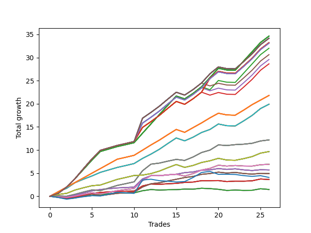

# Long Wallace Doodle 011 
- Symbol: AAPL_Unlimited
- Date Range: 03/23/2022 - 07/08/2022
- Trading Period: 7:20-12:30
- Number of Trades: 26



| Name | Win Percent | Profit | Avg Profit / Trade | Avg Time / Trade |      | Name | Win Percent | Profit | Avg Profit / Trade | Avg Time / Trade |
| ---- | ----------- | ------ | ------------------ | ---------------- | ---- | ---- | ----------- | ------ | ------------------ | ---------------- |
| Sorted By <br> Profit | | | | | | Sorted By <br> Win Percentage ||||
| One Hundred Twenty-Seven | 88.46 | 17315.00 | 665.96 | 145:24 |     | One Hundred Twenty-Seven | 88.46 | 17315.00 | 665.96 | 145:24 |
| One Hundred Twenty-Two | 88.46 | 17315.00 | 665.96 | 145:24 |     | One Hundred Twenty-Two | 88.46 | 17315.00 | 665.96 | 145:24 |
| One Hundred Seventeen | 88.46 | 17315.00 | 665.96 | 145:24 |     | One Hundred Seventeen | 88.46 | 17315.00 | 665.96 | 145:24 |
| One Hundred Twelve | 88.46 | 17315.00 | 665.96 | 145:24 |     | One Hundred Twelve | 88.46 | 17315.00 | 665.96 | 145:24 |
| One Hundred Seven | 88.46 | 17315.00 | 665.96 | 145:24 |     | One Hundred Seven | 88.46 | 17315.00 | 665.96 | 145:24 |
| One Hundred Two | 88.46 | 17315.00 | 665.96 | 145:24 |     | One Hundred Two | 88.46 | 17315.00 | 665.96 | 145:24 |
| Ninety-Two | 88.46 | 17315.00 | 665.96 | 145:24 |     | Ninety-Two | 88.46 | 17315.00 | 665.96 | 145:24 |
| Eighty-Two | 88.46 | 17315.00 | 665.96 | 145:24 |     | Eighty-Two | 88.46 | 17315.00 | 665.96 | 145:24 |
| One Hundred Thirty | 88.46 | 17080.00 | 656.92 | 174:06 |     | One Hundred Thirty | 88.46 | 17080.00 | 656.92 | 174:06 |
| One Hundred Twenty-Five | 88.46 | 17080.00 | 656.92 | 174:06 |     | One Hundred Twenty-Five | 88.46 | 17080.00 | 656.92 | 174:06 |
| One Hundred Twenty | 88.46 | 17080.00 | 656.92 | 174:06 |     | One Hundred Twenty | 88.46 | 17080.00 | 656.92 | 174:06 |
| One Hundred Fifteen | 88.46 | 17080.00 | 656.92 | 174:06 |     | One Hundred Fifteen | 88.46 | 17080.00 | 656.92 | 174:06 |
| One Hundred Ten | 88.46 | 17080.00 | 656.92 | 174:06 |     | One Hundred Ten | 88.46 | 17080.00 | 656.92 | 174:06 |
| One Hundred Five | 88.46 | 17080.00 | 656.92 | 174:06 |     | One Hundred Five | 88.46 | 17080.00 | 656.92 | 174:06 |
| Ninety-Five | 88.46 | 17080.00 | 656.92 | 174:06 |     | Ninety-Five | 88.46 | 17080.00 | 656.92 | 174:06 |
| Eighty-Five | 88.46 | 17080.00 | 656.92 | 174:06 |     | Eighty-Five | 88.46 | 17080.00 | 656.92 | 174:06 |
| One Hundred Twenty-Eight | 88.46 | 16605.00 | 638.65 | 171:46 |     | One Hundred Twenty-Eight | 88.46 | 16605.00 | 638.65 | 171:46 |
| One Hundred Twenty-Three | 88.46 | 16605.00 | 638.65 | 171:46 |     | One Hundred Twenty-Three | 88.46 | 16605.00 | 638.65 | 171:46 |
| One Hundred Eighteen | 88.46 | 16605.00 | 638.65 | 171:46 |     | One Hundred Eighteen | 88.46 | 16605.00 | 638.65 | 171:46 |
| One Hundred Thirteen | 88.46 | 16605.00 | 638.65 | 171:46 |     | One Hundred Thirteen | 88.46 | 16605.00 | 638.65 | 171:46 |
| One Hundred Eight | 88.46 | 16605.00 | 638.65 | 171:46 |     | One Hundred Eight | 88.46 | 16605.00 | 638.65 | 171:46 |
| One Hundred Three | 88.46 | 16605.00 | 638.65 | 171:46 |     | One Hundred Three | 88.46 | 16605.00 | 638.65 | 171:46 |
| Ninety-Three | 88.46 | 16605.00 | 638.65 | 171:46 |     | Ninety-Three | 88.46 | 16605.00 | 638.65 | 171:46 |
| Eighty-Three | 88.46 | 16605.00 | 638.65 | 171:46 |     | Eighty-Three | 88.46 | 16605.00 | 638.65 | 171:46 |
| One Hundred Twenty-Nine | 88.46 | 16555.00 | 636.73 | 173:28 |     | One Hundred Twenty-Nine | 88.46 | 16555.00 | 636.73 | 173:28 |
| One Hundred Twenty-Four | 88.46 | 16555.00 | 636.73 | 173:28 |     | One Hundred Twenty-Four | 88.46 | 16555.00 | 636.73 | 173:28 |
| One Hundred Ninteen | 88.46 | 16555.00 | 636.73 | 173:28 |     | One Hundred Ninteen | 88.46 | 16555.00 | 636.73 | 173:28 |
| One Hundred Fourteen | 88.46 | 16555.00 | 636.73 | 173:28 |     | One Hundred Fourteen | 88.46 | 16555.00 | 636.73 | 173:28 |
| One Hundred Nine | 88.46 | 16555.00 | 636.73 | 173:28 |     | One Hundred Nine | 88.46 | 16555.00 | 636.73 | 173:28 |
| One Hundred Four | 88.46 | 16555.00 | 636.73 | 173:28 |     | One Hundred Four | 88.46 | 16555.00 | 636.73 | 173:28 |
| Ninety-Four | 88.46 | 16555.00 | 636.73 | 173:28 |     | Ninety-Four | 88.46 | 16555.00 | 636.73 | 173:28 |
| Eighty-Four | 88.46 | 16555.00 | 636.73 | 173:28 |     | Eighty-Four | 88.46 | 16555.00 | 636.73 | 173:28 |
| Ninety-Seven | 84.62 | 16000.00 | 615.38 | 143:52 |     | One Hundred Twenty-Six | 88.46 | 10900.00 | 419.23 | 98:47 |
| One Hundred | 84.62 | 15310.00 | 588.85 | 168:45 |     | One Hundred Twenty-One | 88.46 | 10900.00 | 419.23 | 98:47 |
| Ninety-Nine | 84.62 | 14785.00 | 568.65 | 168:06 |     | One Hundred Sixteen | 88.46 | 10900.00 | 419.23 | 98:47 |
| Ninety-Eight | 84.62 | 14315.00 | 550.58 | 166:57 |     | One Hundred Eleven | 88.46 | 10900.00 | 419.23 | 98:47 |
| One Hundred Twenty-Six | 88.46 | 10900.00 | 419.23 | 98:47 |     | One Hundred Six | 88.46 | 10900.00 | 419.23 | 98:47 |
| One Hundred Twenty-One | 88.46 | 10900.00 | 419.23 | 98:47 |     | One Hundred One | 88.46 | 10900.00 | 419.23 | 98:47 |
| One Hundred Sixteen | 88.46 | 10900.00 | 419.23 | 98:47 |     | Ninety-Six | 88.46 | 10900.00 | 419.23 | 98:47 |
| One Hundred Eleven | 88.46 | 10900.00 | 419.23 | 98:47 |     | Ninety-One | 88.46 | 10900.00 | 419.23 | 98:47 |
| One Hundred Six | 88.46 | 10900.00 | 419.23 | 98:47 |     | Eighty-One | 88.46 | 10900.00 | 419.23 | 98:47 |
| One Hundred One | 88.46 | 10900.00 | 419.23 | 98:47 |     | Seventy-One | 88.46 | 9950.00 | 382.69 | 98:16 |
| Ninety-Six | 88.46 | 10900.00 | 419.23 | 98:47 |     | Sixty-Three | 88.46 | 9950.00 | 382.69 | 98:16 |
| Ninety-One | 88.46 | 10900.00 | 419.23 | 98:47 |     | Fifty-Five | 88.46 | 9950.00 | 382.69 | 98:16 |
| Eighty-One | 88.46 | 10900.00 | 419.23 | 98:47 |     | Forty-Seven | 88.46 | 9950.00 | 382.69 | 98:16 |
| Seventy-One | 88.46 | 9950.00 | 382.69 | 98:16 |     | Seven | 88.46 | 9950.00 | 382.69 | 98:16 |
| Sixty-Three | 88.46 | 9950.00 | 382.69 | 98:16 |     | Seventy | 88.46 | 4835.00 | 185.96 | 74:43 |
| Fifty-Five | 88.46 | 9950.00 | 382.69 | 98:16 |     | Sixty-Two | 88.46 | 4835.00 | 185.96 | 74:43 |
| Forty-Seven | 88.46 | 9950.00 | 382.69 | 98:16 |     | Fifty-Four | 88.46 | 4835.00 | 185.96 | 74:43 |
| Seven | 88.46 | 9950.00 | 382.69 | 98:16 |     | Forty-Six | 88.46 | 4835.00 | 185.96 | 74:43 |
| Sixty-Nine | 84.62 | 6095.00 | 234.42 | 50:58 |     | Six | 88.46 | 4835.00 | 185.96 | 74:43 |
| Sixty-One | 84.62 | 6095.00 | 234.42 | 50:58 |     | Ninety-Seven | 84.62 | 16000.00 | 615.38 | 143:52 |
| Fifty-Three | 84.62 | 6095.00 | 234.42 | 50:58 |     | One Hundred | 84.62 | 15310.00 | 588.85 | 168:45 |
| Forty-Five | 84.62 | 6095.00 | 234.42 | 50:58 |     | Ninety-Nine | 84.62 | 14785.00 | 568.65 | 168:06 |
| Five | 84.62 | 6095.00 | 234.42 | 50:58 |     | Ninety-Eight | 84.62 | 14315.00 | 550.58 | 166:57 |
| Seventy | 88.46 | 4835.00 | 185.96 | 74:43 |     | Sixty-Nine | 84.62 | 6095.00 | 234.42 | 50:58 |
| Sixty-Two | 88.46 | 4835.00 | 185.96 | 74:43 |     | Sixty-One | 84.62 | 6095.00 | 234.42 | 50:58 |
| Fifty-Four | 88.46 | 4835.00 | 185.96 | 74:43 |     | Fifty-Three | 84.62 | 6095.00 | 234.42 | 50:58 |
| Forty-Six | 88.46 | 4835.00 | 185.96 | 74:43 |     | Forty-Five | 84.62 | 6095.00 | 234.42 | 50:58 |
| Six | 88.46 | 4835.00 | 185.96 | 74:43 |     | Five | 84.62 | 6095.00 | 234.42 | 50:58 |
| Sixty-Eight | 69.23 | 3460.00 | 133.08 | 44:12 |     | Sixty-Five | 76.92 | 1815.00 | 69.81 | 17:29 |
| Sixty | 69.23 | 3460.00 | 133.08 | 44:12 |     | Fifty-Seven | 76.92 | 1815.00 | 69.81 | 17:29 |
| Fifty-Two | 69.23 | 3460.00 | 133.08 | 44:12 |     | Forty-Nine | 76.92 | 1815.00 | 69.81 | 17:29 |
| Forty-Four | 69.23 | 3460.00 | 133.08 | 44:12 |     | Forty-One | 76.92 | 1815.00 | 69.81 | 17:29 |
| Four | 69.23 | 3460.00 | 133.08 | 44:12 |     | One | 76.92 | 1815.00 | 69.81 | 17:29 |
| Sixty-Six | 73.08 | 2850.00 | 109.62 | 23:05 |     | Sixty-Six | 73.08 | 2850.00 | 109.62 | 23:05 |
| Fifty-Eight | 73.08 | 2850.00 | 109.62 | 23:05 |     | Fifty-Eight | 73.08 | 2850.00 | 109.62 | 23:05 |
| Fifty | 73.08 | 2850.00 | 109.62 | 23:05 |     | Fifty | 73.08 | 2850.00 | 109.62 | 23:05 |
| Forty-Two | 73.08 | 2850.00 | 109.62 | 23:05 |     | Forty-Two | 73.08 | 2850.00 | 109.62 | 23:05 |
| Two | 73.08 | 2850.00 | 109.62 | 23:05 |     | Two | 73.08 | 2850.00 | 109.62 | 23:05 |
| Sixty-Seven | 73.08 | 2460.00 | 94.62 | 28:10 |     | Sixty-Seven | 73.08 | 2460.00 | 94.62 | 28:10 |
| Fifty-Nine | 73.08 | 2460.00 | 94.62 | 28:10 |     | Fifty-Nine | 73.08 | 2460.00 | 94.62 | 28:10 |
| Fifty-One | 73.08 | 2460.00 | 94.62 | 28:10 |     | Fifty-One | 73.08 | 2460.00 | 94.62 | 28:10 |
| Forty-Three | 73.08 | 2460.00 | 94.62 | 28:10 |     | Forty-Three | 73.08 | 2460.00 | 94.62 | 28:10 |
| Three | 73.08 | 2460.00 | 94.62 | 28:10 |     | Three | 73.08 | 2460.00 | 94.62 | 28:10 |
| Seventy-Three | 50.00 | 2040.00 | 78.46 | 16:30 |     | Sixty-Eight | 69.23 | 3460.00 | 133.08 | 44:12 |
| Sixty-Five | 76.92 | 1815.00 | 69.81 | 17:29 |     | Sixty | 69.23 | 3460.00 | 133.08 | 44:12 |
| Fifty-Seven | 76.92 | 1815.00 | 69.81 | 17:29 |     | Fifty-Two | 69.23 | 3460.00 | 133.08 | 44:12 |
| Forty-Nine | 76.92 | 1815.00 | 69.81 | 17:29 |     | Forty-Four | 69.23 | 3460.00 | 133.08 | 44:12 |
| Forty-One | 76.92 | 1815.00 | 69.81 | 17:29 |     | Four | 69.23 | 3460.00 | 133.08 | 44:12 |
| One | 76.92 | 1815.00 | 69.81 | 17:29 |     | Sixty-Four | 65.38 | 740.00 | 28.46 | 13:18 |
| Sixty-Four | 65.38 | 740.00 | 28.46 | 13:18 |     | Fifty-Six | 65.38 | 740.00 | 28.46 | 13:18 |
| Fifty-Six | 65.38 | 740.00 | 28.46 | 13:18 |     | Forty-Eight | 65.38 | 740.00 | 28.46 | 13:18 |
| Forty-Eight | 65.38 | 740.00 | 28.46 | 13:18 |     | Forty | 65.38 | 740.00 | 28.46 | 13:18 |
| Forty | 65.38 | 740.00 | 28.46 | 13:18 |     | Zero | 65.38 | 740.00 | 28.46 | 13:18 |
| Zero | 65.38 | 740.00 | 28.46 | 13:18 |     | Seventy-Three | 50.00 | 2040.00 | 78.46 | 16:30 |

## NO STOPLOSS

### Test Zero
* Sell when price hits the middle line of the 20p bollinger
* No Stoploss
* Results:
```
Total Trades: 26
Percent Up: 65.38
Percent Down: 34.62
Total Points Moved Up: 1.48
Potential Profit: 740.00
Total Points Ups: 2.72 Count Ups: 17
Total Points Downs: -1.24 Count Downs: 9
```

<details><summary>Trades</summary>

<code>In: 2022-03-25 08:14:00		Out: 2022-03-25 08:30:30		Total Position Time: 16:30		Total Move Up: -0.07		Total to Date: -0.07</code> <br />
<code>In: 2022-03-28 08:39:00		Out: 2022-03-28 09:01:40		Total Position Time: 22:40		Total Move Up: -0.34		Total to Date: -0.41</code> <br />
<code>In: 2022-03-28 08:51:00		Out: 2022-03-28 09:01:40		Total Position Time: 10:40		Total Move Up: 0.14		Total to Date: -0.27</code> <br />
<code>In: 2022-03-29 09:36:00		Out: 2022-03-29 09:43:15		Total Position Time: 07:15		Total Move Up: 0.24		Total to Date: -0.03</code> <br />
<code>In: 2022-03-29 09:37:00		Out: 2022-03-29 09:43:15		Total Position Time: 06:15		Total Move Up: 0.19		Total to Date: 0.16</code> <br />
<code>In: 2022-04-07 07:45:00		Out: 2022-04-07 07:54:30		Total Position Time: 09:30		Total Move Up: 0.22		Total to Date: 0.38</code> <br />
<code>In: 2022-04-08 11:30:00		Out: 2022-04-08 11:39:40		Total Position Time: 09:40		Total Move Up: 0.17		Total to Date: 0.55</code> <br />
<code>In: 2022-04-08 11:30:00		Out: 2022-04-08 11:39:40		Total Position Time: 09:40		Total Move Up: 0.17		Total to Date: 0.72</code> <br />
<code>In: 2022-04-27 12:00:00		Out: 2022-04-27 12:13:50		Total Position Time: 13:50		Total Move Up: 0.00		Total to Date: 0.72</code> <br />
<code>In: 2022-04-27 12:01:00		Out: 2022-04-27 12:13:50		Total Position Time: 12:50		Total Move Up: 0.02		Total to Date: 0.74</code> <br />
<code>In: 2022-05-04 11:36:00		Out: 2022-05-04 11:41:35		Total Position Time: 05:35		Total Move Up: 0.46		Total to Date: 1.20</code> <br />
<code>In: 2022-05-17 11:24:00		Out: 2022-05-17 11:37:20		Total Position Time: 13:20		Total Move Up: 0.26		Total to Date: 1.46</code> <br />
<code>In: 2022-05-25 09:24:00		Out: 2022-05-25 09:44:25		Total Position Time: 20:25		Total Move Up: -0.12		Total to Date: 1.34</code> <br />
<code>In: 2022-05-25 09:29:00		Out: 2022-05-25 09:44:25		Total Position Time: 15:25		Total Move Up: 0.07		Total to Date: 1.41</code> <br />
<code>In: 2022-05-25 09:30:00		Out: 2022-05-25 09:44:25		Total Position Time: 14:25		Total Move Up: 0.03		Total to Date: 1.44</code> <br />
<code>In: 2022-06-06 08:21:00		Out: 2022-06-06 08:38:50		Total Position Time: 17:50		Total Move Up: 0.12		Total to Date: 1.56</code> <br />
<code>In: 2022-06-14 12:11:00		Out: 2022-06-14 12:22:10		Total Position Time: 11:10		Total Move Up: -0.02		Total to Date: 1.54</code> <br />
<code>In: 2022-06-14 12:15:00		Out: 2022-06-14 12:22:10		Total Position Time: 07:10		Total Move Up: 0.20		Total to Date: 1.74</code> <br />
<code>In: 2022-06-15 09:55:00		Out: 2022-06-15 10:11:05		Total Position Time: 16:05		Total Move Up: -0.08		Total to Date: 1.66</code> <br />
<code>In: 2022-06-17 07:38:00		Out: 2022-06-17 07:55:10		Total Position Time: 17:10		Total Move Up: -0.15		Total to Date: 1.51</code> <br />
<code>In: 2022-06-27 10:35:00		Out: 2022-06-27 11:03:15		Total Position Time: 28:15		Total Move Up: -0.24		Total to Date: 1.27</code> <br />
<code>In: 2022-06-27 10:50:00		Out: 2022-06-27 11:03:15		Total Position Time: 13:15		Total Move Up: 0.08		Total to Date: 1.35</code> <br />
<code>In: 2022-07-06 08:06:00		Out: 2022-07-06 08:19:05		Total Position Time: 13:05		Total Move Up: -0.07		Total to Date: 1.28</code> <br />
<code>In: 2022-07-06 08:09:00		Out: 2022-07-06 08:19:05		Total Position Time: 10:05		Total Move Up: 0.02		Total to Date: 1.30</code> <br />
<code>In: 2022-07-06 08:13:00		Out: 2022-07-06 08:19:05		Total Position Time: 06:05		Total Move Up: 0.33		Total to Date: 1.63</code> <br />
<code>In: 2022-07-08 09:32:00		Out: 2022-07-08 09:49:45		Total Position Time: 17:45		Total Move Up: -0.15		Total to Date: 1.48</code> <br />


</details>

### Test One
* Sell when the price hits the upper line of the 20p 1std bollinger
* No Stoploss
* Results:
```
Total Trades: 26
Percent Up: 76.92
Percent Down: 23.08
Total Points Moved Up: 3.63
Potential Profit: 1815.00
Total Points Ups: 4.40 Count Ups: 20
Total Points Downs: -0.77 Count Downs: 6
```

<details><summary>Trades</summary>

<code>In: 2022-03-25 08:14:00		Out: 2022-03-25 08:41:25		Total Position Time: 27:25		Total Move Up: -0.14		Total to Date: -0.14</code> <br />
<code>In: 2022-03-28 08:39:00		Out: 2022-03-28 09:02:05		Total Position Time: 23:05		Total Move Up: -0.22		Total to Date: -0.36</code> <br />
<code>In: 2022-03-28 08:51:00		Out: 2022-03-28 09:02:05		Total Position Time: 11:05		Total Move Up: 0.26		Total to Date: -0.10</code> <br />
<code>In: 2022-03-29 09:36:00		Out: 2022-03-29 09:45:05		Total Position Time: 09:05		Total Move Up: 0.36		Total to Date: 0.26</code> <br />
<code>In: 2022-03-29 09:37:00		Out: 2022-03-29 09:45:05		Total Position Time: 08:05		Total Move Up: 0.31		Total to Date: 0.57</code> <br />
<code>In: 2022-04-07 07:45:00		Out: 2022-04-07 08:00:05		Total Position Time: 15:05		Total Move Up: 0.26		Total to Date: 0.83</code> <br />
<code>In: 2022-04-08 11:30:00		Out: 2022-04-08 11:45:40		Total Position Time: 15:40		Total Move Up: 0.12		Total to Date: 0.95</code> <br />
<code>In: 2022-04-08 11:30:00		Out: 2022-04-08 11:45:40		Total Position Time: 15:40		Total Move Up: 0.12		Total to Date: 1.07</code> <br />
<code>In: 2022-04-27 12:00:00		Out: 2022-04-27 12:27:15		Total Position Time: 27:15		Total Move Up: 0.02		Total to Date: 1.09</code> <br />
<code>In: 2022-04-27 12:01:00		Out: 2022-04-27 12:27:15		Total Position Time: 26:15		Total Move Up: 0.04		Total to Date: 1.13</code> <br />
<code>In: 2022-05-04 11:36:00		Out: 2022-05-04 11:43:55		Total Position Time: 07:55		Total Move Up: 1.11		Total to Date: 2.24</code> <br />
<code>In: 2022-05-17 11:24:00		Out: 2022-05-17 11:39:40		Total Position Time: 15:40		Total Move Up: 0.42		Total to Date: 2.66</code> <br />
<code>In: 2022-05-25 09:24:00		Out: 2022-05-25 09:45:15		Total Position Time: 21:15		Total Move Up: -0.07		Total to Date: 2.59</code> <br />
<code>In: 2022-05-25 09:29:00		Out: 2022-05-25 09:45:15		Total Position Time: 16:15		Total Move Up: 0.12		Total to Date: 2.71</code> <br />
<code>In: 2022-05-25 09:30:00		Out: 2022-05-25 09:45:15		Total Position Time: 15:15		Total Move Up: 0.08		Total to Date: 2.79</code> <br />
<code>In: 2022-06-06 08:21:00		Out: 2022-06-06 08:44:05		Total Position Time: 23:05		Total Move Up: 0.21		Total to Date: 3.00</code> <br />
<code>In: 2022-06-14 12:11:00		Out: 2022-06-14 12:26:30		Total Position Time: 15:30		Total Move Up: 0.08		Total to Date: 3.08</code> <br />
<code>In: 2022-06-14 12:15:00		Out: 2022-06-14 12:26:30		Total Position Time: 11:30		Total Move Up: 0.30		Total to Date: 3.38</code> <br />
<code>In: 2022-06-15 09:55:00		Out: 2022-06-15 10:12:45		Total Position Time: 17:45		Total Move Up: 0.00		Total to Date: 3.38</code> <br />
<code>In: 2022-06-17 07:38:00		Out: 2022-06-17 07:56:15		Total Position Time: 18:15		Total Move Up: 0.02		Total to Date: 3.40</code> <br />
<code>In: 2022-06-27 10:35:00		Out: 2022-06-27 11:05:00		Total Position Time: 30:00		Total Move Up: -0.22		Total to Date: 3.18</code> <br />
<code>In: 2022-06-27 10:50:00		Out: 2022-06-27 11:05:00		Total Position Time: 15:00		Total Move Up: 0.10		Total to Date: 3.28</code> <br />
<code>In: 2022-07-06 08:06:00		Out: 2022-07-06 08:24:10		Total Position Time: 18:10		Total Move Up: -0.01		Total to Date: 3.27</code> <br />
<code>In: 2022-07-06 08:09:00		Out: 2022-07-06 08:24:10		Total Position Time: 15:10		Total Move Up: 0.08		Total to Date: 3.35</code> <br />
<code>In: 2022-07-06 08:13:00		Out: 2022-07-06 08:24:10		Total Position Time: 11:10		Total Move Up: 0.39		Total to Date: 3.74</code> <br />
<code>In: 2022-07-08 09:32:00		Out: 2022-07-08 09:56:10		Total Position Time: 24:10		Total Move Up: -0.11		Total to Date: 3.63</code> <br />


</details>

### Test Two
* Sell when the price hits the upper line of the 20p 2std bollinger
* No Stoploss
* Results:
```
Total Trades: 26
Percent Up: 73.08
Percent Down: 26.92
Total Points Moved Up: 5.70
Potential Profit: 2850.00
Total Points Ups: 6.46 Count Ups: 19
Total Points Downs: -0.76 Count Downs: 7
```

<details><summary>Trades</summary>

<code>In: 2022-03-25 08:14:00		Out: 2022-03-25 08:42:05		Total Position Time: 28:05		Total Move Up: -0.04		Total to Date: -0.04</code> <br />
<code>In: 2022-03-28 08:39:00		Out: 2022-03-28 09:07:10		Total Position Time: 28:10		Total Move Up: -0.11		Total to Date: -0.15</code> <br />
<code>In: 2022-03-28 08:51:00		Out: 2022-03-28 09:07:10		Total Position Time: 16:10		Total Move Up: 0.37		Total to Date: 0.22</code> <br />
<code>In: 2022-03-29 09:36:00		Out: 2022-03-29 09:45:30		Total Position Time: 09:30		Total Move Up: 0.50		Total to Date: 0.72</code> <br />
<code>In: 2022-03-29 09:37:00		Out: 2022-03-29 09:45:30		Total Position Time: 08:30		Total Move Up: 0.45		Total to Date: 1.17</code> <br />
<code>In: 2022-04-07 07:45:00		Out: 2022-04-07 08:01:05		Total Position Time: 16:05		Total Move Up: 0.30		Total to Date: 1.47</code> <br />
<code>In: 2022-04-08 11:30:00		Out: 2022-04-08 11:46:10		Total Position Time: 16:10		Total Move Up: 0.17		Total to Date: 1.64</code> <br />
<code>In: 2022-04-08 11:30:00		Out: 2022-04-08 11:46:10		Total Position Time: 16:10		Total Move Up: 0.17		Total to Date: 1.81</code> <br />
<code>In: 2022-04-27 12:00:00		Out: 2022-04-27 12:27:30		Total Position Time: 27:30		Total Move Up: 0.08		Total to Date: 1.89</code> <br />
<code>In: 2022-04-27 12:01:00		Out: 2022-04-27 12:27:30		Total Position Time: 26:30		Total Move Up: 0.10		Total to Date: 1.99</code> <br />
<code>In: 2022-05-04 11:36:00		Out: 2022-05-04 11:46:55		Total Position Time: 10:55		Total Move Up: 1.77		Total to Date: 3.76</code> <br />
<code>In: 2022-05-17 11:24:00		Out: 2022-05-17 11:40:00		Total Position Time: 16:00		Total Move Up: 0.70		Total to Date: 4.46</code> <br />
<code>In: 2022-05-25 09:24:00		Out: 2022-05-25 09:47:30		Total Position Time: 23:30		Total Move Up: -0.01		Total to Date: 4.45</code> <br />
<code>In: 2022-05-25 09:29:00		Out: 2022-05-25 09:47:30		Total Position Time: 18:30		Total Move Up: 0.18		Total to Date: 4.63</code> <br />
<code>In: 2022-05-25 09:30:00		Out: 2022-05-25 09:47:30		Total Position Time: 17:30		Total Move Up: 0.14		Total to Date: 4.77</code> <br />
<code>In: 2022-06-06 08:21:00		Out: 2022-06-06 08:44:30		Total Position Time: 23:30		Total Move Up: 0.34		Total to Date: 5.11</code> <br />
<code>In: 2022-06-14 12:11:00		Out: 2022-06-14 12:27:10		Total Position Time: 16:10		Total Move Up: 0.16		Total to Date: 5.27</code> <br />
<code>In: 2022-06-14 12:15:00		Out: 2022-06-14 12:27:10		Total Position Time: 12:10		Total Move Up: 0.38		Total to Date: 5.65</code> <br />
<code>In: 2022-06-15 09:55:00		Out: 2022-06-15 10:13:35		Total Position Time: 18:35		Total Move Up: 0.06		Total to Date: 5.71</code> <br />
<code>In: 2022-06-17 07:38:00		Out: 2022-06-17 08:02:30		Total Position Time: 24:30		Total Move Up: 0.29		Total to Date: 6.00</code> <br />
<code>In: 2022-06-27 10:35:00		Out: 2022-06-27 11:17:10		Total Position Time: 42:10		Total Move Up: -0.19		Total to Date: 5.81</code> <br />
<code>In: 2022-06-27 10:50:00		Out: 2022-06-27 11:17:10		Total Position Time: 27:10		Total Move Up: 0.13		Total to Date: 5.94</code> <br />
<code>In: 2022-07-06 08:06:00		Out: 2022-07-06 08:49:05		Total Position Time: 43:05		Total Move Up: -0.23		Total to Date: 5.71</code> <br />
<code>In: 2022-07-06 08:09:00		Out: 2022-07-06 08:49:05		Total Position Time: 40:05		Total Move Up: -0.14		Total to Date: 5.57</code> <br />
<code>In: 2022-07-06 08:13:00		Out: 2022-07-06 08:49:05		Total Position Time: 36:05		Total Move Up: 0.17		Total to Date: 5.74</code> <br />
<code>In: 2022-07-08 09:32:00		Out: 2022-07-08 10:09:45		Total Position Time: 37:45		Total Move Up: -0.04		Total to Date: 5.70</code> <br />


</details>

### Test Three
* Sell when price hits the middle line of the 50p bollinger
* No Stoploss
* Results:
```
Total Trades: 26
Percent Up: 73.08
Percent Down: 26.92
Total Points Moved Up: 4.92
Potential Profit: 2460.00
Total Points Ups: 6.39 Count Ups: 19
Total Points Downs: -1.47 Count Downs: 7
```

<details><summary>Trades</summary>

<code>In: 2022-03-25 08:14:00		Out: 2022-03-25 09:05:15		Total Position Time: 51:15		Total Move Up: -0.23		Total to Date: -0.23</code> <br />
<code>In: 2022-03-28 08:39:00		Out: 2022-03-28 09:23:30		Total Position Time: 44:30		Total Move Up: -0.30		Total to Date: -0.53</code> <br />
<code>In: 2022-03-28 08:51:00		Out: 2022-03-28 09:23:30		Total Position Time: 32:30		Total Move Up: 0.18		Total to Date: -0.35</code> <br />
<code>In: 2022-03-29 09:36:00		Out: 2022-03-29 09:45:20		Total Position Time: 09:20		Total Move Up: 0.44		Total to Date: 0.09</code> <br />
<code>In: 2022-03-29 09:37:00		Out: 2022-03-29 09:45:20		Total Position Time: 08:20		Total Move Up: 0.39		Total to Date: 0.48</code> <br />
<code>In: 2022-04-07 07:45:00		Out: 2022-04-07 08:48:10		Total Position Time: 63:10		Total Move Up: -0.34		Total to Date: 0.14</code> <br />
<code>In: 2022-04-08 11:30:00		Out: 2022-04-08 11:40:40		Total Position Time: 10:40		Total Move Up: 0.25		Total to Date: 0.39</code> <br />
<code>In: 2022-04-08 11:30:00		Out: 2022-04-08 11:40:40		Total Position Time: 10:40		Total Move Up: 0.25		Total to Date: 0.64</code> <br />
<code>In: 2022-04-27 12:00:00		Out: 2022-04-27 12:35:30		Total Position Time: 35:30		Total Move Up: 0.12		Total to Date: 0.76</code> <br />
<code>In: 2022-04-27 12:01:00		Out: 2022-04-27 12:35:30		Total Position Time: 34:30		Total Move Up: 0.14		Total to Date: 0.90</code> <br />
<code>In: 2022-05-04 11:36:00		Out: 2022-05-04 11:43:55		Total Position Time: 07:55		Total Move Up: 1.11		Total to Date: 2.01</code> <br />
<code>In: 2022-05-17 11:24:00		Out: 2022-05-17 11:40:00		Total Position Time: 16:00		Total Move Up: 0.70		Total to Date: 2.71</code> <br />
<code>In: 2022-05-25 09:24:00		Out: 2022-05-25 09:49:20		Total Position Time: 25:20		Total Move Up: 0.21		Total to Date: 2.92</code> <br />
<code>In: 2022-05-25 09:29:00		Out: 2022-05-25 09:49:20		Total Position Time: 20:20		Total Move Up: 0.40		Total to Date: 3.32</code> <br />
<code>In: 2022-05-25 09:30:00		Out: 2022-05-25 09:49:20		Total Position Time: 19:20		Total Move Up: 0.36		Total to Date: 3.68</code> <br />
<code>In: 2022-06-06 08:21:00		Out: 2022-06-06 08:57:50		Total Position Time: 36:50		Total Move Up: 0.37		Total to Date: 4.05</code> <br />
<code>In: 2022-06-14 12:11:00		Out: 2022-06-14 12:27:25		Total Position Time: 16:25		Total Move Up: 0.24		Total to Date: 4.29</code> <br />
<code>In: 2022-06-14 12:15:00		Out: 2022-06-14 12:27:25		Total Position Time: 12:25		Total Move Up: 0.46		Total to Date: 4.75</code> <br />
<code>In: 2022-06-15 09:55:00		Out: 2022-06-15 10:20:55		Total Position Time: 25:55		Total Move Up: 0.17		Total to Date: 4.92</code> <br />
<code>In: 2022-06-17 07:38:00		Out: 2022-06-17 08:03:10		Total Position Time: 25:10		Total Move Up: 0.30		Total to Date: 5.22</code> <br />
<code>In: 2022-06-27 10:35:00		Out: 2022-06-27 11:17:10		Total Position Time: 42:10		Total Move Up: -0.19		Total to Date: 5.03</code> <br />
<code>In: 2022-06-27 10:50:00		Out: 2022-06-27 11:17:10		Total Position Time: 27:10		Total Move Up: 0.13		Total to Date: 5.16</code> <br />
<code>In: 2022-07-06 08:06:00		Out: 2022-07-06 08:49:05		Total Position Time: 43:05		Total Move Up: -0.23		Total to Date: 4.93</code> <br />
<code>In: 2022-07-06 08:09:00		Out: 2022-07-06 08:49:05		Total Position Time: 40:05		Total Move Up: -0.14		Total to Date: 4.79</code> <br />
<code>In: 2022-07-06 08:13:00		Out: 2022-07-06 08:49:05		Total Position Time: 36:05		Total Move Up: 0.17		Total to Date: 4.96</code> <br />
<code>In: 2022-07-08 09:32:00		Out: 2022-07-08 10:09:45		Total Position Time: 37:45		Total Move Up: -0.04		Total to Date: 4.92</code> <br />


</details>

### Test Four
* Sell when the price hits the upper line of the 50p 1std bollinger
* No Stoploss
* Results:
```
Total Trades: 26
Percent Up: 69.23
Percent Down: 30.77
Total Points Moved Up: 6.92
Potential Profit: 3460.00
Total Points Ups: 8.19 Count Ups: 18
Total Points Downs: -1.27 Count Downs: 8
```

<details><summary>Trades</summary>

<code>In: 2022-03-25 08:14:00		Out: 2022-03-25 09:09:05		Total Position Time: 55:05		Total Move Up: -0.04		Total to Date: -0.04</code> <br />
<code>In: 2022-03-28 08:39:00		Out: 2022-03-28 09:30:50		Total Position Time: 51:50		Total Move Up: -0.20		Total to Date: -0.24</code> <br />
<code>In: 2022-03-28 08:51:00		Out: 2022-03-28 09:30:50		Total Position Time: 39:50		Total Move Up: 0.28		Total to Date: 0.04</code> <br />
<code>In: 2022-03-29 09:36:00		Out: 2022-03-29 10:29:15		Total Position Time: 53:15		Total Move Up: 0.39		Total to Date: 0.43</code> <br />
<code>In: 2022-03-29 09:37:00		Out: 2022-03-29 10:29:15		Total Position Time: 52:15		Total Move Up: 0.34		Total to Date: 0.77</code> <br />
<code>In: 2022-04-07 07:45:00		Out: 2022-04-07 09:05:20		Total Position Time: 80:20		Total Move Up: -0.29		Total to Date: 0.48</code> <br />
<code>In: 2022-04-08 11:30:00		Out: 2022-04-08 11:48:15		Total Position Time: 18:15		Total Move Up: 0.37		Total to Date: 0.85</code> <br />
<code>In: 2022-04-08 11:30:00		Out: 2022-04-08 11:48:15		Total Position Time: 18:15		Total Move Up: 0.37		Total to Date: 1.22</code> <br />
<code>In: 2022-04-27 12:00:00		Out: 2022-04-27 12:44:15		Total Position Time: 44:15		Total Move Up: 0.23		Total to Date: 1.45</code> <br />
<code>In: 2022-04-27 12:01:00		Out: 2022-04-27 12:44:15		Total Position Time: 43:15		Total Move Up: 0.25		Total to Date: 1.70</code> <br />
<code>In: 2022-05-04 11:36:00		Out: 2022-05-04 11:46:50		Total Position Time: 10:50		Total Move Up: 1.66		Total to Date: 3.36</code> <br />
<code>In: 2022-05-17 11:24:00		Out: 2022-05-17 11:40:20		Total Position Time: 16:20		Total Move Up: 1.13		Total to Date: 4.49</code> <br />
<code>In: 2022-05-25 09:24:00		Out: 2022-05-25 10:29:35		Total Position Time: 65:35		Total Move Up: -0.02		Total to Date: 4.47</code> <br />
<code>In: 2022-05-25 09:29:00		Out: 2022-05-25 10:29:35		Total Position Time: 60:35		Total Move Up: 0.17		Total to Date: 4.64</code> <br />
<code>In: 2022-05-25 09:30:00		Out: 2022-05-25 10:29:35		Total Position Time: 59:35		Total Move Up: 0.13		Total to Date: 4.77</code> <br />
<code>In: 2022-06-06 08:21:00		Out: 2022-06-06 09:53:35		Total Position Time: 92:35		Total Move Up: -0.40		Total to Date: 4.37</code> <br />
<code>In: 2022-06-14 12:11:00		Out: 2022-06-14 12:30:50		Total Position Time: 19:50		Total Move Up: 0.54		Total to Date: 4.91</code> <br />
<code>In: 2022-06-14 12:15:00		Out: 2022-06-14 12:30:50		Total Position Time: 15:50		Total Move Up: 0.76		Total to Date: 5.67</code> <br />
<code>In: 2022-06-15 09:55:00		Out: 2022-06-15 10:27:25		Total Position Time: 32:25		Total Move Up: 0.37		Total to Date: 6.04</code> <br />
<code>In: 2022-06-17 07:38:00		Out: 2022-06-17 08:06:05		Total Position Time: 28:05		Total Move Up: 0.68		Total to Date: 6.72</code> <br />
<code>In: 2022-06-27 10:35:00		Out: 2022-06-27 11:33:25		Total Position Time: 58:25		Total Move Up: -0.19		Total to Date: 6.53</code> <br />
<code>In: 2022-06-27 10:50:00		Out: 2022-06-27 11:33:25		Total Position Time: 43:25		Total Move Up: 0.13		Total to Date: 6.66</code> <br />
<code>In: 2022-07-06 08:06:00		Out: 2022-07-06 08:58:15		Total Position Time: 52:15		Total Move Up: -0.11		Total to Date: 6.55</code> <br />
<code>In: 2022-07-06 08:09:00		Out: 2022-07-06 08:58:15		Total Position Time: 49:15		Total Move Up: -0.02		Total to Date: 6.53</code> <br />
<code>In: 2022-07-06 08:13:00		Out: 2022-07-06 08:58:15		Total Position Time: 45:15		Total Move Up: 0.29		Total to Date: 6.82</code> <br />
<code>In: 2022-07-08 09:32:00		Out: 2022-07-08 10:14:30		Total Position Time: 42:30		Total Move Up: 0.10		Total to Date: 6.92</code> <br />


</details>

### Test Five
* Sell when the price hits the upper line of the 50p 2std bollinger
* No Stoploss
* Results:
```
Total Trades: 26
Percent Up: 84.62
Percent Down: 15.38
Total Points Moved Up: 12.19
Potential Profit: 6095.00
Total Points Ups: 12.74 Count Ups: 22
Total Points Downs: -0.55 Count Downs: 4
```

<details><summary>Trades</summary>

<code>In: 2022-03-25 08:14:00		Out: 2022-03-25 09:11:30		Total Position Time: 57:30		Total Move Up: 0.08		Total to Date: 0.08</code> <br />
<code>In: 2022-03-28 08:39:00		Out: 2022-03-28 09:36:00		Total Position Time: 57:00		Total Move Up: -0.06		Total to Date: 0.02</code> <br />
<code>In: 2022-03-28 08:51:00		Out: 2022-03-28 09:36:00		Total Position Time: 45:00		Total Move Up: 0.42		Total to Date: 0.44</code> <br />
<code>In: 2022-03-29 09:36:00		Out: 2022-03-29 10:40:00		Total Position Time: 64:00		Total Move Up: 0.49		Total to Date: 0.93</code> <br />
<code>In: 2022-03-29 09:37:00		Out: 2022-03-29 10:40:00		Total Position Time: 63:00		Total Move Up: 0.44		Total to Date: 1.37</code> <br />
<code>In: 2022-04-07 07:45:00		Out: 2022-04-07 09:06:30		Total Position Time: 81:30		Total Move Up: -0.14		Total to Date: 1.23</code> <br />
<code>In: 2022-04-08 11:30:00		Out: 2022-04-08 11:52:15		Total Position Time: 22:15		Total Move Up: 0.56		Total to Date: 1.79</code> <br />
<code>In: 2022-04-08 11:30:00		Out: 2022-04-08 11:52:15		Total Position Time: 22:15		Total Move Up: 0.56		Total to Date: 2.35</code> <br />
<code>In: 2022-04-27 12:00:00		Out: 2022-04-27 12:44:20		Total Position Time: 44:20		Total Move Up: 0.38		Total to Date: 2.73</code> <br />
<code>In: 2022-04-27 12:01:00		Out: 2022-04-27 12:44:20		Total Position Time: 43:20		Total Move Up: 0.40		Total to Date: 3.13</code> <br />
<code>In: 2022-05-04 11:36:00		Out: 2022-05-04 11:47:10		Total Position Time: 11:10		Total Move Up: 2.39		Total to Date: 5.52</code> <br />
<code>In: 2022-05-17 11:24:00		Out: 2022-05-17 11:48:45		Total Position Time: 24:45		Total Move Up: 1.43		Total to Date: 6.95</code> <br />
<code>In: 2022-05-25 09:24:00		Out: 2022-05-25 10:35:30		Total Position Time: 71:30		Total Move Up: 0.23		Total to Date: 7.18</code> <br />
<code>In: 2022-05-25 09:29:00		Out: 2022-05-25 10:35:30		Total Position Time: 66:30		Total Move Up: 0.42		Total to Date: 7.60</code> <br />
<code>In: 2022-05-25 09:30:00		Out: 2022-05-25 10:35:30		Total Position Time: 65:30		Total Move Up: 0.38		Total to Date: 7.98</code> <br />
<code>In: 2022-06-06 08:21:00		Out: 2022-06-06 09:56:10		Total Position Time: 95:10		Total Move Up: -0.22		Total to Date: 7.76</code> <br />
<code>In: 2022-06-14 12:11:00		Out: 2022-06-14 12:36:25		Total Position Time: 25:25		Total Move Up: 0.74		Total to Date: 8.50</code> <br />
<code>In: 2022-06-14 12:15:00		Out: 2022-06-14 12:36:25		Total Position Time: 21:25		Total Move Up: 0.96		Total to Date: 9.46</code> <br />
<code>In: 2022-06-15 09:55:00		Out: 2022-06-15 10:58:15		Total Position Time: 63:15		Total Move Up: 0.53		Total to Date: 9.99</code> <br />
<code>In: 2022-06-17 07:38:00		Out: 2022-06-17 08:07:55		Total Position Time: 29:55		Total Move Up: 1.12		Total to Date: 11.11</code> <br />
<code>In: 2022-06-27 10:35:00		Out: 2022-06-27 11:34:15		Total Position Time: 59:15		Total Move Up: -0.13		Total to Date: 10.98</code> <br />
<code>In: 2022-06-27 10:50:00		Out: 2022-06-27 11:34:15		Total Position Time: 44:15		Total Move Up: 0.19		Total to Date: 11.17</code> <br />
<code>In: 2022-07-06 08:06:00		Out: 2022-07-06 09:13:30		Total Position Time: 67:30		Total Move Up: 0.10		Total to Date: 11.27</code> <br />
<code>In: 2022-07-06 08:09:00		Out: 2022-07-06 09:13:30		Total Position Time: 64:30		Total Move Up: 0.19		Total to Date: 11.46</code> <br />
<code>In: 2022-07-06 08:13:00		Out: 2022-07-06 09:13:30		Total Position Time: 60:30		Total Move Up: 0.50		Total to Date: 11.96</code> <br />
<code>In: 2022-07-08 09:32:00		Out: 2022-07-08 10:26:40		Total Position Time: 54:40		Total Move Up: 0.23		Total to Date: 12.19</code> <br />


</details>

### Test Six
* Sell when the price hits the middle line of the 1std VWAP
* No Stoploss
* Results:
```
Total Trades: 26
Percent Up: 88.46
Percent Down: 11.54
Total Points Moved Up: 9.67
Potential Profit: 4835.00
Total Points Ups: 10.71 Count Ups: 23
Total Points Downs: -1.04 Count Downs: 3
```

<details><summary>Trades</summary>

<code>In: 2022-03-25 08:14:00		Out: 2022-03-25 10:49:00		Total Position Time: 155:00		Total Move Up: 0.40		Total to Date: 0.40</code> <br />
<code>In: 2022-03-28 08:39:00		Out: 2022-03-28 09:55:05		Total Position Time: 76:05		Total Move Up: 0.24		Total to Date: 0.64</code> <br />
<code>In: 2022-03-28 08:51:00		Out: 2022-03-28 09:55:05		Total Position Time: 64:05		Total Move Up: 0.72		Total to Date: 1.36</code> <br />
<code>In: 2022-03-29 09:36:00		Out: 2022-03-29 09:45:25		Total Position Time: 09:25		Total Move Up: 0.49		Total to Date: 1.85</code> <br />
<code>In: 2022-03-29 09:37:00		Out: 2022-03-29 09:45:25		Total Position Time: 08:25		Total Move Up: 0.44		Total to Date: 2.29</code> <br />
<code>In: 2022-04-07 07:45:00		Out: 2022-04-07 10:56:05		Total Position Time: 191:05		Total Move Up: 0.15		Total to Date: 2.44</code> <br />
<code>In: 2022-04-08 11:30:00		Out: 2022-04-08 11:53:00		Total Position Time: 23:00		Total Move Up: 0.61		Total to Date: 3.05</code> <br />
<code>In: 2022-04-08 11:30:00		Out: 2022-04-08 11:53:00		Total Position Time: 23:00		Total Move Up: 0.61		Total to Date: 3.66</code> <br />
<code>In: 2022-04-27 12:00:00		Out: 2022-04-27 12:47:00		Total Position Time: 47:00		Total Move Up: 0.41		Total to Date: 4.07</code> <br />
<code>In: 2022-04-27 12:01:00		Out: 2022-04-27 12:47:00		Total Position Time: 46:00		Total Move Up: 0.43		Total to Date: 4.50</code> <br />
<code>In: 2022-05-04 11:36:00		Out: 2022-05-04 11:37:10		Total Position Time: 01:10		Total Move Up: 0.08		Total to Date: 4.58</code> <br />
<code>In: 2022-05-17 11:24:00		Out: 2022-05-17 11:27:00		Total Position Time: 03:00		Total Move Up: 0.33		Total to Date: 4.91</code> <br />
<code>In: 2022-05-25 09:24:00		Out: 2022-05-25 11:00:30		Total Position Time: 96:30		Total Move Up: 0.54		Total to Date: 5.45</code> <br />
<code>In: 2022-05-25 09:29:00		Out: 2022-05-25 11:00:30		Total Position Time: 91:30		Total Move Up: 0.73		Total to Date: 6.18</code> <br />
<code>In: 2022-05-25 09:30:00		Out: 2022-05-25 11:00:30		Total Position Time: 90:30		Total Move Up: 0.69		Total to Date: 6.87</code> <br />
<code>In: 2022-06-06 08:21:00		Out: 2022-06-06 12:47:00		Total Position Time: 266:00		Total Move Up: -0.62		Total to Date: 6.25</code> <br />
<code>In: 2022-06-14 12:11:00		Out: 2022-06-14 12:30:25		Total Position Time: 19:25		Total Move Up: 0.42		Total to Date: 6.67</code> <br />
<code>In: 2022-06-14 12:15:00		Out: 2022-06-14 12:30:25		Total Position Time: 15:25		Total Move Up: 0.64		Total to Date: 7.31</code> <br />
<code>In: 2022-06-15 09:55:00		Out: 2022-06-15 10:27:25		Total Position Time: 32:25		Total Move Up: 0.37		Total to Date: 7.68</code> <br />
<code>In: 2022-06-17 07:38:00		Out: 2022-06-17 08:03:55		Total Position Time: 25:55		Total Move Up: 0.53		Total to Date: 8.21</code> <br />
<code>In: 2022-06-27 10:35:00		Out: 2022-06-27 12:47:00		Total Position Time: 132:00		Total Move Up: -0.37		Total to Date: 7.84</code> <br />
<code>In: 2022-06-27 10:50:00		Out: 2022-06-27 12:47:00		Total Position Time: 117:00		Total Move Up: -0.05		Total to Date: 7.79</code> <br />
<code>In: 2022-07-06 08:06:00		Out: 2022-07-06 10:07:05		Total Position Time: 121:05		Total Move Up: 0.35		Total to Date: 8.14</code> <br />
<code>In: 2022-07-06 08:09:00		Out: 2022-07-06 10:07:05		Total Position Time: 118:05		Total Move Up: 0.44		Total to Date: 8.58</code> <br />
<code>In: 2022-07-06 08:13:00		Out: 2022-07-06 10:07:05		Total Position Time: 114:05		Total Move Up: 0.75		Total to Date: 9.33</code> <br />
<code>In: 2022-07-08 09:32:00		Out: 2022-07-08 10:27:40		Total Position Time: 55:40		Total Move Up: 0.34		Total to Date: 9.67</code> <br />


</details>

### Test Seven
* Sell when the price hits the upper line of the 1std VWAP
* No Stoploss
* Results:
```
Total Trades: 26
Percent Up: 88.46
Percent Down: 11.54
Total Points Moved Up: 19.90
Potential Profit: 9950.00
Total Points Ups: 20.94 Count Ups: 23
Total Points Downs: -1.04 Count Downs: 3
```

<details><summary>Trades</summary>

<code>In: 2022-03-25 08:14:00		Out: 2022-03-25 11:03:35		Total Position Time: 169:35		Total Move Up: 0.99		Total to Date: 0.99</code> <br />
<code>In: 2022-03-28 08:39:00		Out: 2022-03-28 10:25:40		Total Position Time: 106:40		Total Move Up: 0.74		Total to Date: 1.73</code> <br />
<code>In: 2022-03-28 08:51:00		Out: 2022-03-28 10:25:40		Total Position Time: 94:40		Total Move Up: 1.22		Total to Date: 2.95</code> <br />
<code>In: 2022-03-29 09:36:00		Out: 2022-03-29 10:46:40		Total Position Time: 70:40		Total Move Up: 0.75		Total to Date: 3.70</code> <br />
<code>In: 2022-03-29 09:37:00		Out: 2022-03-29 10:46:40		Total Position Time: 69:40		Total Move Up: 0.70		Total to Date: 4.40</code> <br />
<code>In: 2022-04-07 07:45:00		Out: 2022-04-07 11:26:15		Total Position Time: 221:15		Total Move Up: 0.78		Total to Date: 5.18</code> <br />
<code>In: 2022-04-08 11:30:00		Out: 2022-04-08 12:47:00		Total Position Time: 77:00		Total Move Up: 0.53		Total to Date: 5.71</code> <br />
<code>In: 2022-04-08 11:30:00		Out: 2022-04-08 12:47:00		Total Position Time: 77:00		Total Move Up: 0.53		Total to Date: 6.24</code> <br />
<code>In: 2022-04-27 12:00:00		Out: 2022-04-27 12:47:00		Total Position Time: 47:00		Total Move Up: 0.41		Total to Date: 6.65</code> <br />
<code>In: 2022-04-27 12:01:00		Out: 2022-04-27 12:47:00		Total Position Time: 46:00		Total Move Up: 0.43		Total to Date: 7.08</code> <br />
<code>In: 2022-05-04 11:36:00		Out: 2022-05-04 11:43:55		Total Position Time: 07:55		Total Move Up: 1.11		Total to Date: 8.19</code> <br />
<code>In: 2022-05-17 11:24:00		Out: 2022-05-17 11:40:10		Total Position Time: 16:10		Total Move Up: 0.93		Total to Date: 9.12</code> <br />
<code>In: 2022-05-25 09:24:00		Out: 2022-05-25 11:02:30		Total Position Time: 98:30		Total Move Up: 1.05		Total to Date: 10.17</code> <br />
<code>In: 2022-05-25 09:29:00		Out: 2022-05-25 11:02:30		Total Position Time: 93:30		Total Move Up: 1.24		Total to Date: 11.41</code> <br />
<code>In: 2022-05-25 09:30:00		Out: 2022-05-25 11:02:30		Total Position Time: 92:30		Total Move Up: 1.20		Total to Date: 12.61</code> <br />
<code>In: 2022-06-06 08:21:00		Out: 2022-06-06 12:47:00		Total Position Time: 266:00		Total Move Up: -0.62		Total to Date: 11.99</code> <br />
<code>In: 2022-06-14 12:11:00		Out: 2022-06-14 12:37:35		Total Position Time: 26:35		Total Move Up: 0.79		Total to Date: 12.78</code> <br />
<code>In: 2022-06-14 12:15:00		Out: 2022-06-14 12:37:35		Total Position Time: 22:35		Total Move Up: 1.01		Total to Date: 13.79</code> <br />
<code>In: 2022-06-15 09:55:00		Out: 2022-06-15 10:59:35		Total Position Time: 64:35		Total Move Up: 0.66		Total to Date: 14.45</code> <br />
<code>In: 2022-06-17 07:38:00		Out: 2022-06-17 08:08:00		Total Position Time: 30:00		Total Move Up: 1.18		Total to Date: 15.63</code> <br />
<code>In: 2022-06-27 10:35:00		Out: 2022-06-27 12:47:00		Total Position Time: 132:00		Total Move Up: -0.37		Total to Date: 15.26</code> <br />
<code>In: 2022-06-27 10:50:00		Out: 2022-06-27 12:47:00		Total Position Time: 117:00		Total Move Up: -0.05		Total to Date: 15.21</code> <br />
<code>In: 2022-07-06 08:06:00		Out: 2022-07-06 11:05:15		Total Position Time: 179:15		Total Move Up: 1.09		Total to Date: 16.30</code> <br />
<code>In: 2022-07-06 08:09:00		Out: 2022-07-06 11:05:15		Total Position Time: 176:15		Total Move Up: 1.18		Total to Date: 17.48</code> <br />
<code>In: 2022-07-06 08:13:00		Out: 2022-07-06 11:05:15		Total Position Time: 172:15		Total Move Up: 1.49		Total to Date: 18.97</code> <br />
<code>In: 2022-07-08 09:32:00		Out: 2022-07-08 10:52:40		Total Position Time: 80:40		Total Move Up: 0.93		Total to Date: 19.90</code> <br />


</details>

## STOPLOSS OF 5

### Test Forty
* Sell when price hits the middle line of the 20p bollinger
* Stoploss is 5 points
* Results:
```
Total Trades: 26
Percent Up: 65.38
Percent Down: 34.62
Total Points Moved Up: 1.48
Potential Profit: 740.00
Total Points Ups: 2.72 Count Ups: 17
Total Points Downs: -1.24 Count Downs: 9
```

<details><summary>Trades</summary>

<code>In: 2022-03-25 08:14:00		Out: 2022-03-25 08:30:30		Total Position Time: 16:30		Total Move Up: -0.07		Total to Date: -0.07</code> <br />
<code>In: 2022-03-28 08:39:00		Out: 2022-03-28 09:01:40		Total Position Time: 22:40		Total Move Up: -0.34		Total to Date: -0.41</code> <br />
<code>In: 2022-03-28 08:51:00		Out: 2022-03-28 09:01:40		Total Position Time: 10:40		Total Move Up: 0.14		Total to Date: -0.27</code> <br />
<code>In: 2022-03-29 09:36:00		Out: 2022-03-29 09:43:15		Total Position Time: 07:15		Total Move Up: 0.24		Total to Date: -0.03</code> <br />
<code>In: 2022-03-29 09:37:00		Out: 2022-03-29 09:43:15		Total Position Time: 06:15		Total Move Up: 0.19		Total to Date: 0.16</code> <br />
<code>In: 2022-04-07 07:45:00		Out: 2022-04-07 07:54:30		Total Position Time: 09:30		Total Move Up: 0.22		Total to Date: 0.38</code> <br />
<code>In: 2022-04-08 11:30:00		Out: 2022-04-08 11:39:40		Total Position Time: 09:40		Total Move Up: 0.17		Total to Date: 0.55</code> <br />
<code>In: 2022-04-08 11:30:00		Out: 2022-04-08 11:39:40		Total Position Time: 09:40		Total Move Up: 0.17		Total to Date: 0.72</code> <br />
<code>In: 2022-04-27 12:00:00		Out: 2022-04-27 12:13:50		Total Position Time: 13:50		Total Move Up: 0.00		Total to Date: 0.72</code> <br />
<code>In: 2022-04-27 12:01:00		Out: 2022-04-27 12:13:50		Total Position Time: 12:50		Total Move Up: 0.02		Total to Date: 0.74</code> <br />
<code>In: 2022-05-04 11:36:00		Out: 2022-05-04 11:41:35		Total Position Time: 05:35		Total Move Up: 0.46		Total to Date: 1.20</code> <br />
<code>In: 2022-05-17 11:24:00		Out: 2022-05-17 11:37:20		Total Position Time: 13:20		Total Move Up: 0.26		Total to Date: 1.46</code> <br />
<code>In: 2022-05-25 09:24:00		Out: 2022-05-25 09:44:25		Total Position Time: 20:25		Total Move Up: -0.12		Total to Date: 1.34</code> <br />
<code>In: 2022-05-25 09:29:00		Out: 2022-05-25 09:44:25		Total Position Time: 15:25		Total Move Up: 0.07		Total to Date: 1.41</code> <br />
<code>In: 2022-05-25 09:30:00		Out: 2022-05-25 09:44:25		Total Position Time: 14:25		Total Move Up: 0.03		Total to Date: 1.44</code> <br />
<code>In: 2022-06-06 08:21:00		Out: 2022-06-06 08:38:50		Total Position Time: 17:50		Total Move Up: 0.12		Total to Date: 1.56</code> <br />
<code>In: 2022-06-14 12:11:00		Out: 2022-06-14 12:22:10		Total Position Time: 11:10		Total Move Up: -0.02		Total to Date: 1.54</code> <br />
<code>In: 2022-06-14 12:15:00		Out: 2022-06-14 12:22:10		Total Position Time: 07:10		Total Move Up: 0.20		Total to Date: 1.74</code> <br />
<code>In: 2022-06-15 09:55:00		Out: 2022-06-15 10:11:05		Total Position Time: 16:05		Total Move Up: -0.08		Total to Date: 1.66</code> <br />
<code>In: 2022-06-17 07:38:00		Out: 2022-06-17 07:55:10		Total Position Time: 17:10		Total Move Up: -0.15		Total to Date: 1.51</code> <br />
<code>In: 2022-06-27 10:35:00		Out: 2022-06-27 11:03:15		Total Position Time: 28:15		Total Move Up: -0.24		Total to Date: 1.27</code> <br />
<code>In: 2022-06-27 10:50:00		Out: 2022-06-27 11:03:15		Total Position Time: 13:15		Total Move Up: 0.08		Total to Date: 1.35</code> <br />
<code>In: 2022-07-06 08:06:00		Out: 2022-07-06 08:19:05		Total Position Time: 13:05		Total Move Up: -0.07		Total to Date: 1.28</code> <br />
<code>In: 2022-07-06 08:09:00		Out: 2022-07-06 08:19:05		Total Position Time: 10:05		Total Move Up: 0.02		Total to Date: 1.30</code> <br />
<code>In: 2022-07-06 08:13:00		Out: 2022-07-06 08:19:05		Total Position Time: 06:05		Total Move Up: 0.33		Total to Date: 1.63</code> <br />
<code>In: 2022-07-08 09:32:00		Out: 2022-07-08 09:49:45		Total Position Time: 17:45		Total Move Up: -0.15		Total to Date: 1.48</code> <br />


</details>

### Test Forty-One
* Sell when the price hits the upper line of the 20p 1std bollinger
* Stoploss is 5 points
* Results:
```
Total Trades: 26
Percent Up: 76.92
Percent Down: 23.08
Total Points Moved Up: 3.63
Potential Profit: 1815.00
Total Points Ups: 4.40 Count Ups: 20
Total Points Downs: -0.77 Count Downs: 6
```

<details><summary>Trades</summary>

<code>In: 2022-03-25 08:14:00		Out: 2022-03-25 08:41:25		Total Position Time: 27:25		Total Move Up: -0.14		Total to Date: -0.14</code> <br />
<code>In: 2022-03-28 08:39:00		Out: 2022-03-28 09:02:05		Total Position Time: 23:05		Total Move Up: -0.22		Total to Date: -0.36</code> <br />
<code>In: 2022-03-28 08:51:00		Out: 2022-03-28 09:02:05		Total Position Time: 11:05		Total Move Up: 0.26		Total to Date: -0.10</code> <br />
<code>In: 2022-03-29 09:36:00		Out: 2022-03-29 09:45:05		Total Position Time: 09:05		Total Move Up: 0.36		Total to Date: 0.26</code> <br />
<code>In: 2022-03-29 09:37:00		Out: 2022-03-29 09:45:05		Total Position Time: 08:05		Total Move Up: 0.31		Total to Date: 0.57</code> <br />
<code>In: 2022-04-07 07:45:00		Out: 2022-04-07 08:00:05		Total Position Time: 15:05		Total Move Up: 0.26		Total to Date: 0.83</code> <br />
<code>In: 2022-04-08 11:30:00		Out: 2022-04-08 11:45:40		Total Position Time: 15:40		Total Move Up: 0.12		Total to Date: 0.95</code> <br />
<code>In: 2022-04-08 11:30:00		Out: 2022-04-08 11:45:40		Total Position Time: 15:40		Total Move Up: 0.12		Total to Date: 1.07</code> <br />
<code>In: 2022-04-27 12:00:00		Out: 2022-04-27 12:27:15		Total Position Time: 27:15		Total Move Up: 0.02		Total to Date: 1.09</code> <br />
<code>In: 2022-04-27 12:01:00		Out: 2022-04-27 12:27:15		Total Position Time: 26:15		Total Move Up: 0.04		Total to Date: 1.13</code> <br />
<code>In: 2022-05-04 11:36:00		Out: 2022-05-04 11:43:55		Total Position Time: 07:55		Total Move Up: 1.11		Total to Date: 2.24</code> <br />
<code>In: 2022-05-17 11:24:00		Out: 2022-05-17 11:39:40		Total Position Time: 15:40		Total Move Up: 0.42		Total to Date: 2.66</code> <br />
<code>In: 2022-05-25 09:24:00		Out: 2022-05-25 09:45:15		Total Position Time: 21:15		Total Move Up: -0.07		Total to Date: 2.59</code> <br />
<code>In: 2022-05-25 09:29:00		Out: 2022-05-25 09:45:15		Total Position Time: 16:15		Total Move Up: 0.12		Total to Date: 2.71</code> <br />
<code>In: 2022-05-25 09:30:00		Out: 2022-05-25 09:45:15		Total Position Time: 15:15		Total Move Up: 0.08		Total to Date: 2.79</code> <br />
<code>In: 2022-06-06 08:21:00		Out: 2022-06-06 08:44:05		Total Position Time: 23:05		Total Move Up: 0.21		Total to Date: 3.00</code> <br />
<code>In: 2022-06-14 12:11:00		Out: 2022-06-14 12:26:30		Total Position Time: 15:30		Total Move Up: 0.08		Total to Date: 3.08</code> <br />
<code>In: 2022-06-14 12:15:00		Out: 2022-06-14 12:26:30		Total Position Time: 11:30		Total Move Up: 0.30		Total to Date: 3.38</code> <br />
<code>In: 2022-06-15 09:55:00		Out: 2022-06-15 10:12:45		Total Position Time: 17:45		Total Move Up: 0.00		Total to Date: 3.38</code> <br />
<code>In: 2022-06-17 07:38:00		Out: 2022-06-17 07:56:15		Total Position Time: 18:15		Total Move Up: 0.02		Total to Date: 3.40</code> <br />
<code>In: 2022-06-27 10:35:00		Out: 2022-06-27 11:05:00		Total Position Time: 30:00		Total Move Up: -0.22		Total to Date: 3.18</code> <br />
<code>In: 2022-06-27 10:50:00		Out: 2022-06-27 11:05:00		Total Position Time: 15:00		Total Move Up: 0.10		Total to Date: 3.28</code> <br />
<code>In: 2022-07-06 08:06:00		Out: 2022-07-06 08:24:10		Total Position Time: 18:10		Total Move Up: -0.01		Total to Date: 3.27</code> <br />
<code>In: 2022-07-06 08:09:00		Out: 2022-07-06 08:24:10		Total Position Time: 15:10		Total Move Up: 0.08		Total to Date: 3.35</code> <br />
<code>In: 2022-07-06 08:13:00		Out: 2022-07-06 08:24:10		Total Position Time: 11:10		Total Move Up: 0.39		Total to Date: 3.74</code> <br />
<code>In: 2022-07-08 09:32:00		Out: 2022-07-08 09:56:10		Total Position Time: 24:10		Total Move Up: -0.11		Total to Date: 3.63</code> <br />


</details>

### Test Forty-Two
* Sell when the price hits the upper line of the 20p 2std bollinger
* Stoploss is 5 points
* Results:
```
Total Trades: 26
Percent Up: 73.08
Percent Down: 26.92
Total Points Moved Up: 5.70
Potential Profit: 2850.00
Total Points Ups: 6.46 Count Ups: 19
Total Points Downs: -0.76 Count Downs: 7
```

<details><summary>Trades</summary>

<code>In: 2022-03-25 08:14:00		Out: 2022-03-25 08:42:05		Total Position Time: 28:05		Total Move Up: -0.04		Total to Date: -0.04</code> <br />
<code>In: 2022-03-28 08:39:00		Out: 2022-03-28 09:07:10		Total Position Time: 28:10		Total Move Up: -0.11		Total to Date: -0.15</code> <br />
<code>In: 2022-03-28 08:51:00		Out: 2022-03-28 09:07:10		Total Position Time: 16:10		Total Move Up: 0.37		Total to Date: 0.22</code> <br />
<code>In: 2022-03-29 09:36:00		Out: 2022-03-29 09:45:30		Total Position Time: 09:30		Total Move Up: 0.50		Total to Date: 0.72</code> <br />
<code>In: 2022-03-29 09:37:00		Out: 2022-03-29 09:45:30		Total Position Time: 08:30		Total Move Up: 0.45		Total to Date: 1.17</code> <br />
<code>In: 2022-04-07 07:45:00		Out: 2022-04-07 08:01:05		Total Position Time: 16:05		Total Move Up: 0.30		Total to Date: 1.47</code> <br />
<code>In: 2022-04-08 11:30:00		Out: 2022-04-08 11:46:10		Total Position Time: 16:10		Total Move Up: 0.17		Total to Date: 1.64</code> <br />
<code>In: 2022-04-08 11:30:00		Out: 2022-04-08 11:46:10		Total Position Time: 16:10		Total Move Up: 0.17		Total to Date: 1.81</code> <br />
<code>In: 2022-04-27 12:00:00		Out: 2022-04-27 12:27:30		Total Position Time: 27:30		Total Move Up: 0.08		Total to Date: 1.89</code> <br />
<code>In: 2022-04-27 12:01:00		Out: 2022-04-27 12:27:30		Total Position Time: 26:30		Total Move Up: 0.10		Total to Date: 1.99</code> <br />
<code>In: 2022-05-04 11:36:00		Out: 2022-05-04 11:46:55		Total Position Time: 10:55		Total Move Up: 1.77		Total to Date: 3.76</code> <br />
<code>In: 2022-05-17 11:24:00		Out: 2022-05-17 11:40:00		Total Position Time: 16:00		Total Move Up: 0.70		Total to Date: 4.46</code> <br />
<code>In: 2022-05-25 09:24:00		Out: 2022-05-25 09:47:30		Total Position Time: 23:30		Total Move Up: -0.01		Total to Date: 4.45</code> <br />
<code>In: 2022-05-25 09:29:00		Out: 2022-05-25 09:47:30		Total Position Time: 18:30		Total Move Up: 0.18		Total to Date: 4.63</code> <br />
<code>In: 2022-05-25 09:30:00		Out: 2022-05-25 09:47:30		Total Position Time: 17:30		Total Move Up: 0.14		Total to Date: 4.77</code> <br />
<code>In: 2022-06-06 08:21:00		Out: 2022-06-06 08:44:30		Total Position Time: 23:30		Total Move Up: 0.34		Total to Date: 5.11</code> <br />
<code>In: 2022-06-14 12:11:00		Out: 2022-06-14 12:27:10		Total Position Time: 16:10		Total Move Up: 0.16		Total to Date: 5.27</code> <br />
<code>In: 2022-06-14 12:15:00		Out: 2022-06-14 12:27:10		Total Position Time: 12:10		Total Move Up: 0.38		Total to Date: 5.65</code> <br />
<code>In: 2022-06-15 09:55:00		Out: 2022-06-15 10:13:35		Total Position Time: 18:35		Total Move Up: 0.06		Total to Date: 5.71</code> <br />
<code>In: 2022-06-17 07:38:00		Out: 2022-06-17 08:02:30		Total Position Time: 24:30		Total Move Up: 0.29		Total to Date: 6.00</code> <br />
<code>In: 2022-06-27 10:35:00		Out: 2022-06-27 11:17:10		Total Position Time: 42:10		Total Move Up: -0.19		Total to Date: 5.81</code> <br />
<code>In: 2022-06-27 10:50:00		Out: 2022-06-27 11:17:10		Total Position Time: 27:10		Total Move Up: 0.13		Total to Date: 5.94</code> <br />
<code>In: 2022-07-06 08:06:00		Out: 2022-07-06 08:49:05		Total Position Time: 43:05		Total Move Up: -0.23		Total to Date: 5.71</code> <br />
<code>In: 2022-07-06 08:09:00		Out: 2022-07-06 08:49:05		Total Position Time: 40:05		Total Move Up: -0.14		Total to Date: 5.57</code> <br />
<code>In: 2022-07-06 08:13:00		Out: 2022-07-06 08:49:05		Total Position Time: 36:05		Total Move Up: 0.17		Total to Date: 5.74</code> <br />
<code>In: 2022-07-08 09:32:00		Out: 2022-07-08 10:09:45		Total Position Time: 37:45		Total Move Up: -0.04		Total to Date: 5.70</code> <br />


</details>

### Test Forty-Three
* Sell when price hits the middle line of the 50p bollinger
* Stoploss is 5 points
* Results:
```
Total Trades: 26
Percent Up: 73.08
Percent Down: 26.92
Total Points Moved Up: 4.92
Potential Profit: 2460.00
Total Points Ups: 6.39 Count Ups: 19
Total Points Downs: -1.47 Count Downs: 7
```

<details><summary>Trades</summary>

<code>In: 2022-03-25 08:14:00		Out: 2022-03-25 09:05:15		Total Position Time: 51:15		Total Move Up: -0.23		Total to Date: -0.23</code> <br />
<code>In: 2022-03-28 08:39:00		Out: 2022-03-28 09:23:30		Total Position Time: 44:30		Total Move Up: -0.30		Total to Date: -0.53</code> <br />
<code>In: 2022-03-28 08:51:00		Out: 2022-03-28 09:23:30		Total Position Time: 32:30		Total Move Up: 0.18		Total to Date: -0.35</code> <br />
<code>In: 2022-03-29 09:36:00		Out: 2022-03-29 09:45:20		Total Position Time: 09:20		Total Move Up: 0.44		Total to Date: 0.09</code> <br />
<code>In: 2022-03-29 09:37:00		Out: 2022-03-29 09:45:20		Total Position Time: 08:20		Total Move Up: 0.39		Total to Date: 0.48</code> <br />
<code>In: 2022-04-07 07:45:00		Out: 2022-04-07 08:48:10		Total Position Time: 63:10		Total Move Up: -0.34		Total to Date: 0.14</code> <br />
<code>In: 2022-04-08 11:30:00		Out: 2022-04-08 11:40:40		Total Position Time: 10:40		Total Move Up: 0.25		Total to Date: 0.39</code> <br />
<code>In: 2022-04-08 11:30:00		Out: 2022-04-08 11:40:40		Total Position Time: 10:40		Total Move Up: 0.25		Total to Date: 0.64</code> <br />
<code>In: 2022-04-27 12:00:00		Out: 2022-04-27 12:35:30		Total Position Time: 35:30		Total Move Up: 0.12		Total to Date: 0.76</code> <br />
<code>In: 2022-04-27 12:01:00		Out: 2022-04-27 12:35:30		Total Position Time: 34:30		Total Move Up: 0.14		Total to Date: 0.90</code> <br />
<code>In: 2022-05-04 11:36:00		Out: 2022-05-04 11:43:55		Total Position Time: 07:55		Total Move Up: 1.11		Total to Date: 2.01</code> <br />
<code>In: 2022-05-17 11:24:00		Out: 2022-05-17 11:40:00		Total Position Time: 16:00		Total Move Up: 0.70		Total to Date: 2.71</code> <br />
<code>In: 2022-05-25 09:24:00		Out: 2022-05-25 09:49:20		Total Position Time: 25:20		Total Move Up: 0.21		Total to Date: 2.92</code> <br />
<code>In: 2022-05-25 09:29:00		Out: 2022-05-25 09:49:20		Total Position Time: 20:20		Total Move Up: 0.40		Total to Date: 3.32</code> <br />
<code>In: 2022-05-25 09:30:00		Out: 2022-05-25 09:49:20		Total Position Time: 19:20		Total Move Up: 0.36		Total to Date: 3.68</code> <br />
<code>In: 2022-06-06 08:21:00		Out: 2022-06-06 08:57:50		Total Position Time: 36:50		Total Move Up: 0.37		Total to Date: 4.05</code> <br />
<code>In: 2022-06-14 12:11:00		Out: 2022-06-14 12:27:25		Total Position Time: 16:25		Total Move Up: 0.24		Total to Date: 4.29</code> <br />
<code>In: 2022-06-14 12:15:00		Out: 2022-06-14 12:27:25		Total Position Time: 12:25		Total Move Up: 0.46		Total to Date: 4.75</code> <br />
<code>In: 2022-06-15 09:55:00		Out: 2022-06-15 10:20:55		Total Position Time: 25:55		Total Move Up: 0.17		Total to Date: 4.92</code> <br />
<code>In: 2022-06-17 07:38:00		Out: 2022-06-17 08:03:10		Total Position Time: 25:10		Total Move Up: 0.30		Total to Date: 5.22</code> <br />
<code>In: 2022-06-27 10:35:00		Out: 2022-06-27 11:17:10		Total Position Time: 42:10		Total Move Up: -0.19		Total to Date: 5.03</code> <br />
<code>In: 2022-06-27 10:50:00		Out: 2022-06-27 11:17:10		Total Position Time: 27:10		Total Move Up: 0.13		Total to Date: 5.16</code> <br />
<code>In: 2022-07-06 08:06:00		Out: 2022-07-06 08:49:05		Total Position Time: 43:05		Total Move Up: -0.23		Total to Date: 4.93</code> <br />
<code>In: 2022-07-06 08:09:00		Out: 2022-07-06 08:49:05		Total Position Time: 40:05		Total Move Up: -0.14		Total to Date: 4.79</code> <br />
<code>In: 2022-07-06 08:13:00		Out: 2022-07-06 08:49:05		Total Position Time: 36:05		Total Move Up: 0.17		Total to Date: 4.96</code> <br />
<code>In: 2022-07-08 09:32:00		Out: 2022-07-08 10:09:45		Total Position Time: 37:45		Total Move Up: -0.04		Total to Date: 4.92</code> <br />


</details>

### Test Forty-Four
* Sell when the price hits the upper line of the 50p 1std bollinger
* Stoploss is 5 points
* Results:
```
Total Trades: 26
Percent Up: 69.23
Percent Down: 30.77
Total Points Moved Up: 6.92
Potential Profit: 3460.00
Total Points Ups: 8.19 Count Ups: 18
Total Points Downs: -1.27 Count Downs: 8
```

<details><summary>Trades</summary>

<code>In: 2022-03-25 08:14:00		Out: 2022-03-25 09:09:05		Total Position Time: 55:05		Total Move Up: -0.04		Total to Date: -0.04</code> <br />
<code>In: 2022-03-28 08:39:00		Out: 2022-03-28 09:30:50		Total Position Time: 51:50		Total Move Up: -0.20		Total to Date: -0.24</code> <br />
<code>In: 2022-03-28 08:51:00		Out: 2022-03-28 09:30:50		Total Position Time: 39:50		Total Move Up: 0.28		Total to Date: 0.04</code> <br />
<code>In: 2022-03-29 09:36:00		Out: 2022-03-29 10:29:15		Total Position Time: 53:15		Total Move Up: 0.39		Total to Date: 0.43</code> <br />
<code>In: 2022-03-29 09:37:00		Out: 2022-03-29 10:29:15		Total Position Time: 52:15		Total Move Up: 0.34		Total to Date: 0.77</code> <br />
<code>In: 2022-04-07 07:45:00		Out: 2022-04-07 09:05:20		Total Position Time: 80:20		Total Move Up: -0.29		Total to Date: 0.48</code> <br />
<code>In: 2022-04-08 11:30:00		Out: 2022-04-08 11:48:15		Total Position Time: 18:15		Total Move Up: 0.37		Total to Date: 0.85</code> <br />
<code>In: 2022-04-08 11:30:00		Out: 2022-04-08 11:48:15		Total Position Time: 18:15		Total Move Up: 0.37		Total to Date: 1.22</code> <br />
<code>In: 2022-04-27 12:00:00		Out: 2022-04-27 12:44:15		Total Position Time: 44:15		Total Move Up: 0.23		Total to Date: 1.45</code> <br />
<code>In: 2022-04-27 12:01:00		Out: 2022-04-27 12:44:15		Total Position Time: 43:15		Total Move Up: 0.25		Total to Date: 1.70</code> <br />
<code>In: 2022-05-04 11:36:00		Out: 2022-05-04 11:46:50		Total Position Time: 10:50		Total Move Up: 1.66		Total to Date: 3.36</code> <br />
<code>In: 2022-05-17 11:24:00		Out: 2022-05-17 11:40:20		Total Position Time: 16:20		Total Move Up: 1.13		Total to Date: 4.49</code> <br />
<code>In: 2022-05-25 09:24:00		Out: 2022-05-25 10:29:35		Total Position Time: 65:35		Total Move Up: -0.02		Total to Date: 4.47</code> <br />
<code>In: 2022-05-25 09:29:00		Out: 2022-05-25 10:29:35		Total Position Time: 60:35		Total Move Up: 0.17		Total to Date: 4.64</code> <br />
<code>In: 2022-05-25 09:30:00		Out: 2022-05-25 10:29:35		Total Position Time: 59:35		Total Move Up: 0.13		Total to Date: 4.77</code> <br />
<code>In: 2022-06-06 08:21:00		Out: 2022-06-06 09:53:35		Total Position Time: 92:35		Total Move Up: -0.40		Total to Date: 4.37</code> <br />
<code>In: 2022-06-14 12:11:00		Out: 2022-06-14 12:30:50		Total Position Time: 19:50		Total Move Up: 0.54		Total to Date: 4.91</code> <br />
<code>In: 2022-06-14 12:15:00		Out: 2022-06-14 12:30:50		Total Position Time: 15:50		Total Move Up: 0.76		Total to Date: 5.67</code> <br />
<code>In: 2022-06-15 09:55:00		Out: 2022-06-15 10:27:25		Total Position Time: 32:25		Total Move Up: 0.37		Total to Date: 6.04</code> <br />
<code>In: 2022-06-17 07:38:00		Out: 2022-06-17 08:06:05		Total Position Time: 28:05		Total Move Up: 0.68		Total to Date: 6.72</code> <br />
<code>In: 2022-06-27 10:35:00		Out: 2022-06-27 11:33:25		Total Position Time: 58:25		Total Move Up: -0.19		Total to Date: 6.53</code> <br />
<code>In: 2022-06-27 10:50:00		Out: 2022-06-27 11:33:25		Total Position Time: 43:25		Total Move Up: 0.13		Total to Date: 6.66</code> <br />
<code>In: 2022-07-06 08:06:00		Out: 2022-07-06 08:58:15		Total Position Time: 52:15		Total Move Up: -0.11		Total to Date: 6.55</code> <br />
<code>In: 2022-07-06 08:09:00		Out: 2022-07-06 08:58:15		Total Position Time: 49:15		Total Move Up: -0.02		Total to Date: 6.53</code> <br />
<code>In: 2022-07-06 08:13:00		Out: 2022-07-06 08:58:15		Total Position Time: 45:15		Total Move Up: 0.29		Total to Date: 6.82</code> <br />
<code>In: 2022-07-08 09:32:00		Out: 2022-07-08 10:14:30		Total Position Time: 42:30		Total Move Up: 0.10		Total to Date: 6.92</code> <br />


</details>

### Test Forty-Five
* Sell when the price hits the upper line of the 50p 2std bollinger
* Stoploss is 5 points
* Results:
```
Total Trades: 26
Percent Up: 84.62
Percent Down: 15.38
Total Points Moved Up: 12.19
Potential Profit: 6095.00
Total Points Ups: 12.74 Count Ups: 22
Total Points Downs: -0.55 Count Downs: 4
```

<details><summary>Trades</summary>

<code>In: 2022-03-25 08:14:00		Out: 2022-03-25 09:11:30		Total Position Time: 57:30		Total Move Up: 0.08		Total to Date: 0.08</code> <br />
<code>In: 2022-03-28 08:39:00		Out: 2022-03-28 09:36:00		Total Position Time: 57:00		Total Move Up: -0.06		Total to Date: 0.02</code> <br />
<code>In: 2022-03-28 08:51:00		Out: 2022-03-28 09:36:00		Total Position Time: 45:00		Total Move Up: 0.42		Total to Date: 0.44</code> <br />
<code>In: 2022-03-29 09:36:00		Out: 2022-03-29 10:40:00		Total Position Time: 64:00		Total Move Up: 0.49		Total to Date: 0.93</code> <br />
<code>In: 2022-03-29 09:37:00		Out: 2022-03-29 10:40:00		Total Position Time: 63:00		Total Move Up: 0.44		Total to Date: 1.37</code> <br />
<code>In: 2022-04-07 07:45:00		Out: 2022-04-07 09:06:30		Total Position Time: 81:30		Total Move Up: -0.14		Total to Date: 1.23</code> <br />
<code>In: 2022-04-08 11:30:00		Out: 2022-04-08 11:52:15		Total Position Time: 22:15		Total Move Up: 0.56		Total to Date: 1.79</code> <br />
<code>In: 2022-04-08 11:30:00		Out: 2022-04-08 11:52:15		Total Position Time: 22:15		Total Move Up: 0.56		Total to Date: 2.35</code> <br />
<code>In: 2022-04-27 12:00:00		Out: 2022-04-27 12:44:20		Total Position Time: 44:20		Total Move Up: 0.38		Total to Date: 2.73</code> <br />
<code>In: 2022-04-27 12:01:00		Out: 2022-04-27 12:44:20		Total Position Time: 43:20		Total Move Up: 0.40		Total to Date: 3.13</code> <br />
<code>In: 2022-05-04 11:36:00		Out: 2022-05-04 11:47:10		Total Position Time: 11:10		Total Move Up: 2.39		Total to Date: 5.52</code> <br />
<code>In: 2022-05-17 11:24:00		Out: 2022-05-17 11:48:45		Total Position Time: 24:45		Total Move Up: 1.43		Total to Date: 6.95</code> <br />
<code>In: 2022-05-25 09:24:00		Out: 2022-05-25 10:35:30		Total Position Time: 71:30		Total Move Up: 0.23		Total to Date: 7.18</code> <br />
<code>In: 2022-05-25 09:29:00		Out: 2022-05-25 10:35:30		Total Position Time: 66:30		Total Move Up: 0.42		Total to Date: 7.60</code> <br />
<code>In: 2022-05-25 09:30:00		Out: 2022-05-25 10:35:30		Total Position Time: 65:30		Total Move Up: 0.38		Total to Date: 7.98</code> <br />
<code>In: 2022-06-06 08:21:00		Out: 2022-06-06 09:56:10		Total Position Time: 95:10		Total Move Up: -0.22		Total to Date: 7.76</code> <br />
<code>In: 2022-06-14 12:11:00		Out: 2022-06-14 12:36:25		Total Position Time: 25:25		Total Move Up: 0.74		Total to Date: 8.50</code> <br />
<code>In: 2022-06-14 12:15:00		Out: 2022-06-14 12:36:25		Total Position Time: 21:25		Total Move Up: 0.96		Total to Date: 9.46</code> <br />
<code>In: 2022-06-15 09:55:00		Out: 2022-06-15 10:58:15		Total Position Time: 63:15		Total Move Up: 0.53		Total to Date: 9.99</code> <br />
<code>In: 2022-06-17 07:38:00		Out: 2022-06-17 08:07:55		Total Position Time: 29:55		Total Move Up: 1.12		Total to Date: 11.11</code> <br />
<code>In: 2022-06-27 10:35:00		Out: 2022-06-27 11:34:15		Total Position Time: 59:15		Total Move Up: -0.13		Total to Date: 10.98</code> <br />
<code>In: 2022-06-27 10:50:00		Out: 2022-06-27 11:34:15		Total Position Time: 44:15		Total Move Up: 0.19		Total to Date: 11.17</code> <br />
<code>In: 2022-07-06 08:06:00		Out: 2022-07-06 09:13:30		Total Position Time: 67:30		Total Move Up: 0.10		Total to Date: 11.27</code> <br />
<code>In: 2022-07-06 08:09:00		Out: 2022-07-06 09:13:30		Total Position Time: 64:30		Total Move Up: 0.19		Total to Date: 11.46</code> <br />
<code>In: 2022-07-06 08:13:00		Out: 2022-07-06 09:13:30		Total Position Time: 60:30		Total Move Up: 0.50		Total to Date: 11.96</code> <br />
<code>In: 2022-07-08 09:32:00		Out: 2022-07-08 10:26:40		Total Position Time: 54:40		Total Move Up: 0.23		Total to Date: 12.19</code> <br />


</details>

### Test Forty-Six
* Sell when the price hits the middle line of the 1std VWAP
* Stoploss is 5 points
* Results:
```
Total Trades: 26
Percent Up: 88.46
Percent Down: 11.54
Total Points Moved Up: 9.67
Potential Profit: 4835.00
Total Points Ups: 10.71 Count Ups: 23
Total Points Downs: -1.04 Count Downs: 3
```

<details><summary>Trades</summary>

<code>In: 2022-03-25 08:14:00		Out: 2022-03-25 10:49:00		Total Position Time: 155:00		Total Move Up: 0.40		Total to Date: 0.40</code> <br />
<code>In: 2022-03-28 08:39:00		Out: 2022-03-28 09:55:05		Total Position Time: 76:05		Total Move Up: 0.24		Total to Date: 0.64</code> <br />
<code>In: 2022-03-28 08:51:00		Out: 2022-03-28 09:55:05		Total Position Time: 64:05		Total Move Up: 0.72		Total to Date: 1.36</code> <br />
<code>In: 2022-03-29 09:36:00		Out: 2022-03-29 09:45:25		Total Position Time: 09:25		Total Move Up: 0.49		Total to Date: 1.85</code> <br />
<code>In: 2022-03-29 09:37:00		Out: 2022-03-29 09:45:25		Total Position Time: 08:25		Total Move Up: 0.44		Total to Date: 2.29</code> <br />
<code>In: 2022-04-07 07:45:00		Out: 2022-04-07 10:56:05		Total Position Time: 191:05		Total Move Up: 0.15		Total to Date: 2.44</code> <br />
<code>In: 2022-04-08 11:30:00		Out: 2022-04-08 11:53:00		Total Position Time: 23:00		Total Move Up: 0.61		Total to Date: 3.05</code> <br />
<code>In: 2022-04-08 11:30:00		Out: 2022-04-08 11:53:00		Total Position Time: 23:00		Total Move Up: 0.61		Total to Date: 3.66</code> <br />
<code>In: 2022-04-27 12:00:00		Out: 2022-04-27 12:47:00		Total Position Time: 47:00		Total Move Up: 0.41		Total to Date: 4.07</code> <br />
<code>In: 2022-04-27 12:01:00		Out: 2022-04-27 12:47:00		Total Position Time: 46:00		Total Move Up: 0.43		Total to Date: 4.50</code> <br />
<code>In: 2022-05-04 11:36:00		Out: 2022-05-04 11:37:10		Total Position Time: 01:10		Total Move Up: 0.08		Total to Date: 4.58</code> <br />
<code>In: 2022-05-17 11:24:00		Out: 2022-05-17 11:27:00		Total Position Time: 03:00		Total Move Up: 0.33		Total to Date: 4.91</code> <br />
<code>In: 2022-05-25 09:24:00		Out: 2022-05-25 11:00:30		Total Position Time: 96:30		Total Move Up: 0.54		Total to Date: 5.45</code> <br />
<code>In: 2022-05-25 09:29:00		Out: 2022-05-25 11:00:30		Total Position Time: 91:30		Total Move Up: 0.73		Total to Date: 6.18</code> <br />
<code>In: 2022-05-25 09:30:00		Out: 2022-05-25 11:00:30		Total Position Time: 90:30		Total Move Up: 0.69		Total to Date: 6.87</code> <br />
<code>In: 2022-06-06 08:21:00		Out: 2022-06-06 12:47:00		Total Position Time: 266:00		Total Move Up: -0.62		Total to Date: 6.25</code> <br />
<code>In: 2022-06-14 12:11:00		Out: 2022-06-14 12:30:25		Total Position Time: 19:25		Total Move Up: 0.42		Total to Date: 6.67</code> <br />
<code>In: 2022-06-14 12:15:00		Out: 2022-06-14 12:30:25		Total Position Time: 15:25		Total Move Up: 0.64		Total to Date: 7.31</code> <br />
<code>In: 2022-06-15 09:55:00		Out: 2022-06-15 10:27:25		Total Position Time: 32:25		Total Move Up: 0.37		Total to Date: 7.68</code> <br />
<code>In: 2022-06-17 07:38:00		Out: 2022-06-17 08:03:55		Total Position Time: 25:55		Total Move Up: 0.53		Total to Date: 8.21</code> <br />
<code>In: 2022-06-27 10:35:00		Out: 2022-06-27 12:47:00		Total Position Time: 132:00		Total Move Up: -0.37		Total to Date: 7.84</code> <br />
<code>In: 2022-06-27 10:50:00		Out: 2022-06-27 12:47:00		Total Position Time: 117:00		Total Move Up: -0.05		Total to Date: 7.79</code> <br />
<code>In: 2022-07-06 08:06:00		Out: 2022-07-06 10:07:05		Total Position Time: 121:05		Total Move Up: 0.35		Total to Date: 8.14</code> <br />
<code>In: 2022-07-06 08:09:00		Out: 2022-07-06 10:07:05		Total Position Time: 118:05		Total Move Up: 0.44		Total to Date: 8.58</code> <br />
<code>In: 2022-07-06 08:13:00		Out: 2022-07-06 10:07:05		Total Position Time: 114:05		Total Move Up: 0.75		Total to Date: 9.33</code> <br />
<code>In: 2022-07-08 09:32:00		Out: 2022-07-08 10:27:40		Total Position Time: 55:40		Total Move Up: 0.34		Total to Date: 9.67</code> <br />


</details>

### Test Forty-Seven
* Sell when the price hits the upper line of the 1std VWAP
* Stoploss is 5 points
* Results:
```
Total Trades: 26
Percent Up: 88.46
Percent Down: 11.54
Total Points Moved Up: 19.90
Potential Profit: 9950.00
Total Points Ups: 20.94 Count Ups: 23
Total Points Downs: -1.04 Count Downs: 3
```

<details><summary>Trades</summary>

<code>In: 2022-03-25 08:14:00		Out: 2022-03-25 11:03:35		Total Position Time: 169:35		Total Move Up: 0.99		Total to Date: 0.99</code> <br />
<code>In: 2022-03-28 08:39:00		Out: 2022-03-28 10:25:40		Total Position Time: 106:40		Total Move Up: 0.74		Total to Date: 1.73</code> <br />
<code>In: 2022-03-28 08:51:00		Out: 2022-03-28 10:25:40		Total Position Time: 94:40		Total Move Up: 1.22		Total to Date: 2.95</code> <br />
<code>In: 2022-03-29 09:36:00		Out: 2022-03-29 10:46:40		Total Position Time: 70:40		Total Move Up: 0.75		Total to Date: 3.70</code> <br />
<code>In: 2022-03-29 09:37:00		Out: 2022-03-29 10:46:40		Total Position Time: 69:40		Total Move Up: 0.70		Total to Date: 4.40</code> <br />
<code>In: 2022-04-07 07:45:00		Out: 2022-04-07 11:26:15		Total Position Time: 221:15		Total Move Up: 0.78		Total to Date: 5.18</code> <br />
<code>In: 2022-04-08 11:30:00		Out: 2022-04-08 12:47:00		Total Position Time: 77:00		Total Move Up: 0.53		Total to Date: 5.71</code> <br />
<code>In: 2022-04-08 11:30:00		Out: 2022-04-08 12:47:00		Total Position Time: 77:00		Total Move Up: 0.53		Total to Date: 6.24</code> <br />
<code>In: 2022-04-27 12:00:00		Out: 2022-04-27 12:47:00		Total Position Time: 47:00		Total Move Up: 0.41		Total to Date: 6.65</code> <br />
<code>In: 2022-04-27 12:01:00		Out: 2022-04-27 12:47:00		Total Position Time: 46:00		Total Move Up: 0.43		Total to Date: 7.08</code> <br />
<code>In: 2022-05-04 11:36:00		Out: 2022-05-04 11:43:55		Total Position Time: 07:55		Total Move Up: 1.11		Total to Date: 8.19</code> <br />
<code>In: 2022-05-17 11:24:00		Out: 2022-05-17 11:40:10		Total Position Time: 16:10		Total Move Up: 0.93		Total to Date: 9.12</code> <br />
<code>In: 2022-05-25 09:24:00		Out: 2022-05-25 11:02:30		Total Position Time: 98:30		Total Move Up: 1.05		Total to Date: 10.17</code> <br />
<code>In: 2022-05-25 09:29:00		Out: 2022-05-25 11:02:30		Total Position Time: 93:30		Total Move Up: 1.24		Total to Date: 11.41</code> <br />
<code>In: 2022-05-25 09:30:00		Out: 2022-05-25 11:02:30		Total Position Time: 92:30		Total Move Up: 1.20		Total to Date: 12.61</code> <br />
<code>In: 2022-06-06 08:21:00		Out: 2022-06-06 12:47:00		Total Position Time: 266:00		Total Move Up: -0.62		Total to Date: 11.99</code> <br />
<code>In: 2022-06-14 12:11:00		Out: 2022-06-14 12:37:35		Total Position Time: 26:35		Total Move Up: 0.79		Total to Date: 12.78</code> <br />
<code>In: 2022-06-14 12:15:00		Out: 2022-06-14 12:37:35		Total Position Time: 22:35		Total Move Up: 1.01		Total to Date: 13.79</code> <br />
<code>In: 2022-06-15 09:55:00		Out: 2022-06-15 10:59:35		Total Position Time: 64:35		Total Move Up: 0.66		Total to Date: 14.45</code> <br />
<code>In: 2022-06-17 07:38:00		Out: 2022-06-17 08:08:00		Total Position Time: 30:00		Total Move Up: 1.18		Total to Date: 15.63</code> <br />
<code>In: 2022-06-27 10:35:00		Out: 2022-06-27 12:47:00		Total Position Time: 132:00		Total Move Up: -0.37		Total to Date: 15.26</code> <br />
<code>In: 2022-06-27 10:50:00		Out: 2022-06-27 12:47:00		Total Position Time: 117:00		Total Move Up: -0.05		Total to Date: 15.21</code> <br />
<code>In: 2022-07-06 08:06:00		Out: 2022-07-06 11:05:15		Total Position Time: 179:15		Total Move Up: 1.09		Total to Date: 16.30</code> <br />
<code>In: 2022-07-06 08:09:00		Out: 2022-07-06 11:05:15		Total Position Time: 176:15		Total Move Up: 1.18		Total to Date: 17.48</code> <br />
<code>In: 2022-07-06 08:13:00		Out: 2022-07-06 11:05:15		Total Position Time: 172:15		Total Move Up: 1.49		Total to Date: 18.97</code> <br />
<code>In: 2022-07-08 09:32:00		Out: 2022-07-08 10:52:40		Total Position Time: 80:40		Total Move Up: 0.93		Total to Date: 19.90</code> <br />


</details>

## TRAIL STOP OF 5

### Test Forty-Eight
* Sell when price hits the middle line of the 20p bollinger
* Trailing Stop is 5 points
* Results:
```
Total Trades: 26
Percent Up: 65.38
Percent Down: 34.62
Total Points Moved Up: 1.48
Potential Profit: 740.00
Total Points Ups: 2.72 Count Ups: 17
Total Points Downs: -1.24 Count Downs: 9
```

<details><summary>Trades</summary>

<code>In: 2022-03-25 08:14:00		Out: 2022-03-25 08:30:30		Total Position Time: 16:30		Total Move Up: -0.07		Total to Date: -0.07</code> <br />
<code>In: 2022-03-28 08:39:00		Out: 2022-03-28 09:01:40		Total Position Time: 22:40		Total Move Up: -0.34		Total to Date: -0.41</code> <br />
<code>In: 2022-03-28 08:51:00		Out: 2022-03-28 09:01:40		Total Position Time: 10:40		Total Move Up: 0.14		Total to Date: -0.27</code> <br />
<code>In: 2022-03-29 09:36:00		Out: 2022-03-29 09:43:15		Total Position Time: 07:15		Total Move Up: 0.24		Total to Date: -0.03</code> <br />
<code>In: 2022-03-29 09:37:00		Out: 2022-03-29 09:43:15		Total Position Time: 06:15		Total Move Up: 0.19		Total to Date: 0.16</code> <br />
<code>In: 2022-04-07 07:45:00		Out: 2022-04-07 07:54:30		Total Position Time: 09:30		Total Move Up: 0.22		Total to Date: 0.38</code> <br />
<code>In: 2022-04-08 11:30:00		Out: 2022-04-08 11:39:40		Total Position Time: 09:40		Total Move Up: 0.17		Total to Date: 0.55</code> <br />
<code>In: 2022-04-08 11:30:00		Out: 2022-04-08 11:39:40		Total Position Time: 09:40		Total Move Up: 0.17		Total to Date: 0.72</code> <br />
<code>In: 2022-04-27 12:00:00		Out: 2022-04-27 12:13:50		Total Position Time: 13:50		Total Move Up: 0.00		Total to Date: 0.72</code> <br />
<code>In: 2022-04-27 12:01:00		Out: 2022-04-27 12:13:50		Total Position Time: 12:50		Total Move Up: 0.02		Total to Date: 0.74</code> <br />
<code>In: 2022-05-04 11:36:00		Out: 2022-05-04 11:41:35		Total Position Time: 05:35		Total Move Up: 0.46		Total to Date: 1.20</code> <br />
<code>In: 2022-05-17 11:24:00		Out: 2022-05-17 11:37:20		Total Position Time: 13:20		Total Move Up: 0.26		Total to Date: 1.46</code> <br />
<code>In: 2022-05-25 09:24:00		Out: 2022-05-25 09:44:25		Total Position Time: 20:25		Total Move Up: -0.12		Total to Date: 1.34</code> <br />
<code>In: 2022-05-25 09:29:00		Out: 2022-05-25 09:44:25		Total Position Time: 15:25		Total Move Up: 0.07		Total to Date: 1.41</code> <br />
<code>In: 2022-05-25 09:30:00		Out: 2022-05-25 09:44:25		Total Position Time: 14:25		Total Move Up: 0.03		Total to Date: 1.44</code> <br />
<code>In: 2022-06-06 08:21:00		Out: 2022-06-06 08:38:50		Total Position Time: 17:50		Total Move Up: 0.12		Total to Date: 1.56</code> <br />
<code>In: 2022-06-14 12:11:00		Out: 2022-06-14 12:22:10		Total Position Time: 11:10		Total Move Up: -0.02		Total to Date: 1.54</code> <br />
<code>In: 2022-06-14 12:15:00		Out: 2022-06-14 12:22:10		Total Position Time: 07:10		Total Move Up: 0.20		Total to Date: 1.74</code> <br />
<code>In: 2022-06-15 09:55:00		Out: 2022-06-15 10:11:05		Total Position Time: 16:05		Total Move Up: -0.08		Total to Date: 1.66</code> <br />
<code>In: 2022-06-17 07:38:00		Out: 2022-06-17 07:55:10		Total Position Time: 17:10		Total Move Up: -0.15		Total to Date: 1.51</code> <br />
<code>In: 2022-06-27 10:35:00		Out: 2022-06-27 11:03:15		Total Position Time: 28:15		Total Move Up: -0.24		Total to Date: 1.27</code> <br />
<code>In: 2022-06-27 10:50:00		Out: 2022-06-27 11:03:15		Total Position Time: 13:15		Total Move Up: 0.08		Total to Date: 1.35</code> <br />
<code>In: 2022-07-06 08:06:00		Out: 2022-07-06 08:19:05		Total Position Time: 13:05		Total Move Up: -0.07		Total to Date: 1.28</code> <br />
<code>In: 2022-07-06 08:09:00		Out: 2022-07-06 08:19:05		Total Position Time: 10:05		Total Move Up: 0.02		Total to Date: 1.30</code> <br />
<code>In: 2022-07-06 08:13:00		Out: 2022-07-06 08:19:05		Total Position Time: 06:05		Total Move Up: 0.33		Total to Date: 1.63</code> <br />
<code>In: 2022-07-08 09:32:00		Out: 2022-07-08 09:49:45		Total Position Time: 17:45		Total Move Up: -0.15		Total to Date: 1.48</code> <br />


</details>

### Test Forty-Nine
* Sell when the price hits the upper line of the 20p 1std bollinger
* Trailing Stop is 5 points
* Results:
```
Total Trades: 26
Percent Up: 76.92
Percent Down: 23.08
Total Points Moved Up: 3.63
Potential Profit: 1815.00
Total Points Ups: 4.40 Count Ups: 20
Total Points Downs: -0.77 Count Downs: 6
```

<details><summary>Trades</summary>

<code>In: 2022-03-25 08:14:00		Out: 2022-03-25 08:41:25		Total Position Time: 27:25		Total Move Up: -0.14		Total to Date: -0.14</code> <br />
<code>In: 2022-03-28 08:39:00		Out: 2022-03-28 09:02:05		Total Position Time: 23:05		Total Move Up: -0.22		Total to Date: -0.36</code> <br />
<code>In: 2022-03-28 08:51:00		Out: 2022-03-28 09:02:05		Total Position Time: 11:05		Total Move Up: 0.26		Total to Date: -0.10</code> <br />
<code>In: 2022-03-29 09:36:00		Out: 2022-03-29 09:45:05		Total Position Time: 09:05		Total Move Up: 0.36		Total to Date: 0.26</code> <br />
<code>In: 2022-03-29 09:37:00		Out: 2022-03-29 09:45:05		Total Position Time: 08:05		Total Move Up: 0.31		Total to Date: 0.57</code> <br />
<code>In: 2022-04-07 07:45:00		Out: 2022-04-07 08:00:05		Total Position Time: 15:05		Total Move Up: 0.26		Total to Date: 0.83</code> <br />
<code>In: 2022-04-08 11:30:00		Out: 2022-04-08 11:45:40		Total Position Time: 15:40		Total Move Up: 0.12		Total to Date: 0.95</code> <br />
<code>In: 2022-04-08 11:30:00		Out: 2022-04-08 11:45:40		Total Position Time: 15:40		Total Move Up: 0.12		Total to Date: 1.07</code> <br />
<code>In: 2022-04-27 12:00:00		Out: 2022-04-27 12:27:15		Total Position Time: 27:15		Total Move Up: 0.02		Total to Date: 1.09</code> <br />
<code>In: 2022-04-27 12:01:00		Out: 2022-04-27 12:27:15		Total Position Time: 26:15		Total Move Up: 0.04		Total to Date: 1.13</code> <br />
<code>In: 2022-05-04 11:36:00		Out: 2022-05-04 11:43:55		Total Position Time: 07:55		Total Move Up: 1.11		Total to Date: 2.24</code> <br />
<code>In: 2022-05-17 11:24:00		Out: 2022-05-17 11:39:40		Total Position Time: 15:40		Total Move Up: 0.42		Total to Date: 2.66</code> <br />
<code>In: 2022-05-25 09:24:00		Out: 2022-05-25 09:45:15		Total Position Time: 21:15		Total Move Up: -0.07		Total to Date: 2.59</code> <br />
<code>In: 2022-05-25 09:29:00		Out: 2022-05-25 09:45:15		Total Position Time: 16:15		Total Move Up: 0.12		Total to Date: 2.71</code> <br />
<code>In: 2022-05-25 09:30:00		Out: 2022-05-25 09:45:15		Total Position Time: 15:15		Total Move Up: 0.08		Total to Date: 2.79</code> <br />
<code>In: 2022-06-06 08:21:00		Out: 2022-06-06 08:44:05		Total Position Time: 23:05		Total Move Up: 0.21		Total to Date: 3.00</code> <br />
<code>In: 2022-06-14 12:11:00		Out: 2022-06-14 12:26:30		Total Position Time: 15:30		Total Move Up: 0.08		Total to Date: 3.08</code> <br />
<code>In: 2022-06-14 12:15:00		Out: 2022-06-14 12:26:30		Total Position Time: 11:30		Total Move Up: 0.30		Total to Date: 3.38</code> <br />
<code>In: 2022-06-15 09:55:00		Out: 2022-06-15 10:12:45		Total Position Time: 17:45		Total Move Up: 0.00		Total to Date: 3.38</code> <br />
<code>In: 2022-06-17 07:38:00		Out: 2022-06-17 07:56:15		Total Position Time: 18:15		Total Move Up: 0.02		Total to Date: 3.40</code> <br />
<code>In: 2022-06-27 10:35:00		Out: 2022-06-27 11:05:00		Total Position Time: 30:00		Total Move Up: -0.22		Total to Date: 3.18</code> <br />
<code>In: 2022-06-27 10:50:00		Out: 2022-06-27 11:05:00		Total Position Time: 15:00		Total Move Up: 0.10		Total to Date: 3.28</code> <br />
<code>In: 2022-07-06 08:06:00		Out: 2022-07-06 08:24:10		Total Position Time: 18:10		Total Move Up: -0.01		Total to Date: 3.27</code> <br />
<code>In: 2022-07-06 08:09:00		Out: 2022-07-06 08:24:10		Total Position Time: 15:10		Total Move Up: 0.08		Total to Date: 3.35</code> <br />
<code>In: 2022-07-06 08:13:00		Out: 2022-07-06 08:24:10		Total Position Time: 11:10		Total Move Up: 0.39		Total to Date: 3.74</code> <br />
<code>In: 2022-07-08 09:32:00		Out: 2022-07-08 09:56:10		Total Position Time: 24:10		Total Move Up: -0.11		Total to Date: 3.63</code> <br />


</details>

### Test Fifty
* Sell when the price hits the upper line of the 20p 2std bollinger
* Trailing Stop is 5 points
* Results:
```
Total Trades: 26
Percent Up: 73.08
Percent Down: 26.92
Total Points Moved Up: 5.70
Potential Profit: 2850.00
Total Points Ups: 6.46 Count Ups: 19
Total Points Downs: -0.76 Count Downs: 7
```

<details><summary>Trades</summary>

<code>In: 2022-03-25 08:14:00		Out: 2022-03-25 08:42:05		Total Position Time: 28:05		Total Move Up: -0.04		Total to Date: -0.04</code> <br />
<code>In: 2022-03-28 08:39:00		Out: 2022-03-28 09:07:10		Total Position Time: 28:10		Total Move Up: -0.11		Total to Date: -0.15</code> <br />
<code>In: 2022-03-28 08:51:00		Out: 2022-03-28 09:07:10		Total Position Time: 16:10		Total Move Up: 0.37		Total to Date: 0.22</code> <br />
<code>In: 2022-03-29 09:36:00		Out: 2022-03-29 09:45:30		Total Position Time: 09:30		Total Move Up: 0.50		Total to Date: 0.72</code> <br />
<code>In: 2022-03-29 09:37:00		Out: 2022-03-29 09:45:30		Total Position Time: 08:30		Total Move Up: 0.45		Total to Date: 1.17</code> <br />
<code>In: 2022-04-07 07:45:00		Out: 2022-04-07 08:01:05		Total Position Time: 16:05		Total Move Up: 0.30		Total to Date: 1.47</code> <br />
<code>In: 2022-04-08 11:30:00		Out: 2022-04-08 11:46:10		Total Position Time: 16:10		Total Move Up: 0.17		Total to Date: 1.64</code> <br />
<code>In: 2022-04-08 11:30:00		Out: 2022-04-08 11:46:10		Total Position Time: 16:10		Total Move Up: 0.17		Total to Date: 1.81</code> <br />
<code>In: 2022-04-27 12:00:00		Out: 2022-04-27 12:27:30		Total Position Time: 27:30		Total Move Up: 0.08		Total to Date: 1.89</code> <br />
<code>In: 2022-04-27 12:01:00		Out: 2022-04-27 12:27:30		Total Position Time: 26:30		Total Move Up: 0.10		Total to Date: 1.99</code> <br />
<code>In: 2022-05-04 11:36:00		Out: 2022-05-04 11:46:55		Total Position Time: 10:55		Total Move Up: 1.77		Total to Date: 3.76</code> <br />
<code>In: 2022-05-17 11:24:00		Out: 2022-05-17 11:40:00		Total Position Time: 16:00		Total Move Up: 0.70		Total to Date: 4.46</code> <br />
<code>In: 2022-05-25 09:24:00		Out: 2022-05-25 09:47:30		Total Position Time: 23:30		Total Move Up: -0.01		Total to Date: 4.45</code> <br />
<code>In: 2022-05-25 09:29:00		Out: 2022-05-25 09:47:30		Total Position Time: 18:30		Total Move Up: 0.18		Total to Date: 4.63</code> <br />
<code>In: 2022-05-25 09:30:00		Out: 2022-05-25 09:47:30		Total Position Time: 17:30		Total Move Up: 0.14		Total to Date: 4.77</code> <br />
<code>In: 2022-06-06 08:21:00		Out: 2022-06-06 08:44:30		Total Position Time: 23:30		Total Move Up: 0.34		Total to Date: 5.11</code> <br />
<code>In: 2022-06-14 12:11:00		Out: 2022-06-14 12:27:10		Total Position Time: 16:10		Total Move Up: 0.16		Total to Date: 5.27</code> <br />
<code>In: 2022-06-14 12:15:00		Out: 2022-06-14 12:27:10		Total Position Time: 12:10		Total Move Up: 0.38		Total to Date: 5.65</code> <br />
<code>In: 2022-06-15 09:55:00		Out: 2022-06-15 10:13:35		Total Position Time: 18:35		Total Move Up: 0.06		Total to Date: 5.71</code> <br />
<code>In: 2022-06-17 07:38:00		Out: 2022-06-17 08:02:30		Total Position Time: 24:30		Total Move Up: 0.29		Total to Date: 6.00</code> <br />
<code>In: 2022-06-27 10:35:00		Out: 2022-06-27 11:17:10		Total Position Time: 42:10		Total Move Up: -0.19		Total to Date: 5.81</code> <br />
<code>In: 2022-06-27 10:50:00		Out: 2022-06-27 11:17:10		Total Position Time: 27:10		Total Move Up: 0.13		Total to Date: 5.94</code> <br />
<code>In: 2022-07-06 08:06:00		Out: 2022-07-06 08:49:05		Total Position Time: 43:05		Total Move Up: -0.23		Total to Date: 5.71</code> <br />
<code>In: 2022-07-06 08:09:00		Out: 2022-07-06 08:49:05		Total Position Time: 40:05		Total Move Up: -0.14		Total to Date: 5.57</code> <br />
<code>In: 2022-07-06 08:13:00		Out: 2022-07-06 08:49:05		Total Position Time: 36:05		Total Move Up: 0.17		Total to Date: 5.74</code> <br />
<code>In: 2022-07-08 09:32:00		Out: 2022-07-08 10:09:45		Total Position Time: 37:45		Total Move Up: -0.04		Total to Date: 5.70</code> <br />


</details>

### Test Fifty-One
* Sell when price hits the middle line of the 50p bollinger
* Trailing Stop is 5 points
* Results:
```
Total Trades: 26
Percent Up: 73.08
Percent Down: 26.92
Total Points Moved Up: 4.92
Potential Profit: 2460.00
Total Points Ups: 6.39 Count Ups: 19
Total Points Downs: -1.47 Count Downs: 7
```

<details><summary>Trades</summary>

<code>In: 2022-03-25 08:14:00		Out: 2022-03-25 09:05:15		Total Position Time: 51:15		Total Move Up: -0.23		Total to Date: -0.23</code> <br />
<code>In: 2022-03-28 08:39:00		Out: 2022-03-28 09:23:30		Total Position Time: 44:30		Total Move Up: -0.30		Total to Date: -0.53</code> <br />
<code>In: 2022-03-28 08:51:00		Out: 2022-03-28 09:23:30		Total Position Time: 32:30		Total Move Up: 0.18		Total to Date: -0.35</code> <br />
<code>In: 2022-03-29 09:36:00		Out: 2022-03-29 09:45:20		Total Position Time: 09:20		Total Move Up: 0.44		Total to Date: 0.09</code> <br />
<code>In: 2022-03-29 09:37:00		Out: 2022-03-29 09:45:20		Total Position Time: 08:20		Total Move Up: 0.39		Total to Date: 0.48</code> <br />
<code>In: 2022-04-07 07:45:00		Out: 2022-04-07 08:48:10		Total Position Time: 63:10		Total Move Up: -0.34		Total to Date: 0.14</code> <br />
<code>In: 2022-04-08 11:30:00		Out: 2022-04-08 11:40:40		Total Position Time: 10:40		Total Move Up: 0.25		Total to Date: 0.39</code> <br />
<code>In: 2022-04-08 11:30:00		Out: 2022-04-08 11:40:40		Total Position Time: 10:40		Total Move Up: 0.25		Total to Date: 0.64</code> <br />
<code>In: 2022-04-27 12:00:00		Out: 2022-04-27 12:35:30		Total Position Time: 35:30		Total Move Up: 0.12		Total to Date: 0.76</code> <br />
<code>In: 2022-04-27 12:01:00		Out: 2022-04-27 12:35:30		Total Position Time: 34:30		Total Move Up: 0.14		Total to Date: 0.90</code> <br />
<code>In: 2022-05-04 11:36:00		Out: 2022-05-04 11:43:55		Total Position Time: 07:55		Total Move Up: 1.11		Total to Date: 2.01</code> <br />
<code>In: 2022-05-17 11:24:00		Out: 2022-05-17 11:40:00		Total Position Time: 16:00		Total Move Up: 0.70		Total to Date: 2.71</code> <br />
<code>In: 2022-05-25 09:24:00		Out: 2022-05-25 09:49:20		Total Position Time: 25:20		Total Move Up: 0.21		Total to Date: 2.92</code> <br />
<code>In: 2022-05-25 09:29:00		Out: 2022-05-25 09:49:20		Total Position Time: 20:20		Total Move Up: 0.40		Total to Date: 3.32</code> <br />
<code>In: 2022-05-25 09:30:00		Out: 2022-05-25 09:49:20		Total Position Time: 19:20		Total Move Up: 0.36		Total to Date: 3.68</code> <br />
<code>In: 2022-06-06 08:21:00		Out: 2022-06-06 08:57:50		Total Position Time: 36:50		Total Move Up: 0.37		Total to Date: 4.05</code> <br />
<code>In: 2022-06-14 12:11:00		Out: 2022-06-14 12:27:25		Total Position Time: 16:25		Total Move Up: 0.24		Total to Date: 4.29</code> <br />
<code>In: 2022-06-14 12:15:00		Out: 2022-06-14 12:27:25		Total Position Time: 12:25		Total Move Up: 0.46		Total to Date: 4.75</code> <br />
<code>In: 2022-06-15 09:55:00		Out: 2022-06-15 10:20:55		Total Position Time: 25:55		Total Move Up: 0.17		Total to Date: 4.92</code> <br />
<code>In: 2022-06-17 07:38:00		Out: 2022-06-17 08:03:10		Total Position Time: 25:10		Total Move Up: 0.30		Total to Date: 5.22</code> <br />
<code>In: 2022-06-27 10:35:00		Out: 2022-06-27 11:17:10		Total Position Time: 42:10		Total Move Up: -0.19		Total to Date: 5.03</code> <br />
<code>In: 2022-06-27 10:50:00		Out: 2022-06-27 11:17:10		Total Position Time: 27:10		Total Move Up: 0.13		Total to Date: 5.16</code> <br />
<code>In: 2022-07-06 08:06:00		Out: 2022-07-06 08:49:05		Total Position Time: 43:05		Total Move Up: -0.23		Total to Date: 4.93</code> <br />
<code>In: 2022-07-06 08:09:00		Out: 2022-07-06 08:49:05		Total Position Time: 40:05		Total Move Up: -0.14		Total to Date: 4.79</code> <br />
<code>In: 2022-07-06 08:13:00		Out: 2022-07-06 08:49:05		Total Position Time: 36:05		Total Move Up: 0.17		Total to Date: 4.96</code> <br />
<code>In: 2022-07-08 09:32:00		Out: 2022-07-08 10:09:45		Total Position Time: 37:45		Total Move Up: -0.04		Total to Date: 4.92</code> <br />


</details>

### Test Fifty-Two
* Sell when the price hits the upper line of the 50p 1std bollinger
* Trailing Stop is 5 points
* Results:
```
Total Trades: 26
Percent Up: 69.23
Percent Down: 30.77
Total Points Moved Up: 6.92
Potential Profit: 3460.00
Total Points Ups: 8.19 Count Ups: 18
Total Points Downs: -1.27 Count Downs: 8
```

<details><summary>Trades</summary>

<code>In: 2022-03-25 08:14:00		Out: 2022-03-25 09:09:05		Total Position Time: 55:05		Total Move Up: -0.04		Total to Date: -0.04</code> <br />
<code>In: 2022-03-28 08:39:00		Out: 2022-03-28 09:30:50		Total Position Time: 51:50		Total Move Up: -0.20		Total to Date: -0.24</code> <br />
<code>In: 2022-03-28 08:51:00		Out: 2022-03-28 09:30:50		Total Position Time: 39:50		Total Move Up: 0.28		Total to Date: 0.04</code> <br />
<code>In: 2022-03-29 09:36:00		Out: 2022-03-29 10:29:15		Total Position Time: 53:15		Total Move Up: 0.39		Total to Date: 0.43</code> <br />
<code>In: 2022-03-29 09:37:00		Out: 2022-03-29 10:29:15		Total Position Time: 52:15		Total Move Up: 0.34		Total to Date: 0.77</code> <br />
<code>In: 2022-04-07 07:45:00		Out: 2022-04-07 09:05:20		Total Position Time: 80:20		Total Move Up: -0.29		Total to Date: 0.48</code> <br />
<code>In: 2022-04-08 11:30:00		Out: 2022-04-08 11:48:15		Total Position Time: 18:15		Total Move Up: 0.37		Total to Date: 0.85</code> <br />
<code>In: 2022-04-08 11:30:00		Out: 2022-04-08 11:48:15		Total Position Time: 18:15		Total Move Up: 0.37		Total to Date: 1.22</code> <br />
<code>In: 2022-04-27 12:00:00		Out: 2022-04-27 12:44:15		Total Position Time: 44:15		Total Move Up: 0.23		Total to Date: 1.45</code> <br />
<code>In: 2022-04-27 12:01:00		Out: 2022-04-27 12:44:15		Total Position Time: 43:15		Total Move Up: 0.25		Total to Date: 1.70</code> <br />
<code>In: 2022-05-04 11:36:00		Out: 2022-05-04 11:46:50		Total Position Time: 10:50		Total Move Up: 1.66		Total to Date: 3.36</code> <br />
<code>In: 2022-05-17 11:24:00		Out: 2022-05-17 11:40:20		Total Position Time: 16:20		Total Move Up: 1.13		Total to Date: 4.49</code> <br />
<code>In: 2022-05-25 09:24:00		Out: 2022-05-25 10:29:35		Total Position Time: 65:35		Total Move Up: -0.02		Total to Date: 4.47</code> <br />
<code>In: 2022-05-25 09:29:00		Out: 2022-05-25 10:29:35		Total Position Time: 60:35		Total Move Up: 0.17		Total to Date: 4.64</code> <br />
<code>In: 2022-05-25 09:30:00		Out: 2022-05-25 10:29:35		Total Position Time: 59:35		Total Move Up: 0.13		Total to Date: 4.77</code> <br />
<code>In: 2022-06-06 08:21:00		Out: 2022-06-06 09:53:35		Total Position Time: 92:35		Total Move Up: -0.40		Total to Date: 4.37</code> <br />
<code>In: 2022-06-14 12:11:00		Out: 2022-06-14 12:30:50		Total Position Time: 19:50		Total Move Up: 0.54		Total to Date: 4.91</code> <br />
<code>In: 2022-06-14 12:15:00		Out: 2022-06-14 12:30:50		Total Position Time: 15:50		Total Move Up: 0.76		Total to Date: 5.67</code> <br />
<code>In: 2022-06-15 09:55:00		Out: 2022-06-15 10:27:25		Total Position Time: 32:25		Total Move Up: 0.37		Total to Date: 6.04</code> <br />
<code>In: 2022-06-17 07:38:00		Out: 2022-06-17 08:06:05		Total Position Time: 28:05		Total Move Up: 0.68		Total to Date: 6.72</code> <br />
<code>In: 2022-06-27 10:35:00		Out: 2022-06-27 11:33:25		Total Position Time: 58:25		Total Move Up: -0.19		Total to Date: 6.53</code> <br />
<code>In: 2022-06-27 10:50:00		Out: 2022-06-27 11:33:25		Total Position Time: 43:25		Total Move Up: 0.13		Total to Date: 6.66</code> <br />
<code>In: 2022-07-06 08:06:00		Out: 2022-07-06 08:58:15		Total Position Time: 52:15		Total Move Up: -0.11		Total to Date: 6.55</code> <br />
<code>In: 2022-07-06 08:09:00		Out: 2022-07-06 08:58:15		Total Position Time: 49:15		Total Move Up: -0.02		Total to Date: 6.53</code> <br />
<code>In: 2022-07-06 08:13:00		Out: 2022-07-06 08:58:15		Total Position Time: 45:15		Total Move Up: 0.29		Total to Date: 6.82</code> <br />
<code>In: 2022-07-08 09:32:00		Out: 2022-07-08 10:14:30		Total Position Time: 42:30		Total Move Up: 0.10		Total to Date: 6.92</code> <br />


</details>

### Test Fifty-Three
* Sell when the price hits the upper line of the 50p 2std bollinger
* Trailing Stop is 5 points
* Results:
```
Total Trades: 26
Percent Up: 84.62
Percent Down: 15.38
Total Points Moved Up: 12.19
Potential Profit: 6095.00
Total Points Ups: 12.74 Count Ups: 22
Total Points Downs: -0.55 Count Downs: 4
```

<details><summary>Trades</summary>

<code>In: 2022-03-25 08:14:00		Out: 2022-03-25 09:11:30		Total Position Time: 57:30		Total Move Up: 0.08		Total to Date: 0.08</code> <br />
<code>In: 2022-03-28 08:39:00		Out: 2022-03-28 09:36:00		Total Position Time: 57:00		Total Move Up: -0.06		Total to Date: 0.02</code> <br />
<code>In: 2022-03-28 08:51:00		Out: 2022-03-28 09:36:00		Total Position Time: 45:00		Total Move Up: 0.42		Total to Date: 0.44</code> <br />
<code>In: 2022-03-29 09:36:00		Out: 2022-03-29 10:40:00		Total Position Time: 64:00		Total Move Up: 0.49		Total to Date: 0.93</code> <br />
<code>In: 2022-03-29 09:37:00		Out: 2022-03-29 10:40:00		Total Position Time: 63:00		Total Move Up: 0.44		Total to Date: 1.37</code> <br />
<code>In: 2022-04-07 07:45:00		Out: 2022-04-07 09:06:30		Total Position Time: 81:30		Total Move Up: -0.14		Total to Date: 1.23</code> <br />
<code>In: 2022-04-08 11:30:00		Out: 2022-04-08 11:52:15		Total Position Time: 22:15		Total Move Up: 0.56		Total to Date: 1.79</code> <br />
<code>In: 2022-04-08 11:30:00		Out: 2022-04-08 11:52:15		Total Position Time: 22:15		Total Move Up: 0.56		Total to Date: 2.35</code> <br />
<code>In: 2022-04-27 12:00:00		Out: 2022-04-27 12:44:20		Total Position Time: 44:20		Total Move Up: 0.38		Total to Date: 2.73</code> <br />
<code>In: 2022-04-27 12:01:00		Out: 2022-04-27 12:44:20		Total Position Time: 43:20		Total Move Up: 0.40		Total to Date: 3.13</code> <br />
<code>In: 2022-05-04 11:36:00		Out: 2022-05-04 11:47:10		Total Position Time: 11:10		Total Move Up: 2.39		Total to Date: 5.52</code> <br />
<code>In: 2022-05-17 11:24:00		Out: 2022-05-17 11:48:45		Total Position Time: 24:45		Total Move Up: 1.43		Total to Date: 6.95</code> <br />
<code>In: 2022-05-25 09:24:00		Out: 2022-05-25 10:35:30		Total Position Time: 71:30		Total Move Up: 0.23		Total to Date: 7.18</code> <br />
<code>In: 2022-05-25 09:29:00		Out: 2022-05-25 10:35:30		Total Position Time: 66:30		Total Move Up: 0.42		Total to Date: 7.60</code> <br />
<code>In: 2022-05-25 09:30:00		Out: 2022-05-25 10:35:30		Total Position Time: 65:30		Total Move Up: 0.38		Total to Date: 7.98</code> <br />
<code>In: 2022-06-06 08:21:00		Out: 2022-06-06 09:56:10		Total Position Time: 95:10		Total Move Up: -0.22		Total to Date: 7.76</code> <br />
<code>In: 2022-06-14 12:11:00		Out: 2022-06-14 12:36:25		Total Position Time: 25:25		Total Move Up: 0.74		Total to Date: 8.50</code> <br />
<code>In: 2022-06-14 12:15:00		Out: 2022-06-14 12:36:25		Total Position Time: 21:25		Total Move Up: 0.96		Total to Date: 9.46</code> <br />
<code>In: 2022-06-15 09:55:00		Out: 2022-06-15 10:58:15		Total Position Time: 63:15		Total Move Up: 0.53		Total to Date: 9.99</code> <br />
<code>In: 2022-06-17 07:38:00		Out: 2022-06-17 08:07:55		Total Position Time: 29:55		Total Move Up: 1.12		Total to Date: 11.11</code> <br />
<code>In: 2022-06-27 10:35:00		Out: 2022-06-27 11:34:15		Total Position Time: 59:15		Total Move Up: -0.13		Total to Date: 10.98</code> <br />
<code>In: 2022-06-27 10:50:00		Out: 2022-06-27 11:34:15		Total Position Time: 44:15		Total Move Up: 0.19		Total to Date: 11.17</code> <br />
<code>In: 2022-07-06 08:06:00		Out: 2022-07-06 09:13:30		Total Position Time: 67:30		Total Move Up: 0.10		Total to Date: 11.27</code> <br />
<code>In: 2022-07-06 08:09:00		Out: 2022-07-06 09:13:30		Total Position Time: 64:30		Total Move Up: 0.19		Total to Date: 11.46</code> <br />
<code>In: 2022-07-06 08:13:00		Out: 2022-07-06 09:13:30		Total Position Time: 60:30		Total Move Up: 0.50		Total to Date: 11.96</code> <br />
<code>In: 2022-07-08 09:32:00		Out: 2022-07-08 10:26:40		Total Position Time: 54:40		Total Move Up: 0.23		Total to Date: 12.19</code> <br />


</details>

### Test Fifty-Four
* Sell when the price hits the middle line of the 1std VWAP
* Trailing Stop is 5 points
* Results:
```
Total Trades: 26
Percent Up: 88.46
Percent Down: 11.54
Total Points Moved Up: 9.67
Potential Profit: 4835.00
Total Points Ups: 10.71 Count Ups: 23
Total Points Downs: -1.04 Count Downs: 3
```

<details><summary>Trades</summary>

<code>In: 2022-03-25 08:14:00		Out: 2022-03-25 10:49:00		Total Position Time: 155:00		Total Move Up: 0.40		Total to Date: 0.40</code> <br />
<code>In: 2022-03-28 08:39:00		Out: 2022-03-28 09:55:05		Total Position Time: 76:05		Total Move Up: 0.24		Total to Date: 0.64</code> <br />
<code>In: 2022-03-28 08:51:00		Out: 2022-03-28 09:55:05		Total Position Time: 64:05		Total Move Up: 0.72		Total to Date: 1.36</code> <br />
<code>In: 2022-03-29 09:36:00		Out: 2022-03-29 09:45:25		Total Position Time: 09:25		Total Move Up: 0.49		Total to Date: 1.85</code> <br />
<code>In: 2022-03-29 09:37:00		Out: 2022-03-29 09:45:25		Total Position Time: 08:25		Total Move Up: 0.44		Total to Date: 2.29</code> <br />
<code>In: 2022-04-07 07:45:00		Out: 2022-04-07 10:56:05		Total Position Time: 191:05		Total Move Up: 0.15		Total to Date: 2.44</code> <br />
<code>In: 2022-04-08 11:30:00		Out: 2022-04-08 11:53:00		Total Position Time: 23:00		Total Move Up: 0.61		Total to Date: 3.05</code> <br />
<code>In: 2022-04-08 11:30:00		Out: 2022-04-08 11:53:00		Total Position Time: 23:00		Total Move Up: 0.61		Total to Date: 3.66</code> <br />
<code>In: 2022-04-27 12:00:00		Out: 2022-04-27 12:47:00		Total Position Time: 47:00		Total Move Up: 0.41		Total to Date: 4.07</code> <br />
<code>In: 2022-04-27 12:01:00		Out: 2022-04-27 12:47:00		Total Position Time: 46:00		Total Move Up: 0.43		Total to Date: 4.50</code> <br />
<code>In: 2022-05-04 11:36:00		Out: 2022-05-04 11:37:10		Total Position Time: 01:10		Total Move Up: 0.08		Total to Date: 4.58</code> <br />
<code>In: 2022-05-17 11:24:00		Out: 2022-05-17 11:27:00		Total Position Time: 03:00		Total Move Up: 0.33		Total to Date: 4.91</code> <br />
<code>In: 2022-05-25 09:24:00		Out: 2022-05-25 11:00:30		Total Position Time: 96:30		Total Move Up: 0.54		Total to Date: 5.45</code> <br />
<code>In: 2022-05-25 09:29:00		Out: 2022-05-25 11:00:30		Total Position Time: 91:30		Total Move Up: 0.73		Total to Date: 6.18</code> <br />
<code>In: 2022-05-25 09:30:00		Out: 2022-05-25 11:00:30		Total Position Time: 90:30		Total Move Up: 0.69		Total to Date: 6.87</code> <br />
<code>In: 2022-06-06 08:21:00		Out: 2022-06-06 12:47:00		Total Position Time: 266:00		Total Move Up: -0.62		Total to Date: 6.25</code> <br />
<code>In: 2022-06-14 12:11:00		Out: 2022-06-14 12:30:25		Total Position Time: 19:25		Total Move Up: 0.42		Total to Date: 6.67</code> <br />
<code>In: 2022-06-14 12:15:00		Out: 2022-06-14 12:30:25		Total Position Time: 15:25		Total Move Up: 0.64		Total to Date: 7.31</code> <br />
<code>In: 2022-06-15 09:55:00		Out: 2022-06-15 10:27:25		Total Position Time: 32:25		Total Move Up: 0.37		Total to Date: 7.68</code> <br />
<code>In: 2022-06-17 07:38:00		Out: 2022-06-17 08:03:55		Total Position Time: 25:55		Total Move Up: 0.53		Total to Date: 8.21</code> <br />
<code>In: 2022-06-27 10:35:00		Out: 2022-06-27 12:47:00		Total Position Time: 132:00		Total Move Up: -0.37		Total to Date: 7.84</code> <br />
<code>In: 2022-06-27 10:50:00		Out: 2022-06-27 12:47:00		Total Position Time: 117:00		Total Move Up: -0.05		Total to Date: 7.79</code> <br />
<code>In: 2022-07-06 08:06:00		Out: 2022-07-06 10:07:05		Total Position Time: 121:05		Total Move Up: 0.35		Total to Date: 8.14</code> <br />
<code>In: 2022-07-06 08:09:00		Out: 2022-07-06 10:07:05		Total Position Time: 118:05		Total Move Up: 0.44		Total to Date: 8.58</code> <br />
<code>In: 2022-07-06 08:13:00		Out: 2022-07-06 10:07:05		Total Position Time: 114:05		Total Move Up: 0.75		Total to Date: 9.33</code> <br />
<code>In: 2022-07-08 09:32:00		Out: 2022-07-08 10:27:40		Total Position Time: 55:40		Total Move Up: 0.34		Total to Date: 9.67</code> <br />


</details>

### Test Fifty-Five
* Sell when the price hits the upper line of the 1std VWAP
* Trailing Stop is 5 points
* Results:
```
Total Trades: 26
Percent Up: 88.46
Percent Down: 11.54
Total Points Moved Up: 19.90
Potential Profit: 9950.00
Total Points Ups: 20.94 Count Ups: 23
Total Points Downs: -1.04 Count Downs: 3
```

<details><summary>Trades</summary>

<code>In: 2022-03-25 08:14:00		Out: 2022-03-25 11:03:35		Total Position Time: 169:35		Total Move Up: 0.99		Total to Date: 0.99</code> <br />
<code>In: 2022-03-28 08:39:00		Out: 2022-03-28 10:25:40		Total Position Time: 106:40		Total Move Up: 0.74		Total to Date: 1.73</code> <br />
<code>In: 2022-03-28 08:51:00		Out: 2022-03-28 10:25:40		Total Position Time: 94:40		Total Move Up: 1.22		Total to Date: 2.95</code> <br />
<code>In: 2022-03-29 09:36:00		Out: 2022-03-29 10:46:40		Total Position Time: 70:40		Total Move Up: 0.75		Total to Date: 3.70</code> <br />
<code>In: 2022-03-29 09:37:00		Out: 2022-03-29 10:46:40		Total Position Time: 69:40		Total Move Up: 0.70		Total to Date: 4.40</code> <br />
<code>In: 2022-04-07 07:45:00		Out: 2022-04-07 11:26:15		Total Position Time: 221:15		Total Move Up: 0.78		Total to Date: 5.18</code> <br />
<code>In: 2022-04-08 11:30:00		Out: 2022-04-08 12:47:00		Total Position Time: 77:00		Total Move Up: 0.53		Total to Date: 5.71</code> <br />
<code>In: 2022-04-08 11:30:00		Out: 2022-04-08 12:47:00		Total Position Time: 77:00		Total Move Up: 0.53		Total to Date: 6.24</code> <br />
<code>In: 2022-04-27 12:00:00		Out: 2022-04-27 12:47:00		Total Position Time: 47:00		Total Move Up: 0.41		Total to Date: 6.65</code> <br />
<code>In: 2022-04-27 12:01:00		Out: 2022-04-27 12:47:00		Total Position Time: 46:00		Total Move Up: 0.43		Total to Date: 7.08</code> <br />
<code>In: 2022-05-04 11:36:00		Out: 2022-05-04 11:43:55		Total Position Time: 07:55		Total Move Up: 1.11		Total to Date: 8.19</code> <br />
<code>In: 2022-05-17 11:24:00		Out: 2022-05-17 11:40:10		Total Position Time: 16:10		Total Move Up: 0.93		Total to Date: 9.12</code> <br />
<code>In: 2022-05-25 09:24:00		Out: 2022-05-25 11:02:30		Total Position Time: 98:30		Total Move Up: 1.05		Total to Date: 10.17</code> <br />
<code>In: 2022-05-25 09:29:00		Out: 2022-05-25 11:02:30		Total Position Time: 93:30		Total Move Up: 1.24		Total to Date: 11.41</code> <br />
<code>In: 2022-05-25 09:30:00		Out: 2022-05-25 11:02:30		Total Position Time: 92:30		Total Move Up: 1.20		Total to Date: 12.61</code> <br />
<code>In: 2022-06-06 08:21:00		Out: 2022-06-06 12:47:00		Total Position Time: 266:00		Total Move Up: -0.62		Total to Date: 11.99</code> <br />
<code>In: 2022-06-14 12:11:00		Out: 2022-06-14 12:37:35		Total Position Time: 26:35		Total Move Up: 0.79		Total to Date: 12.78</code> <br />
<code>In: 2022-06-14 12:15:00		Out: 2022-06-14 12:37:35		Total Position Time: 22:35		Total Move Up: 1.01		Total to Date: 13.79</code> <br />
<code>In: 2022-06-15 09:55:00		Out: 2022-06-15 10:59:35		Total Position Time: 64:35		Total Move Up: 0.66		Total to Date: 14.45</code> <br />
<code>In: 2022-06-17 07:38:00		Out: 2022-06-17 08:08:00		Total Position Time: 30:00		Total Move Up: 1.18		Total to Date: 15.63</code> <br />
<code>In: 2022-06-27 10:35:00		Out: 2022-06-27 12:47:00		Total Position Time: 132:00		Total Move Up: -0.37		Total to Date: 15.26</code> <br />
<code>In: 2022-06-27 10:50:00		Out: 2022-06-27 12:47:00		Total Position Time: 117:00		Total Move Up: -0.05		Total to Date: 15.21</code> <br />
<code>In: 2022-07-06 08:06:00		Out: 2022-07-06 11:05:15		Total Position Time: 179:15		Total Move Up: 1.09		Total to Date: 16.30</code> <br />
<code>In: 2022-07-06 08:09:00		Out: 2022-07-06 11:05:15		Total Position Time: 176:15		Total Move Up: 1.18		Total to Date: 17.48</code> <br />
<code>In: 2022-07-06 08:13:00		Out: 2022-07-06 11:05:15		Total Position Time: 172:15		Total Move Up: 1.49		Total to Date: 18.97</code> <br />
<code>In: 2022-07-08 09:32:00		Out: 2022-07-08 10:52:40		Total Position Time: 80:40		Total Move Up: 0.93		Total to Date: 19.90</code> <br />


</details>

## STOPLOSS OF 10

### Test Fifty-Six
* Sell when price hits the middle line of the 20p bollinger
* Stoploss is 10 points
* Results:
```
Total Trades: 26
Percent Up: 65.38
Percent Down: 34.62
Total Points Moved Up: 1.48
Potential Profit: 740.00
Total Points Ups: 2.72 Count Ups: 17
Total Points Downs: -1.24 Count Downs: 9
```

<details><summary>Trades</summary>

<code>In: 2022-03-25 08:14:00		Out: 2022-03-25 08:30:30		Total Position Time: 16:30		Total Move Up: -0.07		Total to Date: -0.07</code> <br />
<code>In: 2022-03-28 08:39:00		Out: 2022-03-28 09:01:40		Total Position Time: 22:40		Total Move Up: -0.34		Total to Date: -0.41</code> <br />
<code>In: 2022-03-28 08:51:00		Out: 2022-03-28 09:01:40		Total Position Time: 10:40		Total Move Up: 0.14		Total to Date: -0.27</code> <br />
<code>In: 2022-03-29 09:36:00		Out: 2022-03-29 09:43:15		Total Position Time: 07:15		Total Move Up: 0.24		Total to Date: -0.03</code> <br />
<code>In: 2022-03-29 09:37:00		Out: 2022-03-29 09:43:15		Total Position Time: 06:15		Total Move Up: 0.19		Total to Date: 0.16</code> <br />
<code>In: 2022-04-07 07:45:00		Out: 2022-04-07 07:54:30		Total Position Time: 09:30		Total Move Up: 0.22		Total to Date: 0.38</code> <br />
<code>In: 2022-04-08 11:30:00		Out: 2022-04-08 11:39:40		Total Position Time: 09:40		Total Move Up: 0.17		Total to Date: 0.55</code> <br />
<code>In: 2022-04-08 11:30:00		Out: 2022-04-08 11:39:40		Total Position Time: 09:40		Total Move Up: 0.17		Total to Date: 0.72</code> <br />
<code>In: 2022-04-27 12:00:00		Out: 2022-04-27 12:13:50		Total Position Time: 13:50		Total Move Up: 0.00		Total to Date: 0.72</code> <br />
<code>In: 2022-04-27 12:01:00		Out: 2022-04-27 12:13:50		Total Position Time: 12:50		Total Move Up: 0.02		Total to Date: 0.74</code> <br />
<code>In: 2022-05-04 11:36:00		Out: 2022-05-04 11:41:35		Total Position Time: 05:35		Total Move Up: 0.46		Total to Date: 1.20</code> <br />
<code>In: 2022-05-17 11:24:00		Out: 2022-05-17 11:37:20		Total Position Time: 13:20		Total Move Up: 0.26		Total to Date: 1.46</code> <br />
<code>In: 2022-05-25 09:24:00		Out: 2022-05-25 09:44:25		Total Position Time: 20:25		Total Move Up: -0.12		Total to Date: 1.34</code> <br />
<code>In: 2022-05-25 09:29:00		Out: 2022-05-25 09:44:25		Total Position Time: 15:25		Total Move Up: 0.07		Total to Date: 1.41</code> <br />
<code>In: 2022-05-25 09:30:00		Out: 2022-05-25 09:44:25		Total Position Time: 14:25		Total Move Up: 0.03		Total to Date: 1.44</code> <br />
<code>In: 2022-06-06 08:21:00		Out: 2022-06-06 08:38:50		Total Position Time: 17:50		Total Move Up: 0.12		Total to Date: 1.56</code> <br />
<code>In: 2022-06-14 12:11:00		Out: 2022-06-14 12:22:10		Total Position Time: 11:10		Total Move Up: -0.02		Total to Date: 1.54</code> <br />
<code>In: 2022-06-14 12:15:00		Out: 2022-06-14 12:22:10		Total Position Time: 07:10		Total Move Up: 0.20		Total to Date: 1.74</code> <br />
<code>In: 2022-06-15 09:55:00		Out: 2022-06-15 10:11:05		Total Position Time: 16:05		Total Move Up: -0.08		Total to Date: 1.66</code> <br />
<code>In: 2022-06-17 07:38:00		Out: 2022-06-17 07:55:10		Total Position Time: 17:10		Total Move Up: -0.15		Total to Date: 1.51</code> <br />
<code>In: 2022-06-27 10:35:00		Out: 2022-06-27 11:03:15		Total Position Time: 28:15		Total Move Up: -0.24		Total to Date: 1.27</code> <br />
<code>In: 2022-06-27 10:50:00		Out: 2022-06-27 11:03:15		Total Position Time: 13:15		Total Move Up: 0.08		Total to Date: 1.35</code> <br />
<code>In: 2022-07-06 08:06:00		Out: 2022-07-06 08:19:05		Total Position Time: 13:05		Total Move Up: -0.07		Total to Date: 1.28</code> <br />
<code>In: 2022-07-06 08:09:00		Out: 2022-07-06 08:19:05		Total Position Time: 10:05		Total Move Up: 0.02		Total to Date: 1.30</code> <br />
<code>In: 2022-07-06 08:13:00		Out: 2022-07-06 08:19:05		Total Position Time: 06:05		Total Move Up: 0.33		Total to Date: 1.63</code> <br />
<code>In: 2022-07-08 09:32:00		Out: 2022-07-08 09:49:45		Total Position Time: 17:45		Total Move Up: -0.15		Total to Date: 1.48</code> <br />


</details>

### Test Fifty-Seven
* Sell when the price hits the upper line of the 20p 1std bollinger
* Stoploss is 10 points
* Results:
```
Total Trades: 26
Percent Up: 76.92
Percent Down: 23.08
Total Points Moved Up: 3.63
Potential Profit: 1815.00
Total Points Ups: 4.40 Count Ups: 20
Total Points Downs: -0.77 Count Downs: 6
```

<details><summary>Trades</summary>

<code>In: 2022-03-25 08:14:00		Out: 2022-03-25 08:41:25		Total Position Time: 27:25		Total Move Up: -0.14		Total to Date: -0.14</code> <br />
<code>In: 2022-03-28 08:39:00		Out: 2022-03-28 09:02:05		Total Position Time: 23:05		Total Move Up: -0.22		Total to Date: -0.36</code> <br />
<code>In: 2022-03-28 08:51:00		Out: 2022-03-28 09:02:05		Total Position Time: 11:05		Total Move Up: 0.26		Total to Date: -0.10</code> <br />
<code>In: 2022-03-29 09:36:00		Out: 2022-03-29 09:45:05		Total Position Time: 09:05		Total Move Up: 0.36		Total to Date: 0.26</code> <br />
<code>In: 2022-03-29 09:37:00		Out: 2022-03-29 09:45:05		Total Position Time: 08:05		Total Move Up: 0.31		Total to Date: 0.57</code> <br />
<code>In: 2022-04-07 07:45:00		Out: 2022-04-07 08:00:05		Total Position Time: 15:05		Total Move Up: 0.26		Total to Date: 0.83</code> <br />
<code>In: 2022-04-08 11:30:00		Out: 2022-04-08 11:45:40		Total Position Time: 15:40		Total Move Up: 0.12		Total to Date: 0.95</code> <br />
<code>In: 2022-04-08 11:30:00		Out: 2022-04-08 11:45:40		Total Position Time: 15:40		Total Move Up: 0.12		Total to Date: 1.07</code> <br />
<code>In: 2022-04-27 12:00:00		Out: 2022-04-27 12:27:15		Total Position Time: 27:15		Total Move Up: 0.02		Total to Date: 1.09</code> <br />
<code>In: 2022-04-27 12:01:00		Out: 2022-04-27 12:27:15		Total Position Time: 26:15		Total Move Up: 0.04		Total to Date: 1.13</code> <br />
<code>In: 2022-05-04 11:36:00		Out: 2022-05-04 11:43:55		Total Position Time: 07:55		Total Move Up: 1.11		Total to Date: 2.24</code> <br />
<code>In: 2022-05-17 11:24:00		Out: 2022-05-17 11:39:40		Total Position Time: 15:40		Total Move Up: 0.42		Total to Date: 2.66</code> <br />
<code>In: 2022-05-25 09:24:00		Out: 2022-05-25 09:45:15		Total Position Time: 21:15		Total Move Up: -0.07		Total to Date: 2.59</code> <br />
<code>In: 2022-05-25 09:29:00		Out: 2022-05-25 09:45:15		Total Position Time: 16:15		Total Move Up: 0.12		Total to Date: 2.71</code> <br />
<code>In: 2022-05-25 09:30:00		Out: 2022-05-25 09:45:15		Total Position Time: 15:15		Total Move Up: 0.08		Total to Date: 2.79</code> <br />
<code>In: 2022-06-06 08:21:00		Out: 2022-06-06 08:44:05		Total Position Time: 23:05		Total Move Up: 0.21		Total to Date: 3.00</code> <br />
<code>In: 2022-06-14 12:11:00		Out: 2022-06-14 12:26:30		Total Position Time: 15:30		Total Move Up: 0.08		Total to Date: 3.08</code> <br />
<code>In: 2022-06-14 12:15:00		Out: 2022-06-14 12:26:30		Total Position Time: 11:30		Total Move Up: 0.30		Total to Date: 3.38</code> <br />
<code>In: 2022-06-15 09:55:00		Out: 2022-06-15 10:12:45		Total Position Time: 17:45		Total Move Up: 0.00		Total to Date: 3.38</code> <br />
<code>In: 2022-06-17 07:38:00		Out: 2022-06-17 07:56:15		Total Position Time: 18:15		Total Move Up: 0.02		Total to Date: 3.40</code> <br />
<code>In: 2022-06-27 10:35:00		Out: 2022-06-27 11:05:00		Total Position Time: 30:00		Total Move Up: -0.22		Total to Date: 3.18</code> <br />
<code>In: 2022-06-27 10:50:00		Out: 2022-06-27 11:05:00		Total Position Time: 15:00		Total Move Up: 0.10		Total to Date: 3.28</code> <br />
<code>In: 2022-07-06 08:06:00		Out: 2022-07-06 08:24:10		Total Position Time: 18:10		Total Move Up: -0.01		Total to Date: 3.27</code> <br />
<code>In: 2022-07-06 08:09:00		Out: 2022-07-06 08:24:10		Total Position Time: 15:10		Total Move Up: 0.08		Total to Date: 3.35</code> <br />
<code>In: 2022-07-06 08:13:00		Out: 2022-07-06 08:24:10		Total Position Time: 11:10		Total Move Up: 0.39		Total to Date: 3.74</code> <br />
<code>In: 2022-07-08 09:32:00		Out: 2022-07-08 09:56:10		Total Position Time: 24:10		Total Move Up: -0.11		Total to Date: 3.63</code> <br />


</details>

### Test Fifty-Eight
* Sell when the price hits the upper line of the 20p 2std bollinger
* Stoploss is 10 points
* Results:
```
Total Trades: 26
Percent Up: 73.08
Percent Down: 26.92
Total Points Moved Up: 5.70
Potential Profit: 2850.00
Total Points Ups: 6.46 Count Ups: 19
Total Points Downs: -0.76 Count Downs: 7
```

<details><summary>Trades</summary>

<code>In: 2022-03-25 08:14:00		Out: 2022-03-25 08:42:05		Total Position Time: 28:05		Total Move Up: -0.04		Total to Date: -0.04</code> <br />
<code>In: 2022-03-28 08:39:00		Out: 2022-03-28 09:07:10		Total Position Time: 28:10		Total Move Up: -0.11		Total to Date: -0.15</code> <br />
<code>In: 2022-03-28 08:51:00		Out: 2022-03-28 09:07:10		Total Position Time: 16:10		Total Move Up: 0.37		Total to Date: 0.22</code> <br />
<code>In: 2022-03-29 09:36:00		Out: 2022-03-29 09:45:30		Total Position Time: 09:30		Total Move Up: 0.50		Total to Date: 0.72</code> <br />
<code>In: 2022-03-29 09:37:00		Out: 2022-03-29 09:45:30		Total Position Time: 08:30		Total Move Up: 0.45		Total to Date: 1.17</code> <br />
<code>In: 2022-04-07 07:45:00		Out: 2022-04-07 08:01:05		Total Position Time: 16:05		Total Move Up: 0.30		Total to Date: 1.47</code> <br />
<code>In: 2022-04-08 11:30:00		Out: 2022-04-08 11:46:10		Total Position Time: 16:10		Total Move Up: 0.17		Total to Date: 1.64</code> <br />
<code>In: 2022-04-08 11:30:00		Out: 2022-04-08 11:46:10		Total Position Time: 16:10		Total Move Up: 0.17		Total to Date: 1.81</code> <br />
<code>In: 2022-04-27 12:00:00		Out: 2022-04-27 12:27:30		Total Position Time: 27:30		Total Move Up: 0.08		Total to Date: 1.89</code> <br />
<code>In: 2022-04-27 12:01:00		Out: 2022-04-27 12:27:30		Total Position Time: 26:30		Total Move Up: 0.10		Total to Date: 1.99</code> <br />
<code>In: 2022-05-04 11:36:00		Out: 2022-05-04 11:46:55		Total Position Time: 10:55		Total Move Up: 1.77		Total to Date: 3.76</code> <br />
<code>In: 2022-05-17 11:24:00		Out: 2022-05-17 11:40:00		Total Position Time: 16:00		Total Move Up: 0.70		Total to Date: 4.46</code> <br />
<code>In: 2022-05-25 09:24:00		Out: 2022-05-25 09:47:30		Total Position Time: 23:30		Total Move Up: -0.01		Total to Date: 4.45</code> <br />
<code>In: 2022-05-25 09:29:00		Out: 2022-05-25 09:47:30		Total Position Time: 18:30		Total Move Up: 0.18		Total to Date: 4.63</code> <br />
<code>In: 2022-05-25 09:30:00		Out: 2022-05-25 09:47:30		Total Position Time: 17:30		Total Move Up: 0.14		Total to Date: 4.77</code> <br />
<code>In: 2022-06-06 08:21:00		Out: 2022-06-06 08:44:30		Total Position Time: 23:30		Total Move Up: 0.34		Total to Date: 5.11</code> <br />
<code>In: 2022-06-14 12:11:00		Out: 2022-06-14 12:27:10		Total Position Time: 16:10		Total Move Up: 0.16		Total to Date: 5.27</code> <br />
<code>In: 2022-06-14 12:15:00		Out: 2022-06-14 12:27:10		Total Position Time: 12:10		Total Move Up: 0.38		Total to Date: 5.65</code> <br />
<code>In: 2022-06-15 09:55:00		Out: 2022-06-15 10:13:35		Total Position Time: 18:35		Total Move Up: 0.06		Total to Date: 5.71</code> <br />
<code>In: 2022-06-17 07:38:00		Out: 2022-06-17 08:02:30		Total Position Time: 24:30		Total Move Up: 0.29		Total to Date: 6.00</code> <br />
<code>In: 2022-06-27 10:35:00		Out: 2022-06-27 11:17:10		Total Position Time: 42:10		Total Move Up: -0.19		Total to Date: 5.81</code> <br />
<code>In: 2022-06-27 10:50:00		Out: 2022-06-27 11:17:10		Total Position Time: 27:10		Total Move Up: 0.13		Total to Date: 5.94</code> <br />
<code>In: 2022-07-06 08:06:00		Out: 2022-07-06 08:49:05		Total Position Time: 43:05		Total Move Up: -0.23		Total to Date: 5.71</code> <br />
<code>In: 2022-07-06 08:09:00		Out: 2022-07-06 08:49:05		Total Position Time: 40:05		Total Move Up: -0.14		Total to Date: 5.57</code> <br />
<code>In: 2022-07-06 08:13:00		Out: 2022-07-06 08:49:05		Total Position Time: 36:05		Total Move Up: 0.17		Total to Date: 5.74</code> <br />
<code>In: 2022-07-08 09:32:00		Out: 2022-07-08 10:09:45		Total Position Time: 37:45		Total Move Up: -0.04		Total to Date: 5.70</code> <br />


</details>

### Test Fifty-Nine
* Sell when price hits the middle line of the 50p bollinger
* Stoploss is 10 points
* Results:
```
Total Trades: 26
Percent Up: 73.08
Percent Down: 26.92
Total Points Moved Up: 4.92
Potential Profit: 2460.00
Total Points Ups: 6.39 Count Ups: 19
Total Points Downs: -1.47 Count Downs: 7
```

<details><summary>Trades</summary>

<code>In: 2022-03-25 08:14:00		Out: 2022-03-25 09:05:15		Total Position Time: 51:15		Total Move Up: -0.23		Total to Date: -0.23</code> <br />
<code>In: 2022-03-28 08:39:00		Out: 2022-03-28 09:23:30		Total Position Time: 44:30		Total Move Up: -0.30		Total to Date: -0.53</code> <br />
<code>In: 2022-03-28 08:51:00		Out: 2022-03-28 09:23:30		Total Position Time: 32:30		Total Move Up: 0.18		Total to Date: -0.35</code> <br />
<code>In: 2022-03-29 09:36:00		Out: 2022-03-29 09:45:20		Total Position Time: 09:20		Total Move Up: 0.44		Total to Date: 0.09</code> <br />
<code>In: 2022-03-29 09:37:00		Out: 2022-03-29 09:45:20		Total Position Time: 08:20		Total Move Up: 0.39		Total to Date: 0.48</code> <br />
<code>In: 2022-04-07 07:45:00		Out: 2022-04-07 08:48:10		Total Position Time: 63:10		Total Move Up: -0.34		Total to Date: 0.14</code> <br />
<code>In: 2022-04-08 11:30:00		Out: 2022-04-08 11:40:40		Total Position Time: 10:40		Total Move Up: 0.25		Total to Date: 0.39</code> <br />
<code>In: 2022-04-08 11:30:00		Out: 2022-04-08 11:40:40		Total Position Time: 10:40		Total Move Up: 0.25		Total to Date: 0.64</code> <br />
<code>In: 2022-04-27 12:00:00		Out: 2022-04-27 12:35:30		Total Position Time: 35:30		Total Move Up: 0.12		Total to Date: 0.76</code> <br />
<code>In: 2022-04-27 12:01:00		Out: 2022-04-27 12:35:30		Total Position Time: 34:30		Total Move Up: 0.14		Total to Date: 0.90</code> <br />
<code>In: 2022-05-04 11:36:00		Out: 2022-05-04 11:43:55		Total Position Time: 07:55		Total Move Up: 1.11		Total to Date: 2.01</code> <br />
<code>In: 2022-05-17 11:24:00		Out: 2022-05-17 11:40:00		Total Position Time: 16:00		Total Move Up: 0.70		Total to Date: 2.71</code> <br />
<code>In: 2022-05-25 09:24:00		Out: 2022-05-25 09:49:20		Total Position Time: 25:20		Total Move Up: 0.21		Total to Date: 2.92</code> <br />
<code>In: 2022-05-25 09:29:00		Out: 2022-05-25 09:49:20		Total Position Time: 20:20		Total Move Up: 0.40		Total to Date: 3.32</code> <br />
<code>In: 2022-05-25 09:30:00		Out: 2022-05-25 09:49:20		Total Position Time: 19:20		Total Move Up: 0.36		Total to Date: 3.68</code> <br />
<code>In: 2022-06-06 08:21:00		Out: 2022-06-06 08:57:50		Total Position Time: 36:50		Total Move Up: 0.37		Total to Date: 4.05</code> <br />
<code>In: 2022-06-14 12:11:00		Out: 2022-06-14 12:27:25		Total Position Time: 16:25		Total Move Up: 0.24		Total to Date: 4.29</code> <br />
<code>In: 2022-06-14 12:15:00		Out: 2022-06-14 12:27:25		Total Position Time: 12:25		Total Move Up: 0.46		Total to Date: 4.75</code> <br />
<code>In: 2022-06-15 09:55:00		Out: 2022-06-15 10:20:55		Total Position Time: 25:55		Total Move Up: 0.17		Total to Date: 4.92</code> <br />
<code>In: 2022-06-17 07:38:00		Out: 2022-06-17 08:03:10		Total Position Time: 25:10		Total Move Up: 0.30		Total to Date: 5.22</code> <br />
<code>In: 2022-06-27 10:35:00		Out: 2022-06-27 11:17:10		Total Position Time: 42:10		Total Move Up: -0.19		Total to Date: 5.03</code> <br />
<code>In: 2022-06-27 10:50:00		Out: 2022-06-27 11:17:10		Total Position Time: 27:10		Total Move Up: 0.13		Total to Date: 5.16</code> <br />
<code>In: 2022-07-06 08:06:00		Out: 2022-07-06 08:49:05		Total Position Time: 43:05		Total Move Up: -0.23		Total to Date: 4.93</code> <br />
<code>In: 2022-07-06 08:09:00		Out: 2022-07-06 08:49:05		Total Position Time: 40:05		Total Move Up: -0.14		Total to Date: 4.79</code> <br />
<code>In: 2022-07-06 08:13:00		Out: 2022-07-06 08:49:05		Total Position Time: 36:05		Total Move Up: 0.17		Total to Date: 4.96</code> <br />
<code>In: 2022-07-08 09:32:00		Out: 2022-07-08 10:09:45		Total Position Time: 37:45		Total Move Up: -0.04		Total to Date: 4.92</code> <br />


</details>

### Test Sixty
* Sell when the price hits the upper line of the 50p 1std bollinger
* Stoploss is 10 points
* Results:
```
Total Trades: 26
Percent Up: 69.23
Percent Down: 30.77
Total Points Moved Up: 6.92
Potential Profit: 3460.00
Total Points Ups: 8.19 Count Ups: 18
Total Points Downs: -1.27 Count Downs: 8
```

<details><summary>Trades</summary>

<code>In: 2022-03-25 08:14:00		Out: 2022-03-25 09:09:05		Total Position Time: 55:05		Total Move Up: -0.04		Total to Date: -0.04</code> <br />
<code>In: 2022-03-28 08:39:00		Out: 2022-03-28 09:30:50		Total Position Time: 51:50		Total Move Up: -0.20		Total to Date: -0.24</code> <br />
<code>In: 2022-03-28 08:51:00		Out: 2022-03-28 09:30:50		Total Position Time: 39:50		Total Move Up: 0.28		Total to Date: 0.04</code> <br />
<code>In: 2022-03-29 09:36:00		Out: 2022-03-29 10:29:15		Total Position Time: 53:15		Total Move Up: 0.39		Total to Date: 0.43</code> <br />
<code>In: 2022-03-29 09:37:00		Out: 2022-03-29 10:29:15		Total Position Time: 52:15		Total Move Up: 0.34		Total to Date: 0.77</code> <br />
<code>In: 2022-04-07 07:45:00		Out: 2022-04-07 09:05:20		Total Position Time: 80:20		Total Move Up: -0.29		Total to Date: 0.48</code> <br />
<code>In: 2022-04-08 11:30:00		Out: 2022-04-08 11:48:15		Total Position Time: 18:15		Total Move Up: 0.37		Total to Date: 0.85</code> <br />
<code>In: 2022-04-08 11:30:00		Out: 2022-04-08 11:48:15		Total Position Time: 18:15		Total Move Up: 0.37		Total to Date: 1.22</code> <br />
<code>In: 2022-04-27 12:00:00		Out: 2022-04-27 12:44:15		Total Position Time: 44:15		Total Move Up: 0.23		Total to Date: 1.45</code> <br />
<code>In: 2022-04-27 12:01:00		Out: 2022-04-27 12:44:15		Total Position Time: 43:15		Total Move Up: 0.25		Total to Date: 1.70</code> <br />
<code>In: 2022-05-04 11:36:00		Out: 2022-05-04 11:46:50		Total Position Time: 10:50		Total Move Up: 1.66		Total to Date: 3.36</code> <br />
<code>In: 2022-05-17 11:24:00		Out: 2022-05-17 11:40:20		Total Position Time: 16:20		Total Move Up: 1.13		Total to Date: 4.49</code> <br />
<code>In: 2022-05-25 09:24:00		Out: 2022-05-25 10:29:35		Total Position Time: 65:35		Total Move Up: -0.02		Total to Date: 4.47</code> <br />
<code>In: 2022-05-25 09:29:00		Out: 2022-05-25 10:29:35		Total Position Time: 60:35		Total Move Up: 0.17		Total to Date: 4.64</code> <br />
<code>In: 2022-05-25 09:30:00		Out: 2022-05-25 10:29:35		Total Position Time: 59:35		Total Move Up: 0.13		Total to Date: 4.77</code> <br />
<code>In: 2022-06-06 08:21:00		Out: 2022-06-06 09:53:35		Total Position Time: 92:35		Total Move Up: -0.40		Total to Date: 4.37</code> <br />
<code>In: 2022-06-14 12:11:00		Out: 2022-06-14 12:30:50		Total Position Time: 19:50		Total Move Up: 0.54		Total to Date: 4.91</code> <br />
<code>In: 2022-06-14 12:15:00		Out: 2022-06-14 12:30:50		Total Position Time: 15:50		Total Move Up: 0.76		Total to Date: 5.67</code> <br />
<code>In: 2022-06-15 09:55:00		Out: 2022-06-15 10:27:25		Total Position Time: 32:25		Total Move Up: 0.37		Total to Date: 6.04</code> <br />
<code>In: 2022-06-17 07:38:00		Out: 2022-06-17 08:06:05		Total Position Time: 28:05		Total Move Up: 0.68		Total to Date: 6.72</code> <br />
<code>In: 2022-06-27 10:35:00		Out: 2022-06-27 11:33:25		Total Position Time: 58:25		Total Move Up: -0.19		Total to Date: 6.53</code> <br />
<code>In: 2022-06-27 10:50:00		Out: 2022-06-27 11:33:25		Total Position Time: 43:25		Total Move Up: 0.13		Total to Date: 6.66</code> <br />
<code>In: 2022-07-06 08:06:00		Out: 2022-07-06 08:58:15		Total Position Time: 52:15		Total Move Up: -0.11		Total to Date: 6.55</code> <br />
<code>In: 2022-07-06 08:09:00		Out: 2022-07-06 08:58:15		Total Position Time: 49:15		Total Move Up: -0.02		Total to Date: 6.53</code> <br />
<code>In: 2022-07-06 08:13:00		Out: 2022-07-06 08:58:15		Total Position Time: 45:15		Total Move Up: 0.29		Total to Date: 6.82</code> <br />
<code>In: 2022-07-08 09:32:00		Out: 2022-07-08 10:14:30		Total Position Time: 42:30		Total Move Up: 0.10		Total to Date: 6.92</code> <br />


</details>

### Test Sixty-One
* Sell when the price hits the upper line of the 50p 2std bollinger
* Stoploss is 10 points
* Results:
```
Total Trades: 26
Percent Up: 84.62
Percent Down: 15.38
Total Points Moved Up: 12.19
Potential Profit: 6095.00
Total Points Ups: 12.74 Count Ups: 22
Total Points Downs: -0.55 Count Downs: 4
```

<details><summary>Trades</summary>

<code>In: 2022-03-25 08:14:00		Out: 2022-03-25 09:11:30		Total Position Time: 57:30		Total Move Up: 0.08		Total to Date: 0.08</code> <br />
<code>In: 2022-03-28 08:39:00		Out: 2022-03-28 09:36:00		Total Position Time: 57:00		Total Move Up: -0.06		Total to Date: 0.02</code> <br />
<code>In: 2022-03-28 08:51:00		Out: 2022-03-28 09:36:00		Total Position Time: 45:00		Total Move Up: 0.42		Total to Date: 0.44</code> <br />
<code>In: 2022-03-29 09:36:00		Out: 2022-03-29 10:40:00		Total Position Time: 64:00		Total Move Up: 0.49		Total to Date: 0.93</code> <br />
<code>In: 2022-03-29 09:37:00		Out: 2022-03-29 10:40:00		Total Position Time: 63:00		Total Move Up: 0.44		Total to Date: 1.37</code> <br />
<code>In: 2022-04-07 07:45:00		Out: 2022-04-07 09:06:30		Total Position Time: 81:30		Total Move Up: -0.14		Total to Date: 1.23</code> <br />
<code>In: 2022-04-08 11:30:00		Out: 2022-04-08 11:52:15		Total Position Time: 22:15		Total Move Up: 0.56		Total to Date: 1.79</code> <br />
<code>In: 2022-04-08 11:30:00		Out: 2022-04-08 11:52:15		Total Position Time: 22:15		Total Move Up: 0.56		Total to Date: 2.35</code> <br />
<code>In: 2022-04-27 12:00:00		Out: 2022-04-27 12:44:20		Total Position Time: 44:20		Total Move Up: 0.38		Total to Date: 2.73</code> <br />
<code>In: 2022-04-27 12:01:00		Out: 2022-04-27 12:44:20		Total Position Time: 43:20		Total Move Up: 0.40		Total to Date: 3.13</code> <br />
<code>In: 2022-05-04 11:36:00		Out: 2022-05-04 11:47:10		Total Position Time: 11:10		Total Move Up: 2.39		Total to Date: 5.52</code> <br />
<code>In: 2022-05-17 11:24:00		Out: 2022-05-17 11:48:45		Total Position Time: 24:45		Total Move Up: 1.43		Total to Date: 6.95</code> <br />
<code>In: 2022-05-25 09:24:00		Out: 2022-05-25 10:35:30		Total Position Time: 71:30		Total Move Up: 0.23		Total to Date: 7.18</code> <br />
<code>In: 2022-05-25 09:29:00		Out: 2022-05-25 10:35:30		Total Position Time: 66:30		Total Move Up: 0.42		Total to Date: 7.60</code> <br />
<code>In: 2022-05-25 09:30:00		Out: 2022-05-25 10:35:30		Total Position Time: 65:30		Total Move Up: 0.38		Total to Date: 7.98</code> <br />
<code>In: 2022-06-06 08:21:00		Out: 2022-06-06 09:56:10		Total Position Time: 95:10		Total Move Up: -0.22		Total to Date: 7.76</code> <br />
<code>In: 2022-06-14 12:11:00		Out: 2022-06-14 12:36:25		Total Position Time: 25:25		Total Move Up: 0.74		Total to Date: 8.50</code> <br />
<code>In: 2022-06-14 12:15:00		Out: 2022-06-14 12:36:25		Total Position Time: 21:25		Total Move Up: 0.96		Total to Date: 9.46</code> <br />
<code>In: 2022-06-15 09:55:00		Out: 2022-06-15 10:58:15		Total Position Time: 63:15		Total Move Up: 0.53		Total to Date: 9.99</code> <br />
<code>In: 2022-06-17 07:38:00		Out: 2022-06-17 08:07:55		Total Position Time: 29:55		Total Move Up: 1.12		Total to Date: 11.11</code> <br />
<code>In: 2022-06-27 10:35:00		Out: 2022-06-27 11:34:15		Total Position Time: 59:15		Total Move Up: -0.13		Total to Date: 10.98</code> <br />
<code>In: 2022-06-27 10:50:00		Out: 2022-06-27 11:34:15		Total Position Time: 44:15		Total Move Up: 0.19		Total to Date: 11.17</code> <br />
<code>In: 2022-07-06 08:06:00		Out: 2022-07-06 09:13:30		Total Position Time: 67:30		Total Move Up: 0.10		Total to Date: 11.27</code> <br />
<code>In: 2022-07-06 08:09:00		Out: 2022-07-06 09:13:30		Total Position Time: 64:30		Total Move Up: 0.19		Total to Date: 11.46</code> <br />
<code>In: 2022-07-06 08:13:00		Out: 2022-07-06 09:13:30		Total Position Time: 60:30		Total Move Up: 0.50		Total to Date: 11.96</code> <br />
<code>In: 2022-07-08 09:32:00		Out: 2022-07-08 10:26:40		Total Position Time: 54:40		Total Move Up: 0.23		Total to Date: 12.19</code> <br />


</details>

### Test Sixty-Two
* Sell when the price hits the middle line of the 1std VWAP
* Stoploss is 10 points
* Results:
```
Total Trades: 26
Percent Up: 88.46
Percent Down: 11.54
Total Points Moved Up: 9.67
Potential Profit: 4835.00
Total Points Ups: 10.71 Count Ups: 23
Total Points Downs: -1.04 Count Downs: 3
```

<details><summary>Trades</summary>

<code>In: 2022-03-25 08:14:00		Out: 2022-03-25 10:49:00		Total Position Time: 155:00		Total Move Up: 0.40		Total to Date: 0.40</code> <br />
<code>In: 2022-03-28 08:39:00		Out: 2022-03-28 09:55:05		Total Position Time: 76:05		Total Move Up: 0.24		Total to Date: 0.64</code> <br />
<code>In: 2022-03-28 08:51:00		Out: 2022-03-28 09:55:05		Total Position Time: 64:05		Total Move Up: 0.72		Total to Date: 1.36</code> <br />
<code>In: 2022-03-29 09:36:00		Out: 2022-03-29 09:45:25		Total Position Time: 09:25		Total Move Up: 0.49		Total to Date: 1.85</code> <br />
<code>In: 2022-03-29 09:37:00		Out: 2022-03-29 09:45:25		Total Position Time: 08:25		Total Move Up: 0.44		Total to Date: 2.29</code> <br />
<code>In: 2022-04-07 07:45:00		Out: 2022-04-07 10:56:05		Total Position Time: 191:05		Total Move Up: 0.15		Total to Date: 2.44</code> <br />
<code>In: 2022-04-08 11:30:00		Out: 2022-04-08 11:53:00		Total Position Time: 23:00		Total Move Up: 0.61		Total to Date: 3.05</code> <br />
<code>In: 2022-04-08 11:30:00		Out: 2022-04-08 11:53:00		Total Position Time: 23:00		Total Move Up: 0.61		Total to Date: 3.66</code> <br />
<code>In: 2022-04-27 12:00:00		Out: 2022-04-27 12:47:00		Total Position Time: 47:00		Total Move Up: 0.41		Total to Date: 4.07</code> <br />
<code>In: 2022-04-27 12:01:00		Out: 2022-04-27 12:47:00		Total Position Time: 46:00		Total Move Up: 0.43		Total to Date: 4.50</code> <br />
<code>In: 2022-05-04 11:36:00		Out: 2022-05-04 11:37:10		Total Position Time: 01:10		Total Move Up: 0.08		Total to Date: 4.58</code> <br />
<code>In: 2022-05-17 11:24:00		Out: 2022-05-17 11:27:00		Total Position Time: 03:00		Total Move Up: 0.33		Total to Date: 4.91</code> <br />
<code>In: 2022-05-25 09:24:00		Out: 2022-05-25 11:00:30		Total Position Time: 96:30		Total Move Up: 0.54		Total to Date: 5.45</code> <br />
<code>In: 2022-05-25 09:29:00		Out: 2022-05-25 11:00:30		Total Position Time: 91:30		Total Move Up: 0.73		Total to Date: 6.18</code> <br />
<code>In: 2022-05-25 09:30:00		Out: 2022-05-25 11:00:30		Total Position Time: 90:30		Total Move Up: 0.69		Total to Date: 6.87</code> <br />
<code>In: 2022-06-06 08:21:00		Out: 2022-06-06 12:47:00		Total Position Time: 266:00		Total Move Up: -0.62		Total to Date: 6.25</code> <br />
<code>In: 2022-06-14 12:11:00		Out: 2022-06-14 12:30:25		Total Position Time: 19:25		Total Move Up: 0.42		Total to Date: 6.67</code> <br />
<code>In: 2022-06-14 12:15:00		Out: 2022-06-14 12:30:25		Total Position Time: 15:25		Total Move Up: 0.64		Total to Date: 7.31</code> <br />
<code>In: 2022-06-15 09:55:00		Out: 2022-06-15 10:27:25		Total Position Time: 32:25		Total Move Up: 0.37		Total to Date: 7.68</code> <br />
<code>In: 2022-06-17 07:38:00		Out: 2022-06-17 08:03:55		Total Position Time: 25:55		Total Move Up: 0.53		Total to Date: 8.21</code> <br />
<code>In: 2022-06-27 10:35:00		Out: 2022-06-27 12:47:00		Total Position Time: 132:00		Total Move Up: -0.37		Total to Date: 7.84</code> <br />
<code>In: 2022-06-27 10:50:00		Out: 2022-06-27 12:47:00		Total Position Time: 117:00		Total Move Up: -0.05		Total to Date: 7.79</code> <br />
<code>In: 2022-07-06 08:06:00		Out: 2022-07-06 10:07:05		Total Position Time: 121:05		Total Move Up: 0.35		Total to Date: 8.14</code> <br />
<code>In: 2022-07-06 08:09:00		Out: 2022-07-06 10:07:05		Total Position Time: 118:05		Total Move Up: 0.44		Total to Date: 8.58</code> <br />
<code>In: 2022-07-06 08:13:00		Out: 2022-07-06 10:07:05		Total Position Time: 114:05		Total Move Up: 0.75		Total to Date: 9.33</code> <br />
<code>In: 2022-07-08 09:32:00		Out: 2022-07-08 10:27:40		Total Position Time: 55:40		Total Move Up: 0.34		Total to Date: 9.67</code> <br />


</details>

### Test Sixty-Three
* Sell when the price hits the upper line of the 1std VWAP
* Stoploss is 10 points
* Results:
```
Total Trades: 26
Percent Up: 88.46
Percent Down: 11.54
Total Points Moved Up: 19.90
Potential Profit: 9950.00
Total Points Ups: 20.94 Count Ups: 23
Total Points Downs: -1.04 Count Downs: 3
```

<details><summary>Trades</summary>

<code>In: 2022-03-25 08:14:00		Out: 2022-03-25 11:03:35		Total Position Time: 169:35		Total Move Up: 0.99		Total to Date: 0.99</code> <br />
<code>In: 2022-03-28 08:39:00		Out: 2022-03-28 10:25:40		Total Position Time: 106:40		Total Move Up: 0.74		Total to Date: 1.73</code> <br />
<code>In: 2022-03-28 08:51:00		Out: 2022-03-28 10:25:40		Total Position Time: 94:40		Total Move Up: 1.22		Total to Date: 2.95</code> <br />
<code>In: 2022-03-29 09:36:00		Out: 2022-03-29 10:46:40		Total Position Time: 70:40		Total Move Up: 0.75		Total to Date: 3.70</code> <br />
<code>In: 2022-03-29 09:37:00		Out: 2022-03-29 10:46:40		Total Position Time: 69:40		Total Move Up: 0.70		Total to Date: 4.40</code> <br />
<code>In: 2022-04-07 07:45:00		Out: 2022-04-07 11:26:15		Total Position Time: 221:15		Total Move Up: 0.78		Total to Date: 5.18</code> <br />
<code>In: 2022-04-08 11:30:00		Out: 2022-04-08 12:47:00		Total Position Time: 77:00		Total Move Up: 0.53		Total to Date: 5.71</code> <br />
<code>In: 2022-04-08 11:30:00		Out: 2022-04-08 12:47:00		Total Position Time: 77:00		Total Move Up: 0.53		Total to Date: 6.24</code> <br />
<code>In: 2022-04-27 12:00:00		Out: 2022-04-27 12:47:00		Total Position Time: 47:00		Total Move Up: 0.41		Total to Date: 6.65</code> <br />
<code>In: 2022-04-27 12:01:00		Out: 2022-04-27 12:47:00		Total Position Time: 46:00		Total Move Up: 0.43		Total to Date: 7.08</code> <br />
<code>In: 2022-05-04 11:36:00		Out: 2022-05-04 11:43:55		Total Position Time: 07:55		Total Move Up: 1.11		Total to Date: 8.19</code> <br />
<code>In: 2022-05-17 11:24:00		Out: 2022-05-17 11:40:10		Total Position Time: 16:10		Total Move Up: 0.93		Total to Date: 9.12</code> <br />
<code>In: 2022-05-25 09:24:00		Out: 2022-05-25 11:02:30		Total Position Time: 98:30		Total Move Up: 1.05		Total to Date: 10.17</code> <br />
<code>In: 2022-05-25 09:29:00		Out: 2022-05-25 11:02:30		Total Position Time: 93:30		Total Move Up: 1.24		Total to Date: 11.41</code> <br />
<code>In: 2022-05-25 09:30:00		Out: 2022-05-25 11:02:30		Total Position Time: 92:30		Total Move Up: 1.20		Total to Date: 12.61</code> <br />
<code>In: 2022-06-06 08:21:00		Out: 2022-06-06 12:47:00		Total Position Time: 266:00		Total Move Up: -0.62		Total to Date: 11.99</code> <br />
<code>In: 2022-06-14 12:11:00		Out: 2022-06-14 12:37:35		Total Position Time: 26:35		Total Move Up: 0.79		Total to Date: 12.78</code> <br />
<code>In: 2022-06-14 12:15:00		Out: 2022-06-14 12:37:35		Total Position Time: 22:35		Total Move Up: 1.01		Total to Date: 13.79</code> <br />
<code>In: 2022-06-15 09:55:00		Out: 2022-06-15 10:59:35		Total Position Time: 64:35		Total Move Up: 0.66		Total to Date: 14.45</code> <br />
<code>In: 2022-06-17 07:38:00		Out: 2022-06-17 08:08:00		Total Position Time: 30:00		Total Move Up: 1.18		Total to Date: 15.63</code> <br />
<code>In: 2022-06-27 10:35:00		Out: 2022-06-27 12:47:00		Total Position Time: 132:00		Total Move Up: -0.37		Total to Date: 15.26</code> <br />
<code>In: 2022-06-27 10:50:00		Out: 2022-06-27 12:47:00		Total Position Time: 117:00		Total Move Up: -0.05		Total to Date: 15.21</code> <br />
<code>In: 2022-07-06 08:06:00		Out: 2022-07-06 11:05:15		Total Position Time: 179:15		Total Move Up: 1.09		Total to Date: 16.30</code> <br />
<code>In: 2022-07-06 08:09:00		Out: 2022-07-06 11:05:15		Total Position Time: 176:15		Total Move Up: 1.18		Total to Date: 17.48</code> <br />
<code>In: 2022-07-06 08:13:00		Out: 2022-07-06 11:05:15		Total Position Time: 172:15		Total Move Up: 1.49		Total to Date: 18.97</code> <br />
<code>In: 2022-07-08 09:32:00		Out: 2022-07-08 10:52:40		Total Position Time: 80:40		Total Move Up: 0.93		Total to Date: 19.90</code> <br />


</details>

## TRAIL STOP OF 10

### Test Sixty-Four
* Sell when price hits the middle line of the 20p bollinger
* Trailing Stop is 10 points
* Results:
```
Total Trades: 26
Percent Up: 65.38
Percent Down: 34.62
Total Points Moved Up: 1.48
Potential Profit: 740.00
Total Points Ups: 2.72 Count Ups: 17
Total Points Downs: -1.24 Count Downs: 9
```

<details><summary>Trades</summary>

<code>In: 2022-03-25 08:14:00		Out: 2022-03-25 08:30:30		Total Position Time: 16:30		Total Move Up: -0.07		Total to Date: -0.07</code> <br />
<code>In: 2022-03-28 08:39:00		Out: 2022-03-28 09:01:40		Total Position Time: 22:40		Total Move Up: -0.34		Total to Date: -0.41</code> <br />
<code>In: 2022-03-28 08:51:00		Out: 2022-03-28 09:01:40		Total Position Time: 10:40		Total Move Up: 0.14		Total to Date: -0.27</code> <br />
<code>In: 2022-03-29 09:36:00		Out: 2022-03-29 09:43:15		Total Position Time: 07:15		Total Move Up: 0.24		Total to Date: -0.03</code> <br />
<code>In: 2022-03-29 09:37:00		Out: 2022-03-29 09:43:15		Total Position Time: 06:15		Total Move Up: 0.19		Total to Date: 0.16</code> <br />
<code>In: 2022-04-07 07:45:00		Out: 2022-04-07 07:54:30		Total Position Time: 09:30		Total Move Up: 0.22		Total to Date: 0.38</code> <br />
<code>In: 2022-04-08 11:30:00		Out: 2022-04-08 11:39:40		Total Position Time: 09:40		Total Move Up: 0.17		Total to Date: 0.55</code> <br />
<code>In: 2022-04-08 11:30:00		Out: 2022-04-08 11:39:40		Total Position Time: 09:40		Total Move Up: 0.17		Total to Date: 0.72</code> <br />
<code>In: 2022-04-27 12:00:00		Out: 2022-04-27 12:13:50		Total Position Time: 13:50		Total Move Up: 0.00		Total to Date: 0.72</code> <br />
<code>In: 2022-04-27 12:01:00		Out: 2022-04-27 12:13:50		Total Position Time: 12:50		Total Move Up: 0.02		Total to Date: 0.74</code> <br />
<code>In: 2022-05-04 11:36:00		Out: 2022-05-04 11:41:35		Total Position Time: 05:35		Total Move Up: 0.46		Total to Date: 1.20</code> <br />
<code>In: 2022-05-17 11:24:00		Out: 2022-05-17 11:37:20		Total Position Time: 13:20		Total Move Up: 0.26		Total to Date: 1.46</code> <br />
<code>In: 2022-05-25 09:24:00		Out: 2022-05-25 09:44:25		Total Position Time: 20:25		Total Move Up: -0.12		Total to Date: 1.34</code> <br />
<code>In: 2022-05-25 09:29:00		Out: 2022-05-25 09:44:25		Total Position Time: 15:25		Total Move Up: 0.07		Total to Date: 1.41</code> <br />
<code>In: 2022-05-25 09:30:00		Out: 2022-05-25 09:44:25		Total Position Time: 14:25		Total Move Up: 0.03		Total to Date: 1.44</code> <br />
<code>In: 2022-06-06 08:21:00		Out: 2022-06-06 08:38:50		Total Position Time: 17:50		Total Move Up: 0.12		Total to Date: 1.56</code> <br />
<code>In: 2022-06-14 12:11:00		Out: 2022-06-14 12:22:10		Total Position Time: 11:10		Total Move Up: -0.02		Total to Date: 1.54</code> <br />
<code>In: 2022-06-14 12:15:00		Out: 2022-06-14 12:22:10		Total Position Time: 07:10		Total Move Up: 0.20		Total to Date: 1.74</code> <br />
<code>In: 2022-06-15 09:55:00		Out: 2022-06-15 10:11:05		Total Position Time: 16:05		Total Move Up: -0.08		Total to Date: 1.66</code> <br />
<code>In: 2022-06-17 07:38:00		Out: 2022-06-17 07:55:10		Total Position Time: 17:10		Total Move Up: -0.15		Total to Date: 1.51</code> <br />
<code>In: 2022-06-27 10:35:00		Out: 2022-06-27 11:03:15		Total Position Time: 28:15		Total Move Up: -0.24		Total to Date: 1.27</code> <br />
<code>In: 2022-06-27 10:50:00		Out: 2022-06-27 11:03:15		Total Position Time: 13:15		Total Move Up: 0.08		Total to Date: 1.35</code> <br />
<code>In: 2022-07-06 08:06:00		Out: 2022-07-06 08:19:05		Total Position Time: 13:05		Total Move Up: -0.07		Total to Date: 1.28</code> <br />
<code>In: 2022-07-06 08:09:00		Out: 2022-07-06 08:19:05		Total Position Time: 10:05		Total Move Up: 0.02		Total to Date: 1.30</code> <br />
<code>In: 2022-07-06 08:13:00		Out: 2022-07-06 08:19:05		Total Position Time: 06:05		Total Move Up: 0.33		Total to Date: 1.63</code> <br />
<code>In: 2022-07-08 09:32:00		Out: 2022-07-08 09:49:45		Total Position Time: 17:45		Total Move Up: -0.15		Total to Date: 1.48</code> <br />


</details>

### Test Sixty-Five
* Sell when the price hits the upper line of the 20p 1std bollinger
* Trailing Stop is 10 points
* Results:
```
Total Trades: 26
Percent Up: 76.92
Percent Down: 23.08
Total Points Moved Up: 3.63
Potential Profit: 1815.00
Total Points Ups: 4.40 Count Ups: 20
Total Points Downs: -0.77 Count Downs: 6
```

<details><summary>Trades</summary>

<code>In: 2022-03-25 08:14:00		Out: 2022-03-25 08:41:25		Total Position Time: 27:25		Total Move Up: -0.14		Total to Date: -0.14</code> <br />
<code>In: 2022-03-28 08:39:00		Out: 2022-03-28 09:02:05		Total Position Time: 23:05		Total Move Up: -0.22		Total to Date: -0.36</code> <br />
<code>In: 2022-03-28 08:51:00		Out: 2022-03-28 09:02:05		Total Position Time: 11:05		Total Move Up: 0.26		Total to Date: -0.10</code> <br />
<code>In: 2022-03-29 09:36:00		Out: 2022-03-29 09:45:05		Total Position Time: 09:05		Total Move Up: 0.36		Total to Date: 0.26</code> <br />
<code>In: 2022-03-29 09:37:00		Out: 2022-03-29 09:45:05		Total Position Time: 08:05		Total Move Up: 0.31		Total to Date: 0.57</code> <br />
<code>In: 2022-04-07 07:45:00		Out: 2022-04-07 08:00:05		Total Position Time: 15:05		Total Move Up: 0.26		Total to Date: 0.83</code> <br />
<code>In: 2022-04-08 11:30:00		Out: 2022-04-08 11:45:40		Total Position Time: 15:40		Total Move Up: 0.12		Total to Date: 0.95</code> <br />
<code>In: 2022-04-08 11:30:00		Out: 2022-04-08 11:45:40		Total Position Time: 15:40		Total Move Up: 0.12		Total to Date: 1.07</code> <br />
<code>In: 2022-04-27 12:00:00		Out: 2022-04-27 12:27:15		Total Position Time: 27:15		Total Move Up: 0.02		Total to Date: 1.09</code> <br />
<code>In: 2022-04-27 12:01:00		Out: 2022-04-27 12:27:15		Total Position Time: 26:15		Total Move Up: 0.04		Total to Date: 1.13</code> <br />
<code>In: 2022-05-04 11:36:00		Out: 2022-05-04 11:43:55		Total Position Time: 07:55		Total Move Up: 1.11		Total to Date: 2.24</code> <br />
<code>In: 2022-05-17 11:24:00		Out: 2022-05-17 11:39:40		Total Position Time: 15:40		Total Move Up: 0.42		Total to Date: 2.66</code> <br />
<code>In: 2022-05-25 09:24:00		Out: 2022-05-25 09:45:15		Total Position Time: 21:15		Total Move Up: -0.07		Total to Date: 2.59</code> <br />
<code>In: 2022-05-25 09:29:00		Out: 2022-05-25 09:45:15		Total Position Time: 16:15		Total Move Up: 0.12		Total to Date: 2.71</code> <br />
<code>In: 2022-05-25 09:30:00		Out: 2022-05-25 09:45:15		Total Position Time: 15:15		Total Move Up: 0.08		Total to Date: 2.79</code> <br />
<code>In: 2022-06-06 08:21:00		Out: 2022-06-06 08:44:05		Total Position Time: 23:05		Total Move Up: 0.21		Total to Date: 3.00</code> <br />
<code>In: 2022-06-14 12:11:00		Out: 2022-06-14 12:26:30		Total Position Time: 15:30		Total Move Up: 0.08		Total to Date: 3.08</code> <br />
<code>In: 2022-06-14 12:15:00		Out: 2022-06-14 12:26:30		Total Position Time: 11:30		Total Move Up: 0.30		Total to Date: 3.38</code> <br />
<code>In: 2022-06-15 09:55:00		Out: 2022-06-15 10:12:45		Total Position Time: 17:45		Total Move Up: 0.00		Total to Date: 3.38</code> <br />
<code>In: 2022-06-17 07:38:00		Out: 2022-06-17 07:56:15		Total Position Time: 18:15		Total Move Up: 0.02		Total to Date: 3.40</code> <br />
<code>In: 2022-06-27 10:35:00		Out: 2022-06-27 11:05:00		Total Position Time: 30:00		Total Move Up: -0.22		Total to Date: 3.18</code> <br />
<code>In: 2022-06-27 10:50:00		Out: 2022-06-27 11:05:00		Total Position Time: 15:00		Total Move Up: 0.10		Total to Date: 3.28</code> <br />
<code>In: 2022-07-06 08:06:00		Out: 2022-07-06 08:24:10		Total Position Time: 18:10		Total Move Up: -0.01		Total to Date: 3.27</code> <br />
<code>In: 2022-07-06 08:09:00		Out: 2022-07-06 08:24:10		Total Position Time: 15:10		Total Move Up: 0.08		Total to Date: 3.35</code> <br />
<code>In: 2022-07-06 08:13:00		Out: 2022-07-06 08:24:10		Total Position Time: 11:10		Total Move Up: 0.39		Total to Date: 3.74</code> <br />
<code>In: 2022-07-08 09:32:00		Out: 2022-07-08 09:56:10		Total Position Time: 24:10		Total Move Up: -0.11		Total to Date: 3.63</code> <br />


</details>

### Test Sixty-Six
* Sell when the price hits the upper line of the 20p 2std bollinger
* Trailing Stop is 10 points
* Results:
```
Total Trades: 26
Percent Up: 73.08
Percent Down: 26.92
Total Points Moved Up: 5.70
Potential Profit: 2850.00
Total Points Ups: 6.46 Count Ups: 19
Total Points Downs: -0.76 Count Downs: 7
```

<details><summary>Trades</summary>

<code>In: 2022-03-25 08:14:00		Out: 2022-03-25 08:42:05		Total Position Time: 28:05		Total Move Up: -0.04		Total to Date: -0.04</code> <br />
<code>In: 2022-03-28 08:39:00		Out: 2022-03-28 09:07:10		Total Position Time: 28:10		Total Move Up: -0.11		Total to Date: -0.15</code> <br />
<code>In: 2022-03-28 08:51:00		Out: 2022-03-28 09:07:10		Total Position Time: 16:10		Total Move Up: 0.37		Total to Date: 0.22</code> <br />
<code>In: 2022-03-29 09:36:00		Out: 2022-03-29 09:45:30		Total Position Time: 09:30		Total Move Up: 0.50		Total to Date: 0.72</code> <br />
<code>In: 2022-03-29 09:37:00		Out: 2022-03-29 09:45:30		Total Position Time: 08:30		Total Move Up: 0.45		Total to Date: 1.17</code> <br />
<code>In: 2022-04-07 07:45:00		Out: 2022-04-07 08:01:05		Total Position Time: 16:05		Total Move Up: 0.30		Total to Date: 1.47</code> <br />
<code>In: 2022-04-08 11:30:00		Out: 2022-04-08 11:46:10		Total Position Time: 16:10		Total Move Up: 0.17		Total to Date: 1.64</code> <br />
<code>In: 2022-04-08 11:30:00		Out: 2022-04-08 11:46:10		Total Position Time: 16:10		Total Move Up: 0.17		Total to Date: 1.81</code> <br />
<code>In: 2022-04-27 12:00:00		Out: 2022-04-27 12:27:30		Total Position Time: 27:30		Total Move Up: 0.08		Total to Date: 1.89</code> <br />
<code>In: 2022-04-27 12:01:00		Out: 2022-04-27 12:27:30		Total Position Time: 26:30		Total Move Up: 0.10		Total to Date: 1.99</code> <br />
<code>In: 2022-05-04 11:36:00		Out: 2022-05-04 11:46:55		Total Position Time: 10:55		Total Move Up: 1.77		Total to Date: 3.76</code> <br />
<code>In: 2022-05-17 11:24:00		Out: 2022-05-17 11:40:00		Total Position Time: 16:00		Total Move Up: 0.70		Total to Date: 4.46</code> <br />
<code>In: 2022-05-25 09:24:00		Out: 2022-05-25 09:47:30		Total Position Time: 23:30		Total Move Up: -0.01		Total to Date: 4.45</code> <br />
<code>In: 2022-05-25 09:29:00		Out: 2022-05-25 09:47:30		Total Position Time: 18:30		Total Move Up: 0.18		Total to Date: 4.63</code> <br />
<code>In: 2022-05-25 09:30:00		Out: 2022-05-25 09:47:30		Total Position Time: 17:30		Total Move Up: 0.14		Total to Date: 4.77</code> <br />
<code>In: 2022-06-06 08:21:00		Out: 2022-06-06 08:44:30		Total Position Time: 23:30		Total Move Up: 0.34		Total to Date: 5.11</code> <br />
<code>In: 2022-06-14 12:11:00		Out: 2022-06-14 12:27:10		Total Position Time: 16:10		Total Move Up: 0.16		Total to Date: 5.27</code> <br />
<code>In: 2022-06-14 12:15:00		Out: 2022-06-14 12:27:10		Total Position Time: 12:10		Total Move Up: 0.38		Total to Date: 5.65</code> <br />
<code>In: 2022-06-15 09:55:00		Out: 2022-06-15 10:13:35		Total Position Time: 18:35		Total Move Up: 0.06		Total to Date: 5.71</code> <br />
<code>In: 2022-06-17 07:38:00		Out: 2022-06-17 08:02:30		Total Position Time: 24:30		Total Move Up: 0.29		Total to Date: 6.00</code> <br />
<code>In: 2022-06-27 10:35:00		Out: 2022-06-27 11:17:10		Total Position Time: 42:10		Total Move Up: -0.19		Total to Date: 5.81</code> <br />
<code>In: 2022-06-27 10:50:00		Out: 2022-06-27 11:17:10		Total Position Time: 27:10		Total Move Up: 0.13		Total to Date: 5.94</code> <br />
<code>In: 2022-07-06 08:06:00		Out: 2022-07-06 08:49:05		Total Position Time: 43:05		Total Move Up: -0.23		Total to Date: 5.71</code> <br />
<code>In: 2022-07-06 08:09:00		Out: 2022-07-06 08:49:05		Total Position Time: 40:05		Total Move Up: -0.14		Total to Date: 5.57</code> <br />
<code>In: 2022-07-06 08:13:00		Out: 2022-07-06 08:49:05		Total Position Time: 36:05		Total Move Up: 0.17		Total to Date: 5.74</code> <br />
<code>In: 2022-07-08 09:32:00		Out: 2022-07-08 10:09:45		Total Position Time: 37:45		Total Move Up: -0.04		Total to Date: 5.70</code> <br />


</details>

### Test Sixty-Seven
* Sell when price hits the middle line of the 50p bollinger
* Trailing Stop is 10 points
* Results:
```
Total Trades: 26
Percent Up: 73.08
Percent Down: 26.92
Total Points Moved Up: 4.92
Potential Profit: 2460.00
Total Points Ups: 6.39 Count Ups: 19
Total Points Downs: -1.47 Count Downs: 7
```

<details><summary>Trades</summary>

<code>In: 2022-03-25 08:14:00		Out: 2022-03-25 09:05:15		Total Position Time: 51:15		Total Move Up: -0.23		Total to Date: -0.23</code> <br />
<code>In: 2022-03-28 08:39:00		Out: 2022-03-28 09:23:30		Total Position Time: 44:30		Total Move Up: -0.30		Total to Date: -0.53</code> <br />
<code>In: 2022-03-28 08:51:00		Out: 2022-03-28 09:23:30		Total Position Time: 32:30		Total Move Up: 0.18		Total to Date: -0.35</code> <br />
<code>In: 2022-03-29 09:36:00		Out: 2022-03-29 09:45:20		Total Position Time: 09:20		Total Move Up: 0.44		Total to Date: 0.09</code> <br />
<code>In: 2022-03-29 09:37:00		Out: 2022-03-29 09:45:20		Total Position Time: 08:20		Total Move Up: 0.39		Total to Date: 0.48</code> <br />
<code>In: 2022-04-07 07:45:00		Out: 2022-04-07 08:48:10		Total Position Time: 63:10		Total Move Up: -0.34		Total to Date: 0.14</code> <br />
<code>In: 2022-04-08 11:30:00		Out: 2022-04-08 11:40:40		Total Position Time: 10:40		Total Move Up: 0.25		Total to Date: 0.39</code> <br />
<code>In: 2022-04-08 11:30:00		Out: 2022-04-08 11:40:40		Total Position Time: 10:40		Total Move Up: 0.25		Total to Date: 0.64</code> <br />
<code>In: 2022-04-27 12:00:00		Out: 2022-04-27 12:35:30		Total Position Time: 35:30		Total Move Up: 0.12		Total to Date: 0.76</code> <br />
<code>In: 2022-04-27 12:01:00		Out: 2022-04-27 12:35:30		Total Position Time: 34:30		Total Move Up: 0.14		Total to Date: 0.90</code> <br />
<code>In: 2022-05-04 11:36:00		Out: 2022-05-04 11:43:55		Total Position Time: 07:55		Total Move Up: 1.11		Total to Date: 2.01</code> <br />
<code>In: 2022-05-17 11:24:00		Out: 2022-05-17 11:40:00		Total Position Time: 16:00		Total Move Up: 0.70		Total to Date: 2.71</code> <br />
<code>In: 2022-05-25 09:24:00		Out: 2022-05-25 09:49:20		Total Position Time: 25:20		Total Move Up: 0.21		Total to Date: 2.92</code> <br />
<code>In: 2022-05-25 09:29:00		Out: 2022-05-25 09:49:20		Total Position Time: 20:20		Total Move Up: 0.40		Total to Date: 3.32</code> <br />
<code>In: 2022-05-25 09:30:00		Out: 2022-05-25 09:49:20		Total Position Time: 19:20		Total Move Up: 0.36		Total to Date: 3.68</code> <br />
<code>In: 2022-06-06 08:21:00		Out: 2022-06-06 08:57:50		Total Position Time: 36:50		Total Move Up: 0.37		Total to Date: 4.05</code> <br />
<code>In: 2022-06-14 12:11:00		Out: 2022-06-14 12:27:25		Total Position Time: 16:25		Total Move Up: 0.24		Total to Date: 4.29</code> <br />
<code>In: 2022-06-14 12:15:00		Out: 2022-06-14 12:27:25		Total Position Time: 12:25		Total Move Up: 0.46		Total to Date: 4.75</code> <br />
<code>In: 2022-06-15 09:55:00		Out: 2022-06-15 10:20:55		Total Position Time: 25:55		Total Move Up: 0.17		Total to Date: 4.92</code> <br />
<code>In: 2022-06-17 07:38:00		Out: 2022-06-17 08:03:10		Total Position Time: 25:10		Total Move Up: 0.30		Total to Date: 5.22</code> <br />
<code>In: 2022-06-27 10:35:00		Out: 2022-06-27 11:17:10		Total Position Time: 42:10		Total Move Up: -0.19		Total to Date: 5.03</code> <br />
<code>In: 2022-06-27 10:50:00		Out: 2022-06-27 11:17:10		Total Position Time: 27:10		Total Move Up: 0.13		Total to Date: 5.16</code> <br />
<code>In: 2022-07-06 08:06:00		Out: 2022-07-06 08:49:05		Total Position Time: 43:05		Total Move Up: -0.23		Total to Date: 4.93</code> <br />
<code>In: 2022-07-06 08:09:00		Out: 2022-07-06 08:49:05		Total Position Time: 40:05		Total Move Up: -0.14		Total to Date: 4.79</code> <br />
<code>In: 2022-07-06 08:13:00		Out: 2022-07-06 08:49:05		Total Position Time: 36:05		Total Move Up: 0.17		Total to Date: 4.96</code> <br />
<code>In: 2022-07-08 09:32:00		Out: 2022-07-08 10:09:45		Total Position Time: 37:45		Total Move Up: -0.04		Total to Date: 4.92</code> <br />


</details>

### Test Sixty-Eight
* Sell when the price hits the upper line of the 50p 1std bollinger
* Trailing Stop is 10 points
* Results:
```
Total Trades: 26
Percent Up: 69.23
Percent Down: 30.77
Total Points Moved Up: 6.92
Potential Profit: 3460.00
Total Points Ups: 8.19 Count Ups: 18
Total Points Downs: -1.27 Count Downs: 8
```

<details><summary>Trades</summary>

<code>In: 2022-03-25 08:14:00		Out: 2022-03-25 09:09:05		Total Position Time: 55:05		Total Move Up: -0.04		Total to Date: -0.04</code> <br />
<code>In: 2022-03-28 08:39:00		Out: 2022-03-28 09:30:50		Total Position Time: 51:50		Total Move Up: -0.20		Total to Date: -0.24</code> <br />
<code>In: 2022-03-28 08:51:00		Out: 2022-03-28 09:30:50		Total Position Time: 39:50		Total Move Up: 0.28		Total to Date: 0.04</code> <br />
<code>In: 2022-03-29 09:36:00		Out: 2022-03-29 10:29:15		Total Position Time: 53:15		Total Move Up: 0.39		Total to Date: 0.43</code> <br />
<code>In: 2022-03-29 09:37:00		Out: 2022-03-29 10:29:15		Total Position Time: 52:15		Total Move Up: 0.34		Total to Date: 0.77</code> <br />
<code>In: 2022-04-07 07:45:00		Out: 2022-04-07 09:05:20		Total Position Time: 80:20		Total Move Up: -0.29		Total to Date: 0.48</code> <br />
<code>In: 2022-04-08 11:30:00		Out: 2022-04-08 11:48:15		Total Position Time: 18:15		Total Move Up: 0.37		Total to Date: 0.85</code> <br />
<code>In: 2022-04-08 11:30:00		Out: 2022-04-08 11:48:15		Total Position Time: 18:15		Total Move Up: 0.37		Total to Date: 1.22</code> <br />
<code>In: 2022-04-27 12:00:00		Out: 2022-04-27 12:44:15		Total Position Time: 44:15		Total Move Up: 0.23		Total to Date: 1.45</code> <br />
<code>In: 2022-04-27 12:01:00		Out: 2022-04-27 12:44:15		Total Position Time: 43:15		Total Move Up: 0.25		Total to Date: 1.70</code> <br />
<code>In: 2022-05-04 11:36:00		Out: 2022-05-04 11:46:50		Total Position Time: 10:50		Total Move Up: 1.66		Total to Date: 3.36</code> <br />
<code>In: 2022-05-17 11:24:00		Out: 2022-05-17 11:40:20		Total Position Time: 16:20		Total Move Up: 1.13		Total to Date: 4.49</code> <br />
<code>In: 2022-05-25 09:24:00		Out: 2022-05-25 10:29:35		Total Position Time: 65:35		Total Move Up: -0.02		Total to Date: 4.47</code> <br />
<code>In: 2022-05-25 09:29:00		Out: 2022-05-25 10:29:35		Total Position Time: 60:35		Total Move Up: 0.17		Total to Date: 4.64</code> <br />
<code>In: 2022-05-25 09:30:00		Out: 2022-05-25 10:29:35		Total Position Time: 59:35		Total Move Up: 0.13		Total to Date: 4.77</code> <br />
<code>In: 2022-06-06 08:21:00		Out: 2022-06-06 09:53:35		Total Position Time: 92:35		Total Move Up: -0.40		Total to Date: 4.37</code> <br />
<code>In: 2022-06-14 12:11:00		Out: 2022-06-14 12:30:50		Total Position Time: 19:50		Total Move Up: 0.54		Total to Date: 4.91</code> <br />
<code>In: 2022-06-14 12:15:00		Out: 2022-06-14 12:30:50		Total Position Time: 15:50		Total Move Up: 0.76		Total to Date: 5.67</code> <br />
<code>In: 2022-06-15 09:55:00		Out: 2022-06-15 10:27:25		Total Position Time: 32:25		Total Move Up: 0.37		Total to Date: 6.04</code> <br />
<code>In: 2022-06-17 07:38:00		Out: 2022-06-17 08:06:05		Total Position Time: 28:05		Total Move Up: 0.68		Total to Date: 6.72</code> <br />
<code>In: 2022-06-27 10:35:00		Out: 2022-06-27 11:33:25		Total Position Time: 58:25		Total Move Up: -0.19		Total to Date: 6.53</code> <br />
<code>In: 2022-06-27 10:50:00		Out: 2022-06-27 11:33:25		Total Position Time: 43:25		Total Move Up: 0.13		Total to Date: 6.66</code> <br />
<code>In: 2022-07-06 08:06:00		Out: 2022-07-06 08:58:15		Total Position Time: 52:15		Total Move Up: -0.11		Total to Date: 6.55</code> <br />
<code>In: 2022-07-06 08:09:00		Out: 2022-07-06 08:58:15		Total Position Time: 49:15		Total Move Up: -0.02		Total to Date: 6.53</code> <br />
<code>In: 2022-07-06 08:13:00		Out: 2022-07-06 08:58:15		Total Position Time: 45:15		Total Move Up: 0.29		Total to Date: 6.82</code> <br />
<code>In: 2022-07-08 09:32:00		Out: 2022-07-08 10:14:30		Total Position Time: 42:30		Total Move Up: 0.10		Total to Date: 6.92</code> <br />


</details>

### Test Sixty-Nine
* Sell when the price hits the upper line of the 50p 2std bollinger
* Trailing Stop is 10 points
* Results:
```
Total Trades: 26
Percent Up: 84.62
Percent Down: 15.38
Total Points Moved Up: 12.19
Potential Profit: 6095.00
Total Points Ups: 12.74 Count Ups: 22
Total Points Downs: -0.55 Count Downs: 4
```

<details><summary>Trades</summary>

<code>In: 2022-03-25 08:14:00		Out: 2022-03-25 09:11:30		Total Position Time: 57:30		Total Move Up: 0.08		Total to Date: 0.08</code> <br />
<code>In: 2022-03-28 08:39:00		Out: 2022-03-28 09:36:00		Total Position Time: 57:00		Total Move Up: -0.06		Total to Date: 0.02</code> <br />
<code>In: 2022-03-28 08:51:00		Out: 2022-03-28 09:36:00		Total Position Time: 45:00		Total Move Up: 0.42		Total to Date: 0.44</code> <br />
<code>In: 2022-03-29 09:36:00		Out: 2022-03-29 10:40:00		Total Position Time: 64:00		Total Move Up: 0.49		Total to Date: 0.93</code> <br />
<code>In: 2022-03-29 09:37:00		Out: 2022-03-29 10:40:00		Total Position Time: 63:00		Total Move Up: 0.44		Total to Date: 1.37</code> <br />
<code>In: 2022-04-07 07:45:00		Out: 2022-04-07 09:06:30		Total Position Time: 81:30		Total Move Up: -0.14		Total to Date: 1.23</code> <br />
<code>In: 2022-04-08 11:30:00		Out: 2022-04-08 11:52:15		Total Position Time: 22:15		Total Move Up: 0.56		Total to Date: 1.79</code> <br />
<code>In: 2022-04-08 11:30:00		Out: 2022-04-08 11:52:15		Total Position Time: 22:15		Total Move Up: 0.56		Total to Date: 2.35</code> <br />
<code>In: 2022-04-27 12:00:00		Out: 2022-04-27 12:44:20		Total Position Time: 44:20		Total Move Up: 0.38		Total to Date: 2.73</code> <br />
<code>In: 2022-04-27 12:01:00		Out: 2022-04-27 12:44:20		Total Position Time: 43:20		Total Move Up: 0.40		Total to Date: 3.13</code> <br />
<code>In: 2022-05-04 11:36:00		Out: 2022-05-04 11:47:10		Total Position Time: 11:10		Total Move Up: 2.39		Total to Date: 5.52</code> <br />
<code>In: 2022-05-17 11:24:00		Out: 2022-05-17 11:48:45		Total Position Time: 24:45		Total Move Up: 1.43		Total to Date: 6.95</code> <br />
<code>In: 2022-05-25 09:24:00		Out: 2022-05-25 10:35:30		Total Position Time: 71:30		Total Move Up: 0.23		Total to Date: 7.18</code> <br />
<code>In: 2022-05-25 09:29:00		Out: 2022-05-25 10:35:30		Total Position Time: 66:30		Total Move Up: 0.42		Total to Date: 7.60</code> <br />
<code>In: 2022-05-25 09:30:00		Out: 2022-05-25 10:35:30		Total Position Time: 65:30		Total Move Up: 0.38		Total to Date: 7.98</code> <br />
<code>In: 2022-06-06 08:21:00		Out: 2022-06-06 09:56:10		Total Position Time: 95:10		Total Move Up: -0.22		Total to Date: 7.76</code> <br />
<code>In: 2022-06-14 12:11:00		Out: 2022-06-14 12:36:25		Total Position Time: 25:25		Total Move Up: 0.74		Total to Date: 8.50</code> <br />
<code>In: 2022-06-14 12:15:00		Out: 2022-06-14 12:36:25		Total Position Time: 21:25		Total Move Up: 0.96		Total to Date: 9.46</code> <br />
<code>In: 2022-06-15 09:55:00		Out: 2022-06-15 10:58:15		Total Position Time: 63:15		Total Move Up: 0.53		Total to Date: 9.99</code> <br />
<code>In: 2022-06-17 07:38:00		Out: 2022-06-17 08:07:55		Total Position Time: 29:55		Total Move Up: 1.12		Total to Date: 11.11</code> <br />
<code>In: 2022-06-27 10:35:00		Out: 2022-06-27 11:34:15		Total Position Time: 59:15		Total Move Up: -0.13		Total to Date: 10.98</code> <br />
<code>In: 2022-06-27 10:50:00		Out: 2022-06-27 11:34:15		Total Position Time: 44:15		Total Move Up: 0.19		Total to Date: 11.17</code> <br />
<code>In: 2022-07-06 08:06:00		Out: 2022-07-06 09:13:30		Total Position Time: 67:30		Total Move Up: 0.10		Total to Date: 11.27</code> <br />
<code>In: 2022-07-06 08:09:00		Out: 2022-07-06 09:13:30		Total Position Time: 64:30		Total Move Up: 0.19		Total to Date: 11.46</code> <br />
<code>In: 2022-07-06 08:13:00		Out: 2022-07-06 09:13:30		Total Position Time: 60:30		Total Move Up: 0.50		Total to Date: 11.96</code> <br />
<code>In: 2022-07-08 09:32:00		Out: 2022-07-08 10:26:40		Total Position Time: 54:40		Total Move Up: 0.23		Total to Date: 12.19</code> <br />


</details>

### Test Seventy
* Sell when the price hits the middle line of the 1std VWAP
* Trailing Stop is 10 points
* Results:
```
Total Trades: 26
Percent Up: 88.46
Percent Down: 11.54
Total Points Moved Up: 9.67
Potential Profit: 4835.00
Total Points Ups: 10.71 Count Ups: 23
Total Points Downs: -1.04 Count Downs: 3
```

<details><summary>Trades</summary>

<code>In: 2022-03-25 08:14:00		Out: 2022-03-25 10:49:00		Total Position Time: 155:00		Total Move Up: 0.40		Total to Date: 0.40</code> <br />
<code>In: 2022-03-28 08:39:00		Out: 2022-03-28 09:55:05		Total Position Time: 76:05		Total Move Up: 0.24		Total to Date: 0.64</code> <br />
<code>In: 2022-03-28 08:51:00		Out: 2022-03-28 09:55:05		Total Position Time: 64:05		Total Move Up: 0.72		Total to Date: 1.36</code> <br />
<code>In: 2022-03-29 09:36:00		Out: 2022-03-29 09:45:25		Total Position Time: 09:25		Total Move Up: 0.49		Total to Date: 1.85</code> <br />
<code>In: 2022-03-29 09:37:00		Out: 2022-03-29 09:45:25		Total Position Time: 08:25		Total Move Up: 0.44		Total to Date: 2.29</code> <br />
<code>In: 2022-04-07 07:45:00		Out: 2022-04-07 10:56:05		Total Position Time: 191:05		Total Move Up: 0.15		Total to Date: 2.44</code> <br />
<code>In: 2022-04-08 11:30:00		Out: 2022-04-08 11:53:00		Total Position Time: 23:00		Total Move Up: 0.61		Total to Date: 3.05</code> <br />
<code>In: 2022-04-08 11:30:00		Out: 2022-04-08 11:53:00		Total Position Time: 23:00		Total Move Up: 0.61		Total to Date: 3.66</code> <br />
<code>In: 2022-04-27 12:00:00		Out: 2022-04-27 12:47:00		Total Position Time: 47:00		Total Move Up: 0.41		Total to Date: 4.07</code> <br />
<code>In: 2022-04-27 12:01:00		Out: 2022-04-27 12:47:00		Total Position Time: 46:00		Total Move Up: 0.43		Total to Date: 4.50</code> <br />
<code>In: 2022-05-04 11:36:00		Out: 2022-05-04 11:37:10		Total Position Time: 01:10		Total Move Up: 0.08		Total to Date: 4.58</code> <br />
<code>In: 2022-05-17 11:24:00		Out: 2022-05-17 11:27:00		Total Position Time: 03:00		Total Move Up: 0.33		Total to Date: 4.91</code> <br />
<code>In: 2022-05-25 09:24:00		Out: 2022-05-25 11:00:30		Total Position Time: 96:30		Total Move Up: 0.54		Total to Date: 5.45</code> <br />
<code>In: 2022-05-25 09:29:00		Out: 2022-05-25 11:00:30		Total Position Time: 91:30		Total Move Up: 0.73		Total to Date: 6.18</code> <br />
<code>In: 2022-05-25 09:30:00		Out: 2022-05-25 11:00:30		Total Position Time: 90:30		Total Move Up: 0.69		Total to Date: 6.87</code> <br />
<code>In: 2022-06-06 08:21:00		Out: 2022-06-06 12:47:00		Total Position Time: 266:00		Total Move Up: -0.62		Total to Date: 6.25</code> <br />
<code>In: 2022-06-14 12:11:00		Out: 2022-06-14 12:30:25		Total Position Time: 19:25		Total Move Up: 0.42		Total to Date: 6.67</code> <br />
<code>In: 2022-06-14 12:15:00		Out: 2022-06-14 12:30:25		Total Position Time: 15:25		Total Move Up: 0.64		Total to Date: 7.31</code> <br />
<code>In: 2022-06-15 09:55:00		Out: 2022-06-15 10:27:25		Total Position Time: 32:25		Total Move Up: 0.37		Total to Date: 7.68</code> <br />
<code>In: 2022-06-17 07:38:00		Out: 2022-06-17 08:03:55		Total Position Time: 25:55		Total Move Up: 0.53		Total to Date: 8.21</code> <br />
<code>In: 2022-06-27 10:35:00		Out: 2022-06-27 12:47:00		Total Position Time: 132:00		Total Move Up: -0.37		Total to Date: 7.84</code> <br />
<code>In: 2022-06-27 10:50:00		Out: 2022-06-27 12:47:00		Total Position Time: 117:00		Total Move Up: -0.05		Total to Date: 7.79</code> <br />
<code>In: 2022-07-06 08:06:00		Out: 2022-07-06 10:07:05		Total Position Time: 121:05		Total Move Up: 0.35		Total to Date: 8.14</code> <br />
<code>In: 2022-07-06 08:09:00		Out: 2022-07-06 10:07:05		Total Position Time: 118:05		Total Move Up: 0.44		Total to Date: 8.58</code> <br />
<code>In: 2022-07-06 08:13:00		Out: 2022-07-06 10:07:05		Total Position Time: 114:05		Total Move Up: 0.75		Total to Date: 9.33</code> <br />
<code>In: 2022-07-08 09:32:00		Out: 2022-07-08 10:27:40		Total Position Time: 55:40		Total Move Up: 0.34		Total to Date: 9.67</code> <br />


</details>

### Test Seventy-One
* Sell when the price hits the upper line of the 1std VWAP
* Trailing Stop is 10 points
* Results:
```
Total Trades: 26
Percent Up: 88.46
Percent Down: 11.54
Total Points Moved Up: 19.90
Potential Profit: 9950.00
Total Points Ups: 20.94 Count Ups: 23
Total Points Downs: -1.04 Count Downs: 3
```

<details><summary>Trades</summary>

<code>In: 2022-03-25 08:14:00		Out: 2022-03-25 11:03:35		Total Position Time: 169:35		Total Move Up: 0.99		Total to Date: 0.99</code> <br />
<code>In: 2022-03-28 08:39:00		Out: 2022-03-28 10:25:40		Total Position Time: 106:40		Total Move Up: 0.74		Total to Date: 1.73</code> <br />
<code>In: 2022-03-28 08:51:00		Out: 2022-03-28 10:25:40		Total Position Time: 94:40		Total Move Up: 1.22		Total to Date: 2.95</code> <br />
<code>In: 2022-03-29 09:36:00		Out: 2022-03-29 10:46:40		Total Position Time: 70:40		Total Move Up: 0.75		Total to Date: 3.70</code> <br />
<code>In: 2022-03-29 09:37:00		Out: 2022-03-29 10:46:40		Total Position Time: 69:40		Total Move Up: 0.70		Total to Date: 4.40</code> <br />
<code>In: 2022-04-07 07:45:00		Out: 2022-04-07 11:26:15		Total Position Time: 221:15		Total Move Up: 0.78		Total to Date: 5.18</code> <br />
<code>In: 2022-04-08 11:30:00		Out: 2022-04-08 12:47:00		Total Position Time: 77:00		Total Move Up: 0.53		Total to Date: 5.71</code> <br />
<code>In: 2022-04-08 11:30:00		Out: 2022-04-08 12:47:00		Total Position Time: 77:00		Total Move Up: 0.53		Total to Date: 6.24</code> <br />
<code>In: 2022-04-27 12:00:00		Out: 2022-04-27 12:47:00		Total Position Time: 47:00		Total Move Up: 0.41		Total to Date: 6.65</code> <br />
<code>In: 2022-04-27 12:01:00		Out: 2022-04-27 12:47:00		Total Position Time: 46:00		Total Move Up: 0.43		Total to Date: 7.08</code> <br />
<code>In: 2022-05-04 11:36:00		Out: 2022-05-04 11:43:55		Total Position Time: 07:55		Total Move Up: 1.11		Total to Date: 8.19</code> <br />
<code>In: 2022-05-17 11:24:00		Out: 2022-05-17 11:40:10		Total Position Time: 16:10		Total Move Up: 0.93		Total to Date: 9.12</code> <br />
<code>In: 2022-05-25 09:24:00		Out: 2022-05-25 11:02:30		Total Position Time: 98:30		Total Move Up: 1.05		Total to Date: 10.17</code> <br />
<code>In: 2022-05-25 09:29:00		Out: 2022-05-25 11:02:30		Total Position Time: 93:30		Total Move Up: 1.24		Total to Date: 11.41</code> <br />
<code>In: 2022-05-25 09:30:00		Out: 2022-05-25 11:02:30		Total Position Time: 92:30		Total Move Up: 1.20		Total to Date: 12.61</code> <br />
<code>In: 2022-06-06 08:21:00		Out: 2022-06-06 12:47:00		Total Position Time: 266:00		Total Move Up: -0.62		Total to Date: 11.99</code> <br />
<code>In: 2022-06-14 12:11:00		Out: 2022-06-14 12:37:35		Total Position Time: 26:35		Total Move Up: 0.79		Total to Date: 12.78</code> <br />
<code>In: 2022-06-14 12:15:00		Out: 2022-06-14 12:37:35		Total Position Time: 22:35		Total Move Up: 1.01		Total to Date: 13.79</code> <br />
<code>In: 2022-06-15 09:55:00		Out: 2022-06-15 10:59:35		Total Position Time: 64:35		Total Move Up: 0.66		Total to Date: 14.45</code> <br />
<code>In: 2022-06-17 07:38:00		Out: 2022-06-17 08:08:00		Total Position Time: 30:00		Total Move Up: 1.18		Total to Date: 15.63</code> <br />
<code>In: 2022-06-27 10:35:00		Out: 2022-06-27 12:47:00		Total Position Time: 132:00		Total Move Up: -0.37		Total to Date: 15.26</code> <br />
<code>In: 2022-06-27 10:50:00		Out: 2022-06-27 12:47:00		Total Position Time: 117:00		Total Move Up: -0.05		Total to Date: 15.21</code> <br />
<code>In: 2022-07-06 08:06:00		Out: 2022-07-06 11:05:15		Total Position Time: 179:15		Total Move Up: 1.09		Total to Date: 16.30</code> <br />
<code>In: 2022-07-06 08:09:00		Out: 2022-07-06 11:05:15		Total Position Time: 176:15		Total Move Up: 1.18		Total to Date: 17.48</code> <br />
<code>In: 2022-07-06 08:13:00		Out: 2022-07-06 11:05:15		Total Position Time: 172:15		Total Move Up: 1.49		Total to Date: 18.97</code> <br />
<code>In: 2022-07-08 09:32:00		Out: 2022-07-08 10:52:40		Total Position Time: 80:40		Total Move Up: 0.93		Total to Date: 19.90</code> <br />


</details>

## SPECIAL EXIT CONDITIONS 

### Test Seventy-Three
* Sell when the linear regression slope changes to negative
* No Stoploss
* Results:
```
Total Trades: 26
Percent Up: 50.00
Percent Down: 50.00
Total Points Moved Up: 4.08
Potential Profit: 2040.00
Total Points Ups: 7.08 Count Ups: 13
Total Points Downs: -3.00 Count Downs: 13
```

<details><summary>Trades</summary>

<code>In: 2022-03-25 08:14:00		Out: 2022-03-25 08:26:05		Total Position Time: 12:05		Total Move Up: -0.26		Total to Date: -0.26</code> <br />
<code>In: 2022-03-28 08:39:00		Out: 2022-03-28 08:49:05		Total Position Time: 10:05		Total Move Up: -0.37		Total to Date: -0.63</code> <br />
<code>In: 2022-03-28 08:51:00		Out: 2022-03-28 09:02:05		Total Position Time: 11:05		Total Move Up: 0.26		Total to Date: -0.37</code> <br />
<code>In: 2022-03-29 09:36:00		Out: 2022-03-29 09:55:05		Total Position Time: 19:05		Total Move Up: 0.28		Total to Date: -0.09</code> <br />
<code>In: 2022-03-29 09:37:00		Out: 2022-03-29 09:55:05		Total Position Time: 18:05		Total Move Up: 0.23		Total to Date: 0.14</code> <br />
<code>In: 2022-04-07 07:45:00		Out: 2022-04-07 07:59:05		Total Position Time: 14:05		Total Move Up: -0.07		Total to Date: 0.07</code> <br />
<code>In: 2022-04-08 11:30:00		Out: 2022-04-08 12:01:05		Total Position Time: 31:05		Total Move Up: 0.40		Total to Date: 0.47</code> <br />
<code>In: 2022-04-08 11:30:00		Out: 2022-04-08 12:01:05		Total Position Time: 31:05		Total Move Up: 0.40		Total to Date: 0.87</code> <br />
<code>In: 2022-04-27 12:00:00		Out: 2022-04-27 12:05:05		Total Position Time: 05:05		Total Move Up: -0.13		Total to Date: 0.74</code> <br />
<code>In: 2022-04-27 12:01:00		Out: 2022-04-27 12:05:05		Total Position Time: 04:05		Total Move Up: -0.11		Total to Date: 0.63</code> <br />
<code>In: 2022-05-04 11:36:00		Out: 2022-05-04 12:00:05		Total Position Time: 24:05		Total Move Up: 2.89		Total to Date: 3.52</code> <br />
<code>In: 2022-05-17 11:24:00		Out: 2022-05-17 11:37:05		Total Position Time: 13:05		Total Move Up: 0.17		Total to Date: 3.69</code> <br />
<code>In: 2022-05-25 09:24:00		Out: 2022-05-25 09:37:05		Total Position Time: 13:05		Total Move Up: -0.31		Total to Date: 3.38</code> <br />
<code>In: 2022-05-25 09:29:00		Out: 2022-05-25 09:37:05		Total Position Time: 08:05		Total Move Up: -0.12		Total to Date: 3.26</code> <br />
<code>In: 2022-05-25 09:30:00		Out: 2022-05-25 09:37:05		Total Position Time: 07:05		Total Move Up: -0.16		Total to Date: 3.10</code> <br />
<code>In: 2022-06-06 08:21:00		Out: 2022-06-06 08:36:05		Total Position Time: 15:05		Total Move Up: 0.09		Total to Date: 3.19</code> <br />
<code>In: 2022-06-14 12:11:00		Out: 2022-06-14 12:46:05		Total Position Time: 35:05		Total Move Up: 0.87		Total to Date: 4.06</code> <br />
<code>In: 2022-06-14 12:15:00		Out: 2022-06-14 12:46:05		Total Position Time: 31:05		Total Move Up: 1.09		Total to Date: 5.15</code> <br />
<code>In: 2022-06-15 09:55:00		Out: 2022-06-15 10:26:05		Total Position Time: 31:05		Total Move Up: 0.23		Total to Date: 5.38</code> <br />
<code>In: 2022-06-17 07:38:00		Out: 2022-06-17 07:49:05		Total Position Time: 11:05		Total Move Up: -0.63		Total to Date: 4.75</code> <br />
<code>In: 2022-06-27 10:35:00		Out: 2022-06-27 10:40:05		Total Position Time: 05:05		Total Move Up: 0.02		Total to Date: 4.77</code> <br />
<code>In: 2022-06-27 10:50:00		Out: 2022-06-27 11:02:05		Total Position Time: 12:05		Total Move Up: -0.05		Total to Date: 4.72</code> <br />
<code>In: 2022-07-06 08:06:00		Out: 2022-07-06 08:29:05		Total Position Time: 23:05		Total Move Up: -0.25		Total to Date: 4.47</code> <br />
<code>In: 2022-07-06 08:09:00		Out: 2022-07-06 08:29:05		Total Position Time: 20:05		Total Move Up: -0.16		Total to Date: 4.31</code> <br />
<code>In: 2022-07-06 08:13:00		Out: 2022-07-06 08:29:05		Total Position Time: 16:05		Total Move Up: 0.15		Total to Date: 4.46</code> <br />
<code>In: 2022-07-08 09:32:00		Out: 2022-07-08 09:40:05		Total Position Time: 08:05		Total Move Up: -0.38		Total to Date: 4.08</code> <br />


</details>

## TAKE PROFIT

### Test Eighty-One
* Take Profit of 1 Point
* No Stoploss
* Results:
```
Total Trades: 26
Percent Up: 88.46
Percent Down: 11.54
Total Points Moved Up: 21.80
Potential Profit: 10900.00
Total Points Ups: 22.84 Count Ups: 23
Total Points Downs: -1.04 Count Downs: 3
```

<details><summary>Trades</summary>

<code>In: 2022-03-25 08:14:00		Out: 2022-03-25 11:03:40		Total Position Time: 169:40		Total Move Up: 0.99		Total to Date: 0.99</code> <br />
<code>In: 2022-03-28 08:39:00		Out: 2022-03-28 11:26:50		Total Position Time: 167:50		Total Move Up: 1.01		Total to Date: 2.00</code> <br />
<code>In: 2022-03-28 08:51:00		Out: 2022-03-28 10:21:30		Total Position Time: 90:30		Total Move Up: 1.00		Total to Date: 3.00</code> <br />
<code>In: 2022-03-29 09:36:00		Out: 2022-03-29 10:48:05		Total Position Time: 72:05		Total Move Up: 0.99		Total to Date: 3.99</code> <br />
<code>In: 2022-03-29 09:37:00		Out: 2022-03-29 10:48:30		Total Position Time: 71:30		Total Move Up: 1.01		Total to Date: 5.00</code> <br />
<code>In: 2022-04-07 07:45:00		Out: 2022-04-07 11:56:00		Total Position Time: 251:00		Total Move Up: 1.00		Total to Date: 6.00</code> <br />
<code>In: 2022-04-08 11:30:00		Out: 2022-04-08 12:18:15		Total Position Time: 48:15		Total Move Up: 1.01		Total to Date: 7.01</code> <br />
<code>In: 2022-04-08 11:30:00		Out: 2022-04-08 12:18:15		Total Position Time: 48:15		Total Move Up: 1.01		Total to Date: 8.02</code> <br />
<code>In: 2022-04-27 12:00:00		Out: 2022-04-27 12:47:00		Total Position Time: 47:00		Total Move Up: 0.41		Total to Date: 8.43</code> <br />
<code>In: 2022-04-27 12:01:00		Out: 2022-04-27 12:47:00		Total Position Time: 46:00		Total Move Up: 0.43		Total to Date: 8.86</code> <br />
<code>In: 2022-05-04 11:36:00		Out: 2022-05-04 11:43:55		Total Position Time: 07:55		Total Move Up: 1.11		Total to Date: 9.97</code> <br />
<code>In: 2022-05-17 11:24:00		Out: 2022-05-17 11:40:20		Total Position Time: 16:20		Total Move Up: 1.13		Total to Date: 11.10</code> <br />
<code>In: 2022-05-25 09:24:00		Out: 2022-05-25 11:02:30		Total Position Time: 98:30		Total Move Up: 1.05		Total to Date: 12.15</code> <br />
<code>In: 2022-05-25 09:29:00		Out: 2022-05-25 11:02:25		Total Position Time: 93:25		Total Move Up: 1.17		Total to Date: 13.32</code> <br />
<code>In: 2022-05-25 09:30:00		Out: 2022-05-25 11:02:25		Total Position Time: 92:25		Total Move Up: 1.13		Total to Date: 14.45</code> <br />
<code>In: 2022-06-06 08:21:00		Out: 2022-06-06 12:47:00		Total Position Time: 266:00		Total Move Up: -0.62		Total to Date: 13.83</code> <br />
<code>In: 2022-06-14 12:11:00		Out: 2022-06-14 12:38:10		Total Position Time: 27:10		Total Move Up: 1.02		Total to Date: 14.85</code> <br />
<code>In: 2022-06-14 12:15:00		Out: 2022-06-14 12:37:35		Total Position Time: 22:35		Total Move Up: 1.01		Total to Date: 15.86</code> <br />
<code>In: 2022-06-15 09:55:00		Out: 2022-06-15 11:00:30		Total Position Time: 65:30		Total Move Up: 1.10		Total to Date: 16.96</code> <br />
<code>In: 2022-06-17 07:38:00		Out: 2022-06-17 08:07:35		Total Position Time: 29:35		Total Move Up: 1.00		Total to Date: 17.96</code> <br />
<code>In: 2022-06-27 10:35:00		Out: 2022-06-27 12:47:00		Total Position Time: 132:00		Total Move Up: -0.37		Total to Date: 17.59</code> <br />
<code>In: 2022-06-27 10:50:00		Out: 2022-06-27 12:47:00		Total Position Time: 117:00		Total Move Up: -0.05		Total to Date: 17.54</code> <br />
<code>In: 2022-07-06 08:06:00		Out: 2022-07-06 11:05:15		Total Position Time: 179:15		Total Move Up: 1.09		Total to Date: 18.63</code> <br />
<code>In: 2022-07-06 08:09:00		Out: 2022-07-06 11:05:15		Total Position Time: 176:15		Total Move Up: 1.18		Total to Date: 19.81</code> <br />
<code>In: 2022-07-06 08:13:00		Out: 2022-07-06 10:43:40		Total Position Time: 150:40		Total Move Up: 0.99		Total to Date: 20.80</code> <br />
<code>In: 2022-07-08 09:32:00		Out: 2022-07-08 10:53:45		Total Position Time: 81:45		Total Move Up: 1.00		Total to Date: 21.80</code> <br />


</details>

### Test Eighty-Two
* Take Profit of 2 Point
* No Stoploss
* Results:
```
Total Trades: 26
Percent Up: 88.46
Percent Down: 11.54
Total Points Moved Up: 34.63
Potential Profit: 17315.00
Total Points Ups: 35.67 Count Ups: 23
Total Points Downs: -1.04 Count Downs: 3
```

<details><summary>Trades</summary>

<code>In: 2022-03-25 08:14:00		Out: 2022-03-25 12:47:00		Total Position Time: 273:00		Total Move Up: 0.66		Total to Date: 0.66</code> <br />
<code>In: 2022-03-28 08:39:00		Out: 2022-03-28 12:47:00		Total Position Time: 248:00		Total Move Up: 1.35		Total to Date: 2.01</code> <br />
<code>In: 2022-03-28 08:51:00		Out: 2022-03-28 12:47:00		Total Position Time: 236:00		Total Move Up: 1.83		Total to Date: 3.84</code> <br />
<code>In: 2022-03-29 09:36:00		Out: 2022-03-29 12:08:30		Total Position Time: 152:30		Total Move Up: 2.00		Total to Date: 5.84</code> <br />
<code>In: 2022-03-29 09:37:00		Out: 2022-03-29 12:10:50		Total Position Time: 153:50		Total Move Up: 2.00		Total to Date: 7.84</code> <br />
<code>In: 2022-04-07 07:45:00		Out: 2022-04-07 12:47:00		Total Position Time: 302:00		Total Move Up: 1.85		Total to Date: 9.69</code> <br />
<code>In: 2022-04-08 11:30:00		Out: 2022-04-08 12:47:00		Total Position Time: 77:00		Total Move Up: 0.53		Total to Date: 10.22</code> <br />
<code>In: 2022-04-08 11:30:00		Out: 2022-04-08 12:47:00		Total Position Time: 77:00		Total Move Up: 0.53		Total to Date: 10.75</code> <br />
<code>In: 2022-04-27 12:00:00		Out: 2022-04-27 12:47:00		Total Position Time: 47:00		Total Move Up: 0.41		Total to Date: 11.16</code> <br />
<code>In: 2022-04-27 12:01:00		Out: 2022-04-27 12:47:00		Total Position Time: 46:00		Total Move Up: 0.43		Total to Date: 11.59</code> <br />
<code>In: 2022-05-04 11:36:00		Out: 2022-05-04 11:47:05		Total Position Time: 11:05		Total Move Up: 2.05		Total to Date: 13.64</code> <br />
<code>In: 2022-05-17 11:24:00		Out: 2022-05-17 12:21:50		Total Position Time: 57:50		Total Move Up: 2.01		Total to Date: 15.65</code> <br />
<code>In: 2022-05-25 09:24:00		Out: 2022-05-25 12:01:55		Total Position Time: 157:55		Total Move Up: 2.03		Total to Date: 17.68</code> <br />
<code>In: 2022-05-25 09:29:00		Out: 2022-05-25 11:54:15		Total Position Time: 145:15		Total Move Up: 2.00		Total to Date: 19.68</code> <br />
<code>In: 2022-05-25 09:30:00		Out: 2022-05-25 11:54:20		Total Position Time: 144:20		Total Move Up: 2.00		Total to Date: 21.68</code> <br />
<code>In: 2022-06-06 08:21:00		Out: 2022-06-06 12:47:00		Total Position Time: 266:00		Total Move Up: -0.62		Total to Date: 21.06</code> <br />
<code>In: 2022-06-14 12:11:00		Out: 2022-06-14 12:47:00		Total Position Time: 36:00		Total Move Up: 1.20		Total to Date: 22.26</code> <br />
<code>In: 2022-06-14 12:15:00		Out: 2022-06-14 12:47:00		Total Position Time: 32:00		Total Move Up: 1.42		Total to Date: 23.68</code> <br />
<code>In: 2022-06-15 09:55:00		Out: 2022-06-15 11:41:30		Total Position Time: 106:30		Total Move Up: 1.99		Total to Date: 25.67</code> <br />
<code>In: 2022-06-17 07:38:00		Out: 2022-06-17 08:28:50		Total Position Time: 50:50		Total Move Up: 2.00		Total to Date: 27.67</code> <br />
<code>In: 2022-06-27 10:35:00		Out: 2022-06-27 12:47:00		Total Position Time: 132:00		Total Move Up: -0.37		Total to Date: 27.30</code> <br />
<code>In: 2022-06-27 10:50:00		Out: 2022-06-27 12:47:00		Total Position Time: 117:00		Total Move Up: -0.05		Total to Date: 27.25</code> <br />
<code>In: 2022-07-06 08:06:00		Out: 2022-07-06 12:20:30		Total Position Time: 254:30		Total Move Up: 2.00		Total to Date: 29.25</code> <br />
<code>In: 2022-07-06 08:09:00		Out: 2022-07-06 12:18:00		Total Position Time: 249:00		Total Move Up: 2.00		Total to Date: 31.25</code> <br />
<code>In: 2022-07-06 08:13:00		Out: 2022-07-06 11:45:50		Total Position Time: 212:50		Total Move Up: 2.00		Total to Date: 33.25</code> <br />
<code>In: 2022-07-08 09:32:00		Out: 2022-07-08 12:47:00		Total Position Time: 195:00		Total Move Up: 1.38		Total to Date: 34.63</code> <br />


</details>

### Test Eighty-Three
* Take Profit of 3 Point
* No Stoploss
* Results:
```
Total Trades: 26
Percent Up: 88.46
Percent Down: 11.54
Total Points Moved Up: 33.21
Potential Profit: 16605.00
Total Points Ups: 34.25 Count Ups: 23
Total Points Downs: -1.04 Count Downs: 3
```

<details><summary>Trades</summary>

<code>In: 2022-03-25 08:14:00		Out: 2022-03-25 12:47:00		Total Position Time: 273:00		Total Move Up: 0.66		Total to Date: 0.66</code> <br />
<code>In: 2022-03-28 08:39:00		Out: 2022-03-28 12:47:00		Total Position Time: 248:00		Total Move Up: 1.35		Total to Date: 2.01</code> <br />
<code>In: 2022-03-28 08:51:00		Out: 2022-03-28 12:47:00		Total Position Time: 236:00		Total Move Up: 1.83		Total to Date: 3.84</code> <br />
<code>In: 2022-03-29 09:36:00		Out: 2022-03-29 12:47:00		Total Position Time: 191:00		Total Move Up: 2.15		Total to Date: 5.99</code> <br />
<code>In: 2022-03-29 09:37:00		Out: 2022-03-29 12:47:00		Total Position Time: 190:00		Total Move Up: 2.10		Total to Date: 8.09</code> <br />
<code>In: 2022-04-07 07:45:00		Out: 2022-04-07 12:47:00		Total Position Time: 302:00		Total Move Up: 1.85		Total to Date: 9.94</code> <br />
<code>In: 2022-04-08 11:30:00		Out: 2022-04-08 12:47:00		Total Position Time: 77:00		Total Move Up: 0.53		Total to Date: 10.47</code> <br />
<code>In: 2022-04-08 11:30:00		Out: 2022-04-08 12:47:00		Total Position Time: 77:00		Total Move Up: 0.53		Total to Date: 11.00</code> <br />
<code>In: 2022-04-27 12:00:00		Out: 2022-04-27 12:47:00		Total Position Time: 47:00		Total Move Up: 0.41		Total to Date: 11.41</code> <br />
<code>In: 2022-04-27 12:01:00		Out: 2022-04-27 12:47:00		Total Position Time: 46:00		Total Move Up: 0.43		Total to Date: 11.84</code> <br />
<code>In: 2022-05-04 11:36:00		Out: 2022-05-04 11:56:15		Total Position Time: 20:15		Total Move Up: 3.05		Total to Date: 14.89</code> <br />
<code>In: 2022-05-17 11:24:00		Out: 2022-05-17 12:47:00		Total Position Time: 83:00		Total Move Up: 1.26		Total to Date: 16.15</code> <br />
<code>In: 2022-05-25 09:24:00		Out: 2022-05-25 12:47:00		Total Position Time: 203:00		Total Move Up: 1.34		Total to Date: 17.49</code> <br />
<code>In: 2022-05-25 09:29:00		Out: 2022-05-25 12:47:00		Total Position Time: 198:00		Total Move Up: 1.53		Total to Date: 19.02</code> <br />
<code>In: 2022-05-25 09:30:00		Out: 2022-05-25 12:47:00		Total Position Time: 197:00		Total Move Up: 1.49		Total to Date: 20.51</code> <br />
<code>In: 2022-06-06 08:21:00		Out: 2022-06-06 12:47:00		Total Position Time: 266:00		Total Move Up: -0.62		Total to Date: 19.89</code> <br />
<code>In: 2022-06-14 12:11:00		Out: 2022-06-14 12:47:00		Total Position Time: 36:00		Total Move Up: 1.20		Total to Date: 21.09</code> <br />
<code>In: 2022-06-14 12:15:00		Out: 2022-06-14 12:47:00		Total Position Time: 32:00		Total Move Up: 1.42		Total to Date: 22.51</code> <br />
<code>In: 2022-06-15 09:55:00		Out: 2022-06-15 12:32:50		Total Position Time: 157:50		Total Move Up: 3.03		Total to Date: 25.54</code> <br />
<code>In: 2022-06-17 07:38:00		Out: 2022-06-17 12:47:00		Total Position Time: 309:00		Total Move Up: 1.48		Total to Date: 27.02</code> <br />
<code>In: 2022-06-27 10:35:00		Out: 2022-06-27 12:47:00		Total Position Time: 132:00		Total Move Up: -0.37		Total to Date: 26.65</code> <br />
<code>In: 2022-06-27 10:50:00		Out: 2022-06-27 12:47:00		Total Position Time: 117:00		Total Move Up: -0.05		Total to Date: 26.60</code> <br />
<code>In: 2022-07-06 08:06:00		Out: 2022-07-06 12:47:00		Total Position Time: 281:00		Total Move Up: 1.58		Total to Date: 28.18</code> <br />
<code>In: 2022-07-06 08:09:00		Out: 2022-07-06 12:47:00		Total Position Time: 278:00		Total Move Up: 1.67		Total to Date: 29.85</code> <br />
<code>In: 2022-07-06 08:13:00		Out: 2022-07-06 12:47:00		Total Position Time: 274:00		Total Move Up: 1.98		Total to Date: 31.83</code> <br />
<code>In: 2022-07-08 09:32:00		Out: 2022-07-08 12:47:00		Total Position Time: 195:00		Total Move Up: 1.38		Total to Date: 33.21</code> <br />


</details>

### Test Eighty-Four
* Take Profit of 4 Point
* No Stoploss
* Results:
```
Total Trades: 26
Percent Up: 88.46
Percent Down: 11.54
Total Points Moved Up: 33.11
Potential Profit: 16555.00
Total Points Ups: 34.15 Count Ups: 23
Total Points Downs: -1.04 Count Downs: 3
```

<details><summary>Trades</summary>

<code>In: 2022-03-25 08:14:00		Out: 2022-03-25 12:47:00		Total Position Time: 273:00		Total Move Up: 0.66		Total to Date: 0.66</code> <br />
<code>In: 2022-03-28 08:39:00		Out: 2022-03-28 12:47:00		Total Position Time: 248:00		Total Move Up: 1.35		Total to Date: 2.01</code> <br />
<code>In: 2022-03-28 08:51:00		Out: 2022-03-28 12:47:00		Total Position Time: 236:00		Total Move Up: 1.83		Total to Date: 3.84</code> <br />
<code>In: 2022-03-29 09:36:00		Out: 2022-03-29 12:47:00		Total Position Time: 191:00		Total Move Up: 2.15		Total to Date: 5.99</code> <br />
<code>In: 2022-03-29 09:37:00		Out: 2022-03-29 12:47:00		Total Position Time: 190:00		Total Move Up: 2.10		Total to Date: 8.09</code> <br />
<code>In: 2022-04-07 07:45:00		Out: 2022-04-07 12:47:00		Total Position Time: 302:00		Total Move Up: 1.85		Total to Date: 9.94</code> <br />
<code>In: 2022-04-08 11:30:00		Out: 2022-04-08 12:47:00		Total Position Time: 77:00		Total Move Up: 0.53		Total to Date: 10.47</code> <br />
<code>In: 2022-04-08 11:30:00		Out: 2022-04-08 12:47:00		Total Position Time: 77:00		Total Move Up: 0.53		Total to Date: 11.00</code> <br />
<code>In: 2022-04-27 12:00:00		Out: 2022-04-27 12:47:00		Total Position Time: 47:00		Total Move Up: 0.41		Total to Date: 11.41</code> <br />
<code>In: 2022-04-27 12:01:00		Out: 2022-04-27 12:47:00		Total Position Time: 46:00		Total Move Up: 0.43		Total to Date: 11.84</code> <br />
<code>In: 2022-05-04 11:36:00		Out: 2022-05-04 12:26:10		Total Position Time: 50:10		Total Move Up: 3.99		Total to Date: 15.83</code> <br />
<code>In: 2022-05-17 11:24:00		Out: 2022-05-17 12:47:00		Total Position Time: 83:00		Total Move Up: 1.26		Total to Date: 17.09</code> <br />
<code>In: 2022-05-25 09:24:00		Out: 2022-05-25 12:47:00		Total Position Time: 203:00		Total Move Up: 1.34		Total to Date: 18.43</code> <br />
<code>In: 2022-05-25 09:29:00		Out: 2022-05-25 12:47:00		Total Position Time: 198:00		Total Move Up: 1.53		Total to Date: 19.96</code> <br />
<code>In: 2022-05-25 09:30:00		Out: 2022-05-25 12:47:00		Total Position Time: 197:00		Total Move Up: 1.49		Total to Date: 21.45</code> <br />
<code>In: 2022-06-06 08:21:00		Out: 2022-06-06 12:47:00		Total Position Time: 266:00		Total Move Up: -0.62		Total to Date: 20.83</code> <br />
<code>In: 2022-06-14 12:11:00		Out: 2022-06-14 12:47:00		Total Position Time: 36:00		Total Move Up: 1.20		Total to Date: 22.03</code> <br />
<code>In: 2022-06-14 12:15:00		Out: 2022-06-14 12:47:00		Total Position Time: 32:00		Total Move Up: 1.42		Total to Date: 23.45</code> <br />
<code>In: 2022-06-15 09:55:00		Out: 2022-06-15 12:47:00		Total Position Time: 172:00		Total Move Up: 1.99		Total to Date: 25.44</code> <br />
<code>In: 2022-06-17 07:38:00		Out: 2022-06-17 12:47:00		Total Position Time: 309:00		Total Move Up: 1.48		Total to Date: 26.92</code> <br />
<code>In: 2022-06-27 10:35:00		Out: 2022-06-27 12:47:00		Total Position Time: 132:00		Total Move Up: -0.37		Total to Date: 26.55</code> <br />
<code>In: 2022-06-27 10:50:00		Out: 2022-06-27 12:47:00		Total Position Time: 117:00		Total Move Up: -0.05		Total to Date: 26.50</code> <br />
<code>In: 2022-07-06 08:06:00		Out: 2022-07-06 12:47:00		Total Position Time: 281:00		Total Move Up: 1.58		Total to Date: 28.08</code> <br />
<code>In: 2022-07-06 08:09:00		Out: 2022-07-06 12:47:00		Total Position Time: 278:00		Total Move Up: 1.67		Total to Date: 29.75</code> <br />
<code>In: 2022-07-06 08:13:00		Out: 2022-07-06 12:47:00		Total Position Time: 274:00		Total Move Up: 1.98		Total to Date: 31.73</code> <br />
<code>In: 2022-07-08 09:32:00		Out: 2022-07-08 12:47:00		Total Position Time: 195:00		Total Move Up: 1.38		Total to Date: 33.11</code> <br />


</details>

### Test Eighty-Five
* Take Profit of 5 Point
* No Stoploss
* Results:
```
Total Trades: 26
Percent Up: 88.46
Percent Down: 11.54
Total Points Moved Up: 34.16
Potential Profit: 17080.00
Total Points Ups: 35.20 Count Ups: 23
Total Points Downs: -1.04 Count Downs: 3
```

<details><summary>Trades</summary>

<code>In: 2022-03-25 08:14:00		Out: 2022-03-25 12:47:00		Total Position Time: 273:00		Total Move Up: 0.66		Total to Date: 0.66</code> <br />
<code>In: 2022-03-28 08:39:00		Out: 2022-03-28 12:47:00		Total Position Time: 248:00		Total Move Up: 1.35		Total to Date: 2.01</code> <br />
<code>In: 2022-03-28 08:51:00		Out: 2022-03-28 12:47:00		Total Position Time: 236:00		Total Move Up: 1.83		Total to Date: 3.84</code> <br />
<code>In: 2022-03-29 09:36:00		Out: 2022-03-29 12:47:00		Total Position Time: 191:00		Total Move Up: 2.15		Total to Date: 5.99</code> <br />
<code>In: 2022-03-29 09:37:00		Out: 2022-03-29 12:47:00		Total Position Time: 190:00		Total Move Up: 2.10		Total to Date: 8.09</code> <br />
<code>In: 2022-04-07 07:45:00		Out: 2022-04-07 12:47:00		Total Position Time: 302:00		Total Move Up: 1.85		Total to Date: 9.94</code> <br />
<code>In: 2022-04-08 11:30:00		Out: 2022-04-08 12:47:00		Total Position Time: 77:00		Total Move Up: 0.53		Total to Date: 10.47</code> <br />
<code>In: 2022-04-08 11:30:00		Out: 2022-04-08 12:47:00		Total Position Time: 77:00		Total Move Up: 0.53		Total to Date: 11.00</code> <br />
<code>In: 2022-04-27 12:00:00		Out: 2022-04-27 12:47:00		Total Position Time: 47:00		Total Move Up: 0.41		Total to Date: 11.41</code> <br />
<code>In: 2022-04-27 12:01:00		Out: 2022-04-27 12:47:00		Total Position Time: 46:00		Total Move Up: 0.43		Total to Date: 11.84</code> <br />
<code>In: 2022-05-04 11:36:00		Out: 2022-05-04 12:42:40		Total Position Time: 66:40		Total Move Up: 5.04		Total to Date: 16.88</code> <br />
<code>In: 2022-05-17 11:24:00		Out: 2022-05-17 12:47:00		Total Position Time: 83:00		Total Move Up: 1.26		Total to Date: 18.14</code> <br />
<code>In: 2022-05-25 09:24:00		Out: 2022-05-25 12:47:00		Total Position Time: 203:00		Total Move Up: 1.34		Total to Date: 19.48</code> <br />
<code>In: 2022-05-25 09:29:00		Out: 2022-05-25 12:47:00		Total Position Time: 198:00		Total Move Up: 1.53		Total to Date: 21.01</code> <br />
<code>In: 2022-05-25 09:30:00		Out: 2022-05-25 12:47:00		Total Position Time: 197:00		Total Move Up: 1.49		Total to Date: 22.50</code> <br />
<code>In: 2022-06-06 08:21:00		Out: 2022-06-06 12:47:00		Total Position Time: 266:00		Total Move Up: -0.62		Total to Date: 21.88</code> <br />
<code>In: 2022-06-14 12:11:00		Out: 2022-06-14 12:47:00		Total Position Time: 36:00		Total Move Up: 1.20		Total to Date: 23.08</code> <br />
<code>In: 2022-06-14 12:15:00		Out: 2022-06-14 12:47:00		Total Position Time: 32:00		Total Move Up: 1.42		Total to Date: 24.50</code> <br />
<code>In: 2022-06-15 09:55:00		Out: 2022-06-15 12:47:00		Total Position Time: 172:00		Total Move Up: 1.99		Total to Date: 26.49</code> <br />
<code>In: 2022-06-17 07:38:00		Out: 2022-06-17 12:47:00		Total Position Time: 309:00		Total Move Up: 1.48		Total to Date: 27.97</code> <br />
<code>In: 2022-06-27 10:35:00		Out: 2022-06-27 12:47:00		Total Position Time: 132:00		Total Move Up: -0.37		Total to Date: 27.60</code> <br />
<code>In: 2022-06-27 10:50:00		Out: 2022-06-27 12:47:00		Total Position Time: 117:00		Total Move Up: -0.05		Total to Date: 27.55</code> <br />
<code>In: 2022-07-06 08:06:00		Out: 2022-07-06 12:47:00		Total Position Time: 281:00		Total Move Up: 1.58		Total to Date: 29.13</code> <br />
<code>In: 2022-07-06 08:09:00		Out: 2022-07-06 12:47:00		Total Position Time: 278:00		Total Move Up: 1.67		Total to Date: 30.80</code> <br />
<code>In: 2022-07-06 08:13:00		Out: 2022-07-06 12:47:00		Total Position Time: 274:00		Total Move Up: 1.98		Total to Date: 32.78</code> <br />
<code>In: 2022-07-08 09:32:00		Out: 2022-07-08 12:47:00		Total Position Time: 195:00		Total Move Up: 1.38		Total to Date: 34.16</code> <br />


</details>

## TAKE PROFIT Stoploss of Two

### Test Ninety-One
* Take Profit of 1 Point
* Stoploss is 2 points
* Results:
```
Total Trades: 26
Percent Up: 88.46
Percent Down: 11.54
Total Points Moved Up: 21.80
Potential Profit: 10900.00
Total Points Ups: 22.84 Count Ups: 23
Total Points Downs: -1.04 Count Downs: 3
```

<details><summary>Trades</summary>

<code>In: 2022-03-25 08:14:00		Out: 2022-03-25 11:03:40		Total Position Time: 169:40		Total Move Up: 0.99		Total to Date: 0.99</code> <br />
<code>In: 2022-03-28 08:39:00		Out: 2022-03-28 11:26:50		Total Position Time: 167:50		Total Move Up: 1.01		Total to Date: 2.00</code> <br />
<code>In: 2022-03-28 08:51:00		Out: 2022-03-28 10:21:30		Total Position Time: 90:30		Total Move Up: 1.00		Total to Date: 3.00</code> <br />
<code>In: 2022-03-29 09:36:00		Out: 2022-03-29 10:48:05		Total Position Time: 72:05		Total Move Up: 0.99		Total to Date: 3.99</code> <br />
<code>In: 2022-03-29 09:37:00		Out: 2022-03-29 10:48:30		Total Position Time: 71:30		Total Move Up: 1.01		Total to Date: 5.00</code> <br />
<code>In: 2022-04-07 07:45:00		Out: 2022-04-07 11:56:00		Total Position Time: 251:00		Total Move Up: 1.00		Total to Date: 6.00</code> <br />
<code>In: 2022-04-08 11:30:00		Out: 2022-04-08 12:18:15		Total Position Time: 48:15		Total Move Up: 1.01		Total to Date: 7.01</code> <br />
<code>In: 2022-04-08 11:30:00		Out: 2022-04-08 12:18:15		Total Position Time: 48:15		Total Move Up: 1.01		Total to Date: 8.02</code> <br />
<code>In: 2022-04-27 12:00:00		Out: 2022-04-27 12:47:00		Total Position Time: 47:00		Total Move Up: 0.41		Total to Date: 8.43</code> <br />
<code>In: 2022-04-27 12:01:00		Out: 2022-04-27 12:47:00		Total Position Time: 46:00		Total Move Up: 0.43		Total to Date: 8.86</code> <br />
<code>In: 2022-05-04 11:36:00		Out: 2022-05-04 11:43:55		Total Position Time: 07:55		Total Move Up: 1.11		Total to Date: 9.97</code> <br />
<code>In: 2022-05-17 11:24:00		Out: 2022-05-17 11:40:20		Total Position Time: 16:20		Total Move Up: 1.13		Total to Date: 11.10</code> <br />
<code>In: 2022-05-25 09:24:00		Out: 2022-05-25 11:02:30		Total Position Time: 98:30		Total Move Up: 1.05		Total to Date: 12.15</code> <br />
<code>In: 2022-05-25 09:29:00		Out: 2022-05-25 11:02:25		Total Position Time: 93:25		Total Move Up: 1.17		Total to Date: 13.32</code> <br />
<code>In: 2022-05-25 09:30:00		Out: 2022-05-25 11:02:25		Total Position Time: 92:25		Total Move Up: 1.13		Total to Date: 14.45</code> <br />
<code>In: 2022-06-06 08:21:00		Out: 2022-06-06 12:47:00		Total Position Time: 266:00		Total Move Up: -0.62		Total to Date: 13.83</code> <br />
<code>In: 2022-06-14 12:11:00		Out: 2022-06-14 12:38:10		Total Position Time: 27:10		Total Move Up: 1.02		Total to Date: 14.85</code> <br />
<code>In: 2022-06-14 12:15:00		Out: 2022-06-14 12:37:35		Total Position Time: 22:35		Total Move Up: 1.01		Total to Date: 15.86</code> <br />
<code>In: 2022-06-15 09:55:00		Out: 2022-06-15 11:00:30		Total Position Time: 65:30		Total Move Up: 1.10		Total to Date: 16.96</code> <br />
<code>In: 2022-06-17 07:38:00		Out: 2022-06-17 08:07:35		Total Position Time: 29:35		Total Move Up: 1.00		Total to Date: 17.96</code> <br />
<code>In: 2022-06-27 10:35:00		Out: 2022-06-27 12:47:00		Total Position Time: 132:00		Total Move Up: -0.37		Total to Date: 17.59</code> <br />
<code>In: 2022-06-27 10:50:00		Out: 2022-06-27 12:47:00		Total Position Time: 117:00		Total Move Up: -0.05		Total to Date: 17.54</code> <br />
<code>In: 2022-07-06 08:06:00		Out: 2022-07-06 11:05:15		Total Position Time: 179:15		Total Move Up: 1.09		Total to Date: 18.63</code> <br />
<code>In: 2022-07-06 08:09:00		Out: 2022-07-06 11:05:15		Total Position Time: 176:15		Total Move Up: 1.18		Total to Date: 19.81</code> <br />
<code>In: 2022-07-06 08:13:00		Out: 2022-07-06 10:43:40		Total Position Time: 150:40		Total Move Up: 0.99		Total to Date: 20.80</code> <br />
<code>In: 2022-07-08 09:32:00		Out: 2022-07-08 10:53:45		Total Position Time: 81:45		Total Move Up: 1.00		Total to Date: 21.80</code> <br />


</details>

### Test Ninety-Two
* Take Profit of 2 Point
* Stoploss is 2 points
* Results:
```
Total Trades: 26
Percent Up: 88.46
Percent Down: 11.54
Total Points Moved Up: 34.63
Potential Profit: 17315.00
Total Points Ups: 35.67 Count Ups: 23
Total Points Downs: -1.04 Count Downs: 3
```

<details><summary>Trades</summary>

<code>In: 2022-03-25 08:14:00		Out: 2022-03-25 12:47:00		Total Position Time: 273:00		Total Move Up: 0.66		Total to Date: 0.66</code> <br />
<code>In: 2022-03-28 08:39:00		Out: 2022-03-28 12:47:00		Total Position Time: 248:00		Total Move Up: 1.35		Total to Date: 2.01</code> <br />
<code>In: 2022-03-28 08:51:00		Out: 2022-03-28 12:47:00		Total Position Time: 236:00		Total Move Up: 1.83		Total to Date: 3.84</code> <br />
<code>In: 2022-03-29 09:36:00		Out: 2022-03-29 12:08:30		Total Position Time: 152:30		Total Move Up: 2.00		Total to Date: 5.84</code> <br />
<code>In: 2022-03-29 09:37:00		Out: 2022-03-29 12:10:50		Total Position Time: 153:50		Total Move Up: 2.00		Total to Date: 7.84</code> <br />
<code>In: 2022-04-07 07:45:00		Out: 2022-04-07 12:47:00		Total Position Time: 302:00		Total Move Up: 1.85		Total to Date: 9.69</code> <br />
<code>In: 2022-04-08 11:30:00		Out: 2022-04-08 12:47:00		Total Position Time: 77:00		Total Move Up: 0.53		Total to Date: 10.22</code> <br />
<code>In: 2022-04-08 11:30:00		Out: 2022-04-08 12:47:00		Total Position Time: 77:00		Total Move Up: 0.53		Total to Date: 10.75</code> <br />
<code>In: 2022-04-27 12:00:00		Out: 2022-04-27 12:47:00		Total Position Time: 47:00		Total Move Up: 0.41		Total to Date: 11.16</code> <br />
<code>In: 2022-04-27 12:01:00		Out: 2022-04-27 12:47:00		Total Position Time: 46:00		Total Move Up: 0.43		Total to Date: 11.59</code> <br />
<code>In: 2022-05-04 11:36:00		Out: 2022-05-04 11:47:05		Total Position Time: 11:05		Total Move Up: 2.05		Total to Date: 13.64</code> <br />
<code>In: 2022-05-17 11:24:00		Out: 2022-05-17 12:21:50		Total Position Time: 57:50		Total Move Up: 2.01		Total to Date: 15.65</code> <br />
<code>In: 2022-05-25 09:24:00		Out: 2022-05-25 12:01:55		Total Position Time: 157:55		Total Move Up: 2.03		Total to Date: 17.68</code> <br />
<code>In: 2022-05-25 09:29:00		Out: 2022-05-25 11:54:15		Total Position Time: 145:15		Total Move Up: 2.00		Total to Date: 19.68</code> <br />
<code>In: 2022-05-25 09:30:00		Out: 2022-05-25 11:54:20		Total Position Time: 144:20		Total Move Up: 2.00		Total to Date: 21.68</code> <br />
<code>In: 2022-06-06 08:21:00		Out: 2022-06-06 12:47:00		Total Position Time: 266:00		Total Move Up: -0.62		Total to Date: 21.06</code> <br />
<code>In: 2022-06-14 12:11:00		Out: 2022-06-14 12:47:00		Total Position Time: 36:00		Total Move Up: 1.20		Total to Date: 22.26</code> <br />
<code>In: 2022-06-14 12:15:00		Out: 2022-06-14 12:47:00		Total Position Time: 32:00		Total Move Up: 1.42		Total to Date: 23.68</code> <br />
<code>In: 2022-06-15 09:55:00		Out: 2022-06-15 11:41:30		Total Position Time: 106:30		Total Move Up: 1.99		Total to Date: 25.67</code> <br />
<code>In: 2022-06-17 07:38:00		Out: 2022-06-17 08:28:50		Total Position Time: 50:50		Total Move Up: 2.00		Total to Date: 27.67</code> <br />
<code>In: 2022-06-27 10:35:00		Out: 2022-06-27 12:47:00		Total Position Time: 132:00		Total Move Up: -0.37		Total to Date: 27.30</code> <br />
<code>In: 2022-06-27 10:50:00		Out: 2022-06-27 12:47:00		Total Position Time: 117:00		Total Move Up: -0.05		Total to Date: 27.25</code> <br />
<code>In: 2022-07-06 08:06:00		Out: 2022-07-06 12:20:30		Total Position Time: 254:30		Total Move Up: 2.00		Total to Date: 29.25</code> <br />
<code>In: 2022-07-06 08:09:00		Out: 2022-07-06 12:18:00		Total Position Time: 249:00		Total Move Up: 2.00		Total to Date: 31.25</code> <br />
<code>In: 2022-07-06 08:13:00		Out: 2022-07-06 11:45:50		Total Position Time: 212:50		Total Move Up: 2.00		Total to Date: 33.25</code> <br />
<code>In: 2022-07-08 09:32:00		Out: 2022-07-08 12:47:00		Total Position Time: 195:00		Total Move Up: 1.38		Total to Date: 34.63</code> <br />


</details>

### Test Ninety-Three
* Take Profit of 3 Point
* Stoploss is 2 points
* Results:
```
Total Trades: 26
Percent Up: 88.46
Percent Down: 11.54
Total Points Moved Up: 33.21
Potential Profit: 16605.00
Total Points Ups: 34.25 Count Ups: 23
Total Points Downs: -1.04 Count Downs: 3
```

<details><summary>Trades</summary>

<code>In: 2022-03-25 08:14:00		Out: 2022-03-25 12:47:00		Total Position Time: 273:00		Total Move Up: 0.66		Total to Date: 0.66</code> <br />
<code>In: 2022-03-28 08:39:00		Out: 2022-03-28 12:47:00		Total Position Time: 248:00		Total Move Up: 1.35		Total to Date: 2.01</code> <br />
<code>In: 2022-03-28 08:51:00		Out: 2022-03-28 12:47:00		Total Position Time: 236:00		Total Move Up: 1.83		Total to Date: 3.84</code> <br />
<code>In: 2022-03-29 09:36:00		Out: 2022-03-29 12:47:00		Total Position Time: 191:00		Total Move Up: 2.15		Total to Date: 5.99</code> <br />
<code>In: 2022-03-29 09:37:00		Out: 2022-03-29 12:47:00		Total Position Time: 190:00		Total Move Up: 2.10		Total to Date: 8.09</code> <br />
<code>In: 2022-04-07 07:45:00		Out: 2022-04-07 12:47:00		Total Position Time: 302:00		Total Move Up: 1.85		Total to Date: 9.94</code> <br />
<code>In: 2022-04-08 11:30:00		Out: 2022-04-08 12:47:00		Total Position Time: 77:00		Total Move Up: 0.53		Total to Date: 10.47</code> <br />
<code>In: 2022-04-08 11:30:00		Out: 2022-04-08 12:47:00		Total Position Time: 77:00		Total Move Up: 0.53		Total to Date: 11.00</code> <br />
<code>In: 2022-04-27 12:00:00		Out: 2022-04-27 12:47:00		Total Position Time: 47:00		Total Move Up: 0.41		Total to Date: 11.41</code> <br />
<code>In: 2022-04-27 12:01:00		Out: 2022-04-27 12:47:00		Total Position Time: 46:00		Total Move Up: 0.43		Total to Date: 11.84</code> <br />
<code>In: 2022-05-04 11:36:00		Out: 2022-05-04 11:56:15		Total Position Time: 20:15		Total Move Up: 3.05		Total to Date: 14.89</code> <br />
<code>In: 2022-05-17 11:24:00		Out: 2022-05-17 12:47:00		Total Position Time: 83:00		Total Move Up: 1.26		Total to Date: 16.15</code> <br />
<code>In: 2022-05-25 09:24:00		Out: 2022-05-25 12:47:00		Total Position Time: 203:00		Total Move Up: 1.34		Total to Date: 17.49</code> <br />
<code>In: 2022-05-25 09:29:00		Out: 2022-05-25 12:47:00		Total Position Time: 198:00		Total Move Up: 1.53		Total to Date: 19.02</code> <br />
<code>In: 2022-05-25 09:30:00		Out: 2022-05-25 12:47:00		Total Position Time: 197:00		Total Move Up: 1.49		Total to Date: 20.51</code> <br />
<code>In: 2022-06-06 08:21:00		Out: 2022-06-06 12:47:00		Total Position Time: 266:00		Total Move Up: -0.62		Total to Date: 19.89</code> <br />
<code>In: 2022-06-14 12:11:00		Out: 2022-06-14 12:47:00		Total Position Time: 36:00		Total Move Up: 1.20		Total to Date: 21.09</code> <br />
<code>In: 2022-06-14 12:15:00		Out: 2022-06-14 12:47:00		Total Position Time: 32:00		Total Move Up: 1.42		Total to Date: 22.51</code> <br />
<code>In: 2022-06-15 09:55:00		Out: 2022-06-15 12:32:50		Total Position Time: 157:50		Total Move Up: 3.03		Total to Date: 25.54</code> <br />
<code>In: 2022-06-17 07:38:00		Out: 2022-06-17 12:47:00		Total Position Time: 309:00		Total Move Up: 1.48		Total to Date: 27.02</code> <br />
<code>In: 2022-06-27 10:35:00		Out: 2022-06-27 12:47:00		Total Position Time: 132:00		Total Move Up: -0.37		Total to Date: 26.65</code> <br />
<code>In: 2022-06-27 10:50:00		Out: 2022-06-27 12:47:00		Total Position Time: 117:00		Total Move Up: -0.05		Total to Date: 26.60</code> <br />
<code>In: 2022-07-06 08:06:00		Out: 2022-07-06 12:47:00		Total Position Time: 281:00		Total Move Up: 1.58		Total to Date: 28.18</code> <br />
<code>In: 2022-07-06 08:09:00		Out: 2022-07-06 12:47:00		Total Position Time: 278:00		Total Move Up: 1.67		Total to Date: 29.85</code> <br />
<code>In: 2022-07-06 08:13:00		Out: 2022-07-06 12:47:00		Total Position Time: 274:00		Total Move Up: 1.98		Total to Date: 31.83</code> <br />
<code>In: 2022-07-08 09:32:00		Out: 2022-07-08 12:47:00		Total Position Time: 195:00		Total Move Up: 1.38		Total to Date: 33.21</code> <br />


</details>

### Test Ninety-Four
* Take Profit of 4 Point
* Stoploss is 2 points
* Results:
```
Total Trades: 26
Percent Up: 88.46
Percent Down: 11.54
Total Points Moved Up: 33.11
Potential Profit: 16555.00
Total Points Ups: 34.15 Count Ups: 23
Total Points Downs: -1.04 Count Downs: 3
```

<details><summary>Trades</summary>

<code>In: 2022-03-25 08:14:00		Out: 2022-03-25 12:47:00		Total Position Time: 273:00		Total Move Up: 0.66		Total to Date: 0.66</code> <br />
<code>In: 2022-03-28 08:39:00		Out: 2022-03-28 12:47:00		Total Position Time: 248:00		Total Move Up: 1.35		Total to Date: 2.01</code> <br />
<code>In: 2022-03-28 08:51:00		Out: 2022-03-28 12:47:00		Total Position Time: 236:00		Total Move Up: 1.83		Total to Date: 3.84</code> <br />
<code>In: 2022-03-29 09:36:00		Out: 2022-03-29 12:47:00		Total Position Time: 191:00		Total Move Up: 2.15		Total to Date: 5.99</code> <br />
<code>In: 2022-03-29 09:37:00		Out: 2022-03-29 12:47:00		Total Position Time: 190:00		Total Move Up: 2.10		Total to Date: 8.09</code> <br />
<code>In: 2022-04-07 07:45:00		Out: 2022-04-07 12:47:00		Total Position Time: 302:00		Total Move Up: 1.85		Total to Date: 9.94</code> <br />
<code>In: 2022-04-08 11:30:00		Out: 2022-04-08 12:47:00		Total Position Time: 77:00		Total Move Up: 0.53		Total to Date: 10.47</code> <br />
<code>In: 2022-04-08 11:30:00		Out: 2022-04-08 12:47:00		Total Position Time: 77:00		Total Move Up: 0.53		Total to Date: 11.00</code> <br />
<code>In: 2022-04-27 12:00:00		Out: 2022-04-27 12:47:00		Total Position Time: 47:00		Total Move Up: 0.41		Total to Date: 11.41</code> <br />
<code>In: 2022-04-27 12:01:00		Out: 2022-04-27 12:47:00		Total Position Time: 46:00		Total Move Up: 0.43		Total to Date: 11.84</code> <br />
<code>In: 2022-05-04 11:36:00		Out: 2022-05-04 12:26:10		Total Position Time: 50:10		Total Move Up: 3.99		Total to Date: 15.83</code> <br />
<code>In: 2022-05-17 11:24:00		Out: 2022-05-17 12:47:00		Total Position Time: 83:00		Total Move Up: 1.26		Total to Date: 17.09</code> <br />
<code>In: 2022-05-25 09:24:00		Out: 2022-05-25 12:47:00		Total Position Time: 203:00		Total Move Up: 1.34		Total to Date: 18.43</code> <br />
<code>In: 2022-05-25 09:29:00		Out: 2022-05-25 12:47:00		Total Position Time: 198:00		Total Move Up: 1.53		Total to Date: 19.96</code> <br />
<code>In: 2022-05-25 09:30:00		Out: 2022-05-25 12:47:00		Total Position Time: 197:00		Total Move Up: 1.49		Total to Date: 21.45</code> <br />
<code>In: 2022-06-06 08:21:00		Out: 2022-06-06 12:47:00		Total Position Time: 266:00		Total Move Up: -0.62		Total to Date: 20.83</code> <br />
<code>In: 2022-06-14 12:11:00		Out: 2022-06-14 12:47:00		Total Position Time: 36:00		Total Move Up: 1.20		Total to Date: 22.03</code> <br />
<code>In: 2022-06-14 12:15:00		Out: 2022-06-14 12:47:00		Total Position Time: 32:00		Total Move Up: 1.42		Total to Date: 23.45</code> <br />
<code>In: 2022-06-15 09:55:00		Out: 2022-06-15 12:47:00		Total Position Time: 172:00		Total Move Up: 1.99		Total to Date: 25.44</code> <br />
<code>In: 2022-06-17 07:38:00		Out: 2022-06-17 12:47:00		Total Position Time: 309:00		Total Move Up: 1.48		Total to Date: 26.92</code> <br />
<code>In: 2022-06-27 10:35:00		Out: 2022-06-27 12:47:00		Total Position Time: 132:00		Total Move Up: -0.37		Total to Date: 26.55</code> <br />
<code>In: 2022-06-27 10:50:00		Out: 2022-06-27 12:47:00		Total Position Time: 117:00		Total Move Up: -0.05		Total to Date: 26.50</code> <br />
<code>In: 2022-07-06 08:06:00		Out: 2022-07-06 12:47:00		Total Position Time: 281:00		Total Move Up: 1.58		Total to Date: 28.08</code> <br />
<code>In: 2022-07-06 08:09:00		Out: 2022-07-06 12:47:00		Total Position Time: 278:00		Total Move Up: 1.67		Total to Date: 29.75</code> <br />
<code>In: 2022-07-06 08:13:00		Out: 2022-07-06 12:47:00		Total Position Time: 274:00		Total Move Up: 1.98		Total to Date: 31.73</code> <br />
<code>In: 2022-07-08 09:32:00		Out: 2022-07-08 12:47:00		Total Position Time: 195:00		Total Move Up: 1.38		Total to Date: 33.11</code> <br />


</details>

### Test Ninety-Five
* Take Profit of 5 Point
* Stoploss is 2 points
* Results:
```
Total Trades: 26
Percent Up: 88.46
Percent Down: 11.54
Total Points Moved Up: 34.16
Potential Profit: 17080.00
Total Points Ups: 35.20 Count Ups: 23
Total Points Downs: -1.04 Count Downs: 3
```

<details><summary>Trades</summary>

<code>In: 2022-03-25 08:14:00		Out: 2022-03-25 12:47:00		Total Position Time: 273:00		Total Move Up: 0.66		Total to Date: 0.66</code> <br />
<code>In: 2022-03-28 08:39:00		Out: 2022-03-28 12:47:00		Total Position Time: 248:00		Total Move Up: 1.35		Total to Date: 2.01</code> <br />
<code>In: 2022-03-28 08:51:00		Out: 2022-03-28 12:47:00		Total Position Time: 236:00		Total Move Up: 1.83		Total to Date: 3.84</code> <br />
<code>In: 2022-03-29 09:36:00		Out: 2022-03-29 12:47:00		Total Position Time: 191:00		Total Move Up: 2.15		Total to Date: 5.99</code> <br />
<code>In: 2022-03-29 09:37:00		Out: 2022-03-29 12:47:00		Total Position Time: 190:00		Total Move Up: 2.10		Total to Date: 8.09</code> <br />
<code>In: 2022-04-07 07:45:00		Out: 2022-04-07 12:47:00		Total Position Time: 302:00		Total Move Up: 1.85		Total to Date: 9.94</code> <br />
<code>In: 2022-04-08 11:30:00		Out: 2022-04-08 12:47:00		Total Position Time: 77:00		Total Move Up: 0.53		Total to Date: 10.47</code> <br />
<code>In: 2022-04-08 11:30:00		Out: 2022-04-08 12:47:00		Total Position Time: 77:00		Total Move Up: 0.53		Total to Date: 11.00</code> <br />
<code>In: 2022-04-27 12:00:00		Out: 2022-04-27 12:47:00		Total Position Time: 47:00		Total Move Up: 0.41		Total to Date: 11.41</code> <br />
<code>In: 2022-04-27 12:01:00		Out: 2022-04-27 12:47:00		Total Position Time: 46:00		Total Move Up: 0.43		Total to Date: 11.84</code> <br />
<code>In: 2022-05-04 11:36:00		Out: 2022-05-04 12:42:40		Total Position Time: 66:40		Total Move Up: 5.04		Total to Date: 16.88</code> <br />
<code>In: 2022-05-17 11:24:00		Out: 2022-05-17 12:47:00		Total Position Time: 83:00		Total Move Up: 1.26		Total to Date: 18.14</code> <br />
<code>In: 2022-05-25 09:24:00		Out: 2022-05-25 12:47:00		Total Position Time: 203:00		Total Move Up: 1.34		Total to Date: 19.48</code> <br />
<code>In: 2022-05-25 09:29:00		Out: 2022-05-25 12:47:00		Total Position Time: 198:00		Total Move Up: 1.53		Total to Date: 21.01</code> <br />
<code>In: 2022-05-25 09:30:00		Out: 2022-05-25 12:47:00		Total Position Time: 197:00		Total Move Up: 1.49		Total to Date: 22.50</code> <br />
<code>In: 2022-06-06 08:21:00		Out: 2022-06-06 12:47:00		Total Position Time: 266:00		Total Move Up: -0.62		Total to Date: 21.88</code> <br />
<code>In: 2022-06-14 12:11:00		Out: 2022-06-14 12:47:00		Total Position Time: 36:00		Total Move Up: 1.20		Total to Date: 23.08</code> <br />
<code>In: 2022-06-14 12:15:00		Out: 2022-06-14 12:47:00		Total Position Time: 32:00		Total Move Up: 1.42		Total to Date: 24.50</code> <br />
<code>In: 2022-06-15 09:55:00		Out: 2022-06-15 12:47:00		Total Position Time: 172:00		Total Move Up: 1.99		Total to Date: 26.49</code> <br />
<code>In: 2022-06-17 07:38:00		Out: 2022-06-17 12:47:00		Total Position Time: 309:00		Total Move Up: 1.48		Total to Date: 27.97</code> <br />
<code>In: 2022-06-27 10:35:00		Out: 2022-06-27 12:47:00		Total Position Time: 132:00		Total Move Up: -0.37		Total to Date: 27.60</code> <br />
<code>In: 2022-06-27 10:50:00		Out: 2022-06-27 12:47:00		Total Position Time: 117:00		Total Move Up: -0.05		Total to Date: 27.55</code> <br />
<code>In: 2022-07-06 08:06:00		Out: 2022-07-06 12:47:00		Total Position Time: 281:00		Total Move Up: 1.58		Total to Date: 29.13</code> <br />
<code>In: 2022-07-06 08:09:00		Out: 2022-07-06 12:47:00		Total Position Time: 278:00		Total Move Up: 1.67		Total to Date: 30.80</code> <br />
<code>In: 2022-07-06 08:13:00		Out: 2022-07-06 12:47:00		Total Position Time: 274:00		Total Move Up: 1.98		Total to Date: 32.78</code> <br />
<code>In: 2022-07-08 09:32:00		Out: 2022-07-08 12:47:00		Total Position Time: 195:00		Total Move Up: 1.38		Total to Date: 34.16</code> <br />


</details>

## TAKE PROFIT Trailstop of Two

### Test Ninety-Six
* Take Profit of 1 Point
* Trailing stop is 2 points
* Results:
```
Total Trades: 26
Percent Up: 88.46
Percent Down: 11.54
Total Points Moved Up: 21.80
Potential Profit: 10900.00
Total Points Ups: 22.84 Count Ups: 23
Total Points Downs: -1.04 Count Downs: 3
```

<details><summary>Trades</summary>

<code>In: 2022-03-25 08:14:00		Out: 2022-03-25 11:03:40		Total Position Time: 169:40		Total Move Up: 0.99		Total to Date: 0.99</code> <br />
<code>In: 2022-03-28 08:39:00		Out: 2022-03-28 11:26:50		Total Position Time: 167:50		Total Move Up: 1.01		Total to Date: 2.00</code> <br />
<code>In: 2022-03-28 08:51:00		Out: 2022-03-28 10:21:30		Total Position Time: 90:30		Total Move Up: 1.00		Total to Date: 3.00</code> <br />
<code>In: 2022-03-29 09:36:00		Out: 2022-03-29 10:48:05		Total Position Time: 72:05		Total Move Up: 0.99		Total to Date: 3.99</code> <br />
<code>In: 2022-03-29 09:37:00		Out: 2022-03-29 10:48:30		Total Position Time: 71:30		Total Move Up: 1.01		Total to Date: 5.00</code> <br />
<code>In: 2022-04-07 07:45:00		Out: 2022-04-07 11:56:00		Total Position Time: 251:00		Total Move Up: 1.00		Total to Date: 6.00</code> <br />
<code>In: 2022-04-08 11:30:00		Out: 2022-04-08 12:18:15		Total Position Time: 48:15		Total Move Up: 1.01		Total to Date: 7.01</code> <br />
<code>In: 2022-04-08 11:30:00		Out: 2022-04-08 12:18:15		Total Position Time: 48:15		Total Move Up: 1.01		Total to Date: 8.02</code> <br />
<code>In: 2022-04-27 12:00:00		Out: 2022-04-27 12:47:00		Total Position Time: 47:00		Total Move Up: 0.41		Total to Date: 8.43</code> <br />
<code>In: 2022-04-27 12:01:00		Out: 2022-04-27 12:47:00		Total Position Time: 46:00		Total Move Up: 0.43		Total to Date: 8.86</code> <br />
<code>In: 2022-05-04 11:36:00		Out: 2022-05-04 11:43:55		Total Position Time: 07:55		Total Move Up: 1.11		Total to Date: 9.97</code> <br />
<code>In: 2022-05-17 11:24:00		Out: 2022-05-17 11:40:20		Total Position Time: 16:20		Total Move Up: 1.13		Total to Date: 11.10</code> <br />
<code>In: 2022-05-25 09:24:00		Out: 2022-05-25 11:02:30		Total Position Time: 98:30		Total Move Up: 1.05		Total to Date: 12.15</code> <br />
<code>In: 2022-05-25 09:29:00		Out: 2022-05-25 11:02:25		Total Position Time: 93:25		Total Move Up: 1.17		Total to Date: 13.32</code> <br />
<code>In: 2022-05-25 09:30:00		Out: 2022-05-25 11:02:25		Total Position Time: 92:25		Total Move Up: 1.13		Total to Date: 14.45</code> <br />
<code>In: 2022-06-06 08:21:00		Out: 2022-06-06 12:47:00		Total Position Time: 266:00		Total Move Up: -0.62		Total to Date: 13.83</code> <br />
<code>In: 2022-06-14 12:11:00		Out: 2022-06-14 12:38:10		Total Position Time: 27:10		Total Move Up: 1.02		Total to Date: 14.85</code> <br />
<code>In: 2022-06-14 12:15:00		Out: 2022-06-14 12:37:35		Total Position Time: 22:35		Total Move Up: 1.01		Total to Date: 15.86</code> <br />
<code>In: 2022-06-15 09:55:00		Out: 2022-06-15 11:00:30		Total Position Time: 65:30		Total Move Up: 1.10		Total to Date: 16.96</code> <br />
<code>In: 2022-06-17 07:38:00		Out: 2022-06-17 08:07:35		Total Position Time: 29:35		Total Move Up: 1.00		Total to Date: 17.96</code> <br />
<code>In: 2022-06-27 10:35:00		Out: 2022-06-27 12:47:00		Total Position Time: 132:00		Total Move Up: -0.37		Total to Date: 17.59</code> <br />
<code>In: 2022-06-27 10:50:00		Out: 2022-06-27 12:47:00		Total Position Time: 117:00		Total Move Up: -0.05		Total to Date: 17.54</code> <br />
<code>In: 2022-07-06 08:06:00		Out: 2022-07-06 11:05:15		Total Position Time: 179:15		Total Move Up: 1.09		Total to Date: 18.63</code> <br />
<code>In: 2022-07-06 08:09:00		Out: 2022-07-06 11:05:15		Total Position Time: 176:15		Total Move Up: 1.18		Total to Date: 19.81</code> <br />
<code>In: 2022-07-06 08:13:00		Out: 2022-07-06 10:43:40		Total Position Time: 150:40		Total Move Up: 0.99		Total to Date: 20.80</code> <br />
<code>In: 2022-07-08 09:32:00		Out: 2022-07-08 10:53:45		Total Position Time: 81:45		Total Move Up: 1.00		Total to Date: 21.80</code> <br />


</details>

### Test Ninety-Seven
* Take Profit of 2 Point
* Trailing stop is 2 points
* Results:
```
Total Trades: 26
Percent Up: 84.62
Percent Down: 15.38
Total Points Moved Up: 32.00
Potential Profit: 16000.00
Total Points Ups: 33.68 Count Ups: 22
Total Points Downs: -1.68 Count Downs: 4
```

<details><summary>Trades</summary>

<code>In: 2022-03-25 08:14:00		Out: 2022-03-25 12:47:00		Total Position Time: 273:00		Total Move Up: 0.66		Total to Date: 0.66</code> <br />
<code>In: 2022-03-28 08:39:00		Out: 2022-03-28 12:47:00		Total Position Time: 248:00		Total Move Up: 1.35		Total to Date: 2.01</code> <br />
<code>In: 2022-03-28 08:51:00		Out: 2022-03-28 12:47:00		Total Position Time: 236:00		Total Move Up: 1.83		Total to Date: 3.84</code> <br />
<code>In: 2022-03-29 09:36:00		Out: 2022-03-29 12:08:30		Total Position Time: 152:30		Total Move Up: 2.00		Total to Date: 5.84</code> <br />
<code>In: 2022-03-29 09:37:00		Out: 2022-03-29 12:10:50		Total Position Time: 153:50		Total Move Up: 2.00		Total to Date: 7.84</code> <br />
<code>In: 2022-04-07 07:45:00		Out: 2022-04-07 12:47:00		Total Position Time: 302:00		Total Move Up: 1.85		Total to Date: 9.69</code> <br />
<code>In: 2022-04-08 11:30:00		Out: 2022-04-08 12:47:00		Total Position Time: 77:00		Total Move Up: 0.53		Total to Date: 10.22</code> <br />
<code>In: 2022-04-08 11:30:00		Out: 2022-04-08 12:47:00		Total Position Time: 77:00		Total Move Up: 0.53		Total to Date: 10.75</code> <br />
<code>In: 2022-04-27 12:00:00		Out: 2022-04-27 12:47:00		Total Position Time: 47:00		Total Move Up: 0.41		Total to Date: 11.16</code> <br />
<code>In: 2022-04-27 12:01:00		Out: 2022-04-27 12:47:00		Total Position Time: 46:00		Total Move Up: 0.43		Total to Date: 11.59</code> <br />
<code>In: 2022-05-04 11:36:00		Out: 2022-05-04 11:47:05		Total Position Time: 11:05		Total Move Up: 2.05		Total to Date: 13.64</code> <br />
<code>In: 2022-05-17 11:24:00		Out: 2022-05-17 12:21:50		Total Position Time: 57:50		Total Move Up: 2.01		Total to Date: 15.65</code> <br />
<code>In: 2022-05-25 09:24:00		Out: 2022-05-25 12:01:55		Total Position Time: 157:55		Total Move Up: 2.03		Total to Date: 17.68</code> <br />
<code>In: 2022-05-25 09:29:00		Out: 2022-05-25 11:54:15		Total Position Time: 145:15		Total Move Up: 2.00		Total to Date: 19.68</code> <br />
<code>In: 2022-05-25 09:30:00		Out: 2022-05-25 11:54:20		Total Position Time: 144:20		Total Move Up: 2.00		Total to Date: 21.68</code> <br />
<code>In: 2022-06-06 08:21:00		Out: 2022-06-06 12:47:00		Total Position Time: 266:00		Total Move Up: -0.62		Total to Date: 21.06</code> <br />
<code>In: 2022-06-14 12:11:00		Out: 2022-06-14 12:47:00		Total Position Time: 36:00		Total Move Up: 1.20		Total to Date: 22.26</code> <br />
<code>In: 2022-06-14 12:15:00		Out: 2022-06-14 12:47:00		Total Position Time: 32:00		Total Move Up: 1.42		Total to Date: 23.68</code> <br />
<code>In: 2022-06-15 09:55:00		Out: 2022-06-15 11:01:45		Total Position Time: 66:45		Total Move Up: -0.64		Total to Date: 23.04</code> <br />
<code>In: 2022-06-17 07:38:00		Out: 2022-06-17 08:28:50		Total Position Time: 50:50		Total Move Up: 2.00		Total to Date: 25.04</code> <br />
<code>In: 2022-06-27 10:35:00		Out: 2022-06-27 12:47:00		Total Position Time: 132:00		Total Move Up: -0.37		Total to Date: 24.67</code> <br />
<code>In: 2022-06-27 10:50:00		Out: 2022-06-27 12:47:00		Total Position Time: 117:00		Total Move Up: -0.05		Total to Date: 24.62</code> <br />
<code>In: 2022-07-06 08:06:00		Out: 2022-07-06 12:20:30		Total Position Time: 254:30		Total Move Up: 2.00		Total to Date: 26.62</code> <br />
<code>In: 2022-07-06 08:09:00		Out: 2022-07-06 12:18:00		Total Position Time: 249:00		Total Move Up: 2.00		Total to Date: 28.62</code> <br />
<code>In: 2022-07-06 08:13:00		Out: 2022-07-06 11:45:50		Total Position Time: 212:50		Total Move Up: 2.00		Total to Date: 30.62</code> <br />
<code>In: 2022-07-08 09:32:00		Out: 2022-07-08 12:47:00		Total Position Time: 195:00		Total Move Up: 1.38		Total to Date: 32.00</code> <br />


</details>

### Test Ninety-Eight
* Take Profit of 3 Point
* Trailing stop is 2 points
* Results:
```
Total Trades: 26
Percent Up: 84.62
Percent Down: 15.38
Total Points Moved Up: 28.63
Potential Profit: 14315.00
Total Points Ups: 30.31 Count Ups: 22
Total Points Downs: -1.68 Count Downs: 4
```

<details><summary>Trades</summary>

<code>In: 2022-03-25 08:14:00		Out: 2022-03-25 12:47:00		Total Position Time: 273:00		Total Move Up: 0.66		Total to Date: 0.66</code> <br />
<code>In: 2022-03-28 08:39:00		Out: 2022-03-28 12:47:00		Total Position Time: 248:00		Total Move Up: 1.35		Total to Date: 2.01</code> <br />
<code>In: 2022-03-28 08:51:00		Out: 2022-03-28 12:47:00		Total Position Time: 236:00		Total Move Up: 1.83		Total to Date: 3.84</code> <br />
<code>In: 2022-03-29 09:36:00		Out: 2022-03-29 12:47:00		Total Position Time: 191:00		Total Move Up: 2.15		Total to Date: 5.99</code> <br />
<code>In: 2022-03-29 09:37:00		Out: 2022-03-29 12:47:00		Total Position Time: 190:00		Total Move Up: 2.10		Total to Date: 8.09</code> <br />
<code>In: 2022-04-07 07:45:00		Out: 2022-04-07 12:47:00		Total Position Time: 302:00		Total Move Up: 1.85		Total to Date: 9.94</code> <br />
<code>In: 2022-04-08 11:30:00		Out: 2022-04-08 12:47:00		Total Position Time: 77:00		Total Move Up: 0.53		Total to Date: 10.47</code> <br />
<code>In: 2022-04-08 11:30:00		Out: 2022-04-08 12:47:00		Total Position Time: 77:00		Total Move Up: 0.53		Total to Date: 11.00</code> <br />
<code>In: 2022-04-27 12:00:00		Out: 2022-04-27 12:47:00		Total Position Time: 47:00		Total Move Up: 0.41		Total to Date: 11.41</code> <br />
<code>In: 2022-04-27 12:01:00		Out: 2022-04-27 12:47:00		Total Position Time: 46:00		Total Move Up: 0.43		Total to Date: 11.84</code> <br />
<code>In: 2022-05-04 11:36:00		Out: 2022-05-04 11:56:15		Total Position Time: 20:15		Total Move Up: 3.05		Total to Date: 14.89</code> <br />
<code>In: 2022-05-17 11:24:00		Out: 2022-05-17 12:47:00		Total Position Time: 83:00		Total Move Up: 1.26		Total to Date: 16.15</code> <br />
<code>In: 2022-05-25 09:24:00		Out: 2022-05-25 12:47:00		Total Position Time: 203:00		Total Move Up: 1.34		Total to Date: 17.49</code> <br />
<code>In: 2022-05-25 09:29:00		Out: 2022-05-25 12:47:00		Total Position Time: 198:00		Total Move Up: 1.53		Total to Date: 19.02</code> <br />
<code>In: 2022-05-25 09:30:00		Out: 2022-05-25 12:47:00		Total Position Time: 197:00		Total Move Up: 1.49		Total to Date: 20.51</code> <br />
<code>In: 2022-06-06 08:21:00		Out: 2022-06-06 12:47:00		Total Position Time: 266:00		Total Move Up: -0.62		Total to Date: 19.89</code> <br />
<code>In: 2022-06-14 12:11:00		Out: 2022-06-14 12:47:00		Total Position Time: 36:00		Total Move Up: 1.20		Total to Date: 21.09</code> <br />
<code>In: 2022-06-14 12:15:00		Out: 2022-06-14 12:47:00		Total Position Time: 32:00		Total Move Up: 1.42		Total to Date: 22.51</code> <br />
<code>In: 2022-06-15 09:55:00		Out: 2022-06-15 11:01:45		Total Position Time: 66:45		Total Move Up: -0.64		Total to Date: 21.87</code> <br />
<code>In: 2022-06-17 07:38:00		Out: 2022-06-17 12:13:05		Total Position Time: 275:05		Total Move Up: 0.57		Total to Date: 22.44</code> <br />
<code>In: 2022-06-27 10:35:00		Out: 2022-06-27 12:47:00		Total Position Time: 132:00		Total Move Up: -0.37		Total to Date: 22.07</code> <br />
<code>In: 2022-06-27 10:50:00		Out: 2022-06-27 12:47:00		Total Position Time: 117:00		Total Move Up: -0.05		Total to Date: 22.02</code> <br />
<code>In: 2022-07-06 08:06:00		Out: 2022-07-06 12:47:00		Total Position Time: 281:00		Total Move Up: 1.58		Total to Date: 23.60</code> <br />
<code>In: 2022-07-06 08:09:00		Out: 2022-07-06 12:47:00		Total Position Time: 278:00		Total Move Up: 1.67		Total to Date: 25.27</code> <br />
<code>In: 2022-07-06 08:13:00		Out: 2022-07-06 12:47:00		Total Position Time: 274:00		Total Move Up: 1.98		Total to Date: 27.25</code> <br />
<code>In: 2022-07-08 09:32:00		Out: 2022-07-08 12:47:00		Total Position Time: 195:00		Total Move Up: 1.38		Total to Date: 28.63</code> <br />


</details>

### Test Ninety-Nine
* Take Profit of 4 Point
* Trailing stop is 2 points
* Results:
```
Total Trades: 26
Percent Up: 84.62
Percent Down: 15.38
Total Points Moved Up: 29.57
Potential Profit: 14785.00
Total Points Ups: 31.25 Count Ups: 22
Total Points Downs: -1.68 Count Downs: 4
```

<details><summary>Trades</summary>

<code>In: 2022-03-25 08:14:00		Out: 2022-03-25 12:47:00		Total Position Time: 273:00		Total Move Up: 0.66		Total to Date: 0.66</code> <br />
<code>In: 2022-03-28 08:39:00		Out: 2022-03-28 12:47:00		Total Position Time: 248:00		Total Move Up: 1.35		Total to Date: 2.01</code> <br />
<code>In: 2022-03-28 08:51:00		Out: 2022-03-28 12:47:00		Total Position Time: 236:00		Total Move Up: 1.83		Total to Date: 3.84</code> <br />
<code>In: 2022-03-29 09:36:00		Out: 2022-03-29 12:47:00		Total Position Time: 191:00		Total Move Up: 2.15		Total to Date: 5.99</code> <br />
<code>In: 2022-03-29 09:37:00		Out: 2022-03-29 12:47:00		Total Position Time: 190:00		Total Move Up: 2.10		Total to Date: 8.09</code> <br />
<code>In: 2022-04-07 07:45:00		Out: 2022-04-07 12:47:00		Total Position Time: 302:00		Total Move Up: 1.85		Total to Date: 9.94</code> <br />
<code>In: 2022-04-08 11:30:00		Out: 2022-04-08 12:47:00		Total Position Time: 77:00		Total Move Up: 0.53		Total to Date: 10.47</code> <br />
<code>In: 2022-04-08 11:30:00		Out: 2022-04-08 12:47:00		Total Position Time: 77:00		Total Move Up: 0.53		Total to Date: 11.00</code> <br />
<code>In: 2022-04-27 12:00:00		Out: 2022-04-27 12:47:00		Total Position Time: 47:00		Total Move Up: 0.41		Total to Date: 11.41</code> <br />
<code>In: 2022-04-27 12:01:00		Out: 2022-04-27 12:47:00		Total Position Time: 46:00		Total Move Up: 0.43		Total to Date: 11.84</code> <br />
<code>In: 2022-05-04 11:36:00		Out: 2022-05-04 12:26:10		Total Position Time: 50:10		Total Move Up: 3.99		Total to Date: 15.83</code> <br />
<code>In: 2022-05-17 11:24:00		Out: 2022-05-17 12:47:00		Total Position Time: 83:00		Total Move Up: 1.26		Total to Date: 17.09</code> <br />
<code>In: 2022-05-25 09:24:00		Out: 2022-05-25 12:47:00		Total Position Time: 203:00		Total Move Up: 1.34		Total to Date: 18.43</code> <br />
<code>In: 2022-05-25 09:29:00		Out: 2022-05-25 12:47:00		Total Position Time: 198:00		Total Move Up: 1.53		Total to Date: 19.96</code> <br />
<code>In: 2022-05-25 09:30:00		Out: 2022-05-25 12:47:00		Total Position Time: 197:00		Total Move Up: 1.49		Total to Date: 21.45</code> <br />
<code>In: 2022-06-06 08:21:00		Out: 2022-06-06 12:47:00		Total Position Time: 266:00		Total Move Up: -0.62		Total to Date: 20.83</code> <br />
<code>In: 2022-06-14 12:11:00		Out: 2022-06-14 12:47:00		Total Position Time: 36:00		Total Move Up: 1.20		Total to Date: 22.03</code> <br />
<code>In: 2022-06-14 12:15:00		Out: 2022-06-14 12:47:00		Total Position Time: 32:00		Total Move Up: 1.42		Total to Date: 23.45</code> <br />
<code>In: 2022-06-15 09:55:00		Out: 2022-06-15 11:01:45		Total Position Time: 66:45		Total Move Up: -0.64		Total to Date: 22.81</code> <br />
<code>In: 2022-06-17 07:38:00		Out: 2022-06-17 12:13:05		Total Position Time: 275:05		Total Move Up: 0.57		Total to Date: 23.38</code> <br />
<code>In: 2022-06-27 10:35:00		Out: 2022-06-27 12:47:00		Total Position Time: 132:00		Total Move Up: -0.37		Total to Date: 23.01</code> <br />
<code>In: 2022-06-27 10:50:00		Out: 2022-06-27 12:47:00		Total Position Time: 117:00		Total Move Up: -0.05		Total to Date: 22.96</code> <br />
<code>In: 2022-07-06 08:06:00		Out: 2022-07-06 12:47:00		Total Position Time: 281:00		Total Move Up: 1.58		Total to Date: 24.54</code> <br />
<code>In: 2022-07-06 08:09:00		Out: 2022-07-06 12:47:00		Total Position Time: 278:00		Total Move Up: 1.67		Total to Date: 26.21</code> <br />
<code>In: 2022-07-06 08:13:00		Out: 2022-07-06 12:47:00		Total Position Time: 274:00		Total Move Up: 1.98		Total to Date: 28.19</code> <br />
<code>In: 2022-07-08 09:32:00		Out: 2022-07-08 12:47:00		Total Position Time: 195:00		Total Move Up: 1.38		Total to Date: 29.57</code> <br />


</details>

### Test One Hundred
* Take Profit of 5 Point
* Trailing stop is 2 points
* Results:
```
Total Trades: 26
Percent Up: 84.62
Percent Down: 15.38
Total Points Moved Up: 30.62
Potential Profit: 15310.00
Total Points Ups: 32.30 Count Ups: 22
Total Points Downs: -1.68 Count Downs: 4
```

<details><summary>Trades</summary>

<code>In: 2022-03-25 08:14:00		Out: 2022-03-25 12:47:00		Total Position Time: 273:00		Total Move Up: 0.66		Total to Date: 0.66</code> <br />
<code>In: 2022-03-28 08:39:00		Out: 2022-03-28 12:47:00		Total Position Time: 248:00		Total Move Up: 1.35		Total to Date: 2.01</code> <br />
<code>In: 2022-03-28 08:51:00		Out: 2022-03-28 12:47:00		Total Position Time: 236:00		Total Move Up: 1.83		Total to Date: 3.84</code> <br />
<code>In: 2022-03-29 09:36:00		Out: 2022-03-29 12:47:00		Total Position Time: 191:00		Total Move Up: 2.15		Total to Date: 5.99</code> <br />
<code>In: 2022-03-29 09:37:00		Out: 2022-03-29 12:47:00		Total Position Time: 190:00		Total Move Up: 2.10		Total to Date: 8.09</code> <br />
<code>In: 2022-04-07 07:45:00		Out: 2022-04-07 12:47:00		Total Position Time: 302:00		Total Move Up: 1.85		Total to Date: 9.94</code> <br />
<code>In: 2022-04-08 11:30:00		Out: 2022-04-08 12:47:00		Total Position Time: 77:00		Total Move Up: 0.53		Total to Date: 10.47</code> <br />
<code>In: 2022-04-08 11:30:00		Out: 2022-04-08 12:47:00		Total Position Time: 77:00		Total Move Up: 0.53		Total to Date: 11.00</code> <br />
<code>In: 2022-04-27 12:00:00		Out: 2022-04-27 12:47:00		Total Position Time: 47:00		Total Move Up: 0.41		Total to Date: 11.41</code> <br />
<code>In: 2022-04-27 12:01:00		Out: 2022-04-27 12:47:00		Total Position Time: 46:00		Total Move Up: 0.43		Total to Date: 11.84</code> <br />
<code>In: 2022-05-04 11:36:00		Out: 2022-05-04 12:42:40		Total Position Time: 66:40		Total Move Up: 5.04		Total to Date: 16.88</code> <br />
<code>In: 2022-05-17 11:24:00		Out: 2022-05-17 12:47:00		Total Position Time: 83:00		Total Move Up: 1.26		Total to Date: 18.14</code> <br />
<code>In: 2022-05-25 09:24:00		Out: 2022-05-25 12:47:00		Total Position Time: 203:00		Total Move Up: 1.34		Total to Date: 19.48</code> <br />
<code>In: 2022-05-25 09:29:00		Out: 2022-05-25 12:47:00		Total Position Time: 198:00		Total Move Up: 1.53		Total to Date: 21.01</code> <br />
<code>In: 2022-05-25 09:30:00		Out: 2022-05-25 12:47:00		Total Position Time: 197:00		Total Move Up: 1.49		Total to Date: 22.50</code> <br />
<code>In: 2022-06-06 08:21:00		Out: 2022-06-06 12:47:00		Total Position Time: 266:00		Total Move Up: -0.62		Total to Date: 21.88</code> <br />
<code>In: 2022-06-14 12:11:00		Out: 2022-06-14 12:47:00		Total Position Time: 36:00		Total Move Up: 1.20		Total to Date: 23.08</code> <br />
<code>In: 2022-06-14 12:15:00		Out: 2022-06-14 12:47:00		Total Position Time: 32:00		Total Move Up: 1.42		Total to Date: 24.50</code> <br />
<code>In: 2022-06-15 09:55:00		Out: 2022-06-15 11:01:45		Total Position Time: 66:45		Total Move Up: -0.64		Total to Date: 23.86</code> <br />
<code>In: 2022-06-17 07:38:00		Out: 2022-06-17 12:13:05		Total Position Time: 275:05		Total Move Up: 0.57		Total to Date: 24.43</code> <br />
<code>In: 2022-06-27 10:35:00		Out: 2022-06-27 12:47:00		Total Position Time: 132:00		Total Move Up: -0.37		Total to Date: 24.06</code> <br />
<code>In: 2022-06-27 10:50:00		Out: 2022-06-27 12:47:00		Total Position Time: 117:00		Total Move Up: -0.05		Total to Date: 24.01</code> <br />
<code>In: 2022-07-06 08:06:00		Out: 2022-07-06 12:47:00		Total Position Time: 281:00		Total Move Up: 1.58		Total to Date: 25.59</code> <br />
<code>In: 2022-07-06 08:09:00		Out: 2022-07-06 12:47:00		Total Position Time: 278:00		Total Move Up: 1.67		Total to Date: 27.26</code> <br />
<code>In: 2022-07-06 08:13:00		Out: 2022-07-06 12:47:00		Total Position Time: 274:00		Total Move Up: 1.98		Total to Date: 29.24</code> <br />
<code>In: 2022-07-08 09:32:00		Out: 2022-07-08 12:47:00		Total Position Time: 195:00		Total Move Up: 1.38		Total to Date: 30.62</code> <br />


</details>

## TAKE PROFIT Stoploss of Three

### Test One Hundred One
* Take Profit of 1 Point
* Stoploss is 3 points
* Results:
```
Total Trades: 26
Percent Up: 88.46
Percent Down: 11.54
Total Points Moved Up: 21.80
Potential Profit: 10900.00
Total Points Ups: 22.84 Count Ups: 23
Total Points Downs: -1.04 Count Downs: 3
```

<details><summary>Trades</summary>

<code>In: 2022-03-25 08:14:00		Out: 2022-03-25 11:03:40		Total Position Time: 169:40		Total Move Up: 0.99		Total to Date: 0.99</code> <br />
<code>In: 2022-03-28 08:39:00		Out: 2022-03-28 11:26:50		Total Position Time: 167:50		Total Move Up: 1.01		Total to Date: 2.00</code> <br />
<code>In: 2022-03-28 08:51:00		Out: 2022-03-28 10:21:30		Total Position Time: 90:30		Total Move Up: 1.00		Total to Date: 3.00</code> <br />
<code>In: 2022-03-29 09:36:00		Out: 2022-03-29 10:48:05		Total Position Time: 72:05		Total Move Up: 0.99		Total to Date: 3.99</code> <br />
<code>In: 2022-03-29 09:37:00		Out: 2022-03-29 10:48:30		Total Position Time: 71:30		Total Move Up: 1.01		Total to Date: 5.00</code> <br />
<code>In: 2022-04-07 07:45:00		Out: 2022-04-07 11:56:00		Total Position Time: 251:00		Total Move Up: 1.00		Total to Date: 6.00</code> <br />
<code>In: 2022-04-08 11:30:00		Out: 2022-04-08 12:18:15		Total Position Time: 48:15		Total Move Up: 1.01		Total to Date: 7.01</code> <br />
<code>In: 2022-04-08 11:30:00		Out: 2022-04-08 12:18:15		Total Position Time: 48:15		Total Move Up: 1.01		Total to Date: 8.02</code> <br />
<code>In: 2022-04-27 12:00:00		Out: 2022-04-27 12:47:00		Total Position Time: 47:00		Total Move Up: 0.41		Total to Date: 8.43</code> <br />
<code>In: 2022-04-27 12:01:00		Out: 2022-04-27 12:47:00		Total Position Time: 46:00		Total Move Up: 0.43		Total to Date: 8.86</code> <br />
<code>In: 2022-05-04 11:36:00		Out: 2022-05-04 11:43:55		Total Position Time: 07:55		Total Move Up: 1.11		Total to Date: 9.97</code> <br />
<code>In: 2022-05-17 11:24:00		Out: 2022-05-17 11:40:20		Total Position Time: 16:20		Total Move Up: 1.13		Total to Date: 11.10</code> <br />
<code>In: 2022-05-25 09:24:00		Out: 2022-05-25 11:02:30		Total Position Time: 98:30		Total Move Up: 1.05		Total to Date: 12.15</code> <br />
<code>In: 2022-05-25 09:29:00		Out: 2022-05-25 11:02:25		Total Position Time: 93:25		Total Move Up: 1.17		Total to Date: 13.32</code> <br />
<code>In: 2022-05-25 09:30:00		Out: 2022-05-25 11:02:25		Total Position Time: 92:25		Total Move Up: 1.13		Total to Date: 14.45</code> <br />
<code>In: 2022-06-06 08:21:00		Out: 2022-06-06 12:47:00		Total Position Time: 266:00		Total Move Up: -0.62		Total to Date: 13.83</code> <br />
<code>In: 2022-06-14 12:11:00		Out: 2022-06-14 12:38:10		Total Position Time: 27:10		Total Move Up: 1.02		Total to Date: 14.85</code> <br />
<code>In: 2022-06-14 12:15:00		Out: 2022-06-14 12:37:35		Total Position Time: 22:35		Total Move Up: 1.01		Total to Date: 15.86</code> <br />
<code>In: 2022-06-15 09:55:00		Out: 2022-06-15 11:00:30		Total Position Time: 65:30		Total Move Up: 1.10		Total to Date: 16.96</code> <br />
<code>In: 2022-06-17 07:38:00		Out: 2022-06-17 08:07:35		Total Position Time: 29:35		Total Move Up: 1.00		Total to Date: 17.96</code> <br />
<code>In: 2022-06-27 10:35:00		Out: 2022-06-27 12:47:00		Total Position Time: 132:00		Total Move Up: -0.37		Total to Date: 17.59</code> <br />
<code>In: 2022-06-27 10:50:00		Out: 2022-06-27 12:47:00		Total Position Time: 117:00		Total Move Up: -0.05		Total to Date: 17.54</code> <br />
<code>In: 2022-07-06 08:06:00		Out: 2022-07-06 11:05:15		Total Position Time: 179:15		Total Move Up: 1.09		Total to Date: 18.63</code> <br />
<code>In: 2022-07-06 08:09:00		Out: 2022-07-06 11:05:15		Total Position Time: 176:15		Total Move Up: 1.18		Total to Date: 19.81</code> <br />
<code>In: 2022-07-06 08:13:00		Out: 2022-07-06 10:43:40		Total Position Time: 150:40		Total Move Up: 0.99		Total to Date: 20.80</code> <br />
<code>In: 2022-07-08 09:32:00		Out: 2022-07-08 10:53:45		Total Position Time: 81:45		Total Move Up: 1.00		Total to Date: 21.80</code> <br />


</details>

### Test One Hundred Two
* Take Profit of 2 Point
* Stoploss is 3 points
* Results:
```
Total Trades: 26
Percent Up: 88.46
Percent Down: 11.54
Total Points Moved Up: 34.63
Potential Profit: 17315.00
Total Points Ups: 35.67 Count Ups: 23
Total Points Downs: -1.04 Count Downs: 3
```

<details><summary>Trades</summary>

<code>In: 2022-03-25 08:14:00		Out: 2022-03-25 12:47:00		Total Position Time: 273:00		Total Move Up: 0.66		Total to Date: 0.66</code> <br />
<code>In: 2022-03-28 08:39:00		Out: 2022-03-28 12:47:00		Total Position Time: 248:00		Total Move Up: 1.35		Total to Date: 2.01</code> <br />
<code>In: 2022-03-28 08:51:00		Out: 2022-03-28 12:47:00		Total Position Time: 236:00		Total Move Up: 1.83		Total to Date: 3.84</code> <br />
<code>In: 2022-03-29 09:36:00		Out: 2022-03-29 12:08:30		Total Position Time: 152:30		Total Move Up: 2.00		Total to Date: 5.84</code> <br />
<code>In: 2022-03-29 09:37:00		Out: 2022-03-29 12:10:50		Total Position Time: 153:50		Total Move Up: 2.00		Total to Date: 7.84</code> <br />
<code>In: 2022-04-07 07:45:00		Out: 2022-04-07 12:47:00		Total Position Time: 302:00		Total Move Up: 1.85		Total to Date: 9.69</code> <br />
<code>In: 2022-04-08 11:30:00		Out: 2022-04-08 12:47:00		Total Position Time: 77:00		Total Move Up: 0.53		Total to Date: 10.22</code> <br />
<code>In: 2022-04-08 11:30:00		Out: 2022-04-08 12:47:00		Total Position Time: 77:00		Total Move Up: 0.53		Total to Date: 10.75</code> <br />
<code>In: 2022-04-27 12:00:00		Out: 2022-04-27 12:47:00		Total Position Time: 47:00		Total Move Up: 0.41		Total to Date: 11.16</code> <br />
<code>In: 2022-04-27 12:01:00		Out: 2022-04-27 12:47:00		Total Position Time: 46:00		Total Move Up: 0.43		Total to Date: 11.59</code> <br />
<code>In: 2022-05-04 11:36:00		Out: 2022-05-04 11:47:05		Total Position Time: 11:05		Total Move Up: 2.05		Total to Date: 13.64</code> <br />
<code>In: 2022-05-17 11:24:00		Out: 2022-05-17 12:21:50		Total Position Time: 57:50		Total Move Up: 2.01		Total to Date: 15.65</code> <br />
<code>In: 2022-05-25 09:24:00		Out: 2022-05-25 12:01:55		Total Position Time: 157:55		Total Move Up: 2.03		Total to Date: 17.68</code> <br />
<code>In: 2022-05-25 09:29:00		Out: 2022-05-25 11:54:15		Total Position Time: 145:15		Total Move Up: 2.00		Total to Date: 19.68</code> <br />
<code>In: 2022-05-25 09:30:00		Out: 2022-05-25 11:54:20		Total Position Time: 144:20		Total Move Up: 2.00		Total to Date: 21.68</code> <br />
<code>In: 2022-06-06 08:21:00		Out: 2022-06-06 12:47:00		Total Position Time: 266:00		Total Move Up: -0.62		Total to Date: 21.06</code> <br />
<code>In: 2022-06-14 12:11:00		Out: 2022-06-14 12:47:00		Total Position Time: 36:00		Total Move Up: 1.20		Total to Date: 22.26</code> <br />
<code>In: 2022-06-14 12:15:00		Out: 2022-06-14 12:47:00		Total Position Time: 32:00		Total Move Up: 1.42		Total to Date: 23.68</code> <br />
<code>In: 2022-06-15 09:55:00		Out: 2022-06-15 11:41:30		Total Position Time: 106:30		Total Move Up: 1.99		Total to Date: 25.67</code> <br />
<code>In: 2022-06-17 07:38:00		Out: 2022-06-17 08:28:50		Total Position Time: 50:50		Total Move Up: 2.00		Total to Date: 27.67</code> <br />
<code>In: 2022-06-27 10:35:00		Out: 2022-06-27 12:47:00		Total Position Time: 132:00		Total Move Up: -0.37		Total to Date: 27.30</code> <br />
<code>In: 2022-06-27 10:50:00		Out: 2022-06-27 12:47:00		Total Position Time: 117:00		Total Move Up: -0.05		Total to Date: 27.25</code> <br />
<code>In: 2022-07-06 08:06:00		Out: 2022-07-06 12:20:30		Total Position Time: 254:30		Total Move Up: 2.00		Total to Date: 29.25</code> <br />
<code>In: 2022-07-06 08:09:00		Out: 2022-07-06 12:18:00		Total Position Time: 249:00		Total Move Up: 2.00		Total to Date: 31.25</code> <br />
<code>In: 2022-07-06 08:13:00		Out: 2022-07-06 11:45:50		Total Position Time: 212:50		Total Move Up: 2.00		Total to Date: 33.25</code> <br />
<code>In: 2022-07-08 09:32:00		Out: 2022-07-08 12:47:00		Total Position Time: 195:00		Total Move Up: 1.38		Total to Date: 34.63</code> <br />


</details>

### Test One Hundred Three
* Take Profit of 3 Point
* Stoploss is 3 points
* Results:
```
Total Trades: 26
Percent Up: 88.46
Percent Down: 11.54
Total Points Moved Up: 33.21
Potential Profit: 16605.00
Total Points Ups: 34.25 Count Ups: 23
Total Points Downs: -1.04 Count Downs: 3
```

<details><summary>Trades</summary>

<code>In: 2022-03-25 08:14:00		Out: 2022-03-25 12:47:00		Total Position Time: 273:00		Total Move Up: 0.66		Total to Date: 0.66</code> <br />
<code>In: 2022-03-28 08:39:00		Out: 2022-03-28 12:47:00		Total Position Time: 248:00		Total Move Up: 1.35		Total to Date: 2.01</code> <br />
<code>In: 2022-03-28 08:51:00		Out: 2022-03-28 12:47:00		Total Position Time: 236:00		Total Move Up: 1.83		Total to Date: 3.84</code> <br />
<code>In: 2022-03-29 09:36:00		Out: 2022-03-29 12:47:00		Total Position Time: 191:00		Total Move Up: 2.15		Total to Date: 5.99</code> <br />
<code>In: 2022-03-29 09:37:00		Out: 2022-03-29 12:47:00		Total Position Time: 190:00		Total Move Up: 2.10		Total to Date: 8.09</code> <br />
<code>In: 2022-04-07 07:45:00		Out: 2022-04-07 12:47:00		Total Position Time: 302:00		Total Move Up: 1.85		Total to Date: 9.94</code> <br />
<code>In: 2022-04-08 11:30:00		Out: 2022-04-08 12:47:00		Total Position Time: 77:00		Total Move Up: 0.53		Total to Date: 10.47</code> <br />
<code>In: 2022-04-08 11:30:00		Out: 2022-04-08 12:47:00		Total Position Time: 77:00		Total Move Up: 0.53		Total to Date: 11.00</code> <br />
<code>In: 2022-04-27 12:00:00		Out: 2022-04-27 12:47:00		Total Position Time: 47:00		Total Move Up: 0.41		Total to Date: 11.41</code> <br />
<code>In: 2022-04-27 12:01:00		Out: 2022-04-27 12:47:00		Total Position Time: 46:00		Total Move Up: 0.43		Total to Date: 11.84</code> <br />
<code>In: 2022-05-04 11:36:00		Out: 2022-05-04 11:56:15		Total Position Time: 20:15		Total Move Up: 3.05		Total to Date: 14.89</code> <br />
<code>In: 2022-05-17 11:24:00		Out: 2022-05-17 12:47:00		Total Position Time: 83:00		Total Move Up: 1.26		Total to Date: 16.15</code> <br />
<code>In: 2022-05-25 09:24:00		Out: 2022-05-25 12:47:00		Total Position Time: 203:00		Total Move Up: 1.34		Total to Date: 17.49</code> <br />
<code>In: 2022-05-25 09:29:00		Out: 2022-05-25 12:47:00		Total Position Time: 198:00		Total Move Up: 1.53		Total to Date: 19.02</code> <br />
<code>In: 2022-05-25 09:30:00		Out: 2022-05-25 12:47:00		Total Position Time: 197:00		Total Move Up: 1.49		Total to Date: 20.51</code> <br />
<code>In: 2022-06-06 08:21:00		Out: 2022-06-06 12:47:00		Total Position Time: 266:00		Total Move Up: -0.62		Total to Date: 19.89</code> <br />
<code>In: 2022-06-14 12:11:00		Out: 2022-06-14 12:47:00		Total Position Time: 36:00		Total Move Up: 1.20		Total to Date: 21.09</code> <br />
<code>In: 2022-06-14 12:15:00		Out: 2022-06-14 12:47:00		Total Position Time: 32:00		Total Move Up: 1.42		Total to Date: 22.51</code> <br />
<code>In: 2022-06-15 09:55:00		Out: 2022-06-15 12:32:50		Total Position Time: 157:50		Total Move Up: 3.03		Total to Date: 25.54</code> <br />
<code>In: 2022-06-17 07:38:00		Out: 2022-06-17 12:47:00		Total Position Time: 309:00		Total Move Up: 1.48		Total to Date: 27.02</code> <br />
<code>In: 2022-06-27 10:35:00		Out: 2022-06-27 12:47:00		Total Position Time: 132:00		Total Move Up: -0.37		Total to Date: 26.65</code> <br />
<code>In: 2022-06-27 10:50:00		Out: 2022-06-27 12:47:00		Total Position Time: 117:00		Total Move Up: -0.05		Total to Date: 26.60</code> <br />
<code>In: 2022-07-06 08:06:00		Out: 2022-07-06 12:47:00		Total Position Time: 281:00		Total Move Up: 1.58		Total to Date: 28.18</code> <br />
<code>In: 2022-07-06 08:09:00		Out: 2022-07-06 12:47:00		Total Position Time: 278:00		Total Move Up: 1.67		Total to Date: 29.85</code> <br />
<code>In: 2022-07-06 08:13:00		Out: 2022-07-06 12:47:00		Total Position Time: 274:00		Total Move Up: 1.98		Total to Date: 31.83</code> <br />
<code>In: 2022-07-08 09:32:00		Out: 2022-07-08 12:47:00		Total Position Time: 195:00		Total Move Up: 1.38		Total to Date: 33.21</code> <br />


</details>

### Test One Hundred Four
* Take Profit of 4 Point
* Stoploss is 3 points
* Results:
```
Total Trades: 26
Percent Up: 88.46
Percent Down: 11.54
Total Points Moved Up: 33.11
Potential Profit: 16555.00
Total Points Ups: 34.15 Count Ups: 23
Total Points Downs: -1.04 Count Downs: 3
```

<details><summary>Trades</summary>

<code>In: 2022-03-25 08:14:00		Out: 2022-03-25 12:47:00		Total Position Time: 273:00		Total Move Up: 0.66		Total to Date: 0.66</code> <br />
<code>In: 2022-03-28 08:39:00		Out: 2022-03-28 12:47:00		Total Position Time: 248:00		Total Move Up: 1.35		Total to Date: 2.01</code> <br />
<code>In: 2022-03-28 08:51:00		Out: 2022-03-28 12:47:00		Total Position Time: 236:00		Total Move Up: 1.83		Total to Date: 3.84</code> <br />
<code>In: 2022-03-29 09:36:00		Out: 2022-03-29 12:47:00		Total Position Time: 191:00		Total Move Up: 2.15		Total to Date: 5.99</code> <br />
<code>In: 2022-03-29 09:37:00		Out: 2022-03-29 12:47:00		Total Position Time: 190:00		Total Move Up: 2.10		Total to Date: 8.09</code> <br />
<code>In: 2022-04-07 07:45:00		Out: 2022-04-07 12:47:00		Total Position Time: 302:00		Total Move Up: 1.85		Total to Date: 9.94</code> <br />
<code>In: 2022-04-08 11:30:00		Out: 2022-04-08 12:47:00		Total Position Time: 77:00		Total Move Up: 0.53		Total to Date: 10.47</code> <br />
<code>In: 2022-04-08 11:30:00		Out: 2022-04-08 12:47:00		Total Position Time: 77:00		Total Move Up: 0.53		Total to Date: 11.00</code> <br />
<code>In: 2022-04-27 12:00:00		Out: 2022-04-27 12:47:00		Total Position Time: 47:00		Total Move Up: 0.41		Total to Date: 11.41</code> <br />
<code>In: 2022-04-27 12:01:00		Out: 2022-04-27 12:47:00		Total Position Time: 46:00		Total Move Up: 0.43		Total to Date: 11.84</code> <br />
<code>In: 2022-05-04 11:36:00		Out: 2022-05-04 12:26:10		Total Position Time: 50:10		Total Move Up: 3.99		Total to Date: 15.83</code> <br />
<code>In: 2022-05-17 11:24:00		Out: 2022-05-17 12:47:00		Total Position Time: 83:00		Total Move Up: 1.26		Total to Date: 17.09</code> <br />
<code>In: 2022-05-25 09:24:00		Out: 2022-05-25 12:47:00		Total Position Time: 203:00		Total Move Up: 1.34		Total to Date: 18.43</code> <br />
<code>In: 2022-05-25 09:29:00		Out: 2022-05-25 12:47:00		Total Position Time: 198:00		Total Move Up: 1.53		Total to Date: 19.96</code> <br />
<code>In: 2022-05-25 09:30:00		Out: 2022-05-25 12:47:00		Total Position Time: 197:00		Total Move Up: 1.49		Total to Date: 21.45</code> <br />
<code>In: 2022-06-06 08:21:00		Out: 2022-06-06 12:47:00		Total Position Time: 266:00		Total Move Up: -0.62		Total to Date: 20.83</code> <br />
<code>In: 2022-06-14 12:11:00		Out: 2022-06-14 12:47:00		Total Position Time: 36:00		Total Move Up: 1.20		Total to Date: 22.03</code> <br />
<code>In: 2022-06-14 12:15:00		Out: 2022-06-14 12:47:00		Total Position Time: 32:00		Total Move Up: 1.42		Total to Date: 23.45</code> <br />
<code>In: 2022-06-15 09:55:00		Out: 2022-06-15 12:47:00		Total Position Time: 172:00		Total Move Up: 1.99		Total to Date: 25.44</code> <br />
<code>In: 2022-06-17 07:38:00		Out: 2022-06-17 12:47:00		Total Position Time: 309:00		Total Move Up: 1.48		Total to Date: 26.92</code> <br />
<code>In: 2022-06-27 10:35:00		Out: 2022-06-27 12:47:00		Total Position Time: 132:00		Total Move Up: -0.37		Total to Date: 26.55</code> <br />
<code>In: 2022-06-27 10:50:00		Out: 2022-06-27 12:47:00		Total Position Time: 117:00		Total Move Up: -0.05		Total to Date: 26.50</code> <br />
<code>In: 2022-07-06 08:06:00		Out: 2022-07-06 12:47:00		Total Position Time: 281:00		Total Move Up: 1.58		Total to Date: 28.08</code> <br />
<code>In: 2022-07-06 08:09:00		Out: 2022-07-06 12:47:00		Total Position Time: 278:00		Total Move Up: 1.67		Total to Date: 29.75</code> <br />
<code>In: 2022-07-06 08:13:00		Out: 2022-07-06 12:47:00		Total Position Time: 274:00		Total Move Up: 1.98		Total to Date: 31.73</code> <br />
<code>In: 2022-07-08 09:32:00		Out: 2022-07-08 12:47:00		Total Position Time: 195:00		Total Move Up: 1.38		Total to Date: 33.11</code> <br />


</details>

### Test One Hundred Five
* Take Profit of 5 Point
* Stoploss is 3 points
* Results:
```
Total Trades: 26
Percent Up: 88.46
Percent Down: 11.54
Total Points Moved Up: 34.16
Potential Profit: 17080.00
Total Points Ups: 35.20 Count Ups: 23
Total Points Downs: -1.04 Count Downs: 3
```

<details><summary>Trades</summary>

<code>In: 2022-03-25 08:14:00		Out: 2022-03-25 12:47:00		Total Position Time: 273:00		Total Move Up: 0.66		Total to Date: 0.66</code> <br />
<code>In: 2022-03-28 08:39:00		Out: 2022-03-28 12:47:00		Total Position Time: 248:00		Total Move Up: 1.35		Total to Date: 2.01</code> <br />
<code>In: 2022-03-28 08:51:00		Out: 2022-03-28 12:47:00		Total Position Time: 236:00		Total Move Up: 1.83		Total to Date: 3.84</code> <br />
<code>In: 2022-03-29 09:36:00		Out: 2022-03-29 12:47:00		Total Position Time: 191:00		Total Move Up: 2.15		Total to Date: 5.99</code> <br />
<code>In: 2022-03-29 09:37:00		Out: 2022-03-29 12:47:00		Total Position Time: 190:00		Total Move Up: 2.10		Total to Date: 8.09</code> <br />
<code>In: 2022-04-07 07:45:00		Out: 2022-04-07 12:47:00		Total Position Time: 302:00		Total Move Up: 1.85		Total to Date: 9.94</code> <br />
<code>In: 2022-04-08 11:30:00		Out: 2022-04-08 12:47:00		Total Position Time: 77:00		Total Move Up: 0.53		Total to Date: 10.47</code> <br />
<code>In: 2022-04-08 11:30:00		Out: 2022-04-08 12:47:00		Total Position Time: 77:00		Total Move Up: 0.53		Total to Date: 11.00</code> <br />
<code>In: 2022-04-27 12:00:00		Out: 2022-04-27 12:47:00		Total Position Time: 47:00		Total Move Up: 0.41		Total to Date: 11.41</code> <br />
<code>In: 2022-04-27 12:01:00		Out: 2022-04-27 12:47:00		Total Position Time: 46:00		Total Move Up: 0.43		Total to Date: 11.84</code> <br />
<code>In: 2022-05-04 11:36:00		Out: 2022-05-04 12:42:40		Total Position Time: 66:40		Total Move Up: 5.04		Total to Date: 16.88</code> <br />
<code>In: 2022-05-17 11:24:00		Out: 2022-05-17 12:47:00		Total Position Time: 83:00		Total Move Up: 1.26		Total to Date: 18.14</code> <br />
<code>In: 2022-05-25 09:24:00		Out: 2022-05-25 12:47:00		Total Position Time: 203:00		Total Move Up: 1.34		Total to Date: 19.48</code> <br />
<code>In: 2022-05-25 09:29:00		Out: 2022-05-25 12:47:00		Total Position Time: 198:00		Total Move Up: 1.53		Total to Date: 21.01</code> <br />
<code>In: 2022-05-25 09:30:00		Out: 2022-05-25 12:47:00		Total Position Time: 197:00		Total Move Up: 1.49		Total to Date: 22.50</code> <br />
<code>In: 2022-06-06 08:21:00		Out: 2022-06-06 12:47:00		Total Position Time: 266:00		Total Move Up: -0.62		Total to Date: 21.88</code> <br />
<code>In: 2022-06-14 12:11:00		Out: 2022-06-14 12:47:00		Total Position Time: 36:00		Total Move Up: 1.20		Total to Date: 23.08</code> <br />
<code>In: 2022-06-14 12:15:00		Out: 2022-06-14 12:47:00		Total Position Time: 32:00		Total Move Up: 1.42		Total to Date: 24.50</code> <br />
<code>In: 2022-06-15 09:55:00		Out: 2022-06-15 12:47:00		Total Position Time: 172:00		Total Move Up: 1.99		Total to Date: 26.49</code> <br />
<code>In: 2022-06-17 07:38:00		Out: 2022-06-17 12:47:00		Total Position Time: 309:00		Total Move Up: 1.48		Total to Date: 27.97</code> <br />
<code>In: 2022-06-27 10:35:00		Out: 2022-06-27 12:47:00		Total Position Time: 132:00		Total Move Up: -0.37		Total to Date: 27.60</code> <br />
<code>In: 2022-06-27 10:50:00		Out: 2022-06-27 12:47:00		Total Position Time: 117:00		Total Move Up: -0.05		Total to Date: 27.55</code> <br />
<code>In: 2022-07-06 08:06:00		Out: 2022-07-06 12:47:00		Total Position Time: 281:00		Total Move Up: 1.58		Total to Date: 29.13</code> <br />
<code>In: 2022-07-06 08:09:00		Out: 2022-07-06 12:47:00		Total Position Time: 278:00		Total Move Up: 1.67		Total to Date: 30.80</code> <br />
<code>In: 2022-07-06 08:13:00		Out: 2022-07-06 12:47:00		Total Position Time: 274:00		Total Move Up: 1.98		Total to Date: 32.78</code> <br />
<code>In: 2022-07-08 09:32:00		Out: 2022-07-08 12:47:00		Total Position Time: 195:00		Total Move Up: 1.38		Total to Date: 34.16</code> <br />


</details>

## TAKE PROFIT Trailstop of Three

### Test One Hundred Six
* Take Profit of 1 Point
* Trailing stop is 3 points
* Results:
```
Total Trades: 26
Percent Up: 88.46
Percent Down: 11.54
Total Points Moved Up: 21.80
Potential Profit: 10900.00
Total Points Ups: 22.84 Count Ups: 23
Total Points Downs: -1.04 Count Downs: 3
```

<details><summary>Trades</summary>

<code>In: 2022-03-25 08:14:00		Out: 2022-03-25 11:03:40		Total Position Time: 169:40		Total Move Up: 0.99		Total to Date: 0.99</code> <br />
<code>In: 2022-03-28 08:39:00		Out: 2022-03-28 11:26:50		Total Position Time: 167:50		Total Move Up: 1.01		Total to Date: 2.00</code> <br />
<code>In: 2022-03-28 08:51:00		Out: 2022-03-28 10:21:30		Total Position Time: 90:30		Total Move Up: 1.00		Total to Date: 3.00</code> <br />
<code>In: 2022-03-29 09:36:00		Out: 2022-03-29 10:48:05		Total Position Time: 72:05		Total Move Up: 0.99		Total to Date: 3.99</code> <br />
<code>In: 2022-03-29 09:37:00		Out: 2022-03-29 10:48:30		Total Position Time: 71:30		Total Move Up: 1.01		Total to Date: 5.00</code> <br />
<code>In: 2022-04-07 07:45:00		Out: 2022-04-07 11:56:00		Total Position Time: 251:00		Total Move Up: 1.00		Total to Date: 6.00</code> <br />
<code>In: 2022-04-08 11:30:00		Out: 2022-04-08 12:18:15		Total Position Time: 48:15		Total Move Up: 1.01		Total to Date: 7.01</code> <br />
<code>In: 2022-04-08 11:30:00		Out: 2022-04-08 12:18:15		Total Position Time: 48:15		Total Move Up: 1.01		Total to Date: 8.02</code> <br />
<code>In: 2022-04-27 12:00:00		Out: 2022-04-27 12:47:00		Total Position Time: 47:00		Total Move Up: 0.41		Total to Date: 8.43</code> <br />
<code>In: 2022-04-27 12:01:00		Out: 2022-04-27 12:47:00		Total Position Time: 46:00		Total Move Up: 0.43		Total to Date: 8.86</code> <br />
<code>In: 2022-05-04 11:36:00		Out: 2022-05-04 11:43:55		Total Position Time: 07:55		Total Move Up: 1.11		Total to Date: 9.97</code> <br />
<code>In: 2022-05-17 11:24:00		Out: 2022-05-17 11:40:20		Total Position Time: 16:20		Total Move Up: 1.13		Total to Date: 11.10</code> <br />
<code>In: 2022-05-25 09:24:00		Out: 2022-05-25 11:02:30		Total Position Time: 98:30		Total Move Up: 1.05		Total to Date: 12.15</code> <br />
<code>In: 2022-05-25 09:29:00		Out: 2022-05-25 11:02:25		Total Position Time: 93:25		Total Move Up: 1.17		Total to Date: 13.32</code> <br />
<code>In: 2022-05-25 09:30:00		Out: 2022-05-25 11:02:25		Total Position Time: 92:25		Total Move Up: 1.13		Total to Date: 14.45</code> <br />
<code>In: 2022-06-06 08:21:00		Out: 2022-06-06 12:47:00		Total Position Time: 266:00		Total Move Up: -0.62		Total to Date: 13.83</code> <br />
<code>In: 2022-06-14 12:11:00		Out: 2022-06-14 12:38:10		Total Position Time: 27:10		Total Move Up: 1.02		Total to Date: 14.85</code> <br />
<code>In: 2022-06-14 12:15:00		Out: 2022-06-14 12:37:35		Total Position Time: 22:35		Total Move Up: 1.01		Total to Date: 15.86</code> <br />
<code>In: 2022-06-15 09:55:00		Out: 2022-06-15 11:00:30		Total Position Time: 65:30		Total Move Up: 1.10		Total to Date: 16.96</code> <br />
<code>In: 2022-06-17 07:38:00		Out: 2022-06-17 08:07:35		Total Position Time: 29:35		Total Move Up: 1.00		Total to Date: 17.96</code> <br />
<code>In: 2022-06-27 10:35:00		Out: 2022-06-27 12:47:00		Total Position Time: 132:00		Total Move Up: -0.37		Total to Date: 17.59</code> <br />
<code>In: 2022-06-27 10:50:00		Out: 2022-06-27 12:47:00		Total Position Time: 117:00		Total Move Up: -0.05		Total to Date: 17.54</code> <br />
<code>In: 2022-07-06 08:06:00		Out: 2022-07-06 11:05:15		Total Position Time: 179:15		Total Move Up: 1.09		Total to Date: 18.63</code> <br />
<code>In: 2022-07-06 08:09:00		Out: 2022-07-06 11:05:15		Total Position Time: 176:15		Total Move Up: 1.18		Total to Date: 19.81</code> <br />
<code>In: 2022-07-06 08:13:00		Out: 2022-07-06 10:43:40		Total Position Time: 150:40		Total Move Up: 0.99		Total to Date: 20.80</code> <br />
<code>In: 2022-07-08 09:32:00		Out: 2022-07-08 10:53:45		Total Position Time: 81:45		Total Move Up: 1.00		Total to Date: 21.80</code> <br />


</details>

### Test One Hundred Seven
* Take Profit of 2 Point
* Trailing stop is 3 points
* Results:
```
Total Trades: 26
Percent Up: 88.46
Percent Down: 11.54
Total Points Moved Up: 34.63
Potential Profit: 17315.00
Total Points Ups: 35.67 Count Ups: 23
Total Points Downs: -1.04 Count Downs: 3
```

<details><summary>Trades</summary>

<code>In: 2022-03-25 08:14:00		Out: 2022-03-25 12:47:00		Total Position Time: 273:00		Total Move Up: 0.66		Total to Date: 0.66</code> <br />
<code>In: 2022-03-28 08:39:00		Out: 2022-03-28 12:47:00		Total Position Time: 248:00		Total Move Up: 1.35		Total to Date: 2.01</code> <br />
<code>In: 2022-03-28 08:51:00		Out: 2022-03-28 12:47:00		Total Position Time: 236:00		Total Move Up: 1.83		Total to Date: 3.84</code> <br />
<code>In: 2022-03-29 09:36:00		Out: 2022-03-29 12:08:30		Total Position Time: 152:30		Total Move Up: 2.00		Total to Date: 5.84</code> <br />
<code>In: 2022-03-29 09:37:00		Out: 2022-03-29 12:10:50		Total Position Time: 153:50		Total Move Up: 2.00		Total to Date: 7.84</code> <br />
<code>In: 2022-04-07 07:45:00		Out: 2022-04-07 12:47:00		Total Position Time: 302:00		Total Move Up: 1.85		Total to Date: 9.69</code> <br />
<code>In: 2022-04-08 11:30:00		Out: 2022-04-08 12:47:00		Total Position Time: 77:00		Total Move Up: 0.53		Total to Date: 10.22</code> <br />
<code>In: 2022-04-08 11:30:00		Out: 2022-04-08 12:47:00		Total Position Time: 77:00		Total Move Up: 0.53		Total to Date: 10.75</code> <br />
<code>In: 2022-04-27 12:00:00		Out: 2022-04-27 12:47:00		Total Position Time: 47:00		Total Move Up: 0.41		Total to Date: 11.16</code> <br />
<code>In: 2022-04-27 12:01:00		Out: 2022-04-27 12:47:00		Total Position Time: 46:00		Total Move Up: 0.43		Total to Date: 11.59</code> <br />
<code>In: 2022-05-04 11:36:00		Out: 2022-05-04 11:47:05		Total Position Time: 11:05		Total Move Up: 2.05		Total to Date: 13.64</code> <br />
<code>In: 2022-05-17 11:24:00		Out: 2022-05-17 12:21:50		Total Position Time: 57:50		Total Move Up: 2.01		Total to Date: 15.65</code> <br />
<code>In: 2022-05-25 09:24:00		Out: 2022-05-25 12:01:55		Total Position Time: 157:55		Total Move Up: 2.03		Total to Date: 17.68</code> <br />
<code>In: 2022-05-25 09:29:00		Out: 2022-05-25 11:54:15		Total Position Time: 145:15		Total Move Up: 2.00		Total to Date: 19.68</code> <br />
<code>In: 2022-05-25 09:30:00		Out: 2022-05-25 11:54:20		Total Position Time: 144:20		Total Move Up: 2.00		Total to Date: 21.68</code> <br />
<code>In: 2022-06-06 08:21:00		Out: 2022-06-06 12:47:00		Total Position Time: 266:00		Total Move Up: -0.62		Total to Date: 21.06</code> <br />
<code>In: 2022-06-14 12:11:00		Out: 2022-06-14 12:47:00		Total Position Time: 36:00		Total Move Up: 1.20		Total to Date: 22.26</code> <br />
<code>In: 2022-06-14 12:15:00		Out: 2022-06-14 12:47:00		Total Position Time: 32:00		Total Move Up: 1.42		Total to Date: 23.68</code> <br />
<code>In: 2022-06-15 09:55:00		Out: 2022-06-15 11:41:30		Total Position Time: 106:30		Total Move Up: 1.99		Total to Date: 25.67</code> <br />
<code>In: 2022-06-17 07:38:00		Out: 2022-06-17 08:28:50		Total Position Time: 50:50		Total Move Up: 2.00		Total to Date: 27.67</code> <br />
<code>In: 2022-06-27 10:35:00		Out: 2022-06-27 12:47:00		Total Position Time: 132:00		Total Move Up: -0.37		Total to Date: 27.30</code> <br />
<code>In: 2022-06-27 10:50:00		Out: 2022-06-27 12:47:00		Total Position Time: 117:00		Total Move Up: -0.05		Total to Date: 27.25</code> <br />
<code>In: 2022-07-06 08:06:00		Out: 2022-07-06 12:20:30		Total Position Time: 254:30		Total Move Up: 2.00		Total to Date: 29.25</code> <br />
<code>In: 2022-07-06 08:09:00		Out: 2022-07-06 12:18:00		Total Position Time: 249:00		Total Move Up: 2.00		Total to Date: 31.25</code> <br />
<code>In: 2022-07-06 08:13:00		Out: 2022-07-06 11:45:50		Total Position Time: 212:50		Total Move Up: 2.00		Total to Date: 33.25</code> <br />
<code>In: 2022-07-08 09:32:00		Out: 2022-07-08 12:47:00		Total Position Time: 195:00		Total Move Up: 1.38		Total to Date: 34.63</code> <br />


</details>

### Test One Hundred Eight
* Take Profit of 3 Point
* Trailing stop is 3 points
* Results:
```
Total Trades: 26
Percent Up: 88.46
Percent Down: 11.54
Total Points Moved Up: 33.21
Potential Profit: 16605.00
Total Points Ups: 34.25 Count Ups: 23
Total Points Downs: -1.04 Count Downs: 3
```

<details><summary>Trades</summary>

<code>In: 2022-03-25 08:14:00		Out: 2022-03-25 12:47:00		Total Position Time: 273:00		Total Move Up: 0.66		Total to Date: 0.66</code> <br />
<code>In: 2022-03-28 08:39:00		Out: 2022-03-28 12:47:00		Total Position Time: 248:00		Total Move Up: 1.35		Total to Date: 2.01</code> <br />
<code>In: 2022-03-28 08:51:00		Out: 2022-03-28 12:47:00		Total Position Time: 236:00		Total Move Up: 1.83		Total to Date: 3.84</code> <br />
<code>In: 2022-03-29 09:36:00		Out: 2022-03-29 12:47:00		Total Position Time: 191:00		Total Move Up: 2.15		Total to Date: 5.99</code> <br />
<code>In: 2022-03-29 09:37:00		Out: 2022-03-29 12:47:00		Total Position Time: 190:00		Total Move Up: 2.10		Total to Date: 8.09</code> <br />
<code>In: 2022-04-07 07:45:00		Out: 2022-04-07 12:47:00		Total Position Time: 302:00		Total Move Up: 1.85		Total to Date: 9.94</code> <br />
<code>In: 2022-04-08 11:30:00		Out: 2022-04-08 12:47:00		Total Position Time: 77:00		Total Move Up: 0.53		Total to Date: 10.47</code> <br />
<code>In: 2022-04-08 11:30:00		Out: 2022-04-08 12:47:00		Total Position Time: 77:00		Total Move Up: 0.53		Total to Date: 11.00</code> <br />
<code>In: 2022-04-27 12:00:00		Out: 2022-04-27 12:47:00		Total Position Time: 47:00		Total Move Up: 0.41		Total to Date: 11.41</code> <br />
<code>In: 2022-04-27 12:01:00		Out: 2022-04-27 12:47:00		Total Position Time: 46:00		Total Move Up: 0.43		Total to Date: 11.84</code> <br />
<code>In: 2022-05-04 11:36:00		Out: 2022-05-04 11:56:15		Total Position Time: 20:15		Total Move Up: 3.05		Total to Date: 14.89</code> <br />
<code>In: 2022-05-17 11:24:00		Out: 2022-05-17 12:47:00		Total Position Time: 83:00		Total Move Up: 1.26		Total to Date: 16.15</code> <br />
<code>In: 2022-05-25 09:24:00		Out: 2022-05-25 12:47:00		Total Position Time: 203:00		Total Move Up: 1.34		Total to Date: 17.49</code> <br />
<code>In: 2022-05-25 09:29:00		Out: 2022-05-25 12:47:00		Total Position Time: 198:00		Total Move Up: 1.53		Total to Date: 19.02</code> <br />
<code>In: 2022-05-25 09:30:00		Out: 2022-05-25 12:47:00		Total Position Time: 197:00		Total Move Up: 1.49		Total to Date: 20.51</code> <br />
<code>In: 2022-06-06 08:21:00		Out: 2022-06-06 12:47:00		Total Position Time: 266:00		Total Move Up: -0.62		Total to Date: 19.89</code> <br />
<code>In: 2022-06-14 12:11:00		Out: 2022-06-14 12:47:00		Total Position Time: 36:00		Total Move Up: 1.20		Total to Date: 21.09</code> <br />
<code>In: 2022-06-14 12:15:00		Out: 2022-06-14 12:47:00		Total Position Time: 32:00		Total Move Up: 1.42		Total to Date: 22.51</code> <br />
<code>In: 2022-06-15 09:55:00		Out: 2022-06-15 12:32:50		Total Position Time: 157:50		Total Move Up: 3.03		Total to Date: 25.54</code> <br />
<code>In: 2022-06-17 07:38:00		Out: 2022-06-17 12:47:00		Total Position Time: 309:00		Total Move Up: 1.48		Total to Date: 27.02</code> <br />
<code>In: 2022-06-27 10:35:00		Out: 2022-06-27 12:47:00		Total Position Time: 132:00		Total Move Up: -0.37		Total to Date: 26.65</code> <br />
<code>In: 2022-06-27 10:50:00		Out: 2022-06-27 12:47:00		Total Position Time: 117:00		Total Move Up: -0.05		Total to Date: 26.60</code> <br />
<code>In: 2022-07-06 08:06:00		Out: 2022-07-06 12:47:00		Total Position Time: 281:00		Total Move Up: 1.58		Total to Date: 28.18</code> <br />
<code>In: 2022-07-06 08:09:00		Out: 2022-07-06 12:47:00		Total Position Time: 278:00		Total Move Up: 1.67		Total to Date: 29.85</code> <br />
<code>In: 2022-07-06 08:13:00		Out: 2022-07-06 12:47:00		Total Position Time: 274:00		Total Move Up: 1.98		Total to Date: 31.83</code> <br />
<code>In: 2022-07-08 09:32:00		Out: 2022-07-08 12:47:00		Total Position Time: 195:00		Total Move Up: 1.38		Total to Date: 33.21</code> <br />


</details>

### Test One Hundred Nine
* Take Profit of 4 Point
* Trailing stop is 3 points
* Results:
```
Total Trades: 26
Percent Up: 88.46
Percent Down: 11.54
Total Points Moved Up: 33.11
Potential Profit: 16555.00
Total Points Ups: 34.15 Count Ups: 23
Total Points Downs: -1.04 Count Downs: 3
```

<details><summary>Trades</summary>

<code>In: 2022-03-25 08:14:00		Out: 2022-03-25 12:47:00		Total Position Time: 273:00		Total Move Up: 0.66		Total to Date: 0.66</code> <br />
<code>In: 2022-03-28 08:39:00		Out: 2022-03-28 12:47:00		Total Position Time: 248:00		Total Move Up: 1.35		Total to Date: 2.01</code> <br />
<code>In: 2022-03-28 08:51:00		Out: 2022-03-28 12:47:00		Total Position Time: 236:00		Total Move Up: 1.83		Total to Date: 3.84</code> <br />
<code>In: 2022-03-29 09:36:00		Out: 2022-03-29 12:47:00		Total Position Time: 191:00		Total Move Up: 2.15		Total to Date: 5.99</code> <br />
<code>In: 2022-03-29 09:37:00		Out: 2022-03-29 12:47:00		Total Position Time: 190:00		Total Move Up: 2.10		Total to Date: 8.09</code> <br />
<code>In: 2022-04-07 07:45:00		Out: 2022-04-07 12:47:00		Total Position Time: 302:00		Total Move Up: 1.85		Total to Date: 9.94</code> <br />
<code>In: 2022-04-08 11:30:00		Out: 2022-04-08 12:47:00		Total Position Time: 77:00		Total Move Up: 0.53		Total to Date: 10.47</code> <br />
<code>In: 2022-04-08 11:30:00		Out: 2022-04-08 12:47:00		Total Position Time: 77:00		Total Move Up: 0.53		Total to Date: 11.00</code> <br />
<code>In: 2022-04-27 12:00:00		Out: 2022-04-27 12:47:00		Total Position Time: 47:00		Total Move Up: 0.41		Total to Date: 11.41</code> <br />
<code>In: 2022-04-27 12:01:00		Out: 2022-04-27 12:47:00		Total Position Time: 46:00		Total Move Up: 0.43		Total to Date: 11.84</code> <br />
<code>In: 2022-05-04 11:36:00		Out: 2022-05-04 12:26:10		Total Position Time: 50:10		Total Move Up: 3.99		Total to Date: 15.83</code> <br />
<code>In: 2022-05-17 11:24:00		Out: 2022-05-17 12:47:00		Total Position Time: 83:00		Total Move Up: 1.26		Total to Date: 17.09</code> <br />
<code>In: 2022-05-25 09:24:00		Out: 2022-05-25 12:47:00		Total Position Time: 203:00		Total Move Up: 1.34		Total to Date: 18.43</code> <br />
<code>In: 2022-05-25 09:29:00		Out: 2022-05-25 12:47:00		Total Position Time: 198:00		Total Move Up: 1.53		Total to Date: 19.96</code> <br />
<code>In: 2022-05-25 09:30:00		Out: 2022-05-25 12:47:00		Total Position Time: 197:00		Total Move Up: 1.49		Total to Date: 21.45</code> <br />
<code>In: 2022-06-06 08:21:00		Out: 2022-06-06 12:47:00		Total Position Time: 266:00		Total Move Up: -0.62		Total to Date: 20.83</code> <br />
<code>In: 2022-06-14 12:11:00		Out: 2022-06-14 12:47:00		Total Position Time: 36:00		Total Move Up: 1.20		Total to Date: 22.03</code> <br />
<code>In: 2022-06-14 12:15:00		Out: 2022-06-14 12:47:00		Total Position Time: 32:00		Total Move Up: 1.42		Total to Date: 23.45</code> <br />
<code>In: 2022-06-15 09:55:00		Out: 2022-06-15 12:47:00		Total Position Time: 172:00		Total Move Up: 1.99		Total to Date: 25.44</code> <br />
<code>In: 2022-06-17 07:38:00		Out: 2022-06-17 12:47:00		Total Position Time: 309:00		Total Move Up: 1.48		Total to Date: 26.92</code> <br />
<code>In: 2022-06-27 10:35:00		Out: 2022-06-27 12:47:00		Total Position Time: 132:00		Total Move Up: -0.37		Total to Date: 26.55</code> <br />
<code>In: 2022-06-27 10:50:00		Out: 2022-06-27 12:47:00		Total Position Time: 117:00		Total Move Up: -0.05		Total to Date: 26.50</code> <br />
<code>In: 2022-07-06 08:06:00		Out: 2022-07-06 12:47:00		Total Position Time: 281:00		Total Move Up: 1.58		Total to Date: 28.08</code> <br />
<code>In: 2022-07-06 08:09:00		Out: 2022-07-06 12:47:00		Total Position Time: 278:00		Total Move Up: 1.67		Total to Date: 29.75</code> <br />
<code>In: 2022-07-06 08:13:00		Out: 2022-07-06 12:47:00		Total Position Time: 274:00		Total Move Up: 1.98		Total to Date: 31.73</code> <br />
<code>In: 2022-07-08 09:32:00		Out: 2022-07-08 12:47:00		Total Position Time: 195:00		Total Move Up: 1.38		Total to Date: 33.11</code> <br />


</details>

### Test One Hundred Ten
* Take Profit of 5 Point
* Trailing stop is 3 points
* Results:
```
Total Trades: 26
Percent Up: 88.46
Percent Down: 11.54
Total Points Moved Up: 34.16
Potential Profit: 17080.00
Total Points Ups: 35.20 Count Ups: 23
Total Points Downs: -1.04 Count Downs: 3
```

<details><summary>Trades</summary>

<code>In: 2022-03-25 08:14:00		Out: 2022-03-25 12:47:00		Total Position Time: 273:00		Total Move Up: 0.66		Total to Date: 0.66</code> <br />
<code>In: 2022-03-28 08:39:00		Out: 2022-03-28 12:47:00		Total Position Time: 248:00		Total Move Up: 1.35		Total to Date: 2.01</code> <br />
<code>In: 2022-03-28 08:51:00		Out: 2022-03-28 12:47:00		Total Position Time: 236:00		Total Move Up: 1.83		Total to Date: 3.84</code> <br />
<code>In: 2022-03-29 09:36:00		Out: 2022-03-29 12:47:00		Total Position Time: 191:00		Total Move Up: 2.15		Total to Date: 5.99</code> <br />
<code>In: 2022-03-29 09:37:00		Out: 2022-03-29 12:47:00		Total Position Time: 190:00		Total Move Up: 2.10		Total to Date: 8.09</code> <br />
<code>In: 2022-04-07 07:45:00		Out: 2022-04-07 12:47:00		Total Position Time: 302:00		Total Move Up: 1.85		Total to Date: 9.94</code> <br />
<code>In: 2022-04-08 11:30:00		Out: 2022-04-08 12:47:00		Total Position Time: 77:00		Total Move Up: 0.53		Total to Date: 10.47</code> <br />
<code>In: 2022-04-08 11:30:00		Out: 2022-04-08 12:47:00		Total Position Time: 77:00		Total Move Up: 0.53		Total to Date: 11.00</code> <br />
<code>In: 2022-04-27 12:00:00		Out: 2022-04-27 12:47:00		Total Position Time: 47:00		Total Move Up: 0.41		Total to Date: 11.41</code> <br />
<code>In: 2022-04-27 12:01:00		Out: 2022-04-27 12:47:00		Total Position Time: 46:00		Total Move Up: 0.43		Total to Date: 11.84</code> <br />
<code>In: 2022-05-04 11:36:00		Out: 2022-05-04 12:42:40		Total Position Time: 66:40		Total Move Up: 5.04		Total to Date: 16.88</code> <br />
<code>In: 2022-05-17 11:24:00		Out: 2022-05-17 12:47:00		Total Position Time: 83:00		Total Move Up: 1.26		Total to Date: 18.14</code> <br />
<code>In: 2022-05-25 09:24:00		Out: 2022-05-25 12:47:00		Total Position Time: 203:00		Total Move Up: 1.34		Total to Date: 19.48</code> <br />
<code>In: 2022-05-25 09:29:00		Out: 2022-05-25 12:47:00		Total Position Time: 198:00		Total Move Up: 1.53		Total to Date: 21.01</code> <br />
<code>In: 2022-05-25 09:30:00		Out: 2022-05-25 12:47:00		Total Position Time: 197:00		Total Move Up: 1.49		Total to Date: 22.50</code> <br />
<code>In: 2022-06-06 08:21:00		Out: 2022-06-06 12:47:00		Total Position Time: 266:00		Total Move Up: -0.62		Total to Date: 21.88</code> <br />
<code>In: 2022-06-14 12:11:00		Out: 2022-06-14 12:47:00		Total Position Time: 36:00		Total Move Up: 1.20		Total to Date: 23.08</code> <br />
<code>In: 2022-06-14 12:15:00		Out: 2022-06-14 12:47:00		Total Position Time: 32:00		Total Move Up: 1.42		Total to Date: 24.50</code> <br />
<code>In: 2022-06-15 09:55:00		Out: 2022-06-15 12:47:00		Total Position Time: 172:00		Total Move Up: 1.99		Total to Date: 26.49</code> <br />
<code>In: 2022-06-17 07:38:00		Out: 2022-06-17 12:47:00		Total Position Time: 309:00		Total Move Up: 1.48		Total to Date: 27.97</code> <br />
<code>In: 2022-06-27 10:35:00		Out: 2022-06-27 12:47:00		Total Position Time: 132:00		Total Move Up: -0.37		Total to Date: 27.60</code> <br />
<code>In: 2022-06-27 10:50:00		Out: 2022-06-27 12:47:00		Total Position Time: 117:00		Total Move Up: -0.05		Total to Date: 27.55</code> <br />
<code>In: 2022-07-06 08:06:00		Out: 2022-07-06 12:47:00		Total Position Time: 281:00		Total Move Up: 1.58		Total to Date: 29.13</code> <br />
<code>In: 2022-07-06 08:09:00		Out: 2022-07-06 12:47:00		Total Position Time: 278:00		Total Move Up: 1.67		Total to Date: 30.80</code> <br />
<code>In: 2022-07-06 08:13:00		Out: 2022-07-06 12:47:00		Total Position Time: 274:00		Total Move Up: 1.98		Total to Date: 32.78</code> <br />
<code>In: 2022-07-08 09:32:00		Out: 2022-07-08 12:47:00		Total Position Time: 195:00		Total Move Up: 1.38		Total to Date: 34.16</code> <br />


</details>

## TAKE PROFIT Stoploss of Five

### Test One Hundred Eleven
* Take Profit of 1 Point
* Stoploss is 5 points
* Results:
```
Total Trades: 26
Percent Up: 88.46
Percent Down: 11.54
Total Points Moved Up: 21.80
Potential Profit: 10900.00
Total Points Ups: 22.84 Count Ups: 23
Total Points Downs: -1.04 Count Downs: 3
```

<details><summary>Trades</summary>

<code>In: 2022-03-25 08:14:00		Out: 2022-03-25 11:03:40		Total Position Time: 169:40		Total Move Up: 0.99		Total to Date: 0.99</code> <br />
<code>In: 2022-03-28 08:39:00		Out: 2022-03-28 11:26:50		Total Position Time: 167:50		Total Move Up: 1.01		Total to Date: 2.00</code> <br />
<code>In: 2022-03-28 08:51:00		Out: 2022-03-28 10:21:30		Total Position Time: 90:30		Total Move Up: 1.00		Total to Date: 3.00</code> <br />
<code>In: 2022-03-29 09:36:00		Out: 2022-03-29 10:48:05		Total Position Time: 72:05		Total Move Up: 0.99		Total to Date: 3.99</code> <br />
<code>In: 2022-03-29 09:37:00		Out: 2022-03-29 10:48:30		Total Position Time: 71:30		Total Move Up: 1.01		Total to Date: 5.00</code> <br />
<code>In: 2022-04-07 07:45:00		Out: 2022-04-07 11:56:00		Total Position Time: 251:00		Total Move Up: 1.00		Total to Date: 6.00</code> <br />
<code>In: 2022-04-08 11:30:00		Out: 2022-04-08 12:18:15		Total Position Time: 48:15		Total Move Up: 1.01		Total to Date: 7.01</code> <br />
<code>In: 2022-04-08 11:30:00		Out: 2022-04-08 12:18:15		Total Position Time: 48:15		Total Move Up: 1.01		Total to Date: 8.02</code> <br />
<code>In: 2022-04-27 12:00:00		Out: 2022-04-27 12:47:00		Total Position Time: 47:00		Total Move Up: 0.41		Total to Date: 8.43</code> <br />
<code>In: 2022-04-27 12:01:00		Out: 2022-04-27 12:47:00		Total Position Time: 46:00		Total Move Up: 0.43		Total to Date: 8.86</code> <br />
<code>In: 2022-05-04 11:36:00		Out: 2022-05-04 11:43:55		Total Position Time: 07:55		Total Move Up: 1.11		Total to Date: 9.97</code> <br />
<code>In: 2022-05-17 11:24:00		Out: 2022-05-17 11:40:20		Total Position Time: 16:20		Total Move Up: 1.13		Total to Date: 11.10</code> <br />
<code>In: 2022-05-25 09:24:00		Out: 2022-05-25 11:02:30		Total Position Time: 98:30		Total Move Up: 1.05		Total to Date: 12.15</code> <br />
<code>In: 2022-05-25 09:29:00		Out: 2022-05-25 11:02:25		Total Position Time: 93:25		Total Move Up: 1.17		Total to Date: 13.32</code> <br />
<code>In: 2022-05-25 09:30:00		Out: 2022-05-25 11:02:25		Total Position Time: 92:25		Total Move Up: 1.13		Total to Date: 14.45</code> <br />
<code>In: 2022-06-06 08:21:00		Out: 2022-06-06 12:47:00		Total Position Time: 266:00		Total Move Up: -0.62		Total to Date: 13.83</code> <br />
<code>In: 2022-06-14 12:11:00		Out: 2022-06-14 12:38:10		Total Position Time: 27:10		Total Move Up: 1.02		Total to Date: 14.85</code> <br />
<code>In: 2022-06-14 12:15:00		Out: 2022-06-14 12:37:35		Total Position Time: 22:35		Total Move Up: 1.01		Total to Date: 15.86</code> <br />
<code>In: 2022-06-15 09:55:00		Out: 2022-06-15 11:00:30		Total Position Time: 65:30		Total Move Up: 1.10		Total to Date: 16.96</code> <br />
<code>In: 2022-06-17 07:38:00		Out: 2022-06-17 08:07:35		Total Position Time: 29:35		Total Move Up: 1.00		Total to Date: 17.96</code> <br />
<code>In: 2022-06-27 10:35:00		Out: 2022-06-27 12:47:00		Total Position Time: 132:00		Total Move Up: -0.37		Total to Date: 17.59</code> <br />
<code>In: 2022-06-27 10:50:00		Out: 2022-06-27 12:47:00		Total Position Time: 117:00		Total Move Up: -0.05		Total to Date: 17.54</code> <br />
<code>In: 2022-07-06 08:06:00		Out: 2022-07-06 11:05:15		Total Position Time: 179:15		Total Move Up: 1.09		Total to Date: 18.63</code> <br />
<code>In: 2022-07-06 08:09:00		Out: 2022-07-06 11:05:15		Total Position Time: 176:15		Total Move Up: 1.18		Total to Date: 19.81</code> <br />
<code>In: 2022-07-06 08:13:00		Out: 2022-07-06 10:43:40		Total Position Time: 150:40		Total Move Up: 0.99		Total to Date: 20.80</code> <br />
<code>In: 2022-07-08 09:32:00		Out: 2022-07-08 10:53:45		Total Position Time: 81:45		Total Move Up: 1.00		Total to Date: 21.80</code> <br />


</details>

### Test One Hundred Twelve
* Take Profit of 2 Point
* Stoploss is 5 points
* Results:
```
Total Trades: 26
Percent Up: 88.46
Percent Down: 11.54
Total Points Moved Up: 34.63
Potential Profit: 17315.00
Total Points Ups: 35.67 Count Ups: 23
Total Points Downs: -1.04 Count Downs: 3
```

<details><summary>Trades</summary>

<code>In: 2022-03-25 08:14:00		Out: 2022-03-25 12:47:00		Total Position Time: 273:00		Total Move Up: 0.66		Total to Date: 0.66</code> <br />
<code>In: 2022-03-28 08:39:00		Out: 2022-03-28 12:47:00		Total Position Time: 248:00		Total Move Up: 1.35		Total to Date: 2.01</code> <br />
<code>In: 2022-03-28 08:51:00		Out: 2022-03-28 12:47:00		Total Position Time: 236:00		Total Move Up: 1.83		Total to Date: 3.84</code> <br />
<code>In: 2022-03-29 09:36:00		Out: 2022-03-29 12:08:30		Total Position Time: 152:30		Total Move Up: 2.00		Total to Date: 5.84</code> <br />
<code>In: 2022-03-29 09:37:00		Out: 2022-03-29 12:10:50		Total Position Time: 153:50		Total Move Up: 2.00		Total to Date: 7.84</code> <br />
<code>In: 2022-04-07 07:45:00		Out: 2022-04-07 12:47:00		Total Position Time: 302:00		Total Move Up: 1.85		Total to Date: 9.69</code> <br />
<code>In: 2022-04-08 11:30:00		Out: 2022-04-08 12:47:00		Total Position Time: 77:00		Total Move Up: 0.53		Total to Date: 10.22</code> <br />
<code>In: 2022-04-08 11:30:00		Out: 2022-04-08 12:47:00		Total Position Time: 77:00		Total Move Up: 0.53		Total to Date: 10.75</code> <br />
<code>In: 2022-04-27 12:00:00		Out: 2022-04-27 12:47:00		Total Position Time: 47:00		Total Move Up: 0.41		Total to Date: 11.16</code> <br />
<code>In: 2022-04-27 12:01:00		Out: 2022-04-27 12:47:00		Total Position Time: 46:00		Total Move Up: 0.43		Total to Date: 11.59</code> <br />
<code>In: 2022-05-04 11:36:00		Out: 2022-05-04 11:47:05		Total Position Time: 11:05		Total Move Up: 2.05		Total to Date: 13.64</code> <br />
<code>In: 2022-05-17 11:24:00		Out: 2022-05-17 12:21:50		Total Position Time: 57:50		Total Move Up: 2.01		Total to Date: 15.65</code> <br />
<code>In: 2022-05-25 09:24:00		Out: 2022-05-25 12:01:55		Total Position Time: 157:55		Total Move Up: 2.03		Total to Date: 17.68</code> <br />
<code>In: 2022-05-25 09:29:00		Out: 2022-05-25 11:54:15		Total Position Time: 145:15		Total Move Up: 2.00		Total to Date: 19.68</code> <br />
<code>In: 2022-05-25 09:30:00		Out: 2022-05-25 11:54:20		Total Position Time: 144:20		Total Move Up: 2.00		Total to Date: 21.68</code> <br />
<code>In: 2022-06-06 08:21:00		Out: 2022-06-06 12:47:00		Total Position Time: 266:00		Total Move Up: -0.62		Total to Date: 21.06</code> <br />
<code>In: 2022-06-14 12:11:00		Out: 2022-06-14 12:47:00		Total Position Time: 36:00		Total Move Up: 1.20		Total to Date: 22.26</code> <br />
<code>In: 2022-06-14 12:15:00		Out: 2022-06-14 12:47:00		Total Position Time: 32:00		Total Move Up: 1.42		Total to Date: 23.68</code> <br />
<code>In: 2022-06-15 09:55:00		Out: 2022-06-15 11:41:30		Total Position Time: 106:30		Total Move Up: 1.99		Total to Date: 25.67</code> <br />
<code>In: 2022-06-17 07:38:00		Out: 2022-06-17 08:28:50		Total Position Time: 50:50		Total Move Up: 2.00		Total to Date: 27.67</code> <br />
<code>In: 2022-06-27 10:35:00		Out: 2022-06-27 12:47:00		Total Position Time: 132:00		Total Move Up: -0.37		Total to Date: 27.30</code> <br />
<code>In: 2022-06-27 10:50:00		Out: 2022-06-27 12:47:00		Total Position Time: 117:00		Total Move Up: -0.05		Total to Date: 27.25</code> <br />
<code>In: 2022-07-06 08:06:00		Out: 2022-07-06 12:20:30		Total Position Time: 254:30		Total Move Up: 2.00		Total to Date: 29.25</code> <br />
<code>In: 2022-07-06 08:09:00		Out: 2022-07-06 12:18:00		Total Position Time: 249:00		Total Move Up: 2.00		Total to Date: 31.25</code> <br />
<code>In: 2022-07-06 08:13:00		Out: 2022-07-06 11:45:50		Total Position Time: 212:50		Total Move Up: 2.00		Total to Date: 33.25</code> <br />
<code>In: 2022-07-08 09:32:00		Out: 2022-07-08 12:47:00		Total Position Time: 195:00		Total Move Up: 1.38		Total to Date: 34.63</code> <br />


</details>

### Test One Hundred Thirteen
* Take Profit of 3 Point
* Stoploss is 5 points
* Results:
```
Total Trades: 26
Percent Up: 88.46
Percent Down: 11.54
Total Points Moved Up: 33.21
Potential Profit: 16605.00
Total Points Ups: 34.25 Count Ups: 23
Total Points Downs: -1.04 Count Downs: 3
```

<details><summary>Trades</summary>

<code>In: 2022-03-25 08:14:00		Out: 2022-03-25 12:47:00		Total Position Time: 273:00		Total Move Up: 0.66		Total to Date: 0.66</code> <br />
<code>In: 2022-03-28 08:39:00		Out: 2022-03-28 12:47:00		Total Position Time: 248:00		Total Move Up: 1.35		Total to Date: 2.01</code> <br />
<code>In: 2022-03-28 08:51:00		Out: 2022-03-28 12:47:00		Total Position Time: 236:00		Total Move Up: 1.83		Total to Date: 3.84</code> <br />
<code>In: 2022-03-29 09:36:00		Out: 2022-03-29 12:47:00		Total Position Time: 191:00		Total Move Up: 2.15		Total to Date: 5.99</code> <br />
<code>In: 2022-03-29 09:37:00		Out: 2022-03-29 12:47:00		Total Position Time: 190:00		Total Move Up: 2.10		Total to Date: 8.09</code> <br />
<code>In: 2022-04-07 07:45:00		Out: 2022-04-07 12:47:00		Total Position Time: 302:00		Total Move Up: 1.85		Total to Date: 9.94</code> <br />
<code>In: 2022-04-08 11:30:00		Out: 2022-04-08 12:47:00		Total Position Time: 77:00		Total Move Up: 0.53		Total to Date: 10.47</code> <br />
<code>In: 2022-04-08 11:30:00		Out: 2022-04-08 12:47:00		Total Position Time: 77:00		Total Move Up: 0.53		Total to Date: 11.00</code> <br />
<code>In: 2022-04-27 12:00:00		Out: 2022-04-27 12:47:00		Total Position Time: 47:00		Total Move Up: 0.41		Total to Date: 11.41</code> <br />
<code>In: 2022-04-27 12:01:00		Out: 2022-04-27 12:47:00		Total Position Time: 46:00		Total Move Up: 0.43		Total to Date: 11.84</code> <br />
<code>In: 2022-05-04 11:36:00		Out: 2022-05-04 11:56:15		Total Position Time: 20:15		Total Move Up: 3.05		Total to Date: 14.89</code> <br />
<code>In: 2022-05-17 11:24:00		Out: 2022-05-17 12:47:00		Total Position Time: 83:00		Total Move Up: 1.26		Total to Date: 16.15</code> <br />
<code>In: 2022-05-25 09:24:00		Out: 2022-05-25 12:47:00		Total Position Time: 203:00		Total Move Up: 1.34		Total to Date: 17.49</code> <br />
<code>In: 2022-05-25 09:29:00		Out: 2022-05-25 12:47:00		Total Position Time: 198:00		Total Move Up: 1.53		Total to Date: 19.02</code> <br />
<code>In: 2022-05-25 09:30:00		Out: 2022-05-25 12:47:00		Total Position Time: 197:00		Total Move Up: 1.49		Total to Date: 20.51</code> <br />
<code>In: 2022-06-06 08:21:00		Out: 2022-06-06 12:47:00		Total Position Time: 266:00		Total Move Up: -0.62		Total to Date: 19.89</code> <br />
<code>In: 2022-06-14 12:11:00		Out: 2022-06-14 12:47:00		Total Position Time: 36:00		Total Move Up: 1.20		Total to Date: 21.09</code> <br />
<code>In: 2022-06-14 12:15:00		Out: 2022-06-14 12:47:00		Total Position Time: 32:00		Total Move Up: 1.42		Total to Date: 22.51</code> <br />
<code>In: 2022-06-15 09:55:00		Out: 2022-06-15 12:32:50		Total Position Time: 157:50		Total Move Up: 3.03		Total to Date: 25.54</code> <br />
<code>In: 2022-06-17 07:38:00		Out: 2022-06-17 12:47:00		Total Position Time: 309:00		Total Move Up: 1.48		Total to Date: 27.02</code> <br />
<code>In: 2022-06-27 10:35:00		Out: 2022-06-27 12:47:00		Total Position Time: 132:00		Total Move Up: -0.37		Total to Date: 26.65</code> <br />
<code>In: 2022-06-27 10:50:00		Out: 2022-06-27 12:47:00		Total Position Time: 117:00		Total Move Up: -0.05		Total to Date: 26.60</code> <br />
<code>In: 2022-07-06 08:06:00		Out: 2022-07-06 12:47:00		Total Position Time: 281:00		Total Move Up: 1.58		Total to Date: 28.18</code> <br />
<code>In: 2022-07-06 08:09:00		Out: 2022-07-06 12:47:00		Total Position Time: 278:00		Total Move Up: 1.67		Total to Date: 29.85</code> <br />
<code>In: 2022-07-06 08:13:00		Out: 2022-07-06 12:47:00		Total Position Time: 274:00		Total Move Up: 1.98		Total to Date: 31.83</code> <br />
<code>In: 2022-07-08 09:32:00		Out: 2022-07-08 12:47:00		Total Position Time: 195:00		Total Move Up: 1.38		Total to Date: 33.21</code> <br />


</details>

### Test One Hundred Fourteen
* Take Profit of 4 Point
* Stoploss is 5 points
* Results:
```
Total Trades: 26
Percent Up: 88.46
Percent Down: 11.54
Total Points Moved Up: 33.11
Potential Profit: 16555.00
Total Points Ups: 34.15 Count Ups: 23
Total Points Downs: -1.04 Count Downs: 3
```

<details><summary>Trades</summary>

<code>In: 2022-03-25 08:14:00		Out: 2022-03-25 12:47:00		Total Position Time: 273:00		Total Move Up: 0.66		Total to Date: 0.66</code> <br />
<code>In: 2022-03-28 08:39:00		Out: 2022-03-28 12:47:00		Total Position Time: 248:00		Total Move Up: 1.35		Total to Date: 2.01</code> <br />
<code>In: 2022-03-28 08:51:00		Out: 2022-03-28 12:47:00		Total Position Time: 236:00		Total Move Up: 1.83		Total to Date: 3.84</code> <br />
<code>In: 2022-03-29 09:36:00		Out: 2022-03-29 12:47:00		Total Position Time: 191:00		Total Move Up: 2.15		Total to Date: 5.99</code> <br />
<code>In: 2022-03-29 09:37:00		Out: 2022-03-29 12:47:00		Total Position Time: 190:00		Total Move Up: 2.10		Total to Date: 8.09</code> <br />
<code>In: 2022-04-07 07:45:00		Out: 2022-04-07 12:47:00		Total Position Time: 302:00		Total Move Up: 1.85		Total to Date: 9.94</code> <br />
<code>In: 2022-04-08 11:30:00		Out: 2022-04-08 12:47:00		Total Position Time: 77:00		Total Move Up: 0.53		Total to Date: 10.47</code> <br />
<code>In: 2022-04-08 11:30:00		Out: 2022-04-08 12:47:00		Total Position Time: 77:00		Total Move Up: 0.53		Total to Date: 11.00</code> <br />
<code>In: 2022-04-27 12:00:00		Out: 2022-04-27 12:47:00		Total Position Time: 47:00		Total Move Up: 0.41		Total to Date: 11.41</code> <br />
<code>In: 2022-04-27 12:01:00		Out: 2022-04-27 12:47:00		Total Position Time: 46:00		Total Move Up: 0.43		Total to Date: 11.84</code> <br />
<code>In: 2022-05-04 11:36:00		Out: 2022-05-04 12:26:10		Total Position Time: 50:10		Total Move Up: 3.99		Total to Date: 15.83</code> <br />
<code>In: 2022-05-17 11:24:00		Out: 2022-05-17 12:47:00		Total Position Time: 83:00		Total Move Up: 1.26		Total to Date: 17.09</code> <br />
<code>In: 2022-05-25 09:24:00		Out: 2022-05-25 12:47:00		Total Position Time: 203:00		Total Move Up: 1.34		Total to Date: 18.43</code> <br />
<code>In: 2022-05-25 09:29:00		Out: 2022-05-25 12:47:00		Total Position Time: 198:00		Total Move Up: 1.53		Total to Date: 19.96</code> <br />
<code>In: 2022-05-25 09:30:00		Out: 2022-05-25 12:47:00		Total Position Time: 197:00		Total Move Up: 1.49		Total to Date: 21.45</code> <br />
<code>In: 2022-06-06 08:21:00		Out: 2022-06-06 12:47:00		Total Position Time: 266:00		Total Move Up: -0.62		Total to Date: 20.83</code> <br />
<code>In: 2022-06-14 12:11:00		Out: 2022-06-14 12:47:00		Total Position Time: 36:00		Total Move Up: 1.20		Total to Date: 22.03</code> <br />
<code>In: 2022-06-14 12:15:00		Out: 2022-06-14 12:47:00		Total Position Time: 32:00		Total Move Up: 1.42		Total to Date: 23.45</code> <br />
<code>In: 2022-06-15 09:55:00		Out: 2022-06-15 12:47:00		Total Position Time: 172:00		Total Move Up: 1.99		Total to Date: 25.44</code> <br />
<code>In: 2022-06-17 07:38:00		Out: 2022-06-17 12:47:00		Total Position Time: 309:00		Total Move Up: 1.48		Total to Date: 26.92</code> <br />
<code>In: 2022-06-27 10:35:00		Out: 2022-06-27 12:47:00		Total Position Time: 132:00		Total Move Up: -0.37		Total to Date: 26.55</code> <br />
<code>In: 2022-06-27 10:50:00		Out: 2022-06-27 12:47:00		Total Position Time: 117:00		Total Move Up: -0.05		Total to Date: 26.50</code> <br />
<code>In: 2022-07-06 08:06:00		Out: 2022-07-06 12:47:00		Total Position Time: 281:00		Total Move Up: 1.58		Total to Date: 28.08</code> <br />
<code>In: 2022-07-06 08:09:00		Out: 2022-07-06 12:47:00		Total Position Time: 278:00		Total Move Up: 1.67		Total to Date: 29.75</code> <br />
<code>In: 2022-07-06 08:13:00		Out: 2022-07-06 12:47:00		Total Position Time: 274:00		Total Move Up: 1.98		Total to Date: 31.73</code> <br />
<code>In: 2022-07-08 09:32:00		Out: 2022-07-08 12:47:00		Total Position Time: 195:00		Total Move Up: 1.38		Total to Date: 33.11</code> <br />


</details>

### Test One Hundred Fifteen
* Take Profit of 5 Point
* Stoploss is 5 points
* Results:
```
Total Trades: 26
Percent Up: 88.46
Percent Down: 11.54
Total Points Moved Up: 34.16
Potential Profit: 17080.00
Total Points Ups: 35.20 Count Ups: 23
Total Points Downs: -1.04 Count Downs: 3
```

<details><summary>Trades</summary>

<code>In: 2022-03-25 08:14:00		Out: 2022-03-25 12:47:00		Total Position Time: 273:00		Total Move Up: 0.66		Total to Date: 0.66</code> <br />
<code>In: 2022-03-28 08:39:00		Out: 2022-03-28 12:47:00		Total Position Time: 248:00		Total Move Up: 1.35		Total to Date: 2.01</code> <br />
<code>In: 2022-03-28 08:51:00		Out: 2022-03-28 12:47:00		Total Position Time: 236:00		Total Move Up: 1.83		Total to Date: 3.84</code> <br />
<code>In: 2022-03-29 09:36:00		Out: 2022-03-29 12:47:00		Total Position Time: 191:00		Total Move Up: 2.15		Total to Date: 5.99</code> <br />
<code>In: 2022-03-29 09:37:00		Out: 2022-03-29 12:47:00		Total Position Time: 190:00		Total Move Up: 2.10		Total to Date: 8.09</code> <br />
<code>In: 2022-04-07 07:45:00		Out: 2022-04-07 12:47:00		Total Position Time: 302:00		Total Move Up: 1.85		Total to Date: 9.94</code> <br />
<code>In: 2022-04-08 11:30:00		Out: 2022-04-08 12:47:00		Total Position Time: 77:00		Total Move Up: 0.53		Total to Date: 10.47</code> <br />
<code>In: 2022-04-08 11:30:00		Out: 2022-04-08 12:47:00		Total Position Time: 77:00		Total Move Up: 0.53		Total to Date: 11.00</code> <br />
<code>In: 2022-04-27 12:00:00		Out: 2022-04-27 12:47:00		Total Position Time: 47:00		Total Move Up: 0.41		Total to Date: 11.41</code> <br />
<code>In: 2022-04-27 12:01:00		Out: 2022-04-27 12:47:00		Total Position Time: 46:00		Total Move Up: 0.43		Total to Date: 11.84</code> <br />
<code>In: 2022-05-04 11:36:00		Out: 2022-05-04 12:42:40		Total Position Time: 66:40		Total Move Up: 5.04		Total to Date: 16.88</code> <br />
<code>In: 2022-05-17 11:24:00		Out: 2022-05-17 12:47:00		Total Position Time: 83:00		Total Move Up: 1.26		Total to Date: 18.14</code> <br />
<code>In: 2022-05-25 09:24:00		Out: 2022-05-25 12:47:00		Total Position Time: 203:00		Total Move Up: 1.34		Total to Date: 19.48</code> <br />
<code>In: 2022-05-25 09:29:00		Out: 2022-05-25 12:47:00		Total Position Time: 198:00		Total Move Up: 1.53		Total to Date: 21.01</code> <br />
<code>In: 2022-05-25 09:30:00		Out: 2022-05-25 12:47:00		Total Position Time: 197:00		Total Move Up: 1.49		Total to Date: 22.50</code> <br />
<code>In: 2022-06-06 08:21:00		Out: 2022-06-06 12:47:00		Total Position Time: 266:00		Total Move Up: -0.62		Total to Date: 21.88</code> <br />
<code>In: 2022-06-14 12:11:00		Out: 2022-06-14 12:47:00		Total Position Time: 36:00		Total Move Up: 1.20		Total to Date: 23.08</code> <br />
<code>In: 2022-06-14 12:15:00		Out: 2022-06-14 12:47:00		Total Position Time: 32:00		Total Move Up: 1.42		Total to Date: 24.50</code> <br />
<code>In: 2022-06-15 09:55:00		Out: 2022-06-15 12:47:00		Total Position Time: 172:00		Total Move Up: 1.99		Total to Date: 26.49</code> <br />
<code>In: 2022-06-17 07:38:00		Out: 2022-06-17 12:47:00		Total Position Time: 309:00		Total Move Up: 1.48		Total to Date: 27.97</code> <br />
<code>In: 2022-06-27 10:35:00		Out: 2022-06-27 12:47:00		Total Position Time: 132:00		Total Move Up: -0.37		Total to Date: 27.60</code> <br />
<code>In: 2022-06-27 10:50:00		Out: 2022-06-27 12:47:00		Total Position Time: 117:00		Total Move Up: -0.05		Total to Date: 27.55</code> <br />
<code>In: 2022-07-06 08:06:00		Out: 2022-07-06 12:47:00		Total Position Time: 281:00		Total Move Up: 1.58		Total to Date: 29.13</code> <br />
<code>In: 2022-07-06 08:09:00		Out: 2022-07-06 12:47:00		Total Position Time: 278:00		Total Move Up: 1.67		Total to Date: 30.80</code> <br />
<code>In: 2022-07-06 08:13:00		Out: 2022-07-06 12:47:00		Total Position Time: 274:00		Total Move Up: 1.98		Total to Date: 32.78</code> <br />
<code>In: 2022-07-08 09:32:00		Out: 2022-07-08 12:47:00		Total Position Time: 195:00		Total Move Up: 1.38		Total to Date: 34.16</code> <br />


</details>

## TAKE PROFIT Trailstop of Five

### Test One Hundred Sixteen
* Take Profit of 1 Point
* Trailing stop is 5 points
* Results:
```
Total Trades: 26
Percent Up: 88.46
Percent Down: 11.54
Total Points Moved Up: 21.80
Potential Profit: 10900.00
Total Points Ups: 22.84 Count Ups: 23
Total Points Downs: -1.04 Count Downs: 3
```

<details><summary>Trades</summary>

<code>In: 2022-03-25 08:14:00		Out: 2022-03-25 11:03:40		Total Position Time: 169:40		Total Move Up: 0.99		Total to Date: 0.99</code> <br />
<code>In: 2022-03-28 08:39:00		Out: 2022-03-28 11:26:50		Total Position Time: 167:50		Total Move Up: 1.01		Total to Date: 2.00</code> <br />
<code>In: 2022-03-28 08:51:00		Out: 2022-03-28 10:21:30		Total Position Time: 90:30		Total Move Up: 1.00		Total to Date: 3.00</code> <br />
<code>In: 2022-03-29 09:36:00		Out: 2022-03-29 10:48:05		Total Position Time: 72:05		Total Move Up: 0.99		Total to Date: 3.99</code> <br />
<code>In: 2022-03-29 09:37:00		Out: 2022-03-29 10:48:30		Total Position Time: 71:30		Total Move Up: 1.01		Total to Date: 5.00</code> <br />
<code>In: 2022-04-07 07:45:00		Out: 2022-04-07 11:56:00		Total Position Time: 251:00		Total Move Up: 1.00		Total to Date: 6.00</code> <br />
<code>In: 2022-04-08 11:30:00		Out: 2022-04-08 12:18:15		Total Position Time: 48:15		Total Move Up: 1.01		Total to Date: 7.01</code> <br />
<code>In: 2022-04-08 11:30:00		Out: 2022-04-08 12:18:15		Total Position Time: 48:15		Total Move Up: 1.01		Total to Date: 8.02</code> <br />
<code>In: 2022-04-27 12:00:00		Out: 2022-04-27 12:47:00		Total Position Time: 47:00		Total Move Up: 0.41		Total to Date: 8.43</code> <br />
<code>In: 2022-04-27 12:01:00		Out: 2022-04-27 12:47:00		Total Position Time: 46:00		Total Move Up: 0.43		Total to Date: 8.86</code> <br />
<code>In: 2022-05-04 11:36:00		Out: 2022-05-04 11:43:55		Total Position Time: 07:55		Total Move Up: 1.11		Total to Date: 9.97</code> <br />
<code>In: 2022-05-17 11:24:00		Out: 2022-05-17 11:40:20		Total Position Time: 16:20		Total Move Up: 1.13		Total to Date: 11.10</code> <br />
<code>In: 2022-05-25 09:24:00		Out: 2022-05-25 11:02:30		Total Position Time: 98:30		Total Move Up: 1.05		Total to Date: 12.15</code> <br />
<code>In: 2022-05-25 09:29:00		Out: 2022-05-25 11:02:25		Total Position Time: 93:25		Total Move Up: 1.17		Total to Date: 13.32</code> <br />
<code>In: 2022-05-25 09:30:00		Out: 2022-05-25 11:02:25		Total Position Time: 92:25		Total Move Up: 1.13		Total to Date: 14.45</code> <br />
<code>In: 2022-06-06 08:21:00		Out: 2022-06-06 12:47:00		Total Position Time: 266:00		Total Move Up: -0.62		Total to Date: 13.83</code> <br />
<code>In: 2022-06-14 12:11:00		Out: 2022-06-14 12:38:10		Total Position Time: 27:10		Total Move Up: 1.02		Total to Date: 14.85</code> <br />
<code>In: 2022-06-14 12:15:00		Out: 2022-06-14 12:37:35		Total Position Time: 22:35		Total Move Up: 1.01		Total to Date: 15.86</code> <br />
<code>In: 2022-06-15 09:55:00		Out: 2022-06-15 11:00:30		Total Position Time: 65:30		Total Move Up: 1.10		Total to Date: 16.96</code> <br />
<code>In: 2022-06-17 07:38:00		Out: 2022-06-17 08:07:35		Total Position Time: 29:35		Total Move Up: 1.00		Total to Date: 17.96</code> <br />
<code>In: 2022-06-27 10:35:00		Out: 2022-06-27 12:47:00		Total Position Time: 132:00		Total Move Up: -0.37		Total to Date: 17.59</code> <br />
<code>In: 2022-06-27 10:50:00		Out: 2022-06-27 12:47:00		Total Position Time: 117:00		Total Move Up: -0.05		Total to Date: 17.54</code> <br />
<code>In: 2022-07-06 08:06:00		Out: 2022-07-06 11:05:15		Total Position Time: 179:15		Total Move Up: 1.09		Total to Date: 18.63</code> <br />
<code>In: 2022-07-06 08:09:00		Out: 2022-07-06 11:05:15		Total Position Time: 176:15		Total Move Up: 1.18		Total to Date: 19.81</code> <br />
<code>In: 2022-07-06 08:13:00		Out: 2022-07-06 10:43:40		Total Position Time: 150:40		Total Move Up: 0.99		Total to Date: 20.80</code> <br />
<code>In: 2022-07-08 09:32:00		Out: 2022-07-08 10:53:45		Total Position Time: 81:45		Total Move Up: 1.00		Total to Date: 21.80</code> <br />


</details>

### Test One Hundred Seventeen
* Take Profit of 2 Point
* Trailing stop is 5 points
* Results:
```
Total Trades: 26
Percent Up: 88.46
Percent Down: 11.54
Total Points Moved Up: 34.63
Potential Profit: 17315.00
Total Points Ups: 35.67 Count Ups: 23
Total Points Downs: -1.04 Count Downs: 3
```

<details><summary>Trades</summary>

<code>In: 2022-03-25 08:14:00		Out: 2022-03-25 12:47:00		Total Position Time: 273:00		Total Move Up: 0.66		Total to Date: 0.66</code> <br />
<code>In: 2022-03-28 08:39:00		Out: 2022-03-28 12:47:00		Total Position Time: 248:00		Total Move Up: 1.35		Total to Date: 2.01</code> <br />
<code>In: 2022-03-28 08:51:00		Out: 2022-03-28 12:47:00		Total Position Time: 236:00		Total Move Up: 1.83		Total to Date: 3.84</code> <br />
<code>In: 2022-03-29 09:36:00		Out: 2022-03-29 12:08:30		Total Position Time: 152:30		Total Move Up: 2.00		Total to Date: 5.84</code> <br />
<code>In: 2022-03-29 09:37:00		Out: 2022-03-29 12:10:50		Total Position Time: 153:50		Total Move Up: 2.00		Total to Date: 7.84</code> <br />
<code>In: 2022-04-07 07:45:00		Out: 2022-04-07 12:47:00		Total Position Time: 302:00		Total Move Up: 1.85		Total to Date: 9.69</code> <br />
<code>In: 2022-04-08 11:30:00		Out: 2022-04-08 12:47:00		Total Position Time: 77:00		Total Move Up: 0.53		Total to Date: 10.22</code> <br />
<code>In: 2022-04-08 11:30:00		Out: 2022-04-08 12:47:00		Total Position Time: 77:00		Total Move Up: 0.53		Total to Date: 10.75</code> <br />
<code>In: 2022-04-27 12:00:00		Out: 2022-04-27 12:47:00		Total Position Time: 47:00		Total Move Up: 0.41		Total to Date: 11.16</code> <br />
<code>In: 2022-04-27 12:01:00		Out: 2022-04-27 12:47:00		Total Position Time: 46:00		Total Move Up: 0.43		Total to Date: 11.59</code> <br />
<code>In: 2022-05-04 11:36:00		Out: 2022-05-04 11:47:05		Total Position Time: 11:05		Total Move Up: 2.05		Total to Date: 13.64</code> <br />
<code>In: 2022-05-17 11:24:00		Out: 2022-05-17 12:21:50		Total Position Time: 57:50		Total Move Up: 2.01		Total to Date: 15.65</code> <br />
<code>In: 2022-05-25 09:24:00		Out: 2022-05-25 12:01:55		Total Position Time: 157:55		Total Move Up: 2.03		Total to Date: 17.68</code> <br />
<code>In: 2022-05-25 09:29:00		Out: 2022-05-25 11:54:15		Total Position Time: 145:15		Total Move Up: 2.00		Total to Date: 19.68</code> <br />
<code>In: 2022-05-25 09:30:00		Out: 2022-05-25 11:54:20		Total Position Time: 144:20		Total Move Up: 2.00		Total to Date: 21.68</code> <br />
<code>In: 2022-06-06 08:21:00		Out: 2022-06-06 12:47:00		Total Position Time: 266:00		Total Move Up: -0.62		Total to Date: 21.06</code> <br />
<code>In: 2022-06-14 12:11:00		Out: 2022-06-14 12:47:00		Total Position Time: 36:00		Total Move Up: 1.20		Total to Date: 22.26</code> <br />
<code>In: 2022-06-14 12:15:00		Out: 2022-06-14 12:47:00		Total Position Time: 32:00		Total Move Up: 1.42		Total to Date: 23.68</code> <br />
<code>In: 2022-06-15 09:55:00		Out: 2022-06-15 11:41:30		Total Position Time: 106:30		Total Move Up: 1.99		Total to Date: 25.67</code> <br />
<code>In: 2022-06-17 07:38:00		Out: 2022-06-17 08:28:50		Total Position Time: 50:50		Total Move Up: 2.00		Total to Date: 27.67</code> <br />
<code>In: 2022-06-27 10:35:00		Out: 2022-06-27 12:47:00		Total Position Time: 132:00		Total Move Up: -0.37		Total to Date: 27.30</code> <br />
<code>In: 2022-06-27 10:50:00		Out: 2022-06-27 12:47:00		Total Position Time: 117:00		Total Move Up: -0.05		Total to Date: 27.25</code> <br />
<code>In: 2022-07-06 08:06:00		Out: 2022-07-06 12:20:30		Total Position Time: 254:30		Total Move Up: 2.00		Total to Date: 29.25</code> <br />
<code>In: 2022-07-06 08:09:00		Out: 2022-07-06 12:18:00		Total Position Time: 249:00		Total Move Up: 2.00		Total to Date: 31.25</code> <br />
<code>In: 2022-07-06 08:13:00		Out: 2022-07-06 11:45:50		Total Position Time: 212:50		Total Move Up: 2.00		Total to Date: 33.25</code> <br />
<code>In: 2022-07-08 09:32:00		Out: 2022-07-08 12:47:00		Total Position Time: 195:00		Total Move Up: 1.38		Total to Date: 34.63</code> <br />


</details>

### Test One Hundred Eighteen
* Take Profit of 3 Point
* Trailing stop is 5 points
* Results:
```
Total Trades: 26
Percent Up: 88.46
Percent Down: 11.54
Total Points Moved Up: 33.21
Potential Profit: 16605.00
Total Points Ups: 34.25 Count Ups: 23
Total Points Downs: -1.04 Count Downs: 3
```

<details><summary>Trades</summary>

<code>In: 2022-03-25 08:14:00		Out: 2022-03-25 12:47:00		Total Position Time: 273:00		Total Move Up: 0.66		Total to Date: 0.66</code> <br />
<code>In: 2022-03-28 08:39:00		Out: 2022-03-28 12:47:00		Total Position Time: 248:00		Total Move Up: 1.35		Total to Date: 2.01</code> <br />
<code>In: 2022-03-28 08:51:00		Out: 2022-03-28 12:47:00		Total Position Time: 236:00		Total Move Up: 1.83		Total to Date: 3.84</code> <br />
<code>In: 2022-03-29 09:36:00		Out: 2022-03-29 12:47:00		Total Position Time: 191:00		Total Move Up: 2.15		Total to Date: 5.99</code> <br />
<code>In: 2022-03-29 09:37:00		Out: 2022-03-29 12:47:00		Total Position Time: 190:00		Total Move Up: 2.10		Total to Date: 8.09</code> <br />
<code>In: 2022-04-07 07:45:00		Out: 2022-04-07 12:47:00		Total Position Time: 302:00		Total Move Up: 1.85		Total to Date: 9.94</code> <br />
<code>In: 2022-04-08 11:30:00		Out: 2022-04-08 12:47:00		Total Position Time: 77:00		Total Move Up: 0.53		Total to Date: 10.47</code> <br />
<code>In: 2022-04-08 11:30:00		Out: 2022-04-08 12:47:00		Total Position Time: 77:00		Total Move Up: 0.53		Total to Date: 11.00</code> <br />
<code>In: 2022-04-27 12:00:00		Out: 2022-04-27 12:47:00		Total Position Time: 47:00		Total Move Up: 0.41		Total to Date: 11.41</code> <br />
<code>In: 2022-04-27 12:01:00		Out: 2022-04-27 12:47:00		Total Position Time: 46:00		Total Move Up: 0.43		Total to Date: 11.84</code> <br />
<code>In: 2022-05-04 11:36:00		Out: 2022-05-04 11:56:15		Total Position Time: 20:15		Total Move Up: 3.05		Total to Date: 14.89</code> <br />
<code>In: 2022-05-17 11:24:00		Out: 2022-05-17 12:47:00		Total Position Time: 83:00		Total Move Up: 1.26		Total to Date: 16.15</code> <br />
<code>In: 2022-05-25 09:24:00		Out: 2022-05-25 12:47:00		Total Position Time: 203:00		Total Move Up: 1.34		Total to Date: 17.49</code> <br />
<code>In: 2022-05-25 09:29:00		Out: 2022-05-25 12:47:00		Total Position Time: 198:00		Total Move Up: 1.53		Total to Date: 19.02</code> <br />
<code>In: 2022-05-25 09:30:00		Out: 2022-05-25 12:47:00		Total Position Time: 197:00		Total Move Up: 1.49		Total to Date: 20.51</code> <br />
<code>In: 2022-06-06 08:21:00		Out: 2022-06-06 12:47:00		Total Position Time: 266:00		Total Move Up: -0.62		Total to Date: 19.89</code> <br />
<code>In: 2022-06-14 12:11:00		Out: 2022-06-14 12:47:00		Total Position Time: 36:00		Total Move Up: 1.20		Total to Date: 21.09</code> <br />
<code>In: 2022-06-14 12:15:00		Out: 2022-06-14 12:47:00		Total Position Time: 32:00		Total Move Up: 1.42		Total to Date: 22.51</code> <br />
<code>In: 2022-06-15 09:55:00		Out: 2022-06-15 12:32:50		Total Position Time: 157:50		Total Move Up: 3.03		Total to Date: 25.54</code> <br />
<code>In: 2022-06-17 07:38:00		Out: 2022-06-17 12:47:00		Total Position Time: 309:00		Total Move Up: 1.48		Total to Date: 27.02</code> <br />
<code>In: 2022-06-27 10:35:00		Out: 2022-06-27 12:47:00		Total Position Time: 132:00		Total Move Up: -0.37		Total to Date: 26.65</code> <br />
<code>In: 2022-06-27 10:50:00		Out: 2022-06-27 12:47:00		Total Position Time: 117:00		Total Move Up: -0.05		Total to Date: 26.60</code> <br />
<code>In: 2022-07-06 08:06:00		Out: 2022-07-06 12:47:00		Total Position Time: 281:00		Total Move Up: 1.58		Total to Date: 28.18</code> <br />
<code>In: 2022-07-06 08:09:00		Out: 2022-07-06 12:47:00		Total Position Time: 278:00		Total Move Up: 1.67		Total to Date: 29.85</code> <br />
<code>In: 2022-07-06 08:13:00		Out: 2022-07-06 12:47:00		Total Position Time: 274:00		Total Move Up: 1.98		Total to Date: 31.83</code> <br />
<code>In: 2022-07-08 09:32:00		Out: 2022-07-08 12:47:00		Total Position Time: 195:00		Total Move Up: 1.38		Total to Date: 33.21</code> <br />


</details>

### Test One Hundred Ninteen
* Take Profit of 4 Point
* Trailing stop is 5 points
* Results:
```
Total Trades: 26
Percent Up: 88.46
Percent Down: 11.54
Total Points Moved Up: 33.11
Potential Profit: 16555.00
Total Points Ups: 34.15 Count Ups: 23
Total Points Downs: -1.04 Count Downs: 3
```

<details><summary>Trades</summary>

<code>In: 2022-03-25 08:14:00		Out: 2022-03-25 12:47:00		Total Position Time: 273:00		Total Move Up: 0.66		Total to Date: 0.66</code> <br />
<code>In: 2022-03-28 08:39:00		Out: 2022-03-28 12:47:00		Total Position Time: 248:00		Total Move Up: 1.35		Total to Date: 2.01</code> <br />
<code>In: 2022-03-28 08:51:00		Out: 2022-03-28 12:47:00		Total Position Time: 236:00		Total Move Up: 1.83		Total to Date: 3.84</code> <br />
<code>In: 2022-03-29 09:36:00		Out: 2022-03-29 12:47:00		Total Position Time: 191:00		Total Move Up: 2.15		Total to Date: 5.99</code> <br />
<code>In: 2022-03-29 09:37:00		Out: 2022-03-29 12:47:00		Total Position Time: 190:00		Total Move Up: 2.10		Total to Date: 8.09</code> <br />
<code>In: 2022-04-07 07:45:00		Out: 2022-04-07 12:47:00		Total Position Time: 302:00		Total Move Up: 1.85		Total to Date: 9.94</code> <br />
<code>In: 2022-04-08 11:30:00		Out: 2022-04-08 12:47:00		Total Position Time: 77:00		Total Move Up: 0.53		Total to Date: 10.47</code> <br />
<code>In: 2022-04-08 11:30:00		Out: 2022-04-08 12:47:00		Total Position Time: 77:00		Total Move Up: 0.53		Total to Date: 11.00</code> <br />
<code>In: 2022-04-27 12:00:00		Out: 2022-04-27 12:47:00		Total Position Time: 47:00		Total Move Up: 0.41		Total to Date: 11.41</code> <br />
<code>In: 2022-04-27 12:01:00		Out: 2022-04-27 12:47:00		Total Position Time: 46:00		Total Move Up: 0.43		Total to Date: 11.84</code> <br />
<code>In: 2022-05-04 11:36:00		Out: 2022-05-04 12:26:10		Total Position Time: 50:10		Total Move Up: 3.99		Total to Date: 15.83</code> <br />
<code>In: 2022-05-17 11:24:00		Out: 2022-05-17 12:47:00		Total Position Time: 83:00		Total Move Up: 1.26		Total to Date: 17.09</code> <br />
<code>In: 2022-05-25 09:24:00		Out: 2022-05-25 12:47:00		Total Position Time: 203:00		Total Move Up: 1.34		Total to Date: 18.43</code> <br />
<code>In: 2022-05-25 09:29:00		Out: 2022-05-25 12:47:00		Total Position Time: 198:00		Total Move Up: 1.53		Total to Date: 19.96</code> <br />
<code>In: 2022-05-25 09:30:00		Out: 2022-05-25 12:47:00		Total Position Time: 197:00		Total Move Up: 1.49		Total to Date: 21.45</code> <br />
<code>In: 2022-06-06 08:21:00		Out: 2022-06-06 12:47:00		Total Position Time: 266:00		Total Move Up: -0.62		Total to Date: 20.83</code> <br />
<code>In: 2022-06-14 12:11:00		Out: 2022-06-14 12:47:00		Total Position Time: 36:00		Total Move Up: 1.20		Total to Date: 22.03</code> <br />
<code>In: 2022-06-14 12:15:00		Out: 2022-06-14 12:47:00		Total Position Time: 32:00		Total Move Up: 1.42		Total to Date: 23.45</code> <br />
<code>In: 2022-06-15 09:55:00		Out: 2022-06-15 12:47:00		Total Position Time: 172:00		Total Move Up: 1.99		Total to Date: 25.44</code> <br />
<code>In: 2022-06-17 07:38:00		Out: 2022-06-17 12:47:00		Total Position Time: 309:00		Total Move Up: 1.48		Total to Date: 26.92</code> <br />
<code>In: 2022-06-27 10:35:00		Out: 2022-06-27 12:47:00		Total Position Time: 132:00		Total Move Up: -0.37		Total to Date: 26.55</code> <br />
<code>In: 2022-06-27 10:50:00		Out: 2022-06-27 12:47:00		Total Position Time: 117:00		Total Move Up: -0.05		Total to Date: 26.50</code> <br />
<code>In: 2022-07-06 08:06:00		Out: 2022-07-06 12:47:00		Total Position Time: 281:00		Total Move Up: 1.58		Total to Date: 28.08</code> <br />
<code>In: 2022-07-06 08:09:00		Out: 2022-07-06 12:47:00		Total Position Time: 278:00		Total Move Up: 1.67		Total to Date: 29.75</code> <br />
<code>In: 2022-07-06 08:13:00		Out: 2022-07-06 12:47:00		Total Position Time: 274:00		Total Move Up: 1.98		Total to Date: 31.73</code> <br />
<code>In: 2022-07-08 09:32:00		Out: 2022-07-08 12:47:00		Total Position Time: 195:00		Total Move Up: 1.38		Total to Date: 33.11</code> <br />


</details>

### Test One Hundred Twenty
* Take Profit of 5 Point
* Trailing stop is 5 points
* Results:
```
Total Trades: 26
Percent Up: 88.46
Percent Down: 11.54
Total Points Moved Up: 34.16
Potential Profit: 17080.00
Total Points Ups: 35.20 Count Ups: 23
Total Points Downs: -1.04 Count Downs: 3
```

<details><summary>Trades</summary>

<code>In: 2022-03-25 08:14:00		Out: 2022-03-25 12:47:00		Total Position Time: 273:00		Total Move Up: 0.66		Total to Date: 0.66</code> <br />
<code>In: 2022-03-28 08:39:00		Out: 2022-03-28 12:47:00		Total Position Time: 248:00		Total Move Up: 1.35		Total to Date: 2.01</code> <br />
<code>In: 2022-03-28 08:51:00		Out: 2022-03-28 12:47:00		Total Position Time: 236:00		Total Move Up: 1.83		Total to Date: 3.84</code> <br />
<code>In: 2022-03-29 09:36:00		Out: 2022-03-29 12:47:00		Total Position Time: 191:00		Total Move Up: 2.15		Total to Date: 5.99</code> <br />
<code>In: 2022-03-29 09:37:00		Out: 2022-03-29 12:47:00		Total Position Time: 190:00		Total Move Up: 2.10		Total to Date: 8.09</code> <br />
<code>In: 2022-04-07 07:45:00		Out: 2022-04-07 12:47:00		Total Position Time: 302:00		Total Move Up: 1.85		Total to Date: 9.94</code> <br />
<code>In: 2022-04-08 11:30:00		Out: 2022-04-08 12:47:00		Total Position Time: 77:00		Total Move Up: 0.53		Total to Date: 10.47</code> <br />
<code>In: 2022-04-08 11:30:00		Out: 2022-04-08 12:47:00		Total Position Time: 77:00		Total Move Up: 0.53		Total to Date: 11.00</code> <br />
<code>In: 2022-04-27 12:00:00		Out: 2022-04-27 12:47:00		Total Position Time: 47:00		Total Move Up: 0.41		Total to Date: 11.41</code> <br />
<code>In: 2022-04-27 12:01:00		Out: 2022-04-27 12:47:00		Total Position Time: 46:00		Total Move Up: 0.43		Total to Date: 11.84</code> <br />
<code>In: 2022-05-04 11:36:00		Out: 2022-05-04 12:42:40		Total Position Time: 66:40		Total Move Up: 5.04		Total to Date: 16.88</code> <br />
<code>In: 2022-05-17 11:24:00		Out: 2022-05-17 12:47:00		Total Position Time: 83:00		Total Move Up: 1.26		Total to Date: 18.14</code> <br />
<code>In: 2022-05-25 09:24:00		Out: 2022-05-25 12:47:00		Total Position Time: 203:00		Total Move Up: 1.34		Total to Date: 19.48</code> <br />
<code>In: 2022-05-25 09:29:00		Out: 2022-05-25 12:47:00		Total Position Time: 198:00		Total Move Up: 1.53		Total to Date: 21.01</code> <br />
<code>In: 2022-05-25 09:30:00		Out: 2022-05-25 12:47:00		Total Position Time: 197:00		Total Move Up: 1.49		Total to Date: 22.50</code> <br />
<code>In: 2022-06-06 08:21:00		Out: 2022-06-06 12:47:00		Total Position Time: 266:00		Total Move Up: -0.62		Total to Date: 21.88</code> <br />
<code>In: 2022-06-14 12:11:00		Out: 2022-06-14 12:47:00		Total Position Time: 36:00		Total Move Up: 1.20		Total to Date: 23.08</code> <br />
<code>In: 2022-06-14 12:15:00		Out: 2022-06-14 12:47:00		Total Position Time: 32:00		Total Move Up: 1.42		Total to Date: 24.50</code> <br />
<code>In: 2022-06-15 09:55:00		Out: 2022-06-15 12:47:00		Total Position Time: 172:00		Total Move Up: 1.99		Total to Date: 26.49</code> <br />
<code>In: 2022-06-17 07:38:00		Out: 2022-06-17 12:47:00		Total Position Time: 309:00		Total Move Up: 1.48		Total to Date: 27.97</code> <br />
<code>In: 2022-06-27 10:35:00		Out: 2022-06-27 12:47:00		Total Position Time: 132:00		Total Move Up: -0.37		Total to Date: 27.60</code> <br />
<code>In: 2022-06-27 10:50:00		Out: 2022-06-27 12:47:00		Total Position Time: 117:00		Total Move Up: -0.05		Total to Date: 27.55</code> <br />
<code>In: 2022-07-06 08:06:00		Out: 2022-07-06 12:47:00		Total Position Time: 281:00		Total Move Up: 1.58		Total to Date: 29.13</code> <br />
<code>In: 2022-07-06 08:09:00		Out: 2022-07-06 12:47:00		Total Position Time: 278:00		Total Move Up: 1.67		Total to Date: 30.80</code> <br />
<code>In: 2022-07-06 08:13:00		Out: 2022-07-06 12:47:00		Total Position Time: 274:00		Total Move Up: 1.98		Total to Date: 32.78</code> <br />
<code>In: 2022-07-08 09:32:00		Out: 2022-07-08 12:47:00		Total Position Time: 195:00		Total Move Up: 1.38		Total to Date: 34.16</code> <br />


</details>

## TAKE PROFIT Stoploss of Ten

### Test One Hundred Twenty-One
* Take Profit of 1 Point
* Stoploss is 10 points
* Results:
```
Total Trades: 26
Percent Up: 88.46
Percent Down: 11.54
Total Points Moved Up: 21.80
Potential Profit: 10900.00
Total Points Ups: 22.84 Count Ups: 23
Total Points Downs: -1.04 Count Downs: 3
```

<details><summary>Trades</summary>

<code>In: 2022-03-25 08:14:00		Out: 2022-03-25 11:03:40		Total Position Time: 169:40		Total Move Up: 0.99		Total to Date: 0.99</code> <br />
<code>In: 2022-03-28 08:39:00		Out: 2022-03-28 11:26:50		Total Position Time: 167:50		Total Move Up: 1.01		Total to Date: 2.00</code> <br />
<code>In: 2022-03-28 08:51:00		Out: 2022-03-28 10:21:30		Total Position Time: 90:30		Total Move Up: 1.00		Total to Date: 3.00</code> <br />
<code>In: 2022-03-29 09:36:00		Out: 2022-03-29 10:48:05		Total Position Time: 72:05		Total Move Up: 0.99		Total to Date: 3.99</code> <br />
<code>In: 2022-03-29 09:37:00		Out: 2022-03-29 10:48:30		Total Position Time: 71:30		Total Move Up: 1.01		Total to Date: 5.00</code> <br />
<code>In: 2022-04-07 07:45:00		Out: 2022-04-07 11:56:00		Total Position Time: 251:00		Total Move Up: 1.00		Total to Date: 6.00</code> <br />
<code>In: 2022-04-08 11:30:00		Out: 2022-04-08 12:18:15		Total Position Time: 48:15		Total Move Up: 1.01		Total to Date: 7.01</code> <br />
<code>In: 2022-04-08 11:30:00		Out: 2022-04-08 12:18:15		Total Position Time: 48:15		Total Move Up: 1.01		Total to Date: 8.02</code> <br />
<code>In: 2022-04-27 12:00:00		Out: 2022-04-27 12:47:00		Total Position Time: 47:00		Total Move Up: 0.41		Total to Date: 8.43</code> <br />
<code>In: 2022-04-27 12:01:00		Out: 2022-04-27 12:47:00		Total Position Time: 46:00		Total Move Up: 0.43		Total to Date: 8.86</code> <br />
<code>In: 2022-05-04 11:36:00		Out: 2022-05-04 11:43:55		Total Position Time: 07:55		Total Move Up: 1.11		Total to Date: 9.97</code> <br />
<code>In: 2022-05-17 11:24:00		Out: 2022-05-17 11:40:20		Total Position Time: 16:20		Total Move Up: 1.13		Total to Date: 11.10</code> <br />
<code>In: 2022-05-25 09:24:00		Out: 2022-05-25 11:02:30		Total Position Time: 98:30		Total Move Up: 1.05		Total to Date: 12.15</code> <br />
<code>In: 2022-05-25 09:29:00		Out: 2022-05-25 11:02:25		Total Position Time: 93:25		Total Move Up: 1.17		Total to Date: 13.32</code> <br />
<code>In: 2022-05-25 09:30:00		Out: 2022-05-25 11:02:25		Total Position Time: 92:25		Total Move Up: 1.13		Total to Date: 14.45</code> <br />
<code>In: 2022-06-06 08:21:00		Out: 2022-06-06 12:47:00		Total Position Time: 266:00		Total Move Up: -0.62		Total to Date: 13.83</code> <br />
<code>In: 2022-06-14 12:11:00		Out: 2022-06-14 12:38:10		Total Position Time: 27:10		Total Move Up: 1.02		Total to Date: 14.85</code> <br />
<code>In: 2022-06-14 12:15:00		Out: 2022-06-14 12:37:35		Total Position Time: 22:35		Total Move Up: 1.01		Total to Date: 15.86</code> <br />
<code>In: 2022-06-15 09:55:00		Out: 2022-06-15 11:00:30		Total Position Time: 65:30		Total Move Up: 1.10		Total to Date: 16.96</code> <br />
<code>In: 2022-06-17 07:38:00		Out: 2022-06-17 08:07:35		Total Position Time: 29:35		Total Move Up: 1.00		Total to Date: 17.96</code> <br />
<code>In: 2022-06-27 10:35:00		Out: 2022-06-27 12:47:00		Total Position Time: 132:00		Total Move Up: -0.37		Total to Date: 17.59</code> <br />
<code>In: 2022-06-27 10:50:00		Out: 2022-06-27 12:47:00		Total Position Time: 117:00		Total Move Up: -0.05		Total to Date: 17.54</code> <br />
<code>In: 2022-07-06 08:06:00		Out: 2022-07-06 11:05:15		Total Position Time: 179:15		Total Move Up: 1.09		Total to Date: 18.63</code> <br />
<code>In: 2022-07-06 08:09:00		Out: 2022-07-06 11:05:15		Total Position Time: 176:15		Total Move Up: 1.18		Total to Date: 19.81</code> <br />
<code>In: 2022-07-06 08:13:00		Out: 2022-07-06 10:43:40		Total Position Time: 150:40		Total Move Up: 0.99		Total to Date: 20.80</code> <br />
<code>In: 2022-07-08 09:32:00		Out: 2022-07-08 10:53:45		Total Position Time: 81:45		Total Move Up: 1.00		Total to Date: 21.80</code> <br />


</details>

### Test One Hundred Twenty-Two
* Take Profit of 2 Point
* Stoploss is 10 points
* Results:
```
Total Trades: 26
Percent Up: 88.46
Percent Down: 11.54
Total Points Moved Up: 34.63
Potential Profit: 17315.00
Total Points Ups: 35.67 Count Ups: 23
Total Points Downs: -1.04 Count Downs: 3
```

<details><summary>Trades</summary>

<code>In: 2022-03-25 08:14:00		Out: 2022-03-25 12:47:00		Total Position Time: 273:00		Total Move Up: 0.66		Total to Date: 0.66</code> <br />
<code>In: 2022-03-28 08:39:00		Out: 2022-03-28 12:47:00		Total Position Time: 248:00		Total Move Up: 1.35		Total to Date: 2.01</code> <br />
<code>In: 2022-03-28 08:51:00		Out: 2022-03-28 12:47:00		Total Position Time: 236:00		Total Move Up: 1.83		Total to Date: 3.84</code> <br />
<code>In: 2022-03-29 09:36:00		Out: 2022-03-29 12:08:30		Total Position Time: 152:30		Total Move Up: 2.00		Total to Date: 5.84</code> <br />
<code>In: 2022-03-29 09:37:00		Out: 2022-03-29 12:10:50		Total Position Time: 153:50		Total Move Up: 2.00		Total to Date: 7.84</code> <br />
<code>In: 2022-04-07 07:45:00		Out: 2022-04-07 12:47:00		Total Position Time: 302:00		Total Move Up: 1.85		Total to Date: 9.69</code> <br />
<code>In: 2022-04-08 11:30:00		Out: 2022-04-08 12:47:00		Total Position Time: 77:00		Total Move Up: 0.53		Total to Date: 10.22</code> <br />
<code>In: 2022-04-08 11:30:00		Out: 2022-04-08 12:47:00		Total Position Time: 77:00		Total Move Up: 0.53		Total to Date: 10.75</code> <br />
<code>In: 2022-04-27 12:00:00		Out: 2022-04-27 12:47:00		Total Position Time: 47:00		Total Move Up: 0.41		Total to Date: 11.16</code> <br />
<code>In: 2022-04-27 12:01:00		Out: 2022-04-27 12:47:00		Total Position Time: 46:00		Total Move Up: 0.43		Total to Date: 11.59</code> <br />
<code>In: 2022-05-04 11:36:00		Out: 2022-05-04 11:47:05		Total Position Time: 11:05		Total Move Up: 2.05		Total to Date: 13.64</code> <br />
<code>In: 2022-05-17 11:24:00		Out: 2022-05-17 12:21:50		Total Position Time: 57:50		Total Move Up: 2.01		Total to Date: 15.65</code> <br />
<code>In: 2022-05-25 09:24:00		Out: 2022-05-25 12:01:55		Total Position Time: 157:55		Total Move Up: 2.03		Total to Date: 17.68</code> <br />
<code>In: 2022-05-25 09:29:00		Out: 2022-05-25 11:54:15		Total Position Time: 145:15		Total Move Up: 2.00		Total to Date: 19.68</code> <br />
<code>In: 2022-05-25 09:30:00		Out: 2022-05-25 11:54:20		Total Position Time: 144:20		Total Move Up: 2.00		Total to Date: 21.68</code> <br />
<code>In: 2022-06-06 08:21:00		Out: 2022-06-06 12:47:00		Total Position Time: 266:00		Total Move Up: -0.62		Total to Date: 21.06</code> <br />
<code>In: 2022-06-14 12:11:00		Out: 2022-06-14 12:47:00		Total Position Time: 36:00		Total Move Up: 1.20		Total to Date: 22.26</code> <br />
<code>In: 2022-06-14 12:15:00		Out: 2022-06-14 12:47:00		Total Position Time: 32:00		Total Move Up: 1.42		Total to Date: 23.68</code> <br />
<code>In: 2022-06-15 09:55:00		Out: 2022-06-15 11:41:30		Total Position Time: 106:30		Total Move Up: 1.99		Total to Date: 25.67</code> <br />
<code>In: 2022-06-17 07:38:00		Out: 2022-06-17 08:28:50		Total Position Time: 50:50		Total Move Up: 2.00		Total to Date: 27.67</code> <br />
<code>In: 2022-06-27 10:35:00		Out: 2022-06-27 12:47:00		Total Position Time: 132:00		Total Move Up: -0.37		Total to Date: 27.30</code> <br />
<code>In: 2022-06-27 10:50:00		Out: 2022-06-27 12:47:00		Total Position Time: 117:00		Total Move Up: -0.05		Total to Date: 27.25</code> <br />
<code>In: 2022-07-06 08:06:00		Out: 2022-07-06 12:20:30		Total Position Time: 254:30		Total Move Up: 2.00		Total to Date: 29.25</code> <br />
<code>In: 2022-07-06 08:09:00		Out: 2022-07-06 12:18:00		Total Position Time: 249:00		Total Move Up: 2.00		Total to Date: 31.25</code> <br />
<code>In: 2022-07-06 08:13:00		Out: 2022-07-06 11:45:50		Total Position Time: 212:50		Total Move Up: 2.00		Total to Date: 33.25</code> <br />
<code>In: 2022-07-08 09:32:00		Out: 2022-07-08 12:47:00		Total Position Time: 195:00		Total Move Up: 1.38		Total to Date: 34.63</code> <br />


</details>

### Test One Hundred Twenty-Three
* Take Profit of 3 Point
* Stoploss is 10 points
* Results:
```
Total Trades: 26
Percent Up: 88.46
Percent Down: 11.54
Total Points Moved Up: 33.21
Potential Profit: 16605.00
Total Points Ups: 34.25 Count Ups: 23
Total Points Downs: -1.04 Count Downs: 3
```

<details><summary>Trades</summary>

<code>In: 2022-03-25 08:14:00		Out: 2022-03-25 12:47:00		Total Position Time: 273:00		Total Move Up: 0.66		Total to Date: 0.66</code> <br />
<code>In: 2022-03-28 08:39:00		Out: 2022-03-28 12:47:00		Total Position Time: 248:00		Total Move Up: 1.35		Total to Date: 2.01</code> <br />
<code>In: 2022-03-28 08:51:00		Out: 2022-03-28 12:47:00		Total Position Time: 236:00		Total Move Up: 1.83		Total to Date: 3.84</code> <br />
<code>In: 2022-03-29 09:36:00		Out: 2022-03-29 12:47:00		Total Position Time: 191:00		Total Move Up: 2.15		Total to Date: 5.99</code> <br />
<code>In: 2022-03-29 09:37:00		Out: 2022-03-29 12:47:00		Total Position Time: 190:00		Total Move Up: 2.10		Total to Date: 8.09</code> <br />
<code>In: 2022-04-07 07:45:00		Out: 2022-04-07 12:47:00		Total Position Time: 302:00		Total Move Up: 1.85		Total to Date: 9.94</code> <br />
<code>In: 2022-04-08 11:30:00		Out: 2022-04-08 12:47:00		Total Position Time: 77:00		Total Move Up: 0.53		Total to Date: 10.47</code> <br />
<code>In: 2022-04-08 11:30:00		Out: 2022-04-08 12:47:00		Total Position Time: 77:00		Total Move Up: 0.53		Total to Date: 11.00</code> <br />
<code>In: 2022-04-27 12:00:00		Out: 2022-04-27 12:47:00		Total Position Time: 47:00		Total Move Up: 0.41		Total to Date: 11.41</code> <br />
<code>In: 2022-04-27 12:01:00		Out: 2022-04-27 12:47:00		Total Position Time: 46:00		Total Move Up: 0.43		Total to Date: 11.84</code> <br />
<code>In: 2022-05-04 11:36:00		Out: 2022-05-04 11:56:15		Total Position Time: 20:15		Total Move Up: 3.05		Total to Date: 14.89</code> <br />
<code>In: 2022-05-17 11:24:00		Out: 2022-05-17 12:47:00		Total Position Time: 83:00		Total Move Up: 1.26		Total to Date: 16.15</code> <br />
<code>In: 2022-05-25 09:24:00		Out: 2022-05-25 12:47:00		Total Position Time: 203:00		Total Move Up: 1.34		Total to Date: 17.49</code> <br />
<code>In: 2022-05-25 09:29:00		Out: 2022-05-25 12:47:00		Total Position Time: 198:00		Total Move Up: 1.53		Total to Date: 19.02</code> <br />
<code>In: 2022-05-25 09:30:00		Out: 2022-05-25 12:47:00		Total Position Time: 197:00		Total Move Up: 1.49		Total to Date: 20.51</code> <br />
<code>In: 2022-06-06 08:21:00		Out: 2022-06-06 12:47:00		Total Position Time: 266:00		Total Move Up: -0.62		Total to Date: 19.89</code> <br />
<code>In: 2022-06-14 12:11:00		Out: 2022-06-14 12:47:00		Total Position Time: 36:00		Total Move Up: 1.20		Total to Date: 21.09</code> <br />
<code>In: 2022-06-14 12:15:00		Out: 2022-06-14 12:47:00		Total Position Time: 32:00		Total Move Up: 1.42		Total to Date: 22.51</code> <br />
<code>In: 2022-06-15 09:55:00		Out: 2022-06-15 12:32:50		Total Position Time: 157:50		Total Move Up: 3.03		Total to Date: 25.54</code> <br />
<code>In: 2022-06-17 07:38:00		Out: 2022-06-17 12:47:00		Total Position Time: 309:00		Total Move Up: 1.48		Total to Date: 27.02</code> <br />
<code>In: 2022-06-27 10:35:00		Out: 2022-06-27 12:47:00		Total Position Time: 132:00		Total Move Up: -0.37		Total to Date: 26.65</code> <br />
<code>In: 2022-06-27 10:50:00		Out: 2022-06-27 12:47:00		Total Position Time: 117:00		Total Move Up: -0.05		Total to Date: 26.60</code> <br />
<code>In: 2022-07-06 08:06:00		Out: 2022-07-06 12:47:00		Total Position Time: 281:00		Total Move Up: 1.58		Total to Date: 28.18</code> <br />
<code>In: 2022-07-06 08:09:00		Out: 2022-07-06 12:47:00		Total Position Time: 278:00		Total Move Up: 1.67		Total to Date: 29.85</code> <br />
<code>In: 2022-07-06 08:13:00		Out: 2022-07-06 12:47:00		Total Position Time: 274:00		Total Move Up: 1.98		Total to Date: 31.83</code> <br />
<code>In: 2022-07-08 09:32:00		Out: 2022-07-08 12:47:00		Total Position Time: 195:00		Total Move Up: 1.38		Total to Date: 33.21</code> <br />


</details>

### Test One Hundred Twenty-Four
* Take Profit of 4 Point
* Stoploss is 10 points
* Results:
```
Total Trades: 26
Percent Up: 88.46
Percent Down: 11.54
Total Points Moved Up: 33.11
Potential Profit: 16555.00
Total Points Ups: 34.15 Count Ups: 23
Total Points Downs: -1.04 Count Downs: 3
```

<details><summary>Trades</summary>

<code>In: 2022-03-25 08:14:00		Out: 2022-03-25 12:47:00		Total Position Time: 273:00		Total Move Up: 0.66		Total to Date: 0.66</code> <br />
<code>In: 2022-03-28 08:39:00		Out: 2022-03-28 12:47:00		Total Position Time: 248:00		Total Move Up: 1.35		Total to Date: 2.01</code> <br />
<code>In: 2022-03-28 08:51:00		Out: 2022-03-28 12:47:00		Total Position Time: 236:00		Total Move Up: 1.83		Total to Date: 3.84</code> <br />
<code>In: 2022-03-29 09:36:00		Out: 2022-03-29 12:47:00		Total Position Time: 191:00		Total Move Up: 2.15		Total to Date: 5.99</code> <br />
<code>In: 2022-03-29 09:37:00		Out: 2022-03-29 12:47:00		Total Position Time: 190:00		Total Move Up: 2.10		Total to Date: 8.09</code> <br />
<code>In: 2022-04-07 07:45:00		Out: 2022-04-07 12:47:00		Total Position Time: 302:00		Total Move Up: 1.85		Total to Date: 9.94</code> <br />
<code>In: 2022-04-08 11:30:00		Out: 2022-04-08 12:47:00		Total Position Time: 77:00		Total Move Up: 0.53		Total to Date: 10.47</code> <br />
<code>In: 2022-04-08 11:30:00		Out: 2022-04-08 12:47:00		Total Position Time: 77:00		Total Move Up: 0.53		Total to Date: 11.00</code> <br />
<code>In: 2022-04-27 12:00:00		Out: 2022-04-27 12:47:00		Total Position Time: 47:00		Total Move Up: 0.41		Total to Date: 11.41</code> <br />
<code>In: 2022-04-27 12:01:00		Out: 2022-04-27 12:47:00		Total Position Time: 46:00		Total Move Up: 0.43		Total to Date: 11.84</code> <br />
<code>In: 2022-05-04 11:36:00		Out: 2022-05-04 12:26:10		Total Position Time: 50:10		Total Move Up: 3.99		Total to Date: 15.83</code> <br />
<code>In: 2022-05-17 11:24:00		Out: 2022-05-17 12:47:00		Total Position Time: 83:00		Total Move Up: 1.26		Total to Date: 17.09</code> <br />
<code>In: 2022-05-25 09:24:00		Out: 2022-05-25 12:47:00		Total Position Time: 203:00		Total Move Up: 1.34		Total to Date: 18.43</code> <br />
<code>In: 2022-05-25 09:29:00		Out: 2022-05-25 12:47:00		Total Position Time: 198:00		Total Move Up: 1.53		Total to Date: 19.96</code> <br />
<code>In: 2022-05-25 09:30:00		Out: 2022-05-25 12:47:00		Total Position Time: 197:00		Total Move Up: 1.49		Total to Date: 21.45</code> <br />
<code>In: 2022-06-06 08:21:00		Out: 2022-06-06 12:47:00		Total Position Time: 266:00		Total Move Up: -0.62		Total to Date: 20.83</code> <br />
<code>In: 2022-06-14 12:11:00		Out: 2022-06-14 12:47:00		Total Position Time: 36:00		Total Move Up: 1.20		Total to Date: 22.03</code> <br />
<code>In: 2022-06-14 12:15:00		Out: 2022-06-14 12:47:00		Total Position Time: 32:00		Total Move Up: 1.42		Total to Date: 23.45</code> <br />
<code>In: 2022-06-15 09:55:00		Out: 2022-06-15 12:47:00		Total Position Time: 172:00		Total Move Up: 1.99		Total to Date: 25.44</code> <br />
<code>In: 2022-06-17 07:38:00		Out: 2022-06-17 12:47:00		Total Position Time: 309:00		Total Move Up: 1.48		Total to Date: 26.92</code> <br />
<code>In: 2022-06-27 10:35:00		Out: 2022-06-27 12:47:00		Total Position Time: 132:00		Total Move Up: -0.37		Total to Date: 26.55</code> <br />
<code>In: 2022-06-27 10:50:00		Out: 2022-06-27 12:47:00		Total Position Time: 117:00		Total Move Up: -0.05		Total to Date: 26.50</code> <br />
<code>In: 2022-07-06 08:06:00		Out: 2022-07-06 12:47:00		Total Position Time: 281:00		Total Move Up: 1.58		Total to Date: 28.08</code> <br />
<code>In: 2022-07-06 08:09:00		Out: 2022-07-06 12:47:00		Total Position Time: 278:00		Total Move Up: 1.67		Total to Date: 29.75</code> <br />
<code>In: 2022-07-06 08:13:00		Out: 2022-07-06 12:47:00		Total Position Time: 274:00		Total Move Up: 1.98		Total to Date: 31.73</code> <br />
<code>In: 2022-07-08 09:32:00		Out: 2022-07-08 12:47:00		Total Position Time: 195:00		Total Move Up: 1.38		Total to Date: 33.11</code> <br />


</details>

### Test One Hundred Twenty-Five
* Take Profit of 5 Point
* Stoploss is 10 points
* Results:
```
Total Trades: 26
Percent Up: 88.46
Percent Down: 11.54
Total Points Moved Up: 34.16
Potential Profit: 17080.00
Total Points Ups: 35.20 Count Ups: 23
Total Points Downs: -1.04 Count Downs: 3
```

<details><summary>Trades</summary>

<code>In: 2022-03-25 08:14:00		Out: 2022-03-25 12:47:00		Total Position Time: 273:00		Total Move Up: 0.66		Total to Date: 0.66</code> <br />
<code>In: 2022-03-28 08:39:00		Out: 2022-03-28 12:47:00		Total Position Time: 248:00		Total Move Up: 1.35		Total to Date: 2.01</code> <br />
<code>In: 2022-03-28 08:51:00		Out: 2022-03-28 12:47:00		Total Position Time: 236:00		Total Move Up: 1.83		Total to Date: 3.84</code> <br />
<code>In: 2022-03-29 09:36:00		Out: 2022-03-29 12:47:00		Total Position Time: 191:00		Total Move Up: 2.15		Total to Date: 5.99</code> <br />
<code>In: 2022-03-29 09:37:00		Out: 2022-03-29 12:47:00		Total Position Time: 190:00		Total Move Up: 2.10		Total to Date: 8.09</code> <br />
<code>In: 2022-04-07 07:45:00		Out: 2022-04-07 12:47:00		Total Position Time: 302:00		Total Move Up: 1.85		Total to Date: 9.94</code> <br />
<code>In: 2022-04-08 11:30:00		Out: 2022-04-08 12:47:00		Total Position Time: 77:00		Total Move Up: 0.53		Total to Date: 10.47</code> <br />
<code>In: 2022-04-08 11:30:00		Out: 2022-04-08 12:47:00		Total Position Time: 77:00		Total Move Up: 0.53		Total to Date: 11.00</code> <br />
<code>In: 2022-04-27 12:00:00		Out: 2022-04-27 12:47:00		Total Position Time: 47:00		Total Move Up: 0.41		Total to Date: 11.41</code> <br />
<code>In: 2022-04-27 12:01:00		Out: 2022-04-27 12:47:00		Total Position Time: 46:00		Total Move Up: 0.43		Total to Date: 11.84</code> <br />
<code>In: 2022-05-04 11:36:00		Out: 2022-05-04 12:42:40		Total Position Time: 66:40		Total Move Up: 5.04		Total to Date: 16.88</code> <br />
<code>In: 2022-05-17 11:24:00		Out: 2022-05-17 12:47:00		Total Position Time: 83:00		Total Move Up: 1.26		Total to Date: 18.14</code> <br />
<code>In: 2022-05-25 09:24:00		Out: 2022-05-25 12:47:00		Total Position Time: 203:00		Total Move Up: 1.34		Total to Date: 19.48</code> <br />
<code>In: 2022-05-25 09:29:00		Out: 2022-05-25 12:47:00		Total Position Time: 198:00		Total Move Up: 1.53		Total to Date: 21.01</code> <br />
<code>In: 2022-05-25 09:30:00		Out: 2022-05-25 12:47:00		Total Position Time: 197:00		Total Move Up: 1.49		Total to Date: 22.50</code> <br />
<code>In: 2022-06-06 08:21:00		Out: 2022-06-06 12:47:00		Total Position Time: 266:00		Total Move Up: -0.62		Total to Date: 21.88</code> <br />
<code>In: 2022-06-14 12:11:00		Out: 2022-06-14 12:47:00		Total Position Time: 36:00		Total Move Up: 1.20		Total to Date: 23.08</code> <br />
<code>In: 2022-06-14 12:15:00		Out: 2022-06-14 12:47:00		Total Position Time: 32:00		Total Move Up: 1.42		Total to Date: 24.50</code> <br />
<code>In: 2022-06-15 09:55:00		Out: 2022-06-15 12:47:00		Total Position Time: 172:00		Total Move Up: 1.99		Total to Date: 26.49</code> <br />
<code>In: 2022-06-17 07:38:00		Out: 2022-06-17 12:47:00		Total Position Time: 309:00		Total Move Up: 1.48		Total to Date: 27.97</code> <br />
<code>In: 2022-06-27 10:35:00		Out: 2022-06-27 12:47:00		Total Position Time: 132:00		Total Move Up: -0.37		Total to Date: 27.60</code> <br />
<code>In: 2022-06-27 10:50:00		Out: 2022-06-27 12:47:00		Total Position Time: 117:00		Total Move Up: -0.05		Total to Date: 27.55</code> <br />
<code>In: 2022-07-06 08:06:00		Out: 2022-07-06 12:47:00		Total Position Time: 281:00		Total Move Up: 1.58		Total to Date: 29.13</code> <br />
<code>In: 2022-07-06 08:09:00		Out: 2022-07-06 12:47:00		Total Position Time: 278:00		Total Move Up: 1.67		Total to Date: 30.80</code> <br />
<code>In: 2022-07-06 08:13:00		Out: 2022-07-06 12:47:00		Total Position Time: 274:00		Total Move Up: 1.98		Total to Date: 32.78</code> <br />
<code>In: 2022-07-08 09:32:00		Out: 2022-07-08 12:47:00		Total Position Time: 195:00		Total Move Up: 1.38		Total to Date: 34.16</code> <br />


</details>

## TAKE PROFIT Trailstop of Ten

### Test One Hundred Twenty-Six
* Take Profit of 1 Point
* Trailing stop is 10 points
* Results:
```
Total Trades: 26
Percent Up: 88.46
Percent Down: 11.54
Total Points Moved Up: 21.80
Potential Profit: 10900.00
Total Points Ups: 22.84 Count Ups: 23
Total Points Downs: -1.04 Count Downs: 3
```

<details><summary>Trades</summary>

<code>In: 2022-03-25 08:14:00		Out: 2022-03-25 11:03:40		Total Position Time: 169:40		Total Move Up: 0.99		Total to Date: 0.99</code> <br />
<code>In: 2022-03-28 08:39:00		Out: 2022-03-28 11:26:50		Total Position Time: 167:50		Total Move Up: 1.01		Total to Date: 2.00</code> <br />
<code>In: 2022-03-28 08:51:00		Out: 2022-03-28 10:21:30		Total Position Time: 90:30		Total Move Up: 1.00		Total to Date: 3.00</code> <br />
<code>In: 2022-03-29 09:36:00		Out: 2022-03-29 10:48:05		Total Position Time: 72:05		Total Move Up: 0.99		Total to Date: 3.99</code> <br />
<code>In: 2022-03-29 09:37:00		Out: 2022-03-29 10:48:30		Total Position Time: 71:30		Total Move Up: 1.01		Total to Date: 5.00</code> <br />
<code>In: 2022-04-07 07:45:00		Out: 2022-04-07 11:56:00		Total Position Time: 251:00		Total Move Up: 1.00		Total to Date: 6.00</code> <br />
<code>In: 2022-04-08 11:30:00		Out: 2022-04-08 12:18:15		Total Position Time: 48:15		Total Move Up: 1.01		Total to Date: 7.01</code> <br />
<code>In: 2022-04-08 11:30:00		Out: 2022-04-08 12:18:15		Total Position Time: 48:15		Total Move Up: 1.01		Total to Date: 8.02</code> <br />
<code>In: 2022-04-27 12:00:00		Out: 2022-04-27 12:47:00		Total Position Time: 47:00		Total Move Up: 0.41		Total to Date: 8.43</code> <br />
<code>In: 2022-04-27 12:01:00		Out: 2022-04-27 12:47:00		Total Position Time: 46:00		Total Move Up: 0.43		Total to Date: 8.86</code> <br />
<code>In: 2022-05-04 11:36:00		Out: 2022-05-04 11:43:55		Total Position Time: 07:55		Total Move Up: 1.11		Total to Date: 9.97</code> <br />
<code>In: 2022-05-17 11:24:00		Out: 2022-05-17 11:40:20		Total Position Time: 16:20		Total Move Up: 1.13		Total to Date: 11.10</code> <br />
<code>In: 2022-05-25 09:24:00		Out: 2022-05-25 11:02:30		Total Position Time: 98:30		Total Move Up: 1.05		Total to Date: 12.15</code> <br />
<code>In: 2022-05-25 09:29:00		Out: 2022-05-25 11:02:25		Total Position Time: 93:25		Total Move Up: 1.17		Total to Date: 13.32</code> <br />
<code>In: 2022-05-25 09:30:00		Out: 2022-05-25 11:02:25		Total Position Time: 92:25		Total Move Up: 1.13		Total to Date: 14.45</code> <br />
<code>In: 2022-06-06 08:21:00		Out: 2022-06-06 12:47:00		Total Position Time: 266:00		Total Move Up: -0.62		Total to Date: 13.83</code> <br />
<code>In: 2022-06-14 12:11:00		Out: 2022-06-14 12:38:10		Total Position Time: 27:10		Total Move Up: 1.02		Total to Date: 14.85</code> <br />
<code>In: 2022-06-14 12:15:00		Out: 2022-06-14 12:37:35		Total Position Time: 22:35		Total Move Up: 1.01		Total to Date: 15.86</code> <br />
<code>In: 2022-06-15 09:55:00		Out: 2022-06-15 11:00:30		Total Position Time: 65:30		Total Move Up: 1.10		Total to Date: 16.96</code> <br />
<code>In: 2022-06-17 07:38:00		Out: 2022-06-17 08:07:35		Total Position Time: 29:35		Total Move Up: 1.00		Total to Date: 17.96</code> <br />
<code>In: 2022-06-27 10:35:00		Out: 2022-06-27 12:47:00		Total Position Time: 132:00		Total Move Up: -0.37		Total to Date: 17.59</code> <br />
<code>In: 2022-06-27 10:50:00		Out: 2022-06-27 12:47:00		Total Position Time: 117:00		Total Move Up: -0.05		Total to Date: 17.54</code> <br />
<code>In: 2022-07-06 08:06:00		Out: 2022-07-06 11:05:15		Total Position Time: 179:15		Total Move Up: 1.09		Total to Date: 18.63</code> <br />
<code>In: 2022-07-06 08:09:00		Out: 2022-07-06 11:05:15		Total Position Time: 176:15		Total Move Up: 1.18		Total to Date: 19.81</code> <br />
<code>In: 2022-07-06 08:13:00		Out: 2022-07-06 10:43:40		Total Position Time: 150:40		Total Move Up: 0.99		Total to Date: 20.80</code> <br />
<code>In: 2022-07-08 09:32:00		Out: 2022-07-08 10:53:45		Total Position Time: 81:45		Total Move Up: 1.00		Total to Date: 21.80</code> <br />


</details>

### Test One Hundred Twenty-Seven
* Take Profit of 2 Point
* Trailing stop is 10 points
* Results:
```
Total Trades: 26
Percent Up: 88.46
Percent Down: 11.54
Total Points Moved Up: 34.63
Potential Profit: 17315.00
Total Points Ups: 35.67 Count Ups: 23
Total Points Downs: -1.04 Count Downs: 3
```

<details><summary>Trades</summary>

<code>In: 2022-03-25 08:14:00		Out: 2022-03-25 12:47:00		Total Position Time: 273:00		Total Move Up: 0.66		Total to Date: 0.66</code> <br />
<code>In: 2022-03-28 08:39:00		Out: 2022-03-28 12:47:00		Total Position Time: 248:00		Total Move Up: 1.35		Total to Date: 2.01</code> <br />
<code>In: 2022-03-28 08:51:00		Out: 2022-03-28 12:47:00		Total Position Time: 236:00		Total Move Up: 1.83		Total to Date: 3.84</code> <br />
<code>In: 2022-03-29 09:36:00		Out: 2022-03-29 12:08:30		Total Position Time: 152:30		Total Move Up: 2.00		Total to Date: 5.84</code> <br />
<code>In: 2022-03-29 09:37:00		Out: 2022-03-29 12:10:50		Total Position Time: 153:50		Total Move Up: 2.00		Total to Date: 7.84</code> <br />
<code>In: 2022-04-07 07:45:00		Out: 2022-04-07 12:47:00		Total Position Time: 302:00		Total Move Up: 1.85		Total to Date: 9.69</code> <br />
<code>In: 2022-04-08 11:30:00		Out: 2022-04-08 12:47:00		Total Position Time: 77:00		Total Move Up: 0.53		Total to Date: 10.22</code> <br />
<code>In: 2022-04-08 11:30:00		Out: 2022-04-08 12:47:00		Total Position Time: 77:00		Total Move Up: 0.53		Total to Date: 10.75</code> <br />
<code>In: 2022-04-27 12:00:00		Out: 2022-04-27 12:47:00		Total Position Time: 47:00		Total Move Up: 0.41		Total to Date: 11.16</code> <br />
<code>In: 2022-04-27 12:01:00		Out: 2022-04-27 12:47:00		Total Position Time: 46:00		Total Move Up: 0.43		Total to Date: 11.59</code> <br />
<code>In: 2022-05-04 11:36:00		Out: 2022-05-04 11:47:05		Total Position Time: 11:05		Total Move Up: 2.05		Total to Date: 13.64</code> <br />
<code>In: 2022-05-17 11:24:00		Out: 2022-05-17 12:21:50		Total Position Time: 57:50		Total Move Up: 2.01		Total to Date: 15.65</code> <br />
<code>In: 2022-05-25 09:24:00		Out: 2022-05-25 12:01:55		Total Position Time: 157:55		Total Move Up: 2.03		Total to Date: 17.68</code> <br />
<code>In: 2022-05-25 09:29:00		Out: 2022-05-25 11:54:15		Total Position Time: 145:15		Total Move Up: 2.00		Total to Date: 19.68</code> <br />
<code>In: 2022-05-25 09:30:00		Out: 2022-05-25 11:54:20		Total Position Time: 144:20		Total Move Up: 2.00		Total to Date: 21.68</code> <br />
<code>In: 2022-06-06 08:21:00		Out: 2022-06-06 12:47:00		Total Position Time: 266:00		Total Move Up: -0.62		Total to Date: 21.06</code> <br />
<code>In: 2022-06-14 12:11:00		Out: 2022-06-14 12:47:00		Total Position Time: 36:00		Total Move Up: 1.20		Total to Date: 22.26</code> <br />
<code>In: 2022-06-14 12:15:00		Out: 2022-06-14 12:47:00		Total Position Time: 32:00		Total Move Up: 1.42		Total to Date: 23.68</code> <br />
<code>In: 2022-06-15 09:55:00		Out: 2022-06-15 11:41:30		Total Position Time: 106:30		Total Move Up: 1.99		Total to Date: 25.67</code> <br />
<code>In: 2022-06-17 07:38:00		Out: 2022-06-17 08:28:50		Total Position Time: 50:50		Total Move Up: 2.00		Total to Date: 27.67</code> <br />
<code>In: 2022-06-27 10:35:00		Out: 2022-06-27 12:47:00		Total Position Time: 132:00		Total Move Up: -0.37		Total to Date: 27.30</code> <br />
<code>In: 2022-06-27 10:50:00		Out: 2022-06-27 12:47:00		Total Position Time: 117:00		Total Move Up: -0.05		Total to Date: 27.25</code> <br />
<code>In: 2022-07-06 08:06:00		Out: 2022-07-06 12:20:30		Total Position Time: 254:30		Total Move Up: 2.00		Total to Date: 29.25</code> <br />
<code>In: 2022-07-06 08:09:00		Out: 2022-07-06 12:18:00		Total Position Time: 249:00		Total Move Up: 2.00		Total to Date: 31.25</code> <br />
<code>In: 2022-07-06 08:13:00		Out: 2022-07-06 11:45:50		Total Position Time: 212:50		Total Move Up: 2.00		Total to Date: 33.25</code> <br />
<code>In: 2022-07-08 09:32:00		Out: 2022-07-08 12:47:00		Total Position Time: 195:00		Total Move Up: 1.38		Total to Date: 34.63</code> <br />


</details>

### Test One Hundred Twenty-Eight
* Take Profit of 3 Point
* Trailing stop is 10 points
* Results:
```
Total Trades: 26
Percent Up: 88.46
Percent Down: 11.54
Total Points Moved Up: 33.21
Potential Profit: 16605.00
Total Points Ups: 34.25 Count Ups: 23
Total Points Downs: -1.04 Count Downs: 3
```

<details><summary>Trades</summary>

<code>In: 2022-03-25 08:14:00		Out: 2022-03-25 12:47:00		Total Position Time: 273:00		Total Move Up: 0.66		Total to Date: 0.66</code> <br />
<code>In: 2022-03-28 08:39:00		Out: 2022-03-28 12:47:00		Total Position Time: 248:00		Total Move Up: 1.35		Total to Date: 2.01</code> <br />
<code>In: 2022-03-28 08:51:00		Out: 2022-03-28 12:47:00		Total Position Time: 236:00		Total Move Up: 1.83		Total to Date: 3.84</code> <br />
<code>In: 2022-03-29 09:36:00		Out: 2022-03-29 12:47:00		Total Position Time: 191:00		Total Move Up: 2.15		Total to Date: 5.99</code> <br />
<code>In: 2022-03-29 09:37:00		Out: 2022-03-29 12:47:00		Total Position Time: 190:00		Total Move Up: 2.10		Total to Date: 8.09</code> <br />
<code>In: 2022-04-07 07:45:00		Out: 2022-04-07 12:47:00		Total Position Time: 302:00		Total Move Up: 1.85		Total to Date: 9.94</code> <br />
<code>In: 2022-04-08 11:30:00		Out: 2022-04-08 12:47:00		Total Position Time: 77:00		Total Move Up: 0.53		Total to Date: 10.47</code> <br />
<code>In: 2022-04-08 11:30:00		Out: 2022-04-08 12:47:00		Total Position Time: 77:00		Total Move Up: 0.53		Total to Date: 11.00</code> <br />
<code>In: 2022-04-27 12:00:00		Out: 2022-04-27 12:47:00		Total Position Time: 47:00		Total Move Up: 0.41		Total to Date: 11.41</code> <br />
<code>In: 2022-04-27 12:01:00		Out: 2022-04-27 12:47:00		Total Position Time: 46:00		Total Move Up: 0.43		Total to Date: 11.84</code> <br />
<code>In: 2022-05-04 11:36:00		Out: 2022-05-04 11:56:15		Total Position Time: 20:15		Total Move Up: 3.05		Total to Date: 14.89</code> <br />
<code>In: 2022-05-17 11:24:00		Out: 2022-05-17 12:47:00		Total Position Time: 83:00		Total Move Up: 1.26		Total to Date: 16.15</code> <br />
<code>In: 2022-05-25 09:24:00		Out: 2022-05-25 12:47:00		Total Position Time: 203:00		Total Move Up: 1.34		Total to Date: 17.49</code> <br />
<code>In: 2022-05-25 09:29:00		Out: 2022-05-25 12:47:00		Total Position Time: 198:00		Total Move Up: 1.53		Total to Date: 19.02</code> <br />
<code>In: 2022-05-25 09:30:00		Out: 2022-05-25 12:47:00		Total Position Time: 197:00		Total Move Up: 1.49		Total to Date: 20.51</code> <br />
<code>In: 2022-06-06 08:21:00		Out: 2022-06-06 12:47:00		Total Position Time: 266:00		Total Move Up: -0.62		Total to Date: 19.89</code> <br />
<code>In: 2022-06-14 12:11:00		Out: 2022-06-14 12:47:00		Total Position Time: 36:00		Total Move Up: 1.20		Total to Date: 21.09</code> <br />
<code>In: 2022-06-14 12:15:00		Out: 2022-06-14 12:47:00		Total Position Time: 32:00		Total Move Up: 1.42		Total to Date: 22.51</code> <br />
<code>In: 2022-06-15 09:55:00		Out: 2022-06-15 12:32:50		Total Position Time: 157:50		Total Move Up: 3.03		Total to Date: 25.54</code> <br />
<code>In: 2022-06-17 07:38:00		Out: 2022-06-17 12:47:00		Total Position Time: 309:00		Total Move Up: 1.48		Total to Date: 27.02</code> <br />
<code>In: 2022-06-27 10:35:00		Out: 2022-06-27 12:47:00		Total Position Time: 132:00		Total Move Up: -0.37		Total to Date: 26.65</code> <br />
<code>In: 2022-06-27 10:50:00		Out: 2022-06-27 12:47:00		Total Position Time: 117:00		Total Move Up: -0.05		Total to Date: 26.60</code> <br />
<code>In: 2022-07-06 08:06:00		Out: 2022-07-06 12:47:00		Total Position Time: 281:00		Total Move Up: 1.58		Total to Date: 28.18</code> <br />
<code>In: 2022-07-06 08:09:00		Out: 2022-07-06 12:47:00		Total Position Time: 278:00		Total Move Up: 1.67		Total to Date: 29.85</code> <br />
<code>In: 2022-07-06 08:13:00		Out: 2022-07-06 12:47:00		Total Position Time: 274:00		Total Move Up: 1.98		Total to Date: 31.83</code> <br />
<code>In: 2022-07-08 09:32:00		Out: 2022-07-08 12:47:00		Total Position Time: 195:00		Total Move Up: 1.38		Total to Date: 33.21</code> <br />


</details>

### Test One Hundred Twenty-Nine
* Take Profit of 4 Point
* Trailing stop is 10 points
* Results:
```
Total Trades: 26
Percent Up: 88.46
Percent Down: 11.54
Total Points Moved Up: 33.11
Potential Profit: 16555.00
Total Points Ups: 34.15 Count Ups: 23
Total Points Downs: -1.04 Count Downs: 3
```

<details><summary>Trades</summary>

<code>In: 2022-03-25 08:14:00		Out: 2022-03-25 12:47:00		Total Position Time: 273:00		Total Move Up: 0.66		Total to Date: 0.66</code> <br />
<code>In: 2022-03-28 08:39:00		Out: 2022-03-28 12:47:00		Total Position Time: 248:00		Total Move Up: 1.35		Total to Date: 2.01</code> <br />
<code>In: 2022-03-28 08:51:00		Out: 2022-03-28 12:47:00		Total Position Time: 236:00		Total Move Up: 1.83		Total to Date: 3.84</code> <br />
<code>In: 2022-03-29 09:36:00		Out: 2022-03-29 12:47:00		Total Position Time: 191:00		Total Move Up: 2.15		Total to Date: 5.99</code> <br />
<code>In: 2022-03-29 09:37:00		Out: 2022-03-29 12:47:00		Total Position Time: 190:00		Total Move Up: 2.10		Total to Date: 8.09</code> <br />
<code>In: 2022-04-07 07:45:00		Out: 2022-04-07 12:47:00		Total Position Time: 302:00		Total Move Up: 1.85		Total to Date: 9.94</code> <br />
<code>In: 2022-04-08 11:30:00		Out: 2022-04-08 12:47:00		Total Position Time: 77:00		Total Move Up: 0.53		Total to Date: 10.47</code> <br />
<code>In: 2022-04-08 11:30:00		Out: 2022-04-08 12:47:00		Total Position Time: 77:00		Total Move Up: 0.53		Total to Date: 11.00</code> <br />
<code>In: 2022-04-27 12:00:00		Out: 2022-04-27 12:47:00		Total Position Time: 47:00		Total Move Up: 0.41		Total to Date: 11.41</code> <br />
<code>In: 2022-04-27 12:01:00		Out: 2022-04-27 12:47:00		Total Position Time: 46:00		Total Move Up: 0.43		Total to Date: 11.84</code> <br />
<code>In: 2022-05-04 11:36:00		Out: 2022-05-04 12:26:10		Total Position Time: 50:10		Total Move Up: 3.99		Total to Date: 15.83</code> <br />
<code>In: 2022-05-17 11:24:00		Out: 2022-05-17 12:47:00		Total Position Time: 83:00		Total Move Up: 1.26		Total to Date: 17.09</code> <br />
<code>In: 2022-05-25 09:24:00		Out: 2022-05-25 12:47:00		Total Position Time: 203:00		Total Move Up: 1.34		Total to Date: 18.43</code> <br />
<code>In: 2022-05-25 09:29:00		Out: 2022-05-25 12:47:00		Total Position Time: 198:00		Total Move Up: 1.53		Total to Date: 19.96</code> <br />
<code>In: 2022-05-25 09:30:00		Out: 2022-05-25 12:47:00		Total Position Time: 197:00		Total Move Up: 1.49		Total to Date: 21.45</code> <br />
<code>In: 2022-06-06 08:21:00		Out: 2022-06-06 12:47:00		Total Position Time: 266:00		Total Move Up: -0.62		Total to Date: 20.83</code> <br />
<code>In: 2022-06-14 12:11:00		Out: 2022-06-14 12:47:00		Total Position Time: 36:00		Total Move Up: 1.20		Total to Date: 22.03</code> <br />
<code>In: 2022-06-14 12:15:00		Out: 2022-06-14 12:47:00		Total Position Time: 32:00		Total Move Up: 1.42		Total to Date: 23.45</code> <br />
<code>In: 2022-06-15 09:55:00		Out: 2022-06-15 12:47:00		Total Position Time: 172:00		Total Move Up: 1.99		Total to Date: 25.44</code> <br />
<code>In: 2022-06-17 07:38:00		Out: 2022-06-17 12:47:00		Total Position Time: 309:00		Total Move Up: 1.48		Total to Date: 26.92</code> <br />
<code>In: 2022-06-27 10:35:00		Out: 2022-06-27 12:47:00		Total Position Time: 132:00		Total Move Up: -0.37		Total to Date: 26.55</code> <br />
<code>In: 2022-06-27 10:50:00		Out: 2022-06-27 12:47:00		Total Position Time: 117:00		Total Move Up: -0.05		Total to Date: 26.50</code> <br />
<code>In: 2022-07-06 08:06:00		Out: 2022-07-06 12:47:00		Total Position Time: 281:00		Total Move Up: 1.58		Total to Date: 28.08</code> <br />
<code>In: 2022-07-06 08:09:00		Out: 2022-07-06 12:47:00		Total Position Time: 278:00		Total Move Up: 1.67		Total to Date: 29.75</code> <br />
<code>In: 2022-07-06 08:13:00		Out: 2022-07-06 12:47:00		Total Position Time: 274:00		Total Move Up: 1.98		Total to Date: 31.73</code> <br />
<code>In: 2022-07-08 09:32:00		Out: 2022-07-08 12:47:00		Total Position Time: 195:00		Total Move Up: 1.38		Total to Date: 33.11</code> <br />


</details>

### Test One Hundred Thirty
* Take Profit of 5 Point
* Trailing stop is 10 points
* Results:
```
Total Trades: 26
Percent Up: 88.46
Percent Down: 11.54
Total Points Moved Up: 34.16
Potential Profit: 17080.00
Total Points Ups: 35.20 Count Ups: 23
Total Points Downs: -1.04 Count Downs: 3
```

<details><summary>Trades</summary>

<code>In: 2022-03-25 08:14:00		Out: 2022-03-25 12:47:00		Total Position Time: 273:00		Total Move Up: 0.66		Total to Date: 0.66</code> <br />
<code>In: 2022-03-28 08:39:00		Out: 2022-03-28 12:47:00		Total Position Time: 248:00		Total Move Up: 1.35		Total to Date: 2.01</code> <br />
<code>In: 2022-03-28 08:51:00		Out: 2022-03-28 12:47:00		Total Position Time: 236:00		Total Move Up: 1.83		Total to Date: 3.84</code> <br />
<code>In: 2022-03-29 09:36:00		Out: 2022-03-29 12:47:00		Total Position Time: 191:00		Total Move Up: 2.15		Total to Date: 5.99</code> <br />
<code>In: 2022-03-29 09:37:00		Out: 2022-03-29 12:47:00		Total Position Time: 190:00		Total Move Up: 2.10		Total to Date: 8.09</code> <br />
<code>In: 2022-04-07 07:45:00		Out: 2022-04-07 12:47:00		Total Position Time: 302:00		Total Move Up: 1.85		Total to Date: 9.94</code> <br />
<code>In: 2022-04-08 11:30:00		Out: 2022-04-08 12:47:00		Total Position Time: 77:00		Total Move Up: 0.53		Total to Date: 10.47</code> <br />
<code>In: 2022-04-08 11:30:00		Out: 2022-04-08 12:47:00		Total Position Time: 77:00		Total Move Up: 0.53		Total to Date: 11.00</code> <br />
<code>In: 2022-04-27 12:00:00		Out: 2022-04-27 12:47:00		Total Position Time: 47:00		Total Move Up: 0.41		Total to Date: 11.41</code> <br />
<code>In: 2022-04-27 12:01:00		Out: 2022-04-27 12:47:00		Total Position Time: 46:00		Total Move Up: 0.43		Total to Date: 11.84</code> <br />
<code>In: 2022-05-04 11:36:00		Out: 2022-05-04 12:42:40		Total Position Time: 66:40		Total Move Up: 5.04		Total to Date: 16.88</code> <br />
<code>In: 2022-05-17 11:24:00		Out: 2022-05-17 12:47:00		Total Position Time: 83:00		Total Move Up: 1.26		Total to Date: 18.14</code> <br />
<code>In: 2022-05-25 09:24:00		Out: 2022-05-25 12:47:00		Total Position Time: 203:00		Total Move Up: 1.34		Total to Date: 19.48</code> <br />
<code>In: 2022-05-25 09:29:00		Out: 2022-05-25 12:47:00		Total Position Time: 198:00		Total Move Up: 1.53		Total to Date: 21.01</code> <br />
<code>In: 2022-05-25 09:30:00		Out: 2022-05-25 12:47:00		Total Position Time: 197:00		Total Move Up: 1.49		Total to Date: 22.50</code> <br />
<code>In: 2022-06-06 08:21:00		Out: 2022-06-06 12:47:00		Total Position Time: 266:00		Total Move Up: -0.62		Total to Date: 21.88</code> <br />
<code>In: 2022-06-14 12:11:00		Out: 2022-06-14 12:47:00		Total Position Time: 36:00		Total Move Up: 1.20		Total to Date: 23.08</code> <br />
<code>In: 2022-06-14 12:15:00		Out: 2022-06-14 12:47:00		Total Position Time: 32:00		Total Move Up: 1.42		Total to Date: 24.50</code> <br />
<code>In: 2022-06-15 09:55:00		Out: 2022-06-15 12:47:00		Total Position Time: 172:00		Total Move Up: 1.99		Total to Date: 26.49</code> <br />
<code>In: 2022-06-17 07:38:00		Out: 2022-06-17 12:47:00		Total Position Time: 309:00		Total Move Up: 1.48		Total to Date: 27.97</code> <br />
<code>In: 2022-06-27 10:35:00		Out: 2022-06-27 12:47:00		Total Position Time: 132:00		Total Move Up: -0.37		Total to Date: 27.60</code> <br />
<code>In: 2022-06-27 10:50:00		Out: 2022-06-27 12:47:00		Total Position Time: 117:00		Total Move Up: -0.05		Total to Date: 27.55</code> <br />
<code>In: 2022-07-06 08:06:00		Out: 2022-07-06 12:47:00		Total Position Time: 281:00		Total Move Up: 1.58		Total to Date: 29.13</code> <br />
<code>In: 2022-07-06 08:09:00		Out: 2022-07-06 12:47:00		Total Position Time: 278:00		Total Move Up: 1.67		Total to Date: 30.80</code> <br />
<code>In: 2022-07-06 08:13:00		Out: 2022-07-06 12:47:00		Total Position Time: 274:00		Total Move Up: 1.98		Total to Date: 32.78</code> <br />
<code>In: 2022-07-08 09:32:00		Out: 2022-07-08 12:47:00		Total Position Time: 195:00		Total Move Up: 1.38		Total to Date: 34.16</code> <br />


</details>