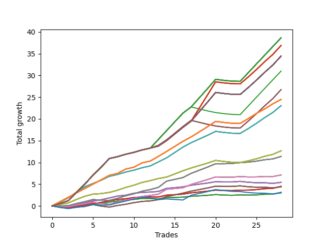

# Long Wallace Doodle 019 
- Symbol: AAPL_Unlimited
- Date Range: 03/23/2022 - 07/08/2022
- Trading Period: 7:20-12:30
- Number of Trades: 28



| Name | Win Percent | Profit | Avg Profit / Trade | Avg Time / Trade |      | Name | Win Percent | Profit | Avg Profit / Trade | Avg Time / Trade |
| ---- | ----------- | ------ | ------------------ | ---------------- | ---- | ---- | ----------- | ------ | ------------------ | ---------------- |
| Sorted By <br> Profit | | | | | | Sorted By <br> Win Percentage ||||
| One Hundred Twenty-Seven | 89.29 | 19325.00 | 690.18 | 160:07 |     | One Hundred Twenty-Seven | 89.29 | 19325.00 | 690.18 | 160:07 |
| One Hundred Twenty-Two | 89.29 | 19325.00 | 690.18 | 160:07 |     | One Hundred Twenty-Two | 89.29 | 19325.00 | 690.18 | 160:07 |
| One Hundred Seventeen | 89.29 | 19325.00 | 690.18 | 160:07 |     | One Hundred Seventeen | 89.29 | 19325.00 | 690.18 | 160:07 |
| One Hundred Twelve | 89.29 | 19325.00 | 690.18 | 160:07 |     | One Hundred Twelve | 89.29 | 19325.00 | 690.18 | 160:07 |
| One Hundred Seven | 89.29 | 19325.00 | 690.18 | 160:07 |     | One Hundred Seven | 89.29 | 19325.00 | 690.18 | 160:07 |
| One Hundred Two | 89.29 | 19325.00 | 690.18 | 160:07 |     | One Hundred Two | 89.29 | 19325.00 | 690.18 | 160:07 |
| Ninety-Two | 89.29 | 19325.00 | 690.18 | 160:07 |     | Ninety-Two | 89.29 | 19325.00 | 690.18 | 160:07 |
| Eighty-Two | 89.29 | 19325.00 | 690.18 | 160:07 |     | Eighty-Two | 89.29 | 19325.00 | 690.18 | 160:07 |
| One Hundred Twenty-Eight | 89.29 | 18445.00 | 658.75 | 187:15 |     | One Hundred Twenty-Eight | 89.29 | 18445.00 | 658.75 | 187:15 |
| One Hundred Twenty-Three | 89.29 | 18445.00 | 658.75 | 187:15 |     | One Hundred Twenty-Three | 89.29 | 18445.00 | 658.75 | 187:15 |
| One Hundred Eighteen | 89.29 | 18445.00 | 658.75 | 187:15 |     | One Hundred Eighteen | 89.29 | 18445.00 | 658.75 | 187:15 |
| One Hundred Thirteen | 89.29 | 18445.00 | 658.75 | 187:15 |     | One Hundred Thirteen | 89.29 | 18445.00 | 658.75 | 187:15 |
| One Hundred Eight | 89.29 | 18445.00 | 658.75 | 187:15 |     | One Hundred Eight | 89.29 | 18445.00 | 658.75 | 187:15 |
| One Hundred Three | 89.29 | 18445.00 | 658.75 | 187:15 |     | One Hundred Three | 89.29 | 18445.00 | 658.75 | 187:15 |
| Ninety-Three | 89.29 | 18445.00 | 658.75 | 187:15 |     | Ninety-Three | 89.29 | 18445.00 | 658.75 | 187:15 |
| Eighty-Three | 89.29 | 18445.00 | 658.75 | 187:15 |     | Eighty-Three | 89.29 | 18445.00 | 658.75 | 187:15 |
| One Hundred Thirty | 89.29 | 17225.00 | 615.18 | 188:57 |     | One Hundred Thirty | 89.29 | 17225.00 | 615.18 | 188:57 |
| One Hundred Twenty-Nine | 89.29 | 17225.00 | 615.18 | 188:57 |     | One Hundred Twenty-Nine | 89.29 | 17225.00 | 615.18 | 188:57 |
| One Hundred Twenty-Five | 89.29 | 17225.00 | 615.18 | 188:57 |     | One Hundred Twenty-Five | 89.29 | 17225.00 | 615.18 | 188:57 |
| One Hundred Twenty-Four | 89.29 | 17225.00 | 615.18 | 188:57 |     | One Hundred Twenty-Four | 89.29 | 17225.00 | 615.18 | 188:57 |
| One Hundred Twenty | 89.29 | 17225.00 | 615.18 | 188:57 |     | One Hundred Twenty | 89.29 | 17225.00 | 615.18 | 188:57 |
| One Hundred Ninteen | 89.29 | 17225.00 | 615.18 | 188:57 |     | One Hundred Ninteen | 89.29 | 17225.00 | 615.18 | 188:57 |
| One Hundred Fifteen | 89.29 | 17225.00 | 615.18 | 188:57 |     | One Hundred Fifteen | 89.29 | 17225.00 | 615.18 | 188:57 |
| One Hundred Fourteen | 89.29 | 17225.00 | 615.18 | 188:57 |     | One Hundred Fourteen | 89.29 | 17225.00 | 615.18 | 188:57 |
| One Hundred Ten | 89.29 | 17225.00 | 615.18 | 188:57 |     | One Hundred Ten | 89.29 | 17225.00 | 615.18 | 188:57 |
| One Hundred Nine | 89.29 | 17225.00 | 615.18 | 188:57 |     | One Hundred Nine | 89.29 | 17225.00 | 615.18 | 188:57 |
| One Hundred Five | 89.29 | 17225.00 | 615.18 | 188:57 |     | One Hundred Five | 89.29 | 17225.00 | 615.18 | 188:57 |
| One Hundred Four | 89.29 | 17225.00 | 615.18 | 188:57 |     | One Hundred Four | 89.29 | 17225.00 | 615.18 | 188:57 |
| Ninety-Five | 89.29 | 17225.00 | 615.18 | 188:57 |     | Ninety-Five | 89.29 | 17225.00 | 615.18 | 188:57 |
| Ninety-Four | 89.29 | 17225.00 | 615.18 | 188:57 |     | Ninety-Four | 89.29 | 17225.00 | 615.18 | 188:57 |
| Eighty-Five | 89.29 | 17225.00 | 615.18 | 188:57 |     | Eighty-Five | 89.29 | 17225.00 | 615.18 | 188:57 |
| Eighty-Four | 89.29 | 17225.00 | 615.18 | 188:57 |     | Eighty-Four | 89.29 | 17225.00 | 615.18 | 188:57 |
| Ninety-Seven | 78.57 | 15500.00 | 553.57 | 155:53 |     | One Hundred Twenty-Six | 89.29 | 12240.00 | 437.14 | 111:28 |
| One Hundred | 78.57 | 13370.00 | 477.50 | 177:31 |     | One Hundred Twenty-One | 89.29 | 12240.00 | 437.14 | 111:28 |
| Ninety-Nine | 78.57 | 13370.00 | 477.50 | 177:31 |     | One Hundred Sixteen | 89.29 | 12240.00 | 437.14 | 111:28 |
| Ninety-Eight | 78.57 | 13370.00 | 477.50 | 177:31 |     | One Hundred Eleven | 89.29 | 12240.00 | 437.14 | 111:28 |
| One Hundred Twenty-Six | 89.29 | 12240.00 | 437.14 | 111:28 |     | One Hundred Six | 89.29 | 12240.00 | 437.14 | 111:28 |
| One Hundred Twenty-One | 89.29 | 12240.00 | 437.14 | 111:28 |     | One Hundred One | 89.29 | 12240.00 | 437.14 | 111:28 |
| One Hundred Sixteen | 89.29 | 12240.00 | 437.14 | 111:28 |     | Ninety-Six | 89.29 | 12240.00 | 437.14 | 111:28 |
| One Hundred Eleven | 89.29 | 12240.00 | 437.14 | 111:28 |     | Ninety-One | 89.29 | 12240.00 | 437.14 | 111:28 |
| One Hundred Six | 89.29 | 12240.00 | 437.14 | 111:28 |     | Eighty-One | 89.29 | 12240.00 | 437.14 | 111:28 |
| One Hundred One | 89.29 | 12240.00 | 437.14 | 111:28 |     | Seventy-One | 89.29 | 11525.00 | 411.61 | 112:54 |
| Ninety-Six | 89.29 | 12240.00 | 437.14 | 111:28 |     | Sixty-Three | 89.29 | 11525.00 | 411.61 | 112:54 |
| Ninety-One | 89.29 | 12240.00 | 437.14 | 111:28 |     | Fifty-Five | 89.29 | 11525.00 | 411.61 | 112:54 |
| Eighty-One | 89.29 | 12240.00 | 437.14 | 111:28 |     | Forty-Seven | 89.29 | 11525.00 | 411.61 | 112:54 |
| Seventy-One | 89.29 | 11525.00 | 411.61 | 112:54 |     | Seven | 89.29 | 11525.00 | 411.61 | 112:54 |
| Sixty-Three | 89.29 | 11525.00 | 411.61 | 112:54 |     | Seventy | 89.29 | 6335.00 | 226.25 | 81:56 |
| Fifty-Five | 89.29 | 11525.00 | 411.61 | 112:54 |     | Sixty-Two | 89.29 | 6335.00 | 226.25 | 81:56 |
| Forty-Seven | 89.29 | 11525.00 | 411.61 | 112:54 |     | Fifty-Four | 89.29 | 6335.00 | 226.25 | 81:56 |
| Seven | 89.29 | 11525.00 | 411.61 | 112:54 |     | Forty-Six | 89.29 | 6335.00 | 226.25 | 81:56 |
| Seventy | 89.29 | 6335.00 | 226.25 | 81:56 |     | Six | 89.29 | 6335.00 | 226.25 | 81:56 |
| Sixty-Two | 89.29 | 6335.00 | 226.25 | 81:56 |     | Sixty-Nine | 89.29 | 5690.00 | 203.21 | 53:18 |
| Fifty-Four | 89.29 | 6335.00 | 226.25 | 81:56 |     | Sixty-One | 89.29 | 5690.00 | 203.21 | 53:18 |
| Forty-Six | 89.29 | 6335.00 | 226.25 | 81:56 |     | Fifty-Three | 89.29 | 5690.00 | 203.21 | 53:18 |
| Six | 89.29 | 6335.00 | 226.25 | 81:56 |     | Forty-Five | 89.29 | 5690.00 | 203.21 | 53:18 |
| Sixty-Nine | 89.29 | 5690.00 | 203.21 | 53:18 |     | Five | 89.29 | 5690.00 | 203.21 | 53:18 |
| Sixty-One | 89.29 | 5690.00 | 203.21 | 53:18 |     | Sixty-Five | 82.14 | 2250.00 | 80.36 | 16:00 |
| Fifty-Three | 89.29 | 5690.00 | 203.21 | 53:18 |     | Fifty-Seven | 82.14 | 2250.00 | 80.36 | 16:00 |
| Forty-Five | 89.29 | 5690.00 | 203.21 | 53:18 |     | Forty-Nine | 82.14 | 2250.00 | 80.36 | 16:00 |
| Five | 89.29 | 5690.00 | 203.21 | 53:18 |     | Forty-One | 82.14 | 2250.00 | 80.36 | 16:00 |
| Sixty-Eight | 75.00 | 3560.00 | 127.14 | 42:41 |     | One | 82.14 | 2250.00 | 80.36 | 16:00 |
| Sixty | 75.00 | 3560.00 | 127.14 | 42:41 |     | Ninety-Seven | 78.57 | 15500.00 | 553.57 | 155:53 |
| Fifty-Two | 75.00 | 3560.00 | 127.14 | 42:41 |     | One Hundred | 78.57 | 13370.00 | 477.50 | 177:31 |
| Forty-Four | 75.00 | 3560.00 | 127.14 | 42:41 |     | Ninety-Nine | 78.57 | 13370.00 | 477.50 | 177:31 |
| Four | 75.00 | 3560.00 | 127.14 | 42:41 |     | Ninety-Eight | 78.57 | 13370.00 | 477.50 | 177:31 |
| Sixty-Six | 75.00 | 2710.00 | 96.79 | 23:17 |     | Sixty-Four | 78.57 | 1555.00 | 55.54 | 11:54 |
| Fifty-Eight | 75.00 | 2710.00 | 96.79 | 23:17 |     | Fifty-Six | 78.57 | 1555.00 | 55.54 | 11:54 |
| Fifty | 75.00 | 2710.00 | 96.79 | 23:17 |     | Forty-Eight | 78.57 | 1555.00 | 55.54 | 11:54 |
| Forty-Two | 75.00 | 2710.00 | 96.79 | 23:17 |     | Forty | 78.57 | 1555.00 | 55.54 | 11:54 |
| Two | 75.00 | 2710.00 | 96.79 | 23:17 |     | Zero | 78.57 | 1555.00 | 55.54 | 11:54 |
| Sixty-Five | 82.14 | 2250.00 | 80.36 | 16:00 |     | Sixty-Eight | 75.00 | 3560.00 | 127.14 | 42:41 |
| Fifty-Seven | 82.14 | 2250.00 | 80.36 | 16:00 |     | Sixty | 75.00 | 3560.00 | 127.14 | 42:41 |
| Forty-Nine | 82.14 | 2250.00 | 80.36 | 16:00 |     | Fifty-Two | 75.00 | 3560.00 | 127.14 | 42:41 |
| Forty-One | 82.14 | 2250.00 | 80.36 | 16:00 |     | Forty-Four | 75.00 | 3560.00 | 127.14 | 42:41 |
| One | 82.14 | 2250.00 | 80.36 | 16:00 |     | Four | 75.00 | 3560.00 | 127.14 | 42:41 |
| Sixty-Seven | 67.86 | 2195.00 | 78.39 | 30:29 |     | Sixty-Six | 75.00 | 2710.00 | 96.79 | 23:17 |
| Fifty-Nine | 67.86 | 2195.00 | 78.39 | 30:29 |     | Fifty-Eight | 75.00 | 2710.00 | 96.79 | 23:17 |
| Fifty-One | 67.86 | 2195.00 | 78.39 | 30:29 |     | Fifty | 75.00 | 2710.00 | 96.79 | 23:17 |
| Forty-Three | 67.86 | 2195.00 | 78.39 | 30:29 |     | Forty-Two | 75.00 | 2710.00 | 96.79 | 23:17 |
| Three | 67.86 | 2195.00 | 78.39 | 30:29 |     | Two | 75.00 | 2710.00 | 96.79 | 23:17 |
| Sixty-Four | 78.57 | 1555.00 | 55.54 | 11:54 |     | Sixty-Seven | 67.86 | 2195.00 | 78.39 | 30:29 |
| Fifty-Six | 78.57 | 1555.00 | 55.54 | 11:54 |     | Fifty-Nine | 67.86 | 2195.00 | 78.39 | 30:29 |
| Forty-Eight | 78.57 | 1555.00 | 55.54 | 11:54 |     | Fifty-One | 67.86 | 2195.00 | 78.39 | 30:29 |
| Forty | 78.57 | 1555.00 | 55.54 | 11:54 |     | Forty-Three | 67.86 | 2195.00 | 78.39 | 30:29 |
| Zero | 78.57 | 1555.00 | 55.54 | 11:54 |     | Three | 67.86 | 2195.00 | 78.39 | 30:29 |
| Seventy-Three | 50.00 | 1490.00 | 53.21 | 17:56 |     | Seventy-Three | 50.00 | 1490.00 | 53.21 | 17:56 |

## NO STOPLOSS

### Test Zero
* Sell when price hits the middle line of the 20p bollinger
* No Stoploss
* Results:
```
Total Trades: 28
Percent Up: 78.57
Percent Down: 21.43
Total Points Moved Up: 3.11
Potential Profit: 1555.00
Total Points Ups: 3.63 Count Ups: 22
Total Points Downs: -0.52 Count Downs: 6
```

<details><summary>Trades</summary>

<code>In: 2022-03-25 08:12:00		Out: 2022-03-25 08:30:30		Total Position Time: 18:30		Total Move Up: -0.17		Total to Date: -0.17</code> <br />
<code>In: 2022-03-25 08:14:00		Out: 2022-03-25 08:30:30		Total Position Time: 16:30		Total Move Up: -0.07		Total to Date: -0.24</code> <br />
<code>In: 2022-03-28 08:50:00		Out: 2022-03-28 09:01:40		Total Position Time: 11:40		Total Move Up: 0.22		Total to Date: -0.02</code> <br />
<code>In: 2022-03-28 08:51:00		Out: 2022-03-28 09:01:40		Total Position Time: 10:40		Total Move Up: 0.14		Total to Date: 0.12</code> <br />
<code>In: 2022-03-29 09:36:00		Out: 2022-03-29 09:43:15		Total Position Time: 07:15		Total Move Up: 0.24		Total to Date: 0.36</code> <br />
<code>In: 2022-04-07 07:43:00		Out: 2022-04-07 07:54:30		Total Position Time: 11:30		Total Move Up: 0.20		Total to Date: 0.56</code> <br />
<code>In: 2022-04-07 07:44:00		Out: 2022-04-07 07:54:30		Total Position Time: 10:30		Total Move Up: 0.33		Total to Date: 0.89</code> <br />
<code>In: 2022-04-08 11:07:00		Out: 2022-04-08 11:08:25		Total Position Time: 01:25		Total Move Up: 0.21		Total to Date: 1.10</code> <br />
<code>In: 2022-04-08 11:29:00		Out: 2022-04-08 11:39:40		Total Position Time: 10:40		Total Move Up: 0.20		Total to Date: 1.30</code> <br />
<code>In: 2022-04-08 11:07:00		Out: 2022-04-08 11:08:25		Total Position Time: 01:25		Total Move Up: 0.21		Total to Date: 1.51</code> <br />
<code>In: 2022-04-08 11:29:00		Out: 2022-04-08 11:39:40		Total Position Time: 10:40		Total Move Up: 0.20		Total to Date: 1.71</code> <br />
<code>In: 2022-04-27 12:00:00		Out: 2022-04-27 12:13:50		Total Position Time: 13:50		Total Move Up: 0.00		Total to Date: 1.71</code> <br />
<code>In: 2022-05-16 07:52:00		Out: 2022-05-16 08:05:10		Total Position Time: 13:10		Total Move Up: -0.08		Total to Date: 1.63</code> <br />
<code>In: 2022-05-17 11:24:00		Out: 2022-05-17 11:37:20		Total Position Time: 13:20		Total Move Up: 0.26		Total to Date: 1.89</code> <br />
<code>In: 2022-05-25 09:27:00		Out: 2022-05-25 09:44:25		Total Position Time: 17:25		Total Move Up: 0.06		Total to Date: 1.95</code> <br />
<code>In: 2022-05-25 09:29:00		Out: 2022-05-25 09:44:25		Total Position Time: 15:25		Total Move Up: 0.07		Total to Date: 2.02</code> <br />
<code>In: 2022-06-14 12:15:00		Out: 2022-06-14 12:22:10		Total Position Time: 07:10		Total Move Up: 0.20		Total to Date: 2.22</code> <br />
<code>In: 2022-06-15 09:59:00		Out: 2022-06-15 10:11:05		Total Position Time: 12:05		Total Move Up: 0.11		Total to Date: 2.33</code> <br />
<code>In: 2022-06-15 10:00:00		Out: 2022-06-15 10:11:05		Total Position Time: 11:05		Total Move Up: 0.11		Total to Date: 2.44</code> <br />
<code>In: 2022-06-15 10:01:00		Out: 2022-06-15 10:11:05		Total Position Time: 10:05		Total Move Up: 0.17		Total to Date: 2.61</code> <br />
<code>In: 2022-06-27 10:42:00		Out: 2022-06-27 11:03:15		Total Position Time: 21:15		Total Move Up: -0.11		Total to Date: 2.50</code> <br />
<code>In: 2022-06-27 10:43:00		Out: 2022-06-27 11:03:15		Total Position Time: 20:15		Total Move Up: -0.05		Total to Date: 2.45</code> <br />
<code>In: 2022-06-27 10:50:00		Out: 2022-06-27 11:03:15		Total Position Time: 13:15		Total Move Up: 0.08		Total to Date: 2.53</code> <br />
<code>In: 2022-07-06 08:05:00		Out: 2022-07-06 08:19:05		Total Position Time: 14:05		Total Move Up: -0.04		Total to Date: 2.49</code> <br />
<code>In: 2022-07-06 08:07:00		Out: 2022-07-06 08:19:05		Total Position Time: 12:05		Total Move Up: 0.05		Total to Date: 2.54</code> <br />
<code>In: 2022-07-06 08:08:00		Out: 2022-07-06 08:19:05		Total Position Time: 11:05		Total Move Up: 0.15		Total to Date: 2.69</code> <br />
<code>In: 2022-07-06 08:09:00		Out: 2022-07-06 08:19:05		Total Position Time: 10:05		Total Move Up: 0.02		Total to Date: 2.71</code> <br />
<code>In: 2022-07-06 08:12:00		Out: 2022-07-06 08:19:05		Total Position Time: 07:05		Total Move Up: 0.40		Total to Date: 3.11</code> <br />


</details>

### Test One
* Sell when the price hits the upper line of the 20p 1std bollinger
* No Stoploss
* Results:
```
Total Trades: 28
Percent Up: 82.14
Percent Down: 17.86
Total Points Moved Up: 4.50
Potential Profit: 2250.00
Total Points Ups: 5.05 Count Ups: 23
Total Points Downs: -0.55 Count Downs: 5
```

<details><summary>Trades</summary>

<code>In: 2022-03-25 08:12:00		Out: 2022-03-25 08:41:25		Total Position Time: 29:25		Total Move Up: -0.24		Total to Date: -0.24</code> <br />
<code>In: 2022-03-25 08:14:00		Out: 2022-03-25 08:41:25		Total Position Time: 27:25		Total Move Up: -0.14		Total to Date: -0.38</code> <br />
<code>In: 2022-03-28 08:50:00		Out: 2022-03-28 09:02:05		Total Position Time: 12:05		Total Move Up: 0.34		Total to Date: -0.04</code> <br />
<code>In: 2022-03-28 08:51:00		Out: 2022-03-28 09:02:05		Total Position Time: 11:05		Total Move Up: 0.26		Total to Date: 0.22</code> <br />
<code>In: 2022-03-29 09:36:00		Out: 2022-03-29 09:45:05		Total Position Time: 09:05		Total Move Up: 0.36		Total to Date: 0.58</code> <br />
<code>In: 2022-04-07 07:43:00		Out: 2022-04-07 08:00:05		Total Position Time: 17:05		Total Move Up: 0.24		Total to Date: 0.82</code> <br />
<code>In: 2022-04-07 07:44:00		Out: 2022-04-07 08:00:05		Total Position Time: 16:05		Total Move Up: 0.37		Total to Date: 1.19</code> <br />
<code>In: 2022-04-08 11:07:00		Out: 2022-04-08 11:11:10		Total Position Time: 04:10		Total Move Up: 0.30		Total to Date: 1.49</code> <br />
<code>In: 2022-04-08 11:29:00		Out: 2022-04-08 11:45:40		Total Position Time: 16:40		Total Move Up: 0.15		Total to Date: 1.64</code> <br />
<code>In: 2022-04-08 11:07:00		Out: 2022-04-08 11:11:10		Total Position Time: 04:10		Total Move Up: 0.30		Total to Date: 1.94</code> <br />
<code>In: 2022-04-08 11:29:00		Out: 2022-04-08 11:45:40		Total Position Time: 16:40		Total Move Up: 0.15		Total to Date: 2.09</code> <br />
<code>In: 2022-04-27 12:00:00		Out: 2022-04-27 12:27:15		Total Position Time: 27:15		Total Move Up: 0.02		Total to Date: 2.11</code> <br />
<code>In: 2022-05-16 07:52:00		Out: 2022-05-16 08:09:30		Total Position Time: 17:30		Total Move Up: -0.05		Total to Date: 2.06</code> <br />
<code>In: 2022-05-17 11:24:00		Out: 2022-05-17 11:39:40		Total Position Time: 15:40		Total Move Up: 0.42		Total to Date: 2.48</code> <br />
<code>In: 2022-05-25 09:27:00		Out: 2022-05-25 09:45:15		Total Position Time: 18:15		Total Move Up: 0.11		Total to Date: 2.59</code> <br />
<code>In: 2022-05-25 09:29:00		Out: 2022-05-25 09:45:15		Total Position Time: 16:15		Total Move Up: 0.12		Total to Date: 2.71</code> <br />
<code>In: 2022-06-14 12:15:00		Out: 2022-06-14 12:26:30		Total Position Time: 11:30		Total Move Up: 0.30		Total to Date: 3.01</code> <br />
<code>In: 2022-06-15 09:59:00		Out: 2022-06-15 10:12:45		Total Position Time: 13:45		Total Move Up: 0.19		Total to Date: 3.20</code> <br />
<code>In: 2022-06-15 10:00:00		Out: 2022-06-15 10:12:45		Total Position Time: 12:45		Total Move Up: 0.19		Total to Date: 3.39</code> <br />
<code>In: 2022-06-15 10:01:00		Out: 2022-06-15 10:12:45		Total Position Time: 11:45		Total Move Up: 0.25		Total to Date: 3.64</code> <br />
<code>In: 2022-06-27 10:42:00		Out: 2022-06-27 11:05:00		Total Position Time: 23:00		Total Move Up: -0.09		Total to Date: 3.55</code> <br />
<code>In: 2022-06-27 10:43:00		Out: 2022-06-27 11:05:00		Total Position Time: 22:00		Total Move Up: -0.03		Total to Date: 3.52</code> <br />
<code>In: 2022-06-27 10:50:00		Out: 2022-06-27 11:05:00		Total Position Time: 15:00		Total Move Up: 0.10		Total to Date: 3.62</code> <br />
<code>In: 2022-07-06 08:05:00		Out: 2022-07-06 08:24:10		Total Position Time: 19:10		Total Move Up: 0.02		Total to Date: 3.64</code> <br />
<code>In: 2022-07-06 08:07:00		Out: 2022-07-06 08:24:10		Total Position Time: 17:10		Total Move Up: 0.11		Total to Date: 3.75</code> <br />
<code>In: 2022-07-06 08:08:00		Out: 2022-07-06 08:24:10		Total Position Time: 16:10		Total Move Up: 0.21		Total to Date: 3.96</code> <br />
<code>In: 2022-07-06 08:09:00		Out: 2022-07-06 08:24:10		Total Position Time: 15:10		Total Move Up: 0.08		Total to Date: 4.04</code> <br />
<code>In: 2022-07-06 08:12:00		Out: 2022-07-06 08:24:10		Total Position Time: 12:10		Total Move Up: 0.46		Total to Date: 4.50</code> <br />


</details>

### Test Two
* Sell when the price hits the upper line of the 20p 2std bollinger
* No Stoploss
* Results:
```
Total Trades: 28
Percent Up: 75.00
Percent Down: 25.00
Total Points Moved Up: 5.42
Potential Profit: 2710.00
Total Points Ups: 6.12 Count Ups: 21
Total Points Downs: -0.70 Count Downs: 7
```

<details><summary>Trades</summary>

<code>In: 2022-03-25 08:12:00		Out: 2022-03-25 08:42:05		Total Position Time: 30:05		Total Move Up: -0.14		Total to Date: -0.14</code> <br />
<code>In: 2022-03-25 08:14:00		Out: 2022-03-25 08:42:05		Total Position Time: 28:05		Total Move Up: -0.04		Total to Date: -0.18</code> <br />
<code>In: 2022-03-28 08:50:00		Out: 2022-03-28 09:07:10		Total Position Time: 17:10		Total Move Up: 0.45		Total to Date: 0.27</code> <br />
<code>In: 2022-03-28 08:51:00		Out: 2022-03-28 09:07:10		Total Position Time: 16:10		Total Move Up: 0.37		Total to Date: 0.64</code> <br />
<code>In: 2022-03-29 09:36:00		Out: 2022-03-29 09:45:30		Total Position Time: 09:30		Total Move Up: 0.50		Total to Date: 1.14</code> <br />
<code>In: 2022-04-07 07:43:00		Out: 2022-04-07 08:01:05		Total Position Time: 18:05		Total Move Up: 0.28		Total to Date: 1.42</code> <br />
<code>In: 2022-04-07 07:44:00		Out: 2022-04-07 08:01:05		Total Position Time: 17:05		Total Move Up: 0.41		Total to Date: 1.83</code> <br />
<code>In: 2022-04-08 11:07:00		Out: 2022-04-08 11:20:45		Total Position Time: 13:45		Total Move Up: 0.44		Total to Date: 2.27</code> <br />
<code>In: 2022-04-08 11:29:00		Out: 2022-04-08 11:46:10		Total Position Time: 17:10		Total Move Up: 0.20		Total to Date: 2.47</code> <br />
<code>In: 2022-04-08 11:07:00		Out: 2022-04-08 11:20:45		Total Position Time: 13:45		Total Move Up: 0.44		Total to Date: 2.91</code> <br />
<code>In: 2022-04-08 11:29:00		Out: 2022-04-08 11:46:10		Total Position Time: 17:10		Total Move Up: 0.20		Total to Date: 3.11</code> <br />
<code>In: 2022-04-27 12:00:00		Out: 2022-04-27 12:27:30		Total Position Time: 27:30		Total Move Up: 0.08		Total to Date: 3.19</code> <br />
<code>In: 2022-05-16 07:52:00		Out: 2022-05-16 08:09:55		Total Position Time: 17:55		Total Move Up: 0.14		Total to Date: 3.33</code> <br />
<code>In: 2022-05-17 11:24:00		Out: 2022-05-17 11:40:00		Total Position Time: 16:00		Total Move Up: 0.70		Total to Date: 4.03</code> <br />
<code>In: 2022-05-25 09:27:00		Out: 2022-05-25 09:47:30		Total Position Time: 20:30		Total Move Up: 0.17		Total to Date: 4.20</code> <br />
<code>In: 2022-05-25 09:29:00		Out: 2022-05-25 09:47:30		Total Position Time: 18:30		Total Move Up: 0.18		Total to Date: 4.38</code> <br />
<code>In: 2022-06-14 12:15:00		Out: 2022-06-14 12:27:10		Total Position Time: 12:10		Total Move Up: 0.38		Total to Date: 4.76</code> <br />
<code>In: 2022-06-15 09:59:00		Out: 2022-06-15 10:13:35		Total Position Time: 14:35		Total Move Up: 0.25		Total to Date: 5.01</code> <br />
<code>In: 2022-06-15 10:00:00		Out: 2022-06-15 10:13:35		Total Position Time: 13:35		Total Move Up: 0.25		Total to Date: 5.26</code> <br />
<code>In: 2022-06-15 10:01:00		Out: 2022-06-15 10:13:35		Total Position Time: 12:35		Total Move Up: 0.31		Total to Date: 5.57</code> <br />
<code>In: 2022-06-27 10:42:00		Out: 2022-06-27 11:17:10		Total Position Time: 35:10		Total Move Up: -0.06		Total to Date: 5.51</code> <br />
<code>In: 2022-06-27 10:43:00		Out: 2022-06-27 11:17:10		Total Position Time: 34:10		Total Move Up: 0.00		Total to Date: 5.51</code> <br />
<code>In: 2022-06-27 10:50:00		Out: 2022-06-27 11:17:10		Total Position Time: 27:10		Total Move Up: 0.13		Total to Date: 5.64</code> <br />
<code>In: 2022-07-06 08:05:00		Out: 2022-07-06 08:49:05		Total Position Time: 44:05		Total Move Up: -0.20		Total to Date: 5.44</code> <br />
<code>In: 2022-07-06 08:07:00		Out: 2022-07-06 08:49:05		Total Position Time: 42:05		Total Move Up: -0.11		Total to Date: 5.33</code> <br />
<code>In: 2022-07-06 08:08:00		Out: 2022-07-06 08:49:05		Total Position Time: 41:05		Total Move Up: -0.01		Total to Date: 5.32</code> <br />
<code>In: 2022-07-06 08:09:00		Out: 2022-07-06 08:49:05		Total Position Time: 40:05		Total Move Up: -0.14		Total to Date: 5.18</code> <br />
<code>In: 2022-07-06 08:12:00		Out: 2022-07-06 08:49:05		Total Position Time: 37:05		Total Move Up: 0.24		Total to Date: 5.42</code> <br />


</details>

### Test Three
* Sell when price hits the middle line of the 50p bollinger
* No Stoploss
* Results:
```
Total Trades: 28
Percent Up: 67.86
Percent Down: 32.14
Total Points Moved Up: 4.39
Potential Profit: 2195.00
Total Points Ups: 6.06 Count Ups: 19
Total Points Downs: -1.67 Count Downs: 9
```

<details><summary>Trades</summary>

<code>In: 2022-03-25 08:12:00		Out: 2022-03-25 09:05:15		Total Position Time: 53:15		Total Move Up: -0.33		Total to Date: -0.33</code> <br />
<code>In: 2022-03-25 08:14:00		Out: 2022-03-25 09:05:15		Total Position Time: 51:15		Total Move Up: -0.23		Total to Date: -0.56</code> <br />
<code>In: 2022-03-28 08:50:00		Out: 2022-03-28 09:23:30		Total Position Time: 33:30		Total Move Up: 0.26		Total to Date: -0.30</code> <br />
<code>In: 2022-03-28 08:51:00		Out: 2022-03-28 09:23:30		Total Position Time: 32:30		Total Move Up: 0.18		Total to Date: -0.12</code> <br />
<code>In: 2022-03-29 09:36:00		Out: 2022-03-29 09:45:20		Total Position Time: 09:20		Total Move Up: 0.44		Total to Date: 0.32</code> <br />
<code>In: 2022-04-07 07:43:00		Out: 2022-04-07 08:48:10		Total Position Time: 65:10		Total Move Up: -0.36		Total to Date: -0.04</code> <br />
<code>In: 2022-04-07 07:44:00		Out: 2022-04-07 08:48:10		Total Position Time: 64:10		Total Move Up: -0.23		Total to Date: -0.27</code> <br />
<code>In: 2022-04-08 11:07:00		Out: 2022-04-08 11:20:30		Total Position Time: 13:30		Total Move Up: 0.37		Total to Date: 0.10</code> <br />
<code>In: 2022-04-08 11:29:00		Out: 2022-04-08 11:40:40		Total Position Time: 11:40		Total Move Up: 0.28		Total to Date: 0.38</code> <br />
<code>In: 2022-04-08 11:07:00		Out: 2022-04-08 11:20:30		Total Position Time: 13:30		Total Move Up: 0.37		Total to Date: 0.75</code> <br />
<code>In: 2022-04-08 11:29:00		Out: 2022-04-08 11:40:40		Total Position Time: 11:40		Total Move Up: 0.28		Total to Date: 1.03</code> <br />
<code>In: 2022-04-27 12:00:00		Out: 2022-04-27 12:35:30		Total Position Time: 35:30		Total Move Up: 0.12		Total to Date: 1.15</code> <br />
<code>In: 2022-05-16 07:52:00		Out: 2022-05-16 08:16:10		Total Position Time: 24:10		Total Move Up: 0.30		Total to Date: 1.45</code> <br />
<code>In: 2022-05-17 11:24:00		Out: 2022-05-17 11:40:00		Total Position Time: 16:00		Total Move Up: 0.70		Total to Date: 2.15</code> <br />
<code>In: 2022-05-25 09:27:00		Out: 2022-05-25 09:49:20		Total Position Time: 22:20		Total Move Up: 0.39		Total to Date: 2.54</code> <br />
<code>In: 2022-05-25 09:29:00		Out: 2022-05-25 09:49:20		Total Position Time: 20:20		Total Move Up: 0.40		Total to Date: 2.94</code> <br />
<code>In: 2022-06-14 12:15:00		Out: 2022-06-14 12:27:25		Total Position Time: 12:25		Total Move Up: 0.46		Total to Date: 3.40</code> <br />
<code>In: 2022-06-15 09:59:00		Out: 2022-06-15 10:20:55		Total Position Time: 21:55		Total Move Up: 0.36		Total to Date: 3.76</code> <br />
<code>In: 2022-06-15 10:00:00		Out: 2022-06-15 10:20:55		Total Position Time: 20:55		Total Move Up: 0.36		Total to Date: 4.12</code> <br />
<code>In: 2022-06-15 10:01:00		Out: 2022-06-15 10:20:55		Total Position Time: 19:55		Total Move Up: 0.42		Total to Date: 4.54</code> <br />
<code>In: 2022-06-27 10:42:00		Out: 2022-06-27 11:17:10		Total Position Time: 35:10		Total Move Up: -0.06		Total to Date: 4.48</code> <br />
<code>In: 2022-06-27 10:43:00		Out: 2022-06-27 11:17:10		Total Position Time: 34:10		Total Move Up: 0.00		Total to Date: 4.48</code> <br />
<code>In: 2022-06-27 10:50:00		Out: 2022-06-27 11:17:10		Total Position Time: 27:10		Total Move Up: 0.13		Total to Date: 4.61</code> <br />
<code>In: 2022-07-06 08:05:00		Out: 2022-07-06 08:49:05		Total Position Time: 44:05		Total Move Up: -0.20		Total to Date: 4.41</code> <br />
<code>In: 2022-07-06 08:07:00		Out: 2022-07-06 08:49:05		Total Position Time: 42:05		Total Move Up: -0.11		Total to Date: 4.30</code> <br />
<code>In: 2022-07-06 08:08:00		Out: 2022-07-06 08:49:05		Total Position Time: 41:05		Total Move Up: -0.01		Total to Date: 4.29</code> <br />
<code>In: 2022-07-06 08:09:00		Out: 2022-07-06 08:49:05		Total Position Time: 40:05		Total Move Up: -0.14		Total to Date: 4.15</code> <br />
<code>In: 2022-07-06 08:12:00		Out: 2022-07-06 08:49:05		Total Position Time: 37:05		Total Move Up: 0.24		Total to Date: 4.39</code> <br />


</details>

### Test Four
* Sell when the price hits the upper line of the 50p 1std bollinger
* No Stoploss
* Results:
```
Total Trades: 28
Percent Up: 75.00
Percent Down: 25.00
Total Points Moved Up: 7.12
Potential Profit: 3560.00
Total Points Ups: 7.95 Count Ups: 21
Total Points Downs: -0.83 Count Downs: 7
```

<details><summary>Trades</summary>

<code>In: 2022-03-25 08:12:00		Out: 2022-03-25 09:09:05		Total Position Time: 57:05		Total Move Up: -0.14		Total to Date: -0.14</code> <br />
<code>In: 2022-03-25 08:14:00		Out: 2022-03-25 09:09:05		Total Position Time: 55:05		Total Move Up: -0.04		Total to Date: -0.18</code> <br />
<code>In: 2022-03-28 08:50:00		Out: 2022-03-28 09:30:50		Total Position Time: 40:50		Total Move Up: 0.36		Total to Date: 0.18</code> <br />
<code>In: 2022-03-28 08:51:00		Out: 2022-03-28 09:30:50		Total Position Time: 39:50		Total Move Up: 0.28		Total to Date: 0.46</code> <br />
<code>In: 2022-03-29 09:36:00		Out: 2022-03-29 10:29:15		Total Position Time: 53:15		Total Move Up: 0.39		Total to Date: 0.85</code> <br />
<code>In: 2022-04-07 07:43:00		Out: 2022-04-07 09:05:20		Total Position Time: 82:20		Total Move Up: -0.31		Total to Date: 0.54</code> <br />
<code>In: 2022-04-07 07:44:00		Out: 2022-04-07 09:05:20		Total Position Time: 81:20		Total Move Up: -0.18		Total to Date: 0.36</code> <br />
<code>In: 2022-04-08 11:07:00		Out: 2022-04-08 11:21:10		Total Position Time: 14:10		Total Move Up: 0.51		Total to Date: 0.87</code> <br />
<code>In: 2022-04-08 11:29:00		Out: 2022-04-08 11:48:15		Total Position Time: 19:15		Total Move Up: 0.40		Total to Date: 1.27</code> <br />
<code>In: 2022-04-08 11:07:00		Out: 2022-04-08 11:21:10		Total Position Time: 14:10		Total Move Up: 0.51		Total to Date: 1.78</code> <br />
<code>In: 2022-04-08 11:29:00		Out: 2022-04-08 11:48:15		Total Position Time: 19:15		Total Move Up: 0.40		Total to Date: 2.18</code> <br />
<code>In: 2022-04-27 12:00:00		Out: 2022-04-27 12:44:15		Total Position Time: 44:15		Total Move Up: 0.23		Total to Date: 2.41</code> <br />
<code>In: 2022-05-16 07:52:00		Out: 2022-05-16 08:33:25		Total Position Time: 41:25		Total Move Up: 0.30		Total to Date: 2.71</code> <br />
<code>In: 2022-05-17 11:24:00		Out: 2022-05-17 11:40:20		Total Position Time: 16:20		Total Move Up: 1.13		Total to Date: 3.84</code> <br />
<code>In: 2022-05-25 09:27:00		Out: 2022-05-25 10:29:35		Total Position Time: 62:35		Total Move Up: 0.16		Total to Date: 4.00</code> <br />
<code>In: 2022-05-25 09:29:00		Out: 2022-05-25 10:29:35		Total Position Time: 60:35		Total Move Up: 0.17		Total to Date: 4.17</code> <br />
<code>In: 2022-06-14 12:15:00		Out: 2022-06-14 12:30:50		Total Position Time: 15:50		Total Move Up: 0.76		Total to Date: 4.93</code> <br />
<code>In: 2022-06-15 09:59:00		Out: 2022-06-15 10:27:25		Total Position Time: 28:25		Total Move Up: 0.56		Total to Date: 5.49</code> <br />
<code>In: 2022-06-15 10:00:00		Out: 2022-06-15 10:27:25		Total Position Time: 27:25		Total Move Up: 0.56		Total to Date: 6.05</code> <br />
<code>In: 2022-06-15 10:01:00		Out: 2022-06-15 10:27:25		Total Position Time: 26:25		Total Move Up: 0.62		Total to Date: 6.67</code> <br />
<code>In: 2022-06-27 10:42:00		Out: 2022-06-27 11:33:25		Total Position Time: 51:25		Total Move Up: -0.06		Total to Date: 6.61</code> <br />
<code>In: 2022-06-27 10:43:00		Out: 2022-06-27 11:33:25		Total Position Time: 50:25		Total Move Up: 0.00		Total to Date: 6.61</code> <br />
<code>In: 2022-06-27 10:50:00		Out: 2022-06-27 11:33:25		Total Position Time: 43:25		Total Move Up: 0.13		Total to Date: 6.74</code> <br />
<code>In: 2022-07-06 08:05:00		Out: 2022-07-06 08:58:15		Total Position Time: 53:15		Total Move Up: -0.08		Total to Date: 6.66</code> <br />
<code>In: 2022-07-06 08:07:00		Out: 2022-07-06 08:58:15		Total Position Time: 51:15		Total Move Up: 0.01		Total to Date: 6.67</code> <br />
<code>In: 2022-07-06 08:08:00		Out: 2022-07-06 08:58:15		Total Position Time: 50:15		Total Move Up: 0.11		Total to Date: 6.78</code> <br />
<code>In: 2022-07-06 08:09:00		Out: 2022-07-06 08:58:15		Total Position Time: 49:15		Total Move Up: -0.02		Total to Date: 6.76</code> <br />
<code>In: 2022-07-06 08:12:00		Out: 2022-07-06 08:58:15		Total Position Time: 46:15		Total Move Up: 0.36		Total to Date: 7.12</code> <br />


</details>

### Test Five
* Sell when the price hits the upper line of the 50p 2std bollinger
* No Stoploss
* Results:
```
Total Trades: 28
Percent Up: 89.29
Percent Down: 10.71
Total Points Moved Up: 11.38
Potential Profit: 5690.00
Total Points Ups: 11.59 Count Ups: 25
Total Points Downs: -0.21 Count Downs: 3
```

<details><summary>Trades</summary>

<code>In: 2022-03-25 08:12:00		Out: 2022-03-25 09:11:30		Total Position Time: 59:30		Total Move Up: -0.02		Total to Date: -0.02</code> <br />
<code>In: 2022-03-25 08:14:00		Out: 2022-03-25 09:11:30		Total Position Time: 57:30		Total Move Up: 0.08		Total to Date: 0.06</code> <br />
<code>In: 2022-03-28 08:50:00		Out: 2022-03-28 09:36:00		Total Position Time: 46:00		Total Move Up: 0.50		Total to Date: 0.56</code> <br />
<code>In: 2022-03-28 08:51:00		Out: 2022-03-28 09:36:00		Total Position Time: 45:00		Total Move Up: 0.42		Total to Date: 0.98</code> <br />
<code>In: 2022-03-29 09:36:00		Out: 2022-03-29 10:40:00		Total Position Time: 64:00		Total Move Up: 0.49		Total to Date: 1.47</code> <br />
<code>In: 2022-04-07 07:43:00		Out: 2022-04-07 09:06:30		Total Position Time: 83:30		Total Move Up: -0.16		Total to Date: 1.31</code> <br />
<code>In: 2022-04-07 07:44:00		Out: 2022-04-07 09:06:30		Total Position Time: 82:30		Total Move Up: -0.03		Total to Date: 1.28</code> <br />
<code>In: 2022-04-08 11:07:00		Out: 2022-04-08 11:52:15		Total Position Time: 45:15		Total Move Up: 0.46		Total to Date: 1.74</code> <br />
<code>In: 2022-04-08 11:29:00		Out: 2022-04-08 11:52:15		Total Position Time: 23:15		Total Move Up: 0.59		Total to Date: 2.33</code> <br />
<code>In: 2022-04-08 11:07:00		Out: 2022-04-08 11:52:15		Total Position Time: 45:15		Total Move Up: 0.46		Total to Date: 2.79</code> <br />
<code>In: 2022-04-08 11:29:00		Out: 2022-04-08 11:52:15		Total Position Time: 23:15		Total Move Up: 0.59		Total to Date: 3.38</code> <br />
<code>In: 2022-04-27 12:00:00		Out: 2022-04-27 12:44:20		Total Position Time: 44:20		Total Move Up: 0.38		Total to Date: 3.76</code> <br />
<code>In: 2022-05-16 07:52:00		Out: 2022-05-16 08:35:00		Total Position Time: 43:00		Total Move Up: 0.50		Total to Date: 4.26</code> <br />
<code>In: 2022-05-17 11:24:00		Out: 2022-05-17 11:48:45		Total Position Time: 24:45		Total Move Up: 1.43		Total to Date: 5.69</code> <br />
<code>In: 2022-05-25 09:27:00		Out: 2022-05-25 10:35:30		Total Position Time: 68:30		Total Move Up: 0.41		Total to Date: 6.10</code> <br />
<code>In: 2022-05-25 09:29:00		Out: 2022-05-25 10:35:30		Total Position Time: 66:30		Total Move Up: 0.42		Total to Date: 6.52</code> <br />
<code>In: 2022-06-14 12:15:00		Out: 2022-06-14 12:36:25		Total Position Time: 21:25		Total Move Up: 0.96		Total to Date: 7.48</code> <br />
<code>In: 2022-06-15 09:59:00		Out: 2022-06-15 10:58:15		Total Position Time: 59:15		Total Move Up: 0.72		Total to Date: 8.20</code> <br />
<code>In: 2022-06-15 10:00:00		Out: 2022-06-15 10:58:15		Total Position Time: 58:15		Total Move Up: 0.72		Total to Date: 8.92</code> <br />
<code>In: 2022-06-15 10:01:00		Out: 2022-06-15 10:58:15		Total Position Time: 57:15		Total Move Up: 0.78		Total to Date: 9.70</code> <br />
<code>In: 2022-06-27 10:42:00		Out: 2022-06-27 11:34:15		Total Position Time: 52:15		Total Move Up: 0.00		Total to Date: 9.70</code> <br />
<code>In: 2022-06-27 10:43:00		Out: 2022-06-27 11:34:15		Total Position Time: 51:15		Total Move Up: 0.06		Total to Date: 9.76</code> <br />
<code>In: 2022-06-27 10:50:00		Out: 2022-06-27 11:34:15		Total Position Time: 44:15		Total Move Up: 0.19		Total to Date: 9.95</code> <br />
<code>In: 2022-07-06 08:05:00		Out: 2022-07-06 09:13:30		Total Position Time: 68:30		Total Move Up: 0.13		Total to Date: 10.08</code> <br />
<code>In: 2022-07-06 08:07:00		Out: 2022-07-06 09:13:30		Total Position Time: 66:30		Total Move Up: 0.22		Total to Date: 10.30</code> <br />
<code>In: 2022-07-06 08:08:00		Out: 2022-07-06 09:13:30		Total Position Time: 65:30		Total Move Up: 0.32		Total to Date: 10.62</code> <br />
<code>In: 2022-07-06 08:09:00		Out: 2022-07-06 09:13:30		Total Position Time: 64:30		Total Move Up: 0.19		Total to Date: 10.81</code> <br />
<code>In: 2022-07-06 08:12:00		Out: 2022-07-06 09:13:30		Total Position Time: 61:30		Total Move Up: 0.57		Total to Date: 11.38</code> <br />


</details>

### Test Six
* Sell when the price hits the middle line of the 1std VWAP
* No Stoploss
* Results:
```
Total Trades: 28
Percent Up: 89.29
Percent Down: 10.71
Total Points Moved Up: 12.67
Potential Profit: 6335.00
Total Points Ups: 13.14 Count Ups: 25
Total Points Downs: -0.47 Count Downs: 3
```

<details><summary>Trades</summary>

<code>In: 2022-03-25 08:12:00		Out: 2022-03-25 10:49:00		Total Position Time: 157:00		Total Move Up: 0.30		Total to Date: 0.30</code> <br />
<code>In: 2022-03-25 08:14:00		Out: 2022-03-25 10:49:00		Total Position Time: 155:00		Total Move Up: 0.40		Total to Date: 0.70</code> <br />
<code>In: 2022-03-28 08:50:00		Out: 2022-03-28 09:55:05		Total Position Time: 65:05		Total Move Up: 0.80		Total to Date: 1.50</code> <br />
<code>In: 2022-03-28 08:51:00		Out: 2022-03-28 09:55:05		Total Position Time: 64:05		Total Move Up: 0.72		Total to Date: 2.22</code> <br />
<code>In: 2022-03-29 09:36:00		Out: 2022-03-29 09:45:25		Total Position Time: 09:25		Total Move Up: 0.49		Total to Date: 2.71</code> <br />
<code>In: 2022-04-07 07:43:00		Out: 2022-04-07 10:56:05		Total Position Time: 193:05		Total Move Up: 0.13		Total to Date: 2.84</code> <br />
<code>In: 2022-04-07 07:44:00		Out: 2022-04-07 10:56:05		Total Position Time: 192:05		Total Move Up: 0.26		Total to Date: 3.10</code> <br />
<code>In: 2022-04-08 11:07:00		Out: 2022-04-08 11:53:00		Total Position Time: 46:00		Total Move Up: 0.51		Total to Date: 3.61</code> <br />
<code>In: 2022-04-08 11:29:00		Out: 2022-04-08 11:53:00		Total Position Time: 24:00		Total Move Up: 0.64		Total to Date: 4.25</code> <br />
<code>In: 2022-04-08 11:07:00		Out: 2022-04-08 11:53:00		Total Position Time: 46:00		Total Move Up: 0.51		Total to Date: 4.76</code> <br />
<code>In: 2022-04-08 11:29:00		Out: 2022-04-08 11:53:00		Total Position Time: 24:00		Total Move Up: 0.64		Total to Date: 5.40</code> <br />
<code>In: 2022-04-27 12:00:00		Out: 2022-04-27 12:47:00		Total Position Time: 47:00		Total Move Up: 0.41		Total to Date: 5.81</code> <br />
<code>In: 2022-05-16 07:52:00		Out: 2022-05-16 08:17:40		Total Position Time: 25:40		Total Move Up: 0.49		Total to Date: 6.30</code> <br />
<code>In: 2022-05-17 11:24:00		Out: 2022-05-17 11:27:00		Total Position Time: 03:00		Total Move Up: 0.33		Total to Date: 6.63</code> <br />
<code>In: 2022-05-25 09:27:00		Out: 2022-05-25 11:00:30		Total Position Time: 93:30		Total Move Up: 0.72		Total to Date: 7.35</code> <br />
<code>In: 2022-05-25 09:29:00		Out: 2022-05-25 11:00:30		Total Position Time: 91:30		Total Move Up: 0.73		Total to Date: 8.08</code> <br />
<code>In: 2022-06-14 12:15:00		Out: 2022-06-14 12:30:25		Total Position Time: 15:25		Total Move Up: 0.64		Total to Date: 8.72</code> <br />
<code>In: 2022-06-15 09:59:00		Out: 2022-06-15 10:27:25		Total Position Time: 28:25		Total Move Up: 0.56		Total to Date: 9.28</code> <br />
<code>In: 2022-06-15 10:00:00		Out: 2022-06-15 10:27:25		Total Position Time: 27:25		Total Move Up: 0.56		Total to Date: 9.84</code> <br />
<code>In: 2022-06-15 10:01:00		Out: 2022-06-15 10:27:25		Total Position Time: 26:25		Total Move Up: 0.62		Total to Date: 10.46</code> <br />
<code>In: 2022-06-27 10:42:00		Out: 2022-06-27 12:47:00		Total Position Time: 125:00		Total Move Up: -0.24		Total to Date: 10.22</code> <br />
<code>In: 2022-06-27 10:43:00		Out: 2022-06-27 12:47:00		Total Position Time: 124:00		Total Move Up: -0.18		Total to Date: 10.04</code> <br />
<code>In: 2022-06-27 10:50:00		Out: 2022-06-27 12:47:00		Total Position Time: 117:00		Total Move Up: -0.05		Total to Date: 9.99</code> <br />
<code>In: 2022-07-06 08:05:00		Out: 2022-07-06 10:07:05		Total Position Time: 122:05		Total Move Up: 0.38		Total to Date: 10.37</code> <br />
<code>In: 2022-07-06 08:07:00		Out: 2022-07-06 10:07:05		Total Position Time: 120:05		Total Move Up: 0.47		Total to Date: 10.84</code> <br />
<code>In: 2022-07-06 08:08:00		Out: 2022-07-06 10:07:05		Total Position Time: 119:05		Total Move Up: 0.57		Total to Date: 11.41</code> <br />
<code>In: 2022-07-06 08:09:00		Out: 2022-07-06 10:07:05		Total Position Time: 118:05		Total Move Up: 0.44		Total to Date: 11.85</code> <br />
<code>In: 2022-07-06 08:12:00		Out: 2022-07-06 10:07:05		Total Position Time: 115:05		Total Move Up: 0.82		Total to Date: 12.67</code> <br />


</details>

### Test Seven
* Sell when the price hits the upper line of the 1std VWAP
* No Stoploss
* Results:
```
Total Trades: 28
Percent Up: 89.29
Percent Down: 10.71
Total Points Moved Up: 23.05
Potential Profit: 11525.00
Total Points Ups: 23.52 Count Ups: 25
Total Points Downs: -0.47 Count Downs: 3
```

<details><summary>Trades</summary>

<code>In: 2022-03-25 08:12:00		Out: 2022-03-25 11:03:35		Total Position Time: 171:35		Total Move Up: 0.89		Total to Date: 0.89</code> <br />
<code>In: 2022-03-25 08:14:00		Out: 2022-03-25 11:03:35		Total Position Time: 169:35		Total Move Up: 0.99		Total to Date: 1.88</code> <br />
<code>In: 2022-03-28 08:50:00		Out: 2022-03-28 10:25:40		Total Position Time: 95:40		Total Move Up: 1.30		Total to Date: 3.18</code> <br />
<code>In: 2022-03-28 08:51:00		Out: 2022-03-28 10:25:40		Total Position Time: 94:40		Total Move Up: 1.22		Total to Date: 4.40</code> <br />
<code>In: 2022-03-29 09:36:00		Out: 2022-03-29 10:46:40		Total Position Time: 70:40		Total Move Up: 0.75		Total to Date: 5.15</code> <br />
<code>In: 2022-04-07 07:43:00		Out: 2022-04-07 11:26:15		Total Position Time: 223:15		Total Move Up: 0.76		Total to Date: 5.91</code> <br />
<code>In: 2022-04-07 07:44:00		Out: 2022-04-07 11:26:15		Total Position Time: 222:15		Total Move Up: 0.89		Total to Date: 6.80</code> <br />
<code>In: 2022-04-08 11:07:00		Out: 2022-04-08 12:47:00		Total Position Time: 100:00		Total Move Up: 0.43		Total to Date: 7.23</code> <br />
<code>In: 2022-04-08 11:29:00		Out: 2022-04-08 12:47:00		Total Position Time: 78:00		Total Move Up: 0.56		Total to Date: 7.79</code> <br />
<code>In: 2022-04-08 11:07:00		Out: 2022-04-08 12:47:00		Total Position Time: 100:00		Total Move Up: 0.43		Total to Date: 8.22</code> <br />
<code>In: 2022-04-08 11:29:00		Out: 2022-04-08 12:47:00		Total Position Time: 78:00		Total Move Up: 0.56		Total to Date: 8.78</code> <br />
<code>In: 2022-04-27 12:00:00		Out: 2022-04-27 12:47:00		Total Position Time: 47:00		Total Move Up: 0.41		Total to Date: 9.19</code> <br />
<code>In: 2022-05-16 07:52:00		Out: 2022-05-16 08:44:50		Total Position Time: 52:50		Total Move Up: 0.93		Total to Date: 10.12</code> <br />
<code>In: 2022-05-17 11:24:00		Out: 2022-05-17 11:40:10		Total Position Time: 16:10		Total Move Up: 0.93		Total to Date: 11.05</code> <br />
<code>In: 2022-05-25 09:27:00		Out: 2022-05-25 11:02:30		Total Position Time: 95:30		Total Move Up: 1.23		Total to Date: 12.28</code> <br />
<code>In: 2022-05-25 09:29:00		Out: 2022-05-25 11:02:30		Total Position Time: 93:30		Total Move Up: 1.24		Total to Date: 13.52</code> <br />
<code>In: 2022-06-14 12:15:00		Out: 2022-06-14 12:37:35		Total Position Time: 22:35		Total Move Up: 1.01		Total to Date: 14.53</code> <br />
<code>In: 2022-06-15 09:59:00		Out: 2022-06-15 10:59:35		Total Position Time: 60:35		Total Move Up: 0.85		Total to Date: 15.38</code> <br />
<code>In: 2022-06-15 10:00:00		Out: 2022-06-15 10:59:35		Total Position Time: 59:35		Total Move Up: 0.85		Total to Date: 16.23</code> <br />
<code>In: 2022-06-15 10:01:00		Out: 2022-06-15 10:59:35		Total Position Time: 58:35		Total Move Up: 0.91		Total to Date: 17.14</code> <br />
<code>In: 2022-06-27 10:42:00		Out: 2022-06-27 12:47:00		Total Position Time: 125:00		Total Move Up: -0.24		Total to Date: 16.90</code> <br />
<code>In: 2022-06-27 10:43:00		Out: 2022-06-27 12:47:00		Total Position Time: 124:00		Total Move Up: -0.18		Total to Date: 16.72</code> <br />
<code>In: 2022-06-27 10:50:00		Out: 2022-06-27 12:47:00		Total Position Time: 117:00		Total Move Up: -0.05		Total to Date: 16.67</code> <br />
<code>In: 2022-07-06 08:05:00		Out: 2022-07-06 11:05:15		Total Position Time: 180:15		Total Move Up: 1.12		Total to Date: 17.79</code> <br />
<code>In: 2022-07-06 08:07:00		Out: 2022-07-06 11:05:15		Total Position Time: 178:15		Total Move Up: 1.21		Total to Date: 19.00</code> <br />
<code>In: 2022-07-06 08:08:00		Out: 2022-07-06 11:05:15		Total Position Time: 177:15		Total Move Up: 1.31		Total to Date: 20.31</code> <br />
<code>In: 2022-07-06 08:09:00		Out: 2022-07-06 11:05:15		Total Position Time: 176:15		Total Move Up: 1.18		Total to Date: 21.49</code> <br />
<code>In: 2022-07-06 08:12:00		Out: 2022-07-06 11:05:15		Total Position Time: 173:15		Total Move Up: 1.56		Total to Date: 23.05</code> <br />


</details>

## STOPLOSS OF 5

### Test Forty
* Sell when price hits the middle line of the 20p bollinger
* Stoploss is 5 points
* Results:
```
Total Trades: 28
Percent Up: 78.57
Percent Down: 21.43
Total Points Moved Up: 3.11
Potential Profit: 1555.00
Total Points Ups: 3.63 Count Ups: 22
Total Points Downs: -0.52 Count Downs: 6
```

<details><summary>Trades</summary>

<code>In: 2022-03-25 08:12:00		Out: 2022-03-25 08:30:30		Total Position Time: 18:30		Total Move Up: -0.17		Total to Date: -0.17</code> <br />
<code>In: 2022-03-25 08:14:00		Out: 2022-03-25 08:30:30		Total Position Time: 16:30		Total Move Up: -0.07		Total to Date: -0.24</code> <br />
<code>In: 2022-03-28 08:50:00		Out: 2022-03-28 09:01:40		Total Position Time: 11:40		Total Move Up: 0.22		Total to Date: -0.02</code> <br />
<code>In: 2022-03-28 08:51:00		Out: 2022-03-28 09:01:40		Total Position Time: 10:40		Total Move Up: 0.14		Total to Date: 0.12</code> <br />
<code>In: 2022-03-29 09:36:00		Out: 2022-03-29 09:43:15		Total Position Time: 07:15		Total Move Up: 0.24		Total to Date: 0.36</code> <br />
<code>In: 2022-04-07 07:43:00		Out: 2022-04-07 07:54:30		Total Position Time: 11:30		Total Move Up: 0.20		Total to Date: 0.56</code> <br />
<code>In: 2022-04-07 07:44:00		Out: 2022-04-07 07:54:30		Total Position Time: 10:30		Total Move Up: 0.33		Total to Date: 0.89</code> <br />
<code>In: 2022-04-08 11:07:00		Out: 2022-04-08 11:08:25		Total Position Time: 01:25		Total Move Up: 0.21		Total to Date: 1.10</code> <br />
<code>In: 2022-04-08 11:29:00		Out: 2022-04-08 11:39:40		Total Position Time: 10:40		Total Move Up: 0.20		Total to Date: 1.30</code> <br />
<code>In: 2022-04-08 11:07:00		Out: 2022-04-08 11:08:25		Total Position Time: 01:25		Total Move Up: 0.21		Total to Date: 1.51</code> <br />
<code>In: 2022-04-08 11:29:00		Out: 2022-04-08 11:39:40		Total Position Time: 10:40		Total Move Up: 0.20		Total to Date: 1.71</code> <br />
<code>In: 2022-04-27 12:00:00		Out: 2022-04-27 12:13:50		Total Position Time: 13:50		Total Move Up: 0.00		Total to Date: 1.71</code> <br />
<code>In: 2022-05-16 07:52:00		Out: 2022-05-16 08:05:10		Total Position Time: 13:10		Total Move Up: -0.08		Total to Date: 1.63</code> <br />
<code>In: 2022-05-17 11:24:00		Out: 2022-05-17 11:37:20		Total Position Time: 13:20		Total Move Up: 0.26		Total to Date: 1.89</code> <br />
<code>In: 2022-05-25 09:27:00		Out: 2022-05-25 09:44:25		Total Position Time: 17:25		Total Move Up: 0.06		Total to Date: 1.95</code> <br />
<code>In: 2022-05-25 09:29:00		Out: 2022-05-25 09:44:25		Total Position Time: 15:25		Total Move Up: 0.07		Total to Date: 2.02</code> <br />
<code>In: 2022-06-14 12:15:00		Out: 2022-06-14 12:22:10		Total Position Time: 07:10		Total Move Up: 0.20		Total to Date: 2.22</code> <br />
<code>In: 2022-06-15 09:59:00		Out: 2022-06-15 10:11:05		Total Position Time: 12:05		Total Move Up: 0.11		Total to Date: 2.33</code> <br />
<code>In: 2022-06-15 10:00:00		Out: 2022-06-15 10:11:05		Total Position Time: 11:05		Total Move Up: 0.11		Total to Date: 2.44</code> <br />
<code>In: 2022-06-15 10:01:00		Out: 2022-06-15 10:11:05		Total Position Time: 10:05		Total Move Up: 0.17		Total to Date: 2.61</code> <br />
<code>In: 2022-06-27 10:42:00		Out: 2022-06-27 11:03:15		Total Position Time: 21:15		Total Move Up: -0.11		Total to Date: 2.50</code> <br />
<code>In: 2022-06-27 10:43:00		Out: 2022-06-27 11:03:15		Total Position Time: 20:15		Total Move Up: -0.05		Total to Date: 2.45</code> <br />
<code>In: 2022-06-27 10:50:00		Out: 2022-06-27 11:03:15		Total Position Time: 13:15		Total Move Up: 0.08		Total to Date: 2.53</code> <br />
<code>In: 2022-07-06 08:05:00		Out: 2022-07-06 08:19:05		Total Position Time: 14:05		Total Move Up: -0.04		Total to Date: 2.49</code> <br />
<code>In: 2022-07-06 08:07:00		Out: 2022-07-06 08:19:05		Total Position Time: 12:05		Total Move Up: 0.05		Total to Date: 2.54</code> <br />
<code>In: 2022-07-06 08:08:00		Out: 2022-07-06 08:19:05		Total Position Time: 11:05		Total Move Up: 0.15		Total to Date: 2.69</code> <br />
<code>In: 2022-07-06 08:09:00		Out: 2022-07-06 08:19:05		Total Position Time: 10:05		Total Move Up: 0.02		Total to Date: 2.71</code> <br />
<code>In: 2022-07-06 08:12:00		Out: 2022-07-06 08:19:05		Total Position Time: 07:05		Total Move Up: 0.40		Total to Date: 3.11</code> <br />


</details>

### Test Forty-One
* Sell when the price hits the upper line of the 20p 1std bollinger
* Stoploss is 5 points
* Results:
```
Total Trades: 28
Percent Up: 82.14
Percent Down: 17.86
Total Points Moved Up: 4.50
Potential Profit: 2250.00
Total Points Ups: 5.05 Count Ups: 23
Total Points Downs: -0.55 Count Downs: 5
```

<details><summary>Trades</summary>

<code>In: 2022-03-25 08:12:00		Out: 2022-03-25 08:41:25		Total Position Time: 29:25		Total Move Up: -0.24		Total to Date: -0.24</code> <br />
<code>In: 2022-03-25 08:14:00		Out: 2022-03-25 08:41:25		Total Position Time: 27:25		Total Move Up: -0.14		Total to Date: -0.38</code> <br />
<code>In: 2022-03-28 08:50:00		Out: 2022-03-28 09:02:05		Total Position Time: 12:05		Total Move Up: 0.34		Total to Date: -0.04</code> <br />
<code>In: 2022-03-28 08:51:00		Out: 2022-03-28 09:02:05		Total Position Time: 11:05		Total Move Up: 0.26		Total to Date: 0.22</code> <br />
<code>In: 2022-03-29 09:36:00		Out: 2022-03-29 09:45:05		Total Position Time: 09:05		Total Move Up: 0.36		Total to Date: 0.58</code> <br />
<code>In: 2022-04-07 07:43:00		Out: 2022-04-07 08:00:05		Total Position Time: 17:05		Total Move Up: 0.24		Total to Date: 0.82</code> <br />
<code>In: 2022-04-07 07:44:00		Out: 2022-04-07 08:00:05		Total Position Time: 16:05		Total Move Up: 0.37		Total to Date: 1.19</code> <br />
<code>In: 2022-04-08 11:07:00		Out: 2022-04-08 11:11:10		Total Position Time: 04:10		Total Move Up: 0.30		Total to Date: 1.49</code> <br />
<code>In: 2022-04-08 11:29:00		Out: 2022-04-08 11:45:40		Total Position Time: 16:40		Total Move Up: 0.15		Total to Date: 1.64</code> <br />
<code>In: 2022-04-08 11:07:00		Out: 2022-04-08 11:11:10		Total Position Time: 04:10		Total Move Up: 0.30		Total to Date: 1.94</code> <br />
<code>In: 2022-04-08 11:29:00		Out: 2022-04-08 11:45:40		Total Position Time: 16:40		Total Move Up: 0.15		Total to Date: 2.09</code> <br />
<code>In: 2022-04-27 12:00:00		Out: 2022-04-27 12:27:15		Total Position Time: 27:15		Total Move Up: 0.02		Total to Date: 2.11</code> <br />
<code>In: 2022-05-16 07:52:00		Out: 2022-05-16 08:09:30		Total Position Time: 17:30		Total Move Up: -0.05		Total to Date: 2.06</code> <br />
<code>In: 2022-05-17 11:24:00		Out: 2022-05-17 11:39:40		Total Position Time: 15:40		Total Move Up: 0.42		Total to Date: 2.48</code> <br />
<code>In: 2022-05-25 09:27:00		Out: 2022-05-25 09:45:15		Total Position Time: 18:15		Total Move Up: 0.11		Total to Date: 2.59</code> <br />
<code>In: 2022-05-25 09:29:00		Out: 2022-05-25 09:45:15		Total Position Time: 16:15		Total Move Up: 0.12		Total to Date: 2.71</code> <br />
<code>In: 2022-06-14 12:15:00		Out: 2022-06-14 12:26:30		Total Position Time: 11:30		Total Move Up: 0.30		Total to Date: 3.01</code> <br />
<code>In: 2022-06-15 09:59:00		Out: 2022-06-15 10:12:45		Total Position Time: 13:45		Total Move Up: 0.19		Total to Date: 3.20</code> <br />
<code>In: 2022-06-15 10:00:00		Out: 2022-06-15 10:12:45		Total Position Time: 12:45		Total Move Up: 0.19		Total to Date: 3.39</code> <br />
<code>In: 2022-06-15 10:01:00		Out: 2022-06-15 10:12:45		Total Position Time: 11:45		Total Move Up: 0.25		Total to Date: 3.64</code> <br />
<code>In: 2022-06-27 10:42:00		Out: 2022-06-27 11:05:00		Total Position Time: 23:00		Total Move Up: -0.09		Total to Date: 3.55</code> <br />
<code>In: 2022-06-27 10:43:00		Out: 2022-06-27 11:05:00		Total Position Time: 22:00		Total Move Up: -0.03		Total to Date: 3.52</code> <br />
<code>In: 2022-06-27 10:50:00		Out: 2022-06-27 11:05:00		Total Position Time: 15:00		Total Move Up: 0.10		Total to Date: 3.62</code> <br />
<code>In: 2022-07-06 08:05:00		Out: 2022-07-06 08:24:10		Total Position Time: 19:10		Total Move Up: 0.02		Total to Date: 3.64</code> <br />
<code>In: 2022-07-06 08:07:00		Out: 2022-07-06 08:24:10		Total Position Time: 17:10		Total Move Up: 0.11		Total to Date: 3.75</code> <br />
<code>In: 2022-07-06 08:08:00		Out: 2022-07-06 08:24:10		Total Position Time: 16:10		Total Move Up: 0.21		Total to Date: 3.96</code> <br />
<code>In: 2022-07-06 08:09:00		Out: 2022-07-06 08:24:10		Total Position Time: 15:10		Total Move Up: 0.08		Total to Date: 4.04</code> <br />
<code>In: 2022-07-06 08:12:00		Out: 2022-07-06 08:24:10		Total Position Time: 12:10		Total Move Up: 0.46		Total to Date: 4.50</code> <br />


</details>

### Test Forty-Two
* Sell when the price hits the upper line of the 20p 2std bollinger
* Stoploss is 5 points
* Results:
```
Total Trades: 28
Percent Up: 75.00
Percent Down: 25.00
Total Points Moved Up: 5.42
Potential Profit: 2710.00
Total Points Ups: 6.12 Count Ups: 21
Total Points Downs: -0.70 Count Downs: 7
```

<details><summary>Trades</summary>

<code>In: 2022-03-25 08:12:00		Out: 2022-03-25 08:42:05		Total Position Time: 30:05		Total Move Up: -0.14		Total to Date: -0.14</code> <br />
<code>In: 2022-03-25 08:14:00		Out: 2022-03-25 08:42:05		Total Position Time: 28:05		Total Move Up: -0.04		Total to Date: -0.18</code> <br />
<code>In: 2022-03-28 08:50:00		Out: 2022-03-28 09:07:10		Total Position Time: 17:10		Total Move Up: 0.45		Total to Date: 0.27</code> <br />
<code>In: 2022-03-28 08:51:00		Out: 2022-03-28 09:07:10		Total Position Time: 16:10		Total Move Up: 0.37		Total to Date: 0.64</code> <br />
<code>In: 2022-03-29 09:36:00		Out: 2022-03-29 09:45:30		Total Position Time: 09:30		Total Move Up: 0.50		Total to Date: 1.14</code> <br />
<code>In: 2022-04-07 07:43:00		Out: 2022-04-07 08:01:05		Total Position Time: 18:05		Total Move Up: 0.28		Total to Date: 1.42</code> <br />
<code>In: 2022-04-07 07:44:00		Out: 2022-04-07 08:01:05		Total Position Time: 17:05		Total Move Up: 0.41		Total to Date: 1.83</code> <br />
<code>In: 2022-04-08 11:07:00		Out: 2022-04-08 11:20:45		Total Position Time: 13:45		Total Move Up: 0.44		Total to Date: 2.27</code> <br />
<code>In: 2022-04-08 11:29:00		Out: 2022-04-08 11:46:10		Total Position Time: 17:10		Total Move Up: 0.20		Total to Date: 2.47</code> <br />
<code>In: 2022-04-08 11:07:00		Out: 2022-04-08 11:20:45		Total Position Time: 13:45		Total Move Up: 0.44		Total to Date: 2.91</code> <br />
<code>In: 2022-04-08 11:29:00		Out: 2022-04-08 11:46:10		Total Position Time: 17:10		Total Move Up: 0.20		Total to Date: 3.11</code> <br />
<code>In: 2022-04-27 12:00:00		Out: 2022-04-27 12:27:30		Total Position Time: 27:30		Total Move Up: 0.08		Total to Date: 3.19</code> <br />
<code>In: 2022-05-16 07:52:00		Out: 2022-05-16 08:09:55		Total Position Time: 17:55		Total Move Up: 0.14		Total to Date: 3.33</code> <br />
<code>In: 2022-05-17 11:24:00		Out: 2022-05-17 11:40:00		Total Position Time: 16:00		Total Move Up: 0.70		Total to Date: 4.03</code> <br />
<code>In: 2022-05-25 09:27:00		Out: 2022-05-25 09:47:30		Total Position Time: 20:30		Total Move Up: 0.17		Total to Date: 4.20</code> <br />
<code>In: 2022-05-25 09:29:00		Out: 2022-05-25 09:47:30		Total Position Time: 18:30		Total Move Up: 0.18		Total to Date: 4.38</code> <br />
<code>In: 2022-06-14 12:15:00		Out: 2022-06-14 12:27:10		Total Position Time: 12:10		Total Move Up: 0.38		Total to Date: 4.76</code> <br />
<code>In: 2022-06-15 09:59:00		Out: 2022-06-15 10:13:35		Total Position Time: 14:35		Total Move Up: 0.25		Total to Date: 5.01</code> <br />
<code>In: 2022-06-15 10:00:00		Out: 2022-06-15 10:13:35		Total Position Time: 13:35		Total Move Up: 0.25		Total to Date: 5.26</code> <br />
<code>In: 2022-06-15 10:01:00		Out: 2022-06-15 10:13:35		Total Position Time: 12:35		Total Move Up: 0.31		Total to Date: 5.57</code> <br />
<code>In: 2022-06-27 10:42:00		Out: 2022-06-27 11:17:10		Total Position Time: 35:10		Total Move Up: -0.06		Total to Date: 5.51</code> <br />
<code>In: 2022-06-27 10:43:00		Out: 2022-06-27 11:17:10		Total Position Time: 34:10		Total Move Up: 0.00		Total to Date: 5.51</code> <br />
<code>In: 2022-06-27 10:50:00		Out: 2022-06-27 11:17:10		Total Position Time: 27:10		Total Move Up: 0.13		Total to Date: 5.64</code> <br />
<code>In: 2022-07-06 08:05:00		Out: 2022-07-06 08:49:05		Total Position Time: 44:05		Total Move Up: -0.20		Total to Date: 5.44</code> <br />
<code>In: 2022-07-06 08:07:00		Out: 2022-07-06 08:49:05		Total Position Time: 42:05		Total Move Up: -0.11		Total to Date: 5.33</code> <br />
<code>In: 2022-07-06 08:08:00		Out: 2022-07-06 08:49:05		Total Position Time: 41:05		Total Move Up: -0.01		Total to Date: 5.32</code> <br />
<code>In: 2022-07-06 08:09:00		Out: 2022-07-06 08:49:05		Total Position Time: 40:05		Total Move Up: -0.14		Total to Date: 5.18</code> <br />
<code>In: 2022-07-06 08:12:00		Out: 2022-07-06 08:49:05		Total Position Time: 37:05		Total Move Up: 0.24		Total to Date: 5.42</code> <br />


</details>

### Test Forty-Three
* Sell when price hits the middle line of the 50p bollinger
* Stoploss is 5 points
* Results:
```
Total Trades: 28
Percent Up: 67.86
Percent Down: 32.14
Total Points Moved Up: 4.39
Potential Profit: 2195.00
Total Points Ups: 6.06 Count Ups: 19
Total Points Downs: -1.67 Count Downs: 9
```

<details><summary>Trades</summary>

<code>In: 2022-03-25 08:12:00		Out: 2022-03-25 09:05:15		Total Position Time: 53:15		Total Move Up: -0.33		Total to Date: -0.33</code> <br />
<code>In: 2022-03-25 08:14:00		Out: 2022-03-25 09:05:15		Total Position Time: 51:15		Total Move Up: -0.23		Total to Date: -0.56</code> <br />
<code>In: 2022-03-28 08:50:00		Out: 2022-03-28 09:23:30		Total Position Time: 33:30		Total Move Up: 0.26		Total to Date: -0.30</code> <br />
<code>In: 2022-03-28 08:51:00		Out: 2022-03-28 09:23:30		Total Position Time: 32:30		Total Move Up: 0.18		Total to Date: -0.12</code> <br />
<code>In: 2022-03-29 09:36:00		Out: 2022-03-29 09:45:20		Total Position Time: 09:20		Total Move Up: 0.44		Total to Date: 0.32</code> <br />
<code>In: 2022-04-07 07:43:00		Out: 2022-04-07 08:48:10		Total Position Time: 65:10		Total Move Up: -0.36		Total to Date: -0.04</code> <br />
<code>In: 2022-04-07 07:44:00		Out: 2022-04-07 08:48:10		Total Position Time: 64:10		Total Move Up: -0.23		Total to Date: -0.27</code> <br />
<code>In: 2022-04-08 11:07:00		Out: 2022-04-08 11:20:30		Total Position Time: 13:30		Total Move Up: 0.37		Total to Date: 0.10</code> <br />
<code>In: 2022-04-08 11:29:00		Out: 2022-04-08 11:40:40		Total Position Time: 11:40		Total Move Up: 0.28		Total to Date: 0.38</code> <br />
<code>In: 2022-04-08 11:07:00		Out: 2022-04-08 11:20:30		Total Position Time: 13:30		Total Move Up: 0.37		Total to Date: 0.75</code> <br />
<code>In: 2022-04-08 11:29:00		Out: 2022-04-08 11:40:40		Total Position Time: 11:40		Total Move Up: 0.28		Total to Date: 1.03</code> <br />
<code>In: 2022-04-27 12:00:00		Out: 2022-04-27 12:35:30		Total Position Time: 35:30		Total Move Up: 0.12		Total to Date: 1.15</code> <br />
<code>In: 2022-05-16 07:52:00		Out: 2022-05-16 08:16:10		Total Position Time: 24:10		Total Move Up: 0.30		Total to Date: 1.45</code> <br />
<code>In: 2022-05-17 11:24:00		Out: 2022-05-17 11:40:00		Total Position Time: 16:00		Total Move Up: 0.70		Total to Date: 2.15</code> <br />
<code>In: 2022-05-25 09:27:00		Out: 2022-05-25 09:49:20		Total Position Time: 22:20		Total Move Up: 0.39		Total to Date: 2.54</code> <br />
<code>In: 2022-05-25 09:29:00		Out: 2022-05-25 09:49:20		Total Position Time: 20:20		Total Move Up: 0.40		Total to Date: 2.94</code> <br />
<code>In: 2022-06-14 12:15:00		Out: 2022-06-14 12:27:25		Total Position Time: 12:25		Total Move Up: 0.46		Total to Date: 3.40</code> <br />
<code>In: 2022-06-15 09:59:00		Out: 2022-06-15 10:20:55		Total Position Time: 21:55		Total Move Up: 0.36		Total to Date: 3.76</code> <br />
<code>In: 2022-06-15 10:00:00		Out: 2022-06-15 10:20:55		Total Position Time: 20:55		Total Move Up: 0.36		Total to Date: 4.12</code> <br />
<code>In: 2022-06-15 10:01:00		Out: 2022-06-15 10:20:55		Total Position Time: 19:55		Total Move Up: 0.42		Total to Date: 4.54</code> <br />
<code>In: 2022-06-27 10:42:00		Out: 2022-06-27 11:17:10		Total Position Time: 35:10		Total Move Up: -0.06		Total to Date: 4.48</code> <br />
<code>In: 2022-06-27 10:43:00		Out: 2022-06-27 11:17:10		Total Position Time: 34:10		Total Move Up: 0.00		Total to Date: 4.48</code> <br />
<code>In: 2022-06-27 10:50:00		Out: 2022-06-27 11:17:10		Total Position Time: 27:10		Total Move Up: 0.13		Total to Date: 4.61</code> <br />
<code>In: 2022-07-06 08:05:00		Out: 2022-07-06 08:49:05		Total Position Time: 44:05		Total Move Up: -0.20		Total to Date: 4.41</code> <br />
<code>In: 2022-07-06 08:07:00		Out: 2022-07-06 08:49:05		Total Position Time: 42:05		Total Move Up: -0.11		Total to Date: 4.30</code> <br />
<code>In: 2022-07-06 08:08:00		Out: 2022-07-06 08:49:05		Total Position Time: 41:05		Total Move Up: -0.01		Total to Date: 4.29</code> <br />
<code>In: 2022-07-06 08:09:00		Out: 2022-07-06 08:49:05		Total Position Time: 40:05		Total Move Up: -0.14		Total to Date: 4.15</code> <br />
<code>In: 2022-07-06 08:12:00		Out: 2022-07-06 08:49:05		Total Position Time: 37:05		Total Move Up: 0.24		Total to Date: 4.39</code> <br />


</details>

### Test Forty-Four
* Sell when the price hits the upper line of the 50p 1std bollinger
* Stoploss is 5 points
* Results:
```
Total Trades: 28
Percent Up: 75.00
Percent Down: 25.00
Total Points Moved Up: 7.12
Potential Profit: 3560.00
Total Points Ups: 7.95 Count Ups: 21
Total Points Downs: -0.83 Count Downs: 7
```

<details><summary>Trades</summary>

<code>In: 2022-03-25 08:12:00		Out: 2022-03-25 09:09:05		Total Position Time: 57:05		Total Move Up: -0.14		Total to Date: -0.14</code> <br />
<code>In: 2022-03-25 08:14:00		Out: 2022-03-25 09:09:05		Total Position Time: 55:05		Total Move Up: -0.04		Total to Date: -0.18</code> <br />
<code>In: 2022-03-28 08:50:00		Out: 2022-03-28 09:30:50		Total Position Time: 40:50		Total Move Up: 0.36		Total to Date: 0.18</code> <br />
<code>In: 2022-03-28 08:51:00		Out: 2022-03-28 09:30:50		Total Position Time: 39:50		Total Move Up: 0.28		Total to Date: 0.46</code> <br />
<code>In: 2022-03-29 09:36:00		Out: 2022-03-29 10:29:15		Total Position Time: 53:15		Total Move Up: 0.39		Total to Date: 0.85</code> <br />
<code>In: 2022-04-07 07:43:00		Out: 2022-04-07 09:05:20		Total Position Time: 82:20		Total Move Up: -0.31		Total to Date: 0.54</code> <br />
<code>In: 2022-04-07 07:44:00		Out: 2022-04-07 09:05:20		Total Position Time: 81:20		Total Move Up: -0.18		Total to Date: 0.36</code> <br />
<code>In: 2022-04-08 11:07:00		Out: 2022-04-08 11:21:10		Total Position Time: 14:10		Total Move Up: 0.51		Total to Date: 0.87</code> <br />
<code>In: 2022-04-08 11:29:00		Out: 2022-04-08 11:48:15		Total Position Time: 19:15		Total Move Up: 0.40		Total to Date: 1.27</code> <br />
<code>In: 2022-04-08 11:07:00		Out: 2022-04-08 11:21:10		Total Position Time: 14:10		Total Move Up: 0.51		Total to Date: 1.78</code> <br />
<code>In: 2022-04-08 11:29:00		Out: 2022-04-08 11:48:15		Total Position Time: 19:15		Total Move Up: 0.40		Total to Date: 2.18</code> <br />
<code>In: 2022-04-27 12:00:00		Out: 2022-04-27 12:44:15		Total Position Time: 44:15		Total Move Up: 0.23		Total to Date: 2.41</code> <br />
<code>In: 2022-05-16 07:52:00		Out: 2022-05-16 08:33:25		Total Position Time: 41:25		Total Move Up: 0.30		Total to Date: 2.71</code> <br />
<code>In: 2022-05-17 11:24:00		Out: 2022-05-17 11:40:20		Total Position Time: 16:20		Total Move Up: 1.13		Total to Date: 3.84</code> <br />
<code>In: 2022-05-25 09:27:00		Out: 2022-05-25 10:29:35		Total Position Time: 62:35		Total Move Up: 0.16		Total to Date: 4.00</code> <br />
<code>In: 2022-05-25 09:29:00		Out: 2022-05-25 10:29:35		Total Position Time: 60:35		Total Move Up: 0.17		Total to Date: 4.17</code> <br />
<code>In: 2022-06-14 12:15:00		Out: 2022-06-14 12:30:50		Total Position Time: 15:50		Total Move Up: 0.76		Total to Date: 4.93</code> <br />
<code>In: 2022-06-15 09:59:00		Out: 2022-06-15 10:27:25		Total Position Time: 28:25		Total Move Up: 0.56		Total to Date: 5.49</code> <br />
<code>In: 2022-06-15 10:00:00		Out: 2022-06-15 10:27:25		Total Position Time: 27:25		Total Move Up: 0.56		Total to Date: 6.05</code> <br />
<code>In: 2022-06-15 10:01:00		Out: 2022-06-15 10:27:25		Total Position Time: 26:25		Total Move Up: 0.62		Total to Date: 6.67</code> <br />
<code>In: 2022-06-27 10:42:00		Out: 2022-06-27 11:33:25		Total Position Time: 51:25		Total Move Up: -0.06		Total to Date: 6.61</code> <br />
<code>In: 2022-06-27 10:43:00		Out: 2022-06-27 11:33:25		Total Position Time: 50:25		Total Move Up: 0.00		Total to Date: 6.61</code> <br />
<code>In: 2022-06-27 10:50:00		Out: 2022-06-27 11:33:25		Total Position Time: 43:25		Total Move Up: 0.13		Total to Date: 6.74</code> <br />
<code>In: 2022-07-06 08:05:00		Out: 2022-07-06 08:58:15		Total Position Time: 53:15		Total Move Up: -0.08		Total to Date: 6.66</code> <br />
<code>In: 2022-07-06 08:07:00		Out: 2022-07-06 08:58:15		Total Position Time: 51:15		Total Move Up: 0.01		Total to Date: 6.67</code> <br />
<code>In: 2022-07-06 08:08:00		Out: 2022-07-06 08:58:15		Total Position Time: 50:15		Total Move Up: 0.11		Total to Date: 6.78</code> <br />
<code>In: 2022-07-06 08:09:00		Out: 2022-07-06 08:58:15		Total Position Time: 49:15		Total Move Up: -0.02		Total to Date: 6.76</code> <br />
<code>In: 2022-07-06 08:12:00		Out: 2022-07-06 08:58:15		Total Position Time: 46:15		Total Move Up: 0.36		Total to Date: 7.12</code> <br />


</details>

### Test Forty-Five
* Sell when the price hits the upper line of the 50p 2std bollinger
* Stoploss is 5 points
* Results:
```
Total Trades: 28
Percent Up: 89.29
Percent Down: 10.71
Total Points Moved Up: 11.38
Potential Profit: 5690.00
Total Points Ups: 11.59 Count Ups: 25
Total Points Downs: -0.21 Count Downs: 3
```

<details><summary>Trades</summary>

<code>In: 2022-03-25 08:12:00		Out: 2022-03-25 09:11:30		Total Position Time: 59:30		Total Move Up: -0.02		Total to Date: -0.02</code> <br />
<code>In: 2022-03-25 08:14:00		Out: 2022-03-25 09:11:30		Total Position Time: 57:30		Total Move Up: 0.08		Total to Date: 0.06</code> <br />
<code>In: 2022-03-28 08:50:00		Out: 2022-03-28 09:36:00		Total Position Time: 46:00		Total Move Up: 0.50		Total to Date: 0.56</code> <br />
<code>In: 2022-03-28 08:51:00		Out: 2022-03-28 09:36:00		Total Position Time: 45:00		Total Move Up: 0.42		Total to Date: 0.98</code> <br />
<code>In: 2022-03-29 09:36:00		Out: 2022-03-29 10:40:00		Total Position Time: 64:00		Total Move Up: 0.49		Total to Date: 1.47</code> <br />
<code>In: 2022-04-07 07:43:00		Out: 2022-04-07 09:06:30		Total Position Time: 83:30		Total Move Up: -0.16		Total to Date: 1.31</code> <br />
<code>In: 2022-04-07 07:44:00		Out: 2022-04-07 09:06:30		Total Position Time: 82:30		Total Move Up: -0.03		Total to Date: 1.28</code> <br />
<code>In: 2022-04-08 11:07:00		Out: 2022-04-08 11:52:15		Total Position Time: 45:15		Total Move Up: 0.46		Total to Date: 1.74</code> <br />
<code>In: 2022-04-08 11:29:00		Out: 2022-04-08 11:52:15		Total Position Time: 23:15		Total Move Up: 0.59		Total to Date: 2.33</code> <br />
<code>In: 2022-04-08 11:07:00		Out: 2022-04-08 11:52:15		Total Position Time: 45:15		Total Move Up: 0.46		Total to Date: 2.79</code> <br />
<code>In: 2022-04-08 11:29:00		Out: 2022-04-08 11:52:15		Total Position Time: 23:15		Total Move Up: 0.59		Total to Date: 3.38</code> <br />
<code>In: 2022-04-27 12:00:00		Out: 2022-04-27 12:44:20		Total Position Time: 44:20		Total Move Up: 0.38		Total to Date: 3.76</code> <br />
<code>In: 2022-05-16 07:52:00		Out: 2022-05-16 08:35:00		Total Position Time: 43:00		Total Move Up: 0.50		Total to Date: 4.26</code> <br />
<code>In: 2022-05-17 11:24:00		Out: 2022-05-17 11:48:45		Total Position Time: 24:45		Total Move Up: 1.43		Total to Date: 5.69</code> <br />
<code>In: 2022-05-25 09:27:00		Out: 2022-05-25 10:35:30		Total Position Time: 68:30		Total Move Up: 0.41		Total to Date: 6.10</code> <br />
<code>In: 2022-05-25 09:29:00		Out: 2022-05-25 10:35:30		Total Position Time: 66:30		Total Move Up: 0.42		Total to Date: 6.52</code> <br />
<code>In: 2022-06-14 12:15:00		Out: 2022-06-14 12:36:25		Total Position Time: 21:25		Total Move Up: 0.96		Total to Date: 7.48</code> <br />
<code>In: 2022-06-15 09:59:00		Out: 2022-06-15 10:58:15		Total Position Time: 59:15		Total Move Up: 0.72		Total to Date: 8.20</code> <br />
<code>In: 2022-06-15 10:00:00		Out: 2022-06-15 10:58:15		Total Position Time: 58:15		Total Move Up: 0.72		Total to Date: 8.92</code> <br />
<code>In: 2022-06-15 10:01:00		Out: 2022-06-15 10:58:15		Total Position Time: 57:15		Total Move Up: 0.78		Total to Date: 9.70</code> <br />
<code>In: 2022-06-27 10:42:00		Out: 2022-06-27 11:34:15		Total Position Time: 52:15		Total Move Up: 0.00		Total to Date: 9.70</code> <br />
<code>In: 2022-06-27 10:43:00		Out: 2022-06-27 11:34:15		Total Position Time: 51:15		Total Move Up: 0.06		Total to Date: 9.76</code> <br />
<code>In: 2022-06-27 10:50:00		Out: 2022-06-27 11:34:15		Total Position Time: 44:15		Total Move Up: 0.19		Total to Date: 9.95</code> <br />
<code>In: 2022-07-06 08:05:00		Out: 2022-07-06 09:13:30		Total Position Time: 68:30		Total Move Up: 0.13		Total to Date: 10.08</code> <br />
<code>In: 2022-07-06 08:07:00		Out: 2022-07-06 09:13:30		Total Position Time: 66:30		Total Move Up: 0.22		Total to Date: 10.30</code> <br />
<code>In: 2022-07-06 08:08:00		Out: 2022-07-06 09:13:30		Total Position Time: 65:30		Total Move Up: 0.32		Total to Date: 10.62</code> <br />
<code>In: 2022-07-06 08:09:00		Out: 2022-07-06 09:13:30		Total Position Time: 64:30		Total Move Up: 0.19		Total to Date: 10.81</code> <br />
<code>In: 2022-07-06 08:12:00		Out: 2022-07-06 09:13:30		Total Position Time: 61:30		Total Move Up: 0.57		Total to Date: 11.38</code> <br />


</details>

### Test Forty-Six
* Sell when the price hits the middle line of the 1std VWAP
* Stoploss is 5 points
* Results:
```
Total Trades: 28
Percent Up: 89.29
Percent Down: 10.71
Total Points Moved Up: 12.67
Potential Profit: 6335.00
Total Points Ups: 13.14 Count Ups: 25
Total Points Downs: -0.47 Count Downs: 3
```

<details><summary>Trades</summary>

<code>In: 2022-03-25 08:12:00		Out: 2022-03-25 10:49:00		Total Position Time: 157:00		Total Move Up: 0.30		Total to Date: 0.30</code> <br />
<code>In: 2022-03-25 08:14:00		Out: 2022-03-25 10:49:00		Total Position Time: 155:00		Total Move Up: 0.40		Total to Date: 0.70</code> <br />
<code>In: 2022-03-28 08:50:00		Out: 2022-03-28 09:55:05		Total Position Time: 65:05		Total Move Up: 0.80		Total to Date: 1.50</code> <br />
<code>In: 2022-03-28 08:51:00		Out: 2022-03-28 09:55:05		Total Position Time: 64:05		Total Move Up: 0.72		Total to Date: 2.22</code> <br />
<code>In: 2022-03-29 09:36:00		Out: 2022-03-29 09:45:25		Total Position Time: 09:25		Total Move Up: 0.49		Total to Date: 2.71</code> <br />
<code>In: 2022-04-07 07:43:00		Out: 2022-04-07 10:56:05		Total Position Time: 193:05		Total Move Up: 0.13		Total to Date: 2.84</code> <br />
<code>In: 2022-04-07 07:44:00		Out: 2022-04-07 10:56:05		Total Position Time: 192:05		Total Move Up: 0.26		Total to Date: 3.10</code> <br />
<code>In: 2022-04-08 11:07:00		Out: 2022-04-08 11:53:00		Total Position Time: 46:00		Total Move Up: 0.51		Total to Date: 3.61</code> <br />
<code>In: 2022-04-08 11:29:00		Out: 2022-04-08 11:53:00		Total Position Time: 24:00		Total Move Up: 0.64		Total to Date: 4.25</code> <br />
<code>In: 2022-04-08 11:07:00		Out: 2022-04-08 11:53:00		Total Position Time: 46:00		Total Move Up: 0.51		Total to Date: 4.76</code> <br />
<code>In: 2022-04-08 11:29:00		Out: 2022-04-08 11:53:00		Total Position Time: 24:00		Total Move Up: 0.64		Total to Date: 5.40</code> <br />
<code>In: 2022-04-27 12:00:00		Out: 2022-04-27 12:47:00		Total Position Time: 47:00		Total Move Up: 0.41		Total to Date: 5.81</code> <br />
<code>In: 2022-05-16 07:52:00		Out: 2022-05-16 08:17:40		Total Position Time: 25:40		Total Move Up: 0.49		Total to Date: 6.30</code> <br />
<code>In: 2022-05-17 11:24:00		Out: 2022-05-17 11:27:00		Total Position Time: 03:00		Total Move Up: 0.33		Total to Date: 6.63</code> <br />
<code>In: 2022-05-25 09:27:00		Out: 2022-05-25 11:00:30		Total Position Time: 93:30		Total Move Up: 0.72		Total to Date: 7.35</code> <br />
<code>In: 2022-05-25 09:29:00		Out: 2022-05-25 11:00:30		Total Position Time: 91:30		Total Move Up: 0.73		Total to Date: 8.08</code> <br />
<code>In: 2022-06-14 12:15:00		Out: 2022-06-14 12:30:25		Total Position Time: 15:25		Total Move Up: 0.64		Total to Date: 8.72</code> <br />
<code>In: 2022-06-15 09:59:00		Out: 2022-06-15 10:27:25		Total Position Time: 28:25		Total Move Up: 0.56		Total to Date: 9.28</code> <br />
<code>In: 2022-06-15 10:00:00		Out: 2022-06-15 10:27:25		Total Position Time: 27:25		Total Move Up: 0.56		Total to Date: 9.84</code> <br />
<code>In: 2022-06-15 10:01:00		Out: 2022-06-15 10:27:25		Total Position Time: 26:25		Total Move Up: 0.62		Total to Date: 10.46</code> <br />
<code>In: 2022-06-27 10:42:00		Out: 2022-06-27 12:47:00		Total Position Time: 125:00		Total Move Up: -0.24		Total to Date: 10.22</code> <br />
<code>In: 2022-06-27 10:43:00		Out: 2022-06-27 12:47:00		Total Position Time: 124:00		Total Move Up: -0.18		Total to Date: 10.04</code> <br />
<code>In: 2022-06-27 10:50:00		Out: 2022-06-27 12:47:00		Total Position Time: 117:00		Total Move Up: -0.05		Total to Date: 9.99</code> <br />
<code>In: 2022-07-06 08:05:00		Out: 2022-07-06 10:07:05		Total Position Time: 122:05		Total Move Up: 0.38		Total to Date: 10.37</code> <br />
<code>In: 2022-07-06 08:07:00		Out: 2022-07-06 10:07:05		Total Position Time: 120:05		Total Move Up: 0.47		Total to Date: 10.84</code> <br />
<code>In: 2022-07-06 08:08:00		Out: 2022-07-06 10:07:05		Total Position Time: 119:05		Total Move Up: 0.57		Total to Date: 11.41</code> <br />
<code>In: 2022-07-06 08:09:00		Out: 2022-07-06 10:07:05		Total Position Time: 118:05		Total Move Up: 0.44		Total to Date: 11.85</code> <br />
<code>In: 2022-07-06 08:12:00		Out: 2022-07-06 10:07:05		Total Position Time: 115:05		Total Move Up: 0.82		Total to Date: 12.67</code> <br />


</details>

### Test Forty-Seven
* Sell when the price hits the upper line of the 1std VWAP
* Stoploss is 5 points
* Results:
```
Total Trades: 28
Percent Up: 89.29
Percent Down: 10.71
Total Points Moved Up: 23.05
Potential Profit: 11525.00
Total Points Ups: 23.52 Count Ups: 25
Total Points Downs: -0.47 Count Downs: 3
```

<details><summary>Trades</summary>

<code>In: 2022-03-25 08:12:00		Out: 2022-03-25 11:03:35		Total Position Time: 171:35		Total Move Up: 0.89		Total to Date: 0.89</code> <br />
<code>In: 2022-03-25 08:14:00		Out: 2022-03-25 11:03:35		Total Position Time: 169:35		Total Move Up: 0.99		Total to Date: 1.88</code> <br />
<code>In: 2022-03-28 08:50:00		Out: 2022-03-28 10:25:40		Total Position Time: 95:40		Total Move Up: 1.30		Total to Date: 3.18</code> <br />
<code>In: 2022-03-28 08:51:00		Out: 2022-03-28 10:25:40		Total Position Time: 94:40		Total Move Up: 1.22		Total to Date: 4.40</code> <br />
<code>In: 2022-03-29 09:36:00		Out: 2022-03-29 10:46:40		Total Position Time: 70:40		Total Move Up: 0.75		Total to Date: 5.15</code> <br />
<code>In: 2022-04-07 07:43:00		Out: 2022-04-07 11:26:15		Total Position Time: 223:15		Total Move Up: 0.76		Total to Date: 5.91</code> <br />
<code>In: 2022-04-07 07:44:00		Out: 2022-04-07 11:26:15		Total Position Time: 222:15		Total Move Up: 0.89		Total to Date: 6.80</code> <br />
<code>In: 2022-04-08 11:07:00		Out: 2022-04-08 12:47:00		Total Position Time: 100:00		Total Move Up: 0.43		Total to Date: 7.23</code> <br />
<code>In: 2022-04-08 11:29:00		Out: 2022-04-08 12:47:00		Total Position Time: 78:00		Total Move Up: 0.56		Total to Date: 7.79</code> <br />
<code>In: 2022-04-08 11:07:00		Out: 2022-04-08 12:47:00		Total Position Time: 100:00		Total Move Up: 0.43		Total to Date: 8.22</code> <br />
<code>In: 2022-04-08 11:29:00		Out: 2022-04-08 12:47:00		Total Position Time: 78:00		Total Move Up: 0.56		Total to Date: 8.78</code> <br />
<code>In: 2022-04-27 12:00:00		Out: 2022-04-27 12:47:00		Total Position Time: 47:00		Total Move Up: 0.41		Total to Date: 9.19</code> <br />
<code>In: 2022-05-16 07:52:00		Out: 2022-05-16 08:44:50		Total Position Time: 52:50		Total Move Up: 0.93		Total to Date: 10.12</code> <br />
<code>In: 2022-05-17 11:24:00		Out: 2022-05-17 11:40:10		Total Position Time: 16:10		Total Move Up: 0.93		Total to Date: 11.05</code> <br />
<code>In: 2022-05-25 09:27:00		Out: 2022-05-25 11:02:30		Total Position Time: 95:30		Total Move Up: 1.23		Total to Date: 12.28</code> <br />
<code>In: 2022-05-25 09:29:00		Out: 2022-05-25 11:02:30		Total Position Time: 93:30		Total Move Up: 1.24		Total to Date: 13.52</code> <br />
<code>In: 2022-06-14 12:15:00		Out: 2022-06-14 12:37:35		Total Position Time: 22:35		Total Move Up: 1.01		Total to Date: 14.53</code> <br />
<code>In: 2022-06-15 09:59:00		Out: 2022-06-15 10:59:35		Total Position Time: 60:35		Total Move Up: 0.85		Total to Date: 15.38</code> <br />
<code>In: 2022-06-15 10:00:00		Out: 2022-06-15 10:59:35		Total Position Time: 59:35		Total Move Up: 0.85		Total to Date: 16.23</code> <br />
<code>In: 2022-06-15 10:01:00		Out: 2022-06-15 10:59:35		Total Position Time: 58:35		Total Move Up: 0.91		Total to Date: 17.14</code> <br />
<code>In: 2022-06-27 10:42:00		Out: 2022-06-27 12:47:00		Total Position Time: 125:00		Total Move Up: -0.24		Total to Date: 16.90</code> <br />
<code>In: 2022-06-27 10:43:00		Out: 2022-06-27 12:47:00		Total Position Time: 124:00		Total Move Up: -0.18		Total to Date: 16.72</code> <br />
<code>In: 2022-06-27 10:50:00		Out: 2022-06-27 12:47:00		Total Position Time: 117:00		Total Move Up: -0.05		Total to Date: 16.67</code> <br />
<code>In: 2022-07-06 08:05:00		Out: 2022-07-06 11:05:15		Total Position Time: 180:15		Total Move Up: 1.12		Total to Date: 17.79</code> <br />
<code>In: 2022-07-06 08:07:00		Out: 2022-07-06 11:05:15		Total Position Time: 178:15		Total Move Up: 1.21		Total to Date: 19.00</code> <br />
<code>In: 2022-07-06 08:08:00		Out: 2022-07-06 11:05:15		Total Position Time: 177:15		Total Move Up: 1.31		Total to Date: 20.31</code> <br />
<code>In: 2022-07-06 08:09:00		Out: 2022-07-06 11:05:15		Total Position Time: 176:15		Total Move Up: 1.18		Total to Date: 21.49</code> <br />
<code>In: 2022-07-06 08:12:00		Out: 2022-07-06 11:05:15		Total Position Time: 173:15		Total Move Up: 1.56		Total to Date: 23.05</code> <br />


</details>

## TRAIL STOP OF 5

### Test Forty-Eight
* Sell when price hits the middle line of the 20p bollinger
* Trailing Stop is 5 points
* Results:
```
Total Trades: 28
Percent Up: 78.57
Percent Down: 21.43
Total Points Moved Up: 3.11
Potential Profit: 1555.00
Total Points Ups: 3.63 Count Ups: 22
Total Points Downs: -0.52 Count Downs: 6
```

<details><summary>Trades</summary>

<code>In: 2022-03-25 08:12:00		Out: 2022-03-25 08:30:30		Total Position Time: 18:30		Total Move Up: -0.17		Total to Date: -0.17</code> <br />
<code>In: 2022-03-25 08:14:00		Out: 2022-03-25 08:30:30		Total Position Time: 16:30		Total Move Up: -0.07		Total to Date: -0.24</code> <br />
<code>In: 2022-03-28 08:50:00		Out: 2022-03-28 09:01:40		Total Position Time: 11:40		Total Move Up: 0.22		Total to Date: -0.02</code> <br />
<code>In: 2022-03-28 08:51:00		Out: 2022-03-28 09:01:40		Total Position Time: 10:40		Total Move Up: 0.14		Total to Date: 0.12</code> <br />
<code>In: 2022-03-29 09:36:00		Out: 2022-03-29 09:43:15		Total Position Time: 07:15		Total Move Up: 0.24		Total to Date: 0.36</code> <br />
<code>In: 2022-04-07 07:43:00		Out: 2022-04-07 07:54:30		Total Position Time: 11:30		Total Move Up: 0.20		Total to Date: 0.56</code> <br />
<code>In: 2022-04-07 07:44:00		Out: 2022-04-07 07:54:30		Total Position Time: 10:30		Total Move Up: 0.33		Total to Date: 0.89</code> <br />
<code>In: 2022-04-08 11:07:00		Out: 2022-04-08 11:08:25		Total Position Time: 01:25		Total Move Up: 0.21		Total to Date: 1.10</code> <br />
<code>In: 2022-04-08 11:29:00		Out: 2022-04-08 11:39:40		Total Position Time: 10:40		Total Move Up: 0.20		Total to Date: 1.30</code> <br />
<code>In: 2022-04-08 11:07:00		Out: 2022-04-08 11:08:25		Total Position Time: 01:25		Total Move Up: 0.21		Total to Date: 1.51</code> <br />
<code>In: 2022-04-08 11:29:00		Out: 2022-04-08 11:39:40		Total Position Time: 10:40		Total Move Up: 0.20		Total to Date: 1.71</code> <br />
<code>In: 2022-04-27 12:00:00		Out: 2022-04-27 12:13:50		Total Position Time: 13:50		Total Move Up: 0.00		Total to Date: 1.71</code> <br />
<code>In: 2022-05-16 07:52:00		Out: 2022-05-16 08:05:10		Total Position Time: 13:10		Total Move Up: -0.08		Total to Date: 1.63</code> <br />
<code>In: 2022-05-17 11:24:00		Out: 2022-05-17 11:37:20		Total Position Time: 13:20		Total Move Up: 0.26		Total to Date: 1.89</code> <br />
<code>In: 2022-05-25 09:27:00		Out: 2022-05-25 09:44:25		Total Position Time: 17:25		Total Move Up: 0.06		Total to Date: 1.95</code> <br />
<code>In: 2022-05-25 09:29:00		Out: 2022-05-25 09:44:25		Total Position Time: 15:25		Total Move Up: 0.07		Total to Date: 2.02</code> <br />
<code>In: 2022-06-14 12:15:00		Out: 2022-06-14 12:22:10		Total Position Time: 07:10		Total Move Up: 0.20		Total to Date: 2.22</code> <br />
<code>In: 2022-06-15 09:59:00		Out: 2022-06-15 10:11:05		Total Position Time: 12:05		Total Move Up: 0.11		Total to Date: 2.33</code> <br />
<code>In: 2022-06-15 10:00:00		Out: 2022-06-15 10:11:05		Total Position Time: 11:05		Total Move Up: 0.11		Total to Date: 2.44</code> <br />
<code>In: 2022-06-15 10:01:00		Out: 2022-06-15 10:11:05		Total Position Time: 10:05		Total Move Up: 0.17		Total to Date: 2.61</code> <br />
<code>In: 2022-06-27 10:42:00		Out: 2022-06-27 11:03:15		Total Position Time: 21:15		Total Move Up: -0.11		Total to Date: 2.50</code> <br />
<code>In: 2022-06-27 10:43:00		Out: 2022-06-27 11:03:15		Total Position Time: 20:15		Total Move Up: -0.05		Total to Date: 2.45</code> <br />
<code>In: 2022-06-27 10:50:00		Out: 2022-06-27 11:03:15		Total Position Time: 13:15		Total Move Up: 0.08		Total to Date: 2.53</code> <br />
<code>In: 2022-07-06 08:05:00		Out: 2022-07-06 08:19:05		Total Position Time: 14:05		Total Move Up: -0.04		Total to Date: 2.49</code> <br />
<code>In: 2022-07-06 08:07:00		Out: 2022-07-06 08:19:05		Total Position Time: 12:05		Total Move Up: 0.05		Total to Date: 2.54</code> <br />
<code>In: 2022-07-06 08:08:00		Out: 2022-07-06 08:19:05		Total Position Time: 11:05		Total Move Up: 0.15		Total to Date: 2.69</code> <br />
<code>In: 2022-07-06 08:09:00		Out: 2022-07-06 08:19:05		Total Position Time: 10:05		Total Move Up: 0.02		Total to Date: 2.71</code> <br />
<code>In: 2022-07-06 08:12:00		Out: 2022-07-06 08:19:05		Total Position Time: 07:05		Total Move Up: 0.40		Total to Date: 3.11</code> <br />


</details>

### Test Forty-Nine
* Sell when the price hits the upper line of the 20p 1std bollinger
* Trailing Stop is 5 points
* Results:
```
Total Trades: 28
Percent Up: 82.14
Percent Down: 17.86
Total Points Moved Up: 4.50
Potential Profit: 2250.00
Total Points Ups: 5.05 Count Ups: 23
Total Points Downs: -0.55 Count Downs: 5
```

<details><summary>Trades</summary>

<code>In: 2022-03-25 08:12:00		Out: 2022-03-25 08:41:25		Total Position Time: 29:25		Total Move Up: -0.24		Total to Date: -0.24</code> <br />
<code>In: 2022-03-25 08:14:00		Out: 2022-03-25 08:41:25		Total Position Time: 27:25		Total Move Up: -0.14		Total to Date: -0.38</code> <br />
<code>In: 2022-03-28 08:50:00		Out: 2022-03-28 09:02:05		Total Position Time: 12:05		Total Move Up: 0.34		Total to Date: -0.04</code> <br />
<code>In: 2022-03-28 08:51:00		Out: 2022-03-28 09:02:05		Total Position Time: 11:05		Total Move Up: 0.26		Total to Date: 0.22</code> <br />
<code>In: 2022-03-29 09:36:00		Out: 2022-03-29 09:45:05		Total Position Time: 09:05		Total Move Up: 0.36		Total to Date: 0.58</code> <br />
<code>In: 2022-04-07 07:43:00		Out: 2022-04-07 08:00:05		Total Position Time: 17:05		Total Move Up: 0.24		Total to Date: 0.82</code> <br />
<code>In: 2022-04-07 07:44:00		Out: 2022-04-07 08:00:05		Total Position Time: 16:05		Total Move Up: 0.37		Total to Date: 1.19</code> <br />
<code>In: 2022-04-08 11:07:00		Out: 2022-04-08 11:11:10		Total Position Time: 04:10		Total Move Up: 0.30		Total to Date: 1.49</code> <br />
<code>In: 2022-04-08 11:29:00		Out: 2022-04-08 11:45:40		Total Position Time: 16:40		Total Move Up: 0.15		Total to Date: 1.64</code> <br />
<code>In: 2022-04-08 11:07:00		Out: 2022-04-08 11:11:10		Total Position Time: 04:10		Total Move Up: 0.30		Total to Date: 1.94</code> <br />
<code>In: 2022-04-08 11:29:00		Out: 2022-04-08 11:45:40		Total Position Time: 16:40		Total Move Up: 0.15		Total to Date: 2.09</code> <br />
<code>In: 2022-04-27 12:00:00		Out: 2022-04-27 12:27:15		Total Position Time: 27:15		Total Move Up: 0.02		Total to Date: 2.11</code> <br />
<code>In: 2022-05-16 07:52:00		Out: 2022-05-16 08:09:30		Total Position Time: 17:30		Total Move Up: -0.05		Total to Date: 2.06</code> <br />
<code>In: 2022-05-17 11:24:00		Out: 2022-05-17 11:39:40		Total Position Time: 15:40		Total Move Up: 0.42		Total to Date: 2.48</code> <br />
<code>In: 2022-05-25 09:27:00		Out: 2022-05-25 09:45:15		Total Position Time: 18:15		Total Move Up: 0.11		Total to Date: 2.59</code> <br />
<code>In: 2022-05-25 09:29:00		Out: 2022-05-25 09:45:15		Total Position Time: 16:15		Total Move Up: 0.12		Total to Date: 2.71</code> <br />
<code>In: 2022-06-14 12:15:00		Out: 2022-06-14 12:26:30		Total Position Time: 11:30		Total Move Up: 0.30		Total to Date: 3.01</code> <br />
<code>In: 2022-06-15 09:59:00		Out: 2022-06-15 10:12:45		Total Position Time: 13:45		Total Move Up: 0.19		Total to Date: 3.20</code> <br />
<code>In: 2022-06-15 10:00:00		Out: 2022-06-15 10:12:45		Total Position Time: 12:45		Total Move Up: 0.19		Total to Date: 3.39</code> <br />
<code>In: 2022-06-15 10:01:00		Out: 2022-06-15 10:12:45		Total Position Time: 11:45		Total Move Up: 0.25		Total to Date: 3.64</code> <br />
<code>In: 2022-06-27 10:42:00		Out: 2022-06-27 11:05:00		Total Position Time: 23:00		Total Move Up: -0.09		Total to Date: 3.55</code> <br />
<code>In: 2022-06-27 10:43:00		Out: 2022-06-27 11:05:00		Total Position Time: 22:00		Total Move Up: -0.03		Total to Date: 3.52</code> <br />
<code>In: 2022-06-27 10:50:00		Out: 2022-06-27 11:05:00		Total Position Time: 15:00		Total Move Up: 0.10		Total to Date: 3.62</code> <br />
<code>In: 2022-07-06 08:05:00		Out: 2022-07-06 08:24:10		Total Position Time: 19:10		Total Move Up: 0.02		Total to Date: 3.64</code> <br />
<code>In: 2022-07-06 08:07:00		Out: 2022-07-06 08:24:10		Total Position Time: 17:10		Total Move Up: 0.11		Total to Date: 3.75</code> <br />
<code>In: 2022-07-06 08:08:00		Out: 2022-07-06 08:24:10		Total Position Time: 16:10		Total Move Up: 0.21		Total to Date: 3.96</code> <br />
<code>In: 2022-07-06 08:09:00		Out: 2022-07-06 08:24:10		Total Position Time: 15:10		Total Move Up: 0.08		Total to Date: 4.04</code> <br />
<code>In: 2022-07-06 08:12:00		Out: 2022-07-06 08:24:10		Total Position Time: 12:10		Total Move Up: 0.46		Total to Date: 4.50</code> <br />


</details>

### Test Fifty
* Sell when the price hits the upper line of the 20p 2std bollinger
* Trailing Stop is 5 points
* Results:
```
Total Trades: 28
Percent Up: 75.00
Percent Down: 25.00
Total Points Moved Up: 5.42
Potential Profit: 2710.00
Total Points Ups: 6.12 Count Ups: 21
Total Points Downs: -0.70 Count Downs: 7
```

<details><summary>Trades</summary>

<code>In: 2022-03-25 08:12:00		Out: 2022-03-25 08:42:05		Total Position Time: 30:05		Total Move Up: -0.14		Total to Date: -0.14</code> <br />
<code>In: 2022-03-25 08:14:00		Out: 2022-03-25 08:42:05		Total Position Time: 28:05		Total Move Up: -0.04		Total to Date: -0.18</code> <br />
<code>In: 2022-03-28 08:50:00		Out: 2022-03-28 09:07:10		Total Position Time: 17:10		Total Move Up: 0.45		Total to Date: 0.27</code> <br />
<code>In: 2022-03-28 08:51:00		Out: 2022-03-28 09:07:10		Total Position Time: 16:10		Total Move Up: 0.37		Total to Date: 0.64</code> <br />
<code>In: 2022-03-29 09:36:00		Out: 2022-03-29 09:45:30		Total Position Time: 09:30		Total Move Up: 0.50		Total to Date: 1.14</code> <br />
<code>In: 2022-04-07 07:43:00		Out: 2022-04-07 08:01:05		Total Position Time: 18:05		Total Move Up: 0.28		Total to Date: 1.42</code> <br />
<code>In: 2022-04-07 07:44:00		Out: 2022-04-07 08:01:05		Total Position Time: 17:05		Total Move Up: 0.41		Total to Date: 1.83</code> <br />
<code>In: 2022-04-08 11:07:00		Out: 2022-04-08 11:20:45		Total Position Time: 13:45		Total Move Up: 0.44		Total to Date: 2.27</code> <br />
<code>In: 2022-04-08 11:29:00		Out: 2022-04-08 11:46:10		Total Position Time: 17:10		Total Move Up: 0.20		Total to Date: 2.47</code> <br />
<code>In: 2022-04-08 11:07:00		Out: 2022-04-08 11:20:45		Total Position Time: 13:45		Total Move Up: 0.44		Total to Date: 2.91</code> <br />
<code>In: 2022-04-08 11:29:00		Out: 2022-04-08 11:46:10		Total Position Time: 17:10		Total Move Up: 0.20		Total to Date: 3.11</code> <br />
<code>In: 2022-04-27 12:00:00		Out: 2022-04-27 12:27:30		Total Position Time: 27:30		Total Move Up: 0.08		Total to Date: 3.19</code> <br />
<code>In: 2022-05-16 07:52:00		Out: 2022-05-16 08:09:55		Total Position Time: 17:55		Total Move Up: 0.14		Total to Date: 3.33</code> <br />
<code>In: 2022-05-17 11:24:00		Out: 2022-05-17 11:40:00		Total Position Time: 16:00		Total Move Up: 0.70		Total to Date: 4.03</code> <br />
<code>In: 2022-05-25 09:27:00		Out: 2022-05-25 09:47:30		Total Position Time: 20:30		Total Move Up: 0.17		Total to Date: 4.20</code> <br />
<code>In: 2022-05-25 09:29:00		Out: 2022-05-25 09:47:30		Total Position Time: 18:30		Total Move Up: 0.18		Total to Date: 4.38</code> <br />
<code>In: 2022-06-14 12:15:00		Out: 2022-06-14 12:27:10		Total Position Time: 12:10		Total Move Up: 0.38		Total to Date: 4.76</code> <br />
<code>In: 2022-06-15 09:59:00		Out: 2022-06-15 10:13:35		Total Position Time: 14:35		Total Move Up: 0.25		Total to Date: 5.01</code> <br />
<code>In: 2022-06-15 10:00:00		Out: 2022-06-15 10:13:35		Total Position Time: 13:35		Total Move Up: 0.25		Total to Date: 5.26</code> <br />
<code>In: 2022-06-15 10:01:00		Out: 2022-06-15 10:13:35		Total Position Time: 12:35		Total Move Up: 0.31		Total to Date: 5.57</code> <br />
<code>In: 2022-06-27 10:42:00		Out: 2022-06-27 11:17:10		Total Position Time: 35:10		Total Move Up: -0.06		Total to Date: 5.51</code> <br />
<code>In: 2022-06-27 10:43:00		Out: 2022-06-27 11:17:10		Total Position Time: 34:10		Total Move Up: 0.00		Total to Date: 5.51</code> <br />
<code>In: 2022-06-27 10:50:00		Out: 2022-06-27 11:17:10		Total Position Time: 27:10		Total Move Up: 0.13		Total to Date: 5.64</code> <br />
<code>In: 2022-07-06 08:05:00		Out: 2022-07-06 08:49:05		Total Position Time: 44:05		Total Move Up: -0.20		Total to Date: 5.44</code> <br />
<code>In: 2022-07-06 08:07:00		Out: 2022-07-06 08:49:05		Total Position Time: 42:05		Total Move Up: -0.11		Total to Date: 5.33</code> <br />
<code>In: 2022-07-06 08:08:00		Out: 2022-07-06 08:49:05		Total Position Time: 41:05		Total Move Up: -0.01		Total to Date: 5.32</code> <br />
<code>In: 2022-07-06 08:09:00		Out: 2022-07-06 08:49:05		Total Position Time: 40:05		Total Move Up: -0.14		Total to Date: 5.18</code> <br />
<code>In: 2022-07-06 08:12:00		Out: 2022-07-06 08:49:05		Total Position Time: 37:05		Total Move Up: 0.24		Total to Date: 5.42</code> <br />


</details>

### Test Fifty-One
* Sell when price hits the middle line of the 50p bollinger
* Trailing Stop is 5 points
* Results:
```
Total Trades: 28
Percent Up: 67.86
Percent Down: 32.14
Total Points Moved Up: 4.39
Potential Profit: 2195.00
Total Points Ups: 6.06 Count Ups: 19
Total Points Downs: -1.67 Count Downs: 9
```

<details><summary>Trades</summary>

<code>In: 2022-03-25 08:12:00		Out: 2022-03-25 09:05:15		Total Position Time: 53:15		Total Move Up: -0.33		Total to Date: -0.33</code> <br />
<code>In: 2022-03-25 08:14:00		Out: 2022-03-25 09:05:15		Total Position Time: 51:15		Total Move Up: -0.23		Total to Date: -0.56</code> <br />
<code>In: 2022-03-28 08:50:00		Out: 2022-03-28 09:23:30		Total Position Time: 33:30		Total Move Up: 0.26		Total to Date: -0.30</code> <br />
<code>In: 2022-03-28 08:51:00		Out: 2022-03-28 09:23:30		Total Position Time: 32:30		Total Move Up: 0.18		Total to Date: -0.12</code> <br />
<code>In: 2022-03-29 09:36:00		Out: 2022-03-29 09:45:20		Total Position Time: 09:20		Total Move Up: 0.44		Total to Date: 0.32</code> <br />
<code>In: 2022-04-07 07:43:00		Out: 2022-04-07 08:48:10		Total Position Time: 65:10		Total Move Up: -0.36		Total to Date: -0.04</code> <br />
<code>In: 2022-04-07 07:44:00		Out: 2022-04-07 08:48:10		Total Position Time: 64:10		Total Move Up: -0.23		Total to Date: -0.27</code> <br />
<code>In: 2022-04-08 11:07:00		Out: 2022-04-08 11:20:30		Total Position Time: 13:30		Total Move Up: 0.37		Total to Date: 0.10</code> <br />
<code>In: 2022-04-08 11:29:00		Out: 2022-04-08 11:40:40		Total Position Time: 11:40		Total Move Up: 0.28		Total to Date: 0.38</code> <br />
<code>In: 2022-04-08 11:07:00		Out: 2022-04-08 11:20:30		Total Position Time: 13:30		Total Move Up: 0.37		Total to Date: 0.75</code> <br />
<code>In: 2022-04-08 11:29:00		Out: 2022-04-08 11:40:40		Total Position Time: 11:40		Total Move Up: 0.28		Total to Date: 1.03</code> <br />
<code>In: 2022-04-27 12:00:00		Out: 2022-04-27 12:35:30		Total Position Time: 35:30		Total Move Up: 0.12		Total to Date: 1.15</code> <br />
<code>In: 2022-05-16 07:52:00		Out: 2022-05-16 08:16:10		Total Position Time: 24:10		Total Move Up: 0.30		Total to Date: 1.45</code> <br />
<code>In: 2022-05-17 11:24:00		Out: 2022-05-17 11:40:00		Total Position Time: 16:00		Total Move Up: 0.70		Total to Date: 2.15</code> <br />
<code>In: 2022-05-25 09:27:00		Out: 2022-05-25 09:49:20		Total Position Time: 22:20		Total Move Up: 0.39		Total to Date: 2.54</code> <br />
<code>In: 2022-05-25 09:29:00		Out: 2022-05-25 09:49:20		Total Position Time: 20:20		Total Move Up: 0.40		Total to Date: 2.94</code> <br />
<code>In: 2022-06-14 12:15:00		Out: 2022-06-14 12:27:25		Total Position Time: 12:25		Total Move Up: 0.46		Total to Date: 3.40</code> <br />
<code>In: 2022-06-15 09:59:00		Out: 2022-06-15 10:20:55		Total Position Time: 21:55		Total Move Up: 0.36		Total to Date: 3.76</code> <br />
<code>In: 2022-06-15 10:00:00		Out: 2022-06-15 10:20:55		Total Position Time: 20:55		Total Move Up: 0.36		Total to Date: 4.12</code> <br />
<code>In: 2022-06-15 10:01:00		Out: 2022-06-15 10:20:55		Total Position Time: 19:55		Total Move Up: 0.42		Total to Date: 4.54</code> <br />
<code>In: 2022-06-27 10:42:00		Out: 2022-06-27 11:17:10		Total Position Time: 35:10		Total Move Up: -0.06		Total to Date: 4.48</code> <br />
<code>In: 2022-06-27 10:43:00		Out: 2022-06-27 11:17:10		Total Position Time: 34:10		Total Move Up: 0.00		Total to Date: 4.48</code> <br />
<code>In: 2022-06-27 10:50:00		Out: 2022-06-27 11:17:10		Total Position Time: 27:10		Total Move Up: 0.13		Total to Date: 4.61</code> <br />
<code>In: 2022-07-06 08:05:00		Out: 2022-07-06 08:49:05		Total Position Time: 44:05		Total Move Up: -0.20		Total to Date: 4.41</code> <br />
<code>In: 2022-07-06 08:07:00		Out: 2022-07-06 08:49:05		Total Position Time: 42:05		Total Move Up: -0.11		Total to Date: 4.30</code> <br />
<code>In: 2022-07-06 08:08:00		Out: 2022-07-06 08:49:05		Total Position Time: 41:05		Total Move Up: -0.01		Total to Date: 4.29</code> <br />
<code>In: 2022-07-06 08:09:00		Out: 2022-07-06 08:49:05		Total Position Time: 40:05		Total Move Up: -0.14		Total to Date: 4.15</code> <br />
<code>In: 2022-07-06 08:12:00		Out: 2022-07-06 08:49:05		Total Position Time: 37:05		Total Move Up: 0.24		Total to Date: 4.39</code> <br />


</details>

### Test Fifty-Two
* Sell when the price hits the upper line of the 50p 1std bollinger
* Trailing Stop is 5 points
* Results:
```
Total Trades: 28
Percent Up: 75.00
Percent Down: 25.00
Total Points Moved Up: 7.12
Potential Profit: 3560.00
Total Points Ups: 7.95 Count Ups: 21
Total Points Downs: -0.83 Count Downs: 7
```

<details><summary>Trades</summary>

<code>In: 2022-03-25 08:12:00		Out: 2022-03-25 09:09:05		Total Position Time: 57:05		Total Move Up: -0.14		Total to Date: -0.14</code> <br />
<code>In: 2022-03-25 08:14:00		Out: 2022-03-25 09:09:05		Total Position Time: 55:05		Total Move Up: -0.04		Total to Date: -0.18</code> <br />
<code>In: 2022-03-28 08:50:00		Out: 2022-03-28 09:30:50		Total Position Time: 40:50		Total Move Up: 0.36		Total to Date: 0.18</code> <br />
<code>In: 2022-03-28 08:51:00		Out: 2022-03-28 09:30:50		Total Position Time: 39:50		Total Move Up: 0.28		Total to Date: 0.46</code> <br />
<code>In: 2022-03-29 09:36:00		Out: 2022-03-29 10:29:15		Total Position Time: 53:15		Total Move Up: 0.39		Total to Date: 0.85</code> <br />
<code>In: 2022-04-07 07:43:00		Out: 2022-04-07 09:05:20		Total Position Time: 82:20		Total Move Up: -0.31		Total to Date: 0.54</code> <br />
<code>In: 2022-04-07 07:44:00		Out: 2022-04-07 09:05:20		Total Position Time: 81:20		Total Move Up: -0.18		Total to Date: 0.36</code> <br />
<code>In: 2022-04-08 11:07:00		Out: 2022-04-08 11:21:10		Total Position Time: 14:10		Total Move Up: 0.51		Total to Date: 0.87</code> <br />
<code>In: 2022-04-08 11:29:00		Out: 2022-04-08 11:48:15		Total Position Time: 19:15		Total Move Up: 0.40		Total to Date: 1.27</code> <br />
<code>In: 2022-04-08 11:07:00		Out: 2022-04-08 11:21:10		Total Position Time: 14:10		Total Move Up: 0.51		Total to Date: 1.78</code> <br />
<code>In: 2022-04-08 11:29:00		Out: 2022-04-08 11:48:15		Total Position Time: 19:15		Total Move Up: 0.40		Total to Date: 2.18</code> <br />
<code>In: 2022-04-27 12:00:00		Out: 2022-04-27 12:44:15		Total Position Time: 44:15		Total Move Up: 0.23		Total to Date: 2.41</code> <br />
<code>In: 2022-05-16 07:52:00		Out: 2022-05-16 08:33:25		Total Position Time: 41:25		Total Move Up: 0.30		Total to Date: 2.71</code> <br />
<code>In: 2022-05-17 11:24:00		Out: 2022-05-17 11:40:20		Total Position Time: 16:20		Total Move Up: 1.13		Total to Date: 3.84</code> <br />
<code>In: 2022-05-25 09:27:00		Out: 2022-05-25 10:29:35		Total Position Time: 62:35		Total Move Up: 0.16		Total to Date: 4.00</code> <br />
<code>In: 2022-05-25 09:29:00		Out: 2022-05-25 10:29:35		Total Position Time: 60:35		Total Move Up: 0.17		Total to Date: 4.17</code> <br />
<code>In: 2022-06-14 12:15:00		Out: 2022-06-14 12:30:50		Total Position Time: 15:50		Total Move Up: 0.76		Total to Date: 4.93</code> <br />
<code>In: 2022-06-15 09:59:00		Out: 2022-06-15 10:27:25		Total Position Time: 28:25		Total Move Up: 0.56		Total to Date: 5.49</code> <br />
<code>In: 2022-06-15 10:00:00		Out: 2022-06-15 10:27:25		Total Position Time: 27:25		Total Move Up: 0.56		Total to Date: 6.05</code> <br />
<code>In: 2022-06-15 10:01:00		Out: 2022-06-15 10:27:25		Total Position Time: 26:25		Total Move Up: 0.62		Total to Date: 6.67</code> <br />
<code>In: 2022-06-27 10:42:00		Out: 2022-06-27 11:33:25		Total Position Time: 51:25		Total Move Up: -0.06		Total to Date: 6.61</code> <br />
<code>In: 2022-06-27 10:43:00		Out: 2022-06-27 11:33:25		Total Position Time: 50:25		Total Move Up: 0.00		Total to Date: 6.61</code> <br />
<code>In: 2022-06-27 10:50:00		Out: 2022-06-27 11:33:25		Total Position Time: 43:25		Total Move Up: 0.13		Total to Date: 6.74</code> <br />
<code>In: 2022-07-06 08:05:00		Out: 2022-07-06 08:58:15		Total Position Time: 53:15		Total Move Up: -0.08		Total to Date: 6.66</code> <br />
<code>In: 2022-07-06 08:07:00		Out: 2022-07-06 08:58:15		Total Position Time: 51:15		Total Move Up: 0.01		Total to Date: 6.67</code> <br />
<code>In: 2022-07-06 08:08:00		Out: 2022-07-06 08:58:15		Total Position Time: 50:15		Total Move Up: 0.11		Total to Date: 6.78</code> <br />
<code>In: 2022-07-06 08:09:00		Out: 2022-07-06 08:58:15		Total Position Time: 49:15		Total Move Up: -0.02		Total to Date: 6.76</code> <br />
<code>In: 2022-07-06 08:12:00		Out: 2022-07-06 08:58:15		Total Position Time: 46:15		Total Move Up: 0.36		Total to Date: 7.12</code> <br />


</details>

### Test Fifty-Three
* Sell when the price hits the upper line of the 50p 2std bollinger
* Trailing Stop is 5 points
* Results:
```
Total Trades: 28
Percent Up: 89.29
Percent Down: 10.71
Total Points Moved Up: 11.38
Potential Profit: 5690.00
Total Points Ups: 11.59 Count Ups: 25
Total Points Downs: -0.21 Count Downs: 3
```

<details><summary>Trades</summary>

<code>In: 2022-03-25 08:12:00		Out: 2022-03-25 09:11:30		Total Position Time: 59:30		Total Move Up: -0.02		Total to Date: -0.02</code> <br />
<code>In: 2022-03-25 08:14:00		Out: 2022-03-25 09:11:30		Total Position Time: 57:30		Total Move Up: 0.08		Total to Date: 0.06</code> <br />
<code>In: 2022-03-28 08:50:00		Out: 2022-03-28 09:36:00		Total Position Time: 46:00		Total Move Up: 0.50		Total to Date: 0.56</code> <br />
<code>In: 2022-03-28 08:51:00		Out: 2022-03-28 09:36:00		Total Position Time: 45:00		Total Move Up: 0.42		Total to Date: 0.98</code> <br />
<code>In: 2022-03-29 09:36:00		Out: 2022-03-29 10:40:00		Total Position Time: 64:00		Total Move Up: 0.49		Total to Date: 1.47</code> <br />
<code>In: 2022-04-07 07:43:00		Out: 2022-04-07 09:06:30		Total Position Time: 83:30		Total Move Up: -0.16		Total to Date: 1.31</code> <br />
<code>In: 2022-04-07 07:44:00		Out: 2022-04-07 09:06:30		Total Position Time: 82:30		Total Move Up: -0.03		Total to Date: 1.28</code> <br />
<code>In: 2022-04-08 11:07:00		Out: 2022-04-08 11:52:15		Total Position Time: 45:15		Total Move Up: 0.46		Total to Date: 1.74</code> <br />
<code>In: 2022-04-08 11:29:00		Out: 2022-04-08 11:52:15		Total Position Time: 23:15		Total Move Up: 0.59		Total to Date: 2.33</code> <br />
<code>In: 2022-04-08 11:07:00		Out: 2022-04-08 11:52:15		Total Position Time: 45:15		Total Move Up: 0.46		Total to Date: 2.79</code> <br />
<code>In: 2022-04-08 11:29:00		Out: 2022-04-08 11:52:15		Total Position Time: 23:15		Total Move Up: 0.59		Total to Date: 3.38</code> <br />
<code>In: 2022-04-27 12:00:00		Out: 2022-04-27 12:44:20		Total Position Time: 44:20		Total Move Up: 0.38		Total to Date: 3.76</code> <br />
<code>In: 2022-05-16 07:52:00		Out: 2022-05-16 08:35:00		Total Position Time: 43:00		Total Move Up: 0.50		Total to Date: 4.26</code> <br />
<code>In: 2022-05-17 11:24:00		Out: 2022-05-17 11:48:45		Total Position Time: 24:45		Total Move Up: 1.43		Total to Date: 5.69</code> <br />
<code>In: 2022-05-25 09:27:00		Out: 2022-05-25 10:35:30		Total Position Time: 68:30		Total Move Up: 0.41		Total to Date: 6.10</code> <br />
<code>In: 2022-05-25 09:29:00		Out: 2022-05-25 10:35:30		Total Position Time: 66:30		Total Move Up: 0.42		Total to Date: 6.52</code> <br />
<code>In: 2022-06-14 12:15:00		Out: 2022-06-14 12:36:25		Total Position Time: 21:25		Total Move Up: 0.96		Total to Date: 7.48</code> <br />
<code>In: 2022-06-15 09:59:00		Out: 2022-06-15 10:58:15		Total Position Time: 59:15		Total Move Up: 0.72		Total to Date: 8.20</code> <br />
<code>In: 2022-06-15 10:00:00		Out: 2022-06-15 10:58:15		Total Position Time: 58:15		Total Move Up: 0.72		Total to Date: 8.92</code> <br />
<code>In: 2022-06-15 10:01:00		Out: 2022-06-15 10:58:15		Total Position Time: 57:15		Total Move Up: 0.78		Total to Date: 9.70</code> <br />
<code>In: 2022-06-27 10:42:00		Out: 2022-06-27 11:34:15		Total Position Time: 52:15		Total Move Up: 0.00		Total to Date: 9.70</code> <br />
<code>In: 2022-06-27 10:43:00		Out: 2022-06-27 11:34:15		Total Position Time: 51:15		Total Move Up: 0.06		Total to Date: 9.76</code> <br />
<code>In: 2022-06-27 10:50:00		Out: 2022-06-27 11:34:15		Total Position Time: 44:15		Total Move Up: 0.19		Total to Date: 9.95</code> <br />
<code>In: 2022-07-06 08:05:00		Out: 2022-07-06 09:13:30		Total Position Time: 68:30		Total Move Up: 0.13		Total to Date: 10.08</code> <br />
<code>In: 2022-07-06 08:07:00		Out: 2022-07-06 09:13:30		Total Position Time: 66:30		Total Move Up: 0.22		Total to Date: 10.30</code> <br />
<code>In: 2022-07-06 08:08:00		Out: 2022-07-06 09:13:30		Total Position Time: 65:30		Total Move Up: 0.32		Total to Date: 10.62</code> <br />
<code>In: 2022-07-06 08:09:00		Out: 2022-07-06 09:13:30		Total Position Time: 64:30		Total Move Up: 0.19		Total to Date: 10.81</code> <br />
<code>In: 2022-07-06 08:12:00		Out: 2022-07-06 09:13:30		Total Position Time: 61:30		Total Move Up: 0.57		Total to Date: 11.38</code> <br />


</details>

### Test Fifty-Four
* Sell when the price hits the middle line of the 1std VWAP
* Trailing Stop is 5 points
* Results:
```
Total Trades: 28
Percent Up: 89.29
Percent Down: 10.71
Total Points Moved Up: 12.67
Potential Profit: 6335.00
Total Points Ups: 13.14 Count Ups: 25
Total Points Downs: -0.47 Count Downs: 3
```

<details><summary>Trades</summary>

<code>In: 2022-03-25 08:12:00		Out: 2022-03-25 10:49:00		Total Position Time: 157:00		Total Move Up: 0.30		Total to Date: 0.30</code> <br />
<code>In: 2022-03-25 08:14:00		Out: 2022-03-25 10:49:00		Total Position Time: 155:00		Total Move Up: 0.40		Total to Date: 0.70</code> <br />
<code>In: 2022-03-28 08:50:00		Out: 2022-03-28 09:55:05		Total Position Time: 65:05		Total Move Up: 0.80		Total to Date: 1.50</code> <br />
<code>In: 2022-03-28 08:51:00		Out: 2022-03-28 09:55:05		Total Position Time: 64:05		Total Move Up: 0.72		Total to Date: 2.22</code> <br />
<code>In: 2022-03-29 09:36:00		Out: 2022-03-29 09:45:25		Total Position Time: 09:25		Total Move Up: 0.49		Total to Date: 2.71</code> <br />
<code>In: 2022-04-07 07:43:00		Out: 2022-04-07 10:56:05		Total Position Time: 193:05		Total Move Up: 0.13		Total to Date: 2.84</code> <br />
<code>In: 2022-04-07 07:44:00		Out: 2022-04-07 10:56:05		Total Position Time: 192:05		Total Move Up: 0.26		Total to Date: 3.10</code> <br />
<code>In: 2022-04-08 11:07:00		Out: 2022-04-08 11:53:00		Total Position Time: 46:00		Total Move Up: 0.51		Total to Date: 3.61</code> <br />
<code>In: 2022-04-08 11:29:00		Out: 2022-04-08 11:53:00		Total Position Time: 24:00		Total Move Up: 0.64		Total to Date: 4.25</code> <br />
<code>In: 2022-04-08 11:07:00		Out: 2022-04-08 11:53:00		Total Position Time: 46:00		Total Move Up: 0.51		Total to Date: 4.76</code> <br />
<code>In: 2022-04-08 11:29:00		Out: 2022-04-08 11:53:00		Total Position Time: 24:00		Total Move Up: 0.64		Total to Date: 5.40</code> <br />
<code>In: 2022-04-27 12:00:00		Out: 2022-04-27 12:47:00		Total Position Time: 47:00		Total Move Up: 0.41		Total to Date: 5.81</code> <br />
<code>In: 2022-05-16 07:52:00		Out: 2022-05-16 08:17:40		Total Position Time: 25:40		Total Move Up: 0.49		Total to Date: 6.30</code> <br />
<code>In: 2022-05-17 11:24:00		Out: 2022-05-17 11:27:00		Total Position Time: 03:00		Total Move Up: 0.33		Total to Date: 6.63</code> <br />
<code>In: 2022-05-25 09:27:00		Out: 2022-05-25 11:00:30		Total Position Time: 93:30		Total Move Up: 0.72		Total to Date: 7.35</code> <br />
<code>In: 2022-05-25 09:29:00		Out: 2022-05-25 11:00:30		Total Position Time: 91:30		Total Move Up: 0.73		Total to Date: 8.08</code> <br />
<code>In: 2022-06-14 12:15:00		Out: 2022-06-14 12:30:25		Total Position Time: 15:25		Total Move Up: 0.64		Total to Date: 8.72</code> <br />
<code>In: 2022-06-15 09:59:00		Out: 2022-06-15 10:27:25		Total Position Time: 28:25		Total Move Up: 0.56		Total to Date: 9.28</code> <br />
<code>In: 2022-06-15 10:00:00		Out: 2022-06-15 10:27:25		Total Position Time: 27:25		Total Move Up: 0.56		Total to Date: 9.84</code> <br />
<code>In: 2022-06-15 10:01:00		Out: 2022-06-15 10:27:25		Total Position Time: 26:25		Total Move Up: 0.62		Total to Date: 10.46</code> <br />
<code>In: 2022-06-27 10:42:00		Out: 2022-06-27 12:47:00		Total Position Time: 125:00		Total Move Up: -0.24		Total to Date: 10.22</code> <br />
<code>In: 2022-06-27 10:43:00		Out: 2022-06-27 12:47:00		Total Position Time: 124:00		Total Move Up: -0.18		Total to Date: 10.04</code> <br />
<code>In: 2022-06-27 10:50:00		Out: 2022-06-27 12:47:00		Total Position Time: 117:00		Total Move Up: -0.05		Total to Date: 9.99</code> <br />
<code>In: 2022-07-06 08:05:00		Out: 2022-07-06 10:07:05		Total Position Time: 122:05		Total Move Up: 0.38		Total to Date: 10.37</code> <br />
<code>In: 2022-07-06 08:07:00		Out: 2022-07-06 10:07:05		Total Position Time: 120:05		Total Move Up: 0.47		Total to Date: 10.84</code> <br />
<code>In: 2022-07-06 08:08:00		Out: 2022-07-06 10:07:05		Total Position Time: 119:05		Total Move Up: 0.57		Total to Date: 11.41</code> <br />
<code>In: 2022-07-06 08:09:00		Out: 2022-07-06 10:07:05		Total Position Time: 118:05		Total Move Up: 0.44		Total to Date: 11.85</code> <br />
<code>In: 2022-07-06 08:12:00		Out: 2022-07-06 10:07:05		Total Position Time: 115:05		Total Move Up: 0.82		Total to Date: 12.67</code> <br />


</details>

### Test Fifty-Five
* Sell when the price hits the upper line of the 1std VWAP
* Trailing Stop is 5 points
* Results:
```
Total Trades: 28
Percent Up: 89.29
Percent Down: 10.71
Total Points Moved Up: 23.05
Potential Profit: 11525.00
Total Points Ups: 23.52 Count Ups: 25
Total Points Downs: -0.47 Count Downs: 3
```

<details><summary>Trades</summary>

<code>In: 2022-03-25 08:12:00		Out: 2022-03-25 11:03:35		Total Position Time: 171:35		Total Move Up: 0.89		Total to Date: 0.89</code> <br />
<code>In: 2022-03-25 08:14:00		Out: 2022-03-25 11:03:35		Total Position Time: 169:35		Total Move Up: 0.99		Total to Date: 1.88</code> <br />
<code>In: 2022-03-28 08:50:00		Out: 2022-03-28 10:25:40		Total Position Time: 95:40		Total Move Up: 1.30		Total to Date: 3.18</code> <br />
<code>In: 2022-03-28 08:51:00		Out: 2022-03-28 10:25:40		Total Position Time: 94:40		Total Move Up: 1.22		Total to Date: 4.40</code> <br />
<code>In: 2022-03-29 09:36:00		Out: 2022-03-29 10:46:40		Total Position Time: 70:40		Total Move Up: 0.75		Total to Date: 5.15</code> <br />
<code>In: 2022-04-07 07:43:00		Out: 2022-04-07 11:26:15		Total Position Time: 223:15		Total Move Up: 0.76		Total to Date: 5.91</code> <br />
<code>In: 2022-04-07 07:44:00		Out: 2022-04-07 11:26:15		Total Position Time: 222:15		Total Move Up: 0.89		Total to Date: 6.80</code> <br />
<code>In: 2022-04-08 11:07:00		Out: 2022-04-08 12:47:00		Total Position Time: 100:00		Total Move Up: 0.43		Total to Date: 7.23</code> <br />
<code>In: 2022-04-08 11:29:00		Out: 2022-04-08 12:47:00		Total Position Time: 78:00		Total Move Up: 0.56		Total to Date: 7.79</code> <br />
<code>In: 2022-04-08 11:07:00		Out: 2022-04-08 12:47:00		Total Position Time: 100:00		Total Move Up: 0.43		Total to Date: 8.22</code> <br />
<code>In: 2022-04-08 11:29:00		Out: 2022-04-08 12:47:00		Total Position Time: 78:00		Total Move Up: 0.56		Total to Date: 8.78</code> <br />
<code>In: 2022-04-27 12:00:00		Out: 2022-04-27 12:47:00		Total Position Time: 47:00		Total Move Up: 0.41		Total to Date: 9.19</code> <br />
<code>In: 2022-05-16 07:52:00		Out: 2022-05-16 08:44:50		Total Position Time: 52:50		Total Move Up: 0.93		Total to Date: 10.12</code> <br />
<code>In: 2022-05-17 11:24:00		Out: 2022-05-17 11:40:10		Total Position Time: 16:10		Total Move Up: 0.93		Total to Date: 11.05</code> <br />
<code>In: 2022-05-25 09:27:00		Out: 2022-05-25 11:02:30		Total Position Time: 95:30		Total Move Up: 1.23		Total to Date: 12.28</code> <br />
<code>In: 2022-05-25 09:29:00		Out: 2022-05-25 11:02:30		Total Position Time: 93:30		Total Move Up: 1.24		Total to Date: 13.52</code> <br />
<code>In: 2022-06-14 12:15:00		Out: 2022-06-14 12:37:35		Total Position Time: 22:35		Total Move Up: 1.01		Total to Date: 14.53</code> <br />
<code>In: 2022-06-15 09:59:00		Out: 2022-06-15 10:59:35		Total Position Time: 60:35		Total Move Up: 0.85		Total to Date: 15.38</code> <br />
<code>In: 2022-06-15 10:00:00		Out: 2022-06-15 10:59:35		Total Position Time: 59:35		Total Move Up: 0.85		Total to Date: 16.23</code> <br />
<code>In: 2022-06-15 10:01:00		Out: 2022-06-15 10:59:35		Total Position Time: 58:35		Total Move Up: 0.91		Total to Date: 17.14</code> <br />
<code>In: 2022-06-27 10:42:00		Out: 2022-06-27 12:47:00		Total Position Time: 125:00		Total Move Up: -0.24		Total to Date: 16.90</code> <br />
<code>In: 2022-06-27 10:43:00		Out: 2022-06-27 12:47:00		Total Position Time: 124:00		Total Move Up: -0.18		Total to Date: 16.72</code> <br />
<code>In: 2022-06-27 10:50:00		Out: 2022-06-27 12:47:00		Total Position Time: 117:00		Total Move Up: -0.05		Total to Date: 16.67</code> <br />
<code>In: 2022-07-06 08:05:00		Out: 2022-07-06 11:05:15		Total Position Time: 180:15		Total Move Up: 1.12		Total to Date: 17.79</code> <br />
<code>In: 2022-07-06 08:07:00		Out: 2022-07-06 11:05:15		Total Position Time: 178:15		Total Move Up: 1.21		Total to Date: 19.00</code> <br />
<code>In: 2022-07-06 08:08:00		Out: 2022-07-06 11:05:15		Total Position Time: 177:15		Total Move Up: 1.31		Total to Date: 20.31</code> <br />
<code>In: 2022-07-06 08:09:00		Out: 2022-07-06 11:05:15		Total Position Time: 176:15		Total Move Up: 1.18		Total to Date: 21.49</code> <br />
<code>In: 2022-07-06 08:12:00		Out: 2022-07-06 11:05:15		Total Position Time: 173:15		Total Move Up: 1.56		Total to Date: 23.05</code> <br />


</details>

## STOPLOSS OF 10

### Test Fifty-Six
* Sell when price hits the middle line of the 20p bollinger
* Stoploss is 10 points
* Results:
```
Total Trades: 28
Percent Up: 78.57
Percent Down: 21.43
Total Points Moved Up: 3.11
Potential Profit: 1555.00
Total Points Ups: 3.63 Count Ups: 22
Total Points Downs: -0.52 Count Downs: 6
```

<details><summary>Trades</summary>

<code>In: 2022-03-25 08:12:00		Out: 2022-03-25 08:30:30		Total Position Time: 18:30		Total Move Up: -0.17		Total to Date: -0.17</code> <br />
<code>In: 2022-03-25 08:14:00		Out: 2022-03-25 08:30:30		Total Position Time: 16:30		Total Move Up: -0.07		Total to Date: -0.24</code> <br />
<code>In: 2022-03-28 08:50:00		Out: 2022-03-28 09:01:40		Total Position Time: 11:40		Total Move Up: 0.22		Total to Date: -0.02</code> <br />
<code>In: 2022-03-28 08:51:00		Out: 2022-03-28 09:01:40		Total Position Time: 10:40		Total Move Up: 0.14		Total to Date: 0.12</code> <br />
<code>In: 2022-03-29 09:36:00		Out: 2022-03-29 09:43:15		Total Position Time: 07:15		Total Move Up: 0.24		Total to Date: 0.36</code> <br />
<code>In: 2022-04-07 07:43:00		Out: 2022-04-07 07:54:30		Total Position Time: 11:30		Total Move Up: 0.20		Total to Date: 0.56</code> <br />
<code>In: 2022-04-07 07:44:00		Out: 2022-04-07 07:54:30		Total Position Time: 10:30		Total Move Up: 0.33		Total to Date: 0.89</code> <br />
<code>In: 2022-04-08 11:07:00		Out: 2022-04-08 11:08:25		Total Position Time: 01:25		Total Move Up: 0.21		Total to Date: 1.10</code> <br />
<code>In: 2022-04-08 11:29:00		Out: 2022-04-08 11:39:40		Total Position Time: 10:40		Total Move Up: 0.20		Total to Date: 1.30</code> <br />
<code>In: 2022-04-08 11:07:00		Out: 2022-04-08 11:08:25		Total Position Time: 01:25		Total Move Up: 0.21		Total to Date: 1.51</code> <br />
<code>In: 2022-04-08 11:29:00		Out: 2022-04-08 11:39:40		Total Position Time: 10:40		Total Move Up: 0.20		Total to Date: 1.71</code> <br />
<code>In: 2022-04-27 12:00:00		Out: 2022-04-27 12:13:50		Total Position Time: 13:50		Total Move Up: 0.00		Total to Date: 1.71</code> <br />
<code>In: 2022-05-16 07:52:00		Out: 2022-05-16 08:05:10		Total Position Time: 13:10		Total Move Up: -0.08		Total to Date: 1.63</code> <br />
<code>In: 2022-05-17 11:24:00		Out: 2022-05-17 11:37:20		Total Position Time: 13:20		Total Move Up: 0.26		Total to Date: 1.89</code> <br />
<code>In: 2022-05-25 09:27:00		Out: 2022-05-25 09:44:25		Total Position Time: 17:25		Total Move Up: 0.06		Total to Date: 1.95</code> <br />
<code>In: 2022-05-25 09:29:00		Out: 2022-05-25 09:44:25		Total Position Time: 15:25		Total Move Up: 0.07		Total to Date: 2.02</code> <br />
<code>In: 2022-06-14 12:15:00		Out: 2022-06-14 12:22:10		Total Position Time: 07:10		Total Move Up: 0.20		Total to Date: 2.22</code> <br />
<code>In: 2022-06-15 09:59:00		Out: 2022-06-15 10:11:05		Total Position Time: 12:05		Total Move Up: 0.11		Total to Date: 2.33</code> <br />
<code>In: 2022-06-15 10:00:00		Out: 2022-06-15 10:11:05		Total Position Time: 11:05		Total Move Up: 0.11		Total to Date: 2.44</code> <br />
<code>In: 2022-06-15 10:01:00		Out: 2022-06-15 10:11:05		Total Position Time: 10:05		Total Move Up: 0.17		Total to Date: 2.61</code> <br />
<code>In: 2022-06-27 10:42:00		Out: 2022-06-27 11:03:15		Total Position Time: 21:15		Total Move Up: -0.11		Total to Date: 2.50</code> <br />
<code>In: 2022-06-27 10:43:00		Out: 2022-06-27 11:03:15		Total Position Time: 20:15		Total Move Up: -0.05		Total to Date: 2.45</code> <br />
<code>In: 2022-06-27 10:50:00		Out: 2022-06-27 11:03:15		Total Position Time: 13:15		Total Move Up: 0.08		Total to Date: 2.53</code> <br />
<code>In: 2022-07-06 08:05:00		Out: 2022-07-06 08:19:05		Total Position Time: 14:05		Total Move Up: -0.04		Total to Date: 2.49</code> <br />
<code>In: 2022-07-06 08:07:00		Out: 2022-07-06 08:19:05		Total Position Time: 12:05		Total Move Up: 0.05		Total to Date: 2.54</code> <br />
<code>In: 2022-07-06 08:08:00		Out: 2022-07-06 08:19:05		Total Position Time: 11:05		Total Move Up: 0.15		Total to Date: 2.69</code> <br />
<code>In: 2022-07-06 08:09:00		Out: 2022-07-06 08:19:05		Total Position Time: 10:05		Total Move Up: 0.02		Total to Date: 2.71</code> <br />
<code>In: 2022-07-06 08:12:00		Out: 2022-07-06 08:19:05		Total Position Time: 07:05		Total Move Up: 0.40		Total to Date: 3.11</code> <br />


</details>

### Test Fifty-Seven
* Sell when the price hits the upper line of the 20p 1std bollinger
* Stoploss is 10 points
* Results:
```
Total Trades: 28
Percent Up: 82.14
Percent Down: 17.86
Total Points Moved Up: 4.50
Potential Profit: 2250.00
Total Points Ups: 5.05 Count Ups: 23
Total Points Downs: -0.55 Count Downs: 5
```

<details><summary>Trades</summary>

<code>In: 2022-03-25 08:12:00		Out: 2022-03-25 08:41:25		Total Position Time: 29:25		Total Move Up: -0.24		Total to Date: -0.24</code> <br />
<code>In: 2022-03-25 08:14:00		Out: 2022-03-25 08:41:25		Total Position Time: 27:25		Total Move Up: -0.14		Total to Date: -0.38</code> <br />
<code>In: 2022-03-28 08:50:00		Out: 2022-03-28 09:02:05		Total Position Time: 12:05		Total Move Up: 0.34		Total to Date: -0.04</code> <br />
<code>In: 2022-03-28 08:51:00		Out: 2022-03-28 09:02:05		Total Position Time: 11:05		Total Move Up: 0.26		Total to Date: 0.22</code> <br />
<code>In: 2022-03-29 09:36:00		Out: 2022-03-29 09:45:05		Total Position Time: 09:05		Total Move Up: 0.36		Total to Date: 0.58</code> <br />
<code>In: 2022-04-07 07:43:00		Out: 2022-04-07 08:00:05		Total Position Time: 17:05		Total Move Up: 0.24		Total to Date: 0.82</code> <br />
<code>In: 2022-04-07 07:44:00		Out: 2022-04-07 08:00:05		Total Position Time: 16:05		Total Move Up: 0.37		Total to Date: 1.19</code> <br />
<code>In: 2022-04-08 11:07:00		Out: 2022-04-08 11:11:10		Total Position Time: 04:10		Total Move Up: 0.30		Total to Date: 1.49</code> <br />
<code>In: 2022-04-08 11:29:00		Out: 2022-04-08 11:45:40		Total Position Time: 16:40		Total Move Up: 0.15		Total to Date: 1.64</code> <br />
<code>In: 2022-04-08 11:07:00		Out: 2022-04-08 11:11:10		Total Position Time: 04:10		Total Move Up: 0.30		Total to Date: 1.94</code> <br />
<code>In: 2022-04-08 11:29:00		Out: 2022-04-08 11:45:40		Total Position Time: 16:40		Total Move Up: 0.15		Total to Date: 2.09</code> <br />
<code>In: 2022-04-27 12:00:00		Out: 2022-04-27 12:27:15		Total Position Time: 27:15		Total Move Up: 0.02		Total to Date: 2.11</code> <br />
<code>In: 2022-05-16 07:52:00		Out: 2022-05-16 08:09:30		Total Position Time: 17:30		Total Move Up: -0.05		Total to Date: 2.06</code> <br />
<code>In: 2022-05-17 11:24:00		Out: 2022-05-17 11:39:40		Total Position Time: 15:40		Total Move Up: 0.42		Total to Date: 2.48</code> <br />
<code>In: 2022-05-25 09:27:00		Out: 2022-05-25 09:45:15		Total Position Time: 18:15		Total Move Up: 0.11		Total to Date: 2.59</code> <br />
<code>In: 2022-05-25 09:29:00		Out: 2022-05-25 09:45:15		Total Position Time: 16:15		Total Move Up: 0.12		Total to Date: 2.71</code> <br />
<code>In: 2022-06-14 12:15:00		Out: 2022-06-14 12:26:30		Total Position Time: 11:30		Total Move Up: 0.30		Total to Date: 3.01</code> <br />
<code>In: 2022-06-15 09:59:00		Out: 2022-06-15 10:12:45		Total Position Time: 13:45		Total Move Up: 0.19		Total to Date: 3.20</code> <br />
<code>In: 2022-06-15 10:00:00		Out: 2022-06-15 10:12:45		Total Position Time: 12:45		Total Move Up: 0.19		Total to Date: 3.39</code> <br />
<code>In: 2022-06-15 10:01:00		Out: 2022-06-15 10:12:45		Total Position Time: 11:45		Total Move Up: 0.25		Total to Date: 3.64</code> <br />
<code>In: 2022-06-27 10:42:00		Out: 2022-06-27 11:05:00		Total Position Time: 23:00		Total Move Up: -0.09		Total to Date: 3.55</code> <br />
<code>In: 2022-06-27 10:43:00		Out: 2022-06-27 11:05:00		Total Position Time: 22:00		Total Move Up: -0.03		Total to Date: 3.52</code> <br />
<code>In: 2022-06-27 10:50:00		Out: 2022-06-27 11:05:00		Total Position Time: 15:00		Total Move Up: 0.10		Total to Date: 3.62</code> <br />
<code>In: 2022-07-06 08:05:00		Out: 2022-07-06 08:24:10		Total Position Time: 19:10		Total Move Up: 0.02		Total to Date: 3.64</code> <br />
<code>In: 2022-07-06 08:07:00		Out: 2022-07-06 08:24:10		Total Position Time: 17:10		Total Move Up: 0.11		Total to Date: 3.75</code> <br />
<code>In: 2022-07-06 08:08:00		Out: 2022-07-06 08:24:10		Total Position Time: 16:10		Total Move Up: 0.21		Total to Date: 3.96</code> <br />
<code>In: 2022-07-06 08:09:00		Out: 2022-07-06 08:24:10		Total Position Time: 15:10		Total Move Up: 0.08		Total to Date: 4.04</code> <br />
<code>In: 2022-07-06 08:12:00		Out: 2022-07-06 08:24:10		Total Position Time: 12:10		Total Move Up: 0.46		Total to Date: 4.50</code> <br />


</details>

### Test Fifty-Eight
* Sell when the price hits the upper line of the 20p 2std bollinger
* Stoploss is 10 points
* Results:
```
Total Trades: 28
Percent Up: 75.00
Percent Down: 25.00
Total Points Moved Up: 5.42
Potential Profit: 2710.00
Total Points Ups: 6.12 Count Ups: 21
Total Points Downs: -0.70 Count Downs: 7
```

<details><summary>Trades</summary>

<code>In: 2022-03-25 08:12:00		Out: 2022-03-25 08:42:05		Total Position Time: 30:05		Total Move Up: -0.14		Total to Date: -0.14</code> <br />
<code>In: 2022-03-25 08:14:00		Out: 2022-03-25 08:42:05		Total Position Time: 28:05		Total Move Up: -0.04		Total to Date: -0.18</code> <br />
<code>In: 2022-03-28 08:50:00		Out: 2022-03-28 09:07:10		Total Position Time: 17:10		Total Move Up: 0.45		Total to Date: 0.27</code> <br />
<code>In: 2022-03-28 08:51:00		Out: 2022-03-28 09:07:10		Total Position Time: 16:10		Total Move Up: 0.37		Total to Date: 0.64</code> <br />
<code>In: 2022-03-29 09:36:00		Out: 2022-03-29 09:45:30		Total Position Time: 09:30		Total Move Up: 0.50		Total to Date: 1.14</code> <br />
<code>In: 2022-04-07 07:43:00		Out: 2022-04-07 08:01:05		Total Position Time: 18:05		Total Move Up: 0.28		Total to Date: 1.42</code> <br />
<code>In: 2022-04-07 07:44:00		Out: 2022-04-07 08:01:05		Total Position Time: 17:05		Total Move Up: 0.41		Total to Date: 1.83</code> <br />
<code>In: 2022-04-08 11:07:00		Out: 2022-04-08 11:20:45		Total Position Time: 13:45		Total Move Up: 0.44		Total to Date: 2.27</code> <br />
<code>In: 2022-04-08 11:29:00		Out: 2022-04-08 11:46:10		Total Position Time: 17:10		Total Move Up: 0.20		Total to Date: 2.47</code> <br />
<code>In: 2022-04-08 11:07:00		Out: 2022-04-08 11:20:45		Total Position Time: 13:45		Total Move Up: 0.44		Total to Date: 2.91</code> <br />
<code>In: 2022-04-08 11:29:00		Out: 2022-04-08 11:46:10		Total Position Time: 17:10		Total Move Up: 0.20		Total to Date: 3.11</code> <br />
<code>In: 2022-04-27 12:00:00		Out: 2022-04-27 12:27:30		Total Position Time: 27:30		Total Move Up: 0.08		Total to Date: 3.19</code> <br />
<code>In: 2022-05-16 07:52:00		Out: 2022-05-16 08:09:55		Total Position Time: 17:55		Total Move Up: 0.14		Total to Date: 3.33</code> <br />
<code>In: 2022-05-17 11:24:00		Out: 2022-05-17 11:40:00		Total Position Time: 16:00		Total Move Up: 0.70		Total to Date: 4.03</code> <br />
<code>In: 2022-05-25 09:27:00		Out: 2022-05-25 09:47:30		Total Position Time: 20:30		Total Move Up: 0.17		Total to Date: 4.20</code> <br />
<code>In: 2022-05-25 09:29:00		Out: 2022-05-25 09:47:30		Total Position Time: 18:30		Total Move Up: 0.18		Total to Date: 4.38</code> <br />
<code>In: 2022-06-14 12:15:00		Out: 2022-06-14 12:27:10		Total Position Time: 12:10		Total Move Up: 0.38		Total to Date: 4.76</code> <br />
<code>In: 2022-06-15 09:59:00		Out: 2022-06-15 10:13:35		Total Position Time: 14:35		Total Move Up: 0.25		Total to Date: 5.01</code> <br />
<code>In: 2022-06-15 10:00:00		Out: 2022-06-15 10:13:35		Total Position Time: 13:35		Total Move Up: 0.25		Total to Date: 5.26</code> <br />
<code>In: 2022-06-15 10:01:00		Out: 2022-06-15 10:13:35		Total Position Time: 12:35		Total Move Up: 0.31		Total to Date: 5.57</code> <br />
<code>In: 2022-06-27 10:42:00		Out: 2022-06-27 11:17:10		Total Position Time: 35:10		Total Move Up: -0.06		Total to Date: 5.51</code> <br />
<code>In: 2022-06-27 10:43:00		Out: 2022-06-27 11:17:10		Total Position Time: 34:10		Total Move Up: 0.00		Total to Date: 5.51</code> <br />
<code>In: 2022-06-27 10:50:00		Out: 2022-06-27 11:17:10		Total Position Time: 27:10		Total Move Up: 0.13		Total to Date: 5.64</code> <br />
<code>In: 2022-07-06 08:05:00		Out: 2022-07-06 08:49:05		Total Position Time: 44:05		Total Move Up: -0.20		Total to Date: 5.44</code> <br />
<code>In: 2022-07-06 08:07:00		Out: 2022-07-06 08:49:05		Total Position Time: 42:05		Total Move Up: -0.11		Total to Date: 5.33</code> <br />
<code>In: 2022-07-06 08:08:00		Out: 2022-07-06 08:49:05		Total Position Time: 41:05		Total Move Up: -0.01		Total to Date: 5.32</code> <br />
<code>In: 2022-07-06 08:09:00		Out: 2022-07-06 08:49:05		Total Position Time: 40:05		Total Move Up: -0.14		Total to Date: 5.18</code> <br />
<code>In: 2022-07-06 08:12:00		Out: 2022-07-06 08:49:05		Total Position Time: 37:05		Total Move Up: 0.24		Total to Date: 5.42</code> <br />


</details>

### Test Fifty-Nine
* Sell when price hits the middle line of the 50p bollinger
* Stoploss is 10 points
* Results:
```
Total Trades: 28
Percent Up: 67.86
Percent Down: 32.14
Total Points Moved Up: 4.39
Potential Profit: 2195.00
Total Points Ups: 6.06 Count Ups: 19
Total Points Downs: -1.67 Count Downs: 9
```

<details><summary>Trades</summary>

<code>In: 2022-03-25 08:12:00		Out: 2022-03-25 09:05:15		Total Position Time: 53:15		Total Move Up: -0.33		Total to Date: -0.33</code> <br />
<code>In: 2022-03-25 08:14:00		Out: 2022-03-25 09:05:15		Total Position Time: 51:15		Total Move Up: -0.23		Total to Date: -0.56</code> <br />
<code>In: 2022-03-28 08:50:00		Out: 2022-03-28 09:23:30		Total Position Time: 33:30		Total Move Up: 0.26		Total to Date: -0.30</code> <br />
<code>In: 2022-03-28 08:51:00		Out: 2022-03-28 09:23:30		Total Position Time: 32:30		Total Move Up: 0.18		Total to Date: -0.12</code> <br />
<code>In: 2022-03-29 09:36:00		Out: 2022-03-29 09:45:20		Total Position Time: 09:20		Total Move Up: 0.44		Total to Date: 0.32</code> <br />
<code>In: 2022-04-07 07:43:00		Out: 2022-04-07 08:48:10		Total Position Time: 65:10		Total Move Up: -0.36		Total to Date: -0.04</code> <br />
<code>In: 2022-04-07 07:44:00		Out: 2022-04-07 08:48:10		Total Position Time: 64:10		Total Move Up: -0.23		Total to Date: -0.27</code> <br />
<code>In: 2022-04-08 11:07:00		Out: 2022-04-08 11:20:30		Total Position Time: 13:30		Total Move Up: 0.37		Total to Date: 0.10</code> <br />
<code>In: 2022-04-08 11:29:00		Out: 2022-04-08 11:40:40		Total Position Time: 11:40		Total Move Up: 0.28		Total to Date: 0.38</code> <br />
<code>In: 2022-04-08 11:07:00		Out: 2022-04-08 11:20:30		Total Position Time: 13:30		Total Move Up: 0.37		Total to Date: 0.75</code> <br />
<code>In: 2022-04-08 11:29:00		Out: 2022-04-08 11:40:40		Total Position Time: 11:40		Total Move Up: 0.28		Total to Date: 1.03</code> <br />
<code>In: 2022-04-27 12:00:00		Out: 2022-04-27 12:35:30		Total Position Time: 35:30		Total Move Up: 0.12		Total to Date: 1.15</code> <br />
<code>In: 2022-05-16 07:52:00		Out: 2022-05-16 08:16:10		Total Position Time: 24:10		Total Move Up: 0.30		Total to Date: 1.45</code> <br />
<code>In: 2022-05-17 11:24:00		Out: 2022-05-17 11:40:00		Total Position Time: 16:00		Total Move Up: 0.70		Total to Date: 2.15</code> <br />
<code>In: 2022-05-25 09:27:00		Out: 2022-05-25 09:49:20		Total Position Time: 22:20		Total Move Up: 0.39		Total to Date: 2.54</code> <br />
<code>In: 2022-05-25 09:29:00		Out: 2022-05-25 09:49:20		Total Position Time: 20:20		Total Move Up: 0.40		Total to Date: 2.94</code> <br />
<code>In: 2022-06-14 12:15:00		Out: 2022-06-14 12:27:25		Total Position Time: 12:25		Total Move Up: 0.46		Total to Date: 3.40</code> <br />
<code>In: 2022-06-15 09:59:00		Out: 2022-06-15 10:20:55		Total Position Time: 21:55		Total Move Up: 0.36		Total to Date: 3.76</code> <br />
<code>In: 2022-06-15 10:00:00		Out: 2022-06-15 10:20:55		Total Position Time: 20:55		Total Move Up: 0.36		Total to Date: 4.12</code> <br />
<code>In: 2022-06-15 10:01:00		Out: 2022-06-15 10:20:55		Total Position Time: 19:55		Total Move Up: 0.42		Total to Date: 4.54</code> <br />
<code>In: 2022-06-27 10:42:00		Out: 2022-06-27 11:17:10		Total Position Time: 35:10		Total Move Up: -0.06		Total to Date: 4.48</code> <br />
<code>In: 2022-06-27 10:43:00		Out: 2022-06-27 11:17:10		Total Position Time: 34:10		Total Move Up: 0.00		Total to Date: 4.48</code> <br />
<code>In: 2022-06-27 10:50:00		Out: 2022-06-27 11:17:10		Total Position Time: 27:10		Total Move Up: 0.13		Total to Date: 4.61</code> <br />
<code>In: 2022-07-06 08:05:00		Out: 2022-07-06 08:49:05		Total Position Time: 44:05		Total Move Up: -0.20		Total to Date: 4.41</code> <br />
<code>In: 2022-07-06 08:07:00		Out: 2022-07-06 08:49:05		Total Position Time: 42:05		Total Move Up: -0.11		Total to Date: 4.30</code> <br />
<code>In: 2022-07-06 08:08:00		Out: 2022-07-06 08:49:05		Total Position Time: 41:05		Total Move Up: -0.01		Total to Date: 4.29</code> <br />
<code>In: 2022-07-06 08:09:00		Out: 2022-07-06 08:49:05		Total Position Time: 40:05		Total Move Up: -0.14		Total to Date: 4.15</code> <br />
<code>In: 2022-07-06 08:12:00		Out: 2022-07-06 08:49:05		Total Position Time: 37:05		Total Move Up: 0.24		Total to Date: 4.39</code> <br />


</details>

### Test Sixty
* Sell when the price hits the upper line of the 50p 1std bollinger
* Stoploss is 10 points
* Results:
```
Total Trades: 28
Percent Up: 75.00
Percent Down: 25.00
Total Points Moved Up: 7.12
Potential Profit: 3560.00
Total Points Ups: 7.95 Count Ups: 21
Total Points Downs: -0.83 Count Downs: 7
```

<details><summary>Trades</summary>

<code>In: 2022-03-25 08:12:00		Out: 2022-03-25 09:09:05		Total Position Time: 57:05		Total Move Up: -0.14		Total to Date: -0.14</code> <br />
<code>In: 2022-03-25 08:14:00		Out: 2022-03-25 09:09:05		Total Position Time: 55:05		Total Move Up: -0.04		Total to Date: -0.18</code> <br />
<code>In: 2022-03-28 08:50:00		Out: 2022-03-28 09:30:50		Total Position Time: 40:50		Total Move Up: 0.36		Total to Date: 0.18</code> <br />
<code>In: 2022-03-28 08:51:00		Out: 2022-03-28 09:30:50		Total Position Time: 39:50		Total Move Up: 0.28		Total to Date: 0.46</code> <br />
<code>In: 2022-03-29 09:36:00		Out: 2022-03-29 10:29:15		Total Position Time: 53:15		Total Move Up: 0.39		Total to Date: 0.85</code> <br />
<code>In: 2022-04-07 07:43:00		Out: 2022-04-07 09:05:20		Total Position Time: 82:20		Total Move Up: -0.31		Total to Date: 0.54</code> <br />
<code>In: 2022-04-07 07:44:00		Out: 2022-04-07 09:05:20		Total Position Time: 81:20		Total Move Up: -0.18		Total to Date: 0.36</code> <br />
<code>In: 2022-04-08 11:07:00		Out: 2022-04-08 11:21:10		Total Position Time: 14:10		Total Move Up: 0.51		Total to Date: 0.87</code> <br />
<code>In: 2022-04-08 11:29:00		Out: 2022-04-08 11:48:15		Total Position Time: 19:15		Total Move Up: 0.40		Total to Date: 1.27</code> <br />
<code>In: 2022-04-08 11:07:00		Out: 2022-04-08 11:21:10		Total Position Time: 14:10		Total Move Up: 0.51		Total to Date: 1.78</code> <br />
<code>In: 2022-04-08 11:29:00		Out: 2022-04-08 11:48:15		Total Position Time: 19:15		Total Move Up: 0.40		Total to Date: 2.18</code> <br />
<code>In: 2022-04-27 12:00:00		Out: 2022-04-27 12:44:15		Total Position Time: 44:15		Total Move Up: 0.23		Total to Date: 2.41</code> <br />
<code>In: 2022-05-16 07:52:00		Out: 2022-05-16 08:33:25		Total Position Time: 41:25		Total Move Up: 0.30		Total to Date: 2.71</code> <br />
<code>In: 2022-05-17 11:24:00		Out: 2022-05-17 11:40:20		Total Position Time: 16:20		Total Move Up: 1.13		Total to Date: 3.84</code> <br />
<code>In: 2022-05-25 09:27:00		Out: 2022-05-25 10:29:35		Total Position Time: 62:35		Total Move Up: 0.16		Total to Date: 4.00</code> <br />
<code>In: 2022-05-25 09:29:00		Out: 2022-05-25 10:29:35		Total Position Time: 60:35		Total Move Up: 0.17		Total to Date: 4.17</code> <br />
<code>In: 2022-06-14 12:15:00		Out: 2022-06-14 12:30:50		Total Position Time: 15:50		Total Move Up: 0.76		Total to Date: 4.93</code> <br />
<code>In: 2022-06-15 09:59:00		Out: 2022-06-15 10:27:25		Total Position Time: 28:25		Total Move Up: 0.56		Total to Date: 5.49</code> <br />
<code>In: 2022-06-15 10:00:00		Out: 2022-06-15 10:27:25		Total Position Time: 27:25		Total Move Up: 0.56		Total to Date: 6.05</code> <br />
<code>In: 2022-06-15 10:01:00		Out: 2022-06-15 10:27:25		Total Position Time: 26:25		Total Move Up: 0.62		Total to Date: 6.67</code> <br />
<code>In: 2022-06-27 10:42:00		Out: 2022-06-27 11:33:25		Total Position Time: 51:25		Total Move Up: -0.06		Total to Date: 6.61</code> <br />
<code>In: 2022-06-27 10:43:00		Out: 2022-06-27 11:33:25		Total Position Time: 50:25		Total Move Up: 0.00		Total to Date: 6.61</code> <br />
<code>In: 2022-06-27 10:50:00		Out: 2022-06-27 11:33:25		Total Position Time: 43:25		Total Move Up: 0.13		Total to Date: 6.74</code> <br />
<code>In: 2022-07-06 08:05:00		Out: 2022-07-06 08:58:15		Total Position Time: 53:15		Total Move Up: -0.08		Total to Date: 6.66</code> <br />
<code>In: 2022-07-06 08:07:00		Out: 2022-07-06 08:58:15		Total Position Time: 51:15		Total Move Up: 0.01		Total to Date: 6.67</code> <br />
<code>In: 2022-07-06 08:08:00		Out: 2022-07-06 08:58:15		Total Position Time: 50:15		Total Move Up: 0.11		Total to Date: 6.78</code> <br />
<code>In: 2022-07-06 08:09:00		Out: 2022-07-06 08:58:15		Total Position Time: 49:15		Total Move Up: -0.02		Total to Date: 6.76</code> <br />
<code>In: 2022-07-06 08:12:00		Out: 2022-07-06 08:58:15		Total Position Time: 46:15		Total Move Up: 0.36		Total to Date: 7.12</code> <br />


</details>

### Test Sixty-One
* Sell when the price hits the upper line of the 50p 2std bollinger
* Stoploss is 10 points
* Results:
```
Total Trades: 28
Percent Up: 89.29
Percent Down: 10.71
Total Points Moved Up: 11.38
Potential Profit: 5690.00
Total Points Ups: 11.59 Count Ups: 25
Total Points Downs: -0.21 Count Downs: 3
```

<details><summary>Trades</summary>

<code>In: 2022-03-25 08:12:00		Out: 2022-03-25 09:11:30		Total Position Time: 59:30		Total Move Up: -0.02		Total to Date: -0.02</code> <br />
<code>In: 2022-03-25 08:14:00		Out: 2022-03-25 09:11:30		Total Position Time: 57:30		Total Move Up: 0.08		Total to Date: 0.06</code> <br />
<code>In: 2022-03-28 08:50:00		Out: 2022-03-28 09:36:00		Total Position Time: 46:00		Total Move Up: 0.50		Total to Date: 0.56</code> <br />
<code>In: 2022-03-28 08:51:00		Out: 2022-03-28 09:36:00		Total Position Time: 45:00		Total Move Up: 0.42		Total to Date: 0.98</code> <br />
<code>In: 2022-03-29 09:36:00		Out: 2022-03-29 10:40:00		Total Position Time: 64:00		Total Move Up: 0.49		Total to Date: 1.47</code> <br />
<code>In: 2022-04-07 07:43:00		Out: 2022-04-07 09:06:30		Total Position Time: 83:30		Total Move Up: -0.16		Total to Date: 1.31</code> <br />
<code>In: 2022-04-07 07:44:00		Out: 2022-04-07 09:06:30		Total Position Time: 82:30		Total Move Up: -0.03		Total to Date: 1.28</code> <br />
<code>In: 2022-04-08 11:07:00		Out: 2022-04-08 11:52:15		Total Position Time: 45:15		Total Move Up: 0.46		Total to Date: 1.74</code> <br />
<code>In: 2022-04-08 11:29:00		Out: 2022-04-08 11:52:15		Total Position Time: 23:15		Total Move Up: 0.59		Total to Date: 2.33</code> <br />
<code>In: 2022-04-08 11:07:00		Out: 2022-04-08 11:52:15		Total Position Time: 45:15		Total Move Up: 0.46		Total to Date: 2.79</code> <br />
<code>In: 2022-04-08 11:29:00		Out: 2022-04-08 11:52:15		Total Position Time: 23:15		Total Move Up: 0.59		Total to Date: 3.38</code> <br />
<code>In: 2022-04-27 12:00:00		Out: 2022-04-27 12:44:20		Total Position Time: 44:20		Total Move Up: 0.38		Total to Date: 3.76</code> <br />
<code>In: 2022-05-16 07:52:00		Out: 2022-05-16 08:35:00		Total Position Time: 43:00		Total Move Up: 0.50		Total to Date: 4.26</code> <br />
<code>In: 2022-05-17 11:24:00		Out: 2022-05-17 11:48:45		Total Position Time: 24:45		Total Move Up: 1.43		Total to Date: 5.69</code> <br />
<code>In: 2022-05-25 09:27:00		Out: 2022-05-25 10:35:30		Total Position Time: 68:30		Total Move Up: 0.41		Total to Date: 6.10</code> <br />
<code>In: 2022-05-25 09:29:00		Out: 2022-05-25 10:35:30		Total Position Time: 66:30		Total Move Up: 0.42		Total to Date: 6.52</code> <br />
<code>In: 2022-06-14 12:15:00		Out: 2022-06-14 12:36:25		Total Position Time: 21:25		Total Move Up: 0.96		Total to Date: 7.48</code> <br />
<code>In: 2022-06-15 09:59:00		Out: 2022-06-15 10:58:15		Total Position Time: 59:15		Total Move Up: 0.72		Total to Date: 8.20</code> <br />
<code>In: 2022-06-15 10:00:00		Out: 2022-06-15 10:58:15		Total Position Time: 58:15		Total Move Up: 0.72		Total to Date: 8.92</code> <br />
<code>In: 2022-06-15 10:01:00		Out: 2022-06-15 10:58:15		Total Position Time: 57:15		Total Move Up: 0.78		Total to Date: 9.70</code> <br />
<code>In: 2022-06-27 10:42:00		Out: 2022-06-27 11:34:15		Total Position Time: 52:15		Total Move Up: 0.00		Total to Date: 9.70</code> <br />
<code>In: 2022-06-27 10:43:00		Out: 2022-06-27 11:34:15		Total Position Time: 51:15		Total Move Up: 0.06		Total to Date: 9.76</code> <br />
<code>In: 2022-06-27 10:50:00		Out: 2022-06-27 11:34:15		Total Position Time: 44:15		Total Move Up: 0.19		Total to Date: 9.95</code> <br />
<code>In: 2022-07-06 08:05:00		Out: 2022-07-06 09:13:30		Total Position Time: 68:30		Total Move Up: 0.13		Total to Date: 10.08</code> <br />
<code>In: 2022-07-06 08:07:00		Out: 2022-07-06 09:13:30		Total Position Time: 66:30		Total Move Up: 0.22		Total to Date: 10.30</code> <br />
<code>In: 2022-07-06 08:08:00		Out: 2022-07-06 09:13:30		Total Position Time: 65:30		Total Move Up: 0.32		Total to Date: 10.62</code> <br />
<code>In: 2022-07-06 08:09:00		Out: 2022-07-06 09:13:30		Total Position Time: 64:30		Total Move Up: 0.19		Total to Date: 10.81</code> <br />
<code>In: 2022-07-06 08:12:00		Out: 2022-07-06 09:13:30		Total Position Time: 61:30		Total Move Up: 0.57		Total to Date: 11.38</code> <br />


</details>

### Test Sixty-Two
* Sell when the price hits the middle line of the 1std VWAP
* Stoploss is 10 points
* Results:
```
Total Trades: 28
Percent Up: 89.29
Percent Down: 10.71
Total Points Moved Up: 12.67
Potential Profit: 6335.00
Total Points Ups: 13.14 Count Ups: 25
Total Points Downs: -0.47 Count Downs: 3
```

<details><summary>Trades</summary>

<code>In: 2022-03-25 08:12:00		Out: 2022-03-25 10:49:00		Total Position Time: 157:00		Total Move Up: 0.30		Total to Date: 0.30</code> <br />
<code>In: 2022-03-25 08:14:00		Out: 2022-03-25 10:49:00		Total Position Time: 155:00		Total Move Up: 0.40		Total to Date: 0.70</code> <br />
<code>In: 2022-03-28 08:50:00		Out: 2022-03-28 09:55:05		Total Position Time: 65:05		Total Move Up: 0.80		Total to Date: 1.50</code> <br />
<code>In: 2022-03-28 08:51:00		Out: 2022-03-28 09:55:05		Total Position Time: 64:05		Total Move Up: 0.72		Total to Date: 2.22</code> <br />
<code>In: 2022-03-29 09:36:00		Out: 2022-03-29 09:45:25		Total Position Time: 09:25		Total Move Up: 0.49		Total to Date: 2.71</code> <br />
<code>In: 2022-04-07 07:43:00		Out: 2022-04-07 10:56:05		Total Position Time: 193:05		Total Move Up: 0.13		Total to Date: 2.84</code> <br />
<code>In: 2022-04-07 07:44:00		Out: 2022-04-07 10:56:05		Total Position Time: 192:05		Total Move Up: 0.26		Total to Date: 3.10</code> <br />
<code>In: 2022-04-08 11:07:00		Out: 2022-04-08 11:53:00		Total Position Time: 46:00		Total Move Up: 0.51		Total to Date: 3.61</code> <br />
<code>In: 2022-04-08 11:29:00		Out: 2022-04-08 11:53:00		Total Position Time: 24:00		Total Move Up: 0.64		Total to Date: 4.25</code> <br />
<code>In: 2022-04-08 11:07:00		Out: 2022-04-08 11:53:00		Total Position Time: 46:00		Total Move Up: 0.51		Total to Date: 4.76</code> <br />
<code>In: 2022-04-08 11:29:00		Out: 2022-04-08 11:53:00		Total Position Time: 24:00		Total Move Up: 0.64		Total to Date: 5.40</code> <br />
<code>In: 2022-04-27 12:00:00		Out: 2022-04-27 12:47:00		Total Position Time: 47:00		Total Move Up: 0.41		Total to Date: 5.81</code> <br />
<code>In: 2022-05-16 07:52:00		Out: 2022-05-16 08:17:40		Total Position Time: 25:40		Total Move Up: 0.49		Total to Date: 6.30</code> <br />
<code>In: 2022-05-17 11:24:00		Out: 2022-05-17 11:27:00		Total Position Time: 03:00		Total Move Up: 0.33		Total to Date: 6.63</code> <br />
<code>In: 2022-05-25 09:27:00		Out: 2022-05-25 11:00:30		Total Position Time: 93:30		Total Move Up: 0.72		Total to Date: 7.35</code> <br />
<code>In: 2022-05-25 09:29:00		Out: 2022-05-25 11:00:30		Total Position Time: 91:30		Total Move Up: 0.73		Total to Date: 8.08</code> <br />
<code>In: 2022-06-14 12:15:00		Out: 2022-06-14 12:30:25		Total Position Time: 15:25		Total Move Up: 0.64		Total to Date: 8.72</code> <br />
<code>In: 2022-06-15 09:59:00		Out: 2022-06-15 10:27:25		Total Position Time: 28:25		Total Move Up: 0.56		Total to Date: 9.28</code> <br />
<code>In: 2022-06-15 10:00:00		Out: 2022-06-15 10:27:25		Total Position Time: 27:25		Total Move Up: 0.56		Total to Date: 9.84</code> <br />
<code>In: 2022-06-15 10:01:00		Out: 2022-06-15 10:27:25		Total Position Time: 26:25		Total Move Up: 0.62		Total to Date: 10.46</code> <br />
<code>In: 2022-06-27 10:42:00		Out: 2022-06-27 12:47:00		Total Position Time: 125:00		Total Move Up: -0.24		Total to Date: 10.22</code> <br />
<code>In: 2022-06-27 10:43:00		Out: 2022-06-27 12:47:00		Total Position Time: 124:00		Total Move Up: -0.18		Total to Date: 10.04</code> <br />
<code>In: 2022-06-27 10:50:00		Out: 2022-06-27 12:47:00		Total Position Time: 117:00		Total Move Up: -0.05		Total to Date: 9.99</code> <br />
<code>In: 2022-07-06 08:05:00		Out: 2022-07-06 10:07:05		Total Position Time: 122:05		Total Move Up: 0.38		Total to Date: 10.37</code> <br />
<code>In: 2022-07-06 08:07:00		Out: 2022-07-06 10:07:05		Total Position Time: 120:05		Total Move Up: 0.47		Total to Date: 10.84</code> <br />
<code>In: 2022-07-06 08:08:00		Out: 2022-07-06 10:07:05		Total Position Time: 119:05		Total Move Up: 0.57		Total to Date: 11.41</code> <br />
<code>In: 2022-07-06 08:09:00		Out: 2022-07-06 10:07:05		Total Position Time: 118:05		Total Move Up: 0.44		Total to Date: 11.85</code> <br />
<code>In: 2022-07-06 08:12:00		Out: 2022-07-06 10:07:05		Total Position Time: 115:05		Total Move Up: 0.82		Total to Date: 12.67</code> <br />


</details>

### Test Sixty-Three
* Sell when the price hits the upper line of the 1std VWAP
* Stoploss is 10 points
* Results:
```
Total Trades: 28
Percent Up: 89.29
Percent Down: 10.71
Total Points Moved Up: 23.05
Potential Profit: 11525.00
Total Points Ups: 23.52 Count Ups: 25
Total Points Downs: -0.47 Count Downs: 3
```

<details><summary>Trades</summary>

<code>In: 2022-03-25 08:12:00		Out: 2022-03-25 11:03:35		Total Position Time: 171:35		Total Move Up: 0.89		Total to Date: 0.89</code> <br />
<code>In: 2022-03-25 08:14:00		Out: 2022-03-25 11:03:35		Total Position Time: 169:35		Total Move Up: 0.99		Total to Date: 1.88</code> <br />
<code>In: 2022-03-28 08:50:00		Out: 2022-03-28 10:25:40		Total Position Time: 95:40		Total Move Up: 1.30		Total to Date: 3.18</code> <br />
<code>In: 2022-03-28 08:51:00		Out: 2022-03-28 10:25:40		Total Position Time: 94:40		Total Move Up: 1.22		Total to Date: 4.40</code> <br />
<code>In: 2022-03-29 09:36:00		Out: 2022-03-29 10:46:40		Total Position Time: 70:40		Total Move Up: 0.75		Total to Date: 5.15</code> <br />
<code>In: 2022-04-07 07:43:00		Out: 2022-04-07 11:26:15		Total Position Time: 223:15		Total Move Up: 0.76		Total to Date: 5.91</code> <br />
<code>In: 2022-04-07 07:44:00		Out: 2022-04-07 11:26:15		Total Position Time: 222:15		Total Move Up: 0.89		Total to Date: 6.80</code> <br />
<code>In: 2022-04-08 11:07:00		Out: 2022-04-08 12:47:00		Total Position Time: 100:00		Total Move Up: 0.43		Total to Date: 7.23</code> <br />
<code>In: 2022-04-08 11:29:00		Out: 2022-04-08 12:47:00		Total Position Time: 78:00		Total Move Up: 0.56		Total to Date: 7.79</code> <br />
<code>In: 2022-04-08 11:07:00		Out: 2022-04-08 12:47:00		Total Position Time: 100:00		Total Move Up: 0.43		Total to Date: 8.22</code> <br />
<code>In: 2022-04-08 11:29:00		Out: 2022-04-08 12:47:00		Total Position Time: 78:00		Total Move Up: 0.56		Total to Date: 8.78</code> <br />
<code>In: 2022-04-27 12:00:00		Out: 2022-04-27 12:47:00		Total Position Time: 47:00		Total Move Up: 0.41		Total to Date: 9.19</code> <br />
<code>In: 2022-05-16 07:52:00		Out: 2022-05-16 08:44:50		Total Position Time: 52:50		Total Move Up: 0.93		Total to Date: 10.12</code> <br />
<code>In: 2022-05-17 11:24:00		Out: 2022-05-17 11:40:10		Total Position Time: 16:10		Total Move Up: 0.93		Total to Date: 11.05</code> <br />
<code>In: 2022-05-25 09:27:00		Out: 2022-05-25 11:02:30		Total Position Time: 95:30		Total Move Up: 1.23		Total to Date: 12.28</code> <br />
<code>In: 2022-05-25 09:29:00		Out: 2022-05-25 11:02:30		Total Position Time: 93:30		Total Move Up: 1.24		Total to Date: 13.52</code> <br />
<code>In: 2022-06-14 12:15:00		Out: 2022-06-14 12:37:35		Total Position Time: 22:35		Total Move Up: 1.01		Total to Date: 14.53</code> <br />
<code>In: 2022-06-15 09:59:00		Out: 2022-06-15 10:59:35		Total Position Time: 60:35		Total Move Up: 0.85		Total to Date: 15.38</code> <br />
<code>In: 2022-06-15 10:00:00		Out: 2022-06-15 10:59:35		Total Position Time: 59:35		Total Move Up: 0.85		Total to Date: 16.23</code> <br />
<code>In: 2022-06-15 10:01:00		Out: 2022-06-15 10:59:35		Total Position Time: 58:35		Total Move Up: 0.91		Total to Date: 17.14</code> <br />
<code>In: 2022-06-27 10:42:00		Out: 2022-06-27 12:47:00		Total Position Time: 125:00		Total Move Up: -0.24		Total to Date: 16.90</code> <br />
<code>In: 2022-06-27 10:43:00		Out: 2022-06-27 12:47:00		Total Position Time: 124:00		Total Move Up: -0.18		Total to Date: 16.72</code> <br />
<code>In: 2022-06-27 10:50:00		Out: 2022-06-27 12:47:00		Total Position Time: 117:00		Total Move Up: -0.05		Total to Date: 16.67</code> <br />
<code>In: 2022-07-06 08:05:00		Out: 2022-07-06 11:05:15		Total Position Time: 180:15		Total Move Up: 1.12		Total to Date: 17.79</code> <br />
<code>In: 2022-07-06 08:07:00		Out: 2022-07-06 11:05:15		Total Position Time: 178:15		Total Move Up: 1.21		Total to Date: 19.00</code> <br />
<code>In: 2022-07-06 08:08:00		Out: 2022-07-06 11:05:15		Total Position Time: 177:15		Total Move Up: 1.31		Total to Date: 20.31</code> <br />
<code>In: 2022-07-06 08:09:00		Out: 2022-07-06 11:05:15		Total Position Time: 176:15		Total Move Up: 1.18		Total to Date: 21.49</code> <br />
<code>In: 2022-07-06 08:12:00		Out: 2022-07-06 11:05:15		Total Position Time: 173:15		Total Move Up: 1.56		Total to Date: 23.05</code> <br />


</details>

## TRAIL STOP OF 10

### Test Sixty-Four
* Sell when price hits the middle line of the 20p bollinger
* Trailing Stop is 10 points
* Results:
```
Total Trades: 28
Percent Up: 78.57
Percent Down: 21.43
Total Points Moved Up: 3.11
Potential Profit: 1555.00
Total Points Ups: 3.63 Count Ups: 22
Total Points Downs: -0.52 Count Downs: 6
```

<details><summary>Trades</summary>

<code>In: 2022-03-25 08:12:00		Out: 2022-03-25 08:30:30		Total Position Time: 18:30		Total Move Up: -0.17		Total to Date: -0.17</code> <br />
<code>In: 2022-03-25 08:14:00		Out: 2022-03-25 08:30:30		Total Position Time: 16:30		Total Move Up: -0.07		Total to Date: -0.24</code> <br />
<code>In: 2022-03-28 08:50:00		Out: 2022-03-28 09:01:40		Total Position Time: 11:40		Total Move Up: 0.22		Total to Date: -0.02</code> <br />
<code>In: 2022-03-28 08:51:00		Out: 2022-03-28 09:01:40		Total Position Time: 10:40		Total Move Up: 0.14		Total to Date: 0.12</code> <br />
<code>In: 2022-03-29 09:36:00		Out: 2022-03-29 09:43:15		Total Position Time: 07:15		Total Move Up: 0.24		Total to Date: 0.36</code> <br />
<code>In: 2022-04-07 07:43:00		Out: 2022-04-07 07:54:30		Total Position Time: 11:30		Total Move Up: 0.20		Total to Date: 0.56</code> <br />
<code>In: 2022-04-07 07:44:00		Out: 2022-04-07 07:54:30		Total Position Time: 10:30		Total Move Up: 0.33		Total to Date: 0.89</code> <br />
<code>In: 2022-04-08 11:07:00		Out: 2022-04-08 11:08:25		Total Position Time: 01:25		Total Move Up: 0.21		Total to Date: 1.10</code> <br />
<code>In: 2022-04-08 11:29:00		Out: 2022-04-08 11:39:40		Total Position Time: 10:40		Total Move Up: 0.20		Total to Date: 1.30</code> <br />
<code>In: 2022-04-08 11:07:00		Out: 2022-04-08 11:08:25		Total Position Time: 01:25		Total Move Up: 0.21		Total to Date: 1.51</code> <br />
<code>In: 2022-04-08 11:29:00		Out: 2022-04-08 11:39:40		Total Position Time: 10:40		Total Move Up: 0.20		Total to Date: 1.71</code> <br />
<code>In: 2022-04-27 12:00:00		Out: 2022-04-27 12:13:50		Total Position Time: 13:50		Total Move Up: 0.00		Total to Date: 1.71</code> <br />
<code>In: 2022-05-16 07:52:00		Out: 2022-05-16 08:05:10		Total Position Time: 13:10		Total Move Up: -0.08		Total to Date: 1.63</code> <br />
<code>In: 2022-05-17 11:24:00		Out: 2022-05-17 11:37:20		Total Position Time: 13:20		Total Move Up: 0.26		Total to Date: 1.89</code> <br />
<code>In: 2022-05-25 09:27:00		Out: 2022-05-25 09:44:25		Total Position Time: 17:25		Total Move Up: 0.06		Total to Date: 1.95</code> <br />
<code>In: 2022-05-25 09:29:00		Out: 2022-05-25 09:44:25		Total Position Time: 15:25		Total Move Up: 0.07		Total to Date: 2.02</code> <br />
<code>In: 2022-06-14 12:15:00		Out: 2022-06-14 12:22:10		Total Position Time: 07:10		Total Move Up: 0.20		Total to Date: 2.22</code> <br />
<code>In: 2022-06-15 09:59:00		Out: 2022-06-15 10:11:05		Total Position Time: 12:05		Total Move Up: 0.11		Total to Date: 2.33</code> <br />
<code>In: 2022-06-15 10:00:00		Out: 2022-06-15 10:11:05		Total Position Time: 11:05		Total Move Up: 0.11		Total to Date: 2.44</code> <br />
<code>In: 2022-06-15 10:01:00		Out: 2022-06-15 10:11:05		Total Position Time: 10:05		Total Move Up: 0.17		Total to Date: 2.61</code> <br />
<code>In: 2022-06-27 10:42:00		Out: 2022-06-27 11:03:15		Total Position Time: 21:15		Total Move Up: -0.11		Total to Date: 2.50</code> <br />
<code>In: 2022-06-27 10:43:00		Out: 2022-06-27 11:03:15		Total Position Time: 20:15		Total Move Up: -0.05		Total to Date: 2.45</code> <br />
<code>In: 2022-06-27 10:50:00		Out: 2022-06-27 11:03:15		Total Position Time: 13:15		Total Move Up: 0.08		Total to Date: 2.53</code> <br />
<code>In: 2022-07-06 08:05:00		Out: 2022-07-06 08:19:05		Total Position Time: 14:05		Total Move Up: -0.04		Total to Date: 2.49</code> <br />
<code>In: 2022-07-06 08:07:00		Out: 2022-07-06 08:19:05		Total Position Time: 12:05		Total Move Up: 0.05		Total to Date: 2.54</code> <br />
<code>In: 2022-07-06 08:08:00		Out: 2022-07-06 08:19:05		Total Position Time: 11:05		Total Move Up: 0.15		Total to Date: 2.69</code> <br />
<code>In: 2022-07-06 08:09:00		Out: 2022-07-06 08:19:05		Total Position Time: 10:05		Total Move Up: 0.02		Total to Date: 2.71</code> <br />
<code>In: 2022-07-06 08:12:00		Out: 2022-07-06 08:19:05		Total Position Time: 07:05		Total Move Up: 0.40		Total to Date: 3.11</code> <br />


</details>

### Test Sixty-Five
* Sell when the price hits the upper line of the 20p 1std bollinger
* Trailing Stop is 10 points
* Results:
```
Total Trades: 28
Percent Up: 82.14
Percent Down: 17.86
Total Points Moved Up: 4.50
Potential Profit: 2250.00
Total Points Ups: 5.05 Count Ups: 23
Total Points Downs: -0.55 Count Downs: 5
```

<details><summary>Trades</summary>

<code>In: 2022-03-25 08:12:00		Out: 2022-03-25 08:41:25		Total Position Time: 29:25		Total Move Up: -0.24		Total to Date: -0.24</code> <br />
<code>In: 2022-03-25 08:14:00		Out: 2022-03-25 08:41:25		Total Position Time: 27:25		Total Move Up: -0.14		Total to Date: -0.38</code> <br />
<code>In: 2022-03-28 08:50:00		Out: 2022-03-28 09:02:05		Total Position Time: 12:05		Total Move Up: 0.34		Total to Date: -0.04</code> <br />
<code>In: 2022-03-28 08:51:00		Out: 2022-03-28 09:02:05		Total Position Time: 11:05		Total Move Up: 0.26		Total to Date: 0.22</code> <br />
<code>In: 2022-03-29 09:36:00		Out: 2022-03-29 09:45:05		Total Position Time: 09:05		Total Move Up: 0.36		Total to Date: 0.58</code> <br />
<code>In: 2022-04-07 07:43:00		Out: 2022-04-07 08:00:05		Total Position Time: 17:05		Total Move Up: 0.24		Total to Date: 0.82</code> <br />
<code>In: 2022-04-07 07:44:00		Out: 2022-04-07 08:00:05		Total Position Time: 16:05		Total Move Up: 0.37		Total to Date: 1.19</code> <br />
<code>In: 2022-04-08 11:07:00		Out: 2022-04-08 11:11:10		Total Position Time: 04:10		Total Move Up: 0.30		Total to Date: 1.49</code> <br />
<code>In: 2022-04-08 11:29:00		Out: 2022-04-08 11:45:40		Total Position Time: 16:40		Total Move Up: 0.15		Total to Date: 1.64</code> <br />
<code>In: 2022-04-08 11:07:00		Out: 2022-04-08 11:11:10		Total Position Time: 04:10		Total Move Up: 0.30		Total to Date: 1.94</code> <br />
<code>In: 2022-04-08 11:29:00		Out: 2022-04-08 11:45:40		Total Position Time: 16:40		Total Move Up: 0.15		Total to Date: 2.09</code> <br />
<code>In: 2022-04-27 12:00:00		Out: 2022-04-27 12:27:15		Total Position Time: 27:15		Total Move Up: 0.02		Total to Date: 2.11</code> <br />
<code>In: 2022-05-16 07:52:00		Out: 2022-05-16 08:09:30		Total Position Time: 17:30		Total Move Up: -0.05		Total to Date: 2.06</code> <br />
<code>In: 2022-05-17 11:24:00		Out: 2022-05-17 11:39:40		Total Position Time: 15:40		Total Move Up: 0.42		Total to Date: 2.48</code> <br />
<code>In: 2022-05-25 09:27:00		Out: 2022-05-25 09:45:15		Total Position Time: 18:15		Total Move Up: 0.11		Total to Date: 2.59</code> <br />
<code>In: 2022-05-25 09:29:00		Out: 2022-05-25 09:45:15		Total Position Time: 16:15		Total Move Up: 0.12		Total to Date: 2.71</code> <br />
<code>In: 2022-06-14 12:15:00		Out: 2022-06-14 12:26:30		Total Position Time: 11:30		Total Move Up: 0.30		Total to Date: 3.01</code> <br />
<code>In: 2022-06-15 09:59:00		Out: 2022-06-15 10:12:45		Total Position Time: 13:45		Total Move Up: 0.19		Total to Date: 3.20</code> <br />
<code>In: 2022-06-15 10:00:00		Out: 2022-06-15 10:12:45		Total Position Time: 12:45		Total Move Up: 0.19		Total to Date: 3.39</code> <br />
<code>In: 2022-06-15 10:01:00		Out: 2022-06-15 10:12:45		Total Position Time: 11:45		Total Move Up: 0.25		Total to Date: 3.64</code> <br />
<code>In: 2022-06-27 10:42:00		Out: 2022-06-27 11:05:00		Total Position Time: 23:00		Total Move Up: -0.09		Total to Date: 3.55</code> <br />
<code>In: 2022-06-27 10:43:00		Out: 2022-06-27 11:05:00		Total Position Time: 22:00		Total Move Up: -0.03		Total to Date: 3.52</code> <br />
<code>In: 2022-06-27 10:50:00		Out: 2022-06-27 11:05:00		Total Position Time: 15:00		Total Move Up: 0.10		Total to Date: 3.62</code> <br />
<code>In: 2022-07-06 08:05:00		Out: 2022-07-06 08:24:10		Total Position Time: 19:10		Total Move Up: 0.02		Total to Date: 3.64</code> <br />
<code>In: 2022-07-06 08:07:00		Out: 2022-07-06 08:24:10		Total Position Time: 17:10		Total Move Up: 0.11		Total to Date: 3.75</code> <br />
<code>In: 2022-07-06 08:08:00		Out: 2022-07-06 08:24:10		Total Position Time: 16:10		Total Move Up: 0.21		Total to Date: 3.96</code> <br />
<code>In: 2022-07-06 08:09:00		Out: 2022-07-06 08:24:10		Total Position Time: 15:10		Total Move Up: 0.08		Total to Date: 4.04</code> <br />
<code>In: 2022-07-06 08:12:00		Out: 2022-07-06 08:24:10		Total Position Time: 12:10		Total Move Up: 0.46		Total to Date: 4.50</code> <br />


</details>

### Test Sixty-Six
* Sell when the price hits the upper line of the 20p 2std bollinger
* Trailing Stop is 10 points
* Results:
```
Total Trades: 28
Percent Up: 75.00
Percent Down: 25.00
Total Points Moved Up: 5.42
Potential Profit: 2710.00
Total Points Ups: 6.12 Count Ups: 21
Total Points Downs: -0.70 Count Downs: 7
```

<details><summary>Trades</summary>

<code>In: 2022-03-25 08:12:00		Out: 2022-03-25 08:42:05		Total Position Time: 30:05		Total Move Up: -0.14		Total to Date: -0.14</code> <br />
<code>In: 2022-03-25 08:14:00		Out: 2022-03-25 08:42:05		Total Position Time: 28:05		Total Move Up: -0.04		Total to Date: -0.18</code> <br />
<code>In: 2022-03-28 08:50:00		Out: 2022-03-28 09:07:10		Total Position Time: 17:10		Total Move Up: 0.45		Total to Date: 0.27</code> <br />
<code>In: 2022-03-28 08:51:00		Out: 2022-03-28 09:07:10		Total Position Time: 16:10		Total Move Up: 0.37		Total to Date: 0.64</code> <br />
<code>In: 2022-03-29 09:36:00		Out: 2022-03-29 09:45:30		Total Position Time: 09:30		Total Move Up: 0.50		Total to Date: 1.14</code> <br />
<code>In: 2022-04-07 07:43:00		Out: 2022-04-07 08:01:05		Total Position Time: 18:05		Total Move Up: 0.28		Total to Date: 1.42</code> <br />
<code>In: 2022-04-07 07:44:00		Out: 2022-04-07 08:01:05		Total Position Time: 17:05		Total Move Up: 0.41		Total to Date: 1.83</code> <br />
<code>In: 2022-04-08 11:07:00		Out: 2022-04-08 11:20:45		Total Position Time: 13:45		Total Move Up: 0.44		Total to Date: 2.27</code> <br />
<code>In: 2022-04-08 11:29:00		Out: 2022-04-08 11:46:10		Total Position Time: 17:10		Total Move Up: 0.20		Total to Date: 2.47</code> <br />
<code>In: 2022-04-08 11:07:00		Out: 2022-04-08 11:20:45		Total Position Time: 13:45		Total Move Up: 0.44		Total to Date: 2.91</code> <br />
<code>In: 2022-04-08 11:29:00		Out: 2022-04-08 11:46:10		Total Position Time: 17:10		Total Move Up: 0.20		Total to Date: 3.11</code> <br />
<code>In: 2022-04-27 12:00:00		Out: 2022-04-27 12:27:30		Total Position Time: 27:30		Total Move Up: 0.08		Total to Date: 3.19</code> <br />
<code>In: 2022-05-16 07:52:00		Out: 2022-05-16 08:09:55		Total Position Time: 17:55		Total Move Up: 0.14		Total to Date: 3.33</code> <br />
<code>In: 2022-05-17 11:24:00		Out: 2022-05-17 11:40:00		Total Position Time: 16:00		Total Move Up: 0.70		Total to Date: 4.03</code> <br />
<code>In: 2022-05-25 09:27:00		Out: 2022-05-25 09:47:30		Total Position Time: 20:30		Total Move Up: 0.17		Total to Date: 4.20</code> <br />
<code>In: 2022-05-25 09:29:00		Out: 2022-05-25 09:47:30		Total Position Time: 18:30		Total Move Up: 0.18		Total to Date: 4.38</code> <br />
<code>In: 2022-06-14 12:15:00		Out: 2022-06-14 12:27:10		Total Position Time: 12:10		Total Move Up: 0.38		Total to Date: 4.76</code> <br />
<code>In: 2022-06-15 09:59:00		Out: 2022-06-15 10:13:35		Total Position Time: 14:35		Total Move Up: 0.25		Total to Date: 5.01</code> <br />
<code>In: 2022-06-15 10:00:00		Out: 2022-06-15 10:13:35		Total Position Time: 13:35		Total Move Up: 0.25		Total to Date: 5.26</code> <br />
<code>In: 2022-06-15 10:01:00		Out: 2022-06-15 10:13:35		Total Position Time: 12:35		Total Move Up: 0.31		Total to Date: 5.57</code> <br />
<code>In: 2022-06-27 10:42:00		Out: 2022-06-27 11:17:10		Total Position Time: 35:10		Total Move Up: -0.06		Total to Date: 5.51</code> <br />
<code>In: 2022-06-27 10:43:00		Out: 2022-06-27 11:17:10		Total Position Time: 34:10		Total Move Up: 0.00		Total to Date: 5.51</code> <br />
<code>In: 2022-06-27 10:50:00		Out: 2022-06-27 11:17:10		Total Position Time: 27:10		Total Move Up: 0.13		Total to Date: 5.64</code> <br />
<code>In: 2022-07-06 08:05:00		Out: 2022-07-06 08:49:05		Total Position Time: 44:05		Total Move Up: -0.20		Total to Date: 5.44</code> <br />
<code>In: 2022-07-06 08:07:00		Out: 2022-07-06 08:49:05		Total Position Time: 42:05		Total Move Up: -0.11		Total to Date: 5.33</code> <br />
<code>In: 2022-07-06 08:08:00		Out: 2022-07-06 08:49:05		Total Position Time: 41:05		Total Move Up: -0.01		Total to Date: 5.32</code> <br />
<code>In: 2022-07-06 08:09:00		Out: 2022-07-06 08:49:05		Total Position Time: 40:05		Total Move Up: -0.14		Total to Date: 5.18</code> <br />
<code>In: 2022-07-06 08:12:00		Out: 2022-07-06 08:49:05		Total Position Time: 37:05		Total Move Up: 0.24		Total to Date: 5.42</code> <br />


</details>

### Test Sixty-Seven
* Sell when price hits the middle line of the 50p bollinger
* Trailing Stop is 10 points
* Results:
```
Total Trades: 28
Percent Up: 67.86
Percent Down: 32.14
Total Points Moved Up: 4.39
Potential Profit: 2195.00
Total Points Ups: 6.06 Count Ups: 19
Total Points Downs: -1.67 Count Downs: 9
```

<details><summary>Trades</summary>

<code>In: 2022-03-25 08:12:00		Out: 2022-03-25 09:05:15		Total Position Time: 53:15		Total Move Up: -0.33		Total to Date: -0.33</code> <br />
<code>In: 2022-03-25 08:14:00		Out: 2022-03-25 09:05:15		Total Position Time: 51:15		Total Move Up: -0.23		Total to Date: -0.56</code> <br />
<code>In: 2022-03-28 08:50:00		Out: 2022-03-28 09:23:30		Total Position Time: 33:30		Total Move Up: 0.26		Total to Date: -0.30</code> <br />
<code>In: 2022-03-28 08:51:00		Out: 2022-03-28 09:23:30		Total Position Time: 32:30		Total Move Up: 0.18		Total to Date: -0.12</code> <br />
<code>In: 2022-03-29 09:36:00		Out: 2022-03-29 09:45:20		Total Position Time: 09:20		Total Move Up: 0.44		Total to Date: 0.32</code> <br />
<code>In: 2022-04-07 07:43:00		Out: 2022-04-07 08:48:10		Total Position Time: 65:10		Total Move Up: -0.36		Total to Date: -0.04</code> <br />
<code>In: 2022-04-07 07:44:00		Out: 2022-04-07 08:48:10		Total Position Time: 64:10		Total Move Up: -0.23		Total to Date: -0.27</code> <br />
<code>In: 2022-04-08 11:07:00		Out: 2022-04-08 11:20:30		Total Position Time: 13:30		Total Move Up: 0.37		Total to Date: 0.10</code> <br />
<code>In: 2022-04-08 11:29:00		Out: 2022-04-08 11:40:40		Total Position Time: 11:40		Total Move Up: 0.28		Total to Date: 0.38</code> <br />
<code>In: 2022-04-08 11:07:00		Out: 2022-04-08 11:20:30		Total Position Time: 13:30		Total Move Up: 0.37		Total to Date: 0.75</code> <br />
<code>In: 2022-04-08 11:29:00		Out: 2022-04-08 11:40:40		Total Position Time: 11:40		Total Move Up: 0.28		Total to Date: 1.03</code> <br />
<code>In: 2022-04-27 12:00:00		Out: 2022-04-27 12:35:30		Total Position Time: 35:30		Total Move Up: 0.12		Total to Date: 1.15</code> <br />
<code>In: 2022-05-16 07:52:00		Out: 2022-05-16 08:16:10		Total Position Time: 24:10		Total Move Up: 0.30		Total to Date: 1.45</code> <br />
<code>In: 2022-05-17 11:24:00		Out: 2022-05-17 11:40:00		Total Position Time: 16:00		Total Move Up: 0.70		Total to Date: 2.15</code> <br />
<code>In: 2022-05-25 09:27:00		Out: 2022-05-25 09:49:20		Total Position Time: 22:20		Total Move Up: 0.39		Total to Date: 2.54</code> <br />
<code>In: 2022-05-25 09:29:00		Out: 2022-05-25 09:49:20		Total Position Time: 20:20		Total Move Up: 0.40		Total to Date: 2.94</code> <br />
<code>In: 2022-06-14 12:15:00		Out: 2022-06-14 12:27:25		Total Position Time: 12:25		Total Move Up: 0.46		Total to Date: 3.40</code> <br />
<code>In: 2022-06-15 09:59:00		Out: 2022-06-15 10:20:55		Total Position Time: 21:55		Total Move Up: 0.36		Total to Date: 3.76</code> <br />
<code>In: 2022-06-15 10:00:00		Out: 2022-06-15 10:20:55		Total Position Time: 20:55		Total Move Up: 0.36		Total to Date: 4.12</code> <br />
<code>In: 2022-06-15 10:01:00		Out: 2022-06-15 10:20:55		Total Position Time: 19:55		Total Move Up: 0.42		Total to Date: 4.54</code> <br />
<code>In: 2022-06-27 10:42:00		Out: 2022-06-27 11:17:10		Total Position Time: 35:10		Total Move Up: -0.06		Total to Date: 4.48</code> <br />
<code>In: 2022-06-27 10:43:00		Out: 2022-06-27 11:17:10		Total Position Time: 34:10		Total Move Up: 0.00		Total to Date: 4.48</code> <br />
<code>In: 2022-06-27 10:50:00		Out: 2022-06-27 11:17:10		Total Position Time: 27:10		Total Move Up: 0.13		Total to Date: 4.61</code> <br />
<code>In: 2022-07-06 08:05:00		Out: 2022-07-06 08:49:05		Total Position Time: 44:05		Total Move Up: -0.20		Total to Date: 4.41</code> <br />
<code>In: 2022-07-06 08:07:00		Out: 2022-07-06 08:49:05		Total Position Time: 42:05		Total Move Up: -0.11		Total to Date: 4.30</code> <br />
<code>In: 2022-07-06 08:08:00		Out: 2022-07-06 08:49:05		Total Position Time: 41:05		Total Move Up: -0.01		Total to Date: 4.29</code> <br />
<code>In: 2022-07-06 08:09:00		Out: 2022-07-06 08:49:05		Total Position Time: 40:05		Total Move Up: -0.14		Total to Date: 4.15</code> <br />
<code>In: 2022-07-06 08:12:00		Out: 2022-07-06 08:49:05		Total Position Time: 37:05		Total Move Up: 0.24		Total to Date: 4.39</code> <br />


</details>

### Test Sixty-Eight
* Sell when the price hits the upper line of the 50p 1std bollinger
* Trailing Stop is 10 points
* Results:
```
Total Trades: 28
Percent Up: 75.00
Percent Down: 25.00
Total Points Moved Up: 7.12
Potential Profit: 3560.00
Total Points Ups: 7.95 Count Ups: 21
Total Points Downs: -0.83 Count Downs: 7
```

<details><summary>Trades</summary>

<code>In: 2022-03-25 08:12:00		Out: 2022-03-25 09:09:05		Total Position Time: 57:05		Total Move Up: -0.14		Total to Date: -0.14</code> <br />
<code>In: 2022-03-25 08:14:00		Out: 2022-03-25 09:09:05		Total Position Time: 55:05		Total Move Up: -0.04		Total to Date: -0.18</code> <br />
<code>In: 2022-03-28 08:50:00		Out: 2022-03-28 09:30:50		Total Position Time: 40:50		Total Move Up: 0.36		Total to Date: 0.18</code> <br />
<code>In: 2022-03-28 08:51:00		Out: 2022-03-28 09:30:50		Total Position Time: 39:50		Total Move Up: 0.28		Total to Date: 0.46</code> <br />
<code>In: 2022-03-29 09:36:00		Out: 2022-03-29 10:29:15		Total Position Time: 53:15		Total Move Up: 0.39		Total to Date: 0.85</code> <br />
<code>In: 2022-04-07 07:43:00		Out: 2022-04-07 09:05:20		Total Position Time: 82:20		Total Move Up: -0.31		Total to Date: 0.54</code> <br />
<code>In: 2022-04-07 07:44:00		Out: 2022-04-07 09:05:20		Total Position Time: 81:20		Total Move Up: -0.18		Total to Date: 0.36</code> <br />
<code>In: 2022-04-08 11:07:00		Out: 2022-04-08 11:21:10		Total Position Time: 14:10		Total Move Up: 0.51		Total to Date: 0.87</code> <br />
<code>In: 2022-04-08 11:29:00		Out: 2022-04-08 11:48:15		Total Position Time: 19:15		Total Move Up: 0.40		Total to Date: 1.27</code> <br />
<code>In: 2022-04-08 11:07:00		Out: 2022-04-08 11:21:10		Total Position Time: 14:10		Total Move Up: 0.51		Total to Date: 1.78</code> <br />
<code>In: 2022-04-08 11:29:00		Out: 2022-04-08 11:48:15		Total Position Time: 19:15		Total Move Up: 0.40		Total to Date: 2.18</code> <br />
<code>In: 2022-04-27 12:00:00		Out: 2022-04-27 12:44:15		Total Position Time: 44:15		Total Move Up: 0.23		Total to Date: 2.41</code> <br />
<code>In: 2022-05-16 07:52:00		Out: 2022-05-16 08:33:25		Total Position Time: 41:25		Total Move Up: 0.30		Total to Date: 2.71</code> <br />
<code>In: 2022-05-17 11:24:00		Out: 2022-05-17 11:40:20		Total Position Time: 16:20		Total Move Up: 1.13		Total to Date: 3.84</code> <br />
<code>In: 2022-05-25 09:27:00		Out: 2022-05-25 10:29:35		Total Position Time: 62:35		Total Move Up: 0.16		Total to Date: 4.00</code> <br />
<code>In: 2022-05-25 09:29:00		Out: 2022-05-25 10:29:35		Total Position Time: 60:35		Total Move Up: 0.17		Total to Date: 4.17</code> <br />
<code>In: 2022-06-14 12:15:00		Out: 2022-06-14 12:30:50		Total Position Time: 15:50		Total Move Up: 0.76		Total to Date: 4.93</code> <br />
<code>In: 2022-06-15 09:59:00		Out: 2022-06-15 10:27:25		Total Position Time: 28:25		Total Move Up: 0.56		Total to Date: 5.49</code> <br />
<code>In: 2022-06-15 10:00:00		Out: 2022-06-15 10:27:25		Total Position Time: 27:25		Total Move Up: 0.56		Total to Date: 6.05</code> <br />
<code>In: 2022-06-15 10:01:00		Out: 2022-06-15 10:27:25		Total Position Time: 26:25		Total Move Up: 0.62		Total to Date: 6.67</code> <br />
<code>In: 2022-06-27 10:42:00		Out: 2022-06-27 11:33:25		Total Position Time: 51:25		Total Move Up: -0.06		Total to Date: 6.61</code> <br />
<code>In: 2022-06-27 10:43:00		Out: 2022-06-27 11:33:25		Total Position Time: 50:25		Total Move Up: 0.00		Total to Date: 6.61</code> <br />
<code>In: 2022-06-27 10:50:00		Out: 2022-06-27 11:33:25		Total Position Time: 43:25		Total Move Up: 0.13		Total to Date: 6.74</code> <br />
<code>In: 2022-07-06 08:05:00		Out: 2022-07-06 08:58:15		Total Position Time: 53:15		Total Move Up: -0.08		Total to Date: 6.66</code> <br />
<code>In: 2022-07-06 08:07:00		Out: 2022-07-06 08:58:15		Total Position Time: 51:15		Total Move Up: 0.01		Total to Date: 6.67</code> <br />
<code>In: 2022-07-06 08:08:00		Out: 2022-07-06 08:58:15		Total Position Time: 50:15		Total Move Up: 0.11		Total to Date: 6.78</code> <br />
<code>In: 2022-07-06 08:09:00		Out: 2022-07-06 08:58:15		Total Position Time: 49:15		Total Move Up: -0.02		Total to Date: 6.76</code> <br />
<code>In: 2022-07-06 08:12:00		Out: 2022-07-06 08:58:15		Total Position Time: 46:15		Total Move Up: 0.36		Total to Date: 7.12</code> <br />


</details>

### Test Sixty-Nine
* Sell when the price hits the upper line of the 50p 2std bollinger
* Trailing Stop is 10 points
* Results:
```
Total Trades: 28
Percent Up: 89.29
Percent Down: 10.71
Total Points Moved Up: 11.38
Potential Profit: 5690.00
Total Points Ups: 11.59 Count Ups: 25
Total Points Downs: -0.21 Count Downs: 3
```

<details><summary>Trades</summary>

<code>In: 2022-03-25 08:12:00		Out: 2022-03-25 09:11:30		Total Position Time: 59:30		Total Move Up: -0.02		Total to Date: -0.02</code> <br />
<code>In: 2022-03-25 08:14:00		Out: 2022-03-25 09:11:30		Total Position Time: 57:30		Total Move Up: 0.08		Total to Date: 0.06</code> <br />
<code>In: 2022-03-28 08:50:00		Out: 2022-03-28 09:36:00		Total Position Time: 46:00		Total Move Up: 0.50		Total to Date: 0.56</code> <br />
<code>In: 2022-03-28 08:51:00		Out: 2022-03-28 09:36:00		Total Position Time: 45:00		Total Move Up: 0.42		Total to Date: 0.98</code> <br />
<code>In: 2022-03-29 09:36:00		Out: 2022-03-29 10:40:00		Total Position Time: 64:00		Total Move Up: 0.49		Total to Date: 1.47</code> <br />
<code>In: 2022-04-07 07:43:00		Out: 2022-04-07 09:06:30		Total Position Time: 83:30		Total Move Up: -0.16		Total to Date: 1.31</code> <br />
<code>In: 2022-04-07 07:44:00		Out: 2022-04-07 09:06:30		Total Position Time: 82:30		Total Move Up: -0.03		Total to Date: 1.28</code> <br />
<code>In: 2022-04-08 11:07:00		Out: 2022-04-08 11:52:15		Total Position Time: 45:15		Total Move Up: 0.46		Total to Date: 1.74</code> <br />
<code>In: 2022-04-08 11:29:00		Out: 2022-04-08 11:52:15		Total Position Time: 23:15		Total Move Up: 0.59		Total to Date: 2.33</code> <br />
<code>In: 2022-04-08 11:07:00		Out: 2022-04-08 11:52:15		Total Position Time: 45:15		Total Move Up: 0.46		Total to Date: 2.79</code> <br />
<code>In: 2022-04-08 11:29:00		Out: 2022-04-08 11:52:15		Total Position Time: 23:15		Total Move Up: 0.59		Total to Date: 3.38</code> <br />
<code>In: 2022-04-27 12:00:00		Out: 2022-04-27 12:44:20		Total Position Time: 44:20		Total Move Up: 0.38		Total to Date: 3.76</code> <br />
<code>In: 2022-05-16 07:52:00		Out: 2022-05-16 08:35:00		Total Position Time: 43:00		Total Move Up: 0.50		Total to Date: 4.26</code> <br />
<code>In: 2022-05-17 11:24:00		Out: 2022-05-17 11:48:45		Total Position Time: 24:45		Total Move Up: 1.43		Total to Date: 5.69</code> <br />
<code>In: 2022-05-25 09:27:00		Out: 2022-05-25 10:35:30		Total Position Time: 68:30		Total Move Up: 0.41		Total to Date: 6.10</code> <br />
<code>In: 2022-05-25 09:29:00		Out: 2022-05-25 10:35:30		Total Position Time: 66:30		Total Move Up: 0.42		Total to Date: 6.52</code> <br />
<code>In: 2022-06-14 12:15:00		Out: 2022-06-14 12:36:25		Total Position Time: 21:25		Total Move Up: 0.96		Total to Date: 7.48</code> <br />
<code>In: 2022-06-15 09:59:00		Out: 2022-06-15 10:58:15		Total Position Time: 59:15		Total Move Up: 0.72		Total to Date: 8.20</code> <br />
<code>In: 2022-06-15 10:00:00		Out: 2022-06-15 10:58:15		Total Position Time: 58:15		Total Move Up: 0.72		Total to Date: 8.92</code> <br />
<code>In: 2022-06-15 10:01:00		Out: 2022-06-15 10:58:15		Total Position Time: 57:15		Total Move Up: 0.78		Total to Date: 9.70</code> <br />
<code>In: 2022-06-27 10:42:00		Out: 2022-06-27 11:34:15		Total Position Time: 52:15		Total Move Up: 0.00		Total to Date: 9.70</code> <br />
<code>In: 2022-06-27 10:43:00		Out: 2022-06-27 11:34:15		Total Position Time: 51:15		Total Move Up: 0.06		Total to Date: 9.76</code> <br />
<code>In: 2022-06-27 10:50:00		Out: 2022-06-27 11:34:15		Total Position Time: 44:15		Total Move Up: 0.19		Total to Date: 9.95</code> <br />
<code>In: 2022-07-06 08:05:00		Out: 2022-07-06 09:13:30		Total Position Time: 68:30		Total Move Up: 0.13		Total to Date: 10.08</code> <br />
<code>In: 2022-07-06 08:07:00		Out: 2022-07-06 09:13:30		Total Position Time: 66:30		Total Move Up: 0.22		Total to Date: 10.30</code> <br />
<code>In: 2022-07-06 08:08:00		Out: 2022-07-06 09:13:30		Total Position Time: 65:30		Total Move Up: 0.32		Total to Date: 10.62</code> <br />
<code>In: 2022-07-06 08:09:00		Out: 2022-07-06 09:13:30		Total Position Time: 64:30		Total Move Up: 0.19		Total to Date: 10.81</code> <br />
<code>In: 2022-07-06 08:12:00		Out: 2022-07-06 09:13:30		Total Position Time: 61:30		Total Move Up: 0.57		Total to Date: 11.38</code> <br />


</details>

### Test Seventy
* Sell when the price hits the middle line of the 1std VWAP
* Trailing Stop is 10 points
* Results:
```
Total Trades: 28
Percent Up: 89.29
Percent Down: 10.71
Total Points Moved Up: 12.67
Potential Profit: 6335.00
Total Points Ups: 13.14 Count Ups: 25
Total Points Downs: -0.47 Count Downs: 3
```

<details><summary>Trades</summary>

<code>In: 2022-03-25 08:12:00		Out: 2022-03-25 10:49:00		Total Position Time: 157:00		Total Move Up: 0.30		Total to Date: 0.30</code> <br />
<code>In: 2022-03-25 08:14:00		Out: 2022-03-25 10:49:00		Total Position Time: 155:00		Total Move Up: 0.40		Total to Date: 0.70</code> <br />
<code>In: 2022-03-28 08:50:00		Out: 2022-03-28 09:55:05		Total Position Time: 65:05		Total Move Up: 0.80		Total to Date: 1.50</code> <br />
<code>In: 2022-03-28 08:51:00		Out: 2022-03-28 09:55:05		Total Position Time: 64:05		Total Move Up: 0.72		Total to Date: 2.22</code> <br />
<code>In: 2022-03-29 09:36:00		Out: 2022-03-29 09:45:25		Total Position Time: 09:25		Total Move Up: 0.49		Total to Date: 2.71</code> <br />
<code>In: 2022-04-07 07:43:00		Out: 2022-04-07 10:56:05		Total Position Time: 193:05		Total Move Up: 0.13		Total to Date: 2.84</code> <br />
<code>In: 2022-04-07 07:44:00		Out: 2022-04-07 10:56:05		Total Position Time: 192:05		Total Move Up: 0.26		Total to Date: 3.10</code> <br />
<code>In: 2022-04-08 11:07:00		Out: 2022-04-08 11:53:00		Total Position Time: 46:00		Total Move Up: 0.51		Total to Date: 3.61</code> <br />
<code>In: 2022-04-08 11:29:00		Out: 2022-04-08 11:53:00		Total Position Time: 24:00		Total Move Up: 0.64		Total to Date: 4.25</code> <br />
<code>In: 2022-04-08 11:07:00		Out: 2022-04-08 11:53:00		Total Position Time: 46:00		Total Move Up: 0.51		Total to Date: 4.76</code> <br />
<code>In: 2022-04-08 11:29:00		Out: 2022-04-08 11:53:00		Total Position Time: 24:00		Total Move Up: 0.64		Total to Date: 5.40</code> <br />
<code>In: 2022-04-27 12:00:00		Out: 2022-04-27 12:47:00		Total Position Time: 47:00		Total Move Up: 0.41		Total to Date: 5.81</code> <br />
<code>In: 2022-05-16 07:52:00		Out: 2022-05-16 08:17:40		Total Position Time: 25:40		Total Move Up: 0.49		Total to Date: 6.30</code> <br />
<code>In: 2022-05-17 11:24:00		Out: 2022-05-17 11:27:00		Total Position Time: 03:00		Total Move Up: 0.33		Total to Date: 6.63</code> <br />
<code>In: 2022-05-25 09:27:00		Out: 2022-05-25 11:00:30		Total Position Time: 93:30		Total Move Up: 0.72		Total to Date: 7.35</code> <br />
<code>In: 2022-05-25 09:29:00		Out: 2022-05-25 11:00:30		Total Position Time: 91:30		Total Move Up: 0.73		Total to Date: 8.08</code> <br />
<code>In: 2022-06-14 12:15:00		Out: 2022-06-14 12:30:25		Total Position Time: 15:25		Total Move Up: 0.64		Total to Date: 8.72</code> <br />
<code>In: 2022-06-15 09:59:00		Out: 2022-06-15 10:27:25		Total Position Time: 28:25		Total Move Up: 0.56		Total to Date: 9.28</code> <br />
<code>In: 2022-06-15 10:00:00		Out: 2022-06-15 10:27:25		Total Position Time: 27:25		Total Move Up: 0.56		Total to Date: 9.84</code> <br />
<code>In: 2022-06-15 10:01:00		Out: 2022-06-15 10:27:25		Total Position Time: 26:25		Total Move Up: 0.62		Total to Date: 10.46</code> <br />
<code>In: 2022-06-27 10:42:00		Out: 2022-06-27 12:47:00		Total Position Time: 125:00		Total Move Up: -0.24		Total to Date: 10.22</code> <br />
<code>In: 2022-06-27 10:43:00		Out: 2022-06-27 12:47:00		Total Position Time: 124:00		Total Move Up: -0.18		Total to Date: 10.04</code> <br />
<code>In: 2022-06-27 10:50:00		Out: 2022-06-27 12:47:00		Total Position Time: 117:00		Total Move Up: -0.05		Total to Date: 9.99</code> <br />
<code>In: 2022-07-06 08:05:00		Out: 2022-07-06 10:07:05		Total Position Time: 122:05		Total Move Up: 0.38		Total to Date: 10.37</code> <br />
<code>In: 2022-07-06 08:07:00		Out: 2022-07-06 10:07:05		Total Position Time: 120:05		Total Move Up: 0.47		Total to Date: 10.84</code> <br />
<code>In: 2022-07-06 08:08:00		Out: 2022-07-06 10:07:05		Total Position Time: 119:05		Total Move Up: 0.57		Total to Date: 11.41</code> <br />
<code>In: 2022-07-06 08:09:00		Out: 2022-07-06 10:07:05		Total Position Time: 118:05		Total Move Up: 0.44		Total to Date: 11.85</code> <br />
<code>In: 2022-07-06 08:12:00		Out: 2022-07-06 10:07:05		Total Position Time: 115:05		Total Move Up: 0.82		Total to Date: 12.67</code> <br />


</details>

### Test Seventy-One
* Sell when the price hits the upper line of the 1std VWAP
* Trailing Stop is 10 points
* Results:
```
Total Trades: 28
Percent Up: 89.29
Percent Down: 10.71
Total Points Moved Up: 23.05
Potential Profit: 11525.00
Total Points Ups: 23.52 Count Ups: 25
Total Points Downs: -0.47 Count Downs: 3
```

<details><summary>Trades</summary>

<code>In: 2022-03-25 08:12:00		Out: 2022-03-25 11:03:35		Total Position Time: 171:35		Total Move Up: 0.89		Total to Date: 0.89</code> <br />
<code>In: 2022-03-25 08:14:00		Out: 2022-03-25 11:03:35		Total Position Time: 169:35		Total Move Up: 0.99		Total to Date: 1.88</code> <br />
<code>In: 2022-03-28 08:50:00		Out: 2022-03-28 10:25:40		Total Position Time: 95:40		Total Move Up: 1.30		Total to Date: 3.18</code> <br />
<code>In: 2022-03-28 08:51:00		Out: 2022-03-28 10:25:40		Total Position Time: 94:40		Total Move Up: 1.22		Total to Date: 4.40</code> <br />
<code>In: 2022-03-29 09:36:00		Out: 2022-03-29 10:46:40		Total Position Time: 70:40		Total Move Up: 0.75		Total to Date: 5.15</code> <br />
<code>In: 2022-04-07 07:43:00		Out: 2022-04-07 11:26:15		Total Position Time: 223:15		Total Move Up: 0.76		Total to Date: 5.91</code> <br />
<code>In: 2022-04-07 07:44:00		Out: 2022-04-07 11:26:15		Total Position Time: 222:15		Total Move Up: 0.89		Total to Date: 6.80</code> <br />
<code>In: 2022-04-08 11:07:00		Out: 2022-04-08 12:47:00		Total Position Time: 100:00		Total Move Up: 0.43		Total to Date: 7.23</code> <br />
<code>In: 2022-04-08 11:29:00		Out: 2022-04-08 12:47:00		Total Position Time: 78:00		Total Move Up: 0.56		Total to Date: 7.79</code> <br />
<code>In: 2022-04-08 11:07:00		Out: 2022-04-08 12:47:00		Total Position Time: 100:00		Total Move Up: 0.43		Total to Date: 8.22</code> <br />
<code>In: 2022-04-08 11:29:00		Out: 2022-04-08 12:47:00		Total Position Time: 78:00		Total Move Up: 0.56		Total to Date: 8.78</code> <br />
<code>In: 2022-04-27 12:00:00		Out: 2022-04-27 12:47:00		Total Position Time: 47:00		Total Move Up: 0.41		Total to Date: 9.19</code> <br />
<code>In: 2022-05-16 07:52:00		Out: 2022-05-16 08:44:50		Total Position Time: 52:50		Total Move Up: 0.93		Total to Date: 10.12</code> <br />
<code>In: 2022-05-17 11:24:00		Out: 2022-05-17 11:40:10		Total Position Time: 16:10		Total Move Up: 0.93		Total to Date: 11.05</code> <br />
<code>In: 2022-05-25 09:27:00		Out: 2022-05-25 11:02:30		Total Position Time: 95:30		Total Move Up: 1.23		Total to Date: 12.28</code> <br />
<code>In: 2022-05-25 09:29:00		Out: 2022-05-25 11:02:30		Total Position Time: 93:30		Total Move Up: 1.24		Total to Date: 13.52</code> <br />
<code>In: 2022-06-14 12:15:00		Out: 2022-06-14 12:37:35		Total Position Time: 22:35		Total Move Up: 1.01		Total to Date: 14.53</code> <br />
<code>In: 2022-06-15 09:59:00		Out: 2022-06-15 10:59:35		Total Position Time: 60:35		Total Move Up: 0.85		Total to Date: 15.38</code> <br />
<code>In: 2022-06-15 10:00:00		Out: 2022-06-15 10:59:35		Total Position Time: 59:35		Total Move Up: 0.85		Total to Date: 16.23</code> <br />
<code>In: 2022-06-15 10:01:00		Out: 2022-06-15 10:59:35		Total Position Time: 58:35		Total Move Up: 0.91		Total to Date: 17.14</code> <br />
<code>In: 2022-06-27 10:42:00		Out: 2022-06-27 12:47:00		Total Position Time: 125:00		Total Move Up: -0.24		Total to Date: 16.90</code> <br />
<code>In: 2022-06-27 10:43:00		Out: 2022-06-27 12:47:00		Total Position Time: 124:00		Total Move Up: -0.18		Total to Date: 16.72</code> <br />
<code>In: 2022-06-27 10:50:00		Out: 2022-06-27 12:47:00		Total Position Time: 117:00		Total Move Up: -0.05		Total to Date: 16.67</code> <br />
<code>In: 2022-07-06 08:05:00		Out: 2022-07-06 11:05:15		Total Position Time: 180:15		Total Move Up: 1.12		Total to Date: 17.79</code> <br />
<code>In: 2022-07-06 08:07:00		Out: 2022-07-06 11:05:15		Total Position Time: 178:15		Total Move Up: 1.21		Total to Date: 19.00</code> <br />
<code>In: 2022-07-06 08:08:00		Out: 2022-07-06 11:05:15		Total Position Time: 177:15		Total Move Up: 1.31		Total to Date: 20.31</code> <br />
<code>In: 2022-07-06 08:09:00		Out: 2022-07-06 11:05:15		Total Position Time: 176:15		Total Move Up: 1.18		Total to Date: 21.49</code> <br />
<code>In: 2022-07-06 08:12:00		Out: 2022-07-06 11:05:15		Total Position Time: 173:15		Total Move Up: 1.56		Total to Date: 23.05</code> <br />


</details>

## SPECIAL EXIT CONDITIONS 

### Test Seventy-Three
* Sell when the linear regression slope changes to negative
* No Stoploss
* Results:
```
Total Trades: 28
Percent Up: 50.00
Percent Down: 50.00
Total Points Moved Up: 2.98
Potential Profit: 1490.00
Total Points Ups: 5.52 Count Ups: 14
Total Points Downs: -2.54 Count Downs: 14
```

<details><summary>Trades</summary>

<code>In: 2022-03-25 08:12:00		Out: 2022-03-25 08:26:05		Total Position Time: 14:05		Total Move Up: -0.36		Total to Date: -0.36</code> <br />
<code>In: 2022-03-25 08:14:00		Out: 2022-03-25 08:26:05		Total Position Time: 12:05		Total Move Up: -0.26		Total to Date: -0.62</code> <br />
<code>In: 2022-03-28 08:50:00		Out: 2022-03-28 09:02:05		Total Position Time: 12:05		Total Move Up: 0.34		Total to Date: -0.28</code> <br />
<code>In: 2022-03-28 08:51:00		Out: 2022-03-28 09:02:05		Total Position Time: 11:05		Total Move Up: 0.26		Total to Date: -0.02</code> <br />
<code>In: 2022-03-29 09:36:00		Out: 2022-03-29 09:55:05		Total Position Time: 19:05		Total Move Up: 0.28		Total to Date: 0.26</code> <br />
<code>In: 2022-04-07 07:43:00		Out: 2022-04-07 07:59:05		Total Position Time: 16:05		Total Move Up: -0.09		Total to Date: 0.17</code> <br />
<code>In: 2022-04-07 07:44:00		Out: 2022-04-07 07:59:05		Total Position Time: 15:05		Total Move Up: 0.04		Total to Date: 0.21</code> <br />
<code>In: 2022-04-08 11:07:00		Out: 2022-04-08 11:21:05		Total Position Time: 14:05		Total Move Up: 0.47		Total to Date: 0.68</code> <br />
<code>In: 2022-04-08 11:29:00		Out: 2022-04-08 12:01:05		Total Position Time: 32:05		Total Move Up: 0.43		Total to Date: 1.11</code> <br />
<code>In: 2022-04-08 11:07:00		Out: 2022-04-08 11:21:05		Total Position Time: 14:05		Total Move Up: 0.47		Total to Date: 1.58</code> <br />
<code>In: 2022-04-08 11:29:00		Out: 2022-04-08 12:01:05		Total Position Time: 32:05		Total Move Up: 0.43		Total to Date: 2.01</code> <br />
<code>In: 2022-04-27 12:00:00		Out: 2022-04-27 12:05:05		Total Position Time: 05:05		Total Move Up: -0.13		Total to Date: 1.88</code> <br />
<code>In: 2022-05-16 07:52:00		Out: 2022-05-16 08:01:05		Total Position Time: 09:05		Total Move Up: -0.44		Total to Date: 1.44</code> <br />
<code>In: 2022-05-17 11:24:00		Out: 2022-05-17 11:37:05		Total Position Time: 13:05		Total Move Up: 0.17		Total to Date: 1.61</code> <br />
<code>In: 2022-05-25 09:27:00		Out: 2022-05-25 09:37:05		Total Position Time: 10:05		Total Move Up: -0.13		Total to Date: 1.48</code> <br />
<code>In: 2022-05-25 09:29:00		Out: 2022-05-25 09:37:05		Total Position Time: 08:05		Total Move Up: -0.12		Total to Date: 1.36</code> <br />
<code>In: 2022-06-14 12:15:00		Out: 2022-06-14 12:46:05		Total Position Time: 31:05		Total Move Up: 1.09		Total to Date: 2.45</code> <br />
<code>In: 2022-06-15 09:59:00		Out: 2022-06-15 10:26:05		Total Position Time: 27:05		Total Move Up: 0.42		Total to Date: 2.87</code> <br />
<code>In: 2022-06-15 10:00:00		Out: 2022-06-15 10:26:05		Total Position Time: 26:05		Total Move Up: 0.42		Total to Date: 3.29</code> <br />
<code>In: 2022-06-15 10:01:00		Out: 2022-06-15 10:26:05		Total Position Time: 25:05		Total Move Up: 0.48		Total to Date: 3.77</code> <br />
<code>In: 2022-06-27 10:42:00		Out: 2022-06-27 11:02:05		Total Position Time: 20:05		Total Move Up: -0.24		Total to Date: 3.53</code> <br />
<code>In: 2022-06-27 10:43:00		Out: 2022-06-27 11:02:05		Total Position Time: 19:05		Total Move Up: -0.18		Total to Date: 3.35</code> <br />
<code>In: 2022-06-27 10:50:00		Out: 2022-06-27 11:02:05		Total Position Time: 12:05		Total Move Up: -0.05		Total to Date: 3.30</code> <br />
<code>In: 2022-07-06 08:05:00		Out: 2022-07-06 08:29:05		Total Position Time: 24:05		Total Move Up: -0.22		Total to Date: 3.08</code> <br />
<code>In: 2022-07-06 08:07:00		Out: 2022-07-06 08:29:05		Total Position Time: 22:05		Total Move Up: -0.13		Total to Date: 2.95</code> <br />
<code>In: 2022-07-06 08:08:00		Out: 2022-07-06 08:29:05		Total Position Time: 21:05		Total Move Up: -0.03		Total to Date: 2.92</code> <br />
<code>In: 2022-07-06 08:09:00		Out: 2022-07-06 08:29:05		Total Position Time: 20:05		Total Move Up: -0.16		Total to Date: 2.76</code> <br />
<code>In: 2022-07-06 08:12:00		Out: 2022-07-06 08:29:05		Total Position Time: 17:05		Total Move Up: 0.22		Total to Date: 2.98</code> <br />


</details>

## TAKE PROFIT

### Test Eighty-One
* Take Profit of 1 Point
* No Stoploss
* Results:
```
Total Trades: 28
Percent Up: 89.29
Percent Down: 10.71
Total Points Moved Up: 24.48
Potential Profit: 12240.00
Total Points Ups: 24.95 Count Ups: 25
Total Points Downs: -0.47 Count Downs: 3
```

<details><summary>Trades</summary>

<code>In: 2022-03-25 08:12:00		Out: 2022-03-25 11:31:05		Total Position Time: 199:05		Total Move Up: 1.01		Total to Date: 1.01</code> <br />
<code>In: 2022-03-25 08:14:00		Out: 2022-03-25 11:03:40		Total Position Time: 169:40		Total Move Up: 0.99		Total to Date: 2.00</code> <br />
<code>In: 2022-03-28 08:50:00		Out: 2022-03-28 10:16:05		Total Position Time: 86:05		Total Move Up: 1.00		Total to Date: 3.00</code> <br />
<code>In: 2022-03-28 08:51:00		Out: 2022-03-28 10:21:30		Total Position Time: 90:30		Total Move Up: 1.00		Total to Date: 4.00</code> <br />
<code>In: 2022-03-29 09:36:00		Out: 2022-03-29 10:48:05		Total Position Time: 72:05		Total Move Up: 0.99		Total to Date: 4.99</code> <br />
<code>In: 2022-04-07 07:43:00		Out: 2022-04-07 11:59:20		Total Position Time: 256:20		Total Move Up: 1.02		Total to Date: 6.01</code> <br />
<code>In: 2022-04-07 07:44:00		Out: 2022-04-07 11:49:20		Total Position Time: 245:20		Total Move Up: 1.03		Total to Date: 7.04</code> <br />
<code>In: 2022-04-08 11:07:00		Out: 2022-04-08 12:47:00		Total Position Time: 100:00		Total Move Up: 0.43		Total to Date: 7.47</code> <br />
<code>In: 2022-04-08 11:29:00		Out: 2022-04-08 12:18:05		Total Position Time: 49:05		Total Move Up: 1.00		Total to Date: 8.47</code> <br />
<code>In: 2022-04-08 11:07:00		Out: 2022-04-08 12:47:00		Total Position Time: 100:00		Total Move Up: 0.43		Total to Date: 8.90</code> <br />
<code>In: 2022-04-08 11:29:00		Out: 2022-04-08 12:18:05		Total Position Time: 49:05		Total Move Up: 1.00		Total to Date: 9.90</code> <br />
<code>In: 2022-04-27 12:00:00		Out: 2022-04-27 12:47:00		Total Position Time: 47:00		Total Move Up: 0.41		Total to Date: 10.31</code> <br />
<code>In: 2022-05-16 07:52:00		Out: 2022-05-16 08:45:00		Total Position Time: 53:00		Total Move Up: 1.08		Total to Date: 11.39</code> <br />
<code>In: 2022-05-17 11:24:00		Out: 2022-05-17 11:40:20		Total Position Time: 16:20		Total Move Up: 1.13		Total to Date: 12.52</code> <br />
<code>In: 2022-05-25 09:27:00		Out: 2022-05-25 11:02:25		Total Position Time: 95:25		Total Move Up: 1.16		Total to Date: 13.68</code> <br />
<code>In: 2022-05-25 09:29:00		Out: 2022-05-25 11:02:25		Total Position Time: 93:25		Total Move Up: 1.17		Total to Date: 14.85</code> <br />
<code>In: 2022-06-14 12:15:00		Out: 2022-06-14 12:37:35		Total Position Time: 22:35		Total Move Up: 1.01		Total to Date: 15.86</code> <br />
<code>In: 2022-06-15 09:59:00		Out: 2022-06-15 11:00:20		Total Position Time: 61:20		Total Move Up: 1.17		Total to Date: 17.03</code> <br />
<code>In: 2022-06-15 10:00:00		Out: 2022-06-15 11:00:20		Total Position Time: 60:20		Total Move Up: 1.17		Total to Date: 18.20</code> <br />
<code>In: 2022-06-15 10:01:00		Out: 2022-06-15 11:00:20		Total Position Time: 59:20		Total Move Up: 1.23		Total to Date: 19.43</code> <br />
<code>In: 2022-06-27 10:42:00		Out: 2022-06-27 12:47:00		Total Position Time: 125:00		Total Move Up: -0.24		Total to Date: 19.19</code> <br />
<code>In: 2022-06-27 10:43:00		Out: 2022-06-27 12:47:00		Total Position Time: 124:00		Total Move Up: -0.18		Total to Date: 19.01</code> <br />
<code>In: 2022-06-27 10:50:00		Out: 2022-06-27 12:47:00		Total Position Time: 117:00		Total Move Up: -0.05		Total to Date: 18.96</code> <br />
<code>In: 2022-07-06 08:05:00		Out: 2022-07-06 11:05:15		Total Position Time: 180:15		Total Move Up: 1.12		Total to Date: 20.08</code> <br />
<code>In: 2022-07-06 08:07:00		Out: 2022-07-06 11:05:15		Total Position Time: 178:15		Total Move Up: 1.21		Total to Date: 21.29</code> <br />
<code>In: 2022-07-06 08:08:00		Out: 2022-07-06 11:05:05		Total Position Time: 177:05		Total Move Up: 1.01		Total to Date: 22.30</code> <br />
<code>In: 2022-07-06 08:09:00		Out: 2022-07-06 11:05:15		Total Position Time: 176:15		Total Move Up: 1.18		Total to Date: 23.48</code> <br />
<code>In: 2022-07-06 08:12:00		Out: 2022-07-06 10:09:40		Total Position Time: 117:40		Total Move Up: 1.00		Total to Date: 24.48</code> <br />


</details>

### Test Eighty-Two
* Take Profit of 2 Point
* No Stoploss
* Results:
```
Total Trades: 28
Percent Up: 89.29
Percent Down: 10.71
Total Points Moved Up: 38.65
Potential Profit: 19325.00
Total Points Ups: 39.12 Count Ups: 25
Total Points Downs: -0.47 Count Downs: 3
```

<details><summary>Trades</summary>

<code>In: 2022-03-25 08:12:00		Out: 2022-03-25 12:47:00		Total Position Time: 275:00		Total Move Up: 0.56		Total to Date: 0.56</code> <br />
<code>In: 2022-03-25 08:14:00		Out: 2022-03-25 12:47:00		Total Position Time: 273:00		Total Move Up: 0.66		Total to Date: 1.22</code> <br />
<code>In: 2022-03-28 08:50:00		Out: 2022-03-28 12:38:00		Total Position Time: 228:00		Total Move Up: 1.99		Total to Date: 3.21</code> <br />
<code>In: 2022-03-28 08:51:00		Out: 2022-03-28 12:47:00		Total Position Time: 236:00		Total Move Up: 1.83		Total to Date: 5.04</code> <br />
<code>In: 2022-03-29 09:36:00		Out: 2022-03-29 12:08:30		Total Position Time: 152:30		Total Move Up: 2.00		Total to Date: 7.04</code> <br />
<code>In: 2022-04-07 07:43:00		Out: 2022-04-07 12:47:00		Total Position Time: 304:00		Total Move Up: 1.83		Total to Date: 8.87</code> <br />
<code>In: 2022-04-07 07:44:00		Out: 2022-04-07 12:40:55		Total Position Time: 296:55		Total Move Up: 2.00		Total to Date: 10.87</code> <br />
<code>In: 2022-04-08 11:07:00		Out: 2022-04-08 12:47:00		Total Position Time: 100:00		Total Move Up: 0.43		Total to Date: 11.30</code> <br />
<code>In: 2022-04-08 11:29:00		Out: 2022-04-08 12:47:00		Total Position Time: 78:00		Total Move Up: 0.56		Total to Date: 11.86</code> <br />
<code>In: 2022-04-08 11:07:00		Out: 2022-04-08 12:47:00		Total Position Time: 100:00		Total Move Up: 0.43		Total to Date: 12.29</code> <br />
<code>In: 2022-04-08 11:29:00		Out: 2022-04-08 12:47:00		Total Position Time: 78:00		Total Move Up: 0.56		Total to Date: 12.85</code> <br />
<code>In: 2022-04-27 12:00:00		Out: 2022-04-27 12:47:00		Total Position Time: 47:00		Total Move Up: 0.41		Total to Date: 13.26</code> <br />
<code>In: 2022-05-16 07:52:00		Out: 2022-05-16 08:56:05		Total Position Time: 64:05		Total Move Up: 2.03		Total to Date: 15.29</code> <br />
<code>In: 2022-05-17 11:24:00		Out: 2022-05-17 12:21:50		Total Position Time: 57:50		Total Move Up: 2.01		Total to Date: 17.30</code> <br />
<code>In: 2022-05-25 09:27:00		Out: 2022-05-25 11:54:20		Total Position Time: 147:20		Total Move Up: 2.03		Total to Date: 19.33</code> <br />
<code>In: 2022-05-25 09:29:00		Out: 2022-05-25 11:54:15		Total Position Time: 145:15		Total Move Up: 2.00		Total to Date: 21.33</code> <br />
<code>In: 2022-06-14 12:15:00		Out: 2022-06-14 12:47:00		Total Position Time: 32:00		Total Move Up: 1.42		Total to Date: 22.75</code> <br />
<code>In: 2022-06-15 09:59:00		Out: 2022-06-15 11:41:15		Total Position Time: 102:15		Total Move Up: 2.10		Total to Date: 24.85</code> <br />
<code>In: 2022-06-15 10:00:00		Out: 2022-06-15 11:41:15		Total Position Time: 101:15		Total Move Up: 2.10		Total to Date: 26.95</code> <br />
<code>In: 2022-06-15 10:01:00		Out: 2022-06-15 11:41:15		Total Position Time: 100:15		Total Move Up: 2.16		Total to Date: 29.11</code> <br />
<code>In: 2022-06-27 10:42:00		Out: 2022-06-27 12:47:00		Total Position Time: 125:00		Total Move Up: -0.24		Total to Date: 28.87</code> <br />
<code>In: 2022-06-27 10:43:00		Out: 2022-06-27 12:47:00		Total Position Time: 124:00		Total Move Up: -0.18		Total to Date: 28.69</code> <br />
<code>In: 2022-06-27 10:50:00		Out: 2022-06-27 12:47:00		Total Position Time: 117:00		Total Move Up: -0.05		Total to Date: 28.64</code> <br />
<code>In: 2022-07-06 08:05:00		Out: 2022-07-06 12:20:20		Total Position Time: 255:20		Total Move Up: 2.01		Total to Date: 30.65</code> <br />
<code>In: 2022-07-06 08:07:00		Out: 2022-07-06 12:17:35		Total Position Time: 250:35		Total Move Up: 2.01		Total to Date: 32.66</code> <br />
<code>In: 2022-07-06 08:08:00		Out: 2022-07-06 11:58:40		Total Position Time: 230:40		Total Move Up: 2.00		Total to Date: 34.66</code> <br />
<code>In: 2022-07-06 08:09:00		Out: 2022-07-06 12:18:00		Total Position Time: 249:00		Total Move Up: 2.00		Total to Date: 36.66</code> <br />
<code>In: 2022-07-06 08:12:00		Out: 2022-07-06 11:45:15		Total Position Time: 213:15		Total Move Up: 1.99		Total to Date: 38.65</code> <br />


</details>

### Test Eighty-Three
* Take Profit of 3 Point
* No Stoploss
* Results:
```
Total Trades: 28
Percent Up: 89.29
Percent Down: 10.71
Total Points Moved Up: 36.89
Potential Profit: 18445.00
Total Points Ups: 37.36 Count Ups: 25
Total Points Downs: -0.47 Count Downs: 3
```

<details><summary>Trades</summary>

<code>In: 2022-03-25 08:12:00		Out: 2022-03-25 12:47:00		Total Position Time: 275:00		Total Move Up: 0.56		Total to Date: 0.56</code> <br />
<code>In: 2022-03-25 08:14:00		Out: 2022-03-25 12:47:00		Total Position Time: 273:00		Total Move Up: 0.66		Total to Date: 1.22</code> <br />
<code>In: 2022-03-28 08:50:00		Out: 2022-03-28 12:47:00		Total Position Time: 237:00		Total Move Up: 1.91		Total to Date: 3.13</code> <br />
<code>In: 2022-03-28 08:51:00		Out: 2022-03-28 12:47:00		Total Position Time: 236:00		Total Move Up: 1.83		Total to Date: 4.96</code> <br />
<code>In: 2022-03-29 09:36:00		Out: 2022-03-29 12:47:00		Total Position Time: 191:00		Total Move Up: 2.15		Total to Date: 7.11</code> <br />
<code>In: 2022-04-07 07:43:00		Out: 2022-04-07 12:47:00		Total Position Time: 304:00		Total Move Up: 1.83		Total to Date: 8.94</code> <br />
<code>In: 2022-04-07 07:44:00		Out: 2022-04-07 12:47:00		Total Position Time: 303:00		Total Move Up: 1.96		Total to Date: 10.90</code> <br />
<code>In: 2022-04-08 11:07:00		Out: 2022-04-08 12:47:00		Total Position Time: 100:00		Total Move Up: 0.43		Total to Date: 11.33</code> <br />
<code>In: 2022-04-08 11:29:00		Out: 2022-04-08 12:47:00		Total Position Time: 78:00		Total Move Up: 0.56		Total to Date: 11.89</code> <br />
<code>In: 2022-04-08 11:07:00		Out: 2022-04-08 12:47:00		Total Position Time: 100:00		Total Move Up: 0.43		Total to Date: 12.32</code> <br />
<code>In: 2022-04-08 11:29:00		Out: 2022-04-08 12:47:00		Total Position Time: 78:00		Total Move Up: 0.56		Total to Date: 12.88</code> <br />
<code>In: 2022-04-27 12:00:00		Out: 2022-04-27 12:47:00		Total Position Time: 47:00		Total Move Up: 0.41		Total to Date: 13.29</code> <br />
<code>In: 2022-05-16 07:52:00		Out: 2022-05-16 12:47:00		Total Position Time: 295:00		Total Move Up: 0.47		Total to Date: 13.76</code> <br />
<code>In: 2022-05-17 11:24:00		Out: 2022-05-17 12:47:00		Total Position Time: 83:00		Total Move Up: 1.26		Total to Date: 15.02</code> <br />
<code>In: 2022-05-25 09:27:00		Out: 2022-05-25 12:47:00		Total Position Time: 200:00		Total Move Up: 1.52		Total to Date: 16.54</code> <br />
<code>In: 2022-05-25 09:29:00		Out: 2022-05-25 12:47:00		Total Position Time: 198:00		Total Move Up: 1.53		Total to Date: 18.07</code> <br />
<code>In: 2022-06-14 12:15:00		Out: 2022-06-14 12:47:00		Total Position Time: 32:00		Total Move Up: 1.42		Total to Date: 19.49</code> <br />
<code>In: 2022-06-15 09:59:00		Out: 2022-06-15 12:31:45		Total Position Time: 152:45		Total Move Up: 3.00		Total to Date: 22.49</code> <br />
<code>In: 2022-06-15 10:00:00		Out: 2022-06-15 12:31:45		Total Position Time: 151:45		Total Move Up: 3.00		Total to Date: 25.49</code> <br />
<code>In: 2022-06-15 10:01:00		Out: 2022-06-15 12:29:50		Total Position Time: 148:50		Total Move Up: 3.04		Total to Date: 28.53</code> <br />
<code>In: 2022-06-27 10:42:00		Out: 2022-06-27 12:47:00		Total Position Time: 125:00		Total Move Up: -0.24		Total to Date: 28.29</code> <br />
<code>In: 2022-06-27 10:43:00		Out: 2022-06-27 12:47:00		Total Position Time: 124:00		Total Move Up: -0.18		Total to Date: 28.11</code> <br />
<code>In: 2022-06-27 10:50:00		Out: 2022-06-27 12:47:00		Total Position Time: 117:00		Total Move Up: -0.05		Total to Date: 28.06</code> <br />
<code>In: 2022-07-06 08:05:00		Out: 2022-07-06 12:47:00		Total Position Time: 282:00		Total Move Up: 1.61		Total to Date: 29.67</code> <br />
<code>In: 2022-07-06 08:07:00		Out: 2022-07-06 12:47:00		Total Position Time: 280:00		Total Move Up: 1.70		Total to Date: 31.37</code> <br />
<code>In: 2022-07-06 08:08:00		Out: 2022-07-06 12:47:00		Total Position Time: 279:00		Total Move Up: 1.80		Total to Date: 33.17</code> <br />
<code>In: 2022-07-06 08:09:00		Out: 2022-07-06 12:47:00		Total Position Time: 278:00		Total Move Up: 1.67		Total to Date: 34.84</code> <br />
<code>In: 2022-07-06 08:12:00		Out: 2022-07-06 12:47:00		Total Position Time: 275:00		Total Move Up: 2.05		Total to Date: 36.89</code> <br />


</details>

### Test Eighty-Four
* Take Profit of 4 Point
* No Stoploss
* Results:
```
Total Trades: 28
Percent Up: 89.29
Percent Down: 10.71
Total Points Moved Up: 34.45
Potential Profit: 17225.00
Total Points Ups: 34.92 Count Ups: 25
Total Points Downs: -0.47 Count Downs: 3
```

<details><summary>Trades</summary>

<code>In: 2022-03-25 08:12:00		Out: 2022-03-25 12:47:00		Total Position Time: 275:00		Total Move Up: 0.56		Total to Date: 0.56</code> <br />
<code>In: 2022-03-25 08:14:00		Out: 2022-03-25 12:47:00		Total Position Time: 273:00		Total Move Up: 0.66		Total to Date: 1.22</code> <br />
<code>In: 2022-03-28 08:50:00		Out: 2022-03-28 12:47:00		Total Position Time: 237:00		Total Move Up: 1.91		Total to Date: 3.13</code> <br />
<code>In: 2022-03-28 08:51:00		Out: 2022-03-28 12:47:00		Total Position Time: 236:00		Total Move Up: 1.83		Total to Date: 4.96</code> <br />
<code>In: 2022-03-29 09:36:00		Out: 2022-03-29 12:47:00		Total Position Time: 191:00		Total Move Up: 2.15		Total to Date: 7.11</code> <br />
<code>In: 2022-04-07 07:43:00		Out: 2022-04-07 12:47:00		Total Position Time: 304:00		Total Move Up: 1.83		Total to Date: 8.94</code> <br />
<code>In: 2022-04-07 07:44:00		Out: 2022-04-07 12:47:00		Total Position Time: 303:00		Total Move Up: 1.96		Total to Date: 10.90</code> <br />
<code>In: 2022-04-08 11:07:00		Out: 2022-04-08 12:47:00		Total Position Time: 100:00		Total Move Up: 0.43		Total to Date: 11.33</code> <br />
<code>In: 2022-04-08 11:29:00		Out: 2022-04-08 12:47:00		Total Position Time: 78:00		Total Move Up: 0.56		Total to Date: 11.89</code> <br />
<code>In: 2022-04-08 11:07:00		Out: 2022-04-08 12:47:00		Total Position Time: 100:00		Total Move Up: 0.43		Total to Date: 12.32</code> <br />
<code>In: 2022-04-08 11:29:00		Out: 2022-04-08 12:47:00		Total Position Time: 78:00		Total Move Up: 0.56		Total to Date: 12.88</code> <br />
<code>In: 2022-04-27 12:00:00		Out: 2022-04-27 12:47:00		Total Position Time: 47:00		Total Move Up: 0.41		Total to Date: 13.29</code> <br />
<code>In: 2022-05-16 07:52:00		Out: 2022-05-16 12:47:00		Total Position Time: 295:00		Total Move Up: 0.47		Total to Date: 13.76</code> <br />
<code>In: 2022-05-17 11:24:00		Out: 2022-05-17 12:47:00		Total Position Time: 83:00		Total Move Up: 1.26		Total to Date: 15.02</code> <br />
<code>In: 2022-05-25 09:27:00		Out: 2022-05-25 12:47:00		Total Position Time: 200:00		Total Move Up: 1.52		Total to Date: 16.54</code> <br />
<code>In: 2022-05-25 09:29:00		Out: 2022-05-25 12:47:00		Total Position Time: 198:00		Total Move Up: 1.53		Total to Date: 18.07</code> <br />
<code>In: 2022-06-14 12:15:00		Out: 2022-06-14 12:47:00		Total Position Time: 32:00		Total Move Up: 1.42		Total to Date: 19.49</code> <br />
<code>In: 2022-06-15 09:59:00		Out: 2022-06-15 12:47:00		Total Position Time: 168:00		Total Move Up: 2.18		Total to Date: 21.67</code> <br />
<code>In: 2022-06-15 10:00:00		Out: 2022-06-15 12:47:00		Total Position Time: 167:00		Total Move Up: 2.18		Total to Date: 23.85</code> <br />
<code>In: 2022-06-15 10:01:00		Out: 2022-06-15 12:47:00		Total Position Time: 166:00		Total Move Up: 2.24		Total to Date: 26.09</code> <br />
<code>In: 2022-06-27 10:42:00		Out: 2022-06-27 12:47:00		Total Position Time: 125:00		Total Move Up: -0.24		Total to Date: 25.85</code> <br />
<code>In: 2022-06-27 10:43:00		Out: 2022-06-27 12:47:00		Total Position Time: 124:00		Total Move Up: -0.18		Total to Date: 25.67</code> <br />
<code>In: 2022-06-27 10:50:00		Out: 2022-06-27 12:47:00		Total Position Time: 117:00		Total Move Up: -0.05		Total to Date: 25.62</code> <br />
<code>In: 2022-07-06 08:05:00		Out: 2022-07-06 12:47:00		Total Position Time: 282:00		Total Move Up: 1.61		Total to Date: 27.23</code> <br />
<code>In: 2022-07-06 08:07:00		Out: 2022-07-06 12:47:00		Total Position Time: 280:00		Total Move Up: 1.70		Total to Date: 28.93</code> <br />
<code>In: 2022-07-06 08:08:00		Out: 2022-07-06 12:47:00		Total Position Time: 279:00		Total Move Up: 1.80		Total to Date: 30.73</code> <br />
<code>In: 2022-07-06 08:09:00		Out: 2022-07-06 12:47:00		Total Position Time: 278:00		Total Move Up: 1.67		Total to Date: 32.40</code> <br />
<code>In: 2022-07-06 08:12:00		Out: 2022-07-06 12:47:00		Total Position Time: 275:00		Total Move Up: 2.05		Total to Date: 34.45</code> <br />


</details>

### Test Eighty-Five
* Take Profit of 5 Point
* No Stoploss
* Results:
```
Total Trades: 28
Percent Up: 89.29
Percent Down: 10.71
Total Points Moved Up: 34.45
Potential Profit: 17225.00
Total Points Ups: 34.92 Count Ups: 25
Total Points Downs: -0.47 Count Downs: 3
```

<details><summary>Trades</summary>

<code>In: 2022-03-25 08:12:00		Out: 2022-03-25 12:47:00		Total Position Time: 275:00		Total Move Up: 0.56		Total to Date: 0.56</code> <br />
<code>In: 2022-03-25 08:14:00		Out: 2022-03-25 12:47:00		Total Position Time: 273:00		Total Move Up: 0.66		Total to Date: 1.22</code> <br />
<code>In: 2022-03-28 08:50:00		Out: 2022-03-28 12:47:00		Total Position Time: 237:00		Total Move Up: 1.91		Total to Date: 3.13</code> <br />
<code>In: 2022-03-28 08:51:00		Out: 2022-03-28 12:47:00		Total Position Time: 236:00		Total Move Up: 1.83		Total to Date: 4.96</code> <br />
<code>In: 2022-03-29 09:36:00		Out: 2022-03-29 12:47:00		Total Position Time: 191:00		Total Move Up: 2.15		Total to Date: 7.11</code> <br />
<code>In: 2022-04-07 07:43:00		Out: 2022-04-07 12:47:00		Total Position Time: 304:00		Total Move Up: 1.83		Total to Date: 8.94</code> <br />
<code>In: 2022-04-07 07:44:00		Out: 2022-04-07 12:47:00		Total Position Time: 303:00		Total Move Up: 1.96		Total to Date: 10.90</code> <br />
<code>In: 2022-04-08 11:07:00		Out: 2022-04-08 12:47:00		Total Position Time: 100:00		Total Move Up: 0.43		Total to Date: 11.33</code> <br />
<code>In: 2022-04-08 11:29:00		Out: 2022-04-08 12:47:00		Total Position Time: 78:00		Total Move Up: 0.56		Total to Date: 11.89</code> <br />
<code>In: 2022-04-08 11:07:00		Out: 2022-04-08 12:47:00		Total Position Time: 100:00		Total Move Up: 0.43		Total to Date: 12.32</code> <br />
<code>In: 2022-04-08 11:29:00		Out: 2022-04-08 12:47:00		Total Position Time: 78:00		Total Move Up: 0.56		Total to Date: 12.88</code> <br />
<code>In: 2022-04-27 12:00:00		Out: 2022-04-27 12:47:00		Total Position Time: 47:00		Total Move Up: 0.41		Total to Date: 13.29</code> <br />
<code>In: 2022-05-16 07:52:00		Out: 2022-05-16 12:47:00		Total Position Time: 295:00		Total Move Up: 0.47		Total to Date: 13.76</code> <br />
<code>In: 2022-05-17 11:24:00		Out: 2022-05-17 12:47:00		Total Position Time: 83:00		Total Move Up: 1.26		Total to Date: 15.02</code> <br />
<code>In: 2022-05-25 09:27:00		Out: 2022-05-25 12:47:00		Total Position Time: 200:00		Total Move Up: 1.52		Total to Date: 16.54</code> <br />
<code>In: 2022-05-25 09:29:00		Out: 2022-05-25 12:47:00		Total Position Time: 198:00		Total Move Up: 1.53		Total to Date: 18.07</code> <br />
<code>In: 2022-06-14 12:15:00		Out: 2022-06-14 12:47:00		Total Position Time: 32:00		Total Move Up: 1.42		Total to Date: 19.49</code> <br />
<code>In: 2022-06-15 09:59:00		Out: 2022-06-15 12:47:00		Total Position Time: 168:00		Total Move Up: 2.18		Total to Date: 21.67</code> <br />
<code>In: 2022-06-15 10:00:00		Out: 2022-06-15 12:47:00		Total Position Time: 167:00		Total Move Up: 2.18		Total to Date: 23.85</code> <br />
<code>In: 2022-06-15 10:01:00		Out: 2022-06-15 12:47:00		Total Position Time: 166:00		Total Move Up: 2.24		Total to Date: 26.09</code> <br />
<code>In: 2022-06-27 10:42:00		Out: 2022-06-27 12:47:00		Total Position Time: 125:00		Total Move Up: -0.24		Total to Date: 25.85</code> <br />
<code>In: 2022-06-27 10:43:00		Out: 2022-06-27 12:47:00		Total Position Time: 124:00		Total Move Up: -0.18		Total to Date: 25.67</code> <br />
<code>In: 2022-06-27 10:50:00		Out: 2022-06-27 12:47:00		Total Position Time: 117:00		Total Move Up: -0.05		Total to Date: 25.62</code> <br />
<code>In: 2022-07-06 08:05:00		Out: 2022-07-06 12:47:00		Total Position Time: 282:00		Total Move Up: 1.61		Total to Date: 27.23</code> <br />
<code>In: 2022-07-06 08:07:00		Out: 2022-07-06 12:47:00		Total Position Time: 280:00		Total Move Up: 1.70		Total to Date: 28.93</code> <br />
<code>In: 2022-07-06 08:08:00		Out: 2022-07-06 12:47:00		Total Position Time: 279:00		Total Move Up: 1.80		Total to Date: 30.73</code> <br />
<code>In: 2022-07-06 08:09:00		Out: 2022-07-06 12:47:00		Total Position Time: 278:00		Total Move Up: 1.67		Total to Date: 32.40</code> <br />
<code>In: 2022-07-06 08:12:00		Out: 2022-07-06 12:47:00		Total Position Time: 275:00		Total Move Up: 2.05		Total to Date: 34.45</code> <br />


</details>

## TAKE PROFIT Stoploss of Two

### Test Ninety-One
* Take Profit of 1 Point
* Stoploss is 2 points
* Results:
```
Total Trades: 28
Percent Up: 89.29
Percent Down: 10.71
Total Points Moved Up: 24.48
Potential Profit: 12240.00
Total Points Ups: 24.95 Count Ups: 25
Total Points Downs: -0.47 Count Downs: 3
```

<details><summary>Trades</summary>

<code>In: 2022-03-25 08:12:00		Out: 2022-03-25 11:31:05		Total Position Time: 199:05		Total Move Up: 1.01		Total to Date: 1.01</code> <br />
<code>In: 2022-03-25 08:14:00		Out: 2022-03-25 11:03:40		Total Position Time: 169:40		Total Move Up: 0.99		Total to Date: 2.00</code> <br />
<code>In: 2022-03-28 08:50:00		Out: 2022-03-28 10:16:05		Total Position Time: 86:05		Total Move Up: 1.00		Total to Date: 3.00</code> <br />
<code>In: 2022-03-28 08:51:00		Out: 2022-03-28 10:21:30		Total Position Time: 90:30		Total Move Up: 1.00		Total to Date: 4.00</code> <br />
<code>In: 2022-03-29 09:36:00		Out: 2022-03-29 10:48:05		Total Position Time: 72:05		Total Move Up: 0.99		Total to Date: 4.99</code> <br />
<code>In: 2022-04-07 07:43:00		Out: 2022-04-07 11:59:20		Total Position Time: 256:20		Total Move Up: 1.02		Total to Date: 6.01</code> <br />
<code>In: 2022-04-07 07:44:00		Out: 2022-04-07 11:49:20		Total Position Time: 245:20		Total Move Up: 1.03		Total to Date: 7.04</code> <br />
<code>In: 2022-04-08 11:07:00		Out: 2022-04-08 12:47:00		Total Position Time: 100:00		Total Move Up: 0.43		Total to Date: 7.47</code> <br />
<code>In: 2022-04-08 11:29:00		Out: 2022-04-08 12:18:05		Total Position Time: 49:05		Total Move Up: 1.00		Total to Date: 8.47</code> <br />
<code>In: 2022-04-08 11:07:00		Out: 2022-04-08 12:47:00		Total Position Time: 100:00		Total Move Up: 0.43		Total to Date: 8.90</code> <br />
<code>In: 2022-04-08 11:29:00		Out: 2022-04-08 12:18:05		Total Position Time: 49:05		Total Move Up: 1.00		Total to Date: 9.90</code> <br />
<code>In: 2022-04-27 12:00:00		Out: 2022-04-27 12:47:00		Total Position Time: 47:00		Total Move Up: 0.41		Total to Date: 10.31</code> <br />
<code>In: 2022-05-16 07:52:00		Out: 2022-05-16 08:45:00		Total Position Time: 53:00		Total Move Up: 1.08		Total to Date: 11.39</code> <br />
<code>In: 2022-05-17 11:24:00		Out: 2022-05-17 11:40:20		Total Position Time: 16:20		Total Move Up: 1.13		Total to Date: 12.52</code> <br />
<code>In: 2022-05-25 09:27:00		Out: 2022-05-25 11:02:25		Total Position Time: 95:25		Total Move Up: 1.16		Total to Date: 13.68</code> <br />
<code>In: 2022-05-25 09:29:00		Out: 2022-05-25 11:02:25		Total Position Time: 93:25		Total Move Up: 1.17		Total to Date: 14.85</code> <br />
<code>In: 2022-06-14 12:15:00		Out: 2022-06-14 12:37:35		Total Position Time: 22:35		Total Move Up: 1.01		Total to Date: 15.86</code> <br />
<code>In: 2022-06-15 09:59:00		Out: 2022-06-15 11:00:20		Total Position Time: 61:20		Total Move Up: 1.17		Total to Date: 17.03</code> <br />
<code>In: 2022-06-15 10:00:00		Out: 2022-06-15 11:00:20		Total Position Time: 60:20		Total Move Up: 1.17		Total to Date: 18.20</code> <br />
<code>In: 2022-06-15 10:01:00		Out: 2022-06-15 11:00:20		Total Position Time: 59:20		Total Move Up: 1.23		Total to Date: 19.43</code> <br />
<code>In: 2022-06-27 10:42:00		Out: 2022-06-27 12:47:00		Total Position Time: 125:00		Total Move Up: -0.24		Total to Date: 19.19</code> <br />
<code>In: 2022-06-27 10:43:00		Out: 2022-06-27 12:47:00		Total Position Time: 124:00		Total Move Up: -0.18		Total to Date: 19.01</code> <br />
<code>In: 2022-06-27 10:50:00		Out: 2022-06-27 12:47:00		Total Position Time: 117:00		Total Move Up: -0.05		Total to Date: 18.96</code> <br />
<code>In: 2022-07-06 08:05:00		Out: 2022-07-06 11:05:15		Total Position Time: 180:15		Total Move Up: 1.12		Total to Date: 20.08</code> <br />
<code>In: 2022-07-06 08:07:00		Out: 2022-07-06 11:05:15		Total Position Time: 178:15		Total Move Up: 1.21		Total to Date: 21.29</code> <br />
<code>In: 2022-07-06 08:08:00		Out: 2022-07-06 11:05:05		Total Position Time: 177:05		Total Move Up: 1.01		Total to Date: 22.30</code> <br />
<code>In: 2022-07-06 08:09:00		Out: 2022-07-06 11:05:15		Total Position Time: 176:15		Total Move Up: 1.18		Total to Date: 23.48</code> <br />
<code>In: 2022-07-06 08:12:00		Out: 2022-07-06 10:09:40		Total Position Time: 117:40		Total Move Up: 1.00		Total to Date: 24.48</code> <br />


</details>

### Test Ninety-Two
* Take Profit of 2 Point
* Stoploss is 2 points
* Results:
```
Total Trades: 28
Percent Up: 89.29
Percent Down: 10.71
Total Points Moved Up: 38.65
Potential Profit: 19325.00
Total Points Ups: 39.12 Count Ups: 25
Total Points Downs: -0.47 Count Downs: 3
```

<details><summary>Trades</summary>

<code>In: 2022-03-25 08:12:00		Out: 2022-03-25 12:47:00		Total Position Time: 275:00		Total Move Up: 0.56		Total to Date: 0.56</code> <br />
<code>In: 2022-03-25 08:14:00		Out: 2022-03-25 12:47:00		Total Position Time: 273:00		Total Move Up: 0.66		Total to Date: 1.22</code> <br />
<code>In: 2022-03-28 08:50:00		Out: 2022-03-28 12:38:00		Total Position Time: 228:00		Total Move Up: 1.99		Total to Date: 3.21</code> <br />
<code>In: 2022-03-28 08:51:00		Out: 2022-03-28 12:47:00		Total Position Time: 236:00		Total Move Up: 1.83		Total to Date: 5.04</code> <br />
<code>In: 2022-03-29 09:36:00		Out: 2022-03-29 12:08:30		Total Position Time: 152:30		Total Move Up: 2.00		Total to Date: 7.04</code> <br />
<code>In: 2022-04-07 07:43:00		Out: 2022-04-07 12:47:00		Total Position Time: 304:00		Total Move Up: 1.83		Total to Date: 8.87</code> <br />
<code>In: 2022-04-07 07:44:00		Out: 2022-04-07 12:40:55		Total Position Time: 296:55		Total Move Up: 2.00		Total to Date: 10.87</code> <br />
<code>In: 2022-04-08 11:07:00		Out: 2022-04-08 12:47:00		Total Position Time: 100:00		Total Move Up: 0.43		Total to Date: 11.30</code> <br />
<code>In: 2022-04-08 11:29:00		Out: 2022-04-08 12:47:00		Total Position Time: 78:00		Total Move Up: 0.56		Total to Date: 11.86</code> <br />
<code>In: 2022-04-08 11:07:00		Out: 2022-04-08 12:47:00		Total Position Time: 100:00		Total Move Up: 0.43		Total to Date: 12.29</code> <br />
<code>In: 2022-04-08 11:29:00		Out: 2022-04-08 12:47:00		Total Position Time: 78:00		Total Move Up: 0.56		Total to Date: 12.85</code> <br />
<code>In: 2022-04-27 12:00:00		Out: 2022-04-27 12:47:00		Total Position Time: 47:00		Total Move Up: 0.41		Total to Date: 13.26</code> <br />
<code>In: 2022-05-16 07:52:00		Out: 2022-05-16 08:56:05		Total Position Time: 64:05		Total Move Up: 2.03		Total to Date: 15.29</code> <br />
<code>In: 2022-05-17 11:24:00		Out: 2022-05-17 12:21:50		Total Position Time: 57:50		Total Move Up: 2.01		Total to Date: 17.30</code> <br />
<code>In: 2022-05-25 09:27:00		Out: 2022-05-25 11:54:20		Total Position Time: 147:20		Total Move Up: 2.03		Total to Date: 19.33</code> <br />
<code>In: 2022-05-25 09:29:00		Out: 2022-05-25 11:54:15		Total Position Time: 145:15		Total Move Up: 2.00		Total to Date: 21.33</code> <br />
<code>In: 2022-06-14 12:15:00		Out: 2022-06-14 12:47:00		Total Position Time: 32:00		Total Move Up: 1.42		Total to Date: 22.75</code> <br />
<code>In: 2022-06-15 09:59:00		Out: 2022-06-15 11:41:15		Total Position Time: 102:15		Total Move Up: 2.10		Total to Date: 24.85</code> <br />
<code>In: 2022-06-15 10:00:00		Out: 2022-06-15 11:41:15		Total Position Time: 101:15		Total Move Up: 2.10		Total to Date: 26.95</code> <br />
<code>In: 2022-06-15 10:01:00		Out: 2022-06-15 11:41:15		Total Position Time: 100:15		Total Move Up: 2.16		Total to Date: 29.11</code> <br />
<code>In: 2022-06-27 10:42:00		Out: 2022-06-27 12:47:00		Total Position Time: 125:00		Total Move Up: -0.24		Total to Date: 28.87</code> <br />
<code>In: 2022-06-27 10:43:00		Out: 2022-06-27 12:47:00		Total Position Time: 124:00		Total Move Up: -0.18		Total to Date: 28.69</code> <br />
<code>In: 2022-06-27 10:50:00		Out: 2022-06-27 12:47:00		Total Position Time: 117:00		Total Move Up: -0.05		Total to Date: 28.64</code> <br />
<code>In: 2022-07-06 08:05:00		Out: 2022-07-06 12:20:20		Total Position Time: 255:20		Total Move Up: 2.01		Total to Date: 30.65</code> <br />
<code>In: 2022-07-06 08:07:00		Out: 2022-07-06 12:17:35		Total Position Time: 250:35		Total Move Up: 2.01		Total to Date: 32.66</code> <br />
<code>In: 2022-07-06 08:08:00		Out: 2022-07-06 11:58:40		Total Position Time: 230:40		Total Move Up: 2.00		Total to Date: 34.66</code> <br />
<code>In: 2022-07-06 08:09:00		Out: 2022-07-06 12:18:00		Total Position Time: 249:00		Total Move Up: 2.00		Total to Date: 36.66</code> <br />
<code>In: 2022-07-06 08:12:00		Out: 2022-07-06 11:45:15		Total Position Time: 213:15		Total Move Up: 1.99		Total to Date: 38.65</code> <br />


</details>

### Test Ninety-Three
* Take Profit of 3 Point
* Stoploss is 2 points
* Results:
```
Total Trades: 28
Percent Up: 89.29
Percent Down: 10.71
Total Points Moved Up: 36.89
Potential Profit: 18445.00
Total Points Ups: 37.36 Count Ups: 25
Total Points Downs: -0.47 Count Downs: 3
```

<details><summary>Trades</summary>

<code>In: 2022-03-25 08:12:00		Out: 2022-03-25 12:47:00		Total Position Time: 275:00		Total Move Up: 0.56		Total to Date: 0.56</code> <br />
<code>In: 2022-03-25 08:14:00		Out: 2022-03-25 12:47:00		Total Position Time: 273:00		Total Move Up: 0.66		Total to Date: 1.22</code> <br />
<code>In: 2022-03-28 08:50:00		Out: 2022-03-28 12:47:00		Total Position Time: 237:00		Total Move Up: 1.91		Total to Date: 3.13</code> <br />
<code>In: 2022-03-28 08:51:00		Out: 2022-03-28 12:47:00		Total Position Time: 236:00		Total Move Up: 1.83		Total to Date: 4.96</code> <br />
<code>In: 2022-03-29 09:36:00		Out: 2022-03-29 12:47:00		Total Position Time: 191:00		Total Move Up: 2.15		Total to Date: 7.11</code> <br />
<code>In: 2022-04-07 07:43:00		Out: 2022-04-07 12:47:00		Total Position Time: 304:00		Total Move Up: 1.83		Total to Date: 8.94</code> <br />
<code>In: 2022-04-07 07:44:00		Out: 2022-04-07 12:47:00		Total Position Time: 303:00		Total Move Up: 1.96		Total to Date: 10.90</code> <br />
<code>In: 2022-04-08 11:07:00		Out: 2022-04-08 12:47:00		Total Position Time: 100:00		Total Move Up: 0.43		Total to Date: 11.33</code> <br />
<code>In: 2022-04-08 11:29:00		Out: 2022-04-08 12:47:00		Total Position Time: 78:00		Total Move Up: 0.56		Total to Date: 11.89</code> <br />
<code>In: 2022-04-08 11:07:00		Out: 2022-04-08 12:47:00		Total Position Time: 100:00		Total Move Up: 0.43		Total to Date: 12.32</code> <br />
<code>In: 2022-04-08 11:29:00		Out: 2022-04-08 12:47:00		Total Position Time: 78:00		Total Move Up: 0.56		Total to Date: 12.88</code> <br />
<code>In: 2022-04-27 12:00:00		Out: 2022-04-27 12:47:00		Total Position Time: 47:00		Total Move Up: 0.41		Total to Date: 13.29</code> <br />
<code>In: 2022-05-16 07:52:00		Out: 2022-05-16 12:47:00		Total Position Time: 295:00		Total Move Up: 0.47		Total to Date: 13.76</code> <br />
<code>In: 2022-05-17 11:24:00		Out: 2022-05-17 12:47:00		Total Position Time: 83:00		Total Move Up: 1.26		Total to Date: 15.02</code> <br />
<code>In: 2022-05-25 09:27:00		Out: 2022-05-25 12:47:00		Total Position Time: 200:00		Total Move Up: 1.52		Total to Date: 16.54</code> <br />
<code>In: 2022-05-25 09:29:00		Out: 2022-05-25 12:47:00		Total Position Time: 198:00		Total Move Up: 1.53		Total to Date: 18.07</code> <br />
<code>In: 2022-06-14 12:15:00		Out: 2022-06-14 12:47:00		Total Position Time: 32:00		Total Move Up: 1.42		Total to Date: 19.49</code> <br />
<code>In: 2022-06-15 09:59:00		Out: 2022-06-15 12:31:45		Total Position Time: 152:45		Total Move Up: 3.00		Total to Date: 22.49</code> <br />
<code>In: 2022-06-15 10:00:00		Out: 2022-06-15 12:31:45		Total Position Time: 151:45		Total Move Up: 3.00		Total to Date: 25.49</code> <br />
<code>In: 2022-06-15 10:01:00		Out: 2022-06-15 12:29:50		Total Position Time: 148:50		Total Move Up: 3.04		Total to Date: 28.53</code> <br />
<code>In: 2022-06-27 10:42:00		Out: 2022-06-27 12:47:00		Total Position Time: 125:00		Total Move Up: -0.24		Total to Date: 28.29</code> <br />
<code>In: 2022-06-27 10:43:00		Out: 2022-06-27 12:47:00		Total Position Time: 124:00		Total Move Up: -0.18		Total to Date: 28.11</code> <br />
<code>In: 2022-06-27 10:50:00		Out: 2022-06-27 12:47:00		Total Position Time: 117:00		Total Move Up: -0.05		Total to Date: 28.06</code> <br />
<code>In: 2022-07-06 08:05:00		Out: 2022-07-06 12:47:00		Total Position Time: 282:00		Total Move Up: 1.61		Total to Date: 29.67</code> <br />
<code>In: 2022-07-06 08:07:00		Out: 2022-07-06 12:47:00		Total Position Time: 280:00		Total Move Up: 1.70		Total to Date: 31.37</code> <br />
<code>In: 2022-07-06 08:08:00		Out: 2022-07-06 12:47:00		Total Position Time: 279:00		Total Move Up: 1.80		Total to Date: 33.17</code> <br />
<code>In: 2022-07-06 08:09:00		Out: 2022-07-06 12:47:00		Total Position Time: 278:00		Total Move Up: 1.67		Total to Date: 34.84</code> <br />
<code>In: 2022-07-06 08:12:00		Out: 2022-07-06 12:47:00		Total Position Time: 275:00		Total Move Up: 2.05		Total to Date: 36.89</code> <br />


</details>

### Test Ninety-Four
* Take Profit of 4 Point
* Stoploss is 2 points
* Results:
```
Total Trades: 28
Percent Up: 89.29
Percent Down: 10.71
Total Points Moved Up: 34.45
Potential Profit: 17225.00
Total Points Ups: 34.92 Count Ups: 25
Total Points Downs: -0.47 Count Downs: 3
```

<details><summary>Trades</summary>

<code>In: 2022-03-25 08:12:00		Out: 2022-03-25 12:47:00		Total Position Time: 275:00		Total Move Up: 0.56		Total to Date: 0.56</code> <br />
<code>In: 2022-03-25 08:14:00		Out: 2022-03-25 12:47:00		Total Position Time: 273:00		Total Move Up: 0.66		Total to Date: 1.22</code> <br />
<code>In: 2022-03-28 08:50:00		Out: 2022-03-28 12:47:00		Total Position Time: 237:00		Total Move Up: 1.91		Total to Date: 3.13</code> <br />
<code>In: 2022-03-28 08:51:00		Out: 2022-03-28 12:47:00		Total Position Time: 236:00		Total Move Up: 1.83		Total to Date: 4.96</code> <br />
<code>In: 2022-03-29 09:36:00		Out: 2022-03-29 12:47:00		Total Position Time: 191:00		Total Move Up: 2.15		Total to Date: 7.11</code> <br />
<code>In: 2022-04-07 07:43:00		Out: 2022-04-07 12:47:00		Total Position Time: 304:00		Total Move Up: 1.83		Total to Date: 8.94</code> <br />
<code>In: 2022-04-07 07:44:00		Out: 2022-04-07 12:47:00		Total Position Time: 303:00		Total Move Up: 1.96		Total to Date: 10.90</code> <br />
<code>In: 2022-04-08 11:07:00		Out: 2022-04-08 12:47:00		Total Position Time: 100:00		Total Move Up: 0.43		Total to Date: 11.33</code> <br />
<code>In: 2022-04-08 11:29:00		Out: 2022-04-08 12:47:00		Total Position Time: 78:00		Total Move Up: 0.56		Total to Date: 11.89</code> <br />
<code>In: 2022-04-08 11:07:00		Out: 2022-04-08 12:47:00		Total Position Time: 100:00		Total Move Up: 0.43		Total to Date: 12.32</code> <br />
<code>In: 2022-04-08 11:29:00		Out: 2022-04-08 12:47:00		Total Position Time: 78:00		Total Move Up: 0.56		Total to Date: 12.88</code> <br />
<code>In: 2022-04-27 12:00:00		Out: 2022-04-27 12:47:00		Total Position Time: 47:00		Total Move Up: 0.41		Total to Date: 13.29</code> <br />
<code>In: 2022-05-16 07:52:00		Out: 2022-05-16 12:47:00		Total Position Time: 295:00		Total Move Up: 0.47		Total to Date: 13.76</code> <br />
<code>In: 2022-05-17 11:24:00		Out: 2022-05-17 12:47:00		Total Position Time: 83:00		Total Move Up: 1.26		Total to Date: 15.02</code> <br />
<code>In: 2022-05-25 09:27:00		Out: 2022-05-25 12:47:00		Total Position Time: 200:00		Total Move Up: 1.52		Total to Date: 16.54</code> <br />
<code>In: 2022-05-25 09:29:00		Out: 2022-05-25 12:47:00		Total Position Time: 198:00		Total Move Up: 1.53		Total to Date: 18.07</code> <br />
<code>In: 2022-06-14 12:15:00		Out: 2022-06-14 12:47:00		Total Position Time: 32:00		Total Move Up: 1.42		Total to Date: 19.49</code> <br />
<code>In: 2022-06-15 09:59:00		Out: 2022-06-15 12:47:00		Total Position Time: 168:00		Total Move Up: 2.18		Total to Date: 21.67</code> <br />
<code>In: 2022-06-15 10:00:00		Out: 2022-06-15 12:47:00		Total Position Time: 167:00		Total Move Up: 2.18		Total to Date: 23.85</code> <br />
<code>In: 2022-06-15 10:01:00		Out: 2022-06-15 12:47:00		Total Position Time: 166:00		Total Move Up: 2.24		Total to Date: 26.09</code> <br />
<code>In: 2022-06-27 10:42:00		Out: 2022-06-27 12:47:00		Total Position Time: 125:00		Total Move Up: -0.24		Total to Date: 25.85</code> <br />
<code>In: 2022-06-27 10:43:00		Out: 2022-06-27 12:47:00		Total Position Time: 124:00		Total Move Up: -0.18		Total to Date: 25.67</code> <br />
<code>In: 2022-06-27 10:50:00		Out: 2022-06-27 12:47:00		Total Position Time: 117:00		Total Move Up: -0.05		Total to Date: 25.62</code> <br />
<code>In: 2022-07-06 08:05:00		Out: 2022-07-06 12:47:00		Total Position Time: 282:00		Total Move Up: 1.61		Total to Date: 27.23</code> <br />
<code>In: 2022-07-06 08:07:00		Out: 2022-07-06 12:47:00		Total Position Time: 280:00		Total Move Up: 1.70		Total to Date: 28.93</code> <br />
<code>In: 2022-07-06 08:08:00		Out: 2022-07-06 12:47:00		Total Position Time: 279:00		Total Move Up: 1.80		Total to Date: 30.73</code> <br />
<code>In: 2022-07-06 08:09:00		Out: 2022-07-06 12:47:00		Total Position Time: 278:00		Total Move Up: 1.67		Total to Date: 32.40</code> <br />
<code>In: 2022-07-06 08:12:00		Out: 2022-07-06 12:47:00		Total Position Time: 275:00		Total Move Up: 2.05		Total to Date: 34.45</code> <br />


</details>

### Test Ninety-Five
* Take Profit of 5 Point
* Stoploss is 2 points
* Results:
```
Total Trades: 28
Percent Up: 89.29
Percent Down: 10.71
Total Points Moved Up: 34.45
Potential Profit: 17225.00
Total Points Ups: 34.92 Count Ups: 25
Total Points Downs: -0.47 Count Downs: 3
```

<details><summary>Trades</summary>

<code>In: 2022-03-25 08:12:00		Out: 2022-03-25 12:47:00		Total Position Time: 275:00		Total Move Up: 0.56		Total to Date: 0.56</code> <br />
<code>In: 2022-03-25 08:14:00		Out: 2022-03-25 12:47:00		Total Position Time: 273:00		Total Move Up: 0.66		Total to Date: 1.22</code> <br />
<code>In: 2022-03-28 08:50:00		Out: 2022-03-28 12:47:00		Total Position Time: 237:00		Total Move Up: 1.91		Total to Date: 3.13</code> <br />
<code>In: 2022-03-28 08:51:00		Out: 2022-03-28 12:47:00		Total Position Time: 236:00		Total Move Up: 1.83		Total to Date: 4.96</code> <br />
<code>In: 2022-03-29 09:36:00		Out: 2022-03-29 12:47:00		Total Position Time: 191:00		Total Move Up: 2.15		Total to Date: 7.11</code> <br />
<code>In: 2022-04-07 07:43:00		Out: 2022-04-07 12:47:00		Total Position Time: 304:00		Total Move Up: 1.83		Total to Date: 8.94</code> <br />
<code>In: 2022-04-07 07:44:00		Out: 2022-04-07 12:47:00		Total Position Time: 303:00		Total Move Up: 1.96		Total to Date: 10.90</code> <br />
<code>In: 2022-04-08 11:07:00		Out: 2022-04-08 12:47:00		Total Position Time: 100:00		Total Move Up: 0.43		Total to Date: 11.33</code> <br />
<code>In: 2022-04-08 11:29:00		Out: 2022-04-08 12:47:00		Total Position Time: 78:00		Total Move Up: 0.56		Total to Date: 11.89</code> <br />
<code>In: 2022-04-08 11:07:00		Out: 2022-04-08 12:47:00		Total Position Time: 100:00		Total Move Up: 0.43		Total to Date: 12.32</code> <br />
<code>In: 2022-04-08 11:29:00		Out: 2022-04-08 12:47:00		Total Position Time: 78:00		Total Move Up: 0.56		Total to Date: 12.88</code> <br />
<code>In: 2022-04-27 12:00:00		Out: 2022-04-27 12:47:00		Total Position Time: 47:00		Total Move Up: 0.41		Total to Date: 13.29</code> <br />
<code>In: 2022-05-16 07:52:00		Out: 2022-05-16 12:47:00		Total Position Time: 295:00		Total Move Up: 0.47		Total to Date: 13.76</code> <br />
<code>In: 2022-05-17 11:24:00		Out: 2022-05-17 12:47:00		Total Position Time: 83:00		Total Move Up: 1.26		Total to Date: 15.02</code> <br />
<code>In: 2022-05-25 09:27:00		Out: 2022-05-25 12:47:00		Total Position Time: 200:00		Total Move Up: 1.52		Total to Date: 16.54</code> <br />
<code>In: 2022-05-25 09:29:00		Out: 2022-05-25 12:47:00		Total Position Time: 198:00		Total Move Up: 1.53		Total to Date: 18.07</code> <br />
<code>In: 2022-06-14 12:15:00		Out: 2022-06-14 12:47:00		Total Position Time: 32:00		Total Move Up: 1.42		Total to Date: 19.49</code> <br />
<code>In: 2022-06-15 09:59:00		Out: 2022-06-15 12:47:00		Total Position Time: 168:00		Total Move Up: 2.18		Total to Date: 21.67</code> <br />
<code>In: 2022-06-15 10:00:00		Out: 2022-06-15 12:47:00		Total Position Time: 167:00		Total Move Up: 2.18		Total to Date: 23.85</code> <br />
<code>In: 2022-06-15 10:01:00		Out: 2022-06-15 12:47:00		Total Position Time: 166:00		Total Move Up: 2.24		Total to Date: 26.09</code> <br />
<code>In: 2022-06-27 10:42:00		Out: 2022-06-27 12:47:00		Total Position Time: 125:00		Total Move Up: -0.24		Total to Date: 25.85</code> <br />
<code>In: 2022-06-27 10:43:00		Out: 2022-06-27 12:47:00		Total Position Time: 124:00		Total Move Up: -0.18		Total to Date: 25.67</code> <br />
<code>In: 2022-06-27 10:50:00		Out: 2022-06-27 12:47:00		Total Position Time: 117:00		Total Move Up: -0.05		Total to Date: 25.62</code> <br />
<code>In: 2022-07-06 08:05:00		Out: 2022-07-06 12:47:00		Total Position Time: 282:00		Total Move Up: 1.61		Total to Date: 27.23</code> <br />
<code>In: 2022-07-06 08:07:00		Out: 2022-07-06 12:47:00		Total Position Time: 280:00		Total Move Up: 1.70		Total to Date: 28.93</code> <br />
<code>In: 2022-07-06 08:08:00		Out: 2022-07-06 12:47:00		Total Position Time: 279:00		Total Move Up: 1.80		Total to Date: 30.73</code> <br />
<code>In: 2022-07-06 08:09:00		Out: 2022-07-06 12:47:00		Total Position Time: 278:00		Total Move Up: 1.67		Total to Date: 32.40</code> <br />
<code>In: 2022-07-06 08:12:00		Out: 2022-07-06 12:47:00		Total Position Time: 275:00		Total Move Up: 2.05		Total to Date: 34.45</code> <br />


</details>

## TAKE PROFIT Trailstop of Two

### Test Ninety-Six
* Take Profit of 1 Point
* Trailing stop is 2 points
* Results:
```
Total Trades: 28
Percent Up: 89.29
Percent Down: 10.71
Total Points Moved Up: 24.48
Potential Profit: 12240.00
Total Points Ups: 24.95 Count Ups: 25
Total Points Downs: -0.47 Count Downs: 3
```

<details><summary>Trades</summary>

<code>In: 2022-03-25 08:12:00		Out: 2022-03-25 11:31:05		Total Position Time: 199:05		Total Move Up: 1.01		Total to Date: 1.01</code> <br />
<code>In: 2022-03-25 08:14:00		Out: 2022-03-25 11:03:40		Total Position Time: 169:40		Total Move Up: 0.99		Total to Date: 2.00</code> <br />
<code>In: 2022-03-28 08:50:00		Out: 2022-03-28 10:16:05		Total Position Time: 86:05		Total Move Up: 1.00		Total to Date: 3.00</code> <br />
<code>In: 2022-03-28 08:51:00		Out: 2022-03-28 10:21:30		Total Position Time: 90:30		Total Move Up: 1.00		Total to Date: 4.00</code> <br />
<code>In: 2022-03-29 09:36:00		Out: 2022-03-29 10:48:05		Total Position Time: 72:05		Total Move Up: 0.99		Total to Date: 4.99</code> <br />
<code>In: 2022-04-07 07:43:00		Out: 2022-04-07 11:59:20		Total Position Time: 256:20		Total Move Up: 1.02		Total to Date: 6.01</code> <br />
<code>In: 2022-04-07 07:44:00		Out: 2022-04-07 11:49:20		Total Position Time: 245:20		Total Move Up: 1.03		Total to Date: 7.04</code> <br />
<code>In: 2022-04-08 11:07:00		Out: 2022-04-08 12:47:00		Total Position Time: 100:00		Total Move Up: 0.43		Total to Date: 7.47</code> <br />
<code>In: 2022-04-08 11:29:00		Out: 2022-04-08 12:18:05		Total Position Time: 49:05		Total Move Up: 1.00		Total to Date: 8.47</code> <br />
<code>In: 2022-04-08 11:07:00		Out: 2022-04-08 12:47:00		Total Position Time: 100:00		Total Move Up: 0.43		Total to Date: 8.90</code> <br />
<code>In: 2022-04-08 11:29:00		Out: 2022-04-08 12:18:05		Total Position Time: 49:05		Total Move Up: 1.00		Total to Date: 9.90</code> <br />
<code>In: 2022-04-27 12:00:00		Out: 2022-04-27 12:47:00		Total Position Time: 47:00		Total Move Up: 0.41		Total to Date: 10.31</code> <br />
<code>In: 2022-05-16 07:52:00		Out: 2022-05-16 08:45:00		Total Position Time: 53:00		Total Move Up: 1.08		Total to Date: 11.39</code> <br />
<code>In: 2022-05-17 11:24:00		Out: 2022-05-17 11:40:20		Total Position Time: 16:20		Total Move Up: 1.13		Total to Date: 12.52</code> <br />
<code>In: 2022-05-25 09:27:00		Out: 2022-05-25 11:02:25		Total Position Time: 95:25		Total Move Up: 1.16		Total to Date: 13.68</code> <br />
<code>In: 2022-05-25 09:29:00		Out: 2022-05-25 11:02:25		Total Position Time: 93:25		Total Move Up: 1.17		Total to Date: 14.85</code> <br />
<code>In: 2022-06-14 12:15:00		Out: 2022-06-14 12:37:35		Total Position Time: 22:35		Total Move Up: 1.01		Total to Date: 15.86</code> <br />
<code>In: 2022-06-15 09:59:00		Out: 2022-06-15 11:00:20		Total Position Time: 61:20		Total Move Up: 1.17		Total to Date: 17.03</code> <br />
<code>In: 2022-06-15 10:00:00		Out: 2022-06-15 11:00:20		Total Position Time: 60:20		Total Move Up: 1.17		Total to Date: 18.20</code> <br />
<code>In: 2022-06-15 10:01:00		Out: 2022-06-15 11:00:20		Total Position Time: 59:20		Total Move Up: 1.23		Total to Date: 19.43</code> <br />
<code>In: 2022-06-27 10:42:00		Out: 2022-06-27 12:47:00		Total Position Time: 125:00		Total Move Up: -0.24		Total to Date: 19.19</code> <br />
<code>In: 2022-06-27 10:43:00		Out: 2022-06-27 12:47:00		Total Position Time: 124:00		Total Move Up: -0.18		Total to Date: 19.01</code> <br />
<code>In: 2022-06-27 10:50:00		Out: 2022-06-27 12:47:00		Total Position Time: 117:00		Total Move Up: -0.05		Total to Date: 18.96</code> <br />
<code>In: 2022-07-06 08:05:00		Out: 2022-07-06 11:05:15		Total Position Time: 180:15		Total Move Up: 1.12		Total to Date: 20.08</code> <br />
<code>In: 2022-07-06 08:07:00		Out: 2022-07-06 11:05:15		Total Position Time: 178:15		Total Move Up: 1.21		Total to Date: 21.29</code> <br />
<code>In: 2022-07-06 08:08:00		Out: 2022-07-06 11:05:05		Total Position Time: 177:05		Total Move Up: 1.01		Total to Date: 22.30</code> <br />
<code>In: 2022-07-06 08:09:00		Out: 2022-07-06 11:05:15		Total Position Time: 176:15		Total Move Up: 1.18		Total to Date: 23.48</code> <br />
<code>In: 2022-07-06 08:12:00		Out: 2022-07-06 10:09:40		Total Position Time: 117:40		Total Move Up: 1.00		Total to Date: 24.48</code> <br />


</details>

### Test Ninety-Seven
* Take Profit of 2 Point
* Trailing stop is 2 points
* Results:
```
Total Trades: 28
Percent Up: 78.57
Percent Down: 21.43
Total Points Moved Up: 31.00
Potential Profit: 15500.00
Total Points Ups: 32.76 Count Ups: 22
Total Points Downs: -1.76 Count Downs: 6
```

<details><summary>Trades</summary>

<code>In: 2022-03-25 08:12:00		Out: 2022-03-25 12:47:00		Total Position Time: 275:00		Total Move Up: 0.56		Total to Date: 0.56</code> <br />
<code>In: 2022-03-25 08:14:00		Out: 2022-03-25 12:47:00		Total Position Time: 273:00		Total Move Up: 0.66		Total to Date: 1.22</code> <br />
<code>In: 2022-03-28 08:50:00		Out: 2022-03-28 12:38:00		Total Position Time: 228:00		Total Move Up: 1.99		Total to Date: 3.21</code> <br />
<code>In: 2022-03-28 08:51:00		Out: 2022-03-28 12:47:00		Total Position Time: 236:00		Total Move Up: 1.83		Total to Date: 5.04</code> <br />
<code>In: 2022-03-29 09:36:00		Out: 2022-03-29 12:08:30		Total Position Time: 152:30		Total Move Up: 2.00		Total to Date: 7.04</code> <br />
<code>In: 2022-04-07 07:43:00		Out: 2022-04-07 12:47:00		Total Position Time: 304:00		Total Move Up: 1.83		Total to Date: 8.87</code> <br />
<code>In: 2022-04-07 07:44:00		Out: 2022-04-07 12:40:55		Total Position Time: 296:55		Total Move Up: 2.00		Total to Date: 10.87</code> <br />
<code>In: 2022-04-08 11:07:00		Out: 2022-04-08 12:47:00		Total Position Time: 100:00		Total Move Up: 0.43		Total to Date: 11.30</code> <br />
<code>In: 2022-04-08 11:29:00		Out: 2022-04-08 12:47:00		Total Position Time: 78:00		Total Move Up: 0.56		Total to Date: 11.86</code> <br />
<code>In: 2022-04-08 11:07:00		Out: 2022-04-08 12:47:00		Total Position Time: 100:00		Total Move Up: 0.43		Total to Date: 12.29</code> <br />
<code>In: 2022-04-08 11:29:00		Out: 2022-04-08 12:47:00		Total Position Time: 78:00		Total Move Up: 0.56		Total to Date: 12.85</code> <br />
<code>In: 2022-04-27 12:00:00		Out: 2022-04-27 12:47:00		Total Position Time: 47:00		Total Move Up: 0.41		Total to Date: 13.26</code> <br />
<code>In: 2022-05-16 07:52:00		Out: 2022-05-16 08:56:05		Total Position Time: 64:05		Total Move Up: 2.03		Total to Date: 15.29</code> <br />
<code>In: 2022-05-17 11:24:00		Out: 2022-05-17 12:21:50		Total Position Time: 57:50		Total Move Up: 2.01		Total to Date: 17.30</code> <br />
<code>In: 2022-05-25 09:27:00		Out: 2022-05-25 11:54:20		Total Position Time: 147:20		Total Move Up: 2.03		Total to Date: 19.33</code> <br />
<code>In: 2022-05-25 09:29:00		Out: 2022-05-25 11:54:15		Total Position Time: 145:15		Total Move Up: 2.00		Total to Date: 21.33</code> <br />
<code>In: 2022-06-14 12:15:00		Out: 2022-06-14 12:47:00		Total Position Time: 32:00		Total Move Up: 1.42		Total to Date: 22.75</code> <br />
<code>In: 2022-06-15 09:59:00		Out: 2022-06-15 11:01:45		Total Position Time: 62:45		Total Move Up: -0.45		Total to Date: 22.30</code> <br />
<code>In: 2022-06-15 10:00:00		Out: 2022-06-15 11:01:45		Total Position Time: 61:45		Total Move Up: -0.45		Total to Date: 21.85</code> <br />
<code>In: 2022-06-15 10:01:00		Out: 2022-06-15 11:01:45		Total Position Time: 60:45		Total Move Up: -0.39		Total to Date: 21.46</code> <br />
<code>In: 2022-06-27 10:42:00		Out: 2022-06-27 12:47:00		Total Position Time: 125:00		Total Move Up: -0.24		Total to Date: 21.22</code> <br />
<code>In: 2022-06-27 10:43:00		Out: 2022-06-27 12:47:00		Total Position Time: 124:00		Total Move Up: -0.18		Total to Date: 21.04</code> <br />
<code>In: 2022-06-27 10:50:00		Out: 2022-06-27 12:47:00		Total Position Time: 117:00		Total Move Up: -0.05		Total to Date: 20.99</code> <br />
<code>In: 2022-07-06 08:05:00		Out: 2022-07-06 12:20:20		Total Position Time: 255:20		Total Move Up: 2.01		Total to Date: 23.00</code> <br />
<code>In: 2022-07-06 08:07:00		Out: 2022-07-06 12:17:35		Total Position Time: 250:35		Total Move Up: 2.01		Total to Date: 25.01</code> <br />
<code>In: 2022-07-06 08:08:00		Out: 2022-07-06 11:58:40		Total Position Time: 230:40		Total Move Up: 2.00		Total to Date: 27.01</code> <br />
<code>In: 2022-07-06 08:09:00		Out: 2022-07-06 12:18:00		Total Position Time: 249:00		Total Move Up: 2.00		Total to Date: 29.01</code> <br />
<code>In: 2022-07-06 08:12:00		Out: 2022-07-06 11:45:15		Total Position Time: 213:15		Total Move Up: 1.99		Total to Date: 31.00</code> <br />


</details>

### Test Ninety-Eight
* Take Profit of 3 Point
* Trailing stop is 2 points
* Results:
```
Total Trades: 28
Percent Up: 78.57
Percent Down: 21.43
Total Points Moved Up: 26.74
Potential Profit: 13370.00
Total Points Ups: 28.50 Count Ups: 22
Total Points Downs: -1.76 Count Downs: 6
```

<details><summary>Trades</summary>

<code>In: 2022-03-25 08:12:00		Out: 2022-03-25 12:47:00		Total Position Time: 275:00		Total Move Up: 0.56		Total to Date: 0.56</code> <br />
<code>In: 2022-03-25 08:14:00		Out: 2022-03-25 12:47:00		Total Position Time: 273:00		Total Move Up: 0.66		Total to Date: 1.22</code> <br />
<code>In: 2022-03-28 08:50:00		Out: 2022-03-28 12:47:00		Total Position Time: 237:00		Total Move Up: 1.91		Total to Date: 3.13</code> <br />
<code>In: 2022-03-28 08:51:00		Out: 2022-03-28 12:47:00		Total Position Time: 236:00		Total Move Up: 1.83		Total to Date: 4.96</code> <br />
<code>In: 2022-03-29 09:36:00		Out: 2022-03-29 12:47:00		Total Position Time: 191:00		Total Move Up: 2.15		Total to Date: 7.11</code> <br />
<code>In: 2022-04-07 07:43:00		Out: 2022-04-07 12:47:00		Total Position Time: 304:00		Total Move Up: 1.83		Total to Date: 8.94</code> <br />
<code>In: 2022-04-07 07:44:00		Out: 2022-04-07 12:47:00		Total Position Time: 303:00		Total Move Up: 1.96		Total to Date: 10.90</code> <br />
<code>In: 2022-04-08 11:07:00		Out: 2022-04-08 12:47:00		Total Position Time: 100:00		Total Move Up: 0.43		Total to Date: 11.33</code> <br />
<code>In: 2022-04-08 11:29:00		Out: 2022-04-08 12:47:00		Total Position Time: 78:00		Total Move Up: 0.56		Total to Date: 11.89</code> <br />
<code>In: 2022-04-08 11:07:00		Out: 2022-04-08 12:47:00		Total Position Time: 100:00		Total Move Up: 0.43		Total to Date: 12.32</code> <br />
<code>In: 2022-04-08 11:29:00		Out: 2022-04-08 12:47:00		Total Position Time: 78:00		Total Move Up: 0.56		Total to Date: 12.88</code> <br />
<code>In: 2022-04-27 12:00:00		Out: 2022-04-27 12:47:00		Total Position Time: 47:00		Total Move Up: 0.41		Total to Date: 13.29</code> <br />
<code>In: 2022-05-16 07:52:00		Out: 2022-05-16 12:42:35		Total Position Time: 290:35		Total Move Up: 0.65		Total to Date: 13.94</code> <br />
<code>In: 2022-05-17 11:24:00		Out: 2022-05-17 12:47:00		Total Position Time: 83:00		Total Move Up: 1.26		Total to Date: 15.20</code> <br />
<code>In: 2022-05-25 09:27:00		Out: 2022-05-25 12:47:00		Total Position Time: 200:00		Total Move Up: 1.52		Total to Date: 16.72</code> <br />
<code>In: 2022-05-25 09:29:00		Out: 2022-05-25 12:47:00		Total Position Time: 198:00		Total Move Up: 1.53		Total to Date: 18.25</code> <br />
<code>In: 2022-06-14 12:15:00		Out: 2022-06-14 12:47:00		Total Position Time: 32:00		Total Move Up: 1.42		Total to Date: 19.67</code> <br />
<code>In: 2022-06-15 09:59:00		Out: 2022-06-15 11:01:45		Total Position Time: 62:45		Total Move Up: -0.45		Total to Date: 19.22</code> <br />
<code>In: 2022-06-15 10:00:00		Out: 2022-06-15 11:01:45		Total Position Time: 61:45		Total Move Up: -0.45		Total to Date: 18.77</code> <br />
<code>In: 2022-06-15 10:01:00		Out: 2022-06-15 11:01:45		Total Position Time: 60:45		Total Move Up: -0.39		Total to Date: 18.38</code> <br />
<code>In: 2022-06-27 10:42:00		Out: 2022-06-27 12:47:00		Total Position Time: 125:00		Total Move Up: -0.24		Total to Date: 18.14</code> <br />
<code>In: 2022-06-27 10:43:00		Out: 2022-06-27 12:47:00		Total Position Time: 124:00		Total Move Up: -0.18		Total to Date: 17.96</code> <br />
<code>In: 2022-06-27 10:50:00		Out: 2022-06-27 12:47:00		Total Position Time: 117:00		Total Move Up: -0.05		Total to Date: 17.91</code> <br />
<code>In: 2022-07-06 08:05:00		Out: 2022-07-06 12:47:00		Total Position Time: 282:00		Total Move Up: 1.61		Total to Date: 19.52</code> <br />
<code>In: 2022-07-06 08:07:00		Out: 2022-07-06 12:47:00		Total Position Time: 280:00		Total Move Up: 1.70		Total to Date: 21.22</code> <br />
<code>In: 2022-07-06 08:08:00		Out: 2022-07-06 12:47:00		Total Position Time: 279:00		Total Move Up: 1.80		Total to Date: 23.02</code> <br />
<code>In: 2022-07-06 08:09:00		Out: 2022-07-06 12:47:00		Total Position Time: 278:00		Total Move Up: 1.67		Total to Date: 24.69</code> <br />
<code>In: 2022-07-06 08:12:00		Out: 2022-07-06 12:47:00		Total Position Time: 275:00		Total Move Up: 2.05		Total to Date: 26.74</code> <br />


</details>

### Test Ninety-Nine
* Take Profit of 4 Point
* Trailing stop is 2 points
* Results:
```
Total Trades: 28
Percent Up: 78.57
Percent Down: 21.43
Total Points Moved Up: 26.74
Potential Profit: 13370.00
Total Points Ups: 28.50 Count Ups: 22
Total Points Downs: -1.76 Count Downs: 6
```

<details><summary>Trades</summary>

<code>In: 2022-03-25 08:12:00		Out: 2022-03-25 12:47:00		Total Position Time: 275:00		Total Move Up: 0.56		Total to Date: 0.56</code> <br />
<code>In: 2022-03-25 08:14:00		Out: 2022-03-25 12:47:00		Total Position Time: 273:00		Total Move Up: 0.66		Total to Date: 1.22</code> <br />
<code>In: 2022-03-28 08:50:00		Out: 2022-03-28 12:47:00		Total Position Time: 237:00		Total Move Up: 1.91		Total to Date: 3.13</code> <br />
<code>In: 2022-03-28 08:51:00		Out: 2022-03-28 12:47:00		Total Position Time: 236:00		Total Move Up: 1.83		Total to Date: 4.96</code> <br />
<code>In: 2022-03-29 09:36:00		Out: 2022-03-29 12:47:00		Total Position Time: 191:00		Total Move Up: 2.15		Total to Date: 7.11</code> <br />
<code>In: 2022-04-07 07:43:00		Out: 2022-04-07 12:47:00		Total Position Time: 304:00		Total Move Up: 1.83		Total to Date: 8.94</code> <br />
<code>In: 2022-04-07 07:44:00		Out: 2022-04-07 12:47:00		Total Position Time: 303:00		Total Move Up: 1.96		Total to Date: 10.90</code> <br />
<code>In: 2022-04-08 11:07:00		Out: 2022-04-08 12:47:00		Total Position Time: 100:00		Total Move Up: 0.43		Total to Date: 11.33</code> <br />
<code>In: 2022-04-08 11:29:00		Out: 2022-04-08 12:47:00		Total Position Time: 78:00		Total Move Up: 0.56		Total to Date: 11.89</code> <br />
<code>In: 2022-04-08 11:07:00		Out: 2022-04-08 12:47:00		Total Position Time: 100:00		Total Move Up: 0.43		Total to Date: 12.32</code> <br />
<code>In: 2022-04-08 11:29:00		Out: 2022-04-08 12:47:00		Total Position Time: 78:00		Total Move Up: 0.56		Total to Date: 12.88</code> <br />
<code>In: 2022-04-27 12:00:00		Out: 2022-04-27 12:47:00		Total Position Time: 47:00		Total Move Up: 0.41		Total to Date: 13.29</code> <br />
<code>In: 2022-05-16 07:52:00		Out: 2022-05-16 12:42:35		Total Position Time: 290:35		Total Move Up: 0.65		Total to Date: 13.94</code> <br />
<code>In: 2022-05-17 11:24:00		Out: 2022-05-17 12:47:00		Total Position Time: 83:00		Total Move Up: 1.26		Total to Date: 15.20</code> <br />
<code>In: 2022-05-25 09:27:00		Out: 2022-05-25 12:47:00		Total Position Time: 200:00		Total Move Up: 1.52		Total to Date: 16.72</code> <br />
<code>In: 2022-05-25 09:29:00		Out: 2022-05-25 12:47:00		Total Position Time: 198:00		Total Move Up: 1.53		Total to Date: 18.25</code> <br />
<code>In: 2022-06-14 12:15:00		Out: 2022-06-14 12:47:00		Total Position Time: 32:00		Total Move Up: 1.42		Total to Date: 19.67</code> <br />
<code>In: 2022-06-15 09:59:00		Out: 2022-06-15 11:01:45		Total Position Time: 62:45		Total Move Up: -0.45		Total to Date: 19.22</code> <br />
<code>In: 2022-06-15 10:00:00		Out: 2022-06-15 11:01:45		Total Position Time: 61:45		Total Move Up: -0.45		Total to Date: 18.77</code> <br />
<code>In: 2022-06-15 10:01:00		Out: 2022-06-15 11:01:45		Total Position Time: 60:45		Total Move Up: -0.39		Total to Date: 18.38</code> <br />
<code>In: 2022-06-27 10:42:00		Out: 2022-06-27 12:47:00		Total Position Time: 125:00		Total Move Up: -0.24		Total to Date: 18.14</code> <br />
<code>In: 2022-06-27 10:43:00		Out: 2022-06-27 12:47:00		Total Position Time: 124:00		Total Move Up: -0.18		Total to Date: 17.96</code> <br />
<code>In: 2022-06-27 10:50:00		Out: 2022-06-27 12:47:00		Total Position Time: 117:00		Total Move Up: -0.05		Total to Date: 17.91</code> <br />
<code>In: 2022-07-06 08:05:00		Out: 2022-07-06 12:47:00		Total Position Time: 282:00		Total Move Up: 1.61		Total to Date: 19.52</code> <br />
<code>In: 2022-07-06 08:07:00		Out: 2022-07-06 12:47:00		Total Position Time: 280:00		Total Move Up: 1.70		Total to Date: 21.22</code> <br />
<code>In: 2022-07-06 08:08:00		Out: 2022-07-06 12:47:00		Total Position Time: 279:00		Total Move Up: 1.80		Total to Date: 23.02</code> <br />
<code>In: 2022-07-06 08:09:00		Out: 2022-07-06 12:47:00		Total Position Time: 278:00		Total Move Up: 1.67		Total to Date: 24.69</code> <br />
<code>In: 2022-07-06 08:12:00		Out: 2022-07-06 12:47:00		Total Position Time: 275:00		Total Move Up: 2.05		Total to Date: 26.74</code> <br />


</details>

### Test One Hundred
* Take Profit of 5 Point
* Trailing stop is 2 points
* Results:
```
Total Trades: 28
Percent Up: 78.57
Percent Down: 21.43
Total Points Moved Up: 26.74
Potential Profit: 13370.00
Total Points Ups: 28.50 Count Ups: 22
Total Points Downs: -1.76 Count Downs: 6
```

<details><summary>Trades</summary>

<code>In: 2022-03-25 08:12:00		Out: 2022-03-25 12:47:00		Total Position Time: 275:00		Total Move Up: 0.56		Total to Date: 0.56</code> <br />
<code>In: 2022-03-25 08:14:00		Out: 2022-03-25 12:47:00		Total Position Time: 273:00		Total Move Up: 0.66		Total to Date: 1.22</code> <br />
<code>In: 2022-03-28 08:50:00		Out: 2022-03-28 12:47:00		Total Position Time: 237:00		Total Move Up: 1.91		Total to Date: 3.13</code> <br />
<code>In: 2022-03-28 08:51:00		Out: 2022-03-28 12:47:00		Total Position Time: 236:00		Total Move Up: 1.83		Total to Date: 4.96</code> <br />
<code>In: 2022-03-29 09:36:00		Out: 2022-03-29 12:47:00		Total Position Time: 191:00		Total Move Up: 2.15		Total to Date: 7.11</code> <br />
<code>In: 2022-04-07 07:43:00		Out: 2022-04-07 12:47:00		Total Position Time: 304:00		Total Move Up: 1.83		Total to Date: 8.94</code> <br />
<code>In: 2022-04-07 07:44:00		Out: 2022-04-07 12:47:00		Total Position Time: 303:00		Total Move Up: 1.96		Total to Date: 10.90</code> <br />
<code>In: 2022-04-08 11:07:00		Out: 2022-04-08 12:47:00		Total Position Time: 100:00		Total Move Up: 0.43		Total to Date: 11.33</code> <br />
<code>In: 2022-04-08 11:29:00		Out: 2022-04-08 12:47:00		Total Position Time: 78:00		Total Move Up: 0.56		Total to Date: 11.89</code> <br />
<code>In: 2022-04-08 11:07:00		Out: 2022-04-08 12:47:00		Total Position Time: 100:00		Total Move Up: 0.43		Total to Date: 12.32</code> <br />
<code>In: 2022-04-08 11:29:00		Out: 2022-04-08 12:47:00		Total Position Time: 78:00		Total Move Up: 0.56		Total to Date: 12.88</code> <br />
<code>In: 2022-04-27 12:00:00		Out: 2022-04-27 12:47:00		Total Position Time: 47:00		Total Move Up: 0.41		Total to Date: 13.29</code> <br />
<code>In: 2022-05-16 07:52:00		Out: 2022-05-16 12:42:35		Total Position Time: 290:35		Total Move Up: 0.65		Total to Date: 13.94</code> <br />
<code>In: 2022-05-17 11:24:00		Out: 2022-05-17 12:47:00		Total Position Time: 83:00		Total Move Up: 1.26		Total to Date: 15.20</code> <br />
<code>In: 2022-05-25 09:27:00		Out: 2022-05-25 12:47:00		Total Position Time: 200:00		Total Move Up: 1.52		Total to Date: 16.72</code> <br />
<code>In: 2022-05-25 09:29:00		Out: 2022-05-25 12:47:00		Total Position Time: 198:00		Total Move Up: 1.53		Total to Date: 18.25</code> <br />
<code>In: 2022-06-14 12:15:00		Out: 2022-06-14 12:47:00		Total Position Time: 32:00		Total Move Up: 1.42		Total to Date: 19.67</code> <br />
<code>In: 2022-06-15 09:59:00		Out: 2022-06-15 11:01:45		Total Position Time: 62:45		Total Move Up: -0.45		Total to Date: 19.22</code> <br />
<code>In: 2022-06-15 10:00:00		Out: 2022-06-15 11:01:45		Total Position Time: 61:45		Total Move Up: -0.45		Total to Date: 18.77</code> <br />
<code>In: 2022-06-15 10:01:00		Out: 2022-06-15 11:01:45		Total Position Time: 60:45		Total Move Up: -0.39		Total to Date: 18.38</code> <br />
<code>In: 2022-06-27 10:42:00		Out: 2022-06-27 12:47:00		Total Position Time: 125:00		Total Move Up: -0.24		Total to Date: 18.14</code> <br />
<code>In: 2022-06-27 10:43:00		Out: 2022-06-27 12:47:00		Total Position Time: 124:00		Total Move Up: -0.18		Total to Date: 17.96</code> <br />
<code>In: 2022-06-27 10:50:00		Out: 2022-06-27 12:47:00		Total Position Time: 117:00		Total Move Up: -0.05		Total to Date: 17.91</code> <br />
<code>In: 2022-07-06 08:05:00		Out: 2022-07-06 12:47:00		Total Position Time: 282:00		Total Move Up: 1.61		Total to Date: 19.52</code> <br />
<code>In: 2022-07-06 08:07:00		Out: 2022-07-06 12:47:00		Total Position Time: 280:00		Total Move Up: 1.70		Total to Date: 21.22</code> <br />
<code>In: 2022-07-06 08:08:00		Out: 2022-07-06 12:47:00		Total Position Time: 279:00		Total Move Up: 1.80		Total to Date: 23.02</code> <br />
<code>In: 2022-07-06 08:09:00		Out: 2022-07-06 12:47:00		Total Position Time: 278:00		Total Move Up: 1.67		Total to Date: 24.69</code> <br />
<code>In: 2022-07-06 08:12:00		Out: 2022-07-06 12:47:00		Total Position Time: 275:00		Total Move Up: 2.05		Total to Date: 26.74</code> <br />


</details>

## TAKE PROFIT Stoploss of Three

### Test One Hundred One
* Take Profit of 1 Point
* Stoploss is 3 points
* Results:
```
Total Trades: 28
Percent Up: 89.29
Percent Down: 10.71
Total Points Moved Up: 24.48
Potential Profit: 12240.00
Total Points Ups: 24.95 Count Ups: 25
Total Points Downs: -0.47 Count Downs: 3
```

<details><summary>Trades</summary>

<code>In: 2022-03-25 08:12:00		Out: 2022-03-25 11:31:05		Total Position Time: 199:05		Total Move Up: 1.01		Total to Date: 1.01</code> <br />
<code>In: 2022-03-25 08:14:00		Out: 2022-03-25 11:03:40		Total Position Time: 169:40		Total Move Up: 0.99		Total to Date: 2.00</code> <br />
<code>In: 2022-03-28 08:50:00		Out: 2022-03-28 10:16:05		Total Position Time: 86:05		Total Move Up: 1.00		Total to Date: 3.00</code> <br />
<code>In: 2022-03-28 08:51:00		Out: 2022-03-28 10:21:30		Total Position Time: 90:30		Total Move Up: 1.00		Total to Date: 4.00</code> <br />
<code>In: 2022-03-29 09:36:00		Out: 2022-03-29 10:48:05		Total Position Time: 72:05		Total Move Up: 0.99		Total to Date: 4.99</code> <br />
<code>In: 2022-04-07 07:43:00		Out: 2022-04-07 11:59:20		Total Position Time: 256:20		Total Move Up: 1.02		Total to Date: 6.01</code> <br />
<code>In: 2022-04-07 07:44:00		Out: 2022-04-07 11:49:20		Total Position Time: 245:20		Total Move Up: 1.03		Total to Date: 7.04</code> <br />
<code>In: 2022-04-08 11:07:00		Out: 2022-04-08 12:47:00		Total Position Time: 100:00		Total Move Up: 0.43		Total to Date: 7.47</code> <br />
<code>In: 2022-04-08 11:29:00		Out: 2022-04-08 12:18:05		Total Position Time: 49:05		Total Move Up: 1.00		Total to Date: 8.47</code> <br />
<code>In: 2022-04-08 11:07:00		Out: 2022-04-08 12:47:00		Total Position Time: 100:00		Total Move Up: 0.43		Total to Date: 8.90</code> <br />
<code>In: 2022-04-08 11:29:00		Out: 2022-04-08 12:18:05		Total Position Time: 49:05		Total Move Up: 1.00		Total to Date: 9.90</code> <br />
<code>In: 2022-04-27 12:00:00		Out: 2022-04-27 12:47:00		Total Position Time: 47:00		Total Move Up: 0.41		Total to Date: 10.31</code> <br />
<code>In: 2022-05-16 07:52:00		Out: 2022-05-16 08:45:00		Total Position Time: 53:00		Total Move Up: 1.08		Total to Date: 11.39</code> <br />
<code>In: 2022-05-17 11:24:00		Out: 2022-05-17 11:40:20		Total Position Time: 16:20		Total Move Up: 1.13		Total to Date: 12.52</code> <br />
<code>In: 2022-05-25 09:27:00		Out: 2022-05-25 11:02:25		Total Position Time: 95:25		Total Move Up: 1.16		Total to Date: 13.68</code> <br />
<code>In: 2022-05-25 09:29:00		Out: 2022-05-25 11:02:25		Total Position Time: 93:25		Total Move Up: 1.17		Total to Date: 14.85</code> <br />
<code>In: 2022-06-14 12:15:00		Out: 2022-06-14 12:37:35		Total Position Time: 22:35		Total Move Up: 1.01		Total to Date: 15.86</code> <br />
<code>In: 2022-06-15 09:59:00		Out: 2022-06-15 11:00:20		Total Position Time: 61:20		Total Move Up: 1.17		Total to Date: 17.03</code> <br />
<code>In: 2022-06-15 10:00:00		Out: 2022-06-15 11:00:20		Total Position Time: 60:20		Total Move Up: 1.17		Total to Date: 18.20</code> <br />
<code>In: 2022-06-15 10:01:00		Out: 2022-06-15 11:00:20		Total Position Time: 59:20		Total Move Up: 1.23		Total to Date: 19.43</code> <br />
<code>In: 2022-06-27 10:42:00		Out: 2022-06-27 12:47:00		Total Position Time: 125:00		Total Move Up: -0.24		Total to Date: 19.19</code> <br />
<code>In: 2022-06-27 10:43:00		Out: 2022-06-27 12:47:00		Total Position Time: 124:00		Total Move Up: -0.18		Total to Date: 19.01</code> <br />
<code>In: 2022-06-27 10:50:00		Out: 2022-06-27 12:47:00		Total Position Time: 117:00		Total Move Up: -0.05		Total to Date: 18.96</code> <br />
<code>In: 2022-07-06 08:05:00		Out: 2022-07-06 11:05:15		Total Position Time: 180:15		Total Move Up: 1.12		Total to Date: 20.08</code> <br />
<code>In: 2022-07-06 08:07:00		Out: 2022-07-06 11:05:15		Total Position Time: 178:15		Total Move Up: 1.21		Total to Date: 21.29</code> <br />
<code>In: 2022-07-06 08:08:00		Out: 2022-07-06 11:05:05		Total Position Time: 177:05		Total Move Up: 1.01		Total to Date: 22.30</code> <br />
<code>In: 2022-07-06 08:09:00		Out: 2022-07-06 11:05:15		Total Position Time: 176:15		Total Move Up: 1.18		Total to Date: 23.48</code> <br />
<code>In: 2022-07-06 08:12:00		Out: 2022-07-06 10:09:40		Total Position Time: 117:40		Total Move Up: 1.00		Total to Date: 24.48</code> <br />


</details>

### Test One Hundred Two
* Take Profit of 2 Point
* Stoploss is 3 points
* Results:
```
Total Trades: 28
Percent Up: 89.29
Percent Down: 10.71
Total Points Moved Up: 38.65
Potential Profit: 19325.00
Total Points Ups: 39.12 Count Ups: 25
Total Points Downs: -0.47 Count Downs: 3
```

<details><summary>Trades</summary>

<code>In: 2022-03-25 08:12:00		Out: 2022-03-25 12:47:00		Total Position Time: 275:00		Total Move Up: 0.56		Total to Date: 0.56</code> <br />
<code>In: 2022-03-25 08:14:00		Out: 2022-03-25 12:47:00		Total Position Time: 273:00		Total Move Up: 0.66		Total to Date: 1.22</code> <br />
<code>In: 2022-03-28 08:50:00		Out: 2022-03-28 12:38:00		Total Position Time: 228:00		Total Move Up: 1.99		Total to Date: 3.21</code> <br />
<code>In: 2022-03-28 08:51:00		Out: 2022-03-28 12:47:00		Total Position Time: 236:00		Total Move Up: 1.83		Total to Date: 5.04</code> <br />
<code>In: 2022-03-29 09:36:00		Out: 2022-03-29 12:08:30		Total Position Time: 152:30		Total Move Up: 2.00		Total to Date: 7.04</code> <br />
<code>In: 2022-04-07 07:43:00		Out: 2022-04-07 12:47:00		Total Position Time: 304:00		Total Move Up: 1.83		Total to Date: 8.87</code> <br />
<code>In: 2022-04-07 07:44:00		Out: 2022-04-07 12:40:55		Total Position Time: 296:55		Total Move Up: 2.00		Total to Date: 10.87</code> <br />
<code>In: 2022-04-08 11:07:00		Out: 2022-04-08 12:47:00		Total Position Time: 100:00		Total Move Up: 0.43		Total to Date: 11.30</code> <br />
<code>In: 2022-04-08 11:29:00		Out: 2022-04-08 12:47:00		Total Position Time: 78:00		Total Move Up: 0.56		Total to Date: 11.86</code> <br />
<code>In: 2022-04-08 11:07:00		Out: 2022-04-08 12:47:00		Total Position Time: 100:00		Total Move Up: 0.43		Total to Date: 12.29</code> <br />
<code>In: 2022-04-08 11:29:00		Out: 2022-04-08 12:47:00		Total Position Time: 78:00		Total Move Up: 0.56		Total to Date: 12.85</code> <br />
<code>In: 2022-04-27 12:00:00		Out: 2022-04-27 12:47:00		Total Position Time: 47:00		Total Move Up: 0.41		Total to Date: 13.26</code> <br />
<code>In: 2022-05-16 07:52:00		Out: 2022-05-16 08:56:05		Total Position Time: 64:05		Total Move Up: 2.03		Total to Date: 15.29</code> <br />
<code>In: 2022-05-17 11:24:00		Out: 2022-05-17 12:21:50		Total Position Time: 57:50		Total Move Up: 2.01		Total to Date: 17.30</code> <br />
<code>In: 2022-05-25 09:27:00		Out: 2022-05-25 11:54:20		Total Position Time: 147:20		Total Move Up: 2.03		Total to Date: 19.33</code> <br />
<code>In: 2022-05-25 09:29:00		Out: 2022-05-25 11:54:15		Total Position Time: 145:15		Total Move Up: 2.00		Total to Date: 21.33</code> <br />
<code>In: 2022-06-14 12:15:00		Out: 2022-06-14 12:47:00		Total Position Time: 32:00		Total Move Up: 1.42		Total to Date: 22.75</code> <br />
<code>In: 2022-06-15 09:59:00		Out: 2022-06-15 11:41:15		Total Position Time: 102:15		Total Move Up: 2.10		Total to Date: 24.85</code> <br />
<code>In: 2022-06-15 10:00:00		Out: 2022-06-15 11:41:15		Total Position Time: 101:15		Total Move Up: 2.10		Total to Date: 26.95</code> <br />
<code>In: 2022-06-15 10:01:00		Out: 2022-06-15 11:41:15		Total Position Time: 100:15		Total Move Up: 2.16		Total to Date: 29.11</code> <br />
<code>In: 2022-06-27 10:42:00		Out: 2022-06-27 12:47:00		Total Position Time: 125:00		Total Move Up: -0.24		Total to Date: 28.87</code> <br />
<code>In: 2022-06-27 10:43:00		Out: 2022-06-27 12:47:00		Total Position Time: 124:00		Total Move Up: -0.18		Total to Date: 28.69</code> <br />
<code>In: 2022-06-27 10:50:00		Out: 2022-06-27 12:47:00		Total Position Time: 117:00		Total Move Up: -0.05		Total to Date: 28.64</code> <br />
<code>In: 2022-07-06 08:05:00		Out: 2022-07-06 12:20:20		Total Position Time: 255:20		Total Move Up: 2.01		Total to Date: 30.65</code> <br />
<code>In: 2022-07-06 08:07:00		Out: 2022-07-06 12:17:35		Total Position Time: 250:35		Total Move Up: 2.01		Total to Date: 32.66</code> <br />
<code>In: 2022-07-06 08:08:00		Out: 2022-07-06 11:58:40		Total Position Time: 230:40		Total Move Up: 2.00		Total to Date: 34.66</code> <br />
<code>In: 2022-07-06 08:09:00		Out: 2022-07-06 12:18:00		Total Position Time: 249:00		Total Move Up: 2.00		Total to Date: 36.66</code> <br />
<code>In: 2022-07-06 08:12:00		Out: 2022-07-06 11:45:15		Total Position Time: 213:15		Total Move Up: 1.99		Total to Date: 38.65</code> <br />


</details>

### Test One Hundred Three
* Take Profit of 3 Point
* Stoploss is 3 points
* Results:
```
Total Trades: 28
Percent Up: 89.29
Percent Down: 10.71
Total Points Moved Up: 36.89
Potential Profit: 18445.00
Total Points Ups: 37.36 Count Ups: 25
Total Points Downs: -0.47 Count Downs: 3
```

<details><summary>Trades</summary>

<code>In: 2022-03-25 08:12:00		Out: 2022-03-25 12:47:00		Total Position Time: 275:00		Total Move Up: 0.56		Total to Date: 0.56</code> <br />
<code>In: 2022-03-25 08:14:00		Out: 2022-03-25 12:47:00		Total Position Time: 273:00		Total Move Up: 0.66		Total to Date: 1.22</code> <br />
<code>In: 2022-03-28 08:50:00		Out: 2022-03-28 12:47:00		Total Position Time: 237:00		Total Move Up: 1.91		Total to Date: 3.13</code> <br />
<code>In: 2022-03-28 08:51:00		Out: 2022-03-28 12:47:00		Total Position Time: 236:00		Total Move Up: 1.83		Total to Date: 4.96</code> <br />
<code>In: 2022-03-29 09:36:00		Out: 2022-03-29 12:47:00		Total Position Time: 191:00		Total Move Up: 2.15		Total to Date: 7.11</code> <br />
<code>In: 2022-04-07 07:43:00		Out: 2022-04-07 12:47:00		Total Position Time: 304:00		Total Move Up: 1.83		Total to Date: 8.94</code> <br />
<code>In: 2022-04-07 07:44:00		Out: 2022-04-07 12:47:00		Total Position Time: 303:00		Total Move Up: 1.96		Total to Date: 10.90</code> <br />
<code>In: 2022-04-08 11:07:00		Out: 2022-04-08 12:47:00		Total Position Time: 100:00		Total Move Up: 0.43		Total to Date: 11.33</code> <br />
<code>In: 2022-04-08 11:29:00		Out: 2022-04-08 12:47:00		Total Position Time: 78:00		Total Move Up: 0.56		Total to Date: 11.89</code> <br />
<code>In: 2022-04-08 11:07:00		Out: 2022-04-08 12:47:00		Total Position Time: 100:00		Total Move Up: 0.43		Total to Date: 12.32</code> <br />
<code>In: 2022-04-08 11:29:00		Out: 2022-04-08 12:47:00		Total Position Time: 78:00		Total Move Up: 0.56		Total to Date: 12.88</code> <br />
<code>In: 2022-04-27 12:00:00		Out: 2022-04-27 12:47:00		Total Position Time: 47:00		Total Move Up: 0.41		Total to Date: 13.29</code> <br />
<code>In: 2022-05-16 07:52:00		Out: 2022-05-16 12:47:00		Total Position Time: 295:00		Total Move Up: 0.47		Total to Date: 13.76</code> <br />
<code>In: 2022-05-17 11:24:00		Out: 2022-05-17 12:47:00		Total Position Time: 83:00		Total Move Up: 1.26		Total to Date: 15.02</code> <br />
<code>In: 2022-05-25 09:27:00		Out: 2022-05-25 12:47:00		Total Position Time: 200:00		Total Move Up: 1.52		Total to Date: 16.54</code> <br />
<code>In: 2022-05-25 09:29:00		Out: 2022-05-25 12:47:00		Total Position Time: 198:00		Total Move Up: 1.53		Total to Date: 18.07</code> <br />
<code>In: 2022-06-14 12:15:00		Out: 2022-06-14 12:47:00		Total Position Time: 32:00		Total Move Up: 1.42		Total to Date: 19.49</code> <br />
<code>In: 2022-06-15 09:59:00		Out: 2022-06-15 12:31:45		Total Position Time: 152:45		Total Move Up: 3.00		Total to Date: 22.49</code> <br />
<code>In: 2022-06-15 10:00:00		Out: 2022-06-15 12:31:45		Total Position Time: 151:45		Total Move Up: 3.00		Total to Date: 25.49</code> <br />
<code>In: 2022-06-15 10:01:00		Out: 2022-06-15 12:29:50		Total Position Time: 148:50		Total Move Up: 3.04		Total to Date: 28.53</code> <br />
<code>In: 2022-06-27 10:42:00		Out: 2022-06-27 12:47:00		Total Position Time: 125:00		Total Move Up: -0.24		Total to Date: 28.29</code> <br />
<code>In: 2022-06-27 10:43:00		Out: 2022-06-27 12:47:00		Total Position Time: 124:00		Total Move Up: -0.18		Total to Date: 28.11</code> <br />
<code>In: 2022-06-27 10:50:00		Out: 2022-06-27 12:47:00		Total Position Time: 117:00		Total Move Up: -0.05		Total to Date: 28.06</code> <br />
<code>In: 2022-07-06 08:05:00		Out: 2022-07-06 12:47:00		Total Position Time: 282:00		Total Move Up: 1.61		Total to Date: 29.67</code> <br />
<code>In: 2022-07-06 08:07:00		Out: 2022-07-06 12:47:00		Total Position Time: 280:00		Total Move Up: 1.70		Total to Date: 31.37</code> <br />
<code>In: 2022-07-06 08:08:00		Out: 2022-07-06 12:47:00		Total Position Time: 279:00		Total Move Up: 1.80		Total to Date: 33.17</code> <br />
<code>In: 2022-07-06 08:09:00		Out: 2022-07-06 12:47:00		Total Position Time: 278:00		Total Move Up: 1.67		Total to Date: 34.84</code> <br />
<code>In: 2022-07-06 08:12:00		Out: 2022-07-06 12:47:00		Total Position Time: 275:00		Total Move Up: 2.05		Total to Date: 36.89</code> <br />


</details>

### Test One Hundred Four
* Take Profit of 4 Point
* Stoploss is 3 points
* Results:
```
Total Trades: 28
Percent Up: 89.29
Percent Down: 10.71
Total Points Moved Up: 34.45
Potential Profit: 17225.00
Total Points Ups: 34.92 Count Ups: 25
Total Points Downs: -0.47 Count Downs: 3
```

<details><summary>Trades</summary>

<code>In: 2022-03-25 08:12:00		Out: 2022-03-25 12:47:00		Total Position Time: 275:00		Total Move Up: 0.56		Total to Date: 0.56</code> <br />
<code>In: 2022-03-25 08:14:00		Out: 2022-03-25 12:47:00		Total Position Time: 273:00		Total Move Up: 0.66		Total to Date: 1.22</code> <br />
<code>In: 2022-03-28 08:50:00		Out: 2022-03-28 12:47:00		Total Position Time: 237:00		Total Move Up: 1.91		Total to Date: 3.13</code> <br />
<code>In: 2022-03-28 08:51:00		Out: 2022-03-28 12:47:00		Total Position Time: 236:00		Total Move Up: 1.83		Total to Date: 4.96</code> <br />
<code>In: 2022-03-29 09:36:00		Out: 2022-03-29 12:47:00		Total Position Time: 191:00		Total Move Up: 2.15		Total to Date: 7.11</code> <br />
<code>In: 2022-04-07 07:43:00		Out: 2022-04-07 12:47:00		Total Position Time: 304:00		Total Move Up: 1.83		Total to Date: 8.94</code> <br />
<code>In: 2022-04-07 07:44:00		Out: 2022-04-07 12:47:00		Total Position Time: 303:00		Total Move Up: 1.96		Total to Date: 10.90</code> <br />
<code>In: 2022-04-08 11:07:00		Out: 2022-04-08 12:47:00		Total Position Time: 100:00		Total Move Up: 0.43		Total to Date: 11.33</code> <br />
<code>In: 2022-04-08 11:29:00		Out: 2022-04-08 12:47:00		Total Position Time: 78:00		Total Move Up: 0.56		Total to Date: 11.89</code> <br />
<code>In: 2022-04-08 11:07:00		Out: 2022-04-08 12:47:00		Total Position Time: 100:00		Total Move Up: 0.43		Total to Date: 12.32</code> <br />
<code>In: 2022-04-08 11:29:00		Out: 2022-04-08 12:47:00		Total Position Time: 78:00		Total Move Up: 0.56		Total to Date: 12.88</code> <br />
<code>In: 2022-04-27 12:00:00		Out: 2022-04-27 12:47:00		Total Position Time: 47:00		Total Move Up: 0.41		Total to Date: 13.29</code> <br />
<code>In: 2022-05-16 07:52:00		Out: 2022-05-16 12:47:00		Total Position Time: 295:00		Total Move Up: 0.47		Total to Date: 13.76</code> <br />
<code>In: 2022-05-17 11:24:00		Out: 2022-05-17 12:47:00		Total Position Time: 83:00		Total Move Up: 1.26		Total to Date: 15.02</code> <br />
<code>In: 2022-05-25 09:27:00		Out: 2022-05-25 12:47:00		Total Position Time: 200:00		Total Move Up: 1.52		Total to Date: 16.54</code> <br />
<code>In: 2022-05-25 09:29:00		Out: 2022-05-25 12:47:00		Total Position Time: 198:00		Total Move Up: 1.53		Total to Date: 18.07</code> <br />
<code>In: 2022-06-14 12:15:00		Out: 2022-06-14 12:47:00		Total Position Time: 32:00		Total Move Up: 1.42		Total to Date: 19.49</code> <br />
<code>In: 2022-06-15 09:59:00		Out: 2022-06-15 12:47:00		Total Position Time: 168:00		Total Move Up: 2.18		Total to Date: 21.67</code> <br />
<code>In: 2022-06-15 10:00:00		Out: 2022-06-15 12:47:00		Total Position Time: 167:00		Total Move Up: 2.18		Total to Date: 23.85</code> <br />
<code>In: 2022-06-15 10:01:00		Out: 2022-06-15 12:47:00		Total Position Time: 166:00		Total Move Up: 2.24		Total to Date: 26.09</code> <br />
<code>In: 2022-06-27 10:42:00		Out: 2022-06-27 12:47:00		Total Position Time: 125:00		Total Move Up: -0.24		Total to Date: 25.85</code> <br />
<code>In: 2022-06-27 10:43:00		Out: 2022-06-27 12:47:00		Total Position Time: 124:00		Total Move Up: -0.18		Total to Date: 25.67</code> <br />
<code>In: 2022-06-27 10:50:00		Out: 2022-06-27 12:47:00		Total Position Time: 117:00		Total Move Up: -0.05		Total to Date: 25.62</code> <br />
<code>In: 2022-07-06 08:05:00		Out: 2022-07-06 12:47:00		Total Position Time: 282:00		Total Move Up: 1.61		Total to Date: 27.23</code> <br />
<code>In: 2022-07-06 08:07:00		Out: 2022-07-06 12:47:00		Total Position Time: 280:00		Total Move Up: 1.70		Total to Date: 28.93</code> <br />
<code>In: 2022-07-06 08:08:00		Out: 2022-07-06 12:47:00		Total Position Time: 279:00		Total Move Up: 1.80		Total to Date: 30.73</code> <br />
<code>In: 2022-07-06 08:09:00		Out: 2022-07-06 12:47:00		Total Position Time: 278:00		Total Move Up: 1.67		Total to Date: 32.40</code> <br />
<code>In: 2022-07-06 08:12:00		Out: 2022-07-06 12:47:00		Total Position Time: 275:00		Total Move Up: 2.05		Total to Date: 34.45</code> <br />


</details>

### Test One Hundred Five
* Take Profit of 5 Point
* Stoploss is 3 points
* Results:
```
Total Trades: 28
Percent Up: 89.29
Percent Down: 10.71
Total Points Moved Up: 34.45
Potential Profit: 17225.00
Total Points Ups: 34.92 Count Ups: 25
Total Points Downs: -0.47 Count Downs: 3
```

<details><summary>Trades</summary>

<code>In: 2022-03-25 08:12:00		Out: 2022-03-25 12:47:00		Total Position Time: 275:00		Total Move Up: 0.56		Total to Date: 0.56</code> <br />
<code>In: 2022-03-25 08:14:00		Out: 2022-03-25 12:47:00		Total Position Time: 273:00		Total Move Up: 0.66		Total to Date: 1.22</code> <br />
<code>In: 2022-03-28 08:50:00		Out: 2022-03-28 12:47:00		Total Position Time: 237:00		Total Move Up: 1.91		Total to Date: 3.13</code> <br />
<code>In: 2022-03-28 08:51:00		Out: 2022-03-28 12:47:00		Total Position Time: 236:00		Total Move Up: 1.83		Total to Date: 4.96</code> <br />
<code>In: 2022-03-29 09:36:00		Out: 2022-03-29 12:47:00		Total Position Time: 191:00		Total Move Up: 2.15		Total to Date: 7.11</code> <br />
<code>In: 2022-04-07 07:43:00		Out: 2022-04-07 12:47:00		Total Position Time: 304:00		Total Move Up: 1.83		Total to Date: 8.94</code> <br />
<code>In: 2022-04-07 07:44:00		Out: 2022-04-07 12:47:00		Total Position Time: 303:00		Total Move Up: 1.96		Total to Date: 10.90</code> <br />
<code>In: 2022-04-08 11:07:00		Out: 2022-04-08 12:47:00		Total Position Time: 100:00		Total Move Up: 0.43		Total to Date: 11.33</code> <br />
<code>In: 2022-04-08 11:29:00		Out: 2022-04-08 12:47:00		Total Position Time: 78:00		Total Move Up: 0.56		Total to Date: 11.89</code> <br />
<code>In: 2022-04-08 11:07:00		Out: 2022-04-08 12:47:00		Total Position Time: 100:00		Total Move Up: 0.43		Total to Date: 12.32</code> <br />
<code>In: 2022-04-08 11:29:00		Out: 2022-04-08 12:47:00		Total Position Time: 78:00		Total Move Up: 0.56		Total to Date: 12.88</code> <br />
<code>In: 2022-04-27 12:00:00		Out: 2022-04-27 12:47:00		Total Position Time: 47:00		Total Move Up: 0.41		Total to Date: 13.29</code> <br />
<code>In: 2022-05-16 07:52:00		Out: 2022-05-16 12:47:00		Total Position Time: 295:00		Total Move Up: 0.47		Total to Date: 13.76</code> <br />
<code>In: 2022-05-17 11:24:00		Out: 2022-05-17 12:47:00		Total Position Time: 83:00		Total Move Up: 1.26		Total to Date: 15.02</code> <br />
<code>In: 2022-05-25 09:27:00		Out: 2022-05-25 12:47:00		Total Position Time: 200:00		Total Move Up: 1.52		Total to Date: 16.54</code> <br />
<code>In: 2022-05-25 09:29:00		Out: 2022-05-25 12:47:00		Total Position Time: 198:00		Total Move Up: 1.53		Total to Date: 18.07</code> <br />
<code>In: 2022-06-14 12:15:00		Out: 2022-06-14 12:47:00		Total Position Time: 32:00		Total Move Up: 1.42		Total to Date: 19.49</code> <br />
<code>In: 2022-06-15 09:59:00		Out: 2022-06-15 12:47:00		Total Position Time: 168:00		Total Move Up: 2.18		Total to Date: 21.67</code> <br />
<code>In: 2022-06-15 10:00:00		Out: 2022-06-15 12:47:00		Total Position Time: 167:00		Total Move Up: 2.18		Total to Date: 23.85</code> <br />
<code>In: 2022-06-15 10:01:00		Out: 2022-06-15 12:47:00		Total Position Time: 166:00		Total Move Up: 2.24		Total to Date: 26.09</code> <br />
<code>In: 2022-06-27 10:42:00		Out: 2022-06-27 12:47:00		Total Position Time: 125:00		Total Move Up: -0.24		Total to Date: 25.85</code> <br />
<code>In: 2022-06-27 10:43:00		Out: 2022-06-27 12:47:00		Total Position Time: 124:00		Total Move Up: -0.18		Total to Date: 25.67</code> <br />
<code>In: 2022-06-27 10:50:00		Out: 2022-06-27 12:47:00		Total Position Time: 117:00		Total Move Up: -0.05		Total to Date: 25.62</code> <br />
<code>In: 2022-07-06 08:05:00		Out: 2022-07-06 12:47:00		Total Position Time: 282:00		Total Move Up: 1.61		Total to Date: 27.23</code> <br />
<code>In: 2022-07-06 08:07:00		Out: 2022-07-06 12:47:00		Total Position Time: 280:00		Total Move Up: 1.70		Total to Date: 28.93</code> <br />
<code>In: 2022-07-06 08:08:00		Out: 2022-07-06 12:47:00		Total Position Time: 279:00		Total Move Up: 1.80		Total to Date: 30.73</code> <br />
<code>In: 2022-07-06 08:09:00		Out: 2022-07-06 12:47:00		Total Position Time: 278:00		Total Move Up: 1.67		Total to Date: 32.40</code> <br />
<code>In: 2022-07-06 08:12:00		Out: 2022-07-06 12:47:00		Total Position Time: 275:00		Total Move Up: 2.05		Total to Date: 34.45</code> <br />


</details>

## TAKE PROFIT Trailstop of Three

### Test One Hundred Six
* Take Profit of 1 Point
* Trailing stop is 3 points
* Results:
```
Total Trades: 28
Percent Up: 89.29
Percent Down: 10.71
Total Points Moved Up: 24.48
Potential Profit: 12240.00
Total Points Ups: 24.95 Count Ups: 25
Total Points Downs: -0.47 Count Downs: 3
```

<details><summary>Trades</summary>

<code>In: 2022-03-25 08:12:00		Out: 2022-03-25 11:31:05		Total Position Time: 199:05		Total Move Up: 1.01		Total to Date: 1.01</code> <br />
<code>In: 2022-03-25 08:14:00		Out: 2022-03-25 11:03:40		Total Position Time: 169:40		Total Move Up: 0.99		Total to Date: 2.00</code> <br />
<code>In: 2022-03-28 08:50:00		Out: 2022-03-28 10:16:05		Total Position Time: 86:05		Total Move Up: 1.00		Total to Date: 3.00</code> <br />
<code>In: 2022-03-28 08:51:00		Out: 2022-03-28 10:21:30		Total Position Time: 90:30		Total Move Up: 1.00		Total to Date: 4.00</code> <br />
<code>In: 2022-03-29 09:36:00		Out: 2022-03-29 10:48:05		Total Position Time: 72:05		Total Move Up: 0.99		Total to Date: 4.99</code> <br />
<code>In: 2022-04-07 07:43:00		Out: 2022-04-07 11:59:20		Total Position Time: 256:20		Total Move Up: 1.02		Total to Date: 6.01</code> <br />
<code>In: 2022-04-07 07:44:00		Out: 2022-04-07 11:49:20		Total Position Time: 245:20		Total Move Up: 1.03		Total to Date: 7.04</code> <br />
<code>In: 2022-04-08 11:07:00		Out: 2022-04-08 12:47:00		Total Position Time: 100:00		Total Move Up: 0.43		Total to Date: 7.47</code> <br />
<code>In: 2022-04-08 11:29:00		Out: 2022-04-08 12:18:05		Total Position Time: 49:05		Total Move Up: 1.00		Total to Date: 8.47</code> <br />
<code>In: 2022-04-08 11:07:00		Out: 2022-04-08 12:47:00		Total Position Time: 100:00		Total Move Up: 0.43		Total to Date: 8.90</code> <br />
<code>In: 2022-04-08 11:29:00		Out: 2022-04-08 12:18:05		Total Position Time: 49:05		Total Move Up: 1.00		Total to Date: 9.90</code> <br />
<code>In: 2022-04-27 12:00:00		Out: 2022-04-27 12:47:00		Total Position Time: 47:00		Total Move Up: 0.41		Total to Date: 10.31</code> <br />
<code>In: 2022-05-16 07:52:00		Out: 2022-05-16 08:45:00		Total Position Time: 53:00		Total Move Up: 1.08		Total to Date: 11.39</code> <br />
<code>In: 2022-05-17 11:24:00		Out: 2022-05-17 11:40:20		Total Position Time: 16:20		Total Move Up: 1.13		Total to Date: 12.52</code> <br />
<code>In: 2022-05-25 09:27:00		Out: 2022-05-25 11:02:25		Total Position Time: 95:25		Total Move Up: 1.16		Total to Date: 13.68</code> <br />
<code>In: 2022-05-25 09:29:00		Out: 2022-05-25 11:02:25		Total Position Time: 93:25		Total Move Up: 1.17		Total to Date: 14.85</code> <br />
<code>In: 2022-06-14 12:15:00		Out: 2022-06-14 12:37:35		Total Position Time: 22:35		Total Move Up: 1.01		Total to Date: 15.86</code> <br />
<code>In: 2022-06-15 09:59:00		Out: 2022-06-15 11:00:20		Total Position Time: 61:20		Total Move Up: 1.17		Total to Date: 17.03</code> <br />
<code>In: 2022-06-15 10:00:00		Out: 2022-06-15 11:00:20		Total Position Time: 60:20		Total Move Up: 1.17		Total to Date: 18.20</code> <br />
<code>In: 2022-06-15 10:01:00		Out: 2022-06-15 11:00:20		Total Position Time: 59:20		Total Move Up: 1.23		Total to Date: 19.43</code> <br />
<code>In: 2022-06-27 10:42:00		Out: 2022-06-27 12:47:00		Total Position Time: 125:00		Total Move Up: -0.24		Total to Date: 19.19</code> <br />
<code>In: 2022-06-27 10:43:00		Out: 2022-06-27 12:47:00		Total Position Time: 124:00		Total Move Up: -0.18		Total to Date: 19.01</code> <br />
<code>In: 2022-06-27 10:50:00		Out: 2022-06-27 12:47:00		Total Position Time: 117:00		Total Move Up: -0.05		Total to Date: 18.96</code> <br />
<code>In: 2022-07-06 08:05:00		Out: 2022-07-06 11:05:15		Total Position Time: 180:15		Total Move Up: 1.12		Total to Date: 20.08</code> <br />
<code>In: 2022-07-06 08:07:00		Out: 2022-07-06 11:05:15		Total Position Time: 178:15		Total Move Up: 1.21		Total to Date: 21.29</code> <br />
<code>In: 2022-07-06 08:08:00		Out: 2022-07-06 11:05:05		Total Position Time: 177:05		Total Move Up: 1.01		Total to Date: 22.30</code> <br />
<code>In: 2022-07-06 08:09:00		Out: 2022-07-06 11:05:15		Total Position Time: 176:15		Total Move Up: 1.18		Total to Date: 23.48</code> <br />
<code>In: 2022-07-06 08:12:00		Out: 2022-07-06 10:09:40		Total Position Time: 117:40		Total Move Up: 1.00		Total to Date: 24.48</code> <br />


</details>

### Test One Hundred Seven
* Take Profit of 2 Point
* Trailing stop is 3 points
* Results:
```
Total Trades: 28
Percent Up: 89.29
Percent Down: 10.71
Total Points Moved Up: 38.65
Potential Profit: 19325.00
Total Points Ups: 39.12 Count Ups: 25
Total Points Downs: -0.47 Count Downs: 3
```

<details><summary>Trades</summary>

<code>In: 2022-03-25 08:12:00		Out: 2022-03-25 12:47:00		Total Position Time: 275:00		Total Move Up: 0.56		Total to Date: 0.56</code> <br />
<code>In: 2022-03-25 08:14:00		Out: 2022-03-25 12:47:00		Total Position Time: 273:00		Total Move Up: 0.66		Total to Date: 1.22</code> <br />
<code>In: 2022-03-28 08:50:00		Out: 2022-03-28 12:38:00		Total Position Time: 228:00		Total Move Up: 1.99		Total to Date: 3.21</code> <br />
<code>In: 2022-03-28 08:51:00		Out: 2022-03-28 12:47:00		Total Position Time: 236:00		Total Move Up: 1.83		Total to Date: 5.04</code> <br />
<code>In: 2022-03-29 09:36:00		Out: 2022-03-29 12:08:30		Total Position Time: 152:30		Total Move Up: 2.00		Total to Date: 7.04</code> <br />
<code>In: 2022-04-07 07:43:00		Out: 2022-04-07 12:47:00		Total Position Time: 304:00		Total Move Up: 1.83		Total to Date: 8.87</code> <br />
<code>In: 2022-04-07 07:44:00		Out: 2022-04-07 12:40:55		Total Position Time: 296:55		Total Move Up: 2.00		Total to Date: 10.87</code> <br />
<code>In: 2022-04-08 11:07:00		Out: 2022-04-08 12:47:00		Total Position Time: 100:00		Total Move Up: 0.43		Total to Date: 11.30</code> <br />
<code>In: 2022-04-08 11:29:00		Out: 2022-04-08 12:47:00		Total Position Time: 78:00		Total Move Up: 0.56		Total to Date: 11.86</code> <br />
<code>In: 2022-04-08 11:07:00		Out: 2022-04-08 12:47:00		Total Position Time: 100:00		Total Move Up: 0.43		Total to Date: 12.29</code> <br />
<code>In: 2022-04-08 11:29:00		Out: 2022-04-08 12:47:00		Total Position Time: 78:00		Total Move Up: 0.56		Total to Date: 12.85</code> <br />
<code>In: 2022-04-27 12:00:00		Out: 2022-04-27 12:47:00		Total Position Time: 47:00		Total Move Up: 0.41		Total to Date: 13.26</code> <br />
<code>In: 2022-05-16 07:52:00		Out: 2022-05-16 08:56:05		Total Position Time: 64:05		Total Move Up: 2.03		Total to Date: 15.29</code> <br />
<code>In: 2022-05-17 11:24:00		Out: 2022-05-17 12:21:50		Total Position Time: 57:50		Total Move Up: 2.01		Total to Date: 17.30</code> <br />
<code>In: 2022-05-25 09:27:00		Out: 2022-05-25 11:54:20		Total Position Time: 147:20		Total Move Up: 2.03		Total to Date: 19.33</code> <br />
<code>In: 2022-05-25 09:29:00		Out: 2022-05-25 11:54:15		Total Position Time: 145:15		Total Move Up: 2.00		Total to Date: 21.33</code> <br />
<code>In: 2022-06-14 12:15:00		Out: 2022-06-14 12:47:00		Total Position Time: 32:00		Total Move Up: 1.42		Total to Date: 22.75</code> <br />
<code>In: 2022-06-15 09:59:00		Out: 2022-06-15 11:41:15		Total Position Time: 102:15		Total Move Up: 2.10		Total to Date: 24.85</code> <br />
<code>In: 2022-06-15 10:00:00		Out: 2022-06-15 11:41:15		Total Position Time: 101:15		Total Move Up: 2.10		Total to Date: 26.95</code> <br />
<code>In: 2022-06-15 10:01:00		Out: 2022-06-15 11:41:15		Total Position Time: 100:15		Total Move Up: 2.16		Total to Date: 29.11</code> <br />
<code>In: 2022-06-27 10:42:00		Out: 2022-06-27 12:47:00		Total Position Time: 125:00		Total Move Up: -0.24		Total to Date: 28.87</code> <br />
<code>In: 2022-06-27 10:43:00		Out: 2022-06-27 12:47:00		Total Position Time: 124:00		Total Move Up: -0.18		Total to Date: 28.69</code> <br />
<code>In: 2022-06-27 10:50:00		Out: 2022-06-27 12:47:00		Total Position Time: 117:00		Total Move Up: -0.05		Total to Date: 28.64</code> <br />
<code>In: 2022-07-06 08:05:00		Out: 2022-07-06 12:20:20		Total Position Time: 255:20		Total Move Up: 2.01		Total to Date: 30.65</code> <br />
<code>In: 2022-07-06 08:07:00		Out: 2022-07-06 12:17:35		Total Position Time: 250:35		Total Move Up: 2.01		Total to Date: 32.66</code> <br />
<code>In: 2022-07-06 08:08:00		Out: 2022-07-06 11:58:40		Total Position Time: 230:40		Total Move Up: 2.00		Total to Date: 34.66</code> <br />
<code>In: 2022-07-06 08:09:00		Out: 2022-07-06 12:18:00		Total Position Time: 249:00		Total Move Up: 2.00		Total to Date: 36.66</code> <br />
<code>In: 2022-07-06 08:12:00		Out: 2022-07-06 11:45:15		Total Position Time: 213:15		Total Move Up: 1.99		Total to Date: 38.65</code> <br />


</details>

### Test One Hundred Eight
* Take Profit of 3 Point
* Trailing stop is 3 points
* Results:
```
Total Trades: 28
Percent Up: 89.29
Percent Down: 10.71
Total Points Moved Up: 36.89
Potential Profit: 18445.00
Total Points Ups: 37.36 Count Ups: 25
Total Points Downs: -0.47 Count Downs: 3
```

<details><summary>Trades</summary>

<code>In: 2022-03-25 08:12:00		Out: 2022-03-25 12:47:00		Total Position Time: 275:00		Total Move Up: 0.56		Total to Date: 0.56</code> <br />
<code>In: 2022-03-25 08:14:00		Out: 2022-03-25 12:47:00		Total Position Time: 273:00		Total Move Up: 0.66		Total to Date: 1.22</code> <br />
<code>In: 2022-03-28 08:50:00		Out: 2022-03-28 12:47:00		Total Position Time: 237:00		Total Move Up: 1.91		Total to Date: 3.13</code> <br />
<code>In: 2022-03-28 08:51:00		Out: 2022-03-28 12:47:00		Total Position Time: 236:00		Total Move Up: 1.83		Total to Date: 4.96</code> <br />
<code>In: 2022-03-29 09:36:00		Out: 2022-03-29 12:47:00		Total Position Time: 191:00		Total Move Up: 2.15		Total to Date: 7.11</code> <br />
<code>In: 2022-04-07 07:43:00		Out: 2022-04-07 12:47:00		Total Position Time: 304:00		Total Move Up: 1.83		Total to Date: 8.94</code> <br />
<code>In: 2022-04-07 07:44:00		Out: 2022-04-07 12:47:00		Total Position Time: 303:00		Total Move Up: 1.96		Total to Date: 10.90</code> <br />
<code>In: 2022-04-08 11:07:00		Out: 2022-04-08 12:47:00		Total Position Time: 100:00		Total Move Up: 0.43		Total to Date: 11.33</code> <br />
<code>In: 2022-04-08 11:29:00		Out: 2022-04-08 12:47:00		Total Position Time: 78:00		Total Move Up: 0.56		Total to Date: 11.89</code> <br />
<code>In: 2022-04-08 11:07:00		Out: 2022-04-08 12:47:00		Total Position Time: 100:00		Total Move Up: 0.43		Total to Date: 12.32</code> <br />
<code>In: 2022-04-08 11:29:00		Out: 2022-04-08 12:47:00		Total Position Time: 78:00		Total Move Up: 0.56		Total to Date: 12.88</code> <br />
<code>In: 2022-04-27 12:00:00		Out: 2022-04-27 12:47:00		Total Position Time: 47:00		Total Move Up: 0.41		Total to Date: 13.29</code> <br />
<code>In: 2022-05-16 07:52:00		Out: 2022-05-16 12:47:00		Total Position Time: 295:00		Total Move Up: 0.47		Total to Date: 13.76</code> <br />
<code>In: 2022-05-17 11:24:00		Out: 2022-05-17 12:47:00		Total Position Time: 83:00		Total Move Up: 1.26		Total to Date: 15.02</code> <br />
<code>In: 2022-05-25 09:27:00		Out: 2022-05-25 12:47:00		Total Position Time: 200:00		Total Move Up: 1.52		Total to Date: 16.54</code> <br />
<code>In: 2022-05-25 09:29:00		Out: 2022-05-25 12:47:00		Total Position Time: 198:00		Total Move Up: 1.53		Total to Date: 18.07</code> <br />
<code>In: 2022-06-14 12:15:00		Out: 2022-06-14 12:47:00		Total Position Time: 32:00		Total Move Up: 1.42		Total to Date: 19.49</code> <br />
<code>In: 2022-06-15 09:59:00		Out: 2022-06-15 12:31:45		Total Position Time: 152:45		Total Move Up: 3.00		Total to Date: 22.49</code> <br />
<code>In: 2022-06-15 10:00:00		Out: 2022-06-15 12:31:45		Total Position Time: 151:45		Total Move Up: 3.00		Total to Date: 25.49</code> <br />
<code>In: 2022-06-15 10:01:00		Out: 2022-06-15 12:29:50		Total Position Time: 148:50		Total Move Up: 3.04		Total to Date: 28.53</code> <br />
<code>In: 2022-06-27 10:42:00		Out: 2022-06-27 12:47:00		Total Position Time: 125:00		Total Move Up: -0.24		Total to Date: 28.29</code> <br />
<code>In: 2022-06-27 10:43:00		Out: 2022-06-27 12:47:00		Total Position Time: 124:00		Total Move Up: -0.18		Total to Date: 28.11</code> <br />
<code>In: 2022-06-27 10:50:00		Out: 2022-06-27 12:47:00		Total Position Time: 117:00		Total Move Up: -0.05		Total to Date: 28.06</code> <br />
<code>In: 2022-07-06 08:05:00		Out: 2022-07-06 12:47:00		Total Position Time: 282:00		Total Move Up: 1.61		Total to Date: 29.67</code> <br />
<code>In: 2022-07-06 08:07:00		Out: 2022-07-06 12:47:00		Total Position Time: 280:00		Total Move Up: 1.70		Total to Date: 31.37</code> <br />
<code>In: 2022-07-06 08:08:00		Out: 2022-07-06 12:47:00		Total Position Time: 279:00		Total Move Up: 1.80		Total to Date: 33.17</code> <br />
<code>In: 2022-07-06 08:09:00		Out: 2022-07-06 12:47:00		Total Position Time: 278:00		Total Move Up: 1.67		Total to Date: 34.84</code> <br />
<code>In: 2022-07-06 08:12:00		Out: 2022-07-06 12:47:00		Total Position Time: 275:00		Total Move Up: 2.05		Total to Date: 36.89</code> <br />


</details>

### Test One Hundred Nine
* Take Profit of 4 Point
* Trailing stop is 3 points
* Results:
```
Total Trades: 28
Percent Up: 89.29
Percent Down: 10.71
Total Points Moved Up: 34.45
Potential Profit: 17225.00
Total Points Ups: 34.92 Count Ups: 25
Total Points Downs: -0.47 Count Downs: 3
```

<details><summary>Trades</summary>

<code>In: 2022-03-25 08:12:00		Out: 2022-03-25 12:47:00		Total Position Time: 275:00		Total Move Up: 0.56		Total to Date: 0.56</code> <br />
<code>In: 2022-03-25 08:14:00		Out: 2022-03-25 12:47:00		Total Position Time: 273:00		Total Move Up: 0.66		Total to Date: 1.22</code> <br />
<code>In: 2022-03-28 08:50:00		Out: 2022-03-28 12:47:00		Total Position Time: 237:00		Total Move Up: 1.91		Total to Date: 3.13</code> <br />
<code>In: 2022-03-28 08:51:00		Out: 2022-03-28 12:47:00		Total Position Time: 236:00		Total Move Up: 1.83		Total to Date: 4.96</code> <br />
<code>In: 2022-03-29 09:36:00		Out: 2022-03-29 12:47:00		Total Position Time: 191:00		Total Move Up: 2.15		Total to Date: 7.11</code> <br />
<code>In: 2022-04-07 07:43:00		Out: 2022-04-07 12:47:00		Total Position Time: 304:00		Total Move Up: 1.83		Total to Date: 8.94</code> <br />
<code>In: 2022-04-07 07:44:00		Out: 2022-04-07 12:47:00		Total Position Time: 303:00		Total Move Up: 1.96		Total to Date: 10.90</code> <br />
<code>In: 2022-04-08 11:07:00		Out: 2022-04-08 12:47:00		Total Position Time: 100:00		Total Move Up: 0.43		Total to Date: 11.33</code> <br />
<code>In: 2022-04-08 11:29:00		Out: 2022-04-08 12:47:00		Total Position Time: 78:00		Total Move Up: 0.56		Total to Date: 11.89</code> <br />
<code>In: 2022-04-08 11:07:00		Out: 2022-04-08 12:47:00		Total Position Time: 100:00		Total Move Up: 0.43		Total to Date: 12.32</code> <br />
<code>In: 2022-04-08 11:29:00		Out: 2022-04-08 12:47:00		Total Position Time: 78:00		Total Move Up: 0.56		Total to Date: 12.88</code> <br />
<code>In: 2022-04-27 12:00:00		Out: 2022-04-27 12:47:00		Total Position Time: 47:00		Total Move Up: 0.41		Total to Date: 13.29</code> <br />
<code>In: 2022-05-16 07:52:00		Out: 2022-05-16 12:47:00		Total Position Time: 295:00		Total Move Up: 0.47		Total to Date: 13.76</code> <br />
<code>In: 2022-05-17 11:24:00		Out: 2022-05-17 12:47:00		Total Position Time: 83:00		Total Move Up: 1.26		Total to Date: 15.02</code> <br />
<code>In: 2022-05-25 09:27:00		Out: 2022-05-25 12:47:00		Total Position Time: 200:00		Total Move Up: 1.52		Total to Date: 16.54</code> <br />
<code>In: 2022-05-25 09:29:00		Out: 2022-05-25 12:47:00		Total Position Time: 198:00		Total Move Up: 1.53		Total to Date: 18.07</code> <br />
<code>In: 2022-06-14 12:15:00		Out: 2022-06-14 12:47:00		Total Position Time: 32:00		Total Move Up: 1.42		Total to Date: 19.49</code> <br />
<code>In: 2022-06-15 09:59:00		Out: 2022-06-15 12:47:00		Total Position Time: 168:00		Total Move Up: 2.18		Total to Date: 21.67</code> <br />
<code>In: 2022-06-15 10:00:00		Out: 2022-06-15 12:47:00		Total Position Time: 167:00		Total Move Up: 2.18		Total to Date: 23.85</code> <br />
<code>In: 2022-06-15 10:01:00		Out: 2022-06-15 12:47:00		Total Position Time: 166:00		Total Move Up: 2.24		Total to Date: 26.09</code> <br />
<code>In: 2022-06-27 10:42:00		Out: 2022-06-27 12:47:00		Total Position Time: 125:00		Total Move Up: -0.24		Total to Date: 25.85</code> <br />
<code>In: 2022-06-27 10:43:00		Out: 2022-06-27 12:47:00		Total Position Time: 124:00		Total Move Up: -0.18		Total to Date: 25.67</code> <br />
<code>In: 2022-06-27 10:50:00		Out: 2022-06-27 12:47:00		Total Position Time: 117:00		Total Move Up: -0.05		Total to Date: 25.62</code> <br />
<code>In: 2022-07-06 08:05:00		Out: 2022-07-06 12:47:00		Total Position Time: 282:00		Total Move Up: 1.61		Total to Date: 27.23</code> <br />
<code>In: 2022-07-06 08:07:00		Out: 2022-07-06 12:47:00		Total Position Time: 280:00		Total Move Up: 1.70		Total to Date: 28.93</code> <br />
<code>In: 2022-07-06 08:08:00		Out: 2022-07-06 12:47:00		Total Position Time: 279:00		Total Move Up: 1.80		Total to Date: 30.73</code> <br />
<code>In: 2022-07-06 08:09:00		Out: 2022-07-06 12:47:00		Total Position Time: 278:00		Total Move Up: 1.67		Total to Date: 32.40</code> <br />
<code>In: 2022-07-06 08:12:00		Out: 2022-07-06 12:47:00		Total Position Time: 275:00		Total Move Up: 2.05		Total to Date: 34.45</code> <br />


</details>

### Test One Hundred Ten
* Take Profit of 5 Point
* Trailing stop is 3 points
* Results:
```
Total Trades: 28
Percent Up: 89.29
Percent Down: 10.71
Total Points Moved Up: 34.45
Potential Profit: 17225.00
Total Points Ups: 34.92 Count Ups: 25
Total Points Downs: -0.47 Count Downs: 3
```

<details><summary>Trades</summary>

<code>In: 2022-03-25 08:12:00		Out: 2022-03-25 12:47:00		Total Position Time: 275:00		Total Move Up: 0.56		Total to Date: 0.56</code> <br />
<code>In: 2022-03-25 08:14:00		Out: 2022-03-25 12:47:00		Total Position Time: 273:00		Total Move Up: 0.66		Total to Date: 1.22</code> <br />
<code>In: 2022-03-28 08:50:00		Out: 2022-03-28 12:47:00		Total Position Time: 237:00		Total Move Up: 1.91		Total to Date: 3.13</code> <br />
<code>In: 2022-03-28 08:51:00		Out: 2022-03-28 12:47:00		Total Position Time: 236:00		Total Move Up: 1.83		Total to Date: 4.96</code> <br />
<code>In: 2022-03-29 09:36:00		Out: 2022-03-29 12:47:00		Total Position Time: 191:00		Total Move Up: 2.15		Total to Date: 7.11</code> <br />
<code>In: 2022-04-07 07:43:00		Out: 2022-04-07 12:47:00		Total Position Time: 304:00		Total Move Up: 1.83		Total to Date: 8.94</code> <br />
<code>In: 2022-04-07 07:44:00		Out: 2022-04-07 12:47:00		Total Position Time: 303:00		Total Move Up: 1.96		Total to Date: 10.90</code> <br />
<code>In: 2022-04-08 11:07:00		Out: 2022-04-08 12:47:00		Total Position Time: 100:00		Total Move Up: 0.43		Total to Date: 11.33</code> <br />
<code>In: 2022-04-08 11:29:00		Out: 2022-04-08 12:47:00		Total Position Time: 78:00		Total Move Up: 0.56		Total to Date: 11.89</code> <br />
<code>In: 2022-04-08 11:07:00		Out: 2022-04-08 12:47:00		Total Position Time: 100:00		Total Move Up: 0.43		Total to Date: 12.32</code> <br />
<code>In: 2022-04-08 11:29:00		Out: 2022-04-08 12:47:00		Total Position Time: 78:00		Total Move Up: 0.56		Total to Date: 12.88</code> <br />
<code>In: 2022-04-27 12:00:00		Out: 2022-04-27 12:47:00		Total Position Time: 47:00		Total Move Up: 0.41		Total to Date: 13.29</code> <br />
<code>In: 2022-05-16 07:52:00		Out: 2022-05-16 12:47:00		Total Position Time: 295:00		Total Move Up: 0.47		Total to Date: 13.76</code> <br />
<code>In: 2022-05-17 11:24:00		Out: 2022-05-17 12:47:00		Total Position Time: 83:00		Total Move Up: 1.26		Total to Date: 15.02</code> <br />
<code>In: 2022-05-25 09:27:00		Out: 2022-05-25 12:47:00		Total Position Time: 200:00		Total Move Up: 1.52		Total to Date: 16.54</code> <br />
<code>In: 2022-05-25 09:29:00		Out: 2022-05-25 12:47:00		Total Position Time: 198:00		Total Move Up: 1.53		Total to Date: 18.07</code> <br />
<code>In: 2022-06-14 12:15:00		Out: 2022-06-14 12:47:00		Total Position Time: 32:00		Total Move Up: 1.42		Total to Date: 19.49</code> <br />
<code>In: 2022-06-15 09:59:00		Out: 2022-06-15 12:47:00		Total Position Time: 168:00		Total Move Up: 2.18		Total to Date: 21.67</code> <br />
<code>In: 2022-06-15 10:00:00		Out: 2022-06-15 12:47:00		Total Position Time: 167:00		Total Move Up: 2.18		Total to Date: 23.85</code> <br />
<code>In: 2022-06-15 10:01:00		Out: 2022-06-15 12:47:00		Total Position Time: 166:00		Total Move Up: 2.24		Total to Date: 26.09</code> <br />
<code>In: 2022-06-27 10:42:00		Out: 2022-06-27 12:47:00		Total Position Time: 125:00		Total Move Up: -0.24		Total to Date: 25.85</code> <br />
<code>In: 2022-06-27 10:43:00		Out: 2022-06-27 12:47:00		Total Position Time: 124:00		Total Move Up: -0.18		Total to Date: 25.67</code> <br />
<code>In: 2022-06-27 10:50:00		Out: 2022-06-27 12:47:00		Total Position Time: 117:00		Total Move Up: -0.05		Total to Date: 25.62</code> <br />
<code>In: 2022-07-06 08:05:00		Out: 2022-07-06 12:47:00		Total Position Time: 282:00		Total Move Up: 1.61		Total to Date: 27.23</code> <br />
<code>In: 2022-07-06 08:07:00		Out: 2022-07-06 12:47:00		Total Position Time: 280:00		Total Move Up: 1.70		Total to Date: 28.93</code> <br />
<code>In: 2022-07-06 08:08:00		Out: 2022-07-06 12:47:00		Total Position Time: 279:00		Total Move Up: 1.80		Total to Date: 30.73</code> <br />
<code>In: 2022-07-06 08:09:00		Out: 2022-07-06 12:47:00		Total Position Time: 278:00		Total Move Up: 1.67		Total to Date: 32.40</code> <br />
<code>In: 2022-07-06 08:12:00		Out: 2022-07-06 12:47:00		Total Position Time: 275:00		Total Move Up: 2.05		Total to Date: 34.45</code> <br />


</details>

## TAKE PROFIT Stoploss of Five

### Test One Hundred Eleven
* Take Profit of 1 Point
* Stoploss is 5 points
* Results:
```
Total Trades: 28
Percent Up: 89.29
Percent Down: 10.71
Total Points Moved Up: 24.48
Potential Profit: 12240.00
Total Points Ups: 24.95 Count Ups: 25
Total Points Downs: -0.47 Count Downs: 3
```

<details><summary>Trades</summary>

<code>In: 2022-03-25 08:12:00		Out: 2022-03-25 11:31:05		Total Position Time: 199:05		Total Move Up: 1.01		Total to Date: 1.01</code> <br />
<code>In: 2022-03-25 08:14:00		Out: 2022-03-25 11:03:40		Total Position Time: 169:40		Total Move Up: 0.99		Total to Date: 2.00</code> <br />
<code>In: 2022-03-28 08:50:00		Out: 2022-03-28 10:16:05		Total Position Time: 86:05		Total Move Up: 1.00		Total to Date: 3.00</code> <br />
<code>In: 2022-03-28 08:51:00		Out: 2022-03-28 10:21:30		Total Position Time: 90:30		Total Move Up: 1.00		Total to Date: 4.00</code> <br />
<code>In: 2022-03-29 09:36:00		Out: 2022-03-29 10:48:05		Total Position Time: 72:05		Total Move Up: 0.99		Total to Date: 4.99</code> <br />
<code>In: 2022-04-07 07:43:00		Out: 2022-04-07 11:59:20		Total Position Time: 256:20		Total Move Up: 1.02		Total to Date: 6.01</code> <br />
<code>In: 2022-04-07 07:44:00		Out: 2022-04-07 11:49:20		Total Position Time: 245:20		Total Move Up: 1.03		Total to Date: 7.04</code> <br />
<code>In: 2022-04-08 11:07:00		Out: 2022-04-08 12:47:00		Total Position Time: 100:00		Total Move Up: 0.43		Total to Date: 7.47</code> <br />
<code>In: 2022-04-08 11:29:00		Out: 2022-04-08 12:18:05		Total Position Time: 49:05		Total Move Up: 1.00		Total to Date: 8.47</code> <br />
<code>In: 2022-04-08 11:07:00		Out: 2022-04-08 12:47:00		Total Position Time: 100:00		Total Move Up: 0.43		Total to Date: 8.90</code> <br />
<code>In: 2022-04-08 11:29:00		Out: 2022-04-08 12:18:05		Total Position Time: 49:05		Total Move Up: 1.00		Total to Date: 9.90</code> <br />
<code>In: 2022-04-27 12:00:00		Out: 2022-04-27 12:47:00		Total Position Time: 47:00		Total Move Up: 0.41		Total to Date: 10.31</code> <br />
<code>In: 2022-05-16 07:52:00		Out: 2022-05-16 08:45:00		Total Position Time: 53:00		Total Move Up: 1.08		Total to Date: 11.39</code> <br />
<code>In: 2022-05-17 11:24:00		Out: 2022-05-17 11:40:20		Total Position Time: 16:20		Total Move Up: 1.13		Total to Date: 12.52</code> <br />
<code>In: 2022-05-25 09:27:00		Out: 2022-05-25 11:02:25		Total Position Time: 95:25		Total Move Up: 1.16		Total to Date: 13.68</code> <br />
<code>In: 2022-05-25 09:29:00		Out: 2022-05-25 11:02:25		Total Position Time: 93:25		Total Move Up: 1.17		Total to Date: 14.85</code> <br />
<code>In: 2022-06-14 12:15:00		Out: 2022-06-14 12:37:35		Total Position Time: 22:35		Total Move Up: 1.01		Total to Date: 15.86</code> <br />
<code>In: 2022-06-15 09:59:00		Out: 2022-06-15 11:00:20		Total Position Time: 61:20		Total Move Up: 1.17		Total to Date: 17.03</code> <br />
<code>In: 2022-06-15 10:00:00		Out: 2022-06-15 11:00:20		Total Position Time: 60:20		Total Move Up: 1.17		Total to Date: 18.20</code> <br />
<code>In: 2022-06-15 10:01:00		Out: 2022-06-15 11:00:20		Total Position Time: 59:20		Total Move Up: 1.23		Total to Date: 19.43</code> <br />
<code>In: 2022-06-27 10:42:00		Out: 2022-06-27 12:47:00		Total Position Time: 125:00		Total Move Up: -0.24		Total to Date: 19.19</code> <br />
<code>In: 2022-06-27 10:43:00		Out: 2022-06-27 12:47:00		Total Position Time: 124:00		Total Move Up: -0.18		Total to Date: 19.01</code> <br />
<code>In: 2022-06-27 10:50:00		Out: 2022-06-27 12:47:00		Total Position Time: 117:00		Total Move Up: -0.05		Total to Date: 18.96</code> <br />
<code>In: 2022-07-06 08:05:00		Out: 2022-07-06 11:05:15		Total Position Time: 180:15		Total Move Up: 1.12		Total to Date: 20.08</code> <br />
<code>In: 2022-07-06 08:07:00		Out: 2022-07-06 11:05:15		Total Position Time: 178:15		Total Move Up: 1.21		Total to Date: 21.29</code> <br />
<code>In: 2022-07-06 08:08:00		Out: 2022-07-06 11:05:05		Total Position Time: 177:05		Total Move Up: 1.01		Total to Date: 22.30</code> <br />
<code>In: 2022-07-06 08:09:00		Out: 2022-07-06 11:05:15		Total Position Time: 176:15		Total Move Up: 1.18		Total to Date: 23.48</code> <br />
<code>In: 2022-07-06 08:12:00		Out: 2022-07-06 10:09:40		Total Position Time: 117:40		Total Move Up: 1.00		Total to Date: 24.48</code> <br />


</details>

### Test One Hundred Twelve
* Take Profit of 2 Point
* Stoploss is 5 points
* Results:
```
Total Trades: 28
Percent Up: 89.29
Percent Down: 10.71
Total Points Moved Up: 38.65
Potential Profit: 19325.00
Total Points Ups: 39.12 Count Ups: 25
Total Points Downs: -0.47 Count Downs: 3
```

<details><summary>Trades</summary>

<code>In: 2022-03-25 08:12:00		Out: 2022-03-25 12:47:00		Total Position Time: 275:00		Total Move Up: 0.56		Total to Date: 0.56</code> <br />
<code>In: 2022-03-25 08:14:00		Out: 2022-03-25 12:47:00		Total Position Time: 273:00		Total Move Up: 0.66		Total to Date: 1.22</code> <br />
<code>In: 2022-03-28 08:50:00		Out: 2022-03-28 12:38:00		Total Position Time: 228:00		Total Move Up: 1.99		Total to Date: 3.21</code> <br />
<code>In: 2022-03-28 08:51:00		Out: 2022-03-28 12:47:00		Total Position Time: 236:00		Total Move Up: 1.83		Total to Date: 5.04</code> <br />
<code>In: 2022-03-29 09:36:00		Out: 2022-03-29 12:08:30		Total Position Time: 152:30		Total Move Up: 2.00		Total to Date: 7.04</code> <br />
<code>In: 2022-04-07 07:43:00		Out: 2022-04-07 12:47:00		Total Position Time: 304:00		Total Move Up: 1.83		Total to Date: 8.87</code> <br />
<code>In: 2022-04-07 07:44:00		Out: 2022-04-07 12:40:55		Total Position Time: 296:55		Total Move Up: 2.00		Total to Date: 10.87</code> <br />
<code>In: 2022-04-08 11:07:00		Out: 2022-04-08 12:47:00		Total Position Time: 100:00		Total Move Up: 0.43		Total to Date: 11.30</code> <br />
<code>In: 2022-04-08 11:29:00		Out: 2022-04-08 12:47:00		Total Position Time: 78:00		Total Move Up: 0.56		Total to Date: 11.86</code> <br />
<code>In: 2022-04-08 11:07:00		Out: 2022-04-08 12:47:00		Total Position Time: 100:00		Total Move Up: 0.43		Total to Date: 12.29</code> <br />
<code>In: 2022-04-08 11:29:00		Out: 2022-04-08 12:47:00		Total Position Time: 78:00		Total Move Up: 0.56		Total to Date: 12.85</code> <br />
<code>In: 2022-04-27 12:00:00		Out: 2022-04-27 12:47:00		Total Position Time: 47:00		Total Move Up: 0.41		Total to Date: 13.26</code> <br />
<code>In: 2022-05-16 07:52:00		Out: 2022-05-16 08:56:05		Total Position Time: 64:05		Total Move Up: 2.03		Total to Date: 15.29</code> <br />
<code>In: 2022-05-17 11:24:00		Out: 2022-05-17 12:21:50		Total Position Time: 57:50		Total Move Up: 2.01		Total to Date: 17.30</code> <br />
<code>In: 2022-05-25 09:27:00		Out: 2022-05-25 11:54:20		Total Position Time: 147:20		Total Move Up: 2.03		Total to Date: 19.33</code> <br />
<code>In: 2022-05-25 09:29:00		Out: 2022-05-25 11:54:15		Total Position Time: 145:15		Total Move Up: 2.00		Total to Date: 21.33</code> <br />
<code>In: 2022-06-14 12:15:00		Out: 2022-06-14 12:47:00		Total Position Time: 32:00		Total Move Up: 1.42		Total to Date: 22.75</code> <br />
<code>In: 2022-06-15 09:59:00		Out: 2022-06-15 11:41:15		Total Position Time: 102:15		Total Move Up: 2.10		Total to Date: 24.85</code> <br />
<code>In: 2022-06-15 10:00:00		Out: 2022-06-15 11:41:15		Total Position Time: 101:15		Total Move Up: 2.10		Total to Date: 26.95</code> <br />
<code>In: 2022-06-15 10:01:00		Out: 2022-06-15 11:41:15		Total Position Time: 100:15		Total Move Up: 2.16		Total to Date: 29.11</code> <br />
<code>In: 2022-06-27 10:42:00		Out: 2022-06-27 12:47:00		Total Position Time: 125:00		Total Move Up: -0.24		Total to Date: 28.87</code> <br />
<code>In: 2022-06-27 10:43:00		Out: 2022-06-27 12:47:00		Total Position Time: 124:00		Total Move Up: -0.18		Total to Date: 28.69</code> <br />
<code>In: 2022-06-27 10:50:00		Out: 2022-06-27 12:47:00		Total Position Time: 117:00		Total Move Up: -0.05		Total to Date: 28.64</code> <br />
<code>In: 2022-07-06 08:05:00		Out: 2022-07-06 12:20:20		Total Position Time: 255:20		Total Move Up: 2.01		Total to Date: 30.65</code> <br />
<code>In: 2022-07-06 08:07:00		Out: 2022-07-06 12:17:35		Total Position Time: 250:35		Total Move Up: 2.01		Total to Date: 32.66</code> <br />
<code>In: 2022-07-06 08:08:00		Out: 2022-07-06 11:58:40		Total Position Time: 230:40		Total Move Up: 2.00		Total to Date: 34.66</code> <br />
<code>In: 2022-07-06 08:09:00		Out: 2022-07-06 12:18:00		Total Position Time: 249:00		Total Move Up: 2.00		Total to Date: 36.66</code> <br />
<code>In: 2022-07-06 08:12:00		Out: 2022-07-06 11:45:15		Total Position Time: 213:15		Total Move Up: 1.99		Total to Date: 38.65</code> <br />


</details>

### Test One Hundred Thirteen
* Take Profit of 3 Point
* Stoploss is 5 points
* Results:
```
Total Trades: 28
Percent Up: 89.29
Percent Down: 10.71
Total Points Moved Up: 36.89
Potential Profit: 18445.00
Total Points Ups: 37.36 Count Ups: 25
Total Points Downs: -0.47 Count Downs: 3
```

<details><summary>Trades</summary>

<code>In: 2022-03-25 08:12:00		Out: 2022-03-25 12:47:00		Total Position Time: 275:00		Total Move Up: 0.56		Total to Date: 0.56</code> <br />
<code>In: 2022-03-25 08:14:00		Out: 2022-03-25 12:47:00		Total Position Time: 273:00		Total Move Up: 0.66		Total to Date: 1.22</code> <br />
<code>In: 2022-03-28 08:50:00		Out: 2022-03-28 12:47:00		Total Position Time: 237:00		Total Move Up: 1.91		Total to Date: 3.13</code> <br />
<code>In: 2022-03-28 08:51:00		Out: 2022-03-28 12:47:00		Total Position Time: 236:00		Total Move Up: 1.83		Total to Date: 4.96</code> <br />
<code>In: 2022-03-29 09:36:00		Out: 2022-03-29 12:47:00		Total Position Time: 191:00		Total Move Up: 2.15		Total to Date: 7.11</code> <br />
<code>In: 2022-04-07 07:43:00		Out: 2022-04-07 12:47:00		Total Position Time: 304:00		Total Move Up: 1.83		Total to Date: 8.94</code> <br />
<code>In: 2022-04-07 07:44:00		Out: 2022-04-07 12:47:00		Total Position Time: 303:00		Total Move Up: 1.96		Total to Date: 10.90</code> <br />
<code>In: 2022-04-08 11:07:00		Out: 2022-04-08 12:47:00		Total Position Time: 100:00		Total Move Up: 0.43		Total to Date: 11.33</code> <br />
<code>In: 2022-04-08 11:29:00		Out: 2022-04-08 12:47:00		Total Position Time: 78:00		Total Move Up: 0.56		Total to Date: 11.89</code> <br />
<code>In: 2022-04-08 11:07:00		Out: 2022-04-08 12:47:00		Total Position Time: 100:00		Total Move Up: 0.43		Total to Date: 12.32</code> <br />
<code>In: 2022-04-08 11:29:00		Out: 2022-04-08 12:47:00		Total Position Time: 78:00		Total Move Up: 0.56		Total to Date: 12.88</code> <br />
<code>In: 2022-04-27 12:00:00		Out: 2022-04-27 12:47:00		Total Position Time: 47:00		Total Move Up: 0.41		Total to Date: 13.29</code> <br />
<code>In: 2022-05-16 07:52:00		Out: 2022-05-16 12:47:00		Total Position Time: 295:00		Total Move Up: 0.47		Total to Date: 13.76</code> <br />
<code>In: 2022-05-17 11:24:00		Out: 2022-05-17 12:47:00		Total Position Time: 83:00		Total Move Up: 1.26		Total to Date: 15.02</code> <br />
<code>In: 2022-05-25 09:27:00		Out: 2022-05-25 12:47:00		Total Position Time: 200:00		Total Move Up: 1.52		Total to Date: 16.54</code> <br />
<code>In: 2022-05-25 09:29:00		Out: 2022-05-25 12:47:00		Total Position Time: 198:00		Total Move Up: 1.53		Total to Date: 18.07</code> <br />
<code>In: 2022-06-14 12:15:00		Out: 2022-06-14 12:47:00		Total Position Time: 32:00		Total Move Up: 1.42		Total to Date: 19.49</code> <br />
<code>In: 2022-06-15 09:59:00		Out: 2022-06-15 12:31:45		Total Position Time: 152:45		Total Move Up: 3.00		Total to Date: 22.49</code> <br />
<code>In: 2022-06-15 10:00:00		Out: 2022-06-15 12:31:45		Total Position Time: 151:45		Total Move Up: 3.00		Total to Date: 25.49</code> <br />
<code>In: 2022-06-15 10:01:00		Out: 2022-06-15 12:29:50		Total Position Time: 148:50		Total Move Up: 3.04		Total to Date: 28.53</code> <br />
<code>In: 2022-06-27 10:42:00		Out: 2022-06-27 12:47:00		Total Position Time: 125:00		Total Move Up: -0.24		Total to Date: 28.29</code> <br />
<code>In: 2022-06-27 10:43:00		Out: 2022-06-27 12:47:00		Total Position Time: 124:00		Total Move Up: -0.18		Total to Date: 28.11</code> <br />
<code>In: 2022-06-27 10:50:00		Out: 2022-06-27 12:47:00		Total Position Time: 117:00		Total Move Up: -0.05		Total to Date: 28.06</code> <br />
<code>In: 2022-07-06 08:05:00		Out: 2022-07-06 12:47:00		Total Position Time: 282:00		Total Move Up: 1.61		Total to Date: 29.67</code> <br />
<code>In: 2022-07-06 08:07:00		Out: 2022-07-06 12:47:00		Total Position Time: 280:00		Total Move Up: 1.70		Total to Date: 31.37</code> <br />
<code>In: 2022-07-06 08:08:00		Out: 2022-07-06 12:47:00		Total Position Time: 279:00		Total Move Up: 1.80		Total to Date: 33.17</code> <br />
<code>In: 2022-07-06 08:09:00		Out: 2022-07-06 12:47:00		Total Position Time: 278:00		Total Move Up: 1.67		Total to Date: 34.84</code> <br />
<code>In: 2022-07-06 08:12:00		Out: 2022-07-06 12:47:00		Total Position Time: 275:00		Total Move Up: 2.05		Total to Date: 36.89</code> <br />


</details>

### Test One Hundred Fourteen
* Take Profit of 4 Point
* Stoploss is 5 points
* Results:
```
Total Trades: 28
Percent Up: 89.29
Percent Down: 10.71
Total Points Moved Up: 34.45
Potential Profit: 17225.00
Total Points Ups: 34.92 Count Ups: 25
Total Points Downs: -0.47 Count Downs: 3
```

<details><summary>Trades</summary>

<code>In: 2022-03-25 08:12:00		Out: 2022-03-25 12:47:00		Total Position Time: 275:00		Total Move Up: 0.56		Total to Date: 0.56</code> <br />
<code>In: 2022-03-25 08:14:00		Out: 2022-03-25 12:47:00		Total Position Time: 273:00		Total Move Up: 0.66		Total to Date: 1.22</code> <br />
<code>In: 2022-03-28 08:50:00		Out: 2022-03-28 12:47:00		Total Position Time: 237:00		Total Move Up: 1.91		Total to Date: 3.13</code> <br />
<code>In: 2022-03-28 08:51:00		Out: 2022-03-28 12:47:00		Total Position Time: 236:00		Total Move Up: 1.83		Total to Date: 4.96</code> <br />
<code>In: 2022-03-29 09:36:00		Out: 2022-03-29 12:47:00		Total Position Time: 191:00		Total Move Up: 2.15		Total to Date: 7.11</code> <br />
<code>In: 2022-04-07 07:43:00		Out: 2022-04-07 12:47:00		Total Position Time: 304:00		Total Move Up: 1.83		Total to Date: 8.94</code> <br />
<code>In: 2022-04-07 07:44:00		Out: 2022-04-07 12:47:00		Total Position Time: 303:00		Total Move Up: 1.96		Total to Date: 10.90</code> <br />
<code>In: 2022-04-08 11:07:00		Out: 2022-04-08 12:47:00		Total Position Time: 100:00		Total Move Up: 0.43		Total to Date: 11.33</code> <br />
<code>In: 2022-04-08 11:29:00		Out: 2022-04-08 12:47:00		Total Position Time: 78:00		Total Move Up: 0.56		Total to Date: 11.89</code> <br />
<code>In: 2022-04-08 11:07:00		Out: 2022-04-08 12:47:00		Total Position Time: 100:00		Total Move Up: 0.43		Total to Date: 12.32</code> <br />
<code>In: 2022-04-08 11:29:00		Out: 2022-04-08 12:47:00		Total Position Time: 78:00		Total Move Up: 0.56		Total to Date: 12.88</code> <br />
<code>In: 2022-04-27 12:00:00		Out: 2022-04-27 12:47:00		Total Position Time: 47:00		Total Move Up: 0.41		Total to Date: 13.29</code> <br />
<code>In: 2022-05-16 07:52:00		Out: 2022-05-16 12:47:00		Total Position Time: 295:00		Total Move Up: 0.47		Total to Date: 13.76</code> <br />
<code>In: 2022-05-17 11:24:00		Out: 2022-05-17 12:47:00		Total Position Time: 83:00		Total Move Up: 1.26		Total to Date: 15.02</code> <br />
<code>In: 2022-05-25 09:27:00		Out: 2022-05-25 12:47:00		Total Position Time: 200:00		Total Move Up: 1.52		Total to Date: 16.54</code> <br />
<code>In: 2022-05-25 09:29:00		Out: 2022-05-25 12:47:00		Total Position Time: 198:00		Total Move Up: 1.53		Total to Date: 18.07</code> <br />
<code>In: 2022-06-14 12:15:00		Out: 2022-06-14 12:47:00		Total Position Time: 32:00		Total Move Up: 1.42		Total to Date: 19.49</code> <br />
<code>In: 2022-06-15 09:59:00		Out: 2022-06-15 12:47:00		Total Position Time: 168:00		Total Move Up: 2.18		Total to Date: 21.67</code> <br />
<code>In: 2022-06-15 10:00:00		Out: 2022-06-15 12:47:00		Total Position Time: 167:00		Total Move Up: 2.18		Total to Date: 23.85</code> <br />
<code>In: 2022-06-15 10:01:00		Out: 2022-06-15 12:47:00		Total Position Time: 166:00		Total Move Up: 2.24		Total to Date: 26.09</code> <br />
<code>In: 2022-06-27 10:42:00		Out: 2022-06-27 12:47:00		Total Position Time: 125:00		Total Move Up: -0.24		Total to Date: 25.85</code> <br />
<code>In: 2022-06-27 10:43:00		Out: 2022-06-27 12:47:00		Total Position Time: 124:00		Total Move Up: -0.18		Total to Date: 25.67</code> <br />
<code>In: 2022-06-27 10:50:00		Out: 2022-06-27 12:47:00		Total Position Time: 117:00		Total Move Up: -0.05		Total to Date: 25.62</code> <br />
<code>In: 2022-07-06 08:05:00		Out: 2022-07-06 12:47:00		Total Position Time: 282:00		Total Move Up: 1.61		Total to Date: 27.23</code> <br />
<code>In: 2022-07-06 08:07:00		Out: 2022-07-06 12:47:00		Total Position Time: 280:00		Total Move Up: 1.70		Total to Date: 28.93</code> <br />
<code>In: 2022-07-06 08:08:00		Out: 2022-07-06 12:47:00		Total Position Time: 279:00		Total Move Up: 1.80		Total to Date: 30.73</code> <br />
<code>In: 2022-07-06 08:09:00		Out: 2022-07-06 12:47:00		Total Position Time: 278:00		Total Move Up: 1.67		Total to Date: 32.40</code> <br />
<code>In: 2022-07-06 08:12:00		Out: 2022-07-06 12:47:00		Total Position Time: 275:00		Total Move Up: 2.05		Total to Date: 34.45</code> <br />


</details>

### Test One Hundred Fifteen
* Take Profit of 5 Point
* Stoploss is 5 points
* Results:
```
Total Trades: 28
Percent Up: 89.29
Percent Down: 10.71
Total Points Moved Up: 34.45
Potential Profit: 17225.00
Total Points Ups: 34.92 Count Ups: 25
Total Points Downs: -0.47 Count Downs: 3
```

<details><summary>Trades</summary>

<code>In: 2022-03-25 08:12:00		Out: 2022-03-25 12:47:00		Total Position Time: 275:00		Total Move Up: 0.56		Total to Date: 0.56</code> <br />
<code>In: 2022-03-25 08:14:00		Out: 2022-03-25 12:47:00		Total Position Time: 273:00		Total Move Up: 0.66		Total to Date: 1.22</code> <br />
<code>In: 2022-03-28 08:50:00		Out: 2022-03-28 12:47:00		Total Position Time: 237:00		Total Move Up: 1.91		Total to Date: 3.13</code> <br />
<code>In: 2022-03-28 08:51:00		Out: 2022-03-28 12:47:00		Total Position Time: 236:00		Total Move Up: 1.83		Total to Date: 4.96</code> <br />
<code>In: 2022-03-29 09:36:00		Out: 2022-03-29 12:47:00		Total Position Time: 191:00		Total Move Up: 2.15		Total to Date: 7.11</code> <br />
<code>In: 2022-04-07 07:43:00		Out: 2022-04-07 12:47:00		Total Position Time: 304:00		Total Move Up: 1.83		Total to Date: 8.94</code> <br />
<code>In: 2022-04-07 07:44:00		Out: 2022-04-07 12:47:00		Total Position Time: 303:00		Total Move Up: 1.96		Total to Date: 10.90</code> <br />
<code>In: 2022-04-08 11:07:00		Out: 2022-04-08 12:47:00		Total Position Time: 100:00		Total Move Up: 0.43		Total to Date: 11.33</code> <br />
<code>In: 2022-04-08 11:29:00		Out: 2022-04-08 12:47:00		Total Position Time: 78:00		Total Move Up: 0.56		Total to Date: 11.89</code> <br />
<code>In: 2022-04-08 11:07:00		Out: 2022-04-08 12:47:00		Total Position Time: 100:00		Total Move Up: 0.43		Total to Date: 12.32</code> <br />
<code>In: 2022-04-08 11:29:00		Out: 2022-04-08 12:47:00		Total Position Time: 78:00		Total Move Up: 0.56		Total to Date: 12.88</code> <br />
<code>In: 2022-04-27 12:00:00		Out: 2022-04-27 12:47:00		Total Position Time: 47:00		Total Move Up: 0.41		Total to Date: 13.29</code> <br />
<code>In: 2022-05-16 07:52:00		Out: 2022-05-16 12:47:00		Total Position Time: 295:00		Total Move Up: 0.47		Total to Date: 13.76</code> <br />
<code>In: 2022-05-17 11:24:00		Out: 2022-05-17 12:47:00		Total Position Time: 83:00		Total Move Up: 1.26		Total to Date: 15.02</code> <br />
<code>In: 2022-05-25 09:27:00		Out: 2022-05-25 12:47:00		Total Position Time: 200:00		Total Move Up: 1.52		Total to Date: 16.54</code> <br />
<code>In: 2022-05-25 09:29:00		Out: 2022-05-25 12:47:00		Total Position Time: 198:00		Total Move Up: 1.53		Total to Date: 18.07</code> <br />
<code>In: 2022-06-14 12:15:00		Out: 2022-06-14 12:47:00		Total Position Time: 32:00		Total Move Up: 1.42		Total to Date: 19.49</code> <br />
<code>In: 2022-06-15 09:59:00		Out: 2022-06-15 12:47:00		Total Position Time: 168:00		Total Move Up: 2.18		Total to Date: 21.67</code> <br />
<code>In: 2022-06-15 10:00:00		Out: 2022-06-15 12:47:00		Total Position Time: 167:00		Total Move Up: 2.18		Total to Date: 23.85</code> <br />
<code>In: 2022-06-15 10:01:00		Out: 2022-06-15 12:47:00		Total Position Time: 166:00		Total Move Up: 2.24		Total to Date: 26.09</code> <br />
<code>In: 2022-06-27 10:42:00		Out: 2022-06-27 12:47:00		Total Position Time: 125:00		Total Move Up: -0.24		Total to Date: 25.85</code> <br />
<code>In: 2022-06-27 10:43:00		Out: 2022-06-27 12:47:00		Total Position Time: 124:00		Total Move Up: -0.18		Total to Date: 25.67</code> <br />
<code>In: 2022-06-27 10:50:00		Out: 2022-06-27 12:47:00		Total Position Time: 117:00		Total Move Up: -0.05		Total to Date: 25.62</code> <br />
<code>In: 2022-07-06 08:05:00		Out: 2022-07-06 12:47:00		Total Position Time: 282:00		Total Move Up: 1.61		Total to Date: 27.23</code> <br />
<code>In: 2022-07-06 08:07:00		Out: 2022-07-06 12:47:00		Total Position Time: 280:00		Total Move Up: 1.70		Total to Date: 28.93</code> <br />
<code>In: 2022-07-06 08:08:00		Out: 2022-07-06 12:47:00		Total Position Time: 279:00		Total Move Up: 1.80		Total to Date: 30.73</code> <br />
<code>In: 2022-07-06 08:09:00		Out: 2022-07-06 12:47:00		Total Position Time: 278:00		Total Move Up: 1.67		Total to Date: 32.40</code> <br />
<code>In: 2022-07-06 08:12:00		Out: 2022-07-06 12:47:00		Total Position Time: 275:00		Total Move Up: 2.05		Total to Date: 34.45</code> <br />


</details>

## TAKE PROFIT Trailstop of Five

### Test One Hundred Sixteen
* Take Profit of 1 Point
* Trailing stop is 5 points
* Results:
```
Total Trades: 28
Percent Up: 89.29
Percent Down: 10.71
Total Points Moved Up: 24.48
Potential Profit: 12240.00
Total Points Ups: 24.95 Count Ups: 25
Total Points Downs: -0.47 Count Downs: 3
```

<details><summary>Trades</summary>

<code>In: 2022-03-25 08:12:00		Out: 2022-03-25 11:31:05		Total Position Time: 199:05		Total Move Up: 1.01		Total to Date: 1.01</code> <br />
<code>In: 2022-03-25 08:14:00		Out: 2022-03-25 11:03:40		Total Position Time: 169:40		Total Move Up: 0.99		Total to Date: 2.00</code> <br />
<code>In: 2022-03-28 08:50:00		Out: 2022-03-28 10:16:05		Total Position Time: 86:05		Total Move Up: 1.00		Total to Date: 3.00</code> <br />
<code>In: 2022-03-28 08:51:00		Out: 2022-03-28 10:21:30		Total Position Time: 90:30		Total Move Up: 1.00		Total to Date: 4.00</code> <br />
<code>In: 2022-03-29 09:36:00		Out: 2022-03-29 10:48:05		Total Position Time: 72:05		Total Move Up: 0.99		Total to Date: 4.99</code> <br />
<code>In: 2022-04-07 07:43:00		Out: 2022-04-07 11:59:20		Total Position Time: 256:20		Total Move Up: 1.02		Total to Date: 6.01</code> <br />
<code>In: 2022-04-07 07:44:00		Out: 2022-04-07 11:49:20		Total Position Time: 245:20		Total Move Up: 1.03		Total to Date: 7.04</code> <br />
<code>In: 2022-04-08 11:07:00		Out: 2022-04-08 12:47:00		Total Position Time: 100:00		Total Move Up: 0.43		Total to Date: 7.47</code> <br />
<code>In: 2022-04-08 11:29:00		Out: 2022-04-08 12:18:05		Total Position Time: 49:05		Total Move Up: 1.00		Total to Date: 8.47</code> <br />
<code>In: 2022-04-08 11:07:00		Out: 2022-04-08 12:47:00		Total Position Time: 100:00		Total Move Up: 0.43		Total to Date: 8.90</code> <br />
<code>In: 2022-04-08 11:29:00		Out: 2022-04-08 12:18:05		Total Position Time: 49:05		Total Move Up: 1.00		Total to Date: 9.90</code> <br />
<code>In: 2022-04-27 12:00:00		Out: 2022-04-27 12:47:00		Total Position Time: 47:00		Total Move Up: 0.41		Total to Date: 10.31</code> <br />
<code>In: 2022-05-16 07:52:00		Out: 2022-05-16 08:45:00		Total Position Time: 53:00		Total Move Up: 1.08		Total to Date: 11.39</code> <br />
<code>In: 2022-05-17 11:24:00		Out: 2022-05-17 11:40:20		Total Position Time: 16:20		Total Move Up: 1.13		Total to Date: 12.52</code> <br />
<code>In: 2022-05-25 09:27:00		Out: 2022-05-25 11:02:25		Total Position Time: 95:25		Total Move Up: 1.16		Total to Date: 13.68</code> <br />
<code>In: 2022-05-25 09:29:00		Out: 2022-05-25 11:02:25		Total Position Time: 93:25		Total Move Up: 1.17		Total to Date: 14.85</code> <br />
<code>In: 2022-06-14 12:15:00		Out: 2022-06-14 12:37:35		Total Position Time: 22:35		Total Move Up: 1.01		Total to Date: 15.86</code> <br />
<code>In: 2022-06-15 09:59:00		Out: 2022-06-15 11:00:20		Total Position Time: 61:20		Total Move Up: 1.17		Total to Date: 17.03</code> <br />
<code>In: 2022-06-15 10:00:00		Out: 2022-06-15 11:00:20		Total Position Time: 60:20		Total Move Up: 1.17		Total to Date: 18.20</code> <br />
<code>In: 2022-06-15 10:01:00		Out: 2022-06-15 11:00:20		Total Position Time: 59:20		Total Move Up: 1.23		Total to Date: 19.43</code> <br />
<code>In: 2022-06-27 10:42:00		Out: 2022-06-27 12:47:00		Total Position Time: 125:00		Total Move Up: -0.24		Total to Date: 19.19</code> <br />
<code>In: 2022-06-27 10:43:00		Out: 2022-06-27 12:47:00		Total Position Time: 124:00		Total Move Up: -0.18		Total to Date: 19.01</code> <br />
<code>In: 2022-06-27 10:50:00		Out: 2022-06-27 12:47:00		Total Position Time: 117:00		Total Move Up: -0.05		Total to Date: 18.96</code> <br />
<code>In: 2022-07-06 08:05:00		Out: 2022-07-06 11:05:15		Total Position Time: 180:15		Total Move Up: 1.12		Total to Date: 20.08</code> <br />
<code>In: 2022-07-06 08:07:00		Out: 2022-07-06 11:05:15		Total Position Time: 178:15		Total Move Up: 1.21		Total to Date: 21.29</code> <br />
<code>In: 2022-07-06 08:08:00		Out: 2022-07-06 11:05:05		Total Position Time: 177:05		Total Move Up: 1.01		Total to Date: 22.30</code> <br />
<code>In: 2022-07-06 08:09:00		Out: 2022-07-06 11:05:15		Total Position Time: 176:15		Total Move Up: 1.18		Total to Date: 23.48</code> <br />
<code>In: 2022-07-06 08:12:00		Out: 2022-07-06 10:09:40		Total Position Time: 117:40		Total Move Up: 1.00		Total to Date: 24.48</code> <br />


</details>

### Test One Hundred Seventeen
* Take Profit of 2 Point
* Trailing stop is 5 points
* Results:
```
Total Trades: 28
Percent Up: 89.29
Percent Down: 10.71
Total Points Moved Up: 38.65
Potential Profit: 19325.00
Total Points Ups: 39.12 Count Ups: 25
Total Points Downs: -0.47 Count Downs: 3
```

<details><summary>Trades</summary>

<code>In: 2022-03-25 08:12:00		Out: 2022-03-25 12:47:00		Total Position Time: 275:00		Total Move Up: 0.56		Total to Date: 0.56</code> <br />
<code>In: 2022-03-25 08:14:00		Out: 2022-03-25 12:47:00		Total Position Time: 273:00		Total Move Up: 0.66		Total to Date: 1.22</code> <br />
<code>In: 2022-03-28 08:50:00		Out: 2022-03-28 12:38:00		Total Position Time: 228:00		Total Move Up: 1.99		Total to Date: 3.21</code> <br />
<code>In: 2022-03-28 08:51:00		Out: 2022-03-28 12:47:00		Total Position Time: 236:00		Total Move Up: 1.83		Total to Date: 5.04</code> <br />
<code>In: 2022-03-29 09:36:00		Out: 2022-03-29 12:08:30		Total Position Time: 152:30		Total Move Up: 2.00		Total to Date: 7.04</code> <br />
<code>In: 2022-04-07 07:43:00		Out: 2022-04-07 12:47:00		Total Position Time: 304:00		Total Move Up: 1.83		Total to Date: 8.87</code> <br />
<code>In: 2022-04-07 07:44:00		Out: 2022-04-07 12:40:55		Total Position Time: 296:55		Total Move Up: 2.00		Total to Date: 10.87</code> <br />
<code>In: 2022-04-08 11:07:00		Out: 2022-04-08 12:47:00		Total Position Time: 100:00		Total Move Up: 0.43		Total to Date: 11.30</code> <br />
<code>In: 2022-04-08 11:29:00		Out: 2022-04-08 12:47:00		Total Position Time: 78:00		Total Move Up: 0.56		Total to Date: 11.86</code> <br />
<code>In: 2022-04-08 11:07:00		Out: 2022-04-08 12:47:00		Total Position Time: 100:00		Total Move Up: 0.43		Total to Date: 12.29</code> <br />
<code>In: 2022-04-08 11:29:00		Out: 2022-04-08 12:47:00		Total Position Time: 78:00		Total Move Up: 0.56		Total to Date: 12.85</code> <br />
<code>In: 2022-04-27 12:00:00		Out: 2022-04-27 12:47:00		Total Position Time: 47:00		Total Move Up: 0.41		Total to Date: 13.26</code> <br />
<code>In: 2022-05-16 07:52:00		Out: 2022-05-16 08:56:05		Total Position Time: 64:05		Total Move Up: 2.03		Total to Date: 15.29</code> <br />
<code>In: 2022-05-17 11:24:00		Out: 2022-05-17 12:21:50		Total Position Time: 57:50		Total Move Up: 2.01		Total to Date: 17.30</code> <br />
<code>In: 2022-05-25 09:27:00		Out: 2022-05-25 11:54:20		Total Position Time: 147:20		Total Move Up: 2.03		Total to Date: 19.33</code> <br />
<code>In: 2022-05-25 09:29:00		Out: 2022-05-25 11:54:15		Total Position Time: 145:15		Total Move Up: 2.00		Total to Date: 21.33</code> <br />
<code>In: 2022-06-14 12:15:00		Out: 2022-06-14 12:47:00		Total Position Time: 32:00		Total Move Up: 1.42		Total to Date: 22.75</code> <br />
<code>In: 2022-06-15 09:59:00		Out: 2022-06-15 11:41:15		Total Position Time: 102:15		Total Move Up: 2.10		Total to Date: 24.85</code> <br />
<code>In: 2022-06-15 10:00:00		Out: 2022-06-15 11:41:15		Total Position Time: 101:15		Total Move Up: 2.10		Total to Date: 26.95</code> <br />
<code>In: 2022-06-15 10:01:00		Out: 2022-06-15 11:41:15		Total Position Time: 100:15		Total Move Up: 2.16		Total to Date: 29.11</code> <br />
<code>In: 2022-06-27 10:42:00		Out: 2022-06-27 12:47:00		Total Position Time: 125:00		Total Move Up: -0.24		Total to Date: 28.87</code> <br />
<code>In: 2022-06-27 10:43:00		Out: 2022-06-27 12:47:00		Total Position Time: 124:00		Total Move Up: -0.18		Total to Date: 28.69</code> <br />
<code>In: 2022-06-27 10:50:00		Out: 2022-06-27 12:47:00		Total Position Time: 117:00		Total Move Up: -0.05		Total to Date: 28.64</code> <br />
<code>In: 2022-07-06 08:05:00		Out: 2022-07-06 12:20:20		Total Position Time: 255:20		Total Move Up: 2.01		Total to Date: 30.65</code> <br />
<code>In: 2022-07-06 08:07:00		Out: 2022-07-06 12:17:35		Total Position Time: 250:35		Total Move Up: 2.01		Total to Date: 32.66</code> <br />
<code>In: 2022-07-06 08:08:00		Out: 2022-07-06 11:58:40		Total Position Time: 230:40		Total Move Up: 2.00		Total to Date: 34.66</code> <br />
<code>In: 2022-07-06 08:09:00		Out: 2022-07-06 12:18:00		Total Position Time: 249:00		Total Move Up: 2.00		Total to Date: 36.66</code> <br />
<code>In: 2022-07-06 08:12:00		Out: 2022-07-06 11:45:15		Total Position Time: 213:15		Total Move Up: 1.99		Total to Date: 38.65</code> <br />


</details>

### Test One Hundred Eighteen
* Take Profit of 3 Point
* Trailing stop is 5 points
* Results:
```
Total Trades: 28
Percent Up: 89.29
Percent Down: 10.71
Total Points Moved Up: 36.89
Potential Profit: 18445.00
Total Points Ups: 37.36 Count Ups: 25
Total Points Downs: -0.47 Count Downs: 3
```

<details><summary>Trades</summary>

<code>In: 2022-03-25 08:12:00		Out: 2022-03-25 12:47:00		Total Position Time: 275:00		Total Move Up: 0.56		Total to Date: 0.56</code> <br />
<code>In: 2022-03-25 08:14:00		Out: 2022-03-25 12:47:00		Total Position Time: 273:00		Total Move Up: 0.66		Total to Date: 1.22</code> <br />
<code>In: 2022-03-28 08:50:00		Out: 2022-03-28 12:47:00		Total Position Time: 237:00		Total Move Up: 1.91		Total to Date: 3.13</code> <br />
<code>In: 2022-03-28 08:51:00		Out: 2022-03-28 12:47:00		Total Position Time: 236:00		Total Move Up: 1.83		Total to Date: 4.96</code> <br />
<code>In: 2022-03-29 09:36:00		Out: 2022-03-29 12:47:00		Total Position Time: 191:00		Total Move Up: 2.15		Total to Date: 7.11</code> <br />
<code>In: 2022-04-07 07:43:00		Out: 2022-04-07 12:47:00		Total Position Time: 304:00		Total Move Up: 1.83		Total to Date: 8.94</code> <br />
<code>In: 2022-04-07 07:44:00		Out: 2022-04-07 12:47:00		Total Position Time: 303:00		Total Move Up: 1.96		Total to Date: 10.90</code> <br />
<code>In: 2022-04-08 11:07:00		Out: 2022-04-08 12:47:00		Total Position Time: 100:00		Total Move Up: 0.43		Total to Date: 11.33</code> <br />
<code>In: 2022-04-08 11:29:00		Out: 2022-04-08 12:47:00		Total Position Time: 78:00		Total Move Up: 0.56		Total to Date: 11.89</code> <br />
<code>In: 2022-04-08 11:07:00		Out: 2022-04-08 12:47:00		Total Position Time: 100:00		Total Move Up: 0.43		Total to Date: 12.32</code> <br />
<code>In: 2022-04-08 11:29:00		Out: 2022-04-08 12:47:00		Total Position Time: 78:00		Total Move Up: 0.56		Total to Date: 12.88</code> <br />
<code>In: 2022-04-27 12:00:00		Out: 2022-04-27 12:47:00		Total Position Time: 47:00		Total Move Up: 0.41		Total to Date: 13.29</code> <br />
<code>In: 2022-05-16 07:52:00		Out: 2022-05-16 12:47:00		Total Position Time: 295:00		Total Move Up: 0.47		Total to Date: 13.76</code> <br />
<code>In: 2022-05-17 11:24:00		Out: 2022-05-17 12:47:00		Total Position Time: 83:00		Total Move Up: 1.26		Total to Date: 15.02</code> <br />
<code>In: 2022-05-25 09:27:00		Out: 2022-05-25 12:47:00		Total Position Time: 200:00		Total Move Up: 1.52		Total to Date: 16.54</code> <br />
<code>In: 2022-05-25 09:29:00		Out: 2022-05-25 12:47:00		Total Position Time: 198:00		Total Move Up: 1.53		Total to Date: 18.07</code> <br />
<code>In: 2022-06-14 12:15:00		Out: 2022-06-14 12:47:00		Total Position Time: 32:00		Total Move Up: 1.42		Total to Date: 19.49</code> <br />
<code>In: 2022-06-15 09:59:00		Out: 2022-06-15 12:31:45		Total Position Time: 152:45		Total Move Up: 3.00		Total to Date: 22.49</code> <br />
<code>In: 2022-06-15 10:00:00		Out: 2022-06-15 12:31:45		Total Position Time: 151:45		Total Move Up: 3.00		Total to Date: 25.49</code> <br />
<code>In: 2022-06-15 10:01:00		Out: 2022-06-15 12:29:50		Total Position Time: 148:50		Total Move Up: 3.04		Total to Date: 28.53</code> <br />
<code>In: 2022-06-27 10:42:00		Out: 2022-06-27 12:47:00		Total Position Time: 125:00		Total Move Up: -0.24		Total to Date: 28.29</code> <br />
<code>In: 2022-06-27 10:43:00		Out: 2022-06-27 12:47:00		Total Position Time: 124:00		Total Move Up: -0.18		Total to Date: 28.11</code> <br />
<code>In: 2022-06-27 10:50:00		Out: 2022-06-27 12:47:00		Total Position Time: 117:00		Total Move Up: -0.05		Total to Date: 28.06</code> <br />
<code>In: 2022-07-06 08:05:00		Out: 2022-07-06 12:47:00		Total Position Time: 282:00		Total Move Up: 1.61		Total to Date: 29.67</code> <br />
<code>In: 2022-07-06 08:07:00		Out: 2022-07-06 12:47:00		Total Position Time: 280:00		Total Move Up: 1.70		Total to Date: 31.37</code> <br />
<code>In: 2022-07-06 08:08:00		Out: 2022-07-06 12:47:00		Total Position Time: 279:00		Total Move Up: 1.80		Total to Date: 33.17</code> <br />
<code>In: 2022-07-06 08:09:00		Out: 2022-07-06 12:47:00		Total Position Time: 278:00		Total Move Up: 1.67		Total to Date: 34.84</code> <br />
<code>In: 2022-07-06 08:12:00		Out: 2022-07-06 12:47:00		Total Position Time: 275:00		Total Move Up: 2.05		Total to Date: 36.89</code> <br />


</details>

### Test One Hundred Ninteen
* Take Profit of 4 Point
* Trailing stop is 5 points
* Results:
```
Total Trades: 28
Percent Up: 89.29
Percent Down: 10.71
Total Points Moved Up: 34.45
Potential Profit: 17225.00
Total Points Ups: 34.92 Count Ups: 25
Total Points Downs: -0.47 Count Downs: 3
```

<details><summary>Trades</summary>

<code>In: 2022-03-25 08:12:00		Out: 2022-03-25 12:47:00		Total Position Time: 275:00		Total Move Up: 0.56		Total to Date: 0.56</code> <br />
<code>In: 2022-03-25 08:14:00		Out: 2022-03-25 12:47:00		Total Position Time: 273:00		Total Move Up: 0.66		Total to Date: 1.22</code> <br />
<code>In: 2022-03-28 08:50:00		Out: 2022-03-28 12:47:00		Total Position Time: 237:00		Total Move Up: 1.91		Total to Date: 3.13</code> <br />
<code>In: 2022-03-28 08:51:00		Out: 2022-03-28 12:47:00		Total Position Time: 236:00		Total Move Up: 1.83		Total to Date: 4.96</code> <br />
<code>In: 2022-03-29 09:36:00		Out: 2022-03-29 12:47:00		Total Position Time: 191:00		Total Move Up: 2.15		Total to Date: 7.11</code> <br />
<code>In: 2022-04-07 07:43:00		Out: 2022-04-07 12:47:00		Total Position Time: 304:00		Total Move Up: 1.83		Total to Date: 8.94</code> <br />
<code>In: 2022-04-07 07:44:00		Out: 2022-04-07 12:47:00		Total Position Time: 303:00		Total Move Up: 1.96		Total to Date: 10.90</code> <br />
<code>In: 2022-04-08 11:07:00		Out: 2022-04-08 12:47:00		Total Position Time: 100:00		Total Move Up: 0.43		Total to Date: 11.33</code> <br />
<code>In: 2022-04-08 11:29:00		Out: 2022-04-08 12:47:00		Total Position Time: 78:00		Total Move Up: 0.56		Total to Date: 11.89</code> <br />
<code>In: 2022-04-08 11:07:00		Out: 2022-04-08 12:47:00		Total Position Time: 100:00		Total Move Up: 0.43		Total to Date: 12.32</code> <br />
<code>In: 2022-04-08 11:29:00		Out: 2022-04-08 12:47:00		Total Position Time: 78:00		Total Move Up: 0.56		Total to Date: 12.88</code> <br />
<code>In: 2022-04-27 12:00:00		Out: 2022-04-27 12:47:00		Total Position Time: 47:00		Total Move Up: 0.41		Total to Date: 13.29</code> <br />
<code>In: 2022-05-16 07:52:00		Out: 2022-05-16 12:47:00		Total Position Time: 295:00		Total Move Up: 0.47		Total to Date: 13.76</code> <br />
<code>In: 2022-05-17 11:24:00		Out: 2022-05-17 12:47:00		Total Position Time: 83:00		Total Move Up: 1.26		Total to Date: 15.02</code> <br />
<code>In: 2022-05-25 09:27:00		Out: 2022-05-25 12:47:00		Total Position Time: 200:00		Total Move Up: 1.52		Total to Date: 16.54</code> <br />
<code>In: 2022-05-25 09:29:00		Out: 2022-05-25 12:47:00		Total Position Time: 198:00		Total Move Up: 1.53		Total to Date: 18.07</code> <br />
<code>In: 2022-06-14 12:15:00		Out: 2022-06-14 12:47:00		Total Position Time: 32:00		Total Move Up: 1.42		Total to Date: 19.49</code> <br />
<code>In: 2022-06-15 09:59:00		Out: 2022-06-15 12:47:00		Total Position Time: 168:00		Total Move Up: 2.18		Total to Date: 21.67</code> <br />
<code>In: 2022-06-15 10:00:00		Out: 2022-06-15 12:47:00		Total Position Time: 167:00		Total Move Up: 2.18		Total to Date: 23.85</code> <br />
<code>In: 2022-06-15 10:01:00		Out: 2022-06-15 12:47:00		Total Position Time: 166:00		Total Move Up: 2.24		Total to Date: 26.09</code> <br />
<code>In: 2022-06-27 10:42:00		Out: 2022-06-27 12:47:00		Total Position Time: 125:00		Total Move Up: -0.24		Total to Date: 25.85</code> <br />
<code>In: 2022-06-27 10:43:00		Out: 2022-06-27 12:47:00		Total Position Time: 124:00		Total Move Up: -0.18		Total to Date: 25.67</code> <br />
<code>In: 2022-06-27 10:50:00		Out: 2022-06-27 12:47:00		Total Position Time: 117:00		Total Move Up: -0.05		Total to Date: 25.62</code> <br />
<code>In: 2022-07-06 08:05:00		Out: 2022-07-06 12:47:00		Total Position Time: 282:00		Total Move Up: 1.61		Total to Date: 27.23</code> <br />
<code>In: 2022-07-06 08:07:00		Out: 2022-07-06 12:47:00		Total Position Time: 280:00		Total Move Up: 1.70		Total to Date: 28.93</code> <br />
<code>In: 2022-07-06 08:08:00		Out: 2022-07-06 12:47:00		Total Position Time: 279:00		Total Move Up: 1.80		Total to Date: 30.73</code> <br />
<code>In: 2022-07-06 08:09:00		Out: 2022-07-06 12:47:00		Total Position Time: 278:00		Total Move Up: 1.67		Total to Date: 32.40</code> <br />
<code>In: 2022-07-06 08:12:00		Out: 2022-07-06 12:47:00		Total Position Time: 275:00		Total Move Up: 2.05		Total to Date: 34.45</code> <br />


</details>

### Test One Hundred Twenty
* Take Profit of 5 Point
* Trailing stop is 5 points
* Results:
```
Total Trades: 28
Percent Up: 89.29
Percent Down: 10.71
Total Points Moved Up: 34.45
Potential Profit: 17225.00
Total Points Ups: 34.92 Count Ups: 25
Total Points Downs: -0.47 Count Downs: 3
```

<details><summary>Trades</summary>

<code>In: 2022-03-25 08:12:00		Out: 2022-03-25 12:47:00		Total Position Time: 275:00		Total Move Up: 0.56		Total to Date: 0.56</code> <br />
<code>In: 2022-03-25 08:14:00		Out: 2022-03-25 12:47:00		Total Position Time: 273:00		Total Move Up: 0.66		Total to Date: 1.22</code> <br />
<code>In: 2022-03-28 08:50:00		Out: 2022-03-28 12:47:00		Total Position Time: 237:00		Total Move Up: 1.91		Total to Date: 3.13</code> <br />
<code>In: 2022-03-28 08:51:00		Out: 2022-03-28 12:47:00		Total Position Time: 236:00		Total Move Up: 1.83		Total to Date: 4.96</code> <br />
<code>In: 2022-03-29 09:36:00		Out: 2022-03-29 12:47:00		Total Position Time: 191:00		Total Move Up: 2.15		Total to Date: 7.11</code> <br />
<code>In: 2022-04-07 07:43:00		Out: 2022-04-07 12:47:00		Total Position Time: 304:00		Total Move Up: 1.83		Total to Date: 8.94</code> <br />
<code>In: 2022-04-07 07:44:00		Out: 2022-04-07 12:47:00		Total Position Time: 303:00		Total Move Up: 1.96		Total to Date: 10.90</code> <br />
<code>In: 2022-04-08 11:07:00		Out: 2022-04-08 12:47:00		Total Position Time: 100:00		Total Move Up: 0.43		Total to Date: 11.33</code> <br />
<code>In: 2022-04-08 11:29:00		Out: 2022-04-08 12:47:00		Total Position Time: 78:00		Total Move Up: 0.56		Total to Date: 11.89</code> <br />
<code>In: 2022-04-08 11:07:00		Out: 2022-04-08 12:47:00		Total Position Time: 100:00		Total Move Up: 0.43		Total to Date: 12.32</code> <br />
<code>In: 2022-04-08 11:29:00		Out: 2022-04-08 12:47:00		Total Position Time: 78:00		Total Move Up: 0.56		Total to Date: 12.88</code> <br />
<code>In: 2022-04-27 12:00:00		Out: 2022-04-27 12:47:00		Total Position Time: 47:00		Total Move Up: 0.41		Total to Date: 13.29</code> <br />
<code>In: 2022-05-16 07:52:00		Out: 2022-05-16 12:47:00		Total Position Time: 295:00		Total Move Up: 0.47		Total to Date: 13.76</code> <br />
<code>In: 2022-05-17 11:24:00		Out: 2022-05-17 12:47:00		Total Position Time: 83:00		Total Move Up: 1.26		Total to Date: 15.02</code> <br />
<code>In: 2022-05-25 09:27:00		Out: 2022-05-25 12:47:00		Total Position Time: 200:00		Total Move Up: 1.52		Total to Date: 16.54</code> <br />
<code>In: 2022-05-25 09:29:00		Out: 2022-05-25 12:47:00		Total Position Time: 198:00		Total Move Up: 1.53		Total to Date: 18.07</code> <br />
<code>In: 2022-06-14 12:15:00		Out: 2022-06-14 12:47:00		Total Position Time: 32:00		Total Move Up: 1.42		Total to Date: 19.49</code> <br />
<code>In: 2022-06-15 09:59:00		Out: 2022-06-15 12:47:00		Total Position Time: 168:00		Total Move Up: 2.18		Total to Date: 21.67</code> <br />
<code>In: 2022-06-15 10:00:00		Out: 2022-06-15 12:47:00		Total Position Time: 167:00		Total Move Up: 2.18		Total to Date: 23.85</code> <br />
<code>In: 2022-06-15 10:01:00		Out: 2022-06-15 12:47:00		Total Position Time: 166:00		Total Move Up: 2.24		Total to Date: 26.09</code> <br />
<code>In: 2022-06-27 10:42:00		Out: 2022-06-27 12:47:00		Total Position Time: 125:00		Total Move Up: -0.24		Total to Date: 25.85</code> <br />
<code>In: 2022-06-27 10:43:00		Out: 2022-06-27 12:47:00		Total Position Time: 124:00		Total Move Up: -0.18		Total to Date: 25.67</code> <br />
<code>In: 2022-06-27 10:50:00		Out: 2022-06-27 12:47:00		Total Position Time: 117:00		Total Move Up: -0.05		Total to Date: 25.62</code> <br />
<code>In: 2022-07-06 08:05:00		Out: 2022-07-06 12:47:00		Total Position Time: 282:00		Total Move Up: 1.61		Total to Date: 27.23</code> <br />
<code>In: 2022-07-06 08:07:00		Out: 2022-07-06 12:47:00		Total Position Time: 280:00		Total Move Up: 1.70		Total to Date: 28.93</code> <br />
<code>In: 2022-07-06 08:08:00		Out: 2022-07-06 12:47:00		Total Position Time: 279:00		Total Move Up: 1.80		Total to Date: 30.73</code> <br />
<code>In: 2022-07-06 08:09:00		Out: 2022-07-06 12:47:00		Total Position Time: 278:00		Total Move Up: 1.67		Total to Date: 32.40</code> <br />
<code>In: 2022-07-06 08:12:00		Out: 2022-07-06 12:47:00		Total Position Time: 275:00		Total Move Up: 2.05		Total to Date: 34.45</code> <br />


</details>

## TAKE PROFIT Stoploss of Ten

### Test One Hundred Twenty-One
* Take Profit of 1 Point
* Stoploss is 10 points
* Results:
```
Total Trades: 28
Percent Up: 89.29
Percent Down: 10.71
Total Points Moved Up: 24.48
Potential Profit: 12240.00
Total Points Ups: 24.95 Count Ups: 25
Total Points Downs: -0.47 Count Downs: 3
```

<details><summary>Trades</summary>

<code>In: 2022-03-25 08:12:00		Out: 2022-03-25 11:31:05		Total Position Time: 199:05		Total Move Up: 1.01		Total to Date: 1.01</code> <br />
<code>In: 2022-03-25 08:14:00		Out: 2022-03-25 11:03:40		Total Position Time: 169:40		Total Move Up: 0.99		Total to Date: 2.00</code> <br />
<code>In: 2022-03-28 08:50:00		Out: 2022-03-28 10:16:05		Total Position Time: 86:05		Total Move Up: 1.00		Total to Date: 3.00</code> <br />
<code>In: 2022-03-28 08:51:00		Out: 2022-03-28 10:21:30		Total Position Time: 90:30		Total Move Up: 1.00		Total to Date: 4.00</code> <br />
<code>In: 2022-03-29 09:36:00		Out: 2022-03-29 10:48:05		Total Position Time: 72:05		Total Move Up: 0.99		Total to Date: 4.99</code> <br />
<code>In: 2022-04-07 07:43:00		Out: 2022-04-07 11:59:20		Total Position Time: 256:20		Total Move Up: 1.02		Total to Date: 6.01</code> <br />
<code>In: 2022-04-07 07:44:00		Out: 2022-04-07 11:49:20		Total Position Time: 245:20		Total Move Up: 1.03		Total to Date: 7.04</code> <br />
<code>In: 2022-04-08 11:07:00		Out: 2022-04-08 12:47:00		Total Position Time: 100:00		Total Move Up: 0.43		Total to Date: 7.47</code> <br />
<code>In: 2022-04-08 11:29:00		Out: 2022-04-08 12:18:05		Total Position Time: 49:05		Total Move Up: 1.00		Total to Date: 8.47</code> <br />
<code>In: 2022-04-08 11:07:00		Out: 2022-04-08 12:47:00		Total Position Time: 100:00		Total Move Up: 0.43		Total to Date: 8.90</code> <br />
<code>In: 2022-04-08 11:29:00		Out: 2022-04-08 12:18:05		Total Position Time: 49:05		Total Move Up: 1.00		Total to Date: 9.90</code> <br />
<code>In: 2022-04-27 12:00:00		Out: 2022-04-27 12:47:00		Total Position Time: 47:00		Total Move Up: 0.41		Total to Date: 10.31</code> <br />
<code>In: 2022-05-16 07:52:00		Out: 2022-05-16 08:45:00		Total Position Time: 53:00		Total Move Up: 1.08		Total to Date: 11.39</code> <br />
<code>In: 2022-05-17 11:24:00		Out: 2022-05-17 11:40:20		Total Position Time: 16:20		Total Move Up: 1.13		Total to Date: 12.52</code> <br />
<code>In: 2022-05-25 09:27:00		Out: 2022-05-25 11:02:25		Total Position Time: 95:25		Total Move Up: 1.16		Total to Date: 13.68</code> <br />
<code>In: 2022-05-25 09:29:00		Out: 2022-05-25 11:02:25		Total Position Time: 93:25		Total Move Up: 1.17		Total to Date: 14.85</code> <br />
<code>In: 2022-06-14 12:15:00		Out: 2022-06-14 12:37:35		Total Position Time: 22:35		Total Move Up: 1.01		Total to Date: 15.86</code> <br />
<code>In: 2022-06-15 09:59:00		Out: 2022-06-15 11:00:20		Total Position Time: 61:20		Total Move Up: 1.17		Total to Date: 17.03</code> <br />
<code>In: 2022-06-15 10:00:00		Out: 2022-06-15 11:00:20		Total Position Time: 60:20		Total Move Up: 1.17		Total to Date: 18.20</code> <br />
<code>In: 2022-06-15 10:01:00		Out: 2022-06-15 11:00:20		Total Position Time: 59:20		Total Move Up: 1.23		Total to Date: 19.43</code> <br />
<code>In: 2022-06-27 10:42:00		Out: 2022-06-27 12:47:00		Total Position Time: 125:00		Total Move Up: -0.24		Total to Date: 19.19</code> <br />
<code>In: 2022-06-27 10:43:00		Out: 2022-06-27 12:47:00		Total Position Time: 124:00		Total Move Up: -0.18		Total to Date: 19.01</code> <br />
<code>In: 2022-06-27 10:50:00		Out: 2022-06-27 12:47:00		Total Position Time: 117:00		Total Move Up: -0.05		Total to Date: 18.96</code> <br />
<code>In: 2022-07-06 08:05:00		Out: 2022-07-06 11:05:15		Total Position Time: 180:15		Total Move Up: 1.12		Total to Date: 20.08</code> <br />
<code>In: 2022-07-06 08:07:00		Out: 2022-07-06 11:05:15		Total Position Time: 178:15		Total Move Up: 1.21		Total to Date: 21.29</code> <br />
<code>In: 2022-07-06 08:08:00		Out: 2022-07-06 11:05:05		Total Position Time: 177:05		Total Move Up: 1.01		Total to Date: 22.30</code> <br />
<code>In: 2022-07-06 08:09:00		Out: 2022-07-06 11:05:15		Total Position Time: 176:15		Total Move Up: 1.18		Total to Date: 23.48</code> <br />
<code>In: 2022-07-06 08:12:00		Out: 2022-07-06 10:09:40		Total Position Time: 117:40		Total Move Up: 1.00		Total to Date: 24.48</code> <br />


</details>

### Test One Hundred Twenty-Two
* Take Profit of 2 Point
* Stoploss is 10 points
* Results:
```
Total Trades: 28
Percent Up: 89.29
Percent Down: 10.71
Total Points Moved Up: 38.65
Potential Profit: 19325.00
Total Points Ups: 39.12 Count Ups: 25
Total Points Downs: -0.47 Count Downs: 3
```

<details><summary>Trades</summary>

<code>In: 2022-03-25 08:12:00		Out: 2022-03-25 12:47:00		Total Position Time: 275:00		Total Move Up: 0.56		Total to Date: 0.56</code> <br />
<code>In: 2022-03-25 08:14:00		Out: 2022-03-25 12:47:00		Total Position Time: 273:00		Total Move Up: 0.66		Total to Date: 1.22</code> <br />
<code>In: 2022-03-28 08:50:00		Out: 2022-03-28 12:38:00		Total Position Time: 228:00		Total Move Up: 1.99		Total to Date: 3.21</code> <br />
<code>In: 2022-03-28 08:51:00		Out: 2022-03-28 12:47:00		Total Position Time: 236:00		Total Move Up: 1.83		Total to Date: 5.04</code> <br />
<code>In: 2022-03-29 09:36:00		Out: 2022-03-29 12:08:30		Total Position Time: 152:30		Total Move Up: 2.00		Total to Date: 7.04</code> <br />
<code>In: 2022-04-07 07:43:00		Out: 2022-04-07 12:47:00		Total Position Time: 304:00		Total Move Up: 1.83		Total to Date: 8.87</code> <br />
<code>In: 2022-04-07 07:44:00		Out: 2022-04-07 12:40:55		Total Position Time: 296:55		Total Move Up: 2.00		Total to Date: 10.87</code> <br />
<code>In: 2022-04-08 11:07:00		Out: 2022-04-08 12:47:00		Total Position Time: 100:00		Total Move Up: 0.43		Total to Date: 11.30</code> <br />
<code>In: 2022-04-08 11:29:00		Out: 2022-04-08 12:47:00		Total Position Time: 78:00		Total Move Up: 0.56		Total to Date: 11.86</code> <br />
<code>In: 2022-04-08 11:07:00		Out: 2022-04-08 12:47:00		Total Position Time: 100:00		Total Move Up: 0.43		Total to Date: 12.29</code> <br />
<code>In: 2022-04-08 11:29:00		Out: 2022-04-08 12:47:00		Total Position Time: 78:00		Total Move Up: 0.56		Total to Date: 12.85</code> <br />
<code>In: 2022-04-27 12:00:00		Out: 2022-04-27 12:47:00		Total Position Time: 47:00		Total Move Up: 0.41		Total to Date: 13.26</code> <br />
<code>In: 2022-05-16 07:52:00		Out: 2022-05-16 08:56:05		Total Position Time: 64:05		Total Move Up: 2.03		Total to Date: 15.29</code> <br />
<code>In: 2022-05-17 11:24:00		Out: 2022-05-17 12:21:50		Total Position Time: 57:50		Total Move Up: 2.01		Total to Date: 17.30</code> <br />
<code>In: 2022-05-25 09:27:00		Out: 2022-05-25 11:54:20		Total Position Time: 147:20		Total Move Up: 2.03		Total to Date: 19.33</code> <br />
<code>In: 2022-05-25 09:29:00		Out: 2022-05-25 11:54:15		Total Position Time: 145:15		Total Move Up: 2.00		Total to Date: 21.33</code> <br />
<code>In: 2022-06-14 12:15:00		Out: 2022-06-14 12:47:00		Total Position Time: 32:00		Total Move Up: 1.42		Total to Date: 22.75</code> <br />
<code>In: 2022-06-15 09:59:00		Out: 2022-06-15 11:41:15		Total Position Time: 102:15		Total Move Up: 2.10		Total to Date: 24.85</code> <br />
<code>In: 2022-06-15 10:00:00		Out: 2022-06-15 11:41:15		Total Position Time: 101:15		Total Move Up: 2.10		Total to Date: 26.95</code> <br />
<code>In: 2022-06-15 10:01:00		Out: 2022-06-15 11:41:15		Total Position Time: 100:15		Total Move Up: 2.16		Total to Date: 29.11</code> <br />
<code>In: 2022-06-27 10:42:00		Out: 2022-06-27 12:47:00		Total Position Time: 125:00		Total Move Up: -0.24		Total to Date: 28.87</code> <br />
<code>In: 2022-06-27 10:43:00		Out: 2022-06-27 12:47:00		Total Position Time: 124:00		Total Move Up: -0.18		Total to Date: 28.69</code> <br />
<code>In: 2022-06-27 10:50:00		Out: 2022-06-27 12:47:00		Total Position Time: 117:00		Total Move Up: -0.05		Total to Date: 28.64</code> <br />
<code>In: 2022-07-06 08:05:00		Out: 2022-07-06 12:20:20		Total Position Time: 255:20		Total Move Up: 2.01		Total to Date: 30.65</code> <br />
<code>In: 2022-07-06 08:07:00		Out: 2022-07-06 12:17:35		Total Position Time: 250:35		Total Move Up: 2.01		Total to Date: 32.66</code> <br />
<code>In: 2022-07-06 08:08:00		Out: 2022-07-06 11:58:40		Total Position Time: 230:40		Total Move Up: 2.00		Total to Date: 34.66</code> <br />
<code>In: 2022-07-06 08:09:00		Out: 2022-07-06 12:18:00		Total Position Time: 249:00		Total Move Up: 2.00		Total to Date: 36.66</code> <br />
<code>In: 2022-07-06 08:12:00		Out: 2022-07-06 11:45:15		Total Position Time: 213:15		Total Move Up: 1.99		Total to Date: 38.65</code> <br />


</details>

### Test One Hundred Twenty-Three
* Take Profit of 3 Point
* Stoploss is 10 points
* Results:
```
Total Trades: 28
Percent Up: 89.29
Percent Down: 10.71
Total Points Moved Up: 36.89
Potential Profit: 18445.00
Total Points Ups: 37.36 Count Ups: 25
Total Points Downs: -0.47 Count Downs: 3
```

<details><summary>Trades</summary>

<code>In: 2022-03-25 08:12:00		Out: 2022-03-25 12:47:00		Total Position Time: 275:00		Total Move Up: 0.56		Total to Date: 0.56</code> <br />
<code>In: 2022-03-25 08:14:00		Out: 2022-03-25 12:47:00		Total Position Time: 273:00		Total Move Up: 0.66		Total to Date: 1.22</code> <br />
<code>In: 2022-03-28 08:50:00		Out: 2022-03-28 12:47:00		Total Position Time: 237:00		Total Move Up: 1.91		Total to Date: 3.13</code> <br />
<code>In: 2022-03-28 08:51:00		Out: 2022-03-28 12:47:00		Total Position Time: 236:00		Total Move Up: 1.83		Total to Date: 4.96</code> <br />
<code>In: 2022-03-29 09:36:00		Out: 2022-03-29 12:47:00		Total Position Time: 191:00		Total Move Up: 2.15		Total to Date: 7.11</code> <br />
<code>In: 2022-04-07 07:43:00		Out: 2022-04-07 12:47:00		Total Position Time: 304:00		Total Move Up: 1.83		Total to Date: 8.94</code> <br />
<code>In: 2022-04-07 07:44:00		Out: 2022-04-07 12:47:00		Total Position Time: 303:00		Total Move Up: 1.96		Total to Date: 10.90</code> <br />
<code>In: 2022-04-08 11:07:00		Out: 2022-04-08 12:47:00		Total Position Time: 100:00		Total Move Up: 0.43		Total to Date: 11.33</code> <br />
<code>In: 2022-04-08 11:29:00		Out: 2022-04-08 12:47:00		Total Position Time: 78:00		Total Move Up: 0.56		Total to Date: 11.89</code> <br />
<code>In: 2022-04-08 11:07:00		Out: 2022-04-08 12:47:00		Total Position Time: 100:00		Total Move Up: 0.43		Total to Date: 12.32</code> <br />
<code>In: 2022-04-08 11:29:00		Out: 2022-04-08 12:47:00		Total Position Time: 78:00		Total Move Up: 0.56		Total to Date: 12.88</code> <br />
<code>In: 2022-04-27 12:00:00		Out: 2022-04-27 12:47:00		Total Position Time: 47:00		Total Move Up: 0.41		Total to Date: 13.29</code> <br />
<code>In: 2022-05-16 07:52:00		Out: 2022-05-16 12:47:00		Total Position Time: 295:00		Total Move Up: 0.47		Total to Date: 13.76</code> <br />
<code>In: 2022-05-17 11:24:00		Out: 2022-05-17 12:47:00		Total Position Time: 83:00		Total Move Up: 1.26		Total to Date: 15.02</code> <br />
<code>In: 2022-05-25 09:27:00		Out: 2022-05-25 12:47:00		Total Position Time: 200:00		Total Move Up: 1.52		Total to Date: 16.54</code> <br />
<code>In: 2022-05-25 09:29:00		Out: 2022-05-25 12:47:00		Total Position Time: 198:00		Total Move Up: 1.53		Total to Date: 18.07</code> <br />
<code>In: 2022-06-14 12:15:00		Out: 2022-06-14 12:47:00		Total Position Time: 32:00		Total Move Up: 1.42		Total to Date: 19.49</code> <br />
<code>In: 2022-06-15 09:59:00		Out: 2022-06-15 12:31:45		Total Position Time: 152:45		Total Move Up: 3.00		Total to Date: 22.49</code> <br />
<code>In: 2022-06-15 10:00:00		Out: 2022-06-15 12:31:45		Total Position Time: 151:45		Total Move Up: 3.00		Total to Date: 25.49</code> <br />
<code>In: 2022-06-15 10:01:00		Out: 2022-06-15 12:29:50		Total Position Time: 148:50		Total Move Up: 3.04		Total to Date: 28.53</code> <br />
<code>In: 2022-06-27 10:42:00		Out: 2022-06-27 12:47:00		Total Position Time: 125:00		Total Move Up: -0.24		Total to Date: 28.29</code> <br />
<code>In: 2022-06-27 10:43:00		Out: 2022-06-27 12:47:00		Total Position Time: 124:00		Total Move Up: -0.18		Total to Date: 28.11</code> <br />
<code>In: 2022-06-27 10:50:00		Out: 2022-06-27 12:47:00		Total Position Time: 117:00		Total Move Up: -0.05		Total to Date: 28.06</code> <br />
<code>In: 2022-07-06 08:05:00		Out: 2022-07-06 12:47:00		Total Position Time: 282:00		Total Move Up: 1.61		Total to Date: 29.67</code> <br />
<code>In: 2022-07-06 08:07:00		Out: 2022-07-06 12:47:00		Total Position Time: 280:00		Total Move Up: 1.70		Total to Date: 31.37</code> <br />
<code>In: 2022-07-06 08:08:00		Out: 2022-07-06 12:47:00		Total Position Time: 279:00		Total Move Up: 1.80		Total to Date: 33.17</code> <br />
<code>In: 2022-07-06 08:09:00		Out: 2022-07-06 12:47:00		Total Position Time: 278:00		Total Move Up: 1.67		Total to Date: 34.84</code> <br />
<code>In: 2022-07-06 08:12:00		Out: 2022-07-06 12:47:00		Total Position Time: 275:00		Total Move Up: 2.05		Total to Date: 36.89</code> <br />


</details>

### Test One Hundred Twenty-Four
* Take Profit of 4 Point
* Stoploss is 10 points
* Results:
```
Total Trades: 28
Percent Up: 89.29
Percent Down: 10.71
Total Points Moved Up: 34.45
Potential Profit: 17225.00
Total Points Ups: 34.92 Count Ups: 25
Total Points Downs: -0.47 Count Downs: 3
```

<details><summary>Trades</summary>

<code>In: 2022-03-25 08:12:00		Out: 2022-03-25 12:47:00		Total Position Time: 275:00		Total Move Up: 0.56		Total to Date: 0.56</code> <br />
<code>In: 2022-03-25 08:14:00		Out: 2022-03-25 12:47:00		Total Position Time: 273:00		Total Move Up: 0.66		Total to Date: 1.22</code> <br />
<code>In: 2022-03-28 08:50:00		Out: 2022-03-28 12:47:00		Total Position Time: 237:00		Total Move Up: 1.91		Total to Date: 3.13</code> <br />
<code>In: 2022-03-28 08:51:00		Out: 2022-03-28 12:47:00		Total Position Time: 236:00		Total Move Up: 1.83		Total to Date: 4.96</code> <br />
<code>In: 2022-03-29 09:36:00		Out: 2022-03-29 12:47:00		Total Position Time: 191:00		Total Move Up: 2.15		Total to Date: 7.11</code> <br />
<code>In: 2022-04-07 07:43:00		Out: 2022-04-07 12:47:00		Total Position Time: 304:00		Total Move Up: 1.83		Total to Date: 8.94</code> <br />
<code>In: 2022-04-07 07:44:00		Out: 2022-04-07 12:47:00		Total Position Time: 303:00		Total Move Up: 1.96		Total to Date: 10.90</code> <br />
<code>In: 2022-04-08 11:07:00		Out: 2022-04-08 12:47:00		Total Position Time: 100:00		Total Move Up: 0.43		Total to Date: 11.33</code> <br />
<code>In: 2022-04-08 11:29:00		Out: 2022-04-08 12:47:00		Total Position Time: 78:00		Total Move Up: 0.56		Total to Date: 11.89</code> <br />
<code>In: 2022-04-08 11:07:00		Out: 2022-04-08 12:47:00		Total Position Time: 100:00		Total Move Up: 0.43		Total to Date: 12.32</code> <br />
<code>In: 2022-04-08 11:29:00		Out: 2022-04-08 12:47:00		Total Position Time: 78:00		Total Move Up: 0.56		Total to Date: 12.88</code> <br />
<code>In: 2022-04-27 12:00:00		Out: 2022-04-27 12:47:00		Total Position Time: 47:00		Total Move Up: 0.41		Total to Date: 13.29</code> <br />
<code>In: 2022-05-16 07:52:00		Out: 2022-05-16 12:47:00		Total Position Time: 295:00		Total Move Up: 0.47		Total to Date: 13.76</code> <br />
<code>In: 2022-05-17 11:24:00		Out: 2022-05-17 12:47:00		Total Position Time: 83:00		Total Move Up: 1.26		Total to Date: 15.02</code> <br />
<code>In: 2022-05-25 09:27:00		Out: 2022-05-25 12:47:00		Total Position Time: 200:00		Total Move Up: 1.52		Total to Date: 16.54</code> <br />
<code>In: 2022-05-25 09:29:00		Out: 2022-05-25 12:47:00		Total Position Time: 198:00		Total Move Up: 1.53		Total to Date: 18.07</code> <br />
<code>In: 2022-06-14 12:15:00		Out: 2022-06-14 12:47:00		Total Position Time: 32:00		Total Move Up: 1.42		Total to Date: 19.49</code> <br />
<code>In: 2022-06-15 09:59:00		Out: 2022-06-15 12:47:00		Total Position Time: 168:00		Total Move Up: 2.18		Total to Date: 21.67</code> <br />
<code>In: 2022-06-15 10:00:00		Out: 2022-06-15 12:47:00		Total Position Time: 167:00		Total Move Up: 2.18		Total to Date: 23.85</code> <br />
<code>In: 2022-06-15 10:01:00		Out: 2022-06-15 12:47:00		Total Position Time: 166:00		Total Move Up: 2.24		Total to Date: 26.09</code> <br />
<code>In: 2022-06-27 10:42:00		Out: 2022-06-27 12:47:00		Total Position Time: 125:00		Total Move Up: -0.24		Total to Date: 25.85</code> <br />
<code>In: 2022-06-27 10:43:00		Out: 2022-06-27 12:47:00		Total Position Time: 124:00		Total Move Up: -0.18		Total to Date: 25.67</code> <br />
<code>In: 2022-06-27 10:50:00		Out: 2022-06-27 12:47:00		Total Position Time: 117:00		Total Move Up: -0.05		Total to Date: 25.62</code> <br />
<code>In: 2022-07-06 08:05:00		Out: 2022-07-06 12:47:00		Total Position Time: 282:00		Total Move Up: 1.61		Total to Date: 27.23</code> <br />
<code>In: 2022-07-06 08:07:00		Out: 2022-07-06 12:47:00		Total Position Time: 280:00		Total Move Up: 1.70		Total to Date: 28.93</code> <br />
<code>In: 2022-07-06 08:08:00		Out: 2022-07-06 12:47:00		Total Position Time: 279:00		Total Move Up: 1.80		Total to Date: 30.73</code> <br />
<code>In: 2022-07-06 08:09:00		Out: 2022-07-06 12:47:00		Total Position Time: 278:00		Total Move Up: 1.67		Total to Date: 32.40</code> <br />
<code>In: 2022-07-06 08:12:00		Out: 2022-07-06 12:47:00		Total Position Time: 275:00		Total Move Up: 2.05		Total to Date: 34.45</code> <br />


</details>

### Test One Hundred Twenty-Five
* Take Profit of 5 Point
* Stoploss is 10 points
* Results:
```
Total Trades: 28
Percent Up: 89.29
Percent Down: 10.71
Total Points Moved Up: 34.45
Potential Profit: 17225.00
Total Points Ups: 34.92 Count Ups: 25
Total Points Downs: -0.47 Count Downs: 3
```

<details><summary>Trades</summary>

<code>In: 2022-03-25 08:12:00		Out: 2022-03-25 12:47:00		Total Position Time: 275:00		Total Move Up: 0.56		Total to Date: 0.56</code> <br />
<code>In: 2022-03-25 08:14:00		Out: 2022-03-25 12:47:00		Total Position Time: 273:00		Total Move Up: 0.66		Total to Date: 1.22</code> <br />
<code>In: 2022-03-28 08:50:00		Out: 2022-03-28 12:47:00		Total Position Time: 237:00		Total Move Up: 1.91		Total to Date: 3.13</code> <br />
<code>In: 2022-03-28 08:51:00		Out: 2022-03-28 12:47:00		Total Position Time: 236:00		Total Move Up: 1.83		Total to Date: 4.96</code> <br />
<code>In: 2022-03-29 09:36:00		Out: 2022-03-29 12:47:00		Total Position Time: 191:00		Total Move Up: 2.15		Total to Date: 7.11</code> <br />
<code>In: 2022-04-07 07:43:00		Out: 2022-04-07 12:47:00		Total Position Time: 304:00		Total Move Up: 1.83		Total to Date: 8.94</code> <br />
<code>In: 2022-04-07 07:44:00		Out: 2022-04-07 12:47:00		Total Position Time: 303:00		Total Move Up: 1.96		Total to Date: 10.90</code> <br />
<code>In: 2022-04-08 11:07:00		Out: 2022-04-08 12:47:00		Total Position Time: 100:00		Total Move Up: 0.43		Total to Date: 11.33</code> <br />
<code>In: 2022-04-08 11:29:00		Out: 2022-04-08 12:47:00		Total Position Time: 78:00		Total Move Up: 0.56		Total to Date: 11.89</code> <br />
<code>In: 2022-04-08 11:07:00		Out: 2022-04-08 12:47:00		Total Position Time: 100:00		Total Move Up: 0.43		Total to Date: 12.32</code> <br />
<code>In: 2022-04-08 11:29:00		Out: 2022-04-08 12:47:00		Total Position Time: 78:00		Total Move Up: 0.56		Total to Date: 12.88</code> <br />
<code>In: 2022-04-27 12:00:00		Out: 2022-04-27 12:47:00		Total Position Time: 47:00		Total Move Up: 0.41		Total to Date: 13.29</code> <br />
<code>In: 2022-05-16 07:52:00		Out: 2022-05-16 12:47:00		Total Position Time: 295:00		Total Move Up: 0.47		Total to Date: 13.76</code> <br />
<code>In: 2022-05-17 11:24:00		Out: 2022-05-17 12:47:00		Total Position Time: 83:00		Total Move Up: 1.26		Total to Date: 15.02</code> <br />
<code>In: 2022-05-25 09:27:00		Out: 2022-05-25 12:47:00		Total Position Time: 200:00		Total Move Up: 1.52		Total to Date: 16.54</code> <br />
<code>In: 2022-05-25 09:29:00		Out: 2022-05-25 12:47:00		Total Position Time: 198:00		Total Move Up: 1.53		Total to Date: 18.07</code> <br />
<code>In: 2022-06-14 12:15:00		Out: 2022-06-14 12:47:00		Total Position Time: 32:00		Total Move Up: 1.42		Total to Date: 19.49</code> <br />
<code>In: 2022-06-15 09:59:00		Out: 2022-06-15 12:47:00		Total Position Time: 168:00		Total Move Up: 2.18		Total to Date: 21.67</code> <br />
<code>In: 2022-06-15 10:00:00		Out: 2022-06-15 12:47:00		Total Position Time: 167:00		Total Move Up: 2.18		Total to Date: 23.85</code> <br />
<code>In: 2022-06-15 10:01:00		Out: 2022-06-15 12:47:00		Total Position Time: 166:00		Total Move Up: 2.24		Total to Date: 26.09</code> <br />
<code>In: 2022-06-27 10:42:00		Out: 2022-06-27 12:47:00		Total Position Time: 125:00		Total Move Up: -0.24		Total to Date: 25.85</code> <br />
<code>In: 2022-06-27 10:43:00		Out: 2022-06-27 12:47:00		Total Position Time: 124:00		Total Move Up: -0.18		Total to Date: 25.67</code> <br />
<code>In: 2022-06-27 10:50:00		Out: 2022-06-27 12:47:00		Total Position Time: 117:00		Total Move Up: -0.05		Total to Date: 25.62</code> <br />
<code>In: 2022-07-06 08:05:00		Out: 2022-07-06 12:47:00		Total Position Time: 282:00		Total Move Up: 1.61		Total to Date: 27.23</code> <br />
<code>In: 2022-07-06 08:07:00		Out: 2022-07-06 12:47:00		Total Position Time: 280:00		Total Move Up: 1.70		Total to Date: 28.93</code> <br />
<code>In: 2022-07-06 08:08:00		Out: 2022-07-06 12:47:00		Total Position Time: 279:00		Total Move Up: 1.80		Total to Date: 30.73</code> <br />
<code>In: 2022-07-06 08:09:00		Out: 2022-07-06 12:47:00		Total Position Time: 278:00		Total Move Up: 1.67		Total to Date: 32.40</code> <br />
<code>In: 2022-07-06 08:12:00		Out: 2022-07-06 12:47:00		Total Position Time: 275:00		Total Move Up: 2.05		Total to Date: 34.45</code> <br />


</details>

## TAKE PROFIT Trailstop of Ten

### Test One Hundred Twenty-Six
* Take Profit of 1 Point
* Trailing stop is 10 points
* Results:
```
Total Trades: 28
Percent Up: 89.29
Percent Down: 10.71
Total Points Moved Up: 24.48
Potential Profit: 12240.00
Total Points Ups: 24.95 Count Ups: 25
Total Points Downs: -0.47 Count Downs: 3
```

<details><summary>Trades</summary>

<code>In: 2022-03-25 08:12:00		Out: 2022-03-25 11:31:05		Total Position Time: 199:05		Total Move Up: 1.01		Total to Date: 1.01</code> <br />
<code>In: 2022-03-25 08:14:00		Out: 2022-03-25 11:03:40		Total Position Time: 169:40		Total Move Up: 0.99		Total to Date: 2.00</code> <br />
<code>In: 2022-03-28 08:50:00		Out: 2022-03-28 10:16:05		Total Position Time: 86:05		Total Move Up: 1.00		Total to Date: 3.00</code> <br />
<code>In: 2022-03-28 08:51:00		Out: 2022-03-28 10:21:30		Total Position Time: 90:30		Total Move Up: 1.00		Total to Date: 4.00</code> <br />
<code>In: 2022-03-29 09:36:00		Out: 2022-03-29 10:48:05		Total Position Time: 72:05		Total Move Up: 0.99		Total to Date: 4.99</code> <br />
<code>In: 2022-04-07 07:43:00		Out: 2022-04-07 11:59:20		Total Position Time: 256:20		Total Move Up: 1.02		Total to Date: 6.01</code> <br />
<code>In: 2022-04-07 07:44:00		Out: 2022-04-07 11:49:20		Total Position Time: 245:20		Total Move Up: 1.03		Total to Date: 7.04</code> <br />
<code>In: 2022-04-08 11:07:00		Out: 2022-04-08 12:47:00		Total Position Time: 100:00		Total Move Up: 0.43		Total to Date: 7.47</code> <br />
<code>In: 2022-04-08 11:29:00		Out: 2022-04-08 12:18:05		Total Position Time: 49:05		Total Move Up: 1.00		Total to Date: 8.47</code> <br />
<code>In: 2022-04-08 11:07:00		Out: 2022-04-08 12:47:00		Total Position Time: 100:00		Total Move Up: 0.43		Total to Date: 8.90</code> <br />
<code>In: 2022-04-08 11:29:00		Out: 2022-04-08 12:18:05		Total Position Time: 49:05		Total Move Up: 1.00		Total to Date: 9.90</code> <br />
<code>In: 2022-04-27 12:00:00		Out: 2022-04-27 12:47:00		Total Position Time: 47:00		Total Move Up: 0.41		Total to Date: 10.31</code> <br />
<code>In: 2022-05-16 07:52:00		Out: 2022-05-16 08:45:00		Total Position Time: 53:00		Total Move Up: 1.08		Total to Date: 11.39</code> <br />
<code>In: 2022-05-17 11:24:00		Out: 2022-05-17 11:40:20		Total Position Time: 16:20		Total Move Up: 1.13		Total to Date: 12.52</code> <br />
<code>In: 2022-05-25 09:27:00		Out: 2022-05-25 11:02:25		Total Position Time: 95:25		Total Move Up: 1.16		Total to Date: 13.68</code> <br />
<code>In: 2022-05-25 09:29:00		Out: 2022-05-25 11:02:25		Total Position Time: 93:25		Total Move Up: 1.17		Total to Date: 14.85</code> <br />
<code>In: 2022-06-14 12:15:00		Out: 2022-06-14 12:37:35		Total Position Time: 22:35		Total Move Up: 1.01		Total to Date: 15.86</code> <br />
<code>In: 2022-06-15 09:59:00		Out: 2022-06-15 11:00:20		Total Position Time: 61:20		Total Move Up: 1.17		Total to Date: 17.03</code> <br />
<code>In: 2022-06-15 10:00:00		Out: 2022-06-15 11:00:20		Total Position Time: 60:20		Total Move Up: 1.17		Total to Date: 18.20</code> <br />
<code>In: 2022-06-15 10:01:00		Out: 2022-06-15 11:00:20		Total Position Time: 59:20		Total Move Up: 1.23		Total to Date: 19.43</code> <br />
<code>In: 2022-06-27 10:42:00		Out: 2022-06-27 12:47:00		Total Position Time: 125:00		Total Move Up: -0.24		Total to Date: 19.19</code> <br />
<code>In: 2022-06-27 10:43:00		Out: 2022-06-27 12:47:00		Total Position Time: 124:00		Total Move Up: -0.18		Total to Date: 19.01</code> <br />
<code>In: 2022-06-27 10:50:00		Out: 2022-06-27 12:47:00		Total Position Time: 117:00		Total Move Up: -0.05		Total to Date: 18.96</code> <br />
<code>In: 2022-07-06 08:05:00		Out: 2022-07-06 11:05:15		Total Position Time: 180:15		Total Move Up: 1.12		Total to Date: 20.08</code> <br />
<code>In: 2022-07-06 08:07:00		Out: 2022-07-06 11:05:15		Total Position Time: 178:15		Total Move Up: 1.21		Total to Date: 21.29</code> <br />
<code>In: 2022-07-06 08:08:00		Out: 2022-07-06 11:05:05		Total Position Time: 177:05		Total Move Up: 1.01		Total to Date: 22.30</code> <br />
<code>In: 2022-07-06 08:09:00		Out: 2022-07-06 11:05:15		Total Position Time: 176:15		Total Move Up: 1.18		Total to Date: 23.48</code> <br />
<code>In: 2022-07-06 08:12:00		Out: 2022-07-06 10:09:40		Total Position Time: 117:40		Total Move Up: 1.00		Total to Date: 24.48</code> <br />


</details>

### Test One Hundred Twenty-Seven
* Take Profit of 2 Point
* Trailing stop is 10 points
* Results:
```
Total Trades: 28
Percent Up: 89.29
Percent Down: 10.71
Total Points Moved Up: 38.65
Potential Profit: 19325.00
Total Points Ups: 39.12 Count Ups: 25
Total Points Downs: -0.47 Count Downs: 3
```

<details><summary>Trades</summary>

<code>In: 2022-03-25 08:12:00		Out: 2022-03-25 12:47:00		Total Position Time: 275:00		Total Move Up: 0.56		Total to Date: 0.56</code> <br />
<code>In: 2022-03-25 08:14:00		Out: 2022-03-25 12:47:00		Total Position Time: 273:00		Total Move Up: 0.66		Total to Date: 1.22</code> <br />
<code>In: 2022-03-28 08:50:00		Out: 2022-03-28 12:38:00		Total Position Time: 228:00		Total Move Up: 1.99		Total to Date: 3.21</code> <br />
<code>In: 2022-03-28 08:51:00		Out: 2022-03-28 12:47:00		Total Position Time: 236:00		Total Move Up: 1.83		Total to Date: 5.04</code> <br />
<code>In: 2022-03-29 09:36:00		Out: 2022-03-29 12:08:30		Total Position Time: 152:30		Total Move Up: 2.00		Total to Date: 7.04</code> <br />
<code>In: 2022-04-07 07:43:00		Out: 2022-04-07 12:47:00		Total Position Time: 304:00		Total Move Up: 1.83		Total to Date: 8.87</code> <br />
<code>In: 2022-04-07 07:44:00		Out: 2022-04-07 12:40:55		Total Position Time: 296:55		Total Move Up: 2.00		Total to Date: 10.87</code> <br />
<code>In: 2022-04-08 11:07:00		Out: 2022-04-08 12:47:00		Total Position Time: 100:00		Total Move Up: 0.43		Total to Date: 11.30</code> <br />
<code>In: 2022-04-08 11:29:00		Out: 2022-04-08 12:47:00		Total Position Time: 78:00		Total Move Up: 0.56		Total to Date: 11.86</code> <br />
<code>In: 2022-04-08 11:07:00		Out: 2022-04-08 12:47:00		Total Position Time: 100:00		Total Move Up: 0.43		Total to Date: 12.29</code> <br />
<code>In: 2022-04-08 11:29:00		Out: 2022-04-08 12:47:00		Total Position Time: 78:00		Total Move Up: 0.56		Total to Date: 12.85</code> <br />
<code>In: 2022-04-27 12:00:00		Out: 2022-04-27 12:47:00		Total Position Time: 47:00		Total Move Up: 0.41		Total to Date: 13.26</code> <br />
<code>In: 2022-05-16 07:52:00		Out: 2022-05-16 08:56:05		Total Position Time: 64:05		Total Move Up: 2.03		Total to Date: 15.29</code> <br />
<code>In: 2022-05-17 11:24:00		Out: 2022-05-17 12:21:50		Total Position Time: 57:50		Total Move Up: 2.01		Total to Date: 17.30</code> <br />
<code>In: 2022-05-25 09:27:00		Out: 2022-05-25 11:54:20		Total Position Time: 147:20		Total Move Up: 2.03		Total to Date: 19.33</code> <br />
<code>In: 2022-05-25 09:29:00		Out: 2022-05-25 11:54:15		Total Position Time: 145:15		Total Move Up: 2.00		Total to Date: 21.33</code> <br />
<code>In: 2022-06-14 12:15:00		Out: 2022-06-14 12:47:00		Total Position Time: 32:00		Total Move Up: 1.42		Total to Date: 22.75</code> <br />
<code>In: 2022-06-15 09:59:00		Out: 2022-06-15 11:41:15		Total Position Time: 102:15		Total Move Up: 2.10		Total to Date: 24.85</code> <br />
<code>In: 2022-06-15 10:00:00		Out: 2022-06-15 11:41:15		Total Position Time: 101:15		Total Move Up: 2.10		Total to Date: 26.95</code> <br />
<code>In: 2022-06-15 10:01:00		Out: 2022-06-15 11:41:15		Total Position Time: 100:15		Total Move Up: 2.16		Total to Date: 29.11</code> <br />
<code>In: 2022-06-27 10:42:00		Out: 2022-06-27 12:47:00		Total Position Time: 125:00		Total Move Up: -0.24		Total to Date: 28.87</code> <br />
<code>In: 2022-06-27 10:43:00		Out: 2022-06-27 12:47:00		Total Position Time: 124:00		Total Move Up: -0.18		Total to Date: 28.69</code> <br />
<code>In: 2022-06-27 10:50:00		Out: 2022-06-27 12:47:00		Total Position Time: 117:00		Total Move Up: -0.05		Total to Date: 28.64</code> <br />
<code>In: 2022-07-06 08:05:00		Out: 2022-07-06 12:20:20		Total Position Time: 255:20		Total Move Up: 2.01		Total to Date: 30.65</code> <br />
<code>In: 2022-07-06 08:07:00		Out: 2022-07-06 12:17:35		Total Position Time: 250:35		Total Move Up: 2.01		Total to Date: 32.66</code> <br />
<code>In: 2022-07-06 08:08:00		Out: 2022-07-06 11:58:40		Total Position Time: 230:40		Total Move Up: 2.00		Total to Date: 34.66</code> <br />
<code>In: 2022-07-06 08:09:00		Out: 2022-07-06 12:18:00		Total Position Time: 249:00		Total Move Up: 2.00		Total to Date: 36.66</code> <br />
<code>In: 2022-07-06 08:12:00		Out: 2022-07-06 11:45:15		Total Position Time: 213:15		Total Move Up: 1.99		Total to Date: 38.65</code> <br />


</details>

### Test One Hundred Twenty-Eight
* Take Profit of 3 Point
* Trailing stop is 10 points
* Results:
```
Total Trades: 28
Percent Up: 89.29
Percent Down: 10.71
Total Points Moved Up: 36.89
Potential Profit: 18445.00
Total Points Ups: 37.36 Count Ups: 25
Total Points Downs: -0.47 Count Downs: 3
```

<details><summary>Trades</summary>

<code>In: 2022-03-25 08:12:00		Out: 2022-03-25 12:47:00		Total Position Time: 275:00		Total Move Up: 0.56		Total to Date: 0.56</code> <br />
<code>In: 2022-03-25 08:14:00		Out: 2022-03-25 12:47:00		Total Position Time: 273:00		Total Move Up: 0.66		Total to Date: 1.22</code> <br />
<code>In: 2022-03-28 08:50:00		Out: 2022-03-28 12:47:00		Total Position Time: 237:00		Total Move Up: 1.91		Total to Date: 3.13</code> <br />
<code>In: 2022-03-28 08:51:00		Out: 2022-03-28 12:47:00		Total Position Time: 236:00		Total Move Up: 1.83		Total to Date: 4.96</code> <br />
<code>In: 2022-03-29 09:36:00		Out: 2022-03-29 12:47:00		Total Position Time: 191:00		Total Move Up: 2.15		Total to Date: 7.11</code> <br />
<code>In: 2022-04-07 07:43:00		Out: 2022-04-07 12:47:00		Total Position Time: 304:00		Total Move Up: 1.83		Total to Date: 8.94</code> <br />
<code>In: 2022-04-07 07:44:00		Out: 2022-04-07 12:47:00		Total Position Time: 303:00		Total Move Up: 1.96		Total to Date: 10.90</code> <br />
<code>In: 2022-04-08 11:07:00		Out: 2022-04-08 12:47:00		Total Position Time: 100:00		Total Move Up: 0.43		Total to Date: 11.33</code> <br />
<code>In: 2022-04-08 11:29:00		Out: 2022-04-08 12:47:00		Total Position Time: 78:00		Total Move Up: 0.56		Total to Date: 11.89</code> <br />
<code>In: 2022-04-08 11:07:00		Out: 2022-04-08 12:47:00		Total Position Time: 100:00		Total Move Up: 0.43		Total to Date: 12.32</code> <br />
<code>In: 2022-04-08 11:29:00		Out: 2022-04-08 12:47:00		Total Position Time: 78:00		Total Move Up: 0.56		Total to Date: 12.88</code> <br />
<code>In: 2022-04-27 12:00:00		Out: 2022-04-27 12:47:00		Total Position Time: 47:00		Total Move Up: 0.41		Total to Date: 13.29</code> <br />
<code>In: 2022-05-16 07:52:00		Out: 2022-05-16 12:47:00		Total Position Time: 295:00		Total Move Up: 0.47		Total to Date: 13.76</code> <br />
<code>In: 2022-05-17 11:24:00		Out: 2022-05-17 12:47:00		Total Position Time: 83:00		Total Move Up: 1.26		Total to Date: 15.02</code> <br />
<code>In: 2022-05-25 09:27:00		Out: 2022-05-25 12:47:00		Total Position Time: 200:00		Total Move Up: 1.52		Total to Date: 16.54</code> <br />
<code>In: 2022-05-25 09:29:00		Out: 2022-05-25 12:47:00		Total Position Time: 198:00		Total Move Up: 1.53		Total to Date: 18.07</code> <br />
<code>In: 2022-06-14 12:15:00		Out: 2022-06-14 12:47:00		Total Position Time: 32:00		Total Move Up: 1.42		Total to Date: 19.49</code> <br />
<code>In: 2022-06-15 09:59:00		Out: 2022-06-15 12:31:45		Total Position Time: 152:45		Total Move Up: 3.00		Total to Date: 22.49</code> <br />
<code>In: 2022-06-15 10:00:00		Out: 2022-06-15 12:31:45		Total Position Time: 151:45		Total Move Up: 3.00		Total to Date: 25.49</code> <br />
<code>In: 2022-06-15 10:01:00		Out: 2022-06-15 12:29:50		Total Position Time: 148:50		Total Move Up: 3.04		Total to Date: 28.53</code> <br />
<code>In: 2022-06-27 10:42:00		Out: 2022-06-27 12:47:00		Total Position Time: 125:00		Total Move Up: -0.24		Total to Date: 28.29</code> <br />
<code>In: 2022-06-27 10:43:00		Out: 2022-06-27 12:47:00		Total Position Time: 124:00		Total Move Up: -0.18		Total to Date: 28.11</code> <br />
<code>In: 2022-06-27 10:50:00		Out: 2022-06-27 12:47:00		Total Position Time: 117:00		Total Move Up: -0.05		Total to Date: 28.06</code> <br />
<code>In: 2022-07-06 08:05:00		Out: 2022-07-06 12:47:00		Total Position Time: 282:00		Total Move Up: 1.61		Total to Date: 29.67</code> <br />
<code>In: 2022-07-06 08:07:00		Out: 2022-07-06 12:47:00		Total Position Time: 280:00		Total Move Up: 1.70		Total to Date: 31.37</code> <br />
<code>In: 2022-07-06 08:08:00		Out: 2022-07-06 12:47:00		Total Position Time: 279:00		Total Move Up: 1.80		Total to Date: 33.17</code> <br />
<code>In: 2022-07-06 08:09:00		Out: 2022-07-06 12:47:00		Total Position Time: 278:00		Total Move Up: 1.67		Total to Date: 34.84</code> <br />
<code>In: 2022-07-06 08:12:00		Out: 2022-07-06 12:47:00		Total Position Time: 275:00		Total Move Up: 2.05		Total to Date: 36.89</code> <br />


</details>

### Test One Hundred Twenty-Nine
* Take Profit of 4 Point
* Trailing stop is 10 points
* Results:
```
Total Trades: 28
Percent Up: 89.29
Percent Down: 10.71
Total Points Moved Up: 34.45
Potential Profit: 17225.00
Total Points Ups: 34.92 Count Ups: 25
Total Points Downs: -0.47 Count Downs: 3
```

<details><summary>Trades</summary>

<code>In: 2022-03-25 08:12:00		Out: 2022-03-25 12:47:00		Total Position Time: 275:00		Total Move Up: 0.56		Total to Date: 0.56</code> <br />
<code>In: 2022-03-25 08:14:00		Out: 2022-03-25 12:47:00		Total Position Time: 273:00		Total Move Up: 0.66		Total to Date: 1.22</code> <br />
<code>In: 2022-03-28 08:50:00		Out: 2022-03-28 12:47:00		Total Position Time: 237:00		Total Move Up: 1.91		Total to Date: 3.13</code> <br />
<code>In: 2022-03-28 08:51:00		Out: 2022-03-28 12:47:00		Total Position Time: 236:00		Total Move Up: 1.83		Total to Date: 4.96</code> <br />
<code>In: 2022-03-29 09:36:00		Out: 2022-03-29 12:47:00		Total Position Time: 191:00		Total Move Up: 2.15		Total to Date: 7.11</code> <br />
<code>In: 2022-04-07 07:43:00		Out: 2022-04-07 12:47:00		Total Position Time: 304:00		Total Move Up: 1.83		Total to Date: 8.94</code> <br />
<code>In: 2022-04-07 07:44:00		Out: 2022-04-07 12:47:00		Total Position Time: 303:00		Total Move Up: 1.96		Total to Date: 10.90</code> <br />
<code>In: 2022-04-08 11:07:00		Out: 2022-04-08 12:47:00		Total Position Time: 100:00		Total Move Up: 0.43		Total to Date: 11.33</code> <br />
<code>In: 2022-04-08 11:29:00		Out: 2022-04-08 12:47:00		Total Position Time: 78:00		Total Move Up: 0.56		Total to Date: 11.89</code> <br />
<code>In: 2022-04-08 11:07:00		Out: 2022-04-08 12:47:00		Total Position Time: 100:00		Total Move Up: 0.43		Total to Date: 12.32</code> <br />
<code>In: 2022-04-08 11:29:00		Out: 2022-04-08 12:47:00		Total Position Time: 78:00		Total Move Up: 0.56		Total to Date: 12.88</code> <br />
<code>In: 2022-04-27 12:00:00		Out: 2022-04-27 12:47:00		Total Position Time: 47:00		Total Move Up: 0.41		Total to Date: 13.29</code> <br />
<code>In: 2022-05-16 07:52:00		Out: 2022-05-16 12:47:00		Total Position Time: 295:00		Total Move Up: 0.47		Total to Date: 13.76</code> <br />
<code>In: 2022-05-17 11:24:00		Out: 2022-05-17 12:47:00		Total Position Time: 83:00		Total Move Up: 1.26		Total to Date: 15.02</code> <br />
<code>In: 2022-05-25 09:27:00		Out: 2022-05-25 12:47:00		Total Position Time: 200:00		Total Move Up: 1.52		Total to Date: 16.54</code> <br />
<code>In: 2022-05-25 09:29:00		Out: 2022-05-25 12:47:00		Total Position Time: 198:00		Total Move Up: 1.53		Total to Date: 18.07</code> <br />
<code>In: 2022-06-14 12:15:00		Out: 2022-06-14 12:47:00		Total Position Time: 32:00		Total Move Up: 1.42		Total to Date: 19.49</code> <br />
<code>In: 2022-06-15 09:59:00		Out: 2022-06-15 12:47:00		Total Position Time: 168:00		Total Move Up: 2.18		Total to Date: 21.67</code> <br />
<code>In: 2022-06-15 10:00:00		Out: 2022-06-15 12:47:00		Total Position Time: 167:00		Total Move Up: 2.18		Total to Date: 23.85</code> <br />
<code>In: 2022-06-15 10:01:00		Out: 2022-06-15 12:47:00		Total Position Time: 166:00		Total Move Up: 2.24		Total to Date: 26.09</code> <br />
<code>In: 2022-06-27 10:42:00		Out: 2022-06-27 12:47:00		Total Position Time: 125:00		Total Move Up: -0.24		Total to Date: 25.85</code> <br />
<code>In: 2022-06-27 10:43:00		Out: 2022-06-27 12:47:00		Total Position Time: 124:00		Total Move Up: -0.18		Total to Date: 25.67</code> <br />
<code>In: 2022-06-27 10:50:00		Out: 2022-06-27 12:47:00		Total Position Time: 117:00		Total Move Up: -0.05		Total to Date: 25.62</code> <br />
<code>In: 2022-07-06 08:05:00		Out: 2022-07-06 12:47:00		Total Position Time: 282:00		Total Move Up: 1.61		Total to Date: 27.23</code> <br />
<code>In: 2022-07-06 08:07:00		Out: 2022-07-06 12:47:00		Total Position Time: 280:00		Total Move Up: 1.70		Total to Date: 28.93</code> <br />
<code>In: 2022-07-06 08:08:00		Out: 2022-07-06 12:47:00		Total Position Time: 279:00		Total Move Up: 1.80		Total to Date: 30.73</code> <br />
<code>In: 2022-07-06 08:09:00		Out: 2022-07-06 12:47:00		Total Position Time: 278:00		Total Move Up: 1.67		Total to Date: 32.40</code> <br />
<code>In: 2022-07-06 08:12:00		Out: 2022-07-06 12:47:00		Total Position Time: 275:00		Total Move Up: 2.05		Total to Date: 34.45</code> <br />


</details>

### Test One Hundred Thirty
* Take Profit of 5 Point
* Trailing stop is 10 points
* Results:
```
Total Trades: 28
Percent Up: 89.29
Percent Down: 10.71
Total Points Moved Up: 34.45
Potential Profit: 17225.00
Total Points Ups: 34.92 Count Ups: 25
Total Points Downs: -0.47 Count Downs: 3
```

<details><summary>Trades</summary>

<code>In: 2022-03-25 08:12:00		Out: 2022-03-25 12:47:00		Total Position Time: 275:00		Total Move Up: 0.56		Total to Date: 0.56</code> <br />
<code>In: 2022-03-25 08:14:00		Out: 2022-03-25 12:47:00		Total Position Time: 273:00		Total Move Up: 0.66		Total to Date: 1.22</code> <br />
<code>In: 2022-03-28 08:50:00		Out: 2022-03-28 12:47:00		Total Position Time: 237:00		Total Move Up: 1.91		Total to Date: 3.13</code> <br />
<code>In: 2022-03-28 08:51:00		Out: 2022-03-28 12:47:00		Total Position Time: 236:00		Total Move Up: 1.83		Total to Date: 4.96</code> <br />
<code>In: 2022-03-29 09:36:00		Out: 2022-03-29 12:47:00		Total Position Time: 191:00		Total Move Up: 2.15		Total to Date: 7.11</code> <br />
<code>In: 2022-04-07 07:43:00		Out: 2022-04-07 12:47:00		Total Position Time: 304:00		Total Move Up: 1.83		Total to Date: 8.94</code> <br />
<code>In: 2022-04-07 07:44:00		Out: 2022-04-07 12:47:00		Total Position Time: 303:00		Total Move Up: 1.96		Total to Date: 10.90</code> <br />
<code>In: 2022-04-08 11:07:00		Out: 2022-04-08 12:47:00		Total Position Time: 100:00		Total Move Up: 0.43		Total to Date: 11.33</code> <br />
<code>In: 2022-04-08 11:29:00		Out: 2022-04-08 12:47:00		Total Position Time: 78:00		Total Move Up: 0.56		Total to Date: 11.89</code> <br />
<code>In: 2022-04-08 11:07:00		Out: 2022-04-08 12:47:00		Total Position Time: 100:00		Total Move Up: 0.43		Total to Date: 12.32</code> <br />
<code>In: 2022-04-08 11:29:00		Out: 2022-04-08 12:47:00		Total Position Time: 78:00		Total Move Up: 0.56		Total to Date: 12.88</code> <br />
<code>In: 2022-04-27 12:00:00		Out: 2022-04-27 12:47:00		Total Position Time: 47:00		Total Move Up: 0.41		Total to Date: 13.29</code> <br />
<code>In: 2022-05-16 07:52:00		Out: 2022-05-16 12:47:00		Total Position Time: 295:00		Total Move Up: 0.47		Total to Date: 13.76</code> <br />
<code>In: 2022-05-17 11:24:00		Out: 2022-05-17 12:47:00		Total Position Time: 83:00		Total Move Up: 1.26		Total to Date: 15.02</code> <br />
<code>In: 2022-05-25 09:27:00		Out: 2022-05-25 12:47:00		Total Position Time: 200:00		Total Move Up: 1.52		Total to Date: 16.54</code> <br />
<code>In: 2022-05-25 09:29:00		Out: 2022-05-25 12:47:00		Total Position Time: 198:00		Total Move Up: 1.53		Total to Date: 18.07</code> <br />
<code>In: 2022-06-14 12:15:00		Out: 2022-06-14 12:47:00		Total Position Time: 32:00		Total Move Up: 1.42		Total to Date: 19.49</code> <br />
<code>In: 2022-06-15 09:59:00		Out: 2022-06-15 12:47:00		Total Position Time: 168:00		Total Move Up: 2.18		Total to Date: 21.67</code> <br />
<code>In: 2022-06-15 10:00:00		Out: 2022-06-15 12:47:00		Total Position Time: 167:00		Total Move Up: 2.18		Total to Date: 23.85</code> <br />
<code>In: 2022-06-15 10:01:00		Out: 2022-06-15 12:47:00		Total Position Time: 166:00		Total Move Up: 2.24		Total to Date: 26.09</code> <br />
<code>In: 2022-06-27 10:42:00		Out: 2022-06-27 12:47:00		Total Position Time: 125:00		Total Move Up: -0.24		Total to Date: 25.85</code> <br />
<code>In: 2022-06-27 10:43:00		Out: 2022-06-27 12:47:00		Total Position Time: 124:00		Total Move Up: -0.18		Total to Date: 25.67</code> <br />
<code>In: 2022-06-27 10:50:00		Out: 2022-06-27 12:47:00		Total Position Time: 117:00		Total Move Up: -0.05		Total to Date: 25.62</code> <br />
<code>In: 2022-07-06 08:05:00		Out: 2022-07-06 12:47:00		Total Position Time: 282:00		Total Move Up: 1.61		Total to Date: 27.23</code> <br />
<code>In: 2022-07-06 08:07:00		Out: 2022-07-06 12:47:00		Total Position Time: 280:00		Total Move Up: 1.70		Total to Date: 28.93</code> <br />
<code>In: 2022-07-06 08:08:00		Out: 2022-07-06 12:47:00		Total Position Time: 279:00		Total Move Up: 1.80		Total to Date: 30.73</code> <br />
<code>In: 2022-07-06 08:09:00		Out: 2022-07-06 12:47:00		Total Position Time: 278:00		Total Move Up: 1.67		Total to Date: 32.40</code> <br />
<code>In: 2022-07-06 08:12:00		Out: 2022-07-06 12:47:00		Total Position Time: 275:00		Total Move Up: 2.05		Total to Date: 34.45</code> <br />


</details>