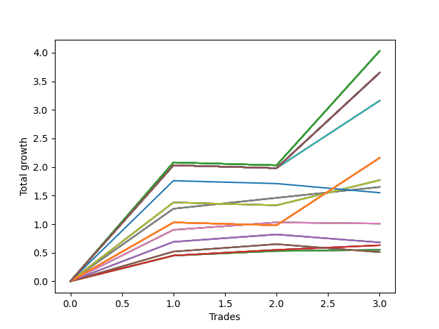

# Long Wallace Betterrerer 020 
- Symbol: AAPL_Unlimited
- Date Range: 03/23/2022 - 07/08/2022
- Trading Period: 7:20-12:30
- Number of Trades: 3



| Name | Win Percent | Profit | Avg Profit / Trade | Avg Time / Trade |      | Name | Win Percent | Profit | Avg Profit / Trade | Avg Time / Trade |
| ---- | ----------- | ------ | ------------------ | ---------------- | ---- | ---- | ----------- | ------ | ------------------ | ---------------- |
| Sorted By <br> Profit | | | | | | Sorted By <br> Win Percentage ||||
| One Hundred Twenty-Seven | 66.67 | 2015.00 | 671.67 | 126:01 |     | Sixty-Nine | 100.00 | 825.00 | 275.00 | 39:13 |
| One Hundred Twenty-Two | 66.67 | 2015.00 | 671.67 | 126:01 |     | Sixty-One | 100.00 | 825.00 | 275.00 | 39:13 |
| One Hundred Seventeen | 66.67 | 2015.00 | 671.67 | 126:01 |     | Fifty-Three | 100.00 | 825.00 | 275.00 | 39:13 |
| One Hundred Twelve | 66.67 | 2015.00 | 671.67 | 126:01 |     | Forty-Five | 100.00 | 825.00 | 275.00 | 39:13 |
| One Hundred Seven | 66.67 | 2015.00 | 671.67 | 126:01 |     | Five | 100.00 | 825.00 | 275.00 | 39:13 |
| One Hundred Two | 66.67 | 2015.00 | 671.67 | 126:01 |     | Sixty-Five | 100.00 | 315.00 | 105.00 | 10:26 |
| Ninety-Seven | 66.67 | 2015.00 | 671.67 | 126:01 |     | Fifty-Seven | 100.00 | 315.00 | 105.00 | 10:26 |
| Ninety-Two | 66.67 | 2015.00 | 671.67 | 126:01 |     | Forty-Nine | 100.00 | 315.00 | 105.00 | 10:26 |
| Eighty-Two | 66.67 | 2015.00 | 671.67 | 126:01 |     | Forty-One | 100.00 | 315.00 | 105.00 | 10:26 |
| One Hundred Thirty | 66.67 | 1825.00 | 608.33 | 138:20 |     | One | 100.00 | 315.00 | 105.00 | 10:26 |
| One Hundred Twenty-Nine | 66.67 | 1825.00 | 608.33 | 138:20 |     | Sixty-Four | 100.00 | 275.00 | 91.67 | 08:10 |
| One Hundred Twenty-Eight | 66.67 | 1825.00 | 608.33 | 138:20 |     | Fifty-Six | 100.00 | 275.00 | 91.67 | 08:10 |
| One Hundred Twenty-Five | 66.67 | 1825.00 | 608.33 | 138:20 |     | Forty-Eight | 100.00 | 275.00 | 91.67 | 08:10 |
| One Hundred Twenty-Four | 66.67 | 1825.00 | 608.33 | 138:20 |     | Forty | 100.00 | 275.00 | 91.67 | 08:10 |
| One Hundred Twenty-Three | 66.67 | 1825.00 | 608.33 | 138:20 |     | Zero | 100.00 | 275.00 | 91.67 | 08:10 |
| One Hundred Twenty | 66.67 | 1825.00 | 608.33 | 138:20 |     | One Hundred Twenty-Seven | 66.67 | 2015.00 | 671.67 | 126:01 |
| One Hundred Ninteen | 66.67 | 1825.00 | 608.33 | 138:20 |     | One Hundred Twenty-Two | 66.67 | 2015.00 | 671.67 | 126:01 |
| One Hundred Eighteen | 66.67 | 1825.00 | 608.33 | 138:20 |     | One Hundred Seventeen | 66.67 | 2015.00 | 671.67 | 126:01 |
| One Hundred Fifteen | 66.67 | 1825.00 | 608.33 | 138:20 |     | One Hundred Twelve | 66.67 | 2015.00 | 671.67 | 126:01 |
| One Hundred Fourteen | 66.67 | 1825.00 | 608.33 | 138:20 |     | One Hundred Seven | 66.67 | 2015.00 | 671.67 | 126:01 |
| One Hundred Thirteen | 66.67 | 1825.00 | 608.33 | 138:20 |     | One Hundred Two | 66.67 | 2015.00 | 671.67 | 126:01 |
| One Hundred Ten | 66.67 | 1825.00 | 608.33 | 138:20 |     | Ninety-Seven | 66.67 | 2015.00 | 671.67 | 126:01 |
| One Hundred Nine | 66.67 | 1825.00 | 608.33 | 138:20 |     | Ninety-Two | 66.67 | 2015.00 | 671.67 | 126:01 |
| One Hundred Eight | 66.67 | 1825.00 | 608.33 | 138:20 |     | Eighty-Two | 66.67 | 2015.00 | 671.67 | 126:01 |
| One Hundred Five | 66.67 | 1825.00 | 608.33 | 138:20 |     | One Hundred Thirty | 66.67 | 1825.00 | 608.33 | 138:20 |
| One Hundred Four | 66.67 | 1825.00 | 608.33 | 138:20 |     | One Hundred Twenty-Nine | 66.67 | 1825.00 | 608.33 | 138:20 |
| One Hundred Three | 66.67 | 1825.00 | 608.33 | 138:20 |     | One Hundred Twenty-Eight | 66.67 | 1825.00 | 608.33 | 138:20 |
| One Hundred | 66.67 | 1825.00 | 608.33 | 138:20 |     | One Hundred Twenty-Five | 66.67 | 1825.00 | 608.33 | 138:20 |
| Ninety-Nine | 66.67 | 1825.00 | 608.33 | 138:20 |     | One Hundred Twenty-Four | 66.67 | 1825.00 | 608.33 | 138:20 |
| Ninety-Eight | 66.67 | 1825.00 | 608.33 | 138:20 |     | One Hundred Twenty-Three | 66.67 | 1825.00 | 608.33 | 138:20 |
| Ninety-Five | 66.67 | 1825.00 | 608.33 | 138:20 |     | One Hundred Twenty | 66.67 | 1825.00 | 608.33 | 138:20 |
| Ninety-Four | 66.67 | 1825.00 | 608.33 | 138:20 |     | One Hundred Ninteen | 66.67 | 1825.00 | 608.33 | 138:20 |
| Ninety-Three | 66.67 | 1825.00 | 608.33 | 138:20 |     | One Hundred Eighteen | 66.67 | 1825.00 | 608.33 | 138:20 |
| Eighty-Five | 66.67 | 1825.00 | 608.33 | 138:20 |     | One Hundred Fifteen | 66.67 | 1825.00 | 608.33 | 138:20 |
| Eighty-Four | 66.67 | 1825.00 | 608.33 | 138:20 |     | One Hundred Fourteen | 66.67 | 1825.00 | 608.33 | 138:20 |
| Eighty-Three | 66.67 | 1825.00 | 608.33 | 138:20 |     | One Hundred Thirteen | 66.67 | 1825.00 | 608.33 | 138:20 |
| Seventy-One | 66.67 | 1580.00 | 526.67 | 104:25 |     | One Hundred Ten | 66.67 | 1825.00 | 608.33 | 138:20 |
| Sixty-Three | 66.67 | 1580.00 | 526.67 | 104:25 |     | One Hundred Nine | 66.67 | 1825.00 | 608.33 | 138:20 |
| Fifty-Five | 66.67 | 1580.00 | 526.67 | 104:25 |     | One Hundred Eight | 66.67 | 1825.00 | 608.33 | 138:20 |
| Forty-Seven | 66.67 | 1580.00 | 526.67 | 104:25 |     | One Hundred Five | 66.67 | 1825.00 | 608.33 | 138:20 |
| Seven | 66.67 | 1580.00 | 526.67 | 104:25 |     | One Hundred Four | 66.67 | 1825.00 | 608.33 | 138:20 |
| One Hundred Twenty-Six | 66.67 | 1080.00 | 360.00 | 99:13 |     | One Hundred Three | 66.67 | 1825.00 | 608.33 | 138:20 |
| One Hundred Twenty-One | 66.67 | 1080.00 | 360.00 | 99:13 |     | One Hundred | 66.67 | 1825.00 | 608.33 | 138:20 |
| One Hundred Sixteen | 66.67 | 1080.00 | 360.00 | 99:13 |     | Ninety-Nine | 66.67 | 1825.00 | 608.33 | 138:20 |
| One Hundred Eleven | 66.67 | 1080.00 | 360.00 | 99:13 |     | Ninety-Eight | 66.67 | 1825.00 | 608.33 | 138:20 |
| One Hundred Six | 66.67 | 1080.00 | 360.00 | 99:13 |     | Ninety-Five | 66.67 | 1825.00 | 608.33 | 138:20 |
| One Hundred One | 66.67 | 1080.00 | 360.00 | 99:13 |     | Ninety-Four | 66.67 | 1825.00 | 608.33 | 138:20 |
| Ninety-Six | 66.67 | 1080.00 | 360.00 | 99:13 |     | Ninety-Three | 66.67 | 1825.00 | 608.33 | 138:20 |
| Ninety-One | 66.67 | 1080.00 | 360.00 | 99:13 |     | Eighty-Five | 66.67 | 1825.00 | 608.33 | 138:20 |
| Eighty-One | 66.67 | 1080.00 | 360.00 | 99:13 |     | Eighty-Four | 66.67 | 1825.00 | 608.33 | 138:20 |
| Seventy | 66.67 | 885.00 | 295.00 | 81:48 |     | Eighty-Three | 66.67 | 1825.00 | 608.33 | 138:20 |
| Sixty-Two | 66.67 | 885.00 | 295.00 | 81:48 |     | Seventy-One | 66.67 | 1580.00 | 526.67 | 104:25 |
| Fifty-Four | 66.67 | 885.00 | 295.00 | 81:48 |     | Sixty-Three | 66.67 | 1580.00 | 526.67 | 104:25 |
| Forty-Six | 66.67 | 885.00 | 295.00 | 81:48 |     | Fifty-Five | 66.67 | 1580.00 | 526.67 | 104:25 |
| Six | 66.67 | 885.00 | 295.00 | 81:48 |     | Forty-Seven | 66.67 | 1580.00 | 526.67 | 104:25 |
| Sixty-Nine | 100.00 | 825.00 | 275.00 | 39:13 |     | Seven | 66.67 | 1580.00 | 526.67 | 104:25 |
| Sixty-One | 100.00 | 825.00 | 275.00 | 39:13 |     | One Hundred Twenty-Six | 66.67 | 1080.00 | 360.00 | 99:13 |
| Fifty-Three | 100.00 | 825.00 | 275.00 | 39:13 |     | One Hundred Twenty-One | 66.67 | 1080.00 | 360.00 | 99:13 |
| Forty-Five | 100.00 | 825.00 | 275.00 | 39:13 |     | One Hundred Sixteen | 66.67 | 1080.00 | 360.00 | 99:13 |
| Five | 100.00 | 825.00 | 275.00 | 39:13 |     | One Hundred Eleven | 66.67 | 1080.00 | 360.00 | 99:13 |
| Seventy-Three | 33.33 | 775.00 | 258.33 | 17:05 |     | One Hundred Six | 66.67 | 1080.00 | 360.00 | 99:13 |
| Sixty-Eight | 66.67 | 505.00 | 168.33 | 32:03 |     | One Hundred One | 66.67 | 1080.00 | 360.00 | 99:13 |
| Sixty | 66.67 | 505.00 | 168.33 | 32:03 |     | Ninety-Six | 66.67 | 1080.00 | 360.00 | 99:13 |
| Fifty-Two | 66.67 | 505.00 | 168.33 | 32:03 |     | Ninety-One | 66.67 | 1080.00 | 360.00 | 99:13 |
| Forty-Four | 66.67 | 505.00 | 168.33 | 32:03 |     | Eighty-One | 66.67 | 1080.00 | 360.00 | 99:13 |
| Four | 66.67 | 505.00 | 168.33 | 32:03 |     | Seventy | 66.67 | 885.00 | 295.00 | 81:48 |
| Sixty-Six | 66.67 | 340.00 | 113.33 | 23:30 |     | Sixty-Two | 66.67 | 885.00 | 295.00 | 81:48 |
| Fifty-Eight | 66.67 | 340.00 | 113.33 | 23:30 |     | Fifty-Four | 66.67 | 885.00 | 295.00 | 81:48 |
| Fifty | 66.67 | 340.00 | 113.33 | 23:30 |     | Forty-Six | 66.67 | 885.00 | 295.00 | 81:48 |
| Forty-Two | 66.67 | 340.00 | 113.33 | 23:30 |     | Six | 66.67 | 885.00 | 295.00 | 81:48 |
| Two | 66.67 | 340.00 | 113.33 | 23:30 |     | Sixty-Eight | 66.67 | 505.00 | 168.33 | 32:03 |
| Sixty-Five | 100.00 | 315.00 | 105.00 | 10:26 |     | Sixty | 66.67 | 505.00 | 168.33 | 32:03 |
| Fifty-Seven | 100.00 | 315.00 | 105.00 | 10:26 |     | Fifty-Two | 66.67 | 505.00 | 168.33 | 32:03 |
| Forty-Nine | 100.00 | 315.00 | 105.00 | 10:26 |     | Forty-Four | 66.67 | 505.00 | 168.33 | 32:03 |
| Forty-One | 100.00 | 315.00 | 105.00 | 10:26 |     | Four | 66.67 | 505.00 | 168.33 | 32:03 |
| One | 100.00 | 315.00 | 105.00 | 10:26 |     | Sixty-Six | 66.67 | 340.00 | 113.33 | 23:30 |
| Sixty-Four | 100.00 | 275.00 | 91.67 | 08:10 |     | Fifty-Eight | 66.67 | 340.00 | 113.33 | 23:30 |
| Fifty-Six | 100.00 | 275.00 | 91.67 | 08:10 |     | Fifty | 66.67 | 340.00 | 113.33 | 23:30 |
| Forty-Eight | 100.00 | 275.00 | 91.67 | 08:10 |     | Forty-Two | 66.67 | 340.00 | 113.33 | 23:30 |
| Forty | 100.00 | 275.00 | 91.67 | 08:10 |     | Two | 66.67 | 340.00 | 113.33 | 23:30 |
| Zero | 100.00 | 275.00 | 91.67 | 08:10 |     | Sixty-Seven | 66.67 | 255.00 | 85.00 | 23:01 |
| Sixty-Seven | 66.67 | 255.00 | 85.00 | 23:01 |     | Fifty-Nine | 66.67 | 255.00 | 85.00 | 23:01 |
| Fifty-Nine | 66.67 | 255.00 | 85.00 | 23:01 |     | Fifty-One | 66.67 | 255.00 | 85.00 | 23:01 |
| Fifty-One | 66.67 | 255.00 | 85.00 | 23:01 |     | Forty-Three | 66.67 | 255.00 | 85.00 | 23:01 |
| Forty-Three | 66.67 | 255.00 | 85.00 | 23:01 |     | Three | 66.67 | 255.00 | 85.00 | 23:01 |
| Three | 66.67 | 255.00 | 85.00 | 23:01 |     | Seventy-Three | 33.33 | 775.00 | 258.33 | 17:05 |

## NO STOPLOSS

### Test Zero
* Sell when price hits the middle line of the 20p bollinger
* No Stoploss
* Results:
```
Total Trades: 3
Percent Up: 100.00
Percent Down: 0.00
Total Points Moved Up: 0.55
Potential Profit: 275.00
Total Points Ups: 0.55 Count Ups: 3
Total Points Downs: 0.00 Count Downs: 0
```

<details><summary>Trades</summary>

<code>In: 2022-05-06 12:27:00		Out: 2022-05-06 12:28:10		Total Position Time: 01:10		Total Move Up: 0.45		Total to Date: 0.45</code> <br />
<code>In: 2022-06-27 10:50:00		Out: 2022-06-27 11:03:15		Total Position Time: 13:15		Total Move Up: 0.08		Total to Date: 0.53</code> <br />
<code>In: 2022-07-06 08:09:00		Out: 2022-07-06 08:19:05		Total Position Time: 10:05		Total Move Up: 0.02		Total to Date: 0.55</code> <br />


</details>

### Test One
* Sell when the price hits the upper line of the 20p 1std bollinger
* No Stoploss
* Results:
```
Total Trades: 3
Percent Up: 100.00
Percent Down: 0.00
Total Points Moved Up: 0.63
Potential Profit: 315.00
Total Points Ups: 0.63 Count Ups: 3
Total Points Downs: 0.00 Count Downs: 0
```

<details><summary>Trades</summary>

<code>In: 2022-05-06 12:27:00		Out: 2022-05-06 12:28:10		Total Position Time: 01:10		Total Move Up: 0.45		Total to Date: 0.45</code> <br />
<code>In: 2022-06-27 10:50:00		Out: 2022-06-27 11:05:00		Total Position Time: 15:00		Total Move Up: 0.10		Total to Date: 0.55</code> <br />
<code>In: 2022-07-06 08:09:00		Out: 2022-07-06 08:24:10		Total Position Time: 15:10		Total Move Up: 0.08		Total to Date: 0.63</code> <br />


</details>

### Test Two
* Sell when the price hits the upper line of the 20p 2std bollinger
* No Stoploss
* Results:
```
Total Trades: 3
Percent Up: 66.67
Percent Down: 33.33
Total Points Moved Up: 0.68
Potential Profit: 340.00
Total Points Ups: 0.82 Count Ups: 2
Total Points Downs: -0.14 Count Downs: 1
```

<details><summary>Trades</summary>

<code>In: 2022-05-06 12:27:00		Out: 2022-05-06 12:30:15		Total Position Time: 03:15		Total Move Up: 0.69		Total to Date: 0.69</code> <br />
<code>In: 2022-06-27 10:50:00		Out: 2022-06-27 11:17:10		Total Position Time: 27:10		Total Move Up: 0.13		Total to Date: 0.82</code> <br />
<code>In: 2022-07-06 08:09:00		Out: 2022-07-06 08:49:05		Total Position Time: 40:05		Total Move Up: -0.14		Total to Date: 0.68</code> <br />


</details>

### Test Three
* Sell when price hits the middle line of the 50p bollinger
* No Stoploss
* Results:
```
Total Trades: 3
Percent Up: 66.67
Percent Down: 33.33
Total Points Moved Up: 0.51
Potential Profit: 255.00
Total Points Ups: 0.65 Count Ups: 2
Total Points Downs: -0.14 Count Downs: 1
```

<details><summary>Trades</summary>

<code>In: 2022-05-06 12:27:00		Out: 2022-05-06 12:28:50		Total Position Time: 01:50		Total Move Up: 0.52		Total to Date: 0.52</code> <br />
<code>In: 2022-06-27 10:50:00		Out: 2022-06-27 11:17:10		Total Position Time: 27:10		Total Move Up: 0.13		Total to Date: 0.65</code> <br />
<code>In: 2022-07-06 08:09:00		Out: 2022-07-06 08:49:05		Total Position Time: 40:05		Total Move Up: -0.14		Total to Date: 0.51</code> <br />


</details>

### Test Four
* Sell when the price hits the upper line of the 50p 1std bollinger
* No Stoploss
* Results:
```
Total Trades: 3
Percent Up: 66.67
Percent Down: 33.33
Total Points Moved Up: 1.01
Potential Profit: 505.00
Total Points Ups: 1.03 Count Ups: 2
Total Points Downs: -0.02 Count Downs: 1
```

<details><summary>Trades</summary>

<code>In: 2022-05-06 12:27:00		Out: 2022-05-06 12:30:30		Total Position Time: 03:30		Total Move Up: 0.90		Total to Date: 0.90</code> <br />
<code>In: 2022-06-27 10:50:00		Out: 2022-06-27 11:33:25		Total Position Time: 43:25		Total Move Up: 0.13		Total to Date: 1.03</code> <br />
<code>In: 2022-07-06 08:09:00		Out: 2022-07-06 08:58:15		Total Position Time: 49:15		Total Move Up: -0.02		Total to Date: 1.01</code> <br />


</details>

### Test Five
* Sell when the price hits the upper line of the 50p 2std bollinger
* No Stoploss
* Results:
```
Total Trades: 3
Percent Up: 100.00
Percent Down: 0.00
Total Points Moved Up: 1.65
Potential Profit: 825.00
Total Points Ups: 1.65 Count Ups: 3
Total Points Downs: 0.00 Count Downs: 0
```

<details><summary>Trades</summary>

<code>In: 2022-05-06 12:27:00		Out: 2022-05-06 12:35:55		Total Position Time: 08:55		Total Move Up: 1.27		Total to Date: 1.27</code> <br />
<code>In: 2022-06-27 10:50:00		Out: 2022-06-27 11:34:15		Total Position Time: 44:15		Total Move Up: 0.19		Total to Date: 1.46</code> <br />
<code>In: 2022-07-06 08:09:00		Out: 2022-07-06 09:13:30		Total Position Time: 64:30		Total Move Up: 0.19		Total to Date: 1.65</code> <br />


</details>

### Test Six
* Sell when the price hits the middle line of the 1std VWAP
* No Stoploss
* Results:
```
Total Trades: 3
Percent Up: 66.67
Percent Down: 33.33
Total Points Moved Up: 1.77
Potential Profit: 885.00
Total Points Ups: 1.82 Count Ups: 2
Total Points Downs: -0.05 Count Downs: 1
```

<details><summary>Trades</summary>

<code>In: 2022-05-06 12:27:00		Out: 2022-05-06 12:37:20		Total Position Time: 10:20		Total Move Up: 1.38		Total to Date: 1.38</code> <br />
<code>In: 2022-06-27 10:50:00		Out: 2022-06-27 12:47:00		Total Position Time: 117:00		Total Move Up: -0.05		Total to Date: 1.33</code> <br />
<code>In: 2022-07-06 08:09:00		Out: 2022-07-06 10:07:05		Total Position Time: 118:05		Total Move Up: 0.44		Total to Date: 1.77</code> <br />


</details>

### Test Seven
* Sell when the price hits the upper line of the 1std VWAP
* No Stoploss
* Results:
```
Total Trades: 3
Percent Up: 66.67
Percent Down: 33.33
Total Points Moved Up: 3.16
Potential Profit: 1580.00
Total Points Ups: 3.21 Count Ups: 2
Total Points Downs: -0.05 Count Downs: 1
```

<details><summary>Trades</summary>

<code>In: 2022-05-06 12:27:00		Out: 2022-05-06 12:47:00		Total Position Time: 20:00		Total Move Up: 2.03		Total to Date: 2.03</code> <br />
<code>In: 2022-06-27 10:50:00		Out: 2022-06-27 12:47:00		Total Position Time: 117:00		Total Move Up: -0.05		Total to Date: 1.98</code> <br />
<code>In: 2022-07-06 08:09:00		Out: 2022-07-06 11:05:15		Total Position Time: 176:15		Total Move Up: 1.18		Total to Date: 3.16</code> <br />


</details>

## STOPLOSS OF 5

### Test Forty
* Sell when price hits the middle line of the 20p bollinger
* Stoploss is 5 points
* Results:
```
Total Trades: 3
Percent Up: 100.00
Percent Down: 0.00
Total Points Moved Up: 0.55
Potential Profit: 275.00
Total Points Ups: 0.55 Count Ups: 3
Total Points Downs: 0.00 Count Downs: 0
```

<details><summary>Trades</summary>

<code>In: 2022-05-06 12:27:00		Out: 2022-05-06 12:28:10		Total Position Time: 01:10		Total Move Up: 0.45		Total to Date: 0.45</code> <br />
<code>In: 2022-06-27 10:50:00		Out: 2022-06-27 11:03:15		Total Position Time: 13:15		Total Move Up: 0.08		Total to Date: 0.53</code> <br />
<code>In: 2022-07-06 08:09:00		Out: 2022-07-06 08:19:05		Total Position Time: 10:05		Total Move Up: 0.02		Total to Date: 0.55</code> <br />


</details>

### Test Forty-One
* Sell when the price hits the upper line of the 20p 1std bollinger
* Stoploss is 5 points
* Results:
```
Total Trades: 3
Percent Up: 100.00
Percent Down: 0.00
Total Points Moved Up: 0.63
Potential Profit: 315.00
Total Points Ups: 0.63 Count Ups: 3
Total Points Downs: 0.00 Count Downs: 0
```

<details><summary>Trades</summary>

<code>In: 2022-05-06 12:27:00		Out: 2022-05-06 12:28:10		Total Position Time: 01:10		Total Move Up: 0.45		Total to Date: 0.45</code> <br />
<code>In: 2022-06-27 10:50:00		Out: 2022-06-27 11:05:00		Total Position Time: 15:00		Total Move Up: 0.10		Total to Date: 0.55</code> <br />
<code>In: 2022-07-06 08:09:00		Out: 2022-07-06 08:24:10		Total Position Time: 15:10		Total Move Up: 0.08		Total to Date: 0.63</code> <br />


</details>

### Test Forty-Two
* Sell when the price hits the upper line of the 20p 2std bollinger
* Stoploss is 5 points
* Results:
```
Total Trades: 3
Percent Up: 66.67
Percent Down: 33.33
Total Points Moved Up: 0.68
Potential Profit: 340.00
Total Points Ups: 0.82 Count Ups: 2
Total Points Downs: -0.14 Count Downs: 1
```

<details><summary>Trades</summary>

<code>In: 2022-05-06 12:27:00		Out: 2022-05-06 12:30:15		Total Position Time: 03:15		Total Move Up: 0.69		Total to Date: 0.69</code> <br />
<code>In: 2022-06-27 10:50:00		Out: 2022-06-27 11:17:10		Total Position Time: 27:10		Total Move Up: 0.13		Total to Date: 0.82</code> <br />
<code>In: 2022-07-06 08:09:00		Out: 2022-07-06 08:49:05		Total Position Time: 40:05		Total Move Up: -0.14		Total to Date: 0.68</code> <br />


</details>

### Test Forty-Three
* Sell when price hits the middle line of the 50p bollinger
* Stoploss is 5 points
* Results:
```
Total Trades: 3
Percent Up: 66.67
Percent Down: 33.33
Total Points Moved Up: 0.51
Potential Profit: 255.00
Total Points Ups: 0.65 Count Ups: 2
Total Points Downs: -0.14 Count Downs: 1
```

<details><summary>Trades</summary>

<code>In: 2022-05-06 12:27:00		Out: 2022-05-06 12:28:50		Total Position Time: 01:50		Total Move Up: 0.52		Total to Date: 0.52</code> <br />
<code>In: 2022-06-27 10:50:00		Out: 2022-06-27 11:17:10		Total Position Time: 27:10		Total Move Up: 0.13		Total to Date: 0.65</code> <br />
<code>In: 2022-07-06 08:09:00		Out: 2022-07-06 08:49:05		Total Position Time: 40:05		Total Move Up: -0.14		Total to Date: 0.51</code> <br />


</details>

### Test Forty-Four
* Sell when the price hits the upper line of the 50p 1std bollinger
* Stoploss is 5 points
* Results:
```
Total Trades: 3
Percent Up: 66.67
Percent Down: 33.33
Total Points Moved Up: 1.01
Potential Profit: 505.00
Total Points Ups: 1.03 Count Ups: 2
Total Points Downs: -0.02 Count Downs: 1
```

<details><summary>Trades</summary>

<code>In: 2022-05-06 12:27:00		Out: 2022-05-06 12:30:30		Total Position Time: 03:30		Total Move Up: 0.90		Total to Date: 0.90</code> <br />
<code>In: 2022-06-27 10:50:00		Out: 2022-06-27 11:33:25		Total Position Time: 43:25		Total Move Up: 0.13		Total to Date: 1.03</code> <br />
<code>In: 2022-07-06 08:09:00		Out: 2022-07-06 08:58:15		Total Position Time: 49:15		Total Move Up: -0.02		Total to Date: 1.01</code> <br />


</details>

### Test Forty-Five
* Sell when the price hits the upper line of the 50p 2std bollinger
* Stoploss is 5 points
* Results:
```
Total Trades: 3
Percent Up: 100.00
Percent Down: 0.00
Total Points Moved Up: 1.65
Potential Profit: 825.00
Total Points Ups: 1.65 Count Ups: 3
Total Points Downs: 0.00 Count Downs: 0
```

<details><summary>Trades</summary>

<code>In: 2022-05-06 12:27:00		Out: 2022-05-06 12:35:55		Total Position Time: 08:55		Total Move Up: 1.27		Total to Date: 1.27</code> <br />
<code>In: 2022-06-27 10:50:00		Out: 2022-06-27 11:34:15		Total Position Time: 44:15		Total Move Up: 0.19		Total to Date: 1.46</code> <br />
<code>In: 2022-07-06 08:09:00		Out: 2022-07-06 09:13:30		Total Position Time: 64:30		Total Move Up: 0.19		Total to Date: 1.65</code> <br />


</details>

### Test Forty-Six
* Sell when the price hits the middle line of the 1std VWAP
* Stoploss is 5 points
* Results:
```
Total Trades: 3
Percent Up: 66.67
Percent Down: 33.33
Total Points Moved Up: 1.77
Potential Profit: 885.00
Total Points Ups: 1.82 Count Ups: 2
Total Points Downs: -0.05 Count Downs: 1
```

<details><summary>Trades</summary>

<code>In: 2022-05-06 12:27:00		Out: 2022-05-06 12:37:20		Total Position Time: 10:20		Total Move Up: 1.38		Total to Date: 1.38</code> <br />
<code>In: 2022-06-27 10:50:00		Out: 2022-06-27 12:47:00		Total Position Time: 117:00		Total Move Up: -0.05		Total to Date: 1.33</code> <br />
<code>In: 2022-07-06 08:09:00		Out: 2022-07-06 10:07:05		Total Position Time: 118:05		Total Move Up: 0.44		Total to Date: 1.77</code> <br />


</details>

### Test Forty-Seven
* Sell when the price hits the upper line of the 1std VWAP
* Stoploss is 5 points
* Results:
```
Total Trades: 3
Percent Up: 66.67
Percent Down: 33.33
Total Points Moved Up: 3.16
Potential Profit: 1580.00
Total Points Ups: 3.21 Count Ups: 2
Total Points Downs: -0.05 Count Downs: 1
```

<details><summary>Trades</summary>

<code>In: 2022-05-06 12:27:00		Out: 2022-05-06 12:47:00		Total Position Time: 20:00		Total Move Up: 2.03		Total to Date: 2.03</code> <br />
<code>In: 2022-06-27 10:50:00		Out: 2022-06-27 12:47:00		Total Position Time: 117:00		Total Move Up: -0.05		Total to Date: 1.98</code> <br />
<code>In: 2022-07-06 08:09:00		Out: 2022-07-06 11:05:15		Total Position Time: 176:15		Total Move Up: 1.18		Total to Date: 3.16</code> <br />


</details>

## TRAIL STOP OF 5

### Test Forty-Eight
* Sell when price hits the middle line of the 20p bollinger
* Trailing Stop is 5 points
* Results:
```
Total Trades: 3
Percent Up: 100.00
Percent Down: 0.00
Total Points Moved Up: 0.55
Potential Profit: 275.00
Total Points Ups: 0.55 Count Ups: 3
Total Points Downs: 0.00 Count Downs: 0
```

<details><summary>Trades</summary>

<code>In: 2022-05-06 12:27:00		Out: 2022-05-06 12:28:10		Total Position Time: 01:10		Total Move Up: 0.45		Total to Date: 0.45</code> <br />
<code>In: 2022-06-27 10:50:00		Out: 2022-06-27 11:03:15		Total Position Time: 13:15		Total Move Up: 0.08		Total to Date: 0.53</code> <br />
<code>In: 2022-07-06 08:09:00		Out: 2022-07-06 08:19:05		Total Position Time: 10:05		Total Move Up: 0.02		Total to Date: 0.55</code> <br />


</details>

### Test Forty-Nine
* Sell when the price hits the upper line of the 20p 1std bollinger
* Trailing Stop is 5 points
* Results:
```
Total Trades: 3
Percent Up: 100.00
Percent Down: 0.00
Total Points Moved Up: 0.63
Potential Profit: 315.00
Total Points Ups: 0.63 Count Ups: 3
Total Points Downs: 0.00 Count Downs: 0
```

<details><summary>Trades</summary>

<code>In: 2022-05-06 12:27:00		Out: 2022-05-06 12:28:10		Total Position Time: 01:10		Total Move Up: 0.45		Total to Date: 0.45</code> <br />
<code>In: 2022-06-27 10:50:00		Out: 2022-06-27 11:05:00		Total Position Time: 15:00		Total Move Up: 0.10		Total to Date: 0.55</code> <br />
<code>In: 2022-07-06 08:09:00		Out: 2022-07-06 08:24:10		Total Position Time: 15:10		Total Move Up: 0.08		Total to Date: 0.63</code> <br />


</details>

### Test Fifty
* Sell when the price hits the upper line of the 20p 2std bollinger
* Trailing Stop is 5 points
* Results:
```
Total Trades: 3
Percent Up: 66.67
Percent Down: 33.33
Total Points Moved Up: 0.68
Potential Profit: 340.00
Total Points Ups: 0.82 Count Ups: 2
Total Points Downs: -0.14 Count Downs: 1
```

<details><summary>Trades</summary>

<code>In: 2022-05-06 12:27:00		Out: 2022-05-06 12:30:15		Total Position Time: 03:15		Total Move Up: 0.69		Total to Date: 0.69</code> <br />
<code>In: 2022-06-27 10:50:00		Out: 2022-06-27 11:17:10		Total Position Time: 27:10		Total Move Up: 0.13		Total to Date: 0.82</code> <br />
<code>In: 2022-07-06 08:09:00		Out: 2022-07-06 08:49:05		Total Position Time: 40:05		Total Move Up: -0.14		Total to Date: 0.68</code> <br />


</details>

### Test Fifty-One
* Sell when price hits the middle line of the 50p bollinger
* Trailing Stop is 5 points
* Results:
```
Total Trades: 3
Percent Up: 66.67
Percent Down: 33.33
Total Points Moved Up: 0.51
Potential Profit: 255.00
Total Points Ups: 0.65 Count Ups: 2
Total Points Downs: -0.14 Count Downs: 1
```

<details><summary>Trades</summary>

<code>In: 2022-05-06 12:27:00		Out: 2022-05-06 12:28:50		Total Position Time: 01:50		Total Move Up: 0.52		Total to Date: 0.52</code> <br />
<code>In: 2022-06-27 10:50:00		Out: 2022-06-27 11:17:10		Total Position Time: 27:10		Total Move Up: 0.13		Total to Date: 0.65</code> <br />
<code>In: 2022-07-06 08:09:00		Out: 2022-07-06 08:49:05		Total Position Time: 40:05		Total Move Up: -0.14		Total to Date: 0.51</code> <br />


</details>

### Test Fifty-Two
* Sell when the price hits the upper line of the 50p 1std bollinger
* Trailing Stop is 5 points
* Results:
```
Total Trades: 3
Percent Up: 66.67
Percent Down: 33.33
Total Points Moved Up: 1.01
Potential Profit: 505.00
Total Points Ups: 1.03 Count Ups: 2
Total Points Downs: -0.02 Count Downs: 1
```

<details><summary>Trades</summary>

<code>In: 2022-05-06 12:27:00		Out: 2022-05-06 12:30:30		Total Position Time: 03:30		Total Move Up: 0.90		Total to Date: 0.90</code> <br />
<code>In: 2022-06-27 10:50:00		Out: 2022-06-27 11:33:25		Total Position Time: 43:25		Total Move Up: 0.13		Total to Date: 1.03</code> <br />
<code>In: 2022-07-06 08:09:00		Out: 2022-07-06 08:58:15		Total Position Time: 49:15		Total Move Up: -0.02		Total to Date: 1.01</code> <br />


</details>

### Test Fifty-Three
* Sell when the price hits the upper line of the 50p 2std bollinger
* Trailing Stop is 5 points
* Results:
```
Total Trades: 3
Percent Up: 100.00
Percent Down: 0.00
Total Points Moved Up: 1.65
Potential Profit: 825.00
Total Points Ups: 1.65 Count Ups: 3
Total Points Downs: 0.00 Count Downs: 0
```

<details><summary>Trades</summary>

<code>In: 2022-05-06 12:27:00		Out: 2022-05-06 12:35:55		Total Position Time: 08:55		Total Move Up: 1.27		Total to Date: 1.27</code> <br />
<code>In: 2022-06-27 10:50:00		Out: 2022-06-27 11:34:15		Total Position Time: 44:15		Total Move Up: 0.19		Total to Date: 1.46</code> <br />
<code>In: 2022-07-06 08:09:00		Out: 2022-07-06 09:13:30		Total Position Time: 64:30		Total Move Up: 0.19		Total to Date: 1.65</code> <br />


</details>

### Test Fifty-Four
* Sell when the price hits the middle line of the 1std VWAP
* Trailing Stop is 5 points
* Results:
```
Total Trades: 3
Percent Up: 66.67
Percent Down: 33.33
Total Points Moved Up: 1.77
Potential Profit: 885.00
Total Points Ups: 1.82 Count Ups: 2
Total Points Downs: -0.05 Count Downs: 1
```

<details><summary>Trades</summary>

<code>In: 2022-05-06 12:27:00		Out: 2022-05-06 12:37:20		Total Position Time: 10:20		Total Move Up: 1.38		Total to Date: 1.38</code> <br />
<code>In: 2022-06-27 10:50:00		Out: 2022-06-27 12:47:00		Total Position Time: 117:00		Total Move Up: -0.05		Total to Date: 1.33</code> <br />
<code>In: 2022-07-06 08:09:00		Out: 2022-07-06 10:07:05		Total Position Time: 118:05		Total Move Up: 0.44		Total to Date: 1.77</code> <br />


</details>

### Test Fifty-Five
* Sell when the price hits the upper line of the 1std VWAP
* Trailing Stop is 5 points
* Results:
```
Total Trades: 3
Percent Up: 66.67
Percent Down: 33.33
Total Points Moved Up: 3.16
Potential Profit: 1580.00
Total Points Ups: 3.21 Count Ups: 2
Total Points Downs: -0.05 Count Downs: 1
```

<details><summary>Trades</summary>

<code>In: 2022-05-06 12:27:00		Out: 2022-05-06 12:47:00		Total Position Time: 20:00		Total Move Up: 2.03		Total to Date: 2.03</code> <br />
<code>In: 2022-06-27 10:50:00		Out: 2022-06-27 12:47:00		Total Position Time: 117:00		Total Move Up: -0.05		Total to Date: 1.98</code> <br />
<code>In: 2022-07-06 08:09:00		Out: 2022-07-06 11:05:15		Total Position Time: 176:15		Total Move Up: 1.18		Total to Date: 3.16</code> <br />


</details>

## STOPLOSS OF 10

### Test Fifty-Six
* Sell when price hits the middle line of the 20p bollinger
* Stoploss is 10 points
* Results:
```
Total Trades: 3
Percent Up: 100.00
Percent Down: 0.00
Total Points Moved Up: 0.55
Potential Profit: 275.00
Total Points Ups: 0.55 Count Ups: 3
Total Points Downs: 0.00 Count Downs: 0
```

<details><summary>Trades</summary>

<code>In: 2022-05-06 12:27:00		Out: 2022-05-06 12:28:10		Total Position Time: 01:10		Total Move Up: 0.45		Total to Date: 0.45</code> <br />
<code>In: 2022-06-27 10:50:00		Out: 2022-06-27 11:03:15		Total Position Time: 13:15		Total Move Up: 0.08		Total to Date: 0.53</code> <br />
<code>In: 2022-07-06 08:09:00		Out: 2022-07-06 08:19:05		Total Position Time: 10:05		Total Move Up: 0.02		Total to Date: 0.55</code> <br />


</details>

### Test Fifty-Seven
* Sell when the price hits the upper line of the 20p 1std bollinger
* Stoploss is 10 points
* Results:
```
Total Trades: 3
Percent Up: 100.00
Percent Down: 0.00
Total Points Moved Up: 0.63
Potential Profit: 315.00
Total Points Ups: 0.63 Count Ups: 3
Total Points Downs: 0.00 Count Downs: 0
```

<details><summary>Trades</summary>

<code>In: 2022-05-06 12:27:00		Out: 2022-05-06 12:28:10		Total Position Time: 01:10		Total Move Up: 0.45		Total to Date: 0.45</code> <br />
<code>In: 2022-06-27 10:50:00		Out: 2022-06-27 11:05:00		Total Position Time: 15:00		Total Move Up: 0.10		Total to Date: 0.55</code> <br />
<code>In: 2022-07-06 08:09:00		Out: 2022-07-06 08:24:10		Total Position Time: 15:10		Total Move Up: 0.08		Total to Date: 0.63</code> <br />


</details>

### Test Fifty-Eight
* Sell when the price hits the upper line of the 20p 2std bollinger
* Stoploss is 10 points
* Results:
```
Total Trades: 3
Percent Up: 66.67
Percent Down: 33.33
Total Points Moved Up: 0.68
Potential Profit: 340.00
Total Points Ups: 0.82 Count Ups: 2
Total Points Downs: -0.14 Count Downs: 1
```

<details><summary>Trades</summary>

<code>In: 2022-05-06 12:27:00		Out: 2022-05-06 12:30:15		Total Position Time: 03:15		Total Move Up: 0.69		Total to Date: 0.69</code> <br />
<code>In: 2022-06-27 10:50:00		Out: 2022-06-27 11:17:10		Total Position Time: 27:10		Total Move Up: 0.13		Total to Date: 0.82</code> <br />
<code>In: 2022-07-06 08:09:00		Out: 2022-07-06 08:49:05		Total Position Time: 40:05		Total Move Up: -0.14		Total to Date: 0.68</code> <br />


</details>

### Test Fifty-Nine
* Sell when price hits the middle line of the 50p bollinger
* Stoploss is 10 points
* Results:
```
Total Trades: 3
Percent Up: 66.67
Percent Down: 33.33
Total Points Moved Up: 0.51
Potential Profit: 255.00
Total Points Ups: 0.65 Count Ups: 2
Total Points Downs: -0.14 Count Downs: 1
```

<details><summary>Trades</summary>

<code>In: 2022-05-06 12:27:00		Out: 2022-05-06 12:28:50		Total Position Time: 01:50		Total Move Up: 0.52		Total to Date: 0.52</code> <br />
<code>In: 2022-06-27 10:50:00		Out: 2022-06-27 11:17:10		Total Position Time: 27:10		Total Move Up: 0.13		Total to Date: 0.65</code> <br />
<code>In: 2022-07-06 08:09:00		Out: 2022-07-06 08:49:05		Total Position Time: 40:05		Total Move Up: -0.14		Total to Date: 0.51</code> <br />


</details>

### Test Sixty
* Sell when the price hits the upper line of the 50p 1std bollinger
* Stoploss is 10 points
* Results:
```
Total Trades: 3
Percent Up: 66.67
Percent Down: 33.33
Total Points Moved Up: 1.01
Potential Profit: 505.00
Total Points Ups: 1.03 Count Ups: 2
Total Points Downs: -0.02 Count Downs: 1
```

<details><summary>Trades</summary>

<code>In: 2022-05-06 12:27:00		Out: 2022-05-06 12:30:30		Total Position Time: 03:30		Total Move Up: 0.90		Total to Date: 0.90</code> <br />
<code>In: 2022-06-27 10:50:00		Out: 2022-06-27 11:33:25		Total Position Time: 43:25		Total Move Up: 0.13		Total to Date: 1.03</code> <br />
<code>In: 2022-07-06 08:09:00		Out: 2022-07-06 08:58:15		Total Position Time: 49:15		Total Move Up: -0.02		Total to Date: 1.01</code> <br />


</details>

### Test Sixty-One
* Sell when the price hits the upper line of the 50p 2std bollinger
* Stoploss is 10 points
* Results:
```
Total Trades: 3
Percent Up: 100.00
Percent Down: 0.00
Total Points Moved Up: 1.65
Potential Profit: 825.00
Total Points Ups: 1.65 Count Ups: 3
Total Points Downs: 0.00 Count Downs: 0
```

<details><summary>Trades</summary>

<code>In: 2022-05-06 12:27:00		Out: 2022-05-06 12:35:55		Total Position Time: 08:55		Total Move Up: 1.27		Total to Date: 1.27</code> <br />
<code>In: 2022-06-27 10:50:00		Out: 2022-06-27 11:34:15		Total Position Time: 44:15		Total Move Up: 0.19		Total to Date: 1.46</code> <br />
<code>In: 2022-07-06 08:09:00		Out: 2022-07-06 09:13:30		Total Position Time: 64:30		Total Move Up: 0.19		Total to Date: 1.65</code> <br />


</details>

### Test Sixty-Two
* Sell when the price hits the middle line of the 1std VWAP
* Stoploss is 10 points
* Results:
```
Total Trades: 3
Percent Up: 66.67
Percent Down: 33.33
Total Points Moved Up: 1.77
Potential Profit: 885.00
Total Points Ups: 1.82 Count Ups: 2
Total Points Downs: -0.05 Count Downs: 1
```

<details><summary>Trades</summary>

<code>In: 2022-05-06 12:27:00		Out: 2022-05-06 12:37:20		Total Position Time: 10:20		Total Move Up: 1.38		Total to Date: 1.38</code> <br />
<code>In: 2022-06-27 10:50:00		Out: 2022-06-27 12:47:00		Total Position Time: 117:00		Total Move Up: -0.05		Total to Date: 1.33</code> <br />
<code>In: 2022-07-06 08:09:00		Out: 2022-07-06 10:07:05		Total Position Time: 118:05		Total Move Up: 0.44		Total to Date: 1.77</code> <br />


</details>

### Test Sixty-Three
* Sell when the price hits the upper line of the 1std VWAP
* Stoploss is 10 points
* Results:
```
Total Trades: 3
Percent Up: 66.67
Percent Down: 33.33
Total Points Moved Up: 3.16
Potential Profit: 1580.00
Total Points Ups: 3.21 Count Ups: 2
Total Points Downs: -0.05 Count Downs: 1
```

<details><summary>Trades</summary>

<code>In: 2022-05-06 12:27:00		Out: 2022-05-06 12:47:00		Total Position Time: 20:00		Total Move Up: 2.03		Total to Date: 2.03</code> <br />
<code>In: 2022-06-27 10:50:00		Out: 2022-06-27 12:47:00		Total Position Time: 117:00		Total Move Up: -0.05		Total to Date: 1.98</code> <br />
<code>In: 2022-07-06 08:09:00		Out: 2022-07-06 11:05:15		Total Position Time: 176:15		Total Move Up: 1.18		Total to Date: 3.16</code> <br />


</details>

## TRAIL STOP OF 10

### Test Sixty-Four
* Sell when price hits the middle line of the 20p bollinger
* Trailing Stop is 10 points
* Results:
```
Total Trades: 3
Percent Up: 100.00
Percent Down: 0.00
Total Points Moved Up: 0.55
Potential Profit: 275.00
Total Points Ups: 0.55 Count Ups: 3
Total Points Downs: 0.00 Count Downs: 0
```

<details><summary>Trades</summary>

<code>In: 2022-05-06 12:27:00		Out: 2022-05-06 12:28:10		Total Position Time: 01:10		Total Move Up: 0.45		Total to Date: 0.45</code> <br />
<code>In: 2022-06-27 10:50:00		Out: 2022-06-27 11:03:15		Total Position Time: 13:15		Total Move Up: 0.08		Total to Date: 0.53</code> <br />
<code>In: 2022-07-06 08:09:00		Out: 2022-07-06 08:19:05		Total Position Time: 10:05		Total Move Up: 0.02		Total to Date: 0.55</code> <br />


</details>

### Test Sixty-Five
* Sell when the price hits the upper line of the 20p 1std bollinger
* Trailing Stop is 10 points
* Results:
```
Total Trades: 3
Percent Up: 100.00
Percent Down: 0.00
Total Points Moved Up: 0.63
Potential Profit: 315.00
Total Points Ups: 0.63 Count Ups: 3
Total Points Downs: 0.00 Count Downs: 0
```

<details><summary>Trades</summary>

<code>In: 2022-05-06 12:27:00		Out: 2022-05-06 12:28:10		Total Position Time: 01:10		Total Move Up: 0.45		Total to Date: 0.45</code> <br />
<code>In: 2022-06-27 10:50:00		Out: 2022-06-27 11:05:00		Total Position Time: 15:00		Total Move Up: 0.10		Total to Date: 0.55</code> <br />
<code>In: 2022-07-06 08:09:00		Out: 2022-07-06 08:24:10		Total Position Time: 15:10		Total Move Up: 0.08		Total to Date: 0.63</code> <br />


</details>

### Test Sixty-Six
* Sell when the price hits the upper line of the 20p 2std bollinger
* Trailing Stop is 10 points
* Results:
```
Total Trades: 3
Percent Up: 66.67
Percent Down: 33.33
Total Points Moved Up: 0.68
Potential Profit: 340.00
Total Points Ups: 0.82 Count Ups: 2
Total Points Downs: -0.14 Count Downs: 1
```

<details><summary>Trades</summary>

<code>In: 2022-05-06 12:27:00		Out: 2022-05-06 12:30:15		Total Position Time: 03:15		Total Move Up: 0.69		Total to Date: 0.69</code> <br />
<code>In: 2022-06-27 10:50:00		Out: 2022-06-27 11:17:10		Total Position Time: 27:10		Total Move Up: 0.13		Total to Date: 0.82</code> <br />
<code>In: 2022-07-06 08:09:00		Out: 2022-07-06 08:49:05		Total Position Time: 40:05		Total Move Up: -0.14		Total to Date: 0.68</code> <br />


</details>

### Test Sixty-Seven
* Sell when price hits the middle line of the 50p bollinger
* Trailing Stop is 10 points
* Results:
```
Total Trades: 3
Percent Up: 66.67
Percent Down: 33.33
Total Points Moved Up: 0.51
Potential Profit: 255.00
Total Points Ups: 0.65 Count Ups: 2
Total Points Downs: -0.14 Count Downs: 1
```

<details><summary>Trades</summary>

<code>In: 2022-05-06 12:27:00		Out: 2022-05-06 12:28:50		Total Position Time: 01:50		Total Move Up: 0.52		Total to Date: 0.52</code> <br />
<code>In: 2022-06-27 10:50:00		Out: 2022-06-27 11:17:10		Total Position Time: 27:10		Total Move Up: 0.13		Total to Date: 0.65</code> <br />
<code>In: 2022-07-06 08:09:00		Out: 2022-07-06 08:49:05		Total Position Time: 40:05		Total Move Up: -0.14		Total to Date: 0.51</code> <br />


</details>

### Test Sixty-Eight
* Sell when the price hits the upper line of the 50p 1std bollinger
* Trailing Stop is 10 points
* Results:
```
Total Trades: 3
Percent Up: 66.67
Percent Down: 33.33
Total Points Moved Up: 1.01
Potential Profit: 505.00
Total Points Ups: 1.03 Count Ups: 2
Total Points Downs: -0.02 Count Downs: 1
```

<details><summary>Trades</summary>

<code>In: 2022-05-06 12:27:00		Out: 2022-05-06 12:30:30		Total Position Time: 03:30		Total Move Up: 0.90		Total to Date: 0.90</code> <br />
<code>In: 2022-06-27 10:50:00		Out: 2022-06-27 11:33:25		Total Position Time: 43:25		Total Move Up: 0.13		Total to Date: 1.03</code> <br />
<code>In: 2022-07-06 08:09:00		Out: 2022-07-06 08:58:15		Total Position Time: 49:15		Total Move Up: -0.02		Total to Date: 1.01</code> <br />


</details>

### Test Sixty-Nine
* Sell when the price hits the upper line of the 50p 2std bollinger
* Trailing Stop is 10 points
* Results:
```
Total Trades: 3
Percent Up: 100.00
Percent Down: 0.00
Total Points Moved Up: 1.65
Potential Profit: 825.00
Total Points Ups: 1.65 Count Ups: 3
Total Points Downs: 0.00 Count Downs: 0
```

<details><summary>Trades</summary>

<code>In: 2022-05-06 12:27:00		Out: 2022-05-06 12:35:55		Total Position Time: 08:55		Total Move Up: 1.27		Total to Date: 1.27</code> <br />
<code>In: 2022-06-27 10:50:00		Out: 2022-06-27 11:34:15		Total Position Time: 44:15		Total Move Up: 0.19		Total to Date: 1.46</code> <br />
<code>In: 2022-07-06 08:09:00		Out: 2022-07-06 09:13:30		Total Position Time: 64:30		Total Move Up: 0.19		Total to Date: 1.65</code> <br />


</details>

### Test Seventy
* Sell when the price hits the middle line of the 1std VWAP
* Trailing Stop is 10 points
* Results:
```
Total Trades: 3
Percent Up: 66.67
Percent Down: 33.33
Total Points Moved Up: 1.77
Potential Profit: 885.00
Total Points Ups: 1.82 Count Ups: 2
Total Points Downs: -0.05 Count Downs: 1
```

<details><summary>Trades</summary>

<code>In: 2022-05-06 12:27:00		Out: 2022-05-06 12:37:20		Total Position Time: 10:20		Total Move Up: 1.38		Total to Date: 1.38</code> <br />
<code>In: 2022-06-27 10:50:00		Out: 2022-06-27 12:47:00		Total Position Time: 117:00		Total Move Up: -0.05		Total to Date: 1.33</code> <br />
<code>In: 2022-07-06 08:09:00		Out: 2022-07-06 10:07:05		Total Position Time: 118:05		Total Move Up: 0.44		Total to Date: 1.77</code> <br />


</details>

### Test Seventy-One
* Sell when the price hits the upper line of the 1std VWAP
* Trailing Stop is 10 points
* Results:
```
Total Trades: 3
Percent Up: 66.67
Percent Down: 33.33
Total Points Moved Up: 3.16
Potential Profit: 1580.00
Total Points Ups: 3.21 Count Ups: 2
Total Points Downs: -0.05 Count Downs: 1
```

<details><summary>Trades</summary>

<code>In: 2022-05-06 12:27:00		Out: 2022-05-06 12:47:00		Total Position Time: 20:00		Total Move Up: 2.03		Total to Date: 2.03</code> <br />
<code>In: 2022-06-27 10:50:00		Out: 2022-06-27 12:47:00		Total Position Time: 117:00		Total Move Up: -0.05		Total to Date: 1.98</code> <br />
<code>In: 2022-07-06 08:09:00		Out: 2022-07-06 11:05:15		Total Position Time: 176:15		Total Move Up: 1.18		Total to Date: 3.16</code> <br />


</details>

## SPECIAL EXIT CONDITIONS 

### Test Seventy-Three
* Sell when the linear regression slope changes to negative
* No Stoploss
* Results:
```
Total Trades: 3
Percent Up: 33.33
Percent Down: 66.67
Total Points Moved Up: 1.55
Potential Profit: 775.00
Total Points Ups: 1.76 Count Ups: 1
Total Points Downs: -0.21 Count Downs: 2
```

<details><summary>Trades</summary>

<code>In: 2022-05-06 12:27:00		Out: 2022-05-06 12:46:05		Total Position Time: 19:05		Total Move Up: 1.76		Total to Date: 1.76</code> <br />
<code>In: 2022-06-27 10:50:00		Out: 2022-06-27 11:02:05		Total Position Time: 12:05		Total Move Up: -0.05		Total to Date: 1.71</code> <br />
<code>In: 2022-07-06 08:09:00		Out: 2022-07-06 08:29:05		Total Position Time: 20:05		Total Move Up: -0.16		Total to Date: 1.55</code> <br />


</details>

## TAKE PROFIT

### Test Eighty-One
* Take Profit of 1 Point
* No Stoploss
* Results:
```
Total Trades: 3
Percent Up: 66.67
Percent Down: 33.33
Total Points Moved Up: 2.16
Potential Profit: 1080.00
Total Points Ups: 2.21 Count Ups: 2
Total Points Downs: -0.05 Count Downs: 1
```

<details><summary>Trades</summary>

<code>In: 2022-05-06 12:27:00		Out: 2022-05-06 12:31:25		Total Position Time: 04:25		Total Move Up: 1.03		Total to Date: 1.03</code> <br />
<code>In: 2022-06-27 10:50:00		Out: 2022-06-27 12:47:00		Total Position Time: 117:00		Total Move Up: -0.05		Total to Date: 0.98</code> <br />
<code>In: 2022-07-06 08:09:00		Out: 2022-07-06 11:05:15		Total Position Time: 176:15		Total Move Up: 1.18		Total to Date: 2.16</code> <br />


</details>

### Test Eighty-Two
* Take Profit of 2 Point
* No Stoploss
* Results:
```
Total Trades: 3
Percent Up: 66.67
Percent Down: 33.33
Total Points Moved Up: 4.03
Potential Profit: 2015.00
Total Points Ups: 4.08 Count Ups: 2
Total Points Downs: -0.05 Count Downs: 1
```

<details><summary>Trades</summary>

<code>In: 2022-05-06 12:27:00		Out: 2022-05-06 12:39:05		Total Position Time: 12:05		Total Move Up: 2.08		Total to Date: 2.08</code> <br />
<code>In: 2022-06-27 10:50:00		Out: 2022-06-27 12:47:00		Total Position Time: 117:00		Total Move Up: -0.05		Total to Date: 2.03</code> <br />
<code>In: 2022-07-06 08:09:00		Out: 2022-07-06 12:18:00		Total Position Time: 249:00		Total Move Up: 2.00		Total to Date: 4.03</code> <br />


</details>

### Test Eighty-Three
* Take Profit of 3 Point
* No Stoploss
* Results:
```
Total Trades: 3
Percent Up: 66.67
Percent Down: 33.33
Total Points Moved Up: 3.65
Potential Profit: 1825.00
Total Points Ups: 3.70 Count Ups: 2
Total Points Downs: -0.05 Count Downs: 1
```

<details><summary>Trades</summary>

<code>In: 2022-05-06 12:27:00		Out: 2022-05-06 12:47:00		Total Position Time: 20:00		Total Move Up: 2.03		Total to Date: 2.03</code> <br />
<code>In: 2022-06-27 10:50:00		Out: 2022-06-27 12:47:00		Total Position Time: 117:00		Total Move Up: -0.05		Total to Date: 1.98</code> <br />
<code>In: 2022-07-06 08:09:00		Out: 2022-07-06 12:47:00		Total Position Time: 278:00		Total Move Up: 1.67		Total to Date: 3.65</code> <br />


</details>

### Test Eighty-Four
* Take Profit of 4 Point
* No Stoploss
* Results:
```
Total Trades: 3
Percent Up: 66.67
Percent Down: 33.33
Total Points Moved Up: 3.65
Potential Profit: 1825.00
Total Points Ups: 3.70 Count Ups: 2
Total Points Downs: -0.05 Count Downs: 1
```

<details><summary>Trades</summary>

<code>In: 2022-05-06 12:27:00		Out: 2022-05-06 12:47:00		Total Position Time: 20:00		Total Move Up: 2.03		Total to Date: 2.03</code> <br />
<code>In: 2022-06-27 10:50:00		Out: 2022-06-27 12:47:00		Total Position Time: 117:00		Total Move Up: -0.05		Total to Date: 1.98</code> <br />
<code>In: 2022-07-06 08:09:00		Out: 2022-07-06 12:47:00		Total Position Time: 278:00		Total Move Up: 1.67		Total to Date: 3.65</code> <br />


</details>

### Test Eighty-Five
* Take Profit of 5 Point
* No Stoploss
* Results:
```
Total Trades: 3
Percent Up: 66.67
Percent Down: 33.33
Total Points Moved Up: 3.65
Potential Profit: 1825.00
Total Points Ups: 3.70 Count Ups: 2
Total Points Downs: -0.05 Count Downs: 1
```

<details><summary>Trades</summary>

<code>In: 2022-05-06 12:27:00		Out: 2022-05-06 12:47:00		Total Position Time: 20:00		Total Move Up: 2.03		Total to Date: 2.03</code> <br />
<code>In: 2022-06-27 10:50:00		Out: 2022-06-27 12:47:00		Total Position Time: 117:00		Total Move Up: -0.05		Total to Date: 1.98</code> <br />
<code>In: 2022-07-06 08:09:00		Out: 2022-07-06 12:47:00		Total Position Time: 278:00		Total Move Up: 1.67		Total to Date: 3.65</code> <br />


</details>

## TAKE PROFIT Stoploss of Two

### Test Ninety-One
* Take Profit of 1 Point
* Stoploss is 2 points
* Results:
```
Total Trades: 3
Percent Up: 66.67
Percent Down: 33.33
Total Points Moved Up: 2.16
Potential Profit: 1080.00
Total Points Ups: 2.21 Count Ups: 2
Total Points Downs: -0.05 Count Downs: 1
```

<details><summary>Trades</summary>

<code>In: 2022-05-06 12:27:00		Out: 2022-05-06 12:31:25		Total Position Time: 04:25		Total Move Up: 1.03		Total to Date: 1.03</code> <br />
<code>In: 2022-06-27 10:50:00		Out: 2022-06-27 12:47:00		Total Position Time: 117:00		Total Move Up: -0.05		Total to Date: 0.98</code> <br />
<code>In: 2022-07-06 08:09:00		Out: 2022-07-06 11:05:15		Total Position Time: 176:15		Total Move Up: 1.18		Total to Date: 2.16</code> <br />


</details>

### Test Ninety-Two
* Take Profit of 2 Point
* Stoploss is 2 points
* Results:
```
Total Trades: 3
Percent Up: 66.67
Percent Down: 33.33
Total Points Moved Up: 4.03
Potential Profit: 2015.00
Total Points Ups: 4.08 Count Ups: 2
Total Points Downs: -0.05 Count Downs: 1
```

<details><summary>Trades</summary>

<code>In: 2022-05-06 12:27:00		Out: 2022-05-06 12:39:05		Total Position Time: 12:05		Total Move Up: 2.08		Total to Date: 2.08</code> <br />
<code>In: 2022-06-27 10:50:00		Out: 2022-06-27 12:47:00		Total Position Time: 117:00		Total Move Up: -0.05		Total to Date: 2.03</code> <br />
<code>In: 2022-07-06 08:09:00		Out: 2022-07-06 12:18:00		Total Position Time: 249:00		Total Move Up: 2.00		Total to Date: 4.03</code> <br />


</details>

### Test Ninety-Three
* Take Profit of 3 Point
* Stoploss is 2 points
* Results:
```
Total Trades: 3
Percent Up: 66.67
Percent Down: 33.33
Total Points Moved Up: 3.65
Potential Profit: 1825.00
Total Points Ups: 3.70 Count Ups: 2
Total Points Downs: -0.05 Count Downs: 1
```

<details><summary>Trades</summary>

<code>In: 2022-05-06 12:27:00		Out: 2022-05-06 12:47:00		Total Position Time: 20:00		Total Move Up: 2.03		Total to Date: 2.03</code> <br />
<code>In: 2022-06-27 10:50:00		Out: 2022-06-27 12:47:00		Total Position Time: 117:00		Total Move Up: -0.05		Total to Date: 1.98</code> <br />
<code>In: 2022-07-06 08:09:00		Out: 2022-07-06 12:47:00		Total Position Time: 278:00		Total Move Up: 1.67		Total to Date: 3.65</code> <br />


</details>

### Test Ninety-Four
* Take Profit of 4 Point
* Stoploss is 2 points
* Results:
```
Total Trades: 3
Percent Up: 66.67
Percent Down: 33.33
Total Points Moved Up: 3.65
Potential Profit: 1825.00
Total Points Ups: 3.70 Count Ups: 2
Total Points Downs: -0.05 Count Downs: 1
```

<details><summary>Trades</summary>

<code>In: 2022-05-06 12:27:00		Out: 2022-05-06 12:47:00		Total Position Time: 20:00		Total Move Up: 2.03		Total to Date: 2.03</code> <br />
<code>In: 2022-06-27 10:50:00		Out: 2022-06-27 12:47:00		Total Position Time: 117:00		Total Move Up: -0.05		Total to Date: 1.98</code> <br />
<code>In: 2022-07-06 08:09:00		Out: 2022-07-06 12:47:00		Total Position Time: 278:00		Total Move Up: 1.67		Total to Date: 3.65</code> <br />


</details>

### Test Ninety-Five
* Take Profit of 5 Point
* Stoploss is 2 points
* Results:
```
Total Trades: 3
Percent Up: 66.67
Percent Down: 33.33
Total Points Moved Up: 3.65
Potential Profit: 1825.00
Total Points Ups: 3.70 Count Ups: 2
Total Points Downs: -0.05 Count Downs: 1
```

<details><summary>Trades</summary>

<code>In: 2022-05-06 12:27:00		Out: 2022-05-06 12:47:00		Total Position Time: 20:00		Total Move Up: 2.03		Total to Date: 2.03</code> <br />
<code>In: 2022-06-27 10:50:00		Out: 2022-06-27 12:47:00		Total Position Time: 117:00		Total Move Up: -0.05		Total to Date: 1.98</code> <br />
<code>In: 2022-07-06 08:09:00		Out: 2022-07-06 12:47:00		Total Position Time: 278:00		Total Move Up: 1.67		Total to Date: 3.65</code> <br />


</details>

## TAKE PROFIT Trailstop of Two

### Test Ninety-Six
* Take Profit of 1 Point
* Trailing stop is 2 points
* Results:
```
Total Trades: 3
Percent Up: 66.67
Percent Down: 33.33
Total Points Moved Up: 2.16
Potential Profit: 1080.00
Total Points Ups: 2.21 Count Ups: 2
Total Points Downs: -0.05 Count Downs: 1
```

<details><summary>Trades</summary>

<code>In: 2022-05-06 12:27:00		Out: 2022-05-06 12:31:25		Total Position Time: 04:25		Total Move Up: 1.03		Total to Date: 1.03</code> <br />
<code>In: 2022-06-27 10:50:00		Out: 2022-06-27 12:47:00		Total Position Time: 117:00		Total Move Up: -0.05		Total to Date: 0.98</code> <br />
<code>In: 2022-07-06 08:09:00		Out: 2022-07-06 11:05:15		Total Position Time: 176:15		Total Move Up: 1.18		Total to Date: 2.16</code> <br />


</details>

### Test Ninety-Seven
* Take Profit of 2 Point
* Trailing stop is 2 points
* Results:
```
Total Trades: 3
Percent Up: 66.67
Percent Down: 33.33
Total Points Moved Up: 4.03
Potential Profit: 2015.00
Total Points Ups: 4.08 Count Ups: 2
Total Points Downs: -0.05 Count Downs: 1
```

<details><summary>Trades</summary>

<code>In: 2022-05-06 12:27:00		Out: 2022-05-06 12:39:05		Total Position Time: 12:05		Total Move Up: 2.08		Total to Date: 2.08</code> <br />
<code>In: 2022-06-27 10:50:00		Out: 2022-06-27 12:47:00		Total Position Time: 117:00		Total Move Up: -0.05		Total to Date: 2.03</code> <br />
<code>In: 2022-07-06 08:09:00		Out: 2022-07-06 12:18:00		Total Position Time: 249:00		Total Move Up: 2.00		Total to Date: 4.03</code> <br />


</details>

### Test Ninety-Eight
* Take Profit of 3 Point
* Trailing stop is 2 points
* Results:
```
Total Trades: 3
Percent Up: 66.67
Percent Down: 33.33
Total Points Moved Up: 3.65
Potential Profit: 1825.00
Total Points Ups: 3.70 Count Ups: 2
Total Points Downs: -0.05 Count Downs: 1
```

<details><summary>Trades</summary>

<code>In: 2022-05-06 12:27:00		Out: 2022-05-06 12:47:00		Total Position Time: 20:00		Total Move Up: 2.03		Total to Date: 2.03</code> <br />
<code>In: 2022-06-27 10:50:00		Out: 2022-06-27 12:47:00		Total Position Time: 117:00		Total Move Up: -0.05		Total to Date: 1.98</code> <br />
<code>In: 2022-07-06 08:09:00		Out: 2022-07-06 12:47:00		Total Position Time: 278:00		Total Move Up: 1.67		Total to Date: 3.65</code> <br />


</details>

### Test Ninety-Nine
* Take Profit of 4 Point
* Trailing stop is 2 points
* Results:
```
Total Trades: 3
Percent Up: 66.67
Percent Down: 33.33
Total Points Moved Up: 3.65
Potential Profit: 1825.00
Total Points Ups: 3.70 Count Ups: 2
Total Points Downs: -0.05 Count Downs: 1
```

<details><summary>Trades</summary>

<code>In: 2022-05-06 12:27:00		Out: 2022-05-06 12:47:00		Total Position Time: 20:00		Total Move Up: 2.03		Total to Date: 2.03</code> <br />
<code>In: 2022-06-27 10:50:00		Out: 2022-06-27 12:47:00		Total Position Time: 117:00		Total Move Up: -0.05		Total to Date: 1.98</code> <br />
<code>In: 2022-07-06 08:09:00		Out: 2022-07-06 12:47:00		Total Position Time: 278:00		Total Move Up: 1.67		Total to Date: 3.65</code> <br />


</details>

### Test One Hundred
* Take Profit of 5 Point
* Trailing stop is 2 points
* Results:
```
Total Trades: 3
Percent Up: 66.67
Percent Down: 33.33
Total Points Moved Up: 3.65
Potential Profit: 1825.00
Total Points Ups: 3.70 Count Ups: 2
Total Points Downs: -0.05 Count Downs: 1
```

<details><summary>Trades</summary>

<code>In: 2022-05-06 12:27:00		Out: 2022-05-06 12:47:00		Total Position Time: 20:00		Total Move Up: 2.03		Total to Date: 2.03</code> <br />
<code>In: 2022-06-27 10:50:00		Out: 2022-06-27 12:47:00		Total Position Time: 117:00		Total Move Up: -0.05		Total to Date: 1.98</code> <br />
<code>In: 2022-07-06 08:09:00		Out: 2022-07-06 12:47:00		Total Position Time: 278:00		Total Move Up: 1.67		Total to Date: 3.65</code> <br />


</details>

## TAKE PROFIT Stoploss of Three

### Test One Hundred One
* Take Profit of 1 Point
* Stoploss is 3 points
* Results:
```
Total Trades: 3
Percent Up: 66.67
Percent Down: 33.33
Total Points Moved Up: 2.16
Potential Profit: 1080.00
Total Points Ups: 2.21 Count Ups: 2
Total Points Downs: -0.05 Count Downs: 1
```

<details><summary>Trades</summary>

<code>In: 2022-05-06 12:27:00		Out: 2022-05-06 12:31:25		Total Position Time: 04:25		Total Move Up: 1.03		Total to Date: 1.03</code> <br />
<code>In: 2022-06-27 10:50:00		Out: 2022-06-27 12:47:00		Total Position Time: 117:00		Total Move Up: -0.05		Total to Date: 0.98</code> <br />
<code>In: 2022-07-06 08:09:00		Out: 2022-07-06 11:05:15		Total Position Time: 176:15		Total Move Up: 1.18		Total to Date: 2.16</code> <br />


</details>

### Test One Hundred Two
* Take Profit of 2 Point
* Stoploss is 3 points
* Results:
```
Total Trades: 3
Percent Up: 66.67
Percent Down: 33.33
Total Points Moved Up: 4.03
Potential Profit: 2015.00
Total Points Ups: 4.08 Count Ups: 2
Total Points Downs: -0.05 Count Downs: 1
```

<details><summary>Trades</summary>

<code>In: 2022-05-06 12:27:00		Out: 2022-05-06 12:39:05		Total Position Time: 12:05		Total Move Up: 2.08		Total to Date: 2.08</code> <br />
<code>In: 2022-06-27 10:50:00		Out: 2022-06-27 12:47:00		Total Position Time: 117:00		Total Move Up: -0.05		Total to Date: 2.03</code> <br />
<code>In: 2022-07-06 08:09:00		Out: 2022-07-06 12:18:00		Total Position Time: 249:00		Total Move Up: 2.00		Total to Date: 4.03</code> <br />


</details>

### Test One Hundred Three
* Take Profit of 3 Point
* Stoploss is 3 points
* Results:
```
Total Trades: 3
Percent Up: 66.67
Percent Down: 33.33
Total Points Moved Up: 3.65
Potential Profit: 1825.00
Total Points Ups: 3.70 Count Ups: 2
Total Points Downs: -0.05 Count Downs: 1
```

<details><summary>Trades</summary>

<code>In: 2022-05-06 12:27:00		Out: 2022-05-06 12:47:00		Total Position Time: 20:00		Total Move Up: 2.03		Total to Date: 2.03</code> <br />
<code>In: 2022-06-27 10:50:00		Out: 2022-06-27 12:47:00		Total Position Time: 117:00		Total Move Up: -0.05		Total to Date: 1.98</code> <br />
<code>In: 2022-07-06 08:09:00		Out: 2022-07-06 12:47:00		Total Position Time: 278:00		Total Move Up: 1.67		Total to Date: 3.65</code> <br />


</details>

### Test One Hundred Four
* Take Profit of 4 Point
* Stoploss is 3 points
* Results:
```
Total Trades: 3
Percent Up: 66.67
Percent Down: 33.33
Total Points Moved Up: 3.65
Potential Profit: 1825.00
Total Points Ups: 3.70 Count Ups: 2
Total Points Downs: -0.05 Count Downs: 1
```

<details><summary>Trades</summary>

<code>In: 2022-05-06 12:27:00		Out: 2022-05-06 12:47:00		Total Position Time: 20:00		Total Move Up: 2.03		Total to Date: 2.03</code> <br />
<code>In: 2022-06-27 10:50:00		Out: 2022-06-27 12:47:00		Total Position Time: 117:00		Total Move Up: -0.05		Total to Date: 1.98</code> <br />
<code>In: 2022-07-06 08:09:00		Out: 2022-07-06 12:47:00		Total Position Time: 278:00		Total Move Up: 1.67		Total to Date: 3.65</code> <br />


</details>

### Test One Hundred Five
* Take Profit of 5 Point
* Stoploss is 3 points
* Results:
```
Total Trades: 3
Percent Up: 66.67
Percent Down: 33.33
Total Points Moved Up: 3.65
Potential Profit: 1825.00
Total Points Ups: 3.70 Count Ups: 2
Total Points Downs: -0.05 Count Downs: 1
```

<details><summary>Trades</summary>

<code>In: 2022-05-06 12:27:00		Out: 2022-05-06 12:47:00		Total Position Time: 20:00		Total Move Up: 2.03		Total to Date: 2.03</code> <br />
<code>In: 2022-06-27 10:50:00		Out: 2022-06-27 12:47:00		Total Position Time: 117:00		Total Move Up: -0.05		Total to Date: 1.98</code> <br />
<code>In: 2022-07-06 08:09:00		Out: 2022-07-06 12:47:00		Total Position Time: 278:00		Total Move Up: 1.67		Total to Date: 3.65</code> <br />


</details>

## TAKE PROFIT Trailstop of Three

### Test One Hundred Six
* Take Profit of 1 Point
* Trailing stop is 3 points
* Results:
```
Total Trades: 3
Percent Up: 66.67
Percent Down: 33.33
Total Points Moved Up: 2.16
Potential Profit: 1080.00
Total Points Ups: 2.21 Count Ups: 2
Total Points Downs: -0.05 Count Downs: 1
```

<details><summary>Trades</summary>

<code>In: 2022-05-06 12:27:00		Out: 2022-05-06 12:31:25		Total Position Time: 04:25		Total Move Up: 1.03		Total to Date: 1.03</code> <br />
<code>In: 2022-06-27 10:50:00		Out: 2022-06-27 12:47:00		Total Position Time: 117:00		Total Move Up: -0.05		Total to Date: 0.98</code> <br />
<code>In: 2022-07-06 08:09:00		Out: 2022-07-06 11:05:15		Total Position Time: 176:15		Total Move Up: 1.18		Total to Date: 2.16</code> <br />


</details>

### Test One Hundred Seven
* Take Profit of 2 Point
* Trailing stop is 3 points
* Results:
```
Total Trades: 3
Percent Up: 66.67
Percent Down: 33.33
Total Points Moved Up: 4.03
Potential Profit: 2015.00
Total Points Ups: 4.08 Count Ups: 2
Total Points Downs: -0.05 Count Downs: 1
```

<details><summary>Trades</summary>

<code>In: 2022-05-06 12:27:00		Out: 2022-05-06 12:39:05		Total Position Time: 12:05		Total Move Up: 2.08		Total to Date: 2.08</code> <br />
<code>In: 2022-06-27 10:50:00		Out: 2022-06-27 12:47:00		Total Position Time: 117:00		Total Move Up: -0.05		Total to Date: 2.03</code> <br />
<code>In: 2022-07-06 08:09:00		Out: 2022-07-06 12:18:00		Total Position Time: 249:00		Total Move Up: 2.00		Total to Date: 4.03</code> <br />


</details>

### Test One Hundred Eight
* Take Profit of 3 Point
* Trailing stop is 3 points
* Results:
```
Total Trades: 3
Percent Up: 66.67
Percent Down: 33.33
Total Points Moved Up: 3.65
Potential Profit: 1825.00
Total Points Ups: 3.70 Count Ups: 2
Total Points Downs: -0.05 Count Downs: 1
```

<details><summary>Trades</summary>

<code>In: 2022-05-06 12:27:00		Out: 2022-05-06 12:47:00		Total Position Time: 20:00		Total Move Up: 2.03		Total to Date: 2.03</code> <br />
<code>In: 2022-06-27 10:50:00		Out: 2022-06-27 12:47:00		Total Position Time: 117:00		Total Move Up: -0.05		Total to Date: 1.98</code> <br />
<code>In: 2022-07-06 08:09:00		Out: 2022-07-06 12:47:00		Total Position Time: 278:00		Total Move Up: 1.67		Total to Date: 3.65</code> <br />


</details>

### Test One Hundred Nine
* Take Profit of 4 Point
* Trailing stop is 3 points
* Results:
```
Total Trades: 3
Percent Up: 66.67
Percent Down: 33.33
Total Points Moved Up: 3.65
Potential Profit: 1825.00
Total Points Ups: 3.70 Count Ups: 2
Total Points Downs: -0.05 Count Downs: 1
```

<details><summary>Trades</summary>

<code>In: 2022-05-06 12:27:00		Out: 2022-05-06 12:47:00		Total Position Time: 20:00		Total Move Up: 2.03		Total to Date: 2.03</code> <br />
<code>In: 2022-06-27 10:50:00		Out: 2022-06-27 12:47:00		Total Position Time: 117:00		Total Move Up: -0.05		Total to Date: 1.98</code> <br />
<code>In: 2022-07-06 08:09:00		Out: 2022-07-06 12:47:00		Total Position Time: 278:00		Total Move Up: 1.67		Total to Date: 3.65</code> <br />


</details>

### Test One Hundred Ten
* Take Profit of 5 Point
* Trailing stop is 3 points
* Results:
```
Total Trades: 3
Percent Up: 66.67
Percent Down: 33.33
Total Points Moved Up: 3.65
Potential Profit: 1825.00
Total Points Ups: 3.70 Count Ups: 2
Total Points Downs: -0.05 Count Downs: 1
```

<details><summary>Trades</summary>

<code>In: 2022-05-06 12:27:00		Out: 2022-05-06 12:47:00		Total Position Time: 20:00		Total Move Up: 2.03		Total to Date: 2.03</code> <br />
<code>In: 2022-06-27 10:50:00		Out: 2022-06-27 12:47:00		Total Position Time: 117:00		Total Move Up: -0.05		Total to Date: 1.98</code> <br />
<code>In: 2022-07-06 08:09:00		Out: 2022-07-06 12:47:00		Total Position Time: 278:00		Total Move Up: 1.67		Total to Date: 3.65</code> <br />


</details>

## TAKE PROFIT Stoploss of Five

### Test One Hundred Eleven
* Take Profit of 1 Point
* Stoploss is 5 points
* Results:
```
Total Trades: 3
Percent Up: 66.67
Percent Down: 33.33
Total Points Moved Up: 2.16
Potential Profit: 1080.00
Total Points Ups: 2.21 Count Ups: 2
Total Points Downs: -0.05 Count Downs: 1
```

<details><summary>Trades</summary>

<code>In: 2022-05-06 12:27:00		Out: 2022-05-06 12:31:25		Total Position Time: 04:25		Total Move Up: 1.03		Total to Date: 1.03</code> <br />
<code>In: 2022-06-27 10:50:00		Out: 2022-06-27 12:47:00		Total Position Time: 117:00		Total Move Up: -0.05		Total to Date: 0.98</code> <br />
<code>In: 2022-07-06 08:09:00		Out: 2022-07-06 11:05:15		Total Position Time: 176:15		Total Move Up: 1.18		Total to Date: 2.16</code> <br />


</details>

### Test One Hundred Twelve
* Take Profit of 2 Point
* Stoploss is 5 points
* Results:
```
Total Trades: 3
Percent Up: 66.67
Percent Down: 33.33
Total Points Moved Up: 4.03
Potential Profit: 2015.00
Total Points Ups: 4.08 Count Ups: 2
Total Points Downs: -0.05 Count Downs: 1
```

<details><summary>Trades</summary>

<code>In: 2022-05-06 12:27:00		Out: 2022-05-06 12:39:05		Total Position Time: 12:05		Total Move Up: 2.08		Total to Date: 2.08</code> <br />
<code>In: 2022-06-27 10:50:00		Out: 2022-06-27 12:47:00		Total Position Time: 117:00		Total Move Up: -0.05		Total to Date: 2.03</code> <br />
<code>In: 2022-07-06 08:09:00		Out: 2022-07-06 12:18:00		Total Position Time: 249:00		Total Move Up: 2.00		Total to Date: 4.03</code> <br />


</details>

### Test One Hundred Thirteen
* Take Profit of 3 Point
* Stoploss is 5 points
* Results:
```
Total Trades: 3
Percent Up: 66.67
Percent Down: 33.33
Total Points Moved Up: 3.65
Potential Profit: 1825.00
Total Points Ups: 3.70 Count Ups: 2
Total Points Downs: -0.05 Count Downs: 1
```

<details><summary>Trades</summary>

<code>In: 2022-05-06 12:27:00		Out: 2022-05-06 12:47:00		Total Position Time: 20:00		Total Move Up: 2.03		Total to Date: 2.03</code> <br />
<code>In: 2022-06-27 10:50:00		Out: 2022-06-27 12:47:00		Total Position Time: 117:00		Total Move Up: -0.05		Total to Date: 1.98</code> <br />
<code>In: 2022-07-06 08:09:00		Out: 2022-07-06 12:47:00		Total Position Time: 278:00		Total Move Up: 1.67		Total to Date: 3.65</code> <br />


</details>

### Test One Hundred Fourteen
* Take Profit of 4 Point
* Stoploss is 5 points
* Results:
```
Total Trades: 3
Percent Up: 66.67
Percent Down: 33.33
Total Points Moved Up: 3.65
Potential Profit: 1825.00
Total Points Ups: 3.70 Count Ups: 2
Total Points Downs: -0.05 Count Downs: 1
```

<details><summary>Trades</summary>

<code>In: 2022-05-06 12:27:00		Out: 2022-05-06 12:47:00		Total Position Time: 20:00		Total Move Up: 2.03		Total to Date: 2.03</code> <br />
<code>In: 2022-06-27 10:50:00		Out: 2022-06-27 12:47:00		Total Position Time: 117:00		Total Move Up: -0.05		Total to Date: 1.98</code> <br />
<code>In: 2022-07-06 08:09:00		Out: 2022-07-06 12:47:00		Total Position Time: 278:00		Total Move Up: 1.67		Total to Date: 3.65</code> <br />


</details>

### Test One Hundred Fifteen
* Take Profit of 5 Point
* Stoploss is 5 points
* Results:
```
Total Trades: 3
Percent Up: 66.67
Percent Down: 33.33
Total Points Moved Up: 3.65
Potential Profit: 1825.00
Total Points Ups: 3.70 Count Ups: 2
Total Points Downs: -0.05 Count Downs: 1
```

<details><summary>Trades</summary>

<code>In: 2022-05-06 12:27:00		Out: 2022-05-06 12:47:00		Total Position Time: 20:00		Total Move Up: 2.03		Total to Date: 2.03</code> <br />
<code>In: 2022-06-27 10:50:00		Out: 2022-06-27 12:47:00		Total Position Time: 117:00		Total Move Up: -0.05		Total to Date: 1.98</code> <br />
<code>In: 2022-07-06 08:09:00		Out: 2022-07-06 12:47:00		Total Position Time: 278:00		Total Move Up: 1.67		Total to Date: 3.65</code> <br />


</details>

## TAKE PROFIT Trailstop of Five

### Test One Hundred Sixteen
* Take Profit of 1 Point
* Trailing stop is 5 points
* Results:
```
Total Trades: 3
Percent Up: 66.67
Percent Down: 33.33
Total Points Moved Up: 2.16
Potential Profit: 1080.00
Total Points Ups: 2.21 Count Ups: 2
Total Points Downs: -0.05 Count Downs: 1
```

<details><summary>Trades</summary>

<code>In: 2022-05-06 12:27:00		Out: 2022-05-06 12:31:25		Total Position Time: 04:25		Total Move Up: 1.03		Total to Date: 1.03</code> <br />
<code>In: 2022-06-27 10:50:00		Out: 2022-06-27 12:47:00		Total Position Time: 117:00		Total Move Up: -0.05		Total to Date: 0.98</code> <br />
<code>In: 2022-07-06 08:09:00		Out: 2022-07-06 11:05:15		Total Position Time: 176:15		Total Move Up: 1.18		Total to Date: 2.16</code> <br />


</details>

### Test One Hundred Seventeen
* Take Profit of 2 Point
* Trailing stop is 5 points
* Results:
```
Total Trades: 3
Percent Up: 66.67
Percent Down: 33.33
Total Points Moved Up: 4.03
Potential Profit: 2015.00
Total Points Ups: 4.08 Count Ups: 2
Total Points Downs: -0.05 Count Downs: 1
```

<details><summary>Trades</summary>

<code>In: 2022-05-06 12:27:00		Out: 2022-05-06 12:39:05		Total Position Time: 12:05		Total Move Up: 2.08		Total to Date: 2.08</code> <br />
<code>In: 2022-06-27 10:50:00		Out: 2022-06-27 12:47:00		Total Position Time: 117:00		Total Move Up: -0.05		Total to Date: 2.03</code> <br />
<code>In: 2022-07-06 08:09:00		Out: 2022-07-06 12:18:00		Total Position Time: 249:00		Total Move Up: 2.00		Total to Date: 4.03</code> <br />


</details>

### Test One Hundred Eighteen
* Take Profit of 3 Point
* Trailing stop is 5 points
* Results:
```
Total Trades: 3
Percent Up: 66.67
Percent Down: 33.33
Total Points Moved Up: 3.65
Potential Profit: 1825.00
Total Points Ups: 3.70 Count Ups: 2
Total Points Downs: -0.05 Count Downs: 1
```

<details><summary>Trades</summary>

<code>In: 2022-05-06 12:27:00		Out: 2022-05-06 12:47:00		Total Position Time: 20:00		Total Move Up: 2.03		Total to Date: 2.03</code> <br />
<code>In: 2022-06-27 10:50:00		Out: 2022-06-27 12:47:00		Total Position Time: 117:00		Total Move Up: -0.05		Total to Date: 1.98</code> <br />
<code>In: 2022-07-06 08:09:00		Out: 2022-07-06 12:47:00		Total Position Time: 278:00		Total Move Up: 1.67		Total to Date: 3.65</code> <br />


</details>

### Test One Hundred Ninteen
* Take Profit of 4 Point
* Trailing stop is 5 points
* Results:
```
Total Trades: 3
Percent Up: 66.67
Percent Down: 33.33
Total Points Moved Up: 3.65
Potential Profit: 1825.00
Total Points Ups: 3.70 Count Ups: 2
Total Points Downs: -0.05 Count Downs: 1
```

<details><summary>Trades</summary>

<code>In: 2022-05-06 12:27:00		Out: 2022-05-06 12:47:00		Total Position Time: 20:00		Total Move Up: 2.03		Total to Date: 2.03</code> <br />
<code>In: 2022-06-27 10:50:00		Out: 2022-06-27 12:47:00		Total Position Time: 117:00		Total Move Up: -0.05		Total to Date: 1.98</code> <br />
<code>In: 2022-07-06 08:09:00		Out: 2022-07-06 12:47:00		Total Position Time: 278:00		Total Move Up: 1.67		Total to Date: 3.65</code> <br />


</details>

### Test One Hundred Twenty
* Take Profit of 5 Point
* Trailing stop is 5 points
* Results:
```
Total Trades: 3
Percent Up: 66.67
Percent Down: 33.33
Total Points Moved Up: 3.65
Potential Profit: 1825.00
Total Points Ups: 3.70 Count Ups: 2
Total Points Downs: -0.05 Count Downs: 1
```

<details><summary>Trades</summary>

<code>In: 2022-05-06 12:27:00		Out: 2022-05-06 12:47:00		Total Position Time: 20:00		Total Move Up: 2.03		Total to Date: 2.03</code> <br />
<code>In: 2022-06-27 10:50:00		Out: 2022-06-27 12:47:00		Total Position Time: 117:00		Total Move Up: -0.05		Total to Date: 1.98</code> <br />
<code>In: 2022-07-06 08:09:00		Out: 2022-07-06 12:47:00		Total Position Time: 278:00		Total Move Up: 1.67		Total to Date: 3.65</code> <br />


</details>

## TAKE PROFIT Stoploss of Ten

### Test One Hundred Twenty-One
* Take Profit of 1 Point
* Stoploss is 10 points
* Results:
```
Total Trades: 3
Percent Up: 66.67
Percent Down: 33.33
Total Points Moved Up: 2.16
Potential Profit: 1080.00
Total Points Ups: 2.21 Count Ups: 2
Total Points Downs: -0.05 Count Downs: 1
```

<details><summary>Trades</summary>

<code>In: 2022-05-06 12:27:00		Out: 2022-05-06 12:31:25		Total Position Time: 04:25		Total Move Up: 1.03		Total to Date: 1.03</code> <br />
<code>In: 2022-06-27 10:50:00		Out: 2022-06-27 12:47:00		Total Position Time: 117:00		Total Move Up: -0.05		Total to Date: 0.98</code> <br />
<code>In: 2022-07-06 08:09:00		Out: 2022-07-06 11:05:15		Total Position Time: 176:15		Total Move Up: 1.18		Total to Date: 2.16</code> <br />


</details>

### Test One Hundred Twenty-Two
* Take Profit of 2 Point
* Stoploss is 10 points
* Results:
```
Total Trades: 3
Percent Up: 66.67
Percent Down: 33.33
Total Points Moved Up: 4.03
Potential Profit: 2015.00
Total Points Ups: 4.08 Count Ups: 2
Total Points Downs: -0.05 Count Downs: 1
```

<details><summary>Trades</summary>

<code>In: 2022-05-06 12:27:00		Out: 2022-05-06 12:39:05		Total Position Time: 12:05		Total Move Up: 2.08		Total to Date: 2.08</code> <br />
<code>In: 2022-06-27 10:50:00		Out: 2022-06-27 12:47:00		Total Position Time: 117:00		Total Move Up: -0.05		Total to Date: 2.03</code> <br />
<code>In: 2022-07-06 08:09:00		Out: 2022-07-06 12:18:00		Total Position Time: 249:00		Total Move Up: 2.00		Total to Date: 4.03</code> <br />


</details>

### Test One Hundred Twenty-Three
* Take Profit of 3 Point
* Stoploss is 10 points
* Results:
```
Total Trades: 3
Percent Up: 66.67
Percent Down: 33.33
Total Points Moved Up: 3.65
Potential Profit: 1825.00
Total Points Ups: 3.70 Count Ups: 2
Total Points Downs: -0.05 Count Downs: 1
```

<details><summary>Trades</summary>

<code>In: 2022-05-06 12:27:00		Out: 2022-05-06 12:47:00		Total Position Time: 20:00		Total Move Up: 2.03		Total to Date: 2.03</code> <br />
<code>In: 2022-06-27 10:50:00		Out: 2022-06-27 12:47:00		Total Position Time: 117:00		Total Move Up: -0.05		Total to Date: 1.98</code> <br />
<code>In: 2022-07-06 08:09:00		Out: 2022-07-06 12:47:00		Total Position Time: 278:00		Total Move Up: 1.67		Total to Date: 3.65</code> <br />


</details>

### Test One Hundred Twenty-Four
* Take Profit of 4 Point
* Stoploss is 10 points
* Results:
```
Total Trades: 3
Percent Up: 66.67
Percent Down: 33.33
Total Points Moved Up: 3.65
Potential Profit: 1825.00
Total Points Ups: 3.70 Count Ups: 2
Total Points Downs: -0.05 Count Downs: 1
```

<details><summary>Trades</summary>

<code>In: 2022-05-06 12:27:00		Out: 2022-05-06 12:47:00		Total Position Time: 20:00		Total Move Up: 2.03		Total to Date: 2.03</code> <br />
<code>In: 2022-06-27 10:50:00		Out: 2022-06-27 12:47:00		Total Position Time: 117:00		Total Move Up: -0.05		Total to Date: 1.98</code> <br />
<code>In: 2022-07-06 08:09:00		Out: 2022-07-06 12:47:00		Total Position Time: 278:00		Total Move Up: 1.67		Total to Date: 3.65</code> <br />


</details>

### Test One Hundred Twenty-Five
* Take Profit of 5 Point
* Stoploss is 10 points
* Results:
```
Total Trades: 3
Percent Up: 66.67
Percent Down: 33.33
Total Points Moved Up: 3.65
Potential Profit: 1825.00
Total Points Ups: 3.70 Count Ups: 2
Total Points Downs: -0.05 Count Downs: 1
```

<details><summary>Trades</summary>

<code>In: 2022-05-06 12:27:00		Out: 2022-05-06 12:47:00		Total Position Time: 20:00		Total Move Up: 2.03		Total to Date: 2.03</code> <br />
<code>In: 2022-06-27 10:50:00		Out: 2022-06-27 12:47:00		Total Position Time: 117:00		Total Move Up: -0.05		Total to Date: 1.98</code> <br />
<code>In: 2022-07-06 08:09:00		Out: 2022-07-06 12:47:00		Total Position Time: 278:00		Total Move Up: 1.67		Total to Date: 3.65</code> <br />


</details>

## TAKE PROFIT Trailstop of Ten

### Test One Hundred Twenty-Six
* Take Profit of 1 Point
* Trailing stop is 10 points
* Results:
```
Total Trades: 3
Percent Up: 66.67
Percent Down: 33.33
Total Points Moved Up: 2.16
Potential Profit: 1080.00
Total Points Ups: 2.21 Count Ups: 2
Total Points Downs: -0.05 Count Downs: 1
```

<details><summary>Trades</summary>

<code>In: 2022-05-06 12:27:00		Out: 2022-05-06 12:31:25		Total Position Time: 04:25		Total Move Up: 1.03		Total to Date: 1.03</code> <br />
<code>In: 2022-06-27 10:50:00		Out: 2022-06-27 12:47:00		Total Position Time: 117:00		Total Move Up: -0.05		Total to Date: 0.98</code> <br />
<code>In: 2022-07-06 08:09:00		Out: 2022-07-06 11:05:15		Total Position Time: 176:15		Total Move Up: 1.18		Total to Date: 2.16</code> <br />


</details>

### Test One Hundred Twenty-Seven
* Take Profit of 2 Point
* Trailing stop is 10 points
* Results:
```
Total Trades: 3
Percent Up: 66.67
Percent Down: 33.33
Total Points Moved Up: 4.03
Potential Profit: 2015.00
Total Points Ups: 4.08 Count Ups: 2
Total Points Downs: -0.05 Count Downs: 1
```

<details><summary>Trades</summary>

<code>In: 2022-05-06 12:27:00		Out: 2022-05-06 12:39:05		Total Position Time: 12:05		Total Move Up: 2.08		Total to Date: 2.08</code> <br />
<code>In: 2022-06-27 10:50:00		Out: 2022-06-27 12:47:00		Total Position Time: 117:00		Total Move Up: -0.05		Total to Date: 2.03</code> <br />
<code>In: 2022-07-06 08:09:00		Out: 2022-07-06 12:18:00		Total Position Time: 249:00		Total Move Up: 2.00		Total to Date: 4.03</code> <br />


</details>

### Test One Hundred Twenty-Eight
* Take Profit of 3 Point
* Trailing stop is 10 points
* Results:
```
Total Trades: 3
Percent Up: 66.67
Percent Down: 33.33
Total Points Moved Up: 3.65
Potential Profit: 1825.00
Total Points Ups: 3.70 Count Ups: 2
Total Points Downs: -0.05 Count Downs: 1
```

<details><summary>Trades</summary>

<code>In: 2022-05-06 12:27:00		Out: 2022-05-06 12:47:00		Total Position Time: 20:00		Total Move Up: 2.03		Total to Date: 2.03</code> <br />
<code>In: 2022-06-27 10:50:00		Out: 2022-06-27 12:47:00		Total Position Time: 117:00		Total Move Up: -0.05		Total to Date: 1.98</code> <br />
<code>In: 2022-07-06 08:09:00		Out: 2022-07-06 12:47:00		Total Position Time: 278:00		Total Move Up: 1.67		Total to Date: 3.65</code> <br />


</details>

### Test One Hundred Twenty-Nine
* Take Profit of 4 Point
* Trailing stop is 10 points
* Results:
```
Total Trades: 3
Percent Up: 66.67
Percent Down: 33.33
Total Points Moved Up: 3.65
Potential Profit: 1825.00
Total Points Ups: 3.70 Count Ups: 2
Total Points Downs: -0.05 Count Downs: 1
```

<details><summary>Trades</summary>

<code>In: 2022-05-06 12:27:00		Out: 2022-05-06 12:47:00		Total Position Time: 20:00		Total Move Up: 2.03		Total to Date: 2.03</code> <br />
<code>In: 2022-06-27 10:50:00		Out: 2022-06-27 12:47:00		Total Position Time: 117:00		Total Move Up: -0.05		Total to Date: 1.98</code> <br />
<code>In: 2022-07-06 08:09:00		Out: 2022-07-06 12:47:00		Total Position Time: 278:00		Total Move Up: 1.67		Total to Date: 3.65</code> <br />


</details>

### Test One Hundred Thirty
* Take Profit of 5 Point
* Trailing stop is 10 points
* Results:
```
Total Trades: 3
Percent Up: 66.67
Percent Down: 33.33
Total Points Moved Up: 3.65
Potential Profit: 1825.00
Total Points Ups: 3.70 Count Ups: 2
Total Points Downs: -0.05 Count Downs: 1
```

<details><summary>Trades</summary>

<code>In: 2022-05-06 12:27:00		Out: 2022-05-06 12:47:00		Total Position Time: 20:00		Total Move Up: 2.03		Total to Date: 2.03</code> <br />
<code>In: 2022-06-27 10:50:00		Out: 2022-06-27 12:47:00		Total Position Time: 117:00		Total Move Up: -0.05		Total to Date: 1.98</code> <br />
<code>In: 2022-07-06 08:09:00		Out: 2022-07-06 12:47:00		Total Position Time: 278:00		Total Move Up: 1.67		Total to Date: 3.65</code> <br />


</details>