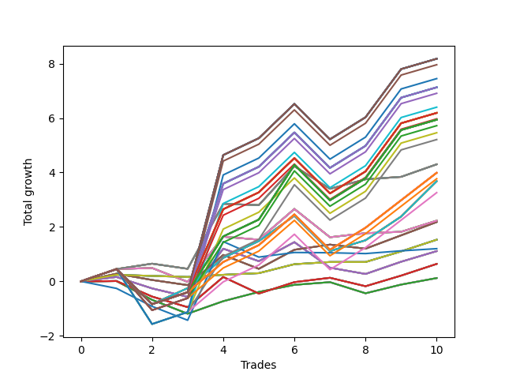

# Long Wallace Doodle 012 
- Symbol: AAPL_Unlimited
- Date Range: 03/23/2022 - 07/08/2022
- Trading Period: 7:20-12:30
- Number of Trades: 10



| Name | Win Percent | Profit | Avg Profit / Trade | Avg Time / Trade |      | Name | Win Percent | Profit | Avg Profit / Trade | Avg Time / Trade |
| ---- | ----------- | ------ | ------------------ | ---------------- | ---- | ---- | ----------- | ------ | ------------------ | ---------------- |
| Sorted By <br> Profit | | | | | | Sorted By <br> Win Percentage ||||
| One Hundred Thirty | 80.00 | 4090.00 | 409.00 | 157:22 |     | One Hundred Thirty | 80.00 | 4090.00 | 409.00 | 157:22 |
| One Hundred Twenty-Five | 80.00 | 4090.00 | 409.00 | 157:22 |     | One Hundred Twenty-Five | 80.00 | 4090.00 | 409.00 | 157:22 |
| One Hundred Twenty | 80.00 | 4090.00 | 409.00 | 157:22 |     | One Hundred Twenty | 80.00 | 4090.00 | 409.00 | 157:22 |
| One Hundred Fifteen | 80.00 | 4090.00 | 409.00 | 157:22 |     | One Hundred Fifteen | 80.00 | 4090.00 | 409.00 | 157:22 |
| One Hundred Ten | 80.00 | 4090.00 | 409.00 | 157:22 |     | One Hundred Ten | 80.00 | 4090.00 | 409.00 | 157:22 |
| One Hundred Five | 80.00 | 4090.00 | 409.00 | 157:22 |     | One Hundred Five | 80.00 | 4090.00 | 409.00 | 157:22 |
| Eighty-Five | 80.00 | 4090.00 | 409.00 | 157:22 |     | Eighty-Five | 80.00 | 4090.00 | 409.00 | 157:22 |
| One Hundred | 80.00 | 3980.00 | 398.00 | 145:45 |     | One Hundred | 80.00 | 3980.00 | 398.00 | 145:45 |
| Ninety-Five | 80.00 | 3725.00 | 372.50 | 148:13 |     | Ninety-Five | 80.00 | 3725.00 | 372.50 | 148:13 |
| One Hundred Twenty-Nine | 80.00 | 3565.00 | 356.50 | 155:43 |     | One Hundred Twenty-Nine | 80.00 | 3565.00 | 356.50 | 155:43 |
| One Hundred Twenty-Four | 80.00 | 3565.00 | 356.50 | 155:43 |     | One Hundred Twenty-Four | 80.00 | 3565.00 | 356.50 | 155:43 |
| One Hundred Ninteen | 80.00 | 3565.00 | 356.50 | 155:43 |     | One Hundred Ninteen | 80.00 | 3565.00 | 356.50 | 155:43 |
| One Hundred Fourteen | 80.00 | 3565.00 | 356.50 | 155:43 |     | One Hundred Fourteen | 80.00 | 3565.00 | 356.50 | 155:43 |
| One Hundred Nine | 80.00 | 3565.00 | 356.50 | 155:43 |     | One Hundred Nine | 80.00 | 3565.00 | 356.50 | 155:43 |
| One Hundred Four | 80.00 | 3565.00 | 356.50 | 155:43 |     | One Hundred Four | 80.00 | 3565.00 | 356.50 | 155:43 |
| Eighty-Four | 80.00 | 3565.00 | 356.50 | 155:43 |     | Eighty-Four | 80.00 | 3565.00 | 356.50 | 155:43 |
| Ninety-Nine | 80.00 | 3455.00 | 345.50 | 144:06 |     | Ninety-Nine | 80.00 | 3455.00 | 345.50 | 144:06 |
| Ninety-Four | 80.00 | 3200.00 | 320.00 | 146:34 |     | Ninety-Four | 80.00 | 3200.00 | 320.00 | 146:34 |
| One Hundred Twenty-Eight | 80.00 | 3095.00 | 309.50 | 152:43 |     | One Hundred Twenty-Eight | 80.00 | 3095.00 | 309.50 | 152:43 |
| One Hundred Twenty-Three | 80.00 | 3095.00 | 309.50 | 152:43 |     | One Hundred Twenty-Three | 80.00 | 3095.00 | 309.50 | 152:43 |
| One Hundred Eighteen | 80.00 | 3095.00 | 309.50 | 152:43 |     | One Hundred Eighteen | 80.00 | 3095.00 | 309.50 | 152:43 |
| One Hundred Thirteen | 80.00 | 3095.00 | 309.50 | 152:43 |     | One Hundred Thirteen | 80.00 | 3095.00 | 309.50 | 152:43 |
| One Hundred Eight | 80.00 | 3095.00 | 309.50 | 152:43 |     | One Hundred Eight | 80.00 | 3095.00 | 309.50 | 152:43 |
| One Hundred Three | 80.00 | 3095.00 | 309.50 | 152:43 |     | One Hundred Three | 80.00 | 3095.00 | 309.50 | 152:43 |
| Eighty-Three | 80.00 | 3095.00 | 309.50 | 152:43 |     | Eighty-Three | 80.00 | 3095.00 | 309.50 | 152:43 |
| Ninety-Eight | 80.00 | 2985.00 | 298.50 | 141:07 |     | Ninety-Eight | 80.00 | 2985.00 | 298.50 | 141:07 |
| One Hundred Twenty-Seven | 80.00 | 2970.00 | 297.00 | 149:17 |     | One Hundred Twenty-Seven | 80.00 | 2970.00 | 297.00 | 149:17 |
| One Hundred Twenty-Two | 80.00 | 2970.00 | 297.00 | 149:17 |     | One Hundred Twenty-Two | 80.00 | 2970.00 | 297.00 | 149:17 |
| One Hundred Seventeen | 80.00 | 2970.00 | 297.00 | 149:17 |     | One Hundred Seventeen | 80.00 | 2970.00 | 297.00 | 149:17 |
| One Hundred Twelve | 80.00 | 2970.00 | 297.00 | 149:17 |     | One Hundred Twelve | 80.00 | 2970.00 | 297.00 | 149:17 |
| One Hundred Seven | 80.00 | 2970.00 | 297.00 | 149:17 |     | One Hundred Seven | 80.00 | 2970.00 | 297.00 | 149:17 |
| One Hundred Two | 80.00 | 2970.00 | 297.00 | 149:17 |     | One Hundred Two | 80.00 | 2970.00 | 297.00 | 149:17 |
| Eighty-Two | 80.00 | 2970.00 | 297.00 | 149:17 |     | Eighty-Two | 80.00 | 2970.00 | 297.00 | 149:17 |
| Ninety-Seven | 80.00 | 2860.00 | 286.00 | 137:41 |     | Ninety-Seven | 80.00 | 2860.00 | 286.00 | 137:41 |
| Ninety-Three | 80.00 | 2730.00 | 273.00 | 143:34 |     | Ninety-Three | 80.00 | 2730.00 | 273.00 | 143:34 |
| Ninety-Two | 80.00 | 2605.00 | 260.50 | 140:08 |     | Ninety-Two | 80.00 | 2605.00 | 260.50 | 140:08 |
| Sixty-Nine | 70.00 | 2150.00 | 215.00 | 58:17 |     | One Hundred Twenty-Six | 80.00 | 1995.00 | 199.50 | 127:07 |
| Sixty-One | 70.00 | 2150.00 | 215.00 | 58:17 |     | One Hundred Twenty-One | 80.00 | 1995.00 | 199.50 | 127:07 |
| Fifty-Three | 70.00 | 2150.00 | 215.00 | 58:17 |     | One Hundred Sixteen | 80.00 | 1995.00 | 199.50 | 127:07 |
| Forty-Five | 70.00 | 2150.00 | 215.00 | 58:17 |     | One Hundred Eleven | 80.00 | 1995.00 | 199.50 | 127:07 |
| Five | 70.00 | 2150.00 | 215.00 | 58:17 |     | One Hundred Six | 80.00 | 1995.00 | 199.50 | 127:07 |
| One Hundred Twenty-Six | 80.00 | 1995.00 | 199.50 | 127:07 |     | One Hundred One | 80.00 | 1995.00 | 199.50 | 127:07 |
| One Hundred Twenty-One | 80.00 | 1995.00 | 199.50 | 127:07 |     | Eighty-One | 80.00 | 1995.00 | 199.50 | 127:07 |
| One Hundred Sixteen | 80.00 | 1995.00 | 199.50 | 127:07 |     | Ninety-Six | 80.00 | 1885.00 | 188.50 | 115:31 |
| One Hundred Eleven | 80.00 | 1995.00 | 199.50 | 127:07 |     | Seventy-One | 80.00 | 1840.00 | 184.00 | 113:56 |
| One Hundred Six | 80.00 | 1995.00 | 199.50 | 127:07 |     | Sixty-Three | 80.00 | 1840.00 | 184.00 | 113:56 |
| One Hundred One | 80.00 | 1995.00 | 199.50 | 127:07 |     | Fifty-Five | 80.00 | 1840.00 | 184.00 | 113:56 |
| Eighty-One | 80.00 | 1995.00 | 199.50 | 127:07 |     | Forty-Seven | 80.00 | 1840.00 | 184.00 | 113:56 |
| Ninety-Six | 80.00 | 1885.00 | 188.50 | 115:31 |     | Seven | 80.00 | 1840.00 | 184.00 | 113:56 |
| Seventy-One | 80.00 | 1840.00 | 184.00 | 113:56 |     | Ninety-One | 80.00 | 1630.00 | 163.00 | 117:58 |
| Sixty-Three | 80.00 | 1840.00 | 184.00 | 113:56 |     | Seventy | 80.00 | 765.00 | 76.50 | 17:11 |
| Fifty-Five | 80.00 | 1840.00 | 184.00 | 113:56 |     | Sixty-Two | 80.00 | 765.00 | 76.50 | 17:11 |
| Forty-Seven | 80.00 | 1840.00 | 184.00 | 113:56 |     | Fifty-Four | 80.00 | 765.00 | 76.50 | 17:11 |
| Seven | 80.00 | 1840.00 | 184.00 | 113:56 |     | Forty-Six | 80.00 | 765.00 | 76.50 | 17:11 |
| Ninety-One | 80.00 | 1630.00 | 163.00 | 117:58 |     | Six | 80.00 | 765.00 | 76.50 | 17:11 |
| Sixty-Eight | 70.00 | 1115.00 | 111.50 | 51:17 |     | Sixty-Nine | 70.00 | 2150.00 | 215.00 | 58:17 |
| Sixty | 70.00 | 1115.00 | 111.50 | 51:17 |     | Sixty-One | 70.00 | 2150.00 | 215.00 | 58:17 |
| Fifty-Two | 70.00 | 1115.00 | 111.50 | 51:17 |     | Fifty-Three | 70.00 | 2150.00 | 215.00 | 58:17 |
| Forty-Four | 70.00 | 1115.00 | 111.50 | 51:17 |     | Forty-Five | 70.00 | 2150.00 | 215.00 | 58:17 |
| Four | 70.00 | 1115.00 | 111.50 | 51:17 |     | Five | 70.00 | 2150.00 | 215.00 | 58:17 |
| Sixty-Seven | 60.00 | 1090.00 | 109.00 | 24:40 |     | Sixty-Eight | 70.00 | 1115.00 | 111.50 | 51:17 |
| Fifty-Nine | 60.00 | 1090.00 | 109.00 | 24:40 |     | Sixty | 70.00 | 1115.00 | 111.50 | 51:17 |
| Fifty-One | 60.00 | 1090.00 | 109.00 | 24:40 |     | Fifty-Two | 70.00 | 1115.00 | 111.50 | 51:17 |
| Forty-Three | 60.00 | 1090.00 | 109.00 | 24:40 |     | Forty-Four | 70.00 | 1115.00 | 111.50 | 51:17 |
| Three | 60.00 | 1090.00 | 109.00 | 24:40 |     | Four | 70.00 | 1115.00 | 111.50 | 51:17 |
| Seventy | 80.00 | 765.00 | 76.50 | 17:11 |     | Sixty-Four | 70.00 | 60.00 | 6.00 | 14:21 |
| Sixty-Two | 80.00 | 765.00 | 76.50 | 17:11 |     | Fifty-Six | 70.00 | 60.00 | 6.00 | 14:21 |
| Fifty-Four | 80.00 | 765.00 | 76.50 | 17:11 |     | Forty-Eight | 70.00 | 60.00 | 6.00 | 14:21 |
| Forty-Six | 80.00 | 765.00 | 76.50 | 17:11 |     | Forty | 70.00 | 60.00 | 6.00 | 14:21 |
| Six | 80.00 | 765.00 | 76.50 | 17:11 |     | Zero | 70.00 | 60.00 | 6.00 | 14:21 |
| Seventy-Three | 40.00 | 600.00 | 60.00 | 10:47 |     | Sixty-Seven | 60.00 | 1090.00 | 109.00 | 24:40 |
| Sixty-Six | 50.00 | 555.00 | 55.50 | 31:50 |     | Fifty-Nine | 60.00 | 1090.00 | 109.00 | 24:40 |
| Fifty-Eight | 50.00 | 555.00 | 55.50 | 31:50 |     | Fifty-One | 60.00 | 1090.00 | 109.00 | 24:40 |
| Fifty | 50.00 | 555.00 | 55.50 | 31:50 |     | Forty-Three | 60.00 | 1090.00 | 109.00 | 24:40 |
| Forty-Two | 50.00 | 555.00 | 55.50 | 31:50 |     | Three | 60.00 | 1090.00 | 109.00 | 24:40 |
| Two | 50.00 | 555.00 | 55.50 | 31:50 |     | Sixty-Five | 60.00 | 320.00 | 32.00 | 21:28 |
| Sixty-Five | 60.00 | 320.00 | 32.00 | 21:28 |     | Fifty-Seven | 60.00 | 320.00 | 32.00 | 21:28 |
| Fifty-Seven | 60.00 | 320.00 | 32.00 | 21:28 |     | Forty-Nine | 60.00 | 320.00 | 32.00 | 21:28 |
| Forty-Nine | 60.00 | 320.00 | 32.00 | 21:28 |     | Forty-One | 60.00 | 320.00 | 32.00 | 21:28 |
| Forty-One | 60.00 | 320.00 | 32.00 | 21:28 |     | One | 60.00 | 320.00 | 32.00 | 21:28 |
| One | 60.00 | 320.00 | 32.00 | 21:28 |     | Sixty-Six | 50.00 | 555.00 | 55.50 | 31:50 |
| Sixty-Four | 70.00 | 60.00 | 6.00 | 14:21 |     | Fifty-Eight | 50.00 | 555.00 | 55.50 | 31:50 |
| Fifty-Six | 70.00 | 60.00 | 6.00 | 14:21 |     | Fifty | 50.00 | 555.00 | 55.50 | 31:50 |
| Forty-Eight | 70.00 | 60.00 | 6.00 | 14:21 |     | Forty-Two | 50.00 | 555.00 | 55.50 | 31:50 |
| Forty | 70.00 | 60.00 | 6.00 | 14:21 |     | Two | 50.00 | 555.00 | 55.50 | 31:50 |
| Zero | 70.00 | 60.00 | 6.00 | 14:21 |     | Seventy-Three | 40.00 | 600.00 | 60.00 | 10:47 |

## NO STOPLOSS

### Test Zero
* Sell when price hits the middle line of the 20p bollinger
* No Stoploss
* Results:
```
Total Trades: 10
Percent Up: 70.00
Percent Down: 30.00
Total Points Moved Up: 0.12
Potential Profit: 60.00
Total Points Ups: 1.73 Count Ups: 7
Total Points Downs: -1.61 Count Downs: 3
```

<details><summary>Trades</summary>

<code>In: 2022-03-25 12:25:00		Out: 2022-03-25 12:36:40		Total Position Time: 11:40		Total Move Up: 0.01		Total to Date: 0.01</code> <br />
<code>In: 2022-04-12 07:42:00		Out: 2022-04-12 08:13:15		Total Position Time: 31:15		Total Move Up: -0.69		Total to Date: -0.68</code> <br />
<code>In: 2022-04-20 08:04:00		Out: 2022-04-20 08:29:20		Total Position Time: 25:20		Total Move Up: -0.51		Total to Date: -1.19</code> <br />
<code>In: 2022-05-04 11:36:00		Out: 2022-05-04 11:41:35		Total Position Time: 05:35		Total Move Up: 0.46		Total to Date: -0.73</code> <br />
<code>In: 2022-05-06 10:55:00		Out: 2022-05-06 11:02:20		Total Position Time: 07:20		Total Move Up: 0.34		Total to Date: -0.39</code> <br />
<code>In: 2022-05-17 11:24:00		Out: 2022-05-17 11:37:20		Total Position Time: 13:20		Total Move Up: 0.26		Total to Date: -0.13</code> <br />
<code>In: 2022-06-08 09:01:00		Out: 2022-06-08 09:02:15		Total Position Time: 01:15		Total Move Up: 0.10		Total to Date: -0.03</code> <br />
<code>In: 2022-06-14 11:50:00		Out: 2022-06-14 12:22:10		Total Position Time: 32:10		Total Move Up: -0.41		Total to Date: -0.44</code> <br />
<code>In: 2022-06-23 09:06:00		Out: 2022-06-23 09:13:50		Total Position Time: 07:50		Total Move Up: 0.32		Total to Date: -0.12</code> <br />
<code>In: 2022-06-29 09:29:00		Out: 2022-06-29 09:36:45		Total Position Time: 07:45		Total Move Up: 0.24		Total to Date: 0.12</code> <br />


</details>

### Test One
* Sell when the price hits the upper line of the 20p 1std bollinger
* No Stoploss
* Results:
```
Total Trades: 10
Percent Up: 60.00
Percent Down: 40.00
Total Points Moved Up: 0.64
Potential Profit: 320.00
Total Points Ups: 2.52 Count Ups: 6
Total Points Downs: -1.88 Count Downs: 4
```

<details><summary>Trades</summary>

<code>In: 2022-03-25 12:25:00		Out: 2022-03-25 12:41:15		Total Position Time: 16:15		Total Move Up: 0.01		Total to Date: 0.01</code> <br />
<code>In: 2022-04-12 07:42:00		Out: 2022-04-12 08:14:15		Total Position Time: 32:15		Total Move Up: -0.57		Total to Date: -0.56</code> <br />
<code>In: 2022-04-20 08:04:00		Out: 2022-04-20 08:31:25		Total Position Time: 27:25		Total Move Up: -0.39		Total to Date: -0.95</code> <br />
<code>In: 2022-05-04 11:36:00		Out: 2022-05-04 11:43:55		Total Position Time: 07:55		Total Move Up: 1.11		Total to Date: 0.16</code> <br />
<code>In: 2022-05-06 10:55:00		Out: 2022-05-06 11:49:20		Total Position Time: 54:20		Total Move Up: -0.61		Total to Date: -0.45</code> <br />
<code>In: 2022-05-17 11:24:00		Out: 2022-05-17 11:39:40		Total Position Time: 15:40		Total Move Up: 0.42		Total to Date: -0.03</code> <br />
<code>In: 2022-06-08 09:01:00		Out: 2022-06-08 09:03:05		Total Position Time: 02:05		Total Move Up: 0.16		Total to Date: 0.13</code> <br />
<code>In: 2022-06-14 11:50:00		Out: 2022-06-14 12:26:30		Total Position Time: 36:30		Total Move Up: -0.31		Total to Date: -0.18</code> <br />
<code>In: 2022-06-23 09:06:00		Out: 2022-06-23 09:18:50		Total Position Time: 12:50		Total Move Up: 0.39		Total to Date: 0.21</code> <br />
<code>In: 2022-06-29 09:29:00		Out: 2022-06-29 09:38:30		Total Position Time: 09:30		Total Move Up: 0.43		Total to Date: 0.64</code> <br />


</details>

### Test Two
* Sell when the price hits the upper line of the 20p 2std bollinger
* No Stoploss
* Results:
```
Total Trades: 10
Percent Up: 50.00
Percent Down: 50.00
Total Points Moved Up: 1.11
Potential Profit: 555.00
Total Points Ups: 3.47 Count Ups: 5
Total Points Downs: -2.36 Count Downs: 5
```

<details><summary>Trades</summary>

<code>In: 2022-03-25 12:25:00		Out: 2022-03-25 12:41:30		Total Position Time: 16:30		Total Move Up: 0.16		Total to Date: 0.16</code> <br />
<code>In: 2022-04-12 07:42:00		Out: 2022-04-12 08:15:15		Total Position Time: 33:15		Total Move Up: -0.42		Total to Date: -0.26</code> <br />
<code>In: 2022-04-20 08:04:00		Out: 2022-04-20 08:38:10		Total Position Time: 34:10		Total Move Up: -0.31		Total to Date: -0.57</code> <br />
<code>In: 2022-05-04 11:36:00		Out: 2022-05-04 11:46:55		Total Position Time: 10:55		Total Move Up: 1.77		Total to Date: 1.20</code> <br />
<code>In: 2022-05-06 10:55:00		Out: 2022-05-06 11:50:05		Total Position Time: 55:05		Total Move Up: -0.46		Total to Date: 0.74</code> <br />
<code>In: 2022-05-17 11:24:00		Out: 2022-05-17 11:40:00		Total Position Time: 16:00		Total Move Up: 0.70		Total to Date: 1.44</code> <br />
<code>In: 2022-06-08 09:01:00		Out: 2022-06-08 10:00:10		Total Position Time: 59:10		Total Move Up: -0.94		Total to Date: 0.50</code> <br />
<code>In: 2022-06-14 11:50:00		Out: 2022-06-14 12:27:10		Total Position Time: 37:10		Total Move Up: -0.23		Total to Date: 0.27</code> <br />
<code>In: 2022-06-23 09:06:00		Out: 2022-06-23 09:21:05		Total Position Time: 15:05		Total Move Up: 0.45		Total to Date: 0.72</code> <br />
<code>In: 2022-06-29 09:29:00		Out: 2022-06-29 10:10:00		Total Position Time: 41:00		Total Move Up: 0.39		Total to Date: 1.11</code> <br />


</details>

### Test Three
* Sell when price hits the middle line of the 50p bollinger
* No Stoploss
* Results:
```
Total Trades: 10
Percent Up: 60.00
Percent Down: 40.00
Total Points Moved Up: 2.18
Potential Profit: 1090.00
Total Points Ups: 3.26 Count Ups: 6
Total Points Downs: -1.08 Count Downs: 4
```

<details><summary>Trades</summary>

<code>In: 2022-03-25 12:25:00		Out: 2022-03-25 12:45:30		Total Position Time: 20:30		Total Move Up: 0.28		Total to Date: 0.28</code> <br />
<code>In: 2022-04-12 07:42:00		Out: 2022-04-12 08:19:50		Total Position Time: 37:50		Total Move Up: -0.23		Total to Date: 0.05</code> <br />
<code>In: 2022-04-20 08:04:00		Out: 2022-04-20 08:42:00		Total Position Time: 38:00		Total Move Up: -0.19		Total to Date: -0.14</code> <br />
<code>In: 2022-05-04 11:36:00		Out: 2022-05-04 11:43:55		Total Position Time: 07:55		Total Move Up: 1.11		Total to Date: 0.97</code> <br />
<code>In: 2022-05-06 10:55:00		Out: 2022-05-06 11:49:25		Total Position Time: 54:25		Total Move Up: -0.51		Total to Date: 0.46</code> <br />
<code>In: 2022-05-17 11:24:00		Out: 2022-05-17 11:40:00		Total Position Time: 16:00		Total Move Up: 0.70		Total to Date: 1.16</code> <br />
<code>In: 2022-06-08 09:01:00		Out: 2022-06-08 09:03:25		Total Position Time: 02:25		Total Move Up: 0.19		Total to Date: 1.35</code> <br />
<code>In: 2022-06-14 11:50:00		Out: 2022-06-14 12:27:25		Total Position Time: 37:25		Total Move Up: -0.15		Total to Date: 1.20</code> <br />
<code>In: 2022-06-23 09:06:00		Out: 2022-06-23 09:22:00		Total Position Time: 16:00		Total Move Up: 0.49		Total to Date: 1.69</code> <br />
<code>In: 2022-06-29 09:29:00		Out: 2022-06-29 09:45:15		Total Position Time: 16:15		Total Move Up: 0.49		Total to Date: 2.18</code> <br />


</details>

### Test Four
* Sell when the price hits the upper line of the 50p 1std bollinger
* No Stoploss
* Results:
```
Total Trades: 10
Percent Up: 70.00
Percent Down: 30.00
Total Points Moved Up: 2.23
Potential Profit: 1115.00
Total Points Ups: 3.89 Count Ups: 7
Total Points Downs: -1.66 Count Downs: 3
```

<details><summary>Trades</summary>

<code>In: 2022-03-25 12:25:00		Out: 2022-03-25 12:47:00		Total Position Time: 22:00		Total Move Up: 0.45		Total to Date: 0.45</code> <br />
<code>In: 2022-04-12 07:42:00		Out: 2022-04-12 08:25:10		Total Position Time: 43:10		Total Move Up: 0.04		Total to Date: 0.49</code> <br />
<code>In: 2022-04-20 08:04:00		Out: 2022-04-20 09:36:55		Total Position Time: 92:55		Total Move Up: -0.51		Total to Date: -0.02</code> <br />
<code>In: 2022-05-04 11:36:00		Out: 2022-05-04 11:46:50		Total Position Time: 10:50		Total Move Up: 1.66		Total to Date: 1.64</code> <br />
<code>In: 2022-05-06 10:55:00		Out: 2022-05-06 11:50:20		Total Position Time: 55:20		Total Move Up: -0.11		Total to Date: 1.53</code> <br />
<code>In: 2022-05-17 11:24:00		Out: 2022-05-17 11:40:20		Total Position Time: 16:20		Total Move Up: 1.13		Total to Date: 2.66</code> <br />
<code>In: 2022-06-08 09:01:00		Out: 2022-06-08 10:54:00		Total Position Time: 113:00		Total Move Up: -1.04		Total to Date: 1.62</code> <br />
<code>In: 2022-06-14 11:50:00		Out: 2022-06-14 12:30:50		Total Position Time: 40:50		Total Move Up: 0.15		Total to Date: 1.77</code> <br />
<code>In: 2022-06-23 09:06:00		Out: 2022-06-23 10:23:20		Total Position Time: 77:20		Total Move Up: 0.05		Total to Date: 1.82</code> <br />
<code>In: 2022-06-29 09:29:00		Out: 2022-06-29 10:10:05		Total Position Time: 41:05		Total Move Up: 0.41		Total to Date: 2.23</code> <br />


</details>

### Test Five
* Sell when the price hits the upper line of the 50p 2std bollinger
* No Stoploss
* Results:
```
Total Trades: 10
Percent Up: 70.00
Percent Down: 30.00
Total Points Moved Up: 4.30
Potential Profit: 2150.00
Total Points Ups: 5.37 Count Ups: 7
Total Points Downs: -1.07 Count Downs: 3
```

<details><summary>Trades</summary>

<code>In: 2022-03-25 12:25:00		Out: 2022-03-25 12:47:00		Total Position Time: 22:00		Total Move Up: 0.45		Total to Date: 0.45</code> <br />
<code>In: 2022-04-12 07:42:00		Out: 2022-04-12 08:29:25		Total Position Time: 47:25		Total Move Up: 0.20		Total to Date: 0.65</code> <br />
<code>In: 2022-04-20 08:04:00		Out: 2022-04-20 09:50:25		Total Position Time: 106:25		Total Move Up: -0.19		Total to Date: 0.46</code> <br />
<code>In: 2022-05-04 11:36:00		Out: 2022-05-04 11:47:10		Total Position Time: 11:10		Total Move Up: 2.39		Total to Date: 2.85</code> <br />
<code>In: 2022-05-06 10:55:00		Out: 2022-05-06 11:55:05		Total Position Time: 60:05		Total Move Up: -0.05		Total to Date: 2.80</code> <br />
<code>In: 2022-05-17 11:24:00		Out: 2022-05-17 11:48:45		Total Position Time: 24:45		Total Move Up: 1.43		Total to Date: 4.23</code> <br />
<code>In: 2022-06-08 09:01:00		Out: 2022-06-08 10:56:30		Total Position Time: 115:30		Total Move Up: -0.83		Total to Date: 3.40</code> <br />
<code>In: 2022-06-14 11:50:00		Out: 2022-06-14 12:36:25		Total Position Time: 46:25		Total Move Up: 0.35		Total to Date: 3.75</code> <br />
<code>In: 2022-06-23 09:06:00		Out: 2022-06-23 10:23:25		Total Position Time: 77:25		Total Move Up: 0.09		Total to Date: 3.84</code> <br />
<code>In: 2022-06-29 09:29:00		Out: 2022-06-29 10:40:40		Total Position Time: 71:40		Total Move Up: 0.46		Total to Date: 4.30</code> <br />


</details>

### Test Six
* Sell when the price hits the middle line of the 1std VWAP
* No Stoploss
* Results:
```
Total Trades: 10
Percent Up: 80.00
Percent Down: 20.00
Total Points Moved Up: 1.53
Potential Profit: 765.00
Total Points Ups: 1.61 Count Ups: 8
Total Points Downs: -0.08 Count Downs: 2
```

<details><summary>Trades</summary>

<code>In: 2022-03-25 12:25:00		Out: 2022-03-25 12:43:25		Total Position Time: 18:25		Total Move Up: 0.24		Total to Date: 0.24</code> <br />
<code>In: 2022-04-12 07:42:00		Out: 2022-04-12 07:44:30		Total Position Time: 02:30		Total Move Up: -0.04		Total to Date: 0.20</code> <br />
<code>In: 2022-04-20 08:04:00		Out: 2022-04-20 10:04:05		Total Position Time: 120:05		Total Move Up: -0.04		Total to Date: 0.16</code> <br />
<code>In: 2022-05-04 11:36:00		Out: 2022-05-04 11:37:10		Total Position Time: 01:10		Total Move Up: 0.08		Total to Date: 0.24</code> <br />
<code>In: 2022-05-06 10:55:00		Out: 2022-05-06 10:56:10		Total Position Time: 01:10		Total Move Up: 0.06		Total to Date: 0.30</code> <br />
<code>In: 2022-05-17 11:24:00		Out: 2022-05-17 11:27:00		Total Position Time: 03:00		Total Move Up: 0.33		Total to Date: 0.63</code> <br />
<code>In: 2022-06-08 09:01:00		Out: 2022-06-08 09:02:10		Total Position Time: 01:10		Total Move Up: 0.08		Total to Date: 0.71</code> <br />
<code>In: 2022-06-14 11:50:00		Out: 2022-06-14 11:52:00		Total Position Time: 02:00		Total Move Up: 0.00		Total to Date: 0.71</code> <br />
<code>In: 2022-06-23 09:06:00		Out: 2022-06-23 09:18:50		Total Position Time: 12:50		Total Move Up: 0.39		Total to Date: 1.10</code> <br />
<code>In: 2022-06-29 09:29:00		Out: 2022-06-29 09:38:30		Total Position Time: 09:30		Total Move Up: 0.43		Total to Date: 1.53</code> <br />


</details>

### Test Seven
* Sell when the price hits the upper line of the 1std VWAP
* No Stoploss
* Results:
```
Total Trades: 10
Percent Up: 80.00
Percent Down: 20.00
Total Points Moved Up: 3.68
Potential Profit: 1840.00
Total Points Ups: 6.27 Count Ups: 8
Total Points Downs: -2.59 Count Downs: 2
```

<details><summary>Trades</summary>

<code>In: 2022-03-25 12:25:00		Out: 2022-03-25 12:47:00		Total Position Time: 22:00		Total Move Up: 0.45		Total to Date: 0.45</code> <br />
<code>In: 2022-04-12 07:42:00		Out: 2022-04-12 12:47:00		Total Position Time: 305:00		Total Move Up: -1.29		Total to Date: -0.84</code> <br />
<code>In: 2022-04-20 08:04:00		Out: 2022-04-20 10:43:35		Total Position Time: 159:35		Total Move Up: 0.59		Total to Date: -0.25</code> <br />
<code>In: 2022-05-04 11:36:00		Out: 2022-05-04 11:43:55		Total Position Time: 07:55		Total Move Up: 1.11		Total to Date: 0.86</code> <br />
<code>In: 2022-05-06 10:55:00		Out: 2022-05-06 12:47:00		Total Position Time: 112:00		Total Move Up: 0.62		Total to Date: 1.48</code> <br />
<code>In: 2022-05-17 11:24:00		Out: 2022-05-17 11:40:10		Total Position Time: 16:10		Total Move Up: 0.93		Total to Date: 2.41</code> <br />
<code>In: 2022-06-08 09:01:00		Out: 2022-06-08 12:47:00		Total Position Time: 226:00		Total Move Up: -1.30		Total to Date: 1.11</code> <br />
<code>In: 2022-06-14 11:50:00		Out: 2022-06-14 12:37:35		Total Position Time: 47:35		Total Move Up: 0.40		Total to Date: 1.51</code> <br />
<code>In: 2022-06-23 09:06:00		Out: 2022-06-23 11:31:35		Total Position Time: 145:35		Total Move Up: 0.87		Total to Date: 2.38</code> <br />
<code>In: 2022-06-29 09:29:00		Out: 2022-06-29 11:06:35		Total Position Time: 97:35		Total Move Up: 1.30		Total to Date: 3.68</code> <br />


</details>

## STOPLOSS OF 5

### Test Forty
* Sell when price hits the middle line of the 20p bollinger
* Stoploss is 5 points
* Results:
```
Total Trades: 10
Percent Up: 70.00
Percent Down: 30.00
Total Points Moved Up: 0.12
Potential Profit: 60.00
Total Points Ups: 1.73 Count Ups: 7
Total Points Downs: -1.61 Count Downs: 3
```

<details><summary>Trades</summary>

<code>In: 2022-03-25 12:25:00		Out: 2022-03-25 12:36:40		Total Position Time: 11:40		Total Move Up: 0.01		Total to Date: 0.01</code> <br />
<code>In: 2022-04-12 07:42:00		Out: 2022-04-12 08:13:15		Total Position Time: 31:15		Total Move Up: -0.69		Total to Date: -0.68</code> <br />
<code>In: 2022-04-20 08:04:00		Out: 2022-04-20 08:29:20		Total Position Time: 25:20		Total Move Up: -0.51		Total to Date: -1.19</code> <br />
<code>In: 2022-05-04 11:36:00		Out: 2022-05-04 11:41:35		Total Position Time: 05:35		Total Move Up: 0.46		Total to Date: -0.73</code> <br />
<code>In: 2022-05-06 10:55:00		Out: 2022-05-06 11:02:20		Total Position Time: 07:20		Total Move Up: 0.34		Total to Date: -0.39</code> <br />
<code>In: 2022-05-17 11:24:00		Out: 2022-05-17 11:37:20		Total Position Time: 13:20		Total Move Up: 0.26		Total to Date: -0.13</code> <br />
<code>In: 2022-06-08 09:01:00		Out: 2022-06-08 09:02:15		Total Position Time: 01:15		Total Move Up: 0.10		Total to Date: -0.03</code> <br />
<code>In: 2022-06-14 11:50:00		Out: 2022-06-14 12:22:10		Total Position Time: 32:10		Total Move Up: -0.41		Total to Date: -0.44</code> <br />
<code>In: 2022-06-23 09:06:00		Out: 2022-06-23 09:13:50		Total Position Time: 07:50		Total Move Up: 0.32		Total to Date: -0.12</code> <br />
<code>In: 2022-06-29 09:29:00		Out: 2022-06-29 09:36:45		Total Position Time: 07:45		Total Move Up: 0.24		Total to Date: 0.12</code> <br />


</details>

### Test Forty-One
* Sell when the price hits the upper line of the 20p 1std bollinger
* Stoploss is 5 points
* Results:
```
Total Trades: 10
Percent Up: 60.00
Percent Down: 40.00
Total Points Moved Up: 0.64
Potential Profit: 320.00
Total Points Ups: 2.52 Count Ups: 6
Total Points Downs: -1.88 Count Downs: 4
```

<details><summary>Trades</summary>

<code>In: 2022-03-25 12:25:00		Out: 2022-03-25 12:41:15		Total Position Time: 16:15		Total Move Up: 0.01		Total to Date: 0.01</code> <br />
<code>In: 2022-04-12 07:42:00		Out: 2022-04-12 08:14:15		Total Position Time: 32:15		Total Move Up: -0.57		Total to Date: -0.56</code> <br />
<code>In: 2022-04-20 08:04:00		Out: 2022-04-20 08:31:25		Total Position Time: 27:25		Total Move Up: -0.39		Total to Date: -0.95</code> <br />
<code>In: 2022-05-04 11:36:00		Out: 2022-05-04 11:43:55		Total Position Time: 07:55		Total Move Up: 1.11		Total to Date: 0.16</code> <br />
<code>In: 2022-05-06 10:55:00		Out: 2022-05-06 11:49:20		Total Position Time: 54:20		Total Move Up: -0.61		Total to Date: -0.45</code> <br />
<code>In: 2022-05-17 11:24:00		Out: 2022-05-17 11:39:40		Total Position Time: 15:40		Total Move Up: 0.42		Total to Date: -0.03</code> <br />
<code>In: 2022-06-08 09:01:00		Out: 2022-06-08 09:03:05		Total Position Time: 02:05		Total Move Up: 0.16		Total to Date: 0.13</code> <br />
<code>In: 2022-06-14 11:50:00		Out: 2022-06-14 12:26:30		Total Position Time: 36:30		Total Move Up: -0.31		Total to Date: -0.18</code> <br />
<code>In: 2022-06-23 09:06:00		Out: 2022-06-23 09:18:50		Total Position Time: 12:50		Total Move Up: 0.39		Total to Date: 0.21</code> <br />
<code>In: 2022-06-29 09:29:00		Out: 2022-06-29 09:38:30		Total Position Time: 09:30		Total Move Up: 0.43		Total to Date: 0.64</code> <br />


</details>

### Test Forty-Two
* Sell when the price hits the upper line of the 20p 2std bollinger
* Stoploss is 5 points
* Results:
```
Total Trades: 10
Percent Up: 50.00
Percent Down: 50.00
Total Points Moved Up: 1.11
Potential Profit: 555.00
Total Points Ups: 3.47 Count Ups: 5
Total Points Downs: -2.36 Count Downs: 5
```

<details><summary>Trades</summary>

<code>In: 2022-03-25 12:25:00		Out: 2022-03-25 12:41:30		Total Position Time: 16:30		Total Move Up: 0.16		Total to Date: 0.16</code> <br />
<code>In: 2022-04-12 07:42:00		Out: 2022-04-12 08:15:15		Total Position Time: 33:15		Total Move Up: -0.42		Total to Date: -0.26</code> <br />
<code>In: 2022-04-20 08:04:00		Out: 2022-04-20 08:38:10		Total Position Time: 34:10		Total Move Up: -0.31		Total to Date: -0.57</code> <br />
<code>In: 2022-05-04 11:36:00		Out: 2022-05-04 11:46:55		Total Position Time: 10:55		Total Move Up: 1.77		Total to Date: 1.20</code> <br />
<code>In: 2022-05-06 10:55:00		Out: 2022-05-06 11:50:05		Total Position Time: 55:05		Total Move Up: -0.46		Total to Date: 0.74</code> <br />
<code>In: 2022-05-17 11:24:00		Out: 2022-05-17 11:40:00		Total Position Time: 16:00		Total Move Up: 0.70		Total to Date: 1.44</code> <br />
<code>In: 2022-06-08 09:01:00		Out: 2022-06-08 10:00:10		Total Position Time: 59:10		Total Move Up: -0.94		Total to Date: 0.50</code> <br />
<code>In: 2022-06-14 11:50:00		Out: 2022-06-14 12:27:10		Total Position Time: 37:10		Total Move Up: -0.23		Total to Date: 0.27</code> <br />
<code>In: 2022-06-23 09:06:00		Out: 2022-06-23 09:21:05		Total Position Time: 15:05		Total Move Up: 0.45		Total to Date: 0.72</code> <br />
<code>In: 2022-06-29 09:29:00		Out: 2022-06-29 10:10:00		Total Position Time: 41:00		Total Move Up: 0.39		Total to Date: 1.11</code> <br />


</details>

### Test Forty-Three
* Sell when price hits the middle line of the 50p bollinger
* Stoploss is 5 points
* Results:
```
Total Trades: 10
Percent Up: 60.00
Percent Down: 40.00
Total Points Moved Up: 2.18
Potential Profit: 1090.00
Total Points Ups: 3.26 Count Ups: 6
Total Points Downs: -1.08 Count Downs: 4
```

<details><summary>Trades</summary>

<code>In: 2022-03-25 12:25:00		Out: 2022-03-25 12:45:30		Total Position Time: 20:30		Total Move Up: 0.28		Total to Date: 0.28</code> <br />
<code>In: 2022-04-12 07:42:00		Out: 2022-04-12 08:19:50		Total Position Time: 37:50		Total Move Up: -0.23		Total to Date: 0.05</code> <br />
<code>In: 2022-04-20 08:04:00		Out: 2022-04-20 08:42:00		Total Position Time: 38:00		Total Move Up: -0.19		Total to Date: -0.14</code> <br />
<code>In: 2022-05-04 11:36:00		Out: 2022-05-04 11:43:55		Total Position Time: 07:55		Total Move Up: 1.11		Total to Date: 0.97</code> <br />
<code>In: 2022-05-06 10:55:00		Out: 2022-05-06 11:49:25		Total Position Time: 54:25		Total Move Up: -0.51		Total to Date: 0.46</code> <br />
<code>In: 2022-05-17 11:24:00		Out: 2022-05-17 11:40:00		Total Position Time: 16:00		Total Move Up: 0.70		Total to Date: 1.16</code> <br />
<code>In: 2022-06-08 09:01:00		Out: 2022-06-08 09:03:25		Total Position Time: 02:25		Total Move Up: 0.19		Total to Date: 1.35</code> <br />
<code>In: 2022-06-14 11:50:00		Out: 2022-06-14 12:27:25		Total Position Time: 37:25		Total Move Up: -0.15		Total to Date: 1.20</code> <br />
<code>In: 2022-06-23 09:06:00		Out: 2022-06-23 09:22:00		Total Position Time: 16:00		Total Move Up: 0.49		Total to Date: 1.69</code> <br />
<code>In: 2022-06-29 09:29:00		Out: 2022-06-29 09:45:15		Total Position Time: 16:15		Total Move Up: 0.49		Total to Date: 2.18</code> <br />


</details>

### Test Forty-Four
* Sell when the price hits the upper line of the 50p 1std bollinger
* Stoploss is 5 points
* Results:
```
Total Trades: 10
Percent Up: 70.00
Percent Down: 30.00
Total Points Moved Up: 2.23
Potential Profit: 1115.00
Total Points Ups: 3.89 Count Ups: 7
Total Points Downs: -1.66 Count Downs: 3
```

<details><summary>Trades</summary>

<code>In: 2022-03-25 12:25:00		Out: 2022-03-25 12:47:00		Total Position Time: 22:00		Total Move Up: 0.45		Total to Date: 0.45</code> <br />
<code>In: 2022-04-12 07:42:00		Out: 2022-04-12 08:25:10		Total Position Time: 43:10		Total Move Up: 0.04		Total to Date: 0.49</code> <br />
<code>In: 2022-04-20 08:04:00		Out: 2022-04-20 09:36:55		Total Position Time: 92:55		Total Move Up: -0.51		Total to Date: -0.02</code> <br />
<code>In: 2022-05-04 11:36:00		Out: 2022-05-04 11:46:50		Total Position Time: 10:50		Total Move Up: 1.66		Total to Date: 1.64</code> <br />
<code>In: 2022-05-06 10:55:00		Out: 2022-05-06 11:50:20		Total Position Time: 55:20		Total Move Up: -0.11		Total to Date: 1.53</code> <br />
<code>In: 2022-05-17 11:24:00		Out: 2022-05-17 11:40:20		Total Position Time: 16:20		Total Move Up: 1.13		Total to Date: 2.66</code> <br />
<code>In: 2022-06-08 09:01:00		Out: 2022-06-08 10:54:00		Total Position Time: 113:00		Total Move Up: -1.04		Total to Date: 1.62</code> <br />
<code>In: 2022-06-14 11:50:00		Out: 2022-06-14 12:30:50		Total Position Time: 40:50		Total Move Up: 0.15		Total to Date: 1.77</code> <br />
<code>In: 2022-06-23 09:06:00		Out: 2022-06-23 10:23:20		Total Position Time: 77:20		Total Move Up: 0.05		Total to Date: 1.82</code> <br />
<code>In: 2022-06-29 09:29:00		Out: 2022-06-29 10:10:05		Total Position Time: 41:05		Total Move Up: 0.41		Total to Date: 2.23</code> <br />


</details>

### Test Forty-Five
* Sell when the price hits the upper line of the 50p 2std bollinger
* Stoploss is 5 points
* Results:
```
Total Trades: 10
Percent Up: 70.00
Percent Down: 30.00
Total Points Moved Up: 4.30
Potential Profit: 2150.00
Total Points Ups: 5.37 Count Ups: 7
Total Points Downs: -1.07 Count Downs: 3
```

<details><summary>Trades</summary>

<code>In: 2022-03-25 12:25:00		Out: 2022-03-25 12:47:00		Total Position Time: 22:00		Total Move Up: 0.45		Total to Date: 0.45</code> <br />
<code>In: 2022-04-12 07:42:00		Out: 2022-04-12 08:29:25		Total Position Time: 47:25		Total Move Up: 0.20		Total to Date: 0.65</code> <br />
<code>In: 2022-04-20 08:04:00		Out: 2022-04-20 09:50:25		Total Position Time: 106:25		Total Move Up: -0.19		Total to Date: 0.46</code> <br />
<code>In: 2022-05-04 11:36:00		Out: 2022-05-04 11:47:10		Total Position Time: 11:10		Total Move Up: 2.39		Total to Date: 2.85</code> <br />
<code>In: 2022-05-06 10:55:00		Out: 2022-05-06 11:55:05		Total Position Time: 60:05		Total Move Up: -0.05		Total to Date: 2.80</code> <br />
<code>In: 2022-05-17 11:24:00		Out: 2022-05-17 11:48:45		Total Position Time: 24:45		Total Move Up: 1.43		Total to Date: 4.23</code> <br />
<code>In: 2022-06-08 09:01:00		Out: 2022-06-08 10:56:30		Total Position Time: 115:30		Total Move Up: -0.83		Total to Date: 3.40</code> <br />
<code>In: 2022-06-14 11:50:00		Out: 2022-06-14 12:36:25		Total Position Time: 46:25		Total Move Up: 0.35		Total to Date: 3.75</code> <br />
<code>In: 2022-06-23 09:06:00		Out: 2022-06-23 10:23:25		Total Position Time: 77:25		Total Move Up: 0.09		Total to Date: 3.84</code> <br />
<code>In: 2022-06-29 09:29:00		Out: 2022-06-29 10:40:40		Total Position Time: 71:40		Total Move Up: 0.46		Total to Date: 4.30</code> <br />


</details>

### Test Forty-Six
* Sell when the price hits the middle line of the 1std VWAP
* Stoploss is 5 points
* Results:
```
Total Trades: 10
Percent Up: 80.00
Percent Down: 20.00
Total Points Moved Up: 1.53
Potential Profit: 765.00
Total Points Ups: 1.61 Count Ups: 8
Total Points Downs: -0.08 Count Downs: 2
```

<details><summary>Trades</summary>

<code>In: 2022-03-25 12:25:00		Out: 2022-03-25 12:43:25		Total Position Time: 18:25		Total Move Up: 0.24		Total to Date: 0.24</code> <br />
<code>In: 2022-04-12 07:42:00		Out: 2022-04-12 07:44:30		Total Position Time: 02:30		Total Move Up: -0.04		Total to Date: 0.20</code> <br />
<code>In: 2022-04-20 08:04:00		Out: 2022-04-20 10:04:05		Total Position Time: 120:05		Total Move Up: -0.04		Total to Date: 0.16</code> <br />
<code>In: 2022-05-04 11:36:00		Out: 2022-05-04 11:37:10		Total Position Time: 01:10		Total Move Up: 0.08		Total to Date: 0.24</code> <br />
<code>In: 2022-05-06 10:55:00		Out: 2022-05-06 10:56:10		Total Position Time: 01:10		Total Move Up: 0.06		Total to Date: 0.30</code> <br />
<code>In: 2022-05-17 11:24:00		Out: 2022-05-17 11:27:00		Total Position Time: 03:00		Total Move Up: 0.33		Total to Date: 0.63</code> <br />
<code>In: 2022-06-08 09:01:00		Out: 2022-06-08 09:02:10		Total Position Time: 01:10		Total Move Up: 0.08		Total to Date: 0.71</code> <br />
<code>In: 2022-06-14 11:50:00		Out: 2022-06-14 11:52:00		Total Position Time: 02:00		Total Move Up: 0.00		Total to Date: 0.71</code> <br />
<code>In: 2022-06-23 09:06:00		Out: 2022-06-23 09:18:50		Total Position Time: 12:50		Total Move Up: 0.39		Total to Date: 1.10</code> <br />
<code>In: 2022-06-29 09:29:00		Out: 2022-06-29 09:38:30		Total Position Time: 09:30		Total Move Up: 0.43		Total to Date: 1.53</code> <br />


</details>

### Test Forty-Seven
* Sell when the price hits the upper line of the 1std VWAP
* Stoploss is 5 points
* Results:
```
Total Trades: 10
Percent Up: 80.00
Percent Down: 20.00
Total Points Moved Up: 3.68
Potential Profit: 1840.00
Total Points Ups: 6.27 Count Ups: 8
Total Points Downs: -2.59 Count Downs: 2
```

<details><summary>Trades</summary>

<code>In: 2022-03-25 12:25:00		Out: 2022-03-25 12:47:00		Total Position Time: 22:00		Total Move Up: 0.45		Total to Date: 0.45</code> <br />
<code>In: 2022-04-12 07:42:00		Out: 2022-04-12 12:47:00		Total Position Time: 305:00		Total Move Up: -1.29		Total to Date: -0.84</code> <br />
<code>In: 2022-04-20 08:04:00		Out: 2022-04-20 10:43:35		Total Position Time: 159:35		Total Move Up: 0.59		Total to Date: -0.25</code> <br />
<code>In: 2022-05-04 11:36:00		Out: 2022-05-04 11:43:55		Total Position Time: 07:55		Total Move Up: 1.11		Total to Date: 0.86</code> <br />
<code>In: 2022-05-06 10:55:00		Out: 2022-05-06 12:47:00		Total Position Time: 112:00		Total Move Up: 0.62		Total to Date: 1.48</code> <br />
<code>In: 2022-05-17 11:24:00		Out: 2022-05-17 11:40:10		Total Position Time: 16:10		Total Move Up: 0.93		Total to Date: 2.41</code> <br />
<code>In: 2022-06-08 09:01:00		Out: 2022-06-08 12:47:00		Total Position Time: 226:00		Total Move Up: -1.30		Total to Date: 1.11</code> <br />
<code>In: 2022-06-14 11:50:00		Out: 2022-06-14 12:37:35		Total Position Time: 47:35		Total Move Up: 0.40		Total to Date: 1.51</code> <br />
<code>In: 2022-06-23 09:06:00		Out: 2022-06-23 11:31:35		Total Position Time: 145:35		Total Move Up: 0.87		Total to Date: 2.38</code> <br />
<code>In: 2022-06-29 09:29:00		Out: 2022-06-29 11:06:35		Total Position Time: 97:35		Total Move Up: 1.30		Total to Date: 3.68</code> <br />


</details>

## TRAIL STOP OF 5

### Test Forty-Eight
* Sell when price hits the middle line of the 20p bollinger
* Trailing Stop is 5 points
* Results:
```
Total Trades: 10
Percent Up: 70.00
Percent Down: 30.00
Total Points Moved Up: 0.12
Potential Profit: 60.00
Total Points Ups: 1.73 Count Ups: 7
Total Points Downs: -1.61 Count Downs: 3
```

<details><summary>Trades</summary>

<code>In: 2022-03-25 12:25:00		Out: 2022-03-25 12:36:40		Total Position Time: 11:40		Total Move Up: 0.01		Total to Date: 0.01</code> <br />
<code>In: 2022-04-12 07:42:00		Out: 2022-04-12 08:13:15		Total Position Time: 31:15		Total Move Up: -0.69		Total to Date: -0.68</code> <br />
<code>In: 2022-04-20 08:04:00		Out: 2022-04-20 08:29:20		Total Position Time: 25:20		Total Move Up: -0.51		Total to Date: -1.19</code> <br />
<code>In: 2022-05-04 11:36:00		Out: 2022-05-04 11:41:35		Total Position Time: 05:35		Total Move Up: 0.46		Total to Date: -0.73</code> <br />
<code>In: 2022-05-06 10:55:00		Out: 2022-05-06 11:02:20		Total Position Time: 07:20		Total Move Up: 0.34		Total to Date: -0.39</code> <br />
<code>In: 2022-05-17 11:24:00		Out: 2022-05-17 11:37:20		Total Position Time: 13:20		Total Move Up: 0.26		Total to Date: -0.13</code> <br />
<code>In: 2022-06-08 09:01:00		Out: 2022-06-08 09:02:15		Total Position Time: 01:15		Total Move Up: 0.10		Total to Date: -0.03</code> <br />
<code>In: 2022-06-14 11:50:00		Out: 2022-06-14 12:22:10		Total Position Time: 32:10		Total Move Up: -0.41		Total to Date: -0.44</code> <br />
<code>In: 2022-06-23 09:06:00		Out: 2022-06-23 09:13:50		Total Position Time: 07:50		Total Move Up: 0.32		Total to Date: -0.12</code> <br />
<code>In: 2022-06-29 09:29:00		Out: 2022-06-29 09:36:45		Total Position Time: 07:45		Total Move Up: 0.24		Total to Date: 0.12</code> <br />


</details>

### Test Forty-Nine
* Sell when the price hits the upper line of the 20p 1std bollinger
* Trailing Stop is 5 points
* Results:
```
Total Trades: 10
Percent Up: 60.00
Percent Down: 40.00
Total Points Moved Up: 0.64
Potential Profit: 320.00
Total Points Ups: 2.52 Count Ups: 6
Total Points Downs: -1.88 Count Downs: 4
```

<details><summary>Trades</summary>

<code>In: 2022-03-25 12:25:00		Out: 2022-03-25 12:41:15		Total Position Time: 16:15		Total Move Up: 0.01		Total to Date: 0.01</code> <br />
<code>In: 2022-04-12 07:42:00		Out: 2022-04-12 08:14:15		Total Position Time: 32:15		Total Move Up: -0.57		Total to Date: -0.56</code> <br />
<code>In: 2022-04-20 08:04:00		Out: 2022-04-20 08:31:25		Total Position Time: 27:25		Total Move Up: -0.39		Total to Date: -0.95</code> <br />
<code>In: 2022-05-04 11:36:00		Out: 2022-05-04 11:43:55		Total Position Time: 07:55		Total Move Up: 1.11		Total to Date: 0.16</code> <br />
<code>In: 2022-05-06 10:55:00		Out: 2022-05-06 11:49:20		Total Position Time: 54:20		Total Move Up: -0.61		Total to Date: -0.45</code> <br />
<code>In: 2022-05-17 11:24:00		Out: 2022-05-17 11:39:40		Total Position Time: 15:40		Total Move Up: 0.42		Total to Date: -0.03</code> <br />
<code>In: 2022-06-08 09:01:00		Out: 2022-06-08 09:03:05		Total Position Time: 02:05		Total Move Up: 0.16		Total to Date: 0.13</code> <br />
<code>In: 2022-06-14 11:50:00		Out: 2022-06-14 12:26:30		Total Position Time: 36:30		Total Move Up: -0.31		Total to Date: -0.18</code> <br />
<code>In: 2022-06-23 09:06:00		Out: 2022-06-23 09:18:50		Total Position Time: 12:50		Total Move Up: 0.39		Total to Date: 0.21</code> <br />
<code>In: 2022-06-29 09:29:00		Out: 2022-06-29 09:38:30		Total Position Time: 09:30		Total Move Up: 0.43		Total to Date: 0.64</code> <br />


</details>

### Test Fifty
* Sell when the price hits the upper line of the 20p 2std bollinger
* Trailing Stop is 5 points
* Results:
```
Total Trades: 10
Percent Up: 50.00
Percent Down: 50.00
Total Points Moved Up: 1.11
Potential Profit: 555.00
Total Points Ups: 3.47 Count Ups: 5
Total Points Downs: -2.36 Count Downs: 5
```

<details><summary>Trades</summary>

<code>In: 2022-03-25 12:25:00		Out: 2022-03-25 12:41:30		Total Position Time: 16:30		Total Move Up: 0.16		Total to Date: 0.16</code> <br />
<code>In: 2022-04-12 07:42:00		Out: 2022-04-12 08:15:15		Total Position Time: 33:15		Total Move Up: -0.42		Total to Date: -0.26</code> <br />
<code>In: 2022-04-20 08:04:00		Out: 2022-04-20 08:38:10		Total Position Time: 34:10		Total Move Up: -0.31		Total to Date: -0.57</code> <br />
<code>In: 2022-05-04 11:36:00		Out: 2022-05-04 11:46:55		Total Position Time: 10:55		Total Move Up: 1.77		Total to Date: 1.20</code> <br />
<code>In: 2022-05-06 10:55:00		Out: 2022-05-06 11:50:05		Total Position Time: 55:05		Total Move Up: -0.46		Total to Date: 0.74</code> <br />
<code>In: 2022-05-17 11:24:00		Out: 2022-05-17 11:40:00		Total Position Time: 16:00		Total Move Up: 0.70		Total to Date: 1.44</code> <br />
<code>In: 2022-06-08 09:01:00		Out: 2022-06-08 10:00:10		Total Position Time: 59:10		Total Move Up: -0.94		Total to Date: 0.50</code> <br />
<code>In: 2022-06-14 11:50:00		Out: 2022-06-14 12:27:10		Total Position Time: 37:10		Total Move Up: -0.23		Total to Date: 0.27</code> <br />
<code>In: 2022-06-23 09:06:00		Out: 2022-06-23 09:21:05		Total Position Time: 15:05		Total Move Up: 0.45		Total to Date: 0.72</code> <br />
<code>In: 2022-06-29 09:29:00		Out: 2022-06-29 10:10:00		Total Position Time: 41:00		Total Move Up: 0.39		Total to Date: 1.11</code> <br />


</details>

### Test Fifty-One
* Sell when price hits the middle line of the 50p bollinger
* Trailing Stop is 5 points
* Results:
```
Total Trades: 10
Percent Up: 60.00
Percent Down: 40.00
Total Points Moved Up: 2.18
Potential Profit: 1090.00
Total Points Ups: 3.26 Count Ups: 6
Total Points Downs: -1.08 Count Downs: 4
```

<details><summary>Trades</summary>

<code>In: 2022-03-25 12:25:00		Out: 2022-03-25 12:45:30		Total Position Time: 20:30		Total Move Up: 0.28		Total to Date: 0.28</code> <br />
<code>In: 2022-04-12 07:42:00		Out: 2022-04-12 08:19:50		Total Position Time: 37:50		Total Move Up: -0.23		Total to Date: 0.05</code> <br />
<code>In: 2022-04-20 08:04:00		Out: 2022-04-20 08:42:00		Total Position Time: 38:00		Total Move Up: -0.19		Total to Date: -0.14</code> <br />
<code>In: 2022-05-04 11:36:00		Out: 2022-05-04 11:43:55		Total Position Time: 07:55		Total Move Up: 1.11		Total to Date: 0.97</code> <br />
<code>In: 2022-05-06 10:55:00		Out: 2022-05-06 11:49:25		Total Position Time: 54:25		Total Move Up: -0.51		Total to Date: 0.46</code> <br />
<code>In: 2022-05-17 11:24:00		Out: 2022-05-17 11:40:00		Total Position Time: 16:00		Total Move Up: 0.70		Total to Date: 1.16</code> <br />
<code>In: 2022-06-08 09:01:00		Out: 2022-06-08 09:03:25		Total Position Time: 02:25		Total Move Up: 0.19		Total to Date: 1.35</code> <br />
<code>In: 2022-06-14 11:50:00		Out: 2022-06-14 12:27:25		Total Position Time: 37:25		Total Move Up: -0.15		Total to Date: 1.20</code> <br />
<code>In: 2022-06-23 09:06:00		Out: 2022-06-23 09:22:00		Total Position Time: 16:00		Total Move Up: 0.49		Total to Date: 1.69</code> <br />
<code>In: 2022-06-29 09:29:00		Out: 2022-06-29 09:45:15		Total Position Time: 16:15		Total Move Up: 0.49		Total to Date: 2.18</code> <br />


</details>

### Test Fifty-Two
* Sell when the price hits the upper line of the 50p 1std bollinger
* Trailing Stop is 5 points
* Results:
```
Total Trades: 10
Percent Up: 70.00
Percent Down: 30.00
Total Points Moved Up: 2.23
Potential Profit: 1115.00
Total Points Ups: 3.89 Count Ups: 7
Total Points Downs: -1.66 Count Downs: 3
```

<details><summary>Trades</summary>

<code>In: 2022-03-25 12:25:00		Out: 2022-03-25 12:47:00		Total Position Time: 22:00		Total Move Up: 0.45		Total to Date: 0.45</code> <br />
<code>In: 2022-04-12 07:42:00		Out: 2022-04-12 08:25:10		Total Position Time: 43:10		Total Move Up: 0.04		Total to Date: 0.49</code> <br />
<code>In: 2022-04-20 08:04:00		Out: 2022-04-20 09:36:55		Total Position Time: 92:55		Total Move Up: -0.51		Total to Date: -0.02</code> <br />
<code>In: 2022-05-04 11:36:00		Out: 2022-05-04 11:46:50		Total Position Time: 10:50		Total Move Up: 1.66		Total to Date: 1.64</code> <br />
<code>In: 2022-05-06 10:55:00		Out: 2022-05-06 11:50:20		Total Position Time: 55:20		Total Move Up: -0.11		Total to Date: 1.53</code> <br />
<code>In: 2022-05-17 11:24:00		Out: 2022-05-17 11:40:20		Total Position Time: 16:20		Total Move Up: 1.13		Total to Date: 2.66</code> <br />
<code>In: 2022-06-08 09:01:00		Out: 2022-06-08 10:54:00		Total Position Time: 113:00		Total Move Up: -1.04		Total to Date: 1.62</code> <br />
<code>In: 2022-06-14 11:50:00		Out: 2022-06-14 12:30:50		Total Position Time: 40:50		Total Move Up: 0.15		Total to Date: 1.77</code> <br />
<code>In: 2022-06-23 09:06:00		Out: 2022-06-23 10:23:20		Total Position Time: 77:20		Total Move Up: 0.05		Total to Date: 1.82</code> <br />
<code>In: 2022-06-29 09:29:00		Out: 2022-06-29 10:10:05		Total Position Time: 41:05		Total Move Up: 0.41		Total to Date: 2.23</code> <br />


</details>

### Test Fifty-Three
* Sell when the price hits the upper line of the 50p 2std bollinger
* Trailing Stop is 5 points
* Results:
```
Total Trades: 10
Percent Up: 70.00
Percent Down: 30.00
Total Points Moved Up: 4.30
Potential Profit: 2150.00
Total Points Ups: 5.37 Count Ups: 7
Total Points Downs: -1.07 Count Downs: 3
```

<details><summary>Trades</summary>

<code>In: 2022-03-25 12:25:00		Out: 2022-03-25 12:47:00		Total Position Time: 22:00		Total Move Up: 0.45		Total to Date: 0.45</code> <br />
<code>In: 2022-04-12 07:42:00		Out: 2022-04-12 08:29:25		Total Position Time: 47:25		Total Move Up: 0.20		Total to Date: 0.65</code> <br />
<code>In: 2022-04-20 08:04:00		Out: 2022-04-20 09:50:25		Total Position Time: 106:25		Total Move Up: -0.19		Total to Date: 0.46</code> <br />
<code>In: 2022-05-04 11:36:00		Out: 2022-05-04 11:47:10		Total Position Time: 11:10		Total Move Up: 2.39		Total to Date: 2.85</code> <br />
<code>In: 2022-05-06 10:55:00		Out: 2022-05-06 11:55:05		Total Position Time: 60:05		Total Move Up: -0.05		Total to Date: 2.80</code> <br />
<code>In: 2022-05-17 11:24:00		Out: 2022-05-17 11:48:45		Total Position Time: 24:45		Total Move Up: 1.43		Total to Date: 4.23</code> <br />
<code>In: 2022-06-08 09:01:00		Out: 2022-06-08 10:56:30		Total Position Time: 115:30		Total Move Up: -0.83		Total to Date: 3.40</code> <br />
<code>In: 2022-06-14 11:50:00		Out: 2022-06-14 12:36:25		Total Position Time: 46:25		Total Move Up: 0.35		Total to Date: 3.75</code> <br />
<code>In: 2022-06-23 09:06:00		Out: 2022-06-23 10:23:25		Total Position Time: 77:25		Total Move Up: 0.09		Total to Date: 3.84</code> <br />
<code>In: 2022-06-29 09:29:00		Out: 2022-06-29 10:40:40		Total Position Time: 71:40		Total Move Up: 0.46		Total to Date: 4.30</code> <br />


</details>

### Test Fifty-Four
* Sell when the price hits the middle line of the 1std VWAP
* Trailing Stop is 5 points
* Results:
```
Total Trades: 10
Percent Up: 80.00
Percent Down: 20.00
Total Points Moved Up: 1.53
Potential Profit: 765.00
Total Points Ups: 1.61 Count Ups: 8
Total Points Downs: -0.08 Count Downs: 2
```

<details><summary>Trades</summary>

<code>In: 2022-03-25 12:25:00		Out: 2022-03-25 12:43:25		Total Position Time: 18:25		Total Move Up: 0.24		Total to Date: 0.24</code> <br />
<code>In: 2022-04-12 07:42:00		Out: 2022-04-12 07:44:30		Total Position Time: 02:30		Total Move Up: -0.04		Total to Date: 0.20</code> <br />
<code>In: 2022-04-20 08:04:00		Out: 2022-04-20 10:04:05		Total Position Time: 120:05		Total Move Up: -0.04		Total to Date: 0.16</code> <br />
<code>In: 2022-05-04 11:36:00		Out: 2022-05-04 11:37:10		Total Position Time: 01:10		Total Move Up: 0.08		Total to Date: 0.24</code> <br />
<code>In: 2022-05-06 10:55:00		Out: 2022-05-06 10:56:10		Total Position Time: 01:10		Total Move Up: 0.06		Total to Date: 0.30</code> <br />
<code>In: 2022-05-17 11:24:00		Out: 2022-05-17 11:27:00		Total Position Time: 03:00		Total Move Up: 0.33		Total to Date: 0.63</code> <br />
<code>In: 2022-06-08 09:01:00		Out: 2022-06-08 09:02:10		Total Position Time: 01:10		Total Move Up: 0.08		Total to Date: 0.71</code> <br />
<code>In: 2022-06-14 11:50:00		Out: 2022-06-14 11:52:00		Total Position Time: 02:00		Total Move Up: 0.00		Total to Date: 0.71</code> <br />
<code>In: 2022-06-23 09:06:00		Out: 2022-06-23 09:18:50		Total Position Time: 12:50		Total Move Up: 0.39		Total to Date: 1.10</code> <br />
<code>In: 2022-06-29 09:29:00		Out: 2022-06-29 09:38:30		Total Position Time: 09:30		Total Move Up: 0.43		Total to Date: 1.53</code> <br />


</details>

### Test Fifty-Five
* Sell when the price hits the upper line of the 1std VWAP
* Trailing Stop is 5 points
* Results:
```
Total Trades: 10
Percent Up: 80.00
Percent Down: 20.00
Total Points Moved Up: 3.68
Potential Profit: 1840.00
Total Points Ups: 6.27 Count Ups: 8
Total Points Downs: -2.59 Count Downs: 2
```

<details><summary>Trades</summary>

<code>In: 2022-03-25 12:25:00		Out: 2022-03-25 12:47:00		Total Position Time: 22:00		Total Move Up: 0.45		Total to Date: 0.45</code> <br />
<code>In: 2022-04-12 07:42:00		Out: 2022-04-12 12:47:00		Total Position Time: 305:00		Total Move Up: -1.29		Total to Date: -0.84</code> <br />
<code>In: 2022-04-20 08:04:00		Out: 2022-04-20 10:43:35		Total Position Time: 159:35		Total Move Up: 0.59		Total to Date: -0.25</code> <br />
<code>In: 2022-05-04 11:36:00		Out: 2022-05-04 11:43:55		Total Position Time: 07:55		Total Move Up: 1.11		Total to Date: 0.86</code> <br />
<code>In: 2022-05-06 10:55:00		Out: 2022-05-06 12:47:00		Total Position Time: 112:00		Total Move Up: 0.62		Total to Date: 1.48</code> <br />
<code>In: 2022-05-17 11:24:00		Out: 2022-05-17 11:40:10		Total Position Time: 16:10		Total Move Up: 0.93		Total to Date: 2.41</code> <br />
<code>In: 2022-06-08 09:01:00		Out: 2022-06-08 12:47:00		Total Position Time: 226:00		Total Move Up: -1.30		Total to Date: 1.11</code> <br />
<code>In: 2022-06-14 11:50:00		Out: 2022-06-14 12:37:35		Total Position Time: 47:35		Total Move Up: 0.40		Total to Date: 1.51</code> <br />
<code>In: 2022-06-23 09:06:00		Out: 2022-06-23 11:31:35		Total Position Time: 145:35		Total Move Up: 0.87		Total to Date: 2.38</code> <br />
<code>In: 2022-06-29 09:29:00		Out: 2022-06-29 11:06:35		Total Position Time: 97:35		Total Move Up: 1.30		Total to Date: 3.68</code> <br />


</details>

## STOPLOSS OF 10

### Test Fifty-Six
* Sell when price hits the middle line of the 20p bollinger
* Stoploss is 10 points
* Results:
```
Total Trades: 10
Percent Up: 70.00
Percent Down: 30.00
Total Points Moved Up: 0.12
Potential Profit: 60.00
Total Points Ups: 1.73 Count Ups: 7
Total Points Downs: -1.61 Count Downs: 3
```

<details><summary>Trades</summary>

<code>In: 2022-03-25 12:25:00		Out: 2022-03-25 12:36:40		Total Position Time: 11:40		Total Move Up: 0.01		Total to Date: 0.01</code> <br />
<code>In: 2022-04-12 07:42:00		Out: 2022-04-12 08:13:15		Total Position Time: 31:15		Total Move Up: -0.69		Total to Date: -0.68</code> <br />
<code>In: 2022-04-20 08:04:00		Out: 2022-04-20 08:29:20		Total Position Time: 25:20		Total Move Up: -0.51		Total to Date: -1.19</code> <br />
<code>In: 2022-05-04 11:36:00		Out: 2022-05-04 11:41:35		Total Position Time: 05:35		Total Move Up: 0.46		Total to Date: -0.73</code> <br />
<code>In: 2022-05-06 10:55:00		Out: 2022-05-06 11:02:20		Total Position Time: 07:20		Total Move Up: 0.34		Total to Date: -0.39</code> <br />
<code>In: 2022-05-17 11:24:00		Out: 2022-05-17 11:37:20		Total Position Time: 13:20		Total Move Up: 0.26		Total to Date: -0.13</code> <br />
<code>In: 2022-06-08 09:01:00		Out: 2022-06-08 09:02:15		Total Position Time: 01:15		Total Move Up: 0.10		Total to Date: -0.03</code> <br />
<code>In: 2022-06-14 11:50:00		Out: 2022-06-14 12:22:10		Total Position Time: 32:10		Total Move Up: -0.41		Total to Date: -0.44</code> <br />
<code>In: 2022-06-23 09:06:00		Out: 2022-06-23 09:13:50		Total Position Time: 07:50		Total Move Up: 0.32		Total to Date: -0.12</code> <br />
<code>In: 2022-06-29 09:29:00		Out: 2022-06-29 09:36:45		Total Position Time: 07:45		Total Move Up: 0.24		Total to Date: 0.12</code> <br />


</details>

### Test Fifty-Seven
* Sell when the price hits the upper line of the 20p 1std bollinger
* Stoploss is 10 points
* Results:
```
Total Trades: 10
Percent Up: 60.00
Percent Down: 40.00
Total Points Moved Up: 0.64
Potential Profit: 320.00
Total Points Ups: 2.52 Count Ups: 6
Total Points Downs: -1.88 Count Downs: 4
```

<details><summary>Trades</summary>

<code>In: 2022-03-25 12:25:00		Out: 2022-03-25 12:41:15		Total Position Time: 16:15		Total Move Up: 0.01		Total to Date: 0.01</code> <br />
<code>In: 2022-04-12 07:42:00		Out: 2022-04-12 08:14:15		Total Position Time: 32:15		Total Move Up: -0.57		Total to Date: -0.56</code> <br />
<code>In: 2022-04-20 08:04:00		Out: 2022-04-20 08:31:25		Total Position Time: 27:25		Total Move Up: -0.39		Total to Date: -0.95</code> <br />
<code>In: 2022-05-04 11:36:00		Out: 2022-05-04 11:43:55		Total Position Time: 07:55		Total Move Up: 1.11		Total to Date: 0.16</code> <br />
<code>In: 2022-05-06 10:55:00		Out: 2022-05-06 11:49:20		Total Position Time: 54:20		Total Move Up: -0.61		Total to Date: -0.45</code> <br />
<code>In: 2022-05-17 11:24:00		Out: 2022-05-17 11:39:40		Total Position Time: 15:40		Total Move Up: 0.42		Total to Date: -0.03</code> <br />
<code>In: 2022-06-08 09:01:00		Out: 2022-06-08 09:03:05		Total Position Time: 02:05		Total Move Up: 0.16		Total to Date: 0.13</code> <br />
<code>In: 2022-06-14 11:50:00		Out: 2022-06-14 12:26:30		Total Position Time: 36:30		Total Move Up: -0.31		Total to Date: -0.18</code> <br />
<code>In: 2022-06-23 09:06:00		Out: 2022-06-23 09:18:50		Total Position Time: 12:50		Total Move Up: 0.39		Total to Date: 0.21</code> <br />
<code>In: 2022-06-29 09:29:00		Out: 2022-06-29 09:38:30		Total Position Time: 09:30		Total Move Up: 0.43		Total to Date: 0.64</code> <br />


</details>

### Test Fifty-Eight
* Sell when the price hits the upper line of the 20p 2std bollinger
* Stoploss is 10 points
* Results:
```
Total Trades: 10
Percent Up: 50.00
Percent Down: 50.00
Total Points Moved Up: 1.11
Potential Profit: 555.00
Total Points Ups: 3.47 Count Ups: 5
Total Points Downs: -2.36 Count Downs: 5
```

<details><summary>Trades</summary>

<code>In: 2022-03-25 12:25:00		Out: 2022-03-25 12:41:30		Total Position Time: 16:30		Total Move Up: 0.16		Total to Date: 0.16</code> <br />
<code>In: 2022-04-12 07:42:00		Out: 2022-04-12 08:15:15		Total Position Time: 33:15		Total Move Up: -0.42		Total to Date: -0.26</code> <br />
<code>In: 2022-04-20 08:04:00		Out: 2022-04-20 08:38:10		Total Position Time: 34:10		Total Move Up: -0.31		Total to Date: -0.57</code> <br />
<code>In: 2022-05-04 11:36:00		Out: 2022-05-04 11:46:55		Total Position Time: 10:55		Total Move Up: 1.77		Total to Date: 1.20</code> <br />
<code>In: 2022-05-06 10:55:00		Out: 2022-05-06 11:50:05		Total Position Time: 55:05		Total Move Up: -0.46		Total to Date: 0.74</code> <br />
<code>In: 2022-05-17 11:24:00		Out: 2022-05-17 11:40:00		Total Position Time: 16:00		Total Move Up: 0.70		Total to Date: 1.44</code> <br />
<code>In: 2022-06-08 09:01:00		Out: 2022-06-08 10:00:10		Total Position Time: 59:10		Total Move Up: -0.94		Total to Date: 0.50</code> <br />
<code>In: 2022-06-14 11:50:00		Out: 2022-06-14 12:27:10		Total Position Time: 37:10		Total Move Up: -0.23		Total to Date: 0.27</code> <br />
<code>In: 2022-06-23 09:06:00		Out: 2022-06-23 09:21:05		Total Position Time: 15:05		Total Move Up: 0.45		Total to Date: 0.72</code> <br />
<code>In: 2022-06-29 09:29:00		Out: 2022-06-29 10:10:00		Total Position Time: 41:00		Total Move Up: 0.39		Total to Date: 1.11</code> <br />


</details>

### Test Fifty-Nine
* Sell when price hits the middle line of the 50p bollinger
* Stoploss is 10 points
* Results:
```
Total Trades: 10
Percent Up: 60.00
Percent Down: 40.00
Total Points Moved Up: 2.18
Potential Profit: 1090.00
Total Points Ups: 3.26 Count Ups: 6
Total Points Downs: -1.08 Count Downs: 4
```

<details><summary>Trades</summary>

<code>In: 2022-03-25 12:25:00		Out: 2022-03-25 12:45:30		Total Position Time: 20:30		Total Move Up: 0.28		Total to Date: 0.28</code> <br />
<code>In: 2022-04-12 07:42:00		Out: 2022-04-12 08:19:50		Total Position Time: 37:50		Total Move Up: -0.23		Total to Date: 0.05</code> <br />
<code>In: 2022-04-20 08:04:00		Out: 2022-04-20 08:42:00		Total Position Time: 38:00		Total Move Up: -0.19		Total to Date: -0.14</code> <br />
<code>In: 2022-05-04 11:36:00		Out: 2022-05-04 11:43:55		Total Position Time: 07:55		Total Move Up: 1.11		Total to Date: 0.97</code> <br />
<code>In: 2022-05-06 10:55:00		Out: 2022-05-06 11:49:25		Total Position Time: 54:25		Total Move Up: -0.51		Total to Date: 0.46</code> <br />
<code>In: 2022-05-17 11:24:00		Out: 2022-05-17 11:40:00		Total Position Time: 16:00		Total Move Up: 0.70		Total to Date: 1.16</code> <br />
<code>In: 2022-06-08 09:01:00		Out: 2022-06-08 09:03:25		Total Position Time: 02:25		Total Move Up: 0.19		Total to Date: 1.35</code> <br />
<code>In: 2022-06-14 11:50:00		Out: 2022-06-14 12:27:25		Total Position Time: 37:25		Total Move Up: -0.15		Total to Date: 1.20</code> <br />
<code>In: 2022-06-23 09:06:00		Out: 2022-06-23 09:22:00		Total Position Time: 16:00		Total Move Up: 0.49		Total to Date: 1.69</code> <br />
<code>In: 2022-06-29 09:29:00		Out: 2022-06-29 09:45:15		Total Position Time: 16:15		Total Move Up: 0.49		Total to Date: 2.18</code> <br />


</details>

### Test Sixty
* Sell when the price hits the upper line of the 50p 1std bollinger
* Stoploss is 10 points
* Results:
```
Total Trades: 10
Percent Up: 70.00
Percent Down: 30.00
Total Points Moved Up: 2.23
Potential Profit: 1115.00
Total Points Ups: 3.89 Count Ups: 7
Total Points Downs: -1.66 Count Downs: 3
```

<details><summary>Trades</summary>

<code>In: 2022-03-25 12:25:00		Out: 2022-03-25 12:47:00		Total Position Time: 22:00		Total Move Up: 0.45		Total to Date: 0.45</code> <br />
<code>In: 2022-04-12 07:42:00		Out: 2022-04-12 08:25:10		Total Position Time: 43:10		Total Move Up: 0.04		Total to Date: 0.49</code> <br />
<code>In: 2022-04-20 08:04:00		Out: 2022-04-20 09:36:55		Total Position Time: 92:55		Total Move Up: -0.51		Total to Date: -0.02</code> <br />
<code>In: 2022-05-04 11:36:00		Out: 2022-05-04 11:46:50		Total Position Time: 10:50		Total Move Up: 1.66		Total to Date: 1.64</code> <br />
<code>In: 2022-05-06 10:55:00		Out: 2022-05-06 11:50:20		Total Position Time: 55:20		Total Move Up: -0.11		Total to Date: 1.53</code> <br />
<code>In: 2022-05-17 11:24:00		Out: 2022-05-17 11:40:20		Total Position Time: 16:20		Total Move Up: 1.13		Total to Date: 2.66</code> <br />
<code>In: 2022-06-08 09:01:00		Out: 2022-06-08 10:54:00		Total Position Time: 113:00		Total Move Up: -1.04		Total to Date: 1.62</code> <br />
<code>In: 2022-06-14 11:50:00		Out: 2022-06-14 12:30:50		Total Position Time: 40:50		Total Move Up: 0.15		Total to Date: 1.77</code> <br />
<code>In: 2022-06-23 09:06:00		Out: 2022-06-23 10:23:20		Total Position Time: 77:20		Total Move Up: 0.05		Total to Date: 1.82</code> <br />
<code>In: 2022-06-29 09:29:00		Out: 2022-06-29 10:10:05		Total Position Time: 41:05		Total Move Up: 0.41		Total to Date: 2.23</code> <br />


</details>

### Test Sixty-One
* Sell when the price hits the upper line of the 50p 2std bollinger
* Stoploss is 10 points
* Results:
```
Total Trades: 10
Percent Up: 70.00
Percent Down: 30.00
Total Points Moved Up: 4.30
Potential Profit: 2150.00
Total Points Ups: 5.37 Count Ups: 7
Total Points Downs: -1.07 Count Downs: 3
```

<details><summary>Trades</summary>

<code>In: 2022-03-25 12:25:00		Out: 2022-03-25 12:47:00		Total Position Time: 22:00		Total Move Up: 0.45		Total to Date: 0.45</code> <br />
<code>In: 2022-04-12 07:42:00		Out: 2022-04-12 08:29:25		Total Position Time: 47:25		Total Move Up: 0.20		Total to Date: 0.65</code> <br />
<code>In: 2022-04-20 08:04:00		Out: 2022-04-20 09:50:25		Total Position Time: 106:25		Total Move Up: -0.19		Total to Date: 0.46</code> <br />
<code>In: 2022-05-04 11:36:00		Out: 2022-05-04 11:47:10		Total Position Time: 11:10		Total Move Up: 2.39		Total to Date: 2.85</code> <br />
<code>In: 2022-05-06 10:55:00		Out: 2022-05-06 11:55:05		Total Position Time: 60:05		Total Move Up: -0.05		Total to Date: 2.80</code> <br />
<code>In: 2022-05-17 11:24:00		Out: 2022-05-17 11:48:45		Total Position Time: 24:45		Total Move Up: 1.43		Total to Date: 4.23</code> <br />
<code>In: 2022-06-08 09:01:00		Out: 2022-06-08 10:56:30		Total Position Time: 115:30		Total Move Up: -0.83		Total to Date: 3.40</code> <br />
<code>In: 2022-06-14 11:50:00		Out: 2022-06-14 12:36:25		Total Position Time: 46:25		Total Move Up: 0.35		Total to Date: 3.75</code> <br />
<code>In: 2022-06-23 09:06:00		Out: 2022-06-23 10:23:25		Total Position Time: 77:25		Total Move Up: 0.09		Total to Date: 3.84</code> <br />
<code>In: 2022-06-29 09:29:00		Out: 2022-06-29 10:40:40		Total Position Time: 71:40		Total Move Up: 0.46		Total to Date: 4.30</code> <br />


</details>

### Test Sixty-Two
* Sell when the price hits the middle line of the 1std VWAP
* Stoploss is 10 points
* Results:
```
Total Trades: 10
Percent Up: 80.00
Percent Down: 20.00
Total Points Moved Up: 1.53
Potential Profit: 765.00
Total Points Ups: 1.61 Count Ups: 8
Total Points Downs: -0.08 Count Downs: 2
```

<details><summary>Trades</summary>

<code>In: 2022-03-25 12:25:00		Out: 2022-03-25 12:43:25		Total Position Time: 18:25		Total Move Up: 0.24		Total to Date: 0.24</code> <br />
<code>In: 2022-04-12 07:42:00		Out: 2022-04-12 07:44:30		Total Position Time: 02:30		Total Move Up: -0.04		Total to Date: 0.20</code> <br />
<code>In: 2022-04-20 08:04:00		Out: 2022-04-20 10:04:05		Total Position Time: 120:05		Total Move Up: -0.04		Total to Date: 0.16</code> <br />
<code>In: 2022-05-04 11:36:00		Out: 2022-05-04 11:37:10		Total Position Time: 01:10		Total Move Up: 0.08		Total to Date: 0.24</code> <br />
<code>In: 2022-05-06 10:55:00		Out: 2022-05-06 10:56:10		Total Position Time: 01:10		Total Move Up: 0.06		Total to Date: 0.30</code> <br />
<code>In: 2022-05-17 11:24:00		Out: 2022-05-17 11:27:00		Total Position Time: 03:00		Total Move Up: 0.33		Total to Date: 0.63</code> <br />
<code>In: 2022-06-08 09:01:00		Out: 2022-06-08 09:02:10		Total Position Time: 01:10		Total Move Up: 0.08		Total to Date: 0.71</code> <br />
<code>In: 2022-06-14 11:50:00		Out: 2022-06-14 11:52:00		Total Position Time: 02:00		Total Move Up: 0.00		Total to Date: 0.71</code> <br />
<code>In: 2022-06-23 09:06:00		Out: 2022-06-23 09:18:50		Total Position Time: 12:50		Total Move Up: 0.39		Total to Date: 1.10</code> <br />
<code>In: 2022-06-29 09:29:00		Out: 2022-06-29 09:38:30		Total Position Time: 09:30		Total Move Up: 0.43		Total to Date: 1.53</code> <br />


</details>

### Test Sixty-Three
* Sell when the price hits the upper line of the 1std VWAP
* Stoploss is 10 points
* Results:
```
Total Trades: 10
Percent Up: 80.00
Percent Down: 20.00
Total Points Moved Up: 3.68
Potential Profit: 1840.00
Total Points Ups: 6.27 Count Ups: 8
Total Points Downs: -2.59 Count Downs: 2
```

<details><summary>Trades</summary>

<code>In: 2022-03-25 12:25:00		Out: 2022-03-25 12:47:00		Total Position Time: 22:00		Total Move Up: 0.45		Total to Date: 0.45</code> <br />
<code>In: 2022-04-12 07:42:00		Out: 2022-04-12 12:47:00		Total Position Time: 305:00		Total Move Up: -1.29		Total to Date: -0.84</code> <br />
<code>In: 2022-04-20 08:04:00		Out: 2022-04-20 10:43:35		Total Position Time: 159:35		Total Move Up: 0.59		Total to Date: -0.25</code> <br />
<code>In: 2022-05-04 11:36:00		Out: 2022-05-04 11:43:55		Total Position Time: 07:55		Total Move Up: 1.11		Total to Date: 0.86</code> <br />
<code>In: 2022-05-06 10:55:00		Out: 2022-05-06 12:47:00		Total Position Time: 112:00		Total Move Up: 0.62		Total to Date: 1.48</code> <br />
<code>In: 2022-05-17 11:24:00		Out: 2022-05-17 11:40:10		Total Position Time: 16:10		Total Move Up: 0.93		Total to Date: 2.41</code> <br />
<code>In: 2022-06-08 09:01:00		Out: 2022-06-08 12:47:00		Total Position Time: 226:00		Total Move Up: -1.30		Total to Date: 1.11</code> <br />
<code>In: 2022-06-14 11:50:00		Out: 2022-06-14 12:37:35		Total Position Time: 47:35		Total Move Up: 0.40		Total to Date: 1.51</code> <br />
<code>In: 2022-06-23 09:06:00		Out: 2022-06-23 11:31:35		Total Position Time: 145:35		Total Move Up: 0.87		Total to Date: 2.38</code> <br />
<code>In: 2022-06-29 09:29:00		Out: 2022-06-29 11:06:35		Total Position Time: 97:35		Total Move Up: 1.30		Total to Date: 3.68</code> <br />


</details>

## TRAIL STOP OF 10

### Test Sixty-Four
* Sell when price hits the middle line of the 20p bollinger
* Trailing Stop is 10 points
* Results:
```
Total Trades: 10
Percent Up: 70.00
Percent Down: 30.00
Total Points Moved Up: 0.12
Potential Profit: 60.00
Total Points Ups: 1.73 Count Ups: 7
Total Points Downs: -1.61 Count Downs: 3
```

<details><summary>Trades</summary>

<code>In: 2022-03-25 12:25:00		Out: 2022-03-25 12:36:40		Total Position Time: 11:40		Total Move Up: 0.01		Total to Date: 0.01</code> <br />
<code>In: 2022-04-12 07:42:00		Out: 2022-04-12 08:13:15		Total Position Time: 31:15		Total Move Up: -0.69		Total to Date: -0.68</code> <br />
<code>In: 2022-04-20 08:04:00		Out: 2022-04-20 08:29:20		Total Position Time: 25:20		Total Move Up: -0.51		Total to Date: -1.19</code> <br />
<code>In: 2022-05-04 11:36:00		Out: 2022-05-04 11:41:35		Total Position Time: 05:35		Total Move Up: 0.46		Total to Date: -0.73</code> <br />
<code>In: 2022-05-06 10:55:00		Out: 2022-05-06 11:02:20		Total Position Time: 07:20		Total Move Up: 0.34		Total to Date: -0.39</code> <br />
<code>In: 2022-05-17 11:24:00		Out: 2022-05-17 11:37:20		Total Position Time: 13:20		Total Move Up: 0.26		Total to Date: -0.13</code> <br />
<code>In: 2022-06-08 09:01:00		Out: 2022-06-08 09:02:15		Total Position Time: 01:15		Total Move Up: 0.10		Total to Date: -0.03</code> <br />
<code>In: 2022-06-14 11:50:00		Out: 2022-06-14 12:22:10		Total Position Time: 32:10		Total Move Up: -0.41		Total to Date: -0.44</code> <br />
<code>In: 2022-06-23 09:06:00		Out: 2022-06-23 09:13:50		Total Position Time: 07:50		Total Move Up: 0.32		Total to Date: -0.12</code> <br />
<code>In: 2022-06-29 09:29:00		Out: 2022-06-29 09:36:45		Total Position Time: 07:45		Total Move Up: 0.24		Total to Date: 0.12</code> <br />


</details>

### Test Sixty-Five
* Sell when the price hits the upper line of the 20p 1std bollinger
* Trailing Stop is 10 points
* Results:
```
Total Trades: 10
Percent Up: 60.00
Percent Down: 40.00
Total Points Moved Up: 0.64
Potential Profit: 320.00
Total Points Ups: 2.52 Count Ups: 6
Total Points Downs: -1.88 Count Downs: 4
```

<details><summary>Trades</summary>

<code>In: 2022-03-25 12:25:00		Out: 2022-03-25 12:41:15		Total Position Time: 16:15		Total Move Up: 0.01		Total to Date: 0.01</code> <br />
<code>In: 2022-04-12 07:42:00		Out: 2022-04-12 08:14:15		Total Position Time: 32:15		Total Move Up: -0.57		Total to Date: -0.56</code> <br />
<code>In: 2022-04-20 08:04:00		Out: 2022-04-20 08:31:25		Total Position Time: 27:25		Total Move Up: -0.39		Total to Date: -0.95</code> <br />
<code>In: 2022-05-04 11:36:00		Out: 2022-05-04 11:43:55		Total Position Time: 07:55		Total Move Up: 1.11		Total to Date: 0.16</code> <br />
<code>In: 2022-05-06 10:55:00		Out: 2022-05-06 11:49:20		Total Position Time: 54:20		Total Move Up: -0.61		Total to Date: -0.45</code> <br />
<code>In: 2022-05-17 11:24:00		Out: 2022-05-17 11:39:40		Total Position Time: 15:40		Total Move Up: 0.42		Total to Date: -0.03</code> <br />
<code>In: 2022-06-08 09:01:00		Out: 2022-06-08 09:03:05		Total Position Time: 02:05		Total Move Up: 0.16		Total to Date: 0.13</code> <br />
<code>In: 2022-06-14 11:50:00		Out: 2022-06-14 12:26:30		Total Position Time: 36:30		Total Move Up: -0.31		Total to Date: -0.18</code> <br />
<code>In: 2022-06-23 09:06:00		Out: 2022-06-23 09:18:50		Total Position Time: 12:50		Total Move Up: 0.39		Total to Date: 0.21</code> <br />
<code>In: 2022-06-29 09:29:00		Out: 2022-06-29 09:38:30		Total Position Time: 09:30		Total Move Up: 0.43		Total to Date: 0.64</code> <br />


</details>

### Test Sixty-Six
* Sell when the price hits the upper line of the 20p 2std bollinger
* Trailing Stop is 10 points
* Results:
```
Total Trades: 10
Percent Up: 50.00
Percent Down: 50.00
Total Points Moved Up: 1.11
Potential Profit: 555.00
Total Points Ups: 3.47 Count Ups: 5
Total Points Downs: -2.36 Count Downs: 5
```

<details><summary>Trades</summary>

<code>In: 2022-03-25 12:25:00		Out: 2022-03-25 12:41:30		Total Position Time: 16:30		Total Move Up: 0.16		Total to Date: 0.16</code> <br />
<code>In: 2022-04-12 07:42:00		Out: 2022-04-12 08:15:15		Total Position Time: 33:15		Total Move Up: -0.42		Total to Date: -0.26</code> <br />
<code>In: 2022-04-20 08:04:00		Out: 2022-04-20 08:38:10		Total Position Time: 34:10		Total Move Up: -0.31		Total to Date: -0.57</code> <br />
<code>In: 2022-05-04 11:36:00		Out: 2022-05-04 11:46:55		Total Position Time: 10:55		Total Move Up: 1.77		Total to Date: 1.20</code> <br />
<code>In: 2022-05-06 10:55:00		Out: 2022-05-06 11:50:05		Total Position Time: 55:05		Total Move Up: -0.46		Total to Date: 0.74</code> <br />
<code>In: 2022-05-17 11:24:00		Out: 2022-05-17 11:40:00		Total Position Time: 16:00		Total Move Up: 0.70		Total to Date: 1.44</code> <br />
<code>In: 2022-06-08 09:01:00		Out: 2022-06-08 10:00:10		Total Position Time: 59:10		Total Move Up: -0.94		Total to Date: 0.50</code> <br />
<code>In: 2022-06-14 11:50:00		Out: 2022-06-14 12:27:10		Total Position Time: 37:10		Total Move Up: -0.23		Total to Date: 0.27</code> <br />
<code>In: 2022-06-23 09:06:00		Out: 2022-06-23 09:21:05		Total Position Time: 15:05		Total Move Up: 0.45		Total to Date: 0.72</code> <br />
<code>In: 2022-06-29 09:29:00		Out: 2022-06-29 10:10:00		Total Position Time: 41:00		Total Move Up: 0.39		Total to Date: 1.11</code> <br />


</details>

### Test Sixty-Seven
* Sell when price hits the middle line of the 50p bollinger
* Trailing Stop is 10 points
* Results:
```
Total Trades: 10
Percent Up: 60.00
Percent Down: 40.00
Total Points Moved Up: 2.18
Potential Profit: 1090.00
Total Points Ups: 3.26 Count Ups: 6
Total Points Downs: -1.08 Count Downs: 4
```

<details><summary>Trades</summary>

<code>In: 2022-03-25 12:25:00		Out: 2022-03-25 12:45:30		Total Position Time: 20:30		Total Move Up: 0.28		Total to Date: 0.28</code> <br />
<code>In: 2022-04-12 07:42:00		Out: 2022-04-12 08:19:50		Total Position Time: 37:50		Total Move Up: -0.23		Total to Date: 0.05</code> <br />
<code>In: 2022-04-20 08:04:00		Out: 2022-04-20 08:42:00		Total Position Time: 38:00		Total Move Up: -0.19		Total to Date: -0.14</code> <br />
<code>In: 2022-05-04 11:36:00		Out: 2022-05-04 11:43:55		Total Position Time: 07:55		Total Move Up: 1.11		Total to Date: 0.97</code> <br />
<code>In: 2022-05-06 10:55:00		Out: 2022-05-06 11:49:25		Total Position Time: 54:25		Total Move Up: -0.51		Total to Date: 0.46</code> <br />
<code>In: 2022-05-17 11:24:00		Out: 2022-05-17 11:40:00		Total Position Time: 16:00		Total Move Up: 0.70		Total to Date: 1.16</code> <br />
<code>In: 2022-06-08 09:01:00		Out: 2022-06-08 09:03:25		Total Position Time: 02:25		Total Move Up: 0.19		Total to Date: 1.35</code> <br />
<code>In: 2022-06-14 11:50:00		Out: 2022-06-14 12:27:25		Total Position Time: 37:25		Total Move Up: -0.15		Total to Date: 1.20</code> <br />
<code>In: 2022-06-23 09:06:00		Out: 2022-06-23 09:22:00		Total Position Time: 16:00		Total Move Up: 0.49		Total to Date: 1.69</code> <br />
<code>In: 2022-06-29 09:29:00		Out: 2022-06-29 09:45:15		Total Position Time: 16:15		Total Move Up: 0.49		Total to Date: 2.18</code> <br />


</details>

### Test Sixty-Eight
* Sell when the price hits the upper line of the 50p 1std bollinger
* Trailing Stop is 10 points
* Results:
```
Total Trades: 10
Percent Up: 70.00
Percent Down: 30.00
Total Points Moved Up: 2.23
Potential Profit: 1115.00
Total Points Ups: 3.89 Count Ups: 7
Total Points Downs: -1.66 Count Downs: 3
```

<details><summary>Trades</summary>

<code>In: 2022-03-25 12:25:00		Out: 2022-03-25 12:47:00		Total Position Time: 22:00		Total Move Up: 0.45		Total to Date: 0.45</code> <br />
<code>In: 2022-04-12 07:42:00		Out: 2022-04-12 08:25:10		Total Position Time: 43:10		Total Move Up: 0.04		Total to Date: 0.49</code> <br />
<code>In: 2022-04-20 08:04:00		Out: 2022-04-20 09:36:55		Total Position Time: 92:55		Total Move Up: -0.51		Total to Date: -0.02</code> <br />
<code>In: 2022-05-04 11:36:00		Out: 2022-05-04 11:46:50		Total Position Time: 10:50		Total Move Up: 1.66		Total to Date: 1.64</code> <br />
<code>In: 2022-05-06 10:55:00		Out: 2022-05-06 11:50:20		Total Position Time: 55:20		Total Move Up: -0.11		Total to Date: 1.53</code> <br />
<code>In: 2022-05-17 11:24:00		Out: 2022-05-17 11:40:20		Total Position Time: 16:20		Total Move Up: 1.13		Total to Date: 2.66</code> <br />
<code>In: 2022-06-08 09:01:00		Out: 2022-06-08 10:54:00		Total Position Time: 113:00		Total Move Up: -1.04		Total to Date: 1.62</code> <br />
<code>In: 2022-06-14 11:50:00		Out: 2022-06-14 12:30:50		Total Position Time: 40:50		Total Move Up: 0.15		Total to Date: 1.77</code> <br />
<code>In: 2022-06-23 09:06:00		Out: 2022-06-23 10:23:20		Total Position Time: 77:20		Total Move Up: 0.05		Total to Date: 1.82</code> <br />
<code>In: 2022-06-29 09:29:00		Out: 2022-06-29 10:10:05		Total Position Time: 41:05		Total Move Up: 0.41		Total to Date: 2.23</code> <br />


</details>

### Test Sixty-Nine
* Sell when the price hits the upper line of the 50p 2std bollinger
* Trailing Stop is 10 points
* Results:
```
Total Trades: 10
Percent Up: 70.00
Percent Down: 30.00
Total Points Moved Up: 4.30
Potential Profit: 2150.00
Total Points Ups: 5.37 Count Ups: 7
Total Points Downs: -1.07 Count Downs: 3
```

<details><summary>Trades</summary>

<code>In: 2022-03-25 12:25:00		Out: 2022-03-25 12:47:00		Total Position Time: 22:00		Total Move Up: 0.45		Total to Date: 0.45</code> <br />
<code>In: 2022-04-12 07:42:00		Out: 2022-04-12 08:29:25		Total Position Time: 47:25		Total Move Up: 0.20		Total to Date: 0.65</code> <br />
<code>In: 2022-04-20 08:04:00		Out: 2022-04-20 09:50:25		Total Position Time: 106:25		Total Move Up: -0.19		Total to Date: 0.46</code> <br />
<code>In: 2022-05-04 11:36:00		Out: 2022-05-04 11:47:10		Total Position Time: 11:10		Total Move Up: 2.39		Total to Date: 2.85</code> <br />
<code>In: 2022-05-06 10:55:00		Out: 2022-05-06 11:55:05		Total Position Time: 60:05		Total Move Up: -0.05		Total to Date: 2.80</code> <br />
<code>In: 2022-05-17 11:24:00		Out: 2022-05-17 11:48:45		Total Position Time: 24:45		Total Move Up: 1.43		Total to Date: 4.23</code> <br />
<code>In: 2022-06-08 09:01:00		Out: 2022-06-08 10:56:30		Total Position Time: 115:30		Total Move Up: -0.83		Total to Date: 3.40</code> <br />
<code>In: 2022-06-14 11:50:00		Out: 2022-06-14 12:36:25		Total Position Time: 46:25		Total Move Up: 0.35		Total to Date: 3.75</code> <br />
<code>In: 2022-06-23 09:06:00		Out: 2022-06-23 10:23:25		Total Position Time: 77:25		Total Move Up: 0.09		Total to Date: 3.84</code> <br />
<code>In: 2022-06-29 09:29:00		Out: 2022-06-29 10:40:40		Total Position Time: 71:40		Total Move Up: 0.46		Total to Date: 4.30</code> <br />


</details>

### Test Seventy
* Sell when the price hits the middle line of the 1std VWAP
* Trailing Stop is 10 points
* Results:
```
Total Trades: 10
Percent Up: 80.00
Percent Down: 20.00
Total Points Moved Up: 1.53
Potential Profit: 765.00
Total Points Ups: 1.61 Count Ups: 8
Total Points Downs: -0.08 Count Downs: 2
```

<details><summary>Trades</summary>

<code>In: 2022-03-25 12:25:00		Out: 2022-03-25 12:43:25		Total Position Time: 18:25		Total Move Up: 0.24		Total to Date: 0.24</code> <br />
<code>In: 2022-04-12 07:42:00		Out: 2022-04-12 07:44:30		Total Position Time: 02:30		Total Move Up: -0.04		Total to Date: 0.20</code> <br />
<code>In: 2022-04-20 08:04:00		Out: 2022-04-20 10:04:05		Total Position Time: 120:05		Total Move Up: -0.04		Total to Date: 0.16</code> <br />
<code>In: 2022-05-04 11:36:00		Out: 2022-05-04 11:37:10		Total Position Time: 01:10		Total Move Up: 0.08		Total to Date: 0.24</code> <br />
<code>In: 2022-05-06 10:55:00		Out: 2022-05-06 10:56:10		Total Position Time: 01:10		Total Move Up: 0.06		Total to Date: 0.30</code> <br />
<code>In: 2022-05-17 11:24:00		Out: 2022-05-17 11:27:00		Total Position Time: 03:00		Total Move Up: 0.33		Total to Date: 0.63</code> <br />
<code>In: 2022-06-08 09:01:00		Out: 2022-06-08 09:02:10		Total Position Time: 01:10		Total Move Up: 0.08		Total to Date: 0.71</code> <br />
<code>In: 2022-06-14 11:50:00		Out: 2022-06-14 11:52:00		Total Position Time: 02:00		Total Move Up: 0.00		Total to Date: 0.71</code> <br />
<code>In: 2022-06-23 09:06:00		Out: 2022-06-23 09:18:50		Total Position Time: 12:50		Total Move Up: 0.39		Total to Date: 1.10</code> <br />
<code>In: 2022-06-29 09:29:00		Out: 2022-06-29 09:38:30		Total Position Time: 09:30		Total Move Up: 0.43		Total to Date: 1.53</code> <br />


</details>

### Test Seventy-One
* Sell when the price hits the upper line of the 1std VWAP
* Trailing Stop is 10 points
* Results:
```
Total Trades: 10
Percent Up: 80.00
Percent Down: 20.00
Total Points Moved Up: 3.68
Potential Profit: 1840.00
Total Points Ups: 6.27 Count Ups: 8
Total Points Downs: -2.59 Count Downs: 2
```

<details><summary>Trades</summary>

<code>In: 2022-03-25 12:25:00		Out: 2022-03-25 12:47:00		Total Position Time: 22:00		Total Move Up: 0.45		Total to Date: 0.45</code> <br />
<code>In: 2022-04-12 07:42:00		Out: 2022-04-12 12:47:00		Total Position Time: 305:00		Total Move Up: -1.29		Total to Date: -0.84</code> <br />
<code>In: 2022-04-20 08:04:00		Out: 2022-04-20 10:43:35		Total Position Time: 159:35		Total Move Up: 0.59		Total to Date: -0.25</code> <br />
<code>In: 2022-05-04 11:36:00		Out: 2022-05-04 11:43:55		Total Position Time: 07:55		Total Move Up: 1.11		Total to Date: 0.86</code> <br />
<code>In: 2022-05-06 10:55:00		Out: 2022-05-06 12:47:00		Total Position Time: 112:00		Total Move Up: 0.62		Total to Date: 1.48</code> <br />
<code>In: 2022-05-17 11:24:00		Out: 2022-05-17 11:40:10		Total Position Time: 16:10		Total Move Up: 0.93		Total to Date: 2.41</code> <br />
<code>In: 2022-06-08 09:01:00		Out: 2022-06-08 12:47:00		Total Position Time: 226:00		Total Move Up: -1.30		Total to Date: 1.11</code> <br />
<code>In: 2022-06-14 11:50:00		Out: 2022-06-14 12:37:35		Total Position Time: 47:35		Total Move Up: 0.40		Total to Date: 1.51</code> <br />
<code>In: 2022-06-23 09:06:00		Out: 2022-06-23 11:31:35		Total Position Time: 145:35		Total Move Up: 0.87		Total to Date: 2.38</code> <br />
<code>In: 2022-06-29 09:29:00		Out: 2022-06-29 11:06:35		Total Position Time: 97:35		Total Move Up: 1.30		Total to Date: 3.68</code> <br />


</details>

## SPECIAL EXIT CONDITIONS 

### Test Seventy-Three
* Sell when the linear regression slope changes to negative
* No Stoploss
* Results:
```
Total Trades: 10
Percent Up: 40.00
Percent Down: 60.00
Total Points Moved Up: 1.20
Potential Profit: 600.00
Total Points Ups: 3.24 Count Ups: 4
Total Points Downs: -2.04 Count Downs: 6
```

<details><summary>Trades</summary>

<code>In: 2022-03-25 12:25:00		Out: 2022-03-25 12:34:05		Total Position Time: 09:05		Total Move Up: -0.26		Total to Date: -0.26</code> <br />
<code>In: 2022-04-12 07:42:00		Out: 2022-04-12 07:51:05		Total Position Time: 09:05		Total Move Up: -0.66		Total to Date: -0.92</code> <br />
<code>In: 2022-04-20 08:04:00		Out: 2022-04-20 08:17:05		Total Position Time: 13:05		Total Move Up: -0.51		Total to Date: -1.43</code> <br />
<code>In: 2022-05-04 11:36:00		Out: 2022-05-04 12:00:05		Total Position Time: 24:05		Total Move Up: 2.89		Total to Date: 1.46</code> <br />
<code>In: 2022-05-06 10:55:00		Out: 2022-05-06 11:07:05		Total Position Time: 12:05		Total Move Up: -0.57		Total to Date: 0.89</code> <br />
<code>In: 2022-05-17 11:24:00		Out: 2022-05-17 11:37:05		Total Position Time: 13:05		Total Move Up: 0.17		Total to Date: 1.06</code> <br />
<code>In: 2022-06-08 09:01:00		Out: 2022-06-08 09:08:05		Total Position Time: 07:05		Total Move Up: -0.01		Total to Date: 1.05</code> <br />
<code>In: 2022-06-14 11:50:00		Out: 2022-06-14 11:58:05		Total Position Time: 08:05		Total Move Up: -0.03		Total to Date: 1.02</code> <br />
<code>In: 2022-06-23 09:06:00		Out: 2022-06-23 09:11:05		Total Position Time: 05:05		Total Move Up: 0.10		Total to Date: 1.12</code> <br />
<code>In: 2022-06-29 09:29:00		Out: 2022-06-29 09:36:05		Total Position Time: 07:05		Total Move Up: 0.08		Total to Date: 1.20</code> <br />


</details>

## TAKE PROFIT

### Test Eighty-One
* Take Profit of 1 Point
* No Stoploss
* Results:
```
Total Trades: 10
Percent Up: 80.00
Percent Down: 20.00
Total Points Moved Up: 3.99
Potential Profit: 1995.00
Total Points Ups: 6.58 Count Ups: 8
Total Points Downs: -2.59 Count Downs: 2
```

<details><summary>Trades</summary>

<code>In: 2022-03-25 12:25:00		Out: 2022-03-25 12:47:00		Total Position Time: 22:00		Total Move Up: 0.45		Total to Date: 0.45</code> <br />
<code>In: 2022-04-12 07:42:00		Out: 2022-04-12 12:47:00		Total Position Time: 305:00		Total Move Up: -1.29		Total to Date: -0.84</code> <br />
<code>In: 2022-04-20 08:04:00		Out: 2022-04-20 12:47:00		Total Position Time: 283:00		Total Move Up: 0.44		Total to Date: -0.40</code> <br />
<code>In: 2022-05-04 11:36:00		Out: 2022-05-04 11:43:55		Total Position Time: 07:55		Total Move Up: 1.11		Total to Date: 0.71</code> <br />
<code>In: 2022-05-06 10:55:00		Out: 2022-05-06 12:47:00		Total Position Time: 112:00		Total Move Up: 0.62		Total to Date: 1.33</code> <br />
<code>In: 2022-05-17 11:24:00		Out: 2022-05-17 11:40:20		Total Position Time: 16:20		Total Move Up: 1.13		Total to Date: 2.46</code> <br />
<code>In: 2022-06-08 09:01:00		Out: 2022-06-08 12:47:00		Total Position Time: 226:00		Total Move Up: -1.30		Total to Date: 1.16</code> <br />
<code>In: 2022-06-14 11:50:00		Out: 2022-06-14 12:47:00		Total Position Time: 57:00		Total Move Up: 0.81		Total to Date: 1.97</code> <br />
<code>In: 2022-06-23 09:06:00		Out: 2022-06-23 11:34:35		Total Position Time: 148:35		Total Move Up: 1.01		Total to Date: 2.98</code> <br />
<code>In: 2022-06-29 09:29:00		Out: 2022-06-29 11:02:25		Total Position Time: 93:25		Total Move Up: 1.01		Total to Date: 3.99</code> <br />


</details>

### Test Eighty-Two
* Take Profit of 2 Point
* No Stoploss
* Results:
```
Total Trades: 10
Percent Up: 80.00
Percent Down: 20.00
Total Points Moved Up: 5.94
Potential Profit: 2970.00
Total Points Ups: 8.53 Count Ups: 8
Total Points Downs: -2.59 Count Downs: 2
```

<details><summary>Trades</summary>

<code>In: 2022-03-25 12:25:00		Out: 2022-03-25 12:47:00		Total Position Time: 22:00		Total Move Up: 0.45		Total to Date: 0.45</code> <br />
<code>In: 2022-04-12 07:42:00		Out: 2022-04-12 12:47:00		Total Position Time: 305:00		Total Move Up: -1.29		Total to Date: -0.84</code> <br />
<code>In: 2022-04-20 08:04:00		Out: 2022-04-20 12:47:00		Total Position Time: 283:00		Total Move Up: 0.44		Total to Date: -0.40</code> <br />
<code>In: 2022-05-04 11:36:00		Out: 2022-05-04 11:47:05		Total Position Time: 11:05		Total Move Up: 2.05		Total to Date: 1.65</code> <br />
<code>In: 2022-05-06 10:55:00		Out: 2022-05-06 12:47:00		Total Position Time: 112:00		Total Move Up: 0.62		Total to Date: 2.27</code> <br />
<code>In: 2022-05-17 11:24:00		Out: 2022-05-17 12:21:50		Total Position Time: 57:50		Total Move Up: 2.01		Total to Date: 4.28</code> <br />
<code>In: 2022-06-08 09:01:00		Out: 2022-06-08 12:47:00		Total Position Time: 226:00		Total Move Up: -1.30		Total to Date: 2.98</code> <br />
<code>In: 2022-06-14 11:50:00		Out: 2022-06-14 12:47:00		Total Position Time: 57:00		Total Move Up: 0.81		Total to Date: 3.79</code> <br />
<code>In: 2022-06-23 09:06:00		Out: 2022-06-23 12:47:00		Total Position Time: 221:00		Total Move Up: 1.77		Total to Date: 5.56</code> <br />
<code>In: 2022-06-29 09:29:00		Out: 2022-06-29 12:47:00		Total Position Time: 198:00		Total Move Up: 0.38		Total to Date: 5.94</code> <br />


</details>

### Test Eighty-Three
* Take Profit of 3 Point
* No Stoploss
* Results:
```
Total Trades: 10
Percent Up: 80.00
Percent Down: 20.00
Total Points Moved Up: 6.19
Potential Profit: 3095.00
Total Points Ups: 8.78 Count Ups: 8
Total Points Downs: -2.59 Count Downs: 2
```

<details><summary>Trades</summary>

<code>In: 2022-03-25 12:25:00		Out: 2022-03-25 12:47:00		Total Position Time: 22:00		Total Move Up: 0.45		Total to Date: 0.45</code> <br />
<code>In: 2022-04-12 07:42:00		Out: 2022-04-12 12:47:00		Total Position Time: 305:00		Total Move Up: -1.29		Total to Date: -0.84</code> <br />
<code>In: 2022-04-20 08:04:00		Out: 2022-04-20 12:47:00		Total Position Time: 283:00		Total Move Up: 0.44		Total to Date: -0.40</code> <br />
<code>In: 2022-05-04 11:36:00		Out: 2022-05-04 11:56:15		Total Position Time: 20:15		Total Move Up: 3.05		Total to Date: 2.65</code> <br />
<code>In: 2022-05-06 10:55:00		Out: 2022-05-06 12:47:00		Total Position Time: 112:00		Total Move Up: 0.62		Total to Date: 3.27</code> <br />
<code>In: 2022-05-17 11:24:00		Out: 2022-05-17 12:47:00		Total Position Time: 83:00		Total Move Up: 1.26		Total to Date: 4.53</code> <br />
<code>In: 2022-06-08 09:01:00		Out: 2022-06-08 12:47:00		Total Position Time: 226:00		Total Move Up: -1.30		Total to Date: 3.23</code> <br />
<code>In: 2022-06-14 11:50:00		Out: 2022-06-14 12:47:00		Total Position Time: 57:00		Total Move Up: 0.81		Total to Date: 4.04</code> <br />
<code>In: 2022-06-23 09:06:00		Out: 2022-06-23 12:47:00		Total Position Time: 221:00		Total Move Up: 1.77		Total to Date: 5.81</code> <br />
<code>In: 2022-06-29 09:29:00		Out: 2022-06-29 12:47:00		Total Position Time: 198:00		Total Move Up: 0.38		Total to Date: 6.19</code> <br />


</details>

### Test Eighty-Four
* Take Profit of 4 Point
* No Stoploss
* Results:
```
Total Trades: 10
Percent Up: 80.00
Percent Down: 20.00
Total Points Moved Up: 7.13
Potential Profit: 3565.00
Total Points Ups: 9.72 Count Ups: 8
Total Points Downs: -2.59 Count Downs: 2
```

<details><summary>Trades</summary>

<code>In: 2022-03-25 12:25:00		Out: 2022-03-25 12:47:00		Total Position Time: 22:00		Total Move Up: 0.45		Total to Date: 0.45</code> <br />
<code>In: 2022-04-12 07:42:00		Out: 2022-04-12 12:47:00		Total Position Time: 305:00		Total Move Up: -1.29		Total to Date: -0.84</code> <br />
<code>In: 2022-04-20 08:04:00		Out: 2022-04-20 12:47:00		Total Position Time: 283:00		Total Move Up: 0.44		Total to Date: -0.40</code> <br />
<code>In: 2022-05-04 11:36:00		Out: 2022-05-04 12:26:10		Total Position Time: 50:10		Total Move Up: 3.99		Total to Date: 3.59</code> <br />
<code>In: 2022-05-06 10:55:00		Out: 2022-05-06 12:47:00		Total Position Time: 112:00		Total Move Up: 0.62		Total to Date: 4.21</code> <br />
<code>In: 2022-05-17 11:24:00		Out: 2022-05-17 12:47:00		Total Position Time: 83:00		Total Move Up: 1.26		Total to Date: 5.47</code> <br />
<code>In: 2022-06-08 09:01:00		Out: 2022-06-08 12:47:00		Total Position Time: 226:00		Total Move Up: -1.30		Total to Date: 4.17</code> <br />
<code>In: 2022-06-14 11:50:00		Out: 2022-06-14 12:47:00		Total Position Time: 57:00		Total Move Up: 0.81		Total to Date: 4.98</code> <br />
<code>In: 2022-06-23 09:06:00		Out: 2022-06-23 12:47:00		Total Position Time: 221:00		Total Move Up: 1.77		Total to Date: 6.75</code> <br />
<code>In: 2022-06-29 09:29:00		Out: 2022-06-29 12:47:00		Total Position Time: 198:00		Total Move Up: 0.38		Total to Date: 7.13</code> <br />


</details>

### Test Eighty-Five
* Take Profit of 5 Point
* No Stoploss
* Results:
```
Total Trades: 10
Percent Up: 80.00
Percent Down: 20.00
Total Points Moved Up: 8.18
Potential Profit: 4090.00
Total Points Ups: 10.77 Count Ups: 8
Total Points Downs: -2.59 Count Downs: 2
```

<details><summary>Trades</summary>

<code>In: 2022-03-25 12:25:00		Out: 2022-03-25 12:47:00		Total Position Time: 22:00		Total Move Up: 0.45		Total to Date: 0.45</code> <br />
<code>In: 2022-04-12 07:42:00		Out: 2022-04-12 12:47:00		Total Position Time: 305:00		Total Move Up: -1.29		Total to Date: -0.84</code> <br />
<code>In: 2022-04-20 08:04:00		Out: 2022-04-20 12:47:00		Total Position Time: 283:00		Total Move Up: 0.44		Total to Date: -0.40</code> <br />
<code>In: 2022-05-04 11:36:00		Out: 2022-05-04 12:42:40		Total Position Time: 66:40		Total Move Up: 5.04		Total to Date: 4.64</code> <br />
<code>In: 2022-05-06 10:55:00		Out: 2022-05-06 12:47:00		Total Position Time: 112:00		Total Move Up: 0.62		Total to Date: 5.26</code> <br />
<code>In: 2022-05-17 11:24:00		Out: 2022-05-17 12:47:00		Total Position Time: 83:00		Total Move Up: 1.26		Total to Date: 6.52</code> <br />
<code>In: 2022-06-08 09:01:00		Out: 2022-06-08 12:47:00		Total Position Time: 226:00		Total Move Up: -1.30		Total to Date: 5.22</code> <br />
<code>In: 2022-06-14 11:50:00		Out: 2022-06-14 12:47:00		Total Position Time: 57:00		Total Move Up: 0.81		Total to Date: 6.03</code> <br />
<code>In: 2022-06-23 09:06:00		Out: 2022-06-23 12:47:00		Total Position Time: 221:00		Total Move Up: 1.77		Total to Date: 7.80</code> <br />
<code>In: 2022-06-29 09:29:00		Out: 2022-06-29 12:47:00		Total Position Time: 198:00		Total Move Up: 0.38		Total to Date: 8.18</code> <br />


</details>

## TAKE PROFIT Stoploss of Two

### Test Ninety-One
* Take Profit of 1 Point
* Stoploss is 2 points
* Results:
```
Total Trades: 10
Percent Up: 80.00
Percent Down: 20.00
Total Points Moved Up: 3.26
Potential Profit: 1630.00
Total Points Ups: 6.58 Count Ups: 8
Total Points Downs: -3.32 Count Downs: 2
```

<details><summary>Trades</summary>

<code>In: 2022-03-25 12:25:00		Out: 2022-03-25 12:47:00		Total Position Time: 22:00		Total Move Up: 0.45		Total to Date: 0.45</code> <br />
<code>In: 2022-04-12 07:42:00		Out: 2022-04-12 11:15:30		Total Position Time: 213:30		Total Move Up: -2.02		Total to Date: -1.57</code> <br />
<code>In: 2022-04-20 08:04:00		Out: 2022-04-20 12:47:00		Total Position Time: 283:00		Total Move Up: 0.44		Total to Date: -1.13</code> <br />
<code>In: 2022-05-04 11:36:00		Out: 2022-05-04 11:43:55		Total Position Time: 07:55		Total Move Up: 1.11		Total to Date: -0.02</code> <br />
<code>In: 2022-05-06 10:55:00		Out: 2022-05-06 12:47:00		Total Position Time: 112:00		Total Move Up: 0.62		Total to Date: 0.60</code> <br />
<code>In: 2022-05-17 11:24:00		Out: 2022-05-17 11:40:20		Total Position Time: 16:20		Total Move Up: 1.13		Total to Date: 1.73</code> <br />
<code>In: 2022-06-08 09:01:00		Out: 2022-06-08 12:47:00		Total Position Time: 226:00		Total Move Up: -1.30		Total to Date: 0.43</code> <br />
<code>In: 2022-06-14 11:50:00		Out: 2022-06-14 12:47:00		Total Position Time: 57:00		Total Move Up: 0.81		Total to Date: 1.24</code> <br />
<code>In: 2022-06-23 09:06:00		Out: 2022-06-23 11:34:35		Total Position Time: 148:35		Total Move Up: 1.01		Total to Date: 2.25</code> <br />
<code>In: 2022-06-29 09:29:00		Out: 2022-06-29 11:02:25		Total Position Time: 93:25		Total Move Up: 1.01		Total to Date: 3.26</code> <br />


</details>

### Test Ninety-Two
* Take Profit of 2 Point
* Stoploss is 2 points
* Results:
```
Total Trades: 10
Percent Up: 80.00
Percent Down: 20.00
Total Points Moved Up: 5.21
Potential Profit: 2605.00
Total Points Ups: 8.53 Count Ups: 8
Total Points Downs: -3.32 Count Downs: 2
```

<details><summary>Trades</summary>

<code>In: 2022-03-25 12:25:00		Out: 2022-03-25 12:47:00		Total Position Time: 22:00		Total Move Up: 0.45		Total to Date: 0.45</code> <br />
<code>In: 2022-04-12 07:42:00		Out: 2022-04-12 11:15:30		Total Position Time: 213:30		Total Move Up: -2.02		Total to Date: -1.57</code> <br />
<code>In: 2022-04-20 08:04:00		Out: 2022-04-20 12:47:00		Total Position Time: 283:00		Total Move Up: 0.44		Total to Date: -1.13</code> <br />
<code>In: 2022-05-04 11:36:00		Out: 2022-05-04 11:47:05		Total Position Time: 11:05		Total Move Up: 2.05		Total to Date: 0.92</code> <br />
<code>In: 2022-05-06 10:55:00		Out: 2022-05-06 12:47:00		Total Position Time: 112:00		Total Move Up: 0.62		Total to Date: 1.54</code> <br />
<code>In: 2022-05-17 11:24:00		Out: 2022-05-17 12:21:50		Total Position Time: 57:50		Total Move Up: 2.01		Total to Date: 3.55</code> <br />
<code>In: 2022-06-08 09:01:00		Out: 2022-06-08 12:47:00		Total Position Time: 226:00		Total Move Up: -1.30		Total to Date: 2.25</code> <br />
<code>In: 2022-06-14 11:50:00		Out: 2022-06-14 12:47:00		Total Position Time: 57:00		Total Move Up: 0.81		Total to Date: 3.06</code> <br />
<code>In: 2022-06-23 09:06:00		Out: 2022-06-23 12:47:00		Total Position Time: 221:00		Total Move Up: 1.77		Total to Date: 4.83</code> <br />
<code>In: 2022-06-29 09:29:00		Out: 2022-06-29 12:47:00		Total Position Time: 198:00		Total Move Up: 0.38		Total to Date: 5.21</code> <br />


</details>

### Test Ninety-Three
* Take Profit of 3 Point
* Stoploss is 2 points
* Results:
```
Total Trades: 10
Percent Up: 80.00
Percent Down: 20.00
Total Points Moved Up: 5.46
Potential Profit: 2730.00
Total Points Ups: 8.78 Count Ups: 8
Total Points Downs: -3.32 Count Downs: 2
```

<details><summary>Trades</summary>

<code>In: 2022-03-25 12:25:00		Out: 2022-03-25 12:47:00		Total Position Time: 22:00		Total Move Up: 0.45		Total to Date: 0.45</code> <br />
<code>In: 2022-04-12 07:42:00		Out: 2022-04-12 11:15:30		Total Position Time: 213:30		Total Move Up: -2.02		Total to Date: -1.57</code> <br />
<code>In: 2022-04-20 08:04:00		Out: 2022-04-20 12:47:00		Total Position Time: 283:00		Total Move Up: 0.44		Total to Date: -1.13</code> <br />
<code>In: 2022-05-04 11:36:00		Out: 2022-05-04 11:56:15		Total Position Time: 20:15		Total Move Up: 3.05		Total to Date: 1.92</code> <br />
<code>In: 2022-05-06 10:55:00		Out: 2022-05-06 12:47:00		Total Position Time: 112:00		Total Move Up: 0.62		Total to Date: 2.54</code> <br />
<code>In: 2022-05-17 11:24:00		Out: 2022-05-17 12:47:00		Total Position Time: 83:00		Total Move Up: 1.26		Total to Date: 3.80</code> <br />
<code>In: 2022-06-08 09:01:00		Out: 2022-06-08 12:47:00		Total Position Time: 226:00		Total Move Up: -1.30		Total to Date: 2.50</code> <br />
<code>In: 2022-06-14 11:50:00		Out: 2022-06-14 12:47:00		Total Position Time: 57:00		Total Move Up: 0.81		Total to Date: 3.31</code> <br />
<code>In: 2022-06-23 09:06:00		Out: 2022-06-23 12:47:00		Total Position Time: 221:00		Total Move Up: 1.77		Total to Date: 5.08</code> <br />
<code>In: 2022-06-29 09:29:00		Out: 2022-06-29 12:47:00		Total Position Time: 198:00		Total Move Up: 0.38		Total to Date: 5.46</code> <br />


</details>

### Test Ninety-Four
* Take Profit of 4 Point
* Stoploss is 2 points
* Results:
```
Total Trades: 10
Percent Up: 80.00
Percent Down: 20.00
Total Points Moved Up: 6.40
Potential Profit: 3200.00
Total Points Ups: 9.72 Count Ups: 8
Total Points Downs: -3.32 Count Downs: 2
```

<details><summary>Trades</summary>

<code>In: 2022-03-25 12:25:00		Out: 2022-03-25 12:47:00		Total Position Time: 22:00		Total Move Up: 0.45		Total to Date: 0.45</code> <br />
<code>In: 2022-04-12 07:42:00		Out: 2022-04-12 11:15:30		Total Position Time: 213:30		Total Move Up: -2.02		Total to Date: -1.57</code> <br />
<code>In: 2022-04-20 08:04:00		Out: 2022-04-20 12:47:00		Total Position Time: 283:00		Total Move Up: 0.44		Total to Date: -1.13</code> <br />
<code>In: 2022-05-04 11:36:00		Out: 2022-05-04 12:26:10		Total Position Time: 50:10		Total Move Up: 3.99		Total to Date: 2.86</code> <br />
<code>In: 2022-05-06 10:55:00		Out: 2022-05-06 12:47:00		Total Position Time: 112:00		Total Move Up: 0.62		Total to Date: 3.48</code> <br />
<code>In: 2022-05-17 11:24:00		Out: 2022-05-17 12:47:00		Total Position Time: 83:00		Total Move Up: 1.26		Total to Date: 4.74</code> <br />
<code>In: 2022-06-08 09:01:00		Out: 2022-06-08 12:47:00		Total Position Time: 226:00		Total Move Up: -1.30		Total to Date: 3.44</code> <br />
<code>In: 2022-06-14 11:50:00		Out: 2022-06-14 12:47:00		Total Position Time: 57:00		Total Move Up: 0.81		Total to Date: 4.25</code> <br />
<code>In: 2022-06-23 09:06:00		Out: 2022-06-23 12:47:00		Total Position Time: 221:00		Total Move Up: 1.77		Total to Date: 6.02</code> <br />
<code>In: 2022-06-29 09:29:00		Out: 2022-06-29 12:47:00		Total Position Time: 198:00		Total Move Up: 0.38		Total to Date: 6.40</code> <br />


</details>

### Test Ninety-Five
* Take Profit of 5 Point
* Stoploss is 2 points
* Results:
```
Total Trades: 10
Percent Up: 80.00
Percent Down: 20.00
Total Points Moved Up: 7.45
Potential Profit: 3725.00
Total Points Ups: 10.77 Count Ups: 8
Total Points Downs: -3.32 Count Downs: 2
```

<details><summary>Trades</summary>

<code>In: 2022-03-25 12:25:00		Out: 2022-03-25 12:47:00		Total Position Time: 22:00		Total Move Up: 0.45		Total to Date: 0.45</code> <br />
<code>In: 2022-04-12 07:42:00		Out: 2022-04-12 11:15:30		Total Position Time: 213:30		Total Move Up: -2.02		Total to Date: -1.57</code> <br />
<code>In: 2022-04-20 08:04:00		Out: 2022-04-20 12:47:00		Total Position Time: 283:00		Total Move Up: 0.44		Total to Date: -1.13</code> <br />
<code>In: 2022-05-04 11:36:00		Out: 2022-05-04 12:42:40		Total Position Time: 66:40		Total Move Up: 5.04		Total to Date: 3.91</code> <br />
<code>In: 2022-05-06 10:55:00		Out: 2022-05-06 12:47:00		Total Position Time: 112:00		Total Move Up: 0.62		Total to Date: 4.53</code> <br />
<code>In: 2022-05-17 11:24:00		Out: 2022-05-17 12:47:00		Total Position Time: 83:00		Total Move Up: 1.26		Total to Date: 5.79</code> <br />
<code>In: 2022-06-08 09:01:00		Out: 2022-06-08 12:47:00		Total Position Time: 226:00		Total Move Up: -1.30		Total to Date: 4.49</code> <br />
<code>In: 2022-06-14 11:50:00		Out: 2022-06-14 12:47:00		Total Position Time: 57:00		Total Move Up: 0.81		Total to Date: 5.30</code> <br />
<code>In: 2022-06-23 09:06:00		Out: 2022-06-23 12:47:00		Total Position Time: 221:00		Total Move Up: 1.77		Total to Date: 7.07</code> <br />
<code>In: 2022-06-29 09:29:00		Out: 2022-06-29 12:47:00		Total Position Time: 198:00		Total Move Up: 0.38		Total to Date: 7.45</code> <br />


</details>

## TAKE PROFIT Trailstop of Two

### Test Ninety-Six
* Take Profit of 1 Point
* Trailing stop is 2 points
* Results:
```
Total Trades: 10
Percent Up: 80.00
Percent Down: 20.00
Total Points Moved Up: 3.77
Potential Profit: 1885.00
Total Points Ups: 6.58 Count Ups: 8
Total Points Downs: -2.81 Count Downs: 2
```

<details><summary>Trades</summary>

<code>In: 2022-03-25 12:25:00		Out: 2022-03-25 12:47:00		Total Position Time: 22:00		Total Move Up: 0.45		Total to Date: 0.45</code> <br />
<code>In: 2022-04-12 07:42:00		Out: 2022-04-12 10:50:55		Total Position Time: 188:55		Total Move Up: -1.51		Total to Date: -1.06</code> <br />
<code>In: 2022-04-20 08:04:00		Out: 2022-04-20 12:47:00		Total Position Time: 283:00		Total Move Up: 0.44		Total to Date: -0.62</code> <br />
<code>In: 2022-05-04 11:36:00		Out: 2022-05-04 11:43:55		Total Position Time: 07:55		Total Move Up: 1.11		Total to Date: 0.49</code> <br />
<code>In: 2022-05-06 10:55:00		Out: 2022-05-06 12:47:00		Total Position Time: 112:00		Total Move Up: 0.62		Total to Date: 1.11</code> <br />
<code>In: 2022-05-17 11:24:00		Out: 2022-05-17 11:40:20		Total Position Time: 16:20		Total Move Up: 1.13		Total to Date: 2.24</code> <br />
<code>In: 2022-06-08 09:01:00		Out: 2022-06-08 12:47:00		Total Position Time: 226:00		Total Move Up: -1.30		Total to Date: 0.94</code> <br />
<code>In: 2022-06-14 11:50:00		Out: 2022-06-14 12:47:00		Total Position Time: 57:00		Total Move Up: 0.81		Total to Date: 1.75</code> <br />
<code>In: 2022-06-23 09:06:00		Out: 2022-06-23 11:34:35		Total Position Time: 148:35		Total Move Up: 1.01		Total to Date: 2.76</code> <br />
<code>In: 2022-06-29 09:29:00		Out: 2022-06-29 11:02:25		Total Position Time: 93:25		Total Move Up: 1.01		Total to Date: 3.77</code> <br />


</details>

### Test Ninety-Seven
* Take Profit of 2 Point
* Trailing stop is 2 points
* Results:
```
Total Trades: 10
Percent Up: 80.00
Percent Down: 20.00
Total Points Moved Up: 5.72
Potential Profit: 2860.00
Total Points Ups: 8.53 Count Ups: 8
Total Points Downs: -2.81 Count Downs: 2
```

<details><summary>Trades</summary>

<code>In: 2022-03-25 12:25:00		Out: 2022-03-25 12:47:00		Total Position Time: 22:00		Total Move Up: 0.45		Total to Date: 0.45</code> <br />
<code>In: 2022-04-12 07:42:00		Out: 2022-04-12 10:50:55		Total Position Time: 188:55		Total Move Up: -1.51		Total to Date: -1.06</code> <br />
<code>In: 2022-04-20 08:04:00		Out: 2022-04-20 12:47:00		Total Position Time: 283:00		Total Move Up: 0.44		Total to Date: -0.62</code> <br />
<code>In: 2022-05-04 11:36:00		Out: 2022-05-04 11:47:05		Total Position Time: 11:05		Total Move Up: 2.05		Total to Date: 1.43</code> <br />
<code>In: 2022-05-06 10:55:00		Out: 2022-05-06 12:47:00		Total Position Time: 112:00		Total Move Up: 0.62		Total to Date: 2.05</code> <br />
<code>In: 2022-05-17 11:24:00		Out: 2022-05-17 12:21:50		Total Position Time: 57:50		Total Move Up: 2.01		Total to Date: 4.06</code> <br />
<code>In: 2022-06-08 09:01:00		Out: 2022-06-08 12:47:00		Total Position Time: 226:00		Total Move Up: -1.30		Total to Date: 2.76</code> <br />
<code>In: 2022-06-14 11:50:00		Out: 2022-06-14 12:47:00		Total Position Time: 57:00		Total Move Up: 0.81		Total to Date: 3.57</code> <br />
<code>In: 2022-06-23 09:06:00		Out: 2022-06-23 12:47:00		Total Position Time: 221:00		Total Move Up: 1.77		Total to Date: 5.34</code> <br />
<code>In: 2022-06-29 09:29:00		Out: 2022-06-29 12:47:00		Total Position Time: 198:00		Total Move Up: 0.38		Total to Date: 5.72</code> <br />


</details>

### Test Ninety-Eight
* Take Profit of 3 Point
* Trailing stop is 2 points
* Results:
```
Total Trades: 10
Percent Up: 80.00
Percent Down: 20.00
Total Points Moved Up: 5.97
Potential Profit: 2985.00
Total Points Ups: 8.78 Count Ups: 8
Total Points Downs: -2.81 Count Downs: 2
```

<details><summary>Trades</summary>

<code>In: 2022-03-25 12:25:00		Out: 2022-03-25 12:47:00		Total Position Time: 22:00		Total Move Up: 0.45		Total to Date: 0.45</code> <br />
<code>In: 2022-04-12 07:42:00		Out: 2022-04-12 10:50:55		Total Position Time: 188:55		Total Move Up: -1.51		Total to Date: -1.06</code> <br />
<code>In: 2022-04-20 08:04:00		Out: 2022-04-20 12:47:00		Total Position Time: 283:00		Total Move Up: 0.44		Total to Date: -0.62</code> <br />
<code>In: 2022-05-04 11:36:00		Out: 2022-05-04 11:56:15		Total Position Time: 20:15		Total Move Up: 3.05		Total to Date: 2.43</code> <br />
<code>In: 2022-05-06 10:55:00		Out: 2022-05-06 12:47:00		Total Position Time: 112:00		Total Move Up: 0.62		Total to Date: 3.05</code> <br />
<code>In: 2022-05-17 11:24:00		Out: 2022-05-17 12:47:00		Total Position Time: 83:00		Total Move Up: 1.26		Total to Date: 4.31</code> <br />
<code>In: 2022-06-08 09:01:00		Out: 2022-06-08 12:47:00		Total Position Time: 226:00		Total Move Up: -1.30		Total to Date: 3.01</code> <br />
<code>In: 2022-06-14 11:50:00		Out: 2022-06-14 12:47:00		Total Position Time: 57:00		Total Move Up: 0.81		Total to Date: 3.82</code> <br />
<code>In: 2022-06-23 09:06:00		Out: 2022-06-23 12:47:00		Total Position Time: 221:00		Total Move Up: 1.77		Total to Date: 5.59</code> <br />
<code>In: 2022-06-29 09:29:00		Out: 2022-06-29 12:47:00		Total Position Time: 198:00		Total Move Up: 0.38		Total to Date: 5.97</code> <br />


</details>

### Test Ninety-Nine
* Take Profit of 4 Point
* Trailing stop is 2 points
* Results:
```
Total Trades: 10
Percent Up: 80.00
Percent Down: 20.00
Total Points Moved Up: 6.91
Potential Profit: 3455.00
Total Points Ups: 9.72 Count Ups: 8
Total Points Downs: -2.81 Count Downs: 2
```

<details><summary>Trades</summary>

<code>In: 2022-03-25 12:25:00		Out: 2022-03-25 12:47:00		Total Position Time: 22:00		Total Move Up: 0.45		Total to Date: 0.45</code> <br />
<code>In: 2022-04-12 07:42:00		Out: 2022-04-12 10:50:55		Total Position Time: 188:55		Total Move Up: -1.51		Total to Date: -1.06</code> <br />
<code>In: 2022-04-20 08:04:00		Out: 2022-04-20 12:47:00		Total Position Time: 283:00		Total Move Up: 0.44		Total to Date: -0.62</code> <br />
<code>In: 2022-05-04 11:36:00		Out: 2022-05-04 12:26:10		Total Position Time: 50:10		Total Move Up: 3.99		Total to Date: 3.37</code> <br />
<code>In: 2022-05-06 10:55:00		Out: 2022-05-06 12:47:00		Total Position Time: 112:00		Total Move Up: 0.62		Total to Date: 3.99</code> <br />
<code>In: 2022-05-17 11:24:00		Out: 2022-05-17 12:47:00		Total Position Time: 83:00		Total Move Up: 1.26		Total to Date: 5.25</code> <br />
<code>In: 2022-06-08 09:01:00		Out: 2022-06-08 12:47:00		Total Position Time: 226:00		Total Move Up: -1.30		Total to Date: 3.95</code> <br />
<code>In: 2022-06-14 11:50:00		Out: 2022-06-14 12:47:00		Total Position Time: 57:00		Total Move Up: 0.81		Total to Date: 4.76</code> <br />
<code>In: 2022-06-23 09:06:00		Out: 2022-06-23 12:47:00		Total Position Time: 221:00		Total Move Up: 1.77		Total to Date: 6.53</code> <br />
<code>In: 2022-06-29 09:29:00		Out: 2022-06-29 12:47:00		Total Position Time: 198:00		Total Move Up: 0.38		Total to Date: 6.91</code> <br />


</details>

### Test One Hundred
* Take Profit of 5 Point
* Trailing stop is 2 points
* Results:
```
Total Trades: 10
Percent Up: 80.00
Percent Down: 20.00
Total Points Moved Up: 7.96
Potential Profit: 3980.00
Total Points Ups: 10.77 Count Ups: 8
Total Points Downs: -2.81 Count Downs: 2
```

<details><summary>Trades</summary>

<code>In: 2022-03-25 12:25:00		Out: 2022-03-25 12:47:00		Total Position Time: 22:00		Total Move Up: 0.45		Total to Date: 0.45</code> <br />
<code>In: 2022-04-12 07:42:00		Out: 2022-04-12 10:50:55		Total Position Time: 188:55		Total Move Up: -1.51		Total to Date: -1.06</code> <br />
<code>In: 2022-04-20 08:04:00		Out: 2022-04-20 12:47:00		Total Position Time: 283:00		Total Move Up: 0.44		Total to Date: -0.62</code> <br />
<code>In: 2022-05-04 11:36:00		Out: 2022-05-04 12:42:40		Total Position Time: 66:40		Total Move Up: 5.04		Total to Date: 4.42</code> <br />
<code>In: 2022-05-06 10:55:00		Out: 2022-05-06 12:47:00		Total Position Time: 112:00		Total Move Up: 0.62		Total to Date: 5.04</code> <br />
<code>In: 2022-05-17 11:24:00		Out: 2022-05-17 12:47:00		Total Position Time: 83:00		Total Move Up: 1.26		Total to Date: 6.30</code> <br />
<code>In: 2022-06-08 09:01:00		Out: 2022-06-08 12:47:00		Total Position Time: 226:00		Total Move Up: -1.30		Total to Date: 5.00</code> <br />
<code>In: 2022-06-14 11:50:00		Out: 2022-06-14 12:47:00		Total Position Time: 57:00		Total Move Up: 0.81		Total to Date: 5.81</code> <br />
<code>In: 2022-06-23 09:06:00		Out: 2022-06-23 12:47:00		Total Position Time: 221:00		Total Move Up: 1.77		Total to Date: 7.58</code> <br />
<code>In: 2022-06-29 09:29:00		Out: 2022-06-29 12:47:00		Total Position Time: 198:00		Total Move Up: 0.38		Total to Date: 7.96</code> <br />


</details>

## TAKE PROFIT Stoploss of Three

### Test One Hundred One
* Take Profit of 1 Point
* Stoploss is 3 points
* Results:
```
Total Trades: 10
Percent Up: 80.00
Percent Down: 20.00
Total Points Moved Up: 3.99
Potential Profit: 1995.00
Total Points Ups: 6.58 Count Ups: 8
Total Points Downs: -2.59 Count Downs: 2
```

<details><summary>Trades</summary>

<code>In: 2022-03-25 12:25:00		Out: 2022-03-25 12:47:00		Total Position Time: 22:00		Total Move Up: 0.45		Total to Date: 0.45</code> <br />
<code>In: 2022-04-12 07:42:00		Out: 2022-04-12 12:47:00		Total Position Time: 305:00		Total Move Up: -1.29		Total to Date: -0.84</code> <br />
<code>In: 2022-04-20 08:04:00		Out: 2022-04-20 12:47:00		Total Position Time: 283:00		Total Move Up: 0.44		Total to Date: -0.40</code> <br />
<code>In: 2022-05-04 11:36:00		Out: 2022-05-04 11:43:55		Total Position Time: 07:55		Total Move Up: 1.11		Total to Date: 0.71</code> <br />
<code>In: 2022-05-06 10:55:00		Out: 2022-05-06 12:47:00		Total Position Time: 112:00		Total Move Up: 0.62		Total to Date: 1.33</code> <br />
<code>In: 2022-05-17 11:24:00		Out: 2022-05-17 11:40:20		Total Position Time: 16:20		Total Move Up: 1.13		Total to Date: 2.46</code> <br />
<code>In: 2022-06-08 09:01:00		Out: 2022-06-08 12:47:00		Total Position Time: 226:00		Total Move Up: -1.30		Total to Date: 1.16</code> <br />
<code>In: 2022-06-14 11:50:00		Out: 2022-06-14 12:47:00		Total Position Time: 57:00		Total Move Up: 0.81		Total to Date: 1.97</code> <br />
<code>In: 2022-06-23 09:06:00		Out: 2022-06-23 11:34:35		Total Position Time: 148:35		Total Move Up: 1.01		Total to Date: 2.98</code> <br />
<code>In: 2022-06-29 09:29:00		Out: 2022-06-29 11:02:25		Total Position Time: 93:25		Total Move Up: 1.01		Total to Date: 3.99</code> <br />


</details>

### Test One Hundred Two
* Take Profit of 2 Point
* Stoploss is 3 points
* Results:
```
Total Trades: 10
Percent Up: 80.00
Percent Down: 20.00
Total Points Moved Up: 5.94
Potential Profit: 2970.00
Total Points Ups: 8.53 Count Ups: 8
Total Points Downs: -2.59 Count Downs: 2
```

<details><summary>Trades</summary>

<code>In: 2022-03-25 12:25:00		Out: 2022-03-25 12:47:00		Total Position Time: 22:00		Total Move Up: 0.45		Total to Date: 0.45</code> <br />
<code>In: 2022-04-12 07:42:00		Out: 2022-04-12 12:47:00		Total Position Time: 305:00		Total Move Up: -1.29		Total to Date: -0.84</code> <br />
<code>In: 2022-04-20 08:04:00		Out: 2022-04-20 12:47:00		Total Position Time: 283:00		Total Move Up: 0.44		Total to Date: -0.40</code> <br />
<code>In: 2022-05-04 11:36:00		Out: 2022-05-04 11:47:05		Total Position Time: 11:05		Total Move Up: 2.05		Total to Date: 1.65</code> <br />
<code>In: 2022-05-06 10:55:00		Out: 2022-05-06 12:47:00		Total Position Time: 112:00		Total Move Up: 0.62		Total to Date: 2.27</code> <br />
<code>In: 2022-05-17 11:24:00		Out: 2022-05-17 12:21:50		Total Position Time: 57:50		Total Move Up: 2.01		Total to Date: 4.28</code> <br />
<code>In: 2022-06-08 09:01:00		Out: 2022-06-08 12:47:00		Total Position Time: 226:00		Total Move Up: -1.30		Total to Date: 2.98</code> <br />
<code>In: 2022-06-14 11:50:00		Out: 2022-06-14 12:47:00		Total Position Time: 57:00		Total Move Up: 0.81		Total to Date: 3.79</code> <br />
<code>In: 2022-06-23 09:06:00		Out: 2022-06-23 12:47:00		Total Position Time: 221:00		Total Move Up: 1.77		Total to Date: 5.56</code> <br />
<code>In: 2022-06-29 09:29:00		Out: 2022-06-29 12:47:00		Total Position Time: 198:00		Total Move Up: 0.38		Total to Date: 5.94</code> <br />


</details>

### Test One Hundred Three
* Take Profit of 3 Point
* Stoploss is 3 points
* Results:
```
Total Trades: 10
Percent Up: 80.00
Percent Down: 20.00
Total Points Moved Up: 6.19
Potential Profit: 3095.00
Total Points Ups: 8.78 Count Ups: 8
Total Points Downs: -2.59 Count Downs: 2
```

<details><summary>Trades</summary>

<code>In: 2022-03-25 12:25:00		Out: 2022-03-25 12:47:00		Total Position Time: 22:00		Total Move Up: 0.45		Total to Date: 0.45</code> <br />
<code>In: 2022-04-12 07:42:00		Out: 2022-04-12 12:47:00		Total Position Time: 305:00		Total Move Up: -1.29		Total to Date: -0.84</code> <br />
<code>In: 2022-04-20 08:04:00		Out: 2022-04-20 12:47:00		Total Position Time: 283:00		Total Move Up: 0.44		Total to Date: -0.40</code> <br />
<code>In: 2022-05-04 11:36:00		Out: 2022-05-04 11:56:15		Total Position Time: 20:15		Total Move Up: 3.05		Total to Date: 2.65</code> <br />
<code>In: 2022-05-06 10:55:00		Out: 2022-05-06 12:47:00		Total Position Time: 112:00		Total Move Up: 0.62		Total to Date: 3.27</code> <br />
<code>In: 2022-05-17 11:24:00		Out: 2022-05-17 12:47:00		Total Position Time: 83:00		Total Move Up: 1.26		Total to Date: 4.53</code> <br />
<code>In: 2022-06-08 09:01:00		Out: 2022-06-08 12:47:00		Total Position Time: 226:00		Total Move Up: -1.30		Total to Date: 3.23</code> <br />
<code>In: 2022-06-14 11:50:00		Out: 2022-06-14 12:47:00		Total Position Time: 57:00		Total Move Up: 0.81		Total to Date: 4.04</code> <br />
<code>In: 2022-06-23 09:06:00		Out: 2022-06-23 12:47:00		Total Position Time: 221:00		Total Move Up: 1.77		Total to Date: 5.81</code> <br />
<code>In: 2022-06-29 09:29:00		Out: 2022-06-29 12:47:00		Total Position Time: 198:00		Total Move Up: 0.38		Total to Date: 6.19</code> <br />


</details>

### Test One Hundred Four
* Take Profit of 4 Point
* Stoploss is 3 points
* Results:
```
Total Trades: 10
Percent Up: 80.00
Percent Down: 20.00
Total Points Moved Up: 7.13
Potential Profit: 3565.00
Total Points Ups: 9.72 Count Ups: 8
Total Points Downs: -2.59 Count Downs: 2
```

<details><summary>Trades</summary>

<code>In: 2022-03-25 12:25:00		Out: 2022-03-25 12:47:00		Total Position Time: 22:00		Total Move Up: 0.45		Total to Date: 0.45</code> <br />
<code>In: 2022-04-12 07:42:00		Out: 2022-04-12 12:47:00		Total Position Time: 305:00		Total Move Up: -1.29		Total to Date: -0.84</code> <br />
<code>In: 2022-04-20 08:04:00		Out: 2022-04-20 12:47:00		Total Position Time: 283:00		Total Move Up: 0.44		Total to Date: -0.40</code> <br />
<code>In: 2022-05-04 11:36:00		Out: 2022-05-04 12:26:10		Total Position Time: 50:10		Total Move Up: 3.99		Total to Date: 3.59</code> <br />
<code>In: 2022-05-06 10:55:00		Out: 2022-05-06 12:47:00		Total Position Time: 112:00		Total Move Up: 0.62		Total to Date: 4.21</code> <br />
<code>In: 2022-05-17 11:24:00		Out: 2022-05-17 12:47:00		Total Position Time: 83:00		Total Move Up: 1.26		Total to Date: 5.47</code> <br />
<code>In: 2022-06-08 09:01:00		Out: 2022-06-08 12:47:00		Total Position Time: 226:00		Total Move Up: -1.30		Total to Date: 4.17</code> <br />
<code>In: 2022-06-14 11:50:00		Out: 2022-06-14 12:47:00		Total Position Time: 57:00		Total Move Up: 0.81		Total to Date: 4.98</code> <br />
<code>In: 2022-06-23 09:06:00		Out: 2022-06-23 12:47:00		Total Position Time: 221:00		Total Move Up: 1.77		Total to Date: 6.75</code> <br />
<code>In: 2022-06-29 09:29:00		Out: 2022-06-29 12:47:00		Total Position Time: 198:00		Total Move Up: 0.38		Total to Date: 7.13</code> <br />


</details>

### Test One Hundred Five
* Take Profit of 5 Point
* Stoploss is 3 points
* Results:
```
Total Trades: 10
Percent Up: 80.00
Percent Down: 20.00
Total Points Moved Up: 8.18
Potential Profit: 4090.00
Total Points Ups: 10.77 Count Ups: 8
Total Points Downs: -2.59 Count Downs: 2
```

<details><summary>Trades</summary>

<code>In: 2022-03-25 12:25:00		Out: 2022-03-25 12:47:00		Total Position Time: 22:00		Total Move Up: 0.45		Total to Date: 0.45</code> <br />
<code>In: 2022-04-12 07:42:00		Out: 2022-04-12 12:47:00		Total Position Time: 305:00		Total Move Up: -1.29		Total to Date: -0.84</code> <br />
<code>In: 2022-04-20 08:04:00		Out: 2022-04-20 12:47:00		Total Position Time: 283:00		Total Move Up: 0.44		Total to Date: -0.40</code> <br />
<code>In: 2022-05-04 11:36:00		Out: 2022-05-04 12:42:40		Total Position Time: 66:40		Total Move Up: 5.04		Total to Date: 4.64</code> <br />
<code>In: 2022-05-06 10:55:00		Out: 2022-05-06 12:47:00		Total Position Time: 112:00		Total Move Up: 0.62		Total to Date: 5.26</code> <br />
<code>In: 2022-05-17 11:24:00		Out: 2022-05-17 12:47:00		Total Position Time: 83:00		Total Move Up: 1.26		Total to Date: 6.52</code> <br />
<code>In: 2022-06-08 09:01:00		Out: 2022-06-08 12:47:00		Total Position Time: 226:00		Total Move Up: -1.30		Total to Date: 5.22</code> <br />
<code>In: 2022-06-14 11:50:00		Out: 2022-06-14 12:47:00		Total Position Time: 57:00		Total Move Up: 0.81		Total to Date: 6.03</code> <br />
<code>In: 2022-06-23 09:06:00		Out: 2022-06-23 12:47:00		Total Position Time: 221:00		Total Move Up: 1.77		Total to Date: 7.80</code> <br />
<code>In: 2022-06-29 09:29:00		Out: 2022-06-29 12:47:00		Total Position Time: 198:00		Total Move Up: 0.38		Total to Date: 8.18</code> <br />


</details>

## TAKE PROFIT Trailstop of Three

### Test One Hundred Six
* Take Profit of 1 Point
* Trailing stop is 3 points
* Results:
```
Total Trades: 10
Percent Up: 80.00
Percent Down: 20.00
Total Points Moved Up: 3.99
Potential Profit: 1995.00
Total Points Ups: 6.58 Count Ups: 8
Total Points Downs: -2.59 Count Downs: 2
```

<details><summary>Trades</summary>

<code>In: 2022-03-25 12:25:00		Out: 2022-03-25 12:47:00		Total Position Time: 22:00		Total Move Up: 0.45		Total to Date: 0.45</code> <br />
<code>In: 2022-04-12 07:42:00		Out: 2022-04-12 12:47:00		Total Position Time: 305:00		Total Move Up: -1.29		Total to Date: -0.84</code> <br />
<code>In: 2022-04-20 08:04:00		Out: 2022-04-20 12:47:00		Total Position Time: 283:00		Total Move Up: 0.44		Total to Date: -0.40</code> <br />
<code>In: 2022-05-04 11:36:00		Out: 2022-05-04 11:43:55		Total Position Time: 07:55		Total Move Up: 1.11		Total to Date: 0.71</code> <br />
<code>In: 2022-05-06 10:55:00		Out: 2022-05-06 12:47:00		Total Position Time: 112:00		Total Move Up: 0.62		Total to Date: 1.33</code> <br />
<code>In: 2022-05-17 11:24:00		Out: 2022-05-17 11:40:20		Total Position Time: 16:20		Total Move Up: 1.13		Total to Date: 2.46</code> <br />
<code>In: 2022-06-08 09:01:00		Out: 2022-06-08 12:47:00		Total Position Time: 226:00		Total Move Up: -1.30		Total to Date: 1.16</code> <br />
<code>In: 2022-06-14 11:50:00		Out: 2022-06-14 12:47:00		Total Position Time: 57:00		Total Move Up: 0.81		Total to Date: 1.97</code> <br />
<code>In: 2022-06-23 09:06:00		Out: 2022-06-23 11:34:35		Total Position Time: 148:35		Total Move Up: 1.01		Total to Date: 2.98</code> <br />
<code>In: 2022-06-29 09:29:00		Out: 2022-06-29 11:02:25		Total Position Time: 93:25		Total Move Up: 1.01		Total to Date: 3.99</code> <br />


</details>

### Test One Hundred Seven
* Take Profit of 2 Point
* Trailing stop is 3 points
* Results:
```
Total Trades: 10
Percent Up: 80.00
Percent Down: 20.00
Total Points Moved Up: 5.94
Potential Profit: 2970.00
Total Points Ups: 8.53 Count Ups: 8
Total Points Downs: -2.59 Count Downs: 2
```

<details><summary>Trades</summary>

<code>In: 2022-03-25 12:25:00		Out: 2022-03-25 12:47:00		Total Position Time: 22:00		Total Move Up: 0.45		Total to Date: 0.45</code> <br />
<code>In: 2022-04-12 07:42:00		Out: 2022-04-12 12:47:00		Total Position Time: 305:00		Total Move Up: -1.29		Total to Date: -0.84</code> <br />
<code>In: 2022-04-20 08:04:00		Out: 2022-04-20 12:47:00		Total Position Time: 283:00		Total Move Up: 0.44		Total to Date: -0.40</code> <br />
<code>In: 2022-05-04 11:36:00		Out: 2022-05-04 11:47:05		Total Position Time: 11:05		Total Move Up: 2.05		Total to Date: 1.65</code> <br />
<code>In: 2022-05-06 10:55:00		Out: 2022-05-06 12:47:00		Total Position Time: 112:00		Total Move Up: 0.62		Total to Date: 2.27</code> <br />
<code>In: 2022-05-17 11:24:00		Out: 2022-05-17 12:21:50		Total Position Time: 57:50		Total Move Up: 2.01		Total to Date: 4.28</code> <br />
<code>In: 2022-06-08 09:01:00		Out: 2022-06-08 12:47:00		Total Position Time: 226:00		Total Move Up: -1.30		Total to Date: 2.98</code> <br />
<code>In: 2022-06-14 11:50:00		Out: 2022-06-14 12:47:00		Total Position Time: 57:00		Total Move Up: 0.81		Total to Date: 3.79</code> <br />
<code>In: 2022-06-23 09:06:00		Out: 2022-06-23 12:47:00		Total Position Time: 221:00		Total Move Up: 1.77		Total to Date: 5.56</code> <br />
<code>In: 2022-06-29 09:29:00		Out: 2022-06-29 12:47:00		Total Position Time: 198:00		Total Move Up: 0.38		Total to Date: 5.94</code> <br />


</details>

### Test One Hundred Eight
* Take Profit of 3 Point
* Trailing stop is 3 points
* Results:
```
Total Trades: 10
Percent Up: 80.00
Percent Down: 20.00
Total Points Moved Up: 6.19
Potential Profit: 3095.00
Total Points Ups: 8.78 Count Ups: 8
Total Points Downs: -2.59 Count Downs: 2
```

<details><summary>Trades</summary>

<code>In: 2022-03-25 12:25:00		Out: 2022-03-25 12:47:00		Total Position Time: 22:00		Total Move Up: 0.45		Total to Date: 0.45</code> <br />
<code>In: 2022-04-12 07:42:00		Out: 2022-04-12 12:47:00		Total Position Time: 305:00		Total Move Up: -1.29		Total to Date: -0.84</code> <br />
<code>In: 2022-04-20 08:04:00		Out: 2022-04-20 12:47:00		Total Position Time: 283:00		Total Move Up: 0.44		Total to Date: -0.40</code> <br />
<code>In: 2022-05-04 11:36:00		Out: 2022-05-04 11:56:15		Total Position Time: 20:15		Total Move Up: 3.05		Total to Date: 2.65</code> <br />
<code>In: 2022-05-06 10:55:00		Out: 2022-05-06 12:47:00		Total Position Time: 112:00		Total Move Up: 0.62		Total to Date: 3.27</code> <br />
<code>In: 2022-05-17 11:24:00		Out: 2022-05-17 12:47:00		Total Position Time: 83:00		Total Move Up: 1.26		Total to Date: 4.53</code> <br />
<code>In: 2022-06-08 09:01:00		Out: 2022-06-08 12:47:00		Total Position Time: 226:00		Total Move Up: -1.30		Total to Date: 3.23</code> <br />
<code>In: 2022-06-14 11:50:00		Out: 2022-06-14 12:47:00		Total Position Time: 57:00		Total Move Up: 0.81		Total to Date: 4.04</code> <br />
<code>In: 2022-06-23 09:06:00		Out: 2022-06-23 12:47:00		Total Position Time: 221:00		Total Move Up: 1.77		Total to Date: 5.81</code> <br />
<code>In: 2022-06-29 09:29:00		Out: 2022-06-29 12:47:00		Total Position Time: 198:00		Total Move Up: 0.38		Total to Date: 6.19</code> <br />


</details>

### Test One Hundred Nine
* Take Profit of 4 Point
* Trailing stop is 3 points
* Results:
```
Total Trades: 10
Percent Up: 80.00
Percent Down: 20.00
Total Points Moved Up: 7.13
Potential Profit: 3565.00
Total Points Ups: 9.72 Count Ups: 8
Total Points Downs: -2.59 Count Downs: 2
```

<details><summary>Trades</summary>

<code>In: 2022-03-25 12:25:00		Out: 2022-03-25 12:47:00		Total Position Time: 22:00		Total Move Up: 0.45		Total to Date: 0.45</code> <br />
<code>In: 2022-04-12 07:42:00		Out: 2022-04-12 12:47:00		Total Position Time: 305:00		Total Move Up: -1.29		Total to Date: -0.84</code> <br />
<code>In: 2022-04-20 08:04:00		Out: 2022-04-20 12:47:00		Total Position Time: 283:00		Total Move Up: 0.44		Total to Date: -0.40</code> <br />
<code>In: 2022-05-04 11:36:00		Out: 2022-05-04 12:26:10		Total Position Time: 50:10		Total Move Up: 3.99		Total to Date: 3.59</code> <br />
<code>In: 2022-05-06 10:55:00		Out: 2022-05-06 12:47:00		Total Position Time: 112:00		Total Move Up: 0.62		Total to Date: 4.21</code> <br />
<code>In: 2022-05-17 11:24:00		Out: 2022-05-17 12:47:00		Total Position Time: 83:00		Total Move Up: 1.26		Total to Date: 5.47</code> <br />
<code>In: 2022-06-08 09:01:00		Out: 2022-06-08 12:47:00		Total Position Time: 226:00		Total Move Up: -1.30		Total to Date: 4.17</code> <br />
<code>In: 2022-06-14 11:50:00		Out: 2022-06-14 12:47:00		Total Position Time: 57:00		Total Move Up: 0.81		Total to Date: 4.98</code> <br />
<code>In: 2022-06-23 09:06:00		Out: 2022-06-23 12:47:00		Total Position Time: 221:00		Total Move Up: 1.77		Total to Date: 6.75</code> <br />
<code>In: 2022-06-29 09:29:00		Out: 2022-06-29 12:47:00		Total Position Time: 198:00		Total Move Up: 0.38		Total to Date: 7.13</code> <br />


</details>

### Test One Hundred Ten
* Take Profit of 5 Point
* Trailing stop is 3 points
* Results:
```
Total Trades: 10
Percent Up: 80.00
Percent Down: 20.00
Total Points Moved Up: 8.18
Potential Profit: 4090.00
Total Points Ups: 10.77 Count Ups: 8
Total Points Downs: -2.59 Count Downs: 2
```

<details><summary>Trades</summary>

<code>In: 2022-03-25 12:25:00		Out: 2022-03-25 12:47:00		Total Position Time: 22:00		Total Move Up: 0.45		Total to Date: 0.45</code> <br />
<code>In: 2022-04-12 07:42:00		Out: 2022-04-12 12:47:00		Total Position Time: 305:00		Total Move Up: -1.29		Total to Date: -0.84</code> <br />
<code>In: 2022-04-20 08:04:00		Out: 2022-04-20 12:47:00		Total Position Time: 283:00		Total Move Up: 0.44		Total to Date: -0.40</code> <br />
<code>In: 2022-05-04 11:36:00		Out: 2022-05-04 12:42:40		Total Position Time: 66:40		Total Move Up: 5.04		Total to Date: 4.64</code> <br />
<code>In: 2022-05-06 10:55:00		Out: 2022-05-06 12:47:00		Total Position Time: 112:00		Total Move Up: 0.62		Total to Date: 5.26</code> <br />
<code>In: 2022-05-17 11:24:00		Out: 2022-05-17 12:47:00		Total Position Time: 83:00		Total Move Up: 1.26		Total to Date: 6.52</code> <br />
<code>In: 2022-06-08 09:01:00		Out: 2022-06-08 12:47:00		Total Position Time: 226:00		Total Move Up: -1.30		Total to Date: 5.22</code> <br />
<code>In: 2022-06-14 11:50:00		Out: 2022-06-14 12:47:00		Total Position Time: 57:00		Total Move Up: 0.81		Total to Date: 6.03</code> <br />
<code>In: 2022-06-23 09:06:00		Out: 2022-06-23 12:47:00		Total Position Time: 221:00		Total Move Up: 1.77		Total to Date: 7.80</code> <br />
<code>In: 2022-06-29 09:29:00		Out: 2022-06-29 12:47:00		Total Position Time: 198:00		Total Move Up: 0.38		Total to Date: 8.18</code> <br />


</details>

## TAKE PROFIT Stoploss of Five

### Test One Hundred Eleven
* Take Profit of 1 Point
* Stoploss is 5 points
* Results:
```
Total Trades: 10
Percent Up: 80.00
Percent Down: 20.00
Total Points Moved Up: 3.99
Potential Profit: 1995.00
Total Points Ups: 6.58 Count Ups: 8
Total Points Downs: -2.59 Count Downs: 2
```

<details><summary>Trades</summary>

<code>In: 2022-03-25 12:25:00		Out: 2022-03-25 12:47:00		Total Position Time: 22:00		Total Move Up: 0.45		Total to Date: 0.45</code> <br />
<code>In: 2022-04-12 07:42:00		Out: 2022-04-12 12:47:00		Total Position Time: 305:00		Total Move Up: -1.29		Total to Date: -0.84</code> <br />
<code>In: 2022-04-20 08:04:00		Out: 2022-04-20 12:47:00		Total Position Time: 283:00		Total Move Up: 0.44		Total to Date: -0.40</code> <br />
<code>In: 2022-05-04 11:36:00		Out: 2022-05-04 11:43:55		Total Position Time: 07:55		Total Move Up: 1.11		Total to Date: 0.71</code> <br />
<code>In: 2022-05-06 10:55:00		Out: 2022-05-06 12:47:00		Total Position Time: 112:00		Total Move Up: 0.62		Total to Date: 1.33</code> <br />
<code>In: 2022-05-17 11:24:00		Out: 2022-05-17 11:40:20		Total Position Time: 16:20		Total Move Up: 1.13		Total to Date: 2.46</code> <br />
<code>In: 2022-06-08 09:01:00		Out: 2022-06-08 12:47:00		Total Position Time: 226:00		Total Move Up: -1.30		Total to Date: 1.16</code> <br />
<code>In: 2022-06-14 11:50:00		Out: 2022-06-14 12:47:00		Total Position Time: 57:00		Total Move Up: 0.81		Total to Date: 1.97</code> <br />
<code>In: 2022-06-23 09:06:00		Out: 2022-06-23 11:34:35		Total Position Time: 148:35		Total Move Up: 1.01		Total to Date: 2.98</code> <br />
<code>In: 2022-06-29 09:29:00		Out: 2022-06-29 11:02:25		Total Position Time: 93:25		Total Move Up: 1.01		Total to Date: 3.99</code> <br />


</details>

### Test One Hundred Twelve
* Take Profit of 2 Point
* Stoploss is 5 points
* Results:
```
Total Trades: 10
Percent Up: 80.00
Percent Down: 20.00
Total Points Moved Up: 5.94
Potential Profit: 2970.00
Total Points Ups: 8.53 Count Ups: 8
Total Points Downs: -2.59 Count Downs: 2
```

<details><summary>Trades</summary>

<code>In: 2022-03-25 12:25:00		Out: 2022-03-25 12:47:00		Total Position Time: 22:00		Total Move Up: 0.45		Total to Date: 0.45</code> <br />
<code>In: 2022-04-12 07:42:00		Out: 2022-04-12 12:47:00		Total Position Time: 305:00		Total Move Up: -1.29		Total to Date: -0.84</code> <br />
<code>In: 2022-04-20 08:04:00		Out: 2022-04-20 12:47:00		Total Position Time: 283:00		Total Move Up: 0.44		Total to Date: -0.40</code> <br />
<code>In: 2022-05-04 11:36:00		Out: 2022-05-04 11:47:05		Total Position Time: 11:05		Total Move Up: 2.05		Total to Date: 1.65</code> <br />
<code>In: 2022-05-06 10:55:00		Out: 2022-05-06 12:47:00		Total Position Time: 112:00		Total Move Up: 0.62		Total to Date: 2.27</code> <br />
<code>In: 2022-05-17 11:24:00		Out: 2022-05-17 12:21:50		Total Position Time: 57:50		Total Move Up: 2.01		Total to Date: 4.28</code> <br />
<code>In: 2022-06-08 09:01:00		Out: 2022-06-08 12:47:00		Total Position Time: 226:00		Total Move Up: -1.30		Total to Date: 2.98</code> <br />
<code>In: 2022-06-14 11:50:00		Out: 2022-06-14 12:47:00		Total Position Time: 57:00		Total Move Up: 0.81		Total to Date: 3.79</code> <br />
<code>In: 2022-06-23 09:06:00		Out: 2022-06-23 12:47:00		Total Position Time: 221:00		Total Move Up: 1.77		Total to Date: 5.56</code> <br />
<code>In: 2022-06-29 09:29:00		Out: 2022-06-29 12:47:00		Total Position Time: 198:00		Total Move Up: 0.38		Total to Date: 5.94</code> <br />


</details>

### Test One Hundred Thirteen
* Take Profit of 3 Point
* Stoploss is 5 points
* Results:
```
Total Trades: 10
Percent Up: 80.00
Percent Down: 20.00
Total Points Moved Up: 6.19
Potential Profit: 3095.00
Total Points Ups: 8.78 Count Ups: 8
Total Points Downs: -2.59 Count Downs: 2
```

<details><summary>Trades</summary>

<code>In: 2022-03-25 12:25:00		Out: 2022-03-25 12:47:00		Total Position Time: 22:00		Total Move Up: 0.45		Total to Date: 0.45</code> <br />
<code>In: 2022-04-12 07:42:00		Out: 2022-04-12 12:47:00		Total Position Time: 305:00		Total Move Up: -1.29		Total to Date: -0.84</code> <br />
<code>In: 2022-04-20 08:04:00		Out: 2022-04-20 12:47:00		Total Position Time: 283:00		Total Move Up: 0.44		Total to Date: -0.40</code> <br />
<code>In: 2022-05-04 11:36:00		Out: 2022-05-04 11:56:15		Total Position Time: 20:15		Total Move Up: 3.05		Total to Date: 2.65</code> <br />
<code>In: 2022-05-06 10:55:00		Out: 2022-05-06 12:47:00		Total Position Time: 112:00		Total Move Up: 0.62		Total to Date: 3.27</code> <br />
<code>In: 2022-05-17 11:24:00		Out: 2022-05-17 12:47:00		Total Position Time: 83:00		Total Move Up: 1.26		Total to Date: 4.53</code> <br />
<code>In: 2022-06-08 09:01:00		Out: 2022-06-08 12:47:00		Total Position Time: 226:00		Total Move Up: -1.30		Total to Date: 3.23</code> <br />
<code>In: 2022-06-14 11:50:00		Out: 2022-06-14 12:47:00		Total Position Time: 57:00		Total Move Up: 0.81		Total to Date: 4.04</code> <br />
<code>In: 2022-06-23 09:06:00		Out: 2022-06-23 12:47:00		Total Position Time: 221:00		Total Move Up: 1.77		Total to Date: 5.81</code> <br />
<code>In: 2022-06-29 09:29:00		Out: 2022-06-29 12:47:00		Total Position Time: 198:00		Total Move Up: 0.38		Total to Date: 6.19</code> <br />


</details>

### Test One Hundred Fourteen
* Take Profit of 4 Point
* Stoploss is 5 points
* Results:
```
Total Trades: 10
Percent Up: 80.00
Percent Down: 20.00
Total Points Moved Up: 7.13
Potential Profit: 3565.00
Total Points Ups: 9.72 Count Ups: 8
Total Points Downs: -2.59 Count Downs: 2
```

<details><summary>Trades</summary>

<code>In: 2022-03-25 12:25:00		Out: 2022-03-25 12:47:00		Total Position Time: 22:00		Total Move Up: 0.45		Total to Date: 0.45</code> <br />
<code>In: 2022-04-12 07:42:00		Out: 2022-04-12 12:47:00		Total Position Time: 305:00		Total Move Up: -1.29		Total to Date: -0.84</code> <br />
<code>In: 2022-04-20 08:04:00		Out: 2022-04-20 12:47:00		Total Position Time: 283:00		Total Move Up: 0.44		Total to Date: -0.40</code> <br />
<code>In: 2022-05-04 11:36:00		Out: 2022-05-04 12:26:10		Total Position Time: 50:10		Total Move Up: 3.99		Total to Date: 3.59</code> <br />
<code>In: 2022-05-06 10:55:00		Out: 2022-05-06 12:47:00		Total Position Time: 112:00		Total Move Up: 0.62		Total to Date: 4.21</code> <br />
<code>In: 2022-05-17 11:24:00		Out: 2022-05-17 12:47:00		Total Position Time: 83:00		Total Move Up: 1.26		Total to Date: 5.47</code> <br />
<code>In: 2022-06-08 09:01:00		Out: 2022-06-08 12:47:00		Total Position Time: 226:00		Total Move Up: -1.30		Total to Date: 4.17</code> <br />
<code>In: 2022-06-14 11:50:00		Out: 2022-06-14 12:47:00		Total Position Time: 57:00		Total Move Up: 0.81		Total to Date: 4.98</code> <br />
<code>In: 2022-06-23 09:06:00		Out: 2022-06-23 12:47:00		Total Position Time: 221:00		Total Move Up: 1.77		Total to Date: 6.75</code> <br />
<code>In: 2022-06-29 09:29:00		Out: 2022-06-29 12:47:00		Total Position Time: 198:00		Total Move Up: 0.38		Total to Date: 7.13</code> <br />


</details>

### Test One Hundred Fifteen
* Take Profit of 5 Point
* Stoploss is 5 points
* Results:
```
Total Trades: 10
Percent Up: 80.00
Percent Down: 20.00
Total Points Moved Up: 8.18
Potential Profit: 4090.00
Total Points Ups: 10.77 Count Ups: 8
Total Points Downs: -2.59 Count Downs: 2
```

<details><summary>Trades</summary>

<code>In: 2022-03-25 12:25:00		Out: 2022-03-25 12:47:00		Total Position Time: 22:00		Total Move Up: 0.45		Total to Date: 0.45</code> <br />
<code>In: 2022-04-12 07:42:00		Out: 2022-04-12 12:47:00		Total Position Time: 305:00		Total Move Up: -1.29		Total to Date: -0.84</code> <br />
<code>In: 2022-04-20 08:04:00		Out: 2022-04-20 12:47:00		Total Position Time: 283:00		Total Move Up: 0.44		Total to Date: -0.40</code> <br />
<code>In: 2022-05-04 11:36:00		Out: 2022-05-04 12:42:40		Total Position Time: 66:40		Total Move Up: 5.04		Total to Date: 4.64</code> <br />
<code>In: 2022-05-06 10:55:00		Out: 2022-05-06 12:47:00		Total Position Time: 112:00		Total Move Up: 0.62		Total to Date: 5.26</code> <br />
<code>In: 2022-05-17 11:24:00		Out: 2022-05-17 12:47:00		Total Position Time: 83:00		Total Move Up: 1.26		Total to Date: 6.52</code> <br />
<code>In: 2022-06-08 09:01:00		Out: 2022-06-08 12:47:00		Total Position Time: 226:00		Total Move Up: -1.30		Total to Date: 5.22</code> <br />
<code>In: 2022-06-14 11:50:00		Out: 2022-06-14 12:47:00		Total Position Time: 57:00		Total Move Up: 0.81		Total to Date: 6.03</code> <br />
<code>In: 2022-06-23 09:06:00		Out: 2022-06-23 12:47:00		Total Position Time: 221:00		Total Move Up: 1.77		Total to Date: 7.80</code> <br />
<code>In: 2022-06-29 09:29:00		Out: 2022-06-29 12:47:00		Total Position Time: 198:00		Total Move Up: 0.38		Total to Date: 8.18</code> <br />


</details>

## TAKE PROFIT Trailstop of Five

### Test One Hundred Sixteen
* Take Profit of 1 Point
* Trailing stop is 5 points
* Results:
```
Total Trades: 10
Percent Up: 80.00
Percent Down: 20.00
Total Points Moved Up: 3.99
Potential Profit: 1995.00
Total Points Ups: 6.58 Count Ups: 8
Total Points Downs: -2.59 Count Downs: 2
```

<details><summary>Trades</summary>

<code>In: 2022-03-25 12:25:00		Out: 2022-03-25 12:47:00		Total Position Time: 22:00		Total Move Up: 0.45		Total to Date: 0.45</code> <br />
<code>In: 2022-04-12 07:42:00		Out: 2022-04-12 12:47:00		Total Position Time: 305:00		Total Move Up: -1.29		Total to Date: -0.84</code> <br />
<code>In: 2022-04-20 08:04:00		Out: 2022-04-20 12:47:00		Total Position Time: 283:00		Total Move Up: 0.44		Total to Date: -0.40</code> <br />
<code>In: 2022-05-04 11:36:00		Out: 2022-05-04 11:43:55		Total Position Time: 07:55		Total Move Up: 1.11		Total to Date: 0.71</code> <br />
<code>In: 2022-05-06 10:55:00		Out: 2022-05-06 12:47:00		Total Position Time: 112:00		Total Move Up: 0.62		Total to Date: 1.33</code> <br />
<code>In: 2022-05-17 11:24:00		Out: 2022-05-17 11:40:20		Total Position Time: 16:20		Total Move Up: 1.13		Total to Date: 2.46</code> <br />
<code>In: 2022-06-08 09:01:00		Out: 2022-06-08 12:47:00		Total Position Time: 226:00		Total Move Up: -1.30		Total to Date: 1.16</code> <br />
<code>In: 2022-06-14 11:50:00		Out: 2022-06-14 12:47:00		Total Position Time: 57:00		Total Move Up: 0.81		Total to Date: 1.97</code> <br />
<code>In: 2022-06-23 09:06:00		Out: 2022-06-23 11:34:35		Total Position Time: 148:35		Total Move Up: 1.01		Total to Date: 2.98</code> <br />
<code>In: 2022-06-29 09:29:00		Out: 2022-06-29 11:02:25		Total Position Time: 93:25		Total Move Up: 1.01		Total to Date: 3.99</code> <br />


</details>

### Test One Hundred Seventeen
* Take Profit of 2 Point
* Trailing stop is 5 points
* Results:
```
Total Trades: 10
Percent Up: 80.00
Percent Down: 20.00
Total Points Moved Up: 5.94
Potential Profit: 2970.00
Total Points Ups: 8.53 Count Ups: 8
Total Points Downs: -2.59 Count Downs: 2
```

<details><summary>Trades</summary>

<code>In: 2022-03-25 12:25:00		Out: 2022-03-25 12:47:00		Total Position Time: 22:00		Total Move Up: 0.45		Total to Date: 0.45</code> <br />
<code>In: 2022-04-12 07:42:00		Out: 2022-04-12 12:47:00		Total Position Time: 305:00		Total Move Up: -1.29		Total to Date: -0.84</code> <br />
<code>In: 2022-04-20 08:04:00		Out: 2022-04-20 12:47:00		Total Position Time: 283:00		Total Move Up: 0.44		Total to Date: -0.40</code> <br />
<code>In: 2022-05-04 11:36:00		Out: 2022-05-04 11:47:05		Total Position Time: 11:05		Total Move Up: 2.05		Total to Date: 1.65</code> <br />
<code>In: 2022-05-06 10:55:00		Out: 2022-05-06 12:47:00		Total Position Time: 112:00		Total Move Up: 0.62		Total to Date: 2.27</code> <br />
<code>In: 2022-05-17 11:24:00		Out: 2022-05-17 12:21:50		Total Position Time: 57:50		Total Move Up: 2.01		Total to Date: 4.28</code> <br />
<code>In: 2022-06-08 09:01:00		Out: 2022-06-08 12:47:00		Total Position Time: 226:00		Total Move Up: -1.30		Total to Date: 2.98</code> <br />
<code>In: 2022-06-14 11:50:00		Out: 2022-06-14 12:47:00		Total Position Time: 57:00		Total Move Up: 0.81		Total to Date: 3.79</code> <br />
<code>In: 2022-06-23 09:06:00		Out: 2022-06-23 12:47:00		Total Position Time: 221:00		Total Move Up: 1.77		Total to Date: 5.56</code> <br />
<code>In: 2022-06-29 09:29:00		Out: 2022-06-29 12:47:00		Total Position Time: 198:00		Total Move Up: 0.38		Total to Date: 5.94</code> <br />


</details>

### Test One Hundred Eighteen
* Take Profit of 3 Point
* Trailing stop is 5 points
* Results:
```
Total Trades: 10
Percent Up: 80.00
Percent Down: 20.00
Total Points Moved Up: 6.19
Potential Profit: 3095.00
Total Points Ups: 8.78 Count Ups: 8
Total Points Downs: -2.59 Count Downs: 2
```

<details><summary>Trades</summary>

<code>In: 2022-03-25 12:25:00		Out: 2022-03-25 12:47:00		Total Position Time: 22:00		Total Move Up: 0.45		Total to Date: 0.45</code> <br />
<code>In: 2022-04-12 07:42:00		Out: 2022-04-12 12:47:00		Total Position Time: 305:00		Total Move Up: -1.29		Total to Date: -0.84</code> <br />
<code>In: 2022-04-20 08:04:00		Out: 2022-04-20 12:47:00		Total Position Time: 283:00		Total Move Up: 0.44		Total to Date: -0.40</code> <br />
<code>In: 2022-05-04 11:36:00		Out: 2022-05-04 11:56:15		Total Position Time: 20:15		Total Move Up: 3.05		Total to Date: 2.65</code> <br />
<code>In: 2022-05-06 10:55:00		Out: 2022-05-06 12:47:00		Total Position Time: 112:00		Total Move Up: 0.62		Total to Date: 3.27</code> <br />
<code>In: 2022-05-17 11:24:00		Out: 2022-05-17 12:47:00		Total Position Time: 83:00		Total Move Up: 1.26		Total to Date: 4.53</code> <br />
<code>In: 2022-06-08 09:01:00		Out: 2022-06-08 12:47:00		Total Position Time: 226:00		Total Move Up: -1.30		Total to Date: 3.23</code> <br />
<code>In: 2022-06-14 11:50:00		Out: 2022-06-14 12:47:00		Total Position Time: 57:00		Total Move Up: 0.81		Total to Date: 4.04</code> <br />
<code>In: 2022-06-23 09:06:00		Out: 2022-06-23 12:47:00		Total Position Time: 221:00		Total Move Up: 1.77		Total to Date: 5.81</code> <br />
<code>In: 2022-06-29 09:29:00		Out: 2022-06-29 12:47:00		Total Position Time: 198:00		Total Move Up: 0.38		Total to Date: 6.19</code> <br />


</details>

### Test One Hundred Ninteen
* Take Profit of 4 Point
* Trailing stop is 5 points
* Results:
```
Total Trades: 10
Percent Up: 80.00
Percent Down: 20.00
Total Points Moved Up: 7.13
Potential Profit: 3565.00
Total Points Ups: 9.72 Count Ups: 8
Total Points Downs: -2.59 Count Downs: 2
```

<details><summary>Trades</summary>

<code>In: 2022-03-25 12:25:00		Out: 2022-03-25 12:47:00		Total Position Time: 22:00		Total Move Up: 0.45		Total to Date: 0.45</code> <br />
<code>In: 2022-04-12 07:42:00		Out: 2022-04-12 12:47:00		Total Position Time: 305:00		Total Move Up: -1.29		Total to Date: -0.84</code> <br />
<code>In: 2022-04-20 08:04:00		Out: 2022-04-20 12:47:00		Total Position Time: 283:00		Total Move Up: 0.44		Total to Date: -0.40</code> <br />
<code>In: 2022-05-04 11:36:00		Out: 2022-05-04 12:26:10		Total Position Time: 50:10		Total Move Up: 3.99		Total to Date: 3.59</code> <br />
<code>In: 2022-05-06 10:55:00		Out: 2022-05-06 12:47:00		Total Position Time: 112:00		Total Move Up: 0.62		Total to Date: 4.21</code> <br />
<code>In: 2022-05-17 11:24:00		Out: 2022-05-17 12:47:00		Total Position Time: 83:00		Total Move Up: 1.26		Total to Date: 5.47</code> <br />
<code>In: 2022-06-08 09:01:00		Out: 2022-06-08 12:47:00		Total Position Time: 226:00		Total Move Up: -1.30		Total to Date: 4.17</code> <br />
<code>In: 2022-06-14 11:50:00		Out: 2022-06-14 12:47:00		Total Position Time: 57:00		Total Move Up: 0.81		Total to Date: 4.98</code> <br />
<code>In: 2022-06-23 09:06:00		Out: 2022-06-23 12:47:00		Total Position Time: 221:00		Total Move Up: 1.77		Total to Date: 6.75</code> <br />
<code>In: 2022-06-29 09:29:00		Out: 2022-06-29 12:47:00		Total Position Time: 198:00		Total Move Up: 0.38		Total to Date: 7.13</code> <br />


</details>

### Test One Hundred Twenty
* Take Profit of 5 Point
* Trailing stop is 5 points
* Results:
```
Total Trades: 10
Percent Up: 80.00
Percent Down: 20.00
Total Points Moved Up: 8.18
Potential Profit: 4090.00
Total Points Ups: 10.77 Count Ups: 8
Total Points Downs: -2.59 Count Downs: 2
```

<details><summary>Trades</summary>

<code>In: 2022-03-25 12:25:00		Out: 2022-03-25 12:47:00		Total Position Time: 22:00		Total Move Up: 0.45		Total to Date: 0.45</code> <br />
<code>In: 2022-04-12 07:42:00		Out: 2022-04-12 12:47:00		Total Position Time: 305:00		Total Move Up: -1.29		Total to Date: -0.84</code> <br />
<code>In: 2022-04-20 08:04:00		Out: 2022-04-20 12:47:00		Total Position Time: 283:00		Total Move Up: 0.44		Total to Date: -0.40</code> <br />
<code>In: 2022-05-04 11:36:00		Out: 2022-05-04 12:42:40		Total Position Time: 66:40		Total Move Up: 5.04		Total to Date: 4.64</code> <br />
<code>In: 2022-05-06 10:55:00		Out: 2022-05-06 12:47:00		Total Position Time: 112:00		Total Move Up: 0.62		Total to Date: 5.26</code> <br />
<code>In: 2022-05-17 11:24:00		Out: 2022-05-17 12:47:00		Total Position Time: 83:00		Total Move Up: 1.26		Total to Date: 6.52</code> <br />
<code>In: 2022-06-08 09:01:00		Out: 2022-06-08 12:47:00		Total Position Time: 226:00		Total Move Up: -1.30		Total to Date: 5.22</code> <br />
<code>In: 2022-06-14 11:50:00		Out: 2022-06-14 12:47:00		Total Position Time: 57:00		Total Move Up: 0.81		Total to Date: 6.03</code> <br />
<code>In: 2022-06-23 09:06:00		Out: 2022-06-23 12:47:00		Total Position Time: 221:00		Total Move Up: 1.77		Total to Date: 7.80</code> <br />
<code>In: 2022-06-29 09:29:00		Out: 2022-06-29 12:47:00		Total Position Time: 198:00		Total Move Up: 0.38		Total to Date: 8.18</code> <br />


</details>

## TAKE PROFIT Stoploss of Ten

### Test One Hundred Twenty-One
* Take Profit of 1 Point
* Stoploss is 10 points
* Results:
```
Total Trades: 10
Percent Up: 80.00
Percent Down: 20.00
Total Points Moved Up: 3.99
Potential Profit: 1995.00
Total Points Ups: 6.58 Count Ups: 8
Total Points Downs: -2.59 Count Downs: 2
```

<details><summary>Trades</summary>

<code>In: 2022-03-25 12:25:00		Out: 2022-03-25 12:47:00		Total Position Time: 22:00		Total Move Up: 0.45		Total to Date: 0.45</code> <br />
<code>In: 2022-04-12 07:42:00		Out: 2022-04-12 12:47:00		Total Position Time: 305:00		Total Move Up: -1.29		Total to Date: -0.84</code> <br />
<code>In: 2022-04-20 08:04:00		Out: 2022-04-20 12:47:00		Total Position Time: 283:00		Total Move Up: 0.44		Total to Date: -0.40</code> <br />
<code>In: 2022-05-04 11:36:00		Out: 2022-05-04 11:43:55		Total Position Time: 07:55		Total Move Up: 1.11		Total to Date: 0.71</code> <br />
<code>In: 2022-05-06 10:55:00		Out: 2022-05-06 12:47:00		Total Position Time: 112:00		Total Move Up: 0.62		Total to Date: 1.33</code> <br />
<code>In: 2022-05-17 11:24:00		Out: 2022-05-17 11:40:20		Total Position Time: 16:20		Total Move Up: 1.13		Total to Date: 2.46</code> <br />
<code>In: 2022-06-08 09:01:00		Out: 2022-06-08 12:47:00		Total Position Time: 226:00		Total Move Up: -1.30		Total to Date: 1.16</code> <br />
<code>In: 2022-06-14 11:50:00		Out: 2022-06-14 12:47:00		Total Position Time: 57:00		Total Move Up: 0.81		Total to Date: 1.97</code> <br />
<code>In: 2022-06-23 09:06:00		Out: 2022-06-23 11:34:35		Total Position Time: 148:35		Total Move Up: 1.01		Total to Date: 2.98</code> <br />
<code>In: 2022-06-29 09:29:00		Out: 2022-06-29 11:02:25		Total Position Time: 93:25		Total Move Up: 1.01		Total to Date: 3.99</code> <br />


</details>

### Test One Hundred Twenty-Two
* Take Profit of 2 Point
* Stoploss is 10 points
* Results:
```
Total Trades: 10
Percent Up: 80.00
Percent Down: 20.00
Total Points Moved Up: 5.94
Potential Profit: 2970.00
Total Points Ups: 8.53 Count Ups: 8
Total Points Downs: -2.59 Count Downs: 2
```

<details><summary>Trades</summary>

<code>In: 2022-03-25 12:25:00		Out: 2022-03-25 12:47:00		Total Position Time: 22:00		Total Move Up: 0.45		Total to Date: 0.45</code> <br />
<code>In: 2022-04-12 07:42:00		Out: 2022-04-12 12:47:00		Total Position Time: 305:00		Total Move Up: -1.29		Total to Date: -0.84</code> <br />
<code>In: 2022-04-20 08:04:00		Out: 2022-04-20 12:47:00		Total Position Time: 283:00		Total Move Up: 0.44		Total to Date: -0.40</code> <br />
<code>In: 2022-05-04 11:36:00		Out: 2022-05-04 11:47:05		Total Position Time: 11:05		Total Move Up: 2.05		Total to Date: 1.65</code> <br />
<code>In: 2022-05-06 10:55:00		Out: 2022-05-06 12:47:00		Total Position Time: 112:00		Total Move Up: 0.62		Total to Date: 2.27</code> <br />
<code>In: 2022-05-17 11:24:00		Out: 2022-05-17 12:21:50		Total Position Time: 57:50		Total Move Up: 2.01		Total to Date: 4.28</code> <br />
<code>In: 2022-06-08 09:01:00		Out: 2022-06-08 12:47:00		Total Position Time: 226:00		Total Move Up: -1.30		Total to Date: 2.98</code> <br />
<code>In: 2022-06-14 11:50:00		Out: 2022-06-14 12:47:00		Total Position Time: 57:00		Total Move Up: 0.81		Total to Date: 3.79</code> <br />
<code>In: 2022-06-23 09:06:00		Out: 2022-06-23 12:47:00		Total Position Time: 221:00		Total Move Up: 1.77		Total to Date: 5.56</code> <br />
<code>In: 2022-06-29 09:29:00		Out: 2022-06-29 12:47:00		Total Position Time: 198:00		Total Move Up: 0.38		Total to Date: 5.94</code> <br />


</details>

### Test One Hundred Twenty-Three
* Take Profit of 3 Point
* Stoploss is 10 points
* Results:
```
Total Trades: 10
Percent Up: 80.00
Percent Down: 20.00
Total Points Moved Up: 6.19
Potential Profit: 3095.00
Total Points Ups: 8.78 Count Ups: 8
Total Points Downs: -2.59 Count Downs: 2
```

<details><summary>Trades</summary>

<code>In: 2022-03-25 12:25:00		Out: 2022-03-25 12:47:00		Total Position Time: 22:00		Total Move Up: 0.45		Total to Date: 0.45</code> <br />
<code>In: 2022-04-12 07:42:00		Out: 2022-04-12 12:47:00		Total Position Time: 305:00		Total Move Up: -1.29		Total to Date: -0.84</code> <br />
<code>In: 2022-04-20 08:04:00		Out: 2022-04-20 12:47:00		Total Position Time: 283:00		Total Move Up: 0.44		Total to Date: -0.40</code> <br />
<code>In: 2022-05-04 11:36:00		Out: 2022-05-04 11:56:15		Total Position Time: 20:15		Total Move Up: 3.05		Total to Date: 2.65</code> <br />
<code>In: 2022-05-06 10:55:00		Out: 2022-05-06 12:47:00		Total Position Time: 112:00		Total Move Up: 0.62		Total to Date: 3.27</code> <br />
<code>In: 2022-05-17 11:24:00		Out: 2022-05-17 12:47:00		Total Position Time: 83:00		Total Move Up: 1.26		Total to Date: 4.53</code> <br />
<code>In: 2022-06-08 09:01:00		Out: 2022-06-08 12:47:00		Total Position Time: 226:00		Total Move Up: -1.30		Total to Date: 3.23</code> <br />
<code>In: 2022-06-14 11:50:00		Out: 2022-06-14 12:47:00		Total Position Time: 57:00		Total Move Up: 0.81		Total to Date: 4.04</code> <br />
<code>In: 2022-06-23 09:06:00		Out: 2022-06-23 12:47:00		Total Position Time: 221:00		Total Move Up: 1.77		Total to Date: 5.81</code> <br />
<code>In: 2022-06-29 09:29:00		Out: 2022-06-29 12:47:00		Total Position Time: 198:00		Total Move Up: 0.38		Total to Date: 6.19</code> <br />


</details>

### Test One Hundred Twenty-Four
* Take Profit of 4 Point
* Stoploss is 10 points
* Results:
```
Total Trades: 10
Percent Up: 80.00
Percent Down: 20.00
Total Points Moved Up: 7.13
Potential Profit: 3565.00
Total Points Ups: 9.72 Count Ups: 8
Total Points Downs: -2.59 Count Downs: 2
```

<details><summary>Trades</summary>

<code>In: 2022-03-25 12:25:00		Out: 2022-03-25 12:47:00		Total Position Time: 22:00		Total Move Up: 0.45		Total to Date: 0.45</code> <br />
<code>In: 2022-04-12 07:42:00		Out: 2022-04-12 12:47:00		Total Position Time: 305:00		Total Move Up: -1.29		Total to Date: -0.84</code> <br />
<code>In: 2022-04-20 08:04:00		Out: 2022-04-20 12:47:00		Total Position Time: 283:00		Total Move Up: 0.44		Total to Date: -0.40</code> <br />
<code>In: 2022-05-04 11:36:00		Out: 2022-05-04 12:26:10		Total Position Time: 50:10		Total Move Up: 3.99		Total to Date: 3.59</code> <br />
<code>In: 2022-05-06 10:55:00		Out: 2022-05-06 12:47:00		Total Position Time: 112:00		Total Move Up: 0.62		Total to Date: 4.21</code> <br />
<code>In: 2022-05-17 11:24:00		Out: 2022-05-17 12:47:00		Total Position Time: 83:00		Total Move Up: 1.26		Total to Date: 5.47</code> <br />
<code>In: 2022-06-08 09:01:00		Out: 2022-06-08 12:47:00		Total Position Time: 226:00		Total Move Up: -1.30		Total to Date: 4.17</code> <br />
<code>In: 2022-06-14 11:50:00		Out: 2022-06-14 12:47:00		Total Position Time: 57:00		Total Move Up: 0.81		Total to Date: 4.98</code> <br />
<code>In: 2022-06-23 09:06:00		Out: 2022-06-23 12:47:00		Total Position Time: 221:00		Total Move Up: 1.77		Total to Date: 6.75</code> <br />
<code>In: 2022-06-29 09:29:00		Out: 2022-06-29 12:47:00		Total Position Time: 198:00		Total Move Up: 0.38		Total to Date: 7.13</code> <br />


</details>

### Test One Hundred Twenty-Five
* Take Profit of 5 Point
* Stoploss is 10 points
* Results:
```
Total Trades: 10
Percent Up: 80.00
Percent Down: 20.00
Total Points Moved Up: 8.18
Potential Profit: 4090.00
Total Points Ups: 10.77 Count Ups: 8
Total Points Downs: -2.59 Count Downs: 2
```

<details><summary>Trades</summary>

<code>In: 2022-03-25 12:25:00		Out: 2022-03-25 12:47:00		Total Position Time: 22:00		Total Move Up: 0.45		Total to Date: 0.45</code> <br />
<code>In: 2022-04-12 07:42:00		Out: 2022-04-12 12:47:00		Total Position Time: 305:00		Total Move Up: -1.29		Total to Date: -0.84</code> <br />
<code>In: 2022-04-20 08:04:00		Out: 2022-04-20 12:47:00		Total Position Time: 283:00		Total Move Up: 0.44		Total to Date: -0.40</code> <br />
<code>In: 2022-05-04 11:36:00		Out: 2022-05-04 12:42:40		Total Position Time: 66:40		Total Move Up: 5.04		Total to Date: 4.64</code> <br />
<code>In: 2022-05-06 10:55:00		Out: 2022-05-06 12:47:00		Total Position Time: 112:00		Total Move Up: 0.62		Total to Date: 5.26</code> <br />
<code>In: 2022-05-17 11:24:00		Out: 2022-05-17 12:47:00		Total Position Time: 83:00		Total Move Up: 1.26		Total to Date: 6.52</code> <br />
<code>In: 2022-06-08 09:01:00		Out: 2022-06-08 12:47:00		Total Position Time: 226:00		Total Move Up: -1.30		Total to Date: 5.22</code> <br />
<code>In: 2022-06-14 11:50:00		Out: 2022-06-14 12:47:00		Total Position Time: 57:00		Total Move Up: 0.81		Total to Date: 6.03</code> <br />
<code>In: 2022-06-23 09:06:00		Out: 2022-06-23 12:47:00		Total Position Time: 221:00		Total Move Up: 1.77		Total to Date: 7.80</code> <br />
<code>In: 2022-06-29 09:29:00		Out: 2022-06-29 12:47:00		Total Position Time: 198:00		Total Move Up: 0.38		Total to Date: 8.18</code> <br />


</details>

## TAKE PROFIT Trailstop of Ten

### Test One Hundred Twenty-Six
* Take Profit of 1 Point
* Trailing stop is 10 points
* Results:
```
Total Trades: 10
Percent Up: 80.00
Percent Down: 20.00
Total Points Moved Up: 3.99
Potential Profit: 1995.00
Total Points Ups: 6.58 Count Ups: 8
Total Points Downs: -2.59 Count Downs: 2
```

<details><summary>Trades</summary>

<code>In: 2022-03-25 12:25:00		Out: 2022-03-25 12:47:00		Total Position Time: 22:00		Total Move Up: 0.45		Total to Date: 0.45</code> <br />
<code>In: 2022-04-12 07:42:00		Out: 2022-04-12 12:47:00		Total Position Time: 305:00		Total Move Up: -1.29		Total to Date: -0.84</code> <br />
<code>In: 2022-04-20 08:04:00		Out: 2022-04-20 12:47:00		Total Position Time: 283:00		Total Move Up: 0.44		Total to Date: -0.40</code> <br />
<code>In: 2022-05-04 11:36:00		Out: 2022-05-04 11:43:55		Total Position Time: 07:55		Total Move Up: 1.11		Total to Date: 0.71</code> <br />
<code>In: 2022-05-06 10:55:00		Out: 2022-05-06 12:47:00		Total Position Time: 112:00		Total Move Up: 0.62		Total to Date: 1.33</code> <br />
<code>In: 2022-05-17 11:24:00		Out: 2022-05-17 11:40:20		Total Position Time: 16:20		Total Move Up: 1.13		Total to Date: 2.46</code> <br />
<code>In: 2022-06-08 09:01:00		Out: 2022-06-08 12:47:00		Total Position Time: 226:00		Total Move Up: -1.30		Total to Date: 1.16</code> <br />
<code>In: 2022-06-14 11:50:00		Out: 2022-06-14 12:47:00		Total Position Time: 57:00		Total Move Up: 0.81		Total to Date: 1.97</code> <br />
<code>In: 2022-06-23 09:06:00		Out: 2022-06-23 11:34:35		Total Position Time: 148:35		Total Move Up: 1.01		Total to Date: 2.98</code> <br />
<code>In: 2022-06-29 09:29:00		Out: 2022-06-29 11:02:25		Total Position Time: 93:25		Total Move Up: 1.01		Total to Date: 3.99</code> <br />


</details>

### Test One Hundred Twenty-Seven
* Take Profit of 2 Point
* Trailing stop is 10 points
* Results:
```
Total Trades: 10
Percent Up: 80.00
Percent Down: 20.00
Total Points Moved Up: 5.94
Potential Profit: 2970.00
Total Points Ups: 8.53 Count Ups: 8
Total Points Downs: -2.59 Count Downs: 2
```

<details><summary>Trades</summary>

<code>In: 2022-03-25 12:25:00		Out: 2022-03-25 12:47:00		Total Position Time: 22:00		Total Move Up: 0.45		Total to Date: 0.45</code> <br />
<code>In: 2022-04-12 07:42:00		Out: 2022-04-12 12:47:00		Total Position Time: 305:00		Total Move Up: -1.29		Total to Date: -0.84</code> <br />
<code>In: 2022-04-20 08:04:00		Out: 2022-04-20 12:47:00		Total Position Time: 283:00		Total Move Up: 0.44		Total to Date: -0.40</code> <br />
<code>In: 2022-05-04 11:36:00		Out: 2022-05-04 11:47:05		Total Position Time: 11:05		Total Move Up: 2.05		Total to Date: 1.65</code> <br />
<code>In: 2022-05-06 10:55:00		Out: 2022-05-06 12:47:00		Total Position Time: 112:00		Total Move Up: 0.62		Total to Date: 2.27</code> <br />
<code>In: 2022-05-17 11:24:00		Out: 2022-05-17 12:21:50		Total Position Time: 57:50		Total Move Up: 2.01		Total to Date: 4.28</code> <br />
<code>In: 2022-06-08 09:01:00		Out: 2022-06-08 12:47:00		Total Position Time: 226:00		Total Move Up: -1.30		Total to Date: 2.98</code> <br />
<code>In: 2022-06-14 11:50:00		Out: 2022-06-14 12:47:00		Total Position Time: 57:00		Total Move Up: 0.81		Total to Date: 3.79</code> <br />
<code>In: 2022-06-23 09:06:00		Out: 2022-06-23 12:47:00		Total Position Time: 221:00		Total Move Up: 1.77		Total to Date: 5.56</code> <br />
<code>In: 2022-06-29 09:29:00		Out: 2022-06-29 12:47:00		Total Position Time: 198:00		Total Move Up: 0.38		Total to Date: 5.94</code> <br />


</details>

### Test One Hundred Twenty-Eight
* Take Profit of 3 Point
* Trailing stop is 10 points
* Results:
```
Total Trades: 10
Percent Up: 80.00
Percent Down: 20.00
Total Points Moved Up: 6.19
Potential Profit: 3095.00
Total Points Ups: 8.78 Count Ups: 8
Total Points Downs: -2.59 Count Downs: 2
```

<details><summary>Trades</summary>

<code>In: 2022-03-25 12:25:00		Out: 2022-03-25 12:47:00		Total Position Time: 22:00		Total Move Up: 0.45		Total to Date: 0.45</code> <br />
<code>In: 2022-04-12 07:42:00		Out: 2022-04-12 12:47:00		Total Position Time: 305:00		Total Move Up: -1.29		Total to Date: -0.84</code> <br />
<code>In: 2022-04-20 08:04:00		Out: 2022-04-20 12:47:00		Total Position Time: 283:00		Total Move Up: 0.44		Total to Date: -0.40</code> <br />
<code>In: 2022-05-04 11:36:00		Out: 2022-05-04 11:56:15		Total Position Time: 20:15		Total Move Up: 3.05		Total to Date: 2.65</code> <br />
<code>In: 2022-05-06 10:55:00		Out: 2022-05-06 12:47:00		Total Position Time: 112:00		Total Move Up: 0.62		Total to Date: 3.27</code> <br />
<code>In: 2022-05-17 11:24:00		Out: 2022-05-17 12:47:00		Total Position Time: 83:00		Total Move Up: 1.26		Total to Date: 4.53</code> <br />
<code>In: 2022-06-08 09:01:00		Out: 2022-06-08 12:47:00		Total Position Time: 226:00		Total Move Up: -1.30		Total to Date: 3.23</code> <br />
<code>In: 2022-06-14 11:50:00		Out: 2022-06-14 12:47:00		Total Position Time: 57:00		Total Move Up: 0.81		Total to Date: 4.04</code> <br />
<code>In: 2022-06-23 09:06:00		Out: 2022-06-23 12:47:00		Total Position Time: 221:00		Total Move Up: 1.77		Total to Date: 5.81</code> <br />
<code>In: 2022-06-29 09:29:00		Out: 2022-06-29 12:47:00		Total Position Time: 198:00		Total Move Up: 0.38		Total to Date: 6.19</code> <br />


</details>

### Test One Hundred Twenty-Nine
* Take Profit of 4 Point
* Trailing stop is 10 points
* Results:
```
Total Trades: 10
Percent Up: 80.00
Percent Down: 20.00
Total Points Moved Up: 7.13
Potential Profit: 3565.00
Total Points Ups: 9.72 Count Ups: 8
Total Points Downs: -2.59 Count Downs: 2
```

<details><summary>Trades</summary>

<code>In: 2022-03-25 12:25:00		Out: 2022-03-25 12:47:00		Total Position Time: 22:00		Total Move Up: 0.45		Total to Date: 0.45</code> <br />
<code>In: 2022-04-12 07:42:00		Out: 2022-04-12 12:47:00		Total Position Time: 305:00		Total Move Up: -1.29		Total to Date: -0.84</code> <br />
<code>In: 2022-04-20 08:04:00		Out: 2022-04-20 12:47:00		Total Position Time: 283:00		Total Move Up: 0.44		Total to Date: -0.40</code> <br />
<code>In: 2022-05-04 11:36:00		Out: 2022-05-04 12:26:10		Total Position Time: 50:10		Total Move Up: 3.99		Total to Date: 3.59</code> <br />
<code>In: 2022-05-06 10:55:00		Out: 2022-05-06 12:47:00		Total Position Time: 112:00		Total Move Up: 0.62		Total to Date: 4.21</code> <br />
<code>In: 2022-05-17 11:24:00		Out: 2022-05-17 12:47:00		Total Position Time: 83:00		Total Move Up: 1.26		Total to Date: 5.47</code> <br />
<code>In: 2022-06-08 09:01:00		Out: 2022-06-08 12:47:00		Total Position Time: 226:00		Total Move Up: -1.30		Total to Date: 4.17</code> <br />
<code>In: 2022-06-14 11:50:00		Out: 2022-06-14 12:47:00		Total Position Time: 57:00		Total Move Up: 0.81		Total to Date: 4.98</code> <br />
<code>In: 2022-06-23 09:06:00		Out: 2022-06-23 12:47:00		Total Position Time: 221:00		Total Move Up: 1.77		Total to Date: 6.75</code> <br />
<code>In: 2022-06-29 09:29:00		Out: 2022-06-29 12:47:00		Total Position Time: 198:00		Total Move Up: 0.38		Total to Date: 7.13</code> <br />


</details>

### Test One Hundred Thirty
* Take Profit of 5 Point
* Trailing stop is 10 points
* Results:
```
Total Trades: 10
Percent Up: 80.00
Percent Down: 20.00
Total Points Moved Up: 8.18
Potential Profit: 4090.00
Total Points Ups: 10.77 Count Ups: 8
Total Points Downs: -2.59 Count Downs: 2
```

<details><summary>Trades</summary>

<code>In: 2022-03-25 12:25:00		Out: 2022-03-25 12:47:00		Total Position Time: 22:00		Total Move Up: 0.45		Total to Date: 0.45</code> <br />
<code>In: 2022-04-12 07:42:00		Out: 2022-04-12 12:47:00		Total Position Time: 305:00		Total Move Up: -1.29		Total to Date: -0.84</code> <br />
<code>In: 2022-04-20 08:04:00		Out: 2022-04-20 12:47:00		Total Position Time: 283:00		Total Move Up: 0.44		Total to Date: -0.40</code> <br />
<code>In: 2022-05-04 11:36:00		Out: 2022-05-04 12:42:40		Total Position Time: 66:40		Total Move Up: 5.04		Total to Date: 4.64</code> <br />
<code>In: 2022-05-06 10:55:00		Out: 2022-05-06 12:47:00		Total Position Time: 112:00		Total Move Up: 0.62		Total to Date: 5.26</code> <br />
<code>In: 2022-05-17 11:24:00		Out: 2022-05-17 12:47:00		Total Position Time: 83:00		Total Move Up: 1.26		Total to Date: 6.52</code> <br />
<code>In: 2022-06-08 09:01:00		Out: 2022-06-08 12:47:00		Total Position Time: 226:00		Total Move Up: -1.30		Total to Date: 5.22</code> <br />
<code>In: 2022-06-14 11:50:00		Out: 2022-06-14 12:47:00		Total Position Time: 57:00		Total Move Up: 0.81		Total to Date: 6.03</code> <br />
<code>In: 2022-06-23 09:06:00		Out: 2022-06-23 12:47:00		Total Position Time: 221:00		Total Move Up: 1.77		Total to Date: 7.80</code> <br />
<code>In: 2022-06-29 09:29:00		Out: 2022-06-29 12:47:00		Total Position Time: 198:00		Total Move Up: 0.38		Total to Date: 8.18</code> <br />


</details>