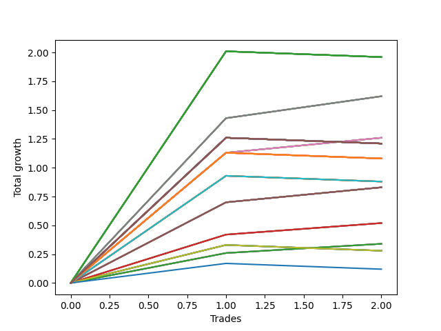

# Long Wallace Doodle 016 
- Symbol: AAPL_Unlimited
- Date Range: 03/23/2022 - 07/08/2022
- Trading Period: 7:20-12:30
- Number of Trades: 2



| Name | Win Percent | Profit | Avg Profit / Trade | Avg Time / Trade |      | Name | Win Percent | Profit | Avg Profit / Trade | Avg Time / Trade |
| ---- | ----------- | ------ | ------------------ | ---------------- | ---- | ---- | ----------- | ------ | ------------------ | ---------------- |
| Sorted By <br> Profit | | | | | | Sorted By <br> Win Percentage ||||
| One Hundred Twenty-Seven | 50.00 | 980.00 | 490.00 | 87:25 |     | Sixty-Nine | 100.00 | 810.00 | 405.00 | 34:30 |
| One Hundred Twenty-Two | 50.00 | 980.00 | 490.00 | 87:25 |     | Sixty-One | 100.00 | 810.00 | 405.00 | 34:30 |
| One Hundred Seventeen | 50.00 | 980.00 | 490.00 | 87:25 |     | Fifty-Three | 100.00 | 810.00 | 405.00 | 34:30 |
| One Hundred Twelve | 50.00 | 980.00 | 490.00 | 87:25 |     | Forty-Five | 100.00 | 810.00 | 405.00 | 34:30 |
| One Hundred Seven | 50.00 | 980.00 | 490.00 | 87:25 |     | Five | 100.00 | 810.00 | 405.00 | 34:30 |
| One Hundred Two | 50.00 | 980.00 | 490.00 | 87:25 |     | Sixty-Eight | 100.00 | 630.00 | 315.00 | 29:52 |
| Ninety-Seven | 50.00 | 980.00 | 490.00 | 87:25 |     | Sixty | 100.00 | 630.00 | 315.00 | 29:52 |
| Ninety-Two | 50.00 | 980.00 | 490.00 | 87:25 |     | Fifty-Two | 100.00 | 630.00 | 315.00 | 29:52 |
| Eighty-Two | 50.00 | 980.00 | 490.00 | 87:25 |     | Forty-Four | 100.00 | 630.00 | 315.00 | 29:52 |
| Sixty-Nine | 100.00 | 810.00 | 405.00 | 34:30 |     | Four | 100.00 | 630.00 | 315.00 | 29:52 |
| Sixty-One | 100.00 | 810.00 | 405.00 | 34:30 |     | Sixty-Seven | 100.00 | 415.00 | 207.50 | 21:35 |
| Fifty-Three | 100.00 | 810.00 | 405.00 | 34:30 |     | Sixty-Six | 100.00 | 415.00 | 207.50 | 21:35 |
| Forty-Five | 100.00 | 810.00 | 405.00 | 34:30 |     | Fifty-Nine | 100.00 | 415.00 | 207.50 | 21:35 |
| Five | 100.00 | 810.00 | 405.00 | 34:30 |     | Fifty-Eight | 100.00 | 415.00 | 207.50 | 21:35 |
| Sixty-Eight | 100.00 | 630.00 | 315.00 | 29:52 |     | Fifty-One | 100.00 | 415.00 | 207.50 | 21:35 |
| Sixty | 100.00 | 630.00 | 315.00 | 29:52 |     | Fifty | 100.00 | 415.00 | 207.50 | 21:35 |
| Fifty-Two | 100.00 | 630.00 | 315.00 | 29:52 |     | Forty-Three | 100.00 | 415.00 | 207.50 | 21:35 |
| Forty-Four | 100.00 | 630.00 | 315.00 | 29:52 |     | Forty-Two | 100.00 | 415.00 | 207.50 | 21:35 |
| Four | 100.00 | 630.00 | 315.00 | 29:52 |     | Three | 100.00 | 415.00 | 207.50 | 21:35 |
| One Hundred Thirty | 50.00 | 605.00 | 302.50 | 100:00 |     | Two | 100.00 | 415.00 | 207.50 | 21:35 |
| One Hundred Twenty-Nine | 50.00 | 605.00 | 302.50 | 100:00 |     | Sixty-Five | 100.00 | 260.00 | 130.00 | 15:20 |
| One Hundred Twenty-Eight | 50.00 | 605.00 | 302.50 | 100:00 |     | Fifty-Seven | 100.00 | 260.00 | 130.00 | 15:20 |
| One Hundred Twenty-Five | 50.00 | 605.00 | 302.50 | 100:00 |     | Forty-Nine | 100.00 | 260.00 | 130.00 | 15:20 |
| One Hundred Twenty-Four | 50.00 | 605.00 | 302.50 | 100:00 |     | Forty-One | 100.00 | 260.00 | 130.00 | 15:20 |
| One Hundred Twenty-Three | 50.00 | 605.00 | 302.50 | 100:00 |     | One | 100.00 | 260.00 | 130.00 | 15:20 |
| One Hundred Twenty | 50.00 | 605.00 | 302.50 | 100:00 |     | Sixty-Four | 100.00 | 170.00 | 85.00 | 13:17 |
| One Hundred Ninteen | 50.00 | 605.00 | 302.50 | 100:00 |     | Fifty-Six | 100.00 | 170.00 | 85.00 | 13:17 |
| One Hundred Eighteen | 50.00 | 605.00 | 302.50 | 100:00 |     | Forty-Eight | 100.00 | 170.00 | 85.00 | 13:17 |
| One Hundred Fifteen | 50.00 | 605.00 | 302.50 | 100:00 |     | Forty | 100.00 | 170.00 | 85.00 | 13:17 |
| One Hundred Fourteen | 50.00 | 605.00 | 302.50 | 100:00 |     | Zero | 100.00 | 170.00 | 85.00 | 13:17 |
| One Hundred Thirteen | 50.00 | 605.00 | 302.50 | 100:00 |     | One Hundred Twenty-Seven | 50.00 | 980.00 | 490.00 | 87:25 |
| One Hundred Ten | 50.00 | 605.00 | 302.50 | 100:00 |     | One Hundred Twenty-Two | 50.00 | 980.00 | 490.00 | 87:25 |
| One Hundred Nine | 50.00 | 605.00 | 302.50 | 100:00 |     | One Hundred Seventeen | 50.00 | 980.00 | 490.00 | 87:25 |
| One Hundred Eight | 50.00 | 605.00 | 302.50 | 100:00 |     | One Hundred Twelve | 50.00 | 980.00 | 490.00 | 87:25 |
| One Hundred Five | 50.00 | 605.00 | 302.50 | 100:00 |     | One Hundred Seven | 50.00 | 980.00 | 490.00 | 87:25 |
| One Hundred Four | 50.00 | 605.00 | 302.50 | 100:00 |     | One Hundred Two | 50.00 | 980.00 | 490.00 | 87:25 |
| One Hundred Three | 50.00 | 605.00 | 302.50 | 100:00 |     | Ninety-Seven | 50.00 | 980.00 | 490.00 | 87:25 |
| One Hundred | 50.00 | 605.00 | 302.50 | 100:00 |     | Ninety-Two | 50.00 | 980.00 | 490.00 | 87:25 |
| Ninety-Nine | 50.00 | 605.00 | 302.50 | 100:00 |     | Eighty-Two | 50.00 | 980.00 | 490.00 | 87:25 |
| Ninety-Eight | 50.00 | 605.00 | 302.50 | 100:00 |     | One Hundred Thirty | 50.00 | 605.00 | 302.50 | 100:00 |
| Ninety-Five | 50.00 | 605.00 | 302.50 | 100:00 |     | One Hundred Twenty-Nine | 50.00 | 605.00 | 302.50 | 100:00 |
| Ninety-Four | 50.00 | 605.00 | 302.50 | 100:00 |     | One Hundred Twenty-Eight | 50.00 | 605.00 | 302.50 | 100:00 |
| Ninety-Three | 50.00 | 605.00 | 302.50 | 100:00 |     | One Hundred Twenty-Five | 50.00 | 605.00 | 302.50 | 100:00 |
| Eighty-Five | 50.00 | 605.00 | 302.50 | 100:00 |     | One Hundred Twenty-Four | 50.00 | 605.00 | 302.50 | 100:00 |
| Eighty-Four | 50.00 | 605.00 | 302.50 | 100:00 |     | One Hundred Twenty-Three | 50.00 | 605.00 | 302.50 | 100:00 |
| Eighty-Three | 50.00 | 605.00 | 302.50 | 100:00 |     | One Hundred Twenty | 50.00 | 605.00 | 302.50 | 100:00 |
| One Hundred Twenty-Six | 50.00 | 540.00 | 270.00 | 66:40 |     | One Hundred Ninteen | 50.00 | 605.00 | 302.50 | 100:00 |
| One Hundred Twenty-One | 50.00 | 540.00 | 270.00 | 66:40 |     | One Hundred Eighteen | 50.00 | 605.00 | 302.50 | 100:00 |
| One Hundred Sixteen | 50.00 | 540.00 | 270.00 | 66:40 |     | One Hundred Fifteen | 50.00 | 605.00 | 302.50 | 100:00 |
| One Hundred Eleven | 50.00 | 540.00 | 270.00 | 66:40 |     | One Hundred Fourteen | 50.00 | 605.00 | 302.50 | 100:00 |
| One Hundred Six | 50.00 | 540.00 | 270.00 | 66:40 |     | One Hundred Thirteen | 50.00 | 605.00 | 302.50 | 100:00 |
| One Hundred One | 50.00 | 540.00 | 270.00 | 66:40 |     | One Hundred Ten | 50.00 | 605.00 | 302.50 | 100:00 |
| Ninety-Six | 50.00 | 540.00 | 270.00 | 66:40 |     | One Hundred Nine | 50.00 | 605.00 | 302.50 | 100:00 |
| Ninety-One | 50.00 | 540.00 | 270.00 | 66:40 |     | One Hundred Eight | 50.00 | 605.00 | 302.50 | 100:00 |
| Eighty-One | 50.00 | 540.00 | 270.00 | 66:40 |     | One Hundred Five | 50.00 | 605.00 | 302.50 | 100:00 |
| Seventy-One | 50.00 | 440.00 | 220.00 | 66:35 |     | One Hundred Four | 50.00 | 605.00 | 302.50 | 100:00 |
| Sixty-Three | 50.00 | 440.00 | 220.00 | 66:35 |     | One Hundred Three | 50.00 | 605.00 | 302.50 | 100:00 |
| Fifty-Five | 50.00 | 440.00 | 220.00 | 66:35 |     | One Hundred | 50.00 | 605.00 | 302.50 | 100:00 |
| Forty-Seven | 50.00 | 440.00 | 220.00 | 66:35 |     | Ninety-Nine | 50.00 | 605.00 | 302.50 | 100:00 |
| Seven | 50.00 | 440.00 | 220.00 | 66:35 |     | Ninety-Eight | 50.00 | 605.00 | 302.50 | 100:00 |
| Sixty-Seven | 100.00 | 415.00 | 207.50 | 21:35 |     | Ninety-Five | 50.00 | 605.00 | 302.50 | 100:00 |
| Sixty-Six | 100.00 | 415.00 | 207.50 | 21:35 |     | Ninety-Four | 50.00 | 605.00 | 302.50 | 100:00 |
| Fifty-Nine | 100.00 | 415.00 | 207.50 | 21:35 |     | Ninety-Three | 50.00 | 605.00 | 302.50 | 100:00 |
| Fifty-Eight | 100.00 | 415.00 | 207.50 | 21:35 |     | Eighty-Five | 50.00 | 605.00 | 302.50 | 100:00 |
| Fifty-One | 100.00 | 415.00 | 207.50 | 21:35 |     | Eighty-Four | 50.00 | 605.00 | 302.50 | 100:00 |
| Fifty | 100.00 | 415.00 | 207.50 | 21:35 |     | Eighty-Three | 50.00 | 605.00 | 302.50 | 100:00 |
| Forty-Three | 100.00 | 415.00 | 207.50 | 21:35 |     | One Hundred Twenty-Six | 50.00 | 540.00 | 270.00 | 66:40 |
| Forty-Two | 100.00 | 415.00 | 207.50 | 21:35 |     | One Hundred Twenty-One | 50.00 | 540.00 | 270.00 | 66:40 |
| Three | 100.00 | 415.00 | 207.50 | 21:35 |     | One Hundred Sixteen | 50.00 | 540.00 | 270.00 | 66:40 |
| Two | 100.00 | 415.00 | 207.50 | 21:35 |     | One Hundred Eleven | 50.00 | 540.00 | 270.00 | 66:40 |
| Sixty-Five | 100.00 | 260.00 | 130.00 | 15:20 |     | One Hundred Six | 50.00 | 540.00 | 270.00 | 66:40 |
| Fifty-Seven | 100.00 | 260.00 | 130.00 | 15:20 |     | One Hundred One | 50.00 | 540.00 | 270.00 | 66:40 |
| Forty-Nine | 100.00 | 260.00 | 130.00 | 15:20 |     | Ninety-Six | 50.00 | 540.00 | 270.00 | 66:40 |
| Forty-One | 100.00 | 260.00 | 130.00 | 15:20 |     | Ninety-One | 50.00 | 540.00 | 270.00 | 66:40 |
| One | 100.00 | 260.00 | 130.00 | 15:20 |     | Eighty-One | 50.00 | 540.00 | 270.00 | 66:40 |
| Sixty-Four | 100.00 | 170.00 | 85.00 | 13:17 |     | Seventy-One | 50.00 | 440.00 | 220.00 | 66:35 |
| Fifty-Six | 100.00 | 170.00 | 85.00 | 13:17 |     | Sixty-Three | 50.00 | 440.00 | 220.00 | 66:35 |
| Forty-Eight | 100.00 | 170.00 | 85.00 | 13:17 |     | Fifty-Five | 50.00 | 440.00 | 220.00 | 66:35 |
| Forty | 100.00 | 170.00 | 85.00 | 13:17 |     | Forty-Seven | 50.00 | 440.00 | 220.00 | 66:35 |
| Zero | 100.00 | 170.00 | 85.00 | 13:17 |     | Seven | 50.00 | 440.00 | 220.00 | 66:35 |
| Seventy | 50.00 | 140.00 | 70.00 | 60:00 |     | Seventy | 50.00 | 140.00 | 70.00 | 60:00 |
| Sixty-Two | 50.00 | 140.00 | 70.00 | 60:00 |     | Sixty-Two | 50.00 | 140.00 | 70.00 | 60:00 |
| Fifty-Four | 50.00 | 140.00 | 70.00 | 60:00 |     | Fifty-Four | 50.00 | 140.00 | 70.00 | 60:00 |
| Forty-Six | 50.00 | 140.00 | 70.00 | 60:00 |     | Forty-Six | 50.00 | 140.00 | 70.00 | 60:00 |
| Six | 50.00 | 140.00 | 70.00 | 60:00 |     | Six | 50.00 | 140.00 | 70.00 | 60:00 |
| Seventy-Three | 50.00 | 60.00 | 30.00 | 12:35 |     | Seventy-Three | 50.00 | 60.00 | 30.00 | 12:35 |

## NO STOPLOSS

### Test Zero
* Sell when price hits the middle line of the 20p bollinger
* No Stoploss
* Results:
```
Total Trades: 2
Percent Up: 100.00
Percent Down: 0.00
Total Points Moved Up: 0.34
Potential Profit: 170.00
Total Points Ups: 0.34 Count Ups: 2
Total Points Downs: 0.00 Count Downs: 0
```

<details><summary>Trades</summary>

<code>In: 2022-05-17 11:24:00		Out: 2022-05-17 11:37:20		Total Position Time: 13:20		Total Move Up: 0.26		Total to Date: 0.26</code> <br />
<code>In: 2022-06-27 10:50:00		Out: 2022-06-27 11:03:15		Total Position Time: 13:15		Total Move Up: 0.08		Total to Date: 0.34</code> <br />


</details>

### Test One
* Sell when the price hits the upper line of the 20p 1std bollinger
* No Stoploss
* Results:
```
Total Trades: 2
Percent Up: 100.00
Percent Down: 0.00
Total Points Moved Up: 0.52
Potential Profit: 260.00
Total Points Ups: 0.52 Count Ups: 2
Total Points Downs: 0.00 Count Downs: 0
```

<details><summary>Trades</summary>

<code>In: 2022-05-17 11:24:00		Out: 2022-05-17 11:39:40		Total Position Time: 15:40		Total Move Up: 0.42		Total to Date: 0.42</code> <br />
<code>In: 2022-06-27 10:50:00		Out: 2022-06-27 11:05:00		Total Position Time: 15:00		Total Move Up: 0.10		Total to Date: 0.52</code> <br />


</details>

### Test Two
* Sell when the price hits the upper line of the 20p 2std bollinger
* No Stoploss
* Results:
```
Total Trades: 2
Percent Up: 100.00
Percent Down: 0.00
Total Points Moved Up: 0.83
Potential Profit: 415.00
Total Points Ups: 0.83 Count Ups: 2
Total Points Downs: 0.00 Count Downs: 0
```

<details><summary>Trades</summary>

<code>In: 2022-05-17 11:24:00		Out: 2022-05-17 11:40:00		Total Position Time: 16:00		Total Move Up: 0.70		Total to Date: 0.70</code> <br />
<code>In: 2022-06-27 10:50:00		Out: 2022-06-27 11:17:10		Total Position Time: 27:10		Total Move Up: 0.13		Total to Date: 0.83</code> <br />


</details>

### Test Three
* Sell when price hits the middle line of the 50p bollinger
* No Stoploss
* Results:
```
Total Trades: 2
Percent Up: 100.00
Percent Down: 0.00
Total Points Moved Up: 0.83
Potential Profit: 415.00
Total Points Ups: 0.83 Count Ups: 2
Total Points Downs: 0.00 Count Downs: 0
```

<details><summary>Trades</summary>

<code>In: 2022-05-17 11:24:00		Out: 2022-05-17 11:40:00		Total Position Time: 16:00		Total Move Up: 0.70		Total to Date: 0.70</code> <br />
<code>In: 2022-06-27 10:50:00		Out: 2022-06-27 11:17:10		Total Position Time: 27:10		Total Move Up: 0.13		Total to Date: 0.83</code> <br />


</details>

### Test Four
* Sell when the price hits the upper line of the 50p 1std bollinger
* No Stoploss
* Results:
```
Total Trades: 2
Percent Up: 100.00
Percent Down: 0.00
Total Points Moved Up: 1.26
Potential Profit: 630.00
Total Points Ups: 1.26 Count Ups: 2
Total Points Downs: 0.00 Count Downs: 0
```

<details><summary>Trades</summary>

<code>In: 2022-05-17 11:24:00		Out: 2022-05-17 11:40:20		Total Position Time: 16:20		Total Move Up: 1.13		Total to Date: 1.13</code> <br />
<code>In: 2022-06-27 10:50:00		Out: 2022-06-27 11:33:25		Total Position Time: 43:25		Total Move Up: 0.13		Total to Date: 1.26</code> <br />


</details>

### Test Five
* Sell when the price hits the upper line of the 50p 2std bollinger
* No Stoploss
* Results:
```
Total Trades: 2
Percent Up: 100.00
Percent Down: 0.00
Total Points Moved Up: 1.62
Potential Profit: 810.00
Total Points Ups: 1.62 Count Ups: 2
Total Points Downs: 0.00 Count Downs: 0
```

<details><summary>Trades</summary>

<code>In: 2022-05-17 11:24:00		Out: 2022-05-17 11:48:45		Total Position Time: 24:45		Total Move Up: 1.43		Total to Date: 1.43</code> <br />
<code>In: 2022-06-27 10:50:00		Out: 2022-06-27 11:34:15		Total Position Time: 44:15		Total Move Up: 0.19		Total to Date: 1.62</code> <br />


</details>

### Test Six
* Sell when the price hits the middle line of the 1std VWAP
* No Stoploss
* Results:
```
Total Trades: 2
Percent Up: 50.00
Percent Down: 50.00
Total Points Moved Up: 0.28
Potential Profit: 140.00
Total Points Ups: 0.33 Count Ups: 1
Total Points Downs: -0.05 Count Downs: 1
```

<details><summary>Trades</summary>

<code>In: 2022-05-17 11:24:00		Out: 2022-05-17 11:27:00		Total Position Time: 03:00		Total Move Up: 0.33		Total to Date: 0.33</code> <br />
<code>In: 2022-06-27 10:50:00		Out: 2022-06-27 12:47:00		Total Position Time: 117:00		Total Move Up: -0.05		Total to Date: 0.28</code> <br />


</details>

### Test Seven
* Sell when the price hits the upper line of the 1std VWAP
* No Stoploss
* Results:
```
Total Trades: 2
Percent Up: 50.00
Percent Down: 50.00
Total Points Moved Up: 0.88
Potential Profit: 440.00
Total Points Ups: 0.93 Count Ups: 1
Total Points Downs: -0.05 Count Downs: 1
```

<details><summary>Trades</summary>

<code>In: 2022-05-17 11:24:00		Out: 2022-05-17 11:40:10		Total Position Time: 16:10		Total Move Up: 0.93		Total to Date: 0.93</code> <br />
<code>In: 2022-06-27 10:50:00		Out: 2022-06-27 12:47:00		Total Position Time: 117:00		Total Move Up: -0.05		Total to Date: 0.88</code> <br />


</details>

## STOPLOSS OF 5

### Test Forty
* Sell when price hits the middle line of the 20p bollinger
* Stoploss is 5 points
* Results:
```
Total Trades: 2
Percent Up: 100.00
Percent Down: 0.00
Total Points Moved Up: 0.34
Potential Profit: 170.00
Total Points Ups: 0.34 Count Ups: 2
Total Points Downs: 0.00 Count Downs: 0
```

<details><summary>Trades</summary>

<code>In: 2022-05-17 11:24:00		Out: 2022-05-17 11:37:20		Total Position Time: 13:20		Total Move Up: 0.26		Total to Date: 0.26</code> <br />
<code>In: 2022-06-27 10:50:00		Out: 2022-06-27 11:03:15		Total Position Time: 13:15		Total Move Up: 0.08		Total to Date: 0.34</code> <br />


</details>

### Test Forty-One
* Sell when the price hits the upper line of the 20p 1std bollinger
* Stoploss is 5 points
* Results:
```
Total Trades: 2
Percent Up: 100.00
Percent Down: 0.00
Total Points Moved Up: 0.52
Potential Profit: 260.00
Total Points Ups: 0.52 Count Ups: 2
Total Points Downs: 0.00 Count Downs: 0
```

<details><summary>Trades</summary>

<code>In: 2022-05-17 11:24:00		Out: 2022-05-17 11:39:40		Total Position Time: 15:40		Total Move Up: 0.42		Total to Date: 0.42</code> <br />
<code>In: 2022-06-27 10:50:00		Out: 2022-06-27 11:05:00		Total Position Time: 15:00		Total Move Up: 0.10		Total to Date: 0.52</code> <br />


</details>

### Test Forty-Two
* Sell when the price hits the upper line of the 20p 2std bollinger
* Stoploss is 5 points
* Results:
```
Total Trades: 2
Percent Up: 100.00
Percent Down: 0.00
Total Points Moved Up: 0.83
Potential Profit: 415.00
Total Points Ups: 0.83 Count Ups: 2
Total Points Downs: 0.00 Count Downs: 0
```

<details><summary>Trades</summary>

<code>In: 2022-05-17 11:24:00		Out: 2022-05-17 11:40:00		Total Position Time: 16:00		Total Move Up: 0.70		Total to Date: 0.70</code> <br />
<code>In: 2022-06-27 10:50:00		Out: 2022-06-27 11:17:10		Total Position Time: 27:10		Total Move Up: 0.13		Total to Date: 0.83</code> <br />


</details>

### Test Forty-Three
* Sell when price hits the middle line of the 50p bollinger
* Stoploss is 5 points
* Results:
```
Total Trades: 2
Percent Up: 100.00
Percent Down: 0.00
Total Points Moved Up: 0.83
Potential Profit: 415.00
Total Points Ups: 0.83 Count Ups: 2
Total Points Downs: 0.00 Count Downs: 0
```

<details><summary>Trades</summary>

<code>In: 2022-05-17 11:24:00		Out: 2022-05-17 11:40:00		Total Position Time: 16:00		Total Move Up: 0.70		Total to Date: 0.70</code> <br />
<code>In: 2022-06-27 10:50:00		Out: 2022-06-27 11:17:10		Total Position Time: 27:10		Total Move Up: 0.13		Total to Date: 0.83</code> <br />


</details>

### Test Forty-Four
* Sell when the price hits the upper line of the 50p 1std bollinger
* Stoploss is 5 points
* Results:
```
Total Trades: 2
Percent Up: 100.00
Percent Down: 0.00
Total Points Moved Up: 1.26
Potential Profit: 630.00
Total Points Ups: 1.26 Count Ups: 2
Total Points Downs: 0.00 Count Downs: 0
```

<details><summary>Trades</summary>

<code>In: 2022-05-17 11:24:00		Out: 2022-05-17 11:40:20		Total Position Time: 16:20		Total Move Up: 1.13		Total to Date: 1.13</code> <br />
<code>In: 2022-06-27 10:50:00		Out: 2022-06-27 11:33:25		Total Position Time: 43:25		Total Move Up: 0.13		Total to Date: 1.26</code> <br />


</details>

### Test Forty-Five
* Sell when the price hits the upper line of the 50p 2std bollinger
* Stoploss is 5 points
* Results:
```
Total Trades: 2
Percent Up: 100.00
Percent Down: 0.00
Total Points Moved Up: 1.62
Potential Profit: 810.00
Total Points Ups: 1.62 Count Ups: 2
Total Points Downs: 0.00 Count Downs: 0
```

<details><summary>Trades</summary>

<code>In: 2022-05-17 11:24:00		Out: 2022-05-17 11:48:45		Total Position Time: 24:45		Total Move Up: 1.43		Total to Date: 1.43</code> <br />
<code>In: 2022-06-27 10:50:00		Out: 2022-06-27 11:34:15		Total Position Time: 44:15		Total Move Up: 0.19		Total to Date: 1.62</code> <br />


</details>

### Test Forty-Six
* Sell when the price hits the middle line of the 1std VWAP
* Stoploss is 5 points
* Results:
```
Total Trades: 2
Percent Up: 50.00
Percent Down: 50.00
Total Points Moved Up: 0.28
Potential Profit: 140.00
Total Points Ups: 0.33 Count Ups: 1
Total Points Downs: -0.05 Count Downs: 1
```

<details><summary>Trades</summary>

<code>In: 2022-05-17 11:24:00		Out: 2022-05-17 11:27:00		Total Position Time: 03:00		Total Move Up: 0.33		Total to Date: 0.33</code> <br />
<code>In: 2022-06-27 10:50:00		Out: 2022-06-27 12:47:00		Total Position Time: 117:00		Total Move Up: -0.05		Total to Date: 0.28</code> <br />


</details>

### Test Forty-Seven
* Sell when the price hits the upper line of the 1std VWAP
* Stoploss is 5 points
* Results:
```
Total Trades: 2
Percent Up: 50.00
Percent Down: 50.00
Total Points Moved Up: 0.88
Potential Profit: 440.00
Total Points Ups: 0.93 Count Ups: 1
Total Points Downs: -0.05 Count Downs: 1
```

<details><summary>Trades</summary>

<code>In: 2022-05-17 11:24:00		Out: 2022-05-17 11:40:10		Total Position Time: 16:10		Total Move Up: 0.93		Total to Date: 0.93</code> <br />
<code>In: 2022-06-27 10:50:00		Out: 2022-06-27 12:47:00		Total Position Time: 117:00		Total Move Up: -0.05		Total to Date: 0.88</code> <br />


</details>

## TRAIL STOP OF 5

### Test Forty-Eight
* Sell when price hits the middle line of the 20p bollinger
* Trailing Stop is 5 points
* Results:
```
Total Trades: 2
Percent Up: 100.00
Percent Down: 0.00
Total Points Moved Up: 0.34
Potential Profit: 170.00
Total Points Ups: 0.34 Count Ups: 2
Total Points Downs: 0.00 Count Downs: 0
```

<details><summary>Trades</summary>

<code>In: 2022-05-17 11:24:00		Out: 2022-05-17 11:37:20		Total Position Time: 13:20		Total Move Up: 0.26		Total to Date: 0.26</code> <br />
<code>In: 2022-06-27 10:50:00		Out: 2022-06-27 11:03:15		Total Position Time: 13:15		Total Move Up: 0.08		Total to Date: 0.34</code> <br />


</details>

### Test Forty-Nine
* Sell when the price hits the upper line of the 20p 1std bollinger
* Trailing Stop is 5 points
* Results:
```
Total Trades: 2
Percent Up: 100.00
Percent Down: 0.00
Total Points Moved Up: 0.52
Potential Profit: 260.00
Total Points Ups: 0.52 Count Ups: 2
Total Points Downs: 0.00 Count Downs: 0
```

<details><summary>Trades</summary>

<code>In: 2022-05-17 11:24:00		Out: 2022-05-17 11:39:40		Total Position Time: 15:40		Total Move Up: 0.42		Total to Date: 0.42</code> <br />
<code>In: 2022-06-27 10:50:00		Out: 2022-06-27 11:05:00		Total Position Time: 15:00		Total Move Up: 0.10		Total to Date: 0.52</code> <br />


</details>

### Test Fifty
* Sell when the price hits the upper line of the 20p 2std bollinger
* Trailing Stop is 5 points
* Results:
```
Total Trades: 2
Percent Up: 100.00
Percent Down: 0.00
Total Points Moved Up: 0.83
Potential Profit: 415.00
Total Points Ups: 0.83 Count Ups: 2
Total Points Downs: 0.00 Count Downs: 0
```

<details><summary>Trades</summary>

<code>In: 2022-05-17 11:24:00		Out: 2022-05-17 11:40:00		Total Position Time: 16:00		Total Move Up: 0.70		Total to Date: 0.70</code> <br />
<code>In: 2022-06-27 10:50:00		Out: 2022-06-27 11:17:10		Total Position Time: 27:10		Total Move Up: 0.13		Total to Date: 0.83</code> <br />


</details>

### Test Fifty-One
* Sell when price hits the middle line of the 50p bollinger
* Trailing Stop is 5 points
* Results:
```
Total Trades: 2
Percent Up: 100.00
Percent Down: 0.00
Total Points Moved Up: 0.83
Potential Profit: 415.00
Total Points Ups: 0.83 Count Ups: 2
Total Points Downs: 0.00 Count Downs: 0
```

<details><summary>Trades</summary>

<code>In: 2022-05-17 11:24:00		Out: 2022-05-17 11:40:00		Total Position Time: 16:00		Total Move Up: 0.70		Total to Date: 0.70</code> <br />
<code>In: 2022-06-27 10:50:00		Out: 2022-06-27 11:17:10		Total Position Time: 27:10		Total Move Up: 0.13		Total to Date: 0.83</code> <br />


</details>

### Test Fifty-Two
* Sell when the price hits the upper line of the 50p 1std bollinger
* Trailing Stop is 5 points
* Results:
```
Total Trades: 2
Percent Up: 100.00
Percent Down: 0.00
Total Points Moved Up: 1.26
Potential Profit: 630.00
Total Points Ups: 1.26 Count Ups: 2
Total Points Downs: 0.00 Count Downs: 0
```

<details><summary>Trades</summary>

<code>In: 2022-05-17 11:24:00		Out: 2022-05-17 11:40:20		Total Position Time: 16:20		Total Move Up: 1.13		Total to Date: 1.13</code> <br />
<code>In: 2022-06-27 10:50:00		Out: 2022-06-27 11:33:25		Total Position Time: 43:25		Total Move Up: 0.13		Total to Date: 1.26</code> <br />


</details>

### Test Fifty-Three
* Sell when the price hits the upper line of the 50p 2std bollinger
* Trailing Stop is 5 points
* Results:
```
Total Trades: 2
Percent Up: 100.00
Percent Down: 0.00
Total Points Moved Up: 1.62
Potential Profit: 810.00
Total Points Ups: 1.62 Count Ups: 2
Total Points Downs: 0.00 Count Downs: 0
```

<details><summary>Trades</summary>

<code>In: 2022-05-17 11:24:00		Out: 2022-05-17 11:48:45		Total Position Time: 24:45		Total Move Up: 1.43		Total to Date: 1.43</code> <br />
<code>In: 2022-06-27 10:50:00		Out: 2022-06-27 11:34:15		Total Position Time: 44:15		Total Move Up: 0.19		Total to Date: 1.62</code> <br />


</details>

### Test Fifty-Four
* Sell when the price hits the middle line of the 1std VWAP
* Trailing Stop is 5 points
* Results:
```
Total Trades: 2
Percent Up: 50.00
Percent Down: 50.00
Total Points Moved Up: 0.28
Potential Profit: 140.00
Total Points Ups: 0.33 Count Ups: 1
Total Points Downs: -0.05 Count Downs: 1
```

<details><summary>Trades</summary>

<code>In: 2022-05-17 11:24:00		Out: 2022-05-17 11:27:00		Total Position Time: 03:00		Total Move Up: 0.33		Total to Date: 0.33</code> <br />
<code>In: 2022-06-27 10:50:00		Out: 2022-06-27 12:47:00		Total Position Time: 117:00		Total Move Up: -0.05		Total to Date: 0.28</code> <br />


</details>

### Test Fifty-Five
* Sell when the price hits the upper line of the 1std VWAP
* Trailing Stop is 5 points
* Results:
```
Total Trades: 2
Percent Up: 50.00
Percent Down: 50.00
Total Points Moved Up: 0.88
Potential Profit: 440.00
Total Points Ups: 0.93 Count Ups: 1
Total Points Downs: -0.05 Count Downs: 1
```

<details><summary>Trades</summary>

<code>In: 2022-05-17 11:24:00		Out: 2022-05-17 11:40:10		Total Position Time: 16:10		Total Move Up: 0.93		Total to Date: 0.93</code> <br />
<code>In: 2022-06-27 10:50:00		Out: 2022-06-27 12:47:00		Total Position Time: 117:00		Total Move Up: -0.05		Total to Date: 0.88</code> <br />


</details>

## STOPLOSS OF 10

### Test Fifty-Six
* Sell when price hits the middle line of the 20p bollinger
* Stoploss is 10 points
* Results:
```
Total Trades: 2
Percent Up: 100.00
Percent Down: 0.00
Total Points Moved Up: 0.34
Potential Profit: 170.00
Total Points Ups: 0.34 Count Ups: 2
Total Points Downs: 0.00 Count Downs: 0
```

<details><summary>Trades</summary>

<code>In: 2022-05-17 11:24:00		Out: 2022-05-17 11:37:20		Total Position Time: 13:20		Total Move Up: 0.26		Total to Date: 0.26</code> <br />
<code>In: 2022-06-27 10:50:00		Out: 2022-06-27 11:03:15		Total Position Time: 13:15		Total Move Up: 0.08		Total to Date: 0.34</code> <br />


</details>

### Test Fifty-Seven
* Sell when the price hits the upper line of the 20p 1std bollinger
* Stoploss is 10 points
* Results:
```
Total Trades: 2
Percent Up: 100.00
Percent Down: 0.00
Total Points Moved Up: 0.52
Potential Profit: 260.00
Total Points Ups: 0.52 Count Ups: 2
Total Points Downs: 0.00 Count Downs: 0
```

<details><summary>Trades</summary>

<code>In: 2022-05-17 11:24:00		Out: 2022-05-17 11:39:40		Total Position Time: 15:40		Total Move Up: 0.42		Total to Date: 0.42</code> <br />
<code>In: 2022-06-27 10:50:00		Out: 2022-06-27 11:05:00		Total Position Time: 15:00		Total Move Up: 0.10		Total to Date: 0.52</code> <br />


</details>

### Test Fifty-Eight
* Sell when the price hits the upper line of the 20p 2std bollinger
* Stoploss is 10 points
* Results:
```
Total Trades: 2
Percent Up: 100.00
Percent Down: 0.00
Total Points Moved Up: 0.83
Potential Profit: 415.00
Total Points Ups: 0.83 Count Ups: 2
Total Points Downs: 0.00 Count Downs: 0
```

<details><summary>Trades</summary>

<code>In: 2022-05-17 11:24:00		Out: 2022-05-17 11:40:00		Total Position Time: 16:00		Total Move Up: 0.70		Total to Date: 0.70</code> <br />
<code>In: 2022-06-27 10:50:00		Out: 2022-06-27 11:17:10		Total Position Time: 27:10		Total Move Up: 0.13		Total to Date: 0.83</code> <br />


</details>

### Test Fifty-Nine
* Sell when price hits the middle line of the 50p bollinger
* Stoploss is 10 points
* Results:
```
Total Trades: 2
Percent Up: 100.00
Percent Down: 0.00
Total Points Moved Up: 0.83
Potential Profit: 415.00
Total Points Ups: 0.83 Count Ups: 2
Total Points Downs: 0.00 Count Downs: 0
```

<details><summary>Trades</summary>

<code>In: 2022-05-17 11:24:00		Out: 2022-05-17 11:40:00		Total Position Time: 16:00		Total Move Up: 0.70		Total to Date: 0.70</code> <br />
<code>In: 2022-06-27 10:50:00		Out: 2022-06-27 11:17:10		Total Position Time: 27:10		Total Move Up: 0.13		Total to Date: 0.83</code> <br />


</details>

### Test Sixty
* Sell when the price hits the upper line of the 50p 1std bollinger
* Stoploss is 10 points
* Results:
```
Total Trades: 2
Percent Up: 100.00
Percent Down: 0.00
Total Points Moved Up: 1.26
Potential Profit: 630.00
Total Points Ups: 1.26 Count Ups: 2
Total Points Downs: 0.00 Count Downs: 0
```

<details><summary>Trades</summary>

<code>In: 2022-05-17 11:24:00		Out: 2022-05-17 11:40:20		Total Position Time: 16:20		Total Move Up: 1.13		Total to Date: 1.13</code> <br />
<code>In: 2022-06-27 10:50:00		Out: 2022-06-27 11:33:25		Total Position Time: 43:25		Total Move Up: 0.13		Total to Date: 1.26</code> <br />


</details>

### Test Sixty-One
* Sell when the price hits the upper line of the 50p 2std bollinger
* Stoploss is 10 points
* Results:
```
Total Trades: 2
Percent Up: 100.00
Percent Down: 0.00
Total Points Moved Up: 1.62
Potential Profit: 810.00
Total Points Ups: 1.62 Count Ups: 2
Total Points Downs: 0.00 Count Downs: 0
```

<details><summary>Trades</summary>

<code>In: 2022-05-17 11:24:00		Out: 2022-05-17 11:48:45		Total Position Time: 24:45		Total Move Up: 1.43		Total to Date: 1.43</code> <br />
<code>In: 2022-06-27 10:50:00		Out: 2022-06-27 11:34:15		Total Position Time: 44:15		Total Move Up: 0.19		Total to Date: 1.62</code> <br />


</details>

### Test Sixty-Two
* Sell when the price hits the middle line of the 1std VWAP
* Stoploss is 10 points
* Results:
```
Total Trades: 2
Percent Up: 50.00
Percent Down: 50.00
Total Points Moved Up: 0.28
Potential Profit: 140.00
Total Points Ups: 0.33 Count Ups: 1
Total Points Downs: -0.05 Count Downs: 1
```

<details><summary>Trades</summary>

<code>In: 2022-05-17 11:24:00		Out: 2022-05-17 11:27:00		Total Position Time: 03:00		Total Move Up: 0.33		Total to Date: 0.33</code> <br />
<code>In: 2022-06-27 10:50:00		Out: 2022-06-27 12:47:00		Total Position Time: 117:00		Total Move Up: -0.05		Total to Date: 0.28</code> <br />


</details>

### Test Sixty-Three
* Sell when the price hits the upper line of the 1std VWAP
* Stoploss is 10 points
* Results:
```
Total Trades: 2
Percent Up: 50.00
Percent Down: 50.00
Total Points Moved Up: 0.88
Potential Profit: 440.00
Total Points Ups: 0.93 Count Ups: 1
Total Points Downs: -0.05 Count Downs: 1
```

<details><summary>Trades</summary>

<code>In: 2022-05-17 11:24:00		Out: 2022-05-17 11:40:10		Total Position Time: 16:10		Total Move Up: 0.93		Total to Date: 0.93</code> <br />
<code>In: 2022-06-27 10:50:00		Out: 2022-06-27 12:47:00		Total Position Time: 117:00		Total Move Up: -0.05		Total to Date: 0.88</code> <br />


</details>

## TRAIL STOP OF 10

### Test Sixty-Four
* Sell when price hits the middle line of the 20p bollinger
* Trailing Stop is 10 points
* Results:
```
Total Trades: 2
Percent Up: 100.00
Percent Down: 0.00
Total Points Moved Up: 0.34
Potential Profit: 170.00
Total Points Ups: 0.34 Count Ups: 2
Total Points Downs: 0.00 Count Downs: 0
```

<details><summary>Trades</summary>

<code>In: 2022-05-17 11:24:00		Out: 2022-05-17 11:37:20		Total Position Time: 13:20		Total Move Up: 0.26		Total to Date: 0.26</code> <br />
<code>In: 2022-06-27 10:50:00		Out: 2022-06-27 11:03:15		Total Position Time: 13:15		Total Move Up: 0.08		Total to Date: 0.34</code> <br />


</details>

### Test Sixty-Five
* Sell when the price hits the upper line of the 20p 1std bollinger
* Trailing Stop is 10 points
* Results:
```
Total Trades: 2
Percent Up: 100.00
Percent Down: 0.00
Total Points Moved Up: 0.52
Potential Profit: 260.00
Total Points Ups: 0.52 Count Ups: 2
Total Points Downs: 0.00 Count Downs: 0
```

<details><summary>Trades</summary>

<code>In: 2022-05-17 11:24:00		Out: 2022-05-17 11:39:40		Total Position Time: 15:40		Total Move Up: 0.42		Total to Date: 0.42</code> <br />
<code>In: 2022-06-27 10:50:00		Out: 2022-06-27 11:05:00		Total Position Time: 15:00		Total Move Up: 0.10		Total to Date: 0.52</code> <br />


</details>

### Test Sixty-Six
* Sell when the price hits the upper line of the 20p 2std bollinger
* Trailing Stop is 10 points
* Results:
```
Total Trades: 2
Percent Up: 100.00
Percent Down: 0.00
Total Points Moved Up: 0.83
Potential Profit: 415.00
Total Points Ups: 0.83 Count Ups: 2
Total Points Downs: 0.00 Count Downs: 0
```

<details><summary>Trades</summary>

<code>In: 2022-05-17 11:24:00		Out: 2022-05-17 11:40:00		Total Position Time: 16:00		Total Move Up: 0.70		Total to Date: 0.70</code> <br />
<code>In: 2022-06-27 10:50:00		Out: 2022-06-27 11:17:10		Total Position Time: 27:10		Total Move Up: 0.13		Total to Date: 0.83</code> <br />


</details>

### Test Sixty-Seven
* Sell when price hits the middle line of the 50p bollinger
* Trailing Stop is 10 points
* Results:
```
Total Trades: 2
Percent Up: 100.00
Percent Down: 0.00
Total Points Moved Up: 0.83
Potential Profit: 415.00
Total Points Ups: 0.83 Count Ups: 2
Total Points Downs: 0.00 Count Downs: 0
```

<details><summary>Trades</summary>

<code>In: 2022-05-17 11:24:00		Out: 2022-05-17 11:40:00		Total Position Time: 16:00		Total Move Up: 0.70		Total to Date: 0.70</code> <br />
<code>In: 2022-06-27 10:50:00		Out: 2022-06-27 11:17:10		Total Position Time: 27:10		Total Move Up: 0.13		Total to Date: 0.83</code> <br />


</details>

### Test Sixty-Eight
* Sell when the price hits the upper line of the 50p 1std bollinger
* Trailing Stop is 10 points
* Results:
```
Total Trades: 2
Percent Up: 100.00
Percent Down: 0.00
Total Points Moved Up: 1.26
Potential Profit: 630.00
Total Points Ups: 1.26 Count Ups: 2
Total Points Downs: 0.00 Count Downs: 0
```

<details><summary>Trades</summary>

<code>In: 2022-05-17 11:24:00		Out: 2022-05-17 11:40:20		Total Position Time: 16:20		Total Move Up: 1.13		Total to Date: 1.13</code> <br />
<code>In: 2022-06-27 10:50:00		Out: 2022-06-27 11:33:25		Total Position Time: 43:25		Total Move Up: 0.13		Total to Date: 1.26</code> <br />


</details>

### Test Sixty-Nine
* Sell when the price hits the upper line of the 50p 2std bollinger
* Trailing Stop is 10 points
* Results:
```
Total Trades: 2
Percent Up: 100.00
Percent Down: 0.00
Total Points Moved Up: 1.62
Potential Profit: 810.00
Total Points Ups: 1.62 Count Ups: 2
Total Points Downs: 0.00 Count Downs: 0
```

<details><summary>Trades</summary>

<code>In: 2022-05-17 11:24:00		Out: 2022-05-17 11:48:45		Total Position Time: 24:45		Total Move Up: 1.43		Total to Date: 1.43</code> <br />
<code>In: 2022-06-27 10:50:00		Out: 2022-06-27 11:34:15		Total Position Time: 44:15		Total Move Up: 0.19		Total to Date: 1.62</code> <br />


</details>

### Test Seventy
* Sell when the price hits the middle line of the 1std VWAP
* Trailing Stop is 10 points
* Results:
```
Total Trades: 2
Percent Up: 50.00
Percent Down: 50.00
Total Points Moved Up: 0.28
Potential Profit: 140.00
Total Points Ups: 0.33 Count Ups: 1
Total Points Downs: -0.05 Count Downs: 1
```

<details><summary>Trades</summary>

<code>In: 2022-05-17 11:24:00		Out: 2022-05-17 11:27:00		Total Position Time: 03:00		Total Move Up: 0.33		Total to Date: 0.33</code> <br />
<code>In: 2022-06-27 10:50:00		Out: 2022-06-27 12:47:00		Total Position Time: 117:00		Total Move Up: -0.05		Total to Date: 0.28</code> <br />


</details>

### Test Seventy-One
* Sell when the price hits the upper line of the 1std VWAP
* Trailing Stop is 10 points
* Results:
```
Total Trades: 2
Percent Up: 50.00
Percent Down: 50.00
Total Points Moved Up: 0.88
Potential Profit: 440.00
Total Points Ups: 0.93 Count Ups: 1
Total Points Downs: -0.05 Count Downs: 1
```

<details><summary>Trades</summary>

<code>In: 2022-05-17 11:24:00		Out: 2022-05-17 11:40:10		Total Position Time: 16:10		Total Move Up: 0.93		Total to Date: 0.93</code> <br />
<code>In: 2022-06-27 10:50:00		Out: 2022-06-27 12:47:00		Total Position Time: 117:00		Total Move Up: -0.05		Total to Date: 0.88</code> <br />


</details>

## SPECIAL EXIT CONDITIONS 

### Test Seventy-Three
* Sell when the linear regression slope changes to negative
* No Stoploss
* Results:
```
Total Trades: 2
Percent Up: 50.00
Percent Down: 50.00
Total Points Moved Up: 0.12
Potential Profit: 60.00
Total Points Ups: 0.17 Count Ups: 1
Total Points Downs: -0.05 Count Downs: 1
```

<details><summary>Trades</summary>

<code>In: 2022-05-17 11:24:00		Out: 2022-05-17 11:37:05		Total Position Time: 13:05		Total Move Up: 0.17		Total to Date: 0.17</code> <br />
<code>In: 2022-06-27 10:50:00		Out: 2022-06-27 11:02:05		Total Position Time: 12:05		Total Move Up: -0.05		Total to Date: 0.12</code> <br />


</details>

## TAKE PROFIT

### Test Eighty-One
* Take Profit of 1 Point
* No Stoploss
* Results:
```
Total Trades: 2
Percent Up: 50.00
Percent Down: 50.00
Total Points Moved Up: 1.08
Potential Profit: 540.00
Total Points Ups: 1.13 Count Ups: 1
Total Points Downs: -0.05 Count Downs: 1
```

<details><summary>Trades</summary>

<code>In: 2022-05-17 11:24:00		Out: 2022-05-17 11:40:20		Total Position Time: 16:20		Total Move Up: 1.13		Total to Date: 1.13</code> <br />
<code>In: 2022-06-27 10:50:00		Out: 2022-06-27 12:47:00		Total Position Time: 117:00		Total Move Up: -0.05		Total to Date: 1.08</code> <br />


</details>

### Test Eighty-Two
* Take Profit of 2 Point
* No Stoploss
* Results:
```
Total Trades: 2
Percent Up: 50.00
Percent Down: 50.00
Total Points Moved Up: 1.96
Potential Profit: 980.00
Total Points Ups: 2.01 Count Ups: 1
Total Points Downs: -0.05 Count Downs: 1
```

<details><summary>Trades</summary>

<code>In: 2022-05-17 11:24:00		Out: 2022-05-17 12:21:50		Total Position Time: 57:50		Total Move Up: 2.01		Total to Date: 2.01</code> <br />
<code>In: 2022-06-27 10:50:00		Out: 2022-06-27 12:47:00		Total Position Time: 117:00		Total Move Up: -0.05		Total to Date: 1.96</code> <br />


</details>

### Test Eighty-Three
* Take Profit of 3 Point
* No Stoploss
* Results:
```
Total Trades: 2
Percent Up: 50.00
Percent Down: 50.00
Total Points Moved Up: 1.21
Potential Profit: 605.00
Total Points Ups: 1.26 Count Ups: 1
Total Points Downs: -0.05 Count Downs: 1
```

<details><summary>Trades</summary>

<code>In: 2022-05-17 11:24:00		Out: 2022-05-17 12:47:00		Total Position Time: 83:00		Total Move Up: 1.26		Total to Date: 1.26</code> <br />
<code>In: 2022-06-27 10:50:00		Out: 2022-06-27 12:47:00		Total Position Time: 117:00		Total Move Up: -0.05		Total to Date: 1.21</code> <br />


</details>

### Test Eighty-Four
* Take Profit of 4 Point
* No Stoploss
* Results:
```
Total Trades: 2
Percent Up: 50.00
Percent Down: 50.00
Total Points Moved Up: 1.21
Potential Profit: 605.00
Total Points Ups: 1.26 Count Ups: 1
Total Points Downs: -0.05 Count Downs: 1
```

<details><summary>Trades</summary>

<code>In: 2022-05-17 11:24:00		Out: 2022-05-17 12:47:00		Total Position Time: 83:00		Total Move Up: 1.26		Total to Date: 1.26</code> <br />
<code>In: 2022-06-27 10:50:00		Out: 2022-06-27 12:47:00		Total Position Time: 117:00		Total Move Up: -0.05		Total to Date: 1.21</code> <br />


</details>

### Test Eighty-Five
* Take Profit of 5 Point
* No Stoploss
* Results:
```
Total Trades: 2
Percent Up: 50.00
Percent Down: 50.00
Total Points Moved Up: 1.21
Potential Profit: 605.00
Total Points Ups: 1.26 Count Ups: 1
Total Points Downs: -0.05 Count Downs: 1
```

<details><summary>Trades</summary>

<code>In: 2022-05-17 11:24:00		Out: 2022-05-17 12:47:00		Total Position Time: 83:00		Total Move Up: 1.26		Total to Date: 1.26</code> <br />
<code>In: 2022-06-27 10:50:00		Out: 2022-06-27 12:47:00		Total Position Time: 117:00		Total Move Up: -0.05		Total to Date: 1.21</code> <br />


</details>

## TAKE PROFIT Stoploss of Two

### Test Ninety-One
* Take Profit of 1 Point
* Stoploss is 2 points
* Results:
```
Total Trades: 2
Percent Up: 50.00
Percent Down: 50.00
Total Points Moved Up: 1.08
Potential Profit: 540.00
Total Points Ups: 1.13 Count Ups: 1
Total Points Downs: -0.05 Count Downs: 1
```

<details><summary>Trades</summary>

<code>In: 2022-05-17 11:24:00		Out: 2022-05-17 11:40:20		Total Position Time: 16:20		Total Move Up: 1.13		Total to Date: 1.13</code> <br />
<code>In: 2022-06-27 10:50:00		Out: 2022-06-27 12:47:00		Total Position Time: 117:00		Total Move Up: -0.05		Total to Date: 1.08</code> <br />


</details>

### Test Ninety-Two
* Take Profit of 2 Point
* Stoploss is 2 points
* Results:
```
Total Trades: 2
Percent Up: 50.00
Percent Down: 50.00
Total Points Moved Up: 1.96
Potential Profit: 980.00
Total Points Ups: 2.01 Count Ups: 1
Total Points Downs: -0.05 Count Downs: 1
```

<details><summary>Trades</summary>

<code>In: 2022-05-17 11:24:00		Out: 2022-05-17 12:21:50		Total Position Time: 57:50		Total Move Up: 2.01		Total to Date: 2.01</code> <br />
<code>In: 2022-06-27 10:50:00		Out: 2022-06-27 12:47:00		Total Position Time: 117:00		Total Move Up: -0.05		Total to Date: 1.96</code> <br />


</details>

### Test Ninety-Three
* Take Profit of 3 Point
* Stoploss is 2 points
* Results:
```
Total Trades: 2
Percent Up: 50.00
Percent Down: 50.00
Total Points Moved Up: 1.21
Potential Profit: 605.00
Total Points Ups: 1.26 Count Ups: 1
Total Points Downs: -0.05 Count Downs: 1
```

<details><summary>Trades</summary>

<code>In: 2022-05-17 11:24:00		Out: 2022-05-17 12:47:00		Total Position Time: 83:00		Total Move Up: 1.26		Total to Date: 1.26</code> <br />
<code>In: 2022-06-27 10:50:00		Out: 2022-06-27 12:47:00		Total Position Time: 117:00		Total Move Up: -0.05		Total to Date: 1.21</code> <br />


</details>

### Test Ninety-Four
* Take Profit of 4 Point
* Stoploss is 2 points
* Results:
```
Total Trades: 2
Percent Up: 50.00
Percent Down: 50.00
Total Points Moved Up: 1.21
Potential Profit: 605.00
Total Points Ups: 1.26 Count Ups: 1
Total Points Downs: -0.05 Count Downs: 1
```

<details><summary>Trades</summary>

<code>In: 2022-05-17 11:24:00		Out: 2022-05-17 12:47:00		Total Position Time: 83:00		Total Move Up: 1.26		Total to Date: 1.26</code> <br />
<code>In: 2022-06-27 10:50:00		Out: 2022-06-27 12:47:00		Total Position Time: 117:00		Total Move Up: -0.05		Total to Date: 1.21</code> <br />


</details>

### Test Ninety-Five
* Take Profit of 5 Point
* Stoploss is 2 points
* Results:
```
Total Trades: 2
Percent Up: 50.00
Percent Down: 50.00
Total Points Moved Up: 1.21
Potential Profit: 605.00
Total Points Ups: 1.26 Count Ups: 1
Total Points Downs: -0.05 Count Downs: 1
```

<details><summary>Trades</summary>

<code>In: 2022-05-17 11:24:00		Out: 2022-05-17 12:47:00		Total Position Time: 83:00		Total Move Up: 1.26		Total to Date: 1.26</code> <br />
<code>In: 2022-06-27 10:50:00		Out: 2022-06-27 12:47:00		Total Position Time: 117:00		Total Move Up: -0.05		Total to Date: 1.21</code> <br />


</details>

## TAKE PROFIT Trailstop of Two

### Test Ninety-Six
* Take Profit of 1 Point
* Trailing stop is 2 points
* Results:
```
Total Trades: 2
Percent Up: 50.00
Percent Down: 50.00
Total Points Moved Up: 1.08
Potential Profit: 540.00
Total Points Ups: 1.13 Count Ups: 1
Total Points Downs: -0.05 Count Downs: 1
```

<details><summary>Trades</summary>

<code>In: 2022-05-17 11:24:00		Out: 2022-05-17 11:40:20		Total Position Time: 16:20		Total Move Up: 1.13		Total to Date: 1.13</code> <br />
<code>In: 2022-06-27 10:50:00		Out: 2022-06-27 12:47:00		Total Position Time: 117:00		Total Move Up: -0.05		Total to Date: 1.08</code> <br />


</details>

### Test Ninety-Seven
* Take Profit of 2 Point
* Trailing stop is 2 points
* Results:
```
Total Trades: 2
Percent Up: 50.00
Percent Down: 50.00
Total Points Moved Up: 1.96
Potential Profit: 980.00
Total Points Ups: 2.01 Count Ups: 1
Total Points Downs: -0.05 Count Downs: 1
```

<details><summary>Trades</summary>

<code>In: 2022-05-17 11:24:00		Out: 2022-05-17 12:21:50		Total Position Time: 57:50		Total Move Up: 2.01		Total to Date: 2.01</code> <br />
<code>In: 2022-06-27 10:50:00		Out: 2022-06-27 12:47:00		Total Position Time: 117:00		Total Move Up: -0.05		Total to Date: 1.96</code> <br />


</details>

### Test Ninety-Eight
* Take Profit of 3 Point
* Trailing stop is 2 points
* Results:
```
Total Trades: 2
Percent Up: 50.00
Percent Down: 50.00
Total Points Moved Up: 1.21
Potential Profit: 605.00
Total Points Ups: 1.26 Count Ups: 1
Total Points Downs: -0.05 Count Downs: 1
```

<details><summary>Trades</summary>

<code>In: 2022-05-17 11:24:00		Out: 2022-05-17 12:47:00		Total Position Time: 83:00		Total Move Up: 1.26		Total to Date: 1.26</code> <br />
<code>In: 2022-06-27 10:50:00		Out: 2022-06-27 12:47:00		Total Position Time: 117:00		Total Move Up: -0.05		Total to Date: 1.21</code> <br />


</details>

### Test Ninety-Nine
* Take Profit of 4 Point
* Trailing stop is 2 points
* Results:
```
Total Trades: 2
Percent Up: 50.00
Percent Down: 50.00
Total Points Moved Up: 1.21
Potential Profit: 605.00
Total Points Ups: 1.26 Count Ups: 1
Total Points Downs: -0.05 Count Downs: 1
```

<details><summary>Trades</summary>

<code>In: 2022-05-17 11:24:00		Out: 2022-05-17 12:47:00		Total Position Time: 83:00		Total Move Up: 1.26		Total to Date: 1.26</code> <br />
<code>In: 2022-06-27 10:50:00		Out: 2022-06-27 12:47:00		Total Position Time: 117:00		Total Move Up: -0.05		Total to Date: 1.21</code> <br />


</details>

### Test One Hundred
* Take Profit of 5 Point
* Trailing stop is 2 points
* Results:
```
Total Trades: 2
Percent Up: 50.00
Percent Down: 50.00
Total Points Moved Up: 1.21
Potential Profit: 605.00
Total Points Ups: 1.26 Count Ups: 1
Total Points Downs: -0.05 Count Downs: 1
```

<details><summary>Trades</summary>

<code>In: 2022-05-17 11:24:00		Out: 2022-05-17 12:47:00		Total Position Time: 83:00		Total Move Up: 1.26		Total to Date: 1.26</code> <br />
<code>In: 2022-06-27 10:50:00		Out: 2022-06-27 12:47:00		Total Position Time: 117:00		Total Move Up: -0.05		Total to Date: 1.21</code> <br />


</details>

## TAKE PROFIT Stoploss of Three

### Test One Hundred One
* Take Profit of 1 Point
* Stoploss is 3 points
* Results:
```
Total Trades: 2
Percent Up: 50.00
Percent Down: 50.00
Total Points Moved Up: 1.08
Potential Profit: 540.00
Total Points Ups: 1.13 Count Ups: 1
Total Points Downs: -0.05 Count Downs: 1
```

<details><summary>Trades</summary>

<code>In: 2022-05-17 11:24:00		Out: 2022-05-17 11:40:20		Total Position Time: 16:20		Total Move Up: 1.13		Total to Date: 1.13</code> <br />
<code>In: 2022-06-27 10:50:00		Out: 2022-06-27 12:47:00		Total Position Time: 117:00		Total Move Up: -0.05		Total to Date: 1.08</code> <br />


</details>

### Test One Hundred Two
* Take Profit of 2 Point
* Stoploss is 3 points
* Results:
```
Total Trades: 2
Percent Up: 50.00
Percent Down: 50.00
Total Points Moved Up: 1.96
Potential Profit: 980.00
Total Points Ups: 2.01 Count Ups: 1
Total Points Downs: -0.05 Count Downs: 1
```

<details><summary>Trades</summary>

<code>In: 2022-05-17 11:24:00		Out: 2022-05-17 12:21:50		Total Position Time: 57:50		Total Move Up: 2.01		Total to Date: 2.01</code> <br />
<code>In: 2022-06-27 10:50:00		Out: 2022-06-27 12:47:00		Total Position Time: 117:00		Total Move Up: -0.05		Total to Date: 1.96</code> <br />


</details>

### Test One Hundred Three
* Take Profit of 3 Point
* Stoploss is 3 points
* Results:
```
Total Trades: 2
Percent Up: 50.00
Percent Down: 50.00
Total Points Moved Up: 1.21
Potential Profit: 605.00
Total Points Ups: 1.26 Count Ups: 1
Total Points Downs: -0.05 Count Downs: 1
```

<details><summary>Trades</summary>

<code>In: 2022-05-17 11:24:00		Out: 2022-05-17 12:47:00		Total Position Time: 83:00		Total Move Up: 1.26		Total to Date: 1.26</code> <br />
<code>In: 2022-06-27 10:50:00		Out: 2022-06-27 12:47:00		Total Position Time: 117:00		Total Move Up: -0.05		Total to Date: 1.21</code> <br />


</details>

### Test One Hundred Four
* Take Profit of 4 Point
* Stoploss is 3 points
* Results:
```
Total Trades: 2
Percent Up: 50.00
Percent Down: 50.00
Total Points Moved Up: 1.21
Potential Profit: 605.00
Total Points Ups: 1.26 Count Ups: 1
Total Points Downs: -0.05 Count Downs: 1
```

<details><summary>Trades</summary>

<code>In: 2022-05-17 11:24:00		Out: 2022-05-17 12:47:00		Total Position Time: 83:00		Total Move Up: 1.26		Total to Date: 1.26</code> <br />
<code>In: 2022-06-27 10:50:00		Out: 2022-06-27 12:47:00		Total Position Time: 117:00		Total Move Up: -0.05		Total to Date: 1.21</code> <br />


</details>

### Test One Hundred Five
* Take Profit of 5 Point
* Stoploss is 3 points
* Results:
```
Total Trades: 2
Percent Up: 50.00
Percent Down: 50.00
Total Points Moved Up: 1.21
Potential Profit: 605.00
Total Points Ups: 1.26 Count Ups: 1
Total Points Downs: -0.05 Count Downs: 1
```

<details><summary>Trades</summary>

<code>In: 2022-05-17 11:24:00		Out: 2022-05-17 12:47:00		Total Position Time: 83:00		Total Move Up: 1.26		Total to Date: 1.26</code> <br />
<code>In: 2022-06-27 10:50:00		Out: 2022-06-27 12:47:00		Total Position Time: 117:00		Total Move Up: -0.05		Total to Date: 1.21</code> <br />


</details>

## TAKE PROFIT Trailstop of Three

### Test One Hundred Six
* Take Profit of 1 Point
* Trailing stop is 3 points
* Results:
```
Total Trades: 2
Percent Up: 50.00
Percent Down: 50.00
Total Points Moved Up: 1.08
Potential Profit: 540.00
Total Points Ups: 1.13 Count Ups: 1
Total Points Downs: -0.05 Count Downs: 1
```

<details><summary>Trades</summary>

<code>In: 2022-05-17 11:24:00		Out: 2022-05-17 11:40:20		Total Position Time: 16:20		Total Move Up: 1.13		Total to Date: 1.13</code> <br />
<code>In: 2022-06-27 10:50:00		Out: 2022-06-27 12:47:00		Total Position Time: 117:00		Total Move Up: -0.05		Total to Date: 1.08</code> <br />


</details>

### Test One Hundred Seven
* Take Profit of 2 Point
* Trailing stop is 3 points
* Results:
```
Total Trades: 2
Percent Up: 50.00
Percent Down: 50.00
Total Points Moved Up: 1.96
Potential Profit: 980.00
Total Points Ups: 2.01 Count Ups: 1
Total Points Downs: -0.05 Count Downs: 1
```

<details><summary>Trades</summary>

<code>In: 2022-05-17 11:24:00		Out: 2022-05-17 12:21:50		Total Position Time: 57:50		Total Move Up: 2.01		Total to Date: 2.01</code> <br />
<code>In: 2022-06-27 10:50:00		Out: 2022-06-27 12:47:00		Total Position Time: 117:00		Total Move Up: -0.05		Total to Date: 1.96</code> <br />


</details>

### Test One Hundred Eight
* Take Profit of 3 Point
* Trailing stop is 3 points
* Results:
```
Total Trades: 2
Percent Up: 50.00
Percent Down: 50.00
Total Points Moved Up: 1.21
Potential Profit: 605.00
Total Points Ups: 1.26 Count Ups: 1
Total Points Downs: -0.05 Count Downs: 1
```

<details><summary>Trades</summary>

<code>In: 2022-05-17 11:24:00		Out: 2022-05-17 12:47:00		Total Position Time: 83:00		Total Move Up: 1.26		Total to Date: 1.26</code> <br />
<code>In: 2022-06-27 10:50:00		Out: 2022-06-27 12:47:00		Total Position Time: 117:00		Total Move Up: -0.05		Total to Date: 1.21</code> <br />


</details>

### Test One Hundred Nine
* Take Profit of 4 Point
* Trailing stop is 3 points
* Results:
```
Total Trades: 2
Percent Up: 50.00
Percent Down: 50.00
Total Points Moved Up: 1.21
Potential Profit: 605.00
Total Points Ups: 1.26 Count Ups: 1
Total Points Downs: -0.05 Count Downs: 1
```

<details><summary>Trades</summary>

<code>In: 2022-05-17 11:24:00		Out: 2022-05-17 12:47:00		Total Position Time: 83:00		Total Move Up: 1.26		Total to Date: 1.26</code> <br />
<code>In: 2022-06-27 10:50:00		Out: 2022-06-27 12:47:00		Total Position Time: 117:00		Total Move Up: -0.05		Total to Date: 1.21</code> <br />


</details>

### Test One Hundred Ten
* Take Profit of 5 Point
* Trailing stop is 3 points
* Results:
```
Total Trades: 2
Percent Up: 50.00
Percent Down: 50.00
Total Points Moved Up: 1.21
Potential Profit: 605.00
Total Points Ups: 1.26 Count Ups: 1
Total Points Downs: -0.05 Count Downs: 1
```

<details><summary>Trades</summary>

<code>In: 2022-05-17 11:24:00		Out: 2022-05-17 12:47:00		Total Position Time: 83:00		Total Move Up: 1.26		Total to Date: 1.26</code> <br />
<code>In: 2022-06-27 10:50:00		Out: 2022-06-27 12:47:00		Total Position Time: 117:00		Total Move Up: -0.05		Total to Date: 1.21</code> <br />


</details>

## TAKE PROFIT Stoploss of Five

### Test One Hundred Eleven
* Take Profit of 1 Point
* Stoploss is 5 points
* Results:
```
Total Trades: 2
Percent Up: 50.00
Percent Down: 50.00
Total Points Moved Up: 1.08
Potential Profit: 540.00
Total Points Ups: 1.13 Count Ups: 1
Total Points Downs: -0.05 Count Downs: 1
```

<details><summary>Trades</summary>

<code>In: 2022-05-17 11:24:00		Out: 2022-05-17 11:40:20		Total Position Time: 16:20		Total Move Up: 1.13		Total to Date: 1.13</code> <br />
<code>In: 2022-06-27 10:50:00		Out: 2022-06-27 12:47:00		Total Position Time: 117:00		Total Move Up: -0.05		Total to Date: 1.08</code> <br />


</details>

### Test One Hundred Twelve
* Take Profit of 2 Point
* Stoploss is 5 points
* Results:
```
Total Trades: 2
Percent Up: 50.00
Percent Down: 50.00
Total Points Moved Up: 1.96
Potential Profit: 980.00
Total Points Ups: 2.01 Count Ups: 1
Total Points Downs: -0.05 Count Downs: 1
```

<details><summary>Trades</summary>

<code>In: 2022-05-17 11:24:00		Out: 2022-05-17 12:21:50		Total Position Time: 57:50		Total Move Up: 2.01		Total to Date: 2.01</code> <br />
<code>In: 2022-06-27 10:50:00		Out: 2022-06-27 12:47:00		Total Position Time: 117:00		Total Move Up: -0.05		Total to Date: 1.96</code> <br />


</details>

### Test One Hundred Thirteen
* Take Profit of 3 Point
* Stoploss is 5 points
* Results:
```
Total Trades: 2
Percent Up: 50.00
Percent Down: 50.00
Total Points Moved Up: 1.21
Potential Profit: 605.00
Total Points Ups: 1.26 Count Ups: 1
Total Points Downs: -0.05 Count Downs: 1
```

<details><summary>Trades</summary>

<code>In: 2022-05-17 11:24:00		Out: 2022-05-17 12:47:00		Total Position Time: 83:00		Total Move Up: 1.26		Total to Date: 1.26</code> <br />
<code>In: 2022-06-27 10:50:00		Out: 2022-06-27 12:47:00		Total Position Time: 117:00		Total Move Up: -0.05		Total to Date: 1.21</code> <br />


</details>

### Test One Hundred Fourteen
* Take Profit of 4 Point
* Stoploss is 5 points
* Results:
```
Total Trades: 2
Percent Up: 50.00
Percent Down: 50.00
Total Points Moved Up: 1.21
Potential Profit: 605.00
Total Points Ups: 1.26 Count Ups: 1
Total Points Downs: -0.05 Count Downs: 1
```

<details><summary>Trades</summary>

<code>In: 2022-05-17 11:24:00		Out: 2022-05-17 12:47:00		Total Position Time: 83:00		Total Move Up: 1.26		Total to Date: 1.26</code> <br />
<code>In: 2022-06-27 10:50:00		Out: 2022-06-27 12:47:00		Total Position Time: 117:00		Total Move Up: -0.05		Total to Date: 1.21</code> <br />


</details>

### Test One Hundred Fifteen
* Take Profit of 5 Point
* Stoploss is 5 points
* Results:
```
Total Trades: 2
Percent Up: 50.00
Percent Down: 50.00
Total Points Moved Up: 1.21
Potential Profit: 605.00
Total Points Ups: 1.26 Count Ups: 1
Total Points Downs: -0.05 Count Downs: 1
```

<details><summary>Trades</summary>

<code>In: 2022-05-17 11:24:00		Out: 2022-05-17 12:47:00		Total Position Time: 83:00		Total Move Up: 1.26		Total to Date: 1.26</code> <br />
<code>In: 2022-06-27 10:50:00		Out: 2022-06-27 12:47:00		Total Position Time: 117:00		Total Move Up: -0.05		Total to Date: 1.21</code> <br />


</details>

## TAKE PROFIT Trailstop of Five

### Test One Hundred Sixteen
* Take Profit of 1 Point
* Trailing stop is 5 points
* Results:
```
Total Trades: 2
Percent Up: 50.00
Percent Down: 50.00
Total Points Moved Up: 1.08
Potential Profit: 540.00
Total Points Ups: 1.13 Count Ups: 1
Total Points Downs: -0.05 Count Downs: 1
```

<details><summary>Trades</summary>

<code>In: 2022-05-17 11:24:00		Out: 2022-05-17 11:40:20		Total Position Time: 16:20		Total Move Up: 1.13		Total to Date: 1.13</code> <br />
<code>In: 2022-06-27 10:50:00		Out: 2022-06-27 12:47:00		Total Position Time: 117:00		Total Move Up: -0.05		Total to Date: 1.08</code> <br />


</details>

### Test One Hundred Seventeen
* Take Profit of 2 Point
* Trailing stop is 5 points
* Results:
```
Total Trades: 2
Percent Up: 50.00
Percent Down: 50.00
Total Points Moved Up: 1.96
Potential Profit: 980.00
Total Points Ups: 2.01 Count Ups: 1
Total Points Downs: -0.05 Count Downs: 1
```

<details><summary>Trades</summary>

<code>In: 2022-05-17 11:24:00		Out: 2022-05-17 12:21:50		Total Position Time: 57:50		Total Move Up: 2.01		Total to Date: 2.01</code> <br />
<code>In: 2022-06-27 10:50:00		Out: 2022-06-27 12:47:00		Total Position Time: 117:00		Total Move Up: -0.05		Total to Date: 1.96</code> <br />


</details>

### Test One Hundred Eighteen
* Take Profit of 3 Point
* Trailing stop is 5 points
* Results:
```
Total Trades: 2
Percent Up: 50.00
Percent Down: 50.00
Total Points Moved Up: 1.21
Potential Profit: 605.00
Total Points Ups: 1.26 Count Ups: 1
Total Points Downs: -0.05 Count Downs: 1
```

<details><summary>Trades</summary>

<code>In: 2022-05-17 11:24:00		Out: 2022-05-17 12:47:00		Total Position Time: 83:00		Total Move Up: 1.26		Total to Date: 1.26</code> <br />
<code>In: 2022-06-27 10:50:00		Out: 2022-06-27 12:47:00		Total Position Time: 117:00		Total Move Up: -0.05		Total to Date: 1.21</code> <br />


</details>

### Test One Hundred Ninteen
* Take Profit of 4 Point
* Trailing stop is 5 points
* Results:
```
Total Trades: 2
Percent Up: 50.00
Percent Down: 50.00
Total Points Moved Up: 1.21
Potential Profit: 605.00
Total Points Ups: 1.26 Count Ups: 1
Total Points Downs: -0.05 Count Downs: 1
```

<details><summary>Trades</summary>

<code>In: 2022-05-17 11:24:00		Out: 2022-05-17 12:47:00		Total Position Time: 83:00		Total Move Up: 1.26		Total to Date: 1.26</code> <br />
<code>In: 2022-06-27 10:50:00		Out: 2022-06-27 12:47:00		Total Position Time: 117:00		Total Move Up: -0.05		Total to Date: 1.21</code> <br />


</details>

### Test One Hundred Twenty
* Take Profit of 5 Point
* Trailing stop is 5 points
* Results:
```
Total Trades: 2
Percent Up: 50.00
Percent Down: 50.00
Total Points Moved Up: 1.21
Potential Profit: 605.00
Total Points Ups: 1.26 Count Ups: 1
Total Points Downs: -0.05 Count Downs: 1
```

<details><summary>Trades</summary>

<code>In: 2022-05-17 11:24:00		Out: 2022-05-17 12:47:00		Total Position Time: 83:00		Total Move Up: 1.26		Total to Date: 1.26</code> <br />
<code>In: 2022-06-27 10:50:00		Out: 2022-06-27 12:47:00		Total Position Time: 117:00		Total Move Up: -0.05		Total to Date: 1.21</code> <br />


</details>

## TAKE PROFIT Stoploss of Ten

### Test One Hundred Twenty-One
* Take Profit of 1 Point
* Stoploss is 10 points
* Results:
```
Total Trades: 2
Percent Up: 50.00
Percent Down: 50.00
Total Points Moved Up: 1.08
Potential Profit: 540.00
Total Points Ups: 1.13 Count Ups: 1
Total Points Downs: -0.05 Count Downs: 1
```

<details><summary>Trades</summary>

<code>In: 2022-05-17 11:24:00		Out: 2022-05-17 11:40:20		Total Position Time: 16:20		Total Move Up: 1.13		Total to Date: 1.13</code> <br />
<code>In: 2022-06-27 10:50:00		Out: 2022-06-27 12:47:00		Total Position Time: 117:00		Total Move Up: -0.05		Total to Date: 1.08</code> <br />


</details>

### Test One Hundred Twenty-Two
* Take Profit of 2 Point
* Stoploss is 10 points
* Results:
```
Total Trades: 2
Percent Up: 50.00
Percent Down: 50.00
Total Points Moved Up: 1.96
Potential Profit: 980.00
Total Points Ups: 2.01 Count Ups: 1
Total Points Downs: -0.05 Count Downs: 1
```

<details><summary>Trades</summary>

<code>In: 2022-05-17 11:24:00		Out: 2022-05-17 12:21:50		Total Position Time: 57:50		Total Move Up: 2.01		Total to Date: 2.01</code> <br />
<code>In: 2022-06-27 10:50:00		Out: 2022-06-27 12:47:00		Total Position Time: 117:00		Total Move Up: -0.05		Total to Date: 1.96</code> <br />


</details>

### Test One Hundred Twenty-Three
* Take Profit of 3 Point
* Stoploss is 10 points
* Results:
```
Total Trades: 2
Percent Up: 50.00
Percent Down: 50.00
Total Points Moved Up: 1.21
Potential Profit: 605.00
Total Points Ups: 1.26 Count Ups: 1
Total Points Downs: -0.05 Count Downs: 1
```

<details><summary>Trades</summary>

<code>In: 2022-05-17 11:24:00		Out: 2022-05-17 12:47:00		Total Position Time: 83:00		Total Move Up: 1.26		Total to Date: 1.26</code> <br />
<code>In: 2022-06-27 10:50:00		Out: 2022-06-27 12:47:00		Total Position Time: 117:00		Total Move Up: -0.05		Total to Date: 1.21</code> <br />


</details>

### Test One Hundred Twenty-Four
* Take Profit of 4 Point
* Stoploss is 10 points
* Results:
```
Total Trades: 2
Percent Up: 50.00
Percent Down: 50.00
Total Points Moved Up: 1.21
Potential Profit: 605.00
Total Points Ups: 1.26 Count Ups: 1
Total Points Downs: -0.05 Count Downs: 1
```

<details><summary>Trades</summary>

<code>In: 2022-05-17 11:24:00		Out: 2022-05-17 12:47:00		Total Position Time: 83:00		Total Move Up: 1.26		Total to Date: 1.26</code> <br />
<code>In: 2022-06-27 10:50:00		Out: 2022-06-27 12:47:00		Total Position Time: 117:00		Total Move Up: -0.05		Total to Date: 1.21</code> <br />


</details>

### Test One Hundred Twenty-Five
* Take Profit of 5 Point
* Stoploss is 10 points
* Results:
```
Total Trades: 2
Percent Up: 50.00
Percent Down: 50.00
Total Points Moved Up: 1.21
Potential Profit: 605.00
Total Points Ups: 1.26 Count Ups: 1
Total Points Downs: -0.05 Count Downs: 1
```

<details><summary>Trades</summary>

<code>In: 2022-05-17 11:24:00		Out: 2022-05-17 12:47:00		Total Position Time: 83:00		Total Move Up: 1.26		Total to Date: 1.26</code> <br />
<code>In: 2022-06-27 10:50:00		Out: 2022-06-27 12:47:00		Total Position Time: 117:00		Total Move Up: -0.05		Total to Date: 1.21</code> <br />


</details>

## TAKE PROFIT Trailstop of Ten

### Test One Hundred Twenty-Six
* Take Profit of 1 Point
* Trailing stop is 10 points
* Results:
```
Total Trades: 2
Percent Up: 50.00
Percent Down: 50.00
Total Points Moved Up: 1.08
Potential Profit: 540.00
Total Points Ups: 1.13 Count Ups: 1
Total Points Downs: -0.05 Count Downs: 1
```

<details><summary>Trades</summary>

<code>In: 2022-05-17 11:24:00		Out: 2022-05-17 11:40:20		Total Position Time: 16:20		Total Move Up: 1.13		Total to Date: 1.13</code> <br />
<code>In: 2022-06-27 10:50:00		Out: 2022-06-27 12:47:00		Total Position Time: 117:00		Total Move Up: -0.05		Total to Date: 1.08</code> <br />


</details>

### Test One Hundred Twenty-Seven
* Take Profit of 2 Point
* Trailing stop is 10 points
* Results:
```
Total Trades: 2
Percent Up: 50.00
Percent Down: 50.00
Total Points Moved Up: 1.96
Potential Profit: 980.00
Total Points Ups: 2.01 Count Ups: 1
Total Points Downs: -0.05 Count Downs: 1
```

<details><summary>Trades</summary>

<code>In: 2022-05-17 11:24:00		Out: 2022-05-17 12:21:50		Total Position Time: 57:50		Total Move Up: 2.01		Total to Date: 2.01</code> <br />
<code>In: 2022-06-27 10:50:00		Out: 2022-06-27 12:47:00		Total Position Time: 117:00		Total Move Up: -0.05		Total to Date: 1.96</code> <br />


</details>

### Test One Hundred Twenty-Eight
* Take Profit of 3 Point
* Trailing stop is 10 points
* Results:
```
Total Trades: 2
Percent Up: 50.00
Percent Down: 50.00
Total Points Moved Up: 1.21
Potential Profit: 605.00
Total Points Ups: 1.26 Count Ups: 1
Total Points Downs: -0.05 Count Downs: 1
```

<details><summary>Trades</summary>

<code>In: 2022-05-17 11:24:00		Out: 2022-05-17 12:47:00		Total Position Time: 83:00		Total Move Up: 1.26		Total to Date: 1.26</code> <br />
<code>In: 2022-06-27 10:50:00		Out: 2022-06-27 12:47:00		Total Position Time: 117:00		Total Move Up: -0.05		Total to Date: 1.21</code> <br />


</details>

### Test One Hundred Twenty-Nine
* Take Profit of 4 Point
* Trailing stop is 10 points
* Results:
```
Total Trades: 2
Percent Up: 50.00
Percent Down: 50.00
Total Points Moved Up: 1.21
Potential Profit: 605.00
Total Points Ups: 1.26 Count Ups: 1
Total Points Downs: -0.05 Count Downs: 1
```

<details><summary>Trades</summary>

<code>In: 2022-05-17 11:24:00		Out: 2022-05-17 12:47:00		Total Position Time: 83:00		Total Move Up: 1.26		Total to Date: 1.26</code> <br />
<code>In: 2022-06-27 10:50:00		Out: 2022-06-27 12:47:00		Total Position Time: 117:00		Total Move Up: -0.05		Total to Date: 1.21</code> <br />


</details>

### Test One Hundred Thirty
* Take Profit of 5 Point
* Trailing stop is 10 points
* Results:
```
Total Trades: 2
Percent Up: 50.00
Percent Down: 50.00
Total Points Moved Up: 1.21
Potential Profit: 605.00
Total Points Ups: 1.26 Count Ups: 1
Total Points Downs: -0.05 Count Downs: 1
```

<details><summary>Trades</summary>

<code>In: 2022-05-17 11:24:00		Out: 2022-05-17 12:47:00		Total Position Time: 83:00		Total Move Up: 1.26		Total to Date: 1.26</code> <br />
<code>In: 2022-06-27 10:50:00		Out: 2022-06-27 12:47:00		Total Position Time: 117:00		Total Move Up: -0.05		Total to Date: 1.21</code> <br />


</details>