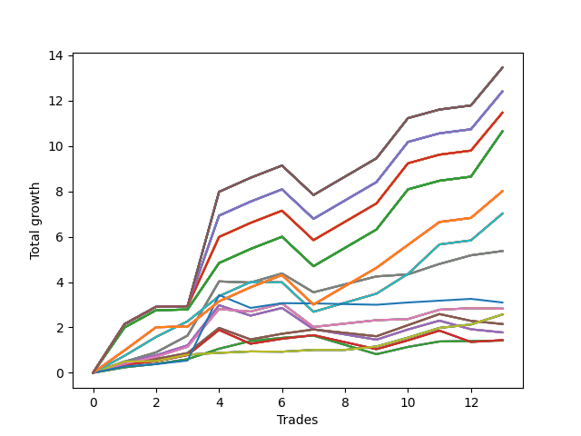

# Long Wallace Doodle 010 
- Symbol: AAPL_Unlimited
- Date Range: 03/23/2022 - 07/08/2022
- Trading Period: 7:20-12:30
- Number of Trades: 13



| Name | Win Percent | Profit | Avg Profit / Trade | Avg Time / Trade |      | Name | Win Percent | Profit | Avg Profit / Trade | Avg Time / Trade |
| ---- | ----------- | ------ | ------------------ | ---------------- | ---- | ---- | ----------- | ------ | ------------------ | ---------------- |
| Sorted By <br> Profit | | | | | | Sorted By <br> Win Percentage ||||
| One Hundred Thirty | 92.31 | 6730.00 | 517.69 | 133:16 |     | One Hundred Thirty | 92.31 | 6730.00 | 517.69 | 133:16 |
| One Hundred Twenty-Five | 92.31 | 6730.00 | 517.69 | 133:16 |     | One Hundred Twenty-Five | 92.31 | 6730.00 | 517.69 | 133:16 |
| One Hundred Twenty | 92.31 | 6730.00 | 517.69 | 133:16 |     | One Hundred Twenty | 92.31 | 6730.00 | 517.69 | 133:16 |
| One Hundred Fifteen | 92.31 | 6730.00 | 517.69 | 133:16 |     | One Hundred Fifteen | 92.31 | 6730.00 | 517.69 | 133:16 |
| One Hundred Ten | 92.31 | 6730.00 | 517.69 | 133:16 |     | One Hundred Ten | 92.31 | 6730.00 | 517.69 | 133:16 |
| One Hundred Five | 92.31 | 6730.00 | 517.69 | 133:16 |     | One Hundred Five | 92.31 | 6730.00 | 517.69 | 133:16 |
| One Hundred | 92.31 | 6730.00 | 517.69 | 133:16 |     | One Hundred | 92.31 | 6730.00 | 517.69 | 133:16 |
| Ninety-Five | 92.31 | 6730.00 | 517.69 | 133:16 |     | Ninety-Five | 92.31 | 6730.00 | 517.69 | 133:16 |
| Eighty-Five | 92.31 | 6730.00 | 517.69 | 133:16 |     | Eighty-Five | 92.31 | 6730.00 | 517.69 | 133:16 |
| One Hundred Twenty-Nine | 92.31 | 6205.00 | 477.31 | 132:00 |     | One Hundred Twenty-Nine | 92.31 | 6205.00 | 477.31 | 132:00 |
| One Hundred Twenty-Four | 92.31 | 6205.00 | 477.31 | 132:00 |     | One Hundred Twenty-Four | 92.31 | 6205.00 | 477.31 | 132:00 |
| One Hundred Ninteen | 92.31 | 6205.00 | 477.31 | 132:00 |     | One Hundred Ninteen | 92.31 | 6205.00 | 477.31 | 132:00 |
| One Hundred Fourteen | 92.31 | 6205.00 | 477.31 | 132:00 |     | One Hundred Fourteen | 92.31 | 6205.00 | 477.31 | 132:00 |
| One Hundred Nine | 92.31 | 6205.00 | 477.31 | 132:00 |     | One Hundred Nine | 92.31 | 6205.00 | 477.31 | 132:00 |
| One Hundred Four | 92.31 | 6205.00 | 477.31 | 132:00 |     | One Hundred Four | 92.31 | 6205.00 | 477.31 | 132:00 |
| Ninety-Nine | 92.31 | 6205.00 | 477.31 | 132:00 |     | Ninety-Nine | 92.31 | 6205.00 | 477.31 | 132:00 |
| Ninety-Four | 92.31 | 6205.00 | 477.31 | 132:00 |     | Ninety-Four | 92.31 | 6205.00 | 477.31 | 132:00 |
| Eighty-Four | 92.31 | 6205.00 | 477.31 | 132:00 |     | Eighty-Four | 92.31 | 6205.00 | 477.31 | 132:00 |
| One Hundred Twenty-Eight | 92.31 | 5735.00 | 441.15 | 129:42 |     | One Hundred Twenty-Eight | 92.31 | 5735.00 | 441.15 | 129:42 |
| One Hundred Twenty-Three | 92.31 | 5735.00 | 441.15 | 129:42 |     | One Hundred Twenty-Three | 92.31 | 5735.00 | 441.15 | 129:42 |
| One Hundred Eighteen | 92.31 | 5735.00 | 441.15 | 129:42 |     | One Hundred Eighteen | 92.31 | 5735.00 | 441.15 | 129:42 |
| One Hundred Thirteen | 92.31 | 5735.00 | 441.15 | 129:42 |     | One Hundred Thirteen | 92.31 | 5735.00 | 441.15 | 129:42 |
| One Hundred Eight | 92.31 | 5735.00 | 441.15 | 129:42 |     | One Hundred Eight | 92.31 | 5735.00 | 441.15 | 129:42 |
| One Hundred Three | 92.31 | 5735.00 | 441.15 | 129:42 |     | One Hundred Three | 92.31 | 5735.00 | 441.15 | 129:42 |
| Ninety-Eight | 92.31 | 5735.00 | 441.15 | 129:42 |     | Ninety-Eight | 92.31 | 5735.00 | 441.15 | 129:42 |
| Ninety-Three | 92.31 | 5735.00 | 441.15 | 129:42 |     | Ninety-Three | 92.31 | 5735.00 | 441.15 | 129:42 |
| Eighty-Three | 92.31 | 5735.00 | 441.15 | 129:42 |     | Eighty-Three | 92.31 | 5735.00 | 441.15 | 129:42 |
| One Hundred Twenty-Seven | 92.31 | 5325.00 | 409.62 | 123:48 |     | One Hundred Twenty-Seven | 92.31 | 5325.00 | 409.62 | 123:48 |
| One Hundred Twenty-Two | 92.31 | 5325.00 | 409.62 | 123:48 |     | One Hundred Twenty-Two | 92.31 | 5325.00 | 409.62 | 123:48 |
| One Hundred Seventeen | 92.31 | 5325.00 | 409.62 | 123:48 |     | One Hundred Seventeen | 92.31 | 5325.00 | 409.62 | 123:48 |
| One Hundred Twelve | 92.31 | 5325.00 | 409.62 | 123:48 |     | One Hundred Twelve | 92.31 | 5325.00 | 409.62 | 123:48 |
| One Hundred Seven | 92.31 | 5325.00 | 409.62 | 123:48 |     | One Hundred Seven | 92.31 | 5325.00 | 409.62 | 123:48 |
| One Hundred Two | 92.31 | 5325.00 | 409.62 | 123:48 |     | One Hundred Two | 92.31 | 5325.00 | 409.62 | 123:48 |
| Ninety-Seven | 92.31 | 5325.00 | 409.62 | 123:48 |     | Ninety-Seven | 92.31 | 5325.00 | 409.62 | 123:48 |
| Ninety-Two | 92.31 | 5325.00 | 409.62 | 123:48 |     | Ninety-Two | 92.31 | 5325.00 | 409.62 | 123:48 |
| Eighty-Two | 92.31 | 5325.00 | 409.62 | 123:48 |     | Eighty-Two | 92.31 | 5325.00 | 409.62 | 123:48 |
| One Hundred Twenty-Six | 92.31 | 4005.00 | 308.08 | 95:34 |     | One Hundred Twenty-Six | 92.31 | 4005.00 | 308.08 | 95:34 |
| One Hundred Twenty-One | 92.31 | 4005.00 | 308.08 | 95:34 |     | One Hundred Twenty-One | 92.31 | 4005.00 | 308.08 | 95:34 |
| One Hundred Sixteen | 92.31 | 4005.00 | 308.08 | 95:34 |     | One Hundred Sixteen | 92.31 | 4005.00 | 308.08 | 95:34 |
| One Hundred Eleven | 92.31 | 4005.00 | 308.08 | 95:34 |     | One Hundred Eleven | 92.31 | 4005.00 | 308.08 | 95:34 |
| One Hundred Six | 92.31 | 4005.00 | 308.08 | 95:34 |     | One Hundred Six | 92.31 | 4005.00 | 308.08 | 95:34 |
| One Hundred One | 92.31 | 4005.00 | 308.08 | 95:34 |     | One Hundred One | 92.31 | 4005.00 | 308.08 | 95:34 |
| Ninety-Six | 92.31 | 4005.00 | 308.08 | 95:34 |     | Ninety-Six | 92.31 | 4005.00 | 308.08 | 95:34 |
| Ninety-One | 92.31 | 4005.00 | 308.08 | 95:34 |     | Ninety-One | 92.31 | 4005.00 | 308.08 | 95:34 |
| Eighty-One | 92.31 | 4005.00 | 308.08 | 95:34 |     | Eighty-One | 92.31 | 4005.00 | 308.08 | 95:34 |
| Seventy-One | 84.62 | 3510.00 | 270.00 | 86:52 |     | Seventy | 92.31 | 1285.00 | 98.85 | 12:23 |
| Sixty-Three | 84.62 | 3510.00 | 270.00 | 86:52 |     | Sixty-Two | 92.31 | 1285.00 | 98.85 | 12:23 |
| Fifty-Five | 84.62 | 3510.00 | 270.00 | 86:52 |     | Fifty-Four | 92.31 | 1285.00 | 98.85 | 12:23 |
| Forty-Seven | 84.62 | 3510.00 | 270.00 | 86:52 |     | Forty-Six | 92.31 | 1285.00 | 98.85 | 12:23 |
| Seven | 84.62 | 3510.00 | 270.00 | 86:52 |     | Six | 92.31 | 1285.00 | 98.85 | 12:23 |
| Sixty-Nine | 84.62 | 2685.00 | 206.54 | 53:50 |     | Seventy-One | 84.62 | 3510.00 | 270.00 | 86:52 |
| Sixty-One | 84.62 | 2685.00 | 206.54 | 53:50 |     | Sixty-Three | 84.62 | 3510.00 | 270.00 | 86:52 |
| Fifty-Three | 84.62 | 2685.00 | 206.54 | 53:50 |     | Fifty-Five | 84.62 | 3510.00 | 270.00 | 86:52 |
| Forty-Five | 84.62 | 2685.00 | 206.54 | 53:50 |     | Forty-Seven | 84.62 | 3510.00 | 270.00 | 86:52 |
| Five | 84.62 | 2685.00 | 206.54 | 53:50 |     | Seven | 84.62 | 3510.00 | 270.00 | 86:52 |
| Seventy-Three | 61.54 | 1550.00 | 119.23 | 11:37 |     | Sixty-Nine | 84.62 | 2685.00 | 206.54 | 53:50 |
| Sixty-Eight | 76.92 | 1415.00 | 108.85 | 45:43 |     | Sixty-One | 84.62 | 2685.00 | 206.54 | 53:50 |
| Sixty | 76.92 | 1415.00 | 108.85 | 45:43 |     | Fifty-Three | 84.62 | 2685.00 | 206.54 | 53:50 |
| Fifty-Two | 76.92 | 1415.00 | 108.85 | 45:43 |     | Forty-Five | 84.62 | 2685.00 | 206.54 | 53:50 |
| Forty-Four | 76.92 | 1415.00 | 108.85 | 45:43 |     | Five | 84.62 | 2685.00 | 206.54 | 53:50 |
| Four | 76.92 | 1415.00 | 108.85 | 45:43 |     | Sixty-Four | 84.62 | 710.00 | 54.62 | 10:55 |
| Seventy | 92.31 | 1285.00 | 98.85 | 12:23 |     | Fifty-Six | 84.62 | 710.00 | 54.62 | 10:55 |
| Sixty-Two | 92.31 | 1285.00 | 98.85 | 12:23 |     | Forty-Eight | 84.62 | 710.00 | 54.62 | 10:55 |
| Fifty-Four | 92.31 | 1285.00 | 98.85 | 12:23 |     | Forty | 84.62 | 710.00 | 54.62 | 10:55 |
| Forty-Six | 92.31 | 1285.00 | 98.85 | 12:23 |     | Zero | 84.62 | 710.00 | 54.62 | 10:55 |
| Six | 92.31 | 1285.00 | 98.85 | 12:23 |     | Sixty-Eight | 76.92 | 1415.00 | 108.85 | 45:43 |
| Sixty-Seven | 61.54 | 1075.00 | 82.69 | 24:35 |     | Sixty | 76.92 | 1415.00 | 108.85 | 45:43 |
| Fifty-Nine | 61.54 | 1075.00 | 82.69 | 24:35 |     | Fifty-Two | 76.92 | 1415.00 | 108.85 | 45:43 |
| Fifty-One | 61.54 | 1075.00 | 82.69 | 24:35 |     | Forty-Four | 76.92 | 1415.00 | 108.85 | 45:43 |
| Forty-Three | 61.54 | 1075.00 | 82.69 | 24:35 |     | Four | 76.92 | 1415.00 | 108.85 | 45:43 |
| Three | 61.54 | 1075.00 | 82.69 | 24:35 |     | Sixty-Five | 69.23 | 720.00 | 55.38 | 20:13 |
| Sixty-Six | 53.85 | 890.00 | 68.46 | 30:12 |     | Fifty-Seven | 69.23 | 720.00 | 55.38 | 20:13 |
| Fifty-Eight | 53.85 | 890.00 | 68.46 | 30:12 |     | Forty-Nine | 69.23 | 720.00 | 55.38 | 20:13 |
| Fifty | 53.85 | 890.00 | 68.46 | 30:12 |     | Forty-One | 69.23 | 720.00 | 55.38 | 20:13 |
| Forty-Two | 53.85 | 890.00 | 68.46 | 30:12 |     | One | 69.23 | 720.00 | 55.38 | 20:13 |
| Two | 53.85 | 890.00 | 68.46 | 30:12 |     | Seventy-Three | 61.54 | 1550.00 | 119.23 | 11:37 |
| Sixty-Five | 69.23 | 720.00 | 55.38 | 20:13 |     | Sixty-Seven | 61.54 | 1075.00 | 82.69 | 24:35 |
| Fifty-Seven | 69.23 | 720.00 | 55.38 | 20:13 |     | Fifty-Nine | 61.54 | 1075.00 | 82.69 | 24:35 |
| Forty-Nine | 69.23 | 720.00 | 55.38 | 20:13 |     | Fifty-One | 61.54 | 1075.00 | 82.69 | 24:35 |
| Forty-One | 69.23 | 720.00 | 55.38 | 20:13 |     | Forty-Three | 61.54 | 1075.00 | 82.69 | 24:35 |
| One | 69.23 | 720.00 | 55.38 | 20:13 |     | Three | 61.54 | 1075.00 | 82.69 | 24:35 |
| Sixty-Four | 84.62 | 710.00 | 54.62 | 10:55 |     | Sixty-Six | 53.85 | 890.00 | 68.46 | 30:12 |
| Fifty-Six | 84.62 | 710.00 | 54.62 | 10:55 |     | Fifty-Eight | 53.85 | 890.00 | 68.46 | 30:12 |
| Forty-Eight | 84.62 | 710.00 | 54.62 | 10:55 |     | Fifty | 53.85 | 890.00 | 68.46 | 30:12 |
| Forty | 84.62 | 710.00 | 54.62 | 10:55 |     | Forty-Two | 53.85 | 890.00 | 68.46 | 30:12 |
| Zero | 84.62 | 710.00 | 54.62 | 10:55 |     | Two | 53.85 | 890.00 | 68.46 | 30:12 |

## NO STOPLOSS

### Test Zero
* Sell when price hits the middle line of the 20p bollinger
* No Stoploss
* Results:
```
Total Trades: 13
Percent Up: 84.62
Percent Down: 15.38
Total Points Moved Up: 1.42
Potential Profit: 710.00
Total Points Ups: 2.24 Count Ups: 11
Total Points Downs: -0.82 Count Downs: 2
```

<details><summary>Trades</summary>

<code>In: 2022-03-29 09:36:00		Out: 2022-03-29 09:43:15		Total Position Time: 07:15		Total Move Up: 0.24		Total to Date: 0.24</code> <br />
<code>In: 2022-04-19 10:31:00		Out: 2022-04-19 10:34:10		Total Position Time: 03:10		Total Move Up: 0.15		Total to Date: 0.39</code> <br />
<code>In: 2022-05-03 11:22:00		Out: 2022-05-03 11:32:10		Total Position Time: 10:10		Total Move Up: 0.21		Total to Date: 0.60</code> <br />
<code>In: 2022-05-04 11:36:00		Out: 2022-05-04 11:41:35		Total Position Time: 05:35		Total Move Up: 0.46		Total to Date: 1.06</code> <br />
<code>In: 2022-05-06 10:55:00		Out: 2022-05-06 11:02:20		Total Position Time: 07:20		Total Move Up: 0.34		Total to Date: 1.40</code> <br />
<code>In: 2022-06-02 12:01:00		Out: 2022-06-02 12:03:55		Total Position Time: 02:55		Total Move Up: 0.14		Total to Date: 1.54</code> <br />
<code>In: 2022-06-08 09:01:00		Out: 2022-06-08 09:02:15		Total Position Time: 01:15		Total Move Up: 0.10		Total to Date: 1.64</code> <br />
<code>In: 2022-06-14 11:50:00		Out: 2022-06-14 12:22:10		Total Position Time: 32:10		Total Move Up: -0.41		Total to Date: 1.23</code> <br />
<code>In: 2022-06-14 11:52:00		Out: 2022-06-14 12:22:10		Total Position Time: 30:10		Total Move Up: -0.41		Total to Date: 0.82</code> <br />
<code>In: 2022-06-23 09:06:00		Out: 2022-06-23 09:13:50		Total Position Time: 07:50		Total Move Up: 0.32		Total to Date: 1.14</code> <br />
<code>In: 2022-06-29 09:29:00		Out: 2022-06-29 09:36:45		Total Position Time: 07:45		Total Move Up: 0.24		Total to Date: 1.38</code> <br />
<code>In: 2022-06-30 11:46:00		Out: 2022-06-30 12:02:20		Total Position Time: 16:20		Total Move Up: 0.02		Total to Date: 1.40</code> <br />
<code>In: 2022-07-06 08:09:00		Out: 2022-07-06 08:19:05		Total Position Time: 10:05		Total Move Up: 0.02		Total to Date: 1.42</code> <br />


</details>

### Test One
* Sell when the price hits the upper line of the 20p 1std bollinger
* No Stoploss
* Results:
```
Total Trades: 13
Percent Up: 69.23
Percent Down: 30.77
Total Points Moved Up: 1.44
Potential Profit: 720.00
Total Points Ups: 3.17 Count Ups: 9
Total Points Downs: -1.73 Count Downs: 4
```

<details><summary>Trades</summary>

<code>In: 2022-03-29 09:36:00		Out: 2022-03-29 09:45:05		Total Position Time: 09:05		Total Move Up: 0.36		Total to Date: 0.36</code> <br />
<code>In: 2022-04-19 10:31:00		Out: 2022-04-19 10:48:20		Total Position Time: 17:20		Total Move Up: 0.15		Total to Date: 0.51</code> <br />
<code>In: 2022-05-03 11:22:00		Out: 2022-05-03 11:35:20		Total Position Time: 13:20		Total Move Up: 0.27		Total to Date: 0.78</code> <br />
<code>In: 2022-05-04 11:36:00		Out: 2022-05-04 11:43:55		Total Position Time: 07:55		Total Move Up: 1.11		Total to Date: 1.89</code> <br />
<code>In: 2022-05-06 10:55:00		Out: 2022-05-06 11:49:20		Total Position Time: 54:20		Total Move Up: -0.61		Total to Date: 1.28</code> <br />
<code>In: 2022-06-02 12:01:00		Out: 2022-06-02 12:11:40		Total Position Time: 10:40		Total Move Up: 0.22		Total to Date: 1.50</code> <br />
<code>In: 2022-06-08 09:01:00		Out: 2022-06-08 09:03:05		Total Position Time: 02:05		Total Move Up: 0.16		Total to Date: 1.66</code> <br />
<code>In: 2022-06-14 11:50:00		Out: 2022-06-14 12:26:30		Total Position Time: 36:30		Total Move Up: -0.31		Total to Date: 1.35</code> <br />
<code>In: 2022-06-14 11:52:00		Out: 2022-06-14 12:26:30		Total Position Time: 34:30		Total Move Up: -0.31		Total to Date: 1.04</code> <br />
<code>In: 2022-06-23 09:06:00		Out: 2022-06-23 09:18:50		Total Position Time: 12:50		Total Move Up: 0.39		Total to Date: 1.43</code> <br />
<code>In: 2022-06-29 09:29:00		Out: 2022-06-29 09:38:30		Total Position Time: 09:30		Total Move Up: 0.43		Total to Date: 1.86</code> <br />
<code>In: 2022-06-30 11:46:00		Out: 2022-06-30 12:25:40		Total Position Time: 39:40		Total Move Up: -0.50		Total to Date: 1.36</code> <br />
<code>In: 2022-07-06 08:09:00		Out: 2022-07-06 08:24:10		Total Position Time: 15:10		Total Move Up: 0.08		Total to Date: 1.44</code> <br />


</details>

### Test Two
* Sell when the price hits the upper line of the 20p 2std bollinger
* No Stoploss
* Results:
```
Total Trades: 13
Percent Up: 53.85
Percent Down: 46.15
Total Points Moved Up: 1.78
Potential Profit: 890.00
Total Points Ups: 4.16 Count Ups: 7
Total Points Downs: -2.38 Count Downs: 6
```

<details><summary>Trades</summary>

<code>In: 2022-03-29 09:36:00		Out: 2022-03-29 09:45:30		Total Position Time: 09:30		Total Move Up: 0.50		Total to Date: 0.50</code> <br />
<code>In: 2022-04-19 10:31:00		Out: 2022-04-19 10:50:20		Total Position Time: 19:20		Total Move Up: 0.27		Total to Date: 0.77</code> <br />
<code>In: 2022-05-03 11:22:00		Out: 2022-05-03 11:36:05		Total Position Time: 14:05		Total Move Up: 0.44		Total to Date: 1.21</code> <br />
<code>In: 2022-05-04 11:36:00		Out: 2022-05-04 11:46:55		Total Position Time: 10:55		Total Move Up: 1.77		Total to Date: 2.98</code> <br />
<code>In: 2022-05-06 10:55:00		Out: 2022-05-06 11:50:05		Total Position Time: 55:05		Total Move Up: -0.46		Total to Date: 2.52</code> <br />
<code>In: 2022-06-02 12:01:00		Out: 2022-06-02 12:17:05		Total Position Time: 16:05		Total Move Up: 0.34		Total to Date: 2.86</code> <br />
<code>In: 2022-06-08 09:01:00		Out: 2022-06-08 10:00:10		Total Position Time: 59:10		Total Move Up: -0.94		Total to Date: 1.92</code> <br />
<code>In: 2022-06-14 11:50:00		Out: 2022-06-14 12:27:10		Total Position Time: 37:10		Total Move Up: -0.23		Total to Date: 1.69</code> <br />
<code>In: 2022-06-14 11:52:00		Out: 2022-06-14 12:27:10		Total Position Time: 35:10		Total Move Up: -0.23		Total to Date: 1.46</code> <br />
<code>In: 2022-06-23 09:06:00		Out: 2022-06-23 09:21:05		Total Position Time: 15:05		Total Move Up: 0.45		Total to Date: 1.91</code> <br />
<code>In: 2022-06-29 09:29:00		Out: 2022-06-29 10:10:00		Total Position Time: 41:00		Total Move Up: 0.39		Total to Date: 2.30</code> <br />
<code>In: 2022-06-30 11:46:00		Out: 2022-06-30 12:26:05		Total Position Time: 40:05		Total Move Up: -0.38		Total to Date: 1.92</code> <br />
<code>In: 2022-07-06 08:09:00		Out: 2022-07-06 08:49:05		Total Position Time: 40:05		Total Move Up: -0.14		Total to Date: 1.78</code> <br />


</details>

### Test Three
* Sell when price hits the middle line of the 50p bollinger
* No Stoploss
* Results:
```
Total Trades: 13
Percent Up: 61.54
Percent Down: 38.46
Total Points Moved Up: 2.15
Potential Profit: 1075.00
Total Points Ups: 3.40 Count Ups: 8
Total Points Downs: -1.25 Count Downs: 5
```

<details><summary>Trades</summary>

<code>In: 2022-03-29 09:36:00		Out: 2022-03-29 09:45:20		Total Position Time: 09:20		Total Move Up: 0.44		Total to Date: 0.44</code> <br />
<code>In: 2022-04-19 10:31:00		Out: 2022-04-19 10:48:30		Total Position Time: 17:30		Total Move Up: 0.17		Total to Date: 0.61</code> <br />
<code>In: 2022-05-03 11:22:00		Out: 2022-05-03 11:52:05		Total Position Time: 30:05		Total Move Up: 0.26		Total to Date: 0.87</code> <br />
<code>In: 2022-05-04 11:36:00		Out: 2022-05-04 11:43:55		Total Position Time: 07:55		Total Move Up: 1.11		Total to Date: 1.98</code> <br />
<code>In: 2022-05-06 10:55:00		Out: 2022-05-06 11:49:25		Total Position Time: 54:25		Total Move Up: -0.51		Total to Date: 1.47</code> <br />
<code>In: 2022-06-02 12:01:00		Out: 2022-06-02 12:12:05		Total Position Time: 11:05		Total Move Up: 0.25		Total to Date: 1.72</code> <br />
<code>In: 2022-06-08 09:01:00		Out: 2022-06-08 09:03:25		Total Position Time: 02:25		Total Move Up: 0.19		Total to Date: 1.91</code> <br />
<code>In: 2022-06-14 11:50:00		Out: 2022-06-14 12:27:25		Total Position Time: 37:25		Total Move Up: -0.15		Total to Date: 1.76</code> <br />
<code>In: 2022-06-14 11:52:00		Out: 2022-06-14 12:27:25		Total Position Time: 35:25		Total Move Up: -0.15		Total to Date: 1.61</code> <br />
<code>In: 2022-06-23 09:06:00		Out: 2022-06-23 09:22:00		Total Position Time: 16:00		Total Move Up: 0.49		Total to Date: 2.10</code> <br />
<code>In: 2022-06-29 09:29:00		Out: 2022-06-29 09:45:15		Total Position Time: 16:15		Total Move Up: 0.49		Total to Date: 2.59</code> <br />
<code>In: 2022-06-30 11:46:00		Out: 2022-06-30 12:27:45		Total Position Time: 41:45		Total Move Up: -0.30		Total to Date: 2.29</code> <br />
<code>In: 2022-07-06 08:09:00		Out: 2022-07-06 08:49:05		Total Position Time: 40:05		Total Move Up: -0.14		Total to Date: 2.15</code> <br />


</details>

### Test Four
* Sell when the price hits the upper line of the 50p 1std bollinger
* No Stoploss
* Results:
```
Total Trades: 13
Percent Up: 76.92
Percent Down: 23.08
Total Points Moved Up: 2.83
Potential Profit: 1415.00
Total Points Ups: 4.00 Count Ups: 10
Total Points Downs: -1.17 Count Downs: 3
```

<details><summary>Trades</summary>

<code>In: 2022-03-29 09:36:00		Out: 2022-03-29 10:29:15		Total Position Time: 53:15		Total Move Up: 0.39		Total to Date: 0.39</code> <br />
<code>In: 2022-04-19 10:31:00		Out: 2022-04-19 10:50:25		Total Position Time: 19:25		Total Move Up: 0.32		Total to Date: 0.71</code> <br />
<code>In: 2022-05-03 11:22:00		Out: 2022-05-03 11:57:05		Total Position Time: 35:05		Total Move Up: 0.44		Total to Date: 1.15</code> <br />
<code>In: 2022-05-04 11:36:00		Out: 2022-05-04 11:46:50		Total Position Time: 10:50		Total Move Up: 1.66		Total to Date: 2.81</code> <br />
<code>In: 2022-05-06 10:55:00		Out: 2022-05-06 11:50:20		Total Position Time: 55:20		Total Move Up: -0.11		Total to Date: 2.70</code> <br />
<code>In: 2022-06-02 12:01:00		Out: 2022-06-02 12:17:10		Total Position Time: 16:10		Total Move Up: 0.36		Total to Date: 3.06</code> <br />
<code>In: 2022-06-08 09:01:00		Out: 2022-06-08 10:54:00		Total Position Time: 113:00		Total Move Up: -1.04		Total to Date: 2.02</code> <br />
<code>In: 2022-06-14 11:50:00		Out: 2022-06-14 12:30:50		Total Position Time: 40:50		Total Move Up: 0.15		Total to Date: 2.17</code> <br />
<code>In: 2022-06-14 11:52:00		Out: 2022-06-14 12:30:50		Total Position Time: 38:50		Total Move Up: 0.15		Total to Date: 2.32</code> <br />
<code>In: 2022-06-23 09:06:00		Out: 2022-06-23 10:23:20		Total Position Time: 77:20		Total Move Up: 0.05		Total to Date: 2.37</code> <br />
<code>In: 2022-06-29 09:29:00		Out: 2022-06-29 10:10:05		Total Position Time: 41:05		Total Move Up: 0.41		Total to Date: 2.78</code> <br />
<code>In: 2022-06-30 11:46:00		Out: 2022-06-30 12:30:05		Total Position Time: 44:05		Total Move Up: 0.07		Total to Date: 2.85</code> <br />
<code>In: 2022-07-06 08:09:00		Out: 2022-07-06 08:58:15		Total Position Time: 49:15		Total Move Up: -0.02		Total to Date: 2.83</code> <br />


</details>

### Test Five
* Sell when the price hits the upper line of the 50p 2std bollinger
* No Stoploss
* Results:
```
Total Trades: 13
Percent Up: 84.62
Percent Down: 15.38
Total Points Moved Up: 5.37
Potential Profit: 2685.00
Total Points Ups: 6.25 Count Ups: 11
Total Points Downs: -0.88 Count Downs: 2
```

<details><summary>Trades</summary>

<code>In: 2022-03-29 09:36:00		Out: 2022-03-29 10:40:00		Total Position Time: 64:00		Total Move Up: 0.49		Total to Date: 0.49</code> <br />
<code>In: 2022-04-19 10:31:00		Out: 2022-04-19 10:55:05		Total Position Time: 24:05		Total Move Up: 0.41		Total to Date: 0.90</code> <br />
<code>In: 2022-05-03 11:22:00		Out: 2022-05-03 11:59:45		Total Position Time: 37:45		Total Move Up: 0.74		Total to Date: 1.64</code> <br />
<code>In: 2022-05-04 11:36:00		Out: 2022-05-04 11:47:10		Total Position Time: 11:10		Total Move Up: 2.39		Total to Date: 4.03</code> <br />
<code>In: 2022-05-06 10:55:00		Out: 2022-05-06 11:55:05		Total Position Time: 60:05		Total Move Up: -0.05		Total to Date: 3.98</code> <br />
<code>In: 2022-06-02 12:01:00		Out: 2022-06-02 12:35:35		Total Position Time: 34:35		Total Move Up: 0.40		Total to Date: 4.38</code> <br />
<code>In: 2022-06-08 09:01:00		Out: 2022-06-08 10:56:30		Total Position Time: 115:30		Total Move Up: -0.83		Total to Date: 3.55</code> <br />
<code>In: 2022-06-14 11:50:00		Out: 2022-06-14 12:36:25		Total Position Time: 46:25		Total Move Up: 0.35		Total to Date: 3.90</code> <br />
<code>In: 2022-06-14 11:52:00		Out: 2022-06-14 12:36:25		Total Position Time: 44:25		Total Move Up: 0.35		Total to Date: 4.25</code> <br />
<code>In: 2022-06-23 09:06:00		Out: 2022-06-23 10:23:25		Total Position Time: 77:25		Total Move Up: 0.09		Total to Date: 4.34</code> <br />
<code>In: 2022-06-29 09:29:00		Out: 2022-06-29 10:40:40		Total Position Time: 71:40		Total Move Up: 0.46		Total to Date: 4.80</code> <br />
<code>In: 2022-06-30 11:46:00		Out: 2022-06-30 12:34:25		Total Position Time: 48:25		Total Move Up: 0.38		Total to Date: 5.18</code> <br />
<code>In: 2022-07-06 08:09:00		Out: 2022-07-06 09:13:30		Total Position Time: 64:30		Total Move Up: 0.19		Total to Date: 5.37</code> <br />


</details>

### Test Six
* Sell when the price hits the middle line of the 1std VWAP
* No Stoploss
* Results:
```
Total Trades: 13
Percent Up: 92.31
Percent Down: 7.69
Total Points Moved Up: 2.57
Potential Profit: 1285.00
Total Points Ups: 2.58 Count Ups: 12
Total Points Downs: -0.01 Count Downs: 1
```

<details><summary>Trades</summary>

<code>In: 2022-03-29 09:36:00		Out: 2022-03-29 09:45:25		Total Position Time: 09:25		Total Move Up: 0.49		Total to Date: 0.49</code> <br />
<code>In: 2022-04-19 10:31:00		Out: 2022-04-19 10:32:10		Total Position Time: 01:10		Total Move Up: 0.03		Total to Date: 0.52</code> <br />
<code>In: 2022-05-03 11:22:00		Out: 2022-05-03 11:23:10		Total Position Time: 01:10		Total Move Up: 0.28		Total to Date: 0.80</code> <br />
<code>In: 2022-05-04 11:36:00		Out: 2022-05-04 11:37:10		Total Position Time: 01:10		Total Move Up: 0.08		Total to Date: 0.88</code> <br />
<code>In: 2022-05-06 10:55:00		Out: 2022-05-06 10:56:10		Total Position Time: 01:10		Total Move Up: 0.06		Total to Date: 0.94</code> <br />
<code>In: 2022-06-02 12:01:00		Out: 2022-06-02 12:02:10		Total Position Time: 01:10		Total Move Up: -0.01		Total to Date: 0.93</code> <br />
<code>In: 2022-06-08 09:01:00		Out: 2022-06-08 09:02:10		Total Position Time: 01:10		Total Move Up: 0.08		Total to Date: 1.01</code> <br />
<code>In: 2022-06-14 11:50:00		Out: 2022-06-14 11:52:00		Total Position Time: 02:00		Total Move Up: 0.00		Total to Date: 1.01</code> <br />
<code>In: 2022-06-14 11:52:00		Out: 2022-06-14 11:53:10		Total Position Time: 01:10		Total Move Up: 0.15		Total to Date: 1.16</code> <br />
<code>In: 2022-06-23 09:06:00		Out: 2022-06-23 09:18:50		Total Position Time: 12:50		Total Move Up: 0.39		Total to Date: 1.55</code> <br />
<code>In: 2022-06-29 09:29:00		Out: 2022-06-29 09:38:30		Total Position Time: 09:30		Total Move Up: 0.43		Total to Date: 1.98</code> <br />
<code>In: 2022-06-30 11:46:00		Out: 2022-06-30 11:47:10		Total Position Time: 01:10		Total Move Up: 0.15		Total to Date: 2.13</code> <br />
<code>In: 2022-07-06 08:09:00		Out: 2022-07-06 10:07:05		Total Position Time: 118:05		Total Move Up: 0.44		Total to Date: 2.57</code> <br />


</details>

### Test Seven
* Sell when the price hits the upper line of the 1std VWAP
* No Stoploss
* Results:
```
Total Trades: 13
Percent Up: 84.62
Percent Down: 15.38
Total Points Moved Up: 7.02
Potential Profit: 3510.00
Total Points Ups: 8.33 Count Ups: 11
Total Points Downs: -1.31 Count Downs: 2
```

<details><summary>Trades</summary>

<code>In: 2022-03-29 09:36:00		Out: 2022-03-29 10:46:40		Total Position Time: 70:40		Total Move Up: 0.75		Total to Date: 0.75</code> <br />
<code>In: 2022-04-19 10:31:00		Out: 2022-04-19 12:11:40		Total Position Time: 100:40		Total Move Up: 0.83		Total to Date: 1.58</code> <br />
<code>In: 2022-05-03 11:22:00		Out: 2022-05-03 11:59:25		Total Position Time: 37:25		Total Move Up: 0.69		Total to Date: 2.27</code> <br />
<code>In: 2022-05-04 11:36:00		Out: 2022-05-04 11:43:55		Total Position Time: 07:55		Total Move Up: 1.11		Total to Date: 3.38</code> <br />
<code>In: 2022-05-06 10:55:00		Out: 2022-05-06 12:47:00		Total Position Time: 112:00		Total Move Up: 0.62		Total to Date: 4.00</code> <br />
<code>In: 2022-06-02 12:01:00		Out: 2022-06-02 12:02:10		Total Position Time: 01:10		Total Move Up: -0.01		Total to Date: 3.99</code> <br />
<code>In: 2022-06-08 09:01:00		Out: 2022-06-08 12:47:00		Total Position Time: 226:00		Total Move Up: -1.30		Total to Date: 2.69</code> <br />
<code>In: 2022-06-14 11:50:00		Out: 2022-06-14 12:37:35		Total Position Time: 47:35		Total Move Up: 0.40		Total to Date: 3.09</code> <br />
<code>In: 2022-06-14 11:52:00		Out: 2022-06-14 12:37:35		Total Position Time: 45:35		Total Move Up: 0.40		Total to Date: 3.49</code> <br />
<code>In: 2022-06-23 09:06:00		Out: 2022-06-23 11:31:35		Total Position Time: 145:35		Total Move Up: 0.87		Total to Date: 4.36</code> <br />
<code>In: 2022-06-29 09:29:00		Out: 2022-06-29 11:06:35		Total Position Time: 97:35		Total Move Up: 1.30		Total to Date: 5.66</code> <br />
<code>In: 2022-06-30 11:46:00		Out: 2022-06-30 12:47:00		Total Position Time: 61:00		Total Move Up: 0.18		Total to Date: 5.84</code> <br />
<code>In: 2022-07-06 08:09:00		Out: 2022-07-06 11:05:15		Total Position Time: 176:15		Total Move Up: 1.18		Total to Date: 7.02</code> <br />


</details>

## STOPLOSS OF 5

### Test Forty
* Sell when price hits the middle line of the 20p bollinger
* Stoploss is 5 points
* Results:
```
Total Trades: 13
Percent Up: 84.62
Percent Down: 15.38
Total Points Moved Up: 1.42
Potential Profit: 710.00
Total Points Ups: 2.24 Count Ups: 11
Total Points Downs: -0.82 Count Downs: 2
```

<details><summary>Trades</summary>

<code>In: 2022-03-29 09:36:00		Out: 2022-03-29 09:43:15		Total Position Time: 07:15		Total Move Up: 0.24		Total to Date: 0.24</code> <br />
<code>In: 2022-04-19 10:31:00		Out: 2022-04-19 10:34:10		Total Position Time: 03:10		Total Move Up: 0.15		Total to Date: 0.39</code> <br />
<code>In: 2022-05-03 11:22:00		Out: 2022-05-03 11:32:10		Total Position Time: 10:10		Total Move Up: 0.21		Total to Date: 0.60</code> <br />
<code>In: 2022-05-04 11:36:00		Out: 2022-05-04 11:41:35		Total Position Time: 05:35		Total Move Up: 0.46		Total to Date: 1.06</code> <br />
<code>In: 2022-05-06 10:55:00		Out: 2022-05-06 11:02:20		Total Position Time: 07:20		Total Move Up: 0.34		Total to Date: 1.40</code> <br />
<code>In: 2022-06-02 12:01:00		Out: 2022-06-02 12:03:55		Total Position Time: 02:55		Total Move Up: 0.14		Total to Date: 1.54</code> <br />
<code>In: 2022-06-08 09:01:00		Out: 2022-06-08 09:02:15		Total Position Time: 01:15		Total Move Up: 0.10		Total to Date: 1.64</code> <br />
<code>In: 2022-06-14 11:50:00		Out: 2022-06-14 12:22:10		Total Position Time: 32:10		Total Move Up: -0.41		Total to Date: 1.23</code> <br />
<code>In: 2022-06-14 11:52:00		Out: 2022-06-14 12:22:10		Total Position Time: 30:10		Total Move Up: -0.41		Total to Date: 0.82</code> <br />
<code>In: 2022-06-23 09:06:00		Out: 2022-06-23 09:13:50		Total Position Time: 07:50		Total Move Up: 0.32		Total to Date: 1.14</code> <br />
<code>In: 2022-06-29 09:29:00		Out: 2022-06-29 09:36:45		Total Position Time: 07:45		Total Move Up: 0.24		Total to Date: 1.38</code> <br />
<code>In: 2022-06-30 11:46:00		Out: 2022-06-30 12:02:20		Total Position Time: 16:20		Total Move Up: 0.02		Total to Date: 1.40</code> <br />
<code>In: 2022-07-06 08:09:00		Out: 2022-07-06 08:19:05		Total Position Time: 10:05		Total Move Up: 0.02		Total to Date: 1.42</code> <br />


</details>

### Test Forty-One
* Sell when the price hits the upper line of the 20p 1std bollinger
* Stoploss is 5 points
* Results:
```
Total Trades: 13
Percent Up: 69.23
Percent Down: 30.77
Total Points Moved Up: 1.44
Potential Profit: 720.00
Total Points Ups: 3.17 Count Ups: 9
Total Points Downs: -1.73 Count Downs: 4
```

<details><summary>Trades</summary>

<code>In: 2022-03-29 09:36:00		Out: 2022-03-29 09:45:05		Total Position Time: 09:05		Total Move Up: 0.36		Total to Date: 0.36</code> <br />
<code>In: 2022-04-19 10:31:00		Out: 2022-04-19 10:48:20		Total Position Time: 17:20		Total Move Up: 0.15		Total to Date: 0.51</code> <br />
<code>In: 2022-05-03 11:22:00		Out: 2022-05-03 11:35:20		Total Position Time: 13:20		Total Move Up: 0.27		Total to Date: 0.78</code> <br />
<code>In: 2022-05-04 11:36:00		Out: 2022-05-04 11:43:55		Total Position Time: 07:55		Total Move Up: 1.11		Total to Date: 1.89</code> <br />
<code>In: 2022-05-06 10:55:00		Out: 2022-05-06 11:49:20		Total Position Time: 54:20		Total Move Up: -0.61		Total to Date: 1.28</code> <br />
<code>In: 2022-06-02 12:01:00		Out: 2022-06-02 12:11:40		Total Position Time: 10:40		Total Move Up: 0.22		Total to Date: 1.50</code> <br />
<code>In: 2022-06-08 09:01:00		Out: 2022-06-08 09:03:05		Total Position Time: 02:05		Total Move Up: 0.16		Total to Date: 1.66</code> <br />
<code>In: 2022-06-14 11:50:00		Out: 2022-06-14 12:26:30		Total Position Time: 36:30		Total Move Up: -0.31		Total to Date: 1.35</code> <br />
<code>In: 2022-06-14 11:52:00		Out: 2022-06-14 12:26:30		Total Position Time: 34:30		Total Move Up: -0.31		Total to Date: 1.04</code> <br />
<code>In: 2022-06-23 09:06:00		Out: 2022-06-23 09:18:50		Total Position Time: 12:50		Total Move Up: 0.39		Total to Date: 1.43</code> <br />
<code>In: 2022-06-29 09:29:00		Out: 2022-06-29 09:38:30		Total Position Time: 09:30		Total Move Up: 0.43		Total to Date: 1.86</code> <br />
<code>In: 2022-06-30 11:46:00		Out: 2022-06-30 12:25:40		Total Position Time: 39:40		Total Move Up: -0.50		Total to Date: 1.36</code> <br />
<code>In: 2022-07-06 08:09:00		Out: 2022-07-06 08:24:10		Total Position Time: 15:10		Total Move Up: 0.08		Total to Date: 1.44</code> <br />


</details>

### Test Forty-Two
* Sell when the price hits the upper line of the 20p 2std bollinger
* Stoploss is 5 points
* Results:
```
Total Trades: 13
Percent Up: 53.85
Percent Down: 46.15
Total Points Moved Up: 1.78
Potential Profit: 890.00
Total Points Ups: 4.16 Count Ups: 7
Total Points Downs: -2.38 Count Downs: 6
```

<details><summary>Trades</summary>

<code>In: 2022-03-29 09:36:00		Out: 2022-03-29 09:45:30		Total Position Time: 09:30		Total Move Up: 0.50		Total to Date: 0.50</code> <br />
<code>In: 2022-04-19 10:31:00		Out: 2022-04-19 10:50:20		Total Position Time: 19:20		Total Move Up: 0.27		Total to Date: 0.77</code> <br />
<code>In: 2022-05-03 11:22:00		Out: 2022-05-03 11:36:05		Total Position Time: 14:05		Total Move Up: 0.44		Total to Date: 1.21</code> <br />
<code>In: 2022-05-04 11:36:00		Out: 2022-05-04 11:46:55		Total Position Time: 10:55		Total Move Up: 1.77		Total to Date: 2.98</code> <br />
<code>In: 2022-05-06 10:55:00		Out: 2022-05-06 11:50:05		Total Position Time: 55:05		Total Move Up: -0.46		Total to Date: 2.52</code> <br />
<code>In: 2022-06-02 12:01:00		Out: 2022-06-02 12:17:05		Total Position Time: 16:05		Total Move Up: 0.34		Total to Date: 2.86</code> <br />
<code>In: 2022-06-08 09:01:00		Out: 2022-06-08 10:00:10		Total Position Time: 59:10		Total Move Up: -0.94		Total to Date: 1.92</code> <br />
<code>In: 2022-06-14 11:50:00		Out: 2022-06-14 12:27:10		Total Position Time: 37:10		Total Move Up: -0.23		Total to Date: 1.69</code> <br />
<code>In: 2022-06-14 11:52:00		Out: 2022-06-14 12:27:10		Total Position Time: 35:10		Total Move Up: -0.23		Total to Date: 1.46</code> <br />
<code>In: 2022-06-23 09:06:00		Out: 2022-06-23 09:21:05		Total Position Time: 15:05		Total Move Up: 0.45		Total to Date: 1.91</code> <br />
<code>In: 2022-06-29 09:29:00		Out: 2022-06-29 10:10:00		Total Position Time: 41:00		Total Move Up: 0.39		Total to Date: 2.30</code> <br />
<code>In: 2022-06-30 11:46:00		Out: 2022-06-30 12:26:05		Total Position Time: 40:05		Total Move Up: -0.38		Total to Date: 1.92</code> <br />
<code>In: 2022-07-06 08:09:00		Out: 2022-07-06 08:49:05		Total Position Time: 40:05		Total Move Up: -0.14		Total to Date: 1.78</code> <br />


</details>

### Test Forty-Three
* Sell when price hits the middle line of the 50p bollinger
* Stoploss is 5 points
* Results:
```
Total Trades: 13
Percent Up: 61.54
Percent Down: 38.46
Total Points Moved Up: 2.15
Potential Profit: 1075.00
Total Points Ups: 3.40 Count Ups: 8
Total Points Downs: -1.25 Count Downs: 5
```

<details><summary>Trades</summary>

<code>In: 2022-03-29 09:36:00		Out: 2022-03-29 09:45:20		Total Position Time: 09:20		Total Move Up: 0.44		Total to Date: 0.44</code> <br />
<code>In: 2022-04-19 10:31:00		Out: 2022-04-19 10:48:30		Total Position Time: 17:30		Total Move Up: 0.17		Total to Date: 0.61</code> <br />
<code>In: 2022-05-03 11:22:00		Out: 2022-05-03 11:52:05		Total Position Time: 30:05		Total Move Up: 0.26		Total to Date: 0.87</code> <br />
<code>In: 2022-05-04 11:36:00		Out: 2022-05-04 11:43:55		Total Position Time: 07:55		Total Move Up: 1.11		Total to Date: 1.98</code> <br />
<code>In: 2022-05-06 10:55:00		Out: 2022-05-06 11:49:25		Total Position Time: 54:25		Total Move Up: -0.51		Total to Date: 1.47</code> <br />
<code>In: 2022-06-02 12:01:00		Out: 2022-06-02 12:12:05		Total Position Time: 11:05		Total Move Up: 0.25		Total to Date: 1.72</code> <br />
<code>In: 2022-06-08 09:01:00		Out: 2022-06-08 09:03:25		Total Position Time: 02:25		Total Move Up: 0.19		Total to Date: 1.91</code> <br />
<code>In: 2022-06-14 11:50:00		Out: 2022-06-14 12:27:25		Total Position Time: 37:25		Total Move Up: -0.15		Total to Date: 1.76</code> <br />
<code>In: 2022-06-14 11:52:00		Out: 2022-06-14 12:27:25		Total Position Time: 35:25		Total Move Up: -0.15		Total to Date: 1.61</code> <br />
<code>In: 2022-06-23 09:06:00		Out: 2022-06-23 09:22:00		Total Position Time: 16:00		Total Move Up: 0.49		Total to Date: 2.10</code> <br />
<code>In: 2022-06-29 09:29:00		Out: 2022-06-29 09:45:15		Total Position Time: 16:15		Total Move Up: 0.49		Total to Date: 2.59</code> <br />
<code>In: 2022-06-30 11:46:00		Out: 2022-06-30 12:27:45		Total Position Time: 41:45		Total Move Up: -0.30		Total to Date: 2.29</code> <br />
<code>In: 2022-07-06 08:09:00		Out: 2022-07-06 08:49:05		Total Position Time: 40:05		Total Move Up: -0.14		Total to Date: 2.15</code> <br />


</details>

### Test Forty-Four
* Sell when the price hits the upper line of the 50p 1std bollinger
* Stoploss is 5 points
* Results:
```
Total Trades: 13
Percent Up: 76.92
Percent Down: 23.08
Total Points Moved Up: 2.83
Potential Profit: 1415.00
Total Points Ups: 4.00 Count Ups: 10
Total Points Downs: -1.17 Count Downs: 3
```

<details><summary>Trades</summary>

<code>In: 2022-03-29 09:36:00		Out: 2022-03-29 10:29:15		Total Position Time: 53:15		Total Move Up: 0.39		Total to Date: 0.39</code> <br />
<code>In: 2022-04-19 10:31:00		Out: 2022-04-19 10:50:25		Total Position Time: 19:25		Total Move Up: 0.32		Total to Date: 0.71</code> <br />
<code>In: 2022-05-03 11:22:00		Out: 2022-05-03 11:57:05		Total Position Time: 35:05		Total Move Up: 0.44		Total to Date: 1.15</code> <br />
<code>In: 2022-05-04 11:36:00		Out: 2022-05-04 11:46:50		Total Position Time: 10:50		Total Move Up: 1.66		Total to Date: 2.81</code> <br />
<code>In: 2022-05-06 10:55:00		Out: 2022-05-06 11:50:20		Total Position Time: 55:20		Total Move Up: -0.11		Total to Date: 2.70</code> <br />
<code>In: 2022-06-02 12:01:00		Out: 2022-06-02 12:17:10		Total Position Time: 16:10		Total Move Up: 0.36		Total to Date: 3.06</code> <br />
<code>In: 2022-06-08 09:01:00		Out: 2022-06-08 10:54:00		Total Position Time: 113:00		Total Move Up: -1.04		Total to Date: 2.02</code> <br />
<code>In: 2022-06-14 11:50:00		Out: 2022-06-14 12:30:50		Total Position Time: 40:50		Total Move Up: 0.15		Total to Date: 2.17</code> <br />
<code>In: 2022-06-14 11:52:00		Out: 2022-06-14 12:30:50		Total Position Time: 38:50		Total Move Up: 0.15		Total to Date: 2.32</code> <br />
<code>In: 2022-06-23 09:06:00		Out: 2022-06-23 10:23:20		Total Position Time: 77:20		Total Move Up: 0.05		Total to Date: 2.37</code> <br />
<code>In: 2022-06-29 09:29:00		Out: 2022-06-29 10:10:05		Total Position Time: 41:05		Total Move Up: 0.41		Total to Date: 2.78</code> <br />
<code>In: 2022-06-30 11:46:00		Out: 2022-06-30 12:30:05		Total Position Time: 44:05		Total Move Up: 0.07		Total to Date: 2.85</code> <br />
<code>In: 2022-07-06 08:09:00		Out: 2022-07-06 08:58:15		Total Position Time: 49:15		Total Move Up: -0.02		Total to Date: 2.83</code> <br />


</details>

### Test Forty-Five
* Sell when the price hits the upper line of the 50p 2std bollinger
* Stoploss is 5 points
* Results:
```
Total Trades: 13
Percent Up: 84.62
Percent Down: 15.38
Total Points Moved Up: 5.37
Potential Profit: 2685.00
Total Points Ups: 6.25 Count Ups: 11
Total Points Downs: -0.88 Count Downs: 2
```

<details><summary>Trades</summary>

<code>In: 2022-03-29 09:36:00		Out: 2022-03-29 10:40:00		Total Position Time: 64:00		Total Move Up: 0.49		Total to Date: 0.49</code> <br />
<code>In: 2022-04-19 10:31:00		Out: 2022-04-19 10:55:05		Total Position Time: 24:05		Total Move Up: 0.41		Total to Date: 0.90</code> <br />
<code>In: 2022-05-03 11:22:00		Out: 2022-05-03 11:59:45		Total Position Time: 37:45		Total Move Up: 0.74		Total to Date: 1.64</code> <br />
<code>In: 2022-05-04 11:36:00		Out: 2022-05-04 11:47:10		Total Position Time: 11:10		Total Move Up: 2.39		Total to Date: 4.03</code> <br />
<code>In: 2022-05-06 10:55:00		Out: 2022-05-06 11:55:05		Total Position Time: 60:05		Total Move Up: -0.05		Total to Date: 3.98</code> <br />
<code>In: 2022-06-02 12:01:00		Out: 2022-06-02 12:35:35		Total Position Time: 34:35		Total Move Up: 0.40		Total to Date: 4.38</code> <br />
<code>In: 2022-06-08 09:01:00		Out: 2022-06-08 10:56:30		Total Position Time: 115:30		Total Move Up: -0.83		Total to Date: 3.55</code> <br />
<code>In: 2022-06-14 11:50:00		Out: 2022-06-14 12:36:25		Total Position Time: 46:25		Total Move Up: 0.35		Total to Date: 3.90</code> <br />
<code>In: 2022-06-14 11:52:00		Out: 2022-06-14 12:36:25		Total Position Time: 44:25		Total Move Up: 0.35		Total to Date: 4.25</code> <br />
<code>In: 2022-06-23 09:06:00		Out: 2022-06-23 10:23:25		Total Position Time: 77:25		Total Move Up: 0.09		Total to Date: 4.34</code> <br />
<code>In: 2022-06-29 09:29:00		Out: 2022-06-29 10:40:40		Total Position Time: 71:40		Total Move Up: 0.46		Total to Date: 4.80</code> <br />
<code>In: 2022-06-30 11:46:00		Out: 2022-06-30 12:34:25		Total Position Time: 48:25		Total Move Up: 0.38		Total to Date: 5.18</code> <br />
<code>In: 2022-07-06 08:09:00		Out: 2022-07-06 09:13:30		Total Position Time: 64:30		Total Move Up: 0.19		Total to Date: 5.37</code> <br />


</details>

### Test Forty-Six
* Sell when the price hits the middle line of the 1std VWAP
* Stoploss is 5 points
* Results:
```
Total Trades: 13
Percent Up: 92.31
Percent Down: 7.69
Total Points Moved Up: 2.57
Potential Profit: 1285.00
Total Points Ups: 2.58 Count Ups: 12
Total Points Downs: -0.01 Count Downs: 1
```

<details><summary>Trades</summary>

<code>In: 2022-03-29 09:36:00		Out: 2022-03-29 09:45:25		Total Position Time: 09:25		Total Move Up: 0.49		Total to Date: 0.49</code> <br />
<code>In: 2022-04-19 10:31:00		Out: 2022-04-19 10:32:10		Total Position Time: 01:10		Total Move Up: 0.03		Total to Date: 0.52</code> <br />
<code>In: 2022-05-03 11:22:00		Out: 2022-05-03 11:23:10		Total Position Time: 01:10		Total Move Up: 0.28		Total to Date: 0.80</code> <br />
<code>In: 2022-05-04 11:36:00		Out: 2022-05-04 11:37:10		Total Position Time: 01:10		Total Move Up: 0.08		Total to Date: 0.88</code> <br />
<code>In: 2022-05-06 10:55:00		Out: 2022-05-06 10:56:10		Total Position Time: 01:10		Total Move Up: 0.06		Total to Date: 0.94</code> <br />
<code>In: 2022-06-02 12:01:00		Out: 2022-06-02 12:02:10		Total Position Time: 01:10		Total Move Up: -0.01		Total to Date: 0.93</code> <br />
<code>In: 2022-06-08 09:01:00		Out: 2022-06-08 09:02:10		Total Position Time: 01:10		Total Move Up: 0.08		Total to Date: 1.01</code> <br />
<code>In: 2022-06-14 11:50:00		Out: 2022-06-14 11:52:00		Total Position Time: 02:00		Total Move Up: 0.00		Total to Date: 1.01</code> <br />
<code>In: 2022-06-14 11:52:00		Out: 2022-06-14 11:53:10		Total Position Time: 01:10		Total Move Up: 0.15		Total to Date: 1.16</code> <br />
<code>In: 2022-06-23 09:06:00		Out: 2022-06-23 09:18:50		Total Position Time: 12:50		Total Move Up: 0.39		Total to Date: 1.55</code> <br />
<code>In: 2022-06-29 09:29:00		Out: 2022-06-29 09:38:30		Total Position Time: 09:30		Total Move Up: 0.43		Total to Date: 1.98</code> <br />
<code>In: 2022-06-30 11:46:00		Out: 2022-06-30 11:47:10		Total Position Time: 01:10		Total Move Up: 0.15		Total to Date: 2.13</code> <br />
<code>In: 2022-07-06 08:09:00		Out: 2022-07-06 10:07:05		Total Position Time: 118:05		Total Move Up: 0.44		Total to Date: 2.57</code> <br />


</details>

### Test Forty-Seven
* Sell when the price hits the upper line of the 1std VWAP
* Stoploss is 5 points
* Results:
```
Total Trades: 13
Percent Up: 84.62
Percent Down: 15.38
Total Points Moved Up: 7.02
Potential Profit: 3510.00
Total Points Ups: 8.33 Count Ups: 11
Total Points Downs: -1.31 Count Downs: 2
```

<details><summary>Trades</summary>

<code>In: 2022-03-29 09:36:00		Out: 2022-03-29 10:46:40		Total Position Time: 70:40		Total Move Up: 0.75		Total to Date: 0.75</code> <br />
<code>In: 2022-04-19 10:31:00		Out: 2022-04-19 12:11:40		Total Position Time: 100:40		Total Move Up: 0.83		Total to Date: 1.58</code> <br />
<code>In: 2022-05-03 11:22:00		Out: 2022-05-03 11:59:25		Total Position Time: 37:25		Total Move Up: 0.69		Total to Date: 2.27</code> <br />
<code>In: 2022-05-04 11:36:00		Out: 2022-05-04 11:43:55		Total Position Time: 07:55		Total Move Up: 1.11		Total to Date: 3.38</code> <br />
<code>In: 2022-05-06 10:55:00		Out: 2022-05-06 12:47:00		Total Position Time: 112:00		Total Move Up: 0.62		Total to Date: 4.00</code> <br />
<code>In: 2022-06-02 12:01:00		Out: 2022-06-02 12:02:10		Total Position Time: 01:10		Total Move Up: -0.01		Total to Date: 3.99</code> <br />
<code>In: 2022-06-08 09:01:00		Out: 2022-06-08 12:47:00		Total Position Time: 226:00		Total Move Up: -1.30		Total to Date: 2.69</code> <br />
<code>In: 2022-06-14 11:50:00		Out: 2022-06-14 12:37:35		Total Position Time: 47:35		Total Move Up: 0.40		Total to Date: 3.09</code> <br />
<code>In: 2022-06-14 11:52:00		Out: 2022-06-14 12:37:35		Total Position Time: 45:35		Total Move Up: 0.40		Total to Date: 3.49</code> <br />
<code>In: 2022-06-23 09:06:00		Out: 2022-06-23 11:31:35		Total Position Time: 145:35		Total Move Up: 0.87		Total to Date: 4.36</code> <br />
<code>In: 2022-06-29 09:29:00		Out: 2022-06-29 11:06:35		Total Position Time: 97:35		Total Move Up: 1.30		Total to Date: 5.66</code> <br />
<code>In: 2022-06-30 11:46:00		Out: 2022-06-30 12:47:00		Total Position Time: 61:00		Total Move Up: 0.18		Total to Date: 5.84</code> <br />
<code>In: 2022-07-06 08:09:00		Out: 2022-07-06 11:05:15		Total Position Time: 176:15		Total Move Up: 1.18		Total to Date: 7.02</code> <br />


</details>

## TRAIL STOP OF 5

### Test Forty-Eight
* Sell when price hits the middle line of the 20p bollinger
* Trailing Stop is 5 points
* Results:
```
Total Trades: 13
Percent Up: 84.62
Percent Down: 15.38
Total Points Moved Up: 1.42
Potential Profit: 710.00
Total Points Ups: 2.24 Count Ups: 11
Total Points Downs: -0.82 Count Downs: 2
```

<details><summary>Trades</summary>

<code>In: 2022-03-29 09:36:00		Out: 2022-03-29 09:43:15		Total Position Time: 07:15		Total Move Up: 0.24		Total to Date: 0.24</code> <br />
<code>In: 2022-04-19 10:31:00		Out: 2022-04-19 10:34:10		Total Position Time: 03:10		Total Move Up: 0.15		Total to Date: 0.39</code> <br />
<code>In: 2022-05-03 11:22:00		Out: 2022-05-03 11:32:10		Total Position Time: 10:10		Total Move Up: 0.21		Total to Date: 0.60</code> <br />
<code>In: 2022-05-04 11:36:00		Out: 2022-05-04 11:41:35		Total Position Time: 05:35		Total Move Up: 0.46		Total to Date: 1.06</code> <br />
<code>In: 2022-05-06 10:55:00		Out: 2022-05-06 11:02:20		Total Position Time: 07:20		Total Move Up: 0.34		Total to Date: 1.40</code> <br />
<code>In: 2022-06-02 12:01:00		Out: 2022-06-02 12:03:55		Total Position Time: 02:55		Total Move Up: 0.14		Total to Date: 1.54</code> <br />
<code>In: 2022-06-08 09:01:00		Out: 2022-06-08 09:02:15		Total Position Time: 01:15		Total Move Up: 0.10		Total to Date: 1.64</code> <br />
<code>In: 2022-06-14 11:50:00		Out: 2022-06-14 12:22:10		Total Position Time: 32:10		Total Move Up: -0.41		Total to Date: 1.23</code> <br />
<code>In: 2022-06-14 11:52:00		Out: 2022-06-14 12:22:10		Total Position Time: 30:10		Total Move Up: -0.41		Total to Date: 0.82</code> <br />
<code>In: 2022-06-23 09:06:00		Out: 2022-06-23 09:13:50		Total Position Time: 07:50		Total Move Up: 0.32		Total to Date: 1.14</code> <br />
<code>In: 2022-06-29 09:29:00		Out: 2022-06-29 09:36:45		Total Position Time: 07:45		Total Move Up: 0.24		Total to Date: 1.38</code> <br />
<code>In: 2022-06-30 11:46:00		Out: 2022-06-30 12:02:20		Total Position Time: 16:20		Total Move Up: 0.02		Total to Date: 1.40</code> <br />
<code>In: 2022-07-06 08:09:00		Out: 2022-07-06 08:19:05		Total Position Time: 10:05		Total Move Up: 0.02		Total to Date: 1.42</code> <br />


</details>

### Test Forty-Nine
* Sell when the price hits the upper line of the 20p 1std bollinger
* Trailing Stop is 5 points
* Results:
```
Total Trades: 13
Percent Up: 69.23
Percent Down: 30.77
Total Points Moved Up: 1.44
Potential Profit: 720.00
Total Points Ups: 3.17 Count Ups: 9
Total Points Downs: -1.73 Count Downs: 4
```

<details><summary>Trades</summary>

<code>In: 2022-03-29 09:36:00		Out: 2022-03-29 09:45:05		Total Position Time: 09:05		Total Move Up: 0.36		Total to Date: 0.36</code> <br />
<code>In: 2022-04-19 10:31:00		Out: 2022-04-19 10:48:20		Total Position Time: 17:20		Total Move Up: 0.15		Total to Date: 0.51</code> <br />
<code>In: 2022-05-03 11:22:00		Out: 2022-05-03 11:35:20		Total Position Time: 13:20		Total Move Up: 0.27		Total to Date: 0.78</code> <br />
<code>In: 2022-05-04 11:36:00		Out: 2022-05-04 11:43:55		Total Position Time: 07:55		Total Move Up: 1.11		Total to Date: 1.89</code> <br />
<code>In: 2022-05-06 10:55:00		Out: 2022-05-06 11:49:20		Total Position Time: 54:20		Total Move Up: -0.61		Total to Date: 1.28</code> <br />
<code>In: 2022-06-02 12:01:00		Out: 2022-06-02 12:11:40		Total Position Time: 10:40		Total Move Up: 0.22		Total to Date: 1.50</code> <br />
<code>In: 2022-06-08 09:01:00		Out: 2022-06-08 09:03:05		Total Position Time: 02:05		Total Move Up: 0.16		Total to Date: 1.66</code> <br />
<code>In: 2022-06-14 11:50:00		Out: 2022-06-14 12:26:30		Total Position Time: 36:30		Total Move Up: -0.31		Total to Date: 1.35</code> <br />
<code>In: 2022-06-14 11:52:00		Out: 2022-06-14 12:26:30		Total Position Time: 34:30		Total Move Up: -0.31		Total to Date: 1.04</code> <br />
<code>In: 2022-06-23 09:06:00		Out: 2022-06-23 09:18:50		Total Position Time: 12:50		Total Move Up: 0.39		Total to Date: 1.43</code> <br />
<code>In: 2022-06-29 09:29:00		Out: 2022-06-29 09:38:30		Total Position Time: 09:30		Total Move Up: 0.43		Total to Date: 1.86</code> <br />
<code>In: 2022-06-30 11:46:00		Out: 2022-06-30 12:25:40		Total Position Time: 39:40		Total Move Up: -0.50		Total to Date: 1.36</code> <br />
<code>In: 2022-07-06 08:09:00		Out: 2022-07-06 08:24:10		Total Position Time: 15:10		Total Move Up: 0.08		Total to Date: 1.44</code> <br />


</details>

### Test Fifty
* Sell when the price hits the upper line of the 20p 2std bollinger
* Trailing Stop is 5 points
* Results:
```
Total Trades: 13
Percent Up: 53.85
Percent Down: 46.15
Total Points Moved Up: 1.78
Potential Profit: 890.00
Total Points Ups: 4.16 Count Ups: 7
Total Points Downs: -2.38 Count Downs: 6
```

<details><summary>Trades</summary>

<code>In: 2022-03-29 09:36:00		Out: 2022-03-29 09:45:30		Total Position Time: 09:30		Total Move Up: 0.50		Total to Date: 0.50</code> <br />
<code>In: 2022-04-19 10:31:00		Out: 2022-04-19 10:50:20		Total Position Time: 19:20		Total Move Up: 0.27		Total to Date: 0.77</code> <br />
<code>In: 2022-05-03 11:22:00		Out: 2022-05-03 11:36:05		Total Position Time: 14:05		Total Move Up: 0.44		Total to Date: 1.21</code> <br />
<code>In: 2022-05-04 11:36:00		Out: 2022-05-04 11:46:55		Total Position Time: 10:55		Total Move Up: 1.77		Total to Date: 2.98</code> <br />
<code>In: 2022-05-06 10:55:00		Out: 2022-05-06 11:50:05		Total Position Time: 55:05		Total Move Up: -0.46		Total to Date: 2.52</code> <br />
<code>In: 2022-06-02 12:01:00		Out: 2022-06-02 12:17:05		Total Position Time: 16:05		Total Move Up: 0.34		Total to Date: 2.86</code> <br />
<code>In: 2022-06-08 09:01:00		Out: 2022-06-08 10:00:10		Total Position Time: 59:10		Total Move Up: -0.94		Total to Date: 1.92</code> <br />
<code>In: 2022-06-14 11:50:00		Out: 2022-06-14 12:27:10		Total Position Time: 37:10		Total Move Up: -0.23		Total to Date: 1.69</code> <br />
<code>In: 2022-06-14 11:52:00		Out: 2022-06-14 12:27:10		Total Position Time: 35:10		Total Move Up: -0.23		Total to Date: 1.46</code> <br />
<code>In: 2022-06-23 09:06:00		Out: 2022-06-23 09:21:05		Total Position Time: 15:05		Total Move Up: 0.45		Total to Date: 1.91</code> <br />
<code>In: 2022-06-29 09:29:00		Out: 2022-06-29 10:10:00		Total Position Time: 41:00		Total Move Up: 0.39		Total to Date: 2.30</code> <br />
<code>In: 2022-06-30 11:46:00		Out: 2022-06-30 12:26:05		Total Position Time: 40:05		Total Move Up: -0.38		Total to Date: 1.92</code> <br />
<code>In: 2022-07-06 08:09:00		Out: 2022-07-06 08:49:05		Total Position Time: 40:05		Total Move Up: -0.14		Total to Date: 1.78</code> <br />


</details>

### Test Fifty-One
* Sell when price hits the middle line of the 50p bollinger
* Trailing Stop is 5 points
* Results:
```
Total Trades: 13
Percent Up: 61.54
Percent Down: 38.46
Total Points Moved Up: 2.15
Potential Profit: 1075.00
Total Points Ups: 3.40 Count Ups: 8
Total Points Downs: -1.25 Count Downs: 5
```

<details><summary>Trades</summary>

<code>In: 2022-03-29 09:36:00		Out: 2022-03-29 09:45:20		Total Position Time: 09:20		Total Move Up: 0.44		Total to Date: 0.44</code> <br />
<code>In: 2022-04-19 10:31:00		Out: 2022-04-19 10:48:30		Total Position Time: 17:30		Total Move Up: 0.17		Total to Date: 0.61</code> <br />
<code>In: 2022-05-03 11:22:00		Out: 2022-05-03 11:52:05		Total Position Time: 30:05		Total Move Up: 0.26		Total to Date: 0.87</code> <br />
<code>In: 2022-05-04 11:36:00		Out: 2022-05-04 11:43:55		Total Position Time: 07:55		Total Move Up: 1.11		Total to Date: 1.98</code> <br />
<code>In: 2022-05-06 10:55:00		Out: 2022-05-06 11:49:25		Total Position Time: 54:25		Total Move Up: -0.51		Total to Date: 1.47</code> <br />
<code>In: 2022-06-02 12:01:00		Out: 2022-06-02 12:12:05		Total Position Time: 11:05		Total Move Up: 0.25		Total to Date: 1.72</code> <br />
<code>In: 2022-06-08 09:01:00		Out: 2022-06-08 09:03:25		Total Position Time: 02:25		Total Move Up: 0.19		Total to Date: 1.91</code> <br />
<code>In: 2022-06-14 11:50:00		Out: 2022-06-14 12:27:25		Total Position Time: 37:25		Total Move Up: -0.15		Total to Date: 1.76</code> <br />
<code>In: 2022-06-14 11:52:00		Out: 2022-06-14 12:27:25		Total Position Time: 35:25		Total Move Up: -0.15		Total to Date: 1.61</code> <br />
<code>In: 2022-06-23 09:06:00		Out: 2022-06-23 09:22:00		Total Position Time: 16:00		Total Move Up: 0.49		Total to Date: 2.10</code> <br />
<code>In: 2022-06-29 09:29:00		Out: 2022-06-29 09:45:15		Total Position Time: 16:15		Total Move Up: 0.49		Total to Date: 2.59</code> <br />
<code>In: 2022-06-30 11:46:00		Out: 2022-06-30 12:27:45		Total Position Time: 41:45		Total Move Up: -0.30		Total to Date: 2.29</code> <br />
<code>In: 2022-07-06 08:09:00		Out: 2022-07-06 08:49:05		Total Position Time: 40:05		Total Move Up: -0.14		Total to Date: 2.15</code> <br />


</details>

### Test Fifty-Two
* Sell when the price hits the upper line of the 50p 1std bollinger
* Trailing Stop is 5 points
* Results:
```
Total Trades: 13
Percent Up: 76.92
Percent Down: 23.08
Total Points Moved Up: 2.83
Potential Profit: 1415.00
Total Points Ups: 4.00 Count Ups: 10
Total Points Downs: -1.17 Count Downs: 3
```

<details><summary>Trades</summary>

<code>In: 2022-03-29 09:36:00		Out: 2022-03-29 10:29:15		Total Position Time: 53:15		Total Move Up: 0.39		Total to Date: 0.39</code> <br />
<code>In: 2022-04-19 10:31:00		Out: 2022-04-19 10:50:25		Total Position Time: 19:25		Total Move Up: 0.32		Total to Date: 0.71</code> <br />
<code>In: 2022-05-03 11:22:00		Out: 2022-05-03 11:57:05		Total Position Time: 35:05		Total Move Up: 0.44		Total to Date: 1.15</code> <br />
<code>In: 2022-05-04 11:36:00		Out: 2022-05-04 11:46:50		Total Position Time: 10:50		Total Move Up: 1.66		Total to Date: 2.81</code> <br />
<code>In: 2022-05-06 10:55:00		Out: 2022-05-06 11:50:20		Total Position Time: 55:20		Total Move Up: -0.11		Total to Date: 2.70</code> <br />
<code>In: 2022-06-02 12:01:00		Out: 2022-06-02 12:17:10		Total Position Time: 16:10		Total Move Up: 0.36		Total to Date: 3.06</code> <br />
<code>In: 2022-06-08 09:01:00		Out: 2022-06-08 10:54:00		Total Position Time: 113:00		Total Move Up: -1.04		Total to Date: 2.02</code> <br />
<code>In: 2022-06-14 11:50:00		Out: 2022-06-14 12:30:50		Total Position Time: 40:50		Total Move Up: 0.15		Total to Date: 2.17</code> <br />
<code>In: 2022-06-14 11:52:00		Out: 2022-06-14 12:30:50		Total Position Time: 38:50		Total Move Up: 0.15		Total to Date: 2.32</code> <br />
<code>In: 2022-06-23 09:06:00		Out: 2022-06-23 10:23:20		Total Position Time: 77:20		Total Move Up: 0.05		Total to Date: 2.37</code> <br />
<code>In: 2022-06-29 09:29:00		Out: 2022-06-29 10:10:05		Total Position Time: 41:05		Total Move Up: 0.41		Total to Date: 2.78</code> <br />
<code>In: 2022-06-30 11:46:00		Out: 2022-06-30 12:30:05		Total Position Time: 44:05		Total Move Up: 0.07		Total to Date: 2.85</code> <br />
<code>In: 2022-07-06 08:09:00		Out: 2022-07-06 08:58:15		Total Position Time: 49:15		Total Move Up: -0.02		Total to Date: 2.83</code> <br />


</details>

### Test Fifty-Three
* Sell when the price hits the upper line of the 50p 2std bollinger
* Trailing Stop is 5 points
* Results:
```
Total Trades: 13
Percent Up: 84.62
Percent Down: 15.38
Total Points Moved Up: 5.37
Potential Profit: 2685.00
Total Points Ups: 6.25 Count Ups: 11
Total Points Downs: -0.88 Count Downs: 2
```

<details><summary>Trades</summary>

<code>In: 2022-03-29 09:36:00		Out: 2022-03-29 10:40:00		Total Position Time: 64:00		Total Move Up: 0.49		Total to Date: 0.49</code> <br />
<code>In: 2022-04-19 10:31:00		Out: 2022-04-19 10:55:05		Total Position Time: 24:05		Total Move Up: 0.41		Total to Date: 0.90</code> <br />
<code>In: 2022-05-03 11:22:00		Out: 2022-05-03 11:59:45		Total Position Time: 37:45		Total Move Up: 0.74		Total to Date: 1.64</code> <br />
<code>In: 2022-05-04 11:36:00		Out: 2022-05-04 11:47:10		Total Position Time: 11:10		Total Move Up: 2.39		Total to Date: 4.03</code> <br />
<code>In: 2022-05-06 10:55:00		Out: 2022-05-06 11:55:05		Total Position Time: 60:05		Total Move Up: -0.05		Total to Date: 3.98</code> <br />
<code>In: 2022-06-02 12:01:00		Out: 2022-06-02 12:35:35		Total Position Time: 34:35		Total Move Up: 0.40		Total to Date: 4.38</code> <br />
<code>In: 2022-06-08 09:01:00		Out: 2022-06-08 10:56:30		Total Position Time: 115:30		Total Move Up: -0.83		Total to Date: 3.55</code> <br />
<code>In: 2022-06-14 11:50:00		Out: 2022-06-14 12:36:25		Total Position Time: 46:25		Total Move Up: 0.35		Total to Date: 3.90</code> <br />
<code>In: 2022-06-14 11:52:00		Out: 2022-06-14 12:36:25		Total Position Time: 44:25		Total Move Up: 0.35		Total to Date: 4.25</code> <br />
<code>In: 2022-06-23 09:06:00		Out: 2022-06-23 10:23:25		Total Position Time: 77:25		Total Move Up: 0.09		Total to Date: 4.34</code> <br />
<code>In: 2022-06-29 09:29:00		Out: 2022-06-29 10:40:40		Total Position Time: 71:40		Total Move Up: 0.46		Total to Date: 4.80</code> <br />
<code>In: 2022-06-30 11:46:00		Out: 2022-06-30 12:34:25		Total Position Time: 48:25		Total Move Up: 0.38		Total to Date: 5.18</code> <br />
<code>In: 2022-07-06 08:09:00		Out: 2022-07-06 09:13:30		Total Position Time: 64:30		Total Move Up: 0.19		Total to Date: 5.37</code> <br />


</details>

### Test Fifty-Four
* Sell when the price hits the middle line of the 1std VWAP
* Trailing Stop is 5 points
* Results:
```
Total Trades: 13
Percent Up: 92.31
Percent Down: 7.69
Total Points Moved Up: 2.57
Potential Profit: 1285.00
Total Points Ups: 2.58 Count Ups: 12
Total Points Downs: -0.01 Count Downs: 1
```

<details><summary>Trades</summary>

<code>In: 2022-03-29 09:36:00		Out: 2022-03-29 09:45:25		Total Position Time: 09:25		Total Move Up: 0.49		Total to Date: 0.49</code> <br />
<code>In: 2022-04-19 10:31:00		Out: 2022-04-19 10:32:10		Total Position Time: 01:10		Total Move Up: 0.03		Total to Date: 0.52</code> <br />
<code>In: 2022-05-03 11:22:00		Out: 2022-05-03 11:23:10		Total Position Time: 01:10		Total Move Up: 0.28		Total to Date: 0.80</code> <br />
<code>In: 2022-05-04 11:36:00		Out: 2022-05-04 11:37:10		Total Position Time: 01:10		Total Move Up: 0.08		Total to Date: 0.88</code> <br />
<code>In: 2022-05-06 10:55:00		Out: 2022-05-06 10:56:10		Total Position Time: 01:10		Total Move Up: 0.06		Total to Date: 0.94</code> <br />
<code>In: 2022-06-02 12:01:00		Out: 2022-06-02 12:02:10		Total Position Time: 01:10		Total Move Up: -0.01		Total to Date: 0.93</code> <br />
<code>In: 2022-06-08 09:01:00		Out: 2022-06-08 09:02:10		Total Position Time: 01:10		Total Move Up: 0.08		Total to Date: 1.01</code> <br />
<code>In: 2022-06-14 11:50:00		Out: 2022-06-14 11:52:00		Total Position Time: 02:00		Total Move Up: 0.00		Total to Date: 1.01</code> <br />
<code>In: 2022-06-14 11:52:00		Out: 2022-06-14 11:53:10		Total Position Time: 01:10		Total Move Up: 0.15		Total to Date: 1.16</code> <br />
<code>In: 2022-06-23 09:06:00		Out: 2022-06-23 09:18:50		Total Position Time: 12:50		Total Move Up: 0.39		Total to Date: 1.55</code> <br />
<code>In: 2022-06-29 09:29:00		Out: 2022-06-29 09:38:30		Total Position Time: 09:30		Total Move Up: 0.43		Total to Date: 1.98</code> <br />
<code>In: 2022-06-30 11:46:00		Out: 2022-06-30 11:47:10		Total Position Time: 01:10		Total Move Up: 0.15		Total to Date: 2.13</code> <br />
<code>In: 2022-07-06 08:09:00		Out: 2022-07-06 10:07:05		Total Position Time: 118:05		Total Move Up: 0.44		Total to Date: 2.57</code> <br />


</details>

### Test Fifty-Five
* Sell when the price hits the upper line of the 1std VWAP
* Trailing Stop is 5 points
* Results:
```
Total Trades: 13
Percent Up: 84.62
Percent Down: 15.38
Total Points Moved Up: 7.02
Potential Profit: 3510.00
Total Points Ups: 8.33 Count Ups: 11
Total Points Downs: -1.31 Count Downs: 2
```

<details><summary>Trades</summary>

<code>In: 2022-03-29 09:36:00		Out: 2022-03-29 10:46:40		Total Position Time: 70:40		Total Move Up: 0.75		Total to Date: 0.75</code> <br />
<code>In: 2022-04-19 10:31:00		Out: 2022-04-19 12:11:40		Total Position Time: 100:40		Total Move Up: 0.83		Total to Date: 1.58</code> <br />
<code>In: 2022-05-03 11:22:00		Out: 2022-05-03 11:59:25		Total Position Time: 37:25		Total Move Up: 0.69		Total to Date: 2.27</code> <br />
<code>In: 2022-05-04 11:36:00		Out: 2022-05-04 11:43:55		Total Position Time: 07:55		Total Move Up: 1.11		Total to Date: 3.38</code> <br />
<code>In: 2022-05-06 10:55:00		Out: 2022-05-06 12:47:00		Total Position Time: 112:00		Total Move Up: 0.62		Total to Date: 4.00</code> <br />
<code>In: 2022-06-02 12:01:00		Out: 2022-06-02 12:02:10		Total Position Time: 01:10		Total Move Up: -0.01		Total to Date: 3.99</code> <br />
<code>In: 2022-06-08 09:01:00		Out: 2022-06-08 12:47:00		Total Position Time: 226:00		Total Move Up: -1.30		Total to Date: 2.69</code> <br />
<code>In: 2022-06-14 11:50:00		Out: 2022-06-14 12:37:35		Total Position Time: 47:35		Total Move Up: 0.40		Total to Date: 3.09</code> <br />
<code>In: 2022-06-14 11:52:00		Out: 2022-06-14 12:37:35		Total Position Time: 45:35		Total Move Up: 0.40		Total to Date: 3.49</code> <br />
<code>In: 2022-06-23 09:06:00		Out: 2022-06-23 11:31:35		Total Position Time: 145:35		Total Move Up: 0.87		Total to Date: 4.36</code> <br />
<code>In: 2022-06-29 09:29:00		Out: 2022-06-29 11:06:35		Total Position Time: 97:35		Total Move Up: 1.30		Total to Date: 5.66</code> <br />
<code>In: 2022-06-30 11:46:00		Out: 2022-06-30 12:47:00		Total Position Time: 61:00		Total Move Up: 0.18		Total to Date: 5.84</code> <br />
<code>In: 2022-07-06 08:09:00		Out: 2022-07-06 11:05:15		Total Position Time: 176:15		Total Move Up: 1.18		Total to Date: 7.02</code> <br />


</details>

## STOPLOSS OF 10

### Test Fifty-Six
* Sell when price hits the middle line of the 20p bollinger
* Stoploss is 10 points
* Results:
```
Total Trades: 13
Percent Up: 84.62
Percent Down: 15.38
Total Points Moved Up: 1.42
Potential Profit: 710.00
Total Points Ups: 2.24 Count Ups: 11
Total Points Downs: -0.82 Count Downs: 2
```

<details><summary>Trades</summary>

<code>In: 2022-03-29 09:36:00		Out: 2022-03-29 09:43:15		Total Position Time: 07:15		Total Move Up: 0.24		Total to Date: 0.24</code> <br />
<code>In: 2022-04-19 10:31:00		Out: 2022-04-19 10:34:10		Total Position Time: 03:10		Total Move Up: 0.15		Total to Date: 0.39</code> <br />
<code>In: 2022-05-03 11:22:00		Out: 2022-05-03 11:32:10		Total Position Time: 10:10		Total Move Up: 0.21		Total to Date: 0.60</code> <br />
<code>In: 2022-05-04 11:36:00		Out: 2022-05-04 11:41:35		Total Position Time: 05:35		Total Move Up: 0.46		Total to Date: 1.06</code> <br />
<code>In: 2022-05-06 10:55:00		Out: 2022-05-06 11:02:20		Total Position Time: 07:20		Total Move Up: 0.34		Total to Date: 1.40</code> <br />
<code>In: 2022-06-02 12:01:00		Out: 2022-06-02 12:03:55		Total Position Time: 02:55		Total Move Up: 0.14		Total to Date: 1.54</code> <br />
<code>In: 2022-06-08 09:01:00		Out: 2022-06-08 09:02:15		Total Position Time: 01:15		Total Move Up: 0.10		Total to Date: 1.64</code> <br />
<code>In: 2022-06-14 11:50:00		Out: 2022-06-14 12:22:10		Total Position Time: 32:10		Total Move Up: -0.41		Total to Date: 1.23</code> <br />
<code>In: 2022-06-14 11:52:00		Out: 2022-06-14 12:22:10		Total Position Time: 30:10		Total Move Up: -0.41		Total to Date: 0.82</code> <br />
<code>In: 2022-06-23 09:06:00		Out: 2022-06-23 09:13:50		Total Position Time: 07:50		Total Move Up: 0.32		Total to Date: 1.14</code> <br />
<code>In: 2022-06-29 09:29:00		Out: 2022-06-29 09:36:45		Total Position Time: 07:45		Total Move Up: 0.24		Total to Date: 1.38</code> <br />
<code>In: 2022-06-30 11:46:00		Out: 2022-06-30 12:02:20		Total Position Time: 16:20		Total Move Up: 0.02		Total to Date: 1.40</code> <br />
<code>In: 2022-07-06 08:09:00		Out: 2022-07-06 08:19:05		Total Position Time: 10:05		Total Move Up: 0.02		Total to Date: 1.42</code> <br />


</details>

### Test Fifty-Seven
* Sell when the price hits the upper line of the 20p 1std bollinger
* Stoploss is 10 points
* Results:
```
Total Trades: 13
Percent Up: 69.23
Percent Down: 30.77
Total Points Moved Up: 1.44
Potential Profit: 720.00
Total Points Ups: 3.17 Count Ups: 9
Total Points Downs: -1.73 Count Downs: 4
```

<details><summary>Trades</summary>

<code>In: 2022-03-29 09:36:00		Out: 2022-03-29 09:45:05		Total Position Time: 09:05		Total Move Up: 0.36		Total to Date: 0.36</code> <br />
<code>In: 2022-04-19 10:31:00		Out: 2022-04-19 10:48:20		Total Position Time: 17:20		Total Move Up: 0.15		Total to Date: 0.51</code> <br />
<code>In: 2022-05-03 11:22:00		Out: 2022-05-03 11:35:20		Total Position Time: 13:20		Total Move Up: 0.27		Total to Date: 0.78</code> <br />
<code>In: 2022-05-04 11:36:00		Out: 2022-05-04 11:43:55		Total Position Time: 07:55		Total Move Up: 1.11		Total to Date: 1.89</code> <br />
<code>In: 2022-05-06 10:55:00		Out: 2022-05-06 11:49:20		Total Position Time: 54:20		Total Move Up: -0.61		Total to Date: 1.28</code> <br />
<code>In: 2022-06-02 12:01:00		Out: 2022-06-02 12:11:40		Total Position Time: 10:40		Total Move Up: 0.22		Total to Date: 1.50</code> <br />
<code>In: 2022-06-08 09:01:00		Out: 2022-06-08 09:03:05		Total Position Time: 02:05		Total Move Up: 0.16		Total to Date: 1.66</code> <br />
<code>In: 2022-06-14 11:50:00		Out: 2022-06-14 12:26:30		Total Position Time: 36:30		Total Move Up: -0.31		Total to Date: 1.35</code> <br />
<code>In: 2022-06-14 11:52:00		Out: 2022-06-14 12:26:30		Total Position Time: 34:30		Total Move Up: -0.31		Total to Date: 1.04</code> <br />
<code>In: 2022-06-23 09:06:00		Out: 2022-06-23 09:18:50		Total Position Time: 12:50		Total Move Up: 0.39		Total to Date: 1.43</code> <br />
<code>In: 2022-06-29 09:29:00		Out: 2022-06-29 09:38:30		Total Position Time: 09:30		Total Move Up: 0.43		Total to Date: 1.86</code> <br />
<code>In: 2022-06-30 11:46:00		Out: 2022-06-30 12:25:40		Total Position Time: 39:40		Total Move Up: -0.50		Total to Date: 1.36</code> <br />
<code>In: 2022-07-06 08:09:00		Out: 2022-07-06 08:24:10		Total Position Time: 15:10		Total Move Up: 0.08		Total to Date: 1.44</code> <br />


</details>

### Test Fifty-Eight
* Sell when the price hits the upper line of the 20p 2std bollinger
* Stoploss is 10 points
* Results:
```
Total Trades: 13
Percent Up: 53.85
Percent Down: 46.15
Total Points Moved Up: 1.78
Potential Profit: 890.00
Total Points Ups: 4.16 Count Ups: 7
Total Points Downs: -2.38 Count Downs: 6
```

<details><summary>Trades</summary>

<code>In: 2022-03-29 09:36:00		Out: 2022-03-29 09:45:30		Total Position Time: 09:30		Total Move Up: 0.50		Total to Date: 0.50</code> <br />
<code>In: 2022-04-19 10:31:00		Out: 2022-04-19 10:50:20		Total Position Time: 19:20		Total Move Up: 0.27		Total to Date: 0.77</code> <br />
<code>In: 2022-05-03 11:22:00		Out: 2022-05-03 11:36:05		Total Position Time: 14:05		Total Move Up: 0.44		Total to Date: 1.21</code> <br />
<code>In: 2022-05-04 11:36:00		Out: 2022-05-04 11:46:55		Total Position Time: 10:55		Total Move Up: 1.77		Total to Date: 2.98</code> <br />
<code>In: 2022-05-06 10:55:00		Out: 2022-05-06 11:50:05		Total Position Time: 55:05		Total Move Up: -0.46		Total to Date: 2.52</code> <br />
<code>In: 2022-06-02 12:01:00		Out: 2022-06-02 12:17:05		Total Position Time: 16:05		Total Move Up: 0.34		Total to Date: 2.86</code> <br />
<code>In: 2022-06-08 09:01:00		Out: 2022-06-08 10:00:10		Total Position Time: 59:10		Total Move Up: -0.94		Total to Date: 1.92</code> <br />
<code>In: 2022-06-14 11:50:00		Out: 2022-06-14 12:27:10		Total Position Time: 37:10		Total Move Up: -0.23		Total to Date: 1.69</code> <br />
<code>In: 2022-06-14 11:52:00		Out: 2022-06-14 12:27:10		Total Position Time: 35:10		Total Move Up: -0.23		Total to Date: 1.46</code> <br />
<code>In: 2022-06-23 09:06:00		Out: 2022-06-23 09:21:05		Total Position Time: 15:05		Total Move Up: 0.45		Total to Date: 1.91</code> <br />
<code>In: 2022-06-29 09:29:00		Out: 2022-06-29 10:10:00		Total Position Time: 41:00		Total Move Up: 0.39		Total to Date: 2.30</code> <br />
<code>In: 2022-06-30 11:46:00		Out: 2022-06-30 12:26:05		Total Position Time: 40:05		Total Move Up: -0.38		Total to Date: 1.92</code> <br />
<code>In: 2022-07-06 08:09:00		Out: 2022-07-06 08:49:05		Total Position Time: 40:05		Total Move Up: -0.14		Total to Date: 1.78</code> <br />


</details>

### Test Fifty-Nine
* Sell when price hits the middle line of the 50p bollinger
* Stoploss is 10 points
* Results:
```
Total Trades: 13
Percent Up: 61.54
Percent Down: 38.46
Total Points Moved Up: 2.15
Potential Profit: 1075.00
Total Points Ups: 3.40 Count Ups: 8
Total Points Downs: -1.25 Count Downs: 5
```

<details><summary>Trades</summary>

<code>In: 2022-03-29 09:36:00		Out: 2022-03-29 09:45:20		Total Position Time: 09:20		Total Move Up: 0.44		Total to Date: 0.44</code> <br />
<code>In: 2022-04-19 10:31:00		Out: 2022-04-19 10:48:30		Total Position Time: 17:30		Total Move Up: 0.17		Total to Date: 0.61</code> <br />
<code>In: 2022-05-03 11:22:00		Out: 2022-05-03 11:52:05		Total Position Time: 30:05		Total Move Up: 0.26		Total to Date: 0.87</code> <br />
<code>In: 2022-05-04 11:36:00		Out: 2022-05-04 11:43:55		Total Position Time: 07:55		Total Move Up: 1.11		Total to Date: 1.98</code> <br />
<code>In: 2022-05-06 10:55:00		Out: 2022-05-06 11:49:25		Total Position Time: 54:25		Total Move Up: -0.51		Total to Date: 1.47</code> <br />
<code>In: 2022-06-02 12:01:00		Out: 2022-06-02 12:12:05		Total Position Time: 11:05		Total Move Up: 0.25		Total to Date: 1.72</code> <br />
<code>In: 2022-06-08 09:01:00		Out: 2022-06-08 09:03:25		Total Position Time: 02:25		Total Move Up: 0.19		Total to Date: 1.91</code> <br />
<code>In: 2022-06-14 11:50:00		Out: 2022-06-14 12:27:25		Total Position Time: 37:25		Total Move Up: -0.15		Total to Date: 1.76</code> <br />
<code>In: 2022-06-14 11:52:00		Out: 2022-06-14 12:27:25		Total Position Time: 35:25		Total Move Up: -0.15		Total to Date: 1.61</code> <br />
<code>In: 2022-06-23 09:06:00		Out: 2022-06-23 09:22:00		Total Position Time: 16:00		Total Move Up: 0.49		Total to Date: 2.10</code> <br />
<code>In: 2022-06-29 09:29:00		Out: 2022-06-29 09:45:15		Total Position Time: 16:15		Total Move Up: 0.49		Total to Date: 2.59</code> <br />
<code>In: 2022-06-30 11:46:00		Out: 2022-06-30 12:27:45		Total Position Time: 41:45		Total Move Up: -0.30		Total to Date: 2.29</code> <br />
<code>In: 2022-07-06 08:09:00		Out: 2022-07-06 08:49:05		Total Position Time: 40:05		Total Move Up: -0.14		Total to Date: 2.15</code> <br />


</details>

### Test Sixty
* Sell when the price hits the upper line of the 50p 1std bollinger
* Stoploss is 10 points
* Results:
```
Total Trades: 13
Percent Up: 76.92
Percent Down: 23.08
Total Points Moved Up: 2.83
Potential Profit: 1415.00
Total Points Ups: 4.00 Count Ups: 10
Total Points Downs: -1.17 Count Downs: 3
```

<details><summary>Trades</summary>

<code>In: 2022-03-29 09:36:00		Out: 2022-03-29 10:29:15		Total Position Time: 53:15		Total Move Up: 0.39		Total to Date: 0.39</code> <br />
<code>In: 2022-04-19 10:31:00		Out: 2022-04-19 10:50:25		Total Position Time: 19:25		Total Move Up: 0.32		Total to Date: 0.71</code> <br />
<code>In: 2022-05-03 11:22:00		Out: 2022-05-03 11:57:05		Total Position Time: 35:05		Total Move Up: 0.44		Total to Date: 1.15</code> <br />
<code>In: 2022-05-04 11:36:00		Out: 2022-05-04 11:46:50		Total Position Time: 10:50		Total Move Up: 1.66		Total to Date: 2.81</code> <br />
<code>In: 2022-05-06 10:55:00		Out: 2022-05-06 11:50:20		Total Position Time: 55:20		Total Move Up: -0.11		Total to Date: 2.70</code> <br />
<code>In: 2022-06-02 12:01:00		Out: 2022-06-02 12:17:10		Total Position Time: 16:10		Total Move Up: 0.36		Total to Date: 3.06</code> <br />
<code>In: 2022-06-08 09:01:00		Out: 2022-06-08 10:54:00		Total Position Time: 113:00		Total Move Up: -1.04		Total to Date: 2.02</code> <br />
<code>In: 2022-06-14 11:50:00		Out: 2022-06-14 12:30:50		Total Position Time: 40:50		Total Move Up: 0.15		Total to Date: 2.17</code> <br />
<code>In: 2022-06-14 11:52:00		Out: 2022-06-14 12:30:50		Total Position Time: 38:50		Total Move Up: 0.15		Total to Date: 2.32</code> <br />
<code>In: 2022-06-23 09:06:00		Out: 2022-06-23 10:23:20		Total Position Time: 77:20		Total Move Up: 0.05		Total to Date: 2.37</code> <br />
<code>In: 2022-06-29 09:29:00		Out: 2022-06-29 10:10:05		Total Position Time: 41:05		Total Move Up: 0.41		Total to Date: 2.78</code> <br />
<code>In: 2022-06-30 11:46:00		Out: 2022-06-30 12:30:05		Total Position Time: 44:05		Total Move Up: 0.07		Total to Date: 2.85</code> <br />
<code>In: 2022-07-06 08:09:00		Out: 2022-07-06 08:58:15		Total Position Time: 49:15		Total Move Up: -0.02		Total to Date: 2.83</code> <br />


</details>

### Test Sixty-One
* Sell when the price hits the upper line of the 50p 2std bollinger
* Stoploss is 10 points
* Results:
```
Total Trades: 13
Percent Up: 84.62
Percent Down: 15.38
Total Points Moved Up: 5.37
Potential Profit: 2685.00
Total Points Ups: 6.25 Count Ups: 11
Total Points Downs: -0.88 Count Downs: 2
```

<details><summary>Trades</summary>

<code>In: 2022-03-29 09:36:00		Out: 2022-03-29 10:40:00		Total Position Time: 64:00		Total Move Up: 0.49		Total to Date: 0.49</code> <br />
<code>In: 2022-04-19 10:31:00		Out: 2022-04-19 10:55:05		Total Position Time: 24:05		Total Move Up: 0.41		Total to Date: 0.90</code> <br />
<code>In: 2022-05-03 11:22:00		Out: 2022-05-03 11:59:45		Total Position Time: 37:45		Total Move Up: 0.74		Total to Date: 1.64</code> <br />
<code>In: 2022-05-04 11:36:00		Out: 2022-05-04 11:47:10		Total Position Time: 11:10		Total Move Up: 2.39		Total to Date: 4.03</code> <br />
<code>In: 2022-05-06 10:55:00		Out: 2022-05-06 11:55:05		Total Position Time: 60:05		Total Move Up: -0.05		Total to Date: 3.98</code> <br />
<code>In: 2022-06-02 12:01:00		Out: 2022-06-02 12:35:35		Total Position Time: 34:35		Total Move Up: 0.40		Total to Date: 4.38</code> <br />
<code>In: 2022-06-08 09:01:00		Out: 2022-06-08 10:56:30		Total Position Time: 115:30		Total Move Up: -0.83		Total to Date: 3.55</code> <br />
<code>In: 2022-06-14 11:50:00		Out: 2022-06-14 12:36:25		Total Position Time: 46:25		Total Move Up: 0.35		Total to Date: 3.90</code> <br />
<code>In: 2022-06-14 11:52:00		Out: 2022-06-14 12:36:25		Total Position Time: 44:25		Total Move Up: 0.35		Total to Date: 4.25</code> <br />
<code>In: 2022-06-23 09:06:00		Out: 2022-06-23 10:23:25		Total Position Time: 77:25		Total Move Up: 0.09		Total to Date: 4.34</code> <br />
<code>In: 2022-06-29 09:29:00		Out: 2022-06-29 10:40:40		Total Position Time: 71:40		Total Move Up: 0.46		Total to Date: 4.80</code> <br />
<code>In: 2022-06-30 11:46:00		Out: 2022-06-30 12:34:25		Total Position Time: 48:25		Total Move Up: 0.38		Total to Date: 5.18</code> <br />
<code>In: 2022-07-06 08:09:00		Out: 2022-07-06 09:13:30		Total Position Time: 64:30		Total Move Up: 0.19		Total to Date: 5.37</code> <br />


</details>

### Test Sixty-Two
* Sell when the price hits the middle line of the 1std VWAP
* Stoploss is 10 points
* Results:
```
Total Trades: 13
Percent Up: 92.31
Percent Down: 7.69
Total Points Moved Up: 2.57
Potential Profit: 1285.00
Total Points Ups: 2.58 Count Ups: 12
Total Points Downs: -0.01 Count Downs: 1
```

<details><summary>Trades</summary>

<code>In: 2022-03-29 09:36:00		Out: 2022-03-29 09:45:25		Total Position Time: 09:25		Total Move Up: 0.49		Total to Date: 0.49</code> <br />
<code>In: 2022-04-19 10:31:00		Out: 2022-04-19 10:32:10		Total Position Time: 01:10		Total Move Up: 0.03		Total to Date: 0.52</code> <br />
<code>In: 2022-05-03 11:22:00		Out: 2022-05-03 11:23:10		Total Position Time: 01:10		Total Move Up: 0.28		Total to Date: 0.80</code> <br />
<code>In: 2022-05-04 11:36:00		Out: 2022-05-04 11:37:10		Total Position Time: 01:10		Total Move Up: 0.08		Total to Date: 0.88</code> <br />
<code>In: 2022-05-06 10:55:00		Out: 2022-05-06 10:56:10		Total Position Time: 01:10		Total Move Up: 0.06		Total to Date: 0.94</code> <br />
<code>In: 2022-06-02 12:01:00		Out: 2022-06-02 12:02:10		Total Position Time: 01:10		Total Move Up: -0.01		Total to Date: 0.93</code> <br />
<code>In: 2022-06-08 09:01:00		Out: 2022-06-08 09:02:10		Total Position Time: 01:10		Total Move Up: 0.08		Total to Date: 1.01</code> <br />
<code>In: 2022-06-14 11:50:00		Out: 2022-06-14 11:52:00		Total Position Time: 02:00		Total Move Up: 0.00		Total to Date: 1.01</code> <br />
<code>In: 2022-06-14 11:52:00		Out: 2022-06-14 11:53:10		Total Position Time: 01:10		Total Move Up: 0.15		Total to Date: 1.16</code> <br />
<code>In: 2022-06-23 09:06:00		Out: 2022-06-23 09:18:50		Total Position Time: 12:50		Total Move Up: 0.39		Total to Date: 1.55</code> <br />
<code>In: 2022-06-29 09:29:00		Out: 2022-06-29 09:38:30		Total Position Time: 09:30		Total Move Up: 0.43		Total to Date: 1.98</code> <br />
<code>In: 2022-06-30 11:46:00		Out: 2022-06-30 11:47:10		Total Position Time: 01:10		Total Move Up: 0.15		Total to Date: 2.13</code> <br />
<code>In: 2022-07-06 08:09:00		Out: 2022-07-06 10:07:05		Total Position Time: 118:05		Total Move Up: 0.44		Total to Date: 2.57</code> <br />


</details>

### Test Sixty-Three
* Sell when the price hits the upper line of the 1std VWAP
* Stoploss is 10 points
* Results:
```
Total Trades: 13
Percent Up: 84.62
Percent Down: 15.38
Total Points Moved Up: 7.02
Potential Profit: 3510.00
Total Points Ups: 8.33 Count Ups: 11
Total Points Downs: -1.31 Count Downs: 2
```

<details><summary>Trades</summary>

<code>In: 2022-03-29 09:36:00		Out: 2022-03-29 10:46:40		Total Position Time: 70:40		Total Move Up: 0.75		Total to Date: 0.75</code> <br />
<code>In: 2022-04-19 10:31:00		Out: 2022-04-19 12:11:40		Total Position Time: 100:40		Total Move Up: 0.83		Total to Date: 1.58</code> <br />
<code>In: 2022-05-03 11:22:00		Out: 2022-05-03 11:59:25		Total Position Time: 37:25		Total Move Up: 0.69		Total to Date: 2.27</code> <br />
<code>In: 2022-05-04 11:36:00		Out: 2022-05-04 11:43:55		Total Position Time: 07:55		Total Move Up: 1.11		Total to Date: 3.38</code> <br />
<code>In: 2022-05-06 10:55:00		Out: 2022-05-06 12:47:00		Total Position Time: 112:00		Total Move Up: 0.62		Total to Date: 4.00</code> <br />
<code>In: 2022-06-02 12:01:00		Out: 2022-06-02 12:02:10		Total Position Time: 01:10		Total Move Up: -0.01		Total to Date: 3.99</code> <br />
<code>In: 2022-06-08 09:01:00		Out: 2022-06-08 12:47:00		Total Position Time: 226:00		Total Move Up: -1.30		Total to Date: 2.69</code> <br />
<code>In: 2022-06-14 11:50:00		Out: 2022-06-14 12:37:35		Total Position Time: 47:35		Total Move Up: 0.40		Total to Date: 3.09</code> <br />
<code>In: 2022-06-14 11:52:00		Out: 2022-06-14 12:37:35		Total Position Time: 45:35		Total Move Up: 0.40		Total to Date: 3.49</code> <br />
<code>In: 2022-06-23 09:06:00		Out: 2022-06-23 11:31:35		Total Position Time: 145:35		Total Move Up: 0.87		Total to Date: 4.36</code> <br />
<code>In: 2022-06-29 09:29:00		Out: 2022-06-29 11:06:35		Total Position Time: 97:35		Total Move Up: 1.30		Total to Date: 5.66</code> <br />
<code>In: 2022-06-30 11:46:00		Out: 2022-06-30 12:47:00		Total Position Time: 61:00		Total Move Up: 0.18		Total to Date: 5.84</code> <br />
<code>In: 2022-07-06 08:09:00		Out: 2022-07-06 11:05:15		Total Position Time: 176:15		Total Move Up: 1.18		Total to Date: 7.02</code> <br />


</details>

## TRAIL STOP OF 10

### Test Sixty-Four
* Sell when price hits the middle line of the 20p bollinger
* Trailing Stop is 10 points
* Results:
```
Total Trades: 13
Percent Up: 84.62
Percent Down: 15.38
Total Points Moved Up: 1.42
Potential Profit: 710.00
Total Points Ups: 2.24 Count Ups: 11
Total Points Downs: -0.82 Count Downs: 2
```

<details><summary>Trades</summary>

<code>In: 2022-03-29 09:36:00		Out: 2022-03-29 09:43:15		Total Position Time: 07:15		Total Move Up: 0.24		Total to Date: 0.24</code> <br />
<code>In: 2022-04-19 10:31:00		Out: 2022-04-19 10:34:10		Total Position Time: 03:10		Total Move Up: 0.15		Total to Date: 0.39</code> <br />
<code>In: 2022-05-03 11:22:00		Out: 2022-05-03 11:32:10		Total Position Time: 10:10		Total Move Up: 0.21		Total to Date: 0.60</code> <br />
<code>In: 2022-05-04 11:36:00		Out: 2022-05-04 11:41:35		Total Position Time: 05:35		Total Move Up: 0.46		Total to Date: 1.06</code> <br />
<code>In: 2022-05-06 10:55:00		Out: 2022-05-06 11:02:20		Total Position Time: 07:20		Total Move Up: 0.34		Total to Date: 1.40</code> <br />
<code>In: 2022-06-02 12:01:00		Out: 2022-06-02 12:03:55		Total Position Time: 02:55		Total Move Up: 0.14		Total to Date: 1.54</code> <br />
<code>In: 2022-06-08 09:01:00		Out: 2022-06-08 09:02:15		Total Position Time: 01:15		Total Move Up: 0.10		Total to Date: 1.64</code> <br />
<code>In: 2022-06-14 11:50:00		Out: 2022-06-14 12:22:10		Total Position Time: 32:10		Total Move Up: -0.41		Total to Date: 1.23</code> <br />
<code>In: 2022-06-14 11:52:00		Out: 2022-06-14 12:22:10		Total Position Time: 30:10		Total Move Up: -0.41		Total to Date: 0.82</code> <br />
<code>In: 2022-06-23 09:06:00		Out: 2022-06-23 09:13:50		Total Position Time: 07:50		Total Move Up: 0.32		Total to Date: 1.14</code> <br />
<code>In: 2022-06-29 09:29:00		Out: 2022-06-29 09:36:45		Total Position Time: 07:45		Total Move Up: 0.24		Total to Date: 1.38</code> <br />
<code>In: 2022-06-30 11:46:00		Out: 2022-06-30 12:02:20		Total Position Time: 16:20		Total Move Up: 0.02		Total to Date: 1.40</code> <br />
<code>In: 2022-07-06 08:09:00		Out: 2022-07-06 08:19:05		Total Position Time: 10:05		Total Move Up: 0.02		Total to Date: 1.42</code> <br />


</details>

### Test Sixty-Five
* Sell when the price hits the upper line of the 20p 1std bollinger
* Trailing Stop is 10 points
* Results:
```
Total Trades: 13
Percent Up: 69.23
Percent Down: 30.77
Total Points Moved Up: 1.44
Potential Profit: 720.00
Total Points Ups: 3.17 Count Ups: 9
Total Points Downs: -1.73 Count Downs: 4
```

<details><summary>Trades</summary>

<code>In: 2022-03-29 09:36:00		Out: 2022-03-29 09:45:05		Total Position Time: 09:05		Total Move Up: 0.36		Total to Date: 0.36</code> <br />
<code>In: 2022-04-19 10:31:00		Out: 2022-04-19 10:48:20		Total Position Time: 17:20		Total Move Up: 0.15		Total to Date: 0.51</code> <br />
<code>In: 2022-05-03 11:22:00		Out: 2022-05-03 11:35:20		Total Position Time: 13:20		Total Move Up: 0.27		Total to Date: 0.78</code> <br />
<code>In: 2022-05-04 11:36:00		Out: 2022-05-04 11:43:55		Total Position Time: 07:55		Total Move Up: 1.11		Total to Date: 1.89</code> <br />
<code>In: 2022-05-06 10:55:00		Out: 2022-05-06 11:49:20		Total Position Time: 54:20		Total Move Up: -0.61		Total to Date: 1.28</code> <br />
<code>In: 2022-06-02 12:01:00		Out: 2022-06-02 12:11:40		Total Position Time: 10:40		Total Move Up: 0.22		Total to Date: 1.50</code> <br />
<code>In: 2022-06-08 09:01:00		Out: 2022-06-08 09:03:05		Total Position Time: 02:05		Total Move Up: 0.16		Total to Date: 1.66</code> <br />
<code>In: 2022-06-14 11:50:00		Out: 2022-06-14 12:26:30		Total Position Time: 36:30		Total Move Up: -0.31		Total to Date: 1.35</code> <br />
<code>In: 2022-06-14 11:52:00		Out: 2022-06-14 12:26:30		Total Position Time: 34:30		Total Move Up: -0.31		Total to Date: 1.04</code> <br />
<code>In: 2022-06-23 09:06:00		Out: 2022-06-23 09:18:50		Total Position Time: 12:50		Total Move Up: 0.39		Total to Date: 1.43</code> <br />
<code>In: 2022-06-29 09:29:00		Out: 2022-06-29 09:38:30		Total Position Time: 09:30		Total Move Up: 0.43		Total to Date: 1.86</code> <br />
<code>In: 2022-06-30 11:46:00		Out: 2022-06-30 12:25:40		Total Position Time: 39:40		Total Move Up: -0.50		Total to Date: 1.36</code> <br />
<code>In: 2022-07-06 08:09:00		Out: 2022-07-06 08:24:10		Total Position Time: 15:10		Total Move Up: 0.08		Total to Date: 1.44</code> <br />


</details>

### Test Sixty-Six
* Sell when the price hits the upper line of the 20p 2std bollinger
* Trailing Stop is 10 points
* Results:
```
Total Trades: 13
Percent Up: 53.85
Percent Down: 46.15
Total Points Moved Up: 1.78
Potential Profit: 890.00
Total Points Ups: 4.16 Count Ups: 7
Total Points Downs: -2.38 Count Downs: 6
```

<details><summary>Trades</summary>

<code>In: 2022-03-29 09:36:00		Out: 2022-03-29 09:45:30		Total Position Time: 09:30		Total Move Up: 0.50		Total to Date: 0.50</code> <br />
<code>In: 2022-04-19 10:31:00		Out: 2022-04-19 10:50:20		Total Position Time: 19:20		Total Move Up: 0.27		Total to Date: 0.77</code> <br />
<code>In: 2022-05-03 11:22:00		Out: 2022-05-03 11:36:05		Total Position Time: 14:05		Total Move Up: 0.44		Total to Date: 1.21</code> <br />
<code>In: 2022-05-04 11:36:00		Out: 2022-05-04 11:46:55		Total Position Time: 10:55		Total Move Up: 1.77		Total to Date: 2.98</code> <br />
<code>In: 2022-05-06 10:55:00		Out: 2022-05-06 11:50:05		Total Position Time: 55:05		Total Move Up: -0.46		Total to Date: 2.52</code> <br />
<code>In: 2022-06-02 12:01:00		Out: 2022-06-02 12:17:05		Total Position Time: 16:05		Total Move Up: 0.34		Total to Date: 2.86</code> <br />
<code>In: 2022-06-08 09:01:00		Out: 2022-06-08 10:00:10		Total Position Time: 59:10		Total Move Up: -0.94		Total to Date: 1.92</code> <br />
<code>In: 2022-06-14 11:50:00		Out: 2022-06-14 12:27:10		Total Position Time: 37:10		Total Move Up: -0.23		Total to Date: 1.69</code> <br />
<code>In: 2022-06-14 11:52:00		Out: 2022-06-14 12:27:10		Total Position Time: 35:10		Total Move Up: -0.23		Total to Date: 1.46</code> <br />
<code>In: 2022-06-23 09:06:00		Out: 2022-06-23 09:21:05		Total Position Time: 15:05		Total Move Up: 0.45		Total to Date: 1.91</code> <br />
<code>In: 2022-06-29 09:29:00		Out: 2022-06-29 10:10:00		Total Position Time: 41:00		Total Move Up: 0.39		Total to Date: 2.30</code> <br />
<code>In: 2022-06-30 11:46:00		Out: 2022-06-30 12:26:05		Total Position Time: 40:05		Total Move Up: -0.38		Total to Date: 1.92</code> <br />
<code>In: 2022-07-06 08:09:00		Out: 2022-07-06 08:49:05		Total Position Time: 40:05		Total Move Up: -0.14		Total to Date: 1.78</code> <br />


</details>

### Test Sixty-Seven
* Sell when price hits the middle line of the 50p bollinger
* Trailing Stop is 10 points
* Results:
```
Total Trades: 13
Percent Up: 61.54
Percent Down: 38.46
Total Points Moved Up: 2.15
Potential Profit: 1075.00
Total Points Ups: 3.40 Count Ups: 8
Total Points Downs: -1.25 Count Downs: 5
```

<details><summary>Trades</summary>

<code>In: 2022-03-29 09:36:00		Out: 2022-03-29 09:45:20		Total Position Time: 09:20		Total Move Up: 0.44		Total to Date: 0.44</code> <br />
<code>In: 2022-04-19 10:31:00		Out: 2022-04-19 10:48:30		Total Position Time: 17:30		Total Move Up: 0.17		Total to Date: 0.61</code> <br />
<code>In: 2022-05-03 11:22:00		Out: 2022-05-03 11:52:05		Total Position Time: 30:05		Total Move Up: 0.26		Total to Date: 0.87</code> <br />
<code>In: 2022-05-04 11:36:00		Out: 2022-05-04 11:43:55		Total Position Time: 07:55		Total Move Up: 1.11		Total to Date: 1.98</code> <br />
<code>In: 2022-05-06 10:55:00		Out: 2022-05-06 11:49:25		Total Position Time: 54:25		Total Move Up: -0.51		Total to Date: 1.47</code> <br />
<code>In: 2022-06-02 12:01:00		Out: 2022-06-02 12:12:05		Total Position Time: 11:05		Total Move Up: 0.25		Total to Date: 1.72</code> <br />
<code>In: 2022-06-08 09:01:00		Out: 2022-06-08 09:03:25		Total Position Time: 02:25		Total Move Up: 0.19		Total to Date: 1.91</code> <br />
<code>In: 2022-06-14 11:50:00		Out: 2022-06-14 12:27:25		Total Position Time: 37:25		Total Move Up: -0.15		Total to Date: 1.76</code> <br />
<code>In: 2022-06-14 11:52:00		Out: 2022-06-14 12:27:25		Total Position Time: 35:25		Total Move Up: -0.15		Total to Date: 1.61</code> <br />
<code>In: 2022-06-23 09:06:00		Out: 2022-06-23 09:22:00		Total Position Time: 16:00		Total Move Up: 0.49		Total to Date: 2.10</code> <br />
<code>In: 2022-06-29 09:29:00		Out: 2022-06-29 09:45:15		Total Position Time: 16:15		Total Move Up: 0.49		Total to Date: 2.59</code> <br />
<code>In: 2022-06-30 11:46:00		Out: 2022-06-30 12:27:45		Total Position Time: 41:45		Total Move Up: -0.30		Total to Date: 2.29</code> <br />
<code>In: 2022-07-06 08:09:00		Out: 2022-07-06 08:49:05		Total Position Time: 40:05		Total Move Up: -0.14		Total to Date: 2.15</code> <br />


</details>

### Test Sixty-Eight
* Sell when the price hits the upper line of the 50p 1std bollinger
* Trailing Stop is 10 points
* Results:
```
Total Trades: 13
Percent Up: 76.92
Percent Down: 23.08
Total Points Moved Up: 2.83
Potential Profit: 1415.00
Total Points Ups: 4.00 Count Ups: 10
Total Points Downs: -1.17 Count Downs: 3
```

<details><summary>Trades</summary>

<code>In: 2022-03-29 09:36:00		Out: 2022-03-29 10:29:15		Total Position Time: 53:15		Total Move Up: 0.39		Total to Date: 0.39</code> <br />
<code>In: 2022-04-19 10:31:00		Out: 2022-04-19 10:50:25		Total Position Time: 19:25		Total Move Up: 0.32		Total to Date: 0.71</code> <br />
<code>In: 2022-05-03 11:22:00		Out: 2022-05-03 11:57:05		Total Position Time: 35:05		Total Move Up: 0.44		Total to Date: 1.15</code> <br />
<code>In: 2022-05-04 11:36:00		Out: 2022-05-04 11:46:50		Total Position Time: 10:50		Total Move Up: 1.66		Total to Date: 2.81</code> <br />
<code>In: 2022-05-06 10:55:00		Out: 2022-05-06 11:50:20		Total Position Time: 55:20		Total Move Up: -0.11		Total to Date: 2.70</code> <br />
<code>In: 2022-06-02 12:01:00		Out: 2022-06-02 12:17:10		Total Position Time: 16:10		Total Move Up: 0.36		Total to Date: 3.06</code> <br />
<code>In: 2022-06-08 09:01:00		Out: 2022-06-08 10:54:00		Total Position Time: 113:00		Total Move Up: -1.04		Total to Date: 2.02</code> <br />
<code>In: 2022-06-14 11:50:00		Out: 2022-06-14 12:30:50		Total Position Time: 40:50		Total Move Up: 0.15		Total to Date: 2.17</code> <br />
<code>In: 2022-06-14 11:52:00		Out: 2022-06-14 12:30:50		Total Position Time: 38:50		Total Move Up: 0.15		Total to Date: 2.32</code> <br />
<code>In: 2022-06-23 09:06:00		Out: 2022-06-23 10:23:20		Total Position Time: 77:20		Total Move Up: 0.05		Total to Date: 2.37</code> <br />
<code>In: 2022-06-29 09:29:00		Out: 2022-06-29 10:10:05		Total Position Time: 41:05		Total Move Up: 0.41		Total to Date: 2.78</code> <br />
<code>In: 2022-06-30 11:46:00		Out: 2022-06-30 12:30:05		Total Position Time: 44:05		Total Move Up: 0.07		Total to Date: 2.85</code> <br />
<code>In: 2022-07-06 08:09:00		Out: 2022-07-06 08:58:15		Total Position Time: 49:15		Total Move Up: -0.02		Total to Date: 2.83</code> <br />


</details>

### Test Sixty-Nine
* Sell when the price hits the upper line of the 50p 2std bollinger
* Trailing Stop is 10 points
* Results:
```
Total Trades: 13
Percent Up: 84.62
Percent Down: 15.38
Total Points Moved Up: 5.37
Potential Profit: 2685.00
Total Points Ups: 6.25 Count Ups: 11
Total Points Downs: -0.88 Count Downs: 2
```

<details><summary>Trades</summary>

<code>In: 2022-03-29 09:36:00		Out: 2022-03-29 10:40:00		Total Position Time: 64:00		Total Move Up: 0.49		Total to Date: 0.49</code> <br />
<code>In: 2022-04-19 10:31:00		Out: 2022-04-19 10:55:05		Total Position Time: 24:05		Total Move Up: 0.41		Total to Date: 0.90</code> <br />
<code>In: 2022-05-03 11:22:00		Out: 2022-05-03 11:59:45		Total Position Time: 37:45		Total Move Up: 0.74		Total to Date: 1.64</code> <br />
<code>In: 2022-05-04 11:36:00		Out: 2022-05-04 11:47:10		Total Position Time: 11:10		Total Move Up: 2.39		Total to Date: 4.03</code> <br />
<code>In: 2022-05-06 10:55:00		Out: 2022-05-06 11:55:05		Total Position Time: 60:05		Total Move Up: -0.05		Total to Date: 3.98</code> <br />
<code>In: 2022-06-02 12:01:00		Out: 2022-06-02 12:35:35		Total Position Time: 34:35		Total Move Up: 0.40		Total to Date: 4.38</code> <br />
<code>In: 2022-06-08 09:01:00		Out: 2022-06-08 10:56:30		Total Position Time: 115:30		Total Move Up: -0.83		Total to Date: 3.55</code> <br />
<code>In: 2022-06-14 11:50:00		Out: 2022-06-14 12:36:25		Total Position Time: 46:25		Total Move Up: 0.35		Total to Date: 3.90</code> <br />
<code>In: 2022-06-14 11:52:00		Out: 2022-06-14 12:36:25		Total Position Time: 44:25		Total Move Up: 0.35		Total to Date: 4.25</code> <br />
<code>In: 2022-06-23 09:06:00		Out: 2022-06-23 10:23:25		Total Position Time: 77:25		Total Move Up: 0.09		Total to Date: 4.34</code> <br />
<code>In: 2022-06-29 09:29:00		Out: 2022-06-29 10:40:40		Total Position Time: 71:40		Total Move Up: 0.46		Total to Date: 4.80</code> <br />
<code>In: 2022-06-30 11:46:00		Out: 2022-06-30 12:34:25		Total Position Time: 48:25		Total Move Up: 0.38		Total to Date: 5.18</code> <br />
<code>In: 2022-07-06 08:09:00		Out: 2022-07-06 09:13:30		Total Position Time: 64:30		Total Move Up: 0.19		Total to Date: 5.37</code> <br />


</details>

### Test Seventy
* Sell when the price hits the middle line of the 1std VWAP
* Trailing Stop is 10 points
* Results:
```
Total Trades: 13
Percent Up: 92.31
Percent Down: 7.69
Total Points Moved Up: 2.57
Potential Profit: 1285.00
Total Points Ups: 2.58 Count Ups: 12
Total Points Downs: -0.01 Count Downs: 1
```

<details><summary>Trades</summary>

<code>In: 2022-03-29 09:36:00		Out: 2022-03-29 09:45:25		Total Position Time: 09:25		Total Move Up: 0.49		Total to Date: 0.49</code> <br />
<code>In: 2022-04-19 10:31:00		Out: 2022-04-19 10:32:10		Total Position Time: 01:10		Total Move Up: 0.03		Total to Date: 0.52</code> <br />
<code>In: 2022-05-03 11:22:00		Out: 2022-05-03 11:23:10		Total Position Time: 01:10		Total Move Up: 0.28		Total to Date: 0.80</code> <br />
<code>In: 2022-05-04 11:36:00		Out: 2022-05-04 11:37:10		Total Position Time: 01:10		Total Move Up: 0.08		Total to Date: 0.88</code> <br />
<code>In: 2022-05-06 10:55:00		Out: 2022-05-06 10:56:10		Total Position Time: 01:10		Total Move Up: 0.06		Total to Date: 0.94</code> <br />
<code>In: 2022-06-02 12:01:00		Out: 2022-06-02 12:02:10		Total Position Time: 01:10		Total Move Up: -0.01		Total to Date: 0.93</code> <br />
<code>In: 2022-06-08 09:01:00		Out: 2022-06-08 09:02:10		Total Position Time: 01:10		Total Move Up: 0.08		Total to Date: 1.01</code> <br />
<code>In: 2022-06-14 11:50:00		Out: 2022-06-14 11:52:00		Total Position Time: 02:00		Total Move Up: 0.00		Total to Date: 1.01</code> <br />
<code>In: 2022-06-14 11:52:00		Out: 2022-06-14 11:53:10		Total Position Time: 01:10		Total Move Up: 0.15		Total to Date: 1.16</code> <br />
<code>In: 2022-06-23 09:06:00		Out: 2022-06-23 09:18:50		Total Position Time: 12:50		Total Move Up: 0.39		Total to Date: 1.55</code> <br />
<code>In: 2022-06-29 09:29:00		Out: 2022-06-29 09:38:30		Total Position Time: 09:30		Total Move Up: 0.43		Total to Date: 1.98</code> <br />
<code>In: 2022-06-30 11:46:00		Out: 2022-06-30 11:47:10		Total Position Time: 01:10		Total Move Up: 0.15		Total to Date: 2.13</code> <br />
<code>In: 2022-07-06 08:09:00		Out: 2022-07-06 10:07:05		Total Position Time: 118:05		Total Move Up: 0.44		Total to Date: 2.57</code> <br />


</details>

### Test Seventy-One
* Sell when the price hits the upper line of the 1std VWAP
* Trailing Stop is 10 points
* Results:
```
Total Trades: 13
Percent Up: 84.62
Percent Down: 15.38
Total Points Moved Up: 7.02
Potential Profit: 3510.00
Total Points Ups: 8.33 Count Ups: 11
Total Points Downs: -1.31 Count Downs: 2
```

<details><summary>Trades</summary>

<code>In: 2022-03-29 09:36:00		Out: 2022-03-29 10:46:40		Total Position Time: 70:40		Total Move Up: 0.75		Total to Date: 0.75</code> <br />
<code>In: 2022-04-19 10:31:00		Out: 2022-04-19 12:11:40		Total Position Time: 100:40		Total Move Up: 0.83		Total to Date: 1.58</code> <br />
<code>In: 2022-05-03 11:22:00		Out: 2022-05-03 11:59:25		Total Position Time: 37:25		Total Move Up: 0.69		Total to Date: 2.27</code> <br />
<code>In: 2022-05-04 11:36:00		Out: 2022-05-04 11:43:55		Total Position Time: 07:55		Total Move Up: 1.11		Total to Date: 3.38</code> <br />
<code>In: 2022-05-06 10:55:00		Out: 2022-05-06 12:47:00		Total Position Time: 112:00		Total Move Up: 0.62		Total to Date: 4.00</code> <br />
<code>In: 2022-06-02 12:01:00		Out: 2022-06-02 12:02:10		Total Position Time: 01:10		Total Move Up: -0.01		Total to Date: 3.99</code> <br />
<code>In: 2022-06-08 09:01:00		Out: 2022-06-08 12:47:00		Total Position Time: 226:00		Total Move Up: -1.30		Total to Date: 2.69</code> <br />
<code>In: 2022-06-14 11:50:00		Out: 2022-06-14 12:37:35		Total Position Time: 47:35		Total Move Up: 0.40		Total to Date: 3.09</code> <br />
<code>In: 2022-06-14 11:52:00		Out: 2022-06-14 12:37:35		Total Position Time: 45:35		Total Move Up: 0.40		Total to Date: 3.49</code> <br />
<code>In: 2022-06-23 09:06:00		Out: 2022-06-23 11:31:35		Total Position Time: 145:35		Total Move Up: 0.87		Total to Date: 4.36</code> <br />
<code>In: 2022-06-29 09:29:00		Out: 2022-06-29 11:06:35		Total Position Time: 97:35		Total Move Up: 1.30		Total to Date: 5.66</code> <br />
<code>In: 2022-06-30 11:46:00		Out: 2022-06-30 12:47:00		Total Position Time: 61:00		Total Move Up: 0.18		Total to Date: 5.84</code> <br />
<code>In: 2022-07-06 08:09:00		Out: 2022-07-06 11:05:15		Total Position Time: 176:15		Total Move Up: 1.18		Total to Date: 7.02</code> <br />


</details>

## SPECIAL EXIT CONDITIONS 

### Test Seventy-Three
* Sell when the linear regression slope changes to negative
* No Stoploss
* Results:
```
Total Trades: 13
Percent Up: 61.54
Percent Down: 38.46
Total Points Moved Up: 3.10
Potential Profit: 1550.00
Total Points Ups: 3.90 Count Ups: 8
Total Points Downs: -0.80 Count Downs: 5
```

<details><summary>Trades</summary>

<code>In: 2022-03-29 09:36:00		Out: 2022-03-29 09:55:05		Total Position Time: 19:05		Total Move Up: 0.28		Total to Date: 0.28</code> <br />
<code>In: 2022-04-19 10:31:00		Out: 2022-04-19 10:44:05		Total Position Time: 13:05		Total Move Up: 0.10		Total to Date: 0.38</code> <br />
<code>In: 2022-05-03 11:22:00		Out: 2022-05-03 11:32:05		Total Position Time: 10:05		Total Move Up: 0.16		Total to Date: 0.54</code> <br />
<code>In: 2022-05-04 11:36:00		Out: 2022-05-04 12:00:05		Total Position Time: 24:05		Total Move Up: 2.89		Total to Date: 3.43</code> <br />
<code>In: 2022-05-06 10:55:00		Out: 2022-05-06 11:07:05		Total Position Time: 12:05		Total Move Up: -0.57		Total to Date: 2.86</code> <br />
<code>In: 2022-06-02 12:01:00		Out: 2022-06-02 12:16:05		Total Position Time: 15:05		Total Move Up: 0.21		Total to Date: 3.07</code> <br />
<code>In: 2022-06-08 09:01:00		Out: 2022-06-08 09:08:05		Total Position Time: 07:05		Total Move Up: -0.01		Total to Date: 3.06</code> <br />
<code>In: 2022-06-14 11:50:00		Out: 2022-06-14 11:58:05		Total Position Time: 08:05		Total Move Up: -0.03		Total to Date: 3.03</code> <br />
<code>In: 2022-06-14 11:52:00		Out: 2022-06-14 11:58:05		Total Position Time: 06:05		Total Move Up: -0.03		Total to Date: 3.00</code> <br />
<code>In: 2022-06-23 09:06:00		Out: 2022-06-23 09:11:05		Total Position Time: 05:05		Total Move Up: 0.10		Total to Date: 3.10</code> <br />
<code>In: 2022-06-29 09:29:00		Out: 2022-06-29 09:36:05		Total Position Time: 07:05		Total Move Up: 0.08		Total to Date: 3.18</code> <br />
<code>In: 2022-06-30 11:46:00		Out: 2022-06-30 11:50:05		Total Position Time: 04:05		Total Move Up: 0.08		Total to Date: 3.26</code> <br />
<code>In: 2022-07-06 08:09:00		Out: 2022-07-06 08:29:05		Total Position Time: 20:05		Total Move Up: -0.16		Total to Date: 3.10</code> <br />


</details>

## TAKE PROFIT

### Test Eighty-One
* Take Profit of 1 Point
* No Stoploss
* Results:
```
Total Trades: 13
Percent Up: 92.31
Percent Down: 7.69
Total Points Moved Up: 8.01
Potential Profit: 4005.00
Total Points Ups: 9.31 Count Ups: 12
Total Points Downs: -1.30 Count Downs: 1
```

<details><summary>Trades</summary>

<code>In: 2022-03-29 09:36:00		Out: 2022-03-29 10:48:05		Total Position Time: 72:05		Total Move Up: 0.99		Total to Date: 0.99</code> <br />
<code>In: 2022-04-19 10:31:00		Out: 2022-04-19 12:13:15		Total Position Time: 102:15		Total Move Up: 1.02		Total to Date: 2.01</code> <br />
<code>In: 2022-05-03 11:22:00		Out: 2022-05-03 12:47:00		Total Position Time: 85:00		Total Move Up: 0.03		Total to Date: 2.04</code> <br />
<code>In: 2022-05-04 11:36:00		Out: 2022-05-04 11:43:55		Total Position Time: 07:55		Total Move Up: 1.11		Total to Date: 3.15</code> <br />
<code>In: 2022-05-06 10:55:00		Out: 2022-05-06 12:47:00		Total Position Time: 112:00		Total Move Up: 0.62		Total to Date: 3.77</code> <br />
<code>In: 2022-06-02 12:01:00		Out: 2022-06-02 12:47:00		Total Position Time: 46:00		Total Move Up: 0.54		Total to Date: 4.31</code> <br />
<code>In: 2022-06-08 09:01:00		Out: 2022-06-08 12:47:00		Total Position Time: 226:00		Total Move Up: -1.30		Total to Date: 3.01</code> <br />
<code>In: 2022-06-14 11:50:00		Out: 2022-06-14 12:47:00		Total Position Time: 57:00		Total Move Up: 0.81		Total to Date: 3.82</code> <br />
<code>In: 2022-06-14 11:52:00		Out: 2022-06-14 12:47:00		Total Position Time: 55:00		Total Move Up: 0.81		Total to Date: 4.63</code> <br />
<code>In: 2022-06-23 09:06:00		Out: 2022-06-23 11:34:35		Total Position Time: 148:35		Total Move Up: 1.01		Total to Date: 5.64</code> <br />
<code>In: 2022-06-29 09:29:00		Out: 2022-06-29 11:02:25		Total Position Time: 93:25		Total Move Up: 1.01		Total to Date: 6.65</code> <br />
<code>In: 2022-06-30 11:46:00		Out: 2022-06-30 12:47:00		Total Position Time: 61:00		Total Move Up: 0.18		Total to Date: 6.83</code> <br />
<code>In: 2022-07-06 08:09:00		Out: 2022-07-06 11:05:15		Total Position Time: 176:15		Total Move Up: 1.18		Total to Date: 8.01</code> <br />


</details>

### Test Eighty-Two
* Take Profit of 2 Point
* No Stoploss
* Results:
```
Total Trades: 13
Percent Up: 92.31
Percent Down: 7.69
Total Points Moved Up: 10.65
Potential Profit: 5325.00
Total Points Ups: 11.95 Count Ups: 12
Total Points Downs: -1.30 Count Downs: 1
```

<details><summary>Trades</summary>

<code>In: 2022-03-29 09:36:00		Out: 2022-03-29 12:08:30		Total Position Time: 152:30		Total Move Up: 2.00		Total to Date: 2.00</code> <br />
<code>In: 2022-04-19 10:31:00		Out: 2022-04-19 12:47:00		Total Position Time: 136:00		Total Move Up: 0.76		Total to Date: 2.76</code> <br />
<code>In: 2022-05-03 11:22:00		Out: 2022-05-03 12:47:00		Total Position Time: 85:00		Total Move Up: 0.03		Total to Date: 2.79</code> <br />
<code>In: 2022-05-04 11:36:00		Out: 2022-05-04 11:47:05		Total Position Time: 11:05		Total Move Up: 2.05		Total to Date: 4.84</code> <br />
<code>In: 2022-05-06 10:55:00		Out: 2022-05-06 12:47:00		Total Position Time: 112:00		Total Move Up: 0.62		Total to Date: 5.46</code> <br />
<code>In: 2022-06-02 12:01:00		Out: 2022-06-02 12:47:00		Total Position Time: 46:00		Total Move Up: 0.54		Total to Date: 6.00</code> <br />
<code>In: 2022-06-08 09:01:00		Out: 2022-06-08 12:47:00		Total Position Time: 226:00		Total Move Up: -1.30		Total to Date: 4.70</code> <br />
<code>In: 2022-06-14 11:50:00		Out: 2022-06-14 12:47:00		Total Position Time: 57:00		Total Move Up: 0.81		Total to Date: 5.51</code> <br />
<code>In: 2022-06-14 11:52:00		Out: 2022-06-14 12:47:00		Total Position Time: 55:00		Total Move Up: 0.81		Total to Date: 6.32</code> <br />
<code>In: 2022-06-23 09:06:00		Out: 2022-06-23 12:47:00		Total Position Time: 221:00		Total Move Up: 1.77		Total to Date: 8.09</code> <br />
<code>In: 2022-06-29 09:29:00		Out: 2022-06-29 12:47:00		Total Position Time: 198:00		Total Move Up: 0.38		Total to Date: 8.47</code> <br />
<code>In: 2022-06-30 11:46:00		Out: 2022-06-30 12:47:00		Total Position Time: 61:00		Total Move Up: 0.18		Total to Date: 8.65</code> <br />
<code>In: 2022-07-06 08:09:00		Out: 2022-07-06 12:18:00		Total Position Time: 249:00		Total Move Up: 2.00		Total to Date: 10.65</code> <br />


</details>

### Test Eighty-Three
* Take Profit of 3 Point
* No Stoploss
* Results:
```
Total Trades: 13
Percent Up: 92.31
Percent Down: 7.69
Total Points Moved Up: 11.47
Potential Profit: 5735.00
Total Points Ups: 12.77 Count Ups: 12
Total Points Downs: -1.30 Count Downs: 1
```

<details><summary>Trades</summary>

<code>In: 2022-03-29 09:36:00		Out: 2022-03-29 12:47:00		Total Position Time: 191:00		Total Move Up: 2.15		Total to Date: 2.15</code> <br />
<code>In: 2022-04-19 10:31:00		Out: 2022-04-19 12:47:00		Total Position Time: 136:00		Total Move Up: 0.76		Total to Date: 2.91</code> <br />
<code>In: 2022-05-03 11:22:00		Out: 2022-05-03 12:47:00		Total Position Time: 85:00		Total Move Up: 0.03		Total to Date: 2.94</code> <br />
<code>In: 2022-05-04 11:36:00		Out: 2022-05-04 11:56:15		Total Position Time: 20:15		Total Move Up: 3.05		Total to Date: 5.99</code> <br />
<code>In: 2022-05-06 10:55:00		Out: 2022-05-06 12:47:00		Total Position Time: 112:00		Total Move Up: 0.62		Total to Date: 6.61</code> <br />
<code>In: 2022-06-02 12:01:00		Out: 2022-06-02 12:47:00		Total Position Time: 46:00		Total Move Up: 0.54		Total to Date: 7.15</code> <br />
<code>In: 2022-06-08 09:01:00		Out: 2022-06-08 12:47:00		Total Position Time: 226:00		Total Move Up: -1.30		Total to Date: 5.85</code> <br />
<code>In: 2022-06-14 11:50:00		Out: 2022-06-14 12:47:00		Total Position Time: 57:00		Total Move Up: 0.81		Total to Date: 6.66</code> <br />
<code>In: 2022-06-14 11:52:00		Out: 2022-06-14 12:47:00		Total Position Time: 55:00		Total Move Up: 0.81		Total to Date: 7.47</code> <br />
<code>In: 2022-06-23 09:06:00		Out: 2022-06-23 12:47:00		Total Position Time: 221:00		Total Move Up: 1.77		Total to Date: 9.24</code> <br />
<code>In: 2022-06-29 09:29:00		Out: 2022-06-29 12:47:00		Total Position Time: 198:00		Total Move Up: 0.38		Total to Date: 9.62</code> <br />
<code>In: 2022-06-30 11:46:00		Out: 2022-06-30 12:47:00		Total Position Time: 61:00		Total Move Up: 0.18		Total to Date: 9.80</code> <br />
<code>In: 2022-07-06 08:09:00		Out: 2022-07-06 12:47:00		Total Position Time: 278:00		Total Move Up: 1.67		Total to Date: 11.47</code> <br />


</details>

### Test Eighty-Four
* Take Profit of 4 Point
* No Stoploss
* Results:
```
Total Trades: 13
Percent Up: 92.31
Percent Down: 7.69
Total Points Moved Up: 12.41
Potential Profit: 6205.00
Total Points Ups: 13.71 Count Ups: 12
Total Points Downs: -1.30 Count Downs: 1
```

<details><summary>Trades</summary>

<code>In: 2022-03-29 09:36:00		Out: 2022-03-29 12:47:00		Total Position Time: 191:00		Total Move Up: 2.15		Total to Date: 2.15</code> <br />
<code>In: 2022-04-19 10:31:00		Out: 2022-04-19 12:47:00		Total Position Time: 136:00		Total Move Up: 0.76		Total to Date: 2.91</code> <br />
<code>In: 2022-05-03 11:22:00		Out: 2022-05-03 12:47:00		Total Position Time: 85:00		Total Move Up: 0.03		Total to Date: 2.94</code> <br />
<code>In: 2022-05-04 11:36:00		Out: 2022-05-04 12:26:10		Total Position Time: 50:10		Total Move Up: 3.99		Total to Date: 6.93</code> <br />
<code>In: 2022-05-06 10:55:00		Out: 2022-05-06 12:47:00		Total Position Time: 112:00		Total Move Up: 0.62		Total to Date: 7.55</code> <br />
<code>In: 2022-06-02 12:01:00		Out: 2022-06-02 12:47:00		Total Position Time: 46:00		Total Move Up: 0.54		Total to Date: 8.09</code> <br />
<code>In: 2022-06-08 09:01:00		Out: 2022-06-08 12:47:00		Total Position Time: 226:00		Total Move Up: -1.30		Total to Date: 6.79</code> <br />
<code>In: 2022-06-14 11:50:00		Out: 2022-06-14 12:47:00		Total Position Time: 57:00		Total Move Up: 0.81		Total to Date: 7.60</code> <br />
<code>In: 2022-06-14 11:52:00		Out: 2022-06-14 12:47:00		Total Position Time: 55:00		Total Move Up: 0.81		Total to Date: 8.41</code> <br />
<code>In: 2022-06-23 09:06:00		Out: 2022-06-23 12:47:00		Total Position Time: 221:00		Total Move Up: 1.77		Total to Date: 10.18</code> <br />
<code>In: 2022-06-29 09:29:00		Out: 2022-06-29 12:47:00		Total Position Time: 198:00		Total Move Up: 0.38		Total to Date: 10.56</code> <br />
<code>In: 2022-06-30 11:46:00		Out: 2022-06-30 12:47:00		Total Position Time: 61:00		Total Move Up: 0.18		Total to Date: 10.74</code> <br />
<code>In: 2022-07-06 08:09:00		Out: 2022-07-06 12:47:00		Total Position Time: 278:00		Total Move Up: 1.67		Total to Date: 12.41</code> <br />


</details>

### Test Eighty-Five
* Take Profit of 5 Point
* No Stoploss
* Results:
```
Total Trades: 13
Percent Up: 92.31
Percent Down: 7.69
Total Points Moved Up: 13.46
Potential Profit: 6730.00
Total Points Ups: 14.76 Count Ups: 12
Total Points Downs: -1.30 Count Downs: 1
```

<details><summary>Trades</summary>

<code>In: 2022-03-29 09:36:00		Out: 2022-03-29 12:47:00		Total Position Time: 191:00		Total Move Up: 2.15		Total to Date: 2.15</code> <br />
<code>In: 2022-04-19 10:31:00		Out: 2022-04-19 12:47:00		Total Position Time: 136:00		Total Move Up: 0.76		Total to Date: 2.91</code> <br />
<code>In: 2022-05-03 11:22:00		Out: 2022-05-03 12:47:00		Total Position Time: 85:00		Total Move Up: 0.03		Total to Date: 2.94</code> <br />
<code>In: 2022-05-04 11:36:00		Out: 2022-05-04 12:42:40		Total Position Time: 66:40		Total Move Up: 5.04		Total to Date: 7.98</code> <br />
<code>In: 2022-05-06 10:55:00		Out: 2022-05-06 12:47:00		Total Position Time: 112:00		Total Move Up: 0.62		Total to Date: 8.60</code> <br />
<code>In: 2022-06-02 12:01:00		Out: 2022-06-02 12:47:00		Total Position Time: 46:00		Total Move Up: 0.54		Total to Date: 9.14</code> <br />
<code>In: 2022-06-08 09:01:00		Out: 2022-06-08 12:47:00		Total Position Time: 226:00		Total Move Up: -1.30		Total to Date: 7.84</code> <br />
<code>In: 2022-06-14 11:50:00		Out: 2022-06-14 12:47:00		Total Position Time: 57:00		Total Move Up: 0.81		Total to Date: 8.65</code> <br />
<code>In: 2022-06-14 11:52:00		Out: 2022-06-14 12:47:00		Total Position Time: 55:00		Total Move Up: 0.81		Total to Date: 9.46</code> <br />
<code>In: 2022-06-23 09:06:00		Out: 2022-06-23 12:47:00		Total Position Time: 221:00		Total Move Up: 1.77		Total to Date: 11.23</code> <br />
<code>In: 2022-06-29 09:29:00		Out: 2022-06-29 12:47:00		Total Position Time: 198:00		Total Move Up: 0.38		Total to Date: 11.61</code> <br />
<code>In: 2022-06-30 11:46:00		Out: 2022-06-30 12:47:00		Total Position Time: 61:00		Total Move Up: 0.18		Total to Date: 11.79</code> <br />
<code>In: 2022-07-06 08:09:00		Out: 2022-07-06 12:47:00		Total Position Time: 278:00		Total Move Up: 1.67		Total to Date: 13.46</code> <br />


</details>

## TAKE PROFIT Stoploss of Two

### Test Ninety-One
* Take Profit of 1 Point
* Stoploss is 2 points
* Results:
```
Total Trades: 13
Percent Up: 92.31
Percent Down: 7.69
Total Points Moved Up: 8.01
Potential Profit: 4005.00
Total Points Ups: 9.31 Count Ups: 12
Total Points Downs: -1.30 Count Downs: 1
```

<details><summary>Trades</summary>

<code>In: 2022-03-29 09:36:00		Out: 2022-03-29 10:48:05		Total Position Time: 72:05		Total Move Up: 0.99		Total to Date: 0.99</code> <br />
<code>In: 2022-04-19 10:31:00		Out: 2022-04-19 12:13:15		Total Position Time: 102:15		Total Move Up: 1.02		Total to Date: 2.01</code> <br />
<code>In: 2022-05-03 11:22:00		Out: 2022-05-03 12:47:00		Total Position Time: 85:00		Total Move Up: 0.03		Total to Date: 2.04</code> <br />
<code>In: 2022-05-04 11:36:00		Out: 2022-05-04 11:43:55		Total Position Time: 07:55		Total Move Up: 1.11		Total to Date: 3.15</code> <br />
<code>In: 2022-05-06 10:55:00		Out: 2022-05-06 12:47:00		Total Position Time: 112:00		Total Move Up: 0.62		Total to Date: 3.77</code> <br />
<code>In: 2022-06-02 12:01:00		Out: 2022-06-02 12:47:00		Total Position Time: 46:00		Total Move Up: 0.54		Total to Date: 4.31</code> <br />
<code>In: 2022-06-08 09:01:00		Out: 2022-06-08 12:47:00		Total Position Time: 226:00		Total Move Up: -1.30		Total to Date: 3.01</code> <br />
<code>In: 2022-06-14 11:50:00		Out: 2022-06-14 12:47:00		Total Position Time: 57:00		Total Move Up: 0.81		Total to Date: 3.82</code> <br />
<code>In: 2022-06-14 11:52:00		Out: 2022-06-14 12:47:00		Total Position Time: 55:00		Total Move Up: 0.81		Total to Date: 4.63</code> <br />
<code>In: 2022-06-23 09:06:00		Out: 2022-06-23 11:34:35		Total Position Time: 148:35		Total Move Up: 1.01		Total to Date: 5.64</code> <br />
<code>In: 2022-06-29 09:29:00		Out: 2022-06-29 11:02:25		Total Position Time: 93:25		Total Move Up: 1.01		Total to Date: 6.65</code> <br />
<code>In: 2022-06-30 11:46:00		Out: 2022-06-30 12:47:00		Total Position Time: 61:00		Total Move Up: 0.18		Total to Date: 6.83</code> <br />
<code>In: 2022-07-06 08:09:00		Out: 2022-07-06 11:05:15		Total Position Time: 176:15		Total Move Up: 1.18		Total to Date: 8.01</code> <br />


</details>

### Test Ninety-Two
* Take Profit of 2 Point
* Stoploss is 2 points
* Results:
```
Total Trades: 13
Percent Up: 92.31
Percent Down: 7.69
Total Points Moved Up: 10.65
Potential Profit: 5325.00
Total Points Ups: 11.95 Count Ups: 12
Total Points Downs: -1.30 Count Downs: 1
```

<details><summary>Trades</summary>

<code>In: 2022-03-29 09:36:00		Out: 2022-03-29 12:08:30		Total Position Time: 152:30		Total Move Up: 2.00		Total to Date: 2.00</code> <br />
<code>In: 2022-04-19 10:31:00		Out: 2022-04-19 12:47:00		Total Position Time: 136:00		Total Move Up: 0.76		Total to Date: 2.76</code> <br />
<code>In: 2022-05-03 11:22:00		Out: 2022-05-03 12:47:00		Total Position Time: 85:00		Total Move Up: 0.03		Total to Date: 2.79</code> <br />
<code>In: 2022-05-04 11:36:00		Out: 2022-05-04 11:47:05		Total Position Time: 11:05		Total Move Up: 2.05		Total to Date: 4.84</code> <br />
<code>In: 2022-05-06 10:55:00		Out: 2022-05-06 12:47:00		Total Position Time: 112:00		Total Move Up: 0.62		Total to Date: 5.46</code> <br />
<code>In: 2022-06-02 12:01:00		Out: 2022-06-02 12:47:00		Total Position Time: 46:00		Total Move Up: 0.54		Total to Date: 6.00</code> <br />
<code>In: 2022-06-08 09:01:00		Out: 2022-06-08 12:47:00		Total Position Time: 226:00		Total Move Up: -1.30		Total to Date: 4.70</code> <br />
<code>In: 2022-06-14 11:50:00		Out: 2022-06-14 12:47:00		Total Position Time: 57:00		Total Move Up: 0.81		Total to Date: 5.51</code> <br />
<code>In: 2022-06-14 11:52:00		Out: 2022-06-14 12:47:00		Total Position Time: 55:00		Total Move Up: 0.81		Total to Date: 6.32</code> <br />
<code>In: 2022-06-23 09:06:00		Out: 2022-06-23 12:47:00		Total Position Time: 221:00		Total Move Up: 1.77		Total to Date: 8.09</code> <br />
<code>In: 2022-06-29 09:29:00		Out: 2022-06-29 12:47:00		Total Position Time: 198:00		Total Move Up: 0.38		Total to Date: 8.47</code> <br />
<code>In: 2022-06-30 11:46:00		Out: 2022-06-30 12:47:00		Total Position Time: 61:00		Total Move Up: 0.18		Total to Date: 8.65</code> <br />
<code>In: 2022-07-06 08:09:00		Out: 2022-07-06 12:18:00		Total Position Time: 249:00		Total Move Up: 2.00		Total to Date: 10.65</code> <br />


</details>

### Test Ninety-Three
* Take Profit of 3 Point
* Stoploss is 2 points
* Results:
```
Total Trades: 13
Percent Up: 92.31
Percent Down: 7.69
Total Points Moved Up: 11.47
Potential Profit: 5735.00
Total Points Ups: 12.77 Count Ups: 12
Total Points Downs: -1.30 Count Downs: 1
```

<details><summary>Trades</summary>

<code>In: 2022-03-29 09:36:00		Out: 2022-03-29 12:47:00		Total Position Time: 191:00		Total Move Up: 2.15		Total to Date: 2.15</code> <br />
<code>In: 2022-04-19 10:31:00		Out: 2022-04-19 12:47:00		Total Position Time: 136:00		Total Move Up: 0.76		Total to Date: 2.91</code> <br />
<code>In: 2022-05-03 11:22:00		Out: 2022-05-03 12:47:00		Total Position Time: 85:00		Total Move Up: 0.03		Total to Date: 2.94</code> <br />
<code>In: 2022-05-04 11:36:00		Out: 2022-05-04 11:56:15		Total Position Time: 20:15		Total Move Up: 3.05		Total to Date: 5.99</code> <br />
<code>In: 2022-05-06 10:55:00		Out: 2022-05-06 12:47:00		Total Position Time: 112:00		Total Move Up: 0.62		Total to Date: 6.61</code> <br />
<code>In: 2022-06-02 12:01:00		Out: 2022-06-02 12:47:00		Total Position Time: 46:00		Total Move Up: 0.54		Total to Date: 7.15</code> <br />
<code>In: 2022-06-08 09:01:00		Out: 2022-06-08 12:47:00		Total Position Time: 226:00		Total Move Up: -1.30		Total to Date: 5.85</code> <br />
<code>In: 2022-06-14 11:50:00		Out: 2022-06-14 12:47:00		Total Position Time: 57:00		Total Move Up: 0.81		Total to Date: 6.66</code> <br />
<code>In: 2022-06-14 11:52:00		Out: 2022-06-14 12:47:00		Total Position Time: 55:00		Total Move Up: 0.81		Total to Date: 7.47</code> <br />
<code>In: 2022-06-23 09:06:00		Out: 2022-06-23 12:47:00		Total Position Time: 221:00		Total Move Up: 1.77		Total to Date: 9.24</code> <br />
<code>In: 2022-06-29 09:29:00		Out: 2022-06-29 12:47:00		Total Position Time: 198:00		Total Move Up: 0.38		Total to Date: 9.62</code> <br />
<code>In: 2022-06-30 11:46:00		Out: 2022-06-30 12:47:00		Total Position Time: 61:00		Total Move Up: 0.18		Total to Date: 9.80</code> <br />
<code>In: 2022-07-06 08:09:00		Out: 2022-07-06 12:47:00		Total Position Time: 278:00		Total Move Up: 1.67		Total to Date: 11.47</code> <br />


</details>

### Test Ninety-Four
* Take Profit of 4 Point
* Stoploss is 2 points
* Results:
```
Total Trades: 13
Percent Up: 92.31
Percent Down: 7.69
Total Points Moved Up: 12.41
Potential Profit: 6205.00
Total Points Ups: 13.71 Count Ups: 12
Total Points Downs: -1.30 Count Downs: 1
```

<details><summary>Trades</summary>

<code>In: 2022-03-29 09:36:00		Out: 2022-03-29 12:47:00		Total Position Time: 191:00		Total Move Up: 2.15		Total to Date: 2.15</code> <br />
<code>In: 2022-04-19 10:31:00		Out: 2022-04-19 12:47:00		Total Position Time: 136:00		Total Move Up: 0.76		Total to Date: 2.91</code> <br />
<code>In: 2022-05-03 11:22:00		Out: 2022-05-03 12:47:00		Total Position Time: 85:00		Total Move Up: 0.03		Total to Date: 2.94</code> <br />
<code>In: 2022-05-04 11:36:00		Out: 2022-05-04 12:26:10		Total Position Time: 50:10		Total Move Up: 3.99		Total to Date: 6.93</code> <br />
<code>In: 2022-05-06 10:55:00		Out: 2022-05-06 12:47:00		Total Position Time: 112:00		Total Move Up: 0.62		Total to Date: 7.55</code> <br />
<code>In: 2022-06-02 12:01:00		Out: 2022-06-02 12:47:00		Total Position Time: 46:00		Total Move Up: 0.54		Total to Date: 8.09</code> <br />
<code>In: 2022-06-08 09:01:00		Out: 2022-06-08 12:47:00		Total Position Time: 226:00		Total Move Up: -1.30		Total to Date: 6.79</code> <br />
<code>In: 2022-06-14 11:50:00		Out: 2022-06-14 12:47:00		Total Position Time: 57:00		Total Move Up: 0.81		Total to Date: 7.60</code> <br />
<code>In: 2022-06-14 11:52:00		Out: 2022-06-14 12:47:00		Total Position Time: 55:00		Total Move Up: 0.81		Total to Date: 8.41</code> <br />
<code>In: 2022-06-23 09:06:00		Out: 2022-06-23 12:47:00		Total Position Time: 221:00		Total Move Up: 1.77		Total to Date: 10.18</code> <br />
<code>In: 2022-06-29 09:29:00		Out: 2022-06-29 12:47:00		Total Position Time: 198:00		Total Move Up: 0.38		Total to Date: 10.56</code> <br />
<code>In: 2022-06-30 11:46:00		Out: 2022-06-30 12:47:00		Total Position Time: 61:00		Total Move Up: 0.18		Total to Date: 10.74</code> <br />
<code>In: 2022-07-06 08:09:00		Out: 2022-07-06 12:47:00		Total Position Time: 278:00		Total Move Up: 1.67		Total to Date: 12.41</code> <br />


</details>

### Test Ninety-Five
* Take Profit of 5 Point
* Stoploss is 2 points
* Results:
```
Total Trades: 13
Percent Up: 92.31
Percent Down: 7.69
Total Points Moved Up: 13.46
Potential Profit: 6730.00
Total Points Ups: 14.76 Count Ups: 12
Total Points Downs: -1.30 Count Downs: 1
```

<details><summary>Trades</summary>

<code>In: 2022-03-29 09:36:00		Out: 2022-03-29 12:47:00		Total Position Time: 191:00		Total Move Up: 2.15		Total to Date: 2.15</code> <br />
<code>In: 2022-04-19 10:31:00		Out: 2022-04-19 12:47:00		Total Position Time: 136:00		Total Move Up: 0.76		Total to Date: 2.91</code> <br />
<code>In: 2022-05-03 11:22:00		Out: 2022-05-03 12:47:00		Total Position Time: 85:00		Total Move Up: 0.03		Total to Date: 2.94</code> <br />
<code>In: 2022-05-04 11:36:00		Out: 2022-05-04 12:42:40		Total Position Time: 66:40		Total Move Up: 5.04		Total to Date: 7.98</code> <br />
<code>In: 2022-05-06 10:55:00		Out: 2022-05-06 12:47:00		Total Position Time: 112:00		Total Move Up: 0.62		Total to Date: 8.60</code> <br />
<code>In: 2022-06-02 12:01:00		Out: 2022-06-02 12:47:00		Total Position Time: 46:00		Total Move Up: 0.54		Total to Date: 9.14</code> <br />
<code>In: 2022-06-08 09:01:00		Out: 2022-06-08 12:47:00		Total Position Time: 226:00		Total Move Up: -1.30		Total to Date: 7.84</code> <br />
<code>In: 2022-06-14 11:50:00		Out: 2022-06-14 12:47:00		Total Position Time: 57:00		Total Move Up: 0.81		Total to Date: 8.65</code> <br />
<code>In: 2022-06-14 11:52:00		Out: 2022-06-14 12:47:00		Total Position Time: 55:00		Total Move Up: 0.81		Total to Date: 9.46</code> <br />
<code>In: 2022-06-23 09:06:00		Out: 2022-06-23 12:47:00		Total Position Time: 221:00		Total Move Up: 1.77		Total to Date: 11.23</code> <br />
<code>In: 2022-06-29 09:29:00		Out: 2022-06-29 12:47:00		Total Position Time: 198:00		Total Move Up: 0.38		Total to Date: 11.61</code> <br />
<code>In: 2022-06-30 11:46:00		Out: 2022-06-30 12:47:00		Total Position Time: 61:00		Total Move Up: 0.18		Total to Date: 11.79</code> <br />
<code>In: 2022-07-06 08:09:00		Out: 2022-07-06 12:47:00		Total Position Time: 278:00		Total Move Up: 1.67		Total to Date: 13.46</code> <br />


</details>

## TAKE PROFIT Trailstop of Two

### Test Ninety-Six
* Take Profit of 1 Point
* Trailing stop is 2 points
* Results:
```
Total Trades: 13
Percent Up: 92.31
Percent Down: 7.69
Total Points Moved Up: 8.01
Potential Profit: 4005.00
Total Points Ups: 9.31 Count Ups: 12
Total Points Downs: -1.30 Count Downs: 1
```

<details><summary>Trades</summary>

<code>In: 2022-03-29 09:36:00		Out: 2022-03-29 10:48:05		Total Position Time: 72:05		Total Move Up: 0.99		Total to Date: 0.99</code> <br />
<code>In: 2022-04-19 10:31:00		Out: 2022-04-19 12:13:15		Total Position Time: 102:15		Total Move Up: 1.02		Total to Date: 2.01</code> <br />
<code>In: 2022-05-03 11:22:00		Out: 2022-05-03 12:47:00		Total Position Time: 85:00		Total Move Up: 0.03		Total to Date: 2.04</code> <br />
<code>In: 2022-05-04 11:36:00		Out: 2022-05-04 11:43:55		Total Position Time: 07:55		Total Move Up: 1.11		Total to Date: 3.15</code> <br />
<code>In: 2022-05-06 10:55:00		Out: 2022-05-06 12:47:00		Total Position Time: 112:00		Total Move Up: 0.62		Total to Date: 3.77</code> <br />
<code>In: 2022-06-02 12:01:00		Out: 2022-06-02 12:47:00		Total Position Time: 46:00		Total Move Up: 0.54		Total to Date: 4.31</code> <br />
<code>In: 2022-06-08 09:01:00		Out: 2022-06-08 12:47:00		Total Position Time: 226:00		Total Move Up: -1.30		Total to Date: 3.01</code> <br />
<code>In: 2022-06-14 11:50:00		Out: 2022-06-14 12:47:00		Total Position Time: 57:00		Total Move Up: 0.81		Total to Date: 3.82</code> <br />
<code>In: 2022-06-14 11:52:00		Out: 2022-06-14 12:47:00		Total Position Time: 55:00		Total Move Up: 0.81		Total to Date: 4.63</code> <br />
<code>In: 2022-06-23 09:06:00		Out: 2022-06-23 11:34:35		Total Position Time: 148:35		Total Move Up: 1.01		Total to Date: 5.64</code> <br />
<code>In: 2022-06-29 09:29:00		Out: 2022-06-29 11:02:25		Total Position Time: 93:25		Total Move Up: 1.01		Total to Date: 6.65</code> <br />
<code>In: 2022-06-30 11:46:00		Out: 2022-06-30 12:47:00		Total Position Time: 61:00		Total Move Up: 0.18		Total to Date: 6.83</code> <br />
<code>In: 2022-07-06 08:09:00		Out: 2022-07-06 11:05:15		Total Position Time: 176:15		Total Move Up: 1.18		Total to Date: 8.01</code> <br />


</details>

### Test Ninety-Seven
* Take Profit of 2 Point
* Trailing stop is 2 points
* Results:
```
Total Trades: 13
Percent Up: 92.31
Percent Down: 7.69
Total Points Moved Up: 10.65
Potential Profit: 5325.00
Total Points Ups: 11.95 Count Ups: 12
Total Points Downs: -1.30 Count Downs: 1
```

<details><summary>Trades</summary>

<code>In: 2022-03-29 09:36:00		Out: 2022-03-29 12:08:30		Total Position Time: 152:30		Total Move Up: 2.00		Total to Date: 2.00</code> <br />
<code>In: 2022-04-19 10:31:00		Out: 2022-04-19 12:47:00		Total Position Time: 136:00		Total Move Up: 0.76		Total to Date: 2.76</code> <br />
<code>In: 2022-05-03 11:22:00		Out: 2022-05-03 12:47:00		Total Position Time: 85:00		Total Move Up: 0.03		Total to Date: 2.79</code> <br />
<code>In: 2022-05-04 11:36:00		Out: 2022-05-04 11:47:05		Total Position Time: 11:05		Total Move Up: 2.05		Total to Date: 4.84</code> <br />
<code>In: 2022-05-06 10:55:00		Out: 2022-05-06 12:47:00		Total Position Time: 112:00		Total Move Up: 0.62		Total to Date: 5.46</code> <br />
<code>In: 2022-06-02 12:01:00		Out: 2022-06-02 12:47:00		Total Position Time: 46:00		Total Move Up: 0.54		Total to Date: 6.00</code> <br />
<code>In: 2022-06-08 09:01:00		Out: 2022-06-08 12:47:00		Total Position Time: 226:00		Total Move Up: -1.30		Total to Date: 4.70</code> <br />
<code>In: 2022-06-14 11:50:00		Out: 2022-06-14 12:47:00		Total Position Time: 57:00		Total Move Up: 0.81		Total to Date: 5.51</code> <br />
<code>In: 2022-06-14 11:52:00		Out: 2022-06-14 12:47:00		Total Position Time: 55:00		Total Move Up: 0.81		Total to Date: 6.32</code> <br />
<code>In: 2022-06-23 09:06:00		Out: 2022-06-23 12:47:00		Total Position Time: 221:00		Total Move Up: 1.77		Total to Date: 8.09</code> <br />
<code>In: 2022-06-29 09:29:00		Out: 2022-06-29 12:47:00		Total Position Time: 198:00		Total Move Up: 0.38		Total to Date: 8.47</code> <br />
<code>In: 2022-06-30 11:46:00		Out: 2022-06-30 12:47:00		Total Position Time: 61:00		Total Move Up: 0.18		Total to Date: 8.65</code> <br />
<code>In: 2022-07-06 08:09:00		Out: 2022-07-06 12:18:00		Total Position Time: 249:00		Total Move Up: 2.00		Total to Date: 10.65</code> <br />


</details>

### Test Ninety-Eight
* Take Profit of 3 Point
* Trailing stop is 2 points
* Results:
```
Total Trades: 13
Percent Up: 92.31
Percent Down: 7.69
Total Points Moved Up: 11.47
Potential Profit: 5735.00
Total Points Ups: 12.77 Count Ups: 12
Total Points Downs: -1.30 Count Downs: 1
```

<details><summary>Trades</summary>

<code>In: 2022-03-29 09:36:00		Out: 2022-03-29 12:47:00		Total Position Time: 191:00		Total Move Up: 2.15		Total to Date: 2.15</code> <br />
<code>In: 2022-04-19 10:31:00		Out: 2022-04-19 12:47:00		Total Position Time: 136:00		Total Move Up: 0.76		Total to Date: 2.91</code> <br />
<code>In: 2022-05-03 11:22:00		Out: 2022-05-03 12:47:00		Total Position Time: 85:00		Total Move Up: 0.03		Total to Date: 2.94</code> <br />
<code>In: 2022-05-04 11:36:00		Out: 2022-05-04 11:56:15		Total Position Time: 20:15		Total Move Up: 3.05		Total to Date: 5.99</code> <br />
<code>In: 2022-05-06 10:55:00		Out: 2022-05-06 12:47:00		Total Position Time: 112:00		Total Move Up: 0.62		Total to Date: 6.61</code> <br />
<code>In: 2022-06-02 12:01:00		Out: 2022-06-02 12:47:00		Total Position Time: 46:00		Total Move Up: 0.54		Total to Date: 7.15</code> <br />
<code>In: 2022-06-08 09:01:00		Out: 2022-06-08 12:47:00		Total Position Time: 226:00		Total Move Up: -1.30		Total to Date: 5.85</code> <br />
<code>In: 2022-06-14 11:50:00		Out: 2022-06-14 12:47:00		Total Position Time: 57:00		Total Move Up: 0.81		Total to Date: 6.66</code> <br />
<code>In: 2022-06-14 11:52:00		Out: 2022-06-14 12:47:00		Total Position Time: 55:00		Total Move Up: 0.81		Total to Date: 7.47</code> <br />
<code>In: 2022-06-23 09:06:00		Out: 2022-06-23 12:47:00		Total Position Time: 221:00		Total Move Up: 1.77		Total to Date: 9.24</code> <br />
<code>In: 2022-06-29 09:29:00		Out: 2022-06-29 12:47:00		Total Position Time: 198:00		Total Move Up: 0.38		Total to Date: 9.62</code> <br />
<code>In: 2022-06-30 11:46:00		Out: 2022-06-30 12:47:00		Total Position Time: 61:00		Total Move Up: 0.18		Total to Date: 9.80</code> <br />
<code>In: 2022-07-06 08:09:00		Out: 2022-07-06 12:47:00		Total Position Time: 278:00		Total Move Up: 1.67		Total to Date: 11.47</code> <br />


</details>

### Test Ninety-Nine
* Take Profit of 4 Point
* Trailing stop is 2 points
* Results:
```
Total Trades: 13
Percent Up: 92.31
Percent Down: 7.69
Total Points Moved Up: 12.41
Potential Profit: 6205.00
Total Points Ups: 13.71 Count Ups: 12
Total Points Downs: -1.30 Count Downs: 1
```

<details><summary>Trades</summary>

<code>In: 2022-03-29 09:36:00		Out: 2022-03-29 12:47:00		Total Position Time: 191:00		Total Move Up: 2.15		Total to Date: 2.15</code> <br />
<code>In: 2022-04-19 10:31:00		Out: 2022-04-19 12:47:00		Total Position Time: 136:00		Total Move Up: 0.76		Total to Date: 2.91</code> <br />
<code>In: 2022-05-03 11:22:00		Out: 2022-05-03 12:47:00		Total Position Time: 85:00		Total Move Up: 0.03		Total to Date: 2.94</code> <br />
<code>In: 2022-05-04 11:36:00		Out: 2022-05-04 12:26:10		Total Position Time: 50:10		Total Move Up: 3.99		Total to Date: 6.93</code> <br />
<code>In: 2022-05-06 10:55:00		Out: 2022-05-06 12:47:00		Total Position Time: 112:00		Total Move Up: 0.62		Total to Date: 7.55</code> <br />
<code>In: 2022-06-02 12:01:00		Out: 2022-06-02 12:47:00		Total Position Time: 46:00		Total Move Up: 0.54		Total to Date: 8.09</code> <br />
<code>In: 2022-06-08 09:01:00		Out: 2022-06-08 12:47:00		Total Position Time: 226:00		Total Move Up: -1.30		Total to Date: 6.79</code> <br />
<code>In: 2022-06-14 11:50:00		Out: 2022-06-14 12:47:00		Total Position Time: 57:00		Total Move Up: 0.81		Total to Date: 7.60</code> <br />
<code>In: 2022-06-14 11:52:00		Out: 2022-06-14 12:47:00		Total Position Time: 55:00		Total Move Up: 0.81		Total to Date: 8.41</code> <br />
<code>In: 2022-06-23 09:06:00		Out: 2022-06-23 12:47:00		Total Position Time: 221:00		Total Move Up: 1.77		Total to Date: 10.18</code> <br />
<code>In: 2022-06-29 09:29:00		Out: 2022-06-29 12:47:00		Total Position Time: 198:00		Total Move Up: 0.38		Total to Date: 10.56</code> <br />
<code>In: 2022-06-30 11:46:00		Out: 2022-06-30 12:47:00		Total Position Time: 61:00		Total Move Up: 0.18		Total to Date: 10.74</code> <br />
<code>In: 2022-07-06 08:09:00		Out: 2022-07-06 12:47:00		Total Position Time: 278:00		Total Move Up: 1.67		Total to Date: 12.41</code> <br />


</details>

### Test One Hundred
* Take Profit of 5 Point
* Trailing stop is 2 points
* Results:
```
Total Trades: 13
Percent Up: 92.31
Percent Down: 7.69
Total Points Moved Up: 13.46
Potential Profit: 6730.00
Total Points Ups: 14.76 Count Ups: 12
Total Points Downs: -1.30 Count Downs: 1
```

<details><summary>Trades</summary>

<code>In: 2022-03-29 09:36:00		Out: 2022-03-29 12:47:00		Total Position Time: 191:00		Total Move Up: 2.15		Total to Date: 2.15</code> <br />
<code>In: 2022-04-19 10:31:00		Out: 2022-04-19 12:47:00		Total Position Time: 136:00		Total Move Up: 0.76		Total to Date: 2.91</code> <br />
<code>In: 2022-05-03 11:22:00		Out: 2022-05-03 12:47:00		Total Position Time: 85:00		Total Move Up: 0.03		Total to Date: 2.94</code> <br />
<code>In: 2022-05-04 11:36:00		Out: 2022-05-04 12:42:40		Total Position Time: 66:40		Total Move Up: 5.04		Total to Date: 7.98</code> <br />
<code>In: 2022-05-06 10:55:00		Out: 2022-05-06 12:47:00		Total Position Time: 112:00		Total Move Up: 0.62		Total to Date: 8.60</code> <br />
<code>In: 2022-06-02 12:01:00		Out: 2022-06-02 12:47:00		Total Position Time: 46:00		Total Move Up: 0.54		Total to Date: 9.14</code> <br />
<code>In: 2022-06-08 09:01:00		Out: 2022-06-08 12:47:00		Total Position Time: 226:00		Total Move Up: -1.30		Total to Date: 7.84</code> <br />
<code>In: 2022-06-14 11:50:00		Out: 2022-06-14 12:47:00		Total Position Time: 57:00		Total Move Up: 0.81		Total to Date: 8.65</code> <br />
<code>In: 2022-06-14 11:52:00		Out: 2022-06-14 12:47:00		Total Position Time: 55:00		Total Move Up: 0.81		Total to Date: 9.46</code> <br />
<code>In: 2022-06-23 09:06:00		Out: 2022-06-23 12:47:00		Total Position Time: 221:00		Total Move Up: 1.77		Total to Date: 11.23</code> <br />
<code>In: 2022-06-29 09:29:00		Out: 2022-06-29 12:47:00		Total Position Time: 198:00		Total Move Up: 0.38		Total to Date: 11.61</code> <br />
<code>In: 2022-06-30 11:46:00		Out: 2022-06-30 12:47:00		Total Position Time: 61:00		Total Move Up: 0.18		Total to Date: 11.79</code> <br />
<code>In: 2022-07-06 08:09:00		Out: 2022-07-06 12:47:00		Total Position Time: 278:00		Total Move Up: 1.67		Total to Date: 13.46</code> <br />


</details>

## TAKE PROFIT Stoploss of Three

### Test One Hundred One
* Take Profit of 1 Point
* Stoploss is 3 points
* Results:
```
Total Trades: 13
Percent Up: 92.31
Percent Down: 7.69
Total Points Moved Up: 8.01
Potential Profit: 4005.00
Total Points Ups: 9.31 Count Ups: 12
Total Points Downs: -1.30 Count Downs: 1
```

<details><summary>Trades</summary>

<code>In: 2022-03-29 09:36:00		Out: 2022-03-29 10:48:05		Total Position Time: 72:05		Total Move Up: 0.99		Total to Date: 0.99</code> <br />
<code>In: 2022-04-19 10:31:00		Out: 2022-04-19 12:13:15		Total Position Time: 102:15		Total Move Up: 1.02		Total to Date: 2.01</code> <br />
<code>In: 2022-05-03 11:22:00		Out: 2022-05-03 12:47:00		Total Position Time: 85:00		Total Move Up: 0.03		Total to Date: 2.04</code> <br />
<code>In: 2022-05-04 11:36:00		Out: 2022-05-04 11:43:55		Total Position Time: 07:55		Total Move Up: 1.11		Total to Date: 3.15</code> <br />
<code>In: 2022-05-06 10:55:00		Out: 2022-05-06 12:47:00		Total Position Time: 112:00		Total Move Up: 0.62		Total to Date: 3.77</code> <br />
<code>In: 2022-06-02 12:01:00		Out: 2022-06-02 12:47:00		Total Position Time: 46:00		Total Move Up: 0.54		Total to Date: 4.31</code> <br />
<code>In: 2022-06-08 09:01:00		Out: 2022-06-08 12:47:00		Total Position Time: 226:00		Total Move Up: -1.30		Total to Date: 3.01</code> <br />
<code>In: 2022-06-14 11:50:00		Out: 2022-06-14 12:47:00		Total Position Time: 57:00		Total Move Up: 0.81		Total to Date: 3.82</code> <br />
<code>In: 2022-06-14 11:52:00		Out: 2022-06-14 12:47:00		Total Position Time: 55:00		Total Move Up: 0.81		Total to Date: 4.63</code> <br />
<code>In: 2022-06-23 09:06:00		Out: 2022-06-23 11:34:35		Total Position Time: 148:35		Total Move Up: 1.01		Total to Date: 5.64</code> <br />
<code>In: 2022-06-29 09:29:00		Out: 2022-06-29 11:02:25		Total Position Time: 93:25		Total Move Up: 1.01		Total to Date: 6.65</code> <br />
<code>In: 2022-06-30 11:46:00		Out: 2022-06-30 12:47:00		Total Position Time: 61:00		Total Move Up: 0.18		Total to Date: 6.83</code> <br />
<code>In: 2022-07-06 08:09:00		Out: 2022-07-06 11:05:15		Total Position Time: 176:15		Total Move Up: 1.18		Total to Date: 8.01</code> <br />


</details>

### Test One Hundred Two
* Take Profit of 2 Point
* Stoploss is 3 points
* Results:
```
Total Trades: 13
Percent Up: 92.31
Percent Down: 7.69
Total Points Moved Up: 10.65
Potential Profit: 5325.00
Total Points Ups: 11.95 Count Ups: 12
Total Points Downs: -1.30 Count Downs: 1
```

<details><summary>Trades</summary>

<code>In: 2022-03-29 09:36:00		Out: 2022-03-29 12:08:30		Total Position Time: 152:30		Total Move Up: 2.00		Total to Date: 2.00</code> <br />
<code>In: 2022-04-19 10:31:00		Out: 2022-04-19 12:47:00		Total Position Time: 136:00		Total Move Up: 0.76		Total to Date: 2.76</code> <br />
<code>In: 2022-05-03 11:22:00		Out: 2022-05-03 12:47:00		Total Position Time: 85:00		Total Move Up: 0.03		Total to Date: 2.79</code> <br />
<code>In: 2022-05-04 11:36:00		Out: 2022-05-04 11:47:05		Total Position Time: 11:05		Total Move Up: 2.05		Total to Date: 4.84</code> <br />
<code>In: 2022-05-06 10:55:00		Out: 2022-05-06 12:47:00		Total Position Time: 112:00		Total Move Up: 0.62		Total to Date: 5.46</code> <br />
<code>In: 2022-06-02 12:01:00		Out: 2022-06-02 12:47:00		Total Position Time: 46:00		Total Move Up: 0.54		Total to Date: 6.00</code> <br />
<code>In: 2022-06-08 09:01:00		Out: 2022-06-08 12:47:00		Total Position Time: 226:00		Total Move Up: -1.30		Total to Date: 4.70</code> <br />
<code>In: 2022-06-14 11:50:00		Out: 2022-06-14 12:47:00		Total Position Time: 57:00		Total Move Up: 0.81		Total to Date: 5.51</code> <br />
<code>In: 2022-06-14 11:52:00		Out: 2022-06-14 12:47:00		Total Position Time: 55:00		Total Move Up: 0.81		Total to Date: 6.32</code> <br />
<code>In: 2022-06-23 09:06:00		Out: 2022-06-23 12:47:00		Total Position Time: 221:00		Total Move Up: 1.77		Total to Date: 8.09</code> <br />
<code>In: 2022-06-29 09:29:00		Out: 2022-06-29 12:47:00		Total Position Time: 198:00		Total Move Up: 0.38		Total to Date: 8.47</code> <br />
<code>In: 2022-06-30 11:46:00		Out: 2022-06-30 12:47:00		Total Position Time: 61:00		Total Move Up: 0.18		Total to Date: 8.65</code> <br />
<code>In: 2022-07-06 08:09:00		Out: 2022-07-06 12:18:00		Total Position Time: 249:00		Total Move Up: 2.00		Total to Date: 10.65</code> <br />


</details>

### Test One Hundred Three
* Take Profit of 3 Point
* Stoploss is 3 points
* Results:
```
Total Trades: 13
Percent Up: 92.31
Percent Down: 7.69
Total Points Moved Up: 11.47
Potential Profit: 5735.00
Total Points Ups: 12.77 Count Ups: 12
Total Points Downs: -1.30 Count Downs: 1
```

<details><summary>Trades</summary>

<code>In: 2022-03-29 09:36:00		Out: 2022-03-29 12:47:00		Total Position Time: 191:00		Total Move Up: 2.15		Total to Date: 2.15</code> <br />
<code>In: 2022-04-19 10:31:00		Out: 2022-04-19 12:47:00		Total Position Time: 136:00		Total Move Up: 0.76		Total to Date: 2.91</code> <br />
<code>In: 2022-05-03 11:22:00		Out: 2022-05-03 12:47:00		Total Position Time: 85:00		Total Move Up: 0.03		Total to Date: 2.94</code> <br />
<code>In: 2022-05-04 11:36:00		Out: 2022-05-04 11:56:15		Total Position Time: 20:15		Total Move Up: 3.05		Total to Date: 5.99</code> <br />
<code>In: 2022-05-06 10:55:00		Out: 2022-05-06 12:47:00		Total Position Time: 112:00		Total Move Up: 0.62		Total to Date: 6.61</code> <br />
<code>In: 2022-06-02 12:01:00		Out: 2022-06-02 12:47:00		Total Position Time: 46:00		Total Move Up: 0.54		Total to Date: 7.15</code> <br />
<code>In: 2022-06-08 09:01:00		Out: 2022-06-08 12:47:00		Total Position Time: 226:00		Total Move Up: -1.30		Total to Date: 5.85</code> <br />
<code>In: 2022-06-14 11:50:00		Out: 2022-06-14 12:47:00		Total Position Time: 57:00		Total Move Up: 0.81		Total to Date: 6.66</code> <br />
<code>In: 2022-06-14 11:52:00		Out: 2022-06-14 12:47:00		Total Position Time: 55:00		Total Move Up: 0.81		Total to Date: 7.47</code> <br />
<code>In: 2022-06-23 09:06:00		Out: 2022-06-23 12:47:00		Total Position Time: 221:00		Total Move Up: 1.77		Total to Date: 9.24</code> <br />
<code>In: 2022-06-29 09:29:00		Out: 2022-06-29 12:47:00		Total Position Time: 198:00		Total Move Up: 0.38		Total to Date: 9.62</code> <br />
<code>In: 2022-06-30 11:46:00		Out: 2022-06-30 12:47:00		Total Position Time: 61:00		Total Move Up: 0.18		Total to Date: 9.80</code> <br />
<code>In: 2022-07-06 08:09:00		Out: 2022-07-06 12:47:00		Total Position Time: 278:00		Total Move Up: 1.67		Total to Date: 11.47</code> <br />


</details>

### Test One Hundred Four
* Take Profit of 4 Point
* Stoploss is 3 points
* Results:
```
Total Trades: 13
Percent Up: 92.31
Percent Down: 7.69
Total Points Moved Up: 12.41
Potential Profit: 6205.00
Total Points Ups: 13.71 Count Ups: 12
Total Points Downs: -1.30 Count Downs: 1
```

<details><summary>Trades</summary>

<code>In: 2022-03-29 09:36:00		Out: 2022-03-29 12:47:00		Total Position Time: 191:00		Total Move Up: 2.15		Total to Date: 2.15</code> <br />
<code>In: 2022-04-19 10:31:00		Out: 2022-04-19 12:47:00		Total Position Time: 136:00		Total Move Up: 0.76		Total to Date: 2.91</code> <br />
<code>In: 2022-05-03 11:22:00		Out: 2022-05-03 12:47:00		Total Position Time: 85:00		Total Move Up: 0.03		Total to Date: 2.94</code> <br />
<code>In: 2022-05-04 11:36:00		Out: 2022-05-04 12:26:10		Total Position Time: 50:10		Total Move Up: 3.99		Total to Date: 6.93</code> <br />
<code>In: 2022-05-06 10:55:00		Out: 2022-05-06 12:47:00		Total Position Time: 112:00		Total Move Up: 0.62		Total to Date: 7.55</code> <br />
<code>In: 2022-06-02 12:01:00		Out: 2022-06-02 12:47:00		Total Position Time: 46:00		Total Move Up: 0.54		Total to Date: 8.09</code> <br />
<code>In: 2022-06-08 09:01:00		Out: 2022-06-08 12:47:00		Total Position Time: 226:00		Total Move Up: -1.30		Total to Date: 6.79</code> <br />
<code>In: 2022-06-14 11:50:00		Out: 2022-06-14 12:47:00		Total Position Time: 57:00		Total Move Up: 0.81		Total to Date: 7.60</code> <br />
<code>In: 2022-06-14 11:52:00		Out: 2022-06-14 12:47:00		Total Position Time: 55:00		Total Move Up: 0.81		Total to Date: 8.41</code> <br />
<code>In: 2022-06-23 09:06:00		Out: 2022-06-23 12:47:00		Total Position Time: 221:00		Total Move Up: 1.77		Total to Date: 10.18</code> <br />
<code>In: 2022-06-29 09:29:00		Out: 2022-06-29 12:47:00		Total Position Time: 198:00		Total Move Up: 0.38		Total to Date: 10.56</code> <br />
<code>In: 2022-06-30 11:46:00		Out: 2022-06-30 12:47:00		Total Position Time: 61:00		Total Move Up: 0.18		Total to Date: 10.74</code> <br />
<code>In: 2022-07-06 08:09:00		Out: 2022-07-06 12:47:00		Total Position Time: 278:00		Total Move Up: 1.67		Total to Date: 12.41</code> <br />


</details>

### Test One Hundred Five
* Take Profit of 5 Point
* Stoploss is 3 points
* Results:
```
Total Trades: 13
Percent Up: 92.31
Percent Down: 7.69
Total Points Moved Up: 13.46
Potential Profit: 6730.00
Total Points Ups: 14.76 Count Ups: 12
Total Points Downs: -1.30 Count Downs: 1
```

<details><summary>Trades</summary>

<code>In: 2022-03-29 09:36:00		Out: 2022-03-29 12:47:00		Total Position Time: 191:00		Total Move Up: 2.15		Total to Date: 2.15</code> <br />
<code>In: 2022-04-19 10:31:00		Out: 2022-04-19 12:47:00		Total Position Time: 136:00		Total Move Up: 0.76		Total to Date: 2.91</code> <br />
<code>In: 2022-05-03 11:22:00		Out: 2022-05-03 12:47:00		Total Position Time: 85:00		Total Move Up: 0.03		Total to Date: 2.94</code> <br />
<code>In: 2022-05-04 11:36:00		Out: 2022-05-04 12:42:40		Total Position Time: 66:40		Total Move Up: 5.04		Total to Date: 7.98</code> <br />
<code>In: 2022-05-06 10:55:00		Out: 2022-05-06 12:47:00		Total Position Time: 112:00		Total Move Up: 0.62		Total to Date: 8.60</code> <br />
<code>In: 2022-06-02 12:01:00		Out: 2022-06-02 12:47:00		Total Position Time: 46:00		Total Move Up: 0.54		Total to Date: 9.14</code> <br />
<code>In: 2022-06-08 09:01:00		Out: 2022-06-08 12:47:00		Total Position Time: 226:00		Total Move Up: -1.30		Total to Date: 7.84</code> <br />
<code>In: 2022-06-14 11:50:00		Out: 2022-06-14 12:47:00		Total Position Time: 57:00		Total Move Up: 0.81		Total to Date: 8.65</code> <br />
<code>In: 2022-06-14 11:52:00		Out: 2022-06-14 12:47:00		Total Position Time: 55:00		Total Move Up: 0.81		Total to Date: 9.46</code> <br />
<code>In: 2022-06-23 09:06:00		Out: 2022-06-23 12:47:00		Total Position Time: 221:00		Total Move Up: 1.77		Total to Date: 11.23</code> <br />
<code>In: 2022-06-29 09:29:00		Out: 2022-06-29 12:47:00		Total Position Time: 198:00		Total Move Up: 0.38		Total to Date: 11.61</code> <br />
<code>In: 2022-06-30 11:46:00		Out: 2022-06-30 12:47:00		Total Position Time: 61:00		Total Move Up: 0.18		Total to Date: 11.79</code> <br />
<code>In: 2022-07-06 08:09:00		Out: 2022-07-06 12:47:00		Total Position Time: 278:00		Total Move Up: 1.67		Total to Date: 13.46</code> <br />


</details>

## TAKE PROFIT Trailstop of Three

### Test One Hundred Six
* Take Profit of 1 Point
* Trailing stop is 3 points
* Results:
```
Total Trades: 13
Percent Up: 92.31
Percent Down: 7.69
Total Points Moved Up: 8.01
Potential Profit: 4005.00
Total Points Ups: 9.31 Count Ups: 12
Total Points Downs: -1.30 Count Downs: 1
```

<details><summary>Trades</summary>

<code>In: 2022-03-29 09:36:00		Out: 2022-03-29 10:48:05		Total Position Time: 72:05		Total Move Up: 0.99		Total to Date: 0.99</code> <br />
<code>In: 2022-04-19 10:31:00		Out: 2022-04-19 12:13:15		Total Position Time: 102:15		Total Move Up: 1.02		Total to Date: 2.01</code> <br />
<code>In: 2022-05-03 11:22:00		Out: 2022-05-03 12:47:00		Total Position Time: 85:00		Total Move Up: 0.03		Total to Date: 2.04</code> <br />
<code>In: 2022-05-04 11:36:00		Out: 2022-05-04 11:43:55		Total Position Time: 07:55		Total Move Up: 1.11		Total to Date: 3.15</code> <br />
<code>In: 2022-05-06 10:55:00		Out: 2022-05-06 12:47:00		Total Position Time: 112:00		Total Move Up: 0.62		Total to Date: 3.77</code> <br />
<code>In: 2022-06-02 12:01:00		Out: 2022-06-02 12:47:00		Total Position Time: 46:00		Total Move Up: 0.54		Total to Date: 4.31</code> <br />
<code>In: 2022-06-08 09:01:00		Out: 2022-06-08 12:47:00		Total Position Time: 226:00		Total Move Up: -1.30		Total to Date: 3.01</code> <br />
<code>In: 2022-06-14 11:50:00		Out: 2022-06-14 12:47:00		Total Position Time: 57:00		Total Move Up: 0.81		Total to Date: 3.82</code> <br />
<code>In: 2022-06-14 11:52:00		Out: 2022-06-14 12:47:00		Total Position Time: 55:00		Total Move Up: 0.81		Total to Date: 4.63</code> <br />
<code>In: 2022-06-23 09:06:00		Out: 2022-06-23 11:34:35		Total Position Time: 148:35		Total Move Up: 1.01		Total to Date: 5.64</code> <br />
<code>In: 2022-06-29 09:29:00		Out: 2022-06-29 11:02:25		Total Position Time: 93:25		Total Move Up: 1.01		Total to Date: 6.65</code> <br />
<code>In: 2022-06-30 11:46:00		Out: 2022-06-30 12:47:00		Total Position Time: 61:00		Total Move Up: 0.18		Total to Date: 6.83</code> <br />
<code>In: 2022-07-06 08:09:00		Out: 2022-07-06 11:05:15		Total Position Time: 176:15		Total Move Up: 1.18		Total to Date: 8.01</code> <br />


</details>

### Test One Hundred Seven
* Take Profit of 2 Point
* Trailing stop is 3 points
* Results:
```
Total Trades: 13
Percent Up: 92.31
Percent Down: 7.69
Total Points Moved Up: 10.65
Potential Profit: 5325.00
Total Points Ups: 11.95 Count Ups: 12
Total Points Downs: -1.30 Count Downs: 1
```

<details><summary>Trades</summary>

<code>In: 2022-03-29 09:36:00		Out: 2022-03-29 12:08:30		Total Position Time: 152:30		Total Move Up: 2.00		Total to Date: 2.00</code> <br />
<code>In: 2022-04-19 10:31:00		Out: 2022-04-19 12:47:00		Total Position Time: 136:00		Total Move Up: 0.76		Total to Date: 2.76</code> <br />
<code>In: 2022-05-03 11:22:00		Out: 2022-05-03 12:47:00		Total Position Time: 85:00		Total Move Up: 0.03		Total to Date: 2.79</code> <br />
<code>In: 2022-05-04 11:36:00		Out: 2022-05-04 11:47:05		Total Position Time: 11:05		Total Move Up: 2.05		Total to Date: 4.84</code> <br />
<code>In: 2022-05-06 10:55:00		Out: 2022-05-06 12:47:00		Total Position Time: 112:00		Total Move Up: 0.62		Total to Date: 5.46</code> <br />
<code>In: 2022-06-02 12:01:00		Out: 2022-06-02 12:47:00		Total Position Time: 46:00		Total Move Up: 0.54		Total to Date: 6.00</code> <br />
<code>In: 2022-06-08 09:01:00		Out: 2022-06-08 12:47:00		Total Position Time: 226:00		Total Move Up: -1.30		Total to Date: 4.70</code> <br />
<code>In: 2022-06-14 11:50:00		Out: 2022-06-14 12:47:00		Total Position Time: 57:00		Total Move Up: 0.81		Total to Date: 5.51</code> <br />
<code>In: 2022-06-14 11:52:00		Out: 2022-06-14 12:47:00		Total Position Time: 55:00		Total Move Up: 0.81		Total to Date: 6.32</code> <br />
<code>In: 2022-06-23 09:06:00		Out: 2022-06-23 12:47:00		Total Position Time: 221:00		Total Move Up: 1.77		Total to Date: 8.09</code> <br />
<code>In: 2022-06-29 09:29:00		Out: 2022-06-29 12:47:00		Total Position Time: 198:00		Total Move Up: 0.38		Total to Date: 8.47</code> <br />
<code>In: 2022-06-30 11:46:00		Out: 2022-06-30 12:47:00		Total Position Time: 61:00		Total Move Up: 0.18		Total to Date: 8.65</code> <br />
<code>In: 2022-07-06 08:09:00		Out: 2022-07-06 12:18:00		Total Position Time: 249:00		Total Move Up: 2.00		Total to Date: 10.65</code> <br />


</details>

### Test One Hundred Eight
* Take Profit of 3 Point
* Trailing stop is 3 points
* Results:
```
Total Trades: 13
Percent Up: 92.31
Percent Down: 7.69
Total Points Moved Up: 11.47
Potential Profit: 5735.00
Total Points Ups: 12.77 Count Ups: 12
Total Points Downs: -1.30 Count Downs: 1
```

<details><summary>Trades</summary>

<code>In: 2022-03-29 09:36:00		Out: 2022-03-29 12:47:00		Total Position Time: 191:00		Total Move Up: 2.15		Total to Date: 2.15</code> <br />
<code>In: 2022-04-19 10:31:00		Out: 2022-04-19 12:47:00		Total Position Time: 136:00		Total Move Up: 0.76		Total to Date: 2.91</code> <br />
<code>In: 2022-05-03 11:22:00		Out: 2022-05-03 12:47:00		Total Position Time: 85:00		Total Move Up: 0.03		Total to Date: 2.94</code> <br />
<code>In: 2022-05-04 11:36:00		Out: 2022-05-04 11:56:15		Total Position Time: 20:15		Total Move Up: 3.05		Total to Date: 5.99</code> <br />
<code>In: 2022-05-06 10:55:00		Out: 2022-05-06 12:47:00		Total Position Time: 112:00		Total Move Up: 0.62		Total to Date: 6.61</code> <br />
<code>In: 2022-06-02 12:01:00		Out: 2022-06-02 12:47:00		Total Position Time: 46:00		Total Move Up: 0.54		Total to Date: 7.15</code> <br />
<code>In: 2022-06-08 09:01:00		Out: 2022-06-08 12:47:00		Total Position Time: 226:00		Total Move Up: -1.30		Total to Date: 5.85</code> <br />
<code>In: 2022-06-14 11:50:00		Out: 2022-06-14 12:47:00		Total Position Time: 57:00		Total Move Up: 0.81		Total to Date: 6.66</code> <br />
<code>In: 2022-06-14 11:52:00		Out: 2022-06-14 12:47:00		Total Position Time: 55:00		Total Move Up: 0.81		Total to Date: 7.47</code> <br />
<code>In: 2022-06-23 09:06:00		Out: 2022-06-23 12:47:00		Total Position Time: 221:00		Total Move Up: 1.77		Total to Date: 9.24</code> <br />
<code>In: 2022-06-29 09:29:00		Out: 2022-06-29 12:47:00		Total Position Time: 198:00		Total Move Up: 0.38		Total to Date: 9.62</code> <br />
<code>In: 2022-06-30 11:46:00		Out: 2022-06-30 12:47:00		Total Position Time: 61:00		Total Move Up: 0.18		Total to Date: 9.80</code> <br />
<code>In: 2022-07-06 08:09:00		Out: 2022-07-06 12:47:00		Total Position Time: 278:00		Total Move Up: 1.67		Total to Date: 11.47</code> <br />


</details>

### Test One Hundred Nine
* Take Profit of 4 Point
* Trailing stop is 3 points
* Results:
```
Total Trades: 13
Percent Up: 92.31
Percent Down: 7.69
Total Points Moved Up: 12.41
Potential Profit: 6205.00
Total Points Ups: 13.71 Count Ups: 12
Total Points Downs: -1.30 Count Downs: 1
```

<details><summary>Trades</summary>

<code>In: 2022-03-29 09:36:00		Out: 2022-03-29 12:47:00		Total Position Time: 191:00		Total Move Up: 2.15		Total to Date: 2.15</code> <br />
<code>In: 2022-04-19 10:31:00		Out: 2022-04-19 12:47:00		Total Position Time: 136:00		Total Move Up: 0.76		Total to Date: 2.91</code> <br />
<code>In: 2022-05-03 11:22:00		Out: 2022-05-03 12:47:00		Total Position Time: 85:00		Total Move Up: 0.03		Total to Date: 2.94</code> <br />
<code>In: 2022-05-04 11:36:00		Out: 2022-05-04 12:26:10		Total Position Time: 50:10		Total Move Up: 3.99		Total to Date: 6.93</code> <br />
<code>In: 2022-05-06 10:55:00		Out: 2022-05-06 12:47:00		Total Position Time: 112:00		Total Move Up: 0.62		Total to Date: 7.55</code> <br />
<code>In: 2022-06-02 12:01:00		Out: 2022-06-02 12:47:00		Total Position Time: 46:00		Total Move Up: 0.54		Total to Date: 8.09</code> <br />
<code>In: 2022-06-08 09:01:00		Out: 2022-06-08 12:47:00		Total Position Time: 226:00		Total Move Up: -1.30		Total to Date: 6.79</code> <br />
<code>In: 2022-06-14 11:50:00		Out: 2022-06-14 12:47:00		Total Position Time: 57:00		Total Move Up: 0.81		Total to Date: 7.60</code> <br />
<code>In: 2022-06-14 11:52:00		Out: 2022-06-14 12:47:00		Total Position Time: 55:00		Total Move Up: 0.81		Total to Date: 8.41</code> <br />
<code>In: 2022-06-23 09:06:00		Out: 2022-06-23 12:47:00		Total Position Time: 221:00		Total Move Up: 1.77		Total to Date: 10.18</code> <br />
<code>In: 2022-06-29 09:29:00		Out: 2022-06-29 12:47:00		Total Position Time: 198:00		Total Move Up: 0.38		Total to Date: 10.56</code> <br />
<code>In: 2022-06-30 11:46:00		Out: 2022-06-30 12:47:00		Total Position Time: 61:00		Total Move Up: 0.18		Total to Date: 10.74</code> <br />
<code>In: 2022-07-06 08:09:00		Out: 2022-07-06 12:47:00		Total Position Time: 278:00		Total Move Up: 1.67		Total to Date: 12.41</code> <br />


</details>

### Test One Hundred Ten
* Take Profit of 5 Point
* Trailing stop is 3 points
* Results:
```
Total Trades: 13
Percent Up: 92.31
Percent Down: 7.69
Total Points Moved Up: 13.46
Potential Profit: 6730.00
Total Points Ups: 14.76 Count Ups: 12
Total Points Downs: -1.30 Count Downs: 1
```

<details><summary>Trades</summary>

<code>In: 2022-03-29 09:36:00		Out: 2022-03-29 12:47:00		Total Position Time: 191:00		Total Move Up: 2.15		Total to Date: 2.15</code> <br />
<code>In: 2022-04-19 10:31:00		Out: 2022-04-19 12:47:00		Total Position Time: 136:00		Total Move Up: 0.76		Total to Date: 2.91</code> <br />
<code>In: 2022-05-03 11:22:00		Out: 2022-05-03 12:47:00		Total Position Time: 85:00		Total Move Up: 0.03		Total to Date: 2.94</code> <br />
<code>In: 2022-05-04 11:36:00		Out: 2022-05-04 12:42:40		Total Position Time: 66:40		Total Move Up: 5.04		Total to Date: 7.98</code> <br />
<code>In: 2022-05-06 10:55:00		Out: 2022-05-06 12:47:00		Total Position Time: 112:00		Total Move Up: 0.62		Total to Date: 8.60</code> <br />
<code>In: 2022-06-02 12:01:00		Out: 2022-06-02 12:47:00		Total Position Time: 46:00		Total Move Up: 0.54		Total to Date: 9.14</code> <br />
<code>In: 2022-06-08 09:01:00		Out: 2022-06-08 12:47:00		Total Position Time: 226:00		Total Move Up: -1.30		Total to Date: 7.84</code> <br />
<code>In: 2022-06-14 11:50:00		Out: 2022-06-14 12:47:00		Total Position Time: 57:00		Total Move Up: 0.81		Total to Date: 8.65</code> <br />
<code>In: 2022-06-14 11:52:00		Out: 2022-06-14 12:47:00		Total Position Time: 55:00		Total Move Up: 0.81		Total to Date: 9.46</code> <br />
<code>In: 2022-06-23 09:06:00		Out: 2022-06-23 12:47:00		Total Position Time: 221:00		Total Move Up: 1.77		Total to Date: 11.23</code> <br />
<code>In: 2022-06-29 09:29:00		Out: 2022-06-29 12:47:00		Total Position Time: 198:00		Total Move Up: 0.38		Total to Date: 11.61</code> <br />
<code>In: 2022-06-30 11:46:00		Out: 2022-06-30 12:47:00		Total Position Time: 61:00		Total Move Up: 0.18		Total to Date: 11.79</code> <br />
<code>In: 2022-07-06 08:09:00		Out: 2022-07-06 12:47:00		Total Position Time: 278:00		Total Move Up: 1.67		Total to Date: 13.46</code> <br />


</details>

## TAKE PROFIT Stoploss of Five

### Test One Hundred Eleven
* Take Profit of 1 Point
* Stoploss is 5 points
* Results:
```
Total Trades: 13
Percent Up: 92.31
Percent Down: 7.69
Total Points Moved Up: 8.01
Potential Profit: 4005.00
Total Points Ups: 9.31 Count Ups: 12
Total Points Downs: -1.30 Count Downs: 1
```

<details><summary>Trades</summary>

<code>In: 2022-03-29 09:36:00		Out: 2022-03-29 10:48:05		Total Position Time: 72:05		Total Move Up: 0.99		Total to Date: 0.99</code> <br />
<code>In: 2022-04-19 10:31:00		Out: 2022-04-19 12:13:15		Total Position Time: 102:15		Total Move Up: 1.02		Total to Date: 2.01</code> <br />
<code>In: 2022-05-03 11:22:00		Out: 2022-05-03 12:47:00		Total Position Time: 85:00		Total Move Up: 0.03		Total to Date: 2.04</code> <br />
<code>In: 2022-05-04 11:36:00		Out: 2022-05-04 11:43:55		Total Position Time: 07:55		Total Move Up: 1.11		Total to Date: 3.15</code> <br />
<code>In: 2022-05-06 10:55:00		Out: 2022-05-06 12:47:00		Total Position Time: 112:00		Total Move Up: 0.62		Total to Date: 3.77</code> <br />
<code>In: 2022-06-02 12:01:00		Out: 2022-06-02 12:47:00		Total Position Time: 46:00		Total Move Up: 0.54		Total to Date: 4.31</code> <br />
<code>In: 2022-06-08 09:01:00		Out: 2022-06-08 12:47:00		Total Position Time: 226:00		Total Move Up: -1.30		Total to Date: 3.01</code> <br />
<code>In: 2022-06-14 11:50:00		Out: 2022-06-14 12:47:00		Total Position Time: 57:00		Total Move Up: 0.81		Total to Date: 3.82</code> <br />
<code>In: 2022-06-14 11:52:00		Out: 2022-06-14 12:47:00		Total Position Time: 55:00		Total Move Up: 0.81		Total to Date: 4.63</code> <br />
<code>In: 2022-06-23 09:06:00		Out: 2022-06-23 11:34:35		Total Position Time: 148:35		Total Move Up: 1.01		Total to Date: 5.64</code> <br />
<code>In: 2022-06-29 09:29:00		Out: 2022-06-29 11:02:25		Total Position Time: 93:25		Total Move Up: 1.01		Total to Date: 6.65</code> <br />
<code>In: 2022-06-30 11:46:00		Out: 2022-06-30 12:47:00		Total Position Time: 61:00		Total Move Up: 0.18		Total to Date: 6.83</code> <br />
<code>In: 2022-07-06 08:09:00		Out: 2022-07-06 11:05:15		Total Position Time: 176:15		Total Move Up: 1.18		Total to Date: 8.01</code> <br />


</details>

### Test One Hundred Twelve
* Take Profit of 2 Point
* Stoploss is 5 points
* Results:
```
Total Trades: 13
Percent Up: 92.31
Percent Down: 7.69
Total Points Moved Up: 10.65
Potential Profit: 5325.00
Total Points Ups: 11.95 Count Ups: 12
Total Points Downs: -1.30 Count Downs: 1
```

<details><summary>Trades</summary>

<code>In: 2022-03-29 09:36:00		Out: 2022-03-29 12:08:30		Total Position Time: 152:30		Total Move Up: 2.00		Total to Date: 2.00</code> <br />
<code>In: 2022-04-19 10:31:00		Out: 2022-04-19 12:47:00		Total Position Time: 136:00		Total Move Up: 0.76		Total to Date: 2.76</code> <br />
<code>In: 2022-05-03 11:22:00		Out: 2022-05-03 12:47:00		Total Position Time: 85:00		Total Move Up: 0.03		Total to Date: 2.79</code> <br />
<code>In: 2022-05-04 11:36:00		Out: 2022-05-04 11:47:05		Total Position Time: 11:05		Total Move Up: 2.05		Total to Date: 4.84</code> <br />
<code>In: 2022-05-06 10:55:00		Out: 2022-05-06 12:47:00		Total Position Time: 112:00		Total Move Up: 0.62		Total to Date: 5.46</code> <br />
<code>In: 2022-06-02 12:01:00		Out: 2022-06-02 12:47:00		Total Position Time: 46:00		Total Move Up: 0.54		Total to Date: 6.00</code> <br />
<code>In: 2022-06-08 09:01:00		Out: 2022-06-08 12:47:00		Total Position Time: 226:00		Total Move Up: -1.30		Total to Date: 4.70</code> <br />
<code>In: 2022-06-14 11:50:00		Out: 2022-06-14 12:47:00		Total Position Time: 57:00		Total Move Up: 0.81		Total to Date: 5.51</code> <br />
<code>In: 2022-06-14 11:52:00		Out: 2022-06-14 12:47:00		Total Position Time: 55:00		Total Move Up: 0.81		Total to Date: 6.32</code> <br />
<code>In: 2022-06-23 09:06:00		Out: 2022-06-23 12:47:00		Total Position Time: 221:00		Total Move Up: 1.77		Total to Date: 8.09</code> <br />
<code>In: 2022-06-29 09:29:00		Out: 2022-06-29 12:47:00		Total Position Time: 198:00		Total Move Up: 0.38		Total to Date: 8.47</code> <br />
<code>In: 2022-06-30 11:46:00		Out: 2022-06-30 12:47:00		Total Position Time: 61:00		Total Move Up: 0.18		Total to Date: 8.65</code> <br />
<code>In: 2022-07-06 08:09:00		Out: 2022-07-06 12:18:00		Total Position Time: 249:00		Total Move Up: 2.00		Total to Date: 10.65</code> <br />


</details>

### Test One Hundred Thirteen
* Take Profit of 3 Point
* Stoploss is 5 points
* Results:
```
Total Trades: 13
Percent Up: 92.31
Percent Down: 7.69
Total Points Moved Up: 11.47
Potential Profit: 5735.00
Total Points Ups: 12.77 Count Ups: 12
Total Points Downs: -1.30 Count Downs: 1
```

<details><summary>Trades</summary>

<code>In: 2022-03-29 09:36:00		Out: 2022-03-29 12:47:00		Total Position Time: 191:00		Total Move Up: 2.15		Total to Date: 2.15</code> <br />
<code>In: 2022-04-19 10:31:00		Out: 2022-04-19 12:47:00		Total Position Time: 136:00		Total Move Up: 0.76		Total to Date: 2.91</code> <br />
<code>In: 2022-05-03 11:22:00		Out: 2022-05-03 12:47:00		Total Position Time: 85:00		Total Move Up: 0.03		Total to Date: 2.94</code> <br />
<code>In: 2022-05-04 11:36:00		Out: 2022-05-04 11:56:15		Total Position Time: 20:15		Total Move Up: 3.05		Total to Date: 5.99</code> <br />
<code>In: 2022-05-06 10:55:00		Out: 2022-05-06 12:47:00		Total Position Time: 112:00		Total Move Up: 0.62		Total to Date: 6.61</code> <br />
<code>In: 2022-06-02 12:01:00		Out: 2022-06-02 12:47:00		Total Position Time: 46:00		Total Move Up: 0.54		Total to Date: 7.15</code> <br />
<code>In: 2022-06-08 09:01:00		Out: 2022-06-08 12:47:00		Total Position Time: 226:00		Total Move Up: -1.30		Total to Date: 5.85</code> <br />
<code>In: 2022-06-14 11:50:00		Out: 2022-06-14 12:47:00		Total Position Time: 57:00		Total Move Up: 0.81		Total to Date: 6.66</code> <br />
<code>In: 2022-06-14 11:52:00		Out: 2022-06-14 12:47:00		Total Position Time: 55:00		Total Move Up: 0.81		Total to Date: 7.47</code> <br />
<code>In: 2022-06-23 09:06:00		Out: 2022-06-23 12:47:00		Total Position Time: 221:00		Total Move Up: 1.77		Total to Date: 9.24</code> <br />
<code>In: 2022-06-29 09:29:00		Out: 2022-06-29 12:47:00		Total Position Time: 198:00		Total Move Up: 0.38		Total to Date: 9.62</code> <br />
<code>In: 2022-06-30 11:46:00		Out: 2022-06-30 12:47:00		Total Position Time: 61:00		Total Move Up: 0.18		Total to Date: 9.80</code> <br />
<code>In: 2022-07-06 08:09:00		Out: 2022-07-06 12:47:00		Total Position Time: 278:00		Total Move Up: 1.67		Total to Date: 11.47</code> <br />


</details>

### Test One Hundred Fourteen
* Take Profit of 4 Point
* Stoploss is 5 points
* Results:
```
Total Trades: 13
Percent Up: 92.31
Percent Down: 7.69
Total Points Moved Up: 12.41
Potential Profit: 6205.00
Total Points Ups: 13.71 Count Ups: 12
Total Points Downs: -1.30 Count Downs: 1
```

<details><summary>Trades</summary>

<code>In: 2022-03-29 09:36:00		Out: 2022-03-29 12:47:00		Total Position Time: 191:00		Total Move Up: 2.15		Total to Date: 2.15</code> <br />
<code>In: 2022-04-19 10:31:00		Out: 2022-04-19 12:47:00		Total Position Time: 136:00		Total Move Up: 0.76		Total to Date: 2.91</code> <br />
<code>In: 2022-05-03 11:22:00		Out: 2022-05-03 12:47:00		Total Position Time: 85:00		Total Move Up: 0.03		Total to Date: 2.94</code> <br />
<code>In: 2022-05-04 11:36:00		Out: 2022-05-04 12:26:10		Total Position Time: 50:10		Total Move Up: 3.99		Total to Date: 6.93</code> <br />
<code>In: 2022-05-06 10:55:00		Out: 2022-05-06 12:47:00		Total Position Time: 112:00		Total Move Up: 0.62		Total to Date: 7.55</code> <br />
<code>In: 2022-06-02 12:01:00		Out: 2022-06-02 12:47:00		Total Position Time: 46:00		Total Move Up: 0.54		Total to Date: 8.09</code> <br />
<code>In: 2022-06-08 09:01:00		Out: 2022-06-08 12:47:00		Total Position Time: 226:00		Total Move Up: -1.30		Total to Date: 6.79</code> <br />
<code>In: 2022-06-14 11:50:00		Out: 2022-06-14 12:47:00		Total Position Time: 57:00		Total Move Up: 0.81		Total to Date: 7.60</code> <br />
<code>In: 2022-06-14 11:52:00		Out: 2022-06-14 12:47:00		Total Position Time: 55:00		Total Move Up: 0.81		Total to Date: 8.41</code> <br />
<code>In: 2022-06-23 09:06:00		Out: 2022-06-23 12:47:00		Total Position Time: 221:00		Total Move Up: 1.77		Total to Date: 10.18</code> <br />
<code>In: 2022-06-29 09:29:00		Out: 2022-06-29 12:47:00		Total Position Time: 198:00		Total Move Up: 0.38		Total to Date: 10.56</code> <br />
<code>In: 2022-06-30 11:46:00		Out: 2022-06-30 12:47:00		Total Position Time: 61:00		Total Move Up: 0.18		Total to Date: 10.74</code> <br />
<code>In: 2022-07-06 08:09:00		Out: 2022-07-06 12:47:00		Total Position Time: 278:00		Total Move Up: 1.67		Total to Date: 12.41</code> <br />


</details>

### Test One Hundred Fifteen
* Take Profit of 5 Point
* Stoploss is 5 points
* Results:
```
Total Trades: 13
Percent Up: 92.31
Percent Down: 7.69
Total Points Moved Up: 13.46
Potential Profit: 6730.00
Total Points Ups: 14.76 Count Ups: 12
Total Points Downs: -1.30 Count Downs: 1
```

<details><summary>Trades</summary>

<code>In: 2022-03-29 09:36:00		Out: 2022-03-29 12:47:00		Total Position Time: 191:00		Total Move Up: 2.15		Total to Date: 2.15</code> <br />
<code>In: 2022-04-19 10:31:00		Out: 2022-04-19 12:47:00		Total Position Time: 136:00		Total Move Up: 0.76		Total to Date: 2.91</code> <br />
<code>In: 2022-05-03 11:22:00		Out: 2022-05-03 12:47:00		Total Position Time: 85:00		Total Move Up: 0.03		Total to Date: 2.94</code> <br />
<code>In: 2022-05-04 11:36:00		Out: 2022-05-04 12:42:40		Total Position Time: 66:40		Total Move Up: 5.04		Total to Date: 7.98</code> <br />
<code>In: 2022-05-06 10:55:00		Out: 2022-05-06 12:47:00		Total Position Time: 112:00		Total Move Up: 0.62		Total to Date: 8.60</code> <br />
<code>In: 2022-06-02 12:01:00		Out: 2022-06-02 12:47:00		Total Position Time: 46:00		Total Move Up: 0.54		Total to Date: 9.14</code> <br />
<code>In: 2022-06-08 09:01:00		Out: 2022-06-08 12:47:00		Total Position Time: 226:00		Total Move Up: -1.30		Total to Date: 7.84</code> <br />
<code>In: 2022-06-14 11:50:00		Out: 2022-06-14 12:47:00		Total Position Time: 57:00		Total Move Up: 0.81		Total to Date: 8.65</code> <br />
<code>In: 2022-06-14 11:52:00		Out: 2022-06-14 12:47:00		Total Position Time: 55:00		Total Move Up: 0.81		Total to Date: 9.46</code> <br />
<code>In: 2022-06-23 09:06:00		Out: 2022-06-23 12:47:00		Total Position Time: 221:00		Total Move Up: 1.77		Total to Date: 11.23</code> <br />
<code>In: 2022-06-29 09:29:00		Out: 2022-06-29 12:47:00		Total Position Time: 198:00		Total Move Up: 0.38		Total to Date: 11.61</code> <br />
<code>In: 2022-06-30 11:46:00		Out: 2022-06-30 12:47:00		Total Position Time: 61:00		Total Move Up: 0.18		Total to Date: 11.79</code> <br />
<code>In: 2022-07-06 08:09:00		Out: 2022-07-06 12:47:00		Total Position Time: 278:00		Total Move Up: 1.67		Total to Date: 13.46</code> <br />


</details>

## TAKE PROFIT Trailstop of Five

### Test One Hundred Sixteen
* Take Profit of 1 Point
* Trailing stop is 5 points
* Results:
```
Total Trades: 13
Percent Up: 92.31
Percent Down: 7.69
Total Points Moved Up: 8.01
Potential Profit: 4005.00
Total Points Ups: 9.31 Count Ups: 12
Total Points Downs: -1.30 Count Downs: 1
```

<details><summary>Trades</summary>

<code>In: 2022-03-29 09:36:00		Out: 2022-03-29 10:48:05		Total Position Time: 72:05		Total Move Up: 0.99		Total to Date: 0.99</code> <br />
<code>In: 2022-04-19 10:31:00		Out: 2022-04-19 12:13:15		Total Position Time: 102:15		Total Move Up: 1.02		Total to Date: 2.01</code> <br />
<code>In: 2022-05-03 11:22:00		Out: 2022-05-03 12:47:00		Total Position Time: 85:00		Total Move Up: 0.03		Total to Date: 2.04</code> <br />
<code>In: 2022-05-04 11:36:00		Out: 2022-05-04 11:43:55		Total Position Time: 07:55		Total Move Up: 1.11		Total to Date: 3.15</code> <br />
<code>In: 2022-05-06 10:55:00		Out: 2022-05-06 12:47:00		Total Position Time: 112:00		Total Move Up: 0.62		Total to Date: 3.77</code> <br />
<code>In: 2022-06-02 12:01:00		Out: 2022-06-02 12:47:00		Total Position Time: 46:00		Total Move Up: 0.54		Total to Date: 4.31</code> <br />
<code>In: 2022-06-08 09:01:00		Out: 2022-06-08 12:47:00		Total Position Time: 226:00		Total Move Up: -1.30		Total to Date: 3.01</code> <br />
<code>In: 2022-06-14 11:50:00		Out: 2022-06-14 12:47:00		Total Position Time: 57:00		Total Move Up: 0.81		Total to Date: 3.82</code> <br />
<code>In: 2022-06-14 11:52:00		Out: 2022-06-14 12:47:00		Total Position Time: 55:00		Total Move Up: 0.81		Total to Date: 4.63</code> <br />
<code>In: 2022-06-23 09:06:00		Out: 2022-06-23 11:34:35		Total Position Time: 148:35		Total Move Up: 1.01		Total to Date: 5.64</code> <br />
<code>In: 2022-06-29 09:29:00		Out: 2022-06-29 11:02:25		Total Position Time: 93:25		Total Move Up: 1.01		Total to Date: 6.65</code> <br />
<code>In: 2022-06-30 11:46:00		Out: 2022-06-30 12:47:00		Total Position Time: 61:00		Total Move Up: 0.18		Total to Date: 6.83</code> <br />
<code>In: 2022-07-06 08:09:00		Out: 2022-07-06 11:05:15		Total Position Time: 176:15		Total Move Up: 1.18		Total to Date: 8.01</code> <br />


</details>

### Test One Hundred Seventeen
* Take Profit of 2 Point
* Trailing stop is 5 points
* Results:
```
Total Trades: 13
Percent Up: 92.31
Percent Down: 7.69
Total Points Moved Up: 10.65
Potential Profit: 5325.00
Total Points Ups: 11.95 Count Ups: 12
Total Points Downs: -1.30 Count Downs: 1
```

<details><summary>Trades</summary>

<code>In: 2022-03-29 09:36:00		Out: 2022-03-29 12:08:30		Total Position Time: 152:30		Total Move Up: 2.00		Total to Date: 2.00</code> <br />
<code>In: 2022-04-19 10:31:00		Out: 2022-04-19 12:47:00		Total Position Time: 136:00		Total Move Up: 0.76		Total to Date: 2.76</code> <br />
<code>In: 2022-05-03 11:22:00		Out: 2022-05-03 12:47:00		Total Position Time: 85:00		Total Move Up: 0.03		Total to Date: 2.79</code> <br />
<code>In: 2022-05-04 11:36:00		Out: 2022-05-04 11:47:05		Total Position Time: 11:05		Total Move Up: 2.05		Total to Date: 4.84</code> <br />
<code>In: 2022-05-06 10:55:00		Out: 2022-05-06 12:47:00		Total Position Time: 112:00		Total Move Up: 0.62		Total to Date: 5.46</code> <br />
<code>In: 2022-06-02 12:01:00		Out: 2022-06-02 12:47:00		Total Position Time: 46:00		Total Move Up: 0.54		Total to Date: 6.00</code> <br />
<code>In: 2022-06-08 09:01:00		Out: 2022-06-08 12:47:00		Total Position Time: 226:00		Total Move Up: -1.30		Total to Date: 4.70</code> <br />
<code>In: 2022-06-14 11:50:00		Out: 2022-06-14 12:47:00		Total Position Time: 57:00		Total Move Up: 0.81		Total to Date: 5.51</code> <br />
<code>In: 2022-06-14 11:52:00		Out: 2022-06-14 12:47:00		Total Position Time: 55:00		Total Move Up: 0.81		Total to Date: 6.32</code> <br />
<code>In: 2022-06-23 09:06:00		Out: 2022-06-23 12:47:00		Total Position Time: 221:00		Total Move Up: 1.77		Total to Date: 8.09</code> <br />
<code>In: 2022-06-29 09:29:00		Out: 2022-06-29 12:47:00		Total Position Time: 198:00		Total Move Up: 0.38		Total to Date: 8.47</code> <br />
<code>In: 2022-06-30 11:46:00		Out: 2022-06-30 12:47:00		Total Position Time: 61:00		Total Move Up: 0.18		Total to Date: 8.65</code> <br />
<code>In: 2022-07-06 08:09:00		Out: 2022-07-06 12:18:00		Total Position Time: 249:00		Total Move Up: 2.00		Total to Date: 10.65</code> <br />


</details>

### Test One Hundred Eighteen
* Take Profit of 3 Point
* Trailing stop is 5 points
* Results:
```
Total Trades: 13
Percent Up: 92.31
Percent Down: 7.69
Total Points Moved Up: 11.47
Potential Profit: 5735.00
Total Points Ups: 12.77 Count Ups: 12
Total Points Downs: -1.30 Count Downs: 1
```

<details><summary>Trades</summary>

<code>In: 2022-03-29 09:36:00		Out: 2022-03-29 12:47:00		Total Position Time: 191:00		Total Move Up: 2.15		Total to Date: 2.15</code> <br />
<code>In: 2022-04-19 10:31:00		Out: 2022-04-19 12:47:00		Total Position Time: 136:00		Total Move Up: 0.76		Total to Date: 2.91</code> <br />
<code>In: 2022-05-03 11:22:00		Out: 2022-05-03 12:47:00		Total Position Time: 85:00		Total Move Up: 0.03		Total to Date: 2.94</code> <br />
<code>In: 2022-05-04 11:36:00		Out: 2022-05-04 11:56:15		Total Position Time: 20:15		Total Move Up: 3.05		Total to Date: 5.99</code> <br />
<code>In: 2022-05-06 10:55:00		Out: 2022-05-06 12:47:00		Total Position Time: 112:00		Total Move Up: 0.62		Total to Date: 6.61</code> <br />
<code>In: 2022-06-02 12:01:00		Out: 2022-06-02 12:47:00		Total Position Time: 46:00		Total Move Up: 0.54		Total to Date: 7.15</code> <br />
<code>In: 2022-06-08 09:01:00		Out: 2022-06-08 12:47:00		Total Position Time: 226:00		Total Move Up: -1.30		Total to Date: 5.85</code> <br />
<code>In: 2022-06-14 11:50:00		Out: 2022-06-14 12:47:00		Total Position Time: 57:00		Total Move Up: 0.81		Total to Date: 6.66</code> <br />
<code>In: 2022-06-14 11:52:00		Out: 2022-06-14 12:47:00		Total Position Time: 55:00		Total Move Up: 0.81		Total to Date: 7.47</code> <br />
<code>In: 2022-06-23 09:06:00		Out: 2022-06-23 12:47:00		Total Position Time: 221:00		Total Move Up: 1.77		Total to Date: 9.24</code> <br />
<code>In: 2022-06-29 09:29:00		Out: 2022-06-29 12:47:00		Total Position Time: 198:00		Total Move Up: 0.38		Total to Date: 9.62</code> <br />
<code>In: 2022-06-30 11:46:00		Out: 2022-06-30 12:47:00		Total Position Time: 61:00		Total Move Up: 0.18		Total to Date: 9.80</code> <br />
<code>In: 2022-07-06 08:09:00		Out: 2022-07-06 12:47:00		Total Position Time: 278:00		Total Move Up: 1.67		Total to Date: 11.47</code> <br />


</details>

### Test One Hundred Ninteen
* Take Profit of 4 Point
* Trailing stop is 5 points
* Results:
```
Total Trades: 13
Percent Up: 92.31
Percent Down: 7.69
Total Points Moved Up: 12.41
Potential Profit: 6205.00
Total Points Ups: 13.71 Count Ups: 12
Total Points Downs: -1.30 Count Downs: 1
```

<details><summary>Trades</summary>

<code>In: 2022-03-29 09:36:00		Out: 2022-03-29 12:47:00		Total Position Time: 191:00		Total Move Up: 2.15		Total to Date: 2.15</code> <br />
<code>In: 2022-04-19 10:31:00		Out: 2022-04-19 12:47:00		Total Position Time: 136:00		Total Move Up: 0.76		Total to Date: 2.91</code> <br />
<code>In: 2022-05-03 11:22:00		Out: 2022-05-03 12:47:00		Total Position Time: 85:00		Total Move Up: 0.03		Total to Date: 2.94</code> <br />
<code>In: 2022-05-04 11:36:00		Out: 2022-05-04 12:26:10		Total Position Time: 50:10		Total Move Up: 3.99		Total to Date: 6.93</code> <br />
<code>In: 2022-05-06 10:55:00		Out: 2022-05-06 12:47:00		Total Position Time: 112:00		Total Move Up: 0.62		Total to Date: 7.55</code> <br />
<code>In: 2022-06-02 12:01:00		Out: 2022-06-02 12:47:00		Total Position Time: 46:00		Total Move Up: 0.54		Total to Date: 8.09</code> <br />
<code>In: 2022-06-08 09:01:00		Out: 2022-06-08 12:47:00		Total Position Time: 226:00		Total Move Up: -1.30		Total to Date: 6.79</code> <br />
<code>In: 2022-06-14 11:50:00		Out: 2022-06-14 12:47:00		Total Position Time: 57:00		Total Move Up: 0.81		Total to Date: 7.60</code> <br />
<code>In: 2022-06-14 11:52:00		Out: 2022-06-14 12:47:00		Total Position Time: 55:00		Total Move Up: 0.81		Total to Date: 8.41</code> <br />
<code>In: 2022-06-23 09:06:00		Out: 2022-06-23 12:47:00		Total Position Time: 221:00		Total Move Up: 1.77		Total to Date: 10.18</code> <br />
<code>In: 2022-06-29 09:29:00		Out: 2022-06-29 12:47:00		Total Position Time: 198:00		Total Move Up: 0.38		Total to Date: 10.56</code> <br />
<code>In: 2022-06-30 11:46:00		Out: 2022-06-30 12:47:00		Total Position Time: 61:00		Total Move Up: 0.18		Total to Date: 10.74</code> <br />
<code>In: 2022-07-06 08:09:00		Out: 2022-07-06 12:47:00		Total Position Time: 278:00		Total Move Up: 1.67		Total to Date: 12.41</code> <br />


</details>

### Test One Hundred Twenty
* Take Profit of 5 Point
* Trailing stop is 5 points
* Results:
```
Total Trades: 13
Percent Up: 92.31
Percent Down: 7.69
Total Points Moved Up: 13.46
Potential Profit: 6730.00
Total Points Ups: 14.76 Count Ups: 12
Total Points Downs: -1.30 Count Downs: 1
```

<details><summary>Trades</summary>

<code>In: 2022-03-29 09:36:00		Out: 2022-03-29 12:47:00		Total Position Time: 191:00		Total Move Up: 2.15		Total to Date: 2.15</code> <br />
<code>In: 2022-04-19 10:31:00		Out: 2022-04-19 12:47:00		Total Position Time: 136:00		Total Move Up: 0.76		Total to Date: 2.91</code> <br />
<code>In: 2022-05-03 11:22:00		Out: 2022-05-03 12:47:00		Total Position Time: 85:00		Total Move Up: 0.03		Total to Date: 2.94</code> <br />
<code>In: 2022-05-04 11:36:00		Out: 2022-05-04 12:42:40		Total Position Time: 66:40		Total Move Up: 5.04		Total to Date: 7.98</code> <br />
<code>In: 2022-05-06 10:55:00		Out: 2022-05-06 12:47:00		Total Position Time: 112:00		Total Move Up: 0.62		Total to Date: 8.60</code> <br />
<code>In: 2022-06-02 12:01:00		Out: 2022-06-02 12:47:00		Total Position Time: 46:00		Total Move Up: 0.54		Total to Date: 9.14</code> <br />
<code>In: 2022-06-08 09:01:00		Out: 2022-06-08 12:47:00		Total Position Time: 226:00		Total Move Up: -1.30		Total to Date: 7.84</code> <br />
<code>In: 2022-06-14 11:50:00		Out: 2022-06-14 12:47:00		Total Position Time: 57:00		Total Move Up: 0.81		Total to Date: 8.65</code> <br />
<code>In: 2022-06-14 11:52:00		Out: 2022-06-14 12:47:00		Total Position Time: 55:00		Total Move Up: 0.81		Total to Date: 9.46</code> <br />
<code>In: 2022-06-23 09:06:00		Out: 2022-06-23 12:47:00		Total Position Time: 221:00		Total Move Up: 1.77		Total to Date: 11.23</code> <br />
<code>In: 2022-06-29 09:29:00		Out: 2022-06-29 12:47:00		Total Position Time: 198:00		Total Move Up: 0.38		Total to Date: 11.61</code> <br />
<code>In: 2022-06-30 11:46:00		Out: 2022-06-30 12:47:00		Total Position Time: 61:00		Total Move Up: 0.18		Total to Date: 11.79</code> <br />
<code>In: 2022-07-06 08:09:00		Out: 2022-07-06 12:47:00		Total Position Time: 278:00		Total Move Up: 1.67		Total to Date: 13.46</code> <br />


</details>

## TAKE PROFIT Stoploss of Ten

### Test One Hundred Twenty-One
* Take Profit of 1 Point
* Stoploss is 10 points
* Results:
```
Total Trades: 13
Percent Up: 92.31
Percent Down: 7.69
Total Points Moved Up: 8.01
Potential Profit: 4005.00
Total Points Ups: 9.31 Count Ups: 12
Total Points Downs: -1.30 Count Downs: 1
```

<details><summary>Trades</summary>

<code>In: 2022-03-29 09:36:00		Out: 2022-03-29 10:48:05		Total Position Time: 72:05		Total Move Up: 0.99		Total to Date: 0.99</code> <br />
<code>In: 2022-04-19 10:31:00		Out: 2022-04-19 12:13:15		Total Position Time: 102:15		Total Move Up: 1.02		Total to Date: 2.01</code> <br />
<code>In: 2022-05-03 11:22:00		Out: 2022-05-03 12:47:00		Total Position Time: 85:00		Total Move Up: 0.03		Total to Date: 2.04</code> <br />
<code>In: 2022-05-04 11:36:00		Out: 2022-05-04 11:43:55		Total Position Time: 07:55		Total Move Up: 1.11		Total to Date: 3.15</code> <br />
<code>In: 2022-05-06 10:55:00		Out: 2022-05-06 12:47:00		Total Position Time: 112:00		Total Move Up: 0.62		Total to Date: 3.77</code> <br />
<code>In: 2022-06-02 12:01:00		Out: 2022-06-02 12:47:00		Total Position Time: 46:00		Total Move Up: 0.54		Total to Date: 4.31</code> <br />
<code>In: 2022-06-08 09:01:00		Out: 2022-06-08 12:47:00		Total Position Time: 226:00		Total Move Up: -1.30		Total to Date: 3.01</code> <br />
<code>In: 2022-06-14 11:50:00		Out: 2022-06-14 12:47:00		Total Position Time: 57:00		Total Move Up: 0.81		Total to Date: 3.82</code> <br />
<code>In: 2022-06-14 11:52:00		Out: 2022-06-14 12:47:00		Total Position Time: 55:00		Total Move Up: 0.81		Total to Date: 4.63</code> <br />
<code>In: 2022-06-23 09:06:00		Out: 2022-06-23 11:34:35		Total Position Time: 148:35		Total Move Up: 1.01		Total to Date: 5.64</code> <br />
<code>In: 2022-06-29 09:29:00		Out: 2022-06-29 11:02:25		Total Position Time: 93:25		Total Move Up: 1.01		Total to Date: 6.65</code> <br />
<code>In: 2022-06-30 11:46:00		Out: 2022-06-30 12:47:00		Total Position Time: 61:00		Total Move Up: 0.18		Total to Date: 6.83</code> <br />
<code>In: 2022-07-06 08:09:00		Out: 2022-07-06 11:05:15		Total Position Time: 176:15		Total Move Up: 1.18		Total to Date: 8.01</code> <br />


</details>

### Test One Hundred Twenty-Two
* Take Profit of 2 Point
* Stoploss is 10 points
* Results:
```
Total Trades: 13
Percent Up: 92.31
Percent Down: 7.69
Total Points Moved Up: 10.65
Potential Profit: 5325.00
Total Points Ups: 11.95 Count Ups: 12
Total Points Downs: -1.30 Count Downs: 1
```

<details><summary>Trades</summary>

<code>In: 2022-03-29 09:36:00		Out: 2022-03-29 12:08:30		Total Position Time: 152:30		Total Move Up: 2.00		Total to Date: 2.00</code> <br />
<code>In: 2022-04-19 10:31:00		Out: 2022-04-19 12:47:00		Total Position Time: 136:00		Total Move Up: 0.76		Total to Date: 2.76</code> <br />
<code>In: 2022-05-03 11:22:00		Out: 2022-05-03 12:47:00		Total Position Time: 85:00		Total Move Up: 0.03		Total to Date: 2.79</code> <br />
<code>In: 2022-05-04 11:36:00		Out: 2022-05-04 11:47:05		Total Position Time: 11:05		Total Move Up: 2.05		Total to Date: 4.84</code> <br />
<code>In: 2022-05-06 10:55:00		Out: 2022-05-06 12:47:00		Total Position Time: 112:00		Total Move Up: 0.62		Total to Date: 5.46</code> <br />
<code>In: 2022-06-02 12:01:00		Out: 2022-06-02 12:47:00		Total Position Time: 46:00		Total Move Up: 0.54		Total to Date: 6.00</code> <br />
<code>In: 2022-06-08 09:01:00		Out: 2022-06-08 12:47:00		Total Position Time: 226:00		Total Move Up: -1.30		Total to Date: 4.70</code> <br />
<code>In: 2022-06-14 11:50:00		Out: 2022-06-14 12:47:00		Total Position Time: 57:00		Total Move Up: 0.81		Total to Date: 5.51</code> <br />
<code>In: 2022-06-14 11:52:00		Out: 2022-06-14 12:47:00		Total Position Time: 55:00		Total Move Up: 0.81		Total to Date: 6.32</code> <br />
<code>In: 2022-06-23 09:06:00		Out: 2022-06-23 12:47:00		Total Position Time: 221:00		Total Move Up: 1.77		Total to Date: 8.09</code> <br />
<code>In: 2022-06-29 09:29:00		Out: 2022-06-29 12:47:00		Total Position Time: 198:00		Total Move Up: 0.38		Total to Date: 8.47</code> <br />
<code>In: 2022-06-30 11:46:00		Out: 2022-06-30 12:47:00		Total Position Time: 61:00		Total Move Up: 0.18		Total to Date: 8.65</code> <br />
<code>In: 2022-07-06 08:09:00		Out: 2022-07-06 12:18:00		Total Position Time: 249:00		Total Move Up: 2.00		Total to Date: 10.65</code> <br />


</details>

### Test One Hundred Twenty-Three
* Take Profit of 3 Point
* Stoploss is 10 points
* Results:
```
Total Trades: 13
Percent Up: 92.31
Percent Down: 7.69
Total Points Moved Up: 11.47
Potential Profit: 5735.00
Total Points Ups: 12.77 Count Ups: 12
Total Points Downs: -1.30 Count Downs: 1
```

<details><summary>Trades</summary>

<code>In: 2022-03-29 09:36:00		Out: 2022-03-29 12:47:00		Total Position Time: 191:00		Total Move Up: 2.15		Total to Date: 2.15</code> <br />
<code>In: 2022-04-19 10:31:00		Out: 2022-04-19 12:47:00		Total Position Time: 136:00		Total Move Up: 0.76		Total to Date: 2.91</code> <br />
<code>In: 2022-05-03 11:22:00		Out: 2022-05-03 12:47:00		Total Position Time: 85:00		Total Move Up: 0.03		Total to Date: 2.94</code> <br />
<code>In: 2022-05-04 11:36:00		Out: 2022-05-04 11:56:15		Total Position Time: 20:15		Total Move Up: 3.05		Total to Date: 5.99</code> <br />
<code>In: 2022-05-06 10:55:00		Out: 2022-05-06 12:47:00		Total Position Time: 112:00		Total Move Up: 0.62		Total to Date: 6.61</code> <br />
<code>In: 2022-06-02 12:01:00		Out: 2022-06-02 12:47:00		Total Position Time: 46:00		Total Move Up: 0.54		Total to Date: 7.15</code> <br />
<code>In: 2022-06-08 09:01:00		Out: 2022-06-08 12:47:00		Total Position Time: 226:00		Total Move Up: -1.30		Total to Date: 5.85</code> <br />
<code>In: 2022-06-14 11:50:00		Out: 2022-06-14 12:47:00		Total Position Time: 57:00		Total Move Up: 0.81		Total to Date: 6.66</code> <br />
<code>In: 2022-06-14 11:52:00		Out: 2022-06-14 12:47:00		Total Position Time: 55:00		Total Move Up: 0.81		Total to Date: 7.47</code> <br />
<code>In: 2022-06-23 09:06:00		Out: 2022-06-23 12:47:00		Total Position Time: 221:00		Total Move Up: 1.77		Total to Date: 9.24</code> <br />
<code>In: 2022-06-29 09:29:00		Out: 2022-06-29 12:47:00		Total Position Time: 198:00		Total Move Up: 0.38		Total to Date: 9.62</code> <br />
<code>In: 2022-06-30 11:46:00		Out: 2022-06-30 12:47:00		Total Position Time: 61:00		Total Move Up: 0.18		Total to Date: 9.80</code> <br />
<code>In: 2022-07-06 08:09:00		Out: 2022-07-06 12:47:00		Total Position Time: 278:00		Total Move Up: 1.67		Total to Date: 11.47</code> <br />


</details>

### Test One Hundred Twenty-Four
* Take Profit of 4 Point
* Stoploss is 10 points
* Results:
```
Total Trades: 13
Percent Up: 92.31
Percent Down: 7.69
Total Points Moved Up: 12.41
Potential Profit: 6205.00
Total Points Ups: 13.71 Count Ups: 12
Total Points Downs: -1.30 Count Downs: 1
```

<details><summary>Trades</summary>

<code>In: 2022-03-29 09:36:00		Out: 2022-03-29 12:47:00		Total Position Time: 191:00		Total Move Up: 2.15		Total to Date: 2.15</code> <br />
<code>In: 2022-04-19 10:31:00		Out: 2022-04-19 12:47:00		Total Position Time: 136:00		Total Move Up: 0.76		Total to Date: 2.91</code> <br />
<code>In: 2022-05-03 11:22:00		Out: 2022-05-03 12:47:00		Total Position Time: 85:00		Total Move Up: 0.03		Total to Date: 2.94</code> <br />
<code>In: 2022-05-04 11:36:00		Out: 2022-05-04 12:26:10		Total Position Time: 50:10		Total Move Up: 3.99		Total to Date: 6.93</code> <br />
<code>In: 2022-05-06 10:55:00		Out: 2022-05-06 12:47:00		Total Position Time: 112:00		Total Move Up: 0.62		Total to Date: 7.55</code> <br />
<code>In: 2022-06-02 12:01:00		Out: 2022-06-02 12:47:00		Total Position Time: 46:00		Total Move Up: 0.54		Total to Date: 8.09</code> <br />
<code>In: 2022-06-08 09:01:00		Out: 2022-06-08 12:47:00		Total Position Time: 226:00		Total Move Up: -1.30		Total to Date: 6.79</code> <br />
<code>In: 2022-06-14 11:50:00		Out: 2022-06-14 12:47:00		Total Position Time: 57:00		Total Move Up: 0.81		Total to Date: 7.60</code> <br />
<code>In: 2022-06-14 11:52:00		Out: 2022-06-14 12:47:00		Total Position Time: 55:00		Total Move Up: 0.81		Total to Date: 8.41</code> <br />
<code>In: 2022-06-23 09:06:00		Out: 2022-06-23 12:47:00		Total Position Time: 221:00		Total Move Up: 1.77		Total to Date: 10.18</code> <br />
<code>In: 2022-06-29 09:29:00		Out: 2022-06-29 12:47:00		Total Position Time: 198:00		Total Move Up: 0.38		Total to Date: 10.56</code> <br />
<code>In: 2022-06-30 11:46:00		Out: 2022-06-30 12:47:00		Total Position Time: 61:00		Total Move Up: 0.18		Total to Date: 10.74</code> <br />
<code>In: 2022-07-06 08:09:00		Out: 2022-07-06 12:47:00		Total Position Time: 278:00		Total Move Up: 1.67		Total to Date: 12.41</code> <br />


</details>

### Test One Hundred Twenty-Five
* Take Profit of 5 Point
* Stoploss is 10 points
* Results:
```
Total Trades: 13
Percent Up: 92.31
Percent Down: 7.69
Total Points Moved Up: 13.46
Potential Profit: 6730.00
Total Points Ups: 14.76 Count Ups: 12
Total Points Downs: -1.30 Count Downs: 1
```

<details><summary>Trades</summary>

<code>In: 2022-03-29 09:36:00		Out: 2022-03-29 12:47:00		Total Position Time: 191:00		Total Move Up: 2.15		Total to Date: 2.15</code> <br />
<code>In: 2022-04-19 10:31:00		Out: 2022-04-19 12:47:00		Total Position Time: 136:00		Total Move Up: 0.76		Total to Date: 2.91</code> <br />
<code>In: 2022-05-03 11:22:00		Out: 2022-05-03 12:47:00		Total Position Time: 85:00		Total Move Up: 0.03		Total to Date: 2.94</code> <br />
<code>In: 2022-05-04 11:36:00		Out: 2022-05-04 12:42:40		Total Position Time: 66:40		Total Move Up: 5.04		Total to Date: 7.98</code> <br />
<code>In: 2022-05-06 10:55:00		Out: 2022-05-06 12:47:00		Total Position Time: 112:00		Total Move Up: 0.62		Total to Date: 8.60</code> <br />
<code>In: 2022-06-02 12:01:00		Out: 2022-06-02 12:47:00		Total Position Time: 46:00		Total Move Up: 0.54		Total to Date: 9.14</code> <br />
<code>In: 2022-06-08 09:01:00		Out: 2022-06-08 12:47:00		Total Position Time: 226:00		Total Move Up: -1.30		Total to Date: 7.84</code> <br />
<code>In: 2022-06-14 11:50:00		Out: 2022-06-14 12:47:00		Total Position Time: 57:00		Total Move Up: 0.81		Total to Date: 8.65</code> <br />
<code>In: 2022-06-14 11:52:00		Out: 2022-06-14 12:47:00		Total Position Time: 55:00		Total Move Up: 0.81		Total to Date: 9.46</code> <br />
<code>In: 2022-06-23 09:06:00		Out: 2022-06-23 12:47:00		Total Position Time: 221:00		Total Move Up: 1.77		Total to Date: 11.23</code> <br />
<code>In: 2022-06-29 09:29:00		Out: 2022-06-29 12:47:00		Total Position Time: 198:00		Total Move Up: 0.38		Total to Date: 11.61</code> <br />
<code>In: 2022-06-30 11:46:00		Out: 2022-06-30 12:47:00		Total Position Time: 61:00		Total Move Up: 0.18		Total to Date: 11.79</code> <br />
<code>In: 2022-07-06 08:09:00		Out: 2022-07-06 12:47:00		Total Position Time: 278:00		Total Move Up: 1.67		Total to Date: 13.46</code> <br />


</details>

## TAKE PROFIT Trailstop of Ten

### Test One Hundred Twenty-Six
* Take Profit of 1 Point
* Trailing stop is 10 points
* Results:
```
Total Trades: 13
Percent Up: 92.31
Percent Down: 7.69
Total Points Moved Up: 8.01
Potential Profit: 4005.00
Total Points Ups: 9.31 Count Ups: 12
Total Points Downs: -1.30 Count Downs: 1
```

<details><summary>Trades</summary>

<code>In: 2022-03-29 09:36:00		Out: 2022-03-29 10:48:05		Total Position Time: 72:05		Total Move Up: 0.99		Total to Date: 0.99</code> <br />
<code>In: 2022-04-19 10:31:00		Out: 2022-04-19 12:13:15		Total Position Time: 102:15		Total Move Up: 1.02		Total to Date: 2.01</code> <br />
<code>In: 2022-05-03 11:22:00		Out: 2022-05-03 12:47:00		Total Position Time: 85:00		Total Move Up: 0.03		Total to Date: 2.04</code> <br />
<code>In: 2022-05-04 11:36:00		Out: 2022-05-04 11:43:55		Total Position Time: 07:55		Total Move Up: 1.11		Total to Date: 3.15</code> <br />
<code>In: 2022-05-06 10:55:00		Out: 2022-05-06 12:47:00		Total Position Time: 112:00		Total Move Up: 0.62		Total to Date: 3.77</code> <br />
<code>In: 2022-06-02 12:01:00		Out: 2022-06-02 12:47:00		Total Position Time: 46:00		Total Move Up: 0.54		Total to Date: 4.31</code> <br />
<code>In: 2022-06-08 09:01:00		Out: 2022-06-08 12:47:00		Total Position Time: 226:00		Total Move Up: -1.30		Total to Date: 3.01</code> <br />
<code>In: 2022-06-14 11:50:00		Out: 2022-06-14 12:47:00		Total Position Time: 57:00		Total Move Up: 0.81		Total to Date: 3.82</code> <br />
<code>In: 2022-06-14 11:52:00		Out: 2022-06-14 12:47:00		Total Position Time: 55:00		Total Move Up: 0.81		Total to Date: 4.63</code> <br />
<code>In: 2022-06-23 09:06:00		Out: 2022-06-23 11:34:35		Total Position Time: 148:35		Total Move Up: 1.01		Total to Date: 5.64</code> <br />
<code>In: 2022-06-29 09:29:00		Out: 2022-06-29 11:02:25		Total Position Time: 93:25		Total Move Up: 1.01		Total to Date: 6.65</code> <br />
<code>In: 2022-06-30 11:46:00		Out: 2022-06-30 12:47:00		Total Position Time: 61:00		Total Move Up: 0.18		Total to Date: 6.83</code> <br />
<code>In: 2022-07-06 08:09:00		Out: 2022-07-06 11:05:15		Total Position Time: 176:15		Total Move Up: 1.18		Total to Date: 8.01</code> <br />


</details>

### Test One Hundred Twenty-Seven
* Take Profit of 2 Point
* Trailing stop is 10 points
* Results:
```
Total Trades: 13
Percent Up: 92.31
Percent Down: 7.69
Total Points Moved Up: 10.65
Potential Profit: 5325.00
Total Points Ups: 11.95 Count Ups: 12
Total Points Downs: -1.30 Count Downs: 1
```

<details><summary>Trades</summary>

<code>In: 2022-03-29 09:36:00		Out: 2022-03-29 12:08:30		Total Position Time: 152:30		Total Move Up: 2.00		Total to Date: 2.00</code> <br />
<code>In: 2022-04-19 10:31:00		Out: 2022-04-19 12:47:00		Total Position Time: 136:00		Total Move Up: 0.76		Total to Date: 2.76</code> <br />
<code>In: 2022-05-03 11:22:00		Out: 2022-05-03 12:47:00		Total Position Time: 85:00		Total Move Up: 0.03		Total to Date: 2.79</code> <br />
<code>In: 2022-05-04 11:36:00		Out: 2022-05-04 11:47:05		Total Position Time: 11:05		Total Move Up: 2.05		Total to Date: 4.84</code> <br />
<code>In: 2022-05-06 10:55:00		Out: 2022-05-06 12:47:00		Total Position Time: 112:00		Total Move Up: 0.62		Total to Date: 5.46</code> <br />
<code>In: 2022-06-02 12:01:00		Out: 2022-06-02 12:47:00		Total Position Time: 46:00		Total Move Up: 0.54		Total to Date: 6.00</code> <br />
<code>In: 2022-06-08 09:01:00		Out: 2022-06-08 12:47:00		Total Position Time: 226:00		Total Move Up: -1.30		Total to Date: 4.70</code> <br />
<code>In: 2022-06-14 11:50:00		Out: 2022-06-14 12:47:00		Total Position Time: 57:00		Total Move Up: 0.81		Total to Date: 5.51</code> <br />
<code>In: 2022-06-14 11:52:00		Out: 2022-06-14 12:47:00		Total Position Time: 55:00		Total Move Up: 0.81		Total to Date: 6.32</code> <br />
<code>In: 2022-06-23 09:06:00		Out: 2022-06-23 12:47:00		Total Position Time: 221:00		Total Move Up: 1.77		Total to Date: 8.09</code> <br />
<code>In: 2022-06-29 09:29:00		Out: 2022-06-29 12:47:00		Total Position Time: 198:00		Total Move Up: 0.38		Total to Date: 8.47</code> <br />
<code>In: 2022-06-30 11:46:00		Out: 2022-06-30 12:47:00		Total Position Time: 61:00		Total Move Up: 0.18		Total to Date: 8.65</code> <br />
<code>In: 2022-07-06 08:09:00		Out: 2022-07-06 12:18:00		Total Position Time: 249:00		Total Move Up: 2.00		Total to Date: 10.65</code> <br />


</details>

### Test One Hundred Twenty-Eight
* Take Profit of 3 Point
* Trailing stop is 10 points
* Results:
```
Total Trades: 13
Percent Up: 92.31
Percent Down: 7.69
Total Points Moved Up: 11.47
Potential Profit: 5735.00
Total Points Ups: 12.77 Count Ups: 12
Total Points Downs: -1.30 Count Downs: 1
```

<details><summary>Trades</summary>

<code>In: 2022-03-29 09:36:00		Out: 2022-03-29 12:47:00		Total Position Time: 191:00		Total Move Up: 2.15		Total to Date: 2.15</code> <br />
<code>In: 2022-04-19 10:31:00		Out: 2022-04-19 12:47:00		Total Position Time: 136:00		Total Move Up: 0.76		Total to Date: 2.91</code> <br />
<code>In: 2022-05-03 11:22:00		Out: 2022-05-03 12:47:00		Total Position Time: 85:00		Total Move Up: 0.03		Total to Date: 2.94</code> <br />
<code>In: 2022-05-04 11:36:00		Out: 2022-05-04 11:56:15		Total Position Time: 20:15		Total Move Up: 3.05		Total to Date: 5.99</code> <br />
<code>In: 2022-05-06 10:55:00		Out: 2022-05-06 12:47:00		Total Position Time: 112:00		Total Move Up: 0.62		Total to Date: 6.61</code> <br />
<code>In: 2022-06-02 12:01:00		Out: 2022-06-02 12:47:00		Total Position Time: 46:00		Total Move Up: 0.54		Total to Date: 7.15</code> <br />
<code>In: 2022-06-08 09:01:00		Out: 2022-06-08 12:47:00		Total Position Time: 226:00		Total Move Up: -1.30		Total to Date: 5.85</code> <br />
<code>In: 2022-06-14 11:50:00		Out: 2022-06-14 12:47:00		Total Position Time: 57:00		Total Move Up: 0.81		Total to Date: 6.66</code> <br />
<code>In: 2022-06-14 11:52:00		Out: 2022-06-14 12:47:00		Total Position Time: 55:00		Total Move Up: 0.81		Total to Date: 7.47</code> <br />
<code>In: 2022-06-23 09:06:00		Out: 2022-06-23 12:47:00		Total Position Time: 221:00		Total Move Up: 1.77		Total to Date: 9.24</code> <br />
<code>In: 2022-06-29 09:29:00		Out: 2022-06-29 12:47:00		Total Position Time: 198:00		Total Move Up: 0.38		Total to Date: 9.62</code> <br />
<code>In: 2022-06-30 11:46:00		Out: 2022-06-30 12:47:00		Total Position Time: 61:00		Total Move Up: 0.18		Total to Date: 9.80</code> <br />
<code>In: 2022-07-06 08:09:00		Out: 2022-07-06 12:47:00		Total Position Time: 278:00		Total Move Up: 1.67		Total to Date: 11.47</code> <br />


</details>

### Test One Hundred Twenty-Nine
* Take Profit of 4 Point
* Trailing stop is 10 points
* Results:
```
Total Trades: 13
Percent Up: 92.31
Percent Down: 7.69
Total Points Moved Up: 12.41
Potential Profit: 6205.00
Total Points Ups: 13.71 Count Ups: 12
Total Points Downs: -1.30 Count Downs: 1
```

<details><summary>Trades</summary>

<code>In: 2022-03-29 09:36:00		Out: 2022-03-29 12:47:00		Total Position Time: 191:00		Total Move Up: 2.15		Total to Date: 2.15</code> <br />
<code>In: 2022-04-19 10:31:00		Out: 2022-04-19 12:47:00		Total Position Time: 136:00		Total Move Up: 0.76		Total to Date: 2.91</code> <br />
<code>In: 2022-05-03 11:22:00		Out: 2022-05-03 12:47:00		Total Position Time: 85:00		Total Move Up: 0.03		Total to Date: 2.94</code> <br />
<code>In: 2022-05-04 11:36:00		Out: 2022-05-04 12:26:10		Total Position Time: 50:10		Total Move Up: 3.99		Total to Date: 6.93</code> <br />
<code>In: 2022-05-06 10:55:00		Out: 2022-05-06 12:47:00		Total Position Time: 112:00		Total Move Up: 0.62		Total to Date: 7.55</code> <br />
<code>In: 2022-06-02 12:01:00		Out: 2022-06-02 12:47:00		Total Position Time: 46:00		Total Move Up: 0.54		Total to Date: 8.09</code> <br />
<code>In: 2022-06-08 09:01:00		Out: 2022-06-08 12:47:00		Total Position Time: 226:00		Total Move Up: -1.30		Total to Date: 6.79</code> <br />
<code>In: 2022-06-14 11:50:00		Out: 2022-06-14 12:47:00		Total Position Time: 57:00		Total Move Up: 0.81		Total to Date: 7.60</code> <br />
<code>In: 2022-06-14 11:52:00		Out: 2022-06-14 12:47:00		Total Position Time: 55:00		Total Move Up: 0.81		Total to Date: 8.41</code> <br />
<code>In: 2022-06-23 09:06:00		Out: 2022-06-23 12:47:00		Total Position Time: 221:00		Total Move Up: 1.77		Total to Date: 10.18</code> <br />
<code>In: 2022-06-29 09:29:00		Out: 2022-06-29 12:47:00		Total Position Time: 198:00		Total Move Up: 0.38		Total to Date: 10.56</code> <br />
<code>In: 2022-06-30 11:46:00		Out: 2022-06-30 12:47:00		Total Position Time: 61:00		Total Move Up: 0.18		Total to Date: 10.74</code> <br />
<code>In: 2022-07-06 08:09:00		Out: 2022-07-06 12:47:00		Total Position Time: 278:00		Total Move Up: 1.67		Total to Date: 12.41</code> <br />


</details>

### Test One Hundred Thirty
* Take Profit of 5 Point
* Trailing stop is 10 points
* Results:
```
Total Trades: 13
Percent Up: 92.31
Percent Down: 7.69
Total Points Moved Up: 13.46
Potential Profit: 6730.00
Total Points Ups: 14.76 Count Ups: 12
Total Points Downs: -1.30 Count Downs: 1
```

<details><summary>Trades</summary>

<code>In: 2022-03-29 09:36:00		Out: 2022-03-29 12:47:00		Total Position Time: 191:00		Total Move Up: 2.15		Total to Date: 2.15</code> <br />
<code>In: 2022-04-19 10:31:00		Out: 2022-04-19 12:47:00		Total Position Time: 136:00		Total Move Up: 0.76		Total to Date: 2.91</code> <br />
<code>In: 2022-05-03 11:22:00		Out: 2022-05-03 12:47:00		Total Position Time: 85:00		Total Move Up: 0.03		Total to Date: 2.94</code> <br />
<code>In: 2022-05-04 11:36:00		Out: 2022-05-04 12:42:40		Total Position Time: 66:40		Total Move Up: 5.04		Total to Date: 7.98</code> <br />
<code>In: 2022-05-06 10:55:00		Out: 2022-05-06 12:47:00		Total Position Time: 112:00		Total Move Up: 0.62		Total to Date: 8.60</code> <br />
<code>In: 2022-06-02 12:01:00		Out: 2022-06-02 12:47:00		Total Position Time: 46:00		Total Move Up: 0.54		Total to Date: 9.14</code> <br />
<code>In: 2022-06-08 09:01:00		Out: 2022-06-08 12:47:00		Total Position Time: 226:00		Total Move Up: -1.30		Total to Date: 7.84</code> <br />
<code>In: 2022-06-14 11:50:00		Out: 2022-06-14 12:47:00		Total Position Time: 57:00		Total Move Up: 0.81		Total to Date: 8.65</code> <br />
<code>In: 2022-06-14 11:52:00		Out: 2022-06-14 12:47:00		Total Position Time: 55:00		Total Move Up: 0.81		Total to Date: 9.46</code> <br />
<code>In: 2022-06-23 09:06:00		Out: 2022-06-23 12:47:00		Total Position Time: 221:00		Total Move Up: 1.77		Total to Date: 11.23</code> <br />
<code>In: 2022-06-29 09:29:00		Out: 2022-06-29 12:47:00		Total Position Time: 198:00		Total Move Up: 0.38		Total to Date: 11.61</code> <br />
<code>In: 2022-06-30 11:46:00		Out: 2022-06-30 12:47:00		Total Position Time: 61:00		Total Move Up: 0.18		Total to Date: 11.79</code> <br />
<code>In: 2022-07-06 08:09:00		Out: 2022-07-06 12:47:00		Total Position Time: 278:00		Total Move Up: 1.67		Total to Date: 13.46</code> <br />


</details>