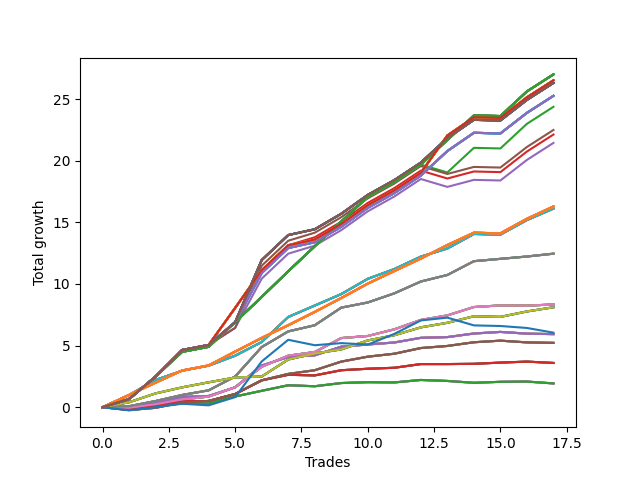

# Long Wallace Doodle 014 
- Symbol: AAPL_Unlimited
- Date Range: 03/23/2022 - 07/08/2022
- Trading Period: 7:20-12:30
- Number of Trades: 17



| Name | Win Percent | Profit | Avg Profit / Trade | Avg Time / Trade |      | Name | Win Percent | Profit | Avg Profit / Trade | Avg Time / Trade |
| ---- | ----------- | ------ | ------------------ | ---------------- | ---- | ---- | ----------- | ------ | ------------------ | ---------------- |
| Sorted By <br> Profit | | | | | | Sorted By <br> Win Percentage ||||
| One Hundred Twenty-Seven | 94.12 | 13505.00 | 794.41 | 106:12 |     | Sixty-Nine | 100.00 | 6230.00 | 366.47 | 40:19 |
| One Hundred Twenty-Two | 94.12 | 13505.00 | 794.41 | 106:12 |     | Sixty-One | 100.00 | 6230.00 | 366.47 | 40:19 |
| One Hundred Seventeen | 94.12 | 13505.00 | 794.41 | 106:12 |     | Fifty-Three | 100.00 | 6230.00 | 366.47 | 40:19 |
| One Hundred Twelve | 94.12 | 13505.00 | 794.41 | 106:12 |     | Forty-Five | 100.00 | 6230.00 | 366.47 | 40:19 |
| One Hundred Seven | 94.12 | 13505.00 | 794.41 | 106:12 |     | Five | 100.00 | 6230.00 | 366.47 | 40:19 |
| One Hundred Two | 94.12 | 13505.00 | 794.41 | 106:12 |     | One Hundred Twenty-Seven | 94.12 | 13505.00 | 794.41 | 106:12 |
| Ninety-Two | 94.12 | 13505.00 | 794.41 | 106:12 |     | One Hundred Twenty-Two | 94.12 | 13505.00 | 794.41 | 106:12 |
| Eighty-Two | 94.12 | 13505.00 | 794.41 | 106:12 |     | One Hundred Seventeen | 94.12 | 13505.00 | 794.41 | 106:12 |
| One Hundred Twenty-Eight | 94.12 | 13265.00 | 780.29 | 155:10 |     | One Hundred Twelve | 94.12 | 13505.00 | 794.41 | 106:12 |
| One Hundred Twenty-Three | 94.12 | 13265.00 | 780.29 | 155:10 |     | One Hundred Seven | 94.12 | 13505.00 | 794.41 | 106:12 |
| One Hundred Eighteen | 94.12 | 13265.00 | 780.29 | 155:10 |     | One Hundred Two | 94.12 | 13505.00 | 794.41 | 106:12 |
| One Hundred Thirteen | 94.12 | 13265.00 | 780.29 | 155:10 |     | Ninety-Two | 94.12 | 13505.00 | 794.41 | 106:12 |
| One Hundred Eight | 94.12 | 13265.00 | 780.29 | 155:10 |     | Eighty-Two | 94.12 | 13505.00 | 794.41 | 106:12 |
| One Hundred Three | 94.12 | 13265.00 | 780.29 | 155:10 |     | One Hundred Twenty-Eight | 94.12 | 13265.00 | 780.29 | 155:10 |
| Ninety-Three | 94.12 | 13265.00 | 780.29 | 155:10 |     | One Hundred Twenty-Three | 94.12 | 13265.00 | 780.29 | 155:10 |
| Eighty-Three | 94.12 | 13265.00 | 780.29 | 155:10 |     | One Hundred Eighteen | 94.12 | 13265.00 | 780.29 | 155:10 |
| One Hundred Thirty | 94.12 | 13160.00 | 774.12 | 167:30 |     | One Hundred Thirteen | 94.12 | 13265.00 | 780.29 | 155:10 |
| One Hundred Twenty-Five | 94.12 | 13160.00 | 774.12 | 167:30 |     | One Hundred Eight | 94.12 | 13265.00 | 780.29 | 155:10 |
| One Hundred Twenty | 94.12 | 13160.00 | 774.12 | 167:30 |     | One Hundred Three | 94.12 | 13265.00 | 780.29 | 155:10 |
| One Hundred Fifteen | 94.12 | 13160.00 | 774.12 | 167:30 |     | Ninety-Three | 94.12 | 13265.00 | 780.29 | 155:10 |
| One Hundred Ten | 94.12 | 13160.00 | 774.12 | 167:30 |     | Eighty-Three | 94.12 | 13265.00 | 780.29 | 155:10 |
| One Hundred Five | 94.12 | 13160.00 | 774.12 | 167:30 |     | One Hundred Thirty | 94.12 | 13160.00 | 774.12 | 167:30 |
| Ninety-Five | 94.12 | 13160.00 | 774.12 | 167:30 |     | One Hundred Twenty-Five | 94.12 | 13160.00 | 774.12 | 167:30 |
| Eighty-Five | 94.12 | 13160.00 | 774.12 | 167:30 |     | One Hundred Twenty | 94.12 | 13160.00 | 774.12 | 167:30 |
| One Hundred Twenty-Nine | 94.12 | 12635.00 | 743.24 | 166:32 |     | One Hundred Fifteen | 94.12 | 13160.00 | 774.12 | 167:30 |
| One Hundred Twenty-Four | 94.12 | 12635.00 | 743.24 | 166:32 |     | One Hundred Ten | 94.12 | 13160.00 | 774.12 | 167:30 |
| One Hundred Ninteen | 94.12 | 12635.00 | 743.24 | 166:32 |     | One Hundred Five | 94.12 | 13160.00 | 774.12 | 167:30 |
| One Hundred Fourteen | 94.12 | 12635.00 | 743.24 | 166:32 |     | Ninety-Five | 94.12 | 13160.00 | 774.12 | 167:30 |
| One Hundred Nine | 94.12 | 12635.00 | 743.24 | 166:32 |     | Eighty-Five | 94.12 | 13160.00 | 774.12 | 167:30 |
| One Hundred Four | 94.12 | 12635.00 | 743.24 | 166:32 |     | One Hundred Twenty-Nine | 94.12 | 12635.00 | 743.24 | 166:32 |
| Ninety-Four | 94.12 | 12635.00 | 743.24 | 166:32 |     | One Hundred Twenty-Four | 94.12 | 12635.00 | 743.24 | 166:32 |
| Eighty-Four | 94.12 | 12635.00 | 743.24 | 166:32 |     | One Hundred Ninteen | 94.12 | 12635.00 | 743.24 | 166:32 |
| Ninety-Seven | 88.24 | 12190.00 | 717.06 | 103:52 |     | One Hundred Fourteen | 94.12 | 12635.00 | 743.24 | 166:32 |
| One Hundred | 88.24 | 11250.00 | 661.76 | 155:07 |     | One Hundred Nine | 94.12 | 12635.00 | 743.24 | 166:32 |
| Ninety-Eight | 88.24 | 11065.00 | 650.88 | 147:33 |     | One Hundred Four | 94.12 | 12635.00 | 743.24 | 166:32 |
| Ninety-Nine | 88.24 | 10725.00 | 630.88 | 154:09 |     | Ninety-Four | 94.12 | 12635.00 | 743.24 | 166:32 |
| One Hundred Twenty-Six | 94.12 | 8145.00 | 479.12 | 64:11 |     | Eighty-Four | 94.12 | 12635.00 | 743.24 | 166:32 |
| One Hundred Twenty-One | 94.12 | 8145.00 | 479.12 | 64:11 |     | One Hundred Twenty-Six | 94.12 | 8145.00 | 479.12 | 64:11 |
| One Hundred Sixteen | 94.12 | 8145.00 | 479.12 | 64:11 |     | One Hundred Twenty-One | 94.12 | 8145.00 | 479.12 | 64:11 |
| One Hundred Eleven | 94.12 | 8145.00 | 479.12 | 64:11 |     | One Hundred Sixteen | 94.12 | 8145.00 | 479.12 | 64:11 |
| One Hundred Six | 94.12 | 8145.00 | 479.12 | 64:11 |     | One Hundred Eleven | 94.12 | 8145.00 | 479.12 | 64:11 |
| One Hundred One | 94.12 | 8145.00 | 479.12 | 64:11 |     | One Hundred Six | 94.12 | 8145.00 | 479.12 | 64:11 |
| Ninety-Six | 94.12 | 8145.00 | 479.12 | 64:11 |     | One Hundred One | 94.12 | 8145.00 | 479.12 | 64:11 |
| Ninety-One | 94.12 | 8145.00 | 479.12 | 64:11 |     | Ninety-Six | 94.12 | 8145.00 | 479.12 | 64:11 |
| Eighty-One | 94.12 | 8145.00 | 479.12 | 64:11 |     | Ninety-One | 94.12 | 8145.00 | 479.12 | 64:11 |
| Seventy-One | 94.12 | 8060.00 | 474.12 | 65:05 |     | Eighty-One | 94.12 | 8145.00 | 479.12 | 64:11 |
| Sixty-Three | 94.12 | 8060.00 | 474.12 | 65:05 |     | Seventy-One | 94.12 | 8060.00 | 474.12 | 65:05 |
| Fifty-Five | 94.12 | 8060.00 | 474.12 | 65:05 |     | Sixty-Three | 94.12 | 8060.00 | 474.12 | 65:05 |
| Forty-Seven | 94.12 | 8060.00 | 474.12 | 65:05 |     | Fifty-Five | 94.12 | 8060.00 | 474.12 | 65:05 |
| Seven | 94.12 | 8060.00 | 474.12 | 65:05 |     | Forty-Seven | 94.12 | 8060.00 | 474.12 | 65:05 |
| Sixty-Nine | 100.00 | 6230.00 | 366.47 | 40:19 |     | Seven | 94.12 | 8060.00 | 474.12 | 65:05 |
| Sixty-One | 100.00 | 6230.00 | 366.47 | 40:19 |     | Seventy | 94.12 | 4055.00 | 238.53 | 46:47 |
| Fifty-Three | 100.00 | 6230.00 | 366.47 | 40:19 |     | Sixty-Two | 94.12 | 4055.00 | 238.53 | 46:47 |
| Forty-Five | 100.00 | 6230.00 | 366.47 | 40:19 |     | Fifty-Four | 94.12 | 4055.00 | 238.53 | 46:47 |
| Five | 100.00 | 6230.00 | 366.47 | 40:19 |     | Forty-Six | 94.12 | 4055.00 | 238.53 | 46:47 |
| Sixty-Eight | 88.24 | 4170.00 | 245.29 | 33:34 |     | Six | 94.12 | 4055.00 | 238.53 | 46:47 |
| Sixty | 88.24 | 4170.00 | 245.29 | 33:34 |     | Ninety-Seven | 88.24 | 12190.00 | 717.06 | 103:52 |
| Fifty-Two | 88.24 | 4170.00 | 245.29 | 33:34 |     | One Hundred | 88.24 | 11250.00 | 661.76 | 155:07 |
| Forty-Four | 88.24 | 4170.00 | 245.29 | 33:34 |     | Ninety-Eight | 88.24 | 11065.00 | 650.88 | 147:33 |
| Four | 88.24 | 4170.00 | 245.29 | 33:34 |     | Ninety-Nine | 88.24 | 10725.00 | 630.88 | 154:09 |
| Seventy | 94.12 | 4055.00 | 238.53 | 46:47 |     | Sixty-Eight | 88.24 | 4170.00 | 245.29 | 33:34 |
| Sixty-Two | 94.12 | 4055.00 | 238.53 | 46:47 |     | Sixty | 88.24 | 4170.00 | 245.29 | 33:34 |
| Fifty-Four | 94.12 | 4055.00 | 238.53 | 46:47 |     | Fifty-Two | 88.24 | 4170.00 | 245.29 | 33:34 |
| Forty-Six | 94.12 | 4055.00 | 238.53 | 46:47 |     | Forty-Four | 88.24 | 4170.00 | 245.29 | 33:34 |
| Six | 94.12 | 4055.00 | 238.53 | 46:47 |     | Four | 88.24 | 4170.00 | 245.29 | 33:34 |
| Seventy-Three | 52.94 | 3025.00 | 177.94 | 16:43 |     | Sixty-Six | 82.35 | 2965.00 | 174.41 | 19:54 |
| Sixty-Six | 82.35 | 2965.00 | 174.41 | 19:54 |     | Fifty-Eight | 82.35 | 2965.00 | 174.41 | 19:54 |
| Fifty-Eight | 82.35 | 2965.00 | 174.41 | 19:54 |     | Fifty | 82.35 | 2965.00 | 174.41 | 19:54 |
| Fifty | 82.35 | 2965.00 | 174.41 | 19:54 |     | Forty-Two | 82.35 | 2965.00 | 174.41 | 19:54 |
| Forty-Two | 82.35 | 2965.00 | 174.41 | 19:54 |     | Two | 82.35 | 2965.00 | 174.41 | 19:54 |
| Two | 82.35 | 2965.00 | 174.41 | 19:54 |     | Sixty-Seven | 82.35 | 2610.00 | 153.53 | 22:55 |
| Sixty-Seven | 82.35 | 2610.00 | 153.53 | 22:55 |     | Fifty-Nine | 82.35 | 2610.00 | 153.53 | 22:55 |
| Fifty-Nine | 82.35 | 2610.00 | 153.53 | 22:55 |     | Fifty-One | 82.35 | 2610.00 | 153.53 | 22:55 |
| Fifty-One | 82.35 | 2610.00 | 153.53 | 22:55 |     | Forty-Three | 82.35 | 2610.00 | 153.53 | 22:55 |
| Forty-Three | 82.35 | 2610.00 | 153.53 | 22:55 |     | Three | 82.35 | 2610.00 | 153.53 | 22:55 |
| Three | 82.35 | 2610.00 | 153.53 | 22:55 |     | Sixty-Five | 82.35 | 1795.00 | 105.59 | 15:17 |
| Sixty-Five | 82.35 | 1795.00 | 105.59 | 15:17 |     | Fifty-Seven | 82.35 | 1795.00 | 105.59 | 15:17 |
| Fifty-Seven | 82.35 | 1795.00 | 105.59 | 15:17 |     | Forty-Nine | 82.35 | 1795.00 | 105.59 | 15:17 |
| Forty-Nine | 82.35 | 1795.00 | 105.59 | 15:17 |     | Forty-One | 82.35 | 1795.00 | 105.59 | 15:17 |
| Forty-One | 82.35 | 1795.00 | 105.59 | 15:17 |     | One | 82.35 | 1795.00 | 105.59 | 15:17 |
| One | 82.35 | 1795.00 | 105.59 | 15:17 |     | Sixty-Four | 64.71 | 965.00 | 56.76 | 11:30 |
| Sixty-Four | 64.71 | 965.00 | 56.76 | 11:30 |     | Fifty-Six | 64.71 | 965.00 | 56.76 | 11:30 |
| Fifty-Six | 64.71 | 965.00 | 56.76 | 11:30 |     | Forty-Eight | 64.71 | 965.00 | 56.76 | 11:30 |
| Forty-Eight | 64.71 | 965.00 | 56.76 | 11:30 |     | Forty | 64.71 | 965.00 | 56.76 | 11:30 |
| Forty | 64.71 | 965.00 | 56.76 | 11:30 |     | Zero | 64.71 | 965.00 | 56.76 | 11:30 |
| Zero | 64.71 | 965.00 | 56.76 | 11:30 |     | Seventy-Three | 52.94 | 3025.00 | 177.94 | 16:43 |

## NO STOPLOSS

### Test Zero
* Sell when price hits the middle line of the 20p bollinger
* No Stoploss
* Results:
```
Total Trades: 17
Percent Up: 64.71
Percent Down: 35.29
Total Points Moved Up: 1.93
Potential Profit: 965.00
Total Points Ups: 2.48 Count Ups: 11
Total Points Downs: -0.55 Count Downs: 6
```

<details><summary>Trades</summary>

<code>In: 2022-03-25 08:14:00		Out: 2022-03-25 08:30:30		Total Position Time: 16:30		Total Move Up: -0.07		Total to Date: -0.07</code> <br />
<code>In: 2022-03-28 08:51:00		Out: 2022-03-28 09:01:40		Total Position Time: 10:40		Total Move Up: 0.14		Total to Date: 0.07</code> <br />
<code>In: 2022-03-29 09:36:00		Out: 2022-03-29 09:43:15		Total Position Time: 07:15		Total Move Up: 0.24		Total to Date: 0.31</code> <br />
<code>In: 2022-04-27 12:00:00		Out: 2022-04-27 12:13:50		Total Position Time: 13:50		Total Move Up: 0.00		Total to Date: 0.31</code> <br />
<code>In: 2022-05-03 07:48:00		Out: 2022-05-03 07:54:05		Total Position Time: 06:05		Total Move Up: 0.56		Total to Date: 0.87</code> <br />
<code>In: 2022-05-04 11:36:00		Out: 2022-05-04 11:41:35		Total Position Time: 05:35		Total Move Up: 0.46		Total to Date: 1.33</code> <br />
<code>In: 2022-05-06 12:27:00		Out: 2022-05-06 12:28:10		Total Position Time: 01:10		Total Move Up: 0.45		Total to Date: 1.78</code> <br />
<code>In: 2022-05-16 07:52:00		Out: 2022-05-16 08:05:10		Total Position Time: 13:10		Total Move Up: -0.08		Total to Date: 1.70</code> <br />
<code>In: 2022-05-17 11:24:00		Out: 2022-05-17 11:37:20		Total Position Time: 13:20		Total Move Up: 0.26		Total to Date: 1.96</code> <br />
<code>In: 2022-05-25 09:29:00		Out: 2022-05-25 09:44:25		Total Position Time: 15:25		Total Move Up: 0.07		Total to Date: 2.03</code> <br />
<code>In: 2022-06-14 12:11:00		Out: 2022-06-14 12:22:10		Total Position Time: 11:10		Total Move Up: -0.02		Total to Date: 2.01</code> <br />
<code>In: 2022-06-14 12:15:00		Out: 2022-06-14 12:22:10		Total Position Time: 07:10		Total Move Up: 0.20		Total to Date: 2.21</code> <br />
<code>In: 2022-06-15 09:55:00		Out: 2022-06-15 10:11:05		Total Position Time: 16:05		Total Move Up: -0.08		Total to Date: 2.13</code> <br />
<code>In: 2022-06-17 07:38:00		Out: 2022-06-17 07:55:10		Total Position Time: 17:10		Total Move Up: -0.15		Total to Date: 1.98</code> <br />
<code>In: 2022-06-27 10:50:00		Out: 2022-06-27 11:03:15		Total Position Time: 13:15		Total Move Up: 0.08		Total to Date: 2.06</code> <br />
<code>In: 2022-07-06 08:09:00		Out: 2022-07-06 08:19:05		Total Position Time: 10:05		Total Move Up: 0.02		Total to Date: 2.08</code> <br />
<code>In: 2022-07-08 09:32:00		Out: 2022-07-08 09:49:45		Total Position Time: 17:45		Total Move Up: -0.15		Total to Date: 1.93</code> <br />


</details>

### Test One
* Sell when the price hits the upper line of the 20p 1std bollinger
* No Stoploss
* Results:
```
Total Trades: 17
Percent Up: 82.35
Percent Down: 17.65
Total Points Moved Up: 3.59
Potential Profit: 1795.00
Total Points Ups: 3.89 Count Ups: 14
Total Points Downs: -0.30 Count Downs: 3
```

<details><summary>Trades</summary>

<code>In: 2022-03-25 08:14:00		Out: 2022-03-25 08:41:25		Total Position Time: 27:25		Total Move Up: -0.14		Total to Date: -0.14</code> <br />
<code>In: 2022-03-28 08:51:00		Out: 2022-03-28 09:02:05		Total Position Time: 11:05		Total Move Up: 0.26		Total to Date: 0.12</code> <br />
<code>In: 2022-03-29 09:36:00		Out: 2022-03-29 09:45:05		Total Position Time: 09:05		Total Move Up: 0.36		Total to Date: 0.48</code> <br />
<code>In: 2022-04-27 12:00:00		Out: 2022-04-27 12:27:15		Total Position Time: 27:15		Total Move Up: 0.02		Total to Date: 0.50</code> <br />
<code>In: 2022-05-03 07:48:00		Out: 2022-05-03 07:57:20		Total Position Time: 09:20		Total Move Up: 0.57		Total to Date: 1.07</code> <br />
<code>In: 2022-05-04 11:36:00		Out: 2022-05-04 11:43:55		Total Position Time: 07:55		Total Move Up: 1.11		Total to Date: 2.18</code> <br />
<code>In: 2022-05-06 12:27:00		Out: 2022-05-06 12:28:10		Total Position Time: 01:10		Total Move Up: 0.45		Total to Date: 2.63</code> <br />
<code>In: 2022-05-16 07:52:00		Out: 2022-05-16 08:09:30		Total Position Time: 17:30		Total Move Up: -0.05		Total to Date: 2.58</code> <br />
<code>In: 2022-05-17 11:24:00		Out: 2022-05-17 11:39:40		Total Position Time: 15:40		Total Move Up: 0.42		Total to Date: 3.00</code> <br />
<code>In: 2022-05-25 09:29:00		Out: 2022-05-25 09:45:15		Total Position Time: 16:15		Total Move Up: 0.12		Total to Date: 3.12</code> <br />
<code>In: 2022-06-14 12:11:00		Out: 2022-06-14 12:26:30		Total Position Time: 15:30		Total Move Up: 0.08		Total to Date: 3.20</code> <br />
<code>In: 2022-06-14 12:15:00		Out: 2022-06-14 12:26:30		Total Position Time: 11:30		Total Move Up: 0.30		Total to Date: 3.50</code> <br />
<code>In: 2022-06-15 09:55:00		Out: 2022-06-15 10:12:45		Total Position Time: 17:45		Total Move Up: 0.00		Total to Date: 3.50</code> <br />
<code>In: 2022-06-17 07:38:00		Out: 2022-06-17 07:56:15		Total Position Time: 18:15		Total Move Up: 0.02		Total to Date: 3.52</code> <br />
<code>In: 2022-06-27 10:50:00		Out: 2022-06-27 11:05:00		Total Position Time: 15:00		Total Move Up: 0.10		Total to Date: 3.62</code> <br />
<code>In: 2022-07-06 08:09:00		Out: 2022-07-06 08:24:10		Total Position Time: 15:10		Total Move Up: 0.08		Total to Date: 3.70</code> <br />
<code>In: 2022-07-08 09:32:00		Out: 2022-07-08 09:56:10		Total Position Time: 24:10		Total Move Up: -0.11		Total to Date: 3.59</code> <br />


</details>

### Test Two
* Sell when the price hits the upper line of the 20p 2std bollinger
* No Stoploss
* Results:
```
Total Trades: 17
Percent Up: 82.35
Percent Down: 17.65
Total Points Moved Up: 5.93
Potential Profit: 2965.00
Total Points Ups: 6.15 Count Ups: 14
Total Points Downs: -0.22 Count Downs: 3
```

<details><summary>Trades</summary>

<code>In: 2022-03-25 08:14:00		Out: 2022-03-25 08:42:05		Total Position Time: 28:05		Total Move Up: -0.04		Total to Date: -0.04</code> <br />
<code>In: 2022-03-28 08:51:00		Out: 2022-03-28 09:07:10		Total Position Time: 16:10		Total Move Up: 0.37		Total to Date: 0.33</code> <br />
<code>In: 2022-03-29 09:36:00		Out: 2022-03-29 09:45:30		Total Position Time: 09:30		Total Move Up: 0.50		Total to Date: 0.83</code> <br />
<code>In: 2022-04-27 12:00:00		Out: 2022-04-27 12:27:30		Total Position Time: 27:30		Total Move Up: 0.08		Total to Date: 0.91</code> <br />
<code>In: 2022-05-03 07:48:00		Out: 2022-05-03 08:02:10		Total Position Time: 14:10		Total Move Up: 0.70		Total to Date: 1.61</code> <br />
<code>In: 2022-05-04 11:36:00		Out: 2022-05-04 11:46:55		Total Position Time: 10:55		Total Move Up: 1.77		Total to Date: 3.38</code> <br />
<code>In: 2022-05-06 12:27:00		Out: 2022-05-06 12:30:15		Total Position Time: 03:15		Total Move Up: 0.69		Total to Date: 4.07</code> <br />
<code>In: 2022-05-16 07:52:00		Out: 2022-05-16 08:09:55		Total Position Time: 17:55		Total Move Up: 0.14		Total to Date: 4.21</code> <br />
<code>In: 2022-05-17 11:24:00		Out: 2022-05-17 11:40:00		Total Position Time: 16:00		Total Move Up: 0.70		Total to Date: 4.91</code> <br />
<code>In: 2022-05-25 09:29:00		Out: 2022-05-25 09:47:30		Total Position Time: 18:30		Total Move Up: 0.18		Total to Date: 5.09</code> <br />
<code>In: 2022-06-14 12:11:00		Out: 2022-06-14 12:27:10		Total Position Time: 16:10		Total Move Up: 0.16		Total to Date: 5.25</code> <br />
<code>In: 2022-06-14 12:15:00		Out: 2022-06-14 12:27:10		Total Position Time: 12:10		Total Move Up: 0.38		Total to Date: 5.63</code> <br />
<code>In: 2022-06-15 09:55:00		Out: 2022-06-15 10:13:35		Total Position Time: 18:35		Total Move Up: 0.06		Total to Date: 5.69</code> <br />
<code>In: 2022-06-17 07:38:00		Out: 2022-06-17 08:02:30		Total Position Time: 24:30		Total Move Up: 0.29		Total to Date: 5.98</code> <br />
<code>In: 2022-06-27 10:50:00		Out: 2022-06-27 11:17:10		Total Position Time: 27:10		Total Move Up: 0.13		Total to Date: 6.11</code> <br />
<code>In: 2022-07-06 08:09:00		Out: 2022-07-06 08:49:05		Total Position Time: 40:05		Total Move Up: -0.14		Total to Date: 5.97</code> <br />
<code>In: 2022-07-08 09:32:00		Out: 2022-07-08 10:09:45		Total Position Time: 37:45		Total Move Up: -0.04		Total to Date: 5.93</code> <br />


</details>

### Test Three
* Sell when price hits the middle line of the 50p bollinger
* No Stoploss
* Results:
```
Total Trades: 17
Percent Up: 82.35
Percent Down: 17.65
Total Points Moved Up: 5.22
Potential Profit: 2610.00
Total Points Ups: 5.63 Count Ups: 14
Total Points Downs: -0.41 Count Downs: 3
```

<details><summary>Trades</summary>

<code>In: 2022-03-25 08:14:00		Out: 2022-03-25 09:05:15		Total Position Time: 51:15		Total Move Up: -0.23		Total to Date: -0.23</code> <br />
<code>In: 2022-03-28 08:51:00		Out: 2022-03-28 09:23:30		Total Position Time: 32:30		Total Move Up: 0.18		Total to Date: -0.05</code> <br />
<code>In: 2022-03-29 09:36:00		Out: 2022-03-29 09:45:20		Total Position Time: 09:20		Total Move Up: 0.44		Total to Date: 0.39</code> <br />
<code>In: 2022-04-27 12:00:00		Out: 2022-04-27 12:35:30		Total Position Time: 35:30		Total Move Up: 0.12		Total to Date: 0.51</code> <br />
<code>In: 2022-05-03 07:48:00		Out: 2022-05-03 07:54:05		Total Position Time: 06:05		Total Move Up: 0.56		Total to Date: 1.07</code> <br />
<code>In: 2022-05-04 11:36:00		Out: 2022-05-04 11:43:55		Total Position Time: 07:55		Total Move Up: 1.11		Total to Date: 2.18</code> <br />
<code>In: 2022-05-06 12:27:00		Out: 2022-05-06 12:28:50		Total Position Time: 01:50		Total Move Up: 0.52		Total to Date: 2.70</code> <br />
<code>In: 2022-05-16 07:52:00		Out: 2022-05-16 08:16:10		Total Position Time: 24:10		Total Move Up: 0.30		Total to Date: 3.00</code> <br />
<code>In: 2022-05-17 11:24:00		Out: 2022-05-17 11:40:00		Total Position Time: 16:00		Total Move Up: 0.70		Total to Date: 3.70</code> <br />
<code>In: 2022-05-25 09:29:00		Out: 2022-05-25 09:49:20		Total Position Time: 20:20		Total Move Up: 0.40		Total to Date: 4.10</code> <br />
<code>In: 2022-06-14 12:11:00		Out: 2022-06-14 12:27:25		Total Position Time: 16:25		Total Move Up: 0.24		Total to Date: 4.34</code> <br />
<code>In: 2022-06-14 12:15:00		Out: 2022-06-14 12:27:25		Total Position Time: 12:25		Total Move Up: 0.46		Total to Date: 4.80</code> <br />
<code>In: 2022-06-15 09:55:00		Out: 2022-06-15 10:20:55		Total Position Time: 25:55		Total Move Up: 0.17		Total to Date: 4.97</code> <br />
<code>In: 2022-06-17 07:38:00		Out: 2022-06-17 08:03:10		Total Position Time: 25:10		Total Move Up: 0.30		Total to Date: 5.27</code> <br />
<code>In: 2022-06-27 10:50:00		Out: 2022-06-27 11:17:10		Total Position Time: 27:10		Total Move Up: 0.13		Total to Date: 5.40</code> <br />
<code>In: 2022-07-06 08:09:00		Out: 2022-07-06 08:49:05		Total Position Time: 40:05		Total Move Up: -0.14		Total to Date: 5.26</code> <br />
<code>In: 2022-07-08 09:32:00		Out: 2022-07-08 10:09:45		Total Position Time: 37:45		Total Move Up: -0.04		Total to Date: 5.22</code> <br />


</details>

### Test Four
* Sell when the price hits the upper line of the 50p 1std bollinger
* No Stoploss
* Results:
```
Total Trades: 17
Percent Up: 88.24
Percent Down: 11.76
Total Points Moved Up: 8.34
Potential Profit: 4170.00
Total Points Ups: 8.40 Count Ups: 15
Total Points Downs: -0.06 Count Downs: 2
```

<details><summary>Trades</summary>

<code>In: 2022-03-25 08:14:00		Out: 2022-03-25 09:09:05		Total Position Time: 55:05		Total Move Up: -0.04		Total to Date: -0.04</code> <br />
<code>In: 2022-03-28 08:51:00		Out: 2022-03-28 09:30:50		Total Position Time: 39:50		Total Move Up: 0.28		Total to Date: 0.24</code> <br />
<code>In: 2022-03-29 09:36:00		Out: 2022-03-29 10:29:15		Total Position Time: 53:15		Total Move Up: 0.39		Total to Date: 0.63</code> <br />
<code>In: 2022-04-27 12:00:00		Out: 2022-04-27 12:44:15		Total Position Time: 44:15		Total Move Up: 0.23		Total to Date: 0.86</code> <br />
<code>In: 2022-05-03 07:48:00		Out: 2022-05-03 08:02:25		Total Position Time: 14:25		Total Move Up: 0.76		Total to Date: 1.62</code> <br />
<code>In: 2022-05-04 11:36:00		Out: 2022-05-04 11:46:50		Total Position Time: 10:50		Total Move Up: 1.66		Total to Date: 3.28</code> <br />
<code>In: 2022-05-06 12:27:00		Out: 2022-05-06 12:30:30		Total Position Time: 03:30		Total Move Up: 0.90		Total to Date: 4.18</code> <br />
<code>In: 2022-05-16 07:52:00		Out: 2022-05-16 08:33:25		Total Position Time: 41:25		Total Move Up: 0.30		Total to Date: 4.48</code> <br />
<code>In: 2022-05-17 11:24:00		Out: 2022-05-17 11:40:20		Total Position Time: 16:20		Total Move Up: 1.13		Total to Date: 5.61</code> <br />
<code>In: 2022-05-25 09:29:00		Out: 2022-05-25 10:29:35		Total Position Time: 60:35		Total Move Up: 0.17		Total to Date: 5.78</code> <br />
<code>In: 2022-06-14 12:11:00		Out: 2022-06-14 12:30:50		Total Position Time: 19:50		Total Move Up: 0.54		Total to Date: 6.32</code> <br />
<code>In: 2022-06-14 12:15:00		Out: 2022-06-14 12:30:50		Total Position Time: 15:50		Total Move Up: 0.76		Total to Date: 7.08</code> <br />
<code>In: 2022-06-15 09:55:00		Out: 2022-06-15 10:27:25		Total Position Time: 32:25		Total Move Up: 0.37		Total to Date: 7.45</code> <br />
<code>In: 2022-06-17 07:38:00		Out: 2022-06-17 08:06:05		Total Position Time: 28:05		Total Move Up: 0.68		Total to Date: 8.13</code> <br />
<code>In: 2022-06-27 10:50:00		Out: 2022-06-27 11:33:25		Total Position Time: 43:25		Total Move Up: 0.13		Total to Date: 8.26</code> <br />
<code>In: 2022-07-06 08:09:00		Out: 2022-07-06 08:58:15		Total Position Time: 49:15		Total Move Up: -0.02		Total to Date: 8.24</code> <br />
<code>In: 2022-07-08 09:32:00		Out: 2022-07-08 10:14:30		Total Position Time: 42:30		Total Move Up: 0.10		Total to Date: 8.34</code> <br />


</details>

### Test Five
* Sell when the price hits the upper line of the 50p 2std bollinger
* No Stoploss
* Results:
```
Total Trades: 17
Percent Up: 100.00
Percent Down: 0.00
Total Points Moved Up: 12.46
Potential Profit: 6230.00
Total Points Ups: 12.46 Count Ups: 17
Total Points Downs: 0.00 Count Downs: 0
```

<details><summary>Trades</summary>

<code>In: 2022-03-25 08:14:00		Out: 2022-03-25 09:11:30		Total Position Time: 57:30		Total Move Up: 0.08		Total to Date: 0.08</code> <br />
<code>In: 2022-03-28 08:51:00		Out: 2022-03-28 09:36:00		Total Position Time: 45:00		Total Move Up: 0.42		Total to Date: 0.50</code> <br />
<code>In: 2022-03-29 09:36:00		Out: 2022-03-29 10:40:00		Total Position Time: 64:00		Total Move Up: 0.49		Total to Date: 0.99</code> <br />
<code>In: 2022-04-27 12:00:00		Out: 2022-04-27 12:44:20		Total Position Time: 44:20		Total Move Up: 0.38		Total to Date: 1.37</code> <br />
<code>In: 2022-05-03 07:48:00		Out: 2022-05-03 08:05:00		Total Position Time: 17:00		Total Move Up: 1.12		Total to Date: 2.49</code> <br />
<code>In: 2022-05-04 11:36:00		Out: 2022-05-04 11:47:10		Total Position Time: 11:10		Total Move Up: 2.39		Total to Date: 4.88</code> <br />
<code>In: 2022-05-06 12:27:00		Out: 2022-05-06 12:35:55		Total Position Time: 08:55		Total Move Up: 1.27		Total to Date: 6.15</code> <br />
<code>In: 2022-05-16 07:52:00		Out: 2022-05-16 08:35:00		Total Position Time: 43:00		Total Move Up: 0.50		Total to Date: 6.65</code> <br />
<code>In: 2022-05-17 11:24:00		Out: 2022-05-17 11:48:45		Total Position Time: 24:45		Total Move Up: 1.43		Total to Date: 8.08</code> <br />
<code>In: 2022-05-25 09:29:00		Out: 2022-05-25 10:35:30		Total Position Time: 66:30		Total Move Up: 0.42		Total to Date: 8.50</code> <br />
<code>In: 2022-06-14 12:11:00		Out: 2022-06-14 12:36:25		Total Position Time: 25:25		Total Move Up: 0.74		Total to Date: 9.24</code> <br />
<code>In: 2022-06-14 12:15:00		Out: 2022-06-14 12:36:25		Total Position Time: 21:25		Total Move Up: 0.96		Total to Date: 10.20</code> <br />
<code>In: 2022-06-15 09:55:00		Out: 2022-06-15 10:58:15		Total Position Time: 63:15		Total Move Up: 0.53		Total to Date: 10.73</code> <br />
<code>In: 2022-06-17 07:38:00		Out: 2022-06-17 08:07:55		Total Position Time: 29:55		Total Move Up: 1.12		Total to Date: 11.85</code> <br />
<code>In: 2022-06-27 10:50:00		Out: 2022-06-27 11:34:15		Total Position Time: 44:15		Total Move Up: 0.19		Total to Date: 12.04</code> <br />
<code>In: 2022-07-06 08:09:00		Out: 2022-07-06 09:13:30		Total Position Time: 64:30		Total Move Up: 0.19		Total to Date: 12.23</code> <br />
<code>In: 2022-07-08 09:32:00		Out: 2022-07-08 10:26:40		Total Position Time: 54:40		Total Move Up: 0.23		Total to Date: 12.46</code> <br />


</details>

### Test Six
* Sell when the price hits the middle line of the 1std VWAP
* No Stoploss
* Results:
```
Total Trades: 17
Percent Up: 94.12
Percent Down: 5.88
Total Points Moved Up: 8.11
Potential Profit: 4055.00
Total Points Ups: 8.16 Count Ups: 16
Total Points Downs: -0.05 Count Downs: 1
```

<details><summary>Trades</summary>

<code>In: 2022-03-25 08:14:00		Out: 2022-03-25 10:49:00		Total Position Time: 155:00		Total Move Up: 0.40		Total to Date: 0.40</code> <br />
<code>In: 2022-03-28 08:51:00		Out: 2022-03-28 09:55:05		Total Position Time: 64:05		Total Move Up: 0.72		Total to Date: 1.12</code> <br />
<code>In: 2022-03-29 09:36:00		Out: 2022-03-29 09:45:25		Total Position Time: 09:25		Total Move Up: 0.49		Total to Date: 1.61</code> <br />
<code>In: 2022-04-27 12:00:00		Out: 2022-04-27 12:47:00		Total Position Time: 47:00		Total Move Up: 0.41		Total to Date: 2.02</code> <br />
<code>In: 2022-05-03 07:48:00		Out: 2022-05-03 07:52:25		Total Position Time: 04:25		Total Move Up: 0.39		Total to Date: 2.41</code> <br />
<code>In: 2022-05-04 11:36:00		Out: 2022-05-04 11:37:10		Total Position Time: 01:10		Total Move Up: 0.08		Total to Date: 2.49</code> <br />
<code>In: 2022-05-06 12:27:00		Out: 2022-05-06 12:37:20		Total Position Time: 10:20		Total Move Up: 1.38		Total to Date: 3.87</code> <br />
<code>In: 2022-05-16 07:52:00		Out: 2022-05-16 08:17:40		Total Position Time: 25:40		Total Move Up: 0.49		Total to Date: 4.36</code> <br />
<code>In: 2022-05-17 11:24:00		Out: 2022-05-17 11:27:00		Total Position Time: 03:00		Total Move Up: 0.33		Total to Date: 4.69</code> <br />
<code>In: 2022-05-25 09:29:00		Out: 2022-05-25 11:00:30		Total Position Time: 91:30		Total Move Up: 0.73		Total to Date: 5.42</code> <br />
<code>In: 2022-06-14 12:11:00		Out: 2022-06-14 12:30:25		Total Position Time: 19:25		Total Move Up: 0.42		Total to Date: 5.84</code> <br />
<code>In: 2022-06-14 12:15:00		Out: 2022-06-14 12:30:25		Total Position Time: 15:25		Total Move Up: 0.64		Total to Date: 6.48</code> <br />
<code>In: 2022-06-15 09:55:00		Out: 2022-06-15 10:27:25		Total Position Time: 32:25		Total Move Up: 0.37		Total to Date: 6.85</code> <br />
<code>In: 2022-06-17 07:38:00		Out: 2022-06-17 08:03:55		Total Position Time: 25:55		Total Move Up: 0.53		Total to Date: 7.38</code> <br />
<code>In: 2022-06-27 10:50:00		Out: 2022-06-27 12:47:00		Total Position Time: 117:00		Total Move Up: -0.05		Total to Date: 7.33</code> <br />
<code>In: 2022-07-06 08:09:00		Out: 2022-07-06 10:07:05		Total Position Time: 118:05		Total Move Up: 0.44		Total to Date: 7.77</code> <br />
<code>In: 2022-07-08 09:32:00		Out: 2022-07-08 10:27:40		Total Position Time: 55:40		Total Move Up: 0.34		Total to Date: 8.11</code> <br />


</details>

### Test Seven
* Sell when the price hits the upper line of the 1std VWAP
* No Stoploss
* Results:
```
Total Trades: 17
Percent Up: 94.12
Percent Down: 5.88
Total Points Moved Up: 16.12
Potential Profit: 8060.00
Total Points Ups: 16.17 Count Ups: 16
Total Points Downs: -0.05 Count Downs: 1
```

<details><summary>Trades</summary>

<code>In: 2022-03-25 08:14:00		Out: 2022-03-25 11:03:35		Total Position Time: 169:35		Total Move Up: 0.99		Total to Date: 0.99</code> <br />
<code>In: 2022-03-28 08:51:00		Out: 2022-03-28 10:25:40		Total Position Time: 94:40		Total Move Up: 1.22		Total to Date: 2.21</code> <br />
<code>In: 2022-03-29 09:36:00		Out: 2022-03-29 10:46:40		Total Position Time: 70:40		Total Move Up: 0.75		Total to Date: 2.96</code> <br />
<code>In: 2022-04-27 12:00:00		Out: 2022-04-27 12:47:00		Total Position Time: 47:00		Total Move Up: 0.41		Total to Date: 3.37</code> <br />
<code>In: 2022-05-03 07:48:00		Out: 2022-05-03 08:04:25		Total Position Time: 16:25		Total Move Up: 0.81		Total to Date: 4.18</code> <br />
<code>In: 2022-05-04 11:36:00		Out: 2022-05-04 11:43:55		Total Position Time: 07:55		Total Move Up: 1.11		Total to Date: 5.29</code> <br />
<code>In: 2022-05-06 12:27:00		Out: 2022-05-06 12:47:00		Total Position Time: 20:00		Total Move Up: 2.03		Total to Date: 7.32</code> <br />
<code>In: 2022-05-16 07:52:00		Out: 2022-05-16 08:44:50		Total Position Time: 52:50		Total Move Up: 0.93		Total to Date: 8.25</code> <br />
<code>In: 2022-05-17 11:24:00		Out: 2022-05-17 11:40:10		Total Position Time: 16:10		Total Move Up: 0.93		Total to Date: 9.18</code> <br />
<code>In: 2022-05-25 09:29:00		Out: 2022-05-25 11:02:30		Total Position Time: 93:30		Total Move Up: 1.24		Total to Date: 10.42</code> <br />
<code>In: 2022-06-14 12:11:00		Out: 2022-06-14 12:37:35		Total Position Time: 26:35		Total Move Up: 0.79		Total to Date: 11.21</code> <br />
<code>In: 2022-06-14 12:15:00		Out: 2022-06-14 12:37:35		Total Position Time: 22:35		Total Move Up: 1.01		Total to Date: 12.22</code> <br />
<code>In: 2022-06-15 09:55:00		Out: 2022-06-15 10:59:35		Total Position Time: 64:35		Total Move Up: 0.66		Total to Date: 12.88</code> <br />
<code>In: 2022-06-17 07:38:00		Out: 2022-06-17 08:08:00		Total Position Time: 30:00		Total Move Up: 1.18		Total to Date: 14.06</code> <br />
<code>In: 2022-06-27 10:50:00		Out: 2022-06-27 12:47:00		Total Position Time: 117:00		Total Move Up: -0.05		Total to Date: 14.01</code> <br />
<code>In: 2022-07-06 08:09:00		Out: 2022-07-06 11:05:15		Total Position Time: 176:15		Total Move Up: 1.18		Total to Date: 15.19</code> <br />
<code>In: 2022-07-08 09:32:00		Out: 2022-07-08 10:52:40		Total Position Time: 80:40		Total Move Up: 0.93		Total to Date: 16.12</code> <br />


</details>

## STOPLOSS OF 5

### Test Forty
* Sell when price hits the middle line of the 20p bollinger
* Stoploss is 5 points
* Results:
```
Total Trades: 17
Percent Up: 64.71
Percent Down: 35.29
Total Points Moved Up: 1.93
Potential Profit: 965.00
Total Points Ups: 2.48 Count Ups: 11
Total Points Downs: -0.55 Count Downs: 6
```

<details><summary>Trades</summary>

<code>In: 2022-03-25 08:14:00		Out: 2022-03-25 08:30:30		Total Position Time: 16:30		Total Move Up: -0.07		Total to Date: -0.07</code> <br />
<code>In: 2022-03-28 08:51:00		Out: 2022-03-28 09:01:40		Total Position Time: 10:40		Total Move Up: 0.14		Total to Date: 0.07</code> <br />
<code>In: 2022-03-29 09:36:00		Out: 2022-03-29 09:43:15		Total Position Time: 07:15		Total Move Up: 0.24		Total to Date: 0.31</code> <br />
<code>In: 2022-04-27 12:00:00		Out: 2022-04-27 12:13:50		Total Position Time: 13:50		Total Move Up: 0.00		Total to Date: 0.31</code> <br />
<code>In: 2022-05-03 07:48:00		Out: 2022-05-03 07:54:05		Total Position Time: 06:05		Total Move Up: 0.56		Total to Date: 0.87</code> <br />
<code>In: 2022-05-04 11:36:00		Out: 2022-05-04 11:41:35		Total Position Time: 05:35		Total Move Up: 0.46		Total to Date: 1.33</code> <br />
<code>In: 2022-05-06 12:27:00		Out: 2022-05-06 12:28:10		Total Position Time: 01:10		Total Move Up: 0.45		Total to Date: 1.78</code> <br />
<code>In: 2022-05-16 07:52:00		Out: 2022-05-16 08:05:10		Total Position Time: 13:10		Total Move Up: -0.08		Total to Date: 1.70</code> <br />
<code>In: 2022-05-17 11:24:00		Out: 2022-05-17 11:37:20		Total Position Time: 13:20		Total Move Up: 0.26		Total to Date: 1.96</code> <br />
<code>In: 2022-05-25 09:29:00		Out: 2022-05-25 09:44:25		Total Position Time: 15:25		Total Move Up: 0.07		Total to Date: 2.03</code> <br />
<code>In: 2022-06-14 12:11:00		Out: 2022-06-14 12:22:10		Total Position Time: 11:10		Total Move Up: -0.02		Total to Date: 2.01</code> <br />
<code>In: 2022-06-14 12:15:00		Out: 2022-06-14 12:22:10		Total Position Time: 07:10		Total Move Up: 0.20		Total to Date: 2.21</code> <br />
<code>In: 2022-06-15 09:55:00		Out: 2022-06-15 10:11:05		Total Position Time: 16:05		Total Move Up: -0.08		Total to Date: 2.13</code> <br />
<code>In: 2022-06-17 07:38:00		Out: 2022-06-17 07:55:10		Total Position Time: 17:10		Total Move Up: -0.15		Total to Date: 1.98</code> <br />
<code>In: 2022-06-27 10:50:00		Out: 2022-06-27 11:03:15		Total Position Time: 13:15		Total Move Up: 0.08		Total to Date: 2.06</code> <br />
<code>In: 2022-07-06 08:09:00		Out: 2022-07-06 08:19:05		Total Position Time: 10:05		Total Move Up: 0.02		Total to Date: 2.08</code> <br />
<code>In: 2022-07-08 09:32:00		Out: 2022-07-08 09:49:45		Total Position Time: 17:45		Total Move Up: -0.15		Total to Date: 1.93</code> <br />


</details>

### Test Forty-One
* Sell when the price hits the upper line of the 20p 1std bollinger
* Stoploss is 5 points
* Results:
```
Total Trades: 17
Percent Up: 82.35
Percent Down: 17.65
Total Points Moved Up: 3.59
Potential Profit: 1795.00
Total Points Ups: 3.89 Count Ups: 14
Total Points Downs: -0.30 Count Downs: 3
```

<details><summary>Trades</summary>

<code>In: 2022-03-25 08:14:00		Out: 2022-03-25 08:41:25		Total Position Time: 27:25		Total Move Up: -0.14		Total to Date: -0.14</code> <br />
<code>In: 2022-03-28 08:51:00		Out: 2022-03-28 09:02:05		Total Position Time: 11:05		Total Move Up: 0.26		Total to Date: 0.12</code> <br />
<code>In: 2022-03-29 09:36:00		Out: 2022-03-29 09:45:05		Total Position Time: 09:05		Total Move Up: 0.36		Total to Date: 0.48</code> <br />
<code>In: 2022-04-27 12:00:00		Out: 2022-04-27 12:27:15		Total Position Time: 27:15		Total Move Up: 0.02		Total to Date: 0.50</code> <br />
<code>In: 2022-05-03 07:48:00		Out: 2022-05-03 07:57:20		Total Position Time: 09:20		Total Move Up: 0.57		Total to Date: 1.07</code> <br />
<code>In: 2022-05-04 11:36:00		Out: 2022-05-04 11:43:55		Total Position Time: 07:55		Total Move Up: 1.11		Total to Date: 2.18</code> <br />
<code>In: 2022-05-06 12:27:00		Out: 2022-05-06 12:28:10		Total Position Time: 01:10		Total Move Up: 0.45		Total to Date: 2.63</code> <br />
<code>In: 2022-05-16 07:52:00		Out: 2022-05-16 08:09:30		Total Position Time: 17:30		Total Move Up: -0.05		Total to Date: 2.58</code> <br />
<code>In: 2022-05-17 11:24:00		Out: 2022-05-17 11:39:40		Total Position Time: 15:40		Total Move Up: 0.42		Total to Date: 3.00</code> <br />
<code>In: 2022-05-25 09:29:00		Out: 2022-05-25 09:45:15		Total Position Time: 16:15		Total Move Up: 0.12		Total to Date: 3.12</code> <br />
<code>In: 2022-06-14 12:11:00		Out: 2022-06-14 12:26:30		Total Position Time: 15:30		Total Move Up: 0.08		Total to Date: 3.20</code> <br />
<code>In: 2022-06-14 12:15:00		Out: 2022-06-14 12:26:30		Total Position Time: 11:30		Total Move Up: 0.30		Total to Date: 3.50</code> <br />
<code>In: 2022-06-15 09:55:00		Out: 2022-06-15 10:12:45		Total Position Time: 17:45		Total Move Up: 0.00		Total to Date: 3.50</code> <br />
<code>In: 2022-06-17 07:38:00		Out: 2022-06-17 07:56:15		Total Position Time: 18:15		Total Move Up: 0.02		Total to Date: 3.52</code> <br />
<code>In: 2022-06-27 10:50:00		Out: 2022-06-27 11:05:00		Total Position Time: 15:00		Total Move Up: 0.10		Total to Date: 3.62</code> <br />
<code>In: 2022-07-06 08:09:00		Out: 2022-07-06 08:24:10		Total Position Time: 15:10		Total Move Up: 0.08		Total to Date: 3.70</code> <br />
<code>In: 2022-07-08 09:32:00		Out: 2022-07-08 09:56:10		Total Position Time: 24:10		Total Move Up: -0.11		Total to Date: 3.59</code> <br />


</details>

### Test Forty-Two
* Sell when the price hits the upper line of the 20p 2std bollinger
* Stoploss is 5 points
* Results:
```
Total Trades: 17
Percent Up: 82.35
Percent Down: 17.65
Total Points Moved Up: 5.93
Potential Profit: 2965.00
Total Points Ups: 6.15 Count Ups: 14
Total Points Downs: -0.22 Count Downs: 3
```

<details><summary>Trades</summary>

<code>In: 2022-03-25 08:14:00		Out: 2022-03-25 08:42:05		Total Position Time: 28:05		Total Move Up: -0.04		Total to Date: -0.04</code> <br />
<code>In: 2022-03-28 08:51:00		Out: 2022-03-28 09:07:10		Total Position Time: 16:10		Total Move Up: 0.37		Total to Date: 0.33</code> <br />
<code>In: 2022-03-29 09:36:00		Out: 2022-03-29 09:45:30		Total Position Time: 09:30		Total Move Up: 0.50		Total to Date: 0.83</code> <br />
<code>In: 2022-04-27 12:00:00		Out: 2022-04-27 12:27:30		Total Position Time: 27:30		Total Move Up: 0.08		Total to Date: 0.91</code> <br />
<code>In: 2022-05-03 07:48:00		Out: 2022-05-03 08:02:10		Total Position Time: 14:10		Total Move Up: 0.70		Total to Date: 1.61</code> <br />
<code>In: 2022-05-04 11:36:00		Out: 2022-05-04 11:46:55		Total Position Time: 10:55		Total Move Up: 1.77		Total to Date: 3.38</code> <br />
<code>In: 2022-05-06 12:27:00		Out: 2022-05-06 12:30:15		Total Position Time: 03:15		Total Move Up: 0.69		Total to Date: 4.07</code> <br />
<code>In: 2022-05-16 07:52:00		Out: 2022-05-16 08:09:55		Total Position Time: 17:55		Total Move Up: 0.14		Total to Date: 4.21</code> <br />
<code>In: 2022-05-17 11:24:00		Out: 2022-05-17 11:40:00		Total Position Time: 16:00		Total Move Up: 0.70		Total to Date: 4.91</code> <br />
<code>In: 2022-05-25 09:29:00		Out: 2022-05-25 09:47:30		Total Position Time: 18:30		Total Move Up: 0.18		Total to Date: 5.09</code> <br />
<code>In: 2022-06-14 12:11:00		Out: 2022-06-14 12:27:10		Total Position Time: 16:10		Total Move Up: 0.16		Total to Date: 5.25</code> <br />
<code>In: 2022-06-14 12:15:00		Out: 2022-06-14 12:27:10		Total Position Time: 12:10		Total Move Up: 0.38		Total to Date: 5.63</code> <br />
<code>In: 2022-06-15 09:55:00		Out: 2022-06-15 10:13:35		Total Position Time: 18:35		Total Move Up: 0.06		Total to Date: 5.69</code> <br />
<code>In: 2022-06-17 07:38:00		Out: 2022-06-17 08:02:30		Total Position Time: 24:30		Total Move Up: 0.29		Total to Date: 5.98</code> <br />
<code>In: 2022-06-27 10:50:00		Out: 2022-06-27 11:17:10		Total Position Time: 27:10		Total Move Up: 0.13		Total to Date: 6.11</code> <br />
<code>In: 2022-07-06 08:09:00		Out: 2022-07-06 08:49:05		Total Position Time: 40:05		Total Move Up: -0.14		Total to Date: 5.97</code> <br />
<code>In: 2022-07-08 09:32:00		Out: 2022-07-08 10:09:45		Total Position Time: 37:45		Total Move Up: -0.04		Total to Date: 5.93</code> <br />


</details>

### Test Forty-Three
* Sell when price hits the middle line of the 50p bollinger
* Stoploss is 5 points
* Results:
```
Total Trades: 17
Percent Up: 82.35
Percent Down: 17.65
Total Points Moved Up: 5.22
Potential Profit: 2610.00
Total Points Ups: 5.63 Count Ups: 14
Total Points Downs: -0.41 Count Downs: 3
```

<details><summary>Trades</summary>

<code>In: 2022-03-25 08:14:00		Out: 2022-03-25 09:05:15		Total Position Time: 51:15		Total Move Up: -0.23		Total to Date: -0.23</code> <br />
<code>In: 2022-03-28 08:51:00		Out: 2022-03-28 09:23:30		Total Position Time: 32:30		Total Move Up: 0.18		Total to Date: -0.05</code> <br />
<code>In: 2022-03-29 09:36:00		Out: 2022-03-29 09:45:20		Total Position Time: 09:20		Total Move Up: 0.44		Total to Date: 0.39</code> <br />
<code>In: 2022-04-27 12:00:00		Out: 2022-04-27 12:35:30		Total Position Time: 35:30		Total Move Up: 0.12		Total to Date: 0.51</code> <br />
<code>In: 2022-05-03 07:48:00		Out: 2022-05-03 07:54:05		Total Position Time: 06:05		Total Move Up: 0.56		Total to Date: 1.07</code> <br />
<code>In: 2022-05-04 11:36:00		Out: 2022-05-04 11:43:55		Total Position Time: 07:55		Total Move Up: 1.11		Total to Date: 2.18</code> <br />
<code>In: 2022-05-06 12:27:00		Out: 2022-05-06 12:28:50		Total Position Time: 01:50		Total Move Up: 0.52		Total to Date: 2.70</code> <br />
<code>In: 2022-05-16 07:52:00		Out: 2022-05-16 08:16:10		Total Position Time: 24:10		Total Move Up: 0.30		Total to Date: 3.00</code> <br />
<code>In: 2022-05-17 11:24:00		Out: 2022-05-17 11:40:00		Total Position Time: 16:00		Total Move Up: 0.70		Total to Date: 3.70</code> <br />
<code>In: 2022-05-25 09:29:00		Out: 2022-05-25 09:49:20		Total Position Time: 20:20		Total Move Up: 0.40		Total to Date: 4.10</code> <br />
<code>In: 2022-06-14 12:11:00		Out: 2022-06-14 12:27:25		Total Position Time: 16:25		Total Move Up: 0.24		Total to Date: 4.34</code> <br />
<code>In: 2022-06-14 12:15:00		Out: 2022-06-14 12:27:25		Total Position Time: 12:25		Total Move Up: 0.46		Total to Date: 4.80</code> <br />
<code>In: 2022-06-15 09:55:00		Out: 2022-06-15 10:20:55		Total Position Time: 25:55		Total Move Up: 0.17		Total to Date: 4.97</code> <br />
<code>In: 2022-06-17 07:38:00		Out: 2022-06-17 08:03:10		Total Position Time: 25:10		Total Move Up: 0.30		Total to Date: 5.27</code> <br />
<code>In: 2022-06-27 10:50:00		Out: 2022-06-27 11:17:10		Total Position Time: 27:10		Total Move Up: 0.13		Total to Date: 5.40</code> <br />
<code>In: 2022-07-06 08:09:00		Out: 2022-07-06 08:49:05		Total Position Time: 40:05		Total Move Up: -0.14		Total to Date: 5.26</code> <br />
<code>In: 2022-07-08 09:32:00		Out: 2022-07-08 10:09:45		Total Position Time: 37:45		Total Move Up: -0.04		Total to Date: 5.22</code> <br />


</details>

### Test Forty-Four
* Sell when the price hits the upper line of the 50p 1std bollinger
* Stoploss is 5 points
* Results:
```
Total Trades: 17
Percent Up: 88.24
Percent Down: 11.76
Total Points Moved Up: 8.34
Potential Profit: 4170.00
Total Points Ups: 8.40 Count Ups: 15
Total Points Downs: -0.06 Count Downs: 2
```

<details><summary>Trades</summary>

<code>In: 2022-03-25 08:14:00		Out: 2022-03-25 09:09:05		Total Position Time: 55:05		Total Move Up: -0.04		Total to Date: -0.04</code> <br />
<code>In: 2022-03-28 08:51:00		Out: 2022-03-28 09:30:50		Total Position Time: 39:50		Total Move Up: 0.28		Total to Date: 0.24</code> <br />
<code>In: 2022-03-29 09:36:00		Out: 2022-03-29 10:29:15		Total Position Time: 53:15		Total Move Up: 0.39		Total to Date: 0.63</code> <br />
<code>In: 2022-04-27 12:00:00		Out: 2022-04-27 12:44:15		Total Position Time: 44:15		Total Move Up: 0.23		Total to Date: 0.86</code> <br />
<code>In: 2022-05-03 07:48:00		Out: 2022-05-03 08:02:25		Total Position Time: 14:25		Total Move Up: 0.76		Total to Date: 1.62</code> <br />
<code>In: 2022-05-04 11:36:00		Out: 2022-05-04 11:46:50		Total Position Time: 10:50		Total Move Up: 1.66		Total to Date: 3.28</code> <br />
<code>In: 2022-05-06 12:27:00		Out: 2022-05-06 12:30:30		Total Position Time: 03:30		Total Move Up: 0.90		Total to Date: 4.18</code> <br />
<code>In: 2022-05-16 07:52:00		Out: 2022-05-16 08:33:25		Total Position Time: 41:25		Total Move Up: 0.30		Total to Date: 4.48</code> <br />
<code>In: 2022-05-17 11:24:00		Out: 2022-05-17 11:40:20		Total Position Time: 16:20		Total Move Up: 1.13		Total to Date: 5.61</code> <br />
<code>In: 2022-05-25 09:29:00		Out: 2022-05-25 10:29:35		Total Position Time: 60:35		Total Move Up: 0.17		Total to Date: 5.78</code> <br />
<code>In: 2022-06-14 12:11:00		Out: 2022-06-14 12:30:50		Total Position Time: 19:50		Total Move Up: 0.54		Total to Date: 6.32</code> <br />
<code>In: 2022-06-14 12:15:00		Out: 2022-06-14 12:30:50		Total Position Time: 15:50		Total Move Up: 0.76		Total to Date: 7.08</code> <br />
<code>In: 2022-06-15 09:55:00		Out: 2022-06-15 10:27:25		Total Position Time: 32:25		Total Move Up: 0.37		Total to Date: 7.45</code> <br />
<code>In: 2022-06-17 07:38:00		Out: 2022-06-17 08:06:05		Total Position Time: 28:05		Total Move Up: 0.68		Total to Date: 8.13</code> <br />
<code>In: 2022-06-27 10:50:00		Out: 2022-06-27 11:33:25		Total Position Time: 43:25		Total Move Up: 0.13		Total to Date: 8.26</code> <br />
<code>In: 2022-07-06 08:09:00		Out: 2022-07-06 08:58:15		Total Position Time: 49:15		Total Move Up: -0.02		Total to Date: 8.24</code> <br />
<code>In: 2022-07-08 09:32:00		Out: 2022-07-08 10:14:30		Total Position Time: 42:30		Total Move Up: 0.10		Total to Date: 8.34</code> <br />


</details>

### Test Forty-Five
* Sell when the price hits the upper line of the 50p 2std bollinger
* Stoploss is 5 points
* Results:
```
Total Trades: 17
Percent Up: 100.00
Percent Down: 0.00
Total Points Moved Up: 12.46
Potential Profit: 6230.00
Total Points Ups: 12.46 Count Ups: 17
Total Points Downs: 0.00 Count Downs: 0
```

<details><summary>Trades</summary>

<code>In: 2022-03-25 08:14:00		Out: 2022-03-25 09:11:30		Total Position Time: 57:30		Total Move Up: 0.08		Total to Date: 0.08</code> <br />
<code>In: 2022-03-28 08:51:00		Out: 2022-03-28 09:36:00		Total Position Time: 45:00		Total Move Up: 0.42		Total to Date: 0.50</code> <br />
<code>In: 2022-03-29 09:36:00		Out: 2022-03-29 10:40:00		Total Position Time: 64:00		Total Move Up: 0.49		Total to Date: 0.99</code> <br />
<code>In: 2022-04-27 12:00:00		Out: 2022-04-27 12:44:20		Total Position Time: 44:20		Total Move Up: 0.38		Total to Date: 1.37</code> <br />
<code>In: 2022-05-03 07:48:00		Out: 2022-05-03 08:05:00		Total Position Time: 17:00		Total Move Up: 1.12		Total to Date: 2.49</code> <br />
<code>In: 2022-05-04 11:36:00		Out: 2022-05-04 11:47:10		Total Position Time: 11:10		Total Move Up: 2.39		Total to Date: 4.88</code> <br />
<code>In: 2022-05-06 12:27:00		Out: 2022-05-06 12:35:55		Total Position Time: 08:55		Total Move Up: 1.27		Total to Date: 6.15</code> <br />
<code>In: 2022-05-16 07:52:00		Out: 2022-05-16 08:35:00		Total Position Time: 43:00		Total Move Up: 0.50		Total to Date: 6.65</code> <br />
<code>In: 2022-05-17 11:24:00		Out: 2022-05-17 11:48:45		Total Position Time: 24:45		Total Move Up: 1.43		Total to Date: 8.08</code> <br />
<code>In: 2022-05-25 09:29:00		Out: 2022-05-25 10:35:30		Total Position Time: 66:30		Total Move Up: 0.42		Total to Date: 8.50</code> <br />
<code>In: 2022-06-14 12:11:00		Out: 2022-06-14 12:36:25		Total Position Time: 25:25		Total Move Up: 0.74		Total to Date: 9.24</code> <br />
<code>In: 2022-06-14 12:15:00		Out: 2022-06-14 12:36:25		Total Position Time: 21:25		Total Move Up: 0.96		Total to Date: 10.20</code> <br />
<code>In: 2022-06-15 09:55:00		Out: 2022-06-15 10:58:15		Total Position Time: 63:15		Total Move Up: 0.53		Total to Date: 10.73</code> <br />
<code>In: 2022-06-17 07:38:00		Out: 2022-06-17 08:07:55		Total Position Time: 29:55		Total Move Up: 1.12		Total to Date: 11.85</code> <br />
<code>In: 2022-06-27 10:50:00		Out: 2022-06-27 11:34:15		Total Position Time: 44:15		Total Move Up: 0.19		Total to Date: 12.04</code> <br />
<code>In: 2022-07-06 08:09:00		Out: 2022-07-06 09:13:30		Total Position Time: 64:30		Total Move Up: 0.19		Total to Date: 12.23</code> <br />
<code>In: 2022-07-08 09:32:00		Out: 2022-07-08 10:26:40		Total Position Time: 54:40		Total Move Up: 0.23		Total to Date: 12.46</code> <br />


</details>

### Test Forty-Six
* Sell when the price hits the middle line of the 1std VWAP
* Stoploss is 5 points
* Results:
```
Total Trades: 17
Percent Up: 94.12
Percent Down: 5.88
Total Points Moved Up: 8.11
Potential Profit: 4055.00
Total Points Ups: 8.16 Count Ups: 16
Total Points Downs: -0.05 Count Downs: 1
```

<details><summary>Trades</summary>

<code>In: 2022-03-25 08:14:00		Out: 2022-03-25 10:49:00		Total Position Time: 155:00		Total Move Up: 0.40		Total to Date: 0.40</code> <br />
<code>In: 2022-03-28 08:51:00		Out: 2022-03-28 09:55:05		Total Position Time: 64:05		Total Move Up: 0.72		Total to Date: 1.12</code> <br />
<code>In: 2022-03-29 09:36:00		Out: 2022-03-29 09:45:25		Total Position Time: 09:25		Total Move Up: 0.49		Total to Date: 1.61</code> <br />
<code>In: 2022-04-27 12:00:00		Out: 2022-04-27 12:47:00		Total Position Time: 47:00		Total Move Up: 0.41		Total to Date: 2.02</code> <br />
<code>In: 2022-05-03 07:48:00		Out: 2022-05-03 07:52:25		Total Position Time: 04:25		Total Move Up: 0.39		Total to Date: 2.41</code> <br />
<code>In: 2022-05-04 11:36:00		Out: 2022-05-04 11:37:10		Total Position Time: 01:10		Total Move Up: 0.08		Total to Date: 2.49</code> <br />
<code>In: 2022-05-06 12:27:00		Out: 2022-05-06 12:37:20		Total Position Time: 10:20		Total Move Up: 1.38		Total to Date: 3.87</code> <br />
<code>In: 2022-05-16 07:52:00		Out: 2022-05-16 08:17:40		Total Position Time: 25:40		Total Move Up: 0.49		Total to Date: 4.36</code> <br />
<code>In: 2022-05-17 11:24:00		Out: 2022-05-17 11:27:00		Total Position Time: 03:00		Total Move Up: 0.33		Total to Date: 4.69</code> <br />
<code>In: 2022-05-25 09:29:00		Out: 2022-05-25 11:00:30		Total Position Time: 91:30		Total Move Up: 0.73		Total to Date: 5.42</code> <br />
<code>In: 2022-06-14 12:11:00		Out: 2022-06-14 12:30:25		Total Position Time: 19:25		Total Move Up: 0.42		Total to Date: 5.84</code> <br />
<code>In: 2022-06-14 12:15:00		Out: 2022-06-14 12:30:25		Total Position Time: 15:25		Total Move Up: 0.64		Total to Date: 6.48</code> <br />
<code>In: 2022-06-15 09:55:00		Out: 2022-06-15 10:27:25		Total Position Time: 32:25		Total Move Up: 0.37		Total to Date: 6.85</code> <br />
<code>In: 2022-06-17 07:38:00		Out: 2022-06-17 08:03:55		Total Position Time: 25:55		Total Move Up: 0.53		Total to Date: 7.38</code> <br />
<code>In: 2022-06-27 10:50:00		Out: 2022-06-27 12:47:00		Total Position Time: 117:00		Total Move Up: -0.05		Total to Date: 7.33</code> <br />
<code>In: 2022-07-06 08:09:00		Out: 2022-07-06 10:07:05		Total Position Time: 118:05		Total Move Up: 0.44		Total to Date: 7.77</code> <br />
<code>In: 2022-07-08 09:32:00		Out: 2022-07-08 10:27:40		Total Position Time: 55:40		Total Move Up: 0.34		Total to Date: 8.11</code> <br />


</details>

### Test Forty-Seven
* Sell when the price hits the upper line of the 1std VWAP
* Stoploss is 5 points
* Results:
```
Total Trades: 17
Percent Up: 94.12
Percent Down: 5.88
Total Points Moved Up: 16.12
Potential Profit: 8060.00
Total Points Ups: 16.17 Count Ups: 16
Total Points Downs: -0.05 Count Downs: 1
```

<details><summary>Trades</summary>

<code>In: 2022-03-25 08:14:00		Out: 2022-03-25 11:03:35		Total Position Time: 169:35		Total Move Up: 0.99		Total to Date: 0.99</code> <br />
<code>In: 2022-03-28 08:51:00		Out: 2022-03-28 10:25:40		Total Position Time: 94:40		Total Move Up: 1.22		Total to Date: 2.21</code> <br />
<code>In: 2022-03-29 09:36:00		Out: 2022-03-29 10:46:40		Total Position Time: 70:40		Total Move Up: 0.75		Total to Date: 2.96</code> <br />
<code>In: 2022-04-27 12:00:00		Out: 2022-04-27 12:47:00		Total Position Time: 47:00		Total Move Up: 0.41		Total to Date: 3.37</code> <br />
<code>In: 2022-05-03 07:48:00		Out: 2022-05-03 08:04:25		Total Position Time: 16:25		Total Move Up: 0.81		Total to Date: 4.18</code> <br />
<code>In: 2022-05-04 11:36:00		Out: 2022-05-04 11:43:55		Total Position Time: 07:55		Total Move Up: 1.11		Total to Date: 5.29</code> <br />
<code>In: 2022-05-06 12:27:00		Out: 2022-05-06 12:47:00		Total Position Time: 20:00		Total Move Up: 2.03		Total to Date: 7.32</code> <br />
<code>In: 2022-05-16 07:52:00		Out: 2022-05-16 08:44:50		Total Position Time: 52:50		Total Move Up: 0.93		Total to Date: 8.25</code> <br />
<code>In: 2022-05-17 11:24:00		Out: 2022-05-17 11:40:10		Total Position Time: 16:10		Total Move Up: 0.93		Total to Date: 9.18</code> <br />
<code>In: 2022-05-25 09:29:00		Out: 2022-05-25 11:02:30		Total Position Time: 93:30		Total Move Up: 1.24		Total to Date: 10.42</code> <br />
<code>In: 2022-06-14 12:11:00		Out: 2022-06-14 12:37:35		Total Position Time: 26:35		Total Move Up: 0.79		Total to Date: 11.21</code> <br />
<code>In: 2022-06-14 12:15:00		Out: 2022-06-14 12:37:35		Total Position Time: 22:35		Total Move Up: 1.01		Total to Date: 12.22</code> <br />
<code>In: 2022-06-15 09:55:00		Out: 2022-06-15 10:59:35		Total Position Time: 64:35		Total Move Up: 0.66		Total to Date: 12.88</code> <br />
<code>In: 2022-06-17 07:38:00		Out: 2022-06-17 08:08:00		Total Position Time: 30:00		Total Move Up: 1.18		Total to Date: 14.06</code> <br />
<code>In: 2022-06-27 10:50:00		Out: 2022-06-27 12:47:00		Total Position Time: 117:00		Total Move Up: -0.05		Total to Date: 14.01</code> <br />
<code>In: 2022-07-06 08:09:00		Out: 2022-07-06 11:05:15		Total Position Time: 176:15		Total Move Up: 1.18		Total to Date: 15.19</code> <br />
<code>In: 2022-07-08 09:32:00		Out: 2022-07-08 10:52:40		Total Position Time: 80:40		Total Move Up: 0.93		Total to Date: 16.12</code> <br />


</details>

## TRAIL STOP OF 5

### Test Forty-Eight
* Sell when price hits the middle line of the 20p bollinger
* Trailing Stop is 5 points
* Results:
```
Total Trades: 17
Percent Up: 64.71
Percent Down: 35.29
Total Points Moved Up: 1.93
Potential Profit: 965.00
Total Points Ups: 2.48 Count Ups: 11
Total Points Downs: -0.55 Count Downs: 6
```

<details><summary>Trades</summary>

<code>In: 2022-03-25 08:14:00		Out: 2022-03-25 08:30:30		Total Position Time: 16:30		Total Move Up: -0.07		Total to Date: -0.07</code> <br />
<code>In: 2022-03-28 08:51:00		Out: 2022-03-28 09:01:40		Total Position Time: 10:40		Total Move Up: 0.14		Total to Date: 0.07</code> <br />
<code>In: 2022-03-29 09:36:00		Out: 2022-03-29 09:43:15		Total Position Time: 07:15		Total Move Up: 0.24		Total to Date: 0.31</code> <br />
<code>In: 2022-04-27 12:00:00		Out: 2022-04-27 12:13:50		Total Position Time: 13:50		Total Move Up: 0.00		Total to Date: 0.31</code> <br />
<code>In: 2022-05-03 07:48:00		Out: 2022-05-03 07:54:05		Total Position Time: 06:05		Total Move Up: 0.56		Total to Date: 0.87</code> <br />
<code>In: 2022-05-04 11:36:00		Out: 2022-05-04 11:41:35		Total Position Time: 05:35		Total Move Up: 0.46		Total to Date: 1.33</code> <br />
<code>In: 2022-05-06 12:27:00		Out: 2022-05-06 12:28:10		Total Position Time: 01:10		Total Move Up: 0.45		Total to Date: 1.78</code> <br />
<code>In: 2022-05-16 07:52:00		Out: 2022-05-16 08:05:10		Total Position Time: 13:10		Total Move Up: -0.08		Total to Date: 1.70</code> <br />
<code>In: 2022-05-17 11:24:00		Out: 2022-05-17 11:37:20		Total Position Time: 13:20		Total Move Up: 0.26		Total to Date: 1.96</code> <br />
<code>In: 2022-05-25 09:29:00		Out: 2022-05-25 09:44:25		Total Position Time: 15:25		Total Move Up: 0.07		Total to Date: 2.03</code> <br />
<code>In: 2022-06-14 12:11:00		Out: 2022-06-14 12:22:10		Total Position Time: 11:10		Total Move Up: -0.02		Total to Date: 2.01</code> <br />
<code>In: 2022-06-14 12:15:00		Out: 2022-06-14 12:22:10		Total Position Time: 07:10		Total Move Up: 0.20		Total to Date: 2.21</code> <br />
<code>In: 2022-06-15 09:55:00		Out: 2022-06-15 10:11:05		Total Position Time: 16:05		Total Move Up: -0.08		Total to Date: 2.13</code> <br />
<code>In: 2022-06-17 07:38:00		Out: 2022-06-17 07:55:10		Total Position Time: 17:10		Total Move Up: -0.15		Total to Date: 1.98</code> <br />
<code>In: 2022-06-27 10:50:00		Out: 2022-06-27 11:03:15		Total Position Time: 13:15		Total Move Up: 0.08		Total to Date: 2.06</code> <br />
<code>In: 2022-07-06 08:09:00		Out: 2022-07-06 08:19:05		Total Position Time: 10:05		Total Move Up: 0.02		Total to Date: 2.08</code> <br />
<code>In: 2022-07-08 09:32:00		Out: 2022-07-08 09:49:45		Total Position Time: 17:45		Total Move Up: -0.15		Total to Date: 1.93</code> <br />


</details>

### Test Forty-Nine
* Sell when the price hits the upper line of the 20p 1std bollinger
* Trailing Stop is 5 points
* Results:
```
Total Trades: 17
Percent Up: 82.35
Percent Down: 17.65
Total Points Moved Up: 3.59
Potential Profit: 1795.00
Total Points Ups: 3.89 Count Ups: 14
Total Points Downs: -0.30 Count Downs: 3
```

<details><summary>Trades</summary>

<code>In: 2022-03-25 08:14:00		Out: 2022-03-25 08:41:25		Total Position Time: 27:25		Total Move Up: -0.14		Total to Date: -0.14</code> <br />
<code>In: 2022-03-28 08:51:00		Out: 2022-03-28 09:02:05		Total Position Time: 11:05		Total Move Up: 0.26		Total to Date: 0.12</code> <br />
<code>In: 2022-03-29 09:36:00		Out: 2022-03-29 09:45:05		Total Position Time: 09:05		Total Move Up: 0.36		Total to Date: 0.48</code> <br />
<code>In: 2022-04-27 12:00:00		Out: 2022-04-27 12:27:15		Total Position Time: 27:15		Total Move Up: 0.02		Total to Date: 0.50</code> <br />
<code>In: 2022-05-03 07:48:00		Out: 2022-05-03 07:57:20		Total Position Time: 09:20		Total Move Up: 0.57		Total to Date: 1.07</code> <br />
<code>In: 2022-05-04 11:36:00		Out: 2022-05-04 11:43:55		Total Position Time: 07:55		Total Move Up: 1.11		Total to Date: 2.18</code> <br />
<code>In: 2022-05-06 12:27:00		Out: 2022-05-06 12:28:10		Total Position Time: 01:10		Total Move Up: 0.45		Total to Date: 2.63</code> <br />
<code>In: 2022-05-16 07:52:00		Out: 2022-05-16 08:09:30		Total Position Time: 17:30		Total Move Up: -0.05		Total to Date: 2.58</code> <br />
<code>In: 2022-05-17 11:24:00		Out: 2022-05-17 11:39:40		Total Position Time: 15:40		Total Move Up: 0.42		Total to Date: 3.00</code> <br />
<code>In: 2022-05-25 09:29:00		Out: 2022-05-25 09:45:15		Total Position Time: 16:15		Total Move Up: 0.12		Total to Date: 3.12</code> <br />
<code>In: 2022-06-14 12:11:00		Out: 2022-06-14 12:26:30		Total Position Time: 15:30		Total Move Up: 0.08		Total to Date: 3.20</code> <br />
<code>In: 2022-06-14 12:15:00		Out: 2022-06-14 12:26:30		Total Position Time: 11:30		Total Move Up: 0.30		Total to Date: 3.50</code> <br />
<code>In: 2022-06-15 09:55:00		Out: 2022-06-15 10:12:45		Total Position Time: 17:45		Total Move Up: 0.00		Total to Date: 3.50</code> <br />
<code>In: 2022-06-17 07:38:00		Out: 2022-06-17 07:56:15		Total Position Time: 18:15		Total Move Up: 0.02		Total to Date: 3.52</code> <br />
<code>In: 2022-06-27 10:50:00		Out: 2022-06-27 11:05:00		Total Position Time: 15:00		Total Move Up: 0.10		Total to Date: 3.62</code> <br />
<code>In: 2022-07-06 08:09:00		Out: 2022-07-06 08:24:10		Total Position Time: 15:10		Total Move Up: 0.08		Total to Date: 3.70</code> <br />
<code>In: 2022-07-08 09:32:00		Out: 2022-07-08 09:56:10		Total Position Time: 24:10		Total Move Up: -0.11		Total to Date: 3.59</code> <br />


</details>

### Test Fifty
* Sell when the price hits the upper line of the 20p 2std bollinger
* Trailing Stop is 5 points
* Results:
```
Total Trades: 17
Percent Up: 82.35
Percent Down: 17.65
Total Points Moved Up: 5.93
Potential Profit: 2965.00
Total Points Ups: 6.15 Count Ups: 14
Total Points Downs: -0.22 Count Downs: 3
```

<details><summary>Trades</summary>

<code>In: 2022-03-25 08:14:00		Out: 2022-03-25 08:42:05		Total Position Time: 28:05		Total Move Up: -0.04		Total to Date: -0.04</code> <br />
<code>In: 2022-03-28 08:51:00		Out: 2022-03-28 09:07:10		Total Position Time: 16:10		Total Move Up: 0.37		Total to Date: 0.33</code> <br />
<code>In: 2022-03-29 09:36:00		Out: 2022-03-29 09:45:30		Total Position Time: 09:30		Total Move Up: 0.50		Total to Date: 0.83</code> <br />
<code>In: 2022-04-27 12:00:00		Out: 2022-04-27 12:27:30		Total Position Time: 27:30		Total Move Up: 0.08		Total to Date: 0.91</code> <br />
<code>In: 2022-05-03 07:48:00		Out: 2022-05-03 08:02:10		Total Position Time: 14:10		Total Move Up: 0.70		Total to Date: 1.61</code> <br />
<code>In: 2022-05-04 11:36:00		Out: 2022-05-04 11:46:55		Total Position Time: 10:55		Total Move Up: 1.77		Total to Date: 3.38</code> <br />
<code>In: 2022-05-06 12:27:00		Out: 2022-05-06 12:30:15		Total Position Time: 03:15		Total Move Up: 0.69		Total to Date: 4.07</code> <br />
<code>In: 2022-05-16 07:52:00		Out: 2022-05-16 08:09:55		Total Position Time: 17:55		Total Move Up: 0.14		Total to Date: 4.21</code> <br />
<code>In: 2022-05-17 11:24:00		Out: 2022-05-17 11:40:00		Total Position Time: 16:00		Total Move Up: 0.70		Total to Date: 4.91</code> <br />
<code>In: 2022-05-25 09:29:00		Out: 2022-05-25 09:47:30		Total Position Time: 18:30		Total Move Up: 0.18		Total to Date: 5.09</code> <br />
<code>In: 2022-06-14 12:11:00		Out: 2022-06-14 12:27:10		Total Position Time: 16:10		Total Move Up: 0.16		Total to Date: 5.25</code> <br />
<code>In: 2022-06-14 12:15:00		Out: 2022-06-14 12:27:10		Total Position Time: 12:10		Total Move Up: 0.38		Total to Date: 5.63</code> <br />
<code>In: 2022-06-15 09:55:00		Out: 2022-06-15 10:13:35		Total Position Time: 18:35		Total Move Up: 0.06		Total to Date: 5.69</code> <br />
<code>In: 2022-06-17 07:38:00		Out: 2022-06-17 08:02:30		Total Position Time: 24:30		Total Move Up: 0.29		Total to Date: 5.98</code> <br />
<code>In: 2022-06-27 10:50:00		Out: 2022-06-27 11:17:10		Total Position Time: 27:10		Total Move Up: 0.13		Total to Date: 6.11</code> <br />
<code>In: 2022-07-06 08:09:00		Out: 2022-07-06 08:49:05		Total Position Time: 40:05		Total Move Up: -0.14		Total to Date: 5.97</code> <br />
<code>In: 2022-07-08 09:32:00		Out: 2022-07-08 10:09:45		Total Position Time: 37:45		Total Move Up: -0.04		Total to Date: 5.93</code> <br />


</details>

### Test Fifty-One
* Sell when price hits the middle line of the 50p bollinger
* Trailing Stop is 5 points
* Results:
```
Total Trades: 17
Percent Up: 82.35
Percent Down: 17.65
Total Points Moved Up: 5.22
Potential Profit: 2610.00
Total Points Ups: 5.63 Count Ups: 14
Total Points Downs: -0.41 Count Downs: 3
```

<details><summary>Trades</summary>

<code>In: 2022-03-25 08:14:00		Out: 2022-03-25 09:05:15		Total Position Time: 51:15		Total Move Up: -0.23		Total to Date: -0.23</code> <br />
<code>In: 2022-03-28 08:51:00		Out: 2022-03-28 09:23:30		Total Position Time: 32:30		Total Move Up: 0.18		Total to Date: -0.05</code> <br />
<code>In: 2022-03-29 09:36:00		Out: 2022-03-29 09:45:20		Total Position Time: 09:20		Total Move Up: 0.44		Total to Date: 0.39</code> <br />
<code>In: 2022-04-27 12:00:00		Out: 2022-04-27 12:35:30		Total Position Time: 35:30		Total Move Up: 0.12		Total to Date: 0.51</code> <br />
<code>In: 2022-05-03 07:48:00		Out: 2022-05-03 07:54:05		Total Position Time: 06:05		Total Move Up: 0.56		Total to Date: 1.07</code> <br />
<code>In: 2022-05-04 11:36:00		Out: 2022-05-04 11:43:55		Total Position Time: 07:55		Total Move Up: 1.11		Total to Date: 2.18</code> <br />
<code>In: 2022-05-06 12:27:00		Out: 2022-05-06 12:28:50		Total Position Time: 01:50		Total Move Up: 0.52		Total to Date: 2.70</code> <br />
<code>In: 2022-05-16 07:52:00		Out: 2022-05-16 08:16:10		Total Position Time: 24:10		Total Move Up: 0.30		Total to Date: 3.00</code> <br />
<code>In: 2022-05-17 11:24:00		Out: 2022-05-17 11:40:00		Total Position Time: 16:00		Total Move Up: 0.70		Total to Date: 3.70</code> <br />
<code>In: 2022-05-25 09:29:00		Out: 2022-05-25 09:49:20		Total Position Time: 20:20		Total Move Up: 0.40		Total to Date: 4.10</code> <br />
<code>In: 2022-06-14 12:11:00		Out: 2022-06-14 12:27:25		Total Position Time: 16:25		Total Move Up: 0.24		Total to Date: 4.34</code> <br />
<code>In: 2022-06-14 12:15:00		Out: 2022-06-14 12:27:25		Total Position Time: 12:25		Total Move Up: 0.46		Total to Date: 4.80</code> <br />
<code>In: 2022-06-15 09:55:00		Out: 2022-06-15 10:20:55		Total Position Time: 25:55		Total Move Up: 0.17		Total to Date: 4.97</code> <br />
<code>In: 2022-06-17 07:38:00		Out: 2022-06-17 08:03:10		Total Position Time: 25:10		Total Move Up: 0.30		Total to Date: 5.27</code> <br />
<code>In: 2022-06-27 10:50:00		Out: 2022-06-27 11:17:10		Total Position Time: 27:10		Total Move Up: 0.13		Total to Date: 5.40</code> <br />
<code>In: 2022-07-06 08:09:00		Out: 2022-07-06 08:49:05		Total Position Time: 40:05		Total Move Up: -0.14		Total to Date: 5.26</code> <br />
<code>In: 2022-07-08 09:32:00		Out: 2022-07-08 10:09:45		Total Position Time: 37:45		Total Move Up: -0.04		Total to Date: 5.22</code> <br />


</details>

### Test Fifty-Two
* Sell when the price hits the upper line of the 50p 1std bollinger
* Trailing Stop is 5 points
* Results:
```
Total Trades: 17
Percent Up: 88.24
Percent Down: 11.76
Total Points Moved Up: 8.34
Potential Profit: 4170.00
Total Points Ups: 8.40 Count Ups: 15
Total Points Downs: -0.06 Count Downs: 2
```

<details><summary>Trades</summary>

<code>In: 2022-03-25 08:14:00		Out: 2022-03-25 09:09:05		Total Position Time: 55:05		Total Move Up: -0.04		Total to Date: -0.04</code> <br />
<code>In: 2022-03-28 08:51:00		Out: 2022-03-28 09:30:50		Total Position Time: 39:50		Total Move Up: 0.28		Total to Date: 0.24</code> <br />
<code>In: 2022-03-29 09:36:00		Out: 2022-03-29 10:29:15		Total Position Time: 53:15		Total Move Up: 0.39		Total to Date: 0.63</code> <br />
<code>In: 2022-04-27 12:00:00		Out: 2022-04-27 12:44:15		Total Position Time: 44:15		Total Move Up: 0.23		Total to Date: 0.86</code> <br />
<code>In: 2022-05-03 07:48:00		Out: 2022-05-03 08:02:25		Total Position Time: 14:25		Total Move Up: 0.76		Total to Date: 1.62</code> <br />
<code>In: 2022-05-04 11:36:00		Out: 2022-05-04 11:46:50		Total Position Time: 10:50		Total Move Up: 1.66		Total to Date: 3.28</code> <br />
<code>In: 2022-05-06 12:27:00		Out: 2022-05-06 12:30:30		Total Position Time: 03:30		Total Move Up: 0.90		Total to Date: 4.18</code> <br />
<code>In: 2022-05-16 07:52:00		Out: 2022-05-16 08:33:25		Total Position Time: 41:25		Total Move Up: 0.30		Total to Date: 4.48</code> <br />
<code>In: 2022-05-17 11:24:00		Out: 2022-05-17 11:40:20		Total Position Time: 16:20		Total Move Up: 1.13		Total to Date: 5.61</code> <br />
<code>In: 2022-05-25 09:29:00		Out: 2022-05-25 10:29:35		Total Position Time: 60:35		Total Move Up: 0.17		Total to Date: 5.78</code> <br />
<code>In: 2022-06-14 12:11:00		Out: 2022-06-14 12:30:50		Total Position Time: 19:50		Total Move Up: 0.54		Total to Date: 6.32</code> <br />
<code>In: 2022-06-14 12:15:00		Out: 2022-06-14 12:30:50		Total Position Time: 15:50		Total Move Up: 0.76		Total to Date: 7.08</code> <br />
<code>In: 2022-06-15 09:55:00		Out: 2022-06-15 10:27:25		Total Position Time: 32:25		Total Move Up: 0.37		Total to Date: 7.45</code> <br />
<code>In: 2022-06-17 07:38:00		Out: 2022-06-17 08:06:05		Total Position Time: 28:05		Total Move Up: 0.68		Total to Date: 8.13</code> <br />
<code>In: 2022-06-27 10:50:00		Out: 2022-06-27 11:33:25		Total Position Time: 43:25		Total Move Up: 0.13		Total to Date: 8.26</code> <br />
<code>In: 2022-07-06 08:09:00		Out: 2022-07-06 08:58:15		Total Position Time: 49:15		Total Move Up: -0.02		Total to Date: 8.24</code> <br />
<code>In: 2022-07-08 09:32:00		Out: 2022-07-08 10:14:30		Total Position Time: 42:30		Total Move Up: 0.10		Total to Date: 8.34</code> <br />


</details>

### Test Fifty-Three
* Sell when the price hits the upper line of the 50p 2std bollinger
* Trailing Stop is 5 points
* Results:
```
Total Trades: 17
Percent Up: 100.00
Percent Down: 0.00
Total Points Moved Up: 12.46
Potential Profit: 6230.00
Total Points Ups: 12.46 Count Ups: 17
Total Points Downs: 0.00 Count Downs: 0
```

<details><summary>Trades</summary>

<code>In: 2022-03-25 08:14:00		Out: 2022-03-25 09:11:30		Total Position Time: 57:30		Total Move Up: 0.08		Total to Date: 0.08</code> <br />
<code>In: 2022-03-28 08:51:00		Out: 2022-03-28 09:36:00		Total Position Time: 45:00		Total Move Up: 0.42		Total to Date: 0.50</code> <br />
<code>In: 2022-03-29 09:36:00		Out: 2022-03-29 10:40:00		Total Position Time: 64:00		Total Move Up: 0.49		Total to Date: 0.99</code> <br />
<code>In: 2022-04-27 12:00:00		Out: 2022-04-27 12:44:20		Total Position Time: 44:20		Total Move Up: 0.38		Total to Date: 1.37</code> <br />
<code>In: 2022-05-03 07:48:00		Out: 2022-05-03 08:05:00		Total Position Time: 17:00		Total Move Up: 1.12		Total to Date: 2.49</code> <br />
<code>In: 2022-05-04 11:36:00		Out: 2022-05-04 11:47:10		Total Position Time: 11:10		Total Move Up: 2.39		Total to Date: 4.88</code> <br />
<code>In: 2022-05-06 12:27:00		Out: 2022-05-06 12:35:55		Total Position Time: 08:55		Total Move Up: 1.27		Total to Date: 6.15</code> <br />
<code>In: 2022-05-16 07:52:00		Out: 2022-05-16 08:35:00		Total Position Time: 43:00		Total Move Up: 0.50		Total to Date: 6.65</code> <br />
<code>In: 2022-05-17 11:24:00		Out: 2022-05-17 11:48:45		Total Position Time: 24:45		Total Move Up: 1.43		Total to Date: 8.08</code> <br />
<code>In: 2022-05-25 09:29:00		Out: 2022-05-25 10:35:30		Total Position Time: 66:30		Total Move Up: 0.42		Total to Date: 8.50</code> <br />
<code>In: 2022-06-14 12:11:00		Out: 2022-06-14 12:36:25		Total Position Time: 25:25		Total Move Up: 0.74		Total to Date: 9.24</code> <br />
<code>In: 2022-06-14 12:15:00		Out: 2022-06-14 12:36:25		Total Position Time: 21:25		Total Move Up: 0.96		Total to Date: 10.20</code> <br />
<code>In: 2022-06-15 09:55:00		Out: 2022-06-15 10:58:15		Total Position Time: 63:15		Total Move Up: 0.53		Total to Date: 10.73</code> <br />
<code>In: 2022-06-17 07:38:00		Out: 2022-06-17 08:07:55		Total Position Time: 29:55		Total Move Up: 1.12		Total to Date: 11.85</code> <br />
<code>In: 2022-06-27 10:50:00		Out: 2022-06-27 11:34:15		Total Position Time: 44:15		Total Move Up: 0.19		Total to Date: 12.04</code> <br />
<code>In: 2022-07-06 08:09:00		Out: 2022-07-06 09:13:30		Total Position Time: 64:30		Total Move Up: 0.19		Total to Date: 12.23</code> <br />
<code>In: 2022-07-08 09:32:00		Out: 2022-07-08 10:26:40		Total Position Time: 54:40		Total Move Up: 0.23		Total to Date: 12.46</code> <br />


</details>

### Test Fifty-Four
* Sell when the price hits the middle line of the 1std VWAP
* Trailing Stop is 5 points
* Results:
```
Total Trades: 17
Percent Up: 94.12
Percent Down: 5.88
Total Points Moved Up: 8.11
Potential Profit: 4055.00
Total Points Ups: 8.16 Count Ups: 16
Total Points Downs: -0.05 Count Downs: 1
```

<details><summary>Trades</summary>

<code>In: 2022-03-25 08:14:00		Out: 2022-03-25 10:49:00		Total Position Time: 155:00		Total Move Up: 0.40		Total to Date: 0.40</code> <br />
<code>In: 2022-03-28 08:51:00		Out: 2022-03-28 09:55:05		Total Position Time: 64:05		Total Move Up: 0.72		Total to Date: 1.12</code> <br />
<code>In: 2022-03-29 09:36:00		Out: 2022-03-29 09:45:25		Total Position Time: 09:25		Total Move Up: 0.49		Total to Date: 1.61</code> <br />
<code>In: 2022-04-27 12:00:00		Out: 2022-04-27 12:47:00		Total Position Time: 47:00		Total Move Up: 0.41		Total to Date: 2.02</code> <br />
<code>In: 2022-05-03 07:48:00		Out: 2022-05-03 07:52:25		Total Position Time: 04:25		Total Move Up: 0.39		Total to Date: 2.41</code> <br />
<code>In: 2022-05-04 11:36:00		Out: 2022-05-04 11:37:10		Total Position Time: 01:10		Total Move Up: 0.08		Total to Date: 2.49</code> <br />
<code>In: 2022-05-06 12:27:00		Out: 2022-05-06 12:37:20		Total Position Time: 10:20		Total Move Up: 1.38		Total to Date: 3.87</code> <br />
<code>In: 2022-05-16 07:52:00		Out: 2022-05-16 08:17:40		Total Position Time: 25:40		Total Move Up: 0.49		Total to Date: 4.36</code> <br />
<code>In: 2022-05-17 11:24:00		Out: 2022-05-17 11:27:00		Total Position Time: 03:00		Total Move Up: 0.33		Total to Date: 4.69</code> <br />
<code>In: 2022-05-25 09:29:00		Out: 2022-05-25 11:00:30		Total Position Time: 91:30		Total Move Up: 0.73		Total to Date: 5.42</code> <br />
<code>In: 2022-06-14 12:11:00		Out: 2022-06-14 12:30:25		Total Position Time: 19:25		Total Move Up: 0.42		Total to Date: 5.84</code> <br />
<code>In: 2022-06-14 12:15:00		Out: 2022-06-14 12:30:25		Total Position Time: 15:25		Total Move Up: 0.64		Total to Date: 6.48</code> <br />
<code>In: 2022-06-15 09:55:00		Out: 2022-06-15 10:27:25		Total Position Time: 32:25		Total Move Up: 0.37		Total to Date: 6.85</code> <br />
<code>In: 2022-06-17 07:38:00		Out: 2022-06-17 08:03:55		Total Position Time: 25:55		Total Move Up: 0.53		Total to Date: 7.38</code> <br />
<code>In: 2022-06-27 10:50:00		Out: 2022-06-27 12:47:00		Total Position Time: 117:00		Total Move Up: -0.05		Total to Date: 7.33</code> <br />
<code>In: 2022-07-06 08:09:00		Out: 2022-07-06 10:07:05		Total Position Time: 118:05		Total Move Up: 0.44		Total to Date: 7.77</code> <br />
<code>In: 2022-07-08 09:32:00		Out: 2022-07-08 10:27:40		Total Position Time: 55:40		Total Move Up: 0.34		Total to Date: 8.11</code> <br />


</details>

### Test Fifty-Five
* Sell when the price hits the upper line of the 1std VWAP
* Trailing Stop is 5 points
* Results:
```
Total Trades: 17
Percent Up: 94.12
Percent Down: 5.88
Total Points Moved Up: 16.12
Potential Profit: 8060.00
Total Points Ups: 16.17 Count Ups: 16
Total Points Downs: -0.05 Count Downs: 1
```

<details><summary>Trades</summary>

<code>In: 2022-03-25 08:14:00		Out: 2022-03-25 11:03:35		Total Position Time: 169:35		Total Move Up: 0.99		Total to Date: 0.99</code> <br />
<code>In: 2022-03-28 08:51:00		Out: 2022-03-28 10:25:40		Total Position Time: 94:40		Total Move Up: 1.22		Total to Date: 2.21</code> <br />
<code>In: 2022-03-29 09:36:00		Out: 2022-03-29 10:46:40		Total Position Time: 70:40		Total Move Up: 0.75		Total to Date: 2.96</code> <br />
<code>In: 2022-04-27 12:00:00		Out: 2022-04-27 12:47:00		Total Position Time: 47:00		Total Move Up: 0.41		Total to Date: 3.37</code> <br />
<code>In: 2022-05-03 07:48:00		Out: 2022-05-03 08:04:25		Total Position Time: 16:25		Total Move Up: 0.81		Total to Date: 4.18</code> <br />
<code>In: 2022-05-04 11:36:00		Out: 2022-05-04 11:43:55		Total Position Time: 07:55		Total Move Up: 1.11		Total to Date: 5.29</code> <br />
<code>In: 2022-05-06 12:27:00		Out: 2022-05-06 12:47:00		Total Position Time: 20:00		Total Move Up: 2.03		Total to Date: 7.32</code> <br />
<code>In: 2022-05-16 07:52:00		Out: 2022-05-16 08:44:50		Total Position Time: 52:50		Total Move Up: 0.93		Total to Date: 8.25</code> <br />
<code>In: 2022-05-17 11:24:00		Out: 2022-05-17 11:40:10		Total Position Time: 16:10		Total Move Up: 0.93		Total to Date: 9.18</code> <br />
<code>In: 2022-05-25 09:29:00		Out: 2022-05-25 11:02:30		Total Position Time: 93:30		Total Move Up: 1.24		Total to Date: 10.42</code> <br />
<code>In: 2022-06-14 12:11:00		Out: 2022-06-14 12:37:35		Total Position Time: 26:35		Total Move Up: 0.79		Total to Date: 11.21</code> <br />
<code>In: 2022-06-14 12:15:00		Out: 2022-06-14 12:37:35		Total Position Time: 22:35		Total Move Up: 1.01		Total to Date: 12.22</code> <br />
<code>In: 2022-06-15 09:55:00		Out: 2022-06-15 10:59:35		Total Position Time: 64:35		Total Move Up: 0.66		Total to Date: 12.88</code> <br />
<code>In: 2022-06-17 07:38:00		Out: 2022-06-17 08:08:00		Total Position Time: 30:00		Total Move Up: 1.18		Total to Date: 14.06</code> <br />
<code>In: 2022-06-27 10:50:00		Out: 2022-06-27 12:47:00		Total Position Time: 117:00		Total Move Up: -0.05		Total to Date: 14.01</code> <br />
<code>In: 2022-07-06 08:09:00		Out: 2022-07-06 11:05:15		Total Position Time: 176:15		Total Move Up: 1.18		Total to Date: 15.19</code> <br />
<code>In: 2022-07-08 09:32:00		Out: 2022-07-08 10:52:40		Total Position Time: 80:40		Total Move Up: 0.93		Total to Date: 16.12</code> <br />


</details>

## STOPLOSS OF 10

### Test Fifty-Six
* Sell when price hits the middle line of the 20p bollinger
* Stoploss is 10 points
* Results:
```
Total Trades: 17
Percent Up: 64.71
Percent Down: 35.29
Total Points Moved Up: 1.93
Potential Profit: 965.00
Total Points Ups: 2.48 Count Ups: 11
Total Points Downs: -0.55 Count Downs: 6
```

<details><summary>Trades</summary>

<code>In: 2022-03-25 08:14:00		Out: 2022-03-25 08:30:30		Total Position Time: 16:30		Total Move Up: -0.07		Total to Date: -0.07</code> <br />
<code>In: 2022-03-28 08:51:00		Out: 2022-03-28 09:01:40		Total Position Time: 10:40		Total Move Up: 0.14		Total to Date: 0.07</code> <br />
<code>In: 2022-03-29 09:36:00		Out: 2022-03-29 09:43:15		Total Position Time: 07:15		Total Move Up: 0.24		Total to Date: 0.31</code> <br />
<code>In: 2022-04-27 12:00:00		Out: 2022-04-27 12:13:50		Total Position Time: 13:50		Total Move Up: 0.00		Total to Date: 0.31</code> <br />
<code>In: 2022-05-03 07:48:00		Out: 2022-05-03 07:54:05		Total Position Time: 06:05		Total Move Up: 0.56		Total to Date: 0.87</code> <br />
<code>In: 2022-05-04 11:36:00		Out: 2022-05-04 11:41:35		Total Position Time: 05:35		Total Move Up: 0.46		Total to Date: 1.33</code> <br />
<code>In: 2022-05-06 12:27:00		Out: 2022-05-06 12:28:10		Total Position Time: 01:10		Total Move Up: 0.45		Total to Date: 1.78</code> <br />
<code>In: 2022-05-16 07:52:00		Out: 2022-05-16 08:05:10		Total Position Time: 13:10		Total Move Up: -0.08		Total to Date: 1.70</code> <br />
<code>In: 2022-05-17 11:24:00		Out: 2022-05-17 11:37:20		Total Position Time: 13:20		Total Move Up: 0.26		Total to Date: 1.96</code> <br />
<code>In: 2022-05-25 09:29:00		Out: 2022-05-25 09:44:25		Total Position Time: 15:25		Total Move Up: 0.07		Total to Date: 2.03</code> <br />
<code>In: 2022-06-14 12:11:00		Out: 2022-06-14 12:22:10		Total Position Time: 11:10		Total Move Up: -0.02		Total to Date: 2.01</code> <br />
<code>In: 2022-06-14 12:15:00		Out: 2022-06-14 12:22:10		Total Position Time: 07:10		Total Move Up: 0.20		Total to Date: 2.21</code> <br />
<code>In: 2022-06-15 09:55:00		Out: 2022-06-15 10:11:05		Total Position Time: 16:05		Total Move Up: -0.08		Total to Date: 2.13</code> <br />
<code>In: 2022-06-17 07:38:00		Out: 2022-06-17 07:55:10		Total Position Time: 17:10		Total Move Up: -0.15		Total to Date: 1.98</code> <br />
<code>In: 2022-06-27 10:50:00		Out: 2022-06-27 11:03:15		Total Position Time: 13:15		Total Move Up: 0.08		Total to Date: 2.06</code> <br />
<code>In: 2022-07-06 08:09:00		Out: 2022-07-06 08:19:05		Total Position Time: 10:05		Total Move Up: 0.02		Total to Date: 2.08</code> <br />
<code>In: 2022-07-08 09:32:00		Out: 2022-07-08 09:49:45		Total Position Time: 17:45		Total Move Up: -0.15		Total to Date: 1.93</code> <br />


</details>

### Test Fifty-Seven
* Sell when the price hits the upper line of the 20p 1std bollinger
* Stoploss is 10 points
* Results:
```
Total Trades: 17
Percent Up: 82.35
Percent Down: 17.65
Total Points Moved Up: 3.59
Potential Profit: 1795.00
Total Points Ups: 3.89 Count Ups: 14
Total Points Downs: -0.30 Count Downs: 3
```

<details><summary>Trades</summary>

<code>In: 2022-03-25 08:14:00		Out: 2022-03-25 08:41:25		Total Position Time: 27:25		Total Move Up: -0.14		Total to Date: -0.14</code> <br />
<code>In: 2022-03-28 08:51:00		Out: 2022-03-28 09:02:05		Total Position Time: 11:05		Total Move Up: 0.26		Total to Date: 0.12</code> <br />
<code>In: 2022-03-29 09:36:00		Out: 2022-03-29 09:45:05		Total Position Time: 09:05		Total Move Up: 0.36		Total to Date: 0.48</code> <br />
<code>In: 2022-04-27 12:00:00		Out: 2022-04-27 12:27:15		Total Position Time: 27:15		Total Move Up: 0.02		Total to Date: 0.50</code> <br />
<code>In: 2022-05-03 07:48:00		Out: 2022-05-03 07:57:20		Total Position Time: 09:20		Total Move Up: 0.57		Total to Date: 1.07</code> <br />
<code>In: 2022-05-04 11:36:00		Out: 2022-05-04 11:43:55		Total Position Time: 07:55		Total Move Up: 1.11		Total to Date: 2.18</code> <br />
<code>In: 2022-05-06 12:27:00		Out: 2022-05-06 12:28:10		Total Position Time: 01:10		Total Move Up: 0.45		Total to Date: 2.63</code> <br />
<code>In: 2022-05-16 07:52:00		Out: 2022-05-16 08:09:30		Total Position Time: 17:30		Total Move Up: -0.05		Total to Date: 2.58</code> <br />
<code>In: 2022-05-17 11:24:00		Out: 2022-05-17 11:39:40		Total Position Time: 15:40		Total Move Up: 0.42		Total to Date: 3.00</code> <br />
<code>In: 2022-05-25 09:29:00		Out: 2022-05-25 09:45:15		Total Position Time: 16:15		Total Move Up: 0.12		Total to Date: 3.12</code> <br />
<code>In: 2022-06-14 12:11:00		Out: 2022-06-14 12:26:30		Total Position Time: 15:30		Total Move Up: 0.08		Total to Date: 3.20</code> <br />
<code>In: 2022-06-14 12:15:00		Out: 2022-06-14 12:26:30		Total Position Time: 11:30		Total Move Up: 0.30		Total to Date: 3.50</code> <br />
<code>In: 2022-06-15 09:55:00		Out: 2022-06-15 10:12:45		Total Position Time: 17:45		Total Move Up: 0.00		Total to Date: 3.50</code> <br />
<code>In: 2022-06-17 07:38:00		Out: 2022-06-17 07:56:15		Total Position Time: 18:15		Total Move Up: 0.02		Total to Date: 3.52</code> <br />
<code>In: 2022-06-27 10:50:00		Out: 2022-06-27 11:05:00		Total Position Time: 15:00		Total Move Up: 0.10		Total to Date: 3.62</code> <br />
<code>In: 2022-07-06 08:09:00		Out: 2022-07-06 08:24:10		Total Position Time: 15:10		Total Move Up: 0.08		Total to Date: 3.70</code> <br />
<code>In: 2022-07-08 09:32:00		Out: 2022-07-08 09:56:10		Total Position Time: 24:10		Total Move Up: -0.11		Total to Date: 3.59</code> <br />


</details>

### Test Fifty-Eight
* Sell when the price hits the upper line of the 20p 2std bollinger
* Stoploss is 10 points
* Results:
```
Total Trades: 17
Percent Up: 82.35
Percent Down: 17.65
Total Points Moved Up: 5.93
Potential Profit: 2965.00
Total Points Ups: 6.15 Count Ups: 14
Total Points Downs: -0.22 Count Downs: 3
```

<details><summary>Trades</summary>

<code>In: 2022-03-25 08:14:00		Out: 2022-03-25 08:42:05		Total Position Time: 28:05		Total Move Up: -0.04		Total to Date: -0.04</code> <br />
<code>In: 2022-03-28 08:51:00		Out: 2022-03-28 09:07:10		Total Position Time: 16:10		Total Move Up: 0.37		Total to Date: 0.33</code> <br />
<code>In: 2022-03-29 09:36:00		Out: 2022-03-29 09:45:30		Total Position Time: 09:30		Total Move Up: 0.50		Total to Date: 0.83</code> <br />
<code>In: 2022-04-27 12:00:00		Out: 2022-04-27 12:27:30		Total Position Time: 27:30		Total Move Up: 0.08		Total to Date: 0.91</code> <br />
<code>In: 2022-05-03 07:48:00		Out: 2022-05-03 08:02:10		Total Position Time: 14:10		Total Move Up: 0.70		Total to Date: 1.61</code> <br />
<code>In: 2022-05-04 11:36:00		Out: 2022-05-04 11:46:55		Total Position Time: 10:55		Total Move Up: 1.77		Total to Date: 3.38</code> <br />
<code>In: 2022-05-06 12:27:00		Out: 2022-05-06 12:30:15		Total Position Time: 03:15		Total Move Up: 0.69		Total to Date: 4.07</code> <br />
<code>In: 2022-05-16 07:52:00		Out: 2022-05-16 08:09:55		Total Position Time: 17:55		Total Move Up: 0.14		Total to Date: 4.21</code> <br />
<code>In: 2022-05-17 11:24:00		Out: 2022-05-17 11:40:00		Total Position Time: 16:00		Total Move Up: 0.70		Total to Date: 4.91</code> <br />
<code>In: 2022-05-25 09:29:00		Out: 2022-05-25 09:47:30		Total Position Time: 18:30		Total Move Up: 0.18		Total to Date: 5.09</code> <br />
<code>In: 2022-06-14 12:11:00		Out: 2022-06-14 12:27:10		Total Position Time: 16:10		Total Move Up: 0.16		Total to Date: 5.25</code> <br />
<code>In: 2022-06-14 12:15:00		Out: 2022-06-14 12:27:10		Total Position Time: 12:10		Total Move Up: 0.38		Total to Date: 5.63</code> <br />
<code>In: 2022-06-15 09:55:00		Out: 2022-06-15 10:13:35		Total Position Time: 18:35		Total Move Up: 0.06		Total to Date: 5.69</code> <br />
<code>In: 2022-06-17 07:38:00		Out: 2022-06-17 08:02:30		Total Position Time: 24:30		Total Move Up: 0.29		Total to Date: 5.98</code> <br />
<code>In: 2022-06-27 10:50:00		Out: 2022-06-27 11:17:10		Total Position Time: 27:10		Total Move Up: 0.13		Total to Date: 6.11</code> <br />
<code>In: 2022-07-06 08:09:00		Out: 2022-07-06 08:49:05		Total Position Time: 40:05		Total Move Up: -0.14		Total to Date: 5.97</code> <br />
<code>In: 2022-07-08 09:32:00		Out: 2022-07-08 10:09:45		Total Position Time: 37:45		Total Move Up: -0.04		Total to Date: 5.93</code> <br />


</details>

### Test Fifty-Nine
* Sell when price hits the middle line of the 50p bollinger
* Stoploss is 10 points
* Results:
```
Total Trades: 17
Percent Up: 82.35
Percent Down: 17.65
Total Points Moved Up: 5.22
Potential Profit: 2610.00
Total Points Ups: 5.63 Count Ups: 14
Total Points Downs: -0.41 Count Downs: 3
```

<details><summary>Trades</summary>

<code>In: 2022-03-25 08:14:00		Out: 2022-03-25 09:05:15		Total Position Time: 51:15		Total Move Up: -0.23		Total to Date: -0.23</code> <br />
<code>In: 2022-03-28 08:51:00		Out: 2022-03-28 09:23:30		Total Position Time: 32:30		Total Move Up: 0.18		Total to Date: -0.05</code> <br />
<code>In: 2022-03-29 09:36:00		Out: 2022-03-29 09:45:20		Total Position Time: 09:20		Total Move Up: 0.44		Total to Date: 0.39</code> <br />
<code>In: 2022-04-27 12:00:00		Out: 2022-04-27 12:35:30		Total Position Time: 35:30		Total Move Up: 0.12		Total to Date: 0.51</code> <br />
<code>In: 2022-05-03 07:48:00		Out: 2022-05-03 07:54:05		Total Position Time: 06:05		Total Move Up: 0.56		Total to Date: 1.07</code> <br />
<code>In: 2022-05-04 11:36:00		Out: 2022-05-04 11:43:55		Total Position Time: 07:55		Total Move Up: 1.11		Total to Date: 2.18</code> <br />
<code>In: 2022-05-06 12:27:00		Out: 2022-05-06 12:28:50		Total Position Time: 01:50		Total Move Up: 0.52		Total to Date: 2.70</code> <br />
<code>In: 2022-05-16 07:52:00		Out: 2022-05-16 08:16:10		Total Position Time: 24:10		Total Move Up: 0.30		Total to Date: 3.00</code> <br />
<code>In: 2022-05-17 11:24:00		Out: 2022-05-17 11:40:00		Total Position Time: 16:00		Total Move Up: 0.70		Total to Date: 3.70</code> <br />
<code>In: 2022-05-25 09:29:00		Out: 2022-05-25 09:49:20		Total Position Time: 20:20		Total Move Up: 0.40		Total to Date: 4.10</code> <br />
<code>In: 2022-06-14 12:11:00		Out: 2022-06-14 12:27:25		Total Position Time: 16:25		Total Move Up: 0.24		Total to Date: 4.34</code> <br />
<code>In: 2022-06-14 12:15:00		Out: 2022-06-14 12:27:25		Total Position Time: 12:25		Total Move Up: 0.46		Total to Date: 4.80</code> <br />
<code>In: 2022-06-15 09:55:00		Out: 2022-06-15 10:20:55		Total Position Time: 25:55		Total Move Up: 0.17		Total to Date: 4.97</code> <br />
<code>In: 2022-06-17 07:38:00		Out: 2022-06-17 08:03:10		Total Position Time: 25:10		Total Move Up: 0.30		Total to Date: 5.27</code> <br />
<code>In: 2022-06-27 10:50:00		Out: 2022-06-27 11:17:10		Total Position Time: 27:10		Total Move Up: 0.13		Total to Date: 5.40</code> <br />
<code>In: 2022-07-06 08:09:00		Out: 2022-07-06 08:49:05		Total Position Time: 40:05		Total Move Up: -0.14		Total to Date: 5.26</code> <br />
<code>In: 2022-07-08 09:32:00		Out: 2022-07-08 10:09:45		Total Position Time: 37:45		Total Move Up: -0.04		Total to Date: 5.22</code> <br />


</details>

### Test Sixty
* Sell when the price hits the upper line of the 50p 1std bollinger
* Stoploss is 10 points
* Results:
```
Total Trades: 17
Percent Up: 88.24
Percent Down: 11.76
Total Points Moved Up: 8.34
Potential Profit: 4170.00
Total Points Ups: 8.40 Count Ups: 15
Total Points Downs: -0.06 Count Downs: 2
```

<details><summary>Trades</summary>

<code>In: 2022-03-25 08:14:00		Out: 2022-03-25 09:09:05		Total Position Time: 55:05		Total Move Up: -0.04		Total to Date: -0.04</code> <br />
<code>In: 2022-03-28 08:51:00		Out: 2022-03-28 09:30:50		Total Position Time: 39:50		Total Move Up: 0.28		Total to Date: 0.24</code> <br />
<code>In: 2022-03-29 09:36:00		Out: 2022-03-29 10:29:15		Total Position Time: 53:15		Total Move Up: 0.39		Total to Date: 0.63</code> <br />
<code>In: 2022-04-27 12:00:00		Out: 2022-04-27 12:44:15		Total Position Time: 44:15		Total Move Up: 0.23		Total to Date: 0.86</code> <br />
<code>In: 2022-05-03 07:48:00		Out: 2022-05-03 08:02:25		Total Position Time: 14:25		Total Move Up: 0.76		Total to Date: 1.62</code> <br />
<code>In: 2022-05-04 11:36:00		Out: 2022-05-04 11:46:50		Total Position Time: 10:50		Total Move Up: 1.66		Total to Date: 3.28</code> <br />
<code>In: 2022-05-06 12:27:00		Out: 2022-05-06 12:30:30		Total Position Time: 03:30		Total Move Up: 0.90		Total to Date: 4.18</code> <br />
<code>In: 2022-05-16 07:52:00		Out: 2022-05-16 08:33:25		Total Position Time: 41:25		Total Move Up: 0.30		Total to Date: 4.48</code> <br />
<code>In: 2022-05-17 11:24:00		Out: 2022-05-17 11:40:20		Total Position Time: 16:20		Total Move Up: 1.13		Total to Date: 5.61</code> <br />
<code>In: 2022-05-25 09:29:00		Out: 2022-05-25 10:29:35		Total Position Time: 60:35		Total Move Up: 0.17		Total to Date: 5.78</code> <br />
<code>In: 2022-06-14 12:11:00		Out: 2022-06-14 12:30:50		Total Position Time: 19:50		Total Move Up: 0.54		Total to Date: 6.32</code> <br />
<code>In: 2022-06-14 12:15:00		Out: 2022-06-14 12:30:50		Total Position Time: 15:50		Total Move Up: 0.76		Total to Date: 7.08</code> <br />
<code>In: 2022-06-15 09:55:00		Out: 2022-06-15 10:27:25		Total Position Time: 32:25		Total Move Up: 0.37		Total to Date: 7.45</code> <br />
<code>In: 2022-06-17 07:38:00		Out: 2022-06-17 08:06:05		Total Position Time: 28:05		Total Move Up: 0.68		Total to Date: 8.13</code> <br />
<code>In: 2022-06-27 10:50:00		Out: 2022-06-27 11:33:25		Total Position Time: 43:25		Total Move Up: 0.13		Total to Date: 8.26</code> <br />
<code>In: 2022-07-06 08:09:00		Out: 2022-07-06 08:58:15		Total Position Time: 49:15		Total Move Up: -0.02		Total to Date: 8.24</code> <br />
<code>In: 2022-07-08 09:32:00		Out: 2022-07-08 10:14:30		Total Position Time: 42:30		Total Move Up: 0.10		Total to Date: 8.34</code> <br />


</details>

### Test Sixty-One
* Sell when the price hits the upper line of the 50p 2std bollinger
* Stoploss is 10 points
* Results:
```
Total Trades: 17
Percent Up: 100.00
Percent Down: 0.00
Total Points Moved Up: 12.46
Potential Profit: 6230.00
Total Points Ups: 12.46 Count Ups: 17
Total Points Downs: 0.00 Count Downs: 0
```

<details><summary>Trades</summary>

<code>In: 2022-03-25 08:14:00		Out: 2022-03-25 09:11:30		Total Position Time: 57:30		Total Move Up: 0.08		Total to Date: 0.08</code> <br />
<code>In: 2022-03-28 08:51:00		Out: 2022-03-28 09:36:00		Total Position Time: 45:00		Total Move Up: 0.42		Total to Date: 0.50</code> <br />
<code>In: 2022-03-29 09:36:00		Out: 2022-03-29 10:40:00		Total Position Time: 64:00		Total Move Up: 0.49		Total to Date: 0.99</code> <br />
<code>In: 2022-04-27 12:00:00		Out: 2022-04-27 12:44:20		Total Position Time: 44:20		Total Move Up: 0.38		Total to Date: 1.37</code> <br />
<code>In: 2022-05-03 07:48:00		Out: 2022-05-03 08:05:00		Total Position Time: 17:00		Total Move Up: 1.12		Total to Date: 2.49</code> <br />
<code>In: 2022-05-04 11:36:00		Out: 2022-05-04 11:47:10		Total Position Time: 11:10		Total Move Up: 2.39		Total to Date: 4.88</code> <br />
<code>In: 2022-05-06 12:27:00		Out: 2022-05-06 12:35:55		Total Position Time: 08:55		Total Move Up: 1.27		Total to Date: 6.15</code> <br />
<code>In: 2022-05-16 07:52:00		Out: 2022-05-16 08:35:00		Total Position Time: 43:00		Total Move Up: 0.50		Total to Date: 6.65</code> <br />
<code>In: 2022-05-17 11:24:00		Out: 2022-05-17 11:48:45		Total Position Time: 24:45		Total Move Up: 1.43		Total to Date: 8.08</code> <br />
<code>In: 2022-05-25 09:29:00		Out: 2022-05-25 10:35:30		Total Position Time: 66:30		Total Move Up: 0.42		Total to Date: 8.50</code> <br />
<code>In: 2022-06-14 12:11:00		Out: 2022-06-14 12:36:25		Total Position Time: 25:25		Total Move Up: 0.74		Total to Date: 9.24</code> <br />
<code>In: 2022-06-14 12:15:00		Out: 2022-06-14 12:36:25		Total Position Time: 21:25		Total Move Up: 0.96		Total to Date: 10.20</code> <br />
<code>In: 2022-06-15 09:55:00		Out: 2022-06-15 10:58:15		Total Position Time: 63:15		Total Move Up: 0.53		Total to Date: 10.73</code> <br />
<code>In: 2022-06-17 07:38:00		Out: 2022-06-17 08:07:55		Total Position Time: 29:55		Total Move Up: 1.12		Total to Date: 11.85</code> <br />
<code>In: 2022-06-27 10:50:00		Out: 2022-06-27 11:34:15		Total Position Time: 44:15		Total Move Up: 0.19		Total to Date: 12.04</code> <br />
<code>In: 2022-07-06 08:09:00		Out: 2022-07-06 09:13:30		Total Position Time: 64:30		Total Move Up: 0.19		Total to Date: 12.23</code> <br />
<code>In: 2022-07-08 09:32:00		Out: 2022-07-08 10:26:40		Total Position Time: 54:40		Total Move Up: 0.23		Total to Date: 12.46</code> <br />


</details>

### Test Sixty-Two
* Sell when the price hits the middle line of the 1std VWAP
* Stoploss is 10 points
* Results:
```
Total Trades: 17
Percent Up: 94.12
Percent Down: 5.88
Total Points Moved Up: 8.11
Potential Profit: 4055.00
Total Points Ups: 8.16 Count Ups: 16
Total Points Downs: -0.05 Count Downs: 1
```

<details><summary>Trades</summary>

<code>In: 2022-03-25 08:14:00		Out: 2022-03-25 10:49:00		Total Position Time: 155:00		Total Move Up: 0.40		Total to Date: 0.40</code> <br />
<code>In: 2022-03-28 08:51:00		Out: 2022-03-28 09:55:05		Total Position Time: 64:05		Total Move Up: 0.72		Total to Date: 1.12</code> <br />
<code>In: 2022-03-29 09:36:00		Out: 2022-03-29 09:45:25		Total Position Time: 09:25		Total Move Up: 0.49		Total to Date: 1.61</code> <br />
<code>In: 2022-04-27 12:00:00		Out: 2022-04-27 12:47:00		Total Position Time: 47:00		Total Move Up: 0.41		Total to Date: 2.02</code> <br />
<code>In: 2022-05-03 07:48:00		Out: 2022-05-03 07:52:25		Total Position Time: 04:25		Total Move Up: 0.39		Total to Date: 2.41</code> <br />
<code>In: 2022-05-04 11:36:00		Out: 2022-05-04 11:37:10		Total Position Time: 01:10		Total Move Up: 0.08		Total to Date: 2.49</code> <br />
<code>In: 2022-05-06 12:27:00		Out: 2022-05-06 12:37:20		Total Position Time: 10:20		Total Move Up: 1.38		Total to Date: 3.87</code> <br />
<code>In: 2022-05-16 07:52:00		Out: 2022-05-16 08:17:40		Total Position Time: 25:40		Total Move Up: 0.49		Total to Date: 4.36</code> <br />
<code>In: 2022-05-17 11:24:00		Out: 2022-05-17 11:27:00		Total Position Time: 03:00		Total Move Up: 0.33		Total to Date: 4.69</code> <br />
<code>In: 2022-05-25 09:29:00		Out: 2022-05-25 11:00:30		Total Position Time: 91:30		Total Move Up: 0.73		Total to Date: 5.42</code> <br />
<code>In: 2022-06-14 12:11:00		Out: 2022-06-14 12:30:25		Total Position Time: 19:25		Total Move Up: 0.42		Total to Date: 5.84</code> <br />
<code>In: 2022-06-14 12:15:00		Out: 2022-06-14 12:30:25		Total Position Time: 15:25		Total Move Up: 0.64		Total to Date: 6.48</code> <br />
<code>In: 2022-06-15 09:55:00		Out: 2022-06-15 10:27:25		Total Position Time: 32:25		Total Move Up: 0.37		Total to Date: 6.85</code> <br />
<code>In: 2022-06-17 07:38:00		Out: 2022-06-17 08:03:55		Total Position Time: 25:55		Total Move Up: 0.53		Total to Date: 7.38</code> <br />
<code>In: 2022-06-27 10:50:00		Out: 2022-06-27 12:47:00		Total Position Time: 117:00		Total Move Up: -0.05		Total to Date: 7.33</code> <br />
<code>In: 2022-07-06 08:09:00		Out: 2022-07-06 10:07:05		Total Position Time: 118:05		Total Move Up: 0.44		Total to Date: 7.77</code> <br />
<code>In: 2022-07-08 09:32:00		Out: 2022-07-08 10:27:40		Total Position Time: 55:40		Total Move Up: 0.34		Total to Date: 8.11</code> <br />


</details>

### Test Sixty-Three
* Sell when the price hits the upper line of the 1std VWAP
* Stoploss is 10 points
* Results:
```
Total Trades: 17
Percent Up: 94.12
Percent Down: 5.88
Total Points Moved Up: 16.12
Potential Profit: 8060.00
Total Points Ups: 16.17 Count Ups: 16
Total Points Downs: -0.05 Count Downs: 1
```

<details><summary>Trades</summary>

<code>In: 2022-03-25 08:14:00		Out: 2022-03-25 11:03:35		Total Position Time: 169:35		Total Move Up: 0.99		Total to Date: 0.99</code> <br />
<code>In: 2022-03-28 08:51:00		Out: 2022-03-28 10:25:40		Total Position Time: 94:40		Total Move Up: 1.22		Total to Date: 2.21</code> <br />
<code>In: 2022-03-29 09:36:00		Out: 2022-03-29 10:46:40		Total Position Time: 70:40		Total Move Up: 0.75		Total to Date: 2.96</code> <br />
<code>In: 2022-04-27 12:00:00		Out: 2022-04-27 12:47:00		Total Position Time: 47:00		Total Move Up: 0.41		Total to Date: 3.37</code> <br />
<code>In: 2022-05-03 07:48:00		Out: 2022-05-03 08:04:25		Total Position Time: 16:25		Total Move Up: 0.81		Total to Date: 4.18</code> <br />
<code>In: 2022-05-04 11:36:00		Out: 2022-05-04 11:43:55		Total Position Time: 07:55		Total Move Up: 1.11		Total to Date: 5.29</code> <br />
<code>In: 2022-05-06 12:27:00		Out: 2022-05-06 12:47:00		Total Position Time: 20:00		Total Move Up: 2.03		Total to Date: 7.32</code> <br />
<code>In: 2022-05-16 07:52:00		Out: 2022-05-16 08:44:50		Total Position Time: 52:50		Total Move Up: 0.93		Total to Date: 8.25</code> <br />
<code>In: 2022-05-17 11:24:00		Out: 2022-05-17 11:40:10		Total Position Time: 16:10		Total Move Up: 0.93		Total to Date: 9.18</code> <br />
<code>In: 2022-05-25 09:29:00		Out: 2022-05-25 11:02:30		Total Position Time: 93:30		Total Move Up: 1.24		Total to Date: 10.42</code> <br />
<code>In: 2022-06-14 12:11:00		Out: 2022-06-14 12:37:35		Total Position Time: 26:35		Total Move Up: 0.79		Total to Date: 11.21</code> <br />
<code>In: 2022-06-14 12:15:00		Out: 2022-06-14 12:37:35		Total Position Time: 22:35		Total Move Up: 1.01		Total to Date: 12.22</code> <br />
<code>In: 2022-06-15 09:55:00		Out: 2022-06-15 10:59:35		Total Position Time: 64:35		Total Move Up: 0.66		Total to Date: 12.88</code> <br />
<code>In: 2022-06-17 07:38:00		Out: 2022-06-17 08:08:00		Total Position Time: 30:00		Total Move Up: 1.18		Total to Date: 14.06</code> <br />
<code>In: 2022-06-27 10:50:00		Out: 2022-06-27 12:47:00		Total Position Time: 117:00		Total Move Up: -0.05		Total to Date: 14.01</code> <br />
<code>In: 2022-07-06 08:09:00		Out: 2022-07-06 11:05:15		Total Position Time: 176:15		Total Move Up: 1.18		Total to Date: 15.19</code> <br />
<code>In: 2022-07-08 09:32:00		Out: 2022-07-08 10:52:40		Total Position Time: 80:40		Total Move Up: 0.93		Total to Date: 16.12</code> <br />


</details>

## TRAIL STOP OF 10

### Test Sixty-Four
* Sell when price hits the middle line of the 20p bollinger
* Trailing Stop is 10 points
* Results:
```
Total Trades: 17
Percent Up: 64.71
Percent Down: 35.29
Total Points Moved Up: 1.93
Potential Profit: 965.00
Total Points Ups: 2.48 Count Ups: 11
Total Points Downs: -0.55 Count Downs: 6
```

<details><summary>Trades</summary>

<code>In: 2022-03-25 08:14:00		Out: 2022-03-25 08:30:30		Total Position Time: 16:30		Total Move Up: -0.07		Total to Date: -0.07</code> <br />
<code>In: 2022-03-28 08:51:00		Out: 2022-03-28 09:01:40		Total Position Time: 10:40		Total Move Up: 0.14		Total to Date: 0.07</code> <br />
<code>In: 2022-03-29 09:36:00		Out: 2022-03-29 09:43:15		Total Position Time: 07:15		Total Move Up: 0.24		Total to Date: 0.31</code> <br />
<code>In: 2022-04-27 12:00:00		Out: 2022-04-27 12:13:50		Total Position Time: 13:50		Total Move Up: 0.00		Total to Date: 0.31</code> <br />
<code>In: 2022-05-03 07:48:00		Out: 2022-05-03 07:54:05		Total Position Time: 06:05		Total Move Up: 0.56		Total to Date: 0.87</code> <br />
<code>In: 2022-05-04 11:36:00		Out: 2022-05-04 11:41:35		Total Position Time: 05:35		Total Move Up: 0.46		Total to Date: 1.33</code> <br />
<code>In: 2022-05-06 12:27:00		Out: 2022-05-06 12:28:10		Total Position Time: 01:10		Total Move Up: 0.45		Total to Date: 1.78</code> <br />
<code>In: 2022-05-16 07:52:00		Out: 2022-05-16 08:05:10		Total Position Time: 13:10		Total Move Up: -0.08		Total to Date: 1.70</code> <br />
<code>In: 2022-05-17 11:24:00		Out: 2022-05-17 11:37:20		Total Position Time: 13:20		Total Move Up: 0.26		Total to Date: 1.96</code> <br />
<code>In: 2022-05-25 09:29:00		Out: 2022-05-25 09:44:25		Total Position Time: 15:25		Total Move Up: 0.07		Total to Date: 2.03</code> <br />
<code>In: 2022-06-14 12:11:00		Out: 2022-06-14 12:22:10		Total Position Time: 11:10		Total Move Up: -0.02		Total to Date: 2.01</code> <br />
<code>In: 2022-06-14 12:15:00		Out: 2022-06-14 12:22:10		Total Position Time: 07:10		Total Move Up: 0.20		Total to Date: 2.21</code> <br />
<code>In: 2022-06-15 09:55:00		Out: 2022-06-15 10:11:05		Total Position Time: 16:05		Total Move Up: -0.08		Total to Date: 2.13</code> <br />
<code>In: 2022-06-17 07:38:00		Out: 2022-06-17 07:55:10		Total Position Time: 17:10		Total Move Up: -0.15		Total to Date: 1.98</code> <br />
<code>In: 2022-06-27 10:50:00		Out: 2022-06-27 11:03:15		Total Position Time: 13:15		Total Move Up: 0.08		Total to Date: 2.06</code> <br />
<code>In: 2022-07-06 08:09:00		Out: 2022-07-06 08:19:05		Total Position Time: 10:05		Total Move Up: 0.02		Total to Date: 2.08</code> <br />
<code>In: 2022-07-08 09:32:00		Out: 2022-07-08 09:49:45		Total Position Time: 17:45		Total Move Up: -0.15		Total to Date: 1.93</code> <br />


</details>

### Test Sixty-Five
* Sell when the price hits the upper line of the 20p 1std bollinger
* Trailing Stop is 10 points
* Results:
```
Total Trades: 17
Percent Up: 82.35
Percent Down: 17.65
Total Points Moved Up: 3.59
Potential Profit: 1795.00
Total Points Ups: 3.89 Count Ups: 14
Total Points Downs: -0.30 Count Downs: 3
```

<details><summary>Trades</summary>

<code>In: 2022-03-25 08:14:00		Out: 2022-03-25 08:41:25		Total Position Time: 27:25		Total Move Up: -0.14		Total to Date: -0.14</code> <br />
<code>In: 2022-03-28 08:51:00		Out: 2022-03-28 09:02:05		Total Position Time: 11:05		Total Move Up: 0.26		Total to Date: 0.12</code> <br />
<code>In: 2022-03-29 09:36:00		Out: 2022-03-29 09:45:05		Total Position Time: 09:05		Total Move Up: 0.36		Total to Date: 0.48</code> <br />
<code>In: 2022-04-27 12:00:00		Out: 2022-04-27 12:27:15		Total Position Time: 27:15		Total Move Up: 0.02		Total to Date: 0.50</code> <br />
<code>In: 2022-05-03 07:48:00		Out: 2022-05-03 07:57:20		Total Position Time: 09:20		Total Move Up: 0.57		Total to Date: 1.07</code> <br />
<code>In: 2022-05-04 11:36:00		Out: 2022-05-04 11:43:55		Total Position Time: 07:55		Total Move Up: 1.11		Total to Date: 2.18</code> <br />
<code>In: 2022-05-06 12:27:00		Out: 2022-05-06 12:28:10		Total Position Time: 01:10		Total Move Up: 0.45		Total to Date: 2.63</code> <br />
<code>In: 2022-05-16 07:52:00		Out: 2022-05-16 08:09:30		Total Position Time: 17:30		Total Move Up: -0.05		Total to Date: 2.58</code> <br />
<code>In: 2022-05-17 11:24:00		Out: 2022-05-17 11:39:40		Total Position Time: 15:40		Total Move Up: 0.42		Total to Date: 3.00</code> <br />
<code>In: 2022-05-25 09:29:00		Out: 2022-05-25 09:45:15		Total Position Time: 16:15		Total Move Up: 0.12		Total to Date: 3.12</code> <br />
<code>In: 2022-06-14 12:11:00		Out: 2022-06-14 12:26:30		Total Position Time: 15:30		Total Move Up: 0.08		Total to Date: 3.20</code> <br />
<code>In: 2022-06-14 12:15:00		Out: 2022-06-14 12:26:30		Total Position Time: 11:30		Total Move Up: 0.30		Total to Date: 3.50</code> <br />
<code>In: 2022-06-15 09:55:00		Out: 2022-06-15 10:12:45		Total Position Time: 17:45		Total Move Up: 0.00		Total to Date: 3.50</code> <br />
<code>In: 2022-06-17 07:38:00		Out: 2022-06-17 07:56:15		Total Position Time: 18:15		Total Move Up: 0.02		Total to Date: 3.52</code> <br />
<code>In: 2022-06-27 10:50:00		Out: 2022-06-27 11:05:00		Total Position Time: 15:00		Total Move Up: 0.10		Total to Date: 3.62</code> <br />
<code>In: 2022-07-06 08:09:00		Out: 2022-07-06 08:24:10		Total Position Time: 15:10		Total Move Up: 0.08		Total to Date: 3.70</code> <br />
<code>In: 2022-07-08 09:32:00		Out: 2022-07-08 09:56:10		Total Position Time: 24:10		Total Move Up: -0.11		Total to Date: 3.59</code> <br />


</details>

### Test Sixty-Six
* Sell when the price hits the upper line of the 20p 2std bollinger
* Trailing Stop is 10 points
* Results:
```
Total Trades: 17
Percent Up: 82.35
Percent Down: 17.65
Total Points Moved Up: 5.93
Potential Profit: 2965.00
Total Points Ups: 6.15 Count Ups: 14
Total Points Downs: -0.22 Count Downs: 3
```

<details><summary>Trades</summary>

<code>In: 2022-03-25 08:14:00		Out: 2022-03-25 08:42:05		Total Position Time: 28:05		Total Move Up: -0.04		Total to Date: -0.04</code> <br />
<code>In: 2022-03-28 08:51:00		Out: 2022-03-28 09:07:10		Total Position Time: 16:10		Total Move Up: 0.37		Total to Date: 0.33</code> <br />
<code>In: 2022-03-29 09:36:00		Out: 2022-03-29 09:45:30		Total Position Time: 09:30		Total Move Up: 0.50		Total to Date: 0.83</code> <br />
<code>In: 2022-04-27 12:00:00		Out: 2022-04-27 12:27:30		Total Position Time: 27:30		Total Move Up: 0.08		Total to Date: 0.91</code> <br />
<code>In: 2022-05-03 07:48:00		Out: 2022-05-03 08:02:10		Total Position Time: 14:10		Total Move Up: 0.70		Total to Date: 1.61</code> <br />
<code>In: 2022-05-04 11:36:00		Out: 2022-05-04 11:46:55		Total Position Time: 10:55		Total Move Up: 1.77		Total to Date: 3.38</code> <br />
<code>In: 2022-05-06 12:27:00		Out: 2022-05-06 12:30:15		Total Position Time: 03:15		Total Move Up: 0.69		Total to Date: 4.07</code> <br />
<code>In: 2022-05-16 07:52:00		Out: 2022-05-16 08:09:55		Total Position Time: 17:55		Total Move Up: 0.14		Total to Date: 4.21</code> <br />
<code>In: 2022-05-17 11:24:00		Out: 2022-05-17 11:40:00		Total Position Time: 16:00		Total Move Up: 0.70		Total to Date: 4.91</code> <br />
<code>In: 2022-05-25 09:29:00		Out: 2022-05-25 09:47:30		Total Position Time: 18:30		Total Move Up: 0.18		Total to Date: 5.09</code> <br />
<code>In: 2022-06-14 12:11:00		Out: 2022-06-14 12:27:10		Total Position Time: 16:10		Total Move Up: 0.16		Total to Date: 5.25</code> <br />
<code>In: 2022-06-14 12:15:00		Out: 2022-06-14 12:27:10		Total Position Time: 12:10		Total Move Up: 0.38		Total to Date: 5.63</code> <br />
<code>In: 2022-06-15 09:55:00		Out: 2022-06-15 10:13:35		Total Position Time: 18:35		Total Move Up: 0.06		Total to Date: 5.69</code> <br />
<code>In: 2022-06-17 07:38:00		Out: 2022-06-17 08:02:30		Total Position Time: 24:30		Total Move Up: 0.29		Total to Date: 5.98</code> <br />
<code>In: 2022-06-27 10:50:00		Out: 2022-06-27 11:17:10		Total Position Time: 27:10		Total Move Up: 0.13		Total to Date: 6.11</code> <br />
<code>In: 2022-07-06 08:09:00		Out: 2022-07-06 08:49:05		Total Position Time: 40:05		Total Move Up: -0.14		Total to Date: 5.97</code> <br />
<code>In: 2022-07-08 09:32:00		Out: 2022-07-08 10:09:45		Total Position Time: 37:45		Total Move Up: -0.04		Total to Date: 5.93</code> <br />


</details>

### Test Sixty-Seven
* Sell when price hits the middle line of the 50p bollinger
* Trailing Stop is 10 points
* Results:
```
Total Trades: 17
Percent Up: 82.35
Percent Down: 17.65
Total Points Moved Up: 5.22
Potential Profit: 2610.00
Total Points Ups: 5.63 Count Ups: 14
Total Points Downs: -0.41 Count Downs: 3
```

<details><summary>Trades</summary>

<code>In: 2022-03-25 08:14:00		Out: 2022-03-25 09:05:15		Total Position Time: 51:15		Total Move Up: -0.23		Total to Date: -0.23</code> <br />
<code>In: 2022-03-28 08:51:00		Out: 2022-03-28 09:23:30		Total Position Time: 32:30		Total Move Up: 0.18		Total to Date: -0.05</code> <br />
<code>In: 2022-03-29 09:36:00		Out: 2022-03-29 09:45:20		Total Position Time: 09:20		Total Move Up: 0.44		Total to Date: 0.39</code> <br />
<code>In: 2022-04-27 12:00:00		Out: 2022-04-27 12:35:30		Total Position Time: 35:30		Total Move Up: 0.12		Total to Date: 0.51</code> <br />
<code>In: 2022-05-03 07:48:00		Out: 2022-05-03 07:54:05		Total Position Time: 06:05		Total Move Up: 0.56		Total to Date: 1.07</code> <br />
<code>In: 2022-05-04 11:36:00		Out: 2022-05-04 11:43:55		Total Position Time: 07:55		Total Move Up: 1.11		Total to Date: 2.18</code> <br />
<code>In: 2022-05-06 12:27:00		Out: 2022-05-06 12:28:50		Total Position Time: 01:50		Total Move Up: 0.52		Total to Date: 2.70</code> <br />
<code>In: 2022-05-16 07:52:00		Out: 2022-05-16 08:16:10		Total Position Time: 24:10		Total Move Up: 0.30		Total to Date: 3.00</code> <br />
<code>In: 2022-05-17 11:24:00		Out: 2022-05-17 11:40:00		Total Position Time: 16:00		Total Move Up: 0.70		Total to Date: 3.70</code> <br />
<code>In: 2022-05-25 09:29:00		Out: 2022-05-25 09:49:20		Total Position Time: 20:20		Total Move Up: 0.40		Total to Date: 4.10</code> <br />
<code>In: 2022-06-14 12:11:00		Out: 2022-06-14 12:27:25		Total Position Time: 16:25		Total Move Up: 0.24		Total to Date: 4.34</code> <br />
<code>In: 2022-06-14 12:15:00		Out: 2022-06-14 12:27:25		Total Position Time: 12:25		Total Move Up: 0.46		Total to Date: 4.80</code> <br />
<code>In: 2022-06-15 09:55:00		Out: 2022-06-15 10:20:55		Total Position Time: 25:55		Total Move Up: 0.17		Total to Date: 4.97</code> <br />
<code>In: 2022-06-17 07:38:00		Out: 2022-06-17 08:03:10		Total Position Time: 25:10		Total Move Up: 0.30		Total to Date: 5.27</code> <br />
<code>In: 2022-06-27 10:50:00		Out: 2022-06-27 11:17:10		Total Position Time: 27:10		Total Move Up: 0.13		Total to Date: 5.40</code> <br />
<code>In: 2022-07-06 08:09:00		Out: 2022-07-06 08:49:05		Total Position Time: 40:05		Total Move Up: -0.14		Total to Date: 5.26</code> <br />
<code>In: 2022-07-08 09:32:00		Out: 2022-07-08 10:09:45		Total Position Time: 37:45		Total Move Up: -0.04		Total to Date: 5.22</code> <br />


</details>

### Test Sixty-Eight
* Sell when the price hits the upper line of the 50p 1std bollinger
* Trailing Stop is 10 points
* Results:
```
Total Trades: 17
Percent Up: 88.24
Percent Down: 11.76
Total Points Moved Up: 8.34
Potential Profit: 4170.00
Total Points Ups: 8.40 Count Ups: 15
Total Points Downs: -0.06 Count Downs: 2
```

<details><summary>Trades</summary>

<code>In: 2022-03-25 08:14:00		Out: 2022-03-25 09:09:05		Total Position Time: 55:05		Total Move Up: -0.04		Total to Date: -0.04</code> <br />
<code>In: 2022-03-28 08:51:00		Out: 2022-03-28 09:30:50		Total Position Time: 39:50		Total Move Up: 0.28		Total to Date: 0.24</code> <br />
<code>In: 2022-03-29 09:36:00		Out: 2022-03-29 10:29:15		Total Position Time: 53:15		Total Move Up: 0.39		Total to Date: 0.63</code> <br />
<code>In: 2022-04-27 12:00:00		Out: 2022-04-27 12:44:15		Total Position Time: 44:15		Total Move Up: 0.23		Total to Date: 0.86</code> <br />
<code>In: 2022-05-03 07:48:00		Out: 2022-05-03 08:02:25		Total Position Time: 14:25		Total Move Up: 0.76		Total to Date: 1.62</code> <br />
<code>In: 2022-05-04 11:36:00		Out: 2022-05-04 11:46:50		Total Position Time: 10:50		Total Move Up: 1.66		Total to Date: 3.28</code> <br />
<code>In: 2022-05-06 12:27:00		Out: 2022-05-06 12:30:30		Total Position Time: 03:30		Total Move Up: 0.90		Total to Date: 4.18</code> <br />
<code>In: 2022-05-16 07:52:00		Out: 2022-05-16 08:33:25		Total Position Time: 41:25		Total Move Up: 0.30		Total to Date: 4.48</code> <br />
<code>In: 2022-05-17 11:24:00		Out: 2022-05-17 11:40:20		Total Position Time: 16:20		Total Move Up: 1.13		Total to Date: 5.61</code> <br />
<code>In: 2022-05-25 09:29:00		Out: 2022-05-25 10:29:35		Total Position Time: 60:35		Total Move Up: 0.17		Total to Date: 5.78</code> <br />
<code>In: 2022-06-14 12:11:00		Out: 2022-06-14 12:30:50		Total Position Time: 19:50		Total Move Up: 0.54		Total to Date: 6.32</code> <br />
<code>In: 2022-06-14 12:15:00		Out: 2022-06-14 12:30:50		Total Position Time: 15:50		Total Move Up: 0.76		Total to Date: 7.08</code> <br />
<code>In: 2022-06-15 09:55:00		Out: 2022-06-15 10:27:25		Total Position Time: 32:25		Total Move Up: 0.37		Total to Date: 7.45</code> <br />
<code>In: 2022-06-17 07:38:00		Out: 2022-06-17 08:06:05		Total Position Time: 28:05		Total Move Up: 0.68		Total to Date: 8.13</code> <br />
<code>In: 2022-06-27 10:50:00		Out: 2022-06-27 11:33:25		Total Position Time: 43:25		Total Move Up: 0.13		Total to Date: 8.26</code> <br />
<code>In: 2022-07-06 08:09:00		Out: 2022-07-06 08:58:15		Total Position Time: 49:15		Total Move Up: -0.02		Total to Date: 8.24</code> <br />
<code>In: 2022-07-08 09:32:00		Out: 2022-07-08 10:14:30		Total Position Time: 42:30		Total Move Up: 0.10		Total to Date: 8.34</code> <br />


</details>

### Test Sixty-Nine
* Sell when the price hits the upper line of the 50p 2std bollinger
* Trailing Stop is 10 points
* Results:
```
Total Trades: 17
Percent Up: 100.00
Percent Down: 0.00
Total Points Moved Up: 12.46
Potential Profit: 6230.00
Total Points Ups: 12.46 Count Ups: 17
Total Points Downs: 0.00 Count Downs: 0
```

<details><summary>Trades</summary>

<code>In: 2022-03-25 08:14:00		Out: 2022-03-25 09:11:30		Total Position Time: 57:30		Total Move Up: 0.08		Total to Date: 0.08</code> <br />
<code>In: 2022-03-28 08:51:00		Out: 2022-03-28 09:36:00		Total Position Time: 45:00		Total Move Up: 0.42		Total to Date: 0.50</code> <br />
<code>In: 2022-03-29 09:36:00		Out: 2022-03-29 10:40:00		Total Position Time: 64:00		Total Move Up: 0.49		Total to Date: 0.99</code> <br />
<code>In: 2022-04-27 12:00:00		Out: 2022-04-27 12:44:20		Total Position Time: 44:20		Total Move Up: 0.38		Total to Date: 1.37</code> <br />
<code>In: 2022-05-03 07:48:00		Out: 2022-05-03 08:05:00		Total Position Time: 17:00		Total Move Up: 1.12		Total to Date: 2.49</code> <br />
<code>In: 2022-05-04 11:36:00		Out: 2022-05-04 11:47:10		Total Position Time: 11:10		Total Move Up: 2.39		Total to Date: 4.88</code> <br />
<code>In: 2022-05-06 12:27:00		Out: 2022-05-06 12:35:55		Total Position Time: 08:55		Total Move Up: 1.27		Total to Date: 6.15</code> <br />
<code>In: 2022-05-16 07:52:00		Out: 2022-05-16 08:35:00		Total Position Time: 43:00		Total Move Up: 0.50		Total to Date: 6.65</code> <br />
<code>In: 2022-05-17 11:24:00		Out: 2022-05-17 11:48:45		Total Position Time: 24:45		Total Move Up: 1.43		Total to Date: 8.08</code> <br />
<code>In: 2022-05-25 09:29:00		Out: 2022-05-25 10:35:30		Total Position Time: 66:30		Total Move Up: 0.42		Total to Date: 8.50</code> <br />
<code>In: 2022-06-14 12:11:00		Out: 2022-06-14 12:36:25		Total Position Time: 25:25		Total Move Up: 0.74		Total to Date: 9.24</code> <br />
<code>In: 2022-06-14 12:15:00		Out: 2022-06-14 12:36:25		Total Position Time: 21:25		Total Move Up: 0.96		Total to Date: 10.20</code> <br />
<code>In: 2022-06-15 09:55:00		Out: 2022-06-15 10:58:15		Total Position Time: 63:15		Total Move Up: 0.53		Total to Date: 10.73</code> <br />
<code>In: 2022-06-17 07:38:00		Out: 2022-06-17 08:07:55		Total Position Time: 29:55		Total Move Up: 1.12		Total to Date: 11.85</code> <br />
<code>In: 2022-06-27 10:50:00		Out: 2022-06-27 11:34:15		Total Position Time: 44:15		Total Move Up: 0.19		Total to Date: 12.04</code> <br />
<code>In: 2022-07-06 08:09:00		Out: 2022-07-06 09:13:30		Total Position Time: 64:30		Total Move Up: 0.19		Total to Date: 12.23</code> <br />
<code>In: 2022-07-08 09:32:00		Out: 2022-07-08 10:26:40		Total Position Time: 54:40		Total Move Up: 0.23		Total to Date: 12.46</code> <br />


</details>

### Test Seventy
* Sell when the price hits the middle line of the 1std VWAP
* Trailing Stop is 10 points
* Results:
```
Total Trades: 17
Percent Up: 94.12
Percent Down: 5.88
Total Points Moved Up: 8.11
Potential Profit: 4055.00
Total Points Ups: 8.16 Count Ups: 16
Total Points Downs: -0.05 Count Downs: 1
```

<details><summary>Trades</summary>

<code>In: 2022-03-25 08:14:00		Out: 2022-03-25 10:49:00		Total Position Time: 155:00		Total Move Up: 0.40		Total to Date: 0.40</code> <br />
<code>In: 2022-03-28 08:51:00		Out: 2022-03-28 09:55:05		Total Position Time: 64:05		Total Move Up: 0.72		Total to Date: 1.12</code> <br />
<code>In: 2022-03-29 09:36:00		Out: 2022-03-29 09:45:25		Total Position Time: 09:25		Total Move Up: 0.49		Total to Date: 1.61</code> <br />
<code>In: 2022-04-27 12:00:00		Out: 2022-04-27 12:47:00		Total Position Time: 47:00		Total Move Up: 0.41		Total to Date: 2.02</code> <br />
<code>In: 2022-05-03 07:48:00		Out: 2022-05-03 07:52:25		Total Position Time: 04:25		Total Move Up: 0.39		Total to Date: 2.41</code> <br />
<code>In: 2022-05-04 11:36:00		Out: 2022-05-04 11:37:10		Total Position Time: 01:10		Total Move Up: 0.08		Total to Date: 2.49</code> <br />
<code>In: 2022-05-06 12:27:00		Out: 2022-05-06 12:37:20		Total Position Time: 10:20		Total Move Up: 1.38		Total to Date: 3.87</code> <br />
<code>In: 2022-05-16 07:52:00		Out: 2022-05-16 08:17:40		Total Position Time: 25:40		Total Move Up: 0.49		Total to Date: 4.36</code> <br />
<code>In: 2022-05-17 11:24:00		Out: 2022-05-17 11:27:00		Total Position Time: 03:00		Total Move Up: 0.33		Total to Date: 4.69</code> <br />
<code>In: 2022-05-25 09:29:00		Out: 2022-05-25 11:00:30		Total Position Time: 91:30		Total Move Up: 0.73		Total to Date: 5.42</code> <br />
<code>In: 2022-06-14 12:11:00		Out: 2022-06-14 12:30:25		Total Position Time: 19:25		Total Move Up: 0.42		Total to Date: 5.84</code> <br />
<code>In: 2022-06-14 12:15:00		Out: 2022-06-14 12:30:25		Total Position Time: 15:25		Total Move Up: 0.64		Total to Date: 6.48</code> <br />
<code>In: 2022-06-15 09:55:00		Out: 2022-06-15 10:27:25		Total Position Time: 32:25		Total Move Up: 0.37		Total to Date: 6.85</code> <br />
<code>In: 2022-06-17 07:38:00		Out: 2022-06-17 08:03:55		Total Position Time: 25:55		Total Move Up: 0.53		Total to Date: 7.38</code> <br />
<code>In: 2022-06-27 10:50:00		Out: 2022-06-27 12:47:00		Total Position Time: 117:00		Total Move Up: -0.05		Total to Date: 7.33</code> <br />
<code>In: 2022-07-06 08:09:00		Out: 2022-07-06 10:07:05		Total Position Time: 118:05		Total Move Up: 0.44		Total to Date: 7.77</code> <br />
<code>In: 2022-07-08 09:32:00		Out: 2022-07-08 10:27:40		Total Position Time: 55:40		Total Move Up: 0.34		Total to Date: 8.11</code> <br />


</details>

### Test Seventy-One
* Sell when the price hits the upper line of the 1std VWAP
* Trailing Stop is 10 points
* Results:
```
Total Trades: 17
Percent Up: 94.12
Percent Down: 5.88
Total Points Moved Up: 16.12
Potential Profit: 8060.00
Total Points Ups: 16.17 Count Ups: 16
Total Points Downs: -0.05 Count Downs: 1
```

<details><summary>Trades</summary>

<code>In: 2022-03-25 08:14:00		Out: 2022-03-25 11:03:35		Total Position Time: 169:35		Total Move Up: 0.99		Total to Date: 0.99</code> <br />
<code>In: 2022-03-28 08:51:00		Out: 2022-03-28 10:25:40		Total Position Time: 94:40		Total Move Up: 1.22		Total to Date: 2.21</code> <br />
<code>In: 2022-03-29 09:36:00		Out: 2022-03-29 10:46:40		Total Position Time: 70:40		Total Move Up: 0.75		Total to Date: 2.96</code> <br />
<code>In: 2022-04-27 12:00:00		Out: 2022-04-27 12:47:00		Total Position Time: 47:00		Total Move Up: 0.41		Total to Date: 3.37</code> <br />
<code>In: 2022-05-03 07:48:00		Out: 2022-05-03 08:04:25		Total Position Time: 16:25		Total Move Up: 0.81		Total to Date: 4.18</code> <br />
<code>In: 2022-05-04 11:36:00		Out: 2022-05-04 11:43:55		Total Position Time: 07:55		Total Move Up: 1.11		Total to Date: 5.29</code> <br />
<code>In: 2022-05-06 12:27:00		Out: 2022-05-06 12:47:00		Total Position Time: 20:00		Total Move Up: 2.03		Total to Date: 7.32</code> <br />
<code>In: 2022-05-16 07:52:00		Out: 2022-05-16 08:44:50		Total Position Time: 52:50		Total Move Up: 0.93		Total to Date: 8.25</code> <br />
<code>In: 2022-05-17 11:24:00		Out: 2022-05-17 11:40:10		Total Position Time: 16:10		Total Move Up: 0.93		Total to Date: 9.18</code> <br />
<code>In: 2022-05-25 09:29:00		Out: 2022-05-25 11:02:30		Total Position Time: 93:30		Total Move Up: 1.24		Total to Date: 10.42</code> <br />
<code>In: 2022-06-14 12:11:00		Out: 2022-06-14 12:37:35		Total Position Time: 26:35		Total Move Up: 0.79		Total to Date: 11.21</code> <br />
<code>In: 2022-06-14 12:15:00		Out: 2022-06-14 12:37:35		Total Position Time: 22:35		Total Move Up: 1.01		Total to Date: 12.22</code> <br />
<code>In: 2022-06-15 09:55:00		Out: 2022-06-15 10:59:35		Total Position Time: 64:35		Total Move Up: 0.66		Total to Date: 12.88</code> <br />
<code>In: 2022-06-17 07:38:00		Out: 2022-06-17 08:08:00		Total Position Time: 30:00		Total Move Up: 1.18		Total to Date: 14.06</code> <br />
<code>In: 2022-06-27 10:50:00		Out: 2022-06-27 12:47:00		Total Position Time: 117:00		Total Move Up: -0.05		Total to Date: 14.01</code> <br />
<code>In: 2022-07-06 08:09:00		Out: 2022-07-06 11:05:15		Total Position Time: 176:15		Total Move Up: 1.18		Total to Date: 15.19</code> <br />
<code>In: 2022-07-08 09:32:00		Out: 2022-07-08 10:52:40		Total Position Time: 80:40		Total Move Up: 0.93		Total to Date: 16.12</code> <br />


</details>

## SPECIAL EXIT CONDITIONS 

### Test Seventy-Three
* Sell when the linear regression slope changes to negative
* No Stoploss
* Results:
```
Total Trades: 17
Percent Up: 52.94
Percent Down: 47.06
Total Points Moved Up: 6.05
Potential Profit: 3025.00
Total Points Ups: 8.22 Count Ups: 9
Total Points Downs: -2.17 Count Downs: 8
```

<details><summary>Trades</summary>

<code>In: 2022-03-25 08:14:00		Out: 2022-03-25 08:26:05		Total Position Time: 12:05		Total Move Up: -0.26		Total to Date: -0.26</code> <br />
<code>In: 2022-03-28 08:51:00		Out: 2022-03-28 09:02:05		Total Position Time: 11:05		Total Move Up: 0.26		Total to Date: 0.00</code> <br />
<code>In: 2022-03-29 09:36:00		Out: 2022-03-29 09:55:05		Total Position Time: 19:05		Total Move Up: 0.28		Total to Date: 0.28</code> <br />
<code>In: 2022-04-27 12:00:00		Out: 2022-04-27 12:05:05		Total Position Time: 05:05		Total Move Up: -0.13		Total to Date: 0.15</code> <br />
<code>In: 2022-05-03 07:48:00		Out: 2022-05-03 08:03:05		Total Position Time: 15:05		Total Move Up: 0.67		Total to Date: 0.82</code> <br />
<code>In: 2022-05-04 11:36:00		Out: 2022-05-04 12:00:05		Total Position Time: 24:05		Total Move Up: 2.89		Total to Date: 3.71</code> <br />
<code>In: 2022-05-06 12:27:00		Out: 2022-05-06 12:46:05		Total Position Time: 19:05		Total Move Up: 1.76		Total to Date: 5.47</code> <br />
<code>In: 2022-05-16 07:52:00		Out: 2022-05-16 08:01:05		Total Position Time: 09:05		Total Move Up: -0.44		Total to Date: 5.03</code> <br />
<code>In: 2022-05-17 11:24:00		Out: 2022-05-17 11:37:05		Total Position Time: 13:05		Total Move Up: 0.17		Total to Date: 5.20</code> <br />
<code>In: 2022-05-25 09:29:00		Out: 2022-05-25 09:37:05		Total Position Time: 08:05		Total Move Up: -0.12		Total to Date: 5.08</code> <br />
<code>In: 2022-06-14 12:11:00		Out: 2022-06-14 12:46:05		Total Position Time: 35:05		Total Move Up: 0.87		Total to Date: 5.95</code> <br />
<code>In: 2022-06-14 12:15:00		Out: 2022-06-14 12:46:05		Total Position Time: 31:05		Total Move Up: 1.09		Total to Date: 7.04</code> <br />
<code>In: 2022-06-15 09:55:00		Out: 2022-06-15 10:26:05		Total Position Time: 31:05		Total Move Up: 0.23		Total to Date: 7.27</code> <br />
<code>In: 2022-06-17 07:38:00		Out: 2022-06-17 07:49:05		Total Position Time: 11:05		Total Move Up: -0.63		Total to Date: 6.64</code> <br />
<code>In: 2022-06-27 10:50:00		Out: 2022-06-27 11:02:05		Total Position Time: 12:05		Total Move Up: -0.05		Total to Date: 6.59</code> <br />
<code>In: 2022-07-06 08:09:00		Out: 2022-07-06 08:29:05		Total Position Time: 20:05		Total Move Up: -0.16		Total to Date: 6.43</code> <br />
<code>In: 2022-07-08 09:32:00		Out: 2022-07-08 09:40:05		Total Position Time: 08:05		Total Move Up: -0.38		Total to Date: 6.05</code> <br />


</details>

## TAKE PROFIT

### Test Eighty-One
* Take Profit of 1 Point
* No Stoploss
* Results:
```
Total Trades: 17
Percent Up: 94.12
Percent Down: 5.88
Total Points Moved Up: 16.29
Potential Profit: 8145.00
Total Points Ups: 16.34 Count Ups: 16
Total Points Downs: -0.05 Count Downs: 1
```

<details><summary>Trades</summary>

<code>In: 2022-03-25 08:14:00		Out: 2022-03-25 11:03:40		Total Position Time: 169:40		Total Move Up: 0.99		Total to Date: 0.99</code> <br />
<code>In: 2022-03-28 08:51:00		Out: 2022-03-28 10:21:30		Total Position Time: 90:30		Total Move Up: 1.00		Total to Date: 1.99</code> <br />
<code>In: 2022-03-29 09:36:00		Out: 2022-03-29 10:48:05		Total Position Time: 72:05		Total Move Up: 0.99		Total to Date: 2.98</code> <br />
<code>In: 2022-04-27 12:00:00		Out: 2022-04-27 12:47:00		Total Position Time: 47:00		Total Move Up: 0.41		Total to Date: 3.39</code> <br />
<code>In: 2022-05-03 07:48:00		Out: 2022-05-03 08:05:00		Total Position Time: 17:00		Total Move Up: 1.12		Total to Date: 4.51</code> <br />
<code>In: 2022-05-04 11:36:00		Out: 2022-05-04 11:43:55		Total Position Time: 07:55		Total Move Up: 1.11		Total to Date: 5.62</code> <br />
<code>In: 2022-05-06 12:27:00		Out: 2022-05-06 12:31:25		Total Position Time: 04:25		Total Move Up: 1.03		Total to Date: 6.65</code> <br />
<code>In: 2022-05-16 07:52:00		Out: 2022-05-16 08:45:00		Total Position Time: 53:00		Total Move Up: 1.08		Total to Date: 7.73</code> <br />
<code>In: 2022-05-17 11:24:00		Out: 2022-05-17 11:40:20		Total Position Time: 16:20		Total Move Up: 1.13		Total to Date: 8.86</code> <br />
<code>In: 2022-05-25 09:29:00		Out: 2022-05-25 11:02:25		Total Position Time: 93:25		Total Move Up: 1.17		Total to Date: 10.03</code> <br />
<code>In: 2022-06-14 12:11:00		Out: 2022-06-14 12:38:10		Total Position Time: 27:10		Total Move Up: 1.02		Total to Date: 11.05</code> <br />
<code>In: 2022-06-14 12:15:00		Out: 2022-06-14 12:37:35		Total Position Time: 22:35		Total Move Up: 1.01		Total to Date: 12.06</code> <br />
<code>In: 2022-06-15 09:55:00		Out: 2022-06-15 11:00:30		Total Position Time: 65:30		Total Move Up: 1.10		Total to Date: 13.16</code> <br />
<code>In: 2022-06-17 07:38:00		Out: 2022-06-17 08:07:35		Total Position Time: 29:35		Total Move Up: 1.00		Total to Date: 14.16</code> <br />
<code>In: 2022-06-27 10:50:00		Out: 2022-06-27 12:47:00		Total Position Time: 117:00		Total Move Up: -0.05		Total to Date: 14.11</code> <br />
<code>In: 2022-07-06 08:09:00		Out: 2022-07-06 11:05:15		Total Position Time: 176:15		Total Move Up: 1.18		Total to Date: 15.29</code> <br />
<code>In: 2022-07-08 09:32:00		Out: 2022-07-08 10:53:45		Total Position Time: 81:45		Total Move Up: 1.00		Total to Date: 16.29</code> <br />


</details>

### Test Eighty-Two
* Take Profit of 2 Point
* No Stoploss
* Results:
```
Total Trades: 17
Percent Up: 94.12
Percent Down: 5.88
Total Points Moved Up: 27.01
Potential Profit: 13505.00
Total Points Ups: 27.06 Count Ups: 16
Total Points Downs: -0.05 Count Downs: 1
```

<details><summary>Trades</summary>

<code>In: 2022-03-25 08:14:00		Out: 2022-03-25 12:47:00		Total Position Time: 273:00		Total Move Up: 0.66		Total to Date: 0.66</code> <br />
<code>In: 2022-03-28 08:51:00		Out: 2022-03-28 12:47:00		Total Position Time: 236:00		Total Move Up: 1.83		Total to Date: 2.49</code> <br />
<code>In: 2022-03-29 09:36:00		Out: 2022-03-29 12:08:30		Total Position Time: 152:30		Total Move Up: 2.00		Total to Date: 4.49</code> <br />
<code>In: 2022-04-27 12:00:00		Out: 2022-04-27 12:47:00		Total Position Time: 47:00		Total Move Up: 0.41		Total to Date: 4.90</code> <br />
<code>In: 2022-05-03 07:48:00		Out: 2022-05-03 08:08:20		Total Position Time: 20:20		Total Move Up: 2.00		Total to Date: 6.90</code> <br />
<code>In: 2022-05-04 11:36:00		Out: 2022-05-04 11:47:05		Total Position Time: 11:05		Total Move Up: 2.05		Total to Date: 8.95</code> <br />
<code>In: 2022-05-06 12:27:00		Out: 2022-05-06 12:39:05		Total Position Time: 12:05		Total Move Up: 2.08		Total to Date: 11.03</code> <br />
<code>In: 2022-05-16 07:52:00		Out: 2022-05-16 08:56:05		Total Position Time: 64:05		Total Move Up: 2.03		Total to Date: 13.06</code> <br />
<code>In: 2022-05-17 11:24:00		Out: 2022-05-17 12:21:50		Total Position Time: 57:50		Total Move Up: 2.01		Total to Date: 15.07</code> <br />
<code>In: 2022-05-25 09:29:00		Out: 2022-05-25 11:54:15		Total Position Time: 145:15		Total Move Up: 2.00		Total to Date: 17.07</code> <br />
<code>In: 2022-06-14 12:11:00		Out: 2022-06-14 12:47:00		Total Position Time: 36:00		Total Move Up: 1.20		Total to Date: 18.27</code> <br />
<code>In: 2022-06-14 12:15:00		Out: 2022-06-14 12:47:00		Total Position Time: 32:00		Total Move Up: 1.42		Total to Date: 19.69</code> <br />
<code>In: 2022-06-15 09:55:00		Out: 2022-06-15 11:41:30		Total Position Time: 106:30		Total Move Up: 1.99		Total to Date: 21.68</code> <br />
<code>In: 2022-06-17 07:38:00		Out: 2022-06-17 08:28:50		Total Position Time: 50:50		Total Move Up: 2.00		Total to Date: 23.68</code> <br />
<code>In: 2022-06-27 10:50:00		Out: 2022-06-27 12:47:00		Total Position Time: 117:00		Total Move Up: -0.05		Total to Date: 23.63</code> <br />
<code>In: 2022-07-06 08:09:00		Out: 2022-07-06 12:18:00		Total Position Time: 249:00		Total Move Up: 2.00		Total to Date: 25.63</code> <br />
<code>In: 2022-07-08 09:32:00		Out: 2022-07-08 12:47:00		Total Position Time: 195:00		Total Move Up: 1.38		Total to Date: 27.01</code> <br />


</details>

### Test Eighty-Three
* Take Profit of 3 Point
* No Stoploss
* Results:
```
Total Trades: 17
Percent Up: 94.12
Percent Down: 5.88
Total Points Moved Up: 26.53
Potential Profit: 13265.00
Total Points Ups: 26.58 Count Ups: 16
Total Points Downs: -0.05 Count Downs: 1
```

<details><summary>Trades</summary>

<code>In: 2022-03-25 08:14:00		Out: 2022-03-25 12:47:00		Total Position Time: 273:00		Total Move Up: 0.66		Total to Date: 0.66</code> <br />
<code>In: 2022-03-28 08:51:00		Out: 2022-03-28 12:47:00		Total Position Time: 236:00		Total Move Up: 1.83		Total to Date: 2.49</code> <br />
<code>In: 2022-03-29 09:36:00		Out: 2022-03-29 12:47:00		Total Position Time: 191:00		Total Move Up: 2.15		Total to Date: 4.64</code> <br />
<code>In: 2022-04-27 12:00:00		Out: 2022-04-27 12:47:00		Total Position Time: 47:00		Total Move Up: 0.41		Total to Date: 5.05</code> <br />
<code>In: 2022-05-03 07:48:00		Out: 2022-05-03 10:17:45		Total Position Time: 149:45		Total Move Up: 3.01		Total to Date: 8.06</code> <br />
<code>In: 2022-05-04 11:36:00		Out: 2022-05-04 11:56:15		Total Position Time: 20:15		Total Move Up: 3.05		Total to Date: 11.11</code> <br />
<code>In: 2022-05-06 12:27:00		Out: 2022-05-06 12:47:00		Total Position Time: 20:00		Total Move Up: 2.03		Total to Date: 13.14</code> <br />
<code>In: 2022-05-16 07:52:00		Out: 2022-05-16 12:47:00		Total Position Time: 295:00		Total Move Up: 0.47		Total to Date: 13.61</code> <br />
<code>In: 2022-05-17 11:24:00		Out: 2022-05-17 12:47:00		Total Position Time: 83:00		Total Move Up: 1.26		Total to Date: 14.87</code> <br />
<code>In: 2022-05-25 09:29:00		Out: 2022-05-25 12:47:00		Total Position Time: 198:00		Total Move Up: 1.53		Total to Date: 16.40</code> <br />
<code>In: 2022-06-14 12:11:00		Out: 2022-06-14 12:47:00		Total Position Time: 36:00		Total Move Up: 1.20		Total to Date: 17.60</code> <br />
<code>In: 2022-06-14 12:15:00		Out: 2022-06-14 12:47:00		Total Position Time: 32:00		Total Move Up: 1.42		Total to Date: 19.02</code> <br />
<code>In: 2022-06-15 09:55:00		Out: 2022-06-15 12:32:50		Total Position Time: 157:50		Total Move Up: 3.03		Total to Date: 22.05</code> <br />
<code>In: 2022-06-17 07:38:00		Out: 2022-06-17 12:47:00		Total Position Time: 309:00		Total Move Up: 1.48		Total to Date: 23.53</code> <br />
<code>In: 2022-06-27 10:50:00		Out: 2022-06-27 12:47:00		Total Position Time: 117:00		Total Move Up: -0.05		Total to Date: 23.48</code> <br />
<code>In: 2022-07-06 08:09:00		Out: 2022-07-06 12:47:00		Total Position Time: 278:00		Total Move Up: 1.67		Total to Date: 25.15</code> <br />
<code>In: 2022-07-08 09:32:00		Out: 2022-07-08 12:47:00		Total Position Time: 195:00		Total Move Up: 1.38		Total to Date: 26.53</code> <br />


</details>

### Test Eighty-Four
* Take Profit of 4 Point
* No Stoploss
* Results:
```
Total Trades: 17
Percent Up: 94.12
Percent Down: 5.88
Total Points Moved Up: 25.27
Potential Profit: 12635.00
Total Points Ups: 25.32 Count Ups: 16
Total Points Downs: -0.05 Count Downs: 1
```

<details><summary>Trades</summary>

<code>In: 2022-03-25 08:14:00		Out: 2022-03-25 12:47:00		Total Position Time: 273:00		Total Move Up: 0.66		Total to Date: 0.66</code> <br />
<code>In: 2022-03-28 08:51:00		Out: 2022-03-28 12:47:00		Total Position Time: 236:00		Total Move Up: 1.83		Total to Date: 2.49</code> <br />
<code>In: 2022-03-29 09:36:00		Out: 2022-03-29 12:47:00		Total Position Time: 191:00		Total Move Up: 2.15		Total to Date: 4.64</code> <br />
<code>In: 2022-04-27 12:00:00		Out: 2022-04-27 12:47:00		Total Position Time: 47:00		Total Move Up: 0.41		Total to Date: 5.05</code> <br />
<code>In: 2022-05-03 07:48:00		Out: 2022-05-03 12:47:00		Total Position Time: 299:00		Total Move Up: 1.85		Total to Date: 6.90</code> <br />
<code>In: 2022-05-04 11:36:00		Out: 2022-05-04 12:26:10		Total Position Time: 50:10		Total Move Up: 3.99		Total to Date: 10.89</code> <br />
<code>In: 2022-05-06 12:27:00		Out: 2022-05-06 12:47:00		Total Position Time: 20:00		Total Move Up: 2.03		Total to Date: 12.92</code> <br />
<code>In: 2022-05-16 07:52:00		Out: 2022-05-16 12:47:00		Total Position Time: 295:00		Total Move Up: 0.47		Total to Date: 13.39</code> <br />
<code>In: 2022-05-17 11:24:00		Out: 2022-05-17 12:47:00		Total Position Time: 83:00		Total Move Up: 1.26		Total to Date: 14.65</code> <br />
<code>In: 2022-05-25 09:29:00		Out: 2022-05-25 12:47:00		Total Position Time: 198:00		Total Move Up: 1.53		Total to Date: 16.18</code> <br />
<code>In: 2022-06-14 12:11:00		Out: 2022-06-14 12:47:00		Total Position Time: 36:00		Total Move Up: 1.20		Total to Date: 17.38</code> <br />
<code>In: 2022-06-14 12:15:00		Out: 2022-06-14 12:47:00		Total Position Time: 32:00		Total Move Up: 1.42		Total to Date: 18.80</code> <br />
<code>In: 2022-06-15 09:55:00		Out: 2022-06-15 12:47:00		Total Position Time: 172:00		Total Move Up: 1.99		Total to Date: 20.79</code> <br />
<code>In: 2022-06-17 07:38:00		Out: 2022-06-17 12:47:00		Total Position Time: 309:00		Total Move Up: 1.48		Total to Date: 22.27</code> <br />
<code>In: 2022-06-27 10:50:00		Out: 2022-06-27 12:47:00		Total Position Time: 117:00		Total Move Up: -0.05		Total to Date: 22.22</code> <br />
<code>In: 2022-07-06 08:09:00		Out: 2022-07-06 12:47:00		Total Position Time: 278:00		Total Move Up: 1.67		Total to Date: 23.89</code> <br />
<code>In: 2022-07-08 09:32:00		Out: 2022-07-08 12:47:00		Total Position Time: 195:00		Total Move Up: 1.38		Total to Date: 25.27</code> <br />


</details>

### Test Eighty-Five
* Take Profit of 5 Point
* No Stoploss
* Results:
```
Total Trades: 17
Percent Up: 94.12
Percent Down: 5.88
Total Points Moved Up: 26.32
Potential Profit: 13160.00
Total Points Ups: 26.37 Count Ups: 16
Total Points Downs: -0.05 Count Downs: 1
```

<details><summary>Trades</summary>

<code>In: 2022-03-25 08:14:00		Out: 2022-03-25 12:47:00		Total Position Time: 273:00		Total Move Up: 0.66		Total to Date: 0.66</code> <br />
<code>In: 2022-03-28 08:51:00		Out: 2022-03-28 12:47:00		Total Position Time: 236:00		Total Move Up: 1.83		Total to Date: 2.49</code> <br />
<code>In: 2022-03-29 09:36:00		Out: 2022-03-29 12:47:00		Total Position Time: 191:00		Total Move Up: 2.15		Total to Date: 4.64</code> <br />
<code>In: 2022-04-27 12:00:00		Out: 2022-04-27 12:47:00		Total Position Time: 47:00		Total Move Up: 0.41		Total to Date: 5.05</code> <br />
<code>In: 2022-05-03 07:48:00		Out: 2022-05-03 12:47:00		Total Position Time: 299:00		Total Move Up: 1.85		Total to Date: 6.90</code> <br />
<code>In: 2022-05-04 11:36:00		Out: 2022-05-04 12:42:40		Total Position Time: 66:40		Total Move Up: 5.04		Total to Date: 11.94</code> <br />
<code>In: 2022-05-06 12:27:00		Out: 2022-05-06 12:47:00		Total Position Time: 20:00		Total Move Up: 2.03		Total to Date: 13.97</code> <br />
<code>In: 2022-05-16 07:52:00		Out: 2022-05-16 12:47:00		Total Position Time: 295:00		Total Move Up: 0.47		Total to Date: 14.44</code> <br />
<code>In: 2022-05-17 11:24:00		Out: 2022-05-17 12:47:00		Total Position Time: 83:00		Total Move Up: 1.26		Total to Date: 15.70</code> <br />
<code>In: 2022-05-25 09:29:00		Out: 2022-05-25 12:47:00		Total Position Time: 198:00		Total Move Up: 1.53		Total to Date: 17.23</code> <br />
<code>In: 2022-06-14 12:11:00		Out: 2022-06-14 12:47:00		Total Position Time: 36:00		Total Move Up: 1.20		Total to Date: 18.43</code> <br />
<code>In: 2022-06-14 12:15:00		Out: 2022-06-14 12:47:00		Total Position Time: 32:00		Total Move Up: 1.42		Total to Date: 19.85</code> <br />
<code>In: 2022-06-15 09:55:00		Out: 2022-06-15 12:47:00		Total Position Time: 172:00		Total Move Up: 1.99		Total to Date: 21.84</code> <br />
<code>In: 2022-06-17 07:38:00		Out: 2022-06-17 12:47:00		Total Position Time: 309:00		Total Move Up: 1.48		Total to Date: 23.32</code> <br />
<code>In: 2022-06-27 10:50:00		Out: 2022-06-27 12:47:00		Total Position Time: 117:00		Total Move Up: -0.05		Total to Date: 23.27</code> <br />
<code>In: 2022-07-06 08:09:00		Out: 2022-07-06 12:47:00		Total Position Time: 278:00		Total Move Up: 1.67		Total to Date: 24.94</code> <br />
<code>In: 2022-07-08 09:32:00		Out: 2022-07-08 12:47:00		Total Position Time: 195:00		Total Move Up: 1.38		Total to Date: 26.32</code> <br />


</details>

## TAKE PROFIT Stoploss of Two

### Test Ninety-One
* Take Profit of 1 Point
* Stoploss is 2 points
* Results:
```
Total Trades: 17
Percent Up: 94.12
Percent Down: 5.88
Total Points Moved Up: 16.29
Potential Profit: 8145.00
Total Points Ups: 16.34 Count Ups: 16
Total Points Downs: -0.05 Count Downs: 1
```

<details><summary>Trades</summary>

<code>In: 2022-03-25 08:14:00		Out: 2022-03-25 11:03:40		Total Position Time: 169:40		Total Move Up: 0.99		Total to Date: 0.99</code> <br />
<code>In: 2022-03-28 08:51:00		Out: 2022-03-28 10:21:30		Total Position Time: 90:30		Total Move Up: 1.00		Total to Date: 1.99</code> <br />
<code>In: 2022-03-29 09:36:00		Out: 2022-03-29 10:48:05		Total Position Time: 72:05		Total Move Up: 0.99		Total to Date: 2.98</code> <br />
<code>In: 2022-04-27 12:00:00		Out: 2022-04-27 12:47:00		Total Position Time: 47:00		Total Move Up: 0.41		Total to Date: 3.39</code> <br />
<code>In: 2022-05-03 07:48:00		Out: 2022-05-03 08:05:00		Total Position Time: 17:00		Total Move Up: 1.12		Total to Date: 4.51</code> <br />
<code>In: 2022-05-04 11:36:00		Out: 2022-05-04 11:43:55		Total Position Time: 07:55		Total Move Up: 1.11		Total to Date: 5.62</code> <br />
<code>In: 2022-05-06 12:27:00		Out: 2022-05-06 12:31:25		Total Position Time: 04:25		Total Move Up: 1.03		Total to Date: 6.65</code> <br />
<code>In: 2022-05-16 07:52:00		Out: 2022-05-16 08:45:00		Total Position Time: 53:00		Total Move Up: 1.08		Total to Date: 7.73</code> <br />
<code>In: 2022-05-17 11:24:00		Out: 2022-05-17 11:40:20		Total Position Time: 16:20		Total Move Up: 1.13		Total to Date: 8.86</code> <br />
<code>In: 2022-05-25 09:29:00		Out: 2022-05-25 11:02:25		Total Position Time: 93:25		Total Move Up: 1.17		Total to Date: 10.03</code> <br />
<code>In: 2022-06-14 12:11:00		Out: 2022-06-14 12:38:10		Total Position Time: 27:10		Total Move Up: 1.02		Total to Date: 11.05</code> <br />
<code>In: 2022-06-14 12:15:00		Out: 2022-06-14 12:37:35		Total Position Time: 22:35		Total Move Up: 1.01		Total to Date: 12.06</code> <br />
<code>In: 2022-06-15 09:55:00		Out: 2022-06-15 11:00:30		Total Position Time: 65:30		Total Move Up: 1.10		Total to Date: 13.16</code> <br />
<code>In: 2022-06-17 07:38:00		Out: 2022-06-17 08:07:35		Total Position Time: 29:35		Total Move Up: 1.00		Total to Date: 14.16</code> <br />
<code>In: 2022-06-27 10:50:00		Out: 2022-06-27 12:47:00		Total Position Time: 117:00		Total Move Up: -0.05		Total to Date: 14.11</code> <br />
<code>In: 2022-07-06 08:09:00		Out: 2022-07-06 11:05:15		Total Position Time: 176:15		Total Move Up: 1.18		Total to Date: 15.29</code> <br />
<code>In: 2022-07-08 09:32:00		Out: 2022-07-08 10:53:45		Total Position Time: 81:45		Total Move Up: 1.00		Total to Date: 16.29</code> <br />


</details>

### Test Ninety-Two
* Take Profit of 2 Point
* Stoploss is 2 points
* Results:
```
Total Trades: 17
Percent Up: 94.12
Percent Down: 5.88
Total Points Moved Up: 27.01
Potential Profit: 13505.00
Total Points Ups: 27.06 Count Ups: 16
Total Points Downs: -0.05 Count Downs: 1
```

<details><summary>Trades</summary>

<code>In: 2022-03-25 08:14:00		Out: 2022-03-25 12:47:00		Total Position Time: 273:00		Total Move Up: 0.66		Total to Date: 0.66</code> <br />
<code>In: 2022-03-28 08:51:00		Out: 2022-03-28 12:47:00		Total Position Time: 236:00		Total Move Up: 1.83		Total to Date: 2.49</code> <br />
<code>In: 2022-03-29 09:36:00		Out: 2022-03-29 12:08:30		Total Position Time: 152:30		Total Move Up: 2.00		Total to Date: 4.49</code> <br />
<code>In: 2022-04-27 12:00:00		Out: 2022-04-27 12:47:00		Total Position Time: 47:00		Total Move Up: 0.41		Total to Date: 4.90</code> <br />
<code>In: 2022-05-03 07:48:00		Out: 2022-05-03 08:08:20		Total Position Time: 20:20		Total Move Up: 2.00		Total to Date: 6.90</code> <br />
<code>In: 2022-05-04 11:36:00		Out: 2022-05-04 11:47:05		Total Position Time: 11:05		Total Move Up: 2.05		Total to Date: 8.95</code> <br />
<code>In: 2022-05-06 12:27:00		Out: 2022-05-06 12:39:05		Total Position Time: 12:05		Total Move Up: 2.08		Total to Date: 11.03</code> <br />
<code>In: 2022-05-16 07:52:00		Out: 2022-05-16 08:56:05		Total Position Time: 64:05		Total Move Up: 2.03		Total to Date: 13.06</code> <br />
<code>In: 2022-05-17 11:24:00		Out: 2022-05-17 12:21:50		Total Position Time: 57:50		Total Move Up: 2.01		Total to Date: 15.07</code> <br />
<code>In: 2022-05-25 09:29:00		Out: 2022-05-25 11:54:15		Total Position Time: 145:15		Total Move Up: 2.00		Total to Date: 17.07</code> <br />
<code>In: 2022-06-14 12:11:00		Out: 2022-06-14 12:47:00		Total Position Time: 36:00		Total Move Up: 1.20		Total to Date: 18.27</code> <br />
<code>In: 2022-06-14 12:15:00		Out: 2022-06-14 12:47:00		Total Position Time: 32:00		Total Move Up: 1.42		Total to Date: 19.69</code> <br />
<code>In: 2022-06-15 09:55:00		Out: 2022-06-15 11:41:30		Total Position Time: 106:30		Total Move Up: 1.99		Total to Date: 21.68</code> <br />
<code>In: 2022-06-17 07:38:00		Out: 2022-06-17 08:28:50		Total Position Time: 50:50		Total Move Up: 2.00		Total to Date: 23.68</code> <br />
<code>In: 2022-06-27 10:50:00		Out: 2022-06-27 12:47:00		Total Position Time: 117:00		Total Move Up: -0.05		Total to Date: 23.63</code> <br />
<code>In: 2022-07-06 08:09:00		Out: 2022-07-06 12:18:00		Total Position Time: 249:00		Total Move Up: 2.00		Total to Date: 25.63</code> <br />
<code>In: 2022-07-08 09:32:00		Out: 2022-07-08 12:47:00		Total Position Time: 195:00		Total Move Up: 1.38		Total to Date: 27.01</code> <br />


</details>

### Test Ninety-Three
* Take Profit of 3 Point
* Stoploss is 2 points
* Results:
```
Total Trades: 17
Percent Up: 94.12
Percent Down: 5.88
Total Points Moved Up: 26.53
Potential Profit: 13265.00
Total Points Ups: 26.58 Count Ups: 16
Total Points Downs: -0.05 Count Downs: 1
```

<details><summary>Trades</summary>

<code>In: 2022-03-25 08:14:00		Out: 2022-03-25 12:47:00		Total Position Time: 273:00		Total Move Up: 0.66		Total to Date: 0.66</code> <br />
<code>In: 2022-03-28 08:51:00		Out: 2022-03-28 12:47:00		Total Position Time: 236:00		Total Move Up: 1.83		Total to Date: 2.49</code> <br />
<code>In: 2022-03-29 09:36:00		Out: 2022-03-29 12:47:00		Total Position Time: 191:00		Total Move Up: 2.15		Total to Date: 4.64</code> <br />
<code>In: 2022-04-27 12:00:00		Out: 2022-04-27 12:47:00		Total Position Time: 47:00		Total Move Up: 0.41		Total to Date: 5.05</code> <br />
<code>In: 2022-05-03 07:48:00		Out: 2022-05-03 10:17:45		Total Position Time: 149:45		Total Move Up: 3.01		Total to Date: 8.06</code> <br />
<code>In: 2022-05-04 11:36:00		Out: 2022-05-04 11:56:15		Total Position Time: 20:15		Total Move Up: 3.05		Total to Date: 11.11</code> <br />
<code>In: 2022-05-06 12:27:00		Out: 2022-05-06 12:47:00		Total Position Time: 20:00		Total Move Up: 2.03		Total to Date: 13.14</code> <br />
<code>In: 2022-05-16 07:52:00		Out: 2022-05-16 12:47:00		Total Position Time: 295:00		Total Move Up: 0.47		Total to Date: 13.61</code> <br />
<code>In: 2022-05-17 11:24:00		Out: 2022-05-17 12:47:00		Total Position Time: 83:00		Total Move Up: 1.26		Total to Date: 14.87</code> <br />
<code>In: 2022-05-25 09:29:00		Out: 2022-05-25 12:47:00		Total Position Time: 198:00		Total Move Up: 1.53		Total to Date: 16.40</code> <br />
<code>In: 2022-06-14 12:11:00		Out: 2022-06-14 12:47:00		Total Position Time: 36:00		Total Move Up: 1.20		Total to Date: 17.60</code> <br />
<code>In: 2022-06-14 12:15:00		Out: 2022-06-14 12:47:00		Total Position Time: 32:00		Total Move Up: 1.42		Total to Date: 19.02</code> <br />
<code>In: 2022-06-15 09:55:00		Out: 2022-06-15 12:32:50		Total Position Time: 157:50		Total Move Up: 3.03		Total to Date: 22.05</code> <br />
<code>In: 2022-06-17 07:38:00		Out: 2022-06-17 12:47:00		Total Position Time: 309:00		Total Move Up: 1.48		Total to Date: 23.53</code> <br />
<code>In: 2022-06-27 10:50:00		Out: 2022-06-27 12:47:00		Total Position Time: 117:00		Total Move Up: -0.05		Total to Date: 23.48</code> <br />
<code>In: 2022-07-06 08:09:00		Out: 2022-07-06 12:47:00		Total Position Time: 278:00		Total Move Up: 1.67		Total to Date: 25.15</code> <br />
<code>In: 2022-07-08 09:32:00		Out: 2022-07-08 12:47:00		Total Position Time: 195:00		Total Move Up: 1.38		Total to Date: 26.53</code> <br />


</details>

### Test Ninety-Four
* Take Profit of 4 Point
* Stoploss is 2 points
* Results:
```
Total Trades: 17
Percent Up: 94.12
Percent Down: 5.88
Total Points Moved Up: 25.27
Potential Profit: 12635.00
Total Points Ups: 25.32 Count Ups: 16
Total Points Downs: -0.05 Count Downs: 1
```

<details><summary>Trades</summary>

<code>In: 2022-03-25 08:14:00		Out: 2022-03-25 12:47:00		Total Position Time: 273:00		Total Move Up: 0.66		Total to Date: 0.66</code> <br />
<code>In: 2022-03-28 08:51:00		Out: 2022-03-28 12:47:00		Total Position Time: 236:00		Total Move Up: 1.83		Total to Date: 2.49</code> <br />
<code>In: 2022-03-29 09:36:00		Out: 2022-03-29 12:47:00		Total Position Time: 191:00		Total Move Up: 2.15		Total to Date: 4.64</code> <br />
<code>In: 2022-04-27 12:00:00		Out: 2022-04-27 12:47:00		Total Position Time: 47:00		Total Move Up: 0.41		Total to Date: 5.05</code> <br />
<code>In: 2022-05-03 07:48:00		Out: 2022-05-03 12:47:00		Total Position Time: 299:00		Total Move Up: 1.85		Total to Date: 6.90</code> <br />
<code>In: 2022-05-04 11:36:00		Out: 2022-05-04 12:26:10		Total Position Time: 50:10		Total Move Up: 3.99		Total to Date: 10.89</code> <br />
<code>In: 2022-05-06 12:27:00		Out: 2022-05-06 12:47:00		Total Position Time: 20:00		Total Move Up: 2.03		Total to Date: 12.92</code> <br />
<code>In: 2022-05-16 07:52:00		Out: 2022-05-16 12:47:00		Total Position Time: 295:00		Total Move Up: 0.47		Total to Date: 13.39</code> <br />
<code>In: 2022-05-17 11:24:00		Out: 2022-05-17 12:47:00		Total Position Time: 83:00		Total Move Up: 1.26		Total to Date: 14.65</code> <br />
<code>In: 2022-05-25 09:29:00		Out: 2022-05-25 12:47:00		Total Position Time: 198:00		Total Move Up: 1.53		Total to Date: 16.18</code> <br />
<code>In: 2022-06-14 12:11:00		Out: 2022-06-14 12:47:00		Total Position Time: 36:00		Total Move Up: 1.20		Total to Date: 17.38</code> <br />
<code>In: 2022-06-14 12:15:00		Out: 2022-06-14 12:47:00		Total Position Time: 32:00		Total Move Up: 1.42		Total to Date: 18.80</code> <br />
<code>In: 2022-06-15 09:55:00		Out: 2022-06-15 12:47:00		Total Position Time: 172:00		Total Move Up: 1.99		Total to Date: 20.79</code> <br />
<code>In: 2022-06-17 07:38:00		Out: 2022-06-17 12:47:00		Total Position Time: 309:00		Total Move Up: 1.48		Total to Date: 22.27</code> <br />
<code>In: 2022-06-27 10:50:00		Out: 2022-06-27 12:47:00		Total Position Time: 117:00		Total Move Up: -0.05		Total to Date: 22.22</code> <br />
<code>In: 2022-07-06 08:09:00		Out: 2022-07-06 12:47:00		Total Position Time: 278:00		Total Move Up: 1.67		Total to Date: 23.89</code> <br />
<code>In: 2022-07-08 09:32:00		Out: 2022-07-08 12:47:00		Total Position Time: 195:00		Total Move Up: 1.38		Total to Date: 25.27</code> <br />


</details>

### Test Ninety-Five
* Take Profit of 5 Point
* Stoploss is 2 points
* Results:
```
Total Trades: 17
Percent Up: 94.12
Percent Down: 5.88
Total Points Moved Up: 26.32
Potential Profit: 13160.00
Total Points Ups: 26.37 Count Ups: 16
Total Points Downs: -0.05 Count Downs: 1
```

<details><summary>Trades</summary>

<code>In: 2022-03-25 08:14:00		Out: 2022-03-25 12:47:00		Total Position Time: 273:00		Total Move Up: 0.66		Total to Date: 0.66</code> <br />
<code>In: 2022-03-28 08:51:00		Out: 2022-03-28 12:47:00		Total Position Time: 236:00		Total Move Up: 1.83		Total to Date: 2.49</code> <br />
<code>In: 2022-03-29 09:36:00		Out: 2022-03-29 12:47:00		Total Position Time: 191:00		Total Move Up: 2.15		Total to Date: 4.64</code> <br />
<code>In: 2022-04-27 12:00:00		Out: 2022-04-27 12:47:00		Total Position Time: 47:00		Total Move Up: 0.41		Total to Date: 5.05</code> <br />
<code>In: 2022-05-03 07:48:00		Out: 2022-05-03 12:47:00		Total Position Time: 299:00		Total Move Up: 1.85		Total to Date: 6.90</code> <br />
<code>In: 2022-05-04 11:36:00		Out: 2022-05-04 12:42:40		Total Position Time: 66:40		Total Move Up: 5.04		Total to Date: 11.94</code> <br />
<code>In: 2022-05-06 12:27:00		Out: 2022-05-06 12:47:00		Total Position Time: 20:00		Total Move Up: 2.03		Total to Date: 13.97</code> <br />
<code>In: 2022-05-16 07:52:00		Out: 2022-05-16 12:47:00		Total Position Time: 295:00		Total Move Up: 0.47		Total to Date: 14.44</code> <br />
<code>In: 2022-05-17 11:24:00		Out: 2022-05-17 12:47:00		Total Position Time: 83:00		Total Move Up: 1.26		Total to Date: 15.70</code> <br />
<code>In: 2022-05-25 09:29:00		Out: 2022-05-25 12:47:00		Total Position Time: 198:00		Total Move Up: 1.53		Total to Date: 17.23</code> <br />
<code>In: 2022-06-14 12:11:00		Out: 2022-06-14 12:47:00		Total Position Time: 36:00		Total Move Up: 1.20		Total to Date: 18.43</code> <br />
<code>In: 2022-06-14 12:15:00		Out: 2022-06-14 12:47:00		Total Position Time: 32:00		Total Move Up: 1.42		Total to Date: 19.85</code> <br />
<code>In: 2022-06-15 09:55:00		Out: 2022-06-15 12:47:00		Total Position Time: 172:00		Total Move Up: 1.99		Total to Date: 21.84</code> <br />
<code>In: 2022-06-17 07:38:00		Out: 2022-06-17 12:47:00		Total Position Time: 309:00		Total Move Up: 1.48		Total to Date: 23.32</code> <br />
<code>In: 2022-06-27 10:50:00		Out: 2022-06-27 12:47:00		Total Position Time: 117:00		Total Move Up: -0.05		Total to Date: 23.27</code> <br />
<code>In: 2022-07-06 08:09:00		Out: 2022-07-06 12:47:00		Total Position Time: 278:00		Total Move Up: 1.67		Total to Date: 24.94</code> <br />
<code>In: 2022-07-08 09:32:00		Out: 2022-07-08 12:47:00		Total Position Time: 195:00		Total Move Up: 1.38		Total to Date: 26.32</code> <br />


</details>

## TAKE PROFIT Trailstop of Two

### Test Ninety-Six
* Take Profit of 1 Point
* Trailing stop is 2 points
* Results:
```
Total Trades: 17
Percent Up: 94.12
Percent Down: 5.88
Total Points Moved Up: 16.29
Potential Profit: 8145.00
Total Points Ups: 16.34 Count Ups: 16
Total Points Downs: -0.05 Count Downs: 1
```

<details><summary>Trades</summary>

<code>In: 2022-03-25 08:14:00		Out: 2022-03-25 11:03:40		Total Position Time: 169:40		Total Move Up: 0.99		Total to Date: 0.99</code> <br />
<code>In: 2022-03-28 08:51:00		Out: 2022-03-28 10:21:30		Total Position Time: 90:30		Total Move Up: 1.00		Total to Date: 1.99</code> <br />
<code>In: 2022-03-29 09:36:00		Out: 2022-03-29 10:48:05		Total Position Time: 72:05		Total Move Up: 0.99		Total to Date: 2.98</code> <br />
<code>In: 2022-04-27 12:00:00		Out: 2022-04-27 12:47:00		Total Position Time: 47:00		Total Move Up: 0.41		Total to Date: 3.39</code> <br />
<code>In: 2022-05-03 07:48:00		Out: 2022-05-03 08:05:00		Total Position Time: 17:00		Total Move Up: 1.12		Total to Date: 4.51</code> <br />
<code>In: 2022-05-04 11:36:00		Out: 2022-05-04 11:43:55		Total Position Time: 07:55		Total Move Up: 1.11		Total to Date: 5.62</code> <br />
<code>In: 2022-05-06 12:27:00		Out: 2022-05-06 12:31:25		Total Position Time: 04:25		Total Move Up: 1.03		Total to Date: 6.65</code> <br />
<code>In: 2022-05-16 07:52:00		Out: 2022-05-16 08:45:00		Total Position Time: 53:00		Total Move Up: 1.08		Total to Date: 7.73</code> <br />
<code>In: 2022-05-17 11:24:00		Out: 2022-05-17 11:40:20		Total Position Time: 16:20		Total Move Up: 1.13		Total to Date: 8.86</code> <br />
<code>In: 2022-05-25 09:29:00		Out: 2022-05-25 11:02:25		Total Position Time: 93:25		Total Move Up: 1.17		Total to Date: 10.03</code> <br />
<code>In: 2022-06-14 12:11:00		Out: 2022-06-14 12:38:10		Total Position Time: 27:10		Total Move Up: 1.02		Total to Date: 11.05</code> <br />
<code>In: 2022-06-14 12:15:00		Out: 2022-06-14 12:37:35		Total Position Time: 22:35		Total Move Up: 1.01		Total to Date: 12.06</code> <br />
<code>In: 2022-06-15 09:55:00		Out: 2022-06-15 11:00:30		Total Position Time: 65:30		Total Move Up: 1.10		Total to Date: 13.16</code> <br />
<code>In: 2022-06-17 07:38:00		Out: 2022-06-17 08:07:35		Total Position Time: 29:35		Total Move Up: 1.00		Total to Date: 14.16</code> <br />
<code>In: 2022-06-27 10:50:00		Out: 2022-06-27 12:47:00		Total Position Time: 117:00		Total Move Up: -0.05		Total to Date: 14.11</code> <br />
<code>In: 2022-07-06 08:09:00		Out: 2022-07-06 11:05:15		Total Position Time: 176:15		Total Move Up: 1.18		Total to Date: 15.29</code> <br />
<code>In: 2022-07-08 09:32:00		Out: 2022-07-08 10:53:45		Total Position Time: 81:45		Total Move Up: 1.00		Total to Date: 16.29</code> <br />


</details>

### Test Ninety-Seven
* Take Profit of 2 Point
* Trailing stop is 2 points
* Results:
```
Total Trades: 17
Percent Up: 88.24
Percent Down: 11.76
Total Points Moved Up: 24.38
Potential Profit: 12190.00
Total Points Ups: 25.07 Count Ups: 15
Total Points Downs: -0.69 Count Downs: 2
```

<details><summary>Trades</summary>

<code>In: 2022-03-25 08:14:00		Out: 2022-03-25 12:47:00		Total Position Time: 273:00		Total Move Up: 0.66		Total to Date: 0.66</code> <br />
<code>In: 2022-03-28 08:51:00		Out: 2022-03-28 12:47:00		Total Position Time: 236:00		Total Move Up: 1.83		Total to Date: 2.49</code> <br />
<code>In: 2022-03-29 09:36:00		Out: 2022-03-29 12:08:30		Total Position Time: 152:30		Total Move Up: 2.00		Total to Date: 4.49</code> <br />
<code>In: 2022-04-27 12:00:00		Out: 2022-04-27 12:47:00		Total Position Time: 47:00		Total Move Up: 0.41		Total to Date: 4.90</code> <br />
<code>In: 2022-05-03 07:48:00		Out: 2022-05-03 08:08:20		Total Position Time: 20:20		Total Move Up: 2.00		Total to Date: 6.90</code> <br />
<code>In: 2022-05-04 11:36:00		Out: 2022-05-04 11:47:05		Total Position Time: 11:05		Total Move Up: 2.05		Total to Date: 8.95</code> <br />
<code>In: 2022-05-06 12:27:00		Out: 2022-05-06 12:39:05		Total Position Time: 12:05		Total Move Up: 2.08		Total to Date: 11.03</code> <br />
<code>In: 2022-05-16 07:52:00		Out: 2022-05-16 08:56:05		Total Position Time: 64:05		Total Move Up: 2.03		Total to Date: 13.06</code> <br />
<code>In: 2022-05-17 11:24:00		Out: 2022-05-17 12:21:50		Total Position Time: 57:50		Total Move Up: 2.01		Total to Date: 15.07</code> <br />
<code>In: 2022-05-25 09:29:00		Out: 2022-05-25 11:54:15		Total Position Time: 145:15		Total Move Up: 2.00		Total to Date: 17.07</code> <br />
<code>In: 2022-06-14 12:11:00		Out: 2022-06-14 12:47:00		Total Position Time: 36:00		Total Move Up: 1.20		Total to Date: 18.27</code> <br />
<code>In: 2022-06-14 12:15:00		Out: 2022-06-14 12:47:00		Total Position Time: 32:00		Total Move Up: 1.42		Total to Date: 19.69</code> <br />
<code>In: 2022-06-15 09:55:00		Out: 2022-06-15 11:01:45		Total Position Time: 66:45		Total Move Up: -0.64		Total to Date: 19.05</code> <br />
<code>In: 2022-06-17 07:38:00		Out: 2022-06-17 08:28:50		Total Position Time: 50:50		Total Move Up: 2.00		Total to Date: 21.05</code> <br />
<code>In: 2022-06-27 10:50:00		Out: 2022-06-27 12:47:00		Total Position Time: 117:00		Total Move Up: -0.05		Total to Date: 21.00</code> <br />
<code>In: 2022-07-06 08:09:00		Out: 2022-07-06 12:18:00		Total Position Time: 249:00		Total Move Up: 2.00		Total to Date: 23.00</code> <br />
<code>In: 2022-07-08 09:32:00		Out: 2022-07-08 12:47:00		Total Position Time: 195:00		Total Move Up: 1.38		Total to Date: 24.38</code> <br />


</details>

### Test Ninety-Eight
* Take Profit of 3 Point
* Trailing stop is 2 points
* Results:
```
Total Trades: 17
Percent Up: 88.24
Percent Down: 11.76
Total Points Moved Up: 22.13
Potential Profit: 11065.00
Total Points Ups: 22.82 Count Ups: 15
Total Points Downs: -0.69 Count Downs: 2
```

<details><summary>Trades</summary>

<code>In: 2022-03-25 08:14:00		Out: 2022-03-25 12:47:00		Total Position Time: 273:00		Total Move Up: 0.66		Total to Date: 0.66</code> <br />
<code>In: 2022-03-28 08:51:00		Out: 2022-03-28 12:47:00		Total Position Time: 236:00		Total Move Up: 1.83		Total to Date: 2.49</code> <br />
<code>In: 2022-03-29 09:36:00		Out: 2022-03-29 12:47:00		Total Position Time: 191:00		Total Move Up: 2.15		Total to Date: 4.64</code> <br />
<code>In: 2022-04-27 12:00:00		Out: 2022-04-27 12:47:00		Total Position Time: 47:00		Total Move Up: 0.41		Total to Date: 5.05</code> <br />
<code>In: 2022-05-03 07:48:00		Out: 2022-05-03 10:17:45		Total Position Time: 149:45		Total Move Up: 3.01		Total to Date: 8.06</code> <br />
<code>In: 2022-05-04 11:36:00		Out: 2022-05-04 11:56:15		Total Position Time: 20:15		Total Move Up: 3.05		Total to Date: 11.11</code> <br />
<code>In: 2022-05-06 12:27:00		Out: 2022-05-06 12:47:00		Total Position Time: 20:00		Total Move Up: 2.03		Total to Date: 13.14</code> <br />
<code>In: 2022-05-16 07:52:00		Out: 2022-05-16 12:42:35		Total Position Time: 290:35		Total Move Up: 0.65		Total to Date: 13.79</code> <br />
<code>In: 2022-05-17 11:24:00		Out: 2022-05-17 12:47:00		Total Position Time: 83:00		Total Move Up: 1.26		Total to Date: 15.05</code> <br />
<code>In: 2022-05-25 09:29:00		Out: 2022-05-25 12:47:00		Total Position Time: 198:00		Total Move Up: 1.53		Total to Date: 16.58</code> <br />
<code>In: 2022-06-14 12:11:00		Out: 2022-06-14 12:47:00		Total Position Time: 36:00		Total Move Up: 1.20		Total to Date: 17.78</code> <br />
<code>In: 2022-06-14 12:15:00		Out: 2022-06-14 12:47:00		Total Position Time: 32:00		Total Move Up: 1.42		Total to Date: 19.20</code> <br />
<code>In: 2022-06-15 09:55:00		Out: 2022-06-15 11:01:45		Total Position Time: 66:45		Total Move Up: -0.64		Total to Date: 18.56</code> <br />
<code>In: 2022-06-17 07:38:00		Out: 2022-06-17 12:13:05		Total Position Time: 275:05		Total Move Up: 0.57		Total to Date: 19.13</code> <br />
<code>In: 2022-06-27 10:50:00		Out: 2022-06-27 12:47:00		Total Position Time: 117:00		Total Move Up: -0.05		Total to Date: 19.08</code> <br />
<code>In: 2022-07-06 08:09:00		Out: 2022-07-06 12:47:00		Total Position Time: 278:00		Total Move Up: 1.67		Total to Date: 20.75</code> <br />
<code>In: 2022-07-08 09:32:00		Out: 2022-07-08 12:47:00		Total Position Time: 195:00		Total Move Up: 1.38		Total to Date: 22.13</code> <br />


</details>

### Test Ninety-Nine
* Take Profit of 4 Point
* Trailing stop is 2 points
* Results:
```
Total Trades: 17
Percent Up: 88.24
Percent Down: 11.76
Total Points Moved Up: 21.45
Potential Profit: 10725.00
Total Points Ups: 22.14 Count Ups: 15
Total Points Downs: -0.69 Count Downs: 2
```

<details><summary>Trades</summary>

<code>In: 2022-03-25 08:14:00		Out: 2022-03-25 12:47:00		Total Position Time: 273:00		Total Move Up: 0.66		Total to Date: 0.66</code> <br />
<code>In: 2022-03-28 08:51:00		Out: 2022-03-28 12:47:00		Total Position Time: 236:00		Total Move Up: 1.83		Total to Date: 2.49</code> <br />
<code>In: 2022-03-29 09:36:00		Out: 2022-03-29 12:47:00		Total Position Time: 191:00		Total Move Up: 2.15		Total to Date: 4.64</code> <br />
<code>In: 2022-04-27 12:00:00		Out: 2022-04-27 12:47:00		Total Position Time: 47:00		Total Move Up: 0.41		Total to Date: 5.05</code> <br />
<code>In: 2022-05-03 07:48:00		Out: 2022-05-03 11:40:10		Total Position Time: 232:10		Total Move Up: 1.39		Total to Date: 6.44</code> <br />
<code>In: 2022-05-04 11:36:00		Out: 2022-05-04 12:26:10		Total Position Time: 50:10		Total Move Up: 3.99		Total to Date: 10.43</code> <br />
<code>In: 2022-05-06 12:27:00		Out: 2022-05-06 12:47:00		Total Position Time: 20:00		Total Move Up: 2.03		Total to Date: 12.46</code> <br />
<code>In: 2022-05-16 07:52:00		Out: 2022-05-16 12:42:35		Total Position Time: 290:35		Total Move Up: 0.65		Total to Date: 13.11</code> <br />
<code>In: 2022-05-17 11:24:00		Out: 2022-05-17 12:47:00		Total Position Time: 83:00		Total Move Up: 1.26		Total to Date: 14.37</code> <br />
<code>In: 2022-05-25 09:29:00		Out: 2022-05-25 12:47:00		Total Position Time: 198:00		Total Move Up: 1.53		Total to Date: 15.90</code> <br />
<code>In: 2022-06-14 12:11:00		Out: 2022-06-14 12:47:00		Total Position Time: 36:00		Total Move Up: 1.20		Total to Date: 17.10</code> <br />
<code>In: 2022-06-14 12:15:00		Out: 2022-06-14 12:47:00		Total Position Time: 32:00		Total Move Up: 1.42		Total to Date: 18.52</code> <br />
<code>In: 2022-06-15 09:55:00		Out: 2022-06-15 11:01:45		Total Position Time: 66:45		Total Move Up: -0.64		Total to Date: 17.88</code> <br />
<code>In: 2022-06-17 07:38:00		Out: 2022-06-17 12:13:05		Total Position Time: 275:05		Total Move Up: 0.57		Total to Date: 18.45</code> <br />
<code>In: 2022-06-27 10:50:00		Out: 2022-06-27 12:47:00		Total Position Time: 117:00		Total Move Up: -0.05		Total to Date: 18.40</code> <br />
<code>In: 2022-07-06 08:09:00		Out: 2022-07-06 12:47:00		Total Position Time: 278:00		Total Move Up: 1.67		Total to Date: 20.07</code> <br />
<code>In: 2022-07-08 09:32:00		Out: 2022-07-08 12:47:00		Total Position Time: 195:00		Total Move Up: 1.38		Total to Date: 21.45</code> <br />


</details>

### Test One Hundred
* Take Profit of 5 Point
* Trailing stop is 2 points
* Results:
```
Total Trades: 17
Percent Up: 88.24
Percent Down: 11.76
Total Points Moved Up: 22.50
Potential Profit: 11250.00
Total Points Ups: 23.19 Count Ups: 15
Total Points Downs: -0.69 Count Downs: 2
```

<details><summary>Trades</summary>

<code>In: 2022-03-25 08:14:00		Out: 2022-03-25 12:47:00		Total Position Time: 273:00		Total Move Up: 0.66		Total to Date: 0.66</code> <br />
<code>In: 2022-03-28 08:51:00		Out: 2022-03-28 12:47:00		Total Position Time: 236:00		Total Move Up: 1.83		Total to Date: 2.49</code> <br />
<code>In: 2022-03-29 09:36:00		Out: 2022-03-29 12:47:00		Total Position Time: 191:00		Total Move Up: 2.15		Total to Date: 4.64</code> <br />
<code>In: 2022-04-27 12:00:00		Out: 2022-04-27 12:47:00		Total Position Time: 47:00		Total Move Up: 0.41		Total to Date: 5.05</code> <br />
<code>In: 2022-05-03 07:48:00		Out: 2022-05-03 11:40:10		Total Position Time: 232:10		Total Move Up: 1.39		Total to Date: 6.44</code> <br />
<code>In: 2022-05-04 11:36:00		Out: 2022-05-04 12:42:40		Total Position Time: 66:40		Total Move Up: 5.04		Total to Date: 11.48</code> <br />
<code>In: 2022-05-06 12:27:00		Out: 2022-05-06 12:47:00		Total Position Time: 20:00		Total Move Up: 2.03		Total to Date: 13.51</code> <br />
<code>In: 2022-05-16 07:52:00		Out: 2022-05-16 12:42:35		Total Position Time: 290:35		Total Move Up: 0.65		Total to Date: 14.16</code> <br />
<code>In: 2022-05-17 11:24:00		Out: 2022-05-17 12:47:00		Total Position Time: 83:00		Total Move Up: 1.26		Total to Date: 15.42</code> <br />
<code>In: 2022-05-25 09:29:00		Out: 2022-05-25 12:47:00		Total Position Time: 198:00		Total Move Up: 1.53		Total to Date: 16.95</code> <br />
<code>In: 2022-06-14 12:11:00		Out: 2022-06-14 12:47:00		Total Position Time: 36:00		Total Move Up: 1.20		Total to Date: 18.15</code> <br />
<code>In: 2022-06-14 12:15:00		Out: 2022-06-14 12:47:00		Total Position Time: 32:00		Total Move Up: 1.42		Total to Date: 19.57</code> <br />
<code>In: 2022-06-15 09:55:00		Out: 2022-06-15 11:01:45		Total Position Time: 66:45		Total Move Up: -0.64		Total to Date: 18.93</code> <br />
<code>In: 2022-06-17 07:38:00		Out: 2022-06-17 12:13:05		Total Position Time: 275:05		Total Move Up: 0.57		Total to Date: 19.50</code> <br />
<code>In: 2022-06-27 10:50:00		Out: 2022-06-27 12:47:00		Total Position Time: 117:00		Total Move Up: -0.05		Total to Date: 19.45</code> <br />
<code>In: 2022-07-06 08:09:00		Out: 2022-07-06 12:47:00		Total Position Time: 278:00		Total Move Up: 1.67		Total to Date: 21.12</code> <br />
<code>In: 2022-07-08 09:32:00		Out: 2022-07-08 12:47:00		Total Position Time: 195:00		Total Move Up: 1.38		Total to Date: 22.50</code> <br />


</details>

## TAKE PROFIT Stoploss of Three

### Test One Hundred One
* Take Profit of 1 Point
* Stoploss is 3 points
* Results:
```
Total Trades: 17
Percent Up: 94.12
Percent Down: 5.88
Total Points Moved Up: 16.29
Potential Profit: 8145.00
Total Points Ups: 16.34 Count Ups: 16
Total Points Downs: -0.05 Count Downs: 1
```

<details><summary>Trades</summary>

<code>In: 2022-03-25 08:14:00		Out: 2022-03-25 11:03:40		Total Position Time: 169:40		Total Move Up: 0.99		Total to Date: 0.99</code> <br />
<code>In: 2022-03-28 08:51:00		Out: 2022-03-28 10:21:30		Total Position Time: 90:30		Total Move Up: 1.00		Total to Date: 1.99</code> <br />
<code>In: 2022-03-29 09:36:00		Out: 2022-03-29 10:48:05		Total Position Time: 72:05		Total Move Up: 0.99		Total to Date: 2.98</code> <br />
<code>In: 2022-04-27 12:00:00		Out: 2022-04-27 12:47:00		Total Position Time: 47:00		Total Move Up: 0.41		Total to Date: 3.39</code> <br />
<code>In: 2022-05-03 07:48:00		Out: 2022-05-03 08:05:00		Total Position Time: 17:00		Total Move Up: 1.12		Total to Date: 4.51</code> <br />
<code>In: 2022-05-04 11:36:00		Out: 2022-05-04 11:43:55		Total Position Time: 07:55		Total Move Up: 1.11		Total to Date: 5.62</code> <br />
<code>In: 2022-05-06 12:27:00		Out: 2022-05-06 12:31:25		Total Position Time: 04:25		Total Move Up: 1.03		Total to Date: 6.65</code> <br />
<code>In: 2022-05-16 07:52:00		Out: 2022-05-16 08:45:00		Total Position Time: 53:00		Total Move Up: 1.08		Total to Date: 7.73</code> <br />
<code>In: 2022-05-17 11:24:00		Out: 2022-05-17 11:40:20		Total Position Time: 16:20		Total Move Up: 1.13		Total to Date: 8.86</code> <br />
<code>In: 2022-05-25 09:29:00		Out: 2022-05-25 11:02:25		Total Position Time: 93:25		Total Move Up: 1.17		Total to Date: 10.03</code> <br />
<code>In: 2022-06-14 12:11:00		Out: 2022-06-14 12:38:10		Total Position Time: 27:10		Total Move Up: 1.02		Total to Date: 11.05</code> <br />
<code>In: 2022-06-14 12:15:00		Out: 2022-06-14 12:37:35		Total Position Time: 22:35		Total Move Up: 1.01		Total to Date: 12.06</code> <br />
<code>In: 2022-06-15 09:55:00		Out: 2022-06-15 11:00:30		Total Position Time: 65:30		Total Move Up: 1.10		Total to Date: 13.16</code> <br />
<code>In: 2022-06-17 07:38:00		Out: 2022-06-17 08:07:35		Total Position Time: 29:35		Total Move Up: 1.00		Total to Date: 14.16</code> <br />
<code>In: 2022-06-27 10:50:00		Out: 2022-06-27 12:47:00		Total Position Time: 117:00		Total Move Up: -0.05		Total to Date: 14.11</code> <br />
<code>In: 2022-07-06 08:09:00		Out: 2022-07-06 11:05:15		Total Position Time: 176:15		Total Move Up: 1.18		Total to Date: 15.29</code> <br />
<code>In: 2022-07-08 09:32:00		Out: 2022-07-08 10:53:45		Total Position Time: 81:45		Total Move Up: 1.00		Total to Date: 16.29</code> <br />


</details>

### Test One Hundred Two
* Take Profit of 2 Point
* Stoploss is 3 points
* Results:
```
Total Trades: 17
Percent Up: 94.12
Percent Down: 5.88
Total Points Moved Up: 27.01
Potential Profit: 13505.00
Total Points Ups: 27.06 Count Ups: 16
Total Points Downs: -0.05 Count Downs: 1
```

<details><summary>Trades</summary>

<code>In: 2022-03-25 08:14:00		Out: 2022-03-25 12:47:00		Total Position Time: 273:00		Total Move Up: 0.66		Total to Date: 0.66</code> <br />
<code>In: 2022-03-28 08:51:00		Out: 2022-03-28 12:47:00		Total Position Time: 236:00		Total Move Up: 1.83		Total to Date: 2.49</code> <br />
<code>In: 2022-03-29 09:36:00		Out: 2022-03-29 12:08:30		Total Position Time: 152:30		Total Move Up: 2.00		Total to Date: 4.49</code> <br />
<code>In: 2022-04-27 12:00:00		Out: 2022-04-27 12:47:00		Total Position Time: 47:00		Total Move Up: 0.41		Total to Date: 4.90</code> <br />
<code>In: 2022-05-03 07:48:00		Out: 2022-05-03 08:08:20		Total Position Time: 20:20		Total Move Up: 2.00		Total to Date: 6.90</code> <br />
<code>In: 2022-05-04 11:36:00		Out: 2022-05-04 11:47:05		Total Position Time: 11:05		Total Move Up: 2.05		Total to Date: 8.95</code> <br />
<code>In: 2022-05-06 12:27:00		Out: 2022-05-06 12:39:05		Total Position Time: 12:05		Total Move Up: 2.08		Total to Date: 11.03</code> <br />
<code>In: 2022-05-16 07:52:00		Out: 2022-05-16 08:56:05		Total Position Time: 64:05		Total Move Up: 2.03		Total to Date: 13.06</code> <br />
<code>In: 2022-05-17 11:24:00		Out: 2022-05-17 12:21:50		Total Position Time: 57:50		Total Move Up: 2.01		Total to Date: 15.07</code> <br />
<code>In: 2022-05-25 09:29:00		Out: 2022-05-25 11:54:15		Total Position Time: 145:15		Total Move Up: 2.00		Total to Date: 17.07</code> <br />
<code>In: 2022-06-14 12:11:00		Out: 2022-06-14 12:47:00		Total Position Time: 36:00		Total Move Up: 1.20		Total to Date: 18.27</code> <br />
<code>In: 2022-06-14 12:15:00		Out: 2022-06-14 12:47:00		Total Position Time: 32:00		Total Move Up: 1.42		Total to Date: 19.69</code> <br />
<code>In: 2022-06-15 09:55:00		Out: 2022-06-15 11:41:30		Total Position Time: 106:30		Total Move Up: 1.99		Total to Date: 21.68</code> <br />
<code>In: 2022-06-17 07:38:00		Out: 2022-06-17 08:28:50		Total Position Time: 50:50		Total Move Up: 2.00		Total to Date: 23.68</code> <br />
<code>In: 2022-06-27 10:50:00		Out: 2022-06-27 12:47:00		Total Position Time: 117:00		Total Move Up: -0.05		Total to Date: 23.63</code> <br />
<code>In: 2022-07-06 08:09:00		Out: 2022-07-06 12:18:00		Total Position Time: 249:00		Total Move Up: 2.00		Total to Date: 25.63</code> <br />
<code>In: 2022-07-08 09:32:00		Out: 2022-07-08 12:47:00		Total Position Time: 195:00		Total Move Up: 1.38		Total to Date: 27.01</code> <br />


</details>

### Test One Hundred Three
* Take Profit of 3 Point
* Stoploss is 3 points
* Results:
```
Total Trades: 17
Percent Up: 94.12
Percent Down: 5.88
Total Points Moved Up: 26.53
Potential Profit: 13265.00
Total Points Ups: 26.58 Count Ups: 16
Total Points Downs: -0.05 Count Downs: 1
```

<details><summary>Trades</summary>

<code>In: 2022-03-25 08:14:00		Out: 2022-03-25 12:47:00		Total Position Time: 273:00		Total Move Up: 0.66		Total to Date: 0.66</code> <br />
<code>In: 2022-03-28 08:51:00		Out: 2022-03-28 12:47:00		Total Position Time: 236:00		Total Move Up: 1.83		Total to Date: 2.49</code> <br />
<code>In: 2022-03-29 09:36:00		Out: 2022-03-29 12:47:00		Total Position Time: 191:00		Total Move Up: 2.15		Total to Date: 4.64</code> <br />
<code>In: 2022-04-27 12:00:00		Out: 2022-04-27 12:47:00		Total Position Time: 47:00		Total Move Up: 0.41		Total to Date: 5.05</code> <br />
<code>In: 2022-05-03 07:48:00		Out: 2022-05-03 10:17:45		Total Position Time: 149:45		Total Move Up: 3.01		Total to Date: 8.06</code> <br />
<code>In: 2022-05-04 11:36:00		Out: 2022-05-04 11:56:15		Total Position Time: 20:15		Total Move Up: 3.05		Total to Date: 11.11</code> <br />
<code>In: 2022-05-06 12:27:00		Out: 2022-05-06 12:47:00		Total Position Time: 20:00		Total Move Up: 2.03		Total to Date: 13.14</code> <br />
<code>In: 2022-05-16 07:52:00		Out: 2022-05-16 12:47:00		Total Position Time: 295:00		Total Move Up: 0.47		Total to Date: 13.61</code> <br />
<code>In: 2022-05-17 11:24:00		Out: 2022-05-17 12:47:00		Total Position Time: 83:00		Total Move Up: 1.26		Total to Date: 14.87</code> <br />
<code>In: 2022-05-25 09:29:00		Out: 2022-05-25 12:47:00		Total Position Time: 198:00		Total Move Up: 1.53		Total to Date: 16.40</code> <br />
<code>In: 2022-06-14 12:11:00		Out: 2022-06-14 12:47:00		Total Position Time: 36:00		Total Move Up: 1.20		Total to Date: 17.60</code> <br />
<code>In: 2022-06-14 12:15:00		Out: 2022-06-14 12:47:00		Total Position Time: 32:00		Total Move Up: 1.42		Total to Date: 19.02</code> <br />
<code>In: 2022-06-15 09:55:00		Out: 2022-06-15 12:32:50		Total Position Time: 157:50		Total Move Up: 3.03		Total to Date: 22.05</code> <br />
<code>In: 2022-06-17 07:38:00		Out: 2022-06-17 12:47:00		Total Position Time: 309:00		Total Move Up: 1.48		Total to Date: 23.53</code> <br />
<code>In: 2022-06-27 10:50:00		Out: 2022-06-27 12:47:00		Total Position Time: 117:00		Total Move Up: -0.05		Total to Date: 23.48</code> <br />
<code>In: 2022-07-06 08:09:00		Out: 2022-07-06 12:47:00		Total Position Time: 278:00		Total Move Up: 1.67		Total to Date: 25.15</code> <br />
<code>In: 2022-07-08 09:32:00		Out: 2022-07-08 12:47:00		Total Position Time: 195:00		Total Move Up: 1.38		Total to Date: 26.53</code> <br />


</details>

### Test One Hundred Four
* Take Profit of 4 Point
* Stoploss is 3 points
* Results:
```
Total Trades: 17
Percent Up: 94.12
Percent Down: 5.88
Total Points Moved Up: 25.27
Potential Profit: 12635.00
Total Points Ups: 25.32 Count Ups: 16
Total Points Downs: -0.05 Count Downs: 1
```

<details><summary>Trades</summary>

<code>In: 2022-03-25 08:14:00		Out: 2022-03-25 12:47:00		Total Position Time: 273:00		Total Move Up: 0.66		Total to Date: 0.66</code> <br />
<code>In: 2022-03-28 08:51:00		Out: 2022-03-28 12:47:00		Total Position Time: 236:00		Total Move Up: 1.83		Total to Date: 2.49</code> <br />
<code>In: 2022-03-29 09:36:00		Out: 2022-03-29 12:47:00		Total Position Time: 191:00		Total Move Up: 2.15		Total to Date: 4.64</code> <br />
<code>In: 2022-04-27 12:00:00		Out: 2022-04-27 12:47:00		Total Position Time: 47:00		Total Move Up: 0.41		Total to Date: 5.05</code> <br />
<code>In: 2022-05-03 07:48:00		Out: 2022-05-03 12:47:00		Total Position Time: 299:00		Total Move Up: 1.85		Total to Date: 6.90</code> <br />
<code>In: 2022-05-04 11:36:00		Out: 2022-05-04 12:26:10		Total Position Time: 50:10		Total Move Up: 3.99		Total to Date: 10.89</code> <br />
<code>In: 2022-05-06 12:27:00		Out: 2022-05-06 12:47:00		Total Position Time: 20:00		Total Move Up: 2.03		Total to Date: 12.92</code> <br />
<code>In: 2022-05-16 07:52:00		Out: 2022-05-16 12:47:00		Total Position Time: 295:00		Total Move Up: 0.47		Total to Date: 13.39</code> <br />
<code>In: 2022-05-17 11:24:00		Out: 2022-05-17 12:47:00		Total Position Time: 83:00		Total Move Up: 1.26		Total to Date: 14.65</code> <br />
<code>In: 2022-05-25 09:29:00		Out: 2022-05-25 12:47:00		Total Position Time: 198:00		Total Move Up: 1.53		Total to Date: 16.18</code> <br />
<code>In: 2022-06-14 12:11:00		Out: 2022-06-14 12:47:00		Total Position Time: 36:00		Total Move Up: 1.20		Total to Date: 17.38</code> <br />
<code>In: 2022-06-14 12:15:00		Out: 2022-06-14 12:47:00		Total Position Time: 32:00		Total Move Up: 1.42		Total to Date: 18.80</code> <br />
<code>In: 2022-06-15 09:55:00		Out: 2022-06-15 12:47:00		Total Position Time: 172:00		Total Move Up: 1.99		Total to Date: 20.79</code> <br />
<code>In: 2022-06-17 07:38:00		Out: 2022-06-17 12:47:00		Total Position Time: 309:00		Total Move Up: 1.48		Total to Date: 22.27</code> <br />
<code>In: 2022-06-27 10:50:00		Out: 2022-06-27 12:47:00		Total Position Time: 117:00		Total Move Up: -0.05		Total to Date: 22.22</code> <br />
<code>In: 2022-07-06 08:09:00		Out: 2022-07-06 12:47:00		Total Position Time: 278:00		Total Move Up: 1.67		Total to Date: 23.89</code> <br />
<code>In: 2022-07-08 09:32:00		Out: 2022-07-08 12:47:00		Total Position Time: 195:00		Total Move Up: 1.38		Total to Date: 25.27</code> <br />


</details>

### Test One Hundred Five
* Take Profit of 5 Point
* Stoploss is 3 points
* Results:
```
Total Trades: 17
Percent Up: 94.12
Percent Down: 5.88
Total Points Moved Up: 26.32
Potential Profit: 13160.00
Total Points Ups: 26.37 Count Ups: 16
Total Points Downs: -0.05 Count Downs: 1
```

<details><summary>Trades</summary>

<code>In: 2022-03-25 08:14:00		Out: 2022-03-25 12:47:00		Total Position Time: 273:00		Total Move Up: 0.66		Total to Date: 0.66</code> <br />
<code>In: 2022-03-28 08:51:00		Out: 2022-03-28 12:47:00		Total Position Time: 236:00		Total Move Up: 1.83		Total to Date: 2.49</code> <br />
<code>In: 2022-03-29 09:36:00		Out: 2022-03-29 12:47:00		Total Position Time: 191:00		Total Move Up: 2.15		Total to Date: 4.64</code> <br />
<code>In: 2022-04-27 12:00:00		Out: 2022-04-27 12:47:00		Total Position Time: 47:00		Total Move Up: 0.41		Total to Date: 5.05</code> <br />
<code>In: 2022-05-03 07:48:00		Out: 2022-05-03 12:47:00		Total Position Time: 299:00		Total Move Up: 1.85		Total to Date: 6.90</code> <br />
<code>In: 2022-05-04 11:36:00		Out: 2022-05-04 12:42:40		Total Position Time: 66:40		Total Move Up: 5.04		Total to Date: 11.94</code> <br />
<code>In: 2022-05-06 12:27:00		Out: 2022-05-06 12:47:00		Total Position Time: 20:00		Total Move Up: 2.03		Total to Date: 13.97</code> <br />
<code>In: 2022-05-16 07:52:00		Out: 2022-05-16 12:47:00		Total Position Time: 295:00		Total Move Up: 0.47		Total to Date: 14.44</code> <br />
<code>In: 2022-05-17 11:24:00		Out: 2022-05-17 12:47:00		Total Position Time: 83:00		Total Move Up: 1.26		Total to Date: 15.70</code> <br />
<code>In: 2022-05-25 09:29:00		Out: 2022-05-25 12:47:00		Total Position Time: 198:00		Total Move Up: 1.53		Total to Date: 17.23</code> <br />
<code>In: 2022-06-14 12:11:00		Out: 2022-06-14 12:47:00		Total Position Time: 36:00		Total Move Up: 1.20		Total to Date: 18.43</code> <br />
<code>In: 2022-06-14 12:15:00		Out: 2022-06-14 12:47:00		Total Position Time: 32:00		Total Move Up: 1.42		Total to Date: 19.85</code> <br />
<code>In: 2022-06-15 09:55:00		Out: 2022-06-15 12:47:00		Total Position Time: 172:00		Total Move Up: 1.99		Total to Date: 21.84</code> <br />
<code>In: 2022-06-17 07:38:00		Out: 2022-06-17 12:47:00		Total Position Time: 309:00		Total Move Up: 1.48		Total to Date: 23.32</code> <br />
<code>In: 2022-06-27 10:50:00		Out: 2022-06-27 12:47:00		Total Position Time: 117:00		Total Move Up: -0.05		Total to Date: 23.27</code> <br />
<code>In: 2022-07-06 08:09:00		Out: 2022-07-06 12:47:00		Total Position Time: 278:00		Total Move Up: 1.67		Total to Date: 24.94</code> <br />
<code>In: 2022-07-08 09:32:00		Out: 2022-07-08 12:47:00		Total Position Time: 195:00		Total Move Up: 1.38		Total to Date: 26.32</code> <br />


</details>

## TAKE PROFIT Trailstop of Three

### Test One Hundred Six
* Take Profit of 1 Point
* Trailing stop is 3 points
* Results:
```
Total Trades: 17
Percent Up: 94.12
Percent Down: 5.88
Total Points Moved Up: 16.29
Potential Profit: 8145.00
Total Points Ups: 16.34 Count Ups: 16
Total Points Downs: -0.05 Count Downs: 1
```

<details><summary>Trades</summary>

<code>In: 2022-03-25 08:14:00		Out: 2022-03-25 11:03:40		Total Position Time: 169:40		Total Move Up: 0.99		Total to Date: 0.99</code> <br />
<code>In: 2022-03-28 08:51:00		Out: 2022-03-28 10:21:30		Total Position Time: 90:30		Total Move Up: 1.00		Total to Date: 1.99</code> <br />
<code>In: 2022-03-29 09:36:00		Out: 2022-03-29 10:48:05		Total Position Time: 72:05		Total Move Up: 0.99		Total to Date: 2.98</code> <br />
<code>In: 2022-04-27 12:00:00		Out: 2022-04-27 12:47:00		Total Position Time: 47:00		Total Move Up: 0.41		Total to Date: 3.39</code> <br />
<code>In: 2022-05-03 07:48:00		Out: 2022-05-03 08:05:00		Total Position Time: 17:00		Total Move Up: 1.12		Total to Date: 4.51</code> <br />
<code>In: 2022-05-04 11:36:00		Out: 2022-05-04 11:43:55		Total Position Time: 07:55		Total Move Up: 1.11		Total to Date: 5.62</code> <br />
<code>In: 2022-05-06 12:27:00		Out: 2022-05-06 12:31:25		Total Position Time: 04:25		Total Move Up: 1.03		Total to Date: 6.65</code> <br />
<code>In: 2022-05-16 07:52:00		Out: 2022-05-16 08:45:00		Total Position Time: 53:00		Total Move Up: 1.08		Total to Date: 7.73</code> <br />
<code>In: 2022-05-17 11:24:00		Out: 2022-05-17 11:40:20		Total Position Time: 16:20		Total Move Up: 1.13		Total to Date: 8.86</code> <br />
<code>In: 2022-05-25 09:29:00		Out: 2022-05-25 11:02:25		Total Position Time: 93:25		Total Move Up: 1.17		Total to Date: 10.03</code> <br />
<code>In: 2022-06-14 12:11:00		Out: 2022-06-14 12:38:10		Total Position Time: 27:10		Total Move Up: 1.02		Total to Date: 11.05</code> <br />
<code>In: 2022-06-14 12:15:00		Out: 2022-06-14 12:37:35		Total Position Time: 22:35		Total Move Up: 1.01		Total to Date: 12.06</code> <br />
<code>In: 2022-06-15 09:55:00		Out: 2022-06-15 11:00:30		Total Position Time: 65:30		Total Move Up: 1.10		Total to Date: 13.16</code> <br />
<code>In: 2022-06-17 07:38:00		Out: 2022-06-17 08:07:35		Total Position Time: 29:35		Total Move Up: 1.00		Total to Date: 14.16</code> <br />
<code>In: 2022-06-27 10:50:00		Out: 2022-06-27 12:47:00		Total Position Time: 117:00		Total Move Up: -0.05		Total to Date: 14.11</code> <br />
<code>In: 2022-07-06 08:09:00		Out: 2022-07-06 11:05:15		Total Position Time: 176:15		Total Move Up: 1.18		Total to Date: 15.29</code> <br />
<code>In: 2022-07-08 09:32:00		Out: 2022-07-08 10:53:45		Total Position Time: 81:45		Total Move Up: 1.00		Total to Date: 16.29</code> <br />


</details>

### Test One Hundred Seven
* Take Profit of 2 Point
* Trailing stop is 3 points
* Results:
```
Total Trades: 17
Percent Up: 94.12
Percent Down: 5.88
Total Points Moved Up: 27.01
Potential Profit: 13505.00
Total Points Ups: 27.06 Count Ups: 16
Total Points Downs: -0.05 Count Downs: 1
```

<details><summary>Trades</summary>

<code>In: 2022-03-25 08:14:00		Out: 2022-03-25 12:47:00		Total Position Time: 273:00		Total Move Up: 0.66		Total to Date: 0.66</code> <br />
<code>In: 2022-03-28 08:51:00		Out: 2022-03-28 12:47:00		Total Position Time: 236:00		Total Move Up: 1.83		Total to Date: 2.49</code> <br />
<code>In: 2022-03-29 09:36:00		Out: 2022-03-29 12:08:30		Total Position Time: 152:30		Total Move Up: 2.00		Total to Date: 4.49</code> <br />
<code>In: 2022-04-27 12:00:00		Out: 2022-04-27 12:47:00		Total Position Time: 47:00		Total Move Up: 0.41		Total to Date: 4.90</code> <br />
<code>In: 2022-05-03 07:48:00		Out: 2022-05-03 08:08:20		Total Position Time: 20:20		Total Move Up: 2.00		Total to Date: 6.90</code> <br />
<code>In: 2022-05-04 11:36:00		Out: 2022-05-04 11:47:05		Total Position Time: 11:05		Total Move Up: 2.05		Total to Date: 8.95</code> <br />
<code>In: 2022-05-06 12:27:00		Out: 2022-05-06 12:39:05		Total Position Time: 12:05		Total Move Up: 2.08		Total to Date: 11.03</code> <br />
<code>In: 2022-05-16 07:52:00		Out: 2022-05-16 08:56:05		Total Position Time: 64:05		Total Move Up: 2.03		Total to Date: 13.06</code> <br />
<code>In: 2022-05-17 11:24:00		Out: 2022-05-17 12:21:50		Total Position Time: 57:50		Total Move Up: 2.01		Total to Date: 15.07</code> <br />
<code>In: 2022-05-25 09:29:00		Out: 2022-05-25 11:54:15		Total Position Time: 145:15		Total Move Up: 2.00		Total to Date: 17.07</code> <br />
<code>In: 2022-06-14 12:11:00		Out: 2022-06-14 12:47:00		Total Position Time: 36:00		Total Move Up: 1.20		Total to Date: 18.27</code> <br />
<code>In: 2022-06-14 12:15:00		Out: 2022-06-14 12:47:00		Total Position Time: 32:00		Total Move Up: 1.42		Total to Date: 19.69</code> <br />
<code>In: 2022-06-15 09:55:00		Out: 2022-06-15 11:41:30		Total Position Time: 106:30		Total Move Up: 1.99		Total to Date: 21.68</code> <br />
<code>In: 2022-06-17 07:38:00		Out: 2022-06-17 08:28:50		Total Position Time: 50:50		Total Move Up: 2.00		Total to Date: 23.68</code> <br />
<code>In: 2022-06-27 10:50:00		Out: 2022-06-27 12:47:00		Total Position Time: 117:00		Total Move Up: -0.05		Total to Date: 23.63</code> <br />
<code>In: 2022-07-06 08:09:00		Out: 2022-07-06 12:18:00		Total Position Time: 249:00		Total Move Up: 2.00		Total to Date: 25.63</code> <br />
<code>In: 2022-07-08 09:32:00		Out: 2022-07-08 12:47:00		Total Position Time: 195:00		Total Move Up: 1.38		Total to Date: 27.01</code> <br />


</details>

### Test One Hundred Eight
* Take Profit of 3 Point
* Trailing stop is 3 points
* Results:
```
Total Trades: 17
Percent Up: 94.12
Percent Down: 5.88
Total Points Moved Up: 26.53
Potential Profit: 13265.00
Total Points Ups: 26.58 Count Ups: 16
Total Points Downs: -0.05 Count Downs: 1
```

<details><summary>Trades</summary>

<code>In: 2022-03-25 08:14:00		Out: 2022-03-25 12:47:00		Total Position Time: 273:00		Total Move Up: 0.66		Total to Date: 0.66</code> <br />
<code>In: 2022-03-28 08:51:00		Out: 2022-03-28 12:47:00		Total Position Time: 236:00		Total Move Up: 1.83		Total to Date: 2.49</code> <br />
<code>In: 2022-03-29 09:36:00		Out: 2022-03-29 12:47:00		Total Position Time: 191:00		Total Move Up: 2.15		Total to Date: 4.64</code> <br />
<code>In: 2022-04-27 12:00:00		Out: 2022-04-27 12:47:00		Total Position Time: 47:00		Total Move Up: 0.41		Total to Date: 5.05</code> <br />
<code>In: 2022-05-03 07:48:00		Out: 2022-05-03 10:17:45		Total Position Time: 149:45		Total Move Up: 3.01		Total to Date: 8.06</code> <br />
<code>In: 2022-05-04 11:36:00		Out: 2022-05-04 11:56:15		Total Position Time: 20:15		Total Move Up: 3.05		Total to Date: 11.11</code> <br />
<code>In: 2022-05-06 12:27:00		Out: 2022-05-06 12:47:00		Total Position Time: 20:00		Total Move Up: 2.03		Total to Date: 13.14</code> <br />
<code>In: 2022-05-16 07:52:00		Out: 2022-05-16 12:47:00		Total Position Time: 295:00		Total Move Up: 0.47		Total to Date: 13.61</code> <br />
<code>In: 2022-05-17 11:24:00		Out: 2022-05-17 12:47:00		Total Position Time: 83:00		Total Move Up: 1.26		Total to Date: 14.87</code> <br />
<code>In: 2022-05-25 09:29:00		Out: 2022-05-25 12:47:00		Total Position Time: 198:00		Total Move Up: 1.53		Total to Date: 16.40</code> <br />
<code>In: 2022-06-14 12:11:00		Out: 2022-06-14 12:47:00		Total Position Time: 36:00		Total Move Up: 1.20		Total to Date: 17.60</code> <br />
<code>In: 2022-06-14 12:15:00		Out: 2022-06-14 12:47:00		Total Position Time: 32:00		Total Move Up: 1.42		Total to Date: 19.02</code> <br />
<code>In: 2022-06-15 09:55:00		Out: 2022-06-15 12:32:50		Total Position Time: 157:50		Total Move Up: 3.03		Total to Date: 22.05</code> <br />
<code>In: 2022-06-17 07:38:00		Out: 2022-06-17 12:47:00		Total Position Time: 309:00		Total Move Up: 1.48		Total to Date: 23.53</code> <br />
<code>In: 2022-06-27 10:50:00		Out: 2022-06-27 12:47:00		Total Position Time: 117:00		Total Move Up: -0.05		Total to Date: 23.48</code> <br />
<code>In: 2022-07-06 08:09:00		Out: 2022-07-06 12:47:00		Total Position Time: 278:00		Total Move Up: 1.67		Total to Date: 25.15</code> <br />
<code>In: 2022-07-08 09:32:00		Out: 2022-07-08 12:47:00		Total Position Time: 195:00		Total Move Up: 1.38		Total to Date: 26.53</code> <br />


</details>

### Test One Hundred Nine
* Take Profit of 4 Point
* Trailing stop is 3 points
* Results:
```
Total Trades: 17
Percent Up: 94.12
Percent Down: 5.88
Total Points Moved Up: 25.27
Potential Profit: 12635.00
Total Points Ups: 25.32 Count Ups: 16
Total Points Downs: -0.05 Count Downs: 1
```

<details><summary>Trades</summary>

<code>In: 2022-03-25 08:14:00		Out: 2022-03-25 12:47:00		Total Position Time: 273:00		Total Move Up: 0.66		Total to Date: 0.66</code> <br />
<code>In: 2022-03-28 08:51:00		Out: 2022-03-28 12:47:00		Total Position Time: 236:00		Total Move Up: 1.83		Total to Date: 2.49</code> <br />
<code>In: 2022-03-29 09:36:00		Out: 2022-03-29 12:47:00		Total Position Time: 191:00		Total Move Up: 2.15		Total to Date: 4.64</code> <br />
<code>In: 2022-04-27 12:00:00		Out: 2022-04-27 12:47:00		Total Position Time: 47:00		Total Move Up: 0.41		Total to Date: 5.05</code> <br />
<code>In: 2022-05-03 07:48:00		Out: 2022-05-03 12:47:00		Total Position Time: 299:00		Total Move Up: 1.85		Total to Date: 6.90</code> <br />
<code>In: 2022-05-04 11:36:00		Out: 2022-05-04 12:26:10		Total Position Time: 50:10		Total Move Up: 3.99		Total to Date: 10.89</code> <br />
<code>In: 2022-05-06 12:27:00		Out: 2022-05-06 12:47:00		Total Position Time: 20:00		Total Move Up: 2.03		Total to Date: 12.92</code> <br />
<code>In: 2022-05-16 07:52:00		Out: 2022-05-16 12:47:00		Total Position Time: 295:00		Total Move Up: 0.47		Total to Date: 13.39</code> <br />
<code>In: 2022-05-17 11:24:00		Out: 2022-05-17 12:47:00		Total Position Time: 83:00		Total Move Up: 1.26		Total to Date: 14.65</code> <br />
<code>In: 2022-05-25 09:29:00		Out: 2022-05-25 12:47:00		Total Position Time: 198:00		Total Move Up: 1.53		Total to Date: 16.18</code> <br />
<code>In: 2022-06-14 12:11:00		Out: 2022-06-14 12:47:00		Total Position Time: 36:00		Total Move Up: 1.20		Total to Date: 17.38</code> <br />
<code>In: 2022-06-14 12:15:00		Out: 2022-06-14 12:47:00		Total Position Time: 32:00		Total Move Up: 1.42		Total to Date: 18.80</code> <br />
<code>In: 2022-06-15 09:55:00		Out: 2022-06-15 12:47:00		Total Position Time: 172:00		Total Move Up: 1.99		Total to Date: 20.79</code> <br />
<code>In: 2022-06-17 07:38:00		Out: 2022-06-17 12:47:00		Total Position Time: 309:00		Total Move Up: 1.48		Total to Date: 22.27</code> <br />
<code>In: 2022-06-27 10:50:00		Out: 2022-06-27 12:47:00		Total Position Time: 117:00		Total Move Up: -0.05		Total to Date: 22.22</code> <br />
<code>In: 2022-07-06 08:09:00		Out: 2022-07-06 12:47:00		Total Position Time: 278:00		Total Move Up: 1.67		Total to Date: 23.89</code> <br />
<code>In: 2022-07-08 09:32:00		Out: 2022-07-08 12:47:00		Total Position Time: 195:00		Total Move Up: 1.38		Total to Date: 25.27</code> <br />


</details>

### Test One Hundred Ten
* Take Profit of 5 Point
* Trailing stop is 3 points
* Results:
```
Total Trades: 17
Percent Up: 94.12
Percent Down: 5.88
Total Points Moved Up: 26.32
Potential Profit: 13160.00
Total Points Ups: 26.37 Count Ups: 16
Total Points Downs: -0.05 Count Downs: 1
```

<details><summary>Trades</summary>

<code>In: 2022-03-25 08:14:00		Out: 2022-03-25 12:47:00		Total Position Time: 273:00		Total Move Up: 0.66		Total to Date: 0.66</code> <br />
<code>In: 2022-03-28 08:51:00		Out: 2022-03-28 12:47:00		Total Position Time: 236:00		Total Move Up: 1.83		Total to Date: 2.49</code> <br />
<code>In: 2022-03-29 09:36:00		Out: 2022-03-29 12:47:00		Total Position Time: 191:00		Total Move Up: 2.15		Total to Date: 4.64</code> <br />
<code>In: 2022-04-27 12:00:00		Out: 2022-04-27 12:47:00		Total Position Time: 47:00		Total Move Up: 0.41		Total to Date: 5.05</code> <br />
<code>In: 2022-05-03 07:48:00		Out: 2022-05-03 12:47:00		Total Position Time: 299:00		Total Move Up: 1.85		Total to Date: 6.90</code> <br />
<code>In: 2022-05-04 11:36:00		Out: 2022-05-04 12:42:40		Total Position Time: 66:40		Total Move Up: 5.04		Total to Date: 11.94</code> <br />
<code>In: 2022-05-06 12:27:00		Out: 2022-05-06 12:47:00		Total Position Time: 20:00		Total Move Up: 2.03		Total to Date: 13.97</code> <br />
<code>In: 2022-05-16 07:52:00		Out: 2022-05-16 12:47:00		Total Position Time: 295:00		Total Move Up: 0.47		Total to Date: 14.44</code> <br />
<code>In: 2022-05-17 11:24:00		Out: 2022-05-17 12:47:00		Total Position Time: 83:00		Total Move Up: 1.26		Total to Date: 15.70</code> <br />
<code>In: 2022-05-25 09:29:00		Out: 2022-05-25 12:47:00		Total Position Time: 198:00		Total Move Up: 1.53		Total to Date: 17.23</code> <br />
<code>In: 2022-06-14 12:11:00		Out: 2022-06-14 12:47:00		Total Position Time: 36:00		Total Move Up: 1.20		Total to Date: 18.43</code> <br />
<code>In: 2022-06-14 12:15:00		Out: 2022-06-14 12:47:00		Total Position Time: 32:00		Total Move Up: 1.42		Total to Date: 19.85</code> <br />
<code>In: 2022-06-15 09:55:00		Out: 2022-06-15 12:47:00		Total Position Time: 172:00		Total Move Up: 1.99		Total to Date: 21.84</code> <br />
<code>In: 2022-06-17 07:38:00		Out: 2022-06-17 12:47:00		Total Position Time: 309:00		Total Move Up: 1.48		Total to Date: 23.32</code> <br />
<code>In: 2022-06-27 10:50:00		Out: 2022-06-27 12:47:00		Total Position Time: 117:00		Total Move Up: -0.05		Total to Date: 23.27</code> <br />
<code>In: 2022-07-06 08:09:00		Out: 2022-07-06 12:47:00		Total Position Time: 278:00		Total Move Up: 1.67		Total to Date: 24.94</code> <br />
<code>In: 2022-07-08 09:32:00		Out: 2022-07-08 12:47:00		Total Position Time: 195:00		Total Move Up: 1.38		Total to Date: 26.32</code> <br />


</details>

## TAKE PROFIT Stoploss of Five

### Test One Hundred Eleven
* Take Profit of 1 Point
* Stoploss is 5 points
* Results:
```
Total Trades: 17
Percent Up: 94.12
Percent Down: 5.88
Total Points Moved Up: 16.29
Potential Profit: 8145.00
Total Points Ups: 16.34 Count Ups: 16
Total Points Downs: -0.05 Count Downs: 1
```

<details><summary>Trades</summary>

<code>In: 2022-03-25 08:14:00		Out: 2022-03-25 11:03:40		Total Position Time: 169:40		Total Move Up: 0.99		Total to Date: 0.99</code> <br />
<code>In: 2022-03-28 08:51:00		Out: 2022-03-28 10:21:30		Total Position Time: 90:30		Total Move Up: 1.00		Total to Date: 1.99</code> <br />
<code>In: 2022-03-29 09:36:00		Out: 2022-03-29 10:48:05		Total Position Time: 72:05		Total Move Up: 0.99		Total to Date: 2.98</code> <br />
<code>In: 2022-04-27 12:00:00		Out: 2022-04-27 12:47:00		Total Position Time: 47:00		Total Move Up: 0.41		Total to Date: 3.39</code> <br />
<code>In: 2022-05-03 07:48:00		Out: 2022-05-03 08:05:00		Total Position Time: 17:00		Total Move Up: 1.12		Total to Date: 4.51</code> <br />
<code>In: 2022-05-04 11:36:00		Out: 2022-05-04 11:43:55		Total Position Time: 07:55		Total Move Up: 1.11		Total to Date: 5.62</code> <br />
<code>In: 2022-05-06 12:27:00		Out: 2022-05-06 12:31:25		Total Position Time: 04:25		Total Move Up: 1.03		Total to Date: 6.65</code> <br />
<code>In: 2022-05-16 07:52:00		Out: 2022-05-16 08:45:00		Total Position Time: 53:00		Total Move Up: 1.08		Total to Date: 7.73</code> <br />
<code>In: 2022-05-17 11:24:00		Out: 2022-05-17 11:40:20		Total Position Time: 16:20		Total Move Up: 1.13		Total to Date: 8.86</code> <br />
<code>In: 2022-05-25 09:29:00		Out: 2022-05-25 11:02:25		Total Position Time: 93:25		Total Move Up: 1.17		Total to Date: 10.03</code> <br />
<code>In: 2022-06-14 12:11:00		Out: 2022-06-14 12:38:10		Total Position Time: 27:10		Total Move Up: 1.02		Total to Date: 11.05</code> <br />
<code>In: 2022-06-14 12:15:00		Out: 2022-06-14 12:37:35		Total Position Time: 22:35		Total Move Up: 1.01		Total to Date: 12.06</code> <br />
<code>In: 2022-06-15 09:55:00		Out: 2022-06-15 11:00:30		Total Position Time: 65:30		Total Move Up: 1.10		Total to Date: 13.16</code> <br />
<code>In: 2022-06-17 07:38:00		Out: 2022-06-17 08:07:35		Total Position Time: 29:35		Total Move Up: 1.00		Total to Date: 14.16</code> <br />
<code>In: 2022-06-27 10:50:00		Out: 2022-06-27 12:47:00		Total Position Time: 117:00		Total Move Up: -0.05		Total to Date: 14.11</code> <br />
<code>In: 2022-07-06 08:09:00		Out: 2022-07-06 11:05:15		Total Position Time: 176:15		Total Move Up: 1.18		Total to Date: 15.29</code> <br />
<code>In: 2022-07-08 09:32:00		Out: 2022-07-08 10:53:45		Total Position Time: 81:45		Total Move Up: 1.00		Total to Date: 16.29</code> <br />


</details>

### Test One Hundred Twelve
* Take Profit of 2 Point
* Stoploss is 5 points
* Results:
```
Total Trades: 17
Percent Up: 94.12
Percent Down: 5.88
Total Points Moved Up: 27.01
Potential Profit: 13505.00
Total Points Ups: 27.06 Count Ups: 16
Total Points Downs: -0.05 Count Downs: 1
```

<details><summary>Trades</summary>

<code>In: 2022-03-25 08:14:00		Out: 2022-03-25 12:47:00		Total Position Time: 273:00		Total Move Up: 0.66		Total to Date: 0.66</code> <br />
<code>In: 2022-03-28 08:51:00		Out: 2022-03-28 12:47:00		Total Position Time: 236:00		Total Move Up: 1.83		Total to Date: 2.49</code> <br />
<code>In: 2022-03-29 09:36:00		Out: 2022-03-29 12:08:30		Total Position Time: 152:30		Total Move Up: 2.00		Total to Date: 4.49</code> <br />
<code>In: 2022-04-27 12:00:00		Out: 2022-04-27 12:47:00		Total Position Time: 47:00		Total Move Up: 0.41		Total to Date: 4.90</code> <br />
<code>In: 2022-05-03 07:48:00		Out: 2022-05-03 08:08:20		Total Position Time: 20:20		Total Move Up: 2.00		Total to Date: 6.90</code> <br />
<code>In: 2022-05-04 11:36:00		Out: 2022-05-04 11:47:05		Total Position Time: 11:05		Total Move Up: 2.05		Total to Date: 8.95</code> <br />
<code>In: 2022-05-06 12:27:00		Out: 2022-05-06 12:39:05		Total Position Time: 12:05		Total Move Up: 2.08		Total to Date: 11.03</code> <br />
<code>In: 2022-05-16 07:52:00		Out: 2022-05-16 08:56:05		Total Position Time: 64:05		Total Move Up: 2.03		Total to Date: 13.06</code> <br />
<code>In: 2022-05-17 11:24:00		Out: 2022-05-17 12:21:50		Total Position Time: 57:50		Total Move Up: 2.01		Total to Date: 15.07</code> <br />
<code>In: 2022-05-25 09:29:00		Out: 2022-05-25 11:54:15		Total Position Time: 145:15		Total Move Up: 2.00		Total to Date: 17.07</code> <br />
<code>In: 2022-06-14 12:11:00		Out: 2022-06-14 12:47:00		Total Position Time: 36:00		Total Move Up: 1.20		Total to Date: 18.27</code> <br />
<code>In: 2022-06-14 12:15:00		Out: 2022-06-14 12:47:00		Total Position Time: 32:00		Total Move Up: 1.42		Total to Date: 19.69</code> <br />
<code>In: 2022-06-15 09:55:00		Out: 2022-06-15 11:41:30		Total Position Time: 106:30		Total Move Up: 1.99		Total to Date: 21.68</code> <br />
<code>In: 2022-06-17 07:38:00		Out: 2022-06-17 08:28:50		Total Position Time: 50:50		Total Move Up: 2.00		Total to Date: 23.68</code> <br />
<code>In: 2022-06-27 10:50:00		Out: 2022-06-27 12:47:00		Total Position Time: 117:00		Total Move Up: -0.05		Total to Date: 23.63</code> <br />
<code>In: 2022-07-06 08:09:00		Out: 2022-07-06 12:18:00		Total Position Time: 249:00		Total Move Up: 2.00		Total to Date: 25.63</code> <br />
<code>In: 2022-07-08 09:32:00		Out: 2022-07-08 12:47:00		Total Position Time: 195:00		Total Move Up: 1.38		Total to Date: 27.01</code> <br />


</details>

### Test One Hundred Thirteen
* Take Profit of 3 Point
* Stoploss is 5 points
* Results:
```
Total Trades: 17
Percent Up: 94.12
Percent Down: 5.88
Total Points Moved Up: 26.53
Potential Profit: 13265.00
Total Points Ups: 26.58 Count Ups: 16
Total Points Downs: -0.05 Count Downs: 1
```

<details><summary>Trades</summary>

<code>In: 2022-03-25 08:14:00		Out: 2022-03-25 12:47:00		Total Position Time: 273:00		Total Move Up: 0.66		Total to Date: 0.66</code> <br />
<code>In: 2022-03-28 08:51:00		Out: 2022-03-28 12:47:00		Total Position Time: 236:00		Total Move Up: 1.83		Total to Date: 2.49</code> <br />
<code>In: 2022-03-29 09:36:00		Out: 2022-03-29 12:47:00		Total Position Time: 191:00		Total Move Up: 2.15		Total to Date: 4.64</code> <br />
<code>In: 2022-04-27 12:00:00		Out: 2022-04-27 12:47:00		Total Position Time: 47:00		Total Move Up: 0.41		Total to Date: 5.05</code> <br />
<code>In: 2022-05-03 07:48:00		Out: 2022-05-03 10:17:45		Total Position Time: 149:45		Total Move Up: 3.01		Total to Date: 8.06</code> <br />
<code>In: 2022-05-04 11:36:00		Out: 2022-05-04 11:56:15		Total Position Time: 20:15		Total Move Up: 3.05		Total to Date: 11.11</code> <br />
<code>In: 2022-05-06 12:27:00		Out: 2022-05-06 12:47:00		Total Position Time: 20:00		Total Move Up: 2.03		Total to Date: 13.14</code> <br />
<code>In: 2022-05-16 07:52:00		Out: 2022-05-16 12:47:00		Total Position Time: 295:00		Total Move Up: 0.47		Total to Date: 13.61</code> <br />
<code>In: 2022-05-17 11:24:00		Out: 2022-05-17 12:47:00		Total Position Time: 83:00		Total Move Up: 1.26		Total to Date: 14.87</code> <br />
<code>In: 2022-05-25 09:29:00		Out: 2022-05-25 12:47:00		Total Position Time: 198:00		Total Move Up: 1.53		Total to Date: 16.40</code> <br />
<code>In: 2022-06-14 12:11:00		Out: 2022-06-14 12:47:00		Total Position Time: 36:00		Total Move Up: 1.20		Total to Date: 17.60</code> <br />
<code>In: 2022-06-14 12:15:00		Out: 2022-06-14 12:47:00		Total Position Time: 32:00		Total Move Up: 1.42		Total to Date: 19.02</code> <br />
<code>In: 2022-06-15 09:55:00		Out: 2022-06-15 12:32:50		Total Position Time: 157:50		Total Move Up: 3.03		Total to Date: 22.05</code> <br />
<code>In: 2022-06-17 07:38:00		Out: 2022-06-17 12:47:00		Total Position Time: 309:00		Total Move Up: 1.48		Total to Date: 23.53</code> <br />
<code>In: 2022-06-27 10:50:00		Out: 2022-06-27 12:47:00		Total Position Time: 117:00		Total Move Up: -0.05		Total to Date: 23.48</code> <br />
<code>In: 2022-07-06 08:09:00		Out: 2022-07-06 12:47:00		Total Position Time: 278:00		Total Move Up: 1.67		Total to Date: 25.15</code> <br />
<code>In: 2022-07-08 09:32:00		Out: 2022-07-08 12:47:00		Total Position Time: 195:00		Total Move Up: 1.38		Total to Date: 26.53</code> <br />


</details>

### Test One Hundred Fourteen
* Take Profit of 4 Point
* Stoploss is 5 points
* Results:
```
Total Trades: 17
Percent Up: 94.12
Percent Down: 5.88
Total Points Moved Up: 25.27
Potential Profit: 12635.00
Total Points Ups: 25.32 Count Ups: 16
Total Points Downs: -0.05 Count Downs: 1
```

<details><summary>Trades</summary>

<code>In: 2022-03-25 08:14:00		Out: 2022-03-25 12:47:00		Total Position Time: 273:00		Total Move Up: 0.66		Total to Date: 0.66</code> <br />
<code>In: 2022-03-28 08:51:00		Out: 2022-03-28 12:47:00		Total Position Time: 236:00		Total Move Up: 1.83		Total to Date: 2.49</code> <br />
<code>In: 2022-03-29 09:36:00		Out: 2022-03-29 12:47:00		Total Position Time: 191:00		Total Move Up: 2.15		Total to Date: 4.64</code> <br />
<code>In: 2022-04-27 12:00:00		Out: 2022-04-27 12:47:00		Total Position Time: 47:00		Total Move Up: 0.41		Total to Date: 5.05</code> <br />
<code>In: 2022-05-03 07:48:00		Out: 2022-05-03 12:47:00		Total Position Time: 299:00		Total Move Up: 1.85		Total to Date: 6.90</code> <br />
<code>In: 2022-05-04 11:36:00		Out: 2022-05-04 12:26:10		Total Position Time: 50:10		Total Move Up: 3.99		Total to Date: 10.89</code> <br />
<code>In: 2022-05-06 12:27:00		Out: 2022-05-06 12:47:00		Total Position Time: 20:00		Total Move Up: 2.03		Total to Date: 12.92</code> <br />
<code>In: 2022-05-16 07:52:00		Out: 2022-05-16 12:47:00		Total Position Time: 295:00		Total Move Up: 0.47		Total to Date: 13.39</code> <br />
<code>In: 2022-05-17 11:24:00		Out: 2022-05-17 12:47:00		Total Position Time: 83:00		Total Move Up: 1.26		Total to Date: 14.65</code> <br />
<code>In: 2022-05-25 09:29:00		Out: 2022-05-25 12:47:00		Total Position Time: 198:00		Total Move Up: 1.53		Total to Date: 16.18</code> <br />
<code>In: 2022-06-14 12:11:00		Out: 2022-06-14 12:47:00		Total Position Time: 36:00		Total Move Up: 1.20		Total to Date: 17.38</code> <br />
<code>In: 2022-06-14 12:15:00		Out: 2022-06-14 12:47:00		Total Position Time: 32:00		Total Move Up: 1.42		Total to Date: 18.80</code> <br />
<code>In: 2022-06-15 09:55:00		Out: 2022-06-15 12:47:00		Total Position Time: 172:00		Total Move Up: 1.99		Total to Date: 20.79</code> <br />
<code>In: 2022-06-17 07:38:00		Out: 2022-06-17 12:47:00		Total Position Time: 309:00		Total Move Up: 1.48		Total to Date: 22.27</code> <br />
<code>In: 2022-06-27 10:50:00		Out: 2022-06-27 12:47:00		Total Position Time: 117:00		Total Move Up: -0.05		Total to Date: 22.22</code> <br />
<code>In: 2022-07-06 08:09:00		Out: 2022-07-06 12:47:00		Total Position Time: 278:00		Total Move Up: 1.67		Total to Date: 23.89</code> <br />
<code>In: 2022-07-08 09:32:00		Out: 2022-07-08 12:47:00		Total Position Time: 195:00		Total Move Up: 1.38		Total to Date: 25.27</code> <br />


</details>

### Test One Hundred Fifteen
* Take Profit of 5 Point
* Stoploss is 5 points
* Results:
```
Total Trades: 17
Percent Up: 94.12
Percent Down: 5.88
Total Points Moved Up: 26.32
Potential Profit: 13160.00
Total Points Ups: 26.37 Count Ups: 16
Total Points Downs: -0.05 Count Downs: 1
```

<details><summary>Trades</summary>

<code>In: 2022-03-25 08:14:00		Out: 2022-03-25 12:47:00		Total Position Time: 273:00		Total Move Up: 0.66		Total to Date: 0.66</code> <br />
<code>In: 2022-03-28 08:51:00		Out: 2022-03-28 12:47:00		Total Position Time: 236:00		Total Move Up: 1.83		Total to Date: 2.49</code> <br />
<code>In: 2022-03-29 09:36:00		Out: 2022-03-29 12:47:00		Total Position Time: 191:00		Total Move Up: 2.15		Total to Date: 4.64</code> <br />
<code>In: 2022-04-27 12:00:00		Out: 2022-04-27 12:47:00		Total Position Time: 47:00		Total Move Up: 0.41		Total to Date: 5.05</code> <br />
<code>In: 2022-05-03 07:48:00		Out: 2022-05-03 12:47:00		Total Position Time: 299:00		Total Move Up: 1.85		Total to Date: 6.90</code> <br />
<code>In: 2022-05-04 11:36:00		Out: 2022-05-04 12:42:40		Total Position Time: 66:40		Total Move Up: 5.04		Total to Date: 11.94</code> <br />
<code>In: 2022-05-06 12:27:00		Out: 2022-05-06 12:47:00		Total Position Time: 20:00		Total Move Up: 2.03		Total to Date: 13.97</code> <br />
<code>In: 2022-05-16 07:52:00		Out: 2022-05-16 12:47:00		Total Position Time: 295:00		Total Move Up: 0.47		Total to Date: 14.44</code> <br />
<code>In: 2022-05-17 11:24:00		Out: 2022-05-17 12:47:00		Total Position Time: 83:00		Total Move Up: 1.26		Total to Date: 15.70</code> <br />
<code>In: 2022-05-25 09:29:00		Out: 2022-05-25 12:47:00		Total Position Time: 198:00		Total Move Up: 1.53		Total to Date: 17.23</code> <br />
<code>In: 2022-06-14 12:11:00		Out: 2022-06-14 12:47:00		Total Position Time: 36:00		Total Move Up: 1.20		Total to Date: 18.43</code> <br />
<code>In: 2022-06-14 12:15:00		Out: 2022-06-14 12:47:00		Total Position Time: 32:00		Total Move Up: 1.42		Total to Date: 19.85</code> <br />
<code>In: 2022-06-15 09:55:00		Out: 2022-06-15 12:47:00		Total Position Time: 172:00		Total Move Up: 1.99		Total to Date: 21.84</code> <br />
<code>In: 2022-06-17 07:38:00		Out: 2022-06-17 12:47:00		Total Position Time: 309:00		Total Move Up: 1.48		Total to Date: 23.32</code> <br />
<code>In: 2022-06-27 10:50:00		Out: 2022-06-27 12:47:00		Total Position Time: 117:00		Total Move Up: -0.05		Total to Date: 23.27</code> <br />
<code>In: 2022-07-06 08:09:00		Out: 2022-07-06 12:47:00		Total Position Time: 278:00		Total Move Up: 1.67		Total to Date: 24.94</code> <br />
<code>In: 2022-07-08 09:32:00		Out: 2022-07-08 12:47:00		Total Position Time: 195:00		Total Move Up: 1.38		Total to Date: 26.32</code> <br />


</details>

## TAKE PROFIT Trailstop of Five

### Test One Hundred Sixteen
* Take Profit of 1 Point
* Trailing stop is 5 points
* Results:
```
Total Trades: 17
Percent Up: 94.12
Percent Down: 5.88
Total Points Moved Up: 16.29
Potential Profit: 8145.00
Total Points Ups: 16.34 Count Ups: 16
Total Points Downs: -0.05 Count Downs: 1
```

<details><summary>Trades</summary>

<code>In: 2022-03-25 08:14:00		Out: 2022-03-25 11:03:40		Total Position Time: 169:40		Total Move Up: 0.99		Total to Date: 0.99</code> <br />
<code>In: 2022-03-28 08:51:00		Out: 2022-03-28 10:21:30		Total Position Time: 90:30		Total Move Up: 1.00		Total to Date: 1.99</code> <br />
<code>In: 2022-03-29 09:36:00		Out: 2022-03-29 10:48:05		Total Position Time: 72:05		Total Move Up: 0.99		Total to Date: 2.98</code> <br />
<code>In: 2022-04-27 12:00:00		Out: 2022-04-27 12:47:00		Total Position Time: 47:00		Total Move Up: 0.41		Total to Date: 3.39</code> <br />
<code>In: 2022-05-03 07:48:00		Out: 2022-05-03 08:05:00		Total Position Time: 17:00		Total Move Up: 1.12		Total to Date: 4.51</code> <br />
<code>In: 2022-05-04 11:36:00		Out: 2022-05-04 11:43:55		Total Position Time: 07:55		Total Move Up: 1.11		Total to Date: 5.62</code> <br />
<code>In: 2022-05-06 12:27:00		Out: 2022-05-06 12:31:25		Total Position Time: 04:25		Total Move Up: 1.03		Total to Date: 6.65</code> <br />
<code>In: 2022-05-16 07:52:00		Out: 2022-05-16 08:45:00		Total Position Time: 53:00		Total Move Up: 1.08		Total to Date: 7.73</code> <br />
<code>In: 2022-05-17 11:24:00		Out: 2022-05-17 11:40:20		Total Position Time: 16:20		Total Move Up: 1.13		Total to Date: 8.86</code> <br />
<code>In: 2022-05-25 09:29:00		Out: 2022-05-25 11:02:25		Total Position Time: 93:25		Total Move Up: 1.17		Total to Date: 10.03</code> <br />
<code>In: 2022-06-14 12:11:00		Out: 2022-06-14 12:38:10		Total Position Time: 27:10		Total Move Up: 1.02		Total to Date: 11.05</code> <br />
<code>In: 2022-06-14 12:15:00		Out: 2022-06-14 12:37:35		Total Position Time: 22:35		Total Move Up: 1.01		Total to Date: 12.06</code> <br />
<code>In: 2022-06-15 09:55:00		Out: 2022-06-15 11:00:30		Total Position Time: 65:30		Total Move Up: 1.10		Total to Date: 13.16</code> <br />
<code>In: 2022-06-17 07:38:00		Out: 2022-06-17 08:07:35		Total Position Time: 29:35		Total Move Up: 1.00		Total to Date: 14.16</code> <br />
<code>In: 2022-06-27 10:50:00		Out: 2022-06-27 12:47:00		Total Position Time: 117:00		Total Move Up: -0.05		Total to Date: 14.11</code> <br />
<code>In: 2022-07-06 08:09:00		Out: 2022-07-06 11:05:15		Total Position Time: 176:15		Total Move Up: 1.18		Total to Date: 15.29</code> <br />
<code>In: 2022-07-08 09:32:00		Out: 2022-07-08 10:53:45		Total Position Time: 81:45		Total Move Up: 1.00		Total to Date: 16.29</code> <br />


</details>

### Test One Hundred Seventeen
* Take Profit of 2 Point
* Trailing stop is 5 points
* Results:
```
Total Trades: 17
Percent Up: 94.12
Percent Down: 5.88
Total Points Moved Up: 27.01
Potential Profit: 13505.00
Total Points Ups: 27.06 Count Ups: 16
Total Points Downs: -0.05 Count Downs: 1
```

<details><summary>Trades</summary>

<code>In: 2022-03-25 08:14:00		Out: 2022-03-25 12:47:00		Total Position Time: 273:00		Total Move Up: 0.66		Total to Date: 0.66</code> <br />
<code>In: 2022-03-28 08:51:00		Out: 2022-03-28 12:47:00		Total Position Time: 236:00		Total Move Up: 1.83		Total to Date: 2.49</code> <br />
<code>In: 2022-03-29 09:36:00		Out: 2022-03-29 12:08:30		Total Position Time: 152:30		Total Move Up: 2.00		Total to Date: 4.49</code> <br />
<code>In: 2022-04-27 12:00:00		Out: 2022-04-27 12:47:00		Total Position Time: 47:00		Total Move Up: 0.41		Total to Date: 4.90</code> <br />
<code>In: 2022-05-03 07:48:00		Out: 2022-05-03 08:08:20		Total Position Time: 20:20		Total Move Up: 2.00		Total to Date: 6.90</code> <br />
<code>In: 2022-05-04 11:36:00		Out: 2022-05-04 11:47:05		Total Position Time: 11:05		Total Move Up: 2.05		Total to Date: 8.95</code> <br />
<code>In: 2022-05-06 12:27:00		Out: 2022-05-06 12:39:05		Total Position Time: 12:05		Total Move Up: 2.08		Total to Date: 11.03</code> <br />
<code>In: 2022-05-16 07:52:00		Out: 2022-05-16 08:56:05		Total Position Time: 64:05		Total Move Up: 2.03		Total to Date: 13.06</code> <br />
<code>In: 2022-05-17 11:24:00		Out: 2022-05-17 12:21:50		Total Position Time: 57:50		Total Move Up: 2.01		Total to Date: 15.07</code> <br />
<code>In: 2022-05-25 09:29:00		Out: 2022-05-25 11:54:15		Total Position Time: 145:15		Total Move Up: 2.00		Total to Date: 17.07</code> <br />
<code>In: 2022-06-14 12:11:00		Out: 2022-06-14 12:47:00		Total Position Time: 36:00		Total Move Up: 1.20		Total to Date: 18.27</code> <br />
<code>In: 2022-06-14 12:15:00		Out: 2022-06-14 12:47:00		Total Position Time: 32:00		Total Move Up: 1.42		Total to Date: 19.69</code> <br />
<code>In: 2022-06-15 09:55:00		Out: 2022-06-15 11:41:30		Total Position Time: 106:30		Total Move Up: 1.99		Total to Date: 21.68</code> <br />
<code>In: 2022-06-17 07:38:00		Out: 2022-06-17 08:28:50		Total Position Time: 50:50		Total Move Up: 2.00		Total to Date: 23.68</code> <br />
<code>In: 2022-06-27 10:50:00		Out: 2022-06-27 12:47:00		Total Position Time: 117:00		Total Move Up: -0.05		Total to Date: 23.63</code> <br />
<code>In: 2022-07-06 08:09:00		Out: 2022-07-06 12:18:00		Total Position Time: 249:00		Total Move Up: 2.00		Total to Date: 25.63</code> <br />
<code>In: 2022-07-08 09:32:00		Out: 2022-07-08 12:47:00		Total Position Time: 195:00		Total Move Up: 1.38		Total to Date: 27.01</code> <br />


</details>

### Test One Hundred Eighteen
* Take Profit of 3 Point
* Trailing stop is 5 points
* Results:
```
Total Trades: 17
Percent Up: 94.12
Percent Down: 5.88
Total Points Moved Up: 26.53
Potential Profit: 13265.00
Total Points Ups: 26.58 Count Ups: 16
Total Points Downs: -0.05 Count Downs: 1
```

<details><summary>Trades</summary>

<code>In: 2022-03-25 08:14:00		Out: 2022-03-25 12:47:00		Total Position Time: 273:00		Total Move Up: 0.66		Total to Date: 0.66</code> <br />
<code>In: 2022-03-28 08:51:00		Out: 2022-03-28 12:47:00		Total Position Time: 236:00		Total Move Up: 1.83		Total to Date: 2.49</code> <br />
<code>In: 2022-03-29 09:36:00		Out: 2022-03-29 12:47:00		Total Position Time: 191:00		Total Move Up: 2.15		Total to Date: 4.64</code> <br />
<code>In: 2022-04-27 12:00:00		Out: 2022-04-27 12:47:00		Total Position Time: 47:00		Total Move Up: 0.41		Total to Date: 5.05</code> <br />
<code>In: 2022-05-03 07:48:00		Out: 2022-05-03 10:17:45		Total Position Time: 149:45		Total Move Up: 3.01		Total to Date: 8.06</code> <br />
<code>In: 2022-05-04 11:36:00		Out: 2022-05-04 11:56:15		Total Position Time: 20:15		Total Move Up: 3.05		Total to Date: 11.11</code> <br />
<code>In: 2022-05-06 12:27:00		Out: 2022-05-06 12:47:00		Total Position Time: 20:00		Total Move Up: 2.03		Total to Date: 13.14</code> <br />
<code>In: 2022-05-16 07:52:00		Out: 2022-05-16 12:47:00		Total Position Time: 295:00		Total Move Up: 0.47		Total to Date: 13.61</code> <br />
<code>In: 2022-05-17 11:24:00		Out: 2022-05-17 12:47:00		Total Position Time: 83:00		Total Move Up: 1.26		Total to Date: 14.87</code> <br />
<code>In: 2022-05-25 09:29:00		Out: 2022-05-25 12:47:00		Total Position Time: 198:00		Total Move Up: 1.53		Total to Date: 16.40</code> <br />
<code>In: 2022-06-14 12:11:00		Out: 2022-06-14 12:47:00		Total Position Time: 36:00		Total Move Up: 1.20		Total to Date: 17.60</code> <br />
<code>In: 2022-06-14 12:15:00		Out: 2022-06-14 12:47:00		Total Position Time: 32:00		Total Move Up: 1.42		Total to Date: 19.02</code> <br />
<code>In: 2022-06-15 09:55:00		Out: 2022-06-15 12:32:50		Total Position Time: 157:50		Total Move Up: 3.03		Total to Date: 22.05</code> <br />
<code>In: 2022-06-17 07:38:00		Out: 2022-06-17 12:47:00		Total Position Time: 309:00		Total Move Up: 1.48		Total to Date: 23.53</code> <br />
<code>In: 2022-06-27 10:50:00		Out: 2022-06-27 12:47:00		Total Position Time: 117:00		Total Move Up: -0.05		Total to Date: 23.48</code> <br />
<code>In: 2022-07-06 08:09:00		Out: 2022-07-06 12:47:00		Total Position Time: 278:00		Total Move Up: 1.67		Total to Date: 25.15</code> <br />
<code>In: 2022-07-08 09:32:00		Out: 2022-07-08 12:47:00		Total Position Time: 195:00		Total Move Up: 1.38		Total to Date: 26.53</code> <br />


</details>

### Test One Hundred Ninteen
* Take Profit of 4 Point
* Trailing stop is 5 points
* Results:
```
Total Trades: 17
Percent Up: 94.12
Percent Down: 5.88
Total Points Moved Up: 25.27
Potential Profit: 12635.00
Total Points Ups: 25.32 Count Ups: 16
Total Points Downs: -0.05 Count Downs: 1
```

<details><summary>Trades</summary>

<code>In: 2022-03-25 08:14:00		Out: 2022-03-25 12:47:00		Total Position Time: 273:00		Total Move Up: 0.66		Total to Date: 0.66</code> <br />
<code>In: 2022-03-28 08:51:00		Out: 2022-03-28 12:47:00		Total Position Time: 236:00		Total Move Up: 1.83		Total to Date: 2.49</code> <br />
<code>In: 2022-03-29 09:36:00		Out: 2022-03-29 12:47:00		Total Position Time: 191:00		Total Move Up: 2.15		Total to Date: 4.64</code> <br />
<code>In: 2022-04-27 12:00:00		Out: 2022-04-27 12:47:00		Total Position Time: 47:00		Total Move Up: 0.41		Total to Date: 5.05</code> <br />
<code>In: 2022-05-03 07:48:00		Out: 2022-05-03 12:47:00		Total Position Time: 299:00		Total Move Up: 1.85		Total to Date: 6.90</code> <br />
<code>In: 2022-05-04 11:36:00		Out: 2022-05-04 12:26:10		Total Position Time: 50:10		Total Move Up: 3.99		Total to Date: 10.89</code> <br />
<code>In: 2022-05-06 12:27:00		Out: 2022-05-06 12:47:00		Total Position Time: 20:00		Total Move Up: 2.03		Total to Date: 12.92</code> <br />
<code>In: 2022-05-16 07:52:00		Out: 2022-05-16 12:47:00		Total Position Time: 295:00		Total Move Up: 0.47		Total to Date: 13.39</code> <br />
<code>In: 2022-05-17 11:24:00		Out: 2022-05-17 12:47:00		Total Position Time: 83:00		Total Move Up: 1.26		Total to Date: 14.65</code> <br />
<code>In: 2022-05-25 09:29:00		Out: 2022-05-25 12:47:00		Total Position Time: 198:00		Total Move Up: 1.53		Total to Date: 16.18</code> <br />
<code>In: 2022-06-14 12:11:00		Out: 2022-06-14 12:47:00		Total Position Time: 36:00		Total Move Up: 1.20		Total to Date: 17.38</code> <br />
<code>In: 2022-06-14 12:15:00		Out: 2022-06-14 12:47:00		Total Position Time: 32:00		Total Move Up: 1.42		Total to Date: 18.80</code> <br />
<code>In: 2022-06-15 09:55:00		Out: 2022-06-15 12:47:00		Total Position Time: 172:00		Total Move Up: 1.99		Total to Date: 20.79</code> <br />
<code>In: 2022-06-17 07:38:00		Out: 2022-06-17 12:47:00		Total Position Time: 309:00		Total Move Up: 1.48		Total to Date: 22.27</code> <br />
<code>In: 2022-06-27 10:50:00		Out: 2022-06-27 12:47:00		Total Position Time: 117:00		Total Move Up: -0.05		Total to Date: 22.22</code> <br />
<code>In: 2022-07-06 08:09:00		Out: 2022-07-06 12:47:00		Total Position Time: 278:00		Total Move Up: 1.67		Total to Date: 23.89</code> <br />
<code>In: 2022-07-08 09:32:00		Out: 2022-07-08 12:47:00		Total Position Time: 195:00		Total Move Up: 1.38		Total to Date: 25.27</code> <br />


</details>

### Test One Hundred Twenty
* Take Profit of 5 Point
* Trailing stop is 5 points
* Results:
```
Total Trades: 17
Percent Up: 94.12
Percent Down: 5.88
Total Points Moved Up: 26.32
Potential Profit: 13160.00
Total Points Ups: 26.37 Count Ups: 16
Total Points Downs: -0.05 Count Downs: 1
```

<details><summary>Trades</summary>

<code>In: 2022-03-25 08:14:00		Out: 2022-03-25 12:47:00		Total Position Time: 273:00		Total Move Up: 0.66		Total to Date: 0.66</code> <br />
<code>In: 2022-03-28 08:51:00		Out: 2022-03-28 12:47:00		Total Position Time: 236:00		Total Move Up: 1.83		Total to Date: 2.49</code> <br />
<code>In: 2022-03-29 09:36:00		Out: 2022-03-29 12:47:00		Total Position Time: 191:00		Total Move Up: 2.15		Total to Date: 4.64</code> <br />
<code>In: 2022-04-27 12:00:00		Out: 2022-04-27 12:47:00		Total Position Time: 47:00		Total Move Up: 0.41		Total to Date: 5.05</code> <br />
<code>In: 2022-05-03 07:48:00		Out: 2022-05-03 12:47:00		Total Position Time: 299:00		Total Move Up: 1.85		Total to Date: 6.90</code> <br />
<code>In: 2022-05-04 11:36:00		Out: 2022-05-04 12:42:40		Total Position Time: 66:40		Total Move Up: 5.04		Total to Date: 11.94</code> <br />
<code>In: 2022-05-06 12:27:00		Out: 2022-05-06 12:47:00		Total Position Time: 20:00		Total Move Up: 2.03		Total to Date: 13.97</code> <br />
<code>In: 2022-05-16 07:52:00		Out: 2022-05-16 12:47:00		Total Position Time: 295:00		Total Move Up: 0.47		Total to Date: 14.44</code> <br />
<code>In: 2022-05-17 11:24:00		Out: 2022-05-17 12:47:00		Total Position Time: 83:00		Total Move Up: 1.26		Total to Date: 15.70</code> <br />
<code>In: 2022-05-25 09:29:00		Out: 2022-05-25 12:47:00		Total Position Time: 198:00		Total Move Up: 1.53		Total to Date: 17.23</code> <br />
<code>In: 2022-06-14 12:11:00		Out: 2022-06-14 12:47:00		Total Position Time: 36:00		Total Move Up: 1.20		Total to Date: 18.43</code> <br />
<code>In: 2022-06-14 12:15:00		Out: 2022-06-14 12:47:00		Total Position Time: 32:00		Total Move Up: 1.42		Total to Date: 19.85</code> <br />
<code>In: 2022-06-15 09:55:00		Out: 2022-06-15 12:47:00		Total Position Time: 172:00		Total Move Up: 1.99		Total to Date: 21.84</code> <br />
<code>In: 2022-06-17 07:38:00		Out: 2022-06-17 12:47:00		Total Position Time: 309:00		Total Move Up: 1.48		Total to Date: 23.32</code> <br />
<code>In: 2022-06-27 10:50:00		Out: 2022-06-27 12:47:00		Total Position Time: 117:00		Total Move Up: -0.05		Total to Date: 23.27</code> <br />
<code>In: 2022-07-06 08:09:00		Out: 2022-07-06 12:47:00		Total Position Time: 278:00		Total Move Up: 1.67		Total to Date: 24.94</code> <br />
<code>In: 2022-07-08 09:32:00		Out: 2022-07-08 12:47:00		Total Position Time: 195:00		Total Move Up: 1.38		Total to Date: 26.32</code> <br />


</details>

## TAKE PROFIT Stoploss of Ten

### Test One Hundred Twenty-One
* Take Profit of 1 Point
* Stoploss is 10 points
* Results:
```
Total Trades: 17
Percent Up: 94.12
Percent Down: 5.88
Total Points Moved Up: 16.29
Potential Profit: 8145.00
Total Points Ups: 16.34 Count Ups: 16
Total Points Downs: -0.05 Count Downs: 1
```

<details><summary>Trades</summary>

<code>In: 2022-03-25 08:14:00		Out: 2022-03-25 11:03:40		Total Position Time: 169:40		Total Move Up: 0.99		Total to Date: 0.99</code> <br />
<code>In: 2022-03-28 08:51:00		Out: 2022-03-28 10:21:30		Total Position Time: 90:30		Total Move Up: 1.00		Total to Date: 1.99</code> <br />
<code>In: 2022-03-29 09:36:00		Out: 2022-03-29 10:48:05		Total Position Time: 72:05		Total Move Up: 0.99		Total to Date: 2.98</code> <br />
<code>In: 2022-04-27 12:00:00		Out: 2022-04-27 12:47:00		Total Position Time: 47:00		Total Move Up: 0.41		Total to Date: 3.39</code> <br />
<code>In: 2022-05-03 07:48:00		Out: 2022-05-03 08:05:00		Total Position Time: 17:00		Total Move Up: 1.12		Total to Date: 4.51</code> <br />
<code>In: 2022-05-04 11:36:00		Out: 2022-05-04 11:43:55		Total Position Time: 07:55		Total Move Up: 1.11		Total to Date: 5.62</code> <br />
<code>In: 2022-05-06 12:27:00		Out: 2022-05-06 12:31:25		Total Position Time: 04:25		Total Move Up: 1.03		Total to Date: 6.65</code> <br />
<code>In: 2022-05-16 07:52:00		Out: 2022-05-16 08:45:00		Total Position Time: 53:00		Total Move Up: 1.08		Total to Date: 7.73</code> <br />
<code>In: 2022-05-17 11:24:00		Out: 2022-05-17 11:40:20		Total Position Time: 16:20		Total Move Up: 1.13		Total to Date: 8.86</code> <br />
<code>In: 2022-05-25 09:29:00		Out: 2022-05-25 11:02:25		Total Position Time: 93:25		Total Move Up: 1.17		Total to Date: 10.03</code> <br />
<code>In: 2022-06-14 12:11:00		Out: 2022-06-14 12:38:10		Total Position Time: 27:10		Total Move Up: 1.02		Total to Date: 11.05</code> <br />
<code>In: 2022-06-14 12:15:00		Out: 2022-06-14 12:37:35		Total Position Time: 22:35		Total Move Up: 1.01		Total to Date: 12.06</code> <br />
<code>In: 2022-06-15 09:55:00		Out: 2022-06-15 11:00:30		Total Position Time: 65:30		Total Move Up: 1.10		Total to Date: 13.16</code> <br />
<code>In: 2022-06-17 07:38:00		Out: 2022-06-17 08:07:35		Total Position Time: 29:35		Total Move Up: 1.00		Total to Date: 14.16</code> <br />
<code>In: 2022-06-27 10:50:00		Out: 2022-06-27 12:47:00		Total Position Time: 117:00		Total Move Up: -0.05		Total to Date: 14.11</code> <br />
<code>In: 2022-07-06 08:09:00		Out: 2022-07-06 11:05:15		Total Position Time: 176:15		Total Move Up: 1.18		Total to Date: 15.29</code> <br />
<code>In: 2022-07-08 09:32:00		Out: 2022-07-08 10:53:45		Total Position Time: 81:45		Total Move Up: 1.00		Total to Date: 16.29</code> <br />


</details>

### Test One Hundred Twenty-Two
* Take Profit of 2 Point
* Stoploss is 10 points
* Results:
```
Total Trades: 17
Percent Up: 94.12
Percent Down: 5.88
Total Points Moved Up: 27.01
Potential Profit: 13505.00
Total Points Ups: 27.06 Count Ups: 16
Total Points Downs: -0.05 Count Downs: 1
```

<details><summary>Trades</summary>

<code>In: 2022-03-25 08:14:00		Out: 2022-03-25 12:47:00		Total Position Time: 273:00		Total Move Up: 0.66		Total to Date: 0.66</code> <br />
<code>In: 2022-03-28 08:51:00		Out: 2022-03-28 12:47:00		Total Position Time: 236:00		Total Move Up: 1.83		Total to Date: 2.49</code> <br />
<code>In: 2022-03-29 09:36:00		Out: 2022-03-29 12:08:30		Total Position Time: 152:30		Total Move Up: 2.00		Total to Date: 4.49</code> <br />
<code>In: 2022-04-27 12:00:00		Out: 2022-04-27 12:47:00		Total Position Time: 47:00		Total Move Up: 0.41		Total to Date: 4.90</code> <br />
<code>In: 2022-05-03 07:48:00		Out: 2022-05-03 08:08:20		Total Position Time: 20:20		Total Move Up: 2.00		Total to Date: 6.90</code> <br />
<code>In: 2022-05-04 11:36:00		Out: 2022-05-04 11:47:05		Total Position Time: 11:05		Total Move Up: 2.05		Total to Date: 8.95</code> <br />
<code>In: 2022-05-06 12:27:00		Out: 2022-05-06 12:39:05		Total Position Time: 12:05		Total Move Up: 2.08		Total to Date: 11.03</code> <br />
<code>In: 2022-05-16 07:52:00		Out: 2022-05-16 08:56:05		Total Position Time: 64:05		Total Move Up: 2.03		Total to Date: 13.06</code> <br />
<code>In: 2022-05-17 11:24:00		Out: 2022-05-17 12:21:50		Total Position Time: 57:50		Total Move Up: 2.01		Total to Date: 15.07</code> <br />
<code>In: 2022-05-25 09:29:00		Out: 2022-05-25 11:54:15		Total Position Time: 145:15		Total Move Up: 2.00		Total to Date: 17.07</code> <br />
<code>In: 2022-06-14 12:11:00		Out: 2022-06-14 12:47:00		Total Position Time: 36:00		Total Move Up: 1.20		Total to Date: 18.27</code> <br />
<code>In: 2022-06-14 12:15:00		Out: 2022-06-14 12:47:00		Total Position Time: 32:00		Total Move Up: 1.42		Total to Date: 19.69</code> <br />
<code>In: 2022-06-15 09:55:00		Out: 2022-06-15 11:41:30		Total Position Time: 106:30		Total Move Up: 1.99		Total to Date: 21.68</code> <br />
<code>In: 2022-06-17 07:38:00		Out: 2022-06-17 08:28:50		Total Position Time: 50:50		Total Move Up: 2.00		Total to Date: 23.68</code> <br />
<code>In: 2022-06-27 10:50:00		Out: 2022-06-27 12:47:00		Total Position Time: 117:00		Total Move Up: -0.05		Total to Date: 23.63</code> <br />
<code>In: 2022-07-06 08:09:00		Out: 2022-07-06 12:18:00		Total Position Time: 249:00		Total Move Up: 2.00		Total to Date: 25.63</code> <br />
<code>In: 2022-07-08 09:32:00		Out: 2022-07-08 12:47:00		Total Position Time: 195:00		Total Move Up: 1.38		Total to Date: 27.01</code> <br />


</details>

### Test One Hundred Twenty-Three
* Take Profit of 3 Point
* Stoploss is 10 points
* Results:
```
Total Trades: 17
Percent Up: 94.12
Percent Down: 5.88
Total Points Moved Up: 26.53
Potential Profit: 13265.00
Total Points Ups: 26.58 Count Ups: 16
Total Points Downs: -0.05 Count Downs: 1
```

<details><summary>Trades</summary>

<code>In: 2022-03-25 08:14:00		Out: 2022-03-25 12:47:00		Total Position Time: 273:00		Total Move Up: 0.66		Total to Date: 0.66</code> <br />
<code>In: 2022-03-28 08:51:00		Out: 2022-03-28 12:47:00		Total Position Time: 236:00		Total Move Up: 1.83		Total to Date: 2.49</code> <br />
<code>In: 2022-03-29 09:36:00		Out: 2022-03-29 12:47:00		Total Position Time: 191:00		Total Move Up: 2.15		Total to Date: 4.64</code> <br />
<code>In: 2022-04-27 12:00:00		Out: 2022-04-27 12:47:00		Total Position Time: 47:00		Total Move Up: 0.41		Total to Date: 5.05</code> <br />
<code>In: 2022-05-03 07:48:00		Out: 2022-05-03 10:17:45		Total Position Time: 149:45		Total Move Up: 3.01		Total to Date: 8.06</code> <br />
<code>In: 2022-05-04 11:36:00		Out: 2022-05-04 11:56:15		Total Position Time: 20:15		Total Move Up: 3.05		Total to Date: 11.11</code> <br />
<code>In: 2022-05-06 12:27:00		Out: 2022-05-06 12:47:00		Total Position Time: 20:00		Total Move Up: 2.03		Total to Date: 13.14</code> <br />
<code>In: 2022-05-16 07:52:00		Out: 2022-05-16 12:47:00		Total Position Time: 295:00		Total Move Up: 0.47		Total to Date: 13.61</code> <br />
<code>In: 2022-05-17 11:24:00		Out: 2022-05-17 12:47:00		Total Position Time: 83:00		Total Move Up: 1.26		Total to Date: 14.87</code> <br />
<code>In: 2022-05-25 09:29:00		Out: 2022-05-25 12:47:00		Total Position Time: 198:00		Total Move Up: 1.53		Total to Date: 16.40</code> <br />
<code>In: 2022-06-14 12:11:00		Out: 2022-06-14 12:47:00		Total Position Time: 36:00		Total Move Up: 1.20		Total to Date: 17.60</code> <br />
<code>In: 2022-06-14 12:15:00		Out: 2022-06-14 12:47:00		Total Position Time: 32:00		Total Move Up: 1.42		Total to Date: 19.02</code> <br />
<code>In: 2022-06-15 09:55:00		Out: 2022-06-15 12:32:50		Total Position Time: 157:50		Total Move Up: 3.03		Total to Date: 22.05</code> <br />
<code>In: 2022-06-17 07:38:00		Out: 2022-06-17 12:47:00		Total Position Time: 309:00		Total Move Up: 1.48		Total to Date: 23.53</code> <br />
<code>In: 2022-06-27 10:50:00		Out: 2022-06-27 12:47:00		Total Position Time: 117:00		Total Move Up: -0.05		Total to Date: 23.48</code> <br />
<code>In: 2022-07-06 08:09:00		Out: 2022-07-06 12:47:00		Total Position Time: 278:00		Total Move Up: 1.67		Total to Date: 25.15</code> <br />
<code>In: 2022-07-08 09:32:00		Out: 2022-07-08 12:47:00		Total Position Time: 195:00		Total Move Up: 1.38		Total to Date: 26.53</code> <br />


</details>

### Test One Hundred Twenty-Four
* Take Profit of 4 Point
* Stoploss is 10 points
* Results:
```
Total Trades: 17
Percent Up: 94.12
Percent Down: 5.88
Total Points Moved Up: 25.27
Potential Profit: 12635.00
Total Points Ups: 25.32 Count Ups: 16
Total Points Downs: -0.05 Count Downs: 1
```

<details><summary>Trades</summary>

<code>In: 2022-03-25 08:14:00		Out: 2022-03-25 12:47:00		Total Position Time: 273:00		Total Move Up: 0.66		Total to Date: 0.66</code> <br />
<code>In: 2022-03-28 08:51:00		Out: 2022-03-28 12:47:00		Total Position Time: 236:00		Total Move Up: 1.83		Total to Date: 2.49</code> <br />
<code>In: 2022-03-29 09:36:00		Out: 2022-03-29 12:47:00		Total Position Time: 191:00		Total Move Up: 2.15		Total to Date: 4.64</code> <br />
<code>In: 2022-04-27 12:00:00		Out: 2022-04-27 12:47:00		Total Position Time: 47:00		Total Move Up: 0.41		Total to Date: 5.05</code> <br />
<code>In: 2022-05-03 07:48:00		Out: 2022-05-03 12:47:00		Total Position Time: 299:00		Total Move Up: 1.85		Total to Date: 6.90</code> <br />
<code>In: 2022-05-04 11:36:00		Out: 2022-05-04 12:26:10		Total Position Time: 50:10		Total Move Up: 3.99		Total to Date: 10.89</code> <br />
<code>In: 2022-05-06 12:27:00		Out: 2022-05-06 12:47:00		Total Position Time: 20:00		Total Move Up: 2.03		Total to Date: 12.92</code> <br />
<code>In: 2022-05-16 07:52:00		Out: 2022-05-16 12:47:00		Total Position Time: 295:00		Total Move Up: 0.47		Total to Date: 13.39</code> <br />
<code>In: 2022-05-17 11:24:00		Out: 2022-05-17 12:47:00		Total Position Time: 83:00		Total Move Up: 1.26		Total to Date: 14.65</code> <br />
<code>In: 2022-05-25 09:29:00		Out: 2022-05-25 12:47:00		Total Position Time: 198:00		Total Move Up: 1.53		Total to Date: 16.18</code> <br />
<code>In: 2022-06-14 12:11:00		Out: 2022-06-14 12:47:00		Total Position Time: 36:00		Total Move Up: 1.20		Total to Date: 17.38</code> <br />
<code>In: 2022-06-14 12:15:00		Out: 2022-06-14 12:47:00		Total Position Time: 32:00		Total Move Up: 1.42		Total to Date: 18.80</code> <br />
<code>In: 2022-06-15 09:55:00		Out: 2022-06-15 12:47:00		Total Position Time: 172:00		Total Move Up: 1.99		Total to Date: 20.79</code> <br />
<code>In: 2022-06-17 07:38:00		Out: 2022-06-17 12:47:00		Total Position Time: 309:00		Total Move Up: 1.48		Total to Date: 22.27</code> <br />
<code>In: 2022-06-27 10:50:00		Out: 2022-06-27 12:47:00		Total Position Time: 117:00		Total Move Up: -0.05		Total to Date: 22.22</code> <br />
<code>In: 2022-07-06 08:09:00		Out: 2022-07-06 12:47:00		Total Position Time: 278:00		Total Move Up: 1.67		Total to Date: 23.89</code> <br />
<code>In: 2022-07-08 09:32:00		Out: 2022-07-08 12:47:00		Total Position Time: 195:00		Total Move Up: 1.38		Total to Date: 25.27</code> <br />


</details>

### Test One Hundred Twenty-Five
* Take Profit of 5 Point
* Stoploss is 10 points
* Results:
```
Total Trades: 17
Percent Up: 94.12
Percent Down: 5.88
Total Points Moved Up: 26.32
Potential Profit: 13160.00
Total Points Ups: 26.37 Count Ups: 16
Total Points Downs: -0.05 Count Downs: 1
```

<details><summary>Trades</summary>

<code>In: 2022-03-25 08:14:00		Out: 2022-03-25 12:47:00		Total Position Time: 273:00		Total Move Up: 0.66		Total to Date: 0.66</code> <br />
<code>In: 2022-03-28 08:51:00		Out: 2022-03-28 12:47:00		Total Position Time: 236:00		Total Move Up: 1.83		Total to Date: 2.49</code> <br />
<code>In: 2022-03-29 09:36:00		Out: 2022-03-29 12:47:00		Total Position Time: 191:00		Total Move Up: 2.15		Total to Date: 4.64</code> <br />
<code>In: 2022-04-27 12:00:00		Out: 2022-04-27 12:47:00		Total Position Time: 47:00		Total Move Up: 0.41		Total to Date: 5.05</code> <br />
<code>In: 2022-05-03 07:48:00		Out: 2022-05-03 12:47:00		Total Position Time: 299:00		Total Move Up: 1.85		Total to Date: 6.90</code> <br />
<code>In: 2022-05-04 11:36:00		Out: 2022-05-04 12:42:40		Total Position Time: 66:40		Total Move Up: 5.04		Total to Date: 11.94</code> <br />
<code>In: 2022-05-06 12:27:00		Out: 2022-05-06 12:47:00		Total Position Time: 20:00		Total Move Up: 2.03		Total to Date: 13.97</code> <br />
<code>In: 2022-05-16 07:52:00		Out: 2022-05-16 12:47:00		Total Position Time: 295:00		Total Move Up: 0.47		Total to Date: 14.44</code> <br />
<code>In: 2022-05-17 11:24:00		Out: 2022-05-17 12:47:00		Total Position Time: 83:00		Total Move Up: 1.26		Total to Date: 15.70</code> <br />
<code>In: 2022-05-25 09:29:00		Out: 2022-05-25 12:47:00		Total Position Time: 198:00		Total Move Up: 1.53		Total to Date: 17.23</code> <br />
<code>In: 2022-06-14 12:11:00		Out: 2022-06-14 12:47:00		Total Position Time: 36:00		Total Move Up: 1.20		Total to Date: 18.43</code> <br />
<code>In: 2022-06-14 12:15:00		Out: 2022-06-14 12:47:00		Total Position Time: 32:00		Total Move Up: 1.42		Total to Date: 19.85</code> <br />
<code>In: 2022-06-15 09:55:00		Out: 2022-06-15 12:47:00		Total Position Time: 172:00		Total Move Up: 1.99		Total to Date: 21.84</code> <br />
<code>In: 2022-06-17 07:38:00		Out: 2022-06-17 12:47:00		Total Position Time: 309:00		Total Move Up: 1.48		Total to Date: 23.32</code> <br />
<code>In: 2022-06-27 10:50:00		Out: 2022-06-27 12:47:00		Total Position Time: 117:00		Total Move Up: -0.05		Total to Date: 23.27</code> <br />
<code>In: 2022-07-06 08:09:00		Out: 2022-07-06 12:47:00		Total Position Time: 278:00		Total Move Up: 1.67		Total to Date: 24.94</code> <br />
<code>In: 2022-07-08 09:32:00		Out: 2022-07-08 12:47:00		Total Position Time: 195:00		Total Move Up: 1.38		Total to Date: 26.32</code> <br />


</details>

## TAKE PROFIT Trailstop of Ten

### Test One Hundred Twenty-Six
* Take Profit of 1 Point
* Trailing stop is 10 points
* Results:
```
Total Trades: 17
Percent Up: 94.12
Percent Down: 5.88
Total Points Moved Up: 16.29
Potential Profit: 8145.00
Total Points Ups: 16.34 Count Ups: 16
Total Points Downs: -0.05 Count Downs: 1
```

<details><summary>Trades</summary>

<code>In: 2022-03-25 08:14:00		Out: 2022-03-25 11:03:40		Total Position Time: 169:40		Total Move Up: 0.99		Total to Date: 0.99</code> <br />
<code>In: 2022-03-28 08:51:00		Out: 2022-03-28 10:21:30		Total Position Time: 90:30		Total Move Up: 1.00		Total to Date: 1.99</code> <br />
<code>In: 2022-03-29 09:36:00		Out: 2022-03-29 10:48:05		Total Position Time: 72:05		Total Move Up: 0.99		Total to Date: 2.98</code> <br />
<code>In: 2022-04-27 12:00:00		Out: 2022-04-27 12:47:00		Total Position Time: 47:00		Total Move Up: 0.41		Total to Date: 3.39</code> <br />
<code>In: 2022-05-03 07:48:00		Out: 2022-05-03 08:05:00		Total Position Time: 17:00		Total Move Up: 1.12		Total to Date: 4.51</code> <br />
<code>In: 2022-05-04 11:36:00		Out: 2022-05-04 11:43:55		Total Position Time: 07:55		Total Move Up: 1.11		Total to Date: 5.62</code> <br />
<code>In: 2022-05-06 12:27:00		Out: 2022-05-06 12:31:25		Total Position Time: 04:25		Total Move Up: 1.03		Total to Date: 6.65</code> <br />
<code>In: 2022-05-16 07:52:00		Out: 2022-05-16 08:45:00		Total Position Time: 53:00		Total Move Up: 1.08		Total to Date: 7.73</code> <br />
<code>In: 2022-05-17 11:24:00		Out: 2022-05-17 11:40:20		Total Position Time: 16:20		Total Move Up: 1.13		Total to Date: 8.86</code> <br />
<code>In: 2022-05-25 09:29:00		Out: 2022-05-25 11:02:25		Total Position Time: 93:25		Total Move Up: 1.17		Total to Date: 10.03</code> <br />
<code>In: 2022-06-14 12:11:00		Out: 2022-06-14 12:38:10		Total Position Time: 27:10		Total Move Up: 1.02		Total to Date: 11.05</code> <br />
<code>In: 2022-06-14 12:15:00		Out: 2022-06-14 12:37:35		Total Position Time: 22:35		Total Move Up: 1.01		Total to Date: 12.06</code> <br />
<code>In: 2022-06-15 09:55:00		Out: 2022-06-15 11:00:30		Total Position Time: 65:30		Total Move Up: 1.10		Total to Date: 13.16</code> <br />
<code>In: 2022-06-17 07:38:00		Out: 2022-06-17 08:07:35		Total Position Time: 29:35		Total Move Up: 1.00		Total to Date: 14.16</code> <br />
<code>In: 2022-06-27 10:50:00		Out: 2022-06-27 12:47:00		Total Position Time: 117:00		Total Move Up: -0.05		Total to Date: 14.11</code> <br />
<code>In: 2022-07-06 08:09:00		Out: 2022-07-06 11:05:15		Total Position Time: 176:15		Total Move Up: 1.18		Total to Date: 15.29</code> <br />
<code>In: 2022-07-08 09:32:00		Out: 2022-07-08 10:53:45		Total Position Time: 81:45		Total Move Up: 1.00		Total to Date: 16.29</code> <br />


</details>

### Test One Hundred Twenty-Seven
* Take Profit of 2 Point
* Trailing stop is 10 points
* Results:
```
Total Trades: 17
Percent Up: 94.12
Percent Down: 5.88
Total Points Moved Up: 27.01
Potential Profit: 13505.00
Total Points Ups: 27.06 Count Ups: 16
Total Points Downs: -0.05 Count Downs: 1
```

<details><summary>Trades</summary>

<code>In: 2022-03-25 08:14:00		Out: 2022-03-25 12:47:00		Total Position Time: 273:00		Total Move Up: 0.66		Total to Date: 0.66</code> <br />
<code>In: 2022-03-28 08:51:00		Out: 2022-03-28 12:47:00		Total Position Time: 236:00		Total Move Up: 1.83		Total to Date: 2.49</code> <br />
<code>In: 2022-03-29 09:36:00		Out: 2022-03-29 12:08:30		Total Position Time: 152:30		Total Move Up: 2.00		Total to Date: 4.49</code> <br />
<code>In: 2022-04-27 12:00:00		Out: 2022-04-27 12:47:00		Total Position Time: 47:00		Total Move Up: 0.41		Total to Date: 4.90</code> <br />
<code>In: 2022-05-03 07:48:00		Out: 2022-05-03 08:08:20		Total Position Time: 20:20		Total Move Up: 2.00		Total to Date: 6.90</code> <br />
<code>In: 2022-05-04 11:36:00		Out: 2022-05-04 11:47:05		Total Position Time: 11:05		Total Move Up: 2.05		Total to Date: 8.95</code> <br />
<code>In: 2022-05-06 12:27:00		Out: 2022-05-06 12:39:05		Total Position Time: 12:05		Total Move Up: 2.08		Total to Date: 11.03</code> <br />
<code>In: 2022-05-16 07:52:00		Out: 2022-05-16 08:56:05		Total Position Time: 64:05		Total Move Up: 2.03		Total to Date: 13.06</code> <br />
<code>In: 2022-05-17 11:24:00		Out: 2022-05-17 12:21:50		Total Position Time: 57:50		Total Move Up: 2.01		Total to Date: 15.07</code> <br />
<code>In: 2022-05-25 09:29:00		Out: 2022-05-25 11:54:15		Total Position Time: 145:15		Total Move Up: 2.00		Total to Date: 17.07</code> <br />
<code>In: 2022-06-14 12:11:00		Out: 2022-06-14 12:47:00		Total Position Time: 36:00		Total Move Up: 1.20		Total to Date: 18.27</code> <br />
<code>In: 2022-06-14 12:15:00		Out: 2022-06-14 12:47:00		Total Position Time: 32:00		Total Move Up: 1.42		Total to Date: 19.69</code> <br />
<code>In: 2022-06-15 09:55:00		Out: 2022-06-15 11:41:30		Total Position Time: 106:30		Total Move Up: 1.99		Total to Date: 21.68</code> <br />
<code>In: 2022-06-17 07:38:00		Out: 2022-06-17 08:28:50		Total Position Time: 50:50		Total Move Up: 2.00		Total to Date: 23.68</code> <br />
<code>In: 2022-06-27 10:50:00		Out: 2022-06-27 12:47:00		Total Position Time: 117:00		Total Move Up: -0.05		Total to Date: 23.63</code> <br />
<code>In: 2022-07-06 08:09:00		Out: 2022-07-06 12:18:00		Total Position Time: 249:00		Total Move Up: 2.00		Total to Date: 25.63</code> <br />
<code>In: 2022-07-08 09:32:00		Out: 2022-07-08 12:47:00		Total Position Time: 195:00		Total Move Up: 1.38		Total to Date: 27.01</code> <br />


</details>

### Test One Hundred Twenty-Eight
* Take Profit of 3 Point
* Trailing stop is 10 points
* Results:
```
Total Trades: 17
Percent Up: 94.12
Percent Down: 5.88
Total Points Moved Up: 26.53
Potential Profit: 13265.00
Total Points Ups: 26.58 Count Ups: 16
Total Points Downs: -0.05 Count Downs: 1
```

<details><summary>Trades</summary>

<code>In: 2022-03-25 08:14:00		Out: 2022-03-25 12:47:00		Total Position Time: 273:00		Total Move Up: 0.66		Total to Date: 0.66</code> <br />
<code>In: 2022-03-28 08:51:00		Out: 2022-03-28 12:47:00		Total Position Time: 236:00		Total Move Up: 1.83		Total to Date: 2.49</code> <br />
<code>In: 2022-03-29 09:36:00		Out: 2022-03-29 12:47:00		Total Position Time: 191:00		Total Move Up: 2.15		Total to Date: 4.64</code> <br />
<code>In: 2022-04-27 12:00:00		Out: 2022-04-27 12:47:00		Total Position Time: 47:00		Total Move Up: 0.41		Total to Date: 5.05</code> <br />
<code>In: 2022-05-03 07:48:00		Out: 2022-05-03 10:17:45		Total Position Time: 149:45		Total Move Up: 3.01		Total to Date: 8.06</code> <br />
<code>In: 2022-05-04 11:36:00		Out: 2022-05-04 11:56:15		Total Position Time: 20:15		Total Move Up: 3.05		Total to Date: 11.11</code> <br />
<code>In: 2022-05-06 12:27:00		Out: 2022-05-06 12:47:00		Total Position Time: 20:00		Total Move Up: 2.03		Total to Date: 13.14</code> <br />
<code>In: 2022-05-16 07:52:00		Out: 2022-05-16 12:47:00		Total Position Time: 295:00		Total Move Up: 0.47		Total to Date: 13.61</code> <br />
<code>In: 2022-05-17 11:24:00		Out: 2022-05-17 12:47:00		Total Position Time: 83:00		Total Move Up: 1.26		Total to Date: 14.87</code> <br />
<code>In: 2022-05-25 09:29:00		Out: 2022-05-25 12:47:00		Total Position Time: 198:00		Total Move Up: 1.53		Total to Date: 16.40</code> <br />
<code>In: 2022-06-14 12:11:00		Out: 2022-06-14 12:47:00		Total Position Time: 36:00		Total Move Up: 1.20		Total to Date: 17.60</code> <br />
<code>In: 2022-06-14 12:15:00		Out: 2022-06-14 12:47:00		Total Position Time: 32:00		Total Move Up: 1.42		Total to Date: 19.02</code> <br />
<code>In: 2022-06-15 09:55:00		Out: 2022-06-15 12:32:50		Total Position Time: 157:50		Total Move Up: 3.03		Total to Date: 22.05</code> <br />
<code>In: 2022-06-17 07:38:00		Out: 2022-06-17 12:47:00		Total Position Time: 309:00		Total Move Up: 1.48		Total to Date: 23.53</code> <br />
<code>In: 2022-06-27 10:50:00		Out: 2022-06-27 12:47:00		Total Position Time: 117:00		Total Move Up: -0.05		Total to Date: 23.48</code> <br />
<code>In: 2022-07-06 08:09:00		Out: 2022-07-06 12:47:00		Total Position Time: 278:00		Total Move Up: 1.67		Total to Date: 25.15</code> <br />
<code>In: 2022-07-08 09:32:00		Out: 2022-07-08 12:47:00		Total Position Time: 195:00		Total Move Up: 1.38		Total to Date: 26.53</code> <br />


</details>

### Test One Hundred Twenty-Nine
* Take Profit of 4 Point
* Trailing stop is 10 points
* Results:
```
Total Trades: 17
Percent Up: 94.12
Percent Down: 5.88
Total Points Moved Up: 25.27
Potential Profit: 12635.00
Total Points Ups: 25.32 Count Ups: 16
Total Points Downs: -0.05 Count Downs: 1
```

<details><summary>Trades</summary>

<code>In: 2022-03-25 08:14:00		Out: 2022-03-25 12:47:00		Total Position Time: 273:00		Total Move Up: 0.66		Total to Date: 0.66</code> <br />
<code>In: 2022-03-28 08:51:00		Out: 2022-03-28 12:47:00		Total Position Time: 236:00		Total Move Up: 1.83		Total to Date: 2.49</code> <br />
<code>In: 2022-03-29 09:36:00		Out: 2022-03-29 12:47:00		Total Position Time: 191:00		Total Move Up: 2.15		Total to Date: 4.64</code> <br />
<code>In: 2022-04-27 12:00:00		Out: 2022-04-27 12:47:00		Total Position Time: 47:00		Total Move Up: 0.41		Total to Date: 5.05</code> <br />
<code>In: 2022-05-03 07:48:00		Out: 2022-05-03 12:47:00		Total Position Time: 299:00		Total Move Up: 1.85		Total to Date: 6.90</code> <br />
<code>In: 2022-05-04 11:36:00		Out: 2022-05-04 12:26:10		Total Position Time: 50:10		Total Move Up: 3.99		Total to Date: 10.89</code> <br />
<code>In: 2022-05-06 12:27:00		Out: 2022-05-06 12:47:00		Total Position Time: 20:00		Total Move Up: 2.03		Total to Date: 12.92</code> <br />
<code>In: 2022-05-16 07:52:00		Out: 2022-05-16 12:47:00		Total Position Time: 295:00		Total Move Up: 0.47		Total to Date: 13.39</code> <br />
<code>In: 2022-05-17 11:24:00		Out: 2022-05-17 12:47:00		Total Position Time: 83:00		Total Move Up: 1.26		Total to Date: 14.65</code> <br />
<code>In: 2022-05-25 09:29:00		Out: 2022-05-25 12:47:00		Total Position Time: 198:00		Total Move Up: 1.53		Total to Date: 16.18</code> <br />
<code>In: 2022-06-14 12:11:00		Out: 2022-06-14 12:47:00		Total Position Time: 36:00		Total Move Up: 1.20		Total to Date: 17.38</code> <br />
<code>In: 2022-06-14 12:15:00		Out: 2022-06-14 12:47:00		Total Position Time: 32:00		Total Move Up: 1.42		Total to Date: 18.80</code> <br />
<code>In: 2022-06-15 09:55:00		Out: 2022-06-15 12:47:00		Total Position Time: 172:00		Total Move Up: 1.99		Total to Date: 20.79</code> <br />
<code>In: 2022-06-17 07:38:00		Out: 2022-06-17 12:47:00		Total Position Time: 309:00		Total Move Up: 1.48		Total to Date: 22.27</code> <br />
<code>In: 2022-06-27 10:50:00		Out: 2022-06-27 12:47:00		Total Position Time: 117:00		Total Move Up: -0.05		Total to Date: 22.22</code> <br />
<code>In: 2022-07-06 08:09:00		Out: 2022-07-06 12:47:00		Total Position Time: 278:00		Total Move Up: 1.67		Total to Date: 23.89</code> <br />
<code>In: 2022-07-08 09:32:00		Out: 2022-07-08 12:47:00		Total Position Time: 195:00		Total Move Up: 1.38		Total to Date: 25.27</code> <br />


</details>

### Test One Hundred Thirty
* Take Profit of 5 Point
* Trailing stop is 10 points
* Results:
```
Total Trades: 17
Percent Up: 94.12
Percent Down: 5.88
Total Points Moved Up: 26.32
Potential Profit: 13160.00
Total Points Ups: 26.37 Count Ups: 16
Total Points Downs: -0.05 Count Downs: 1
```

<details><summary>Trades</summary>

<code>In: 2022-03-25 08:14:00		Out: 2022-03-25 12:47:00		Total Position Time: 273:00		Total Move Up: 0.66		Total to Date: 0.66</code> <br />
<code>In: 2022-03-28 08:51:00		Out: 2022-03-28 12:47:00		Total Position Time: 236:00		Total Move Up: 1.83		Total to Date: 2.49</code> <br />
<code>In: 2022-03-29 09:36:00		Out: 2022-03-29 12:47:00		Total Position Time: 191:00		Total Move Up: 2.15		Total to Date: 4.64</code> <br />
<code>In: 2022-04-27 12:00:00		Out: 2022-04-27 12:47:00		Total Position Time: 47:00		Total Move Up: 0.41		Total to Date: 5.05</code> <br />
<code>In: 2022-05-03 07:48:00		Out: 2022-05-03 12:47:00		Total Position Time: 299:00		Total Move Up: 1.85		Total to Date: 6.90</code> <br />
<code>In: 2022-05-04 11:36:00		Out: 2022-05-04 12:42:40		Total Position Time: 66:40		Total Move Up: 5.04		Total to Date: 11.94</code> <br />
<code>In: 2022-05-06 12:27:00		Out: 2022-05-06 12:47:00		Total Position Time: 20:00		Total Move Up: 2.03		Total to Date: 13.97</code> <br />
<code>In: 2022-05-16 07:52:00		Out: 2022-05-16 12:47:00		Total Position Time: 295:00		Total Move Up: 0.47		Total to Date: 14.44</code> <br />
<code>In: 2022-05-17 11:24:00		Out: 2022-05-17 12:47:00		Total Position Time: 83:00		Total Move Up: 1.26		Total to Date: 15.70</code> <br />
<code>In: 2022-05-25 09:29:00		Out: 2022-05-25 12:47:00		Total Position Time: 198:00		Total Move Up: 1.53		Total to Date: 17.23</code> <br />
<code>In: 2022-06-14 12:11:00		Out: 2022-06-14 12:47:00		Total Position Time: 36:00		Total Move Up: 1.20		Total to Date: 18.43</code> <br />
<code>In: 2022-06-14 12:15:00		Out: 2022-06-14 12:47:00		Total Position Time: 32:00		Total Move Up: 1.42		Total to Date: 19.85</code> <br />
<code>In: 2022-06-15 09:55:00		Out: 2022-06-15 12:47:00		Total Position Time: 172:00		Total Move Up: 1.99		Total to Date: 21.84</code> <br />
<code>In: 2022-06-17 07:38:00		Out: 2022-06-17 12:47:00		Total Position Time: 309:00		Total Move Up: 1.48		Total to Date: 23.32</code> <br />
<code>In: 2022-06-27 10:50:00		Out: 2022-06-27 12:47:00		Total Position Time: 117:00		Total Move Up: -0.05		Total to Date: 23.27</code> <br />
<code>In: 2022-07-06 08:09:00		Out: 2022-07-06 12:47:00		Total Position Time: 278:00		Total Move Up: 1.67		Total to Date: 24.94</code> <br />
<code>In: 2022-07-08 09:32:00		Out: 2022-07-08 12:47:00		Total Position Time: 195:00		Total Move Up: 1.38		Total to Date: 26.32</code> <br />


</details>