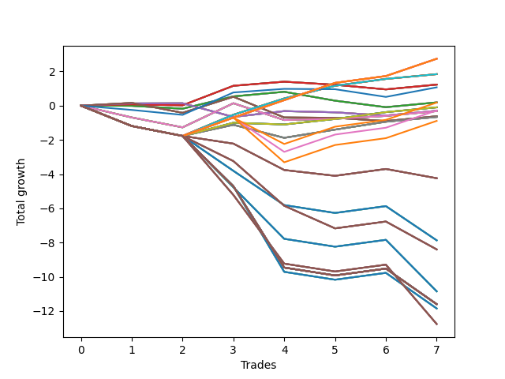

# Short Bulldog 001 
- Symbol: AAPL_Unlimited
- Date Range: 03/23/2022 - 07/08/2022
- Trading Period: 7:20-12:30
- Number of Trades: 7



| Name | Win Percent | Profit | Avg Profit / Trade | Avg Time / Trade |      | Name | Win Percent | Profit | Avg Profit / Trade | Avg Time / Trade |
| ---- | ----------- | ------ | ------------------ | ---------------- | ---- | ---- | ----------- | ------ | ------------------ | ---------------- |
| Sorted By <br> Profit | | | | | | Sorted By <br> Win Percentage ||||
| One Hundred Twenty-Six | 71.43 | 1370.00 | 195.71 | 71:09 |     | One Hundred Twenty-Six | 71.43 | 1370.00 | 195.71 | 71:09 |
| One Hundred Twenty-One | 71.43 | 1370.00 | 195.71 | 71:09 |     | One Hundred Twenty-One | 71.43 | 1370.00 | 195.71 | 71:09 |
| One Hundred Sixteen | 71.43 | 1370.00 | 195.71 | 71:09 |     | One Hundred Sixteen | 71.43 | 1370.00 | 195.71 | 71:09 |
| One Hundred Eleven | 71.43 | 1370.00 | 195.71 | 71:09 |     | One Hundred Eleven | 71.43 | 1370.00 | 195.71 | 71:09 |
| One Hundred One | 71.43 | 1370.00 | 195.71 | 71:09 |     | One Hundred One | 71.43 | 1370.00 | 195.71 | 71:09 |
| Eighty-One | 71.43 | 1370.00 | 195.71 | 71:09 |     | Eighty-One | 71.43 | 1370.00 | 195.71 | 71:09 |
| Seventy-One | 71.43 | 920.00 | 131.43 | 70:22 |     | Seventy-One | 71.43 | 920.00 | 131.43 | 70:22 |
| Sixty-Three | 71.43 | 920.00 | 131.43 | 70:22 |     | Sixty-Three | 71.43 | 920.00 | 131.43 | 70:22 |
| Fifty-Five | 71.43 | 920.00 | 131.43 | 70:22 |     | Fifty-Five | 71.43 | 920.00 | 131.43 | 70:22 |
| Forty-Seven | 71.43 | 920.00 | 131.43 | 70:22 |     | Forty-Seven | 71.43 | 920.00 | 131.43 | 70:22 |
| Seven | 71.43 | 920.00 | 131.43 | 70:22 |     | Seven | 71.43 | 920.00 | 131.43 | 70:22 |
| Sixty-Five | 57.14 | 615.00 | 87.86 | 14:40 |     | Sixty-Five | 57.14 | 615.00 | 87.86 | 14:40 |
| Fifty-Seven | 57.14 | 615.00 | 87.86 | 14:40 |     | Fifty-Seven | 57.14 | 615.00 | 87.86 | 14:40 |
| Forty-Nine | 57.14 | 615.00 | 87.86 | 14:40 |     | Forty-Nine | 57.14 | 615.00 | 87.86 | 14:40 |
| Forty-One | 57.14 | 615.00 | 87.86 | 14:40 |     | Forty-One | 57.14 | 615.00 | 87.86 | 14:40 |
| One | 57.14 | 615.00 | 87.86 | 14:40 |     | One | 57.14 | 615.00 | 87.86 | 14:40 |
| Seventy-Three | 42.86 | 535.00 | 76.43 | 10:39 |     | Ninety-Six | 57.14 | 90.00 | 12.86 | 62:32 |
| Sixty-Four | 42.86 | 95.00 | 13.57 | 11:35 |     | Seventy | 57.14 | -50.00 | -7.14 | 58:23 |
| Fifty-Six | 42.86 | 95.00 | 13.57 | 11:35 |     | Sixty-Two | 57.14 | -50.00 | -7.14 | 58:23 |
| Forty-Eight | 42.86 | 95.00 | 13.57 | 11:35 |     | Fifty-Four | 57.14 | -50.00 | -7.14 | 58:23 |
| Forty | 42.86 | 95.00 | 13.57 | 11:35 |     | Forty-Six | 57.14 | -50.00 | -7.14 | 58:23 |
| Zero | 42.86 | 95.00 | 13.57 | 11:35 |     | Six | 57.14 | -50.00 | -7.14 | 58:23 |
| Ninety-Six | 57.14 | 90.00 | 12.86 | 62:32 |     | Ninety-One | 57.14 | -140.00 | -20.00 | 65:51 |
| Seventy | 57.14 | -50.00 | -7.14 | 58:23 |     | Sixty-Six | 57.14 | -150.00 | -21.43 | 26:07 |
| Sixty-Two | 57.14 | -50.00 | -7.14 | 58:23 |     | Fifty-Eight | 57.14 | -150.00 | -21.43 | 26:07 |
| Fifty-Four | 57.14 | -50.00 | -7.14 | 58:23 |     | Fifty | 57.14 | -150.00 | -21.43 | 26:07 |
| Forty-Six | 57.14 | -50.00 | -7.14 | 58:23 |     | Forty-Two | 57.14 | -150.00 | -21.43 | 26:07 |
| Six | 57.14 | -50.00 | -7.14 | 58:23 |     | Two | 57.14 | -150.00 | -21.43 | 26:07 |
| Ninety-One | 57.14 | -140.00 | -20.00 | 65:51 |     | Sixty-Eight | 57.14 | -160.00 | -22.86 | 52:49 |
| Sixty-Six | 57.14 | -150.00 | -21.43 | 26:07 |     | Sixty | 57.14 | -160.00 | -22.86 | 52:49 |
| Fifty-Eight | 57.14 | -150.00 | -21.43 | 26:07 |     | Fifty-Two | 57.14 | -160.00 | -22.86 | 52:49 |
| Fifty | 57.14 | -150.00 | -21.43 | 26:07 |     | Forty-Four | 57.14 | -160.00 | -22.86 | 52:49 |
| Forty-Two | 57.14 | -150.00 | -21.43 | 26:07 |     | Four | 57.14 | -160.00 | -22.86 | 52:49 |
| Two | 57.14 | -150.00 | -21.43 | 26:07 |     | Sixty-Nine | 57.14 | -330.00 | -47.14 | 67:05 |
| Sixty-Eight | 57.14 | -160.00 | -22.86 | 52:49 |     | Sixty-One | 57.14 | -330.00 | -47.14 | 67:05 |
| Sixty | 57.14 | -160.00 | -22.86 | 52:49 |     | Fifty-Three | 57.14 | -330.00 | -47.14 | 67:05 |
| Fifty-Two | 57.14 | -160.00 | -22.86 | 52:49 |     | Forty-Five | 57.14 | -330.00 | -47.14 | 67:05 |
| Forty-Four | 57.14 | -160.00 | -22.86 | 52:49 |     | Five | 57.14 | -330.00 | -47.14 | 67:05 |
| Four | 57.14 | -160.00 | -22.86 | 52:49 |     | One Hundred Six | 57.14 | -445.00 | -63.57 | 66:15 |
| Sixty-Seven | 42.86 | -310.00 | -44.29 | 37:18 |     | Seventy-Three | 42.86 | 535.00 | 76.43 | 10:39 |
| Fifty-Nine | 42.86 | -310.00 | -44.29 | 37:18 |     | Sixty-Four | 42.86 | 95.00 | 13.57 | 11:35 |
| Fifty-One | 42.86 | -310.00 | -44.29 | 37:18 |     | Fifty-Six | 42.86 | 95.00 | 13.57 | 11:35 |
| Forty-Three | 42.86 | -310.00 | -44.29 | 37:18 |     | Forty-Eight | 42.86 | 95.00 | 13.57 | 11:35 |
| Three | 42.86 | -310.00 | -44.29 | 37:18 |     | Forty | 42.86 | 95.00 | 13.57 | 11:35 |
| Sixty-Nine | 57.14 | -330.00 | -47.14 | 67:05 |     | Zero | 42.86 | 95.00 | 13.57 | 11:35 |
| Sixty-One | 57.14 | -330.00 | -47.14 | 67:05 |     | Sixty-Seven | 42.86 | -310.00 | -44.29 | 37:18 |
| Fifty-Three | 57.14 | -330.00 | -47.14 | 67:05 |     | Fifty-Nine | 42.86 | -310.00 | -44.29 | 37:18 |
| Forty-Five | 57.14 | -330.00 | -47.14 | 67:05 |     | Fifty-One | 42.86 | -310.00 | -44.29 | 37:18 |
| Five | 57.14 | -330.00 | -47.14 | 67:05 |     | Forty-Three | 42.86 | -310.00 | -44.29 | 37:18 |
| One Hundred Six | 57.14 | -445.00 | -63.57 | 66:15 |     | Three | 42.86 | -310.00 | -44.29 | 37:18 |
| One Hundred | 14.29 | -2120.00 | -302.86 | 89:36 |     | One Hundred | 14.29 | -2120.00 | -302.86 | 89:36 |
| Ninety-Nine | 14.29 | -2120.00 | -302.86 | 89:36 |     | Ninety-Nine | 14.29 | -2120.00 | -302.86 | 89:36 |
| Ninety-Eight | 14.29 | -2120.00 | -302.86 | 89:36 |     | Ninety-Eight | 14.29 | -2120.00 | -302.86 | 89:36 |
| Ninety-Seven | 14.29 | -2120.00 | -302.86 | 89:36 |     | Ninety-Seven | 14.29 | -2120.00 | -302.86 | 89:36 |
| Ninety-Five | 14.29 | -3935.00 | -562.14 | 119:15 |     | Ninety-Five | 14.29 | -3935.00 | -562.14 | 119:15 |
| Ninety-Four | 14.29 | -3935.00 | -562.14 | 119:15 |     | Ninety-Four | 14.29 | -3935.00 | -562.14 | 119:15 |
| Ninety-Three | 14.29 | -3935.00 | -562.14 | 119:15 |     | Ninety-Three | 14.29 | -3935.00 | -562.14 | 119:15 |
| Ninety-Two | 14.29 | -3935.00 | -562.14 | 119:15 |     | Ninety-Two | 14.29 | -3935.00 | -562.14 | 119:15 |
| One Hundred Ten | 14.29 | -4200.00 | -600.00 | 100:15 |     | One Hundred Ten | 14.29 | -4200.00 | -600.00 | 100:15 |
| One Hundred Nine | 14.29 | -4200.00 | -600.00 | 100:15 |     | One Hundred Nine | 14.29 | -4200.00 | -600.00 | 100:15 |
| One Hundred Eight | 14.29 | -4200.00 | -600.00 | 100:15 |     | One Hundred Eight | 14.29 | -4200.00 | -600.00 | 100:15 |
| One Hundred Seven | 14.29 | -4200.00 | -600.00 | 100:15 |     | One Hundred Seven | 14.29 | -4200.00 | -600.00 | 100:15 |
| One Hundred Five | 14.29 | -5425.00 | -775.00 | 142:09 |     | One Hundred Five | 14.29 | -5425.00 | -775.00 | 142:09 |
| One Hundred Four | 14.29 | -5425.00 | -775.00 | 142:09 |     | One Hundred Four | 14.29 | -5425.00 | -775.00 | 142:09 |
| One Hundred Three | 14.29 | -5425.00 | -775.00 | 142:09 |     | One Hundred Three | 14.29 | -5425.00 | -775.00 | 142:09 |
| One Hundred Two | 14.29 | -5425.00 | -775.00 | 142:09 |     | One Hundred Two | 14.29 | -5425.00 | -775.00 | 142:09 |
| One Hundred Thirty | 14.29 | -5800.00 | -828.57 | 170:08 |     | One Hundred Thirty | 14.29 | -5800.00 | -828.57 | 170:08 |
| One Hundred Twenty-Nine | 14.29 | -5800.00 | -828.57 | 170:08 |     | One Hundred Twenty-Nine | 14.29 | -5800.00 | -828.57 | 170:08 |
| One Hundred Twenty-Eight | 14.29 | -5800.00 | -828.57 | 170:08 |     | One Hundred Twenty-Eight | 14.29 | -5800.00 | -828.57 | 170:08 |
| One Hundred Twenty-Seven | 14.29 | -5800.00 | -828.57 | 170:08 |     | One Hundred Twenty-Seven | 14.29 | -5800.00 | -828.57 | 170:08 |
| One Hundred Twenty-Five | 14.29 | -5800.00 | -828.57 | 170:08 |     | One Hundred Twenty-Five | 14.29 | -5800.00 | -828.57 | 170:08 |
| One Hundred Twenty-Four | 14.29 | -5800.00 | -828.57 | 170:08 |     | One Hundred Twenty-Four | 14.29 | -5800.00 | -828.57 | 170:08 |
| One Hundred Twenty-Three | 14.29 | -5800.00 | -828.57 | 170:08 |     | One Hundred Twenty-Three | 14.29 | -5800.00 | -828.57 | 170:08 |
| One Hundred Twenty-Two | 14.29 | -5800.00 | -828.57 | 170:08 |     | One Hundred Twenty-Two | 14.29 | -5800.00 | -828.57 | 170:08 |
| Eighty-Five | 14.29 | -5800.00 | -828.57 | 170:08 |     | Eighty-Five | 14.29 | -5800.00 | -828.57 | 170:08 |
| Eighty-Four | 14.29 | -5800.00 | -828.57 | 170:08 |     | Eighty-Four | 14.29 | -5800.00 | -828.57 | 170:08 |
| Eighty-Three | 14.29 | -5800.00 | -828.57 | 170:08 |     | Eighty-Three | 14.29 | -5800.00 | -828.57 | 170:08 |
| Eighty-Two | 14.29 | -5800.00 | -828.57 | 170:08 |     | Eighty-Two | 14.29 | -5800.00 | -828.57 | 170:08 |
| One Hundred Fifteen | 14.29 | -5925.00 | -846.43 | 169:02 |     | One Hundred Fifteen | 14.29 | -5925.00 | -846.43 | 169:02 |
| One Hundred Fourteen | 14.29 | -5925.00 | -846.43 | 169:02 |     | One Hundred Fourteen | 14.29 | -5925.00 | -846.43 | 169:02 |
| One Hundred Thirteen | 14.29 | -5925.00 | -846.43 | 169:02 |     | One Hundred Thirteen | 14.29 | -5925.00 | -846.43 | 169:02 |
| One Hundred Twelve | 14.29 | -5925.00 | -846.43 | 169:02 |     | One Hundred Twelve | 14.29 | -5925.00 | -846.43 | 169:02 |
| One Hundred Twenty | 14.29 | -6380.00 | -911.43 | 160:35 |     | One Hundred Twenty | 14.29 | -6380.00 | -911.43 | 160:35 |
| One Hundred Ninteen | 14.29 | -6380.00 | -911.43 | 160:35 |     | One Hundred Ninteen | 14.29 | -6380.00 | -911.43 | 160:35 |
| One Hundred Eighteen | 14.29 | -6380.00 | -911.43 | 160:35 |     | One Hundred Eighteen | 14.29 | -6380.00 | -911.43 | 160:35 |
| One Hundred Seventeen | 14.29 | -6380.00 | -911.43 | 160:35 |     | One Hundred Seventeen | 14.29 | -6380.00 | -911.43 | 160:35 |

## NO STOPLOSS

### Test Zero
* Sell when price hits the middle line of the 20p bollinger
* No Stoploss
* Results:
```
Total Trades: 7
Percent Up: 57.14
Percent Down: 42.86
Total Points Moved Down: 0.19
Potential Profit: 95.00
Total Points Ups: 1.08 Count Ups: 4
Total Points Downs: 1.27 Count Downs: 3
```

<details><summary>Trades</summary>

<code>In: 2022-03-29 10:51:00		Out: 2022-03-29 11:04:05		Total Position Time: 13:05		Total Move Down: -0.01		Total to Date: -0.01</code> <br />
<code>In: 2022-04-07 12:04:00		Out: 2022-04-07 12:20:15		Total Position Time: 16:15		Total Move Down: -0.17		Total to Date: -0.18</code> <br />
<code>In: 2022-04-28 07:24:00		Out: 2022-04-28 07:27:00		Total Position Time: 03:00		Total Move Down: 0.72		Total to Date: 0.54</code> <br />
<code>In: 2022-05-04 08:57:00		Out: 2022-05-04 09:04:40		Total Position Time: 07:40		Total Move Down: 0.27		Total to Date: 0.81</code> <br />
<code>In: 2022-05-25 07:21:00		Out: 2022-05-25 07:41:55		Total Position Time: 20:55		Total Move Down: -0.52		Total to Date: 0.29</code> <br />
<code>In: 2022-05-25 11:59:00		Out: 2022-05-25 12:18:05		Total Position Time: 19:05		Total Move Down: -0.38		Total to Date: -0.09</code> <br />
<code>In: 2022-06-15 11:02:00		Out: 2022-06-15 11:03:10		Total Position Time: 01:10		Total Move Down: 0.28		Total to Date: 0.19</code> <br />


</details>

### Test One
* Sell when the price hits the upper line of the 20p 1std bollinger
* No Stoploss
* Results:
```
Total Trades: 7
Percent Up: 42.86
Percent Down: 57.14
Total Points Moved Down: 1.23
Potential Profit: 615.00
Total Points Ups: 0.50 Count Ups: 3
Total Points Downs: 1.73 Count Downs: 4
```

<details><summary>Trades</summary>

<code>In: 2022-03-29 10:51:00		Out: 2022-03-29 11:06:05		Total Position Time: 15:05		Total Move Down: 0.07		Total to Date: 0.07</code> <br />
<code>In: 2022-04-07 12:04:00		Out: 2022-04-07 12:27:40		Total Position Time: 23:40		Total Move Down: -0.05		Total to Date: 0.02</code> <br />
<code>In: 2022-04-28 07:24:00		Out: 2022-04-28 07:29:40		Total Position Time: 05:40		Total Move Down: 1.14		Total to Date: 1.16</code> <br />
<code>In: 2022-05-04 08:57:00		Out: 2022-05-04 09:10:15		Total Position Time: 13:15		Total Move Down: 0.24		Total to Date: 1.40</code> <br />
<code>In: 2022-05-25 07:21:00		Out: 2022-05-25 07:43:30		Total Position Time: 22:30		Total Move Down: -0.18		Total to Date: 1.22</code> <br />
<code>In: 2022-05-25 11:59:00		Out: 2022-05-25 12:20:25		Total Position Time: 21:25		Total Move Down: -0.27		Total to Date: 0.95</code> <br />
<code>In: 2022-06-15 11:02:00		Out: 2022-06-15 11:03:10		Total Position Time: 01:10		Total Move Down: 0.28		Total to Date: 1.23</code> <br />


</details>

### Test Two
* Sell when the price hits the upper line of the 20p 2std bollinger
* No Stoploss
* Results:
```
Total Trades: 7
Percent Up: 42.86
Percent Down: 57.14
Total Points Moved Down: -0.30
Potential Profit: -150.00
Total Points Ups: 1.06 Count Ups: 3
Total Points Downs: 0.76 Count Downs: 4
```

<details><summary>Trades</summary>

<code>In: 2022-03-29 10:51:00		Out: 2022-03-29 11:07:05		Total Position Time: 16:05		Total Move Down: 0.13		Total to Date: 0.13</code> <br />
<code>In: 2022-04-07 12:04:00		Out: 2022-04-07 12:28:30		Total Position Time: 24:30		Total Move Down: 0.01		Total to Date: 0.14</code> <br />
<code>In: 2022-04-28 07:24:00		Out: 2022-04-28 08:28:30		Total Position Time: 64:30		Total Move Down: -0.80		Total to Date: -0.66</code> <br />
<code>In: 2022-05-04 08:57:00		Out: 2022-05-04 09:12:25		Total Position Time: 15:25		Total Move Down: 0.34		Total to Date: -0.32</code> <br />
<code>In: 2022-05-25 07:21:00		Out: 2022-05-25 07:48:05		Total Position Time: 27:05		Total Move Down: -0.07		Total to Date: -0.39</code> <br />
<code>In: 2022-05-25 11:59:00		Out: 2022-05-25 12:33:10		Total Position Time: 34:10		Total Move Down: -0.19		Total to Date: -0.58</code> <br />
<code>In: 2022-06-15 11:02:00		Out: 2022-06-15 11:03:10		Total Position Time: 01:10		Total Move Down: 0.28		Total to Date: -0.30</code> <br />


</details>

### Test Three
* Sell when price hits the middle line of the 50p bollinger
* No Stoploss
* Results:
```
Total Trades: 7
Percent Up: 57.14
Percent Down: 42.86
Total Points Moved Down: -0.62
Potential Profit: -310.00
Total Points Ups: 2.00 Count Ups: 4
Total Points Downs: 1.38 Count Downs: 3
```

<details><summary>Trades</summary>

<code>In: 2022-03-29 10:51:00		Out: 2022-03-29 11:18:35		Total Position Time: 27:35		Total Move Down: 0.16		Total to Date: 0.16</code> <br />
<code>In: 2022-04-07 12:04:00		Out: 2022-04-07 12:47:00		Total Position Time: 43:00		Total Move Down: -0.58		Total to Date: -0.42</code> <br />
<code>In: 2022-04-28 07:24:00		Out: 2022-04-28 07:27:10		Total Position Time: 03:10		Total Move Down: 0.94		Total to Date: 0.52</code> <br />
<code>In: 2022-05-04 08:57:00		Out: 2022-05-04 11:00:20		Total Position Time: 123:20		Total Move Down: -1.21		Total to Date: -0.69</code> <br />
<code>In: 2022-05-25 07:21:00		Out: 2022-05-25 07:48:40		Total Position Time: 27:40		Total Move Down: -0.02		Total to Date: -0.71</code> <br />
<code>In: 2022-05-25 11:59:00		Out: 2022-05-25 12:34:15		Total Position Time: 35:15		Total Move Down: -0.19		Total to Date: -0.90</code> <br />
<code>In: 2022-06-15 11:02:00		Out: 2022-06-15 11:03:10		Total Position Time: 01:10		Total Move Down: 0.28		Total to Date: -0.62</code> <br />


</details>

### Test Four
* Sell when the price hits the upper line of the 50p 1std bollinger
* No Stoploss
* Results:
```
Total Trades: 7
Percent Up: 42.86
Percent Down: 57.14
Total Points Moved Down: -0.32
Potential Profit: -160.00
Total Points Ups: 2.25 Count Ups: 3
Total Points Downs: 1.93 Count Downs: 4
```

<details><summary>Trades</summary>

<code>In: 2022-03-29 10:51:00		Out: 2022-03-29 12:43:05		Total Position Time: 112:05		Total Move Down: -0.69		Total to Date: -0.69</code> <br />
<code>In: 2022-04-07 12:04:00		Out: 2022-04-07 12:47:00		Total Position Time: 43:00		Total Move Down: -0.58		Total to Date: -1.27</code> <br />
<code>In: 2022-04-28 07:24:00		Out: 2022-04-28 07:33:30		Total Position Time: 09:30		Total Move Down: 1.41		Total to Date: 0.14</code> <br />
<code>In: 2022-05-04 08:57:00		Out: 2022-05-04 11:00:25		Total Position Time: 123:25		Total Move Down: -0.98		Total to Date: -0.84</code> <br />
<code>In: 2022-05-25 07:21:00		Out: 2022-05-25 08:04:05		Total Position Time: 43:05		Total Move Down: 0.07		Total to Date: -0.77</code> <br />
<code>In: 2022-05-25 11:59:00		Out: 2022-05-25 12:36:30		Total Position Time: 37:30		Total Move Down: 0.17		Total to Date: -0.60</code> <br />
<code>In: 2022-06-15 11:02:00		Out: 2022-06-15 11:03:10		Total Position Time: 01:10		Total Move Down: 0.28		Total to Date: -0.32</code> <br />


</details>

### Test Five
* Sell when the price hits the upper line of the 50p 2std bollinger
* No Stoploss
* Results:
```
Total Trades: 7
Percent Up: 42.86
Percent Down: 57.14
Total Points Moved Down: -0.66
Potential Profit: -330.00
Total Points Ups: 2.53 Count Ups: 3
Total Points Downs: 1.87 Count Downs: 4
```

<details><summary>Trades</summary>

<code>In: 2022-03-29 10:51:00		Out: 2022-03-29 12:47:00		Total Position Time: 116:00		Total Move Down: -1.19		Total to Date: -1.19</code> <br />
<code>In: 2022-04-07 12:04:00		Out: 2022-04-07 12:47:00		Total Position Time: 43:00		Total Move Down: -0.58		Total to Date: -1.77</code> <br />
<code>In: 2022-04-28 07:24:00		Out: 2022-04-28 08:57:40		Total Position Time: 93:40		Total Move Down: 0.65		Total to Date: -1.12</code> <br />
<code>In: 2022-05-04 08:57:00		Out: 2022-05-04 11:07:40		Total Position Time: 130:40		Total Move Down: -0.76		Total to Date: -1.88</code> <br />
<code>In: 2022-05-25 07:21:00		Out: 2022-05-25 08:04:55		Total Position Time: 43:55		Total Move Down: 0.48		Total to Date: -1.40</code> <br />
<code>In: 2022-05-25 11:59:00		Out: 2022-05-25 12:40:15		Total Position Time: 41:15		Total Move Down: 0.46		Total to Date: -0.94</code> <br />
<code>In: 2022-06-15 11:02:00		Out: 2022-06-15 11:03:10		Total Position Time: 01:10		Total Move Down: 0.28		Total to Date: -0.66</code> <br />


</details>

### Test Six
* Sell when the price hits the middle line of the 1std VWAP
* No Stoploss
* Results:
```
Total Trades: 7
Percent Up: 42.86
Percent Down: 57.14
Total Points Moved Down: -0.10
Potential Profit: -50.00
Total Points Ups: 1.87 Count Ups: 3
Total Points Downs: 1.77 Count Downs: 4
```

<details><summary>Trades</summary>

<code>In: 2022-03-29 10:51:00		Out: 2022-03-29 12:47:00		Total Position Time: 116:00		Total Move Down: -1.19		Total to Date: -1.19</code> <br />
<code>In: 2022-04-07 12:04:00		Out: 2022-04-07 12:47:00		Total Position Time: 43:00		Total Move Down: -0.58		Total to Date: -1.77</code> <br />
<code>In: 2022-04-28 07:24:00		Out: 2022-04-28 07:27:05		Total Position Time: 03:05		Total Move Down: 0.77		Total to Date: -1.00</code> <br />
<code>In: 2022-05-04 08:57:00		Out: 2022-05-04 11:30:50		Total Position Time: 153:50		Total Move Down: -0.10		Total to Date: -1.10</code> <br />
<code>In: 2022-05-25 07:21:00		Out: 2022-05-25 08:04:40		Total Position Time: 43:40		Total Move Down: 0.32		Total to Date: -0.78</code> <br />
<code>In: 2022-05-25 11:59:00		Out: 2022-05-25 12:47:00		Total Position Time: 48:00		Total Move Down: 0.40		Total to Date: -0.38</code> <br />
<code>In: 2022-06-15 11:02:00		Out: 2022-06-15 11:03:10		Total Position Time: 01:10		Total Move Down: 0.28		Total to Date: -0.10</code> <br />


</details>

### Test Seven
* Sell when the price hits the upper line of the 1std VWAP
* No Stoploss
* Results:
```
Total Trades: 7
Percent Up: 28.57
Percent Down: 71.43
Total Points Moved Down: 1.84
Potential Profit: 920.00
Total Points Ups: 1.77 Count Ups: 2
Total Points Downs: 3.61 Count Downs: 5
```

<details><summary>Trades</summary>

<code>In: 2022-03-29 10:51:00		Out: 2022-03-29 12:47:00		Total Position Time: 116:00		Total Move Down: -1.19		Total to Date: -1.19</code> <br />
<code>In: 2022-04-07 12:04:00		Out: 2022-04-07 12:47:00		Total Position Time: 43:00		Total Move Down: -0.58		Total to Date: -1.77</code> <br />
<code>In: 2022-04-28 07:24:00		Out: 2022-04-28 07:31:15		Total Position Time: 07:15		Total Move Down: 1.24		Total to Date: -0.53</code> <br />
<code>In: 2022-05-04 08:57:00		Out: 2022-05-04 11:35:05		Total Position Time: 158:05		Total Move Down: 0.95		Total to Date: 0.42</code> <br />
<code>In: 2022-05-25 07:21:00		Out: 2022-05-25 09:20:10		Total Position Time: 119:10		Total Move Down: 0.74		Total to Date: 1.16</code> <br />
<code>In: 2022-05-25 11:59:00		Out: 2022-05-25 12:47:00		Total Position Time: 48:00		Total Move Down: 0.40		Total to Date: 1.56</code> <br />
<code>In: 2022-06-15 11:02:00		Out: 2022-06-15 11:03:10		Total Position Time: 01:10		Total Move Down: 0.28		Total to Date: 1.84</code> <br />


</details>

## STOPLOSS OF 5

### Test Forty
* Sell when price hits the middle line of the 20p bollinger
* Stoploss is -5 points
* Results:
```
Total Trades: 7
Percent Up: 57.14
Percent Down: 42.86
Total Points Moved Down: 0.19
Potential Profit: 95.00
Total Points Ups: 1.08 Count Ups: 4
Total Points Downs: 1.27 Count Downs: 3
```

<details><summary>Trades</summary>

<code>In: 2022-03-29 10:51:00		Out: 2022-03-29 11:04:05		Total Position Time: 13:05		Total Move Down: -0.01		Total to Date: -0.01</code> <br />
<code>In: 2022-04-07 12:04:00		Out: 2022-04-07 12:20:15		Total Position Time: 16:15		Total Move Down: -0.17		Total to Date: -0.18</code> <br />
<code>In: 2022-04-28 07:24:00		Out: 2022-04-28 07:27:00		Total Position Time: 03:00		Total Move Down: 0.72		Total to Date: 0.54</code> <br />
<code>In: 2022-05-04 08:57:00		Out: 2022-05-04 09:04:40		Total Position Time: 07:40		Total Move Down: 0.27		Total to Date: 0.81</code> <br />
<code>In: 2022-05-25 07:21:00		Out: 2022-05-25 07:41:55		Total Position Time: 20:55		Total Move Down: -0.52		Total to Date: 0.29</code> <br />
<code>In: 2022-05-25 11:59:00		Out: 2022-05-25 12:18:05		Total Position Time: 19:05		Total Move Down: -0.38		Total to Date: -0.09</code> <br />
<code>In: 2022-06-15 11:02:00		Out: 2022-06-15 11:03:10		Total Position Time: 01:10		Total Move Down: 0.28		Total to Date: 0.19</code> <br />


</details>

### Test Forty-One
* Sell when the price hits the upper line of the 20p 1std bollinger
* Stoploss is -5 points
* Results:
```
Total Trades: 7
Percent Up: 42.86
Percent Down: 57.14
Total Points Moved Down: 1.23
Potential Profit: 615.00
Total Points Ups: 0.50 Count Ups: 3
Total Points Downs: 1.73 Count Downs: 4
```

<details><summary>Trades</summary>

<code>In: 2022-03-29 10:51:00		Out: 2022-03-29 11:06:05		Total Position Time: 15:05		Total Move Down: 0.07		Total to Date: 0.07</code> <br />
<code>In: 2022-04-07 12:04:00		Out: 2022-04-07 12:27:40		Total Position Time: 23:40		Total Move Down: -0.05		Total to Date: 0.02</code> <br />
<code>In: 2022-04-28 07:24:00		Out: 2022-04-28 07:29:40		Total Position Time: 05:40		Total Move Down: 1.14		Total to Date: 1.16</code> <br />
<code>In: 2022-05-04 08:57:00		Out: 2022-05-04 09:10:15		Total Position Time: 13:15		Total Move Down: 0.24		Total to Date: 1.40</code> <br />
<code>In: 2022-05-25 07:21:00		Out: 2022-05-25 07:43:30		Total Position Time: 22:30		Total Move Down: -0.18		Total to Date: 1.22</code> <br />
<code>In: 2022-05-25 11:59:00		Out: 2022-05-25 12:20:25		Total Position Time: 21:25		Total Move Down: -0.27		Total to Date: 0.95</code> <br />
<code>In: 2022-06-15 11:02:00		Out: 2022-06-15 11:03:10		Total Position Time: 01:10		Total Move Down: 0.28		Total to Date: 1.23</code> <br />


</details>

### Test Forty-Two
* Sell when the price hits the upper line of the 20p 2std bollinger
* Stoploss is -5 points
* Results:
```
Total Trades: 7
Percent Up: 42.86
Percent Down: 57.14
Total Points Moved Down: -0.30
Potential Profit: -150.00
Total Points Ups: 1.06 Count Ups: 3
Total Points Downs: 0.76 Count Downs: 4
```

<details><summary>Trades</summary>

<code>In: 2022-03-29 10:51:00		Out: 2022-03-29 11:07:05		Total Position Time: 16:05		Total Move Down: 0.13		Total to Date: 0.13</code> <br />
<code>In: 2022-04-07 12:04:00		Out: 2022-04-07 12:28:30		Total Position Time: 24:30		Total Move Down: 0.01		Total to Date: 0.14</code> <br />
<code>In: 2022-04-28 07:24:00		Out: 2022-04-28 08:28:30		Total Position Time: 64:30		Total Move Down: -0.80		Total to Date: -0.66</code> <br />
<code>In: 2022-05-04 08:57:00		Out: 2022-05-04 09:12:25		Total Position Time: 15:25		Total Move Down: 0.34		Total to Date: -0.32</code> <br />
<code>In: 2022-05-25 07:21:00		Out: 2022-05-25 07:48:05		Total Position Time: 27:05		Total Move Down: -0.07		Total to Date: -0.39</code> <br />
<code>In: 2022-05-25 11:59:00		Out: 2022-05-25 12:33:10		Total Position Time: 34:10		Total Move Down: -0.19		Total to Date: -0.58</code> <br />
<code>In: 2022-06-15 11:02:00		Out: 2022-06-15 11:03:10		Total Position Time: 01:10		Total Move Down: 0.28		Total to Date: -0.30</code> <br />


</details>

### Test Forty-Three
* Sell when price hits the middle line of the 50p bollinger
* Stoploss is -5 points
* Results:
```
Total Trades: 7
Percent Up: 57.14
Percent Down: 42.86
Total Points Moved Down: -0.62
Potential Profit: -310.00
Total Points Ups: 2.00 Count Ups: 4
Total Points Downs: 1.38 Count Downs: 3
```

<details><summary>Trades</summary>

<code>In: 2022-03-29 10:51:00		Out: 2022-03-29 11:18:35		Total Position Time: 27:35		Total Move Down: 0.16		Total to Date: 0.16</code> <br />
<code>In: 2022-04-07 12:04:00		Out: 2022-04-07 12:47:00		Total Position Time: 43:00		Total Move Down: -0.58		Total to Date: -0.42</code> <br />
<code>In: 2022-04-28 07:24:00		Out: 2022-04-28 07:27:10		Total Position Time: 03:10		Total Move Down: 0.94		Total to Date: 0.52</code> <br />
<code>In: 2022-05-04 08:57:00		Out: 2022-05-04 11:00:20		Total Position Time: 123:20		Total Move Down: -1.21		Total to Date: -0.69</code> <br />
<code>In: 2022-05-25 07:21:00		Out: 2022-05-25 07:48:40		Total Position Time: 27:40		Total Move Down: -0.02		Total to Date: -0.71</code> <br />
<code>In: 2022-05-25 11:59:00		Out: 2022-05-25 12:34:15		Total Position Time: 35:15		Total Move Down: -0.19		Total to Date: -0.90</code> <br />
<code>In: 2022-06-15 11:02:00		Out: 2022-06-15 11:03:10		Total Position Time: 01:10		Total Move Down: 0.28		Total to Date: -0.62</code> <br />


</details>

### Test Forty-Four
* Sell when the price hits the upper line of the 50p 1std bollinger
* Stoploss is -5 points
* Results:
```
Total Trades: 7
Percent Up: 42.86
Percent Down: 57.14
Total Points Moved Down: -0.32
Potential Profit: -160.00
Total Points Ups: 2.25 Count Ups: 3
Total Points Downs: 1.93 Count Downs: 4
```

<details><summary>Trades</summary>

<code>In: 2022-03-29 10:51:00		Out: 2022-03-29 12:43:05		Total Position Time: 112:05		Total Move Down: -0.69		Total to Date: -0.69</code> <br />
<code>In: 2022-04-07 12:04:00		Out: 2022-04-07 12:47:00		Total Position Time: 43:00		Total Move Down: -0.58		Total to Date: -1.27</code> <br />
<code>In: 2022-04-28 07:24:00		Out: 2022-04-28 07:33:30		Total Position Time: 09:30		Total Move Down: 1.41		Total to Date: 0.14</code> <br />
<code>In: 2022-05-04 08:57:00		Out: 2022-05-04 11:00:25		Total Position Time: 123:25		Total Move Down: -0.98		Total to Date: -0.84</code> <br />
<code>In: 2022-05-25 07:21:00		Out: 2022-05-25 08:04:05		Total Position Time: 43:05		Total Move Down: 0.07		Total to Date: -0.77</code> <br />
<code>In: 2022-05-25 11:59:00		Out: 2022-05-25 12:36:30		Total Position Time: 37:30		Total Move Down: 0.17		Total to Date: -0.60</code> <br />
<code>In: 2022-06-15 11:02:00		Out: 2022-06-15 11:03:10		Total Position Time: 01:10		Total Move Down: 0.28		Total to Date: -0.32</code> <br />


</details>

### Test Forty-Five
* Sell when the price hits the upper line of the 50p 2std bollinger
* Stoploss is -5 points
* Results:
```
Total Trades: 7
Percent Up: 42.86
Percent Down: 57.14
Total Points Moved Down: -0.66
Potential Profit: -330.00
Total Points Ups: 2.53 Count Ups: 3
Total Points Downs: 1.87 Count Downs: 4
```

<details><summary>Trades</summary>

<code>In: 2022-03-29 10:51:00		Out: 2022-03-29 12:47:00		Total Position Time: 116:00		Total Move Down: -1.19		Total to Date: -1.19</code> <br />
<code>In: 2022-04-07 12:04:00		Out: 2022-04-07 12:47:00		Total Position Time: 43:00		Total Move Down: -0.58		Total to Date: -1.77</code> <br />
<code>In: 2022-04-28 07:24:00		Out: 2022-04-28 08:57:40		Total Position Time: 93:40		Total Move Down: 0.65		Total to Date: -1.12</code> <br />
<code>In: 2022-05-04 08:57:00		Out: 2022-05-04 11:07:40		Total Position Time: 130:40		Total Move Down: -0.76		Total to Date: -1.88</code> <br />
<code>In: 2022-05-25 07:21:00		Out: 2022-05-25 08:04:55		Total Position Time: 43:55		Total Move Down: 0.48		Total to Date: -1.40</code> <br />
<code>In: 2022-05-25 11:59:00		Out: 2022-05-25 12:40:15		Total Position Time: 41:15		Total Move Down: 0.46		Total to Date: -0.94</code> <br />
<code>In: 2022-06-15 11:02:00		Out: 2022-06-15 11:03:10		Total Position Time: 01:10		Total Move Down: 0.28		Total to Date: -0.66</code> <br />


</details>

### Test Forty-Six
* Sell when the price hits the middle line of the 1std VWAP
* Stoploss is -5 points
* Results:
```
Total Trades: 7
Percent Up: 42.86
Percent Down: 57.14
Total Points Moved Down: -0.10
Potential Profit: -50.00
Total Points Ups: 1.87 Count Ups: 3
Total Points Downs: 1.77 Count Downs: 4
```

<details><summary>Trades</summary>

<code>In: 2022-03-29 10:51:00		Out: 2022-03-29 12:47:00		Total Position Time: 116:00		Total Move Down: -1.19		Total to Date: -1.19</code> <br />
<code>In: 2022-04-07 12:04:00		Out: 2022-04-07 12:47:00		Total Position Time: 43:00		Total Move Down: -0.58		Total to Date: -1.77</code> <br />
<code>In: 2022-04-28 07:24:00		Out: 2022-04-28 07:27:05		Total Position Time: 03:05		Total Move Down: 0.77		Total to Date: -1.00</code> <br />
<code>In: 2022-05-04 08:57:00		Out: 2022-05-04 11:30:50		Total Position Time: 153:50		Total Move Down: -0.10		Total to Date: -1.10</code> <br />
<code>In: 2022-05-25 07:21:00		Out: 2022-05-25 08:04:40		Total Position Time: 43:40		Total Move Down: 0.32		Total to Date: -0.78</code> <br />
<code>In: 2022-05-25 11:59:00		Out: 2022-05-25 12:47:00		Total Position Time: 48:00		Total Move Down: 0.40		Total to Date: -0.38</code> <br />
<code>In: 2022-06-15 11:02:00		Out: 2022-06-15 11:03:10		Total Position Time: 01:10		Total Move Down: 0.28		Total to Date: -0.10</code> <br />


</details>

### Test Forty-Seven
* Sell when the price hits the upper line of the 1std VWAP
* Stoploss is -5 points
* Results:
```
Total Trades: 7
Percent Up: 28.57
Percent Down: 71.43
Total Points Moved Down: 1.84
Potential Profit: 920.00
Total Points Ups: 1.77 Count Ups: 2
Total Points Downs: 3.61 Count Downs: 5
```

<details><summary>Trades</summary>

<code>In: 2022-03-29 10:51:00		Out: 2022-03-29 12:47:00		Total Position Time: 116:00		Total Move Down: -1.19		Total to Date: -1.19</code> <br />
<code>In: 2022-04-07 12:04:00		Out: 2022-04-07 12:47:00		Total Position Time: 43:00		Total Move Down: -0.58		Total to Date: -1.77</code> <br />
<code>In: 2022-04-28 07:24:00		Out: 2022-04-28 07:31:15		Total Position Time: 07:15		Total Move Down: 1.24		Total to Date: -0.53</code> <br />
<code>In: 2022-05-04 08:57:00		Out: 2022-05-04 11:35:05		Total Position Time: 158:05		Total Move Down: 0.95		Total to Date: 0.42</code> <br />
<code>In: 2022-05-25 07:21:00		Out: 2022-05-25 09:20:10		Total Position Time: 119:10		Total Move Down: 0.74		Total to Date: 1.16</code> <br />
<code>In: 2022-05-25 11:59:00		Out: 2022-05-25 12:47:00		Total Position Time: 48:00		Total Move Down: 0.40		Total to Date: 1.56</code> <br />
<code>In: 2022-06-15 11:02:00		Out: 2022-06-15 11:03:10		Total Position Time: 01:10		Total Move Down: 0.28		Total to Date: 1.84</code> <br />


</details>

## TRAIL STOP OF 5

### Test Forty-Eight
* Sell when price hits the middle line of the 20p bollinger
* Trailing Stop is -5 points
* Results:
```
Total Trades: 7
Percent Up: 57.14
Percent Down: 42.86
Total Points Moved Down: 0.19
Potential Profit: 95.00
Total Points Ups: 1.08 Count Ups: 4
Total Points Downs: 1.27 Count Downs: 3
```

<details><summary>Trades</summary>

<code>In: 2022-03-29 10:51:00		Out: 2022-03-29 11:04:05		Total Position Time: 13:05		Total Move Down: -0.01		Total to Date: -0.01</code> <br />
<code>In: 2022-04-07 12:04:00		Out: 2022-04-07 12:20:15		Total Position Time: 16:15		Total Move Down: -0.17		Total to Date: -0.18</code> <br />
<code>In: 2022-04-28 07:24:00		Out: 2022-04-28 07:27:00		Total Position Time: 03:00		Total Move Down: 0.72		Total to Date: 0.54</code> <br />
<code>In: 2022-05-04 08:57:00		Out: 2022-05-04 09:04:40		Total Position Time: 07:40		Total Move Down: 0.27		Total to Date: 0.81</code> <br />
<code>In: 2022-05-25 07:21:00		Out: 2022-05-25 07:41:55		Total Position Time: 20:55		Total Move Down: -0.52		Total to Date: 0.29</code> <br />
<code>In: 2022-05-25 11:59:00		Out: 2022-05-25 12:18:05		Total Position Time: 19:05		Total Move Down: -0.38		Total to Date: -0.09</code> <br />
<code>In: 2022-06-15 11:02:00		Out: 2022-06-15 11:03:10		Total Position Time: 01:10		Total Move Down: 0.28		Total to Date: 0.19</code> <br />


</details>

### Test Forty-Nine
* Sell when the price hits the upper line of the 20p 1std bollinger
* Trailing Stop is -5 points
* Results:
```
Total Trades: 7
Percent Up: 42.86
Percent Down: 57.14
Total Points Moved Down: 1.23
Potential Profit: 615.00
Total Points Ups: 0.50 Count Ups: 3
Total Points Downs: 1.73 Count Downs: 4
```

<details><summary>Trades</summary>

<code>In: 2022-03-29 10:51:00		Out: 2022-03-29 11:06:05		Total Position Time: 15:05		Total Move Down: 0.07		Total to Date: 0.07</code> <br />
<code>In: 2022-04-07 12:04:00		Out: 2022-04-07 12:27:40		Total Position Time: 23:40		Total Move Down: -0.05		Total to Date: 0.02</code> <br />
<code>In: 2022-04-28 07:24:00		Out: 2022-04-28 07:29:40		Total Position Time: 05:40		Total Move Down: 1.14		Total to Date: 1.16</code> <br />
<code>In: 2022-05-04 08:57:00		Out: 2022-05-04 09:10:15		Total Position Time: 13:15		Total Move Down: 0.24		Total to Date: 1.40</code> <br />
<code>In: 2022-05-25 07:21:00		Out: 2022-05-25 07:43:30		Total Position Time: 22:30		Total Move Down: -0.18		Total to Date: 1.22</code> <br />
<code>In: 2022-05-25 11:59:00		Out: 2022-05-25 12:20:25		Total Position Time: 21:25		Total Move Down: -0.27		Total to Date: 0.95</code> <br />
<code>In: 2022-06-15 11:02:00		Out: 2022-06-15 11:03:10		Total Position Time: 01:10		Total Move Down: 0.28		Total to Date: 1.23</code> <br />


</details>

### Test Fifty
* Sell when the price hits the upper line of the 20p 2std bollinger
* Trailing Stop is -5 points
* Results:
```
Total Trades: 7
Percent Up: 42.86
Percent Down: 57.14
Total Points Moved Down: -0.30
Potential Profit: -150.00
Total Points Ups: 1.06 Count Ups: 3
Total Points Downs: 0.76 Count Downs: 4
```

<details><summary>Trades</summary>

<code>In: 2022-03-29 10:51:00		Out: 2022-03-29 11:07:05		Total Position Time: 16:05		Total Move Down: 0.13		Total to Date: 0.13</code> <br />
<code>In: 2022-04-07 12:04:00		Out: 2022-04-07 12:28:30		Total Position Time: 24:30		Total Move Down: 0.01		Total to Date: 0.14</code> <br />
<code>In: 2022-04-28 07:24:00		Out: 2022-04-28 08:28:30		Total Position Time: 64:30		Total Move Down: -0.80		Total to Date: -0.66</code> <br />
<code>In: 2022-05-04 08:57:00		Out: 2022-05-04 09:12:25		Total Position Time: 15:25		Total Move Down: 0.34		Total to Date: -0.32</code> <br />
<code>In: 2022-05-25 07:21:00		Out: 2022-05-25 07:48:05		Total Position Time: 27:05		Total Move Down: -0.07		Total to Date: -0.39</code> <br />
<code>In: 2022-05-25 11:59:00		Out: 2022-05-25 12:33:10		Total Position Time: 34:10		Total Move Down: -0.19		Total to Date: -0.58</code> <br />
<code>In: 2022-06-15 11:02:00		Out: 2022-06-15 11:03:10		Total Position Time: 01:10		Total Move Down: 0.28		Total to Date: -0.30</code> <br />


</details>

### Test Fifty-One
* Sell when price hits the middle line of the 50p bollinger
* Trailing Stop is -5 points
* Results:
```
Total Trades: 7
Percent Up: 57.14
Percent Down: 42.86
Total Points Moved Down: -0.62
Potential Profit: -310.00
Total Points Ups: 2.00 Count Ups: 4
Total Points Downs: 1.38 Count Downs: 3
```

<details><summary>Trades</summary>

<code>In: 2022-03-29 10:51:00		Out: 2022-03-29 11:18:35		Total Position Time: 27:35		Total Move Down: 0.16		Total to Date: 0.16</code> <br />
<code>In: 2022-04-07 12:04:00		Out: 2022-04-07 12:47:00		Total Position Time: 43:00		Total Move Down: -0.58		Total to Date: -0.42</code> <br />
<code>In: 2022-04-28 07:24:00		Out: 2022-04-28 07:27:10		Total Position Time: 03:10		Total Move Down: 0.94		Total to Date: 0.52</code> <br />
<code>In: 2022-05-04 08:57:00		Out: 2022-05-04 11:00:20		Total Position Time: 123:20		Total Move Down: -1.21		Total to Date: -0.69</code> <br />
<code>In: 2022-05-25 07:21:00		Out: 2022-05-25 07:48:40		Total Position Time: 27:40		Total Move Down: -0.02		Total to Date: -0.71</code> <br />
<code>In: 2022-05-25 11:59:00		Out: 2022-05-25 12:34:15		Total Position Time: 35:15		Total Move Down: -0.19		Total to Date: -0.90</code> <br />
<code>In: 2022-06-15 11:02:00		Out: 2022-06-15 11:03:10		Total Position Time: 01:10		Total Move Down: 0.28		Total to Date: -0.62</code> <br />


</details>

### Test Fifty-Two
* Sell when the price hits the upper line of the 50p 1std bollinger
* Trailing Stop is -5 points
* Results:
```
Total Trades: 7
Percent Up: 42.86
Percent Down: 57.14
Total Points Moved Down: -0.32
Potential Profit: -160.00
Total Points Ups: 2.25 Count Ups: 3
Total Points Downs: 1.93 Count Downs: 4
```

<details><summary>Trades</summary>

<code>In: 2022-03-29 10:51:00		Out: 2022-03-29 12:43:05		Total Position Time: 112:05		Total Move Down: -0.69		Total to Date: -0.69</code> <br />
<code>In: 2022-04-07 12:04:00		Out: 2022-04-07 12:47:00		Total Position Time: 43:00		Total Move Down: -0.58		Total to Date: -1.27</code> <br />
<code>In: 2022-04-28 07:24:00		Out: 2022-04-28 07:33:30		Total Position Time: 09:30		Total Move Down: 1.41		Total to Date: 0.14</code> <br />
<code>In: 2022-05-04 08:57:00		Out: 2022-05-04 11:00:25		Total Position Time: 123:25		Total Move Down: -0.98		Total to Date: -0.84</code> <br />
<code>In: 2022-05-25 07:21:00		Out: 2022-05-25 08:04:05		Total Position Time: 43:05		Total Move Down: 0.07		Total to Date: -0.77</code> <br />
<code>In: 2022-05-25 11:59:00		Out: 2022-05-25 12:36:30		Total Position Time: 37:30		Total Move Down: 0.17		Total to Date: -0.60</code> <br />
<code>In: 2022-06-15 11:02:00		Out: 2022-06-15 11:03:10		Total Position Time: 01:10		Total Move Down: 0.28		Total to Date: -0.32</code> <br />


</details>

### Test Fifty-Three
* Sell when the price hits the upper line of the 50p 2std bollinger
* Trailing Stop is -5 points
* Results:
```
Total Trades: 7
Percent Up: 42.86
Percent Down: 57.14
Total Points Moved Down: -0.66
Potential Profit: -330.00
Total Points Ups: 2.53 Count Ups: 3
Total Points Downs: 1.87 Count Downs: 4
```

<details><summary>Trades</summary>

<code>In: 2022-03-29 10:51:00		Out: 2022-03-29 12:47:00		Total Position Time: 116:00		Total Move Down: -1.19		Total to Date: -1.19</code> <br />
<code>In: 2022-04-07 12:04:00		Out: 2022-04-07 12:47:00		Total Position Time: 43:00		Total Move Down: -0.58		Total to Date: -1.77</code> <br />
<code>In: 2022-04-28 07:24:00		Out: 2022-04-28 08:57:40		Total Position Time: 93:40		Total Move Down: 0.65		Total to Date: -1.12</code> <br />
<code>In: 2022-05-04 08:57:00		Out: 2022-05-04 11:07:40		Total Position Time: 130:40		Total Move Down: -0.76		Total to Date: -1.88</code> <br />
<code>In: 2022-05-25 07:21:00		Out: 2022-05-25 08:04:55		Total Position Time: 43:55		Total Move Down: 0.48		Total to Date: -1.40</code> <br />
<code>In: 2022-05-25 11:59:00		Out: 2022-05-25 12:40:15		Total Position Time: 41:15		Total Move Down: 0.46		Total to Date: -0.94</code> <br />
<code>In: 2022-06-15 11:02:00		Out: 2022-06-15 11:03:10		Total Position Time: 01:10		Total Move Down: 0.28		Total to Date: -0.66</code> <br />


</details>

### Test Fifty-Four
* Sell when the price hits the middle line of the 1std VWAP
* Trailing Stop is -5 points
* Results:
```
Total Trades: 7
Percent Up: 42.86
Percent Down: 57.14
Total Points Moved Down: -0.10
Potential Profit: -50.00
Total Points Ups: 1.87 Count Ups: 3
Total Points Downs: 1.77 Count Downs: 4
```

<details><summary>Trades</summary>

<code>In: 2022-03-29 10:51:00		Out: 2022-03-29 12:47:00		Total Position Time: 116:00		Total Move Down: -1.19		Total to Date: -1.19</code> <br />
<code>In: 2022-04-07 12:04:00		Out: 2022-04-07 12:47:00		Total Position Time: 43:00		Total Move Down: -0.58		Total to Date: -1.77</code> <br />
<code>In: 2022-04-28 07:24:00		Out: 2022-04-28 07:27:05		Total Position Time: 03:05		Total Move Down: 0.77		Total to Date: -1.00</code> <br />
<code>In: 2022-05-04 08:57:00		Out: 2022-05-04 11:30:50		Total Position Time: 153:50		Total Move Down: -0.10		Total to Date: -1.10</code> <br />
<code>In: 2022-05-25 07:21:00		Out: 2022-05-25 08:04:40		Total Position Time: 43:40		Total Move Down: 0.32		Total to Date: -0.78</code> <br />
<code>In: 2022-05-25 11:59:00		Out: 2022-05-25 12:47:00		Total Position Time: 48:00		Total Move Down: 0.40		Total to Date: -0.38</code> <br />
<code>In: 2022-06-15 11:02:00		Out: 2022-06-15 11:03:10		Total Position Time: 01:10		Total Move Down: 0.28		Total to Date: -0.10</code> <br />


</details>

### Test Fifty-Five
* Sell when the price hits the upper line of the 1std VWAP
* Trailing Stop is -5 points
* Results:
```
Total Trades: 7
Percent Up: 28.57
Percent Down: 71.43
Total Points Moved Down: 1.84
Potential Profit: 920.00
Total Points Ups: 1.77 Count Ups: 2
Total Points Downs: 3.61 Count Downs: 5
```

<details><summary>Trades</summary>

<code>In: 2022-03-29 10:51:00		Out: 2022-03-29 12:47:00		Total Position Time: 116:00		Total Move Down: -1.19		Total to Date: -1.19</code> <br />
<code>In: 2022-04-07 12:04:00		Out: 2022-04-07 12:47:00		Total Position Time: 43:00		Total Move Down: -0.58		Total to Date: -1.77</code> <br />
<code>In: 2022-04-28 07:24:00		Out: 2022-04-28 07:31:15		Total Position Time: 07:15		Total Move Down: 1.24		Total to Date: -0.53</code> <br />
<code>In: 2022-05-04 08:57:00		Out: 2022-05-04 11:35:05		Total Position Time: 158:05		Total Move Down: 0.95		Total to Date: 0.42</code> <br />
<code>In: 2022-05-25 07:21:00		Out: 2022-05-25 09:20:10		Total Position Time: 119:10		Total Move Down: 0.74		Total to Date: 1.16</code> <br />
<code>In: 2022-05-25 11:59:00		Out: 2022-05-25 12:47:00		Total Position Time: 48:00		Total Move Down: 0.40		Total to Date: 1.56</code> <br />
<code>In: 2022-06-15 11:02:00		Out: 2022-06-15 11:03:10		Total Position Time: 01:10		Total Move Down: 0.28		Total to Date: 1.84</code> <br />


</details>

## STOPLOSS OF 10

### Test Fifty-Six
* Sell when price hits the middle line of the 20p bollinger
* Stoploss is -10 points
* Results:
```
Total Trades: 7
Percent Up: 57.14
Percent Down: 42.86
Total Points Moved Down: 0.19
Potential Profit: 95.00
Total Points Ups: 1.08 Count Ups: 4
Total Points Downs: 1.27 Count Downs: 3
```

<details><summary>Trades</summary>

<code>In: 2022-03-29 10:51:00		Out: 2022-03-29 11:04:05		Total Position Time: 13:05		Total Move Down: -0.01		Total to Date: -0.01</code> <br />
<code>In: 2022-04-07 12:04:00		Out: 2022-04-07 12:20:15		Total Position Time: 16:15		Total Move Down: -0.17		Total to Date: -0.18</code> <br />
<code>In: 2022-04-28 07:24:00		Out: 2022-04-28 07:27:00		Total Position Time: 03:00		Total Move Down: 0.72		Total to Date: 0.54</code> <br />
<code>In: 2022-05-04 08:57:00		Out: 2022-05-04 09:04:40		Total Position Time: 07:40		Total Move Down: 0.27		Total to Date: 0.81</code> <br />
<code>In: 2022-05-25 07:21:00		Out: 2022-05-25 07:41:55		Total Position Time: 20:55		Total Move Down: -0.52		Total to Date: 0.29</code> <br />
<code>In: 2022-05-25 11:59:00		Out: 2022-05-25 12:18:05		Total Position Time: 19:05		Total Move Down: -0.38		Total to Date: -0.09</code> <br />
<code>In: 2022-06-15 11:02:00		Out: 2022-06-15 11:03:10		Total Position Time: 01:10		Total Move Down: 0.28		Total to Date: 0.19</code> <br />


</details>

### Test Fifty-Seven
* Sell when the price hits the upper line of the 20p 1std bollinger
* Stoploss is -10 points
* Results:
```
Total Trades: 7
Percent Up: 42.86
Percent Down: 57.14
Total Points Moved Down: 1.23
Potential Profit: 615.00
Total Points Ups: 0.50 Count Ups: 3
Total Points Downs: 1.73 Count Downs: 4
```

<details><summary>Trades</summary>

<code>In: 2022-03-29 10:51:00		Out: 2022-03-29 11:06:05		Total Position Time: 15:05		Total Move Down: 0.07		Total to Date: 0.07</code> <br />
<code>In: 2022-04-07 12:04:00		Out: 2022-04-07 12:27:40		Total Position Time: 23:40		Total Move Down: -0.05		Total to Date: 0.02</code> <br />
<code>In: 2022-04-28 07:24:00		Out: 2022-04-28 07:29:40		Total Position Time: 05:40		Total Move Down: 1.14		Total to Date: 1.16</code> <br />
<code>In: 2022-05-04 08:57:00		Out: 2022-05-04 09:10:15		Total Position Time: 13:15		Total Move Down: 0.24		Total to Date: 1.40</code> <br />
<code>In: 2022-05-25 07:21:00		Out: 2022-05-25 07:43:30		Total Position Time: 22:30		Total Move Down: -0.18		Total to Date: 1.22</code> <br />
<code>In: 2022-05-25 11:59:00		Out: 2022-05-25 12:20:25		Total Position Time: 21:25		Total Move Down: -0.27		Total to Date: 0.95</code> <br />
<code>In: 2022-06-15 11:02:00		Out: 2022-06-15 11:03:10		Total Position Time: 01:10		Total Move Down: 0.28		Total to Date: 1.23</code> <br />


</details>

### Test Fifty-Eight
* Sell when the price hits the upper line of the 20p 2std bollinger
* Stoploss is -10 points
* Results:
```
Total Trades: 7
Percent Up: 42.86
Percent Down: 57.14
Total Points Moved Down: -0.30
Potential Profit: -150.00
Total Points Ups: 1.06 Count Ups: 3
Total Points Downs: 0.76 Count Downs: 4
```

<details><summary>Trades</summary>

<code>In: 2022-03-29 10:51:00		Out: 2022-03-29 11:07:05		Total Position Time: 16:05		Total Move Down: 0.13		Total to Date: 0.13</code> <br />
<code>In: 2022-04-07 12:04:00		Out: 2022-04-07 12:28:30		Total Position Time: 24:30		Total Move Down: 0.01		Total to Date: 0.14</code> <br />
<code>In: 2022-04-28 07:24:00		Out: 2022-04-28 08:28:30		Total Position Time: 64:30		Total Move Down: -0.80		Total to Date: -0.66</code> <br />
<code>In: 2022-05-04 08:57:00		Out: 2022-05-04 09:12:25		Total Position Time: 15:25		Total Move Down: 0.34		Total to Date: -0.32</code> <br />
<code>In: 2022-05-25 07:21:00		Out: 2022-05-25 07:48:05		Total Position Time: 27:05		Total Move Down: -0.07		Total to Date: -0.39</code> <br />
<code>In: 2022-05-25 11:59:00		Out: 2022-05-25 12:33:10		Total Position Time: 34:10		Total Move Down: -0.19		Total to Date: -0.58</code> <br />
<code>In: 2022-06-15 11:02:00		Out: 2022-06-15 11:03:10		Total Position Time: 01:10		Total Move Down: 0.28		Total to Date: -0.30</code> <br />


</details>

### Test Fifty-Nine
* Sell when price hits the middle line of the 50p bollinger
* Stoploss is -10 points
* Results:
```
Total Trades: 7
Percent Up: 57.14
Percent Down: 42.86
Total Points Moved Down: -0.62
Potential Profit: -310.00
Total Points Ups: 2.00 Count Ups: 4
Total Points Downs: 1.38 Count Downs: 3
```

<details><summary>Trades</summary>

<code>In: 2022-03-29 10:51:00		Out: 2022-03-29 11:18:35		Total Position Time: 27:35		Total Move Down: 0.16		Total to Date: 0.16</code> <br />
<code>In: 2022-04-07 12:04:00		Out: 2022-04-07 12:47:00		Total Position Time: 43:00		Total Move Down: -0.58		Total to Date: -0.42</code> <br />
<code>In: 2022-04-28 07:24:00		Out: 2022-04-28 07:27:10		Total Position Time: 03:10		Total Move Down: 0.94		Total to Date: 0.52</code> <br />
<code>In: 2022-05-04 08:57:00		Out: 2022-05-04 11:00:20		Total Position Time: 123:20		Total Move Down: -1.21		Total to Date: -0.69</code> <br />
<code>In: 2022-05-25 07:21:00		Out: 2022-05-25 07:48:40		Total Position Time: 27:40		Total Move Down: -0.02		Total to Date: -0.71</code> <br />
<code>In: 2022-05-25 11:59:00		Out: 2022-05-25 12:34:15		Total Position Time: 35:15		Total Move Down: -0.19		Total to Date: -0.90</code> <br />
<code>In: 2022-06-15 11:02:00		Out: 2022-06-15 11:03:10		Total Position Time: 01:10		Total Move Down: 0.28		Total to Date: -0.62</code> <br />


</details>

### Test Sixty
* Sell when the price hits the upper line of the 50p 1std bollinger
* Stoploss is -10 points
* Results:
```
Total Trades: 7
Percent Up: 42.86
Percent Down: 57.14
Total Points Moved Down: -0.32
Potential Profit: -160.00
Total Points Ups: 2.25 Count Ups: 3
Total Points Downs: 1.93 Count Downs: 4
```

<details><summary>Trades</summary>

<code>In: 2022-03-29 10:51:00		Out: 2022-03-29 12:43:05		Total Position Time: 112:05		Total Move Down: -0.69		Total to Date: -0.69</code> <br />
<code>In: 2022-04-07 12:04:00		Out: 2022-04-07 12:47:00		Total Position Time: 43:00		Total Move Down: -0.58		Total to Date: -1.27</code> <br />
<code>In: 2022-04-28 07:24:00		Out: 2022-04-28 07:33:30		Total Position Time: 09:30		Total Move Down: 1.41		Total to Date: 0.14</code> <br />
<code>In: 2022-05-04 08:57:00		Out: 2022-05-04 11:00:25		Total Position Time: 123:25		Total Move Down: -0.98		Total to Date: -0.84</code> <br />
<code>In: 2022-05-25 07:21:00		Out: 2022-05-25 08:04:05		Total Position Time: 43:05		Total Move Down: 0.07		Total to Date: -0.77</code> <br />
<code>In: 2022-05-25 11:59:00		Out: 2022-05-25 12:36:30		Total Position Time: 37:30		Total Move Down: 0.17		Total to Date: -0.60</code> <br />
<code>In: 2022-06-15 11:02:00		Out: 2022-06-15 11:03:10		Total Position Time: 01:10		Total Move Down: 0.28		Total to Date: -0.32</code> <br />


</details>

### Test Sixty-One
* Sell when the price hits the upper line of the 50p 2std bollinger
* Stoploss is -10 points
* Results:
```
Total Trades: 7
Percent Up: 42.86
Percent Down: 57.14
Total Points Moved Down: -0.66
Potential Profit: -330.00
Total Points Ups: 2.53 Count Ups: 3
Total Points Downs: 1.87 Count Downs: 4
```

<details><summary>Trades</summary>

<code>In: 2022-03-29 10:51:00		Out: 2022-03-29 12:47:00		Total Position Time: 116:00		Total Move Down: -1.19		Total to Date: -1.19</code> <br />
<code>In: 2022-04-07 12:04:00		Out: 2022-04-07 12:47:00		Total Position Time: 43:00		Total Move Down: -0.58		Total to Date: -1.77</code> <br />
<code>In: 2022-04-28 07:24:00		Out: 2022-04-28 08:57:40		Total Position Time: 93:40		Total Move Down: 0.65		Total to Date: -1.12</code> <br />
<code>In: 2022-05-04 08:57:00		Out: 2022-05-04 11:07:40		Total Position Time: 130:40		Total Move Down: -0.76		Total to Date: -1.88</code> <br />
<code>In: 2022-05-25 07:21:00		Out: 2022-05-25 08:04:55		Total Position Time: 43:55		Total Move Down: 0.48		Total to Date: -1.40</code> <br />
<code>In: 2022-05-25 11:59:00		Out: 2022-05-25 12:40:15		Total Position Time: 41:15		Total Move Down: 0.46		Total to Date: -0.94</code> <br />
<code>In: 2022-06-15 11:02:00		Out: 2022-06-15 11:03:10		Total Position Time: 01:10		Total Move Down: 0.28		Total to Date: -0.66</code> <br />


</details>

### Test Sixty-Two
* Sell when the price hits the middle line of the 1std VWAP
* Stoploss is -10 points
* Results:
```
Total Trades: 7
Percent Up: 42.86
Percent Down: 57.14
Total Points Moved Down: -0.10
Potential Profit: -50.00
Total Points Ups: 1.87 Count Ups: 3
Total Points Downs: 1.77 Count Downs: 4
```

<details><summary>Trades</summary>

<code>In: 2022-03-29 10:51:00		Out: 2022-03-29 12:47:00		Total Position Time: 116:00		Total Move Down: -1.19		Total to Date: -1.19</code> <br />
<code>In: 2022-04-07 12:04:00		Out: 2022-04-07 12:47:00		Total Position Time: 43:00		Total Move Down: -0.58		Total to Date: -1.77</code> <br />
<code>In: 2022-04-28 07:24:00		Out: 2022-04-28 07:27:05		Total Position Time: 03:05		Total Move Down: 0.77		Total to Date: -1.00</code> <br />
<code>In: 2022-05-04 08:57:00		Out: 2022-05-04 11:30:50		Total Position Time: 153:50		Total Move Down: -0.10		Total to Date: -1.10</code> <br />
<code>In: 2022-05-25 07:21:00		Out: 2022-05-25 08:04:40		Total Position Time: 43:40		Total Move Down: 0.32		Total to Date: -0.78</code> <br />
<code>In: 2022-05-25 11:59:00		Out: 2022-05-25 12:47:00		Total Position Time: 48:00		Total Move Down: 0.40		Total to Date: -0.38</code> <br />
<code>In: 2022-06-15 11:02:00		Out: 2022-06-15 11:03:10		Total Position Time: 01:10		Total Move Down: 0.28		Total to Date: -0.10</code> <br />


</details>

### Test Sixty-Three
* Sell when the price hits the upper line of the 1std VWAP
* Stoploss is -10 points
* Results:
```
Total Trades: 7
Percent Up: 28.57
Percent Down: 71.43
Total Points Moved Down: 1.84
Potential Profit: 920.00
Total Points Ups: 1.77 Count Ups: 2
Total Points Downs: 3.61 Count Downs: 5
```

<details><summary>Trades</summary>

<code>In: 2022-03-29 10:51:00		Out: 2022-03-29 12:47:00		Total Position Time: 116:00		Total Move Down: -1.19		Total to Date: -1.19</code> <br />
<code>In: 2022-04-07 12:04:00		Out: 2022-04-07 12:47:00		Total Position Time: 43:00		Total Move Down: -0.58		Total to Date: -1.77</code> <br />
<code>In: 2022-04-28 07:24:00		Out: 2022-04-28 07:31:15		Total Position Time: 07:15		Total Move Down: 1.24		Total to Date: -0.53</code> <br />
<code>In: 2022-05-04 08:57:00		Out: 2022-05-04 11:35:05		Total Position Time: 158:05		Total Move Down: 0.95		Total to Date: 0.42</code> <br />
<code>In: 2022-05-25 07:21:00		Out: 2022-05-25 09:20:10		Total Position Time: 119:10		Total Move Down: 0.74		Total to Date: 1.16</code> <br />
<code>In: 2022-05-25 11:59:00		Out: 2022-05-25 12:47:00		Total Position Time: 48:00		Total Move Down: 0.40		Total to Date: 1.56</code> <br />
<code>In: 2022-06-15 11:02:00		Out: 2022-06-15 11:03:10		Total Position Time: 01:10		Total Move Down: 0.28		Total to Date: 1.84</code> <br />


</details>

## TRAIL STOP OF 10

### Test Sixty-Four
* Sell when price hits the middle line of the 20p bollinger
* Trailing Stop is -10 points
* Results:
```
Total Trades: 7
Percent Up: 57.14
Percent Down: 42.86
Total Points Moved Down: 0.19
Potential Profit: 95.00
Total Points Ups: 1.08 Count Ups: 4
Total Points Downs: 1.27 Count Downs: 3
```

<details><summary>Trades</summary>

<code>In: 2022-03-29 10:51:00		Out: 2022-03-29 11:04:05		Total Position Time: 13:05		Total Move Down: -0.01		Total to Date: -0.01</code> <br />
<code>In: 2022-04-07 12:04:00		Out: 2022-04-07 12:20:15		Total Position Time: 16:15		Total Move Down: -0.17		Total to Date: -0.18</code> <br />
<code>In: 2022-04-28 07:24:00		Out: 2022-04-28 07:27:00		Total Position Time: 03:00		Total Move Down: 0.72		Total to Date: 0.54</code> <br />
<code>In: 2022-05-04 08:57:00		Out: 2022-05-04 09:04:40		Total Position Time: 07:40		Total Move Down: 0.27		Total to Date: 0.81</code> <br />
<code>In: 2022-05-25 07:21:00		Out: 2022-05-25 07:41:55		Total Position Time: 20:55		Total Move Down: -0.52		Total to Date: 0.29</code> <br />
<code>In: 2022-05-25 11:59:00		Out: 2022-05-25 12:18:05		Total Position Time: 19:05		Total Move Down: -0.38		Total to Date: -0.09</code> <br />
<code>In: 2022-06-15 11:02:00		Out: 2022-06-15 11:03:10		Total Position Time: 01:10		Total Move Down: 0.28		Total to Date: 0.19</code> <br />


</details>

### Test Sixty-Five
* Sell when the price hits the upper line of the 20p 1std bollinger
* Trailing Stop is -10 points
* Results:
```
Total Trades: 7
Percent Up: 42.86
Percent Down: 57.14
Total Points Moved Down: 1.23
Potential Profit: 615.00
Total Points Ups: 0.50 Count Ups: 3
Total Points Downs: 1.73 Count Downs: 4
```

<details><summary>Trades</summary>

<code>In: 2022-03-29 10:51:00		Out: 2022-03-29 11:06:05		Total Position Time: 15:05		Total Move Down: 0.07		Total to Date: 0.07</code> <br />
<code>In: 2022-04-07 12:04:00		Out: 2022-04-07 12:27:40		Total Position Time: 23:40		Total Move Down: -0.05		Total to Date: 0.02</code> <br />
<code>In: 2022-04-28 07:24:00		Out: 2022-04-28 07:29:40		Total Position Time: 05:40		Total Move Down: 1.14		Total to Date: 1.16</code> <br />
<code>In: 2022-05-04 08:57:00		Out: 2022-05-04 09:10:15		Total Position Time: 13:15		Total Move Down: 0.24		Total to Date: 1.40</code> <br />
<code>In: 2022-05-25 07:21:00		Out: 2022-05-25 07:43:30		Total Position Time: 22:30		Total Move Down: -0.18		Total to Date: 1.22</code> <br />
<code>In: 2022-05-25 11:59:00		Out: 2022-05-25 12:20:25		Total Position Time: 21:25		Total Move Down: -0.27		Total to Date: 0.95</code> <br />
<code>In: 2022-06-15 11:02:00		Out: 2022-06-15 11:03:10		Total Position Time: 01:10		Total Move Down: 0.28		Total to Date: 1.23</code> <br />


</details>

### Test Sixty-Six
* Sell when the price hits the upper line of the 20p 2std bollinger
* Trailing Stop is -10 points
* Results:
```
Total Trades: 7
Percent Up: 42.86
Percent Down: 57.14
Total Points Moved Down: -0.30
Potential Profit: -150.00
Total Points Ups: 1.06 Count Ups: 3
Total Points Downs: 0.76 Count Downs: 4
```

<details><summary>Trades</summary>

<code>In: 2022-03-29 10:51:00		Out: 2022-03-29 11:07:05		Total Position Time: 16:05		Total Move Down: 0.13		Total to Date: 0.13</code> <br />
<code>In: 2022-04-07 12:04:00		Out: 2022-04-07 12:28:30		Total Position Time: 24:30		Total Move Down: 0.01		Total to Date: 0.14</code> <br />
<code>In: 2022-04-28 07:24:00		Out: 2022-04-28 08:28:30		Total Position Time: 64:30		Total Move Down: -0.80		Total to Date: -0.66</code> <br />
<code>In: 2022-05-04 08:57:00		Out: 2022-05-04 09:12:25		Total Position Time: 15:25		Total Move Down: 0.34		Total to Date: -0.32</code> <br />
<code>In: 2022-05-25 07:21:00		Out: 2022-05-25 07:48:05		Total Position Time: 27:05		Total Move Down: -0.07		Total to Date: -0.39</code> <br />
<code>In: 2022-05-25 11:59:00		Out: 2022-05-25 12:33:10		Total Position Time: 34:10		Total Move Down: -0.19		Total to Date: -0.58</code> <br />
<code>In: 2022-06-15 11:02:00		Out: 2022-06-15 11:03:10		Total Position Time: 01:10		Total Move Down: 0.28		Total to Date: -0.30</code> <br />


</details>

### Test Sixty-Seven
* Sell when price hits the middle line of the 50p bollinger
* Trailing Stop is -10 points
* Results:
```
Total Trades: 7
Percent Up: 57.14
Percent Down: 42.86
Total Points Moved Down: -0.62
Potential Profit: -310.00
Total Points Ups: 2.00 Count Ups: 4
Total Points Downs: 1.38 Count Downs: 3
```

<details><summary>Trades</summary>

<code>In: 2022-03-29 10:51:00		Out: 2022-03-29 11:18:35		Total Position Time: 27:35		Total Move Down: 0.16		Total to Date: 0.16</code> <br />
<code>In: 2022-04-07 12:04:00		Out: 2022-04-07 12:47:00		Total Position Time: 43:00		Total Move Down: -0.58		Total to Date: -0.42</code> <br />
<code>In: 2022-04-28 07:24:00		Out: 2022-04-28 07:27:10		Total Position Time: 03:10		Total Move Down: 0.94		Total to Date: 0.52</code> <br />
<code>In: 2022-05-04 08:57:00		Out: 2022-05-04 11:00:20		Total Position Time: 123:20		Total Move Down: -1.21		Total to Date: -0.69</code> <br />
<code>In: 2022-05-25 07:21:00		Out: 2022-05-25 07:48:40		Total Position Time: 27:40		Total Move Down: -0.02		Total to Date: -0.71</code> <br />
<code>In: 2022-05-25 11:59:00		Out: 2022-05-25 12:34:15		Total Position Time: 35:15		Total Move Down: -0.19		Total to Date: -0.90</code> <br />
<code>In: 2022-06-15 11:02:00		Out: 2022-06-15 11:03:10		Total Position Time: 01:10		Total Move Down: 0.28		Total to Date: -0.62</code> <br />


</details>

### Test Sixty-Eight
* Sell when the price hits the upper line of the 50p 1std bollinger
* Trailing Stop is -10 points
* Results:
```
Total Trades: 7
Percent Up: 42.86
Percent Down: 57.14
Total Points Moved Down: -0.32
Potential Profit: -160.00
Total Points Ups: 2.25 Count Ups: 3
Total Points Downs: 1.93 Count Downs: 4
```

<details><summary>Trades</summary>

<code>In: 2022-03-29 10:51:00		Out: 2022-03-29 12:43:05		Total Position Time: 112:05		Total Move Down: -0.69		Total to Date: -0.69</code> <br />
<code>In: 2022-04-07 12:04:00		Out: 2022-04-07 12:47:00		Total Position Time: 43:00		Total Move Down: -0.58		Total to Date: -1.27</code> <br />
<code>In: 2022-04-28 07:24:00		Out: 2022-04-28 07:33:30		Total Position Time: 09:30		Total Move Down: 1.41		Total to Date: 0.14</code> <br />
<code>In: 2022-05-04 08:57:00		Out: 2022-05-04 11:00:25		Total Position Time: 123:25		Total Move Down: -0.98		Total to Date: -0.84</code> <br />
<code>In: 2022-05-25 07:21:00		Out: 2022-05-25 08:04:05		Total Position Time: 43:05		Total Move Down: 0.07		Total to Date: -0.77</code> <br />
<code>In: 2022-05-25 11:59:00		Out: 2022-05-25 12:36:30		Total Position Time: 37:30		Total Move Down: 0.17		Total to Date: -0.60</code> <br />
<code>In: 2022-06-15 11:02:00		Out: 2022-06-15 11:03:10		Total Position Time: 01:10		Total Move Down: 0.28		Total to Date: -0.32</code> <br />


</details>

### Test Sixty-Nine
* Sell when the price hits the upper line of the 50p 2std bollinger
* Trailing Stop is -10 points
* Results:
```
Total Trades: 7
Percent Up: 42.86
Percent Down: 57.14
Total Points Moved Down: -0.66
Potential Profit: -330.00
Total Points Ups: 2.53 Count Ups: 3
Total Points Downs: 1.87 Count Downs: 4
```

<details><summary>Trades</summary>

<code>In: 2022-03-29 10:51:00		Out: 2022-03-29 12:47:00		Total Position Time: 116:00		Total Move Down: -1.19		Total to Date: -1.19</code> <br />
<code>In: 2022-04-07 12:04:00		Out: 2022-04-07 12:47:00		Total Position Time: 43:00		Total Move Down: -0.58		Total to Date: -1.77</code> <br />
<code>In: 2022-04-28 07:24:00		Out: 2022-04-28 08:57:40		Total Position Time: 93:40		Total Move Down: 0.65		Total to Date: -1.12</code> <br />
<code>In: 2022-05-04 08:57:00		Out: 2022-05-04 11:07:40		Total Position Time: 130:40		Total Move Down: -0.76		Total to Date: -1.88</code> <br />
<code>In: 2022-05-25 07:21:00		Out: 2022-05-25 08:04:55		Total Position Time: 43:55		Total Move Down: 0.48		Total to Date: -1.40</code> <br />
<code>In: 2022-05-25 11:59:00		Out: 2022-05-25 12:40:15		Total Position Time: 41:15		Total Move Down: 0.46		Total to Date: -0.94</code> <br />
<code>In: 2022-06-15 11:02:00		Out: 2022-06-15 11:03:10		Total Position Time: 01:10		Total Move Down: 0.28		Total to Date: -0.66</code> <br />


</details>

### Test Seventy
* Sell when the price hits the middle line of the 1std VWAP
* Trailing Stop is -10 points
* Results:
```
Total Trades: 7
Percent Up: 42.86
Percent Down: 57.14
Total Points Moved Down: -0.10
Potential Profit: -50.00
Total Points Ups: 1.87 Count Ups: 3
Total Points Downs: 1.77 Count Downs: 4
```

<details><summary>Trades</summary>

<code>In: 2022-03-29 10:51:00		Out: 2022-03-29 12:47:00		Total Position Time: 116:00		Total Move Down: -1.19		Total to Date: -1.19</code> <br />
<code>In: 2022-04-07 12:04:00		Out: 2022-04-07 12:47:00		Total Position Time: 43:00		Total Move Down: -0.58		Total to Date: -1.77</code> <br />
<code>In: 2022-04-28 07:24:00		Out: 2022-04-28 07:27:05		Total Position Time: 03:05		Total Move Down: 0.77		Total to Date: -1.00</code> <br />
<code>In: 2022-05-04 08:57:00		Out: 2022-05-04 11:30:50		Total Position Time: 153:50		Total Move Down: -0.10		Total to Date: -1.10</code> <br />
<code>In: 2022-05-25 07:21:00		Out: 2022-05-25 08:04:40		Total Position Time: 43:40		Total Move Down: 0.32		Total to Date: -0.78</code> <br />
<code>In: 2022-05-25 11:59:00		Out: 2022-05-25 12:47:00		Total Position Time: 48:00		Total Move Down: 0.40		Total to Date: -0.38</code> <br />
<code>In: 2022-06-15 11:02:00		Out: 2022-06-15 11:03:10		Total Position Time: 01:10		Total Move Down: 0.28		Total to Date: -0.10</code> <br />


</details>

### Test Seventy-One
* Sell when the price hits the upper line of the 1std VWAP
* Trailing Stop is -10 points
* Results:
```
Total Trades: 7
Percent Up: 28.57
Percent Down: 71.43
Total Points Moved Down: 1.84
Potential Profit: 920.00
Total Points Ups: 1.77 Count Ups: 2
Total Points Downs: 3.61 Count Downs: 5
```

<details><summary>Trades</summary>

<code>In: 2022-03-29 10:51:00		Out: 2022-03-29 12:47:00		Total Position Time: 116:00		Total Move Down: -1.19		Total to Date: -1.19</code> <br />
<code>In: 2022-04-07 12:04:00		Out: 2022-04-07 12:47:00		Total Position Time: 43:00		Total Move Down: -0.58		Total to Date: -1.77</code> <br />
<code>In: 2022-04-28 07:24:00		Out: 2022-04-28 07:31:15		Total Position Time: 07:15		Total Move Down: 1.24		Total to Date: -0.53</code> <br />
<code>In: 2022-05-04 08:57:00		Out: 2022-05-04 11:35:05		Total Position Time: 158:05		Total Move Down: 0.95		Total to Date: 0.42</code> <br />
<code>In: 2022-05-25 07:21:00		Out: 2022-05-25 09:20:10		Total Position Time: 119:10		Total Move Down: 0.74		Total to Date: 1.16</code> <br />
<code>In: 2022-05-25 11:59:00		Out: 2022-05-25 12:47:00		Total Position Time: 48:00		Total Move Down: 0.40		Total to Date: 1.56</code> <br />
<code>In: 2022-06-15 11:02:00		Out: 2022-06-15 11:03:10		Total Position Time: 01:10		Total Move Down: 0.28		Total to Date: 1.84</code> <br />


</details>

## SPECIAL EXIT CONDITIONS 

### Test Seventy-Three
* Sell when the linear regression slope changes to negative
* No Stoploss
* Results:
```
Total Trades: 7
Percent Up: 57.14
Percent Down: 42.86
Total Points Moved Down: 1.07
Potential Profit: 535.00
Total Points Ups: 1.01 Count Ups: 4
Total Points Downs: 2.08 Count Downs: 3
```

<details><summary>Trades</summary>

<code>In: 2022-03-29 10:51:00		Out: 2022-03-29 11:02:05		Total Position Time: 11:05		Total Move Down: -0.25		Total to Date: -0.25</code> <br />
<code>In: 2022-04-07 12:04:00		Out: 2022-04-07 12:12:05		Total Position Time: 08:05		Total Move Down: -0.29		Total to Date: -0.54</code> <br />
<code>In: 2022-04-28 07:24:00		Out: 2022-04-28 07:40:05		Total Position Time: 16:05		Total Move Down: 1.31		Total to Date: 0.77</code> <br />
<code>In: 2022-05-04 08:57:00		Out: 2022-05-04 09:11:05		Total Position Time: 14:05		Total Move Down: 0.21		Total to Date: 0.98</code> <br />
<code>In: 2022-05-25 07:21:00		Out: 2022-05-25 07:25:05		Total Position Time: 04:05		Total Move Down: -0.02		Total to Date: 0.96</code> <br />
<code>In: 2022-05-25 11:59:00		Out: 2022-05-25 12:10:05		Total Position Time: 11:05		Total Move Down: -0.45		Total to Date: 0.51</code> <br />
<code>In: 2022-06-15 11:02:00		Out: 2022-06-15 11:12:05		Total Position Time: 10:05		Total Move Down: 0.56		Total to Date: 1.07</code> <br />


</details>

## TAKE PROFIT

### Test Eighty-One
* Take Profit of 1 Point
* No Stoploss
* Results:
```
Total Trades: 7
Percent Up: 28.57
Percent Down: 71.43
Total Points Moved Down: 2.74
Potential Profit: 1370.00
Total Points Ups: 1.77 Count Ups: 2
Total Points Downs: 4.51 Count Downs: 5
```

<details><summary>Trades</summary>

<code>In: 2022-03-29 10:51:00		Out: 2022-03-29 12:47:00		Total Position Time: 116:00		Total Move Down: -1.19		Total to Date: -1.19</code> <br />
<code>In: 2022-04-07 12:04:00		Out: 2022-04-07 12:47:00		Total Position Time: 43:00		Total Move Down: -0.58		Total to Date: -1.77</code> <br />
<code>In: 2022-04-28 07:24:00		Out: 2022-04-28 07:27:15		Total Position Time: 03:15		Total Move Down: 1.07		Total to Date: -0.70</code> <br />
<code>In: 2022-05-04 08:57:00		Out: 2022-05-04 11:35:20		Total Position Time: 158:20		Total Move Down: 1.02		Total to Date: 0.32</code> <br />
<code>In: 2022-05-25 07:21:00		Out: 2022-05-25 09:26:00		Total Position Time: 125:00		Total Move Down: 1.01		Total to Date: 1.33</code> <br />
<code>In: 2022-05-25 11:59:00		Out: 2022-05-25 12:47:00		Total Position Time: 48:00		Total Move Down: 0.40		Total to Date: 1.73</code> <br />
<code>In: 2022-06-15 11:02:00		Out: 2022-06-15 11:06:30		Total Position Time: 04:30		Total Move Down: 1.01		Total to Date: 2.74</code> <br />


</details>

### Test Eighty-Two
* Take Profit of 2 Point
* No Stoploss
* Results:
```
Total Trades: 7
Percent Up: 85.71
Percent Down: 14.29
Total Points Moved Down: -11.60
Potential Profit: -5800.00
Total Points Ups: 12.00 Count Ups: 6
Total Points Downs: 0.40 Count Downs: 1
```

<details><summary>Trades</summary>

<code>In: 2022-03-29 10:51:00		Out: 2022-03-29 12:47:00		Total Position Time: 116:00		Total Move Down: -1.19		Total to Date: -1.19</code> <br />
<code>In: 2022-04-07 12:04:00		Out: 2022-04-07 12:47:00		Total Position Time: 43:00		Total Move Down: -0.58		Total to Date: -1.77</code> <br />
<code>In: 2022-04-28 07:24:00		Out: 2022-04-28 12:47:00		Total Position Time: 323:00		Total Move Down: -2.94		Total to Date: -4.71</code> <br />
<code>In: 2022-05-04 08:57:00		Out: 2022-05-04 12:47:00		Total Position Time: 230:00		Total Move Down: -4.75		Total to Date: -9.46</code> <br />
<code>In: 2022-05-25 07:21:00		Out: 2022-05-25 12:47:00		Total Position Time: 326:00		Total Move Down: -0.46		Total to Date: -9.92</code> <br />
<code>In: 2022-05-25 11:59:00		Out: 2022-05-25 12:47:00		Total Position Time: 48:00		Total Move Down: 0.40		Total to Date: -9.52</code> <br />
<code>In: 2022-06-15 11:02:00		Out: 2022-06-15 12:47:00		Total Position Time: 105:00		Total Move Down: -2.08		Total to Date: -11.60</code> <br />


</details>

### Test Eighty-Three
* Take Profit of 3 Point
* No Stoploss
* Results:
```
Total Trades: 7
Percent Up: 85.71
Percent Down: 14.29
Total Points Moved Down: -11.60
Potential Profit: -5800.00
Total Points Ups: 12.00 Count Ups: 6
Total Points Downs: 0.40 Count Downs: 1
```

<details><summary>Trades</summary>

<code>In: 2022-03-29 10:51:00		Out: 2022-03-29 12:47:00		Total Position Time: 116:00		Total Move Down: -1.19		Total to Date: -1.19</code> <br />
<code>In: 2022-04-07 12:04:00		Out: 2022-04-07 12:47:00		Total Position Time: 43:00		Total Move Down: -0.58		Total to Date: -1.77</code> <br />
<code>In: 2022-04-28 07:24:00		Out: 2022-04-28 12:47:00		Total Position Time: 323:00		Total Move Down: -2.94		Total to Date: -4.71</code> <br />
<code>In: 2022-05-04 08:57:00		Out: 2022-05-04 12:47:00		Total Position Time: 230:00		Total Move Down: -4.75		Total to Date: -9.46</code> <br />
<code>In: 2022-05-25 07:21:00		Out: 2022-05-25 12:47:00		Total Position Time: 326:00		Total Move Down: -0.46		Total to Date: -9.92</code> <br />
<code>In: 2022-05-25 11:59:00		Out: 2022-05-25 12:47:00		Total Position Time: 48:00		Total Move Down: 0.40		Total to Date: -9.52</code> <br />
<code>In: 2022-06-15 11:02:00		Out: 2022-06-15 12:47:00		Total Position Time: 105:00		Total Move Down: -2.08		Total to Date: -11.60</code> <br />


</details>

### Test Eighty-Four
* Take Profit of 4 Point
* No Stoploss
* Results:
```
Total Trades: 7
Percent Up: 85.71
Percent Down: 14.29
Total Points Moved Down: -11.60
Potential Profit: -5800.00
Total Points Ups: 12.00 Count Ups: 6
Total Points Downs: 0.40 Count Downs: 1
```

<details><summary>Trades</summary>

<code>In: 2022-03-29 10:51:00		Out: 2022-03-29 12:47:00		Total Position Time: 116:00		Total Move Down: -1.19		Total to Date: -1.19</code> <br />
<code>In: 2022-04-07 12:04:00		Out: 2022-04-07 12:47:00		Total Position Time: 43:00		Total Move Down: -0.58		Total to Date: -1.77</code> <br />
<code>In: 2022-04-28 07:24:00		Out: 2022-04-28 12:47:00		Total Position Time: 323:00		Total Move Down: -2.94		Total to Date: -4.71</code> <br />
<code>In: 2022-05-04 08:57:00		Out: 2022-05-04 12:47:00		Total Position Time: 230:00		Total Move Down: -4.75		Total to Date: -9.46</code> <br />
<code>In: 2022-05-25 07:21:00		Out: 2022-05-25 12:47:00		Total Position Time: 326:00		Total Move Down: -0.46		Total to Date: -9.92</code> <br />
<code>In: 2022-05-25 11:59:00		Out: 2022-05-25 12:47:00		Total Position Time: 48:00		Total Move Down: 0.40		Total to Date: -9.52</code> <br />
<code>In: 2022-06-15 11:02:00		Out: 2022-06-15 12:47:00		Total Position Time: 105:00		Total Move Down: -2.08		Total to Date: -11.60</code> <br />


</details>

### Test Eighty-Five
* Take Profit of 5 Point
* No Stoploss
* Results:
```
Total Trades: 7
Percent Up: 85.71
Percent Down: 14.29
Total Points Moved Down: -11.60
Potential Profit: -5800.00
Total Points Ups: 12.00 Count Ups: 6
Total Points Downs: 0.40 Count Downs: 1
```

<details><summary>Trades</summary>

<code>In: 2022-03-29 10:51:00		Out: 2022-03-29 12:47:00		Total Position Time: 116:00		Total Move Down: -1.19		Total to Date: -1.19</code> <br />
<code>In: 2022-04-07 12:04:00		Out: 2022-04-07 12:47:00		Total Position Time: 43:00		Total Move Down: -0.58		Total to Date: -1.77</code> <br />
<code>In: 2022-04-28 07:24:00		Out: 2022-04-28 12:47:00		Total Position Time: 323:00		Total Move Down: -2.94		Total to Date: -4.71</code> <br />
<code>In: 2022-05-04 08:57:00		Out: 2022-05-04 12:47:00		Total Position Time: 230:00		Total Move Down: -4.75		Total to Date: -9.46</code> <br />
<code>In: 2022-05-25 07:21:00		Out: 2022-05-25 12:47:00		Total Position Time: 326:00		Total Move Down: -0.46		Total to Date: -9.92</code> <br />
<code>In: 2022-05-25 11:59:00		Out: 2022-05-25 12:47:00		Total Position Time: 48:00		Total Move Down: 0.40		Total to Date: -9.52</code> <br />
<code>In: 2022-06-15 11:02:00		Out: 2022-06-15 12:47:00		Total Position Time: 105:00		Total Move Down: -2.08		Total to Date: -11.60</code> <br />


</details>

## TAKE PROFIT Stoploss of Two

### Test Ninety-One
* Take Profit of 1 Point
* Stoploss is -2 points
* Results:
```
Total Trades: 7
Percent Up: 42.86
Percent Down: 57.14
Total Points Moved Down: -0.28
Potential Profit: -140.00
Total Points Ups: 3.77 Count Ups: 3
Total Points Downs: 3.49 Count Downs: 4
```

<details><summary>Trades</summary>

<code>In: 2022-03-29 10:51:00		Out: 2022-03-29 12:47:00		Total Position Time: 116:00		Total Move Down: -1.19		Total to Date: -1.19</code> <br />
<code>In: 2022-04-07 12:04:00		Out: 2022-04-07 12:47:00		Total Position Time: 43:00		Total Move Down: -0.58		Total to Date: -1.77</code> <br />
<code>In: 2022-04-28 07:24:00		Out: 2022-04-28 07:27:15		Total Position Time: 03:15		Total Move Down: 1.07		Total to Date: -0.70</code> <br />
<code>In: 2022-05-04 08:57:00		Out: 2022-05-04 10:58:15		Total Position Time: 121:15		Total Move Down: -2.00		Total to Date: -2.70</code> <br />
<code>In: 2022-05-25 07:21:00		Out: 2022-05-25 09:26:00		Total Position Time: 125:00		Total Move Down: 1.01		Total to Date: -1.69</code> <br />
<code>In: 2022-05-25 11:59:00		Out: 2022-05-25 12:47:00		Total Position Time: 48:00		Total Move Down: 0.40		Total to Date: -1.29</code> <br />
<code>In: 2022-06-15 11:02:00		Out: 2022-06-15 11:06:30		Total Position Time: 04:30		Total Move Down: 1.01		Total to Date: -0.28</code> <br />


</details>

### Test Ninety-Two
* Take Profit of 2 Point
* Stoploss is -2 points
* Results:
```
Total Trades: 7
Percent Up: 85.71
Percent Down: 14.29
Total Points Moved Down: -7.87
Potential Profit: -3935.00
Total Points Ups: 8.27 Count Ups: 6
Total Points Downs: 0.40 Count Downs: 1
```

<details><summary>Trades</summary>

<code>In: 2022-03-29 10:51:00		Out: 2022-03-29 12:47:00		Total Position Time: 116:00		Total Move Down: -1.19		Total to Date: -1.19</code> <br />
<code>In: 2022-04-07 12:04:00		Out: 2022-04-07 12:47:00		Total Position Time: 43:00		Total Move Down: -0.58		Total to Date: -1.77</code> <br />
<code>In: 2022-04-28 07:24:00		Out: 2022-04-28 09:45:15		Total Position Time: 141:15		Total Move Down: -2.04		Total to Date: -3.81</code> <br />
<code>In: 2022-05-04 08:57:00		Out: 2022-05-04 10:58:15		Total Position Time: 121:15		Total Move Down: -2.00		Total to Date: -5.81</code> <br />
<code>In: 2022-05-25 07:21:00		Out: 2022-05-25 12:47:00		Total Position Time: 326:00		Total Move Down: -0.46		Total to Date: -6.27</code> <br />
<code>In: 2022-05-25 11:59:00		Out: 2022-05-25 12:47:00		Total Position Time: 48:00		Total Move Down: 0.40		Total to Date: -5.87</code> <br />
<code>In: 2022-06-15 11:02:00		Out: 2022-06-15 11:41:15		Total Position Time: 39:15		Total Move Down: -2.00		Total to Date: -7.87</code> <br />


</details>

### Test Ninety-Three
* Take Profit of 3 Point
* Stoploss is -2 points
* Results:
```
Total Trades: 7
Percent Up: 85.71
Percent Down: 14.29
Total Points Moved Down: -7.87
Potential Profit: -3935.00
Total Points Ups: 8.27 Count Ups: 6
Total Points Downs: 0.40 Count Downs: 1
```

<details><summary>Trades</summary>

<code>In: 2022-03-29 10:51:00		Out: 2022-03-29 12:47:00		Total Position Time: 116:00		Total Move Down: -1.19		Total to Date: -1.19</code> <br />
<code>In: 2022-04-07 12:04:00		Out: 2022-04-07 12:47:00		Total Position Time: 43:00		Total Move Down: -0.58		Total to Date: -1.77</code> <br />
<code>In: 2022-04-28 07:24:00		Out: 2022-04-28 09:45:15		Total Position Time: 141:15		Total Move Down: -2.04		Total to Date: -3.81</code> <br />
<code>In: 2022-05-04 08:57:00		Out: 2022-05-04 10:58:15		Total Position Time: 121:15		Total Move Down: -2.00		Total to Date: -5.81</code> <br />
<code>In: 2022-05-25 07:21:00		Out: 2022-05-25 12:47:00		Total Position Time: 326:00		Total Move Down: -0.46		Total to Date: -6.27</code> <br />
<code>In: 2022-05-25 11:59:00		Out: 2022-05-25 12:47:00		Total Position Time: 48:00		Total Move Down: 0.40		Total to Date: -5.87</code> <br />
<code>In: 2022-06-15 11:02:00		Out: 2022-06-15 11:41:15		Total Position Time: 39:15		Total Move Down: -2.00		Total to Date: -7.87</code> <br />


</details>

### Test Ninety-Four
* Take Profit of 4 Point
* Stoploss is -2 points
* Results:
```
Total Trades: 7
Percent Up: 85.71
Percent Down: 14.29
Total Points Moved Down: -7.87
Potential Profit: -3935.00
Total Points Ups: 8.27 Count Ups: 6
Total Points Downs: 0.40 Count Downs: 1
```

<details><summary>Trades</summary>

<code>In: 2022-03-29 10:51:00		Out: 2022-03-29 12:47:00		Total Position Time: 116:00		Total Move Down: -1.19		Total to Date: -1.19</code> <br />
<code>In: 2022-04-07 12:04:00		Out: 2022-04-07 12:47:00		Total Position Time: 43:00		Total Move Down: -0.58		Total to Date: -1.77</code> <br />
<code>In: 2022-04-28 07:24:00		Out: 2022-04-28 09:45:15		Total Position Time: 141:15		Total Move Down: -2.04		Total to Date: -3.81</code> <br />
<code>In: 2022-05-04 08:57:00		Out: 2022-05-04 10:58:15		Total Position Time: 121:15		Total Move Down: -2.00		Total to Date: -5.81</code> <br />
<code>In: 2022-05-25 07:21:00		Out: 2022-05-25 12:47:00		Total Position Time: 326:00		Total Move Down: -0.46		Total to Date: -6.27</code> <br />
<code>In: 2022-05-25 11:59:00		Out: 2022-05-25 12:47:00		Total Position Time: 48:00		Total Move Down: 0.40		Total to Date: -5.87</code> <br />
<code>In: 2022-06-15 11:02:00		Out: 2022-06-15 11:41:15		Total Position Time: 39:15		Total Move Down: -2.00		Total to Date: -7.87</code> <br />


</details>

### Test Ninety-Five
* Take Profit of 5 Point
* Stoploss is -2 points
* Results:
```
Total Trades: 7
Percent Up: 85.71
Percent Down: 14.29
Total Points Moved Down: -7.87
Potential Profit: -3935.00
Total Points Ups: 8.27 Count Ups: 6
Total Points Downs: 0.40 Count Downs: 1
```

<details><summary>Trades</summary>

<code>In: 2022-03-29 10:51:00		Out: 2022-03-29 12:47:00		Total Position Time: 116:00		Total Move Down: -1.19		Total to Date: -1.19</code> <br />
<code>In: 2022-04-07 12:04:00		Out: 2022-04-07 12:47:00		Total Position Time: 43:00		Total Move Down: -0.58		Total to Date: -1.77</code> <br />
<code>In: 2022-04-28 07:24:00		Out: 2022-04-28 09:45:15		Total Position Time: 141:15		Total Move Down: -2.04		Total to Date: -3.81</code> <br />
<code>In: 2022-05-04 08:57:00		Out: 2022-05-04 10:58:15		Total Position Time: 121:15		Total Move Down: -2.00		Total to Date: -5.81</code> <br />
<code>In: 2022-05-25 07:21:00		Out: 2022-05-25 12:47:00		Total Position Time: 326:00		Total Move Down: -0.46		Total to Date: -6.27</code> <br />
<code>In: 2022-05-25 11:59:00		Out: 2022-05-25 12:47:00		Total Position Time: 48:00		Total Move Down: 0.40		Total to Date: -5.87</code> <br />
<code>In: 2022-06-15 11:02:00		Out: 2022-06-15 11:41:15		Total Position Time: 39:15		Total Move Down: -2.00		Total to Date: -7.87</code> <br />


</details>

## TAKE PROFIT Trailstop of Two

### Test Ninety-Six
* Take Profit of 1 Point
* Trailing stop is -2 points
* Results:
```
Total Trades: 7
Percent Up: 42.86
Percent Down: 57.14
Total Points Moved Down: 0.18
Potential Profit: 90.00
Total Points Ups: 3.31 Count Ups: 3
Total Points Downs: 3.49 Count Downs: 4
```

<details><summary>Trades</summary>

<code>In: 2022-03-29 10:51:00		Out: 2022-03-29 12:47:00		Total Position Time: 116:00		Total Move Down: -1.19		Total to Date: -1.19</code> <br />
<code>In: 2022-04-07 12:04:00		Out: 2022-04-07 12:47:00		Total Position Time: 43:00		Total Move Down: -0.58		Total to Date: -1.77</code> <br />
<code>In: 2022-04-28 07:24:00		Out: 2022-04-28 07:27:15		Total Position Time: 03:15		Total Move Down: 1.07		Total to Date: -0.70</code> <br />
<code>In: 2022-05-04 08:57:00		Out: 2022-05-04 10:35:00		Total Position Time: 98:00		Total Move Down: -1.54		Total to Date: -2.24</code> <br />
<code>In: 2022-05-25 07:21:00		Out: 2022-05-25 09:26:00		Total Position Time: 125:00		Total Move Down: 1.01		Total to Date: -1.23</code> <br />
<code>In: 2022-05-25 11:59:00		Out: 2022-05-25 12:47:00		Total Position Time: 48:00		Total Move Down: 0.40		Total to Date: -0.83</code> <br />
<code>In: 2022-06-15 11:02:00		Out: 2022-06-15 11:06:30		Total Position Time: 04:30		Total Move Down: 1.01		Total to Date: 0.18</code> <br />


</details>

### Test Ninety-Seven
* Take Profit of 2 Point
* Trailing stop is -2 points
* Results:
```
Total Trades: 7
Percent Up: 85.71
Percent Down: 14.29
Total Points Moved Down: -4.24
Potential Profit: -2120.00
Total Points Ups: 4.64 Count Ups: 6
Total Points Downs: 0.40 Count Downs: 1
```

<details><summary>Trades</summary>

<code>In: 2022-03-29 10:51:00		Out: 2022-03-29 12:47:00		Total Position Time: 116:00		Total Move Down: -1.19		Total to Date: -1.19</code> <br />
<code>In: 2022-04-07 12:04:00		Out: 2022-04-07 12:47:00		Total Position Time: 43:00		Total Move Down: -0.58		Total to Date: -1.77</code> <br />
<code>In: 2022-04-28 07:24:00		Out: 2022-04-28 08:03:40		Total Position Time: 39:40		Total Move Down: -0.45		Total to Date: -2.22</code> <br />
<code>In: 2022-05-04 08:57:00		Out: 2022-05-04 10:35:00		Total Position Time: 98:00		Total Move Down: -1.54		Total to Date: -3.76</code> <br />
<code>In: 2022-05-25 07:21:00		Out: 2022-05-25 11:27:25		Total Position Time: 246:25		Total Move Down: -0.34		Total to Date: -4.10</code> <br />
<code>In: 2022-05-25 11:59:00		Out: 2022-05-25 12:47:00		Total Position Time: 48:00		Total Move Down: 0.40		Total to Date: -3.70</code> <br />
<code>In: 2022-06-15 11:02:00		Out: 2022-06-15 11:38:10		Total Position Time: 36:10		Total Move Down: -0.54		Total to Date: -4.24</code> <br />


</details>

### Test Ninety-Eight
* Take Profit of 3 Point
* Trailing stop is -2 points
* Results:
```
Total Trades: 7
Percent Up: 85.71
Percent Down: 14.29
Total Points Moved Down: -4.24
Potential Profit: -2120.00
Total Points Ups: 4.64 Count Ups: 6
Total Points Downs: 0.40 Count Downs: 1
```

<details><summary>Trades</summary>

<code>In: 2022-03-29 10:51:00		Out: 2022-03-29 12:47:00		Total Position Time: 116:00		Total Move Down: -1.19		Total to Date: -1.19</code> <br />
<code>In: 2022-04-07 12:04:00		Out: 2022-04-07 12:47:00		Total Position Time: 43:00		Total Move Down: -0.58		Total to Date: -1.77</code> <br />
<code>In: 2022-04-28 07:24:00		Out: 2022-04-28 08:03:40		Total Position Time: 39:40		Total Move Down: -0.45		Total to Date: -2.22</code> <br />
<code>In: 2022-05-04 08:57:00		Out: 2022-05-04 10:35:00		Total Position Time: 98:00		Total Move Down: -1.54		Total to Date: -3.76</code> <br />
<code>In: 2022-05-25 07:21:00		Out: 2022-05-25 11:27:25		Total Position Time: 246:25		Total Move Down: -0.34		Total to Date: -4.10</code> <br />
<code>In: 2022-05-25 11:59:00		Out: 2022-05-25 12:47:00		Total Position Time: 48:00		Total Move Down: 0.40		Total to Date: -3.70</code> <br />
<code>In: 2022-06-15 11:02:00		Out: 2022-06-15 11:38:10		Total Position Time: 36:10		Total Move Down: -0.54		Total to Date: -4.24</code> <br />


</details>

### Test Ninety-Nine
* Take Profit of 4 Point
* Trailing stop is -2 points
* Results:
```
Total Trades: 7
Percent Up: 85.71
Percent Down: 14.29
Total Points Moved Down: -4.24
Potential Profit: -2120.00
Total Points Ups: 4.64 Count Ups: 6
Total Points Downs: 0.40 Count Downs: 1
```

<details><summary>Trades</summary>

<code>In: 2022-03-29 10:51:00		Out: 2022-03-29 12:47:00		Total Position Time: 116:00		Total Move Down: -1.19		Total to Date: -1.19</code> <br />
<code>In: 2022-04-07 12:04:00		Out: 2022-04-07 12:47:00		Total Position Time: 43:00		Total Move Down: -0.58		Total to Date: -1.77</code> <br />
<code>In: 2022-04-28 07:24:00		Out: 2022-04-28 08:03:40		Total Position Time: 39:40		Total Move Down: -0.45		Total to Date: -2.22</code> <br />
<code>In: 2022-05-04 08:57:00		Out: 2022-05-04 10:35:00		Total Position Time: 98:00		Total Move Down: -1.54		Total to Date: -3.76</code> <br />
<code>In: 2022-05-25 07:21:00		Out: 2022-05-25 11:27:25		Total Position Time: 246:25		Total Move Down: -0.34		Total to Date: -4.10</code> <br />
<code>In: 2022-05-25 11:59:00		Out: 2022-05-25 12:47:00		Total Position Time: 48:00		Total Move Down: 0.40		Total to Date: -3.70</code> <br />
<code>In: 2022-06-15 11:02:00		Out: 2022-06-15 11:38:10		Total Position Time: 36:10		Total Move Down: -0.54		Total to Date: -4.24</code> <br />


</details>

### Test One Hundred
* Take Profit of 5 Point
* Trailing stop is -2 points
* Results:
```
Total Trades: 7
Percent Up: 85.71
Percent Down: 14.29
Total Points Moved Down: -4.24
Potential Profit: -2120.00
Total Points Ups: 4.64 Count Ups: 6
Total Points Downs: 0.40 Count Downs: 1
```

<details><summary>Trades</summary>

<code>In: 2022-03-29 10:51:00		Out: 2022-03-29 12:47:00		Total Position Time: 116:00		Total Move Down: -1.19		Total to Date: -1.19</code> <br />
<code>In: 2022-04-07 12:04:00		Out: 2022-04-07 12:47:00		Total Position Time: 43:00		Total Move Down: -0.58		Total to Date: -1.77</code> <br />
<code>In: 2022-04-28 07:24:00		Out: 2022-04-28 08:03:40		Total Position Time: 39:40		Total Move Down: -0.45		Total to Date: -2.22</code> <br />
<code>In: 2022-05-04 08:57:00		Out: 2022-05-04 10:35:00		Total Position Time: 98:00		Total Move Down: -1.54		Total to Date: -3.76</code> <br />
<code>In: 2022-05-25 07:21:00		Out: 2022-05-25 11:27:25		Total Position Time: 246:25		Total Move Down: -0.34		Total to Date: -4.10</code> <br />
<code>In: 2022-05-25 11:59:00		Out: 2022-05-25 12:47:00		Total Position Time: 48:00		Total Move Down: 0.40		Total to Date: -3.70</code> <br />
<code>In: 2022-06-15 11:02:00		Out: 2022-06-15 11:38:10		Total Position Time: 36:10		Total Move Down: -0.54		Total to Date: -4.24</code> <br />


</details>

## TAKE PROFIT Stoploss of Three

### Test One Hundred One
* Take Profit of 1 Point
* Stoploss is -3 points
* Results:
```
Total Trades: 7
Percent Up: 28.57
Percent Down: 71.43
Total Points Moved Down: 2.74
Potential Profit: 1370.00
Total Points Ups: 1.77 Count Ups: 2
Total Points Downs: 4.51 Count Downs: 5
```

<details><summary>Trades</summary>

<code>In: 2022-03-29 10:51:00		Out: 2022-03-29 12:47:00		Total Position Time: 116:00		Total Move Down: -1.19		Total to Date: -1.19</code> <br />
<code>In: 2022-04-07 12:04:00		Out: 2022-04-07 12:47:00		Total Position Time: 43:00		Total Move Down: -0.58		Total to Date: -1.77</code> <br />
<code>In: 2022-04-28 07:24:00		Out: 2022-04-28 07:27:15		Total Position Time: 03:15		Total Move Down: 1.07		Total to Date: -0.70</code> <br />
<code>In: 2022-05-04 08:57:00		Out: 2022-05-04 11:35:20		Total Position Time: 158:20		Total Move Down: 1.02		Total to Date: 0.32</code> <br />
<code>In: 2022-05-25 07:21:00		Out: 2022-05-25 09:26:00		Total Position Time: 125:00		Total Move Down: 1.01		Total to Date: 1.33</code> <br />
<code>In: 2022-05-25 11:59:00		Out: 2022-05-25 12:47:00		Total Position Time: 48:00		Total Move Down: 0.40		Total to Date: 1.73</code> <br />
<code>In: 2022-06-15 11:02:00		Out: 2022-06-15 11:06:30		Total Position Time: 04:30		Total Move Down: 1.01		Total to Date: 2.74</code> <br />


</details>

### Test One Hundred Two
* Take Profit of 2 Point
* Stoploss is -3 points
* Results:
```
Total Trades: 7
Percent Up: 85.71
Percent Down: 14.29
Total Points Moved Down: -10.85
Potential Profit: -5425.00
Total Points Ups: 11.25 Count Ups: 6
Total Points Downs: 0.40 Count Downs: 1
```

<details><summary>Trades</summary>

<code>In: 2022-03-29 10:51:00		Out: 2022-03-29 12:47:00		Total Position Time: 116:00		Total Move Down: -1.19		Total to Date: -1.19</code> <br />
<code>In: 2022-04-07 12:04:00		Out: 2022-04-07 12:47:00		Total Position Time: 43:00		Total Move Down: -0.58		Total to Date: -1.77</code> <br />
<code>In: 2022-04-28 07:24:00		Out: 2022-04-28 10:38:55		Total Position Time: 194:55		Total Move Down: -3.00		Total to Date: -4.77</code> <br />
<code>In: 2022-05-04 08:57:00		Out: 2022-05-04 11:54:00		Total Position Time: 177:00		Total Move Down: -3.01		Total to Date: -7.78</code> <br />
<code>In: 2022-05-25 07:21:00		Out: 2022-05-25 12:47:00		Total Position Time: 326:00		Total Move Down: -0.46		Total to Date: -8.24</code> <br />
<code>In: 2022-05-25 11:59:00		Out: 2022-05-25 12:47:00		Total Position Time: 48:00		Total Move Down: 0.40		Total to Date: -7.84</code> <br />
<code>In: 2022-06-15 11:02:00		Out: 2022-06-15 12:32:10		Total Position Time: 90:10		Total Move Down: -3.01		Total to Date: -10.85</code> <br />


</details>

### Test One Hundred Three
* Take Profit of 3 Point
* Stoploss is -3 points
* Results:
```
Total Trades: 7
Percent Up: 85.71
Percent Down: 14.29
Total Points Moved Down: -10.85
Potential Profit: -5425.00
Total Points Ups: 11.25 Count Ups: 6
Total Points Downs: 0.40 Count Downs: 1
```

<details><summary>Trades</summary>

<code>In: 2022-03-29 10:51:00		Out: 2022-03-29 12:47:00		Total Position Time: 116:00		Total Move Down: -1.19		Total to Date: -1.19</code> <br />
<code>In: 2022-04-07 12:04:00		Out: 2022-04-07 12:47:00		Total Position Time: 43:00		Total Move Down: -0.58		Total to Date: -1.77</code> <br />
<code>In: 2022-04-28 07:24:00		Out: 2022-04-28 10:38:55		Total Position Time: 194:55		Total Move Down: -3.00		Total to Date: -4.77</code> <br />
<code>In: 2022-05-04 08:57:00		Out: 2022-05-04 11:54:00		Total Position Time: 177:00		Total Move Down: -3.01		Total to Date: -7.78</code> <br />
<code>In: 2022-05-25 07:21:00		Out: 2022-05-25 12:47:00		Total Position Time: 326:00		Total Move Down: -0.46		Total to Date: -8.24</code> <br />
<code>In: 2022-05-25 11:59:00		Out: 2022-05-25 12:47:00		Total Position Time: 48:00		Total Move Down: 0.40		Total to Date: -7.84</code> <br />
<code>In: 2022-06-15 11:02:00		Out: 2022-06-15 12:32:10		Total Position Time: 90:10		Total Move Down: -3.01		Total to Date: -10.85</code> <br />


</details>

### Test One Hundred Four
* Take Profit of 4 Point
* Stoploss is -3 points
* Results:
```
Total Trades: 7
Percent Up: 85.71
Percent Down: 14.29
Total Points Moved Down: -10.85
Potential Profit: -5425.00
Total Points Ups: 11.25 Count Ups: 6
Total Points Downs: 0.40 Count Downs: 1
```

<details><summary>Trades</summary>

<code>In: 2022-03-29 10:51:00		Out: 2022-03-29 12:47:00		Total Position Time: 116:00		Total Move Down: -1.19		Total to Date: -1.19</code> <br />
<code>In: 2022-04-07 12:04:00		Out: 2022-04-07 12:47:00		Total Position Time: 43:00		Total Move Down: -0.58		Total to Date: -1.77</code> <br />
<code>In: 2022-04-28 07:24:00		Out: 2022-04-28 10:38:55		Total Position Time: 194:55		Total Move Down: -3.00		Total to Date: -4.77</code> <br />
<code>In: 2022-05-04 08:57:00		Out: 2022-05-04 11:54:00		Total Position Time: 177:00		Total Move Down: -3.01		Total to Date: -7.78</code> <br />
<code>In: 2022-05-25 07:21:00		Out: 2022-05-25 12:47:00		Total Position Time: 326:00		Total Move Down: -0.46		Total to Date: -8.24</code> <br />
<code>In: 2022-05-25 11:59:00		Out: 2022-05-25 12:47:00		Total Position Time: 48:00		Total Move Down: 0.40		Total to Date: -7.84</code> <br />
<code>In: 2022-06-15 11:02:00		Out: 2022-06-15 12:32:10		Total Position Time: 90:10		Total Move Down: -3.01		Total to Date: -10.85</code> <br />


</details>

### Test One Hundred Five
* Take Profit of 5 Point
* Stoploss is -3 points
* Results:
```
Total Trades: 7
Percent Up: 85.71
Percent Down: 14.29
Total Points Moved Down: -10.85
Potential Profit: -5425.00
Total Points Ups: 11.25 Count Ups: 6
Total Points Downs: 0.40 Count Downs: 1
```

<details><summary>Trades</summary>

<code>In: 2022-03-29 10:51:00		Out: 2022-03-29 12:47:00		Total Position Time: 116:00		Total Move Down: -1.19		Total to Date: -1.19</code> <br />
<code>In: 2022-04-07 12:04:00		Out: 2022-04-07 12:47:00		Total Position Time: 43:00		Total Move Down: -0.58		Total to Date: -1.77</code> <br />
<code>In: 2022-04-28 07:24:00		Out: 2022-04-28 10:38:55		Total Position Time: 194:55		Total Move Down: -3.00		Total to Date: -4.77</code> <br />
<code>In: 2022-05-04 08:57:00		Out: 2022-05-04 11:54:00		Total Position Time: 177:00		Total Move Down: -3.01		Total to Date: -7.78</code> <br />
<code>In: 2022-05-25 07:21:00		Out: 2022-05-25 12:47:00		Total Position Time: 326:00		Total Move Down: -0.46		Total to Date: -8.24</code> <br />
<code>In: 2022-05-25 11:59:00		Out: 2022-05-25 12:47:00		Total Position Time: 48:00		Total Move Down: 0.40		Total to Date: -7.84</code> <br />
<code>In: 2022-06-15 11:02:00		Out: 2022-06-15 12:32:10		Total Position Time: 90:10		Total Move Down: -3.01		Total to Date: -10.85</code> <br />


</details>

## TAKE PROFIT Trailstop of Three

### Test One Hundred Six
* Take Profit of 1 Point
* Trailing stop is -3 points
* Results:
```
Total Trades: 7
Percent Up: 42.86
Percent Down: 57.14
Total Points Moved Down: -0.89
Potential Profit: -445.00
Total Points Ups: 4.38 Count Ups: 3
Total Points Downs: 3.49 Count Downs: 4
```

<details><summary>Trades</summary>

<code>In: 2022-03-29 10:51:00		Out: 2022-03-29 12:47:00		Total Position Time: 116:00		Total Move Down: -1.19		Total to Date: -1.19</code> <br />
<code>In: 2022-04-07 12:04:00		Out: 2022-04-07 12:47:00		Total Position Time: 43:00		Total Move Down: -0.58		Total to Date: -1.77</code> <br />
<code>In: 2022-04-28 07:24:00		Out: 2022-04-28 07:27:15		Total Position Time: 03:15		Total Move Down: 1.07		Total to Date: -0.70</code> <br />
<code>In: 2022-05-04 08:57:00		Out: 2022-05-04 11:01:05		Total Position Time: 124:05		Total Move Down: -2.61		Total to Date: -3.31</code> <br />
<code>In: 2022-05-25 07:21:00		Out: 2022-05-25 09:26:00		Total Position Time: 125:00		Total Move Down: 1.01		Total to Date: -2.30</code> <br />
<code>In: 2022-05-25 11:59:00		Out: 2022-05-25 12:47:00		Total Position Time: 48:00		Total Move Down: 0.40		Total to Date: -1.90</code> <br />
<code>In: 2022-06-15 11:02:00		Out: 2022-06-15 11:06:30		Total Position Time: 04:30		Total Move Down: 1.01		Total to Date: -0.89</code> <br />


</details>

### Test One Hundred Seven
* Take Profit of 2 Point
* Trailing stop is -3 points
* Results:
```
Total Trades: 7
Percent Up: 85.71
Percent Down: 14.29
Total Points Moved Down: -8.40
Potential Profit: -4200.00
Total Points Ups: 8.80 Count Ups: 6
Total Points Downs: 0.40 Count Downs: 1
```

<details><summary>Trades</summary>

<code>In: 2022-03-29 10:51:00		Out: 2022-03-29 12:47:00		Total Position Time: 116:00		Total Move Down: -1.19		Total to Date: -1.19</code> <br />
<code>In: 2022-04-07 12:04:00		Out: 2022-04-07 12:47:00		Total Position Time: 43:00		Total Move Down: -0.58		Total to Date: -1.77</code> <br />
<code>In: 2022-04-28 07:24:00		Out: 2022-04-28 08:12:30		Total Position Time: 48:30		Total Move Down: -1.47		Total to Date: -3.24</code> <br />
<code>In: 2022-05-04 08:57:00		Out: 2022-05-04 11:01:05		Total Position Time: 124:05		Total Move Down: -2.61		Total to Date: -5.85</code> <br />
<code>In: 2022-05-25 07:21:00		Out: 2022-05-25 12:04:10		Total Position Time: 283:10		Total Move Down: -1.32		Total to Date: -7.17</code> <br />
<code>In: 2022-05-25 11:59:00		Out: 2022-05-25 12:47:00		Total Position Time: 48:00		Total Move Down: 0.40		Total to Date: -6.77</code> <br />
<code>In: 2022-06-15 11:02:00		Out: 2022-06-15 11:41:05		Total Position Time: 39:05		Total Move Down: -1.63		Total to Date: -8.40</code> <br />


</details>

### Test One Hundred Eight
* Take Profit of 3 Point
* Trailing stop is -3 points
* Results:
```
Total Trades: 7
Percent Up: 85.71
Percent Down: 14.29
Total Points Moved Down: -8.40
Potential Profit: -4200.00
Total Points Ups: 8.80 Count Ups: 6
Total Points Downs: 0.40 Count Downs: 1
```

<details><summary>Trades</summary>

<code>In: 2022-03-29 10:51:00		Out: 2022-03-29 12:47:00		Total Position Time: 116:00		Total Move Down: -1.19		Total to Date: -1.19</code> <br />
<code>In: 2022-04-07 12:04:00		Out: 2022-04-07 12:47:00		Total Position Time: 43:00		Total Move Down: -0.58		Total to Date: -1.77</code> <br />
<code>In: 2022-04-28 07:24:00		Out: 2022-04-28 08:12:30		Total Position Time: 48:30		Total Move Down: -1.47		Total to Date: -3.24</code> <br />
<code>In: 2022-05-04 08:57:00		Out: 2022-05-04 11:01:05		Total Position Time: 124:05		Total Move Down: -2.61		Total to Date: -5.85</code> <br />
<code>In: 2022-05-25 07:21:00		Out: 2022-05-25 12:04:10		Total Position Time: 283:10		Total Move Down: -1.32		Total to Date: -7.17</code> <br />
<code>In: 2022-05-25 11:59:00		Out: 2022-05-25 12:47:00		Total Position Time: 48:00		Total Move Down: 0.40		Total to Date: -6.77</code> <br />
<code>In: 2022-06-15 11:02:00		Out: 2022-06-15 11:41:05		Total Position Time: 39:05		Total Move Down: -1.63		Total to Date: -8.40</code> <br />


</details>

### Test One Hundred Nine
* Take Profit of 4 Point
* Trailing stop is -3 points
* Results:
```
Total Trades: 7
Percent Up: 85.71
Percent Down: 14.29
Total Points Moved Down: -8.40
Potential Profit: -4200.00
Total Points Ups: 8.80 Count Ups: 6
Total Points Downs: 0.40 Count Downs: 1
```

<details><summary>Trades</summary>

<code>In: 2022-03-29 10:51:00		Out: 2022-03-29 12:47:00		Total Position Time: 116:00		Total Move Down: -1.19		Total to Date: -1.19</code> <br />
<code>In: 2022-04-07 12:04:00		Out: 2022-04-07 12:47:00		Total Position Time: 43:00		Total Move Down: -0.58		Total to Date: -1.77</code> <br />
<code>In: 2022-04-28 07:24:00		Out: 2022-04-28 08:12:30		Total Position Time: 48:30		Total Move Down: -1.47		Total to Date: -3.24</code> <br />
<code>In: 2022-05-04 08:57:00		Out: 2022-05-04 11:01:05		Total Position Time: 124:05		Total Move Down: -2.61		Total to Date: -5.85</code> <br />
<code>In: 2022-05-25 07:21:00		Out: 2022-05-25 12:04:10		Total Position Time: 283:10		Total Move Down: -1.32		Total to Date: -7.17</code> <br />
<code>In: 2022-05-25 11:59:00		Out: 2022-05-25 12:47:00		Total Position Time: 48:00		Total Move Down: 0.40		Total to Date: -6.77</code> <br />
<code>In: 2022-06-15 11:02:00		Out: 2022-06-15 11:41:05		Total Position Time: 39:05		Total Move Down: -1.63		Total to Date: -8.40</code> <br />


</details>

### Test One Hundred Ten
* Take Profit of 5 Point
* Trailing stop is -3 points
* Results:
```
Total Trades: 7
Percent Up: 85.71
Percent Down: 14.29
Total Points Moved Down: -8.40
Potential Profit: -4200.00
Total Points Ups: 8.80 Count Ups: 6
Total Points Downs: 0.40 Count Downs: 1
```

<details><summary>Trades</summary>

<code>In: 2022-03-29 10:51:00		Out: 2022-03-29 12:47:00		Total Position Time: 116:00		Total Move Down: -1.19		Total to Date: -1.19</code> <br />
<code>In: 2022-04-07 12:04:00		Out: 2022-04-07 12:47:00		Total Position Time: 43:00		Total Move Down: -0.58		Total to Date: -1.77</code> <br />
<code>In: 2022-04-28 07:24:00		Out: 2022-04-28 08:12:30		Total Position Time: 48:30		Total Move Down: -1.47		Total to Date: -3.24</code> <br />
<code>In: 2022-05-04 08:57:00		Out: 2022-05-04 11:01:05		Total Position Time: 124:05		Total Move Down: -2.61		Total to Date: -5.85</code> <br />
<code>In: 2022-05-25 07:21:00		Out: 2022-05-25 12:04:10		Total Position Time: 283:10		Total Move Down: -1.32		Total to Date: -7.17</code> <br />
<code>In: 2022-05-25 11:59:00		Out: 2022-05-25 12:47:00		Total Position Time: 48:00		Total Move Down: 0.40		Total to Date: -6.77</code> <br />
<code>In: 2022-06-15 11:02:00		Out: 2022-06-15 11:41:05		Total Position Time: 39:05		Total Move Down: -1.63		Total to Date: -8.40</code> <br />


</details>

## TAKE PROFIT Stoploss of Five

### Test One Hundred Eleven
* Take Profit of 1 Point
* Stoploss is -5 points
* Results:
```
Total Trades: 7
Percent Up: 28.57
Percent Down: 71.43
Total Points Moved Down: 2.74
Potential Profit: 1370.00
Total Points Ups: 1.77 Count Ups: 2
Total Points Downs: 4.51 Count Downs: 5
```

<details><summary>Trades</summary>

<code>In: 2022-03-29 10:51:00		Out: 2022-03-29 12:47:00		Total Position Time: 116:00		Total Move Down: -1.19		Total to Date: -1.19</code> <br />
<code>In: 2022-04-07 12:04:00		Out: 2022-04-07 12:47:00		Total Position Time: 43:00		Total Move Down: -0.58		Total to Date: -1.77</code> <br />
<code>In: 2022-04-28 07:24:00		Out: 2022-04-28 07:27:15		Total Position Time: 03:15		Total Move Down: 1.07		Total to Date: -0.70</code> <br />
<code>In: 2022-05-04 08:57:00		Out: 2022-05-04 11:35:20		Total Position Time: 158:20		Total Move Down: 1.02		Total to Date: 0.32</code> <br />
<code>In: 2022-05-25 07:21:00		Out: 2022-05-25 09:26:00		Total Position Time: 125:00		Total Move Down: 1.01		Total to Date: 1.33</code> <br />
<code>In: 2022-05-25 11:59:00		Out: 2022-05-25 12:47:00		Total Position Time: 48:00		Total Move Down: 0.40		Total to Date: 1.73</code> <br />
<code>In: 2022-06-15 11:02:00		Out: 2022-06-15 11:06:30		Total Position Time: 04:30		Total Move Down: 1.01		Total to Date: 2.74</code> <br />


</details>

### Test One Hundred Twelve
* Take Profit of 2 Point
* Stoploss is -5 points
* Results:
```
Total Trades: 7
Percent Up: 85.71
Percent Down: 14.29
Total Points Moved Down: -11.85
Potential Profit: -5925.00
Total Points Ups: 12.25 Count Ups: 6
Total Points Downs: 0.40 Count Downs: 1
```

<details><summary>Trades</summary>

<code>In: 2022-03-29 10:51:00		Out: 2022-03-29 12:47:00		Total Position Time: 116:00		Total Move Down: -1.19		Total to Date: -1.19</code> <br />
<code>In: 2022-04-07 12:04:00		Out: 2022-04-07 12:47:00		Total Position Time: 43:00		Total Move Down: -0.58		Total to Date: -1.77</code> <br />
<code>In: 2022-04-28 07:24:00		Out: 2022-04-28 12:47:00		Total Position Time: 323:00		Total Move Down: -2.94		Total to Date: -4.71</code> <br />
<code>In: 2022-05-04 08:57:00		Out: 2022-05-04 12:39:15		Total Position Time: 222:15		Total Move Down: -5.00		Total to Date: -9.71</code> <br />
<code>In: 2022-05-25 07:21:00		Out: 2022-05-25 12:47:00		Total Position Time: 326:00		Total Move Down: -0.46		Total to Date: -10.17</code> <br />
<code>In: 2022-05-25 11:59:00		Out: 2022-05-25 12:47:00		Total Position Time: 48:00		Total Move Down: 0.40		Total to Date: -9.77</code> <br />
<code>In: 2022-06-15 11:02:00		Out: 2022-06-15 12:47:00		Total Position Time: 105:00		Total Move Down: -2.08		Total to Date: -11.85</code> <br />


</details>

### Test One Hundred Thirteen
* Take Profit of 3 Point
* Stoploss is -5 points
* Results:
```
Total Trades: 7
Percent Up: 85.71
Percent Down: 14.29
Total Points Moved Down: -11.85
Potential Profit: -5925.00
Total Points Ups: 12.25 Count Ups: 6
Total Points Downs: 0.40 Count Downs: 1
```

<details><summary>Trades</summary>

<code>In: 2022-03-29 10:51:00		Out: 2022-03-29 12:47:00		Total Position Time: 116:00		Total Move Down: -1.19		Total to Date: -1.19</code> <br />
<code>In: 2022-04-07 12:04:00		Out: 2022-04-07 12:47:00		Total Position Time: 43:00		Total Move Down: -0.58		Total to Date: -1.77</code> <br />
<code>In: 2022-04-28 07:24:00		Out: 2022-04-28 12:47:00		Total Position Time: 323:00		Total Move Down: -2.94		Total to Date: -4.71</code> <br />
<code>In: 2022-05-04 08:57:00		Out: 2022-05-04 12:39:15		Total Position Time: 222:15		Total Move Down: -5.00		Total to Date: -9.71</code> <br />
<code>In: 2022-05-25 07:21:00		Out: 2022-05-25 12:47:00		Total Position Time: 326:00		Total Move Down: -0.46		Total to Date: -10.17</code> <br />
<code>In: 2022-05-25 11:59:00		Out: 2022-05-25 12:47:00		Total Position Time: 48:00		Total Move Down: 0.40		Total to Date: -9.77</code> <br />
<code>In: 2022-06-15 11:02:00		Out: 2022-06-15 12:47:00		Total Position Time: 105:00		Total Move Down: -2.08		Total to Date: -11.85</code> <br />


</details>

### Test One Hundred Fourteen
* Take Profit of 4 Point
* Stoploss is -5 points
* Results:
```
Total Trades: 7
Percent Up: 85.71
Percent Down: 14.29
Total Points Moved Down: -11.85
Potential Profit: -5925.00
Total Points Ups: 12.25 Count Ups: 6
Total Points Downs: 0.40 Count Downs: 1
```

<details><summary>Trades</summary>

<code>In: 2022-03-29 10:51:00		Out: 2022-03-29 12:47:00		Total Position Time: 116:00		Total Move Down: -1.19		Total to Date: -1.19</code> <br />
<code>In: 2022-04-07 12:04:00		Out: 2022-04-07 12:47:00		Total Position Time: 43:00		Total Move Down: -0.58		Total to Date: -1.77</code> <br />
<code>In: 2022-04-28 07:24:00		Out: 2022-04-28 12:47:00		Total Position Time: 323:00		Total Move Down: -2.94		Total to Date: -4.71</code> <br />
<code>In: 2022-05-04 08:57:00		Out: 2022-05-04 12:39:15		Total Position Time: 222:15		Total Move Down: -5.00		Total to Date: -9.71</code> <br />
<code>In: 2022-05-25 07:21:00		Out: 2022-05-25 12:47:00		Total Position Time: 326:00		Total Move Down: -0.46		Total to Date: -10.17</code> <br />
<code>In: 2022-05-25 11:59:00		Out: 2022-05-25 12:47:00		Total Position Time: 48:00		Total Move Down: 0.40		Total to Date: -9.77</code> <br />
<code>In: 2022-06-15 11:02:00		Out: 2022-06-15 12:47:00		Total Position Time: 105:00		Total Move Down: -2.08		Total to Date: -11.85</code> <br />


</details>

### Test One Hundred Fifteen
* Take Profit of 5 Point
* Stoploss is -5 points
* Results:
```
Total Trades: 7
Percent Up: 85.71
Percent Down: 14.29
Total Points Moved Down: -11.85
Potential Profit: -5925.00
Total Points Ups: 12.25 Count Ups: 6
Total Points Downs: 0.40 Count Downs: 1
```

<details><summary>Trades</summary>

<code>In: 2022-03-29 10:51:00		Out: 2022-03-29 12:47:00		Total Position Time: 116:00		Total Move Down: -1.19		Total to Date: -1.19</code> <br />
<code>In: 2022-04-07 12:04:00		Out: 2022-04-07 12:47:00		Total Position Time: 43:00		Total Move Down: -0.58		Total to Date: -1.77</code> <br />
<code>In: 2022-04-28 07:24:00		Out: 2022-04-28 12:47:00		Total Position Time: 323:00		Total Move Down: -2.94		Total to Date: -4.71</code> <br />
<code>In: 2022-05-04 08:57:00		Out: 2022-05-04 12:39:15		Total Position Time: 222:15		Total Move Down: -5.00		Total to Date: -9.71</code> <br />
<code>In: 2022-05-25 07:21:00		Out: 2022-05-25 12:47:00		Total Position Time: 326:00		Total Move Down: -0.46		Total to Date: -10.17</code> <br />
<code>In: 2022-05-25 11:59:00		Out: 2022-05-25 12:47:00		Total Position Time: 48:00		Total Move Down: 0.40		Total to Date: -9.77</code> <br />
<code>In: 2022-06-15 11:02:00		Out: 2022-06-15 12:47:00		Total Position Time: 105:00		Total Move Down: -2.08		Total to Date: -11.85</code> <br />


</details>

## TAKE PROFIT Trailstop of Five

### Test One Hundred Sixteen
* Take Profit of 1 Point
* Trailing stop is -5 points
* Results:
```
Total Trades: 7
Percent Up: 28.57
Percent Down: 71.43
Total Points Moved Down: 2.74
Potential Profit: 1370.00
Total Points Ups: 1.77 Count Ups: 2
Total Points Downs: 4.51 Count Downs: 5
```

<details><summary>Trades</summary>

<code>In: 2022-03-29 10:51:00		Out: 2022-03-29 12:47:00		Total Position Time: 116:00		Total Move Down: -1.19		Total to Date: -1.19</code> <br />
<code>In: 2022-04-07 12:04:00		Out: 2022-04-07 12:47:00		Total Position Time: 43:00		Total Move Down: -0.58		Total to Date: -1.77</code> <br />
<code>In: 2022-04-28 07:24:00		Out: 2022-04-28 07:27:15		Total Position Time: 03:15		Total Move Down: 1.07		Total to Date: -0.70</code> <br />
<code>In: 2022-05-04 08:57:00		Out: 2022-05-04 11:35:20		Total Position Time: 158:20		Total Move Down: 1.02		Total to Date: 0.32</code> <br />
<code>In: 2022-05-25 07:21:00		Out: 2022-05-25 09:26:00		Total Position Time: 125:00		Total Move Down: 1.01		Total to Date: 1.33</code> <br />
<code>In: 2022-05-25 11:59:00		Out: 2022-05-25 12:47:00		Total Position Time: 48:00		Total Move Down: 0.40		Total to Date: 1.73</code> <br />
<code>In: 2022-06-15 11:02:00		Out: 2022-06-15 11:06:30		Total Position Time: 04:30		Total Move Down: 1.01		Total to Date: 2.74</code> <br />


</details>

### Test One Hundred Seventeen
* Take Profit of 2 Point
* Trailing stop is -5 points
* Results:
```
Total Trades: 7
Percent Up: 85.71
Percent Down: 14.29
Total Points Moved Down: -12.76
Potential Profit: -6380.00
Total Points Ups: 13.16 Count Ups: 6
Total Points Downs: 0.40 Count Downs: 1
```

<details><summary>Trades</summary>

<code>In: 2022-03-29 10:51:00		Out: 2022-03-29 12:47:00		Total Position Time: 116:00		Total Move Down: -1.19		Total to Date: -1.19</code> <br />
<code>In: 2022-04-07 12:04:00		Out: 2022-04-07 12:47:00		Total Position Time: 43:00		Total Move Down: -0.58		Total to Date: -1.77</code> <br />
<code>In: 2022-04-28 07:24:00		Out: 2022-04-28 12:22:50		Total Position Time: 298:50		Total Move Down: -3.45		Total to Date: -5.22</code> <br />
<code>In: 2022-05-04 08:57:00		Out: 2022-05-04 12:16:20		Total Position Time: 199:20		Total Move Down: -4.01		Total to Date: -9.23</code> <br />
<code>In: 2022-05-25 07:21:00		Out: 2022-05-25 12:47:00		Total Position Time: 326:00		Total Move Down: -0.46		Total to Date: -9.69</code> <br />
<code>In: 2022-05-25 11:59:00		Out: 2022-05-25 12:47:00		Total Position Time: 48:00		Total Move Down: 0.40		Total to Date: -9.29</code> <br />
<code>In: 2022-06-15 11:02:00		Out: 2022-06-15 12:34:55		Total Position Time: 92:55		Total Move Down: -3.47		Total to Date: -12.76</code> <br />


</details>

### Test One Hundred Eighteen
* Take Profit of 3 Point
* Trailing stop is -5 points
* Results:
```
Total Trades: 7
Percent Up: 85.71
Percent Down: 14.29
Total Points Moved Down: -12.76
Potential Profit: -6380.00
Total Points Ups: 13.16 Count Ups: 6
Total Points Downs: 0.40 Count Downs: 1
```

<details><summary>Trades</summary>

<code>In: 2022-03-29 10:51:00		Out: 2022-03-29 12:47:00		Total Position Time: 116:00		Total Move Down: -1.19		Total to Date: -1.19</code> <br />
<code>In: 2022-04-07 12:04:00		Out: 2022-04-07 12:47:00		Total Position Time: 43:00		Total Move Down: -0.58		Total to Date: -1.77</code> <br />
<code>In: 2022-04-28 07:24:00		Out: 2022-04-28 12:22:50		Total Position Time: 298:50		Total Move Down: -3.45		Total to Date: -5.22</code> <br />
<code>In: 2022-05-04 08:57:00		Out: 2022-05-04 12:16:20		Total Position Time: 199:20		Total Move Down: -4.01		Total to Date: -9.23</code> <br />
<code>In: 2022-05-25 07:21:00		Out: 2022-05-25 12:47:00		Total Position Time: 326:00		Total Move Down: -0.46		Total to Date: -9.69</code> <br />
<code>In: 2022-05-25 11:59:00		Out: 2022-05-25 12:47:00		Total Position Time: 48:00		Total Move Down: 0.40		Total to Date: -9.29</code> <br />
<code>In: 2022-06-15 11:02:00		Out: 2022-06-15 12:34:55		Total Position Time: 92:55		Total Move Down: -3.47		Total to Date: -12.76</code> <br />


</details>

### Test One Hundred Ninteen
* Take Profit of 4 Point
* Trailing stop is -5 points
* Results:
```
Total Trades: 7
Percent Up: 85.71
Percent Down: 14.29
Total Points Moved Down: -12.76
Potential Profit: -6380.00
Total Points Ups: 13.16 Count Ups: 6
Total Points Downs: 0.40 Count Downs: 1
```

<details><summary>Trades</summary>

<code>In: 2022-03-29 10:51:00		Out: 2022-03-29 12:47:00		Total Position Time: 116:00		Total Move Down: -1.19		Total to Date: -1.19</code> <br />
<code>In: 2022-04-07 12:04:00		Out: 2022-04-07 12:47:00		Total Position Time: 43:00		Total Move Down: -0.58		Total to Date: -1.77</code> <br />
<code>In: 2022-04-28 07:24:00		Out: 2022-04-28 12:22:50		Total Position Time: 298:50		Total Move Down: -3.45		Total to Date: -5.22</code> <br />
<code>In: 2022-05-04 08:57:00		Out: 2022-05-04 12:16:20		Total Position Time: 199:20		Total Move Down: -4.01		Total to Date: -9.23</code> <br />
<code>In: 2022-05-25 07:21:00		Out: 2022-05-25 12:47:00		Total Position Time: 326:00		Total Move Down: -0.46		Total to Date: -9.69</code> <br />
<code>In: 2022-05-25 11:59:00		Out: 2022-05-25 12:47:00		Total Position Time: 48:00		Total Move Down: 0.40		Total to Date: -9.29</code> <br />
<code>In: 2022-06-15 11:02:00		Out: 2022-06-15 12:34:55		Total Position Time: 92:55		Total Move Down: -3.47		Total to Date: -12.76</code> <br />


</details>

### Test One Hundred Twenty
* Take Profit of 5 Point
* Trailing stop is -5 points
* Results:
```
Total Trades: 7
Percent Up: 85.71
Percent Down: 14.29
Total Points Moved Down: -12.76
Potential Profit: -6380.00
Total Points Ups: 13.16 Count Ups: 6
Total Points Downs: 0.40 Count Downs: 1
```

<details><summary>Trades</summary>

<code>In: 2022-03-29 10:51:00		Out: 2022-03-29 12:47:00		Total Position Time: 116:00		Total Move Down: -1.19		Total to Date: -1.19</code> <br />
<code>In: 2022-04-07 12:04:00		Out: 2022-04-07 12:47:00		Total Position Time: 43:00		Total Move Down: -0.58		Total to Date: -1.77</code> <br />
<code>In: 2022-04-28 07:24:00		Out: 2022-04-28 12:22:50		Total Position Time: 298:50		Total Move Down: -3.45		Total to Date: -5.22</code> <br />
<code>In: 2022-05-04 08:57:00		Out: 2022-05-04 12:16:20		Total Position Time: 199:20		Total Move Down: -4.01		Total to Date: -9.23</code> <br />
<code>In: 2022-05-25 07:21:00		Out: 2022-05-25 12:47:00		Total Position Time: 326:00		Total Move Down: -0.46		Total to Date: -9.69</code> <br />
<code>In: 2022-05-25 11:59:00		Out: 2022-05-25 12:47:00		Total Position Time: 48:00		Total Move Down: 0.40		Total to Date: -9.29</code> <br />
<code>In: 2022-06-15 11:02:00		Out: 2022-06-15 12:34:55		Total Position Time: 92:55		Total Move Down: -3.47		Total to Date: -12.76</code> <br />


</details>

## TAKE PROFIT Stoploss of Ten

### Test One Hundred Twenty-One
* Take Profit of 1 Point
* Stoploss is -10 points
* Results:
```
Total Trades: 7
Percent Up: 28.57
Percent Down: 71.43
Total Points Moved Down: 2.74
Potential Profit: 1370.00
Total Points Ups: 1.77 Count Ups: 2
Total Points Downs: 4.51 Count Downs: 5
```

<details><summary>Trades</summary>

<code>In: 2022-03-29 10:51:00		Out: 2022-03-29 12:47:00		Total Position Time: 116:00		Total Move Down: -1.19		Total to Date: -1.19</code> <br />
<code>In: 2022-04-07 12:04:00		Out: 2022-04-07 12:47:00		Total Position Time: 43:00		Total Move Down: -0.58		Total to Date: -1.77</code> <br />
<code>In: 2022-04-28 07:24:00		Out: 2022-04-28 07:27:15		Total Position Time: 03:15		Total Move Down: 1.07		Total to Date: -0.70</code> <br />
<code>In: 2022-05-04 08:57:00		Out: 2022-05-04 11:35:20		Total Position Time: 158:20		Total Move Down: 1.02		Total to Date: 0.32</code> <br />
<code>In: 2022-05-25 07:21:00		Out: 2022-05-25 09:26:00		Total Position Time: 125:00		Total Move Down: 1.01		Total to Date: 1.33</code> <br />
<code>In: 2022-05-25 11:59:00		Out: 2022-05-25 12:47:00		Total Position Time: 48:00		Total Move Down: 0.40		Total to Date: 1.73</code> <br />
<code>In: 2022-06-15 11:02:00		Out: 2022-06-15 11:06:30		Total Position Time: 04:30		Total Move Down: 1.01		Total to Date: 2.74</code> <br />


</details>

### Test One Hundred Twenty-Two
* Take Profit of 2 Point
* Stoploss is -10 points
* Results:
```
Total Trades: 7
Percent Up: 85.71
Percent Down: 14.29
Total Points Moved Down: -11.60
Potential Profit: -5800.00
Total Points Ups: 12.00 Count Ups: 6
Total Points Downs: 0.40 Count Downs: 1
```

<details><summary>Trades</summary>

<code>In: 2022-03-29 10:51:00		Out: 2022-03-29 12:47:00		Total Position Time: 116:00		Total Move Down: -1.19		Total to Date: -1.19</code> <br />
<code>In: 2022-04-07 12:04:00		Out: 2022-04-07 12:47:00		Total Position Time: 43:00		Total Move Down: -0.58		Total to Date: -1.77</code> <br />
<code>In: 2022-04-28 07:24:00		Out: 2022-04-28 12:47:00		Total Position Time: 323:00		Total Move Down: -2.94		Total to Date: -4.71</code> <br />
<code>In: 2022-05-04 08:57:00		Out: 2022-05-04 12:47:00		Total Position Time: 230:00		Total Move Down: -4.75		Total to Date: -9.46</code> <br />
<code>In: 2022-05-25 07:21:00		Out: 2022-05-25 12:47:00		Total Position Time: 326:00		Total Move Down: -0.46		Total to Date: -9.92</code> <br />
<code>In: 2022-05-25 11:59:00		Out: 2022-05-25 12:47:00		Total Position Time: 48:00		Total Move Down: 0.40		Total to Date: -9.52</code> <br />
<code>In: 2022-06-15 11:02:00		Out: 2022-06-15 12:47:00		Total Position Time: 105:00		Total Move Down: -2.08		Total to Date: -11.60</code> <br />


</details>

### Test One Hundred Twenty-Three
* Take Profit of 3 Point
* Stoploss is -10 points
* Results:
```
Total Trades: 7
Percent Up: 85.71
Percent Down: 14.29
Total Points Moved Down: -11.60
Potential Profit: -5800.00
Total Points Ups: 12.00 Count Ups: 6
Total Points Downs: 0.40 Count Downs: 1
```

<details><summary>Trades</summary>

<code>In: 2022-03-29 10:51:00		Out: 2022-03-29 12:47:00		Total Position Time: 116:00		Total Move Down: -1.19		Total to Date: -1.19</code> <br />
<code>In: 2022-04-07 12:04:00		Out: 2022-04-07 12:47:00		Total Position Time: 43:00		Total Move Down: -0.58		Total to Date: -1.77</code> <br />
<code>In: 2022-04-28 07:24:00		Out: 2022-04-28 12:47:00		Total Position Time: 323:00		Total Move Down: -2.94		Total to Date: -4.71</code> <br />
<code>In: 2022-05-04 08:57:00		Out: 2022-05-04 12:47:00		Total Position Time: 230:00		Total Move Down: -4.75		Total to Date: -9.46</code> <br />
<code>In: 2022-05-25 07:21:00		Out: 2022-05-25 12:47:00		Total Position Time: 326:00		Total Move Down: -0.46		Total to Date: -9.92</code> <br />
<code>In: 2022-05-25 11:59:00		Out: 2022-05-25 12:47:00		Total Position Time: 48:00		Total Move Down: 0.40		Total to Date: -9.52</code> <br />
<code>In: 2022-06-15 11:02:00		Out: 2022-06-15 12:47:00		Total Position Time: 105:00		Total Move Down: -2.08		Total to Date: -11.60</code> <br />


</details>

### Test One Hundred Twenty-Four
* Take Profit of 4 Point
* Stoploss is -10 points
* Results:
```
Total Trades: 7
Percent Up: 85.71
Percent Down: 14.29
Total Points Moved Down: -11.60
Potential Profit: -5800.00
Total Points Ups: 12.00 Count Ups: 6
Total Points Downs: 0.40 Count Downs: 1
```

<details><summary>Trades</summary>

<code>In: 2022-03-29 10:51:00		Out: 2022-03-29 12:47:00		Total Position Time: 116:00		Total Move Down: -1.19		Total to Date: -1.19</code> <br />
<code>In: 2022-04-07 12:04:00		Out: 2022-04-07 12:47:00		Total Position Time: 43:00		Total Move Down: -0.58		Total to Date: -1.77</code> <br />
<code>In: 2022-04-28 07:24:00		Out: 2022-04-28 12:47:00		Total Position Time: 323:00		Total Move Down: -2.94		Total to Date: -4.71</code> <br />
<code>In: 2022-05-04 08:57:00		Out: 2022-05-04 12:47:00		Total Position Time: 230:00		Total Move Down: -4.75		Total to Date: -9.46</code> <br />
<code>In: 2022-05-25 07:21:00		Out: 2022-05-25 12:47:00		Total Position Time: 326:00		Total Move Down: -0.46		Total to Date: -9.92</code> <br />
<code>In: 2022-05-25 11:59:00		Out: 2022-05-25 12:47:00		Total Position Time: 48:00		Total Move Down: 0.40		Total to Date: -9.52</code> <br />
<code>In: 2022-06-15 11:02:00		Out: 2022-06-15 12:47:00		Total Position Time: 105:00		Total Move Down: -2.08		Total to Date: -11.60</code> <br />


</details>

### Test One Hundred Twenty-Five
* Take Profit of 5 Point
* Stoploss is -10 points
* Results:
```
Total Trades: 7
Percent Up: 85.71
Percent Down: 14.29
Total Points Moved Down: -11.60
Potential Profit: -5800.00
Total Points Ups: 12.00 Count Ups: 6
Total Points Downs: 0.40 Count Downs: 1
```

<details><summary>Trades</summary>

<code>In: 2022-03-29 10:51:00		Out: 2022-03-29 12:47:00		Total Position Time: 116:00		Total Move Down: -1.19		Total to Date: -1.19</code> <br />
<code>In: 2022-04-07 12:04:00		Out: 2022-04-07 12:47:00		Total Position Time: 43:00		Total Move Down: -0.58		Total to Date: -1.77</code> <br />
<code>In: 2022-04-28 07:24:00		Out: 2022-04-28 12:47:00		Total Position Time: 323:00		Total Move Down: -2.94		Total to Date: -4.71</code> <br />
<code>In: 2022-05-04 08:57:00		Out: 2022-05-04 12:47:00		Total Position Time: 230:00		Total Move Down: -4.75		Total to Date: -9.46</code> <br />
<code>In: 2022-05-25 07:21:00		Out: 2022-05-25 12:47:00		Total Position Time: 326:00		Total Move Down: -0.46		Total to Date: -9.92</code> <br />
<code>In: 2022-05-25 11:59:00		Out: 2022-05-25 12:47:00		Total Position Time: 48:00		Total Move Down: 0.40		Total to Date: -9.52</code> <br />
<code>In: 2022-06-15 11:02:00		Out: 2022-06-15 12:47:00		Total Position Time: 105:00		Total Move Down: -2.08		Total to Date: -11.60</code> <br />


</details>

## TAKE PROFIT Trailstop of Ten

### Test One Hundred Twenty-Six
* Take Profit of 1 Point
* Trailing stop is -10 points
* Results:
```
Total Trades: 7
Percent Up: 28.57
Percent Down: 71.43
Total Points Moved Down: 2.74
Potential Profit: 1370.00
Total Points Ups: 1.77 Count Ups: 2
Total Points Downs: 4.51 Count Downs: 5
```

<details><summary>Trades</summary>

<code>In: 2022-03-29 10:51:00		Out: 2022-03-29 12:47:00		Total Position Time: 116:00		Total Move Down: -1.19		Total to Date: -1.19</code> <br />
<code>In: 2022-04-07 12:04:00		Out: 2022-04-07 12:47:00		Total Position Time: 43:00		Total Move Down: -0.58		Total to Date: -1.77</code> <br />
<code>In: 2022-04-28 07:24:00		Out: 2022-04-28 07:27:15		Total Position Time: 03:15		Total Move Down: 1.07		Total to Date: -0.70</code> <br />
<code>In: 2022-05-04 08:57:00		Out: 2022-05-04 11:35:20		Total Position Time: 158:20		Total Move Down: 1.02		Total to Date: 0.32</code> <br />
<code>In: 2022-05-25 07:21:00		Out: 2022-05-25 09:26:00		Total Position Time: 125:00		Total Move Down: 1.01		Total to Date: 1.33</code> <br />
<code>In: 2022-05-25 11:59:00		Out: 2022-05-25 12:47:00		Total Position Time: 48:00		Total Move Down: 0.40		Total to Date: 1.73</code> <br />
<code>In: 2022-06-15 11:02:00		Out: 2022-06-15 11:06:30		Total Position Time: 04:30		Total Move Down: 1.01		Total to Date: 2.74</code> <br />


</details>

### Test One Hundred Twenty-Seven
* Take Profit of 2 Point
* Trailing stop is -10 points
* Results:
```
Total Trades: 7
Percent Up: 85.71
Percent Down: 14.29
Total Points Moved Down: -11.60
Potential Profit: -5800.00
Total Points Ups: 12.00 Count Ups: 6
Total Points Downs: 0.40 Count Downs: 1
```

<details><summary>Trades</summary>

<code>In: 2022-03-29 10:51:00		Out: 2022-03-29 12:47:00		Total Position Time: 116:00		Total Move Down: -1.19		Total to Date: -1.19</code> <br />
<code>In: 2022-04-07 12:04:00		Out: 2022-04-07 12:47:00		Total Position Time: 43:00		Total Move Down: -0.58		Total to Date: -1.77</code> <br />
<code>In: 2022-04-28 07:24:00		Out: 2022-04-28 12:47:00		Total Position Time: 323:00		Total Move Down: -2.94		Total to Date: -4.71</code> <br />
<code>In: 2022-05-04 08:57:00		Out: 2022-05-04 12:47:00		Total Position Time: 230:00		Total Move Down: -4.75		Total to Date: -9.46</code> <br />
<code>In: 2022-05-25 07:21:00		Out: 2022-05-25 12:47:00		Total Position Time: 326:00		Total Move Down: -0.46		Total to Date: -9.92</code> <br />
<code>In: 2022-05-25 11:59:00		Out: 2022-05-25 12:47:00		Total Position Time: 48:00		Total Move Down: 0.40		Total to Date: -9.52</code> <br />
<code>In: 2022-06-15 11:02:00		Out: 2022-06-15 12:47:00		Total Position Time: 105:00		Total Move Down: -2.08		Total to Date: -11.60</code> <br />


</details>

### Test One Hundred Twenty-Eight
* Take Profit of 3 Point
* Trailing stop is -10 points
* Results:
```
Total Trades: 7
Percent Up: 85.71
Percent Down: 14.29
Total Points Moved Down: -11.60
Potential Profit: -5800.00
Total Points Ups: 12.00 Count Ups: 6
Total Points Downs: 0.40 Count Downs: 1
```

<details><summary>Trades</summary>

<code>In: 2022-03-29 10:51:00		Out: 2022-03-29 12:47:00		Total Position Time: 116:00		Total Move Down: -1.19		Total to Date: -1.19</code> <br />
<code>In: 2022-04-07 12:04:00		Out: 2022-04-07 12:47:00		Total Position Time: 43:00		Total Move Down: -0.58		Total to Date: -1.77</code> <br />
<code>In: 2022-04-28 07:24:00		Out: 2022-04-28 12:47:00		Total Position Time: 323:00		Total Move Down: -2.94		Total to Date: -4.71</code> <br />
<code>In: 2022-05-04 08:57:00		Out: 2022-05-04 12:47:00		Total Position Time: 230:00		Total Move Down: -4.75		Total to Date: -9.46</code> <br />
<code>In: 2022-05-25 07:21:00		Out: 2022-05-25 12:47:00		Total Position Time: 326:00		Total Move Down: -0.46		Total to Date: -9.92</code> <br />
<code>In: 2022-05-25 11:59:00		Out: 2022-05-25 12:47:00		Total Position Time: 48:00		Total Move Down: 0.40		Total to Date: -9.52</code> <br />
<code>In: 2022-06-15 11:02:00		Out: 2022-06-15 12:47:00		Total Position Time: 105:00		Total Move Down: -2.08		Total to Date: -11.60</code> <br />


</details>

### Test One Hundred Twenty-Nine
* Take Profit of 4 Point
* Trailing stop is -10 points
* Results:
```
Total Trades: 7
Percent Up: 85.71
Percent Down: 14.29
Total Points Moved Down: -11.60
Potential Profit: -5800.00
Total Points Ups: 12.00 Count Ups: 6
Total Points Downs: 0.40 Count Downs: 1
```

<details><summary>Trades</summary>

<code>In: 2022-03-29 10:51:00		Out: 2022-03-29 12:47:00		Total Position Time: 116:00		Total Move Down: -1.19		Total to Date: -1.19</code> <br />
<code>In: 2022-04-07 12:04:00		Out: 2022-04-07 12:47:00		Total Position Time: 43:00		Total Move Down: -0.58		Total to Date: -1.77</code> <br />
<code>In: 2022-04-28 07:24:00		Out: 2022-04-28 12:47:00		Total Position Time: 323:00		Total Move Down: -2.94		Total to Date: -4.71</code> <br />
<code>In: 2022-05-04 08:57:00		Out: 2022-05-04 12:47:00		Total Position Time: 230:00		Total Move Down: -4.75		Total to Date: -9.46</code> <br />
<code>In: 2022-05-25 07:21:00		Out: 2022-05-25 12:47:00		Total Position Time: 326:00		Total Move Down: -0.46		Total to Date: -9.92</code> <br />
<code>In: 2022-05-25 11:59:00		Out: 2022-05-25 12:47:00		Total Position Time: 48:00		Total Move Down: 0.40		Total to Date: -9.52</code> <br />
<code>In: 2022-06-15 11:02:00		Out: 2022-06-15 12:47:00		Total Position Time: 105:00		Total Move Down: -2.08		Total to Date: -11.60</code> <br />


</details>

### Test One Hundred Thirty
* Take Profit of 5 Point
* Trailing stop is -10 points
* Results:
```
Total Trades: 7
Percent Up: 85.71
Percent Down: 14.29
Total Points Moved Down: -11.60
Potential Profit: -5800.00
Total Points Ups: 12.00 Count Ups: 6
Total Points Downs: 0.40 Count Downs: 1
```

<details><summary>Trades</summary>

<code>In: 2022-03-29 10:51:00		Out: 2022-03-29 12:47:00		Total Position Time: 116:00		Total Move Down: -1.19		Total to Date: -1.19</code> <br />
<code>In: 2022-04-07 12:04:00		Out: 2022-04-07 12:47:00		Total Position Time: 43:00		Total Move Down: -0.58		Total to Date: -1.77</code> <br />
<code>In: 2022-04-28 07:24:00		Out: 2022-04-28 12:47:00		Total Position Time: 323:00		Total Move Down: -2.94		Total to Date: -4.71</code> <br />
<code>In: 2022-05-04 08:57:00		Out: 2022-05-04 12:47:00		Total Position Time: 230:00		Total Move Down: -4.75		Total to Date: -9.46</code> <br />
<code>In: 2022-05-25 07:21:00		Out: 2022-05-25 12:47:00		Total Position Time: 326:00		Total Move Down: -0.46		Total to Date: -9.92</code> <br />
<code>In: 2022-05-25 11:59:00		Out: 2022-05-25 12:47:00		Total Position Time: 48:00		Total Move Down: 0.40		Total to Date: -9.52</code> <br />
<code>In: 2022-06-15 11:02:00		Out: 2022-06-15 12:47:00		Total Position Time: 105:00		Total Move Down: -2.08		Total to Date: -11.60</code> <br />


</details>