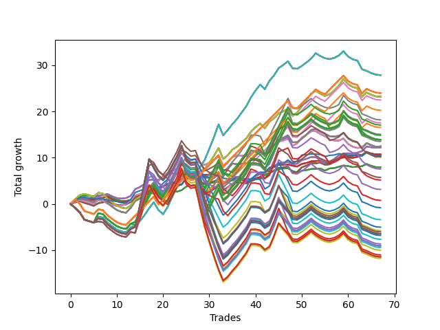

# Short Bulldog 005 
- Symbol: AAPL_Unlimited
- Date Range: 03/23/2022 - 07/08/2022
- Trading Period: 7:20-12:30
- Number of Trades: 67



| Name | Win Percent | Profit | Avg Profit / Trade | Avg Time / Trade |      | Name | Win Percent | Profit | Avg Profit / Trade | Avg Time / Trade |
| ---- | ----------- | ------ | ------------------ | ---------------- | ---- | ---- | ----------- | ------ | ------------------ | ---------------- |
| Sorted By <br> Profit | | | | | | Sorted By <br> Win Percentage ||||
| Seventy-One | 56.72 | 13930.00 | 207.91 | 107:00 |     | Sixty-Five | 73.13 | 5360.00 | 80.00 | 18:18 |
| Sixty-Three | 56.72 | 13930.00 | 207.91 | 107:00 |     | Fifty-Seven | 73.13 | 5360.00 | 80.00 | 18:18 |
| Fifty-Five | 56.72 | 13930.00 | 207.91 | 107:00 |     | Forty-Nine | 73.13 | 5360.00 | 80.00 | 18:18 |
| Forty-Seven | 56.72 | 13930.00 | 207.91 | 107:00 |     | Forty-One | 73.13 | 5360.00 | 80.00 | 18:18 |
| Seven | 56.72 | 13930.00 | 207.91 | 107:00 |     | One | 73.13 | 5360.00 | 80.00 | 18:18 |
| One Hundred Twenty-Six | 64.18 | 11990.00 | 178.96 | 71:10 |     | Sixty-Six | 71.64 | 6105.00 | 91.12 | 25:06 |
| One Hundred Twenty-One | 64.18 | 11990.00 | 178.96 | 71:10 |     | Fifty-Eight | 71.64 | 6105.00 | 91.12 | 25:06 |
| One Hundred Sixteen | 64.18 | 11990.00 | 178.96 | 71:10 |     | Fifty | 71.64 | 6105.00 | 91.12 | 25:06 |
| One Hundred Eleven | 64.18 | 11990.00 | 178.96 | 71:10 |     | Forty-Two | 71.64 | 6105.00 | 91.12 | 25:06 |
| Eighty-One | 64.18 | 11990.00 | 178.96 | 71:10 |     | Two | 71.64 | 6105.00 | 91.12 | 25:06 |
| Seventy | 64.18 | 11590.00 | 172.99 | 71:15 |     | Sixty-Seven | 70.15 | 5155.00 | 76.94 | 30:54 |
| Sixty-Two | 64.18 | 11590.00 | 172.99 | 71:15 |     | Fifty-Nine | 70.15 | 5155.00 | 76.94 | 30:54 |
| Fifty-Four | 64.18 | 11590.00 | 172.99 | 71:15 |     | Fifty-One | 70.15 | 5155.00 | 76.94 | 30:54 |
| Forty-Six | 64.18 | 11590.00 | 172.99 | 71:15 |     | Forty-Three | 70.15 | 5155.00 | 76.94 | 30:54 |
| Six | 64.18 | 11590.00 | 172.99 | 71:15 |     | Three | 70.15 | 5155.00 | 76.94 | 30:54 |
| One Hundred One | 64.18 | 11240.00 | 167.76 | 71:00 |     | Sixty-Four | 70.15 | 3970.00 | 59.25 | 11:58 |
| One Hundred Six | 62.69 | 10130.00 | 151.19 | 70:32 |     | Fifty-Six | 70.15 | 3970.00 | 59.25 | 11:58 |
| Ninety-Two | 49.25 | 9090.00 | 135.67 | 120:18 |     | Forty-Eight | 70.15 | 3970.00 | 59.25 | 11:58 |
| Ninety-One | 61.19 | 8765.00 | 130.82 | 67:58 |     | Forty | 70.15 | 3970.00 | 59.25 | 11:58 |
| One Hundred Seven | 47.76 | 8535.00 | 127.39 | 120:31 |     | Zero | 70.15 | 3970.00 | 59.25 | 11:58 |
| Ninety-Six | 59.70 | 8270.00 | 123.43 | 65:19 |     | One Hundred Twenty-Six | 64.18 | 11990.00 | 178.96 | 71:10 |
| One Hundred Two | 49.25 | 7520.00 | 112.24 | 128:17 |     | One Hundred Twenty-One | 64.18 | 11990.00 | 178.96 | 71:10 |
| One Hundred Seventeen | 49.25 | 7420.00 | 110.75 | 130:22 |     | One Hundred Sixteen | 64.18 | 11990.00 | 178.96 | 71:10 |
| Ninety-Seven | 41.79 | 6965.00 | 103.96 | 105:23 |     | One Hundred Eleven | 64.18 | 11990.00 | 178.96 | 71:10 |
| One Hundred Twenty-Seven | 49.25 | 6935.00 | 103.51 | 131:38 |     | Eighty-One | 64.18 | 11990.00 | 178.96 | 71:10 |
| One Hundred Twenty-Two | 49.25 | 6935.00 | 103.51 | 131:38 |     | Seventy | 64.18 | 11590.00 | 172.99 | 71:15 |
| Eighty-Two | 49.25 | 6935.00 | 103.51 | 131:38 |     | Sixty-Two | 64.18 | 11590.00 | 172.99 | 71:15 |
| One Hundred Twelve | 49.25 | 6760.00 | 100.90 | 131:34 |     | Fifty-Four | 64.18 | 11590.00 | 172.99 | 71:15 |
| Sixty-Eight | 62.69 | 6225.00 | 92.91 | 44:44 |     | Forty-Six | 64.18 | 11590.00 | 172.99 | 71:15 |
| Sixty | 62.69 | 6225.00 | 92.91 | 44:44 |     | Six | 64.18 | 11590.00 | 172.99 | 71:15 |
| Fifty-Two | 62.69 | 6225.00 | 92.91 | 44:44 |     | One Hundred One | 64.18 | 11240.00 | 167.76 | 71:00 |
| Forty-Four | 62.69 | 6225.00 | 92.91 | 44:44 |     | One Hundred Six | 62.69 | 10130.00 | 151.19 | 70:32 |
| Four | 62.69 | 6225.00 | 92.91 | 44:44 |     | Sixty-Eight | 62.69 | 6225.00 | 92.91 | 44:44 |
| Sixty-Nine | 58.21 | 6225.00 | 92.91 | 59:41 |     | Sixty | 62.69 | 6225.00 | 92.91 | 44:44 |
| Sixty-One | 58.21 | 6225.00 | 92.91 | 59:41 |     | Fifty-Two | 62.69 | 6225.00 | 92.91 | 44:44 |
| Fifty-Three | 58.21 | 6225.00 | 92.91 | 59:41 |     | Forty-Four | 62.69 | 6225.00 | 92.91 | 44:44 |
| Forty-Five | 58.21 | 6225.00 | 92.91 | 59:41 |     | Four | 62.69 | 6225.00 | 92.91 | 44:44 |
| Five | 58.21 | 6225.00 | 92.91 | 59:41 |     | Ninety-One | 61.19 | 8765.00 | 130.82 | 67:58 |
| Sixty-Six | 71.64 | 6105.00 | 91.12 | 25:06 |     | Ninety-Six | 59.70 | 8270.00 | 123.43 | 65:19 |
| Fifty-Eight | 71.64 | 6105.00 | 91.12 | 25:06 |     | Sixty-Nine | 58.21 | 6225.00 | 92.91 | 59:41 |
| Fifty | 71.64 | 6105.00 | 91.12 | 25:06 |     | Sixty-One | 58.21 | 6225.00 | 92.91 | 59:41 |
| Forty-Two | 71.64 | 6105.00 | 91.12 | 25:06 |     | Fifty-Three | 58.21 | 6225.00 | 92.91 | 59:41 |
| Two | 71.64 | 6105.00 | 91.12 | 25:06 |     | Forty-Five | 58.21 | 6225.00 | 92.91 | 59:41 |
| Sixty-Five | 73.13 | 5360.00 | 80.00 | 18:18 |     | Five | 58.21 | 6225.00 | 92.91 | 59:41 |
| Fifty-Seven | 73.13 | 5360.00 | 80.00 | 18:18 |     | Seventy-One | 56.72 | 13930.00 | 207.91 | 107:00 |
| Forty-Nine | 73.13 | 5360.00 | 80.00 | 18:18 |     | Sixty-Three | 56.72 | 13930.00 | 207.91 | 107:00 |
| Forty-One | 73.13 | 5360.00 | 80.00 | 18:18 |     | Fifty-Five | 56.72 | 13930.00 | 207.91 | 107:00 |
| One | 73.13 | 5360.00 | 80.00 | 18:18 |     | Forty-Seven | 56.72 | 13930.00 | 207.91 | 107:00 |
| Seventy-Three | 44.78 | 5210.00 | 77.76 | 14:15 |     | Seven | 56.72 | 13930.00 | 207.91 | 107:00 |
| Sixty-Seven | 70.15 | 5155.00 | 76.94 | 30:54 |     | Ninety-Two | 49.25 | 9090.00 | 135.67 | 120:18 |
| Fifty-Nine | 70.15 | 5155.00 | 76.94 | 30:54 |     | One Hundred Two | 49.25 | 7520.00 | 112.24 | 128:17 |
| Fifty-One | 70.15 | 5155.00 | 76.94 | 30:54 |     | One Hundred Seventeen | 49.25 | 7420.00 | 110.75 | 130:22 |
| Forty-Three | 70.15 | 5155.00 | 76.94 | 30:54 |     | One Hundred Twenty-Seven | 49.25 | 6935.00 | 103.51 | 131:38 |
| Three | 70.15 | 5155.00 | 76.94 | 30:54 |     | One Hundred Twenty-Two | 49.25 | 6935.00 | 103.51 | 131:38 |
| One Hundred | 41.79 | 5075.00 | 75.75 | 123:01 |     | Eighty-Two | 49.25 | 6935.00 | 103.51 | 131:38 |
| Sixty-Four | 70.15 | 3970.00 | 59.25 | 11:58 |     | One Hundred Twelve | 49.25 | 6760.00 | 100.90 | 131:34 |
| Fifty-Six | 70.15 | 3970.00 | 59.25 | 11:58 |     | One Hundred Seven | 47.76 | 8535.00 | 127.39 | 120:31 |
| Forty-Eight | 70.15 | 3970.00 | 59.25 | 11:58 |     | Seventy-Three | 44.78 | 5210.00 | 77.76 | 14:15 |
| Forty | 70.15 | 3970.00 | 59.25 | 11:58 |     | Ninety-Seven | 41.79 | 6965.00 | 103.96 | 105:23 |
| Zero | 70.15 | 3970.00 | 59.25 | 11:58 |     | One Hundred | 41.79 | 5075.00 | 75.75 | 123:01 |
| Ninety-Nine | 41.79 | 3775.00 | 56.34 | 120:55 |     | Ninety-Nine | 41.79 | 3775.00 | 56.34 | 120:55 |
| One Hundred Ten | 37.31 | 2870.00 | 42.84 | 142:00 |     | Ninety-Eight | 41.79 | 2590.00 | 38.66 | 117:53 |
| Ninety-Eight | 41.79 | 2590.00 | 38.66 | 117:53 |     | Ninety-Five | 40.30 | -400.00 | -5.97 | 146:00 |
| One Hundred Nine | 37.31 | 1570.00 | 23.43 | 139:55 |     | Ninety-Four | 40.30 | -1700.00 | -25.37 | 143:54 |
| One Hundred Eight | 37.31 | 385.00 | 5.75 | 136:52 |     | One Hundred Five | 40.30 | -2515.00 | -37.54 | 155:25 |
| Ninety-Five | 40.30 | -400.00 | -5.97 | 146:00 |     | Ninety-Three | 40.30 | -2885.00 | -43.06 | 140:52 |
| Ninety-Four | 40.30 | -1700.00 | -25.37 | 143:54 |     | One Hundred Twenty | 40.30 | -3025.00 | -45.15 | 156:19 |
| One Hundred Five | 40.30 | -2515.00 | -37.54 | 155:25 |     | One Hundred Thirty | 40.30 | -3230.00 | -48.21 | 159:20 |
| Ninety-Three | 40.30 | -2885.00 | -43.06 | 140:52 |     | One Hundred Twenty-Five | 40.30 | -3230.00 | -48.21 | 159:20 |
| One Hundred Twenty | 40.30 | -3025.00 | -45.15 | 156:19 |     | Eighty-Five | 40.30 | -3230.00 | -48.21 | 159:20 |
| One Hundred Thirty | 40.30 | -3230.00 | -48.21 | 159:20 |     | One Hundred Fifteen | 40.30 | -3405.00 | -50.82 | 159:15 |
| One Hundred Twenty-Five | 40.30 | -3230.00 | -48.21 | 159:20 |     | One Hundred Four | 40.30 | -3815.00 | -56.94 | 153:20 |
| Eighty-Five | 40.30 | -3230.00 | -48.21 | 159:20 |     | One Hundred Ninteen | 40.30 | -4325.00 | -64.55 | 154:13 |
| One Hundred Fifteen | 40.30 | -3405.00 | -50.82 | 159:15 |     | One Hundred Twenty-Nine | 40.30 | -4530.00 | -67.61 | 157:14 |
| One Hundred Four | 40.30 | -3815.00 | -56.94 | 153:20 |     | One Hundred Twenty-Four | 40.30 | -4530.00 | -67.61 | 157:14 |
| One Hundred Ninteen | 40.30 | -4325.00 | -64.55 | 154:13 |     | Eighty-Four | 40.30 | -4530.00 | -67.61 | 157:14 |
| One Hundred Twenty-Nine | 40.30 | -4530.00 | -67.61 | 157:14 |     | One Hundred Fourteen | 40.30 | -4705.00 | -70.22 | 157:10 |
| One Hundred Twenty-Four | 40.30 | -4530.00 | -67.61 | 157:14 |     | One Hundred Three | 40.30 | -5000.00 | -74.63 | 150:17 |
| Eighty-Four | 40.30 | -4530.00 | -67.61 | 157:14 |     | One Hundred Eighteen | 40.30 | -5510.00 | -82.24 | 151:11 |
| One Hundred Fourteen | 40.30 | -4705.00 | -70.22 | 157:10 |     | One Hundred Twenty-Eight | 40.30 | -5715.00 | -85.30 | 154:12 |
| One Hundred Three | 40.30 | -5000.00 | -74.63 | 150:17 |     | One Hundred Twenty-Three | 40.30 | -5715.00 | -85.30 | 154:12 |
| One Hundred Eighteen | 40.30 | -5510.00 | -82.24 | 151:11 |     | Eighty-Three | 40.30 | -5715.00 | -85.30 | 154:12 |
| One Hundred Twenty-Eight | 40.30 | -5715.00 | -85.30 | 154:12 |     | One Hundred Thirteen | 40.30 | -5890.00 | -87.91 | 154:07 |
| One Hundred Twenty-Three | 40.30 | -5715.00 | -85.30 | 154:12 |     | One Hundred Ten | 37.31 | 2870.00 | 42.84 | 142:00 |
| Eighty-Three | 40.30 | -5715.00 | -85.30 | 154:12 |     | One Hundred Nine | 37.31 | 1570.00 | 23.43 | 139:55 |
| One Hundred Thirteen | 40.30 | -5890.00 | -87.91 | 154:07 |     | One Hundred Eight | 37.31 | 385.00 | 5.75 | 136:52 |

## NO STOPLOSS

### Test Zero
* Sell when price hits the middle line of the 20p bollinger
* No Stoploss
* Results:
```
Total Trades: 67
Percent Up: 29.85
Percent Down: 70.15
Total Points Moved Down: 7.94
Potential Profit: 3970.00
Total Points Ups: 4.90 Count Ups: 20
Total Points Downs: 12.84 Count Downs: 47
```

<details><summary>Trades</summary>

<code>In: 2022-03-24 10:02:00		Out: 2022-03-24 10:09:20		Total Position Time: 07:20		Total Move Down: 0.88		Total to Date: 0.88</code> <br />
<code>In: 2022-03-24 10:03:00		Out: 2022-03-24 10:09:20		Total Position Time: 06:20		Total Move Down: 0.77		Total to Date: 1.65</code> <br />
<code>In: 2022-03-24 10:04:00		Out: 2022-03-24 10:09:20		Total Position Time: 05:20		Total Move Down: 0.17		Total to Date: 1.82</code> <br />
<code>In: 2022-03-24 12:12:00		Out: 2022-03-24 12:32:50		Total Position Time: 20:50		Total Move Down: -0.07		Total to Date: 1.75</code> <br />
<code>In: 2022-03-24 12:13:00		Out: 2022-03-24 12:32:50		Total Position Time: 19:50		Total Move Down: -0.11		Total to Date: 1.64</code> <br />
<code>In: 2022-03-25 07:44:00		Out: 2022-03-25 07:51:25		Total Position Time: 07:25		Total Move Down: 0.19		Total to Date: 1.83</code> <br />
<code>In: 2022-03-28 12:01:00		Out: 2022-03-28 12:02:10		Total Position Time: 01:10		Total Move Down: 0.09		Total to Date: 1.92</code> <br />
<code>In: 2022-03-29 10:50:00		Out: 2022-03-29 11:04:05		Total Position Time: 14:05		Total Move Down: 0.07		Total to Date: 1.99</code> <br />
<code>In: 2022-03-29 11:50:00		Out: 2022-03-29 12:25:30		Total Position Time: 35:30		Total Move Down: -0.60		Total to Date: 1.39</code> <br />
<code>In: 2022-03-29 11:55:00		Out: 2022-03-29 12:25:30		Total Position Time: 30:30		Total Move Down: -0.51		Total to Date: 0.88</code> <br />
<code>In: 2022-03-29 12:06:00		Out: 2022-03-29 12:25:30		Total Position Time: 19:30		Total Move Down: -0.23		Total to Date: 0.65</code> <br />
<code>In: 2022-03-29 12:10:00		Out: 2022-03-29 12:25:30		Total Position Time: 15:30		Total Move Down: -0.00		Total to Date: 0.65</code> <br />
<code>In: 2022-03-31 12:04:00		Out: 2022-03-31 12:12:15		Total Position Time: 08:15		Total Move Down: 0.25		Total to Date: 0.90</code> <br />
<code>In: 2022-04-06 11:06:00		Out: 2022-04-06 11:07:50		Total Position Time: 01:50		Total Move Down: 0.52		Total to Date: 1.42</code> <br />
<code>In: 2022-04-21 07:33:00		Out: 2022-04-21 07:41:00		Total Position Time: 08:00		Total Move Down: 0.29		Total to Date: 1.71</code> <br />
<code>In: 2022-04-21 08:27:00		Out: 2022-04-21 08:32:30		Total Position Time: 05:30		Total Move Down: 0.23		Total to Date: 1.94</code> <br />
<code>In: 2022-04-21 08:29:00		Out: 2022-04-21 08:32:30		Total Position Time: 03:30		Total Move Down: 0.42		Total to Date: 2.36</code> <br />
<code>In: 2022-04-25 07:28:00		Out: 2022-04-25 07:43:00		Total Position Time: 15:00		Total Move Down: -0.08		Total to Date: 2.28</code> <br />
<code>In: 2022-04-25 11:25:00		Out: 2022-04-25 11:40:00		Total Position Time: 15:00		Total Move Down: 0.08		Total to Date: 2.36</code> <br />
<code>In: 2022-04-25 11:50:00		Out: 2022-04-25 11:59:15		Total Position Time: 09:15		Total Move Down: 0.27		Total to Date: 2.63</code> <br />
<code>In: 2022-04-27 08:37:00		Out: 2022-04-27 08:40:30		Total Position Time: 03:30		Total Move Down: 0.36		Total to Date: 2.99</code> <br />
<code>In: 2022-04-27 09:25:00		Out: 2022-04-27 09:41:10		Total Position Time: 16:10		Total Move Down: -0.15		Total to Date: 2.84</code> <br />
<code>In: 2022-04-27 09:27:00		Out: 2022-04-27 09:41:10		Total Position Time: 14:10		Total Move Down: -0.18		Total to Date: 2.66</code> <br />
<code>In: 2022-04-27 09:30:00		Out: 2022-04-27 09:41:10		Total Position Time: 11:10		Total Move Down: 0.30		Total to Date: 2.96</code> <br />
<code>In: 2022-04-28 07:23:00		Out: 2022-04-28 07:27:00		Total Position Time: 04:00		Total Move Down: 0.79		Total to Date: 3.75</code> <br />
<code>In: 2022-04-28 09:49:00		Out: 2022-04-28 09:57:10		Total Position Time: 08:10		Total Move Down: 0.21		Total to Date: 3.96</code> <br />
<code>In: 2022-05-03 08:10:00		Out: 2022-05-03 08:27:15		Total Position Time: 17:15		Total Move Down: 0.15		Total to Date: 4.11</code> <br />
<code>In: 2022-05-04 08:56:00		Out: 2022-05-04 09:04:40		Total Position Time: 08:40		Total Move Down: 0.33		Total to Date: 4.44</code> <br />
<code>In: 2022-05-04 09:24:00		Out: 2022-05-04 09:42:25		Total Position Time: 18:25		Total Move Down: 0.02		Total to Date: 4.46</code> <br />
<code>In: 2022-05-04 10:37:00		Out: 2022-05-04 10:50:05		Total Position Time: 13:05		Total Move Down: 0.02		Total to Date: 4.48</code> <br />
<code>In: 2022-05-04 10:40:00		Out: 2022-05-04 10:50:05		Total Position Time: 10:05		Total Move Down: 0.15		Total to Date: 4.63</code> <br />
<code>In: 2022-05-04 11:03:00		Out: 2022-05-04 11:06:30		Total Position Time: 03:30		Total Move Down: 0.17		Total to Date: 4.80</code> <br />
<code>In: 2022-05-04 11:49:00		Out: 2022-05-04 12:07:00		Total Position Time: 18:00		Total Move Down: -0.33		Total to Date: 4.47</code> <br />
<code>In: 2022-05-16 07:22:00		Out: 2022-05-16 07:32:15		Total Position Time: 10:15		Total Move Down: 0.29		Total to Date: 4.76</code> <br />
<code>In: 2022-05-16 08:57:00		Out: 2022-05-16 09:05:45		Total Position Time: 08:45		Total Move Down: 0.36		Total to Date: 5.12</code> <br />
<code>In: 2022-05-16 10:25:00		Out: 2022-05-16 10:37:10		Total Position Time: 12:10		Total Move Down: 0.13		Total to Date: 5.25</code> <br />
<code>In: 2022-05-16 11:07:00		Out: 2022-05-16 11:26:05		Total Position Time: 19:05		Total Move Down: -0.08		Total to Date: 5.17</code> <br />
<code>In: 2022-05-16 11:08:00		Out: 2022-05-16 11:26:05		Total Position Time: 18:05		Total Move Down: -0.11		Total to Date: 5.06</code> <br />
<code>In: 2022-05-16 11:32:00		Out: 2022-05-16 11:44:55		Total Position Time: 12:55		Total Move Down: 0.06		Total to Date: 5.12</code> <br />
<code>In: 2022-05-17 11:10:00		Out: 2022-05-17 11:11:50		Total Position Time: 01:50		Total Move Down: 0.35		Total to Date: 5.47</code> <br />
<code>In: 2022-05-17 11:11:00		Out: 2022-05-17 11:12:15		Total Position Time: 01:15		Total Move Down: 0.18		Total to Date: 5.65</code> <br />
<code>In: 2022-05-23 07:50:00		Out: 2022-05-23 07:51:20		Total Position Time: 01:20		Total Move Down: 0.57		Total to Date: 6.22</code> <br />
<code>In: 2022-05-25 07:36:00		Out: 2022-05-25 07:41:55		Total Position Time: 05:55		Total Move Down: 0.57		Total to Date: 6.79</code> <br />
<code>In: 2022-06-13 08:26:00		Out: 2022-06-13 08:37:10		Total Position Time: 11:10		Total Move Down: 0.34		Total to Date: 7.13</code> <br />
<code>In: 2022-06-13 09:37:00		Out: 2022-06-13 09:44:50		Total Position Time: 07:50		Total Move Down: 0.34		Total to Date: 7.47</code> <br />
<code>In: 2022-06-15 09:04:00		Out: 2022-06-15 09:08:20		Total Position Time: 04:20		Total Move Down: 0.19		Total to Date: 7.66</code> <br />
<code>In: 2022-06-15 09:19:00		Out: 2022-06-15 09:29:05		Total Position Time: 10:05		Total Move Down: 0.05		Total to Date: 7.71</code> <br />
<code>In: 2022-06-15 11:40:00		Out: 2022-06-15 11:54:15		Total Position Time: 14:15		Total Move Down: -0.59		Total to Date: 7.12</code> <br />
<code>In: 2022-06-17 08:21:00		Out: 2022-06-17 08:38:40		Total Position Time: 17:40		Total Move Down: -0.33		Total to Date: 6.79</code> <br />
<code>In: 2022-06-17 08:32:00		Out: 2022-06-17 08:38:40		Total Position Time: 06:40		Total Move Down: 0.39		Total to Date: 7.18</code> <br />
<code>In: 2022-06-17 10:11:00		Out: 2022-06-17 10:21:05		Total Position Time: 10:05		Total Move Down: 0.13		Total to Date: 7.31</code> <br />
<code>In: 2022-06-17 10:14:00		Out: 2022-06-17 10:21:05		Total Position Time: 07:05		Total Move Down: 0.25		Total to Date: 7.56</code> <br />
<code>In: 2022-06-23 07:45:00		Out: 2022-06-23 08:01:10		Total Position Time: 16:10		Total Move Down: 0.03		Total to Date: 7.59</code> <br />
<code>In: 2022-06-23 12:08:00		Out: 2022-06-23 12:18:05		Total Position Time: 10:05		Total Move Down: 0.07		Total to Date: 7.66</code> <br />
<code>In: 2022-06-23 12:30:00		Out: 2022-06-23 12:47:00		Total Position Time: 17:00		Total Move Down: -0.46		Total to Date: 7.20</code> <br />
<code>In: 2022-06-30 08:29:00		Out: 2022-06-30 08:36:00		Total Position Time: 07:00		Total Move Down: 0.48		Total to Date: 7.68</code> <br />
<code>In: 2022-06-30 08:49:00		Out: 2022-06-30 09:04:05		Total Position Time: 15:05		Total Move Down: 0.07		Total to Date: 7.75</code> <br />
<code>In: 2022-06-30 08:53:00		Out: 2022-06-30 09:04:05		Total Position Time: 11:05		Total Move Down: 0.30		Total to Date: 8.05</code> <br />
<code>In: 2022-06-30 09:27:00		Out: 2022-06-30 09:38:05		Total Position Time: 11:05		Total Move Down: 0.27		Total to Date: 8.32</code> <br />
<code>In: 2022-07-01 10:47:00		Out: 2022-07-01 11:04:25		Total Position Time: 17:25		Total Move Down: -0.12		Total to Date: 8.20</code> <br />
<code>In: 2022-07-01 11:26:00		Out: 2022-07-01 11:54:10		Total Position Time: 28:10		Total Move Down: -0.24		Total to Date: 7.96</code> <br />
<code>In: 2022-07-01 11:48:00		Out: 2022-07-01 11:54:10		Total Position Time: 06:10		Total Move Down: 0.09		Total to Date: 8.05</code> <br />
<code>In: 2022-07-05 08:49:00		Out: 2022-07-05 09:02:55		Total Position Time: 13:55		Total Move Down: 0.12		Total to Date: 8.17</code> <br />
<code>In: 2022-07-06 11:09:00		Out: 2022-07-06 11:11:05		Total Position Time: 02:05		Total Move Down: 0.48		Total to Date: 8.65</code> <br />
<code>In: 2022-07-06 11:31:00		Out: 2022-07-06 12:00:50		Total Position Time: 29:50		Total Move Down: -0.40		Total to Date: 8.25</code> <br />
<code>In: 2022-07-06 11:33:00		Out: 2022-07-06 12:00:50		Total Position Time: 27:50		Total Move Down: -0.28		Total to Date: 7.97</code> <br />
<code>In: 2022-07-08 11:36:00		Out: 2022-07-08 11:49:05		Total Position Time: 13:05		Total Move Down: -0.03		Total to Date: 7.94</code> <br />


</details>

### Test One
* Sell when the price hits the upper line of the 20p 1std bollinger
* No Stoploss
* Results:
```
Total Trades: 67
Percent Up: 26.87
Percent Down: 73.13
Total Points Moved Down: 10.72
Potential Profit: 5360.00
Total Points Ups: 6.42 Count Ups: 18
Total Points Downs: 17.14 Count Downs: 49
```

<details><summary>Trades</summary>

<code>In: 2022-03-24 10:02:00		Out: 2022-03-24 10:33:15		Total Position Time: 31:15		Total Move Down: 0.58		Total to Date: 0.58</code> <br />
<code>In: 2022-03-24 10:03:00		Out: 2022-03-24 10:33:15		Total Position Time: 30:15		Total Move Down: 0.47		Total to Date: 1.05</code> <br />
<code>In: 2022-03-24 10:04:00		Out: 2022-03-24 10:33:15		Total Position Time: 29:15		Total Move Down: -0.13		Total to Date: 0.92</code> <br />
<code>In: 2022-03-24 12:12:00		Out: 2022-03-24 12:39:00		Total Position Time: 27:00		Total Move Down: 0.01		Total to Date: 0.93</code> <br />
<code>In: 2022-03-24 12:13:00		Out: 2022-03-24 12:39:00		Total Position Time: 26:00		Total Move Down: -0.03		Total to Date: 0.90</code> <br />
<code>In: 2022-03-25 07:44:00		Out: 2022-03-25 07:54:05		Total Position Time: 10:05		Total Move Down: 0.30		Total to Date: 1.20</code> <br />
<code>In: 2022-03-28 12:01:00		Out: 2022-03-28 12:03:35		Total Position Time: 02:35		Total Move Down: 0.18		Total to Date: 1.38</code> <br />
<code>In: 2022-03-29 10:50:00		Out: 2022-03-29 11:06:05		Total Position Time: 16:05		Total Move Down: 0.15		Total to Date: 1.53</code> <br />
<code>In: 2022-03-29 11:50:00		Out: 2022-03-29 12:27:40		Total Position Time: 37:40		Total Move Down: -0.52		Total to Date: 1.01</code> <br />
<code>In: 2022-03-29 11:55:00		Out: 2022-03-29 12:27:40		Total Position Time: 32:40		Total Move Down: -0.43		Total to Date: 0.58</code> <br />
<code>In: 2022-03-29 12:06:00		Out: 2022-03-29 12:27:40		Total Position Time: 21:40		Total Move Down: -0.15		Total to Date: 0.43</code> <br />
<code>In: 2022-03-29 12:10:00		Out: 2022-03-29 12:27:40		Total Position Time: 17:40		Total Move Down: 0.08		Total to Date: 0.51</code> <br />
<code>In: 2022-03-31 12:04:00		Out: 2022-03-31 12:16:05		Total Position Time: 12:05		Total Move Down: 0.36		Total to Date: 0.87</code> <br />
<code>In: 2022-04-06 11:06:00		Out: 2022-04-06 11:09:20		Total Position Time: 03:20		Total Move Down: 0.83		Total to Date: 1.70</code> <br />
<code>In: 2022-04-21 07:33:00		Out: 2022-04-21 07:47:25		Total Position Time: 14:25		Total Move Down: 0.33		Total to Date: 2.03</code> <br />
<code>In: 2022-04-21 08:27:00		Out: 2022-04-21 08:33:45		Total Position Time: 06:45		Total Move Down: 0.46		Total to Date: 2.49</code> <br />
<code>In: 2022-04-21 08:29:00		Out: 2022-04-21 08:33:45		Total Position Time: 04:45		Total Move Down: 0.65		Total to Date: 3.14</code> <br />
<code>In: 2022-04-25 07:28:00		Out: 2022-04-25 07:45:10		Total Position Time: 17:10		Total Move Down: 0.05		Total to Date: 3.19</code> <br />
<code>In: 2022-04-25 11:25:00		Out: 2022-04-25 11:44:50		Total Position Time: 19:50		Total Move Down: 0.07		Total to Date: 3.26</code> <br />
<code>In: 2022-04-25 11:50:00		Out: 2022-04-25 12:02:00		Total Position Time: 12:00		Total Move Down: 0.51		Total to Date: 3.77</code> <br />
<code>In: 2022-04-27 08:37:00		Out: 2022-04-27 08:45:20		Total Position Time: 08:20		Total Move Down: 0.52		Total to Date: 4.29</code> <br />
<code>In: 2022-04-27 09:25:00		Out: 2022-04-27 09:50:25		Total Position Time: 25:25		Total Move Down: -0.17		Total to Date: 4.12</code> <br />
<code>In: 2022-04-27 09:27:00		Out: 2022-04-27 09:50:25		Total Position Time: 23:25		Total Move Down: -0.20		Total to Date: 3.92</code> <br />
<code>In: 2022-04-27 09:30:00		Out: 2022-04-27 09:50:25		Total Position Time: 20:25		Total Move Down: 0.28		Total to Date: 4.20</code> <br />
<code>In: 2022-04-28 07:23:00		Out: 2022-04-28 07:29:40		Total Position Time: 06:40		Total Move Down: 1.21		Total to Date: 5.41</code> <br />
<code>In: 2022-04-28 09:49:00		Out: 2022-04-28 10:02:15		Total Position Time: 13:15		Total Move Down: 0.29		Total to Date: 5.70</code> <br />
<code>In: 2022-05-03 08:10:00		Out: 2022-05-03 08:36:05		Total Position Time: 26:05		Total Move Down: 0.20		Total to Date: 5.90</code> <br />
<code>In: 2022-05-04 08:56:00		Out: 2022-05-04 09:10:15		Total Position Time: 14:15		Total Move Down: 0.30		Total to Date: 6.20</code> <br />
<code>In: 2022-05-04 09:24:00		Out: 2022-05-04 09:46:30		Total Position Time: 22:30		Total Move Down: 0.09		Total to Date: 6.29</code> <br />
<code>In: 2022-05-04 10:37:00		Out: 2022-05-04 10:54:25		Total Position Time: 17:25		Total Move Down: 0.02		Total to Date: 6.31</code> <br />
<code>In: 2022-05-04 10:40:00		Out: 2022-05-04 10:54:25		Total Position Time: 14:25		Total Move Down: 0.15		Total to Date: 6.46</code> <br />
<code>In: 2022-05-04 11:03:00		Out: 2022-05-04 11:07:05		Total Position Time: 04:05		Total Move Down: 0.42		Total to Date: 6.88</code> <br />
<code>In: 2022-05-04 11:49:00		Out: 2022-05-04 12:47:00		Total Position Time: 58:00		Total Move Down: -2.39		Total to Date: 4.49</code> <br />
<code>In: 2022-05-16 07:22:00		Out: 2022-05-16 07:34:05		Total Position Time: 12:05		Total Move Down: 0.48		Total to Date: 4.97</code> <br />
<code>In: 2022-05-16 08:57:00		Out: 2022-05-16 09:11:30		Total Position Time: 14:30		Total Move Down: 0.47		Total to Date: 5.44</code> <br />
<code>In: 2022-05-16 10:25:00		Out: 2022-05-16 10:42:25		Total Position Time: 17:25		Total Move Down: 0.15		Total to Date: 5.59</code> <br />
<code>In: 2022-05-16 11:07:00		Out: 2022-05-16 11:48:45		Total Position Time: 41:45		Total Move Down: -0.38		Total to Date: 5.21</code> <br />
<code>In: 2022-05-16 11:08:00		Out: 2022-05-16 11:48:45		Total Position Time: 40:45		Total Move Down: -0.41		Total to Date: 4.80</code> <br />
<code>In: 2022-05-16 11:32:00		Out: 2022-05-16 11:48:45		Total Position Time: 16:45		Total Move Down: 0.13		Total to Date: 4.93</code> <br />
<code>In: 2022-05-17 11:10:00		Out: 2022-05-17 11:13:15		Total Position Time: 03:15		Total Move Down: 0.57		Total to Date: 5.50</code> <br />
<code>In: 2022-05-17 11:11:00		Out: 2022-05-17 11:13:15		Total Position Time: 02:15		Total Move Down: 0.34		Total to Date: 5.84</code> <br />
<code>In: 2022-05-23 07:50:00		Out: 2022-05-23 07:53:00		Total Position Time: 03:00		Total Move Down: 0.91		Total to Date: 6.75</code> <br />
<code>In: 2022-05-25 07:36:00		Out: 2022-05-25 07:43:30		Total Position Time: 07:30		Total Move Down: 0.91		Total to Date: 7.66</code> <br />
<code>In: 2022-06-13 08:26:00		Out: 2022-06-13 08:46:30		Total Position Time: 20:30		Total Move Down: 0.33		Total to Date: 7.99</code> <br />
<code>In: 2022-06-13 09:37:00		Out: 2022-06-13 09:48:10		Total Position Time: 11:10		Total Move Down: 0.48		Total to Date: 8.47</code> <br />
<code>In: 2022-06-15 09:04:00		Out: 2022-06-15 09:33:30		Total Position Time: 29:30		Total Move Down: -0.02		Total to Date: 8.45</code> <br />
<code>In: 2022-06-15 09:19:00		Out: 2022-06-15 09:33:30		Total Position Time: 14:30		Total Move Down: 0.09		Total to Date: 8.54</code> <br />
<code>In: 2022-06-15 11:40:00		Out: 2022-06-15 11:58:05		Total Position Time: 18:05		Total Move Down: -0.27		Total to Date: 8.27</code> <br />
<code>In: 2022-06-17 08:21:00		Out: 2022-06-17 08:42:50		Total Position Time: 21:50		Total Move Down: -0.17		Total to Date: 8.10</code> <br />
<code>In: 2022-06-17 08:32:00		Out: 2022-06-17 08:42:50		Total Position Time: 10:50		Total Move Down: 0.55		Total to Date: 8.65</code> <br />
<code>In: 2022-06-17 10:11:00		Out: 2022-06-17 10:26:30		Total Position Time: 15:30		Total Move Down: 0.22		Total to Date: 8.87</code> <br />
<code>In: 2022-06-17 10:14:00		Out: 2022-06-17 10:26:30		Total Position Time: 12:30		Total Move Down: 0.34		Total to Date: 9.21</code> <br />
<code>In: 2022-06-23 07:45:00		Out: 2022-06-23 08:04:35		Total Position Time: 19:35		Total Move Down: 0.05		Total to Date: 9.26</code> <br />
<code>In: 2022-06-23 12:08:00		Out: 2022-06-23 12:18:25		Total Position Time: 10:25		Total Move Down: 0.15		Total to Date: 9.41</code> <br />
<code>In: 2022-06-23 12:30:00		Out: 2022-06-23 12:47:00		Total Position Time: 17:00		Total Move Down: -0.46		Total to Date: 8.95</code> <br />
<code>In: 2022-06-30 08:29:00		Out: 2022-06-30 09:05:45		Total Position Time: 36:45		Total Move Down: -0.07		Total to Date: 8.88</code> <br />
<code>In: 2022-06-30 08:49:00		Out: 2022-06-30 09:05:45		Total Position Time: 16:45		Total Move Down: 0.39		Total to Date: 9.27</code> <br />
<code>In: 2022-06-30 08:53:00		Out: 2022-06-30 09:05:45		Total Position Time: 12:45		Total Move Down: 0.62		Total to Date: 9.89</code> <br />
<code>In: 2022-06-30 09:27:00		Out: 2022-06-30 09:49:55		Total Position Time: 22:55		Total Move Down: 0.16		Total to Date: 10.05</code> <br />
<code>In: 2022-07-01 10:47:00		Out: 2022-07-01 11:07:55		Total Position Time: 20:55		Total Move Down: 0.01		Total to Date: 10.06</code> <br />
<code>In: 2022-07-01 11:26:00		Out: 2022-07-01 11:54:40		Total Position Time: 28:40		Total Move Down: -0.10		Total to Date: 9.96</code> <br />
<code>In: 2022-07-01 11:48:00		Out: 2022-07-01 11:54:40		Total Position Time: 06:40		Total Move Down: 0.23		Total to Date: 10.19</code> <br />
<code>In: 2022-07-05 08:49:00		Out: 2022-07-05 09:03:30		Total Position Time: 14:30		Total Move Down: 0.28		Total to Date: 10.47</code> <br />
<code>In: 2022-07-06 11:09:00		Out: 2022-07-06 11:11:50		Total Position Time: 02:50		Total Move Down: 0.76		Total to Date: 11.23</code> <br />
<code>In: 2022-07-06 11:31:00		Out: 2022-07-06 12:01:25		Total Position Time: 30:25		Total Move Down: -0.32		Total to Date: 10.91</code> <br />
<code>In: 2022-07-06 11:33:00		Out: 2022-07-06 12:01:25		Total Position Time: 28:25		Total Move Down: -0.20		Total to Date: 10.71</code> <br />
<code>In: 2022-07-08 11:36:00		Out: 2022-07-08 11:53:40		Total Position Time: 17:40		Total Move Down: 0.01		Total to Date: 10.72</code> <br />


</details>

### Test Two
* Sell when the price hits the upper line of the 20p 2std bollinger
* No Stoploss
* Results:
```
Total Trades: 67
Percent Up: 28.36
Percent Down: 71.64
Total Points Moved Down: 12.21
Potential Profit: 6105.00
Total Points Ups: 8.40 Count Ups: 19
Total Points Downs: 20.61 Count Downs: 48
```

<details><summary>Trades</summary>

<code>In: 2022-03-24 10:02:00		Out: 2022-03-24 10:34:15		Total Position Time: 32:15		Total Move Down: 0.64		Total to Date: 0.64</code> <br />
<code>In: 2022-03-24 10:03:00		Out: 2022-03-24 10:34:15		Total Position Time: 31:15		Total Move Down: 0.53		Total to Date: 1.17</code> <br />
<code>In: 2022-03-24 10:04:00		Out: 2022-03-24 10:34:15		Total Position Time: 30:15		Total Move Down: -0.07		Total to Date: 1.10</code> <br />
<code>In: 2022-03-24 12:12:00		Out: 2022-03-24 12:39:40		Total Position Time: 27:40		Total Move Down: 0.11		Total to Date: 1.21</code> <br />
<code>In: 2022-03-24 12:13:00		Out: 2022-03-24 12:39:40		Total Position Time: 26:40		Total Move Down: 0.07		Total to Date: 1.28</code> <br />
<code>In: 2022-03-25 07:44:00		Out: 2022-03-25 07:55:35		Total Position Time: 11:35		Total Move Down: 0.48		Total to Date: 1.76</code> <br />
<code>In: 2022-03-28 12:01:00		Out: 2022-03-28 12:13:00		Total Position Time: 12:00		Total Move Down: 0.17		Total to Date: 1.93</code> <br />
<code>In: 2022-03-29 10:50:00		Out: 2022-03-29 11:07:05		Total Position Time: 17:05		Total Move Down: 0.21		Total to Date: 2.14</code> <br />
<code>In: 2022-03-29 11:50:00		Out: 2022-03-29 12:27:50		Total Position Time: 37:50		Total Move Down: -0.48		Total to Date: 1.66</code> <br />
<code>In: 2022-03-29 11:55:00		Out: 2022-03-29 12:27:50		Total Position Time: 32:50		Total Move Down: -0.39		Total to Date: 1.27</code> <br />
<code>In: 2022-03-29 12:06:00		Out: 2022-03-29 12:27:50		Total Position Time: 21:50		Total Move Down: -0.11		Total to Date: 1.16</code> <br />
<code>In: 2022-03-29 12:10:00		Out: 2022-03-29 12:27:50		Total Position Time: 17:50		Total Move Down: 0.12		Total to Date: 1.28</code> <br />
<code>In: 2022-03-31 12:04:00		Out: 2022-03-31 12:18:15		Total Position Time: 14:15		Total Move Down: 0.46		Total to Date: 1.74</code> <br />
<code>In: 2022-04-06 11:06:00		Out: 2022-04-06 11:15:10		Total Position Time: 09:10		Total Move Down: 1.46		Total to Date: 3.20</code> <br />
<code>In: 2022-04-21 07:33:00		Out: 2022-04-21 07:47:55		Total Position Time: 14:55		Total Move Down: 0.46		Total to Date: 3.66</code> <br />
<code>In: 2022-04-21 08:27:00		Out: 2022-04-21 08:45:05		Total Position Time: 18:05		Total Move Down: 0.66		Total to Date: 4.32</code> <br />
<code>In: 2022-04-21 08:29:00		Out: 2022-04-21 08:45:05		Total Position Time: 16:05		Total Move Down: 0.85		Total to Date: 5.17</code> <br />
<code>In: 2022-04-25 07:28:00		Out: 2022-04-25 07:51:05		Total Position Time: 23:05		Total Move Down: 0.06		Total to Date: 5.23</code> <br />
<code>In: 2022-04-25 11:25:00		Out: 2022-04-25 12:03:15		Total Position Time: 38:15		Total Move Down: -0.03		Total to Date: 5.20</code> <br />
<code>In: 2022-04-25 11:50:00		Out: 2022-04-25 12:03:15		Total Position Time: 13:15		Total Move Down: 0.76		Total to Date: 5.96</code> <br />
<code>In: 2022-04-27 08:37:00		Out: 2022-04-27 08:52:25		Total Position Time: 15:25		Total Move Down: 0.62		Total to Date: 6.58</code> <br />
<code>In: 2022-04-27 09:25:00		Out: 2022-04-27 09:53:40		Total Position Time: 28:40		Total Move Down: 0.02		Total to Date: 6.60</code> <br />
<code>In: 2022-04-27 09:27:00		Out: 2022-04-27 09:53:40		Total Position Time: 26:40		Total Move Down: -0.01		Total to Date: 6.59</code> <br />
<code>In: 2022-04-27 09:30:00		Out: 2022-04-27 09:53:40		Total Position Time: 23:40		Total Move Down: 0.47		Total to Date: 7.06</code> <br />
<code>In: 2022-04-28 07:23:00		Out: 2022-04-28 08:28:30		Total Position Time: 65:30		Total Move Down: -0.73		Total to Date: 6.33</code> <br />
<code>In: 2022-04-28 09:49:00		Out: 2022-04-28 11:06:20		Total Position Time: 77:20		Total Move Down: -0.63		Total to Date: 5.70</code> <br />
<code>In: 2022-05-03 08:10:00		Out: 2022-05-03 08:37:20		Total Position Time: 27:20		Total Move Down: 0.36		Total to Date: 6.06</code> <br />
<code>In: 2022-05-04 08:56:00		Out: 2022-05-04 09:12:25		Total Position Time: 16:25		Total Move Down: 0.40		Total to Date: 6.46</code> <br />
<code>In: 2022-05-04 09:24:00		Out: 2022-05-04 10:55:15		Total Position Time: 91:15		Total Move Down: -0.82		Total to Date: 5.64</code> <br />
<code>In: 2022-05-04 10:37:00		Out: 2022-05-04 10:55:15		Total Position Time: 18:15		Total Move Down: 0.05		Total to Date: 5.69</code> <br />
<code>In: 2022-05-04 10:40:00		Out: 2022-05-04 10:55:15		Total Position Time: 15:15		Total Move Down: 0.18		Total to Date: 5.87</code> <br />
<code>In: 2022-05-04 11:03:00		Out: 2022-05-04 11:07:25		Total Position Time: 04:25		Total Move Down: 0.79		Total to Date: 6.66</code> <br />
<code>In: 2022-05-04 11:49:00		Out: 2022-05-04 12:47:00		Total Position Time: 58:00		Total Move Down: -2.39		Total to Date: 4.27</code> <br />
<code>In: 2022-05-16 07:22:00		Out: 2022-05-16 07:34:45		Total Position Time: 12:45		Total Move Down: 0.83		Total to Date: 5.10</code> <br />
<code>In: 2022-05-16 08:57:00		Out: 2022-05-16 09:14:40		Total Position Time: 17:40		Total Move Down: 0.60		Total to Date: 5.70</code> <br />
<code>In: 2022-05-16 10:25:00		Out: 2022-05-16 10:42:35		Total Position Time: 17:35		Total Move Down: 0.20		Total to Date: 5.90</code> <br />
<code>In: 2022-05-16 11:07:00		Out: 2022-05-16 11:48:45		Total Position Time: 41:45		Total Move Down: -0.38		Total to Date: 5.52</code> <br />
<code>In: 2022-05-16 11:08:00		Out: 2022-05-16 11:48:45		Total Position Time: 40:45		Total Move Down: -0.41		Total to Date: 5.11</code> <br />
<code>In: 2022-05-16 11:32:00		Out: 2022-05-16 11:48:45		Total Position Time: 16:45		Total Move Down: 0.13		Total to Date: 5.24</code> <br />
<code>In: 2022-05-17 11:10:00		Out: 2022-05-17 11:13:30		Total Position Time: 03:30		Total Move Down: 0.75		Total to Date: 5.99</code> <br />
<code>In: 2022-05-17 11:11:00		Out: 2022-05-17 11:13:30		Total Position Time: 02:30		Total Move Down: 0.52		Total to Date: 6.51</code> <br />
<code>In: 2022-05-23 07:50:00		Out: 2022-05-23 08:27:55		Total Position Time: 37:55		Total Move Down: 0.14		Total to Date: 6.65</code> <br />
<code>In: 2022-05-25 07:36:00		Out: 2022-05-25 07:48:05		Total Position Time: 12:05		Total Move Down: 1.02		Total to Date: 7.67</code> <br />
<code>In: 2022-06-13 08:26:00		Out: 2022-06-13 08:47:05		Total Position Time: 21:05		Total Move Down: 0.48		Total to Date: 8.15</code> <br />
<code>In: 2022-06-13 09:37:00		Out: 2022-06-13 09:54:10		Total Position Time: 17:10		Total Move Down: 0.68		Total to Date: 8.83</code> <br />
<code>In: 2022-06-15 09:04:00		Out: 2022-06-15 09:34:20		Total Position Time: 30:20		Total Move Down: 0.07		Total to Date: 8.90</code> <br />
<code>In: 2022-06-15 09:19:00		Out: 2022-06-15 09:34:20		Total Position Time: 15:20		Total Move Down: 0.18		Total to Date: 9.08</code> <br />
<code>In: 2022-06-15 11:40:00		Out: 2022-06-15 12:13:05		Total Position Time: 33:05		Total Move Down: -0.44		Total to Date: 8.64</code> <br />
<code>In: 2022-06-17 08:21:00		Out: 2022-06-17 08:44:55		Total Position Time: 23:55		Total Move Down: 0.06		Total to Date: 8.70</code> <br />
<code>In: 2022-06-17 08:32:00		Out: 2022-06-17 08:44:55		Total Position Time: 12:55		Total Move Down: 0.78		Total to Date: 9.48</code> <br />
<code>In: 2022-06-17 10:11:00		Out: 2022-06-17 10:28:10		Total Position Time: 17:10		Total Move Down: 0.27		Total to Date: 9.75</code> <br />
<code>In: 2022-06-17 10:14:00		Out: 2022-06-17 10:28:10		Total Position Time: 14:10		Total Move Down: 0.39		Total to Date: 10.14</code> <br />
<code>In: 2022-06-23 07:45:00		Out: 2022-06-23 08:31:10		Total Position Time: 46:10		Total Move Down: -0.04		Total to Date: 10.10</code> <br />
<code>In: 2022-06-23 12:08:00		Out: 2022-06-23 12:47:00		Total Position Time: 39:00		Total Move Down: -0.62		Total to Date: 9.48</code> <br />
<code>In: 2022-06-23 12:30:00		Out: 2022-06-23 12:47:00		Total Position Time: 17:00		Total Move Down: -0.46		Total to Date: 9.02</code> <br />
<code>In: 2022-06-30 08:29:00		Out: 2022-06-30 09:06:25		Total Position Time: 37:25		Total Move Down: 0.12		Total to Date: 9.14</code> <br />
<code>In: 2022-06-30 08:49:00		Out: 2022-06-30 09:06:25		Total Position Time: 17:25		Total Move Down: 0.58		Total to Date: 9.72</code> <br />
<code>In: 2022-06-30 08:53:00		Out: 2022-06-30 09:06:25		Total Position Time: 13:25		Total Move Down: 0.81		Total to Date: 10.53</code> <br />
<code>In: 2022-06-30 09:27:00		Out: 2022-06-30 10:06:05		Total Position Time: 39:05		Total Move Down: 0.38		Total to Date: 10.91</code> <br />
<code>In: 2022-07-01 10:47:00		Out: 2022-07-01 11:08:25		Total Position Time: 21:25		Total Move Down: 0.05		Total to Date: 10.96</code> <br />
<code>In: 2022-07-01 11:26:00		Out: 2022-07-01 12:02:15		Total Position Time: 36:15		Total Move Down: -0.09		Total to Date: 10.87</code> <br />
<code>In: 2022-07-01 11:48:00		Out: 2022-07-01 12:02:15		Total Position Time: 14:15		Total Move Down: 0.24		Total to Date: 11.11</code> <br />
<code>In: 2022-07-05 08:49:00		Out: 2022-07-05 09:05:45		Total Position Time: 16:45		Total Move Down: 0.32		Total to Date: 11.43</code> <br />
<code>In: 2022-07-06 11:09:00		Out: 2022-07-06 11:12:25		Total Position Time: 03:25		Total Move Down: 1.02		Total to Date: 12.45</code> <br />
<code>In: 2022-07-06 11:31:00		Out: 2022-07-06 12:01:40		Total Position Time: 30:40		Total Move Down: -0.21		Total to Date: 12.24</code> <br />
<code>In: 2022-07-06 11:33:00		Out: 2022-07-06 12:01:40		Total Position Time: 28:40		Total Move Down: -0.09		Total to Date: 12.15</code> <br />
<code>In: 2022-07-08 11:36:00		Out: 2022-07-08 11:54:10		Total Position Time: 18:10		Total Move Down: 0.06		Total to Date: 12.21</code> <br />


</details>

### Test Three
* Sell when price hits the middle line of the 50p bollinger
* No Stoploss
* Results:
```
Total Trades: 67
Percent Up: 29.85
Percent Down: 70.15
Total Points Moved Down: 10.31
Potential Profit: 5155.00
Total Points Ups: 10.15 Count Ups: 20
Total Points Downs: 20.46 Count Downs: 47
```

<details><summary>Trades</summary>

<code>In: 2022-03-24 10:02:00		Out: 2022-03-24 11:09:05		Total Position Time: 67:05		Total Move Down: 0.35		Total to Date: 0.35</code> <br />
<code>In: 2022-03-24 10:03:00		Out: 2022-03-24 11:09:05		Total Position Time: 66:05		Total Move Down: 0.24		Total to Date: 0.59</code> <br />
<code>In: 2022-03-24 10:04:00		Out: 2022-03-24 11:09:05		Total Position Time: 65:05		Total Move Down: -0.36		Total to Date: 0.23</code> <br />
<code>In: 2022-03-24 12:12:00		Out: 2022-03-24 12:47:00		Total Position Time: 35:00		Total Move Down: -0.30		Total to Date: -0.07</code> <br />
<code>In: 2022-03-24 12:13:00		Out: 2022-03-24 12:47:00		Total Position Time: 34:00		Total Move Down: -0.34		Total to Date: -0.41</code> <br />
<code>In: 2022-03-25 07:44:00		Out: 2022-03-25 07:55:40		Total Position Time: 11:40		Total Move Down: 0.56		Total to Date: 0.15</code> <br />
<code>In: 2022-03-28 12:01:00		Out: 2022-03-28 12:06:35		Total Position Time: 05:35		Total Move Down: 0.20		Total to Date: 0.35</code> <br />
<code>In: 2022-03-29 10:50:00		Out: 2022-03-29 11:18:35		Total Position Time: 28:35		Total Move Down: 0.24		Total to Date: 0.59</code> <br />
<code>In: 2022-03-29 11:50:00		Out: 2022-03-29 12:38:20		Total Position Time: 48:20		Total Move Down: -0.44		Total to Date: 0.15</code> <br />
<code>In: 2022-03-29 11:55:00		Out: 2022-03-29 12:38:20		Total Position Time: 43:20		Total Move Down: -0.35		Total to Date: -0.20</code> <br />
<code>In: 2022-03-29 12:06:00		Out: 2022-03-29 12:38:20		Total Position Time: 32:20		Total Move Down: -0.07		Total to Date: -0.27</code> <br />
<code>In: 2022-03-29 12:10:00		Out: 2022-03-29 12:38:20		Total Position Time: 28:20		Total Move Down: 0.16		Total to Date: -0.11</code> <br />
<code>In: 2022-03-31 12:04:00		Out: 2022-03-31 12:19:40		Total Position Time: 15:40		Total Move Down: 0.51		Total to Date: 0.40</code> <br />
<code>In: 2022-04-06 11:06:00		Out: 2022-04-06 11:08:30		Total Position Time: 02:30		Total Move Down: 0.85		Total to Date: 1.25</code> <br />
<code>In: 2022-04-21 07:33:00		Out: 2022-04-21 07:47:55		Total Position Time: 14:55		Total Move Down: 0.46		Total to Date: 1.71</code> <br />
<code>In: 2022-04-21 08:27:00		Out: 2022-04-21 08:40:30		Total Position Time: 13:30		Total Move Down: 0.44		Total to Date: 2.15</code> <br />
<code>In: 2022-04-21 08:29:00		Out: 2022-04-21 08:40:30		Total Position Time: 11:30		Total Move Down: 0.63		Total to Date: 2.78</code> <br />
<code>In: 2022-04-25 07:28:00		Out: 2022-04-25 07:52:55		Total Position Time: 24:55		Total Move Down: 0.40		Total to Date: 3.18</code> <br />
<code>In: 2022-04-25 11:25:00		Out: 2022-04-25 12:03:10		Total Position Time: 38:10		Total Move Down: -0.06		Total to Date: 3.12</code> <br />
<code>In: 2022-04-25 11:50:00		Out: 2022-04-25 12:03:10		Total Position Time: 13:10		Total Move Down: 0.73		Total to Date: 3.85</code> <br />
<code>In: 2022-04-27 08:37:00		Out: 2022-04-27 08:45:20		Total Position Time: 08:20		Total Move Down: 0.52		Total to Date: 4.37</code> <br />
<code>In: 2022-04-27 09:25:00		Out: 2022-04-27 09:55:40		Total Position Time: 30:40		Total Move Down: 0.17		Total to Date: 4.54</code> <br />
<code>In: 2022-04-27 09:27:00		Out: 2022-04-27 09:55:40		Total Position Time: 28:40		Total Move Down: 0.14		Total to Date: 4.68</code> <br />
<code>In: 2022-04-27 09:30:00		Out: 2022-04-27 09:55:40		Total Position Time: 25:40		Total Move Down: 0.62		Total to Date: 5.30</code> <br />
<code>In: 2022-04-28 07:23:00		Out: 2022-04-28 07:27:10		Total Position Time: 04:10		Total Move Down: 1.01		Total to Date: 6.31</code> <br />
<code>In: 2022-04-28 09:49:00		Out: 2022-04-28 11:01:05		Total Position Time: 72:05		Total Move Down: -0.70		Total to Date: 5.61</code> <br />
<code>In: 2022-05-03 08:10:00		Out: 2022-05-03 08:46:00		Total Position Time: 36:00		Total Move Down: 0.43		Total to Date: 6.04</code> <br />
<code>In: 2022-05-04 08:56:00		Out: 2022-05-04 11:00:20		Total Position Time: 124:20		Total Move Down: -1.15		Total to Date: 4.89</code> <br />
<code>In: 2022-05-04 09:24:00		Out: 2022-05-04 11:00:20		Total Position Time: 96:20		Total Move Down: -0.62		Total to Date: 4.27</code> <br />
<code>In: 2022-05-04 10:37:00		Out: 2022-05-04 11:00:20		Total Position Time: 23:20		Total Move Down: 0.25		Total to Date: 4.52</code> <br />
<code>In: 2022-05-04 10:40:00		Out: 2022-05-04 11:00:20		Total Position Time: 20:20		Total Move Down: 0.38		Total to Date: 4.90</code> <br />
<code>In: 2022-05-04 11:03:00		Out: 2022-05-04 11:07:05		Total Position Time: 04:05		Total Move Down: 0.42		Total to Date: 5.32</code> <br />
<code>In: 2022-05-04 11:49:00		Out: 2022-05-04 12:47:00		Total Position Time: 58:00		Total Move Down: -2.39		Total to Date: 2.93</code> <br />
<code>In: 2022-05-16 07:22:00		Out: 2022-05-16 07:34:25		Total Position Time: 12:25		Total Move Down: 0.69		Total to Date: 3.62</code> <br />
<code>In: 2022-05-16 08:57:00		Out: 2022-05-16 09:15:45		Total Position Time: 18:45		Total Move Down: 0.77		Total to Date: 4.39</code> <br />
<code>In: 2022-05-16 10:25:00		Out: 2022-05-16 10:53:40		Total Position Time: 28:40		Total Move Down: 0.25		Total to Date: 4.64</code> <br />
<code>In: 2022-05-16 11:07:00		Out: 2022-05-16 11:49:00		Total Position Time: 42:00		Total Move Down: -0.08		Total to Date: 4.56</code> <br />
<code>In: 2022-05-16 11:08:00		Out: 2022-05-16 11:49:00		Total Position Time: 41:00		Total Move Down: -0.11		Total to Date: 4.45</code> <br />
<code>In: 2022-05-16 11:32:00		Out: 2022-05-16 11:49:00		Total Position Time: 17:00		Total Move Down: 0.43		Total to Date: 4.88</code> <br />
<code>In: 2022-05-17 11:10:00		Out: 2022-05-17 11:12:50		Total Position Time: 02:50		Total Move Down: 0.46		Total to Date: 5.34</code> <br />
<code>In: 2022-05-17 11:11:00		Out: 2022-05-17 11:12:50		Total Position Time: 01:50		Total Move Down: 0.23		Total to Date: 5.57</code> <br />
<code>In: 2022-05-23 07:50:00		Out: 2022-05-23 08:48:25		Total Position Time: 58:25		Total Move Down: -0.03		Total to Date: 5.54</code> <br />
<code>In: 2022-05-25 07:36:00		Out: 2022-05-25 07:48:40		Total Position Time: 12:40		Total Move Down: 1.07		Total to Date: 6.61</code> <br />
<code>In: 2022-06-13 08:26:00		Out: 2022-06-13 08:51:55		Total Position Time: 25:55		Total Move Down: 0.63		Total to Date: 7.24</code> <br />
<code>In: 2022-06-13 09:37:00		Out: 2022-06-13 09:51:50		Total Position Time: 14:50		Total Move Down: 0.54		Total to Date: 7.78</code> <br />
<code>In: 2022-06-15 09:04:00		Out: 2022-06-15 09:34:25		Total Position Time: 30:25		Total Move Down: 0.11		Total to Date: 7.89</code> <br />
<code>In: 2022-06-15 09:19:00		Out: 2022-06-15 09:34:25		Total Position Time: 15:25		Total Move Down: 0.22		Total to Date: 8.11</code> <br />
<code>In: 2022-06-15 11:40:00		Out: 2022-06-15 12:43:05		Total Position Time: 63:05		Total Move Down: -1.37		Total to Date: 6.74</code> <br />
<code>In: 2022-06-17 08:21:00		Out: 2022-06-17 08:45:15		Total Position Time: 24:15		Total Move Down: 0.22		Total to Date: 6.96</code> <br />
<code>In: 2022-06-17 08:32:00		Out: 2022-06-17 08:45:15		Total Position Time: 13:15		Total Move Down: 0.94		Total to Date: 7.90</code> <br />
<code>In: 2022-06-17 10:11:00		Out: 2022-06-17 10:31:45		Total Position Time: 20:45		Total Move Down: 0.40		Total to Date: 8.30</code> <br />
<code>In: 2022-06-17 10:14:00		Out: 2022-06-17 10:31:45		Total Position Time: 17:45		Total Move Down: 0.52		Total to Date: 8.82</code> <br />
<code>In: 2022-06-23 07:45:00		Out: 2022-06-23 08:31:10		Total Position Time: 46:10		Total Move Down: -0.04		Total to Date: 8.78</code> <br />
<code>In: 2022-06-23 12:08:00		Out: 2022-06-23 12:18:25		Total Position Time: 10:25		Total Move Down: 0.15		Total to Date: 8.93</code> <br />
<code>In: 2022-06-23 12:30:00		Out: 2022-06-23 12:47:00		Total Position Time: 17:00		Total Move Down: -0.46		Total to Date: 8.47</code> <br />
<code>In: 2022-06-30 08:29:00		Out: 2022-06-30 09:06:20		Total Position Time: 37:20		Total Move Down: 0.10		Total to Date: 8.57</code> <br />
<code>In: 2022-06-30 08:49:00		Out: 2022-06-30 09:06:20		Total Position Time: 17:20		Total Move Down: 0.56		Total to Date: 9.13</code> <br />
<code>In: 2022-06-30 08:53:00		Out: 2022-06-30 09:06:20		Total Position Time: 13:20		Total Move Down: 0.79		Total to Date: 9.92</code> <br />
<code>In: 2022-06-30 09:27:00		Out: 2022-06-30 10:05:55		Total Position Time: 38:55		Total Move Down: 0.28		Total to Date: 10.20</code> <br />
<code>In: 2022-07-01 10:47:00		Out: 2022-07-01 11:11:05		Total Position Time: 24:05		Total Move Down: 0.17		Total to Date: 10.37</code> <br />
<code>In: 2022-07-01 11:26:00		Out: 2022-07-01 12:03:30		Total Position Time: 37:30		Total Move Down: 0.02		Total to Date: 10.39</code> <br />
<code>In: 2022-07-01 11:48:00		Out: 2022-07-01 12:03:30		Total Position Time: 15:30		Total Move Down: 0.35		Total to Date: 10.74</code> <br />
<code>In: 2022-07-05 08:49:00		Out: 2022-07-05 09:42:35		Total Position Time: 53:35		Total Move Down: -0.16		Total to Date: 10.58</code> <br />
<code>In: 2022-07-06 11:09:00		Out: 2022-07-06 11:11:40		Total Position Time: 02:40		Total Move Down: 0.71		Total to Date: 11.29</code> <br />
<code>In: 2022-07-06 11:31:00		Out: 2022-07-06 12:44:40		Total Position Time: 73:40		Total Move Down: -0.62		Total to Date: 10.67</code> <br />
<code>In: 2022-07-06 11:33:00		Out: 2022-07-06 12:44:40		Total Position Time: 71:40		Total Move Down: -0.50		Total to Date: 10.17</code> <br />
<code>In: 2022-07-08 11:36:00		Out: 2022-07-08 11:54:55		Total Position Time: 18:55		Total Move Down: 0.14		Total to Date: 10.31</code> <br />


</details>

### Test Four
* Sell when the price hits the upper line of the 50p 1std bollinger
* No Stoploss
* Results:
```
Total Trades: 67
Percent Up: 37.31
Percent Down: 62.69
Total Points Moved Down: 12.45
Potential Profit: 6225.00
Total Points Ups: 14.09 Count Ups: 25
Total Points Downs: 26.54 Count Downs: 42
```

<details><summary>Trades</summary>

<code>In: 2022-03-24 10:02:00		Out: 2022-03-24 11:10:25		Total Position Time: 68:25		Total Move Down: 0.48		Total to Date: 0.48</code> <br />
<code>In: 2022-03-24 10:03:00		Out: 2022-03-24 11:10:25		Total Position Time: 67:25		Total Move Down: 0.37		Total to Date: 0.85</code> <br />
<code>In: 2022-03-24 10:04:00		Out: 2022-03-24 11:10:25		Total Position Time: 66:25		Total Move Down: -0.23		Total to Date: 0.62</code> <br />
<code>In: 2022-03-24 12:12:00		Out: 2022-03-24 12:47:00		Total Position Time: 35:00		Total Move Down: -0.30		Total to Date: 0.32</code> <br />
<code>In: 2022-03-24 12:13:00		Out: 2022-03-24 12:47:00		Total Position Time: 34:00		Total Move Down: -0.34		Total to Date: -0.02</code> <br />
<code>In: 2022-03-25 07:44:00		Out: 2022-03-25 08:01:45		Total Position Time: 17:45		Total Move Down: 0.86		Total to Date: 0.84</code> <br />
<code>In: 2022-03-28 12:01:00		Out: 2022-03-28 12:47:00		Total Position Time: 46:00		Total Move Down: -0.16		Total to Date: 0.68</code> <br />
<code>In: 2022-03-29 10:50:00		Out: 2022-03-29 12:43:05		Total Position Time: 113:05		Total Move Down: -0.61		Total to Date: 0.07</code> <br />
<code>In: 2022-03-29 11:50:00		Out: 2022-03-29 12:43:05		Total Position Time: 53:05		Total Move Down: -0.29		Total to Date: -0.22</code> <br />
<code>In: 2022-03-29 11:55:00		Out: 2022-03-29 12:43:05		Total Position Time: 48:05		Total Move Down: -0.20		Total to Date: -0.42</code> <br />
<code>In: 2022-03-29 12:06:00		Out: 2022-03-29 12:43:05		Total Position Time: 37:05		Total Move Down: 0.08		Total to Date: -0.34</code> <br />
<code>In: 2022-03-29 12:10:00		Out: 2022-03-29 12:43:05		Total Position Time: 33:05		Total Move Down: 0.31		Total to Date: -0.03</code> <br />
<code>In: 2022-03-31 12:04:00		Out: 2022-03-31 12:21:30		Total Position Time: 17:30		Total Move Down: 0.74		Total to Date: 0.71</code> <br />
<code>In: 2022-04-06 11:06:00		Out: 2022-04-06 11:14:10		Total Position Time: 08:10		Total Move Down: 1.14		Total to Date: 1.85</code> <br />
<code>In: 2022-04-21 07:33:00		Out: 2022-04-21 08:45:05		Total Position Time: 72:05		Total Move Down: 0.27		Total to Date: 2.12</code> <br />
<code>In: 2022-04-21 08:27:00		Out: 2022-04-21 08:45:05		Total Position Time: 18:05		Total Move Down: 0.66		Total to Date: 2.78</code> <br />
<code>In: 2022-04-21 08:29:00		Out: 2022-04-21 08:45:05		Total Position Time: 16:05		Total Move Down: 0.85		Total to Date: 3.63</code> <br />
<code>In: 2022-04-25 07:28:00		Out: 2022-04-25 07:59:25		Total Position Time: 31:25		Total Move Down: 1.03		Total to Date: 4.66</code> <br />
<code>In: 2022-04-25 11:25:00		Out: 2022-04-25 12:05:20		Total Position Time: 40:20		Total Move Down: 0.30		Total to Date: 4.96</code> <br />
<code>In: 2022-04-25 11:50:00		Out: 2022-04-25 12:05:20		Total Position Time: 15:20		Total Move Down: 1.09		Total to Date: 6.05</code> <br />
<code>In: 2022-04-27 08:37:00		Out: 2022-04-27 08:52:55		Total Position Time: 15:55		Total Move Down: 0.64		Total to Date: 6.69</code> <br />
<code>In: 2022-04-27 09:25:00		Out: 2022-04-27 10:01:15		Total Position Time: 36:15		Total Move Down: 0.49		Total to Date: 7.18</code> <br />
<code>In: 2022-04-27 09:27:00		Out: 2022-04-27 10:01:15		Total Position Time: 34:15		Total Move Down: 0.46		Total to Date: 7.64</code> <br />
<code>In: 2022-04-27 09:30:00		Out: 2022-04-27 10:01:15		Total Position Time: 31:15		Total Move Down: 0.94		Total to Date: 8.58</code> <br />
<code>In: 2022-04-28 07:23:00		Out: 2022-04-28 07:33:30		Total Position Time: 10:30		Total Move Down: 1.48		Total to Date: 10.06</code> <br />
<code>In: 2022-04-28 09:49:00		Out: 2022-04-28 11:14:05		Total Position Time: 85:05		Total Move Down: -0.62		Total to Date: 9.44</code> <br />
<code>In: 2022-05-03 08:10:00		Out: 2022-05-03 09:07:10		Total Position Time: 57:10		Total Move Down: 0.31		Total to Date: 9.75</code> <br />
<code>In: 2022-05-04 08:56:00		Out: 2022-05-04 11:00:25		Total Position Time: 124:25		Total Move Down: -0.92		Total to Date: 8.83</code> <br />
<code>In: 2022-05-04 09:24:00		Out: 2022-05-04 11:00:25		Total Position Time: 96:25		Total Move Down: -0.39		Total to Date: 8.44</code> <br />
<code>In: 2022-05-04 10:37:00		Out: 2022-05-04 11:00:25		Total Position Time: 23:25		Total Move Down: 0.48		Total to Date: 8.92</code> <br />
<code>In: 2022-05-04 10:40:00		Out: 2022-05-04 11:00:25		Total Position Time: 20:25		Total Move Down: 0.61		Total to Date: 9.53</code> <br />
<code>In: 2022-05-04 11:03:00		Out: 2022-05-04 11:07:25		Total Position Time: 04:25		Total Move Down: 0.79		Total to Date: 10.32</code> <br />
<code>In: 2022-05-04 11:49:00		Out: 2022-05-04 12:47:00		Total Position Time: 58:00		Total Move Down: -2.39		Total to Date: 7.93</code> <br />
<code>In: 2022-05-16 07:22:00		Out: 2022-05-16 07:44:35		Total Position Time: 22:35		Total Move Down: 1.09		Total to Date: 9.02</code> <br />
<code>In: 2022-05-16 08:57:00		Out: 2022-05-16 09:24:25		Total Position Time: 27:25		Total Move Down: 1.12		Total to Date: 10.14</code> <br />
<code>In: 2022-05-16 10:25:00		Out: 2022-05-16 11:01:20		Total Position Time: 36:20		Total Move Down: 0.36		Total to Date: 10.50</code> <br />
<code>In: 2022-05-16 11:07:00		Out: 2022-05-16 11:55:05		Total Position Time: 48:05		Total Move Down: -0.03		Total to Date: 10.47</code> <br />
<code>In: 2022-05-16 11:08:00		Out: 2022-05-16 11:55:05		Total Position Time: 47:05		Total Move Down: -0.06		Total to Date: 10.41</code> <br />
<code>In: 2022-05-16 11:32:00		Out: 2022-05-16 11:55:05		Total Position Time: 23:05		Total Move Down: 0.48		Total to Date: 10.89</code> <br />
<code>In: 2022-05-17 11:10:00		Out: 2022-05-17 11:13:25		Total Position Time: 03:25		Total Move Down: 0.61		Total to Date: 11.50</code> <br />
<code>In: 2022-05-17 11:11:00		Out: 2022-05-17 11:13:25		Total Position Time: 02:25		Total Move Down: 0.38		Total to Date: 11.88</code> <br />
<code>In: 2022-05-23 07:50:00		Out: 2022-05-23 09:48:05		Total Position Time: 118:05		Total Move Down: -1.12		Total to Date: 10.76</code> <br />
<code>In: 2022-05-25 07:36:00		Out: 2022-05-25 08:04:05		Total Position Time: 28:05		Total Move Down: 1.16		Total to Date: 11.92</code> <br />
<code>In: 2022-06-13 08:26:00		Out: 2022-06-13 09:04:10		Total Position Time: 38:10		Total Move Down: 0.74		Total to Date: 12.66</code> <br />
<code>In: 2022-06-13 09:37:00		Out: 2022-06-13 09:56:10		Total Position Time: 19:10		Total Move Down: 0.83		Total to Date: 13.49</code> <br />
<code>In: 2022-06-15 09:04:00		Out: 2022-06-15 09:38:40		Total Position Time: 34:40		Total Move Down: 0.25		Total to Date: 13.74</code> <br />
<code>In: 2022-06-15 09:19:00		Out: 2022-06-15 09:38:40		Total Position Time: 19:40		Total Move Down: 0.36		Total to Date: 14.10</code> <br />
<code>In: 2022-06-15 11:40:00		Out: 2022-06-15 12:47:00		Total Position Time: 67:00		Total Move Down: -1.52		Total to Date: 12.58</code> <br />
<code>In: 2022-06-17 08:21:00		Out: 2022-06-17 08:52:10		Total Position Time: 31:10		Total Move Down: 0.53		Total to Date: 13.11</code> <br />
<code>In: 2022-06-17 08:32:00		Out: 2022-06-17 08:52:10		Total Position Time: 20:10		Total Move Down: 1.25		Total to Date: 14.36</code> <br />
<code>In: 2022-06-17 10:11:00		Out: 2022-06-17 10:45:35		Total Position Time: 34:35		Total Move Down: 0.61		Total to Date: 14.97</code> <br />
<code>In: 2022-06-17 10:14:00		Out: 2022-06-17 10:45:35		Total Position Time: 31:35		Total Move Down: 0.73		Total to Date: 15.70</code> <br />
<code>In: 2022-06-23 07:45:00		Out: 2022-06-23 08:31:25		Total Position Time: 46:25		Total Move Down: 0.04		Total to Date: 15.74</code> <br />
<code>In: 2022-06-23 12:08:00		Out: 2022-06-23 12:47:00		Total Position Time: 39:00		Total Move Down: -0.62		Total to Date: 15.12</code> <br />
<code>In: 2022-06-23 12:30:00		Out: 2022-06-23 12:47:00		Total Position Time: 17:00		Total Move Down: -0.46		Total to Date: 14.66</code> <br />
<code>In: 2022-06-30 08:29:00		Out: 2022-06-30 10:10:15		Total Position Time: 101:15		Total Move Down: -0.70		Total to Date: 13.96</code> <br />
<code>In: 2022-06-30 08:49:00		Out: 2022-06-30 10:10:15		Total Position Time: 81:15		Total Move Down: -0.24		Total to Date: 13.72</code> <br />
<code>In: 2022-06-30 08:53:00		Out: 2022-06-30 10:10:15		Total Position Time: 77:15		Total Move Down: -0.01		Total to Date: 13.71</code> <br />
<code>In: 2022-06-30 09:27:00		Out: 2022-06-30 10:10:15		Total Position Time: 43:15		Total Move Down: 0.44		Total to Date: 14.15</code> <br />
<code>In: 2022-07-01 10:47:00		Out: 2022-07-01 12:47:00		Total Position Time: 120:00		Total Move Down: -1.17		Total to Date: 12.98</code> <br />
<code>In: 2022-07-01 11:26:00		Out: 2022-07-01 12:47:00		Total Position Time: 81:00		Total Move Down: -0.60		Total to Date: 12.38</code> <br />
<code>In: 2022-07-01 11:48:00		Out: 2022-07-01 12:47:00		Total Position Time: 59:00		Total Move Down: -0.27		Total to Date: 12.11</code> <br />
<code>In: 2022-07-05 08:49:00		Out: 2022-07-05 09:46:30		Total Position Time: 57:30		Total Move Down: 0.13		Total to Date: 12.24</code> <br />
<code>In: 2022-07-06 11:09:00		Out: 2022-07-06 11:12:15		Total Position Time: 03:15		Total Move Down: 0.93		Total to Date: 13.17</code> <br />
<code>In: 2022-07-06 11:31:00		Out: 2022-07-06 12:46:40		Total Position Time: 75:40		Total Move Down: -0.48		Total to Date: 12.69</code> <br />
<code>In: 2022-07-06 11:33:00		Out: 2022-07-06 12:46:40		Total Position Time: 73:40		Total Move Down: -0.36		Total to Date: 12.33</code> <br />
<code>In: 2022-07-08 11:36:00		Out: 2022-07-08 12:09:30		Total Position Time: 33:30		Total Move Down: 0.12		Total to Date: 12.45</code> <br />


</details>

### Test Five
* Sell when the price hits the upper line of the 50p 2std bollinger
* No Stoploss
* Results:
```
Total Trades: 67
Percent Up: 41.79
Percent Down: 58.21
Total Points Moved Down: 12.45
Potential Profit: 6225.00
Total Points Ups: 18.62 Count Ups: 28
Total Points Downs: 31.07 Count Downs: 39
```

<details><summary>Trades</summary>

<code>In: 2022-03-24 10:02:00		Out: 2022-03-24 11:10:45		Total Position Time: 68:45		Total Move Down: 0.61		Total to Date: 0.61</code> <br />
<code>In: 2022-03-24 10:03:00		Out: 2022-03-24 11:10:45		Total Position Time: 67:45		Total Move Down: 0.50		Total to Date: 1.11</code> <br />
<code>In: 2022-03-24 10:04:00		Out: 2022-03-24 11:10:45		Total Position Time: 66:45		Total Move Down: -0.10		Total to Date: 1.01</code> <br />
<code>In: 2022-03-24 12:12:00		Out: 2022-03-24 12:47:00		Total Position Time: 35:00		Total Move Down: -0.30		Total to Date: 0.71</code> <br />
<code>In: 2022-03-24 12:13:00		Out: 2022-03-24 12:47:00		Total Position Time: 34:00		Total Move Down: -0.34		Total to Date: 0.37</code> <br />
<code>In: 2022-03-25 07:44:00		Out: 2022-03-25 08:09:05		Total Position Time: 25:05		Total Move Down: 1.09		Total to Date: 1.46</code> <br />
<code>In: 2022-03-28 12:01:00		Out: 2022-03-28 12:47:00		Total Position Time: 46:00		Total Move Down: -0.16		Total to Date: 1.30</code> <br />
<code>In: 2022-03-29 10:50:00		Out: 2022-03-29 12:47:00		Total Position Time: 117:00		Total Move Down: -1.11		Total to Date: 0.19</code> <br />
<code>In: 2022-03-29 11:50:00		Out: 2022-03-29 12:47:00		Total Position Time: 57:00		Total Move Down: -0.79		Total to Date: -0.60</code> <br />
<code>In: 2022-03-29 11:55:00		Out: 2022-03-29 12:47:00		Total Position Time: 52:00		Total Move Down: -0.70		Total to Date: -1.30</code> <br />
<code>In: 2022-03-29 12:06:00		Out: 2022-03-29 12:47:00		Total Position Time: 41:00		Total Move Down: -0.42		Total to Date: -1.72</code> <br />
<code>In: 2022-03-29 12:10:00		Out: 2022-03-29 12:47:00		Total Position Time: 37:00		Total Move Down: -0.19		Total to Date: -1.91</code> <br />
<code>In: 2022-03-31 12:04:00		Out: 2022-03-31 12:33:50		Total Position Time: 29:50		Total Move Down: 1.03		Total to Date: -0.88</code> <br />
<code>In: 2022-04-06 11:06:00		Out: 2022-04-06 11:15:20		Total Position Time: 09:20		Total Move Down: 1.53		Total to Date: 0.65</code> <br />
<code>In: 2022-04-21 07:33:00		Out: 2022-04-21 08:47:05		Total Position Time: 74:05		Total Move Down: 0.49		Total to Date: 1.14</code> <br />
<code>In: 2022-04-21 08:27:00		Out: 2022-04-21 08:47:05		Total Position Time: 20:05		Total Move Down: 0.88		Total to Date: 2.02</code> <br />
<code>In: 2022-04-21 08:29:00		Out: 2022-04-21 08:47:05		Total Position Time: 18:05		Total Move Down: 1.07		Total to Date: 3.09</code> <br />
<code>In: 2022-04-25 07:28:00		Out: 2022-04-25 08:43:15		Total Position Time: 75:15		Total Move Down: 1.56		Total to Date: 4.65</code> <br />
<code>In: 2022-04-25 11:25:00		Out: 2022-04-25 12:47:00		Total Position Time: 82:00		Total Move Down: -1.70		Total to Date: 2.95</code> <br />
<code>In: 2022-04-25 11:50:00		Out: 2022-04-25 12:47:00		Total Position Time: 57:00		Total Move Down: -0.91		Total to Date: 2.04</code> <br />
<code>In: 2022-04-27 08:37:00		Out: 2022-04-27 08:54:15		Total Position Time: 17:15		Total Move Down: 0.93		Total to Date: 2.97</code> <br />
<code>In: 2022-04-27 09:25:00		Out: 2022-04-27 10:01:50		Total Position Time: 36:50		Total Move Down: 0.87		Total to Date: 3.84</code> <br />
<code>In: 2022-04-27 09:27:00		Out: 2022-04-27 10:01:50		Total Position Time: 34:50		Total Move Down: 0.84		Total to Date: 4.68</code> <br />
<code>In: 2022-04-27 09:30:00		Out: 2022-04-27 10:01:50		Total Position Time: 31:50		Total Move Down: 1.32		Total to Date: 6.00</code> <br />
<code>In: 2022-04-28 07:23:00		Out: 2022-04-28 08:57:40		Total Position Time: 94:40		Total Move Down: 0.72		Total to Date: 6.72</code> <br />
<code>In: 2022-04-28 09:49:00		Out: 2022-04-28 11:15:25		Total Position Time: 86:25		Total Move Down: -0.46		Total to Date: 6.26</code> <br />
<code>In: 2022-05-03 08:10:00		Out: 2022-05-03 09:56:10		Total Position Time: 106:10		Total Move Down: 0.35		Total to Date: 6.61</code> <br />
<code>In: 2022-05-04 08:56:00		Out: 2022-05-04 11:07:40		Total Position Time: 131:40		Total Move Down: -0.70		Total to Date: 5.91</code> <br />
<code>In: 2022-05-04 09:24:00		Out: 2022-05-04 11:07:40		Total Position Time: 103:40		Total Move Down: -0.17		Total to Date: 5.74</code> <br />
<code>In: 2022-05-04 10:37:00		Out: 2022-05-04 11:07:40		Total Position Time: 30:40		Total Move Down: 0.70		Total to Date: 6.44</code> <br />
<code>In: 2022-05-04 10:40:00		Out: 2022-05-04 11:07:40		Total Position Time: 27:40		Total Move Down: 0.83		Total to Date: 7.27</code> <br />
<code>In: 2022-05-04 11:03:00		Out: 2022-05-04 11:07:40		Total Position Time: 04:40		Total Move Down: 1.06		Total to Date: 8.33</code> <br />
<code>In: 2022-05-04 11:49:00		Out: 2022-05-04 12:47:00		Total Position Time: 58:00		Total Move Down: -2.39		Total to Date: 5.94</code> <br />
<code>In: 2022-05-16 07:22:00		Out: 2022-05-16 07:55:25		Total Position Time: 33:25		Total Move Down: 1.60		Total to Date: 7.54</code> <br />
<code>In: 2022-05-16 08:57:00		Out: 2022-05-16 09:39:00		Total Position Time: 42:00		Total Move Down: 1.21		Total to Date: 8.75</code> <br />
<code>In: 2022-05-16 10:25:00		Out: 2022-05-16 12:10:10		Total Position Time: 105:10		Total Move Down: -0.16		Total to Date: 8.59</code> <br />
<code>In: 2022-05-16 11:07:00		Out: 2022-05-16 12:10:10		Total Position Time: 63:10		Total Move Down: 0.12		Total to Date: 8.71</code> <br />
<code>In: 2022-05-16 11:08:00		Out: 2022-05-16 12:10:10		Total Position Time: 62:10		Total Move Down: 0.09		Total to Date: 8.80</code> <br />
<code>In: 2022-05-16 11:32:00		Out: 2022-05-16 12:10:10		Total Position Time: 38:10		Total Move Down: 0.63		Total to Date: 9.43</code> <br />
<code>In: 2022-05-17 11:10:00		Out: 2022-05-17 11:13:45		Total Position Time: 03:45		Total Move Down: 1.01		Total to Date: 10.44</code> <br />
<code>In: 2022-05-17 11:11:00		Out: 2022-05-17 11:13:45		Total Position Time: 02:45		Total Move Down: 0.78		Total to Date: 11.22</code> <br />
<code>In: 2022-05-23 07:50:00		Out: 2022-05-23 10:16:25		Total Position Time: 146:25		Total Move Down: -0.75		Total to Date: 10.47</code> <br />
<code>In: 2022-05-25 07:36:00		Out: 2022-05-25 08:04:55		Total Position Time: 28:55		Total Move Down: 1.57		Total to Date: 12.04</code> <br />
<code>In: 2022-06-13 08:26:00		Out: 2022-06-13 10:00:15		Total Position Time: 94:15		Total Move Down: 0.73		Total to Date: 12.77</code> <br />
<code>In: 2022-06-13 09:37:00		Out: 2022-06-13 10:00:15		Total Position Time: 23:15		Total Move Down: 1.12		Total to Date: 13.89</code> <br />
<code>In: 2022-06-15 09:04:00		Out: 2022-06-15 09:41:40		Total Position Time: 37:40		Total Move Down: 0.42		Total to Date: 14.31</code> <br />
<code>In: 2022-06-15 09:19:00		Out: 2022-06-15 09:41:40		Total Position Time: 22:40		Total Move Down: 0.53		Total to Date: 14.84</code> <br />
<code>In: 2022-06-15 11:40:00		Out: 2022-06-15 12:47:00		Total Position Time: 67:00		Total Move Down: -1.52		Total to Date: 13.32</code> <br />
<code>In: 2022-06-17 08:21:00		Out: 2022-06-17 10:46:35		Total Position Time: 145:35		Total Move Down: 0.04		Total to Date: 13.36</code> <br />
<code>In: 2022-06-17 08:32:00		Out: 2022-06-17 10:46:35		Total Position Time: 134:35		Total Move Down: 0.76		Total to Date: 14.12</code> <br />
<code>In: 2022-06-17 10:11:00		Out: 2022-06-17 10:46:35		Total Position Time: 35:35		Total Move Down: 0.87		Total to Date: 14.99</code> <br />
<code>In: 2022-06-17 10:14:00		Out: 2022-06-17 10:46:35		Total Position Time: 32:35		Total Move Down: 0.99		Total to Date: 15.98</code> <br />
<code>In: 2022-06-23 07:45:00		Out: 2022-06-23 08:35:20		Total Position Time: 50:20		Total Move Down: 0.28		Total to Date: 16.26</code> <br />
<code>In: 2022-06-23 12:08:00		Out: 2022-06-23 12:47:00		Total Position Time: 39:00		Total Move Down: -0.62		Total to Date: 15.64</code> <br />
<code>In: 2022-06-23 12:30:00		Out: 2022-06-23 12:47:00		Total Position Time: 17:00		Total Move Down: -0.46		Total to Date: 15.18</code> <br />
<code>In: 2022-06-30 08:29:00		Out: 2022-06-30 10:11:50		Total Position Time: 102:50		Total Move Down: -0.53		Total to Date: 14.65</code> <br />
<code>In: 2022-06-30 08:49:00		Out: 2022-06-30 10:11:50		Total Position Time: 82:50		Total Move Down: -0.07		Total to Date: 14.58</code> <br />
<code>In: 2022-06-30 08:53:00		Out: 2022-06-30 10:11:50		Total Position Time: 78:50		Total Move Down: 0.16		Total to Date: 14.74</code> <br />
<code>In: 2022-06-30 09:27:00		Out: 2022-06-30 10:11:50		Total Position Time: 44:50		Total Move Down: 0.61		Total to Date: 15.35</code> <br />
<code>In: 2022-07-01 10:47:00		Out: 2022-07-01 12:47:00		Total Position Time: 120:00		Total Move Down: -1.17		Total to Date: 14.18</code> <br />
<code>In: 2022-07-01 11:26:00		Out: 2022-07-01 12:47:00		Total Position Time: 81:00		Total Move Down: -0.60		Total to Date: 13.58</code> <br />
<code>In: 2022-07-01 11:48:00		Out: 2022-07-01 12:47:00		Total Position Time: 59:00		Total Move Down: -0.27		Total to Date: 13.31</code> <br />
<code>In: 2022-07-05 08:49:00		Out: 2022-07-05 12:19:10		Total Position Time: 210:10		Total Move Down: -1.21		Total to Date: 12.10</code> <br />
<code>In: 2022-07-06 11:09:00		Out: 2022-07-06 11:26:55		Total Position Time: 17:55		Total Move Down: 1.08		Total to Date: 13.18</code> <br />
<code>In: 2022-07-06 11:31:00		Out: 2022-07-06 12:47:00		Total Position Time: 76:00		Total Move Down: -0.47		Total to Date: 12.71</code> <br />
<code>In: 2022-07-06 11:33:00		Out: 2022-07-06 12:47:00		Total Position Time: 74:00		Total Move Down: -0.35		Total to Date: 12.36</code> <br />
<code>In: 2022-07-08 11:36:00		Out: 2022-07-08 12:24:55		Total Position Time: 48:55		Total Move Down: 0.09		Total to Date: 12.45</code> <br />


</details>

### Test Six
* Sell when the price hits the middle line of the 1std VWAP
* No Stoploss
* Results:
```
Total Trades: 67
Percent Up: 35.82
Percent Down: 64.18
Total Points Moved Down: 23.18
Potential Profit: 11590.00
Total Points Ups: 18.34 Count Ups: 24
Total Points Downs: 41.52 Count Downs: 43
```

<details><summary>Trades</summary>

<code>In: 2022-03-24 10:02:00		Out: 2022-03-24 10:09:25		Total Position Time: 07:25		Total Move Down: 1.00		Total to Date: 1.00</code> <br />
<code>In: 2022-03-24 10:03:00		Out: 2022-03-24 10:09:25		Total Position Time: 06:25		Total Move Down: 0.89		Total to Date: 1.89</code> <br />
<code>In: 2022-03-24 10:04:00		Out: 2022-03-24 10:09:25		Total Position Time: 05:25		Total Move Down: 0.29		Total to Date: 2.18</code> <br />
<code>In: 2022-03-24 12:12:00		Out: 2022-03-24 12:47:00		Total Position Time: 35:00		Total Move Down: -0.30		Total to Date: 1.88</code> <br />
<code>In: 2022-03-24 12:13:00		Out: 2022-03-24 12:47:00		Total Position Time: 34:00		Total Move Down: -0.34		Total to Date: 1.54</code> <br />
<code>In: 2022-03-25 07:44:00		Out: 2022-03-25 08:01:45		Total Position Time: 17:45		Total Move Down: 0.86		Total to Date: 2.40</code> <br />
<code>In: 2022-03-28 12:01:00		Out: 2022-03-28 12:47:00		Total Position Time: 46:00		Total Move Down: -0.16		Total to Date: 2.24</code> <br />
<code>In: 2022-03-29 10:50:00		Out: 2022-03-29 12:47:00		Total Position Time: 117:00		Total Move Down: -1.11		Total to Date: 1.13</code> <br />
<code>In: 2022-03-29 11:50:00		Out: 2022-03-29 12:47:00		Total Position Time: 57:00		Total Move Down: -0.79		Total to Date: 0.34</code> <br />
<code>In: 2022-03-29 11:55:00		Out: 2022-03-29 12:47:00		Total Position Time: 52:00		Total Move Down: -0.70		Total to Date: -0.36</code> <br />
<code>In: 2022-03-29 12:06:00		Out: 2022-03-29 12:47:00		Total Position Time: 41:00		Total Move Down: -0.42		Total to Date: -0.78</code> <br />
<code>In: 2022-03-29 12:10:00		Out: 2022-03-29 12:47:00		Total Position Time: 37:00		Total Move Down: -0.19		Total to Date: -0.97</code> <br />
<code>In: 2022-03-31 12:04:00		Out: 2022-03-31 12:20:30		Total Position Time: 16:30		Total Move Down: 0.61		Total to Date: -0.36</code> <br />
<code>In: 2022-04-06 11:06:00		Out: 2022-04-06 11:14:50		Total Position Time: 08:50		Total Move Down: 1.33		Total to Date: 0.97</code> <br />
<code>In: 2022-04-21 07:33:00		Out: 2022-04-21 07:48:55		Total Position Time: 15:55		Total Move Down: 0.60		Total to Date: 1.57</code> <br />
<code>In: 2022-04-21 08:27:00		Out: 2022-04-21 08:45:30		Total Position Time: 18:30		Total Move Down: 0.79		Total to Date: 2.36</code> <br />
<code>In: 2022-04-21 08:29:00		Out: 2022-04-21 08:45:30		Total Position Time: 16:30		Total Move Down: 0.98		Total to Date: 3.34</code> <br />
<code>In: 2022-04-25 07:28:00		Out: 2022-04-25 07:56:45		Total Position Time: 28:45		Total Move Down: 0.62		Total to Date: 3.96</code> <br />
<code>In: 2022-04-25 11:25:00		Out: 2022-04-25 12:47:00		Total Position Time: 82:00		Total Move Down: -1.70		Total to Date: 2.26</code> <br />
<code>In: 2022-04-25 11:50:00		Out: 2022-04-25 12:47:00		Total Position Time: 57:00		Total Move Down: -0.91		Total to Date: 1.35</code> <br />
<code>In: 2022-04-27 08:37:00		Out: 2022-04-27 09:01:30		Total Position Time: 24:30		Total Move Down: 1.11		Total to Date: 2.46</code> <br />
<code>In: 2022-04-27 09:25:00		Out: 2022-04-27 11:24:35		Total Position Time: 119:35		Total Move Down: 1.24		Total to Date: 3.70</code> <br />
<code>In: 2022-04-27 09:27:00		Out: 2022-04-27 11:24:35		Total Position Time: 117:35		Total Move Down: 1.21		Total to Date: 4.91</code> <br />
<code>In: 2022-04-27 09:30:00		Out: 2022-04-27 11:24:35		Total Position Time: 114:35		Total Move Down: 1.69		Total to Date: 6.60</code> <br />
<code>In: 2022-04-28 07:23:00		Out: 2022-04-28 07:27:05		Total Position Time: 04:05		Total Move Down: 0.84		Total to Date: 7.44</code> <br />
<code>In: 2022-04-28 09:49:00		Out: 2022-04-28 12:47:00		Total Position Time: 178:00		Total Move Down: -0.87		Total to Date: 6.57</code> <br />
<code>In: 2022-05-03 08:10:00		Out: 2022-05-03 11:40:05		Total Position Time: 210:05		Total Move Down: 0.52		Total to Date: 7.09</code> <br />
<code>In: 2022-05-04 08:56:00		Out: 2022-05-04 11:30:50		Total Position Time: 154:50		Total Move Down: -0.04		Total to Date: 7.05</code> <br />
<code>In: 2022-05-04 09:24:00		Out: 2022-05-04 11:30:50		Total Position Time: 126:50		Total Move Down: 0.49		Total to Date: 7.54</code> <br />
<code>In: 2022-05-04 10:37:00		Out: 2022-05-04 11:30:50		Total Position Time: 53:50		Total Move Down: 1.36		Total to Date: 8.90</code> <br />
<code>In: 2022-05-04 10:40:00		Out: 2022-05-04 11:30:50		Total Position Time: 50:50		Total Move Down: 1.49		Total to Date: 10.39</code> <br />
<code>In: 2022-05-04 11:03:00		Out: 2022-05-04 11:30:50		Total Position Time: 27:50		Total Move Down: 1.72		Total to Date: 12.11</code> <br />
<code>In: 2022-05-04 11:49:00		Out: 2022-05-04 12:47:00		Total Position Time: 58:00		Total Move Down: -2.39		Total to Date: 9.72</code> <br />
<code>In: 2022-05-16 07:22:00		Out: 2022-05-16 07:34:45		Total Position Time: 12:45		Total Move Down: 0.83		Total to Date: 10.55</code> <br />
<code>In: 2022-05-16 08:57:00		Out: 2022-05-16 09:39:00		Total Position Time: 42:00		Total Move Down: 1.21		Total to Date: 11.76</code> <br />
<code>In: 2022-05-16 10:25:00		Out: 2022-05-16 12:34:05		Total Position Time: 129:05		Total Move Down: 0.63		Total to Date: 12.39</code> <br />
<code>In: 2022-05-16 11:07:00		Out: 2022-05-16 12:34:05		Total Position Time: 87:05		Total Move Down: 0.91		Total to Date: 13.30</code> <br />
<code>In: 2022-05-16 11:08:00		Out: 2022-05-16 12:34:05		Total Position Time: 86:05		Total Move Down: 0.88		Total to Date: 14.18</code> <br />
<code>In: 2022-05-16 11:32:00		Out: 2022-05-16 12:34:05		Total Position Time: 62:05		Total Move Down: 1.42		Total to Date: 15.60</code> <br />
<code>In: 2022-05-17 11:10:00		Out: 2022-05-17 11:13:45		Total Position Time: 03:45		Total Move Down: 1.01		Total to Date: 16.61</code> <br />
<code>In: 2022-05-17 11:11:00		Out: 2022-05-17 11:13:45		Total Position Time: 02:45		Total Move Down: 0.78		Total to Date: 17.39</code> <br />
<code>In: 2022-05-23 07:50:00		Out: 2022-05-23 12:47:00		Total Position Time: 297:00		Total Move Down: -1.01		Total to Date: 16.38</code> <br />
<code>In: 2022-05-25 07:36:00		Out: 2022-05-25 08:04:40		Total Position Time: 28:40		Total Move Down: 1.41		Total to Date: 17.79</code> <br />
<code>In: 2022-06-13 08:26:00		Out: 2022-06-13 08:52:25		Total Position Time: 26:25		Total Move Down: 0.78		Total to Date: 18.57</code> <br />
<code>In: 2022-06-13 09:37:00		Out: 2022-06-13 09:58:15		Total Position Time: 21:15		Total Move Down: 1.05		Total to Date: 19.62</code> <br />
<code>In: 2022-06-15 09:04:00		Out: 2022-06-15 09:41:40		Total Position Time: 37:40		Total Move Down: 0.42		Total to Date: 20.04</code> <br />
<code>In: 2022-06-15 09:19:00		Out: 2022-06-15 09:41:40		Total Position Time: 22:40		Total Move Down: 0.53		Total to Date: 20.57</code> <br />
<code>In: 2022-06-15 11:40:00		Out: 2022-06-15 12:47:00		Total Position Time: 67:00		Total Move Down: -1.52		Total to Date: 19.05</code> <br />
<code>In: 2022-06-17 08:21:00		Out: 2022-06-17 09:01:30		Total Position Time: 40:30		Total Move Down: 0.71		Total to Date: 19.76</code> <br />
<code>In: 2022-06-17 08:32:00		Out: 2022-06-17 09:01:30		Total Position Time: 29:30		Total Move Down: 1.43		Total to Date: 21.19</code> <br />
<code>In: 2022-06-17 10:11:00		Out: 2022-06-17 12:12:00		Total Position Time: 121:00		Total Move Down: 1.27		Total to Date: 22.46</code> <br />
<code>In: 2022-06-17 10:14:00		Out: 2022-06-17 12:12:00		Total Position Time: 118:00		Total Move Down: 1.39		Total to Date: 23.85</code> <br />
<code>In: 2022-06-23 07:45:00		Out: 2022-06-23 08:40:05		Total Position Time: 55:05		Total Move Down: 0.60		Total to Date: 24.45</code> <br />
<code>In: 2022-06-23 12:08:00		Out: 2022-06-23 12:47:00		Total Position Time: 39:00		Total Move Down: -0.62		Total to Date: 23.83</code> <br />
<code>In: 2022-06-23 12:30:00		Out: 2022-06-23 12:47:00		Total Position Time: 17:00		Total Move Down: -0.46		Total to Date: 23.37</code> <br />
<code>In: 2022-06-30 08:29:00		Out: 2022-06-30 12:05:40		Total Position Time: 216:40		Total Move Down: 0.35		Total to Date: 23.72</code> <br />
<code>In: 2022-06-30 08:49:00		Out: 2022-06-30 12:05:40		Total Position Time: 196:40		Total Move Down: 0.81		Total to Date: 24.53</code> <br />
<code>In: 2022-06-30 08:53:00		Out: 2022-06-30 12:05:40		Total Position Time: 192:40		Total Move Down: 1.04		Total to Date: 25.57</code> <br />
<code>In: 2022-06-30 09:27:00		Out: 2022-06-30 12:05:40		Total Position Time: 158:40		Total Move Down: 1.49		Total to Date: 27.06</code> <br />
<code>In: 2022-07-01 10:47:00		Out: 2022-07-01 12:47:00		Total Position Time: 120:00		Total Move Down: -1.17		Total to Date: 25.89</code> <br />
<code>In: 2022-07-01 11:26:00		Out: 2022-07-01 12:47:00		Total Position Time: 81:00		Total Move Down: -0.60		Total to Date: 25.29</code> <br />
<code>In: 2022-07-01 11:48:00		Out: 2022-07-01 12:47:00		Total Position Time: 59:00		Total Move Down: -0.27		Total to Date: 25.02</code> <br />
<code>In: 2022-07-05 08:49:00		Out: 2022-07-05 12:47:00		Total Position Time: 238:00		Total Move Down: -1.86		Total to Date: 23.16</code> <br />
<code>In: 2022-07-06 11:09:00		Out: 2022-07-06 11:12:15		Total Position Time: 03:15		Total Move Down: 0.93		Total to Date: 24.09</code> <br />
<code>In: 2022-07-06 11:31:00		Out: 2022-07-06 12:47:00		Total Position Time: 76:00		Total Move Down: -0.47		Total to Date: 23.62</code> <br />
<code>In: 2022-07-06 11:33:00		Out: 2022-07-06 12:47:00		Total Position Time: 74:00		Total Move Down: -0.35		Total to Date: 23.27</code> <br />
<code>In: 2022-07-08 11:36:00		Out: 2022-07-08 12:47:00		Total Position Time: 71:00		Total Move Down: -0.09		Total to Date: 23.18</code> <br />


</details>

### Test Seven
* Sell when the price hits the upper line of the 1std VWAP
* No Stoploss
* Results:
```
Total Trades: 67
Percent Up: 43.28
Percent Down: 56.72
Total Points Moved Down: 27.86
Potential Profit: 13930.00
Total Points Ups: 22.36 Count Ups: 29
Total Points Downs: 50.22 Count Downs: 38
```

<details><summary>Trades</summary>

<code>In: 2022-03-24 10:02:00		Out: 2022-03-24 12:47:00		Total Position Time: 165:00		Total Move Down: -0.86		Total to Date: -0.86</code> <br />
<code>In: 2022-03-24 10:03:00		Out: 2022-03-24 12:47:00		Total Position Time: 164:00		Total Move Down: -0.97		Total to Date: -1.83</code> <br />
<code>In: 2022-03-24 10:04:00		Out: 2022-03-24 12:47:00		Total Position Time: 163:00		Total Move Down: -1.57		Total to Date: -3.40</code> <br />
<code>In: 2022-03-24 12:12:00		Out: 2022-03-24 12:47:00		Total Position Time: 35:00		Total Move Down: -0.30		Total to Date: -3.70</code> <br />
<code>In: 2022-03-24 12:13:00		Out: 2022-03-24 12:47:00		Total Position Time: 34:00		Total Move Down: -0.34		Total to Date: -4.04</code> <br />
<code>In: 2022-03-25 07:44:00		Out: 2022-03-25 08:09:50		Total Position Time: 25:50		Total Move Down: 1.29		Total to Date: -2.75</code> <br />
<code>In: 2022-03-28 12:01:00		Out: 2022-03-28 12:47:00		Total Position Time: 46:00		Total Move Down: -0.16		Total to Date: -2.91</code> <br />
<code>In: 2022-03-29 10:50:00		Out: 2022-03-29 12:47:00		Total Position Time: 117:00		Total Move Down: -1.11		Total to Date: -4.02</code> <br />
<code>In: 2022-03-29 11:50:00		Out: 2022-03-29 12:47:00		Total Position Time: 57:00		Total Move Down: -0.79		Total to Date: -4.81</code> <br />
<code>In: 2022-03-29 11:55:00		Out: 2022-03-29 12:47:00		Total Position Time: 52:00		Total Move Down: -0.70		Total to Date: -5.51</code> <br />
<code>In: 2022-03-29 12:06:00		Out: 2022-03-29 12:47:00		Total Position Time: 41:00		Total Move Down: -0.42		Total to Date: -5.93</code> <br />
<code>In: 2022-03-29 12:10:00		Out: 2022-03-29 12:47:00		Total Position Time: 37:00		Total Move Down: -0.19		Total to Date: -6.12</code> <br />
<code>In: 2022-03-31 12:04:00		Out: 2022-03-31 12:33:50		Total Position Time: 29:50		Total Move Down: 1.03		Total to Date: -5.09</code> <br />
<code>In: 2022-04-06 11:06:00		Out: 2022-04-06 12:47:00		Total Position Time: 101:00		Total Move Down: 0.49		Total to Date: -4.60</code> <br />
<code>In: 2022-04-21 07:33:00		Out: 2022-04-21 08:59:55		Total Position Time: 86:55		Total Move Down: 0.90		Total to Date: -3.70</code> <br />
<code>In: 2022-04-21 08:27:00		Out: 2022-04-21 08:59:55		Total Position Time: 32:55		Total Move Down: 1.29		Total to Date: -2.41</code> <br />
<code>In: 2022-04-21 08:29:00		Out: 2022-04-21 08:59:55		Total Position Time: 30:55		Total Move Down: 1.48		Total to Date: -0.93</code> <br />
<code>In: 2022-04-25 07:28:00		Out: 2022-04-25 08:15:50		Total Position Time: 47:50		Total Move Down: 1.31		Total to Date: 0.38</code> <br />
<code>In: 2022-04-25 11:25:00		Out: 2022-04-25 12:47:00		Total Position Time: 82:00		Total Move Down: -1.70		Total to Date: -1.32</code> <br />
<code>In: 2022-04-25 11:50:00		Out: 2022-04-25 12:47:00		Total Position Time: 57:00		Total Move Down: -0.91		Total to Date: -2.23</code> <br />
<code>In: 2022-04-27 08:37:00		Out: 2022-04-27 11:56:25		Total Position Time: 199:25		Total Move Down: 1.57		Total to Date: -0.66</code> <br />
<code>In: 2022-04-27 09:25:00		Out: 2022-04-27 11:56:25		Total Position Time: 151:25		Total Move Down: 2.20		Total to Date: 1.54</code> <br />
<code>In: 2022-04-27 09:27:00		Out: 2022-04-27 11:56:25		Total Position Time: 149:25		Total Move Down: 2.17		Total to Date: 3.71</code> <br />
<code>In: 2022-04-27 09:30:00		Out: 2022-04-27 11:56:25		Total Position Time: 146:25		Total Move Down: 2.65		Total to Date: 6.36</code> <br />
<code>In: 2022-04-28 07:23:00		Out: 2022-04-28 07:31:15		Total Position Time: 08:15		Total Move Down: 1.31		Total to Date: 7.67</code> <br />
<code>In: 2022-04-28 09:49:00		Out: 2022-04-28 12:47:00		Total Position Time: 178:00		Total Move Down: -0.87		Total to Date: 6.80</code> <br />
<code>In: 2022-05-03 08:10:00		Out: 2022-05-03 12:47:00		Total Position Time: 277:00		Total Move Down: 0.15		Total to Date: 6.95</code> <br />
<code>In: 2022-05-04 08:56:00		Out: 2022-05-04 11:35:05		Total Position Time: 159:05		Total Move Down: 1.01		Total to Date: 7.96</code> <br />
<code>In: 2022-05-04 09:24:00		Out: 2022-05-04 11:35:05		Total Position Time: 131:05		Total Move Down: 1.54		Total to Date: 9.50</code> <br />
<code>In: 2022-05-04 10:37:00		Out: 2022-05-04 11:35:05		Total Position Time: 58:05		Total Move Down: 2.41		Total to Date: 11.91</code> <br />
<code>In: 2022-05-04 10:40:00		Out: 2022-05-04 11:35:05		Total Position Time: 55:05		Total Move Down: 2.54		Total to Date: 14.45</code> <br />
<code>In: 2022-05-04 11:03:00		Out: 2022-05-04 11:35:05		Total Position Time: 32:05		Total Move Down: 2.77		Total to Date: 17.22</code> <br />
<code>In: 2022-05-04 11:49:00		Out: 2022-05-04 12:47:00		Total Position Time: 58:00		Total Move Down: -2.39		Total to Date: 14.83</code> <br />
<code>In: 2022-05-16 07:22:00		Out: 2022-05-16 07:46:00		Total Position Time: 24:00		Total Move Down: 1.17		Total to Date: 16.00</code> <br />
<code>In: 2022-05-16 08:57:00		Out: 2022-05-16 12:47:00		Total Position Time: 230:00		Total Move Down: 1.28		Total to Date: 17.28</code> <br />
<code>In: 2022-05-16 10:25:00		Out: 2022-05-16 12:47:00		Total Position Time: 142:00		Total Move Down: 1.11		Total to Date: 18.39</code> <br />
<code>In: 2022-05-16 11:07:00		Out: 2022-05-16 12:47:00		Total Position Time: 100:00		Total Move Down: 1.39		Total to Date: 19.78</code> <br />
<code>In: 2022-05-16 11:08:00		Out: 2022-05-16 12:47:00		Total Position Time: 99:00		Total Move Down: 1.36		Total to Date: 21.14</code> <br />
<code>In: 2022-05-16 11:32:00		Out: 2022-05-16 12:47:00		Total Position Time: 75:00		Total Move Down: 1.90		Total to Date: 23.04</code> <br />
<code>In: 2022-05-17 11:10:00		Out: 2022-05-17 11:22:05		Total Position Time: 12:05		Total Move Down: 1.50		Total to Date: 24.54</code> <br />
<code>In: 2022-05-17 11:11:00		Out: 2022-05-17 11:22:05		Total Position Time: 11:05		Total Move Down: 1.27		Total to Date: 25.81</code> <br />
<code>In: 2022-05-23 07:50:00		Out: 2022-05-23 12:47:00		Total Position Time: 297:00		Total Move Down: -1.01		Total to Date: 24.80</code> <br />
<code>In: 2022-05-25 07:36:00		Out: 2022-05-25 09:20:10		Total Position Time: 104:10		Total Move Down: 1.83		Total to Date: 26.63</code> <br />
<code>In: 2022-06-13 08:26:00		Out: 2022-06-13 10:27:50		Total Position Time: 121:50		Total Move Down: 1.18		Total to Date: 27.81</code> <br />
<code>In: 2022-06-13 09:37:00		Out: 2022-06-13 10:27:50		Total Position Time: 50:50		Total Move Down: 1.57		Total to Date: 29.38</code> <br />
<code>In: 2022-06-15 09:04:00		Out: 2022-06-15 09:52:55		Total Position Time: 48:55		Total Move Down: 0.68		Total to Date: 30.06</code> <br />
<code>In: 2022-06-15 09:19:00		Out: 2022-06-15 09:52:55		Total Position Time: 33:55		Total Move Down: 0.79		Total to Date: 30.85</code> <br />
<code>In: 2022-06-15 11:40:00		Out: 2022-06-15 12:47:00		Total Position Time: 67:00		Total Move Down: -1.52		Total to Date: 29.33</code> <br />
<code>In: 2022-06-17 08:21:00		Out: 2022-06-17 12:47:00		Total Position Time: 266:00		Total Move Down: -0.10		Total to Date: 29.23</code> <br />
<code>In: 2022-06-17 08:32:00		Out: 2022-06-17 12:47:00		Total Position Time: 255:00		Total Move Down: 0.62		Total to Date: 29.85</code> <br />
<code>In: 2022-06-17 10:11:00		Out: 2022-06-17 12:47:00		Total Position Time: 156:00		Total Move Down: 0.73		Total to Date: 30.58</code> <br />
<code>In: 2022-06-17 10:14:00		Out: 2022-06-17 12:47:00		Total Position Time: 153:00		Total Move Down: 0.85		Total to Date: 31.43</code> <br />
<code>In: 2022-06-23 07:45:00		Out: 2022-06-23 09:36:15		Total Position Time: 111:15		Total Move Down: 1.16		Total to Date: 32.59</code> <br />
<code>In: 2022-06-23 12:08:00		Out: 2022-06-23 12:47:00		Total Position Time: 39:00		Total Move Down: -0.62		Total to Date: 31.97</code> <br />
<code>In: 2022-06-23 12:30:00		Out: 2022-06-23 12:47:00		Total Position Time: 17:00		Total Move Down: -0.46		Total to Date: 31.51</code> <br />
<code>In: 2022-06-30 08:29:00		Out: 2022-06-30 12:47:00		Total Position Time: 258:00		Total Move Down: -0.19		Total to Date: 31.32</code> <br />
<code>In: 2022-06-30 08:49:00		Out: 2022-06-30 12:47:00		Total Position Time: 238:00		Total Move Down: 0.27		Total to Date: 31.59</code> <br />
<code>In: 2022-06-30 08:53:00		Out: 2022-06-30 12:47:00		Total Position Time: 234:00		Total Move Down: 0.50		Total to Date: 32.09</code> <br />
<code>In: 2022-06-30 09:27:00		Out: 2022-06-30 12:47:00		Total Position Time: 200:00		Total Move Down: 0.95		Total to Date: 33.04</code> <br />
<code>In: 2022-07-01 10:47:00		Out: 2022-07-01 12:47:00		Total Position Time: 120:00		Total Move Down: -1.17		Total to Date: 31.87</code> <br />
<code>In: 2022-07-01 11:26:00		Out: 2022-07-01 12:47:00		Total Position Time: 81:00		Total Move Down: -0.60		Total to Date: 31.27</code> <br />
<code>In: 2022-07-01 11:48:00		Out: 2022-07-01 12:47:00		Total Position Time: 59:00		Total Move Down: -0.27		Total to Date: 31.00</code> <br />
<code>In: 2022-07-05 08:49:00		Out: 2022-07-05 12:47:00		Total Position Time: 238:00		Total Move Down: -1.86		Total to Date: 29.14</code> <br />
<code>In: 2022-07-06 11:09:00		Out: 2022-07-06 12:47:00		Total Position Time: 98:00		Total Move Down: -0.37		Total to Date: 28.77</code> <br />
<code>In: 2022-07-06 11:31:00		Out: 2022-07-06 12:47:00		Total Position Time: 76:00		Total Move Down: -0.47		Total to Date: 28.30</code> <br />
<code>In: 2022-07-06 11:33:00		Out: 2022-07-06 12:47:00		Total Position Time: 74:00		Total Move Down: -0.35		Total to Date: 27.95</code> <br />
<code>In: 2022-07-08 11:36:00		Out: 2022-07-08 12:47:00		Total Position Time: 71:00		Total Move Down: -0.09		Total to Date: 27.86</code> <br />


</details>

## STOPLOSS OF 5

### Test Forty
* Sell when price hits the middle line of the 20p bollinger
* Stoploss is -5 points
* Results:
```
Total Trades: 67
Percent Up: 29.85
Percent Down: 70.15
Total Points Moved Down: 7.94
Potential Profit: 3970.00
Total Points Ups: 4.90 Count Ups: 20
Total Points Downs: 12.84 Count Downs: 47
```

<details><summary>Trades</summary>

<code>In: 2022-03-24 10:02:00		Out: 2022-03-24 10:09:20		Total Position Time: 07:20		Total Move Down: 0.88		Total to Date: 0.88</code> <br />
<code>In: 2022-03-24 10:03:00		Out: 2022-03-24 10:09:20		Total Position Time: 06:20		Total Move Down: 0.77		Total to Date: 1.65</code> <br />
<code>In: 2022-03-24 10:04:00		Out: 2022-03-24 10:09:20		Total Position Time: 05:20		Total Move Down: 0.17		Total to Date: 1.82</code> <br />
<code>In: 2022-03-24 12:12:00		Out: 2022-03-24 12:32:50		Total Position Time: 20:50		Total Move Down: -0.07		Total to Date: 1.75</code> <br />
<code>In: 2022-03-24 12:13:00		Out: 2022-03-24 12:32:50		Total Position Time: 19:50		Total Move Down: -0.11		Total to Date: 1.64</code> <br />
<code>In: 2022-03-25 07:44:00		Out: 2022-03-25 07:51:25		Total Position Time: 07:25		Total Move Down: 0.19		Total to Date: 1.83</code> <br />
<code>In: 2022-03-28 12:01:00		Out: 2022-03-28 12:02:10		Total Position Time: 01:10		Total Move Down: 0.09		Total to Date: 1.92</code> <br />
<code>In: 2022-03-29 10:50:00		Out: 2022-03-29 11:04:05		Total Position Time: 14:05		Total Move Down: 0.07		Total to Date: 1.99</code> <br />
<code>In: 2022-03-29 11:50:00		Out: 2022-03-29 12:25:30		Total Position Time: 35:30		Total Move Down: -0.60		Total to Date: 1.39</code> <br />
<code>In: 2022-03-29 11:55:00		Out: 2022-03-29 12:25:30		Total Position Time: 30:30		Total Move Down: -0.51		Total to Date: 0.88</code> <br />
<code>In: 2022-03-29 12:06:00		Out: 2022-03-29 12:25:30		Total Position Time: 19:30		Total Move Down: -0.23		Total to Date: 0.65</code> <br />
<code>In: 2022-03-29 12:10:00		Out: 2022-03-29 12:25:30		Total Position Time: 15:30		Total Move Down: -0.00		Total to Date: 0.65</code> <br />
<code>In: 2022-03-31 12:04:00		Out: 2022-03-31 12:12:15		Total Position Time: 08:15		Total Move Down: 0.25		Total to Date: 0.90</code> <br />
<code>In: 2022-04-06 11:06:00		Out: 2022-04-06 11:07:50		Total Position Time: 01:50		Total Move Down: 0.52		Total to Date: 1.42</code> <br />
<code>In: 2022-04-21 07:33:00		Out: 2022-04-21 07:41:00		Total Position Time: 08:00		Total Move Down: 0.29		Total to Date: 1.71</code> <br />
<code>In: 2022-04-21 08:27:00		Out: 2022-04-21 08:32:30		Total Position Time: 05:30		Total Move Down: 0.23		Total to Date: 1.94</code> <br />
<code>In: 2022-04-21 08:29:00		Out: 2022-04-21 08:32:30		Total Position Time: 03:30		Total Move Down: 0.42		Total to Date: 2.36</code> <br />
<code>In: 2022-04-25 07:28:00		Out: 2022-04-25 07:43:00		Total Position Time: 15:00		Total Move Down: -0.08		Total to Date: 2.28</code> <br />
<code>In: 2022-04-25 11:25:00		Out: 2022-04-25 11:40:00		Total Position Time: 15:00		Total Move Down: 0.08		Total to Date: 2.36</code> <br />
<code>In: 2022-04-25 11:50:00		Out: 2022-04-25 11:59:15		Total Position Time: 09:15		Total Move Down: 0.27		Total to Date: 2.63</code> <br />
<code>In: 2022-04-27 08:37:00		Out: 2022-04-27 08:40:30		Total Position Time: 03:30		Total Move Down: 0.36		Total to Date: 2.99</code> <br />
<code>In: 2022-04-27 09:25:00		Out: 2022-04-27 09:41:10		Total Position Time: 16:10		Total Move Down: -0.15		Total to Date: 2.84</code> <br />
<code>In: 2022-04-27 09:27:00		Out: 2022-04-27 09:41:10		Total Position Time: 14:10		Total Move Down: -0.18		Total to Date: 2.66</code> <br />
<code>In: 2022-04-27 09:30:00		Out: 2022-04-27 09:41:10		Total Position Time: 11:10		Total Move Down: 0.30		Total to Date: 2.96</code> <br />
<code>In: 2022-04-28 07:23:00		Out: 2022-04-28 07:27:00		Total Position Time: 04:00		Total Move Down: 0.79		Total to Date: 3.75</code> <br />
<code>In: 2022-04-28 09:49:00		Out: 2022-04-28 09:57:10		Total Position Time: 08:10		Total Move Down: 0.21		Total to Date: 3.96</code> <br />
<code>In: 2022-05-03 08:10:00		Out: 2022-05-03 08:27:15		Total Position Time: 17:15		Total Move Down: 0.15		Total to Date: 4.11</code> <br />
<code>In: 2022-05-04 08:56:00		Out: 2022-05-04 09:04:40		Total Position Time: 08:40		Total Move Down: 0.33		Total to Date: 4.44</code> <br />
<code>In: 2022-05-04 09:24:00		Out: 2022-05-04 09:42:25		Total Position Time: 18:25		Total Move Down: 0.02		Total to Date: 4.46</code> <br />
<code>In: 2022-05-04 10:37:00		Out: 2022-05-04 10:50:05		Total Position Time: 13:05		Total Move Down: 0.02		Total to Date: 4.48</code> <br />
<code>In: 2022-05-04 10:40:00		Out: 2022-05-04 10:50:05		Total Position Time: 10:05		Total Move Down: 0.15		Total to Date: 4.63</code> <br />
<code>In: 2022-05-04 11:03:00		Out: 2022-05-04 11:06:30		Total Position Time: 03:30		Total Move Down: 0.17		Total to Date: 4.80</code> <br />
<code>In: 2022-05-04 11:49:00		Out: 2022-05-04 12:07:00		Total Position Time: 18:00		Total Move Down: -0.33		Total to Date: 4.47</code> <br />
<code>In: 2022-05-16 07:22:00		Out: 2022-05-16 07:32:15		Total Position Time: 10:15		Total Move Down: 0.29		Total to Date: 4.76</code> <br />
<code>In: 2022-05-16 08:57:00		Out: 2022-05-16 09:05:45		Total Position Time: 08:45		Total Move Down: 0.36		Total to Date: 5.12</code> <br />
<code>In: 2022-05-16 10:25:00		Out: 2022-05-16 10:37:10		Total Position Time: 12:10		Total Move Down: 0.13		Total to Date: 5.25</code> <br />
<code>In: 2022-05-16 11:07:00		Out: 2022-05-16 11:26:05		Total Position Time: 19:05		Total Move Down: -0.08		Total to Date: 5.17</code> <br />
<code>In: 2022-05-16 11:08:00		Out: 2022-05-16 11:26:05		Total Position Time: 18:05		Total Move Down: -0.11		Total to Date: 5.06</code> <br />
<code>In: 2022-05-16 11:32:00		Out: 2022-05-16 11:44:55		Total Position Time: 12:55		Total Move Down: 0.06		Total to Date: 5.12</code> <br />
<code>In: 2022-05-17 11:10:00		Out: 2022-05-17 11:11:50		Total Position Time: 01:50		Total Move Down: 0.35		Total to Date: 5.47</code> <br />
<code>In: 2022-05-17 11:11:00		Out: 2022-05-17 11:12:15		Total Position Time: 01:15		Total Move Down: 0.18		Total to Date: 5.65</code> <br />
<code>In: 2022-05-23 07:50:00		Out: 2022-05-23 07:51:20		Total Position Time: 01:20		Total Move Down: 0.57		Total to Date: 6.22</code> <br />
<code>In: 2022-05-25 07:36:00		Out: 2022-05-25 07:41:55		Total Position Time: 05:55		Total Move Down: 0.57		Total to Date: 6.79</code> <br />
<code>In: 2022-06-13 08:26:00		Out: 2022-06-13 08:37:10		Total Position Time: 11:10		Total Move Down: 0.34		Total to Date: 7.13</code> <br />
<code>In: 2022-06-13 09:37:00		Out: 2022-06-13 09:44:50		Total Position Time: 07:50		Total Move Down: 0.34		Total to Date: 7.47</code> <br />
<code>In: 2022-06-15 09:04:00		Out: 2022-06-15 09:08:20		Total Position Time: 04:20		Total Move Down: 0.19		Total to Date: 7.66</code> <br />
<code>In: 2022-06-15 09:19:00		Out: 2022-06-15 09:29:05		Total Position Time: 10:05		Total Move Down: 0.05		Total to Date: 7.71</code> <br />
<code>In: 2022-06-15 11:40:00		Out: 2022-06-15 11:54:15		Total Position Time: 14:15		Total Move Down: -0.59		Total to Date: 7.12</code> <br />
<code>In: 2022-06-17 08:21:00		Out: 2022-06-17 08:38:40		Total Position Time: 17:40		Total Move Down: -0.33		Total to Date: 6.79</code> <br />
<code>In: 2022-06-17 08:32:00		Out: 2022-06-17 08:38:40		Total Position Time: 06:40		Total Move Down: 0.39		Total to Date: 7.18</code> <br />
<code>In: 2022-06-17 10:11:00		Out: 2022-06-17 10:21:05		Total Position Time: 10:05		Total Move Down: 0.13		Total to Date: 7.31</code> <br />
<code>In: 2022-06-17 10:14:00		Out: 2022-06-17 10:21:05		Total Position Time: 07:05		Total Move Down: 0.25		Total to Date: 7.56</code> <br />
<code>In: 2022-06-23 07:45:00		Out: 2022-06-23 08:01:10		Total Position Time: 16:10		Total Move Down: 0.03		Total to Date: 7.59</code> <br />
<code>In: 2022-06-23 12:08:00		Out: 2022-06-23 12:18:05		Total Position Time: 10:05		Total Move Down: 0.07		Total to Date: 7.66</code> <br />
<code>In: 2022-06-23 12:30:00		Out: 2022-06-23 12:47:00		Total Position Time: 17:00		Total Move Down: -0.46		Total to Date: 7.20</code> <br />
<code>In: 2022-06-30 08:29:00		Out: 2022-06-30 08:36:00		Total Position Time: 07:00		Total Move Down: 0.48		Total to Date: 7.68</code> <br />
<code>In: 2022-06-30 08:49:00		Out: 2022-06-30 09:04:05		Total Position Time: 15:05		Total Move Down: 0.07		Total to Date: 7.75</code> <br />
<code>In: 2022-06-30 08:53:00		Out: 2022-06-30 09:04:05		Total Position Time: 11:05		Total Move Down: 0.30		Total to Date: 8.05</code> <br />
<code>In: 2022-06-30 09:27:00		Out: 2022-06-30 09:38:05		Total Position Time: 11:05		Total Move Down: 0.27		Total to Date: 8.32</code> <br />
<code>In: 2022-07-01 10:47:00		Out: 2022-07-01 11:04:25		Total Position Time: 17:25		Total Move Down: -0.12		Total to Date: 8.20</code> <br />
<code>In: 2022-07-01 11:26:00		Out: 2022-07-01 11:54:10		Total Position Time: 28:10		Total Move Down: -0.24		Total to Date: 7.96</code> <br />
<code>In: 2022-07-01 11:48:00		Out: 2022-07-01 11:54:10		Total Position Time: 06:10		Total Move Down: 0.09		Total to Date: 8.05</code> <br />
<code>In: 2022-07-05 08:49:00		Out: 2022-07-05 09:02:55		Total Position Time: 13:55		Total Move Down: 0.12		Total to Date: 8.17</code> <br />
<code>In: 2022-07-06 11:09:00		Out: 2022-07-06 11:11:05		Total Position Time: 02:05		Total Move Down: 0.48		Total to Date: 8.65</code> <br />
<code>In: 2022-07-06 11:31:00		Out: 2022-07-06 12:00:50		Total Position Time: 29:50		Total Move Down: -0.40		Total to Date: 8.25</code> <br />
<code>In: 2022-07-06 11:33:00		Out: 2022-07-06 12:00:50		Total Position Time: 27:50		Total Move Down: -0.28		Total to Date: 7.97</code> <br />
<code>In: 2022-07-08 11:36:00		Out: 2022-07-08 11:49:05		Total Position Time: 13:05		Total Move Down: -0.03		Total to Date: 7.94</code> <br />


</details>

### Test Forty-One
* Sell when the price hits the upper line of the 20p 1std bollinger
* Stoploss is -5 points
* Results:
```
Total Trades: 67
Percent Up: 26.87
Percent Down: 73.13
Total Points Moved Down: 10.72
Potential Profit: 5360.00
Total Points Ups: 6.42 Count Ups: 18
Total Points Downs: 17.14 Count Downs: 49
```

<details><summary>Trades</summary>

<code>In: 2022-03-24 10:02:00		Out: 2022-03-24 10:33:15		Total Position Time: 31:15		Total Move Down: 0.58		Total to Date: 0.58</code> <br />
<code>In: 2022-03-24 10:03:00		Out: 2022-03-24 10:33:15		Total Position Time: 30:15		Total Move Down: 0.47		Total to Date: 1.05</code> <br />
<code>In: 2022-03-24 10:04:00		Out: 2022-03-24 10:33:15		Total Position Time: 29:15		Total Move Down: -0.13		Total to Date: 0.92</code> <br />
<code>In: 2022-03-24 12:12:00		Out: 2022-03-24 12:39:00		Total Position Time: 27:00		Total Move Down: 0.01		Total to Date: 0.93</code> <br />
<code>In: 2022-03-24 12:13:00		Out: 2022-03-24 12:39:00		Total Position Time: 26:00		Total Move Down: -0.03		Total to Date: 0.90</code> <br />
<code>In: 2022-03-25 07:44:00		Out: 2022-03-25 07:54:05		Total Position Time: 10:05		Total Move Down: 0.30		Total to Date: 1.20</code> <br />
<code>In: 2022-03-28 12:01:00		Out: 2022-03-28 12:03:35		Total Position Time: 02:35		Total Move Down: 0.18		Total to Date: 1.38</code> <br />
<code>In: 2022-03-29 10:50:00		Out: 2022-03-29 11:06:05		Total Position Time: 16:05		Total Move Down: 0.15		Total to Date: 1.53</code> <br />
<code>In: 2022-03-29 11:50:00		Out: 2022-03-29 12:27:40		Total Position Time: 37:40		Total Move Down: -0.52		Total to Date: 1.01</code> <br />
<code>In: 2022-03-29 11:55:00		Out: 2022-03-29 12:27:40		Total Position Time: 32:40		Total Move Down: -0.43		Total to Date: 0.58</code> <br />
<code>In: 2022-03-29 12:06:00		Out: 2022-03-29 12:27:40		Total Position Time: 21:40		Total Move Down: -0.15		Total to Date: 0.43</code> <br />
<code>In: 2022-03-29 12:10:00		Out: 2022-03-29 12:27:40		Total Position Time: 17:40		Total Move Down: 0.08		Total to Date: 0.51</code> <br />
<code>In: 2022-03-31 12:04:00		Out: 2022-03-31 12:16:05		Total Position Time: 12:05		Total Move Down: 0.36		Total to Date: 0.87</code> <br />
<code>In: 2022-04-06 11:06:00		Out: 2022-04-06 11:09:20		Total Position Time: 03:20		Total Move Down: 0.83		Total to Date: 1.70</code> <br />
<code>In: 2022-04-21 07:33:00		Out: 2022-04-21 07:47:25		Total Position Time: 14:25		Total Move Down: 0.33		Total to Date: 2.03</code> <br />
<code>In: 2022-04-21 08:27:00		Out: 2022-04-21 08:33:45		Total Position Time: 06:45		Total Move Down: 0.46		Total to Date: 2.49</code> <br />
<code>In: 2022-04-21 08:29:00		Out: 2022-04-21 08:33:45		Total Position Time: 04:45		Total Move Down: 0.65		Total to Date: 3.14</code> <br />
<code>In: 2022-04-25 07:28:00		Out: 2022-04-25 07:45:10		Total Position Time: 17:10		Total Move Down: 0.05		Total to Date: 3.19</code> <br />
<code>In: 2022-04-25 11:25:00		Out: 2022-04-25 11:44:50		Total Position Time: 19:50		Total Move Down: 0.07		Total to Date: 3.26</code> <br />
<code>In: 2022-04-25 11:50:00		Out: 2022-04-25 12:02:00		Total Position Time: 12:00		Total Move Down: 0.51		Total to Date: 3.77</code> <br />
<code>In: 2022-04-27 08:37:00		Out: 2022-04-27 08:45:20		Total Position Time: 08:20		Total Move Down: 0.52		Total to Date: 4.29</code> <br />
<code>In: 2022-04-27 09:25:00		Out: 2022-04-27 09:50:25		Total Position Time: 25:25		Total Move Down: -0.17		Total to Date: 4.12</code> <br />
<code>In: 2022-04-27 09:27:00		Out: 2022-04-27 09:50:25		Total Position Time: 23:25		Total Move Down: -0.20		Total to Date: 3.92</code> <br />
<code>In: 2022-04-27 09:30:00		Out: 2022-04-27 09:50:25		Total Position Time: 20:25		Total Move Down: 0.28		Total to Date: 4.20</code> <br />
<code>In: 2022-04-28 07:23:00		Out: 2022-04-28 07:29:40		Total Position Time: 06:40		Total Move Down: 1.21		Total to Date: 5.41</code> <br />
<code>In: 2022-04-28 09:49:00		Out: 2022-04-28 10:02:15		Total Position Time: 13:15		Total Move Down: 0.29		Total to Date: 5.70</code> <br />
<code>In: 2022-05-03 08:10:00		Out: 2022-05-03 08:36:05		Total Position Time: 26:05		Total Move Down: 0.20		Total to Date: 5.90</code> <br />
<code>In: 2022-05-04 08:56:00		Out: 2022-05-04 09:10:15		Total Position Time: 14:15		Total Move Down: 0.30		Total to Date: 6.20</code> <br />
<code>In: 2022-05-04 09:24:00		Out: 2022-05-04 09:46:30		Total Position Time: 22:30		Total Move Down: 0.09		Total to Date: 6.29</code> <br />
<code>In: 2022-05-04 10:37:00		Out: 2022-05-04 10:54:25		Total Position Time: 17:25		Total Move Down: 0.02		Total to Date: 6.31</code> <br />
<code>In: 2022-05-04 10:40:00		Out: 2022-05-04 10:54:25		Total Position Time: 14:25		Total Move Down: 0.15		Total to Date: 6.46</code> <br />
<code>In: 2022-05-04 11:03:00		Out: 2022-05-04 11:07:05		Total Position Time: 04:05		Total Move Down: 0.42		Total to Date: 6.88</code> <br />
<code>In: 2022-05-04 11:49:00		Out: 2022-05-04 12:47:00		Total Position Time: 58:00		Total Move Down: -2.39		Total to Date: 4.49</code> <br />
<code>In: 2022-05-16 07:22:00		Out: 2022-05-16 07:34:05		Total Position Time: 12:05		Total Move Down: 0.48		Total to Date: 4.97</code> <br />
<code>In: 2022-05-16 08:57:00		Out: 2022-05-16 09:11:30		Total Position Time: 14:30		Total Move Down: 0.47		Total to Date: 5.44</code> <br />
<code>In: 2022-05-16 10:25:00		Out: 2022-05-16 10:42:25		Total Position Time: 17:25		Total Move Down: 0.15		Total to Date: 5.59</code> <br />
<code>In: 2022-05-16 11:07:00		Out: 2022-05-16 11:48:45		Total Position Time: 41:45		Total Move Down: -0.38		Total to Date: 5.21</code> <br />
<code>In: 2022-05-16 11:08:00		Out: 2022-05-16 11:48:45		Total Position Time: 40:45		Total Move Down: -0.41		Total to Date: 4.80</code> <br />
<code>In: 2022-05-16 11:32:00		Out: 2022-05-16 11:48:45		Total Position Time: 16:45		Total Move Down: 0.13		Total to Date: 4.93</code> <br />
<code>In: 2022-05-17 11:10:00		Out: 2022-05-17 11:13:15		Total Position Time: 03:15		Total Move Down: 0.57		Total to Date: 5.50</code> <br />
<code>In: 2022-05-17 11:11:00		Out: 2022-05-17 11:13:15		Total Position Time: 02:15		Total Move Down: 0.34		Total to Date: 5.84</code> <br />
<code>In: 2022-05-23 07:50:00		Out: 2022-05-23 07:53:00		Total Position Time: 03:00		Total Move Down: 0.91		Total to Date: 6.75</code> <br />
<code>In: 2022-05-25 07:36:00		Out: 2022-05-25 07:43:30		Total Position Time: 07:30		Total Move Down: 0.91		Total to Date: 7.66</code> <br />
<code>In: 2022-06-13 08:26:00		Out: 2022-06-13 08:46:30		Total Position Time: 20:30		Total Move Down: 0.33		Total to Date: 7.99</code> <br />
<code>In: 2022-06-13 09:37:00		Out: 2022-06-13 09:48:10		Total Position Time: 11:10		Total Move Down: 0.48		Total to Date: 8.47</code> <br />
<code>In: 2022-06-15 09:04:00		Out: 2022-06-15 09:33:30		Total Position Time: 29:30		Total Move Down: -0.02		Total to Date: 8.45</code> <br />
<code>In: 2022-06-15 09:19:00		Out: 2022-06-15 09:33:30		Total Position Time: 14:30		Total Move Down: 0.09		Total to Date: 8.54</code> <br />
<code>In: 2022-06-15 11:40:00		Out: 2022-06-15 11:58:05		Total Position Time: 18:05		Total Move Down: -0.27		Total to Date: 8.27</code> <br />
<code>In: 2022-06-17 08:21:00		Out: 2022-06-17 08:42:50		Total Position Time: 21:50		Total Move Down: -0.17		Total to Date: 8.10</code> <br />
<code>In: 2022-06-17 08:32:00		Out: 2022-06-17 08:42:50		Total Position Time: 10:50		Total Move Down: 0.55		Total to Date: 8.65</code> <br />
<code>In: 2022-06-17 10:11:00		Out: 2022-06-17 10:26:30		Total Position Time: 15:30		Total Move Down: 0.22		Total to Date: 8.87</code> <br />
<code>In: 2022-06-17 10:14:00		Out: 2022-06-17 10:26:30		Total Position Time: 12:30		Total Move Down: 0.34		Total to Date: 9.21</code> <br />
<code>In: 2022-06-23 07:45:00		Out: 2022-06-23 08:04:35		Total Position Time: 19:35		Total Move Down: 0.05		Total to Date: 9.26</code> <br />
<code>In: 2022-06-23 12:08:00		Out: 2022-06-23 12:18:25		Total Position Time: 10:25		Total Move Down: 0.15		Total to Date: 9.41</code> <br />
<code>In: 2022-06-23 12:30:00		Out: 2022-06-23 12:47:00		Total Position Time: 17:00		Total Move Down: -0.46		Total to Date: 8.95</code> <br />
<code>In: 2022-06-30 08:29:00		Out: 2022-06-30 09:05:45		Total Position Time: 36:45		Total Move Down: -0.07		Total to Date: 8.88</code> <br />
<code>In: 2022-06-30 08:49:00		Out: 2022-06-30 09:05:45		Total Position Time: 16:45		Total Move Down: 0.39		Total to Date: 9.27</code> <br />
<code>In: 2022-06-30 08:53:00		Out: 2022-06-30 09:05:45		Total Position Time: 12:45		Total Move Down: 0.62		Total to Date: 9.89</code> <br />
<code>In: 2022-06-30 09:27:00		Out: 2022-06-30 09:49:55		Total Position Time: 22:55		Total Move Down: 0.16		Total to Date: 10.05</code> <br />
<code>In: 2022-07-01 10:47:00		Out: 2022-07-01 11:07:55		Total Position Time: 20:55		Total Move Down: 0.01		Total to Date: 10.06</code> <br />
<code>In: 2022-07-01 11:26:00		Out: 2022-07-01 11:54:40		Total Position Time: 28:40		Total Move Down: -0.10		Total to Date: 9.96</code> <br />
<code>In: 2022-07-01 11:48:00		Out: 2022-07-01 11:54:40		Total Position Time: 06:40		Total Move Down: 0.23		Total to Date: 10.19</code> <br />
<code>In: 2022-07-05 08:49:00		Out: 2022-07-05 09:03:30		Total Position Time: 14:30		Total Move Down: 0.28		Total to Date: 10.47</code> <br />
<code>In: 2022-07-06 11:09:00		Out: 2022-07-06 11:11:50		Total Position Time: 02:50		Total Move Down: 0.76		Total to Date: 11.23</code> <br />
<code>In: 2022-07-06 11:31:00		Out: 2022-07-06 12:01:25		Total Position Time: 30:25		Total Move Down: -0.32		Total to Date: 10.91</code> <br />
<code>In: 2022-07-06 11:33:00		Out: 2022-07-06 12:01:25		Total Position Time: 28:25		Total Move Down: -0.20		Total to Date: 10.71</code> <br />
<code>In: 2022-07-08 11:36:00		Out: 2022-07-08 11:53:40		Total Position Time: 17:40		Total Move Down: 0.01		Total to Date: 10.72</code> <br />


</details>

### Test Forty-Two
* Sell when the price hits the upper line of the 20p 2std bollinger
* Stoploss is -5 points
* Results:
```
Total Trades: 67
Percent Up: 28.36
Percent Down: 71.64
Total Points Moved Down: 12.21
Potential Profit: 6105.00
Total Points Ups: 8.40 Count Ups: 19
Total Points Downs: 20.61 Count Downs: 48
```

<details><summary>Trades</summary>

<code>In: 2022-03-24 10:02:00		Out: 2022-03-24 10:34:15		Total Position Time: 32:15		Total Move Down: 0.64		Total to Date: 0.64</code> <br />
<code>In: 2022-03-24 10:03:00		Out: 2022-03-24 10:34:15		Total Position Time: 31:15		Total Move Down: 0.53		Total to Date: 1.17</code> <br />
<code>In: 2022-03-24 10:04:00		Out: 2022-03-24 10:34:15		Total Position Time: 30:15		Total Move Down: -0.07		Total to Date: 1.10</code> <br />
<code>In: 2022-03-24 12:12:00		Out: 2022-03-24 12:39:40		Total Position Time: 27:40		Total Move Down: 0.11		Total to Date: 1.21</code> <br />
<code>In: 2022-03-24 12:13:00		Out: 2022-03-24 12:39:40		Total Position Time: 26:40		Total Move Down: 0.07		Total to Date: 1.28</code> <br />
<code>In: 2022-03-25 07:44:00		Out: 2022-03-25 07:55:35		Total Position Time: 11:35		Total Move Down: 0.48		Total to Date: 1.76</code> <br />
<code>In: 2022-03-28 12:01:00		Out: 2022-03-28 12:13:00		Total Position Time: 12:00		Total Move Down: 0.17		Total to Date: 1.93</code> <br />
<code>In: 2022-03-29 10:50:00		Out: 2022-03-29 11:07:05		Total Position Time: 17:05		Total Move Down: 0.21		Total to Date: 2.14</code> <br />
<code>In: 2022-03-29 11:50:00		Out: 2022-03-29 12:27:50		Total Position Time: 37:50		Total Move Down: -0.48		Total to Date: 1.66</code> <br />
<code>In: 2022-03-29 11:55:00		Out: 2022-03-29 12:27:50		Total Position Time: 32:50		Total Move Down: -0.39		Total to Date: 1.27</code> <br />
<code>In: 2022-03-29 12:06:00		Out: 2022-03-29 12:27:50		Total Position Time: 21:50		Total Move Down: -0.11		Total to Date: 1.16</code> <br />
<code>In: 2022-03-29 12:10:00		Out: 2022-03-29 12:27:50		Total Position Time: 17:50		Total Move Down: 0.12		Total to Date: 1.28</code> <br />
<code>In: 2022-03-31 12:04:00		Out: 2022-03-31 12:18:15		Total Position Time: 14:15		Total Move Down: 0.46		Total to Date: 1.74</code> <br />
<code>In: 2022-04-06 11:06:00		Out: 2022-04-06 11:15:10		Total Position Time: 09:10		Total Move Down: 1.46		Total to Date: 3.20</code> <br />
<code>In: 2022-04-21 07:33:00		Out: 2022-04-21 07:47:55		Total Position Time: 14:55		Total Move Down: 0.46		Total to Date: 3.66</code> <br />
<code>In: 2022-04-21 08:27:00		Out: 2022-04-21 08:45:05		Total Position Time: 18:05		Total Move Down: 0.66		Total to Date: 4.32</code> <br />
<code>In: 2022-04-21 08:29:00		Out: 2022-04-21 08:45:05		Total Position Time: 16:05		Total Move Down: 0.85		Total to Date: 5.17</code> <br />
<code>In: 2022-04-25 07:28:00		Out: 2022-04-25 07:51:05		Total Position Time: 23:05		Total Move Down: 0.06		Total to Date: 5.23</code> <br />
<code>In: 2022-04-25 11:25:00		Out: 2022-04-25 12:03:15		Total Position Time: 38:15		Total Move Down: -0.03		Total to Date: 5.20</code> <br />
<code>In: 2022-04-25 11:50:00		Out: 2022-04-25 12:03:15		Total Position Time: 13:15		Total Move Down: 0.76		Total to Date: 5.96</code> <br />
<code>In: 2022-04-27 08:37:00		Out: 2022-04-27 08:52:25		Total Position Time: 15:25		Total Move Down: 0.62		Total to Date: 6.58</code> <br />
<code>In: 2022-04-27 09:25:00		Out: 2022-04-27 09:53:40		Total Position Time: 28:40		Total Move Down: 0.02		Total to Date: 6.60</code> <br />
<code>In: 2022-04-27 09:27:00		Out: 2022-04-27 09:53:40		Total Position Time: 26:40		Total Move Down: -0.01		Total to Date: 6.59</code> <br />
<code>In: 2022-04-27 09:30:00		Out: 2022-04-27 09:53:40		Total Position Time: 23:40		Total Move Down: 0.47		Total to Date: 7.06</code> <br />
<code>In: 2022-04-28 07:23:00		Out: 2022-04-28 08:28:30		Total Position Time: 65:30		Total Move Down: -0.73		Total to Date: 6.33</code> <br />
<code>In: 2022-04-28 09:49:00		Out: 2022-04-28 11:06:20		Total Position Time: 77:20		Total Move Down: -0.63		Total to Date: 5.70</code> <br />
<code>In: 2022-05-03 08:10:00		Out: 2022-05-03 08:37:20		Total Position Time: 27:20		Total Move Down: 0.36		Total to Date: 6.06</code> <br />
<code>In: 2022-05-04 08:56:00		Out: 2022-05-04 09:12:25		Total Position Time: 16:25		Total Move Down: 0.40		Total to Date: 6.46</code> <br />
<code>In: 2022-05-04 09:24:00		Out: 2022-05-04 10:55:15		Total Position Time: 91:15		Total Move Down: -0.82		Total to Date: 5.64</code> <br />
<code>In: 2022-05-04 10:37:00		Out: 2022-05-04 10:55:15		Total Position Time: 18:15		Total Move Down: 0.05		Total to Date: 5.69</code> <br />
<code>In: 2022-05-04 10:40:00		Out: 2022-05-04 10:55:15		Total Position Time: 15:15		Total Move Down: 0.18		Total to Date: 5.87</code> <br />
<code>In: 2022-05-04 11:03:00		Out: 2022-05-04 11:07:25		Total Position Time: 04:25		Total Move Down: 0.79		Total to Date: 6.66</code> <br />
<code>In: 2022-05-04 11:49:00		Out: 2022-05-04 12:47:00		Total Position Time: 58:00		Total Move Down: -2.39		Total to Date: 4.27</code> <br />
<code>In: 2022-05-16 07:22:00		Out: 2022-05-16 07:34:45		Total Position Time: 12:45		Total Move Down: 0.83		Total to Date: 5.10</code> <br />
<code>In: 2022-05-16 08:57:00		Out: 2022-05-16 09:14:40		Total Position Time: 17:40		Total Move Down: 0.60		Total to Date: 5.70</code> <br />
<code>In: 2022-05-16 10:25:00		Out: 2022-05-16 10:42:35		Total Position Time: 17:35		Total Move Down: 0.20		Total to Date: 5.90</code> <br />
<code>In: 2022-05-16 11:07:00		Out: 2022-05-16 11:48:45		Total Position Time: 41:45		Total Move Down: -0.38		Total to Date: 5.52</code> <br />
<code>In: 2022-05-16 11:08:00		Out: 2022-05-16 11:48:45		Total Position Time: 40:45		Total Move Down: -0.41		Total to Date: 5.11</code> <br />
<code>In: 2022-05-16 11:32:00		Out: 2022-05-16 11:48:45		Total Position Time: 16:45		Total Move Down: 0.13		Total to Date: 5.24</code> <br />
<code>In: 2022-05-17 11:10:00		Out: 2022-05-17 11:13:30		Total Position Time: 03:30		Total Move Down: 0.75		Total to Date: 5.99</code> <br />
<code>In: 2022-05-17 11:11:00		Out: 2022-05-17 11:13:30		Total Position Time: 02:30		Total Move Down: 0.52		Total to Date: 6.51</code> <br />
<code>In: 2022-05-23 07:50:00		Out: 2022-05-23 08:27:55		Total Position Time: 37:55		Total Move Down: 0.14		Total to Date: 6.65</code> <br />
<code>In: 2022-05-25 07:36:00		Out: 2022-05-25 07:48:05		Total Position Time: 12:05		Total Move Down: 1.02		Total to Date: 7.67</code> <br />
<code>In: 2022-06-13 08:26:00		Out: 2022-06-13 08:47:05		Total Position Time: 21:05		Total Move Down: 0.48		Total to Date: 8.15</code> <br />
<code>In: 2022-06-13 09:37:00		Out: 2022-06-13 09:54:10		Total Position Time: 17:10		Total Move Down: 0.68		Total to Date: 8.83</code> <br />
<code>In: 2022-06-15 09:04:00		Out: 2022-06-15 09:34:20		Total Position Time: 30:20		Total Move Down: 0.07		Total to Date: 8.90</code> <br />
<code>In: 2022-06-15 09:19:00		Out: 2022-06-15 09:34:20		Total Position Time: 15:20		Total Move Down: 0.18		Total to Date: 9.08</code> <br />
<code>In: 2022-06-15 11:40:00		Out: 2022-06-15 12:13:05		Total Position Time: 33:05		Total Move Down: -0.44		Total to Date: 8.64</code> <br />
<code>In: 2022-06-17 08:21:00		Out: 2022-06-17 08:44:55		Total Position Time: 23:55		Total Move Down: 0.06		Total to Date: 8.70</code> <br />
<code>In: 2022-06-17 08:32:00		Out: 2022-06-17 08:44:55		Total Position Time: 12:55		Total Move Down: 0.78		Total to Date: 9.48</code> <br />
<code>In: 2022-06-17 10:11:00		Out: 2022-06-17 10:28:10		Total Position Time: 17:10		Total Move Down: 0.27		Total to Date: 9.75</code> <br />
<code>In: 2022-06-17 10:14:00		Out: 2022-06-17 10:28:10		Total Position Time: 14:10		Total Move Down: 0.39		Total to Date: 10.14</code> <br />
<code>In: 2022-06-23 07:45:00		Out: 2022-06-23 08:31:10		Total Position Time: 46:10		Total Move Down: -0.04		Total to Date: 10.10</code> <br />
<code>In: 2022-06-23 12:08:00		Out: 2022-06-23 12:47:00		Total Position Time: 39:00		Total Move Down: -0.62		Total to Date: 9.48</code> <br />
<code>In: 2022-06-23 12:30:00		Out: 2022-06-23 12:47:00		Total Position Time: 17:00		Total Move Down: -0.46		Total to Date: 9.02</code> <br />
<code>In: 2022-06-30 08:29:00		Out: 2022-06-30 09:06:25		Total Position Time: 37:25		Total Move Down: 0.12		Total to Date: 9.14</code> <br />
<code>In: 2022-06-30 08:49:00		Out: 2022-06-30 09:06:25		Total Position Time: 17:25		Total Move Down: 0.58		Total to Date: 9.72</code> <br />
<code>In: 2022-06-30 08:53:00		Out: 2022-06-30 09:06:25		Total Position Time: 13:25		Total Move Down: 0.81		Total to Date: 10.53</code> <br />
<code>In: 2022-06-30 09:27:00		Out: 2022-06-30 10:06:05		Total Position Time: 39:05		Total Move Down: 0.38		Total to Date: 10.91</code> <br />
<code>In: 2022-07-01 10:47:00		Out: 2022-07-01 11:08:25		Total Position Time: 21:25		Total Move Down: 0.05		Total to Date: 10.96</code> <br />
<code>In: 2022-07-01 11:26:00		Out: 2022-07-01 12:02:15		Total Position Time: 36:15		Total Move Down: -0.09		Total to Date: 10.87</code> <br />
<code>In: 2022-07-01 11:48:00		Out: 2022-07-01 12:02:15		Total Position Time: 14:15		Total Move Down: 0.24		Total to Date: 11.11</code> <br />
<code>In: 2022-07-05 08:49:00		Out: 2022-07-05 09:05:45		Total Position Time: 16:45		Total Move Down: 0.32		Total to Date: 11.43</code> <br />
<code>In: 2022-07-06 11:09:00		Out: 2022-07-06 11:12:25		Total Position Time: 03:25		Total Move Down: 1.02		Total to Date: 12.45</code> <br />
<code>In: 2022-07-06 11:31:00		Out: 2022-07-06 12:01:40		Total Position Time: 30:40		Total Move Down: -0.21		Total to Date: 12.24</code> <br />
<code>In: 2022-07-06 11:33:00		Out: 2022-07-06 12:01:40		Total Position Time: 28:40		Total Move Down: -0.09		Total to Date: 12.15</code> <br />
<code>In: 2022-07-08 11:36:00		Out: 2022-07-08 11:54:10		Total Position Time: 18:10		Total Move Down: 0.06		Total to Date: 12.21</code> <br />


</details>

### Test Forty-Three
* Sell when price hits the middle line of the 50p bollinger
* Stoploss is -5 points
* Results:
```
Total Trades: 67
Percent Up: 29.85
Percent Down: 70.15
Total Points Moved Down: 10.31
Potential Profit: 5155.00
Total Points Ups: 10.15 Count Ups: 20
Total Points Downs: 20.46 Count Downs: 47
```

<details><summary>Trades</summary>

<code>In: 2022-03-24 10:02:00		Out: 2022-03-24 11:09:05		Total Position Time: 67:05		Total Move Down: 0.35		Total to Date: 0.35</code> <br />
<code>In: 2022-03-24 10:03:00		Out: 2022-03-24 11:09:05		Total Position Time: 66:05		Total Move Down: 0.24		Total to Date: 0.59</code> <br />
<code>In: 2022-03-24 10:04:00		Out: 2022-03-24 11:09:05		Total Position Time: 65:05		Total Move Down: -0.36		Total to Date: 0.23</code> <br />
<code>In: 2022-03-24 12:12:00		Out: 2022-03-24 12:47:00		Total Position Time: 35:00		Total Move Down: -0.30		Total to Date: -0.07</code> <br />
<code>In: 2022-03-24 12:13:00		Out: 2022-03-24 12:47:00		Total Position Time: 34:00		Total Move Down: -0.34		Total to Date: -0.41</code> <br />
<code>In: 2022-03-25 07:44:00		Out: 2022-03-25 07:55:40		Total Position Time: 11:40		Total Move Down: 0.56		Total to Date: 0.15</code> <br />
<code>In: 2022-03-28 12:01:00		Out: 2022-03-28 12:06:35		Total Position Time: 05:35		Total Move Down: 0.20		Total to Date: 0.35</code> <br />
<code>In: 2022-03-29 10:50:00		Out: 2022-03-29 11:18:35		Total Position Time: 28:35		Total Move Down: 0.24		Total to Date: 0.59</code> <br />
<code>In: 2022-03-29 11:50:00		Out: 2022-03-29 12:38:20		Total Position Time: 48:20		Total Move Down: -0.44		Total to Date: 0.15</code> <br />
<code>In: 2022-03-29 11:55:00		Out: 2022-03-29 12:38:20		Total Position Time: 43:20		Total Move Down: -0.35		Total to Date: -0.20</code> <br />
<code>In: 2022-03-29 12:06:00		Out: 2022-03-29 12:38:20		Total Position Time: 32:20		Total Move Down: -0.07		Total to Date: -0.27</code> <br />
<code>In: 2022-03-29 12:10:00		Out: 2022-03-29 12:38:20		Total Position Time: 28:20		Total Move Down: 0.16		Total to Date: -0.11</code> <br />
<code>In: 2022-03-31 12:04:00		Out: 2022-03-31 12:19:40		Total Position Time: 15:40		Total Move Down: 0.51		Total to Date: 0.40</code> <br />
<code>In: 2022-04-06 11:06:00		Out: 2022-04-06 11:08:30		Total Position Time: 02:30		Total Move Down: 0.85		Total to Date: 1.25</code> <br />
<code>In: 2022-04-21 07:33:00		Out: 2022-04-21 07:47:55		Total Position Time: 14:55		Total Move Down: 0.46		Total to Date: 1.71</code> <br />
<code>In: 2022-04-21 08:27:00		Out: 2022-04-21 08:40:30		Total Position Time: 13:30		Total Move Down: 0.44		Total to Date: 2.15</code> <br />
<code>In: 2022-04-21 08:29:00		Out: 2022-04-21 08:40:30		Total Position Time: 11:30		Total Move Down: 0.63		Total to Date: 2.78</code> <br />
<code>In: 2022-04-25 07:28:00		Out: 2022-04-25 07:52:55		Total Position Time: 24:55		Total Move Down: 0.40		Total to Date: 3.18</code> <br />
<code>In: 2022-04-25 11:25:00		Out: 2022-04-25 12:03:10		Total Position Time: 38:10		Total Move Down: -0.06		Total to Date: 3.12</code> <br />
<code>In: 2022-04-25 11:50:00		Out: 2022-04-25 12:03:10		Total Position Time: 13:10		Total Move Down: 0.73		Total to Date: 3.85</code> <br />
<code>In: 2022-04-27 08:37:00		Out: 2022-04-27 08:45:20		Total Position Time: 08:20		Total Move Down: 0.52		Total to Date: 4.37</code> <br />
<code>In: 2022-04-27 09:25:00		Out: 2022-04-27 09:55:40		Total Position Time: 30:40		Total Move Down: 0.17		Total to Date: 4.54</code> <br />
<code>In: 2022-04-27 09:27:00		Out: 2022-04-27 09:55:40		Total Position Time: 28:40		Total Move Down: 0.14		Total to Date: 4.68</code> <br />
<code>In: 2022-04-27 09:30:00		Out: 2022-04-27 09:55:40		Total Position Time: 25:40		Total Move Down: 0.62		Total to Date: 5.30</code> <br />
<code>In: 2022-04-28 07:23:00		Out: 2022-04-28 07:27:10		Total Position Time: 04:10		Total Move Down: 1.01		Total to Date: 6.31</code> <br />
<code>In: 2022-04-28 09:49:00		Out: 2022-04-28 11:01:05		Total Position Time: 72:05		Total Move Down: -0.70		Total to Date: 5.61</code> <br />
<code>In: 2022-05-03 08:10:00		Out: 2022-05-03 08:46:00		Total Position Time: 36:00		Total Move Down: 0.43		Total to Date: 6.04</code> <br />
<code>In: 2022-05-04 08:56:00		Out: 2022-05-04 11:00:20		Total Position Time: 124:20		Total Move Down: -1.15		Total to Date: 4.89</code> <br />
<code>In: 2022-05-04 09:24:00		Out: 2022-05-04 11:00:20		Total Position Time: 96:20		Total Move Down: -0.62		Total to Date: 4.27</code> <br />
<code>In: 2022-05-04 10:37:00		Out: 2022-05-04 11:00:20		Total Position Time: 23:20		Total Move Down: 0.25		Total to Date: 4.52</code> <br />
<code>In: 2022-05-04 10:40:00		Out: 2022-05-04 11:00:20		Total Position Time: 20:20		Total Move Down: 0.38		Total to Date: 4.90</code> <br />
<code>In: 2022-05-04 11:03:00		Out: 2022-05-04 11:07:05		Total Position Time: 04:05		Total Move Down: 0.42		Total to Date: 5.32</code> <br />
<code>In: 2022-05-04 11:49:00		Out: 2022-05-04 12:47:00		Total Position Time: 58:00		Total Move Down: -2.39		Total to Date: 2.93</code> <br />
<code>In: 2022-05-16 07:22:00		Out: 2022-05-16 07:34:25		Total Position Time: 12:25		Total Move Down: 0.69		Total to Date: 3.62</code> <br />
<code>In: 2022-05-16 08:57:00		Out: 2022-05-16 09:15:45		Total Position Time: 18:45		Total Move Down: 0.77		Total to Date: 4.39</code> <br />
<code>In: 2022-05-16 10:25:00		Out: 2022-05-16 10:53:40		Total Position Time: 28:40		Total Move Down: 0.25		Total to Date: 4.64</code> <br />
<code>In: 2022-05-16 11:07:00		Out: 2022-05-16 11:49:00		Total Position Time: 42:00		Total Move Down: -0.08		Total to Date: 4.56</code> <br />
<code>In: 2022-05-16 11:08:00		Out: 2022-05-16 11:49:00		Total Position Time: 41:00		Total Move Down: -0.11		Total to Date: 4.45</code> <br />
<code>In: 2022-05-16 11:32:00		Out: 2022-05-16 11:49:00		Total Position Time: 17:00		Total Move Down: 0.43		Total to Date: 4.88</code> <br />
<code>In: 2022-05-17 11:10:00		Out: 2022-05-17 11:12:50		Total Position Time: 02:50		Total Move Down: 0.46		Total to Date: 5.34</code> <br />
<code>In: 2022-05-17 11:11:00		Out: 2022-05-17 11:12:50		Total Position Time: 01:50		Total Move Down: 0.23		Total to Date: 5.57</code> <br />
<code>In: 2022-05-23 07:50:00		Out: 2022-05-23 08:48:25		Total Position Time: 58:25		Total Move Down: -0.03		Total to Date: 5.54</code> <br />
<code>In: 2022-05-25 07:36:00		Out: 2022-05-25 07:48:40		Total Position Time: 12:40		Total Move Down: 1.07		Total to Date: 6.61</code> <br />
<code>In: 2022-06-13 08:26:00		Out: 2022-06-13 08:51:55		Total Position Time: 25:55		Total Move Down: 0.63		Total to Date: 7.24</code> <br />
<code>In: 2022-06-13 09:37:00		Out: 2022-06-13 09:51:50		Total Position Time: 14:50		Total Move Down: 0.54		Total to Date: 7.78</code> <br />
<code>In: 2022-06-15 09:04:00		Out: 2022-06-15 09:34:25		Total Position Time: 30:25		Total Move Down: 0.11		Total to Date: 7.89</code> <br />
<code>In: 2022-06-15 09:19:00		Out: 2022-06-15 09:34:25		Total Position Time: 15:25		Total Move Down: 0.22		Total to Date: 8.11</code> <br />
<code>In: 2022-06-15 11:40:00		Out: 2022-06-15 12:43:05		Total Position Time: 63:05		Total Move Down: -1.37		Total to Date: 6.74</code> <br />
<code>In: 2022-06-17 08:21:00		Out: 2022-06-17 08:45:15		Total Position Time: 24:15		Total Move Down: 0.22		Total to Date: 6.96</code> <br />
<code>In: 2022-06-17 08:32:00		Out: 2022-06-17 08:45:15		Total Position Time: 13:15		Total Move Down: 0.94		Total to Date: 7.90</code> <br />
<code>In: 2022-06-17 10:11:00		Out: 2022-06-17 10:31:45		Total Position Time: 20:45		Total Move Down: 0.40		Total to Date: 8.30</code> <br />
<code>In: 2022-06-17 10:14:00		Out: 2022-06-17 10:31:45		Total Position Time: 17:45		Total Move Down: 0.52		Total to Date: 8.82</code> <br />
<code>In: 2022-06-23 07:45:00		Out: 2022-06-23 08:31:10		Total Position Time: 46:10		Total Move Down: -0.04		Total to Date: 8.78</code> <br />
<code>In: 2022-06-23 12:08:00		Out: 2022-06-23 12:18:25		Total Position Time: 10:25		Total Move Down: 0.15		Total to Date: 8.93</code> <br />
<code>In: 2022-06-23 12:30:00		Out: 2022-06-23 12:47:00		Total Position Time: 17:00		Total Move Down: -0.46		Total to Date: 8.47</code> <br />
<code>In: 2022-06-30 08:29:00		Out: 2022-06-30 09:06:20		Total Position Time: 37:20		Total Move Down: 0.10		Total to Date: 8.57</code> <br />
<code>In: 2022-06-30 08:49:00		Out: 2022-06-30 09:06:20		Total Position Time: 17:20		Total Move Down: 0.56		Total to Date: 9.13</code> <br />
<code>In: 2022-06-30 08:53:00		Out: 2022-06-30 09:06:20		Total Position Time: 13:20		Total Move Down: 0.79		Total to Date: 9.92</code> <br />
<code>In: 2022-06-30 09:27:00		Out: 2022-06-30 10:05:55		Total Position Time: 38:55		Total Move Down: 0.28		Total to Date: 10.20</code> <br />
<code>In: 2022-07-01 10:47:00		Out: 2022-07-01 11:11:05		Total Position Time: 24:05		Total Move Down: 0.17		Total to Date: 10.37</code> <br />
<code>In: 2022-07-01 11:26:00		Out: 2022-07-01 12:03:30		Total Position Time: 37:30		Total Move Down: 0.02		Total to Date: 10.39</code> <br />
<code>In: 2022-07-01 11:48:00		Out: 2022-07-01 12:03:30		Total Position Time: 15:30		Total Move Down: 0.35		Total to Date: 10.74</code> <br />
<code>In: 2022-07-05 08:49:00		Out: 2022-07-05 09:42:35		Total Position Time: 53:35		Total Move Down: -0.16		Total to Date: 10.58</code> <br />
<code>In: 2022-07-06 11:09:00		Out: 2022-07-06 11:11:40		Total Position Time: 02:40		Total Move Down: 0.71		Total to Date: 11.29</code> <br />
<code>In: 2022-07-06 11:31:00		Out: 2022-07-06 12:44:40		Total Position Time: 73:40		Total Move Down: -0.62		Total to Date: 10.67</code> <br />
<code>In: 2022-07-06 11:33:00		Out: 2022-07-06 12:44:40		Total Position Time: 71:40		Total Move Down: -0.50		Total to Date: 10.17</code> <br />
<code>In: 2022-07-08 11:36:00		Out: 2022-07-08 11:54:55		Total Position Time: 18:55		Total Move Down: 0.14		Total to Date: 10.31</code> <br />


</details>

### Test Forty-Four
* Sell when the price hits the upper line of the 50p 1std bollinger
* Stoploss is -5 points
* Results:
```
Total Trades: 67
Percent Up: 37.31
Percent Down: 62.69
Total Points Moved Down: 12.45
Potential Profit: 6225.00
Total Points Ups: 14.09 Count Ups: 25
Total Points Downs: 26.54 Count Downs: 42
```

<details><summary>Trades</summary>

<code>In: 2022-03-24 10:02:00		Out: 2022-03-24 11:10:25		Total Position Time: 68:25		Total Move Down: 0.48		Total to Date: 0.48</code> <br />
<code>In: 2022-03-24 10:03:00		Out: 2022-03-24 11:10:25		Total Position Time: 67:25		Total Move Down: 0.37		Total to Date: 0.85</code> <br />
<code>In: 2022-03-24 10:04:00		Out: 2022-03-24 11:10:25		Total Position Time: 66:25		Total Move Down: -0.23		Total to Date: 0.62</code> <br />
<code>In: 2022-03-24 12:12:00		Out: 2022-03-24 12:47:00		Total Position Time: 35:00		Total Move Down: -0.30		Total to Date: 0.32</code> <br />
<code>In: 2022-03-24 12:13:00		Out: 2022-03-24 12:47:00		Total Position Time: 34:00		Total Move Down: -0.34		Total to Date: -0.02</code> <br />
<code>In: 2022-03-25 07:44:00		Out: 2022-03-25 08:01:45		Total Position Time: 17:45		Total Move Down: 0.86		Total to Date: 0.84</code> <br />
<code>In: 2022-03-28 12:01:00		Out: 2022-03-28 12:47:00		Total Position Time: 46:00		Total Move Down: -0.16		Total to Date: 0.68</code> <br />
<code>In: 2022-03-29 10:50:00		Out: 2022-03-29 12:43:05		Total Position Time: 113:05		Total Move Down: -0.61		Total to Date: 0.07</code> <br />
<code>In: 2022-03-29 11:50:00		Out: 2022-03-29 12:43:05		Total Position Time: 53:05		Total Move Down: -0.29		Total to Date: -0.22</code> <br />
<code>In: 2022-03-29 11:55:00		Out: 2022-03-29 12:43:05		Total Position Time: 48:05		Total Move Down: -0.20		Total to Date: -0.42</code> <br />
<code>In: 2022-03-29 12:06:00		Out: 2022-03-29 12:43:05		Total Position Time: 37:05		Total Move Down: 0.08		Total to Date: -0.34</code> <br />
<code>In: 2022-03-29 12:10:00		Out: 2022-03-29 12:43:05		Total Position Time: 33:05		Total Move Down: 0.31		Total to Date: -0.03</code> <br />
<code>In: 2022-03-31 12:04:00		Out: 2022-03-31 12:21:30		Total Position Time: 17:30		Total Move Down: 0.74		Total to Date: 0.71</code> <br />
<code>In: 2022-04-06 11:06:00		Out: 2022-04-06 11:14:10		Total Position Time: 08:10		Total Move Down: 1.14		Total to Date: 1.85</code> <br />
<code>In: 2022-04-21 07:33:00		Out: 2022-04-21 08:45:05		Total Position Time: 72:05		Total Move Down: 0.27		Total to Date: 2.12</code> <br />
<code>In: 2022-04-21 08:27:00		Out: 2022-04-21 08:45:05		Total Position Time: 18:05		Total Move Down: 0.66		Total to Date: 2.78</code> <br />
<code>In: 2022-04-21 08:29:00		Out: 2022-04-21 08:45:05		Total Position Time: 16:05		Total Move Down: 0.85		Total to Date: 3.63</code> <br />
<code>In: 2022-04-25 07:28:00		Out: 2022-04-25 07:59:25		Total Position Time: 31:25		Total Move Down: 1.03		Total to Date: 4.66</code> <br />
<code>In: 2022-04-25 11:25:00		Out: 2022-04-25 12:05:20		Total Position Time: 40:20		Total Move Down: 0.30		Total to Date: 4.96</code> <br />
<code>In: 2022-04-25 11:50:00		Out: 2022-04-25 12:05:20		Total Position Time: 15:20		Total Move Down: 1.09		Total to Date: 6.05</code> <br />
<code>In: 2022-04-27 08:37:00		Out: 2022-04-27 08:52:55		Total Position Time: 15:55		Total Move Down: 0.64		Total to Date: 6.69</code> <br />
<code>In: 2022-04-27 09:25:00		Out: 2022-04-27 10:01:15		Total Position Time: 36:15		Total Move Down: 0.49		Total to Date: 7.18</code> <br />
<code>In: 2022-04-27 09:27:00		Out: 2022-04-27 10:01:15		Total Position Time: 34:15		Total Move Down: 0.46		Total to Date: 7.64</code> <br />
<code>In: 2022-04-27 09:30:00		Out: 2022-04-27 10:01:15		Total Position Time: 31:15		Total Move Down: 0.94		Total to Date: 8.58</code> <br />
<code>In: 2022-04-28 07:23:00		Out: 2022-04-28 07:33:30		Total Position Time: 10:30		Total Move Down: 1.48		Total to Date: 10.06</code> <br />
<code>In: 2022-04-28 09:49:00		Out: 2022-04-28 11:14:05		Total Position Time: 85:05		Total Move Down: -0.62		Total to Date: 9.44</code> <br />
<code>In: 2022-05-03 08:10:00		Out: 2022-05-03 09:07:10		Total Position Time: 57:10		Total Move Down: 0.31		Total to Date: 9.75</code> <br />
<code>In: 2022-05-04 08:56:00		Out: 2022-05-04 11:00:25		Total Position Time: 124:25		Total Move Down: -0.92		Total to Date: 8.83</code> <br />
<code>In: 2022-05-04 09:24:00		Out: 2022-05-04 11:00:25		Total Position Time: 96:25		Total Move Down: -0.39		Total to Date: 8.44</code> <br />
<code>In: 2022-05-04 10:37:00		Out: 2022-05-04 11:00:25		Total Position Time: 23:25		Total Move Down: 0.48		Total to Date: 8.92</code> <br />
<code>In: 2022-05-04 10:40:00		Out: 2022-05-04 11:00:25		Total Position Time: 20:25		Total Move Down: 0.61		Total to Date: 9.53</code> <br />
<code>In: 2022-05-04 11:03:00		Out: 2022-05-04 11:07:25		Total Position Time: 04:25		Total Move Down: 0.79		Total to Date: 10.32</code> <br />
<code>In: 2022-05-04 11:49:00		Out: 2022-05-04 12:47:00		Total Position Time: 58:00		Total Move Down: -2.39		Total to Date: 7.93</code> <br />
<code>In: 2022-05-16 07:22:00		Out: 2022-05-16 07:44:35		Total Position Time: 22:35		Total Move Down: 1.09		Total to Date: 9.02</code> <br />
<code>In: 2022-05-16 08:57:00		Out: 2022-05-16 09:24:25		Total Position Time: 27:25		Total Move Down: 1.12		Total to Date: 10.14</code> <br />
<code>In: 2022-05-16 10:25:00		Out: 2022-05-16 11:01:20		Total Position Time: 36:20		Total Move Down: 0.36		Total to Date: 10.50</code> <br />
<code>In: 2022-05-16 11:07:00		Out: 2022-05-16 11:55:05		Total Position Time: 48:05		Total Move Down: -0.03		Total to Date: 10.47</code> <br />
<code>In: 2022-05-16 11:08:00		Out: 2022-05-16 11:55:05		Total Position Time: 47:05		Total Move Down: -0.06		Total to Date: 10.41</code> <br />
<code>In: 2022-05-16 11:32:00		Out: 2022-05-16 11:55:05		Total Position Time: 23:05		Total Move Down: 0.48		Total to Date: 10.89</code> <br />
<code>In: 2022-05-17 11:10:00		Out: 2022-05-17 11:13:25		Total Position Time: 03:25		Total Move Down: 0.61		Total to Date: 11.50</code> <br />
<code>In: 2022-05-17 11:11:00		Out: 2022-05-17 11:13:25		Total Position Time: 02:25		Total Move Down: 0.38		Total to Date: 11.88</code> <br />
<code>In: 2022-05-23 07:50:00		Out: 2022-05-23 09:48:05		Total Position Time: 118:05		Total Move Down: -1.12		Total to Date: 10.76</code> <br />
<code>In: 2022-05-25 07:36:00		Out: 2022-05-25 08:04:05		Total Position Time: 28:05		Total Move Down: 1.16		Total to Date: 11.92</code> <br />
<code>In: 2022-06-13 08:26:00		Out: 2022-06-13 09:04:10		Total Position Time: 38:10		Total Move Down: 0.74		Total to Date: 12.66</code> <br />
<code>In: 2022-06-13 09:37:00		Out: 2022-06-13 09:56:10		Total Position Time: 19:10		Total Move Down: 0.83		Total to Date: 13.49</code> <br />
<code>In: 2022-06-15 09:04:00		Out: 2022-06-15 09:38:40		Total Position Time: 34:40		Total Move Down: 0.25		Total to Date: 13.74</code> <br />
<code>In: 2022-06-15 09:19:00		Out: 2022-06-15 09:38:40		Total Position Time: 19:40		Total Move Down: 0.36		Total to Date: 14.10</code> <br />
<code>In: 2022-06-15 11:40:00		Out: 2022-06-15 12:47:00		Total Position Time: 67:00		Total Move Down: -1.52		Total to Date: 12.58</code> <br />
<code>In: 2022-06-17 08:21:00		Out: 2022-06-17 08:52:10		Total Position Time: 31:10		Total Move Down: 0.53		Total to Date: 13.11</code> <br />
<code>In: 2022-06-17 08:32:00		Out: 2022-06-17 08:52:10		Total Position Time: 20:10		Total Move Down: 1.25		Total to Date: 14.36</code> <br />
<code>In: 2022-06-17 10:11:00		Out: 2022-06-17 10:45:35		Total Position Time: 34:35		Total Move Down: 0.61		Total to Date: 14.97</code> <br />
<code>In: 2022-06-17 10:14:00		Out: 2022-06-17 10:45:35		Total Position Time: 31:35		Total Move Down: 0.73		Total to Date: 15.70</code> <br />
<code>In: 2022-06-23 07:45:00		Out: 2022-06-23 08:31:25		Total Position Time: 46:25		Total Move Down: 0.04		Total to Date: 15.74</code> <br />
<code>In: 2022-06-23 12:08:00		Out: 2022-06-23 12:47:00		Total Position Time: 39:00		Total Move Down: -0.62		Total to Date: 15.12</code> <br />
<code>In: 2022-06-23 12:30:00		Out: 2022-06-23 12:47:00		Total Position Time: 17:00		Total Move Down: -0.46		Total to Date: 14.66</code> <br />
<code>In: 2022-06-30 08:29:00		Out: 2022-06-30 10:10:15		Total Position Time: 101:15		Total Move Down: -0.70		Total to Date: 13.96</code> <br />
<code>In: 2022-06-30 08:49:00		Out: 2022-06-30 10:10:15		Total Position Time: 81:15		Total Move Down: -0.24		Total to Date: 13.72</code> <br />
<code>In: 2022-06-30 08:53:00		Out: 2022-06-30 10:10:15		Total Position Time: 77:15		Total Move Down: -0.01		Total to Date: 13.71</code> <br />
<code>In: 2022-06-30 09:27:00		Out: 2022-06-30 10:10:15		Total Position Time: 43:15		Total Move Down: 0.44		Total to Date: 14.15</code> <br />
<code>In: 2022-07-01 10:47:00		Out: 2022-07-01 12:47:00		Total Position Time: 120:00		Total Move Down: -1.17		Total to Date: 12.98</code> <br />
<code>In: 2022-07-01 11:26:00		Out: 2022-07-01 12:47:00		Total Position Time: 81:00		Total Move Down: -0.60		Total to Date: 12.38</code> <br />
<code>In: 2022-07-01 11:48:00		Out: 2022-07-01 12:47:00		Total Position Time: 59:00		Total Move Down: -0.27		Total to Date: 12.11</code> <br />
<code>In: 2022-07-05 08:49:00		Out: 2022-07-05 09:46:30		Total Position Time: 57:30		Total Move Down: 0.13		Total to Date: 12.24</code> <br />
<code>In: 2022-07-06 11:09:00		Out: 2022-07-06 11:12:15		Total Position Time: 03:15		Total Move Down: 0.93		Total to Date: 13.17</code> <br />
<code>In: 2022-07-06 11:31:00		Out: 2022-07-06 12:46:40		Total Position Time: 75:40		Total Move Down: -0.48		Total to Date: 12.69</code> <br />
<code>In: 2022-07-06 11:33:00		Out: 2022-07-06 12:46:40		Total Position Time: 73:40		Total Move Down: -0.36		Total to Date: 12.33</code> <br />
<code>In: 2022-07-08 11:36:00		Out: 2022-07-08 12:09:30		Total Position Time: 33:30		Total Move Down: 0.12		Total to Date: 12.45</code> <br />


</details>

### Test Forty-Five
* Sell when the price hits the upper line of the 50p 2std bollinger
* Stoploss is -5 points
* Results:
```
Total Trades: 67
Percent Up: 41.79
Percent Down: 58.21
Total Points Moved Down: 12.45
Potential Profit: 6225.00
Total Points Ups: 18.62 Count Ups: 28
Total Points Downs: 31.07 Count Downs: 39
```

<details><summary>Trades</summary>

<code>In: 2022-03-24 10:02:00		Out: 2022-03-24 11:10:45		Total Position Time: 68:45		Total Move Down: 0.61		Total to Date: 0.61</code> <br />
<code>In: 2022-03-24 10:03:00		Out: 2022-03-24 11:10:45		Total Position Time: 67:45		Total Move Down: 0.50		Total to Date: 1.11</code> <br />
<code>In: 2022-03-24 10:04:00		Out: 2022-03-24 11:10:45		Total Position Time: 66:45		Total Move Down: -0.10		Total to Date: 1.01</code> <br />
<code>In: 2022-03-24 12:12:00		Out: 2022-03-24 12:47:00		Total Position Time: 35:00		Total Move Down: -0.30		Total to Date: 0.71</code> <br />
<code>In: 2022-03-24 12:13:00		Out: 2022-03-24 12:47:00		Total Position Time: 34:00		Total Move Down: -0.34		Total to Date: 0.37</code> <br />
<code>In: 2022-03-25 07:44:00		Out: 2022-03-25 08:09:05		Total Position Time: 25:05		Total Move Down: 1.09		Total to Date: 1.46</code> <br />
<code>In: 2022-03-28 12:01:00		Out: 2022-03-28 12:47:00		Total Position Time: 46:00		Total Move Down: -0.16		Total to Date: 1.30</code> <br />
<code>In: 2022-03-29 10:50:00		Out: 2022-03-29 12:47:00		Total Position Time: 117:00		Total Move Down: -1.11		Total to Date: 0.19</code> <br />
<code>In: 2022-03-29 11:50:00		Out: 2022-03-29 12:47:00		Total Position Time: 57:00		Total Move Down: -0.79		Total to Date: -0.60</code> <br />
<code>In: 2022-03-29 11:55:00		Out: 2022-03-29 12:47:00		Total Position Time: 52:00		Total Move Down: -0.70		Total to Date: -1.30</code> <br />
<code>In: 2022-03-29 12:06:00		Out: 2022-03-29 12:47:00		Total Position Time: 41:00		Total Move Down: -0.42		Total to Date: -1.72</code> <br />
<code>In: 2022-03-29 12:10:00		Out: 2022-03-29 12:47:00		Total Position Time: 37:00		Total Move Down: -0.19		Total to Date: -1.91</code> <br />
<code>In: 2022-03-31 12:04:00		Out: 2022-03-31 12:33:50		Total Position Time: 29:50		Total Move Down: 1.03		Total to Date: -0.88</code> <br />
<code>In: 2022-04-06 11:06:00		Out: 2022-04-06 11:15:20		Total Position Time: 09:20		Total Move Down: 1.53		Total to Date: 0.65</code> <br />
<code>In: 2022-04-21 07:33:00		Out: 2022-04-21 08:47:05		Total Position Time: 74:05		Total Move Down: 0.49		Total to Date: 1.14</code> <br />
<code>In: 2022-04-21 08:27:00		Out: 2022-04-21 08:47:05		Total Position Time: 20:05		Total Move Down: 0.88		Total to Date: 2.02</code> <br />
<code>In: 2022-04-21 08:29:00		Out: 2022-04-21 08:47:05		Total Position Time: 18:05		Total Move Down: 1.07		Total to Date: 3.09</code> <br />
<code>In: 2022-04-25 07:28:00		Out: 2022-04-25 08:43:15		Total Position Time: 75:15		Total Move Down: 1.56		Total to Date: 4.65</code> <br />
<code>In: 2022-04-25 11:25:00		Out: 2022-04-25 12:47:00		Total Position Time: 82:00		Total Move Down: -1.70		Total to Date: 2.95</code> <br />
<code>In: 2022-04-25 11:50:00		Out: 2022-04-25 12:47:00		Total Position Time: 57:00		Total Move Down: -0.91		Total to Date: 2.04</code> <br />
<code>In: 2022-04-27 08:37:00		Out: 2022-04-27 08:54:15		Total Position Time: 17:15		Total Move Down: 0.93		Total to Date: 2.97</code> <br />
<code>In: 2022-04-27 09:25:00		Out: 2022-04-27 10:01:50		Total Position Time: 36:50		Total Move Down: 0.87		Total to Date: 3.84</code> <br />
<code>In: 2022-04-27 09:27:00		Out: 2022-04-27 10:01:50		Total Position Time: 34:50		Total Move Down: 0.84		Total to Date: 4.68</code> <br />
<code>In: 2022-04-27 09:30:00		Out: 2022-04-27 10:01:50		Total Position Time: 31:50		Total Move Down: 1.32		Total to Date: 6.00</code> <br />
<code>In: 2022-04-28 07:23:00		Out: 2022-04-28 08:57:40		Total Position Time: 94:40		Total Move Down: 0.72		Total to Date: 6.72</code> <br />
<code>In: 2022-04-28 09:49:00		Out: 2022-04-28 11:15:25		Total Position Time: 86:25		Total Move Down: -0.46		Total to Date: 6.26</code> <br />
<code>In: 2022-05-03 08:10:00		Out: 2022-05-03 09:56:10		Total Position Time: 106:10		Total Move Down: 0.35		Total to Date: 6.61</code> <br />
<code>In: 2022-05-04 08:56:00		Out: 2022-05-04 11:07:40		Total Position Time: 131:40		Total Move Down: -0.70		Total to Date: 5.91</code> <br />
<code>In: 2022-05-04 09:24:00		Out: 2022-05-04 11:07:40		Total Position Time: 103:40		Total Move Down: -0.17		Total to Date: 5.74</code> <br />
<code>In: 2022-05-04 10:37:00		Out: 2022-05-04 11:07:40		Total Position Time: 30:40		Total Move Down: 0.70		Total to Date: 6.44</code> <br />
<code>In: 2022-05-04 10:40:00		Out: 2022-05-04 11:07:40		Total Position Time: 27:40		Total Move Down: 0.83		Total to Date: 7.27</code> <br />
<code>In: 2022-05-04 11:03:00		Out: 2022-05-04 11:07:40		Total Position Time: 04:40		Total Move Down: 1.06		Total to Date: 8.33</code> <br />
<code>In: 2022-05-04 11:49:00		Out: 2022-05-04 12:47:00		Total Position Time: 58:00		Total Move Down: -2.39		Total to Date: 5.94</code> <br />
<code>In: 2022-05-16 07:22:00		Out: 2022-05-16 07:55:25		Total Position Time: 33:25		Total Move Down: 1.60		Total to Date: 7.54</code> <br />
<code>In: 2022-05-16 08:57:00		Out: 2022-05-16 09:39:00		Total Position Time: 42:00		Total Move Down: 1.21		Total to Date: 8.75</code> <br />
<code>In: 2022-05-16 10:25:00		Out: 2022-05-16 12:10:10		Total Position Time: 105:10		Total Move Down: -0.16		Total to Date: 8.59</code> <br />
<code>In: 2022-05-16 11:07:00		Out: 2022-05-16 12:10:10		Total Position Time: 63:10		Total Move Down: 0.12		Total to Date: 8.71</code> <br />
<code>In: 2022-05-16 11:08:00		Out: 2022-05-16 12:10:10		Total Position Time: 62:10		Total Move Down: 0.09		Total to Date: 8.80</code> <br />
<code>In: 2022-05-16 11:32:00		Out: 2022-05-16 12:10:10		Total Position Time: 38:10		Total Move Down: 0.63		Total to Date: 9.43</code> <br />
<code>In: 2022-05-17 11:10:00		Out: 2022-05-17 11:13:45		Total Position Time: 03:45		Total Move Down: 1.01		Total to Date: 10.44</code> <br />
<code>In: 2022-05-17 11:11:00		Out: 2022-05-17 11:13:45		Total Position Time: 02:45		Total Move Down: 0.78		Total to Date: 11.22</code> <br />
<code>In: 2022-05-23 07:50:00		Out: 2022-05-23 10:16:25		Total Position Time: 146:25		Total Move Down: -0.75		Total to Date: 10.47</code> <br />
<code>In: 2022-05-25 07:36:00		Out: 2022-05-25 08:04:55		Total Position Time: 28:55		Total Move Down: 1.57		Total to Date: 12.04</code> <br />
<code>In: 2022-06-13 08:26:00		Out: 2022-06-13 10:00:15		Total Position Time: 94:15		Total Move Down: 0.73		Total to Date: 12.77</code> <br />
<code>In: 2022-06-13 09:37:00		Out: 2022-06-13 10:00:15		Total Position Time: 23:15		Total Move Down: 1.12		Total to Date: 13.89</code> <br />
<code>In: 2022-06-15 09:04:00		Out: 2022-06-15 09:41:40		Total Position Time: 37:40		Total Move Down: 0.42		Total to Date: 14.31</code> <br />
<code>In: 2022-06-15 09:19:00		Out: 2022-06-15 09:41:40		Total Position Time: 22:40		Total Move Down: 0.53		Total to Date: 14.84</code> <br />
<code>In: 2022-06-15 11:40:00		Out: 2022-06-15 12:47:00		Total Position Time: 67:00		Total Move Down: -1.52		Total to Date: 13.32</code> <br />
<code>In: 2022-06-17 08:21:00		Out: 2022-06-17 10:46:35		Total Position Time: 145:35		Total Move Down: 0.04		Total to Date: 13.36</code> <br />
<code>In: 2022-06-17 08:32:00		Out: 2022-06-17 10:46:35		Total Position Time: 134:35		Total Move Down: 0.76		Total to Date: 14.12</code> <br />
<code>In: 2022-06-17 10:11:00		Out: 2022-06-17 10:46:35		Total Position Time: 35:35		Total Move Down: 0.87		Total to Date: 14.99</code> <br />
<code>In: 2022-06-17 10:14:00		Out: 2022-06-17 10:46:35		Total Position Time: 32:35		Total Move Down: 0.99		Total to Date: 15.98</code> <br />
<code>In: 2022-06-23 07:45:00		Out: 2022-06-23 08:35:20		Total Position Time: 50:20		Total Move Down: 0.28		Total to Date: 16.26</code> <br />
<code>In: 2022-06-23 12:08:00		Out: 2022-06-23 12:47:00		Total Position Time: 39:00		Total Move Down: -0.62		Total to Date: 15.64</code> <br />
<code>In: 2022-06-23 12:30:00		Out: 2022-06-23 12:47:00		Total Position Time: 17:00		Total Move Down: -0.46		Total to Date: 15.18</code> <br />
<code>In: 2022-06-30 08:29:00		Out: 2022-06-30 10:11:50		Total Position Time: 102:50		Total Move Down: -0.53		Total to Date: 14.65</code> <br />
<code>In: 2022-06-30 08:49:00		Out: 2022-06-30 10:11:50		Total Position Time: 82:50		Total Move Down: -0.07		Total to Date: 14.58</code> <br />
<code>In: 2022-06-30 08:53:00		Out: 2022-06-30 10:11:50		Total Position Time: 78:50		Total Move Down: 0.16		Total to Date: 14.74</code> <br />
<code>In: 2022-06-30 09:27:00		Out: 2022-06-30 10:11:50		Total Position Time: 44:50		Total Move Down: 0.61		Total to Date: 15.35</code> <br />
<code>In: 2022-07-01 10:47:00		Out: 2022-07-01 12:47:00		Total Position Time: 120:00		Total Move Down: -1.17		Total to Date: 14.18</code> <br />
<code>In: 2022-07-01 11:26:00		Out: 2022-07-01 12:47:00		Total Position Time: 81:00		Total Move Down: -0.60		Total to Date: 13.58</code> <br />
<code>In: 2022-07-01 11:48:00		Out: 2022-07-01 12:47:00		Total Position Time: 59:00		Total Move Down: -0.27		Total to Date: 13.31</code> <br />
<code>In: 2022-07-05 08:49:00		Out: 2022-07-05 12:19:10		Total Position Time: 210:10		Total Move Down: -1.21		Total to Date: 12.10</code> <br />
<code>In: 2022-07-06 11:09:00		Out: 2022-07-06 11:26:55		Total Position Time: 17:55		Total Move Down: 1.08		Total to Date: 13.18</code> <br />
<code>In: 2022-07-06 11:31:00		Out: 2022-07-06 12:47:00		Total Position Time: 76:00		Total Move Down: -0.47		Total to Date: 12.71</code> <br />
<code>In: 2022-07-06 11:33:00		Out: 2022-07-06 12:47:00		Total Position Time: 74:00		Total Move Down: -0.35		Total to Date: 12.36</code> <br />
<code>In: 2022-07-08 11:36:00		Out: 2022-07-08 12:24:55		Total Position Time: 48:55		Total Move Down: 0.09		Total to Date: 12.45</code> <br />


</details>

### Test Forty-Six
* Sell when the price hits the middle line of the 1std VWAP
* Stoploss is -5 points
* Results:
```
Total Trades: 67
Percent Up: 35.82
Percent Down: 64.18
Total Points Moved Down: 23.18
Potential Profit: 11590.00
Total Points Ups: 18.34 Count Ups: 24
Total Points Downs: 41.52 Count Downs: 43
```

<details><summary>Trades</summary>

<code>In: 2022-03-24 10:02:00		Out: 2022-03-24 10:09:25		Total Position Time: 07:25		Total Move Down: 1.00		Total to Date: 1.00</code> <br />
<code>In: 2022-03-24 10:03:00		Out: 2022-03-24 10:09:25		Total Position Time: 06:25		Total Move Down: 0.89		Total to Date: 1.89</code> <br />
<code>In: 2022-03-24 10:04:00		Out: 2022-03-24 10:09:25		Total Position Time: 05:25		Total Move Down: 0.29		Total to Date: 2.18</code> <br />
<code>In: 2022-03-24 12:12:00		Out: 2022-03-24 12:47:00		Total Position Time: 35:00		Total Move Down: -0.30		Total to Date: 1.88</code> <br />
<code>In: 2022-03-24 12:13:00		Out: 2022-03-24 12:47:00		Total Position Time: 34:00		Total Move Down: -0.34		Total to Date: 1.54</code> <br />
<code>In: 2022-03-25 07:44:00		Out: 2022-03-25 08:01:45		Total Position Time: 17:45		Total Move Down: 0.86		Total to Date: 2.40</code> <br />
<code>In: 2022-03-28 12:01:00		Out: 2022-03-28 12:47:00		Total Position Time: 46:00		Total Move Down: -0.16		Total to Date: 2.24</code> <br />
<code>In: 2022-03-29 10:50:00		Out: 2022-03-29 12:47:00		Total Position Time: 117:00		Total Move Down: -1.11		Total to Date: 1.13</code> <br />
<code>In: 2022-03-29 11:50:00		Out: 2022-03-29 12:47:00		Total Position Time: 57:00		Total Move Down: -0.79		Total to Date: 0.34</code> <br />
<code>In: 2022-03-29 11:55:00		Out: 2022-03-29 12:47:00		Total Position Time: 52:00		Total Move Down: -0.70		Total to Date: -0.36</code> <br />
<code>In: 2022-03-29 12:06:00		Out: 2022-03-29 12:47:00		Total Position Time: 41:00		Total Move Down: -0.42		Total to Date: -0.78</code> <br />
<code>In: 2022-03-29 12:10:00		Out: 2022-03-29 12:47:00		Total Position Time: 37:00		Total Move Down: -0.19		Total to Date: -0.97</code> <br />
<code>In: 2022-03-31 12:04:00		Out: 2022-03-31 12:20:30		Total Position Time: 16:30		Total Move Down: 0.61		Total to Date: -0.36</code> <br />
<code>In: 2022-04-06 11:06:00		Out: 2022-04-06 11:14:50		Total Position Time: 08:50		Total Move Down: 1.33		Total to Date: 0.97</code> <br />
<code>In: 2022-04-21 07:33:00		Out: 2022-04-21 07:48:55		Total Position Time: 15:55		Total Move Down: 0.60		Total to Date: 1.57</code> <br />
<code>In: 2022-04-21 08:27:00		Out: 2022-04-21 08:45:30		Total Position Time: 18:30		Total Move Down: 0.79		Total to Date: 2.36</code> <br />
<code>In: 2022-04-21 08:29:00		Out: 2022-04-21 08:45:30		Total Position Time: 16:30		Total Move Down: 0.98		Total to Date: 3.34</code> <br />
<code>In: 2022-04-25 07:28:00		Out: 2022-04-25 07:56:45		Total Position Time: 28:45		Total Move Down: 0.62		Total to Date: 3.96</code> <br />
<code>In: 2022-04-25 11:25:00		Out: 2022-04-25 12:47:00		Total Position Time: 82:00		Total Move Down: -1.70		Total to Date: 2.26</code> <br />
<code>In: 2022-04-25 11:50:00		Out: 2022-04-25 12:47:00		Total Position Time: 57:00		Total Move Down: -0.91		Total to Date: 1.35</code> <br />
<code>In: 2022-04-27 08:37:00		Out: 2022-04-27 09:01:30		Total Position Time: 24:30		Total Move Down: 1.11		Total to Date: 2.46</code> <br />
<code>In: 2022-04-27 09:25:00		Out: 2022-04-27 11:24:35		Total Position Time: 119:35		Total Move Down: 1.24		Total to Date: 3.70</code> <br />
<code>In: 2022-04-27 09:27:00		Out: 2022-04-27 11:24:35		Total Position Time: 117:35		Total Move Down: 1.21		Total to Date: 4.91</code> <br />
<code>In: 2022-04-27 09:30:00		Out: 2022-04-27 11:24:35		Total Position Time: 114:35		Total Move Down: 1.69		Total to Date: 6.60</code> <br />
<code>In: 2022-04-28 07:23:00		Out: 2022-04-28 07:27:05		Total Position Time: 04:05		Total Move Down: 0.84		Total to Date: 7.44</code> <br />
<code>In: 2022-04-28 09:49:00		Out: 2022-04-28 12:47:00		Total Position Time: 178:00		Total Move Down: -0.87		Total to Date: 6.57</code> <br />
<code>In: 2022-05-03 08:10:00		Out: 2022-05-03 11:40:05		Total Position Time: 210:05		Total Move Down: 0.52		Total to Date: 7.09</code> <br />
<code>In: 2022-05-04 08:56:00		Out: 2022-05-04 11:30:50		Total Position Time: 154:50		Total Move Down: -0.04		Total to Date: 7.05</code> <br />
<code>In: 2022-05-04 09:24:00		Out: 2022-05-04 11:30:50		Total Position Time: 126:50		Total Move Down: 0.49		Total to Date: 7.54</code> <br />
<code>In: 2022-05-04 10:37:00		Out: 2022-05-04 11:30:50		Total Position Time: 53:50		Total Move Down: 1.36		Total to Date: 8.90</code> <br />
<code>In: 2022-05-04 10:40:00		Out: 2022-05-04 11:30:50		Total Position Time: 50:50		Total Move Down: 1.49		Total to Date: 10.39</code> <br />
<code>In: 2022-05-04 11:03:00		Out: 2022-05-04 11:30:50		Total Position Time: 27:50		Total Move Down: 1.72		Total to Date: 12.11</code> <br />
<code>In: 2022-05-04 11:49:00		Out: 2022-05-04 12:47:00		Total Position Time: 58:00		Total Move Down: -2.39		Total to Date: 9.72</code> <br />
<code>In: 2022-05-16 07:22:00		Out: 2022-05-16 07:34:45		Total Position Time: 12:45		Total Move Down: 0.83		Total to Date: 10.55</code> <br />
<code>In: 2022-05-16 08:57:00		Out: 2022-05-16 09:39:00		Total Position Time: 42:00		Total Move Down: 1.21		Total to Date: 11.76</code> <br />
<code>In: 2022-05-16 10:25:00		Out: 2022-05-16 12:34:05		Total Position Time: 129:05		Total Move Down: 0.63		Total to Date: 12.39</code> <br />
<code>In: 2022-05-16 11:07:00		Out: 2022-05-16 12:34:05		Total Position Time: 87:05		Total Move Down: 0.91		Total to Date: 13.30</code> <br />
<code>In: 2022-05-16 11:08:00		Out: 2022-05-16 12:34:05		Total Position Time: 86:05		Total Move Down: 0.88		Total to Date: 14.18</code> <br />
<code>In: 2022-05-16 11:32:00		Out: 2022-05-16 12:34:05		Total Position Time: 62:05		Total Move Down: 1.42		Total to Date: 15.60</code> <br />
<code>In: 2022-05-17 11:10:00		Out: 2022-05-17 11:13:45		Total Position Time: 03:45		Total Move Down: 1.01		Total to Date: 16.61</code> <br />
<code>In: 2022-05-17 11:11:00		Out: 2022-05-17 11:13:45		Total Position Time: 02:45		Total Move Down: 0.78		Total to Date: 17.39</code> <br />
<code>In: 2022-05-23 07:50:00		Out: 2022-05-23 12:47:00		Total Position Time: 297:00		Total Move Down: -1.01		Total to Date: 16.38</code> <br />
<code>In: 2022-05-25 07:36:00		Out: 2022-05-25 08:04:40		Total Position Time: 28:40		Total Move Down: 1.41		Total to Date: 17.79</code> <br />
<code>In: 2022-06-13 08:26:00		Out: 2022-06-13 08:52:25		Total Position Time: 26:25		Total Move Down: 0.78		Total to Date: 18.57</code> <br />
<code>In: 2022-06-13 09:37:00		Out: 2022-06-13 09:58:15		Total Position Time: 21:15		Total Move Down: 1.05		Total to Date: 19.62</code> <br />
<code>In: 2022-06-15 09:04:00		Out: 2022-06-15 09:41:40		Total Position Time: 37:40		Total Move Down: 0.42		Total to Date: 20.04</code> <br />
<code>In: 2022-06-15 09:19:00		Out: 2022-06-15 09:41:40		Total Position Time: 22:40		Total Move Down: 0.53		Total to Date: 20.57</code> <br />
<code>In: 2022-06-15 11:40:00		Out: 2022-06-15 12:47:00		Total Position Time: 67:00		Total Move Down: -1.52		Total to Date: 19.05</code> <br />
<code>In: 2022-06-17 08:21:00		Out: 2022-06-17 09:01:30		Total Position Time: 40:30		Total Move Down: 0.71		Total to Date: 19.76</code> <br />
<code>In: 2022-06-17 08:32:00		Out: 2022-06-17 09:01:30		Total Position Time: 29:30		Total Move Down: 1.43		Total to Date: 21.19</code> <br />
<code>In: 2022-06-17 10:11:00		Out: 2022-06-17 12:12:00		Total Position Time: 121:00		Total Move Down: 1.27		Total to Date: 22.46</code> <br />
<code>In: 2022-06-17 10:14:00		Out: 2022-06-17 12:12:00		Total Position Time: 118:00		Total Move Down: 1.39		Total to Date: 23.85</code> <br />
<code>In: 2022-06-23 07:45:00		Out: 2022-06-23 08:40:05		Total Position Time: 55:05		Total Move Down: 0.60		Total to Date: 24.45</code> <br />
<code>In: 2022-06-23 12:08:00		Out: 2022-06-23 12:47:00		Total Position Time: 39:00		Total Move Down: -0.62		Total to Date: 23.83</code> <br />
<code>In: 2022-06-23 12:30:00		Out: 2022-06-23 12:47:00		Total Position Time: 17:00		Total Move Down: -0.46		Total to Date: 23.37</code> <br />
<code>In: 2022-06-30 08:29:00		Out: 2022-06-30 12:05:40		Total Position Time: 216:40		Total Move Down: 0.35		Total to Date: 23.72</code> <br />
<code>In: 2022-06-30 08:49:00		Out: 2022-06-30 12:05:40		Total Position Time: 196:40		Total Move Down: 0.81		Total to Date: 24.53</code> <br />
<code>In: 2022-06-30 08:53:00		Out: 2022-06-30 12:05:40		Total Position Time: 192:40		Total Move Down: 1.04		Total to Date: 25.57</code> <br />
<code>In: 2022-06-30 09:27:00		Out: 2022-06-30 12:05:40		Total Position Time: 158:40		Total Move Down: 1.49		Total to Date: 27.06</code> <br />
<code>In: 2022-07-01 10:47:00		Out: 2022-07-01 12:47:00		Total Position Time: 120:00		Total Move Down: -1.17		Total to Date: 25.89</code> <br />
<code>In: 2022-07-01 11:26:00		Out: 2022-07-01 12:47:00		Total Position Time: 81:00		Total Move Down: -0.60		Total to Date: 25.29</code> <br />
<code>In: 2022-07-01 11:48:00		Out: 2022-07-01 12:47:00		Total Position Time: 59:00		Total Move Down: -0.27		Total to Date: 25.02</code> <br />
<code>In: 2022-07-05 08:49:00		Out: 2022-07-05 12:47:00		Total Position Time: 238:00		Total Move Down: -1.86		Total to Date: 23.16</code> <br />
<code>In: 2022-07-06 11:09:00		Out: 2022-07-06 11:12:15		Total Position Time: 03:15		Total Move Down: 0.93		Total to Date: 24.09</code> <br />
<code>In: 2022-07-06 11:31:00		Out: 2022-07-06 12:47:00		Total Position Time: 76:00		Total Move Down: -0.47		Total to Date: 23.62</code> <br />
<code>In: 2022-07-06 11:33:00		Out: 2022-07-06 12:47:00		Total Position Time: 74:00		Total Move Down: -0.35		Total to Date: 23.27</code> <br />
<code>In: 2022-07-08 11:36:00		Out: 2022-07-08 12:47:00		Total Position Time: 71:00		Total Move Down: -0.09		Total to Date: 23.18</code> <br />


</details>

### Test Forty-Seven
* Sell when the price hits the upper line of the 1std VWAP
* Stoploss is -5 points
* Results:
```
Total Trades: 67
Percent Up: 43.28
Percent Down: 56.72
Total Points Moved Down: 27.86
Potential Profit: 13930.00
Total Points Ups: 22.36 Count Ups: 29
Total Points Downs: 50.22 Count Downs: 38
```

<details><summary>Trades</summary>

<code>In: 2022-03-24 10:02:00		Out: 2022-03-24 12:47:00		Total Position Time: 165:00		Total Move Down: -0.86		Total to Date: -0.86</code> <br />
<code>In: 2022-03-24 10:03:00		Out: 2022-03-24 12:47:00		Total Position Time: 164:00		Total Move Down: -0.97		Total to Date: -1.83</code> <br />
<code>In: 2022-03-24 10:04:00		Out: 2022-03-24 12:47:00		Total Position Time: 163:00		Total Move Down: -1.57		Total to Date: -3.40</code> <br />
<code>In: 2022-03-24 12:12:00		Out: 2022-03-24 12:47:00		Total Position Time: 35:00		Total Move Down: -0.30		Total to Date: -3.70</code> <br />
<code>In: 2022-03-24 12:13:00		Out: 2022-03-24 12:47:00		Total Position Time: 34:00		Total Move Down: -0.34		Total to Date: -4.04</code> <br />
<code>In: 2022-03-25 07:44:00		Out: 2022-03-25 08:09:50		Total Position Time: 25:50		Total Move Down: 1.29		Total to Date: -2.75</code> <br />
<code>In: 2022-03-28 12:01:00		Out: 2022-03-28 12:47:00		Total Position Time: 46:00		Total Move Down: -0.16		Total to Date: -2.91</code> <br />
<code>In: 2022-03-29 10:50:00		Out: 2022-03-29 12:47:00		Total Position Time: 117:00		Total Move Down: -1.11		Total to Date: -4.02</code> <br />
<code>In: 2022-03-29 11:50:00		Out: 2022-03-29 12:47:00		Total Position Time: 57:00		Total Move Down: -0.79		Total to Date: -4.81</code> <br />
<code>In: 2022-03-29 11:55:00		Out: 2022-03-29 12:47:00		Total Position Time: 52:00		Total Move Down: -0.70		Total to Date: -5.51</code> <br />
<code>In: 2022-03-29 12:06:00		Out: 2022-03-29 12:47:00		Total Position Time: 41:00		Total Move Down: -0.42		Total to Date: -5.93</code> <br />
<code>In: 2022-03-29 12:10:00		Out: 2022-03-29 12:47:00		Total Position Time: 37:00		Total Move Down: -0.19		Total to Date: -6.12</code> <br />
<code>In: 2022-03-31 12:04:00		Out: 2022-03-31 12:33:50		Total Position Time: 29:50		Total Move Down: 1.03		Total to Date: -5.09</code> <br />
<code>In: 2022-04-06 11:06:00		Out: 2022-04-06 12:47:00		Total Position Time: 101:00		Total Move Down: 0.49		Total to Date: -4.60</code> <br />
<code>In: 2022-04-21 07:33:00		Out: 2022-04-21 08:59:55		Total Position Time: 86:55		Total Move Down: 0.90		Total to Date: -3.70</code> <br />
<code>In: 2022-04-21 08:27:00		Out: 2022-04-21 08:59:55		Total Position Time: 32:55		Total Move Down: 1.29		Total to Date: -2.41</code> <br />
<code>In: 2022-04-21 08:29:00		Out: 2022-04-21 08:59:55		Total Position Time: 30:55		Total Move Down: 1.48		Total to Date: -0.93</code> <br />
<code>In: 2022-04-25 07:28:00		Out: 2022-04-25 08:15:50		Total Position Time: 47:50		Total Move Down: 1.31		Total to Date: 0.38</code> <br />
<code>In: 2022-04-25 11:25:00		Out: 2022-04-25 12:47:00		Total Position Time: 82:00		Total Move Down: -1.70		Total to Date: -1.32</code> <br />
<code>In: 2022-04-25 11:50:00		Out: 2022-04-25 12:47:00		Total Position Time: 57:00		Total Move Down: -0.91		Total to Date: -2.23</code> <br />
<code>In: 2022-04-27 08:37:00		Out: 2022-04-27 11:56:25		Total Position Time: 199:25		Total Move Down: 1.57		Total to Date: -0.66</code> <br />
<code>In: 2022-04-27 09:25:00		Out: 2022-04-27 11:56:25		Total Position Time: 151:25		Total Move Down: 2.20		Total to Date: 1.54</code> <br />
<code>In: 2022-04-27 09:27:00		Out: 2022-04-27 11:56:25		Total Position Time: 149:25		Total Move Down: 2.17		Total to Date: 3.71</code> <br />
<code>In: 2022-04-27 09:30:00		Out: 2022-04-27 11:56:25		Total Position Time: 146:25		Total Move Down: 2.65		Total to Date: 6.36</code> <br />
<code>In: 2022-04-28 07:23:00		Out: 2022-04-28 07:31:15		Total Position Time: 08:15		Total Move Down: 1.31		Total to Date: 7.67</code> <br />
<code>In: 2022-04-28 09:49:00		Out: 2022-04-28 12:47:00		Total Position Time: 178:00		Total Move Down: -0.87		Total to Date: 6.80</code> <br />
<code>In: 2022-05-03 08:10:00		Out: 2022-05-03 12:47:00		Total Position Time: 277:00		Total Move Down: 0.15		Total to Date: 6.95</code> <br />
<code>In: 2022-05-04 08:56:00		Out: 2022-05-04 11:35:05		Total Position Time: 159:05		Total Move Down: 1.01		Total to Date: 7.96</code> <br />
<code>In: 2022-05-04 09:24:00		Out: 2022-05-04 11:35:05		Total Position Time: 131:05		Total Move Down: 1.54		Total to Date: 9.50</code> <br />
<code>In: 2022-05-04 10:37:00		Out: 2022-05-04 11:35:05		Total Position Time: 58:05		Total Move Down: 2.41		Total to Date: 11.91</code> <br />
<code>In: 2022-05-04 10:40:00		Out: 2022-05-04 11:35:05		Total Position Time: 55:05		Total Move Down: 2.54		Total to Date: 14.45</code> <br />
<code>In: 2022-05-04 11:03:00		Out: 2022-05-04 11:35:05		Total Position Time: 32:05		Total Move Down: 2.77		Total to Date: 17.22</code> <br />
<code>In: 2022-05-04 11:49:00		Out: 2022-05-04 12:47:00		Total Position Time: 58:00		Total Move Down: -2.39		Total to Date: 14.83</code> <br />
<code>In: 2022-05-16 07:22:00		Out: 2022-05-16 07:46:00		Total Position Time: 24:00		Total Move Down: 1.17		Total to Date: 16.00</code> <br />
<code>In: 2022-05-16 08:57:00		Out: 2022-05-16 12:47:00		Total Position Time: 230:00		Total Move Down: 1.28		Total to Date: 17.28</code> <br />
<code>In: 2022-05-16 10:25:00		Out: 2022-05-16 12:47:00		Total Position Time: 142:00		Total Move Down: 1.11		Total to Date: 18.39</code> <br />
<code>In: 2022-05-16 11:07:00		Out: 2022-05-16 12:47:00		Total Position Time: 100:00		Total Move Down: 1.39		Total to Date: 19.78</code> <br />
<code>In: 2022-05-16 11:08:00		Out: 2022-05-16 12:47:00		Total Position Time: 99:00		Total Move Down: 1.36		Total to Date: 21.14</code> <br />
<code>In: 2022-05-16 11:32:00		Out: 2022-05-16 12:47:00		Total Position Time: 75:00		Total Move Down: 1.90		Total to Date: 23.04</code> <br />
<code>In: 2022-05-17 11:10:00		Out: 2022-05-17 11:22:05		Total Position Time: 12:05		Total Move Down: 1.50		Total to Date: 24.54</code> <br />
<code>In: 2022-05-17 11:11:00		Out: 2022-05-17 11:22:05		Total Position Time: 11:05		Total Move Down: 1.27		Total to Date: 25.81</code> <br />
<code>In: 2022-05-23 07:50:00		Out: 2022-05-23 12:47:00		Total Position Time: 297:00		Total Move Down: -1.01		Total to Date: 24.80</code> <br />
<code>In: 2022-05-25 07:36:00		Out: 2022-05-25 09:20:10		Total Position Time: 104:10		Total Move Down: 1.83		Total to Date: 26.63</code> <br />
<code>In: 2022-06-13 08:26:00		Out: 2022-06-13 10:27:50		Total Position Time: 121:50		Total Move Down: 1.18		Total to Date: 27.81</code> <br />
<code>In: 2022-06-13 09:37:00		Out: 2022-06-13 10:27:50		Total Position Time: 50:50		Total Move Down: 1.57		Total to Date: 29.38</code> <br />
<code>In: 2022-06-15 09:04:00		Out: 2022-06-15 09:52:55		Total Position Time: 48:55		Total Move Down: 0.68		Total to Date: 30.06</code> <br />
<code>In: 2022-06-15 09:19:00		Out: 2022-06-15 09:52:55		Total Position Time: 33:55		Total Move Down: 0.79		Total to Date: 30.85</code> <br />
<code>In: 2022-06-15 11:40:00		Out: 2022-06-15 12:47:00		Total Position Time: 67:00		Total Move Down: -1.52		Total to Date: 29.33</code> <br />
<code>In: 2022-06-17 08:21:00		Out: 2022-06-17 12:47:00		Total Position Time: 266:00		Total Move Down: -0.10		Total to Date: 29.23</code> <br />
<code>In: 2022-06-17 08:32:00		Out: 2022-06-17 12:47:00		Total Position Time: 255:00		Total Move Down: 0.62		Total to Date: 29.85</code> <br />
<code>In: 2022-06-17 10:11:00		Out: 2022-06-17 12:47:00		Total Position Time: 156:00		Total Move Down: 0.73		Total to Date: 30.58</code> <br />
<code>In: 2022-06-17 10:14:00		Out: 2022-06-17 12:47:00		Total Position Time: 153:00		Total Move Down: 0.85		Total to Date: 31.43</code> <br />
<code>In: 2022-06-23 07:45:00		Out: 2022-06-23 09:36:15		Total Position Time: 111:15		Total Move Down: 1.16		Total to Date: 32.59</code> <br />
<code>In: 2022-06-23 12:08:00		Out: 2022-06-23 12:47:00		Total Position Time: 39:00		Total Move Down: -0.62		Total to Date: 31.97</code> <br />
<code>In: 2022-06-23 12:30:00		Out: 2022-06-23 12:47:00		Total Position Time: 17:00		Total Move Down: -0.46		Total to Date: 31.51</code> <br />
<code>In: 2022-06-30 08:29:00		Out: 2022-06-30 12:47:00		Total Position Time: 258:00		Total Move Down: -0.19		Total to Date: 31.32</code> <br />
<code>In: 2022-06-30 08:49:00		Out: 2022-06-30 12:47:00		Total Position Time: 238:00		Total Move Down: 0.27		Total to Date: 31.59</code> <br />
<code>In: 2022-06-30 08:53:00		Out: 2022-06-30 12:47:00		Total Position Time: 234:00		Total Move Down: 0.50		Total to Date: 32.09</code> <br />
<code>In: 2022-06-30 09:27:00		Out: 2022-06-30 12:47:00		Total Position Time: 200:00		Total Move Down: 0.95		Total to Date: 33.04</code> <br />
<code>In: 2022-07-01 10:47:00		Out: 2022-07-01 12:47:00		Total Position Time: 120:00		Total Move Down: -1.17		Total to Date: 31.87</code> <br />
<code>In: 2022-07-01 11:26:00		Out: 2022-07-01 12:47:00		Total Position Time: 81:00		Total Move Down: -0.60		Total to Date: 31.27</code> <br />
<code>In: 2022-07-01 11:48:00		Out: 2022-07-01 12:47:00		Total Position Time: 59:00		Total Move Down: -0.27		Total to Date: 31.00</code> <br />
<code>In: 2022-07-05 08:49:00		Out: 2022-07-05 12:47:00		Total Position Time: 238:00		Total Move Down: -1.86		Total to Date: 29.14</code> <br />
<code>In: 2022-07-06 11:09:00		Out: 2022-07-06 12:47:00		Total Position Time: 98:00		Total Move Down: -0.37		Total to Date: 28.77</code> <br />
<code>In: 2022-07-06 11:31:00		Out: 2022-07-06 12:47:00		Total Position Time: 76:00		Total Move Down: -0.47		Total to Date: 28.30</code> <br />
<code>In: 2022-07-06 11:33:00		Out: 2022-07-06 12:47:00		Total Position Time: 74:00		Total Move Down: -0.35		Total to Date: 27.95</code> <br />
<code>In: 2022-07-08 11:36:00		Out: 2022-07-08 12:47:00		Total Position Time: 71:00		Total Move Down: -0.09		Total to Date: 27.86</code> <br />


</details>

## TRAIL STOP OF 5

### Test Forty-Eight
* Sell when price hits the middle line of the 20p bollinger
* Trailing Stop is -5 points
* Results:
```
Total Trades: 67
Percent Up: 29.85
Percent Down: 70.15
Total Points Moved Down: 7.94
Potential Profit: 3970.00
Total Points Ups: 4.90 Count Ups: 20
Total Points Downs: 12.84 Count Downs: 47
```

<details><summary>Trades</summary>

<code>In: 2022-03-24 10:02:00		Out: 2022-03-24 10:09:20		Total Position Time: 07:20		Total Move Down: 0.88		Total to Date: 0.88</code> <br />
<code>In: 2022-03-24 10:03:00		Out: 2022-03-24 10:09:20		Total Position Time: 06:20		Total Move Down: 0.77		Total to Date: 1.65</code> <br />
<code>In: 2022-03-24 10:04:00		Out: 2022-03-24 10:09:20		Total Position Time: 05:20		Total Move Down: 0.17		Total to Date: 1.82</code> <br />
<code>In: 2022-03-24 12:12:00		Out: 2022-03-24 12:32:50		Total Position Time: 20:50		Total Move Down: -0.07		Total to Date: 1.75</code> <br />
<code>In: 2022-03-24 12:13:00		Out: 2022-03-24 12:32:50		Total Position Time: 19:50		Total Move Down: -0.11		Total to Date: 1.64</code> <br />
<code>In: 2022-03-25 07:44:00		Out: 2022-03-25 07:51:25		Total Position Time: 07:25		Total Move Down: 0.19		Total to Date: 1.83</code> <br />
<code>In: 2022-03-28 12:01:00		Out: 2022-03-28 12:02:10		Total Position Time: 01:10		Total Move Down: 0.09		Total to Date: 1.92</code> <br />
<code>In: 2022-03-29 10:50:00		Out: 2022-03-29 11:04:05		Total Position Time: 14:05		Total Move Down: 0.07		Total to Date: 1.99</code> <br />
<code>In: 2022-03-29 11:50:00		Out: 2022-03-29 12:25:30		Total Position Time: 35:30		Total Move Down: -0.60		Total to Date: 1.39</code> <br />
<code>In: 2022-03-29 11:55:00		Out: 2022-03-29 12:25:30		Total Position Time: 30:30		Total Move Down: -0.51		Total to Date: 0.88</code> <br />
<code>In: 2022-03-29 12:06:00		Out: 2022-03-29 12:25:30		Total Position Time: 19:30		Total Move Down: -0.23		Total to Date: 0.65</code> <br />
<code>In: 2022-03-29 12:10:00		Out: 2022-03-29 12:25:30		Total Position Time: 15:30		Total Move Down: -0.00		Total to Date: 0.65</code> <br />
<code>In: 2022-03-31 12:04:00		Out: 2022-03-31 12:12:15		Total Position Time: 08:15		Total Move Down: 0.25		Total to Date: 0.90</code> <br />
<code>In: 2022-04-06 11:06:00		Out: 2022-04-06 11:07:50		Total Position Time: 01:50		Total Move Down: 0.52		Total to Date: 1.42</code> <br />
<code>In: 2022-04-21 07:33:00		Out: 2022-04-21 07:41:00		Total Position Time: 08:00		Total Move Down: 0.29		Total to Date: 1.71</code> <br />
<code>In: 2022-04-21 08:27:00		Out: 2022-04-21 08:32:30		Total Position Time: 05:30		Total Move Down: 0.23		Total to Date: 1.94</code> <br />
<code>In: 2022-04-21 08:29:00		Out: 2022-04-21 08:32:30		Total Position Time: 03:30		Total Move Down: 0.42		Total to Date: 2.36</code> <br />
<code>In: 2022-04-25 07:28:00		Out: 2022-04-25 07:43:00		Total Position Time: 15:00		Total Move Down: -0.08		Total to Date: 2.28</code> <br />
<code>In: 2022-04-25 11:25:00		Out: 2022-04-25 11:40:00		Total Position Time: 15:00		Total Move Down: 0.08		Total to Date: 2.36</code> <br />
<code>In: 2022-04-25 11:50:00		Out: 2022-04-25 11:59:15		Total Position Time: 09:15		Total Move Down: 0.27		Total to Date: 2.63</code> <br />
<code>In: 2022-04-27 08:37:00		Out: 2022-04-27 08:40:30		Total Position Time: 03:30		Total Move Down: 0.36		Total to Date: 2.99</code> <br />
<code>In: 2022-04-27 09:25:00		Out: 2022-04-27 09:41:10		Total Position Time: 16:10		Total Move Down: -0.15		Total to Date: 2.84</code> <br />
<code>In: 2022-04-27 09:27:00		Out: 2022-04-27 09:41:10		Total Position Time: 14:10		Total Move Down: -0.18		Total to Date: 2.66</code> <br />
<code>In: 2022-04-27 09:30:00		Out: 2022-04-27 09:41:10		Total Position Time: 11:10		Total Move Down: 0.30		Total to Date: 2.96</code> <br />
<code>In: 2022-04-28 07:23:00		Out: 2022-04-28 07:27:00		Total Position Time: 04:00		Total Move Down: 0.79		Total to Date: 3.75</code> <br />
<code>In: 2022-04-28 09:49:00		Out: 2022-04-28 09:57:10		Total Position Time: 08:10		Total Move Down: 0.21		Total to Date: 3.96</code> <br />
<code>In: 2022-05-03 08:10:00		Out: 2022-05-03 08:27:15		Total Position Time: 17:15		Total Move Down: 0.15		Total to Date: 4.11</code> <br />
<code>In: 2022-05-04 08:56:00		Out: 2022-05-04 09:04:40		Total Position Time: 08:40		Total Move Down: 0.33		Total to Date: 4.44</code> <br />
<code>In: 2022-05-04 09:24:00		Out: 2022-05-04 09:42:25		Total Position Time: 18:25		Total Move Down: 0.02		Total to Date: 4.46</code> <br />
<code>In: 2022-05-04 10:37:00		Out: 2022-05-04 10:50:05		Total Position Time: 13:05		Total Move Down: 0.02		Total to Date: 4.48</code> <br />
<code>In: 2022-05-04 10:40:00		Out: 2022-05-04 10:50:05		Total Position Time: 10:05		Total Move Down: 0.15		Total to Date: 4.63</code> <br />
<code>In: 2022-05-04 11:03:00		Out: 2022-05-04 11:06:30		Total Position Time: 03:30		Total Move Down: 0.17		Total to Date: 4.80</code> <br />
<code>In: 2022-05-04 11:49:00		Out: 2022-05-04 12:07:00		Total Position Time: 18:00		Total Move Down: -0.33		Total to Date: 4.47</code> <br />
<code>In: 2022-05-16 07:22:00		Out: 2022-05-16 07:32:15		Total Position Time: 10:15		Total Move Down: 0.29		Total to Date: 4.76</code> <br />
<code>In: 2022-05-16 08:57:00		Out: 2022-05-16 09:05:45		Total Position Time: 08:45		Total Move Down: 0.36		Total to Date: 5.12</code> <br />
<code>In: 2022-05-16 10:25:00		Out: 2022-05-16 10:37:10		Total Position Time: 12:10		Total Move Down: 0.13		Total to Date: 5.25</code> <br />
<code>In: 2022-05-16 11:07:00		Out: 2022-05-16 11:26:05		Total Position Time: 19:05		Total Move Down: -0.08		Total to Date: 5.17</code> <br />
<code>In: 2022-05-16 11:08:00		Out: 2022-05-16 11:26:05		Total Position Time: 18:05		Total Move Down: -0.11		Total to Date: 5.06</code> <br />
<code>In: 2022-05-16 11:32:00		Out: 2022-05-16 11:44:55		Total Position Time: 12:55		Total Move Down: 0.06		Total to Date: 5.12</code> <br />
<code>In: 2022-05-17 11:10:00		Out: 2022-05-17 11:11:50		Total Position Time: 01:50		Total Move Down: 0.35		Total to Date: 5.47</code> <br />
<code>In: 2022-05-17 11:11:00		Out: 2022-05-17 11:12:15		Total Position Time: 01:15		Total Move Down: 0.18		Total to Date: 5.65</code> <br />
<code>In: 2022-05-23 07:50:00		Out: 2022-05-23 07:51:20		Total Position Time: 01:20		Total Move Down: 0.57		Total to Date: 6.22</code> <br />
<code>In: 2022-05-25 07:36:00		Out: 2022-05-25 07:41:55		Total Position Time: 05:55		Total Move Down: 0.57		Total to Date: 6.79</code> <br />
<code>In: 2022-06-13 08:26:00		Out: 2022-06-13 08:37:10		Total Position Time: 11:10		Total Move Down: 0.34		Total to Date: 7.13</code> <br />
<code>In: 2022-06-13 09:37:00		Out: 2022-06-13 09:44:50		Total Position Time: 07:50		Total Move Down: 0.34		Total to Date: 7.47</code> <br />
<code>In: 2022-06-15 09:04:00		Out: 2022-06-15 09:08:20		Total Position Time: 04:20		Total Move Down: 0.19		Total to Date: 7.66</code> <br />
<code>In: 2022-06-15 09:19:00		Out: 2022-06-15 09:29:05		Total Position Time: 10:05		Total Move Down: 0.05		Total to Date: 7.71</code> <br />
<code>In: 2022-06-15 11:40:00		Out: 2022-06-15 11:54:15		Total Position Time: 14:15		Total Move Down: -0.59		Total to Date: 7.12</code> <br />
<code>In: 2022-06-17 08:21:00		Out: 2022-06-17 08:38:40		Total Position Time: 17:40		Total Move Down: -0.33		Total to Date: 6.79</code> <br />
<code>In: 2022-06-17 08:32:00		Out: 2022-06-17 08:38:40		Total Position Time: 06:40		Total Move Down: 0.39		Total to Date: 7.18</code> <br />
<code>In: 2022-06-17 10:11:00		Out: 2022-06-17 10:21:05		Total Position Time: 10:05		Total Move Down: 0.13		Total to Date: 7.31</code> <br />
<code>In: 2022-06-17 10:14:00		Out: 2022-06-17 10:21:05		Total Position Time: 07:05		Total Move Down: 0.25		Total to Date: 7.56</code> <br />
<code>In: 2022-06-23 07:45:00		Out: 2022-06-23 08:01:10		Total Position Time: 16:10		Total Move Down: 0.03		Total to Date: 7.59</code> <br />
<code>In: 2022-06-23 12:08:00		Out: 2022-06-23 12:18:05		Total Position Time: 10:05		Total Move Down: 0.07		Total to Date: 7.66</code> <br />
<code>In: 2022-06-23 12:30:00		Out: 2022-06-23 12:47:00		Total Position Time: 17:00		Total Move Down: -0.46		Total to Date: 7.20</code> <br />
<code>In: 2022-06-30 08:29:00		Out: 2022-06-30 08:36:00		Total Position Time: 07:00		Total Move Down: 0.48		Total to Date: 7.68</code> <br />
<code>In: 2022-06-30 08:49:00		Out: 2022-06-30 09:04:05		Total Position Time: 15:05		Total Move Down: 0.07		Total to Date: 7.75</code> <br />
<code>In: 2022-06-30 08:53:00		Out: 2022-06-30 09:04:05		Total Position Time: 11:05		Total Move Down: 0.30		Total to Date: 8.05</code> <br />
<code>In: 2022-06-30 09:27:00		Out: 2022-06-30 09:38:05		Total Position Time: 11:05		Total Move Down: 0.27		Total to Date: 8.32</code> <br />
<code>In: 2022-07-01 10:47:00		Out: 2022-07-01 11:04:25		Total Position Time: 17:25		Total Move Down: -0.12		Total to Date: 8.20</code> <br />
<code>In: 2022-07-01 11:26:00		Out: 2022-07-01 11:54:10		Total Position Time: 28:10		Total Move Down: -0.24		Total to Date: 7.96</code> <br />
<code>In: 2022-07-01 11:48:00		Out: 2022-07-01 11:54:10		Total Position Time: 06:10		Total Move Down: 0.09		Total to Date: 8.05</code> <br />
<code>In: 2022-07-05 08:49:00		Out: 2022-07-05 09:02:55		Total Position Time: 13:55		Total Move Down: 0.12		Total to Date: 8.17</code> <br />
<code>In: 2022-07-06 11:09:00		Out: 2022-07-06 11:11:05		Total Position Time: 02:05		Total Move Down: 0.48		Total to Date: 8.65</code> <br />
<code>In: 2022-07-06 11:31:00		Out: 2022-07-06 12:00:50		Total Position Time: 29:50		Total Move Down: -0.40		Total to Date: 8.25</code> <br />
<code>In: 2022-07-06 11:33:00		Out: 2022-07-06 12:00:50		Total Position Time: 27:50		Total Move Down: -0.28		Total to Date: 7.97</code> <br />
<code>In: 2022-07-08 11:36:00		Out: 2022-07-08 11:49:05		Total Position Time: 13:05		Total Move Down: -0.03		Total to Date: 7.94</code> <br />


</details>

### Test Forty-Nine
* Sell when the price hits the upper line of the 20p 1std bollinger
* Trailing Stop is -5 points
* Results:
```
Total Trades: 67
Percent Up: 26.87
Percent Down: 73.13
Total Points Moved Down: 10.72
Potential Profit: 5360.00
Total Points Ups: 6.42 Count Ups: 18
Total Points Downs: 17.14 Count Downs: 49
```

<details><summary>Trades</summary>

<code>In: 2022-03-24 10:02:00		Out: 2022-03-24 10:33:15		Total Position Time: 31:15		Total Move Down: 0.58		Total to Date: 0.58</code> <br />
<code>In: 2022-03-24 10:03:00		Out: 2022-03-24 10:33:15		Total Position Time: 30:15		Total Move Down: 0.47		Total to Date: 1.05</code> <br />
<code>In: 2022-03-24 10:04:00		Out: 2022-03-24 10:33:15		Total Position Time: 29:15		Total Move Down: -0.13		Total to Date: 0.92</code> <br />
<code>In: 2022-03-24 12:12:00		Out: 2022-03-24 12:39:00		Total Position Time: 27:00		Total Move Down: 0.01		Total to Date: 0.93</code> <br />
<code>In: 2022-03-24 12:13:00		Out: 2022-03-24 12:39:00		Total Position Time: 26:00		Total Move Down: -0.03		Total to Date: 0.90</code> <br />
<code>In: 2022-03-25 07:44:00		Out: 2022-03-25 07:54:05		Total Position Time: 10:05		Total Move Down: 0.30		Total to Date: 1.20</code> <br />
<code>In: 2022-03-28 12:01:00		Out: 2022-03-28 12:03:35		Total Position Time: 02:35		Total Move Down: 0.18		Total to Date: 1.38</code> <br />
<code>In: 2022-03-29 10:50:00		Out: 2022-03-29 11:06:05		Total Position Time: 16:05		Total Move Down: 0.15		Total to Date: 1.53</code> <br />
<code>In: 2022-03-29 11:50:00		Out: 2022-03-29 12:27:40		Total Position Time: 37:40		Total Move Down: -0.52		Total to Date: 1.01</code> <br />
<code>In: 2022-03-29 11:55:00		Out: 2022-03-29 12:27:40		Total Position Time: 32:40		Total Move Down: -0.43		Total to Date: 0.58</code> <br />
<code>In: 2022-03-29 12:06:00		Out: 2022-03-29 12:27:40		Total Position Time: 21:40		Total Move Down: -0.15		Total to Date: 0.43</code> <br />
<code>In: 2022-03-29 12:10:00		Out: 2022-03-29 12:27:40		Total Position Time: 17:40		Total Move Down: 0.08		Total to Date: 0.51</code> <br />
<code>In: 2022-03-31 12:04:00		Out: 2022-03-31 12:16:05		Total Position Time: 12:05		Total Move Down: 0.36		Total to Date: 0.87</code> <br />
<code>In: 2022-04-06 11:06:00		Out: 2022-04-06 11:09:20		Total Position Time: 03:20		Total Move Down: 0.83		Total to Date: 1.70</code> <br />
<code>In: 2022-04-21 07:33:00		Out: 2022-04-21 07:47:25		Total Position Time: 14:25		Total Move Down: 0.33		Total to Date: 2.03</code> <br />
<code>In: 2022-04-21 08:27:00		Out: 2022-04-21 08:33:45		Total Position Time: 06:45		Total Move Down: 0.46		Total to Date: 2.49</code> <br />
<code>In: 2022-04-21 08:29:00		Out: 2022-04-21 08:33:45		Total Position Time: 04:45		Total Move Down: 0.65		Total to Date: 3.14</code> <br />
<code>In: 2022-04-25 07:28:00		Out: 2022-04-25 07:45:10		Total Position Time: 17:10		Total Move Down: 0.05		Total to Date: 3.19</code> <br />
<code>In: 2022-04-25 11:25:00		Out: 2022-04-25 11:44:50		Total Position Time: 19:50		Total Move Down: 0.07		Total to Date: 3.26</code> <br />
<code>In: 2022-04-25 11:50:00		Out: 2022-04-25 12:02:00		Total Position Time: 12:00		Total Move Down: 0.51		Total to Date: 3.77</code> <br />
<code>In: 2022-04-27 08:37:00		Out: 2022-04-27 08:45:20		Total Position Time: 08:20		Total Move Down: 0.52		Total to Date: 4.29</code> <br />
<code>In: 2022-04-27 09:25:00		Out: 2022-04-27 09:50:25		Total Position Time: 25:25		Total Move Down: -0.17		Total to Date: 4.12</code> <br />
<code>In: 2022-04-27 09:27:00		Out: 2022-04-27 09:50:25		Total Position Time: 23:25		Total Move Down: -0.20		Total to Date: 3.92</code> <br />
<code>In: 2022-04-27 09:30:00		Out: 2022-04-27 09:50:25		Total Position Time: 20:25		Total Move Down: 0.28		Total to Date: 4.20</code> <br />
<code>In: 2022-04-28 07:23:00		Out: 2022-04-28 07:29:40		Total Position Time: 06:40		Total Move Down: 1.21		Total to Date: 5.41</code> <br />
<code>In: 2022-04-28 09:49:00		Out: 2022-04-28 10:02:15		Total Position Time: 13:15		Total Move Down: 0.29		Total to Date: 5.70</code> <br />
<code>In: 2022-05-03 08:10:00		Out: 2022-05-03 08:36:05		Total Position Time: 26:05		Total Move Down: 0.20		Total to Date: 5.90</code> <br />
<code>In: 2022-05-04 08:56:00		Out: 2022-05-04 09:10:15		Total Position Time: 14:15		Total Move Down: 0.30		Total to Date: 6.20</code> <br />
<code>In: 2022-05-04 09:24:00		Out: 2022-05-04 09:46:30		Total Position Time: 22:30		Total Move Down: 0.09		Total to Date: 6.29</code> <br />
<code>In: 2022-05-04 10:37:00		Out: 2022-05-04 10:54:25		Total Position Time: 17:25		Total Move Down: 0.02		Total to Date: 6.31</code> <br />
<code>In: 2022-05-04 10:40:00		Out: 2022-05-04 10:54:25		Total Position Time: 14:25		Total Move Down: 0.15		Total to Date: 6.46</code> <br />
<code>In: 2022-05-04 11:03:00		Out: 2022-05-04 11:07:05		Total Position Time: 04:05		Total Move Down: 0.42		Total to Date: 6.88</code> <br />
<code>In: 2022-05-04 11:49:00		Out: 2022-05-04 12:47:00		Total Position Time: 58:00		Total Move Down: -2.39		Total to Date: 4.49</code> <br />
<code>In: 2022-05-16 07:22:00		Out: 2022-05-16 07:34:05		Total Position Time: 12:05		Total Move Down: 0.48		Total to Date: 4.97</code> <br />
<code>In: 2022-05-16 08:57:00		Out: 2022-05-16 09:11:30		Total Position Time: 14:30		Total Move Down: 0.47		Total to Date: 5.44</code> <br />
<code>In: 2022-05-16 10:25:00		Out: 2022-05-16 10:42:25		Total Position Time: 17:25		Total Move Down: 0.15		Total to Date: 5.59</code> <br />
<code>In: 2022-05-16 11:07:00		Out: 2022-05-16 11:48:45		Total Position Time: 41:45		Total Move Down: -0.38		Total to Date: 5.21</code> <br />
<code>In: 2022-05-16 11:08:00		Out: 2022-05-16 11:48:45		Total Position Time: 40:45		Total Move Down: -0.41		Total to Date: 4.80</code> <br />
<code>In: 2022-05-16 11:32:00		Out: 2022-05-16 11:48:45		Total Position Time: 16:45		Total Move Down: 0.13		Total to Date: 4.93</code> <br />
<code>In: 2022-05-17 11:10:00		Out: 2022-05-17 11:13:15		Total Position Time: 03:15		Total Move Down: 0.57		Total to Date: 5.50</code> <br />
<code>In: 2022-05-17 11:11:00		Out: 2022-05-17 11:13:15		Total Position Time: 02:15		Total Move Down: 0.34		Total to Date: 5.84</code> <br />
<code>In: 2022-05-23 07:50:00		Out: 2022-05-23 07:53:00		Total Position Time: 03:00		Total Move Down: 0.91		Total to Date: 6.75</code> <br />
<code>In: 2022-05-25 07:36:00		Out: 2022-05-25 07:43:30		Total Position Time: 07:30		Total Move Down: 0.91		Total to Date: 7.66</code> <br />
<code>In: 2022-06-13 08:26:00		Out: 2022-06-13 08:46:30		Total Position Time: 20:30		Total Move Down: 0.33		Total to Date: 7.99</code> <br />
<code>In: 2022-06-13 09:37:00		Out: 2022-06-13 09:48:10		Total Position Time: 11:10		Total Move Down: 0.48		Total to Date: 8.47</code> <br />
<code>In: 2022-06-15 09:04:00		Out: 2022-06-15 09:33:30		Total Position Time: 29:30		Total Move Down: -0.02		Total to Date: 8.45</code> <br />
<code>In: 2022-06-15 09:19:00		Out: 2022-06-15 09:33:30		Total Position Time: 14:30		Total Move Down: 0.09		Total to Date: 8.54</code> <br />
<code>In: 2022-06-15 11:40:00		Out: 2022-06-15 11:58:05		Total Position Time: 18:05		Total Move Down: -0.27		Total to Date: 8.27</code> <br />
<code>In: 2022-06-17 08:21:00		Out: 2022-06-17 08:42:50		Total Position Time: 21:50		Total Move Down: -0.17		Total to Date: 8.10</code> <br />
<code>In: 2022-06-17 08:32:00		Out: 2022-06-17 08:42:50		Total Position Time: 10:50		Total Move Down: 0.55		Total to Date: 8.65</code> <br />
<code>In: 2022-06-17 10:11:00		Out: 2022-06-17 10:26:30		Total Position Time: 15:30		Total Move Down: 0.22		Total to Date: 8.87</code> <br />
<code>In: 2022-06-17 10:14:00		Out: 2022-06-17 10:26:30		Total Position Time: 12:30		Total Move Down: 0.34		Total to Date: 9.21</code> <br />
<code>In: 2022-06-23 07:45:00		Out: 2022-06-23 08:04:35		Total Position Time: 19:35		Total Move Down: 0.05		Total to Date: 9.26</code> <br />
<code>In: 2022-06-23 12:08:00		Out: 2022-06-23 12:18:25		Total Position Time: 10:25		Total Move Down: 0.15		Total to Date: 9.41</code> <br />
<code>In: 2022-06-23 12:30:00		Out: 2022-06-23 12:47:00		Total Position Time: 17:00		Total Move Down: -0.46		Total to Date: 8.95</code> <br />
<code>In: 2022-06-30 08:29:00		Out: 2022-06-30 09:05:45		Total Position Time: 36:45		Total Move Down: -0.07		Total to Date: 8.88</code> <br />
<code>In: 2022-06-30 08:49:00		Out: 2022-06-30 09:05:45		Total Position Time: 16:45		Total Move Down: 0.39		Total to Date: 9.27</code> <br />
<code>In: 2022-06-30 08:53:00		Out: 2022-06-30 09:05:45		Total Position Time: 12:45		Total Move Down: 0.62		Total to Date: 9.89</code> <br />
<code>In: 2022-06-30 09:27:00		Out: 2022-06-30 09:49:55		Total Position Time: 22:55		Total Move Down: 0.16		Total to Date: 10.05</code> <br />
<code>In: 2022-07-01 10:47:00		Out: 2022-07-01 11:07:55		Total Position Time: 20:55		Total Move Down: 0.01		Total to Date: 10.06</code> <br />
<code>In: 2022-07-01 11:26:00		Out: 2022-07-01 11:54:40		Total Position Time: 28:40		Total Move Down: -0.10		Total to Date: 9.96</code> <br />
<code>In: 2022-07-01 11:48:00		Out: 2022-07-01 11:54:40		Total Position Time: 06:40		Total Move Down: 0.23		Total to Date: 10.19</code> <br />
<code>In: 2022-07-05 08:49:00		Out: 2022-07-05 09:03:30		Total Position Time: 14:30		Total Move Down: 0.28		Total to Date: 10.47</code> <br />
<code>In: 2022-07-06 11:09:00		Out: 2022-07-06 11:11:50		Total Position Time: 02:50		Total Move Down: 0.76		Total to Date: 11.23</code> <br />
<code>In: 2022-07-06 11:31:00		Out: 2022-07-06 12:01:25		Total Position Time: 30:25		Total Move Down: -0.32		Total to Date: 10.91</code> <br />
<code>In: 2022-07-06 11:33:00		Out: 2022-07-06 12:01:25		Total Position Time: 28:25		Total Move Down: -0.20		Total to Date: 10.71</code> <br />
<code>In: 2022-07-08 11:36:00		Out: 2022-07-08 11:53:40		Total Position Time: 17:40		Total Move Down: 0.01		Total to Date: 10.72</code> <br />


</details>

### Test Fifty
* Sell when the price hits the upper line of the 20p 2std bollinger
* Trailing Stop is -5 points
* Results:
```
Total Trades: 67
Percent Up: 28.36
Percent Down: 71.64
Total Points Moved Down: 12.21
Potential Profit: 6105.00
Total Points Ups: 8.40 Count Ups: 19
Total Points Downs: 20.61 Count Downs: 48
```

<details><summary>Trades</summary>

<code>In: 2022-03-24 10:02:00		Out: 2022-03-24 10:34:15		Total Position Time: 32:15		Total Move Down: 0.64		Total to Date: 0.64</code> <br />
<code>In: 2022-03-24 10:03:00		Out: 2022-03-24 10:34:15		Total Position Time: 31:15		Total Move Down: 0.53		Total to Date: 1.17</code> <br />
<code>In: 2022-03-24 10:04:00		Out: 2022-03-24 10:34:15		Total Position Time: 30:15		Total Move Down: -0.07		Total to Date: 1.10</code> <br />
<code>In: 2022-03-24 12:12:00		Out: 2022-03-24 12:39:40		Total Position Time: 27:40		Total Move Down: 0.11		Total to Date: 1.21</code> <br />
<code>In: 2022-03-24 12:13:00		Out: 2022-03-24 12:39:40		Total Position Time: 26:40		Total Move Down: 0.07		Total to Date: 1.28</code> <br />
<code>In: 2022-03-25 07:44:00		Out: 2022-03-25 07:55:35		Total Position Time: 11:35		Total Move Down: 0.48		Total to Date: 1.76</code> <br />
<code>In: 2022-03-28 12:01:00		Out: 2022-03-28 12:13:00		Total Position Time: 12:00		Total Move Down: 0.17		Total to Date: 1.93</code> <br />
<code>In: 2022-03-29 10:50:00		Out: 2022-03-29 11:07:05		Total Position Time: 17:05		Total Move Down: 0.21		Total to Date: 2.14</code> <br />
<code>In: 2022-03-29 11:50:00		Out: 2022-03-29 12:27:50		Total Position Time: 37:50		Total Move Down: -0.48		Total to Date: 1.66</code> <br />
<code>In: 2022-03-29 11:55:00		Out: 2022-03-29 12:27:50		Total Position Time: 32:50		Total Move Down: -0.39		Total to Date: 1.27</code> <br />
<code>In: 2022-03-29 12:06:00		Out: 2022-03-29 12:27:50		Total Position Time: 21:50		Total Move Down: -0.11		Total to Date: 1.16</code> <br />
<code>In: 2022-03-29 12:10:00		Out: 2022-03-29 12:27:50		Total Position Time: 17:50		Total Move Down: 0.12		Total to Date: 1.28</code> <br />
<code>In: 2022-03-31 12:04:00		Out: 2022-03-31 12:18:15		Total Position Time: 14:15		Total Move Down: 0.46		Total to Date: 1.74</code> <br />
<code>In: 2022-04-06 11:06:00		Out: 2022-04-06 11:15:10		Total Position Time: 09:10		Total Move Down: 1.46		Total to Date: 3.20</code> <br />
<code>In: 2022-04-21 07:33:00		Out: 2022-04-21 07:47:55		Total Position Time: 14:55		Total Move Down: 0.46		Total to Date: 3.66</code> <br />
<code>In: 2022-04-21 08:27:00		Out: 2022-04-21 08:45:05		Total Position Time: 18:05		Total Move Down: 0.66		Total to Date: 4.32</code> <br />
<code>In: 2022-04-21 08:29:00		Out: 2022-04-21 08:45:05		Total Position Time: 16:05		Total Move Down: 0.85		Total to Date: 5.17</code> <br />
<code>In: 2022-04-25 07:28:00		Out: 2022-04-25 07:51:05		Total Position Time: 23:05		Total Move Down: 0.06		Total to Date: 5.23</code> <br />
<code>In: 2022-04-25 11:25:00		Out: 2022-04-25 12:03:15		Total Position Time: 38:15		Total Move Down: -0.03		Total to Date: 5.20</code> <br />
<code>In: 2022-04-25 11:50:00		Out: 2022-04-25 12:03:15		Total Position Time: 13:15		Total Move Down: 0.76		Total to Date: 5.96</code> <br />
<code>In: 2022-04-27 08:37:00		Out: 2022-04-27 08:52:25		Total Position Time: 15:25		Total Move Down: 0.62		Total to Date: 6.58</code> <br />
<code>In: 2022-04-27 09:25:00		Out: 2022-04-27 09:53:40		Total Position Time: 28:40		Total Move Down: 0.02		Total to Date: 6.60</code> <br />
<code>In: 2022-04-27 09:27:00		Out: 2022-04-27 09:53:40		Total Position Time: 26:40		Total Move Down: -0.01		Total to Date: 6.59</code> <br />
<code>In: 2022-04-27 09:30:00		Out: 2022-04-27 09:53:40		Total Position Time: 23:40		Total Move Down: 0.47		Total to Date: 7.06</code> <br />
<code>In: 2022-04-28 07:23:00		Out: 2022-04-28 08:28:30		Total Position Time: 65:30		Total Move Down: -0.73		Total to Date: 6.33</code> <br />
<code>In: 2022-04-28 09:49:00		Out: 2022-04-28 11:06:20		Total Position Time: 77:20		Total Move Down: -0.63		Total to Date: 5.70</code> <br />
<code>In: 2022-05-03 08:10:00		Out: 2022-05-03 08:37:20		Total Position Time: 27:20		Total Move Down: 0.36		Total to Date: 6.06</code> <br />
<code>In: 2022-05-04 08:56:00		Out: 2022-05-04 09:12:25		Total Position Time: 16:25		Total Move Down: 0.40		Total to Date: 6.46</code> <br />
<code>In: 2022-05-04 09:24:00		Out: 2022-05-04 10:55:15		Total Position Time: 91:15		Total Move Down: -0.82		Total to Date: 5.64</code> <br />
<code>In: 2022-05-04 10:37:00		Out: 2022-05-04 10:55:15		Total Position Time: 18:15		Total Move Down: 0.05		Total to Date: 5.69</code> <br />
<code>In: 2022-05-04 10:40:00		Out: 2022-05-04 10:55:15		Total Position Time: 15:15		Total Move Down: 0.18		Total to Date: 5.87</code> <br />
<code>In: 2022-05-04 11:03:00		Out: 2022-05-04 11:07:25		Total Position Time: 04:25		Total Move Down: 0.79		Total to Date: 6.66</code> <br />
<code>In: 2022-05-04 11:49:00		Out: 2022-05-04 12:47:00		Total Position Time: 58:00		Total Move Down: -2.39		Total to Date: 4.27</code> <br />
<code>In: 2022-05-16 07:22:00		Out: 2022-05-16 07:34:45		Total Position Time: 12:45		Total Move Down: 0.83		Total to Date: 5.10</code> <br />
<code>In: 2022-05-16 08:57:00		Out: 2022-05-16 09:14:40		Total Position Time: 17:40		Total Move Down: 0.60		Total to Date: 5.70</code> <br />
<code>In: 2022-05-16 10:25:00		Out: 2022-05-16 10:42:35		Total Position Time: 17:35		Total Move Down: 0.20		Total to Date: 5.90</code> <br />
<code>In: 2022-05-16 11:07:00		Out: 2022-05-16 11:48:45		Total Position Time: 41:45		Total Move Down: -0.38		Total to Date: 5.52</code> <br />
<code>In: 2022-05-16 11:08:00		Out: 2022-05-16 11:48:45		Total Position Time: 40:45		Total Move Down: -0.41		Total to Date: 5.11</code> <br />
<code>In: 2022-05-16 11:32:00		Out: 2022-05-16 11:48:45		Total Position Time: 16:45		Total Move Down: 0.13		Total to Date: 5.24</code> <br />
<code>In: 2022-05-17 11:10:00		Out: 2022-05-17 11:13:30		Total Position Time: 03:30		Total Move Down: 0.75		Total to Date: 5.99</code> <br />
<code>In: 2022-05-17 11:11:00		Out: 2022-05-17 11:13:30		Total Position Time: 02:30		Total Move Down: 0.52		Total to Date: 6.51</code> <br />
<code>In: 2022-05-23 07:50:00		Out: 2022-05-23 08:27:55		Total Position Time: 37:55		Total Move Down: 0.14		Total to Date: 6.65</code> <br />
<code>In: 2022-05-25 07:36:00		Out: 2022-05-25 07:48:05		Total Position Time: 12:05		Total Move Down: 1.02		Total to Date: 7.67</code> <br />
<code>In: 2022-06-13 08:26:00		Out: 2022-06-13 08:47:05		Total Position Time: 21:05		Total Move Down: 0.48		Total to Date: 8.15</code> <br />
<code>In: 2022-06-13 09:37:00		Out: 2022-06-13 09:54:10		Total Position Time: 17:10		Total Move Down: 0.68		Total to Date: 8.83</code> <br />
<code>In: 2022-06-15 09:04:00		Out: 2022-06-15 09:34:20		Total Position Time: 30:20		Total Move Down: 0.07		Total to Date: 8.90</code> <br />
<code>In: 2022-06-15 09:19:00		Out: 2022-06-15 09:34:20		Total Position Time: 15:20		Total Move Down: 0.18		Total to Date: 9.08</code> <br />
<code>In: 2022-06-15 11:40:00		Out: 2022-06-15 12:13:05		Total Position Time: 33:05		Total Move Down: -0.44		Total to Date: 8.64</code> <br />
<code>In: 2022-06-17 08:21:00		Out: 2022-06-17 08:44:55		Total Position Time: 23:55		Total Move Down: 0.06		Total to Date: 8.70</code> <br />
<code>In: 2022-06-17 08:32:00		Out: 2022-06-17 08:44:55		Total Position Time: 12:55		Total Move Down: 0.78		Total to Date: 9.48</code> <br />
<code>In: 2022-06-17 10:11:00		Out: 2022-06-17 10:28:10		Total Position Time: 17:10		Total Move Down: 0.27		Total to Date: 9.75</code> <br />
<code>In: 2022-06-17 10:14:00		Out: 2022-06-17 10:28:10		Total Position Time: 14:10		Total Move Down: 0.39		Total to Date: 10.14</code> <br />
<code>In: 2022-06-23 07:45:00		Out: 2022-06-23 08:31:10		Total Position Time: 46:10		Total Move Down: -0.04		Total to Date: 10.10</code> <br />
<code>In: 2022-06-23 12:08:00		Out: 2022-06-23 12:47:00		Total Position Time: 39:00		Total Move Down: -0.62		Total to Date: 9.48</code> <br />
<code>In: 2022-06-23 12:30:00		Out: 2022-06-23 12:47:00		Total Position Time: 17:00		Total Move Down: -0.46		Total to Date: 9.02</code> <br />
<code>In: 2022-06-30 08:29:00		Out: 2022-06-30 09:06:25		Total Position Time: 37:25		Total Move Down: 0.12		Total to Date: 9.14</code> <br />
<code>In: 2022-06-30 08:49:00		Out: 2022-06-30 09:06:25		Total Position Time: 17:25		Total Move Down: 0.58		Total to Date: 9.72</code> <br />
<code>In: 2022-06-30 08:53:00		Out: 2022-06-30 09:06:25		Total Position Time: 13:25		Total Move Down: 0.81		Total to Date: 10.53</code> <br />
<code>In: 2022-06-30 09:27:00		Out: 2022-06-30 10:06:05		Total Position Time: 39:05		Total Move Down: 0.38		Total to Date: 10.91</code> <br />
<code>In: 2022-07-01 10:47:00		Out: 2022-07-01 11:08:25		Total Position Time: 21:25		Total Move Down: 0.05		Total to Date: 10.96</code> <br />
<code>In: 2022-07-01 11:26:00		Out: 2022-07-01 12:02:15		Total Position Time: 36:15		Total Move Down: -0.09		Total to Date: 10.87</code> <br />
<code>In: 2022-07-01 11:48:00		Out: 2022-07-01 12:02:15		Total Position Time: 14:15		Total Move Down: 0.24		Total to Date: 11.11</code> <br />
<code>In: 2022-07-05 08:49:00		Out: 2022-07-05 09:05:45		Total Position Time: 16:45		Total Move Down: 0.32		Total to Date: 11.43</code> <br />
<code>In: 2022-07-06 11:09:00		Out: 2022-07-06 11:12:25		Total Position Time: 03:25		Total Move Down: 1.02		Total to Date: 12.45</code> <br />
<code>In: 2022-07-06 11:31:00		Out: 2022-07-06 12:01:40		Total Position Time: 30:40		Total Move Down: -0.21		Total to Date: 12.24</code> <br />
<code>In: 2022-07-06 11:33:00		Out: 2022-07-06 12:01:40		Total Position Time: 28:40		Total Move Down: -0.09		Total to Date: 12.15</code> <br />
<code>In: 2022-07-08 11:36:00		Out: 2022-07-08 11:54:10		Total Position Time: 18:10		Total Move Down: 0.06		Total to Date: 12.21</code> <br />


</details>

### Test Fifty-One
* Sell when price hits the middle line of the 50p bollinger
* Trailing Stop is -5 points
* Results:
```
Total Trades: 67
Percent Up: 29.85
Percent Down: 70.15
Total Points Moved Down: 10.31
Potential Profit: 5155.00
Total Points Ups: 10.15 Count Ups: 20
Total Points Downs: 20.46 Count Downs: 47
```

<details><summary>Trades</summary>

<code>In: 2022-03-24 10:02:00		Out: 2022-03-24 11:09:05		Total Position Time: 67:05		Total Move Down: 0.35		Total to Date: 0.35</code> <br />
<code>In: 2022-03-24 10:03:00		Out: 2022-03-24 11:09:05		Total Position Time: 66:05		Total Move Down: 0.24		Total to Date: 0.59</code> <br />
<code>In: 2022-03-24 10:04:00		Out: 2022-03-24 11:09:05		Total Position Time: 65:05		Total Move Down: -0.36		Total to Date: 0.23</code> <br />
<code>In: 2022-03-24 12:12:00		Out: 2022-03-24 12:47:00		Total Position Time: 35:00		Total Move Down: -0.30		Total to Date: -0.07</code> <br />
<code>In: 2022-03-24 12:13:00		Out: 2022-03-24 12:47:00		Total Position Time: 34:00		Total Move Down: -0.34		Total to Date: -0.41</code> <br />
<code>In: 2022-03-25 07:44:00		Out: 2022-03-25 07:55:40		Total Position Time: 11:40		Total Move Down: 0.56		Total to Date: 0.15</code> <br />
<code>In: 2022-03-28 12:01:00		Out: 2022-03-28 12:06:35		Total Position Time: 05:35		Total Move Down: 0.20		Total to Date: 0.35</code> <br />
<code>In: 2022-03-29 10:50:00		Out: 2022-03-29 11:18:35		Total Position Time: 28:35		Total Move Down: 0.24		Total to Date: 0.59</code> <br />
<code>In: 2022-03-29 11:50:00		Out: 2022-03-29 12:38:20		Total Position Time: 48:20		Total Move Down: -0.44		Total to Date: 0.15</code> <br />
<code>In: 2022-03-29 11:55:00		Out: 2022-03-29 12:38:20		Total Position Time: 43:20		Total Move Down: -0.35		Total to Date: -0.20</code> <br />
<code>In: 2022-03-29 12:06:00		Out: 2022-03-29 12:38:20		Total Position Time: 32:20		Total Move Down: -0.07		Total to Date: -0.27</code> <br />
<code>In: 2022-03-29 12:10:00		Out: 2022-03-29 12:38:20		Total Position Time: 28:20		Total Move Down: 0.16		Total to Date: -0.11</code> <br />
<code>In: 2022-03-31 12:04:00		Out: 2022-03-31 12:19:40		Total Position Time: 15:40		Total Move Down: 0.51		Total to Date: 0.40</code> <br />
<code>In: 2022-04-06 11:06:00		Out: 2022-04-06 11:08:30		Total Position Time: 02:30		Total Move Down: 0.85		Total to Date: 1.25</code> <br />
<code>In: 2022-04-21 07:33:00		Out: 2022-04-21 07:47:55		Total Position Time: 14:55		Total Move Down: 0.46		Total to Date: 1.71</code> <br />
<code>In: 2022-04-21 08:27:00		Out: 2022-04-21 08:40:30		Total Position Time: 13:30		Total Move Down: 0.44		Total to Date: 2.15</code> <br />
<code>In: 2022-04-21 08:29:00		Out: 2022-04-21 08:40:30		Total Position Time: 11:30		Total Move Down: 0.63		Total to Date: 2.78</code> <br />
<code>In: 2022-04-25 07:28:00		Out: 2022-04-25 07:52:55		Total Position Time: 24:55		Total Move Down: 0.40		Total to Date: 3.18</code> <br />
<code>In: 2022-04-25 11:25:00		Out: 2022-04-25 12:03:10		Total Position Time: 38:10		Total Move Down: -0.06		Total to Date: 3.12</code> <br />
<code>In: 2022-04-25 11:50:00		Out: 2022-04-25 12:03:10		Total Position Time: 13:10		Total Move Down: 0.73		Total to Date: 3.85</code> <br />
<code>In: 2022-04-27 08:37:00		Out: 2022-04-27 08:45:20		Total Position Time: 08:20		Total Move Down: 0.52		Total to Date: 4.37</code> <br />
<code>In: 2022-04-27 09:25:00		Out: 2022-04-27 09:55:40		Total Position Time: 30:40		Total Move Down: 0.17		Total to Date: 4.54</code> <br />
<code>In: 2022-04-27 09:27:00		Out: 2022-04-27 09:55:40		Total Position Time: 28:40		Total Move Down: 0.14		Total to Date: 4.68</code> <br />
<code>In: 2022-04-27 09:30:00		Out: 2022-04-27 09:55:40		Total Position Time: 25:40		Total Move Down: 0.62		Total to Date: 5.30</code> <br />
<code>In: 2022-04-28 07:23:00		Out: 2022-04-28 07:27:10		Total Position Time: 04:10		Total Move Down: 1.01		Total to Date: 6.31</code> <br />
<code>In: 2022-04-28 09:49:00		Out: 2022-04-28 11:01:05		Total Position Time: 72:05		Total Move Down: -0.70		Total to Date: 5.61</code> <br />
<code>In: 2022-05-03 08:10:00		Out: 2022-05-03 08:46:00		Total Position Time: 36:00		Total Move Down: 0.43		Total to Date: 6.04</code> <br />
<code>In: 2022-05-04 08:56:00		Out: 2022-05-04 11:00:20		Total Position Time: 124:20		Total Move Down: -1.15		Total to Date: 4.89</code> <br />
<code>In: 2022-05-04 09:24:00		Out: 2022-05-04 11:00:20		Total Position Time: 96:20		Total Move Down: -0.62		Total to Date: 4.27</code> <br />
<code>In: 2022-05-04 10:37:00		Out: 2022-05-04 11:00:20		Total Position Time: 23:20		Total Move Down: 0.25		Total to Date: 4.52</code> <br />
<code>In: 2022-05-04 10:40:00		Out: 2022-05-04 11:00:20		Total Position Time: 20:20		Total Move Down: 0.38		Total to Date: 4.90</code> <br />
<code>In: 2022-05-04 11:03:00		Out: 2022-05-04 11:07:05		Total Position Time: 04:05		Total Move Down: 0.42		Total to Date: 5.32</code> <br />
<code>In: 2022-05-04 11:49:00		Out: 2022-05-04 12:47:00		Total Position Time: 58:00		Total Move Down: -2.39		Total to Date: 2.93</code> <br />
<code>In: 2022-05-16 07:22:00		Out: 2022-05-16 07:34:25		Total Position Time: 12:25		Total Move Down: 0.69		Total to Date: 3.62</code> <br />
<code>In: 2022-05-16 08:57:00		Out: 2022-05-16 09:15:45		Total Position Time: 18:45		Total Move Down: 0.77		Total to Date: 4.39</code> <br />
<code>In: 2022-05-16 10:25:00		Out: 2022-05-16 10:53:40		Total Position Time: 28:40		Total Move Down: 0.25		Total to Date: 4.64</code> <br />
<code>In: 2022-05-16 11:07:00		Out: 2022-05-16 11:49:00		Total Position Time: 42:00		Total Move Down: -0.08		Total to Date: 4.56</code> <br />
<code>In: 2022-05-16 11:08:00		Out: 2022-05-16 11:49:00		Total Position Time: 41:00		Total Move Down: -0.11		Total to Date: 4.45</code> <br />
<code>In: 2022-05-16 11:32:00		Out: 2022-05-16 11:49:00		Total Position Time: 17:00		Total Move Down: 0.43		Total to Date: 4.88</code> <br />
<code>In: 2022-05-17 11:10:00		Out: 2022-05-17 11:12:50		Total Position Time: 02:50		Total Move Down: 0.46		Total to Date: 5.34</code> <br />
<code>In: 2022-05-17 11:11:00		Out: 2022-05-17 11:12:50		Total Position Time: 01:50		Total Move Down: 0.23		Total to Date: 5.57</code> <br />
<code>In: 2022-05-23 07:50:00		Out: 2022-05-23 08:48:25		Total Position Time: 58:25		Total Move Down: -0.03		Total to Date: 5.54</code> <br />
<code>In: 2022-05-25 07:36:00		Out: 2022-05-25 07:48:40		Total Position Time: 12:40		Total Move Down: 1.07		Total to Date: 6.61</code> <br />
<code>In: 2022-06-13 08:26:00		Out: 2022-06-13 08:51:55		Total Position Time: 25:55		Total Move Down: 0.63		Total to Date: 7.24</code> <br />
<code>In: 2022-06-13 09:37:00		Out: 2022-06-13 09:51:50		Total Position Time: 14:50		Total Move Down: 0.54		Total to Date: 7.78</code> <br />
<code>In: 2022-06-15 09:04:00		Out: 2022-06-15 09:34:25		Total Position Time: 30:25		Total Move Down: 0.11		Total to Date: 7.89</code> <br />
<code>In: 2022-06-15 09:19:00		Out: 2022-06-15 09:34:25		Total Position Time: 15:25		Total Move Down: 0.22		Total to Date: 8.11</code> <br />
<code>In: 2022-06-15 11:40:00		Out: 2022-06-15 12:43:05		Total Position Time: 63:05		Total Move Down: -1.37		Total to Date: 6.74</code> <br />
<code>In: 2022-06-17 08:21:00		Out: 2022-06-17 08:45:15		Total Position Time: 24:15		Total Move Down: 0.22		Total to Date: 6.96</code> <br />
<code>In: 2022-06-17 08:32:00		Out: 2022-06-17 08:45:15		Total Position Time: 13:15		Total Move Down: 0.94		Total to Date: 7.90</code> <br />
<code>In: 2022-06-17 10:11:00		Out: 2022-06-17 10:31:45		Total Position Time: 20:45		Total Move Down: 0.40		Total to Date: 8.30</code> <br />
<code>In: 2022-06-17 10:14:00		Out: 2022-06-17 10:31:45		Total Position Time: 17:45		Total Move Down: 0.52		Total to Date: 8.82</code> <br />
<code>In: 2022-06-23 07:45:00		Out: 2022-06-23 08:31:10		Total Position Time: 46:10		Total Move Down: -0.04		Total to Date: 8.78</code> <br />
<code>In: 2022-06-23 12:08:00		Out: 2022-06-23 12:18:25		Total Position Time: 10:25		Total Move Down: 0.15		Total to Date: 8.93</code> <br />
<code>In: 2022-06-23 12:30:00		Out: 2022-06-23 12:47:00		Total Position Time: 17:00		Total Move Down: -0.46		Total to Date: 8.47</code> <br />
<code>In: 2022-06-30 08:29:00		Out: 2022-06-30 09:06:20		Total Position Time: 37:20		Total Move Down: 0.10		Total to Date: 8.57</code> <br />
<code>In: 2022-06-30 08:49:00		Out: 2022-06-30 09:06:20		Total Position Time: 17:20		Total Move Down: 0.56		Total to Date: 9.13</code> <br />
<code>In: 2022-06-30 08:53:00		Out: 2022-06-30 09:06:20		Total Position Time: 13:20		Total Move Down: 0.79		Total to Date: 9.92</code> <br />
<code>In: 2022-06-30 09:27:00		Out: 2022-06-30 10:05:55		Total Position Time: 38:55		Total Move Down: 0.28		Total to Date: 10.20</code> <br />
<code>In: 2022-07-01 10:47:00		Out: 2022-07-01 11:11:05		Total Position Time: 24:05		Total Move Down: 0.17		Total to Date: 10.37</code> <br />
<code>In: 2022-07-01 11:26:00		Out: 2022-07-01 12:03:30		Total Position Time: 37:30		Total Move Down: 0.02		Total to Date: 10.39</code> <br />
<code>In: 2022-07-01 11:48:00		Out: 2022-07-01 12:03:30		Total Position Time: 15:30		Total Move Down: 0.35		Total to Date: 10.74</code> <br />
<code>In: 2022-07-05 08:49:00		Out: 2022-07-05 09:42:35		Total Position Time: 53:35		Total Move Down: -0.16		Total to Date: 10.58</code> <br />
<code>In: 2022-07-06 11:09:00		Out: 2022-07-06 11:11:40		Total Position Time: 02:40		Total Move Down: 0.71		Total to Date: 11.29</code> <br />
<code>In: 2022-07-06 11:31:00		Out: 2022-07-06 12:44:40		Total Position Time: 73:40		Total Move Down: -0.62		Total to Date: 10.67</code> <br />
<code>In: 2022-07-06 11:33:00		Out: 2022-07-06 12:44:40		Total Position Time: 71:40		Total Move Down: -0.50		Total to Date: 10.17</code> <br />
<code>In: 2022-07-08 11:36:00		Out: 2022-07-08 11:54:55		Total Position Time: 18:55		Total Move Down: 0.14		Total to Date: 10.31</code> <br />


</details>

### Test Fifty-Two
* Sell when the price hits the upper line of the 50p 1std bollinger
* Trailing Stop is -5 points
* Results:
```
Total Trades: 67
Percent Up: 37.31
Percent Down: 62.69
Total Points Moved Down: 12.45
Potential Profit: 6225.00
Total Points Ups: 14.09 Count Ups: 25
Total Points Downs: 26.54 Count Downs: 42
```

<details><summary>Trades</summary>

<code>In: 2022-03-24 10:02:00		Out: 2022-03-24 11:10:25		Total Position Time: 68:25		Total Move Down: 0.48		Total to Date: 0.48</code> <br />
<code>In: 2022-03-24 10:03:00		Out: 2022-03-24 11:10:25		Total Position Time: 67:25		Total Move Down: 0.37		Total to Date: 0.85</code> <br />
<code>In: 2022-03-24 10:04:00		Out: 2022-03-24 11:10:25		Total Position Time: 66:25		Total Move Down: -0.23		Total to Date: 0.62</code> <br />
<code>In: 2022-03-24 12:12:00		Out: 2022-03-24 12:47:00		Total Position Time: 35:00		Total Move Down: -0.30		Total to Date: 0.32</code> <br />
<code>In: 2022-03-24 12:13:00		Out: 2022-03-24 12:47:00		Total Position Time: 34:00		Total Move Down: -0.34		Total to Date: -0.02</code> <br />
<code>In: 2022-03-25 07:44:00		Out: 2022-03-25 08:01:45		Total Position Time: 17:45		Total Move Down: 0.86		Total to Date: 0.84</code> <br />
<code>In: 2022-03-28 12:01:00		Out: 2022-03-28 12:47:00		Total Position Time: 46:00		Total Move Down: -0.16		Total to Date: 0.68</code> <br />
<code>In: 2022-03-29 10:50:00		Out: 2022-03-29 12:43:05		Total Position Time: 113:05		Total Move Down: -0.61		Total to Date: 0.07</code> <br />
<code>In: 2022-03-29 11:50:00		Out: 2022-03-29 12:43:05		Total Position Time: 53:05		Total Move Down: -0.29		Total to Date: -0.22</code> <br />
<code>In: 2022-03-29 11:55:00		Out: 2022-03-29 12:43:05		Total Position Time: 48:05		Total Move Down: -0.20		Total to Date: -0.42</code> <br />
<code>In: 2022-03-29 12:06:00		Out: 2022-03-29 12:43:05		Total Position Time: 37:05		Total Move Down: 0.08		Total to Date: -0.34</code> <br />
<code>In: 2022-03-29 12:10:00		Out: 2022-03-29 12:43:05		Total Position Time: 33:05		Total Move Down: 0.31		Total to Date: -0.03</code> <br />
<code>In: 2022-03-31 12:04:00		Out: 2022-03-31 12:21:30		Total Position Time: 17:30		Total Move Down: 0.74		Total to Date: 0.71</code> <br />
<code>In: 2022-04-06 11:06:00		Out: 2022-04-06 11:14:10		Total Position Time: 08:10		Total Move Down: 1.14		Total to Date: 1.85</code> <br />
<code>In: 2022-04-21 07:33:00		Out: 2022-04-21 08:45:05		Total Position Time: 72:05		Total Move Down: 0.27		Total to Date: 2.12</code> <br />
<code>In: 2022-04-21 08:27:00		Out: 2022-04-21 08:45:05		Total Position Time: 18:05		Total Move Down: 0.66		Total to Date: 2.78</code> <br />
<code>In: 2022-04-21 08:29:00		Out: 2022-04-21 08:45:05		Total Position Time: 16:05		Total Move Down: 0.85		Total to Date: 3.63</code> <br />
<code>In: 2022-04-25 07:28:00		Out: 2022-04-25 07:59:25		Total Position Time: 31:25		Total Move Down: 1.03		Total to Date: 4.66</code> <br />
<code>In: 2022-04-25 11:25:00		Out: 2022-04-25 12:05:20		Total Position Time: 40:20		Total Move Down: 0.30		Total to Date: 4.96</code> <br />
<code>In: 2022-04-25 11:50:00		Out: 2022-04-25 12:05:20		Total Position Time: 15:20		Total Move Down: 1.09		Total to Date: 6.05</code> <br />
<code>In: 2022-04-27 08:37:00		Out: 2022-04-27 08:52:55		Total Position Time: 15:55		Total Move Down: 0.64		Total to Date: 6.69</code> <br />
<code>In: 2022-04-27 09:25:00		Out: 2022-04-27 10:01:15		Total Position Time: 36:15		Total Move Down: 0.49		Total to Date: 7.18</code> <br />
<code>In: 2022-04-27 09:27:00		Out: 2022-04-27 10:01:15		Total Position Time: 34:15		Total Move Down: 0.46		Total to Date: 7.64</code> <br />
<code>In: 2022-04-27 09:30:00		Out: 2022-04-27 10:01:15		Total Position Time: 31:15		Total Move Down: 0.94		Total to Date: 8.58</code> <br />
<code>In: 2022-04-28 07:23:00		Out: 2022-04-28 07:33:30		Total Position Time: 10:30		Total Move Down: 1.48		Total to Date: 10.06</code> <br />
<code>In: 2022-04-28 09:49:00		Out: 2022-04-28 11:14:05		Total Position Time: 85:05		Total Move Down: -0.62		Total to Date: 9.44</code> <br />
<code>In: 2022-05-03 08:10:00		Out: 2022-05-03 09:07:10		Total Position Time: 57:10		Total Move Down: 0.31		Total to Date: 9.75</code> <br />
<code>In: 2022-05-04 08:56:00		Out: 2022-05-04 11:00:25		Total Position Time: 124:25		Total Move Down: -0.92		Total to Date: 8.83</code> <br />
<code>In: 2022-05-04 09:24:00		Out: 2022-05-04 11:00:25		Total Position Time: 96:25		Total Move Down: -0.39		Total to Date: 8.44</code> <br />
<code>In: 2022-05-04 10:37:00		Out: 2022-05-04 11:00:25		Total Position Time: 23:25		Total Move Down: 0.48		Total to Date: 8.92</code> <br />
<code>In: 2022-05-04 10:40:00		Out: 2022-05-04 11:00:25		Total Position Time: 20:25		Total Move Down: 0.61		Total to Date: 9.53</code> <br />
<code>In: 2022-05-04 11:03:00		Out: 2022-05-04 11:07:25		Total Position Time: 04:25		Total Move Down: 0.79		Total to Date: 10.32</code> <br />
<code>In: 2022-05-04 11:49:00		Out: 2022-05-04 12:47:00		Total Position Time: 58:00		Total Move Down: -2.39		Total to Date: 7.93</code> <br />
<code>In: 2022-05-16 07:22:00		Out: 2022-05-16 07:44:35		Total Position Time: 22:35		Total Move Down: 1.09		Total to Date: 9.02</code> <br />
<code>In: 2022-05-16 08:57:00		Out: 2022-05-16 09:24:25		Total Position Time: 27:25		Total Move Down: 1.12		Total to Date: 10.14</code> <br />
<code>In: 2022-05-16 10:25:00		Out: 2022-05-16 11:01:20		Total Position Time: 36:20		Total Move Down: 0.36		Total to Date: 10.50</code> <br />
<code>In: 2022-05-16 11:07:00		Out: 2022-05-16 11:55:05		Total Position Time: 48:05		Total Move Down: -0.03		Total to Date: 10.47</code> <br />
<code>In: 2022-05-16 11:08:00		Out: 2022-05-16 11:55:05		Total Position Time: 47:05		Total Move Down: -0.06		Total to Date: 10.41</code> <br />
<code>In: 2022-05-16 11:32:00		Out: 2022-05-16 11:55:05		Total Position Time: 23:05		Total Move Down: 0.48		Total to Date: 10.89</code> <br />
<code>In: 2022-05-17 11:10:00		Out: 2022-05-17 11:13:25		Total Position Time: 03:25		Total Move Down: 0.61		Total to Date: 11.50</code> <br />
<code>In: 2022-05-17 11:11:00		Out: 2022-05-17 11:13:25		Total Position Time: 02:25		Total Move Down: 0.38		Total to Date: 11.88</code> <br />
<code>In: 2022-05-23 07:50:00		Out: 2022-05-23 09:48:05		Total Position Time: 118:05		Total Move Down: -1.12		Total to Date: 10.76</code> <br />
<code>In: 2022-05-25 07:36:00		Out: 2022-05-25 08:04:05		Total Position Time: 28:05		Total Move Down: 1.16		Total to Date: 11.92</code> <br />
<code>In: 2022-06-13 08:26:00		Out: 2022-06-13 09:04:10		Total Position Time: 38:10		Total Move Down: 0.74		Total to Date: 12.66</code> <br />
<code>In: 2022-06-13 09:37:00		Out: 2022-06-13 09:56:10		Total Position Time: 19:10		Total Move Down: 0.83		Total to Date: 13.49</code> <br />
<code>In: 2022-06-15 09:04:00		Out: 2022-06-15 09:38:40		Total Position Time: 34:40		Total Move Down: 0.25		Total to Date: 13.74</code> <br />
<code>In: 2022-06-15 09:19:00		Out: 2022-06-15 09:38:40		Total Position Time: 19:40		Total Move Down: 0.36		Total to Date: 14.10</code> <br />
<code>In: 2022-06-15 11:40:00		Out: 2022-06-15 12:47:00		Total Position Time: 67:00		Total Move Down: -1.52		Total to Date: 12.58</code> <br />
<code>In: 2022-06-17 08:21:00		Out: 2022-06-17 08:52:10		Total Position Time: 31:10		Total Move Down: 0.53		Total to Date: 13.11</code> <br />
<code>In: 2022-06-17 08:32:00		Out: 2022-06-17 08:52:10		Total Position Time: 20:10		Total Move Down: 1.25		Total to Date: 14.36</code> <br />
<code>In: 2022-06-17 10:11:00		Out: 2022-06-17 10:45:35		Total Position Time: 34:35		Total Move Down: 0.61		Total to Date: 14.97</code> <br />
<code>In: 2022-06-17 10:14:00		Out: 2022-06-17 10:45:35		Total Position Time: 31:35		Total Move Down: 0.73		Total to Date: 15.70</code> <br />
<code>In: 2022-06-23 07:45:00		Out: 2022-06-23 08:31:25		Total Position Time: 46:25		Total Move Down: 0.04		Total to Date: 15.74</code> <br />
<code>In: 2022-06-23 12:08:00		Out: 2022-06-23 12:47:00		Total Position Time: 39:00		Total Move Down: -0.62		Total to Date: 15.12</code> <br />
<code>In: 2022-06-23 12:30:00		Out: 2022-06-23 12:47:00		Total Position Time: 17:00		Total Move Down: -0.46		Total to Date: 14.66</code> <br />
<code>In: 2022-06-30 08:29:00		Out: 2022-06-30 10:10:15		Total Position Time: 101:15		Total Move Down: -0.70		Total to Date: 13.96</code> <br />
<code>In: 2022-06-30 08:49:00		Out: 2022-06-30 10:10:15		Total Position Time: 81:15		Total Move Down: -0.24		Total to Date: 13.72</code> <br />
<code>In: 2022-06-30 08:53:00		Out: 2022-06-30 10:10:15		Total Position Time: 77:15		Total Move Down: -0.01		Total to Date: 13.71</code> <br />
<code>In: 2022-06-30 09:27:00		Out: 2022-06-30 10:10:15		Total Position Time: 43:15		Total Move Down: 0.44		Total to Date: 14.15</code> <br />
<code>In: 2022-07-01 10:47:00		Out: 2022-07-01 12:47:00		Total Position Time: 120:00		Total Move Down: -1.17		Total to Date: 12.98</code> <br />
<code>In: 2022-07-01 11:26:00		Out: 2022-07-01 12:47:00		Total Position Time: 81:00		Total Move Down: -0.60		Total to Date: 12.38</code> <br />
<code>In: 2022-07-01 11:48:00		Out: 2022-07-01 12:47:00		Total Position Time: 59:00		Total Move Down: -0.27		Total to Date: 12.11</code> <br />
<code>In: 2022-07-05 08:49:00		Out: 2022-07-05 09:46:30		Total Position Time: 57:30		Total Move Down: 0.13		Total to Date: 12.24</code> <br />
<code>In: 2022-07-06 11:09:00		Out: 2022-07-06 11:12:15		Total Position Time: 03:15		Total Move Down: 0.93		Total to Date: 13.17</code> <br />
<code>In: 2022-07-06 11:31:00		Out: 2022-07-06 12:46:40		Total Position Time: 75:40		Total Move Down: -0.48		Total to Date: 12.69</code> <br />
<code>In: 2022-07-06 11:33:00		Out: 2022-07-06 12:46:40		Total Position Time: 73:40		Total Move Down: -0.36		Total to Date: 12.33</code> <br />
<code>In: 2022-07-08 11:36:00		Out: 2022-07-08 12:09:30		Total Position Time: 33:30		Total Move Down: 0.12		Total to Date: 12.45</code> <br />


</details>

### Test Fifty-Three
* Sell when the price hits the upper line of the 50p 2std bollinger
* Trailing Stop is -5 points
* Results:
```
Total Trades: 67
Percent Up: 41.79
Percent Down: 58.21
Total Points Moved Down: 12.45
Potential Profit: 6225.00
Total Points Ups: 18.62 Count Ups: 28
Total Points Downs: 31.07 Count Downs: 39
```

<details><summary>Trades</summary>

<code>In: 2022-03-24 10:02:00		Out: 2022-03-24 11:10:45		Total Position Time: 68:45		Total Move Down: 0.61		Total to Date: 0.61</code> <br />
<code>In: 2022-03-24 10:03:00		Out: 2022-03-24 11:10:45		Total Position Time: 67:45		Total Move Down: 0.50		Total to Date: 1.11</code> <br />
<code>In: 2022-03-24 10:04:00		Out: 2022-03-24 11:10:45		Total Position Time: 66:45		Total Move Down: -0.10		Total to Date: 1.01</code> <br />
<code>In: 2022-03-24 12:12:00		Out: 2022-03-24 12:47:00		Total Position Time: 35:00		Total Move Down: -0.30		Total to Date: 0.71</code> <br />
<code>In: 2022-03-24 12:13:00		Out: 2022-03-24 12:47:00		Total Position Time: 34:00		Total Move Down: -0.34		Total to Date: 0.37</code> <br />
<code>In: 2022-03-25 07:44:00		Out: 2022-03-25 08:09:05		Total Position Time: 25:05		Total Move Down: 1.09		Total to Date: 1.46</code> <br />
<code>In: 2022-03-28 12:01:00		Out: 2022-03-28 12:47:00		Total Position Time: 46:00		Total Move Down: -0.16		Total to Date: 1.30</code> <br />
<code>In: 2022-03-29 10:50:00		Out: 2022-03-29 12:47:00		Total Position Time: 117:00		Total Move Down: -1.11		Total to Date: 0.19</code> <br />
<code>In: 2022-03-29 11:50:00		Out: 2022-03-29 12:47:00		Total Position Time: 57:00		Total Move Down: -0.79		Total to Date: -0.60</code> <br />
<code>In: 2022-03-29 11:55:00		Out: 2022-03-29 12:47:00		Total Position Time: 52:00		Total Move Down: -0.70		Total to Date: -1.30</code> <br />
<code>In: 2022-03-29 12:06:00		Out: 2022-03-29 12:47:00		Total Position Time: 41:00		Total Move Down: -0.42		Total to Date: -1.72</code> <br />
<code>In: 2022-03-29 12:10:00		Out: 2022-03-29 12:47:00		Total Position Time: 37:00		Total Move Down: -0.19		Total to Date: -1.91</code> <br />
<code>In: 2022-03-31 12:04:00		Out: 2022-03-31 12:33:50		Total Position Time: 29:50		Total Move Down: 1.03		Total to Date: -0.88</code> <br />
<code>In: 2022-04-06 11:06:00		Out: 2022-04-06 11:15:20		Total Position Time: 09:20		Total Move Down: 1.53		Total to Date: 0.65</code> <br />
<code>In: 2022-04-21 07:33:00		Out: 2022-04-21 08:47:05		Total Position Time: 74:05		Total Move Down: 0.49		Total to Date: 1.14</code> <br />
<code>In: 2022-04-21 08:27:00		Out: 2022-04-21 08:47:05		Total Position Time: 20:05		Total Move Down: 0.88		Total to Date: 2.02</code> <br />
<code>In: 2022-04-21 08:29:00		Out: 2022-04-21 08:47:05		Total Position Time: 18:05		Total Move Down: 1.07		Total to Date: 3.09</code> <br />
<code>In: 2022-04-25 07:28:00		Out: 2022-04-25 08:43:15		Total Position Time: 75:15		Total Move Down: 1.56		Total to Date: 4.65</code> <br />
<code>In: 2022-04-25 11:25:00		Out: 2022-04-25 12:47:00		Total Position Time: 82:00		Total Move Down: -1.70		Total to Date: 2.95</code> <br />
<code>In: 2022-04-25 11:50:00		Out: 2022-04-25 12:47:00		Total Position Time: 57:00		Total Move Down: -0.91		Total to Date: 2.04</code> <br />
<code>In: 2022-04-27 08:37:00		Out: 2022-04-27 08:54:15		Total Position Time: 17:15		Total Move Down: 0.93		Total to Date: 2.97</code> <br />
<code>In: 2022-04-27 09:25:00		Out: 2022-04-27 10:01:50		Total Position Time: 36:50		Total Move Down: 0.87		Total to Date: 3.84</code> <br />
<code>In: 2022-04-27 09:27:00		Out: 2022-04-27 10:01:50		Total Position Time: 34:50		Total Move Down: 0.84		Total to Date: 4.68</code> <br />
<code>In: 2022-04-27 09:30:00		Out: 2022-04-27 10:01:50		Total Position Time: 31:50		Total Move Down: 1.32		Total to Date: 6.00</code> <br />
<code>In: 2022-04-28 07:23:00		Out: 2022-04-28 08:57:40		Total Position Time: 94:40		Total Move Down: 0.72		Total to Date: 6.72</code> <br />
<code>In: 2022-04-28 09:49:00		Out: 2022-04-28 11:15:25		Total Position Time: 86:25		Total Move Down: -0.46		Total to Date: 6.26</code> <br />
<code>In: 2022-05-03 08:10:00		Out: 2022-05-03 09:56:10		Total Position Time: 106:10		Total Move Down: 0.35		Total to Date: 6.61</code> <br />
<code>In: 2022-05-04 08:56:00		Out: 2022-05-04 11:07:40		Total Position Time: 131:40		Total Move Down: -0.70		Total to Date: 5.91</code> <br />
<code>In: 2022-05-04 09:24:00		Out: 2022-05-04 11:07:40		Total Position Time: 103:40		Total Move Down: -0.17		Total to Date: 5.74</code> <br />
<code>In: 2022-05-04 10:37:00		Out: 2022-05-04 11:07:40		Total Position Time: 30:40		Total Move Down: 0.70		Total to Date: 6.44</code> <br />
<code>In: 2022-05-04 10:40:00		Out: 2022-05-04 11:07:40		Total Position Time: 27:40		Total Move Down: 0.83		Total to Date: 7.27</code> <br />
<code>In: 2022-05-04 11:03:00		Out: 2022-05-04 11:07:40		Total Position Time: 04:40		Total Move Down: 1.06		Total to Date: 8.33</code> <br />
<code>In: 2022-05-04 11:49:00		Out: 2022-05-04 12:47:00		Total Position Time: 58:00		Total Move Down: -2.39		Total to Date: 5.94</code> <br />
<code>In: 2022-05-16 07:22:00		Out: 2022-05-16 07:55:25		Total Position Time: 33:25		Total Move Down: 1.60		Total to Date: 7.54</code> <br />
<code>In: 2022-05-16 08:57:00		Out: 2022-05-16 09:39:00		Total Position Time: 42:00		Total Move Down: 1.21		Total to Date: 8.75</code> <br />
<code>In: 2022-05-16 10:25:00		Out: 2022-05-16 12:10:10		Total Position Time: 105:10		Total Move Down: -0.16		Total to Date: 8.59</code> <br />
<code>In: 2022-05-16 11:07:00		Out: 2022-05-16 12:10:10		Total Position Time: 63:10		Total Move Down: 0.12		Total to Date: 8.71</code> <br />
<code>In: 2022-05-16 11:08:00		Out: 2022-05-16 12:10:10		Total Position Time: 62:10		Total Move Down: 0.09		Total to Date: 8.80</code> <br />
<code>In: 2022-05-16 11:32:00		Out: 2022-05-16 12:10:10		Total Position Time: 38:10		Total Move Down: 0.63		Total to Date: 9.43</code> <br />
<code>In: 2022-05-17 11:10:00		Out: 2022-05-17 11:13:45		Total Position Time: 03:45		Total Move Down: 1.01		Total to Date: 10.44</code> <br />
<code>In: 2022-05-17 11:11:00		Out: 2022-05-17 11:13:45		Total Position Time: 02:45		Total Move Down: 0.78		Total to Date: 11.22</code> <br />
<code>In: 2022-05-23 07:50:00		Out: 2022-05-23 10:16:25		Total Position Time: 146:25		Total Move Down: -0.75		Total to Date: 10.47</code> <br />
<code>In: 2022-05-25 07:36:00		Out: 2022-05-25 08:04:55		Total Position Time: 28:55		Total Move Down: 1.57		Total to Date: 12.04</code> <br />
<code>In: 2022-06-13 08:26:00		Out: 2022-06-13 10:00:15		Total Position Time: 94:15		Total Move Down: 0.73		Total to Date: 12.77</code> <br />
<code>In: 2022-06-13 09:37:00		Out: 2022-06-13 10:00:15		Total Position Time: 23:15		Total Move Down: 1.12		Total to Date: 13.89</code> <br />
<code>In: 2022-06-15 09:04:00		Out: 2022-06-15 09:41:40		Total Position Time: 37:40		Total Move Down: 0.42		Total to Date: 14.31</code> <br />
<code>In: 2022-06-15 09:19:00		Out: 2022-06-15 09:41:40		Total Position Time: 22:40		Total Move Down: 0.53		Total to Date: 14.84</code> <br />
<code>In: 2022-06-15 11:40:00		Out: 2022-06-15 12:47:00		Total Position Time: 67:00		Total Move Down: -1.52		Total to Date: 13.32</code> <br />
<code>In: 2022-06-17 08:21:00		Out: 2022-06-17 10:46:35		Total Position Time: 145:35		Total Move Down: 0.04		Total to Date: 13.36</code> <br />
<code>In: 2022-06-17 08:32:00		Out: 2022-06-17 10:46:35		Total Position Time: 134:35		Total Move Down: 0.76		Total to Date: 14.12</code> <br />
<code>In: 2022-06-17 10:11:00		Out: 2022-06-17 10:46:35		Total Position Time: 35:35		Total Move Down: 0.87		Total to Date: 14.99</code> <br />
<code>In: 2022-06-17 10:14:00		Out: 2022-06-17 10:46:35		Total Position Time: 32:35		Total Move Down: 0.99		Total to Date: 15.98</code> <br />
<code>In: 2022-06-23 07:45:00		Out: 2022-06-23 08:35:20		Total Position Time: 50:20		Total Move Down: 0.28		Total to Date: 16.26</code> <br />
<code>In: 2022-06-23 12:08:00		Out: 2022-06-23 12:47:00		Total Position Time: 39:00		Total Move Down: -0.62		Total to Date: 15.64</code> <br />
<code>In: 2022-06-23 12:30:00		Out: 2022-06-23 12:47:00		Total Position Time: 17:00		Total Move Down: -0.46		Total to Date: 15.18</code> <br />
<code>In: 2022-06-30 08:29:00		Out: 2022-06-30 10:11:50		Total Position Time: 102:50		Total Move Down: -0.53		Total to Date: 14.65</code> <br />
<code>In: 2022-06-30 08:49:00		Out: 2022-06-30 10:11:50		Total Position Time: 82:50		Total Move Down: -0.07		Total to Date: 14.58</code> <br />
<code>In: 2022-06-30 08:53:00		Out: 2022-06-30 10:11:50		Total Position Time: 78:50		Total Move Down: 0.16		Total to Date: 14.74</code> <br />
<code>In: 2022-06-30 09:27:00		Out: 2022-06-30 10:11:50		Total Position Time: 44:50		Total Move Down: 0.61		Total to Date: 15.35</code> <br />
<code>In: 2022-07-01 10:47:00		Out: 2022-07-01 12:47:00		Total Position Time: 120:00		Total Move Down: -1.17		Total to Date: 14.18</code> <br />
<code>In: 2022-07-01 11:26:00		Out: 2022-07-01 12:47:00		Total Position Time: 81:00		Total Move Down: -0.60		Total to Date: 13.58</code> <br />
<code>In: 2022-07-01 11:48:00		Out: 2022-07-01 12:47:00		Total Position Time: 59:00		Total Move Down: -0.27		Total to Date: 13.31</code> <br />
<code>In: 2022-07-05 08:49:00		Out: 2022-07-05 12:19:10		Total Position Time: 210:10		Total Move Down: -1.21		Total to Date: 12.10</code> <br />
<code>In: 2022-07-06 11:09:00		Out: 2022-07-06 11:26:55		Total Position Time: 17:55		Total Move Down: 1.08		Total to Date: 13.18</code> <br />
<code>In: 2022-07-06 11:31:00		Out: 2022-07-06 12:47:00		Total Position Time: 76:00		Total Move Down: -0.47		Total to Date: 12.71</code> <br />
<code>In: 2022-07-06 11:33:00		Out: 2022-07-06 12:47:00		Total Position Time: 74:00		Total Move Down: -0.35		Total to Date: 12.36</code> <br />
<code>In: 2022-07-08 11:36:00		Out: 2022-07-08 12:24:55		Total Position Time: 48:55		Total Move Down: 0.09		Total to Date: 12.45</code> <br />


</details>

### Test Fifty-Four
* Sell when the price hits the middle line of the 1std VWAP
* Trailing Stop is -5 points
* Results:
```
Total Trades: 67
Percent Up: 35.82
Percent Down: 64.18
Total Points Moved Down: 23.18
Potential Profit: 11590.00
Total Points Ups: 18.34 Count Ups: 24
Total Points Downs: 41.52 Count Downs: 43
```

<details><summary>Trades</summary>

<code>In: 2022-03-24 10:02:00		Out: 2022-03-24 10:09:25		Total Position Time: 07:25		Total Move Down: 1.00		Total to Date: 1.00</code> <br />
<code>In: 2022-03-24 10:03:00		Out: 2022-03-24 10:09:25		Total Position Time: 06:25		Total Move Down: 0.89		Total to Date: 1.89</code> <br />
<code>In: 2022-03-24 10:04:00		Out: 2022-03-24 10:09:25		Total Position Time: 05:25		Total Move Down: 0.29		Total to Date: 2.18</code> <br />
<code>In: 2022-03-24 12:12:00		Out: 2022-03-24 12:47:00		Total Position Time: 35:00		Total Move Down: -0.30		Total to Date: 1.88</code> <br />
<code>In: 2022-03-24 12:13:00		Out: 2022-03-24 12:47:00		Total Position Time: 34:00		Total Move Down: -0.34		Total to Date: 1.54</code> <br />
<code>In: 2022-03-25 07:44:00		Out: 2022-03-25 08:01:45		Total Position Time: 17:45		Total Move Down: 0.86		Total to Date: 2.40</code> <br />
<code>In: 2022-03-28 12:01:00		Out: 2022-03-28 12:47:00		Total Position Time: 46:00		Total Move Down: -0.16		Total to Date: 2.24</code> <br />
<code>In: 2022-03-29 10:50:00		Out: 2022-03-29 12:47:00		Total Position Time: 117:00		Total Move Down: -1.11		Total to Date: 1.13</code> <br />
<code>In: 2022-03-29 11:50:00		Out: 2022-03-29 12:47:00		Total Position Time: 57:00		Total Move Down: -0.79		Total to Date: 0.34</code> <br />
<code>In: 2022-03-29 11:55:00		Out: 2022-03-29 12:47:00		Total Position Time: 52:00		Total Move Down: -0.70		Total to Date: -0.36</code> <br />
<code>In: 2022-03-29 12:06:00		Out: 2022-03-29 12:47:00		Total Position Time: 41:00		Total Move Down: -0.42		Total to Date: -0.78</code> <br />
<code>In: 2022-03-29 12:10:00		Out: 2022-03-29 12:47:00		Total Position Time: 37:00		Total Move Down: -0.19		Total to Date: -0.97</code> <br />
<code>In: 2022-03-31 12:04:00		Out: 2022-03-31 12:20:30		Total Position Time: 16:30		Total Move Down: 0.61		Total to Date: -0.36</code> <br />
<code>In: 2022-04-06 11:06:00		Out: 2022-04-06 11:14:50		Total Position Time: 08:50		Total Move Down: 1.33		Total to Date: 0.97</code> <br />
<code>In: 2022-04-21 07:33:00		Out: 2022-04-21 07:48:55		Total Position Time: 15:55		Total Move Down: 0.60		Total to Date: 1.57</code> <br />
<code>In: 2022-04-21 08:27:00		Out: 2022-04-21 08:45:30		Total Position Time: 18:30		Total Move Down: 0.79		Total to Date: 2.36</code> <br />
<code>In: 2022-04-21 08:29:00		Out: 2022-04-21 08:45:30		Total Position Time: 16:30		Total Move Down: 0.98		Total to Date: 3.34</code> <br />
<code>In: 2022-04-25 07:28:00		Out: 2022-04-25 07:56:45		Total Position Time: 28:45		Total Move Down: 0.62		Total to Date: 3.96</code> <br />
<code>In: 2022-04-25 11:25:00		Out: 2022-04-25 12:47:00		Total Position Time: 82:00		Total Move Down: -1.70		Total to Date: 2.26</code> <br />
<code>In: 2022-04-25 11:50:00		Out: 2022-04-25 12:47:00		Total Position Time: 57:00		Total Move Down: -0.91		Total to Date: 1.35</code> <br />
<code>In: 2022-04-27 08:37:00		Out: 2022-04-27 09:01:30		Total Position Time: 24:30		Total Move Down: 1.11		Total to Date: 2.46</code> <br />
<code>In: 2022-04-27 09:25:00		Out: 2022-04-27 11:24:35		Total Position Time: 119:35		Total Move Down: 1.24		Total to Date: 3.70</code> <br />
<code>In: 2022-04-27 09:27:00		Out: 2022-04-27 11:24:35		Total Position Time: 117:35		Total Move Down: 1.21		Total to Date: 4.91</code> <br />
<code>In: 2022-04-27 09:30:00		Out: 2022-04-27 11:24:35		Total Position Time: 114:35		Total Move Down: 1.69		Total to Date: 6.60</code> <br />
<code>In: 2022-04-28 07:23:00		Out: 2022-04-28 07:27:05		Total Position Time: 04:05		Total Move Down: 0.84		Total to Date: 7.44</code> <br />
<code>In: 2022-04-28 09:49:00		Out: 2022-04-28 12:47:00		Total Position Time: 178:00		Total Move Down: -0.87		Total to Date: 6.57</code> <br />
<code>In: 2022-05-03 08:10:00		Out: 2022-05-03 11:40:05		Total Position Time: 210:05		Total Move Down: 0.52		Total to Date: 7.09</code> <br />
<code>In: 2022-05-04 08:56:00		Out: 2022-05-04 11:30:50		Total Position Time: 154:50		Total Move Down: -0.04		Total to Date: 7.05</code> <br />
<code>In: 2022-05-04 09:24:00		Out: 2022-05-04 11:30:50		Total Position Time: 126:50		Total Move Down: 0.49		Total to Date: 7.54</code> <br />
<code>In: 2022-05-04 10:37:00		Out: 2022-05-04 11:30:50		Total Position Time: 53:50		Total Move Down: 1.36		Total to Date: 8.90</code> <br />
<code>In: 2022-05-04 10:40:00		Out: 2022-05-04 11:30:50		Total Position Time: 50:50		Total Move Down: 1.49		Total to Date: 10.39</code> <br />
<code>In: 2022-05-04 11:03:00		Out: 2022-05-04 11:30:50		Total Position Time: 27:50		Total Move Down: 1.72		Total to Date: 12.11</code> <br />
<code>In: 2022-05-04 11:49:00		Out: 2022-05-04 12:47:00		Total Position Time: 58:00		Total Move Down: -2.39		Total to Date: 9.72</code> <br />
<code>In: 2022-05-16 07:22:00		Out: 2022-05-16 07:34:45		Total Position Time: 12:45		Total Move Down: 0.83		Total to Date: 10.55</code> <br />
<code>In: 2022-05-16 08:57:00		Out: 2022-05-16 09:39:00		Total Position Time: 42:00		Total Move Down: 1.21		Total to Date: 11.76</code> <br />
<code>In: 2022-05-16 10:25:00		Out: 2022-05-16 12:34:05		Total Position Time: 129:05		Total Move Down: 0.63		Total to Date: 12.39</code> <br />
<code>In: 2022-05-16 11:07:00		Out: 2022-05-16 12:34:05		Total Position Time: 87:05		Total Move Down: 0.91		Total to Date: 13.30</code> <br />
<code>In: 2022-05-16 11:08:00		Out: 2022-05-16 12:34:05		Total Position Time: 86:05		Total Move Down: 0.88		Total to Date: 14.18</code> <br />
<code>In: 2022-05-16 11:32:00		Out: 2022-05-16 12:34:05		Total Position Time: 62:05		Total Move Down: 1.42		Total to Date: 15.60</code> <br />
<code>In: 2022-05-17 11:10:00		Out: 2022-05-17 11:13:45		Total Position Time: 03:45		Total Move Down: 1.01		Total to Date: 16.61</code> <br />
<code>In: 2022-05-17 11:11:00		Out: 2022-05-17 11:13:45		Total Position Time: 02:45		Total Move Down: 0.78		Total to Date: 17.39</code> <br />
<code>In: 2022-05-23 07:50:00		Out: 2022-05-23 12:47:00		Total Position Time: 297:00		Total Move Down: -1.01		Total to Date: 16.38</code> <br />
<code>In: 2022-05-25 07:36:00		Out: 2022-05-25 08:04:40		Total Position Time: 28:40		Total Move Down: 1.41		Total to Date: 17.79</code> <br />
<code>In: 2022-06-13 08:26:00		Out: 2022-06-13 08:52:25		Total Position Time: 26:25		Total Move Down: 0.78		Total to Date: 18.57</code> <br />
<code>In: 2022-06-13 09:37:00		Out: 2022-06-13 09:58:15		Total Position Time: 21:15		Total Move Down: 1.05		Total to Date: 19.62</code> <br />
<code>In: 2022-06-15 09:04:00		Out: 2022-06-15 09:41:40		Total Position Time: 37:40		Total Move Down: 0.42		Total to Date: 20.04</code> <br />
<code>In: 2022-06-15 09:19:00		Out: 2022-06-15 09:41:40		Total Position Time: 22:40		Total Move Down: 0.53		Total to Date: 20.57</code> <br />
<code>In: 2022-06-15 11:40:00		Out: 2022-06-15 12:47:00		Total Position Time: 67:00		Total Move Down: -1.52		Total to Date: 19.05</code> <br />
<code>In: 2022-06-17 08:21:00		Out: 2022-06-17 09:01:30		Total Position Time: 40:30		Total Move Down: 0.71		Total to Date: 19.76</code> <br />
<code>In: 2022-06-17 08:32:00		Out: 2022-06-17 09:01:30		Total Position Time: 29:30		Total Move Down: 1.43		Total to Date: 21.19</code> <br />
<code>In: 2022-06-17 10:11:00		Out: 2022-06-17 12:12:00		Total Position Time: 121:00		Total Move Down: 1.27		Total to Date: 22.46</code> <br />
<code>In: 2022-06-17 10:14:00		Out: 2022-06-17 12:12:00		Total Position Time: 118:00		Total Move Down: 1.39		Total to Date: 23.85</code> <br />
<code>In: 2022-06-23 07:45:00		Out: 2022-06-23 08:40:05		Total Position Time: 55:05		Total Move Down: 0.60		Total to Date: 24.45</code> <br />
<code>In: 2022-06-23 12:08:00		Out: 2022-06-23 12:47:00		Total Position Time: 39:00		Total Move Down: -0.62		Total to Date: 23.83</code> <br />
<code>In: 2022-06-23 12:30:00		Out: 2022-06-23 12:47:00		Total Position Time: 17:00		Total Move Down: -0.46		Total to Date: 23.37</code> <br />
<code>In: 2022-06-30 08:29:00		Out: 2022-06-30 12:05:40		Total Position Time: 216:40		Total Move Down: 0.35		Total to Date: 23.72</code> <br />
<code>In: 2022-06-30 08:49:00		Out: 2022-06-30 12:05:40		Total Position Time: 196:40		Total Move Down: 0.81		Total to Date: 24.53</code> <br />
<code>In: 2022-06-30 08:53:00		Out: 2022-06-30 12:05:40		Total Position Time: 192:40		Total Move Down: 1.04		Total to Date: 25.57</code> <br />
<code>In: 2022-06-30 09:27:00		Out: 2022-06-30 12:05:40		Total Position Time: 158:40		Total Move Down: 1.49		Total to Date: 27.06</code> <br />
<code>In: 2022-07-01 10:47:00		Out: 2022-07-01 12:47:00		Total Position Time: 120:00		Total Move Down: -1.17		Total to Date: 25.89</code> <br />
<code>In: 2022-07-01 11:26:00		Out: 2022-07-01 12:47:00		Total Position Time: 81:00		Total Move Down: -0.60		Total to Date: 25.29</code> <br />
<code>In: 2022-07-01 11:48:00		Out: 2022-07-01 12:47:00		Total Position Time: 59:00		Total Move Down: -0.27		Total to Date: 25.02</code> <br />
<code>In: 2022-07-05 08:49:00		Out: 2022-07-05 12:47:00		Total Position Time: 238:00		Total Move Down: -1.86		Total to Date: 23.16</code> <br />
<code>In: 2022-07-06 11:09:00		Out: 2022-07-06 11:12:15		Total Position Time: 03:15		Total Move Down: 0.93		Total to Date: 24.09</code> <br />
<code>In: 2022-07-06 11:31:00		Out: 2022-07-06 12:47:00		Total Position Time: 76:00		Total Move Down: -0.47		Total to Date: 23.62</code> <br />
<code>In: 2022-07-06 11:33:00		Out: 2022-07-06 12:47:00		Total Position Time: 74:00		Total Move Down: -0.35		Total to Date: 23.27</code> <br />
<code>In: 2022-07-08 11:36:00		Out: 2022-07-08 12:47:00		Total Position Time: 71:00		Total Move Down: -0.09		Total to Date: 23.18</code> <br />


</details>

### Test Fifty-Five
* Sell when the price hits the upper line of the 1std VWAP
* Trailing Stop is -5 points
* Results:
```
Total Trades: 67
Percent Up: 43.28
Percent Down: 56.72
Total Points Moved Down: 27.86
Potential Profit: 13930.00
Total Points Ups: 22.36 Count Ups: 29
Total Points Downs: 50.22 Count Downs: 38
```

<details><summary>Trades</summary>

<code>In: 2022-03-24 10:02:00		Out: 2022-03-24 12:47:00		Total Position Time: 165:00		Total Move Down: -0.86		Total to Date: -0.86</code> <br />
<code>In: 2022-03-24 10:03:00		Out: 2022-03-24 12:47:00		Total Position Time: 164:00		Total Move Down: -0.97		Total to Date: -1.83</code> <br />
<code>In: 2022-03-24 10:04:00		Out: 2022-03-24 12:47:00		Total Position Time: 163:00		Total Move Down: -1.57		Total to Date: -3.40</code> <br />
<code>In: 2022-03-24 12:12:00		Out: 2022-03-24 12:47:00		Total Position Time: 35:00		Total Move Down: -0.30		Total to Date: -3.70</code> <br />
<code>In: 2022-03-24 12:13:00		Out: 2022-03-24 12:47:00		Total Position Time: 34:00		Total Move Down: -0.34		Total to Date: -4.04</code> <br />
<code>In: 2022-03-25 07:44:00		Out: 2022-03-25 08:09:50		Total Position Time: 25:50		Total Move Down: 1.29		Total to Date: -2.75</code> <br />
<code>In: 2022-03-28 12:01:00		Out: 2022-03-28 12:47:00		Total Position Time: 46:00		Total Move Down: -0.16		Total to Date: -2.91</code> <br />
<code>In: 2022-03-29 10:50:00		Out: 2022-03-29 12:47:00		Total Position Time: 117:00		Total Move Down: -1.11		Total to Date: -4.02</code> <br />
<code>In: 2022-03-29 11:50:00		Out: 2022-03-29 12:47:00		Total Position Time: 57:00		Total Move Down: -0.79		Total to Date: -4.81</code> <br />
<code>In: 2022-03-29 11:55:00		Out: 2022-03-29 12:47:00		Total Position Time: 52:00		Total Move Down: -0.70		Total to Date: -5.51</code> <br />
<code>In: 2022-03-29 12:06:00		Out: 2022-03-29 12:47:00		Total Position Time: 41:00		Total Move Down: -0.42		Total to Date: -5.93</code> <br />
<code>In: 2022-03-29 12:10:00		Out: 2022-03-29 12:47:00		Total Position Time: 37:00		Total Move Down: -0.19		Total to Date: -6.12</code> <br />
<code>In: 2022-03-31 12:04:00		Out: 2022-03-31 12:33:50		Total Position Time: 29:50		Total Move Down: 1.03		Total to Date: -5.09</code> <br />
<code>In: 2022-04-06 11:06:00		Out: 2022-04-06 12:47:00		Total Position Time: 101:00		Total Move Down: 0.49		Total to Date: -4.60</code> <br />
<code>In: 2022-04-21 07:33:00		Out: 2022-04-21 08:59:55		Total Position Time: 86:55		Total Move Down: 0.90		Total to Date: -3.70</code> <br />
<code>In: 2022-04-21 08:27:00		Out: 2022-04-21 08:59:55		Total Position Time: 32:55		Total Move Down: 1.29		Total to Date: -2.41</code> <br />
<code>In: 2022-04-21 08:29:00		Out: 2022-04-21 08:59:55		Total Position Time: 30:55		Total Move Down: 1.48		Total to Date: -0.93</code> <br />
<code>In: 2022-04-25 07:28:00		Out: 2022-04-25 08:15:50		Total Position Time: 47:50		Total Move Down: 1.31		Total to Date: 0.38</code> <br />
<code>In: 2022-04-25 11:25:00		Out: 2022-04-25 12:47:00		Total Position Time: 82:00		Total Move Down: -1.70		Total to Date: -1.32</code> <br />
<code>In: 2022-04-25 11:50:00		Out: 2022-04-25 12:47:00		Total Position Time: 57:00		Total Move Down: -0.91		Total to Date: -2.23</code> <br />
<code>In: 2022-04-27 08:37:00		Out: 2022-04-27 11:56:25		Total Position Time: 199:25		Total Move Down: 1.57		Total to Date: -0.66</code> <br />
<code>In: 2022-04-27 09:25:00		Out: 2022-04-27 11:56:25		Total Position Time: 151:25		Total Move Down: 2.20		Total to Date: 1.54</code> <br />
<code>In: 2022-04-27 09:27:00		Out: 2022-04-27 11:56:25		Total Position Time: 149:25		Total Move Down: 2.17		Total to Date: 3.71</code> <br />
<code>In: 2022-04-27 09:30:00		Out: 2022-04-27 11:56:25		Total Position Time: 146:25		Total Move Down: 2.65		Total to Date: 6.36</code> <br />
<code>In: 2022-04-28 07:23:00		Out: 2022-04-28 07:31:15		Total Position Time: 08:15		Total Move Down: 1.31		Total to Date: 7.67</code> <br />
<code>In: 2022-04-28 09:49:00		Out: 2022-04-28 12:47:00		Total Position Time: 178:00		Total Move Down: -0.87		Total to Date: 6.80</code> <br />
<code>In: 2022-05-03 08:10:00		Out: 2022-05-03 12:47:00		Total Position Time: 277:00		Total Move Down: 0.15		Total to Date: 6.95</code> <br />
<code>In: 2022-05-04 08:56:00		Out: 2022-05-04 11:35:05		Total Position Time: 159:05		Total Move Down: 1.01		Total to Date: 7.96</code> <br />
<code>In: 2022-05-04 09:24:00		Out: 2022-05-04 11:35:05		Total Position Time: 131:05		Total Move Down: 1.54		Total to Date: 9.50</code> <br />
<code>In: 2022-05-04 10:37:00		Out: 2022-05-04 11:35:05		Total Position Time: 58:05		Total Move Down: 2.41		Total to Date: 11.91</code> <br />
<code>In: 2022-05-04 10:40:00		Out: 2022-05-04 11:35:05		Total Position Time: 55:05		Total Move Down: 2.54		Total to Date: 14.45</code> <br />
<code>In: 2022-05-04 11:03:00		Out: 2022-05-04 11:35:05		Total Position Time: 32:05		Total Move Down: 2.77		Total to Date: 17.22</code> <br />
<code>In: 2022-05-04 11:49:00		Out: 2022-05-04 12:47:00		Total Position Time: 58:00		Total Move Down: -2.39		Total to Date: 14.83</code> <br />
<code>In: 2022-05-16 07:22:00		Out: 2022-05-16 07:46:00		Total Position Time: 24:00		Total Move Down: 1.17		Total to Date: 16.00</code> <br />
<code>In: 2022-05-16 08:57:00		Out: 2022-05-16 12:47:00		Total Position Time: 230:00		Total Move Down: 1.28		Total to Date: 17.28</code> <br />
<code>In: 2022-05-16 10:25:00		Out: 2022-05-16 12:47:00		Total Position Time: 142:00		Total Move Down: 1.11		Total to Date: 18.39</code> <br />
<code>In: 2022-05-16 11:07:00		Out: 2022-05-16 12:47:00		Total Position Time: 100:00		Total Move Down: 1.39		Total to Date: 19.78</code> <br />
<code>In: 2022-05-16 11:08:00		Out: 2022-05-16 12:47:00		Total Position Time: 99:00		Total Move Down: 1.36		Total to Date: 21.14</code> <br />
<code>In: 2022-05-16 11:32:00		Out: 2022-05-16 12:47:00		Total Position Time: 75:00		Total Move Down: 1.90		Total to Date: 23.04</code> <br />
<code>In: 2022-05-17 11:10:00		Out: 2022-05-17 11:22:05		Total Position Time: 12:05		Total Move Down: 1.50		Total to Date: 24.54</code> <br />
<code>In: 2022-05-17 11:11:00		Out: 2022-05-17 11:22:05		Total Position Time: 11:05		Total Move Down: 1.27		Total to Date: 25.81</code> <br />
<code>In: 2022-05-23 07:50:00		Out: 2022-05-23 12:47:00		Total Position Time: 297:00		Total Move Down: -1.01		Total to Date: 24.80</code> <br />
<code>In: 2022-05-25 07:36:00		Out: 2022-05-25 09:20:10		Total Position Time: 104:10		Total Move Down: 1.83		Total to Date: 26.63</code> <br />
<code>In: 2022-06-13 08:26:00		Out: 2022-06-13 10:27:50		Total Position Time: 121:50		Total Move Down: 1.18		Total to Date: 27.81</code> <br />
<code>In: 2022-06-13 09:37:00		Out: 2022-06-13 10:27:50		Total Position Time: 50:50		Total Move Down: 1.57		Total to Date: 29.38</code> <br />
<code>In: 2022-06-15 09:04:00		Out: 2022-06-15 09:52:55		Total Position Time: 48:55		Total Move Down: 0.68		Total to Date: 30.06</code> <br />
<code>In: 2022-06-15 09:19:00		Out: 2022-06-15 09:52:55		Total Position Time: 33:55		Total Move Down: 0.79		Total to Date: 30.85</code> <br />
<code>In: 2022-06-15 11:40:00		Out: 2022-06-15 12:47:00		Total Position Time: 67:00		Total Move Down: -1.52		Total to Date: 29.33</code> <br />
<code>In: 2022-06-17 08:21:00		Out: 2022-06-17 12:47:00		Total Position Time: 266:00		Total Move Down: -0.10		Total to Date: 29.23</code> <br />
<code>In: 2022-06-17 08:32:00		Out: 2022-06-17 12:47:00		Total Position Time: 255:00		Total Move Down: 0.62		Total to Date: 29.85</code> <br />
<code>In: 2022-06-17 10:11:00		Out: 2022-06-17 12:47:00		Total Position Time: 156:00		Total Move Down: 0.73		Total to Date: 30.58</code> <br />
<code>In: 2022-06-17 10:14:00		Out: 2022-06-17 12:47:00		Total Position Time: 153:00		Total Move Down: 0.85		Total to Date: 31.43</code> <br />
<code>In: 2022-06-23 07:45:00		Out: 2022-06-23 09:36:15		Total Position Time: 111:15		Total Move Down: 1.16		Total to Date: 32.59</code> <br />
<code>In: 2022-06-23 12:08:00		Out: 2022-06-23 12:47:00		Total Position Time: 39:00		Total Move Down: -0.62		Total to Date: 31.97</code> <br />
<code>In: 2022-06-23 12:30:00		Out: 2022-06-23 12:47:00		Total Position Time: 17:00		Total Move Down: -0.46		Total to Date: 31.51</code> <br />
<code>In: 2022-06-30 08:29:00		Out: 2022-06-30 12:47:00		Total Position Time: 258:00		Total Move Down: -0.19		Total to Date: 31.32</code> <br />
<code>In: 2022-06-30 08:49:00		Out: 2022-06-30 12:47:00		Total Position Time: 238:00		Total Move Down: 0.27		Total to Date: 31.59</code> <br />
<code>In: 2022-06-30 08:53:00		Out: 2022-06-30 12:47:00		Total Position Time: 234:00		Total Move Down: 0.50		Total to Date: 32.09</code> <br />
<code>In: 2022-06-30 09:27:00		Out: 2022-06-30 12:47:00		Total Position Time: 200:00		Total Move Down: 0.95		Total to Date: 33.04</code> <br />
<code>In: 2022-07-01 10:47:00		Out: 2022-07-01 12:47:00		Total Position Time: 120:00		Total Move Down: -1.17		Total to Date: 31.87</code> <br />
<code>In: 2022-07-01 11:26:00		Out: 2022-07-01 12:47:00		Total Position Time: 81:00		Total Move Down: -0.60		Total to Date: 31.27</code> <br />
<code>In: 2022-07-01 11:48:00		Out: 2022-07-01 12:47:00		Total Position Time: 59:00		Total Move Down: -0.27		Total to Date: 31.00</code> <br />
<code>In: 2022-07-05 08:49:00		Out: 2022-07-05 12:47:00		Total Position Time: 238:00		Total Move Down: -1.86		Total to Date: 29.14</code> <br />
<code>In: 2022-07-06 11:09:00		Out: 2022-07-06 12:47:00		Total Position Time: 98:00		Total Move Down: -0.37		Total to Date: 28.77</code> <br />
<code>In: 2022-07-06 11:31:00		Out: 2022-07-06 12:47:00		Total Position Time: 76:00		Total Move Down: -0.47		Total to Date: 28.30</code> <br />
<code>In: 2022-07-06 11:33:00		Out: 2022-07-06 12:47:00		Total Position Time: 74:00		Total Move Down: -0.35		Total to Date: 27.95</code> <br />
<code>In: 2022-07-08 11:36:00		Out: 2022-07-08 12:47:00		Total Position Time: 71:00		Total Move Down: -0.09		Total to Date: 27.86</code> <br />


</details>

## STOPLOSS OF 10

### Test Fifty-Six
* Sell when price hits the middle line of the 20p bollinger
* Stoploss is -10 points
* Results:
```
Total Trades: 67
Percent Up: 29.85
Percent Down: 70.15
Total Points Moved Down: 7.94
Potential Profit: 3970.00
Total Points Ups: 4.90 Count Ups: 20
Total Points Downs: 12.84 Count Downs: 47
```

<details><summary>Trades</summary>

<code>In: 2022-03-24 10:02:00		Out: 2022-03-24 10:09:20		Total Position Time: 07:20		Total Move Down: 0.88		Total to Date: 0.88</code> <br />
<code>In: 2022-03-24 10:03:00		Out: 2022-03-24 10:09:20		Total Position Time: 06:20		Total Move Down: 0.77		Total to Date: 1.65</code> <br />
<code>In: 2022-03-24 10:04:00		Out: 2022-03-24 10:09:20		Total Position Time: 05:20		Total Move Down: 0.17		Total to Date: 1.82</code> <br />
<code>In: 2022-03-24 12:12:00		Out: 2022-03-24 12:32:50		Total Position Time: 20:50		Total Move Down: -0.07		Total to Date: 1.75</code> <br />
<code>In: 2022-03-24 12:13:00		Out: 2022-03-24 12:32:50		Total Position Time: 19:50		Total Move Down: -0.11		Total to Date: 1.64</code> <br />
<code>In: 2022-03-25 07:44:00		Out: 2022-03-25 07:51:25		Total Position Time: 07:25		Total Move Down: 0.19		Total to Date: 1.83</code> <br />
<code>In: 2022-03-28 12:01:00		Out: 2022-03-28 12:02:10		Total Position Time: 01:10		Total Move Down: 0.09		Total to Date: 1.92</code> <br />
<code>In: 2022-03-29 10:50:00		Out: 2022-03-29 11:04:05		Total Position Time: 14:05		Total Move Down: 0.07		Total to Date: 1.99</code> <br />
<code>In: 2022-03-29 11:50:00		Out: 2022-03-29 12:25:30		Total Position Time: 35:30		Total Move Down: -0.60		Total to Date: 1.39</code> <br />
<code>In: 2022-03-29 11:55:00		Out: 2022-03-29 12:25:30		Total Position Time: 30:30		Total Move Down: -0.51		Total to Date: 0.88</code> <br />
<code>In: 2022-03-29 12:06:00		Out: 2022-03-29 12:25:30		Total Position Time: 19:30		Total Move Down: -0.23		Total to Date: 0.65</code> <br />
<code>In: 2022-03-29 12:10:00		Out: 2022-03-29 12:25:30		Total Position Time: 15:30		Total Move Down: -0.00		Total to Date: 0.65</code> <br />
<code>In: 2022-03-31 12:04:00		Out: 2022-03-31 12:12:15		Total Position Time: 08:15		Total Move Down: 0.25		Total to Date: 0.90</code> <br />
<code>In: 2022-04-06 11:06:00		Out: 2022-04-06 11:07:50		Total Position Time: 01:50		Total Move Down: 0.52		Total to Date: 1.42</code> <br />
<code>In: 2022-04-21 07:33:00		Out: 2022-04-21 07:41:00		Total Position Time: 08:00		Total Move Down: 0.29		Total to Date: 1.71</code> <br />
<code>In: 2022-04-21 08:27:00		Out: 2022-04-21 08:32:30		Total Position Time: 05:30		Total Move Down: 0.23		Total to Date: 1.94</code> <br />
<code>In: 2022-04-21 08:29:00		Out: 2022-04-21 08:32:30		Total Position Time: 03:30		Total Move Down: 0.42		Total to Date: 2.36</code> <br />
<code>In: 2022-04-25 07:28:00		Out: 2022-04-25 07:43:00		Total Position Time: 15:00		Total Move Down: -0.08		Total to Date: 2.28</code> <br />
<code>In: 2022-04-25 11:25:00		Out: 2022-04-25 11:40:00		Total Position Time: 15:00		Total Move Down: 0.08		Total to Date: 2.36</code> <br />
<code>In: 2022-04-25 11:50:00		Out: 2022-04-25 11:59:15		Total Position Time: 09:15		Total Move Down: 0.27		Total to Date: 2.63</code> <br />
<code>In: 2022-04-27 08:37:00		Out: 2022-04-27 08:40:30		Total Position Time: 03:30		Total Move Down: 0.36		Total to Date: 2.99</code> <br />
<code>In: 2022-04-27 09:25:00		Out: 2022-04-27 09:41:10		Total Position Time: 16:10		Total Move Down: -0.15		Total to Date: 2.84</code> <br />
<code>In: 2022-04-27 09:27:00		Out: 2022-04-27 09:41:10		Total Position Time: 14:10		Total Move Down: -0.18		Total to Date: 2.66</code> <br />
<code>In: 2022-04-27 09:30:00		Out: 2022-04-27 09:41:10		Total Position Time: 11:10		Total Move Down: 0.30		Total to Date: 2.96</code> <br />
<code>In: 2022-04-28 07:23:00		Out: 2022-04-28 07:27:00		Total Position Time: 04:00		Total Move Down: 0.79		Total to Date: 3.75</code> <br />
<code>In: 2022-04-28 09:49:00		Out: 2022-04-28 09:57:10		Total Position Time: 08:10		Total Move Down: 0.21		Total to Date: 3.96</code> <br />
<code>In: 2022-05-03 08:10:00		Out: 2022-05-03 08:27:15		Total Position Time: 17:15		Total Move Down: 0.15		Total to Date: 4.11</code> <br />
<code>In: 2022-05-04 08:56:00		Out: 2022-05-04 09:04:40		Total Position Time: 08:40		Total Move Down: 0.33		Total to Date: 4.44</code> <br />
<code>In: 2022-05-04 09:24:00		Out: 2022-05-04 09:42:25		Total Position Time: 18:25		Total Move Down: 0.02		Total to Date: 4.46</code> <br />
<code>In: 2022-05-04 10:37:00		Out: 2022-05-04 10:50:05		Total Position Time: 13:05		Total Move Down: 0.02		Total to Date: 4.48</code> <br />
<code>In: 2022-05-04 10:40:00		Out: 2022-05-04 10:50:05		Total Position Time: 10:05		Total Move Down: 0.15		Total to Date: 4.63</code> <br />
<code>In: 2022-05-04 11:03:00		Out: 2022-05-04 11:06:30		Total Position Time: 03:30		Total Move Down: 0.17		Total to Date: 4.80</code> <br />
<code>In: 2022-05-04 11:49:00		Out: 2022-05-04 12:07:00		Total Position Time: 18:00		Total Move Down: -0.33		Total to Date: 4.47</code> <br />
<code>In: 2022-05-16 07:22:00		Out: 2022-05-16 07:32:15		Total Position Time: 10:15		Total Move Down: 0.29		Total to Date: 4.76</code> <br />
<code>In: 2022-05-16 08:57:00		Out: 2022-05-16 09:05:45		Total Position Time: 08:45		Total Move Down: 0.36		Total to Date: 5.12</code> <br />
<code>In: 2022-05-16 10:25:00		Out: 2022-05-16 10:37:10		Total Position Time: 12:10		Total Move Down: 0.13		Total to Date: 5.25</code> <br />
<code>In: 2022-05-16 11:07:00		Out: 2022-05-16 11:26:05		Total Position Time: 19:05		Total Move Down: -0.08		Total to Date: 5.17</code> <br />
<code>In: 2022-05-16 11:08:00		Out: 2022-05-16 11:26:05		Total Position Time: 18:05		Total Move Down: -0.11		Total to Date: 5.06</code> <br />
<code>In: 2022-05-16 11:32:00		Out: 2022-05-16 11:44:55		Total Position Time: 12:55		Total Move Down: 0.06		Total to Date: 5.12</code> <br />
<code>In: 2022-05-17 11:10:00		Out: 2022-05-17 11:11:50		Total Position Time: 01:50		Total Move Down: 0.35		Total to Date: 5.47</code> <br />
<code>In: 2022-05-17 11:11:00		Out: 2022-05-17 11:12:15		Total Position Time: 01:15		Total Move Down: 0.18		Total to Date: 5.65</code> <br />
<code>In: 2022-05-23 07:50:00		Out: 2022-05-23 07:51:20		Total Position Time: 01:20		Total Move Down: 0.57		Total to Date: 6.22</code> <br />
<code>In: 2022-05-25 07:36:00		Out: 2022-05-25 07:41:55		Total Position Time: 05:55		Total Move Down: 0.57		Total to Date: 6.79</code> <br />
<code>In: 2022-06-13 08:26:00		Out: 2022-06-13 08:37:10		Total Position Time: 11:10		Total Move Down: 0.34		Total to Date: 7.13</code> <br />
<code>In: 2022-06-13 09:37:00		Out: 2022-06-13 09:44:50		Total Position Time: 07:50		Total Move Down: 0.34		Total to Date: 7.47</code> <br />
<code>In: 2022-06-15 09:04:00		Out: 2022-06-15 09:08:20		Total Position Time: 04:20		Total Move Down: 0.19		Total to Date: 7.66</code> <br />
<code>In: 2022-06-15 09:19:00		Out: 2022-06-15 09:29:05		Total Position Time: 10:05		Total Move Down: 0.05		Total to Date: 7.71</code> <br />
<code>In: 2022-06-15 11:40:00		Out: 2022-06-15 11:54:15		Total Position Time: 14:15		Total Move Down: -0.59		Total to Date: 7.12</code> <br />
<code>In: 2022-06-17 08:21:00		Out: 2022-06-17 08:38:40		Total Position Time: 17:40		Total Move Down: -0.33		Total to Date: 6.79</code> <br />
<code>In: 2022-06-17 08:32:00		Out: 2022-06-17 08:38:40		Total Position Time: 06:40		Total Move Down: 0.39		Total to Date: 7.18</code> <br />
<code>In: 2022-06-17 10:11:00		Out: 2022-06-17 10:21:05		Total Position Time: 10:05		Total Move Down: 0.13		Total to Date: 7.31</code> <br />
<code>In: 2022-06-17 10:14:00		Out: 2022-06-17 10:21:05		Total Position Time: 07:05		Total Move Down: 0.25		Total to Date: 7.56</code> <br />
<code>In: 2022-06-23 07:45:00		Out: 2022-06-23 08:01:10		Total Position Time: 16:10		Total Move Down: 0.03		Total to Date: 7.59</code> <br />
<code>In: 2022-06-23 12:08:00		Out: 2022-06-23 12:18:05		Total Position Time: 10:05		Total Move Down: 0.07		Total to Date: 7.66</code> <br />
<code>In: 2022-06-23 12:30:00		Out: 2022-06-23 12:47:00		Total Position Time: 17:00		Total Move Down: -0.46		Total to Date: 7.20</code> <br />
<code>In: 2022-06-30 08:29:00		Out: 2022-06-30 08:36:00		Total Position Time: 07:00		Total Move Down: 0.48		Total to Date: 7.68</code> <br />
<code>In: 2022-06-30 08:49:00		Out: 2022-06-30 09:04:05		Total Position Time: 15:05		Total Move Down: 0.07		Total to Date: 7.75</code> <br />
<code>In: 2022-06-30 08:53:00		Out: 2022-06-30 09:04:05		Total Position Time: 11:05		Total Move Down: 0.30		Total to Date: 8.05</code> <br />
<code>In: 2022-06-30 09:27:00		Out: 2022-06-30 09:38:05		Total Position Time: 11:05		Total Move Down: 0.27		Total to Date: 8.32</code> <br />
<code>In: 2022-07-01 10:47:00		Out: 2022-07-01 11:04:25		Total Position Time: 17:25		Total Move Down: -0.12		Total to Date: 8.20</code> <br />
<code>In: 2022-07-01 11:26:00		Out: 2022-07-01 11:54:10		Total Position Time: 28:10		Total Move Down: -0.24		Total to Date: 7.96</code> <br />
<code>In: 2022-07-01 11:48:00		Out: 2022-07-01 11:54:10		Total Position Time: 06:10		Total Move Down: 0.09		Total to Date: 8.05</code> <br />
<code>In: 2022-07-05 08:49:00		Out: 2022-07-05 09:02:55		Total Position Time: 13:55		Total Move Down: 0.12		Total to Date: 8.17</code> <br />
<code>In: 2022-07-06 11:09:00		Out: 2022-07-06 11:11:05		Total Position Time: 02:05		Total Move Down: 0.48		Total to Date: 8.65</code> <br />
<code>In: 2022-07-06 11:31:00		Out: 2022-07-06 12:00:50		Total Position Time: 29:50		Total Move Down: -0.40		Total to Date: 8.25</code> <br />
<code>In: 2022-07-06 11:33:00		Out: 2022-07-06 12:00:50		Total Position Time: 27:50		Total Move Down: -0.28		Total to Date: 7.97</code> <br />
<code>In: 2022-07-08 11:36:00		Out: 2022-07-08 11:49:05		Total Position Time: 13:05		Total Move Down: -0.03		Total to Date: 7.94</code> <br />


</details>

### Test Fifty-Seven
* Sell when the price hits the upper line of the 20p 1std bollinger
* Stoploss is -10 points
* Results:
```
Total Trades: 67
Percent Up: 26.87
Percent Down: 73.13
Total Points Moved Down: 10.72
Potential Profit: 5360.00
Total Points Ups: 6.42 Count Ups: 18
Total Points Downs: 17.14 Count Downs: 49
```

<details><summary>Trades</summary>

<code>In: 2022-03-24 10:02:00		Out: 2022-03-24 10:33:15		Total Position Time: 31:15		Total Move Down: 0.58		Total to Date: 0.58</code> <br />
<code>In: 2022-03-24 10:03:00		Out: 2022-03-24 10:33:15		Total Position Time: 30:15		Total Move Down: 0.47		Total to Date: 1.05</code> <br />
<code>In: 2022-03-24 10:04:00		Out: 2022-03-24 10:33:15		Total Position Time: 29:15		Total Move Down: -0.13		Total to Date: 0.92</code> <br />
<code>In: 2022-03-24 12:12:00		Out: 2022-03-24 12:39:00		Total Position Time: 27:00		Total Move Down: 0.01		Total to Date: 0.93</code> <br />
<code>In: 2022-03-24 12:13:00		Out: 2022-03-24 12:39:00		Total Position Time: 26:00		Total Move Down: -0.03		Total to Date: 0.90</code> <br />
<code>In: 2022-03-25 07:44:00		Out: 2022-03-25 07:54:05		Total Position Time: 10:05		Total Move Down: 0.30		Total to Date: 1.20</code> <br />
<code>In: 2022-03-28 12:01:00		Out: 2022-03-28 12:03:35		Total Position Time: 02:35		Total Move Down: 0.18		Total to Date: 1.38</code> <br />
<code>In: 2022-03-29 10:50:00		Out: 2022-03-29 11:06:05		Total Position Time: 16:05		Total Move Down: 0.15		Total to Date: 1.53</code> <br />
<code>In: 2022-03-29 11:50:00		Out: 2022-03-29 12:27:40		Total Position Time: 37:40		Total Move Down: -0.52		Total to Date: 1.01</code> <br />
<code>In: 2022-03-29 11:55:00		Out: 2022-03-29 12:27:40		Total Position Time: 32:40		Total Move Down: -0.43		Total to Date: 0.58</code> <br />
<code>In: 2022-03-29 12:06:00		Out: 2022-03-29 12:27:40		Total Position Time: 21:40		Total Move Down: -0.15		Total to Date: 0.43</code> <br />
<code>In: 2022-03-29 12:10:00		Out: 2022-03-29 12:27:40		Total Position Time: 17:40		Total Move Down: 0.08		Total to Date: 0.51</code> <br />
<code>In: 2022-03-31 12:04:00		Out: 2022-03-31 12:16:05		Total Position Time: 12:05		Total Move Down: 0.36		Total to Date: 0.87</code> <br />
<code>In: 2022-04-06 11:06:00		Out: 2022-04-06 11:09:20		Total Position Time: 03:20		Total Move Down: 0.83		Total to Date: 1.70</code> <br />
<code>In: 2022-04-21 07:33:00		Out: 2022-04-21 07:47:25		Total Position Time: 14:25		Total Move Down: 0.33		Total to Date: 2.03</code> <br />
<code>In: 2022-04-21 08:27:00		Out: 2022-04-21 08:33:45		Total Position Time: 06:45		Total Move Down: 0.46		Total to Date: 2.49</code> <br />
<code>In: 2022-04-21 08:29:00		Out: 2022-04-21 08:33:45		Total Position Time: 04:45		Total Move Down: 0.65		Total to Date: 3.14</code> <br />
<code>In: 2022-04-25 07:28:00		Out: 2022-04-25 07:45:10		Total Position Time: 17:10		Total Move Down: 0.05		Total to Date: 3.19</code> <br />
<code>In: 2022-04-25 11:25:00		Out: 2022-04-25 11:44:50		Total Position Time: 19:50		Total Move Down: 0.07		Total to Date: 3.26</code> <br />
<code>In: 2022-04-25 11:50:00		Out: 2022-04-25 12:02:00		Total Position Time: 12:00		Total Move Down: 0.51		Total to Date: 3.77</code> <br />
<code>In: 2022-04-27 08:37:00		Out: 2022-04-27 08:45:20		Total Position Time: 08:20		Total Move Down: 0.52		Total to Date: 4.29</code> <br />
<code>In: 2022-04-27 09:25:00		Out: 2022-04-27 09:50:25		Total Position Time: 25:25		Total Move Down: -0.17		Total to Date: 4.12</code> <br />
<code>In: 2022-04-27 09:27:00		Out: 2022-04-27 09:50:25		Total Position Time: 23:25		Total Move Down: -0.20		Total to Date: 3.92</code> <br />
<code>In: 2022-04-27 09:30:00		Out: 2022-04-27 09:50:25		Total Position Time: 20:25		Total Move Down: 0.28		Total to Date: 4.20</code> <br />
<code>In: 2022-04-28 07:23:00		Out: 2022-04-28 07:29:40		Total Position Time: 06:40		Total Move Down: 1.21		Total to Date: 5.41</code> <br />
<code>In: 2022-04-28 09:49:00		Out: 2022-04-28 10:02:15		Total Position Time: 13:15		Total Move Down: 0.29		Total to Date: 5.70</code> <br />
<code>In: 2022-05-03 08:10:00		Out: 2022-05-03 08:36:05		Total Position Time: 26:05		Total Move Down: 0.20		Total to Date: 5.90</code> <br />
<code>In: 2022-05-04 08:56:00		Out: 2022-05-04 09:10:15		Total Position Time: 14:15		Total Move Down: 0.30		Total to Date: 6.20</code> <br />
<code>In: 2022-05-04 09:24:00		Out: 2022-05-04 09:46:30		Total Position Time: 22:30		Total Move Down: 0.09		Total to Date: 6.29</code> <br />
<code>In: 2022-05-04 10:37:00		Out: 2022-05-04 10:54:25		Total Position Time: 17:25		Total Move Down: 0.02		Total to Date: 6.31</code> <br />
<code>In: 2022-05-04 10:40:00		Out: 2022-05-04 10:54:25		Total Position Time: 14:25		Total Move Down: 0.15		Total to Date: 6.46</code> <br />
<code>In: 2022-05-04 11:03:00		Out: 2022-05-04 11:07:05		Total Position Time: 04:05		Total Move Down: 0.42		Total to Date: 6.88</code> <br />
<code>In: 2022-05-04 11:49:00		Out: 2022-05-04 12:47:00		Total Position Time: 58:00		Total Move Down: -2.39		Total to Date: 4.49</code> <br />
<code>In: 2022-05-16 07:22:00		Out: 2022-05-16 07:34:05		Total Position Time: 12:05		Total Move Down: 0.48		Total to Date: 4.97</code> <br />
<code>In: 2022-05-16 08:57:00		Out: 2022-05-16 09:11:30		Total Position Time: 14:30		Total Move Down: 0.47		Total to Date: 5.44</code> <br />
<code>In: 2022-05-16 10:25:00		Out: 2022-05-16 10:42:25		Total Position Time: 17:25		Total Move Down: 0.15		Total to Date: 5.59</code> <br />
<code>In: 2022-05-16 11:07:00		Out: 2022-05-16 11:48:45		Total Position Time: 41:45		Total Move Down: -0.38		Total to Date: 5.21</code> <br />
<code>In: 2022-05-16 11:08:00		Out: 2022-05-16 11:48:45		Total Position Time: 40:45		Total Move Down: -0.41		Total to Date: 4.80</code> <br />
<code>In: 2022-05-16 11:32:00		Out: 2022-05-16 11:48:45		Total Position Time: 16:45		Total Move Down: 0.13		Total to Date: 4.93</code> <br />
<code>In: 2022-05-17 11:10:00		Out: 2022-05-17 11:13:15		Total Position Time: 03:15		Total Move Down: 0.57		Total to Date: 5.50</code> <br />
<code>In: 2022-05-17 11:11:00		Out: 2022-05-17 11:13:15		Total Position Time: 02:15		Total Move Down: 0.34		Total to Date: 5.84</code> <br />
<code>In: 2022-05-23 07:50:00		Out: 2022-05-23 07:53:00		Total Position Time: 03:00		Total Move Down: 0.91		Total to Date: 6.75</code> <br />
<code>In: 2022-05-25 07:36:00		Out: 2022-05-25 07:43:30		Total Position Time: 07:30		Total Move Down: 0.91		Total to Date: 7.66</code> <br />
<code>In: 2022-06-13 08:26:00		Out: 2022-06-13 08:46:30		Total Position Time: 20:30		Total Move Down: 0.33		Total to Date: 7.99</code> <br />
<code>In: 2022-06-13 09:37:00		Out: 2022-06-13 09:48:10		Total Position Time: 11:10		Total Move Down: 0.48		Total to Date: 8.47</code> <br />
<code>In: 2022-06-15 09:04:00		Out: 2022-06-15 09:33:30		Total Position Time: 29:30		Total Move Down: -0.02		Total to Date: 8.45</code> <br />
<code>In: 2022-06-15 09:19:00		Out: 2022-06-15 09:33:30		Total Position Time: 14:30		Total Move Down: 0.09		Total to Date: 8.54</code> <br />
<code>In: 2022-06-15 11:40:00		Out: 2022-06-15 11:58:05		Total Position Time: 18:05		Total Move Down: -0.27		Total to Date: 8.27</code> <br />
<code>In: 2022-06-17 08:21:00		Out: 2022-06-17 08:42:50		Total Position Time: 21:50		Total Move Down: -0.17		Total to Date: 8.10</code> <br />
<code>In: 2022-06-17 08:32:00		Out: 2022-06-17 08:42:50		Total Position Time: 10:50		Total Move Down: 0.55		Total to Date: 8.65</code> <br />
<code>In: 2022-06-17 10:11:00		Out: 2022-06-17 10:26:30		Total Position Time: 15:30		Total Move Down: 0.22		Total to Date: 8.87</code> <br />
<code>In: 2022-06-17 10:14:00		Out: 2022-06-17 10:26:30		Total Position Time: 12:30		Total Move Down: 0.34		Total to Date: 9.21</code> <br />
<code>In: 2022-06-23 07:45:00		Out: 2022-06-23 08:04:35		Total Position Time: 19:35		Total Move Down: 0.05		Total to Date: 9.26</code> <br />
<code>In: 2022-06-23 12:08:00		Out: 2022-06-23 12:18:25		Total Position Time: 10:25		Total Move Down: 0.15		Total to Date: 9.41</code> <br />
<code>In: 2022-06-23 12:30:00		Out: 2022-06-23 12:47:00		Total Position Time: 17:00		Total Move Down: -0.46		Total to Date: 8.95</code> <br />
<code>In: 2022-06-30 08:29:00		Out: 2022-06-30 09:05:45		Total Position Time: 36:45		Total Move Down: -0.07		Total to Date: 8.88</code> <br />
<code>In: 2022-06-30 08:49:00		Out: 2022-06-30 09:05:45		Total Position Time: 16:45		Total Move Down: 0.39		Total to Date: 9.27</code> <br />
<code>In: 2022-06-30 08:53:00		Out: 2022-06-30 09:05:45		Total Position Time: 12:45		Total Move Down: 0.62		Total to Date: 9.89</code> <br />
<code>In: 2022-06-30 09:27:00		Out: 2022-06-30 09:49:55		Total Position Time: 22:55		Total Move Down: 0.16		Total to Date: 10.05</code> <br />
<code>In: 2022-07-01 10:47:00		Out: 2022-07-01 11:07:55		Total Position Time: 20:55		Total Move Down: 0.01		Total to Date: 10.06</code> <br />
<code>In: 2022-07-01 11:26:00		Out: 2022-07-01 11:54:40		Total Position Time: 28:40		Total Move Down: -0.10		Total to Date: 9.96</code> <br />
<code>In: 2022-07-01 11:48:00		Out: 2022-07-01 11:54:40		Total Position Time: 06:40		Total Move Down: 0.23		Total to Date: 10.19</code> <br />
<code>In: 2022-07-05 08:49:00		Out: 2022-07-05 09:03:30		Total Position Time: 14:30		Total Move Down: 0.28		Total to Date: 10.47</code> <br />
<code>In: 2022-07-06 11:09:00		Out: 2022-07-06 11:11:50		Total Position Time: 02:50		Total Move Down: 0.76		Total to Date: 11.23</code> <br />
<code>In: 2022-07-06 11:31:00		Out: 2022-07-06 12:01:25		Total Position Time: 30:25		Total Move Down: -0.32		Total to Date: 10.91</code> <br />
<code>In: 2022-07-06 11:33:00		Out: 2022-07-06 12:01:25		Total Position Time: 28:25		Total Move Down: -0.20		Total to Date: 10.71</code> <br />
<code>In: 2022-07-08 11:36:00		Out: 2022-07-08 11:53:40		Total Position Time: 17:40		Total Move Down: 0.01		Total to Date: 10.72</code> <br />


</details>

### Test Fifty-Eight
* Sell when the price hits the upper line of the 20p 2std bollinger
* Stoploss is -10 points
* Results:
```
Total Trades: 67
Percent Up: 28.36
Percent Down: 71.64
Total Points Moved Down: 12.21
Potential Profit: 6105.00
Total Points Ups: 8.40 Count Ups: 19
Total Points Downs: 20.61 Count Downs: 48
```

<details><summary>Trades</summary>

<code>In: 2022-03-24 10:02:00		Out: 2022-03-24 10:34:15		Total Position Time: 32:15		Total Move Down: 0.64		Total to Date: 0.64</code> <br />
<code>In: 2022-03-24 10:03:00		Out: 2022-03-24 10:34:15		Total Position Time: 31:15		Total Move Down: 0.53		Total to Date: 1.17</code> <br />
<code>In: 2022-03-24 10:04:00		Out: 2022-03-24 10:34:15		Total Position Time: 30:15		Total Move Down: -0.07		Total to Date: 1.10</code> <br />
<code>In: 2022-03-24 12:12:00		Out: 2022-03-24 12:39:40		Total Position Time: 27:40		Total Move Down: 0.11		Total to Date: 1.21</code> <br />
<code>In: 2022-03-24 12:13:00		Out: 2022-03-24 12:39:40		Total Position Time: 26:40		Total Move Down: 0.07		Total to Date: 1.28</code> <br />
<code>In: 2022-03-25 07:44:00		Out: 2022-03-25 07:55:35		Total Position Time: 11:35		Total Move Down: 0.48		Total to Date: 1.76</code> <br />
<code>In: 2022-03-28 12:01:00		Out: 2022-03-28 12:13:00		Total Position Time: 12:00		Total Move Down: 0.17		Total to Date: 1.93</code> <br />
<code>In: 2022-03-29 10:50:00		Out: 2022-03-29 11:07:05		Total Position Time: 17:05		Total Move Down: 0.21		Total to Date: 2.14</code> <br />
<code>In: 2022-03-29 11:50:00		Out: 2022-03-29 12:27:50		Total Position Time: 37:50		Total Move Down: -0.48		Total to Date: 1.66</code> <br />
<code>In: 2022-03-29 11:55:00		Out: 2022-03-29 12:27:50		Total Position Time: 32:50		Total Move Down: -0.39		Total to Date: 1.27</code> <br />
<code>In: 2022-03-29 12:06:00		Out: 2022-03-29 12:27:50		Total Position Time: 21:50		Total Move Down: -0.11		Total to Date: 1.16</code> <br />
<code>In: 2022-03-29 12:10:00		Out: 2022-03-29 12:27:50		Total Position Time: 17:50		Total Move Down: 0.12		Total to Date: 1.28</code> <br />
<code>In: 2022-03-31 12:04:00		Out: 2022-03-31 12:18:15		Total Position Time: 14:15		Total Move Down: 0.46		Total to Date: 1.74</code> <br />
<code>In: 2022-04-06 11:06:00		Out: 2022-04-06 11:15:10		Total Position Time: 09:10		Total Move Down: 1.46		Total to Date: 3.20</code> <br />
<code>In: 2022-04-21 07:33:00		Out: 2022-04-21 07:47:55		Total Position Time: 14:55		Total Move Down: 0.46		Total to Date: 3.66</code> <br />
<code>In: 2022-04-21 08:27:00		Out: 2022-04-21 08:45:05		Total Position Time: 18:05		Total Move Down: 0.66		Total to Date: 4.32</code> <br />
<code>In: 2022-04-21 08:29:00		Out: 2022-04-21 08:45:05		Total Position Time: 16:05		Total Move Down: 0.85		Total to Date: 5.17</code> <br />
<code>In: 2022-04-25 07:28:00		Out: 2022-04-25 07:51:05		Total Position Time: 23:05		Total Move Down: 0.06		Total to Date: 5.23</code> <br />
<code>In: 2022-04-25 11:25:00		Out: 2022-04-25 12:03:15		Total Position Time: 38:15		Total Move Down: -0.03		Total to Date: 5.20</code> <br />
<code>In: 2022-04-25 11:50:00		Out: 2022-04-25 12:03:15		Total Position Time: 13:15		Total Move Down: 0.76		Total to Date: 5.96</code> <br />
<code>In: 2022-04-27 08:37:00		Out: 2022-04-27 08:52:25		Total Position Time: 15:25		Total Move Down: 0.62		Total to Date: 6.58</code> <br />
<code>In: 2022-04-27 09:25:00		Out: 2022-04-27 09:53:40		Total Position Time: 28:40		Total Move Down: 0.02		Total to Date: 6.60</code> <br />
<code>In: 2022-04-27 09:27:00		Out: 2022-04-27 09:53:40		Total Position Time: 26:40		Total Move Down: -0.01		Total to Date: 6.59</code> <br />
<code>In: 2022-04-27 09:30:00		Out: 2022-04-27 09:53:40		Total Position Time: 23:40		Total Move Down: 0.47		Total to Date: 7.06</code> <br />
<code>In: 2022-04-28 07:23:00		Out: 2022-04-28 08:28:30		Total Position Time: 65:30		Total Move Down: -0.73		Total to Date: 6.33</code> <br />
<code>In: 2022-04-28 09:49:00		Out: 2022-04-28 11:06:20		Total Position Time: 77:20		Total Move Down: -0.63		Total to Date: 5.70</code> <br />
<code>In: 2022-05-03 08:10:00		Out: 2022-05-03 08:37:20		Total Position Time: 27:20		Total Move Down: 0.36		Total to Date: 6.06</code> <br />
<code>In: 2022-05-04 08:56:00		Out: 2022-05-04 09:12:25		Total Position Time: 16:25		Total Move Down: 0.40		Total to Date: 6.46</code> <br />
<code>In: 2022-05-04 09:24:00		Out: 2022-05-04 10:55:15		Total Position Time: 91:15		Total Move Down: -0.82		Total to Date: 5.64</code> <br />
<code>In: 2022-05-04 10:37:00		Out: 2022-05-04 10:55:15		Total Position Time: 18:15		Total Move Down: 0.05		Total to Date: 5.69</code> <br />
<code>In: 2022-05-04 10:40:00		Out: 2022-05-04 10:55:15		Total Position Time: 15:15		Total Move Down: 0.18		Total to Date: 5.87</code> <br />
<code>In: 2022-05-04 11:03:00		Out: 2022-05-04 11:07:25		Total Position Time: 04:25		Total Move Down: 0.79		Total to Date: 6.66</code> <br />
<code>In: 2022-05-04 11:49:00		Out: 2022-05-04 12:47:00		Total Position Time: 58:00		Total Move Down: -2.39		Total to Date: 4.27</code> <br />
<code>In: 2022-05-16 07:22:00		Out: 2022-05-16 07:34:45		Total Position Time: 12:45		Total Move Down: 0.83		Total to Date: 5.10</code> <br />
<code>In: 2022-05-16 08:57:00		Out: 2022-05-16 09:14:40		Total Position Time: 17:40		Total Move Down: 0.60		Total to Date: 5.70</code> <br />
<code>In: 2022-05-16 10:25:00		Out: 2022-05-16 10:42:35		Total Position Time: 17:35		Total Move Down: 0.20		Total to Date: 5.90</code> <br />
<code>In: 2022-05-16 11:07:00		Out: 2022-05-16 11:48:45		Total Position Time: 41:45		Total Move Down: -0.38		Total to Date: 5.52</code> <br />
<code>In: 2022-05-16 11:08:00		Out: 2022-05-16 11:48:45		Total Position Time: 40:45		Total Move Down: -0.41		Total to Date: 5.11</code> <br />
<code>In: 2022-05-16 11:32:00		Out: 2022-05-16 11:48:45		Total Position Time: 16:45		Total Move Down: 0.13		Total to Date: 5.24</code> <br />
<code>In: 2022-05-17 11:10:00		Out: 2022-05-17 11:13:30		Total Position Time: 03:30		Total Move Down: 0.75		Total to Date: 5.99</code> <br />
<code>In: 2022-05-17 11:11:00		Out: 2022-05-17 11:13:30		Total Position Time: 02:30		Total Move Down: 0.52		Total to Date: 6.51</code> <br />
<code>In: 2022-05-23 07:50:00		Out: 2022-05-23 08:27:55		Total Position Time: 37:55		Total Move Down: 0.14		Total to Date: 6.65</code> <br />
<code>In: 2022-05-25 07:36:00		Out: 2022-05-25 07:48:05		Total Position Time: 12:05		Total Move Down: 1.02		Total to Date: 7.67</code> <br />
<code>In: 2022-06-13 08:26:00		Out: 2022-06-13 08:47:05		Total Position Time: 21:05		Total Move Down: 0.48		Total to Date: 8.15</code> <br />
<code>In: 2022-06-13 09:37:00		Out: 2022-06-13 09:54:10		Total Position Time: 17:10		Total Move Down: 0.68		Total to Date: 8.83</code> <br />
<code>In: 2022-06-15 09:04:00		Out: 2022-06-15 09:34:20		Total Position Time: 30:20		Total Move Down: 0.07		Total to Date: 8.90</code> <br />
<code>In: 2022-06-15 09:19:00		Out: 2022-06-15 09:34:20		Total Position Time: 15:20		Total Move Down: 0.18		Total to Date: 9.08</code> <br />
<code>In: 2022-06-15 11:40:00		Out: 2022-06-15 12:13:05		Total Position Time: 33:05		Total Move Down: -0.44		Total to Date: 8.64</code> <br />
<code>In: 2022-06-17 08:21:00		Out: 2022-06-17 08:44:55		Total Position Time: 23:55		Total Move Down: 0.06		Total to Date: 8.70</code> <br />
<code>In: 2022-06-17 08:32:00		Out: 2022-06-17 08:44:55		Total Position Time: 12:55		Total Move Down: 0.78		Total to Date: 9.48</code> <br />
<code>In: 2022-06-17 10:11:00		Out: 2022-06-17 10:28:10		Total Position Time: 17:10		Total Move Down: 0.27		Total to Date: 9.75</code> <br />
<code>In: 2022-06-17 10:14:00		Out: 2022-06-17 10:28:10		Total Position Time: 14:10		Total Move Down: 0.39		Total to Date: 10.14</code> <br />
<code>In: 2022-06-23 07:45:00		Out: 2022-06-23 08:31:10		Total Position Time: 46:10		Total Move Down: -0.04		Total to Date: 10.10</code> <br />
<code>In: 2022-06-23 12:08:00		Out: 2022-06-23 12:47:00		Total Position Time: 39:00		Total Move Down: -0.62		Total to Date: 9.48</code> <br />
<code>In: 2022-06-23 12:30:00		Out: 2022-06-23 12:47:00		Total Position Time: 17:00		Total Move Down: -0.46		Total to Date: 9.02</code> <br />
<code>In: 2022-06-30 08:29:00		Out: 2022-06-30 09:06:25		Total Position Time: 37:25		Total Move Down: 0.12		Total to Date: 9.14</code> <br />
<code>In: 2022-06-30 08:49:00		Out: 2022-06-30 09:06:25		Total Position Time: 17:25		Total Move Down: 0.58		Total to Date: 9.72</code> <br />
<code>In: 2022-06-30 08:53:00		Out: 2022-06-30 09:06:25		Total Position Time: 13:25		Total Move Down: 0.81		Total to Date: 10.53</code> <br />
<code>In: 2022-06-30 09:27:00		Out: 2022-06-30 10:06:05		Total Position Time: 39:05		Total Move Down: 0.38		Total to Date: 10.91</code> <br />
<code>In: 2022-07-01 10:47:00		Out: 2022-07-01 11:08:25		Total Position Time: 21:25		Total Move Down: 0.05		Total to Date: 10.96</code> <br />
<code>In: 2022-07-01 11:26:00		Out: 2022-07-01 12:02:15		Total Position Time: 36:15		Total Move Down: -0.09		Total to Date: 10.87</code> <br />
<code>In: 2022-07-01 11:48:00		Out: 2022-07-01 12:02:15		Total Position Time: 14:15		Total Move Down: 0.24		Total to Date: 11.11</code> <br />
<code>In: 2022-07-05 08:49:00		Out: 2022-07-05 09:05:45		Total Position Time: 16:45		Total Move Down: 0.32		Total to Date: 11.43</code> <br />
<code>In: 2022-07-06 11:09:00		Out: 2022-07-06 11:12:25		Total Position Time: 03:25		Total Move Down: 1.02		Total to Date: 12.45</code> <br />
<code>In: 2022-07-06 11:31:00		Out: 2022-07-06 12:01:40		Total Position Time: 30:40		Total Move Down: -0.21		Total to Date: 12.24</code> <br />
<code>In: 2022-07-06 11:33:00		Out: 2022-07-06 12:01:40		Total Position Time: 28:40		Total Move Down: -0.09		Total to Date: 12.15</code> <br />
<code>In: 2022-07-08 11:36:00		Out: 2022-07-08 11:54:10		Total Position Time: 18:10		Total Move Down: 0.06		Total to Date: 12.21</code> <br />


</details>

### Test Fifty-Nine
* Sell when price hits the middle line of the 50p bollinger
* Stoploss is -10 points
* Results:
```
Total Trades: 67
Percent Up: 29.85
Percent Down: 70.15
Total Points Moved Down: 10.31
Potential Profit: 5155.00
Total Points Ups: 10.15 Count Ups: 20
Total Points Downs: 20.46 Count Downs: 47
```

<details><summary>Trades</summary>

<code>In: 2022-03-24 10:02:00		Out: 2022-03-24 11:09:05		Total Position Time: 67:05		Total Move Down: 0.35		Total to Date: 0.35</code> <br />
<code>In: 2022-03-24 10:03:00		Out: 2022-03-24 11:09:05		Total Position Time: 66:05		Total Move Down: 0.24		Total to Date: 0.59</code> <br />
<code>In: 2022-03-24 10:04:00		Out: 2022-03-24 11:09:05		Total Position Time: 65:05		Total Move Down: -0.36		Total to Date: 0.23</code> <br />
<code>In: 2022-03-24 12:12:00		Out: 2022-03-24 12:47:00		Total Position Time: 35:00		Total Move Down: -0.30		Total to Date: -0.07</code> <br />
<code>In: 2022-03-24 12:13:00		Out: 2022-03-24 12:47:00		Total Position Time: 34:00		Total Move Down: -0.34		Total to Date: -0.41</code> <br />
<code>In: 2022-03-25 07:44:00		Out: 2022-03-25 07:55:40		Total Position Time: 11:40		Total Move Down: 0.56		Total to Date: 0.15</code> <br />
<code>In: 2022-03-28 12:01:00		Out: 2022-03-28 12:06:35		Total Position Time: 05:35		Total Move Down: 0.20		Total to Date: 0.35</code> <br />
<code>In: 2022-03-29 10:50:00		Out: 2022-03-29 11:18:35		Total Position Time: 28:35		Total Move Down: 0.24		Total to Date: 0.59</code> <br />
<code>In: 2022-03-29 11:50:00		Out: 2022-03-29 12:38:20		Total Position Time: 48:20		Total Move Down: -0.44		Total to Date: 0.15</code> <br />
<code>In: 2022-03-29 11:55:00		Out: 2022-03-29 12:38:20		Total Position Time: 43:20		Total Move Down: -0.35		Total to Date: -0.20</code> <br />
<code>In: 2022-03-29 12:06:00		Out: 2022-03-29 12:38:20		Total Position Time: 32:20		Total Move Down: -0.07		Total to Date: -0.27</code> <br />
<code>In: 2022-03-29 12:10:00		Out: 2022-03-29 12:38:20		Total Position Time: 28:20		Total Move Down: 0.16		Total to Date: -0.11</code> <br />
<code>In: 2022-03-31 12:04:00		Out: 2022-03-31 12:19:40		Total Position Time: 15:40		Total Move Down: 0.51		Total to Date: 0.40</code> <br />
<code>In: 2022-04-06 11:06:00		Out: 2022-04-06 11:08:30		Total Position Time: 02:30		Total Move Down: 0.85		Total to Date: 1.25</code> <br />
<code>In: 2022-04-21 07:33:00		Out: 2022-04-21 07:47:55		Total Position Time: 14:55		Total Move Down: 0.46		Total to Date: 1.71</code> <br />
<code>In: 2022-04-21 08:27:00		Out: 2022-04-21 08:40:30		Total Position Time: 13:30		Total Move Down: 0.44		Total to Date: 2.15</code> <br />
<code>In: 2022-04-21 08:29:00		Out: 2022-04-21 08:40:30		Total Position Time: 11:30		Total Move Down: 0.63		Total to Date: 2.78</code> <br />
<code>In: 2022-04-25 07:28:00		Out: 2022-04-25 07:52:55		Total Position Time: 24:55		Total Move Down: 0.40		Total to Date: 3.18</code> <br />
<code>In: 2022-04-25 11:25:00		Out: 2022-04-25 12:03:10		Total Position Time: 38:10		Total Move Down: -0.06		Total to Date: 3.12</code> <br />
<code>In: 2022-04-25 11:50:00		Out: 2022-04-25 12:03:10		Total Position Time: 13:10		Total Move Down: 0.73		Total to Date: 3.85</code> <br />
<code>In: 2022-04-27 08:37:00		Out: 2022-04-27 08:45:20		Total Position Time: 08:20		Total Move Down: 0.52		Total to Date: 4.37</code> <br />
<code>In: 2022-04-27 09:25:00		Out: 2022-04-27 09:55:40		Total Position Time: 30:40		Total Move Down: 0.17		Total to Date: 4.54</code> <br />
<code>In: 2022-04-27 09:27:00		Out: 2022-04-27 09:55:40		Total Position Time: 28:40		Total Move Down: 0.14		Total to Date: 4.68</code> <br />
<code>In: 2022-04-27 09:30:00		Out: 2022-04-27 09:55:40		Total Position Time: 25:40		Total Move Down: 0.62		Total to Date: 5.30</code> <br />
<code>In: 2022-04-28 07:23:00		Out: 2022-04-28 07:27:10		Total Position Time: 04:10		Total Move Down: 1.01		Total to Date: 6.31</code> <br />
<code>In: 2022-04-28 09:49:00		Out: 2022-04-28 11:01:05		Total Position Time: 72:05		Total Move Down: -0.70		Total to Date: 5.61</code> <br />
<code>In: 2022-05-03 08:10:00		Out: 2022-05-03 08:46:00		Total Position Time: 36:00		Total Move Down: 0.43		Total to Date: 6.04</code> <br />
<code>In: 2022-05-04 08:56:00		Out: 2022-05-04 11:00:20		Total Position Time: 124:20		Total Move Down: -1.15		Total to Date: 4.89</code> <br />
<code>In: 2022-05-04 09:24:00		Out: 2022-05-04 11:00:20		Total Position Time: 96:20		Total Move Down: -0.62		Total to Date: 4.27</code> <br />
<code>In: 2022-05-04 10:37:00		Out: 2022-05-04 11:00:20		Total Position Time: 23:20		Total Move Down: 0.25		Total to Date: 4.52</code> <br />
<code>In: 2022-05-04 10:40:00		Out: 2022-05-04 11:00:20		Total Position Time: 20:20		Total Move Down: 0.38		Total to Date: 4.90</code> <br />
<code>In: 2022-05-04 11:03:00		Out: 2022-05-04 11:07:05		Total Position Time: 04:05		Total Move Down: 0.42		Total to Date: 5.32</code> <br />
<code>In: 2022-05-04 11:49:00		Out: 2022-05-04 12:47:00		Total Position Time: 58:00		Total Move Down: -2.39		Total to Date: 2.93</code> <br />
<code>In: 2022-05-16 07:22:00		Out: 2022-05-16 07:34:25		Total Position Time: 12:25		Total Move Down: 0.69		Total to Date: 3.62</code> <br />
<code>In: 2022-05-16 08:57:00		Out: 2022-05-16 09:15:45		Total Position Time: 18:45		Total Move Down: 0.77		Total to Date: 4.39</code> <br />
<code>In: 2022-05-16 10:25:00		Out: 2022-05-16 10:53:40		Total Position Time: 28:40		Total Move Down: 0.25		Total to Date: 4.64</code> <br />
<code>In: 2022-05-16 11:07:00		Out: 2022-05-16 11:49:00		Total Position Time: 42:00		Total Move Down: -0.08		Total to Date: 4.56</code> <br />
<code>In: 2022-05-16 11:08:00		Out: 2022-05-16 11:49:00		Total Position Time: 41:00		Total Move Down: -0.11		Total to Date: 4.45</code> <br />
<code>In: 2022-05-16 11:32:00		Out: 2022-05-16 11:49:00		Total Position Time: 17:00		Total Move Down: 0.43		Total to Date: 4.88</code> <br />
<code>In: 2022-05-17 11:10:00		Out: 2022-05-17 11:12:50		Total Position Time: 02:50		Total Move Down: 0.46		Total to Date: 5.34</code> <br />
<code>In: 2022-05-17 11:11:00		Out: 2022-05-17 11:12:50		Total Position Time: 01:50		Total Move Down: 0.23		Total to Date: 5.57</code> <br />
<code>In: 2022-05-23 07:50:00		Out: 2022-05-23 08:48:25		Total Position Time: 58:25		Total Move Down: -0.03		Total to Date: 5.54</code> <br />
<code>In: 2022-05-25 07:36:00		Out: 2022-05-25 07:48:40		Total Position Time: 12:40		Total Move Down: 1.07		Total to Date: 6.61</code> <br />
<code>In: 2022-06-13 08:26:00		Out: 2022-06-13 08:51:55		Total Position Time: 25:55		Total Move Down: 0.63		Total to Date: 7.24</code> <br />
<code>In: 2022-06-13 09:37:00		Out: 2022-06-13 09:51:50		Total Position Time: 14:50		Total Move Down: 0.54		Total to Date: 7.78</code> <br />
<code>In: 2022-06-15 09:04:00		Out: 2022-06-15 09:34:25		Total Position Time: 30:25		Total Move Down: 0.11		Total to Date: 7.89</code> <br />
<code>In: 2022-06-15 09:19:00		Out: 2022-06-15 09:34:25		Total Position Time: 15:25		Total Move Down: 0.22		Total to Date: 8.11</code> <br />
<code>In: 2022-06-15 11:40:00		Out: 2022-06-15 12:43:05		Total Position Time: 63:05		Total Move Down: -1.37		Total to Date: 6.74</code> <br />
<code>In: 2022-06-17 08:21:00		Out: 2022-06-17 08:45:15		Total Position Time: 24:15		Total Move Down: 0.22		Total to Date: 6.96</code> <br />
<code>In: 2022-06-17 08:32:00		Out: 2022-06-17 08:45:15		Total Position Time: 13:15		Total Move Down: 0.94		Total to Date: 7.90</code> <br />
<code>In: 2022-06-17 10:11:00		Out: 2022-06-17 10:31:45		Total Position Time: 20:45		Total Move Down: 0.40		Total to Date: 8.30</code> <br />
<code>In: 2022-06-17 10:14:00		Out: 2022-06-17 10:31:45		Total Position Time: 17:45		Total Move Down: 0.52		Total to Date: 8.82</code> <br />
<code>In: 2022-06-23 07:45:00		Out: 2022-06-23 08:31:10		Total Position Time: 46:10		Total Move Down: -0.04		Total to Date: 8.78</code> <br />
<code>In: 2022-06-23 12:08:00		Out: 2022-06-23 12:18:25		Total Position Time: 10:25		Total Move Down: 0.15		Total to Date: 8.93</code> <br />
<code>In: 2022-06-23 12:30:00		Out: 2022-06-23 12:47:00		Total Position Time: 17:00		Total Move Down: -0.46		Total to Date: 8.47</code> <br />
<code>In: 2022-06-30 08:29:00		Out: 2022-06-30 09:06:20		Total Position Time: 37:20		Total Move Down: 0.10		Total to Date: 8.57</code> <br />
<code>In: 2022-06-30 08:49:00		Out: 2022-06-30 09:06:20		Total Position Time: 17:20		Total Move Down: 0.56		Total to Date: 9.13</code> <br />
<code>In: 2022-06-30 08:53:00		Out: 2022-06-30 09:06:20		Total Position Time: 13:20		Total Move Down: 0.79		Total to Date: 9.92</code> <br />
<code>In: 2022-06-30 09:27:00		Out: 2022-06-30 10:05:55		Total Position Time: 38:55		Total Move Down: 0.28		Total to Date: 10.20</code> <br />
<code>In: 2022-07-01 10:47:00		Out: 2022-07-01 11:11:05		Total Position Time: 24:05		Total Move Down: 0.17		Total to Date: 10.37</code> <br />
<code>In: 2022-07-01 11:26:00		Out: 2022-07-01 12:03:30		Total Position Time: 37:30		Total Move Down: 0.02		Total to Date: 10.39</code> <br />
<code>In: 2022-07-01 11:48:00		Out: 2022-07-01 12:03:30		Total Position Time: 15:30		Total Move Down: 0.35		Total to Date: 10.74</code> <br />
<code>In: 2022-07-05 08:49:00		Out: 2022-07-05 09:42:35		Total Position Time: 53:35		Total Move Down: -0.16		Total to Date: 10.58</code> <br />
<code>In: 2022-07-06 11:09:00		Out: 2022-07-06 11:11:40		Total Position Time: 02:40		Total Move Down: 0.71		Total to Date: 11.29</code> <br />
<code>In: 2022-07-06 11:31:00		Out: 2022-07-06 12:44:40		Total Position Time: 73:40		Total Move Down: -0.62		Total to Date: 10.67</code> <br />
<code>In: 2022-07-06 11:33:00		Out: 2022-07-06 12:44:40		Total Position Time: 71:40		Total Move Down: -0.50		Total to Date: 10.17</code> <br />
<code>In: 2022-07-08 11:36:00		Out: 2022-07-08 11:54:55		Total Position Time: 18:55		Total Move Down: 0.14		Total to Date: 10.31</code> <br />


</details>

### Test Sixty
* Sell when the price hits the upper line of the 50p 1std bollinger
* Stoploss is -10 points
* Results:
```
Total Trades: 67
Percent Up: 37.31
Percent Down: 62.69
Total Points Moved Down: 12.45
Potential Profit: 6225.00
Total Points Ups: 14.09 Count Ups: 25
Total Points Downs: 26.54 Count Downs: 42
```

<details><summary>Trades</summary>

<code>In: 2022-03-24 10:02:00		Out: 2022-03-24 11:10:25		Total Position Time: 68:25		Total Move Down: 0.48		Total to Date: 0.48</code> <br />
<code>In: 2022-03-24 10:03:00		Out: 2022-03-24 11:10:25		Total Position Time: 67:25		Total Move Down: 0.37		Total to Date: 0.85</code> <br />
<code>In: 2022-03-24 10:04:00		Out: 2022-03-24 11:10:25		Total Position Time: 66:25		Total Move Down: -0.23		Total to Date: 0.62</code> <br />
<code>In: 2022-03-24 12:12:00		Out: 2022-03-24 12:47:00		Total Position Time: 35:00		Total Move Down: -0.30		Total to Date: 0.32</code> <br />
<code>In: 2022-03-24 12:13:00		Out: 2022-03-24 12:47:00		Total Position Time: 34:00		Total Move Down: -0.34		Total to Date: -0.02</code> <br />
<code>In: 2022-03-25 07:44:00		Out: 2022-03-25 08:01:45		Total Position Time: 17:45		Total Move Down: 0.86		Total to Date: 0.84</code> <br />
<code>In: 2022-03-28 12:01:00		Out: 2022-03-28 12:47:00		Total Position Time: 46:00		Total Move Down: -0.16		Total to Date: 0.68</code> <br />
<code>In: 2022-03-29 10:50:00		Out: 2022-03-29 12:43:05		Total Position Time: 113:05		Total Move Down: -0.61		Total to Date: 0.07</code> <br />
<code>In: 2022-03-29 11:50:00		Out: 2022-03-29 12:43:05		Total Position Time: 53:05		Total Move Down: -0.29		Total to Date: -0.22</code> <br />
<code>In: 2022-03-29 11:55:00		Out: 2022-03-29 12:43:05		Total Position Time: 48:05		Total Move Down: -0.20		Total to Date: -0.42</code> <br />
<code>In: 2022-03-29 12:06:00		Out: 2022-03-29 12:43:05		Total Position Time: 37:05		Total Move Down: 0.08		Total to Date: -0.34</code> <br />
<code>In: 2022-03-29 12:10:00		Out: 2022-03-29 12:43:05		Total Position Time: 33:05		Total Move Down: 0.31		Total to Date: -0.03</code> <br />
<code>In: 2022-03-31 12:04:00		Out: 2022-03-31 12:21:30		Total Position Time: 17:30		Total Move Down: 0.74		Total to Date: 0.71</code> <br />
<code>In: 2022-04-06 11:06:00		Out: 2022-04-06 11:14:10		Total Position Time: 08:10		Total Move Down: 1.14		Total to Date: 1.85</code> <br />
<code>In: 2022-04-21 07:33:00		Out: 2022-04-21 08:45:05		Total Position Time: 72:05		Total Move Down: 0.27		Total to Date: 2.12</code> <br />
<code>In: 2022-04-21 08:27:00		Out: 2022-04-21 08:45:05		Total Position Time: 18:05		Total Move Down: 0.66		Total to Date: 2.78</code> <br />
<code>In: 2022-04-21 08:29:00		Out: 2022-04-21 08:45:05		Total Position Time: 16:05		Total Move Down: 0.85		Total to Date: 3.63</code> <br />
<code>In: 2022-04-25 07:28:00		Out: 2022-04-25 07:59:25		Total Position Time: 31:25		Total Move Down: 1.03		Total to Date: 4.66</code> <br />
<code>In: 2022-04-25 11:25:00		Out: 2022-04-25 12:05:20		Total Position Time: 40:20		Total Move Down: 0.30		Total to Date: 4.96</code> <br />
<code>In: 2022-04-25 11:50:00		Out: 2022-04-25 12:05:20		Total Position Time: 15:20		Total Move Down: 1.09		Total to Date: 6.05</code> <br />
<code>In: 2022-04-27 08:37:00		Out: 2022-04-27 08:52:55		Total Position Time: 15:55		Total Move Down: 0.64		Total to Date: 6.69</code> <br />
<code>In: 2022-04-27 09:25:00		Out: 2022-04-27 10:01:15		Total Position Time: 36:15		Total Move Down: 0.49		Total to Date: 7.18</code> <br />
<code>In: 2022-04-27 09:27:00		Out: 2022-04-27 10:01:15		Total Position Time: 34:15		Total Move Down: 0.46		Total to Date: 7.64</code> <br />
<code>In: 2022-04-27 09:30:00		Out: 2022-04-27 10:01:15		Total Position Time: 31:15		Total Move Down: 0.94		Total to Date: 8.58</code> <br />
<code>In: 2022-04-28 07:23:00		Out: 2022-04-28 07:33:30		Total Position Time: 10:30		Total Move Down: 1.48		Total to Date: 10.06</code> <br />
<code>In: 2022-04-28 09:49:00		Out: 2022-04-28 11:14:05		Total Position Time: 85:05		Total Move Down: -0.62		Total to Date: 9.44</code> <br />
<code>In: 2022-05-03 08:10:00		Out: 2022-05-03 09:07:10		Total Position Time: 57:10		Total Move Down: 0.31		Total to Date: 9.75</code> <br />
<code>In: 2022-05-04 08:56:00		Out: 2022-05-04 11:00:25		Total Position Time: 124:25		Total Move Down: -0.92		Total to Date: 8.83</code> <br />
<code>In: 2022-05-04 09:24:00		Out: 2022-05-04 11:00:25		Total Position Time: 96:25		Total Move Down: -0.39		Total to Date: 8.44</code> <br />
<code>In: 2022-05-04 10:37:00		Out: 2022-05-04 11:00:25		Total Position Time: 23:25		Total Move Down: 0.48		Total to Date: 8.92</code> <br />
<code>In: 2022-05-04 10:40:00		Out: 2022-05-04 11:00:25		Total Position Time: 20:25		Total Move Down: 0.61		Total to Date: 9.53</code> <br />
<code>In: 2022-05-04 11:03:00		Out: 2022-05-04 11:07:25		Total Position Time: 04:25		Total Move Down: 0.79		Total to Date: 10.32</code> <br />
<code>In: 2022-05-04 11:49:00		Out: 2022-05-04 12:47:00		Total Position Time: 58:00		Total Move Down: -2.39		Total to Date: 7.93</code> <br />
<code>In: 2022-05-16 07:22:00		Out: 2022-05-16 07:44:35		Total Position Time: 22:35		Total Move Down: 1.09		Total to Date: 9.02</code> <br />
<code>In: 2022-05-16 08:57:00		Out: 2022-05-16 09:24:25		Total Position Time: 27:25		Total Move Down: 1.12		Total to Date: 10.14</code> <br />
<code>In: 2022-05-16 10:25:00		Out: 2022-05-16 11:01:20		Total Position Time: 36:20		Total Move Down: 0.36		Total to Date: 10.50</code> <br />
<code>In: 2022-05-16 11:07:00		Out: 2022-05-16 11:55:05		Total Position Time: 48:05		Total Move Down: -0.03		Total to Date: 10.47</code> <br />
<code>In: 2022-05-16 11:08:00		Out: 2022-05-16 11:55:05		Total Position Time: 47:05		Total Move Down: -0.06		Total to Date: 10.41</code> <br />
<code>In: 2022-05-16 11:32:00		Out: 2022-05-16 11:55:05		Total Position Time: 23:05		Total Move Down: 0.48		Total to Date: 10.89</code> <br />
<code>In: 2022-05-17 11:10:00		Out: 2022-05-17 11:13:25		Total Position Time: 03:25		Total Move Down: 0.61		Total to Date: 11.50</code> <br />
<code>In: 2022-05-17 11:11:00		Out: 2022-05-17 11:13:25		Total Position Time: 02:25		Total Move Down: 0.38		Total to Date: 11.88</code> <br />
<code>In: 2022-05-23 07:50:00		Out: 2022-05-23 09:48:05		Total Position Time: 118:05		Total Move Down: -1.12		Total to Date: 10.76</code> <br />
<code>In: 2022-05-25 07:36:00		Out: 2022-05-25 08:04:05		Total Position Time: 28:05		Total Move Down: 1.16		Total to Date: 11.92</code> <br />
<code>In: 2022-06-13 08:26:00		Out: 2022-06-13 09:04:10		Total Position Time: 38:10		Total Move Down: 0.74		Total to Date: 12.66</code> <br />
<code>In: 2022-06-13 09:37:00		Out: 2022-06-13 09:56:10		Total Position Time: 19:10		Total Move Down: 0.83		Total to Date: 13.49</code> <br />
<code>In: 2022-06-15 09:04:00		Out: 2022-06-15 09:38:40		Total Position Time: 34:40		Total Move Down: 0.25		Total to Date: 13.74</code> <br />
<code>In: 2022-06-15 09:19:00		Out: 2022-06-15 09:38:40		Total Position Time: 19:40		Total Move Down: 0.36		Total to Date: 14.10</code> <br />
<code>In: 2022-06-15 11:40:00		Out: 2022-06-15 12:47:00		Total Position Time: 67:00		Total Move Down: -1.52		Total to Date: 12.58</code> <br />
<code>In: 2022-06-17 08:21:00		Out: 2022-06-17 08:52:10		Total Position Time: 31:10		Total Move Down: 0.53		Total to Date: 13.11</code> <br />
<code>In: 2022-06-17 08:32:00		Out: 2022-06-17 08:52:10		Total Position Time: 20:10		Total Move Down: 1.25		Total to Date: 14.36</code> <br />
<code>In: 2022-06-17 10:11:00		Out: 2022-06-17 10:45:35		Total Position Time: 34:35		Total Move Down: 0.61		Total to Date: 14.97</code> <br />
<code>In: 2022-06-17 10:14:00		Out: 2022-06-17 10:45:35		Total Position Time: 31:35		Total Move Down: 0.73		Total to Date: 15.70</code> <br />
<code>In: 2022-06-23 07:45:00		Out: 2022-06-23 08:31:25		Total Position Time: 46:25		Total Move Down: 0.04		Total to Date: 15.74</code> <br />
<code>In: 2022-06-23 12:08:00		Out: 2022-06-23 12:47:00		Total Position Time: 39:00		Total Move Down: -0.62		Total to Date: 15.12</code> <br />
<code>In: 2022-06-23 12:30:00		Out: 2022-06-23 12:47:00		Total Position Time: 17:00		Total Move Down: -0.46		Total to Date: 14.66</code> <br />
<code>In: 2022-06-30 08:29:00		Out: 2022-06-30 10:10:15		Total Position Time: 101:15		Total Move Down: -0.70		Total to Date: 13.96</code> <br />
<code>In: 2022-06-30 08:49:00		Out: 2022-06-30 10:10:15		Total Position Time: 81:15		Total Move Down: -0.24		Total to Date: 13.72</code> <br />
<code>In: 2022-06-30 08:53:00		Out: 2022-06-30 10:10:15		Total Position Time: 77:15		Total Move Down: -0.01		Total to Date: 13.71</code> <br />
<code>In: 2022-06-30 09:27:00		Out: 2022-06-30 10:10:15		Total Position Time: 43:15		Total Move Down: 0.44		Total to Date: 14.15</code> <br />
<code>In: 2022-07-01 10:47:00		Out: 2022-07-01 12:47:00		Total Position Time: 120:00		Total Move Down: -1.17		Total to Date: 12.98</code> <br />
<code>In: 2022-07-01 11:26:00		Out: 2022-07-01 12:47:00		Total Position Time: 81:00		Total Move Down: -0.60		Total to Date: 12.38</code> <br />
<code>In: 2022-07-01 11:48:00		Out: 2022-07-01 12:47:00		Total Position Time: 59:00		Total Move Down: -0.27		Total to Date: 12.11</code> <br />
<code>In: 2022-07-05 08:49:00		Out: 2022-07-05 09:46:30		Total Position Time: 57:30		Total Move Down: 0.13		Total to Date: 12.24</code> <br />
<code>In: 2022-07-06 11:09:00		Out: 2022-07-06 11:12:15		Total Position Time: 03:15		Total Move Down: 0.93		Total to Date: 13.17</code> <br />
<code>In: 2022-07-06 11:31:00		Out: 2022-07-06 12:46:40		Total Position Time: 75:40		Total Move Down: -0.48		Total to Date: 12.69</code> <br />
<code>In: 2022-07-06 11:33:00		Out: 2022-07-06 12:46:40		Total Position Time: 73:40		Total Move Down: -0.36		Total to Date: 12.33</code> <br />
<code>In: 2022-07-08 11:36:00		Out: 2022-07-08 12:09:30		Total Position Time: 33:30		Total Move Down: 0.12		Total to Date: 12.45</code> <br />


</details>

### Test Sixty-One
* Sell when the price hits the upper line of the 50p 2std bollinger
* Stoploss is -10 points
* Results:
```
Total Trades: 67
Percent Up: 41.79
Percent Down: 58.21
Total Points Moved Down: 12.45
Potential Profit: 6225.00
Total Points Ups: 18.62 Count Ups: 28
Total Points Downs: 31.07 Count Downs: 39
```

<details><summary>Trades</summary>

<code>In: 2022-03-24 10:02:00		Out: 2022-03-24 11:10:45		Total Position Time: 68:45		Total Move Down: 0.61		Total to Date: 0.61</code> <br />
<code>In: 2022-03-24 10:03:00		Out: 2022-03-24 11:10:45		Total Position Time: 67:45		Total Move Down: 0.50		Total to Date: 1.11</code> <br />
<code>In: 2022-03-24 10:04:00		Out: 2022-03-24 11:10:45		Total Position Time: 66:45		Total Move Down: -0.10		Total to Date: 1.01</code> <br />
<code>In: 2022-03-24 12:12:00		Out: 2022-03-24 12:47:00		Total Position Time: 35:00		Total Move Down: -0.30		Total to Date: 0.71</code> <br />
<code>In: 2022-03-24 12:13:00		Out: 2022-03-24 12:47:00		Total Position Time: 34:00		Total Move Down: -0.34		Total to Date: 0.37</code> <br />
<code>In: 2022-03-25 07:44:00		Out: 2022-03-25 08:09:05		Total Position Time: 25:05		Total Move Down: 1.09		Total to Date: 1.46</code> <br />
<code>In: 2022-03-28 12:01:00		Out: 2022-03-28 12:47:00		Total Position Time: 46:00		Total Move Down: -0.16		Total to Date: 1.30</code> <br />
<code>In: 2022-03-29 10:50:00		Out: 2022-03-29 12:47:00		Total Position Time: 117:00		Total Move Down: -1.11		Total to Date: 0.19</code> <br />
<code>In: 2022-03-29 11:50:00		Out: 2022-03-29 12:47:00		Total Position Time: 57:00		Total Move Down: -0.79		Total to Date: -0.60</code> <br />
<code>In: 2022-03-29 11:55:00		Out: 2022-03-29 12:47:00		Total Position Time: 52:00		Total Move Down: -0.70		Total to Date: -1.30</code> <br />
<code>In: 2022-03-29 12:06:00		Out: 2022-03-29 12:47:00		Total Position Time: 41:00		Total Move Down: -0.42		Total to Date: -1.72</code> <br />
<code>In: 2022-03-29 12:10:00		Out: 2022-03-29 12:47:00		Total Position Time: 37:00		Total Move Down: -0.19		Total to Date: -1.91</code> <br />
<code>In: 2022-03-31 12:04:00		Out: 2022-03-31 12:33:50		Total Position Time: 29:50		Total Move Down: 1.03		Total to Date: -0.88</code> <br />
<code>In: 2022-04-06 11:06:00		Out: 2022-04-06 11:15:20		Total Position Time: 09:20		Total Move Down: 1.53		Total to Date: 0.65</code> <br />
<code>In: 2022-04-21 07:33:00		Out: 2022-04-21 08:47:05		Total Position Time: 74:05		Total Move Down: 0.49		Total to Date: 1.14</code> <br />
<code>In: 2022-04-21 08:27:00		Out: 2022-04-21 08:47:05		Total Position Time: 20:05		Total Move Down: 0.88		Total to Date: 2.02</code> <br />
<code>In: 2022-04-21 08:29:00		Out: 2022-04-21 08:47:05		Total Position Time: 18:05		Total Move Down: 1.07		Total to Date: 3.09</code> <br />
<code>In: 2022-04-25 07:28:00		Out: 2022-04-25 08:43:15		Total Position Time: 75:15		Total Move Down: 1.56		Total to Date: 4.65</code> <br />
<code>In: 2022-04-25 11:25:00		Out: 2022-04-25 12:47:00		Total Position Time: 82:00		Total Move Down: -1.70		Total to Date: 2.95</code> <br />
<code>In: 2022-04-25 11:50:00		Out: 2022-04-25 12:47:00		Total Position Time: 57:00		Total Move Down: -0.91		Total to Date: 2.04</code> <br />
<code>In: 2022-04-27 08:37:00		Out: 2022-04-27 08:54:15		Total Position Time: 17:15		Total Move Down: 0.93		Total to Date: 2.97</code> <br />
<code>In: 2022-04-27 09:25:00		Out: 2022-04-27 10:01:50		Total Position Time: 36:50		Total Move Down: 0.87		Total to Date: 3.84</code> <br />
<code>In: 2022-04-27 09:27:00		Out: 2022-04-27 10:01:50		Total Position Time: 34:50		Total Move Down: 0.84		Total to Date: 4.68</code> <br />
<code>In: 2022-04-27 09:30:00		Out: 2022-04-27 10:01:50		Total Position Time: 31:50		Total Move Down: 1.32		Total to Date: 6.00</code> <br />
<code>In: 2022-04-28 07:23:00		Out: 2022-04-28 08:57:40		Total Position Time: 94:40		Total Move Down: 0.72		Total to Date: 6.72</code> <br />
<code>In: 2022-04-28 09:49:00		Out: 2022-04-28 11:15:25		Total Position Time: 86:25		Total Move Down: -0.46		Total to Date: 6.26</code> <br />
<code>In: 2022-05-03 08:10:00		Out: 2022-05-03 09:56:10		Total Position Time: 106:10		Total Move Down: 0.35		Total to Date: 6.61</code> <br />
<code>In: 2022-05-04 08:56:00		Out: 2022-05-04 11:07:40		Total Position Time: 131:40		Total Move Down: -0.70		Total to Date: 5.91</code> <br />
<code>In: 2022-05-04 09:24:00		Out: 2022-05-04 11:07:40		Total Position Time: 103:40		Total Move Down: -0.17		Total to Date: 5.74</code> <br />
<code>In: 2022-05-04 10:37:00		Out: 2022-05-04 11:07:40		Total Position Time: 30:40		Total Move Down: 0.70		Total to Date: 6.44</code> <br />
<code>In: 2022-05-04 10:40:00		Out: 2022-05-04 11:07:40		Total Position Time: 27:40		Total Move Down: 0.83		Total to Date: 7.27</code> <br />
<code>In: 2022-05-04 11:03:00		Out: 2022-05-04 11:07:40		Total Position Time: 04:40		Total Move Down: 1.06		Total to Date: 8.33</code> <br />
<code>In: 2022-05-04 11:49:00		Out: 2022-05-04 12:47:00		Total Position Time: 58:00		Total Move Down: -2.39		Total to Date: 5.94</code> <br />
<code>In: 2022-05-16 07:22:00		Out: 2022-05-16 07:55:25		Total Position Time: 33:25		Total Move Down: 1.60		Total to Date: 7.54</code> <br />
<code>In: 2022-05-16 08:57:00		Out: 2022-05-16 09:39:00		Total Position Time: 42:00		Total Move Down: 1.21		Total to Date: 8.75</code> <br />
<code>In: 2022-05-16 10:25:00		Out: 2022-05-16 12:10:10		Total Position Time: 105:10		Total Move Down: -0.16		Total to Date: 8.59</code> <br />
<code>In: 2022-05-16 11:07:00		Out: 2022-05-16 12:10:10		Total Position Time: 63:10		Total Move Down: 0.12		Total to Date: 8.71</code> <br />
<code>In: 2022-05-16 11:08:00		Out: 2022-05-16 12:10:10		Total Position Time: 62:10		Total Move Down: 0.09		Total to Date: 8.80</code> <br />
<code>In: 2022-05-16 11:32:00		Out: 2022-05-16 12:10:10		Total Position Time: 38:10		Total Move Down: 0.63		Total to Date: 9.43</code> <br />
<code>In: 2022-05-17 11:10:00		Out: 2022-05-17 11:13:45		Total Position Time: 03:45		Total Move Down: 1.01		Total to Date: 10.44</code> <br />
<code>In: 2022-05-17 11:11:00		Out: 2022-05-17 11:13:45		Total Position Time: 02:45		Total Move Down: 0.78		Total to Date: 11.22</code> <br />
<code>In: 2022-05-23 07:50:00		Out: 2022-05-23 10:16:25		Total Position Time: 146:25		Total Move Down: -0.75		Total to Date: 10.47</code> <br />
<code>In: 2022-05-25 07:36:00		Out: 2022-05-25 08:04:55		Total Position Time: 28:55		Total Move Down: 1.57		Total to Date: 12.04</code> <br />
<code>In: 2022-06-13 08:26:00		Out: 2022-06-13 10:00:15		Total Position Time: 94:15		Total Move Down: 0.73		Total to Date: 12.77</code> <br />
<code>In: 2022-06-13 09:37:00		Out: 2022-06-13 10:00:15		Total Position Time: 23:15		Total Move Down: 1.12		Total to Date: 13.89</code> <br />
<code>In: 2022-06-15 09:04:00		Out: 2022-06-15 09:41:40		Total Position Time: 37:40		Total Move Down: 0.42		Total to Date: 14.31</code> <br />
<code>In: 2022-06-15 09:19:00		Out: 2022-06-15 09:41:40		Total Position Time: 22:40		Total Move Down: 0.53		Total to Date: 14.84</code> <br />
<code>In: 2022-06-15 11:40:00		Out: 2022-06-15 12:47:00		Total Position Time: 67:00		Total Move Down: -1.52		Total to Date: 13.32</code> <br />
<code>In: 2022-06-17 08:21:00		Out: 2022-06-17 10:46:35		Total Position Time: 145:35		Total Move Down: 0.04		Total to Date: 13.36</code> <br />
<code>In: 2022-06-17 08:32:00		Out: 2022-06-17 10:46:35		Total Position Time: 134:35		Total Move Down: 0.76		Total to Date: 14.12</code> <br />
<code>In: 2022-06-17 10:11:00		Out: 2022-06-17 10:46:35		Total Position Time: 35:35		Total Move Down: 0.87		Total to Date: 14.99</code> <br />
<code>In: 2022-06-17 10:14:00		Out: 2022-06-17 10:46:35		Total Position Time: 32:35		Total Move Down: 0.99		Total to Date: 15.98</code> <br />
<code>In: 2022-06-23 07:45:00		Out: 2022-06-23 08:35:20		Total Position Time: 50:20		Total Move Down: 0.28		Total to Date: 16.26</code> <br />
<code>In: 2022-06-23 12:08:00		Out: 2022-06-23 12:47:00		Total Position Time: 39:00		Total Move Down: -0.62		Total to Date: 15.64</code> <br />
<code>In: 2022-06-23 12:30:00		Out: 2022-06-23 12:47:00		Total Position Time: 17:00		Total Move Down: -0.46		Total to Date: 15.18</code> <br />
<code>In: 2022-06-30 08:29:00		Out: 2022-06-30 10:11:50		Total Position Time: 102:50		Total Move Down: -0.53		Total to Date: 14.65</code> <br />
<code>In: 2022-06-30 08:49:00		Out: 2022-06-30 10:11:50		Total Position Time: 82:50		Total Move Down: -0.07		Total to Date: 14.58</code> <br />
<code>In: 2022-06-30 08:53:00		Out: 2022-06-30 10:11:50		Total Position Time: 78:50		Total Move Down: 0.16		Total to Date: 14.74</code> <br />
<code>In: 2022-06-30 09:27:00		Out: 2022-06-30 10:11:50		Total Position Time: 44:50		Total Move Down: 0.61		Total to Date: 15.35</code> <br />
<code>In: 2022-07-01 10:47:00		Out: 2022-07-01 12:47:00		Total Position Time: 120:00		Total Move Down: -1.17		Total to Date: 14.18</code> <br />
<code>In: 2022-07-01 11:26:00		Out: 2022-07-01 12:47:00		Total Position Time: 81:00		Total Move Down: -0.60		Total to Date: 13.58</code> <br />
<code>In: 2022-07-01 11:48:00		Out: 2022-07-01 12:47:00		Total Position Time: 59:00		Total Move Down: -0.27		Total to Date: 13.31</code> <br />
<code>In: 2022-07-05 08:49:00		Out: 2022-07-05 12:19:10		Total Position Time: 210:10		Total Move Down: -1.21		Total to Date: 12.10</code> <br />
<code>In: 2022-07-06 11:09:00		Out: 2022-07-06 11:26:55		Total Position Time: 17:55		Total Move Down: 1.08		Total to Date: 13.18</code> <br />
<code>In: 2022-07-06 11:31:00		Out: 2022-07-06 12:47:00		Total Position Time: 76:00		Total Move Down: -0.47		Total to Date: 12.71</code> <br />
<code>In: 2022-07-06 11:33:00		Out: 2022-07-06 12:47:00		Total Position Time: 74:00		Total Move Down: -0.35		Total to Date: 12.36</code> <br />
<code>In: 2022-07-08 11:36:00		Out: 2022-07-08 12:24:55		Total Position Time: 48:55		Total Move Down: 0.09		Total to Date: 12.45</code> <br />


</details>

### Test Sixty-Two
* Sell when the price hits the middle line of the 1std VWAP
* Stoploss is -10 points
* Results:
```
Total Trades: 67
Percent Up: 35.82
Percent Down: 64.18
Total Points Moved Down: 23.18
Potential Profit: 11590.00
Total Points Ups: 18.34 Count Ups: 24
Total Points Downs: 41.52 Count Downs: 43
```

<details><summary>Trades</summary>

<code>In: 2022-03-24 10:02:00		Out: 2022-03-24 10:09:25		Total Position Time: 07:25		Total Move Down: 1.00		Total to Date: 1.00</code> <br />
<code>In: 2022-03-24 10:03:00		Out: 2022-03-24 10:09:25		Total Position Time: 06:25		Total Move Down: 0.89		Total to Date: 1.89</code> <br />
<code>In: 2022-03-24 10:04:00		Out: 2022-03-24 10:09:25		Total Position Time: 05:25		Total Move Down: 0.29		Total to Date: 2.18</code> <br />
<code>In: 2022-03-24 12:12:00		Out: 2022-03-24 12:47:00		Total Position Time: 35:00		Total Move Down: -0.30		Total to Date: 1.88</code> <br />
<code>In: 2022-03-24 12:13:00		Out: 2022-03-24 12:47:00		Total Position Time: 34:00		Total Move Down: -0.34		Total to Date: 1.54</code> <br />
<code>In: 2022-03-25 07:44:00		Out: 2022-03-25 08:01:45		Total Position Time: 17:45		Total Move Down: 0.86		Total to Date: 2.40</code> <br />
<code>In: 2022-03-28 12:01:00		Out: 2022-03-28 12:47:00		Total Position Time: 46:00		Total Move Down: -0.16		Total to Date: 2.24</code> <br />
<code>In: 2022-03-29 10:50:00		Out: 2022-03-29 12:47:00		Total Position Time: 117:00		Total Move Down: -1.11		Total to Date: 1.13</code> <br />
<code>In: 2022-03-29 11:50:00		Out: 2022-03-29 12:47:00		Total Position Time: 57:00		Total Move Down: -0.79		Total to Date: 0.34</code> <br />
<code>In: 2022-03-29 11:55:00		Out: 2022-03-29 12:47:00		Total Position Time: 52:00		Total Move Down: -0.70		Total to Date: -0.36</code> <br />
<code>In: 2022-03-29 12:06:00		Out: 2022-03-29 12:47:00		Total Position Time: 41:00		Total Move Down: -0.42		Total to Date: -0.78</code> <br />
<code>In: 2022-03-29 12:10:00		Out: 2022-03-29 12:47:00		Total Position Time: 37:00		Total Move Down: -0.19		Total to Date: -0.97</code> <br />
<code>In: 2022-03-31 12:04:00		Out: 2022-03-31 12:20:30		Total Position Time: 16:30		Total Move Down: 0.61		Total to Date: -0.36</code> <br />
<code>In: 2022-04-06 11:06:00		Out: 2022-04-06 11:14:50		Total Position Time: 08:50		Total Move Down: 1.33		Total to Date: 0.97</code> <br />
<code>In: 2022-04-21 07:33:00		Out: 2022-04-21 07:48:55		Total Position Time: 15:55		Total Move Down: 0.60		Total to Date: 1.57</code> <br />
<code>In: 2022-04-21 08:27:00		Out: 2022-04-21 08:45:30		Total Position Time: 18:30		Total Move Down: 0.79		Total to Date: 2.36</code> <br />
<code>In: 2022-04-21 08:29:00		Out: 2022-04-21 08:45:30		Total Position Time: 16:30		Total Move Down: 0.98		Total to Date: 3.34</code> <br />
<code>In: 2022-04-25 07:28:00		Out: 2022-04-25 07:56:45		Total Position Time: 28:45		Total Move Down: 0.62		Total to Date: 3.96</code> <br />
<code>In: 2022-04-25 11:25:00		Out: 2022-04-25 12:47:00		Total Position Time: 82:00		Total Move Down: -1.70		Total to Date: 2.26</code> <br />
<code>In: 2022-04-25 11:50:00		Out: 2022-04-25 12:47:00		Total Position Time: 57:00		Total Move Down: -0.91		Total to Date: 1.35</code> <br />
<code>In: 2022-04-27 08:37:00		Out: 2022-04-27 09:01:30		Total Position Time: 24:30		Total Move Down: 1.11		Total to Date: 2.46</code> <br />
<code>In: 2022-04-27 09:25:00		Out: 2022-04-27 11:24:35		Total Position Time: 119:35		Total Move Down: 1.24		Total to Date: 3.70</code> <br />
<code>In: 2022-04-27 09:27:00		Out: 2022-04-27 11:24:35		Total Position Time: 117:35		Total Move Down: 1.21		Total to Date: 4.91</code> <br />
<code>In: 2022-04-27 09:30:00		Out: 2022-04-27 11:24:35		Total Position Time: 114:35		Total Move Down: 1.69		Total to Date: 6.60</code> <br />
<code>In: 2022-04-28 07:23:00		Out: 2022-04-28 07:27:05		Total Position Time: 04:05		Total Move Down: 0.84		Total to Date: 7.44</code> <br />
<code>In: 2022-04-28 09:49:00		Out: 2022-04-28 12:47:00		Total Position Time: 178:00		Total Move Down: -0.87		Total to Date: 6.57</code> <br />
<code>In: 2022-05-03 08:10:00		Out: 2022-05-03 11:40:05		Total Position Time: 210:05		Total Move Down: 0.52		Total to Date: 7.09</code> <br />
<code>In: 2022-05-04 08:56:00		Out: 2022-05-04 11:30:50		Total Position Time: 154:50		Total Move Down: -0.04		Total to Date: 7.05</code> <br />
<code>In: 2022-05-04 09:24:00		Out: 2022-05-04 11:30:50		Total Position Time: 126:50		Total Move Down: 0.49		Total to Date: 7.54</code> <br />
<code>In: 2022-05-04 10:37:00		Out: 2022-05-04 11:30:50		Total Position Time: 53:50		Total Move Down: 1.36		Total to Date: 8.90</code> <br />
<code>In: 2022-05-04 10:40:00		Out: 2022-05-04 11:30:50		Total Position Time: 50:50		Total Move Down: 1.49		Total to Date: 10.39</code> <br />
<code>In: 2022-05-04 11:03:00		Out: 2022-05-04 11:30:50		Total Position Time: 27:50		Total Move Down: 1.72		Total to Date: 12.11</code> <br />
<code>In: 2022-05-04 11:49:00		Out: 2022-05-04 12:47:00		Total Position Time: 58:00		Total Move Down: -2.39		Total to Date: 9.72</code> <br />
<code>In: 2022-05-16 07:22:00		Out: 2022-05-16 07:34:45		Total Position Time: 12:45		Total Move Down: 0.83		Total to Date: 10.55</code> <br />
<code>In: 2022-05-16 08:57:00		Out: 2022-05-16 09:39:00		Total Position Time: 42:00		Total Move Down: 1.21		Total to Date: 11.76</code> <br />
<code>In: 2022-05-16 10:25:00		Out: 2022-05-16 12:34:05		Total Position Time: 129:05		Total Move Down: 0.63		Total to Date: 12.39</code> <br />
<code>In: 2022-05-16 11:07:00		Out: 2022-05-16 12:34:05		Total Position Time: 87:05		Total Move Down: 0.91		Total to Date: 13.30</code> <br />
<code>In: 2022-05-16 11:08:00		Out: 2022-05-16 12:34:05		Total Position Time: 86:05		Total Move Down: 0.88		Total to Date: 14.18</code> <br />
<code>In: 2022-05-16 11:32:00		Out: 2022-05-16 12:34:05		Total Position Time: 62:05		Total Move Down: 1.42		Total to Date: 15.60</code> <br />
<code>In: 2022-05-17 11:10:00		Out: 2022-05-17 11:13:45		Total Position Time: 03:45		Total Move Down: 1.01		Total to Date: 16.61</code> <br />
<code>In: 2022-05-17 11:11:00		Out: 2022-05-17 11:13:45		Total Position Time: 02:45		Total Move Down: 0.78		Total to Date: 17.39</code> <br />
<code>In: 2022-05-23 07:50:00		Out: 2022-05-23 12:47:00		Total Position Time: 297:00		Total Move Down: -1.01		Total to Date: 16.38</code> <br />
<code>In: 2022-05-25 07:36:00		Out: 2022-05-25 08:04:40		Total Position Time: 28:40		Total Move Down: 1.41		Total to Date: 17.79</code> <br />
<code>In: 2022-06-13 08:26:00		Out: 2022-06-13 08:52:25		Total Position Time: 26:25		Total Move Down: 0.78		Total to Date: 18.57</code> <br />
<code>In: 2022-06-13 09:37:00		Out: 2022-06-13 09:58:15		Total Position Time: 21:15		Total Move Down: 1.05		Total to Date: 19.62</code> <br />
<code>In: 2022-06-15 09:04:00		Out: 2022-06-15 09:41:40		Total Position Time: 37:40		Total Move Down: 0.42		Total to Date: 20.04</code> <br />
<code>In: 2022-06-15 09:19:00		Out: 2022-06-15 09:41:40		Total Position Time: 22:40		Total Move Down: 0.53		Total to Date: 20.57</code> <br />
<code>In: 2022-06-15 11:40:00		Out: 2022-06-15 12:47:00		Total Position Time: 67:00		Total Move Down: -1.52		Total to Date: 19.05</code> <br />
<code>In: 2022-06-17 08:21:00		Out: 2022-06-17 09:01:30		Total Position Time: 40:30		Total Move Down: 0.71		Total to Date: 19.76</code> <br />
<code>In: 2022-06-17 08:32:00		Out: 2022-06-17 09:01:30		Total Position Time: 29:30		Total Move Down: 1.43		Total to Date: 21.19</code> <br />
<code>In: 2022-06-17 10:11:00		Out: 2022-06-17 12:12:00		Total Position Time: 121:00		Total Move Down: 1.27		Total to Date: 22.46</code> <br />
<code>In: 2022-06-17 10:14:00		Out: 2022-06-17 12:12:00		Total Position Time: 118:00		Total Move Down: 1.39		Total to Date: 23.85</code> <br />
<code>In: 2022-06-23 07:45:00		Out: 2022-06-23 08:40:05		Total Position Time: 55:05		Total Move Down: 0.60		Total to Date: 24.45</code> <br />
<code>In: 2022-06-23 12:08:00		Out: 2022-06-23 12:47:00		Total Position Time: 39:00		Total Move Down: -0.62		Total to Date: 23.83</code> <br />
<code>In: 2022-06-23 12:30:00		Out: 2022-06-23 12:47:00		Total Position Time: 17:00		Total Move Down: -0.46		Total to Date: 23.37</code> <br />
<code>In: 2022-06-30 08:29:00		Out: 2022-06-30 12:05:40		Total Position Time: 216:40		Total Move Down: 0.35		Total to Date: 23.72</code> <br />
<code>In: 2022-06-30 08:49:00		Out: 2022-06-30 12:05:40		Total Position Time: 196:40		Total Move Down: 0.81		Total to Date: 24.53</code> <br />
<code>In: 2022-06-30 08:53:00		Out: 2022-06-30 12:05:40		Total Position Time: 192:40		Total Move Down: 1.04		Total to Date: 25.57</code> <br />
<code>In: 2022-06-30 09:27:00		Out: 2022-06-30 12:05:40		Total Position Time: 158:40		Total Move Down: 1.49		Total to Date: 27.06</code> <br />
<code>In: 2022-07-01 10:47:00		Out: 2022-07-01 12:47:00		Total Position Time: 120:00		Total Move Down: -1.17		Total to Date: 25.89</code> <br />
<code>In: 2022-07-01 11:26:00		Out: 2022-07-01 12:47:00		Total Position Time: 81:00		Total Move Down: -0.60		Total to Date: 25.29</code> <br />
<code>In: 2022-07-01 11:48:00		Out: 2022-07-01 12:47:00		Total Position Time: 59:00		Total Move Down: -0.27		Total to Date: 25.02</code> <br />
<code>In: 2022-07-05 08:49:00		Out: 2022-07-05 12:47:00		Total Position Time: 238:00		Total Move Down: -1.86		Total to Date: 23.16</code> <br />
<code>In: 2022-07-06 11:09:00		Out: 2022-07-06 11:12:15		Total Position Time: 03:15		Total Move Down: 0.93		Total to Date: 24.09</code> <br />
<code>In: 2022-07-06 11:31:00		Out: 2022-07-06 12:47:00		Total Position Time: 76:00		Total Move Down: -0.47		Total to Date: 23.62</code> <br />
<code>In: 2022-07-06 11:33:00		Out: 2022-07-06 12:47:00		Total Position Time: 74:00		Total Move Down: -0.35		Total to Date: 23.27</code> <br />
<code>In: 2022-07-08 11:36:00		Out: 2022-07-08 12:47:00		Total Position Time: 71:00		Total Move Down: -0.09		Total to Date: 23.18</code> <br />


</details>

### Test Sixty-Three
* Sell when the price hits the upper line of the 1std VWAP
* Stoploss is -10 points
* Results:
```
Total Trades: 67
Percent Up: 43.28
Percent Down: 56.72
Total Points Moved Down: 27.86
Potential Profit: 13930.00
Total Points Ups: 22.36 Count Ups: 29
Total Points Downs: 50.22 Count Downs: 38
```

<details><summary>Trades</summary>

<code>In: 2022-03-24 10:02:00		Out: 2022-03-24 12:47:00		Total Position Time: 165:00		Total Move Down: -0.86		Total to Date: -0.86</code> <br />
<code>In: 2022-03-24 10:03:00		Out: 2022-03-24 12:47:00		Total Position Time: 164:00		Total Move Down: -0.97		Total to Date: -1.83</code> <br />
<code>In: 2022-03-24 10:04:00		Out: 2022-03-24 12:47:00		Total Position Time: 163:00		Total Move Down: -1.57		Total to Date: -3.40</code> <br />
<code>In: 2022-03-24 12:12:00		Out: 2022-03-24 12:47:00		Total Position Time: 35:00		Total Move Down: -0.30		Total to Date: -3.70</code> <br />
<code>In: 2022-03-24 12:13:00		Out: 2022-03-24 12:47:00		Total Position Time: 34:00		Total Move Down: -0.34		Total to Date: -4.04</code> <br />
<code>In: 2022-03-25 07:44:00		Out: 2022-03-25 08:09:50		Total Position Time: 25:50		Total Move Down: 1.29		Total to Date: -2.75</code> <br />
<code>In: 2022-03-28 12:01:00		Out: 2022-03-28 12:47:00		Total Position Time: 46:00		Total Move Down: -0.16		Total to Date: -2.91</code> <br />
<code>In: 2022-03-29 10:50:00		Out: 2022-03-29 12:47:00		Total Position Time: 117:00		Total Move Down: -1.11		Total to Date: -4.02</code> <br />
<code>In: 2022-03-29 11:50:00		Out: 2022-03-29 12:47:00		Total Position Time: 57:00		Total Move Down: -0.79		Total to Date: -4.81</code> <br />
<code>In: 2022-03-29 11:55:00		Out: 2022-03-29 12:47:00		Total Position Time: 52:00		Total Move Down: -0.70		Total to Date: -5.51</code> <br />
<code>In: 2022-03-29 12:06:00		Out: 2022-03-29 12:47:00		Total Position Time: 41:00		Total Move Down: -0.42		Total to Date: -5.93</code> <br />
<code>In: 2022-03-29 12:10:00		Out: 2022-03-29 12:47:00		Total Position Time: 37:00		Total Move Down: -0.19		Total to Date: -6.12</code> <br />
<code>In: 2022-03-31 12:04:00		Out: 2022-03-31 12:33:50		Total Position Time: 29:50		Total Move Down: 1.03		Total to Date: -5.09</code> <br />
<code>In: 2022-04-06 11:06:00		Out: 2022-04-06 12:47:00		Total Position Time: 101:00		Total Move Down: 0.49		Total to Date: -4.60</code> <br />
<code>In: 2022-04-21 07:33:00		Out: 2022-04-21 08:59:55		Total Position Time: 86:55		Total Move Down: 0.90		Total to Date: -3.70</code> <br />
<code>In: 2022-04-21 08:27:00		Out: 2022-04-21 08:59:55		Total Position Time: 32:55		Total Move Down: 1.29		Total to Date: -2.41</code> <br />
<code>In: 2022-04-21 08:29:00		Out: 2022-04-21 08:59:55		Total Position Time: 30:55		Total Move Down: 1.48		Total to Date: -0.93</code> <br />
<code>In: 2022-04-25 07:28:00		Out: 2022-04-25 08:15:50		Total Position Time: 47:50		Total Move Down: 1.31		Total to Date: 0.38</code> <br />
<code>In: 2022-04-25 11:25:00		Out: 2022-04-25 12:47:00		Total Position Time: 82:00		Total Move Down: -1.70		Total to Date: -1.32</code> <br />
<code>In: 2022-04-25 11:50:00		Out: 2022-04-25 12:47:00		Total Position Time: 57:00		Total Move Down: -0.91		Total to Date: -2.23</code> <br />
<code>In: 2022-04-27 08:37:00		Out: 2022-04-27 11:56:25		Total Position Time: 199:25		Total Move Down: 1.57		Total to Date: -0.66</code> <br />
<code>In: 2022-04-27 09:25:00		Out: 2022-04-27 11:56:25		Total Position Time: 151:25		Total Move Down: 2.20		Total to Date: 1.54</code> <br />
<code>In: 2022-04-27 09:27:00		Out: 2022-04-27 11:56:25		Total Position Time: 149:25		Total Move Down: 2.17		Total to Date: 3.71</code> <br />
<code>In: 2022-04-27 09:30:00		Out: 2022-04-27 11:56:25		Total Position Time: 146:25		Total Move Down: 2.65		Total to Date: 6.36</code> <br />
<code>In: 2022-04-28 07:23:00		Out: 2022-04-28 07:31:15		Total Position Time: 08:15		Total Move Down: 1.31		Total to Date: 7.67</code> <br />
<code>In: 2022-04-28 09:49:00		Out: 2022-04-28 12:47:00		Total Position Time: 178:00		Total Move Down: -0.87		Total to Date: 6.80</code> <br />
<code>In: 2022-05-03 08:10:00		Out: 2022-05-03 12:47:00		Total Position Time: 277:00		Total Move Down: 0.15		Total to Date: 6.95</code> <br />
<code>In: 2022-05-04 08:56:00		Out: 2022-05-04 11:35:05		Total Position Time: 159:05		Total Move Down: 1.01		Total to Date: 7.96</code> <br />
<code>In: 2022-05-04 09:24:00		Out: 2022-05-04 11:35:05		Total Position Time: 131:05		Total Move Down: 1.54		Total to Date: 9.50</code> <br />
<code>In: 2022-05-04 10:37:00		Out: 2022-05-04 11:35:05		Total Position Time: 58:05		Total Move Down: 2.41		Total to Date: 11.91</code> <br />
<code>In: 2022-05-04 10:40:00		Out: 2022-05-04 11:35:05		Total Position Time: 55:05		Total Move Down: 2.54		Total to Date: 14.45</code> <br />
<code>In: 2022-05-04 11:03:00		Out: 2022-05-04 11:35:05		Total Position Time: 32:05		Total Move Down: 2.77		Total to Date: 17.22</code> <br />
<code>In: 2022-05-04 11:49:00		Out: 2022-05-04 12:47:00		Total Position Time: 58:00		Total Move Down: -2.39		Total to Date: 14.83</code> <br />
<code>In: 2022-05-16 07:22:00		Out: 2022-05-16 07:46:00		Total Position Time: 24:00		Total Move Down: 1.17		Total to Date: 16.00</code> <br />
<code>In: 2022-05-16 08:57:00		Out: 2022-05-16 12:47:00		Total Position Time: 230:00		Total Move Down: 1.28		Total to Date: 17.28</code> <br />
<code>In: 2022-05-16 10:25:00		Out: 2022-05-16 12:47:00		Total Position Time: 142:00		Total Move Down: 1.11		Total to Date: 18.39</code> <br />
<code>In: 2022-05-16 11:07:00		Out: 2022-05-16 12:47:00		Total Position Time: 100:00		Total Move Down: 1.39		Total to Date: 19.78</code> <br />
<code>In: 2022-05-16 11:08:00		Out: 2022-05-16 12:47:00		Total Position Time: 99:00		Total Move Down: 1.36		Total to Date: 21.14</code> <br />
<code>In: 2022-05-16 11:32:00		Out: 2022-05-16 12:47:00		Total Position Time: 75:00		Total Move Down: 1.90		Total to Date: 23.04</code> <br />
<code>In: 2022-05-17 11:10:00		Out: 2022-05-17 11:22:05		Total Position Time: 12:05		Total Move Down: 1.50		Total to Date: 24.54</code> <br />
<code>In: 2022-05-17 11:11:00		Out: 2022-05-17 11:22:05		Total Position Time: 11:05		Total Move Down: 1.27		Total to Date: 25.81</code> <br />
<code>In: 2022-05-23 07:50:00		Out: 2022-05-23 12:47:00		Total Position Time: 297:00		Total Move Down: -1.01		Total to Date: 24.80</code> <br />
<code>In: 2022-05-25 07:36:00		Out: 2022-05-25 09:20:10		Total Position Time: 104:10		Total Move Down: 1.83		Total to Date: 26.63</code> <br />
<code>In: 2022-06-13 08:26:00		Out: 2022-06-13 10:27:50		Total Position Time: 121:50		Total Move Down: 1.18		Total to Date: 27.81</code> <br />
<code>In: 2022-06-13 09:37:00		Out: 2022-06-13 10:27:50		Total Position Time: 50:50		Total Move Down: 1.57		Total to Date: 29.38</code> <br />
<code>In: 2022-06-15 09:04:00		Out: 2022-06-15 09:52:55		Total Position Time: 48:55		Total Move Down: 0.68		Total to Date: 30.06</code> <br />
<code>In: 2022-06-15 09:19:00		Out: 2022-06-15 09:52:55		Total Position Time: 33:55		Total Move Down: 0.79		Total to Date: 30.85</code> <br />
<code>In: 2022-06-15 11:40:00		Out: 2022-06-15 12:47:00		Total Position Time: 67:00		Total Move Down: -1.52		Total to Date: 29.33</code> <br />
<code>In: 2022-06-17 08:21:00		Out: 2022-06-17 12:47:00		Total Position Time: 266:00		Total Move Down: -0.10		Total to Date: 29.23</code> <br />
<code>In: 2022-06-17 08:32:00		Out: 2022-06-17 12:47:00		Total Position Time: 255:00		Total Move Down: 0.62		Total to Date: 29.85</code> <br />
<code>In: 2022-06-17 10:11:00		Out: 2022-06-17 12:47:00		Total Position Time: 156:00		Total Move Down: 0.73		Total to Date: 30.58</code> <br />
<code>In: 2022-06-17 10:14:00		Out: 2022-06-17 12:47:00		Total Position Time: 153:00		Total Move Down: 0.85		Total to Date: 31.43</code> <br />
<code>In: 2022-06-23 07:45:00		Out: 2022-06-23 09:36:15		Total Position Time: 111:15		Total Move Down: 1.16		Total to Date: 32.59</code> <br />
<code>In: 2022-06-23 12:08:00		Out: 2022-06-23 12:47:00		Total Position Time: 39:00		Total Move Down: -0.62		Total to Date: 31.97</code> <br />
<code>In: 2022-06-23 12:30:00		Out: 2022-06-23 12:47:00		Total Position Time: 17:00		Total Move Down: -0.46		Total to Date: 31.51</code> <br />
<code>In: 2022-06-30 08:29:00		Out: 2022-06-30 12:47:00		Total Position Time: 258:00		Total Move Down: -0.19		Total to Date: 31.32</code> <br />
<code>In: 2022-06-30 08:49:00		Out: 2022-06-30 12:47:00		Total Position Time: 238:00		Total Move Down: 0.27		Total to Date: 31.59</code> <br />
<code>In: 2022-06-30 08:53:00		Out: 2022-06-30 12:47:00		Total Position Time: 234:00		Total Move Down: 0.50		Total to Date: 32.09</code> <br />
<code>In: 2022-06-30 09:27:00		Out: 2022-06-30 12:47:00		Total Position Time: 200:00		Total Move Down: 0.95		Total to Date: 33.04</code> <br />
<code>In: 2022-07-01 10:47:00		Out: 2022-07-01 12:47:00		Total Position Time: 120:00		Total Move Down: -1.17		Total to Date: 31.87</code> <br />
<code>In: 2022-07-01 11:26:00		Out: 2022-07-01 12:47:00		Total Position Time: 81:00		Total Move Down: -0.60		Total to Date: 31.27</code> <br />
<code>In: 2022-07-01 11:48:00		Out: 2022-07-01 12:47:00		Total Position Time: 59:00		Total Move Down: -0.27		Total to Date: 31.00</code> <br />
<code>In: 2022-07-05 08:49:00		Out: 2022-07-05 12:47:00		Total Position Time: 238:00		Total Move Down: -1.86		Total to Date: 29.14</code> <br />
<code>In: 2022-07-06 11:09:00		Out: 2022-07-06 12:47:00		Total Position Time: 98:00		Total Move Down: -0.37		Total to Date: 28.77</code> <br />
<code>In: 2022-07-06 11:31:00		Out: 2022-07-06 12:47:00		Total Position Time: 76:00		Total Move Down: -0.47		Total to Date: 28.30</code> <br />
<code>In: 2022-07-06 11:33:00		Out: 2022-07-06 12:47:00		Total Position Time: 74:00		Total Move Down: -0.35		Total to Date: 27.95</code> <br />
<code>In: 2022-07-08 11:36:00		Out: 2022-07-08 12:47:00		Total Position Time: 71:00		Total Move Down: -0.09		Total to Date: 27.86</code> <br />


</details>

## TRAIL STOP OF 10

### Test Sixty-Four
* Sell when price hits the middle line of the 20p bollinger
* Trailing Stop is -10 points
* Results:
```
Total Trades: 67
Percent Up: 29.85
Percent Down: 70.15
Total Points Moved Down: 7.94
Potential Profit: 3970.00
Total Points Ups: 4.90 Count Ups: 20
Total Points Downs: 12.84 Count Downs: 47
```

<details><summary>Trades</summary>

<code>In: 2022-03-24 10:02:00		Out: 2022-03-24 10:09:20		Total Position Time: 07:20		Total Move Down: 0.88		Total to Date: 0.88</code> <br />
<code>In: 2022-03-24 10:03:00		Out: 2022-03-24 10:09:20		Total Position Time: 06:20		Total Move Down: 0.77		Total to Date: 1.65</code> <br />
<code>In: 2022-03-24 10:04:00		Out: 2022-03-24 10:09:20		Total Position Time: 05:20		Total Move Down: 0.17		Total to Date: 1.82</code> <br />
<code>In: 2022-03-24 12:12:00		Out: 2022-03-24 12:32:50		Total Position Time: 20:50		Total Move Down: -0.07		Total to Date: 1.75</code> <br />
<code>In: 2022-03-24 12:13:00		Out: 2022-03-24 12:32:50		Total Position Time: 19:50		Total Move Down: -0.11		Total to Date: 1.64</code> <br />
<code>In: 2022-03-25 07:44:00		Out: 2022-03-25 07:51:25		Total Position Time: 07:25		Total Move Down: 0.19		Total to Date: 1.83</code> <br />
<code>In: 2022-03-28 12:01:00		Out: 2022-03-28 12:02:10		Total Position Time: 01:10		Total Move Down: 0.09		Total to Date: 1.92</code> <br />
<code>In: 2022-03-29 10:50:00		Out: 2022-03-29 11:04:05		Total Position Time: 14:05		Total Move Down: 0.07		Total to Date: 1.99</code> <br />
<code>In: 2022-03-29 11:50:00		Out: 2022-03-29 12:25:30		Total Position Time: 35:30		Total Move Down: -0.60		Total to Date: 1.39</code> <br />
<code>In: 2022-03-29 11:55:00		Out: 2022-03-29 12:25:30		Total Position Time: 30:30		Total Move Down: -0.51		Total to Date: 0.88</code> <br />
<code>In: 2022-03-29 12:06:00		Out: 2022-03-29 12:25:30		Total Position Time: 19:30		Total Move Down: -0.23		Total to Date: 0.65</code> <br />
<code>In: 2022-03-29 12:10:00		Out: 2022-03-29 12:25:30		Total Position Time: 15:30		Total Move Down: -0.00		Total to Date: 0.65</code> <br />
<code>In: 2022-03-31 12:04:00		Out: 2022-03-31 12:12:15		Total Position Time: 08:15		Total Move Down: 0.25		Total to Date: 0.90</code> <br />
<code>In: 2022-04-06 11:06:00		Out: 2022-04-06 11:07:50		Total Position Time: 01:50		Total Move Down: 0.52		Total to Date: 1.42</code> <br />
<code>In: 2022-04-21 07:33:00		Out: 2022-04-21 07:41:00		Total Position Time: 08:00		Total Move Down: 0.29		Total to Date: 1.71</code> <br />
<code>In: 2022-04-21 08:27:00		Out: 2022-04-21 08:32:30		Total Position Time: 05:30		Total Move Down: 0.23		Total to Date: 1.94</code> <br />
<code>In: 2022-04-21 08:29:00		Out: 2022-04-21 08:32:30		Total Position Time: 03:30		Total Move Down: 0.42		Total to Date: 2.36</code> <br />
<code>In: 2022-04-25 07:28:00		Out: 2022-04-25 07:43:00		Total Position Time: 15:00		Total Move Down: -0.08		Total to Date: 2.28</code> <br />
<code>In: 2022-04-25 11:25:00		Out: 2022-04-25 11:40:00		Total Position Time: 15:00		Total Move Down: 0.08		Total to Date: 2.36</code> <br />
<code>In: 2022-04-25 11:50:00		Out: 2022-04-25 11:59:15		Total Position Time: 09:15		Total Move Down: 0.27		Total to Date: 2.63</code> <br />
<code>In: 2022-04-27 08:37:00		Out: 2022-04-27 08:40:30		Total Position Time: 03:30		Total Move Down: 0.36		Total to Date: 2.99</code> <br />
<code>In: 2022-04-27 09:25:00		Out: 2022-04-27 09:41:10		Total Position Time: 16:10		Total Move Down: -0.15		Total to Date: 2.84</code> <br />
<code>In: 2022-04-27 09:27:00		Out: 2022-04-27 09:41:10		Total Position Time: 14:10		Total Move Down: -0.18		Total to Date: 2.66</code> <br />
<code>In: 2022-04-27 09:30:00		Out: 2022-04-27 09:41:10		Total Position Time: 11:10		Total Move Down: 0.30		Total to Date: 2.96</code> <br />
<code>In: 2022-04-28 07:23:00		Out: 2022-04-28 07:27:00		Total Position Time: 04:00		Total Move Down: 0.79		Total to Date: 3.75</code> <br />
<code>In: 2022-04-28 09:49:00		Out: 2022-04-28 09:57:10		Total Position Time: 08:10		Total Move Down: 0.21		Total to Date: 3.96</code> <br />
<code>In: 2022-05-03 08:10:00		Out: 2022-05-03 08:27:15		Total Position Time: 17:15		Total Move Down: 0.15		Total to Date: 4.11</code> <br />
<code>In: 2022-05-04 08:56:00		Out: 2022-05-04 09:04:40		Total Position Time: 08:40		Total Move Down: 0.33		Total to Date: 4.44</code> <br />
<code>In: 2022-05-04 09:24:00		Out: 2022-05-04 09:42:25		Total Position Time: 18:25		Total Move Down: 0.02		Total to Date: 4.46</code> <br />
<code>In: 2022-05-04 10:37:00		Out: 2022-05-04 10:50:05		Total Position Time: 13:05		Total Move Down: 0.02		Total to Date: 4.48</code> <br />
<code>In: 2022-05-04 10:40:00		Out: 2022-05-04 10:50:05		Total Position Time: 10:05		Total Move Down: 0.15		Total to Date: 4.63</code> <br />
<code>In: 2022-05-04 11:03:00		Out: 2022-05-04 11:06:30		Total Position Time: 03:30		Total Move Down: 0.17		Total to Date: 4.80</code> <br />
<code>In: 2022-05-04 11:49:00		Out: 2022-05-04 12:07:00		Total Position Time: 18:00		Total Move Down: -0.33		Total to Date: 4.47</code> <br />
<code>In: 2022-05-16 07:22:00		Out: 2022-05-16 07:32:15		Total Position Time: 10:15		Total Move Down: 0.29		Total to Date: 4.76</code> <br />
<code>In: 2022-05-16 08:57:00		Out: 2022-05-16 09:05:45		Total Position Time: 08:45		Total Move Down: 0.36		Total to Date: 5.12</code> <br />
<code>In: 2022-05-16 10:25:00		Out: 2022-05-16 10:37:10		Total Position Time: 12:10		Total Move Down: 0.13		Total to Date: 5.25</code> <br />
<code>In: 2022-05-16 11:07:00		Out: 2022-05-16 11:26:05		Total Position Time: 19:05		Total Move Down: -0.08		Total to Date: 5.17</code> <br />
<code>In: 2022-05-16 11:08:00		Out: 2022-05-16 11:26:05		Total Position Time: 18:05		Total Move Down: -0.11		Total to Date: 5.06</code> <br />
<code>In: 2022-05-16 11:32:00		Out: 2022-05-16 11:44:55		Total Position Time: 12:55		Total Move Down: 0.06		Total to Date: 5.12</code> <br />
<code>In: 2022-05-17 11:10:00		Out: 2022-05-17 11:11:50		Total Position Time: 01:50		Total Move Down: 0.35		Total to Date: 5.47</code> <br />
<code>In: 2022-05-17 11:11:00		Out: 2022-05-17 11:12:15		Total Position Time: 01:15		Total Move Down: 0.18		Total to Date: 5.65</code> <br />
<code>In: 2022-05-23 07:50:00		Out: 2022-05-23 07:51:20		Total Position Time: 01:20		Total Move Down: 0.57		Total to Date: 6.22</code> <br />
<code>In: 2022-05-25 07:36:00		Out: 2022-05-25 07:41:55		Total Position Time: 05:55		Total Move Down: 0.57		Total to Date: 6.79</code> <br />
<code>In: 2022-06-13 08:26:00		Out: 2022-06-13 08:37:10		Total Position Time: 11:10		Total Move Down: 0.34		Total to Date: 7.13</code> <br />
<code>In: 2022-06-13 09:37:00		Out: 2022-06-13 09:44:50		Total Position Time: 07:50		Total Move Down: 0.34		Total to Date: 7.47</code> <br />
<code>In: 2022-06-15 09:04:00		Out: 2022-06-15 09:08:20		Total Position Time: 04:20		Total Move Down: 0.19		Total to Date: 7.66</code> <br />
<code>In: 2022-06-15 09:19:00		Out: 2022-06-15 09:29:05		Total Position Time: 10:05		Total Move Down: 0.05		Total to Date: 7.71</code> <br />
<code>In: 2022-06-15 11:40:00		Out: 2022-06-15 11:54:15		Total Position Time: 14:15		Total Move Down: -0.59		Total to Date: 7.12</code> <br />
<code>In: 2022-06-17 08:21:00		Out: 2022-06-17 08:38:40		Total Position Time: 17:40		Total Move Down: -0.33		Total to Date: 6.79</code> <br />
<code>In: 2022-06-17 08:32:00		Out: 2022-06-17 08:38:40		Total Position Time: 06:40		Total Move Down: 0.39		Total to Date: 7.18</code> <br />
<code>In: 2022-06-17 10:11:00		Out: 2022-06-17 10:21:05		Total Position Time: 10:05		Total Move Down: 0.13		Total to Date: 7.31</code> <br />
<code>In: 2022-06-17 10:14:00		Out: 2022-06-17 10:21:05		Total Position Time: 07:05		Total Move Down: 0.25		Total to Date: 7.56</code> <br />
<code>In: 2022-06-23 07:45:00		Out: 2022-06-23 08:01:10		Total Position Time: 16:10		Total Move Down: 0.03		Total to Date: 7.59</code> <br />
<code>In: 2022-06-23 12:08:00		Out: 2022-06-23 12:18:05		Total Position Time: 10:05		Total Move Down: 0.07		Total to Date: 7.66</code> <br />
<code>In: 2022-06-23 12:30:00		Out: 2022-06-23 12:47:00		Total Position Time: 17:00		Total Move Down: -0.46		Total to Date: 7.20</code> <br />
<code>In: 2022-06-30 08:29:00		Out: 2022-06-30 08:36:00		Total Position Time: 07:00		Total Move Down: 0.48		Total to Date: 7.68</code> <br />
<code>In: 2022-06-30 08:49:00		Out: 2022-06-30 09:04:05		Total Position Time: 15:05		Total Move Down: 0.07		Total to Date: 7.75</code> <br />
<code>In: 2022-06-30 08:53:00		Out: 2022-06-30 09:04:05		Total Position Time: 11:05		Total Move Down: 0.30		Total to Date: 8.05</code> <br />
<code>In: 2022-06-30 09:27:00		Out: 2022-06-30 09:38:05		Total Position Time: 11:05		Total Move Down: 0.27		Total to Date: 8.32</code> <br />
<code>In: 2022-07-01 10:47:00		Out: 2022-07-01 11:04:25		Total Position Time: 17:25		Total Move Down: -0.12		Total to Date: 8.20</code> <br />
<code>In: 2022-07-01 11:26:00		Out: 2022-07-01 11:54:10		Total Position Time: 28:10		Total Move Down: -0.24		Total to Date: 7.96</code> <br />
<code>In: 2022-07-01 11:48:00		Out: 2022-07-01 11:54:10		Total Position Time: 06:10		Total Move Down: 0.09		Total to Date: 8.05</code> <br />
<code>In: 2022-07-05 08:49:00		Out: 2022-07-05 09:02:55		Total Position Time: 13:55		Total Move Down: 0.12		Total to Date: 8.17</code> <br />
<code>In: 2022-07-06 11:09:00		Out: 2022-07-06 11:11:05		Total Position Time: 02:05		Total Move Down: 0.48		Total to Date: 8.65</code> <br />
<code>In: 2022-07-06 11:31:00		Out: 2022-07-06 12:00:50		Total Position Time: 29:50		Total Move Down: -0.40		Total to Date: 8.25</code> <br />
<code>In: 2022-07-06 11:33:00		Out: 2022-07-06 12:00:50		Total Position Time: 27:50		Total Move Down: -0.28		Total to Date: 7.97</code> <br />
<code>In: 2022-07-08 11:36:00		Out: 2022-07-08 11:49:05		Total Position Time: 13:05		Total Move Down: -0.03		Total to Date: 7.94</code> <br />


</details>

### Test Sixty-Five
* Sell when the price hits the upper line of the 20p 1std bollinger
* Trailing Stop is -10 points
* Results:
```
Total Trades: 67
Percent Up: 26.87
Percent Down: 73.13
Total Points Moved Down: 10.72
Potential Profit: 5360.00
Total Points Ups: 6.42 Count Ups: 18
Total Points Downs: 17.14 Count Downs: 49
```

<details><summary>Trades</summary>

<code>In: 2022-03-24 10:02:00		Out: 2022-03-24 10:33:15		Total Position Time: 31:15		Total Move Down: 0.58		Total to Date: 0.58</code> <br />
<code>In: 2022-03-24 10:03:00		Out: 2022-03-24 10:33:15		Total Position Time: 30:15		Total Move Down: 0.47		Total to Date: 1.05</code> <br />
<code>In: 2022-03-24 10:04:00		Out: 2022-03-24 10:33:15		Total Position Time: 29:15		Total Move Down: -0.13		Total to Date: 0.92</code> <br />
<code>In: 2022-03-24 12:12:00		Out: 2022-03-24 12:39:00		Total Position Time: 27:00		Total Move Down: 0.01		Total to Date: 0.93</code> <br />
<code>In: 2022-03-24 12:13:00		Out: 2022-03-24 12:39:00		Total Position Time: 26:00		Total Move Down: -0.03		Total to Date: 0.90</code> <br />
<code>In: 2022-03-25 07:44:00		Out: 2022-03-25 07:54:05		Total Position Time: 10:05		Total Move Down: 0.30		Total to Date: 1.20</code> <br />
<code>In: 2022-03-28 12:01:00		Out: 2022-03-28 12:03:35		Total Position Time: 02:35		Total Move Down: 0.18		Total to Date: 1.38</code> <br />
<code>In: 2022-03-29 10:50:00		Out: 2022-03-29 11:06:05		Total Position Time: 16:05		Total Move Down: 0.15		Total to Date: 1.53</code> <br />
<code>In: 2022-03-29 11:50:00		Out: 2022-03-29 12:27:40		Total Position Time: 37:40		Total Move Down: -0.52		Total to Date: 1.01</code> <br />
<code>In: 2022-03-29 11:55:00		Out: 2022-03-29 12:27:40		Total Position Time: 32:40		Total Move Down: -0.43		Total to Date: 0.58</code> <br />
<code>In: 2022-03-29 12:06:00		Out: 2022-03-29 12:27:40		Total Position Time: 21:40		Total Move Down: -0.15		Total to Date: 0.43</code> <br />
<code>In: 2022-03-29 12:10:00		Out: 2022-03-29 12:27:40		Total Position Time: 17:40		Total Move Down: 0.08		Total to Date: 0.51</code> <br />
<code>In: 2022-03-31 12:04:00		Out: 2022-03-31 12:16:05		Total Position Time: 12:05		Total Move Down: 0.36		Total to Date: 0.87</code> <br />
<code>In: 2022-04-06 11:06:00		Out: 2022-04-06 11:09:20		Total Position Time: 03:20		Total Move Down: 0.83		Total to Date: 1.70</code> <br />
<code>In: 2022-04-21 07:33:00		Out: 2022-04-21 07:47:25		Total Position Time: 14:25		Total Move Down: 0.33		Total to Date: 2.03</code> <br />
<code>In: 2022-04-21 08:27:00		Out: 2022-04-21 08:33:45		Total Position Time: 06:45		Total Move Down: 0.46		Total to Date: 2.49</code> <br />
<code>In: 2022-04-21 08:29:00		Out: 2022-04-21 08:33:45		Total Position Time: 04:45		Total Move Down: 0.65		Total to Date: 3.14</code> <br />
<code>In: 2022-04-25 07:28:00		Out: 2022-04-25 07:45:10		Total Position Time: 17:10		Total Move Down: 0.05		Total to Date: 3.19</code> <br />
<code>In: 2022-04-25 11:25:00		Out: 2022-04-25 11:44:50		Total Position Time: 19:50		Total Move Down: 0.07		Total to Date: 3.26</code> <br />
<code>In: 2022-04-25 11:50:00		Out: 2022-04-25 12:02:00		Total Position Time: 12:00		Total Move Down: 0.51		Total to Date: 3.77</code> <br />
<code>In: 2022-04-27 08:37:00		Out: 2022-04-27 08:45:20		Total Position Time: 08:20		Total Move Down: 0.52		Total to Date: 4.29</code> <br />
<code>In: 2022-04-27 09:25:00		Out: 2022-04-27 09:50:25		Total Position Time: 25:25		Total Move Down: -0.17		Total to Date: 4.12</code> <br />
<code>In: 2022-04-27 09:27:00		Out: 2022-04-27 09:50:25		Total Position Time: 23:25		Total Move Down: -0.20		Total to Date: 3.92</code> <br />
<code>In: 2022-04-27 09:30:00		Out: 2022-04-27 09:50:25		Total Position Time: 20:25		Total Move Down: 0.28		Total to Date: 4.20</code> <br />
<code>In: 2022-04-28 07:23:00		Out: 2022-04-28 07:29:40		Total Position Time: 06:40		Total Move Down: 1.21		Total to Date: 5.41</code> <br />
<code>In: 2022-04-28 09:49:00		Out: 2022-04-28 10:02:15		Total Position Time: 13:15		Total Move Down: 0.29		Total to Date: 5.70</code> <br />
<code>In: 2022-05-03 08:10:00		Out: 2022-05-03 08:36:05		Total Position Time: 26:05		Total Move Down: 0.20		Total to Date: 5.90</code> <br />
<code>In: 2022-05-04 08:56:00		Out: 2022-05-04 09:10:15		Total Position Time: 14:15		Total Move Down: 0.30		Total to Date: 6.20</code> <br />
<code>In: 2022-05-04 09:24:00		Out: 2022-05-04 09:46:30		Total Position Time: 22:30		Total Move Down: 0.09		Total to Date: 6.29</code> <br />
<code>In: 2022-05-04 10:37:00		Out: 2022-05-04 10:54:25		Total Position Time: 17:25		Total Move Down: 0.02		Total to Date: 6.31</code> <br />
<code>In: 2022-05-04 10:40:00		Out: 2022-05-04 10:54:25		Total Position Time: 14:25		Total Move Down: 0.15		Total to Date: 6.46</code> <br />
<code>In: 2022-05-04 11:03:00		Out: 2022-05-04 11:07:05		Total Position Time: 04:05		Total Move Down: 0.42		Total to Date: 6.88</code> <br />
<code>In: 2022-05-04 11:49:00		Out: 2022-05-04 12:47:00		Total Position Time: 58:00		Total Move Down: -2.39		Total to Date: 4.49</code> <br />
<code>In: 2022-05-16 07:22:00		Out: 2022-05-16 07:34:05		Total Position Time: 12:05		Total Move Down: 0.48		Total to Date: 4.97</code> <br />
<code>In: 2022-05-16 08:57:00		Out: 2022-05-16 09:11:30		Total Position Time: 14:30		Total Move Down: 0.47		Total to Date: 5.44</code> <br />
<code>In: 2022-05-16 10:25:00		Out: 2022-05-16 10:42:25		Total Position Time: 17:25		Total Move Down: 0.15		Total to Date: 5.59</code> <br />
<code>In: 2022-05-16 11:07:00		Out: 2022-05-16 11:48:45		Total Position Time: 41:45		Total Move Down: -0.38		Total to Date: 5.21</code> <br />
<code>In: 2022-05-16 11:08:00		Out: 2022-05-16 11:48:45		Total Position Time: 40:45		Total Move Down: -0.41		Total to Date: 4.80</code> <br />
<code>In: 2022-05-16 11:32:00		Out: 2022-05-16 11:48:45		Total Position Time: 16:45		Total Move Down: 0.13		Total to Date: 4.93</code> <br />
<code>In: 2022-05-17 11:10:00		Out: 2022-05-17 11:13:15		Total Position Time: 03:15		Total Move Down: 0.57		Total to Date: 5.50</code> <br />
<code>In: 2022-05-17 11:11:00		Out: 2022-05-17 11:13:15		Total Position Time: 02:15		Total Move Down: 0.34		Total to Date: 5.84</code> <br />
<code>In: 2022-05-23 07:50:00		Out: 2022-05-23 07:53:00		Total Position Time: 03:00		Total Move Down: 0.91		Total to Date: 6.75</code> <br />
<code>In: 2022-05-25 07:36:00		Out: 2022-05-25 07:43:30		Total Position Time: 07:30		Total Move Down: 0.91		Total to Date: 7.66</code> <br />
<code>In: 2022-06-13 08:26:00		Out: 2022-06-13 08:46:30		Total Position Time: 20:30		Total Move Down: 0.33		Total to Date: 7.99</code> <br />
<code>In: 2022-06-13 09:37:00		Out: 2022-06-13 09:48:10		Total Position Time: 11:10		Total Move Down: 0.48		Total to Date: 8.47</code> <br />
<code>In: 2022-06-15 09:04:00		Out: 2022-06-15 09:33:30		Total Position Time: 29:30		Total Move Down: -0.02		Total to Date: 8.45</code> <br />
<code>In: 2022-06-15 09:19:00		Out: 2022-06-15 09:33:30		Total Position Time: 14:30		Total Move Down: 0.09		Total to Date: 8.54</code> <br />
<code>In: 2022-06-15 11:40:00		Out: 2022-06-15 11:58:05		Total Position Time: 18:05		Total Move Down: -0.27		Total to Date: 8.27</code> <br />
<code>In: 2022-06-17 08:21:00		Out: 2022-06-17 08:42:50		Total Position Time: 21:50		Total Move Down: -0.17		Total to Date: 8.10</code> <br />
<code>In: 2022-06-17 08:32:00		Out: 2022-06-17 08:42:50		Total Position Time: 10:50		Total Move Down: 0.55		Total to Date: 8.65</code> <br />
<code>In: 2022-06-17 10:11:00		Out: 2022-06-17 10:26:30		Total Position Time: 15:30		Total Move Down: 0.22		Total to Date: 8.87</code> <br />
<code>In: 2022-06-17 10:14:00		Out: 2022-06-17 10:26:30		Total Position Time: 12:30		Total Move Down: 0.34		Total to Date: 9.21</code> <br />
<code>In: 2022-06-23 07:45:00		Out: 2022-06-23 08:04:35		Total Position Time: 19:35		Total Move Down: 0.05		Total to Date: 9.26</code> <br />
<code>In: 2022-06-23 12:08:00		Out: 2022-06-23 12:18:25		Total Position Time: 10:25		Total Move Down: 0.15		Total to Date: 9.41</code> <br />
<code>In: 2022-06-23 12:30:00		Out: 2022-06-23 12:47:00		Total Position Time: 17:00		Total Move Down: -0.46		Total to Date: 8.95</code> <br />
<code>In: 2022-06-30 08:29:00		Out: 2022-06-30 09:05:45		Total Position Time: 36:45		Total Move Down: -0.07		Total to Date: 8.88</code> <br />
<code>In: 2022-06-30 08:49:00		Out: 2022-06-30 09:05:45		Total Position Time: 16:45		Total Move Down: 0.39		Total to Date: 9.27</code> <br />
<code>In: 2022-06-30 08:53:00		Out: 2022-06-30 09:05:45		Total Position Time: 12:45		Total Move Down: 0.62		Total to Date: 9.89</code> <br />
<code>In: 2022-06-30 09:27:00		Out: 2022-06-30 09:49:55		Total Position Time: 22:55		Total Move Down: 0.16		Total to Date: 10.05</code> <br />
<code>In: 2022-07-01 10:47:00		Out: 2022-07-01 11:07:55		Total Position Time: 20:55		Total Move Down: 0.01		Total to Date: 10.06</code> <br />
<code>In: 2022-07-01 11:26:00		Out: 2022-07-01 11:54:40		Total Position Time: 28:40		Total Move Down: -0.10		Total to Date: 9.96</code> <br />
<code>In: 2022-07-01 11:48:00		Out: 2022-07-01 11:54:40		Total Position Time: 06:40		Total Move Down: 0.23		Total to Date: 10.19</code> <br />
<code>In: 2022-07-05 08:49:00		Out: 2022-07-05 09:03:30		Total Position Time: 14:30		Total Move Down: 0.28		Total to Date: 10.47</code> <br />
<code>In: 2022-07-06 11:09:00		Out: 2022-07-06 11:11:50		Total Position Time: 02:50		Total Move Down: 0.76		Total to Date: 11.23</code> <br />
<code>In: 2022-07-06 11:31:00		Out: 2022-07-06 12:01:25		Total Position Time: 30:25		Total Move Down: -0.32		Total to Date: 10.91</code> <br />
<code>In: 2022-07-06 11:33:00		Out: 2022-07-06 12:01:25		Total Position Time: 28:25		Total Move Down: -0.20		Total to Date: 10.71</code> <br />
<code>In: 2022-07-08 11:36:00		Out: 2022-07-08 11:53:40		Total Position Time: 17:40		Total Move Down: 0.01		Total to Date: 10.72</code> <br />


</details>

### Test Sixty-Six
* Sell when the price hits the upper line of the 20p 2std bollinger
* Trailing Stop is -10 points
* Results:
```
Total Trades: 67
Percent Up: 28.36
Percent Down: 71.64
Total Points Moved Down: 12.21
Potential Profit: 6105.00
Total Points Ups: 8.40 Count Ups: 19
Total Points Downs: 20.61 Count Downs: 48
```

<details><summary>Trades</summary>

<code>In: 2022-03-24 10:02:00		Out: 2022-03-24 10:34:15		Total Position Time: 32:15		Total Move Down: 0.64		Total to Date: 0.64</code> <br />
<code>In: 2022-03-24 10:03:00		Out: 2022-03-24 10:34:15		Total Position Time: 31:15		Total Move Down: 0.53		Total to Date: 1.17</code> <br />
<code>In: 2022-03-24 10:04:00		Out: 2022-03-24 10:34:15		Total Position Time: 30:15		Total Move Down: -0.07		Total to Date: 1.10</code> <br />
<code>In: 2022-03-24 12:12:00		Out: 2022-03-24 12:39:40		Total Position Time: 27:40		Total Move Down: 0.11		Total to Date: 1.21</code> <br />
<code>In: 2022-03-24 12:13:00		Out: 2022-03-24 12:39:40		Total Position Time: 26:40		Total Move Down: 0.07		Total to Date: 1.28</code> <br />
<code>In: 2022-03-25 07:44:00		Out: 2022-03-25 07:55:35		Total Position Time: 11:35		Total Move Down: 0.48		Total to Date: 1.76</code> <br />
<code>In: 2022-03-28 12:01:00		Out: 2022-03-28 12:13:00		Total Position Time: 12:00		Total Move Down: 0.17		Total to Date: 1.93</code> <br />
<code>In: 2022-03-29 10:50:00		Out: 2022-03-29 11:07:05		Total Position Time: 17:05		Total Move Down: 0.21		Total to Date: 2.14</code> <br />
<code>In: 2022-03-29 11:50:00		Out: 2022-03-29 12:27:50		Total Position Time: 37:50		Total Move Down: -0.48		Total to Date: 1.66</code> <br />
<code>In: 2022-03-29 11:55:00		Out: 2022-03-29 12:27:50		Total Position Time: 32:50		Total Move Down: -0.39		Total to Date: 1.27</code> <br />
<code>In: 2022-03-29 12:06:00		Out: 2022-03-29 12:27:50		Total Position Time: 21:50		Total Move Down: -0.11		Total to Date: 1.16</code> <br />
<code>In: 2022-03-29 12:10:00		Out: 2022-03-29 12:27:50		Total Position Time: 17:50		Total Move Down: 0.12		Total to Date: 1.28</code> <br />
<code>In: 2022-03-31 12:04:00		Out: 2022-03-31 12:18:15		Total Position Time: 14:15		Total Move Down: 0.46		Total to Date: 1.74</code> <br />
<code>In: 2022-04-06 11:06:00		Out: 2022-04-06 11:15:10		Total Position Time: 09:10		Total Move Down: 1.46		Total to Date: 3.20</code> <br />
<code>In: 2022-04-21 07:33:00		Out: 2022-04-21 07:47:55		Total Position Time: 14:55		Total Move Down: 0.46		Total to Date: 3.66</code> <br />
<code>In: 2022-04-21 08:27:00		Out: 2022-04-21 08:45:05		Total Position Time: 18:05		Total Move Down: 0.66		Total to Date: 4.32</code> <br />
<code>In: 2022-04-21 08:29:00		Out: 2022-04-21 08:45:05		Total Position Time: 16:05		Total Move Down: 0.85		Total to Date: 5.17</code> <br />
<code>In: 2022-04-25 07:28:00		Out: 2022-04-25 07:51:05		Total Position Time: 23:05		Total Move Down: 0.06		Total to Date: 5.23</code> <br />
<code>In: 2022-04-25 11:25:00		Out: 2022-04-25 12:03:15		Total Position Time: 38:15		Total Move Down: -0.03		Total to Date: 5.20</code> <br />
<code>In: 2022-04-25 11:50:00		Out: 2022-04-25 12:03:15		Total Position Time: 13:15		Total Move Down: 0.76		Total to Date: 5.96</code> <br />
<code>In: 2022-04-27 08:37:00		Out: 2022-04-27 08:52:25		Total Position Time: 15:25		Total Move Down: 0.62		Total to Date: 6.58</code> <br />
<code>In: 2022-04-27 09:25:00		Out: 2022-04-27 09:53:40		Total Position Time: 28:40		Total Move Down: 0.02		Total to Date: 6.60</code> <br />
<code>In: 2022-04-27 09:27:00		Out: 2022-04-27 09:53:40		Total Position Time: 26:40		Total Move Down: -0.01		Total to Date: 6.59</code> <br />
<code>In: 2022-04-27 09:30:00		Out: 2022-04-27 09:53:40		Total Position Time: 23:40		Total Move Down: 0.47		Total to Date: 7.06</code> <br />
<code>In: 2022-04-28 07:23:00		Out: 2022-04-28 08:28:30		Total Position Time: 65:30		Total Move Down: -0.73		Total to Date: 6.33</code> <br />
<code>In: 2022-04-28 09:49:00		Out: 2022-04-28 11:06:20		Total Position Time: 77:20		Total Move Down: -0.63		Total to Date: 5.70</code> <br />
<code>In: 2022-05-03 08:10:00		Out: 2022-05-03 08:37:20		Total Position Time: 27:20		Total Move Down: 0.36		Total to Date: 6.06</code> <br />
<code>In: 2022-05-04 08:56:00		Out: 2022-05-04 09:12:25		Total Position Time: 16:25		Total Move Down: 0.40		Total to Date: 6.46</code> <br />
<code>In: 2022-05-04 09:24:00		Out: 2022-05-04 10:55:15		Total Position Time: 91:15		Total Move Down: -0.82		Total to Date: 5.64</code> <br />
<code>In: 2022-05-04 10:37:00		Out: 2022-05-04 10:55:15		Total Position Time: 18:15		Total Move Down: 0.05		Total to Date: 5.69</code> <br />
<code>In: 2022-05-04 10:40:00		Out: 2022-05-04 10:55:15		Total Position Time: 15:15		Total Move Down: 0.18		Total to Date: 5.87</code> <br />
<code>In: 2022-05-04 11:03:00		Out: 2022-05-04 11:07:25		Total Position Time: 04:25		Total Move Down: 0.79		Total to Date: 6.66</code> <br />
<code>In: 2022-05-04 11:49:00		Out: 2022-05-04 12:47:00		Total Position Time: 58:00		Total Move Down: -2.39		Total to Date: 4.27</code> <br />
<code>In: 2022-05-16 07:22:00		Out: 2022-05-16 07:34:45		Total Position Time: 12:45		Total Move Down: 0.83		Total to Date: 5.10</code> <br />
<code>In: 2022-05-16 08:57:00		Out: 2022-05-16 09:14:40		Total Position Time: 17:40		Total Move Down: 0.60		Total to Date: 5.70</code> <br />
<code>In: 2022-05-16 10:25:00		Out: 2022-05-16 10:42:35		Total Position Time: 17:35		Total Move Down: 0.20		Total to Date: 5.90</code> <br />
<code>In: 2022-05-16 11:07:00		Out: 2022-05-16 11:48:45		Total Position Time: 41:45		Total Move Down: -0.38		Total to Date: 5.52</code> <br />
<code>In: 2022-05-16 11:08:00		Out: 2022-05-16 11:48:45		Total Position Time: 40:45		Total Move Down: -0.41		Total to Date: 5.11</code> <br />
<code>In: 2022-05-16 11:32:00		Out: 2022-05-16 11:48:45		Total Position Time: 16:45		Total Move Down: 0.13		Total to Date: 5.24</code> <br />
<code>In: 2022-05-17 11:10:00		Out: 2022-05-17 11:13:30		Total Position Time: 03:30		Total Move Down: 0.75		Total to Date: 5.99</code> <br />
<code>In: 2022-05-17 11:11:00		Out: 2022-05-17 11:13:30		Total Position Time: 02:30		Total Move Down: 0.52		Total to Date: 6.51</code> <br />
<code>In: 2022-05-23 07:50:00		Out: 2022-05-23 08:27:55		Total Position Time: 37:55		Total Move Down: 0.14		Total to Date: 6.65</code> <br />
<code>In: 2022-05-25 07:36:00		Out: 2022-05-25 07:48:05		Total Position Time: 12:05		Total Move Down: 1.02		Total to Date: 7.67</code> <br />
<code>In: 2022-06-13 08:26:00		Out: 2022-06-13 08:47:05		Total Position Time: 21:05		Total Move Down: 0.48		Total to Date: 8.15</code> <br />
<code>In: 2022-06-13 09:37:00		Out: 2022-06-13 09:54:10		Total Position Time: 17:10		Total Move Down: 0.68		Total to Date: 8.83</code> <br />
<code>In: 2022-06-15 09:04:00		Out: 2022-06-15 09:34:20		Total Position Time: 30:20		Total Move Down: 0.07		Total to Date: 8.90</code> <br />
<code>In: 2022-06-15 09:19:00		Out: 2022-06-15 09:34:20		Total Position Time: 15:20		Total Move Down: 0.18		Total to Date: 9.08</code> <br />
<code>In: 2022-06-15 11:40:00		Out: 2022-06-15 12:13:05		Total Position Time: 33:05		Total Move Down: -0.44		Total to Date: 8.64</code> <br />
<code>In: 2022-06-17 08:21:00		Out: 2022-06-17 08:44:55		Total Position Time: 23:55		Total Move Down: 0.06		Total to Date: 8.70</code> <br />
<code>In: 2022-06-17 08:32:00		Out: 2022-06-17 08:44:55		Total Position Time: 12:55		Total Move Down: 0.78		Total to Date: 9.48</code> <br />
<code>In: 2022-06-17 10:11:00		Out: 2022-06-17 10:28:10		Total Position Time: 17:10		Total Move Down: 0.27		Total to Date: 9.75</code> <br />
<code>In: 2022-06-17 10:14:00		Out: 2022-06-17 10:28:10		Total Position Time: 14:10		Total Move Down: 0.39		Total to Date: 10.14</code> <br />
<code>In: 2022-06-23 07:45:00		Out: 2022-06-23 08:31:10		Total Position Time: 46:10		Total Move Down: -0.04		Total to Date: 10.10</code> <br />
<code>In: 2022-06-23 12:08:00		Out: 2022-06-23 12:47:00		Total Position Time: 39:00		Total Move Down: -0.62		Total to Date: 9.48</code> <br />
<code>In: 2022-06-23 12:30:00		Out: 2022-06-23 12:47:00		Total Position Time: 17:00		Total Move Down: -0.46		Total to Date: 9.02</code> <br />
<code>In: 2022-06-30 08:29:00		Out: 2022-06-30 09:06:25		Total Position Time: 37:25		Total Move Down: 0.12		Total to Date: 9.14</code> <br />
<code>In: 2022-06-30 08:49:00		Out: 2022-06-30 09:06:25		Total Position Time: 17:25		Total Move Down: 0.58		Total to Date: 9.72</code> <br />
<code>In: 2022-06-30 08:53:00		Out: 2022-06-30 09:06:25		Total Position Time: 13:25		Total Move Down: 0.81		Total to Date: 10.53</code> <br />
<code>In: 2022-06-30 09:27:00		Out: 2022-06-30 10:06:05		Total Position Time: 39:05		Total Move Down: 0.38		Total to Date: 10.91</code> <br />
<code>In: 2022-07-01 10:47:00		Out: 2022-07-01 11:08:25		Total Position Time: 21:25		Total Move Down: 0.05		Total to Date: 10.96</code> <br />
<code>In: 2022-07-01 11:26:00		Out: 2022-07-01 12:02:15		Total Position Time: 36:15		Total Move Down: -0.09		Total to Date: 10.87</code> <br />
<code>In: 2022-07-01 11:48:00		Out: 2022-07-01 12:02:15		Total Position Time: 14:15		Total Move Down: 0.24		Total to Date: 11.11</code> <br />
<code>In: 2022-07-05 08:49:00		Out: 2022-07-05 09:05:45		Total Position Time: 16:45		Total Move Down: 0.32		Total to Date: 11.43</code> <br />
<code>In: 2022-07-06 11:09:00		Out: 2022-07-06 11:12:25		Total Position Time: 03:25		Total Move Down: 1.02		Total to Date: 12.45</code> <br />
<code>In: 2022-07-06 11:31:00		Out: 2022-07-06 12:01:40		Total Position Time: 30:40		Total Move Down: -0.21		Total to Date: 12.24</code> <br />
<code>In: 2022-07-06 11:33:00		Out: 2022-07-06 12:01:40		Total Position Time: 28:40		Total Move Down: -0.09		Total to Date: 12.15</code> <br />
<code>In: 2022-07-08 11:36:00		Out: 2022-07-08 11:54:10		Total Position Time: 18:10		Total Move Down: 0.06		Total to Date: 12.21</code> <br />


</details>

### Test Sixty-Seven
* Sell when price hits the middle line of the 50p bollinger
* Trailing Stop is -10 points
* Results:
```
Total Trades: 67
Percent Up: 29.85
Percent Down: 70.15
Total Points Moved Down: 10.31
Potential Profit: 5155.00
Total Points Ups: 10.15 Count Ups: 20
Total Points Downs: 20.46 Count Downs: 47
```

<details><summary>Trades</summary>

<code>In: 2022-03-24 10:02:00		Out: 2022-03-24 11:09:05		Total Position Time: 67:05		Total Move Down: 0.35		Total to Date: 0.35</code> <br />
<code>In: 2022-03-24 10:03:00		Out: 2022-03-24 11:09:05		Total Position Time: 66:05		Total Move Down: 0.24		Total to Date: 0.59</code> <br />
<code>In: 2022-03-24 10:04:00		Out: 2022-03-24 11:09:05		Total Position Time: 65:05		Total Move Down: -0.36		Total to Date: 0.23</code> <br />
<code>In: 2022-03-24 12:12:00		Out: 2022-03-24 12:47:00		Total Position Time: 35:00		Total Move Down: -0.30		Total to Date: -0.07</code> <br />
<code>In: 2022-03-24 12:13:00		Out: 2022-03-24 12:47:00		Total Position Time: 34:00		Total Move Down: -0.34		Total to Date: -0.41</code> <br />
<code>In: 2022-03-25 07:44:00		Out: 2022-03-25 07:55:40		Total Position Time: 11:40		Total Move Down: 0.56		Total to Date: 0.15</code> <br />
<code>In: 2022-03-28 12:01:00		Out: 2022-03-28 12:06:35		Total Position Time: 05:35		Total Move Down: 0.20		Total to Date: 0.35</code> <br />
<code>In: 2022-03-29 10:50:00		Out: 2022-03-29 11:18:35		Total Position Time: 28:35		Total Move Down: 0.24		Total to Date: 0.59</code> <br />
<code>In: 2022-03-29 11:50:00		Out: 2022-03-29 12:38:20		Total Position Time: 48:20		Total Move Down: -0.44		Total to Date: 0.15</code> <br />
<code>In: 2022-03-29 11:55:00		Out: 2022-03-29 12:38:20		Total Position Time: 43:20		Total Move Down: -0.35		Total to Date: -0.20</code> <br />
<code>In: 2022-03-29 12:06:00		Out: 2022-03-29 12:38:20		Total Position Time: 32:20		Total Move Down: -0.07		Total to Date: -0.27</code> <br />
<code>In: 2022-03-29 12:10:00		Out: 2022-03-29 12:38:20		Total Position Time: 28:20		Total Move Down: 0.16		Total to Date: -0.11</code> <br />
<code>In: 2022-03-31 12:04:00		Out: 2022-03-31 12:19:40		Total Position Time: 15:40		Total Move Down: 0.51		Total to Date: 0.40</code> <br />
<code>In: 2022-04-06 11:06:00		Out: 2022-04-06 11:08:30		Total Position Time: 02:30		Total Move Down: 0.85		Total to Date: 1.25</code> <br />
<code>In: 2022-04-21 07:33:00		Out: 2022-04-21 07:47:55		Total Position Time: 14:55		Total Move Down: 0.46		Total to Date: 1.71</code> <br />
<code>In: 2022-04-21 08:27:00		Out: 2022-04-21 08:40:30		Total Position Time: 13:30		Total Move Down: 0.44		Total to Date: 2.15</code> <br />
<code>In: 2022-04-21 08:29:00		Out: 2022-04-21 08:40:30		Total Position Time: 11:30		Total Move Down: 0.63		Total to Date: 2.78</code> <br />
<code>In: 2022-04-25 07:28:00		Out: 2022-04-25 07:52:55		Total Position Time: 24:55		Total Move Down: 0.40		Total to Date: 3.18</code> <br />
<code>In: 2022-04-25 11:25:00		Out: 2022-04-25 12:03:10		Total Position Time: 38:10		Total Move Down: -0.06		Total to Date: 3.12</code> <br />
<code>In: 2022-04-25 11:50:00		Out: 2022-04-25 12:03:10		Total Position Time: 13:10		Total Move Down: 0.73		Total to Date: 3.85</code> <br />
<code>In: 2022-04-27 08:37:00		Out: 2022-04-27 08:45:20		Total Position Time: 08:20		Total Move Down: 0.52		Total to Date: 4.37</code> <br />
<code>In: 2022-04-27 09:25:00		Out: 2022-04-27 09:55:40		Total Position Time: 30:40		Total Move Down: 0.17		Total to Date: 4.54</code> <br />
<code>In: 2022-04-27 09:27:00		Out: 2022-04-27 09:55:40		Total Position Time: 28:40		Total Move Down: 0.14		Total to Date: 4.68</code> <br />
<code>In: 2022-04-27 09:30:00		Out: 2022-04-27 09:55:40		Total Position Time: 25:40		Total Move Down: 0.62		Total to Date: 5.30</code> <br />
<code>In: 2022-04-28 07:23:00		Out: 2022-04-28 07:27:10		Total Position Time: 04:10		Total Move Down: 1.01		Total to Date: 6.31</code> <br />
<code>In: 2022-04-28 09:49:00		Out: 2022-04-28 11:01:05		Total Position Time: 72:05		Total Move Down: -0.70		Total to Date: 5.61</code> <br />
<code>In: 2022-05-03 08:10:00		Out: 2022-05-03 08:46:00		Total Position Time: 36:00		Total Move Down: 0.43		Total to Date: 6.04</code> <br />
<code>In: 2022-05-04 08:56:00		Out: 2022-05-04 11:00:20		Total Position Time: 124:20		Total Move Down: -1.15		Total to Date: 4.89</code> <br />
<code>In: 2022-05-04 09:24:00		Out: 2022-05-04 11:00:20		Total Position Time: 96:20		Total Move Down: -0.62		Total to Date: 4.27</code> <br />
<code>In: 2022-05-04 10:37:00		Out: 2022-05-04 11:00:20		Total Position Time: 23:20		Total Move Down: 0.25		Total to Date: 4.52</code> <br />
<code>In: 2022-05-04 10:40:00		Out: 2022-05-04 11:00:20		Total Position Time: 20:20		Total Move Down: 0.38		Total to Date: 4.90</code> <br />
<code>In: 2022-05-04 11:03:00		Out: 2022-05-04 11:07:05		Total Position Time: 04:05		Total Move Down: 0.42		Total to Date: 5.32</code> <br />
<code>In: 2022-05-04 11:49:00		Out: 2022-05-04 12:47:00		Total Position Time: 58:00		Total Move Down: -2.39		Total to Date: 2.93</code> <br />
<code>In: 2022-05-16 07:22:00		Out: 2022-05-16 07:34:25		Total Position Time: 12:25		Total Move Down: 0.69		Total to Date: 3.62</code> <br />
<code>In: 2022-05-16 08:57:00		Out: 2022-05-16 09:15:45		Total Position Time: 18:45		Total Move Down: 0.77		Total to Date: 4.39</code> <br />
<code>In: 2022-05-16 10:25:00		Out: 2022-05-16 10:53:40		Total Position Time: 28:40		Total Move Down: 0.25		Total to Date: 4.64</code> <br />
<code>In: 2022-05-16 11:07:00		Out: 2022-05-16 11:49:00		Total Position Time: 42:00		Total Move Down: -0.08		Total to Date: 4.56</code> <br />
<code>In: 2022-05-16 11:08:00		Out: 2022-05-16 11:49:00		Total Position Time: 41:00		Total Move Down: -0.11		Total to Date: 4.45</code> <br />
<code>In: 2022-05-16 11:32:00		Out: 2022-05-16 11:49:00		Total Position Time: 17:00		Total Move Down: 0.43		Total to Date: 4.88</code> <br />
<code>In: 2022-05-17 11:10:00		Out: 2022-05-17 11:12:50		Total Position Time: 02:50		Total Move Down: 0.46		Total to Date: 5.34</code> <br />
<code>In: 2022-05-17 11:11:00		Out: 2022-05-17 11:12:50		Total Position Time: 01:50		Total Move Down: 0.23		Total to Date: 5.57</code> <br />
<code>In: 2022-05-23 07:50:00		Out: 2022-05-23 08:48:25		Total Position Time: 58:25		Total Move Down: -0.03		Total to Date: 5.54</code> <br />
<code>In: 2022-05-25 07:36:00		Out: 2022-05-25 07:48:40		Total Position Time: 12:40		Total Move Down: 1.07		Total to Date: 6.61</code> <br />
<code>In: 2022-06-13 08:26:00		Out: 2022-06-13 08:51:55		Total Position Time: 25:55		Total Move Down: 0.63		Total to Date: 7.24</code> <br />
<code>In: 2022-06-13 09:37:00		Out: 2022-06-13 09:51:50		Total Position Time: 14:50		Total Move Down: 0.54		Total to Date: 7.78</code> <br />
<code>In: 2022-06-15 09:04:00		Out: 2022-06-15 09:34:25		Total Position Time: 30:25		Total Move Down: 0.11		Total to Date: 7.89</code> <br />
<code>In: 2022-06-15 09:19:00		Out: 2022-06-15 09:34:25		Total Position Time: 15:25		Total Move Down: 0.22		Total to Date: 8.11</code> <br />
<code>In: 2022-06-15 11:40:00		Out: 2022-06-15 12:43:05		Total Position Time: 63:05		Total Move Down: -1.37		Total to Date: 6.74</code> <br />
<code>In: 2022-06-17 08:21:00		Out: 2022-06-17 08:45:15		Total Position Time: 24:15		Total Move Down: 0.22		Total to Date: 6.96</code> <br />
<code>In: 2022-06-17 08:32:00		Out: 2022-06-17 08:45:15		Total Position Time: 13:15		Total Move Down: 0.94		Total to Date: 7.90</code> <br />
<code>In: 2022-06-17 10:11:00		Out: 2022-06-17 10:31:45		Total Position Time: 20:45		Total Move Down: 0.40		Total to Date: 8.30</code> <br />
<code>In: 2022-06-17 10:14:00		Out: 2022-06-17 10:31:45		Total Position Time: 17:45		Total Move Down: 0.52		Total to Date: 8.82</code> <br />
<code>In: 2022-06-23 07:45:00		Out: 2022-06-23 08:31:10		Total Position Time: 46:10		Total Move Down: -0.04		Total to Date: 8.78</code> <br />
<code>In: 2022-06-23 12:08:00		Out: 2022-06-23 12:18:25		Total Position Time: 10:25		Total Move Down: 0.15		Total to Date: 8.93</code> <br />
<code>In: 2022-06-23 12:30:00		Out: 2022-06-23 12:47:00		Total Position Time: 17:00		Total Move Down: -0.46		Total to Date: 8.47</code> <br />
<code>In: 2022-06-30 08:29:00		Out: 2022-06-30 09:06:20		Total Position Time: 37:20		Total Move Down: 0.10		Total to Date: 8.57</code> <br />
<code>In: 2022-06-30 08:49:00		Out: 2022-06-30 09:06:20		Total Position Time: 17:20		Total Move Down: 0.56		Total to Date: 9.13</code> <br />
<code>In: 2022-06-30 08:53:00		Out: 2022-06-30 09:06:20		Total Position Time: 13:20		Total Move Down: 0.79		Total to Date: 9.92</code> <br />
<code>In: 2022-06-30 09:27:00		Out: 2022-06-30 10:05:55		Total Position Time: 38:55		Total Move Down: 0.28		Total to Date: 10.20</code> <br />
<code>In: 2022-07-01 10:47:00		Out: 2022-07-01 11:11:05		Total Position Time: 24:05		Total Move Down: 0.17		Total to Date: 10.37</code> <br />
<code>In: 2022-07-01 11:26:00		Out: 2022-07-01 12:03:30		Total Position Time: 37:30		Total Move Down: 0.02		Total to Date: 10.39</code> <br />
<code>In: 2022-07-01 11:48:00		Out: 2022-07-01 12:03:30		Total Position Time: 15:30		Total Move Down: 0.35		Total to Date: 10.74</code> <br />
<code>In: 2022-07-05 08:49:00		Out: 2022-07-05 09:42:35		Total Position Time: 53:35		Total Move Down: -0.16		Total to Date: 10.58</code> <br />
<code>In: 2022-07-06 11:09:00		Out: 2022-07-06 11:11:40		Total Position Time: 02:40		Total Move Down: 0.71		Total to Date: 11.29</code> <br />
<code>In: 2022-07-06 11:31:00		Out: 2022-07-06 12:44:40		Total Position Time: 73:40		Total Move Down: -0.62		Total to Date: 10.67</code> <br />
<code>In: 2022-07-06 11:33:00		Out: 2022-07-06 12:44:40		Total Position Time: 71:40		Total Move Down: -0.50		Total to Date: 10.17</code> <br />
<code>In: 2022-07-08 11:36:00		Out: 2022-07-08 11:54:55		Total Position Time: 18:55		Total Move Down: 0.14		Total to Date: 10.31</code> <br />


</details>

### Test Sixty-Eight
* Sell when the price hits the upper line of the 50p 1std bollinger
* Trailing Stop is -10 points
* Results:
```
Total Trades: 67
Percent Up: 37.31
Percent Down: 62.69
Total Points Moved Down: 12.45
Potential Profit: 6225.00
Total Points Ups: 14.09 Count Ups: 25
Total Points Downs: 26.54 Count Downs: 42
```

<details><summary>Trades</summary>

<code>In: 2022-03-24 10:02:00		Out: 2022-03-24 11:10:25		Total Position Time: 68:25		Total Move Down: 0.48		Total to Date: 0.48</code> <br />
<code>In: 2022-03-24 10:03:00		Out: 2022-03-24 11:10:25		Total Position Time: 67:25		Total Move Down: 0.37		Total to Date: 0.85</code> <br />
<code>In: 2022-03-24 10:04:00		Out: 2022-03-24 11:10:25		Total Position Time: 66:25		Total Move Down: -0.23		Total to Date: 0.62</code> <br />
<code>In: 2022-03-24 12:12:00		Out: 2022-03-24 12:47:00		Total Position Time: 35:00		Total Move Down: -0.30		Total to Date: 0.32</code> <br />
<code>In: 2022-03-24 12:13:00		Out: 2022-03-24 12:47:00		Total Position Time: 34:00		Total Move Down: -0.34		Total to Date: -0.02</code> <br />
<code>In: 2022-03-25 07:44:00		Out: 2022-03-25 08:01:45		Total Position Time: 17:45		Total Move Down: 0.86		Total to Date: 0.84</code> <br />
<code>In: 2022-03-28 12:01:00		Out: 2022-03-28 12:47:00		Total Position Time: 46:00		Total Move Down: -0.16		Total to Date: 0.68</code> <br />
<code>In: 2022-03-29 10:50:00		Out: 2022-03-29 12:43:05		Total Position Time: 113:05		Total Move Down: -0.61		Total to Date: 0.07</code> <br />
<code>In: 2022-03-29 11:50:00		Out: 2022-03-29 12:43:05		Total Position Time: 53:05		Total Move Down: -0.29		Total to Date: -0.22</code> <br />
<code>In: 2022-03-29 11:55:00		Out: 2022-03-29 12:43:05		Total Position Time: 48:05		Total Move Down: -0.20		Total to Date: -0.42</code> <br />
<code>In: 2022-03-29 12:06:00		Out: 2022-03-29 12:43:05		Total Position Time: 37:05		Total Move Down: 0.08		Total to Date: -0.34</code> <br />
<code>In: 2022-03-29 12:10:00		Out: 2022-03-29 12:43:05		Total Position Time: 33:05		Total Move Down: 0.31		Total to Date: -0.03</code> <br />
<code>In: 2022-03-31 12:04:00		Out: 2022-03-31 12:21:30		Total Position Time: 17:30		Total Move Down: 0.74		Total to Date: 0.71</code> <br />
<code>In: 2022-04-06 11:06:00		Out: 2022-04-06 11:14:10		Total Position Time: 08:10		Total Move Down: 1.14		Total to Date: 1.85</code> <br />
<code>In: 2022-04-21 07:33:00		Out: 2022-04-21 08:45:05		Total Position Time: 72:05		Total Move Down: 0.27		Total to Date: 2.12</code> <br />
<code>In: 2022-04-21 08:27:00		Out: 2022-04-21 08:45:05		Total Position Time: 18:05		Total Move Down: 0.66		Total to Date: 2.78</code> <br />
<code>In: 2022-04-21 08:29:00		Out: 2022-04-21 08:45:05		Total Position Time: 16:05		Total Move Down: 0.85		Total to Date: 3.63</code> <br />
<code>In: 2022-04-25 07:28:00		Out: 2022-04-25 07:59:25		Total Position Time: 31:25		Total Move Down: 1.03		Total to Date: 4.66</code> <br />
<code>In: 2022-04-25 11:25:00		Out: 2022-04-25 12:05:20		Total Position Time: 40:20		Total Move Down: 0.30		Total to Date: 4.96</code> <br />
<code>In: 2022-04-25 11:50:00		Out: 2022-04-25 12:05:20		Total Position Time: 15:20		Total Move Down: 1.09		Total to Date: 6.05</code> <br />
<code>In: 2022-04-27 08:37:00		Out: 2022-04-27 08:52:55		Total Position Time: 15:55		Total Move Down: 0.64		Total to Date: 6.69</code> <br />
<code>In: 2022-04-27 09:25:00		Out: 2022-04-27 10:01:15		Total Position Time: 36:15		Total Move Down: 0.49		Total to Date: 7.18</code> <br />
<code>In: 2022-04-27 09:27:00		Out: 2022-04-27 10:01:15		Total Position Time: 34:15		Total Move Down: 0.46		Total to Date: 7.64</code> <br />
<code>In: 2022-04-27 09:30:00		Out: 2022-04-27 10:01:15		Total Position Time: 31:15		Total Move Down: 0.94		Total to Date: 8.58</code> <br />
<code>In: 2022-04-28 07:23:00		Out: 2022-04-28 07:33:30		Total Position Time: 10:30		Total Move Down: 1.48		Total to Date: 10.06</code> <br />
<code>In: 2022-04-28 09:49:00		Out: 2022-04-28 11:14:05		Total Position Time: 85:05		Total Move Down: -0.62		Total to Date: 9.44</code> <br />
<code>In: 2022-05-03 08:10:00		Out: 2022-05-03 09:07:10		Total Position Time: 57:10		Total Move Down: 0.31		Total to Date: 9.75</code> <br />
<code>In: 2022-05-04 08:56:00		Out: 2022-05-04 11:00:25		Total Position Time: 124:25		Total Move Down: -0.92		Total to Date: 8.83</code> <br />
<code>In: 2022-05-04 09:24:00		Out: 2022-05-04 11:00:25		Total Position Time: 96:25		Total Move Down: -0.39		Total to Date: 8.44</code> <br />
<code>In: 2022-05-04 10:37:00		Out: 2022-05-04 11:00:25		Total Position Time: 23:25		Total Move Down: 0.48		Total to Date: 8.92</code> <br />
<code>In: 2022-05-04 10:40:00		Out: 2022-05-04 11:00:25		Total Position Time: 20:25		Total Move Down: 0.61		Total to Date: 9.53</code> <br />
<code>In: 2022-05-04 11:03:00		Out: 2022-05-04 11:07:25		Total Position Time: 04:25		Total Move Down: 0.79		Total to Date: 10.32</code> <br />
<code>In: 2022-05-04 11:49:00		Out: 2022-05-04 12:47:00		Total Position Time: 58:00		Total Move Down: -2.39		Total to Date: 7.93</code> <br />
<code>In: 2022-05-16 07:22:00		Out: 2022-05-16 07:44:35		Total Position Time: 22:35		Total Move Down: 1.09		Total to Date: 9.02</code> <br />
<code>In: 2022-05-16 08:57:00		Out: 2022-05-16 09:24:25		Total Position Time: 27:25		Total Move Down: 1.12		Total to Date: 10.14</code> <br />
<code>In: 2022-05-16 10:25:00		Out: 2022-05-16 11:01:20		Total Position Time: 36:20		Total Move Down: 0.36		Total to Date: 10.50</code> <br />
<code>In: 2022-05-16 11:07:00		Out: 2022-05-16 11:55:05		Total Position Time: 48:05		Total Move Down: -0.03		Total to Date: 10.47</code> <br />
<code>In: 2022-05-16 11:08:00		Out: 2022-05-16 11:55:05		Total Position Time: 47:05		Total Move Down: -0.06		Total to Date: 10.41</code> <br />
<code>In: 2022-05-16 11:32:00		Out: 2022-05-16 11:55:05		Total Position Time: 23:05		Total Move Down: 0.48		Total to Date: 10.89</code> <br />
<code>In: 2022-05-17 11:10:00		Out: 2022-05-17 11:13:25		Total Position Time: 03:25		Total Move Down: 0.61		Total to Date: 11.50</code> <br />
<code>In: 2022-05-17 11:11:00		Out: 2022-05-17 11:13:25		Total Position Time: 02:25		Total Move Down: 0.38		Total to Date: 11.88</code> <br />
<code>In: 2022-05-23 07:50:00		Out: 2022-05-23 09:48:05		Total Position Time: 118:05		Total Move Down: -1.12		Total to Date: 10.76</code> <br />
<code>In: 2022-05-25 07:36:00		Out: 2022-05-25 08:04:05		Total Position Time: 28:05		Total Move Down: 1.16		Total to Date: 11.92</code> <br />
<code>In: 2022-06-13 08:26:00		Out: 2022-06-13 09:04:10		Total Position Time: 38:10		Total Move Down: 0.74		Total to Date: 12.66</code> <br />
<code>In: 2022-06-13 09:37:00		Out: 2022-06-13 09:56:10		Total Position Time: 19:10		Total Move Down: 0.83		Total to Date: 13.49</code> <br />
<code>In: 2022-06-15 09:04:00		Out: 2022-06-15 09:38:40		Total Position Time: 34:40		Total Move Down: 0.25		Total to Date: 13.74</code> <br />
<code>In: 2022-06-15 09:19:00		Out: 2022-06-15 09:38:40		Total Position Time: 19:40		Total Move Down: 0.36		Total to Date: 14.10</code> <br />
<code>In: 2022-06-15 11:40:00		Out: 2022-06-15 12:47:00		Total Position Time: 67:00		Total Move Down: -1.52		Total to Date: 12.58</code> <br />
<code>In: 2022-06-17 08:21:00		Out: 2022-06-17 08:52:10		Total Position Time: 31:10		Total Move Down: 0.53		Total to Date: 13.11</code> <br />
<code>In: 2022-06-17 08:32:00		Out: 2022-06-17 08:52:10		Total Position Time: 20:10		Total Move Down: 1.25		Total to Date: 14.36</code> <br />
<code>In: 2022-06-17 10:11:00		Out: 2022-06-17 10:45:35		Total Position Time: 34:35		Total Move Down: 0.61		Total to Date: 14.97</code> <br />
<code>In: 2022-06-17 10:14:00		Out: 2022-06-17 10:45:35		Total Position Time: 31:35		Total Move Down: 0.73		Total to Date: 15.70</code> <br />
<code>In: 2022-06-23 07:45:00		Out: 2022-06-23 08:31:25		Total Position Time: 46:25		Total Move Down: 0.04		Total to Date: 15.74</code> <br />
<code>In: 2022-06-23 12:08:00		Out: 2022-06-23 12:47:00		Total Position Time: 39:00		Total Move Down: -0.62		Total to Date: 15.12</code> <br />
<code>In: 2022-06-23 12:30:00		Out: 2022-06-23 12:47:00		Total Position Time: 17:00		Total Move Down: -0.46		Total to Date: 14.66</code> <br />
<code>In: 2022-06-30 08:29:00		Out: 2022-06-30 10:10:15		Total Position Time: 101:15		Total Move Down: -0.70		Total to Date: 13.96</code> <br />
<code>In: 2022-06-30 08:49:00		Out: 2022-06-30 10:10:15		Total Position Time: 81:15		Total Move Down: -0.24		Total to Date: 13.72</code> <br />
<code>In: 2022-06-30 08:53:00		Out: 2022-06-30 10:10:15		Total Position Time: 77:15		Total Move Down: -0.01		Total to Date: 13.71</code> <br />
<code>In: 2022-06-30 09:27:00		Out: 2022-06-30 10:10:15		Total Position Time: 43:15		Total Move Down: 0.44		Total to Date: 14.15</code> <br />
<code>In: 2022-07-01 10:47:00		Out: 2022-07-01 12:47:00		Total Position Time: 120:00		Total Move Down: -1.17		Total to Date: 12.98</code> <br />
<code>In: 2022-07-01 11:26:00		Out: 2022-07-01 12:47:00		Total Position Time: 81:00		Total Move Down: -0.60		Total to Date: 12.38</code> <br />
<code>In: 2022-07-01 11:48:00		Out: 2022-07-01 12:47:00		Total Position Time: 59:00		Total Move Down: -0.27		Total to Date: 12.11</code> <br />
<code>In: 2022-07-05 08:49:00		Out: 2022-07-05 09:46:30		Total Position Time: 57:30		Total Move Down: 0.13		Total to Date: 12.24</code> <br />
<code>In: 2022-07-06 11:09:00		Out: 2022-07-06 11:12:15		Total Position Time: 03:15		Total Move Down: 0.93		Total to Date: 13.17</code> <br />
<code>In: 2022-07-06 11:31:00		Out: 2022-07-06 12:46:40		Total Position Time: 75:40		Total Move Down: -0.48		Total to Date: 12.69</code> <br />
<code>In: 2022-07-06 11:33:00		Out: 2022-07-06 12:46:40		Total Position Time: 73:40		Total Move Down: -0.36		Total to Date: 12.33</code> <br />
<code>In: 2022-07-08 11:36:00		Out: 2022-07-08 12:09:30		Total Position Time: 33:30		Total Move Down: 0.12		Total to Date: 12.45</code> <br />


</details>

### Test Sixty-Nine
* Sell when the price hits the upper line of the 50p 2std bollinger
* Trailing Stop is -10 points
* Results:
```
Total Trades: 67
Percent Up: 41.79
Percent Down: 58.21
Total Points Moved Down: 12.45
Potential Profit: 6225.00
Total Points Ups: 18.62 Count Ups: 28
Total Points Downs: 31.07 Count Downs: 39
```

<details><summary>Trades</summary>

<code>In: 2022-03-24 10:02:00		Out: 2022-03-24 11:10:45		Total Position Time: 68:45		Total Move Down: 0.61		Total to Date: 0.61</code> <br />
<code>In: 2022-03-24 10:03:00		Out: 2022-03-24 11:10:45		Total Position Time: 67:45		Total Move Down: 0.50		Total to Date: 1.11</code> <br />
<code>In: 2022-03-24 10:04:00		Out: 2022-03-24 11:10:45		Total Position Time: 66:45		Total Move Down: -0.10		Total to Date: 1.01</code> <br />
<code>In: 2022-03-24 12:12:00		Out: 2022-03-24 12:47:00		Total Position Time: 35:00		Total Move Down: -0.30		Total to Date: 0.71</code> <br />
<code>In: 2022-03-24 12:13:00		Out: 2022-03-24 12:47:00		Total Position Time: 34:00		Total Move Down: -0.34		Total to Date: 0.37</code> <br />
<code>In: 2022-03-25 07:44:00		Out: 2022-03-25 08:09:05		Total Position Time: 25:05		Total Move Down: 1.09		Total to Date: 1.46</code> <br />
<code>In: 2022-03-28 12:01:00		Out: 2022-03-28 12:47:00		Total Position Time: 46:00		Total Move Down: -0.16		Total to Date: 1.30</code> <br />
<code>In: 2022-03-29 10:50:00		Out: 2022-03-29 12:47:00		Total Position Time: 117:00		Total Move Down: -1.11		Total to Date: 0.19</code> <br />
<code>In: 2022-03-29 11:50:00		Out: 2022-03-29 12:47:00		Total Position Time: 57:00		Total Move Down: -0.79		Total to Date: -0.60</code> <br />
<code>In: 2022-03-29 11:55:00		Out: 2022-03-29 12:47:00		Total Position Time: 52:00		Total Move Down: -0.70		Total to Date: -1.30</code> <br />
<code>In: 2022-03-29 12:06:00		Out: 2022-03-29 12:47:00		Total Position Time: 41:00		Total Move Down: -0.42		Total to Date: -1.72</code> <br />
<code>In: 2022-03-29 12:10:00		Out: 2022-03-29 12:47:00		Total Position Time: 37:00		Total Move Down: -0.19		Total to Date: -1.91</code> <br />
<code>In: 2022-03-31 12:04:00		Out: 2022-03-31 12:33:50		Total Position Time: 29:50		Total Move Down: 1.03		Total to Date: -0.88</code> <br />
<code>In: 2022-04-06 11:06:00		Out: 2022-04-06 11:15:20		Total Position Time: 09:20		Total Move Down: 1.53		Total to Date: 0.65</code> <br />
<code>In: 2022-04-21 07:33:00		Out: 2022-04-21 08:47:05		Total Position Time: 74:05		Total Move Down: 0.49		Total to Date: 1.14</code> <br />
<code>In: 2022-04-21 08:27:00		Out: 2022-04-21 08:47:05		Total Position Time: 20:05		Total Move Down: 0.88		Total to Date: 2.02</code> <br />
<code>In: 2022-04-21 08:29:00		Out: 2022-04-21 08:47:05		Total Position Time: 18:05		Total Move Down: 1.07		Total to Date: 3.09</code> <br />
<code>In: 2022-04-25 07:28:00		Out: 2022-04-25 08:43:15		Total Position Time: 75:15		Total Move Down: 1.56		Total to Date: 4.65</code> <br />
<code>In: 2022-04-25 11:25:00		Out: 2022-04-25 12:47:00		Total Position Time: 82:00		Total Move Down: -1.70		Total to Date: 2.95</code> <br />
<code>In: 2022-04-25 11:50:00		Out: 2022-04-25 12:47:00		Total Position Time: 57:00		Total Move Down: -0.91		Total to Date: 2.04</code> <br />
<code>In: 2022-04-27 08:37:00		Out: 2022-04-27 08:54:15		Total Position Time: 17:15		Total Move Down: 0.93		Total to Date: 2.97</code> <br />
<code>In: 2022-04-27 09:25:00		Out: 2022-04-27 10:01:50		Total Position Time: 36:50		Total Move Down: 0.87		Total to Date: 3.84</code> <br />
<code>In: 2022-04-27 09:27:00		Out: 2022-04-27 10:01:50		Total Position Time: 34:50		Total Move Down: 0.84		Total to Date: 4.68</code> <br />
<code>In: 2022-04-27 09:30:00		Out: 2022-04-27 10:01:50		Total Position Time: 31:50		Total Move Down: 1.32		Total to Date: 6.00</code> <br />
<code>In: 2022-04-28 07:23:00		Out: 2022-04-28 08:57:40		Total Position Time: 94:40		Total Move Down: 0.72		Total to Date: 6.72</code> <br />
<code>In: 2022-04-28 09:49:00		Out: 2022-04-28 11:15:25		Total Position Time: 86:25		Total Move Down: -0.46		Total to Date: 6.26</code> <br />
<code>In: 2022-05-03 08:10:00		Out: 2022-05-03 09:56:10		Total Position Time: 106:10		Total Move Down: 0.35		Total to Date: 6.61</code> <br />
<code>In: 2022-05-04 08:56:00		Out: 2022-05-04 11:07:40		Total Position Time: 131:40		Total Move Down: -0.70		Total to Date: 5.91</code> <br />
<code>In: 2022-05-04 09:24:00		Out: 2022-05-04 11:07:40		Total Position Time: 103:40		Total Move Down: -0.17		Total to Date: 5.74</code> <br />
<code>In: 2022-05-04 10:37:00		Out: 2022-05-04 11:07:40		Total Position Time: 30:40		Total Move Down: 0.70		Total to Date: 6.44</code> <br />
<code>In: 2022-05-04 10:40:00		Out: 2022-05-04 11:07:40		Total Position Time: 27:40		Total Move Down: 0.83		Total to Date: 7.27</code> <br />
<code>In: 2022-05-04 11:03:00		Out: 2022-05-04 11:07:40		Total Position Time: 04:40		Total Move Down: 1.06		Total to Date: 8.33</code> <br />
<code>In: 2022-05-04 11:49:00		Out: 2022-05-04 12:47:00		Total Position Time: 58:00		Total Move Down: -2.39		Total to Date: 5.94</code> <br />
<code>In: 2022-05-16 07:22:00		Out: 2022-05-16 07:55:25		Total Position Time: 33:25		Total Move Down: 1.60		Total to Date: 7.54</code> <br />
<code>In: 2022-05-16 08:57:00		Out: 2022-05-16 09:39:00		Total Position Time: 42:00		Total Move Down: 1.21		Total to Date: 8.75</code> <br />
<code>In: 2022-05-16 10:25:00		Out: 2022-05-16 12:10:10		Total Position Time: 105:10		Total Move Down: -0.16		Total to Date: 8.59</code> <br />
<code>In: 2022-05-16 11:07:00		Out: 2022-05-16 12:10:10		Total Position Time: 63:10		Total Move Down: 0.12		Total to Date: 8.71</code> <br />
<code>In: 2022-05-16 11:08:00		Out: 2022-05-16 12:10:10		Total Position Time: 62:10		Total Move Down: 0.09		Total to Date: 8.80</code> <br />
<code>In: 2022-05-16 11:32:00		Out: 2022-05-16 12:10:10		Total Position Time: 38:10		Total Move Down: 0.63		Total to Date: 9.43</code> <br />
<code>In: 2022-05-17 11:10:00		Out: 2022-05-17 11:13:45		Total Position Time: 03:45		Total Move Down: 1.01		Total to Date: 10.44</code> <br />
<code>In: 2022-05-17 11:11:00		Out: 2022-05-17 11:13:45		Total Position Time: 02:45		Total Move Down: 0.78		Total to Date: 11.22</code> <br />
<code>In: 2022-05-23 07:50:00		Out: 2022-05-23 10:16:25		Total Position Time: 146:25		Total Move Down: -0.75		Total to Date: 10.47</code> <br />
<code>In: 2022-05-25 07:36:00		Out: 2022-05-25 08:04:55		Total Position Time: 28:55		Total Move Down: 1.57		Total to Date: 12.04</code> <br />
<code>In: 2022-06-13 08:26:00		Out: 2022-06-13 10:00:15		Total Position Time: 94:15		Total Move Down: 0.73		Total to Date: 12.77</code> <br />
<code>In: 2022-06-13 09:37:00		Out: 2022-06-13 10:00:15		Total Position Time: 23:15		Total Move Down: 1.12		Total to Date: 13.89</code> <br />
<code>In: 2022-06-15 09:04:00		Out: 2022-06-15 09:41:40		Total Position Time: 37:40		Total Move Down: 0.42		Total to Date: 14.31</code> <br />
<code>In: 2022-06-15 09:19:00		Out: 2022-06-15 09:41:40		Total Position Time: 22:40		Total Move Down: 0.53		Total to Date: 14.84</code> <br />
<code>In: 2022-06-15 11:40:00		Out: 2022-06-15 12:47:00		Total Position Time: 67:00		Total Move Down: -1.52		Total to Date: 13.32</code> <br />
<code>In: 2022-06-17 08:21:00		Out: 2022-06-17 10:46:35		Total Position Time: 145:35		Total Move Down: 0.04		Total to Date: 13.36</code> <br />
<code>In: 2022-06-17 08:32:00		Out: 2022-06-17 10:46:35		Total Position Time: 134:35		Total Move Down: 0.76		Total to Date: 14.12</code> <br />
<code>In: 2022-06-17 10:11:00		Out: 2022-06-17 10:46:35		Total Position Time: 35:35		Total Move Down: 0.87		Total to Date: 14.99</code> <br />
<code>In: 2022-06-17 10:14:00		Out: 2022-06-17 10:46:35		Total Position Time: 32:35		Total Move Down: 0.99		Total to Date: 15.98</code> <br />
<code>In: 2022-06-23 07:45:00		Out: 2022-06-23 08:35:20		Total Position Time: 50:20		Total Move Down: 0.28		Total to Date: 16.26</code> <br />
<code>In: 2022-06-23 12:08:00		Out: 2022-06-23 12:47:00		Total Position Time: 39:00		Total Move Down: -0.62		Total to Date: 15.64</code> <br />
<code>In: 2022-06-23 12:30:00		Out: 2022-06-23 12:47:00		Total Position Time: 17:00		Total Move Down: -0.46		Total to Date: 15.18</code> <br />
<code>In: 2022-06-30 08:29:00		Out: 2022-06-30 10:11:50		Total Position Time: 102:50		Total Move Down: -0.53		Total to Date: 14.65</code> <br />
<code>In: 2022-06-30 08:49:00		Out: 2022-06-30 10:11:50		Total Position Time: 82:50		Total Move Down: -0.07		Total to Date: 14.58</code> <br />
<code>In: 2022-06-30 08:53:00		Out: 2022-06-30 10:11:50		Total Position Time: 78:50		Total Move Down: 0.16		Total to Date: 14.74</code> <br />
<code>In: 2022-06-30 09:27:00		Out: 2022-06-30 10:11:50		Total Position Time: 44:50		Total Move Down: 0.61		Total to Date: 15.35</code> <br />
<code>In: 2022-07-01 10:47:00		Out: 2022-07-01 12:47:00		Total Position Time: 120:00		Total Move Down: -1.17		Total to Date: 14.18</code> <br />
<code>In: 2022-07-01 11:26:00		Out: 2022-07-01 12:47:00		Total Position Time: 81:00		Total Move Down: -0.60		Total to Date: 13.58</code> <br />
<code>In: 2022-07-01 11:48:00		Out: 2022-07-01 12:47:00		Total Position Time: 59:00		Total Move Down: -0.27		Total to Date: 13.31</code> <br />
<code>In: 2022-07-05 08:49:00		Out: 2022-07-05 12:19:10		Total Position Time: 210:10		Total Move Down: -1.21		Total to Date: 12.10</code> <br />
<code>In: 2022-07-06 11:09:00		Out: 2022-07-06 11:26:55		Total Position Time: 17:55		Total Move Down: 1.08		Total to Date: 13.18</code> <br />
<code>In: 2022-07-06 11:31:00		Out: 2022-07-06 12:47:00		Total Position Time: 76:00		Total Move Down: -0.47		Total to Date: 12.71</code> <br />
<code>In: 2022-07-06 11:33:00		Out: 2022-07-06 12:47:00		Total Position Time: 74:00		Total Move Down: -0.35		Total to Date: 12.36</code> <br />
<code>In: 2022-07-08 11:36:00		Out: 2022-07-08 12:24:55		Total Position Time: 48:55		Total Move Down: 0.09		Total to Date: 12.45</code> <br />


</details>

### Test Seventy
* Sell when the price hits the middle line of the 1std VWAP
* Trailing Stop is -10 points
* Results:
```
Total Trades: 67
Percent Up: 35.82
Percent Down: 64.18
Total Points Moved Down: 23.18
Potential Profit: 11590.00
Total Points Ups: 18.34 Count Ups: 24
Total Points Downs: 41.52 Count Downs: 43
```

<details><summary>Trades</summary>

<code>In: 2022-03-24 10:02:00		Out: 2022-03-24 10:09:25		Total Position Time: 07:25		Total Move Down: 1.00		Total to Date: 1.00</code> <br />
<code>In: 2022-03-24 10:03:00		Out: 2022-03-24 10:09:25		Total Position Time: 06:25		Total Move Down: 0.89		Total to Date: 1.89</code> <br />
<code>In: 2022-03-24 10:04:00		Out: 2022-03-24 10:09:25		Total Position Time: 05:25		Total Move Down: 0.29		Total to Date: 2.18</code> <br />
<code>In: 2022-03-24 12:12:00		Out: 2022-03-24 12:47:00		Total Position Time: 35:00		Total Move Down: -0.30		Total to Date: 1.88</code> <br />
<code>In: 2022-03-24 12:13:00		Out: 2022-03-24 12:47:00		Total Position Time: 34:00		Total Move Down: -0.34		Total to Date: 1.54</code> <br />
<code>In: 2022-03-25 07:44:00		Out: 2022-03-25 08:01:45		Total Position Time: 17:45		Total Move Down: 0.86		Total to Date: 2.40</code> <br />
<code>In: 2022-03-28 12:01:00		Out: 2022-03-28 12:47:00		Total Position Time: 46:00		Total Move Down: -0.16		Total to Date: 2.24</code> <br />
<code>In: 2022-03-29 10:50:00		Out: 2022-03-29 12:47:00		Total Position Time: 117:00		Total Move Down: -1.11		Total to Date: 1.13</code> <br />
<code>In: 2022-03-29 11:50:00		Out: 2022-03-29 12:47:00		Total Position Time: 57:00		Total Move Down: -0.79		Total to Date: 0.34</code> <br />
<code>In: 2022-03-29 11:55:00		Out: 2022-03-29 12:47:00		Total Position Time: 52:00		Total Move Down: -0.70		Total to Date: -0.36</code> <br />
<code>In: 2022-03-29 12:06:00		Out: 2022-03-29 12:47:00		Total Position Time: 41:00		Total Move Down: -0.42		Total to Date: -0.78</code> <br />
<code>In: 2022-03-29 12:10:00		Out: 2022-03-29 12:47:00		Total Position Time: 37:00		Total Move Down: -0.19		Total to Date: -0.97</code> <br />
<code>In: 2022-03-31 12:04:00		Out: 2022-03-31 12:20:30		Total Position Time: 16:30		Total Move Down: 0.61		Total to Date: -0.36</code> <br />
<code>In: 2022-04-06 11:06:00		Out: 2022-04-06 11:14:50		Total Position Time: 08:50		Total Move Down: 1.33		Total to Date: 0.97</code> <br />
<code>In: 2022-04-21 07:33:00		Out: 2022-04-21 07:48:55		Total Position Time: 15:55		Total Move Down: 0.60		Total to Date: 1.57</code> <br />
<code>In: 2022-04-21 08:27:00		Out: 2022-04-21 08:45:30		Total Position Time: 18:30		Total Move Down: 0.79		Total to Date: 2.36</code> <br />
<code>In: 2022-04-21 08:29:00		Out: 2022-04-21 08:45:30		Total Position Time: 16:30		Total Move Down: 0.98		Total to Date: 3.34</code> <br />
<code>In: 2022-04-25 07:28:00		Out: 2022-04-25 07:56:45		Total Position Time: 28:45		Total Move Down: 0.62		Total to Date: 3.96</code> <br />
<code>In: 2022-04-25 11:25:00		Out: 2022-04-25 12:47:00		Total Position Time: 82:00		Total Move Down: -1.70		Total to Date: 2.26</code> <br />
<code>In: 2022-04-25 11:50:00		Out: 2022-04-25 12:47:00		Total Position Time: 57:00		Total Move Down: -0.91		Total to Date: 1.35</code> <br />
<code>In: 2022-04-27 08:37:00		Out: 2022-04-27 09:01:30		Total Position Time: 24:30		Total Move Down: 1.11		Total to Date: 2.46</code> <br />
<code>In: 2022-04-27 09:25:00		Out: 2022-04-27 11:24:35		Total Position Time: 119:35		Total Move Down: 1.24		Total to Date: 3.70</code> <br />
<code>In: 2022-04-27 09:27:00		Out: 2022-04-27 11:24:35		Total Position Time: 117:35		Total Move Down: 1.21		Total to Date: 4.91</code> <br />
<code>In: 2022-04-27 09:30:00		Out: 2022-04-27 11:24:35		Total Position Time: 114:35		Total Move Down: 1.69		Total to Date: 6.60</code> <br />
<code>In: 2022-04-28 07:23:00		Out: 2022-04-28 07:27:05		Total Position Time: 04:05		Total Move Down: 0.84		Total to Date: 7.44</code> <br />
<code>In: 2022-04-28 09:49:00		Out: 2022-04-28 12:47:00		Total Position Time: 178:00		Total Move Down: -0.87		Total to Date: 6.57</code> <br />
<code>In: 2022-05-03 08:10:00		Out: 2022-05-03 11:40:05		Total Position Time: 210:05		Total Move Down: 0.52		Total to Date: 7.09</code> <br />
<code>In: 2022-05-04 08:56:00		Out: 2022-05-04 11:30:50		Total Position Time: 154:50		Total Move Down: -0.04		Total to Date: 7.05</code> <br />
<code>In: 2022-05-04 09:24:00		Out: 2022-05-04 11:30:50		Total Position Time: 126:50		Total Move Down: 0.49		Total to Date: 7.54</code> <br />
<code>In: 2022-05-04 10:37:00		Out: 2022-05-04 11:30:50		Total Position Time: 53:50		Total Move Down: 1.36		Total to Date: 8.90</code> <br />
<code>In: 2022-05-04 10:40:00		Out: 2022-05-04 11:30:50		Total Position Time: 50:50		Total Move Down: 1.49		Total to Date: 10.39</code> <br />
<code>In: 2022-05-04 11:03:00		Out: 2022-05-04 11:30:50		Total Position Time: 27:50		Total Move Down: 1.72		Total to Date: 12.11</code> <br />
<code>In: 2022-05-04 11:49:00		Out: 2022-05-04 12:47:00		Total Position Time: 58:00		Total Move Down: -2.39		Total to Date: 9.72</code> <br />
<code>In: 2022-05-16 07:22:00		Out: 2022-05-16 07:34:45		Total Position Time: 12:45		Total Move Down: 0.83		Total to Date: 10.55</code> <br />
<code>In: 2022-05-16 08:57:00		Out: 2022-05-16 09:39:00		Total Position Time: 42:00		Total Move Down: 1.21		Total to Date: 11.76</code> <br />
<code>In: 2022-05-16 10:25:00		Out: 2022-05-16 12:34:05		Total Position Time: 129:05		Total Move Down: 0.63		Total to Date: 12.39</code> <br />
<code>In: 2022-05-16 11:07:00		Out: 2022-05-16 12:34:05		Total Position Time: 87:05		Total Move Down: 0.91		Total to Date: 13.30</code> <br />
<code>In: 2022-05-16 11:08:00		Out: 2022-05-16 12:34:05		Total Position Time: 86:05		Total Move Down: 0.88		Total to Date: 14.18</code> <br />
<code>In: 2022-05-16 11:32:00		Out: 2022-05-16 12:34:05		Total Position Time: 62:05		Total Move Down: 1.42		Total to Date: 15.60</code> <br />
<code>In: 2022-05-17 11:10:00		Out: 2022-05-17 11:13:45		Total Position Time: 03:45		Total Move Down: 1.01		Total to Date: 16.61</code> <br />
<code>In: 2022-05-17 11:11:00		Out: 2022-05-17 11:13:45		Total Position Time: 02:45		Total Move Down: 0.78		Total to Date: 17.39</code> <br />
<code>In: 2022-05-23 07:50:00		Out: 2022-05-23 12:47:00		Total Position Time: 297:00		Total Move Down: -1.01		Total to Date: 16.38</code> <br />
<code>In: 2022-05-25 07:36:00		Out: 2022-05-25 08:04:40		Total Position Time: 28:40		Total Move Down: 1.41		Total to Date: 17.79</code> <br />
<code>In: 2022-06-13 08:26:00		Out: 2022-06-13 08:52:25		Total Position Time: 26:25		Total Move Down: 0.78		Total to Date: 18.57</code> <br />
<code>In: 2022-06-13 09:37:00		Out: 2022-06-13 09:58:15		Total Position Time: 21:15		Total Move Down: 1.05		Total to Date: 19.62</code> <br />
<code>In: 2022-06-15 09:04:00		Out: 2022-06-15 09:41:40		Total Position Time: 37:40		Total Move Down: 0.42		Total to Date: 20.04</code> <br />
<code>In: 2022-06-15 09:19:00		Out: 2022-06-15 09:41:40		Total Position Time: 22:40		Total Move Down: 0.53		Total to Date: 20.57</code> <br />
<code>In: 2022-06-15 11:40:00		Out: 2022-06-15 12:47:00		Total Position Time: 67:00		Total Move Down: -1.52		Total to Date: 19.05</code> <br />
<code>In: 2022-06-17 08:21:00		Out: 2022-06-17 09:01:30		Total Position Time: 40:30		Total Move Down: 0.71		Total to Date: 19.76</code> <br />
<code>In: 2022-06-17 08:32:00		Out: 2022-06-17 09:01:30		Total Position Time: 29:30		Total Move Down: 1.43		Total to Date: 21.19</code> <br />
<code>In: 2022-06-17 10:11:00		Out: 2022-06-17 12:12:00		Total Position Time: 121:00		Total Move Down: 1.27		Total to Date: 22.46</code> <br />
<code>In: 2022-06-17 10:14:00		Out: 2022-06-17 12:12:00		Total Position Time: 118:00		Total Move Down: 1.39		Total to Date: 23.85</code> <br />
<code>In: 2022-06-23 07:45:00		Out: 2022-06-23 08:40:05		Total Position Time: 55:05		Total Move Down: 0.60		Total to Date: 24.45</code> <br />
<code>In: 2022-06-23 12:08:00		Out: 2022-06-23 12:47:00		Total Position Time: 39:00		Total Move Down: -0.62		Total to Date: 23.83</code> <br />
<code>In: 2022-06-23 12:30:00		Out: 2022-06-23 12:47:00		Total Position Time: 17:00		Total Move Down: -0.46		Total to Date: 23.37</code> <br />
<code>In: 2022-06-30 08:29:00		Out: 2022-06-30 12:05:40		Total Position Time: 216:40		Total Move Down: 0.35		Total to Date: 23.72</code> <br />
<code>In: 2022-06-30 08:49:00		Out: 2022-06-30 12:05:40		Total Position Time: 196:40		Total Move Down: 0.81		Total to Date: 24.53</code> <br />
<code>In: 2022-06-30 08:53:00		Out: 2022-06-30 12:05:40		Total Position Time: 192:40		Total Move Down: 1.04		Total to Date: 25.57</code> <br />
<code>In: 2022-06-30 09:27:00		Out: 2022-06-30 12:05:40		Total Position Time: 158:40		Total Move Down: 1.49		Total to Date: 27.06</code> <br />
<code>In: 2022-07-01 10:47:00		Out: 2022-07-01 12:47:00		Total Position Time: 120:00		Total Move Down: -1.17		Total to Date: 25.89</code> <br />
<code>In: 2022-07-01 11:26:00		Out: 2022-07-01 12:47:00		Total Position Time: 81:00		Total Move Down: -0.60		Total to Date: 25.29</code> <br />
<code>In: 2022-07-01 11:48:00		Out: 2022-07-01 12:47:00		Total Position Time: 59:00		Total Move Down: -0.27		Total to Date: 25.02</code> <br />
<code>In: 2022-07-05 08:49:00		Out: 2022-07-05 12:47:00		Total Position Time: 238:00		Total Move Down: -1.86		Total to Date: 23.16</code> <br />
<code>In: 2022-07-06 11:09:00		Out: 2022-07-06 11:12:15		Total Position Time: 03:15		Total Move Down: 0.93		Total to Date: 24.09</code> <br />
<code>In: 2022-07-06 11:31:00		Out: 2022-07-06 12:47:00		Total Position Time: 76:00		Total Move Down: -0.47		Total to Date: 23.62</code> <br />
<code>In: 2022-07-06 11:33:00		Out: 2022-07-06 12:47:00		Total Position Time: 74:00		Total Move Down: -0.35		Total to Date: 23.27</code> <br />
<code>In: 2022-07-08 11:36:00		Out: 2022-07-08 12:47:00		Total Position Time: 71:00		Total Move Down: -0.09		Total to Date: 23.18</code> <br />


</details>

### Test Seventy-One
* Sell when the price hits the upper line of the 1std VWAP
* Trailing Stop is -10 points
* Results:
```
Total Trades: 67
Percent Up: 43.28
Percent Down: 56.72
Total Points Moved Down: 27.86
Potential Profit: 13930.00
Total Points Ups: 22.36 Count Ups: 29
Total Points Downs: 50.22 Count Downs: 38
```

<details><summary>Trades</summary>

<code>In: 2022-03-24 10:02:00		Out: 2022-03-24 12:47:00		Total Position Time: 165:00		Total Move Down: -0.86		Total to Date: -0.86</code> <br />
<code>In: 2022-03-24 10:03:00		Out: 2022-03-24 12:47:00		Total Position Time: 164:00		Total Move Down: -0.97		Total to Date: -1.83</code> <br />
<code>In: 2022-03-24 10:04:00		Out: 2022-03-24 12:47:00		Total Position Time: 163:00		Total Move Down: -1.57		Total to Date: -3.40</code> <br />
<code>In: 2022-03-24 12:12:00		Out: 2022-03-24 12:47:00		Total Position Time: 35:00		Total Move Down: -0.30		Total to Date: -3.70</code> <br />
<code>In: 2022-03-24 12:13:00		Out: 2022-03-24 12:47:00		Total Position Time: 34:00		Total Move Down: -0.34		Total to Date: -4.04</code> <br />
<code>In: 2022-03-25 07:44:00		Out: 2022-03-25 08:09:50		Total Position Time: 25:50		Total Move Down: 1.29		Total to Date: -2.75</code> <br />
<code>In: 2022-03-28 12:01:00		Out: 2022-03-28 12:47:00		Total Position Time: 46:00		Total Move Down: -0.16		Total to Date: -2.91</code> <br />
<code>In: 2022-03-29 10:50:00		Out: 2022-03-29 12:47:00		Total Position Time: 117:00		Total Move Down: -1.11		Total to Date: -4.02</code> <br />
<code>In: 2022-03-29 11:50:00		Out: 2022-03-29 12:47:00		Total Position Time: 57:00		Total Move Down: -0.79		Total to Date: -4.81</code> <br />
<code>In: 2022-03-29 11:55:00		Out: 2022-03-29 12:47:00		Total Position Time: 52:00		Total Move Down: -0.70		Total to Date: -5.51</code> <br />
<code>In: 2022-03-29 12:06:00		Out: 2022-03-29 12:47:00		Total Position Time: 41:00		Total Move Down: -0.42		Total to Date: -5.93</code> <br />
<code>In: 2022-03-29 12:10:00		Out: 2022-03-29 12:47:00		Total Position Time: 37:00		Total Move Down: -0.19		Total to Date: -6.12</code> <br />
<code>In: 2022-03-31 12:04:00		Out: 2022-03-31 12:33:50		Total Position Time: 29:50		Total Move Down: 1.03		Total to Date: -5.09</code> <br />
<code>In: 2022-04-06 11:06:00		Out: 2022-04-06 12:47:00		Total Position Time: 101:00		Total Move Down: 0.49		Total to Date: -4.60</code> <br />
<code>In: 2022-04-21 07:33:00		Out: 2022-04-21 08:59:55		Total Position Time: 86:55		Total Move Down: 0.90		Total to Date: -3.70</code> <br />
<code>In: 2022-04-21 08:27:00		Out: 2022-04-21 08:59:55		Total Position Time: 32:55		Total Move Down: 1.29		Total to Date: -2.41</code> <br />
<code>In: 2022-04-21 08:29:00		Out: 2022-04-21 08:59:55		Total Position Time: 30:55		Total Move Down: 1.48		Total to Date: -0.93</code> <br />
<code>In: 2022-04-25 07:28:00		Out: 2022-04-25 08:15:50		Total Position Time: 47:50		Total Move Down: 1.31		Total to Date: 0.38</code> <br />
<code>In: 2022-04-25 11:25:00		Out: 2022-04-25 12:47:00		Total Position Time: 82:00		Total Move Down: -1.70		Total to Date: -1.32</code> <br />
<code>In: 2022-04-25 11:50:00		Out: 2022-04-25 12:47:00		Total Position Time: 57:00		Total Move Down: -0.91		Total to Date: -2.23</code> <br />
<code>In: 2022-04-27 08:37:00		Out: 2022-04-27 11:56:25		Total Position Time: 199:25		Total Move Down: 1.57		Total to Date: -0.66</code> <br />
<code>In: 2022-04-27 09:25:00		Out: 2022-04-27 11:56:25		Total Position Time: 151:25		Total Move Down: 2.20		Total to Date: 1.54</code> <br />
<code>In: 2022-04-27 09:27:00		Out: 2022-04-27 11:56:25		Total Position Time: 149:25		Total Move Down: 2.17		Total to Date: 3.71</code> <br />
<code>In: 2022-04-27 09:30:00		Out: 2022-04-27 11:56:25		Total Position Time: 146:25		Total Move Down: 2.65		Total to Date: 6.36</code> <br />
<code>In: 2022-04-28 07:23:00		Out: 2022-04-28 07:31:15		Total Position Time: 08:15		Total Move Down: 1.31		Total to Date: 7.67</code> <br />
<code>In: 2022-04-28 09:49:00		Out: 2022-04-28 12:47:00		Total Position Time: 178:00		Total Move Down: -0.87		Total to Date: 6.80</code> <br />
<code>In: 2022-05-03 08:10:00		Out: 2022-05-03 12:47:00		Total Position Time: 277:00		Total Move Down: 0.15		Total to Date: 6.95</code> <br />
<code>In: 2022-05-04 08:56:00		Out: 2022-05-04 11:35:05		Total Position Time: 159:05		Total Move Down: 1.01		Total to Date: 7.96</code> <br />
<code>In: 2022-05-04 09:24:00		Out: 2022-05-04 11:35:05		Total Position Time: 131:05		Total Move Down: 1.54		Total to Date: 9.50</code> <br />
<code>In: 2022-05-04 10:37:00		Out: 2022-05-04 11:35:05		Total Position Time: 58:05		Total Move Down: 2.41		Total to Date: 11.91</code> <br />
<code>In: 2022-05-04 10:40:00		Out: 2022-05-04 11:35:05		Total Position Time: 55:05		Total Move Down: 2.54		Total to Date: 14.45</code> <br />
<code>In: 2022-05-04 11:03:00		Out: 2022-05-04 11:35:05		Total Position Time: 32:05		Total Move Down: 2.77		Total to Date: 17.22</code> <br />
<code>In: 2022-05-04 11:49:00		Out: 2022-05-04 12:47:00		Total Position Time: 58:00		Total Move Down: -2.39		Total to Date: 14.83</code> <br />
<code>In: 2022-05-16 07:22:00		Out: 2022-05-16 07:46:00		Total Position Time: 24:00		Total Move Down: 1.17		Total to Date: 16.00</code> <br />
<code>In: 2022-05-16 08:57:00		Out: 2022-05-16 12:47:00		Total Position Time: 230:00		Total Move Down: 1.28		Total to Date: 17.28</code> <br />
<code>In: 2022-05-16 10:25:00		Out: 2022-05-16 12:47:00		Total Position Time: 142:00		Total Move Down: 1.11		Total to Date: 18.39</code> <br />
<code>In: 2022-05-16 11:07:00		Out: 2022-05-16 12:47:00		Total Position Time: 100:00		Total Move Down: 1.39		Total to Date: 19.78</code> <br />
<code>In: 2022-05-16 11:08:00		Out: 2022-05-16 12:47:00		Total Position Time: 99:00		Total Move Down: 1.36		Total to Date: 21.14</code> <br />
<code>In: 2022-05-16 11:32:00		Out: 2022-05-16 12:47:00		Total Position Time: 75:00		Total Move Down: 1.90		Total to Date: 23.04</code> <br />
<code>In: 2022-05-17 11:10:00		Out: 2022-05-17 11:22:05		Total Position Time: 12:05		Total Move Down: 1.50		Total to Date: 24.54</code> <br />
<code>In: 2022-05-17 11:11:00		Out: 2022-05-17 11:22:05		Total Position Time: 11:05		Total Move Down: 1.27		Total to Date: 25.81</code> <br />
<code>In: 2022-05-23 07:50:00		Out: 2022-05-23 12:47:00		Total Position Time: 297:00		Total Move Down: -1.01		Total to Date: 24.80</code> <br />
<code>In: 2022-05-25 07:36:00		Out: 2022-05-25 09:20:10		Total Position Time: 104:10		Total Move Down: 1.83		Total to Date: 26.63</code> <br />
<code>In: 2022-06-13 08:26:00		Out: 2022-06-13 10:27:50		Total Position Time: 121:50		Total Move Down: 1.18		Total to Date: 27.81</code> <br />
<code>In: 2022-06-13 09:37:00		Out: 2022-06-13 10:27:50		Total Position Time: 50:50		Total Move Down: 1.57		Total to Date: 29.38</code> <br />
<code>In: 2022-06-15 09:04:00		Out: 2022-06-15 09:52:55		Total Position Time: 48:55		Total Move Down: 0.68		Total to Date: 30.06</code> <br />
<code>In: 2022-06-15 09:19:00		Out: 2022-06-15 09:52:55		Total Position Time: 33:55		Total Move Down: 0.79		Total to Date: 30.85</code> <br />
<code>In: 2022-06-15 11:40:00		Out: 2022-06-15 12:47:00		Total Position Time: 67:00		Total Move Down: -1.52		Total to Date: 29.33</code> <br />
<code>In: 2022-06-17 08:21:00		Out: 2022-06-17 12:47:00		Total Position Time: 266:00		Total Move Down: -0.10		Total to Date: 29.23</code> <br />
<code>In: 2022-06-17 08:32:00		Out: 2022-06-17 12:47:00		Total Position Time: 255:00		Total Move Down: 0.62		Total to Date: 29.85</code> <br />
<code>In: 2022-06-17 10:11:00		Out: 2022-06-17 12:47:00		Total Position Time: 156:00		Total Move Down: 0.73		Total to Date: 30.58</code> <br />
<code>In: 2022-06-17 10:14:00		Out: 2022-06-17 12:47:00		Total Position Time: 153:00		Total Move Down: 0.85		Total to Date: 31.43</code> <br />
<code>In: 2022-06-23 07:45:00		Out: 2022-06-23 09:36:15		Total Position Time: 111:15		Total Move Down: 1.16		Total to Date: 32.59</code> <br />
<code>In: 2022-06-23 12:08:00		Out: 2022-06-23 12:47:00		Total Position Time: 39:00		Total Move Down: -0.62		Total to Date: 31.97</code> <br />
<code>In: 2022-06-23 12:30:00		Out: 2022-06-23 12:47:00		Total Position Time: 17:00		Total Move Down: -0.46		Total to Date: 31.51</code> <br />
<code>In: 2022-06-30 08:29:00		Out: 2022-06-30 12:47:00		Total Position Time: 258:00		Total Move Down: -0.19		Total to Date: 31.32</code> <br />
<code>In: 2022-06-30 08:49:00		Out: 2022-06-30 12:47:00		Total Position Time: 238:00		Total Move Down: 0.27		Total to Date: 31.59</code> <br />
<code>In: 2022-06-30 08:53:00		Out: 2022-06-30 12:47:00		Total Position Time: 234:00		Total Move Down: 0.50		Total to Date: 32.09</code> <br />
<code>In: 2022-06-30 09:27:00		Out: 2022-06-30 12:47:00		Total Position Time: 200:00		Total Move Down: 0.95		Total to Date: 33.04</code> <br />
<code>In: 2022-07-01 10:47:00		Out: 2022-07-01 12:47:00		Total Position Time: 120:00		Total Move Down: -1.17		Total to Date: 31.87</code> <br />
<code>In: 2022-07-01 11:26:00		Out: 2022-07-01 12:47:00		Total Position Time: 81:00		Total Move Down: -0.60		Total to Date: 31.27</code> <br />
<code>In: 2022-07-01 11:48:00		Out: 2022-07-01 12:47:00		Total Position Time: 59:00		Total Move Down: -0.27		Total to Date: 31.00</code> <br />
<code>In: 2022-07-05 08:49:00		Out: 2022-07-05 12:47:00		Total Position Time: 238:00		Total Move Down: -1.86		Total to Date: 29.14</code> <br />
<code>In: 2022-07-06 11:09:00		Out: 2022-07-06 12:47:00		Total Position Time: 98:00		Total Move Down: -0.37		Total to Date: 28.77</code> <br />
<code>In: 2022-07-06 11:31:00		Out: 2022-07-06 12:47:00		Total Position Time: 76:00		Total Move Down: -0.47		Total to Date: 28.30</code> <br />
<code>In: 2022-07-06 11:33:00		Out: 2022-07-06 12:47:00		Total Position Time: 74:00		Total Move Down: -0.35		Total to Date: 27.95</code> <br />
<code>In: 2022-07-08 11:36:00		Out: 2022-07-08 12:47:00		Total Position Time: 71:00		Total Move Down: -0.09		Total to Date: 27.86</code> <br />


</details>

## SPECIAL EXIT CONDITIONS 

### Test Seventy-Three
* Sell when the linear regression slope changes to negative
* No Stoploss
* Results:
```
Total Trades: 67
Percent Up: 55.22
Percent Down: 44.78
Total Points Moved Down: 10.42
Potential Profit: 5210.00
Total Points Ups: 6.91 Count Ups: 37
Total Points Downs: 17.33 Count Downs: 30
```

<details><summary>Trades</summary>

<code>In: 2022-03-24 10:02:00		Out: 2022-03-24 10:09:05		Total Position Time: 07:05		Total Move Down: 0.75		Total to Date: 0.75</code> <br />
<code>In: 2022-03-24 10:03:00		Out: 2022-03-24 10:09:05		Total Position Time: 06:05		Total Move Down: 0.64		Total to Date: 1.39</code> <br />
<code>In: 2022-03-24 10:04:00		Out: 2022-03-24 10:09:05		Total Position Time: 05:05		Total Move Down: 0.04		Total to Date: 1.43</code> <br />
<code>In: 2022-03-24 12:12:00		Out: 2022-03-24 12:23:05		Total Position Time: 11:05		Total Move Down: -0.12		Total to Date: 1.31</code> <br />
<code>In: 2022-03-24 12:13:00		Out: 2022-03-24 12:23:05		Total Position Time: 10:05		Total Move Down: -0.16		Total to Date: 1.15</code> <br />
<code>In: 2022-03-25 07:44:00		Out: 2022-03-25 07:49:05		Total Position Time: 05:05		Total Move Down: -0.06		Total to Date: 1.09</code> <br />
<code>In: 2022-03-28 12:01:00		Out: 2022-03-28 12:11:05		Total Position Time: 10:05		Total Move Down: -0.02		Total to Date: 1.07</code> <br />
<code>In: 2022-03-29 10:50:00		Out: 2022-03-29 11:02:05		Total Position Time: 12:05		Total Move Down: -0.17		Total to Date: 0.90</code> <br />
<code>In: 2022-03-29 11:50:00		Out: 2022-03-29 12:02:05		Total Position Time: 12:05		Total Move Down: -0.23		Total to Date: 0.67</code> <br />
<code>In: 2022-03-29 11:55:00		Out: 2022-03-29 12:02:05		Total Position Time: 07:05		Total Move Down: -0.14		Total to Date: 0.53</code> <br />
<code>In: 2022-03-29 12:06:00		Out: 2022-03-29 12:21:05		Total Position Time: 15:05		Total Move Down: -0.29		Total to Date: 0.24</code> <br />
<code>In: 2022-03-29 12:10:00		Out: 2022-03-29 12:21:05		Total Position Time: 11:05		Total Move Down: -0.06		Total to Date: 0.18</code> <br />
<code>In: 2022-03-31 12:04:00		Out: 2022-03-31 12:28:05		Total Position Time: 24:05		Total Move Down: 0.76		Total to Date: 0.94</code> <br />
<code>In: 2022-04-06 11:06:00		Out: 2022-04-06 11:24:05		Total Position Time: 18:05		Total Move Down: 1.55		Total to Date: 2.49</code> <br />
<code>In: 2022-04-21 07:33:00		Out: 2022-04-21 08:00:05		Total Position Time: 27:05		Total Move Down: 0.37		Total to Date: 2.86</code> <br />
<code>In: 2022-04-21 08:27:00		Out: 2022-04-21 08:44:05		Total Position Time: 17:05		Total Move Down: 0.39		Total to Date: 3.25</code> <br />
<code>In: 2022-04-21 08:29:00		Out: 2022-04-21 08:44:05		Total Position Time: 15:05		Total Move Down: 0.58		Total to Date: 3.83</code> <br />
<code>In: 2022-04-25 07:28:00		Out: 2022-04-25 07:50:05		Total Position Time: 22:05		Total Move Down: -0.38		Total to Date: 3.45</code> <br />
<code>In: 2022-04-25 11:25:00		Out: 2022-04-25 11:31:05		Total Position Time: 06:05		Total Move Down: -0.00		Total to Date: 3.45</code> <br />
<code>In: 2022-04-25 11:50:00		Out: 2022-04-25 12:13:05		Total Position Time: 23:05		Total Move Down: 1.01		Total to Date: 4.46</code> <br />
<code>In: 2022-04-27 08:37:00		Out: 2022-04-27 09:03:05		Total Position Time: 26:05		Total Move Down: 0.88		Total to Date: 5.34</code> <br />
<code>In: 2022-04-27 09:25:00		Out: 2022-04-27 09:45:05		Total Position Time: 20:05		Total Move Down: -0.50		Total to Date: 4.84</code> <br />
<code>In: 2022-04-27 09:27:00		Out: 2022-04-27 09:45:05		Total Position Time: 18:05		Total Move Down: -0.53		Total to Date: 4.31</code> <br />
<code>In: 2022-04-27 09:30:00		Out: 2022-04-27 09:45:05		Total Position Time: 15:05		Total Move Down: -0.05		Total to Date: 4.26</code> <br />
<code>In: 2022-04-28 07:23:00		Out: 2022-04-28 07:40:05		Total Position Time: 17:05		Total Move Down: 1.38		Total to Date: 5.64</code> <br />
<code>In: 2022-04-28 09:49:00		Out: 2022-04-28 10:02:05		Total Position Time: 13:05		Total Move Down: 0.13		Total to Date: 5.77</code> <br />
<code>In: 2022-05-03 08:10:00		Out: 2022-05-03 08:24:05		Total Position Time: 14:05		Total Move Down: 0.04		Total to Date: 5.81</code> <br />
<code>In: 2022-05-04 08:56:00		Out: 2022-05-04 09:11:05		Total Position Time: 15:05		Total Move Down: 0.27		Total to Date: 6.08</code> <br />
<code>In: 2022-05-04 09:24:00		Out: 2022-05-04 09:41:05		Total Position Time: 17:05		Total Move Down: -0.15		Total to Date: 5.93</code> <br />
<code>In: 2022-05-04 10:37:00		Out: 2022-05-04 10:47:05		Total Position Time: 10:05		Total Move Down: -0.16		Total to Date: 5.77</code> <br />
<code>In: 2022-05-04 10:40:00		Out: 2022-05-04 10:47:05		Total Position Time: 07:05		Total Move Down: -0.03		Total to Date: 5.74</code> <br />
<code>In: 2022-05-04 11:03:00		Out: 2022-05-04 11:18:05		Total Position Time: 15:05		Total Move Down: 0.72		Total to Date: 6.46</code> <br />
<code>In: 2022-05-04 11:49:00		Out: 2022-05-04 12:03:05		Total Position Time: 14:05		Total Move Down: -0.90		Total to Date: 5.56</code> <br />
<code>In: 2022-05-16 07:22:00		Out: 2022-05-16 07:29:05		Total Position Time: 07:05		Total Move Down: -0.12		Total to Date: 5.44</code> <br />
<code>In: 2022-05-16 08:57:00		Out: 2022-05-16 09:04:05		Total Position Time: 07:05		Total Move Down: -0.04		Total to Date: 5.40</code> <br />
<code>In: 2022-05-16 10:25:00		Out: 2022-05-16 10:43:05		Total Position Time: 18:05		Total Move Down: 0.13		Total to Date: 5.53</code> <br />
<code>In: 2022-05-16 11:07:00		Out: 2022-05-16 11:15:05		Total Position Time: 08:05		Total Move Down: -0.03		Total to Date: 5.50</code> <br />
<code>In: 2022-05-16 11:08:00		Out: 2022-05-16 11:15:05		Total Position Time: 07:05		Total Move Down: -0.06		Total to Date: 5.44</code> <br />
<code>In: 2022-05-16 11:32:00		Out: 2022-05-16 11:41:05		Total Position Time: 09:05		Total Move Down: -0.07		Total to Date: 5.37</code> <br />
<code>In: 2022-05-17 11:10:00		Out: 2022-05-17 11:27:05		Total Position Time: 17:05		Total Move Down: 0.87		Total to Date: 6.24</code> <br />
<code>In: 2022-05-17 11:11:00		Out: 2022-05-17 11:27:05		Total Position Time: 16:05		Total Move Down: 0.64		Total to Date: 6.88</code> <br />
<code>In: 2022-05-23 07:50:00		Out: 2022-05-23 08:04:05		Total Position Time: 14:05		Total Move Down: -0.01		Total to Date: 6.87</code> <br />
<code>In: 2022-05-25 07:36:00		Out: 2022-05-25 07:56:05		Total Position Time: 20:05		Total Move Down: 1.02		Total to Date: 7.89</code> <br />
<code>In: 2022-06-13 08:26:00		Out: 2022-06-13 08:38:05		Total Position Time: 12:05		Total Move Down: 0.20		Total to Date: 8.09</code> <br />
<code>In: 2022-06-13 09:37:00		Out: 2022-06-13 09:55:05		Total Position Time: 18:05		Total Move Down: 0.79		Total to Date: 8.88</code> <br />
<code>In: 2022-06-15 09:04:00		Out: 2022-06-15 09:17:05		Total Position Time: 13:05		Total Move Down: -0.09		Total to Date: 8.79</code> <br />
<code>In: 2022-06-15 09:19:00		Out: 2022-06-15 09:52:05		Total Position Time: 33:05		Total Move Down: 0.73		Total to Date: 9.52</code> <br />
<code>In: 2022-06-15 11:40:00		Out: 2022-06-15 12:03:05		Total Position Time: 23:05		Total Move Down: -0.74		Total to Date: 8.78</code> <br />
<code>In: 2022-06-17 08:21:00		Out: 2022-06-17 09:00:05		Total Position Time: 39:05		Total Move Down: 0.54		Total to Date: 9.32</code> <br />
<code>In: 2022-06-17 08:32:00		Out: 2022-06-17 09:00:05		Total Position Time: 28:05		Total Move Down: 1.26		Total to Date: 10.58</code> <br />
<code>In: 2022-06-17 10:11:00		Out: 2022-06-17 10:20:05		Total Position Time: 09:05		Total Move Down: 0.05		Total to Date: 10.63</code> <br />
<code>In: 2022-06-17 10:14:00		Out: 2022-06-17 10:20:05		Total Position Time: 06:05		Total Move Down: 0.17		Total to Date: 10.80</code> <br />
<code>In: 2022-06-23 07:45:00		Out: 2022-06-23 07:58:05		Total Position Time: 13:05		Total Move Down: -0.02		Total to Date: 10.78</code> <br />
<code>In: 2022-06-23 12:08:00		Out: 2022-06-23 12:15:05		Total Position Time: 07:05		Total Move Down: -0.10		Total to Date: 10.68</code> <br />
<code>In: 2022-06-23 12:30:00		Out: 2022-06-23 12:43:05		Total Position Time: 13:05		Total Move Down: -0.44		Total to Date: 10.24</code> <br />
<code>In: 2022-06-30 08:29:00		Out: 2022-06-30 08:43:05		Total Position Time: 14:05		Total Move Down: 0.27		Total to Date: 10.51</code> <br />
<code>In: 2022-06-30 08:49:00		Out: 2022-06-30 09:04:05		Total Position Time: 15:05		Total Move Down: 0.07		Total to Date: 10.58</code> <br />
<code>In: 2022-06-30 08:53:00		Out: 2022-06-30 09:04:05		Total Position Time: 11:05		Total Move Down: 0.30		Total to Date: 10.88</code> <br />
<code>In: 2022-06-30 09:27:00		Out: 2022-06-30 09:46:05		Total Position Time: 19:05		Total Move Down: -0.15		Total to Date: 10.73</code> <br />
<code>In: 2022-07-01 10:47:00		Out: 2022-07-01 10:52:05		Total Position Time: 05:05		Total Move Down: -0.14		Total to Date: 10.59</code> <br />
<code>In: 2022-07-01 11:26:00		Out: 2022-07-01 11:34:05		Total Position Time: 08:05		Total Move Down: -0.08		Total to Date: 10.51</code> <br />
<code>In: 2022-07-01 11:48:00		Out: 2022-07-01 12:00:05		Total Position Time: 12:05		Total Move Down: -0.07		Total to Date: 10.44</code> <br />
<code>In: 2022-07-05 08:49:00		Out: 2022-07-05 09:11:05		Total Position Time: 22:05		Total Move Down: -0.10		Total to Date: 10.34</code> <br />
<code>In: 2022-07-06 11:09:00		Out: 2022-07-06 11:24:05		Total Position Time: 15:05		Total Move Down: 0.78		Total to Date: 11.12</code> <br />
<code>In: 2022-07-06 11:31:00		Out: 2022-07-06 11:41:05		Total Position Time: 10:05		Total Move Down: -0.39		Total to Date: 10.73</code> <br />
<code>In: 2022-07-06 11:33:00		Out: 2022-07-06 11:41:05		Total Position Time: 08:05		Total Move Down: -0.27		Total to Date: 10.46</code> <br />
<code>In: 2022-07-08 11:36:00		Out: 2022-07-08 11:46:05		Total Position Time: 10:05		Total Move Down: -0.04		Total to Date: 10.42</code> <br />


</details>

## TAKE PROFIT

### Test Eighty-One
* Take Profit of 1 Point
* No Stoploss
* Results:
```
Total Trades: 67
Percent Up: 35.82
Percent Down: 64.18
Total Points Moved Down: 23.98
Potential Profit: 11990.00
Total Points Ups: 19.02 Count Ups: 24
Total Points Downs: 43.00 Count Downs: 43
```

<details><summary>Trades</summary>

<code>In: 2022-03-24 10:02:00		Out: 2022-03-24 10:09:25		Total Position Time: 07:25		Total Move Down: 1.00		Total to Date: 1.00</code> <br />
<code>In: 2022-03-24 10:03:00		Out: 2022-03-24 12:47:00		Total Position Time: 164:00		Total Move Down: -0.97		Total to Date: 0.03</code> <br />
<code>In: 2022-03-24 10:04:00		Out: 2022-03-24 12:47:00		Total Position Time: 163:00		Total Move Down: -1.57		Total to Date: -1.54</code> <br />
<code>In: 2022-03-24 12:12:00		Out: 2022-03-24 12:47:00		Total Position Time: 35:00		Total Move Down: -0.30		Total to Date: -1.84</code> <br />
<code>In: 2022-03-24 12:13:00		Out: 2022-03-24 12:47:00		Total Position Time: 34:00		Total Move Down: -0.34		Total to Date: -2.18</code> <br />
<code>In: 2022-03-25 07:44:00		Out: 2022-03-25 08:08:40		Total Position Time: 24:40		Total Move Down: 1.01		Total to Date: -1.17</code> <br />
<code>In: 2022-03-28 12:01:00		Out: 2022-03-28 12:47:00		Total Position Time: 46:00		Total Move Down: -0.16		Total to Date: -1.33</code> <br />
<code>In: 2022-03-29 10:50:00		Out: 2022-03-29 12:47:00		Total Position Time: 117:00		Total Move Down: -1.11		Total to Date: -2.44</code> <br />
<code>In: 2022-03-29 11:50:00		Out: 2022-03-29 12:47:00		Total Position Time: 57:00		Total Move Down: -0.79		Total to Date: -3.23</code> <br />
<code>In: 2022-03-29 11:55:00		Out: 2022-03-29 12:47:00		Total Position Time: 52:00		Total Move Down: -0.70		Total to Date: -3.93</code> <br />
<code>In: 2022-03-29 12:06:00		Out: 2022-03-29 12:47:00		Total Position Time: 41:00		Total Move Down: -0.42		Total to Date: -4.35</code> <br />
<code>In: 2022-03-29 12:10:00		Out: 2022-03-29 12:47:00		Total Position Time: 37:00		Total Move Down: -0.19		Total to Date: -4.54</code> <br />
<code>In: 2022-03-31 12:04:00		Out: 2022-03-31 12:33:50		Total Position Time: 29:50		Total Move Down: 1.03		Total to Date: -3.51</code> <br />
<code>In: 2022-04-06 11:06:00		Out: 2022-04-06 11:09:45		Total Position Time: 03:45		Total Move Down: 0.98		Total to Date: -2.53</code> <br />
<code>In: 2022-04-21 07:33:00		Out: 2022-04-21 09:13:45		Total Position Time: 100:45		Total Move Down: 1.03		Total to Date: -1.50</code> <br />
<code>In: 2022-04-21 08:27:00		Out: 2022-04-21 08:51:55		Total Position Time: 24:55		Total Move Down: 1.03		Total to Date: -0.47</code> <br />
<code>In: 2022-04-21 08:29:00		Out: 2022-04-21 08:45:35		Total Position Time: 16:35		Total Move Down: 1.03		Total to Date: 0.56</code> <br />
<code>In: 2022-04-25 07:28:00		Out: 2022-04-25 07:59:25		Total Position Time: 31:25		Total Move Down: 1.03		Total to Date: 1.59</code> <br />
<code>In: 2022-04-25 11:25:00		Out: 2022-04-25 12:47:00		Total Position Time: 82:00		Total Move Down: -1.70		Total to Date: -0.11</code> <br />
<code>In: 2022-04-25 11:50:00		Out: 2022-04-25 12:04:05		Total Position Time: 14:05		Total Move Down: 1.00		Total to Date: 0.89</code> <br />
<code>In: 2022-04-27 08:37:00		Out: 2022-04-27 09:01:25		Total Position Time: 24:25		Total Move Down: 1.05		Total to Date: 1.94</code> <br />
<code>In: 2022-04-27 09:25:00		Out: 2022-04-27 10:27:20		Total Position Time: 62:20		Total Move Down: 1.04		Total to Date: 2.98</code> <br />
<code>In: 2022-04-27 09:27:00		Out: 2022-04-27 10:27:25		Total Position Time: 60:25		Total Move Down: 1.01		Total to Date: 3.99</code> <br />
<code>In: 2022-04-27 09:30:00		Out: 2022-04-27 10:01:20		Total Position Time: 31:20		Total Move Down: 1.06		Total to Date: 5.05</code> <br />
<code>In: 2022-04-28 07:23:00		Out: 2022-04-28 07:27:10		Total Position Time: 04:10		Total Move Down: 1.01		Total to Date: 6.06</code> <br />
<code>In: 2022-04-28 09:49:00		Out: 2022-04-28 12:47:00		Total Position Time: 178:00		Total Move Down: -0.87		Total to Date: 5.19</code> <br />
<code>In: 2022-05-03 08:10:00		Out: 2022-05-03 12:47:00		Total Position Time: 277:00		Total Move Down: 0.15		Total to Date: 5.34</code> <br />
<code>In: 2022-05-04 08:56:00		Out: 2022-05-04 11:35:05		Total Position Time: 159:05		Total Move Down: 1.01		Total to Date: 6.35</code> <br />
<code>In: 2022-05-04 09:24:00		Out: 2022-05-04 11:34:05		Total Position Time: 130:05		Total Move Down: 1.05		Total to Date: 7.40</code> <br />
<code>In: 2022-05-04 10:37:00		Out: 2022-05-04 11:20:55		Total Position Time: 43:55		Total Move Down: 0.99		Total to Date: 8.39</code> <br />
<code>In: 2022-05-04 10:40:00		Out: 2022-05-04 11:20:50		Total Position Time: 40:50		Total Move Down: 1.10		Total to Date: 9.49</code> <br />
<code>In: 2022-05-04 11:03:00		Out: 2022-05-04 11:07:40		Total Position Time: 04:40		Total Move Down: 1.06		Total to Date: 10.55</code> <br />
<code>In: 2022-05-04 11:49:00		Out: 2022-05-04 12:47:00		Total Position Time: 58:00		Total Move Down: -2.39		Total to Date: 8.16</code> <br />
<code>In: 2022-05-16 07:22:00		Out: 2022-05-16 07:44:15		Total Position Time: 22:15		Total Move Down: 1.00		Total to Date: 9.16</code> <br />
<code>In: 2022-05-16 08:57:00		Out: 2022-05-16 09:24:05		Total Position Time: 27:05		Total Move Down: 1.00		Total to Date: 10.16</code> <br />
<code>In: 2022-05-16 10:25:00		Out: 2022-05-16 12:43:30		Total Position Time: 138:30		Total Move Down: 0.98		Total to Date: 11.14</code> <br />
<code>In: 2022-05-16 11:07:00		Out: 2022-05-16 12:35:10		Total Position Time: 88:10		Total Move Down: 1.04		Total to Date: 12.18</code> <br />
<code>In: 2022-05-16 11:08:00		Out: 2022-05-16 12:35:20		Total Position Time: 87:20		Total Move Down: 1.06		Total to Date: 13.24</code> <br />
<code>In: 2022-05-16 11:32:00		Out: 2022-05-16 12:14:25		Total Position Time: 42:25		Total Move Down: 1.04		Total to Date: 14.28</code> <br />
<code>In: 2022-05-17 11:10:00		Out: 2022-05-17 11:13:45		Total Position Time: 03:45		Total Move Down: 1.01		Total to Date: 15.29</code> <br />
<code>In: 2022-05-17 11:11:00		Out: 2022-05-17 11:20:40		Total Position Time: 09:40		Total Move Down: 1.03		Total to Date: 16.32</code> <br />
<code>In: 2022-05-23 07:50:00		Out: 2022-05-23 07:53:05		Total Position Time: 03:05		Total Move Down: 1.00		Total to Date: 17.32</code> <br />
<code>In: 2022-05-25 07:36:00		Out: 2022-05-25 07:48:05		Total Position Time: 12:05		Total Move Down: 1.02		Total to Date: 18.34</code> <br />
<code>In: 2022-06-13 08:26:00		Out: 2022-06-13 10:24:35		Total Position Time: 118:35		Total Move Down: 1.00		Total to Date: 19.34</code> <br />
<code>In: 2022-06-13 09:37:00		Out: 2022-06-13 09:58:05		Total Position Time: 21:05		Total Move Down: 0.99		Total to Date: 20.33</code> <br />
<code>In: 2022-06-15 09:04:00		Out: 2022-06-15 09:59:05		Total Position Time: 55:05		Total Move Down: 1.01		Total to Date: 21.34</code> <br />
<code>In: 2022-06-15 09:19:00		Out: 2022-06-15 09:56:45		Total Position Time: 37:45		Total Move Down: 0.99		Total to Date: 22.33</code> <br />
<code>In: 2022-06-15 11:40:00		Out: 2022-06-15 12:47:00		Total Position Time: 67:00		Total Move Down: -1.52		Total to Date: 20.81</code> <br />
<code>In: 2022-06-17 08:21:00		Out: 2022-06-17 12:47:00		Total Position Time: 266:00		Total Move Down: -0.10		Total to Date: 20.71</code> <br />
<code>In: 2022-06-17 08:32:00		Out: 2022-06-17 08:51:20		Total Position Time: 19:20		Total Move Down: 1.01		Total to Date: 21.72</code> <br />
<code>In: 2022-06-17 10:11:00		Out: 2022-06-17 10:47:30		Total Position Time: 36:30		Total Move Down: 1.04		Total to Date: 22.76</code> <br />
<code>In: 2022-06-17 10:14:00		Out: 2022-06-17 10:46:35		Total Position Time: 32:35		Total Move Down: 0.99		Total to Date: 23.75</code> <br />
<code>In: 2022-06-23 07:45:00		Out: 2022-06-23 09:04:40		Total Position Time: 79:40		Total Move Down: 1.04		Total to Date: 24.79</code> <br />
<code>In: 2022-06-23 12:08:00		Out: 2022-06-23 12:47:00		Total Position Time: 39:00		Total Move Down: -0.62		Total to Date: 24.17</code> <br />
<code>In: 2022-06-23 12:30:00		Out: 2022-06-23 12:47:00		Total Position Time: 17:00		Total Move Down: -0.46		Total to Date: 23.71</code> <br />
<code>In: 2022-06-30 08:29:00		Out: 2022-06-30 12:17:50		Total Position Time: 228:50		Total Move Down: 1.02		Total to Date: 24.73</code> <br />
<code>In: 2022-06-30 08:49:00		Out: 2022-06-30 12:06:40		Total Position Time: 197:40		Total Move Down: 1.02		Total to Date: 25.75</code> <br />
<code>In: 2022-06-30 08:53:00		Out: 2022-06-30 12:05:30		Total Position Time: 192:30		Total Move Down: 1.01		Total to Date: 26.76</code> <br />
<code>In: 2022-06-30 09:27:00		Out: 2022-06-30 10:14:40		Total Position Time: 47:40		Total Move Down: 1.01		Total to Date: 27.77</code> <br />
<code>In: 2022-07-01 10:47:00		Out: 2022-07-01 12:47:00		Total Position Time: 120:00		Total Move Down: -1.17		Total to Date: 26.60</code> <br />
<code>In: 2022-07-01 11:26:00		Out: 2022-07-01 12:47:00		Total Position Time: 81:00		Total Move Down: -0.60		Total to Date: 26.00</code> <br />
<code>In: 2022-07-01 11:48:00		Out: 2022-07-01 12:47:00		Total Position Time: 59:00		Total Move Down: -0.27		Total to Date: 25.73</code> <br />
<code>In: 2022-07-05 08:49:00		Out: 2022-07-05 12:47:00		Total Position Time: 238:00		Total Move Down: -1.86		Total to Date: 23.87</code> <br />
<code>In: 2022-07-06 11:09:00		Out: 2022-07-06 11:12:25		Total Position Time: 03:25		Total Move Down: 1.02		Total to Date: 24.89</code> <br />
<code>In: 2022-07-06 11:31:00		Out: 2022-07-06 12:47:00		Total Position Time: 76:00		Total Move Down: -0.47		Total to Date: 24.42</code> <br />
<code>In: 2022-07-06 11:33:00		Out: 2022-07-06 12:47:00		Total Position Time: 74:00		Total Move Down: -0.35		Total to Date: 24.07</code> <br />
<code>In: 2022-07-08 11:36:00		Out: 2022-07-08 12:47:00		Total Position Time: 71:00		Total Move Down: -0.09		Total to Date: 23.98</code> <br />


</details>

### Test Eighty-Two
* Take Profit of 2 Point
* No Stoploss
* Results:
```
Total Trades: 67
Percent Up: 50.75
Percent Down: 49.25
Total Points Moved Down: 13.87
Potential Profit: 6935.00
Total Points Ups: 35.13 Count Ups: 34
Total Points Downs: 49.00 Count Downs: 33
```

<details><summary>Trades</summary>

<code>In: 2022-03-24 10:02:00		Out: 2022-03-24 12:47:00		Total Position Time: 165:00		Total Move Down: -0.86		Total to Date: -0.86</code> <br />
<code>In: 2022-03-24 10:03:00		Out: 2022-03-24 12:47:00		Total Position Time: 164:00		Total Move Down: -0.97		Total to Date: -1.83</code> <br />
<code>In: 2022-03-24 10:04:00		Out: 2022-03-24 12:47:00		Total Position Time: 163:00		Total Move Down: -1.57		Total to Date: -3.40</code> <br />
<code>In: 2022-03-24 12:12:00		Out: 2022-03-24 12:47:00		Total Position Time: 35:00		Total Move Down: -0.30		Total to Date: -3.70</code> <br />
<code>In: 2022-03-24 12:13:00		Out: 2022-03-24 12:47:00		Total Position Time: 34:00		Total Move Down: -0.34		Total to Date: -4.04</code> <br />
<code>In: 2022-03-25 07:44:00		Out: 2022-03-25 08:27:00		Total Position Time: 43:00		Total Move Down: 2.01		Total to Date: -2.03</code> <br />
<code>In: 2022-03-28 12:01:00		Out: 2022-03-28 12:47:00		Total Position Time: 46:00		Total Move Down: -0.16		Total to Date: -2.19</code> <br />
<code>In: 2022-03-29 10:50:00		Out: 2022-03-29 12:47:00		Total Position Time: 117:00		Total Move Down: -1.11		Total to Date: -3.30</code> <br />
<code>In: 2022-03-29 11:50:00		Out: 2022-03-29 12:47:00		Total Position Time: 57:00		Total Move Down: -0.79		Total to Date: -4.09</code> <br />
<code>In: 2022-03-29 11:55:00		Out: 2022-03-29 12:47:00		Total Position Time: 52:00		Total Move Down: -0.70		Total to Date: -4.79</code> <br />
<code>In: 2022-03-29 12:06:00		Out: 2022-03-29 12:47:00		Total Position Time: 41:00		Total Move Down: -0.42		Total to Date: -5.21</code> <br />
<code>In: 2022-03-29 12:10:00		Out: 2022-03-29 12:47:00		Total Position Time: 37:00		Total Move Down: -0.19		Total to Date: -5.40</code> <br />
<code>In: 2022-03-31 12:04:00		Out: 2022-03-31 12:47:00		Total Position Time: 43:00		Total Move Down: 1.08		Total to Date: -4.32</code> <br />
<code>In: 2022-04-06 11:06:00		Out: 2022-04-06 12:47:00		Total Position Time: 101:00		Total Move Down: 0.49		Total to Date: -3.83</code> <br />
<code>In: 2022-04-21 07:33:00		Out: 2022-04-21 10:07:15		Total Position Time: 154:15		Total Move Down: 2.00		Total to Date: -1.83</code> <br />
<code>In: 2022-04-21 08:27:00		Out: 2022-04-21 10:01:35		Total Position Time: 94:35		Total Move Down: 2.01		Total to Date: 0.18</code> <br />
<code>In: 2022-04-21 08:29:00		Out: 2022-04-21 09:53:00		Total Position Time: 84:00		Total Move Down: 2.01		Total to Date: 2.19</code> <br />
<code>In: 2022-04-25 07:28:00		Out: 2022-04-25 08:48:05		Total Position Time: 80:05		Total Move Down: 2.01		Total to Date: 4.20</code> <br />
<code>In: 2022-04-25 11:25:00		Out: 2022-04-25 12:47:00		Total Position Time: 82:00		Total Move Down: -1.70		Total to Date: 2.50</code> <br />
<code>In: 2022-04-25 11:50:00		Out: 2022-04-25 12:47:00		Total Position Time: 57:00		Total Move Down: -0.91		Total to Date: 1.59</code> <br />
<code>In: 2022-04-27 08:37:00		Out: 2022-04-27 12:03:40		Total Position Time: 206:40		Total Move Down: 2.01		Total to Date: 3.60</code> <br />
<code>In: 2022-04-27 09:25:00		Out: 2022-04-27 11:55:30		Total Position Time: 150:30		Total Move Down: 1.99		Total to Date: 5.59</code> <br />
<code>In: 2022-04-27 09:27:00		Out: 2022-04-27 11:55:35		Total Position Time: 148:35		Total Move Down: 2.03		Total to Date: 7.62</code> <br />
<code>In: 2022-04-27 09:30:00		Out: 2022-04-27 11:30:15		Total Position Time: 120:15		Total Move Down: 2.05		Total to Date: 9.67</code> <br />
<code>In: 2022-04-28 07:23:00		Out: 2022-04-28 12:47:00		Total Position Time: 324:00		Total Move Down: -2.87		Total to Date: 6.80</code> <br />
<code>In: 2022-04-28 09:49:00		Out: 2022-04-28 12:47:00		Total Position Time: 178:00		Total Move Down: -0.87		Total to Date: 5.93</code> <br />
<code>In: 2022-05-03 08:10:00		Out: 2022-05-03 12:47:00		Total Position Time: 277:00		Total Move Down: 0.15		Total to Date: 6.08</code> <br />
<code>In: 2022-05-04 08:56:00		Out: 2022-05-04 12:47:00		Total Position Time: 231:00		Total Move Down: -4.69		Total to Date: 1.39</code> <br />
<code>In: 2022-05-04 09:24:00		Out: 2022-05-04 12:47:00		Total Position Time: 203:00		Total Move Down: -4.16		Total to Date: -2.77</code> <br />
<code>In: 2022-05-04 10:37:00		Out: 2022-05-04 11:34:10		Total Position Time: 57:10		Total Move Down: 2.02		Total to Date: -0.75</code> <br />
<code>In: 2022-05-04 10:40:00		Out: 2022-05-04 11:34:05		Total Position Time: 54:05		Total Move Down: 2.05		Total to Date: 1.30</code> <br />
<code>In: 2022-05-04 11:03:00		Out: 2022-05-04 11:32:25		Total Position Time: 29:25		Total Move Down: 1.99		Total to Date: 3.29</code> <br />
<code>In: 2022-05-04 11:49:00		Out: 2022-05-04 12:47:00		Total Position Time: 58:00		Total Move Down: -2.39		Total to Date: 0.90</code> <br />
<code>In: 2022-05-16 07:22:00		Out: 2022-05-16 12:47:00		Total Position Time: 325:00		Total Move Down: 0.86		Total to Date: 1.76</code> <br />
<code>In: 2022-05-16 08:57:00		Out: 2022-05-16 12:47:00		Total Position Time: 230:00		Total Move Down: 1.28		Total to Date: 3.04</code> <br />
<code>In: 2022-05-16 10:25:00		Out: 2022-05-16 12:47:00		Total Position Time: 142:00		Total Move Down: 1.11		Total to Date: 4.15</code> <br />
<code>In: 2022-05-16 11:07:00		Out: 2022-05-16 12:47:00		Total Position Time: 100:00		Total Move Down: 1.39		Total to Date: 5.54</code> <br />
<code>In: 2022-05-16 11:08:00		Out: 2022-05-16 12:47:00		Total Position Time: 99:00		Total Move Down: 1.36		Total to Date: 6.90</code> <br />
<code>In: 2022-05-16 11:32:00		Out: 2022-05-16 12:47:00		Total Position Time: 75:00		Total Move Down: 1.90		Total to Date: 8.80</code> <br />
<code>In: 2022-05-17 11:10:00		Out: 2022-05-17 12:47:00		Total Position Time: 97:00		Total Move Down: 0.01		Total to Date: 8.81</code> <br />
<code>In: 2022-05-17 11:11:00		Out: 2022-05-17 12:47:00		Total Position Time: 96:00		Total Move Down: -0.22		Total to Date: 8.59</code> <br />
<code>In: 2022-05-23 07:50:00		Out: 2022-05-23 12:47:00		Total Position Time: 297:00		Total Move Down: -1.01		Total to Date: 7.58</code> <br />
<code>In: 2022-05-25 07:36:00		Out: 2022-05-25 09:22:10		Total Position Time: 106:10		Total Move Down: 2.03		Total to Date: 9.61</code> <br />
<code>In: 2022-06-13 08:26:00		Out: 2022-06-13 12:10:25		Total Position Time: 224:25		Total Move Down: 2.01		Total to Date: 11.62</code> <br />
<code>In: 2022-06-13 09:37:00		Out: 2022-06-13 11:57:35		Total Position Time: 140:35		Total Move Down: 1.99		Total to Date: 13.61</code> <br />
<code>In: 2022-06-15 09:04:00		Out: 2022-06-15 11:06:40		Total Position Time: 122:40		Total Move Down: 2.10		Total to Date: 15.71</code> <br />
<code>In: 2022-06-15 09:19:00		Out: 2022-06-15 11:06:35		Total Position Time: 107:35		Total Move Down: 2.05		Total to Date: 17.76</code> <br />
<code>In: 2022-06-15 11:40:00		Out: 2022-06-15 12:47:00		Total Position Time: 67:00		Total Move Down: -1.52		Total to Date: 16.24</code> <br />
<code>In: 2022-06-17 08:21:00		Out: 2022-06-17 12:47:00		Total Position Time: 266:00		Total Move Down: -0.10		Total to Date: 16.14</code> <br />
<code>In: 2022-06-17 08:32:00		Out: 2022-06-17 12:47:00		Total Position Time: 255:00		Total Move Down: 0.62		Total to Date: 16.76</code> <br />
<code>In: 2022-06-17 10:11:00		Out: 2022-06-17 12:47:00		Total Position Time: 156:00		Total Move Down: 0.73		Total to Date: 17.49</code> <br />
<code>In: 2022-06-17 10:14:00		Out: 2022-06-17 12:47:00		Total Position Time: 153:00		Total Move Down: 0.85		Total to Date: 18.34</code> <br />
<code>In: 2022-06-23 07:45:00		Out: 2022-06-23 12:47:00		Total Position Time: 302:00		Total Move Down: -0.83		Total to Date: 17.51</code> <br />
<code>In: 2022-06-23 12:08:00		Out: 2022-06-23 12:47:00		Total Position Time: 39:00		Total Move Down: -0.62		Total to Date: 16.89</code> <br />
<code>In: 2022-06-23 12:30:00		Out: 2022-06-23 12:47:00		Total Position Time: 17:00		Total Move Down: -0.46		Total to Date: 16.43</code> <br />
<code>In: 2022-06-30 08:29:00		Out: 2022-06-30 12:47:00		Total Position Time: 258:00		Total Move Down: -0.19		Total to Date: 16.24</code> <br />
<code>In: 2022-06-30 08:49:00		Out: 2022-06-30 12:47:00		Total Position Time: 238:00		Total Move Down: 0.27		Total to Date: 16.51</code> <br />
<code>In: 2022-06-30 08:53:00		Out: 2022-06-30 12:47:00		Total Position Time: 234:00		Total Move Down: 0.50		Total to Date: 17.01</code> <br />
<code>In: 2022-06-30 09:27:00		Out: 2022-06-30 12:15:25		Total Position Time: 168:25		Total Move Down: 2.04		Total to Date: 19.05</code> <br />
<code>In: 2022-07-01 10:47:00		Out: 2022-07-01 12:47:00		Total Position Time: 120:00		Total Move Down: -1.17		Total to Date: 17.88</code> <br />
<code>In: 2022-07-01 11:26:00		Out: 2022-07-01 12:47:00		Total Position Time: 81:00		Total Move Down: -0.60		Total to Date: 17.28</code> <br />
<code>In: 2022-07-01 11:48:00		Out: 2022-07-01 12:47:00		Total Position Time: 59:00		Total Move Down: -0.27		Total to Date: 17.01</code> <br />
<code>In: 2022-07-05 08:49:00		Out: 2022-07-05 12:47:00		Total Position Time: 238:00		Total Move Down: -1.86		Total to Date: 15.15</code> <br />
<code>In: 2022-07-06 11:09:00		Out: 2022-07-06 12:47:00		Total Position Time: 98:00		Total Move Down: -0.37		Total to Date: 14.78</code> <br />
<code>In: 2022-07-06 11:31:00		Out: 2022-07-06 12:47:00		Total Position Time: 76:00		Total Move Down: -0.47		Total to Date: 14.31</code> <br />
<code>In: 2022-07-06 11:33:00		Out: 2022-07-06 12:47:00		Total Position Time: 74:00		Total Move Down: -0.35		Total to Date: 13.96</code> <br />
<code>In: 2022-07-08 11:36:00		Out: 2022-07-08 12:47:00		Total Position Time: 71:00		Total Move Down: -0.09		Total to Date: 13.87</code> <br />


</details>

### Test Eighty-Three
* Take Profit of 3 Point
* No Stoploss
* Results:
```
Total Trades: 67
Percent Up: 59.70
Percent Down: 40.30
Total Points Moved Down: -11.43
Potential Profit: -5715.00
Total Points Ups: 48.63 Count Ups: 40
Total Points Downs: 37.20 Count Downs: 27
```

<details><summary>Trades</summary>

<code>In: 2022-03-24 10:02:00		Out: 2022-03-24 12:47:00		Total Position Time: 165:00		Total Move Down: -0.86		Total to Date: -0.86</code> <br />
<code>In: 2022-03-24 10:03:00		Out: 2022-03-24 12:47:00		Total Position Time: 164:00		Total Move Down: -0.97		Total to Date: -1.83</code> <br />
<code>In: 2022-03-24 10:04:00		Out: 2022-03-24 12:47:00		Total Position Time: 163:00		Total Move Down: -1.57		Total to Date: -3.40</code> <br />
<code>In: 2022-03-24 12:12:00		Out: 2022-03-24 12:47:00		Total Position Time: 35:00		Total Move Down: -0.30		Total to Date: -3.70</code> <br />
<code>In: 2022-03-24 12:13:00		Out: 2022-03-24 12:47:00		Total Position Time: 34:00		Total Move Down: -0.34		Total to Date: -4.04</code> <br />
<code>In: 2022-03-25 07:44:00		Out: 2022-03-25 12:47:00		Total Position Time: 303:00		Total Move Down: 0.90		Total to Date: -3.14</code> <br />
<code>In: 2022-03-28 12:01:00		Out: 2022-03-28 12:47:00		Total Position Time: 46:00		Total Move Down: -0.16		Total to Date: -3.30</code> <br />
<code>In: 2022-03-29 10:50:00		Out: 2022-03-29 12:47:00		Total Position Time: 117:00		Total Move Down: -1.11		Total to Date: -4.41</code> <br />
<code>In: 2022-03-29 11:50:00		Out: 2022-03-29 12:47:00		Total Position Time: 57:00		Total Move Down: -0.79		Total to Date: -5.20</code> <br />
<code>In: 2022-03-29 11:55:00		Out: 2022-03-29 12:47:00		Total Position Time: 52:00		Total Move Down: -0.70		Total to Date: -5.90</code> <br />
<code>In: 2022-03-29 12:06:00		Out: 2022-03-29 12:47:00		Total Position Time: 41:00		Total Move Down: -0.42		Total to Date: -6.32</code> <br />
<code>In: 2022-03-29 12:10:00		Out: 2022-03-29 12:47:00		Total Position Time: 37:00		Total Move Down: -0.19		Total to Date: -6.51</code> <br />
<code>In: 2022-03-31 12:04:00		Out: 2022-03-31 12:47:00		Total Position Time: 43:00		Total Move Down: 1.08		Total to Date: -5.43</code> <br />
<code>In: 2022-04-06 11:06:00		Out: 2022-04-06 12:47:00		Total Position Time: 101:00		Total Move Down: 0.49		Total to Date: -4.94</code> <br />
<code>In: 2022-04-21 07:33:00		Out: 2022-04-21 11:00:35		Total Position Time: 207:35		Total Move Down: 3.02		Total to Date: -1.92</code> <br />
<code>In: 2022-04-21 08:27:00		Out: 2022-04-21 10:17:45		Total Position Time: 110:45		Total Move Down: 3.00		Total to Date: 1.08</code> <br />
<code>In: 2022-04-21 08:29:00		Out: 2022-04-21 10:17:15		Total Position Time: 108:15		Total Move Down: 3.00		Total to Date: 4.08</code> <br />
<code>In: 2022-04-25 07:28:00		Out: 2022-04-25 12:47:00		Total Position Time: 319:00		Total Move Down: -1.81		Total to Date: 2.27</code> <br />
<code>In: 2022-04-25 11:25:00		Out: 2022-04-25 12:47:00		Total Position Time: 82:00		Total Move Down: -1.70		Total to Date: 0.57</code> <br />
<code>In: 2022-04-25 11:50:00		Out: 2022-04-25 12:47:00		Total Position Time: 57:00		Total Move Down: -0.91		Total to Date: -0.34</code> <br />
<code>In: 2022-04-27 08:37:00		Out: 2022-04-27 12:47:00		Total Position Time: 250:00		Total Move Down: 1.26		Total to Date: 0.92</code> <br />
<code>In: 2022-04-27 09:25:00		Out: 2022-04-27 12:47:00		Total Position Time: 202:00		Total Move Down: 1.89		Total to Date: 2.81</code> <br />
<code>In: 2022-04-27 09:27:00		Out: 2022-04-27 12:47:00		Total Position Time: 200:00		Total Move Down: 1.86		Total to Date: 4.67</code> <br />
<code>In: 2022-04-27 09:30:00		Out: 2022-04-27 11:59:05		Total Position Time: 149:05		Total Move Down: 2.98		Total to Date: 7.65</code> <br />
<code>In: 2022-04-28 07:23:00		Out: 2022-04-28 12:47:00		Total Position Time: 324:00		Total Move Down: -2.87		Total to Date: 4.78</code> <br />
<code>In: 2022-04-28 09:49:00		Out: 2022-04-28 12:47:00		Total Position Time: 178:00		Total Move Down: -0.87		Total to Date: 3.91</code> <br />
<code>In: 2022-05-03 08:10:00		Out: 2022-05-03 12:47:00		Total Position Time: 277:00		Total Move Down: 0.15		Total to Date: 4.06</code> <br />
<code>In: 2022-05-04 08:56:00		Out: 2022-05-04 12:47:00		Total Position Time: 231:00		Total Move Down: -4.69		Total to Date: -0.63</code> <br />
<code>In: 2022-05-04 09:24:00		Out: 2022-05-04 12:47:00		Total Position Time: 203:00		Total Move Down: -4.16		Total to Date: -4.79</code> <br />
<code>In: 2022-05-04 10:37:00		Out: 2022-05-04 12:47:00		Total Position Time: 130:00		Total Move Down: -3.29		Total to Date: -8.08</code> <br />
<code>In: 2022-05-04 10:40:00		Out: 2022-05-04 12:47:00		Total Position Time: 127:00		Total Move Down: -3.16		Total to Date: -11.24</code> <br />
<code>In: 2022-05-04 11:03:00		Out: 2022-05-04 12:47:00		Total Position Time: 104:00		Total Move Down: -2.93		Total to Date: -14.17</code> <br />
<code>In: 2022-05-04 11:49:00		Out: 2022-05-04 12:47:00		Total Position Time: 58:00		Total Move Down: -2.39		Total to Date: -16.56</code> <br />
<code>In: 2022-05-16 07:22:00		Out: 2022-05-16 12:47:00		Total Position Time: 325:00		Total Move Down: 0.86		Total to Date: -15.70</code> <br />
<code>In: 2022-05-16 08:57:00		Out: 2022-05-16 12:47:00		Total Position Time: 230:00		Total Move Down: 1.28		Total to Date: -14.42</code> <br />
<code>In: 2022-05-16 10:25:00		Out: 2022-05-16 12:47:00		Total Position Time: 142:00		Total Move Down: 1.11		Total to Date: -13.31</code> <br />
<code>In: 2022-05-16 11:07:00		Out: 2022-05-16 12:47:00		Total Position Time: 100:00		Total Move Down: 1.39		Total to Date: -11.92</code> <br />
<code>In: 2022-05-16 11:08:00		Out: 2022-05-16 12:47:00		Total Position Time: 99:00		Total Move Down: 1.36		Total to Date: -10.56</code> <br />
<code>In: 2022-05-16 11:32:00		Out: 2022-05-16 12:47:00		Total Position Time: 75:00		Total Move Down: 1.90		Total to Date: -8.66</code> <br />
<code>In: 2022-05-17 11:10:00		Out: 2022-05-17 12:47:00		Total Position Time: 97:00		Total Move Down: 0.01		Total to Date: -8.65</code> <br />
<code>In: 2022-05-17 11:11:00		Out: 2022-05-17 12:47:00		Total Position Time: 96:00		Total Move Down: -0.22		Total to Date: -8.87</code> <br />
<code>In: 2022-05-23 07:50:00		Out: 2022-05-23 12:47:00		Total Position Time: 297:00		Total Move Down: -1.01		Total to Date: -9.88</code> <br />
<code>In: 2022-05-25 07:36:00		Out: 2022-05-25 12:47:00		Total Position Time: 311:00		Total Move Down: 0.63		Total to Date: -9.25</code> <br />
<code>In: 2022-06-13 08:26:00		Out: 2022-06-13 12:47:00		Total Position Time: 261:00		Total Move Down: 2.36		Total to Date: -6.89</code> <br />
<code>In: 2022-06-13 09:37:00		Out: 2022-06-13 12:47:00		Total Position Time: 190:00		Total Move Down: 2.75		Total to Date: -4.14</code> <br />
<code>In: 2022-06-15 09:04:00		Out: 2022-06-15 12:47:00		Total Position Time: 223:00		Total Move Down: -1.21		Total to Date: -5.35</code> <br />
<code>In: 2022-06-15 09:19:00		Out: 2022-06-15 12:47:00		Total Position Time: 208:00		Total Move Down: -1.10		Total to Date: -6.45</code> <br />
<code>In: 2022-06-15 11:40:00		Out: 2022-06-15 12:47:00		Total Position Time: 67:00		Total Move Down: -1.52		Total to Date: -7.97</code> <br />
<code>In: 2022-06-17 08:21:00		Out: 2022-06-17 12:47:00		Total Position Time: 266:00		Total Move Down: -0.10		Total to Date: -8.07</code> <br />
<code>In: 2022-06-17 08:32:00		Out: 2022-06-17 12:47:00		Total Position Time: 255:00		Total Move Down: 0.62		Total to Date: -7.45</code> <br />
<code>In: 2022-06-17 10:11:00		Out: 2022-06-17 12:47:00		Total Position Time: 156:00		Total Move Down: 0.73		Total to Date: -6.72</code> <br />
<code>In: 2022-06-17 10:14:00		Out: 2022-06-17 12:47:00		Total Position Time: 153:00		Total Move Down: 0.85		Total to Date: -5.87</code> <br />
<code>In: 2022-06-23 07:45:00		Out: 2022-06-23 12:47:00		Total Position Time: 302:00		Total Move Down: -0.83		Total to Date: -6.70</code> <br />
<code>In: 2022-06-23 12:08:00		Out: 2022-06-23 12:47:00		Total Position Time: 39:00		Total Move Down: -0.62		Total to Date: -7.32</code> <br />
<code>In: 2022-06-23 12:30:00		Out: 2022-06-23 12:47:00		Total Position Time: 17:00		Total Move Down: -0.46		Total to Date: -7.78</code> <br />
<code>In: 2022-06-30 08:29:00		Out: 2022-06-30 12:47:00		Total Position Time: 258:00		Total Move Down: -0.19		Total to Date: -7.97</code> <br />
<code>In: 2022-06-30 08:49:00		Out: 2022-06-30 12:47:00		Total Position Time: 238:00		Total Move Down: 0.27		Total to Date: -7.70</code> <br />
<code>In: 2022-06-30 08:53:00		Out: 2022-06-30 12:47:00		Total Position Time: 234:00		Total Move Down: 0.50		Total to Date: -7.20</code> <br />
<code>In: 2022-06-30 09:27:00		Out: 2022-06-30 12:47:00		Total Position Time: 200:00		Total Move Down: 0.95		Total to Date: -6.25</code> <br />
<code>In: 2022-07-01 10:47:00		Out: 2022-07-01 12:47:00		Total Position Time: 120:00		Total Move Down: -1.17		Total to Date: -7.42</code> <br />
<code>In: 2022-07-01 11:26:00		Out: 2022-07-01 12:47:00		Total Position Time: 81:00		Total Move Down: -0.60		Total to Date: -8.02</code> <br />
<code>In: 2022-07-01 11:48:00		Out: 2022-07-01 12:47:00		Total Position Time: 59:00		Total Move Down: -0.27		Total to Date: -8.29</code> <br />
<code>In: 2022-07-05 08:49:00		Out: 2022-07-05 12:47:00		Total Position Time: 238:00		Total Move Down: -1.86		Total to Date: -10.15</code> <br />
<code>In: 2022-07-06 11:09:00		Out: 2022-07-06 12:47:00		Total Position Time: 98:00		Total Move Down: -0.37		Total to Date: -10.52</code> <br />
<code>In: 2022-07-06 11:31:00		Out: 2022-07-06 12:47:00		Total Position Time: 76:00		Total Move Down: -0.47		Total to Date: -10.99</code> <br />
<code>In: 2022-07-06 11:33:00		Out: 2022-07-06 12:47:00		Total Position Time: 74:00		Total Move Down: -0.35		Total to Date: -11.34</code> <br />
<code>In: 2022-07-08 11:36:00		Out: 2022-07-08 12:47:00		Total Position Time: 71:00		Total Move Down: -0.09		Total to Date: -11.43</code> <br />


</details>

### Test Eighty-Four
* Take Profit of 4 Point
* No Stoploss
* Results:
```
Total Trades: 67
Percent Up: 59.70
Percent Down: 40.30
Total Points Moved Down: -9.06
Potential Profit: -4530.00
Total Points Ups: 48.63 Count Ups: 40
Total Points Downs: 39.57 Count Downs: 27
```

<details><summary>Trades</summary>

<code>In: 2022-03-24 10:02:00		Out: 2022-03-24 12:47:00		Total Position Time: 165:00		Total Move Down: -0.86		Total to Date: -0.86</code> <br />
<code>In: 2022-03-24 10:03:00		Out: 2022-03-24 12:47:00		Total Position Time: 164:00		Total Move Down: -0.97		Total to Date: -1.83</code> <br />
<code>In: 2022-03-24 10:04:00		Out: 2022-03-24 12:47:00		Total Position Time: 163:00		Total Move Down: -1.57		Total to Date: -3.40</code> <br />
<code>In: 2022-03-24 12:12:00		Out: 2022-03-24 12:47:00		Total Position Time: 35:00		Total Move Down: -0.30		Total to Date: -3.70</code> <br />
<code>In: 2022-03-24 12:13:00		Out: 2022-03-24 12:47:00		Total Position Time: 34:00		Total Move Down: -0.34		Total to Date: -4.04</code> <br />
<code>In: 2022-03-25 07:44:00		Out: 2022-03-25 12:47:00		Total Position Time: 303:00		Total Move Down: 0.90		Total to Date: -3.14</code> <br />
<code>In: 2022-03-28 12:01:00		Out: 2022-03-28 12:47:00		Total Position Time: 46:00		Total Move Down: -0.16		Total to Date: -3.30</code> <br />
<code>In: 2022-03-29 10:50:00		Out: 2022-03-29 12:47:00		Total Position Time: 117:00		Total Move Down: -1.11		Total to Date: -4.41</code> <br />
<code>In: 2022-03-29 11:50:00		Out: 2022-03-29 12:47:00		Total Position Time: 57:00		Total Move Down: -0.79		Total to Date: -5.20</code> <br />
<code>In: 2022-03-29 11:55:00		Out: 2022-03-29 12:47:00		Total Position Time: 52:00		Total Move Down: -0.70		Total to Date: -5.90</code> <br />
<code>In: 2022-03-29 12:06:00		Out: 2022-03-29 12:47:00		Total Position Time: 41:00		Total Move Down: -0.42		Total to Date: -6.32</code> <br />
<code>In: 2022-03-29 12:10:00		Out: 2022-03-29 12:47:00		Total Position Time: 37:00		Total Move Down: -0.19		Total to Date: -6.51</code> <br />
<code>In: 2022-03-31 12:04:00		Out: 2022-03-31 12:47:00		Total Position Time: 43:00		Total Move Down: 1.08		Total to Date: -5.43</code> <br />
<code>In: 2022-04-06 11:06:00		Out: 2022-04-06 12:47:00		Total Position Time: 101:00		Total Move Down: 0.49		Total to Date: -4.94</code> <br />
<code>In: 2022-04-21 07:33:00		Out: 2022-04-21 11:44:50		Total Position Time: 251:50		Total Move Down: 4.02		Total to Date: -0.92</code> <br />
<code>In: 2022-04-21 08:27:00		Out: 2022-04-21 11:15:05		Total Position Time: 168:05		Total Move Down: 4.02		Total to Date: 3.10</code> <br />
<code>In: 2022-04-21 08:29:00		Out: 2022-04-21 11:11:20		Total Position Time: 162:20		Total Move Down: 3.99		Total to Date: 7.09</code> <br />
<code>In: 2022-04-25 07:28:00		Out: 2022-04-25 12:47:00		Total Position Time: 319:00		Total Move Down: -1.81		Total to Date: 5.28</code> <br />
<code>In: 2022-04-25 11:25:00		Out: 2022-04-25 12:47:00		Total Position Time: 82:00		Total Move Down: -1.70		Total to Date: 3.58</code> <br />
<code>In: 2022-04-25 11:50:00		Out: 2022-04-25 12:47:00		Total Position Time: 57:00		Total Move Down: -0.91		Total to Date: 2.67</code> <br />
<code>In: 2022-04-27 08:37:00		Out: 2022-04-27 12:47:00		Total Position Time: 250:00		Total Move Down: 1.26		Total to Date: 3.93</code> <br />
<code>In: 2022-04-27 09:25:00		Out: 2022-04-27 12:47:00		Total Position Time: 202:00		Total Move Down: 1.89		Total to Date: 5.82</code> <br />
<code>In: 2022-04-27 09:27:00		Out: 2022-04-27 12:47:00		Total Position Time: 200:00		Total Move Down: 1.86		Total to Date: 7.68</code> <br />
<code>In: 2022-04-27 09:30:00		Out: 2022-04-27 12:47:00		Total Position Time: 197:00		Total Move Down: 2.34		Total to Date: 10.02</code> <br />
<code>In: 2022-04-28 07:23:00		Out: 2022-04-28 12:47:00		Total Position Time: 324:00		Total Move Down: -2.87		Total to Date: 7.15</code> <br />
<code>In: 2022-04-28 09:49:00		Out: 2022-04-28 12:47:00		Total Position Time: 178:00		Total Move Down: -0.87		Total to Date: 6.28</code> <br />
<code>In: 2022-05-03 08:10:00		Out: 2022-05-03 12:47:00		Total Position Time: 277:00		Total Move Down: 0.15		Total to Date: 6.43</code> <br />
<code>In: 2022-05-04 08:56:00		Out: 2022-05-04 12:47:00		Total Position Time: 231:00		Total Move Down: -4.69		Total to Date: 1.74</code> <br />
<code>In: 2022-05-04 09:24:00		Out: 2022-05-04 12:47:00		Total Position Time: 203:00		Total Move Down: -4.16		Total to Date: -2.42</code> <br />
<code>In: 2022-05-04 10:37:00		Out: 2022-05-04 12:47:00		Total Position Time: 130:00		Total Move Down: -3.29		Total to Date: -5.71</code> <br />
<code>In: 2022-05-04 10:40:00		Out: 2022-05-04 12:47:00		Total Position Time: 127:00		Total Move Down: -3.16		Total to Date: -8.87</code> <br />
<code>In: 2022-05-04 11:03:00		Out: 2022-05-04 12:47:00		Total Position Time: 104:00		Total Move Down: -2.93		Total to Date: -11.80</code> <br />
<code>In: 2022-05-04 11:49:00		Out: 2022-05-04 12:47:00		Total Position Time: 58:00		Total Move Down: -2.39		Total to Date: -14.19</code> <br />
<code>In: 2022-05-16 07:22:00		Out: 2022-05-16 12:47:00		Total Position Time: 325:00		Total Move Down: 0.86		Total to Date: -13.33</code> <br />
<code>In: 2022-05-16 08:57:00		Out: 2022-05-16 12:47:00		Total Position Time: 230:00		Total Move Down: 1.28		Total to Date: -12.05</code> <br />
<code>In: 2022-05-16 10:25:00		Out: 2022-05-16 12:47:00		Total Position Time: 142:00		Total Move Down: 1.11		Total to Date: -10.94</code> <br />
<code>In: 2022-05-16 11:07:00		Out: 2022-05-16 12:47:00		Total Position Time: 100:00		Total Move Down: 1.39		Total to Date: -9.55</code> <br />
<code>In: 2022-05-16 11:08:00		Out: 2022-05-16 12:47:00		Total Position Time: 99:00		Total Move Down: 1.36		Total to Date: -8.19</code> <br />
<code>In: 2022-05-16 11:32:00		Out: 2022-05-16 12:47:00		Total Position Time: 75:00		Total Move Down: 1.90		Total to Date: -6.29</code> <br />
<code>In: 2022-05-17 11:10:00		Out: 2022-05-17 12:47:00		Total Position Time: 97:00		Total Move Down: 0.01		Total to Date: -6.28</code> <br />
<code>In: 2022-05-17 11:11:00		Out: 2022-05-17 12:47:00		Total Position Time: 96:00		Total Move Down: -0.22		Total to Date: -6.50</code> <br />
<code>In: 2022-05-23 07:50:00		Out: 2022-05-23 12:47:00		Total Position Time: 297:00		Total Move Down: -1.01		Total to Date: -7.51</code> <br />
<code>In: 2022-05-25 07:36:00		Out: 2022-05-25 12:47:00		Total Position Time: 311:00		Total Move Down: 0.63		Total to Date: -6.88</code> <br />
<code>In: 2022-06-13 08:26:00		Out: 2022-06-13 12:47:00		Total Position Time: 261:00		Total Move Down: 2.36		Total to Date: -4.52</code> <br />
<code>In: 2022-06-13 09:37:00		Out: 2022-06-13 12:47:00		Total Position Time: 190:00		Total Move Down: 2.75		Total to Date: -1.77</code> <br />
<code>In: 2022-06-15 09:04:00		Out: 2022-06-15 12:47:00		Total Position Time: 223:00		Total Move Down: -1.21		Total to Date: -2.98</code> <br />
<code>In: 2022-06-15 09:19:00		Out: 2022-06-15 12:47:00		Total Position Time: 208:00		Total Move Down: -1.10		Total to Date: -4.08</code> <br />
<code>In: 2022-06-15 11:40:00		Out: 2022-06-15 12:47:00		Total Position Time: 67:00		Total Move Down: -1.52		Total to Date: -5.60</code> <br />
<code>In: 2022-06-17 08:21:00		Out: 2022-06-17 12:47:00		Total Position Time: 266:00		Total Move Down: -0.10		Total to Date: -5.70</code> <br />
<code>In: 2022-06-17 08:32:00		Out: 2022-06-17 12:47:00		Total Position Time: 255:00		Total Move Down: 0.62		Total to Date: -5.08</code> <br />
<code>In: 2022-06-17 10:11:00		Out: 2022-06-17 12:47:00		Total Position Time: 156:00		Total Move Down: 0.73		Total to Date: -4.35</code> <br />
<code>In: 2022-06-17 10:14:00		Out: 2022-06-17 12:47:00		Total Position Time: 153:00		Total Move Down: 0.85		Total to Date: -3.50</code> <br />
<code>In: 2022-06-23 07:45:00		Out: 2022-06-23 12:47:00		Total Position Time: 302:00		Total Move Down: -0.83		Total to Date: -4.33</code> <br />
<code>In: 2022-06-23 12:08:00		Out: 2022-06-23 12:47:00		Total Position Time: 39:00		Total Move Down: -0.62		Total to Date: -4.95</code> <br />
<code>In: 2022-06-23 12:30:00		Out: 2022-06-23 12:47:00		Total Position Time: 17:00		Total Move Down: -0.46		Total to Date: -5.41</code> <br />
<code>In: 2022-06-30 08:29:00		Out: 2022-06-30 12:47:00		Total Position Time: 258:00		Total Move Down: -0.19		Total to Date: -5.60</code> <br />
<code>In: 2022-06-30 08:49:00		Out: 2022-06-30 12:47:00		Total Position Time: 238:00		Total Move Down: 0.27		Total to Date: -5.33</code> <br />
<code>In: 2022-06-30 08:53:00		Out: 2022-06-30 12:47:00		Total Position Time: 234:00		Total Move Down: 0.50		Total to Date: -4.83</code> <br />
<code>In: 2022-06-30 09:27:00		Out: 2022-06-30 12:47:00		Total Position Time: 200:00		Total Move Down: 0.95		Total to Date: -3.88</code> <br />
<code>In: 2022-07-01 10:47:00		Out: 2022-07-01 12:47:00		Total Position Time: 120:00		Total Move Down: -1.17		Total to Date: -5.05</code> <br />
<code>In: 2022-07-01 11:26:00		Out: 2022-07-01 12:47:00		Total Position Time: 81:00		Total Move Down: -0.60		Total to Date: -5.65</code> <br />
<code>In: 2022-07-01 11:48:00		Out: 2022-07-01 12:47:00		Total Position Time: 59:00		Total Move Down: -0.27		Total to Date: -5.92</code> <br />
<code>In: 2022-07-05 08:49:00		Out: 2022-07-05 12:47:00		Total Position Time: 238:00		Total Move Down: -1.86		Total to Date: -7.78</code> <br />
<code>In: 2022-07-06 11:09:00		Out: 2022-07-06 12:47:00		Total Position Time: 98:00		Total Move Down: -0.37		Total to Date: -8.15</code> <br />
<code>In: 2022-07-06 11:31:00		Out: 2022-07-06 12:47:00		Total Position Time: 76:00		Total Move Down: -0.47		Total to Date: -8.62</code> <br />
<code>In: 2022-07-06 11:33:00		Out: 2022-07-06 12:47:00		Total Position Time: 74:00		Total Move Down: -0.35		Total to Date: -8.97</code> <br />
<code>In: 2022-07-08 11:36:00		Out: 2022-07-08 12:47:00		Total Position Time: 71:00		Total Move Down: -0.09		Total to Date: -9.06</code> <br />


</details>

### Test Eighty-Five
* Take Profit of 5 Point
* No Stoploss
* Results:
```
Total Trades: 67
Percent Up: 59.70
Percent Down: 40.30
Total Points Moved Down: -6.46
Potential Profit: -3230.00
Total Points Ups: 48.63 Count Ups: 40
Total Points Downs: 42.17 Count Downs: 27
```

<details><summary>Trades</summary>

<code>In: 2022-03-24 10:02:00		Out: 2022-03-24 12:47:00		Total Position Time: 165:00		Total Move Down: -0.86		Total to Date: -0.86</code> <br />
<code>In: 2022-03-24 10:03:00		Out: 2022-03-24 12:47:00		Total Position Time: 164:00		Total Move Down: -0.97		Total to Date: -1.83</code> <br />
<code>In: 2022-03-24 10:04:00		Out: 2022-03-24 12:47:00		Total Position Time: 163:00		Total Move Down: -1.57		Total to Date: -3.40</code> <br />
<code>In: 2022-03-24 12:12:00		Out: 2022-03-24 12:47:00		Total Position Time: 35:00		Total Move Down: -0.30		Total to Date: -3.70</code> <br />
<code>In: 2022-03-24 12:13:00		Out: 2022-03-24 12:47:00		Total Position Time: 34:00		Total Move Down: -0.34		Total to Date: -4.04</code> <br />
<code>In: 2022-03-25 07:44:00		Out: 2022-03-25 12:47:00		Total Position Time: 303:00		Total Move Down: 0.90		Total to Date: -3.14</code> <br />
<code>In: 2022-03-28 12:01:00		Out: 2022-03-28 12:47:00		Total Position Time: 46:00		Total Move Down: -0.16		Total to Date: -3.30</code> <br />
<code>In: 2022-03-29 10:50:00		Out: 2022-03-29 12:47:00		Total Position Time: 117:00		Total Move Down: -1.11		Total to Date: -4.41</code> <br />
<code>In: 2022-03-29 11:50:00		Out: 2022-03-29 12:47:00		Total Position Time: 57:00		Total Move Down: -0.79		Total to Date: -5.20</code> <br />
<code>In: 2022-03-29 11:55:00		Out: 2022-03-29 12:47:00		Total Position Time: 52:00		Total Move Down: -0.70		Total to Date: -5.90</code> <br />
<code>In: 2022-03-29 12:06:00		Out: 2022-03-29 12:47:00		Total Position Time: 41:00		Total Move Down: -0.42		Total to Date: -6.32</code> <br />
<code>In: 2022-03-29 12:10:00		Out: 2022-03-29 12:47:00		Total Position Time: 37:00		Total Move Down: -0.19		Total to Date: -6.51</code> <br />
<code>In: 2022-03-31 12:04:00		Out: 2022-03-31 12:47:00		Total Position Time: 43:00		Total Move Down: 1.08		Total to Date: -5.43</code> <br />
<code>In: 2022-04-06 11:06:00		Out: 2022-04-06 12:47:00		Total Position Time: 101:00		Total Move Down: 0.49		Total to Date: -4.94</code> <br />
<code>In: 2022-04-21 07:33:00		Out: 2022-04-21 12:47:00		Total Position Time: 314:00		Total Move Down: 4.60		Total to Date: -0.34</code> <br />
<code>In: 2022-04-21 08:27:00		Out: 2022-04-21 11:55:20		Total Position Time: 208:20		Total Move Down: 5.03		Total to Date: 4.69</code> <br />
<code>In: 2022-04-21 08:29:00		Out: 2022-04-21 11:49:20		Total Position Time: 200:20		Total Move Down: 5.00		Total to Date: 9.69</code> <br />
<code>In: 2022-04-25 07:28:00		Out: 2022-04-25 12:47:00		Total Position Time: 319:00		Total Move Down: -1.81		Total to Date: 7.88</code> <br />
<code>In: 2022-04-25 11:25:00		Out: 2022-04-25 12:47:00		Total Position Time: 82:00		Total Move Down: -1.70		Total to Date: 6.18</code> <br />
<code>In: 2022-04-25 11:50:00		Out: 2022-04-25 12:47:00		Total Position Time: 57:00		Total Move Down: -0.91		Total to Date: 5.27</code> <br />
<code>In: 2022-04-27 08:37:00		Out: 2022-04-27 12:47:00		Total Position Time: 250:00		Total Move Down: 1.26		Total to Date: 6.53</code> <br />
<code>In: 2022-04-27 09:25:00		Out: 2022-04-27 12:47:00		Total Position Time: 202:00		Total Move Down: 1.89		Total to Date: 8.42</code> <br />
<code>In: 2022-04-27 09:27:00		Out: 2022-04-27 12:47:00		Total Position Time: 200:00		Total Move Down: 1.86		Total to Date: 10.28</code> <br />
<code>In: 2022-04-27 09:30:00		Out: 2022-04-27 12:47:00		Total Position Time: 197:00		Total Move Down: 2.34		Total to Date: 12.62</code> <br />
<code>In: 2022-04-28 07:23:00		Out: 2022-04-28 12:47:00		Total Position Time: 324:00		Total Move Down: -2.87		Total to Date: 9.75</code> <br />
<code>In: 2022-04-28 09:49:00		Out: 2022-04-28 12:47:00		Total Position Time: 178:00		Total Move Down: -0.87		Total to Date: 8.88</code> <br />
<code>In: 2022-05-03 08:10:00		Out: 2022-05-03 12:47:00		Total Position Time: 277:00		Total Move Down: 0.15		Total to Date: 9.03</code> <br />
<code>In: 2022-05-04 08:56:00		Out: 2022-05-04 12:47:00		Total Position Time: 231:00		Total Move Down: -4.69		Total to Date: 4.34</code> <br />
<code>In: 2022-05-04 09:24:00		Out: 2022-05-04 12:47:00		Total Position Time: 203:00		Total Move Down: -4.16		Total to Date: 0.18</code> <br />
<code>In: 2022-05-04 10:37:00		Out: 2022-05-04 12:47:00		Total Position Time: 130:00		Total Move Down: -3.29		Total to Date: -3.11</code> <br />
<code>In: 2022-05-04 10:40:00		Out: 2022-05-04 12:47:00		Total Position Time: 127:00		Total Move Down: -3.16		Total to Date: -6.27</code> <br />
<code>In: 2022-05-04 11:03:00		Out: 2022-05-04 12:47:00		Total Position Time: 104:00		Total Move Down: -2.93		Total to Date: -9.20</code> <br />
<code>In: 2022-05-04 11:49:00		Out: 2022-05-04 12:47:00		Total Position Time: 58:00		Total Move Down: -2.39		Total to Date: -11.59</code> <br />
<code>In: 2022-05-16 07:22:00		Out: 2022-05-16 12:47:00		Total Position Time: 325:00		Total Move Down: 0.86		Total to Date: -10.73</code> <br />
<code>In: 2022-05-16 08:57:00		Out: 2022-05-16 12:47:00		Total Position Time: 230:00		Total Move Down: 1.28		Total to Date: -9.45</code> <br />
<code>In: 2022-05-16 10:25:00		Out: 2022-05-16 12:47:00		Total Position Time: 142:00		Total Move Down: 1.11		Total to Date: -8.34</code> <br />
<code>In: 2022-05-16 11:07:00		Out: 2022-05-16 12:47:00		Total Position Time: 100:00		Total Move Down: 1.39		Total to Date: -6.95</code> <br />
<code>In: 2022-05-16 11:08:00		Out: 2022-05-16 12:47:00		Total Position Time: 99:00		Total Move Down: 1.36		Total to Date: -5.59</code> <br />
<code>In: 2022-05-16 11:32:00		Out: 2022-05-16 12:47:00		Total Position Time: 75:00		Total Move Down: 1.90		Total to Date: -3.69</code> <br />
<code>In: 2022-05-17 11:10:00		Out: 2022-05-17 12:47:00		Total Position Time: 97:00		Total Move Down: 0.01		Total to Date: -3.68</code> <br />
<code>In: 2022-05-17 11:11:00		Out: 2022-05-17 12:47:00		Total Position Time: 96:00		Total Move Down: -0.22		Total to Date: -3.90</code> <br />
<code>In: 2022-05-23 07:50:00		Out: 2022-05-23 12:47:00		Total Position Time: 297:00		Total Move Down: -1.01		Total to Date: -4.91</code> <br />
<code>In: 2022-05-25 07:36:00		Out: 2022-05-25 12:47:00		Total Position Time: 311:00		Total Move Down: 0.63		Total to Date: -4.28</code> <br />
<code>In: 2022-06-13 08:26:00		Out: 2022-06-13 12:47:00		Total Position Time: 261:00		Total Move Down: 2.36		Total to Date: -1.92</code> <br />
<code>In: 2022-06-13 09:37:00		Out: 2022-06-13 12:47:00		Total Position Time: 190:00		Total Move Down: 2.75		Total to Date: 0.83</code> <br />
<code>In: 2022-06-15 09:04:00		Out: 2022-06-15 12:47:00		Total Position Time: 223:00		Total Move Down: -1.21		Total to Date: -0.38</code> <br />
<code>In: 2022-06-15 09:19:00		Out: 2022-06-15 12:47:00		Total Position Time: 208:00		Total Move Down: -1.10		Total to Date: -1.48</code> <br />
<code>In: 2022-06-15 11:40:00		Out: 2022-06-15 12:47:00		Total Position Time: 67:00		Total Move Down: -1.52		Total to Date: -3.00</code> <br />
<code>In: 2022-06-17 08:21:00		Out: 2022-06-17 12:47:00		Total Position Time: 266:00		Total Move Down: -0.10		Total to Date: -3.10</code> <br />
<code>In: 2022-06-17 08:32:00		Out: 2022-06-17 12:47:00		Total Position Time: 255:00		Total Move Down: 0.62		Total to Date: -2.48</code> <br />
<code>In: 2022-06-17 10:11:00		Out: 2022-06-17 12:47:00		Total Position Time: 156:00		Total Move Down: 0.73		Total to Date: -1.75</code> <br />
<code>In: 2022-06-17 10:14:00		Out: 2022-06-17 12:47:00		Total Position Time: 153:00		Total Move Down: 0.85		Total to Date: -0.90</code> <br />
<code>In: 2022-06-23 07:45:00		Out: 2022-06-23 12:47:00		Total Position Time: 302:00		Total Move Down: -0.83		Total to Date: -1.73</code> <br />
<code>In: 2022-06-23 12:08:00		Out: 2022-06-23 12:47:00		Total Position Time: 39:00		Total Move Down: -0.62		Total to Date: -2.35</code> <br />
<code>In: 2022-06-23 12:30:00		Out: 2022-06-23 12:47:00		Total Position Time: 17:00		Total Move Down: -0.46		Total to Date: -2.81</code> <br />
<code>In: 2022-06-30 08:29:00		Out: 2022-06-30 12:47:00		Total Position Time: 258:00		Total Move Down: -0.19		Total to Date: -3.00</code> <br />
<code>In: 2022-06-30 08:49:00		Out: 2022-06-30 12:47:00		Total Position Time: 238:00		Total Move Down: 0.27		Total to Date: -2.73</code> <br />
<code>In: 2022-06-30 08:53:00		Out: 2022-06-30 12:47:00		Total Position Time: 234:00		Total Move Down: 0.50		Total to Date: -2.23</code> <br />
<code>In: 2022-06-30 09:27:00		Out: 2022-06-30 12:47:00		Total Position Time: 200:00		Total Move Down: 0.95		Total to Date: -1.28</code> <br />
<code>In: 2022-07-01 10:47:00		Out: 2022-07-01 12:47:00		Total Position Time: 120:00		Total Move Down: -1.17		Total to Date: -2.45</code> <br />
<code>In: 2022-07-01 11:26:00		Out: 2022-07-01 12:47:00		Total Position Time: 81:00		Total Move Down: -0.60		Total to Date: -3.05</code> <br />
<code>In: 2022-07-01 11:48:00		Out: 2022-07-01 12:47:00		Total Position Time: 59:00		Total Move Down: -0.27		Total to Date: -3.32</code> <br />
<code>In: 2022-07-05 08:49:00		Out: 2022-07-05 12:47:00		Total Position Time: 238:00		Total Move Down: -1.86		Total to Date: -5.18</code> <br />
<code>In: 2022-07-06 11:09:00		Out: 2022-07-06 12:47:00		Total Position Time: 98:00		Total Move Down: -0.37		Total to Date: -5.55</code> <br />
<code>In: 2022-07-06 11:31:00		Out: 2022-07-06 12:47:00		Total Position Time: 76:00		Total Move Down: -0.47		Total to Date: -6.02</code> <br />
<code>In: 2022-07-06 11:33:00		Out: 2022-07-06 12:47:00		Total Position Time: 74:00		Total Move Down: -0.35		Total to Date: -6.37</code> <br />
<code>In: 2022-07-08 11:36:00		Out: 2022-07-08 12:47:00		Total Position Time: 71:00		Total Move Down: -0.09		Total to Date: -6.46</code> <br />


</details>

## TAKE PROFIT Stoploss of Two

### Test Ninety-One
* Take Profit of 1 Point
* Stoploss is -2 points
* Results:
```
Total Trades: 67
Percent Up: 38.81
Percent Down: 61.19
Total Points Moved Down: 17.53
Potential Profit: 8765.00
Total Points Ups: 23.41 Count Ups: 26
Total Points Downs: 40.94 Count Downs: 41
```

<details><summary>Trades</summary>

<code>In: 2022-03-24 10:02:00		Out: 2022-03-24 10:09:25		Total Position Time: 07:25		Total Move Down: 1.00		Total to Date: 1.00</code> <br />
<code>In: 2022-03-24 10:03:00		Out: 2022-03-24 12:47:00		Total Position Time: 164:00		Total Move Down: -0.97		Total to Date: 0.03</code> <br />
<code>In: 2022-03-24 10:04:00		Out: 2022-03-24 12:47:00		Total Position Time: 163:00		Total Move Down: -1.57		Total to Date: -1.54</code> <br />
<code>In: 2022-03-24 12:12:00		Out: 2022-03-24 12:47:00		Total Position Time: 35:00		Total Move Down: -0.30		Total to Date: -1.84</code> <br />
<code>In: 2022-03-24 12:13:00		Out: 2022-03-24 12:47:00		Total Position Time: 34:00		Total Move Down: -0.34		Total to Date: -2.18</code> <br />
<code>In: 2022-03-25 07:44:00		Out: 2022-03-25 08:08:40		Total Position Time: 24:40		Total Move Down: 1.01		Total to Date: -1.17</code> <br />
<code>In: 2022-03-28 12:01:00		Out: 2022-03-28 12:47:00		Total Position Time: 46:00		Total Move Down: -0.16		Total to Date: -1.33</code> <br />
<code>In: 2022-03-29 10:50:00		Out: 2022-03-29 12:47:00		Total Position Time: 117:00		Total Move Down: -1.11		Total to Date: -2.44</code> <br />
<code>In: 2022-03-29 11:50:00		Out: 2022-03-29 12:47:00		Total Position Time: 57:00		Total Move Down: -0.79		Total to Date: -3.23</code> <br />
<code>In: 2022-03-29 11:55:00		Out: 2022-03-29 12:47:00		Total Position Time: 52:00		Total Move Down: -0.70		Total to Date: -3.93</code> <br />
<code>In: 2022-03-29 12:06:00		Out: 2022-03-29 12:47:00		Total Position Time: 41:00		Total Move Down: -0.42		Total to Date: -4.35</code> <br />
<code>In: 2022-03-29 12:10:00		Out: 2022-03-29 12:47:00		Total Position Time: 37:00		Total Move Down: -0.19		Total to Date: -4.54</code> <br />
<code>In: 2022-03-31 12:04:00		Out: 2022-03-31 12:33:50		Total Position Time: 29:50		Total Move Down: 1.03		Total to Date: -3.51</code> <br />
<code>In: 2022-04-06 11:06:00		Out: 2022-04-06 11:09:45		Total Position Time: 03:45		Total Move Down: 0.98		Total to Date: -2.53</code> <br />
<code>In: 2022-04-21 07:33:00		Out: 2022-04-21 09:13:45		Total Position Time: 100:45		Total Move Down: 1.03		Total to Date: -1.50</code> <br />
<code>In: 2022-04-21 08:27:00		Out: 2022-04-21 08:51:55		Total Position Time: 24:55		Total Move Down: 1.03		Total to Date: -0.47</code> <br />
<code>In: 2022-04-21 08:29:00		Out: 2022-04-21 08:45:35		Total Position Time: 16:35		Total Move Down: 1.03		Total to Date: 0.56</code> <br />
<code>In: 2022-04-25 07:28:00		Out: 2022-04-25 07:59:25		Total Position Time: 31:25		Total Move Down: 1.03		Total to Date: 1.59</code> <br />
<code>In: 2022-04-25 11:25:00		Out: 2022-04-25 12:47:00		Total Position Time: 82:00		Total Move Down: -1.70		Total to Date: -0.11</code> <br />
<code>In: 2022-04-25 11:50:00		Out: 2022-04-25 12:04:05		Total Position Time: 14:05		Total Move Down: 1.00		Total to Date: 0.89</code> <br />
<code>In: 2022-04-27 08:37:00		Out: 2022-04-27 09:01:25		Total Position Time: 24:25		Total Move Down: 1.05		Total to Date: 1.94</code> <br />
<code>In: 2022-04-27 09:25:00		Out: 2022-04-27 10:27:20		Total Position Time: 62:20		Total Move Down: 1.04		Total to Date: 2.98</code> <br />
<code>In: 2022-04-27 09:27:00		Out: 2022-04-27 10:27:25		Total Position Time: 60:25		Total Move Down: 1.01		Total to Date: 3.99</code> <br />
<code>In: 2022-04-27 09:30:00		Out: 2022-04-27 10:01:20		Total Position Time: 31:20		Total Move Down: 1.06		Total to Date: 5.05</code> <br />
<code>In: 2022-04-28 07:23:00		Out: 2022-04-28 07:27:10		Total Position Time: 04:10		Total Move Down: 1.01		Total to Date: 6.06</code> <br />
<code>In: 2022-04-28 09:49:00		Out: 2022-04-28 12:47:00		Total Position Time: 178:00		Total Move Down: -0.87		Total to Date: 5.19</code> <br />
<code>In: 2022-05-03 08:10:00		Out: 2022-05-03 12:47:00		Total Position Time: 277:00		Total Move Down: 0.15		Total to Date: 5.34</code> <br />
<code>In: 2022-05-04 08:56:00		Out: 2022-05-04 10:58:20		Total Position Time: 122:20		Total Move Down: -2.01		Total to Date: 3.33</code> <br />
<code>In: 2022-05-04 09:24:00		Out: 2022-05-04 11:01:05		Total Position Time: 97:05		Total Move Down: -2.02		Total to Date: 1.31</code> <br />
<code>In: 2022-05-04 10:37:00		Out: 2022-05-04 11:20:55		Total Position Time: 43:55		Total Move Down: 0.99		Total to Date: 2.30</code> <br />
<code>In: 2022-05-04 10:40:00		Out: 2022-05-04 11:20:50		Total Position Time: 40:50		Total Move Down: 1.10		Total to Date: 3.40</code> <br />
<code>In: 2022-05-04 11:03:00		Out: 2022-05-04 11:07:40		Total Position Time: 04:40		Total Move Down: 1.06		Total to Date: 4.46</code> <br />
<code>In: 2022-05-04 11:49:00		Out: 2022-05-04 12:30:50		Total Position Time: 41:50		Total Move Down: -1.99		Total to Date: 2.47</code> <br />
<code>In: 2022-05-16 07:22:00		Out: 2022-05-16 07:44:15		Total Position Time: 22:15		Total Move Down: 1.00		Total to Date: 3.47</code> <br />
<code>In: 2022-05-16 08:57:00		Out: 2022-05-16 09:24:05		Total Position Time: 27:05		Total Move Down: 1.00		Total to Date: 4.47</code> <br />
<code>In: 2022-05-16 10:25:00		Out: 2022-05-16 12:43:30		Total Position Time: 138:30		Total Move Down: 0.98		Total to Date: 5.45</code> <br />
<code>In: 2022-05-16 11:07:00		Out: 2022-05-16 12:35:10		Total Position Time: 88:10		Total Move Down: 1.04		Total to Date: 6.49</code> <br />
<code>In: 2022-05-16 11:08:00		Out: 2022-05-16 12:35:20		Total Position Time: 87:20		Total Move Down: 1.06		Total to Date: 7.55</code> <br />
<code>In: 2022-05-16 11:32:00		Out: 2022-05-16 12:14:25		Total Position Time: 42:25		Total Move Down: 1.04		Total to Date: 8.59</code> <br />
<code>In: 2022-05-17 11:10:00		Out: 2022-05-17 11:13:45		Total Position Time: 03:45		Total Move Down: 1.01		Total to Date: 9.60</code> <br />
<code>In: 2022-05-17 11:11:00		Out: 2022-05-17 11:20:40		Total Position Time: 09:40		Total Move Down: 1.03		Total to Date: 10.63</code> <br />
<code>In: 2022-05-23 07:50:00		Out: 2022-05-23 07:53:05		Total Position Time: 03:05		Total Move Down: 1.00		Total to Date: 11.63</code> <br />
<code>In: 2022-05-25 07:36:00		Out: 2022-05-25 07:48:05		Total Position Time: 12:05		Total Move Down: 1.02		Total to Date: 12.65</code> <br />
<code>In: 2022-06-13 08:26:00		Out: 2022-06-13 10:24:35		Total Position Time: 118:35		Total Move Down: 1.00		Total to Date: 13.65</code> <br />
<code>In: 2022-06-13 09:37:00		Out: 2022-06-13 09:58:05		Total Position Time: 21:05		Total Move Down: 0.99		Total to Date: 14.64</code> <br />
<code>In: 2022-06-15 09:04:00		Out: 2022-06-15 09:59:05		Total Position Time: 55:05		Total Move Down: 1.01		Total to Date: 15.65</code> <br />
<code>In: 2022-06-15 09:19:00		Out: 2022-06-15 09:56:45		Total Position Time: 37:45		Total Move Down: 0.99		Total to Date: 16.64</code> <br />
<code>In: 2022-06-15 11:40:00		Out: 2022-06-15 11:45:05		Total Position Time: 05:05		Total Move Down: -2.13		Total to Date: 14.51</code> <br />
<code>In: 2022-06-17 08:21:00		Out: 2022-06-17 12:47:00		Total Position Time: 266:00		Total Move Down: -0.10		Total to Date: 14.41</code> <br />
<code>In: 2022-06-17 08:32:00		Out: 2022-06-17 08:51:20		Total Position Time: 19:20		Total Move Down: 1.01		Total to Date: 15.42</code> <br />
<code>In: 2022-06-17 10:11:00		Out: 2022-06-17 10:47:30		Total Position Time: 36:30		Total Move Down: 1.04		Total to Date: 16.46</code> <br />
<code>In: 2022-06-17 10:14:00		Out: 2022-06-17 10:46:35		Total Position Time: 32:35		Total Move Down: 0.99		Total to Date: 17.45</code> <br />
<code>In: 2022-06-23 07:45:00		Out: 2022-06-23 09:04:40		Total Position Time: 79:40		Total Move Down: 1.04		Total to Date: 18.49</code> <br />
<code>In: 2022-06-23 12:08:00		Out: 2022-06-23 12:47:00		Total Position Time: 39:00		Total Move Down: -0.62		Total to Date: 17.87</code> <br />
<code>In: 2022-06-23 12:30:00		Out: 2022-06-23 12:47:00		Total Position Time: 17:00		Total Move Down: -0.46		Total to Date: 17.41</code> <br />
<code>In: 2022-06-30 08:29:00		Out: 2022-06-30 12:17:50		Total Position Time: 228:50		Total Move Down: 1.02		Total to Date: 18.43</code> <br />
<code>In: 2022-06-30 08:49:00		Out: 2022-06-30 12:06:40		Total Position Time: 197:40		Total Move Down: 1.02		Total to Date: 19.45</code> <br />
<code>In: 2022-06-30 08:53:00		Out: 2022-06-30 12:05:30		Total Position Time: 192:30		Total Move Down: 1.01		Total to Date: 20.46</code> <br />
<code>In: 2022-06-30 09:27:00		Out: 2022-06-30 10:14:40		Total Position Time: 47:40		Total Move Down: 1.01		Total to Date: 21.47</code> <br />
<code>In: 2022-07-01 10:47:00		Out: 2022-07-01 12:47:00		Total Position Time: 120:00		Total Move Down: -1.17		Total to Date: 20.30</code> <br />
<code>In: 2022-07-01 11:26:00		Out: 2022-07-01 12:47:00		Total Position Time: 81:00		Total Move Down: -0.60		Total to Date: 19.70</code> <br />
<code>In: 2022-07-01 11:48:00		Out: 2022-07-01 12:47:00		Total Position Time: 59:00		Total Move Down: -0.27		Total to Date: 19.43</code> <br />
<code>In: 2022-07-05 08:49:00		Out: 2022-07-05 11:40:05		Total Position Time: 171:05		Total Move Down: -2.01		Total to Date: 17.42</code> <br />
<code>In: 2022-07-06 11:09:00		Out: 2022-07-06 11:12:25		Total Position Time: 03:25		Total Move Down: 1.02		Total to Date: 18.44</code> <br />
<code>In: 2022-07-06 11:31:00		Out: 2022-07-06 12:47:00		Total Position Time: 76:00		Total Move Down: -0.47		Total to Date: 17.97</code> <br />
<code>In: 2022-07-06 11:33:00		Out: 2022-07-06 12:47:00		Total Position Time: 74:00		Total Move Down: -0.35		Total to Date: 17.62</code> <br />
<code>In: 2022-07-08 11:36:00		Out: 2022-07-08 12:47:00		Total Position Time: 71:00		Total Move Down: -0.09		Total to Date: 17.53</code> <br />


</details>

### Test Ninety-Two
* Take Profit of 2 Point
* Stoploss is -2 points
* Results:
```
Total Trades: 67
Percent Up: 50.75
Percent Down: 49.25
Total Points Moved Down: 18.18
Potential Profit: 9090.00
Total Points Ups: 30.82 Count Ups: 34
Total Points Downs: 49.00 Count Downs: 33
```

<details><summary>Trades</summary>

<code>In: 2022-03-24 10:02:00		Out: 2022-03-24 12:47:00		Total Position Time: 165:00		Total Move Down: -0.86		Total to Date: -0.86</code> <br />
<code>In: 2022-03-24 10:03:00		Out: 2022-03-24 12:47:00		Total Position Time: 164:00		Total Move Down: -0.97		Total to Date: -1.83</code> <br />
<code>In: 2022-03-24 10:04:00		Out: 2022-03-24 12:47:00		Total Position Time: 163:00		Total Move Down: -1.57		Total to Date: -3.40</code> <br />
<code>In: 2022-03-24 12:12:00		Out: 2022-03-24 12:47:00		Total Position Time: 35:00		Total Move Down: -0.30		Total to Date: -3.70</code> <br />
<code>In: 2022-03-24 12:13:00		Out: 2022-03-24 12:47:00		Total Position Time: 34:00		Total Move Down: -0.34		Total to Date: -4.04</code> <br />
<code>In: 2022-03-25 07:44:00		Out: 2022-03-25 08:27:00		Total Position Time: 43:00		Total Move Down: 2.01		Total to Date: -2.03</code> <br />
<code>In: 2022-03-28 12:01:00		Out: 2022-03-28 12:47:00		Total Position Time: 46:00		Total Move Down: -0.16		Total to Date: -2.19</code> <br />
<code>In: 2022-03-29 10:50:00		Out: 2022-03-29 12:47:00		Total Position Time: 117:00		Total Move Down: -1.11		Total to Date: -3.30</code> <br />
<code>In: 2022-03-29 11:50:00		Out: 2022-03-29 12:47:00		Total Position Time: 57:00		Total Move Down: -0.79		Total to Date: -4.09</code> <br />
<code>In: 2022-03-29 11:55:00		Out: 2022-03-29 12:47:00		Total Position Time: 52:00		Total Move Down: -0.70		Total to Date: -4.79</code> <br />
<code>In: 2022-03-29 12:06:00		Out: 2022-03-29 12:47:00		Total Position Time: 41:00		Total Move Down: -0.42		Total to Date: -5.21</code> <br />
<code>In: 2022-03-29 12:10:00		Out: 2022-03-29 12:47:00		Total Position Time: 37:00		Total Move Down: -0.19		Total to Date: -5.40</code> <br />
<code>In: 2022-03-31 12:04:00		Out: 2022-03-31 12:47:00		Total Position Time: 43:00		Total Move Down: 1.08		Total to Date: -4.32</code> <br />
<code>In: 2022-04-06 11:06:00		Out: 2022-04-06 12:47:00		Total Position Time: 101:00		Total Move Down: 0.49		Total to Date: -3.83</code> <br />
<code>In: 2022-04-21 07:33:00		Out: 2022-04-21 10:07:15		Total Position Time: 154:15		Total Move Down: 2.00		Total to Date: -1.83</code> <br />
<code>In: 2022-04-21 08:27:00		Out: 2022-04-21 10:01:35		Total Position Time: 94:35		Total Move Down: 2.01		Total to Date: 0.18</code> <br />
<code>In: 2022-04-21 08:29:00		Out: 2022-04-21 09:53:00		Total Position Time: 84:00		Total Move Down: 2.01		Total to Date: 2.19</code> <br />
<code>In: 2022-04-25 07:28:00		Out: 2022-04-25 08:48:05		Total Position Time: 80:05		Total Move Down: 2.01		Total to Date: 4.20</code> <br />
<code>In: 2022-04-25 11:25:00		Out: 2022-04-25 12:47:00		Total Position Time: 82:00		Total Move Down: -1.70		Total to Date: 2.50</code> <br />
<code>In: 2022-04-25 11:50:00		Out: 2022-04-25 12:47:00		Total Position Time: 57:00		Total Move Down: -0.91		Total to Date: 1.59</code> <br />
<code>In: 2022-04-27 08:37:00		Out: 2022-04-27 12:03:40		Total Position Time: 206:40		Total Move Down: 2.01		Total to Date: 3.60</code> <br />
<code>In: 2022-04-27 09:25:00		Out: 2022-04-27 11:55:30		Total Position Time: 150:30		Total Move Down: 1.99		Total to Date: 5.59</code> <br />
<code>In: 2022-04-27 09:27:00		Out: 2022-04-27 11:55:35		Total Position Time: 148:35		Total Move Down: 2.03		Total to Date: 7.62</code> <br />
<code>In: 2022-04-27 09:30:00		Out: 2022-04-27 11:30:15		Total Position Time: 120:15		Total Move Down: 2.05		Total to Date: 9.67</code> <br />
<code>In: 2022-04-28 07:23:00		Out: 2022-04-28 09:45:30		Total Position Time: 142:30		Total Move Down: -2.01		Total to Date: 7.66</code> <br />
<code>In: 2022-04-28 09:49:00		Out: 2022-04-28 12:47:00		Total Position Time: 178:00		Total Move Down: -0.87		Total to Date: 6.79</code> <br />
<code>In: 2022-05-03 08:10:00		Out: 2022-05-03 12:47:00		Total Position Time: 277:00		Total Move Down: 0.15		Total to Date: 6.94</code> <br />
<code>In: 2022-05-04 08:56:00		Out: 2022-05-04 10:58:20		Total Position Time: 122:20		Total Move Down: -2.01		Total to Date: 4.93</code> <br />
<code>In: 2022-05-04 09:24:00		Out: 2022-05-04 11:01:05		Total Position Time: 97:05		Total Move Down: -2.02		Total to Date: 2.91</code> <br />
<code>In: 2022-05-04 10:37:00		Out: 2022-05-04 11:34:10		Total Position Time: 57:10		Total Move Down: 2.02		Total to Date: 4.93</code> <br />
<code>In: 2022-05-04 10:40:00		Out: 2022-05-04 11:34:05		Total Position Time: 54:05		Total Move Down: 2.05		Total to Date: 6.98</code> <br />
<code>In: 2022-05-04 11:03:00		Out: 2022-05-04 11:32:25		Total Position Time: 29:25		Total Move Down: 1.99		Total to Date: 8.97</code> <br />
<code>In: 2022-05-04 11:49:00		Out: 2022-05-04 12:30:50		Total Position Time: 41:50		Total Move Down: -1.99		Total to Date: 6.98</code> <br />
<code>In: 2022-05-16 07:22:00		Out: 2022-05-16 12:47:00		Total Position Time: 325:00		Total Move Down: 0.86		Total to Date: 7.84</code> <br />
<code>In: 2022-05-16 08:57:00		Out: 2022-05-16 12:47:00		Total Position Time: 230:00		Total Move Down: 1.28		Total to Date: 9.12</code> <br />
<code>In: 2022-05-16 10:25:00		Out: 2022-05-16 12:47:00		Total Position Time: 142:00		Total Move Down: 1.11		Total to Date: 10.23</code> <br />
<code>In: 2022-05-16 11:07:00		Out: 2022-05-16 12:47:00		Total Position Time: 100:00		Total Move Down: 1.39		Total to Date: 11.62</code> <br />
<code>In: 2022-05-16 11:08:00		Out: 2022-05-16 12:47:00		Total Position Time: 99:00		Total Move Down: 1.36		Total to Date: 12.98</code> <br />
<code>In: 2022-05-16 11:32:00		Out: 2022-05-16 12:47:00		Total Position Time: 75:00		Total Move Down: 1.90		Total to Date: 14.88</code> <br />
<code>In: 2022-05-17 11:10:00		Out: 2022-05-17 12:47:00		Total Position Time: 97:00		Total Move Down: 0.01		Total to Date: 14.89</code> <br />
<code>In: 2022-05-17 11:11:00		Out: 2022-05-17 12:47:00		Total Position Time: 96:00		Total Move Down: -0.22		Total to Date: 14.67</code> <br />
<code>In: 2022-05-23 07:50:00		Out: 2022-05-23 09:07:50		Total Position Time: 77:50		Total Move Down: -2.02		Total to Date: 12.65</code> <br />
<code>In: 2022-05-25 07:36:00		Out: 2022-05-25 09:22:10		Total Position Time: 106:10		Total Move Down: 2.03		Total to Date: 14.68</code> <br />
<code>In: 2022-06-13 08:26:00		Out: 2022-06-13 12:10:25		Total Position Time: 224:25		Total Move Down: 2.01		Total to Date: 16.69</code> <br />
<code>In: 2022-06-13 09:37:00		Out: 2022-06-13 11:57:35		Total Position Time: 140:35		Total Move Down: 1.99		Total to Date: 18.68</code> <br />
<code>In: 2022-06-15 09:04:00		Out: 2022-06-15 11:06:40		Total Position Time: 122:40		Total Move Down: 2.10		Total to Date: 20.78</code> <br />
<code>In: 2022-06-15 09:19:00		Out: 2022-06-15 11:06:35		Total Position Time: 107:35		Total Move Down: 2.05		Total to Date: 22.83</code> <br />
<code>In: 2022-06-15 11:40:00		Out: 2022-06-15 11:45:05		Total Position Time: 05:05		Total Move Down: -2.13		Total to Date: 20.70</code> <br />
<code>In: 2022-06-17 08:21:00		Out: 2022-06-17 12:47:00		Total Position Time: 266:00		Total Move Down: -0.10		Total to Date: 20.60</code> <br />
<code>In: 2022-06-17 08:32:00		Out: 2022-06-17 12:47:00		Total Position Time: 255:00		Total Move Down: 0.62		Total to Date: 21.22</code> <br />
<code>In: 2022-06-17 10:11:00		Out: 2022-06-17 12:47:00		Total Position Time: 156:00		Total Move Down: 0.73		Total to Date: 21.95</code> <br />
<code>In: 2022-06-17 10:14:00		Out: 2022-06-17 12:47:00		Total Position Time: 153:00		Total Move Down: 0.85		Total to Date: 22.80</code> <br />
<code>In: 2022-06-23 07:45:00		Out: 2022-06-23 12:47:00		Total Position Time: 302:00		Total Move Down: -0.83		Total to Date: 21.97</code> <br />
<code>In: 2022-06-23 12:08:00		Out: 2022-06-23 12:47:00		Total Position Time: 39:00		Total Move Down: -0.62		Total to Date: 21.35</code> <br />
<code>In: 2022-06-23 12:30:00		Out: 2022-06-23 12:47:00		Total Position Time: 17:00		Total Move Down: -0.46		Total to Date: 20.89</code> <br />
<code>In: 2022-06-30 08:29:00		Out: 2022-06-30 12:47:00		Total Position Time: 258:00		Total Move Down: -0.19		Total to Date: 20.70</code> <br />
<code>In: 2022-06-30 08:49:00		Out: 2022-06-30 12:47:00		Total Position Time: 238:00		Total Move Down: 0.27		Total to Date: 20.97</code> <br />
<code>In: 2022-06-30 08:53:00		Out: 2022-06-30 12:47:00		Total Position Time: 234:00		Total Move Down: 0.50		Total to Date: 21.47</code> <br />
<code>In: 2022-06-30 09:27:00		Out: 2022-06-30 12:15:25		Total Position Time: 168:25		Total Move Down: 2.04		Total to Date: 23.51</code> <br />
<code>In: 2022-07-01 10:47:00		Out: 2022-07-01 12:47:00		Total Position Time: 120:00		Total Move Down: -1.17		Total to Date: 22.34</code> <br />
<code>In: 2022-07-01 11:26:00		Out: 2022-07-01 12:47:00		Total Position Time: 81:00		Total Move Down: -0.60		Total to Date: 21.74</code> <br />
<code>In: 2022-07-01 11:48:00		Out: 2022-07-01 12:47:00		Total Position Time: 59:00		Total Move Down: -0.27		Total to Date: 21.47</code> <br />
<code>In: 2022-07-05 08:49:00		Out: 2022-07-05 11:40:05		Total Position Time: 171:05		Total Move Down: -2.01		Total to Date: 19.46</code> <br />
<code>In: 2022-07-06 11:09:00		Out: 2022-07-06 12:47:00		Total Position Time: 98:00		Total Move Down: -0.37		Total to Date: 19.09</code> <br />
<code>In: 2022-07-06 11:31:00		Out: 2022-07-06 12:47:00		Total Position Time: 76:00		Total Move Down: -0.47		Total to Date: 18.62</code> <br />
<code>In: 2022-07-06 11:33:00		Out: 2022-07-06 12:47:00		Total Position Time: 74:00		Total Move Down: -0.35		Total to Date: 18.27</code> <br />
<code>In: 2022-07-08 11:36:00		Out: 2022-07-08 12:47:00		Total Position Time: 71:00		Total Move Down: -0.09		Total to Date: 18.18</code> <br />


</details>

### Test Ninety-Three
* Take Profit of 3 Point
* Stoploss is -2 points
* Results:
```
Total Trades: 67
Percent Up: 59.70
Percent Down: 40.30
Total Points Moved Down: -5.77
Potential Profit: -2885.00
Total Points Ups: 42.97 Count Ups: 40
Total Points Downs: 37.20 Count Downs: 27
```

<details><summary>Trades</summary>

<code>In: 2022-03-24 10:02:00		Out: 2022-03-24 12:47:00		Total Position Time: 165:00		Total Move Down: -0.86		Total to Date: -0.86</code> <br />
<code>In: 2022-03-24 10:03:00		Out: 2022-03-24 12:47:00		Total Position Time: 164:00		Total Move Down: -0.97		Total to Date: -1.83</code> <br />
<code>In: 2022-03-24 10:04:00		Out: 2022-03-24 12:47:00		Total Position Time: 163:00		Total Move Down: -1.57		Total to Date: -3.40</code> <br />
<code>In: 2022-03-24 12:12:00		Out: 2022-03-24 12:47:00		Total Position Time: 35:00		Total Move Down: -0.30		Total to Date: -3.70</code> <br />
<code>In: 2022-03-24 12:13:00		Out: 2022-03-24 12:47:00		Total Position Time: 34:00		Total Move Down: -0.34		Total to Date: -4.04</code> <br />
<code>In: 2022-03-25 07:44:00		Out: 2022-03-25 12:47:00		Total Position Time: 303:00		Total Move Down: 0.90		Total to Date: -3.14</code> <br />
<code>In: 2022-03-28 12:01:00		Out: 2022-03-28 12:47:00		Total Position Time: 46:00		Total Move Down: -0.16		Total to Date: -3.30</code> <br />
<code>In: 2022-03-29 10:50:00		Out: 2022-03-29 12:47:00		Total Position Time: 117:00		Total Move Down: -1.11		Total to Date: -4.41</code> <br />
<code>In: 2022-03-29 11:50:00		Out: 2022-03-29 12:47:00		Total Position Time: 57:00		Total Move Down: -0.79		Total to Date: -5.20</code> <br />
<code>In: 2022-03-29 11:55:00		Out: 2022-03-29 12:47:00		Total Position Time: 52:00		Total Move Down: -0.70		Total to Date: -5.90</code> <br />
<code>In: 2022-03-29 12:06:00		Out: 2022-03-29 12:47:00		Total Position Time: 41:00		Total Move Down: -0.42		Total to Date: -6.32</code> <br />
<code>In: 2022-03-29 12:10:00		Out: 2022-03-29 12:47:00		Total Position Time: 37:00		Total Move Down: -0.19		Total to Date: -6.51</code> <br />
<code>In: 2022-03-31 12:04:00		Out: 2022-03-31 12:47:00		Total Position Time: 43:00		Total Move Down: 1.08		Total to Date: -5.43</code> <br />
<code>In: 2022-04-06 11:06:00		Out: 2022-04-06 12:47:00		Total Position Time: 101:00		Total Move Down: 0.49		Total to Date: -4.94</code> <br />
<code>In: 2022-04-21 07:33:00		Out: 2022-04-21 11:00:35		Total Position Time: 207:35		Total Move Down: 3.02		Total to Date: -1.92</code> <br />
<code>In: 2022-04-21 08:27:00		Out: 2022-04-21 10:17:45		Total Position Time: 110:45		Total Move Down: 3.00		Total to Date: 1.08</code> <br />
<code>In: 2022-04-21 08:29:00		Out: 2022-04-21 10:17:15		Total Position Time: 108:15		Total Move Down: 3.00		Total to Date: 4.08</code> <br />
<code>In: 2022-04-25 07:28:00		Out: 2022-04-25 12:44:30		Total Position Time: 316:30		Total Move Down: -2.03		Total to Date: 2.05</code> <br />
<code>In: 2022-04-25 11:25:00		Out: 2022-04-25 12:47:00		Total Position Time: 82:00		Total Move Down: -1.70		Total to Date: 0.35</code> <br />
<code>In: 2022-04-25 11:50:00		Out: 2022-04-25 12:47:00		Total Position Time: 57:00		Total Move Down: -0.91		Total to Date: -0.56</code> <br />
<code>In: 2022-04-27 08:37:00		Out: 2022-04-27 12:47:00		Total Position Time: 250:00		Total Move Down: 1.26		Total to Date: 0.70</code> <br />
<code>In: 2022-04-27 09:25:00		Out: 2022-04-27 12:47:00		Total Position Time: 202:00		Total Move Down: 1.89		Total to Date: 2.59</code> <br />
<code>In: 2022-04-27 09:27:00		Out: 2022-04-27 12:47:00		Total Position Time: 200:00		Total Move Down: 1.86		Total to Date: 4.45</code> <br />
<code>In: 2022-04-27 09:30:00		Out: 2022-04-27 11:59:05		Total Position Time: 149:05		Total Move Down: 2.98		Total to Date: 7.43</code> <br />
<code>In: 2022-04-28 07:23:00		Out: 2022-04-28 09:45:30		Total Position Time: 142:30		Total Move Down: -2.01		Total to Date: 5.42</code> <br />
<code>In: 2022-04-28 09:49:00		Out: 2022-04-28 12:47:00		Total Position Time: 178:00		Total Move Down: -0.87		Total to Date: 4.55</code> <br />
<code>In: 2022-05-03 08:10:00		Out: 2022-05-03 12:47:00		Total Position Time: 277:00		Total Move Down: 0.15		Total to Date: 4.70</code> <br />
<code>In: 2022-05-04 08:56:00		Out: 2022-05-04 10:58:20		Total Position Time: 122:20		Total Move Down: -2.01		Total to Date: 2.69</code> <br />
<code>In: 2022-05-04 09:24:00		Out: 2022-05-04 11:01:05		Total Position Time: 97:05		Total Move Down: -2.02		Total to Date: 0.67</code> <br />
<code>In: 2022-05-04 10:37:00		Out: 2022-05-04 12:12:50		Total Position Time: 95:50		Total Move Down: -2.04		Total to Date: -1.37</code> <br />
<code>In: 2022-05-04 10:40:00		Out: 2022-05-04 12:13:35		Total Position Time: 93:35		Total Move Down: -2.00		Total to Date: -3.37</code> <br />
<code>In: 2022-05-04 11:03:00		Out: 2022-05-04 12:16:10		Total Position Time: 73:10		Total Move Down: -2.04		Total to Date: -5.41</code> <br />
<code>In: 2022-05-04 11:49:00		Out: 2022-05-04 12:30:50		Total Position Time: 41:50		Total Move Down: -1.99		Total to Date: -7.40</code> <br />
<code>In: 2022-05-16 07:22:00		Out: 2022-05-16 12:47:00		Total Position Time: 325:00		Total Move Down: 0.86		Total to Date: -6.54</code> <br />
<code>In: 2022-05-16 08:57:00		Out: 2022-05-16 12:47:00		Total Position Time: 230:00		Total Move Down: 1.28		Total to Date: -5.26</code> <br />
<code>In: 2022-05-16 10:25:00		Out: 2022-05-16 12:47:00		Total Position Time: 142:00		Total Move Down: 1.11		Total to Date: -4.15</code> <br />
<code>In: 2022-05-16 11:07:00		Out: 2022-05-16 12:47:00		Total Position Time: 100:00		Total Move Down: 1.39		Total to Date: -2.76</code> <br />
<code>In: 2022-05-16 11:08:00		Out: 2022-05-16 12:47:00		Total Position Time: 99:00		Total Move Down: 1.36		Total to Date: -1.40</code> <br />
<code>In: 2022-05-16 11:32:00		Out: 2022-05-16 12:47:00		Total Position Time: 75:00		Total Move Down: 1.90		Total to Date: 0.50</code> <br />
<code>In: 2022-05-17 11:10:00		Out: 2022-05-17 12:47:00		Total Position Time: 97:00		Total Move Down: 0.01		Total to Date: 0.51</code> <br />
<code>In: 2022-05-17 11:11:00		Out: 2022-05-17 12:47:00		Total Position Time: 96:00		Total Move Down: -0.22		Total to Date: 0.29</code> <br />
<code>In: 2022-05-23 07:50:00		Out: 2022-05-23 09:07:50		Total Position Time: 77:50		Total Move Down: -2.02		Total to Date: -1.73</code> <br />
<code>In: 2022-05-25 07:36:00		Out: 2022-05-25 12:47:00		Total Position Time: 311:00		Total Move Down: 0.63		Total to Date: -1.10</code> <br />
<code>In: 2022-06-13 08:26:00		Out: 2022-06-13 12:47:00		Total Position Time: 261:00		Total Move Down: 2.36		Total to Date: 1.26</code> <br />
<code>In: 2022-06-13 09:37:00		Out: 2022-06-13 12:47:00		Total Position Time: 190:00		Total Move Down: 2.75		Total to Date: 4.01</code> <br />
<code>In: 2022-06-15 09:04:00		Out: 2022-06-15 12:29:50		Total Position Time: 205:50		Total Move Down: -2.01		Total to Date: 2.00</code> <br />
<code>In: 2022-06-15 09:19:00		Out: 2022-06-15 12:32:10		Total Position Time: 193:10		Total Move Down: -2.03		Total to Date: -0.03</code> <br />
<code>In: 2022-06-15 11:40:00		Out: 2022-06-15 11:45:05		Total Position Time: 05:05		Total Move Down: -2.13		Total to Date: -2.16</code> <br />
<code>In: 2022-06-17 08:21:00		Out: 2022-06-17 12:47:00		Total Position Time: 266:00		Total Move Down: -0.10		Total to Date: -2.26</code> <br />
<code>In: 2022-06-17 08:32:00		Out: 2022-06-17 12:47:00		Total Position Time: 255:00		Total Move Down: 0.62		Total to Date: -1.64</code> <br />
<code>In: 2022-06-17 10:11:00		Out: 2022-06-17 12:47:00		Total Position Time: 156:00		Total Move Down: 0.73		Total to Date: -0.91</code> <br />
<code>In: 2022-06-17 10:14:00		Out: 2022-06-17 12:47:00		Total Position Time: 153:00		Total Move Down: 0.85		Total to Date: -0.06</code> <br />
<code>In: 2022-06-23 07:45:00		Out: 2022-06-23 12:47:00		Total Position Time: 302:00		Total Move Down: -0.83		Total to Date: -0.89</code> <br />
<code>In: 2022-06-23 12:08:00		Out: 2022-06-23 12:47:00		Total Position Time: 39:00		Total Move Down: -0.62		Total to Date: -1.51</code> <br />
<code>In: 2022-06-23 12:30:00		Out: 2022-06-23 12:47:00		Total Position Time: 17:00		Total Move Down: -0.46		Total to Date: -1.97</code> <br />
<code>In: 2022-06-30 08:29:00		Out: 2022-06-30 12:47:00		Total Position Time: 258:00		Total Move Down: -0.19		Total to Date: -2.16</code> <br />
<code>In: 2022-06-30 08:49:00		Out: 2022-06-30 12:47:00		Total Position Time: 238:00		Total Move Down: 0.27		Total to Date: -1.89</code> <br />
<code>In: 2022-06-30 08:53:00		Out: 2022-06-30 12:47:00		Total Position Time: 234:00		Total Move Down: 0.50		Total to Date: -1.39</code> <br />
<code>In: 2022-06-30 09:27:00		Out: 2022-06-30 12:47:00		Total Position Time: 200:00		Total Move Down: 0.95		Total to Date: -0.44</code> <br />
<code>In: 2022-07-01 10:47:00		Out: 2022-07-01 12:47:00		Total Position Time: 120:00		Total Move Down: -1.17		Total to Date: -1.61</code> <br />
<code>In: 2022-07-01 11:26:00		Out: 2022-07-01 12:47:00		Total Position Time: 81:00		Total Move Down: -0.60		Total to Date: -2.21</code> <br />
<code>In: 2022-07-01 11:48:00		Out: 2022-07-01 12:47:00		Total Position Time: 59:00		Total Move Down: -0.27		Total to Date: -2.48</code> <br />
<code>In: 2022-07-05 08:49:00		Out: 2022-07-05 11:40:05		Total Position Time: 171:05		Total Move Down: -2.01		Total to Date: -4.49</code> <br />
<code>In: 2022-07-06 11:09:00		Out: 2022-07-06 12:47:00		Total Position Time: 98:00		Total Move Down: -0.37		Total to Date: -4.86</code> <br />
<code>In: 2022-07-06 11:31:00		Out: 2022-07-06 12:47:00		Total Position Time: 76:00		Total Move Down: -0.47		Total to Date: -5.33</code> <br />
<code>In: 2022-07-06 11:33:00		Out: 2022-07-06 12:47:00		Total Position Time: 74:00		Total Move Down: -0.35		Total to Date: -5.68</code> <br />
<code>In: 2022-07-08 11:36:00		Out: 2022-07-08 12:47:00		Total Position Time: 71:00		Total Move Down: -0.09		Total to Date: -5.77</code> <br />


</details>

### Test Ninety-Four
* Take Profit of 4 Point
* Stoploss is -2 points
* Results:
```
Total Trades: 67
Percent Up: 59.70
Percent Down: 40.30
Total Points Moved Down: -3.40
Potential Profit: -1700.00
Total Points Ups: 42.97 Count Ups: 40
Total Points Downs: 39.57 Count Downs: 27
```

<details><summary>Trades</summary>

<code>In: 2022-03-24 10:02:00		Out: 2022-03-24 12:47:00		Total Position Time: 165:00		Total Move Down: -0.86		Total to Date: -0.86</code> <br />
<code>In: 2022-03-24 10:03:00		Out: 2022-03-24 12:47:00		Total Position Time: 164:00		Total Move Down: -0.97		Total to Date: -1.83</code> <br />
<code>In: 2022-03-24 10:04:00		Out: 2022-03-24 12:47:00		Total Position Time: 163:00		Total Move Down: -1.57		Total to Date: -3.40</code> <br />
<code>In: 2022-03-24 12:12:00		Out: 2022-03-24 12:47:00		Total Position Time: 35:00		Total Move Down: -0.30		Total to Date: -3.70</code> <br />
<code>In: 2022-03-24 12:13:00		Out: 2022-03-24 12:47:00		Total Position Time: 34:00		Total Move Down: -0.34		Total to Date: -4.04</code> <br />
<code>In: 2022-03-25 07:44:00		Out: 2022-03-25 12:47:00		Total Position Time: 303:00		Total Move Down: 0.90		Total to Date: -3.14</code> <br />
<code>In: 2022-03-28 12:01:00		Out: 2022-03-28 12:47:00		Total Position Time: 46:00		Total Move Down: -0.16		Total to Date: -3.30</code> <br />
<code>In: 2022-03-29 10:50:00		Out: 2022-03-29 12:47:00		Total Position Time: 117:00		Total Move Down: -1.11		Total to Date: -4.41</code> <br />
<code>In: 2022-03-29 11:50:00		Out: 2022-03-29 12:47:00		Total Position Time: 57:00		Total Move Down: -0.79		Total to Date: -5.20</code> <br />
<code>In: 2022-03-29 11:55:00		Out: 2022-03-29 12:47:00		Total Position Time: 52:00		Total Move Down: -0.70		Total to Date: -5.90</code> <br />
<code>In: 2022-03-29 12:06:00		Out: 2022-03-29 12:47:00		Total Position Time: 41:00		Total Move Down: -0.42		Total to Date: -6.32</code> <br />
<code>In: 2022-03-29 12:10:00		Out: 2022-03-29 12:47:00		Total Position Time: 37:00		Total Move Down: -0.19		Total to Date: -6.51</code> <br />
<code>In: 2022-03-31 12:04:00		Out: 2022-03-31 12:47:00		Total Position Time: 43:00		Total Move Down: 1.08		Total to Date: -5.43</code> <br />
<code>In: 2022-04-06 11:06:00		Out: 2022-04-06 12:47:00		Total Position Time: 101:00		Total Move Down: 0.49		Total to Date: -4.94</code> <br />
<code>In: 2022-04-21 07:33:00		Out: 2022-04-21 11:44:50		Total Position Time: 251:50		Total Move Down: 4.02		Total to Date: -0.92</code> <br />
<code>In: 2022-04-21 08:27:00		Out: 2022-04-21 11:15:05		Total Position Time: 168:05		Total Move Down: 4.02		Total to Date: 3.10</code> <br />
<code>In: 2022-04-21 08:29:00		Out: 2022-04-21 11:11:20		Total Position Time: 162:20		Total Move Down: 3.99		Total to Date: 7.09</code> <br />
<code>In: 2022-04-25 07:28:00		Out: 2022-04-25 12:44:30		Total Position Time: 316:30		Total Move Down: -2.03		Total to Date: 5.06</code> <br />
<code>In: 2022-04-25 11:25:00		Out: 2022-04-25 12:47:00		Total Position Time: 82:00		Total Move Down: -1.70		Total to Date: 3.36</code> <br />
<code>In: 2022-04-25 11:50:00		Out: 2022-04-25 12:47:00		Total Position Time: 57:00		Total Move Down: -0.91		Total to Date: 2.45</code> <br />
<code>In: 2022-04-27 08:37:00		Out: 2022-04-27 12:47:00		Total Position Time: 250:00		Total Move Down: 1.26		Total to Date: 3.71</code> <br />
<code>In: 2022-04-27 09:25:00		Out: 2022-04-27 12:47:00		Total Position Time: 202:00		Total Move Down: 1.89		Total to Date: 5.60</code> <br />
<code>In: 2022-04-27 09:27:00		Out: 2022-04-27 12:47:00		Total Position Time: 200:00		Total Move Down: 1.86		Total to Date: 7.46</code> <br />
<code>In: 2022-04-27 09:30:00		Out: 2022-04-27 12:47:00		Total Position Time: 197:00		Total Move Down: 2.34		Total to Date: 9.80</code> <br />
<code>In: 2022-04-28 07:23:00		Out: 2022-04-28 09:45:30		Total Position Time: 142:30		Total Move Down: -2.01		Total to Date: 7.79</code> <br />
<code>In: 2022-04-28 09:49:00		Out: 2022-04-28 12:47:00		Total Position Time: 178:00		Total Move Down: -0.87		Total to Date: 6.92</code> <br />
<code>In: 2022-05-03 08:10:00		Out: 2022-05-03 12:47:00		Total Position Time: 277:00		Total Move Down: 0.15		Total to Date: 7.07</code> <br />
<code>In: 2022-05-04 08:56:00		Out: 2022-05-04 10:58:20		Total Position Time: 122:20		Total Move Down: -2.01		Total to Date: 5.06</code> <br />
<code>In: 2022-05-04 09:24:00		Out: 2022-05-04 11:01:05		Total Position Time: 97:05		Total Move Down: -2.02		Total to Date: 3.04</code> <br />
<code>In: 2022-05-04 10:37:00		Out: 2022-05-04 12:12:50		Total Position Time: 95:50		Total Move Down: -2.04		Total to Date: 1.00</code> <br />
<code>In: 2022-05-04 10:40:00		Out: 2022-05-04 12:13:35		Total Position Time: 93:35		Total Move Down: -2.00		Total to Date: -1.00</code> <br />
<code>In: 2022-05-04 11:03:00		Out: 2022-05-04 12:16:10		Total Position Time: 73:10		Total Move Down: -2.04		Total to Date: -3.04</code> <br />
<code>In: 2022-05-04 11:49:00		Out: 2022-05-04 12:30:50		Total Position Time: 41:50		Total Move Down: -1.99		Total to Date: -5.03</code> <br />
<code>In: 2022-05-16 07:22:00		Out: 2022-05-16 12:47:00		Total Position Time: 325:00		Total Move Down: 0.86		Total to Date: -4.17</code> <br />
<code>In: 2022-05-16 08:57:00		Out: 2022-05-16 12:47:00		Total Position Time: 230:00		Total Move Down: 1.28		Total to Date: -2.89</code> <br />
<code>In: 2022-05-16 10:25:00		Out: 2022-05-16 12:47:00		Total Position Time: 142:00		Total Move Down: 1.11		Total to Date: -1.78</code> <br />
<code>In: 2022-05-16 11:07:00		Out: 2022-05-16 12:47:00		Total Position Time: 100:00		Total Move Down: 1.39		Total to Date: -0.39</code> <br />
<code>In: 2022-05-16 11:08:00		Out: 2022-05-16 12:47:00		Total Position Time: 99:00		Total Move Down: 1.36		Total to Date: 0.97</code> <br />
<code>In: 2022-05-16 11:32:00		Out: 2022-05-16 12:47:00		Total Position Time: 75:00		Total Move Down: 1.90		Total to Date: 2.87</code> <br />
<code>In: 2022-05-17 11:10:00		Out: 2022-05-17 12:47:00		Total Position Time: 97:00		Total Move Down: 0.01		Total to Date: 2.88</code> <br />
<code>In: 2022-05-17 11:11:00		Out: 2022-05-17 12:47:00		Total Position Time: 96:00		Total Move Down: -0.22		Total to Date: 2.66</code> <br />
<code>In: 2022-05-23 07:50:00		Out: 2022-05-23 09:07:50		Total Position Time: 77:50		Total Move Down: -2.02		Total to Date: 0.64</code> <br />
<code>In: 2022-05-25 07:36:00		Out: 2022-05-25 12:47:00		Total Position Time: 311:00		Total Move Down: 0.63		Total to Date: 1.27</code> <br />
<code>In: 2022-06-13 08:26:00		Out: 2022-06-13 12:47:00		Total Position Time: 261:00		Total Move Down: 2.36		Total to Date: 3.63</code> <br />
<code>In: 2022-06-13 09:37:00		Out: 2022-06-13 12:47:00		Total Position Time: 190:00		Total Move Down: 2.75		Total to Date: 6.38</code> <br />
<code>In: 2022-06-15 09:04:00		Out: 2022-06-15 12:29:50		Total Position Time: 205:50		Total Move Down: -2.01		Total to Date: 4.37</code> <br />
<code>In: 2022-06-15 09:19:00		Out: 2022-06-15 12:32:10		Total Position Time: 193:10		Total Move Down: -2.03		Total to Date: 2.34</code> <br />
<code>In: 2022-06-15 11:40:00		Out: 2022-06-15 11:45:05		Total Position Time: 05:05		Total Move Down: -2.13		Total to Date: 0.21</code> <br />
<code>In: 2022-06-17 08:21:00		Out: 2022-06-17 12:47:00		Total Position Time: 266:00		Total Move Down: -0.10		Total to Date: 0.11</code> <br />
<code>In: 2022-06-17 08:32:00		Out: 2022-06-17 12:47:00		Total Position Time: 255:00		Total Move Down: 0.62		Total to Date: 0.73</code> <br />
<code>In: 2022-06-17 10:11:00		Out: 2022-06-17 12:47:00		Total Position Time: 156:00		Total Move Down: 0.73		Total to Date: 1.46</code> <br />
<code>In: 2022-06-17 10:14:00		Out: 2022-06-17 12:47:00		Total Position Time: 153:00		Total Move Down: 0.85		Total to Date: 2.31</code> <br />
<code>In: 2022-06-23 07:45:00		Out: 2022-06-23 12:47:00		Total Position Time: 302:00		Total Move Down: -0.83		Total to Date: 1.48</code> <br />
<code>In: 2022-06-23 12:08:00		Out: 2022-06-23 12:47:00		Total Position Time: 39:00		Total Move Down: -0.62		Total to Date: 0.86</code> <br />
<code>In: 2022-06-23 12:30:00		Out: 2022-06-23 12:47:00		Total Position Time: 17:00		Total Move Down: -0.46		Total to Date: 0.40</code> <br />
<code>In: 2022-06-30 08:29:00		Out: 2022-06-30 12:47:00		Total Position Time: 258:00		Total Move Down: -0.19		Total to Date: 0.21</code> <br />
<code>In: 2022-06-30 08:49:00		Out: 2022-06-30 12:47:00		Total Position Time: 238:00		Total Move Down: 0.27		Total to Date: 0.48</code> <br />
<code>In: 2022-06-30 08:53:00		Out: 2022-06-30 12:47:00		Total Position Time: 234:00		Total Move Down: 0.50		Total to Date: 0.98</code> <br />
<code>In: 2022-06-30 09:27:00		Out: 2022-06-30 12:47:00		Total Position Time: 200:00		Total Move Down: 0.95		Total to Date: 1.93</code> <br />
<code>In: 2022-07-01 10:47:00		Out: 2022-07-01 12:47:00		Total Position Time: 120:00		Total Move Down: -1.17		Total to Date: 0.76</code> <br />
<code>In: 2022-07-01 11:26:00		Out: 2022-07-01 12:47:00		Total Position Time: 81:00		Total Move Down: -0.60		Total to Date: 0.16</code> <br />
<code>In: 2022-07-01 11:48:00		Out: 2022-07-01 12:47:00		Total Position Time: 59:00		Total Move Down: -0.27		Total to Date: -0.11</code> <br />
<code>In: 2022-07-05 08:49:00		Out: 2022-07-05 11:40:05		Total Position Time: 171:05		Total Move Down: -2.01		Total to Date: -2.12</code> <br />
<code>In: 2022-07-06 11:09:00		Out: 2022-07-06 12:47:00		Total Position Time: 98:00		Total Move Down: -0.37		Total to Date: -2.49</code> <br />
<code>In: 2022-07-06 11:31:00		Out: 2022-07-06 12:47:00		Total Position Time: 76:00		Total Move Down: -0.47		Total to Date: -2.96</code> <br />
<code>In: 2022-07-06 11:33:00		Out: 2022-07-06 12:47:00		Total Position Time: 74:00		Total Move Down: -0.35		Total to Date: -3.31</code> <br />
<code>In: 2022-07-08 11:36:00		Out: 2022-07-08 12:47:00		Total Position Time: 71:00		Total Move Down: -0.09		Total to Date: -3.40</code> <br />


</details>

### Test Ninety-Five
* Take Profit of 5 Point
* Stoploss is -2 points
* Results:
```
Total Trades: 67
Percent Up: 59.70
Percent Down: 40.30
Total Points Moved Down: -0.80
Potential Profit: -400.00
Total Points Ups: 42.97 Count Ups: 40
Total Points Downs: 42.17 Count Downs: 27
```

<details><summary>Trades</summary>

<code>In: 2022-03-24 10:02:00		Out: 2022-03-24 12:47:00		Total Position Time: 165:00		Total Move Down: -0.86		Total to Date: -0.86</code> <br />
<code>In: 2022-03-24 10:03:00		Out: 2022-03-24 12:47:00		Total Position Time: 164:00		Total Move Down: -0.97		Total to Date: -1.83</code> <br />
<code>In: 2022-03-24 10:04:00		Out: 2022-03-24 12:47:00		Total Position Time: 163:00		Total Move Down: -1.57		Total to Date: -3.40</code> <br />
<code>In: 2022-03-24 12:12:00		Out: 2022-03-24 12:47:00		Total Position Time: 35:00		Total Move Down: -0.30		Total to Date: -3.70</code> <br />
<code>In: 2022-03-24 12:13:00		Out: 2022-03-24 12:47:00		Total Position Time: 34:00		Total Move Down: -0.34		Total to Date: -4.04</code> <br />
<code>In: 2022-03-25 07:44:00		Out: 2022-03-25 12:47:00		Total Position Time: 303:00		Total Move Down: 0.90		Total to Date: -3.14</code> <br />
<code>In: 2022-03-28 12:01:00		Out: 2022-03-28 12:47:00		Total Position Time: 46:00		Total Move Down: -0.16		Total to Date: -3.30</code> <br />
<code>In: 2022-03-29 10:50:00		Out: 2022-03-29 12:47:00		Total Position Time: 117:00		Total Move Down: -1.11		Total to Date: -4.41</code> <br />
<code>In: 2022-03-29 11:50:00		Out: 2022-03-29 12:47:00		Total Position Time: 57:00		Total Move Down: -0.79		Total to Date: -5.20</code> <br />
<code>In: 2022-03-29 11:55:00		Out: 2022-03-29 12:47:00		Total Position Time: 52:00		Total Move Down: -0.70		Total to Date: -5.90</code> <br />
<code>In: 2022-03-29 12:06:00		Out: 2022-03-29 12:47:00		Total Position Time: 41:00		Total Move Down: -0.42		Total to Date: -6.32</code> <br />
<code>In: 2022-03-29 12:10:00		Out: 2022-03-29 12:47:00		Total Position Time: 37:00		Total Move Down: -0.19		Total to Date: -6.51</code> <br />
<code>In: 2022-03-31 12:04:00		Out: 2022-03-31 12:47:00		Total Position Time: 43:00		Total Move Down: 1.08		Total to Date: -5.43</code> <br />
<code>In: 2022-04-06 11:06:00		Out: 2022-04-06 12:47:00		Total Position Time: 101:00		Total Move Down: 0.49		Total to Date: -4.94</code> <br />
<code>In: 2022-04-21 07:33:00		Out: 2022-04-21 12:47:00		Total Position Time: 314:00		Total Move Down: 4.60		Total to Date: -0.34</code> <br />
<code>In: 2022-04-21 08:27:00		Out: 2022-04-21 11:55:20		Total Position Time: 208:20		Total Move Down: 5.03		Total to Date: 4.69</code> <br />
<code>In: 2022-04-21 08:29:00		Out: 2022-04-21 11:49:20		Total Position Time: 200:20		Total Move Down: 5.00		Total to Date: 9.69</code> <br />
<code>In: 2022-04-25 07:28:00		Out: 2022-04-25 12:44:30		Total Position Time: 316:30		Total Move Down: -2.03		Total to Date: 7.66</code> <br />
<code>In: 2022-04-25 11:25:00		Out: 2022-04-25 12:47:00		Total Position Time: 82:00		Total Move Down: -1.70		Total to Date: 5.96</code> <br />
<code>In: 2022-04-25 11:50:00		Out: 2022-04-25 12:47:00		Total Position Time: 57:00		Total Move Down: -0.91		Total to Date: 5.05</code> <br />
<code>In: 2022-04-27 08:37:00		Out: 2022-04-27 12:47:00		Total Position Time: 250:00		Total Move Down: 1.26		Total to Date: 6.31</code> <br />
<code>In: 2022-04-27 09:25:00		Out: 2022-04-27 12:47:00		Total Position Time: 202:00		Total Move Down: 1.89		Total to Date: 8.20</code> <br />
<code>In: 2022-04-27 09:27:00		Out: 2022-04-27 12:47:00		Total Position Time: 200:00		Total Move Down: 1.86		Total to Date: 10.06</code> <br />
<code>In: 2022-04-27 09:30:00		Out: 2022-04-27 12:47:00		Total Position Time: 197:00		Total Move Down: 2.34		Total to Date: 12.40</code> <br />
<code>In: 2022-04-28 07:23:00		Out: 2022-04-28 09:45:30		Total Position Time: 142:30		Total Move Down: -2.01		Total to Date: 10.39</code> <br />
<code>In: 2022-04-28 09:49:00		Out: 2022-04-28 12:47:00		Total Position Time: 178:00		Total Move Down: -0.87		Total to Date: 9.52</code> <br />
<code>In: 2022-05-03 08:10:00		Out: 2022-05-03 12:47:00		Total Position Time: 277:00		Total Move Down: 0.15		Total to Date: 9.67</code> <br />
<code>In: 2022-05-04 08:56:00		Out: 2022-05-04 10:58:20		Total Position Time: 122:20		Total Move Down: -2.01		Total to Date: 7.66</code> <br />
<code>In: 2022-05-04 09:24:00		Out: 2022-05-04 11:01:05		Total Position Time: 97:05		Total Move Down: -2.02		Total to Date: 5.64</code> <br />
<code>In: 2022-05-04 10:37:00		Out: 2022-05-04 12:12:50		Total Position Time: 95:50		Total Move Down: -2.04		Total to Date: 3.60</code> <br />
<code>In: 2022-05-04 10:40:00		Out: 2022-05-04 12:13:35		Total Position Time: 93:35		Total Move Down: -2.00		Total to Date: 1.60</code> <br />
<code>In: 2022-05-04 11:03:00		Out: 2022-05-04 12:16:10		Total Position Time: 73:10		Total Move Down: -2.04		Total to Date: -0.44</code> <br />
<code>In: 2022-05-04 11:49:00		Out: 2022-05-04 12:30:50		Total Position Time: 41:50		Total Move Down: -1.99		Total to Date: -2.43</code> <br />
<code>In: 2022-05-16 07:22:00		Out: 2022-05-16 12:47:00		Total Position Time: 325:00		Total Move Down: 0.86		Total to Date: -1.57</code> <br />
<code>In: 2022-05-16 08:57:00		Out: 2022-05-16 12:47:00		Total Position Time: 230:00		Total Move Down: 1.28		Total to Date: -0.29</code> <br />
<code>In: 2022-05-16 10:25:00		Out: 2022-05-16 12:47:00		Total Position Time: 142:00		Total Move Down: 1.11		Total to Date: 0.82</code> <br />
<code>In: 2022-05-16 11:07:00		Out: 2022-05-16 12:47:00		Total Position Time: 100:00		Total Move Down: 1.39		Total to Date: 2.21</code> <br />
<code>In: 2022-05-16 11:08:00		Out: 2022-05-16 12:47:00		Total Position Time: 99:00		Total Move Down: 1.36		Total to Date: 3.57</code> <br />
<code>In: 2022-05-16 11:32:00		Out: 2022-05-16 12:47:00		Total Position Time: 75:00		Total Move Down: 1.90		Total to Date: 5.47</code> <br />
<code>In: 2022-05-17 11:10:00		Out: 2022-05-17 12:47:00		Total Position Time: 97:00		Total Move Down: 0.01		Total to Date: 5.48</code> <br />
<code>In: 2022-05-17 11:11:00		Out: 2022-05-17 12:47:00		Total Position Time: 96:00		Total Move Down: -0.22		Total to Date: 5.26</code> <br />
<code>In: 2022-05-23 07:50:00		Out: 2022-05-23 09:07:50		Total Position Time: 77:50		Total Move Down: -2.02		Total to Date: 3.24</code> <br />
<code>In: 2022-05-25 07:36:00		Out: 2022-05-25 12:47:00		Total Position Time: 311:00		Total Move Down: 0.63		Total to Date: 3.87</code> <br />
<code>In: 2022-06-13 08:26:00		Out: 2022-06-13 12:47:00		Total Position Time: 261:00		Total Move Down: 2.36		Total to Date: 6.23</code> <br />
<code>In: 2022-06-13 09:37:00		Out: 2022-06-13 12:47:00		Total Position Time: 190:00		Total Move Down: 2.75		Total to Date: 8.98</code> <br />
<code>In: 2022-06-15 09:04:00		Out: 2022-06-15 12:29:50		Total Position Time: 205:50		Total Move Down: -2.01		Total to Date: 6.97</code> <br />
<code>In: 2022-06-15 09:19:00		Out: 2022-06-15 12:32:10		Total Position Time: 193:10		Total Move Down: -2.03		Total to Date: 4.94</code> <br />
<code>In: 2022-06-15 11:40:00		Out: 2022-06-15 11:45:05		Total Position Time: 05:05		Total Move Down: -2.13		Total to Date: 2.81</code> <br />
<code>In: 2022-06-17 08:21:00		Out: 2022-06-17 12:47:00		Total Position Time: 266:00		Total Move Down: -0.10		Total to Date: 2.71</code> <br />
<code>In: 2022-06-17 08:32:00		Out: 2022-06-17 12:47:00		Total Position Time: 255:00		Total Move Down: 0.62		Total to Date: 3.33</code> <br />
<code>In: 2022-06-17 10:11:00		Out: 2022-06-17 12:47:00		Total Position Time: 156:00		Total Move Down: 0.73		Total to Date: 4.06</code> <br />
<code>In: 2022-06-17 10:14:00		Out: 2022-06-17 12:47:00		Total Position Time: 153:00		Total Move Down: 0.85		Total to Date: 4.91</code> <br />
<code>In: 2022-06-23 07:45:00		Out: 2022-06-23 12:47:00		Total Position Time: 302:00		Total Move Down: -0.83		Total to Date: 4.08</code> <br />
<code>In: 2022-06-23 12:08:00		Out: 2022-06-23 12:47:00		Total Position Time: 39:00		Total Move Down: -0.62		Total to Date: 3.46</code> <br />
<code>In: 2022-06-23 12:30:00		Out: 2022-06-23 12:47:00		Total Position Time: 17:00		Total Move Down: -0.46		Total to Date: 3.00</code> <br />
<code>In: 2022-06-30 08:29:00		Out: 2022-06-30 12:47:00		Total Position Time: 258:00		Total Move Down: -0.19		Total to Date: 2.81</code> <br />
<code>In: 2022-06-30 08:49:00		Out: 2022-06-30 12:47:00		Total Position Time: 238:00		Total Move Down: 0.27		Total to Date: 3.08</code> <br />
<code>In: 2022-06-30 08:53:00		Out: 2022-06-30 12:47:00		Total Position Time: 234:00		Total Move Down: 0.50		Total to Date: 3.58</code> <br />
<code>In: 2022-06-30 09:27:00		Out: 2022-06-30 12:47:00		Total Position Time: 200:00		Total Move Down: 0.95		Total to Date: 4.53</code> <br />
<code>In: 2022-07-01 10:47:00		Out: 2022-07-01 12:47:00		Total Position Time: 120:00		Total Move Down: -1.17		Total to Date: 3.36</code> <br />
<code>In: 2022-07-01 11:26:00		Out: 2022-07-01 12:47:00		Total Position Time: 81:00		Total Move Down: -0.60		Total to Date: 2.76</code> <br />
<code>In: 2022-07-01 11:48:00		Out: 2022-07-01 12:47:00		Total Position Time: 59:00		Total Move Down: -0.27		Total to Date: 2.49</code> <br />
<code>In: 2022-07-05 08:49:00		Out: 2022-07-05 11:40:05		Total Position Time: 171:05		Total Move Down: -2.01		Total to Date: 0.48</code> <br />
<code>In: 2022-07-06 11:09:00		Out: 2022-07-06 12:47:00		Total Position Time: 98:00		Total Move Down: -0.37		Total to Date: 0.11</code> <br />
<code>In: 2022-07-06 11:31:00		Out: 2022-07-06 12:47:00		Total Position Time: 76:00		Total Move Down: -0.47		Total to Date: -0.36</code> <br />
<code>In: 2022-07-06 11:33:00		Out: 2022-07-06 12:47:00		Total Position Time: 74:00		Total Move Down: -0.35		Total to Date: -0.71</code> <br />
<code>In: 2022-07-08 11:36:00		Out: 2022-07-08 12:47:00		Total Position Time: 71:00		Total Move Down: -0.09		Total to Date: -0.80</code> <br />


</details>

## TAKE PROFIT Trailstop of Two

### Test Ninety-Six
* Take Profit of 1 Point
* Trailing stop is -2 points
* Results:
```
Total Trades: 67
Percent Up: 40.30
Percent Down: 59.70
Total Points Moved Down: 16.54
Potential Profit: 8270.00
Total Points Ups: 23.38 Count Ups: 27
Total Points Downs: 39.92 Count Downs: 40
```

<details><summary>Trades</summary>

<code>In: 2022-03-24 10:02:00		Out: 2022-03-24 10:09:25		Total Position Time: 07:25		Total Move Down: 1.00		Total to Date: 1.00</code> <br />
<code>In: 2022-03-24 10:03:00		Out: 2022-03-24 12:47:00		Total Position Time: 164:00		Total Move Down: -0.97		Total to Date: 0.03</code> <br />
<code>In: 2022-03-24 10:04:00		Out: 2022-03-24 12:47:00		Total Position Time: 163:00		Total Move Down: -1.57		Total to Date: -1.54</code> <br />
<code>In: 2022-03-24 12:12:00		Out: 2022-03-24 12:47:00		Total Position Time: 35:00		Total Move Down: -0.30		Total to Date: -1.84</code> <br />
<code>In: 2022-03-24 12:13:00		Out: 2022-03-24 12:47:00		Total Position Time: 34:00		Total Move Down: -0.34		Total to Date: -2.18</code> <br />
<code>In: 2022-03-25 07:44:00		Out: 2022-03-25 08:08:40		Total Position Time: 24:40		Total Move Down: 1.01		Total to Date: -1.17</code> <br />
<code>In: 2022-03-28 12:01:00		Out: 2022-03-28 12:47:00		Total Position Time: 46:00		Total Move Down: -0.16		Total to Date: -1.33</code> <br />
<code>In: 2022-03-29 10:50:00		Out: 2022-03-29 12:47:00		Total Position Time: 117:00		Total Move Down: -1.11		Total to Date: -2.44</code> <br />
<code>In: 2022-03-29 11:50:00		Out: 2022-03-29 12:47:00		Total Position Time: 57:00		Total Move Down: -0.79		Total to Date: -3.23</code> <br />
<code>In: 2022-03-29 11:55:00		Out: 2022-03-29 12:47:00		Total Position Time: 52:00		Total Move Down: -0.70		Total to Date: -3.93</code> <br />
<code>In: 2022-03-29 12:06:00		Out: 2022-03-29 12:47:00		Total Position Time: 41:00		Total Move Down: -0.42		Total to Date: -4.35</code> <br />
<code>In: 2022-03-29 12:10:00		Out: 2022-03-29 12:47:00		Total Position Time: 37:00		Total Move Down: -0.19		Total to Date: -4.54</code> <br />
<code>In: 2022-03-31 12:04:00		Out: 2022-03-31 12:33:50		Total Position Time: 29:50		Total Move Down: 1.03		Total to Date: -3.51</code> <br />
<code>In: 2022-04-06 11:06:00		Out: 2022-04-06 11:09:45		Total Position Time: 03:45		Total Move Down: 0.98		Total to Date: -2.53</code> <br />
<code>In: 2022-04-21 07:33:00		Out: 2022-04-21 09:13:45		Total Position Time: 100:45		Total Move Down: 1.03		Total to Date: -1.50</code> <br />
<code>In: 2022-04-21 08:27:00		Out: 2022-04-21 08:51:55		Total Position Time: 24:55		Total Move Down: 1.03		Total to Date: -0.47</code> <br />
<code>In: 2022-04-21 08:29:00		Out: 2022-04-21 08:45:35		Total Position Time: 16:35		Total Move Down: 1.03		Total to Date: 0.56</code> <br />
<code>In: 2022-04-25 07:28:00		Out: 2022-04-25 07:59:25		Total Position Time: 31:25		Total Move Down: 1.03		Total to Date: 1.59</code> <br />
<code>In: 2022-04-25 11:25:00		Out: 2022-04-25 12:35:35		Total Position Time: 70:35		Total Move Down: -1.61		Total to Date: -0.02</code> <br />
<code>In: 2022-04-25 11:50:00		Out: 2022-04-25 12:04:05		Total Position Time: 14:05		Total Move Down: 1.00		Total to Date: 0.98</code> <br />
<code>In: 2022-04-27 08:37:00		Out: 2022-04-27 09:01:25		Total Position Time: 24:25		Total Move Down: 1.05		Total to Date: 2.03</code> <br />
<code>In: 2022-04-27 09:25:00		Out: 2022-04-27 10:27:20		Total Position Time: 62:20		Total Move Down: 1.04		Total to Date: 3.07</code> <br />
<code>In: 2022-04-27 09:27:00		Out: 2022-04-27 10:27:25		Total Position Time: 60:25		Total Move Down: 1.01		Total to Date: 4.08</code> <br />
<code>In: 2022-04-27 09:30:00		Out: 2022-04-27 10:01:20		Total Position Time: 31:20		Total Move Down: 1.06		Total to Date: 5.14</code> <br />
<code>In: 2022-04-28 07:23:00		Out: 2022-04-28 07:27:10		Total Position Time: 04:10		Total Move Down: 1.01		Total to Date: 6.15</code> <br />
<code>In: 2022-04-28 09:49:00		Out: 2022-04-28 12:47:00		Total Position Time: 178:00		Total Move Down: -0.87		Total to Date: 5.28</code> <br />
<code>In: 2022-05-03 08:10:00		Out: 2022-05-03 12:47:00		Total Position Time: 277:00		Total Move Down: 0.15		Total to Date: 5.43</code> <br />
<code>In: 2022-05-04 08:56:00		Out: 2022-05-04 10:35:00		Total Position Time: 99:00		Total Move Down: -1.48		Total to Date: 3.95</code> <br />
<code>In: 2022-05-04 09:24:00		Out: 2022-05-04 11:00:40		Total Position Time: 96:40		Total Move Down: -1.84		Total to Date: 2.11</code> <br />
<code>In: 2022-05-04 10:37:00		Out: 2022-05-04 11:20:55		Total Position Time: 43:55		Total Move Down: 0.99		Total to Date: 3.10</code> <br />
<code>In: 2022-05-04 10:40:00		Out: 2022-05-04 11:20:50		Total Position Time: 40:50		Total Move Down: 1.10		Total to Date: 4.20</code> <br />
<code>In: 2022-05-04 11:03:00		Out: 2022-05-04 11:07:40		Total Position Time: 04:40		Total Move Down: 1.06		Total to Date: 5.26</code> <br />
<code>In: 2022-05-04 11:49:00		Out: 2022-05-04 12:16:15		Total Position Time: 27:15		Total Move Down: -1.58		Total to Date: 3.68</code> <br />
<code>In: 2022-05-16 07:22:00		Out: 2022-05-16 07:44:15		Total Position Time: 22:15		Total Move Down: 1.00		Total to Date: 4.68</code> <br />
<code>In: 2022-05-16 08:57:00		Out: 2022-05-16 09:24:05		Total Position Time: 27:05		Total Move Down: 1.00		Total to Date: 5.68</code> <br />
<code>In: 2022-05-16 10:25:00		Out: 2022-05-16 12:43:30		Total Position Time: 138:30		Total Move Down: 0.98		Total to Date: 6.66</code> <br />
<code>In: 2022-05-16 11:07:00		Out: 2022-05-16 12:35:10		Total Position Time: 88:10		Total Move Down: 1.04		Total to Date: 7.70</code> <br />
<code>In: 2022-05-16 11:08:00		Out: 2022-05-16 12:35:20		Total Position Time: 87:20		Total Move Down: 1.06		Total to Date: 8.76</code> <br />
<code>In: 2022-05-16 11:32:00		Out: 2022-05-16 12:14:25		Total Position Time: 42:25		Total Move Down: 1.04		Total to Date: 9.80</code> <br />
<code>In: 2022-05-17 11:10:00		Out: 2022-05-17 11:13:45		Total Position Time: 03:45		Total Move Down: 1.01		Total to Date: 10.81</code> <br />
<code>In: 2022-05-17 11:11:00		Out: 2022-05-17 11:20:40		Total Position Time: 09:40		Total Move Down: 1.03		Total to Date: 11.84</code> <br />
<code>In: 2022-05-23 07:50:00		Out: 2022-05-23 07:53:05		Total Position Time: 03:05		Total Move Down: 1.00		Total to Date: 12.84</code> <br />
<code>In: 2022-05-25 07:36:00		Out: 2022-05-25 07:48:05		Total Position Time: 12:05		Total Move Down: 1.02		Total to Date: 13.86</code> <br />
<code>In: 2022-06-13 08:26:00		Out: 2022-06-13 10:24:35		Total Position Time: 118:35		Total Move Down: 1.00		Total to Date: 14.86</code> <br />
<code>In: 2022-06-13 09:37:00		Out: 2022-06-13 09:58:05		Total Position Time: 21:05		Total Move Down: 0.99		Total to Date: 15.85</code> <br />
<code>In: 2022-06-15 09:04:00		Out: 2022-06-15 09:59:05		Total Position Time: 55:05		Total Move Down: 1.01		Total to Date: 16.86</code> <br />
<code>In: 2022-06-15 09:19:00		Out: 2022-06-15 09:56:45		Total Position Time: 37:45		Total Move Down: 0.99		Total to Date: 17.85</code> <br />
<code>In: 2022-06-15 11:40:00		Out: 2022-06-15 12:29:10		Total Position Time: 49:10		Total Move Down: -2.28		Total to Date: 15.57</code> <br />
<code>In: 2022-06-17 08:21:00		Out: 2022-06-17 12:47:00		Total Position Time: 266:00		Total Move Down: -0.10		Total to Date: 15.47</code> <br />
<code>In: 2022-06-17 08:32:00		Out: 2022-06-17 08:51:20		Total Position Time: 19:20		Total Move Down: 1.01		Total to Date: 16.48</code> <br />
<code>In: 2022-06-17 10:11:00		Out: 2022-06-17 10:47:30		Total Position Time: 36:30		Total Move Down: 1.04		Total to Date: 17.52</code> <br />
<code>In: 2022-06-17 10:14:00		Out: 2022-06-17 10:46:35		Total Position Time: 32:35		Total Move Down: 0.99		Total to Date: 18.51</code> <br />
<code>In: 2022-06-23 07:45:00		Out: 2022-06-23 09:04:40		Total Position Time: 79:40		Total Move Down: 1.04		Total to Date: 19.55</code> <br />
<code>In: 2022-06-23 12:08:00		Out: 2022-06-23 12:47:00		Total Position Time: 39:00		Total Move Down: -0.62		Total to Date: 18.93</code> <br />
<code>In: 2022-06-23 12:30:00		Out: 2022-06-23 12:47:00		Total Position Time: 17:00		Total Move Down: -0.46		Total to Date: 18.47</code> <br />
<code>In: 2022-06-30 08:29:00		Out: 2022-06-30 09:32:15		Total Position Time: 63:15		Total Move Down: -1.55		Total to Date: 16.92</code> <br />
<code>In: 2022-06-30 08:49:00		Out: 2022-06-30 12:06:40		Total Position Time: 197:40		Total Move Down: 1.02		Total to Date: 17.94</code> <br />
<code>In: 2022-06-30 08:53:00		Out: 2022-06-30 12:05:30		Total Position Time: 192:30		Total Move Down: 1.01		Total to Date: 18.95</code> <br />
<code>In: 2022-06-30 09:27:00		Out: 2022-06-30 10:14:40		Total Position Time: 47:40		Total Move Down: 1.01		Total to Date: 19.96</code> <br />
<code>In: 2022-07-01 10:47:00		Out: 2022-07-01 12:47:00		Total Position Time: 120:00		Total Move Down: -1.17		Total to Date: 18.79</code> <br />
<code>In: 2022-07-01 11:26:00		Out: 2022-07-01 12:47:00		Total Position Time: 81:00		Total Move Down: -0.60		Total to Date: 18.19</code> <br />
<code>In: 2022-07-01 11:48:00		Out: 2022-07-01 12:47:00		Total Position Time: 59:00		Total Move Down: -0.27		Total to Date: 17.92</code> <br />
<code>In: 2022-07-05 08:49:00		Out: 2022-07-05 11:34:40		Total Position Time: 165:40		Total Move Down: -1.49		Total to Date: 16.43</code> <br />
<code>In: 2022-07-06 11:09:00		Out: 2022-07-06 11:12:25		Total Position Time: 03:25		Total Move Down: 1.02		Total to Date: 17.45</code> <br />
<code>In: 2022-07-06 11:31:00		Out: 2022-07-06 12:47:00		Total Position Time: 76:00		Total Move Down: -0.47		Total to Date: 16.98</code> <br />
<code>In: 2022-07-06 11:33:00		Out: 2022-07-06 12:47:00		Total Position Time: 74:00		Total Move Down: -0.35		Total to Date: 16.63</code> <br />
<code>In: 2022-07-08 11:36:00		Out: 2022-07-08 12:47:00		Total Position Time: 71:00		Total Move Down: -0.09		Total to Date: 16.54</code> <br />


</details>

### Test Ninety-Seven
* Take Profit of 2 Point
* Trailing stop is -2 points
* Results:
```
Total Trades: 67
Percent Up: 58.21
Percent Down: 41.79
Total Points Moved Down: 13.93
Potential Profit: 6965.00
Total Points Ups: 30.42 Count Ups: 39
Total Points Downs: 44.35 Count Downs: 28
```

<details><summary>Trades</summary>

<code>In: 2022-03-24 10:02:00		Out: 2022-03-24 12:47:00		Total Position Time: 165:00		Total Move Down: -0.86		Total to Date: -0.86</code> <br />
<code>In: 2022-03-24 10:03:00		Out: 2022-03-24 12:47:00		Total Position Time: 164:00		Total Move Down: -0.97		Total to Date: -1.83</code> <br />
<code>In: 2022-03-24 10:04:00		Out: 2022-03-24 12:47:00		Total Position Time: 163:00		Total Move Down: -1.57		Total to Date: -3.40</code> <br />
<code>In: 2022-03-24 12:12:00		Out: 2022-03-24 12:47:00		Total Position Time: 35:00		Total Move Down: -0.30		Total to Date: -3.70</code> <br />
<code>In: 2022-03-24 12:13:00		Out: 2022-03-24 12:47:00		Total Position Time: 34:00		Total Move Down: -0.34		Total to Date: -4.04</code> <br />
<code>In: 2022-03-25 07:44:00		Out: 2022-03-25 08:27:00		Total Position Time: 43:00		Total Move Down: 2.01		Total to Date: -2.03</code> <br />
<code>In: 2022-03-28 12:01:00		Out: 2022-03-28 12:47:00		Total Position Time: 46:00		Total Move Down: -0.16		Total to Date: -2.19</code> <br />
<code>In: 2022-03-29 10:50:00		Out: 2022-03-29 12:47:00		Total Position Time: 117:00		Total Move Down: -1.11		Total to Date: -3.30</code> <br />
<code>In: 2022-03-29 11:50:00		Out: 2022-03-29 12:47:00		Total Position Time: 57:00		Total Move Down: -0.79		Total to Date: -4.09</code> <br />
<code>In: 2022-03-29 11:55:00		Out: 2022-03-29 12:47:00		Total Position Time: 52:00		Total Move Down: -0.70		Total to Date: -4.79</code> <br />
<code>In: 2022-03-29 12:06:00		Out: 2022-03-29 12:47:00		Total Position Time: 41:00		Total Move Down: -0.42		Total to Date: -5.21</code> <br />
<code>In: 2022-03-29 12:10:00		Out: 2022-03-29 12:47:00		Total Position Time: 37:00		Total Move Down: -0.19		Total to Date: -5.40</code> <br />
<code>In: 2022-03-31 12:04:00		Out: 2022-03-31 12:47:00		Total Position Time: 43:00		Total Move Down: 1.08		Total to Date: -4.32</code> <br />
<code>In: 2022-04-06 11:06:00		Out: 2022-04-06 11:34:30		Total Position Time: 28:30		Total Move Down: -0.18		Total to Date: -4.50</code> <br />
<code>In: 2022-04-21 07:33:00		Out: 2022-04-21 10:07:15		Total Position Time: 154:15		Total Move Down: 2.00		Total to Date: -2.50</code> <br />
<code>In: 2022-04-21 08:27:00		Out: 2022-04-21 10:01:35		Total Position Time: 94:35		Total Move Down: 2.01		Total to Date: -0.49</code> <br />
<code>In: 2022-04-21 08:29:00		Out: 2022-04-21 09:53:00		Total Position Time: 84:00		Total Move Down: 2.01		Total to Date: 1.52</code> <br />
<code>In: 2022-04-25 07:28:00		Out: 2022-04-25 08:48:05		Total Position Time: 80:05		Total Move Down: 2.01		Total to Date: 3.53</code> <br />
<code>In: 2022-04-25 11:25:00		Out: 2022-04-25 12:35:35		Total Position Time: 70:35		Total Move Down: -1.61		Total to Date: 1.92</code> <br />
<code>In: 2022-04-25 11:50:00		Out: 2022-04-25 12:35:35		Total Position Time: 45:35		Total Move Down: -0.82		Total to Date: 1.10</code> <br />
<code>In: 2022-04-27 08:37:00		Out: 2022-04-27 09:24:05		Total Position Time: 47:05		Total Move Down: -0.72		Total to Date: 0.38</code> <br />
<code>In: 2022-04-27 09:25:00		Out: 2022-04-27 11:55:30		Total Position Time: 150:30		Total Move Down: 1.99		Total to Date: 2.37</code> <br />
<code>In: 2022-04-27 09:27:00		Out: 2022-04-27 11:55:35		Total Position Time: 148:35		Total Move Down: 2.03		Total to Date: 4.40</code> <br />
<code>In: 2022-04-27 09:30:00		Out: 2022-04-27 11:30:15		Total Position Time: 120:15		Total Move Down: 2.05		Total to Date: 6.45</code> <br />
<code>In: 2022-04-28 07:23:00		Out: 2022-04-28 08:03:40		Total Position Time: 40:40		Total Move Down: -0.38		Total to Date: 6.07</code> <br />
<code>In: 2022-04-28 09:49:00		Out: 2022-04-28 12:47:00		Total Position Time: 178:00		Total Move Down: -0.87		Total to Date: 5.20</code> <br />
<code>In: 2022-05-03 08:10:00		Out: 2022-05-03 12:47:00		Total Position Time: 277:00		Total Move Down: 0.15		Total to Date: 5.35</code> <br />
<code>In: 2022-05-04 08:56:00		Out: 2022-05-04 10:35:00		Total Position Time: 99:00		Total Move Down: -1.48		Total to Date: 3.87</code> <br />
<code>In: 2022-05-04 09:24:00		Out: 2022-05-04 11:00:40		Total Position Time: 96:40		Total Move Down: -1.84		Total to Date: 2.03</code> <br />
<code>In: 2022-05-04 10:37:00		Out: 2022-05-04 11:34:10		Total Position Time: 57:10		Total Move Down: 2.02		Total to Date: 4.05</code> <br />
<code>In: 2022-05-04 10:40:00		Out: 2022-05-04 11:34:05		Total Position Time: 54:05		Total Move Down: 2.05		Total to Date: 6.10</code> <br />
<code>In: 2022-05-04 11:03:00		Out: 2022-05-04 11:32:25		Total Position Time: 29:25		Total Move Down: 1.99		Total to Date: 8.09</code> <br />
<code>In: 2022-05-04 11:49:00		Out: 2022-05-04 12:16:15		Total Position Time: 27:15		Total Move Down: -1.58		Total to Date: 6.51</code> <br />
<code>In: 2022-05-16 07:22:00		Out: 2022-05-16 08:54:05		Total Position Time: 92:05		Total Move Down: -0.05		Total to Date: 6.46</code> <br />
<code>In: 2022-05-16 08:57:00		Out: 2022-05-16 11:28:45		Total Position Time: 151:45		Total Move Down: -0.56		Total to Date: 5.90</code> <br />
<code>In: 2022-05-16 10:25:00		Out: 2022-05-16 12:47:00		Total Position Time: 142:00		Total Move Down: 1.11		Total to Date: 7.01</code> <br />
<code>In: 2022-05-16 11:07:00		Out: 2022-05-16 12:47:00		Total Position Time: 100:00		Total Move Down: 1.39		Total to Date: 8.40</code> <br />
<code>In: 2022-05-16 11:08:00		Out: 2022-05-16 12:47:00		Total Position Time: 99:00		Total Move Down: 1.36		Total to Date: 9.76</code> <br />
<code>In: 2022-05-16 11:32:00		Out: 2022-05-16 12:47:00		Total Position Time: 75:00		Total Move Down: 1.90		Total to Date: 11.66</code> <br />
<code>In: 2022-05-17 11:10:00		Out: 2022-05-17 12:02:10		Total Position Time: 52:10		Total Move Down: -0.39		Total to Date: 11.27</code> <br />
<code>In: 2022-05-17 11:11:00		Out: 2022-05-17 12:02:10		Total Position Time: 51:10		Total Move Down: -0.62		Total to Date: 10.65</code> <br />
<code>In: 2022-05-23 07:50:00		Out: 2022-05-23 09:00:40		Total Position Time: 70:40		Total Move Down: -1.06		Total to Date: 9.59</code> <br />
<code>In: 2022-05-25 07:36:00		Out: 2022-05-25 09:22:10		Total Position Time: 106:10		Total Move Down: 2.03		Total to Date: 11.62</code> <br />
<code>In: 2022-06-13 08:26:00		Out: 2022-06-13 12:10:25		Total Position Time: 224:25		Total Move Down: 2.01		Total to Date: 13.63</code> <br />
<code>In: 2022-06-13 09:37:00		Out: 2022-06-13 11:57:35		Total Position Time: 140:35		Total Move Down: 1.99		Total to Date: 15.62</code> <br />
<code>In: 2022-06-15 09:04:00		Out: 2022-06-15 11:06:40		Total Position Time: 122:40		Total Move Down: 2.10		Total to Date: 17.72</code> <br />
<code>In: 2022-06-15 09:19:00		Out: 2022-06-15 11:06:35		Total Position Time: 107:35		Total Move Down: 2.05		Total to Date: 19.77</code> <br />
<code>In: 2022-06-15 11:40:00		Out: 2022-06-15 12:29:10		Total Position Time: 49:10		Total Move Down: -2.28		Total to Date: 17.49</code> <br />
<code>In: 2022-06-17 08:21:00		Out: 2022-06-17 12:47:00		Total Position Time: 266:00		Total Move Down: -0.10		Total to Date: 17.39</code> <br />
<code>In: 2022-06-17 08:32:00		Out: 2022-06-17 12:47:00		Total Position Time: 255:00		Total Move Down: 0.62		Total to Date: 18.01</code> <br />
<code>In: 2022-06-17 10:11:00		Out: 2022-06-17 12:47:00		Total Position Time: 156:00		Total Move Down: 0.73		Total to Date: 18.74</code> <br />
<code>In: 2022-06-17 10:14:00		Out: 2022-06-17 12:47:00		Total Position Time: 153:00		Total Move Down: 0.85		Total to Date: 19.59</code> <br />
<code>In: 2022-06-23 07:45:00		Out: 2022-06-23 12:31:15		Total Position Time: 286:15		Total Move Down: -0.54		Total to Date: 19.05</code> <br />
<code>In: 2022-06-23 12:08:00		Out: 2022-06-23 12:47:00		Total Position Time: 39:00		Total Move Down: -0.62		Total to Date: 18.43</code> <br />
<code>In: 2022-06-23 12:30:00		Out: 2022-06-23 12:47:00		Total Position Time: 17:00		Total Move Down: -0.46		Total to Date: 17.97</code> <br />
<code>In: 2022-06-30 08:29:00		Out: 2022-06-30 09:32:15		Total Position Time: 63:15		Total Move Down: -1.55		Total to Date: 16.42</code> <br />
<code>In: 2022-06-30 08:49:00		Out: 2022-06-30 12:47:00		Total Position Time: 238:00		Total Move Down: 0.27		Total to Date: 16.69</code> <br />
<code>In: 2022-06-30 08:53:00		Out: 2022-06-30 12:47:00		Total Position Time: 234:00		Total Move Down: 0.50		Total to Date: 17.19</code> <br />
<code>In: 2022-06-30 09:27:00		Out: 2022-06-30 12:15:25		Total Position Time: 168:25		Total Move Down: 2.04		Total to Date: 19.23</code> <br />
<code>In: 2022-07-01 10:47:00		Out: 2022-07-01 12:47:00		Total Position Time: 120:00		Total Move Down: -1.17		Total to Date: 18.06</code> <br />
<code>In: 2022-07-01 11:26:00		Out: 2022-07-01 12:47:00		Total Position Time: 81:00		Total Move Down: -0.60		Total to Date: 17.46</code> <br />
<code>In: 2022-07-01 11:48:00		Out: 2022-07-01 12:47:00		Total Position Time: 59:00		Total Move Down: -0.27		Total to Date: 17.19</code> <br />
<code>In: 2022-07-05 08:49:00		Out: 2022-07-05 11:34:40		Total Position Time: 165:40		Total Move Down: -1.49		Total to Date: 15.70</code> <br />
<code>In: 2022-07-06 11:09:00		Out: 2022-07-06 12:23:20		Total Position Time: 74:20		Total Move Down: -0.86		Total to Date: 14.84</code> <br />
<code>In: 2022-07-06 11:31:00		Out: 2022-07-06 12:47:00		Total Position Time: 76:00		Total Move Down: -0.47		Total to Date: 14.37</code> <br />
<code>In: 2022-07-06 11:33:00		Out: 2022-07-06 12:47:00		Total Position Time: 74:00		Total Move Down: -0.35		Total to Date: 14.02</code> <br />
<code>In: 2022-07-08 11:36:00		Out: 2022-07-08 12:47:00		Total Position Time: 71:00		Total Move Down: -0.09		Total to Date: 13.93</code> <br />


</details>

### Test Ninety-Eight
* Take Profit of 3 Point
* Trailing stop is -2 points
* Results:
```
Total Trades: 67
Percent Up: 58.21
Percent Down: 41.79
Total Points Moved Down: 5.18
Potential Profit: 2590.00
Total Points Ups: 30.42 Count Ups: 39
Total Points Downs: 35.60 Count Downs: 28
```

<details><summary>Trades</summary>

<code>In: 2022-03-24 10:02:00		Out: 2022-03-24 12:47:00		Total Position Time: 165:00		Total Move Down: -0.86		Total to Date: -0.86</code> <br />
<code>In: 2022-03-24 10:03:00		Out: 2022-03-24 12:47:00		Total Position Time: 164:00		Total Move Down: -0.97		Total to Date: -1.83</code> <br />
<code>In: 2022-03-24 10:04:00		Out: 2022-03-24 12:47:00		Total Position Time: 163:00		Total Move Down: -1.57		Total to Date: -3.40</code> <br />
<code>In: 2022-03-24 12:12:00		Out: 2022-03-24 12:47:00		Total Position Time: 35:00		Total Move Down: -0.30		Total to Date: -3.70</code> <br />
<code>In: 2022-03-24 12:13:00		Out: 2022-03-24 12:47:00		Total Position Time: 34:00		Total Move Down: -0.34		Total to Date: -4.04</code> <br />
<code>In: 2022-03-25 07:44:00		Out: 2022-03-25 12:00:05		Total Position Time: 256:05		Total Move Down: 0.26		Total to Date: -3.78</code> <br />
<code>In: 2022-03-28 12:01:00		Out: 2022-03-28 12:47:00		Total Position Time: 46:00		Total Move Down: -0.16		Total to Date: -3.94</code> <br />
<code>In: 2022-03-29 10:50:00		Out: 2022-03-29 12:47:00		Total Position Time: 117:00		Total Move Down: -1.11		Total to Date: -5.05</code> <br />
<code>In: 2022-03-29 11:50:00		Out: 2022-03-29 12:47:00		Total Position Time: 57:00		Total Move Down: -0.79		Total to Date: -5.84</code> <br />
<code>In: 2022-03-29 11:55:00		Out: 2022-03-29 12:47:00		Total Position Time: 52:00		Total Move Down: -0.70		Total to Date: -6.54</code> <br />
<code>In: 2022-03-29 12:06:00		Out: 2022-03-29 12:47:00		Total Position Time: 41:00		Total Move Down: -0.42		Total to Date: -6.96</code> <br />
<code>In: 2022-03-29 12:10:00		Out: 2022-03-29 12:47:00		Total Position Time: 37:00		Total Move Down: -0.19		Total to Date: -7.15</code> <br />
<code>In: 2022-03-31 12:04:00		Out: 2022-03-31 12:47:00		Total Position Time: 43:00		Total Move Down: 1.08		Total to Date: -6.07</code> <br />
<code>In: 2022-04-06 11:06:00		Out: 2022-04-06 11:34:30		Total Position Time: 28:30		Total Move Down: -0.18		Total to Date: -6.25</code> <br />
<code>In: 2022-04-21 07:33:00		Out: 2022-04-21 11:00:35		Total Position Time: 207:35		Total Move Down: 3.02		Total to Date: -3.23</code> <br />
<code>In: 2022-04-21 08:27:00		Out: 2022-04-21 10:17:45		Total Position Time: 110:45		Total Move Down: 3.00		Total to Date: -0.23</code> <br />
<code>In: 2022-04-21 08:29:00		Out: 2022-04-21 10:17:15		Total Position Time: 108:15		Total Move Down: 3.00		Total to Date: 2.77</code> <br />
<code>In: 2022-04-25 07:28:00		Out: 2022-04-25 09:50:15		Total Position Time: 142:15		Total Move Down: 0.27		Total to Date: 3.04</code> <br />
<code>In: 2022-04-25 11:25:00		Out: 2022-04-25 12:35:35		Total Position Time: 70:35		Total Move Down: -1.61		Total to Date: 1.43</code> <br />
<code>In: 2022-04-25 11:50:00		Out: 2022-04-25 12:35:35		Total Position Time: 45:35		Total Move Down: -0.82		Total to Date: 0.61</code> <br />
<code>In: 2022-04-27 08:37:00		Out: 2022-04-27 09:24:05		Total Position Time: 47:05		Total Move Down: -0.72		Total to Date: -0.11</code> <br />
<code>In: 2022-04-27 09:25:00		Out: 2022-04-27 12:47:00		Total Position Time: 202:00		Total Move Down: 1.89		Total to Date: 1.78</code> <br />
<code>In: 2022-04-27 09:27:00		Out: 2022-04-27 12:47:00		Total Position Time: 200:00		Total Move Down: 1.86		Total to Date: 3.64</code> <br />
<code>In: 2022-04-27 09:30:00		Out: 2022-04-27 11:59:05		Total Position Time: 149:05		Total Move Down: 2.98		Total to Date: 6.62</code> <br />
<code>In: 2022-04-28 07:23:00		Out: 2022-04-28 08:03:40		Total Position Time: 40:40		Total Move Down: -0.38		Total to Date: 6.24</code> <br />
<code>In: 2022-04-28 09:49:00		Out: 2022-04-28 12:47:00		Total Position Time: 178:00		Total Move Down: -0.87		Total to Date: 5.37</code> <br />
<code>In: 2022-05-03 08:10:00		Out: 2022-05-03 12:47:00		Total Position Time: 277:00		Total Move Down: 0.15		Total to Date: 5.52</code> <br />
<code>In: 2022-05-04 08:56:00		Out: 2022-05-04 10:35:00		Total Position Time: 99:00		Total Move Down: -1.48		Total to Date: 4.04</code> <br />
<code>In: 2022-05-04 09:24:00		Out: 2022-05-04 11:00:40		Total Position Time: 96:40		Total Move Down: -1.84		Total to Date: 2.20</code> <br />
<code>In: 2022-05-04 10:37:00		Out: 2022-05-04 11:43:40		Total Position Time: 66:40		Total Move Down: 0.43		Total to Date: 2.63</code> <br />
<code>In: 2022-05-04 10:40:00		Out: 2022-05-04 11:43:40		Total Position Time: 63:40		Total Move Down: 0.56		Total to Date: 3.19</code> <br />
<code>In: 2022-05-04 11:03:00		Out: 2022-05-04 11:43:40		Total Position Time: 40:40		Total Move Down: 0.79		Total to Date: 3.98</code> <br />
<code>In: 2022-05-04 11:49:00		Out: 2022-05-04 12:16:15		Total Position Time: 27:15		Total Move Down: -1.58		Total to Date: 2.40</code> <br />
<code>In: 2022-05-16 07:22:00		Out: 2022-05-16 08:54:05		Total Position Time: 92:05		Total Move Down: -0.05		Total to Date: 2.35</code> <br />
<code>In: 2022-05-16 08:57:00		Out: 2022-05-16 11:28:45		Total Position Time: 151:45		Total Move Down: -0.56		Total to Date: 1.79</code> <br />
<code>In: 2022-05-16 10:25:00		Out: 2022-05-16 12:47:00		Total Position Time: 142:00		Total Move Down: 1.11		Total to Date: 2.90</code> <br />
<code>In: 2022-05-16 11:07:00		Out: 2022-05-16 12:47:00		Total Position Time: 100:00		Total Move Down: 1.39		Total to Date: 4.29</code> <br />
<code>In: 2022-05-16 11:08:00		Out: 2022-05-16 12:47:00		Total Position Time: 99:00		Total Move Down: 1.36		Total to Date: 5.65</code> <br />
<code>In: 2022-05-16 11:32:00		Out: 2022-05-16 12:47:00		Total Position Time: 75:00		Total Move Down: 1.90		Total to Date: 7.55</code> <br />
<code>In: 2022-05-17 11:10:00		Out: 2022-05-17 12:02:10		Total Position Time: 52:10		Total Move Down: -0.39		Total to Date: 7.16</code> <br />
<code>In: 2022-05-17 11:11:00		Out: 2022-05-17 12:02:10		Total Position Time: 51:10		Total Move Down: -0.62		Total to Date: 6.54</code> <br />
<code>In: 2022-05-23 07:50:00		Out: 2022-05-23 09:00:40		Total Position Time: 70:40		Total Move Down: -1.06		Total to Date: 5.48</code> <br />
<code>In: 2022-05-25 07:36:00		Out: 2022-05-25 11:27:25		Total Position Time: 231:25		Total Move Down: 0.75		Total to Date: 6.23</code> <br />
<code>In: 2022-06-13 08:26:00		Out: 2022-06-13 12:47:00		Total Position Time: 261:00		Total Move Down: 2.36		Total to Date: 8.59</code> <br />
<code>In: 2022-06-13 09:37:00		Out: 2022-06-13 12:47:00		Total Position Time: 190:00		Total Move Down: 2.75		Total to Date: 11.34</code> <br />
<code>In: 2022-06-15 09:04:00		Out: 2022-06-15 11:38:10		Total Position Time: 154:10		Total Move Down: 0.33		Total to Date: 11.67</code> <br />
<code>In: 2022-06-15 09:19:00		Out: 2022-06-15 11:38:10		Total Position Time: 139:10		Total Move Down: 0.44		Total to Date: 12.11</code> <br />
<code>In: 2022-06-15 11:40:00		Out: 2022-06-15 12:29:10		Total Position Time: 49:10		Total Move Down: -2.28		Total to Date: 9.83</code> <br />
<code>In: 2022-06-17 08:21:00		Out: 2022-06-17 12:47:00		Total Position Time: 266:00		Total Move Down: -0.10		Total to Date: 9.73</code> <br />
<code>In: 2022-06-17 08:32:00		Out: 2022-06-17 12:47:00		Total Position Time: 255:00		Total Move Down: 0.62		Total to Date: 10.35</code> <br />
<code>In: 2022-06-17 10:11:00		Out: 2022-06-17 12:47:00		Total Position Time: 156:00		Total Move Down: 0.73		Total to Date: 11.08</code> <br />
<code>In: 2022-06-17 10:14:00		Out: 2022-06-17 12:47:00		Total Position Time: 153:00		Total Move Down: 0.85		Total to Date: 11.93</code> <br />
<code>In: 2022-06-23 07:45:00		Out: 2022-06-23 12:31:15		Total Position Time: 286:15		Total Move Down: -0.54		Total to Date: 11.39</code> <br />
<code>In: 2022-06-23 12:08:00		Out: 2022-06-23 12:47:00		Total Position Time: 39:00		Total Move Down: -0.62		Total to Date: 10.77</code> <br />
<code>In: 2022-06-23 12:30:00		Out: 2022-06-23 12:47:00		Total Position Time: 17:00		Total Move Down: -0.46		Total to Date: 10.31</code> <br />
<code>In: 2022-06-30 08:29:00		Out: 2022-06-30 09:32:15		Total Position Time: 63:15		Total Move Down: -1.55		Total to Date: 8.76</code> <br />
<code>In: 2022-06-30 08:49:00		Out: 2022-06-30 12:47:00		Total Position Time: 238:00		Total Move Down: 0.27		Total to Date: 9.03</code> <br />
<code>In: 2022-06-30 08:53:00		Out: 2022-06-30 12:47:00		Total Position Time: 234:00		Total Move Down: 0.50		Total to Date: 9.53</code> <br />
<code>In: 2022-06-30 09:27:00		Out: 2022-06-30 12:47:00		Total Position Time: 200:00		Total Move Down: 0.95		Total to Date: 10.48</code> <br />
<code>In: 2022-07-01 10:47:00		Out: 2022-07-01 12:47:00		Total Position Time: 120:00		Total Move Down: -1.17		Total to Date: 9.31</code> <br />
<code>In: 2022-07-01 11:26:00		Out: 2022-07-01 12:47:00		Total Position Time: 81:00		Total Move Down: -0.60		Total to Date: 8.71</code> <br />
<code>In: 2022-07-01 11:48:00		Out: 2022-07-01 12:47:00		Total Position Time: 59:00		Total Move Down: -0.27		Total to Date: 8.44</code> <br />
<code>In: 2022-07-05 08:49:00		Out: 2022-07-05 11:34:40		Total Position Time: 165:40		Total Move Down: -1.49		Total to Date: 6.95</code> <br />
<code>In: 2022-07-06 11:09:00		Out: 2022-07-06 12:23:20		Total Position Time: 74:20		Total Move Down: -0.86		Total to Date: 6.09</code> <br />
<code>In: 2022-07-06 11:31:00		Out: 2022-07-06 12:47:00		Total Position Time: 76:00		Total Move Down: -0.47		Total to Date: 5.62</code> <br />
<code>In: 2022-07-06 11:33:00		Out: 2022-07-06 12:47:00		Total Position Time: 74:00		Total Move Down: -0.35		Total to Date: 5.27</code> <br />
<code>In: 2022-07-08 11:36:00		Out: 2022-07-08 12:47:00		Total Position Time: 71:00		Total Move Down: -0.09		Total to Date: 5.18</code> <br />


</details>

### Test Ninety-Nine
* Take Profit of 4 Point
* Trailing stop is -2 points
* Results:
```
Total Trades: 67
Percent Up: 58.21
Percent Down: 41.79
Total Points Moved Down: 7.55
Potential Profit: 3775.00
Total Points Ups: 30.42 Count Ups: 39
Total Points Downs: 37.97 Count Downs: 28
```

<details><summary>Trades</summary>

<code>In: 2022-03-24 10:02:00		Out: 2022-03-24 12:47:00		Total Position Time: 165:00		Total Move Down: -0.86		Total to Date: -0.86</code> <br />
<code>In: 2022-03-24 10:03:00		Out: 2022-03-24 12:47:00		Total Position Time: 164:00		Total Move Down: -0.97		Total to Date: -1.83</code> <br />
<code>In: 2022-03-24 10:04:00		Out: 2022-03-24 12:47:00		Total Position Time: 163:00		Total Move Down: -1.57		Total to Date: -3.40</code> <br />
<code>In: 2022-03-24 12:12:00		Out: 2022-03-24 12:47:00		Total Position Time: 35:00		Total Move Down: -0.30		Total to Date: -3.70</code> <br />
<code>In: 2022-03-24 12:13:00		Out: 2022-03-24 12:47:00		Total Position Time: 34:00		Total Move Down: -0.34		Total to Date: -4.04</code> <br />
<code>In: 2022-03-25 07:44:00		Out: 2022-03-25 12:00:05		Total Position Time: 256:05		Total Move Down: 0.26		Total to Date: -3.78</code> <br />
<code>In: 2022-03-28 12:01:00		Out: 2022-03-28 12:47:00		Total Position Time: 46:00		Total Move Down: -0.16		Total to Date: -3.94</code> <br />
<code>In: 2022-03-29 10:50:00		Out: 2022-03-29 12:47:00		Total Position Time: 117:00		Total Move Down: -1.11		Total to Date: -5.05</code> <br />
<code>In: 2022-03-29 11:50:00		Out: 2022-03-29 12:47:00		Total Position Time: 57:00		Total Move Down: -0.79		Total to Date: -5.84</code> <br />
<code>In: 2022-03-29 11:55:00		Out: 2022-03-29 12:47:00		Total Position Time: 52:00		Total Move Down: -0.70		Total to Date: -6.54</code> <br />
<code>In: 2022-03-29 12:06:00		Out: 2022-03-29 12:47:00		Total Position Time: 41:00		Total Move Down: -0.42		Total to Date: -6.96</code> <br />
<code>In: 2022-03-29 12:10:00		Out: 2022-03-29 12:47:00		Total Position Time: 37:00		Total Move Down: -0.19		Total to Date: -7.15</code> <br />
<code>In: 2022-03-31 12:04:00		Out: 2022-03-31 12:47:00		Total Position Time: 43:00		Total Move Down: 1.08		Total to Date: -6.07</code> <br />
<code>In: 2022-04-06 11:06:00		Out: 2022-04-06 11:34:30		Total Position Time: 28:30		Total Move Down: -0.18		Total to Date: -6.25</code> <br />
<code>In: 2022-04-21 07:33:00		Out: 2022-04-21 11:44:50		Total Position Time: 251:50		Total Move Down: 4.02		Total to Date: -2.23</code> <br />
<code>In: 2022-04-21 08:27:00		Out: 2022-04-21 11:15:05		Total Position Time: 168:05		Total Move Down: 4.02		Total to Date: 1.79</code> <br />
<code>In: 2022-04-21 08:29:00		Out: 2022-04-21 11:11:20		Total Position Time: 162:20		Total Move Down: 3.99		Total to Date: 5.78</code> <br />
<code>In: 2022-04-25 07:28:00		Out: 2022-04-25 09:50:15		Total Position Time: 142:15		Total Move Down: 0.27		Total to Date: 6.05</code> <br />
<code>In: 2022-04-25 11:25:00		Out: 2022-04-25 12:35:35		Total Position Time: 70:35		Total Move Down: -1.61		Total to Date: 4.44</code> <br />
<code>In: 2022-04-25 11:50:00		Out: 2022-04-25 12:35:35		Total Position Time: 45:35		Total Move Down: -0.82		Total to Date: 3.62</code> <br />
<code>In: 2022-04-27 08:37:00		Out: 2022-04-27 09:24:05		Total Position Time: 47:05		Total Move Down: -0.72		Total to Date: 2.90</code> <br />
<code>In: 2022-04-27 09:25:00		Out: 2022-04-27 12:47:00		Total Position Time: 202:00		Total Move Down: 1.89		Total to Date: 4.79</code> <br />
<code>In: 2022-04-27 09:27:00		Out: 2022-04-27 12:47:00		Total Position Time: 200:00		Total Move Down: 1.86		Total to Date: 6.65</code> <br />
<code>In: 2022-04-27 09:30:00		Out: 2022-04-27 12:47:00		Total Position Time: 197:00		Total Move Down: 2.34		Total to Date: 8.99</code> <br />
<code>In: 2022-04-28 07:23:00		Out: 2022-04-28 08:03:40		Total Position Time: 40:40		Total Move Down: -0.38		Total to Date: 8.61</code> <br />
<code>In: 2022-04-28 09:49:00		Out: 2022-04-28 12:47:00		Total Position Time: 178:00		Total Move Down: -0.87		Total to Date: 7.74</code> <br />
<code>In: 2022-05-03 08:10:00		Out: 2022-05-03 12:47:00		Total Position Time: 277:00		Total Move Down: 0.15		Total to Date: 7.89</code> <br />
<code>In: 2022-05-04 08:56:00		Out: 2022-05-04 10:35:00		Total Position Time: 99:00		Total Move Down: -1.48		Total to Date: 6.41</code> <br />
<code>In: 2022-05-04 09:24:00		Out: 2022-05-04 11:00:40		Total Position Time: 96:40		Total Move Down: -1.84		Total to Date: 4.57</code> <br />
<code>In: 2022-05-04 10:37:00		Out: 2022-05-04 11:43:40		Total Position Time: 66:40		Total Move Down: 0.43		Total to Date: 5.00</code> <br />
<code>In: 2022-05-04 10:40:00		Out: 2022-05-04 11:43:40		Total Position Time: 63:40		Total Move Down: 0.56		Total to Date: 5.56</code> <br />
<code>In: 2022-05-04 11:03:00		Out: 2022-05-04 11:43:40		Total Position Time: 40:40		Total Move Down: 0.79		Total to Date: 6.35</code> <br />
<code>In: 2022-05-04 11:49:00		Out: 2022-05-04 12:16:15		Total Position Time: 27:15		Total Move Down: -1.58		Total to Date: 4.77</code> <br />
<code>In: 2022-05-16 07:22:00		Out: 2022-05-16 08:54:05		Total Position Time: 92:05		Total Move Down: -0.05		Total to Date: 4.72</code> <br />
<code>In: 2022-05-16 08:57:00		Out: 2022-05-16 11:28:45		Total Position Time: 151:45		Total Move Down: -0.56		Total to Date: 4.16</code> <br />
<code>In: 2022-05-16 10:25:00		Out: 2022-05-16 12:47:00		Total Position Time: 142:00		Total Move Down: 1.11		Total to Date: 5.27</code> <br />
<code>In: 2022-05-16 11:07:00		Out: 2022-05-16 12:47:00		Total Position Time: 100:00		Total Move Down: 1.39		Total to Date: 6.66</code> <br />
<code>In: 2022-05-16 11:08:00		Out: 2022-05-16 12:47:00		Total Position Time: 99:00		Total Move Down: 1.36		Total to Date: 8.02</code> <br />
<code>In: 2022-05-16 11:32:00		Out: 2022-05-16 12:47:00		Total Position Time: 75:00		Total Move Down: 1.90		Total to Date: 9.92</code> <br />
<code>In: 2022-05-17 11:10:00		Out: 2022-05-17 12:02:10		Total Position Time: 52:10		Total Move Down: -0.39		Total to Date: 9.53</code> <br />
<code>In: 2022-05-17 11:11:00		Out: 2022-05-17 12:02:10		Total Position Time: 51:10		Total Move Down: -0.62		Total to Date: 8.91</code> <br />
<code>In: 2022-05-23 07:50:00		Out: 2022-05-23 09:00:40		Total Position Time: 70:40		Total Move Down: -1.06		Total to Date: 7.85</code> <br />
<code>In: 2022-05-25 07:36:00		Out: 2022-05-25 11:27:25		Total Position Time: 231:25		Total Move Down: 0.75		Total to Date: 8.60</code> <br />
<code>In: 2022-06-13 08:26:00		Out: 2022-06-13 12:47:00		Total Position Time: 261:00		Total Move Down: 2.36		Total to Date: 10.96</code> <br />
<code>In: 2022-06-13 09:37:00		Out: 2022-06-13 12:47:00		Total Position Time: 190:00		Total Move Down: 2.75		Total to Date: 13.71</code> <br />
<code>In: 2022-06-15 09:04:00		Out: 2022-06-15 11:38:10		Total Position Time: 154:10		Total Move Down: 0.33		Total to Date: 14.04</code> <br />
<code>In: 2022-06-15 09:19:00		Out: 2022-06-15 11:38:10		Total Position Time: 139:10		Total Move Down: 0.44		Total to Date: 14.48</code> <br />
<code>In: 2022-06-15 11:40:00		Out: 2022-06-15 12:29:10		Total Position Time: 49:10		Total Move Down: -2.28		Total to Date: 12.20</code> <br />
<code>In: 2022-06-17 08:21:00		Out: 2022-06-17 12:47:00		Total Position Time: 266:00		Total Move Down: -0.10		Total to Date: 12.10</code> <br />
<code>In: 2022-06-17 08:32:00		Out: 2022-06-17 12:47:00		Total Position Time: 255:00		Total Move Down: 0.62		Total to Date: 12.72</code> <br />
<code>In: 2022-06-17 10:11:00		Out: 2022-06-17 12:47:00		Total Position Time: 156:00		Total Move Down: 0.73		Total to Date: 13.45</code> <br />
<code>In: 2022-06-17 10:14:00		Out: 2022-06-17 12:47:00		Total Position Time: 153:00		Total Move Down: 0.85		Total to Date: 14.30</code> <br />
<code>In: 2022-06-23 07:45:00		Out: 2022-06-23 12:31:15		Total Position Time: 286:15		Total Move Down: -0.54		Total to Date: 13.76</code> <br />
<code>In: 2022-06-23 12:08:00		Out: 2022-06-23 12:47:00		Total Position Time: 39:00		Total Move Down: -0.62		Total to Date: 13.14</code> <br />
<code>In: 2022-06-23 12:30:00		Out: 2022-06-23 12:47:00		Total Position Time: 17:00		Total Move Down: -0.46		Total to Date: 12.68</code> <br />
<code>In: 2022-06-30 08:29:00		Out: 2022-06-30 09:32:15		Total Position Time: 63:15		Total Move Down: -1.55		Total to Date: 11.13</code> <br />
<code>In: 2022-06-30 08:49:00		Out: 2022-06-30 12:47:00		Total Position Time: 238:00		Total Move Down: 0.27		Total to Date: 11.40</code> <br />
<code>In: 2022-06-30 08:53:00		Out: 2022-06-30 12:47:00		Total Position Time: 234:00		Total Move Down: 0.50		Total to Date: 11.90</code> <br />
<code>In: 2022-06-30 09:27:00		Out: 2022-06-30 12:47:00		Total Position Time: 200:00		Total Move Down: 0.95		Total to Date: 12.85</code> <br />
<code>In: 2022-07-01 10:47:00		Out: 2022-07-01 12:47:00		Total Position Time: 120:00		Total Move Down: -1.17		Total to Date: 11.68</code> <br />
<code>In: 2022-07-01 11:26:00		Out: 2022-07-01 12:47:00		Total Position Time: 81:00		Total Move Down: -0.60		Total to Date: 11.08</code> <br />
<code>In: 2022-07-01 11:48:00		Out: 2022-07-01 12:47:00		Total Position Time: 59:00		Total Move Down: -0.27		Total to Date: 10.81</code> <br />
<code>In: 2022-07-05 08:49:00		Out: 2022-07-05 11:34:40		Total Position Time: 165:40		Total Move Down: -1.49		Total to Date: 9.32</code> <br />
<code>In: 2022-07-06 11:09:00		Out: 2022-07-06 12:23:20		Total Position Time: 74:20		Total Move Down: -0.86		Total to Date: 8.46</code> <br />
<code>In: 2022-07-06 11:31:00		Out: 2022-07-06 12:47:00		Total Position Time: 76:00		Total Move Down: -0.47		Total to Date: 7.99</code> <br />
<code>In: 2022-07-06 11:33:00		Out: 2022-07-06 12:47:00		Total Position Time: 74:00		Total Move Down: -0.35		Total to Date: 7.64</code> <br />
<code>In: 2022-07-08 11:36:00		Out: 2022-07-08 12:47:00		Total Position Time: 71:00		Total Move Down: -0.09		Total to Date: 7.55</code> <br />


</details>

### Test One Hundred
* Take Profit of 5 Point
* Trailing stop is -2 points
* Results:
```
Total Trades: 67
Percent Up: 58.21
Percent Down: 41.79
Total Points Moved Down: 10.15
Potential Profit: 5075.00
Total Points Ups: 30.42 Count Ups: 39
Total Points Downs: 40.57 Count Downs: 28
```

<details><summary>Trades</summary>

<code>In: 2022-03-24 10:02:00		Out: 2022-03-24 12:47:00		Total Position Time: 165:00		Total Move Down: -0.86		Total to Date: -0.86</code> <br />
<code>In: 2022-03-24 10:03:00		Out: 2022-03-24 12:47:00		Total Position Time: 164:00		Total Move Down: -0.97		Total to Date: -1.83</code> <br />
<code>In: 2022-03-24 10:04:00		Out: 2022-03-24 12:47:00		Total Position Time: 163:00		Total Move Down: -1.57		Total to Date: -3.40</code> <br />
<code>In: 2022-03-24 12:12:00		Out: 2022-03-24 12:47:00		Total Position Time: 35:00		Total Move Down: -0.30		Total to Date: -3.70</code> <br />
<code>In: 2022-03-24 12:13:00		Out: 2022-03-24 12:47:00		Total Position Time: 34:00		Total Move Down: -0.34		Total to Date: -4.04</code> <br />
<code>In: 2022-03-25 07:44:00		Out: 2022-03-25 12:00:05		Total Position Time: 256:05		Total Move Down: 0.26		Total to Date: -3.78</code> <br />
<code>In: 2022-03-28 12:01:00		Out: 2022-03-28 12:47:00		Total Position Time: 46:00		Total Move Down: -0.16		Total to Date: -3.94</code> <br />
<code>In: 2022-03-29 10:50:00		Out: 2022-03-29 12:47:00		Total Position Time: 117:00		Total Move Down: -1.11		Total to Date: -5.05</code> <br />
<code>In: 2022-03-29 11:50:00		Out: 2022-03-29 12:47:00		Total Position Time: 57:00		Total Move Down: -0.79		Total to Date: -5.84</code> <br />
<code>In: 2022-03-29 11:55:00		Out: 2022-03-29 12:47:00		Total Position Time: 52:00		Total Move Down: -0.70		Total to Date: -6.54</code> <br />
<code>In: 2022-03-29 12:06:00		Out: 2022-03-29 12:47:00		Total Position Time: 41:00		Total Move Down: -0.42		Total to Date: -6.96</code> <br />
<code>In: 2022-03-29 12:10:00		Out: 2022-03-29 12:47:00		Total Position Time: 37:00		Total Move Down: -0.19		Total to Date: -7.15</code> <br />
<code>In: 2022-03-31 12:04:00		Out: 2022-03-31 12:47:00		Total Position Time: 43:00		Total Move Down: 1.08		Total to Date: -6.07</code> <br />
<code>In: 2022-04-06 11:06:00		Out: 2022-04-06 11:34:30		Total Position Time: 28:30		Total Move Down: -0.18		Total to Date: -6.25</code> <br />
<code>In: 2022-04-21 07:33:00		Out: 2022-04-21 12:47:00		Total Position Time: 314:00		Total Move Down: 4.60		Total to Date: -1.65</code> <br />
<code>In: 2022-04-21 08:27:00		Out: 2022-04-21 11:55:20		Total Position Time: 208:20		Total Move Down: 5.03		Total to Date: 3.38</code> <br />
<code>In: 2022-04-21 08:29:00		Out: 2022-04-21 11:49:20		Total Position Time: 200:20		Total Move Down: 5.00		Total to Date: 8.38</code> <br />
<code>In: 2022-04-25 07:28:00		Out: 2022-04-25 09:50:15		Total Position Time: 142:15		Total Move Down: 0.27		Total to Date: 8.65</code> <br />
<code>In: 2022-04-25 11:25:00		Out: 2022-04-25 12:35:35		Total Position Time: 70:35		Total Move Down: -1.61		Total to Date: 7.04</code> <br />
<code>In: 2022-04-25 11:50:00		Out: 2022-04-25 12:35:35		Total Position Time: 45:35		Total Move Down: -0.82		Total to Date: 6.22</code> <br />
<code>In: 2022-04-27 08:37:00		Out: 2022-04-27 09:24:05		Total Position Time: 47:05		Total Move Down: -0.72		Total to Date: 5.50</code> <br />
<code>In: 2022-04-27 09:25:00		Out: 2022-04-27 12:47:00		Total Position Time: 202:00		Total Move Down: 1.89		Total to Date: 7.39</code> <br />
<code>In: 2022-04-27 09:27:00		Out: 2022-04-27 12:47:00		Total Position Time: 200:00		Total Move Down: 1.86		Total to Date: 9.25</code> <br />
<code>In: 2022-04-27 09:30:00		Out: 2022-04-27 12:47:00		Total Position Time: 197:00		Total Move Down: 2.34		Total to Date: 11.59</code> <br />
<code>In: 2022-04-28 07:23:00		Out: 2022-04-28 08:03:40		Total Position Time: 40:40		Total Move Down: -0.38		Total to Date: 11.21</code> <br />
<code>In: 2022-04-28 09:49:00		Out: 2022-04-28 12:47:00		Total Position Time: 178:00		Total Move Down: -0.87		Total to Date: 10.34</code> <br />
<code>In: 2022-05-03 08:10:00		Out: 2022-05-03 12:47:00		Total Position Time: 277:00		Total Move Down: 0.15		Total to Date: 10.49</code> <br />
<code>In: 2022-05-04 08:56:00		Out: 2022-05-04 10:35:00		Total Position Time: 99:00		Total Move Down: -1.48		Total to Date: 9.01</code> <br />
<code>In: 2022-05-04 09:24:00		Out: 2022-05-04 11:00:40		Total Position Time: 96:40		Total Move Down: -1.84		Total to Date: 7.17</code> <br />
<code>In: 2022-05-04 10:37:00		Out: 2022-05-04 11:43:40		Total Position Time: 66:40		Total Move Down: 0.43		Total to Date: 7.60</code> <br />
<code>In: 2022-05-04 10:40:00		Out: 2022-05-04 11:43:40		Total Position Time: 63:40		Total Move Down: 0.56		Total to Date: 8.16</code> <br />
<code>In: 2022-05-04 11:03:00		Out: 2022-05-04 11:43:40		Total Position Time: 40:40		Total Move Down: 0.79		Total to Date: 8.95</code> <br />
<code>In: 2022-05-04 11:49:00		Out: 2022-05-04 12:16:15		Total Position Time: 27:15		Total Move Down: -1.58		Total to Date: 7.37</code> <br />
<code>In: 2022-05-16 07:22:00		Out: 2022-05-16 08:54:05		Total Position Time: 92:05		Total Move Down: -0.05		Total to Date: 7.32</code> <br />
<code>In: 2022-05-16 08:57:00		Out: 2022-05-16 11:28:45		Total Position Time: 151:45		Total Move Down: -0.56		Total to Date: 6.76</code> <br />
<code>In: 2022-05-16 10:25:00		Out: 2022-05-16 12:47:00		Total Position Time: 142:00		Total Move Down: 1.11		Total to Date: 7.87</code> <br />
<code>In: 2022-05-16 11:07:00		Out: 2022-05-16 12:47:00		Total Position Time: 100:00		Total Move Down: 1.39		Total to Date: 9.26</code> <br />
<code>In: 2022-05-16 11:08:00		Out: 2022-05-16 12:47:00		Total Position Time: 99:00		Total Move Down: 1.36		Total to Date: 10.62</code> <br />
<code>In: 2022-05-16 11:32:00		Out: 2022-05-16 12:47:00		Total Position Time: 75:00		Total Move Down: 1.90		Total to Date: 12.52</code> <br />
<code>In: 2022-05-17 11:10:00		Out: 2022-05-17 12:02:10		Total Position Time: 52:10		Total Move Down: -0.39		Total to Date: 12.13</code> <br />
<code>In: 2022-05-17 11:11:00		Out: 2022-05-17 12:02:10		Total Position Time: 51:10		Total Move Down: -0.62		Total to Date: 11.51</code> <br />
<code>In: 2022-05-23 07:50:00		Out: 2022-05-23 09:00:40		Total Position Time: 70:40		Total Move Down: -1.06		Total to Date: 10.45</code> <br />
<code>In: 2022-05-25 07:36:00		Out: 2022-05-25 11:27:25		Total Position Time: 231:25		Total Move Down: 0.75		Total to Date: 11.20</code> <br />
<code>In: 2022-06-13 08:26:00		Out: 2022-06-13 12:47:00		Total Position Time: 261:00		Total Move Down: 2.36		Total to Date: 13.56</code> <br />
<code>In: 2022-06-13 09:37:00		Out: 2022-06-13 12:47:00		Total Position Time: 190:00		Total Move Down: 2.75		Total to Date: 16.31</code> <br />
<code>In: 2022-06-15 09:04:00		Out: 2022-06-15 11:38:10		Total Position Time: 154:10		Total Move Down: 0.33		Total to Date: 16.64</code> <br />
<code>In: 2022-06-15 09:19:00		Out: 2022-06-15 11:38:10		Total Position Time: 139:10		Total Move Down: 0.44		Total to Date: 17.08</code> <br />
<code>In: 2022-06-15 11:40:00		Out: 2022-06-15 12:29:10		Total Position Time: 49:10		Total Move Down: -2.28		Total to Date: 14.80</code> <br />
<code>In: 2022-06-17 08:21:00		Out: 2022-06-17 12:47:00		Total Position Time: 266:00		Total Move Down: -0.10		Total to Date: 14.70</code> <br />
<code>In: 2022-06-17 08:32:00		Out: 2022-06-17 12:47:00		Total Position Time: 255:00		Total Move Down: 0.62		Total to Date: 15.32</code> <br />
<code>In: 2022-06-17 10:11:00		Out: 2022-06-17 12:47:00		Total Position Time: 156:00		Total Move Down: 0.73		Total to Date: 16.05</code> <br />
<code>In: 2022-06-17 10:14:00		Out: 2022-06-17 12:47:00		Total Position Time: 153:00		Total Move Down: 0.85		Total to Date: 16.90</code> <br />
<code>In: 2022-06-23 07:45:00		Out: 2022-06-23 12:31:15		Total Position Time: 286:15		Total Move Down: -0.54		Total to Date: 16.36</code> <br />
<code>In: 2022-06-23 12:08:00		Out: 2022-06-23 12:47:00		Total Position Time: 39:00		Total Move Down: -0.62		Total to Date: 15.74</code> <br />
<code>In: 2022-06-23 12:30:00		Out: 2022-06-23 12:47:00		Total Position Time: 17:00		Total Move Down: -0.46		Total to Date: 15.28</code> <br />
<code>In: 2022-06-30 08:29:00		Out: 2022-06-30 09:32:15		Total Position Time: 63:15		Total Move Down: -1.55		Total to Date: 13.73</code> <br />
<code>In: 2022-06-30 08:49:00		Out: 2022-06-30 12:47:00		Total Position Time: 238:00		Total Move Down: 0.27		Total to Date: 14.00</code> <br />
<code>In: 2022-06-30 08:53:00		Out: 2022-06-30 12:47:00		Total Position Time: 234:00		Total Move Down: 0.50		Total to Date: 14.50</code> <br />
<code>In: 2022-06-30 09:27:00		Out: 2022-06-30 12:47:00		Total Position Time: 200:00		Total Move Down: 0.95		Total to Date: 15.45</code> <br />
<code>In: 2022-07-01 10:47:00		Out: 2022-07-01 12:47:00		Total Position Time: 120:00		Total Move Down: -1.17		Total to Date: 14.28</code> <br />
<code>In: 2022-07-01 11:26:00		Out: 2022-07-01 12:47:00		Total Position Time: 81:00		Total Move Down: -0.60		Total to Date: 13.68</code> <br />
<code>In: 2022-07-01 11:48:00		Out: 2022-07-01 12:47:00		Total Position Time: 59:00		Total Move Down: -0.27		Total to Date: 13.41</code> <br />
<code>In: 2022-07-05 08:49:00		Out: 2022-07-05 11:34:40		Total Position Time: 165:40		Total Move Down: -1.49		Total to Date: 11.92</code> <br />
<code>In: 2022-07-06 11:09:00		Out: 2022-07-06 12:23:20		Total Position Time: 74:20		Total Move Down: -0.86		Total to Date: 11.06</code> <br />
<code>In: 2022-07-06 11:31:00		Out: 2022-07-06 12:47:00		Total Position Time: 76:00		Total Move Down: -0.47		Total to Date: 10.59</code> <br />
<code>In: 2022-07-06 11:33:00		Out: 2022-07-06 12:47:00		Total Position Time: 74:00		Total Move Down: -0.35		Total to Date: 10.24</code> <br />
<code>In: 2022-07-08 11:36:00		Out: 2022-07-08 12:47:00		Total Position Time: 71:00		Total Move Down: -0.09		Total to Date: 10.15</code> <br />


</details>

## TAKE PROFIT Stoploss of Three

### Test One Hundred One
* Take Profit of 1 Point
* Stoploss is -3 points
* Results:
```
Total Trades: 67
Percent Up: 35.82
Percent Down: 64.18
Total Points Moved Down: 22.48
Potential Profit: 11240.00
Total Points Ups: 20.52 Count Ups: 24
Total Points Downs: 43.00 Count Downs: 43
```

<details><summary>Trades</summary>

<code>In: 2022-03-24 10:02:00		Out: 2022-03-24 10:09:25		Total Position Time: 07:25		Total Move Down: 1.00		Total to Date: 1.00</code> <br />
<code>In: 2022-03-24 10:03:00		Out: 2022-03-24 12:47:00		Total Position Time: 164:00		Total Move Down: -0.97		Total to Date: 0.03</code> <br />
<code>In: 2022-03-24 10:04:00		Out: 2022-03-24 12:47:00		Total Position Time: 163:00		Total Move Down: -1.57		Total to Date: -1.54</code> <br />
<code>In: 2022-03-24 12:12:00		Out: 2022-03-24 12:47:00		Total Position Time: 35:00		Total Move Down: -0.30		Total to Date: -1.84</code> <br />
<code>In: 2022-03-24 12:13:00		Out: 2022-03-24 12:47:00		Total Position Time: 34:00		Total Move Down: -0.34		Total to Date: -2.18</code> <br />
<code>In: 2022-03-25 07:44:00		Out: 2022-03-25 08:08:40		Total Position Time: 24:40		Total Move Down: 1.01		Total to Date: -1.17</code> <br />
<code>In: 2022-03-28 12:01:00		Out: 2022-03-28 12:47:00		Total Position Time: 46:00		Total Move Down: -0.16		Total to Date: -1.33</code> <br />
<code>In: 2022-03-29 10:50:00		Out: 2022-03-29 12:47:00		Total Position Time: 117:00		Total Move Down: -1.11		Total to Date: -2.44</code> <br />
<code>In: 2022-03-29 11:50:00		Out: 2022-03-29 12:47:00		Total Position Time: 57:00		Total Move Down: -0.79		Total to Date: -3.23</code> <br />
<code>In: 2022-03-29 11:55:00		Out: 2022-03-29 12:47:00		Total Position Time: 52:00		Total Move Down: -0.70		Total to Date: -3.93</code> <br />
<code>In: 2022-03-29 12:06:00		Out: 2022-03-29 12:47:00		Total Position Time: 41:00		Total Move Down: -0.42		Total to Date: -4.35</code> <br />
<code>In: 2022-03-29 12:10:00		Out: 2022-03-29 12:47:00		Total Position Time: 37:00		Total Move Down: -0.19		Total to Date: -4.54</code> <br />
<code>In: 2022-03-31 12:04:00		Out: 2022-03-31 12:33:50		Total Position Time: 29:50		Total Move Down: 1.03		Total to Date: -3.51</code> <br />
<code>In: 2022-04-06 11:06:00		Out: 2022-04-06 11:09:45		Total Position Time: 03:45		Total Move Down: 0.98		Total to Date: -2.53</code> <br />
<code>In: 2022-04-21 07:33:00		Out: 2022-04-21 09:13:45		Total Position Time: 100:45		Total Move Down: 1.03		Total to Date: -1.50</code> <br />
<code>In: 2022-04-21 08:27:00		Out: 2022-04-21 08:51:55		Total Position Time: 24:55		Total Move Down: 1.03		Total to Date: -0.47</code> <br />
<code>In: 2022-04-21 08:29:00		Out: 2022-04-21 08:45:35		Total Position Time: 16:35		Total Move Down: 1.03		Total to Date: 0.56</code> <br />
<code>In: 2022-04-25 07:28:00		Out: 2022-04-25 07:59:25		Total Position Time: 31:25		Total Move Down: 1.03		Total to Date: 1.59</code> <br />
<code>In: 2022-04-25 11:25:00		Out: 2022-04-25 12:47:00		Total Position Time: 82:00		Total Move Down: -1.70		Total to Date: -0.11</code> <br />
<code>In: 2022-04-25 11:50:00		Out: 2022-04-25 12:04:05		Total Position Time: 14:05		Total Move Down: 1.00		Total to Date: 0.89</code> <br />
<code>In: 2022-04-27 08:37:00		Out: 2022-04-27 09:01:25		Total Position Time: 24:25		Total Move Down: 1.05		Total to Date: 1.94</code> <br />
<code>In: 2022-04-27 09:25:00		Out: 2022-04-27 10:27:20		Total Position Time: 62:20		Total Move Down: 1.04		Total to Date: 2.98</code> <br />
<code>In: 2022-04-27 09:27:00		Out: 2022-04-27 10:27:25		Total Position Time: 60:25		Total Move Down: 1.01		Total to Date: 3.99</code> <br />
<code>In: 2022-04-27 09:30:00		Out: 2022-04-27 10:01:20		Total Position Time: 31:20		Total Move Down: 1.06		Total to Date: 5.05</code> <br />
<code>In: 2022-04-28 07:23:00		Out: 2022-04-28 07:27:10		Total Position Time: 04:10		Total Move Down: 1.01		Total to Date: 6.06</code> <br />
<code>In: 2022-04-28 09:49:00		Out: 2022-04-28 12:47:00		Total Position Time: 178:00		Total Move Down: -0.87		Total to Date: 5.19</code> <br />
<code>In: 2022-05-03 08:10:00		Out: 2022-05-03 12:47:00		Total Position Time: 277:00		Total Move Down: 0.15		Total to Date: 5.34</code> <br />
<code>In: 2022-05-04 08:56:00		Out: 2022-05-04 11:35:05		Total Position Time: 159:05		Total Move Down: 1.01		Total to Date: 6.35</code> <br />
<code>In: 2022-05-04 09:24:00		Out: 2022-05-04 11:34:05		Total Position Time: 130:05		Total Move Down: 1.05		Total to Date: 7.40</code> <br />
<code>In: 2022-05-04 10:37:00		Out: 2022-05-04 11:20:55		Total Position Time: 43:55		Total Move Down: 0.99		Total to Date: 8.39</code> <br />
<code>In: 2022-05-04 10:40:00		Out: 2022-05-04 11:20:50		Total Position Time: 40:50		Total Move Down: 1.10		Total to Date: 9.49</code> <br />
<code>In: 2022-05-04 11:03:00		Out: 2022-05-04 11:07:40		Total Position Time: 04:40		Total Move Down: 1.06		Total to Date: 10.55</code> <br />
<code>In: 2022-05-04 11:49:00		Out: 2022-05-04 12:47:00		Total Position Time: 58:00		Total Move Down: -2.39		Total to Date: 8.16</code> <br />
<code>In: 2022-05-16 07:22:00		Out: 2022-05-16 07:44:15		Total Position Time: 22:15		Total Move Down: 1.00		Total to Date: 9.16</code> <br />
<code>In: 2022-05-16 08:57:00		Out: 2022-05-16 09:24:05		Total Position Time: 27:05		Total Move Down: 1.00		Total to Date: 10.16</code> <br />
<code>In: 2022-05-16 10:25:00		Out: 2022-05-16 12:43:30		Total Position Time: 138:30		Total Move Down: 0.98		Total to Date: 11.14</code> <br />
<code>In: 2022-05-16 11:07:00		Out: 2022-05-16 12:35:10		Total Position Time: 88:10		Total Move Down: 1.04		Total to Date: 12.18</code> <br />
<code>In: 2022-05-16 11:08:00		Out: 2022-05-16 12:35:20		Total Position Time: 87:20		Total Move Down: 1.06		Total to Date: 13.24</code> <br />
<code>In: 2022-05-16 11:32:00		Out: 2022-05-16 12:14:25		Total Position Time: 42:25		Total Move Down: 1.04		Total to Date: 14.28</code> <br />
<code>In: 2022-05-17 11:10:00		Out: 2022-05-17 11:13:45		Total Position Time: 03:45		Total Move Down: 1.01		Total to Date: 15.29</code> <br />
<code>In: 2022-05-17 11:11:00		Out: 2022-05-17 11:20:40		Total Position Time: 09:40		Total Move Down: 1.03		Total to Date: 16.32</code> <br />
<code>In: 2022-05-23 07:50:00		Out: 2022-05-23 07:53:05		Total Position Time: 03:05		Total Move Down: 1.00		Total to Date: 17.32</code> <br />
<code>In: 2022-05-25 07:36:00		Out: 2022-05-25 07:48:05		Total Position Time: 12:05		Total Move Down: 1.02		Total to Date: 18.34</code> <br />
<code>In: 2022-06-13 08:26:00		Out: 2022-06-13 10:24:35		Total Position Time: 118:35		Total Move Down: 1.00		Total to Date: 19.34</code> <br />
<code>In: 2022-06-13 09:37:00		Out: 2022-06-13 09:58:05		Total Position Time: 21:05		Total Move Down: 0.99		Total to Date: 20.33</code> <br />
<code>In: 2022-06-15 09:04:00		Out: 2022-06-15 09:59:05		Total Position Time: 55:05		Total Move Down: 1.01		Total to Date: 21.34</code> <br />
<code>In: 2022-06-15 09:19:00		Out: 2022-06-15 09:56:45		Total Position Time: 37:45		Total Move Down: 0.99		Total to Date: 22.33</code> <br />
<code>In: 2022-06-15 11:40:00		Out: 2022-06-15 12:35:20		Total Position Time: 55:20		Total Move Down: -3.02		Total to Date: 19.31</code> <br />
<code>In: 2022-06-17 08:21:00		Out: 2022-06-17 12:47:00		Total Position Time: 266:00		Total Move Down: -0.10		Total to Date: 19.21</code> <br />
<code>In: 2022-06-17 08:32:00		Out: 2022-06-17 08:51:20		Total Position Time: 19:20		Total Move Down: 1.01		Total to Date: 20.22</code> <br />
<code>In: 2022-06-17 10:11:00		Out: 2022-06-17 10:47:30		Total Position Time: 36:30		Total Move Down: 1.04		Total to Date: 21.26</code> <br />
<code>In: 2022-06-17 10:14:00		Out: 2022-06-17 10:46:35		Total Position Time: 32:35		Total Move Down: 0.99		Total to Date: 22.25</code> <br />
<code>In: 2022-06-23 07:45:00		Out: 2022-06-23 09:04:40		Total Position Time: 79:40		Total Move Down: 1.04		Total to Date: 23.29</code> <br />
<code>In: 2022-06-23 12:08:00		Out: 2022-06-23 12:47:00		Total Position Time: 39:00		Total Move Down: -0.62		Total to Date: 22.67</code> <br />
<code>In: 2022-06-23 12:30:00		Out: 2022-06-23 12:47:00		Total Position Time: 17:00		Total Move Down: -0.46		Total to Date: 22.21</code> <br />
<code>In: 2022-06-30 08:29:00		Out: 2022-06-30 12:17:50		Total Position Time: 228:50		Total Move Down: 1.02		Total to Date: 23.23</code> <br />
<code>In: 2022-06-30 08:49:00		Out: 2022-06-30 12:06:40		Total Position Time: 197:40		Total Move Down: 1.02		Total to Date: 24.25</code> <br />
<code>In: 2022-06-30 08:53:00		Out: 2022-06-30 12:05:30		Total Position Time: 192:30		Total Move Down: 1.01		Total to Date: 25.26</code> <br />
<code>In: 2022-06-30 09:27:00		Out: 2022-06-30 10:14:40		Total Position Time: 47:40		Total Move Down: 1.01		Total to Date: 26.27</code> <br />
<code>In: 2022-07-01 10:47:00		Out: 2022-07-01 12:47:00		Total Position Time: 120:00		Total Move Down: -1.17		Total to Date: 25.10</code> <br />
<code>In: 2022-07-01 11:26:00		Out: 2022-07-01 12:47:00		Total Position Time: 81:00		Total Move Down: -0.60		Total to Date: 24.50</code> <br />
<code>In: 2022-07-01 11:48:00		Out: 2022-07-01 12:47:00		Total Position Time: 59:00		Total Move Down: -0.27		Total to Date: 24.23</code> <br />
<code>In: 2022-07-05 08:49:00		Out: 2022-07-05 12:47:00		Total Position Time: 238:00		Total Move Down: -1.86		Total to Date: 22.37</code> <br />
<code>In: 2022-07-06 11:09:00		Out: 2022-07-06 11:12:25		Total Position Time: 03:25		Total Move Down: 1.02		Total to Date: 23.39</code> <br />
<code>In: 2022-07-06 11:31:00		Out: 2022-07-06 12:47:00		Total Position Time: 76:00		Total Move Down: -0.47		Total to Date: 22.92</code> <br />
<code>In: 2022-07-06 11:33:00		Out: 2022-07-06 12:47:00		Total Position Time: 74:00		Total Move Down: -0.35		Total to Date: 22.57</code> <br />
<code>In: 2022-07-08 11:36:00		Out: 2022-07-08 12:47:00		Total Position Time: 71:00		Total Move Down: -0.09		Total to Date: 22.48</code> <br />


</details>

### Test One Hundred Two
* Take Profit of 2 Point
* Stoploss is -3 points
* Results:
```
Total Trades: 67
Percent Up: 50.75
Percent Down: 49.25
Total Points Moved Down: 15.04
Potential Profit: 7520.00
Total Points Ups: 33.96 Count Ups: 34
Total Points Downs: 49.00 Count Downs: 33
```

<details><summary>Trades</summary>

<code>In: 2022-03-24 10:02:00		Out: 2022-03-24 12:47:00		Total Position Time: 165:00		Total Move Down: -0.86		Total to Date: -0.86</code> <br />
<code>In: 2022-03-24 10:03:00		Out: 2022-03-24 12:47:00		Total Position Time: 164:00		Total Move Down: -0.97		Total to Date: -1.83</code> <br />
<code>In: 2022-03-24 10:04:00		Out: 2022-03-24 12:47:00		Total Position Time: 163:00		Total Move Down: -1.57		Total to Date: -3.40</code> <br />
<code>In: 2022-03-24 12:12:00		Out: 2022-03-24 12:47:00		Total Position Time: 35:00		Total Move Down: -0.30		Total to Date: -3.70</code> <br />
<code>In: 2022-03-24 12:13:00		Out: 2022-03-24 12:47:00		Total Position Time: 34:00		Total Move Down: -0.34		Total to Date: -4.04</code> <br />
<code>In: 2022-03-25 07:44:00		Out: 2022-03-25 08:27:00		Total Position Time: 43:00		Total Move Down: 2.01		Total to Date: -2.03</code> <br />
<code>In: 2022-03-28 12:01:00		Out: 2022-03-28 12:47:00		Total Position Time: 46:00		Total Move Down: -0.16		Total to Date: -2.19</code> <br />
<code>In: 2022-03-29 10:50:00		Out: 2022-03-29 12:47:00		Total Position Time: 117:00		Total Move Down: -1.11		Total to Date: -3.30</code> <br />
<code>In: 2022-03-29 11:50:00		Out: 2022-03-29 12:47:00		Total Position Time: 57:00		Total Move Down: -0.79		Total to Date: -4.09</code> <br />
<code>In: 2022-03-29 11:55:00		Out: 2022-03-29 12:47:00		Total Position Time: 52:00		Total Move Down: -0.70		Total to Date: -4.79</code> <br />
<code>In: 2022-03-29 12:06:00		Out: 2022-03-29 12:47:00		Total Position Time: 41:00		Total Move Down: -0.42		Total to Date: -5.21</code> <br />
<code>In: 2022-03-29 12:10:00		Out: 2022-03-29 12:47:00		Total Position Time: 37:00		Total Move Down: -0.19		Total to Date: -5.40</code> <br />
<code>In: 2022-03-31 12:04:00		Out: 2022-03-31 12:47:00		Total Position Time: 43:00		Total Move Down: 1.08		Total to Date: -4.32</code> <br />
<code>In: 2022-04-06 11:06:00		Out: 2022-04-06 12:47:00		Total Position Time: 101:00		Total Move Down: 0.49		Total to Date: -3.83</code> <br />
<code>In: 2022-04-21 07:33:00		Out: 2022-04-21 10:07:15		Total Position Time: 154:15		Total Move Down: 2.00		Total to Date: -1.83</code> <br />
<code>In: 2022-04-21 08:27:00		Out: 2022-04-21 10:01:35		Total Position Time: 94:35		Total Move Down: 2.01		Total to Date: 0.18</code> <br />
<code>In: 2022-04-21 08:29:00		Out: 2022-04-21 09:53:00		Total Position Time: 84:00		Total Move Down: 2.01		Total to Date: 2.19</code> <br />
<code>In: 2022-04-25 07:28:00		Out: 2022-04-25 08:48:05		Total Position Time: 80:05		Total Move Down: 2.01		Total to Date: 4.20</code> <br />
<code>In: 2022-04-25 11:25:00		Out: 2022-04-25 12:47:00		Total Position Time: 82:00		Total Move Down: -1.70		Total to Date: 2.50</code> <br />
<code>In: 2022-04-25 11:50:00		Out: 2022-04-25 12:47:00		Total Position Time: 57:00		Total Move Down: -0.91		Total to Date: 1.59</code> <br />
<code>In: 2022-04-27 08:37:00		Out: 2022-04-27 12:03:40		Total Position Time: 206:40		Total Move Down: 2.01		Total to Date: 3.60</code> <br />
<code>In: 2022-04-27 09:25:00		Out: 2022-04-27 11:55:30		Total Position Time: 150:30		Total Move Down: 1.99		Total to Date: 5.59</code> <br />
<code>In: 2022-04-27 09:27:00		Out: 2022-04-27 11:55:35		Total Position Time: 148:35		Total Move Down: 2.03		Total to Date: 7.62</code> <br />
<code>In: 2022-04-27 09:30:00		Out: 2022-04-27 11:30:15		Total Position Time: 120:15		Total Move Down: 2.05		Total to Date: 9.67</code> <br />
<code>In: 2022-04-28 07:23:00		Out: 2022-04-28 10:39:45		Total Position Time: 196:45		Total Move Down: -3.01		Total to Date: 6.66</code> <br />
<code>In: 2022-04-28 09:49:00		Out: 2022-04-28 12:47:00		Total Position Time: 178:00		Total Move Down: -0.87		Total to Date: 5.79</code> <br />
<code>In: 2022-05-03 08:10:00		Out: 2022-05-03 12:47:00		Total Position Time: 277:00		Total Move Down: 0.15		Total to Date: 5.94</code> <br />
<code>In: 2022-05-04 08:56:00		Out: 2022-05-04 11:54:55		Total Position Time: 178:55		Total Move Down: -3.04		Total to Date: 2.90</code> <br />
<code>In: 2022-05-04 09:24:00		Out: 2022-05-04 12:13:35		Total Position Time: 169:35		Total Move Down: -3.00		Total to Date: -0.10</code> <br />
<code>In: 2022-05-04 10:37:00		Out: 2022-05-04 11:34:10		Total Position Time: 57:10		Total Move Down: 2.02		Total to Date: 1.92</code> <br />
<code>In: 2022-05-04 10:40:00		Out: 2022-05-04 11:34:05		Total Position Time: 54:05		Total Move Down: 2.05		Total to Date: 3.97</code> <br />
<code>In: 2022-05-04 11:03:00		Out: 2022-05-04 11:32:25		Total Position Time: 29:25		Total Move Down: 1.99		Total to Date: 5.96</code> <br />
<code>In: 2022-05-04 11:49:00		Out: 2022-05-04 12:47:00		Total Position Time: 58:00		Total Move Down: -2.39		Total to Date: 3.57</code> <br />
<code>In: 2022-05-16 07:22:00		Out: 2022-05-16 12:47:00		Total Position Time: 325:00		Total Move Down: 0.86		Total to Date: 4.43</code> <br />
<code>In: 2022-05-16 08:57:00		Out: 2022-05-16 12:47:00		Total Position Time: 230:00		Total Move Down: 1.28		Total to Date: 5.71</code> <br />
<code>In: 2022-05-16 10:25:00		Out: 2022-05-16 12:47:00		Total Position Time: 142:00		Total Move Down: 1.11		Total to Date: 6.82</code> <br />
<code>In: 2022-05-16 11:07:00		Out: 2022-05-16 12:47:00		Total Position Time: 100:00		Total Move Down: 1.39		Total to Date: 8.21</code> <br />
<code>In: 2022-05-16 11:08:00		Out: 2022-05-16 12:47:00		Total Position Time: 99:00		Total Move Down: 1.36		Total to Date: 9.57</code> <br />
<code>In: 2022-05-16 11:32:00		Out: 2022-05-16 12:47:00		Total Position Time: 75:00		Total Move Down: 1.90		Total to Date: 11.47</code> <br />
<code>In: 2022-05-17 11:10:00		Out: 2022-05-17 12:47:00		Total Position Time: 97:00		Total Move Down: 0.01		Total to Date: 11.48</code> <br />
<code>In: 2022-05-17 11:11:00		Out: 2022-05-17 12:47:00		Total Position Time: 96:00		Total Move Down: -0.22		Total to Date: 11.26</code> <br />
<code>In: 2022-05-23 07:50:00		Out: 2022-05-23 12:47:00		Total Position Time: 297:00		Total Move Down: -1.01		Total to Date: 10.25</code> <br />
<code>In: 2022-05-25 07:36:00		Out: 2022-05-25 09:22:10		Total Position Time: 106:10		Total Move Down: 2.03		Total to Date: 12.28</code> <br />
<code>In: 2022-06-13 08:26:00		Out: 2022-06-13 12:10:25		Total Position Time: 224:25		Total Move Down: 2.01		Total to Date: 14.29</code> <br />
<code>In: 2022-06-13 09:37:00		Out: 2022-06-13 11:57:35		Total Position Time: 140:35		Total Move Down: 1.99		Total to Date: 16.28</code> <br />
<code>In: 2022-06-15 09:04:00		Out: 2022-06-15 11:06:40		Total Position Time: 122:40		Total Move Down: 2.10		Total to Date: 18.38</code> <br />
<code>In: 2022-06-15 09:19:00		Out: 2022-06-15 11:06:35		Total Position Time: 107:35		Total Move Down: 2.05		Total to Date: 20.43</code> <br />
<code>In: 2022-06-15 11:40:00		Out: 2022-06-15 12:35:20		Total Position Time: 55:20		Total Move Down: -3.02		Total to Date: 17.41</code> <br />
<code>In: 2022-06-17 08:21:00		Out: 2022-06-17 12:47:00		Total Position Time: 266:00		Total Move Down: -0.10		Total to Date: 17.31</code> <br />
<code>In: 2022-06-17 08:32:00		Out: 2022-06-17 12:47:00		Total Position Time: 255:00		Total Move Down: 0.62		Total to Date: 17.93</code> <br />
<code>In: 2022-06-17 10:11:00		Out: 2022-06-17 12:47:00		Total Position Time: 156:00		Total Move Down: 0.73		Total to Date: 18.66</code> <br />
<code>In: 2022-06-17 10:14:00		Out: 2022-06-17 12:47:00		Total Position Time: 153:00		Total Move Down: 0.85		Total to Date: 19.51</code> <br />
<code>In: 2022-06-23 07:45:00		Out: 2022-06-23 12:47:00		Total Position Time: 302:00		Total Move Down: -0.83		Total to Date: 18.68</code> <br />
<code>In: 2022-06-23 12:08:00		Out: 2022-06-23 12:47:00		Total Position Time: 39:00		Total Move Down: -0.62		Total to Date: 18.06</code> <br />
<code>In: 2022-06-23 12:30:00		Out: 2022-06-23 12:47:00		Total Position Time: 17:00		Total Move Down: -0.46		Total to Date: 17.60</code> <br />
<code>In: 2022-06-30 08:29:00		Out: 2022-06-30 12:47:00		Total Position Time: 258:00		Total Move Down: -0.19		Total to Date: 17.41</code> <br />
<code>In: 2022-06-30 08:49:00		Out: 2022-06-30 12:47:00		Total Position Time: 238:00		Total Move Down: 0.27		Total to Date: 17.68</code> <br />
<code>In: 2022-06-30 08:53:00		Out: 2022-06-30 12:47:00		Total Position Time: 234:00		Total Move Down: 0.50		Total to Date: 18.18</code> <br />
<code>In: 2022-06-30 09:27:00		Out: 2022-06-30 12:15:25		Total Position Time: 168:25		Total Move Down: 2.04		Total to Date: 20.22</code> <br />
<code>In: 2022-07-01 10:47:00		Out: 2022-07-01 12:47:00		Total Position Time: 120:00		Total Move Down: -1.17		Total to Date: 19.05</code> <br />
<code>In: 2022-07-01 11:26:00		Out: 2022-07-01 12:47:00		Total Position Time: 81:00		Total Move Down: -0.60		Total to Date: 18.45</code> <br />
<code>In: 2022-07-01 11:48:00		Out: 2022-07-01 12:47:00		Total Position Time: 59:00		Total Move Down: -0.27		Total to Date: 18.18</code> <br />
<code>In: 2022-07-05 08:49:00		Out: 2022-07-05 12:47:00		Total Position Time: 238:00		Total Move Down: -1.86		Total to Date: 16.32</code> <br />
<code>In: 2022-07-06 11:09:00		Out: 2022-07-06 12:47:00		Total Position Time: 98:00		Total Move Down: -0.37		Total to Date: 15.95</code> <br />
<code>In: 2022-07-06 11:31:00		Out: 2022-07-06 12:47:00		Total Position Time: 76:00		Total Move Down: -0.47		Total to Date: 15.48</code> <br />
<code>In: 2022-07-06 11:33:00		Out: 2022-07-06 12:47:00		Total Position Time: 74:00		Total Move Down: -0.35		Total to Date: 15.13</code> <br />
<code>In: 2022-07-08 11:36:00		Out: 2022-07-08 12:47:00		Total Position Time: 71:00		Total Move Down: -0.09		Total to Date: 15.04</code> <br />


</details>

### Test One Hundred Three
* Take Profit of 3 Point
* Stoploss is -3 points
* Results:
```
Total Trades: 67
Percent Up: 59.70
Percent Down: 40.30
Total Points Moved Down: -10.00
Potential Profit: -5000.00
Total Points Ups: 47.20 Count Ups: 40
Total Points Downs: 37.20 Count Downs: 27
```

<details><summary>Trades</summary>

<code>In: 2022-03-24 10:02:00		Out: 2022-03-24 12:47:00		Total Position Time: 165:00		Total Move Down: -0.86		Total to Date: -0.86</code> <br />
<code>In: 2022-03-24 10:03:00		Out: 2022-03-24 12:47:00		Total Position Time: 164:00		Total Move Down: -0.97		Total to Date: -1.83</code> <br />
<code>In: 2022-03-24 10:04:00		Out: 2022-03-24 12:47:00		Total Position Time: 163:00		Total Move Down: -1.57		Total to Date: -3.40</code> <br />
<code>In: 2022-03-24 12:12:00		Out: 2022-03-24 12:47:00		Total Position Time: 35:00		Total Move Down: -0.30		Total to Date: -3.70</code> <br />
<code>In: 2022-03-24 12:13:00		Out: 2022-03-24 12:47:00		Total Position Time: 34:00		Total Move Down: -0.34		Total to Date: -4.04</code> <br />
<code>In: 2022-03-25 07:44:00		Out: 2022-03-25 12:47:00		Total Position Time: 303:00		Total Move Down: 0.90		Total to Date: -3.14</code> <br />
<code>In: 2022-03-28 12:01:00		Out: 2022-03-28 12:47:00		Total Position Time: 46:00		Total Move Down: -0.16		Total to Date: -3.30</code> <br />
<code>In: 2022-03-29 10:50:00		Out: 2022-03-29 12:47:00		Total Position Time: 117:00		Total Move Down: -1.11		Total to Date: -4.41</code> <br />
<code>In: 2022-03-29 11:50:00		Out: 2022-03-29 12:47:00		Total Position Time: 57:00		Total Move Down: -0.79		Total to Date: -5.20</code> <br />
<code>In: 2022-03-29 11:55:00		Out: 2022-03-29 12:47:00		Total Position Time: 52:00		Total Move Down: -0.70		Total to Date: -5.90</code> <br />
<code>In: 2022-03-29 12:06:00		Out: 2022-03-29 12:47:00		Total Position Time: 41:00		Total Move Down: -0.42		Total to Date: -6.32</code> <br />
<code>In: 2022-03-29 12:10:00		Out: 2022-03-29 12:47:00		Total Position Time: 37:00		Total Move Down: -0.19		Total to Date: -6.51</code> <br />
<code>In: 2022-03-31 12:04:00		Out: 2022-03-31 12:47:00		Total Position Time: 43:00		Total Move Down: 1.08		Total to Date: -5.43</code> <br />
<code>In: 2022-04-06 11:06:00		Out: 2022-04-06 12:47:00		Total Position Time: 101:00		Total Move Down: 0.49		Total to Date: -4.94</code> <br />
<code>In: 2022-04-21 07:33:00		Out: 2022-04-21 11:00:35		Total Position Time: 207:35		Total Move Down: 3.02		Total to Date: -1.92</code> <br />
<code>In: 2022-04-21 08:27:00		Out: 2022-04-21 10:17:45		Total Position Time: 110:45		Total Move Down: 3.00		Total to Date: 1.08</code> <br />
<code>In: 2022-04-21 08:29:00		Out: 2022-04-21 10:17:15		Total Position Time: 108:15		Total Move Down: 3.00		Total to Date: 4.08</code> <br />
<code>In: 2022-04-25 07:28:00		Out: 2022-04-25 12:47:00		Total Position Time: 319:00		Total Move Down: -1.81		Total to Date: 2.27</code> <br />
<code>In: 2022-04-25 11:25:00		Out: 2022-04-25 12:47:00		Total Position Time: 82:00		Total Move Down: -1.70		Total to Date: 0.57</code> <br />
<code>In: 2022-04-25 11:50:00		Out: 2022-04-25 12:47:00		Total Position Time: 57:00		Total Move Down: -0.91		Total to Date: -0.34</code> <br />
<code>In: 2022-04-27 08:37:00		Out: 2022-04-27 12:47:00		Total Position Time: 250:00		Total Move Down: 1.26		Total to Date: 0.92</code> <br />
<code>In: 2022-04-27 09:25:00		Out: 2022-04-27 12:47:00		Total Position Time: 202:00		Total Move Down: 1.89		Total to Date: 2.81</code> <br />
<code>In: 2022-04-27 09:27:00		Out: 2022-04-27 12:47:00		Total Position Time: 200:00		Total Move Down: 1.86		Total to Date: 4.67</code> <br />
<code>In: 2022-04-27 09:30:00		Out: 2022-04-27 11:59:05		Total Position Time: 149:05		Total Move Down: 2.98		Total to Date: 7.65</code> <br />
<code>In: 2022-04-28 07:23:00		Out: 2022-04-28 10:39:45		Total Position Time: 196:45		Total Move Down: -3.01		Total to Date: 4.64</code> <br />
<code>In: 2022-04-28 09:49:00		Out: 2022-04-28 12:47:00		Total Position Time: 178:00		Total Move Down: -0.87		Total to Date: 3.77</code> <br />
<code>In: 2022-05-03 08:10:00		Out: 2022-05-03 12:47:00		Total Position Time: 277:00		Total Move Down: 0.15		Total to Date: 3.92</code> <br />
<code>In: 2022-05-04 08:56:00		Out: 2022-05-04 11:54:55		Total Position Time: 178:55		Total Move Down: -3.04		Total to Date: 0.88</code> <br />
<code>In: 2022-05-04 09:24:00		Out: 2022-05-04 12:13:35		Total Position Time: 169:35		Total Move Down: -3.00		Total to Date: -2.12</code> <br />
<code>In: 2022-05-04 10:37:00		Out: 2022-05-04 12:31:50		Total Position Time: 114:50		Total Move Down: -3.01		Total to Date: -5.13</code> <br />
<code>In: 2022-05-04 10:40:00		Out: 2022-05-04 12:32:35		Total Position Time: 112:35		Total Move Down: -3.02		Total to Date: -8.15</code> <br />
<code>In: 2022-05-04 11:03:00		Out: 2022-05-04 12:39:05		Total Position Time: 96:05		Total Move Down: -3.09		Total to Date: -11.24</code> <br />
<code>In: 2022-05-04 11:49:00		Out: 2022-05-04 12:47:00		Total Position Time: 58:00		Total Move Down: -2.39		Total to Date: -13.63</code> <br />
<code>In: 2022-05-16 07:22:00		Out: 2022-05-16 12:47:00		Total Position Time: 325:00		Total Move Down: 0.86		Total to Date: -12.77</code> <br />
<code>In: 2022-05-16 08:57:00		Out: 2022-05-16 12:47:00		Total Position Time: 230:00		Total Move Down: 1.28		Total to Date: -11.49</code> <br />
<code>In: 2022-05-16 10:25:00		Out: 2022-05-16 12:47:00		Total Position Time: 142:00		Total Move Down: 1.11		Total to Date: -10.38</code> <br />
<code>In: 2022-05-16 11:07:00		Out: 2022-05-16 12:47:00		Total Position Time: 100:00		Total Move Down: 1.39		Total to Date: -8.99</code> <br />
<code>In: 2022-05-16 11:08:00		Out: 2022-05-16 12:47:00		Total Position Time: 99:00		Total Move Down: 1.36		Total to Date: -7.63</code> <br />
<code>In: 2022-05-16 11:32:00		Out: 2022-05-16 12:47:00		Total Position Time: 75:00		Total Move Down: 1.90		Total to Date: -5.73</code> <br />
<code>In: 2022-05-17 11:10:00		Out: 2022-05-17 12:47:00		Total Position Time: 97:00		Total Move Down: 0.01		Total to Date: -5.72</code> <br />
<code>In: 2022-05-17 11:11:00		Out: 2022-05-17 12:47:00		Total Position Time: 96:00		Total Move Down: -0.22		Total to Date: -5.94</code> <br />
<code>In: 2022-05-23 07:50:00		Out: 2022-05-23 12:47:00		Total Position Time: 297:00		Total Move Down: -1.01		Total to Date: -6.95</code> <br />
<code>In: 2022-05-25 07:36:00		Out: 2022-05-25 12:47:00		Total Position Time: 311:00		Total Move Down: 0.63		Total to Date: -6.32</code> <br />
<code>In: 2022-06-13 08:26:00		Out: 2022-06-13 12:47:00		Total Position Time: 261:00		Total Move Down: 2.36		Total to Date: -3.96</code> <br />
<code>In: 2022-06-13 09:37:00		Out: 2022-06-13 12:47:00		Total Position Time: 190:00		Total Move Down: 2.75		Total to Date: -1.21</code> <br />
<code>In: 2022-06-15 09:04:00		Out: 2022-06-15 12:47:00		Total Position Time: 223:00		Total Move Down: -1.21		Total to Date: -2.42</code> <br />
<code>In: 2022-06-15 09:19:00		Out: 2022-06-15 12:47:00		Total Position Time: 208:00		Total Move Down: -1.10		Total to Date: -3.52</code> <br />
<code>In: 2022-06-15 11:40:00		Out: 2022-06-15 12:35:20		Total Position Time: 55:20		Total Move Down: -3.02		Total to Date: -6.54</code> <br />
<code>In: 2022-06-17 08:21:00		Out: 2022-06-17 12:47:00		Total Position Time: 266:00		Total Move Down: -0.10		Total to Date: -6.64</code> <br />
<code>In: 2022-06-17 08:32:00		Out: 2022-06-17 12:47:00		Total Position Time: 255:00		Total Move Down: 0.62		Total to Date: -6.02</code> <br />
<code>In: 2022-06-17 10:11:00		Out: 2022-06-17 12:47:00		Total Position Time: 156:00		Total Move Down: 0.73		Total to Date: -5.29</code> <br />
<code>In: 2022-06-17 10:14:00		Out: 2022-06-17 12:47:00		Total Position Time: 153:00		Total Move Down: 0.85		Total to Date: -4.44</code> <br />
<code>In: 2022-06-23 07:45:00		Out: 2022-06-23 12:47:00		Total Position Time: 302:00		Total Move Down: -0.83		Total to Date: -5.27</code> <br />
<code>In: 2022-06-23 12:08:00		Out: 2022-06-23 12:47:00		Total Position Time: 39:00		Total Move Down: -0.62		Total to Date: -5.89</code> <br />
<code>In: 2022-06-23 12:30:00		Out: 2022-06-23 12:47:00		Total Position Time: 17:00		Total Move Down: -0.46		Total to Date: -6.35</code> <br />
<code>In: 2022-06-30 08:29:00		Out: 2022-06-30 12:47:00		Total Position Time: 258:00		Total Move Down: -0.19		Total to Date: -6.54</code> <br />
<code>In: 2022-06-30 08:49:00		Out: 2022-06-30 12:47:00		Total Position Time: 238:00		Total Move Down: 0.27		Total to Date: -6.27</code> <br />
<code>In: 2022-06-30 08:53:00		Out: 2022-06-30 12:47:00		Total Position Time: 234:00		Total Move Down: 0.50		Total to Date: -5.77</code> <br />
<code>In: 2022-06-30 09:27:00		Out: 2022-06-30 12:47:00		Total Position Time: 200:00		Total Move Down: 0.95		Total to Date: -4.82</code> <br />
<code>In: 2022-07-01 10:47:00		Out: 2022-07-01 12:47:00		Total Position Time: 120:00		Total Move Down: -1.17		Total to Date: -5.99</code> <br />
<code>In: 2022-07-01 11:26:00		Out: 2022-07-01 12:47:00		Total Position Time: 81:00		Total Move Down: -0.60		Total to Date: -6.59</code> <br />
<code>In: 2022-07-01 11:48:00		Out: 2022-07-01 12:47:00		Total Position Time: 59:00		Total Move Down: -0.27		Total to Date: -6.86</code> <br />
<code>In: 2022-07-05 08:49:00		Out: 2022-07-05 12:47:00		Total Position Time: 238:00		Total Move Down: -1.86		Total to Date: -8.72</code> <br />
<code>In: 2022-07-06 11:09:00		Out: 2022-07-06 12:47:00		Total Position Time: 98:00		Total Move Down: -0.37		Total to Date: -9.09</code> <br />
<code>In: 2022-07-06 11:31:00		Out: 2022-07-06 12:47:00		Total Position Time: 76:00		Total Move Down: -0.47		Total to Date: -9.56</code> <br />
<code>In: 2022-07-06 11:33:00		Out: 2022-07-06 12:47:00		Total Position Time: 74:00		Total Move Down: -0.35		Total to Date: -9.91</code> <br />
<code>In: 2022-07-08 11:36:00		Out: 2022-07-08 12:47:00		Total Position Time: 71:00		Total Move Down: -0.09		Total to Date: -10.00</code> <br />


</details>

### Test One Hundred Four
* Take Profit of 4 Point
* Stoploss is -3 points
* Results:
```
Total Trades: 67
Percent Up: 59.70
Percent Down: 40.30
Total Points Moved Down: -7.63
Potential Profit: -3815.00
Total Points Ups: 47.20 Count Ups: 40
Total Points Downs: 39.57 Count Downs: 27
```

<details><summary>Trades</summary>

<code>In: 2022-03-24 10:02:00		Out: 2022-03-24 12:47:00		Total Position Time: 165:00		Total Move Down: -0.86		Total to Date: -0.86</code> <br />
<code>In: 2022-03-24 10:03:00		Out: 2022-03-24 12:47:00		Total Position Time: 164:00		Total Move Down: -0.97		Total to Date: -1.83</code> <br />
<code>In: 2022-03-24 10:04:00		Out: 2022-03-24 12:47:00		Total Position Time: 163:00		Total Move Down: -1.57		Total to Date: -3.40</code> <br />
<code>In: 2022-03-24 12:12:00		Out: 2022-03-24 12:47:00		Total Position Time: 35:00		Total Move Down: -0.30		Total to Date: -3.70</code> <br />
<code>In: 2022-03-24 12:13:00		Out: 2022-03-24 12:47:00		Total Position Time: 34:00		Total Move Down: -0.34		Total to Date: -4.04</code> <br />
<code>In: 2022-03-25 07:44:00		Out: 2022-03-25 12:47:00		Total Position Time: 303:00		Total Move Down: 0.90		Total to Date: -3.14</code> <br />
<code>In: 2022-03-28 12:01:00		Out: 2022-03-28 12:47:00		Total Position Time: 46:00		Total Move Down: -0.16		Total to Date: -3.30</code> <br />
<code>In: 2022-03-29 10:50:00		Out: 2022-03-29 12:47:00		Total Position Time: 117:00		Total Move Down: -1.11		Total to Date: -4.41</code> <br />
<code>In: 2022-03-29 11:50:00		Out: 2022-03-29 12:47:00		Total Position Time: 57:00		Total Move Down: -0.79		Total to Date: -5.20</code> <br />
<code>In: 2022-03-29 11:55:00		Out: 2022-03-29 12:47:00		Total Position Time: 52:00		Total Move Down: -0.70		Total to Date: -5.90</code> <br />
<code>In: 2022-03-29 12:06:00		Out: 2022-03-29 12:47:00		Total Position Time: 41:00		Total Move Down: -0.42		Total to Date: -6.32</code> <br />
<code>In: 2022-03-29 12:10:00		Out: 2022-03-29 12:47:00		Total Position Time: 37:00		Total Move Down: -0.19		Total to Date: -6.51</code> <br />
<code>In: 2022-03-31 12:04:00		Out: 2022-03-31 12:47:00		Total Position Time: 43:00		Total Move Down: 1.08		Total to Date: -5.43</code> <br />
<code>In: 2022-04-06 11:06:00		Out: 2022-04-06 12:47:00		Total Position Time: 101:00		Total Move Down: 0.49		Total to Date: -4.94</code> <br />
<code>In: 2022-04-21 07:33:00		Out: 2022-04-21 11:44:50		Total Position Time: 251:50		Total Move Down: 4.02		Total to Date: -0.92</code> <br />
<code>In: 2022-04-21 08:27:00		Out: 2022-04-21 11:15:05		Total Position Time: 168:05		Total Move Down: 4.02		Total to Date: 3.10</code> <br />
<code>In: 2022-04-21 08:29:00		Out: 2022-04-21 11:11:20		Total Position Time: 162:20		Total Move Down: 3.99		Total to Date: 7.09</code> <br />
<code>In: 2022-04-25 07:28:00		Out: 2022-04-25 12:47:00		Total Position Time: 319:00		Total Move Down: -1.81		Total to Date: 5.28</code> <br />
<code>In: 2022-04-25 11:25:00		Out: 2022-04-25 12:47:00		Total Position Time: 82:00		Total Move Down: -1.70		Total to Date: 3.58</code> <br />
<code>In: 2022-04-25 11:50:00		Out: 2022-04-25 12:47:00		Total Position Time: 57:00		Total Move Down: -0.91		Total to Date: 2.67</code> <br />
<code>In: 2022-04-27 08:37:00		Out: 2022-04-27 12:47:00		Total Position Time: 250:00		Total Move Down: 1.26		Total to Date: 3.93</code> <br />
<code>In: 2022-04-27 09:25:00		Out: 2022-04-27 12:47:00		Total Position Time: 202:00		Total Move Down: 1.89		Total to Date: 5.82</code> <br />
<code>In: 2022-04-27 09:27:00		Out: 2022-04-27 12:47:00		Total Position Time: 200:00		Total Move Down: 1.86		Total to Date: 7.68</code> <br />
<code>In: 2022-04-27 09:30:00		Out: 2022-04-27 12:47:00		Total Position Time: 197:00		Total Move Down: 2.34		Total to Date: 10.02</code> <br />
<code>In: 2022-04-28 07:23:00		Out: 2022-04-28 10:39:45		Total Position Time: 196:45		Total Move Down: -3.01		Total to Date: 7.01</code> <br />
<code>In: 2022-04-28 09:49:00		Out: 2022-04-28 12:47:00		Total Position Time: 178:00		Total Move Down: -0.87		Total to Date: 6.14</code> <br />
<code>In: 2022-05-03 08:10:00		Out: 2022-05-03 12:47:00		Total Position Time: 277:00		Total Move Down: 0.15		Total to Date: 6.29</code> <br />
<code>In: 2022-05-04 08:56:00		Out: 2022-05-04 11:54:55		Total Position Time: 178:55		Total Move Down: -3.04		Total to Date: 3.25</code> <br />
<code>In: 2022-05-04 09:24:00		Out: 2022-05-04 12:13:35		Total Position Time: 169:35		Total Move Down: -3.00		Total to Date: 0.25</code> <br />
<code>In: 2022-05-04 10:37:00		Out: 2022-05-04 12:31:50		Total Position Time: 114:50		Total Move Down: -3.01		Total to Date: -2.76</code> <br />
<code>In: 2022-05-04 10:40:00		Out: 2022-05-04 12:32:35		Total Position Time: 112:35		Total Move Down: -3.02		Total to Date: -5.78</code> <br />
<code>In: 2022-05-04 11:03:00		Out: 2022-05-04 12:39:05		Total Position Time: 96:05		Total Move Down: -3.09		Total to Date: -8.87</code> <br />
<code>In: 2022-05-04 11:49:00		Out: 2022-05-04 12:47:00		Total Position Time: 58:00		Total Move Down: -2.39		Total to Date: -11.26</code> <br />
<code>In: 2022-05-16 07:22:00		Out: 2022-05-16 12:47:00		Total Position Time: 325:00		Total Move Down: 0.86		Total to Date: -10.40</code> <br />
<code>In: 2022-05-16 08:57:00		Out: 2022-05-16 12:47:00		Total Position Time: 230:00		Total Move Down: 1.28		Total to Date: -9.12</code> <br />
<code>In: 2022-05-16 10:25:00		Out: 2022-05-16 12:47:00		Total Position Time: 142:00		Total Move Down: 1.11		Total to Date: -8.01</code> <br />
<code>In: 2022-05-16 11:07:00		Out: 2022-05-16 12:47:00		Total Position Time: 100:00		Total Move Down: 1.39		Total to Date: -6.62</code> <br />
<code>In: 2022-05-16 11:08:00		Out: 2022-05-16 12:47:00		Total Position Time: 99:00		Total Move Down: 1.36		Total to Date: -5.26</code> <br />
<code>In: 2022-05-16 11:32:00		Out: 2022-05-16 12:47:00		Total Position Time: 75:00		Total Move Down: 1.90		Total to Date: -3.36</code> <br />
<code>In: 2022-05-17 11:10:00		Out: 2022-05-17 12:47:00		Total Position Time: 97:00		Total Move Down: 0.01		Total to Date: -3.35</code> <br />
<code>In: 2022-05-17 11:11:00		Out: 2022-05-17 12:47:00		Total Position Time: 96:00		Total Move Down: -0.22		Total to Date: -3.57</code> <br />
<code>In: 2022-05-23 07:50:00		Out: 2022-05-23 12:47:00		Total Position Time: 297:00		Total Move Down: -1.01		Total to Date: -4.58</code> <br />
<code>In: 2022-05-25 07:36:00		Out: 2022-05-25 12:47:00		Total Position Time: 311:00		Total Move Down: 0.63		Total to Date: -3.95</code> <br />
<code>In: 2022-06-13 08:26:00		Out: 2022-06-13 12:47:00		Total Position Time: 261:00		Total Move Down: 2.36		Total to Date: -1.59</code> <br />
<code>In: 2022-06-13 09:37:00		Out: 2022-06-13 12:47:00		Total Position Time: 190:00		Total Move Down: 2.75		Total to Date: 1.16</code> <br />
<code>In: 2022-06-15 09:04:00		Out: 2022-06-15 12:47:00		Total Position Time: 223:00		Total Move Down: -1.21		Total to Date: -0.05</code> <br />
<code>In: 2022-06-15 09:19:00		Out: 2022-06-15 12:47:00		Total Position Time: 208:00		Total Move Down: -1.10		Total to Date: -1.15</code> <br />
<code>In: 2022-06-15 11:40:00		Out: 2022-06-15 12:35:20		Total Position Time: 55:20		Total Move Down: -3.02		Total to Date: -4.17</code> <br />
<code>In: 2022-06-17 08:21:00		Out: 2022-06-17 12:47:00		Total Position Time: 266:00		Total Move Down: -0.10		Total to Date: -4.27</code> <br />
<code>In: 2022-06-17 08:32:00		Out: 2022-06-17 12:47:00		Total Position Time: 255:00		Total Move Down: 0.62		Total to Date: -3.65</code> <br />
<code>In: 2022-06-17 10:11:00		Out: 2022-06-17 12:47:00		Total Position Time: 156:00		Total Move Down: 0.73		Total to Date: -2.92</code> <br />
<code>In: 2022-06-17 10:14:00		Out: 2022-06-17 12:47:00		Total Position Time: 153:00		Total Move Down: 0.85		Total to Date: -2.07</code> <br />
<code>In: 2022-06-23 07:45:00		Out: 2022-06-23 12:47:00		Total Position Time: 302:00		Total Move Down: -0.83		Total to Date: -2.90</code> <br />
<code>In: 2022-06-23 12:08:00		Out: 2022-06-23 12:47:00		Total Position Time: 39:00		Total Move Down: -0.62		Total to Date: -3.52</code> <br />
<code>In: 2022-06-23 12:30:00		Out: 2022-06-23 12:47:00		Total Position Time: 17:00		Total Move Down: -0.46		Total to Date: -3.98</code> <br />
<code>In: 2022-06-30 08:29:00		Out: 2022-06-30 12:47:00		Total Position Time: 258:00		Total Move Down: -0.19		Total to Date: -4.17</code> <br />
<code>In: 2022-06-30 08:49:00		Out: 2022-06-30 12:47:00		Total Position Time: 238:00		Total Move Down: 0.27		Total to Date: -3.90</code> <br />
<code>In: 2022-06-30 08:53:00		Out: 2022-06-30 12:47:00		Total Position Time: 234:00		Total Move Down: 0.50		Total to Date: -3.40</code> <br />
<code>In: 2022-06-30 09:27:00		Out: 2022-06-30 12:47:00		Total Position Time: 200:00		Total Move Down: 0.95		Total to Date: -2.45</code> <br />
<code>In: 2022-07-01 10:47:00		Out: 2022-07-01 12:47:00		Total Position Time: 120:00		Total Move Down: -1.17		Total to Date: -3.62</code> <br />
<code>In: 2022-07-01 11:26:00		Out: 2022-07-01 12:47:00		Total Position Time: 81:00		Total Move Down: -0.60		Total to Date: -4.22</code> <br />
<code>In: 2022-07-01 11:48:00		Out: 2022-07-01 12:47:00		Total Position Time: 59:00		Total Move Down: -0.27		Total to Date: -4.49</code> <br />
<code>In: 2022-07-05 08:49:00		Out: 2022-07-05 12:47:00		Total Position Time: 238:00		Total Move Down: -1.86		Total to Date: -6.35</code> <br />
<code>In: 2022-07-06 11:09:00		Out: 2022-07-06 12:47:00		Total Position Time: 98:00		Total Move Down: -0.37		Total to Date: -6.72</code> <br />
<code>In: 2022-07-06 11:31:00		Out: 2022-07-06 12:47:00		Total Position Time: 76:00		Total Move Down: -0.47		Total to Date: -7.19</code> <br />
<code>In: 2022-07-06 11:33:00		Out: 2022-07-06 12:47:00		Total Position Time: 74:00		Total Move Down: -0.35		Total to Date: -7.54</code> <br />
<code>In: 2022-07-08 11:36:00		Out: 2022-07-08 12:47:00		Total Position Time: 71:00		Total Move Down: -0.09		Total to Date: -7.63</code> <br />


</details>

### Test One Hundred Five
* Take Profit of 5 Point
* Stoploss is -3 points
* Results:
```
Total Trades: 67
Percent Up: 59.70
Percent Down: 40.30
Total Points Moved Down: -5.03
Potential Profit: -2515.00
Total Points Ups: 47.20 Count Ups: 40
Total Points Downs: 42.17 Count Downs: 27
```

<details><summary>Trades</summary>

<code>In: 2022-03-24 10:02:00		Out: 2022-03-24 12:47:00		Total Position Time: 165:00		Total Move Down: -0.86		Total to Date: -0.86</code> <br />
<code>In: 2022-03-24 10:03:00		Out: 2022-03-24 12:47:00		Total Position Time: 164:00		Total Move Down: -0.97		Total to Date: -1.83</code> <br />
<code>In: 2022-03-24 10:04:00		Out: 2022-03-24 12:47:00		Total Position Time: 163:00		Total Move Down: -1.57		Total to Date: -3.40</code> <br />
<code>In: 2022-03-24 12:12:00		Out: 2022-03-24 12:47:00		Total Position Time: 35:00		Total Move Down: -0.30		Total to Date: -3.70</code> <br />
<code>In: 2022-03-24 12:13:00		Out: 2022-03-24 12:47:00		Total Position Time: 34:00		Total Move Down: -0.34		Total to Date: -4.04</code> <br />
<code>In: 2022-03-25 07:44:00		Out: 2022-03-25 12:47:00		Total Position Time: 303:00		Total Move Down: 0.90		Total to Date: -3.14</code> <br />
<code>In: 2022-03-28 12:01:00		Out: 2022-03-28 12:47:00		Total Position Time: 46:00		Total Move Down: -0.16		Total to Date: -3.30</code> <br />
<code>In: 2022-03-29 10:50:00		Out: 2022-03-29 12:47:00		Total Position Time: 117:00		Total Move Down: -1.11		Total to Date: -4.41</code> <br />
<code>In: 2022-03-29 11:50:00		Out: 2022-03-29 12:47:00		Total Position Time: 57:00		Total Move Down: -0.79		Total to Date: -5.20</code> <br />
<code>In: 2022-03-29 11:55:00		Out: 2022-03-29 12:47:00		Total Position Time: 52:00		Total Move Down: -0.70		Total to Date: -5.90</code> <br />
<code>In: 2022-03-29 12:06:00		Out: 2022-03-29 12:47:00		Total Position Time: 41:00		Total Move Down: -0.42		Total to Date: -6.32</code> <br />
<code>In: 2022-03-29 12:10:00		Out: 2022-03-29 12:47:00		Total Position Time: 37:00		Total Move Down: -0.19		Total to Date: -6.51</code> <br />
<code>In: 2022-03-31 12:04:00		Out: 2022-03-31 12:47:00		Total Position Time: 43:00		Total Move Down: 1.08		Total to Date: -5.43</code> <br />
<code>In: 2022-04-06 11:06:00		Out: 2022-04-06 12:47:00		Total Position Time: 101:00		Total Move Down: 0.49		Total to Date: -4.94</code> <br />
<code>In: 2022-04-21 07:33:00		Out: 2022-04-21 12:47:00		Total Position Time: 314:00		Total Move Down: 4.60		Total to Date: -0.34</code> <br />
<code>In: 2022-04-21 08:27:00		Out: 2022-04-21 11:55:20		Total Position Time: 208:20		Total Move Down: 5.03		Total to Date: 4.69</code> <br />
<code>In: 2022-04-21 08:29:00		Out: 2022-04-21 11:49:20		Total Position Time: 200:20		Total Move Down: 5.00		Total to Date: 9.69</code> <br />
<code>In: 2022-04-25 07:28:00		Out: 2022-04-25 12:47:00		Total Position Time: 319:00		Total Move Down: -1.81		Total to Date: 7.88</code> <br />
<code>In: 2022-04-25 11:25:00		Out: 2022-04-25 12:47:00		Total Position Time: 82:00		Total Move Down: -1.70		Total to Date: 6.18</code> <br />
<code>In: 2022-04-25 11:50:00		Out: 2022-04-25 12:47:00		Total Position Time: 57:00		Total Move Down: -0.91		Total to Date: 5.27</code> <br />
<code>In: 2022-04-27 08:37:00		Out: 2022-04-27 12:47:00		Total Position Time: 250:00		Total Move Down: 1.26		Total to Date: 6.53</code> <br />
<code>In: 2022-04-27 09:25:00		Out: 2022-04-27 12:47:00		Total Position Time: 202:00		Total Move Down: 1.89		Total to Date: 8.42</code> <br />
<code>In: 2022-04-27 09:27:00		Out: 2022-04-27 12:47:00		Total Position Time: 200:00		Total Move Down: 1.86		Total to Date: 10.28</code> <br />
<code>In: 2022-04-27 09:30:00		Out: 2022-04-27 12:47:00		Total Position Time: 197:00		Total Move Down: 2.34		Total to Date: 12.62</code> <br />
<code>In: 2022-04-28 07:23:00		Out: 2022-04-28 10:39:45		Total Position Time: 196:45		Total Move Down: -3.01		Total to Date: 9.61</code> <br />
<code>In: 2022-04-28 09:49:00		Out: 2022-04-28 12:47:00		Total Position Time: 178:00		Total Move Down: -0.87		Total to Date: 8.74</code> <br />
<code>In: 2022-05-03 08:10:00		Out: 2022-05-03 12:47:00		Total Position Time: 277:00		Total Move Down: 0.15		Total to Date: 8.89</code> <br />
<code>In: 2022-05-04 08:56:00		Out: 2022-05-04 11:54:55		Total Position Time: 178:55		Total Move Down: -3.04		Total to Date: 5.85</code> <br />
<code>In: 2022-05-04 09:24:00		Out: 2022-05-04 12:13:35		Total Position Time: 169:35		Total Move Down: -3.00		Total to Date: 2.85</code> <br />
<code>In: 2022-05-04 10:37:00		Out: 2022-05-04 12:31:50		Total Position Time: 114:50		Total Move Down: -3.01		Total to Date: -0.16</code> <br />
<code>In: 2022-05-04 10:40:00		Out: 2022-05-04 12:32:35		Total Position Time: 112:35		Total Move Down: -3.02		Total to Date: -3.18</code> <br />
<code>In: 2022-05-04 11:03:00		Out: 2022-05-04 12:39:05		Total Position Time: 96:05		Total Move Down: -3.09		Total to Date: -6.27</code> <br />
<code>In: 2022-05-04 11:49:00		Out: 2022-05-04 12:47:00		Total Position Time: 58:00		Total Move Down: -2.39		Total to Date: -8.66</code> <br />
<code>In: 2022-05-16 07:22:00		Out: 2022-05-16 12:47:00		Total Position Time: 325:00		Total Move Down: 0.86		Total to Date: -7.80</code> <br />
<code>In: 2022-05-16 08:57:00		Out: 2022-05-16 12:47:00		Total Position Time: 230:00		Total Move Down: 1.28		Total to Date: -6.52</code> <br />
<code>In: 2022-05-16 10:25:00		Out: 2022-05-16 12:47:00		Total Position Time: 142:00		Total Move Down: 1.11		Total to Date: -5.41</code> <br />
<code>In: 2022-05-16 11:07:00		Out: 2022-05-16 12:47:00		Total Position Time: 100:00		Total Move Down: 1.39		Total to Date: -4.02</code> <br />
<code>In: 2022-05-16 11:08:00		Out: 2022-05-16 12:47:00		Total Position Time: 99:00		Total Move Down: 1.36		Total to Date: -2.66</code> <br />
<code>In: 2022-05-16 11:32:00		Out: 2022-05-16 12:47:00		Total Position Time: 75:00		Total Move Down: 1.90		Total to Date: -0.76</code> <br />
<code>In: 2022-05-17 11:10:00		Out: 2022-05-17 12:47:00		Total Position Time: 97:00		Total Move Down: 0.01		Total to Date: -0.75</code> <br />
<code>In: 2022-05-17 11:11:00		Out: 2022-05-17 12:47:00		Total Position Time: 96:00		Total Move Down: -0.22		Total to Date: -0.97</code> <br />
<code>In: 2022-05-23 07:50:00		Out: 2022-05-23 12:47:00		Total Position Time: 297:00		Total Move Down: -1.01		Total to Date: -1.98</code> <br />
<code>In: 2022-05-25 07:36:00		Out: 2022-05-25 12:47:00		Total Position Time: 311:00		Total Move Down: 0.63		Total to Date: -1.35</code> <br />
<code>In: 2022-06-13 08:26:00		Out: 2022-06-13 12:47:00		Total Position Time: 261:00		Total Move Down: 2.36		Total to Date: 1.01</code> <br />
<code>In: 2022-06-13 09:37:00		Out: 2022-06-13 12:47:00		Total Position Time: 190:00		Total Move Down: 2.75		Total to Date: 3.76</code> <br />
<code>In: 2022-06-15 09:04:00		Out: 2022-06-15 12:47:00		Total Position Time: 223:00		Total Move Down: -1.21		Total to Date: 2.55</code> <br />
<code>In: 2022-06-15 09:19:00		Out: 2022-06-15 12:47:00		Total Position Time: 208:00		Total Move Down: -1.10		Total to Date: 1.45</code> <br />
<code>In: 2022-06-15 11:40:00		Out: 2022-06-15 12:35:20		Total Position Time: 55:20		Total Move Down: -3.02		Total to Date: -1.57</code> <br />
<code>In: 2022-06-17 08:21:00		Out: 2022-06-17 12:47:00		Total Position Time: 266:00		Total Move Down: -0.10		Total to Date: -1.67</code> <br />
<code>In: 2022-06-17 08:32:00		Out: 2022-06-17 12:47:00		Total Position Time: 255:00		Total Move Down: 0.62		Total to Date: -1.05</code> <br />
<code>In: 2022-06-17 10:11:00		Out: 2022-06-17 12:47:00		Total Position Time: 156:00		Total Move Down: 0.73		Total to Date: -0.32</code> <br />
<code>In: 2022-06-17 10:14:00		Out: 2022-06-17 12:47:00		Total Position Time: 153:00		Total Move Down: 0.85		Total to Date: 0.53</code> <br />
<code>In: 2022-06-23 07:45:00		Out: 2022-06-23 12:47:00		Total Position Time: 302:00		Total Move Down: -0.83		Total to Date: -0.30</code> <br />
<code>In: 2022-06-23 12:08:00		Out: 2022-06-23 12:47:00		Total Position Time: 39:00		Total Move Down: -0.62		Total to Date: -0.92</code> <br />
<code>In: 2022-06-23 12:30:00		Out: 2022-06-23 12:47:00		Total Position Time: 17:00		Total Move Down: -0.46		Total to Date: -1.38</code> <br />
<code>In: 2022-06-30 08:29:00		Out: 2022-06-30 12:47:00		Total Position Time: 258:00		Total Move Down: -0.19		Total to Date: -1.57</code> <br />
<code>In: 2022-06-30 08:49:00		Out: 2022-06-30 12:47:00		Total Position Time: 238:00		Total Move Down: 0.27		Total to Date: -1.30</code> <br />
<code>In: 2022-06-30 08:53:00		Out: 2022-06-30 12:47:00		Total Position Time: 234:00		Total Move Down: 0.50		Total to Date: -0.80</code> <br />
<code>In: 2022-06-30 09:27:00		Out: 2022-06-30 12:47:00		Total Position Time: 200:00		Total Move Down: 0.95		Total to Date: 0.15</code> <br />
<code>In: 2022-07-01 10:47:00		Out: 2022-07-01 12:47:00		Total Position Time: 120:00		Total Move Down: -1.17		Total to Date: -1.02</code> <br />
<code>In: 2022-07-01 11:26:00		Out: 2022-07-01 12:47:00		Total Position Time: 81:00		Total Move Down: -0.60		Total to Date: -1.62</code> <br />
<code>In: 2022-07-01 11:48:00		Out: 2022-07-01 12:47:00		Total Position Time: 59:00		Total Move Down: -0.27		Total to Date: -1.89</code> <br />
<code>In: 2022-07-05 08:49:00		Out: 2022-07-05 12:47:00		Total Position Time: 238:00		Total Move Down: -1.86		Total to Date: -3.75</code> <br />
<code>In: 2022-07-06 11:09:00		Out: 2022-07-06 12:47:00		Total Position Time: 98:00		Total Move Down: -0.37		Total to Date: -4.12</code> <br />
<code>In: 2022-07-06 11:31:00		Out: 2022-07-06 12:47:00		Total Position Time: 76:00		Total Move Down: -0.47		Total to Date: -4.59</code> <br />
<code>In: 2022-07-06 11:33:00		Out: 2022-07-06 12:47:00		Total Position Time: 74:00		Total Move Down: -0.35		Total to Date: -4.94</code> <br />
<code>In: 2022-07-08 11:36:00		Out: 2022-07-08 12:47:00		Total Position Time: 71:00		Total Move Down: -0.09		Total to Date: -5.03</code> <br />


</details>

## TAKE PROFIT Trailstop of Three

### Test One Hundred Six
* Take Profit of 1 Point
* Trailing stop is -3 points
* Results:
```
Total Trades: 67
Percent Up: 37.31
Percent Down: 62.69
Total Points Moved Down: 20.26
Potential Profit: 10130.00
Total Points Ups: 21.73 Count Ups: 25
Total Points Downs: 41.99 Count Downs: 42
```

<details><summary>Trades</summary>

<code>In: 2022-03-24 10:02:00		Out: 2022-03-24 10:09:25		Total Position Time: 07:25		Total Move Down: 1.00		Total to Date: 1.00</code> <br />
<code>In: 2022-03-24 10:03:00		Out: 2022-03-24 12:47:00		Total Position Time: 164:00		Total Move Down: -0.97		Total to Date: 0.03</code> <br />
<code>In: 2022-03-24 10:04:00		Out: 2022-03-24 12:47:00		Total Position Time: 163:00		Total Move Down: -1.57		Total to Date: -1.54</code> <br />
<code>In: 2022-03-24 12:12:00		Out: 2022-03-24 12:47:00		Total Position Time: 35:00		Total Move Down: -0.30		Total to Date: -1.84</code> <br />
<code>In: 2022-03-24 12:13:00		Out: 2022-03-24 12:47:00		Total Position Time: 34:00		Total Move Down: -0.34		Total to Date: -2.18</code> <br />
<code>In: 2022-03-25 07:44:00		Out: 2022-03-25 08:08:40		Total Position Time: 24:40		Total Move Down: 1.01		Total to Date: -1.17</code> <br />
<code>In: 2022-03-28 12:01:00		Out: 2022-03-28 12:47:00		Total Position Time: 46:00		Total Move Down: -0.16		Total to Date: -1.33</code> <br />
<code>In: 2022-03-29 10:50:00		Out: 2022-03-29 12:47:00		Total Position Time: 117:00		Total Move Down: -1.11		Total to Date: -2.44</code> <br />
<code>In: 2022-03-29 11:50:00		Out: 2022-03-29 12:47:00		Total Position Time: 57:00		Total Move Down: -0.79		Total to Date: -3.23</code> <br />
<code>In: 2022-03-29 11:55:00		Out: 2022-03-29 12:47:00		Total Position Time: 52:00		Total Move Down: -0.70		Total to Date: -3.93</code> <br />
<code>In: 2022-03-29 12:06:00		Out: 2022-03-29 12:47:00		Total Position Time: 41:00		Total Move Down: -0.42		Total to Date: -4.35</code> <br />
<code>In: 2022-03-29 12:10:00		Out: 2022-03-29 12:47:00		Total Position Time: 37:00		Total Move Down: -0.19		Total to Date: -4.54</code> <br />
<code>In: 2022-03-31 12:04:00		Out: 2022-03-31 12:33:50		Total Position Time: 29:50		Total Move Down: 1.03		Total to Date: -3.51</code> <br />
<code>In: 2022-04-06 11:06:00		Out: 2022-04-06 11:09:45		Total Position Time: 03:45		Total Move Down: 0.98		Total to Date: -2.53</code> <br />
<code>In: 2022-04-21 07:33:00		Out: 2022-04-21 09:13:45		Total Position Time: 100:45		Total Move Down: 1.03		Total to Date: -1.50</code> <br />
<code>In: 2022-04-21 08:27:00		Out: 2022-04-21 08:51:55		Total Position Time: 24:55		Total Move Down: 1.03		Total to Date: -0.47</code> <br />
<code>In: 2022-04-21 08:29:00		Out: 2022-04-21 08:45:35		Total Position Time: 16:35		Total Move Down: 1.03		Total to Date: 0.56</code> <br />
<code>In: 2022-04-25 07:28:00		Out: 2022-04-25 07:59:25		Total Position Time: 31:25		Total Move Down: 1.03		Total to Date: 1.59</code> <br />
<code>In: 2022-04-25 11:25:00		Out: 2022-04-25 12:47:00		Total Position Time: 82:00		Total Move Down: -1.70		Total to Date: -0.11</code> <br />
<code>In: 2022-04-25 11:50:00		Out: 2022-04-25 12:04:05		Total Position Time: 14:05		Total Move Down: 1.00		Total to Date: 0.89</code> <br />
<code>In: 2022-04-27 08:37:00		Out: 2022-04-27 09:01:25		Total Position Time: 24:25		Total Move Down: 1.05		Total to Date: 1.94</code> <br />
<code>In: 2022-04-27 09:25:00		Out: 2022-04-27 10:27:20		Total Position Time: 62:20		Total Move Down: 1.04		Total to Date: 2.98</code> <br />
<code>In: 2022-04-27 09:27:00		Out: 2022-04-27 10:27:25		Total Position Time: 60:25		Total Move Down: 1.01		Total to Date: 3.99</code> <br />
<code>In: 2022-04-27 09:30:00		Out: 2022-04-27 10:01:20		Total Position Time: 31:20		Total Move Down: 1.06		Total to Date: 5.05</code> <br />
<code>In: 2022-04-28 07:23:00		Out: 2022-04-28 07:27:10		Total Position Time: 04:10		Total Move Down: 1.01		Total to Date: 6.06</code> <br />
<code>In: 2022-04-28 09:49:00		Out: 2022-04-28 12:47:00		Total Position Time: 178:00		Total Move Down: -0.87		Total to Date: 5.19</code> <br />
<code>In: 2022-05-03 08:10:00		Out: 2022-05-03 12:47:00		Total Position Time: 277:00		Total Move Down: 0.15		Total to Date: 5.34</code> <br />
<code>In: 2022-05-04 08:56:00		Out: 2022-05-04 11:01:05		Total Position Time: 125:05		Total Move Down: -2.55		Total to Date: 2.79</code> <br />
<code>In: 2022-05-04 09:24:00		Out: 2022-05-04 11:34:05		Total Position Time: 130:05		Total Move Down: 1.05		Total to Date: 3.84</code> <br />
<code>In: 2022-05-04 10:37:00		Out: 2022-05-04 11:20:55		Total Position Time: 43:55		Total Move Down: 0.99		Total to Date: 4.83</code> <br />
<code>In: 2022-05-04 10:40:00		Out: 2022-05-04 11:20:50		Total Position Time: 40:50		Total Move Down: 1.10		Total to Date: 5.93</code> <br />
<code>In: 2022-05-04 11:03:00		Out: 2022-05-04 11:07:40		Total Position Time: 04:40		Total Move Down: 1.06		Total to Date: 6.99</code> <br />
<code>In: 2022-05-04 11:49:00		Out: 2022-05-04 12:39:05		Total Position Time: 50:05		Total Move Down: -2.55		Total to Date: 4.44</code> <br />
<code>In: 2022-05-16 07:22:00		Out: 2022-05-16 07:44:15		Total Position Time: 22:15		Total Move Down: 1.00		Total to Date: 5.44</code> <br />
<code>In: 2022-05-16 08:57:00		Out: 2022-05-16 09:24:05		Total Position Time: 27:05		Total Move Down: 1.00		Total to Date: 6.44</code> <br />
<code>In: 2022-05-16 10:25:00		Out: 2022-05-16 12:43:30		Total Position Time: 138:30		Total Move Down: 0.98		Total to Date: 7.42</code> <br />
<code>In: 2022-05-16 11:07:00		Out: 2022-05-16 12:35:10		Total Position Time: 88:10		Total Move Down: 1.04		Total to Date: 8.46</code> <br />
<code>In: 2022-05-16 11:08:00		Out: 2022-05-16 12:35:20		Total Position Time: 87:20		Total Move Down: 1.06		Total to Date: 9.52</code> <br />
<code>In: 2022-05-16 11:32:00		Out: 2022-05-16 12:14:25		Total Position Time: 42:25		Total Move Down: 1.04		Total to Date: 10.56</code> <br />
<code>In: 2022-05-17 11:10:00		Out: 2022-05-17 11:13:45		Total Position Time: 03:45		Total Move Down: 1.01		Total to Date: 11.57</code> <br />
<code>In: 2022-05-17 11:11:00		Out: 2022-05-17 11:20:40		Total Position Time: 09:40		Total Move Down: 1.03		Total to Date: 12.60</code> <br />
<code>In: 2022-05-23 07:50:00		Out: 2022-05-23 07:53:05		Total Position Time: 03:05		Total Move Down: 1.00		Total to Date: 13.60</code> <br />
<code>In: 2022-05-25 07:36:00		Out: 2022-05-25 07:48:05		Total Position Time: 12:05		Total Move Down: 1.02		Total to Date: 14.62</code> <br />
<code>In: 2022-06-13 08:26:00		Out: 2022-06-13 10:24:35		Total Position Time: 118:35		Total Move Down: 1.00		Total to Date: 15.62</code> <br />
<code>In: 2022-06-13 09:37:00		Out: 2022-06-13 09:58:05		Total Position Time: 21:05		Total Move Down: 0.99		Total to Date: 16.61</code> <br />
<code>In: 2022-06-15 09:04:00		Out: 2022-06-15 09:59:05		Total Position Time: 55:05		Total Move Down: 1.01		Total to Date: 17.62</code> <br />
<code>In: 2022-06-15 09:19:00		Out: 2022-06-15 09:56:45		Total Position Time: 37:45		Total Move Down: 0.99		Total to Date: 18.61</code> <br />
<code>In: 2022-06-15 11:40:00		Out: 2022-06-15 12:47:00		Total Position Time: 67:00		Total Move Down: -1.52		Total to Date: 17.09</code> <br />
<code>In: 2022-06-17 08:21:00		Out: 2022-06-17 12:47:00		Total Position Time: 266:00		Total Move Down: -0.10		Total to Date: 16.99</code> <br />
<code>In: 2022-06-17 08:32:00		Out: 2022-06-17 08:51:20		Total Position Time: 19:20		Total Move Down: 1.01		Total to Date: 18.00</code> <br />
<code>In: 2022-06-17 10:11:00		Out: 2022-06-17 10:47:30		Total Position Time: 36:30		Total Move Down: 1.04		Total to Date: 19.04</code> <br />
<code>In: 2022-06-17 10:14:00		Out: 2022-06-17 10:46:35		Total Position Time: 32:35		Total Move Down: 0.99		Total to Date: 20.03</code> <br />
<code>In: 2022-06-23 07:45:00		Out: 2022-06-23 09:04:40		Total Position Time: 79:40		Total Move Down: 1.04		Total to Date: 21.07</code> <br />
<code>In: 2022-06-23 12:08:00		Out: 2022-06-23 12:47:00		Total Position Time: 39:00		Total Move Down: -0.62		Total to Date: 20.45</code> <br />
<code>In: 2022-06-23 12:30:00		Out: 2022-06-23 12:47:00		Total Position Time: 17:00		Total Move Down: -0.46		Total to Date: 19.99</code> <br />
<code>In: 2022-06-30 08:29:00		Out: 2022-06-30 12:17:50		Total Position Time: 228:50		Total Move Down: 1.02		Total to Date: 21.01</code> <br />
<code>In: 2022-06-30 08:49:00		Out: 2022-06-30 12:06:40		Total Position Time: 197:40		Total Move Down: 1.02		Total to Date: 22.03</code> <br />
<code>In: 2022-06-30 08:53:00		Out: 2022-06-30 12:05:30		Total Position Time: 192:30		Total Move Down: 1.01		Total to Date: 23.04</code> <br />
<code>In: 2022-06-30 09:27:00		Out: 2022-06-30 10:14:40		Total Position Time: 47:40		Total Move Down: 1.01		Total to Date: 24.05</code> <br />
<code>In: 2022-07-01 10:47:00		Out: 2022-07-01 12:47:00		Total Position Time: 120:00		Total Move Down: -1.17		Total to Date: 22.88</code> <br />
<code>In: 2022-07-01 11:26:00		Out: 2022-07-01 12:47:00		Total Position Time: 81:00		Total Move Down: -0.60		Total to Date: 22.28</code> <br />
<code>In: 2022-07-01 11:48:00		Out: 2022-07-01 12:47:00		Total Position Time: 59:00		Total Move Down: -0.27		Total to Date: 22.01</code> <br />
<code>In: 2022-07-05 08:49:00		Out: 2022-07-05 12:47:00		Total Position Time: 238:00		Total Move Down: -1.86		Total to Date: 20.15</code> <br />
<code>In: 2022-07-06 11:09:00		Out: 2022-07-06 11:12:25		Total Position Time: 03:25		Total Move Down: 1.02		Total to Date: 21.17</code> <br />
<code>In: 2022-07-06 11:31:00		Out: 2022-07-06 12:47:00		Total Position Time: 76:00		Total Move Down: -0.47		Total to Date: 20.70</code> <br />
<code>In: 2022-07-06 11:33:00		Out: 2022-07-06 12:47:00		Total Position Time: 74:00		Total Move Down: -0.35		Total to Date: 20.35</code> <br />
<code>In: 2022-07-08 11:36:00		Out: 2022-07-08 12:47:00		Total Position Time: 71:00		Total Move Down: -0.09		Total to Date: 20.26</code> <br />


</details>

### Test One Hundred Seven
* Take Profit of 2 Point
* Trailing stop is -3 points
* Results:
```
Total Trades: 67
Percent Up: 52.24
Percent Down: 47.76
Total Points Moved Down: 17.07
Potential Profit: 8535.00
Total Points Ups: 31.07 Count Ups: 35
Total Points Downs: 48.14 Count Downs: 32
```

<details><summary>Trades</summary>

<code>In: 2022-03-24 10:02:00		Out: 2022-03-24 12:47:00		Total Position Time: 165:00		Total Move Down: -0.86		Total to Date: -0.86</code> <br />
<code>In: 2022-03-24 10:03:00		Out: 2022-03-24 12:47:00		Total Position Time: 164:00		Total Move Down: -0.97		Total to Date: -1.83</code> <br />
<code>In: 2022-03-24 10:04:00		Out: 2022-03-24 12:47:00		Total Position Time: 163:00		Total Move Down: -1.57		Total to Date: -3.40</code> <br />
<code>In: 2022-03-24 12:12:00		Out: 2022-03-24 12:47:00		Total Position Time: 35:00		Total Move Down: -0.30		Total to Date: -3.70</code> <br />
<code>In: 2022-03-24 12:13:00		Out: 2022-03-24 12:47:00		Total Position Time: 34:00		Total Move Down: -0.34		Total to Date: -4.04</code> <br />
<code>In: 2022-03-25 07:44:00		Out: 2022-03-25 08:27:00		Total Position Time: 43:00		Total Move Down: 2.01		Total to Date: -2.03</code> <br />
<code>In: 2022-03-28 12:01:00		Out: 2022-03-28 12:47:00		Total Position Time: 46:00		Total Move Down: -0.16		Total to Date: -2.19</code> <br />
<code>In: 2022-03-29 10:50:00		Out: 2022-03-29 12:47:00		Total Position Time: 117:00		Total Move Down: -1.11		Total to Date: -3.30</code> <br />
<code>In: 2022-03-29 11:50:00		Out: 2022-03-29 12:47:00		Total Position Time: 57:00		Total Move Down: -0.79		Total to Date: -4.09</code> <br />
<code>In: 2022-03-29 11:55:00		Out: 2022-03-29 12:47:00		Total Position Time: 52:00		Total Move Down: -0.70		Total to Date: -4.79</code> <br />
<code>In: 2022-03-29 12:06:00		Out: 2022-03-29 12:47:00		Total Position Time: 41:00		Total Move Down: -0.42		Total to Date: -5.21</code> <br />
<code>In: 2022-03-29 12:10:00		Out: 2022-03-29 12:47:00		Total Position Time: 37:00		Total Move Down: -0.19		Total to Date: -5.40</code> <br />
<code>In: 2022-03-31 12:04:00		Out: 2022-03-31 12:47:00		Total Position Time: 43:00		Total Move Down: 1.08		Total to Date: -4.32</code> <br />
<code>In: 2022-04-06 11:06:00		Out: 2022-04-06 12:47:00		Total Position Time: 101:00		Total Move Down: 0.49		Total to Date: -3.83</code> <br />
<code>In: 2022-04-21 07:33:00		Out: 2022-04-21 10:07:15		Total Position Time: 154:15		Total Move Down: 2.00		Total to Date: -1.83</code> <br />
<code>In: 2022-04-21 08:27:00		Out: 2022-04-21 10:01:35		Total Position Time: 94:35		Total Move Down: 2.01		Total to Date: 0.18</code> <br />
<code>In: 2022-04-21 08:29:00		Out: 2022-04-21 09:53:00		Total Position Time: 84:00		Total Move Down: 2.01		Total to Date: 2.19</code> <br />
<code>In: 2022-04-25 07:28:00		Out: 2022-04-25 08:48:05		Total Position Time: 80:05		Total Move Down: 2.01		Total to Date: 4.20</code> <br />
<code>In: 2022-04-25 11:25:00		Out: 2022-04-25 12:47:00		Total Position Time: 82:00		Total Move Down: -1.70		Total to Date: 2.50</code> <br />
<code>In: 2022-04-25 11:50:00		Out: 2022-04-25 12:47:00		Total Position Time: 57:00		Total Move Down: -0.91		Total to Date: 1.59</code> <br />
<code>In: 2022-04-27 08:37:00		Out: 2022-04-27 12:03:40		Total Position Time: 206:40		Total Move Down: 2.01		Total to Date: 3.60</code> <br />
<code>In: 2022-04-27 09:25:00		Out: 2022-04-27 11:55:30		Total Position Time: 150:30		Total Move Down: 1.99		Total to Date: 5.59</code> <br />
<code>In: 2022-04-27 09:27:00		Out: 2022-04-27 11:55:35		Total Position Time: 148:35		Total Move Down: 2.03		Total to Date: 7.62</code> <br />
<code>In: 2022-04-27 09:30:00		Out: 2022-04-27 11:30:15		Total Position Time: 120:15		Total Move Down: 2.05		Total to Date: 9.67</code> <br />
<code>In: 2022-04-28 07:23:00		Out: 2022-04-28 08:12:30		Total Position Time: 49:30		Total Move Down: -1.40		Total to Date: 8.27</code> <br />
<code>In: 2022-04-28 09:49:00		Out: 2022-04-28 12:47:00		Total Position Time: 178:00		Total Move Down: -0.87		Total to Date: 7.40</code> <br />
<code>In: 2022-05-03 08:10:00		Out: 2022-05-03 12:47:00		Total Position Time: 277:00		Total Move Down: 0.15		Total to Date: 7.55</code> <br />
<code>In: 2022-05-04 08:56:00		Out: 2022-05-04 11:01:05		Total Position Time: 125:05		Total Move Down: -2.55		Total to Date: 5.00</code> <br />
<code>In: 2022-05-04 09:24:00		Out: 2022-05-04 11:47:00		Total Position Time: 143:00		Total Move Down: -1.52		Total to Date: 3.48</code> <br />
<code>In: 2022-05-04 10:37:00		Out: 2022-05-04 11:34:10		Total Position Time: 57:10		Total Move Down: 2.02		Total to Date: 5.50</code> <br />
<code>In: 2022-05-04 10:40:00		Out: 2022-05-04 11:34:05		Total Position Time: 54:05		Total Move Down: 2.05		Total to Date: 7.55</code> <br />
<code>In: 2022-05-04 11:03:00		Out: 2022-05-04 11:32:25		Total Position Time: 29:25		Total Move Down: 1.99		Total to Date: 9.54</code> <br />
<code>In: 2022-05-04 11:49:00		Out: 2022-05-04 12:39:05		Total Position Time: 50:05		Total Move Down: -2.55		Total to Date: 6.99</code> <br />
<code>In: 2022-05-16 07:22:00		Out: 2022-05-16 11:29:00		Total Position Time: 247:00		Total Move Down: -1.02		Total to Date: 5.97</code> <br />
<code>In: 2022-05-16 08:57:00		Out: 2022-05-16 12:47:00		Total Position Time: 230:00		Total Move Down: 1.28		Total to Date: 7.25</code> <br />
<code>In: 2022-05-16 10:25:00		Out: 2022-05-16 12:47:00		Total Position Time: 142:00		Total Move Down: 1.11		Total to Date: 8.36</code> <br />
<code>In: 2022-05-16 11:07:00		Out: 2022-05-16 12:47:00		Total Position Time: 100:00		Total Move Down: 1.39		Total to Date: 9.75</code> <br />
<code>In: 2022-05-16 11:08:00		Out: 2022-05-16 12:47:00		Total Position Time: 99:00		Total Move Down: 1.36		Total to Date: 11.11</code> <br />
<code>In: 2022-05-16 11:32:00		Out: 2022-05-16 12:47:00		Total Position Time: 75:00		Total Move Down: 1.90		Total to Date: 13.01</code> <br />
<code>In: 2022-05-17 11:10:00		Out: 2022-05-17 12:47:00		Total Position Time: 97:00		Total Move Down: 0.01		Total to Date: 13.02</code> <br />
<code>In: 2022-05-17 11:11:00		Out: 2022-05-17 12:47:00		Total Position Time: 96:00		Total Move Down: -0.22		Total to Date: 12.80</code> <br />
<code>In: 2022-05-23 07:50:00		Out: 2022-05-23 09:07:50		Total Position Time: 77:50		Total Move Down: -2.02		Total to Date: 10.78</code> <br />
<code>In: 2022-05-25 07:36:00		Out: 2022-05-25 09:22:10		Total Position Time: 106:10		Total Move Down: 2.03		Total to Date: 12.81</code> <br />
<code>In: 2022-06-13 08:26:00		Out: 2022-06-13 12:10:25		Total Position Time: 224:25		Total Move Down: 2.01		Total to Date: 14.82</code> <br />
<code>In: 2022-06-13 09:37:00		Out: 2022-06-13 11:57:35		Total Position Time: 140:35		Total Move Down: 1.99		Total to Date: 16.81</code> <br />
<code>In: 2022-06-15 09:04:00		Out: 2022-06-15 11:06:40		Total Position Time: 122:40		Total Move Down: 2.10		Total to Date: 18.91</code> <br />
<code>In: 2022-06-15 09:19:00		Out: 2022-06-15 11:06:35		Total Position Time: 107:35		Total Move Down: 2.05		Total to Date: 20.96</code> <br />
<code>In: 2022-06-15 11:40:00		Out: 2022-06-15 12:47:00		Total Position Time: 67:00		Total Move Down: -1.52		Total to Date: 19.44</code> <br />
<code>In: 2022-06-17 08:21:00		Out: 2022-06-17 12:47:00		Total Position Time: 266:00		Total Move Down: -0.10		Total to Date: 19.34</code> <br />
<code>In: 2022-06-17 08:32:00		Out: 2022-06-17 12:47:00		Total Position Time: 255:00		Total Move Down: 0.62		Total to Date: 19.96</code> <br />
<code>In: 2022-06-17 10:11:00		Out: 2022-06-17 12:47:00		Total Position Time: 156:00		Total Move Down: 0.73		Total to Date: 20.69</code> <br />
<code>In: 2022-06-17 10:14:00		Out: 2022-06-17 12:47:00		Total Position Time: 153:00		Total Move Down: 0.85		Total to Date: 21.54</code> <br />
<code>In: 2022-06-23 07:45:00		Out: 2022-06-23 12:47:00		Total Position Time: 302:00		Total Move Down: -0.83		Total to Date: 20.71</code> <br />
<code>In: 2022-06-23 12:08:00		Out: 2022-06-23 12:47:00		Total Position Time: 39:00		Total Move Down: -0.62		Total to Date: 20.09</code> <br />
<code>In: 2022-06-23 12:30:00		Out: 2022-06-23 12:47:00		Total Position Time: 17:00		Total Move Down: -0.46		Total to Date: 19.63</code> <br />
<code>In: 2022-06-30 08:29:00		Out: 2022-06-30 12:47:00		Total Position Time: 258:00		Total Move Down: -0.19		Total to Date: 19.44</code> <br />
<code>In: 2022-06-30 08:49:00		Out: 2022-06-30 12:47:00		Total Position Time: 238:00		Total Move Down: 0.27		Total to Date: 19.71</code> <br />
<code>In: 2022-06-30 08:53:00		Out: 2022-06-30 12:47:00		Total Position Time: 234:00		Total Move Down: 0.50		Total to Date: 20.21</code> <br />
<code>In: 2022-06-30 09:27:00		Out: 2022-06-30 12:15:25		Total Position Time: 168:25		Total Move Down: 2.04		Total to Date: 22.25</code> <br />
<code>In: 2022-07-01 10:47:00		Out: 2022-07-01 12:47:00		Total Position Time: 120:00		Total Move Down: -1.17		Total to Date: 21.08</code> <br />
<code>In: 2022-07-01 11:26:00		Out: 2022-07-01 12:47:00		Total Position Time: 81:00		Total Move Down: -0.60		Total to Date: 20.48</code> <br />
<code>In: 2022-07-01 11:48:00		Out: 2022-07-01 12:47:00		Total Position Time: 59:00		Total Move Down: -0.27		Total to Date: 20.21</code> <br />
<code>In: 2022-07-05 08:49:00		Out: 2022-07-05 12:47:00		Total Position Time: 238:00		Total Move Down: -1.86		Total to Date: 18.35</code> <br />
<code>In: 2022-07-06 11:09:00		Out: 2022-07-06 12:47:00		Total Position Time: 98:00		Total Move Down: -0.37		Total to Date: 17.98</code> <br />
<code>In: 2022-07-06 11:31:00		Out: 2022-07-06 12:47:00		Total Position Time: 76:00		Total Move Down: -0.47		Total to Date: 17.51</code> <br />
<code>In: 2022-07-06 11:33:00		Out: 2022-07-06 12:47:00		Total Position Time: 74:00		Total Move Down: -0.35		Total to Date: 17.16</code> <br />
<code>In: 2022-07-08 11:36:00		Out: 2022-07-08 12:47:00		Total Position Time: 71:00		Total Move Down: -0.09		Total to Date: 17.07</code> <br />


</details>

### Test One Hundred Eight
* Take Profit of 3 Point
* Trailing stop is -3 points
* Results:
```
Total Trades: 67
Percent Up: 62.69
Percent Down: 37.31
Total Points Moved Down: 0.77
Potential Profit: 385.00
Total Points Ups: 34.94 Count Ups: 42
Total Points Downs: 35.71 Count Downs: 25
```

<details><summary>Trades</summary>

<code>In: 2022-03-24 10:02:00		Out: 2022-03-24 12:47:00		Total Position Time: 165:00		Total Move Down: -0.86		Total to Date: -0.86</code> <br />
<code>In: 2022-03-24 10:03:00		Out: 2022-03-24 12:47:00		Total Position Time: 164:00		Total Move Down: -0.97		Total to Date: -1.83</code> <br />
<code>In: 2022-03-24 10:04:00		Out: 2022-03-24 12:47:00		Total Position Time: 163:00		Total Move Down: -1.57		Total to Date: -3.40</code> <br />
<code>In: 2022-03-24 12:12:00		Out: 2022-03-24 12:47:00		Total Position Time: 35:00		Total Move Down: -0.30		Total to Date: -3.70</code> <br />
<code>In: 2022-03-24 12:13:00		Out: 2022-03-24 12:47:00		Total Position Time: 34:00		Total Move Down: -0.34		Total to Date: -4.04</code> <br />
<code>In: 2022-03-25 07:44:00		Out: 2022-03-25 12:47:00		Total Position Time: 303:00		Total Move Down: 0.90		Total to Date: -3.14</code> <br />
<code>In: 2022-03-28 12:01:00		Out: 2022-03-28 12:47:00		Total Position Time: 46:00		Total Move Down: -0.16		Total to Date: -3.30</code> <br />
<code>In: 2022-03-29 10:50:00		Out: 2022-03-29 12:47:00		Total Position Time: 117:00		Total Move Down: -1.11		Total to Date: -4.41</code> <br />
<code>In: 2022-03-29 11:50:00		Out: 2022-03-29 12:47:00		Total Position Time: 57:00		Total Move Down: -0.79		Total to Date: -5.20</code> <br />
<code>In: 2022-03-29 11:55:00		Out: 2022-03-29 12:47:00		Total Position Time: 52:00		Total Move Down: -0.70		Total to Date: -5.90</code> <br />
<code>In: 2022-03-29 12:06:00		Out: 2022-03-29 12:47:00		Total Position Time: 41:00		Total Move Down: -0.42		Total to Date: -6.32</code> <br />
<code>In: 2022-03-29 12:10:00		Out: 2022-03-29 12:47:00		Total Position Time: 37:00		Total Move Down: -0.19		Total to Date: -6.51</code> <br />
<code>In: 2022-03-31 12:04:00		Out: 2022-03-31 12:47:00		Total Position Time: 43:00		Total Move Down: 1.08		Total to Date: -5.43</code> <br />
<code>In: 2022-04-06 11:06:00		Out: 2022-04-06 12:47:00		Total Position Time: 101:00		Total Move Down: 0.49		Total to Date: -4.94</code> <br />
<code>In: 2022-04-21 07:33:00		Out: 2022-04-21 11:00:35		Total Position Time: 207:35		Total Move Down: 3.02		Total to Date: -1.92</code> <br />
<code>In: 2022-04-21 08:27:00		Out: 2022-04-21 10:17:45		Total Position Time: 110:45		Total Move Down: 3.00		Total to Date: 1.08</code> <br />
<code>In: 2022-04-21 08:29:00		Out: 2022-04-21 10:17:15		Total Position Time: 108:15		Total Move Down: 3.00		Total to Date: 4.08</code> <br />
<code>In: 2022-04-25 07:28:00		Out: 2022-04-25 11:46:35		Total Position Time: 258:35		Total Move Down: -0.77		Total to Date: 3.31</code> <br />
<code>In: 2022-04-25 11:25:00		Out: 2022-04-25 12:47:00		Total Position Time: 82:00		Total Move Down: -1.70		Total to Date: 1.61</code> <br />
<code>In: 2022-04-25 11:50:00		Out: 2022-04-25 12:47:00		Total Position Time: 57:00		Total Move Down: -0.91		Total to Date: 0.70</code> <br />
<code>In: 2022-04-27 08:37:00		Out: 2022-04-27 12:47:00		Total Position Time: 250:00		Total Move Down: 1.26		Total to Date: 1.96</code> <br />
<code>In: 2022-04-27 09:25:00		Out: 2022-04-27 12:47:00		Total Position Time: 202:00		Total Move Down: 1.89		Total to Date: 3.85</code> <br />
<code>In: 2022-04-27 09:27:00		Out: 2022-04-27 12:47:00		Total Position Time: 200:00		Total Move Down: 1.86		Total to Date: 5.71</code> <br />
<code>In: 2022-04-27 09:30:00		Out: 2022-04-27 11:59:05		Total Position Time: 149:05		Total Move Down: 2.98		Total to Date: 8.69</code> <br />
<code>In: 2022-04-28 07:23:00		Out: 2022-04-28 08:12:30		Total Position Time: 49:30		Total Move Down: -1.40		Total to Date: 7.29</code> <br />
<code>In: 2022-04-28 09:49:00		Out: 2022-04-28 12:47:00		Total Position Time: 178:00		Total Move Down: -0.87		Total to Date: 6.42</code> <br />
<code>In: 2022-05-03 08:10:00		Out: 2022-05-03 12:47:00		Total Position Time: 277:00		Total Move Down: 0.15		Total to Date: 6.57</code> <br />
<code>In: 2022-05-04 08:56:00		Out: 2022-05-04 11:01:05		Total Position Time: 125:05		Total Move Down: -2.55		Total to Date: 4.02</code> <br />
<code>In: 2022-05-04 09:24:00		Out: 2022-05-04 11:47:00		Total Position Time: 143:00		Total Move Down: -1.52		Total to Date: 2.50</code> <br />
<code>In: 2022-05-04 10:37:00		Out: 2022-05-04 11:47:00		Total Position Time: 70:00		Total Move Down: -0.65		Total to Date: 1.85</code> <br />
<code>In: 2022-05-04 10:40:00		Out: 2022-05-04 11:47:00		Total Position Time: 67:00		Total Move Down: -0.52		Total to Date: 1.33</code> <br />
<code>In: 2022-05-04 11:03:00		Out: 2022-05-04 11:47:00		Total Position Time: 44:00		Total Move Down: -0.29		Total to Date: 1.04</code> <br />
<code>In: 2022-05-04 11:49:00		Out: 2022-05-04 12:39:05		Total Position Time: 50:05		Total Move Down: -2.55		Total to Date: -1.51</code> <br />
<code>In: 2022-05-16 07:22:00		Out: 2022-05-16 11:29:00		Total Position Time: 247:00		Total Move Down: -1.02		Total to Date: -2.53</code> <br />
<code>In: 2022-05-16 08:57:00		Out: 2022-05-16 12:47:00		Total Position Time: 230:00		Total Move Down: 1.28		Total to Date: -1.25</code> <br />
<code>In: 2022-05-16 10:25:00		Out: 2022-05-16 12:47:00		Total Position Time: 142:00		Total Move Down: 1.11		Total to Date: -0.14</code> <br />
<code>In: 2022-05-16 11:07:00		Out: 2022-05-16 12:47:00		Total Position Time: 100:00		Total Move Down: 1.39		Total to Date: 1.25</code> <br />
<code>In: 2022-05-16 11:08:00		Out: 2022-05-16 12:47:00		Total Position Time: 99:00		Total Move Down: 1.36		Total to Date: 2.61</code> <br />
<code>In: 2022-05-16 11:32:00		Out: 2022-05-16 12:47:00		Total Position Time: 75:00		Total Move Down: 1.90		Total to Date: 4.51</code> <br />
<code>In: 2022-05-17 11:10:00		Out: 2022-05-17 12:47:00		Total Position Time: 97:00		Total Move Down: 0.01		Total to Date: 4.52</code> <br />
<code>In: 2022-05-17 11:11:00		Out: 2022-05-17 12:47:00		Total Position Time: 96:00		Total Move Down: -0.22		Total to Date: 4.30</code> <br />
<code>In: 2022-05-23 07:50:00		Out: 2022-05-23 09:07:50		Total Position Time: 77:50		Total Move Down: -2.02		Total to Date: 2.28</code> <br />
<code>In: 2022-05-25 07:36:00		Out: 2022-05-25 12:04:10		Total Position Time: 268:10		Total Move Down: -0.23		Total to Date: 2.05</code> <br />
<code>In: 2022-06-13 08:26:00		Out: 2022-06-13 12:47:00		Total Position Time: 261:00		Total Move Down: 2.36		Total to Date: 4.41</code> <br />
<code>In: 2022-06-13 09:37:00		Out: 2022-06-13 12:47:00		Total Position Time: 190:00		Total Move Down: 2.75		Total to Date: 7.16</code> <br />
<code>In: 2022-06-15 09:04:00		Out: 2022-06-15 11:41:05		Total Position Time: 157:05		Total Move Down: -0.76		Total to Date: 6.40</code> <br />
<code>In: 2022-06-15 09:19:00		Out: 2022-06-15 11:41:05		Total Position Time: 142:05		Total Move Down: -0.65		Total to Date: 5.75</code> <br />
<code>In: 2022-06-15 11:40:00		Out: 2022-06-15 12:47:00		Total Position Time: 67:00		Total Move Down: -1.52		Total to Date: 4.23</code> <br />
<code>In: 2022-06-17 08:21:00		Out: 2022-06-17 12:47:00		Total Position Time: 266:00		Total Move Down: -0.10		Total to Date: 4.13</code> <br />
<code>In: 2022-06-17 08:32:00		Out: 2022-06-17 12:47:00		Total Position Time: 255:00		Total Move Down: 0.62		Total to Date: 4.75</code> <br />
<code>In: 2022-06-17 10:11:00		Out: 2022-06-17 12:47:00		Total Position Time: 156:00		Total Move Down: 0.73		Total to Date: 5.48</code> <br />
<code>In: 2022-06-17 10:14:00		Out: 2022-06-17 12:47:00		Total Position Time: 153:00		Total Move Down: 0.85		Total to Date: 6.33</code> <br />
<code>In: 2022-06-23 07:45:00		Out: 2022-06-23 12:47:00		Total Position Time: 302:00		Total Move Down: -0.83		Total to Date: 5.50</code> <br />
<code>In: 2022-06-23 12:08:00		Out: 2022-06-23 12:47:00		Total Position Time: 39:00		Total Move Down: -0.62		Total to Date: 4.88</code> <br />
<code>In: 2022-06-23 12:30:00		Out: 2022-06-23 12:47:00		Total Position Time: 17:00		Total Move Down: -0.46		Total to Date: 4.42</code> <br />
<code>In: 2022-06-30 08:29:00		Out: 2022-06-30 12:47:00		Total Position Time: 258:00		Total Move Down: -0.19		Total to Date: 4.23</code> <br />
<code>In: 2022-06-30 08:49:00		Out: 2022-06-30 12:47:00		Total Position Time: 238:00		Total Move Down: 0.27		Total to Date: 4.50</code> <br />
<code>In: 2022-06-30 08:53:00		Out: 2022-06-30 12:47:00		Total Position Time: 234:00		Total Move Down: 0.50		Total to Date: 5.00</code> <br />
<code>In: 2022-06-30 09:27:00		Out: 2022-06-30 12:47:00		Total Position Time: 200:00		Total Move Down: 0.95		Total to Date: 5.95</code> <br />
<code>In: 2022-07-01 10:47:00		Out: 2022-07-01 12:47:00		Total Position Time: 120:00		Total Move Down: -1.17		Total to Date: 4.78</code> <br />
<code>In: 2022-07-01 11:26:00		Out: 2022-07-01 12:47:00		Total Position Time: 81:00		Total Move Down: -0.60		Total to Date: 4.18</code> <br />
<code>In: 2022-07-01 11:48:00		Out: 2022-07-01 12:47:00		Total Position Time: 59:00		Total Move Down: -0.27		Total to Date: 3.91</code> <br />
<code>In: 2022-07-05 08:49:00		Out: 2022-07-05 12:47:00		Total Position Time: 238:00		Total Move Down: -1.86		Total to Date: 2.05</code> <br />
<code>In: 2022-07-06 11:09:00		Out: 2022-07-06 12:47:00		Total Position Time: 98:00		Total Move Down: -0.37		Total to Date: 1.68</code> <br />
<code>In: 2022-07-06 11:31:00		Out: 2022-07-06 12:47:00		Total Position Time: 76:00		Total Move Down: -0.47		Total to Date: 1.21</code> <br />
<code>In: 2022-07-06 11:33:00		Out: 2022-07-06 12:47:00		Total Position Time: 74:00		Total Move Down: -0.35		Total to Date: 0.86</code> <br />
<code>In: 2022-07-08 11:36:00		Out: 2022-07-08 12:47:00		Total Position Time: 71:00		Total Move Down: -0.09		Total to Date: 0.77</code> <br />


</details>

### Test One Hundred Nine
* Take Profit of 4 Point
* Trailing stop is -3 points
* Results:
```
Total Trades: 67
Percent Up: 62.69
Percent Down: 37.31
Total Points Moved Down: 3.14
Potential Profit: 1570.00
Total Points Ups: 34.94 Count Ups: 42
Total Points Downs: 38.08 Count Downs: 25
```

<details><summary>Trades</summary>

<code>In: 2022-03-24 10:02:00		Out: 2022-03-24 12:47:00		Total Position Time: 165:00		Total Move Down: -0.86		Total to Date: -0.86</code> <br />
<code>In: 2022-03-24 10:03:00		Out: 2022-03-24 12:47:00		Total Position Time: 164:00		Total Move Down: -0.97		Total to Date: -1.83</code> <br />
<code>In: 2022-03-24 10:04:00		Out: 2022-03-24 12:47:00		Total Position Time: 163:00		Total Move Down: -1.57		Total to Date: -3.40</code> <br />
<code>In: 2022-03-24 12:12:00		Out: 2022-03-24 12:47:00		Total Position Time: 35:00		Total Move Down: -0.30		Total to Date: -3.70</code> <br />
<code>In: 2022-03-24 12:13:00		Out: 2022-03-24 12:47:00		Total Position Time: 34:00		Total Move Down: -0.34		Total to Date: -4.04</code> <br />
<code>In: 2022-03-25 07:44:00		Out: 2022-03-25 12:47:00		Total Position Time: 303:00		Total Move Down: 0.90		Total to Date: -3.14</code> <br />
<code>In: 2022-03-28 12:01:00		Out: 2022-03-28 12:47:00		Total Position Time: 46:00		Total Move Down: -0.16		Total to Date: -3.30</code> <br />
<code>In: 2022-03-29 10:50:00		Out: 2022-03-29 12:47:00		Total Position Time: 117:00		Total Move Down: -1.11		Total to Date: -4.41</code> <br />
<code>In: 2022-03-29 11:50:00		Out: 2022-03-29 12:47:00		Total Position Time: 57:00		Total Move Down: -0.79		Total to Date: -5.20</code> <br />
<code>In: 2022-03-29 11:55:00		Out: 2022-03-29 12:47:00		Total Position Time: 52:00		Total Move Down: -0.70		Total to Date: -5.90</code> <br />
<code>In: 2022-03-29 12:06:00		Out: 2022-03-29 12:47:00		Total Position Time: 41:00		Total Move Down: -0.42		Total to Date: -6.32</code> <br />
<code>In: 2022-03-29 12:10:00		Out: 2022-03-29 12:47:00		Total Position Time: 37:00		Total Move Down: -0.19		Total to Date: -6.51</code> <br />
<code>In: 2022-03-31 12:04:00		Out: 2022-03-31 12:47:00		Total Position Time: 43:00		Total Move Down: 1.08		Total to Date: -5.43</code> <br />
<code>In: 2022-04-06 11:06:00		Out: 2022-04-06 12:47:00		Total Position Time: 101:00		Total Move Down: 0.49		Total to Date: -4.94</code> <br />
<code>In: 2022-04-21 07:33:00		Out: 2022-04-21 11:44:50		Total Position Time: 251:50		Total Move Down: 4.02		Total to Date: -0.92</code> <br />
<code>In: 2022-04-21 08:27:00		Out: 2022-04-21 11:15:05		Total Position Time: 168:05		Total Move Down: 4.02		Total to Date: 3.10</code> <br />
<code>In: 2022-04-21 08:29:00		Out: 2022-04-21 11:11:20		Total Position Time: 162:20		Total Move Down: 3.99		Total to Date: 7.09</code> <br />
<code>In: 2022-04-25 07:28:00		Out: 2022-04-25 11:46:35		Total Position Time: 258:35		Total Move Down: -0.77		Total to Date: 6.32</code> <br />
<code>In: 2022-04-25 11:25:00		Out: 2022-04-25 12:47:00		Total Position Time: 82:00		Total Move Down: -1.70		Total to Date: 4.62</code> <br />
<code>In: 2022-04-25 11:50:00		Out: 2022-04-25 12:47:00		Total Position Time: 57:00		Total Move Down: -0.91		Total to Date: 3.71</code> <br />
<code>In: 2022-04-27 08:37:00		Out: 2022-04-27 12:47:00		Total Position Time: 250:00		Total Move Down: 1.26		Total to Date: 4.97</code> <br />
<code>In: 2022-04-27 09:25:00		Out: 2022-04-27 12:47:00		Total Position Time: 202:00		Total Move Down: 1.89		Total to Date: 6.86</code> <br />
<code>In: 2022-04-27 09:27:00		Out: 2022-04-27 12:47:00		Total Position Time: 200:00		Total Move Down: 1.86		Total to Date: 8.72</code> <br />
<code>In: 2022-04-27 09:30:00		Out: 2022-04-27 12:47:00		Total Position Time: 197:00		Total Move Down: 2.34		Total to Date: 11.06</code> <br />
<code>In: 2022-04-28 07:23:00		Out: 2022-04-28 08:12:30		Total Position Time: 49:30		Total Move Down: -1.40		Total to Date: 9.66</code> <br />
<code>In: 2022-04-28 09:49:00		Out: 2022-04-28 12:47:00		Total Position Time: 178:00		Total Move Down: -0.87		Total to Date: 8.79</code> <br />
<code>In: 2022-05-03 08:10:00		Out: 2022-05-03 12:47:00		Total Position Time: 277:00		Total Move Down: 0.15		Total to Date: 8.94</code> <br />
<code>In: 2022-05-04 08:56:00		Out: 2022-05-04 11:01:05		Total Position Time: 125:05		Total Move Down: -2.55		Total to Date: 6.39</code> <br />
<code>In: 2022-05-04 09:24:00		Out: 2022-05-04 11:47:00		Total Position Time: 143:00		Total Move Down: -1.52		Total to Date: 4.87</code> <br />
<code>In: 2022-05-04 10:37:00		Out: 2022-05-04 11:47:00		Total Position Time: 70:00		Total Move Down: -0.65		Total to Date: 4.22</code> <br />
<code>In: 2022-05-04 10:40:00		Out: 2022-05-04 11:47:00		Total Position Time: 67:00		Total Move Down: -0.52		Total to Date: 3.70</code> <br />
<code>In: 2022-05-04 11:03:00		Out: 2022-05-04 11:47:00		Total Position Time: 44:00		Total Move Down: -0.29		Total to Date: 3.41</code> <br />
<code>In: 2022-05-04 11:49:00		Out: 2022-05-04 12:39:05		Total Position Time: 50:05		Total Move Down: -2.55		Total to Date: 0.86</code> <br />
<code>In: 2022-05-16 07:22:00		Out: 2022-05-16 11:29:00		Total Position Time: 247:00		Total Move Down: -1.02		Total to Date: -0.16</code> <br />
<code>In: 2022-05-16 08:57:00		Out: 2022-05-16 12:47:00		Total Position Time: 230:00		Total Move Down: 1.28		Total to Date: 1.12</code> <br />
<code>In: 2022-05-16 10:25:00		Out: 2022-05-16 12:47:00		Total Position Time: 142:00		Total Move Down: 1.11		Total to Date: 2.23</code> <br />
<code>In: 2022-05-16 11:07:00		Out: 2022-05-16 12:47:00		Total Position Time: 100:00		Total Move Down: 1.39		Total to Date: 3.62</code> <br />
<code>In: 2022-05-16 11:08:00		Out: 2022-05-16 12:47:00		Total Position Time: 99:00		Total Move Down: 1.36		Total to Date: 4.98</code> <br />
<code>In: 2022-05-16 11:32:00		Out: 2022-05-16 12:47:00		Total Position Time: 75:00		Total Move Down: 1.90		Total to Date: 6.88</code> <br />
<code>In: 2022-05-17 11:10:00		Out: 2022-05-17 12:47:00		Total Position Time: 97:00		Total Move Down: 0.01		Total to Date: 6.89</code> <br />
<code>In: 2022-05-17 11:11:00		Out: 2022-05-17 12:47:00		Total Position Time: 96:00		Total Move Down: -0.22		Total to Date: 6.67</code> <br />
<code>In: 2022-05-23 07:50:00		Out: 2022-05-23 09:07:50		Total Position Time: 77:50		Total Move Down: -2.02		Total to Date: 4.65</code> <br />
<code>In: 2022-05-25 07:36:00		Out: 2022-05-25 12:04:10		Total Position Time: 268:10		Total Move Down: -0.23		Total to Date: 4.42</code> <br />
<code>In: 2022-06-13 08:26:00		Out: 2022-06-13 12:47:00		Total Position Time: 261:00		Total Move Down: 2.36		Total to Date: 6.78</code> <br />
<code>In: 2022-06-13 09:37:00		Out: 2022-06-13 12:47:00		Total Position Time: 190:00		Total Move Down: 2.75		Total to Date: 9.53</code> <br />
<code>In: 2022-06-15 09:04:00		Out: 2022-06-15 11:41:05		Total Position Time: 157:05		Total Move Down: -0.76		Total to Date: 8.77</code> <br />
<code>In: 2022-06-15 09:19:00		Out: 2022-06-15 11:41:05		Total Position Time: 142:05		Total Move Down: -0.65		Total to Date: 8.12</code> <br />
<code>In: 2022-06-15 11:40:00		Out: 2022-06-15 12:47:00		Total Position Time: 67:00		Total Move Down: -1.52		Total to Date: 6.60</code> <br />
<code>In: 2022-06-17 08:21:00		Out: 2022-06-17 12:47:00		Total Position Time: 266:00		Total Move Down: -0.10		Total to Date: 6.50</code> <br />
<code>In: 2022-06-17 08:32:00		Out: 2022-06-17 12:47:00		Total Position Time: 255:00		Total Move Down: 0.62		Total to Date: 7.12</code> <br />
<code>In: 2022-06-17 10:11:00		Out: 2022-06-17 12:47:00		Total Position Time: 156:00		Total Move Down: 0.73		Total to Date: 7.85</code> <br />
<code>In: 2022-06-17 10:14:00		Out: 2022-06-17 12:47:00		Total Position Time: 153:00		Total Move Down: 0.85		Total to Date: 8.70</code> <br />
<code>In: 2022-06-23 07:45:00		Out: 2022-06-23 12:47:00		Total Position Time: 302:00		Total Move Down: -0.83		Total to Date: 7.87</code> <br />
<code>In: 2022-06-23 12:08:00		Out: 2022-06-23 12:47:00		Total Position Time: 39:00		Total Move Down: -0.62		Total to Date: 7.25</code> <br />
<code>In: 2022-06-23 12:30:00		Out: 2022-06-23 12:47:00		Total Position Time: 17:00		Total Move Down: -0.46		Total to Date: 6.79</code> <br />
<code>In: 2022-06-30 08:29:00		Out: 2022-06-30 12:47:00		Total Position Time: 258:00		Total Move Down: -0.19		Total to Date: 6.60</code> <br />
<code>In: 2022-06-30 08:49:00		Out: 2022-06-30 12:47:00		Total Position Time: 238:00		Total Move Down: 0.27		Total to Date: 6.87</code> <br />
<code>In: 2022-06-30 08:53:00		Out: 2022-06-30 12:47:00		Total Position Time: 234:00		Total Move Down: 0.50		Total to Date: 7.37</code> <br />
<code>In: 2022-06-30 09:27:00		Out: 2022-06-30 12:47:00		Total Position Time: 200:00		Total Move Down: 0.95		Total to Date: 8.32</code> <br />
<code>In: 2022-07-01 10:47:00		Out: 2022-07-01 12:47:00		Total Position Time: 120:00		Total Move Down: -1.17		Total to Date: 7.15</code> <br />
<code>In: 2022-07-01 11:26:00		Out: 2022-07-01 12:47:00		Total Position Time: 81:00		Total Move Down: -0.60		Total to Date: 6.55</code> <br />
<code>In: 2022-07-01 11:48:00		Out: 2022-07-01 12:47:00		Total Position Time: 59:00		Total Move Down: -0.27		Total to Date: 6.28</code> <br />
<code>In: 2022-07-05 08:49:00		Out: 2022-07-05 12:47:00		Total Position Time: 238:00		Total Move Down: -1.86		Total to Date: 4.42</code> <br />
<code>In: 2022-07-06 11:09:00		Out: 2022-07-06 12:47:00		Total Position Time: 98:00		Total Move Down: -0.37		Total to Date: 4.05</code> <br />
<code>In: 2022-07-06 11:31:00		Out: 2022-07-06 12:47:00		Total Position Time: 76:00		Total Move Down: -0.47		Total to Date: 3.58</code> <br />
<code>In: 2022-07-06 11:33:00		Out: 2022-07-06 12:47:00		Total Position Time: 74:00		Total Move Down: -0.35		Total to Date: 3.23</code> <br />
<code>In: 2022-07-08 11:36:00		Out: 2022-07-08 12:47:00		Total Position Time: 71:00		Total Move Down: -0.09		Total to Date: 3.14</code> <br />


</details>

### Test One Hundred Ten
* Take Profit of 5 Point
* Trailing stop is -3 points
* Results:
```
Total Trades: 67
Percent Up: 62.69
Percent Down: 37.31
Total Points Moved Down: 5.74
Potential Profit: 2870.00
Total Points Ups: 34.94 Count Ups: 42
Total Points Downs: 40.68 Count Downs: 25
```

<details><summary>Trades</summary>

<code>In: 2022-03-24 10:02:00		Out: 2022-03-24 12:47:00		Total Position Time: 165:00		Total Move Down: -0.86		Total to Date: -0.86</code> <br />
<code>In: 2022-03-24 10:03:00		Out: 2022-03-24 12:47:00		Total Position Time: 164:00		Total Move Down: -0.97		Total to Date: -1.83</code> <br />
<code>In: 2022-03-24 10:04:00		Out: 2022-03-24 12:47:00		Total Position Time: 163:00		Total Move Down: -1.57		Total to Date: -3.40</code> <br />
<code>In: 2022-03-24 12:12:00		Out: 2022-03-24 12:47:00		Total Position Time: 35:00		Total Move Down: -0.30		Total to Date: -3.70</code> <br />
<code>In: 2022-03-24 12:13:00		Out: 2022-03-24 12:47:00		Total Position Time: 34:00		Total Move Down: -0.34		Total to Date: -4.04</code> <br />
<code>In: 2022-03-25 07:44:00		Out: 2022-03-25 12:47:00		Total Position Time: 303:00		Total Move Down: 0.90		Total to Date: -3.14</code> <br />
<code>In: 2022-03-28 12:01:00		Out: 2022-03-28 12:47:00		Total Position Time: 46:00		Total Move Down: -0.16		Total to Date: -3.30</code> <br />
<code>In: 2022-03-29 10:50:00		Out: 2022-03-29 12:47:00		Total Position Time: 117:00		Total Move Down: -1.11		Total to Date: -4.41</code> <br />
<code>In: 2022-03-29 11:50:00		Out: 2022-03-29 12:47:00		Total Position Time: 57:00		Total Move Down: -0.79		Total to Date: -5.20</code> <br />
<code>In: 2022-03-29 11:55:00		Out: 2022-03-29 12:47:00		Total Position Time: 52:00		Total Move Down: -0.70		Total to Date: -5.90</code> <br />
<code>In: 2022-03-29 12:06:00		Out: 2022-03-29 12:47:00		Total Position Time: 41:00		Total Move Down: -0.42		Total to Date: -6.32</code> <br />
<code>In: 2022-03-29 12:10:00		Out: 2022-03-29 12:47:00		Total Position Time: 37:00		Total Move Down: -0.19		Total to Date: -6.51</code> <br />
<code>In: 2022-03-31 12:04:00		Out: 2022-03-31 12:47:00		Total Position Time: 43:00		Total Move Down: 1.08		Total to Date: -5.43</code> <br />
<code>In: 2022-04-06 11:06:00		Out: 2022-04-06 12:47:00		Total Position Time: 101:00		Total Move Down: 0.49		Total to Date: -4.94</code> <br />
<code>In: 2022-04-21 07:33:00		Out: 2022-04-21 12:47:00		Total Position Time: 314:00		Total Move Down: 4.60		Total to Date: -0.34</code> <br />
<code>In: 2022-04-21 08:27:00		Out: 2022-04-21 11:55:20		Total Position Time: 208:20		Total Move Down: 5.03		Total to Date: 4.69</code> <br />
<code>In: 2022-04-21 08:29:00		Out: 2022-04-21 11:49:20		Total Position Time: 200:20		Total Move Down: 5.00		Total to Date: 9.69</code> <br />
<code>In: 2022-04-25 07:28:00		Out: 2022-04-25 11:46:35		Total Position Time: 258:35		Total Move Down: -0.77		Total to Date: 8.92</code> <br />
<code>In: 2022-04-25 11:25:00		Out: 2022-04-25 12:47:00		Total Position Time: 82:00		Total Move Down: -1.70		Total to Date: 7.22</code> <br />
<code>In: 2022-04-25 11:50:00		Out: 2022-04-25 12:47:00		Total Position Time: 57:00		Total Move Down: -0.91		Total to Date: 6.31</code> <br />
<code>In: 2022-04-27 08:37:00		Out: 2022-04-27 12:47:00		Total Position Time: 250:00		Total Move Down: 1.26		Total to Date: 7.57</code> <br />
<code>In: 2022-04-27 09:25:00		Out: 2022-04-27 12:47:00		Total Position Time: 202:00		Total Move Down: 1.89		Total to Date: 9.46</code> <br />
<code>In: 2022-04-27 09:27:00		Out: 2022-04-27 12:47:00		Total Position Time: 200:00		Total Move Down: 1.86		Total to Date: 11.32</code> <br />
<code>In: 2022-04-27 09:30:00		Out: 2022-04-27 12:47:00		Total Position Time: 197:00		Total Move Down: 2.34		Total to Date: 13.66</code> <br />
<code>In: 2022-04-28 07:23:00		Out: 2022-04-28 08:12:30		Total Position Time: 49:30		Total Move Down: -1.40		Total to Date: 12.26</code> <br />
<code>In: 2022-04-28 09:49:00		Out: 2022-04-28 12:47:00		Total Position Time: 178:00		Total Move Down: -0.87		Total to Date: 11.39</code> <br />
<code>In: 2022-05-03 08:10:00		Out: 2022-05-03 12:47:00		Total Position Time: 277:00		Total Move Down: 0.15		Total to Date: 11.54</code> <br />
<code>In: 2022-05-04 08:56:00		Out: 2022-05-04 11:01:05		Total Position Time: 125:05		Total Move Down: -2.55		Total to Date: 8.99</code> <br />
<code>In: 2022-05-04 09:24:00		Out: 2022-05-04 11:47:00		Total Position Time: 143:00		Total Move Down: -1.52		Total to Date: 7.47</code> <br />
<code>In: 2022-05-04 10:37:00		Out: 2022-05-04 11:47:00		Total Position Time: 70:00		Total Move Down: -0.65		Total to Date: 6.82</code> <br />
<code>In: 2022-05-04 10:40:00		Out: 2022-05-04 11:47:00		Total Position Time: 67:00		Total Move Down: -0.52		Total to Date: 6.30</code> <br />
<code>In: 2022-05-04 11:03:00		Out: 2022-05-04 11:47:00		Total Position Time: 44:00		Total Move Down: -0.29		Total to Date: 6.01</code> <br />
<code>In: 2022-05-04 11:49:00		Out: 2022-05-04 12:39:05		Total Position Time: 50:05		Total Move Down: -2.55		Total to Date: 3.46</code> <br />
<code>In: 2022-05-16 07:22:00		Out: 2022-05-16 11:29:00		Total Position Time: 247:00		Total Move Down: -1.02		Total to Date: 2.44</code> <br />
<code>In: 2022-05-16 08:57:00		Out: 2022-05-16 12:47:00		Total Position Time: 230:00		Total Move Down: 1.28		Total to Date: 3.72</code> <br />
<code>In: 2022-05-16 10:25:00		Out: 2022-05-16 12:47:00		Total Position Time: 142:00		Total Move Down: 1.11		Total to Date: 4.83</code> <br />
<code>In: 2022-05-16 11:07:00		Out: 2022-05-16 12:47:00		Total Position Time: 100:00		Total Move Down: 1.39		Total to Date: 6.22</code> <br />
<code>In: 2022-05-16 11:08:00		Out: 2022-05-16 12:47:00		Total Position Time: 99:00		Total Move Down: 1.36		Total to Date: 7.58</code> <br />
<code>In: 2022-05-16 11:32:00		Out: 2022-05-16 12:47:00		Total Position Time: 75:00		Total Move Down: 1.90		Total to Date: 9.48</code> <br />
<code>In: 2022-05-17 11:10:00		Out: 2022-05-17 12:47:00		Total Position Time: 97:00		Total Move Down: 0.01		Total to Date: 9.49</code> <br />
<code>In: 2022-05-17 11:11:00		Out: 2022-05-17 12:47:00		Total Position Time: 96:00		Total Move Down: -0.22		Total to Date: 9.27</code> <br />
<code>In: 2022-05-23 07:50:00		Out: 2022-05-23 09:07:50		Total Position Time: 77:50		Total Move Down: -2.02		Total to Date: 7.25</code> <br />
<code>In: 2022-05-25 07:36:00		Out: 2022-05-25 12:04:10		Total Position Time: 268:10		Total Move Down: -0.23		Total to Date: 7.02</code> <br />
<code>In: 2022-06-13 08:26:00		Out: 2022-06-13 12:47:00		Total Position Time: 261:00		Total Move Down: 2.36		Total to Date: 9.38</code> <br />
<code>In: 2022-06-13 09:37:00		Out: 2022-06-13 12:47:00		Total Position Time: 190:00		Total Move Down: 2.75		Total to Date: 12.13</code> <br />
<code>In: 2022-06-15 09:04:00		Out: 2022-06-15 11:41:05		Total Position Time: 157:05		Total Move Down: -0.76		Total to Date: 11.37</code> <br />
<code>In: 2022-06-15 09:19:00		Out: 2022-06-15 11:41:05		Total Position Time: 142:05		Total Move Down: -0.65		Total to Date: 10.72</code> <br />
<code>In: 2022-06-15 11:40:00		Out: 2022-06-15 12:47:00		Total Position Time: 67:00		Total Move Down: -1.52		Total to Date: 9.20</code> <br />
<code>In: 2022-06-17 08:21:00		Out: 2022-06-17 12:47:00		Total Position Time: 266:00		Total Move Down: -0.10		Total to Date: 9.10</code> <br />
<code>In: 2022-06-17 08:32:00		Out: 2022-06-17 12:47:00		Total Position Time: 255:00		Total Move Down: 0.62		Total to Date: 9.72</code> <br />
<code>In: 2022-06-17 10:11:00		Out: 2022-06-17 12:47:00		Total Position Time: 156:00		Total Move Down: 0.73		Total to Date: 10.45</code> <br />
<code>In: 2022-06-17 10:14:00		Out: 2022-06-17 12:47:00		Total Position Time: 153:00		Total Move Down: 0.85		Total to Date: 11.30</code> <br />
<code>In: 2022-06-23 07:45:00		Out: 2022-06-23 12:47:00		Total Position Time: 302:00		Total Move Down: -0.83		Total to Date: 10.47</code> <br />
<code>In: 2022-06-23 12:08:00		Out: 2022-06-23 12:47:00		Total Position Time: 39:00		Total Move Down: -0.62		Total to Date: 9.85</code> <br />
<code>In: 2022-06-23 12:30:00		Out: 2022-06-23 12:47:00		Total Position Time: 17:00		Total Move Down: -0.46		Total to Date: 9.39</code> <br />
<code>In: 2022-06-30 08:29:00		Out: 2022-06-30 12:47:00		Total Position Time: 258:00		Total Move Down: -0.19		Total to Date: 9.20</code> <br />
<code>In: 2022-06-30 08:49:00		Out: 2022-06-30 12:47:00		Total Position Time: 238:00		Total Move Down: 0.27		Total to Date: 9.47</code> <br />
<code>In: 2022-06-30 08:53:00		Out: 2022-06-30 12:47:00		Total Position Time: 234:00		Total Move Down: 0.50		Total to Date: 9.97</code> <br />
<code>In: 2022-06-30 09:27:00		Out: 2022-06-30 12:47:00		Total Position Time: 200:00		Total Move Down: 0.95		Total to Date: 10.92</code> <br />
<code>In: 2022-07-01 10:47:00		Out: 2022-07-01 12:47:00		Total Position Time: 120:00		Total Move Down: -1.17		Total to Date: 9.75</code> <br />
<code>In: 2022-07-01 11:26:00		Out: 2022-07-01 12:47:00		Total Position Time: 81:00		Total Move Down: -0.60		Total to Date: 9.15</code> <br />
<code>In: 2022-07-01 11:48:00		Out: 2022-07-01 12:47:00		Total Position Time: 59:00		Total Move Down: -0.27		Total to Date: 8.88</code> <br />
<code>In: 2022-07-05 08:49:00		Out: 2022-07-05 12:47:00		Total Position Time: 238:00		Total Move Down: -1.86		Total to Date: 7.02</code> <br />
<code>In: 2022-07-06 11:09:00		Out: 2022-07-06 12:47:00		Total Position Time: 98:00		Total Move Down: -0.37		Total to Date: 6.65</code> <br />
<code>In: 2022-07-06 11:31:00		Out: 2022-07-06 12:47:00		Total Position Time: 76:00		Total Move Down: -0.47		Total to Date: 6.18</code> <br />
<code>In: 2022-07-06 11:33:00		Out: 2022-07-06 12:47:00		Total Position Time: 74:00		Total Move Down: -0.35		Total to Date: 5.83</code> <br />
<code>In: 2022-07-08 11:36:00		Out: 2022-07-08 12:47:00		Total Position Time: 71:00		Total Move Down: -0.09		Total to Date: 5.74</code> <br />


</details>

## TAKE PROFIT Stoploss of Five

### Test One Hundred Eleven
* Take Profit of 1 Point
* Stoploss is -5 points
* Results:
```
Total Trades: 67
Percent Up: 35.82
Percent Down: 64.18
Total Points Moved Down: 23.98
Potential Profit: 11990.00
Total Points Ups: 19.02 Count Ups: 24
Total Points Downs: 43.00 Count Downs: 43
```

<details><summary>Trades</summary>

<code>In: 2022-03-24 10:02:00		Out: 2022-03-24 10:09:25		Total Position Time: 07:25		Total Move Down: 1.00		Total to Date: 1.00</code> <br />
<code>In: 2022-03-24 10:03:00		Out: 2022-03-24 12:47:00		Total Position Time: 164:00		Total Move Down: -0.97		Total to Date: 0.03</code> <br />
<code>In: 2022-03-24 10:04:00		Out: 2022-03-24 12:47:00		Total Position Time: 163:00		Total Move Down: -1.57		Total to Date: -1.54</code> <br />
<code>In: 2022-03-24 12:12:00		Out: 2022-03-24 12:47:00		Total Position Time: 35:00		Total Move Down: -0.30		Total to Date: -1.84</code> <br />
<code>In: 2022-03-24 12:13:00		Out: 2022-03-24 12:47:00		Total Position Time: 34:00		Total Move Down: -0.34		Total to Date: -2.18</code> <br />
<code>In: 2022-03-25 07:44:00		Out: 2022-03-25 08:08:40		Total Position Time: 24:40		Total Move Down: 1.01		Total to Date: -1.17</code> <br />
<code>In: 2022-03-28 12:01:00		Out: 2022-03-28 12:47:00		Total Position Time: 46:00		Total Move Down: -0.16		Total to Date: -1.33</code> <br />
<code>In: 2022-03-29 10:50:00		Out: 2022-03-29 12:47:00		Total Position Time: 117:00		Total Move Down: -1.11		Total to Date: -2.44</code> <br />
<code>In: 2022-03-29 11:50:00		Out: 2022-03-29 12:47:00		Total Position Time: 57:00		Total Move Down: -0.79		Total to Date: -3.23</code> <br />
<code>In: 2022-03-29 11:55:00		Out: 2022-03-29 12:47:00		Total Position Time: 52:00		Total Move Down: -0.70		Total to Date: -3.93</code> <br />
<code>In: 2022-03-29 12:06:00		Out: 2022-03-29 12:47:00		Total Position Time: 41:00		Total Move Down: -0.42		Total to Date: -4.35</code> <br />
<code>In: 2022-03-29 12:10:00		Out: 2022-03-29 12:47:00		Total Position Time: 37:00		Total Move Down: -0.19		Total to Date: -4.54</code> <br />
<code>In: 2022-03-31 12:04:00		Out: 2022-03-31 12:33:50		Total Position Time: 29:50		Total Move Down: 1.03		Total to Date: -3.51</code> <br />
<code>In: 2022-04-06 11:06:00		Out: 2022-04-06 11:09:45		Total Position Time: 03:45		Total Move Down: 0.98		Total to Date: -2.53</code> <br />
<code>In: 2022-04-21 07:33:00		Out: 2022-04-21 09:13:45		Total Position Time: 100:45		Total Move Down: 1.03		Total to Date: -1.50</code> <br />
<code>In: 2022-04-21 08:27:00		Out: 2022-04-21 08:51:55		Total Position Time: 24:55		Total Move Down: 1.03		Total to Date: -0.47</code> <br />
<code>In: 2022-04-21 08:29:00		Out: 2022-04-21 08:45:35		Total Position Time: 16:35		Total Move Down: 1.03		Total to Date: 0.56</code> <br />
<code>In: 2022-04-25 07:28:00		Out: 2022-04-25 07:59:25		Total Position Time: 31:25		Total Move Down: 1.03		Total to Date: 1.59</code> <br />
<code>In: 2022-04-25 11:25:00		Out: 2022-04-25 12:47:00		Total Position Time: 82:00		Total Move Down: -1.70		Total to Date: -0.11</code> <br />
<code>In: 2022-04-25 11:50:00		Out: 2022-04-25 12:04:05		Total Position Time: 14:05		Total Move Down: 1.00		Total to Date: 0.89</code> <br />
<code>In: 2022-04-27 08:37:00		Out: 2022-04-27 09:01:25		Total Position Time: 24:25		Total Move Down: 1.05		Total to Date: 1.94</code> <br />
<code>In: 2022-04-27 09:25:00		Out: 2022-04-27 10:27:20		Total Position Time: 62:20		Total Move Down: 1.04		Total to Date: 2.98</code> <br />
<code>In: 2022-04-27 09:27:00		Out: 2022-04-27 10:27:25		Total Position Time: 60:25		Total Move Down: 1.01		Total to Date: 3.99</code> <br />
<code>In: 2022-04-27 09:30:00		Out: 2022-04-27 10:01:20		Total Position Time: 31:20		Total Move Down: 1.06		Total to Date: 5.05</code> <br />
<code>In: 2022-04-28 07:23:00		Out: 2022-04-28 07:27:10		Total Position Time: 04:10		Total Move Down: 1.01		Total to Date: 6.06</code> <br />
<code>In: 2022-04-28 09:49:00		Out: 2022-04-28 12:47:00		Total Position Time: 178:00		Total Move Down: -0.87		Total to Date: 5.19</code> <br />
<code>In: 2022-05-03 08:10:00		Out: 2022-05-03 12:47:00		Total Position Time: 277:00		Total Move Down: 0.15		Total to Date: 5.34</code> <br />
<code>In: 2022-05-04 08:56:00		Out: 2022-05-04 11:35:05		Total Position Time: 159:05		Total Move Down: 1.01		Total to Date: 6.35</code> <br />
<code>In: 2022-05-04 09:24:00		Out: 2022-05-04 11:34:05		Total Position Time: 130:05		Total Move Down: 1.05		Total to Date: 7.40</code> <br />
<code>In: 2022-05-04 10:37:00		Out: 2022-05-04 11:20:55		Total Position Time: 43:55		Total Move Down: 0.99		Total to Date: 8.39</code> <br />
<code>In: 2022-05-04 10:40:00		Out: 2022-05-04 11:20:50		Total Position Time: 40:50		Total Move Down: 1.10		Total to Date: 9.49</code> <br />
<code>In: 2022-05-04 11:03:00		Out: 2022-05-04 11:07:40		Total Position Time: 04:40		Total Move Down: 1.06		Total to Date: 10.55</code> <br />
<code>In: 2022-05-04 11:49:00		Out: 2022-05-04 12:47:00		Total Position Time: 58:00		Total Move Down: -2.39		Total to Date: 8.16</code> <br />
<code>In: 2022-05-16 07:22:00		Out: 2022-05-16 07:44:15		Total Position Time: 22:15		Total Move Down: 1.00		Total to Date: 9.16</code> <br />
<code>In: 2022-05-16 08:57:00		Out: 2022-05-16 09:24:05		Total Position Time: 27:05		Total Move Down: 1.00		Total to Date: 10.16</code> <br />
<code>In: 2022-05-16 10:25:00		Out: 2022-05-16 12:43:30		Total Position Time: 138:30		Total Move Down: 0.98		Total to Date: 11.14</code> <br />
<code>In: 2022-05-16 11:07:00		Out: 2022-05-16 12:35:10		Total Position Time: 88:10		Total Move Down: 1.04		Total to Date: 12.18</code> <br />
<code>In: 2022-05-16 11:08:00		Out: 2022-05-16 12:35:20		Total Position Time: 87:20		Total Move Down: 1.06		Total to Date: 13.24</code> <br />
<code>In: 2022-05-16 11:32:00		Out: 2022-05-16 12:14:25		Total Position Time: 42:25		Total Move Down: 1.04		Total to Date: 14.28</code> <br />
<code>In: 2022-05-17 11:10:00		Out: 2022-05-17 11:13:45		Total Position Time: 03:45		Total Move Down: 1.01		Total to Date: 15.29</code> <br />
<code>In: 2022-05-17 11:11:00		Out: 2022-05-17 11:20:40		Total Position Time: 09:40		Total Move Down: 1.03		Total to Date: 16.32</code> <br />
<code>In: 2022-05-23 07:50:00		Out: 2022-05-23 07:53:05		Total Position Time: 03:05		Total Move Down: 1.00		Total to Date: 17.32</code> <br />
<code>In: 2022-05-25 07:36:00		Out: 2022-05-25 07:48:05		Total Position Time: 12:05		Total Move Down: 1.02		Total to Date: 18.34</code> <br />
<code>In: 2022-06-13 08:26:00		Out: 2022-06-13 10:24:35		Total Position Time: 118:35		Total Move Down: 1.00		Total to Date: 19.34</code> <br />
<code>In: 2022-06-13 09:37:00		Out: 2022-06-13 09:58:05		Total Position Time: 21:05		Total Move Down: 0.99		Total to Date: 20.33</code> <br />
<code>In: 2022-06-15 09:04:00		Out: 2022-06-15 09:59:05		Total Position Time: 55:05		Total Move Down: 1.01		Total to Date: 21.34</code> <br />
<code>In: 2022-06-15 09:19:00		Out: 2022-06-15 09:56:45		Total Position Time: 37:45		Total Move Down: 0.99		Total to Date: 22.33</code> <br />
<code>In: 2022-06-15 11:40:00		Out: 2022-06-15 12:47:00		Total Position Time: 67:00		Total Move Down: -1.52		Total to Date: 20.81</code> <br />
<code>In: 2022-06-17 08:21:00		Out: 2022-06-17 12:47:00		Total Position Time: 266:00		Total Move Down: -0.10		Total to Date: 20.71</code> <br />
<code>In: 2022-06-17 08:32:00		Out: 2022-06-17 08:51:20		Total Position Time: 19:20		Total Move Down: 1.01		Total to Date: 21.72</code> <br />
<code>In: 2022-06-17 10:11:00		Out: 2022-06-17 10:47:30		Total Position Time: 36:30		Total Move Down: 1.04		Total to Date: 22.76</code> <br />
<code>In: 2022-06-17 10:14:00		Out: 2022-06-17 10:46:35		Total Position Time: 32:35		Total Move Down: 0.99		Total to Date: 23.75</code> <br />
<code>In: 2022-06-23 07:45:00		Out: 2022-06-23 09:04:40		Total Position Time: 79:40		Total Move Down: 1.04		Total to Date: 24.79</code> <br />
<code>In: 2022-06-23 12:08:00		Out: 2022-06-23 12:47:00		Total Position Time: 39:00		Total Move Down: -0.62		Total to Date: 24.17</code> <br />
<code>In: 2022-06-23 12:30:00		Out: 2022-06-23 12:47:00		Total Position Time: 17:00		Total Move Down: -0.46		Total to Date: 23.71</code> <br />
<code>In: 2022-06-30 08:29:00		Out: 2022-06-30 12:17:50		Total Position Time: 228:50		Total Move Down: 1.02		Total to Date: 24.73</code> <br />
<code>In: 2022-06-30 08:49:00		Out: 2022-06-30 12:06:40		Total Position Time: 197:40		Total Move Down: 1.02		Total to Date: 25.75</code> <br />
<code>In: 2022-06-30 08:53:00		Out: 2022-06-30 12:05:30		Total Position Time: 192:30		Total Move Down: 1.01		Total to Date: 26.76</code> <br />
<code>In: 2022-06-30 09:27:00		Out: 2022-06-30 10:14:40		Total Position Time: 47:40		Total Move Down: 1.01		Total to Date: 27.77</code> <br />
<code>In: 2022-07-01 10:47:00		Out: 2022-07-01 12:47:00		Total Position Time: 120:00		Total Move Down: -1.17		Total to Date: 26.60</code> <br />
<code>In: 2022-07-01 11:26:00		Out: 2022-07-01 12:47:00		Total Position Time: 81:00		Total Move Down: -0.60		Total to Date: 26.00</code> <br />
<code>In: 2022-07-01 11:48:00		Out: 2022-07-01 12:47:00		Total Position Time: 59:00		Total Move Down: -0.27		Total to Date: 25.73</code> <br />
<code>In: 2022-07-05 08:49:00		Out: 2022-07-05 12:47:00		Total Position Time: 238:00		Total Move Down: -1.86		Total to Date: 23.87</code> <br />
<code>In: 2022-07-06 11:09:00		Out: 2022-07-06 11:12:25		Total Position Time: 03:25		Total Move Down: 1.02		Total to Date: 24.89</code> <br />
<code>In: 2022-07-06 11:31:00		Out: 2022-07-06 12:47:00		Total Position Time: 76:00		Total Move Down: -0.47		Total to Date: 24.42</code> <br />
<code>In: 2022-07-06 11:33:00		Out: 2022-07-06 12:47:00		Total Position Time: 74:00		Total Move Down: -0.35		Total to Date: 24.07</code> <br />
<code>In: 2022-07-08 11:36:00		Out: 2022-07-08 12:47:00		Total Position Time: 71:00		Total Move Down: -0.09		Total to Date: 23.98</code> <br />


</details>

### Test One Hundred Twelve
* Take Profit of 2 Point
* Stoploss is -5 points
* Results:
```
Total Trades: 67
Percent Up: 50.75
Percent Down: 49.25
Total Points Moved Down: 13.52
Potential Profit: 6760.00
Total Points Ups: 35.48 Count Ups: 34
Total Points Downs: 49.00 Count Downs: 33
```

<details><summary>Trades</summary>

<code>In: 2022-03-24 10:02:00		Out: 2022-03-24 12:47:00		Total Position Time: 165:00		Total Move Down: -0.86		Total to Date: -0.86</code> <br />
<code>In: 2022-03-24 10:03:00		Out: 2022-03-24 12:47:00		Total Position Time: 164:00		Total Move Down: -0.97		Total to Date: -1.83</code> <br />
<code>In: 2022-03-24 10:04:00		Out: 2022-03-24 12:47:00		Total Position Time: 163:00		Total Move Down: -1.57		Total to Date: -3.40</code> <br />
<code>In: 2022-03-24 12:12:00		Out: 2022-03-24 12:47:00		Total Position Time: 35:00		Total Move Down: -0.30		Total to Date: -3.70</code> <br />
<code>In: 2022-03-24 12:13:00		Out: 2022-03-24 12:47:00		Total Position Time: 34:00		Total Move Down: -0.34		Total to Date: -4.04</code> <br />
<code>In: 2022-03-25 07:44:00		Out: 2022-03-25 08:27:00		Total Position Time: 43:00		Total Move Down: 2.01		Total to Date: -2.03</code> <br />
<code>In: 2022-03-28 12:01:00		Out: 2022-03-28 12:47:00		Total Position Time: 46:00		Total Move Down: -0.16		Total to Date: -2.19</code> <br />
<code>In: 2022-03-29 10:50:00		Out: 2022-03-29 12:47:00		Total Position Time: 117:00		Total Move Down: -1.11		Total to Date: -3.30</code> <br />
<code>In: 2022-03-29 11:50:00		Out: 2022-03-29 12:47:00		Total Position Time: 57:00		Total Move Down: -0.79		Total to Date: -4.09</code> <br />
<code>In: 2022-03-29 11:55:00		Out: 2022-03-29 12:47:00		Total Position Time: 52:00		Total Move Down: -0.70		Total to Date: -4.79</code> <br />
<code>In: 2022-03-29 12:06:00		Out: 2022-03-29 12:47:00		Total Position Time: 41:00		Total Move Down: -0.42		Total to Date: -5.21</code> <br />
<code>In: 2022-03-29 12:10:00		Out: 2022-03-29 12:47:00		Total Position Time: 37:00		Total Move Down: -0.19		Total to Date: -5.40</code> <br />
<code>In: 2022-03-31 12:04:00		Out: 2022-03-31 12:47:00		Total Position Time: 43:00		Total Move Down: 1.08		Total to Date: -4.32</code> <br />
<code>In: 2022-04-06 11:06:00		Out: 2022-04-06 12:47:00		Total Position Time: 101:00		Total Move Down: 0.49		Total to Date: -3.83</code> <br />
<code>In: 2022-04-21 07:33:00		Out: 2022-04-21 10:07:15		Total Position Time: 154:15		Total Move Down: 2.00		Total to Date: -1.83</code> <br />
<code>In: 2022-04-21 08:27:00		Out: 2022-04-21 10:01:35		Total Position Time: 94:35		Total Move Down: 2.01		Total to Date: 0.18</code> <br />
<code>In: 2022-04-21 08:29:00		Out: 2022-04-21 09:53:00		Total Position Time: 84:00		Total Move Down: 2.01		Total to Date: 2.19</code> <br />
<code>In: 2022-04-25 07:28:00		Out: 2022-04-25 08:48:05		Total Position Time: 80:05		Total Move Down: 2.01		Total to Date: 4.20</code> <br />
<code>In: 2022-04-25 11:25:00		Out: 2022-04-25 12:47:00		Total Position Time: 82:00		Total Move Down: -1.70		Total to Date: 2.50</code> <br />
<code>In: 2022-04-25 11:50:00		Out: 2022-04-25 12:47:00		Total Position Time: 57:00		Total Move Down: -0.91		Total to Date: 1.59</code> <br />
<code>In: 2022-04-27 08:37:00		Out: 2022-04-27 12:03:40		Total Position Time: 206:40		Total Move Down: 2.01		Total to Date: 3.60</code> <br />
<code>In: 2022-04-27 09:25:00		Out: 2022-04-27 11:55:30		Total Position Time: 150:30		Total Move Down: 1.99		Total to Date: 5.59</code> <br />
<code>In: 2022-04-27 09:27:00		Out: 2022-04-27 11:55:35		Total Position Time: 148:35		Total Move Down: 2.03		Total to Date: 7.62</code> <br />
<code>In: 2022-04-27 09:30:00		Out: 2022-04-27 11:30:15		Total Position Time: 120:15		Total Move Down: 2.05		Total to Date: 9.67</code> <br />
<code>In: 2022-04-28 07:23:00		Out: 2022-04-28 12:47:00		Total Position Time: 324:00		Total Move Down: -2.87		Total to Date: 6.80</code> <br />
<code>In: 2022-04-28 09:49:00		Out: 2022-04-28 12:47:00		Total Position Time: 178:00		Total Move Down: -0.87		Total to Date: 5.93</code> <br />
<code>In: 2022-05-03 08:10:00		Out: 2022-05-03 12:47:00		Total Position Time: 277:00		Total Move Down: 0.15		Total to Date: 6.08</code> <br />
<code>In: 2022-05-04 08:56:00		Out: 2022-05-04 12:42:10		Total Position Time: 226:10		Total Move Down: -5.04		Total to Date: 1.04</code> <br />
<code>In: 2022-05-04 09:24:00		Out: 2022-05-04 12:47:00		Total Position Time: 203:00		Total Move Down: -4.16		Total to Date: -3.12</code> <br />
<code>In: 2022-05-04 10:37:00		Out: 2022-05-04 11:34:10		Total Position Time: 57:10		Total Move Down: 2.02		Total to Date: -1.10</code> <br />
<code>In: 2022-05-04 10:40:00		Out: 2022-05-04 11:34:05		Total Position Time: 54:05		Total Move Down: 2.05		Total to Date: 0.95</code> <br />
<code>In: 2022-05-04 11:03:00		Out: 2022-05-04 11:32:25		Total Position Time: 29:25		Total Move Down: 1.99		Total to Date: 2.94</code> <br />
<code>In: 2022-05-04 11:49:00		Out: 2022-05-04 12:47:00		Total Position Time: 58:00		Total Move Down: -2.39		Total to Date: 0.55</code> <br />
<code>In: 2022-05-16 07:22:00		Out: 2022-05-16 12:47:00		Total Position Time: 325:00		Total Move Down: 0.86		Total to Date: 1.41</code> <br />
<code>In: 2022-05-16 08:57:00		Out: 2022-05-16 12:47:00		Total Position Time: 230:00		Total Move Down: 1.28		Total to Date: 2.69</code> <br />
<code>In: 2022-05-16 10:25:00		Out: 2022-05-16 12:47:00		Total Position Time: 142:00		Total Move Down: 1.11		Total to Date: 3.80</code> <br />
<code>In: 2022-05-16 11:07:00		Out: 2022-05-16 12:47:00		Total Position Time: 100:00		Total Move Down: 1.39		Total to Date: 5.19</code> <br />
<code>In: 2022-05-16 11:08:00		Out: 2022-05-16 12:47:00		Total Position Time: 99:00		Total Move Down: 1.36		Total to Date: 6.55</code> <br />
<code>In: 2022-05-16 11:32:00		Out: 2022-05-16 12:47:00		Total Position Time: 75:00		Total Move Down: 1.90		Total to Date: 8.45</code> <br />
<code>In: 2022-05-17 11:10:00		Out: 2022-05-17 12:47:00		Total Position Time: 97:00		Total Move Down: 0.01		Total to Date: 8.46</code> <br />
<code>In: 2022-05-17 11:11:00		Out: 2022-05-17 12:47:00		Total Position Time: 96:00		Total Move Down: -0.22		Total to Date: 8.24</code> <br />
<code>In: 2022-05-23 07:50:00		Out: 2022-05-23 12:47:00		Total Position Time: 297:00		Total Move Down: -1.01		Total to Date: 7.23</code> <br />
<code>In: 2022-05-25 07:36:00		Out: 2022-05-25 09:22:10		Total Position Time: 106:10		Total Move Down: 2.03		Total to Date: 9.26</code> <br />
<code>In: 2022-06-13 08:26:00		Out: 2022-06-13 12:10:25		Total Position Time: 224:25		Total Move Down: 2.01		Total to Date: 11.27</code> <br />
<code>In: 2022-06-13 09:37:00		Out: 2022-06-13 11:57:35		Total Position Time: 140:35		Total Move Down: 1.99		Total to Date: 13.26</code> <br />
<code>In: 2022-06-15 09:04:00		Out: 2022-06-15 11:06:40		Total Position Time: 122:40		Total Move Down: 2.10		Total to Date: 15.36</code> <br />
<code>In: 2022-06-15 09:19:00		Out: 2022-06-15 11:06:35		Total Position Time: 107:35		Total Move Down: 2.05		Total to Date: 17.41</code> <br />
<code>In: 2022-06-15 11:40:00		Out: 2022-06-15 12:47:00		Total Position Time: 67:00		Total Move Down: -1.52		Total to Date: 15.89</code> <br />
<code>In: 2022-06-17 08:21:00		Out: 2022-06-17 12:47:00		Total Position Time: 266:00		Total Move Down: -0.10		Total to Date: 15.79</code> <br />
<code>In: 2022-06-17 08:32:00		Out: 2022-06-17 12:47:00		Total Position Time: 255:00		Total Move Down: 0.62		Total to Date: 16.41</code> <br />
<code>In: 2022-06-17 10:11:00		Out: 2022-06-17 12:47:00		Total Position Time: 156:00		Total Move Down: 0.73		Total to Date: 17.14</code> <br />
<code>In: 2022-06-17 10:14:00		Out: 2022-06-17 12:47:00		Total Position Time: 153:00		Total Move Down: 0.85		Total to Date: 17.99</code> <br />
<code>In: 2022-06-23 07:45:00		Out: 2022-06-23 12:47:00		Total Position Time: 302:00		Total Move Down: -0.83		Total to Date: 17.16</code> <br />
<code>In: 2022-06-23 12:08:00		Out: 2022-06-23 12:47:00		Total Position Time: 39:00		Total Move Down: -0.62		Total to Date: 16.54</code> <br />
<code>In: 2022-06-23 12:30:00		Out: 2022-06-23 12:47:00		Total Position Time: 17:00		Total Move Down: -0.46		Total to Date: 16.08</code> <br />
<code>In: 2022-06-30 08:29:00		Out: 2022-06-30 12:47:00		Total Position Time: 258:00		Total Move Down: -0.19		Total to Date: 15.89</code> <br />
<code>In: 2022-06-30 08:49:00		Out: 2022-06-30 12:47:00		Total Position Time: 238:00		Total Move Down: 0.27		Total to Date: 16.16</code> <br />
<code>In: 2022-06-30 08:53:00		Out: 2022-06-30 12:47:00		Total Position Time: 234:00		Total Move Down: 0.50		Total to Date: 16.66</code> <br />
<code>In: 2022-06-30 09:27:00		Out: 2022-06-30 12:15:25		Total Position Time: 168:25		Total Move Down: 2.04		Total to Date: 18.70</code> <br />
<code>In: 2022-07-01 10:47:00		Out: 2022-07-01 12:47:00		Total Position Time: 120:00		Total Move Down: -1.17		Total to Date: 17.53</code> <br />
<code>In: 2022-07-01 11:26:00		Out: 2022-07-01 12:47:00		Total Position Time: 81:00		Total Move Down: -0.60		Total to Date: 16.93</code> <br />
<code>In: 2022-07-01 11:48:00		Out: 2022-07-01 12:47:00		Total Position Time: 59:00		Total Move Down: -0.27		Total to Date: 16.66</code> <br />
<code>In: 2022-07-05 08:49:00		Out: 2022-07-05 12:47:00		Total Position Time: 238:00		Total Move Down: -1.86		Total to Date: 14.80</code> <br />
<code>In: 2022-07-06 11:09:00		Out: 2022-07-06 12:47:00		Total Position Time: 98:00		Total Move Down: -0.37		Total to Date: 14.43</code> <br />
<code>In: 2022-07-06 11:31:00		Out: 2022-07-06 12:47:00		Total Position Time: 76:00		Total Move Down: -0.47		Total to Date: 13.96</code> <br />
<code>In: 2022-07-06 11:33:00		Out: 2022-07-06 12:47:00		Total Position Time: 74:00		Total Move Down: -0.35		Total to Date: 13.61</code> <br />
<code>In: 2022-07-08 11:36:00		Out: 2022-07-08 12:47:00		Total Position Time: 71:00		Total Move Down: -0.09		Total to Date: 13.52</code> <br />


</details>

### Test One Hundred Thirteen
* Take Profit of 3 Point
* Stoploss is -5 points
* Results:
```
Total Trades: 67
Percent Up: 59.70
Percent Down: 40.30
Total Points Moved Down: -11.78
Potential Profit: -5890.00
Total Points Ups: 48.98 Count Ups: 40
Total Points Downs: 37.20 Count Downs: 27
```

<details><summary>Trades</summary>

<code>In: 2022-03-24 10:02:00		Out: 2022-03-24 12:47:00		Total Position Time: 165:00		Total Move Down: -0.86		Total to Date: -0.86</code> <br />
<code>In: 2022-03-24 10:03:00		Out: 2022-03-24 12:47:00		Total Position Time: 164:00		Total Move Down: -0.97		Total to Date: -1.83</code> <br />
<code>In: 2022-03-24 10:04:00		Out: 2022-03-24 12:47:00		Total Position Time: 163:00		Total Move Down: -1.57		Total to Date: -3.40</code> <br />
<code>In: 2022-03-24 12:12:00		Out: 2022-03-24 12:47:00		Total Position Time: 35:00		Total Move Down: -0.30		Total to Date: -3.70</code> <br />
<code>In: 2022-03-24 12:13:00		Out: 2022-03-24 12:47:00		Total Position Time: 34:00		Total Move Down: -0.34		Total to Date: -4.04</code> <br />
<code>In: 2022-03-25 07:44:00		Out: 2022-03-25 12:47:00		Total Position Time: 303:00		Total Move Down: 0.90		Total to Date: -3.14</code> <br />
<code>In: 2022-03-28 12:01:00		Out: 2022-03-28 12:47:00		Total Position Time: 46:00		Total Move Down: -0.16		Total to Date: -3.30</code> <br />
<code>In: 2022-03-29 10:50:00		Out: 2022-03-29 12:47:00		Total Position Time: 117:00		Total Move Down: -1.11		Total to Date: -4.41</code> <br />
<code>In: 2022-03-29 11:50:00		Out: 2022-03-29 12:47:00		Total Position Time: 57:00		Total Move Down: -0.79		Total to Date: -5.20</code> <br />
<code>In: 2022-03-29 11:55:00		Out: 2022-03-29 12:47:00		Total Position Time: 52:00		Total Move Down: -0.70		Total to Date: -5.90</code> <br />
<code>In: 2022-03-29 12:06:00		Out: 2022-03-29 12:47:00		Total Position Time: 41:00		Total Move Down: -0.42		Total to Date: -6.32</code> <br />
<code>In: 2022-03-29 12:10:00		Out: 2022-03-29 12:47:00		Total Position Time: 37:00		Total Move Down: -0.19		Total to Date: -6.51</code> <br />
<code>In: 2022-03-31 12:04:00		Out: 2022-03-31 12:47:00		Total Position Time: 43:00		Total Move Down: 1.08		Total to Date: -5.43</code> <br />
<code>In: 2022-04-06 11:06:00		Out: 2022-04-06 12:47:00		Total Position Time: 101:00		Total Move Down: 0.49		Total to Date: -4.94</code> <br />
<code>In: 2022-04-21 07:33:00		Out: 2022-04-21 11:00:35		Total Position Time: 207:35		Total Move Down: 3.02		Total to Date: -1.92</code> <br />
<code>In: 2022-04-21 08:27:00		Out: 2022-04-21 10:17:45		Total Position Time: 110:45		Total Move Down: 3.00		Total to Date: 1.08</code> <br />
<code>In: 2022-04-21 08:29:00		Out: 2022-04-21 10:17:15		Total Position Time: 108:15		Total Move Down: 3.00		Total to Date: 4.08</code> <br />
<code>In: 2022-04-25 07:28:00		Out: 2022-04-25 12:47:00		Total Position Time: 319:00		Total Move Down: -1.81		Total to Date: 2.27</code> <br />
<code>In: 2022-04-25 11:25:00		Out: 2022-04-25 12:47:00		Total Position Time: 82:00		Total Move Down: -1.70		Total to Date: 0.57</code> <br />
<code>In: 2022-04-25 11:50:00		Out: 2022-04-25 12:47:00		Total Position Time: 57:00		Total Move Down: -0.91		Total to Date: -0.34</code> <br />
<code>In: 2022-04-27 08:37:00		Out: 2022-04-27 12:47:00		Total Position Time: 250:00		Total Move Down: 1.26		Total to Date: 0.92</code> <br />
<code>In: 2022-04-27 09:25:00		Out: 2022-04-27 12:47:00		Total Position Time: 202:00		Total Move Down: 1.89		Total to Date: 2.81</code> <br />
<code>In: 2022-04-27 09:27:00		Out: 2022-04-27 12:47:00		Total Position Time: 200:00		Total Move Down: 1.86		Total to Date: 4.67</code> <br />
<code>In: 2022-04-27 09:30:00		Out: 2022-04-27 11:59:05		Total Position Time: 149:05		Total Move Down: 2.98		Total to Date: 7.65</code> <br />
<code>In: 2022-04-28 07:23:00		Out: 2022-04-28 12:47:00		Total Position Time: 324:00		Total Move Down: -2.87		Total to Date: 4.78</code> <br />
<code>In: 2022-04-28 09:49:00		Out: 2022-04-28 12:47:00		Total Position Time: 178:00		Total Move Down: -0.87		Total to Date: 3.91</code> <br />
<code>In: 2022-05-03 08:10:00		Out: 2022-05-03 12:47:00		Total Position Time: 277:00		Total Move Down: 0.15		Total to Date: 4.06</code> <br />
<code>In: 2022-05-04 08:56:00		Out: 2022-05-04 12:42:10		Total Position Time: 226:10		Total Move Down: -5.04		Total to Date: -0.98</code> <br />
<code>In: 2022-05-04 09:24:00		Out: 2022-05-04 12:47:00		Total Position Time: 203:00		Total Move Down: -4.16		Total to Date: -5.14</code> <br />
<code>In: 2022-05-04 10:37:00		Out: 2022-05-04 12:47:00		Total Position Time: 130:00		Total Move Down: -3.29		Total to Date: -8.43</code> <br />
<code>In: 2022-05-04 10:40:00		Out: 2022-05-04 12:47:00		Total Position Time: 127:00		Total Move Down: -3.16		Total to Date: -11.59</code> <br />
<code>In: 2022-05-04 11:03:00		Out: 2022-05-04 12:47:00		Total Position Time: 104:00		Total Move Down: -2.93		Total to Date: -14.52</code> <br />
<code>In: 2022-05-04 11:49:00		Out: 2022-05-04 12:47:00		Total Position Time: 58:00		Total Move Down: -2.39		Total to Date: -16.91</code> <br />
<code>In: 2022-05-16 07:22:00		Out: 2022-05-16 12:47:00		Total Position Time: 325:00		Total Move Down: 0.86		Total to Date: -16.05</code> <br />
<code>In: 2022-05-16 08:57:00		Out: 2022-05-16 12:47:00		Total Position Time: 230:00		Total Move Down: 1.28		Total to Date: -14.77</code> <br />
<code>In: 2022-05-16 10:25:00		Out: 2022-05-16 12:47:00		Total Position Time: 142:00		Total Move Down: 1.11		Total to Date: -13.66</code> <br />
<code>In: 2022-05-16 11:07:00		Out: 2022-05-16 12:47:00		Total Position Time: 100:00		Total Move Down: 1.39		Total to Date: -12.27</code> <br />
<code>In: 2022-05-16 11:08:00		Out: 2022-05-16 12:47:00		Total Position Time: 99:00		Total Move Down: 1.36		Total to Date: -10.91</code> <br />
<code>In: 2022-05-16 11:32:00		Out: 2022-05-16 12:47:00		Total Position Time: 75:00		Total Move Down: 1.90		Total to Date: -9.01</code> <br />
<code>In: 2022-05-17 11:10:00		Out: 2022-05-17 12:47:00		Total Position Time: 97:00		Total Move Down: 0.01		Total to Date: -9.00</code> <br />
<code>In: 2022-05-17 11:11:00		Out: 2022-05-17 12:47:00		Total Position Time: 96:00		Total Move Down: -0.22		Total to Date: -9.22</code> <br />
<code>In: 2022-05-23 07:50:00		Out: 2022-05-23 12:47:00		Total Position Time: 297:00		Total Move Down: -1.01		Total to Date: -10.23</code> <br />
<code>In: 2022-05-25 07:36:00		Out: 2022-05-25 12:47:00		Total Position Time: 311:00		Total Move Down: 0.63		Total to Date: -9.60</code> <br />
<code>In: 2022-06-13 08:26:00		Out: 2022-06-13 12:47:00		Total Position Time: 261:00		Total Move Down: 2.36		Total to Date: -7.24</code> <br />
<code>In: 2022-06-13 09:37:00		Out: 2022-06-13 12:47:00		Total Position Time: 190:00		Total Move Down: 2.75		Total to Date: -4.49</code> <br />
<code>In: 2022-06-15 09:04:00		Out: 2022-06-15 12:47:00		Total Position Time: 223:00		Total Move Down: -1.21		Total to Date: -5.70</code> <br />
<code>In: 2022-06-15 09:19:00		Out: 2022-06-15 12:47:00		Total Position Time: 208:00		Total Move Down: -1.10		Total to Date: -6.80</code> <br />
<code>In: 2022-06-15 11:40:00		Out: 2022-06-15 12:47:00		Total Position Time: 67:00		Total Move Down: -1.52		Total to Date: -8.32</code> <br />
<code>In: 2022-06-17 08:21:00		Out: 2022-06-17 12:47:00		Total Position Time: 266:00		Total Move Down: -0.10		Total to Date: -8.42</code> <br />
<code>In: 2022-06-17 08:32:00		Out: 2022-06-17 12:47:00		Total Position Time: 255:00		Total Move Down: 0.62		Total to Date: -7.80</code> <br />
<code>In: 2022-06-17 10:11:00		Out: 2022-06-17 12:47:00		Total Position Time: 156:00		Total Move Down: 0.73		Total to Date: -7.07</code> <br />
<code>In: 2022-06-17 10:14:00		Out: 2022-06-17 12:47:00		Total Position Time: 153:00		Total Move Down: 0.85		Total to Date: -6.22</code> <br />
<code>In: 2022-06-23 07:45:00		Out: 2022-06-23 12:47:00		Total Position Time: 302:00		Total Move Down: -0.83		Total to Date: -7.05</code> <br />
<code>In: 2022-06-23 12:08:00		Out: 2022-06-23 12:47:00		Total Position Time: 39:00		Total Move Down: -0.62		Total to Date: -7.67</code> <br />
<code>In: 2022-06-23 12:30:00		Out: 2022-06-23 12:47:00		Total Position Time: 17:00		Total Move Down: -0.46		Total to Date: -8.13</code> <br />
<code>In: 2022-06-30 08:29:00		Out: 2022-06-30 12:47:00		Total Position Time: 258:00		Total Move Down: -0.19		Total to Date: -8.32</code> <br />
<code>In: 2022-06-30 08:49:00		Out: 2022-06-30 12:47:00		Total Position Time: 238:00		Total Move Down: 0.27		Total to Date: -8.05</code> <br />
<code>In: 2022-06-30 08:53:00		Out: 2022-06-30 12:47:00		Total Position Time: 234:00		Total Move Down: 0.50		Total to Date: -7.55</code> <br />
<code>In: 2022-06-30 09:27:00		Out: 2022-06-30 12:47:00		Total Position Time: 200:00		Total Move Down: 0.95		Total to Date: -6.60</code> <br />
<code>In: 2022-07-01 10:47:00		Out: 2022-07-01 12:47:00		Total Position Time: 120:00		Total Move Down: -1.17		Total to Date: -7.77</code> <br />
<code>In: 2022-07-01 11:26:00		Out: 2022-07-01 12:47:00		Total Position Time: 81:00		Total Move Down: -0.60		Total to Date: -8.37</code> <br />
<code>In: 2022-07-01 11:48:00		Out: 2022-07-01 12:47:00		Total Position Time: 59:00		Total Move Down: -0.27		Total to Date: -8.64</code> <br />
<code>In: 2022-07-05 08:49:00		Out: 2022-07-05 12:47:00		Total Position Time: 238:00		Total Move Down: -1.86		Total to Date: -10.50</code> <br />
<code>In: 2022-07-06 11:09:00		Out: 2022-07-06 12:47:00		Total Position Time: 98:00		Total Move Down: -0.37		Total to Date: -10.87</code> <br />
<code>In: 2022-07-06 11:31:00		Out: 2022-07-06 12:47:00		Total Position Time: 76:00		Total Move Down: -0.47		Total to Date: -11.34</code> <br />
<code>In: 2022-07-06 11:33:00		Out: 2022-07-06 12:47:00		Total Position Time: 74:00		Total Move Down: -0.35		Total to Date: -11.69</code> <br />
<code>In: 2022-07-08 11:36:00		Out: 2022-07-08 12:47:00		Total Position Time: 71:00		Total Move Down: -0.09		Total to Date: -11.78</code> <br />


</details>

### Test One Hundred Fourteen
* Take Profit of 4 Point
* Stoploss is -5 points
* Results:
```
Total Trades: 67
Percent Up: 59.70
Percent Down: 40.30
Total Points Moved Down: -9.41
Potential Profit: -4705.00
Total Points Ups: 48.98 Count Ups: 40
Total Points Downs: 39.57 Count Downs: 27
```

<details><summary>Trades</summary>

<code>In: 2022-03-24 10:02:00		Out: 2022-03-24 12:47:00		Total Position Time: 165:00		Total Move Down: -0.86		Total to Date: -0.86</code> <br />
<code>In: 2022-03-24 10:03:00		Out: 2022-03-24 12:47:00		Total Position Time: 164:00		Total Move Down: -0.97		Total to Date: -1.83</code> <br />
<code>In: 2022-03-24 10:04:00		Out: 2022-03-24 12:47:00		Total Position Time: 163:00		Total Move Down: -1.57		Total to Date: -3.40</code> <br />
<code>In: 2022-03-24 12:12:00		Out: 2022-03-24 12:47:00		Total Position Time: 35:00		Total Move Down: -0.30		Total to Date: -3.70</code> <br />
<code>In: 2022-03-24 12:13:00		Out: 2022-03-24 12:47:00		Total Position Time: 34:00		Total Move Down: -0.34		Total to Date: -4.04</code> <br />
<code>In: 2022-03-25 07:44:00		Out: 2022-03-25 12:47:00		Total Position Time: 303:00		Total Move Down: 0.90		Total to Date: -3.14</code> <br />
<code>In: 2022-03-28 12:01:00		Out: 2022-03-28 12:47:00		Total Position Time: 46:00		Total Move Down: -0.16		Total to Date: -3.30</code> <br />
<code>In: 2022-03-29 10:50:00		Out: 2022-03-29 12:47:00		Total Position Time: 117:00		Total Move Down: -1.11		Total to Date: -4.41</code> <br />
<code>In: 2022-03-29 11:50:00		Out: 2022-03-29 12:47:00		Total Position Time: 57:00		Total Move Down: -0.79		Total to Date: -5.20</code> <br />
<code>In: 2022-03-29 11:55:00		Out: 2022-03-29 12:47:00		Total Position Time: 52:00		Total Move Down: -0.70		Total to Date: -5.90</code> <br />
<code>In: 2022-03-29 12:06:00		Out: 2022-03-29 12:47:00		Total Position Time: 41:00		Total Move Down: -0.42		Total to Date: -6.32</code> <br />
<code>In: 2022-03-29 12:10:00		Out: 2022-03-29 12:47:00		Total Position Time: 37:00		Total Move Down: -0.19		Total to Date: -6.51</code> <br />
<code>In: 2022-03-31 12:04:00		Out: 2022-03-31 12:47:00		Total Position Time: 43:00		Total Move Down: 1.08		Total to Date: -5.43</code> <br />
<code>In: 2022-04-06 11:06:00		Out: 2022-04-06 12:47:00		Total Position Time: 101:00		Total Move Down: 0.49		Total to Date: -4.94</code> <br />
<code>In: 2022-04-21 07:33:00		Out: 2022-04-21 11:44:50		Total Position Time: 251:50		Total Move Down: 4.02		Total to Date: -0.92</code> <br />
<code>In: 2022-04-21 08:27:00		Out: 2022-04-21 11:15:05		Total Position Time: 168:05		Total Move Down: 4.02		Total to Date: 3.10</code> <br />
<code>In: 2022-04-21 08:29:00		Out: 2022-04-21 11:11:20		Total Position Time: 162:20		Total Move Down: 3.99		Total to Date: 7.09</code> <br />
<code>In: 2022-04-25 07:28:00		Out: 2022-04-25 12:47:00		Total Position Time: 319:00		Total Move Down: -1.81		Total to Date: 5.28</code> <br />
<code>In: 2022-04-25 11:25:00		Out: 2022-04-25 12:47:00		Total Position Time: 82:00		Total Move Down: -1.70		Total to Date: 3.58</code> <br />
<code>In: 2022-04-25 11:50:00		Out: 2022-04-25 12:47:00		Total Position Time: 57:00		Total Move Down: -0.91		Total to Date: 2.67</code> <br />
<code>In: 2022-04-27 08:37:00		Out: 2022-04-27 12:47:00		Total Position Time: 250:00		Total Move Down: 1.26		Total to Date: 3.93</code> <br />
<code>In: 2022-04-27 09:25:00		Out: 2022-04-27 12:47:00		Total Position Time: 202:00		Total Move Down: 1.89		Total to Date: 5.82</code> <br />
<code>In: 2022-04-27 09:27:00		Out: 2022-04-27 12:47:00		Total Position Time: 200:00		Total Move Down: 1.86		Total to Date: 7.68</code> <br />
<code>In: 2022-04-27 09:30:00		Out: 2022-04-27 12:47:00		Total Position Time: 197:00		Total Move Down: 2.34		Total to Date: 10.02</code> <br />
<code>In: 2022-04-28 07:23:00		Out: 2022-04-28 12:47:00		Total Position Time: 324:00		Total Move Down: -2.87		Total to Date: 7.15</code> <br />
<code>In: 2022-04-28 09:49:00		Out: 2022-04-28 12:47:00		Total Position Time: 178:00		Total Move Down: -0.87		Total to Date: 6.28</code> <br />
<code>In: 2022-05-03 08:10:00		Out: 2022-05-03 12:47:00		Total Position Time: 277:00		Total Move Down: 0.15		Total to Date: 6.43</code> <br />
<code>In: 2022-05-04 08:56:00		Out: 2022-05-04 12:42:10		Total Position Time: 226:10		Total Move Down: -5.04		Total to Date: 1.39</code> <br />
<code>In: 2022-05-04 09:24:00		Out: 2022-05-04 12:47:00		Total Position Time: 203:00		Total Move Down: -4.16		Total to Date: -2.77</code> <br />
<code>In: 2022-05-04 10:37:00		Out: 2022-05-04 12:47:00		Total Position Time: 130:00		Total Move Down: -3.29		Total to Date: -6.06</code> <br />
<code>In: 2022-05-04 10:40:00		Out: 2022-05-04 12:47:00		Total Position Time: 127:00		Total Move Down: -3.16		Total to Date: -9.22</code> <br />
<code>In: 2022-05-04 11:03:00		Out: 2022-05-04 12:47:00		Total Position Time: 104:00		Total Move Down: -2.93		Total to Date: -12.15</code> <br />
<code>In: 2022-05-04 11:49:00		Out: 2022-05-04 12:47:00		Total Position Time: 58:00		Total Move Down: -2.39		Total to Date: -14.54</code> <br />
<code>In: 2022-05-16 07:22:00		Out: 2022-05-16 12:47:00		Total Position Time: 325:00		Total Move Down: 0.86		Total to Date: -13.68</code> <br />
<code>In: 2022-05-16 08:57:00		Out: 2022-05-16 12:47:00		Total Position Time: 230:00		Total Move Down: 1.28		Total to Date: -12.40</code> <br />
<code>In: 2022-05-16 10:25:00		Out: 2022-05-16 12:47:00		Total Position Time: 142:00		Total Move Down: 1.11		Total to Date: -11.29</code> <br />
<code>In: 2022-05-16 11:07:00		Out: 2022-05-16 12:47:00		Total Position Time: 100:00		Total Move Down: 1.39		Total to Date: -9.90</code> <br />
<code>In: 2022-05-16 11:08:00		Out: 2022-05-16 12:47:00		Total Position Time: 99:00		Total Move Down: 1.36		Total to Date: -8.54</code> <br />
<code>In: 2022-05-16 11:32:00		Out: 2022-05-16 12:47:00		Total Position Time: 75:00		Total Move Down: 1.90		Total to Date: -6.64</code> <br />
<code>In: 2022-05-17 11:10:00		Out: 2022-05-17 12:47:00		Total Position Time: 97:00		Total Move Down: 0.01		Total to Date: -6.63</code> <br />
<code>In: 2022-05-17 11:11:00		Out: 2022-05-17 12:47:00		Total Position Time: 96:00		Total Move Down: -0.22		Total to Date: -6.85</code> <br />
<code>In: 2022-05-23 07:50:00		Out: 2022-05-23 12:47:00		Total Position Time: 297:00		Total Move Down: -1.01		Total to Date: -7.86</code> <br />
<code>In: 2022-05-25 07:36:00		Out: 2022-05-25 12:47:00		Total Position Time: 311:00		Total Move Down: 0.63		Total to Date: -7.23</code> <br />
<code>In: 2022-06-13 08:26:00		Out: 2022-06-13 12:47:00		Total Position Time: 261:00		Total Move Down: 2.36		Total to Date: -4.87</code> <br />
<code>In: 2022-06-13 09:37:00		Out: 2022-06-13 12:47:00		Total Position Time: 190:00		Total Move Down: 2.75		Total to Date: -2.12</code> <br />
<code>In: 2022-06-15 09:04:00		Out: 2022-06-15 12:47:00		Total Position Time: 223:00		Total Move Down: -1.21		Total to Date: -3.33</code> <br />
<code>In: 2022-06-15 09:19:00		Out: 2022-06-15 12:47:00		Total Position Time: 208:00		Total Move Down: -1.10		Total to Date: -4.43</code> <br />
<code>In: 2022-06-15 11:40:00		Out: 2022-06-15 12:47:00		Total Position Time: 67:00		Total Move Down: -1.52		Total to Date: -5.95</code> <br />
<code>In: 2022-06-17 08:21:00		Out: 2022-06-17 12:47:00		Total Position Time: 266:00		Total Move Down: -0.10		Total to Date: -6.05</code> <br />
<code>In: 2022-06-17 08:32:00		Out: 2022-06-17 12:47:00		Total Position Time: 255:00		Total Move Down: 0.62		Total to Date: -5.43</code> <br />
<code>In: 2022-06-17 10:11:00		Out: 2022-06-17 12:47:00		Total Position Time: 156:00		Total Move Down: 0.73		Total to Date: -4.70</code> <br />
<code>In: 2022-06-17 10:14:00		Out: 2022-06-17 12:47:00		Total Position Time: 153:00		Total Move Down: 0.85		Total to Date: -3.85</code> <br />
<code>In: 2022-06-23 07:45:00		Out: 2022-06-23 12:47:00		Total Position Time: 302:00		Total Move Down: -0.83		Total to Date: -4.68</code> <br />
<code>In: 2022-06-23 12:08:00		Out: 2022-06-23 12:47:00		Total Position Time: 39:00		Total Move Down: -0.62		Total to Date: -5.30</code> <br />
<code>In: 2022-06-23 12:30:00		Out: 2022-06-23 12:47:00		Total Position Time: 17:00		Total Move Down: -0.46		Total to Date: -5.76</code> <br />
<code>In: 2022-06-30 08:29:00		Out: 2022-06-30 12:47:00		Total Position Time: 258:00		Total Move Down: -0.19		Total to Date: -5.95</code> <br />
<code>In: 2022-06-30 08:49:00		Out: 2022-06-30 12:47:00		Total Position Time: 238:00		Total Move Down: 0.27		Total to Date: -5.68</code> <br />
<code>In: 2022-06-30 08:53:00		Out: 2022-06-30 12:47:00		Total Position Time: 234:00		Total Move Down: 0.50		Total to Date: -5.18</code> <br />
<code>In: 2022-06-30 09:27:00		Out: 2022-06-30 12:47:00		Total Position Time: 200:00		Total Move Down: 0.95		Total to Date: -4.23</code> <br />
<code>In: 2022-07-01 10:47:00		Out: 2022-07-01 12:47:00		Total Position Time: 120:00		Total Move Down: -1.17		Total to Date: -5.40</code> <br />
<code>In: 2022-07-01 11:26:00		Out: 2022-07-01 12:47:00		Total Position Time: 81:00		Total Move Down: -0.60		Total to Date: -6.00</code> <br />
<code>In: 2022-07-01 11:48:00		Out: 2022-07-01 12:47:00		Total Position Time: 59:00		Total Move Down: -0.27		Total to Date: -6.27</code> <br />
<code>In: 2022-07-05 08:49:00		Out: 2022-07-05 12:47:00		Total Position Time: 238:00		Total Move Down: -1.86		Total to Date: -8.13</code> <br />
<code>In: 2022-07-06 11:09:00		Out: 2022-07-06 12:47:00		Total Position Time: 98:00		Total Move Down: -0.37		Total to Date: -8.50</code> <br />
<code>In: 2022-07-06 11:31:00		Out: 2022-07-06 12:47:00		Total Position Time: 76:00		Total Move Down: -0.47		Total to Date: -8.97</code> <br />
<code>In: 2022-07-06 11:33:00		Out: 2022-07-06 12:47:00		Total Position Time: 74:00		Total Move Down: -0.35		Total to Date: -9.32</code> <br />
<code>In: 2022-07-08 11:36:00		Out: 2022-07-08 12:47:00		Total Position Time: 71:00		Total Move Down: -0.09		Total to Date: -9.41</code> <br />


</details>

### Test One Hundred Fifteen
* Take Profit of 5 Point
* Stoploss is -5 points
* Results:
```
Total Trades: 67
Percent Up: 59.70
Percent Down: 40.30
Total Points Moved Down: -6.81
Potential Profit: -3405.00
Total Points Ups: 48.98 Count Ups: 40
Total Points Downs: 42.17 Count Downs: 27
```

<details><summary>Trades</summary>

<code>In: 2022-03-24 10:02:00		Out: 2022-03-24 12:47:00		Total Position Time: 165:00		Total Move Down: -0.86		Total to Date: -0.86</code> <br />
<code>In: 2022-03-24 10:03:00		Out: 2022-03-24 12:47:00		Total Position Time: 164:00		Total Move Down: -0.97		Total to Date: -1.83</code> <br />
<code>In: 2022-03-24 10:04:00		Out: 2022-03-24 12:47:00		Total Position Time: 163:00		Total Move Down: -1.57		Total to Date: -3.40</code> <br />
<code>In: 2022-03-24 12:12:00		Out: 2022-03-24 12:47:00		Total Position Time: 35:00		Total Move Down: -0.30		Total to Date: -3.70</code> <br />
<code>In: 2022-03-24 12:13:00		Out: 2022-03-24 12:47:00		Total Position Time: 34:00		Total Move Down: -0.34		Total to Date: -4.04</code> <br />
<code>In: 2022-03-25 07:44:00		Out: 2022-03-25 12:47:00		Total Position Time: 303:00		Total Move Down: 0.90		Total to Date: -3.14</code> <br />
<code>In: 2022-03-28 12:01:00		Out: 2022-03-28 12:47:00		Total Position Time: 46:00		Total Move Down: -0.16		Total to Date: -3.30</code> <br />
<code>In: 2022-03-29 10:50:00		Out: 2022-03-29 12:47:00		Total Position Time: 117:00		Total Move Down: -1.11		Total to Date: -4.41</code> <br />
<code>In: 2022-03-29 11:50:00		Out: 2022-03-29 12:47:00		Total Position Time: 57:00		Total Move Down: -0.79		Total to Date: -5.20</code> <br />
<code>In: 2022-03-29 11:55:00		Out: 2022-03-29 12:47:00		Total Position Time: 52:00		Total Move Down: -0.70		Total to Date: -5.90</code> <br />
<code>In: 2022-03-29 12:06:00		Out: 2022-03-29 12:47:00		Total Position Time: 41:00		Total Move Down: -0.42		Total to Date: -6.32</code> <br />
<code>In: 2022-03-29 12:10:00		Out: 2022-03-29 12:47:00		Total Position Time: 37:00		Total Move Down: -0.19		Total to Date: -6.51</code> <br />
<code>In: 2022-03-31 12:04:00		Out: 2022-03-31 12:47:00		Total Position Time: 43:00		Total Move Down: 1.08		Total to Date: -5.43</code> <br />
<code>In: 2022-04-06 11:06:00		Out: 2022-04-06 12:47:00		Total Position Time: 101:00		Total Move Down: 0.49		Total to Date: -4.94</code> <br />
<code>In: 2022-04-21 07:33:00		Out: 2022-04-21 12:47:00		Total Position Time: 314:00		Total Move Down: 4.60		Total to Date: -0.34</code> <br />
<code>In: 2022-04-21 08:27:00		Out: 2022-04-21 11:55:20		Total Position Time: 208:20		Total Move Down: 5.03		Total to Date: 4.69</code> <br />
<code>In: 2022-04-21 08:29:00		Out: 2022-04-21 11:49:20		Total Position Time: 200:20		Total Move Down: 5.00		Total to Date: 9.69</code> <br />
<code>In: 2022-04-25 07:28:00		Out: 2022-04-25 12:47:00		Total Position Time: 319:00		Total Move Down: -1.81		Total to Date: 7.88</code> <br />
<code>In: 2022-04-25 11:25:00		Out: 2022-04-25 12:47:00		Total Position Time: 82:00		Total Move Down: -1.70		Total to Date: 6.18</code> <br />
<code>In: 2022-04-25 11:50:00		Out: 2022-04-25 12:47:00		Total Position Time: 57:00		Total Move Down: -0.91		Total to Date: 5.27</code> <br />
<code>In: 2022-04-27 08:37:00		Out: 2022-04-27 12:47:00		Total Position Time: 250:00		Total Move Down: 1.26		Total to Date: 6.53</code> <br />
<code>In: 2022-04-27 09:25:00		Out: 2022-04-27 12:47:00		Total Position Time: 202:00		Total Move Down: 1.89		Total to Date: 8.42</code> <br />
<code>In: 2022-04-27 09:27:00		Out: 2022-04-27 12:47:00		Total Position Time: 200:00		Total Move Down: 1.86		Total to Date: 10.28</code> <br />
<code>In: 2022-04-27 09:30:00		Out: 2022-04-27 12:47:00		Total Position Time: 197:00		Total Move Down: 2.34		Total to Date: 12.62</code> <br />
<code>In: 2022-04-28 07:23:00		Out: 2022-04-28 12:47:00		Total Position Time: 324:00		Total Move Down: -2.87		Total to Date: 9.75</code> <br />
<code>In: 2022-04-28 09:49:00		Out: 2022-04-28 12:47:00		Total Position Time: 178:00		Total Move Down: -0.87		Total to Date: 8.88</code> <br />
<code>In: 2022-05-03 08:10:00		Out: 2022-05-03 12:47:00		Total Position Time: 277:00		Total Move Down: 0.15		Total to Date: 9.03</code> <br />
<code>In: 2022-05-04 08:56:00		Out: 2022-05-04 12:42:10		Total Position Time: 226:10		Total Move Down: -5.04		Total to Date: 3.99</code> <br />
<code>In: 2022-05-04 09:24:00		Out: 2022-05-04 12:47:00		Total Position Time: 203:00		Total Move Down: -4.16		Total to Date: -0.17</code> <br />
<code>In: 2022-05-04 10:37:00		Out: 2022-05-04 12:47:00		Total Position Time: 130:00		Total Move Down: -3.29		Total to Date: -3.46</code> <br />
<code>In: 2022-05-04 10:40:00		Out: 2022-05-04 12:47:00		Total Position Time: 127:00		Total Move Down: -3.16		Total to Date: -6.62</code> <br />
<code>In: 2022-05-04 11:03:00		Out: 2022-05-04 12:47:00		Total Position Time: 104:00		Total Move Down: -2.93		Total to Date: -9.55</code> <br />
<code>In: 2022-05-04 11:49:00		Out: 2022-05-04 12:47:00		Total Position Time: 58:00		Total Move Down: -2.39		Total to Date: -11.94</code> <br />
<code>In: 2022-05-16 07:22:00		Out: 2022-05-16 12:47:00		Total Position Time: 325:00		Total Move Down: 0.86		Total to Date: -11.08</code> <br />
<code>In: 2022-05-16 08:57:00		Out: 2022-05-16 12:47:00		Total Position Time: 230:00		Total Move Down: 1.28		Total to Date: -9.80</code> <br />
<code>In: 2022-05-16 10:25:00		Out: 2022-05-16 12:47:00		Total Position Time: 142:00		Total Move Down: 1.11		Total to Date: -8.69</code> <br />
<code>In: 2022-05-16 11:07:00		Out: 2022-05-16 12:47:00		Total Position Time: 100:00		Total Move Down: 1.39		Total to Date: -7.30</code> <br />
<code>In: 2022-05-16 11:08:00		Out: 2022-05-16 12:47:00		Total Position Time: 99:00		Total Move Down: 1.36		Total to Date: -5.94</code> <br />
<code>In: 2022-05-16 11:32:00		Out: 2022-05-16 12:47:00		Total Position Time: 75:00		Total Move Down: 1.90		Total to Date: -4.04</code> <br />
<code>In: 2022-05-17 11:10:00		Out: 2022-05-17 12:47:00		Total Position Time: 97:00		Total Move Down: 0.01		Total to Date: -4.03</code> <br />
<code>In: 2022-05-17 11:11:00		Out: 2022-05-17 12:47:00		Total Position Time: 96:00		Total Move Down: -0.22		Total to Date: -4.25</code> <br />
<code>In: 2022-05-23 07:50:00		Out: 2022-05-23 12:47:00		Total Position Time: 297:00		Total Move Down: -1.01		Total to Date: -5.26</code> <br />
<code>In: 2022-05-25 07:36:00		Out: 2022-05-25 12:47:00		Total Position Time: 311:00		Total Move Down: 0.63		Total to Date: -4.63</code> <br />
<code>In: 2022-06-13 08:26:00		Out: 2022-06-13 12:47:00		Total Position Time: 261:00		Total Move Down: 2.36		Total to Date: -2.27</code> <br />
<code>In: 2022-06-13 09:37:00		Out: 2022-06-13 12:47:00		Total Position Time: 190:00		Total Move Down: 2.75		Total to Date: 0.48</code> <br />
<code>In: 2022-06-15 09:04:00		Out: 2022-06-15 12:47:00		Total Position Time: 223:00		Total Move Down: -1.21		Total to Date: -0.73</code> <br />
<code>In: 2022-06-15 09:19:00		Out: 2022-06-15 12:47:00		Total Position Time: 208:00		Total Move Down: -1.10		Total to Date: -1.83</code> <br />
<code>In: 2022-06-15 11:40:00		Out: 2022-06-15 12:47:00		Total Position Time: 67:00		Total Move Down: -1.52		Total to Date: -3.35</code> <br />
<code>In: 2022-06-17 08:21:00		Out: 2022-06-17 12:47:00		Total Position Time: 266:00		Total Move Down: -0.10		Total to Date: -3.45</code> <br />
<code>In: 2022-06-17 08:32:00		Out: 2022-06-17 12:47:00		Total Position Time: 255:00		Total Move Down: 0.62		Total to Date: -2.83</code> <br />
<code>In: 2022-06-17 10:11:00		Out: 2022-06-17 12:47:00		Total Position Time: 156:00		Total Move Down: 0.73		Total to Date: -2.10</code> <br />
<code>In: 2022-06-17 10:14:00		Out: 2022-06-17 12:47:00		Total Position Time: 153:00		Total Move Down: 0.85		Total to Date: -1.25</code> <br />
<code>In: 2022-06-23 07:45:00		Out: 2022-06-23 12:47:00		Total Position Time: 302:00		Total Move Down: -0.83		Total to Date: -2.08</code> <br />
<code>In: 2022-06-23 12:08:00		Out: 2022-06-23 12:47:00		Total Position Time: 39:00		Total Move Down: -0.62		Total to Date: -2.70</code> <br />
<code>In: 2022-06-23 12:30:00		Out: 2022-06-23 12:47:00		Total Position Time: 17:00		Total Move Down: -0.46		Total to Date: -3.16</code> <br />
<code>In: 2022-06-30 08:29:00		Out: 2022-06-30 12:47:00		Total Position Time: 258:00		Total Move Down: -0.19		Total to Date: -3.35</code> <br />
<code>In: 2022-06-30 08:49:00		Out: 2022-06-30 12:47:00		Total Position Time: 238:00		Total Move Down: 0.27		Total to Date: -3.08</code> <br />
<code>In: 2022-06-30 08:53:00		Out: 2022-06-30 12:47:00		Total Position Time: 234:00		Total Move Down: 0.50		Total to Date: -2.58</code> <br />
<code>In: 2022-06-30 09:27:00		Out: 2022-06-30 12:47:00		Total Position Time: 200:00		Total Move Down: 0.95		Total to Date: -1.63</code> <br />
<code>In: 2022-07-01 10:47:00		Out: 2022-07-01 12:47:00		Total Position Time: 120:00		Total Move Down: -1.17		Total to Date: -2.80</code> <br />
<code>In: 2022-07-01 11:26:00		Out: 2022-07-01 12:47:00		Total Position Time: 81:00		Total Move Down: -0.60		Total to Date: -3.40</code> <br />
<code>In: 2022-07-01 11:48:00		Out: 2022-07-01 12:47:00		Total Position Time: 59:00		Total Move Down: -0.27		Total to Date: -3.67</code> <br />
<code>In: 2022-07-05 08:49:00		Out: 2022-07-05 12:47:00		Total Position Time: 238:00		Total Move Down: -1.86		Total to Date: -5.53</code> <br />
<code>In: 2022-07-06 11:09:00		Out: 2022-07-06 12:47:00		Total Position Time: 98:00		Total Move Down: -0.37		Total to Date: -5.90</code> <br />
<code>In: 2022-07-06 11:31:00		Out: 2022-07-06 12:47:00		Total Position Time: 76:00		Total Move Down: -0.47		Total to Date: -6.37</code> <br />
<code>In: 2022-07-06 11:33:00		Out: 2022-07-06 12:47:00		Total Position Time: 74:00		Total Move Down: -0.35		Total to Date: -6.72</code> <br />
<code>In: 2022-07-08 11:36:00		Out: 2022-07-08 12:47:00		Total Position Time: 71:00		Total Move Down: -0.09		Total to Date: -6.81</code> <br />


</details>

## TAKE PROFIT Trailstop of Five

### Test One Hundred Sixteen
* Take Profit of 1 Point
* Trailing stop is -5 points
* Results:
```
Total Trades: 67
Percent Up: 35.82
Percent Down: 64.18
Total Points Moved Down: 23.98
Potential Profit: 11990.00
Total Points Ups: 19.02 Count Ups: 24
Total Points Downs: 43.00 Count Downs: 43
```

<details><summary>Trades</summary>

<code>In: 2022-03-24 10:02:00		Out: 2022-03-24 10:09:25		Total Position Time: 07:25		Total Move Down: 1.00		Total to Date: 1.00</code> <br />
<code>In: 2022-03-24 10:03:00		Out: 2022-03-24 12:47:00		Total Position Time: 164:00		Total Move Down: -0.97		Total to Date: 0.03</code> <br />
<code>In: 2022-03-24 10:04:00		Out: 2022-03-24 12:47:00		Total Position Time: 163:00		Total Move Down: -1.57		Total to Date: -1.54</code> <br />
<code>In: 2022-03-24 12:12:00		Out: 2022-03-24 12:47:00		Total Position Time: 35:00		Total Move Down: -0.30		Total to Date: -1.84</code> <br />
<code>In: 2022-03-24 12:13:00		Out: 2022-03-24 12:47:00		Total Position Time: 34:00		Total Move Down: -0.34		Total to Date: -2.18</code> <br />
<code>In: 2022-03-25 07:44:00		Out: 2022-03-25 08:08:40		Total Position Time: 24:40		Total Move Down: 1.01		Total to Date: -1.17</code> <br />
<code>In: 2022-03-28 12:01:00		Out: 2022-03-28 12:47:00		Total Position Time: 46:00		Total Move Down: -0.16		Total to Date: -1.33</code> <br />
<code>In: 2022-03-29 10:50:00		Out: 2022-03-29 12:47:00		Total Position Time: 117:00		Total Move Down: -1.11		Total to Date: -2.44</code> <br />
<code>In: 2022-03-29 11:50:00		Out: 2022-03-29 12:47:00		Total Position Time: 57:00		Total Move Down: -0.79		Total to Date: -3.23</code> <br />
<code>In: 2022-03-29 11:55:00		Out: 2022-03-29 12:47:00		Total Position Time: 52:00		Total Move Down: -0.70		Total to Date: -3.93</code> <br />
<code>In: 2022-03-29 12:06:00		Out: 2022-03-29 12:47:00		Total Position Time: 41:00		Total Move Down: -0.42		Total to Date: -4.35</code> <br />
<code>In: 2022-03-29 12:10:00		Out: 2022-03-29 12:47:00		Total Position Time: 37:00		Total Move Down: -0.19		Total to Date: -4.54</code> <br />
<code>In: 2022-03-31 12:04:00		Out: 2022-03-31 12:33:50		Total Position Time: 29:50		Total Move Down: 1.03		Total to Date: -3.51</code> <br />
<code>In: 2022-04-06 11:06:00		Out: 2022-04-06 11:09:45		Total Position Time: 03:45		Total Move Down: 0.98		Total to Date: -2.53</code> <br />
<code>In: 2022-04-21 07:33:00		Out: 2022-04-21 09:13:45		Total Position Time: 100:45		Total Move Down: 1.03		Total to Date: -1.50</code> <br />
<code>In: 2022-04-21 08:27:00		Out: 2022-04-21 08:51:55		Total Position Time: 24:55		Total Move Down: 1.03		Total to Date: -0.47</code> <br />
<code>In: 2022-04-21 08:29:00		Out: 2022-04-21 08:45:35		Total Position Time: 16:35		Total Move Down: 1.03		Total to Date: 0.56</code> <br />
<code>In: 2022-04-25 07:28:00		Out: 2022-04-25 07:59:25		Total Position Time: 31:25		Total Move Down: 1.03		Total to Date: 1.59</code> <br />
<code>In: 2022-04-25 11:25:00		Out: 2022-04-25 12:47:00		Total Position Time: 82:00		Total Move Down: -1.70		Total to Date: -0.11</code> <br />
<code>In: 2022-04-25 11:50:00		Out: 2022-04-25 12:04:05		Total Position Time: 14:05		Total Move Down: 1.00		Total to Date: 0.89</code> <br />
<code>In: 2022-04-27 08:37:00		Out: 2022-04-27 09:01:25		Total Position Time: 24:25		Total Move Down: 1.05		Total to Date: 1.94</code> <br />
<code>In: 2022-04-27 09:25:00		Out: 2022-04-27 10:27:20		Total Position Time: 62:20		Total Move Down: 1.04		Total to Date: 2.98</code> <br />
<code>In: 2022-04-27 09:27:00		Out: 2022-04-27 10:27:25		Total Position Time: 60:25		Total Move Down: 1.01		Total to Date: 3.99</code> <br />
<code>In: 2022-04-27 09:30:00		Out: 2022-04-27 10:01:20		Total Position Time: 31:20		Total Move Down: 1.06		Total to Date: 5.05</code> <br />
<code>In: 2022-04-28 07:23:00		Out: 2022-04-28 07:27:10		Total Position Time: 04:10		Total Move Down: 1.01		Total to Date: 6.06</code> <br />
<code>In: 2022-04-28 09:49:00		Out: 2022-04-28 12:47:00		Total Position Time: 178:00		Total Move Down: -0.87		Total to Date: 5.19</code> <br />
<code>In: 2022-05-03 08:10:00		Out: 2022-05-03 12:47:00		Total Position Time: 277:00		Total Move Down: 0.15		Total to Date: 5.34</code> <br />
<code>In: 2022-05-04 08:56:00		Out: 2022-05-04 11:35:05		Total Position Time: 159:05		Total Move Down: 1.01		Total to Date: 6.35</code> <br />
<code>In: 2022-05-04 09:24:00		Out: 2022-05-04 11:34:05		Total Position Time: 130:05		Total Move Down: 1.05		Total to Date: 7.40</code> <br />
<code>In: 2022-05-04 10:37:00		Out: 2022-05-04 11:20:55		Total Position Time: 43:55		Total Move Down: 0.99		Total to Date: 8.39</code> <br />
<code>In: 2022-05-04 10:40:00		Out: 2022-05-04 11:20:50		Total Position Time: 40:50		Total Move Down: 1.10		Total to Date: 9.49</code> <br />
<code>In: 2022-05-04 11:03:00		Out: 2022-05-04 11:07:40		Total Position Time: 04:40		Total Move Down: 1.06		Total to Date: 10.55</code> <br />
<code>In: 2022-05-04 11:49:00		Out: 2022-05-04 12:47:00		Total Position Time: 58:00		Total Move Down: -2.39		Total to Date: 8.16</code> <br />
<code>In: 2022-05-16 07:22:00		Out: 2022-05-16 07:44:15		Total Position Time: 22:15		Total Move Down: 1.00		Total to Date: 9.16</code> <br />
<code>In: 2022-05-16 08:57:00		Out: 2022-05-16 09:24:05		Total Position Time: 27:05		Total Move Down: 1.00		Total to Date: 10.16</code> <br />
<code>In: 2022-05-16 10:25:00		Out: 2022-05-16 12:43:30		Total Position Time: 138:30		Total Move Down: 0.98		Total to Date: 11.14</code> <br />
<code>In: 2022-05-16 11:07:00		Out: 2022-05-16 12:35:10		Total Position Time: 88:10		Total Move Down: 1.04		Total to Date: 12.18</code> <br />
<code>In: 2022-05-16 11:08:00		Out: 2022-05-16 12:35:20		Total Position Time: 87:20		Total Move Down: 1.06		Total to Date: 13.24</code> <br />
<code>In: 2022-05-16 11:32:00		Out: 2022-05-16 12:14:25		Total Position Time: 42:25		Total Move Down: 1.04		Total to Date: 14.28</code> <br />
<code>In: 2022-05-17 11:10:00		Out: 2022-05-17 11:13:45		Total Position Time: 03:45		Total Move Down: 1.01		Total to Date: 15.29</code> <br />
<code>In: 2022-05-17 11:11:00		Out: 2022-05-17 11:20:40		Total Position Time: 09:40		Total Move Down: 1.03		Total to Date: 16.32</code> <br />
<code>In: 2022-05-23 07:50:00		Out: 2022-05-23 07:53:05		Total Position Time: 03:05		Total Move Down: 1.00		Total to Date: 17.32</code> <br />
<code>In: 2022-05-25 07:36:00		Out: 2022-05-25 07:48:05		Total Position Time: 12:05		Total Move Down: 1.02		Total to Date: 18.34</code> <br />
<code>In: 2022-06-13 08:26:00		Out: 2022-06-13 10:24:35		Total Position Time: 118:35		Total Move Down: 1.00		Total to Date: 19.34</code> <br />
<code>In: 2022-06-13 09:37:00		Out: 2022-06-13 09:58:05		Total Position Time: 21:05		Total Move Down: 0.99		Total to Date: 20.33</code> <br />
<code>In: 2022-06-15 09:04:00		Out: 2022-06-15 09:59:05		Total Position Time: 55:05		Total Move Down: 1.01		Total to Date: 21.34</code> <br />
<code>In: 2022-06-15 09:19:00		Out: 2022-06-15 09:56:45		Total Position Time: 37:45		Total Move Down: 0.99		Total to Date: 22.33</code> <br />
<code>In: 2022-06-15 11:40:00		Out: 2022-06-15 12:47:00		Total Position Time: 67:00		Total Move Down: -1.52		Total to Date: 20.81</code> <br />
<code>In: 2022-06-17 08:21:00		Out: 2022-06-17 12:47:00		Total Position Time: 266:00		Total Move Down: -0.10		Total to Date: 20.71</code> <br />
<code>In: 2022-06-17 08:32:00		Out: 2022-06-17 08:51:20		Total Position Time: 19:20		Total Move Down: 1.01		Total to Date: 21.72</code> <br />
<code>In: 2022-06-17 10:11:00		Out: 2022-06-17 10:47:30		Total Position Time: 36:30		Total Move Down: 1.04		Total to Date: 22.76</code> <br />
<code>In: 2022-06-17 10:14:00		Out: 2022-06-17 10:46:35		Total Position Time: 32:35		Total Move Down: 0.99		Total to Date: 23.75</code> <br />
<code>In: 2022-06-23 07:45:00		Out: 2022-06-23 09:04:40		Total Position Time: 79:40		Total Move Down: 1.04		Total to Date: 24.79</code> <br />
<code>In: 2022-06-23 12:08:00		Out: 2022-06-23 12:47:00		Total Position Time: 39:00		Total Move Down: -0.62		Total to Date: 24.17</code> <br />
<code>In: 2022-06-23 12:30:00		Out: 2022-06-23 12:47:00		Total Position Time: 17:00		Total Move Down: -0.46		Total to Date: 23.71</code> <br />
<code>In: 2022-06-30 08:29:00		Out: 2022-06-30 12:17:50		Total Position Time: 228:50		Total Move Down: 1.02		Total to Date: 24.73</code> <br />
<code>In: 2022-06-30 08:49:00		Out: 2022-06-30 12:06:40		Total Position Time: 197:40		Total Move Down: 1.02		Total to Date: 25.75</code> <br />
<code>In: 2022-06-30 08:53:00		Out: 2022-06-30 12:05:30		Total Position Time: 192:30		Total Move Down: 1.01		Total to Date: 26.76</code> <br />
<code>In: 2022-06-30 09:27:00		Out: 2022-06-30 10:14:40		Total Position Time: 47:40		Total Move Down: 1.01		Total to Date: 27.77</code> <br />
<code>In: 2022-07-01 10:47:00		Out: 2022-07-01 12:47:00		Total Position Time: 120:00		Total Move Down: -1.17		Total to Date: 26.60</code> <br />
<code>In: 2022-07-01 11:26:00		Out: 2022-07-01 12:47:00		Total Position Time: 81:00		Total Move Down: -0.60		Total to Date: 26.00</code> <br />
<code>In: 2022-07-01 11:48:00		Out: 2022-07-01 12:47:00		Total Position Time: 59:00		Total Move Down: -0.27		Total to Date: 25.73</code> <br />
<code>In: 2022-07-05 08:49:00		Out: 2022-07-05 12:47:00		Total Position Time: 238:00		Total Move Down: -1.86		Total to Date: 23.87</code> <br />
<code>In: 2022-07-06 11:09:00		Out: 2022-07-06 11:12:25		Total Position Time: 03:25		Total Move Down: 1.02		Total to Date: 24.89</code> <br />
<code>In: 2022-07-06 11:31:00		Out: 2022-07-06 12:47:00		Total Position Time: 76:00		Total Move Down: -0.47		Total to Date: 24.42</code> <br />
<code>In: 2022-07-06 11:33:00		Out: 2022-07-06 12:47:00		Total Position Time: 74:00		Total Move Down: -0.35		Total to Date: 24.07</code> <br />
<code>In: 2022-07-08 11:36:00		Out: 2022-07-08 12:47:00		Total Position Time: 71:00		Total Move Down: -0.09		Total to Date: 23.98</code> <br />


</details>

### Test One Hundred Seventeen
* Take Profit of 2 Point
* Trailing stop is -5 points
* Results:
```
Total Trades: 67
Percent Up: 50.75
Percent Down: 49.25
Total Points Moved Down: 14.84
Potential Profit: 7420.00
Total Points Ups: 34.16 Count Ups: 34
Total Points Downs: 49.00 Count Downs: 33
```

<details><summary>Trades</summary>

<code>In: 2022-03-24 10:02:00		Out: 2022-03-24 12:47:00		Total Position Time: 165:00		Total Move Down: -0.86		Total to Date: -0.86</code> <br />
<code>In: 2022-03-24 10:03:00		Out: 2022-03-24 12:47:00		Total Position Time: 164:00		Total Move Down: -0.97		Total to Date: -1.83</code> <br />
<code>In: 2022-03-24 10:04:00		Out: 2022-03-24 12:47:00		Total Position Time: 163:00		Total Move Down: -1.57		Total to Date: -3.40</code> <br />
<code>In: 2022-03-24 12:12:00		Out: 2022-03-24 12:47:00		Total Position Time: 35:00		Total Move Down: -0.30		Total to Date: -3.70</code> <br />
<code>In: 2022-03-24 12:13:00		Out: 2022-03-24 12:47:00		Total Position Time: 34:00		Total Move Down: -0.34		Total to Date: -4.04</code> <br />
<code>In: 2022-03-25 07:44:00		Out: 2022-03-25 08:27:00		Total Position Time: 43:00		Total Move Down: 2.01		Total to Date: -2.03</code> <br />
<code>In: 2022-03-28 12:01:00		Out: 2022-03-28 12:47:00		Total Position Time: 46:00		Total Move Down: -0.16		Total to Date: -2.19</code> <br />
<code>In: 2022-03-29 10:50:00		Out: 2022-03-29 12:47:00		Total Position Time: 117:00		Total Move Down: -1.11		Total to Date: -3.30</code> <br />
<code>In: 2022-03-29 11:50:00		Out: 2022-03-29 12:47:00		Total Position Time: 57:00		Total Move Down: -0.79		Total to Date: -4.09</code> <br />
<code>In: 2022-03-29 11:55:00		Out: 2022-03-29 12:47:00		Total Position Time: 52:00		Total Move Down: -0.70		Total to Date: -4.79</code> <br />
<code>In: 2022-03-29 12:06:00		Out: 2022-03-29 12:47:00		Total Position Time: 41:00		Total Move Down: -0.42		Total to Date: -5.21</code> <br />
<code>In: 2022-03-29 12:10:00		Out: 2022-03-29 12:47:00		Total Position Time: 37:00		Total Move Down: -0.19		Total to Date: -5.40</code> <br />
<code>In: 2022-03-31 12:04:00		Out: 2022-03-31 12:47:00		Total Position Time: 43:00		Total Move Down: 1.08		Total to Date: -4.32</code> <br />
<code>In: 2022-04-06 11:06:00		Out: 2022-04-06 12:47:00		Total Position Time: 101:00		Total Move Down: 0.49		Total to Date: -3.83</code> <br />
<code>In: 2022-04-21 07:33:00		Out: 2022-04-21 10:07:15		Total Position Time: 154:15		Total Move Down: 2.00		Total to Date: -1.83</code> <br />
<code>In: 2022-04-21 08:27:00		Out: 2022-04-21 10:01:35		Total Position Time: 94:35		Total Move Down: 2.01		Total to Date: 0.18</code> <br />
<code>In: 2022-04-21 08:29:00		Out: 2022-04-21 09:53:00		Total Position Time: 84:00		Total Move Down: 2.01		Total to Date: 2.19</code> <br />
<code>In: 2022-04-25 07:28:00		Out: 2022-04-25 08:48:05		Total Position Time: 80:05		Total Move Down: 2.01		Total to Date: 4.20</code> <br />
<code>In: 2022-04-25 11:25:00		Out: 2022-04-25 12:47:00		Total Position Time: 82:00		Total Move Down: -1.70		Total to Date: 2.50</code> <br />
<code>In: 2022-04-25 11:50:00		Out: 2022-04-25 12:47:00		Total Position Time: 57:00		Total Move Down: -0.91		Total to Date: 1.59</code> <br />
<code>In: 2022-04-27 08:37:00		Out: 2022-04-27 12:03:40		Total Position Time: 206:40		Total Move Down: 2.01		Total to Date: 3.60</code> <br />
<code>In: 2022-04-27 09:25:00		Out: 2022-04-27 11:55:30		Total Position Time: 150:30		Total Move Down: 1.99		Total to Date: 5.59</code> <br />
<code>In: 2022-04-27 09:27:00		Out: 2022-04-27 11:55:35		Total Position Time: 148:35		Total Move Down: 2.03		Total to Date: 7.62</code> <br />
<code>In: 2022-04-27 09:30:00		Out: 2022-04-27 11:30:15		Total Position Time: 120:15		Total Move Down: 2.05		Total to Date: 9.67</code> <br />
<code>In: 2022-04-28 07:23:00		Out: 2022-04-28 12:22:50		Total Position Time: 299:50		Total Move Down: -3.38		Total to Date: 6.29</code> <br />
<code>In: 2022-04-28 09:49:00		Out: 2022-04-28 12:47:00		Total Position Time: 178:00		Total Move Down: -0.87		Total to Date: 5.42</code> <br />
<code>In: 2022-05-03 08:10:00		Out: 2022-05-03 12:47:00		Total Position Time: 277:00		Total Move Down: 0.15		Total to Date: 5.57</code> <br />
<code>In: 2022-05-04 08:56:00		Out: 2022-05-04 12:16:20		Total Position Time: 200:20		Total Move Down: -3.95		Total to Date: 1.62</code> <br />
<code>In: 2022-05-04 09:24:00		Out: 2022-05-04 12:16:20		Total Position Time: 172:20		Total Move Down: -3.42		Total to Date: -1.80</code> <br />
<code>In: 2022-05-04 10:37:00		Out: 2022-05-04 11:34:10		Total Position Time: 57:10		Total Move Down: 2.02		Total to Date: 0.22</code> <br />
<code>In: 2022-05-04 10:40:00		Out: 2022-05-04 11:34:05		Total Position Time: 54:05		Total Move Down: 2.05		Total to Date: 2.27</code> <br />
<code>In: 2022-05-04 11:03:00		Out: 2022-05-04 11:32:25		Total Position Time: 29:25		Total Move Down: 1.99		Total to Date: 4.26</code> <br />
<code>In: 2022-05-04 11:49:00		Out: 2022-05-04 12:47:00		Total Position Time: 58:00		Total Move Down: -2.39		Total to Date: 1.87</code> <br />
<code>In: 2022-05-16 07:22:00		Out: 2022-05-16 12:47:00		Total Position Time: 325:00		Total Move Down: 0.86		Total to Date: 2.73</code> <br />
<code>In: 2022-05-16 08:57:00		Out: 2022-05-16 12:47:00		Total Position Time: 230:00		Total Move Down: 1.28		Total to Date: 4.01</code> <br />
<code>In: 2022-05-16 10:25:00		Out: 2022-05-16 12:47:00		Total Position Time: 142:00		Total Move Down: 1.11		Total to Date: 5.12</code> <br />
<code>In: 2022-05-16 11:07:00		Out: 2022-05-16 12:47:00		Total Position Time: 100:00		Total Move Down: 1.39		Total to Date: 6.51</code> <br />
<code>In: 2022-05-16 11:08:00		Out: 2022-05-16 12:47:00		Total Position Time: 99:00		Total Move Down: 1.36		Total to Date: 7.87</code> <br />
<code>In: 2022-05-16 11:32:00		Out: 2022-05-16 12:47:00		Total Position Time: 75:00		Total Move Down: 1.90		Total to Date: 9.77</code> <br />
<code>In: 2022-05-17 11:10:00		Out: 2022-05-17 12:47:00		Total Position Time: 97:00		Total Move Down: 0.01		Total to Date: 9.78</code> <br />
<code>In: 2022-05-17 11:11:00		Out: 2022-05-17 12:47:00		Total Position Time: 96:00		Total Move Down: -0.22		Total to Date: 9.56</code> <br />
<code>In: 2022-05-23 07:50:00		Out: 2022-05-23 12:47:00		Total Position Time: 297:00		Total Move Down: -1.01		Total to Date: 8.55</code> <br />
<code>In: 2022-05-25 07:36:00		Out: 2022-05-25 09:22:10		Total Position Time: 106:10		Total Move Down: 2.03		Total to Date: 10.58</code> <br />
<code>In: 2022-06-13 08:26:00		Out: 2022-06-13 12:10:25		Total Position Time: 224:25		Total Move Down: 2.01		Total to Date: 12.59</code> <br />
<code>In: 2022-06-13 09:37:00		Out: 2022-06-13 11:57:35		Total Position Time: 140:35		Total Move Down: 1.99		Total to Date: 14.58</code> <br />
<code>In: 2022-06-15 09:04:00		Out: 2022-06-15 11:06:40		Total Position Time: 122:40		Total Move Down: 2.10		Total to Date: 16.68</code> <br />
<code>In: 2022-06-15 09:19:00		Out: 2022-06-15 11:06:35		Total Position Time: 107:35		Total Move Down: 2.05		Total to Date: 18.73</code> <br />
<code>In: 2022-06-15 11:40:00		Out: 2022-06-15 12:47:00		Total Position Time: 67:00		Total Move Down: -1.52		Total to Date: 17.21</code> <br />
<code>In: 2022-06-17 08:21:00		Out: 2022-06-17 12:47:00		Total Position Time: 266:00		Total Move Down: -0.10		Total to Date: 17.11</code> <br />
<code>In: 2022-06-17 08:32:00		Out: 2022-06-17 12:47:00		Total Position Time: 255:00		Total Move Down: 0.62		Total to Date: 17.73</code> <br />
<code>In: 2022-06-17 10:11:00		Out: 2022-06-17 12:47:00		Total Position Time: 156:00		Total Move Down: 0.73		Total to Date: 18.46</code> <br />
<code>In: 2022-06-17 10:14:00		Out: 2022-06-17 12:47:00		Total Position Time: 153:00		Total Move Down: 0.85		Total to Date: 19.31</code> <br />
<code>In: 2022-06-23 07:45:00		Out: 2022-06-23 12:47:00		Total Position Time: 302:00		Total Move Down: -0.83		Total to Date: 18.48</code> <br />
<code>In: 2022-06-23 12:08:00		Out: 2022-06-23 12:47:00		Total Position Time: 39:00		Total Move Down: -0.62		Total to Date: 17.86</code> <br />
<code>In: 2022-06-23 12:30:00		Out: 2022-06-23 12:47:00		Total Position Time: 17:00		Total Move Down: -0.46		Total to Date: 17.40</code> <br />
<code>In: 2022-06-30 08:29:00		Out: 2022-06-30 12:47:00		Total Position Time: 258:00		Total Move Down: -0.19		Total to Date: 17.21</code> <br />
<code>In: 2022-06-30 08:49:00		Out: 2022-06-30 12:47:00		Total Position Time: 238:00		Total Move Down: 0.27		Total to Date: 17.48</code> <br />
<code>In: 2022-06-30 08:53:00		Out: 2022-06-30 12:47:00		Total Position Time: 234:00		Total Move Down: 0.50		Total to Date: 17.98</code> <br />
<code>In: 2022-06-30 09:27:00		Out: 2022-06-30 12:15:25		Total Position Time: 168:25		Total Move Down: 2.04		Total to Date: 20.02</code> <br />
<code>In: 2022-07-01 10:47:00		Out: 2022-07-01 12:47:00		Total Position Time: 120:00		Total Move Down: -1.17		Total to Date: 18.85</code> <br />
<code>In: 2022-07-01 11:26:00		Out: 2022-07-01 12:47:00		Total Position Time: 81:00		Total Move Down: -0.60		Total to Date: 18.25</code> <br />
<code>In: 2022-07-01 11:48:00		Out: 2022-07-01 12:47:00		Total Position Time: 59:00		Total Move Down: -0.27		Total to Date: 17.98</code> <br />
<code>In: 2022-07-05 08:49:00		Out: 2022-07-05 12:47:00		Total Position Time: 238:00		Total Move Down: -1.86		Total to Date: 16.12</code> <br />
<code>In: 2022-07-06 11:09:00		Out: 2022-07-06 12:47:00		Total Position Time: 98:00		Total Move Down: -0.37		Total to Date: 15.75</code> <br />
<code>In: 2022-07-06 11:31:00		Out: 2022-07-06 12:47:00		Total Position Time: 76:00		Total Move Down: -0.47		Total to Date: 15.28</code> <br />
<code>In: 2022-07-06 11:33:00		Out: 2022-07-06 12:47:00		Total Position Time: 74:00		Total Move Down: -0.35		Total to Date: 14.93</code> <br />
<code>In: 2022-07-08 11:36:00		Out: 2022-07-08 12:47:00		Total Position Time: 71:00		Total Move Down: -0.09		Total to Date: 14.84</code> <br />


</details>

### Test One Hundred Eighteen
* Take Profit of 3 Point
* Trailing stop is -5 points
* Results:
```
Total Trades: 67
Percent Up: 59.70
Percent Down: 40.30
Total Points Moved Down: -11.02
Potential Profit: -5510.00
Total Points Ups: 48.22 Count Ups: 40
Total Points Downs: 37.20 Count Downs: 27
```

<details><summary>Trades</summary>

<code>In: 2022-03-24 10:02:00		Out: 2022-03-24 12:47:00		Total Position Time: 165:00		Total Move Down: -0.86		Total to Date: -0.86</code> <br />
<code>In: 2022-03-24 10:03:00		Out: 2022-03-24 12:47:00		Total Position Time: 164:00		Total Move Down: -0.97		Total to Date: -1.83</code> <br />
<code>In: 2022-03-24 10:04:00		Out: 2022-03-24 12:47:00		Total Position Time: 163:00		Total Move Down: -1.57		Total to Date: -3.40</code> <br />
<code>In: 2022-03-24 12:12:00		Out: 2022-03-24 12:47:00		Total Position Time: 35:00		Total Move Down: -0.30		Total to Date: -3.70</code> <br />
<code>In: 2022-03-24 12:13:00		Out: 2022-03-24 12:47:00		Total Position Time: 34:00		Total Move Down: -0.34		Total to Date: -4.04</code> <br />
<code>In: 2022-03-25 07:44:00		Out: 2022-03-25 12:47:00		Total Position Time: 303:00		Total Move Down: 0.90		Total to Date: -3.14</code> <br />
<code>In: 2022-03-28 12:01:00		Out: 2022-03-28 12:47:00		Total Position Time: 46:00		Total Move Down: -0.16		Total to Date: -3.30</code> <br />
<code>In: 2022-03-29 10:50:00		Out: 2022-03-29 12:47:00		Total Position Time: 117:00		Total Move Down: -1.11		Total to Date: -4.41</code> <br />
<code>In: 2022-03-29 11:50:00		Out: 2022-03-29 12:47:00		Total Position Time: 57:00		Total Move Down: -0.79		Total to Date: -5.20</code> <br />
<code>In: 2022-03-29 11:55:00		Out: 2022-03-29 12:47:00		Total Position Time: 52:00		Total Move Down: -0.70		Total to Date: -5.90</code> <br />
<code>In: 2022-03-29 12:06:00		Out: 2022-03-29 12:47:00		Total Position Time: 41:00		Total Move Down: -0.42		Total to Date: -6.32</code> <br />
<code>In: 2022-03-29 12:10:00		Out: 2022-03-29 12:47:00		Total Position Time: 37:00		Total Move Down: -0.19		Total to Date: -6.51</code> <br />
<code>In: 2022-03-31 12:04:00		Out: 2022-03-31 12:47:00		Total Position Time: 43:00		Total Move Down: 1.08		Total to Date: -5.43</code> <br />
<code>In: 2022-04-06 11:06:00		Out: 2022-04-06 12:47:00		Total Position Time: 101:00		Total Move Down: 0.49		Total to Date: -4.94</code> <br />
<code>In: 2022-04-21 07:33:00		Out: 2022-04-21 11:00:35		Total Position Time: 207:35		Total Move Down: 3.02		Total to Date: -1.92</code> <br />
<code>In: 2022-04-21 08:27:00		Out: 2022-04-21 10:17:45		Total Position Time: 110:45		Total Move Down: 3.00		Total to Date: 1.08</code> <br />
<code>In: 2022-04-21 08:29:00		Out: 2022-04-21 10:17:15		Total Position Time: 108:15		Total Move Down: 3.00		Total to Date: 4.08</code> <br />
<code>In: 2022-04-25 07:28:00		Out: 2022-04-25 12:47:00		Total Position Time: 319:00		Total Move Down: -1.81		Total to Date: 2.27</code> <br />
<code>In: 2022-04-25 11:25:00		Out: 2022-04-25 12:47:00		Total Position Time: 82:00		Total Move Down: -1.70		Total to Date: 0.57</code> <br />
<code>In: 2022-04-25 11:50:00		Out: 2022-04-25 12:47:00		Total Position Time: 57:00		Total Move Down: -0.91		Total to Date: -0.34</code> <br />
<code>In: 2022-04-27 08:37:00		Out: 2022-04-27 12:47:00		Total Position Time: 250:00		Total Move Down: 1.26		Total to Date: 0.92</code> <br />
<code>In: 2022-04-27 09:25:00		Out: 2022-04-27 12:47:00		Total Position Time: 202:00		Total Move Down: 1.89		Total to Date: 2.81</code> <br />
<code>In: 2022-04-27 09:27:00		Out: 2022-04-27 12:47:00		Total Position Time: 200:00		Total Move Down: 1.86		Total to Date: 4.67</code> <br />
<code>In: 2022-04-27 09:30:00		Out: 2022-04-27 11:59:05		Total Position Time: 149:05		Total Move Down: 2.98		Total to Date: 7.65</code> <br />
<code>In: 2022-04-28 07:23:00		Out: 2022-04-28 12:22:50		Total Position Time: 299:50		Total Move Down: -3.38		Total to Date: 4.27</code> <br />
<code>In: 2022-04-28 09:49:00		Out: 2022-04-28 12:47:00		Total Position Time: 178:00		Total Move Down: -0.87		Total to Date: 3.40</code> <br />
<code>In: 2022-05-03 08:10:00		Out: 2022-05-03 12:47:00		Total Position Time: 277:00		Total Move Down: 0.15		Total to Date: 3.55</code> <br />
<code>In: 2022-05-04 08:56:00		Out: 2022-05-04 12:16:20		Total Position Time: 200:20		Total Move Down: -3.95		Total to Date: -0.40</code> <br />
<code>In: 2022-05-04 09:24:00		Out: 2022-05-04 12:16:20		Total Position Time: 172:20		Total Move Down: -3.42		Total to Date: -3.82</code> <br />
<code>In: 2022-05-04 10:37:00		Out: 2022-05-04 12:16:20		Total Position Time: 99:20		Total Move Down: -2.55		Total to Date: -6.37</code> <br />
<code>In: 2022-05-04 10:40:00		Out: 2022-05-04 12:16:20		Total Position Time: 96:20		Total Move Down: -2.42		Total to Date: -8.79</code> <br />
<code>In: 2022-05-04 11:03:00		Out: 2022-05-04 12:16:20		Total Position Time: 73:20		Total Move Down: -2.19		Total to Date: -10.98</code> <br />
<code>In: 2022-05-04 11:49:00		Out: 2022-05-04 12:47:00		Total Position Time: 58:00		Total Move Down: -2.39		Total to Date: -13.37</code> <br />
<code>In: 2022-05-16 07:22:00		Out: 2022-05-16 12:47:00		Total Position Time: 325:00		Total Move Down: 0.86		Total to Date: -12.51</code> <br />
<code>In: 2022-05-16 08:57:00		Out: 2022-05-16 12:47:00		Total Position Time: 230:00		Total Move Down: 1.28		Total to Date: -11.23</code> <br />
<code>In: 2022-05-16 10:25:00		Out: 2022-05-16 12:47:00		Total Position Time: 142:00		Total Move Down: 1.11		Total to Date: -10.12</code> <br />
<code>In: 2022-05-16 11:07:00		Out: 2022-05-16 12:47:00		Total Position Time: 100:00		Total Move Down: 1.39		Total to Date: -8.73</code> <br />
<code>In: 2022-05-16 11:08:00		Out: 2022-05-16 12:47:00		Total Position Time: 99:00		Total Move Down: 1.36		Total to Date: -7.37</code> <br />
<code>In: 2022-05-16 11:32:00		Out: 2022-05-16 12:47:00		Total Position Time: 75:00		Total Move Down: 1.90		Total to Date: -5.47</code> <br />
<code>In: 2022-05-17 11:10:00		Out: 2022-05-17 12:47:00		Total Position Time: 97:00		Total Move Down: 0.01		Total to Date: -5.46</code> <br />
<code>In: 2022-05-17 11:11:00		Out: 2022-05-17 12:47:00		Total Position Time: 96:00		Total Move Down: -0.22		Total to Date: -5.68</code> <br />
<code>In: 2022-05-23 07:50:00		Out: 2022-05-23 12:47:00		Total Position Time: 297:00		Total Move Down: -1.01		Total to Date: -6.69</code> <br />
<code>In: 2022-05-25 07:36:00		Out: 2022-05-25 12:47:00		Total Position Time: 311:00		Total Move Down: 0.63		Total to Date: -6.06</code> <br />
<code>In: 2022-06-13 08:26:00		Out: 2022-06-13 12:47:00		Total Position Time: 261:00		Total Move Down: 2.36		Total to Date: -3.70</code> <br />
<code>In: 2022-06-13 09:37:00		Out: 2022-06-13 12:47:00		Total Position Time: 190:00		Total Move Down: 2.75		Total to Date: -0.95</code> <br />
<code>In: 2022-06-15 09:04:00		Out: 2022-06-15 12:34:55		Total Position Time: 210:55		Total Move Down: -2.60		Total to Date: -3.55</code> <br />
<code>In: 2022-06-15 09:19:00		Out: 2022-06-15 12:34:55		Total Position Time: 195:55		Total Move Down: -2.49		Total to Date: -6.04</code> <br />
<code>In: 2022-06-15 11:40:00		Out: 2022-06-15 12:47:00		Total Position Time: 67:00		Total Move Down: -1.52		Total to Date: -7.56</code> <br />
<code>In: 2022-06-17 08:21:00		Out: 2022-06-17 12:47:00		Total Position Time: 266:00		Total Move Down: -0.10		Total to Date: -7.66</code> <br />
<code>In: 2022-06-17 08:32:00		Out: 2022-06-17 12:47:00		Total Position Time: 255:00		Total Move Down: 0.62		Total to Date: -7.04</code> <br />
<code>In: 2022-06-17 10:11:00		Out: 2022-06-17 12:47:00		Total Position Time: 156:00		Total Move Down: 0.73		Total to Date: -6.31</code> <br />
<code>In: 2022-06-17 10:14:00		Out: 2022-06-17 12:47:00		Total Position Time: 153:00		Total Move Down: 0.85		Total to Date: -5.46</code> <br />
<code>In: 2022-06-23 07:45:00		Out: 2022-06-23 12:47:00		Total Position Time: 302:00		Total Move Down: -0.83		Total to Date: -6.29</code> <br />
<code>In: 2022-06-23 12:08:00		Out: 2022-06-23 12:47:00		Total Position Time: 39:00		Total Move Down: -0.62		Total to Date: -6.91</code> <br />
<code>In: 2022-06-23 12:30:00		Out: 2022-06-23 12:47:00		Total Position Time: 17:00		Total Move Down: -0.46		Total to Date: -7.37</code> <br />
<code>In: 2022-06-30 08:29:00		Out: 2022-06-30 12:47:00		Total Position Time: 258:00		Total Move Down: -0.19		Total to Date: -7.56</code> <br />
<code>In: 2022-06-30 08:49:00		Out: 2022-06-30 12:47:00		Total Position Time: 238:00		Total Move Down: 0.27		Total to Date: -7.29</code> <br />
<code>In: 2022-06-30 08:53:00		Out: 2022-06-30 12:47:00		Total Position Time: 234:00		Total Move Down: 0.50		Total to Date: -6.79</code> <br />
<code>In: 2022-06-30 09:27:00		Out: 2022-06-30 12:47:00		Total Position Time: 200:00		Total Move Down: 0.95		Total to Date: -5.84</code> <br />
<code>In: 2022-07-01 10:47:00		Out: 2022-07-01 12:47:00		Total Position Time: 120:00		Total Move Down: -1.17		Total to Date: -7.01</code> <br />
<code>In: 2022-07-01 11:26:00		Out: 2022-07-01 12:47:00		Total Position Time: 81:00		Total Move Down: -0.60		Total to Date: -7.61</code> <br />
<code>In: 2022-07-01 11:48:00		Out: 2022-07-01 12:47:00		Total Position Time: 59:00		Total Move Down: -0.27		Total to Date: -7.88</code> <br />
<code>In: 2022-07-05 08:49:00		Out: 2022-07-05 12:47:00		Total Position Time: 238:00		Total Move Down: -1.86		Total to Date: -9.74</code> <br />
<code>In: 2022-07-06 11:09:00		Out: 2022-07-06 12:47:00		Total Position Time: 98:00		Total Move Down: -0.37		Total to Date: -10.11</code> <br />
<code>In: 2022-07-06 11:31:00		Out: 2022-07-06 12:47:00		Total Position Time: 76:00		Total Move Down: -0.47		Total to Date: -10.58</code> <br />
<code>In: 2022-07-06 11:33:00		Out: 2022-07-06 12:47:00		Total Position Time: 74:00		Total Move Down: -0.35		Total to Date: -10.93</code> <br />
<code>In: 2022-07-08 11:36:00		Out: 2022-07-08 12:47:00		Total Position Time: 71:00		Total Move Down: -0.09		Total to Date: -11.02</code> <br />


</details>

### Test One Hundred Ninteen
* Take Profit of 4 Point
* Trailing stop is -5 points
* Results:
```
Total Trades: 67
Percent Up: 59.70
Percent Down: 40.30
Total Points Moved Down: -8.65
Potential Profit: -4325.00
Total Points Ups: 48.22 Count Ups: 40
Total Points Downs: 39.57 Count Downs: 27
```

<details><summary>Trades</summary>

<code>In: 2022-03-24 10:02:00		Out: 2022-03-24 12:47:00		Total Position Time: 165:00		Total Move Down: -0.86		Total to Date: -0.86</code> <br />
<code>In: 2022-03-24 10:03:00		Out: 2022-03-24 12:47:00		Total Position Time: 164:00		Total Move Down: -0.97		Total to Date: -1.83</code> <br />
<code>In: 2022-03-24 10:04:00		Out: 2022-03-24 12:47:00		Total Position Time: 163:00		Total Move Down: -1.57		Total to Date: -3.40</code> <br />
<code>In: 2022-03-24 12:12:00		Out: 2022-03-24 12:47:00		Total Position Time: 35:00		Total Move Down: -0.30		Total to Date: -3.70</code> <br />
<code>In: 2022-03-24 12:13:00		Out: 2022-03-24 12:47:00		Total Position Time: 34:00		Total Move Down: -0.34		Total to Date: -4.04</code> <br />
<code>In: 2022-03-25 07:44:00		Out: 2022-03-25 12:47:00		Total Position Time: 303:00		Total Move Down: 0.90		Total to Date: -3.14</code> <br />
<code>In: 2022-03-28 12:01:00		Out: 2022-03-28 12:47:00		Total Position Time: 46:00		Total Move Down: -0.16		Total to Date: -3.30</code> <br />
<code>In: 2022-03-29 10:50:00		Out: 2022-03-29 12:47:00		Total Position Time: 117:00		Total Move Down: -1.11		Total to Date: -4.41</code> <br />
<code>In: 2022-03-29 11:50:00		Out: 2022-03-29 12:47:00		Total Position Time: 57:00		Total Move Down: -0.79		Total to Date: -5.20</code> <br />
<code>In: 2022-03-29 11:55:00		Out: 2022-03-29 12:47:00		Total Position Time: 52:00		Total Move Down: -0.70		Total to Date: -5.90</code> <br />
<code>In: 2022-03-29 12:06:00		Out: 2022-03-29 12:47:00		Total Position Time: 41:00		Total Move Down: -0.42		Total to Date: -6.32</code> <br />
<code>In: 2022-03-29 12:10:00		Out: 2022-03-29 12:47:00		Total Position Time: 37:00		Total Move Down: -0.19		Total to Date: -6.51</code> <br />
<code>In: 2022-03-31 12:04:00		Out: 2022-03-31 12:47:00		Total Position Time: 43:00		Total Move Down: 1.08		Total to Date: -5.43</code> <br />
<code>In: 2022-04-06 11:06:00		Out: 2022-04-06 12:47:00		Total Position Time: 101:00		Total Move Down: 0.49		Total to Date: -4.94</code> <br />
<code>In: 2022-04-21 07:33:00		Out: 2022-04-21 11:44:50		Total Position Time: 251:50		Total Move Down: 4.02		Total to Date: -0.92</code> <br />
<code>In: 2022-04-21 08:27:00		Out: 2022-04-21 11:15:05		Total Position Time: 168:05		Total Move Down: 4.02		Total to Date: 3.10</code> <br />
<code>In: 2022-04-21 08:29:00		Out: 2022-04-21 11:11:20		Total Position Time: 162:20		Total Move Down: 3.99		Total to Date: 7.09</code> <br />
<code>In: 2022-04-25 07:28:00		Out: 2022-04-25 12:47:00		Total Position Time: 319:00		Total Move Down: -1.81		Total to Date: 5.28</code> <br />
<code>In: 2022-04-25 11:25:00		Out: 2022-04-25 12:47:00		Total Position Time: 82:00		Total Move Down: -1.70		Total to Date: 3.58</code> <br />
<code>In: 2022-04-25 11:50:00		Out: 2022-04-25 12:47:00		Total Position Time: 57:00		Total Move Down: -0.91		Total to Date: 2.67</code> <br />
<code>In: 2022-04-27 08:37:00		Out: 2022-04-27 12:47:00		Total Position Time: 250:00		Total Move Down: 1.26		Total to Date: 3.93</code> <br />
<code>In: 2022-04-27 09:25:00		Out: 2022-04-27 12:47:00		Total Position Time: 202:00		Total Move Down: 1.89		Total to Date: 5.82</code> <br />
<code>In: 2022-04-27 09:27:00		Out: 2022-04-27 12:47:00		Total Position Time: 200:00		Total Move Down: 1.86		Total to Date: 7.68</code> <br />
<code>In: 2022-04-27 09:30:00		Out: 2022-04-27 12:47:00		Total Position Time: 197:00		Total Move Down: 2.34		Total to Date: 10.02</code> <br />
<code>In: 2022-04-28 07:23:00		Out: 2022-04-28 12:22:50		Total Position Time: 299:50		Total Move Down: -3.38		Total to Date: 6.64</code> <br />
<code>In: 2022-04-28 09:49:00		Out: 2022-04-28 12:47:00		Total Position Time: 178:00		Total Move Down: -0.87		Total to Date: 5.77</code> <br />
<code>In: 2022-05-03 08:10:00		Out: 2022-05-03 12:47:00		Total Position Time: 277:00		Total Move Down: 0.15		Total to Date: 5.92</code> <br />
<code>In: 2022-05-04 08:56:00		Out: 2022-05-04 12:16:20		Total Position Time: 200:20		Total Move Down: -3.95		Total to Date: 1.97</code> <br />
<code>In: 2022-05-04 09:24:00		Out: 2022-05-04 12:16:20		Total Position Time: 172:20		Total Move Down: -3.42		Total to Date: -1.45</code> <br />
<code>In: 2022-05-04 10:37:00		Out: 2022-05-04 12:16:20		Total Position Time: 99:20		Total Move Down: -2.55		Total to Date: -4.00</code> <br />
<code>In: 2022-05-04 10:40:00		Out: 2022-05-04 12:16:20		Total Position Time: 96:20		Total Move Down: -2.42		Total to Date: -6.42</code> <br />
<code>In: 2022-05-04 11:03:00		Out: 2022-05-04 12:16:20		Total Position Time: 73:20		Total Move Down: -2.19		Total to Date: -8.61</code> <br />
<code>In: 2022-05-04 11:49:00		Out: 2022-05-04 12:47:00		Total Position Time: 58:00		Total Move Down: -2.39		Total to Date: -11.00</code> <br />
<code>In: 2022-05-16 07:22:00		Out: 2022-05-16 12:47:00		Total Position Time: 325:00		Total Move Down: 0.86		Total to Date: -10.14</code> <br />
<code>In: 2022-05-16 08:57:00		Out: 2022-05-16 12:47:00		Total Position Time: 230:00		Total Move Down: 1.28		Total to Date: -8.86</code> <br />
<code>In: 2022-05-16 10:25:00		Out: 2022-05-16 12:47:00		Total Position Time: 142:00		Total Move Down: 1.11		Total to Date: -7.75</code> <br />
<code>In: 2022-05-16 11:07:00		Out: 2022-05-16 12:47:00		Total Position Time: 100:00		Total Move Down: 1.39		Total to Date: -6.36</code> <br />
<code>In: 2022-05-16 11:08:00		Out: 2022-05-16 12:47:00		Total Position Time: 99:00		Total Move Down: 1.36		Total to Date: -5.00</code> <br />
<code>In: 2022-05-16 11:32:00		Out: 2022-05-16 12:47:00		Total Position Time: 75:00		Total Move Down: 1.90		Total to Date: -3.10</code> <br />
<code>In: 2022-05-17 11:10:00		Out: 2022-05-17 12:47:00		Total Position Time: 97:00		Total Move Down: 0.01		Total to Date: -3.09</code> <br />
<code>In: 2022-05-17 11:11:00		Out: 2022-05-17 12:47:00		Total Position Time: 96:00		Total Move Down: -0.22		Total to Date: -3.31</code> <br />
<code>In: 2022-05-23 07:50:00		Out: 2022-05-23 12:47:00		Total Position Time: 297:00		Total Move Down: -1.01		Total to Date: -4.32</code> <br />
<code>In: 2022-05-25 07:36:00		Out: 2022-05-25 12:47:00		Total Position Time: 311:00		Total Move Down: 0.63		Total to Date: -3.69</code> <br />
<code>In: 2022-06-13 08:26:00		Out: 2022-06-13 12:47:00		Total Position Time: 261:00		Total Move Down: 2.36		Total to Date: -1.33</code> <br />
<code>In: 2022-06-13 09:37:00		Out: 2022-06-13 12:47:00		Total Position Time: 190:00		Total Move Down: 2.75		Total to Date: 1.42</code> <br />
<code>In: 2022-06-15 09:04:00		Out: 2022-06-15 12:34:55		Total Position Time: 210:55		Total Move Down: -2.60		Total to Date: -1.18</code> <br />
<code>In: 2022-06-15 09:19:00		Out: 2022-06-15 12:34:55		Total Position Time: 195:55		Total Move Down: -2.49		Total to Date: -3.67</code> <br />
<code>In: 2022-06-15 11:40:00		Out: 2022-06-15 12:47:00		Total Position Time: 67:00		Total Move Down: -1.52		Total to Date: -5.19</code> <br />
<code>In: 2022-06-17 08:21:00		Out: 2022-06-17 12:47:00		Total Position Time: 266:00		Total Move Down: -0.10		Total to Date: -5.29</code> <br />
<code>In: 2022-06-17 08:32:00		Out: 2022-06-17 12:47:00		Total Position Time: 255:00		Total Move Down: 0.62		Total to Date: -4.67</code> <br />
<code>In: 2022-06-17 10:11:00		Out: 2022-06-17 12:47:00		Total Position Time: 156:00		Total Move Down: 0.73		Total to Date: -3.94</code> <br />
<code>In: 2022-06-17 10:14:00		Out: 2022-06-17 12:47:00		Total Position Time: 153:00		Total Move Down: 0.85		Total to Date: -3.09</code> <br />
<code>In: 2022-06-23 07:45:00		Out: 2022-06-23 12:47:00		Total Position Time: 302:00		Total Move Down: -0.83		Total to Date: -3.92</code> <br />
<code>In: 2022-06-23 12:08:00		Out: 2022-06-23 12:47:00		Total Position Time: 39:00		Total Move Down: -0.62		Total to Date: -4.54</code> <br />
<code>In: 2022-06-23 12:30:00		Out: 2022-06-23 12:47:00		Total Position Time: 17:00		Total Move Down: -0.46		Total to Date: -5.00</code> <br />
<code>In: 2022-06-30 08:29:00		Out: 2022-06-30 12:47:00		Total Position Time: 258:00		Total Move Down: -0.19		Total to Date: -5.19</code> <br />
<code>In: 2022-06-30 08:49:00		Out: 2022-06-30 12:47:00		Total Position Time: 238:00		Total Move Down: 0.27		Total to Date: -4.92</code> <br />
<code>In: 2022-06-30 08:53:00		Out: 2022-06-30 12:47:00		Total Position Time: 234:00		Total Move Down: 0.50		Total to Date: -4.42</code> <br />
<code>In: 2022-06-30 09:27:00		Out: 2022-06-30 12:47:00		Total Position Time: 200:00		Total Move Down: 0.95		Total to Date: -3.47</code> <br />
<code>In: 2022-07-01 10:47:00		Out: 2022-07-01 12:47:00		Total Position Time: 120:00		Total Move Down: -1.17		Total to Date: -4.64</code> <br />
<code>In: 2022-07-01 11:26:00		Out: 2022-07-01 12:47:00		Total Position Time: 81:00		Total Move Down: -0.60		Total to Date: -5.24</code> <br />
<code>In: 2022-07-01 11:48:00		Out: 2022-07-01 12:47:00		Total Position Time: 59:00		Total Move Down: -0.27		Total to Date: -5.51</code> <br />
<code>In: 2022-07-05 08:49:00		Out: 2022-07-05 12:47:00		Total Position Time: 238:00		Total Move Down: -1.86		Total to Date: -7.37</code> <br />
<code>In: 2022-07-06 11:09:00		Out: 2022-07-06 12:47:00		Total Position Time: 98:00		Total Move Down: -0.37		Total to Date: -7.74</code> <br />
<code>In: 2022-07-06 11:31:00		Out: 2022-07-06 12:47:00		Total Position Time: 76:00		Total Move Down: -0.47		Total to Date: -8.21</code> <br />
<code>In: 2022-07-06 11:33:00		Out: 2022-07-06 12:47:00		Total Position Time: 74:00		Total Move Down: -0.35		Total to Date: -8.56</code> <br />
<code>In: 2022-07-08 11:36:00		Out: 2022-07-08 12:47:00		Total Position Time: 71:00		Total Move Down: -0.09		Total to Date: -8.65</code> <br />


</details>

### Test One Hundred Twenty
* Take Profit of 5 Point
* Trailing stop is -5 points
* Results:
```
Total Trades: 67
Percent Up: 59.70
Percent Down: 40.30
Total Points Moved Down: -6.05
Potential Profit: -3025.00
Total Points Ups: 48.22 Count Ups: 40
Total Points Downs: 42.17 Count Downs: 27
```

<details><summary>Trades</summary>

<code>In: 2022-03-24 10:02:00		Out: 2022-03-24 12:47:00		Total Position Time: 165:00		Total Move Down: -0.86		Total to Date: -0.86</code> <br />
<code>In: 2022-03-24 10:03:00		Out: 2022-03-24 12:47:00		Total Position Time: 164:00		Total Move Down: -0.97		Total to Date: -1.83</code> <br />
<code>In: 2022-03-24 10:04:00		Out: 2022-03-24 12:47:00		Total Position Time: 163:00		Total Move Down: -1.57		Total to Date: -3.40</code> <br />
<code>In: 2022-03-24 12:12:00		Out: 2022-03-24 12:47:00		Total Position Time: 35:00		Total Move Down: -0.30		Total to Date: -3.70</code> <br />
<code>In: 2022-03-24 12:13:00		Out: 2022-03-24 12:47:00		Total Position Time: 34:00		Total Move Down: -0.34		Total to Date: -4.04</code> <br />
<code>In: 2022-03-25 07:44:00		Out: 2022-03-25 12:47:00		Total Position Time: 303:00		Total Move Down: 0.90		Total to Date: -3.14</code> <br />
<code>In: 2022-03-28 12:01:00		Out: 2022-03-28 12:47:00		Total Position Time: 46:00		Total Move Down: -0.16		Total to Date: -3.30</code> <br />
<code>In: 2022-03-29 10:50:00		Out: 2022-03-29 12:47:00		Total Position Time: 117:00		Total Move Down: -1.11		Total to Date: -4.41</code> <br />
<code>In: 2022-03-29 11:50:00		Out: 2022-03-29 12:47:00		Total Position Time: 57:00		Total Move Down: -0.79		Total to Date: -5.20</code> <br />
<code>In: 2022-03-29 11:55:00		Out: 2022-03-29 12:47:00		Total Position Time: 52:00		Total Move Down: -0.70		Total to Date: -5.90</code> <br />
<code>In: 2022-03-29 12:06:00		Out: 2022-03-29 12:47:00		Total Position Time: 41:00		Total Move Down: -0.42		Total to Date: -6.32</code> <br />
<code>In: 2022-03-29 12:10:00		Out: 2022-03-29 12:47:00		Total Position Time: 37:00		Total Move Down: -0.19		Total to Date: -6.51</code> <br />
<code>In: 2022-03-31 12:04:00		Out: 2022-03-31 12:47:00		Total Position Time: 43:00		Total Move Down: 1.08		Total to Date: -5.43</code> <br />
<code>In: 2022-04-06 11:06:00		Out: 2022-04-06 12:47:00		Total Position Time: 101:00		Total Move Down: 0.49		Total to Date: -4.94</code> <br />
<code>In: 2022-04-21 07:33:00		Out: 2022-04-21 12:47:00		Total Position Time: 314:00		Total Move Down: 4.60		Total to Date: -0.34</code> <br />
<code>In: 2022-04-21 08:27:00		Out: 2022-04-21 11:55:20		Total Position Time: 208:20		Total Move Down: 5.03		Total to Date: 4.69</code> <br />
<code>In: 2022-04-21 08:29:00		Out: 2022-04-21 11:49:20		Total Position Time: 200:20		Total Move Down: 5.00		Total to Date: 9.69</code> <br />
<code>In: 2022-04-25 07:28:00		Out: 2022-04-25 12:47:00		Total Position Time: 319:00		Total Move Down: -1.81		Total to Date: 7.88</code> <br />
<code>In: 2022-04-25 11:25:00		Out: 2022-04-25 12:47:00		Total Position Time: 82:00		Total Move Down: -1.70		Total to Date: 6.18</code> <br />
<code>In: 2022-04-25 11:50:00		Out: 2022-04-25 12:47:00		Total Position Time: 57:00		Total Move Down: -0.91		Total to Date: 5.27</code> <br />
<code>In: 2022-04-27 08:37:00		Out: 2022-04-27 12:47:00		Total Position Time: 250:00		Total Move Down: 1.26		Total to Date: 6.53</code> <br />
<code>In: 2022-04-27 09:25:00		Out: 2022-04-27 12:47:00		Total Position Time: 202:00		Total Move Down: 1.89		Total to Date: 8.42</code> <br />
<code>In: 2022-04-27 09:27:00		Out: 2022-04-27 12:47:00		Total Position Time: 200:00		Total Move Down: 1.86		Total to Date: 10.28</code> <br />
<code>In: 2022-04-27 09:30:00		Out: 2022-04-27 12:47:00		Total Position Time: 197:00		Total Move Down: 2.34		Total to Date: 12.62</code> <br />
<code>In: 2022-04-28 07:23:00		Out: 2022-04-28 12:22:50		Total Position Time: 299:50		Total Move Down: -3.38		Total to Date: 9.24</code> <br />
<code>In: 2022-04-28 09:49:00		Out: 2022-04-28 12:47:00		Total Position Time: 178:00		Total Move Down: -0.87		Total to Date: 8.37</code> <br />
<code>In: 2022-05-03 08:10:00		Out: 2022-05-03 12:47:00		Total Position Time: 277:00		Total Move Down: 0.15		Total to Date: 8.52</code> <br />
<code>In: 2022-05-04 08:56:00		Out: 2022-05-04 12:16:20		Total Position Time: 200:20		Total Move Down: -3.95		Total to Date: 4.57</code> <br />
<code>In: 2022-05-04 09:24:00		Out: 2022-05-04 12:16:20		Total Position Time: 172:20		Total Move Down: -3.42		Total to Date: 1.15</code> <br />
<code>In: 2022-05-04 10:37:00		Out: 2022-05-04 12:16:20		Total Position Time: 99:20		Total Move Down: -2.55		Total to Date: -1.40</code> <br />
<code>In: 2022-05-04 10:40:00		Out: 2022-05-04 12:16:20		Total Position Time: 96:20		Total Move Down: -2.42		Total to Date: -3.82</code> <br />
<code>In: 2022-05-04 11:03:00		Out: 2022-05-04 12:16:20		Total Position Time: 73:20		Total Move Down: -2.19		Total to Date: -6.01</code> <br />
<code>In: 2022-05-04 11:49:00		Out: 2022-05-04 12:47:00		Total Position Time: 58:00		Total Move Down: -2.39		Total to Date: -8.40</code> <br />
<code>In: 2022-05-16 07:22:00		Out: 2022-05-16 12:47:00		Total Position Time: 325:00		Total Move Down: 0.86		Total to Date: -7.54</code> <br />
<code>In: 2022-05-16 08:57:00		Out: 2022-05-16 12:47:00		Total Position Time: 230:00		Total Move Down: 1.28		Total to Date: -6.26</code> <br />
<code>In: 2022-05-16 10:25:00		Out: 2022-05-16 12:47:00		Total Position Time: 142:00		Total Move Down: 1.11		Total to Date: -5.15</code> <br />
<code>In: 2022-05-16 11:07:00		Out: 2022-05-16 12:47:00		Total Position Time: 100:00		Total Move Down: 1.39		Total to Date: -3.76</code> <br />
<code>In: 2022-05-16 11:08:00		Out: 2022-05-16 12:47:00		Total Position Time: 99:00		Total Move Down: 1.36		Total to Date: -2.40</code> <br />
<code>In: 2022-05-16 11:32:00		Out: 2022-05-16 12:47:00		Total Position Time: 75:00		Total Move Down: 1.90		Total to Date: -0.50</code> <br />
<code>In: 2022-05-17 11:10:00		Out: 2022-05-17 12:47:00		Total Position Time: 97:00		Total Move Down: 0.01		Total to Date: -0.49</code> <br />
<code>In: 2022-05-17 11:11:00		Out: 2022-05-17 12:47:00		Total Position Time: 96:00		Total Move Down: -0.22		Total to Date: -0.71</code> <br />
<code>In: 2022-05-23 07:50:00		Out: 2022-05-23 12:47:00		Total Position Time: 297:00		Total Move Down: -1.01		Total to Date: -1.72</code> <br />
<code>In: 2022-05-25 07:36:00		Out: 2022-05-25 12:47:00		Total Position Time: 311:00		Total Move Down: 0.63		Total to Date: -1.09</code> <br />
<code>In: 2022-06-13 08:26:00		Out: 2022-06-13 12:47:00		Total Position Time: 261:00		Total Move Down: 2.36		Total to Date: 1.27</code> <br />
<code>In: 2022-06-13 09:37:00		Out: 2022-06-13 12:47:00		Total Position Time: 190:00		Total Move Down: 2.75		Total to Date: 4.02</code> <br />
<code>In: 2022-06-15 09:04:00		Out: 2022-06-15 12:34:55		Total Position Time: 210:55		Total Move Down: -2.60		Total to Date: 1.42</code> <br />
<code>In: 2022-06-15 09:19:00		Out: 2022-06-15 12:34:55		Total Position Time: 195:55		Total Move Down: -2.49		Total to Date: -1.07</code> <br />
<code>In: 2022-06-15 11:40:00		Out: 2022-06-15 12:47:00		Total Position Time: 67:00		Total Move Down: -1.52		Total to Date: -2.59</code> <br />
<code>In: 2022-06-17 08:21:00		Out: 2022-06-17 12:47:00		Total Position Time: 266:00		Total Move Down: -0.10		Total to Date: -2.69</code> <br />
<code>In: 2022-06-17 08:32:00		Out: 2022-06-17 12:47:00		Total Position Time: 255:00		Total Move Down: 0.62		Total to Date: -2.07</code> <br />
<code>In: 2022-06-17 10:11:00		Out: 2022-06-17 12:47:00		Total Position Time: 156:00		Total Move Down: 0.73		Total to Date: -1.34</code> <br />
<code>In: 2022-06-17 10:14:00		Out: 2022-06-17 12:47:00		Total Position Time: 153:00		Total Move Down: 0.85		Total to Date: -0.49</code> <br />
<code>In: 2022-06-23 07:45:00		Out: 2022-06-23 12:47:00		Total Position Time: 302:00		Total Move Down: -0.83		Total to Date: -1.32</code> <br />
<code>In: 2022-06-23 12:08:00		Out: 2022-06-23 12:47:00		Total Position Time: 39:00		Total Move Down: -0.62		Total to Date: -1.94</code> <br />
<code>In: 2022-06-23 12:30:00		Out: 2022-06-23 12:47:00		Total Position Time: 17:00		Total Move Down: -0.46		Total to Date: -2.40</code> <br />
<code>In: 2022-06-30 08:29:00		Out: 2022-06-30 12:47:00		Total Position Time: 258:00		Total Move Down: -0.19		Total to Date: -2.59</code> <br />
<code>In: 2022-06-30 08:49:00		Out: 2022-06-30 12:47:00		Total Position Time: 238:00		Total Move Down: 0.27		Total to Date: -2.32</code> <br />
<code>In: 2022-06-30 08:53:00		Out: 2022-06-30 12:47:00		Total Position Time: 234:00		Total Move Down: 0.50		Total to Date: -1.82</code> <br />
<code>In: 2022-06-30 09:27:00		Out: 2022-06-30 12:47:00		Total Position Time: 200:00		Total Move Down: 0.95		Total to Date: -0.87</code> <br />
<code>In: 2022-07-01 10:47:00		Out: 2022-07-01 12:47:00		Total Position Time: 120:00		Total Move Down: -1.17		Total to Date: -2.04</code> <br />
<code>In: 2022-07-01 11:26:00		Out: 2022-07-01 12:47:00		Total Position Time: 81:00		Total Move Down: -0.60		Total to Date: -2.64</code> <br />
<code>In: 2022-07-01 11:48:00		Out: 2022-07-01 12:47:00		Total Position Time: 59:00		Total Move Down: -0.27		Total to Date: -2.91</code> <br />
<code>In: 2022-07-05 08:49:00		Out: 2022-07-05 12:47:00		Total Position Time: 238:00		Total Move Down: -1.86		Total to Date: -4.77</code> <br />
<code>In: 2022-07-06 11:09:00		Out: 2022-07-06 12:47:00		Total Position Time: 98:00		Total Move Down: -0.37		Total to Date: -5.14</code> <br />
<code>In: 2022-07-06 11:31:00		Out: 2022-07-06 12:47:00		Total Position Time: 76:00		Total Move Down: -0.47		Total to Date: -5.61</code> <br />
<code>In: 2022-07-06 11:33:00		Out: 2022-07-06 12:47:00		Total Position Time: 74:00		Total Move Down: -0.35		Total to Date: -5.96</code> <br />
<code>In: 2022-07-08 11:36:00		Out: 2022-07-08 12:47:00		Total Position Time: 71:00		Total Move Down: -0.09		Total to Date: -6.05</code> <br />


</details>

## TAKE PROFIT Stoploss of Ten

### Test One Hundred Twenty-One
* Take Profit of 1 Point
* Stoploss is -10 points
* Results:
```
Total Trades: 67
Percent Up: 35.82
Percent Down: 64.18
Total Points Moved Down: 23.98
Potential Profit: 11990.00
Total Points Ups: 19.02 Count Ups: 24
Total Points Downs: 43.00 Count Downs: 43
```

<details><summary>Trades</summary>

<code>In: 2022-03-24 10:02:00		Out: 2022-03-24 10:09:25		Total Position Time: 07:25		Total Move Down: 1.00		Total to Date: 1.00</code> <br />
<code>In: 2022-03-24 10:03:00		Out: 2022-03-24 12:47:00		Total Position Time: 164:00		Total Move Down: -0.97		Total to Date: 0.03</code> <br />
<code>In: 2022-03-24 10:04:00		Out: 2022-03-24 12:47:00		Total Position Time: 163:00		Total Move Down: -1.57		Total to Date: -1.54</code> <br />
<code>In: 2022-03-24 12:12:00		Out: 2022-03-24 12:47:00		Total Position Time: 35:00		Total Move Down: -0.30		Total to Date: -1.84</code> <br />
<code>In: 2022-03-24 12:13:00		Out: 2022-03-24 12:47:00		Total Position Time: 34:00		Total Move Down: -0.34		Total to Date: -2.18</code> <br />
<code>In: 2022-03-25 07:44:00		Out: 2022-03-25 08:08:40		Total Position Time: 24:40		Total Move Down: 1.01		Total to Date: -1.17</code> <br />
<code>In: 2022-03-28 12:01:00		Out: 2022-03-28 12:47:00		Total Position Time: 46:00		Total Move Down: -0.16		Total to Date: -1.33</code> <br />
<code>In: 2022-03-29 10:50:00		Out: 2022-03-29 12:47:00		Total Position Time: 117:00		Total Move Down: -1.11		Total to Date: -2.44</code> <br />
<code>In: 2022-03-29 11:50:00		Out: 2022-03-29 12:47:00		Total Position Time: 57:00		Total Move Down: -0.79		Total to Date: -3.23</code> <br />
<code>In: 2022-03-29 11:55:00		Out: 2022-03-29 12:47:00		Total Position Time: 52:00		Total Move Down: -0.70		Total to Date: -3.93</code> <br />
<code>In: 2022-03-29 12:06:00		Out: 2022-03-29 12:47:00		Total Position Time: 41:00		Total Move Down: -0.42		Total to Date: -4.35</code> <br />
<code>In: 2022-03-29 12:10:00		Out: 2022-03-29 12:47:00		Total Position Time: 37:00		Total Move Down: -0.19		Total to Date: -4.54</code> <br />
<code>In: 2022-03-31 12:04:00		Out: 2022-03-31 12:33:50		Total Position Time: 29:50		Total Move Down: 1.03		Total to Date: -3.51</code> <br />
<code>In: 2022-04-06 11:06:00		Out: 2022-04-06 11:09:45		Total Position Time: 03:45		Total Move Down: 0.98		Total to Date: -2.53</code> <br />
<code>In: 2022-04-21 07:33:00		Out: 2022-04-21 09:13:45		Total Position Time: 100:45		Total Move Down: 1.03		Total to Date: -1.50</code> <br />
<code>In: 2022-04-21 08:27:00		Out: 2022-04-21 08:51:55		Total Position Time: 24:55		Total Move Down: 1.03		Total to Date: -0.47</code> <br />
<code>In: 2022-04-21 08:29:00		Out: 2022-04-21 08:45:35		Total Position Time: 16:35		Total Move Down: 1.03		Total to Date: 0.56</code> <br />
<code>In: 2022-04-25 07:28:00		Out: 2022-04-25 07:59:25		Total Position Time: 31:25		Total Move Down: 1.03		Total to Date: 1.59</code> <br />
<code>In: 2022-04-25 11:25:00		Out: 2022-04-25 12:47:00		Total Position Time: 82:00		Total Move Down: -1.70		Total to Date: -0.11</code> <br />
<code>In: 2022-04-25 11:50:00		Out: 2022-04-25 12:04:05		Total Position Time: 14:05		Total Move Down: 1.00		Total to Date: 0.89</code> <br />
<code>In: 2022-04-27 08:37:00		Out: 2022-04-27 09:01:25		Total Position Time: 24:25		Total Move Down: 1.05		Total to Date: 1.94</code> <br />
<code>In: 2022-04-27 09:25:00		Out: 2022-04-27 10:27:20		Total Position Time: 62:20		Total Move Down: 1.04		Total to Date: 2.98</code> <br />
<code>In: 2022-04-27 09:27:00		Out: 2022-04-27 10:27:25		Total Position Time: 60:25		Total Move Down: 1.01		Total to Date: 3.99</code> <br />
<code>In: 2022-04-27 09:30:00		Out: 2022-04-27 10:01:20		Total Position Time: 31:20		Total Move Down: 1.06		Total to Date: 5.05</code> <br />
<code>In: 2022-04-28 07:23:00		Out: 2022-04-28 07:27:10		Total Position Time: 04:10		Total Move Down: 1.01		Total to Date: 6.06</code> <br />
<code>In: 2022-04-28 09:49:00		Out: 2022-04-28 12:47:00		Total Position Time: 178:00		Total Move Down: -0.87		Total to Date: 5.19</code> <br />
<code>In: 2022-05-03 08:10:00		Out: 2022-05-03 12:47:00		Total Position Time: 277:00		Total Move Down: 0.15		Total to Date: 5.34</code> <br />
<code>In: 2022-05-04 08:56:00		Out: 2022-05-04 11:35:05		Total Position Time: 159:05		Total Move Down: 1.01		Total to Date: 6.35</code> <br />
<code>In: 2022-05-04 09:24:00		Out: 2022-05-04 11:34:05		Total Position Time: 130:05		Total Move Down: 1.05		Total to Date: 7.40</code> <br />
<code>In: 2022-05-04 10:37:00		Out: 2022-05-04 11:20:55		Total Position Time: 43:55		Total Move Down: 0.99		Total to Date: 8.39</code> <br />
<code>In: 2022-05-04 10:40:00		Out: 2022-05-04 11:20:50		Total Position Time: 40:50		Total Move Down: 1.10		Total to Date: 9.49</code> <br />
<code>In: 2022-05-04 11:03:00		Out: 2022-05-04 11:07:40		Total Position Time: 04:40		Total Move Down: 1.06		Total to Date: 10.55</code> <br />
<code>In: 2022-05-04 11:49:00		Out: 2022-05-04 12:47:00		Total Position Time: 58:00		Total Move Down: -2.39		Total to Date: 8.16</code> <br />
<code>In: 2022-05-16 07:22:00		Out: 2022-05-16 07:44:15		Total Position Time: 22:15		Total Move Down: 1.00		Total to Date: 9.16</code> <br />
<code>In: 2022-05-16 08:57:00		Out: 2022-05-16 09:24:05		Total Position Time: 27:05		Total Move Down: 1.00		Total to Date: 10.16</code> <br />
<code>In: 2022-05-16 10:25:00		Out: 2022-05-16 12:43:30		Total Position Time: 138:30		Total Move Down: 0.98		Total to Date: 11.14</code> <br />
<code>In: 2022-05-16 11:07:00		Out: 2022-05-16 12:35:10		Total Position Time: 88:10		Total Move Down: 1.04		Total to Date: 12.18</code> <br />
<code>In: 2022-05-16 11:08:00		Out: 2022-05-16 12:35:20		Total Position Time: 87:20		Total Move Down: 1.06		Total to Date: 13.24</code> <br />
<code>In: 2022-05-16 11:32:00		Out: 2022-05-16 12:14:25		Total Position Time: 42:25		Total Move Down: 1.04		Total to Date: 14.28</code> <br />
<code>In: 2022-05-17 11:10:00		Out: 2022-05-17 11:13:45		Total Position Time: 03:45		Total Move Down: 1.01		Total to Date: 15.29</code> <br />
<code>In: 2022-05-17 11:11:00		Out: 2022-05-17 11:20:40		Total Position Time: 09:40		Total Move Down: 1.03		Total to Date: 16.32</code> <br />
<code>In: 2022-05-23 07:50:00		Out: 2022-05-23 07:53:05		Total Position Time: 03:05		Total Move Down: 1.00		Total to Date: 17.32</code> <br />
<code>In: 2022-05-25 07:36:00		Out: 2022-05-25 07:48:05		Total Position Time: 12:05		Total Move Down: 1.02		Total to Date: 18.34</code> <br />
<code>In: 2022-06-13 08:26:00		Out: 2022-06-13 10:24:35		Total Position Time: 118:35		Total Move Down: 1.00		Total to Date: 19.34</code> <br />
<code>In: 2022-06-13 09:37:00		Out: 2022-06-13 09:58:05		Total Position Time: 21:05		Total Move Down: 0.99		Total to Date: 20.33</code> <br />
<code>In: 2022-06-15 09:04:00		Out: 2022-06-15 09:59:05		Total Position Time: 55:05		Total Move Down: 1.01		Total to Date: 21.34</code> <br />
<code>In: 2022-06-15 09:19:00		Out: 2022-06-15 09:56:45		Total Position Time: 37:45		Total Move Down: 0.99		Total to Date: 22.33</code> <br />
<code>In: 2022-06-15 11:40:00		Out: 2022-06-15 12:47:00		Total Position Time: 67:00		Total Move Down: -1.52		Total to Date: 20.81</code> <br />
<code>In: 2022-06-17 08:21:00		Out: 2022-06-17 12:47:00		Total Position Time: 266:00		Total Move Down: -0.10		Total to Date: 20.71</code> <br />
<code>In: 2022-06-17 08:32:00		Out: 2022-06-17 08:51:20		Total Position Time: 19:20		Total Move Down: 1.01		Total to Date: 21.72</code> <br />
<code>In: 2022-06-17 10:11:00		Out: 2022-06-17 10:47:30		Total Position Time: 36:30		Total Move Down: 1.04		Total to Date: 22.76</code> <br />
<code>In: 2022-06-17 10:14:00		Out: 2022-06-17 10:46:35		Total Position Time: 32:35		Total Move Down: 0.99		Total to Date: 23.75</code> <br />
<code>In: 2022-06-23 07:45:00		Out: 2022-06-23 09:04:40		Total Position Time: 79:40		Total Move Down: 1.04		Total to Date: 24.79</code> <br />
<code>In: 2022-06-23 12:08:00		Out: 2022-06-23 12:47:00		Total Position Time: 39:00		Total Move Down: -0.62		Total to Date: 24.17</code> <br />
<code>In: 2022-06-23 12:30:00		Out: 2022-06-23 12:47:00		Total Position Time: 17:00		Total Move Down: -0.46		Total to Date: 23.71</code> <br />
<code>In: 2022-06-30 08:29:00		Out: 2022-06-30 12:17:50		Total Position Time: 228:50		Total Move Down: 1.02		Total to Date: 24.73</code> <br />
<code>In: 2022-06-30 08:49:00		Out: 2022-06-30 12:06:40		Total Position Time: 197:40		Total Move Down: 1.02		Total to Date: 25.75</code> <br />
<code>In: 2022-06-30 08:53:00		Out: 2022-06-30 12:05:30		Total Position Time: 192:30		Total Move Down: 1.01		Total to Date: 26.76</code> <br />
<code>In: 2022-06-30 09:27:00		Out: 2022-06-30 10:14:40		Total Position Time: 47:40		Total Move Down: 1.01		Total to Date: 27.77</code> <br />
<code>In: 2022-07-01 10:47:00		Out: 2022-07-01 12:47:00		Total Position Time: 120:00		Total Move Down: -1.17		Total to Date: 26.60</code> <br />
<code>In: 2022-07-01 11:26:00		Out: 2022-07-01 12:47:00		Total Position Time: 81:00		Total Move Down: -0.60		Total to Date: 26.00</code> <br />
<code>In: 2022-07-01 11:48:00		Out: 2022-07-01 12:47:00		Total Position Time: 59:00		Total Move Down: -0.27		Total to Date: 25.73</code> <br />
<code>In: 2022-07-05 08:49:00		Out: 2022-07-05 12:47:00		Total Position Time: 238:00		Total Move Down: -1.86		Total to Date: 23.87</code> <br />
<code>In: 2022-07-06 11:09:00		Out: 2022-07-06 11:12:25		Total Position Time: 03:25		Total Move Down: 1.02		Total to Date: 24.89</code> <br />
<code>In: 2022-07-06 11:31:00		Out: 2022-07-06 12:47:00		Total Position Time: 76:00		Total Move Down: -0.47		Total to Date: 24.42</code> <br />
<code>In: 2022-07-06 11:33:00		Out: 2022-07-06 12:47:00		Total Position Time: 74:00		Total Move Down: -0.35		Total to Date: 24.07</code> <br />
<code>In: 2022-07-08 11:36:00		Out: 2022-07-08 12:47:00		Total Position Time: 71:00		Total Move Down: -0.09		Total to Date: 23.98</code> <br />


</details>

### Test One Hundred Twenty-Two
* Take Profit of 2 Point
* Stoploss is -10 points
* Results:
```
Total Trades: 67
Percent Up: 50.75
Percent Down: 49.25
Total Points Moved Down: 13.87
Potential Profit: 6935.00
Total Points Ups: 35.13 Count Ups: 34
Total Points Downs: 49.00 Count Downs: 33
```

<details><summary>Trades</summary>

<code>In: 2022-03-24 10:02:00		Out: 2022-03-24 12:47:00		Total Position Time: 165:00		Total Move Down: -0.86		Total to Date: -0.86</code> <br />
<code>In: 2022-03-24 10:03:00		Out: 2022-03-24 12:47:00		Total Position Time: 164:00		Total Move Down: -0.97		Total to Date: -1.83</code> <br />
<code>In: 2022-03-24 10:04:00		Out: 2022-03-24 12:47:00		Total Position Time: 163:00		Total Move Down: -1.57		Total to Date: -3.40</code> <br />
<code>In: 2022-03-24 12:12:00		Out: 2022-03-24 12:47:00		Total Position Time: 35:00		Total Move Down: -0.30		Total to Date: -3.70</code> <br />
<code>In: 2022-03-24 12:13:00		Out: 2022-03-24 12:47:00		Total Position Time: 34:00		Total Move Down: -0.34		Total to Date: -4.04</code> <br />
<code>In: 2022-03-25 07:44:00		Out: 2022-03-25 08:27:00		Total Position Time: 43:00		Total Move Down: 2.01		Total to Date: -2.03</code> <br />
<code>In: 2022-03-28 12:01:00		Out: 2022-03-28 12:47:00		Total Position Time: 46:00		Total Move Down: -0.16		Total to Date: -2.19</code> <br />
<code>In: 2022-03-29 10:50:00		Out: 2022-03-29 12:47:00		Total Position Time: 117:00		Total Move Down: -1.11		Total to Date: -3.30</code> <br />
<code>In: 2022-03-29 11:50:00		Out: 2022-03-29 12:47:00		Total Position Time: 57:00		Total Move Down: -0.79		Total to Date: -4.09</code> <br />
<code>In: 2022-03-29 11:55:00		Out: 2022-03-29 12:47:00		Total Position Time: 52:00		Total Move Down: -0.70		Total to Date: -4.79</code> <br />
<code>In: 2022-03-29 12:06:00		Out: 2022-03-29 12:47:00		Total Position Time: 41:00		Total Move Down: -0.42		Total to Date: -5.21</code> <br />
<code>In: 2022-03-29 12:10:00		Out: 2022-03-29 12:47:00		Total Position Time: 37:00		Total Move Down: -0.19		Total to Date: -5.40</code> <br />
<code>In: 2022-03-31 12:04:00		Out: 2022-03-31 12:47:00		Total Position Time: 43:00		Total Move Down: 1.08		Total to Date: -4.32</code> <br />
<code>In: 2022-04-06 11:06:00		Out: 2022-04-06 12:47:00		Total Position Time: 101:00		Total Move Down: 0.49		Total to Date: -3.83</code> <br />
<code>In: 2022-04-21 07:33:00		Out: 2022-04-21 10:07:15		Total Position Time: 154:15		Total Move Down: 2.00		Total to Date: -1.83</code> <br />
<code>In: 2022-04-21 08:27:00		Out: 2022-04-21 10:01:35		Total Position Time: 94:35		Total Move Down: 2.01		Total to Date: 0.18</code> <br />
<code>In: 2022-04-21 08:29:00		Out: 2022-04-21 09:53:00		Total Position Time: 84:00		Total Move Down: 2.01		Total to Date: 2.19</code> <br />
<code>In: 2022-04-25 07:28:00		Out: 2022-04-25 08:48:05		Total Position Time: 80:05		Total Move Down: 2.01		Total to Date: 4.20</code> <br />
<code>In: 2022-04-25 11:25:00		Out: 2022-04-25 12:47:00		Total Position Time: 82:00		Total Move Down: -1.70		Total to Date: 2.50</code> <br />
<code>In: 2022-04-25 11:50:00		Out: 2022-04-25 12:47:00		Total Position Time: 57:00		Total Move Down: -0.91		Total to Date: 1.59</code> <br />
<code>In: 2022-04-27 08:37:00		Out: 2022-04-27 12:03:40		Total Position Time: 206:40		Total Move Down: 2.01		Total to Date: 3.60</code> <br />
<code>In: 2022-04-27 09:25:00		Out: 2022-04-27 11:55:30		Total Position Time: 150:30		Total Move Down: 1.99		Total to Date: 5.59</code> <br />
<code>In: 2022-04-27 09:27:00		Out: 2022-04-27 11:55:35		Total Position Time: 148:35		Total Move Down: 2.03		Total to Date: 7.62</code> <br />
<code>In: 2022-04-27 09:30:00		Out: 2022-04-27 11:30:15		Total Position Time: 120:15		Total Move Down: 2.05		Total to Date: 9.67</code> <br />
<code>In: 2022-04-28 07:23:00		Out: 2022-04-28 12:47:00		Total Position Time: 324:00		Total Move Down: -2.87		Total to Date: 6.80</code> <br />
<code>In: 2022-04-28 09:49:00		Out: 2022-04-28 12:47:00		Total Position Time: 178:00		Total Move Down: -0.87		Total to Date: 5.93</code> <br />
<code>In: 2022-05-03 08:10:00		Out: 2022-05-03 12:47:00		Total Position Time: 277:00		Total Move Down: 0.15		Total to Date: 6.08</code> <br />
<code>In: 2022-05-04 08:56:00		Out: 2022-05-04 12:47:00		Total Position Time: 231:00		Total Move Down: -4.69		Total to Date: 1.39</code> <br />
<code>In: 2022-05-04 09:24:00		Out: 2022-05-04 12:47:00		Total Position Time: 203:00		Total Move Down: -4.16		Total to Date: -2.77</code> <br />
<code>In: 2022-05-04 10:37:00		Out: 2022-05-04 11:34:10		Total Position Time: 57:10		Total Move Down: 2.02		Total to Date: -0.75</code> <br />
<code>In: 2022-05-04 10:40:00		Out: 2022-05-04 11:34:05		Total Position Time: 54:05		Total Move Down: 2.05		Total to Date: 1.30</code> <br />
<code>In: 2022-05-04 11:03:00		Out: 2022-05-04 11:32:25		Total Position Time: 29:25		Total Move Down: 1.99		Total to Date: 3.29</code> <br />
<code>In: 2022-05-04 11:49:00		Out: 2022-05-04 12:47:00		Total Position Time: 58:00		Total Move Down: -2.39		Total to Date: 0.90</code> <br />
<code>In: 2022-05-16 07:22:00		Out: 2022-05-16 12:47:00		Total Position Time: 325:00		Total Move Down: 0.86		Total to Date: 1.76</code> <br />
<code>In: 2022-05-16 08:57:00		Out: 2022-05-16 12:47:00		Total Position Time: 230:00		Total Move Down: 1.28		Total to Date: 3.04</code> <br />
<code>In: 2022-05-16 10:25:00		Out: 2022-05-16 12:47:00		Total Position Time: 142:00		Total Move Down: 1.11		Total to Date: 4.15</code> <br />
<code>In: 2022-05-16 11:07:00		Out: 2022-05-16 12:47:00		Total Position Time: 100:00		Total Move Down: 1.39		Total to Date: 5.54</code> <br />
<code>In: 2022-05-16 11:08:00		Out: 2022-05-16 12:47:00		Total Position Time: 99:00		Total Move Down: 1.36		Total to Date: 6.90</code> <br />
<code>In: 2022-05-16 11:32:00		Out: 2022-05-16 12:47:00		Total Position Time: 75:00		Total Move Down: 1.90		Total to Date: 8.80</code> <br />
<code>In: 2022-05-17 11:10:00		Out: 2022-05-17 12:47:00		Total Position Time: 97:00		Total Move Down: 0.01		Total to Date: 8.81</code> <br />
<code>In: 2022-05-17 11:11:00		Out: 2022-05-17 12:47:00		Total Position Time: 96:00		Total Move Down: -0.22		Total to Date: 8.59</code> <br />
<code>In: 2022-05-23 07:50:00		Out: 2022-05-23 12:47:00		Total Position Time: 297:00		Total Move Down: -1.01		Total to Date: 7.58</code> <br />
<code>In: 2022-05-25 07:36:00		Out: 2022-05-25 09:22:10		Total Position Time: 106:10		Total Move Down: 2.03		Total to Date: 9.61</code> <br />
<code>In: 2022-06-13 08:26:00		Out: 2022-06-13 12:10:25		Total Position Time: 224:25		Total Move Down: 2.01		Total to Date: 11.62</code> <br />
<code>In: 2022-06-13 09:37:00		Out: 2022-06-13 11:57:35		Total Position Time: 140:35		Total Move Down: 1.99		Total to Date: 13.61</code> <br />
<code>In: 2022-06-15 09:04:00		Out: 2022-06-15 11:06:40		Total Position Time: 122:40		Total Move Down: 2.10		Total to Date: 15.71</code> <br />
<code>In: 2022-06-15 09:19:00		Out: 2022-06-15 11:06:35		Total Position Time: 107:35		Total Move Down: 2.05		Total to Date: 17.76</code> <br />
<code>In: 2022-06-15 11:40:00		Out: 2022-06-15 12:47:00		Total Position Time: 67:00		Total Move Down: -1.52		Total to Date: 16.24</code> <br />
<code>In: 2022-06-17 08:21:00		Out: 2022-06-17 12:47:00		Total Position Time: 266:00		Total Move Down: -0.10		Total to Date: 16.14</code> <br />
<code>In: 2022-06-17 08:32:00		Out: 2022-06-17 12:47:00		Total Position Time: 255:00		Total Move Down: 0.62		Total to Date: 16.76</code> <br />
<code>In: 2022-06-17 10:11:00		Out: 2022-06-17 12:47:00		Total Position Time: 156:00		Total Move Down: 0.73		Total to Date: 17.49</code> <br />
<code>In: 2022-06-17 10:14:00		Out: 2022-06-17 12:47:00		Total Position Time: 153:00		Total Move Down: 0.85		Total to Date: 18.34</code> <br />
<code>In: 2022-06-23 07:45:00		Out: 2022-06-23 12:47:00		Total Position Time: 302:00		Total Move Down: -0.83		Total to Date: 17.51</code> <br />
<code>In: 2022-06-23 12:08:00		Out: 2022-06-23 12:47:00		Total Position Time: 39:00		Total Move Down: -0.62		Total to Date: 16.89</code> <br />
<code>In: 2022-06-23 12:30:00		Out: 2022-06-23 12:47:00		Total Position Time: 17:00		Total Move Down: -0.46		Total to Date: 16.43</code> <br />
<code>In: 2022-06-30 08:29:00		Out: 2022-06-30 12:47:00		Total Position Time: 258:00		Total Move Down: -0.19		Total to Date: 16.24</code> <br />
<code>In: 2022-06-30 08:49:00		Out: 2022-06-30 12:47:00		Total Position Time: 238:00		Total Move Down: 0.27		Total to Date: 16.51</code> <br />
<code>In: 2022-06-30 08:53:00		Out: 2022-06-30 12:47:00		Total Position Time: 234:00		Total Move Down: 0.50		Total to Date: 17.01</code> <br />
<code>In: 2022-06-30 09:27:00		Out: 2022-06-30 12:15:25		Total Position Time: 168:25		Total Move Down: 2.04		Total to Date: 19.05</code> <br />
<code>In: 2022-07-01 10:47:00		Out: 2022-07-01 12:47:00		Total Position Time: 120:00		Total Move Down: -1.17		Total to Date: 17.88</code> <br />
<code>In: 2022-07-01 11:26:00		Out: 2022-07-01 12:47:00		Total Position Time: 81:00		Total Move Down: -0.60		Total to Date: 17.28</code> <br />
<code>In: 2022-07-01 11:48:00		Out: 2022-07-01 12:47:00		Total Position Time: 59:00		Total Move Down: -0.27		Total to Date: 17.01</code> <br />
<code>In: 2022-07-05 08:49:00		Out: 2022-07-05 12:47:00		Total Position Time: 238:00		Total Move Down: -1.86		Total to Date: 15.15</code> <br />
<code>In: 2022-07-06 11:09:00		Out: 2022-07-06 12:47:00		Total Position Time: 98:00		Total Move Down: -0.37		Total to Date: 14.78</code> <br />
<code>In: 2022-07-06 11:31:00		Out: 2022-07-06 12:47:00		Total Position Time: 76:00		Total Move Down: -0.47		Total to Date: 14.31</code> <br />
<code>In: 2022-07-06 11:33:00		Out: 2022-07-06 12:47:00		Total Position Time: 74:00		Total Move Down: -0.35		Total to Date: 13.96</code> <br />
<code>In: 2022-07-08 11:36:00		Out: 2022-07-08 12:47:00		Total Position Time: 71:00		Total Move Down: -0.09		Total to Date: 13.87</code> <br />


</details>

### Test One Hundred Twenty-Three
* Take Profit of 3 Point
* Stoploss is -10 points
* Results:
```
Total Trades: 67
Percent Up: 59.70
Percent Down: 40.30
Total Points Moved Down: -11.43
Potential Profit: -5715.00
Total Points Ups: 48.63 Count Ups: 40
Total Points Downs: 37.20 Count Downs: 27
```

<details><summary>Trades</summary>

<code>In: 2022-03-24 10:02:00		Out: 2022-03-24 12:47:00		Total Position Time: 165:00		Total Move Down: -0.86		Total to Date: -0.86</code> <br />
<code>In: 2022-03-24 10:03:00		Out: 2022-03-24 12:47:00		Total Position Time: 164:00		Total Move Down: -0.97		Total to Date: -1.83</code> <br />
<code>In: 2022-03-24 10:04:00		Out: 2022-03-24 12:47:00		Total Position Time: 163:00		Total Move Down: -1.57		Total to Date: -3.40</code> <br />
<code>In: 2022-03-24 12:12:00		Out: 2022-03-24 12:47:00		Total Position Time: 35:00		Total Move Down: -0.30		Total to Date: -3.70</code> <br />
<code>In: 2022-03-24 12:13:00		Out: 2022-03-24 12:47:00		Total Position Time: 34:00		Total Move Down: -0.34		Total to Date: -4.04</code> <br />
<code>In: 2022-03-25 07:44:00		Out: 2022-03-25 12:47:00		Total Position Time: 303:00		Total Move Down: 0.90		Total to Date: -3.14</code> <br />
<code>In: 2022-03-28 12:01:00		Out: 2022-03-28 12:47:00		Total Position Time: 46:00		Total Move Down: -0.16		Total to Date: -3.30</code> <br />
<code>In: 2022-03-29 10:50:00		Out: 2022-03-29 12:47:00		Total Position Time: 117:00		Total Move Down: -1.11		Total to Date: -4.41</code> <br />
<code>In: 2022-03-29 11:50:00		Out: 2022-03-29 12:47:00		Total Position Time: 57:00		Total Move Down: -0.79		Total to Date: -5.20</code> <br />
<code>In: 2022-03-29 11:55:00		Out: 2022-03-29 12:47:00		Total Position Time: 52:00		Total Move Down: -0.70		Total to Date: -5.90</code> <br />
<code>In: 2022-03-29 12:06:00		Out: 2022-03-29 12:47:00		Total Position Time: 41:00		Total Move Down: -0.42		Total to Date: -6.32</code> <br />
<code>In: 2022-03-29 12:10:00		Out: 2022-03-29 12:47:00		Total Position Time: 37:00		Total Move Down: -0.19		Total to Date: -6.51</code> <br />
<code>In: 2022-03-31 12:04:00		Out: 2022-03-31 12:47:00		Total Position Time: 43:00		Total Move Down: 1.08		Total to Date: -5.43</code> <br />
<code>In: 2022-04-06 11:06:00		Out: 2022-04-06 12:47:00		Total Position Time: 101:00		Total Move Down: 0.49		Total to Date: -4.94</code> <br />
<code>In: 2022-04-21 07:33:00		Out: 2022-04-21 11:00:35		Total Position Time: 207:35		Total Move Down: 3.02		Total to Date: -1.92</code> <br />
<code>In: 2022-04-21 08:27:00		Out: 2022-04-21 10:17:45		Total Position Time: 110:45		Total Move Down: 3.00		Total to Date: 1.08</code> <br />
<code>In: 2022-04-21 08:29:00		Out: 2022-04-21 10:17:15		Total Position Time: 108:15		Total Move Down: 3.00		Total to Date: 4.08</code> <br />
<code>In: 2022-04-25 07:28:00		Out: 2022-04-25 12:47:00		Total Position Time: 319:00		Total Move Down: -1.81		Total to Date: 2.27</code> <br />
<code>In: 2022-04-25 11:25:00		Out: 2022-04-25 12:47:00		Total Position Time: 82:00		Total Move Down: -1.70		Total to Date: 0.57</code> <br />
<code>In: 2022-04-25 11:50:00		Out: 2022-04-25 12:47:00		Total Position Time: 57:00		Total Move Down: -0.91		Total to Date: -0.34</code> <br />
<code>In: 2022-04-27 08:37:00		Out: 2022-04-27 12:47:00		Total Position Time: 250:00		Total Move Down: 1.26		Total to Date: 0.92</code> <br />
<code>In: 2022-04-27 09:25:00		Out: 2022-04-27 12:47:00		Total Position Time: 202:00		Total Move Down: 1.89		Total to Date: 2.81</code> <br />
<code>In: 2022-04-27 09:27:00		Out: 2022-04-27 12:47:00		Total Position Time: 200:00		Total Move Down: 1.86		Total to Date: 4.67</code> <br />
<code>In: 2022-04-27 09:30:00		Out: 2022-04-27 11:59:05		Total Position Time: 149:05		Total Move Down: 2.98		Total to Date: 7.65</code> <br />
<code>In: 2022-04-28 07:23:00		Out: 2022-04-28 12:47:00		Total Position Time: 324:00		Total Move Down: -2.87		Total to Date: 4.78</code> <br />
<code>In: 2022-04-28 09:49:00		Out: 2022-04-28 12:47:00		Total Position Time: 178:00		Total Move Down: -0.87		Total to Date: 3.91</code> <br />
<code>In: 2022-05-03 08:10:00		Out: 2022-05-03 12:47:00		Total Position Time: 277:00		Total Move Down: 0.15		Total to Date: 4.06</code> <br />
<code>In: 2022-05-04 08:56:00		Out: 2022-05-04 12:47:00		Total Position Time: 231:00		Total Move Down: -4.69		Total to Date: -0.63</code> <br />
<code>In: 2022-05-04 09:24:00		Out: 2022-05-04 12:47:00		Total Position Time: 203:00		Total Move Down: -4.16		Total to Date: -4.79</code> <br />
<code>In: 2022-05-04 10:37:00		Out: 2022-05-04 12:47:00		Total Position Time: 130:00		Total Move Down: -3.29		Total to Date: -8.08</code> <br />
<code>In: 2022-05-04 10:40:00		Out: 2022-05-04 12:47:00		Total Position Time: 127:00		Total Move Down: -3.16		Total to Date: -11.24</code> <br />
<code>In: 2022-05-04 11:03:00		Out: 2022-05-04 12:47:00		Total Position Time: 104:00		Total Move Down: -2.93		Total to Date: -14.17</code> <br />
<code>In: 2022-05-04 11:49:00		Out: 2022-05-04 12:47:00		Total Position Time: 58:00		Total Move Down: -2.39		Total to Date: -16.56</code> <br />
<code>In: 2022-05-16 07:22:00		Out: 2022-05-16 12:47:00		Total Position Time: 325:00		Total Move Down: 0.86		Total to Date: -15.70</code> <br />
<code>In: 2022-05-16 08:57:00		Out: 2022-05-16 12:47:00		Total Position Time: 230:00		Total Move Down: 1.28		Total to Date: -14.42</code> <br />
<code>In: 2022-05-16 10:25:00		Out: 2022-05-16 12:47:00		Total Position Time: 142:00		Total Move Down: 1.11		Total to Date: -13.31</code> <br />
<code>In: 2022-05-16 11:07:00		Out: 2022-05-16 12:47:00		Total Position Time: 100:00		Total Move Down: 1.39		Total to Date: -11.92</code> <br />
<code>In: 2022-05-16 11:08:00		Out: 2022-05-16 12:47:00		Total Position Time: 99:00		Total Move Down: 1.36		Total to Date: -10.56</code> <br />
<code>In: 2022-05-16 11:32:00		Out: 2022-05-16 12:47:00		Total Position Time: 75:00		Total Move Down: 1.90		Total to Date: -8.66</code> <br />
<code>In: 2022-05-17 11:10:00		Out: 2022-05-17 12:47:00		Total Position Time: 97:00		Total Move Down: 0.01		Total to Date: -8.65</code> <br />
<code>In: 2022-05-17 11:11:00		Out: 2022-05-17 12:47:00		Total Position Time: 96:00		Total Move Down: -0.22		Total to Date: -8.87</code> <br />
<code>In: 2022-05-23 07:50:00		Out: 2022-05-23 12:47:00		Total Position Time: 297:00		Total Move Down: -1.01		Total to Date: -9.88</code> <br />
<code>In: 2022-05-25 07:36:00		Out: 2022-05-25 12:47:00		Total Position Time: 311:00		Total Move Down: 0.63		Total to Date: -9.25</code> <br />
<code>In: 2022-06-13 08:26:00		Out: 2022-06-13 12:47:00		Total Position Time: 261:00		Total Move Down: 2.36		Total to Date: -6.89</code> <br />
<code>In: 2022-06-13 09:37:00		Out: 2022-06-13 12:47:00		Total Position Time: 190:00		Total Move Down: 2.75		Total to Date: -4.14</code> <br />
<code>In: 2022-06-15 09:04:00		Out: 2022-06-15 12:47:00		Total Position Time: 223:00		Total Move Down: -1.21		Total to Date: -5.35</code> <br />
<code>In: 2022-06-15 09:19:00		Out: 2022-06-15 12:47:00		Total Position Time: 208:00		Total Move Down: -1.10		Total to Date: -6.45</code> <br />
<code>In: 2022-06-15 11:40:00		Out: 2022-06-15 12:47:00		Total Position Time: 67:00		Total Move Down: -1.52		Total to Date: -7.97</code> <br />
<code>In: 2022-06-17 08:21:00		Out: 2022-06-17 12:47:00		Total Position Time: 266:00		Total Move Down: -0.10		Total to Date: -8.07</code> <br />
<code>In: 2022-06-17 08:32:00		Out: 2022-06-17 12:47:00		Total Position Time: 255:00		Total Move Down: 0.62		Total to Date: -7.45</code> <br />
<code>In: 2022-06-17 10:11:00		Out: 2022-06-17 12:47:00		Total Position Time: 156:00		Total Move Down: 0.73		Total to Date: -6.72</code> <br />
<code>In: 2022-06-17 10:14:00		Out: 2022-06-17 12:47:00		Total Position Time: 153:00		Total Move Down: 0.85		Total to Date: -5.87</code> <br />
<code>In: 2022-06-23 07:45:00		Out: 2022-06-23 12:47:00		Total Position Time: 302:00		Total Move Down: -0.83		Total to Date: -6.70</code> <br />
<code>In: 2022-06-23 12:08:00		Out: 2022-06-23 12:47:00		Total Position Time: 39:00		Total Move Down: -0.62		Total to Date: -7.32</code> <br />
<code>In: 2022-06-23 12:30:00		Out: 2022-06-23 12:47:00		Total Position Time: 17:00		Total Move Down: -0.46		Total to Date: -7.78</code> <br />
<code>In: 2022-06-30 08:29:00		Out: 2022-06-30 12:47:00		Total Position Time: 258:00		Total Move Down: -0.19		Total to Date: -7.97</code> <br />
<code>In: 2022-06-30 08:49:00		Out: 2022-06-30 12:47:00		Total Position Time: 238:00		Total Move Down: 0.27		Total to Date: -7.70</code> <br />
<code>In: 2022-06-30 08:53:00		Out: 2022-06-30 12:47:00		Total Position Time: 234:00		Total Move Down: 0.50		Total to Date: -7.20</code> <br />
<code>In: 2022-06-30 09:27:00		Out: 2022-06-30 12:47:00		Total Position Time: 200:00		Total Move Down: 0.95		Total to Date: -6.25</code> <br />
<code>In: 2022-07-01 10:47:00		Out: 2022-07-01 12:47:00		Total Position Time: 120:00		Total Move Down: -1.17		Total to Date: -7.42</code> <br />
<code>In: 2022-07-01 11:26:00		Out: 2022-07-01 12:47:00		Total Position Time: 81:00		Total Move Down: -0.60		Total to Date: -8.02</code> <br />
<code>In: 2022-07-01 11:48:00		Out: 2022-07-01 12:47:00		Total Position Time: 59:00		Total Move Down: -0.27		Total to Date: -8.29</code> <br />
<code>In: 2022-07-05 08:49:00		Out: 2022-07-05 12:47:00		Total Position Time: 238:00		Total Move Down: -1.86		Total to Date: -10.15</code> <br />
<code>In: 2022-07-06 11:09:00		Out: 2022-07-06 12:47:00		Total Position Time: 98:00		Total Move Down: -0.37		Total to Date: -10.52</code> <br />
<code>In: 2022-07-06 11:31:00		Out: 2022-07-06 12:47:00		Total Position Time: 76:00		Total Move Down: -0.47		Total to Date: -10.99</code> <br />
<code>In: 2022-07-06 11:33:00		Out: 2022-07-06 12:47:00		Total Position Time: 74:00		Total Move Down: -0.35		Total to Date: -11.34</code> <br />
<code>In: 2022-07-08 11:36:00		Out: 2022-07-08 12:47:00		Total Position Time: 71:00		Total Move Down: -0.09		Total to Date: -11.43</code> <br />


</details>

### Test One Hundred Twenty-Four
* Take Profit of 4 Point
* Stoploss is -10 points
* Results:
```
Total Trades: 67
Percent Up: 59.70
Percent Down: 40.30
Total Points Moved Down: -9.06
Potential Profit: -4530.00
Total Points Ups: 48.63 Count Ups: 40
Total Points Downs: 39.57 Count Downs: 27
```

<details><summary>Trades</summary>

<code>In: 2022-03-24 10:02:00		Out: 2022-03-24 12:47:00		Total Position Time: 165:00		Total Move Down: -0.86		Total to Date: -0.86</code> <br />
<code>In: 2022-03-24 10:03:00		Out: 2022-03-24 12:47:00		Total Position Time: 164:00		Total Move Down: -0.97		Total to Date: -1.83</code> <br />
<code>In: 2022-03-24 10:04:00		Out: 2022-03-24 12:47:00		Total Position Time: 163:00		Total Move Down: -1.57		Total to Date: -3.40</code> <br />
<code>In: 2022-03-24 12:12:00		Out: 2022-03-24 12:47:00		Total Position Time: 35:00		Total Move Down: -0.30		Total to Date: -3.70</code> <br />
<code>In: 2022-03-24 12:13:00		Out: 2022-03-24 12:47:00		Total Position Time: 34:00		Total Move Down: -0.34		Total to Date: -4.04</code> <br />
<code>In: 2022-03-25 07:44:00		Out: 2022-03-25 12:47:00		Total Position Time: 303:00		Total Move Down: 0.90		Total to Date: -3.14</code> <br />
<code>In: 2022-03-28 12:01:00		Out: 2022-03-28 12:47:00		Total Position Time: 46:00		Total Move Down: -0.16		Total to Date: -3.30</code> <br />
<code>In: 2022-03-29 10:50:00		Out: 2022-03-29 12:47:00		Total Position Time: 117:00		Total Move Down: -1.11		Total to Date: -4.41</code> <br />
<code>In: 2022-03-29 11:50:00		Out: 2022-03-29 12:47:00		Total Position Time: 57:00		Total Move Down: -0.79		Total to Date: -5.20</code> <br />
<code>In: 2022-03-29 11:55:00		Out: 2022-03-29 12:47:00		Total Position Time: 52:00		Total Move Down: -0.70		Total to Date: -5.90</code> <br />
<code>In: 2022-03-29 12:06:00		Out: 2022-03-29 12:47:00		Total Position Time: 41:00		Total Move Down: -0.42		Total to Date: -6.32</code> <br />
<code>In: 2022-03-29 12:10:00		Out: 2022-03-29 12:47:00		Total Position Time: 37:00		Total Move Down: -0.19		Total to Date: -6.51</code> <br />
<code>In: 2022-03-31 12:04:00		Out: 2022-03-31 12:47:00		Total Position Time: 43:00		Total Move Down: 1.08		Total to Date: -5.43</code> <br />
<code>In: 2022-04-06 11:06:00		Out: 2022-04-06 12:47:00		Total Position Time: 101:00		Total Move Down: 0.49		Total to Date: -4.94</code> <br />
<code>In: 2022-04-21 07:33:00		Out: 2022-04-21 11:44:50		Total Position Time: 251:50		Total Move Down: 4.02		Total to Date: -0.92</code> <br />
<code>In: 2022-04-21 08:27:00		Out: 2022-04-21 11:15:05		Total Position Time: 168:05		Total Move Down: 4.02		Total to Date: 3.10</code> <br />
<code>In: 2022-04-21 08:29:00		Out: 2022-04-21 11:11:20		Total Position Time: 162:20		Total Move Down: 3.99		Total to Date: 7.09</code> <br />
<code>In: 2022-04-25 07:28:00		Out: 2022-04-25 12:47:00		Total Position Time: 319:00		Total Move Down: -1.81		Total to Date: 5.28</code> <br />
<code>In: 2022-04-25 11:25:00		Out: 2022-04-25 12:47:00		Total Position Time: 82:00		Total Move Down: -1.70		Total to Date: 3.58</code> <br />
<code>In: 2022-04-25 11:50:00		Out: 2022-04-25 12:47:00		Total Position Time: 57:00		Total Move Down: -0.91		Total to Date: 2.67</code> <br />
<code>In: 2022-04-27 08:37:00		Out: 2022-04-27 12:47:00		Total Position Time: 250:00		Total Move Down: 1.26		Total to Date: 3.93</code> <br />
<code>In: 2022-04-27 09:25:00		Out: 2022-04-27 12:47:00		Total Position Time: 202:00		Total Move Down: 1.89		Total to Date: 5.82</code> <br />
<code>In: 2022-04-27 09:27:00		Out: 2022-04-27 12:47:00		Total Position Time: 200:00		Total Move Down: 1.86		Total to Date: 7.68</code> <br />
<code>In: 2022-04-27 09:30:00		Out: 2022-04-27 12:47:00		Total Position Time: 197:00		Total Move Down: 2.34		Total to Date: 10.02</code> <br />
<code>In: 2022-04-28 07:23:00		Out: 2022-04-28 12:47:00		Total Position Time: 324:00		Total Move Down: -2.87		Total to Date: 7.15</code> <br />
<code>In: 2022-04-28 09:49:00		Out: 2022-04-28 12:47:00		Total Position Time: 178:00		Total Move Down: -0.87		Total to Date: 6.28</code> <br />
<code>In: 2022-05-03 08:10:00		Out: 2022-05-03 12:47:00		Total Position Time: 277:00		Total Move Down: 0.15		Total to Date: 6.43</code> <br />
<code>In: 2022-05-04 08:56:00		Out: 2022-05-04 12:47:00		Total Position Time: 231:00		Total Move Down: -4.69		Total to Date: 1.74</code> <br />
<code>In: 2022-05-04 09:24:00		Out: 2022-05-04 12:47:00		Total Position Time: 203:00		Total Move Down: -4.16		Total to Date: -2.42</code> <br />
<code>In: 2022-05-04 10:37:00		Out: 2022-05-04 12:47:00		Total Position Time: 130:00		Total Move Down: -3.29		Total to Date: -5.71</code> <br />
<code>In: 2022-05-04 10:40:00		Out: 2022-05-04 12:47:00		Total Position Time: 127:00		Total Move Down: -3.16		Total to Date: -8.87</code> <br />
<code>In: 2022-05-04 11:03:00		Out: 2022-05-04 12:47:00		Total Position Time: 104:00		Total Move Down: -2.93		Total to Date: -11.80</code> <br />
<code>In: 2022-05-04 11:49:00		Out: 2022-05-04 12:47:00		Total Position Time: 58:00		Total Move Down: -2.39		Total to Date: -14.19</code> <br />
<code>In: 2022-05-16 07:22:00		Out: 2022-05-16 12:47:00		Total Position Time: 325:00		Total Move Down: 0.86		Total to Date: -13.33</code> <br />
<code>In: 2022-05-16 08:57:00		Out: 2022-05-16 12:47:00		Total Position Time: 230:00		Total Move Down: 1.28		Total to Date: -12.05</code> <br />
<code>In: 2022-05-16 10:25:00		Out: 2022-05-16 12:47:00		Total Position Time: 142:00		Total Move Down: 1.11		Total to Date: -10.94</code> <br />
<code>In: 2022-05-16 11:07:00		Out: 2022-05-16 12:47:00		Total Position Time: 100:00		Total Move Down: 1.39		Total to Date: -9.55</code> <br />
<code>In: 2022-05-16 11:08:00		Out: 2022-05-16 12:47:00		Total Position Time: 99:00		Total Move Down: 1.36		Total to Date: -8.19</code> <br />
<code>In: 2022-05-16 11:32:00		Out: 2022-05-16 12:47:00		Total Position Time: 75:00		Total Move Down: 1.90		Total to Date: -6.29</code> <br />
<code>In: 2022-05-17 11:10:00		Out: 2022-05-17 12:47:00		Total Position Time: 97:00		Total Move Down: 0.01		Total to Date: -6.28</code> <br />
<code>In: 2022-05-17 11:11:00		Out: 2022-05-17 12:47:00		Total Position Time: 96:00		Total Move Down: -0.22		Total to Date: -6.50</code> <br />
<code>In: 2022-05-23 07:50:00		Out: 2022-05-23 12:47:00		Total Position Time: 297:00		Total Move Down: -1.01		Total to Date: -7.51</code> <br />
<code>In: 2022-05-25 07:36:00		Out: 2022-05-25 12:47:00		Total Position Time: 311:00		Total Move Down: 0.63		Total to Date: -6.88</code> <br />
<code>In: 2022-06-13 08:26:00		Out: 2022-06-13 12:47:00		Total Position Time: 261:00		Total Move Down: 2.36		Total to Date: -4.52</code> <br />
<code>In: 2022-06-13 09:37:00		Out: 2022-06-13 12:47:00		Total Position Time: 190:00		Total Move Down: 2.75		Total to Date: -1.77</code> <br />
<code>In: 2022-06-15 09:04:00		Out: 2022-06-15 12:47:00		Total Position Time: 223:00		Total Move Down: -1.21		Total to Date: -2.98</code> <br />
<code>In: 2022-06-15 09:19:00		Out: 2022-06-15 12:47:00		Total Position Time: 208:00		Total Move Down: -1.10		Total to Date: -4.08</code> <br />
<code>In: 2022-06-15 11:40:00		Out: 2022-06-15 12:47:00		Total Position Time: 67:00		Total Move Down: -1.52		Total to Date: -5.60</code> <br />
<code>In: 2022-06-17 08:21:00		Out: 2022-06-17 12:47:00		Total Position Time: 266:00		Total Move Down: -0.10		Total to Date: -5.70</code> <br />
<code>In: 2022-06-17 08:32:00		Out: 2022-06-17 12:47:00		Total Position Time: 255:00		Total Move Down: 0.62		Total to Date: -5.08</code> <br />
<code>In: 2022-06-17 10:11:00		Out: 2022-06-17 12:47:00		Total Position Time: 156:00		Total Move Down: 0.73		Total to Date: -4.35</code> <br />
<code>In: 2022-06-17 10:14:00		Out: 2022-06-17 12:47:00		Total Position Time: 153:00		Total Move Down: 0.85		Total to Date: -3.50</code> <br />
<code>In: 2022-06-23 07:45:00		Out: 2022-06-23 12:47:00		Total Position Time: 302:00		Total Move Down: -0.83		Total to Date: -4.33</code> <br />
<code>In: 2022-06-23 12:08:00		Out: 2022-06-23 12:47:00		Total Position Time: 39:00		Total Move Down: -0.62		Total to Date: -4.95</code> <br />
<code>In: 2022-06-23 12:30:00		Out: 2022-06-23 12:47:00		Total Position Time: 17:00		Total Move Down: -0.46		Total to Date: -5.41</code> <br />
<code>In: 2022-06-30 08:29:00		Out: 2022-06-30 12:47:00		Total Position Time: 258:00		Total Move Down: -0.19		Total to Date: -5.60</code> <br />
<code>In: 2022-06-30 08:49:00		Out: 2022-06-30 12:47:00		Total Position Time: 238:00		Total Move Down: 0.27		Total to Date: -5.33</code> <br />
<code>In: 2022-06-30 08:53:00		Out: 2022-06-30 12:47:00		Total Position Time: 234:00		Total Move Down: 0.50		Total to Date: -4.83</code> <br />
<code>In: 2022-06-30 09:27:00		Out: 2022-06-30 12:47:00		Total Position Time: 200:00		Total Move Down: 0.95		Total to Date: -3.88</code> <br />
<code>In: 2022-07-01 10:47:00		Out: 2022-07-01 12:47:00		Total Position Time: 120:00		Total Move Down: -1.17		Total to Date: -5.05</code> <br />
<code>In: 2022-07-01 11:26:00		Out: 2022-07-01 12:47:00		Total Position Time: 81:00		Total Move Down: -0.60		Total to Date: -5.65</code> <br />
<code>In: 2022-07-01 11:48:00		Out: 2022-07-01 12:47:00		Total Position Time: 59:00		Total Move Down: -0.27		Total to Date: -5.92</code> <br />
<code>In: 2022-07-05 08:49:00		Out: 2022-07-05 12:47:00		Total Position Time: 238:00		Total Move Down: -1.86		Total to Date: -7.78</code> <br />
<code>In: 2022-07-06 11:09:00		Out: 2022-07-06 12:47:00		Total Position Time: 98:00		Total Move Down: -0.37		Total to Date: -8.15</code> <br />
<code>In: 2022-07-06 11:31:00		Out: 2022-07-06 12:47:00		Total Position Time: 76:00		Total Move Down: -0.47		Total to Date: -8.62</code> <br />
<code>In: 2022-07-06 11:33:00		Out: 2022-07-06 12:47:00		Total Position Time: 74:00		Total Move Down: -0.35		Total to Date: -8.97</code> <br />
<code>In: 2022-07-08 11:36:00		Out: 2022-07-08 12:47:00		Total Position Time: 71:00		Total Move Down: -0.09		Total to Date: -9.06</code> <br />


</details>

### Test One Hundred Twenty-Five
* Take Profit of 5 Point
* Stoploss is -10 points
* Results:
```
Total Trades: 67
Percent Up: 59.70
Percent Down: 40.30
Total Points Moved Down: -6.46
Potential Profit: -3230.00
Total Points Ups: 48.63 Count Ups: 40
Total Points Downs: 42.17 Count Downs: 27
```

<details><summary>Trades</summary>

<code>In: 2022-03-24 10:02:00		Out: 2022-03-24 12:47:00		Total Position Time: 165:00		Total Move Down: -0.86		Total to Date: -0.86</code> <br />
<code>In: 2022-03-24 10:03:00		Out: 2022-03-24 12:47:00		Total Position Time: 164:00		Total Move Down: -0.97		Total to Date: -1.83</code> <br />
<code>In: 2022-03-24 10:04:00		Out: 2022-03-24 12:47:00		Total Position Time: 163:00		Total Move Down: -1.57		Total to Date: -3.40</code> <br />
<code>In: 2022-03-24 12:12:00		Out: 2022-03-24 12:47:00		Total Position Time: 35:00		Total Move Down: -0.30		Total to Date: -3.70</code> <br />
<code>In: 2022-03-24 12:13:00		Out: 2022-03-24 12:47:00		Total Position Time: 34:00		Total Move Down: -0.34		Total to Date: -4.04</code> <br />
<code>In: 2022-03-25 07:44:00		Out: 2022-03-25 12:47:00		Total Position Time: 303:00		Total Move Down: 0.90		Total to Date: -3.14</code> <br />
<code>In: 2022-03-28 12:01:00		Out: 2022-03-28 12:47:00		Total Position Time: 46:00		Total Move Down: -0.16		Total to Date: -3.30</code> <br />
<code>In: 2022-03-29 10:50:00		Out: 2022-03-29 12:47:00		Total Position Time: 117:00		Total Move Down: -1.11		Total to Date: -4.41</code> <br />
<code>In: 2022-03-29 11:50:00		Out: 2022-03-29 12:47:00		Total Position Time: 57:00		Total Move Down: -0.79		Total to Date: -5.20</code> <br />
<code>In: 2022-03-29 11:55:00		Out: 2022-03-29 12:47:00		Total Position Time: 52:00		Total Move Down: -0.70		Total to Date: -5.90</code> <br />
<code>In: 2022-03-29 12:06:00		Out: 2022-03-29 12:47:00		Total Position Time: 41:00		Total Move Down: -0.42		Total to Date: -6.32</code> <br />
<code>In: 2022-03-29 12:10:00		Out: 2022-03-29 12:47:00		Total Position Time: 37:00		Total Move Down: -0.19		Total to Date: -6.51</code> <br />
<code>In: 2022-03-31 12:04:00		Out: 2022-03-31 12:47:00		Total Position Time: 43:00		Total Move Down: 1.08		Total to Date: -5.43</code> <br />
<code>In: 2022-04-06 11:06:00		Out: 2022-04-06 12:47:00		Total Position Time: 101:00		Total Move Down: 0.49		Total to Date: -4.94</code> <br />
<code>In: 2022-04-21 07:33:00		Out: 2022-04-21 12:47:00		Total Position Time: 314:00		Total Move Down: 4.60		Total to Date: -0.34</code> <br />
<code>In: 2022-04-21 08:27:00		Out: 2022-04-21 11:55:20		Total Position Time: 208:20		Total Move Down: 5.03		Total to Date: 4.69</code> <br />
<code>In: 2022-04-21 08:29:00		Out: 2022-04-21 11:49:20		Total Position Time: 200:20		Total Move Down: 5.00		Total to Date: 9.69</code> <br />
<code>In: 2022-04-25 07:28:00		Out: 2022-04-25 12:47:00		Total Position Time: 319:00		Total Move Down: -1.81		Total to Date: 7.88</code> <br />
<code>In: 2022-04-25 11:25:00		Out: 2022-04-25 12:47:00		Total Position Time: 82:00		Total Move Down: -1.70		Total to Date: 6.18</code> <br />
<code>In: 2022-04-25 11:50:00		Out: 2022-04-25 12:47:00		Total Position Time: 57:00		Total Move Down: -0.91		Total to Date: 5.27</code> <br />
<code>In: 2022-04-27 08:37:00		Out: 2022-04-27 12:47:00		Total Position Time: 250:00		Total Move Down: 1.26		Total to Date: 6.53</code> <br />
<code>In: 2022-04-27 09:25:00		Out: 2022-04-27 12:47:00		Total Position Time: 202:00		Total Move Down: 1.89		Total to Date: 8.42</code> <br />
<code>In: 2022-04-27 09:27:00		Out: 2022-04-27 12:47:00		Total Position Time: 200:00		Total Move Down: 1.86		Total to Date: 10.28</code> <br />
<code>In: 2022-04-27 09:30:00		Out: 2022-04-27 12:47:00		Total Position Time: 197:00		Total Move Down: 2.34		Total to Date: 12.62</code> <br />
<code>In: 2022-04-28 07:23:00		Out: 2022-04-28 12:47:00		Total Position Time: 324:00		Total Move Down: -2.87		Total to Date: 9.75</code> <br />
<code>In: 2022-04-28 09:49:00		Out: 2022-04-28 12:47:00		Total Position Time: 178:00		Total Move Down: -0.87		Total to Date: 8.88</code> <br />
<code>In: 2022-05-03 08:10:00		Out: 2022-05-03 12:47:00		Total Position Time: 277:00		Total Move Down: 0.15		Total to Date: 9.03</code> <br />
<code>In: 2022-05-04 08:56:00		Out: 2022-05-04 12:47:00		Total Position Time: 231:00		Total Move Down: -4.69		Total to Date: 4.34</code> <br />
<code>In: 2022-05-04 09:24:00		Out: 2022-05-04 12:47:00		Total Position Time: 203:00		Total Move Down: -4.16		Total to Date: 0.18</code> <br />
<code>In: 2022-05-04 10:37:00		Out: 2022-05-04 12:47:00		Total Position Time: 130:00		Total Move Down: -3.29		Total to Date: -3.11</code> <br />
<code>In: 2022-05-04 10:40:00		Out: 2022-05-04 12:47:00		Total Position Time: 127:00		Total Move Down: -3.16		Total to Date: -6.27</code> <br />
<code>In: 2022-05-04 11:03:00		Out: 2022-05-04 12:47:00		Total Position Time: 104:00		Total Move Down: -2.93		Total to Date: -9.20</code> <br />
<code>In: 2022-05-04 11:49:00		Out: 2022-05-04 12:47:00		Total Position Time: 58:00		Total Move Down: -2.39		Total to Date: -11.59</code> <br />
<code>In: 2022-05-16 07:22:00		Out: 2022-05-16 12:47:00		Total Position Time: 325:00		Total Move Down: 0.86		Total to Date: -10.73</code> <br />
<code>In: 2022-05-16 08:57:00		Out: 2022-05-16 12:47:00		Total Position Time: 230:00		Total Move Down: 1.28		Total to Date: -9.45</code> <br />
<code>In: 2022-05-16 10:25:00		Out: 2022-05-16 12:47:00		Total Position Time: 142:00		Total Move Down: 1.11		Total to Date: -8.34</code> <br />
<code>In: 2022-05-16 11:07:00		Out: 2022-05-16 12:47:00		Total Position Time: 100:00		Total Move Down: 1.39		Total to Date: -6.95</code> <br />
<code>In: 2022-05-16 11:08:00		Out: 2022-05-16 12:47:00		Total Position Time: 99:00		Total Move Down: 1.36		Total to Date: -5.59</code> <br />
<code>In: 2022-05-16 11:32:00		Out: 2022-05-16 12:47:00		Total Position Time: 75:00		Total Move Down: 1.90		Total to Date: -3.69</code> <br />
<code>In: 2022-05-17 11:10:00		Out: 2022-05-17 12:47:00		Total Position Time: 97:00		Total Move Down: 0.01		Total to Date: -3.68</code> <br />
<code>In: 2022-05-17 11:11:00		Out: 2022-05-17 12:47:00		Total Position Time: 96:00		Total Move Down: -0.22		Total to Date: -3.90</code> <br />
<code>In: 2022-05-23 07:50:00		Out: 2022-05-23 12:47:00		Total Position Time: 297:00		Total Move Down: -1.01		Total to Date: -4.91</code> <br />
<code>In: 2022-05-25 07:36:00		Out: 2022-05-25 12:47:00		Total Position Time: 311:00		Total Move Down: 0.63		Total to Date: -4.28</code> <br />
<code>In: 2022-06-13 08:26:00		Out: 2022-06-13 12:47:00		Total Position Time: 261:00		Total Move Down: 2.36		Total to Date: -1.92</code> <br />
<code>In: 2022-06-13 09:37:00		Out: 2022-06-13 12:47:00		Total Position Time: 190:00		Total Move Down: 2.75		Total to Date: 0.83</code> <br />
<code>In: 2022-06-15 09:04:00		Out: 2022-06-15 12:47:00		Total Position Time: 223:00		Total Move Down: -1.21		Total to Date: -0.38</code> <br />
<code>In: 2022-06-15 09:19:00		Out: 2022-06-15 12:47:00		Total Position Time: 208:00		Total Move Down: -1.10		Total to Date: -1.48</code> <br />
<code>In: 2022-06-15 11:40:00		Out: 2022-06-15 12:47:00		Total Position Time: 67:00		Total Move Down: -1.52		Total to Date: -3.00</code> <br />
<code>In: 2022-06-17 08:21:00		Out: 2022-06-17 12:47:00		Total Position Time: 266:00		Total Move Down: -0.10		Total to Date: -3.10</code> <br />
<code>In: 2022-06-17 08:32:00		Out: 2022-06-17 12:47:00		Total Position Time: 255:00		Total Move Down: 0.62		Total to Date: -2.48</code> <br />
<code>In: 2022-06-17 10:11:00		Out: 2022-06-17 12:47:00		Total Position Time: 156:00		Total Move Down: 0.73		Total to Date: -1.75</code> <br />
<code>In: 2022-06-17 10:14:00		Out: 2022-06-17 12:47:00		Total Position Time: 153:00		Total Move Down: 0.85		Total to Date: -0.90</code> <br />
<code>In: 2022-06-23 07:45:00		Out: 2022-06-23 12:47:00		Total Position Time: 302:00		Total Move Down: -0.83		Total to Date: -1.73</code> <br />
<code>In: 2022-06-23 12:08:00		Out: 2022-06-23 12:47:00		Total Position Time: 39:00		Total Move Down: -0.62		Total to Date: -2.35</code> <br />
<code>In: 2022-06-23 12:30:00		Out: 2022-06-23 12:47:00		Total Position Time: 17:00		Total Move Down: -0.46		Total to Date: -2.81</code> <br />
<code>In: 2022-06-30 08:29:00		Out: 2022-06-30 12:47:00		Total Position Time: 258:00		Total Move Down: -0.19		Total to Date: -3.00</code> <br />
<code>In: 2022-06-30 08:49:00		Out: 2022-06-30 12:47:00		Total Position Time: 238:00		Total Move Down: 0.27		Total to Date: -2.73</code> <br />
<code>In: 2022-06-30 08:53:00		Out: 2022-06-30 12:47:00		Total Position Time: 234:00		Total Move Down: 0.50		Total to Date: -2.23</code> <br />
<code>In: 2022-06-30 09:27:00		Out: 2022-06-30 12:47:00		Total Position Time: 200:00		Total Move Down: 0.95		Total to Date: -1.28</code> <br />
<code>In: 2022-07-01 10:47:00		Out: 2022-07-01 12:47:00		Total Position Time: 120:00		Total Move Down: -1.17		Total to Date: -2.45</code> <br />
<code>In: 2022-07-01 11:26:00		Out: 2022-07-01 12:47:00		Total Position Time: 81:00		Total Move Down: -0.60		Total to Date: -3.05</code> <br />
<code>In: 2022-07-01 11:48:00		Out: 2022-07-01 12:47:00		Total Position Time: 59:00		Total Move Down: -0.27		Total to Date: -3.32</code> <br />
<code>In: 2022-07-05 08:49:00		Out: 2022-07-05 12:47:00		Total Position Time: 238:00		Total Move Down: -1.86		Total to Date: -5.18</code> <br />
<code>In: 2022-07-06 11:09:00		Out: 2022-07-06 12:47:00		Total Position Time: 98:00		Total Move Down: -0.37		Total to Date: -5.55</code> <br />
<code>In: 2022-07-06 11:31:00		Out: 2022-07-06 12:47:00		Total Position Time: 76:00		Total Move Down: -0.47		Total to Date: -6.02</code> <br />
<code>In: 2022-07-06 11:33:00		Out: 2022-07-06 12:47:00		Total Position Time: 74:00		Total Move Down: -0.35		Total to Date: -6.37</code> <br />
<code>In: 2022-07-08 11:36:00		Out: 2022-07-08 12:47:00		Total Position Time: 71:00		Total Move Down: -0.09		Total to Date: -6.46</code> <br />


</details>

## TAKE PROFIT Trailstop of Ten

### Test One Hundred Twenty-Six
* Take Profit of 1 Point
* Trailing stop is -10 points
* Results:
```
Total Trades: 67
Percent Up: 35.82
Percent Down: 64.18
Total Points Moved Down: 23.98
Potential Profit: 11990.00
Total Points Ups: 19.02 Count Ups: 24
Total Points Downs: 43.00 Count Downs: 43
```

<details><summary>Trades</summary>

<code>In: 2022-03-24 10:02:00		Out: 2022-03-24 10:09:25		Total Position Time: 07:25		Total Move Down: 1.00		Total to Date: 1.00</code> <br />
<code>In: 2022-03-24 10:03:00		Out: 2022-03-24 12:47:00		Total Position Time: 164:00		Total Move Down: -0.97		Total to Date: 0.03</code> <br />
<code>In: 2022-03-24 10:04:00		Out: 2022-03-24 12:47:00		Total Position Time: 163:00		Total Move Down: -1.57		Total to Date: -1.54</code> <br />
<code>In: 2022-03-24 12:12:00		Out: 2022-03-24 12:47:00		Total Position Time: 35:00		Total Move Down: -0.30		Total to Date: -1.84</code> <br />
<code>In: 2022-03-24 12:13:00		Out: 2022-03-24 12:47:00		Total Position Time: 34:00		Total Move Down: -0.34		Total to Date: -2.18</code> <br />
<code>In: 2022-03-25 07:44:00		Out: 2022-03-25 08:08:40		Total Position Time: 24:40		Total Move Down: 1.01		Total to Date: -1.17</code> <br />
<code>In: 2022-03-28 12:01:00		Out: 2022-03-28 12:47:00		Total Position Time: 46:00		Total Move Down: -0.16		Total to Date: -1.33</code> <br />
<code>In: 2022-03-29 10:50:00		Out: 2022-03-29 12:47:00		Total Position Time: 117:00		Total Move Down: -1.11		Total to Date: -2.44</code> <br />
<code>In: 2022-03-29 11:50:00		Out: 2022-03-29 12:47:00		Total Position Time: 57:00		Total Move Down: -0.79		Total to Date: -3.23</code> <br />
<code>In: 2022-03-29 11:55:00		Out: 2022-03-29 12:47:00		Total Position Time: 52:00		Total Move Down: -0.70		Total to Date: -3.93</code> <br />
<code>In: 2022-03-29 12:06:00		Out: 2022-03-29 12:47:00		Total Position Time: 41:00		Total Move Down: -0.42		Total to Date: -4.35</code> <br />
<code>In: 2022-03-29 12:10:00		Out: 2022-03-29 12:47:00		Total Position Time: 37:00		Total Move Down: -0.19		Total to Date: -4.54</code> <br />
<code>In: 2022-03-31 12:04:00		Out: 2022-03-31 12:33:50		Total Position Time: 29:50		Total Move Down: 1.03		Total to Date: -3.51</code> <br />
<code>In: 2022-04-06 11:06:00		Out: 2022-04-06 11:09:45		Total Position Time: 03:45		Total Move Down: 0.98		Total to Date: -2.53</code> <br />
<code>In: 2022-04-21 07:33:00		Out: 2022-04-21 09:13:45		Total Position Time: 100:45		Total Move Down: 1.03		Total to Date: -1.50</code> <br />
<code>In: 2022-04-21 08:27:00		Out: 2022-04-21 08:51:55		Total Position Time: 24:55		Total Move Down: 1.03		Total to Date: -0.47</code> <br />
<code>In: 2022-04-21 08:29:00		Out: 2022-04-21 08:45:35		Total Position Time: 16:35		Total Move Down: 1.03		Total to Date: 0.56</code> <br />
<code>In: 2022-04-25 07:28:00		Out: 2022-04-25 07:59:25		Total Position Time: 31:25		Total Move Down: 1.03		Total to Date: 1.59</code> <br />
<code>In: 2022-04-25 11:25:00		Out: 2022-04-25 12:47:00		Total Position Time: 82:00		Total Move Down: -1.70		Total to Date: -0.11</code> <br />
<code>In: 2022-04-25 11:50:00		Out: 2022-04-25 12:04:05		Total Position Time: 14:05		Total Move Down: 1.00		Total to Date: 0.89</code> <br />
<code>In: 2022-04-27 08:37:00		Out: 2022-04-27 09:01:25		Total Position Time: 24:25		Total Move Down: 1.05		Total to Date: 1.94</code> <br />
<code>In: 2022-04-27 09:25:00		Out: 2022-04-27 10:27:20		Total Position Time: 62:20		Total Move Down: 1.04		Total to Date: 2.98</code> <br />
<code>In: 2022-04-27 09:27:00		Out: 2022-04-27 10:27:25		Total Position Time: 60:25		Total Move Down: 1.01		Total to Date: 3.99</code> <br />
<code>In: 2022-04-27 09:30:00		Out: 2022-04-27 10:01:20		Total Position Time: 31:20		Total Move Down: 1.06		Total to Date: 5.05</code> <br />
<code>In: 2022-04-28 07:23:00		Out: 2022-04-28 07:27:10		Total Position Time: 04:10		Total Move Down: 1.01		Total to Date: 6.06</code> <br />
<code>In: 2022-04-28 09:49:00		Out: 2022-04-28 12:47:00		Total Position Time: 178:00		Total Move Down: -0.87		Total to Date: 5.19</code> <br />
<code>In: 2022-05-03 08:10:00		Out: 2022-05-03 12:47:00		Total Position Time: 277:00		Total Move Down: 0.15		Total to Date: 5.34</code> <br />
<code>In: 2022-05-04 08:56:00		Out: 2022-05-04 11:35:05		Total Position Time: 159:05		Total Move Down: 1.01		Total to Date: 6.35</code> <br />
<code>In: 2022-05-04 09:24:00		Out: 2022-05-04 11:34:05		Total Position Time: 130:05		Total Move Down: 1.05		Total to Date: 7.40</code> <br />
<code>In: 2022-05-04 10:37:00		Out: 2022-05-04 11:20:55		Total Position Time: 43:55		Total Move Down: 0.99		Total to Date: 8.39</code> <br />
<code>In: 2022-05-04 10:40:00		Out: 2022-05-04 11:20:50		Total Position Time: 40:50		Total Move Down: 1.10		Total to Date: 9.49</code> <br />
<code>In: 2022-05-04 11:03:00		Out: 2022-05-04 11:07:40		Total Position Time: 04:40		Total Move Down: 1.06		Total to Date: 10.55</code> <br />
<code>In: 2022-05-04 11:49:00		Out: 2022-05-04 12:47:00		Total Position Time: 58:00		Total Move Down: -2.39		Total to Date: 8.16</code> <br />
<code>In: 2022-05-16 07:22:00		Out: 2022-05-16 07:44:15		Total Position Time: 22:15		Total Move Down: 1.00		Total to Date: 9.16</code> <br />
<code>In: 2022-05-16 08:57:00		Out: 2022-05-16 09:24:05		Total Position Time: 27:05		Total Move Down: 1.00		Total to Date: 10.16</code> <br />
<code>In: 2022-05-16 10:25:00		Out: 2022-05-16 12:43:30		Total Position Time: 138:30		Total Move Down: 0.98		Total to Date: 11.14</code> <br />
<code>In: 2022-05-16 11:07:00		Out: 2022-05-16 12:35:10		Total Position Time: 88:10		Total Move Down: 1.04		Total to Date: 12.18</code> <br />
<code>In: 2022-05-16 11:08:00		Out: 2022-05-16 12:35:20		Total Position Time: 87:20		Total Move Down: 1.06		Total to Date: 13.24</code> <br />
<code>In: 2022-05-16 11:32:00		Out: 2022-05-16 12:14:25		Total Position Time: 42:25		Total Move Down: 1.04		Total to Date: 14.28</code> <br />
<code>In: 2022-05-17 11:10:00		Out: 2022-05-17 11:13:45		Total Position Time: 03:45		Total Move Down: 1.01		Total to Date: 15.29</code> <br />
<code>In: 2022-05-17 11:11:00		Out: 2022-05-17 11:20:40		Total Position Time: 09:40		Total Move Down: 1.03		Total to Date: 16.32</code> <br />
<code>In: 2022-05-23 07:50:00		Out: 2022-05-23 07:53:05		Total Position Time: 03:05		Total Move Down: 1.00		Total to Date: 17.32</code> <br />
<code>In: 2022-05-25 07:36:00		Out: 2022-05-25 07:48:05		Total Position Time: 12:05		Total Move Down: 1.02		Total to Date: 18.34</code> <br />
<code>In: 2022-06-13 08:26:00		Out: 2022-06-13 10:24:35		Total Position Time: 118:35		Total Move Down: 1.00		Total to Date: 19.34</code> <br />
<code>In: 2022-06-13 09:37:00		Out: 2022-06-13 09:58:05		Total Position Time: 21:05		Total Move Down: 0.99		Total to Date: 20.33</code> <br />
<code>In: 2022-06-15 09:04:00		Out: 2022-06-15 09:59:05		Total Position Time: 55:05		Total Move Down: 1.01		Total to Date: 21.34</code> <br />
<code>In: 2022-06-15 09:19:00		Out: 2022-06-15 09:56:45		Total Position Time: 37:45		Total Move Down: 0.99		Total to Date: 22.33</code> <br />
<code>In: 2022-06-15 11:40:00		Out: 2022-06-15 12:47:00		Total Position Time: 67:00		Total Move Down: -1.52		Total to Date: 20.81</code> <br />
<code>In: 2022-06-17 08:21:00		Out: 2022-06-17 12:47:00		Total Position Time: 266:00		Total Move Down: -0.10		Total to Date: 20.71</code> <br />
<code>In: 2022-06-17 08:32:00		Out: 2022-06-17 08:51:20		Total Position Time: 19:20		Total Move Down: 1.01		Total to Date: 21.72</code> <br />
<code>In: 2022-06-17 10:11:00		Out: 2022-06-17 10:47:30		Total Position Time: 36:30		Total Move Down: 1.04		Total to Date: 22.76</code> <br />
<code>In: 2022-06-17 10:14:00		Out: 2022-06-17 10:46:35		Total Position Time: 32:35		Total Move Down: 0.99		Total to Date: 23.75</code> <br />
<code>In: 2022-06-23 07:45:00		Out: 2022-06-23 09:04:40		Total Position Time: 79:40		Total Move Down: 1.04		Total to Date: 24.79</code> <br />
<code>In: 2022-06-23 12:08:00		Out: 2022-06-23 12:47:00		Total Position Time: 39:00		Total Move Down: -0.62		Total to Date: 24.17</code> <br />
<code>In: 2022-06-23 12:30:00		Out: 2022-06-23 12:47:00		Total Position Time: 17:00		Total Move Down: -0.46		Total to Date: 23.71</code> <br />
<code>In: 2022-06-30 08:29:00		Out: 2022-06-30 12:17:50		Total Position Time: 228:50		Total Move Down: 1.02		Total to Date: 24.73</code> <br />
<code>In: 2022-06-30 08:49:00		Out: 2022-06-30 12:06:40		Total Position Time: 197:40		Total Move Down: 1.02		Total to Date: 25.75</code> <br />
<code>In: 2022-06-30 08:53:00		Out: 2022-06-30 12:05:30		Total Position Time: 192:30		Total Move Down: 1.01		Total to Date: 26.76</code> <br />
<code>In: 2022-06-30 09:27:00		Out: 2022-06-30 10:14:40		Total Position Time: 47:40		Total Move Down: 1.01		Total to Date: 27.77</code> <br />
<code>In: 2022-07-01 10:47:00		Out: 2022-07-01 12:47:00		Total Position Time: 120:00		Total Move Down: -1.17		Total to Date: 26.60</code> <br />
<code>In: 2022-07-01 11:26:00		Out: 2022-07-01 12:47:00		Total Position Time: 81:00		Total Move Down: -0.60		Total to Date: 26.00</code> <br />
<code>In: 2022-07-01 11:48:00		Out: 2022-07-01 12:47:00		Total Position Time: 59:00		Total Move Down: -0.27		Total to Date: 25.73</code> <br />
<code>In: 2022-07-05 08:49:00		Out: 2022-07-05 12:47:00		Total Position Time: 238:00		Total Move Down: -1.86		Total to Date: 23.87</code> <br />
<code>In: 2022-07-06 11:09:00		Out: 2022-07-06 11:12:25		Total Position Time: 03:25		Total Move Down: 1.02		Total to Date: 24.89</code> <br />
<code>In: 2022-07-06 11:31:00		Out: 2022-07-06 12:47:00		Total Position Time: 76:00		Total Move Down: -0.47		Total to Date: 24.42</code> <br />
<code>In: 2022-07-06 11:33:00		Out: 2022-07-06 12:47:00		Total Position Time: 74:00		Total Move Down: -0.35		Total to Date: 24.07</code> <br />
<code>In: 2022-07-08 11:36:00		Out: 2022-07-08 12:47:00		Total Position Time: 71:00		Total Move Down: -0.09		Total to Date: 23.98</code> <br />


</details>

### Test One Hundred Twenty-Seven
* Take Profit of 2 Point
* Trailing stop is -10 points
* Results:
```
Total Trades: 67
Percent Up: 50.75
Percent Down: 49.25
Total Points Moved Down: 13.87
Potential Profit: 6935.00
Total Points Ups: 35.13 Count Ups: 34
Total Points Downs: 49.00 Count Downs: 33
```

<details><summary>Trades</summary>

<code>In: 2022-03-24 10:02:00		Out: 2022-03-24 12:47:00		Total Position Time: 165:00		Total Move Down: -0.86		Total to Date: -0.86</code> <br />
<code>In: 2022-03-24 10:03:00		Out: 2022-03-24 12:47:00		Total Position Time: 164:00		Total Move Down: -0.97		Total to Date: -1.83</code> <br />
<code>In: 2022-03-24 10:04:00		Out: 2022-03-24 12:47:00		Total Position Time: 163:00		Total Move Down: -1.57		Total to Date: -3.40</code> <br />
<code>In: 2022-03-24 12:12:00		Out: 2022-03-24 12:47:00		Total Position Time: 35:00		Total Move Down: -0.30		Total to Date: -3.70</code> <br />
<code>In: 2022-03-24 12:13:00		Out: 2022-03-24 12:47:00		Total Position Time: 34:00		Total Move Down: -0.34		Total to Date: -4.04</code> <br />
<code>In: 2022-03-25 07:44:00		Out: 2022-03-25 08:27:00		Total Position Time: 43:00		Total Move Down: 2.01		Total to Date: -2.03</code> <br />
<code>In: 2022-03-28 12:01:00		Out: 2022-03-28 12:47:00		Total Position Time: 46:00		Total Move Down: -0.16		Total to Date: -2.19</code> <br />
<code>In: 2022-03-29 10:50:00		Out: 2022-03-29 12:47:00		Total Position Time: 117:00		Total Move Down: -1.11		Total to Date: -3.30</code> <br />
<code>In: 2022-03-29 11:50:00		Out: 2022-03-29 12:47:00		Total Position Time: 57:00		Total Move Down: -0.79		Total to Date: -4.09</code> <br />
<code>In: 2022-03-29 11:55:00		Out: 2022-03-29 12:47:00		Total Position Time: 52:00		Total Move Down: -0.70		Total to Date: -4.79</code> <br />
<code>In: 2022-03-29 12:06:00		Out: 2022-03-29 12:47:00		Total Position Time: 41:00		Total Move Down: -0.42		Total to Date: -5.21</code> <br />
<code>In: 2022-03-29 12:10:00		Out: 2022-03-29 12:47:00		Total Position Time: 37:00		Total Move Down: -0.19		Total to Date: -5.40</code> <br />
<code>In: 2022-03-31 12:04:00		Out: 2022-03-31 12:47:00		Total Position Time: 43:00		Total Move Down: 1.08		Total to Date: -4.32</code> <br />
<code>In: 2022-04-06 11:06:00		Out: 2022-04-06 12:47:00		Total Position Time: 101:00		Total Move Down: 0.49		Total to Date: -3.83</code> <br />
<code>In: 2022-04-21 07:33:00		Out: 2022-04-21 10:07:15		Total Position Time: 154:15		Total Move Down: 2.00		Total to Date: -1.83</code> <br />
<code>In: 2022-04-21 08:27:00		Out: 2022-04-21 10:01:35		Total Position Time: 94:35		Total Move Down: 2.01		Total to Date: 0.18</code> <br />
<code>In: 2022-04-21 08:29:00		Out: 2022-04-21 09:53:00		Total Position Time: 84:00		Total Move Down: 2.01		Total to Date: 2.19</code> <br />
<code>In: 2022-04-25 07:28:00		Out: 2022-04-25 08:48:05		Total Position Time: 80:05		Total Move Down: 2.01		Total to Date: 4.20</code> <br />
<code>In: 2022-04-25 11:25:00		Out: 2022-04-25 12:47:00		Total Position Time: 82:00		Total Move Down: -1.70		Total to Date: 2.50</code> <br />
<code>In: 2022-04-25 11:50:00		Out: 2022-04-25 12:47:00		Total Position Time: 57:00		Total Move Down: -0.91		Total to Date: 1.59</code> <br />
<code>In: 2022-04-27 08:37:00		Out: 2022-04-27 12:03:40		Total Position Time: 206:40		Total Move Down: 2.01		Total to Date: 3.60</code> <br />
<code>In: 2022-04-27 09:25:00		Out: 2022-04-27 11:55:30		Total Position Time: 150:30		Total Move Down: 1.99		Total to Date: 5.59</code> <br />
<code>In: 2022-04-27 09:27:00		Out: 2022-04-27 11:55:35		Total Position Time: 148:35		Total Move Down: 2.03		Total to Date: 7.62</code> <br />
<code>In: 2022-04-27 09:30:00		Out: 2022-04-27 11:30:15		Total Position Time: 120:15		Total Move Down: 2.05		Total to Date: 9.67</code> <br />
<code>In: 2022-04-28 07:23:00		Out: 2022-04-28 12:47:00		Total Position Time: 324:00		Total Move Down: -2.87		Total to Date: 6.80</code> <br />
<code>In: 2022-04-28 09:49:00		Out: 2022-04-28 12:47:00		Total Position Time: 178:00		Total Move Down: -0.87		Total to Date: 5.93</code> <br />
<code>In: 2022-05-03 08:10:00		Out: 2022-05-03 12:47:00		Total Position Time: 277:00		Total Move Down: 0.15		Total to Date: 6.08</code> <br />
<code>In: 2022-05-04 08:56:00		Out: 2022-05-04 12:47:00		Total Position Time: 231:00		Total Move Down: -4.69		Total to Date: 1.39</code> <br />
<code>In: 2022-05-04 09:24:00		Out: 2022-05-04 12:47:00		Total Position Time: 203:00		Total Move Down: -4.16		Total to Date: -2.77</code> <br />
<code>In: 2022-05-04 10:37:00		Out: 2022-05-04 11:34:10		Total Position Time: 57:10		Total Move Down: 2.02		Total to Date: -0.75</code> <br />
<code>In: 2022-05-04 10:40:00		Out: 2022-05-04 11:34:05		Total Position Time: 54:05		Total Move Down: 2.05		Total to Date: 1.30</code> <br />
<code>In: 2022-05-04 11:03:00		Out: 2022-05-04 11:32:25		Total Position Time: 29:25		Total Move Down: 1.99		Total to Date: 3.29</code> <br />
<code>In: 2022-05-04 11:49:00		Out: 2022-05-04 12:47:00		Total Position Time: 58:00		Total Move Down: -2.39		Total to Date: 0.90</code> <br />
<code>In: 2022-05-16 07:22:00		Out: 2022-05-16 12:47:00		Total Position Time: 325:00		Total Move Down: 0.86		Total to Date: 1.76</code> <br />
<code>In: 2022-05-16 08:57:00		Out: 2022-05-16 12:47:00		Total Position Time: 230:00		Total Move Down: 1.28		Total to Date: 3.04</code> <br />
<code>In: 2022-05-16 10:25:00		Out: 2022-05-16 12:47:00		Total Position Time: 142:00		Total Move Down: 1.11		Total to Date: 4.15</code> <br />
<code>In: 2022-05-16 11:07:00		Out: 2022-05-16 12:47:00		Total Position Time: 100:00		Total Move Down: 1.39		Total to Date: 5.54</code> <br />
<code>In: 2022-05-16 11:08:00		Out: 2022-05-16 12:47:00		Total Position Time: 99:00		Total Move Down: 1.36		Total to Date: 6.90</code> <br />
<code>In: 2022-05-16 11:32:00		Out: 2022-05-16 12:47:00		Total Position Time: 75:00		Total Move Down: 1.90		Total to Date: 8.80</code> <br />
<code>In: 2022-05-17 11:10:00		Out: 2022-05-17 12:47:00		Total Position Time: 97:00		Total Move Down: 0.01		Total to Date: 8.81</code> <br />
<code>In: 2022-05-17 11:11:00		Out: 2022-05-17 12:47:00		Total Position Time: 96:00		Total Move Down: -0.22		Total to Date: 8.59</code> <br />
<code>In: 2022-05-23 07:50:00		Out: 2022-05-23 12:47:00		Total Position Time: 297:00		Total Move Down: -1.01		Total to Date: 7.58</code> <br />
<code>In: 2022-05-25 07:36:00		Out: 2022-05-25 09:22:10		Total Position Time: 106:10		Total Move Down: 2.03		Total to Date: 9.61</code> <br />
<code>In: 2022-06-13 08:26:00		Out: 2022-06-13 12:10:25		Total Position Time: 224:25		Total Move Down: 2.01		Total to Date: 11.62</code> <br />
<code>In: 2022-06-13 09:37:00		Out: 2022-06-13 11:57:35		Total Position Time: 140:35		Total Move Down: 1.99		Total to Date: 13.61</code> <br />
<code>In: 2022-06-15 09:04:00		Out: 2022-06-15 11:06:40		Total Position Time: 122:40		Total Move Down: 2.10		Total to Date: 15.71</code> <br />
<code>In: 2022-06-15 09:19:00		Out: 2022-06-15 11:06:35		Total Position Time: 107:35		Total Move Down: 2.05		Total to Date: 17.76</code> <br />
<code>In: 2022-06-15 11:40:00		Out: 2022-06-15 12:47:00		Total Position Time: 67:00		Total Move Down: -1.52		Total to Date: 16.24</code> <br />
<code>In: 2022-06-17 08:21:00		Out: 2022-06-17 12:47:00		Total Position Time: 266:00		Total Move Down: -0.10		Total to Date: 16.14</code> <br />
<code>In: 2022-06-17 08:32:00		Out: 2022-06-17 12:47:00		Total Position Time: 255:00		Total Move Down: 0.62		Total to Date: 16.76</code> <br />
<code>In: 2022-06-17 10:11:00		Out: 2022-06-17 12:47:00		Total Position Time: 156:00		Total Move Down: 0.73		Total to Date: 17.49</code> <br />
<code>In: 2022-06-17 10:14:00		Out: 2022-06-17 12:47:00		Total Position Time: 153:00		Total Move Down: 0.85		Total to Date: 18.34</code> <br />
<code>In: 2022-06-23 07:45:00		Out: 2022-06-23 12:47:00		Total Position Time: 302:00		Total Move Down: -0.83		Total to Date: 17.51</code> <br />
<code>In: 2022-06-23 12:08:00		Out: 2022-06-23 12:47:00		Total Position Time: 39:00		Total Move Down: -0.62		Total to Date: 16.89</code> <br />
<code>In: 2022-06-23 12:30:00		Out: 2022-06-23 12:47:00		Total Position Time: 17:00		Total Move Down: -0.46		Total to Date: 16.43</code> <br />
<code>In: 2022-06-30 08:29:00		Out: 2022-06-30 12:47:00		Total Position Time: 258:00		Total Move Down: -0.19		Total to Date: 16.24</code> <br />
<code>In: 2022-06-30 08:49:00		Out: 2022-06-30 12:47:00		Total Position Time: 238:00		Total Move Down: 0.27		Total to Date: 16.51</code> <br />
<code>In: 2022-06-30 08:53:00		Out: 2022-06-30 12:47:00		Total Position Time: 234:00		Total Move Down: 0.50		Total to Date: 17.01</code> <br />
<code>In: 2022-06-30 09:27:00		Out: 2022-06-30 12:15:25		Total Position Time: 168:25		Total Move Down: 2.04		Total to Date: 19.05</code> <br />
<code>In: 2022-07-01 10:47:00		Out: 2022-07-01 12:47:00		Total Position Time: 120:00		Total Move Down: -1.17		Total to Date: 17.88</code> <br />
<code>In: 2022-07-01 11:26:00		Out: 2022-07-01 12:47:00		Total Position Time: 81:00		Total Move Down: -0.60		Total to Date: 17.28</code> <br />
<code>In: 2022-07-01 11:48:00		Out: 2022-07-01 12:47:00		Total Position Time: 59:00		Total Move Down: -0.27		Total to Date: 17.01</code> <br />
<code>In: 2022-07-05 08:49:00		Out: 2022-07-05 12:47:00		Total Position Time: 238:00		Total Move Down: -1.86		Total to Date: 15.15</code> <br />
<code>In: 2022-07-06 11:09:00		Out: 2022-07-06 12:47:00		Total Position Time: 98:00		Total Move Down: -0.37		Total to Date: 14.78</code> <br />
<code>In: 2022-07-06 11:31:00		Out: 2022-07-06 12:47:00		Total Position Time: 76:00		Total Move Down: -0.47		Total to Date: 14.31</code> <br />
<code>In: 2022-07-06 11:33:00		Out: 2022-07-06 12:47:00		Total Position Time: 74:00		Total Move Down: -0.35		Total to Date: 13.96</code> <br />
<code>In: 2022-07-08 11:36:00		Out: 2022-07-08 12:47:00		Total Position Time: 71:00		Total Move Down: -0.09		Total to Date: 13.87</code> <br />


</details>

### Test One Hundred Twenty-Eight
* Take Profit of 3 Point
* Trailing stop is -10 points
* Results:
```
Total Trades: 67
Percent Up: 59.70
Percent Down: 40.30
Total Points Moved Down: -11.43
Potential Profit: -5715.00
Total Points Ups: 48.63 Count Ups: 40
Total Points Downs: 37.20 Count Downs: 27
```

<details><summary>Trades</summary>

<code>In: 2022-03-24 10:02:00		Out: 2022-03-24 12:47:00		Total Position Time: 165:00		Total Move Down: -0.86		Total to Date: -0.86</code> <br />
<code>In: 2022-03-24 10:03:00		Out: 2022-03-24 12:47:00		Total Position Time: 164:00		Total Move Down: -0.97		Total to Date: -1.83</code> <br />
<code>In: 2022-03-24 10:04:00		Out: 2022-03-24 12:47:00		Total Position Time: 163:00		Total Move Down: -1.57		Total to Date: -3.40</code> <br />
<code>In: 2022-03-24 12:12:00		Out: 2022-03-24 12:47:00		Total Position Time: 35:00		Total Move Down: -0.30		Total to Date: -3.70</code> <br />
<code>In: 2022-03-24 12:13:00		Out: 2022-03-24 12:47:00		Total Position Time: 34:00		Total Move Down: -0.34		Total to Date: -4.04</code> <br />
<code>In: 2022-03-25 07:44:00		Out: 2022-03-25 12:47:00		Total Position Time: 303:00		Total Move Down: 0.90		Total to Date: -3.14</code> <br />
<code>In: 2022-03-28 12:01:00		Out: 2022-03-28 12:47:00		Total Position Time: 46:00		Total Move Down: -0.16		Total to Date: -3.30</code> <br />
<code>In: 2022-03-29 10:50:00		Out: 2022-03-29 12:47:00		Total Position Time: 117:00		Total Move Down: -1.11		Total to Date: -4.41</code> <br />
<code>In: 2022-03-29 11:50:00		Out: 2022-03-29 12:47:00		Total Position Time: 57:00		Total Move Down: -0.79		Total to Date: -5.20</code> <br />
<code>In: 2022-03-29 11:55:00		Out: 2022-03-29 12:47:00		Total Position Time: 52:00		Total Move Down: -0.70		Total to Date: -5.90</code> <br />
<code>In: 2022-03-29 12:06:00		Out: 2022-03-29 12:47:00		Total Position Time: 41:00		Total Move Down: -0.42		Total to Date: -6.32</code> <br />
<code>In: 2022-03-29 12:10:00		Out: 2022-03-29 12:47:00		Total Position Time: 37:00		Total Move Down: -0.19		Total to Date: -6.51</code> <br />
<code>In: 2022-03-31 12:04:00		Out: 2022-03-31 12:47:00		Total Position Time: 43:00		Total Move Down: 1.08		Total to Date: -5.43</code> <br />
<code>In: 2022-04-06 11:06:00		Out: 2022-04-06 12:47:00		Total Position Time: 101:00		Total Move Down: 0.49		Total to Date: -4.94</code> <br />
<code>In: 2022-04-21 07:33:00		Out: 2022-04-21 11:00:35		Total Position Time: 207:35		Total Move Down: 3.02		Total to Date: -1.92</code> <br />
<code>In: 2022-04-21 08:27:00		Out: 2022-04-21 10:17:45		Total Position Time: 110:45		Total Move Down: 3.00		Total to Date: 1.08</code> <br />
<code>In: 2022-04-21 08:29:00		Out: 2022-04-21 10:17:15		Total Position Time: 108:15		Total Move Down: 3.00		Total to Date: 4.08</code> <br />
<code>In: 2022-04-25 07:28:00		Out: 2022-04-25 12:47:00		Total Position Time: 319:00		Total Move Down: -1.81		Total to Date: 2.27</code> <br />
<code>In: 2022-04-25 11:25:00		Out: 2022-04-25 12:47:00		Total Position Time: 82:00		Total Move Down: -1.70		Total to Date: 0.57</code> <br />
<code>In: 2022-04-25 11:50:00		Out: 2022-04-25 12:47:00		Total Position Time: 57:00		Total Move Down: -0.91		Total to Date: -0.34</code> <br />
<code>In: 2022-04-27 08:37:00		Out: 2022-04-27 12:47:00		Total Position Time: 250:00		Total Move Down: 1.26		Total to Date: 0.92</code> <br />
<code>In: 2022-04-27 09:25:00		Out: 2022-04-27 12:47:00		Total Position Time: 202:00		Total Move Down: 1.89		Total to Date: 2.81</code> <br />
<code>In: 2022-04-27 09:27:00		Out: 2022-04-27 12:47:00		Total Position Time: 200:00		Total Move Down: 1.86		Total to Date: 4.67</code> <br />
<code>In: 2022-04-27 09:30:00		Out: 2022-04-27 11:59:05		Total Position Time: 149:05		Total Move Down: 2.98		Total to Date: 7.65</code> <br />
<code>In: 2022-04-28 07:23:00		Out: 2022-04-28 12:47:00		Total Position Time: 324:00		Total Move Down: -2.87		Total to Date: 4.78</code> <br />
<code>In: 2022-04-28 09:49:00		Out: 2022-04-28 12:47:00		Total Position Time: 178:00		Total Move Down: -0.87		Total to Date: 3.91</code> <br />
<code>In: 2022-05-03 08:10:00		Out: 2022-05-03 12:47:00		Total Position Time: 277:00		Total Move Down: 0.15		Total to Date: 4.06</code> <br />
<code>In: 2022-05-04 08:56:00		Out: 2022-05-04 12:47:00		Total Position Time: 231:00		Total Move Down: -4.69		Total to Date: -0.63</code> <br />
<code>In: 2022-05-04 09:24:00		Out: 2022-05-04 12:47:00		Total Position Time: 203:00		Total Move Down: -4.16		Total to Date: -4.79</code> <br />
<code>In: 2022-05-04 10:37:00		Out: 2022-05-04 12:47:00		Total Position Time: 130:00		Total Move Down: -3.29		Total to Date: -8.08</code> <br />
<code>In: 2022-05-04 10:40:00		Out: 2022-05-04 12:47:00		Total Position Time: 127:00		Total Move Down: -3.16		Total to Date: -11.24</code> <br />
<code>In: 2022-05-04 11:03:00		Out: 2022-05-04 12:47:00		Total Position Time: 104:00		Total Move Down: -2.93		Total to Date: -14.17</code> <br />
<code>In: 2022-05-04 11:49:00		Out: 2022-05-04 12:47:00		Total Position Time: 58:00		Total Move Down: -2.39		Total to Date: -16.56</code> <br />
<code>In: 2022-05-16 07:22:00		Out: 2022-05-16 12:47:00		Total Position Time: 325:00		Total Move Down: 0.86		Total to Date: -15.70</code> <br />
<code>In: 2022-05-16 08:57:00		Out: 2022-05-16 12:47:00		Total Position Time: 230:00		Total Move Down: 1.28		Total to Date: -14.42</code> <br />
<code>In: 2022-05-16 10:25:00		Out: 2022-05-16 12:47:00		Total Position Time: 142:00		Total Move Down: 1.11		Total to Date: -13.31</code> <br />
<code>In: 2022-05-16 11:07:00		Out: 2022-05-16 12:47:00		Total Position Time: 100:00		Total Move Down: 1.39		Total to Date: -11.92</code> <br />
<code>In: 2022-05-16 11:08:00		Out: 2022-05-16 12:47:00		Total Position Time: 99:00		Total Move Down: 1.36		Total to Date: -10.56</code> <br />
<code>In: 2022-05-16 11:32:00		Out: 2022-05-16 12:47:00		Total Position Time: 75:00		Total Move Down: 1.90		Total to Date: -8.66</code> <br />
<code>In: 2022-05-17 11:10:00		Out: 2022-05-17 12:47:00		Total Position Time: 97:00		Total Move Down: 0.01		Total to Date: -8.65</code> <br />
<code>In: 2022-05-17 11:11:00		Out: 2022-05-17 12:47:00		Total Position Time: 96:00		Total Move Down: -0.22		Total to Date: -8.87</code> <br />
<code>In: 2022-05-23 07:50:00		Out: 2022-05-23 12:47:00		Total Position Time: 297:00		Total Move Down: -1.01		Total to Date: -9.88</code> <br />
<code>In: 2022-05-25 07:36:00		Out: 2022-05-25 12:47:00		Total Position Time: 311:00		Total Move Down: 0.63		Total to Date: -9.25</code> <br />
<code>In: 2022-06-13 08:26:00		Out: 2022-06-13 12:47:00		Total Position Time: 261:00		Total Move Down: 2.36		Total to Date: -6.89</code> <br />
<code>In: 2022-06-13 09:37:00		Out: 2022-06-13 12:47:00		Total Position Time: 190:00		Total Move Down: 2.75		Total to Date: -4.14</code> <br />
<code>In: 2022-06-15 09:04:00		Out: 2022-06-15 12:47:00		Total Position Time: 223:00		Total Move Down: -1.21		Total to Date: -5.35</code> <br />
<code>In: 2022-06-15 09:19:00		Out: 2022-06-15 12:47:00		Total Position Time: 208:00		Total Move Down: -1.10		Total to Date: -6.45</code> <br />
<code>In: 2022-06-15 11:40:00		Out: 2022-06-15 12:47:00		Total Position Time: 67:00		Total Move Down: -1.52		Total to Date: -7.97</code> <br />
<code>In: 2022-06-17 08:21:00		Out: 2022-06-17 12:47:00		Total Position Time: 266:00		Total Move Down: -0.10		Total to Date: -8.07</code> <br />
<code>In: 2022-06-17 08:32:00		Out: 2022-06-17 12:47:00		Total Position Time: 255:00		Total Move Down: 0.62		Total to Date: -7.45</code> <br />
<code>In: 2022-06-17 10:11:00		Out: 2022-06-17 12:47:00		Total Position Time: 156:00		Total Move Down: 0.73		Total to Date: -6.72</code> <br />
<code>In: 2022-06-17 10:14:00		Out: 2022-06-17 12:47:00		Total Position Time: 153:00		Total Move Down: 0.85		Total to Date: -5.87</code> <br />
<code>In: 2022-06-23 07:45:00		Out: 2022-06-23 12:47:00		Total Position Time: 302:00		Total Move Down: -0.83		Total to Date: -6.70</code> <br />
<code>In: 2022-06-23 12:08:00		Out: 2022-06-23 12:47:00		Total Position Time: 39:00		Total Move Down: -0.62		Total to Date: -7.32</code> <br />
<code>In: 2022-06-23 12:30:00		Out: 2022-06-23 12:47:00		Total Position Time: 17:00		Total Move Down: -0.46		Total to Date: -7.78</code> <br />
<code>In: 2022-06-30 08:29:00		Out: 2022-06-30 12:47:00		Total Position Time: 258:00		Total Move Down: -0.19		Total to Date: -7.97</code> <br />
<code>In: 2022-06-30 08:49:00		Out: 2022-06-30 12:47:00		Total Position Time: 238:00		Total Move Down: 0.27		Total to Date: -7.70</code> <br />
<code>In: 2022-06-30 08:53:00		Out: 2022-06-30 12:47:00		Total Position Time: 234:00		Total Move Down: 0.50		Total to Date: -7.20</code> <br />
<code>In: 2022-06-30 09:27:00		Out: 2022-06-30 12:47:00		Total Position Time: 200:00		Total Move Down: 0.95		Total to Date: -6.25</code> <br />
<code>In: 2022-07-01 10:47:00		Out: 2022-07-01 12:47:00		Total Position Time: 120:00		Total Move Down: -1.17		Total to Date: -7.42</code> <br />
<code>In: 2022-07-01 11:26:00		Out: 2022-07-01 12:47:00		Total Position Time: 81:00		Total Move Down: -0.60		Total to Date: -8.02</code> <br />
<code>In: 2022-07-01 11:48:00		Out: 2022-07-01 12:47:00		Total Position Time: 59:00		Total Move Down: -0.27		Total to Date: -8.29</code> <br />
<code>In: 2022-07-05 08:49:00		Out: 2022-07-05 12:47:00		Total Position Time: 238:00		Total Move Down: -1.86		Total to Date: -10.15</code> <br />
<code>In: 2022-07-06 11:09:00		Out: 2022-07-06 12:47:00		Total Position Time: 98:00		Total Move Down: -0.37		Total to Date: -10.52</code> <br />
<code>In: 2022-07-06 11:31:00		Out: 2022-07-06 12:47:00		Total Position Time: 76:00		Total Move Down: -0.47		Total to Date: -10.99</code> <br />
<code>In: 2022-07-06 11:33:00		Out: 2022-07-06 12:47:00		Total Position Time: 74:00		Total Move Down: -0.35		Total to Date: -11.34</code> <br />
<code>In: 2022-07-08 11:36:00		Out: 2022-07-08 12:47:00		Total Position Time: 71:00		Total Move Down: -0.09		Total to Date: -11.43</code> <br />


</details>

### Test One Hundred Twenty-Nine
* Take Profit of 4 Point
* Trailing stop is -10 points
* Results:
```
Total Trades: 67
Percent Up: 59.70
Percent Down: 40.30
Total Points Moved Down: -9.06
Potential Profit: -4530.00
Total Points Ups: 48.63 Count Ups: 40
Total Points Downs: 39.57 Count Downs: 27
```

<details><summary>Trades</summary>

<code>In: 2022-03-24 10:02:00		Out: 2022-03-24 12:47:00		Total Position Time: 165:00		Total Move Down: -0.86		Total to Date: -0.86</code> <br />
<code>In: 2022-03-24 10:03:00		Out: 2022-03-24 12:47:00		Total Position Time: 164:00		Total Move Down: -0.97		Total to Date: -1.83</code> <br />
<code>In: 2022-03-24 10:04:00		Out: 2022-03-24 12:47:00		Total Position Time: 163:00		Total Move Down: -1.57		Total to Date: -3.40</code> <br />
<code>In: 2022-03-24 12:12:00		Out: 2022-03-24 12:47:00		Total Position Time: 35:00		Total Move Down: -0.30		Total to Date: -3.70</code> <br />
<code>In: 2022-03-24 12:13:00		Out: 2022-03-24 12:47:00		Total Position Time: 34:00		Total Move Down: -0.34		Total to Date: -4.04</code> <br />
<code>In: 2022-03-25 07:44:00		Out: 2022-03-25 12:47:00		Total Position Time: 303:00		Total Move Down: 0.90		Total to Date: -3.14</code> <br />
<code>In: 2022-03-28 12:01:00		Out: 2022-03-28 12:47:00		Total Position Time: 46:00		Total Move Down: -0.16		Total to Date: -3.30</code> <br />
<code>In: 2022-03-29 10:50:00		Out: 2022-03-29 12:47:00		Total Position Time: 117:00		Total Move Down: -1.11		Total to Date: -4.41</code> <br />
<code>In: 2022-03-29 11:50:00		Out: 2022-03-29 12:47:00		Total Position Time: 57:00		Total Move Down: -0.79		Total to Date: -5.20</code> <br />
<code>In: 2022-03-29 11:55:00		Out: 2022-03-29 12:47:00		Total Position Time: 52:00		Total Move Down: -0.70		Total to Date: -5.90</code> <br />
<code>In: 2022-03-29 12:06:00		Out: 2022-03-29 12:47:00		Total Position Time: 41:00		Total Move Down: -0.42		Total to Date: -6.32</code> <br />
<code>In: 2022-03-29 12:10:00		Out: 2022-03-29 12:47:00		Total Position Time: 37:00		Total Move Down: -0.19		Total to Date: -6.51</code> <br />
<code>In: 2022-03-31 12:04:00		Out: 2022-03-31 12:47:00		Total Position Time: 43:00		Total Move Down: 1.08		Total to Date: -5.43</code> <br />
<code>In: 2022-04-06 11:06:00		Out: 2022-04-06 12:47:00		Total Position Time: 101:00		Total Move Down: 0.49		Total to Date: -4.94</code> <br />
<code>In: 2022-04-21 07:33:00		Out: 2022-04-21 11:44:50		Total Position Time: 251:50		Total Move Down: 4.02		Total to Date: -0.92</code> <br />
<code>In: 2022-04-21 08:27:00		Out: 2022-04-21 11:15:05		Total Position Time: 168:05		Total Move Down: 4.02		Total to Date: 3.10</code> <br />
<code>In: 2022-04-21 08:29:00		Out: 2022-04-21 11:11:20		Total Position Time: 162:20		Total Move Down: 3.99		Total to Date: 7.09</code> <br />
<code>In: 2022-04-25 07:28:00		Out: 2022-04-25 12:47:00		Total Position Time: 319:00		Total Move Down: -1.81		Total to Date: 5.28</code> <br />
<code>In: 2022-04-25 11:25:00		Out: 2022-04-25 12:47:00		Total Position Time: 82:00		Total Move Down: -1.70		Total to Date: 3.58</code> <br />
<code>In: 2022-04-25 11:50:00		Out: 2022-04-25 12:47:00		Total Position Time: 57:00		Total Move Down: -0.91		Total to Date: 2.67</code> <br />
<code>In: 2022-04-27 08:37:00		Out: 2022-04-27 12:47:00		Total Position Time: 250:00		Total Move Down: 1.26		Total to Date: 3.93</code> <br />
<code>In: 2022-04-27 09:25:00		Out: 2022-04-27 12:47:00		Total Position Time: 202:00		Total Move Down: 1.89		Total to Date: 5.82</code> <br />
<code>In: 2022-04-27 09:27:00		Out: 2022-04-27 12:47:00		Total Position Time: 200:00		Total Move Down: 1.86		Total to Date: 7.68</code> <br />
<code>In: 2022-04-27 09:30:00		Out: 2022-04-27 12:47:00		Total Position Time: 197:00		Total Move Down: 2.34		Total to Date: 10.02</code> <br />
<code>In: 2022-04-28 07:23:00		Out: 2022-04-28 12:47:00		Total Position Time: 324:00		Total Move Down: -2.87		Total to Date: 7.15</code> <br />
<code>In: 2022-04-28 09:49:00		Out: 2022-04-28 12:47:00		Total Position Time: 178:00		Total Move Down: -0.87		Total to Date: 6.28</code> <br />
<code>In: 2022-05-03 08:10:00		Out: 2022-05-03 12:47:00		Total Position Time: 277:00		Total Move Down: 0.15		Total to Date: 6.43</code> <br />
<code>In: 2022-05-04 08:56:00		Out: 2022-05-04 12:47:00		Total Position Time: 231:00		Total Move Down: -4.69		Total to Date: 1.74</code> <br />
<code>In: 2022-05-04 09:24:00		Out: 2022-05-04 12:47:00		Total Position Time: 203:00		Total Move Down: -4.16		Total to Date: -2.42</code> <br />
<code>In: 2022-05-04 10:37:00		Out: 2022-05-04 12:47:00		Total Position Time: 130:00		Total Move Down: -3.29		Total to Date: -5.71</code> <br />
<code>In: 2022-05-04 10:40:00		Out: 2022-05-04 12:47:00		Total Position Time: 127:00		Total Move Down: -3.16		Total to Date: -8.87</code> <br />
<code>In: 2022-05-04 11:03:00		Out: 2022-05-04 12:47:00		Total Position Time: 104:00		Total Move Down: -2.93		Total to Date: -11.80</code> <br />
<code>In: 2022-05-04 11:49:00		Out: 2022-05-04 12:47:00		Total Position Time: 58:00		Total Move Down: -2.39		Total to Date: -14.19</code> <br />
<code>In: 2022-05-16 07:22:00		Out: 2022-05-16 12:47:00		Total Position Time: 325:00		Total Move Down: 0.86		Total to Date: -13.33</code> <br />
<code>In: 2022-05-16 08:57:00		Out: 2022-05-16 12:47:00		Total Position Time: 230:00		Total Move Down: 1.28		Total to Date: -12.05</code> <br />
<code>In: 2022-05-16 10:25:00		Out: 2022-05-16 12:47:00		Total Position Time: 142:00		Total Move Down: 1.11		Total to Date: -10.94</code> <br />
<code>In: 2022-05-16 11:07:00		Out: 2022-05-16 12:47:00		Total Position Time: 100:00		Total Move Down: 1.39		Total to Date: -9.55</code> <br />
<code>In: 2022-05-16 11:08:00		Out: 2022-05-16 12:47:00		Total Position Time: 99:00		Total Move Down: 1.36		Total to Date: -8.19</code> <br />
<code>In: 2022-05-16 11:32:00		Out: 2022-05-16 12:47:00		Total Position Time: 75:00		Total Move Down: 1.90		Total to Date: -6.29</code> <br />
<code>In: 2022-05-17 11:10:00		Out: 2022-05-17 12:47:00		Total Position Time: 97:00		Total Move Down: 0.01		Total to Date: -6.28</code> <br />
<code>In: 2022-05-17 11:11:00		Out: 2022-05-17 12:47:00		Total Position Time: 96:00		Total Move Down: -0.22		Total to Date: -6.50</code> <br />
<code>In: 2022-05-23 07:50:00		Out: 2022-05-23 12:47:00		Total Position Time: 297:00		Total Move Down: -1.01		Total to Date: -7.51</code> <br />
<code>In: 2022-05-25 07:36:00		Out: 2022-05-25 12:47:00		Total Position Time: 311:00		Total Move Down: 0.63		Total to Date: -6.88</code> <br />
<code>In: 2022-06-13 08:26:00		Out: 2022-06-13 12:47:00		Total Position Time: 261:00		Total Move Down: 2.36		Total to Date: -4.52</code> <br />
<code>In: 2022-06-13 09:37:00		Out: 2022-06-13 12:47:00		Total Position Time: 190:00		Total Move Down: 2.75		Total to Date: -1.77</code> <br />
<code>In: 2022-06-15 09:04:00		Out: 2022-06-15 12:47:00		Total Position Time: 223:00		Total Move Down: -1.21		Total to Date: -2.98</code> <br />
<code>In: 2022-06-15 09:19:00		Out: 2022-06-15 12:47:00		Total Position Time: 208:00		Total Move Down: -1.10		Total to Date: -4.08</code> <br />
<code>In: 2022-06-15 11:40:00		Out: 2022-06-15 12:47:00		Total Position Time: 67:00		Total Move Down: -1.52		Total to Date: -5.60</code> <br />
<code>In: 2022-06-17 08:21:00		Out: 2022-06-17 12:47:00		Total Position Time: 266:00		Total Move Down: -0.10		Total to Date: -5.70</code> <br />
<code>In: 2022-06-17 08:32:00		Out: 2022-06-17 12:47:00		Total Position Time: 255:00		Total Move Down: 0.62		Total to Date: -5.08</code> <br />
<code>In: 2022-06-17 10:11:00		Out: 2022-06-17 12:47:00		Total Position Time: 156:00		Total Move Down: 0.73		Total to Date: -4.35</code> <br />
<code>In: 2022-06-17 10:14:00		Out: 2022-06-17 12:47:00		Total Position Time: 153:00		Total Move Down: 0.85		Total to Date: -3.50</code> <br />
<code>In: 2022-06-23 07:45:00		Out: 2022-06-23 12:47:00		Total Position Time: 302:00		Total Move Down: -0.83		Total to Date: -4.33</code> <br />
<code>In: 2022-06-23 12:08:00		Out: 2022-06-23 12:47:00		Total Position Time: 39:00		Total Move Down: -0.62		Total to Date: -4.95</code> <br />
<code>In: 2022-06-23 12:30:00		Out: 2022-06-23 12:47:00		Total Position Time: 17:00		Total Move Down: -0.46		Total to Date: -5.41</code> <br />
<code>In: 2022-06-30 08:29:00		Out: 2022-06-30 12:47:00		Total Position Time: 258:00		Total Move Down: -0.19		Total to Date: -5.60</code> <br />
<code>In: 2022-06-30 08:49:00		Out: 2022-06-30 12:47:00		Total Position Time: 238:00		Total Move Down: 0.27		Total to Date: -5.33</code> <br />
<code>In: 2022-06-30 08:53:00		Out: 2022-06-30 12:47:00		Total Position Time: 234:00		Total Move Down: 0.50		Total to Date: -4.83</code> <br />
<code>In: 2022-06-30 09:27:00		Out: 2022-06-30 12:47:00		Total Position Time: 200:00		Total Move Down: 0.95		Total to Date: -3.88</code> <br />
<code>In: 2022-07-01 10:47:00		Out: 2022-07-01 12:47:00		Total Position Time: 120:00		Total Move Down: -1.17		Total to Date: -5.05</code> <br />
<code>In: 2022-07-01 11:26:00		Out: 2022-07-01 12:47:00		Total Position Time: 81:00		Total Move Down: -0.60		Total to Date: -5.65</code> <br />
<code>In: 2022-07-01 11:48:00		Out: 2022-07-01 12:47:00		Total Position Time: 59:00		Total Move Down: -0.27		Total to Date: -5.92</code> <br />
<code>In: 2022-07-05 08:49:00		Out: 2022-07-05 12:47:00		Total Position Time: 238:00		Total Move Down: -1.86		Total to Date: -7.78</code> <br />
<code>In: 2022-07-06 11:09:00		Out: 2022-07-06 12:47:00		Total Position Time: 98:00		Total Move Down: -0.37		Total to Date: -8.15</code> <br />
<code>In: 2022-07-06 11:31:00		Out: 2022-07-06 12:47:00		Total Position Time: 76:00		Total Move Down: -0.47		Total to Date: -8.62</code> <br />
<code>In: 2022-07-06 11:33:00		Out: 2022-07-06 12:47:00		Total Position Time: 74:00		Total Move Down: -0.35		Total to Date: -8.97</code> <br />
<code>In: 2022-07-08 11:36:00		Out: 2022-07-08 12:47:00		Total Position Time: 71:00		Total Move Down: -0.09		Total to Date: -9.06</code> <br />


</details>

### Test One Hundred Thirty
* Take Profit of 5 Point
* Trailing stop is -10 points
* Results:
```
Total Trades: 67
Percent Up: 59.70
Percent Down: 40.30
Total Points Moved Down: -6.46
Potential Profit: -3230.00
Total Points Ups: 48.63 Count Ups: 40
Total Points Downs: 42.17 Count Downs: 27
```

<details><summary>Trades</summary>

<code>In: 2022-03-24 10:02:00		Out: 2022-03-24 12:47:00		Total Position Time: 165:00		Total Move Down: -0.86		Total to Date: -0.86</code> <br />
<code>In: 2022-03-24 10:03:00		Out: 2022-03-24 12:47:00		Total Position Time: 164:00		Total Move Down: -0.97		Total to Date: -1.83</code> <br />
<code>In: 2022-03-24 10:04:00		Out: 2022-03-24 12:47:00		Total Position Time: 163:00		Total Move Down: -1.57		Total to Date: -3.40</code> <br />
<code>In: 2022-03-24 12:12:00		Out: 2022-03-24 12:47:00		Total Position Time: 35:00		Total Move Down: -0.30		Total to Date: -3.70</code> <br />
<code>In: 2022-03-24 12:13:00		Out: 2022-03-24 12:47:00		Total Position Time: 34:00		Total Move Down: -0.34		Total to Date: -4.04</code> <br />
<code>In: 2022-03-25 07:44:00		Out: 2022-03-25 12:47:00		Total Position Time: 303:00		Total Move Down: 0.90		Total to Date: -3.14</code> <br />
<code>In: 2022-03-28 12:01:00		Out: 2022-03-28 12:47:00		Total Position Time: 46:00		Total Move Down: -0.16		Total to Date: -3.30</code> <br />
<code>In: 2022-03-29 10:50:00		Out: 2022-03-29 12:47:00		Total Position Time: 117:00		Total Move Down: -1.11		Total to Date: -4.41</code> <br />
<code>In: 2022-03-29 11:50:00		Out: 2022-03-29 12:47:00		Total Position Time: 57:00		Total Move Down: -0.79		Total to Date: -5.20</code> <br />
<code>In: 2022-03-29 11:55:00		Out: 2022-03-29 12:47:00		Total Position Time: 52:00		Total Move Down: -0.70		Total to Date: -5.90</code> <br />
<code>In: 2022-03-29 12:06:00		Out: 2022-03-29 12:47:00		Total Position Time: 41:00		Total Move Down: -0.42		Total to Date: -6.32</code> <br />
<code>In: 2022-03-29 12:10:00		Out: 2022-03-29 12:47:00		Total Position Time: 37:00		Total Move Down: -0.19		Total to Date: -6.51</code> <br />
<code>In: 2022-03-31 12:04:00		Out: 2022-03-31 12:47:00		Total Position Time: 43:00		Total Move Down: 1.08		Total to Date: -5.43</code> <br />
<code>In: 2022-04-06 11:06:00		Out: 2022-04-06 12:47:00		Total Position Time: 101:00		Total Move Down: 0.49		Total to Date: -4.94</code> <br />
<code>In: 2022-04-21 07:33:00		Out: 2022-04-21 12:47:00		Total Position Time: 314:00		Total Move Down: 4.60		Total to Date: -0.34</code> <br />
<code>In: 2022-04-21 08:27:00		Out: 2022-04-21 11:55:20		Total Position Time: 208:20		Total Move Down: 5.03		Total to Date: 4.69</code> <br />
<code>In: 2022-04-21 08:29:00		Out: 2022-04-21 11:49:20		Total Position Time: 200:20		Total Move Down: 5.00		Total to Date: 9.69</code> <br />
<code>In: 2022-04-25 07:28:00		Out: 2022-04-25 12:47:00		Total Position Time: 319:00		Total Move Down: -1.81		Total to Date: 7.88</code> <br />
<code>In: 2022-04-25 11:25:00		Out: 2022-04-25 12:47:00		Total Position Time: 82:00		Total Move Down: -1.70		Total to Date: 6.18</code> <br />
<code>In: 2022-04-25 11:50:00		Out: 2022-04-25 12:47:00		Total Position Time: 57:00		Total Move Down: -0.91		Total to Date: 5.27</code> <br />
<code>In: 2022-04-27 08:37:00		Out: 2022-04-27 12:47:00		Total Position Time: 250:00		Total Move Down: 1.26		Total to Date: 6.53</code> <br />
<code>In: 2022-04-27 09:25:00		Out: 2022-04-27 12:47:00		Total Position Time: 202:00		Total Move Down: 1.89		Total to Date: 8.42</code> <br />
<code>In: 2022-04-27 09:27:00		Out: 2022-04-27 12:47:00		Total Position Time: 200:00		Total Move Down: 1.86		Total to Date: 10.28</code> <br />
<code>In: 2022-04-27 09:30:00		Out: 2022-04-27 12:47:00		Total Position Time: 197:00		Total Move Down: 2.34		Total to Date: 12.62</code> <br />
<code>In: 2022-04-28 07:23:00		Out: 2022-04-28 12:47:00		Total Position Time: 324:00		Total Move Down: -2.87		Total to Date: 9.75</code> <br />
<code>In: 2022-04-28 09:49:00		Out: 2022-04-28 12:47:00		Total Position Time: 178:00		Total Move Down: -0.87		Total to Date: 8.88</code> <br />
<code>In: 2022-05-03 08:10:00		Out: 2022-05-03 12:47:00		Total Position Time: 277:00		Total Move Down: 0.15		Total to Date: 9.03</code> <br />
<code>In: 2022-05-04 08:56:00		Out: 2022-05-04 12:47:00		Total Position Time: 231:00		Total Move Down: -4.69		Total to Date: 4.34</code> <br />
<code>In: 2022-05-04 09:24:00		Out: 2022-05-04 12:47:00		Total Position Time: 203:00		Total Move Down: -4.16		Total to Date: 0.18</code> <br />
<code>In: 2022-05-04 10:37:00		Out: 2022-05-04 12:47:00		Total Position Time: 130:00		Total Move Down: -3.29		Total to Date: -3.11</code> <br />
<code>In: 2022-05-04 10:40:00		Out: 2022-05-04 12:47:00		Total Position Time: 127:00		Total Move Down: -3.16		Total to Date: -6.27</code> <br />
<code>In: 2022-05-04 11:03:00		Out: 2022-05-04 12:47:00		Total Position Time: 104:00		Total Move Down: -2.93		Total to Date: -9.20</code> <br />
<code>In: 2022-05-04 11:49:00		Out: 2022-05-04 12:47:00		Total Position Time: 58:00		Total Move Down: -2.39		Total to Date: -11.59</code> <br />
<code>In: 2022-05-16 07:22:00		Out: 2022-05-16 12:47:00		Total Position Time: 325:00		Total Move Down: 0.86		Total to Date: -10.73</code> <br />
<code>In: 2022-05-16 08:57:00		Out: 2022-05-16 12:47:00		Total Position Time: 230:00		Total Move Down: 1.28		Total to Date: -9.45</code> <br />
<code>In: 2022-05-16 10:25:00		Out: 2022-05-16 12:47:00		Total Position Time: 142:00		Total Move Down: 1.11		Total to Date: -8.34</code> <br />
<code>In: 2022-05-16 11:07:00		Out: 2022-05-16 12:47:00		Total Position Time: 100:00		Total Move Down: 1.39		Total to Date: -6.95</code> <br />
<code>In: 2022-05-16 11:08:00		Out: 2022-05-16 12:47:00		Total Position Time: 99:00		Total Move Down: 1.36		Total to Date: -5.59</code> <br />
<code>In: 2022-05-16 11:32:00		Out: 2022-05-16 12:47:00		Total Position Time: 75:00		Total Move Down: 1.90		Total to Date: -3.69</code> <br />
<code>In: 2022-05-17 11:10:00		Out: 2022-05-17 12:47:00		Total Position Time: 97:00		Total Move Down: 0.01		Total to Date: -3.68</code> <br />
<code>In: 2022-05-17 11:11:00		Out: 2022-05-17 12:47:00		Total Position Time: 96:00		Total Move Down: -0.22		Total to Date: -3.90</code> <br />
<code>In: 2022-05-23 07:50:00		Out: 2022-05-23 12:47:00		Total Position Time: 297:00		Total Move Down: -1.01		Total to Date: -4.91</code> <br />
<code>In: 2022-05-25 07:36:00		Out: 2022-05-25 12:47:00		Total Position Time: 311:00		Total Move Down: 0.63		Total to Date: -4.28</code> <br />
<code>In: 2022-06-13 08:26:00		Out: 2022-06-13 12:47:00		Total Position Time: 261:00		Total Move Down: 2.36		Total to Date: -1.92</code> <br />
<code>In: 2022-06-13 09:37:00		Out: 2022-06-13 12:47:00		Total Position Time: 190:00		Total Move Down: 2.75		Total to Date: 0.83</code> <br />
<code>In: 2022-06-15 09:04:00		Out: 2022-06-15 12:47:00		Total Position Time: 223:00		Total Move Down: -1.21		Total to Date: -0.38</code> <br />
<code>In: 2022-06-15 09:19:00		Out: 2022-06-15 12:47:00		Total Position Time: 208:00		Total Move Down: -1.10		Total to Date: -1.48</code> <br />
<code>In: 2022-06-15 11:40:00		Out: 2022-06-15 12:47:00		Total Position Time: 67:00		Total Move Down: -1.52		Total to Date: -3.00</code> <br />
<code>In: 2022-06-17 08:21:00		Out: 2022-06-17 12:47:00		Total Position Time: 266:00		Total Move Down: -0.10		Total to Date: -3.10</code> <br />
<code>In: 2022-06-17 08:32:00		Out: 2022-06-17 12:47:00		Total Position Time: 255:00		Total Move Down: 0.62		Total to Date: -2.48</code> <br />
<code>In: 2022-06-17 10:11:00		Out: 2022-06-17 12:47:00		Total Position Time: 156:00		Total Move Down: 0.73		Total to Date: -1.75</code> <br />
<code>In: 2022-06-17 10:14:00		Out: 2022-06-17 12:47:00		Total Position Time: 153:00		Total Move Down: 0.85		Total to Date: -0.90</code> <br />
<code>In: 2022-06-23 07:45:00		Out: 2022-06-23 12:47:00		Total Position Time: 302:00		Total Move Down: -0.83		Total to Date: -1.73</code> <br />
<code>In: 2022-06-23 12:08:00		Out: 2022-06-23 12:47:00		Total Position Time: 39:00		Total Move Down: -0.62		Total to Date: -2.35</code> <br />
<code>In: 2022-06-23 12:30:00		Out: 2022-06-23 12:47:00		Total Position Time: 17:00		Total Move Down: -0.46		Total to Date: -2.81</code> <br />
<code>In: 2022-06-30 08:29:00		Out: 2022-06-30 12:47:00		Total Position Time: 258:00		Total Move Down: -0.19		Total to Date: -3.00</code> <br />
<code>In: 2022-06-30 08:49:00		Out: 2022-06-30 12:47:00		Total Position Time: 238:00		Total Move Down: 0.27		Total to Date: -2.73</code> <br />
<code>In: 2022-06-30 08:53:00		Out: 2022-06-30 12:47:00		Total Position Time: 234:00		Total Move Down: 0.50		Total to Date: -2.23</code> <br />
<code>In: 2022-06-30 09:27:00		Out: 2022-06-30 12:47:00		Total Position Time: 200:00		Total Move Down: 0.95		Total to Date: -1.28</code> <br />
<code>In: 2022-07-01 10:47:00		Out: 2022-07-01 12:47:00		Total Position Time: 120:00		Total Move Down: -1.17		Total to Date: -2.45</code> <br />
<code>In: 2022-07-01 11:26:00		Out: 2022-07-01 12:47:00		Total Position Time: 81:00		Total Move Down: -0.60		Total to Date: -3.05</code> <br />
<code>In: 2022-07-01 11:48:00		Out: 2022-07-01 12:47:00		Total Position Time: 59:00		Total Move Down: -0.27		Total to Date: -3.32</code> <br />
<code>In: 2022-07-05 08:49:00		Out: 2022-07-05 12:47:00		Total Position Time: 238:00		Total Move Down: -1.86		Total to Date: -5.18</code> <br />
<code>In: 2022-07-06 11:09:00		Out: 2022-07-06 12:47:00		Total Position Time: 98:00		Total Move Down: -0.37		Total to Date: -5.55</code> <br />
<code>In: 2022-07-06 11:31:00		Out: 2022-07-06 12:47:00		Total Position Time: 76:00		Total Move Down: -0.47		Total to Date: -6.02</code> <br />
<code>In: 2022-07-06 11:33:00		Out: 2022-07-06 12:47:00		Total Position Time: 74:00		Total Move Down: -0.35		Total to Date: -6.37</code> <br />
<code>In: 2022-07-08 11:36:00		Out: 2022-07-08 12:47:00		Total Position Time: 71:00		Total Move Down: -0.09		Total to Date: -6.46</code> <br />


</details>