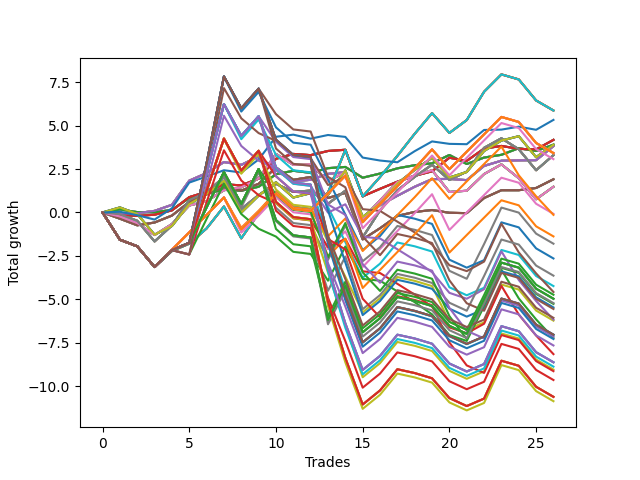

# Short Bulldog 006 
- Symbol: AAPL_Unlimited
- Date Range: 03/23/2022 - 07/08/2022
- Trading Period: 7:20-12:30
- Number of Trades: 26



| Name | Win Percent | Profit | Avg Profit / Trade | Avg Time / Trade |      | Name | Win Percent | Profit | Avg Profit / Trade | Avg Time / Trade |
| ---- | ----------- | ------ | ------------------ | ---------------- | ---- | ---- | ----------- | ------ | ------------------ | ---------------- |
| Sorted By <br> Profit | | | | | | Sorted By <br> Win Percentage ||||
| Seventy-One | 57.69 | 2935.00 | 112.88 | 113:29 |     | Sixty-Six | 76.92 | 1910.00 | 73.46 | 23:38 |
| Sixty-Three | 57.69 | 2935.00 | 112.88 | 113:29 |     | Fifty-Eight | 76.92 | 1910.00 | 73.46 | 23:38 |
| Fifty-Five | 57.69 | 2935.00 | 112.88 | 113:29 |     | Fifty | 76.92 | 1910.00 | 73.46 | 23:38 |
| Forty-Seven | 57.69 | 2935.00 | 112.88 | 113:29 |     | Forty-Two | 76.92 | 1910.00 | 73.46 | 23:38 |
| Seven | 57.69 | 2935.00 | 112.88 | 113:29 |     | Two | 76.92 | 1910.00 | 73.46 | 23:38 |
| Seventy-Three | 57.69 | 2665.00 | 102.50 | 12:46 |     | Sixty-Four | 73.08 | 1950.00 | 75.00 | 08:09 |
| Sixty-Five | 69.23 | 2090.00 | 80.38 | 14:57 |     | Fifty-Six | 73.08 | 1950.00 | 75.00 | 08:09 |
| Fifty-Seven | 69.23 | 2090.00 | 80.38 | 14:57 |     | Forty-Eight | 73.08 | 1950.00 | 75.00 | 08:09 |
| Forty-Nine | 69.23 | 2090.00 | 80.38 | 14:57 |     | Forty | 73.08 | 1950.00 | 75.00 | 08:09 |
| Forty-One | 69.23 | 2090.00 | 80.38 | 14:57 |     | Zero | 73.08 | 1950.00 | 75.00 | 08:09 |
| One | 69.23 | 2090.00 | 80.38 | 14:57 |     | Sixty-Five | 69.23 | 2090.00 | 80.38 | 14:57 |
| Sixty-Four | 73.08 | 1950.00 | 75.00 | 08:09 |     | Fifty-Seven | 69.23 | 2090.00 | 80.38 | 14:57 |
| Fifty-Six | 73.08 | 1950.00 | 75.00 | 08:09 |     | Forty-Nine | 69.23 | 2090.00 | 80.38 | 14:57 |
| Forty-Eight | 73.08 | 1950.00 | 75.00 | 08:09 |     | Forty-One | 69.23 | 2090.00 | 80.38 | 14:57 |
| Forty | 73.08 | 1950.00 | 75.00 | 08:09 |     | One | 69.23 | 2090.00 | 80.38 | 14:57 |
| Zero | 73.08 | 1950.00 | 75.00 | 08:09 |     | Seventy | 69.23 | 1950.00 | 75.00 | 67:17 |
| Seventy | 69.23 | 1950.00 | 75.00 | 67:17 |     | Sixty-Two | 69.23 | 1950.00 | 75.00 | 67:17 |
| Sixty-Two | 69.23 | 1950.00 | 75.00 | 67:17 |     | Fifty-Four | 69.23 | 1950.00 | 75.00 | 67:17 |
| Fifty-Four | 69.23 | 1950.00 | 75.00 | 67:17 |     | Forty-Six | 69.23 | 1950.00 | 75.00 | 67:17 |
| Forty-Six | 69.23 | 1950.00 | 75.00 | 67:17 |     | Six | 69.23 | 1950.00 | 75.00 | 67:17 |
| Six | 69.23 | 1950.00 | 75.00 | 67:17 |     | Sixty-Seven | 65.38 | 955.00 | 36.73 | 28:15 |
| Sixty-Six | 76.92 | 1910.00 | 73.46 | 23:38 |     | Fifty-Nine | 65.38 | 955.00 | 36.73 | 28:15 |
| Fifty-Eight | 76.92 | 1910.00 | 73.46 | 23:38 |     | Fifty-One | 65.38 | 955.00 | 36.73 | 28:15 |
| Fifty | 76.92 | 1910.00 | 73.46 | 23:38 |     | Forty-Three | 65.38 | 955.00 | 36.73 | 28:15 |
| Forty-Two | 76.92 | 1910.00 | 73.46 | 23:38 |     | Three | 65.38 | 955.00 | 36.73 | 28:15 |
| Two | 76.92 | 1910.00 | 73.46 | 23:38 |     | Sixty-Eight | 65.38 | 740.00 | 28.46 | 47:02 |
| One Hundred Twenty-Six | 57.69 | 1710.00 | 65.77 | 92:05 |     | Sixty | 65.38 | 740.00 | 28.46 | 47:02 |
| One Hundred Twenty-One | 57.69 | 1710.00 | 65.77 | 92:05 |     | Fifty-Two | 65.38 | 740.00 | 28.46 | 47:02 |
| One Hundred Sixteen | 57.69 | 1710.00 | 65.77 | 92:05 |     | Forty-Four | 65.38 | 740.00 | 28.46 | 47:02 |
| One Hundred Eleven | 57.69 | 1710.00 | 65.77 | 92:05 |     | Four | 65.38 | 740.00 | 28.46 | 47:02 |
| Eighty-One | 57.69 | 1710.00 | 65.77 | 92:05 |     | Sixty-Nine | 61.54 | 1650.00 | 63.46 | 60:11 |
| Sixty-Nine | 61.54 | 1650.00 | 63.46 | 60:11 |     | Sixty-One | 61.54 | 1650.00 | 63.46 | 60:11 |
| Sixty-One | 61.54 | 1650.00 | 63.46 | 60:11 |     | Fifty-Three | 61.54 | 1650.00 | 63.46 | 60:11 |
| Fifty-Three | 61.54 | 1650.00 | 63.46 | 60:11 |     | Forty-Five | 61.54 | 1650.00 | 63.46 | 60:11 |
| Forty-Five | 61.54 | 1650.00 | 63.46 | 60:11 |     | Five | 61.54 | 1650.00 | 63.46 | 60:11 |
| Five | 61.54 | 1650.00 | 63.46 | 60:11 |     | Seventy-One | 57.69 | 2935.00 | 112.88 | 113:29 |
| One Hundred One | 57.69 | 1535.00 | 59.04 | 91:54 |     | Sixty-Three | 57.69 | 2935.00 | 112.88 | 113:29 |
| Sixty-Seven | 65.38 | 955.00 | 36.73 | 28:15 |     | Fifty-Five | 57.69 | 2935.00 | 112.88 | 113:29 |
| Fifty-Nine | 65.38 | 955.00 | 36.73 | 28:15 |     | Forty-Seven | 57.69 | 2935.00 | 112.88 | 113:29 |
| Fifty-One | 65.38 | 955.00 | 36.73 | 28:15 |     | Seven | 57.69 | 2935.00 | 112.88 | 113:29 |
| Forty-Three | 65.38 | 955.00 | 36.73 | 28:15 |     | Seventy-Three | 57.69 | 2665.00 | 102.50 | 12:46 |
| Three | 65.38 | 955.00 | 36.73 | 28:15 |     | One Hundred Twenty-Six | 57.69 | 1710.00 | 65.77 | 92:05 |
| Sixty-Eight | 65.38 | 740.00 | 28.46 | 47:02 |     | One Hundred Twenty-One | 57.69 | 1710.00 | 65.77 | 92:05 |
| Sixty | 65.38 | 740.00 | 28.46 | 47:02 |     | One Hundred Sixteen | 57.69 | 1710.00 | 65.77 | 92:05 |
| Fifty-Two | 65.38 | 740.00 | 28.46 | 47:02 |     | One Hundred Eleven | 57.69 | 1710.00 | 65.77 | 92:05 |
| Forty-Four | 65.38 | 740.00 | 28.46 | 47:02 |     | Eighty-One | 57.69 | 1710.00 | 65.77 | 92:05 |
| Four | 65.38 | 740.00 | 28.46 | 47:02 |     | One Hundred One | 57.69 | 1535.00 | 59.04 | 91:54 |
| Ninety-One | 53.85 | -40.00 | -1.54 | 80:59 |     | Ninety-One | 53.85 | -40.00 | -1.54 | 80:59 |
| Ninety-Six | 53.85 | -70.00 | -2.69 | 71:02 |     | Ninety-Six | 53.85 | -70.00 | -2.69 | 71:02 |
| One Hundred Six | 53.85 | -690.00 | -26.54 | 82:02 |     | One Hundred Six | 53.85 | -690.00 | -26.54 | 82:02 |
| Ninety-Two | 38.46 | -900.00 | -34.62 | 144:00 |     | Ninety-Two | 38.46 | -900.00 | -34.62 | 144:00 |
| Ninety-Five | 34.62 | -1325.00 | -50.96 | 166:18 |     | One Hundred Two | 38.46 | -1820.00 | -70.00 | 157:43 |
| One Hundred Two | 38.46 | -1820.00 | -70.00 | 157:43 |     | One Hundred Seventeen | 38.46 | -2370.00 | -91.15 | 162:45 |
| Ninety-Four | 34.62 | -2120.00 | -81.54 | 162:22 |     | One Hundred Twenty-Seven | 38.46 | -2485.00 | -95.58 | 164:52 |
| One Hundred | 23.08 | -2290.00 | -88.08 | 119:12 |     | One Hundred Twenty-Two | 38.46 | -2485.00 | -95.58 | 164:52 |
| One Hundred Seventeen | 38.46 | -2370.00 | -91.15 | 162:45 |     | Eighty-Two | 38.46 | -2485.00 | -95.58 | 164:52 |
| One Hundred Twenty-Seven | 38.46 | -2485.00 | -95.58 | 164:52 |     | One Hundred Twelve | 38.46 | -2610.00 | -100.38 | 164:34 |
| One Hundred Twenty-Two | 38.46 | -2485.00 | -95.58 | 164:52 |     | Ninety-Five | 34.62 | -1325.00 | -50.96 | 166:18 |
| Eighty-Two | 38.46 | -2485.00 | -95.58 | 164:52 |     | Ninety-Four | 34.62 | -2120.00 | -81.54 | 162:22 |
| One Hundred Twelve | 38.46 | -2610.00 | -100.38 | 164:34 |     | One Hundred Seven | 34.62 | -2635.00 | -101.35 | 136:51 |
| One Hundred Seven | 34.62 | -2635.00 | -101.35 | 136:51 |     | One Hundred Five | 34.62 | -2735.00 | -105.19 | 180:44 |
| One Hundred Five | 34.62 | -2735.00 | -105.19 | 180:44 |     | One Hundred Twenty | 34.62 | -3035.00 | -116.73 | 185:11 |
| One Hundred Ten | 26.92 | -2780.00 | -106.92 | 156:30 |     | Ninety-Three | 34.62 | -3115.00 | -119.81 | 158:30 |
| One Hundred Twenty | 34.62 | -3035.00 | -116.73 | 185:11 |     | One Hundred Thirty | 34.62 | -3520.00 | -135.38 | 188:28 |
| Ninety-Nine | 23.08 | -3085.00 | -118.65 | 115:15 |     | One Hundred Twenty-Five | 34.62 | -3520.00 | -135.38 | 188:28 |
| Ninety-Three | 34.62 | -3115.00 | -119.81 | 158:30 |     | Eighty-Five | 34.62 | -3520.00 | -135.38 | 188:28 |
| One Hundred Thirty | 34.62 | -3520.00 | -135.38 | 188:28 |     | One Hundred Four | 34.62 | -3530.00 | -135.77 | 176:48 |
| One Hundred Twenty-Five | 34.62 | -3520.00 | -135.38 | 188:28 |     | One Hundred Fifteen | 34.62 | -3645.00 | -140.19 | 188:10 |
| Eighty-Five | 34.62 | -3520.00 | -135.38 | 188:28 |     | One Hundred Ninteen | 34.62 | -3830.00 | -147.31 | 181:14 |
| One Hundred Four | 34.62 | -3530.00 | -135.77 | 176:48 |     | One Hundred Twenty-Nine | 34.62 | -4315.00 | -165.96 | 184:32 |
| One Hundred Nine | 26.92 | -3575.00 | -137.50 | 152:34 |     | One Hundred Twenty-Four | 34.62 | -4315.00 | -165.96 | 184:32 |
| Ninety-Seven | 23.08 | -3615.00 | -139.04 | 102:34 |     | Eighty-Four | 34.62 | -4315.00 | -165.96 | 184:32 |
| One Hundred Fifteen | 34.62 | -3645.00 | -140.19 | 188:10 |     | One Hundred Fourteen | 34.62 | -4440.00 | -170.77 | 184:14 |
| One Hundred Ninteen | 34.62 | -3830.00 | -147.31 | 181:14 |     | One Hundred Three | 34.62 | -4525.00 | -174.04 | 172:56 |
| Ninety-Eight | 23.08 | -4080.00 | -156.92 | 111:24 |     | One Hundred Eighteen | 34.62 | -4825.00 | -185.58 | 177:22 |
| One Hundred Twenty-Nine | 34.62 | -4315.00 | -165.96 | 184:32 |     | One Hundred Twenty-Eight | 34.62 | -5310.00 | -204.23 | 180:40 |
| One Hundred Twenty-Four | 34.62 | -4315.00 | -165.96 | 184:32 |     | One Hundred Twenty-Three | 34.62 | -5310.00 | -204.23 | 180:40 |
| Eighty-Four | 34.62 | -4315.00 | -165.96 | 184:32 |     | Eighty-Three | 34.62 | -5310.00 | -204.23 | 180:40 |
| One Hundred Fourteen | 34.62 | -4440.00 | -170.77 | 184:14 |     | One Hundred Thirteen | 34.62 | -5435.00 | -209.04 | 180:22 |
| One Hundred Three | 34.62 | -4525.00 | -174.04 | 172:56 |     | One Hundred Ten | 26.92 | -2780.00 | -106.92 | 156:30 |
| One Hundred Eight | 26.92 | -4570.00 | -175.77 | 148:42 |     | One Hundred Nine | 26.92 | -3575.00 | -137.50 | 152:34 |
| One Hundred Eighteen | 34.62 | -4825.00 | -185.58 | 177:22 |     | One Hundred Eight | 26.92 | -4570.00 | -175.77 | 148:42 |
| One Hundred Twenty-Eight | 34.62 | -5310.00 | -204.23 | 180:40 |     | One Hundred | 23.08 | -2290.00 | -88.08 | 119:12 |
| One Hundred Twenty-Three | 34.62 | -5310.00 | -204.23 | 180:40 |     | Ninety-Nine | 23.08 | -3085.00 | -118.65 | 115:15 |
| Eighty-Three | 34.62 | -5310.00 | -204.23 | 180:40 |     | Ninety-Seven | 23.08 | -3615.00 | -139.04 | 102:34 |
| One Hundred Thirteen | 34.62 | -5435.00 | -209.04 | 180:22 |     | Ninety-Eight | 23.08 | -4080.00 | -156.92 | 111:24 |

## NO STOPLOSS

### Test Zero
* Sell when price hits the middle line of the 20p bollinger
* No Stoploss
* Results:
```
Total Trades: 26
Percent Up: 26.92
Percent Down: 73.08
Total Points Moved Down: 3.90
Potential Profit: 1950.00
Total Points Ups: 1.63 Count Ups: 7
Total Points Downs: 5.53 Count Downs: 19
```

<details><summary>Trades</summary>

<code>In: 2022-03-24 10:04:00		Out: 2022-03-24 10:09:20		Total Position Time: 05:20		Total Move Down: 0.17		Total to Date: 0.17</code> <br />
<code>In: 2022-03-24 12:14:00		Out: 2022-03-24 12:32:50		Total Position Time: 18:50		Total Move Down: -0.15		Total to Date: 0.02</code> <br />
<code>In: 2022-03-29 10:51:00		Out: 2022-03-29 11:04:05		Total Position Time: 13:05		Total Move Down: -0.01		Total to Date: 0.01</code> <br />
<code>In: 2022-03-31 12:05:00		Out: 2022-03-31 12:12:15		Total Position Time: 07:15		Total Move Down: 0.14		Total to Date: 0.15</code> <br />
<code>In: 2022-04-06 11:07:00		Out: 2022-04-06 11:08:10		Total Position Time: 01:10		Total Move Down: 0.68		Total to Date: 0.83</code> <br />
<code>In: 2022-04-21 07:34:00		Out: 2022-04-21 07:41:00		Total Position Time: 07:00		Total Move Down: 0.27		Total to Date: 1.10</code> <br />
<code>In: 2022-04-21 08:30:00		Out: 2022-04-21 08:32:30		Total Position Time: 02:30		Total Move Down: 0.20		Total to Date: 1.30</code> <br />
<code>In: 2022-04-25 11:26:00		Out: 2022-04-25 11:40:00		Total Position Time: 14:00		Total Move Down: -0.05		Total to Date: 1.25</code> <br />
<code>In: 2022-04-27 08:38:00		Out: 2022-04-27 08:40:30		Total Position Time: 02:30		Total Move Down: 0.23		Total to Date: 1.48</code> <br />
<code>In: 2022-04-28 07:24:00		Out: 2022-04-28 07:27:00		Total Position Time: 03:00		Total Move Down: 0.72		Total to Date: 2.20</code> <br />
<code>In: 2022-04-28 09:50:00		Out: 2022-04-28 09:57:10		Total Position Time: 07:10		Total Move Down: 0.20		Total to Date: 2.40</code> <br />
<code>In: 2022-05-03 08:11:00		Out: 2022-05-03 08:27:15		Total Position Time: 16:15		Total Move Down: -0.12		Total to Date: 2.28</code> <br />
<code>In: 2022-05-04 08:57:00		Out: 2022-05-04 09:04:40		Total Position Time: 07:40		Total Move Down: 0.27		Total to Date: 2.55</code> <br />
<code>In: 2022-05-04 10:41:00		Out: 2022-05-04 10:50:05		Total Position Time: 09:05		Total Move Down: 0.07		Total to Date: 2.62</code> <br />
<code>In: 2022-05-04 11:50:00		Out: 2022-05-04 12:07:00		Total Position Time: 17:00		Total Move Down: -0.62		Total to Date: 2.00</code> <br />
<code>In: 2022-05-16 07:23:00		Out: 2022-05-16 07:32:15		Total Position Time: 09:15		Total Move Down: 0.24		Total to Date: 2.24</code> <br />
<code>In: 2022-05-16 08:58:00		Out: 2022-05-16 09:05:45		Total Position Time: 07:45		Total Move Down: 0.30		Total to Date: 2.54</code> <br />
<code>In: 2022-05-17 11:11:00		Out: 2022-05-17 11:12:15		Total Position Time: 01:15		Total Move Down: 0.18		Total to Date: 2.72</code> <br />
<code>In: 2022-05-17 11:12:00		Out: 2022-05-17 11:13:10		Total Position Time: 01:10		Total Move Down: 0.11		Total to Date: 2.83</code> <br />
<code>In: 2022-05-23 07:51:00		Out: 2022-05-23 07:52:10		Total Position Time: 01:10		Total Move Down: 0.48		Total to Date: 3.31</code> <br />
<code>In: 2022-05-25 07:21:00		Out: 2022-05-25 07:41:55		Total Position Time: 20:55		Total Move Down: -0.52		Total to Date: 2.79</code> <br />
<code>In: 2022-05-25 07:37:00		Out: 2022-05-25 07:41:55		Total Position Time: 04:55		Total Move Down: 0.37		Total to Date: 3.16</code> <br />
<code>In: 2022-06-13 08:27:00		Out: 2022-06-13 08:37:10		Total Position Time: 10:10		Total Move Down: 0.16		Total to Date: 3.32</code> <br />
<code>In: 2022-06-30 08:30:00		Out: 2022-06-30 08:36:00		Total Position Time: 06:00		Total Move Down: 0.38		Total to Date: 3.70</code> <br />
<code>In: 2022-07-01 10:48:00		Out: 2022-07-01 11:04:25		Total Position Time: 16:25		Total Move Down: -0.16		Total to Date: 3.54</code> <br />
<code>In: 2022-07-06 11:10:00		Out: 2022-07-06 11:11:10		Total Position Time: 01:10		Total Move Down: 0.36		Total to Date: 3.90</code> <br />


</details>

### Test One
* Sell when the price hits the upper line of the 20p 1std bollinger
* No Stoploss
* Results:
```
Total Trades: 26
Percent Up: 30.77
Percent Down: 69.23
Total Points Moved Down: 4.18
Potential Profit: 2090.00
Total Points Ups: 3.39 Count Ups: 8
Total Points Downs: 7.57 Count Downs: 18
```

<details><summary>Trades</summary>

<code>In: 2022-03-24 10:04:00		Out: 2022-03-24 10:33:15		Total Position Time: 29:15		Total Move Down: -0.13		Total to Date: -0.13</code> <br />
<code>In: 2022-03-24 12:14:00		Out: 2022-03-24 12:39:00		Total Position Time: 25:00		Total Move Down: -0.07		Total to Date: -0.20</code> <br />
<code>In: 2022-03-29 10:51:00		Out: 2022-03-29 11:06:05		Total Position Time: 15:05		Total Move Down: 0.07		Total to Date: -0.13</code> <br />
<code>In: 2022-03-31 12:05:00		Out: 2022-03-31 12:16:05		Total Position Time: 11:05		Total Move Down: 0.25		Total to Date: 0.12</code> <br />
<code>In: 2022-04-06 11:07:00		Out: 2022-04-06 11:09:20		Total Position Time: 02:20		Total Move Down: 0.76		Total to Date: 0.88</code> <br />
<code>In: 2022-04-21 07:34:00		Out: 2022-04-21 07:47:25		Total Position Time: 13:25		Total Move Down: 0.31		Total to Date: 1.19</code> <br />
<code>In: 2022-04-21 08:30:00		Out: 2022-04-21 08:33:45		Total Position Time: 03:45		Total Move Down: 0.43		Total to Date: 1.62</code> <br />
<code>In: 2022-04-25 11:26:00		Out: 2022-04-25 11:44:50		Total Position Time: 18:50		Total Move Down: -0.06		Total to Date: 1.56</code> <br />
<code>In: 2022-04-27 08:38:00		Out: 2022-04-27 08:45:20		Total Position Time: 07:20		Total Move Down: 0.39		Total to Date: 1.95</code> <br />
<code>In: 2022-04-28 07:24:00		Out: 2022-04-28 07:29:40		Total Position Time: 05:40		Total Move Down: 1.14		Total to Date: 3.09</code> <br />
<code>In: 2022-04-28 09:50:00		Out: 2022-04-28 10:02:15		Total Position Time: 12:15		Total Move Down: 0.28		Total to Date: 3.37</code> <br />
<code>In: 2022-05-03 08:11:00		Out: 2022-05-03 08:36:05		Total Position Time: 25:05		Total Move Down: -0.07		Total to Date: 3.30</code> <br />
<code>In: 2022-05-04 08:57:00		Out: 2022-05-04 09:10:15		Total Position Time: 13:15		Total Move Down: 0.24		Total to Date: 3.54</code> <br />
<code>In: 2022-05-04 10:41:00		Out: 2022-05-04 10:54:25		Total Position Time: 13:25		Total Move Down: 0.07		Total to Date: 3.61</code> <br />
<code>In: 2022-05-04 11:50:00		Out: 2022-05-04 12:47:00		Total Position Time: 57:00		Total Move Down: -2.68		Total to Date: 0.93</code> <br />
<code>In: 2022-05-16 07:23:00		Out: 2022-05-16 07:34:05		Total Position Time: 11:05		Total Move Down: 0.43		Total to Date: 1.36</code> <br />
<code>In: 2022-05-16 08:58:00		Out: 2022-05-16 09:11:30		Total Position Time: 13:30		Total Move Down: 0.41		Total to Date: 1.77</code> <br />
<code>In: 2022-05-17 11:11:00		Out: 2022-05-17 11:13:15		Total Position Time: 02:15		Total Move Down: 0.34		Total to Date: 2.11</code> <br />
<code>In: 2022-05-17 11:12:00		Out: 2022-05-17 11:13:15		Total Position Time: 01:15		Total Move Down: 0.26		Total to Date: 2.37</code> <br />
<code>In: 2022-05-23 07:51:00		Out: 2022-05-23 07:53:00		Total Position Time: 02:00		Total Move Down: 0.78		Total to Date: 3.15</code> <br />
<code>In: 2022-05-25 07:21:00		Out: 2022-05-25 07:43:30		Total Position Time: 22:30		Total Move Down: -0.18		Total to Date: 2.97</code> <br />
<code>In: 2022-05-25 07:37:00		Out: 2022-05-25 07:43:30		Total Position Time: 06:30		Total Move Down: 0.71		Total to Date: 3.68</code> <br />
<code>In: 2022-06-13 08:27:00		Out: 2022-06-13 08:46:30		Total Position Time: 19:30		Total Move Down: 0.15		Total to Date: 3.83</code> <br />
<code>In: 2022-06-30 08:30:00		Out: 2022-06-30 09:05:45		Total Position Time: 35:45		Total Move Down: -0.17		Total to Date: 3.66</code> <br />
<code>In: 2022-07-01 10:48:00		Out: 2022-07-01 11:07:55		Total Position Time: 19:55		Total Move Down: -0.03		Total to Date: 3.63</code> <br />
<code>In: 2022-07-06 11:10:00		Out: 2022-07-06 11:11:50		Total Position Time: 01:50		Total Move Down: 0.55		Total to Date: 4.18</code> <br />


</details>

### Test Two
* Sell when the price hits the upper line of the 20p 2std bollinger
* No Stoploss
* Results:
```
Total Trades: 26
Percent Up: 23.08
Percent Down: 76.92
Total Points Moved Down: 3.82
Potential Profit: 1910.00
Total Points Ups: 4.42 Count Ups: 6
Total Points Downs: 8.24 Count Downs: 20
```

<details><summary>Trades</summary>

<code>In: 2022-03-24 10:04:00		Out: 2022-03-24 10:34:15		Total Position Time: 30:15		Total Move Down: -0.07		Total to Date: -0.07</code> <br />
<code>In: 2022-03-24 12:14:00		Out: 2022-03-24 12:39:40		Total Position Time: 25:40		Total Move Down: 0.03		Total to Date: -0.04</code> <br />
<code>In: 2022-03-29 10:51:00		Out: 2022-03-29 11:07:05		Total Position Time: 16:05		Total Move Down: 0.13		Total to Date: 0.09</code> <br />
<code>In: 2022-03-31 12:05:00		Out: 2022-03-31 12:18:15		Total Position Time: 13:15		Total Move Down: 0.35		Total to Date: 0.44</code> <br />
<code>In: 2022-04-06 11:07:00		Out: 2022-04-06 11:15:10		Total Position Time: 08:10		Total Move Down: 1.39		Total to Date: 1.83</code> <br />
<code>In: 2022-04-21 07:34:00		Out: 2022-04-21 07:47:55		Total Position Time: 13:55		Total Move Down: 0.44		Total to Date: 2.27</code> <br />
<code>In: 2022-04-21 08:30:00		Out: 2022-04-21 08:45:05		Total Position Time: 15:05		Total Move Down: 0.63		Total to Date: 2.90</code> <br />
<code>In: 2022-04-25 11:26:00		Out: 2022-04-25 12:03:15		Total Position Time: 37:15		Total Move Down: -0.16		Total to Date: 2.74</code> <br />
<code>In: 2022-04-27 08:38:00		Out: 2022-04-27 08:52:25		Total Position Time: 14:25		Total Move Down: 0.49		Total to Date: 3.23</code> <br />
<code>In: 2022-04-28 07:24:00		Out: 2022-04-28 08:28:30		Total Position Time: 64:30		Total Move Down: -0.80		Total to Date: 2.43</code> <br />
<code>In: 2022-04-28 09:50:00		Out: 2022-04-28 11:06:20		Total Position Time: 76:20		Total Move Down: -0.64		Total to Date: 1.79</code> <br />
<code>In: 2022-05-03 08:11:00		Out: 2022-05-03 08:37:20		Total Position Time: 26:20		Total Move Down: 0.09		Total to Date: 1.88</code> <br />
<code>In: 2022-05-04 08:57:00		Out: 2022-05-04 09:12:25		Total Position Time: 15:25		Total Move Down: 0.34		Total to Date: 2.22</code> <br />
<code>In: 2022-05-04 10:41:00		Out: 2022-05-04 10:55:15		Total Position Time: 14:15		Total Move Down: 0.10		Total to Date: 2.32</code> <br />
<code>In: 2022-05-04 11:50:00		Out: 2022-05-04 12:47:00		Total Position Time: 57:00		Total Move Down: -2.68		Total to Date: -0.36</code> <br />
<code>In: 2022-05-16 07:23:00		Out: 2022-05-16 07:34:45		Total Position Time: 11:45		Total Move Down: 0.78		Total to Date: 0.42</code> <br />
<code>In: 2022-05-16 08:58:00		Out: 2022-05-16 09:14:40		Total Position Time: 16:40		Total Move Down: 0.54		Total to Date: 0.96</code> <br />
<code>In: 2022-05-17 11:11:00		Out: 2022-05-17 11:13:30		Total Position Time: 02:30		Total Move Down: 0.52		Total to Date: 1.48</code> <br />
<code>In: 2022-05-17 11:12:00		Out: 2022-05-17 11:13:30		Total Position Time: 01:30		Total Move Down: 0.44		Total to Date: 1.92</code> <br />
<code>In: 2022-05-23 07:51:00		Out: 2022-05-23 08:27:55		Total Position Time: 36:55		Total Move Down: 0.01		Total to Date: 1.93</code> <br />
<code>In: 2022-05-25 07:21:00		Out: 2022-05-25 07:48:05		Total Position Time: 27:05		Total Move Down: -0.07		Total to Date: 1.86</code> <br />
<code>In: 2022-05-25 07:37:00		Out: 2022-05-25 07:48:05		Total Position Time: 11:05		Total Move Down: 0.82		Total to Date: 2.68</code> <br />
<code>In: 2022-06-13 08:27:00		Out: 2022-06-13 08:47:05		Total Position Time: 20:05		Total Move Down: 0.30		Total to Date: 2.98</code> <br />
<code>In: 2022-06-30 08:30:00		Out: 2022-06-30 09:06:25		Total Position Time: 36:25		Total Move Down: 0.02		Total to Date: 3.00</code> <br />
<code>In: 2022-07-01 10:48:00		Out: 2022-07-01 11:08:25		Total Position Time: 20:25		Total Move Down: 0.01		Total to Date: 3.01</code> <br />
<code>In: 2022-07-06 11:10:00		Out: 2022-07-06 11:12:25		Total Position Time: 02:25		Total Move Down: 0.81		Total to Date: 3.82</code> <br />


</details>

### Test Three
* Sell when price hits the middle line of the 50p bollinger
* No Stoploss
* Results:
```
Total Trades: 26
Percent Up: 34.62
Percent Down: 65.38
Total Points Moved Down: 1.91
Potential Profit: 955.00
Total Points Ups: 5.71 Count Ups: 9
Total Points Downs: 7.62 Count Downs: 17
```

<details><summary>Trades</summary>

<code>In: 2022-03-24 10:04:00		Out: 2022-03-24 11:09:05		Total Position Time: 65:05		Total Move Down: -0.36		Total to Date: -0.36</code> <br />
<code>In: 2022-03-24 12:14:00		Out: 2022-03-24 12:47:00		Total Position Time: 33:00		Total Move Down: -0.38		Total to Date: -0.74</code> <br />
<code>In: 2022-03-29 10:51:00		Out: 2022-03-29 11:18:35		Total Position Time: 27:35		Total Move Down: 0.16		Total to Date: -0.58</code> <br />
<code>In: 2022-03-31 12:05:00		Out: 2022-03-31 12:19:40		Total Position Time: 14:40		Total Move Down: 0.40		Total to Date: -0.18</code> <br />
<code>In: 2022-04-06 11:07:00		Out: 2022-04-06 11:08:30		Total Position Time: 01:30		Total Move Down: 0.78		Total to Date: 0.60</code> <br />
<code>In: 2022-04-21 07:34:00		Out: 2022-04-21 07:47:55		Total Position Time: 13:55		Total Move Down: 0.44		Total to Date: 1.04</code> <br />
<code>In: 2022-04-21 08:30:00		Out: 2022-04-21 08:40:30		Total Position Time: 10:30		Total Move Down: 0.41		Total to Date: 1.45</code> <br />
<code>In: 2022-04-25 11:26:00		Out: 2022-04-25 12:03:10		Total Position Time: 37:10		Total Move Down: -0.19		Total to Date: 1.26</code> <br />
<code>In: 2022-04-27 08:38:00		Out: 2022-04-27 08:45:20		Total Position Time: 07:20		Total Move Down: 0.39		Total to Date: 1.65</code> <br />
<code>In: 2022-04-28 07:24:00		Out: 2022-04-28 07:27:10		Total Position Time: 03:10		Total Move Down: 0.94		Total to Date: 2.59</code> <br />
<code>In: 2022-04-28 09:50:00		Out: 2022-04-28 11:01:05		Total Position Time: 71:05		Total Move Down: -0.71		Total to Date: 1.88</code> <br />
<code>In: 2022-05-03 08:11:00		Out: 2022-05-03 08:46:00		Total Position Time: 35:00		Total Move Down: 0.16		Total to Date: 2.04</code> <br />
<code>In: 2022-05-04 08:57:00		Out: 2022-05-04 11:00:20		Total Position Time: 123:20		Total Move Down: -1.21		Total to Date: 0.83</code> <br />
<code>In: 2022-05-04 10:41:00		Out: 2022-05-04 11:00:20		Total Position Time: 19:20		Total Move Down: 0.30		Total to Date: 1.13</code> <br />
<code>In: 2022-05-04 11:50:00		Out: 2022-05-04 12:47:00		Total Position Time: 57:00		Total Move Down: -2.68		Total to Date: -1.55</code> <br />
<code>In: 2022-05-16 07:23:00		Out: 2022-05-16 07:34:25		Total Position Time: 11:25		Total Move Down: 0.64		Total to Date: -0.91</code> <br />
<code>In: 2022-05-16 08:58:00		Out: 2022-05-16 09:15:45		Total Position Time: 17:45		Total Move Down: 0.71		Total to Date: -0.20</code> <br />
<code>In: 2022-05-17 11:11:00		Out: 2022-05-17 11:12:50		Total Position Time: 01:50		Total Move Down: 0.23		Total to Date: 0.03</code> <br />
<code>In: 2022-05-17 11:12:00		Out: 2022-05-17 11:13:10		Total Position Time: 01:10		Total Move Down: 0.11		Total to Date: 0.14</code> <br />
<code>In: 2022-05-23 07:51:00		Out: 2022-05-23 08:48:25		Total Position Time: 57:25		Total Move Down: -0.16		Total to Date: -0.02</code> <br />
<code>In: 2022-05-25 07:21:00		Out: 2022-05-25 07:48:40		Total Position Time: 27:40		Total Move Down: -0.02		Total to Date: -0.04</code> <br />
<code>In: 2022-05-25 07:37:00		Out: 2022-05-25 07:48:40		Total Position Time: 11:40		Total Move Down: 0.87		Total to Date: 0.83</code> <br />
<code>In: 2022-06-13 08:27:00		Out: 2022-06-13 08:51:55		Total Position Time: 24:55		Total Move Down: 0.45		Total to Date: 1.28</code> <br />
<code>In: 2022-06-30 08:30:00		Out: 2022-06-30 09:06:20		Total Position Time: 36:20		Total Move Down: -0.00		Total to Date: 1.28</code> <br />
<code>In: 2022-07-01 10:48:00		Out: 2022-07-01 11:11:05		Total Position Time: 23:05		Total Move Down: 0.13		Total to Date: 1.41</code> <br />
<code>In: 2022-07-06 11:10:00		Out: 2022-07-06 11:11:40		Total Position Time: 01:40		Total Move Down: 0.50		Total to Date: 1.91</code> <br />


</details>

### Test Four
* Sell when the price hits the upper line of the 50p 1std bollinger
* No Stoploss
* Results:
```
Total Trades: 26
Percent Up: 34.62
Percent Down: 65.38
Total Points Moved Down: 1.48
Potential Profit: 740.00
Total Points Ups: 8.85 Count Ups: 9
Total Points Downs: 10.33 Count Downs: 17
```

<details><summary>Trades</summary>

<code>In: 2022-03-24 10:04:00		Out: 2022-03-24 11:10:25		Total Position Time: 66:25		Total Move Down: -0.23		Total to Date: -0.23</code> <br />
<code>In: 2022-03-24 12:14:00		Out: 2022-03-24 12:47:00		Total Position Time: 33:00		Total Move Down: -0.38		Total to Date: -0.61</code> <br />
<code>In: 2022-03-29 10:51:00		Out: 2022-03-29 12:43:05		Total Position Time: 112:05		Total Move Down: -0.69		Total to Date: -1.30</code> <br />
<code>In: 2022-03-31 12:05:00		Out: 2022-03-31 12:21:30		Total Position Time: 16:30		Total Move Down: 0.63		Total to Date: -0.67</code> <br />
<code>In: 2022-04-06 11:07:00		Out: 2022-04-06 11:14:10		Total Position Time: 07:10		Total Move Down: 1.07		Total to Date: 0.40</code> <br />
<code>In: 2022-04-21 07:34:00		Out: 2022-04-21 08:45:05		Total Position Time: 71:05		Total Move Down: 0.25		Total to Date: 0.65</code> <br />
<code>In: 2022-04-21 08:30:00		Out: 2022-04-21 08:45:05		Total Position Time: 15:05		Total Move Down: 0.63		Total to Date: 1.28</code> <br />
<code>In: 2022-04-25 11:26:00		Out: 2022-04-25 12:05:20		Total Position Time: 39:20		Total Move Down: 0.17		Total to Date: 1.45</code> <br />
<code>In: 2022-04-27 08:38:00		Out: 2022-04-27 08:52:55		Total Position Time: 14:55		Total Move Down: 0.51		Total to Date: 1.96</code> <br />
<code>In: 2022-04-28 07:24:00		Out: 2022-04-28 07:33:30		Total Position Time: 09:30		Total Move Down: 1.41		Total to Date: 3.37</code> <br />
<code>In: 2022-04-28 09:50:00		Out: 2022-04-28 11:14:05		Total Position Time: 84:05		Total Move Down: -0.63		Total to Date: 2.74</code> <br />
<code>In: 2022-05-03 08:11:00		Out: 2022-05-03 09:07:10		Total Position Time: 56:10		Total Move Down: 0.04		Total to Date: 2.78</code> <br />
<code>In: 2022-05-04 08:57:00		Out: 2022-05-04 11:00:25		Total Position Time: 123:25		Total Move Down: -0.98		Total to Date: 1.80</code> <br />
<code>In: 2022-05-04 10:41:00		Out: 2022-05-04 11:00:25		Total Position Time: 19:25		Total Move Down: 0.53		Total to Date: 2.33</code> <br />
<code>In: 2022-05-04 11:50:00		Out: 2022-05-04 12:47:00		Total Position Time: 57:00		Total Move Down: -2.68		Total to Date: -0.35</code> <br />
<code>In: 2022-05-16 07:23:00		Out: 2022-05-16 07:44:35		Total Position Time: 21:35		Total Move Down: 1.04		Total to Date: 0.69</code> <br />
<code>In: 2022-05-16 08:58:00		Out: 2022-05-16 09:24:25		Total Position Time: 26:25		Total Move Down: 1.06		Total to Date: 1.75</code> <br />
<code>In: 2022-05-17 11:11:00		Out: 2022-05-17 11:13:25		Total Position Time: 02:25		Total Move Down: 0.38		Total to Date: 2.13</code> <br />
<code>In: 2022-05-17 11:12:00		Out: 2022-05-17 11:13:25		Total Position Time: 01:25		Total Move Down: 0.30		Total to Date: 2.43</code> <br />
<code>In: 2022-05-23 07:51:00		Out: 2022-05-23 09:48:05		Total Position Time: 117:05		Total Move Down: -1.25		Total to Date: 1.18</code> <br />
<code>In: 2022-05-25 07:21:00		Out: 2022-05-25 08:04:05		Total Position Time: 43:05		Total Move Down: 0.07		Total to Date: 1.25</code> <br />
<code>In: 2022-05-25 07:37:00		Out: 2022-05-25 08:04:05		Total Position Time: 27:05		Total Move Down: 0.96		Total to Date: 2.21</code> <br />
<code>In: 2022-06-13 08:27:00		Out: 2022-06-13 09:04:10		Total Position Time: 37:10		Total Move Down: 0.56		Total to Date: 2.77</code> <br />
<code>In: 2022-06-30 08:30:00		Out: 2022-06-30 10:10:15		Total Position Time: 100:15		Total Move Down: -0.80		Total to Date: 1.97</code> <br />
<code>In: 2022-07-01 10:48:00		Out: 2022-07-01 12:47:00		Total Position Time: 119:00		Total Move Down: -1.21		Total to Date: 0.76</code> <br />
<code>In: 2022-07-06 11:10:00		Out: 2022-07-06 11:12:15		Total Position Time: 02:15		Total Move Down: 0.72		Total to Date: 1.48</code> <br />


</details>

### Test Five
* Sell when the price hits the upper line of the 50p 2std bollinger
* No Stoploss
* Results:
```
Total Trades: 26
Percent Up: 38.46
Percent Down: 61.54
Total Points Moved Down: 3.30
Potential Profit: 1650.00
Total Points Ups: 10.13 Count Ups: 10
Total Points Downs: 13.43 Count Downs: 16
```

<details><summary>Trades</summary>

<code>In: 2022-03-24 10:04:00		Out: 2022-03-24 11:10:45		Total Position Time: 66:45		Total Move Down: -0.10		Total to Date: -0.10</code> <br />
<code>In: 2022-03-24 12:14:00		Out: 2022-03-24 12:47:00		Total Position Time: 33:00		Total Move Down: -0.38		Total to Date: -0.48</code> <br />
<code>In: 2022-03-29 10:51:00		Out: 2022-03-29 12:47:00		Total Position Time: 116:00		Total Move Down: -1.19		Total to Date: -1.67</code> <br />
<code>In: 2022-03-31 12:05:00		Out: 2022-03-31 12:33:50		Total Position Time: 28:50		Total Move Down: 0.92		Total to Date: -0.75</code> <br />
<code>In: 2022-04-06 11:07:00		Out: 2022-04-06 11:15:20		Total Position Time: 08:20		Total Move Down: 1.46		Total to Date: 0.71</code> <br />
<code>In: 2022-04-21 07:34:00		Out: 2022-04-21 08:47:05		Total Position Time: 73:05		Total Move Down: 0.47		Total to Date: 1.18</code> <br />
<code>In: 2022-04-21 08:30:00		Out: 2022-04-21 08:47:05		Total Position Time: 17:05		Total Move Down: 0.85		Total to Date: 2.03</code> <br />
<code>In: 2022-04-25 11:26:00		Out: 2022-04-25 12:47:00		Total Position Time: 81:00		Total Move Down: -1.83		Total to Date: 0.20</code> <br />
<code>In: 2022-04-27 08:38:00		Out: 2022-04-27 08:54:15		Total Position Time: 16:15		Total Move Down: 0.80		Total to Date: 1.00</code> <br />
<code>In: 2022-04-28 07:24:00		Out: 2022-04-28 08:57:40		Total Position Time: 93:40		Total Move Down: 0.65		Total to Date: 1.65</code> <br />
<code>In: 2022-04-28 09:50:00		Out: 2022-04-28 11:15:25		Total Position Time: 85:25		Total Move Down: -0.47		Total to Date: 1.18</code> <br />
<code>In: 2022-05-03 08:11:00		Out: 2022-05-03 09:56:10		Total Position Time: 105:10		Total Move Down: 0.08		Total to Date: 1.26</code> <br />
<code>In: 2022-05-04 08:57:00		Out: 2022-05-04 11:07:40		Total Position Time: 130:40		Total Move Down: -0.76		Total to Date: 0.50</code> <br />
<code>In: 2022-05-04 10:41:00		Out: 2022-05-04 11:07:40		Total Position Time: 26:40		Total Move Down: 0.75		Total to Date: 1.25</code> <br />
<code>In: 2022-05-04 11:50:00		Out: 2022-05-04 12:47:00		Total Position Time: 57:00		Total Move Down: -2.68		Total to Date: -1.43</code> <br />
<code>In: 2022-05-16 07:23:00		Out: 2022-05-16 07:55:25		Total Position Time: 32:25		Total Move Down: 1.55		Total to Date: 0.12</code> <br />
<code>In: 2022-05-16 08:58:00		Out: 2022-05-16 09:39:00		Total Position Time: 41:00		Total Move Down: 1.15		Total to Date: 1.27</code> <br />
<code>In: 2022-05-17 11:11:00		Out: 2022-05-17 11:13:45		Total Position Time: 02:45		Total Move Down: 0.78		Total to Date: 2.05</code> <br />
<code>In: 2022-05-17 11:12:00		Out: 2022-05-17 11:13:45		Total Position Time: 01:45		Total Move Down: 0.70		Total to Date: 2.75</code> <br />
<code>In: 2022-05-23 07:51:00		Out: 2022-05-23 10:16:25		Total Position Time: 145:25		Total Move Down: -0.88		Total to Date: 1.87</code> <br />
<code>In: 2022-05-25 07:21:00		Out: 2022-05-25 08:04:55		Total Position Time: 43:55		Total Move Down: 0.48		Total to Date: 2.35</code> <br />
<code>In: 2022-05-25 07:37:00		Out: 2022-05-25 08:04:55		Total Position Time: 27:55		Total Move Down: 1.37		Total to Date: 3.72</code> <br />
<code>In: 2022-06-13 08:27:00		Out: 2022-06-13 10:00:15		Total Position Time: 93:15		Total Move Down: 0.55		Total to Date: 4.27</code> <br />
<code>In: 2022-06-30 08:30:00		Out: 2022-06-30 10:11:50		Total Position Time: 101:50		Total Move Down: -0.63		Total to Date: 3.64</code> <br />
<code>In: 2022-07-01 10:48:00		Out: 2022-07-01 12:47:00		Total Position Time: 119:00		Total Move Down: -1.21		Total to Date: 2.43</code> <br />
<code>In: 2022-07-06 11:10:00		Out: 2022-07-06 11:26:55		Total Position Time: 16:55		Total Move Down: 0.87		Total to Date: 3.30</code> <br />


</details>

### Test Six
* Sell when the price hits the middle line of the 1std VWAP
* No Stoploss
* Results:
```
Total Trades: 26
Percent Up: 30.77
Percent Down: 69.23
Total Points Moved Down: 3.90
Potential Profit: 1950.00
Total Points Ups: 9.41 Count Ups: 8
Total Points Downs: 13.31 Count Downs: 18
```

<details><summary>Trades</summary>

<code>In: 2022-03-24 10:04:00		Out: 2022-03-24 10:09:25		Total Position Time: 05:25		Total Move Down: 0.29		Total to Date: 0.29</code> <br />
<code>In: 2022-03-24 12:14:00		Out: 2022-03-24 12:47:00		Total Position Time: 33:00		Total Move Down: -0.38		Total to Date: -0.09</code> <br />
<code>In: 2022-03-29 10:51:00		Out: 2022-03-29 12:47:00		Total Position Time: 116:00		Total Move Down: -1.19		Total to Date: -1.28</code> <br />
<code>In: 2022-03-31 12:05:00		Out: 2022-03-31 12:20:30		Total Position Time: 15:30		Total Move Down: 0.50		Total to Date: -0.78</code> <br />
<code>In: 2022-04-06 11:07:00		Out: 2022-04-06 11:14:50		Total Position Time: 07:50		Total Move Down: 1.26		Total to Date: 0.48</code> <br />
<code>In: 2022-04-21 07:34:00		Out: 2022-04-21 07:48:55		Total Position Time: 14:55		Total Move Down: 0.58		Total to Date: 1.06</code> <br />
<code>In: 2022-04-21 08:30:00		Out: 2022-04-21 08:45:30		Total Position Time: 15:30		Total Move Down: 0.76		Total to Date: 1.82</code> <br />
<code>In: 2022-04-25 11:26:00		Out: 2022-04-25 12:47:00		Total Position Time: 81:00		Total Move Down: -1.83		Total to Date: -0.01</code> <br />
<code>In: 2022-04-27 08:38:00		Out: 2022-04-27 09:01:30		Total Position Time: 23:30		Total Move Down: 0.98		Total to Date: 0.97</code> <br />
<code>In: 2022-04-28 07:24:00		Out: 2022-04-28 07:27:05		Total Position Time: 03:05		Total Move Down: 0.77		Total to Date: 1.74</code> <br />
<code>In: 2022-04-28 09:50:00		Out: 2022-04-28 12:47:00		Total Position Time: 177:00		Total Move Down: -0.88		Total to Date: 0.86</code> <br />
<code>In: 2022-05-03 08:11:00		Out: 2022-05-03 11:40:05		Total Position Time: 209:05		Total Move Down: 0.25		Total to Date: 1.11</code> <br />
<code>In: 2022-05-04 08:57:00		Out: 2022-05-04 11:30:50		Total Position Time: 153:50		Total Move Down: -0.10		Total to Date: 1.01</code> <br />
<code>In: 2022-05-04 10:41:00		Out: 2022-05-04 11:30:50		Total Position Time: 49:50		Total Move Down: 1.41		Total to Date: 2.42</code> <br />
<code>In: 2022-05-04 11:50:00		Out: 2022-05-04 12:47:00		Total Position Time: 57:00		Total Move Down: -2.68		Total to Date: -0.26</code> <br />
<code>In: 2022-05-16 07:23:00		Out: 2022-05-16 07:34:45		Total Position Time: 11:45		Total Move Down: 0.78		Total to Date: 0.52</code> <br />
<code>In: 2022-05-16 08:58:00		Out: 2022-05-16 09:39:00		Total Position Time: 41:00		Total Move Down: 1.15		Total to Date: 1.67</code> <br />
<code>In: 2022-05-17 11:11:00		Out: 2022-05-17 11:13:45		Total Position Time: 02:45		Total Move Down: 0.78		Total to Date: 2.45</code> <br />
<code>In: 2022-05-17 11:12:00		Out: 2022-05-17 11:13:45		Total Position Time: 01:45		Total Move Down: 0.70		Total to Date: 3.15</code> <br />
<code>In: 2022-05-23 07:51:00		Out: 2022-05-23 12:47:00		Total Position Time: 296:00		Total Move Down: -1.14		Total to Date: 2.01</code> <br />
<code>In: 2022-05-25 07:21:00		Out: 2022-05-25 08:04:40		Total Position Time: 43:40		Total Move Down: 0.32		Total to Date: 2.33</code> <br />
<code>In: 2022-05-25 07:37:00		Out: 2022-05-25 08:04:40		Total Position Time: 27:40		Total Move Down: 1.21		Total to Date: 3.54</code> <br />
<code>In: 2022-06-13 08:27:00		Out: 2022-06-13 08:52:25		Total Position Time: 25:25		Total Move Down: 0.60		Total to Date: 4.14</code> <br />
<code>In: 2022-06-30 08:30:00		Out: 2022-06-30 12:05:40		Total Position Time: 215:40		Total Move Down: 0.25		Total to Date: 4.39</code> <br />
<code>In: 2022-07-01 10:48:00		Out: 2022-07-01 12:47:00		Total Position Time: 119:00		Total Move Down: -1.21		Total to Date: 3.18</code> <br />
<code>In: 2022-07-06 11:10:00		Out: 2022-07-06 11:12:15		Total Position Time: 02:15		Total Move Down: 0.72		Total to Date: 3.90</code> <br />


</details>

### Test Seven
* Sell when the price hits the upper line of the 1std VWAP
* No Stoploss
* Results:
```
Total Trades: 26
Percent Up: 42.31
Percent Down: 57.69
Total Points Moved Down: 5.87
Potential Profit: 2935.00
Total Points Ups: 11.87 Count Ups: 11
Total Points Downs: 17.74 Count Downs: 15
```

<details><summary>Trades</summary>

<code>In: 2022-03-24 10:04:00		Out: 2022-03-24 12:47:00		Total Position Time: 163:00		Total Move Down: -1.57		Total to Date: -1.57</code> <br />
<code>In: 2022-03-24 12:14:00		Out: 2022-03-24 12:47:00		Total Position Time: 33:00		Total Move Down: -0.38		Total to Date: -1.95</code> <br />
<code>In: 2022-03-29 10:51:00		Out: 2022-03-29 12:47:00		Total Position Time: 116:00		Total Move Down: -1.19		Total to Date: -3.14</code> <br />
<code>In: 2022-03-31 12:05:00		Out: 2022-03-31 12:33:50		Total Position Time: 28:50		Total Move Down: 0.92		Total to Date: -2.22</code> <br />
<code>In: 2022-04-06 11:07:00		Out: 2022-04-06 12:47:00		Total Position Time: 100:00		Total Move Down: 0.42		Total to Date: -1.80</code> <br />
<code>In: 2022-04-21 07:34:00		Out: 2022-04-21 08:59:55		Total Position Time: 85:55		Total Move Down: 0.88		Total to Date: -0.92</code> <br />
<code>In: 2022-04-21 08:30:00		Out: 2022-04-21 08:59:55		Total Position Time: 29:55		Total Move Down: 1.26		Total to Date: 0.34</code> <br />
<code>In: 2022-04-25 11:26:00		Out: 2022-04-25 12:47:00		Total Position Time: 81:00		Total Move Down: -1.83		Total to Date: -1.49</code> <br />
<code>In: 2022-04-27 08:38:00		Out: 2022-04-27 11:56:25		Total Position Time: 198:25		Total Move Down: 1.44		Total to Date: -0.05</code> <br />
<code>In: 2022-04-28 07:24:00		Out: 2022-04-28 07:31:15		Total Position Time: 07:15		Total Move Down: 1.24		Total to Date: 1.19</code> <br />
<code>In: 2022-04-28 09:50:00		Out: 2022-04-28 12:47:00		Total Position Time: 177:00		Total Move Down: -0.88		Total to Date: 0.31</code> <br />
<code>In: 2022-05-03 08:11:00		Out: 2022-05-03 12:47:00		Total Position Time: 276:00		Total Move Down: -0.12		Total to Date: 0.19</code> <br />
<code>In: 2022-05-04 08:57:00		Out: 2022-05-04 11:35:05		Total Position Time: 158:05		Total Move Down: 0.95		Total to Date: 1.14</code> <br />
<code>In: 2022-05-04 10:41:00		Out: 2022-05-04 11:35:05		Total Position Time: 54:05		Total Move Down: 2.46		Total to Date: 3.60</code> <br />
<code>In: 2022-05-04 11:50:00		Out: 2022-05-04 12:47:00		Total Position Time: 57:00		Total Move Down: -2.68		Total to Date: 0.92</code> <br />
<code>In: 2022-05-16 07:23:00		Out: 2022-05-16 07:46:00		Total Position Time: 23:00		Total Move Down: 1.12		Total to Date: 2.04</code> <br />
<code>In: 2022-05-16 08:58:00		Out: 2022-05-16 12:47:00		Total Position Time: 229:00		Total Move Down: 1.22		Total to Date: 3.26</code> <br />
<code>In: 2022-05-17 11:11:00		Out: 2022-05-17 11:22:05		Total Position Time: 11:05		Total Move Down: 1.27		Total to Date: 4.53</code> <br />
<code>In: 2022-05-17 11:12:00		Out: 2022-05-17 11:22:05		Total Position Time: 10:05		Total Move Down: 1.19		Total to Date: 5.72</code> <br />
<code>In: 2022-05-23 07:51:00		Out: 2022-05-23 12:47:00		Total Position Time: 296:00		Total Move Down: -1.14		Total to Date: 4.58</code> <br />
<code>In: 2022-05-25 07:21:00		Out: 2022-05-25 09:20:10		Total Position Time: 119:10		Total Move Down: 0.74		Total to Date: 5.32</code> <br />
<code>In: 2022-05-25 07:37:00		Out: 2022-05-25 09:20:10		Total Position Time: 103:10		Total Move Down: 1.63		Total to Date: 6.95</code> <br />
<code>In: 2022-06-13 08:27:00		Out: 2022-06-13 10:27:50		Total Position Time: 120:50		Total Move Down: 1.00		Total to Date: 7.95</code> <br />
<code>In: 2022-06-30 08:30:00		Out: 2022-06-30 12:47:00		Total Position Time: 257:00		Total Move Down: -0.29		Total to Date: 7.66</code> <br />
<code>In: 2022-07-01 10:48:00		Out: 2022-07-01 12:47:00		Total Position Time: 119:00		Total Move Down: -1.21		Total to Date: 6.45</code> <br />
<code>In: 2022-07-06 11:10:00		Out: 2022-07-06 12:47:00		Total Position Time: 97:00		Total Move Down: -0.58		Total to Date: 5.87</code> <br />


</details>

## STOPLOSS OF 5

### Test Forty
* Sell when price hits the middle line of the 20p bollinger
* Stoploss is -5 points
* Results:
```
Total Trades: 26
Percent Up: 26.92
Percent Down: 73.08
Total Points Moved Down: 3.90
Potential Profit: 1950.00
Total Points Ups: 1.63 Count Ups: 7
Total Points Downs: 5.53 Count Downs: 19
```

<details><summary>Trades</summary>

<code>In: 2022-03-24 10:04:00		Out: 2022-03-24 10:09:20		Total Position Time: 05:20		Total Move Down: 0.17		Total to Date: 0.17</code> <br />
<code>In: 2022-03-24 12:14:00		Out: 2022-03-24 12:32:50		Total Position Time: 18:50		Total Move Down: -0.15		Total to Date: 0.02</code> <br />
<code>In: 2022-03-29 10:51:00		Out: 2022-03-29 11:04:05		Total Position Time: 13:05		Total Move Down: -0.01		Total to Date: 0.01</code> <br />
<code>In: 2022-03-31 12:05:00		Out: 2022-03-31 12:12:15		Total Position Time: 07:15		Total Move Down: 0.14		Total to Date: 0.15</code> <br />
<code>In: 2022-04-06 11:07:00		Out: 2022-04-06 11:08:10		Total Position Time: 01:10		Total Move Down: 0.68		Total to Date: 0.83</code> <br />
<code>In: 2022-04-21 07:34:00		Out: 2022-04-21 07:41:00		Total Position Time: 07:00		Total Move Down: 0.27		Total to Date: 1.10</code> <br />
<code>In: 2022-04-21 08:30:00		Out: 2022-04-21 08:32:30		Total Position Time: 02:30		Total Move Down: 0.20		Total to Date: 1.30</code> <br />
<code>In: 2022-04-25 11:26:00		Out: 2022-04-25 11:40:00		Total Position Time: 14:00		Total Move Down: -0.05		Total to Date: 1.25</code> <br />
<code>In: 2022-04-27 08:38:00		Out: 2022-04-27 08:40:30		Total Position Time: 02:30		Total Move Down: 0.23		Total to Date: 1.48</code> <br />
<code>In: 2022-04-28 07:24:00		Out: 2022-04-28 07:27:00		Total Position Time: 03:00		Total Move Down: 0.72		Total to Date: 2.20</code> <br />
<code>In: 2022-04-28 09:50:00		Out: 2022-04-28 09:57:10		Total Position Time: 07:10		Total Move Down: 0.20		Total to Date: 2.40</code> <br />
<code>In: 2022-05-03 08:11:00		Out: 2022-05-03 08:27:15		Total Position Time: 16:15		Total Move Down: -0.12		Total to Date: 2.28</code> <br />
<code>In: 2022-05-04 08:57:00		Out: 2022-05-04 09:04:40		Total Position Time: 07:40		Total Move Down: 0.27		Total to Date: 2.55</code> <br />
<code>In: 2022-05-04 10:41:00		Out: 2022-05-04 10:50:05		Total Position Time: 09:05		Total Move Down: 0.07		Total to Date: 2.62</code> <br />
<code>In: 2022-05-04 11:50:00		Out: 2022-05-04 12:07:00		Total Position Time: 17:00		Total Move Down: -0.62		Total to Date: 2.00</code> <br />
<code>In: 2022-05-16 07:23:00		Out: 2022-05-16 07:32:15		Total Position Time: 09:15		Total Move Down: 0.24		Total to Date: 2.24</code> <br />
<code>In: 2022-05-16 08:58:00		Out: 2022-05-16 09:05:45		Total Position Time: 07:45		Total Move Down: 0.30		Total to Date: 2.54</code> <br />
<code>In: 2022-05-17 11:11:00		Out: 2022-05-17 11:12:15		Total Position Time: 01:15		Total Move Down: 0.18		Total to Date: 2.72</code> <br />
<code>In: 2022-05-17 11:12:00		Out: 2022-05-17 11:13:10		Total Position Time: 01:10		Total Move Down: 0.11		Total to Date: 2.83</code> <br />
<code>In: 2022-05-23 07:51:00		Out: 2022-05-23 07:52:10		Total Position Time: 01:10		Total Move Down: 0.48		Total to Date: 3.31</code> <br />
<code>In: 2022-05-25 07:21:00		Out: 2022-05-25 07:41:55		Total Position Time: 20:55		Total Move Down: -0.52		Total to Date: 2.79</code> <br />
<code>In: 2022-05-25 07:37:00		Out: 2022-05-25 07:41:55		Total Position Time: 04:55		Total Move Down: 0.37		Total to Date: 3.16</code> <br />
<code>In: 2022-06-13 08:27:00		Out: 2022-06-13 08:37:10		Total Position Time: 10:10		Total Move Down: 0.16		Total to Date: 3.32</code> <br />
<code>In: 2022-06-30 08:30:00		Out: 2022-06-30 08:36:00		Total Position Time: 06:00		Total Move Down: 0.38		Total to Date: 3.70</code> <br />
<code>In: 2022-07-01 10:48:00		Out: 2022-07-01 11:04:25		Total Position Time: 16:25		Total Move Down: -0.16		Total to Date: 3.54</code> <br />
<code>In: 2022-07-06 11:10:00		Out: 2022-07-06 11:11:10		Total Position Time: 01:10		Total Move Down: 0.36		Total to Date: 3.90</code> <br />


</details>

### Test Forty-One
* Sell when the price hits the upper line of the 20p 1std bollinger
* Stoploss is -5 points
* Results:
```
Total Trades: 26
Percent Up: 30.77
Percent Down: 69.23
Total Points Moved Down: 4.18
Potential Profit: 2090.00
Total Points Ups: 3.39 Count Ups: 8
Total Points Downs: 7.57 Count Downs: 18
```

<details><summary>Trades</summary>

<code>In: 2022-03-24 10:04:00		Out: 2022-03-24 10:33:15		Total Position Time: 29:15		Total Move Down: -0.13		Total to Date: -0.13</code> <br />
<code>In: 2022-03-24 12:14:00		Out: 2022-03-24 12:39:00		Total Position Time: 25:00		Total Move Down: -0.07		Total to Date: -0.20</code> <br />
<code>In: 2022-03-29 10:51:00		Out: 2022-03-29 11:06:05		Total Position Time: 15:05		Total Move Down: 0.07		Total to Date: -0.13</code> <br />
<code>In: 2022-03-31 12:05:00		Out: 2022-03-31 12:16:05		Total Position Time: 11:05		Total Move Down: 0.25		Total to Date: 0.12</code> <br />
<code>In: 2022-04-06 11:07:00		Out: 2022-04-06 11:09:20		Total Position Time: 02:20		Total Move Down: 0.76		Total to Date: 0.88</code> <br />
<code>In: 2022-04-21 07:34:00		Out: 2022-04-21 07:47:25		Total Position Time: 13:25		Total Move Down: 0.31		Total to Date: 1.19</code> <br />
<code>In: 2022-04-21 08:30:00		Out: 2022-04-21 08:33:45		Total Position Time: 03:45		Total Move Down: 0.43		Total to Date: 1.62</code> <br />
<code>In: 2022-04-25 11:26:00		Out: 2022-04-25 11:44:50		Total Position Time: 18:50		Total Move Down: -0.06		Total to Date: 1.56</code> <br />
<code>In: 2022-04-27 08:38:00		Out: 2022-04-27 08:45:20		Total Position Time: 07:20		Total Move Down: 0.39		Total to Date: 1.95</code> <br />
<code>In: 2022-04-28 07:24:00		Out: 2022-04-28 07:29:40		Total Position Time: 05:40		Total Move Down: 1.14		Total to Date: 3.09</code> <br />
<code>In: 2022-04-28 09:50:00		Out: 2022-04-28 10:02:15		Total Position Time: 12:15		Total Move Down: 0.28		Total to Date: 3.37</code> <br />
<code>In: 2022-05-03 08:11:00		Out: 2022-05-03 08:36:05		Total Position Time: 25:05		Total Move Down: -0.07		Total to Date: 3.30</code> <br />
<code>In: 2022-05-04 08:57:00		Out: 2022-05-04 09:10:15		Total Position Time: 13:15		Total Move Down: 0.24		Total to Date: 3.54</code> <br />
<code>In: 2022-05-04 10:41:00		Out: 2022-05-04 10:54:25		Total Position Time: 13:25		Total Move Down: 0.07		Total to Date: 3.61</code> <br />
<code>In: 2022-05-04 11:50:00		Out: 2022-05-04 12:47:00		Total Position Time: 57:00		Total Move Down: -2.68		Total to Date: 0.93</code> <br />
<code>In: 2022-05-16 07:23:00		Out: 2022-05-16 07:34:05		Total Position Time: 11:05		Total Move Down: 0.43		Total to Date: 1.36</code> <br />
<code>In: 2022-05-16 08:58:00		Out: 2022-05-16 09:11:30		Total Position Time: 13:30		Total Move Down: 0.41		Total to Date: 1.77</code> <br />
<code>In: 2022-05-17 11:11:00		Out: 2022-05-17 11:13:15		Total Position Time: 02:15		Total Move Down: 0.34		Total to Date: 2.11</code> <br />
<code>In: 2022-05-17 11:12:00		Out: 2022-05-17 11:13:15		Total Position Time: 01:15		Total Move Down: 0.26		Total to Date: 2.37</code> <br />
<code>In: 2022-05-23 07:51:00		Out: 2022-05-23 07:53:00		Total Position Time: 02:00		Total Move Down: 0.78		Total to Date: 3.15</code> <br />
<code>In: 2022-05-25 07:21:00		Out: 2022-05-25 07:43:30		Total Position Time: 22:30		Total Move Down: -0.18		Total to Date: 2.97</code> <br />
<code>In: 2022-05-25 07:37:00		Out: 2022-05-25 07:43:30		Total Position Time: 06:30		Total Move Down: 0.71		Total to Date: 3.68</code> <br />
<code>In: 2022-06-13 08:27:00		Out: 2022-06-13 08:46:30		Total Position Time: 19:30		Total Move Down: 0.15		Total to Date: 3.83</code> <br />
<code>In: 2022-06-30 08:30:00		Out: 2022-06-30 09:05:45		Total Position Time: 35:45		Total Move Down: -0.17		Total to Date: 3.66</code> <br />
<code>In: 2022-07-01 10:48:00		Out: 2022-07-01 11:07:55		Total Position Time: 19:55		Total Move Down: -0.03		Total to Date: 3.63</code> <br />
<code>In: 2022-07-06 11:10:00		Out: 2022-07-06 11:11:50		Total Position Time: 01:50		Total Move Down: 0.55		Total to Date: 4.18</code> <br />


</details>

### Test Forty-Two
* Sell when the price hits the upper line of the 20p 2std bollinger
* Stoploss is -5 points
* Results:
```
Total Trades: 26
Percent Up: 23.08
Percent Down: 76.92
Total Points Moved Down: 3.82
Potential Profit: 1910.00
Total Points Ups: 4.42 Count Ups: 6
Total Points Downs: 8.24 Count Downs: 20
```

<details><summary>Trades</summary>

<code>In: 2022-03-24 10:04:00		Out: 2022-03-24 10:34:15		Total Position Time: 30:15		Total Move Down: -0.07		Total to Date: -0.07</code> <br />
<code>In: 2022-03-24 12:14:00		Out: 2022-03-24 12:39:40		Total Position Time: 25:40		Total Move Down: 0.03		Total to Date: -0.04</code> <br />
<code>In: 2022-03-29 10:51:00		Out: 2022-03-29 11:07:05		Total Position Time: 16:05		Total Move Down: 0.13		Total to Date: 0.09</code> <br />
<code>In: 2022-03-31 12:05:00		Out: 2022-03-31 12:18:15		Total Position Time: 13:15		Total Move Down: 0.35		Total to Date: 0.44</code> <br />
<code>In: 2022-04-06 11:07:00		Out: 2022-04-06 11:15:10		Total Position Time: 08:10		Total Move Down: 1.39		Total to Date: 1.83</code> <br />
<code>In: 2022-04-21 07:34:00		Out: 2022-04-21 07:47:55		Total Position Time: 13:55		Total Move Down: 0.44		Total to Date: 2.27</code> <br />
<code>In: 2022-04-21 08:30:00		Out: 2022-04-21 08:45:05		Total Position Time: 15:05		Total Move Down: 0.63		Total to Date: 2.90</code> <br />
<code>In: 2022-04-25 11:26:00		Out: 2022-04-25 12:03:15		Total Position Time: 37:15		Total Move Down: -0.16		Total to Date: 2.74</code> <br />
<code>In: 2022-04-27 08:38:00		Out: 2022-04-27 08:52:25		Total Position Time: 14:25		Total Move Down: 0.49		Total to Date: 3.23</code> <br />
<code>In: 2022-04-28 07:24:00		Out: 2022-04-28 08:28:30		Total Position Time: 64:30		Total Move Down: -0.80		Total to Date: 2.43</code> <br />
<code>In: 2022-04-28 09:50:00		Out: 2022-04-28 11:06:20		Total Position Time: 76:20		Total Move Down: -0.64		Total to Date: 1.79</code> <br />
<code>In: 2022-05-03 08:11:00		Out: 2022-05-03 08:37:20		Total Position Time: 26:20		Total Move Down: 0.09		Total to Date: 1.88</code> <br />
<code>In: 2022-05-04 08:57:00		Out: 2022-05-04 09:12:25		Total Position Time: 15:25		Total Move Down: 0.34		Total to Date: 2.22</code> <br />
<code>In: 2022-05-04 10:41:00		Out: 2022-05-04 10:55:15		Total Position Time: 14:15		Total Move Down: 0.10		Total to Date: 2.32</code> <br />
<code>In: 2022-05-04 11:50:00		Out: 2022-05-04 12:47:00		Total Position Time: 57:00		Total Move Down: -2.68		Total to Date: -0.36</code> <br />
<code>In: 2022-05-16 07:23:00		Out: 2022-05-16 07:34:45		Total Position Time: 11:45		Total Move Down: 0.78		Total to Date: 0.42</code> <br />
<code>In: 2022-05-16 08:58:00		Out: 2022-05-16 09:14:40		Total Position Time: 16:40		Total Move Down: 0.54		Total to Date: 0.96</code> <br />
<code>In: 2022-05-17 11:11:00		Out: 2022-05-17 11:13:30		Total Position Time: 02:30		Total Move Down: 0.52		Total to Date: 1.48</code> <br />
<code>In: 2022-05-17 11:12:00		Out: 2022-05-17 11:13:30		Total Position Time: 01:30		Total Move Down: 0.44		Total to Date: 1.92</code> <br />
<code>In: 2022-05-23 07:51:00		Out: 2022-05-23 08:27:55		Total Position Time: 36:55		Total Move Down: 0.01		Total to Date: 1.93</code> <br />
<code>In: 2022-05-25 07:21:00		Out: 2022-05-25 07:48:05		Total Position Time: 27:05		Total Move Down: -0.07		Total to Date: 1.86</code> <br />
<code>In: 2022-05-25 07:37:00		Out: 2022-05-25 07:48:05		Total Position Time: 11:05		Total Move Down: 0.82		Total to Date: 2.68</code> <br />
<code>In: 2022-06-13 08:27:00		Out: 2022-06-13 08:47:05		Total Position Time: 20:05		Total Move Down: 0.30		Total to Date: 2.98</code> <br />
<code>In: 2022-06-30 08:30:00		Out: 2022-06-30 09:06:25		Total Position Time: 36:25		Total Move Down: 0.02		Total to Date: 3.00</code> <br />
<code>In: 2022-07-01 10:48:00		Out: 2022-07-01 11:08:25		Total Position Time: 20:25		Total Move Down: 0.01		Total to Date: 3.01</code> <br />
<code>In: 2022-07-06 11:10:00		Out: 2022-07-06 11:12:25		Total Position Time: 02:25		Total Move Down: 0.81		Total to Date: 3.82</code> <br />


</details>

### Test Forty-Three
* Sell when price hits the middle line of the 50p bollinger
* Stoploss is -5 points
* Results:
```
Total Trades: 26
Percent Up: 34.62
Percent Down: 65.38
Total Points Moved Down: 1.91
Potential Profit: 955.00
Total Points Ups: 5.71 Count Ups: 9
Total Points Downs: 7.62 Count Downs: 17
```

<details><summary>Trades</summary>

<code>In: 2022-03-24 10:04:00		Out: 2022-03-24 11:09:05		Total Position Time: 65:05		Total Move Down: -0.36		Total to Date: -0.36</code> <br />
<code>In: 2022-03-24 12:14:00		Out: 2022-03-24 12:47:00		Total Position Time: 33:00		Total Move Down: -0.38		Total to Date: -0.74</code> <br />
<code>In: 2022-03-29 10:51:00		Out: 2022-03-29 11:18:35		Total Position Time: 27:35		Total Move Down: 0.16		Total to Date: -0.58</code> <br />
<code>In: 2022-03-31 12:05:00		Out: 2022-03-31 12:19:40		Total Position Time: 14:40		Total Move Down: 0.40		Total to Date: -0.18</code> <br />
<code>In: 2022-04-06 11:07:00		Out: 2022-04-06 11:08:30		Total Position Time: 01:30		Total Move Down: 0.78		Total to Date: 0.60</code> <br />
<code>In: 2022-04-21 07:34:00		Out: 2022-04-21 07:47:55		Total Position Time: 13:55		Total Move Down: 0.44		Total to Date: 1.04</code> <br />
<code>In: 2022-04-21 08:30:00		Out: 2022-04-21 08:40:30		Total Position Time: 10:30		Total Move Down: 0.41		Total to Date: 1.45</code> <br />
<code>In: 2022-04-25 11:26:00		Out: 2022-04-25 12:03:10		Total Position Time: 37:10		Total Move Down: -0.19		Total to Date: 1.26</code> <br />
<code>In: 2022-04-27 08:38:00		Out: 2022-04-27 08:45:20		Total Position Time: 07:20		Total Move Down: 0.39		Total to Date: 1.65</code> <br />
<code>In: 2022-04-28 07:24:00		Out: 2022-04-28 07:27:10		Total Position Time: 03:10		Total Move Down: 0.94		Total to Date: 2.59</code> <br />
<code>In: 2022-04-28 09:50:00		Out: 2022-04-28 11:01:05		Total Position Time: 71:05		Total Move Down: -0.71		Total to Date: 1.88</code> <br />
<code>In: 2022-05-03 08:11:00		Out: 2022-05-03 08:46:00		Total Position Time: 35:00		Total Move Down: 0.16		Total to Date: 2.04</code> <br />
<code>In: 2022-05-04 08:57:00		Out: 2022-05-04 11:00:20		Total Position Time: 123:20		Total Move Down: -1.21		Total to Date: 0.83</code> <br />
<code>In: 2022-05-04 10:41:00		Out: 2022-05-04 11:00:20		Total Position Time: 19:20		Total Move Down: 0.30		Total to Date: 1.13</code> <br />
<code>In: 2022-05-04 11:50:00		Out: 2022-05-04 12:47:00		Total Position Time: 57:00		Total Move Down: -2.68		Total to Date: -1.55</code> <br />
<code>In: 2022-05-16 07:23:00		Out: 2022-05-16 07:34:25		Total Position Time: 11:25		Total Move Down: 0.64		Total to Date: -0.91</code> <br />
<code>In: 2022-05-16 08:58:00		Out: 2022-05-16 09:15:45		Total Position Time: 17:45		Total Move Down: 0.71		Total to Date: -0.20</code> <br />
<code>In: 2022-05-17 11:11:00		Out: 2022-05-17 11:12:50		Total Position Time: 01:50		Total Move Down: 0.23		Total to Date: 0.03</code> <br />
<code>In: 2022-05-17 11:12:00		Out: 2022-05-17 11:13:10		Total Position Time: 01:10		Total Move Down: 0.11		Total to Date: 0.14</code> <br />
<code>In: 2022-05-23 07:51:00		Out: 2022-05-23 08:48:25		Total Position Time: 57:25		Total Move Down: -0.16		Total to Date: -0.02</code> <br />
<code>In: 2022-05-25 07:21:00		Out: 2022-05-25 07:48:40		Total Position Time: 27:40		Total Move Down: -0.02		Total to Date: -0.04</code> <br />
<code>In: 2022-05-25 07:37:00		Out: 2022-05-25 07:48:40		Total Position Time: 11:40		Total Move Down: 0.87		Total to Date: 0.83</code> <br />
<code>In: 2022-06-13 08:27:00		Out: 2022-06-13 08:51:55		Total Position Time: 24:55		Total Move Down: 0.45		Total to Date: 1.28</code> <br />
<code>In: 2022-06-30 08:30:00		Out: 2022-06-30 09:06:20		Total Position Time: 36:20		Total Move Down: -0.00		Total to Date: 1.28</code> <br />
<code>In: 2022-07-01 10:48:00		Out: 2022-07-01 11:11:05		Total Position Time: 23:05		Total Move Down: 0.13		Total to Date: 1.41</code> <br />
<code>In: 2022-07-06 11:10:00		Out: 2022-07-06 11:11:40		Total Position Time: 01:40		Total Move Down: 0.50		Total to Date: 1.91</code> <br />


</details>

### Test Forty-Four
* Sell when the price hits the upper line of the 50p 1std bollinger
* Stoploss is -5 points
* Results:
```
Total Trades: 26
Percent Up: 34.62
Percent Down: 65.38
Total Points Moved Down: 1.48
Potential Profit: 740.00
Total Points Ups: 8.85 Count Ups: 9
Total Points Downs: 10.33 Count Downs: 17
```

<details><summary>Trades</summary>

<code>In: 2022-03-24 10:04:00		Out: 2022-03-24 11:10:25		Total Position Time: 66:25		Total Move Down: -0.23		Total to Date: -0.23</code> <br />
<code>In: 2022-03-24 12:14:00		Out: 2022-03-24 12:47:00		Total Position Time: 33:00		Total Move Down: -0.38		Total to Date: -0.61</code> <br />
<code>In: 2022-03-29 10:51:00		Out: 2022-03-29 12:43:05		Total Position Time: 112:05		Total Move Down: -0.69		Total to Date: -1.30</code> <br />
<code>In: 2022-03-31 12:05:00		Out: 2022-03-31 12:21:30		Total Position Time: 16:30		Total Move Down: 0.63		Total to Date: -0.67</code> <br />
<code>In: 2022-04-06 11:07:00		Out: 2022-04-06 11:14:10		Total Position Time: 07:10		Total Move Down: 1.07		Total to Date: 0.40</code> <br />
<code>In: 2022-04-21 07:34:00		Out: 2022-04-21 08:45:05		Total Position Time: 71:05		Total Move Down: 0.25		Total to Date: 0.65</code> <br />
<code>In: 2022-04-21 08:30:00		Out: 2022-04-21 08:45:05		Total Position Time: 15:05		Total Move Down: 0.63		Total to Date: 1.28</code> <br />
<code>In: 2022-04-25 11:26:00		Out: 2022-04-25 12:05:20		Total Position Time: 39:20		Total Move Down: 0.17		Total to Date: 1.45</code> <br />
<code>In: 2022-04-27 08:38:00		Out: 2022-04-27 08:52:55		Total Position Time: 14:55		Total Move Down: 0.51		Total to Date: 1.96</code> <br />
<code>In: 2022-04-28 07:24:00		Out: 2022-04-28 07:33:30		Total Position Time: 09:30		Total Move Down: 1.41		Total to Date: 3.37</code> <br />
<code>In: 2022-04-28 09:50:00		Out: 2022-04-28 11:14:05		Total Position Time: 84:05		Total Move Down: -0.63		Total to Date: 2.74</code> <br />
<code>In: 2022-05-03 08:11:00		Out: 2022-05-03 09:07:10		Total Position Time: 56:10		Total Move Down: 0.04		Total to Date: 2.78</code> <br />
<code>In: 2022-05-04 08:57:00		Out: 2022-05-04 11:00:25		Total Position Time: 123:25		Total Move Down: -0.98		Total to Date: 1.80</code> <br />
<code>In: 2022-05-04 10:41:00		Out: 2022-05-04 11:00:25		Total Position Time: 19:25		Total Move Down: 0.53		Total to Date: 2.33</code> <br />
<code>In: 2022-05-04 11:50:00		Out: 2022-05-04 12:47:00		Total Position Time: 57:00		Total Move Down: -2.68		Total to Date: -0.35</code> <br />
<code>In: 2022-05-16 07:23:00		Out: 2022-05-16 07:44:35		Total Position Time: 21:35		Total Move Down: 1.04		Total to Date: 0.69</code> <br />
<code>In: 2022-05-16 08:58:00		Out: 2022-05-16 09:24:25		Total Position Time: 26:25		Total Move Down: 1.06		Total to Date: 1.75</code> <br />
<code>In: 2022-05-17 11:11:00		Out: 2022-05-17 11:13:25		Total Position Time: 02:25		Total Move Down: 0.38		Total to Date: 2.13</code> <br />
<code>In: 2022-05-17 11:12:00		Out: 2022-05-17 11:13:25		Total Position Time: 01:25		Total Move Down: 0.30		Total to Date: 2.43</code> <br />
<code>In: 2022-05-23 07:51:00		Out: 2022-05-23 09:48:05		Total Position Time: 117:05		Total Move Down: -1.25		Total to Date: 1.18</code> <br />
<code>In: 2022-05-25 07:21:00		Out: 2022-05-25 08:04:05		Total Position Time: 43:05		Total Move Down: 0.07		Total to Date: 1.25</code> <br />
<code>In: 2022-05-25 07:37:00		Out: 2022-05-25 08:04:05		Total Position Time: 27:05		Total Move Down: 0.96		Total to Date: 2.21</code> <br />
<code>In: 2022-06-13 08:27:00		Out: 2022-06-13 09:04:10		Total Position Time: 37:10		Total Move Down: 0.56		Total to Date: 2.77</code> <br />
<code>In: 2022-06-30 08:30:00		Out: 2022-06-30 10:10:15		Total Position Time: 100:15		Total Move Down: -0.80		Total to Date: 1.97</code> <br />
<code>In: 2022-07-01 10:48:00		Out: 2022-07-01 12:47:00		Total Position Time: 119:00		Total Move Down: -1.21		Total to Date: 0.76</code> <br />
<code>In: 2022-07-06 11:10:00		Out: 2022-07-06 11:12:15		Total Position Time: 02:15		Total Move Down: 0.72		Total to Date: 1.48</code> <br />


</details>

### Test Forty-Five
* Sell when the price hits the upper line of the 50p 2std bollinger
* Stoploss is -5 points
* Results:
```
Total Trades: 26
Percent Up: 38.46
Percent Down: 61.54
Total Points Moved Down: 3.30
Potential Profit: 1650.00
Total Points Ups: 10.13 Count Ups: 10
Total Points Downs: 13.43 Count Downs: 16
```

<details><summary>Trades</summary>

<code>In: 2022-03-24 10:04:00		Out: 2022-03-24 11:10:45		Total Position Time: 66:45		Total Move Down: -0.10		Total to Date: -0.10</code> <br />
<code>In: 2022-03-24 12:14:00		Out: 2022-03-24 12:47:00		Total Position Time: 33:00		Total Move Down: -0.38		Total to Date: -0.48</code> <br />
<code>In: 2022-03-29 10:51:00		Out: 2022-03-29 12:47:00		Total Position Time: 116:00		Total Move Down: -1.19		Total to Date: -1.67</code> <br />
<code>In: 2022-03-31 12:05:00		Out: 2022-03-31 12:33:50		Total Position Time: 28:50		Total Move Down: 0.92		Total to Date: -0.75</code> <br />
<code>In: 2022-04-06 11:07:00		Out: 2022-04-06 11:15:20		Total Position Time: 08:20		Total Move Down: 1.46		Total to Date: 0.71</code> <br />
<code>In: 2022-04-21 07:34:00		Out: 2022-04-21 08:47:05		Total Position Time: 73:05		Total Move Down: 0.47		Total to Date: 1.18</code> <br />
<code>In: 2022-04-21 08:30:00		Out: 2022-04-21 08:47:05		Total Position Time: 17:05		Total Move Down: 0.85		Total to Date: 2.03</code> <br />
<code>In: 2022-04-25 11:26:00		Out: 2022-04-25 12:47:00		Total Position Time: 81:00		Total Move Down: -1.83		Total to Date: 0.20</code> <br />
<code>In: 2022-04-27 08:38:00		Out: 2022-04-27 08:54:15		Total Position Time: 16:15		Total Move Down: 0.80		Total to Date: 1.00</code> <br />
<code>In: 2022-04-28 07:24:00		Out: 2022-04-28 08:57:40		Total Position Time: 93:40		Total Move Down: 0.65		Total to Date: 1.65</code> <br />
<code>In: 2022-04-28 09:50:00		Out: 2022-04-28 11:15:25		Total Position Time: 85:25		Total Move Down: -0.47		Total to Date: 1.18</code> <br />
<code>In: 2022-05-03 08:11:00		Out: 2022-05-03 09:56:10		Total Position Time: 105:10		Total Move Down: 0.08		Total to Date: 1.26</code> <br />
<code>In: 2022-05-04 08:57:00		Out: 2022-05-04 11:07:40		Total Position Time: 130:40		Total Move Down: -0.76		Total to Date: 0.50</code> <br />
<code>In: 2022-05-04 10:41:00		Out: 2022-05-04 11:07:40		Total Position Time: 26:40		Total Move Down: 0.75		Total to Date: 1.25</code> <br />
<code>In: 2022-05-04 11:50:00		Out: 2022-05-04 12:47:00		Total Position Time: 57:00		Total Move Down: -2.68		Total to Date: -1.43</code> <br />
<code>In: 2022-05-16 07:23:00		Out: 2022-05-16 07:55:25		Total Position Time: 32:25		Total Move Down: 1.55		Total to Date: 0.12</code> <br />
<code>In: 2022-05-16 08:58:00		Out: 2022-05-16 09:39:00		Total Position Time: 41:00		Total Move Down: 1.15		Total to Date: 1.27</code> <br />
<code>In: 2022-05-17 11:11:00		Out: 2022-05-17 11:13:45		Total Position Time: 02:45		Total Move Down: 0.78		Total to Date: 2.05</code> <br />
<code>In: 2022-05-17 11:12:00		Out: 2022-05-17 11:13:45		Total Position Time: 01:45		Total Move Down: 0.70		Total to Date: 2.75</code> <br />
<code>In: 2022-05-23 07:51:00		Out: 2022-05-23 10:16:25		Total Position Time: 145:25		Total Move Down: -0.88		Total to Date: 1.87</code> <br />
<code>In: 2022-05-25 07:21:00		Out: 2022-05-25 08:04:55		Total Position Time: 43:55		Total Move Down: 0.48		Total to Date: 2.35</code> <br />
<code>In: 2022-05-25 07:37:00		Out: 2022-05-25 08:04:55		Total Position Time: 27:55		Total Move Down: 1.37		Total to Date: 3.72</code> <br />
<code>In: 2022-06-13 08:27:00		Out: 2022-06-13 10:00:15		Total Position Time: 93:15		Total Move Down: 0.55		Total to Date: 4.27</code> <br />
<code>In: 2022-06-30 08:30:00		Out: 2022-06-30 10:11:50		Total Position Time: 101:50		Total Move Down: -0.63		Total to Date: 3.64</code> <br />
<code>In: 2022-07-01 10:48:00		Out: 2022-07-01 12:47:00		Total Position Time: 119:00		Total Move Down: -1.21		Total to Date: 2.43</code> <br />
<code>In: 2022-07-06 11:10:00		Out: 2022-07-06 11:26:55		Total Position Time: 16:55		Total Move Down: 0.87		Total to Date: 3.30</code> <br />


</details>

### Test Forty-Six
* Sell when the price hits the middle line of the 1std VWAP
* Stoploss is -5 points
* Results:
```
Total Trades: 26
Percent Up: 30.77
Percent Down: 69.23
Total Points Moved Down: 3.90
Potential Profit: 1950.00
Total Points Ups: 9.41 Count Ups: 8
Total Points Downs: 13.31 Count Downs: 18
```

<details><summary>Trades</summary>

<code>In: 2022-03-24 10:04:00		Out: 2022-03-24 10:09:25		Total Position Time: 05:25		Total Move Down: 0.29		Total to Date: 0.29</code> <br />
<code>In: 2022-03-24 12:14:00		Out: 2022-03-24 12:47:00		Total Position Time: 33:00		Total Move Down: -0.38		Total to Date: -0.09</code> <br />
<code>In: 2022-03-29 10:51:00		Out: 2022-03-29 12:47:00		Total Position Time: 116:00		Total Move Down: -1.19		Total to Date: -1.28</code> <br />
<code>In: 2022-03-31 12:05:00		Out: 2022-03-31 12:20:30		Total Position Time: 15:30		Total Move Down: 0.50		Total to Date: -0.78</code> <br />
<code>In: 2022-04-06 11:07:00		Out: 2022-04-06 11:14:50		Total Position Time: 07:50		Total Move Down: 1.26		Total to Date: 0.48</code> <br />
<code>In: 2022-04-21 07:34:00		Out: 2022-04-21 07:48:55		Total Position Time: 14:55		Total Move Down: 0.58		Total to Date: 1.06</code> <br />
<code>In: 2022-04-21 08:30:00		Out: 2022-04-21 08:45:30		Total Position Time: 15:30		Total Move Down: 0.76		Total to Date: 1.82</code> <br />
<code>In: 2022-04-25 11:26:00		Out: 2022-04-25 12:47:00		Total Position Time: 81:00		Total Move Down: -1.83		Total to Date: -0.01</code> <br />
<code>In: 2022-04-27 08:38:00		Out: 2022-04-27 09:01:30		Total Position Time: 23:30		Total Move Down: 0.98		Total to Date: 0.97</code> <br />
<code>In: 2022-04-28 07:24:00		Out: 2022-04-28 07:27:05		Total Position Time: 03:05		Total Move Down: 0.77		Total to Date: 1.74</code> <br />
<code>In: 2022-04-28 09:50:00		Out: 2022-04-28 12:47:00		Total Position Time: 177:00		Total Move Down: -0.88		Total to Date: 0.86</code> <br />
<code>In: 2022-05-03 08:11:00		Out: 2022-05-03 11:40:05		Total Position Time: 209:05		Total Move Down: 0.25		Total to Date: 1.11</code> <br />
<code>In: 2022-05-04 08:57:00		Out: 2022-05-04 11:30:50		Total Position Time: 153:50		Total Move Down: -0.10		Total to Date: 1.01</code> <br />
<code>In: 2022-05-04 10:41:00		Out: 2022-05-04 11:30:50		Total Position Time: 49:50		Total Move Down: 1.41		Total to Date: 2.42</code> <br />
<code>In: 2022-05-04 11:50:00		Out: 2022-05-04 12:47:00		Total Position Time: 57:00		Total Move Down: -2.68		Total to Date: -0.26</code> <br />
<code>In: 2022-05-16 07:23:00		Out: 2022-05-16 07:34:45		Total Position Time: 11:45		Total Move Down: 0.78		Total to Date: 0.52</code> <br />
<code>In: 2022-05-16 08:58:00		Out: 2022-05-16 09:39:00		Total Position Time: 41:00		Total Move Down: 1.15		Total to Date: 1.67</code> <br />
<code>In: 2022-05-17 11:11:00		Out: 2022-05-17 11:13:45		Total Position Time: 02:45		Total Move Down: 0.78		Total to Date: 2.45</code> <br />
<code>In: 2022-05-17 11:12:00		Out: 2022-05-17 11:13:45		Total Position Time: 01:45		Total Move Down: 0.70		Total to Date: 3.15</code> <br />
<code>In: 2022-05-23 07:51:00		Out: 2022-05-23 12:47:00		Total Position Time: 296:00		Total Move Down: -1.14		Total to Date: 2.01</code> <br />
<code>In: 2022-05-25 07:21:00		Out: 2022-05-25 08:04:40		Total Position Time: 43:40		Total Move Down: 0.32		Total to Date: 2.33</code> <br />
<code>In: 2022-05-25 07:37:00		Out: 2022-05-25 08:04:40		Total Position Time: 27:40		Total Move Down: 1.21		Total to Date: 3.54</code> <br />
<code>In: 2022-06-13 08:27:00		Out: 2022-06-13 08:52:25		Total Position Time: 25:25		Total Move Down: 0.60		Total to Date: 4.14</code> <br />
<code>In: 2022-06-30 08:30:00		Out: 2022-06-30 12:05:40		Total Position Time: 215:40		Total Move Down: 0.25		Total to Date: 4.39</code> <br />
<code>In: 2022-07-01 10:48:00		Out: 2022-07-01 12:47:00		Total Position Time: 119:00		Total Move Down: -1.21		Total to Date: 3.18</code> <br />
<code>In: 2022-07-06 11:10:00		Out: 2022-07-06 11:12:15		Total Position Time: 02:15		Total Move Down: 0.72		Total to Date: 3.90</code> <br />


</details>

### Test Forty-Seven
* Sell when the price hits the upper line of the 1std VWAP
* Stoploss is -5 points
* Results:
```
Total Trades: 26
Percent Up: 42.31
Percent Down: 57.69
Total Points Moved Down: 5.87
Potential Profit: 2935.00
Total Points Ups: 11.87 Count Ups: 11
Total Points Downs: 17.74 Count Downs: 15
```

<details><summary>Trades</summary>

<code>In: 2022-03-24 10:04:00		Out: 2022-03-24 12:47:00		Total Position Time: 163:00		Total Move Down: -1.57		Total to Date: -1.57</code> <br />
<code>In: 2022-03-24 12:14:00		Out: 2022-03-24 12:47:00		Total Position Time: 33:00		Total Move Down: -0.38		Total to Date: -1.95</code> <br />
<code>In: 2022-03-29 10:51:00		Out: 2022-03-29 12:47:00		Total Position Time: 116:00		Total Move Down: -1.19		Total to Date: -3.14</code> <br />
<code>In: 2022-03-31 12:05:00		Out: 2022-03-31 12:33:50		Total Position Time: 28:50		Total Move Down: 0.92		Total to Date: -2.22</code> <br />
<code>In: 2022-04-06 11:07:00		Out: 2022-04-06 12:47:00		Total Position Time: 100:00		Total Move Down: 0.42		Total to Date: -1.80</code> <br />
<code>In: 2022-04-21 07:34:00		Out: 2022-04-21 08:59:55		Total Position Time: 85:55		Total Move Down: 0.88		Total to Date: -0.92</code> <br />
<code>In: 2022-04-21 08:30:00		Out: 2022-04-21 08:59:55		Total Position Time: 29:55		Total Move Down: 1.26		Total to Date: 0.34</code> <br />
<code>In: 2022-04-25 11:26:00		Out: 2022-04-25 12:47:00		Total Position Time: 81:00		Total Move Down: -1.83		Total to Date: -1.49</code> <br />
<code>In: 2022-04-27 08:38:00		Out: 2022-04-27 11:56:25		Total Position Time: 198:25		Total Move Down: 1.44		Total to Date: -0.05</code> <br />
<code>In: 2022-04-28 07:24:00		Out: 2022-04-28 07:31:15		Total Position Time: 07:15		Total Move Down: 1.24		Total to Date: 1.19</code> <br />
<code>In: 2022-04-28 09:50:00		Out: 2022-04-28 12:47:00		Total Position Time: 177:00		Total Move Down: -0.88		Total to Date: 0.31</code> <br />
<code>In: 2022-05-03 08:11:00		Out: 2022-05-03 12:47:00		Total Position Time: 276:00		Total Move Down: -0.12		Total to Date: 0.19</code> <br />
<code>In: 2022-05-04 08:57:00		Out: 2022-05-04 11:35:05		Total Position Time: 158:05		Total Move Down: 0.95		Total to Date: 1.14</code> <br />
<code>In: 2022-05-04 10:41:00		Out: 2022-05-04 11:35:05		Total Position Time: 54:05		Total Move Down: 2.46		Total to Date: 3.60</code> <br />
<code>In: 2022-05-04 11:50:00		Out: 2022-05-04 12:47:00		Total Position Time: 57:00		Total Move Down: -2.68		Total to Date: 0.92</code> <br />
<code>In: 2022-05-16 07:23:00		Out: 2022-05-16 07:46:00		Total Position Time: 23:00		Total Move Down: 1.12		Total to Date: 2.04</code> <br />
<code>In: 2022-05-16 08:58:00		Out: 2022-05-16 12:47:00		Total Position Time: 229:00		Total Move Down: 1.22		Total to Date: 3.26</code> <br />
<code>In: 2022-05-17 11:11:00		Out: 2022-05-17 11:22:05		Total Position Time: 11:05		Total Move Down: 1.27		Total to Date: 4.53</code> <br />
<code>In: 2022-05-17 11:12:00		Out: 2022-05-17 11:22:05		Total Position Time: 10:05		Total Move Down: 1.19		Total to Date: 5.72</code> <br />
<code>In: 2022-05-23 07:51:00		Out: 2022-05-23 12:47:00		Total Position Time: 296:00		Total Move Down: -1.14		Total to Date: 4.58</code> <br />
<code>In: 2022-05-25 07:21:00		Out: 2022-05-25 09:20:10		Total Position Time: 119:10		Total Move Down: 0.74		Total to Date: 5.32</code> <br />
<code>In: 2022-05-25 07:37:00		Out: 2022-05-25 09:20:10		Total Position Time: 103:10		Total Move Down: 1.63		Total to Date: 6.95</code> <br />
<code>In: 2022-06-13 08:27:00		Out: 2022-06-13 10:27:50		Total Position Time: 120:50		Total Move Down: 1.00		Total to Date: 7.95</code> <br />
<code>In: 2022-06-30 08:30:00		Out: 2022-06-30 12:47:00		Total Position Time: 257:00		Total Move Down: -0.29		Total to Date: 7.66</code> <br />
<code>In: 2022-07-01 10:48:00		Out: 2022-07-01 12:47:00		Total Position Time: 119:00		Total Move Down: -1.21		Total to Date: 6.45</code> <br />
<code>In: 2022-07-06 11:10:00		Out: 2022-07-06 12:47:00		Total Position Time: 97:00		Total Move Down: -0.58		Total to Date: 5.87</code> <br />


</details>

## TRAIL STOP OF 5

### Test Forty-Eight
* Sell when price hits the middle line of the 20p bollinger
* Trailing Stop is -5 points
* Results:
```
Total Trades: 26
Percent Up: 26.92
Percent Down: 73.08
Total Points Moved Down: 3.90
Potential Profit: 1950.00
Total Points Ups: 1.63 Count Ups: 7
Total Points Downs: 5.53 Count Downs: 19
```

<details><summary>Trades</summary>

<code>In: 2022-03-24 10:04:00		Out: 2022-03-24 10:09:20		Total Position Time: 05:20		Total Move Down: 0.17		Total to Date: 0.17</code> <br />
<code>In: 2022-03-24 12:14:00		Out: 2022-03-24 12:32:50		Total Position Time: 18:50		Total Move Down: -0.15		Total to Date: 0.02</code> <br />
<code>In: 2022-03-29 10:51:00		Out: 2022-03-29 11:04:05		Total Position Time: 13:05		Total Move Down: -0.01		Total to Date: 0.01</code> <br />
<code>In: 2022-03-31 12:05:00		Out: 2022-03-31 12:12:15		Total Position Time: 07:15		Total Move Down: 0.14		Total to Date: 0.15</code> <br />
<code>In: 2022-04-06 11:07:00		Out: 2022-04-06 11:08:10		Total Position Time: 01:10		Total Move Down: 0.68		Total to Date: 0.83</code> <br />
<code>In: 2022-04-21 07:34:00		Out: 2022-04-21 07:41:00		Total Position Time: 07:00		Total Move Down: 0.27		Total to Date: 1.10</code> <br />
<code>In: 2022-04-21 08:30:00		Out: 2022-04-21 08:32:30		Total Position Time: 02:30		Total Move Down: 0.20		Total to Date: 1.30</code> <br />
<code>In: 2022-04-25 11:26:00		Out: 2022-04-25 11:40:00		Total Position Time: 14:00		Total Move Down: -0.05		Total to Date: 1.25</code> <br />
<code>In: 2022-04-27 08:38:00		Out: 2022-04-27 08:40:30		Total Position Time: 02:30		Total Move Down: 0.23		Total to Date: 1.48</code> <br />
<code>In: 2022-04-28 07:24:00		Out: 2022-04-28 07:27:00		Total Position Time: 03:00		Total Move Down: 0.72		Total to Date: 2.20</code> <br />
<code>In: 2022-04-28 09:50:00		Out: 2022-04-28 09:57:10		Total Position Time: 07:10		Total Move Down: 0.20		Total to Date: 2.40</code> <br />
<code>In: 2022-05-03 08:11:00		Out: 2022-05-03 08:27:15		Total Position Time: 16:15		Total Move Down: -0.12		Total to Date: 2.28</code> <br />
<code>In: 2022-05-04 08:57:00		Out: 2022-05-04 09:04:40		Total Position Time: 07:40		Total Move Down: 0.27		Total to Date: 2.55</code> <br />
<code>In: 2022-05-04 10:41:00		Out: 2022-05-04 10:50:05		Total Position Time: 09:05		Total Move Down: 0.07		Total to Date: 2.62</code> <br />
<code>In: 2022-05-04 11:50:00		Out: 2022-05-04 12:07:00		Total Position Time: 17:00		Total Move Down: -0.62		Total to Date: 2.00</code> <br />
<code>In: 2022-05-16 07:23:00		Out: 2022-05-16 07:32:15		Total Position Time: 09:15		Total Move Down: 0.24		Total to Date: 2.24</code> <br />
<code>In: 2022-05-16 08:58:00		Out: 2022-05-16 09:05:45		Total Position Time: 07:45		Total Move Down: 0.30		Total to Date: 2.54</code> <br />
<code>In: 2022-05-17 11:11:00		Out: 2022-05-17 11:12:15		Total Position Time: 01:15		Total Move Down: 0.18		Total to Date: 2.72</code> <br />
<code>In: 2022-05-17 11:12:00		Out: 2022-05-17 11:13:10		Total Position Time: 01:10		Total Move Down: 0.11		Total to Date: 2.83</code> <br />
<code>In: 2022-05-23 07:51:00		Out: 2022-05-23 07:52:10		Total Position Time: 01:10		Total Move Down: 0.48		Total to Date: 3.31</code> <br />
<code>In: 2022-05-25 07:21:00		Out: 2022-05-25 07:41:55		Total Position Time: 20:55		Total Move Down: -0.52		Total to Date: 2.79</code> <br />
<code>In: 2022-05-25 07:37:00		Out: 2022-05-25 07:41:55		Total Position Time: 04:55		Total Move Down: 0.37		Total to Date: 3.16</code> <br />
<code>In: 2022-06-13 08:27:00		Out: 2022-06-13 08:37:10		Total Position Time: 10:10		Total Move Down: 0.16		Total to Date: 3.32</code> <br />
<code>In: 2022-06-30 08:30:00		Out: 2022-06-30 08:36:00		Total Position Time: 06:00		Total Move Down: 0.38		Total to Date: 3.70</code> <br />
<code>In: 2022-07-01 10:48:00		Out: 2022-07-01 11:04:25		Total Position Time: 16:25		Total Move Down: -0.16		Total to Date: 3.54</code> <br />
<code>In: 2022-07-06 11:10:00		Out: 2022-07-06 11:11:10		Total Position Time: 01:10		Total Move Down: 0.36		Total to Date: 3.90</code> <br />


</details>

### Test Forty-Nine
* Sell when the price hits the upper line of the 20p 1std bollinger
* Trailing Stop is -5 points
* Results:
```
Total Trades: 26
Percent Up: 30.77
Percent Down: 69.23
Total Points Moved Down: 4.18
Potential Profit: 2090.00
Total Points Ups: 3.39 Count Ups: 8
Total Points Downs: 7.57 Count Downs: 18
```

<details><summary>Trades</summary>

<code>In: 2022-03-24 10:04:00		Out: 2022-03-24 10:33:15		Total Position Time: 29:15		Total Move Down: -0.13		Total to Date: -0.13</code> <br />
<code>In: 2022-03-24 12:14:00		Out: 2022-03-24 12:39:00		Total Position Time: 25:00		Total Move Down: -0.07		Total to Date: -0.20</code> <br />
<code>In: 2022-03-29 10:51:00		Out: 2022-03-29 11:06:05		Total Position Time: 15:05		Total Move Down: 0.07		Total to Date: -0.13</code> <br />
<code>In: 2022-03-31 12:05:00		Out: 2022-03-31 12:16:05		Total Position Time: 11:05		Total Move Down: 0.25		Total to Date: 0.12</code> <br />
<code>In: 2022-04-06 11:07:00		Out: 2022-04-06 11:09:20		Total Position Time: 02:20		Total Move Down: 0.76		Total to Date: 0.88</code> <br />
<code>In: 2022-04-21 07:34:00		Out: 2022-04-21 07:47:25		Total Position Time: 13:25		Total Move Down: 0.31		Total to Date: 1.19</code> <br />
<code>In: 2022-04-21 08:30:00		Out: 2022-04-21 08:33:45		Total Position Time: 03:45		Total Move Down: 0.43		Total to Date: 1.62</code> <br />
<code>In: 2022-04-25 11:26:00		Out: 2022-04-25 11:44:50		Total Position Time: 18:50		Total Move Down: -0.06		Total to Date: 1.56</code> <br />
<code>In: 2022-04-27 08:38:00		Out: 2022-04-27 08:45:20		Total Position Time: 07:20		Total Move Down: 0.39		Total to Date: 1.95</code> <br />
<code>In: 2022-04-28 07:24:00		Out: 2022-04-28 07:29:40		Total Position Time: 05:40		Total Move Down: 1.14		Total to Date: 3.09</code> <br />
<code>In: 2022-04-28 09:50:00		Out: 2022-04-28 10:02:15		Total Position Time: 12:15		Total Move Down: 0.28		Total to Date: 3.37</code> <br />
<code>In: 2022-05-03 08:11:00		Out: 2022-05-03 08:36:05		Total Position Time: 25:05		Total Move Down: -0.07		Total to Date: 3.30</code> <br />
<code>In: 2022-05-04 08:57:00		Out: 2022-05-04 09:10:15		Total Position Time: 13:15		Total Move Down: 0.24		Total to Date: 3.54</code> <br />
<code>In: 2022-05-04 10:41:00		Out: 2022-05-04 10:54:25		Total Position Time: 13:25		Total Move Down: 0.07		Total to Date: 3.61</code> <br />
<code>In: 2022-05-04 11:50:00		Out: 2022-05-04 12:47:00		Total Position Time: 57:00		Total Move Down: -2.68		Total to Date: 0.93</code> <br />
<code>In: 2022-05-16 07:23:00		Out: 2022-05-16 07:34:05		Total Position Time: 11:05		Total Move Down: 0.43		Total to Date: 1.36</code> <br />
<code>In: 2022-05-16 08:58:00		Out: 2022-05-16 09:11:30		Total Position Time: 13:30		Total Move Down: 0.41		Total to Date: 1.77</code> <br />
<code>In: 2022-05-17 11:11:00		Out: 2022-05-17 11:13:15		Total Position Time: 02:15		Total Move Down: 0.34		Total to Date: 2.11</code> <br />
<code>In: 2022-05-17 11:12:00		Out: 2022-05-17 11:13:15		Total Position Time: 01:15		Total Move Down: 0.26		Total to Date: 2.37</code> <br />
<code>In: 2022-05-23 07:51:00		Out: 2022-05-23 07:53:00		Total Position Time: 02:00		Total Move Down: 0.78		Total to Date: 3.15</code> <br />
<code>In: 2022-05-25 07:21:00		Out: 2022-05-25 07:43:30		Total Position Time: 22:30		Total Move Down: -0.18		Total to Date: 2.97</code> <br />
<code>In: 2022-05-25 07:37:00		Out: 2022-05-25 07:43:30		Total Position Time: 06:30		Total Move Down: 0.71		Total to Date: 3.68</code> <br />
<code>In: 2022-06-13 08:27:00		Out: 2022-06-13 08:46:30		Total Position Time: 19:30		Total Move Down: 0.15		Total to Date: 3.83</code> <br />
<code>In: 2022-06-30 08:30:00		Out: 2022-06-30 09:05:45		Total Position Time: 35:45		Total Move Down: -0.17		Total to Date: 3.66</code> <br />
<code>In: 2022-07-01 10:48:00		Out: 2022-07-01 11:07:55		Total Position Time: 19:55		Total Move Down: -0.03		Total to Date: 3.63</code> <br />
<code>In: 2022-07-06 11:10:00		Out: 2022-07-06 11:11:50		Total Position Time: 01:50		Total Move Down: 0.55		Total to Date: 4.18</code> <br />


</details>

### Test Fifty
* Sell when the price hits the upper line of the 20p 2std bollinger
* Trailing Stop is -5 points
* Results:
```
Total Trades: 26
Percent Up: 23.08
Percent Down: 76.92
Total Points Moved Down: 3.82
Potential Profit: 1910.00
Total Points Ups: 4.42 Count Ups: 6
Total Points Downs: 8.24 Count Downs: 20
```

<details><summary>Trades</summary>

<code>In: 2022-03-24 10:04:00		Out: 2022-03-24 10:34:15		Total Position Time: 30:15		Total Move Down: -0.07		Total to Date: -0.07</code> <br />
<code>In: 2022-03-24 12:14:00		Out: 2022-03-24 12:39:40		Total Position Time: 25:40		Total Move Down: 0.03		Total to Date: -0.04</code> <br />
<code>In: 2022-03-29 10:51:00		Out: 2022-03-29 11:07:05		Total Position Time: 16:05		Total Move Down: 0.13		Total to Date: 0.09</code> <br />
<code>In: 2022-03-31 12:05:00		Out: 2022-03-31 12:18:15		Total Position Time: 13:15		Total Move Down: 0.35		Total to Date: 0.44</code> <br />
<code>In: 2022-04-06 11:07:00		Out: 2022-04-06 11:15:10		Total Position Time: 08:10		Total Move Down: 1.39		Total to Date: 1.83</code> <br />
<code>In: 2022-04-21 07:34:00		Out: 2022-04-21 07:47:55		Total Position Time: 13:55		Total Move Down: 0.44		Total to Date: 2.27</code> <br />
<code>In: 2022-04-21 08:30:00		Out: 2022-04-21 08:45:05		Total Position Time: 15:05		Total Move Down: 0.63		Total to Date: 2.90</code> <br />
<code>In: 2022-04-25 11:26:00		Out: 2022-04-25 12:03:15		Total Position Time: 37:15		Total Move Down: -0.16		Total to Date: 2.74</code> <br />
<code>In: 2022-04-27 08:38:00		Out: 2022-04-27 08:52:25		Total Position Time: 14:25		Total Move Down: 0.49		Total to Date: 3.23</code> <br />
<code>In: 2022-04-28 07:24:00		Out: 2022-04-28 08:28:30		Total Position Time: 64:30		Total Move Down: -0.80		Total to Date: 2.43</code> <br />
<code>In: 2022-04-28 09:50:00		Out: 2022-04-28 11:06:20		Total Position Time: 76:20		Total Move Down: -0.64		Total to Date: 1.79</code> <br />
<code>In: 2022-05-03 08:11:00		Out: 2022-05-03 08:37:20		Total Position Time: 26:20		Total Move Down: 0.09		Total to Date: 1.88</code> <br />
<code>In: 2022-05-04 08:57:00		Out: 2022-05-04 09:12:25		Total Position Time: 15:25		Total Move Down: 0.34		Total to Date: 2.22</code> <br />
<code>In: 2022-05-04 10:41:00		Out: 2022-05-04 10:55:15		Total Position Time: 14:15		Total Move Down: 0.10		Total to Date: 2.32</code> <br />
<code>In: 2022-05-04 11:50:00		Out: 2022-05-04 12:47:00		Total Position Time: 57:00		Total Move Down: -2.68		Total to Date: -0.36</code> <br />
<code>In: 2022-05-16 07:23:00		Out: 2022-05-16 07:34:45		Total Position Time: 11:45		Total Move Down: 0.78		Total to Date: 0.42</code> <br />
<code>In: 2022-05-16 08:58:00		Out: 2022-05-16 09:14:40		Total Position Time: 16:40		Total Move Down: 0.54		Total to Date: 0.96</code> <br />
<code>In: 2022-05-17 11:11:00		Out: 2022-05-17 11:13:30		Total Position Time: 02:30		Total Move Down: 0.52		Total to Date: 1.48</code> <br />
<code>In: 2022-05-17 11:12:00		Out: 2022-05-17 11:13:30		Total Position Time: 01:30		Total Move Down: 0.44		Total to Date: 1.92</code> <br />
<code>In: 2022-05-23 07:51:00		Out: 2022-05-23 08:27:55		Total Position Time: 36:55		Total Move Down: 0.01		Total to Date: 1.93</code> <br />
<code>In: 2022-05-25 07:21:00		Out: 2022-05-25 07:48:05		Total Position Time: 27:05		Total Move Down: -0.07		Total to Date: 1.86</code> <br />
<code>In: 2022-05-25 07:37:00		Out: 2022-05-25 07:48:05		Total Position Time: 11:05		Total Move Down: 0.82		Total to Date: 2.68</code> <br />
<code>In: 2022-06-13 08:27:00		Out: 2022-06-13 08:47:05		Total Position Time: 20:05		Total Move Down: 0.30		Total to Date: 2.98</code> <br />
<code>In: 2022-06-30 08:30:00		Out: 2022-06-30 09:06:25		Total Position Time: 36:25		Total Move Down: 0.02		Total to Date: 3.00</code> <br />
<code>In: 2022-07-01 10:48:00		Out: 2022-07-01 11:08:25		Total Position Time: 20:25		Total Move Down: 0.01		Total to Date: 3.01</code> <br />
<code>In: 2022-07-06 11:10:00		Out: 2022-07-06 11:12:25		Total Position Time: 02:25		Total Move Down: 0.81		Total to Date: 3.82</code> <br />


</details>

### Test Fifty-One
* Sell when price hits the middle line of the 50p bollinger
* Trailing Stop is -5 points
* Results:
```
Total Trades: 26
Percent Up: 34.62
Percent Down: 65.38
Total Points Moved Down: 1.91
Potential Profit: 955.00
Total Points Ups: 5.71 Count Ups: 9
Total Points Downs: 7.62 Count Downs: 17
```

<details><summary>Trades</summary>

<code>In: 2022-03-24 10:04:00		Out: 2022-03-24 11:09:05		Total Position Time: 65:05		Total Move Down: -0.36		Total to Date: -0.36</code> <br />
<code>In: 2022-03-24 12:14:00		Out: 2022-03-24 12:47:00		Total Position Time: 33:00		Total Move Down: -0.38		Total to Date: -0.74</code> <br />
<code>In: 2022-03-29 10:51:00		Out: 2022-03-29 11:18:35		Total Position Time: 27:35		Total Move Down: 0.16		Total to Date: -0.58</code> <br />
<code>In: 2022-03-31 12:05:00		Out: 2022-03-31 12:19:40		Total Position Time: 14:40		Total Move Down: 0.40		Total to Date: -0.18</code> <br />
<code>In: 2022-04-06 11:07:00		Out: 2022-04-06 11:08:30		Total Position Time: 01:30		Total Move Down: 0.78		Total to Date: 0.60</code> <br />
<code>In: 2022-04-21 07:34:00		Out: 2022-04-21 07:47:55		Total Position Time: 13:55		Total Move Down: 0.44		Total to Date: 1.04</code> <br />
<code>In: 2022-04-21 08:30:00		Out: 2022-04-21 08:40:30		Total Position Time: 10:30		Total Move Down: 0.41		Total to Date: 1.45</code> <br />
<code>In: 2022-04-25 11:26:00		Out: 2022-04-25 12:03:10		Total Position Time: 37:10		Total Move Down: -0.19		Total to Date: 1.26</code> <br />
<code>In: 2022-04-27 08:38:00		Out: 2022-04-27 08:45:20		Total Position Time: 07:20		Total Move Down: 0.39		Total to Date: 1.65</code> <br />
<code>In: 2022-04-28 07:24:00		Out: 2022-04-28 07:27:10		Total Position Time: 03:10		Total Move Down: 0.94		Total to Date: 2.59</code> <br />
<code>In: 2022-04-28 09:50:00		Out: 2022-04-28 11:01:05		Total Position Time: 71:05		Total Move Down: -0.71		Total to Date: 1.88</code> <br />
<code>In: 2022-05-03 08:11:00		Out: 2022-05-03 08:46:00		Total Position Time: 35:00		Total Move Down: 0.16		Total to Date: 2.04</code> <br />
<code>In: 2022-05-04 08:57:00		Out: 2022-05-04 11:00:20		Total Position Time: 123:20		Total Move Down: -1.21		Total to Date: 0.83</code> <br />
<code>In: 2022-05-04 10:41:00		Out: 2022-05-04 11:00:20		Total Position Time: 19:20		Total Move Down: 0.30		Total to Date: 1.13</code> <br />
<code>In: 2022-05-04 11:50:00		Out: 2022-05-04 12:47:00		Total Position Time: 57:00		Total Move Down: -2.68		Total to Date: -1.55</code> <br />
<code>In: 2022-05-16 07:23:00		Out: 2022-05-16 07:34:25		Total Position Time: 11:25		Total Move Down: 0.64		Total to Date: -0.91</code> <br />
<code>In: 2022-05-16 08:58:00		Out: 2022-05-16 09:15:45		Total Position Time: 17:45		Total Move Down: 0.71		Total to Date: -0.20</code> <br />
<code>In: 2022-05-17 11:11:00		Out: 2022-05-17 11:12:50		Total Position Time: 01:50		Total Move Down: 0.23		Total to Date: 0.03</code> <br />
<code>In: 2022-05-17 11:12:00		Out: 2022-05-17 11:13:10		Total Position Time: 01:10		Total Move Down: 0.11		Total to Date: 0.14</code> <br />
<code>In: 2022-05-23 07:51:00		Out: 2022-05-23 08:48:25		Total Position Time: 57:25		Total Move Down: -0.16		Total to Date: -0.02</code> <br />
<code>In: 2022-05-25 07:21:00		Out: 2022-05-25 07:48:40		Total Position Time: 27:40		Total Move Down: -0.02		Total to Date: -0.04</code> <br />
<code>In: 2022-05-25 07:37:00		Out: 2022-05-25 07:48:40		Total Position Time: 11:40		Total Move Down: 0.87		Total to Date: 0.83</code> <br />
<code>In: 2022-06-13 08:27:00		Out: 2022-06-13 08:51:55		Total Position Time: 24:55		Total Move Down: 0.45		Total to Date: 1.28</code> <br />
<code>In: 2022-06-30 08:30:00		Out: 2022-06-30 09:06:20		Total Position Time: 36:20		Total Move Down: -0.00		Total to Date: 1.28</code> <br />
<code>In: 2022-07-01 10:48:00		Out: 2022-07-01 11:11:05		Total Position Time: 23:05		Total Move Down: 0.13		Total to Date: 1.41</code> <br />
<code>In: 2022-07-06 11:10:00		Out: 2022-07-06 11:11:40		Total Position Time: 01:40		Total Move Down: 0.50		Total to Date: 1.91</code> <br />


</details>

### Test Fifty-Two
* Sell when the price hits the upper line of the 50p 1std bollinger
* Trailing Stop is -5 points
* Results:
```
Total Trades: 26
Percent Up: 34.62
Percent Down: 65.38
Total Points Moved Down: 1.48
Potential Profit: 740.00
Total Points Ups: 8.85 Count Ups: 9
Total Points Downs: 10.33 Count Downs: 17
```

<details><summary>Trades</summary>

<code>In: 2022-03-24 10:04:00		Out: 2022-03-24 11:10:25		Total Position Time: 66:25		Total Move Down: -0.23		Total to Date: -0.23</code> <br />
<code>In: 2022-03-24 12:14:00		Out: 2022-03-24 12:47:00		Total Position Time: 33:00		Total Move Down: -0.38		Total to Date: -0.61</code> <br />
<code>In: 2022-03-29 10:51:00		Out: 2022-03-29 12:43:05		Total Position Time: 112:05		Total Move Down: -0.69		Total to Date: -1.30</code> <br />
<code>In: 2022-03-31 12:05:00		Out: 2022-03-31 12:21:30		Total Position Time: 16:30		Total Move Down: 0.63		Total to Date: -0.67</code> <br />
<code>In: 2022-04-06 11:07:00		Out: 2022-04-06 11:14:10		Total Position Time: 07:10		Total Move Down: 1.07		Total to Date: 0.40</code> <br />
<code>In: 2022-04-21 07:34:00		Out: 2022-04-21 08:45:05		Total Position Time: 71:05		Total Move Down: 0.25		Total to Date: 0.65</code> <br />
<code>In: 2022-04-21 08:30:00		Out: 2022-04-21 08:45:05		Total Position Time: 15:05		Total Move Down: 0.63		Total to Date: 1.28</code> <br />
<code>In: 2022-04-25 11:26:00		Out: 2022-04-25 12:05:20		Total Position Time: 39:20		Total Move Down: 0.17		Total to Date: 1.45</code> <br />
<code>In: 2022-04-27 08:38:00		Out: 2022-04-27 08:52:55		Total Position Time: 14:55		Total Move Down: 0.51		Total to Date: 1.96</code> <br />
<code>In: 2022-04-28 07:24:00		Out: 2022-04-28 07:33:30		Total Position Time: 09:30		Total Move Down: 1.41		Total to Date: 3.37</code> <br />
<code>In: 2022-04-28 09:50:00		Out: 2022-04-28 11:14:05		Total Position Time: 84:05		Total Move Down: -0.63		Total to Date: 2.74</code> <br />
<code>In: 2022-05-03 08:11:00		Out: 2022-05-03 09:07:10		Total Position Time: 56:10		Total Move Down: 0.04		Total to Date: 2.78</code> <br />
<code>In: 2022-05-04 08:57:00		Out: 2022-05-04 11:00:25		Total Position Time: 123:25		Total Move Down: -0.98		Total to Date: 1.80</code> <br />
<code>In: 2022-05-04 10:41:00		Out: 2022-05-04 11:00:25		Total Position Time: 19:25		Total Move Down: 0.53		Total to Date: 2.33</code> <br />
<code>In: 2022-05-04 11:50:00		Out: 2022-05-04 12:47:00		Total Position Time: 57:00		Total Move Down: -2.68		Total to Date: -0.35</code> <br />
<code>In: 2022-05-16 07:23:00		Out: 2022-05-16 07:44:35		Total Position Time: 21:35		Total Move Down: 1.04		Total to Date: 0.69</code> <br />
<code>In: 2022-05-16 08:58:00		Out: 2022-05-16 09:24:25		Total Position Time: 26:25		Total Move Down: 1.06		Total to Date: 1.75</code> <br />
<code>In: 2022-05-17 11:11:00		Out: 2022-05-17 11:13:25		Total Position Time: 02:25		Total Move Down: 0.38		Total to Date: 2.13</code> <br />
<code>In: 2022-05-17 11:12:00		Out: 2022-05-17 11:13:25		Total Position Time: 01:25		Total Move Down: 0.30		Total to Date: 2.43</code> <br />
<code>In: 2022-05-23 07:51:00		Out: 2022-05-23 09:48:05		Total Position Time: 117:05		Total Move Down: -1.25		Total to Date: 1.18</code> <br />
<code>In: 2022-05-25 07:21:00		Out: 2022-05-25 08:04:05		Total Position Time: 43:05		Total Move Down: 0.07		Total to Date: 1.25</code> <br />
<code>In: 2022-05-25 07:37:00		Out: 2022-05-25 08:04:05		Total Position Time: 27:05		Total Move Down: 0.96		Total to Date: 2.21</code> <br />
<code>In: 2022-06-13 08:27:00		Out: 2022-06-13 09:04:10		Total Position Time: 37:10		Total Move Down: 0.56		Total to Date: 2.77</code> <br />
<code>In: 2022-06-30 08:30:00		Out: 2022-06-30 10:10:15		Total Position Time: 100:15		Total Move Down: -0.80		Total to Date: 1.97</code> <br />
<code>In: 2022-07-01 10:48:00		Out: 2022-07-01 12:47:00		Total Position Time: 119:00		Total Move Down: -1.21		Total to Date: 0.76</code> <br />
<code>In: 2022-07-06 11:10:00		Out: 2022-07-06 11:12:15		Total Position Time: 02:15		Total Move Down: 0.72		Total to Date: 1.48</code> <br />


</details>

### Test Fifty-Three
* Sell when the price hits the upper line of the 50p 2std bollinger
* Trailing Stop is -5 points
* Results:
```
Total Trades: 26
Percent Up: 38.46
Percent Down: 61.54
Total Points Moved Down: 3.30
Potential Profit: 1650.00
Total Points Ups: 10.13 Count Ups: 10
Total Points Downs: 13.43 Count Downs: 16
```

<details><summary>Trades</summary>

<code>In: 2022-03-24 10:04:00		Out: 2022-03-24 11:10:45		Total Position Time: 66:45		Total Move Down: -0.10		Total to Date: -0.10</code> <br />
<code>In: 2022-03-24 12:14:00		Out: 2022-03-24 12:47:00		Total Position Time: 33:00		Total Move Down: -0.38		Total to Date: -0.48</code> <br />
<code>In: 2022-03-29 10:51:00		Out: 2022-03-29 12:47:00		Total Position Time: 116:00		Total Move Down: -1.19		Total to Date: -1.67</code> <br />
<code>In: 2022-03-31 12:05:00		Out: 2022-03-31 12:33:50		Total Position Time: 28:50		Total Move Down: 0.92		Total to Date: -0.75</code> <br />
<code>In: 2022-04-06 11:07:00		Out: 2022-04-06 11:15:20		Total Position Time: 08:20		Total Move Down: 1.46		Total to Date: 0.71</code> <br />
<code>In: 2022-04-21 07:34:00		Out: 2022-04-21 08:47:05		Total Position Time: 73:05		Total Move Down: 0.47		Total to Date: 1.18</code> <br />
<code>In: 2022-04-21 08:30:00		Out: 2022-04-21 08:47:05		Total Position Time: 17:05		Total Move Down: 0.85		Total to Date: 2.03</code> <br />
<code>In: 2022-04-25 11:26:00		Out: 2022-04-25 12:47:00		Total Position Time: 81:00		Total Move Down: -1.83		Total to Date: 0.20</code> <br />
<code>In: 2022-04-27 08:38:00		Out: 2022-04-27 08:54:15		Total Position Time: 16:15		Total Move Down: 0.80		Total to Date: 1.00</code> <br />
<code>In: 2022-04-28 07:24:00		Out: 2022-04-28 08:57:40		Total Position Time: 93:40		Total Move Down: 0.65		Total to Date: 1.65</code> <br />
<code>In: 2022-04-28 09:50:00		Out: 2022-04-28 11:15:25		Total Position Time: 85:25		Total Move Down: -0.47		Total to Date: 1.18</code> <br />
<code>In: 2022-05-03 08:11:00		Out: 2022-05-03 09:56:10		Total Position Time: 105:10		Total Move Down: 0.08		Total to Date: 1.26</code> <br />
<code>In: 2022-05-04 08:57:00		Out: 2022-05-04 11:07:40		Total Position Time: 130:40		Total Move Down: -0.76		Total to Date: 0.50</code> <br />
<code>In: 2022-05-04 10:41:00		Out: 2022-05-04 11:07:40		Total Position Time: 26:40		Total Move Down: 0.75		Total to Date: 1.25</code> <br />
<code>In: 2022-05-04 11:50:00		Out: 2022-05-04 12:47:00		Total Position Time: 57:00		Total Move Down: -2.68		Total to Date: -1.43</code> <br />
<code>In: 2022-05-16 07:23:00		Out: 2022-05-16 07:55:25		Total Position Time: 32:25		Total Move Down: 1.55		Total to Date: 0.12</code> <br />
<code>In: 2022-05-16 08:58:00		Out: 2022-05-16 09:39:00		Total Position Time: 41:00		Total Move Down: 1.15		Total to Date: 1.27</code> <br />
<code>In: 2022-05-17 11:11:00		Out: 2022-05-17 11:13:45		Total Position Time: 02:45		Total Move Down: 0.78		Total to Date: 2.05</code> <br />
<code>In: 2022-05-17 11:12:00		Out: 2022-05-17 11:13:45		Total Position Time: 01:45		Total Move Down: 0.70		Total to Date: 2.75</code> <br />
<code>In: 2022-05-23 07:51:00		Out: 2022-05-23 10:16:25		Total Position Time: 145:25		Total Move Down: -0.88		Total to Date: 1.87</code> <br />
<code>In: 2022-05-25 07:21:00		Out: 2022-05-25 08:04:55		Total Position Time: 43:55		Total Move Down: 0.48		Total to Date: 2.35</code> <br />
<code>In: 2022-05-25 07:37:00		Out: 2022-05-25 08:04:55		Total Position Time: 27:55		Total Move Down: 1.37		Total to Date: 3.72</code> <br />
<code>In: 2022-06-13 08:27:00		Out: 2022-06-13 10:00:15		Total Position Time: 93:15		Total Move Down: 0.55		Total to Date: 4.27</code> <br />
<code>In: 2022-06-30 08:30:00		Out: 2022-06-30 10:11:50		Total Position Time: 101:50		Total Move Down: -0.63		Total to Date: 3.64</code> <br />
<code>In: 2022-07-01 10:48:00		Out: 2022-07-01 12:47:00		Total Position Time: 119:00		Total Move Down: -1.21		Total to Date: 2.43</code> <br />
<code>In: 2022-07-06 11:10:00		Out: 2022-07-06 11:26:55		Total Position Time: 16:55		Total Move Down: 0.87		Total to Date: 3.30</code> <br />


</details>

### Test Fifty-Four
* Sell when the price hits the middle line of the 1std VWAP
* Trailing Stop is -5 points
* Results:
```
Total Trades: 26
Percent Up: 30.77
Percent Down: 69.23
Total Points Moved Down: 3.90
Potential Profit: 1950.00
Total Points Ups: 9.41 Count Ups: 8
Total Points Downs: 13.31 Count Downs: 18
```

<details><summary>Trades</summary>

<code>In: 2022-03-24 10:04:00		Out: 2022-03-24 10:09:25		Total Position Time: 05:25		Total Move Down: 0.29		Total to Date: 0.29</code> <br />
<code>In: 2022-03-24 12:14:00		Out: 2022-03-24 12:47:00		Total Position Time: 33:00		Total Move Down: -0.38		Total to Date: -0.09</code> <br />
<code>In: 2022-03-29 10:51:00		Out: 2022-03-29 12:47:00		Total Position Time: 116:00		Total Move Down: -1.19		Total to Date: -1.28</code> <br />
<code>In: 2022-03-31 12:05:00		Out: 2022-03-31 12:20:30		Total Position Time: 15:30		Total Move Down: 0.50		Total to Date: -0.78</code> <br />
<code>In: 2022-04-06 11:07:00		Out: 2022-04-06 11:14:50		Total Position Time: 07:50		Total Move Down: 1.26		Total to Date: 0.48</code> <br />
<code>In: 2022-04-21 07:34:00		Out: 2022-04-21 07:48:55		Total Position Time: 14:55		Total Move Down: 0.58		Total to Date: 1.06</code> <br />
<code>In: 2022-04-21 08:30:00		Out: 2022-04-21 08:45:30		Total Position Time: 15:30		Total Move Down: 0.76		Total to Date: 1.82</code> <br />
<code>In: 2022-04-25 11:26:00		Out: 2022-04-25 12:47:00		Total Position Time: 81:00		Total Move Down: -1.83		Total to Date: -0.01</code> <br />
<code>In: 2022-04-27 08:38:00		Out: 2022-04-27 09:01:30		Total Position Time: 23:30		Total Move Down: 0.98		Total to Date: 0.97</code> <br />
<code>In: 2022-04-28 07:24:00		Out: 2022-04-28 07:27:05		Total Position Time: 03:05		Total Move Down: 0.77		Total to Date: 1.74</code> <br />
<code>In: 2022-04-28 09:50:00		Out: 2022-04-28 12:47:00		Total Position Time: 177:00		Total Move Down: -0.88		Total to Date: 0.86</code> <br />
<code>In: 2022-05-03 08:11:00		Out: 2022-05-03 11:40:05		Total Position Time: 209:05		Total Move Down: 0.25		Total to Date: 1.11</code> <br />
<code>In: 2022-05-04 08:57:00		Out: 2022-05-04 11:30:50		Total Position Time: 153:50		Total Move Down: -0.10		Total to Date: 1.01</code> <br />
<code>In: 2022-05-04 10:41:00		Out: 2022-05-04 11:30:50		Total Position Time: 49:50		Total Move Down: 1.41		Total to Date: 2.42</code> <br />
<code>In: 2022-05-04 11:50:00		Out: 2022-05-04 12:47:00		Total Position Time: 57:00		Total Move Down: -2.68		Total to Date: -0.26</code> <br />
<code>In: 2022-05-16 07:23:00		Out: 2022-05-16 07:34:45		Total Position Time: 11:45		Total Move Down: 0.78		Total to Date: 0.52</code> <br />
<code>In: 2022-05-16 08:58:00		Out: 2022-05-16 09:39:00		Total Position Time: 41:00		Total Move Down: 1.15		Total to Date: 1.67</code> <br />
<code>In: 2022-05-17 11:11:00		Out: 2022-05-17 11:13:45		Total Position Time: 02:45		Total Move Down: 0.78		Total to Date: 2.45</code> <br />
<code>In: 2022-05-17 11:12:00		Out: 2022-05-17 11:13:45		Total Position Time: 01:45		Total Move Down: 0.70		Total to Date: 3.15</code> <br />
<code>In: 2022-05-23 07:51:00		Out: 2022-05-23 12:47:00		Total Position Time: 296:00		Total Move Down: -1.14		Total to Date: 2.01</code> <br />
<code>In: 2022-05-25 07:21:00		Out: 2022-05-25 08:04:40		Total Position Time: 43:40		Total Move Down: 0.32		Total to Date: 2.33</code> <br />
<code>In: 2022-05-25 07:37:00		Out: 2022-05-25 08:04:40		Total Position Time: 27:40		Total Move Down: 1.21		Total to Date: 3.54</code> <br />
<code>In: 2022-06-13 08:27:00		Out: 2022-06-13 08:52:25		Total Position Time: 25:25		Total Move Down: 0.60		Total to Date: 4.14</code> <br />
<code>In: 2022-06-30 08:30:00		Out: 2022-06-30 12:05:40		Total Position Time: 215:40		Total Move Down: 0.25		Total to Date: 4.39</code> <br />
<code>In: 2022-07-01 10:48:00		Out: 2022-07-01 12:47:00		Total Position Time: 119:00		Total Move Down: -1.21		Total to Date: 3.18</code> <br />
<code>In: 2022-07-06 11:10:00		Out: 2022-07-06 11:12:15		Total Position Time: 02:15		Total Move Down: 0.72		Total to Date: 3.90</code> <br />


</details>

### Test Fifty-Five
* Sell when the price hits the upper line of the 1std VWAP
* Trailing Stop is -5 points
* Results:
```
Total Trades: 26
Percent Up: 42.31
Percent Down: 57.69
Total Points Moved Down: 5.87
Potential Profit: 2935.00
Total Points Ups: 11.87 Count Ups: 11
Total Points Downs: 17.74 Count Downs: 15
```

<details><summary>Trades</summary>

<code>In: 2022-03-24 10:04:00		Out: 2022-03-24 12:47:00		Total Position Time: 163:00		Total Move Down: -1.57		Total to Date: -1.57</code> <br />
<code>In: 2022-03-24 12:14:00		Out: 2022-03-24 12:47:00		Total Position Time: 33:00		Total Move Down: -0.38		Total to Date: -1.95</code> <br />
<code>In: 2022-03-29 10:51:00		Out: 2022-03-29 12:47:00		Total Position Time: 116:00		Total Move Down: -1.19		Total to Date: -3.14</code> <br />
<code>In: 2022-03-31 12:05:00		Out: 2022-03-31 12:33:50		Total Position Time: 28:50		Total Move Down: 0.92		Total to Date: -2.22</code> <br />
<code>In: 2022-04-06 11:07:00		Out: 2022-04-06 12:47:00		Total Position Time: 100:00		Total Move Down: 0.42		Total to Date: -1.80</code> <br />
<code>In: 2022-04-21 07:34:00		Out: 2022-04-21 08:59:55		Total Position Time: 85:55		Total Move Down: 0.88		Total to Date: -0.92</code> <br />
<code>In: 2022-04-21 08:30:00		Out: 2022-04-21 08:59:55		Total Position Time: 29:55		Total Move Down: 1.26		Total to Date: 0.34</code> <br />
<code>In: 2022-04-25 11:26:00		Out: 2022-04-25 12:47:00		Total Position Time: 81:00		Total Move Down: -1.83		Total to Date: -1.49</code> <br />
<code>In: 2022-04-27 08:38:00		Out: 2022-04-27 11:56:25		Total Position Time: 198:25		Total Move Down: 1.44		Total to Date: -0.05</code> <br />
<code>In: 2022-04-28 07:24:00		Out: 2022-04-28 07:31:15		Total Position Time: 07:15		Total Move Down: 1.24		Total to Date: 1.19</code> <br />
<code>In: 2022-04-28 09:50:00		Out: 2022-04-28 12:47:00		Total Position Time: 177:00		Total Move Down: -0.88		Total to Date: 0.31</code> <br />
<code>In: 2022-05-03 08:11:00		Out: 2022-05-03 12:47:00		Total Position Time: 276:00		Total Move Down: -0.12		Total to Date: 0.19</code> <br />
<code>In: 2022-05-04 08:57:00		Out: 2022-05-04 11:35:05		Total Position Time: 158:05		Total Move Down: 0.95		Total to Date: 1.14</code> <br />
<code>In: 2022-05-04 10:41:00		Out: 2022-05-04 11:35:05		Total Position Time: 54:05		Total Move Down: 2.46		Total to Date: 3.60</code> <br />
<code>In: 2022-05-04 11:50:00		Out: 2022-05-04 12:47:00		Total Position Time: 57:00		Total Move Down: -2.68		Total to Date: 0.92</code> <br />
<code>In: 2022-05-16 07:23:00		Out: 2022-05-16 07:46:00		Total Position Time: 23:00		Total Move Down: 1.12		Total to Date: 2.04</code> <br />
<code>In: 2022-05-16 08:58:00		Out: 2022-05-16 12:47:00		Total Position Time: 229:00		Total Move Down: 1.22		Total to Date: 3.26</code> <br />
<code>In: 2022-05-17 11:11:00		Out: 2022-05-17 11:22:05		Total Position Time: 11:05		Total Move Down: 1.27		Total to Date: 4.53</code> <br />
<code>In: 2022-05-17 11:12:00		Out: 2022-05-17 11:22:05		Total Position Time: 10:05		Total Move Down: 1.19		Total to Date: 5.72</code> <br />
<code>In: 2022-05-23 07:51:00		Out: 2022-05-23 12:47:00		Total Position Time: 296:00		Total Move Down: -1.14		Total to Date: 4.58</code> <br />
<code>In: 2022-05-25 07:21:00		Out: 2022-05-25 09:20:10		Total Position Time: 119:10		Total Move Down: 0.74		Total to Date: 5.32</code> <br />
<code>In: 2022-05-25 07:37:00		Out: 2022-05-25 09:20:10		Total Position Time: 103:10		Total Move Down: 1.63		Total to Date: 6.95</code> <br />
<code>In: 2022-06-13 08:27:00		Out: 2022-06-13 10:27:50		Total Position Time: 120:50		Total Move Down: 1.00		Total to Date: 7.95</code> <br />
<code>In: 2022-06-30 08:30:00		Out: 2022-06-30 12:47:00		Total Position Time: 257:00		Total Move Down: -0.29		Total to Date: 7.66</code> <br />
<code>In: 2022-07-01 10:48:00		Out: 2022-07-01 12:47:00		Total Position Time: 119:00		Total Move Down: -1.21		Total to Date: 6.45</code> <br />
<code>In: 2022-07-06 11:10:00		Out: 2022-07-06 12:47:00		Total Position Time: 97:00		Total Move Down: -0.58		Total to Date: 5.87</code> <br />


</details>

## STOPLOSS OF 10

### Test Fifty-Six
* Sell when price hits the middle line of the 20p bollinger
* Stoploss is -10 points
* Results:
```
Total Trades: 26
Percent Up: 26.92
Percent Down: 73.08
Total Points Moved Down: 3.90
Potential Profit: 1950.00
Total Points Ups: 1.63 Count Ups: 7
Total Points Downs: 5.53 Count Downs: 19
```

<details><summary>Trades</summary>

<code>In: 2022-03-24 10:04:00		Out: 2022-03-24 10:09:20		Total Position Time: 05:20		Total Move Down: 0.17		Total to Date: 0.17</code> <br />
<code>In: 2022-03-24 12:14:00		Out: 2022-03-24 12:32:50		Total Position Time: 18:50		Total Move Down: -0.15		Total to Date: 0.02</code> <br />
<code>In: 2022-03-29 10:51:00		Out: 2022-03-29 11:04:05		Total Position Time: 13:05		Total Move Down: -0.01		Total to Date: 0.01</code> <br />
<code>In: 2022-03-31 12:05:00		Out: 2022-03-31 12:12:15		Total Position Time: 07:15		Total Move Down: 0.14		Total to Date: 0.15</code> <br />
<code>In: 2022-04-06 11:07:00		Out: 2022-04-06 11:08:10		Total Position Time: 01:10		Total Move Down: 0.68		Total to Date: 0.83</code> <br />
<code>In: 2022-04-21 07:34:00		Out: 2022-04-21 07:41:00		Total Position Time: 07:00		Total Move Down: 0.27		Total to Date: 1.10</code> <br />
<code>In: 2022-04-21 08:30:00		Out: 2022-04-21 08:32:30		Total Position Time: 02:30		Total Move Down: 0.20		Total to Date: 1.30</code> <br />
<code>In: 2022-04-25 11:26:00		Out: 2022-04-25 11:40:00		Total Position Time: 14:00		Total Move Down: -0.05		Total to Date: 1.25</code> <br />
<code>In: 2022-04-27 08:38:00		Out: 2022-04-27 08:40:30		Total Position Time: 02:30		Total Move Down: 0.23		Total to Date: 1.48</code> <br />
<code>In: 2022-04-28 07:24:00		Out: 2022-04-28 07:27:00		Total Position Time: 03:00		Total Move Down: 0.72		Total to Date: 2.20</code> <br />
<code>In: 2022-04-28 09:50:00		Out: 2022-04-28 09:57:10		Total Position Time: 07:10		Total Move Down: 0.20		Total to Date: 2.40</code> <br />
<code>In: 2022-05-03 08:11:00		Out: 2022-05-03 08:27:15		Total Position Time: 16:15		Total Move Down: -0.12		Total to Date: 2.28</code> <br />
<code>In: 2022-05-04 08:57:00		Out: 2022-05-04 09:04:40		Total Position Time: 07:40		Total Move Down: 0.27		Total to Date: 2.55</code> <br />
<code>In: 2022-05-04 10:41:00		Out: 2022-05-04 10:50:05		Total Position Time: 09:05		Total Move Down: 0.07		Total to Date: 2.62</code> <br />
<code>In: 2022-05-04 11:50:00		Out: 2022-05-04 12:07:00		Total Position Time: 17:00		Total Move Down: -0.62		Total to Date: 2.00</code> <br />
<code>In: 2022-05-16 07:23:00		Out: 2022-05-16 07:32:15		Total Position Time: 09:15		Total Move Down: 0.24		Total to Date: 2.24</code> <br />
<code>In: 2022-05-16 08:58:00		Out: 2022-05-16 09:05:45		Total Position Time: 07:45		Total Move Down: 0.30		Total to Date: 2.54</code> <br />
<code>In: 2022-05-17 11:11:00		Out: 2022-05-17 11:12:15		Total Position Time: 01:15		Total Move Down: 0.18		Total to Date: 2.72</code> <br />
<code>In: 2022-05-17 11:12:00		Out: 2022-05-17 11:13:10		Total Position Time: 01:10		Total Move Down: 0.11		Total to Date: 2.83</code> <br />
<code>In: 2022-05-23 07:51:00		Out: 2022-05-23 07:52:10		Total Position Time: 01:10		Total Move Down: 0.48		Total to Date: 3.31</code> <br />
<code>In: 2022-05-25 07:21:00		Out: 2022-05-25 07:41:55		Total Position Time: 20:55		Total Move Down: -0.52		Total to Date: 2.79</code> <br />
<code>In: 2022-05-25 07:37:00		Out: 2022-05-25 07:41:55		Total Position Time: 04:55		Total Move Down: 0.37		Total to Date: 3.16</code> <br />
<code>In: 2022-06-13 08:27:00		Out: 2022-06-13 08:37:10		Total Position Time: 10:10		Total Move Down: 0.16		Total to Date: 3.32</code> <br />
<code>In: 2022-06-30 08:30:00		Out: 2022-06-30 08:36:00		Total Position Time: 06:00		Total Move Down: 0.38		Total to Date: 3.70</code> <br />
<code>In: 2022-07-01 10:48:00		Out: 2022-07-01 11:04:25		Total Position Time: 16:25		Total Move Down: -0.16		Total to Date: 3.54</code> <br />
<code>In: 2022-07-06 11:10:00		Out: 2022-07-06 11:11:10		Total Position Time: 01:10		Total Move Down: 0.36		Total to Date: 3.90</code> <br />


</details>

### Test Fifty-Seven
* Sell when the price hits the upper line of the 20p 1std bollinger
* Stoploss is -10 points
* Results:
```
Total Trades: 26
Percent Up: 30.77
Percent Down: 69.23
Total Points Moved Down: 4.18
Potential Profit: 2090.00
Total Points Ups: 3.39 Count Ups: 8
Total Points Downs: 7.57 Count Downs: 18
```

<details><summary>Trades</summary>

<code>In: 2022-03-24 10:04:00		Out: 2022-03-24 10:33:15		Total Position Time: 29:15		Total Move Down: -0.13		Total to Date: -0.13</code> <br />
<code>In: 2022-03-24 12:14:00		Out: 2022-03-24 12:39:00		Total Position Time: 25:00		Total Move Down: -0.07		Total to Date: -0.20</code> <br />
<code>In: 2022-03-29 10:51:00		Out: 2022-03-29 11:06:05		Total Position Time: 15:05		Total Move Down: 0.07		Total to Date: -0.13</code> <br />
<code>In: 2022-03-31 12:05:00		Out: 2022-03-31 12:16:05		Total Position Time: 11:05		Total Move Down: 0.25		Total to Date: 0.12</code> <br />
<code>In: 2022-04-06 11:07:00		Out: 2022-04-06 11:09:20		Total Position Time: 02:20		Total Move Down: 0.76		Total to Date: 0.88</code> <br />
<code>In: 2022-04-21 07:34:00		Out: 2022-04-21 07:47:25		Total Position Time: 13:25		Total Move Down: 0.31		Total to Date: 1.19</code> <br />
<code>In: 2022-04-21 08:30:00		Out: 2022-04-21 08:33:45		Total Position Time: 03:45		Total Move Down: 0.43		Total to Date: 1.62</code> <br />
<code>In: 2022-04-25 11:26:00		Out: 2022-04-25 11:44:50		Total Position Time: 18:50		Total Move Down: -0.06		Total to Date: 1.56</code> <br />
<code>In: 2022-04-27 08:38:00		Out: 2022-04-27 08:45:20		Total Position Time: 07:20		Total Move Down: 0.39		Total to Date: 1.95</code> <br />
<code>In: 2022-04-28 07:24:00		Out: 2022-04-28 07:29:40		Total Position Time: 05:40		Total Move Down: 1.14		Total to Date: 3.09</code> <br />
<code>In: 2022-04-28 09:50:00		Out: 2022-04-28 10:02:15		Total Position Time: 12:15		Total Move Down: 0.28		Total to Date: 3.37</code> <br />
<code>In: 2022-05-03 08:11:00		Out: 2022-05-03 08:36:05		Total Position Time: 25:05		Total Move Down: -0.07		Total to Date: 3.30</code> <br />
<code>In: 2022-05-04 08:57:00		Out: 2022-05-04 09:10:15		Total Position Time: 13:15		Total Move Down: 0.24		Total to Date: 3.54</code> <br />
<code>In: 2022-05-04 10:41:00		Out: 2022-05-04 10:54:25		Total Position Time: 13:25		Total Move Down: 0.07		Total to Date: 3.61</code> <br />
<code>In: 2022-05-04 11:50:00		Out: 2022-05-04 12:47:00		Total Position Time: 57:00		Total Move Down: -2.68		Total to Date: 0.93</code> <br />
<code>In: 2022-05-16 07:23:00		Out: 2022-05-16 07:34:05		Total Position Time: 11:05		Total Move Down: 0.43		Total to Date: 1.36</code> <br />
<code>In: 2022-05-16 08:58:00		Out: 2022-05-16 09:11:30		Total Position Time: 13:30		Total Move Down: 0.41		Total to Date: 1.77</code> <br />
<code>In: 2022-05-17 11:11:00		Out: 2022-05-17 11:13:15		Total Position Time: 02:15		Total Move Down: 0.34		Total to Date: 2.11</code> <br />
<code>In: 2022-05-17 11:12:00		Out: 2022-05-17 11:13:15		Total Position Time: 01:15		Total Move Down: 0.26		Total to Date: 2.37</code> <br />
<code>In: 2022-05-23 07:51:00		Out: 2022-05-23 07:53:00		Total Position Time: 02:00		Total Move Down: 0.78		Total to Date: 3.15</code> <br />
<code>In: 2022-05-25 07:21:00		Out: 2022-05-25 07:43:30		Total Position Time: 22:30		Total Move Down: -0.18		Total to Date: 2.97</code> <br />
<code>In: 2022-05-25 07:37:00		Out: 2022-05-25 07:43:30		Total Position Time: 06:30		Total Move Down: 0.71		Total to Date: 3.68</code> <br />
<code>In: 2022-06-13 08:27:00		Out: 2022-06-13 08:46:30		Total Position Time: 19:30		Total Move Down: 0.15		Total to Date: 3.83</code> <br />
<code>In: 2022-06-30 08:30:00		Out: 2022-06-30 09:05:45		Total Position Time: 35:45		Total Move Down: -0.17		Total to Date: 3.66</code> <br />
<code>In: 2022-07-01 10:48:00		Out: 2022-07-01 11:07:55		Total Position Time: 19:55		Total Move Down: -0.03		Total to Date: 3.63</code> <br />
<code>In: 2022-07-06 11:10:00		Out: 2022-07-06 11:11:50		Total Position Time: 01:50		Total Move Down: 0.55		Total to Date: 4.18</code> <br />


</details>

### Test Fifty-Eight
* Sell when the price hits the upper line of the 20p 2std bollinger
* Stoploss is -10 points
* Results:
```
Total Trades: 26
Percent Up: 23.08
Percent Down: 76.92
Total Points Moved Down: 3.82
Potential Profit: 1910.00
Total Points Ups: 4.42 Count Ups: 6
Total Points Downs: 8.24 Count Downs: 20
```

<details><summary>Trades</summary>

<code>In: 2022-03-24 10:04:00		Out: 2022-03-24 10:34:15		Total Position Time: 30:15		Total Move Down: -0.07		Total to Date: -0.07</code> <br />
<code>In: 2022-03-24 12:14:00		Out: 2022-03-24 12:39:40		Total Position Time: 25:40		Total Move Down: 0.03		Total to Date: -0.04</code> <br />
<code>In: 2022-03-29 10:51:00		Out: 2022-03-29 11:07:05		Total Position Time: 16:05		Total Move Down: 0.13		Total to Date: 0.09</code> <br />
<code>In: 2022-03-31 12:05:00		Out: 2022-03-31 12:18:15		Total Position Time: 13:15		Total Move Down: 0.35		Total to Date: 0.44</code> <br />
<code>In: 2022-04-06 11:07:00		Out: 2022-04-06 11:15:10		Total Position Time: 08:10		Total Move Down: 1.39		Total to Date: 1.83</code> <br />
<code>In: 2022-04-21 07:34:00		Out: 2022-04-21 07:47:55		Total Position Time: 13:55		Total Move Down: 0.44		Total to Date: 2.27</code> <br />
<code>In: 2022-04-21 08:30:00		Out: 2022-04-21 08:45:05		Total Position Time: 15:05		Total Move Down: 0.63		Total to Date: 2.90</code> <br />
<code>In: 2022-04-25 11:26:00		Out: 2022-04-25 12:03:15		Total Position Time: 37:15		Total Move Down: -0.16		Total to Date: 2.74</code> <br />
<code>In: 2022-04-27 08:38:00		Out: 2022-04-27 08:52:25		Total Position Time: 14:25		Total Move Down: 0.49		Total to Date: 3.23</code> <br />
<code>In: 2022-04-28 07:24:00		Out: 2022-04-28 08:28:30		Total Position Time: 64:30		Total Move Down: -0.80		Total to Date: 2.43</code> <br />
<code>In: 2022-04-28 09:50:00		Out: 2022-04-28 11:06:20		Total Position Time: 76:20		Total Move Down: -0.64		Total to Date: 1.79</code> <br />
<code>In: 2022-05-03 08:11:00		Out: 2022-05-03 08:37:20		Total Position Time: 26:20		Total Move Down: 0.09		Total to Date: 1.88</code> <br />
<code>In: 2022-05-04 08:57:00		Out: 2022-05-04 09:12:25		Total Position Time: 15:25		Total Move Down: 0.34		Total to Date: 2.22</code> <br />
<code>In: 2022-05-04 10:41:00		Out: 2022-05-04 10:55:15		Total Position Time: 14:15		Total Move Down: 0.10		Total to Date: 2.32</code> <br />
<code>In: 2022-05-04 11:50:00		Out: 2022-05-04 12:47:00		Total Position Time: 57:00		Total Move Down: -2.68		Total to Date: -0.36</code> <br />
<code>In: 2022-05-16 07:23:00		Out: 2022-05-16 07:34:45		Total Position Time: 11:45		Total Move Down: 0.78		Total to Date: 0.42</code> <br />
<code>In: 2022-05-16 08:58:00		Out: 2022-05-16 09:14:40		Total Position Time: 16:40		Total Move Down: 0.54		Total to Date: 0.96</code> <br />
<code>In: 2022-05-17 11:11:00		Out: 2022-05-17 11:13:30		Total Position Time: 02:30		Total Move Down: 0.52		Total to Date: 1.48</code> <br />
<code>In: 2022-05-17 11:12:00		Out: 2022-05-17 11:13:30		Total Position Time: 01:30		Total Move Down: 0.44		Total to Date: 1.92</code> <br />
<code>In: 2022-05-23 07:51:00		Out: 2022-05-23 08:27:55		Total Position Time: 36:55		Total Move Down: 0.01		Total to Date: 1.93</code> <br />
<code>In: 2022-05-25 07:21:00		Out: 2022-05-25 07:48:05		Total Position Time: 27:05		Total Move Down: -0.07		Total to Date: 1.86</code> <br />
<code>In: 2022-05-25 07:37:00		Out: 2022-05-25 07:48:05		Total Position Time: 11:05		Total Move Down: 0.82		Total to Date: 2.68</code> <br />
<code>In: 2022-06-13 08:27:00		Out: 2022-06-13 08:47:05		Total Position Time: 20:05		Total Move Down: 0.30		Total to Date: 2.98</code> <br />
<code>In: 2022-06-30 08:30:00		Out: 2022-06-30 09:06:25		Total Position Time: 36:25		Total Move Down: 0.02		Total to Date: 3.00</code> <br />
<code>In: 2022-07-01 10:48:00		Out: 2022-07-01 11:08:25		Total Position Time: 20:25		Total Move Down: 0.01		Total to Date: 3.01</code> <br />
<code>In: 2022-07-06 11:10:00		Out: 2022-07-06 11:12:25		Total Position Time: 02:25		Total Move Down: 0.81		Total to Date: 3.82</code> <br />


</details>

### Test Fifty-Nine
* Sell when price hits the middle line of the 50p bollinger
* Stoploss is -10 points
* Results:
```
Total Trades: 26
Percent Up: 34.62
Percent Down: 65.38
Total Points Moved Down: 1.91
Potential Profit: 955.00
Total Points Ups: 5.71 Count Ups: 9
Total Points Downs: 7.62 Count Downs: 17
```

<details><summary>Trades</summary>

<code>In: 2022-03-24 10:04:00		Out: 2022-03-24 11:09:05		Total Position Time: 65:05		Total Move Down: -0.36		Total to Date: -0.36</code> <br />
<code>In: 2022-03-24 12:14:00		Out: 2022-03-24 12:47:00		Total Position Time: 33:00		Total Move Down: -0.38		Total to Date: -0.74</code> <br />
<code>In: 2022-03-29 10:51:00		Out: 2022-03-29 11:18:35		Total Position Time: 27:35		Total Move Down: 0.16		Total to Date: -0.58</code> <br />
<code>In: 2022-03-31 12:05:00		Out: 2022-03-31 12:19:40		Total Position Time: 14:40		Total Move Down: 0.40		Total to Date: -0.18</code> <br />
<code>In: 2022-04-06 11:07:00		Out: 2022-04-06 11:08:30		Total Position Time: 01:30		Total Move Down: 0.78		Total to Date: 0.60</code> <br />
<code>In: 2022-04-21 07:34:00		Out: 2022-04-21 07:47:55		Total Position Time: 13:55		Total Move Down: 0.44		Total to Date: 1.04</code> <br />
<code>In: 2022-04-21 08:30:00		Out: 2022-04-21 08:40:30		Total Position Time: 10:30		Total Move Down: 0.41		Total to Date: 1.45</code> <br />
<code>In: 2022-04-25 11:26:00		Out: 2022-04-25 12:03:10		Total Position Time: 37:10		Total Move Down: -0.19		Total to Date: 1.26</code> <br />
<code>In: 2022-04-27 08:38:00		Out: 2022-04-27 08:45:20		Total Position Time: 07:20		Total Move Down: 0.39		Total to Date: 1.65</code> <br />
<code>In: 2022-04-28 07:24:00		Out: 2022-04-28 07:27:10		Total Position Time: 03:10		Total Move Down: 0.94		Total to Date: 2.59</code> <br />
<code>In: 2022-04-28 09:50:00		Out: 2022-04-28 11:01:05		Total Position Time: 71:05		Total Move Down: -0.71		Total to Date: 1.88</code> <br />
<code>In: 2022-05-03 08:11:00		Out: 2022-05-03 08:46:00		Total Position Time: 35:00		Total Move Down: 0.16		Total to Date: 2.04</code> <br />
<code>In: 2022-05-04 08:57:00		Out: 2022-05-04 11:00:20		Total Position Time: 123:20		Total Move Down: -1.21		Total to Date: 0.83</code> <br />
<code>In: 2022-05-04 10:41:00		Out: 2022-05-04 11:00:20		Total Position Time: 19:20		Total Move Down: 0.30		Total to Date: 1.13</code> <br />
<code>In: 2022-05-04 11:50:00		Out: 2022-05-04 12:47:00		Total Position Time: 57:00		Total Move Down: -2.68		Total to Date: -1.55</code> <br />
<code>In: 2022-05-16 07:23:00		Out: 2022-05-16 07:34:25		Total Position Time: 11:25		Total Move Down: 0.64		Total to Date: -0.91</code> <br />
<code>In: 2022-05-16 08:58:00		Out: 2022-05-16 09:15:45		Total Position Time: 17:45		Total Move Down: 0.71		Total to Date: -0.20</code> <br />
<code>In: 2022-05-17 11:11:00		Out: 2022-05-17 11:12:50		Total Position Time: 01:50		Total Move Down: 0.23		Total to Date: 0.03</code> <br />
<code>In: 2022-05-17 11:12:00		Out: 2022-05-17 11:13:10		Total Position Time: 01:10		Total Move Down: 0.11		Total to Date: 0.14</code> <br />
<code>In: 2022-05-23 07:51:00		Out: 2022-05-23 08:48:25		Total Position Time: 57:25		Total Move Down: -0.16		Total to Date: -0.02</code> <br />
<code>In: 2022-05-25 07:21:00		Out: 2022-05-25 07:48:40		Total Position Time: 27:40		Total Move Down: -0.02		Total to Date: -0.04</code> <br />
<code>In: 2022-05-25 07:37:00		Out: 2022-05-25 07:48:40		Total Position Time: 11:40		Total Move Down: 0.87		Total to Date: 0.83</code> <br />
<code>In: 2022-06-13 08:27:00		Out: 2022-06-13 08:51:55		Total Position Time: 24:55		Total Move Down: 0.45		Total to Date: 1.28</code> <br />
<code>In: 2022-06-30 08:30:00		Out: 2022-06-30 09:06:20		Total Position Time: 36:20		Total Move Down: -0.00		Total to Date: 1.28</code> <br />
<code>In: 2022-07-01 10:48:00		Out: 2022-07-01 11:11:05		Total Position Time: 23:05		Total Move Down: 0.13		Total to Date: 1.41</code> <br />
<code>In: 2022-07-06 11:10:00		Out: 2022-07-06 11:11:40		Total Position Time: 01:40		Total Move Down: 0.50		Total to Date: 1.91</code> <br />


</details>

### Test Sixty
* Sell when the price hits the upper line of the 50p 1std bollinger
* Stoploss is -10 points
* Results:
```
Total Trades: 26
Percent Up: 34.62
Percent Down: 65.38
Total Points Moved Down: 1.48
Potential Profit: 740.00
Total Points Ups: 8.85 Count Ups: 9
Total Points Downs: 10.33 Count Downs: 17
```

<details><summary>Trades</summary>

<code>In: 2022-03-24 10:04:00		Out: 2022-03-24 11:10:25		Total Position Time: 66:25		Total Move Down: -0.23		Total to Date: -0.23</code> <br />
<code>In: 2022-03-24 12:14:00		Out: 2022-03-24 12:47:00		Total Position Time: 33:00		Total Move Down: -0.38		Total to Date: -0.61</code> <br />
<code>In: 2022-03-29 10:51:00		Out: 2022-03-29 12:43:05		Total Position Time: 112:05		Total Move Down: -0.69		Total to Date: -1.30</code> <br />
<code>In: 2022-03-31 12:05:00		Out: 2022-03-31 12:21:30		Total Position Time: 16:30		Total Move Down: 0.63		Total to Date: -0.67</code> <br />
<code>In: 2022-04-06 11:07:00		Out: 2022-04-06 11:14:10		Total Position Time: 07:10		Total Move Down: 1.07		Total to Date: 0.40</code> <br />
<code>In: 2022-04-21 07:34:00		Out: 2022-04-21 08:45:05		Total Position Time: 71:05		Total Move Down: 0.25		Total to Date: 0.65</code> <br />
<code>In: 2022-04-21 08:30:00		Out: 2022-04-21 08:45:05		Total Position Time: 15:05		Total Move Down: 0.63		Total to Date: 1.28</code> <br />
<code>In: 2022-04-25 11:26:00		Out: 2022-04-25 12:05:20		Total Position Time: 39:20		Total Move Down: 0.17		Total to Date: 1.45</code> <br />
<code>In: 2022-04-27 08:38:00		Out: 2022-04-27 08:52:55		Total Position Time: 14:55		Total Move Down: 0.51		Total to Date: 1.96</code> <br />
<code>In: 2022-04-28 07:24:00		Out: 2022-04-28 07:33:30		Total Position Time: 09:30		Total Move Down: 1.41		Total to Date: 3.37</code> <br />
<code>In: 2022-04-28 09:50:00		Out: 2022-04-28 11:14:05		Total Position Time: 84:05		Total Move Down: -0.63		Total to Date: 2.74</code> <br />
<code>In: 2022-05-03 08:11:00		Out: 2022-05-03 09:07:10		Total Position Time: 56:10		Total Move Down: 0.04		Total to Date: 2.78</code> <br />
<code>In: 2022-05-04 08:57:00		Out: 2022-05-04 11:00:25		Total Position Time: 123:25		Total Move Down: -0.98		Total to Date: 1.80</code> <br />
<code>In: 2022-05-04 10:41:00		Out: 2022-05-04 11:00:25		Total Position Time: 19:25		Total Move Down: 0.53		Total to Date: 2.33</code> <br />
<code>In: 2022-05-04 11:50:00		Out: 2022-05-04 12:47:00		Total Position Time: 57:00		Total Move Down: -2.68		Total to Date: -0.35</code> <br />
<code>In: 2022-05-16 07:23:00		Out: 2022-05-16 07:44:35		Total Position Time: 21:35		Total Move Down: 1.04		Total to Date: 0.69</code> <br />
<code>In: 2022-05-16 08:58:00		Out: 2022-05-16 09:24:25		Total Position Time: 26:25		Total Move Down: 1.06		Total to Date: 1.75</code> <br />
<code>In: 2022-05-17 11:11:00		Out: 2022-05-17 11:13:25		Total Position Time: 02:25		Total Move Down: 0.38		Total to Date: 2.13</code> <br />
<code>In: 2022-05-17 11:12:00		Out: 2022-05-17 11:13:25		Total Position Time: 01:25		Total Move Down: 0.30		Total to Date: 2.43</code> <br />
<code>In: 2022-05-23 07:51:00		Out: 2022-05-23 09:48:05		Total Position Time: 117:05		Total Move Down: -1.25		Total to Date: 1.18</code> <br />
<code>In: 2022-05-25 07:21:00		Out: 2022-05-25 08:04:05		Total Position Time: 43:05		Total Move Down: 0.07		Total to Date: 1.25</code> <br />
<code>In: 2022-05-25 07:37:00		Out: 2022-05-25 08:04:05		Total Position Time: 27:05		Total Move Down: 0.96		Total to Date: 2.21</code> <br />
<code>In: 2022-06-13 08:27:00		Out: 2022-06-13 09:04:10		Total Position Time: 37:10		Total Move Down: 0.56		Total to Date: 2.77</code> <br />
<code>In: 2022-06-30 08:30:00		Out: 2022-06-30 10:10:15		Total Position Time: 100:15		Total Move Down: -0.80		Total to Date: 1.97</code> <br />
<code>In: 2022-07-01 10:48:00		Out: 2022-07-01 12:47:00		Total Position Time: 119:00		Total Move Down: -1.21		Total to Date: 0.76</code> <br />
<code>In: 2022-07-06 11:10:00		Out: 2022-07-06 11:12:15		Total Position Time: 02:15		Total Move Down: 0.72		Total to Date: 1.48</code> <br />


</details>

### Test Sixty-One
* Sell when the price hits the upper line of the 50p 2std bollinger
* Stoploss is -10 points
* Results:
```
Total Trades: 26
Percent Up: 38.46
Percent Down: 61.54
Total Points Moved Down: 3.30
Potential Profit: 1650.00
Total Points Ups: 10.13 Count Ups: 10
Total Points Downs: 13.43 Count Downs: 16
```

<details><summary>Trades</summary>

<code>In: 2022-03-24 10:04:00		Out: 2022-03-24 11:10:45		Total Position Time: 66:45		Total Move Down: -0.10		Total to Date: -0.10</code> <br />
<code>In: 2022-03-24 12:14:00		Out: 2022-03-24 12:47:00		Total Position Time: 33:00		Total Move Down: -0.38		Total to Date: -0.48</code> <br />
<code>In: 2022-03-29 10:51:00		Out: 2022-03-29 12:47:00		Total Position Time: 116:00		Total Move Down: -1.19		Total to Date: -1.67</code> <br />
<code>In: 2022-03-31 12:05:00		Out: 2022-03-31 12:33:50		Total Position Time: 28:50		Total Move Down: 0.92		Total to Date: -0.75</code> <br />
<code>In: 2022-04-06 11:07:00		Out: 2022-04-06 11:15:20		Total Position Time: 08:20		Total Move Down: 1.46		Total to Date: 0.71</code> <br />
<code>In: 2022-04-21 07:34:00		Out: 2022-04-21 08:47:05		Total Position Time: 73:05		Total Move Down: 0.47		Total to Date: 1.18</code> <br />
<code>In: 2022-04-21 08:30:00		Out: 2022-04-21 08:47:05		Total Position Time: 17:05		Total Move Down: 0.85		Total to Date: 2.03</code> <br />
<code>In: 2022-04-25 11:26:00		Out: 2022-04-25 12:47:00		Total Position Time: 81:00		Total Move Down: -1.83		Total to Date: 0.20</code> <br />
<code>In: 2022-04-27 08:38:00		Out: 2022-04-27 08:54:15		Total Position Time: 16:15		Total Move Down: 0.80		Total to Date: 1.00</code> <br />
<code>In: 2022-04-28 07:24:00		Out: 2022-04-28 08:57:40		Total Position Time: 93:40		Total Move Down: 0.65		Total to Date: 1.65</code> <br />
<code>In: 2022-04-28 09:50:00		Out: 2022-04-28 11:15:25		Total Position Time: 85:25		Total Move Down: -0.47		Total to Date: 1.18</code> <br />
<code>In: 2022-05-03 08:11:00		Out: 2022-05-03 09:56:10		Total Position Time: 105:10		Total Move Down: 0.08		Total to Date: 1.26</code> <br />
<code>In: 2022-05-04 08:57:00		Out: 2022-05-04 11:07:40		Total Position Time: 130:40		Total Move Down: -0.76		Total to Date: 0.50</code> <br />
<code>In: 2022-05-04 10:41:00		Out: 2022-05-04 11:07:40		Total Position Time: 26:40		Total Move Down: 0.75		Total to Date: 1.25</code> <br />
<code>In: 2022-05-04 11:50:00		Out: 2022-05-04 12:47:00		Total Position Time: 57:00		Total Move Down: -2.68		Total to Date: -1.43</code> <br />
<code>In: 2022-05-16 07:23:00		Out: 2022-05-16 07:55:25		Total Position Time: 32:25		Total Move Down: 1.55		Total to Date: 0.12</code> <br />
<code>In: 2022-05-16 08:58:00		Out: 2022-05-16 09:39:00		Total Position Time: 41:00		Total Move Down: 1.15		Total to Date: 1.27</code> <br />
<code>In: 2022-05-17 11:11:00		Out: 2022-05-17 11:13:45		Total Position Time: 02:45		Total Move Down: 0.78		Total to Date: 2.05</code> <br />
<code>In: 2022-05-17 11:12:00		Out: 2022-05-17 11:13:45		Total Position Time: 01:45		Total Move Down: 0.70		Total to Date: 2.75</code> <br />
<code>In: 2022-05-23 07:51:00		Out: 2022-05-23 10:16:25		Total Position Time: 145:25		Total Move Down: -0.88		Total to Date: 1.87</code> <br />
<code>In: 2022-05-25 07:21:00		Out: 2022-05-25 08:04:55		Total Position Time: 43:55		Total Move Down: 0.48		Total to Date: 2.35</code> <br />
<code>In: 2022-05-25 07:37:00		Out: 2022-05-25 08:04:55		Total Position Time: 27:55		Total Move Down: 1.37		Total to Date: 3.72</code> <br />
<code>In: 2022-06-13 08:27:00		Out: 2022-06-13 10:00:15		Total Position Time: 93:15		Total Move Down: 0.55		Total to Date: 4.27</code> <br />
<code>In: 2022-06-30 08:30:00		Out: 2022-06-30 10:11:50		Total Position Time: 101:50		Total Move Down: -0.63		Total to Date: 3.64</code> <br />
<code>In: 2022-07-01 10:48:00		Out: 2022-07-01 12:47:00		Total Position Time: 119:00		Total Move Down: -1.21		Total to Date: 2.43</code> <br />
<code>In: 2022-07-06 11:10:00		Out: 2022-07-06 11:26:55		Total Position Time: 16:55		Total Move Down: 0.87		Total to Date: 3.30</code> <br />


</details>

### Test Sixty-Two
* Sell when the price hits the middle line of the 1std VWAP
* Stoploss is -10 points
* Results:
```
Total Trades: 26
Percent Up: 30.77
Percent Down: 69.23
Total Points Moved Down: 3.90
Potential Profit: 1950.00
Total Points Ups: 9.41 Count Ups: 8
Total Points Downs: 13.31 Count Downs: 18
```

<details><summary>Trades</summary>

<code>In: 2022-03-24 10:04:00		Out: 2022-03-24 10:09:25		Total Position Time: 05:25		Total Move Down: 0.29		Total to Date: 0.29</code> <br />
<code>In: 2022-03-24 12:14:00		Out: 2022-03-24 12:47:00		Total Position Time: 33:00		Total Move Down: -0.38		Total to Date: -0.09</code> <br />
<code>In: 2022-03-29 10:51:00		Out: 2022-03-29 12:47:00		Total Position Time: 116:00		Total Move Down: -1.19		Total to Date: -1.28</code> <br />
<code>In: 2022-03-31 12:05:00		Out: 2022-03-31 12:20:30		Total Position Time: 15:30		Total Move Down: 0.50		Total to Date: -0.78</code> <br />
<code>In: 2022-04-06 11:07:00		Out: 2022-04-06 11:14:50		Total Position Time: 07:50		Total Move Down: 1.26		Total to Date: 0.48</code> <br />
<code>In: 2022-04-21 07:34:00		Out: 2022-04-21 07:48:55		Total Position Time: 14:55		Total Move Down: 0.58		Total to Date: 1.06</code> <br />
<code>In: 2022-04-21 08:30:00		Out: 2022-04-21 08:45:30		Total Position Time: 15:30		Total Move Down: 0.76		Total to Date: 1.82</code> <br />
<code>In: 2022-04-25 11:26:00		Out: 2022-04-25 12:47:00		Total Position Time: 81:00		Total Move Down: -1.83		Total to Date: -0.01</code> <br />
<code>In: 2022-04-27 08:38:00		Out: 2022-04-27 09:01:30		Total Position Time: 23:30		Total Move Down: 0.98		Total to Date: 0.97</code> <br />
<code>In: 2022-04-28 07:24:00		Out: 2022-04-28 07:27:05		Total Position Time: 03:05		Total Move Down: 0.77		Total to Date: 1.74</code> <br />
<code>In: 2022-04-28 09:50:00		Out: 2022-04-28 12:47:00		Total Position Time: 177:00		Total Move Down: -0.88		Total to Date: 0.86</code> <br />
<code>In: 2022-05-03 08:11:00		Out: 2022-05-03 11:40:05		Total Position Time: 209:05		Total Move Down: 0.25		Total to Date: 1.11</code> <br />
<code>In: 2022-05-04 08:57:00		Out: 2022-05-04 11:30:50		Total Position Time: 153:50		Total Move Down: -0.10		Total to Date: 1.01</code> <br />
<code>In: 2022-05-04 10:41:00		Out: 2022-05-04 11:30:50		Total Position Time: 49:50		Total Move Down: 1.41		Total to Date: 2.42</code> <br />
<code>In: 2022-05-04 11:50:00		Out: 2022-05-04 12:47:00		Total Position Time: 57:00		Total Move Down: -2.68		Total to Date: -0.26</code> <br />
<code>In: 2022-05-16 07:23:00		Out: 2022-05-16 07:34:45		Total Position Time: 11:45		Total Move Down: 0.78		Total to Date: 0.52</code> <br />
<code>In: 2022-05-16 08:58:00		Out: 2022-05-16 09:39:00		Total Position Time: 41:00		Total Move Down: 1.15		Total to Date: 1.67</code> <br />
<code>In: 2022-05-17 11:11:00		Out: 2022-05-17 11:13:45		Total Position Time: 02:45		Total Move Down: 0.78		Total to Date: 2.45</code> <br />
<code>In: 2022-05-17 11:12:00		Out: 2022-05-17 11:13:45		Total Position Time: 01:45		Total Move Down: 0.70		Total to Date: 3.15</code> <br />
<code>In: 2022-05-23 07:51:00		Out: 2022-05-23 12:47:00		Total Position Time: 296:00		Total Move Down: -1.14		Total to Date: 2.01</code> <br />
<code>In: 2022-05-25 07:21:00		Out: 2022-05-25 08:04:40		Total Position Time: 43:40		Total Move Down: 0.32		Total to Date: 2.33</code> <br />
<code>In: 2022-05-25 07:37:00		Out: 2022-05-25 08:04:40		Total Position Time: 27:40		Total Move Down: 1.21		Total to Date: 3.54</code> <br />
<code>In: 2022-06-13 08:27:00		Out: 2022-06-13 08:52:25		Total Position Time: 25:25		Total Move Down: 0.60		Total to Date: 4.14</code> <br />
<code>In: 2022-06-30 08:30:00		Out: 2022-06-30 12:05:40		Total Position Time: 215:40		Total Move Down: 0.25		Total to Date: 4.39</code> <br />
<code>In: 2022-07-01 10:48:00		Out: 2022-07-01 12:47:00		Total Position Time: 119:00		Total Move Down: -1.21		Total to Date: 3.18</code> <br />
<code>In: 2022-07-06 11:10:00		Out: 2022-07-06 11:12:15		Total Position Time: 02:15		Total Move Down: 0.72		Total to Date: 3.90</code> <br />


</details>

### Test Sixty-Three
* Sell when the price hits the upper line of the 1std VWAP
* Stoploss is -10 points
* Results:
```
Total Trades: 26
Percent Up: 42.31
Percent Down: 57.69
Total Points Moved Down: 5.87
Potential Profit: 2935.00
Total Points Ups: 11.87 Count Ups: 11
Total Points Downs: 17.74 Count Downs: 15
```

<details><summary>Trades</summary>

<code>In: 2022-03-24 10:04:00		Out: 2022-03-24 12:47:00		Total Position Time: 163:00		Total Move Down: -1.57		Total to Date: -1.57</code> <br />
<code>In: 2022-03-24 12:14:00		Out: 2022-03-24 12:47:00		Total Position Time: 33:00		Total Move Down: -0.38		Total to Date: -1.95</code> <br />
<code>In: 2022-03-29 10:51:00		Out: 2022-03-29 12:47:00		Total Position Time: 116:00		Total Move Down: -1.19		Total to Date: -3.14</code> <br />
<code>In: 2022-03-31 12:05:00		Out: 2022-03-31 12:33:50		Total Position Time: 28:50		Total Move Down: 0.92		Total to Date: -2.22</code> <br />
<code>In: 2022-04-06 11:07:00		Out: 2022-04-06 12:47:00		Total Position Time: 100:00		Total Move Down: 0.42		Total to Date: -1.80</code> <br />
<code>In: 2022-04-21 07:34:00		Out: 2022-04-21 08:59:55		Total Position Time: 85:55		Total Move Down: 0.88		Total to Date: -0.92</code> <br />
<code>In: 2022-04-21 08:30:00		Out: 2022-04-21 08:59:55		Total Position Time: 29:55		Total Move Down: 1.26		Total to Date: 0.34</code> <br />
<code>In: 2022-04-25 11:26:00		Out: 2022-04-25 12:47:00		Total Position Time: 81:00		Total Move Down: -1.83		Total to Date: -1.49</code> <br />
<code>In: 2022-04-27 08:38:00		Out: 2022-04-27 11:56:25		Total Position Time: 198:25		Total Move Down: 1.44		Total to Date: -0.05</code> <br />
<code>In: 2022-04-28 07:24:00		Out: 2022-04-28 07:31:15		Total Position Time: 07:15		Total Move Down: 1.24		Total to Date: 1.19</code> <br />
<code>In: 2022-04-28 09:50:00		Out: 2022-04-28 12:47:00		Total Position Time: 177:00		Total Move Down: -0.88		Total to Date: 0.31</code> <br />
<code>In: 2022-05-03 08:11:00		Out: 2022-05-03 12:47:00		Total Position Time: 276:00		Total Move Down: -0.12		Total to Date: 0.19</code> <br />
<code>In: 2022-05-04 08:57:00		Out: 2022-05-04 11:35:05		Total Position Time: 158:05		Total Move Down: 0.95		Total to Date: 1.14</code> <br />
<code>In: 2022-05-04 10:41:00		Out: 2022-05-04 11:35:05		Total Position Time: 54:05		Total Move Down: 2.46		Total to Date: 3.60</code> <br />
<code>In: 2022-05-04 11:50:00		Out: 2022-05-04 12:47:00		Total Position Time: 57:00		Total Move Down: -2.68		Total to Date: 0.92</code> <br />
<code>In: 2022-05-16 07:23:00		Out: 2022-05-16 07:46:00		Total Position Time: 23:00		Total Move Down: 1.12		Total to Date: 2.04</code> <br />
<code>In: 2022-05-16 08:58:00		Out: 2022-05-16 12:47:00		Total Position Time: 229:00		Total Move Down: 1.22		Total to Date: 3.26</code> <br />
<code>In: 2022-05-17 11:11:00		Out: 2022-05-17 11:22:05		Total Position Time: 11:05		Total Move Down: 1.27		Total to Date: 4.53</code> <br />
<code>In: 2022-05-17 11:12:00		Out: 2022-05-17 11:22:05		Total Position Time: 10:05		Total Move Down: 1.19		Total to Date: 5.72</code> <br />
<code>In: 2022-05-23 07:51:00		Out: 2022-05-23 12:47:00		Total Position Time: 296:00		Total Move Down: -1.14		Total to Date: 4.58</code> <br />
<code>In: 2022-05-25 07:21:00		Out: 2022-05-25 09:20:10		Total Position Time: 119:10		Total Move Down: 0.74		Total to Date: 5.32</code> <br />
<code>In: 2022-05-25 07:37:00		Out: 2022-05-25 09:20:10		Total Position Time: 103:10		Total Move Down: 1.63		Total to Date: 6.95</code> <br />
<code>In: 2022-06-13 08:27:00		Out: 2022-06-13 10:27:50		Total Position Time: 120:50		Total Move Down: 1.00		Total to Date: 7.95</code> <br />
<code>In: 2022-06-30 08:30:00		Out: 2022-06-30 12:47:00		Total Position Time: 257:00		Total Move Down: -0.29		Total to Date: 7.66</code> <br />
<code>In: 2022-07-01 10:48:00		Out: 2022-07-01 12:47:00		Total Position Time: 119:00		Total Move Down: -1.21		Total to Date: 6.45</code> <br />
<code>In: 2022-07-06 11:10:00		Out: 2022-07-06 12:47:00		Total Position Time: 97:00		Total Move Down: -0.58		Total to Date: 5.87</code> <br />


</details>

## TRAIL STOP OF 10

### Test Sixty-Four
* Sell when price hits the middle line of the 20p bollinger
* Trailing Stop is -10 points
* Results:
```
Total Trades: 26
Percent Up: 26.92
Percent Down: 73.08
Total Points Moved Down: 3.90
Potential Profit: 1950.00
Total Points Ups: 1.63 Count Ups: 7
Total Points Downs: 5.53 Count Downs: 19
```

<details><summary>Trades</summary>

<code>In: 2022-03-24 10:04:00		Out: 2022-03-24 10:09:20		Total Position Time: 05:20		Total Move Down: 0.17		Total to Date: 0.17</code> <br />
<code>In: 2022-03-24 12:14:00		Out: 2022-03-24 12:32:50		Total Position Time: 18:50		Total Move Down: -0.15		Total to Date: 0.02</code> <br />
<code>In: 2022-03-29 10:51:00		Out: 2022-03-29 11:04:05		Total Position Time: 13:05		Total Move Down: -0.01		Total to Date: 0.01</code> <br />
<code>In: 2022-03-31 12:05:00		Out: 2022-03-31 12:12:15		Total Position Time: 07:15		Total Move Down: 0.14		Total to Date: 0.15</code> <br />
<code>In: 2022-04-06 11:07:00		Out: 2022-04-06 11:08:10		Total Position Time: 01:10		Total Move Down: 0.68		Total to Date: 0.83</code> <br />
<code>In: 2022-04-21 07:34:00		Out: 2022-04-21 07:41:00		Total Position Time: 07:00		Total Move Down: 0.27		Total to Date: 1.10</code> <br />
<code>In: 2022-04-21 08:30:00		Out: 2022-04-21 08:32:30		Total Position Time: 02:30		Total Move Down: 0.20		Total to Date: 1.30</code> <br />
<code>In: 2022-04-25 11:26:00		Out: 2022-04-25 11:40:00		Total Position Time: 14:00		Total Move Down: -0.05		Total to Date: 1.25</code> <br />
<code>In: 2022-04-27 08:38:00		Out: 2022-04-27 08:40:30		Total Position Time: 02:30		Total Move Down: 0.23		Total to Date: 1.48</code> <br />
<code>In: 2022-04-28 07:24:00		Out: 2022-04-28 07:27:00		Total Position Time: 03:00		Total Move Down: 0.72		Total to Date: 2.20</code> <br />
<code>In: 2022-04-28 09:50:00		Out: 2022-04-28 09:57:10		Total Position Time: 07:10		Total Move Down: 0.20		Total to Date: 2.40</code> <br />
<code>In: 2022-05-03 08:11:00		Out: 2022-05-03 08:27:15		Total Position Time: 16:15		Total Move Down: -0.12		Total to Date: 2.28</code> <br />
<code>In: 2022-05-04 08:57:00		Out: 2022-05-04 09:04:40		Total Position Time: 07:40		Total Move Down: 0.27		Total to Date: 2.55</code> <br />
<code>In: 2022-05-04 10:41:00		Out: 2022-05-04 10:50:05		Total Position Time: 09:05		Total Move Down: 0.07		Total to Date: 2.62</code> <br />
<code>In: 2022-05-04 11:50:00		Out: 2022-05-04 12:07:00		Total Position Time: 17:00		Total Move Down: -0.62		Total to Date: 2.00</code> <br />
<code>In: 2022-05-16 07:23:00		Out: 2022-05-16 07:32:15		Total Position Time: 09:15		Total Move Down: 0.24		Total to Date: 2.24</code> <br />
<code>In: 2022-05-16 08:58:00		Out: 2022-05-16 09:05:45		Total Position Time: 07:45		Total Move Down: 0.30		Total to Date: 2.54</code> <br />
<code>In: 2022-05-17 11:11:00		Out: 2022-05-17 11:12:15		Total Position Time: 01:15		Total Move Down: 0.18		Total to Date: 2.72</code> <br />
<code>In: 2022-05-17 11:12:00		Out: 2022-05-17 11:13:10		Total Position Time: 01:10		Total Move Down: 0.11		Total to Date: 2.83</code> <br />
<code>In: 2022-05-23 07:51:00		Out: 2022-05-23 07:52:10		Total Position Time: 01:10		Total Move Down: 0.48		Total to Date: 3.31</code> <br />
<code>In: 2022-05-25 07:21:00		Out: 2022-05-25 07:41:55		Total Position Time: 20:55		Total Move Down: -0.52		Total to Date: 2.79</code> <br />
<code>In: 2022-05-25 07:37:00		Out: 2022-05-25 07:41:55		Total Position Time: 04:55		Total Move Down: 0.37		Total to Date: 3.16</code> <br />
<code>In: 2022-06-13 08:27:00		Out: 2022-06-13 08:37:10		Total Position Time: 10:10		Total Move Down: 0.16		Total to Date: 3.32</code> <br />
<code>In: 2022-06-30 08:30:00		Out: 2022-06-30 08:36:00		Total Position Time: 06:00		Total Move Down: 0.38		Total to Date: 3.70</code> <br />
<code>In: 2022-07-01 10:48:00		Out: 2022-07-01 11:04:25		Total Position Time: 16:25		Total Move Down: -0.16		Total to Date: 3.54</code> <br />
<code>In: 2022-07-06 11:10:00		Out: 2022-07-06 11:11:10		Total Position Time: 01:10		Total Move Down: 0.36		Total to Date: 3.90</code> <br />


</details>

### Test Sixty-Five
* Sell when the price hits the upper line of the 20p 1std bollinger
* Trailing Stop is -10 points
* Results:
```
Total Trades: 26
Percent Up: 30.77
Percent Down: 69.23
Total Points Moved Down: 4.18
Potential Profit: 2090.00
Total Points Ups: 3.39 Count Ups: 8
Total Points Downs: 7.57 Count Downs: 18
```

<details><summary>Trades</summary>

<code>In: 2022-03-24 10:04:00		Out: 2022-03-24 10:33:15		Total Position Time: 29:15		Total Move Down: -0.13		Total to Date: -0.13</code> <br />
<code>In: 2022-03-24 12:14:00		Out: 2022-03-24 12:39:00		Total Position Time: 25:00		Total Move Down: -0.07		Total to Date: -0.20</code> <br />
<code>In: 2022-03-29 10:51:00		Out: 2022-03-29 11:06:05		Total Position Time: 15:05		Total Move Down: 0.07		Total to Date: -0.13</code> <br />
<code>In: 2022-03-31 12:05:00		Out: 2022-03-31 12:16:05		Total Position Time: 11:05		Total Move Down: 0.25		Total to Date: 0.12</code> <br />
<code>In: 2022-04-06 11:07:00		Out: 2022-04-06 11:09:20		Total Position Time: 02:20		Total Move Down: 0.76		Total to Date: 0.88</code> <br />
<code>In: 2022-04-21 07:34:00		Out: 2022-04-21 07:47:25		Total Position Time: 13:25		Total Move Down: 0.31		Total to Date: 1.19</code> <br />
<code>In: 2022-04-21 08:30:00		Out: 2022-04-21 08:33:45		Total Position Time: 03:45		Total Move Down: 0.43		Total to Date: 1.62</code> <br />
<code>In: 2022-04-25 11:26:00		Out: 2022-04-25 11:44:50		Total Position Time: 18:50		Total Move Down: -0.06		Total to Date: 1.56</code> <br />
<code>In: 2022-04-27 08:38:00		Out: 2022-04-27 08:45:20		Total Position Time: 07:20		Total Move Down: 0.39		Total to Date: 1.95</code> <br />
<code>In: 2022-04-28 07:24:00		Out: 2022-04-28 07:29:40		Total Position Time: 05:40		Total Move Down: 1.14		Total to Date: 3.09</code> <br />
<code>In: 2022-04-28 09:50:00		Out: 2022-04-28 10:02:15		Total Position Time: 12:15		Total Move Down: 0.28		Total to Date: 3.37</code> <br />
<code>In: 2022-05-03 08:11:00		Out: 2022-05-03 08:36:05		Total Position Time: 25:05		Total Move Down: -0.07		Total to Date: 3.30</code> <br />
<code>In: 2022-05-04 08:57:00		Out: 2022-05-04 09:10:15		Total Position Time: 13:15		Total Move Down: 0.24		Total to Date: 3.54</code> <br />
<code>In: 2022-05-04 10:41:00		Out: 2022-05-04 10:54:25		Total Position Time: 13:25		Total Move Down: 0.07		Total to Date: 3.61</code> <br />
<code>In: 2022-05-04 11:50:00		Out: 2022-05-04 12:47:00		Total Position Time: 57:00		Total Move Down: -2.68		Total to Date: 0.93</code> <br />
<code>In: 2022-05-16 07:23:00		Out: 2022-05-16 07:34:05		Total Position Time: 11:05		Total Move Down: 0.43		Total to Date: 1.36</code> <br />
<code>In: 2022-05-16 08:58:00		Out: 2022-05-16 09:11:30		Total Position Time: 13:30		Total Move Down: 0.41		Total to Date: 1.77</code> <br />
<code>In: 2022-05-17 11:11:00		Out: 2022-05-17 11:13:15		Total Position Time: 02:15		Total Move Down: 0.34		Total to Date: 2.11</code> <br />
<code>In: 2022-05-17 11:12:00		Out: 2022-05-17 11:13:15		Total Position Time: 01:15		Total Move Down: 0.26		Total to Date: 2.37</code> <br />
<code>In: 2022-05-23 07:51:00		Out: 2022-05-23 07:53:00		Total Position Time: 02:00		Total Move Down: 0.78		Total to Date: 3.15</code> <br />
<code>In: 2022-05-25 07:21:00		Out: 2022-05-25 07:43:30		Total Position Time: 22:30		Total Move Down: -0.18		Total to Date: 2.97</code> <br />
<code>In: 2022-05-25 07:37:00		Out: 2022-05-25 07:43:30		Total Position Time: 06:30		Total Move Down: 0.71		Total to Date: 3.68</code> <br />
<code>In: 2022-06-13 08:27:00		Out: 2022-06-13 08:46:30		Total Position Time: 19:30		Total Move Down: 0.15		Total to Date: 3.83</code> <br />
<code>In: 2022-06-30 08:30:00		Out: 2022-06-30 09:05:45		Total Position Time: 35:45		Total Move Down: -0.17		Total to Date: 3.66</code> <br />
<code>In: 2022-07-01 10:48:00		Out: 2022-07-01 11:07:55		Total Position Time: 19:55		Total Move Down: -0.03		Total to Date: 3.63</code> <br />
<code>In: 2022-07-06 11:10:00		Out: 2022-07-06 11:11:50		Total Position Time: 01:50		Total Move Down: 0.55		Total to Date: 4.18</code> <br />


</details>

### Test Sixty-Six
* Sell when the price hits the upper line of the 20p 2std bollinger
* Trailing Stop is -10 points
* Results:
```
Total Trades: 26
Percent Up: 23.08
Percent Down: 76.92
Total Points Moved Down: 3.82
Potential Profit: 1910.00
Total Points Ups: 4.42 Count Ups: 6
Total Points Downs: 8.24 Count Downs: 20
```

<details><summary>Trades</summary>

<code>In: 2022-03-24 10:04:00		Out: 2022-03-24 10:34:15		Total Position Time: 30:15		Total Move Down: -0.07		Total to Date: -0.07</code> <br />
<code>In: 2022-03-24 12:14:00		Out: 2022-03-24 12:39:40		Total Position Time: 25:40		Total Move Down: 0.03		Total to Date: -0.04</code> <br />
<code>In: 2022-03-29 10:51:00		Out: 2022-03-29 11:07:05		Total Position Time: 16:05		Total Move Down: 0.13		Total to Date: 0.09</code> <br />
<code>In: 2022-03-31 12:05:00		Out: 2022-03-31 12:18:15		Total Position Time: 13:15		Total Move Down: 0.35		Total to Date: 0.44</code> <br />
<code>In: 2022-04-06 11:07:00		Out: 2022-04-06 11:15:10		Total Position Time: 08:10		Total Move Down: 1.39		Total to Date: 1.83</code> <br />
<code>In: 2022-04-21 07:34:00		Out: 2022-04-21 07:47:55		Total Position Time: 13:55		Total Move Down: 0.44		Total to Date: 2.27</code> <br />
<code>In: 2022-04-21 08:30:00		Out: 2022-04-21 08:45:05		Total Position Time: 15:05		Total Move Down: 0.63		Total to Date: 2.90</code> <br />
<code>In: 2022-04-25 11:26:00		Out: 2022-04-25 12:03:15		Total Position Time: 37:15		Total Move Down: -0.16		Total to Date: 2.74</code> <br />
<code>In: 2022-04-27 08:38:00		Out: 2022-04-27 08:52:25		Total Position Time: 14:25		Total Move Down: 0.49		Total to Date: 3.23</code> <br />
<code>In: 2022-04-28 07:24:00		Out: 2022-04-28 08:28:30		Total Position Time: 64:30		Total Move Down: -0.80		Total to Date: 2.43</code> <br />
<code>In: 2022-04-28 09:50:00		Out: 2022-04-28 11:06:20		Total Position Time: 76:20		Total Move Down: -0.64		Total to Date: 1.79</code> <br />
<code>In: 2022-05-03 08:11:00		Out: 2022-05-03 08:37:20		Total Position Time: 26:20		Total Move Down: 0.09		Total to Date: 1.88</code> <br />
<code>In: 2022-05-04 08:57:00		Out: 2022-05-04 09:12:25		Total Position Time: 15:25		Total Move Down: 0.34		Total to Date: 2.22</code> <br />
<code>In: 2022-05-04 10:41:00		Out: 2022-05-04 10:55:15		Total Position Time: 14:15		Total Move Down: 0.10		Total to Date: 2.32</code> <br />
<code>In: 2022-05-04 11:50:00		Out: 2022-05-04 12:47:00		Total Position Time: 57:00		Total Move Down: -2.68		Total to Date: -0.36</code> <br />
<code>In: 2022-05-16 07:23:00		Out: 2022-05-16 07:34:45		Total Position Time: 11:45		Total Move Down: 0.78		Total to Date: 0.42</code> <br />
<code>In: 2022-05-16 08:58:00		Out: 2022-05-16 09:14:40		Total Position Time: 16:40		Total Move Down: 0.54		Total to Date: 0.96</code> <br />
<code>In: 2022-05-17 11:11:00		Out: 2022-05-17 11:13:30		Total Position Time: 02:30		Total Move Down: 0.52		Total to Date: 1.48</code> <br />
<code>In: 2022-05-17 11:12:00		Out: 2022-05-17 11:13:30		Total Position Time: 01:30		Total Move Down: 0.44		Total to Date: 1.92</code> <br />
<code>In: 2022-05-23 07:51:00		Out: 2022-05-23 08:27:55		Total Position Time: 36:55		Total Move Down: 0.01		Total to Date: 1.93</code> <br />
<code>In: 2022-05-25 07:21:00		Out: 2022-05-25 07:48:05		Total Position Time: 27:05		Total Move Down: -0.07		Total to Date: 1.86</code> <br />
<code>In: 2022-05-25 07:37:00		Out: 2022-05-25 07:48:05		Total Position Time: 11:05		Total Move Down: 0.82		Total to Date: 2.68</code> <br />
<code>In: 2022-06-13 08:27:00		Out: 2022-06-13 08:47:05		Total Position Time: 20:05		Total Move Down: 0.30		Total to Date: 2.98</code> <br />
<code>In: 2022-06-30 08:30:00		Out: 2022-06-30 09:06:25		Total Position Time: 36:25		Total Move Down: 0.02		Total to Date: 3.00</code> <br />
<code>In: 2022-07-01 10:48:00		Out: 2022-07-01 11:08:25		Total Position Time: 20:25		Total Move Down: 0.01		Total to Date: 3.01</code> <br />
<code>In: 2022-07-06 11:10:00		Out: 2022-07-06 11:12:25		Total Position Time: 02:25		Total Move Down: 0.81		Total to Date: 3.82</code> <br />


</details>

### Test Sixty-Seven
* Sell when price hits the middle line of the 50p bollinger
* Trailing Stop is -10 points
* Results:
```
Total Trades: 26
Percent Up: 34.62
Percent Down: 65.38
Total Points Moved Down: 1.91
Potential Profit: 955.00
Total Points Ups: 5.71 Count Ups: 9
Total Points Downs: 7.62 Count Downs: 17
```

<details><summary>Trades</summary>

<code>In: 2022-03-24 10:04:00		Out: 2022-03-24 11:09:05		Total Position Time: 65:05		Total Move Down: -0.36		Total to Date: -0.36</code> <br />
<code>In: 2022-03-24 12:14:00		Out: 2022-03-24 12:47:00		Total Position Time: 33:00		Total Move Down: -0.38		Total to Date: -0.74</code> <br />
<code>In: 2022-03-29 10:51:00		Out: 2022-03-29 11:18:35		Total Position Time: 27:35		Total Move Down: 0.16		Total to Date: -0.58</code> <br />
<code>In: 2022-03-31 12:05:00		Out: 2022-03-31 12:19:40		Total Position Time: 14:40		Total Move Down: 0.40		Total to Date: -0.18</code> <br />
<code>In: 2022-04-06 11:07:00		Out: 2022-04-06 11:08:30		Total Position Time: 01:30		Total Move Down: 0.78		Total to Date: 0.60</code> <br />
<code>In: 2022-04-21 07:34:00		Out: 2022-04-21 07:47:55		Total Position Time: 13:55		Total Move Down: 0.44		Total to Date: 1.04</code> <br />
<code>In: 2022-04-21 08:30:00		Out: 2022-04-21 08:40:30		Total Position Time: 10:30		Total Move Down: 0.41		Total to Date: 1.45</code> <br />
<code>In: 2022-04-25 11:26:00		Out: 2022-04-25 12:03:10		Total Position Time: 37:10		Total Move Down: -0.19		Total to Date: 1.26</code> <br />
<code>In: 2022-04-27 08:38:00		Out: 2022-04-27 08:45:20		Total Position Time: 07:20		Total Move Down: 0.39		Total to Date: 1.65</code> <br />
<code>In: 2022-04-28 07:24:00		Out: 2022-04-28 07:27:10		Total Position Time: 03:10		Total Move Down: 0.94		Total to Date: 2.59</code> <br />
<code>In: 2022-04-28 09:50:00		Out: 2022-04-28 11:01:05		Total Position Time: 71:05		Total Move Down: -0.71		Total to Date: 1.88</code> <br />
<code>In: 2022-05-03 08:11:00		Out: 2022-05-03 08:46:00		Total Position Time: 35:00		Total Move Down: 0.16		Total to Date: 2.04</code> <br />
<code>In: 2022-05-04 08:57:00		Out: 2022-05-04 11:00:20		Total Position Time: 123:20		Total Move Down: -1.21		Total to Date: 0.83</code> <br />
<code>In: 2022-05-04 10:41:00		Out: 2022-05-04 11:00:20		Total Position Time: 19:20		Total Move Down: 0.30		Total to Date: 1.13</code> <br />
<code>In: 2022-05-04 11:50:00		Out: 2022-05-04 12:47:00		Total Position Time: 57:00		Total Move Down: -2.68		Total to Date: -1.55</code> <br />
<code>In: 2022-05-16 07:23:00		Out: 2022-05-16 07:34:25		Total Position Time: 11:25		Total Move Down: 0.64		Total to Date: -0.91</code> <br />
<code>In: 2022-05-16 08:58:00		Out: 2022-05-16 09:15:45		Total Position Time: 17:45		Total Move Down: 0.71		Total to Date: -0.20</code> <br />
<code>In: 2022-05-17 11:11:00		Out: 2022-05-17 11:12:50		Total Position Time: 01:50		Total Move Down: 0.23		Total to Date: 0.03</code> <br />
<code>In: 2022-05-17 11:12:00		Out: 2022-05-17 11:13:10		Total Position Time: 01:10		Total Move Down: 0.11		Total to Date: 0.14</code> <br />
<code>In: 2022-05-23 07:51:00		Out: 2022-05-23 08:48:25		Total Position Time: 57:25		Total Move Down: -0.16		Total to Date: -0.02</code> <br />
<code>In: 2022-05-25 07:21:00		Out: 2022-05-25 07:48:40		Total Position Time: 27:40		Total Move Down: -0.02		Total to Date: -0.04</code> <br />
<code>In: 2022-05-25 07:37:00		Out: 2022-05-25 07:48:40		Total Position Time: 11:40		Total Move Down: 0.87		Total to Date: 0.83</code> <br />
<code>In: 2022-06-13 08:27:00		Out: 2022-06-13 08:51:55		Total Position Time: 24:55		Total Move Down: 0.45		Total to Date: 1.28</code> <br />
<code>In: 2022-06-30 08:30:00		Out: 2022-06-30 09:06:20		Total Position Time: 36:20		Total Move Down: -0.00		Total to Date: 1.28</code> <br />
<code>In: 2022-07-01 10:48:00		Out: 2022-07-01 11:11:05		Total Position Time: 23:05		Total Move Down: 0.13		Total to Date: 1.41</code> <br />
<code>In: 2022-07-06 11:10:00		Out: 2022-07-06 11:11:40		Total Position Time: 01:40		Total Move Down: 0.50		Total to Date: 1.91</code> <br />


</details>

### Test Sixty-Eight
* Sell when the price hits the upper line of the 50p 1std bollinger
* Trailing Stop is -10 points
* Results:
```
Total Trades: 26
Percent Up: 34.62
Percent Down: 65.38
Total Points Moved Down: 1.48
Potential Profit: 740.00
Total Points Ups: 8.85 Count Ups: 9
Total Points Downs: 10.33 Count Downs: 17
```

<details><summary>Trades</summary>

<code>In: 2022-03-24 10:04:00		Out: 2022-03-24 11:10:25		Total Position Time: 66:25		Total Move Down: -0.23		Total to Date: -0.23</code> <br />
<code>In: 2022-03-24 12:14:00		Out: 2022-03-24 12:47:00		Total Position Time: 33:00		Total Move Down: -0.38		Total to Date: -0.61</code> <br />
<code>In: 2022-03-29 10:51:00		Out: 2022-03-29 12:43:05		Total Position Time: 112:05		Total Move Down: -0.69		Total to Date: -1.30</code> <br />
<code>In: 2022-03-31 12:05:00		Out: 2022-03-31 12:21:30		Total Position Time: 16:30		Total Move Down: 0.63		Total to Date: -0.67</code> <br />
<code>In: 2022-04-06 11:07:00		Out: 2022-04-06 11:14:10		Total Position Time: 07:10		Total Move Down: 1.07		Total to Date: 0.40</code> <br />
<code>In: 2022-04-21 07:34:00		Out: 2022-04-21 08:45:05		Total Position Time: 71:05		Total Move Down: 0.25		Total to Date: 0.65</code> <br />
<code>In: 2022-04-21 08:30:00		Out: 2022-04-21 08:45:05		Total Position Time: 15:05		Total Move Down: 0.63		Total to Date: 1.28</code> <br />
<code>In: 2022-04-25 11:26:00		Out: 2022-04-25 12:05:20		Total Position Time: 39:20		Total Move Down: 0.17		Total to Date: 1.45</code> <br />
<code>In: 2022-04-27 08:38:00		Out: 2022-04-27 08:52:55		Total Position Time: 14:55		Total Move Down: 0.51		Total to Date: 1.96</code> <br />
<code>In: 2022-04-28 07:24:00		Out: 2022-04-28 07:33:30		Total Position Time: 09:30		Total Move Down: 1.41		Total to Date: 3.37</code> <br />
<code>In: 2022-04-28 09:50:00		Out: 2022-04-28 11:14:05		Total Position Time: 84:05		Total Move Down: -0.63		Total to Date: 2.74</code> <br />
<code>In: 2022-05-03 08:11:00		Out: 2022-05-03 09:07:10		Total Position Time: 56:10		Total Move Down: 0.04		Total to Date: 2.78</code> <br />
<code>In: 2022-05-04 08:57:00		Out: 2022-05-04 11:00:25		Total Position Time: 123:25		Total Move Down: -0.98		Total to Date: 1.80</code> <br />
<code>In: 2022-05-04 10:41:00		Out: 2022-05-04 11:00:25		Total Position Time: 19:25		Total Move Down: 0.53		Total to Date: 2.33</code> <br />
<code>In: 2022-05-04 11:50:00		Out: 2022-05-04 12:47:00		Total Position Time: 57:00		Total Move Down: -2.68		Total to Date: -0.35</code> <br />
<code>In: 2022-05-16 07:23:00		Out: 2022-05-16 07:44:35		Total Position Time: 21:35		Total Move Down: 1.04		Total to Date: 0.69</code> <br />
<code>In: 2022-05-16 08:58:00		Out: 2022-05-16 09:24:25		Total Position Time: 26:25		Total Move Down: 1.06		Total to Date: 1.75</code> <br />
<code>In: 2022-05-17 11:11:00		Out: 2022-05-17 11:13:25		Total Position Time: 02:25		Total Move Down: 0.38		Total to Date: 2.13</code> <br />
<code>In: 2022-05-17 11:12:00		Out: 2022-05-17 11:13:25		Total Position Time: 01:25		Total Move Down: 0.30		Total to Date: 2.43</code> <br />
<code>In: 2022-05-23 07:51:00		Out: 2022-05-23 09:48:05		Total Position Time: 117:05		Total Move Down: -1.25		Total to Date: 1.18</code> <br />
<code>In: 2022-05-25 07:21:00		Out: 2022-05-25 08:04:05		Total Position Time: 43:05		Total Move Down: 0.07		Total to Date: 1.25</code> <br />
<code>In: 2022-05-25 07:37:00		Out: 2022-05-25 08:04:05		Total Position Time: 27:05		Total Move Down: 0.96		Total to Date: 2.21</code> <br />
<code>In: 2022-06-13 08:27:00		Out: 2022-06-13 09:04:10		Total Position Time: 37:10		Total Move Down: 0.56		Total to Date: 2.77</code> <br />
<code>In: 2022-06-30 08:30:00		Out: 2022-06-30 10:10:15		Total Position Time: 100:15		Total Move Down: -0.80		Total to Date: 1.97</code> <br />
<code>In: 2022-07-01 10:48:00		Out: 2022-07-01 12:47:00		Total Position Time: 119:00		Total Move Down: -1.21		Total to Date: 0.76</code> <br />
<code>In: 2022-07-06 11:10:00		Out: 2022-07-06 11:12:15		Total Position Time: 02:15		Total Move Down: 0.72		Total to Date: 1.48</code> <br />


</details>

### Test Sixty-Nine
* Sell when the price hits the upper line of the 50p 2std bollinger
* Trailing Stop is -10 points
* Results:
```
Total Trades: 26
Percent Up: 38.46
Percent Down: 61.54
Total Points Moved Down: 3.30
Potential Profit: 1650.00
Total Points Ups: 10.13 Count Ups: 10
Total Points Downs: 13.43 Count Downs: 16
```

<details><summary>Trades</summary>

<code>In: 2022-03-24 10:04:00		Out: 2022-03-24 11:10:45		Total Position Time: 66:45		Total Move Down: -0.10		Total to Date: -0.10</code> <br />
<code>In: 2022-03-24 12:14:00		Out: 2022-03-24 12:47:00		Total Position Time: 33:00		Total Move Down: -0.38		Total to Date: -0.48</code> <br />
<code>In: 2022-03-29 10:51:00		Out: 2022-03-29 12:47:00		Total Position Time: 116:00		Total Move Down: -1.19		Total to Date: -1.67</code> <br />
<code>In: 2022-03-31 12:05:00		Out: 2022-03-31 12:33:50		Total Position Time: 28:50		Total Move Down: 0.92		Total to Date: -0.75</code> <br />
<code>In: 2022-04-06 11:07:00		Out: 2022-04-06 11:15:20		Total Position Time: 08:20		Total Move Down: 1.46		Total to Date: 0.71</code> <br />
<code>In: 2022-04-21 07:34:00		Out: 2022-04-21 08:47:05		Total Position Time: 73:05		Total Move Down: 0.47		Total to Date: 1.18</code> <br />
<code>In: 2022-04-21 08:30:00		Out: 2022-04-21 08:47:05		Total Position Time: 17:05		Total Move Down: 0.85		Total to Date: 2.03</code> <br />
<code>In: 2022-04-25 11:26:00		Out: 2022-04-25 12:47:00		Total Position Time: 81:00		Total Move Down: -1.83		Total to Date: 0.20</code> <br />
<code>In: 2022-04-27 08:38:00		Out: 2022-04-27 08:54:15		Total Position Time: 16:15		Total Move Down: 0.80		Total to Date: 1.00</code> <br />
<code>In: 2022-04-28 07:24:00		Out: 2022-04-28 08:57:40		Total Position Time: 93:40		Total Move Down: 0.65		Total to Date: 1.65</code> <br />
<code>In: 2022-04-28 09:50:00		Out: 2022-04-28 11:15:25		Total Position Time: 85:25		Total Move Down: -0.47		Total to Date: 1.18</code> <br />
<code>In: 2022-05-03 08:11:00		Out: 2022-05-03 09:56:10		Total Position Time: 105:10		Total Move Down: 0.08		Total to Date: 1.26</code> <br />
<code>In: 2022-05-04 08:57:00		Out: 2022-05-04 11:07:40		Total Position Time: 130:40		Total Move Down: -0.76		Total to Date: 0.50</code> <br />
<code>In: 2022-05-04 10:41:00		Out: 2022-05-04 11:07:40		Total Position Time: 26:40		Total Move Down: 0.75		Total to Date: 1.25</code> <br />
<code>In: 2022-05-04 11:50:00		Out: 2022-05-04 12:47:00		Total Position Time: 57:00		Total Move Down: -2.68		Total to Date: -1.43</code> <br />
<code>In: 2022-05-16 07:23:00		Out: 2022-05-16 07:55:25		Total Position Time: 32:25		Total Move Down: 1.55		Total to Date: 0.12</code> <br />
<code>In: 2022-05-16 08:58:00		Out: 2022-05-16 09:39:00		Total Position Time: 41:00		Total Move Down: 1.15		Total to Date: 1.27</code> <br />
<code>In: 2022-05-17 11:11:00		Out: 2022-05-17 11:13:45		Total Position Time: 02:45		Total Move Down: 0.78		Total to Date: 2.05</code> <br />
<code>In: 2022-05-17 11:12:00		Out: 2022-05-17 11:13:45		Total Position Time: 01:45		Total Move Down: 0.70		Total to Date: 2.75</code> <br />
<code>In: 2022-05-23 07:51:00		Out: 2022-05-23 10:16:25		Total Position Time: 145:25		Total Move Down: -0.88		Total to Date: 1.87</code> <br />
<code>In: 2022-05-25 07:21:00		Out: 2022-05-25 08:04:55		Total Position Time: 43:55		Total Move Down: 0.48		Total to Date: 2.35</code> <br />
<code>In: 2022-05-25 07:37:00		Out: 2022-05-25 08:04:55		Total Position Time: 27:55		Total Move Down: 1.37		Total to Date: 3.72</code> <br />
<code>In: 2022-06-13 08:27:00		Out: 2022-06-13 10:00:15		Total Position Time: 93:15		Total Move Down: 0.55		Total to Date: 4.27</code> <br />
<code>In: 2022-06-30 08:30:00		Out: 2022-06-30 10:11:50		Total Position Time: 101:50		Total Move Down: -0.63		Total to Date: 3.64</code> <br />
<code>In: 2022-07-01 10:48:00		Out: 2022-07-01 12:47:00		Total Position Time: 119:00		Total Move Down: -1.21		Total to Date: 2.43</code> <br />
<code>In: 2022-07-06 11:10:00		Out: 2022-07-06 11:26:55		Total Position Time: 16:55		Total Move Down: 0.87		Total to Date: 3.30</code> <br />


</details>

### Test Seventy
* Sell when the price hits the middle line of the 1std VWAP
* Trailing Stop is -10 points
* Results:
```
Total Trades: 26
Percent Up: 30.77
Percent Down: 69.23
Total Points Moved Down: 3.90
Potential Profit: 1950.00
Total Points Ups: 9.41 Count Ups: 8
Total Points Downs: 13.31 Count Downs: 18
```

<details><summary>Trades</summary>

<code>In: 2022-03-24 10:04:00		Out: 2022-03-24 10:09:25		Total Position Time: 05:25		Total Move Down: 0.29		Total to Date: 0.29</code> <br />
<code>In: 2022-03-24 12:14:00		Out: 2022-03-24 12:47:00		Total Position Time: 33:00		Total Move Down: -0.38		Total to Date: -0.09</code> <br />
<code>In: 2022-03-29 10:51:00		Out: 2022-03-29 12:47:00		Total Position Time: 116:00		Total Move Down: -1.19		Total to Date: -1.28</code> <br />
<code>In: 2022-03-31 12:05:00		Out: 2022-03-31 12:20:30		Total Position Time: 15:30		Total Move Down: 0.50		Total to Date: -0.78</code> <br />
<code>In: 2022-04-06 11:07:00		Out: 2022-04-06 11:14:50		Total Position Time: 07:50		Total Move Down: 1.26		Total to Date: 0.48</code> <br />
<code>In: 2022-04-21 07:34:00		Out: 2022-04-21 07:48:55		Total Position Time: 14:55		Total Move Down: 0.58		Total to Date: 1.06</code> <br />
<code>In: 2022-04-21 08:30:00		Out: 2022-04-21 08:45:30		Total Position Time: 15:30		Total Move Down: 0.76		Total to Date: 1.82</code> <br />
<code>In: 2022-04-25 11:26:00		Out: 2022-04-25 12:47:00		Total Position Time: 81:00		Total Move Down: -1.83		Total to Date: -0.01</code> <br />
<code>In: 2022-04-27 08:38:00		Out: 2022-04-27 09:01:30		Total Position Time: 23:30		Total Move Down: 0.98		Total to Date: 0.97</code> <br />
<code>In: 2022-04-28 07:24:00		Out: 2022-04-28 07:27:05		Total Position Time: 03:05		Total Move Down: 0.77		Total to Date: 1.74</code> <br />
<code>In: 2022-04-28 09:50:00		Out: 2022-04-28 12:47:00		Total Position Time: 177:00		Total Move Down: -0.88		Total to Date: 0.86</code> <br />
<code>In: 2022-05-03 08:11:00		Out: 2022-05-03 11:40:05		Total Position Time: 209:05		Total Move Down: 0.25		Total to Date: 1.11</code> <br />
<code>In: 2022-05-04 08:57:00		Out: 2022-05-04 11:30:50		Total Position Time: 153:50		Total Move Down: -0.10		Total to Date: 1.01</code> <br />
<code>In: 2022-05-04 10:41:00		Out: 2022-05-04 11:30:50		Total Position Time: 49:50		Total Move Down: 1.41		Total to Date: 2.42</code> <br />
<code>In: 2022-05-04 11:50:00		Out: 2022-05-04 12:47:00		Total Position Time: 57:00		Total Move Down: -2.68		Total to Date: -0.26</code> <br />
<code>In: 2022-05-16 07:23:00		Out: 2022-05-16 07:34:45		Total Position Time: 11:45		Total Move Down: 0.78		Total to Date: 0.52</code> <br />
<code>In: 2022-05-16 08:58:00		Out: 2022-05-16 09:39:00		Total Position Time: 41:00		Total Move Down: 1.15		Total to Date: 1.67</code> <br />
<code>In: 2022-05-17 11:11:00		Out: 2022-05-17 11:13:45		Total Position Time: 02:45		Total Move Down: 0.78		Total to Date: 2.45</code> <br />
<code>In: 2022-05-17 11:12:00		Out: 2022-05-17 11:13:45		Total Position Time: 01:45		Total Move Down: 0.70		Total to Date: 3.15</code> <br />
<code>In: 2022-05-23 07:51:00		Out: 2022-05-23 12:47:00		Total Position Time: 296:00		Total Move Down: -1.14		Total to Date: 2.01</code> <br />
<code>In: 2022-05-25 07:21:00		Out: 2022-05-25 08:04:40		Total Position Time: 43:40		Total Move Down: 0.32		Total to Date: 2.33</code> <br />
<code>In: 2022-05-25 07:37:00		Out: 2022-05-25 08:04:40		Total Position Time: 27:40		Total Move Down: 1.21		Total to Date: 3.54</code> <br />
<code>In: 2022-06-13 08:27:00		Out: 2022-06-13 08:52:25		Total Position Time: 25:25		Total Move Down: 0.60		Total to Date: 4.14</code> <br />
<code>In: 2022-06-30 08:30:00		Out: 2022-06-30 12:05:40		Total Position Time: 215:40		Total Move Down: 0.25		Total to Date: 4.39</code> <br />
<code>In: 2022-07-01 10:48:00		Out: 2022-07-01 12:47:00		Total Position Time: 119:00		Total Move Down: -1.21		Total to Date: 3.18</code> <br />
<code>In: 2022-07-06 11:10:00		Out: 2022-07-06 11:12:15		Total Position Time: 02:15		Total Move Down: 0.72		Total to Date: 3.90</code> <br />


</details>

### Test Seventy-One
* Sell when the price hits the upper line of the 1std VWAP
* Trailing Stop is -10 points
* Results:
```
Total Trades: 26
Percent Up: 42.31
Percent Down: 57.69
Total Points Moved Down: 5.87
Potential Profit: 2935.00
Total Points Ups: 11.87 Count Ups: 11
Total Points Downs: 17.74 Count Downs: 15
```

<details><summary>Trades</summary>

<code>In: 2022-03-24 10:04:00		Out: 2022-03-24 12:47:00		Total Position Time: 163:00		Total Move Down: -1.57		Total to Date: -1.57</code> <br />
<code>In: 2022-03-24 12:14:00		Out: 2022-03-24 12:47:00		Total Position Time: 33:00		Total Move Down: -0.38		Total to Date: -1.95</code> <br />
<code>In: 2022-03-29 10:51:00		Out: 2022-03-29 12:47:00		Total Position Time: 116:00		Total Move Down: -1.19		Total to Date: -3.14</code> <br />
<code>In: 2022-03-31 12:05:00		Out: 2022-03-31 12:33:50		Total Position Time: 28:50		Total Move Down: 0.92		Total to Date: -2.22</code> <br />
<code>In: 2022-04-06 11:07:00		Out: 2022-04-06 12:47:00		Total Position Time: 100:00		Total Move Down: 0.42		Total to Date: -1.80</code> <br />
<code>In: 2022-04-21 07:34:00		Out: 2022-04-21 08:59:55		Total Position Time: 85:55		Total Move Down: 0.88		Total to Date: -0.92</code> <br />
<code>In: 2022-04-21 08:30:00		Out: 2022-04-21 08:59:55		Total Position Time: 29:55		Total Move Down: 1.26		Total to Date: 0.34</code> <br />
<code>In: 2022-04-25 11:26:00		Out: 2022-04-25 12:47:00		Total Position Time: 81:00		Total Move Down: -1.83		Total to Date: -1.49</code> <br />
<code>In: 2022-04-27 08:38:00		Out: 2022-04-27 11:56:25		Total Position Time: 198:25		Total Move Down: 1.44		Total to Date: -0.05</code> <br />
<code>In: 2022-04-28 07:24:00		Out: 2022-04-28 07:31:15		Total Position Time: 07:15		Total Move Down: 1.24		Total to Date: 1.19</code> <br />
<code>In: 2022-04-28 09:50:00		Out: 2022-04-28 12:47:00		Total Position Time: 177:00		Total Move Down: -0.88		Total to Date: 0.31</code> <br />
<code>In: 2022-05-03 08:11:00		Out: 2022-05-03 12:47:00		Total Position Time: 276:00		Total Move Down: -0.12		Total to Date: 0.19</code> <br />
<code>In: 2022-05-04 08:57:00		Out: 2022-05-04 11:35:05		Total Position Time: 158:05		Total Move Down: 0.95		Total to Date: 1.14</code> <br />
<code>In: 2022-05-04 10:41:00		Out: 2022-05-04 11:35:05		Total Position Time: 54:05		Total Move Down: 2.46		Total to Date: 3.60</code> <br />
<code>In: 2022-05-04 11:50:00		Out: 2022-05-04 12:47:00		Total Position Time: 57:00		Total Move Down: -2.68		Total to Date: 0.92</code> <br />
<code>In: 2022-05-16 07:23:00		Out: 2022-05-16 07:46:00		Total Position Time: 23:00		Total Move Down: 1.12		Total to Date: 2.04</code> <br />
<code>In: 2022-05-16 08:58:00		Out: 2022-05-16 12:47:00		Total Position Time: 229:00		Total Move Down: 1.22		Total to Date: 3.26</code> <br />
<code>In: 2022-05-17 11:11:00		Out: 2022-05-17 11:22:05		Total Position Time: 11:05		Total Move Down: 1.27		Total to Date: 4.53</code> <br />
<code>In: 2022-05-17 11:12:00		Out: 2022-05-17 11:22:05		Total Position Time: 10:05		Total Move Down: 1.19		Total to Date: 5.72</code> <br />
<code>In: 2022-05-23 07:51:00		Out: 2022-05-23 12:47:00		Total Position Time: 296:00		Total Move Down: -1.14		Total to Date: 4.58</code> <br />
<code>In: 2022-05-25 07:21:00		Out: 2022-05-25 09:20:10		Total Position Time: 119:10		Total Move Down: 0.74		Total to Date: 5.32</code> <br />
<code>In: 2022-05-25 07:37:00		Out: 2022-05-25 09:20:10		Total Position Time: 103:10		Total Move Down: 1.63		Total to Date: 6.95</code> <br />
<code>In: 2022-06-13 08:27:00		Out: 2022-06-13 10:27:50		Total Position Time: 120:50		Total Move Down: 1.00		Total to Date: 7.95</code> <br />
<code>In: 2022-06-30 08:30:00		Out: 2022-06-30 12:47:00		Total Position Time: 257:00		Total Move Down: -0.29		Total to Date: 7.66</code> <br />
<code>In: 2022-07-01 10:48:00		Out: 2022-07-01 12:47:00		Total Position Time: 119:00		Total Move Down: -1.21		Total to Date: 6.45</code> <br />
<code>In: 2022-07-06 11:10:00		Out: 2022-07-06 12:47:00		Total Position Time: 97:00		Total Move Down: -0.58		Total to Date: 5.87</code> <br />


</details>

## SPECIAL EXIT CONDITIONS 

### Test Seventy-Three
* Sell when the linear regression slope changes to negative
* No Stoploss
* Results:
```
Total Trades: 26
Percent Up: 42.31
Percent Down: 57.69
Total Points Moved Down: 5.33
Potential Profit: 2665.00
Total Points Ups: 2.72 Count Ups: 11
Total Points Downs: 8.05 Count Downs: 15
```

<details><summary>Trades</summary>

<code>In: 2022-03-24 10:04:00		Out: 2022-03-24 10:09:05		Total Position Time: 05:05		Total Move Down: 0.04		Total to Date: 0.04</code> <br />
<code>In: 2022-03-24 12:14:00		Out: 2022-03-24 12:23:05		Total Position Time: 09:05		Total Move Down: -0.20		Total to Date: -0.16</code> <br />
<code>In: 2022-03-29 10:51:00		Out: 2022-03-29 11:02:05		Total Position Time: 11:05		Total Move Down: -0.25		Total to Date: -0.41</code> <br />
<code>In: 2022-03-31 12:05:00		Out: 2022-03-31 12:28:05		Total Position Time: 23:05		Total Move Down: 0.65		Total to Date: 0.24</code> <br />
<code>In: 2022-04-06 11:07:00		Out: 2022-04-06 11:24:05		Total Position Time: 17:05		Total Move Down: 1.48		Total to Date: 1.72</code> <br />
<code>In: 2022-04-21 07:34:00		Out: 2022-04-21 08:00:05		Total Position Time: 26:05		Total Move Down: 0.35		Total to Date: 2.07</code> <br />
<code>In: 2022-04-21 08:30:00		Out: 2022-04-21 08:44:05		Total Position Time: 14:05		Total Move Down: 0.36		Total to Date: 2.43</code> <br />
<code>In: 2022-04-25 11:26:00		Out: 2022-04-25 11:31:05		Total Position Time: 05:05		Total Move Down: -0.13		Total to Date: 2.30</code> <br />
<code>In: 2022-04-27 08:38:00		Out: 2022-04-27 09:03:05		Total Position Time: 25:05		Total Move Down: 0.75		Total to Date: 3.05</code> <br />
<code>In: 2022-04-28 07:24:00		Out: 2022-04-28 07:40:05		Total Position Time: 16:05		Total Move Down: 1.31		Total to Date: 4.36</code> <br />
<code>In: 2022-04-28 09:50:00		Out: 2022-04-28 10:02:05		Total Position Time: 12:05		Total Move Down: 0.12		Total to Date: 4.48</code> <br />
<code>In: 2022-05-03 08:11:00		Out: 2022-05-03 08:24:05		Total Position Time: 13:05		Total Move Down: -0.23		Total to Date: 4.25</code> <br />
<code>In: 2022-05-04 08:57:00		Out: 2022-05-04 09:11:05		Total Position Time: 14:05		Total Move Down: 0.21		Total to Date: 4.46</code> <br />
<code>In: 2022-05-04 10:41:00		Out: 2022-05-04 10:47:05		Total Position Time: 06:05		Total Move Down: -0.11		Total to Date: 4.35</code> <br />
<code>In: 2022-05-04 11:50:00		Out: 2022-05-04 12:03:05		Total Position Time: 13:05		Total Move Down: -1.19		Total to Date: 3.16</code> <br />
<code>In: 2022-05-16 07:23:00		Out: 2022-05-16 07:29:05		Total Position Time: 06:05		Total Move Down: -0.17		Total to Date: 2.99</code> <br />
<code>In: 2022-05-16 08:58:00		Out: 2022-05-16 09:04:05		Total Position Time: 06:05		Total Move Down: -0.10		Total to Date: 2.89</code> <br />
<code>In: 2022-05-17 11:11:00		Out: 2022-05-17 11:27:05		Total Position Time: 16:05		Total Move Down: 0.64		Total to Date: 3.53</code> <br />
<code>In: 2022-05-17 11:12:00		Out: 2022-05-17 11:27:05		Total Position Time: 15:05		Total Move Down: 0.56		Total to Date: 4.09</code> <br />
<code>In: 2022-05-23 07:51:00		Out: 2022-05-23 08:04:05		Total Position Time: 13:05		Total Move Down: -0.14		Total to Date: 3.95</code> <br />
<code>In: 2022-05-25 07:21:00		Out: 2022-05-25 07:25:05		Total Position Time: 04:05		Total Move Down: -0.02		Total to Date: 3.93</code> <br />
<code>In: 2022-05-25 07:37:00		Out: 2022-05-25 07:56:05		Total Position Time: 19:05		Total Move Down: 0.82		Total to Date: 4.75</code> <br />
<code>In: 2022-06-13 08:27:00		Out: 2022-06-13 08:38:05		Total Position Time: 11:05		Total Move Down: 0.02		Total to Date: 4.77</code> <br />
<code>In: 2022-06-30 08:30:00		Out: 2022-06-30 08:43:05		Total Position Time: 13:05		Total Move Down: 0.17		Total to Date: 4.94</code> <br />
<code>In: 2022-07-01 10:48:00		Out: 2022-07-01 10:52:05		Total Position Time: 04:05		Total Move Down: -0.18		Total to Date: 4.76</code> <br />
<code>In: 2022-07-06 11:10:00		Out: 2022-07-06 11:24:05		Total Position Time: 14:05		Total Move Down: 0.57		Total to Date: 5.33</code> <br />


</details>

## TAKE PROFIT

### Test Eighty-One
* Take Profit of 1 Point
* No Stoploss
* Results:
```
Total Trades: 26
Percent Up: 42.31
Percent Down: 57.69
Total Points Moved Down: 3.42
Potential Profit: 1710.00
Total Points Ups: 11.87 Count Ups: 11
Total Points Downs: 15.29 Count Downs: 15
```

<details><summary>Trades</summary>

<code>In: 2022-03-24 10:04:00		Out: 2022-03-24 12:47:00		Total Position Time: 163:00		Total Move Down: -1.57		Total to Date: -1.57</code> <br />
<code>In: 2022-03-24 12:14:00		Out: 2022-03-24 12:47:00		Total Position Time: 33:00		Total Move Down: -0.38		Total to Date: -1.95</code> <br />
<code>In: 2022-03-29 10:51:00		Out: 2022-03-29 12:47:00		Total Position Time: 116:00		Total Move Down: -1.19		Total to Date: -3.14</code> <br />
<code>In: 2022-03-31 12:05:00		Out: 2022-03-31 12:43:20		Total Position Time: 38:20		Total Move Down: 0.99		Total to Date: -2.15</code> <br />
<code>In: 2022-04-06 11:07:00		Out: 2022-04-06 11:11:25		Total Position Time: 04:25		Total Move Down: 1.00		Total to Date: -1.15</code> <br />
<code>In: 2022-04-21 07:34:00		Out: 2022-04-21 09:13:45		Total Position Time: 99:45		Total Move Down: 1.01		Total to Date: -0.14</code> <br />
<code>In: 2022-04-21 08:30:00		Out: 2022-04-21 08:51:55		Total Position Time: 21:55		Total Move Down: 1.00		Total to Date: 0.86</code> <br />
<code>In: 2022-04-25 11:26:00		Out: 2022-04-25 12:47:00		Total Position Time: 81:00		Total Move Down: -1.83		Total to Date: -0.97</code> <br />
<code>In: 2022-04-27 08:38:00		Out: 2022-04-27 09:01:35		Total Position Time: 23:35		Total Move Down: 0.98		Total to Date: 0.01</code> <br />
<code>In: 2022-04-28 07:24:00		Out: 2022-04-28 07:27:15		Total Position Time: 03:15		Total Move Down: 1.07		Total to Date: 1.08</code> <br />
<code>In: 2022-04-28 09:50:00		Out: 2022-04-28 12:47:00		Total Position Time: 177:00		Total Move Down: -0.88		Total to Date: 0.20</code> <br />
<code>In: 2022-05-03 08:11:00		Out: 2022-05-03 12:47:00		Total Position Time: 276:00		Total Move Down: -0.12		Total to Date: 0.08</code> <br />
<code>In: 2022-05-04 08:57:00		Out: 2022-05-04 11:35:20		Total Position Time: 158:20		Total Move Down: 1.02		Total to Date: 1.10</code> <br />
<code>In: 2022-05-04 10:41:00		Out: 2022-05-04 11:20:50		Total Position Time: 39:50		Total Move Down: 1.02		Total to Date: 2.12</code> <br />
<code>In: 2022-05-04 11:50:00		Out: 2022-05-04 12:47:00		Total Position Time: 57:00		Total Move Down: -2.68		Total to Date: -0.56</code> <br />
<code>In: 2022-05-16 07:23:00		Out: 2022-05-16 07:44:35		Total Position Time: 21:35		Total Move Down: 1.04		Total to Date: 0.48</code> <br />
<code>In: 2022-05-16 08:58:00		Out: 2022-05-16 09:24:20		Total Position Time: 26:20		Total Move Down: 1.03		Total to Date: 1.51</code> <br />
<code>In: 2022-05-17 11:11:00		Out: 2022-05-17 11:20:40		Total Position Time: 09:40		Total Move Down: 1.03		Total to Date: 2.54</code> <br />
<code>In: 2022-05-17 11:12:00		Out: 2022-05-17 11:21:20		Total Position Time: 09:20		Total Move Down: 1.09		Total to Date: 3.63</code> <br />
<code>In: 2022-05-23 07:51:00		Out: 2022-05-23 12:47:00		Total Position Time: 296:00		Total Move Down: -1.14		Total to Date: 2.49</code> <br />
<code>In: 2022-05-25 07:21:00		Out: 2022-05-25 09:26:00		Total Position Time: 125:00		Total Move Down: 1.01		Total to Date: 3.50</code> <br />
<code>In: 2022-05-25 07:37:00		Out: 2022-05-25 07:57:20		Total Position Time: 20:20		Total Move Down: 1.00		Total to Date: 4.50</code> <br />
<code>In: 2022-06-13 08:27:00		Out: 2022-06-13 10:27:50		Total Position Time: 120:50		Total Move Down: 1.00		Total to Date: 5.50</code> <br />
<code>In: 2022-06-30 08:30:00		Out: 2022-06-30 12:47:00		Total Position Time: 257:00		Total Move Down: -0.29		Total to Date: 5.21</code> <br />
<code>In: 2022-07-01 10:48:00		Out: 2022-07-01 12:47:00		Total Position Time: 119:00		Total Move Down: -1.21		Total to Date: 4.00</code> <br />
<code>In: 2022-07-06 11:10:00		Out: 2022-07-06 12:47:00		Total Position Time: 97:00		Total Move Down: -0.58		Total to Date: 3.42</code> <br />


</details>

### Test Eighty-Two
* Take Profit of 2 Point
* No Stoploss
* Results:
```
Total Trades: 26
Percent Up: 61.54
Percent Down: 38.46
Total Points Moved Down: -4.97
Potential Profit: -2485.00
Total Points Ups: 20.54 Count Ups: 16
Total Points Downs: 15.57 Count Downs: 10
```

<details><summary>Trades</summary>

<code>In: 2022-03-24 10:04:00		Out: 2022-03-24 12:47:00		Total Position Time: 163:00		Total Move Down: -1.57		Total to Date: -1.57</code> <br />
<code>In: 2022-03-24 12:14:00		Out: 2022-03-24 12:47:00		Total Position Time: 33:00		Total Move Down: -0.38		Total to Date: -1.95</code> <br />
<code>In: 2022-03-29 10:51:00		Out: 2022-03-29 12:47:00		Total Position Time: 116:00		Total Move Down: -1.19		Total to Date: -3.14</code> <br />
<code>In: 2022-03-31 12:05:00		Out: 2022-03-31 12:47:00		Total Position Time: 42:00		Total Move Down: 0.97		Total to Date: -2.17</code> <br />
<code>In: 2022-04-06 11:07:00		Out: 2022-04-06 12:47:00		Total Position Time: 100:00		Total Move Down: 0.42		Total to Date: -1.75</code> <br />
<code>In: 2022-04-21 07:34:00		Out: 2022-04-21 10:08:55		Total Position Time: 154:55		Total Move Down: 2.05		Total to Date: 0.30</code> <br />
<code>In: 2022-04-21 08:30:00		Out: 2022-04-21 10:01:40		Total Position Time: 91:40		Total Move Down: 2.02		Total to Date: 2.32</code> <br />
<code>In: 2022-04-25 11:26:00		Out: 2022-04-25 12:47:00		Total Position Time: 81:00		Total Move Down: -1.83		Total to Date: 0.49</code> <br />
<code>In: 2022-04-27 08:38:00		Out: 2022-04-27 12:08:45		Total Position Time: 210:45		Total Move Down: 2.01		Total to Date: 2.50</code> <br />
<code>In: 2022-04-28 07:24:00		Out: 2022-04-28 12:47:00		Total Position Time: 323:00		Total Move Down: -2.94		Total to Date: -0.44</code> <br />
<code>In: 2022-04-28 09:50:00		Out: 2022-04-28 12:47:00		Total Position Time: 177:00		Total Move Down: -0.88		Total to Date: -1.32</code> <br />
<code>In: 2022-05-03 08:11:00		Out: 2022-05-03 12:47:00		Total Position Time: 276:00		Total Move Down: -0.12		Total to Date: -1.44</code> <br />
<code>In: 2022-05-04 08:57:00		Out: 2022-05-04 12:47:00		Total Position Time: 230:00		Total Move Down: -4.75		Total to Date: -6.19</code> <br />
<code>In: 2022-05-04 10:41:00		Out: 2022-05-04 11:34:05		Total Position Time: 53:05		Total Move Down: 1.97		Total to Date: -4.22</code> <br />
<code>In: 2022-05-04 11:50:00		Out: 2022-05-04 12:47:00		Total Position Time: 57:00		Total Move Down: -2.68		Total to Date: -6.90</code> <br />
<code>In: 2022-05-16 07:23:00		Out: 2022-05-16 12:47:00		Total Position Time: 324:00		Total Move Down: 0.81		Total to Date: -6.09</code> <br />
<code>In: 2022-05-16 08:58:00		Out: 2022-05-16 12:47:00		Total Position Time: 229:00		Total Move Down: 1.22		Total to Date: -4.87</code> <br />
<code>In: 2022-05-17 11:11:00		Out: 2022-05-17 12:47:00		Total Position Time: 96:00		Total Move Down: -0.22		Total to Date: -5.09</code> <br />
<code>In: 2022-05-17 11:12:00		Out: 2022-05-17 12:47:00		Total Position Time: 95:00		Total Move Down: -0.30		Total to Date: -5.39</code> <br />
<code>In: 2022-05-23 07:51:00		Out: 2022-05-23 12:47:00		Total Position Time: 296:00		Total Move Down: -1.14		Total to Date: -6.53</code> <br />
<code>In: 2022-05-25 07:21:00		Out: 2022-05-25 12:47:00		Total Position Time: 326:00		Total Move Down: -0.46		Total to Date: -6.99</code> <br />
<code>In: 2022-05-25 07:37:00		Out: 2022-05-25 09:27:15		Total Position Time: 110:15		Total Move Down: 2.00		Total to Date: -4.99</code> <br />
<code>In: 2022-06-13 08:27:00		Out: 2022-06-13 12:15:55		Total Position Time: 228:55		Total Move Down: 2.10		Total to Date: -2.89</code> <br />
<code>In: 2022-06-30 08:30:00		Out: 2022-06-30 12:47:00		Total Position Time: 257:00		Total Move Down: -0.29		Total to Date: -3.18</code> <br />
<code>In: 2022-07-01 10:48:00		Out: 2022-07-01 12:47:00		Total Position Time: 119:00		Total Move Down: -1.21		Total to Date: -4.39</code> <br />
<code>In: 2022-07-06 11:10:00		Out: 2022-07-06 12:47:00		Total Position Time: 97:00		Total Move Down: -0.58		Total to Date: -4.97</code> <br />


</details>

### Test Eighty-Three
* Take Profit of 3 Point
* No Stoploss
* Results:
```
Total Trades: 26
Percent Up: 65.38
Percent Down: 34.62
Total Points Moved Down: -10.62
Potential Profit: -5310.00
Total Points Ups: 23.78 Count Ups: 17
Total Points Downs: 13.16 Count Downs: 9
```

<details><summary>Trades</summary>

<code>In: 2022-03-24 10:04:00		Out: 2022-03-24 12:47:00		Total Position Time: 163:00		Total Move Down: -1.57		Total to Date: -1.57</code> <br />
<code>In: 2022-03-24 12:14:00		Out: 2022-03-24 12:47:00		Total Position Time: 33:00		Total Move Down: -0.38		Total to Date: -1.95</code> <br />
<code>In: 2022-03-29 10:51:00		Out: 2022-03-29 12:47:00		Total Position Time: 116:00		Total Move Down: -1.19		Total to Date: -3.14</code> <br />
<code>In: 2022-03-31 12:05:00		Out: 2022-03-31 12:47:00		Total Position Time: 42:00		Total Move Down: 0.97		Total to Date: -2.17</code> <br />
<code>In: 2022-04-06 11:07:00		Out: 2022-04-06 12:47:00		Total Position Time: 100:00		Total Move Down: 0.42		Total to Date: -1.75</code> <br />
<code>In: 2022-04-21 07:34:00		Out: 2022-04-21 11:00:35		Total Position Time: 206:35		Total Move Down: 3.00		Total to Date: 1.25</code> <br />
<code>In: 2022-04-21 08:30:00		Out: 2022-04-21 10:18:50		Total Position Time: 108:50		Total Move Down: 3.00		Total to Date: 4.25</code> <br />
<code>In: 2022-04-25 11:26:00		Out: 2022-04-25 12:47:00		Total Position Time: 81:00		Total Move Down: -1.83		Total to Date: 2.42</code> <br />
<code>In: 2022-04-27 08:38:00		Out: 2022-04-27 12:47:00		Total Position Time: 249:00		Total Move Down: 1.13		Total to Date: 3.55</code> <br />
<code>In: 2022-04-28 07:24:00		Out: 2022-04-28 12:47:00		Total Position Time: 323:00		Total Move Down: -2.94		Total to Date: 0.61</code> <br />
<code>In: 2022-04-28 09:50:00		Out: 2022-04-28 12:47:00		Total Position Time: 177:00		Total Move Down: -0.88		Total to Date: -0.27</code> <br />
<code>In: 2022-05-03 08:11:00		Out: 2022-05-03 12:47:00		Total Position Time: 276:00		Total Move Down: -0.12		Total to Date: -0.39</code> <br />
<code>In: 2022-05-04 08:57:00		Out: 2022-05-04 12:47:00		Total Position Time: 230:00		Total Move Down: -4.75		Total to Date: -5.14</code> <br />
<code>In: 2022-05-04 10:41:00		Out: 2022-05-04 12:47:00		Total Position Time: 126:00		Total Move Down: -3.24		Total to Date: -8.38</code> <br />
<code>In: 2022-05-04 11:50:00		Out: 2022-05-04 12:47:00		Total Position Time: 57:00		Total Move Down: -2.68		Total to Date: -11.06</code> <br />
<code>In: 2022-05-16 07:23:00		Out: 2022-05-16 12:47:00		Total Position Time: 324:00		Total Move Down: 0.81		Total to Date: -10.25</code> <br />
<code>In: 2022-05-16 08:58:00		Out: 2022-05-16 12:47:00		Total Position Time: 229:00		Total Move Down: 1.22		Total to Date: -9.03</code> <br />
<code>In: 2022-05-17 11:11:00		Out: 2022-05-17 12:47:00		Total Position Time: 96:00		Total Move Down: -0.22		Total to Date: -9.25</code> <br />
<code>In: 2022-05-17 11:12:00		Out: 2022-05-17 12:47:00		Total Position Time: 95:00		Total Move Down: -0.30		Total to Date: -9.55</code> <br />
<code>In: 2022-05-23 07:51:00		Out: 2022-05-23 12:47:00		Total Position Time: 296:00		Total Move Down: -1.14		Total to Date: -10.69</code> <br />
<code>In: 2022-05-25 07:21:00		Out: 2022-05-25 12:47:00		Total Position Time: 326:00		Total Move Down: -0.46		Total to Date: -11.15</code> <br />
<code>In: 2022-05-25 07:37:00		Out: 2022-05-25 12:47:00		Total Position Time: 310:00		Total Move Down: 0.43		Total to Date: -10.72</code> <br />
<code>In: 2022-06-13 08:27:00		Out: 2022-06-13 12:47:00		Total Position Time: 260:00		Total Move Down: 2.18		Total to Date: -8.54</code> <br />
<code>In: 2022-06-30 08:30:00		Out: 2022-06-30 12:47:00		Total Position Time: 257:00		Total Move Down: -0.29		Total to Date: -8.83</code> <br />
<code>In: 2022-07-01 10:48:00		Out: 2022-07-01 12:47:00		Total Position Time: 119:00		Total Move Down: -1.21		Total to Date: -10.04</code> <br />
<code>In: 2022-07-06 11:10:00		Out: 2022-07-06 12:47:00		Total Position Time: 97:00		Total Move Down: -0.58		Total to Date: -10.62</code> <br />


</details>

### Test Eighty-Four
* Take Profit of 4 Point
* No Stoploss
* Results:
```
Total Trades: 26
Percent Up: 65.38
Percent Down: 34.62
Total Points Moved Down: -8.63
Potential Profit: -4315.00
Total Points Ups: 23.78 Count Ups: 17
Total Points Downs: 15.15 Count Downs: 9
```

<details><summary>Trades</summary>

<code>In: 2022-03-24 10:04:00		Out: 2022-03-24 12:47:00		Total Position Time: 163:00		Total Move Down: -1.57		Total to Date: -1.57</code> <br />
<code>In: 2022-03-24 12:14:00		Out: 2022-03-24 12:47:00		Total Position Time: 33:00		Total Move Down: -0.38		Total to Date: -1.95</code> <br />
<code>In: 2022-03-29 10:51:00		Out: 2022-03-29 12:47:00		Total Position Time: 116:00		Total Move Down: -1.19		Total to Date: -3.14</code> <br />
<code>In: 2022-03-31 12:05:00		Out: 2022-03-31 12:47:00		Total Position Time: 42:00		Total Move Down: 0.97		Total to Date: -2.17</code> <br />
<code>In: 2022-04-06 11:07:00		Out: 2022-04-06 12:47:00		Total Position Time: 100:00		Total Move Down: 0.42		Total to Date: -1.75</code> <br />
<code>In: 2022-04-21 07:34:00		Out: 2022-04-21 11:44:50		Total Position Time: 250:50		Total Move Down: 4.00		Total to Date: 2.25</code> <br />
<code>In: 2022-04-21 08:30:00		Out: 2022-04-21 11:15:05		Total Position Time: 165:05		Total Move Down: 3.99		Total to Date: 6.24</code> <br />
<code>In: 2022-04-25 11:26:00		Out: 2022-04-25 12:47:00		Total Position Time: 81:00		Total Move Down: -1.83		Total to Date: 4.41</code> <br />
<code>In: 2022-04-27 08:38:00		Out: 2022-04-27 12:47:00		Total Position Time: 249:00		Total Move Down: 1.13		Total to Date: 5.54</code> <br />
<code>In: 2022-04-28 07:24:00		Out: 2022-04-28 12:47:00		Total Position Time: 323:00		Total Move Down: -2.94		Total to Date: 2.60</code> <br />
<code>In: 2022-04-28 09:50:00		Out: 2022-04-28 12:47:00		Total Position Time: 177:00		Total Move Down: -0.88		Total to Date: 1.72</code> <br />
<code>In: 2022-05-03 08:11:00		Out: 2022-05-03 12:47:00		Total Position Time: 276:00		Total Move Down: -0.12		Total to Date: 1.60</code> <br />
<code>In: 2022-05-04 08:57:00		Out: 2022-05-04 12:47:00		Total Position Time: 230:00		Total Move Down: -4.75		Total to Date: -3.15</code> <br />
<code>In: 2022-05-04 10:41:00		Out: 2022-05-04 12:47:00		Total Position Time: 126:00		Total Move Down: -3.24		Total to Date: -6.39</code> <br />
<code>In: 2022-05-04 11:50:00		Out: 2022-05-04 12:47:00		Total Position Time: 57:00		Total Move Down: -2.68		Total to Date: -9.07</code> <br />
<code>In: 2022-05-16 07:23:00		Out: 2022-05-16 12:47:00		Total Position Time: 324:00		Total Move Down: 0.81		Total to Date: -8.26</code> <br />
<code>In: 2022-05-16 08:58:00		Out: 2022-05-16 12:47:00		Total Position Time: 229:00		Total Move Down: 1.22		Total to Date: -7.04</code> <br />
<code>In: 2022-05-17 11:11:00		Out: 2022-05-17 12:47:00		Total Position Time: 96:00		Total Move Down: -0.22		Total to Date: -7.26</code> <br />
<code>In: 2022-05-17 11:12:00		Out: 2022-05-17 12:47:00		Total Position Time: 95:00		Total Move Down: -0.30		Total to Date: -7.56</code> <br />
<code>In: 2022-05-23 07:51:00		Out: 2022-05-23 12:47:00		Total Position Time: 296:00		Total Move Down: -1.14		Total to Date: -8.70</code> <br />
<code>In: 2022-05-25 07:21:00		Out: 2022-05-25 12:47:00		Total Position Time: 326:00		Total Move Down: -0.46		Total to Date: -9.16</code> <br />
<code>In: 2022-05-25 07:37:00		Out: 2022-05-25 12:47:00		Total Position Time: 310:00		Total Move Down: 0.43		Total to Date: -8.73</code> <br />
<code>In: 2022-06-13 08:27:00		Out: 2022-06-13 12:47:00		Total Position Time: 260:00		Total Move Down: 2.18		Total to Date: -6.55</code> <br />
<code>In: 2022-06-30 08:30:00		Out: 2022-06-30 12:47:00		Total Position Time: 257:00		Total Move Down: -0.29		Total to Date: -6.84</code> <br />
<code>In: 2022-07-01 10:48:00		Out: 2022-07-01 12:47:00		Total Position Time: 119:00		Total Move Down: -1.21		Total to Date: -8.05</code> <br />
<code>In: 2022-07-06 11:10:00		Out: 2022-07-06 12:47:00		Total Position Time: 97:00		Total Move Down: -0.58		Total to Date: -8.63</code> <br />


</details>

### Test Eighty-Five
* Take Profit of 5 Point
* No Stoploss
* Results:
```
Total Trades: 26
Percent Up: 65.38
Percent Down: 34.62
Total Points Moved Down: -7.04
Potential Profit: -3520.00
Total Points Ups: 23.78 Count Ups: 17
Total Points Downs: 16.74 Count Downs: 9
```

<details><summary>Trades</summary>

<code>In: 2022-03-24 10:04:00		Out: 2022-03-24 12:47:00		Total Position Time: 163:00		Total Move Down: -1.57		Total to Date: -1.57</code> <br />
<code>In: 2022-03-24 12:14:00		Out: 2022-03-24 12:47:00		Total Position Time: 33:00		Total Move Down: -0.38		Total to Date: -1.95</code> <br />
<code>In: 2022-03-29 10:51:00		Out: 2022-03-29 12:47:00		Total Position Time: 116:00		Total Move Down: -1.19		Total to Date: -3.14</code> <br />
<code>In: 2022-03-31 12:05:00		Out: 2022-03-31 12:47:00		Total Position Time: 42:00		Total Move Down: 0.97		Total to Date: -2.17</code> <br />
<code>In: 2022-04-06 11:07:00		Out: 2022-04-06 12:47:00		Total Position Time: 100:00		Total Move Down: 0.42		Total to Date: -1.75</code> <br />
<code>In: 2022-04-21 07:34:00		Out: 2022-04-21 12:47:00		Total Position Time: 313:00		Total Move Down: 4.58		Total to Date: 2.83</code> <br />
<code>In: 2022-04-21 08:30:00		Out: 2022-04-21 11:55:20		Total Position Time: 205:20		Total Move Down: 5.00		Total to Date: 7.83</code> <br />
<code>In: 2022-04-25 11:26:00		Out: 2022-04-25 12:47:00		Total Position Time: 81:00		Total Move Down: -1.83		Total to Date: 6.00</code> <br />
<code>In: 2022-04-27 08:38:00		Out: 2022-04-27 12:47:00		Total Position Time: 249:00		Total Move Down: 1.13		Total to Date: 7.13</code> <br />
<code>In: 2022-04-28 07:24:00		Out: 2022-04-28 12:47:00		Total Position Time: 323:00		Total Move Down: -2.94		Total to Date: 4.19</code> <br />
<code>In: 2022-04-28 09:50:00		Out: 2022-04-28 12:47:00		Total Position Time: 177:00		Total Move Down: -0.88		Total to Date: 3.31</code> <br />
<code>In: 2022-05-03 08:11:00		Out: 2022-05-03 12:47:00		Total Position Time: 276:00		Total Move Down: -0.12		Total to Date: 3.19</code> <br />
<code>In: 2022-05-04 08:57:00		Out: 2022-05-04 12:47:00		Total Position Time: 230:00		Total Move Down: -4.75		Total to Date: -1.56</code> <br />
<code>In: 2022-05-04 10:41:00		Out: 2022-05-04 12:47:00		Total Position Time: 126:00		Total Move Down: -3.24		Total to Date: -4.80</code> <br />
<code>In: 2022-05-04 11:50:00		Out: 2022-05-04 12:47:00		Total Position Time: 57:00		Total Move Down: -2.68		Total to Date: -7.48</code> <br />
<code>In: 2022-05-16 07:23:00		Out: 2022-05-16 12:47:00		Total Position Time: 324:00		Total Move Down: 0.81		Total to Date: -6.67</code> <br />
<code>In: 2022-05-16 08:58:00		Out: 2022-05-16 12:47:00		Total Position Time: 229:00		Total Move Down: 1.22		Total to Date: -5.45</code> <br />
<code>In: 2022-05-17 11:11:00		Out: 2022-05-17 12:47:00		Total Position Time: 96:00		Total Move Down: -0.22		Total to Date: -5.67</code> <br />
<code>In: 2022-05-17 11:12:00		Out: 2022-05-17 12:47:00		Total Position Time: 95:00		Total Move Down: -0.30		Total to Date: -5.97</code> <br />
<code>In: 2022-05-23 07:51:00		Out: 2022-05-23 12:47:00		Total Position Time: 296:00		Total Move Down: -1.14		Total to Date: -7.11</code> <br />
<code>In: 2022-05-25 07:21:00		Out: 2022-05-25 12:47:00		Total Position Time: 326:00		Total Move Down: -0.46		Total to Date: -7.57</code> <br />
<code>In: 2022-05-25 07:37:00		Out: 2022-05-25 12:47:00		Total Position Time: 310:00		Total Move Down: 0.43		Total to Date: -7.14</code> <br />
<code>In: 2022-06-13 08:27:00		Out: 2022-06-13 12:47:00		Total Position Time: 260:00		Total Move Down: 2.18		Total to Date: -4.96</code> <br />
<code>In: 2022-06-30 08:30:00		Out: 2022-06-30 12:47:00		Total Position Time: 257:00		Total Move Down: -0.29		Total to Date: -5.25</code> <br />
<code>In: 2022-07-01 10:48:00		Out: 2022-07-01 12:47:00		Total Position Time: 119:00		Total Move Down: -1.21		Total to Date: -6.46</code> <br />
<code>In: 2022-07-06 11:10:00		Out: 2022-07-06 12:47:00		Total Position Time: 97:00		Total Move Down: -0.58		Total to Date: -7.04</code> <br />


</details>

## TAKE PROFIT Stoploss of Two

### Test Ninety-One
* Take Profit of 1 Point
* Stoploss is -2 points
* Results:
```
Total Trades: 26
Percent Up: 46.15
Percent Down: 53.85
Total Points Moved Down: -0.08
Potential Profit: -40.00
Total Points Ups: 14.35 Count Ups: 12
Total Points Downs: 14.27 Count Downs: 14
```

<details><summary>Trades</summary>

<code>In: 2022-03-24 10:04:00		Out: 2022-03-24 12:47:00		Total Position Time: 163:00		Total Move Down: -1.57		Total to Date: -1.57</code> <br />
<code>In: 2022-03-24 12:14:00		Out: 2022-03-24 12:47:00		Total Position Time: 33:00		Total Move Down: -0.38		Total to Date: -1.95</code> <br />
<code>In: 2022-03-29 10:51:00		Out: 2022-03-29 12:47:00		Total Position Time: 116:00		Total Move Down: -1.19		Total to Date: -3.14</code> <br />
<code>In: 2022-03-31 12:05:00		Out: 2022-03-31 12:43:20		Total Position Time: 38:20		Total Move Down: 0.99		Total to Date: -2.15</code> <br />
<code>In: 2022-04-06 11:07:00		Out: 2022-04-06 11:11:25		Total Position Time: 04:25		Total Move Down: 1.00		Total to Date: -1.15</code> <br />
<code>In: 2022-04-21 07:34:00		Out: 2022-04-21 09:13:45		Total Position Time: 99:45		Total Move Down: 1.01		Total to Date: -0.14</code> <br />
<code>In: 2022-04-21 08:30:00		Out: 2022-04-21 08:51:55		Total Position Time: 21:55		Total Move Down: 1.00		Total to Date: 0.86</code> <br />
<code>In: 2022-04-25 11:26:00		Out: 2022-04-25 12:44:05		Total Position Time: 78:05		Total Move Down: -2.02		Total to Date: -1.16</code> <br />
<code>In: 2022-04-27 08:38:00		Out: 2022-04-27 09:01:35		Total Position Time: 23:35		Total Move Down: 0.98		Total to Date: -0.18</code> <br />
<code>In: 2022-04-28 07:24:00		Out: 2022-04-28 07:27:15		Total Position Time: 03:15		Total Move Down: 1.07		Total to Date: 0.89</code> <br />
<code>In: 2022-04-28 09:50:00		Out: 2022-04-28 12:47:00		Total Position Time: 177:00		Total Move Down: -0.88		Total to Date: 0.01</code> <br />
<code>In: 2022-05-03 08:11:00		Out: 2022-05-03 12:47:00		Total Position Time: 276:00		Total Move Down: -0.12		Total to Date: -0.11</code> <br />
<code>In: 2022-05-04 08:57:00		Out: 2022-05-04 10:58:15		Total Position Time: 121:15		Total Move Down: -2.00		Total to Date: -2.11</code> <br />
<code>In: 2022-05-04 10:41:00		Out: 2022-05-04 11:20:50		Total Position Time: 39:50		Total Move Down: 1.02		Total to Date: -1.09</code> <br />
<code>In: 2022-05-04 11:50:00		Out: 2022-05-04 12:17:35		Total Position Time: 27:35		Total Move Down: -2.05		Total to Date: -3.14</code> <br />
<code>In: 2022-05-16 07:23:00		Out: 2022-05-16 07:44:35		Total Position Time: 21:35		Total Move Down: 1.04		Total to Date: -2.10</code> <br />
<code>In: 2022-05-16 08:58:00		Out: 2022-05-16 09:24:20		Total Position Time: 26:20		Total Move Down: 1.03		Total to Date: -1.07</code> <br />
<code>In: 2022-05-17 11:11:00		Out: 2022-05-17 11:20:40		Total Position Time: 09:40		Total Move Down: 1.03		Total to Date: -0.04</code> <br />
<code>In: 2022-05-17 11:12:00		Out: 2022-05-17 11:21:20		Total Position Time: 09:20		Total Move Down: 1.09		Total to Date: 1.05</code> <br />
<code>In: 2022-05-23 07:51:00		Out: 2022-05-23 09:07:40		Total Position Time: 76:40		Total Move Down: -2.06		Total to Date: -1.01</code> <br />
<code>In: 2022-05-25 07:21:00		Out: 2022-05-25 09:26:00		Total Position Time: 125:00		Total Move Down: 1.01		Total to Date: 0.00</code> <br />
<code>In: 2022-05-25 07:37:00		Out: 2022-05-25 07:57:20		Total Position Time: 20:20		Total Move Down: 1.00		Total to Date: 1.00</code> <br />
<code>In: 2022-06-13 08:27:00		Out: 2022-06-13 10:27:50		Total Position Time: 120:50		Total Move Down: 1.00		Total to Date: 2.00</code> <br />
<code>In: 2022-06-30 08:30:00		Out: 2022-06-30 12:47:00		Total Position Time: 257:00		Total Move Down: -0.29		Total to Date: 1.71</code> <br />
<code>In: 2022-07-01 10:48:00		Out: 2022-07-01 12:47:00		Total Position Time: 119:00		Total Move Down: -1.21		Total to Date: 0.50</code> <br />
<code>In: 2022-07-06 11:10:00		Out: 2022-07-06 12:47:00		Total Position Time: 97:00		Total Move Down: -0.58		Total to Date: -0.08</code> <br />


</details>

### Test Ninety-Two
* Take Profit of 2 Point
* Stoploss is -2 points
* Results:
```
Total Trades: 26
Percent Up: 61.54
Percent Down: 38.46
Total Points Moved Down: -1.80
Potential Profit: -900.00
Total Points Ups: 17.37 Count Ups: 16
Total Points Downs: 15.57 Count Downs: 10
```

<details><summary>Trades</summary>

<code>In: 2022-03-24 10:04:00		Out: 2022-03-24 12:47:00		Total Position Time: 163:00		Total Move Down: -1.57		Total to Date: -1.57</code> <br />
<code>In: 2022-03-24 12:14:00		Out: 2022-03-24 12:47:00		Total Position Time: 33:00		Total Move Down: -0.38		Total to Date: -1.95</code> <br />
<code>In: 2022-03-29 10:51:00		Out: 2022-03-29 12:47:00		Total Position Time: 116:00		Total Move Down: -1.19		Total to Date: -3.14</code> <br />
<code>In: 2022-03-31 12:05:00		Out: 2022-03-31 12:47:00		Total Position Time: 42:00		Total Move Down: 0.97		Total to Date: -2.17</code> <br />
<code>In: 2022-04-06 11:07:00		Out: 2022-04-06 12:47:00		Total Position Time: 100:00		Total Move Down: 0.42		Total to Date: -1.75</code> <br />
<code>In: 2022-04-21 07:34:00		Out: 2022-04-21 10:08:55		Total Position Time: 154:55		Total Move Down: 2.05		Total to Date: 0.30</code> <br />
<code>In: 2022-04-21 08:30:00		Out: 2022-04-21 10:01:40		Total Position Time: 91:40		Total Move Down: 2.02		Total to Date: 2.32</code> <br />
<code>In: 2022-04-25 11:26:00		Out: 2022-04-25 12:44:05		Total Position Time: 78:05		Total Move Down: -2.02		Total to Date: 0.30</code> <br />
<code>In: 2022-04-27 08:38:00		Out: 2022-04-27 12:08:45		Total Position Time: 210:45		Total Move Down: 2.01		Total to Date: 2.31</code> <br />
<code>In: 2022-04-28 07:24:00		Out: 2022-04-28 09:45:15		Total Position Time: 141:15		Total Move Down: -2.04		Total to Date: 0.27</code> <br />
<code>In: 2022-04-28 09:50:00		Out: 2022-04-28 12:47:00		Total Position Time: 177:00		Total Move Down: -0.88		Total to Date: -0.61</code> <br />
<code>In: 2022-05-03 08:11:00		Out: 2022-05-03 12:47:00		Total Position Time: 276:00		Total Move Down: -0.12		Total to Date: -0.73</code> <br />
<code>In: 2022-05-04 08:57:00		Out: 2022-05-04 10:58:15		Total Position Time: 121:15		Total Move Down: -2.00		Total to Date: -2.73</code> <br />
<code>In: 2022-05-04 10:41:00		Out: 2022-05-04 11:34:05		Total Position Time: 53:05		Total Move Down: 1.97		Total to Date: -0.76</code> <br />
<code>In: 2022-05-04 11:50:00		Out: 2022-05-04 12:17:35		Total Position Time: 27:35		Total Move Down: -2.05		Total to Date: -2.81</code> <br />
<code>In: 2022-05-16 07:23:00		Out: 2022-05-16 12:47:00		Total Position Time: 324:00		Total Move Down: 0.81		Total to Date: -2.00</code> <br />
<code>In: 2022-05-16 08:58:00		Out: 2022-05-16 12:47:00		Total Position Time: 229:00		Total Move Down: 1.22		Total to Date: -0.78</code> <br />
<code>In: 2022-05-17 11:11:00		Out: 2022-05-17 12:47:00		Total Position Time: 96:00		Total Move Down: -0.22		Total to Date: -1.00</code> <br />
<code>In: 2022-05-17 11:12:00		Out: 2022-05-17 12:47:00		Total Position Time: 95:00		Total Move Down: -0.30		Total to Date: -1.30</code> <br />
<code>In: 2022-05-23 07:51:00		Out: 2022-05-23 09:07:40		Total Position Time: 76:40		Total Move Down: -2.06		Total to Date: -3.36</code> <br />
<code>In: 2022-05-25 07:21:00		Out: 2022-05-25 12:47:00		Total Position Time: 326:00		Total Move Down: -0.46		Total to Date: -3.82</code> <br />
<code>In: 2022-05-25 07:37:00		Out: 2022-05-25 09:27:15		Total Position Time: 110:15		Total Move Down: 2.00		Total to Date: -1.82</code> <br />
<code>In: 2022-06-13 08:27:00		Out: 2022-06-13 12:15:55		Total Position Time: 228:55		Total Move Down: 2.10		Total to Date: 0.28</code> <br />
<code>In: 2022-06-30 08:30:00		Out: 2022-06-30 12:47:00		Total Position Time: 257:00		Total Move Down: -0.29		Total to Date: -0.01</code> <br />
<code>In: 2022-07-01 10:48:00		Out: 2022-07-01 12:47:00		Total Position Time: 119:00		Total Move Down: -1.21		Total to Date: -1.22</code> <br />
<code>In: 2022-07-06 11:10:00		Out: 2022-07-06 12:47:00		Total Position Time: 97:00		Total Move Down: -0.58		Total to Date: -1.80</code> <br />


</details>

### Test Ninety-Three
* Take Profit of 3 Point
* Stoploss is -2 points
* Results:
```
Total Trades: 26
Percent Up: 65.38
Percent Down: 34.62
Total Points Moved Down: -6.23
Potential Profit: -3115.00
Total Points Ups: 19.39 Count Ups: 17
Total Points Downs: 13.16 Count Downs: 9
```

<details><summary>Trades</summary>

<code>In: 2022-03-24 10:04:00		Out: 2022-03-24 12:47:00		Total Position Time: 163:00		Total Move Down: -1.57		Total to Date: -1.57</code> <br />
<code>In: 2022-03-24 12:14:00		Out: 2022-03-24 12:47:00		Total Position Time: 33:00		Total Move Down: -0.38		Total to Date: -1.95</code> <br />
<code>In: 2022-03-29 10:51:00		Out: 2022-03-29 12:47:00		Total Position Time: 116:00		Total Move Down: -1.19		Total to Date: -3.14</code> <br />
<code>In: 2022-03-31 12:05:00		Out: 2022-03-31 12:47:00		Total Position Time: 42:00		Total Move Down: 0.97		Total to Date: -2.17</code> <br />
<code>In: 2022-04-06 11:07:00		Out: 2022-04-06 12:47:00		Total Position Time: 100:00		Total Move Down: 0.42		Total to Date: -1.75</code> <br />
<code>In: 2022-04-21 07:34:00		Out: 2022-04-21 11:00:35		Total Position Time: 206:35		Total Move Down: 3.00		Total to Date: 1.25</code> <br />
<code>In: 2022-04-21 08:30:00		Out: 2022-04-21 10:18:50		Total Position Time: 108:50		Total Move Down: 3.00		Total to Date: 4.25</code> <br />
<code>In: 2022-04-25 11:26:00		Out: 2022-04-25 12:44:05		Total Position Time: 78:05		Total Move Down: -2.02		Total to Date: 2.23</code> <br />
<code>In: 2022-04-27 08:38:00		Out: 2022-04-27 12:47:00		Total Position Time: 249:00		Total Move Down: 1.13		Total to Date: 3.36</code> <br />
<code>In: 2022-04-28 07:24:00		Out: 2022-04-28 09:45:15		Total Position Time: 141:15		Total Move Down: -2.04		Total to Date: 1.32</code> <br />
<code>In: 2022-04-28 09:50:00		Out: 2022-04-28 12:47:00		Total Position Time: 177:00		Total Move Down: -0.88		Total to Date: 0.44</code> <br />
<code>In: 2022-05-03 08:11:00		Out: 2022-05-03 12:47:00		Total Position Time: 276:00		Total Move Down: -0.12		Total to Date: 0.32</code> <br />
<code>In: 2022-05-04 08:57:00		Out: 2022-05-04 10:58:15		Total Position Time: 121:15		Total Move Down: -2.00		Total to Date: -1.68</code> <br />
<code>In: 2022-05-04 10:41:00		Out: 2022-05-04 12:13:00		Total Position Time: 92:00		Total Move Down: -2.02		Total to Date: -3.70</code> <br />
<code>In: 2022-05-04 11:50:00		Out: 2022-05-04 12:17:35		Total Position Time: 27:35		Total Move Down: -2.05		Total to Date: -5.75</code> <br />
<code>In: 2022-05-16 07:23:00		Out: 2022-05-16 12:47:00		Total Position Time: 324:00		Total Move Down: 0.81		Total to Date: -4.94</code> <br />
<code>In: 2022-05-16 08:58:00		Out: 2022-05-16 12:47:00		Total Position Time: 229:00		Total Move Down: 1.22		Total to Date: -3.72</code> <br />
<code>In: 2022-05-17 11:11:00		Out: 2022-05-17 12:47:00		Total Position Time: 96:00		Total Move Down: -0.22		Total to Date: -3.94</code> <br />
<code>In: 2022-05-17 11:12:00		Out: 2022-05-17 12:47:00		Total Position Time: 95:00		Total Move Down: -0.30		Total to Date: -4.24</code> <br />
<code>In: 2022-05-23 07:51:00		Out: 2022-05-23 09:07:40		Total Position Time: 76:40		Total Move Down: -2.06		Total to Date: -6.30</code> <br />
<code>In: 2022-05-25 07:21:00		Out: 2022-05-25 12:47:00		Total Position Time: 326:00		Total Move Down: -0.46		Total to Date: -6.76</code> <br />
<code>In: 2022-05-25 07:37:00		Out: 2022-05-25 12:47:00		Total Position Time: 310:00		Total Move Down: 0.43		Total to Date: -6.33</code> <br />
<code>In: 2022-06-13 08:27:00		Out: 2022-06-13 12:47:00		Total Position Time: 260:00		Total Move Down: 2.18		Total to Date: -4.15</code> <br />
<code>In: 2022-06-30 08:30:00		Out: 2022-06-30 12:47:00		Total Position Time: 257:00		Total Move Down: -0.29		Total to Date: -4.44</code> <br />
<code>In: 2022-07-01 10:48:00		Out: 2022-07-01 12:47:00		Total Position Time: 119:00		Total Move Down: -1.21		Total to Date: -5.65</code> <br />
<code>In: 2022-07-06 11:10:00		Out: 2022-07-06 12:47:00		Total Position Time: 97:00		Total Move Down: -0.58		Total to Date: -6.23</code> <br />


</details>

### Test Ninety-Four
* Take Profit of 4 Point
* Stoploss is -2 points
* Results:
```
Total Trades: 26
Percent Up: 65.38
Percent Down: 34.62
Total Points Moved Down: -4.24
Potential Profit: -2120.00
Total Points Ups: 19.39 Count Ups: 17
Total Points Downs: 15.15 Count Downs: 9
```

<details><summary>Trades</summary>

<code>In: 2022-03-24 10:04:00		Out: 2022-03-24 12:47:00		Total Position Time: 163:00		Total Move Down: -1.57		Total to Date: -1.57</code> <br />
<code>In: 2022-03-24 12:14:00		Out: 2022-03-24 12:47:00		Total Position Time: 33:00		Total Move Down: -0.38		Total to Date: -1.95</code> <br />
<code>In: 2022-03-29 10:51:00		Out: 2022-03-29 12:47:00		Total Position Time: 116:00		Total Move Down: -1.19		Total to Date: -3.14</code> <br />
<code>In: 2022-03-31 12:05:00		Out: 2022-03-31 12:47:00		Total Position Time: 42:00		Total Move Down: 0.97		Total to Date: -2.17</code> <br />
<code>In: 2022-04-06 11:07:00		Out: 2022-04-06 12:47:00		Total Position Time: 100:00		Total Move Down: 0.42		Total to Date: -1.75</code> <br />
<code>In: 2022-04-21 07:34:00		Out: 2022-04-21 11:44:50		Total Position Time: 250:50		Total Move Down: 4.00		Total to Date: 2.25</code> <br />
<code>In: 2022-04-21 08:30:00		Out: 2022-04-21 11:15:05		Total Position Time: 165:05		Total Move Down: 3.99		Total to Date: 6.24</code> <br />
<code>In: 2022-04-25 11:26:00		Out: 2022-04-25 12:44:05		Total Position Time: 78:05		Total Move Down: -2.02		Total to Date: 4.22</code> <br />
<code>In: 2022-04-27 08:38:00		Out: 2022-04-27 12:47:00		Total Position Time: 249:00		Total Move Down: 1.13		Total to Date: 5.35</code> <br />
<code>In: 2022-04-28 07:24:00		Out: 2022-04-28 09:45:15		Total Position Time: 141:15		Total Move Down: -2.04		Total to Date: 3.31</code> <br />
<code>In: 2022-04-28 09:50:00		Out: 2022-04-28 12:47:00		Total Position Time: 177:00		Total Move Down: -0.88		Total to Date: 2.43</code> <br />
<code>In: 2022-05-03 08:11:00		Out: 2022-05-03 12:47:00		Total Position Time: 276:00		Total Move Down: -0.12		Total to Date: 2.31</code> <br />
<code>In: 2022-05-04 08:57:00		Out: 2022-05-04 10:58:15		Total Position Time: 121:15		Total Move Down: -2.00		Total to Date: 0.31</code> <br />
<code>In: 2022-05-04 10:41:00		Out: 2022-05-04 12:13:00		Total Position Time: 92:00		Total Move Down: -2.02		Total to Date: -1.71</code> <br />
<code>In: 2022-05-04 11:50:00		Out: 2022-05-04 12:17:35		Total Position Time: 27:35		Total Move Down: -2.05		Total to Date: -3.76</code> <br />
<code>In: 2022-05-16 07:23:00		Out: 2022-05-16 12:47:00		Total Position Time: 324:00		Total Move Down: 0.81		Total to Date: -2.95</code> <br />
<code>In: 2022-05-16 08:58:00		Out: 2022-05-16 12:47:00		Total Position Time: 229:00		Total Move Down: 1.22		Total to Date: -1.73</code> <br />
<code>In: 2022-05-17 11:11:00		Out: 2022-05-17 12:47:00		Total Position Time: 96:00		Total Move Down: -0.22		Total to Date: -1.95</code> <br />
<code>In: 2022-05-17 11:12:00		Out: 2022-05-17 12:47:00		Total Position Time: 95:00		Total Move Down: -0.30		Total to Date: -2.25</code> <br />
<code>In: 2022-05-23 07:51:00		Out: 2022-05-23 09:07:40		Total Position Time: 76:40		Total Move Down: -2.06		Total to Date: -4.31</code> <br />
<code>In: 2022-05-25 07:21:00		Out: 2022-05-25 12:47:00		Total Position Time: 326:00		Total Move Down: -0.46		Total to Date: -4.77</code> <br />
<code>In: 2022-05-25 07:37:00		Out: 2022-05-25 12:47:00		Total Position Time: 310:00		Total Move Down: 0.43		Total to Date: -4.34</code> <br />
<code>In: 2022-06-13 08:27:00		Out: 2022-06-13 12:47:00		Total Position Time: 260:00		Total Move Down: 2.18		Total to Date: -2.16</code> <br />
<code>In: 2022-06-30 08:30:00		Out: 2022-06-30 12:47:00		Total Position Time: 257:00		Total Move Down: -0.29		Total to Date: -2.45</code> <br />
<code>In: 2022-07-01 10:48:00		Out: 2022-07-01 12:47:00		Total Position Time: 119:00		Total Move Down: -1.21		Total to Date: -3.66</code> <br />
<code>In: 2022-07-06 11:10:00		Out: 2022-07-06 12:47:00		Total Position Time: 97:00		Total Move Down: -0.58		Total to Date: -4.24</code> <br />


</details>

### Test Ninety-Five
* Take Profit of 5 Point
* Stoploss is -2 points
* Results:
```
Total Trades: 26
Percent Up: 65.38
Percent Down: 34.62
Total Points Moved Down: -2.65
Potential Profit: -1325.00
Total Points Ups: 19.39 Count Ups: 17
Total Points Downs: 16.74 Count Downs: 9
```

<details><summary>Trades</summary>

<code>In: 2022-03-24 10:04:00		Out: 2022-03-24 12:47:00		Total Position Time: 163:00		Total Move Down: -1.57		Total to Date: -1.57</code> <br />
<code>In: 2022-03-24 12:14:00		Out: 2022-03-24 12:47:00		Total Position Time: 33:00		Total Move Down: -0.38		Total to Date: -1.95</code> <br />
<code>In: 2022-03-29 10:51:00		Out: 2022-03-29 12:47:00		Total Position Time: 116:00		Total Move Down: -1.19		Total to Date: -3.14</code> <br />
<code>In: 2022-03-31 12:05:00		Out: 2022-03-31 12:47:00		Total Position Time: 42:00		Total Move Down: 0.97		Total to Date: -2.17</code> <br />
<code>In: 2022-04-06 11:07:00		Out: 2022-04-06 12:47:00		Total Position Time: 100:00		Total Move Down: 0.42		Total to Date: -1.75</code> <br />
<code>In: 2022-04-21 07:34:00		Out: 2022-04-21 12:47:00		Total Position Time: 313:00		Total Move Down: 4.58		Total to Date: 2.83</code> <br />
<code>In: 2022-04-21 08:30:00		Out: 2022-04-21 11:55:20		Total Position Time: 205:20		Total Move Down: 5.00		Total to Date: 7.83</code> <br />
<code>In: 2022-04-25 11:26:00		Out: 2022-04-25 12:44:05		Total Position Time: 78:05		Total Move Down: -2.02		Total to Date: 5.81</code> <br />
<code>In: 2022-04-27 08:38:00		Out: 2022-04-27 12:47:00		Total Position Time: 249:00		Total Move Down: 1.13		Total to Date: 6.94</code> <br />
<code>In: 2022-04-28 07:24:00		Out: 2022-04-28 09:45:15		Total Position Time: 141:15		Total Move Down: -2.04		Total to Date: 4.90</code> <br />
<code>In: 2022-04-28 09:50:00		Out: 2022-04-28 12:47:00		Total Position Time: 177:00		Total Move Down: -0.88		Total to Date: 4.02</code> <br />
<code>In: 2022-05-03 08:11:00		Out: 2022-05-03 12:47:00		Total Position Time: 276:00		Total Move Down: -0.12		Total to Date: 3.90</code> <br />
<code>In: 2022-05-04 08:57:00		Out: 2022-05-04 10:58:15		Total Position Time: 121:15		Total Move Down: -2.00		Total to Date: 1.90</code> <br />
<code>In: 2022-05-04 10:41:00		Out: 2022-05-04 12:13:00		Total Position Time: 92:00		Total Move Down: -2.02		Total to Date: -0.12</code> <br />
<code>In: 2022-05-04 11:50:00		Out: 2022-05-04 12:17:35		Total Position Time: 27:35		Total Move Down: -2.05		Total to Date: -2.17</code> <br />
<code>In: 2022-05-16 07:23:00		Out: 2022-05-16 12:47:00		Total Position Time: 324:00		Total Move Down: 0.81		Total to Date: -1.36</code> <br />
<code>In: 2022-05-16 08:58:00		Out: 2022-05-16 12:47:00		Total Position Time: 229:00		Total Move Down: 1.22		Total to Date: -0.14</code> <br />
<code>In: 2022-05-17 11:11:00		Out: 2022-05-17 12:47:00		Total Position Time: 96:00		Total Move Down: -0.22		Total to Date: -0.36</code> <br />
<code>In: 2022-05-17 11:12:00		Out: 2022-05-17 12:47:00		Total Position Time: 95:00		Total Move Down: -0.30		Total to Date: -0.66</code> <br />
<code>In: 2022-05-23 07:51:00		Out: 2022-05-23 09:07:40		Total Position Time: 76:40		Total Move Down: -2.06		Total to Date: -2.72</code> <br />
<code>In: 2022-05-25 07:21:00		Out: 2022-05-25 12:47:00		Total Position Time: 326:00		Total Move Down: -0.46		Total to Date: -3.18</code> <br />
<code>In: 2022-05-25 07:37:00		Out: 2022-05-25 12:47:00		Total Position Time: 310:00		Total Move Down: 0.43		Total to Date: -2.75</code> <br />
<code>In: 2022-06-13 08:27:00		Out: 2022-06-13 12:47:00		Total Position Time: 260:00		Total Move Down: 2.18		Total to Date: -0.57</code> <br />
<code>In: 2022-06-30 08:30:00		Out: 2022-06-30 12:47:00		Total Position Time: 257:00		Total Move Down: -0.29		Total to Date: -0.86</code> <br />
<code>In: 2022-07-01 10:48:00		Out: 2022-07-01 12:47:00		Total Position Time: 119:00		Total Move Down: -1.21		Total to Date: -2.07</code> <br />
<code>In: 2022-07-06 11:10:00		Out: 2022-07-06 12:47:00		Total Position Time: 97:00		Total Move Down: -0.58		Total to Date: -2.65</code> <br />


</details>

## TAKE PROFIT Trailstop of Two

### Test Ninety-Six
* Take Profit of 1 Point
* Trailing stop is -2 points
* Results:
```
Total Trades: 26
Percent Up: 46.15
Percent Down: 53.85
Total Points Moved Down: -0.14
Potential Profit: -70.00
Total Points Ups: 14.41 Count Ups: 12
Total Points Downs: 14.27 Count Downs: 14
```

<details><summary>Trades</summary>

<code>In: 2022-03-24 10:04:00		Out: 2022-03-24 12:47:00		Total Position Time: 163:00		Total Move Down: -1.57		Total to Date: -1.57</code> <br />
<code>In: 2022-03-24 12:14:00		Out: 2022-03-24 12:47:00		Total Position Time: 33:00		Total Move Down: -0.38		Total to Date: -1.95</code> <br />
<code>In: 2022-03-29 10:51:00		Out: 2022-03-29 12:47:00		Total Position Time: 116:00		Total Move Down: -1.19		Total to Date: -3.14</code> <br />
<code>In: 2022-03-31 12:05:00		Out: 2022-03-31 12:43:20		Total Position Time: 38:20		Total Move Down: 0.99		Total to Date: -2.15</code> <br />
<code>In: 2022-04-06 11:07:00		Out: 2022-04-06 11:11:25		Total Position Time: 04:25		Total Move Down: 1.00		Total to Date: -1.15</code> <br />
<code>In: 2022-04-21 07:34:00		Out: 2022-04-21 09:13:45		Total Position Time: 99:45		Total Move Down: 1.01		Total to Date: -0.14</code> <br />
<code>In: 2022-04-21 08:30:00		Out: 2022-04-21 08:51:55		Total Position Time: 21:55		Total Move Down: 1.00		Total to Date: 0.86</code> <br />
<code>In: 2022-04-25 11:26:00		Out: 2022-04-25 12:35:35		Total Position Time: 69:35		Total Move Down: -1.74		Total to Date: -0.88</code> <br />
<code>In: 2022-04-27 08:38:00		Out: 2022-04-27 09:01:35		Total Position Time: 23:35		Total Move Down: 0.98		Total to Date: 0.10</code> <br />
<code>In: 2022-04-28 07:24:00		Out: 2022-04-28 07:27:15		Total Position Time: 03:15		Total Move Down: 1.07		Total to Date: 1.17</code> <br />
<code>In: 2022-04-28 09:50:00		Out: 2022-04-28 12:47:00		Total Position Time: 177:00		Total Move Down: -0.88		Total to Date: 0.29</code> <br />
<code>In: 2022-05-03 08:11:00		Out: 2022-05-03 12:47:00		Total Position Time: 276:00		Total Move Down: -0.12		Total to Date: 0.17</code> <br />
<code>In: 2022-05-04 08:57:00		Out: 2022-05-04 10:35:00		Total Position Time: 98:00		Total Move Down: -1.54		Total to Date: -1.37</code> <br />
<code>In: 2022-05-04 10:41:00		Out: 2022-05-04 11:20:50		Total Position Time: 39:50		Total Move Down: 1.02		Total to Date: -0.35</code> <br />
<code>In: 2022-05-04 11:50:00		Out: 2022-05-04 12:16:15		Total Position Time: 26:15		Total Move Down: -1.87		Total to Date: -2.22</code> <br />
<code>In: 2022-05-16 07:23:00		Out: 2022-05-16 07:44:35		Total Position Time: 21:35		Total Move Down: 1.04		Total to Date: -1.18</code> <br />
<code>In: 2022-05-16 08:58:00		Out: 2022-05-16 09:24:20		Total Position Time: 26:20		Total Move Down: 1.03		Total to Date: -0.15</code> <br />
<code>In: 2022-05-17 11:11:00		Out: 2022-05-17 11:20:40		Total Position Time: 09:40		Total Move Down: 1.03		Total to Date: 0.88</code> <br />
<code>In: 2022-05-17 11:12:00		Out: 2022-05-17 11:21:20		Total Position Time: 09:20		Total Move Down: 1.09		Total to Date: 1.97</code> <br />
<code>In: 2022-05-23 07:51:00		Out: 2022-05-23 09:00:40		Total Position Time: 69:40		Total Move Down: -1.19		Total to Date: 0.78</code> <br />
<code>In: 2022-05-25 07:21:00		Out: 2022-05-25 09:26:00		Total Position Time: 125:00		Total Move Down: 1.01		Total to Date: 1.79</code> <br />
<code>In: 2022-05-25 07:37:00		Out: 2022-05-25 07:57:20		Total Position Time: 20:20		Total Move Down: 1.00		Total to Date: 2.79</code> <br />
<code>In: 2022-06-13 08:27:00		Out: 2022-06-13 10:27:50		Total Position Time: 120:50		Total Move Down: 1.00		Total to Date: 3.79</code> <br />
<code>In: 2022-06-30 08:30:00		Out: 2022-06-30 09:32:15		Total Position Time: 62:15		Total Move Down: -1.65		Total to Date: 2.14</code> <br />
<code>In: 2022-07-01 10:48:00		Out: 2022-07-01 12:47:00		Total Position Time: 119:00		Total Move Down: -1.21		Total to Date: 0.93</code> <br />
<code>In: 2022-07-06 11:10:00		Out: 2022-07-06 12:23:20		Total Position Time: 73:20		Total Move Down: -1.07		Total to Date: -0.14</code> <br />


</details>

### Test Ninety-Seven
* Take Profit of 2 Point
* Trailing stop is -2 points
* Results:
```
Total Trades: 26
Percent Up: 76.92
Percent Down: 23.08
Total Points Moved Down: -7.23
Potential Profit: -3615.00
Total Points Ups: 18.34 Count Ups: 20
Total Points Downs: 11.11 Count Downs: 6
```

<details><summary>Trades</summary>

<code>In: 2022-03-24 10:04:00		Out: 2022-03-24 12:47:00		Total Position Time: 163:00		Total Move Down: -1.57		Total to Date: -1.57</code> <br />
<code>In: 2022-03-24 12:14:00		Out: 2022-03-24 12:47:00		Total Position Time: 33:00		Total Move Down: -0.38		Total to Date: -1.95</code> <br />
<code>In: 2022-03-29 10:51:00		Out: 2022-03-29 12:47:00		Total Position Time: 116:00		Total Move Down: -1.19		Total to Date: -3.14</code> <br />
<code>In: 2022-03-31 12:05:00		Out: 2022-03-31 12:47:00		Total Position Time: 42:00		Total Move Down: 0.97		Total to Date: -2.17</code> <br />
<code>In: 2022-04-06 11:07:00		Out: 2022-04-06 11:34:30		Total Position Time: 27:30		Total Move Down: -0.25		Total to Date: -2.42</code> <br />
<code>In: 2022-04-21 07:34:00		Out: 2022-04-21 10:08:55		Total Position Time: 154:55		Total Move Down: 2.05		Total to Date: -0.37</code> <br />
<code>In: 2022-04-21 08:30:00		Out: 2022-04-21 10:01:40		Total Position Time: 91:40		Total Move Down: 2.02		Total to Date: 1.65</code> <br />
<code>In: 2022-04-25 11:26:00		Out: 2022-04-25 12:35:35		Total Position Time: 69:35		Total Move Down: -1.74		Total to Date: -0.09</code> <br />
<code>In: 2022-04-27 08:38:00		Out: 2022-04-27 09:24:05		Total Position Time: 46:05		Total Move Down: -0.85		Total to Date: -0.94</code> <br />
<code>In: 2022-04-28 07:24:00		Out: 2022-04-28 08:03:40		Total Position Time: 39:40		Total Move Down: -0.45		Total to Date: -1.39</code> <br />
<code>In: 2022-04-28 09:50:00		Out: 2022-04-28 12:47:00		Total Position Time: 177:00		Total Move Down: -0.88		Total to Date: -2.27</code> <br />
<code>In: 2022-05-03 08:11:00		Out: 2022-05-03 12:47:00		Total Position Time: 276:00		Total Move Down: -0.12		Total to Date: -2.39</code> <br />
<code>In: 2022-05-04 08:57:00		Out: 2022-05-04 10:35:00		Total Position Time: 98:00		Total Move Down: -1.54		Total to Date: -3.93</code> <br />
<code>In: 2022-05-04 10:41:00		Out: 2022-05-04 11:34:05		Total Position Time: 53:05		Total Move Down: 1.97		Total to Date: -1.96</code> <br />
<code>In: 2022-05-04 11:50:00		Out: 2022-05-04 12:16:15		Total Position Time: 26:15		Total Move Down: -1.87		Total to Date: -3.83</code> <br />
<code>In: 2022-05-16 07:23:00		Out: 2022-05-16 08:54:05		Total Position Time: 91:05		Total Move Down: -0.10		Total to Date: -3.93</code> <br />
<code>In: 2022-05-16 08:58:00		Out: 2022-05-16 11:28:45		Total Position Time: 150:45		Total Move Down: -0.62		Total to Date: -4.55</code> <br />
<code>In: 2022-05-17 11:11:00		Out: 2022-05-17 12:02:10		Total Position Time: 51:10		Total Move Down: -0.62		Total to Date: -5.17</code> <br />
<code>In: 2022-05-17 11:12:00		Out: 2022-05-17 12:02:10		Total Position Time: 50:10		Total Move Down: -0.70		Total to Date: -5.87</code> <br />
<code>In: 2022-05-23 07:51:00		Out: 2022-05-23 09:00:40		Total Position Time: 69:40		Total Move Down: -1.19		Total to Date: -7.06</code> <br />
<code>In: 2022-05-25 07:21:00		Out: 2022-05-25 11:27:25		Total Position Time: 246:25		Total Move Down: -0.34		Total to Date: -7.40</code> <br />
<code>In: 2022-05-25 07:37:00		Out: 2022-05-25 09:27:15		Total Position Time: 110:15		Total Move Down: 2.00		Total to Date: -5.40</code> <br />
<code>In: 2022-06-13 08:27:00		Out: 2022-06-13 12:15:55		Total Position Time: 228:55		Total Move Down: 2.10		Total to Date: -3.30</code> <br />
<code>In: 2022-06-30 08:30:00		Out: 2022-06-30 09:32:15		Total Position Time: 62:15		Total Move Down: -1.65		Total to Date: -4.95</code> <br />
<code>In: 2022-07-01 10:48:00		Out: 2022-07-01 12:47:00		Total Position Time: 119:00		Total Move Down: -1.21		Total to Date: -6.16</code> <br />
<code>In: 2022-07-06 11:10:00		Out: 2022-07-06 12:23:20		Total Position Time: 73:20		Total Move Down: -1.07		Total to Date: -7.23</code> <br />


</details>

### Test Ninety-Eight
* Take Profit of 3 Point
* Trailing stop is -2 points
* Results:
```
Total Trades: 26
Percent Up: 76.92
Percent Down: 23.08
Total Points Moved Down: -8.16
Potential Profit: -4080.00
Total Points Ups: 18.34 Count Ups: 20
Total Points Downs: 10.18 Count Downs: 6
```

<details><summary>Trades</summary>

<code>In: 2022-03-24 10:04:00		Out: 2022-03-24 12:47:00		Total Position Time: 163:00		Total Move Down: -1.57		Total to Date: -1.57</code> <br />
<code>In: 2022-03-24 12:14:00		Out: 2022-03-24 12:47:00		Total Position Time: 33:00		Total Move Down: -0.38		Total to Date: -1.95</code> <br />
<code>In: 2022-03-29 10:51:00		Out: 2022-03-29 12:47:00		Total Position Time: 116:00		Total Move Down: -1.19		Total to Date: -3.14</code> <br />
<code>In: 2022-03-31 12:05:00		Out: 2022-03-31 12:47:00		Total Position Time: 42:00		Total Move Down: 0.97		Total to Date: -2.17</code> <br />
<code>In: 2022-04-06 11:07:00		Out: 2022-04-06 11:34:30		Total Position Time: 27:30		Total Move Down: -0.25		Total to Date: -2.42</code> <br />
<code>In: 2022-04-21 07:34:00		Out: 2022-04-21 11:00:35		Total Position Time: 206:35		Total Move Down: 3.00		Total to Date: 0.58</code> <br />
<code>In: 2022-04-21 08:30:00		Out: 2022-04-21 10:18:50		Total Position Time: 108:50		Total Move Down: 3.00		Total to Date: 3.58</code> <br />
<code>In: 2022-04-25 11:26:00		Out: 2022-04-25 12:35:35		Total Position Time: 69:35		Total Move Down: -1.74		Total to Date: 1.84</code> <br />
<code>In: 2022-04-27 08:38:00		Out: 2022-04-27 09:24:05		Total Position Time: 46:05		Total Move Down: -0.85		Total to Date: 0.99</code> <br />
<code>In: 2022-04-28 07:24:00		Out: 2022-04-28 08:03:40		Total Position Time: 39:40		Total Move Down: -0.45		Total to Date: 0.54</code> <br />
<code>In: 2022-04-28 09:50:00		Out: 2022-04-28 12:47:00		Total Position Time: 177:00		Total Move Down: -0.88		Total to Date: -0.34</code> <br />
<code>In: 2022-05-03 08:11:00		Out: 2022-05-03 12:47:00		Total Position Time: 276:00		Total Move Down: -0.12		Total to Date: -0.46</code> <br />
<code>In: 2022-05-04 08:57:00		Out: 2022-05-04 10:35:00		Total Position Time: 98:00		Total Move Down: -1.54		Total to Date: -2.00</code> <br />
<code>In: 2022-05-04 10:41:00		Out: 2022-05-04 11:43:40		Total Position Time: 62:40		Total Move Down: 0.48		Total to Date: -1.52</code> <br />
<code>In: 2022-05-04 11:50:00		Out: 2022-05-04 12:16:15		Total Position Time: 26:15		Total Move Down: -1.87		Total to Date: -3.39</code> <br />
<code>In: 2022-05-16 07:23:00		Out: 2022-05-16 08:54:05		Total Position Time: 91:05		Total Move Down: -0.10		Total to Date: -3.49</code> <br />
<code>In: 2022-05-16 08:58:00		Out: 2022-05-16 11:28:45		Total Position Time: 150:45		Total Move Down: -0.62		Total to Date: -4.11</code> <br />
<code>In: 2022-05-17 11:11:00		Out: 2022-05-17 12:02:10		Total Position Time: 51:10		Total Move Down: -0.62		Total to Date: -4.73</code> <br />
<code>In: 2022-05-17 11:12:00		Out: 2022-05-17 12:02:10		Total Position Time: 50:10		Total Move Down: -0.70		Total to Date: -5.43</code> <br />
<code>In: 2022-05-23 07:51:00		Out: 2022-05-23 09:00:40		Total Position Time: 69:40		Total Move Down: -1.19		Total to Date: -6.62</code> <br />
<code>In: 2022-05-25 07:21:00		Out: 2022-05-25 11:27:25		Total Position Time: 246:25		Total Move Down: -0.34		Total to Date: -6.96</code> <br />
<code>In: 2022-05-25 07:37:00		Out: 2022-05-25 11:27:25		Total Position Time: 230:25		Total Move Down: 0.55		Total to Date: -6.41</code> <br />
<code>In: 2022-06-13 08:27:00		Out: 2022-06-13 12:47:00		Total Position Time: 260:00		Total Move Down: 2.18		Total to Date: -4.23</code> <br />
<code>In: 2022-06-30 08:30:00		Out: 2022-06-30 09:32:15		Total Position Time: 62:15		Total Move Down: -1.65		Total to Date: -5.88</code> <br />
<code>In: 2022-07-01 10:48:00		Out: 2022-07-01 12:47:00		Total Position Time: 119:00		Total Move Down: -1.21		Total to Date: -7.09</code> <br />
<code>In: 2022-07-06 11:10:00		Out: 2022-07-06 12:23:20		Total Position Time: 73:20		Total Move Down: -1.07		Total to Date: -8.16</code> <br />


</details>

### Test Ninety-Nine
* Take Profit of 4 Point
* Trailing stop is -2 points
* Results:
```
Total Trades: 26
Percent Up: 76.92
Percent Down: 23.08
Total Points Moved Down: -6.17
Potential Profit: -3085.00
Total Points Ups: 18.34 Count Ups: 20
Total Points Downs: 12.17 Count Downs: 6
```

<details><summary>Trades</summary>

<code>In: 2022-03-24 10:04:00		Out: 2022-03-24 12:47:00		Total Position Time: 163:00		Total Move Down: -1.57		Total to Date: -1.57</code> <br />
<code>In: 2022-03-24 12:14:00		Out: 2022-03-24 12:47:00		Total Position Time: 33:00		Total Move Down: -0.38		Total to Date: -1.95</code> <br />
<code>In: 2022-03-29 10:51:00		Out: 2022-03-29 12:47:00		Total Position Time: 116:00		Total Move Down: -1.19		Total to Date: -3.14</code> <br />
<code>In: 2022-03-31 12:05:00		Out: 2022-03-31 12:47:00		Total Position Time: 42:00		Total Move Down: 0.97		Total to Date: -2.17</code> <br />
<code>In: 2022-04-06 11:07:00		Out: 2022-04-06 11:34:30		Total Position Time: 27:30		Total Move Down: -0.25		Total to Date: -2.42</code> <br />
<code>In: 2022-04-21 07:34:00		Out: 2022-04-21 11:44:50		Total Position Time: 250:50		Total Move Down: 4.00		Total to Date: 1.58</code> <br />
<code>In: 2022-04-21 08:30:00		Out: 2022-04-21 11:15:05		Total Position Time: 165:05		Total Move Down: 3.99		Total to Date: 5.57</code> <br />
<code>In: 2022-04-25 11:26:00		Out: 2022-04-25 12:35:35		Total Position Time: 69:35		Total Move Down: -1.74		Total to Date: 3.83</code> <br />
<code>In: 2022-04-27 08:38:00		Out: 2022-04-27 09:24:05		Total Position Time: 46:05		Total Move Down: -0.85		Total to Date: 2.98</code> <br />
<code>In: 2022-04-28 07:24:00		Out: 2022-04-28 08:03:40		Total Position Time: 39:40		Total Move Down: -0.45		Total to Date: 2.53</code> <br />
<code>In: 2022-04-28 09:50:00		Out: 2022-04-28 12:47:00		Total Position Time: 177:00		Total Move Down: -0.88		Total to Date: 1.65</code> <br />
<code>In: 2022-05-03 08:11:00		Out: 2022-05-03 12:47:00		Total Position Time: 276:00		Total Move Down: -0.12		Total to Date: 1.53</code> <br />
<code>In: 2022-05-04 08:57:00		Out: 2022-05-04 10:35:00		Total Position Time: 98:00		Total Move Down: -1.54		Total to Date: -0.01</code> <br />
<code>In: 2022-05-04 10:41:00		Out: 2022-05-04 11:43:40		Total Position Time: 62:40		Total Move Down: 0.48		Total to Date: 0.47</code> <br />
<code>In: 2022-05-04 11:50:00		Out: 2022-05-04 12:16:15		Total Position Time: 26:15		Total Move Down: -1.87		Total to Date: -1.40</code> <br />
<code>In: 2022-05-16 07:23:00		Out: 2022-05-16 08:54:05		Total Position Time: 91:05		Total Move Down: -0.10		Total to Date: -1.50</code> <br />
<code>In: 2022-05-16 08:58:00		Out: 2022-05-16 11:28:45		Total Position Time: 150:45		Total Move Down: -0.62		Total to Date: -2.12</code> <br />
<code>In: 2022-05-17 11:11:00		Out: 2022-05-17 12:02:10		Total Position Time: 51:10		Total Move Down: -0.62		Total to Date: -2.74</code> <br />
<code>In: 2022-05-17 11:12:00		Out: 2022-05-17 12:02:10		Total Position Time: 50:10		Total Move Down: -0.70		Total to Date: -3.44</code> <br />
<code>In: 2022-05-23 07:51:00		Out: 2022-05-23 09:00:40		Total Position Time: 69:40		Total Move Down: -1.19		Total to Date: -4.63</code> <br />
<code>In: 2022-05-25 07:21:00		Out: 2022-05-25 11:27:25		Total Position Time: 246:25		Total Move Down: -0.34		Total to Date: -4.97</code> <br />
<code>In: 2022-05-25 07:37:00		Out: 2022-05-25 11:27:25		Total Position Time: 230:25		Total Move Down: 0.55		Total to Date: -4.42</code> <br />
<code>In: 2022-06-13 08:27:00		Out: 2022-06-13 12:47:00		Total Position Time: 260:00		Total Move Down: 2.18		Total to Date: -2.24</code> <br />
<code>In: 2022-06-30 08:30:00		Out: 2022-06-30 09:32:15		Total Position Time: 62:15		Total Move Down: -1.65		Total to Date: -3.89</code> <br />
<code>In: 2022-07-01 10:48:00		Out: 2022-07-01 12:47:00		Total Position Time: 119:00		Total Move Down: -1.21		Total to Date: -5.10</code> <br />
<code>In: 2022-07-06 11:10:00		Out: 2022-07-06 12:23:20		Total Position Time: 73:20		Total Move Down: -1.07		Total to Date: -6.17</code> <br />


</details>

### Test One Hundred
* Take Profit of 5 Point
* Trailing stop is -2 points
* Results:
```
Total Trades: 26
Percent Up: 76.92
Percent Down: 23.08
Total Points Moved Down: -4.58
Potential Profit: -2290.00
Total Points Ups: 18.34 Count Ups: 20
Total Points Downs: 13.76 Count Downs: 6
```

<details><summary>Trades</summary>

<code>In: 2022-03-24 10:04:00		Out: 2022-03-24 12:47:00		Total Position Time: 163:00		Total Move Down: -1.57		Total to Date: -1.57</code> <br />
<code>In: 2022-03-24 12:14:00		Out: 2022-03-24 12:47:00		Total Position Time: 33:00		Total Move Down: -0.38		Total to Date: -1.95</code> <br />
<code>In: 2022-03-29 10:51:00		Out: 2022-03-29 12:47:00		Total Position Time: 116:00		Total Move Down: -1.19		Total to Date: -3.14</code> <br />
<code>In: 2022-03-31 12:05:00		Out: 2022-03-31 12:47:00		Total Position Time: 42:00		Total Move Down: 0.97		Total to Date: -2.17</code> <br />
<code>In: 2022-04-06 11:07:00		Out: 2022-04-06 11:34:30		Total Position Time: 27:30		Total Move Down: -0.25		Total to Date: -2.42</code> <br />
<code>In: 2022-04-21 07:34:00		Out: 2022-04-21 12:47:00		Total Position Time: 313:00		Total Move Down: 4.58		Total to Date: 2.16</code> <br />
<code>In: 2022-04-21 08:30:00		Out: 2022-04-21 11:55:20		Total Position Time: 205:20		Total Move Down: 5.00		Total to Date: 7.16</code> <br />
<code>In: 2022-04-25 11:26:00		Out: 2022-04-25 12:35:35		Total Position Time: 69:35		Total Move Down: -1.74		Total to Date: 5.42</code> <br />
<code>In: 2022-04-27 08:38:00		Out: 2022-04-27 09:24:05		Total Position Time: 46:05		Total Move Down: -0.85		Total to Date: 4.57</code> <br />
<code>In: 2022-04-28 07:24:00		Out: 2022-04-28 08:03:40		Total Position Time: 39:40		Total Move Down: -0.45		Total to Date: 4.12</code> <br />
<code>In: 2022-04-28 09:50:00		Out: 2022-04-28 12:47:00		Total Position Time: 177:00		Total Move Down: -0.88		Total to Date: 3.24</code> <br />
<code>In: 2022-05-03 08:11:00		Out: 2022-05-03 12:47:00		Total Position Time: 276:00		Total Move Down: -0.12		Total to Date: 3.12</code> <br />
<code>In: 2022-05-04 08:57:00		Out: 2022-05-04 10:35:00		Total Position Time: 98:00		Total Move Down: -1.54		Total to Date: 1.58</code> <br />
<code>In: 2022-05-04 10:41:00		Out: 2022-05-04 11:43:40		Total Position Time: 62:40		Total Move Down: 0.48		Total to Date: 2.06</code> <br />
<code>In: 2022-05-04 11:50:00		Out: 2022-05-04 12:16:15		Total Position Time: 26:15		Total Move Down: -1.87		Total to Date: 0.19</code> <br />
<code>In: 2022-05-16 07:23:00		Out: 2022-05-16 08:54:05		Total Position Time: 91:05		Total Move Down: -0.10		Total to Date: 0.09</code> <br />
<code>In: 2022-05-16 08:58:00		Out: 2022-05-16 11:28:45		Total Position Time: 150:45		Total Move Down: -0.62		Total to Date: -0.53</code> <br />
<code>In: 2022-05-17 11:11:00		Out: 2022-05-17 12:02:10		Total Position Time: 51:10		Total Move Down: -0.62		Total to Date: -1.15</code> <br />
<code>In: 2022-05-17 11:12:00		Out: 2022-05-17 12:02:10		Total Position Time: 50:10		Total Move Down: -0.70		Total to Date: -1.85</code> <br />
<code>In: 2022-05-23 07:51:00		Out: 2022-05-23 09:00:40		Total Position Time: 69:40		Total Move Down: -1.19		Total to Date: -3.04</code> <br />
<code>In: 2022-05-25 07:21:00		Out: 2022-05-25 11:27:25		Total Position Time: 246:25		Total Move Down: -0.34		Total to Date: -3.38</code> <br />
<code>In: 2022-05-25 07:37:00		Out: 2022-05-25 11:27:25		Total Position Time: 230:25		Total Move Down: 0.55		Total to Date: -2.83</code> <br />
<code>In: 2022-06-13 08:27:00		Out: 2022-06-13 12:47:00		Total Position Time: 260:00		Total Move Down: 2.18		Total to Date: -0.65</code> <br />
<code>In: 2022-06-30 08:30:00		Out: 2022-06-30 09:32:15		Total Position Time: 62:15		Total Move Down: -1.65		Total to Date: -2.30</code> <br />
<code>In: 2022-07-01 10:48:00		Out: 2022-07-01 12:47:00		Total Position Time: 119:00		Total Move Down: -1.21		Total to Date: -3.51</code> <br />
<code>In: 2022-07-06 11:10:00		Out: 2022-07-06 12:23:20		Total Position Time: 73:20		Total Move Down: -1.07		Total to Date: -4.58</code> <br />


</details>

## TAKE PROFIT Stoploss of Three

### Test One Hundred One
* Take Profit of 1 Point
* Stoploss is -3 points
* Results:
```
Total Trades: 26
Percent Up: 42.31
Percent Down: 57.69
Total Points Moved Down: 3.07
Potential Profit: 1535.00
Total Points Ups: 12.22 Count Ups: 11
Total Points Downs: 15.29 Count Downs: 15
```

<details><summary>Trades</summary>

<code>In: 2022-03-24 10:04:00		Out: 2022-03-24 12:47:00		Total Position Time: 163:00		Total Move Down: -1.57		Total to Date: -1.57</code> <br />
<code>In: 2022-03-24 12:14:00		Out: 2022-03-24 12:47:00		Total Position Time: 33:00		Total Move Down: -0.38		Total to Date: -1.95</code> <br />
<code>In: 2022-03-29 10:51:00		Out: 2022-03-29 12:47:00		Total Position Time: 116:00		Total Move Down: -1.19		Total to Date: -3.14</code> <br />
<code>In: 2022-03-31 12:05:00		Out: 2022-03-31 12:43:20		Total Position Time: 38:20		Total Move Down: 0.99		Total to Date: -2.15</code> <br />
<code>In: 2022-04-06 11:07:00		Out: 2022-04-06 11:11:25		Total Position Time: 04:25		Total Move Down: 1.00		Total to Date: -1.15</code> <br />
<code>In: 2022-04-21 07:34:00		Out: 2022-04-21 09:13:45		Total Position Time: 99:45		Total Move Down: 1.01		Total to Date: -0.14</code> <br />
<code>In: 2022-04-21 08:30:00		Out: 2022-04-21 08:51:55		Total Position Time: 21:55		Total Move Down: 1.00		Total to Date: 0.86</code> <br />
<code>In: 2022-04-25 11:26:00		Out: 2022-04-25 12:47:00		Total Position Time: 81:00		Total Move Down: -1.83		Total to Date: -0.97</code> <br />
<code>In: 2022-04-27 08:38:00		Out: 2022-04-27 09:01:35		Total Position Time: 23:35		Total Move Down: 0.98		Total to Date: 0.01</code> <br />
<code>In: 2022-04-28 07:24:00		Out: 2022-04-28 07:27:15		Total Position Time: 03:15		Total Move Down: 1.07		Total to Date: 1.08</code> <br />
<code>In: 2022-04-28 09:50:00		Out: 2022-04-28 12:47:00		Total Position Time: 177:00		Total Move Down: -0.88		Total to Date: 0.20</code> <br />
<code>In: 2022-05-03 08:11:00		Out: 2022-05-03 12:47:00		Total Position Time: 276:00		Total Move Down: -0.12		Total to Date: 0.08</code> <br />
<code>In: 2022-05-04 08:57:00		Out: 2022-05-04 11:35:20		Total Position Time: 158:20		Total Move Down: 1.02		Total to Date: 1.10</code> <br />
<code>In: 2022-05-04 10:41:00		Out: 2022-05-04 11:20:50		Total Position Time: 39:50		Total Move Down: 1.02		Total to Date: 2.12</code> <br />
<code>In: 2022-05-04 11:50:00		Out: 2022-05-04 12:42:10		Total Position Time: 52:10		Total Move Down: -3.03		Total to Date: -0.91</code> <br />
<code>In: 2022-05-16 07:23:00		Out: 2022-05-16 07:44:35		Total Position Time: 21:35		Total Move Down: 1.04		Total to Date: 0.13</code> <br />
<code>In: 2022-05-16 08:58:00		Out: 2022-05-16 09:24:20		Total Position Time: 26:20		Total Move Down: 1.03		Total to Date: 1.16</code> <br />
<code>In: 2022-05-17 11:11:00		Out: 2022-05-17 11:20:40		Total Position Time: 09:40		Total Move Down: 1.03		Total to Date: 2.19</code> <br />
<code>In: 2022-05-17 11:12:00		Out: 2022-05-17 11:21:20		Total Position Time: 09:20		Total Move Down: 1.09		Total to Date: 3.28</code> <br />
<code>In: 2022-05-23 07:51:00		Out: 2022-05-23 12:47:00		Total Position Time: 296:00		Total Move Down: -1.14		Total to Date: 2.14</code> <br />
<code>In: 2022-05-25 07:21:00		Out: 2022-05-25 09:26:00		Total Position Time: 125:00		Total Move Down: 1.01		Total to Date: 3.15</code> <br />
<code>In: 2022-05-25 07:37:00		Out: 2022-05-25 07:57:20		Total Position Time: 20:20		Total Move Down: 1.00		Total to Date: 4.15</code> <br />
<code>In: 2022-06-13 08:27:00		Out: 2022-06-13 10:27:50		Total Position Time: 120:50		Total Move Down: 1.00		Total to Date: 5.15</code> <br />
<code>In: 2022-06-30 08:30:00		Out: 2022-06-30 12:47:00		Total Position Time: 257:00		Total Move Down: -0.29		Total to Date: 4.86</code> <br />
<code>In: 2022-07-01 10:48:00		Out: 2022-07-01 12:47:00		Total Position Time: 119:00		Total Move Down: -1.21		Total to Date: 3.65</code> <br />
<code>In: 2022-07-06 11:10:00		Out: 2022-07-06 12:47:00		Total Position Time: 97:00		Total Move Down: -0.58		Total to Date: 3.07</code> <br />


</details>

### Test One Hundred Two
* Take Profit of 2 Point
* Stoploss is -3 points
* Results:
```
Total Trades: 26
Percent Up: 61.54
Percent Down: 38.46
Total Points Moved Down: -3.64
Potential Profit: -1820.00
Total Points Ups: 19.21 Count Ups: 16
Total Points Downs: 15.57 Count Downs: 10
```

<details><summary>Trades</summary>

<code>In: 2022-03-24 10:04:00		Out: 2022-03-24 12:47:00		Total Position Time: 163:00		Total Move Down: -1.57		Total to Date: -1.57</code> <br />
<code>In: 2022-03-24 12:14:00		Out: 2022-03-24 12:47:00		Total Position Time: 33:00		Total Move Down: -0.38		Total to Date: -1.95</code> <br />
<code>In: 2022-03-29 10:51:00		Out: 2022-03-29 12:47:00		Total Position Time: 116:00		Total Move Down: -1.19		Total to Date: -3.14</code> <br />
<code>In: 2022-03-31 12:05:00		Out: 2022-03-31 12:47:00		Total Position Time: 42:00		Total Move Down: 0.97		Total to Date: -2.17</code> <br />
<code>In: 2022-04-06 11:07:00		Out: 2022-04-06 12:47:00		Total Position Time: 100:00		Total Move Down: 0.42		Total to Date: -1.75</code> <br />
<code>In: 2022-04-21 07:34:00		Out: 2022-04-21 10:08:55		Total Position Time: 154:55		Total Move Down: 2.05		Total to Date: 0.30</code> <br />
<code>In: 2022-04-21 08:30:00		Out: 2022-04-21 10:01:40		Total Position Time: 91:40		Total Move Down: 2.02		Total to Date: 2.32</code> <br />
<code>In: 2022-04-25 11:26:00		Out: 2022-04-25 12:47:00		Total Position Time: 81:00		Total Move Down: -1.83		Total to Date: 0.49</code> <br />
<code>In: 2022-04-27 08:38:00		Out: 2022-04-27 12:08:45		Total Position Time: 210:45		Total Move Down: 2.01		Total to Date: 2.50</code> <br />
<code>In: 2022-04-28 07:24:00		Out: 2022-04-28 10:38:55		Total Position Time: 194:55		Total Move Down: -3.00		Total to Date: -0.50</code> <br />
<code>In: 2022-04-28 09:50:00		Out: 2022-04-28 12:47:00		Total Position Time: 177:00		Total Move Down: -0.88		Total to Date: -1.38</code> <br />
<code>In: 2022-05-03 08:11:00		Out: 2022-05-03 12:47:00		Total Position Time: 276:00		Total Move Down: -0.12		Total to Date: -1.50</code> <br />
<code>In: 2022-05-04 08:57:00		Out: 2022-05-04 11:54:00		Total Position Time: 177:00		Total Move Down: -3.01		Total to Date: -4.51</code> <br />
<code>In: 2022-05-04 10:41:00		Out: 2022-05-04 11:34:05		Total Position Time: 53:05		Total Move Down: 1.97		Total to Date: -2.54</code> <br />
<code>In: 2022-05-04 11:50:00		Out: 2022-05-04 12:42:10		Total Position Time: 52:10		Total Move Down: -3.03		Total to Date: -5.57</code> <br />
<code>In: 2022-05-16 07:23:00		Out: 2022-05-16 12:47:00		Total Position Time: 324:00		Total Move Down: 0.81		Total to Date: -4.76</code> <br />
<code>In: 2022-05-16 08:58:00		Out: 2022-05-16 12:47:00		Total Position Time: 229:00		Total Move Down: 1.22		Total to Date: -3.54</code> <br />
<code>In: 2022-05-17 11:11:00		Out: 2022-05-17 12:47:00		Total Position Time: 96:00		Total Move Down: -0.22		Total to Date: -3.76</code> <br />
<code>In: 2022-05-17 11:12:00		Out: 2022-05-17 12:47:00		Total Position Time: 95:00		Total Move Down: -0.30		Total to Date: -4.06</code> <br />
<code>In: 2022-05-23 07:51:00		Out: 2022-05-23 12:47:00		Total Position Time: 296:00		Total Move Down: -1.14		Total to Date: -5.20</code> <br />
<code>In: 2022-05-25 07:21:00		Out: 2022-05-25 12:47:00		Total Position Time: 326:00		Total Move Down: -0.46		Total to Date: -5.66</code> <br />
<code>In: 2022-05-25 07:37:00		Out: 2022-05-25 09:27:15		Total Position Time: 110:15		Total Move Down: 2.00		Total to Date: -3.66</code> <br />
<code>In: 2022-06-13 08:27:00		Out: 2022-06-13 12:15:55		Total Position Time: 228:55		Total Move Down: 2.10		Total to Date: -1.56</code> <br />
<code>In: 2022-06-30 08:30:00		Out: 2022-06-30 12:47:00		Total Position Time: 257:00		Total Move Down: -0.29		Total to Date: -1.85</code> <br />
<code>In: 2022-07-01 10:48:00		Out: 2022-07-01 12:47:00		Total Position Time: 119:00		Total Move Down: -1.21		Total to Date: -3.06</code> <br />
<code>In: 2022-07-06 11:10:00		Out: 2022-07-06 12:47:00		Total Position Time: 97:00		Total Move Down: -0.58		Total to Date: -3.64</code> <br />


</details>

### Test One Hundred Three
* Take Profit of 3 Point
* Stoploss is -3 points
* Results:
```
Total Trades: 26
Percent Up: 65.38
Percent Down: 34.62
Total Points Moved Down: -9.05
Potential Profit: -4525.00
Total Points Ups: 22.21 Count Ups: 17
Total Points Downs: 13.16 Count Downs: 9
```

<details><summary>Trades</summary>

<code>In: 2022-03-24 10:04:00		Out: 2022-03-24 12:47:00		Total Position Time: 163:00		Total Move Down: -1.57		Total to Date: -1.57</code> <br />
<code>In: 2022-03-24 12:14:00		Out: 2022-03-24 12:47:00		Total Position Time: 33:00		Total Move Down: -0.38		Total to Date: -1.95</code> <br />
<code>In: 2022-03-29 10:51:00		Out: 2022-03-29 12:47:00		Total Position Time: 116:00		Total Move Down: -1.19		Total to Date: -3.14</code> <br />
<code>In: 2022-03-31 12:05:00		Out: 2022-03-31 12:47:00		Total Position Time: 42:00		Total Move Down: 0.97		Total to Date: -2.17</code> <br />
<code>In: 2022-04-06 11:07:00		Out: 2022-04-06 12:47:00		Total Position Time: 100:00		Total Move Down: 0.42		Total to Date: -1.75</code> <br />
<code>In: 2022-04-21 07:34:00		Out: 2022-04-21 11:00:35		Total Position Time: 206:35		Total Move Down: 3.00		Total to Date: 1.25</code> <br />
<code>In: 2022-04-21 08:30:00		Out: 2022-04-21 10:18:50		Total Position Time: 108:50		Total Move Down: 3.00		Total to Date: 4.25</code> <br />
<code>In: 2022-04-25 11:26:00		Out: 2022-04-25 12:47:00		Total Position Time: 81:00		Total Move Down: -1.83		Total to Date: 2.42</code> <br />
<code>In: 2022-04-27 08:38:00		Out: 2022-04-27 12:47:00		Total Position Time: 249:00		Total Move Down: 1.13		Total to Date: 3.55</code> <br />
<code>In: 2022-04-28 07:24:00		Out: 2022-04-28 10:38:55		Total Position Time: 194:55		Total Move Down: -3.00		Total to Date: 0.55</code> <br />
<code>In: 2022-04-28 09:50:00		Out: 2022-04-28 12:47:00		Total Position Time: 177:00		Total Move Down: -0.88		Total to Date: -0.33</code> <br />
<code>In: 2022-05-03 08:11:00		Out: 2022-05-03 12:47:00		Total Position Time: 276:00		Total Move Down: -0.12		Total to Date: -0.45</code> <br />
<code>In: 2022-05-04 08:57:00		Out: 2022-05-04 11:54:00		Total Position Time: 177:00		Total Move Down: -3.01		Total to Date: -3.46</code> <br />
<code>In: 2022-05-04 10:41:00		Out: 2022-05-04 12:32:00		Total Position Time: 111:00		Total Move Down: -3.00		Total to Date: -6.46</code> <br />
<code>In: 2022-05-04 11:50:00		Out: 2022-05-04 12:42:10		Total Position Time: 52:10		Total Move Down: -3.03		Total to Date: -9.49</code> <br />
<code>In: 2022-05-16 07:23:00		Out: 2022-05-16 12:47:00		Total Position Time: 324:00		Total Move Down: 0.81		Total to Date: -8.68</code> <br />
<code>In: 2022-05-16 08:58:00		Out: 2022-05-16 12:47:00		Total Position Time: 229:00		Total Move Down: 1.22		Total to Date: -7.46</code> <br />
<code>In: 2022-05-17 11:11:00		Out: 2022-05-17 12:47:00		Total Position Time: 96:00		Total Move Down: -0.22		Total to Date: -7.68</code> <br />
<code>In: 2022-05-17 11:12:00		Out: 2022-05-17 12:47:00		Total Position Time: 95:00		Total Move Down: -0.30		Total to Date: -7.98</code> <br />
<code>In: 2022-05-23 07:51:00		Out: 2022-05-23 12:47:00		Total Position Time: 296:00		Total Move Down: -1.14		Total to Date: -9.12</code> <br />
<code>In: 2022-05-25 07:21:00		Out: 2022-05-25 12:47:00		Total Position Time: 326:00		Total Move Down: -0.46		Total to Date: -9.58</code> <br />
<code>In: 2022-05-25 07:37:00		Out: 2022-05-25 12:47:00		Total Position Time: 310:00		Total Move Down: 0.43		Total to Date: -9.15</code> <br />
<code>In: 2022-06-13 08:27:00		Out: 2022-06-13 12:47:00		Total Position Time: 260:00		Total Move Down: 2.18		Total to Date: -6.97</code> <br />
<code>In: 2022-06-30 08:30:00		Out: 2022-06-30 12:47:00		Total Position Time: 257:00		Total Move Down: -0.29		Total to Date: -7.26</code> <br />
<code>In: 2022-07-01 10:48:00		Out: 2022-07-01 12:47:00		Total Position Time: 119:00		Total Move Down: -1.21		Total to Date: -8.47</code> <br />
<code>In: 2022-07-06 11:10:00		Out: 2022-07-06 12:47:00		Total Position Time: 97:00		Total Move Down: -0.58		Total to Date: -9.05</code> <br />


</details>

### Test One Hundred Four
* Take Profit of 4 Point
* Stoploss is -3 points
* Results:
```
Total Trades: 26
Percent Up: 65.38
Percent Down: 34.62
Total Points Moved Down: -7.06
Potential Profit: -3530.00
Total Points Ups: 22.21 Count Ups: 17
Total Points Downs: 15.15 Count Downs: 9
```

<details><summary>Trades</summary>

<code>In: 2022-03-24 10:04:00		Out: 2022-03-24 12:47:00		Total Position Time: 163:00		Total Move Down: -1.57		Total to Date: -1.57</code> <br />
<code>In: 2022-03-24 12:14:00		Out: 2022-03-24 12:47:00		Total Position Time: 33:00		Total Move Down: -0.38		Total to Date: -1.95</code> <br />
<code>In: 2022-03-29 10:51:00		Out: 2022-03-29 12:47:00		Total Position Time: 116:00		Total Move Down: -1.19		Total to Date: -3.14</code> <br />
<code>In: 2022-03-31 12:05:00		Out: 2022-03-31 12:47:00		Total Position Time: 42:00		Total Move Down: 0.97		Total to Date: -2.17</code> <br />
<code>In: 2022-04-06 11:07:00		Out: 2022-04-06 12:47:00		Total Position Time: 100:00		Total Move Down: 0.42		Total to Date: -1.75</code> <br />
<code>In: 2022-04-21 07:34:00		Out: 2022-04-21 11:44:50		Total Position Time: 250:50		Total Move Down: 4.00		Total to Date: 2.25</code> <br />
<code>In: 2022-04-21 08:30:00		Out: 2022-04-21 11:15:05		Total Position Time: 165:05		Total Move Down: 3.99		Total to Date: 6.24</code> <br />
<code>In: 2022-04-25 11:26:00		Out: 2022-04-25 12:47:00		Total Position Time: 81:00		Total Move Down: -1.83		Total to Date: 4.41</code> <br />
<code>In: 2022-04-27 08:38:00		Out: 2022-04-27 12:47:00		Total Position Time: 249:00		Total Move Down: 1.13		Total to Date: 5.54</code> <br />
<code>In: 2022-04-28 07:24:00		Out: 2022-04-28 10:38:55		Total Position Time: 194:55		Total Move Down: -3.00		Total to Date: 2.54</code> <br />
<code>In: 2022-04-28 09:50:00		Out: 2022-04-28 12:47:00		Total Position Time: 177:00		Total Move Down: -0.88		Total to Date: 1.66</code> <br />
<code>In: 2022-05-03 08:11:00		Out: 2022-05-03 12:47:00		Total Position Time: 276:00		Total Move Down: -0.12		Total to Date: 1.54</code> <br />
<code>In: 2022-05-04 08:57:00		Out: 2022-05-04 11:54:00		Total Position Time: 177:00		Total Move Down: -3.01		Total to Date: -1.47</code> <br />
<code>In: 2022-05-04 10:41:00		Out: 2022-05-04 12:32:00		Total Position Time: 111:00		Total Move Down: -3.00		Total to Date: -4.47</code> <br />
<code>In: 2022-05-04 11:50:00		Out: 2022-05-04 12:42:10		Total Position Time: 52:10		Total Move Down: -3.03		Total to Date: -7.50</code> <br />
<code>In: 2022-05-16 07:23:00		Out: 2022-05-16 12:47:00		Total Position Time: 324:00		Total Move Down: 0.81		Total to Date: -6.69</code> <br />
<code>In: 2022-05-16 08:58:00		Out: 2022-05-16 12:47:00		Total Position Time: 229:00		Total Move Down: 1.22		Total to Date: -5.47</code> <br />
<code>In: 2022-05-17 11:11:00		Out: 2022-05-17 12:47:00		Total Position Time: 96:00		Total Move Down: -0.22		Total to Date: -5.69</code> <br />
<code>In: 2022-05-17 11:12:00		Out: 2022-05-17 12:47:00		Total Position Time: 95:00		Total Move Down: -0.30		Total to Date: -5.99</code> <br />
<code>In: 2022-05-23 07:51:00		Out: 2022-05-23 12:47:00		Total Position Time: 296:00		Total Move Down: -1.14		Total to Date: -7.13</code> <br />
<code>In: 2022-05-25 07:21:00		Out: 2022-05-25 12:47:00		Total Position Time: 326:00		Total Move Down: -0.46		Total to Date: -7.59</code> <br />
<code>In: 2022-05-25 07:37:00		Out: 2022-05-25 12:47:00		Total Position Time: 310:00		Total Move Down: 0.43		Total to Date: -7.16</code> <br />
<code>In: 2022-06-13 08:27:00		Out: 2022-06-13 12:47:00		Total Position Time: 260:00		Total Move Down: 2.18		Total to Date: -4.98</code> <br />
<code>In: 2022-06-30 08:30:00		Out: 2022-06-30 12:47:00		Total Position Time: 257:00		Total Move Down: -0.29		Total to Date: -5.27</code> <br />
<code>In: 2022-07-01 10:48:00		Out: 2022-07-01 12:47:00		Total Position Time: 119:00		Total Move Down: -1.21		Total to Date: -6.48</code> <br />
<code>In: 2022-07-06 11:10:00		Out: 2022-07-06 12:47:00		Total Position Time: 97:00		Total Move Down: -0.58		Total to Date: -7.06</code> <br />


</details>

### Test One Hundred Five
* Take Profit of 5 Point
* Stoploss is -3 points
* Results:
```
Total Trades: 26
Percent Up: 65.38
Percent Down: 34.62
Total Points Moved Down: -5.47
Potential Profit: -2735.00
Total Points Ups: 22.21 Count Ups: 17
Total Points Downs: 16.74 Count Downs: 9
```

<details><summary>Trades</summary>

<code>In: 2022-03-24 10:04:00		Out: 2022-03-24 12:47:00		Total Position Time: 163:00		Total Move Down: -1.57		Total to Date: -1.57</code> <br />
<code>In: 2022-03-24 12:14:00		Out: 2022-03-24 12:47:00		Total Position Time: 33:00		Total Move Down: -0.38		Total to Date: -1.95</code> <br />
<code>In: 2022-03-29 10:51:00		Out: 2022-03-29 12:47:00		Total Position Time: 116:00		Total Move Down: -1.19		Total to Date: -3.14</code> <br />
<code>In: 2022-03-31 12:05:00		Out: 2022-03-31 12:47:00		Total Position Time: 42:00		Total Move Down: 0.97		Total to Date: -2.17</code> <br />
<code>In: 2022-04-06 11:07:00		Out: 2022-04-06 12:47:00		Total Position Time: 100:00		Total Move Down: 0.42		Total to Date: -1.75</code> <br />
<code>In: 2022-04-21 07:34:00		Out: 2022-04-21 12:47:00		Total Position Time: 313:00		Total Move Down: 4.58		Total to Date: 2.83</code> <br />
<code>In: 2022-04-21 08:30:00		Out: 2022-04-21 11:55:20		Total Position Time: 205:20		Total Move Down: 5.00		Total to Date: 7.83</code> <br />
<code>In: 2022-04-25 11:26:00		Out: 2022-04-25 12:47:00		Total Position Time: 81:00		Total Move Down: -1.83		Total to Date: 6.00</code> <br />
<code>In: 2022-04-27 08:38:00		Out: 2022-04-27 12:47:00		Total Position Time: 249:00		Total Move Down: 1.13		Total to Date: 7.13</code> <br />
<code>In: 2022-04-28 07:24:00		Out: 2022-04-28 10:38:55		Total Position Time: 194:55		Total Move Down: -3.00		Total to Date: 4.13</code> <br />
<code>In: 2022-04-28 09:50:00		Out: 2022-04-28 12:47:00		Total Position Time: 177:00		Total Move Down: -0.88		Total to Date: 3.25</code> <br />
<code>In: 2022-05-03 08:11:00		Out: 2022-05-03 12:47:00		Total Position Time: 276:00		Total Move Down: -0.12		Total to Date: 3.13</code> <br />
<code>In: 2022-05-04 08:57:00		Out: 2022-05-04 11:54:00		Total Position Time: 177:00		Total Move Down: -3.01		Total to Date: 0.12</code> <br />
<code>In: 2022-05-04 10:41:00		Out: 2022-05-04 12:32:00		Total Position Time: 111:00		Total Move Down: -3.00		Total to Date: -2.88</code> <br />
<code>In: 2022-05-04 11:50:00		Out: 2022-05-04 12:42:10		Total Position Time: 52:10		Total Move Down: -3.03		Total to Date: -5.91</code> <br />
<code>In: 2022-05-16 07:23:00		Out: 2022-05-16 12:47:00		Total Position Time: 324:00		Total Move Down: 0.81		Total to Date: -5.10</code> <br />
<code>In: 2022-05-16 08:58:00		Out: 2022-05-16 12:47:00		Total Position Time: 229:00		Total Move Down: 1.22		Total to Date: -3.88</code> <br />
<code>In: 2022-05-17 11:11:00		Out: 2022-05-17 12:47:00		Total Position Time: 96:00		Total Move Down: -0.22		Total to Date: -4.10</code> <br />
<code>In: 2022-05-17 11:12:00		Out: 2022-05-17 12:47:00		Total Position Time: 95:00		Total Move Down: -0.30		Total to Date: -4.40</code> <br />
<code>In: 2022-05-23 07:51:00		Out: 2022-05-23 12:47:00		Total Position Time: 296:00		Total Move Down: -1.14		Total to Date: -5.54</code> <br />
<code>In: 2022-05-25 07:21:00		Out: 2022-05-25 12:47:00		Total Position Time: 326:00		Total Move Down: -0.46		Total to Date: -6.00</code> <br />
<code>In: 2022-05-25 07:37:00		Out: 2022-05-25 12:47:00		Total Position Time: 310:00		Total Move Down: 0.43		Total to Date: -5.57</code> <br />
<code>In: 2022-06-13 08:27:00		Out: 2022-06-13 12:47:00		Total Position Time: 260:00		Total Move Down: 2.18		Total to Date: -3.39</code> <br />
<code>In: 2022-06-30 08:30:00		Out: 2022-06-30 12:47:00		Total Position Time: 257:00		Total Move Down: -0.29		Total to Date: -3.68</code> <br />
<code>In: 2022-07-01 10:48:00		Out: 2022-07-01 12:47:00		Total Position Time: 119:00		Total Move Down: -1.21		Total to Date: -4.89</code> <br />
<code>In: 2022-07-06 11:10:00		Out: 2022-07-06 12:47:00		Total Position Time: 97:00		Total Move Down: -0.58		Total to Date: -5.47</code> <br />


</details>

## TAKE PROFIT Trailstop of Three

### Test One Hundred Six
* Take Profit of 1 Point
* Trailing stop is -3 points
* Results:
```
Total Trades: 26
Percent Up: 46.15
Percent Down: 53.85
Total Points Moved Down: -1.38
Potential Profit: -690.00
Total Points Ups: 15.65 Count Ups: 12
Total Points Downs: 14.27 Count Downs: 14
```

<details><summary>Trades</summary>

<code>In: 2022-03-24 10:04:00		Out: 2022-03-24 12:47:00		Total Position Time: 163:00		Total Move Down: -1.57		Total to Date: -1.57</code> <br />
<code>In: 2022-03-24 12:14:00		Out: 2022-03-24 12:47:00		Total Position Time: 33:00		Total Move Down: -0.38		Total to Date: -1.95</code> <br />
<code>In: 2022-03-29 10:51:00		Out: 2022-03-29 12:47:00		Total Position Time: 116:00		Total Move Down: -1.19		Total to Date: -3.14</code> <br />
<code>In: 2022-03-31 12:05:00		Out: 2022-03-31 12:43:20		Total Position Time: 38:20		Total Move Down: 0.99		Total to Date: -2.15</code> <br />
<code>In: 2022-04-06 11:07:00		Out: 2022-04-06 11:11:25		Total Position Time: 04:25		Total Move Down: 1.00		Total to Date: -1.15</code> <br />
<code>In: 2022-04-21 07:34:00		Out: 2022-04-21 09:13:45		Total Position Time: 99:45		Total Move Down: 1.01		Total to Date: -0.14</code> <br />
<code>In: 2022-04-21 08:30:00		Out: 2022-04-21 08:51:55		Total Position Time: 21:55		Total Move Down: 1.00		Total to Date: 0.86</code> <br />
<code>In: 2022-04-25 11:26:00		Out: 2022-04-25 12:47:00		Total Position Time: 81:00		Total Move Down: -1.83		Total to Date: -0.97</code> <br />
<code>In: 2022-04-27 08:38:00		Out: 2022-04-27 09:01:35		Total Position Time: 23:35		Total Move Down: 0.98		Total to Date: 0.01</code> <br />
<code>In: 2022-04-28 07:24:00		Out: 2022-04-28 07:27:15		Total Position Time: 03:15		Total Move Down: 1.07		Total to Date: 1.08</code> <br />
<code>In: 2022-04-28 09:50:00		Out: 2022-04-28 12:47:00		Total Position Time: 177:00		Total Move Down: -0.88		Total to Date: 0.20</code> <br />
<code>In: 2022-05-03 08:11:00		Out: 2022-05-03 12:47:00		Total Position Time: 276:00		Total Move Down: -0.12		Total to Date: 0.08</code> <br />
<code>In: 2022-05-04 08:57:00		Out: 2022-05-04 11:01:05		Total Position Time: 124:05		Total Move Down: -2.61		Total to Date: -2.53</code> <br />
<code>In: 2022-05-04 10:41:00		Out: 2022-05-04 11:20:50		Total Position Time: 39:50		Total Move Down: 1.02		Total to Date: -1.51</code> <br />
<code>In: 2022-05-04 11:50:00		Out: 2022-05-04 12:39:05		Total Position Time: 49:05		Total Move Down: -2.84		Total to Date: -4.35</code> <br />
<code>In: 2022-05-16 07:23:00		Out: 2022-05-16 07:44:35		Total Position Time: 21:35		Total Move Down: 1.04		Total to Date: -3.31</code> <br />
<code>In: 2022-05-16 08:58:00		Out: 2022-05-16 09:24:20		Total Position Time: 26:20		Total Move Down: 1.03		Total to Date: -2.28</code> <br />
<code>In: 2022-05-17 11:11:00		Out: 2022-05-17 11:20:40		Total Position Time: 09:40		Total Move Down: 1.03		Total to Date: -1.25</code> <br />
<code>In: 2022-05-17 11:12:00		Out: 2022-05-17 11:21:20		Total Position Time: 09:20		Total Move Down: 1.09		Total to Date: -0.16</code> <br />
<code>In: 2022-05-23 07:51:00		Out: 2022-05-23 09:07:50		Total Position Time: 76:50		Total Move Down: -2.15		Total to Date: -2.31</code> <br />
<code>In: 2022-05-25 07:21:00		Out: 2022-05-25 09:26:00		Total Position Time: 125:00		Total Move Down: 1.01		Total to Date: -1.30</code> <br />
<code>In: 2022-05-25 07:37:00		Out: 2022-05-25 07:57:20		Total Position Time: 20:20		Total Move Down: 1.00		Total to Date: -0.30</code> <br />
<code>In: 2022-06-13 08:27:00		Out: 2022-06-13 10:27:50		Total Position Time: 120:50		Total Move Down: 1.00		Total to Date: 0.70</code> <br />
<code>In: 2022-06-30 08:30:00		Out: 2022-06-30 12:47:00		Total Position Time: 257:00		Total Move Down: -0.29		Total to Date: 0.41</code> <br />
<code>In: 2022-07-01 10:48:00		Out: 2022-07-01 12:47:00		Total Position Time: 119:00		Total Move Down: -1.21		Total to Date: -0.80</code> <br />
<code>In: 2022-07-06 11:10:00		Out: 2022-07-06 12:47:00		Total Position Time: 97:00		Total Move Down: -0.58		Total to Date: -1.38</code> <br />


</details>

### Test One Hundred Seven
* Take Profit of 2 Point
* Trailing stop is -3 points
* Results:
```
Total Trades: 26
Percent Up: 65.38
Percent Down: 34.62
Total Points Moved Down: -5.27
Potential Profit: -2635.00
Total Points Ups: 20.03 Count Ups: 17
Total Points Downs: 14.76 Count Downs: 9
```

<details><summary>Trades</summary>

<code>In: 2022-03-24 10:04:00		Out: 2022-03-24 12:47:00		Total Position Time: 163:00		Total Move Down: -1.57		Total to Date: -1.57</code> <br />
<code>In: 2022-03-24 12:14:00		Out: 2022-03-24 12:47:00		Total Position Time: 33:00		Total Move Down: -0.38		Total to Date: -1.95</code> <br />
<code>In: 2022-03-29 10:51:00		Out: 2022-03-29 12:47:00		Total Position Time: 116:00		Total Move Down: -1.19		Total to Date: -3.14</code> <br />
<code>In: 2022-03-31 12:05:00		Out: 2022-03-31 12:47:00		Total Position Time: 42:00		Total Move Down: 0.97		Total to Date: -2.17</code> <br />
<code>In: 2022-04-06 11:07:00		Out: 2022-04-06 12:47:00		Total Position Time: 100:00		Total Move Down: 0.42		Total to Date: -1.75</code> <br />
<code>In: 2022-04-21 07:34:00		Out: 2022-04-21 10:08:55		Total Position Time: 154:55		Total Move Down: 2.05		Total to Date: 0.30</code> <br />
<code>In: 2022-04-21 08:30:00		Out: 2022-04-21 10:01:40		Total Position Time: 91:40		Total Move Down: 2.02		Total to Date: 2.32</code> <br />
<code>In: 2022-04-25 11:26:00		Out: 2022-04-25 12:47:00		Total Position Time: 81:00		Total Move Down: -1.83		Total to Date: 0.49</code> <br />
<code>In: 2022-04-27 08:38:00		Out: 2022-04-27 12:08:45		Total Position Time: 210:45		Total Move Down: 2.01		Total to Date: 2.50</code> <br />
<code>In: 2022-04-28 07:24:00		Out: 2022-04-28 08:12:30		Total Position Time: 48:30		Total Move Down: -1.47		Total to Date: 1.03</code> <br />
<code>In: 2022-04-28 09:50:00		Out: 2022-04-28 12:47:00		Total Position Time: 177:00		Total Move Down: -0.88		Total to Date: 0.15</code> <br />
<code>In: 2022-05-03 08:11:00		Out: 2022-05-03 12:47:00		Total Position Time: 276:00		Total Move Down: -0.12		Total to Date: 0.03</code> <br />
<code>In: 2022-05-04 08:57:00		Out: 2022-05-04 11:01:05		Total Position Time: 124:05		Total Move Down: -2.61		Total to Date: -2.58</code> <br />
<code>In: 2022-05-04 10:41:00		Out: 2022-05-04 11:34:05		Total Position Time: 53:05		Total Move Down: 1.97		Total to Date: -0.61</code> <br />
<code>In: 2022-05-04 11:50:00		Out: 2022-05-04 12:39:05		Total Position Time: 49:05		Total Move Down: -2.84		Total to Date: -3.45</code> <br />
<code>In: 2022-05-16 07:23:00		Out: 2022-05-16 11:29:00		Total Position Time: 246:00		Total Move Down: -1.07		Total to Date: -4.52</code> <br />
<code>In: 2022-05-16 08:58:00		Out: 2022-05-16 12:47:00		Total Position Time: 229:00		Total Move Down: 1.22		Total to Date: -3.30</code> <br />
<code>In: 2022-05-17 11:11:00		Out: 2022-05-17 12:47:00		Total Position Time: 96:00		Total Move Down: -0.22		Total to Date: -3.52</code> <br />
<code>In: 2022-05-17 11:12:00		Out: 2022-05-17 12:47:00		Total Position Time: 95:00		Total Move Down: -0.30		Total to Date: -3.82</code> <br />
<code>In: 2022-05-23 07:51:00		Out: 2022-05-23 09:07:50		Total Position Time: 76:50		Total Move Down: -2.15		Total to Date: -5.97</code> <br />
<code>In: 2022-05-25 07:21:00		Out: 2022-05-25 12:04:10		Total Position Time: 283:10		Total Move Down: -1.32		Total to Date: -7.29</code> <br />
<code>In: 2022-05-25 07:37:00		Out: 2022-05-25 09:27:15		Total Position Time: 110:15		Total Move Down: 2.00		Total to Date: -5.29</code> <br />
<code>In: 2022-06-13 08:27:00		Out: 2022-06-13 12:15:55		Total Position Time: 228:55		Total Move Down: 2.10		Total to Date: -3.19</code> <br />
<code>In: 2022-06-30 08:30:00		Out: 2022-06-30 12:47:00		Total Position Time: 257:00		Total Move Down: -0.29		Total to Date: -3.48</code> <br />
<code>In: 2022-07-01 10:48:00		Out: 2022-07-01 12:47:00		Total Position Time: 119:00		Total Move Down: -1.21		Total to Date: -4.69</code> <br />
<code>In: 2022-07-06 11:10:00		Out: 2022-07-06 12:47:00		Total Position Time: 97:00		Total Move Down: -0.58		Total to Date: -5.27</code> <br />


</details>

### Test One Hundred Eight
* Take Profit of 3 Point
* Trailing stop is -3 points
* Results:
```
Total Trades: 26
Percent Up: 73.08
Percent Down: 26.92
Total Points Moved Down: -9.14
Potential Profit: -4570.00
Total Points Ups: 21.06 Count Ups: 19
Total Points Downs: 11.92 Count Downs: 7
```

<details><summary>Trades</summary>

<code>In: 2022-03-24 10:04:00		Out: 2022-03-24 12:47:00		Total Position Time: 163:00		Total Move Down: -1.57		Total to Date: -1.57</code> <br />
<code>In: 2022-03-24 12:14:00		Out: 2022-03-24 12:47:00		Total Position Time: 33:00		Total Move Down: -0.38		Total to Date: -1.95</code> <br />
<code>In: 2022-03-29 10:51:00		Out: 2022-03-29 12:47:00		Total Position Time: 116:00		Total Move Down: -1.19		Total to Date: -3.14</code> <br />
<code>In: 2022-03-31 12:05:00		Out: 2022-03-31 12:47:00		Total Position Time: 42:00		Total Move Down: 0.97		Total to Date: -2.17</code> <br />
<code>In: 2022-04-06 11:07:00		Out: 2022-04-06 12:47:00		Total Position Time: 100:00		Total Move Down: 0.42		Total to Date: -1.75</code> <br />
<code>In: 2022-04-21 07:34:00		Out: 2022-04-21 11:00:35		Total Position Time: 206:35		Total Move Down: 3.00		Total to Date: 1.25</code> <br />
<code>In: 2022-04-21 08:30:00		Out: 2022-04-21 10:18:50		Total Position Time: 108:50		Total Move Down: 3.00		Total to Date: 4.25</code> <br />
<code>In: 2022-04-25 11:26:00		Out: 2022-04-25 12:47:00		Total Position Time: 81:00		Total Move Down: -1.83		Total to Date: 2.42</code> <br />
<code>In: 2022-04-27 08:38:00		Out: 2022-04-27 12:47:00		Total Position Time: 249:00		Total Move Down: 1.13		Total to Date: 3.55</code> <br />
<code>In: 2022-04-28 07:24:00		Out: 2022-04-28 08:12:30		Total Position Time: 48:30		Total Move Down: -1.47		Total to Date: 2.08</code> <br />
<code>In: 2022-04-28 09:50:00		Out: 2022-04-28 12:47:00		Total Position Time: 177:00		Total Move Down: -0.88		Total to Date: 1.20</code> <br />
<code>In: 2022-05-03 08:11:00		Out: 2022-05-03 12:47:00		Total Position Time: 276:00		Total Move Down: -0.12		Total to Date: 1.08</code> <br />
<code>In: 2022-05-04 08:57:00		Out: 2022-05-04 11:01:05		Total Position Time: 124:05		Total Move Down: -2.61		Total to Date: -1.53</code> <br />
<code>In: 2022-05-04 10:41:00		Out: 2022-05-04 11:47:00		Total Position Time: 66:00		Total Move Down: -0.60		Total to Date: -2.13</code> <br />
<code>In: 2022-05-04 11:50:00		Out: 2022-05-04 12:39:05		Total Position Time: 49:05		Total Move Down: -2.84		Total to Date: -4.97</code> <br />
<code>In: 2022-05-16 07:23:00		Out: 2022-05-16 11:29:00		Total Position Time: 246:00		Total Move Down: -1.07		Total to Date: -6.04</code> <br />
<code>In: 2022-05-16 08:58:00		Out: 2022-05-16 12:47:00		Total Position Time: 229:00		Total Move Down: 1.22		Total to Date: -4.82</code> <br />
<code>In: 2022-05-17 11:11:00		Out: 2022-05-17 12:47:00		Total Position Time: 96:00		Total Move Down: -0.22		Total to Date: -5.04</code> <br />
<code>In: 2022-05-17 11:12:00		Out: 2022-05-17 12:47:00		Total Position Time: 95:00		Total Move Down: -0.30		Total to Date: -5.34</code> <br />
<code>In: 2022-05-23 07:51:00		Out: 2022-05-23 09:07:50		Total Position Time: 76:50		Total Move Down: -2.15		Total to Date: -7.49</code> <br />
<code>In: 2022-05-25 07:21:00		Out: 2022-05-25 12:04:10		Total Position Time: 283:10		Total Move Down: -1.32		Total to Date: -8.81</code> <br />
<code>In: 2022-05-25 07:37:00		Out: 2022-05-25 12:04:10		Total Position Time: 267:10		Total Move Down: -0.43		Total to Date: -9.24</code> <br />
<code>In: 2022-06-13 08:27:00		Out: 2022-06-13 12:47:00		Total Position Time: 260:00		Total Move Down: 2.18		Total to Date: -7.06</code> <br />
<code>In: 2022-06-30 08:30:00		Out: 2022-06-30 12:47:00		Total Position Time: 257:00		Total Move Down: -0.29		Total to Date: -7.35</code> <br />
<code>In: 2022-07-01 10:48:00		Out: 2022-07-01 12:47:00		Total Position Time: 119:00		Total Move Down: -1.21		Total to Date: -8.56</code> <br />
<code>In: 2022-07-06 11:10:00		Out: 2022-07-06 12:47:00		Total Position Time: 97:00		Total Move Down: -0.58		Total to Date: -9.14</code> <br />


</details>

### Test One Hundred Nine
* Take Profit of 4 Point
* Trailing stop is -3 points
* Results:
```
Total Trades: 26
Percent Up: 73.08
Percent Down: 26.92
Total Points Moved Down: -7.15
Potential Profit: -3575.00
Total Points Ups: 21.06 Count Ups: 19
Total Points Downs: 13.91 Count Downs: 7
```

<details><summary>Trades</summary>

<code>In: 2022-03-24 10:04:00		Out: 2022-03-24 12:47:00		Total Position Time: 163:00		Total Move Down: -1.57		Total to Date: -1.57</code> <br />
<code>In: 2022-03-24 12:14:00		Out: 2022-03-24 12:47:00		Total Position Time: 33:00		Total Move Down: -0.38		Total to Date: -1.95</code> <br />
<code>In: 2022-03-29 10:51:00		Out: 2022-03-29 12:47:00		Total Position Time: 116:00		Total Move Down: -1.19		Total to Date: -3.14</code> <br />
<code>In: 2022-03-31 12:05:00		Out: 2022-03-31 12:47:00		Total Position Time: 42:00		Total Move Down: 0.97		Total to Date: -2.17</code> <br />
<code>In: 2022-04-06 11:07:00		Out: 2022-04-06 12:47:00		Total Position Time: 100:00		Total Move Down: 0.42		Total to Date: -1.75</code> <br />
<code>In: 2022-04-21 07:34:00		Out: 2022-04-21 11:44:50		Total Position Time: 250:50		Total Move Down: 4.00		Total to Date: 2.25</code> <br />
<code>In: 2022-04-21 08:30:00		Out: 2022-04-21 11:15:05		Total Position Time: 165:05		Total Move Down: 3.99		Total to Date: 6.24</code> <br />
<code>In: 2022-04-25 11:26:00		Out: 2022-04-25 12:47:00		Total Position Time: 81:00		Total Move Down: -1.83		Total to Date: 4.41</code> <br />
<code>In: 2022-04-27 08:38:00		Out: 2022-04-27 12:47:00		Total Position Time: 249:00		Total Move Down: 1.13		Total to Date: 5.54</code> <br />
<code>In: 2022-04-28 07:24:00		Out: 2022-04-28 08:12:30		Total Position Time: 48:30		Total Move Down: -1.47		Total to Date: 4.07</code> <br />
<code>In: 2022-04-28 09:50:00		Out: 2022-04-28 12:47:00		Total Position Time: 177:00		Total Move Down: -0.88		Total to Date: 3.19</code> <br />
<code>In: 2022-05-03 08:11:00		Out: 2022-05-03 12:47:00		Total Position Time: 276:00		Total Move Down: -0.12		Total to Date: 3.07</code> <br />
<code>In: 2022-05-04 08:57:00		Out: 2022-05-04 11:01:05		Total Position Time: 124:05		Total Move Down: -2.61		Total to Date: 0.46</code> <br />
<code>In: 2022-05-04 10:41:00		Out: 2022-05-04 11:47:00		Total Position Time: 66:00		Total Move Down: -0.60		Total to Date: -0.14</code> <br />
<code>In: 2022-05-04 11:50:00		Out: 2022-05-04 12:39:05		Total Position Time: 49:05		Total Move Down: -2.84		Total to Date: -2.98</code> <br />
<code>In: 2022-05-16 07:23:00		Out: 2022-05-16 11:29:00		Total Position Time: 246:00		Total Move Down: -1.07		Total to Date: -4.05</code> <br />
<code>In: 2022-05-16 08:58:00		Out: 2022-05-16 12:47:00		Total Position Time: 229:00		Total Move Down: 1.22		Total to Date: -2.83</code> <br />
<code>In: 2022-05-17 11:11:00		Out: 2022-05-17 12:47:00		Total Position Time: 96:00		Total Move Down: -0.22		Total to Date: -3.05</code> <br />
<code>In: 2022-05-17 11:12:00		Out: 2022-05-17 12:47:00		Total Position Time: 95:00		Total Move Down: -0.30		Total to Date: -3.35</code> <br />
<code>In: 2022-05-23 07:51:00		Out: 2022-05-23 09:07:50		Total Position Time: 76:50		Total Move Down: -2.15		Total to Date: -5.50</code> <br />
<code>In: 2022-05-25 07:21:00		Out: 2022-05-25 12:04:10		Total Position Time: 283:10		Total Move Down: -1.32		Total to Date: -6.82</code> <br />
<code>In: 2022-05-25 07:37:00		Out: 2022-05-25 12:04:10		Total Position Time: 267:10		Total Move Down: -0.43		Total to Date: -7.25</code> <br />
<code>In: 2022-06-13 08:27:00		Out: 2022-06-13 12:47:00		Total Position Time: 260:00		Total Move Down: 2.18		Total to Date: -5.07</code> <br />
<code>In: 2022-06-30 08:30:00		Out: 2022-06-30 12:47:00		Total Position Time: 257:00		Total Move Down: -0.29		Total to Date: -5.36</code> <br />
<code>In: 2022-07-01 10:48:00		Out: 2022-07-01 12:47:00		Total Position Time: 119:00		Total Move Down: -1.21		Total to Date: -6.57</code> <br />
<code>In: 2022-07-06 11:10:00		Out: 2022-07-06 12:47:00		Total Position Time: 97:00		Total Move Down: -0.58		Total to Date: -7.15</code> <br />


</details>

### Test One Hundred Ten
* Take Profit of 5 Point
* Trailing stop is -3 points
* Results:
```
Total Trades: 26
Percent Up: 73.08
Percent Down: 26.92
Total Points Moved Down: -5.56
Potential Profit: -2780.00
Total Points Ups: 21.06 Count Ups: 19
Total Points Downs: 15.50 Count Downs: 7
```

<details><summary>Trades</summary>

<code>In: 2022-03-24 10:04:00		Out: 2022-03-24 12:47:00		Total Position Time: 163:00		Total Move Down: -1.57		Total to Date: -1.57</code> <br />
<code>In: 2022-03-24 12:14:00		Out: 2022-03-24 12:47:00		Total Position Time: 33:00		Total Move Down: -0.38		Total to Date: -1.95</code> <br />
<code>In: 2022-03-29 10:51:00		Out: 2022-03-29 12:47:00		Total Position Time: 116:00		Total Move Down: -1.19		Total to Date: -3.14</code> <br />
<code>In: 2022-03-31 12:05:00		Out: 2022-03-31 12:47:00		Total Position Time: 42:00		Total Move Down: 0.97		Total to Date: -2.17</code> <br />
<code>In: 2022-04-06 11:07:00		Out: 2022-04-06 12:47:00		Total Position Time: 100:00		Total Move Down: 0.42		Total to Date: -1.75</code> <br />
<code>In: 2022-04-21 07:34:00		Out: 2022-04-21 12:47:00		Total Position Time: 313:00		Total Move Down: 4.58		Total to Date: 2.83</code> <br />
<code>In: 2022-04-21 08:30:00		Out: 2022-04-21 11:55:20		Total Position Time: 205:20		Total Move Down: 5.00		Total to Date: 7.83</code> <br />
<code>In: 2022-04-25 11:26:00		Out: 2022-04-25 12:47:00		Total Position Time: 81:00		Total Move Down: -1.83		Total to Date: 6.00</code> <br />
<code>In: 2022-04-27 08:38:00		Out: 2022-04-27 12:47:00		Total Position Time: 249:00		Total Move Down: 1.13		Total to Date: 7.13</code> <br />
<code>In: 2022-04-28 07:24:00		Out: 2022-04-28 08:12:30		Total Position Time: 48:30		Total Move Down: -1.47		Total to Date: 5.66</code> <br />
<code>In: 2022-04-28 09:50:00		Out: 2022-04-28 12:47:00		Total Position Time: 177:00		Total Move Down: -0.88		Total to Date: 4.78</code> <br />
<code>In: 2022-05-03 08:11:00		Out: 2022-05-03 12:47:00		Total Position Time: 276:00		Total Move Down: -0.12		Total to Date: 4.66</code> <br />
<code>In: 2022-05-04 08:57:00		Out: 2022-05-04 11:01:05		Total Position Time: 124:05		Total Move Down: -2.61		Total to Date: 2.05</code> <br />
<code>In: 2022-05-04 10:41:00		Out: 2022-05-04 11:47:00		Total Position Time: 66:00		Total Move Down: -0.60		Total to Date: 1.45</code> <br />
<code>In: 2022-05-04 11:50:00		Out: 2022-05-04 12:39:05		Total Position Time: 49:05		Total Move Down: -2.84		Total to Date: -1.39</code> <br />
<code>In: 2022-05-16 07:23:00		Out: 2022-05-16 11:29:00		Total Position Time: 246:00		Total Move Down: -1.07		Total to Date: -2.46</code> <br />
<code>In: 2022-05-16 08:58:00		Out: 2022-05-16 12:47:00		Total Position Time: 229:00		Total Move Down: 1.22		Total to Date: -1.24</code> <br />
<code>In: 2022-05-17 11:11:00		Out: 2022-05-17 12:47:00		Total Position Time: 96:00		Total Move Down: -0.22		Total to Date: -1.46</code> <br />
<code>In: 2022-05-17 11:12:00		Out: 2022-05-17 12:47:00		Total Position Time: 95:00		Total Move Down: -0.30		Total to Date: -1.76</code> <br />
<code>In: 2022-05-23 07:51:00		Out: 2022-05-23 09:07:50		Total Position Time: 76:50		Total Move Down: -2.15		Total to Date: -3.91</code> <br />
<code>In: 2022-05-25 07:21:00		Out: 2022-05-25 12:04:10		Total Position Time: 283:10		Total Move Down: -1.32		Total to Date: -5.23</code> <br />
<code>In: 2022-05-25 07:37:00		Out: 2022-05-25 12:04:10		Total Position Time: 267:10		Total Move Down: -0.43		Total to Date: -5.66</code> <br />
<code>In: 2022-06-13 08:27:00		Out: 2022-06-13 12:47:00		Total Position Time: 260:00		Total Move Down: 2.18		Total to Date: -3.48</code> <br />
<code>In: 2022-06-30 08:30:00		Out: 2022-06-30 12:47:00		Total Position Time: 257:00		Total Move Down: -0.29		Total to Date: -3.77</code> <br />
<code>In: 2022-07-01 10:48:00		Out: 2022-07-01 12:47:00		Total Position Time: 119:00		Total Move Down: -1.21		Total to Date: -4.98</code> <br />
<code>In: 2022-07-06 11:10:00		Out: 2022-07-06 12:47:00		Total Position Time: 97:00		Total Move Down: -0.58		Total to Date: -5.56</code> <br />


</details>

## TAKE PROFIT Stoploss of Five

### Test One Hundred Eleven
* Take Profit of 1 Point
* Stoploss is -5 points
* Results:
```
Total Trades: 26
Percent Up: 42.31
Percent Down: 57.69
Total Points Moved Down: 3.42
Potential Profit: 1710.00
Total Points Ups: 11.87 Count Ups: 11
Total Points Downs: 15.29 Count Downs: 15
```

<details><summary>Trades</summary>

<code>In: 2022-03-24 10:04:00		Out: 2022-03-24 12:47:00		Total Position Time: 163:00		Total Move Down: -1.57		Total to Date: -1.57</code> <br />
<code>In: 2022-03-24 12:14:00		Out: 2022-03-24 12:47:00		Total Position Time: 33:00		Total Move Down: -0.38		Total to Date: -1.95</code> <br />
<code>In: 2022-03-29 10:51:00		Out: 2022-03-29 12:47:00		Total Position Time: 116:00		Total Move Down: -1.19		Total to Date: -3.14</code> <br />
<code>In: 2022-03-31 12:05:00		Out: 2022-03-31 12:43:20		Total Position Time: 38:20		Total Move Down: 0.99		Total to Date: -2.15</code> <br />
<code>In: 2022-04-06 11:07:00		Out: 2022-04-06 11:11:25		Total Position Time: 04:25		Total Move Down: 1.00		Total to Date: -1.15</code> <br />
<code>In: 2022-04-21 07:34:00		Out: 2022-04-21 09:13:45		Total Position Time: 99:45		Total Move Down: 1.01		Total to Date: -0.14</code> <br />
<code>In: 2022-04-21 08:30:00		Out: 2022-04-21 08:51:55		Total Position Time: 21:55		Total Move Down: 1.00		Total to Date: 0.86</code> <br />
<code>In: 2022-04-25 11:26:00		Out: 2022-04-25 12:47:00		Total Position Time: 81:00		Total Move Down: -1.83		Total to Date: -0.97</code> <br />
<code>In: 2022-04-27 08:38:00		Out: 2022-04-27 09:01:35		Total Position Time: 23:35		Total Move Down: 0.98		Total to Date: 0.01</code> <br />
<code>In: 2022-04-28 07:24:00		Out: 2022-04-28 07:27:15		Total Position Time: 03:15		Total Move Down: 1.07		Total to Date: 1.08</code> <br />
<code>In: 2022-04-28 09:50:00		Out: 2022-04-28 12:47:00		Total Position Time: 177:00		Total Move Down: -0.88		Total to Date: 0.20</code> <br />
<code>In: 2022-05-03 08:11:00		Out: 2022-05-03 12:47:00		Total Position Time: 276:00		Total Move Down: -0.12		Total to Date: 0.08</code> <br />
<code>In: 2022-05-04 08:57:00		Out: 2022-05-04 11:35:20		Total Position Time: 158:20		Total Move Down: 1.02		Total to Date: 1.10</code> <br />
<code>In: 2022-05-04 10:41:00		Out: 2022-05-04 11:20:50		Total Position Time: 39:50		Total Move Down: 1.02		Total to Date: 2.12</code> <br />
<code>In: 2022-05-04 11:50:00		Out: 2022-05-04 12:47:00		Total Position Time: 57:00		Total Move Down: -2.68		Total to Date: -0.56</code> <br />
<code>In: 2022-05-16 07:23:00		Out: 2022-05-16 07:44:35		Total Position Time: 21:35		Total Move Down: 1.04		Total to Date: 0.48</code> <br />
<code>In: 2022-05-16 08:58:00		Out: 2022-05-16 09:24:20		Total Position Time: 26:20		Total Move Down: 1.03		Total to Date: 1.51</code> <br />
<code>In: 2022-05-17 11:11:00		Out: 2022-05-17 11:20:40		Total Position Time: 09:40		Total Move Down: 1.03		Total to Date: 2.54</code> <br />
<code>In: 2022-05-17 11:12:00		Out: 2022-05-17 11:21:20		Total Position Time: 09:20		Total Move Down: 1.09		Total to Date: 3.63</code> <br />
<code>In: 2022-05-23 07:51:00		Out: 2022-05-23 12:47:00		Total Position Time: 296:00		Total Move Down: -1.14		Total to Date: 2.49</code> <br />
<code>In: 2022-05-25 07:21:00		Out: 2022-05-25 09:26:00		Total Position Time: 125:00		Total Move Down: 1.01		Total to Date: 3.50</code> <br />
<code>In: 2022-05-25 07:37:00		Out: 2022-05-25 07:57:20		Total Position Time: 20:20		Total Move Down: 1.00		Total to Date: 4.50</code> <br />
<code>In: 2022-06-13 08:27:00		Out: 2022-06-13 10:27:50		Total Position Time: 120:50		Total Move Down: 1.00		Total to Date: 5.50</code> <br />
<code>In: 2022-06-30 08:30:00		Out: 2022-06-30 12:47:00		Total Position Time: 257:00		Total Move Down: -0.29		Total to Date: 5.21</code> <br />
<code>In: 2022-07-01 10:48:00		Out: 2022-07-01 12:47:00		Total Position Time: 119:00		Total Move Down: -1.21		Total to Date: 4.00</code> <br />
<code>In: 2022-07-06 11:10:00		Out: 2022-07-06 12:47:00		Total Position Time: 97:00		Total Move Down: -0.58		Total to Date: 3.42</code> <br />


</details>

### Test One Hundred Twelve
* Take Profit of 2 Point
* Stoploss is -5 points
* Results:
```
Total Trades: 26
Percent Up: 61.54
Percent Down: 38.46
Total Points Moved Down: -5.22
Potential Profit: -2610.00
Total Points Ups: 20.79 Count Ups: 16
Total Points Downs: 15.57 Count Downs: 10
```

<details><summary>Trades</summary>

<code>In: 2022-03-24 10:04:00		Out: 2022-03-24 12:47:00		Total Position Time: 163:00		Total Move Down: -1.57		Total to Date: -1.57</code> <br />
<code>In: 2022-03-24 12:14:00		Out: 2022-03-24 12:47:00		Total Position Time: 33:00		Total Move Down: -0.38		Total to Date: -1.95</code> <br />
<code>In: 2022-03-29 10:51:00		Out: 2022-03-29 12:47:00		Total Position Time: 116:00		Total Move Down: -1.19		Total to Date: -3.14</code> <br />
<code>In: 2022-03-31 12:05:00		Out: 2022-03-31 12:47:00		Total Position Time: 42:00		Total Move Down: 0.97		Total to Date: -2.17</code> <br />
<code>In: 2022-04-06 11:07:00		Out: 2022-04-06 12:47:00		Total Position Time: 100:00		Total Move Down: 0.42		Total to Date: -1.75</code> <br />
<code>In: 2022-04-21 07:34:00		Out: 2022-04-21 10:08:55		Total Position Time: 154:55		Total Move Down: 2.05		Total to Date: 0.30</code> <br />
<code>In: 2022-04-21 08:30:00		Out: 2022-04-21 10:01:40		Total Position Time: 91:40		Total Move Down: 2.02		Total to Date: 2.32</code> <br />
<code>In: 2022-04-25 11:26:00		Out: 2022-04-25 12:47:00		Total Position Time: 81:00		Total Move Down: -1.83		Total to Date: 0.49</code> <br />
<code>In: 2022-04-27 08:38:00		Out: 2022-04-27 12:08:45		Total Position Time: 210:45		Total Move Down: 2.01		Total to Date: 2.50</code> <br />
<code>In: 2022-04-28 07:24:00		Out: 2022-04-28 12:47:00		Total Position Time: 323:00		Total Move Down: -2.94		Total to Date: -0.44</code> <br />
<code>In: 2022-04-28 09:50:00		Out: 2022-04-28 12:47:00		Total Position Time: 177:00		Total Move Down: -0.88		Total to Date: -1.32</code> <br />
<code>In: 2022-05-03 08:11:00		Out: 2022-05-03 12:47:00		Total Position Time: 276:00		Total Move Down: -0.12		Total to Date: -1.44</code> <br />
<code>In: 2022-05-04 08:57:00		Out: 2022-05-04 12:39:15		Total Position Time: 222:15		Total Move Down: -5.00		Total to Date: -6.44</code> <br />
<code>In: 2022-05-04 10:41:00		Out: 2022-05-04 11:34:05		Total Position Time: 53:05		Total Move Down: 1.97		Total to Date: -4.47</code> <br />
<code>In: 2022-05-04 11:50:00		Out: 2022-05-04 12:47:00		Total Position Time: 57:00		Total Move Down: -2.68		Total to Date: -7.15</code> <br />
<code>In: 2022-05-16 07:23:00		Out: 2022-05-16 12:47:00		Total Position Time: 324:00		Total Move Down: 0.81		Total to Date: -6.34</code> <br />
<code>In: 2022-05-16 08:58:00		Out: 2022-05-16 12:47:00		Total Position Time: 229:00		Total Move Down: 1.22		Total to Date: -5.12</code> <br />
<code>In: 2022-05-17 11:11:00		Out: 2022-05-17 12:47:00		Total Position Time: 96:00		Total Move Down: -0.22		Total to Date: -5.34</code> <br />
<code>In: 2022-05-17 11:12:00		Out: 2022-05-17 12:47:00		Total Position Time: 95:00		Total Move Down: -0.30		Total to Date: -5.64</code> <br />
<code>In: 2022-05-23 07:51:00		Out: 2022-05-23 12:47:00		Total Position Time: 296:00		Total Move Down: -1.14		Total to Date: -6.78</code> <br />
<code>In: 2022-05-25 07:21:00		Out: 2022-05-25 12:47:00		Total Position Time: 326:00		Total Move Down: -0.46		Total to Date: -7.24</code> <br />
<code>In: 2022-05-25 07:37:00		Out: 2022-05-25 09:27:15		Total Position Time: 110:15		Total Move Down: 2.00		Total to Date: -5.24</code> <br />
<code>In: 2022-06-13 08:27:00		Out: 2022-06-13 12:15:55		Total Position Time: 228:55		Total Move Down: 2.10		Total to Date: -3.14</code> <br />
<code>In: 2022-06-30 08:30:00		Out: 2022-06-30 12:47:00		Total Position Time: 257:00		Total Move Down: -0.29		Total to Date: -3.43</code> <br />
<code>In: 2022-07-01 10:48:00		Out: 2022-07-01 12:47:00		Total Position Time: 119:00		Total Move Down: -1.21		Total to Date: -4.64</code> <br />
<code>In: 2022-07-06 11:10:00		Out: 2022-07-06 12:47:00		Total Position Time: 97:00		Total Move Down: -0.58		Total to Date: -5.22</code> <br />


</details>

### Test One Hundred Thirteen
* Take Profit of 3 Point
* Stoploss is -5 points
* Results:
```
Total Trades: 26
Percent Up: 65.38
Percent Down: 34.62
Total Points Moved Down: -10.87
Potential Profit: -5435.00
Total Points Ups: 24.03 Count Ups: 17
Total Points Downs: 13.16 Count Downs: 9
```

<details><summary>Trades</summary>

<code>In: 2022-03-24 10:04:00		Out: 2022-03-24 12:47:00		Total Position Time: 163:00		Total Move Down: -1.57		Total to Date: -1.57</code> <br />
<code>In: 2022-03-24 12:14:00		Out: 2022-03-24 12:47:00		Total Position Time: 33:00		Total Move Down: -0.38		Total to Date: -1.95</code> <br />
<code>In: 2022-03-29 10:51:00		Out: 2022-03-29 12:47:00		Total Position Time: 116:00		Total Move Down: -1.19		Total to Date: -3.14</code> <br />
<code>In: 2022-03-31 12:05:00		Out: 2022-03-31 12:47:00		Total Position Time: 42:00		Total Move Down: 0.97		Total to Date: -2.17</code> <br />
<code>In: 2022-04-06 11:07:00		Out: 2022-04-06 12:47:00		Total Position Time: 100:00		Total Move Down: 0.42		Total to Date: -1.75</code> <br />
<code>In: 2022-04-21 07:34:00		Out: 2022-04-21 11:00:35		Total Position Time: 206:35		Total Move Down: 3.00		Total to Date: 1.25</code> <br />
<code>In: 2022-04-21 08:30:00		Out: 2022-04-21 10:18:50		Total Position Time: 108:50		Total Move Down: 3.00		Total to Date: 4.25</code> <br />
<code>In: 2022-04-25 11:26:00		Out: 2022-04-25 12:47:00		Total Position Time: 81:00		Total Move Down: -1.83		Total to Date: 2.42</code> <br />
<code>In: 2022-04-27 08:38:00		Out: 2022-04-27 12:47:00		Total Position Time: 249:00		Total Move Down: 1.13		Total to Date: 3.55</code> <br />
<code>In: 2022-04-28 07:24:00		Out: 2022-04-28 12:47:00		Total Position Time: 323:00		Total Move Down: -2.94		Total to Date: 0.61</code> <br />
<code>In: 2022-04-28 09:50:00		Out: 2022-04-28 12:47:00		Total Position Time: 177:00		Total Move Down: -0.88		Total to Date: -0.27</code> <br />
<code>In: 2022-05-03 08:11:00		Out: 2022-05-03 12:47:00		Total Position Time: 276:00		Total Move Down: -0.12		Total to Date: -0.39</code> <br />
<code>In: 2022-05-04 08:57:00		Out: 2022-05-04 12:39:15		Total Position Time: 222:15		Total Move Down: -5.00		Total to Date: -5.39</code> <br />
<code>In: 2022-05-04 10:41:00		Out: 2022-05-04 12:47:00		Total Position Time: 126:00		Total Move Down: -3.24		Total to Date: -8.63</code> <br />
<code>In: 2022-05-04 11:50:00		Out: 2022-05-04 12:47:00		Total Position Time: 57:00		Total Move Down: -2.68		Total to Date: -11.31</code> <br />
<code>In: 2022-05-16 07:23:00		Out: 2022-05-16 12:47:00		Total Position Time: 324:00		Total Move Down: 0.81		Total to Date: -10.50</code> <br />
<code>In: 2022-05-16 08:58:00		Out: 2022-05-16 12:47:00		Total Position Time: 229:00		Total Move Down: 1.22		Total to Date: -9.28</code> <br />
<code>In: 2022-05-17 11:11:00		Out: 2022-05-17 12:47:00		Total Position Time: 96:00		Total Move Down: -0.22		Total to Date: -9.50</code> <br />
<code>In: 2022-05-17 11:12:00		Out: 2022-05-17 12:47:00		Total Position Time: 95:00		Total Move Down: -0.30		Total to Date: -9.80</code> <br />
<code>In: 2022-05-23 07:51:00		Out: 2022-05-23 12:47:00		Total Position Time: 296:00		Total Move Down: -1.14		Total to Date: -10.94</code> <br />
<code>In: 2022-05-25 07:21:00		Out: 2022-05-25 12:47:00		Total Position Time: 326:00		Total Move Down: -0.46		Total to Date: -11.40</code> <br />
<code>In: 2022-05-25 07:37:00		Out: 2022-05-25 12:47:00		Total Position Time: 310:00		Total Move Down: 0.43		Total to Date: -10.97</code> <br />
<code>In: 2022-06-13 08:27:00		Out: 2022-06-13 12:47:00		Total Position Time: 260:00		Total Move Down: 2.18		Total to Date: -8.79</code> <br />
<code>In: 2022-06-30 08:30:00		Out: 2022-06-30 12:47:00		Total Position Time: 257:00		Total Move Down: -0.29		Total to Date: -9.08</code> <br />
<code>In: 2022-07-01 10:48:00		Out: 2022-07-01 12:47:00		Total Position Time: 119:00		Total Move Down: -1.21		Total to Date: -10.29</code> <br />
<code>In: 2022-07-06 11:10:00		Out: 2022-07-06 12:47:00		Total Position Time: 97:00		Total Move Down: -0.58		Total to Date: -10.87</code> <br />


</details>

### Test One Hundred Fourteen
* Take Profit of 4 Point
* Stoploss is -5 points
* Results:
```
Total Trades: 26
Percent Up: 65.38
Percent Down: 34.62
Total Points Moved Down: -8.88
Potential Profit: -4440.00
Total Points Ups: 24.03 Count Ups: 17
Total Points Downs: 15.15 Count Downs: 9
```

<details><summary>Trades</summary>

<code>In: 2022-03-24 10:04:00		Out: 2022-03-24 12:47:00		Total Position Time: 163:00		Total Move Down: -1.57		Total to Date: -1.57</code> <br />
<code>In: 2022-03-24 12:14:00		Out: 2022-03-24 12:47:00		Total Position Time: 33:00		Total Move Down: -0.38		Total to Date: -1.95</code> <br />
<code>In: 2022-03-29 10:51:00		Out: 2022-03-29 12:47:00		Total Position Time: 116:00		Total Move Down: -1.19		Total to Date: -3.14</code> <br />
<code>In: 2022-03-31 12:05:00		Out: 2022-03-31 12:47:00		Total Position Time: 42:00		Total Move Down: 0.97		Total to Date: -2.17</code> <br />
<code>In: 2022-04-06 11:07:00		Out: 2022-04-06 12:47:00		Total Position Time: 100:00		Total Move Down: 0.42		Total to Date: -1.75</code> <br />
<code>In: 2022-04-21 07:34:00		Out: 2022-04-21 11:44:50		Total Position Time: 250:50		Total Move Down: 4.00		Total to Date: 2.25</code> <br />
<code>In: 2022-04-21 08:30:00		Out: 2022-04-21 11:15:05		Total Position Time: 165:05		Total Move Down: 3.99		Total to Date: 6.24</code> <br />
<code>In: 2022-04-25 11:26:00		Out: 2022-04-25 12:47:00		Total Position Time: 81:00		Total Move Down: -1.83		Total to Date: 4.41</code> <br />
<code>In: 2022-04-27 08:38:00		Out: 2022-04-27 12:47:00		Total Position Time: 249:00		Total Move Down: 1.13		Total to Date: 5.54</code> <br />
<code>In: 2022-04-28 07:24:00		Out: 2022-04-28 12:47:00		Total Position Time: 323:00		Total Move Down: -2.94		Total to Date: 2.60</code> <br />
<code>In: 2022-04-28 09:50:00		Out: 2022-04-28 12:47:00		Total Position Time: 177:00		Total Move Down: -0.88		Total to Date: 1.72</code> <br />
<code>In: 2022-05-03 08:11:00		Out: 2022-05-03 12:47:00		Total Position Time: 276:00		Total Move Down: -0.12		Total to Date: 1.60</code> <br />
<code>In: 2022-05-04 08:57:00		Out: 2022-05-04 12:39:15		Total Position Time: 222:15		Total Move Down: -5.00		Total to Date: -3.40</code> <br />
<code>In: 2022-05-04 10:41:00		Out: 2022-05-04 12:47:00		Total Position Time: 126:00		Total Move Down: -3.24		Total to Date: -6.64</code> <br />
<code>In: 2022-05-04 11:50:00		Out: 2022-05-04 12:47:00		Total Position Time: 57:00		Total Move Down: -2.68		Total to Date: -9.32</code> <br />
<code>In: 2022-05-16 07:23:00		Out: 2022-05-16 12:47:00		Total Position Time: 324:00		Total Move Down: 0.81		Total to Date: -8.51</code> <br />
<code>In: 2022-05-16 08:58:00		Out: 2022-05-16 12:47:00		Total Position Time: 229:00		Total Move Down: 1.22		Total to Date: -7.29</code> <br />
<code>In: 2022-05-17 11:11:00		Out: 2022-05-17 12:47:00		Total Position Time: 96:00		Total Move Down: -0.22		Total to Date: -7.51</code> <br />
<code>In: 2022-05-17 11:12:00		Out: 2022-05-17 12:47:00		Total Position Time: 95:00		Total Move Down: -0.30		Total to Date: -7.81</code> <br />
<code>In: 2022-05-23 07:51:00		Out: 2022-05-23 12:47:00		Total Position Time: 296:00		Total Move Down: -1.14		Total to Date: -8.95</code> <br />
<code>In: 2022-05-25 07:21:00		Out: 2022-05-25 12:47:00		Total Position Time: 326:00		Total Move Down: -0.46		Total to Date: -9.41</code> <br />
<code>In: 2022-05-25 07:37:00		Out: 2022-05-25 12:47:00		Total Position Time: 310:00		Total Move Down: 0.43		Total to Date: -8.98</code> <br />
<code>In: 2022-06-13 08:27:00		Out: 2022-06-13 12:47:00		Total Position Time: 260:00		Total Move Down: 2.18		Total to Date: -6.80</code> <br />
<code>In: 2022-06-30 08:30:00		Out: 2022-06-30 12:47:00		Total Position Time: 257:00		Total Move Down: -0.29		Total to Date: -7.09</code> <br />
<code>In: 2022-07-01 10:48:00		Out: 2022-07-01 12:47:00		Total Position Time: 119:00		Total Move Down: -1.21		Total to Date: -8.30</code> <br />
<code>In: 2022-07-06 11:10:00		Out: 2022-07-06 12:47:00		Total Position Time: 97:00		Total Move Down: -0.58		Total to Date: -8.88</code> <br />


</details>

### Test One Hundred Fifteen
* Take Profit of 5 Point
* Stoploss is -5 points
* Results:
```
Total Trades: 26
Percent Up: 65.38
Percent Down: 34.62
Total Points Moved Down: -7.29
Potential Profit: -3645.00
Total Points Ups: 24.03 Count Ups: 17
Total Points Downs: 16.74 Count Downs: 9
```

<details><summary>Trades</summary>

<code>In: 2022-03-24 10:04:00		Out: 2022-03-24 12:47:00		Total Position Time: 163:00		Total Move Down: -1.57		Total to Date: -1.57</code> <br />
<code>In: 2022-03-24 12:14:00		Out: 2022-03-24 12:47:00		Total Position Time: 33:00		Total Move Down: -0.38		Total to Date: -1.95</code> <br />
<code>In: 2022-03-29 10:51:00		Out: 2022-03-29 12:47:00		Total Position Time: 116:00		Total Move Down: -1.19		Total to Date: -3.14</code> <br />
<code>In: 2022-03-31 12:05:00		Out: 2022-03-31 12:47:00		Total Position Time: 42:00		Total Move Down: 0.97		Total to Date: -2.17</code> <br />
<code>In: 2022-04-06 11:07:00		Out: 2022-04-06 12:47:00		Total Position Time: 100:00		Total Move Down: 0.42		Total to Date: -1.75</code> <br />
<code>In: 2022-04-21 07:34:00		Out: 2022-04-21 12:47:00		Total Position Time: 313:00		Total Move Down: 4.58		Total to Date: 2.83</code> <br />
<code>In: 2022-04-21 08:30:00		Out: 2022-04-21 11:55:20		Total Position Time: 205:20		Total Move Down: 5.00		Total to Date: 7.83</code> <br />
<code>In: 2022-04-25 11:26:00		Out: 2022-04-25 12:47:00		Total Position Time: 81:00		Total Move Down: -1.83		Total to Date: 6.00</code> <br />
<code>In: 2022-04-27 08:38:00		Out: 2022-04-27 12:47:00		Total Position Time: 249:00		Total Move Down: 1.13		Total to Date: 7.13</code> <br />
<code>In: 2022-04-28 07:24:00		Out: 2022-04-28 12:47:00		Total Position Time: 323:00		Total Move Down: -2.94		Total to Date: 4.19</code> <br />
<code>In: 2022-04-28 09:50:00		Out: 2022-04-28 12:47:00		Total Position Time: 177:00		Total Move Down: -0.88		Total to Date: 3.31</code> <br />
<code>In: 2022-05-03 08:11:00		Out: 2022-05-03 12:47:00		Total Position Time: 276:00		Total Move Down: -0.12		Total to Date: 3.19</code> <br />
<code>In: 2022-05-04 08:57:00		Out: 2022-05-04 12:39:15		Total Position Time: 222:15		Total Move Down: -5.00		Total to Date: -1.81</code> <br />
<code>In: 2022-05-04 10:41:00		Out: 2022-05-04 12:47:00		Total Position Time: 126:00		Total Move Down: -3.24		Total to Date: -5.05</code> <br />
<code>In: 2022-05-04 11:50:00		Out: 2022-05-04 12:47:00		Total Position Time: 57:00		Total Move Down: -2.68		Total to Date: -7.73</code> <br />
<code>In: 2022-05-16 07:23:00		Out: 2022-05-16 12:47:00		Total Position Time: 324:00		Total Move Down: 0.81		Total to Date: -6.92</code> <br />
<code>In: 2022-05-16 08:58:00		Out: 2022-05-16 12:47:00		Total Position Time: 229:00		Total Move Down: 1.22		Total to Date: -5.70</code> <br />
<code>In: 2022-05-17 11:11:00		Out: 2022-05-17 12:47:00		Total Position Time: 96:00		Total Move Down: -0.22		Total to Date: -5.92</code> <br />
<code>In: 2022-05-17 11:12:00		Out: 2022-05-17 12:47:00		Total Position Time: 95:00		Total Move Down: -0.30		Total to Date: -6.22</code> <br />
<code>In: 2022-05-23 07:51:00		Out: 2022-05-23 12:47:00		Total Position Time: 296:00		Total Move Down: -1.14		Total to Date: -7.36</code> <br />
<code>In: 2022-05-25 07:21:00		Out: 2022-05-25 12:47:00		Total Position Time: 326:00		Total Move Down: -0.46		Total to Date: -7.82</code> <br />
<code>In: 2022-05-25 07:37:00		Out: 2022-05-25 12:47:00		Total Position Time: 310:00		Total Move Down: 0.43		Total to Date: -7.39</code> <br />
<code>In: 2022-06-13 08:27:00		Out: 2022-06-13 12:47:00		Total Position Time: 260:00		Total Move Down: 2.18		Total to Date: -5.21</code> <br />
<code>In: 2022-06-30 08:30:00		Out: 2022-06-30 12:47:00		Total Position Time: 257:00		Total Move Down: -0.29		Total to Date: -5.50</code> <br />
<code>In: 2022-07-01 10:48:00		Out: 2022-07-01 12:47:00		Total Position Time: 119:00		Total Move Down: -1.21		Total to Date: -6.71</code> <br />
<code>In: 2022-07-06 11:10:00		Out: 2022-07-06 12:47:00		Total Position Time: 97:00		Total Move Down: -0.58		Total to Date: -7.29</code> <br />


</details>

## TAKE PROFIT Trailstop of Five

### Test One Hundred Sixteen
* Take Profit of 1 Point
* Trailing stop is -5 points
* Results:
```
Total Trades: 26
Percent Up: 42.31
Percent Down: 57.69
Total Points Moved Down: 3.42
Potential Profit: 1710.00
Total Points Ups: 11.87 Count Ups: 11
Total Points Downs: 15.29 Count Downs: 15
```

<details><summary>Trades</summary>

<code>In: 2022-03-24 10:04:00		Out: 2022-03-24 12:47:00		Total Position Time: 163:00		Total Move Down: -1.57		Total to Date: -1.57</code> <br />
<code>In: 2022-03-24 12:14:00		Out: 2022-03-24 12:47:00		Total Position Time: 33:00		Total Move Down: -0.38		Total to Date: -1.95</code> <br />
<code>In: 2022-03-29 10:51:00		Out: 2022-03-29 12:47:00		Total Position Time: 116:00		Total Move Down: -1.19		Total to Date: -3.14</code> <br />
<code>In: 2022-03-31 12:05:00		Out: 2022-03-31 12:43:20		Total Position Time: 38:20		Total Move Down: 0.99		Total to Date: -2.15</code> <br />
<code>In: 2022-04-06 11:07:00		Out: 2022-04-06 11:11:25		Total Position Time: 04:25		Total Move Down: 1.00		Total to Date: -1.15</code> <br />
<code>In: 2022-04-21 07:34:00		Out: 2022-04-21 09:13:45		Total Position Time: 99:45		Total Move Down: 1.01		Total to Date: -0.14</code> <br />
<code>In: 2022-04-21 08:30:00		Out: 2022-04-21 08:51:55		Total Position Time: 21:55		Total Move Down: 1.00		Total to Date: 0.86</code> <br />
<code>In: 2022-04-25 11:26:00		Out: 2022-04-25 12:47:00		Total Position Time: 81:00		Total Move Down: -1.83		Total to Date: -0.97</code> <br />
<code>In: 2022-04-27 08:38:00		Out: 2022-04-27 09:01:35		Total Position Time: 23:35		Total Move Down: 0.98		Total to Date: 0.01</code> <br />
<code>In: 2022-04-28 07:24:00		Out: 2022-04-28 07:27:15		Total Position Time: 03:15		Total Move Down: 1.07		Total to Date: 1.08</code> <br />
<code>In: 2022-04-28 09:50:00		Out: 2022-04-28 12:47:00		Total Position Time: 177:00		Total Move Down: -0.88		Total to Date: 0.20</code> <br />
<code>In: 2022-05-03 08:11:00		Out: 2022-05-03 12:47:00		Total Position Time: 276:00		Total Move Down: -0.12		Total to Date: 0.08</code> <br />
<code>In: 2022-05-04 08:57:00		Out: 2022-05-04 11:35:20		Total Position Time: 158:20		Total Move Down: 1.02		Total to Date: 1.10</code> <br />
<code>In: 2022-05-04 10:41:00		Out: 2022-05-04 11:20:50		Total Position Time: 39:50		Total Move Down: 1.02		Total to Date: 2.12</code> <br />
<code>In: 2022-05-04 11:50:00		Out: 2022-05-04 12:47:00		Total Position Time: 57:00		Total Move Down: -2.68		Total to Date: -0.56</code> <br />
<code>In: 2022-05-16 07:23:00		Out: 2022-05-16 07:44:35		Total Position Time: 21:35		Total Move Down: 1.04		Total to Date: 0.48</code> <br />
<code>In: 2022-05-16 08:58:00		Out: 2022-05-16 09:24:20		Total Position Time: 26:20		Total Move Down: 1.03		Total to Date: 1.51</code> <br />
<code>In: 2022-05-17 11:11:00		Out: 2022-05-17 11:20:40		Total Position Time: 09:40		Total Move Down: 1.03		Total to Date: 2.54</code> <br />
<code>In: 2022-05-17 11:12:00		Out: 2022-05-17 11:21:20		Total Position Time: 09:20		Total Move Down: 1.09		Total to Date: 3.63</code> <br />
<code>In: 2022-05-23 07:51:00		Out: 2022-05-23 12:47:00		Total Position Time: 296:00		Total Move Down: -1.14		Total to Date: 2.49</code> <br />
<code>In: 2022-05-25 07:21:00		Out: 2022-05-25 09:26:00		Total Position Time: 125:00		Total Move Down: 1.01		Total to Date: 3.50</code> <br />
<code>In: 2022-05-25 07:37:00		Out: 2022-05-25 07:57:20		Total Position Time: 20:20		Total Move Down: 1.00		Total to Date: 4.50</code> <br />
<code>In: 2022-06-13 08:27:00		Out: 2022-06-13 10:27:50		Total Position Time: 120:50		Total Move Down: 1.00		Total to Date: 5.50</code> <br />
<code>In: 2022-06-30 08:30:00		Out: 2022-06-30 12:47:00		Total Position Time: 257:00		Total Move Down: -0.29		Total to Date: 5.21</code> <br />
<code>In: 2022-07-01 10:48:00		Out: 2022-07-01 12:47:00		Total Position Time: 119:00		Total Move Down: -1.21		Total to Date: 4.00</code> <br />
<code>In: 2022-07-06 11:10:00		Out: 2022-07-06 12:47:00		Total Position Time: 97:00		Total Move Down: -0.58		Total to Date: 3.42</code> <br />


</details>

### Test One Hundred Seventeen
* Take Profit of 2 Point
* Trailing stop is -5 points
* Results:
```
Total Trades: 26
Percent Up: 61.54
Percent Down: 38.46
Total Points Moved Down: -4.74
Potential Profit: -2370.00
Total Points Ups: 20.31 Count Ups: 16
Total Points Downs: 15.57 Count Downs: 10
```

<details><summary>Trades</summary>

<code>In: 2022-03-24 10:04:00		Out: 2022-03-24 12:47:00		Total Position Time: 163:00		Total Move Down: -1.57		Total to Date: -1.57</code> <br />
<code>In: 2022-03-24 12:14:00		Out: 2022-03-24 12:47:00		Total Position Time: 33:00		Total Move Down: -0.38		Total to Date: -1.95</code> <br />
<code>In: 2022-03-29 10:51:00		Out: 2022-03-29 12:47:00		Total Position Time: 116:00		Total Move Down: -1.19		Total to Date: -3.14</code> <br />
<code>In: 2022-03-31 12:05:00		Out: 2022-03-31 12:47:00		Total Position Time: 42:00		Total Move Down: 0.97		Total to Date: -2.17</code> <br />
<code>In: 2022-04-06 11:07:00		Out: 2022-04-06 12:47:00		Total Position Time: 100:00		Total Move Down: 0.42		Total to Date: -1.75</code> <br />
<code>In: 2022-04-21 07:34:00		Out: 2022-04-21 10:08:55		Total Position Time: 154:55		Total Move Down: 2.05		Total to Date: 0.30</code> <br />
<code>In: 2022-04-21 08:30:00		Out: 2022-04-21 10:01:40		Total Position Time: 91:40		Total Move Down: 2.02		Total to Date: 2.32</code> <br />
<code>In: 2022-04-25 11:26:00		Out: 2022-04-25 12:47:00		Total Position Time: 81:00		Total Move Down: -1.83		Total to Date: 0.49</code> <br />
<code>In: 2022-04-27 08:38:00		Out: 2022-04-27 12:08:45		Total Position Time: 210:45		Total Move Down: 2.01		Total to Date: 2.50</code> <br />
<code>In: 2022-04-28 07:24:00		Out: 2022-04-28 12:22:50		Total Position Time: 298:50		Total Move Down: -3.45		Total to Date: -0.95</code> <br />
<code>In: 2022-04-28 09:50:00		Out: 2022-04-28 12:47:00		Total Position Time: 177:00		Total Move Down: -0.88		Total to Date: -1.83</code> <br />
<code>In: 2022-05-03 08:11:00		Out: 2022-05-03 12:47:00		Total Position Time: 276:00		Total Move Down: -0.12		Total to Date: -1.95</code> <br />
<code>In: 2022-05-04 08:57:00		Out: 2022-05-04 12:16:20		Total Position Time: 199:20		Total Move Down: -4.01		Total to Date: -5.96</code> <br />
<code>In: 2022-05-04 10:41:00		Out: 2022-05-04 11:34:05		Total Position Time: 53:05		Total Move Down: 1.97		Total to Date: -3.99</code> <br />
<code>In: 2022-05-04 11:50:00		Out: 2022-05-04 12:47:00		Total Position Time: 57:00		Total Move Down: -2.68		Total to Date: -6.67</code> <br />
<code>In: 2022-05-16 07:23:00		Out: 2022-05-16 12:47:00		Total Position Time: 324:00		Total Move Down: 0.81		Total to Date: -5.86</code> <br />
<code>In: 2022-05-16 08:58:00		Out: 2022-05-16 12:47:00		Total Position Time: 229:00		Total Move Down: 1.22		Total to Date: -4.64</code> <br />
<code>In: 2022-05-17 11:11:00		Out: 2022-05-17 12:47:00		Total Position Time: 96:00		Total Move Down: -0.22		Total to Date: -4.86</code> <br />
<code>In: 2022-05-17 11:12:00		Out: 2022-05-17 12:47:00		Total Position Time: 95:00		Total Move Down: -0.30		Total to Date: -5.16</code> <br />
<code>In: 2022-05-23 07:51:00		Out: 2022-05-23 12:47:00		Total Position Time: 296:00		Total Move Down: -1.14		Total to Date: -6.30</code> <br />
<code>In: 2022-05-25 07:21:00		Out: 2022-05-25 12:47:00		Total Position Time: 326:00		Total Move Down: -0.46		Total to Date: -6.76</code> <br />
<code>In: 2022-05-25 07:37:00		Out: 2022-05-25 09:27:15		Total Position Time: 110:15		Total Move Down: 2.00		Total to Date: -4.76</code> <br />
<code>In: 2022-06-13 08:27:00		Out: 2022-06-13 12:15:55		Total Position Time: 228:55		Total Move Down: 2.10		Total to Date: -2.66</code> <br />
<code>In: 2022-06-30 08:30:00		Out: 2022-06-30 12:47:00		Total Position Time: 257:00		Total Move Down: -0.29		Total to Date: -2.95</code> <br />
<code>In: 2022-07-01 10:48:00		Out: 2022-07-01 12:47:00		Total Position Time: 119:00		Total Move Down: -1.21		Total to Date: -4.16</code> <br />
<code>In: 2022-07-06 11:10:00		Out: 2022-07-06 12:47:00		Total Position Time: 97:00		Total Move Down: -0.58		Total to Date: -4.74</code> <br />


</details>

### Test One Hundred Eighteen
* Take Profit of 3 Point
* Trailing stop is -5 points
* Results:
```
Total Trades: 26
Percent Up: 65.38
Percent Down: 34.62
Total Points Moved Down: -9.65
Potential Profit: -4825.00
Total Points Ups: 22.81 Count Ups: 17
Total Points Downs: 13.16 Count Downs: 9
```

<details><summary>Trades</summary>

<code>In: 2022-03-24 10:04:00		Out: 2022-03-24 12:47:00		Total Position Time: 163:00		Total Move Down: -1.57		Total to Date: -1.57</code> <br />
<code>In: 2022-03-24 12:14:00		Out: 2022-03-24 12:47:00		Total Position Time: 33:00		Total Move Down: -0.38		Total to Date: -1.95</code> <br />
<code>In: 2022-03-29 10:51:00		Out: 2022-03-29 12:47:00		Total Position Time: 116:00		Total Move Down: -1.19		Total to Date: -3.14</code> <br />
<code>In: 2022-03-31 12:05:00		Out: 2022-03-31 12:47:00		Total Position Time: 42:00		Total Move Down: 0.97		Total to Date: -2.17</code> <br />
<code>In: 2022-04-06 11:07:00		Out: 2022-04-06 12:47:00		Total Position Time: 100:00		Total Move Down: 0.42		Total to Date: -1.75</code> <br />
<code>In: 2022-04-21 07:34:00		Out: 2022-04-21 11:00:35		Total Position Time: 206:35		Total Move Down: 3.00		Total to Date: 1.25</code> <br />
<code>In: 2022-04-21 08:30:00		Out: 2022-04-21 10:18:50		Total Position Time: 108:50		Total Move Down: 3.00		Total to Date: 4.25</code> <br />
<code>In: 2022-04-25 11:26:00		Out: 2022-04-25 12:47:00		Total Position Time: 81:00		Total Move Down: -1.83		Total to Date: 2.42</code> <br />
<code>In: 2022-04-27 08:38:00		Out: 2022-04-27 12:47:00		Total Position Time: 249:00		Total Move Down: 1.13		Total to Date: 3.55</code> <br />
<code>In: 2022-04-28 07:24:00		Out: 2022-04-28 12:22:50		Total Position Time: 298:50		Total Move Down: -3.45		Total to Date: 0.10</code> <br />
<code>In: 2022-04-28 09:50:00		Out: 2022-04-28 12:47:00		Total Position Time: 177:00		Total Move Down: -0.88		Total to Date: -0.78</code> <br />
<code>In: 2022-05-03 08:11:00		Out: 2022-05-03 12:47:00		Total Position Time: 276:00		Total Move Down: -0.12		Total to Date: -0.90</code> <br />
<code>In: 2022-05-04 08:57:00		Out: 2022-05-04 12:16:20		Total Position Time: 199:20		Total Move Down: -4.01		Total to Date: -4.91</code> <br />
<code>In: 2022-05-04 10:41:00		Out: 2022-05-04 12:16:20		Total Position Time: 95:20		Total Move Down: -2.50		Total to Date: -7.41</code> <br />
<code>In: 2022-05-04 11:50:00		Out: 2022-05-04 12:47:00		Total Position Time: 57:00		Total Move Down: -2.68		Total to Date: -10.09</code> <br />
<code>In: 2022-05-16 07:23:00		Out: 2022-05-16 12:47:00		Total Position Time: 324:00		Total Move Down: 0.81		Total to Date: -9.28</code> <br />
<code>In: 2022-05-16 08:58:00		Out: 2022-05-16 12:47:00		Total Position Time: 229:00		Total Move Down: 1.22		Total to Date: -8.06</code> <br />
<code>In: 2022-05-17 11:11:00		Out: 2022-05-17 12:47:00		Total Position Time: 96:00		Total Move Down: -0.22		Total to Date: -8.28</code> <br />
<code>In: 2022-05-17 11:12:00		Out: 2022-05-17 12:47:00		Total Position Time: 95:00		Total Move Down: -0.30		Total to Date: -8.58</code> <br />
<code>In: 2022-05-23 07:51:00		Out: 2022-05-23 12:47:00		Total Position Time: 296:00		Total Move Down: -1.14		Total to Date: -9.72</code> <br />
<code>In: 2022-05-25 07:21:00		Out: 2022-05-25 12:47:00		Total Position Time: 326:00		Total Move Down: -0.46		Total to Date: -10.18</code> <br />
<code>In: 2022-05-25 07:37:00		Out: 2022-05-25 12:47:00		Total Position Time: 310:00		Total Move Down: 0.43		Total to Date: -9.75</code> <br />
<code>In: 2022-06-13 08:27:00		Out: 2022-06-13 12:47:00		Total Position Time: 260:00		Total Move Down: 2.18		Total to Date: -7.57</code> <br />
<code>In: 2022-06-30 08:30:00		Out: 2022-06-30 12:47:00		Total Position Time: 257:00		Total Move Down: -0.29		Total to Date: -7.86</code> <br />
<code>In: 2022-07-01 10:48:00		Out: 2022-07-01 12:47:00		Total Position Time: 119:00		Total Move Down: -1.21		Total to Date: -9.07</code> <br />
<code>In: 2022-07-06 11:10:00		Out: 2022-07-06 12:47:00		Total Position Time: 97:00		Total Move Down: -0.58		Total to Date: -9.65</code> <br />


</details>

### Test One Hundred Ninteen
* Take Profit of 4 Point
* Trailing stop is -5 points
* Results:
```
Total Trades: 26
Percent Up: 65.38
Percent Down: 34.62
Total Points Moved Down: -7.66
Potential Profit: -3830.00
Total Points Ups: 22.81 Count Ups: 17
Total Points Downs: 15.15 Count Downs: 9
```

<details><summary>Trades</summary>

<code>In: 2022-03-24 10:04:00		Out: 2022-03-24 12:47:00		Total Position Time: 163:00		Total Move Down: -1.57		Total to Date: -1.57</code> <br />
<code>In: 2022-03-24 12:14:00		Out: 2022-03-24 12:47:00		Total Position Time: 33:00		Total Move Down: -0.38		Total to Date: -1.95</code> <br />
<code>In: 2022-03-29 10:51:00		Out: 2022-03-29 12:47:00		Total Position Time: 116:00		Total Move Down: -1.19		Total to Date: -3.14</code> <br />
<code>In: 2022-03-31 12:05:00		Out: 2022-03-31 12:47:00		Total Position Time: 42:00		Total Move Down: 0.97		Total to Date: -2.17</code> <br />
<code>In: 2022-04-06 11:07:00		Out: 2022-04-06 12:47:00		Total Position Time: 100:00		Total Move Down: 0.42		Total to Date: -1.75</code> <br />
<code>In: 2022-04-21 07:34:00		Out: 2022-04-21 11:44:50		Total Position Time: 250:50		Total Move Down: 4.00		Total to Date: 2.25</code> <br />
<code>In: 2022-04-21 08:30:00		Out: 2022-04-21 11:15:05		Total Position Time: 165:05		Total Move Down: 3.99		Total to Date: 6.24</code> <br />
<code>In: 2022-04-25 11:26:00		Out: 2022-04-25 12:47:00		Total Position Time: 81:00		Total Move Down: -1.83		Total to Date: 4.41</code> <br />
<code>In: 2022-04-27 08:38:00		Out: 2022-04-27 12:47:00		Total Position Time: 249:00		Total Move Down: 1.13		Total to Date: 5.54</code> <br />
<code>In: 2022-04-28 07:24:00		Out: 2022-04-28 12:22:50		Total Position Time: 298:50		Total Move Down: -3.45		Total to Date: 2.09</code> <br />
<code>In: 2022-04-28 09:50:00		Out: 2022-04-28 12:47:00		Total Position Time: 177:00		Total Move Down: -0.88		Total to Date: 1.21</code> <br />
<code>In: 2022-05-03 08:11:00		Out: 2022-05-03 12:47:00		Total Position Time: 276:00		Total Move Down: -0.12		Total to Date: 1.09</code> <br />
<code>In: 2022-05-04 08:57:00		Out: 2022-05-04 12:16:20		Total Position Time: 199:20		Total Move Down: -4.01		Total to Date: -2.92</code> <br />
<code>In: 2022-05-04 10:41:00		Out: 2022-05-04 12:16:20		Total Position Time: 95:20		Total Move Down: -2.50		Total to Date: -5.42</code> <br />
<code>In: 2022-05-04 11:50:00		Out: 2022-05-04 12:47:00		Total Position Time: 57:00		Total Move Down: -2.68		Total to Date: -8.10</code> <br />
<code>In: 2022-05-16 07:23:00		Out: 2022-05-16 12:47:00		Total Position Time: 324:00		Total Move Down: 0.81		Total to Date: -7.29</code> <br />
<code>In: 2022-05-16 08:58:00		Out: 2022-05-16 12:47:00		Total Position Time: 229:00		Total Move Down: 1.22		Total to Date: -6.07</code> <br />
<code>In: 2022-05-17 11:11:00		Out: 2022-05-17 12:47:00		Total Position Time: 96:00		Total Move Down: -0.22		Total to Date: -6.29</code> <br />
<code>In: 2022-05-17 11:12:00		Out: 2022-05-17 12:47:00		Total Position Time: 95:00		Total Move Down: -0.30		Total to Date: -6.59</code> <br />
<code>In: 2022-05-23 07:51:00		Out: 2022-05-23 12:47:00		Total Position Time: 296:00		Total Move Down: -1.14		Total to Date: -7.73</code> <br />
<code>In: 2022-05-25 07:21:00		Out: 2022-05-25 12:47:00		Total Position Time: 326:00		Total Move Down: -0.46		Total to Date: -8.19</code> <br />
<code>In: 2022-05-25 07:37:00		Out: 2022-05-25 12:47:00		Total Position Time: 310:00		Total Move Down: 0.43		Total to Date: -7.76</code> <br />
<code>In: 2022-06-13 08:27:00		Out: 2022-06-13 12:47:00		Total Position Time: 260:00		Total Move Down: 2.18		Total to Date: -5.58</code> <br />
<code>In: 2022-06-30 08:30:00		Out: 2022-06-30 12:47:00		Total Position Time: 257:00		Total Move Down: -0.29		Total to Date: -5.87</code> <br />
<code>In: 2022-07-01 10:48:00		Out: 2022-07-01 12:47:00		Total Position Time: 119:00		Total Move Down: -1.21		Total to Date: -7.08</code> <br />
<code>In: 2022-07-06 11:10:00		Out: 2022-07-06 12:47:00		Total Position Time: 97:00		Total Move Down: -0.58		Total to Date: -7.66</code> <br />


</details>

### Test One Hundred Twenty
* Take Profit of 5 Point
* Trailing stop is -5 points
* Results:
```
Total Trades: 26
Percent Up: 65.38
Percent Down: 34.62
Total Points Moved Down: -6.07
Potential Profit: -3035.00
Total Points Ups: 22.81 Count Ups: 17
Total Points Downs: 16.74 Count Downs: 9
```

<details><summary>Trades</summary>

<code>In: 2022-03-24 10:04:00		Out: 2022-03-24 12:47:00		Total Position Time: 163:00		Total Move Down: -1.57		Total to Date: -1.57</code> <br />
<code>In: 2022-03-24 12:14:00		Out: 2022-03-24 12:47:00		Total Position Time: 33:00		Total Move Down: -0.38		Total to Date: -1.95</code> <br />
<code>In: 2022-03-29 10:51:00		Out: 2022-03-29 12:47:00		Total Position Time: 116:00		Total Move Down: -1.19		Total to Date: -3.14</code> <br />
<code>In: 2022-03-31 12:05:00		Out: 2022-03-31 12:47:00		Total Position Time: 42:00		Total Move Down: 0.97		Total to Date: -2.17</code> <br />
<code>In: 2022-04-06 11:07:00		Out: 2022-04-06 12:47:00		Total Position Time: 100:00		Total Move Down: 0.42		Total to Date: -1.75</code> <br />
<code>In: 2022-04-21 07:34:00		Out: 2022-04-21 12:47:00		Total Position Time: 313:00		Total Move Down: 4.58		Total to Date: 2.83</code> <br />
<code>In: 2022-04-21 08:30:00		Out: 2022-04-21 11:55:20		Total Position Time: 205:20		Total Move Down: 5.00		Total to Date: 7.83</code> <br />
<code>In: 2022-04-25 11:26:00		Out: 2022-04-25 12:47:00		Total Position Time: 81:00		Total Move Down: -1.83		Total to Date: 6.00</code> <br />
<code>In: 2022-04-27 08:38:00		Out: 2022-04-27 12:47:00		Total Position Time: 249:00		Total Move Down: 1.13		Total to Date: 7.13</code> <br />
<code>In: 2022-04-28 07:24:00		Out: 2022-04-28 12:22:50		Total Position Time: 298:50		Total Move Down: -3.45		Total to Date: 3.68</code> <br />
<code>In: 2022-04-28 09:50:00		Out: 2022-04-28 12:47:00		Total Position Time: 177:00		Total Move Down: -0.88		Total to Date: 2.80</code> <br />
<code>In: 2022-05-03 08:11:00		Out: 2022-05-03 12:47:00		Total Position Time: 276:00		Total Move Down: -0.12		Total to Date: 2.68</code> <br />
<code>In: 2022-05-04 08:57:00		Out: 2022-05-04 12:16:20		Total Position Time: 199:20		Total Move Down: -4.01		Total to Date: -1.33</code> <br />
<code>In: 2022-05-04 10:41:00		Out: 2022-05-04 12:16:20		Total Position Time: 95:20		Total Move Down: -2.50		Total to Date: -3.83</code> <br />
<code>In: 2022-05-04 11:50:00		Out: 2022-05-04 12:47:00		Total Position Time: 57:00		Total Move Down: -2.68		Total to Date: -6.51</code> <br />
<code>In: 2022-05-16 07:23:00		Out: 2022-05-16 12:47:00		Total Position Time: 324:00		Total Move Down: 0.81		Total to Date: -5.70</code> <br />
<code>In: 2022-05-16 08:58:00		Out: 2022-05-16 12:47:00		Total Position Time: 229:00		Total Move Down: 1.22		Total to Date: -4.48</code> <br />
<code>In: 2022-05-17 11:11:00		Out: 2022-05-17 12:47:00		Total Position Time: 96:00		Total Move Down: -0.22		Total to Date: -4.70</code> <br />
<code>In: 2022-05-17 11:12:00		Out: 2022-05-17 12:47:00		Total Position Time: 95:00		Total Move Down: -0.30		Total to Date: -5.00</code> <br />
<code>In: 2022-05-23 07:51:00		Out: 2022-05-23 12:47:00		Total Position Time: 296:00		Total Move Down: -1.14		Total to Date: -6.14</code> <br />
<code>In: 2022-05-25 07:21:00		Out: 2022-05-25 12:47:00		Total Position Time: 326:00		Total Move Down: -0.46		Total to Date: -6.60</code> <br />
<code>In: 2022-05-25 07:37:00		Out: 2022-05-25 12:47:00		Total Position Time: 310:00		Total Move Down: 0.43		Total to Date: -6.17</code> <br />
<code>In: 2022-06-13 08:27:00		Out: 2022-06-13 12:47:00		Total Position Time: 260:00		Total Move Down: 2.18		Total to Date: -3.99</code> <br />
<code>In: 2022-06-30 08:30:00		Out: 2022-06-30 12:47:00		Total Position Time: 257:00		Total Move Down: -0.29		Total to Date: -4.28</code> <br />
<code>In: 2022-07-01 10:48:00		Out: 2022-07-01 12:47:00		Total Position Time: 119:00		Total Move Down: -1.21		Total to Date: -5.49</code> <br />
<code>In: 2022-07-06 11:10:00		Out: 2022-07-06 12:47:00		Total Position Time: 97:00		Total Move Down: -0.58		Total to Date: -6.07</code> <br />


</details>

## TAKE PROFIT Stoploss of Ten

### Test One Hundred Twenty-One
* Take Profit of 1 Point
* Stoploss is -10 points
* Results:
```
Total Trades: 26
Percent Up: 42.31
Percent Down: 57.69
Total Points Moved Down: 3.42
Potential Profit: 1710.00
Total Points Ups: 11.87 Count Ups: 11
Total Points Downs: 15.29 Count Downs: 15
```

<details><summary>Trades</summary>

<code>In: 2022-03-24 10:04:00		Out: 2022-03-24 12:47:00		Total Position Time: 163:00		Total Move Down: -1.57		Total to Date: -1.57</code> <br />
<code>In: 2022-03-24 12:14:00		Out: 2022-03-24 12:47:00		Total Position Time: 33:00		Total Move Down: -0.38		Total to Date: -1.95</code> <br />
<code>In: 2022-03-29 10:51:00		Out: 2022-03-29 12:47:00		Total Position Time: 116:00		Total Move Down: -1.19		Total to Date: -3.14</code> <br />
<code>In: 2022-03-31 12:05:00		Out: 2022-03-31 12:43:20		Total Position Time: 38:20		Total Move Down: 0.99		Total to Date: -2.15</code> <br />
<code>In: 2022-04-06 11:07:00		Out: 2022-04-06 11:11:25		Total Position Time: 04:25		Total Move Down: 1.00		Total to Date: -1.15</code> <br />
<code>In: 2022-04-21 07:34:00		Out: 2022-04-21 09:13:45		Total Position Time: 99:45		Total Move Down: 1.01		Total to Date: -0.14</code> <br />
<code>In: 2022-04-21 08:30:00		Out: 2022-04-21 08:51:55		Total Position Time: 21:55		Total Move Down: 1.00		Total to Date: 0.86</code> <br />
<code>In: 2022-04-25 11:26:00		Out: 2022-04-25 12:47:00		Total Position Time: 81:00		Total Move Down: -1.83		Total to Date: -0.97</code> <br />
<code>In: 2022-04-27 08:38:00		Out: 2022-04-27 09:01:35		Total Position Time: 23:35		Total Move Down: 0.98		Total to Date: 0.01</code> <br />
<code>In: 2022-04-28 07:24:00		Out: 2022-04-28 07:27:15		Total Position Time: 03:15		Total Move Down: 1.07		Total to Date: 1.08</code> <br />
<code>In: 2022-04-28 09:50:00		Out: 2022-04-28 12:47:00		Total Position Time: 177:00		Total Move Down: -0.88		Total to Date: 0.20</code> <br />
<code>In: 2022-05-03 08:11:00		Out: 2022-05-03 12:47:00		Total Position Time: 276:00		Total Move Down: -0.12		Total to Date: 0.08</code> <br />
<code>In: 2022-05-04 08:57:00		Out: 2022-05-04 11:35:20		Total Position Time: 158:20		Total Move Down: 1.02		Total to Date: 1.10</code> <br />
<code>In: 2022-05-04 10:41:00		Out: 2022-05-04 11:20:50		Total Position Time: 39:50		Total Move Down: 1.02		Total to Date: 2.12</code> <br />
<code>In: 2022-05-04 11:50:00		Out: 2022-05-04 12:47:00		Total Position Time: 57:00		Total Move Down: -2.68		Total to Date: -0.56</code> <br />
<code>In: 2022-05-16 07:23:00		Out: 2022-05-16 07:44:35		Total Position Time: 21:35		Total Move Down: 1.04		Total to Date: 0.48</code> <br />
<code>In: 2022-05-16 08:58:00		Out: 2022-05-16 09:24:20		Total Position Time: 26:20		Total Move Down: 1.03		Total to Date: 1.51</code> <br />
<code>In: 2022-05-17 11:11:00		Out: 2022-05-17 11:20:40		Total Position Time: 09:40		Total Move Down: 1.03		Total to Date: 2.54</code> <br />
<code>In: 2022-05-17 11:12:00		Out: 2022-05-17 11:21:20		Total Position Time: 09:20		Total Move Down: 1.09		Total to Date: 3.63</code> <br />
<code>In: 2022-05-23 07:51:00		Out: 2022-05-23 12:47:00		Total Position Time: 296:00		Total Move Down: -1.14		Total to Date: 2.49</code> <br />
<code>In: 2022-05-25 07:21:00		Out: 2022-05-25 09:26:00		Total Position Time: 125:00		Total Move Down: 1.01		Total to Date: 3.50</code> <br />
<code>In: 2022-05-25 07:37:00		Out: 2022-05-25 07:57:20		Total Position Time: 20:20		Total Move Down: 1.00		Total to Date: 4.50</code> <br />
<code>In: 2022-06-13 08:27:00		Out: 2022-06-13 10:27:50		Total Position Time: 120:50		Total Move Down: 1.00		Total to Date: 5.50</code> <br />
<code>In: 2022-06-30 08:30:00		Out: 2022-06-30 12:47:00		Total Position Time: 257:00		Total Move Down: -0.29		Total to Date: 5.21</code> <br />
<code>In: 2022-07-01 10:48:00		Out: 2022-07-01 12:47:00		Total Position Time: 119:00		Total Move Down: -1.21		Total to Date: 4.00</code> <br />
<code>In: 2022-07-06 11:10:00		Out: 2022-07-06 12:47:00		Total Position Time: 97:00		Total Move Down: -0.58		Total to Date: 3.42</code> <br />


</details>

### Test One Hundred Twenty-Two
* Take Profit of 2 Point
* Stoploss is -10 points
* Results:
```
Total Trades: 26
Percent Up: 61.54
Percent Down: 38.46
Total Points Moved Down: -4.97
Potential Profit: -2485.00
Total Points Ups: 20.54 Count Ups: 16
Total Points Downs: 15.57 Count Downs: 10
```

<details><summary>Trades</summary>

<code>In: 2022-03-24 10:04:00		Out: 2022-03-24 12:47:00		Total Position Time: 163:00		Total Move Down: -1.57		Total to Date: -1.57</code> <br />
<code>In: 2022-03-24 12:14:00		Out: 2022-03-24 12:47:00		Total Position Time: 33:00		Total Move Down: -0.38		Total to Date: -1.95</code> <br />
<code>In: 2022-03-29 10:51:00		Out: 2022-03-29 12:47:00		Total Position Time: 116:00		Total Move Down: -1.19		Total to Date: -3.14</code> <br />
<code>In: 2022-03-31 12:05:00		Out: 2022-03-31 12:47:00		Total Position Time: 42:00		Total Move Down: 0.97		Total to Date: -2.17</code> <br />
<code>In: 2022-04-06 11:07:00		Out: 2022-04-06 12:47:00		Total Position Time: 100:00		Total Move Down: 0.42		Total to Date: -1.75</code> <br />
<code>In: 2022-04-21 07:34:00		Out: 2022-04-21 10:08:55		Total Position Time: 154:55		Total Move Down: 2.05		Total to Date: 0.30</code> <br />
<code>In: 2022-04-21 08:30:00		Out: 2022-04-21 10:01:40		Total Position Time: 91:40		Total Move Down: 2.02		Total to Date: 2.32</code> <br />
<code>In: 2022-04-25 11:26:00		Out: 2022-04-25 12:47:00		Total Position Time: 81:00		Total Move Down: -1.83		Total to Date: 0.49</code> <br />
<code>In: 2022-04-27 08:38:00		Out: 2022-04-27 12:08:45		Total Position Time: 210:45		Total Move Down: 2.01		Total to Date: 2.50</code> <br />
<code>In: 2022-04-28 07:24:00		Out: 2022-04-28 12:47:00		Total Position Time: 323:00		Total Move Down: -2.94		Total to Date: -0.44</code> <br />
<code>In: 2022-04-28 09:50:00		Out: 2022-04-28 12:47:00		Total Position Time: 177:00		Total Move Down: -0.88		Total to Date: -1.32</code> <br />
<code>In: 2022-05-03 08:11:00		Out: 2022-05-03 12:47:00		Total Position Time: 276:00		Total Move Down: -0.12		Total to Date: -1.44</code> <br />
<code>In: 2022-05-04 08:57:00		Out: 2022-05-04 12:47:00		Total Position Time: 230:00		Total Move Down: -4.75		Total to Date: -6.19</code> <br />
<code>In: 2022-05-04 10:41:00		Out: 2022-05-04 11:34:05		Total Position Time: 53:05		Total Move Down: 1.97		Total to Date: -4.22</code> <br />
<code>In: 2022-05-04 11:50:00		Out: 2022-05-04 12:47:00		Total Position Time: 57:00		Total Move Down: -2.68		Total to Date: -6.90</code> <br />
<code>In: 2022-05-16 07:23:00		Out: 2022-05-16 12:47:00		Total Position Time: 324:00		Total Move Down: 0.81		Total to Date: -6.09</code> <br />
<code>In: 2022-05-16 08:58:00		Out: 2022-05-16 12:47:00		Total Position Time: 229:00		Total Move Down: 1.22		Total to Date: -4.87</code> <br />
<code>In: 2022-05-17 11:11:00		Out: 2022-05-17 12:47:00		Total Position Time: 96:00		Total Move Down: -0.22		Total to Date: -5.09</code> <br />
<code>In: 2022-05-17 11:12:00		Out: 2022-05-17 12:47:00		Total Position Time: 95:00		Total Move Down: -0.30		Total to Date: -5.39</code> <br />
<code>In: 2022-05-23 07:51:00		Out: 2022-05-23 12:47:00		Total Position Time: 296:00		Total Move Down: -1.14		Total to Date: -6.53</code> <br />
<code>In: 2022-05-25 07:21:00		Out: 2022-05-25 12:47:00		Total Position Time: 326:00		Total Move Down: -0.46		Total to Date: -6.99</code> <br />
<code>In: 2022-05-25 07:37:00		Out: 2022-05-25 09:27:15		Total Position Time: 110:15		Total Move Down: 2.00		Total to Date: -4.99</code> <br />
<code>In: 2022-06-13 08:27:00		Out: 2022-06-13 12:15:55		Total Position Time: 228:55		Total Move Down: 2.10		Total to Date: -2.89</code> <br />
<code>In: 2022-06-30 08:30:00		Out: 2022-06-30 12:47:00		Total Position Time: 257:00		Total Move Down: -0.29		Total to Date: -3.18</code> <br />
<code>In: 2022-07-01 10:48:00		Out: 2022-07-01 12:47:00		Total Position Time: 119:00		Total Move Down: -1.21		Total to Date: -4.39</code> <br />
<code>In: 2022-07-06 11:10:00		Out: 2022-07-06 12:47:00		Total Position Time: 97:00		Total Move Down: -0.58		Total to Date: -4.97</code> <br />


</details>

### Test One Hundred Twenty-Three
* Take Profit of 3 Point
* Stoploss is -10 points
* Results:
```
Total Trades: 26
Percent Up: 65.38
Percent Down: 34.62
Total Points Moved Down: -10.62
Potential Profit: -5310.00
Total Points Ups: 23.78 Count Ups: 17
Total Points Downs: 13.16 Count Downs: 9
```

<details><summary>Trades</summary>

<code>In: 2022-03-24 10:04:00		Out: 2022-03-24 12:47:00		Total Position Time: 163:00		Total Move Down: -1.57		Total to Date: -1.57</code> <br />
<code>In: 2022-03-24 12:14:00		Out: 2022-03-24 12:47:00		Total Position Time: 33:00		Total Move Down: -0.38		Total to Date: -1.95</code> <br />
<code>In: 2022-03-29 10:51:00		Out: 2022-03-29 12:47:00		Total Position Time: 116:00		Total Move Down: -1.19		Total to Date: -3.14</code> <br />
<code>In: 2022-03-31 12:05:00		Out: 2022-03-31 12:47:00		Total Position Time: 42:00		Total Move Down: 0.97		Total to Date: -2.17</code> <br />
<code>In: 2022-04-06 11:07:00		Out: 2022-04-06 12:47:00		Total Position Time: 100:00		Total Move Down: 0.42		Total to Date: -1.75</code> <br />
<code>In: 2022-04-21 07:34:00		Out: 2022-04-21 11:00:35		Total Position Time: 206:35		Total Move Down: 3.00		Total to Date: 1.25</code> <br />
<code>In: 2022-04-21 08:30:00		Out: 2022-04-21 10:18:50		Total Position Time: 108:50		Total Move Down: 3.00		Total to Date: 4.25</code> <br />
<code>In: 2022-04-25 11:26:00		Out: 2022-04-25 12:47:00		Total Position Time: 81:00		Total Move Down: -1.83		Total to Date: 2.42</code> <br />
<code>In: 2022-04-27 08:38:00		Out: 2022-04-27 12:47:00		Total Position Time: 249:00		Total Move Down: 1.13		Total to Date: 3.55</code> <br />
<code>In: 2022-04-28 07:24:00		Out: 2022-04-28 12:47:00		Total Position Time: 323:00		Total Move Down: -2.94		Total to Date: 0.61</code> <br />
<code>In: 2022-04-28 09:50:00		Out: 2022-04-28 12:47:00		Total Position Time: 177:00		Total Move Down: -0.88		Total to Date: -0.27</code> <br />
<code>In: 2022-05-03 08:11:00		Out: 2022-05-03 12:47:00		Total Position Time: 276:00		Total Move Down: -0.12		Total to Date: -0.39</code> <br />
<code>In: 2022-05-04 08:57:00		Out: 2022-05-04 12:47:00		Total Position Time: 230:00		Total Move Down: -4.75		Total to Date: -5.14</code> <br />
<code>In: 2022-05-04 10:41:00		Out: 2022-05-04 12:47:00		Total Position Time: 126:00		Total Move Down: -3.24		Total to Date: -8.38</code> <br />
<code>In: 2022-05-04 11:50:00		Out: 2022-05-04 12:47:00		Total Position Time: 57:00		Total Move Down: -2.68		Total to Date: -11.06</code> <br />
<code>In: 2022-05-16 07:23:00		Out: 2022-05-16 12:47:00		Total Position Time: 324:00		Total Move Down: 0.81		Total to Date: -10.25</code> <br />
<code>In: 2022-05-16 08:58:00		Out: 2022-05-16 12:47:00		Total Position Time: 229:00		Total Move Down: 1.22		Total to Date: -9.03</code> <br />
<code>In: 2022-05-17 11:11:00		Out: 2022-05-17 12:47:00		Total Position Time: 96:00		Total Move Down: -0.22		Total to Date: -9.25</code> <br />
<code>In: 2022-05-17 11:12:00		Out: 2022-05-17 12:47:00		Total Position Time: 95:00		Total Move Down: -0.30		Total to Date: -9.55</code> <br />
<code>In: 2022-05-23 07:51:00		Out: 2022-05-23 12:47:00		Total Position Time: 296:00		Total Move Down: -1.14		Total to Date: -10.69</code> <br />
<code>In: 2022-05-25 07:21:00		Out: 2022-05-25 12:47:00		Total Position Time: 326:00		Total Move Down: -0.46		Total to Date: -11.15</code> <br />
<code>In: 2022-05-25 07:37:00		Out: 2022-05-25 12:47:00		Total Position Time: 310:00		Total Move Down: 0.43		Total to Date: -10.72</code> <br />
<code>In: 2022-06-13 08:27:00		Out: 2022-06-13 12:47:00		Total Position Time: 260:00		Total Move Down: 2.18		Total to Date: -8.54</code> <br />
<code>In: 2022-06-30 08:30:00		Out: 2022-06-30 12:47:00		Total Position Time: 257:00		Total Move Down: -0.29		Total to Date: -8.83</code> <br />
<code>In: 2022-07-01 10:48:00		Out: 2022-07-01 12:47:00		Total Position Time: 119:00		Total Move Down: -1.21		Total to Date: -10.04</code> <br />
<code>In: 2022-07-06 11:10:00		Out: 2022-07-06 12:47:00		Total Position Time: 97:00		Total Move Down: -0.58		Total to Date: -10.62</code> <br />


</details>

### Test One Hundred Twenty-Four
* Take Profit of 4 Point
* Stoploss is -10 points
* Results:
```
Total Trades: 26
Percent Up: 65.38
Percent Down: 34.62
Total Points Moved Down: -8.63
Potential Profit: -4315.00
Total Points Ups: 23.78 Count Ups: 17
Total Points Downs: 15.15 Count Downs: 9
```

<details><summary>Trades</summary>

<code>In: 2022-03-24 10:04:00		Out: 2022-03-24 12:47:00		Total Position Time: 163:00		Total Move Down: -1.57		Total to Date: -1.57</code> <br />
<code>In: 2022-03-24 12:14:00		Out: 2022-03-24 12:47:00		Total Position Time: 33:00		Total Move Down: -0.38		Total to Date: -1.95</code> <br />
<code>In: 2022-03-29 10:51:00		Out: 2022-03-29 12:47:00		Total Position Time: 116:00		Total Move Down: -1.19		Total to Date: -3.14</code> <br />
<code>In: 2022-03-31 12:05:00		Out: 2022-03-31 12:47:00		Total Position Time: 42:00		Total Move Down: 0.97		Total to Date: -2.17</code> <br />
<code>In: 2022-04-06 11:07:00		Out: 2022-04-06 12:47:00		Total Position Time: 100:00		Total Move Down: 0.42		Total to Date: -1.75</code> <br />
<code>In: 2022-04-21 07:34:00		Out: 2022-04-21 11:44:50		Total Position Time: 250:50		Total Move Down: 4.00		Total to Date: 2.25</code> <br />
<code>In: 2022-04-21 08:30:00		Out: 2022-04-21 11:15:05		Total Position Time: 165:05		Total Move Down: 3.99		Total to Date: 6.24</code> <br />
<code>In: 2022-04-25 11:26:00		Out: 2022-04-25 12:47:00		Total Position Time: 81:00		Total Move Down: -1.83		Total to Date: 4.41</code> <br />
<code>In: 2022-04-27 08:38:00		Out: 2022-04-27 12:47:00		Total Position Time: 249:00		Total Move Down: 1.13		Total to Date: 5.54</code> <br />
<code>In: 2022-04-28 07:24:00		Out: 2022-04-28 12:47:00		Total Position Time: 323:00		Total Move Down: -2.94		Total to Date: 2.60</code> <br />
<code>In: 2022-04-28 09:50:00		Out: 2022-04-28 12:47:00		Total Position Time: 177:00		Total Move Down: -0.88		Total to Date: 1.72</code> <br />
<code>In: 2022-05-03 08:11:00		Out: 2022-05-03 12:47:00		Total Position Time: 276:00		Total Move Down: -0.12		Total to Date: 1.60</code> <br />
<code>In: 2022-05-04 08:57:00		Out: 2022-05-04 12:47:00		Total Position Time: 230:00		Total Move Down: -4.75		Total to Date: -3.15</code> <br />
<code>In: 2022-05-04 10:41:00		Out: 2022-05-04 12:47:00		Total Position Time: 126:00		Total Move Down: -3.24		Total to Date: -6.39</code> <br />
<code>In: 2022-05-04 11:50:00		Out: 2022-05-04 12:47:00		Total Position Time: 57:00		Total Move Down: -2.68		Total to Date: -9.07</code> <br />
<code>In: 2022-05-16 07:23:00		Out: 2022-05-16 12:47:00		Total Position Time: 324:00		Total Move Down: 0.81		Total to Date: -8.26</code> <br />
<code>In: 2022-05-16 08:58:00		Out: 2022-05-16 12:47:00		Total Position Time: 229:00		Total Move Down: 1.22		Total to Date: -7.04</code> <br />
<code>In: 2022-05-17 11:11:00		Out: 2022-05-17 12:47:00		Total Position Time: 96:00		Total Move Down: -0.22		Total to Date: -7.26</code> <br />
<code>In: 2022-05-17 11:12:00		Out: 2022-05-17 12:47:00		Total Position Time: 95:00		Total Move Down: -0.30		Total to Date: -7.56</code> <br />
<code>In: 2022-05-23 07:51:00		Out: 2022-05-23 12:47:00		Total Position Time: 296:00		Total Move Down: -1.14		Total to Date: -8.70</code> <br />
<code>In: 2022-05-25 07:21:00		Out: 2022-05-25 12:47:00		Total Position Time: 326:00		Total Move Down: -0.46		Total to Date: -9.16</code> <br />
<code>In: 2022-05-25 07:37:00		Out: 2022-05-25 12:47:00		Total Position Time: 310:00		Total Move Down: 0.43		Total to Date: -8.73</code> <br />
<code>In: 2022-06-13 08:27:00		Out: 2022-06-13 12:47:00		Total Position Time: 260:00		Total Move Down: 2.18		Total to Date: -6.55</code> <br />
<code>In: 2022-06-30 08:30:00		Out: 2022-06-30 12:47:00		Total Position Time: 257:00		Total Move Down: -0.29		Total to Date: -6.84</code> <br />
<code>In: 2022-07-01 10:48:00		Out: 2022-07-01 12:47:00		Total Position Time: 119:00		Total Move Down: -1.21		Total to Date: -8.05</code> <br />
<code>In: 2022-07-06 11:10:00		Out: 2022-07-06 12:47:00		Total Position Time: 97:00		Total Move Down: -0.58		Total to Date: -8.63</code> <br />


</details>

### Test One Hundred Twenty-Five
* Take Profit of 5 Point
* Stoploss is -10 points
* Results:
```
Total Trades: 26
Percent Up: 65.38
Percent Down: 34.62
Total Points Moved Down: -7.04
Potential Profit: -3520.00
Total Points Ups: 23.78 Count Ups: 17
Total Points Downs: 16.74 Count Downs: 9
```

<details><summary>Trades</summary>

<code>In: 2022-03-24 10:04:00		Out: 2022-03-24 12:47:00		Total Position Time: 163:00		Total Move Down: -1.57		Total to Date: -1.57</code> <br />
<code>In: 2022-03-24 12:14:00		Out: 2022-03-24 12:47:00		Total Position Time: 33:00		Total Move Down: -0.38		Total to Date: -1.95</code> <br />
<code>In: 2022-03-29 10:51:00		Out: 2022-03-29 12:47:00		Total Position Time: 116:00		Total Move Down: -1.19		Total to Date: -3.14</code> <br />
<code>In: 2022-03-31 12:05:00		Out: 2022-03-31 12:47:00		Total Position Time: 42:00		Total Move Down: 0.97		Total to Date: -2.17</code> <br />
<code>In: 2022-04-06 11:07:00		Out: 2022-04-06 12:47:00		Total Position Time: 100:00		Total Move Down: 0.42		Total to Date: -1.75</code> <br />
<code>In: 2022-04-21 07:34:00		Out: 2022-04-21 12:47:00		Total Position Time: 313:00		Total Move Down: 4.58		Total to Date: 2.83</code> <br />
<code>In: 2022-04-21 08:30:00		Out: 2022-04-21 11:55:20		Total Position Time: 205:20		Total Move Down: 5.00		Total to Date: 7.83</code> <br />
<code>In: 2022-04-25 11:26:00		Out: 2022-04-25 12:47:00		Total Position Time: 81:00		Total Move Down: -1.83		Total to Date: 6.00</code> <br />
<code>In: 2022-04-27 08:38:00		Out: 2022-04-27 12:47:00		Total Position Time: 249:00		Total Move Down: 1.13		Total to Date: 7.13</code> <br />
<code>In: 2022-04-28 07:24:00		Out: 2022-04-28 12:47:00		Total Position Time: 323:00		Total Move Down: -2.94		Total to Date: 4.19</code> <br />
<code>In: 2022-04-28 09:50:00		Out: 2022-04-28 12:47:00		Total Position Time: 177:00		Total Move Down: -0.88		Total to Date: 3.31</code> <br />
<code>In: 2022-05-03 08:11:00		Out: 2022-05-03 12:47:00		Total Position Time: 276:00		Total Move Down: -0.12		Total to Date: 3.19</code> <br />
<code>In: 2022-05-04 08:57:00		Out: 2022-05-04 12:47:00		Total Position Time: 230:00		Total Move Down: -4.75		Total to Date: -1.56</code> <br />
<code>In: 2022-05-04 10:41:00		Out: 2022-05-04 12:47:00		Total Position Time: 126:00		Total Move Down: -3.24		Total to Date: -4.80</code> <br />
<code>In: 2022-05-04 11:50:00		Out: 2022-05-04 12:47:00		Total Position Time: 57:00		Total Move Down: -2.68		Total to Date: -7.48</code> <br />
<code>In: 2022-05-16 07:23:00		Out: 2022-05-16 12:47:00		Total Position Time: 324:00		Total Move Down: 0.81		Total to Date: -6.67</code> <br />
<code>In: 2022-05-16 08:58:00		Out: 2022-05-16 12:47:00		Total Position Time: 229:00		Total Move Down: 1.22		Total to Date: -5.45</code> <br />
<code>In: 2022-05-17 11:11:00		Out: 2022-05-17 12:47:00		Total Position Time: 96:00		Total Move Down: -0.22		Total to Date: -5.67</code> <br />
<code>In: 2022-05-17 11:12:00		Out: 2022-05-17 12:47:00		Total Position Time: 95:00		Total Move Down: -0.30		Total to Date: -5.97</code> <br />
<code>In: 2022-05-23 07:51:00		Out: 2022-05-23 12:47:00		Total Position Time: 296:00		Total Move Down: -1.14		Total to Date: -7.11</code> <br />
<code>In: 2022-05-25 07:21:00		Out: 2022-05-25 12:47:00		Total Position Time: 326:00		Total Move Down: -0.46		Total to Date: -7.57</code> <br />
<code>In: 2022-05-25 07:37:00		Out: 2022-05-25 12:47:00		Total Position Time: 310:00		Total Move Down: 0.43		Total to Date: -7.14</code> <br />
<code>In: 2022-06-13 08:27:00		Out: 2022-06-13 12:47:00		Total Position Time: 260:00		Total Move Down: 2.18		Total to Date: -4.96</code> <br />
<code>In: 2022-06-30 08:30:00		Out: 2022-06-30 12:47:00		Total Position Time: 257:00		Total Move Down: -0.29		Total to Date: -5.25</code> <br />
<code>In: 2022-07-01 10:48:00		Out: 2022-07-01 12:47:00		Total Position Time: 119:00		Total Move Down: -1.21		Total to Date: -6.46</code> <br />
<code>In: 2022-07-06 11:10:00		Out: 2022-07-06 12:47:00		Total Position Time: 97:00		Total Move Down: -0.58		Total to Date: -7.04</code> <br />


</details>

## TAKE PROFIT Trailstop of Ten

### Test One Hundred Twenty-Six
* Take Profit of 1 Point
* Trailing stop is -10 points
* Results:
```
Total Trades: 26
Percent Up: 42.31
Percent Down: 57.69
Total Points Moved Down: 3.42
Potential Profit: 1710.00
Total Points Ups: 11.87 Count Ups: 11
Total Points Downs: 15.29 Count Downs: 15
```

<details><summary>Trades</summary>

<code>In: 2022-03-24 10:04:00		Out: 2022-03-24 12:47:00		Total Position Time: 163:00		Total Move Down: -1.57		Total to Date: -1.57</code> <br />
<code>In: 2022-03-24 12:14:00		Out: 2022-03-24 12:47:00		Total Position Time: 33:00		Total Move Down: -0.38		Total to Date: -1.95</code> <br />
<code>In: 2022-03-29 10:51:00		Out: 2022-03-29 12:47:00		Total Position Time: 116:00		Total Move Down: -1.19		Total to Date: -3.14</code> <br />
<code>In: 2022-03-31 12:05:00		Out: 2022-03-31 12:43:20		Total Position Time: 38:20		Total Move Down: 0.99		Total to Date: -2.15</code> <br />
<code>In: 2022-04-06 11:07:00		Out: 2022-04-06 11:11:25		Total Position Time: 04:25		Total Move Down: 1.00		Total to Date: -1.15</code> <br />
<code>In: 2022-04-21 07:34:00		Out: 2022-04-21 09:13:45		Total Position Time: 99:45		Total Move Down: 1.01		Total to Date: -0.14</code> <br />
<code>In: 2022-04-21 08:30:00		Out: 2022-04-21 08:51:55		Total Position Time: 21:55		Total Move Down: 1.00		Total to Date: 0.86</code> <br />
<code>In: 2022-04-25 11:26:00		Out: 2022-04-25 12:47:00		Total Position Time: 81:00		Total Move Down: -1.83		Total to Date: -0.97</code> <br />
<code>In: 2022-04-27 08:38:00		Out: 2022-04-27 09:01:35		Total Position Time: 23:35		Total Move Down: 0.98		Total to Date: 0.01</code> <br />
<code>In: 2022-04-28 07:24:00		Out: 2022-04-28 07:27:15		Total Position Time: 03:15		Total Move Down: 1.07		Total to Date: 1.08</code> <br />
<code>In: 2022-04-28 09:50:00		Out: 2022-04-28 12:47:00		Total Position Time: 177:00		Total Move Down: -0.88		Total to Date: 0.20</code> <br />
<code>In: 2022-05-03 08:11:00		Out: 2022-05-03 12:47:00		Total Position Time: 276:00		Total Move Down: -0.12		Total to Date: 0.08</code> <br />
<code>In: 2022-05-04 08:57:00		Out: 2022-05-04 11:35:20		Total Position Time: 158:20		Total Move Down: 1.02		Total to Date: 1.10</code> <br />
<code>In: 2022-05-04 10:41:00		Out: 2022-05-04 11:20:50		Total Position Time: 39:50		Total Move Down: 1.02		Total to Date: 2.12</code> <br />
<code>In: 2022-05-04 11:50:00		Out: 2022-05-04 12:47:00		Total Position Time: 57:00		Total Move Down: -2.68		Total to Date: -0.56</code> <br />
<code>In: 2022-05-16 07:23:00		Out: 2022-05-16 07:44:35		Total Position Time: 21:35		Total Move Down: 1.04		Total to Date: 0.48</code> <br />
<code>In: 2022-05-16 08:58:00		Out: 2022-05-16 09:24:20		Total Position Time: 26:20		Total Move Down: 1.03		Total to Date: 1.51</code> <br />
<code>In: 2022-05-17 11:11:00		Out: 2022-05-17 11:20:40		Total Position Time: 09:40		Total Move Down: 1.03		Total to Date: 2.54</code> <br />
<code>In: 2022-05-17 11:12:00		Out: 2022-05-17 11:21:20		Total Position Time: 09:20		Total Move Down: 1.09		Total to Date: 3.63</code> <br />
<code>In: 2022-05-23 07:51:00		Out: 2022-05-23 12:47:00		Total Position Time: 296:00		Total Move Down: -1.14		Total to Date: 2.49</code> <br />
<code>In: 2022-05-25 07:21:00		Out: 2022-05-25 09:26:00		Total Position Time: 125:00		Total Move Down: 1.01		Total to Date: 3.50</code> <br />
<code>In: 2022-05-25 07:37:00		Out: 2022-05-25 07:57:20		Total Position Time: 20:20		Total Move Down: 1.00		Total to Date: 4.50</code> <br />
<code>In: 2022-06-13 08:27:00		Out: 2022-06-13 10:27:50		Total Position Time: 120:50		Total Move Down: 1.00		Total to Date: 5.50</code> <br />
<code>In: 2022-06-30 08:30:00		Out: 2022-06-30 12:47:00		Total Position Time: 257:00		Total Move Down: -0.29		Total to Date: 5.21</code> <br />
<code>In: 2022-07-01 10:48:00		Out: 2022-07-01 12:47:00		Total Position Time: 119:00		Total Move Down: -1.21		Total to Date: 4.00</code> <br />
<code>In: 2022-07-06 11:10:00		Out: 2022-07-06 12:47:00		Total Position Time: 97:00		Total Move Down: -0.58		Total to Date: 3.42</code> <br />


</details>

### Test One Hundred Twenty-Seven
* Take Profit of 2 Point
* Trailing stop is -10 points
* Results:
```
Total Trades: 26
Percent Up: 61.54
Percent Down: 38.46
Total Points Moved Down: -4.97
Potential Profit: -2485.00
Total Points Ups: 20.54 Count Ups: 16
Total Points Downs: 15.57 Count Downs: 10
```

<details><summary>Trades</summary>

<code>In: 2022-03-24 10:04:00		Out: 2022-03-24 12:47:00		Total Position Time: 163:00		Total Move Down: -1.57		Total to Date: -1.57</code> <br />
<code>In: 2022-03-24 12:14:00		Out: 2022-03-24 12:47:00		Total Position Time: 33:00		Total Move Down: -0.38		Total to Date: -1.95</code> <br />
<code>In: 2022-03-29 10:51:00		Out: 2022-03-29 12:47:00		Total Position Time: 116:00		Total Move Down: -1.19		Total to Date: -3.14</code> <br />
<code>In: 2022-03-31 12:05:00		Out: 2022-03-31 12:47:00		Total Position Time: 42:00		Total Move Down: 0.97		Total to Date: -2.17</code> <br />
<code>In: 2022-04-06 11:07:00		Out: 2022-04-06 12:47:00		Total Position Time: 100:00		Total Move Down: 0.42		Total to Date: -1.75</code> <br />
<code>In: 2022-04-21 07:34:00		Out: 2022-04-21 10:08:55		Total Position Time: 154:55		Total Move Down: 2.05		Total to Date: 0.30</code> <br />
<code>In: 2022-04-21 08:30:00		Out: 2022-04-21 10:01:40		Total Position Time: 91:40		Total Move Down: 2.02		Total to Date: 2.32</code> <br />
<code>In: 2022-04-25 11:26:00		Out: 2022-04-25 12:47:00		Total Position Time: 81:00		Total Move Down: -1.83		Total to Date: 0.49</code> <br />
<code>In: 2022-04-27 08:38:00		Out: 2022-04-27 12:08:45		Total Position Time: 210:45		Total Move Down: 2.01		Total to Date: 2.50</code> <br />
<code>In: 2022-04-28 07:24:00		Out: 2022-04-28 12:47:00		Total Position Time: 323:00		Total Move Down: -2.94		Total to Date: -0.44</code> <br />
<code>In: 2022-04-28 09:50:00		Out: 2022-04-28 12:47:00		Total Position Time: 177:00		Total Move Down: -0.88		Total to Date: -1.32</code> <br />
<code>In: 2022-05-03 08:11:00		Out: 2022-05-03 12:47:00		Total Position Time: 276:00		Total Move Down: -0.12		Total to Date: -1.44</code> <br />
<code>In: 2022-05-04 08:57:00		Out: 2022-05-04 12:47:00		Total Position Time: 230:00		Total Move Down: -4.75		Total to Date: -6.19</code> <br />
<code>In: 2022-05-04 10:41:00		Out: 2022-05-04 11:34:05		Total Position Time: 53:05		Total Move Down: 1.97		Total to Date: -4.22</code> <br />
<code>In: 2022-05-04 11:50:00		Out: 2022-05-04 12:47:00		Total Position Time: 57:00		Total Move Down: -2.68		Total to Date: -6.90</code> <br />
<code>In: 2022-05-16 07:23:00		Out: 2022-05-16 12:47:00		Total Position Time: 324:00		Total Move Down: 0.81		Total to Date: -6.09</code> <br />
<code>In: 2022-05-16 08:58:00		Out: 2022-05-16 12:47:00		Total Position Time: 229:00		Total Move Down: 1.22		Total to Date: -4.87</code> <br />
<code>In: 2022-05-17 11:11:00		Out: 2022-05-17 12:47:00		Total Position Time: 96:00		Total Move Down: -0.22		Total to Date: -5.09</code> <br />
<code>In: 2022-05-17 11:12:00		Out: 2022-05-17 12:47:00		Total Position Time: 95:00		Total Move Down: -0.30		Total to Date: -5.39</code> <br />
<code>In: 2022-05-23 07:51:00		Out: 2022-05-23 12:47:00		Total Position Time: 296:00		Total Move Down: -1.14		Total to Date: -6.53</code> <br />
<code>In: 2022-05-25 07:21:00		Out: 2022-05-25 12:47:00		Total Position Time: 326:00		Total Move Down: -0.46		Total to Date: -6.99</code> <br />
<code>In: 2022-05-25 07:37:00		Out: 2022-05-25 09:27:15		Total Position Time: 110:15		Total Move Down: 2.00		Total to Date: -4.99</code> <br />
<code>In: 2022-06-13 08:27:00		Out: 2022-06-13 12:15:55		Total Position Time: 228:55		Total Move Down: 2.10		Total to Date: -2.89</code> <br />
<code>In: 2022-06-30 08:30:00		Out: 2022-06-30 12:47:00		Total Position Time: 257:00		Total Move Down: -0.29		Total to Date: -3.18</code> <br />
<code>In: 2022-07-01 10:48:00		Out: 2022-07-01 12:47:00		Total Position Time: 119:00		Total Move Down: -1.21		Total to Date: -4.39</code> <br />
<code>In: 2022-07-06 11:10:00		Out: 2022-07-06 12:47:00		Total Position Time: 97:00		Total Move Down: -0.58		Total to Date: -4.97</code> <br />


</details>

### Test One Hundred Twenty-Eight
* Take Profit of 3 Point
* Trailing stop is -10 points
* Results:
```
Total Trades: 26
Percent Up: 65.38
Percent Down: 34.62
Total Points Moved Down: -10.62
Potential Profit: -5310.00
Total Points Ups: 23.78 Count Ups: 17
Total Points Downs: 13.16 Count Downs: 9
```

<details><summary>Trades</summary>

<code>In: 2022-03-24 10:04:00		Out: 2022-03-24 12:47:00		Total Position Time: 163:00		Total Move Down: -1.57		Total to Date: -1.57</code> <br />
<code>In: 2022-03-24 12:14:00		Out: 2022-03-24 12:47:00		Total Position Time: 33:00		Total Move Down: -0.38		Total to Date: -1.95</code> <br />
<code>In: 2022-03-29 10:51:00		Out: 2022-03-29 12:47:00		Total Position Time: 116:00		Total Move Down: -1.19		Total to Date: -3.14</code> <br />
<code>In: 2022-03-31 12:05:00		Out: 2022-03-31 12:47:00		Total Position Time: 42:00		Total Move Down: 0.97		Total to Date: -2.17</code> <br />
<code>In: 2022-04-06 11:07:00		Out: 2022-04-06 12:47:00		Total Position Time: 100:00		Total Move Down: 0.42		Total to Date: -1.75</code> <br />
<code>In: 2022-04-21 07:34:00		Out: 2022-04-21 11:00:35		Total Position Time: 206:35		Total Move Down: 3.00		Total to Date: 1.25</code> <br />
<code>In: 2022-04-21 08:30:00		Out: 2022-04-21 10:18:50		Total Position Time: 108:50		Total Move Down: 3.00		Total to Date: 4.25</code> <br />
<code>In: 2022-04-25 11:26:00		Out: 2022-04-25 12:47:00		Total Position Time: 81:00		Total Move Down: -1.83		Total to Date: 2.42</code> <br />
<code>In: 2022-04-27 08:38:00		Out: 2022-04-27 12:47:00		Total Position Time: 249:00		Total Move Down: 1.13		Total to Date: 3.55</code> <br />
<code>In: 2022-04-28 07:24:00		Out: 2022-04-28 12:47:00		Total Position Time: 323:00		Total Move Down: -2.94		Total to Date: 0.61</code> <br />
<code>In: 2022-04-28 09:50:00		Out: 2022-04-28 12:47:00		Total Position Time: 177:00		Total Move Down: -0.88		Total to Date: -0.27</code> <br />
<code>In: 2022-05-03 08:11:00		Out: 2022-05-03 12:47:00		Total Position Time: 276:00		Total Move Down: -0.12		Total to Date: -0.39</code> <br />
<code>In: 2022-05-04 08:57:00		Out: 2022-05-04 12:47:00		Total Position Time: 230:00		Total Move Down: -4.75		Total to Date: -5.14</code> <br />
<code>In: 2022-05-04 10:41:00		Out: 2022-05-04 12:47:00		Total Position Time: 126:00		Total Move Down: -3.24		Total to Date: -8.38</code> <br />
<code>In: 2022-05-04 11:50:00		Out: 2022-05-04 12:47:00		Total Position Time: 57:00		Total Move Down: -2.68		Total to Date: -11.06</code> <br />
<code>In: 2022-05-16 07:23:00		Out: 2022-05-16 12:47:00		Total Position Time: 324:00		Total Move Down: 0.81		Total to Date: -10.25</code> <br />
<code>In: 2022-05-16 08:58:00		Out: 2022-05-16 12:47:00		Total Position Time: 229:00		Total Move Down: 1.22		Total to Date: -9.03</code> <br />
<code>In: 2022-05-17 11:11:00		Out: 2022-05-17 12:47:00		Total Position Time: 96:00		Total Move Down: -0.22		Total to Date: -9.25</code> <br />
<code>In: 2022-05-17 11:12:00		Out: 2022-05-17 12:47:00		Total Position Time: 95:00		Total Move Down: -0.30		Total to Date: -9.55</code> <br />
<code>In: 2022-05-23 07:51:00		Out: 2022-05-23 12:47:00		Total Position Time: 296:00		Total Move Down: -1.14		Total to Date: -10.69</code> <br />
<code>In: 2022-05-25 07:21:00		Out: 2022-05-25 12:47:00		Total Position Time: 326:00		Total Move Down: -0.46		Total to Date: -11.15</code> <br />
<code>In: 2022-05-25 07:37:00		Out: 2022-05-25 12:47:00		Total Position Time: 310:00		Total Move Down: 0.43		Total to Date: -10.72</code> <br />
<code>In: 2022-06-13 08:27:00		Out: 2022-06-13 12:47:00		Total Position Time: 260:00		Total Move Down: 2.18		Total to Date: -8.54</code> <br />
<code>In: 2022-06-30 08:30:00		Out: 2022-06-30 12:47:00		Total Position Time: 257:00		Total Move Down: -0.29		Total to Date: -8.83</code> <br />
<code>In: 2022-07-01 10:48:00		Out: 2022-07-01 12:47:00		Total Position Time: 119:00		Total Move Down: -1.21		Total to Date: -10.04</code> <br />
<code>In: 2022-07-06 11:10:00		Out: 2022-07-06 12:47:00		Total Position Time: 97:00		Total Move Down: -0.58		Total to Date: -10.62</code> <br />


</details>

### Test One Hundred Twenty-Nine
* Take Profit of 4 Point
* Trailing stop is -10 points
* Results:
```
Total Trades: 26
Percent Up: 65.38
Percent Down: 34.62
Total Points Moved Down: -8.63
Potential Profit: -4315.00
Total Points Ups: 23.78 Count Ups: 17
Total Points Downs: 15.15 Count Downs: 9
```

<details><summary>Trades</summary>

<code>In: 2022-03-24 10:04:00		Out: 2022-03-24 12:47:00		Total Position Time: 163:00		Total Move Down: -1.57		Total to Date: -1.57</code> <br />
<code>In: 2022-03-24 12:14:00		Out: 2022-03-24 12:47:00		Total Position Time: 33:00		Total Move Down: -0.38		Total to Date: -1.95</code> <br />
<code>In: 2022-03-29 10:51:00		Out: 2022-03-29 12:47:00		Total Position Time: 116:00		Total Move Down: -1.19		Total to Date: -3.14</code> <br />
<code>In: 2022-03-31 12:05:00		Out: 2022-03-31 12:47:00		Total Position Time: 42:00		Total Move Down: 0.97		Total to Date: -2.17</code> <br />
<code>In: 2022-04-06 11:07:00		Out: 2022-04-06 12:47:00		Total Position Time: 100:00		Total Move Down: 0.42		Total to Date: -1.75</code> <br />
<code>In: 2022-04-21 07:34:00		Out: 2022-04-21 11:44:50		Total Position Time: 250:50		Total Move Down: 4.00		Total to Date: 2.25</code> <br />
<code>In: 2022-04-21 08:30:00		Out: 2022-04-21 11:15:05		Total Position Time: 165:05		Total Move Down: 3.99		Total to Date: 6.24</code> <br />
<code>In: 2022-04-25 11:26:00		Out: 2022-04-25 12:47:00		Total Position Time: 81:00		Total Move Down: -1.83		Total to Date: 4.41</code> <br />
<code>In: 2022-04-27 08:38:00		Out: 2022-04-27 12:47:00		Total Position Time: 249:00		Total Move Down: 1.13		Total to Date: 5.54</code> <br />
<code>In: 2022-04-28 07:24:00		Out: 2022-04-28 12:47:00		Total Position Time: 323:00		Total Move Down: -2.94		Total to Date: 2.60</code> <br />
<code>In: 2022-04-28 09:50:00		Out: 2022-04-28 12:47:00		Total Position Time: 177:00		Total Move Down: -0.88		Total to Date: 1.72</code> <br />
<code>In: 2022-05-03 08:11:00		Out: 2022-05-03 12:47:00		Total Position Time: 276:00		Total Move Down: -0.12		Total to Date: 1.60</code> <br />
<code>In: 2022-05-04 08:57:00		Out: 2022-05-04 12:47:00		Total Position Time: 230:00		Total Move Down: -4.75		Total to Date: -3.15</code> <br />
<code>In: 2022-05-04 10:41:00		Out: 2022-05-04 12:47:00		Total Position Time: 126:00		Total Move Down: -3.24		Total to Date: -6.39</code> <br />
<code>In: 2022-05-04 11:50:00		Out: 2022-05-04 12:47:00		Total Position Time: 57:00		Total Move Down: -2.68		Total to Date: -9.07</code> <br />
<code>In: 2022-05-16 07:23:00		Out: 2022-05-16 12:47:00		Total Position Time: 324:00		Total Move Down: 0.81		Total to Date: -8.26</code> <br />
<code>In: 2022-05-16 08:58:00		Out: 2022-05-16 12:47:00		Total Position Time: 229:00		Total Move Down: 1.22		Total to Date: -7.04</code> <br />
<code>In: 2022-05-17 11:11:00		Out: 2022-05-17 12:47:00		Total Position Time: 96:00		Total Move Down: -0.22		Total to Date: -7.26</code> <br />
<code>In: 2022-05-17 11:12:00		Out: 2022-05-17 12:47:00		Total Position Time: 95:00		Total Move Down: -0.30		Total to Date: -7.56</code> <br />
<code>In: 2022-05-23 07:51:00		Out: 2022-05-23 12:47:00		Total Position Time: 296:00		Total Move Down: -1.14		Total to Date: -8.70</code> <br />
<code>In: 2022-05-25 07:21:00		Out: 2022-05-25 12:47:00		Total Position Time: 326:00		Total Move Down: -0.46		Total to Date: -9.16</code> <br />
<code>In: 2022-05-25 07:37:00		Out: 2022-05-25 12:47:00		Total Position Time: 310:00		Total Move Down: 0.43		Total to Date: -8.73</code> <br />
<code>In: 2022-06-13 08:27:00		Out: 2022-06-13 12:47:00		Total Position Time: 260:00		Total Move Down: 2.18		Total to Date: -6.55</code> <br />
<code>In: 2022-06-30 08:30:00		Out: 2022-06-30 12:47:00		Total Position Time: 257:00		Total Move Down: -0.29		Total to Date: -6.84</code> <br />
<code>In: 2022-07-01 10:48:00		Out: 2022-07-01 12:47:00		Total Position Time: 119:00		Total Move Down: -1.21		Total to Date: -8.05</code> <br />
<code>In: 2022-07-06 11:10:00		Out: 2022-07-06 12:47:00		Total Position Time: 97:00		Total Move Down: -0.58		Total to Date: -8.63</code> <br />


</details>

### Test One Hundred Thirty
* Take Profit of 5 Point
* Trailing stop is -10 points
* Results:
```
Total Trades: 26
Percent Up: 65.38
Percent Down: 34.62
Total Points Moved Down: -7.04
Potential Profit: -3520.00
Total Points Ups: 23.78 Count Ups: 17
Total Points Downs: 16.74 Count Downs: 9
```

<details><summary>Trades</summary>

<code>In: 2022-03-24 10:04:00		Out: 2022-03-24 12:47:00		Total Position Time: 163:00		Total Move Down: -1.57		Total to Date: -1.57</code> <br />
<code>In: 2022-03-24 12:14:00		Out: 2022-03-24 12:47:00		Total Position Time: 33:00		Total Move Down: -0.38		Total to Date: -1.95</code> <br />
<code>In: 2022-03-29 10:51:00		Out: 2022-03-29 12:47:00		Total Position Time: 116:00		Total Move Down: -1.19		Total to Date: -3.14</code> <br />
<code>In: 2022-03-31 12:05:00		Out: 2022-03-31 12:47:00		Total Position Time: 42:00		Total Move Down: 0.97		Total to Date: -2.17</code> <br />
<code>In: 2022-04-06 11:07:00		Out: 2022-04-06 12:47:00		Total Position Time: 100:00		Total Move Down: 0.42		Total to Date: -1.75</code> <br />
<code>In: 2022-04-21 07:34:00		Out: 2022-04-21 12:47:00		Total Position Time: 313:00		Total Move Down: 4.58		Total to Date: 2.83</code> <br />
<code>In: 2022-04-21 08:30:00		Out: 2022-04-21 11:55:20		Total Position Time: 205:20		Total Move Down: 5.00		Total to Date: 7.83</code> <br />
<code>In: 2022-04-25 11:26:00		Out: 2022-04-25 12:47:00		Total Position Time: 81:00		Total Move Down: -1.83		Total to Date: 6.00</code> <br />
<code>In: 2022-04-27 08:38:00		Out: 2022-04-27 12:47:00		Total Position Time: 249:00		Total Move Down: 1.13		Total to Date: 7.13</code> <br />
<code>In: 2022-04-28 07:24:00		Out: 2022-04-28 12:47:00		Total Position Time: 323:00		Total Move Down: -2.94		Total to Date: 4.19</code> <br />
<code>In: 2022-04-28 09:50:00		Out: 2022-04-28 12:47:00		Total Position Time: 177:00		Total Move Down: -0.88		Total to Date: 3.31</code> <br />
<code>In: 2022-05-03 08:11:00		Out: 2022-05-03 12:47:00		Total Position Time: 276:00		Total Move Down: -0.12		Total to Date: 3.19</code> <br />
<code>In: 2022-05-04 08:57:00		Out: 2022-05-04 12:47:00		Total Position Time: 230:00		Total Move Down: -4.75		Total to Date: -1.56</code> <br />
<code>In: 2022-05-04 10:41:00		Out: 2022-05-04 12:47:00		Total Position Time: 126:00		Total Move Down: -3.24		Total to Date: -4.80</code> <br />
<code>In: 2022-05-04 11:50:00		Out: 2022-05-04 12:47:00		Total Position Time: 57:00		Total Move Down: -2.68		Total to Date: -7.48</code> <br />
<code>In: 2022-05-16 07:23:00		Out: 2022-05-16 12:47:00		Total Position Time: 324:00		Total Move Down: 0.81		Total to Date: -6.67</code> <br />
<code>In: 2022-05-16 08:58:00		Out: 2022-05-16 12:47:00		Total Position Time: 229:00		Total Move Down: 1.22		Total to Date: -5.45</code> <br />
<code>In: 2022-05-17 11:11:00		Out: 2022-05-17 12:47:00		Total Position Time: 96:00		Total Move Down: -0.22		Total to Date: -5.67</code> <br />
<code>In: 2022-05-17 11:12:00		Out: 2022-05-17 12:47:00		Total Position Time: 95:00		Total Move Down: -0.30		Total to Date: -5.97</code> <br />
<code>In: 2022-05-23 07:51:00		Out: 2022-05-23 12:47:00		Total Position Time: 296:00		Total Move Down: -1.14		Total to Date: -7.11</code> <br />
<code>In: 2022-05-25 07:21:00		Out: 2022-05-25 12:47:00		Total Position Time: 326:00		Total Move Down: -0.46		Total to Date: -7.57</code> <br />
<code>In: 2022-05-25 07:37:00		Out: 2022-05-25 12:47:00		Total Position Time: 310:00		Total Move Down: 0.43		Total to Date: -7.14</code> <br />
<code>In: 2022-06-13 08:27:00		Out: 2022-06-13 12:47:00		Total Position Time: 260:00		Total Move Down: 2.18		Total to Date: -4.96</code> <br />
<code>In: 2022-06-30 08:30:00		Out: 2022-06-30 12:47:00		Total Position Time: 257:00		Total Move Down: -0.29		Total to Date: -5.25</code> <br />
<code>In: 2022-07-01 10:48:00		Out: 2022-07-01 12:47:00		Total Position Time: 119:00		Total Move Down: -1.21		Total to Date: -6.46</code> <br />
<code>In: 2022-07-06 11:10:00		Out: 2022-07-06 12:47:00		Total Position Time: 97:00		Total Move Down: -0.58		Total to Date: -7.04</code> <br />


</details>